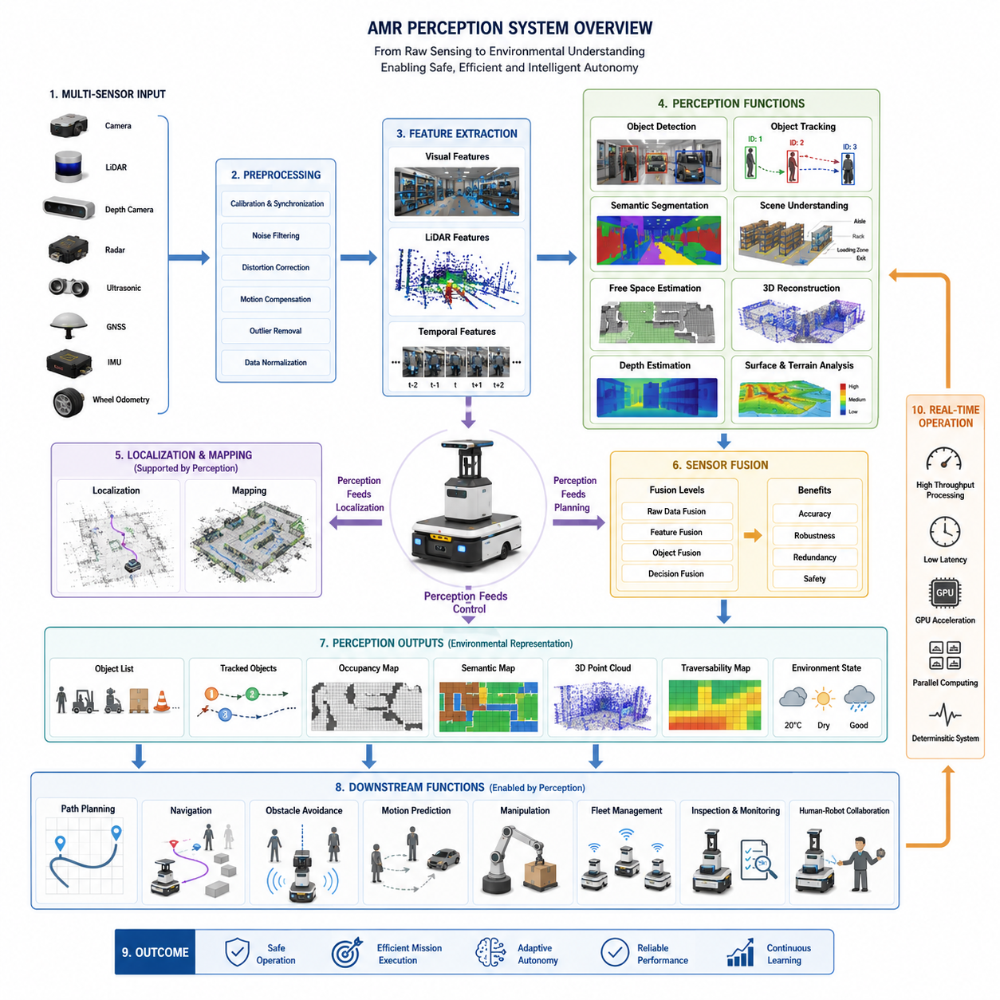
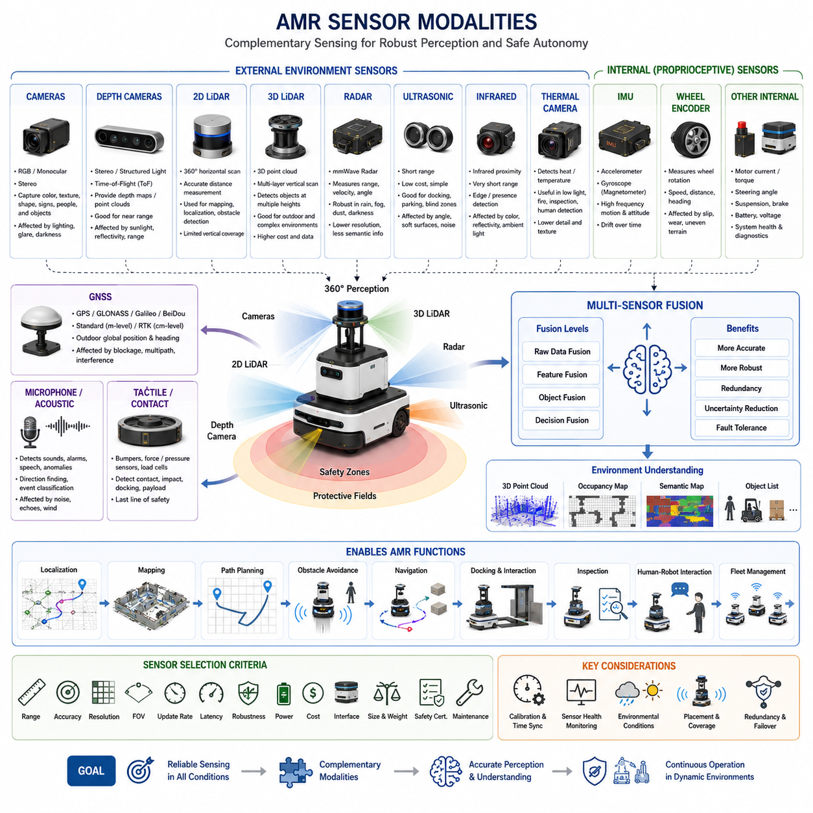
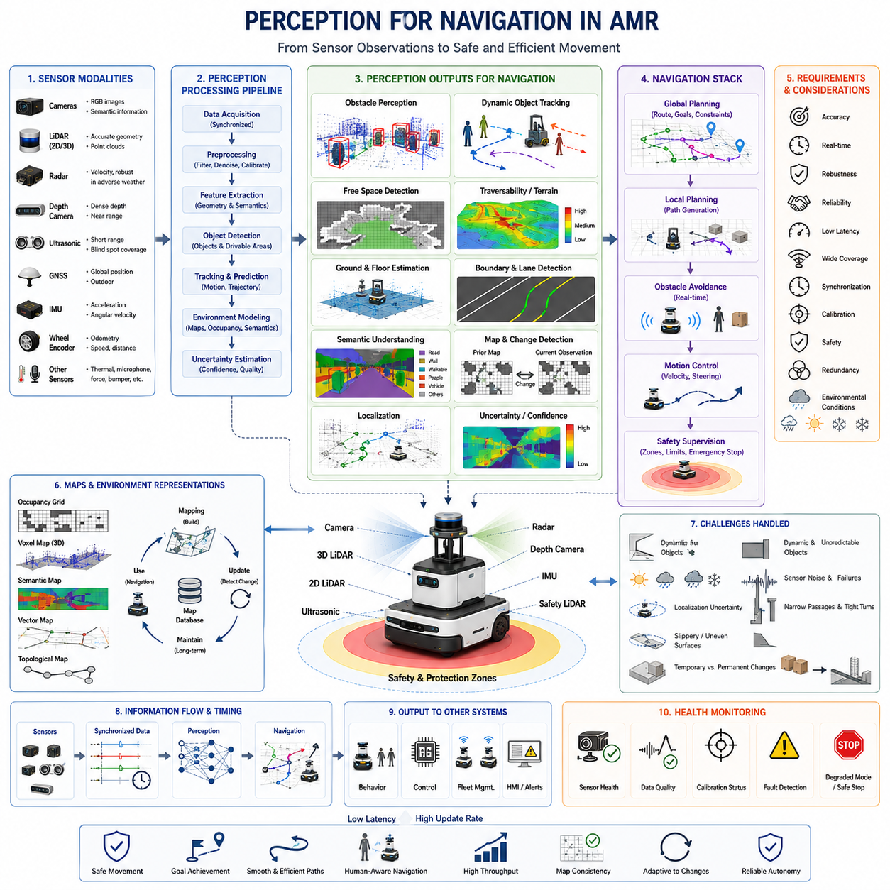
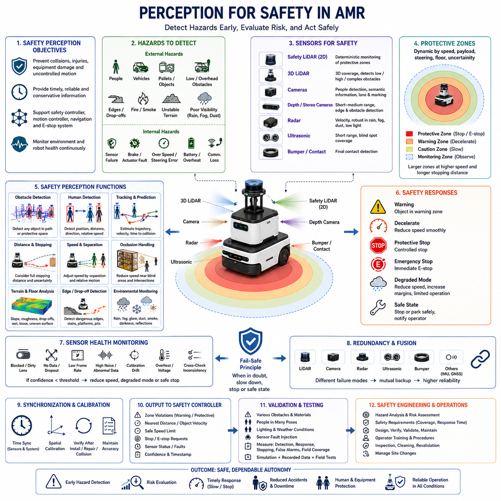
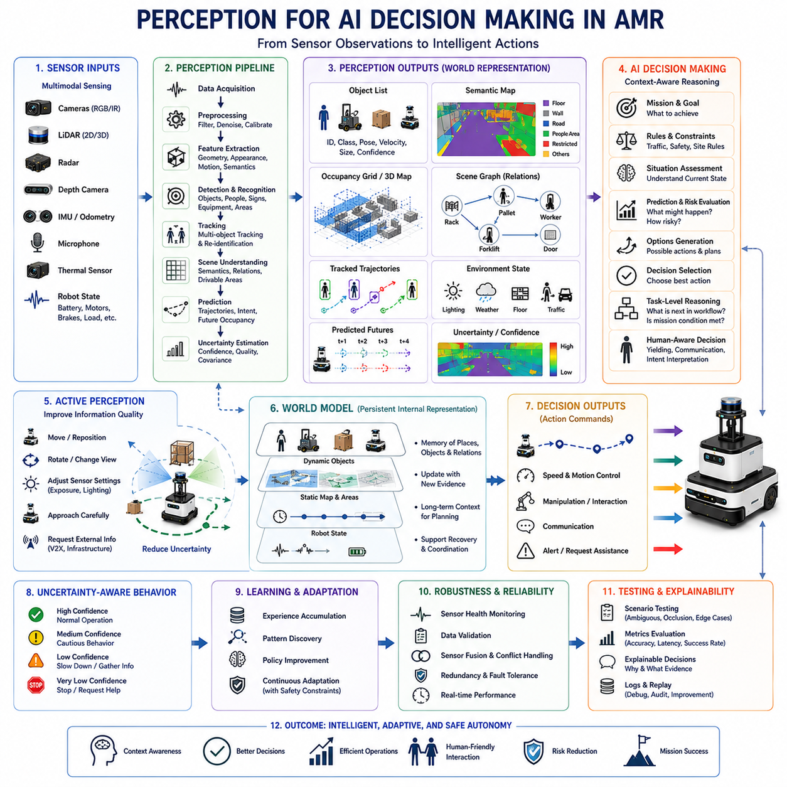
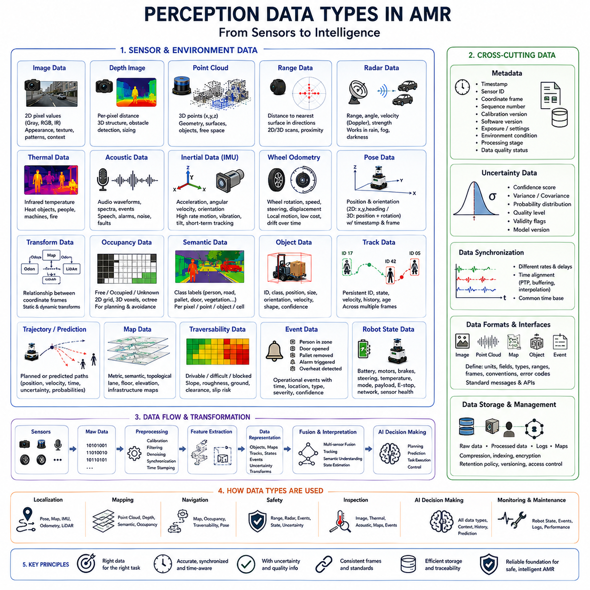
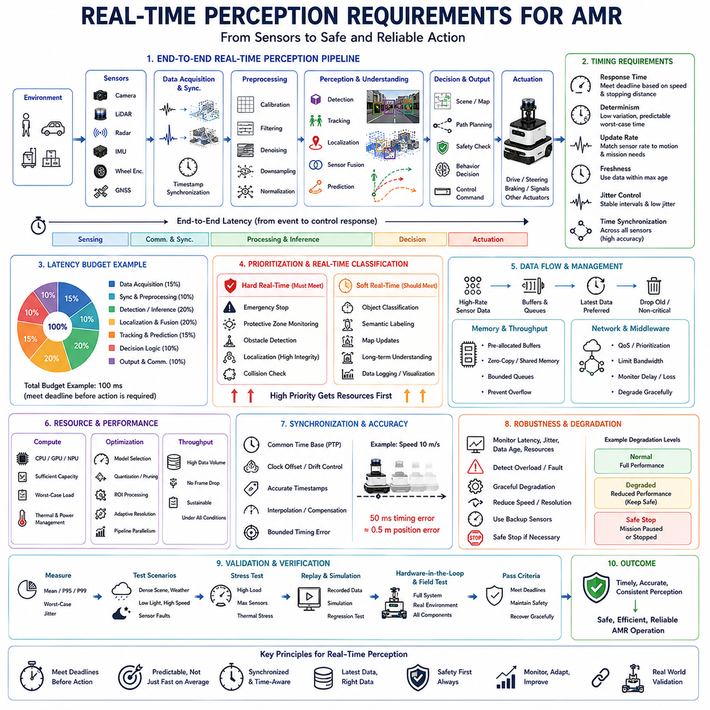
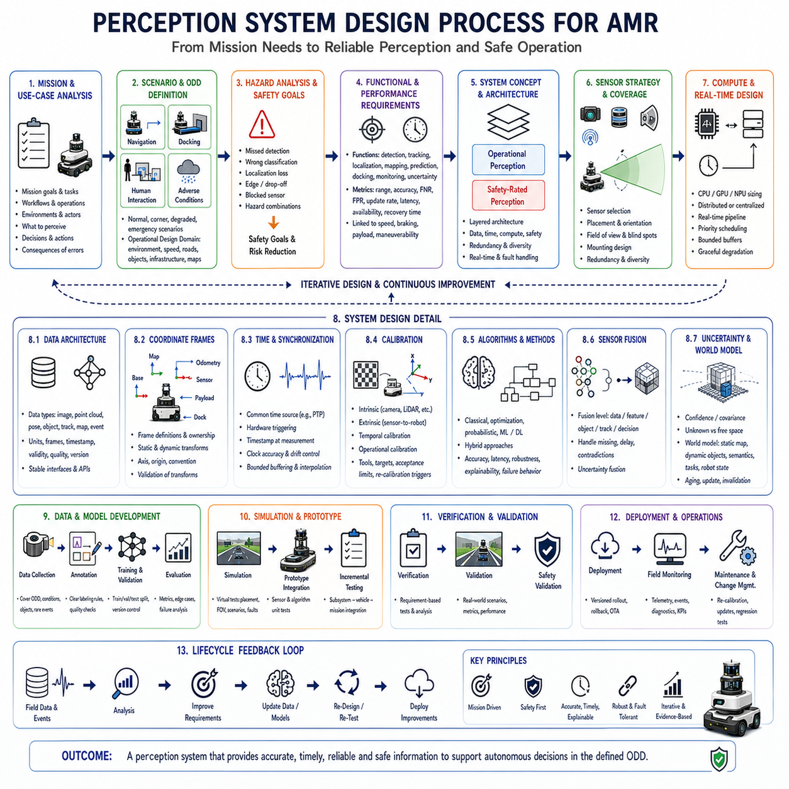

**Volume 03. AMR Sensors and Perception**

# Chapter 01. Robot Perception Overview

## 01.1 Perception Functions in AMR

{width="7.268055555555556in" height="7.268055555555556in"}

Perception is the collection of processes that allow an Autonomous Mobile Robot (AMR) to observe, interpret, and understand its surrounding environment before making decisions or executing physical actions. While sensors provide raw measurements such as images, distances, velocities, temperatures, or inertial data, perception transforms these heterogeneous signals into meaningful environmental knowledge that higher-level localization, planning, navigation, and control modules can utilize. In practical AMR systems, perception represents the first stage of the autonomous intelligence pipeline. Every subsequent function depends on the quality, reliability, and timeliness of the information generated by the perception system. An incorrect interpretation of the environment may propagate through the entire autonomy stack, resulting in navigation errors, unsafe behavior, mission failures, or equipment damage. Consequently, perception is not simply a sensing activity but an intelligent interpretation process that continuously converts physical observations into actionable digital representations of the world.

Unlike traditional industrial automation, where environments remain highly structured and predictable, modern AMRs increasingly operate in dynamic spaces containing moving workers, forklifts, vehicles, pallets, equipment, doors, elevators, changing lighting conditions, and temporary obstacles. The robot must therefore perceive not only static geometry but also continuously changing environmental states. This requires the perception system to identify objects, classify their semantic meaning, estimate their positions, monitor their movements, and predict their future behavior. A human worker walking across a warehouse aisle, for example, cannot simply be represented as an obstacle. The perception system must recognize the object as a person, estimate walking direction and velocity, evaluate collision probability, and provide sufficient information for the navigation system to select an appropriate avoidance strategy while maintaining operational efficiency.

One of the most fundamental perception functions is environmental sensing. Every AMR begins by collecting information through multiple sensors, each observing different physical properties of the surrounding world. LiDAR measures geometric distances, cameras capture visual appearance, depth sensors estimate three-dimensional structure, radar detects objects under adverse weather conditions, ultrasonic sensors provide close-range obstacle measurements, GNSS determines outdoor position, while IMUs measure acceleration and rotational motion. Each sensing modality has distinct strengths and weaknesses. Cameras provide rich semantic information but are sensitive to illumination. LiDAR offers accurate geometric measurements but cannot distinguish object categories without additional processing. Radar performs reliably in rain and fog but typically produces lower spatial resolution. Effective perception therefore begins with acquiring complementary information from multiple sensing sources.

Raw sensor measurements alone possess little practical meaning. A perception system must preprocess these measurements before meaningful interpretation becomes possible. Image preprocessing may include lens distortion correction, color normalization, exposure adjustment, noise reduction, and image rectification. LiDAR preprocessing often removes invalid returns, filters isolated points, compensates for motion distortion, and organizes point clouds into computationally efficient structures. Radar signals require Doppler processing and clutter suppression, while IMU measurements undergo bias estimation and filtering. Time synchronization ensures that observations from different sensors correspond to the same physical moment despite differing acquisition frequencies. These preprocessing stages significantly improve data quality while reducing computational complexity for downstream perception algorithms.

After preprocessing, perception begins extracting meaningful features from sensor data. Feature extraction identifies informative structures that remain stable despite changes in viewpoint, illumination, scale, or environmental conditions. Visual features may include corners, edges, textures, keypoints, or learned deep neural representations. LiDAR features include planes, sharp edges, corners, and geometric discontinuities. Temporal features capture object motion and trajectory evolution over time. Feature extraction serves as the foundation for many higher-level tasks including localization, mapping, object recognition, and scene understanding. Modern deep learning approaches increasingly replace manually engineered features with automatically learned representations, allowing perception systems to adapt to increasingly diverse operating environments while improving robustness across multiple application domains.

Object detection represents another central perception function. Rather than merely observing pixels or point clouds, the perception system identifies meaningful entities within the environment. Industrial AMRs may detect workers, forklifts, pallets, mobile robots, conveyor systems, machinery, safety fences, loading docks, traffic cones, storage racks, and unexpected obstacles. Modern object detectors estimate not only object categories but also their spatial locations through bounding boxes, segmentation masks, or three-dimensional volumetric representations. Reliable object detection enables safe navigation, autonomous material handling, inventory management, collaborative robotics, and intelligent human-robot interaction. Detection performance must remain stable across varying lighting conditions, occlusions, object orientations, seasonal changes, and sensor noise encountered during long-term deployment.

Detection alone is insufficient because objects continuously move through the robot\'s environment. Object tracking extends perception by maintaining consistent identities for detected objects over time. Instead of repeatedly detecting independent observations, tracking algorithms associate new measurements with previously observed objects, estimate trajectories, predict future positions, and manage temporary occlusions. Multi-object tracking becomes particularly important in warehouses, factories, hospitals, airports, and logistics centers where numerous moving agents coexist simultaneously. By maintaining persistent object identities, tracking enables smooth motion prediction, behavioral analysis, collision risk estimation, and long-term environmental understanding. Stable tracking also reduces perception instability that may otherwise cause unnecessary braking or erratic navigation decisions.

Scene understanding elevates perception beyond individual object recognition toward holistic environmental interpretation. The robot must understand how various objects relate spatially and functionally within a larger operational context. A hallway differs from a warehouse aisle, a pedestrian crossing differs from a loading zone, and an emergency exit differs from a storage area. Semantic segmentation assigns meaningful labels to every region of the observed scene, distinguishing floors, walls, roads, vegetation, machinery, shelves, vehicles, people, and navigable surfaces. This semantic information allows the navigation system to reason about appropriate behaviors rather than simply avoiding obstacles. Rich scene understanding supports context-aware navigation, adaptive speed control, mission planning, and intelligent decision-making under complex operational scenarios.

Free-space estimation constitutes another essential perception capability because autonomous navigation fundamentally depends upon identifying traversable regions. Rather than focusing exclusively on obstacles, perception continuously determines where the robot can safely travel. Free-space detection combines geometric information from LiDAR, depth cameras, stereo vision, radar, and semantic segmentation to estimate drivable surfaces while excluding occupied regions. The resulting occupancy maps or traversability maps become direct inputs for local path planning and obstacle avoidance algorithms. Outdoor AMRs further evaluate terrain roughness, slope, loose gravel, mud, grass, snow, or water accumulation to determine whether particular surfaces remain safely traversable under current environmental conditions.

Depth estimation and three-dimensional reconstruction enable AMRs to understand spatial structure rather than merely interpreting two-dimensional sensor observations. Three-dimensional perception estimates object dimensions, relative positions, surface geometry, and environmental topology. Point clouds generated by LiDAR or stereo vision provide volumetric representations suitable for obstacle detection, manipulation, mapping, and navigation. Advanced systems construct voxel maps, occupancy grids, mesh models, or neural scene representations that preserve structural information while supporting efficient planning. Three-dimensional perception becomes increasingly important for outdoor robots operating on uneven terrain, construction sites, ports, agricultural fields, and industrial facilities where elevation changes significantly influence vehicle stability and mobility.

Perception also supports localization by identifying environmental landmarks that enable the robot to estimate its own position within the world. Visual landmarks, LiDAR features, reflective markers, natural structures, GNSS observations, inertial measurements, and wheel odometry collectively contribute to estimating vehicle pose. Although localization algorithms perform state estimation, their accuracy depends heavily upon reliable perception outputs. Poor feature extraction, incorrect object associations, or degraded sensor quality directly reduce localization precision. Consequently, perception and localization operate as tightly coupled subsystems rather than isolated software components. Continuous interaction between perception, mapping, and localization allows AMRs to maintain robust positioning even under partial sensor degradation or dynamically changing environmental conditions.

Modern perception increasingly relies on multi-sensor fusion because no individual sensing modality performs optimally under every operational condition. Cameras struggle in darkness, LiDAR performance decreases under heavy precipitation, radar produces sparse object representations, and GNSS becomes unreliable near tall buildings or indoors. Sensor fusion combines complementary information from multiple sensing sources to compensate for individual weaknesses while improving robustness, accuracy, redundancy, and safety. Fusion may occur at raw data, feature, object, or decision levels depending on computational constraints and system architecture. Properly designed fusion frameworks significantly enhance environmental understanding, especially in safety-critical applications where single-sensor failures cannot be tolerated.

Real-time operation represents one of the defining requirements of AMR perception. Industrial robots frequently travel while continuously observing their surroundings, requiring perception pipelines to process large volumes of sensor data within strict timing constraints. Latency directly influences stopping distance, collision avoidance capability, and overall navigation stability. High-resolution cameras, multi-channel LiDAR systems, radar arrays, and AI inference engines collectively generate substantial computational workloads. Therefore, perception systems require efficient software architectures, GPU acceleration, optimized neural networks, parallel processing, and deterministic scheduling to satisfy real-time performance requirements. Balancing perception accuracy against computational efficiency remains one of the central engineering challenges in modern autonomous robotics.

Ultimately, perception serves as the robot\'s cognitive gateway to the physical world. Every autonomous capability, including localization, mapping, planning, navigation, manipulation, fleet coordination, inspection, and human-robot collaboration, begins with accurate environmental understanding. As artificial intelligence continues to evolve, perception is transitioning from isolated object recognition toward comprehensive scene reasoning, multimodal world modeling, and predictive environmental intelligence. Future AMRs will increasingly interpret intentions, anticipate environmental changes, understand semantic relationships, and build continuously evolving internal representations of the world. Rather than functioning merely as sophisticated sensing systems, next-generation perception architectures will become foundational components of embodied intelligence, enabling autonomous robots to operate safely, efficiently, and intelligently across increasingly diverse industrial and public environments.

## 01.2 Sensor Modalities

{width="7.268055555555556in" height="7.268055555555556in"}

Sensor modalities are the distinct physical mechanisms through which an Autonomous Mobile Robot (AMR) observes itself and the surrounding environment. Each modality measures a different property of the physical world, such as light, distance, motion, temperature, sound, electromagnetic reflection, or satellite position. Because no single sensor can provide complete and reliable awareness under all conditions, AMR perception systems combine multiple modalities to obtain complementary information. The selection of these sensing technologies directly influences navigation accuracy, obstacle detection, safety performance, environmental robustness, computational demand, and total system cost.

A camera is one of the richest sensor modalities because it captures detailed visual information similar to human vision. RGB cameras record color, texture, edges, shapes, markings, signs, people, vehicles, and object appearance. These characteristics make cameras especially valuable for object detection, semantic segmentation, barcode recognition, visual inspection, and human-robot interaction. However, visual sensing depends strongly on illumination, exposure, lens condition, and image quality. Shadows, glare, darkness, motion blur, backlighting, contamination, and weather can significantly reduce camera performance, requiring careful placement, calibration, preprocessing, and often additional lighting equipment.

Monocular cameras use a single optical viewpoint and are relatively compact, inexpensive, and easy to integrate. They can support object recognition, visual localization, lane or floor marking detection, and semantic understanding. Their primary limitation is the absence of direct geometric depth measurement. Although depth can be estimated from motion, object scale, perspective, or artificial intelligence models, these estimates may be less reliable than measurements produced by dedicated range sensors. Monocular vision is therefore often combined with LiDAR, radar, or odometry when accurate distance estimation is required for safety-critical navigation and close interaction with objects.

Stereo cameras use two spatially separated lenses to estimate depth through disparity, which is the horizontal difference between corresponding image features. By comparing these paired images, the perception system can reconstruct three-dimensional scene geometry and produce depth maps or point clouds. Stereo sensing is useful for obstacle detection, terrain analysis, manipulation, docking, and near-field navigation. Its performance depends on baseline distance, lens calibration, image texture, lighting, and computational resources. Low-texture surfaces, repetitive patterns, glare, darkness, and long-range scenes may reduce disparity accuracy and create uncertain depth estimates.

Depth cameras directly generate distance information using stereo vision, structured light, or time-of-flight technology. Structured-light cameras project a known infrared pattern and measure its deformation, while time-of-flight cameras calculate distance from the travel time or phase shift of emitted light. These sensors provide dense depth maps that are useful for detecting nearby obstacles, identifying edges, estimating object dimensions, and supporting robotic manipulation. Their compact size makes them attractive for indoor AMRs. However, sunlight, reflective materials, transparent objects, multipath effects, limited range, and interference between multiple devices can reduce performance in industrial or outdoor environments.

Two-dimensional LiDAR is widely used in indoor AMRs because it provides accurate range measurements across a horizontal scanning plane. The sensor emits laser pulses and calculates the distance to surrounding surfaces based on return timing or phase. The resulting scan represents walls, racks, machines, pallets, legs, and other obstacles around the robot. Two-dimensional LiDAR supports localization, mapping, obstacle detection, and protective field monitoring with relatively low computational complexity. Its limitations arise when obstacles exist above or below the scan plane, such as hanging structures, table surfaces, low steps, forks, cables, or elevated machine parts.

Safety LiDAR is a specialized form of laser scanning designed for functional safety applications. It monitors predefined protective and warning zones around the robot and can trigger speed reduction or emergency stopping when an object enters a restricted area. Unlike general-purpose perception sensors, safety-rated LiDAR must satisfy strict diagnostic, reliability, fault-detection, and response-time requirements. It often operates independently from AI-based perception to provide a deterministic safety layer. Although highly effective, a single horizontal safety scanner may still miss unusual obstacle geometries, so practical systems frequently use additional scanners, bumpers, ultrasonic sensors, cameras, or three-dimensional sensing.

Three-dimensional LiDAR measures the environment across multiple vertical angles and produces a volumetric point cloud. This enables the AMR to detect objects at different heights, estimate terrain shape, recognize overhanging structures, analyze slopes, and construct detailed three-dimensional maps. Three-dimensional LiDAR is particularly valuable for outdoor robots, heavy AMRs, construction platforms, autonomous vehicles, and inspection systems operating in complex spaces. Performance depends on channel count, angular resolution, scan rate, reflectivity, range, and weather resistance. High data volume, cost, calibration complexity, and sensitivity to rain, fog, dust, and highly reflective surfaces remain important engineering considerations.

Radar senses objects by transmitting radio waves and analyzing reflected energy. Millimeter-wave radar can estimate range, relative velocity, and sometimes angle, making it especially useful for detecting moving vehicles, workers, machinery, and large obstacles. Unlike optical sensors, radar is comparatively robust in rain, fog, dust, smoke, darkness, and direct sunlight. Doppler information allows it to distinguish moving targets and estimate closing speed directly. Its limitations include lower spatial resolution, multipath reflection, ghost targets, difficulty separating closely spaced objects, and limited semantic information. For this reason, radar is commonly fused with cameras or LiDAR.

Ultrasonic sensors measure short-range distance using reflected sound waves. They are inexpensive, compact, and effective for detecting nearby objects during low-speed movement, docking, parking, wall following, and blind-zone monitoring. Ultrasonic sensing works well for broad solid surfaces but may struggle with soft materials, angled surfaces, narrow objects, airflow, environmental noise, or interference between neighboring sensors. The beam is relatively wide, so precise object shape and lateral position are difficult to determine. Nevertheless, ultrasonic sensors provide useful redundancy and close-range coverage in areas where cameras or LiDAR may have geometric blind spots.

Infrared proximity sensors detect nearby objects using reflected infrared light. They are often used for very short-range presence detection, edge sensing, docking alignment, and simple contact prevention. These devices are small and inexpensive, but their response varies with object color, reflectivity, surface angle, ambient light, and contamination. They are not normally used as the primary navigation sensor for advanced AMRs, yet they can support localized functions requiring fast and simple detection. Infrared sensing is especially useful where compact packaging and low power consumption are more important than precise geometric measurement.

Thermal cameras measure infrared radiation emitted by objects and convert temperature differences into images. They can detect people, heat sources, fires, overheated components, electrical faults, and machinery operating under low-light or visually obscured conditions. Thermal sensing is valuable for security patrol, industrial inspection, fire prevention, nighttime operation, and human detection. Unlike RGB cameras, thermal cameras do not depend on visible illumination. However, thermal images typically contain less texture and detail, while glass, reflective surfaces, weather, insulation, and ambient temperature can affect interpretation. Accurate temperature measurement also requires calibration and emissivity consideration.

GNSS provides outdoor position by receiving signals from navigation satellites. Standard GNSS may provide meter-level accuracy, while Real-Time Kinematic positioning can achieve centimeter-level accuracy under suitable conditions with correction data. GNSS is essential for outdoor AMRs operating in open yards, farms, ports, roads, airports, and large industrial sites. Dual-antenna systems can also estimate vehicle heading while stationary. However, buildings, trees, tunnels, indoor spaces, electromagnetic interference, signal blockage, and multipath reflection can significantly degrade accuracy. GNSS is therefore normally integrated with IMU, wheel odometry, LiDAR localization, or visual localization.

An Inertial Measurement Unit measures linear acceleration and angular velocity, and may also include a magnetometer. It provides high-frequency information about robot motion, orientation change, vibration, and dynamic behavior. IMU data supports stabilization, dead reckoning, localization, terrain analysis, rollover monitoring, and motion compensation for cameras or LiDAR. Because inertial measurements are available even when external references are unavailable, IMUs are particularly important during temporary sensor loss. Their main limitation is accumulated drift caused by noise, bias, temperature variation, scale error, and integration over time. Regular calibration and fusion with external observations are therefore necessary.

Wheel encoders measure wheel rotation and generate wheel odometry, which estimates traveled distance, speed, and heading change. This modality is inexpensive, responsive, and directly related to the robot's motion commands. It supports velocity control, localization prediction, path tracking, and low-level diagnostics. However, wheel odometry assumes a relationship between wheel rotation and ground movement. Slippage, uneven terrain, tire deformation, wheel wear, payload variation, collision, and incorrect wheel diameter can produce significant errors. On omnidirectional or skid-steer platforms, odometry accuracy may be further reduced by lateral slip and complex contact behavior.

Motor current, torque, steering angle, suspension position, brake state, and battery measurements can also function as proprioceptive sensing modalities. These sensors do not directly observe the external environment but provide information about the robot's internal physical state. They help detect wheel blockage, excessive load, actuator failure, unexpected resistance, unstable terrain, reduced traction, overheating, or energy limitations. Internal sensing is essential for health monitoring, predictive maintenance, safe control, and fault diagnosis. A robot that perceives the environment accurately but does not understand its own mechanical condition cannot operate reliably or safely.

Microphones and acoustic sensors provide information from sound. They can detect alarms, sirens, abnormal machinery noise, human speech, impact events, bearing faults, leaks, or environmental hazards. Microphone arrays can estimate the direction of a sound source, while machine-learning models can classify acoustic events. Acoustic perception is useful for patrol robots, inspection systems, human interaction, and predictive maintenance. Its effectiveness is affected by background noise, echoes, wind, vibration, machinery, and privacy requirements. Sound sensing is usually treated as a complementary modality rather than a primary navigation source.

Tactile and contact sensors detect physical interaction with the environment. Bumpers, force sensors, pressure switches, load cells, and torque sensors can confirm contact, measure impact, detect payload transfer, or verify docking. Although contact sensing cannot replace non-contact obstacle detection, it provides a final layer of protection when other sensors fail or when deliberate contact is required. Mechanical bumpers are common on industrial AMRs because they offer simple and dependable collision detection. Force and torque sensing becomes more important when mobile platforms interact with manipulators, carts, couplers, doors, or inspection equipment.

Sensor selection must be based on operational requirements rather than technological preference. Indoor warehouse robots may depend heavily on 2D LiDAR, depth cameras, wheel odometry, and safety scanners, while outdoor AMRs may require 3D LiDAR, radar, GNSS, IMU, cameras, and weather-resistant protection. Inspection robots may add thermal, acoustic, gas, vibration, or high-resolution imaging sensors. Heavy vehicles may require redundant sensing, long detection ranges, and stronger environmental protection. Cost, field of view, measurement range, resolution, update rate, latency, power consumption, interface, mounting position, safety certification, and maintenance must all be considered together.

The true value of sensor modalities appears when their outputs are combined through multi-sensor fusion. Cameras contribute semantic detail, LiDAR contributes geometry, radar contributes velocity and weather robustness, GNSS contributes global position, IMU contributes rapid motion estimation, and wheel encoders contribute local movement information. Fusion allows the system to reduce uncertainty, detect sensor disagreement, maintain operation during temporary degradation, and produce a more complete environmental model. The fusion architecture may combine raw data, extracted features, detected objects, or final decisions depending on timing, bandwidth, calibration, and computational constraints.

Effective use of multiple modalities requires accurate calibration and synchronization. Intrinsic calibration defines the internal properties of each sensor, while extrinsic calibration determines the position and orientation between sensors and the robot frame. Time synchronization ensures that measurements correspond to the same moment, which is essential when the robot or surrounding objects are moving. Even a small timing or alignment error can cause duplicated objects, inaccurate fusion, incorrect depth, unstable localization, or false obstacle detection. Calibration must therefore be verified after installation, maintenance, mechanical impact, sensor replacement, or structural deformation.

In modern AMRs, sensing is not a collection of independent devices but an integrated information architecture. Each modality contributes a partial view of reality, and the perception system must evaluate data quality, uncertainty, availability, and relevance in real time. Robust systems monitor sensor health, detect blockage or contamination, recognize degraded conditions, and adapt processing or vehicle behavior accordingly. Future AMRs will increasingly combine conventional sensors with event cameras, solid-state LiDAR, imaging radar, neuromorphic devices, environmental sensors, and learned multimodal models. The objective is not simply to install more sensors, but to create a balanced sensing system that delivers reliable, timely, and meaningful information for safe autonomous operation.

## 01.3 Perception for Navigation

{width="7.268055555555556in" height="7.268055555555556in"}

Perception for navigation is the process through which an Autonomous Mobile Robot (AMR) converts sensor observations into spatial and semantic information that supports safe movement from a current position to a desired destination. Navigation requires more than knowing that objects exist nearby. The robot must understand where free space is located, which surfaces are traversable, how obstacles are moving, where boundaries and passages are positioned, and how environmental conditions affect motion. Perception therefore acts as the continuous information bridge between the physical environment and the localization, planning, behavior, and control modules that determine how the robot moves.

A navigation system normally operates through several connected layers, including global route planning, local path planning, obstacle avoidance, motion control, and safety supervision. Each layer depends on perception at a different spatial and temporal scale. Global planning requires maps, road structures, corridors, restricted zones, and destination information, while local planning requires current obstacle positions, free-space boundaries, surface conditions, and short-term motion predictions. Safety supervision requires fast and reliable detection of hazards inside predefined protection zones. A successful perception architecture must therefore provide multiple environmental representations rather than a single generic sensor output.

One of the most important perception functions for navigation is obstacle detection. The AMR must identify any object or structure that could interfere with its intended movement, including walls, racks, pallets, people, forklifts, cables, posts, curbs, doors, vehicles, construction materials, and temporary equipment. Obstacle detection may be based on range measurements, point clouds, depth images, radar targets, semantic segmentation, or combinations of these sources. The resulting obstacle information must include sufficient position, size, shape, and confidence data so that the local planner can generate a path with appropriate clearance.

Static obstacle perception focuses on environmental elements whose positions remain relatively stable over time. These may include walls, columns, shelves, machines, fences, loading docks, and fixed infrastructure. Static objects are often represented in occupancy grids, vector maps, voxel maps, or three-dimensional point-cloud maps. Although they may already appear in a prior map, real-time perception must continue verifying them because the environment can change after mapping. A storage rack may be moved, a door may be closed, or temporary barriers may block a familiar route. Navigation must therefore compare stored knowledge with current observations.

Dynamic obstacle perception addresses people, vehicles, mobile robots, forklifts, carts, and other moving agents. Detecting their current positions is only the first step. The perception system must also estimate velocity, direction, acceleration, trajectory, and uncertainty. This information allows the planner to predict where an object may be when the robot reaches a particular point. Without temporal perception, an AMR may repeatedly stop whenever a moving object appears, even when the object is moving safely away. Accurate tracking and motion prediction enable smoother, more efficient, and socially appropriate navigation behavior.

Free-space detection is equally important because navigation depends not only on recognizing obstacles but also on identifying where the robot can safely travel. The perception system estimates unoccupied regions using LiDAR, cameras, depth sensors, radar, and geometric models. These observations may be converted into local occupancy grids, cost maps, drivable-area masks, or traversability maps. Free space is not simply the absence of visible objects. It must account for robot width, turning radius, payload dimensions, braking distance, localization uncertainty, and required safety margins. A passage that appears visually open may still be too narrow or unstable for the robot.

Ground and floor perception provides the reference surface on which navigation decisions are based. Indoor AMRs generally operate on level floors, but they still need to identify ramps, thresholds, floor edges, drainage channels, reflective surfaces, and small elevation changes. Outdoor robots must interpret roads, gravel, grass, mud, sand, snow, water, and uneven ground. Ground-plane estimation separates traversable surfaces from vertical obstacles, while terrain classification estimates whether the robot can cross a particular region. The system may additionally calculate slope, roughness, step height, wheel clearance, and expected traction to prevent instability or mechanical damage.

Boundary perception helps the AMR remain within valid operating regions. Depending on the application, boundaries may include walls, curbs, road edges, lane markings, shelf lines, fences, platform edges, pedestrian areas, or virtual geofences. Cameras can detect visual markings and semantic boundaries, while LiDAR can identify geometric discontinuities and physical edges. GNSS and digital maps can define large outdoor operating zones. Combining physical and virtual boundaries allows the navigation system to remain compliant with site rules even when no solid obstacle is present, such as in one-way lanes, restricted areas, or human-only zones.

Perception also supports localization, which determines the robot's position and orientation relative to a map or global reference frame. LiDAR scans can be matched with geometric maps, cameras can recognize visual landmarks, GNSS can provide global outdoor coordinates, and IMU and wheel odometry can estimate short-term motion. Navigation quality is directly limited by localization quality because the planner assumes that perceived objects and planned paths are correctly aligned with the robot's estimated pose. Perception must therefore produce stable landmarks, reject unreliable features, and provide uncertainty information to the localization system.

Mapping and perception are closely connected in navigation. During initial deployment, perception collects environmental geometry and semantics to create maps. During operation, the same sensing system updates local maps and detects differences from the stored environment. Long-term navigation requires the robot to distinguish temporary changes from permanent structural changes. A pallet in an aisle may be temporary, while a newly installed wall may require a map update. Dynamic map management prevents the navigation system from repeatedly planning through blocked regions while avoiding unnecessary corruption of the stable reference map.

Semantic perception improves navigation by assigning meaning to objects, surfaces, and regions. Geometric perception may show that an area is open, but semantic understanding may identify it as a pedestrian crossing, charging station, emergency exit, machine workspace, loading zone, or restricted corridor. These labels influence route selection, speed, priority, and stopping behavior. A robot may reduce speed near workers, avoid entering a forklift lane during active periods, or approach a docking station with a specialized alignment procedure. Semantic information therefore enables context-aware navigation rather than purely geometric motion.

Human perception is especially important in shared environments. A worker should not be treated in exactly the same way as a pallet or wall because people move unpredictably, require larger safety margins, and expect understandable robot behavior. The perception system may detect body position, walking direction, gesture, gaze, protective equipment, and proximity to hazardous areas. Even when advanced behavior recognition is not available, reliable human detection and tracking allow the navigation system to slow down early, maintain comfortable passing distances, and avoid sudden movements that could surprise or endanger nearby workers.

Sensor fusion improves navigation perception by combining complementary information. LiDAR provides accurate geometry, cameras provide semantic detail, radar measures relative velocity and performs well in adverse weather, ultrasonic sensors cover short-range blind zones, GNSS provides global position, and IMU supports rapid motion estimation. A fused system can continue operating when one modality becomes degraded and can cross-check inconsistent observations. For example, radar may confirm a moving object in fog when a camera image is unclear, while LiDAR may refine its shape and exact position. Fusion reduces uncertainty and improves continuity.

Time synchronization is essential because navigation perception involves moving sensors, moving objects, and rapidly changing scenes. If camera, LiDAR, radar, IMU, and odometry data are captured or processed at different times without correction, the same object may appear in inconsistent locations. This can distort obstacle shapes, reduce tracking accuracy, and create unstable cost maps. Hardware triggers, Precision Time Protocol, synchronized clocks, accurate timestamps, and motion compensation are used to align observations. Low latency is equally important because even accurate perception becomes unsafe when information arrives too late for the planner and controller to react.

The perception output interface must be designed specifically for navigation requirements. Raw images and point clouds are rarely passed directly to the planner because they are too large and difficult to interpret in real time. Instead, the perception pipeline produces structured outputs such as obstacle lists, tracked-object states, occupancy grids, semantic maps, free-space polygons, terrain costs, predicted trajectories, and confidence values. These outputs must use consistent coordinate frames and timestamps. They must also communicate uncertainty so that the planner can behave conservatively when perception quality becomes degraded.

Navigation perception must handle occlusion and blind areas. Large vehicles, shelves, walls, corners, vegetation, and payloads may temporarily hide important objects. A person may emerge from behind a rack, or another robot may enter an intersection that is not directly visible. Multi-sensor placement, wide fields of view, map knowledge, tracking memory, and predictive models help manage these situations. The navigation system may slow down before blind corners, increase safety margins near occluded regions, or request additional sensing through controlled motion. Safe perception includes reasoning about what cannot currently be observed.

Indoor and outdoor navigation create different perception demands. Indoor environments often provide structured walls and floors but include narrow passages, repetitive geometry, reflective surfaces, and dense interaction with people and equipment. Outdoor environments involve larger operating ranges, variable terrain, sunlight, weather, vegetation, GNSS uncertainty, and higher travel speeds. A perception system designed only for an indoor warehouse may fail when exposed to rain, dust, slopes, or open areas. Sensor selection, mounting, algorithms, protective housings, and validation procedures must therefore reflect the actual operational domain.

Docking and precise approach behaviors require specialized perception beyond ordinary path following. The AMR may need to align with a charger, conveyor, cart, work cell, elevator, inspection station, or manipulation target. General localization may bring the robot near the target, but final alignment often depends on fiducial markers, reflectors, depth cameras, ultrasonic sensors, edge detection, or local geometric matching. Perception must estimate lateral offset, heading error, distance, target availability, and obstruction state. Precise docking perception also confirms that physical engagement has occurred correctly before power transfer or task execution begins.

Perception quality directly affects navigation smoothness and productivity. Noisy detections, unstable object identities, delayed updates, or fluctuating free-space boundaries can cause repeated braking, oscillating paths, unnecessary replanning, and reduced mission throughput. Filtering and tracking improve stability, but excessive filtering can delay reaction to real hazards. Engineers must balance responsiveness with temporal consistency. The navigation stack should also avoid reacting strongly to low-confidence transient observations while still preserving conservative behavior when safety is uncertain. Stable perception is therefore as important as high detection accuracy.

Robust navigation requires perception health monitoring. The system should detect blocked lenses, contaminated LiDAR windows, missing messages, abnormal timestamps, excessive noise, calibration drift, overheating, reduced frame rates, and inconsistent sensor outputs. When perception quality falls below an acceptable threshold, the robot may reduce speed, increase safety margins, switch to a degraded operating mode, stop safely, or request maintenance. Health information should be shared with the navigation and safety systems because a robot cannot continue using normal motion assumptions when its environmental awareness has become unreliable.

Testing perception for navigation must evaluate complete driving behavior rather than isolated sensor accuracy alone. Field validation should include static and moving obstacles, narrow passages, blind corners, changing lighting, reflective materials, low objects, overhanging structures, ramps, weather, sensor contamination, communication delays, and partial failures. Metrics may include detection range, false positives, missed obstacles, free-space accuracy, trajectory prediction error, latency, stopping distance, and mission completion rate. Repeated testing with recorded sensor data and simulation helps reproduce failures and compare software versions under controlled conditions.

Ultimately, perception for navigation creates the continuously updated environmental model that allows an AMR to move with purpose rather than merely react to nearby objects. It connects sensing with localization, mapping, planning, behavior, control, and safety through reliable representations of geometry, semantics, motion, and uncertainty. As AMRs become more capable, navigation perception will evolve toward predictive world models that anticipate interactions, understand operational context, and adapt to changing conditions. This development will enable safer, smoother, and more efficient autonomy across warehouses, factories, hospitals, ports, construction sites, roads, and public spaces.

## 01.4 Perception for Safety

{width="7.268055555555556in" height="7.268055555555556in"}

Perception for safety is the set of sensing, interpretation, validation, and response-support functions that allow an Autonomous Mobile Robot (AMR) to detect hazardous situations before they develop into collisions, injuries, equipment damage, or uncontrolled motion. Unlike general perception, which aims to build a rich understanding of the environment, safety-oriented perception focuses on identifying conditions that require immediate restriction of robot behavior. Its purpose is to provide timely, dependable, and sufficiently conservative information to the safety controller, motion controller, navigation stack, and emergency stopping system.

A safety perception system must continuously observe the space around the robot while also monitoring the robot's own operating condition. External hazards may include people, vehicles, pallets, walls, low obstacles, overhanging structures, stairs, open edges, smoke, fire, or unstable terrain. Internal hazards may include sensor failure, brake malfunction, excessive speed, steering error, battery faults, actuator overheating, or communication loss. Safe autonomy therefore depends on combining environmental perception with system health monitoring so that the robot can respond not only to visible danger but also to loss of sensing or control capability.

The most fundamental safety function is reliable obstacle detection. The AMR must recognize any object that enters its intended path or protective space, regardless of whether the object has been classified correctly. For safety purposes, the system does not always need to know whether an object is a person, box, vehicle, or machine part. It must first determine that a physical presence exists at a distance and position that may create risk. This conservative principle prevents semantic classification errors from becoming collision hazards and allows safety reactions to remain dependable even when AI confidence is low.

Protective zones are commonly defined around the robot to convert perception results into speed control and stopping actions. A warning zone may trigger early deceleration, while a smaller protective zone may command a controlled stop or emergency stop. These zones are not fixed in all situations. Their dimensions may change with robot speed, payload, steering angle, braking capability, floor condition, direction of travel, and localization uncertainty. A heavily loaded AMR traveling quickly requires a longer protective distance than an unloaded robot moving slowly in a clear aisle.

Safety-rated laser scanners are widely used because they provide deterministic monitoring of predefined zones. They continuously measure distances within a horizontal plane and report when an object crosses a configured boundary. Unlike general-purpose sensors, safety scanners are designed with internal diagnostics, fault detection, redundant processing, controlled response times, and certified interfaces. They can directly contribute to safety functions without depending on complex AI interpretation. However, a horizontal scan may miss low, high, hanging, or irregularly shaped obstacles, so additional sensing is often required to achieve complete spatial coverage.

Three-dimensional LiDAR, depth cameras, stereo cameras, radar, ultrasonic sensors, and bumpers can complement safety scanners by covering geometric blind areas. A low object may lie below the main scan plane, while a table edge or suspended load may exist above it. Forklift forks, cables, ramps, pallets, open drawers, and protruding machine components may create hazards that are difficult to detect with one sensor. Multi-height and multi-modal sensing increases the probability that unusual obstacles are detected before contact, although the safety role of each sensor must be clearly defined and validated.

Human detection requires special attention because people can move unpredictably and may enter the robot's path rapidly. Safety perception may use LiDAR geometry, camera-based pedestrian detection, thermal imaging, radar, or combinations of these methods. The system should estimate human position, distance, motion direction, and relative speed while preserving conservative behavior under partial occlusion. A person standing behind a pallet, emerging from a doorway, or bending near the floor may be difficult to detect. Safety performance must therefore be evaluated across diverse body postures, clothing, lighting conditions, and approach directions.

Tracking and motion prediction improve safety by estimating how detected objects are likely to move. A static snapshot may indicate that a person is outside the robot's path, but tracking may show that the person is walking toward an intersection. The perception system can estimate trajectory, velocity, time to collision, and uncertainty, allowing the robot to slow down before the hazard reaches the protective zone. Prediction should never replace basic obstacle detection, but it can extend reaction time and support smoother behavior by reducing unnecessary emergency stops when objects are moving safely away.

Safe perception must consider stopping distance rather than relying only on measured object distance. Stopping distance includes perception delay, communication delay, controller reaction time, brake engagement time, and physical deceleration distance. It changes with robot speed, payload, tire condition, floor friction, slope, and mechanical wear. The perception system and safety controller must therefore use a validated worst-case stopping model. If an obstacle is detected within a distance shorter than the required stopping distance, the robot may be physically unable to avoid contact even if the perception system is accurate.

Speed and separation monitoring allows an AMR to adjust motion according to the distance and relative movement of nearby people or machines. At large distances, normal speed may be permitted. As separation decreases, the robot progressively reduces speed, and at the minimum safe distance it stops. This graded response can improve productivity compared with frequent emergency stopping while still maintaining safety. Accurate distance measurement, low latency, reliable person detection, and conservative uncertainty handling are essential because an incorrect separation estimate could permit unsafe motion near workers.

Occlusion is a major challenge in safety perception. Walls, shelves, vehicles, payloads, machine structures, and other objects can hide hazards from direct view. A worker may step from behind a rack or a forklift may emerge from a blind intersection. The robot should not assume that unobserved space is safe. Map information, prior tracks, multi-sensor placement, infrastructure sensors, and speed reduction near blind areas can reduce risk. Safe behavior often requires the robot to slow down before entering zones where visibility is limited, even when no obstacle has yet been detected.

Floor and terrain perception also contribute directly to safety. Indoor hazards include steps, holes, ramps, wet floors, floor edges, drainage gaps, cables, and reflective surfaces. Outdoor hazards include steep slopes, loose gravel, mud, snow, water, soft ground, and unstable terrain. Perception must estimate ground geometry, slope, roughness, drop-offs, and traversability. A region without an obstacle may still be unsafe if the surface cannot support the robot or if the robot may lose traction, tip, become stuck, or exceed its mechanical stability limits.

Edge and drop-off detection is especially important for robots operating near stairs, platforms, loading docks, pits, or elevated surfaces. Downward-facing depth sensors, LiDAR, ultrasonic sensors, structured light, or mechanical edge detectors may be used to identify sudden loss of ground support. These sensors must account for dark materials, reflective floors, transparent surfaces, sunlight, dust, and irregular geometry. Because a missed drop-off can produce catastrophic consequences, the robot may require reduced speed and redundant sensing in areas where fall hazards are possible.

Environmental conditions can degrade safety perception in ways that are not immediately visible to the operator. Rain, fog, snow, dust, smoke, darkness, glare, direct sunlight, water droplets, mud, and condensation can reduce sensor range or create false measurements. A robust system should recognize when environmental conditions exceed its validated operating limits. The robot may lower speed, increase safety margins, activate cleaning or heating systems, switch to alternative sensors, request operator assistance, or stop. Continuing normal operation with degraded perception can create hidden and unacceptable risk.

Sensor health monitoring is therefore an essential part of safety perception. The system should detect blocked lenses, contaminated windows, missing data, frozen images, abnormal frame rates, excessive noise, timestamp errors, calibration drift, overheating, voltage problems, and inconsistent measurements between sensors. A sensor that continues transmitting data may still be functionally unreliable. Health monitoring must evaluate data quality as well as communication availability. When confidence falls below a validated threshold, the robot should transition to a safe state or an explicitly defined degraded operating mode.

Redundancy improves safety by reducing dependence on a single sensing channel. Different sensors should ideally fail in different ways, allowing one modality to compensate when another becomes unreliable. LiDAR may provide accurate geometry, cameras may recognize humans and markings, radar may remain useful in fog or dust, and bumpers may provide final contact detection. However, simply adding sensors does not automatically create true redundancy. Common power supplies, shared communication networks, identical mounting vulnerabilities, or common software errors can cause multiple sensors to fail together.

Calibration and time synchronization are safety-critical because spatial or temporal misalignment can move perceived objects away from their true positions. An incorrectly calibrated camera-LiDAR system may place a pedestrian outside the expected protective area. Unsynchronized measurements may show a moving forklift at different locations across sensor streams, weakening tracking and fusion. Calibration must be verified after installation, repair, collision, sensor replacement, structural deformation, or software changes. Time synchronization must remain stable under network load, clock drift, restarts, and communication faults.

Safety perception should be separated appropriately from non-safety AI functions. AI-based object detection and semantic understanding can enhance behavior, but their outputs may not satisfy the deterministic and diagnostic requirements of certified safety functions. A practical architecture often combines a safety-rated perception layer with a richer non-safety perception layer. The safety layer ensures minimum protective behavior, while the advanced layer supports smoother navigation, human-aware interaction, and contextual decisions. Clear boundaries prevent complex AI failures from disabling fundamental collision protection.

The output of safety perception must be simple, timely, and unambiguous. Typical outputs include protective zone violation, warning zone violation, nearest obstacle distance, object velocity, safe speed limit, stop request, emergency stop request, degraded sensing status, and sensor fault state. These signals must use defined coordinate frames, timestamps, confidence rules, and priority logic. Safety-related messages should not be delayed by heavy perception workloads, logging, visualization, or noncritical network traffic. The architecture must guarantee that urgent information reaches the controller within validated timing limits.

False negatives and false positives must be managed carefully. A false negative means that a real hazard is missed, which can directly cause a collision. A false positive means that the robot detects a hazard that does not exist, which may cause unnecessary stopping and reduced productivity. Safety systems prioritize avoidance of false negatives, but excessive false positives can make the robot unusable and encourage operators to bypass safeguards. Engineers must therefore improve sensing, filtering, placement, calibration, and validation while maintaining conservative behavior under uncertainty.

Safe interaction with other vehicles requires perception of speed, size, direction, and right-of-way conditions. Forklifts, carts, trucks, and other AMRs may approach more quickly than pedestrians and may have limited stopping capability. Radar, LiDAR, cameras, and cooperative communication can support vehicle detection and collision risk estimation. The robot may need to yield at intersections, avoid crossing active lanes, or maintain larger separation distances near heavy equipment. Safety perception should support both direct observation and infrastructure-based information without depending exclusively on either source.

Testing must evaluate safety perception under realistic and worst-case conditions. Validation should include different obstacle sizes, materials, colors, reflectivity, positions, approach angles, speeds, lighting levels, weather, floor types, payloads, and sensor faults. People should be represented in standing, walking, crouching, kneeling, and partially occluded postures. Tests should measure detection distance, response time, stopping distance, field coverage, fault reaction, false alarms, missed detections, and behavior during degraded operation. Repetition is necessary to demonstrate consistent performance rather than isolated success.

Simulation and recorded-data replay can support safety development but cannot replace physical testing. Simulation allows engineers to explore many scenarios, inject sensor faults, and evaluate rare events without exposing people or equipment to danger. Recorded sensor data helps reproduce failures and compare software versions. However, real sensors experience contamination, vibration, electromagnetic interference, temperature changes, mechanical movement, and unexpected environmental effects that may not be accurately modeled. Final validation must therefore include controlled physical tests and field trials within the intended operating environment.

Functional safety engineering provides the process framework for defining how perception contributes to risk reduction. Hazard analysis identifies dangerous events, estimates their severity and probability, and determines required safety functions. Safety requirements then specify detection coverage, response time, diagnostic behavior, fault handling, and safe-state transitions. Perception components must be developed, integrated, verified, and maintained according to these requirements. Safety is not achieved by installing a scanner or adding an emergency stop button; it results from a complete and traceable system design.

Operational procedures remain important even in highly automated systems. Sensor windows must be cleaned, protective zones must be verified, mounting brackets must be inspected, and software configuration must be controlled. Operators should understand warning indicators, degraded modes, emergency procedures, and conditions in which the robot must not be used. Site changes such as moved racks, new doors, different lighting, reflective materials, or altered traffic patterns can affect safety perception. Periodic inspection and revalidation ensure that the deployed system continues to match its original safety assumptions.

Ultimately, perception for safety gives an AMR the ability to recognize danger, evaluate uncertainty, and restrict its own behavior before harm occurs. It combines obstacle detection, human tracking, protective zones, terrain analysis, sensor diagnostics, redundancy, synchronization, stopping models, and fail-safe control into one coordinated safety architecture. As AMRs operate at higher speeds and in increasingly complex shared environments, safety perception will become more predictive, context-aware, and resilient. Even so, its central principle will remain unchanged: when reliable perception cannot be guaranteed, the robot must reduce risk by slowing down, stopping, or entering a safe state.

## 01.5 Perception for AI Decision Making

{width="7.268055555555556in" height="7.268055555555556in"}

Perception for AI decision making is the process through which an Autonomous Mobile Robot (AMR) transforms sensor observations into structured information that an artificial intelligence system can use to select actions, evaluate alternatives, and adapt behavior. Sensors alone produce measurements such as images, distances, velocities, temperatures, or inertial signals, but these values do not directly tell the robot what to do. Perception interprets them as objects, events, spatial relations, risks, opportunities, and environmental states. This interpreted representation becomes the evidence on which AI-based reasoning, planning, prediction, and task execution depend.

AI decision making requires more than simple obstacle detection because the robot must understand the operational meaning of what it observes. A pallet may represent an obstacle, a delivery target, or a payload awaiting pickup depending on the current mission. A person may be a moving hazard, an operator giving instructions, or a worker who has priority in a shared aisle. A closed door may indicate a blocked route, while the same door may also be an interactable object that can be opened through an access-control interface. Perception must therefore provide context-aware information that connects environmental observations with goals, rules, and task state.

The first requirement is a coherent representation of the current scene. The AI system needs to know which entities are present, where they are located, how they relate to one another, and how confident the perception system is in each estimate. Object lists, semantic maps, occupancy grids, scene graphs, three-dimensional point clouds, tracked trajectories, and environmental labels can all serve this purpose. A useful representation should summarize important information without overwhelming the decision system with unnecessary raw data. It must preserve enough geometry, semantics, motion, and uncertainty to support safe and intelligent action selection.

Object recognition provides the AI system with meaningful categories rather than anonymous sensor returns. Recognizing a forklift, worker, pallet, charging station, inspection target, emergency exit, or restricted machine allows the robot to apply different behavioral rules. The category may influence speed, path priority, required separation distance, task sequence, or communication strategy. However, classification should not be treated as perfectly reliable. AI decision making must consider confidence values, alternative hypotheses, and the possibility of unknown objects so that uncertain perception does not produce overconfident or unsafe behavior.

Semantic segmentation expands decision-relevant perception by assigning meaning to regions of the environment. The robot may distinguish floor, road, grass, water, wall, shelf, machine zone, pedestrian area, loading area, and restricted space. This allows the decision system to reason about where movement is legally, physically, or operationally appropriate. Two regions may both appear geometrically open, yet one may be designated for vehicles and the other for people. Semantic information therefore turns geometric navigation into policy-aware behavior and enables the AMR to comply with site rules, mission constraints, and social expectations.

Spatial relationships are essential because decisions often depend on how objects are arranged rather than on their individual identities. The robot may need to understand that a pallet is in front of a rack, a person is standing beside a machine, a vehicle is approaching an intersection, or an inspection target is partially blocked by equipment. Scene graphs and relational models can encode concepts such as near, behind, inside, connected, obstructed, reachable, or moving toward. These relations support higher-level reasoning that cannot be obtained from isolated detections and allow the AI system to interpret the operational structure of the scene.

Temporal perception enables the robot to reason about change. A single observation describes the present, but intelligent decisions often require understanding what has happened and what is likely to happen next. Tracking systems maintain object identities, estimate motion, and reveal whether a worker is approaching, a vehicle is accelerating, a door is opening, or a pallet has recently been moved. Temporal history helps distinguish persistent conditions from momentary noise. It also allows the AI system to anticipate events and select actions proactively rather than reacting only after a hazard or opportunity has fully developed.

Prediction is a major connection between perception and AI decision making. Based on observed trajectories, behavior patterns, scene context, and learned models, the robot can estimate possible future states of nearby objects and the environment. It may predict that a person will cross the aisle, another AMR will occupy a narrow passage, or a forklift will turn into an intersection. These forecasts are uncertain, so the decision system should evaluate multiple possible futures rather than relying on a single deterministic outcome. Predictive perception supports smoother motion, earlier risk reduction, and more efficient coordination.

Uncertainty must be explicitly represented because perception is never perfectly accurate. Sensor noise, occlusion, lighting, weather, reflective materials, calibration errors, and unfamiliar objects can all reduce confidence. The AI decision layer needs to know when information is reliable, ambiguous, incomplete, or contradictory. Confidence scores, probability distributions, covariance estimates, quality flags, and unknown-object labels allow the system to adjust behavior accordingly. When uncertainty is high, the robot may slow down, gather more observations, choose a safer route, request human assistance, or postpone a noncritical task.

Active perception allows the AI system to influence how the robot observes the environment. Instead of passively accepting current sensor data, the robot may move, rotate, change viewpoint, adjust camera exposure, activate lighting, or approach an object slowly to reduce uncertainty. For example, if a target is partially hidden, the robot can reposition itself before deciding whether to proceed. Active perception links sensing and action in a feedback loop where the robot selects movements that improve information quality. This is especially important for inspection, manipulation, docking, and operation in cluttered environments.

Perception also supports task-level decision making by identifying whether mission conditions have been satisfied. The robot may need to confirm that a loading area is clear, a cart is correctly attached, a product is present, an inspection station is accessible, or a charging connector is aligned. These observations determine whether the next mission step can begin. AI decision making therefore depends on perception not only for navigation but also for state verification and workflow progression. Incorrect confirmation can cause incomplete tasks, equipment damage, invalid inspection results, or unsafe interaction with machinery.

Human-aware decision making requires perception of people, behavior, and interaction cues. The robot may detect body position, movement direction, hand gestures, voice commands, gaze, protective equipment, or signs of distress. These observations can influence yielding behavior, speed, communication, and task priority. A worker signaling the robot to stop should be interpreted differently from a person simply standing nearby. However, human-intention estimation is uncertain and culturally dependent, so the system must avoid aggressive assumptions. Conservative interpretation and clear robot feedback are essential for trustworthy interaction.

Multimodal perception improves AI decision quality by combining geometry, appearance, motion, sound, temperature, and internal robot state. A camera may identify a person, LiDAR may provide precise distance, radar may measure closing velocity, a microphone may detect a warning alarm, and thermal sensing may reveal an overheated machine. Internal sensors may indicate reduced battery capacity, wheel slip, or actuator stress. By integrating these modalities, the AI system can make decisions based on a more complete picture of both the external environment and the robot's own ability to act.

The decision system must also distinguish between perception for operational intelligence and perception for certified safety. Advanced AI may infer that a person intends to cross the robot's path, but a safety-rated scanner may independently require immediate stopping when the person enters a protective zone. These two layers should cooperate without becoming confused. AI perception can improve efficiency, prediction, and context awareness, while deterministic safety functions enforce minimum protective behavior. Clear architectural separation prevents uncertain AI reasoning from overriding essential safety constraints.

Real-time performance is critical because delayed perception can make even correct decisions irrelevant. The AI system must receive updated information quickly enough to evaluate options before environmental conditions change. High-resolution cameras, point clouds, neural networks, tracking, prediction, and scene reasoning create heavy computational loads. Efficient data pipelines, GPU acceleration, parallel processing, message prioritization, and bounded latency are therefore necessary. The system should process urgent hazards faster than noncritical semantic details and maintain predictable timing under peak sensor and communication loads.

Perception outputs should be designed around the needs of AI reasoning rather than around individual sensor formats. A decision engine benefits from structured descriptions such as object identity, pose, velocity, intent probability, accessibility, risk level, task relevance, and confidence. Scene graphs, world models, belief states, and symbolic facts can provide a stable interface between perception and reasoning. This abstraction allows decision algorithms to remain independent of specific camera, LiDAR, or radar hardware and makes it easier to replace sensors or perception models without redesigning the entire autonomy stack.

Learning-based decision systems can use perception histories to improve behavior over time. Repeated observations may reveal traffic patterns, congestion periods, preferred human walking paths, typical loading delays, or environmental conditions that cause sensor degradation. The robot can adapt route selection, speed profiles, observation strategies, and task timing based on these patterns. However, online learning must be controlled carefully because incorrect adaptation could introduce unsafe behavior. Changes should be monitored, validated, and limited by operational rules, safety constraints, and rollback mechanisms.

A world model provides a more comprehensive foundation for AI decision making by maintaining an internal representation of objects, places, events, relationships, and possible future states. Unlike a short-lived sensor frame, the world model preserves information over time and updates it as new evidence arrives. It may record that a corridor is temporarily blocked, a worker was last seen near a doorway, or a machine is currently unavailable. This memory enables the robot to reason beyond immediate visibility and supports long-horizon planning, task coordination, and recovery from partial observation.

Decision making should remain robust when perception sources disagree. A camera may detect a person while LiDAR sees only a partial shape, or radar may report motion where the visual system detects no object. The system should compare sensor reliability, environmental conditions, calibration status, and historical consistency before resolving the conflict. In safety-relevant situations, conservative interpretation is normally appropriate. In noncritical situations, the robot may gather additional evidence. Explicit conflict handling prevents hidden assumptions from turning inconsistent data into unstable or unpredictable actions.

Testing perception for AI decision making must evaluate the complete relationship between observation and action. It is not enough to measure detection accuracy in isolation. Engineers should test whether perception outputs lead to correct route selection, safe yielding, task progression, recovery behavior, and human interaction. Scenarios should include ambiguous objects, occlusion, changing context, sensor disagreement, unusual human behavior, communication delays, and degraded environmental conditions. Metrics may include decision accuracy, intervention rate, task success, response latency, risk exposure, and consistency across repeated trials.

Explainability becomes important when AI decisions depend on complex perception models. Operators and engineers may need to understand why the robot stopped, changed route, refused a task, or requested assistance. The system should be able to report that a person was detected with low confidence near a blind corner, that a passage was classified as restricted, or that sensor disagreement exceeded a threshold. Such explanations improve debugging, operational trust, regulatory review, and incident analysis. They also help distinguish genuine perception failures from reasonable conservative behavior.

Ultimately, perception for AI decision making gives an AMR the evidence required to move from reactive automation toward context-aware autonomy. It transforms raw measurements into objects, relationships, predictions, uncertainties, and task-relevant world states that can support reasoning and action. As robot intelligence advances, perception will increasingly contribute to persistent world models, causal understanding, multimodal interpretation, active information gathering, and collaborative behavior. The quality of AI decisions will remain fundamentally limited by the quality, timeliness, and honesty of the perceptual information on which those decisions are based.

## 01.6 Perception Data Types

{width="7.268055555555556in" height="7.268055555555556in"}

Perception data types are the structured forms in which an Autonomous Mobile Robot(AMR) receives, represents, exchanges, and stores information about its surroundings and its own operating condition. Sensors generate different kinds of measurements, including images, distances, velocities, temperatures, sound waves, acceleration, and position estimates. These measurements vary greatly in dimensionality, timing, accuracy, density, and semantic meaning. A reliable perception architecture must preserve these differences while transforming the data into compatible representations that support localization, mapping, navigation, safety, inspection, and AI decision making.

Raw sensor data is the closest digital representation of what each physical sensor measures. A camera may produce arrays of pixel intensity or color values, while LiDAR produces distance and reflectivity measurements associated with scanning directions. Radar returns may include range, angle, radial velocity, and signal strength, and an Inertial Measurement Unit(IMU) generates acceleration and angular velocity samples. Raw data contains the greatest amount of original information, but it also includes noise, distortion, irrelevant details, and sensor-specific formatting. It therefore requires calibration, filtering, synchronization, and interpretation before higher-level modules can use it effectively.

Image data is one of the most information-rich perception data types. A conventional camera produces two-dimensional arrays in which each pixel represents brightness or color, commonly expressed in grayscale, RGB, infrared, or other spectral formats. Images contain appearance, texture, shape, markings, lighting, and contextual information that can support object recognition, semantic segmentation, visual localization, defect inspection, and human interaction. However, images do not directly provide reliable metric depth, and their quality is strongly affected by illumination, shadows, glare, motion blur, lens contamination, weather, and exposure settings.

Depth images associate each image pixel with an estimated distance from the sensor. They may be generated by stereo cameras, structured-light sensors, time-of-flight cameras, or projected from LiDAR measurements. A depth image combines the spatial organization of a camera frame with geometric distance information, making it useful for obstacle detection, object sizing, surface reconstruction, manipulation, and docking. Invalid pixels, reflective surfaces, transparent materials, sunlight interference, and limited sensing range can create missing or inaccurate values. The perception system must therefore distinguish valid depth observations from uncertain or unavailable measurements.

Point clouds represent three-dimensional space as collections of points with coordinates such as x, y, and z. Additional attributes may include intensity, color, timestamp, sensor channel, classification label, or confidence. LiDAR is a common point-cloud source, but stereo vision, depth cameras, and reconstruction algorithms can also generate point clouds. These data provide direct geometric information about objects, surfaces, ground structure, and free space. Point clouds can be sparse, irregular, and computationally expensive, so they are often filtered, downsampled, segmented, voxelized, or transformed into maps before being used for real-time decision making.

Range data expresses the measured distance between a sensor and the nearest detected surface along one or more sensing directions. A two-dimensional LiDAR scanner produces an ordered sequence of angular range values, while ultrasonic sensors and simple proximity devices may provide only one or several scalar distances. Range data is compact and highly useful for collision avoidance, wall following, docking, protective-zone monitoring, and local map construction. Its interpretation depends on sensor mounting, field of view, beam width, minimum range, maximum range, reflectivity, and environmental conditions that may generate missed detections or false echoes.

Radar data differs from many optical data types because it can directly provide relative velocity through Doppler measurement. Radar observations may include target range, azimuth, elevation, radial speed, signal amplitude, and detection confidence. This makes radar valuable for detecting approaching vehicles, moving people, and obstacles in rain, fog, dust, or darkness. Radar measurements usually have lower spatial resolution than camera or LiDAR data and may contain multipath reflections, ghost targets, or merged detections. Radar processing must therefore cluster returns, estimate tracks, and combine the results with other sensors to improve object interpretation.

Thermal data represents emitted infrared energy and is commonly stored as temperature-related image values. Thermal cameras can reveal people, animals, overheated machinery, electrical faults, fire sources, or warm objects under poor visible lighting. In industrial AMR applications, thermal data may support equipment inspection and safety monitoring. The measured value can be influenced by surface emissivity, viewing angle, distance, atmospheric conditions, and reflections from nearby heat sources. As a result, thermal perception should separate relative heat patterns from calibrated temperature estimates and preserve quality information for later decision making.

Acoustic data consists of pressure variations sampled over time by microphones or microphone arrays. It may contain speech, alarms, machine noise, impacts, air leaks, bearing faults, and environmental events that are not visible to optical sensors. Time-domain waveforms, frequency spectra, sound-source directions, and classified audio events are all possible acoustic data types. Acoustic perception can enhance human--robot communication and predictive maintenance, but it must handle reverberation, background machinery, overlapping sources, wind noise, and changing microphone sensitivity. Privacy and data-retention requirements may also affect how audio is stored and processed.

Inertial data describes the motion of the robot body through linear acceleration and angular velocity measurements. Some IMUs also provide magnetic-field measurements, orientation estimates, temperature, and internal status information. Inertial samples are produced at high frequency and are essential for estimating short-term motion, detecting vibration, measuring tilt, and supporting localization during rapid movement or temporary loss of external references. However, bias and noise accumulate over time, creating drift. Inertial data must therefore be calibrated and fused with wheel odometry, LiDAR, cameras, or Global Navigation Satellite System(GNSS) information.

Wheel odometry data estimates robot movement from wheel rotation, steering position, motor encoders, or drive-controller feedback. It commonly represents linear displacement, angular displacement, velocity, and incremental pose change. Odometry is inexpensive, frequent, and directly connected to commanded motion, making it useful for local navigation and motion control. Its accuracy decreases when wheels slip, skid, deform, lose contact, or move across uneven surfaces. Heavy payloads, sharp turns, loose ground, and tire wear can further change the relationship between wheel rotation and actual motion, so odometry uncertainty must be continuously evaluated.

Pose data represents the estimated position and orientation of the robot, sensor, or observed object within a defined coordinate frame. A two-dimensional pose usually contains x, y, and heading, while a three-dimensional pose includes translation and rotation expressed through Euler angles, rotation matrices, or quaternions. Pose estimates are central to localization, map alignment, path planning, docking, and sensor fusion. Every pose should be associated with a timestamp, reference frame, and uncertainty estimate. Without these elements, two numerically similar poses may refer to different times or coordinate systems and cannot be safely combined.

Transform data expresses the spatial relationship between coordinate frames. An AMR may define frames for the map, odometry, robot base, LiDAR, camera, manipulator, payload, and docking mechanism. A transform specifies how positions and orientations in one frame can be converted into another. Static transforms describe fixed sensor mounting relationships, while dynamic transforms change as the robot, steering system, suspension, or manipulator moves. Accurate transform data is essential because even small mounting or timestamp errors can create large inconsistencies when distant objects or fast motion are involved.

Occupancy data represents whether regions of space are free, occupied, or unknown. In a two-dimensional occupancy grid, the environment is divided into cells containing probabilities or discrete state values. Three-dimensional systems may use voxel grids, octrees, or signed-distance fields. Occupancy representations support obstacle avoidance, path planning, exploration, and collision checking because they convert irregular sensor measurements into a spatial structure that planning algorithms can query efficiently. Unknown space must remain distinct from free space, since an area without observations cannot automatically be considered safe or traversable.

Semantic data assigns meanings to detected objects, surfaces, regions, or events. It may include class labels such as person, forklift, pallet, road, wall, charging station, door, vegetation, water, or restricted zone. Semantic information can be attached to image pixels, point-cloud points, map cells, bounding boxes, tracks, or scene-graph nodes. These labels allow the robot to apply task-specific rules instead of treating every occupied area identically. Because semantic classification is uncertain, each label should ideally include confidence, alternative classes, model version, and evidence source.

Object data describes individual entities detected in the environment. A typical object record may contain identity, category, position, dimensions, orientation, velocity, shape, confidence, and observation history. Bounding boxes, polygons, three-dimensional cuboids, keypoints, and surface models are common geometric forms. Object data enables tracking, collision prediction, manipulation, inventory handling, and interaction with people or equipment. The same physical entity may be detected by several sensors, so data association is required to avoid duplicate objects and maintain a stable identity as observations change over time.

Track data represents an object across multiple observations rather than within a single frame. It normally contains a persistent identifier, estimated state, velocity, acceleration, trajectory history, confidence, and age. Tracking helps the robot determine whether an object is stationary, approaching, moving away, or likely to cross its path. It also reduces sensitivity to temporary missed detections. Track management must handle creation, confirmation, continuation, merging, splitting, and deletion. Incorrect association can cause one object to inherit another object's motion, leading to unstable prediction and unsafe decisions.

Trajectory and prediction data describe possible motion over future time. A trajectory may represent the planned path of the AMR, the estimated path of another vehicle, or several likely movements of a person. Each point may include position, orientation, velocity, time, and uncertainty. Prediction systems may generate multiple hypotheses with associated probabilities because human and vehicle behavior is not deterministic. Decision modules use this information to evaluate collision risk, yielding, route choice, and speed control. The prediction horizon and update rate should match the robot's speed, braking capability, and operational environment.

Map data provides a persistent representation of the environment beyond the current sensor view. Metric maps encode geometry and coordinates, semantic maps contain labeled areas and objects, and topological maps describe places and connectivity. Lane maps, floor plans, elevation maps, traversability maps, and infrastructure maps are specialized forms. A complete AMR system may use several map layers simultaneously. Map data should include origin, scale, resolution, coordinate reference, update time, and version. Outdated or misaligned maps can cause incorrect localization, path planning, or interpretation of temporary obstacles.

Traversability data expresses whether the robot can safely move through a region. It may combine slope, roughness, surface type, clearance, ground strength, obstacle height, wheel-slip risk, and vehicle-specific limits. Traversability is not identical to occupancy because an unoccupied region may still be too steep, soft, narrow, slippery, or uneven for the robot. The resulting data can be represented as labels, probabilities, costs, or continuous scores. Since different robot models have different dimensions and mobility capabilities, traversability should be interpreted relative to the platform, payload, tires, and current operating condition.

Event data represents meaningful occurrences detected from one or more sensor streams. Examples include a person entering a protected zone, a door opening, an alarm sounding, a pallet being removed, a machine overheating, or localization quality falling below a threshold. Events simplify communication with mission and decision systems by converting continuous measurements into operationally relevant state changes. Each event should include type, time, location, severity, confidence, source, and duration. Event logic must also prevent repeated reporting of the same condition and distinguish active, acknowledged, cleared, and unresolved states.

Robot-state data describes the AMR's internal ability to perceive and act. It may include battery state, motor current, wheel speed, steering angle, brake condition, actuator temperature, network status, processor load, sensor health, payload status, emergency-stop state, and operating mode. Internal state is perception-relevant because the same external environment may require different decisions depending on the robot's condition. A steep slope may be acceptable with a healthy battery and light payload but unsafe when power is low, braking is degraded, or the vehicle carries a heavy load.

Metadata gives context to every perception record. Important metadata includes timestamp, sensor identity, coordinate frame, sequence number, calibration version, software version, exposure setting, environmental condition, processing stage, and data-quality status. Without metadata, measurements cannot be reliably synchronized, transformed, reproduced, or audited. Metadata also supports debugging and long-term dataset management by showing exactly how and when information was collected. In distributed AMR architectures, metadata must remain consistent as data passes through sensors, edge computers, middleware, storage systems, and cloud services.

Uncertainty data communicates the expected reliability and variation of perception estimates. It may be expressed through confidence scores, variances, covariance matrices, probability distributions, quality categories, or validity flags. Different forms are suitable for different data types. A position estimate may use covariance, a classification result may use class probabilities, and a sensor-health result may use discrete states. Preserving uncertainty prevents downstream modules from treating all observations as equally trustworthy. It also enables cautious behavior, sensor conflict resolution, active perception, and graceful degradation when data quality decreases.

Perception data formats must support efficient communication between hardware drivers, algorithms, and decision modules. Common representations include arrays, images, point-cloud messages, structured objects, map layers, time series, and event messages. The format should define units, field meanings, data types, valid ranges, coordinate conventions, and error conditions. Interfaces that omit these definitions create hidden assumptions and integration failures. A well-designed data contract allows sensors, perception models, navigation modules, and AI systems to evolve independently while preserving compatibility across the overall AMR architecture.

Data synchronization is necessary because different sensors operate at different frequencies and with different delays. Cameras may run at tens of frames per second, LiDAR at lower scan rates, IMUs at hundreds of samples per second, and GNSS at relatively slow update rates. A perception system must align these streams to a common time basis before fusion. Hardware triggering, Precision Time Protocol(PTP), clock calibration, timestamp correction, buffering, and interpolation may be used. Poor synchronization can make moving objects appear in inconsistent positions and can significantly reduce localization, tracking, and prediction accuracy.

Data storage requirements depend on whether information is needed for immediate control, temporary buffering, diagnostics, learning, or long-term evidence. Raw sensor recordings provide the greatest flexibility for later analysis but require substantial capacity. Processed objects, tracks, maps, and events are smaller but may lose details needed to reproduce failures. A practical system uses layered storage policies that retain critical metadata and selected raw data around important events. Compression, indexing, encryption, access control, retention periods, and dataset versioning should be considered from the beginning of the design.

Ultimately, perception data types form the information foundation of AMR autonomy. Images describe appearance, point clouds and ranges describe geometry, radar and tracking describe motion, maps describe persistent space, semantic labels describe meaning, and internal state describes the robot's own capabilities. Metadata, coordinate frames, timestamps, and uncertainty connect these different forms into a coherent system. The effectiveness of localization, planning, safety, inspection, and AI decision making depends not only on sensor quality but also on how accurately perception data is represented, synchronized, validated, exchanged, and preserved.

## 01.7 Real-Time Perception Requirements

{width="7.268055555555556in" height="7.268055555555556in"}

Real-time perception requirements define how quickly, consistently, and reliably an Autonomous Mobile Robot(AMR) must convert sensor measurements into information that can support immediate motion, safety, localization, planning, and task decisions. Real-time operation does not simply mean processing data as fast as possible. It means completing every critical perception function within a known time limit that matches the robot's speed, braking capability, environment, and mission. A perception result that is accurate but arrives too late may be operationally useless or unsafe.

The required response time depends on the physical consequences of delay. When an AMR moves toward a person, vehicle, wall, or platform edge, every millisecond of sensing, communication, processing, decision making, and actuation contributes to the distance traveled before the robot begins to slow down. A slow warehouse robot may tolerate longer latency than a high-speed outdoor AMR, but both systems must calculate their timing budgets from verified stopping performance. Real-time requirements should therefore originate from hazard analysis, vehicle dynamics, operational speed, and minimum protective distance.

End-to-end latency is the total time between a physical event occurring and the corresponding control response beginning. It includes sensor exposure or scanning time, signal conversion, device buffering, network transfer, preprocessing, inference, sensor fusion, tracking, decision logic, message delivery, controller execution, and actuator response. Measuring only neural-network inference time gives an incomplete and often misleading view of real-time performance. Engineers must evaluate the complete pipeline because small delays distributed across many components can accumulate into a significant safety or navigation problem.

A real-time perception system requires explicit latency budgets for each processing stage. The available total time may be divided among data acquisition, synchronization, preprocessing, detection, localization, fusion, prediction, and output publication. Critical functions should receive strict limits, while less urgent functions may operate with more flexible timing. For example, emergency obstacle detection may require immediate processing, whereas semantic map updates or long-term scene understanding can tolerate additional delay. Defining these budgets early prevents noncritical algorithms from consuming resources needed by time-sensitive functions.

Determinism is as important as average speed. A perception module that usually completes in twenty milliseconds but occasionally requires two hundred milliseconds may be less suitable than one that consistently finishes in forty milliseconds. Real-time control depends on predictable worst-case behavior rather than impressive average benchmark results. Variability can arise from memory allocation, processor contention, operating-system scheduling, cache misses, thermal throttling, network congestion, model initialization, or background services. The architecture must reduce these sources of timing uncertainty and monitor execution-time distributions under realistic loads.

Hard real-time and soft real-time requirements should be distinguished clearly. A hard real-time function must complete before its deadline because missing that deadline may cause an unacceptable safety failure. Certified protective-zone monitoring and emergency-stop signaling may belong to this category. A soft real-time function should normally meet its deadline, but occasional delay reduces performance rather than directly causing danger. Object classification, semantic labeling, or fleet-level map updates may operate under soft real-time constraints. Separating these categories allows the system to apply appropriate hardware, software, verification, and fault-response methods.

Sensor update rate determines how frequently new environmental information becomes available. A camera may provide thirty or sixty frames per second, a LiDAR may complete ten or twenty scans per second, radar may update more frequently, and an Inertial Measurement Unit(IMU) may generate hundreds or thousands of samples per second. A high processing rate cannot compensate for a sensor that observes the environment too slowly. The selected update rate must capture relevant motion without creating excessive bandwidth and computational load, and it must remain sufficient at the robot's maximum validated speed.

Sampling rate should be matched to environmental dynamics. Slowly changing structural information such as walls and fixed shelves does not require the same update frequency as a pedestrian crossing directly in front of the robot. Vehicle motion, human movement, rotating machinery, opening doors, and unstable terrain may require frequent observation to prevent large changes between samples. If the interval is too long, objects may move substantial distances before the next measurement. Real-time design must therefore consider relative velocity, object size, field of view, occlusion, and the time required to confirm a detection.

Freshness is different from update rate. A system may publish data frequently while repeatedly using measurements that are already old because of internal buffering or delayed processing. Every perception output must therefore include a trustworthy timestamp that identifies when the physical measurement was acquired, not merely when processing was completed. Decision modules should evaluate data age before using it. If a pose, object track, or obstacle map exceeds its allowed freshness threshold, the robot should reject it, reduce speed, rely on another source, or enter a degraded operating mode.

Time synchronization is required when multiple sensors observe a changing scene. Cameras, LiDAR, radar, IMUs, wheel encoders, and Global Navigation Satellite System(GNSS) receivers operate at different frequencies and may maintain independent clocks. Without synchronization, a moving object can appear at incompatible locations across sensor streams, and the estimated robot motion may not correspond to the same instant as the environmental observation. Hardware triggering, Precision Time Protocol(PTP), clock discipline, timestamp correction, interpolation, and bounded buffering are commonly used to create a consistent temporal reference.

Synchronization accuracy must reflect the speed and precision requirements of the application. A small timestamp error may be acceptable for a stationary indoor scene but can create substantial spatial error when the robot or surrounding vehicles move quickly. At ten meters per second, a timing error of fifty milliseconds corresponds to half a meter of motion before considering additional processing delay. This error can corrupt sensor fusion, object association, mapping, and collision prediction. The timing architecture should therefore specify allowable clock offset, drift, jitter, resynchronization behavior, and performance after network or power interruptions.

Jitter describes variation in update intervals or processing completion times. Excessive jitter makes it difficult for tracking, prediction, and control algorithms to estimate motion accurately because the time between observations becomes irregular. It can also create bursts in network traffic and processor demand. Real-time systems should measure jitter at sensor input, processing output, communication, and controller interfaces. Buffers and schedulers may smooth irregular arrival patterns, but excessive buffering increases latency. The design must balance temporal consistency against the need to preserve fresh information.

Throughput defines how much perception data the system can process during a given period. High-resolution cameras, dense point clouds, multiple radar streams, and high-rate inertial sensors can produce very large data volumes. The platform must handle the combined throughput without dropping critical frames or allowing queues to grow continuously. Throughput evaluation should include worst-case sensor configurations, simultaneous recording, visualization, communication, and inference. A system that performs well with one sensor may fail when all production sensors and diagnostic services operate together.

Computational capacity must be planned according to worst-case workload rather than nominal demonstrations. Central Processing Units(CPUs), Graphics Processing Units(GPUs), Neural Processing Units(NPUs), memory bandwidth, storage interfaces, and network links all contribute to real-time performance. The perception workload may vary with the number of detected objects, point-cloud density, image complexity, model architecture, and number of active tasks. Resource headroom is necessary for unexpected scene complexity, software updates, temporary processor contention, and graceful operation when one computing device becomes unavailable.

Task prioritization is essential when computing resources are limited. Safety monitoring, obstacle detection, localization, and motion-related tracking should receive higher priority than visualization, logging, detailed semantic classification, or background map optimization. The scheduler must prevent low-priority tasks from delaying critical ones. Processing graphs may use dedicated threads, processor cores, accelerators, or communication channels for urgent functions. Priority policies should be explicit and testable so that system behavior remains predictable when workloads increase or components begin to fail.

Parallel processing can reduce latency by allowing independent perception stages to operate simultaneously. Camera preprocessing, LiDAR filtering, radar tracking, and inertial integration may run on separate execution resources before their outputs are fused. Pipeline parallelism can also allow one frame to undergo inference while the next frame is being acquired. However, parallel designs introduce synchronization, memory-sharing, scheduling, and debugging complexity. Uncontrolled concurrency may increase jitter or create race conditions, so parallel execution must be carefully structured and measured under realistic operating conditions.

Data reduction helps maintain real-time performance by removing information that is not required for the current task. Images may be resized or cropped, point clouds may be downsampled, and regions outside the robot's relevant operating space may be excluded. Adaptive processing can allocate greater resolution to nearby hazards, docking targets, or inspection regions while using lighter processing elsewhere. Reduction must not remove information required for safety or create blind areas. The selected strategy should be validated against representative environments, object sizes, speeds, and sensor degradation conditions.

Region-of-interest processing is particularly useful when the perception system knows where critical information is likely to appear. A navigation camera may focus computation on the road surface and forward path, while an inspection camera may process only the expected component location. A docking system may prioritize fiducials and connector geometry near the target station. This approach reduces computation and latency, but it depends on correct prior assumptions. The system should preserve a broader monitoring path or periodically search outside the primary region to detect unexpected objects and recover from inaccurate predictions.

Model selection must consider execution time, memory consumption, accuracy, robustness, and hardware compatibility together. A large neural network may offer excellent benchmark accuracy but fail to meet latency or thermal constraints on an embedded computer. A smaller model may provide more reliable real-time operation and allow multiple redundant functions to run concurrently. Quantization, pruning, compilation, operator fusion, and accelerator-specific optimization can improve performance, but they may change numerical behavior. Optimized models must therefore be revalidated for accuracy, stability, and unusual environmental conditions.

Batch processing is often efficient in data-center applications, but it may be inappropriate for immediate AMR control because waiting for several samples increases latency. Real-time perception usually requires processing each frame or scan as soon as it becomes available. Small batches may be acceptable for noncritical tasks, offline analysis, or multiple synchronized camera streams when the timing budget permits. Engineers should distinguish throughput-oriented optimization from latency-oriented optimization. Maximizing total frames per second does not necessarily minimize the response time of an individual observation.

Memory management affects real-time predictability. Repeated dynamic allocation, copying of large images, point clouds, or tensor data can increase latency and produce irregular execution times. Real-time architectures often use preallocated buffers, fixed-size memory pools, zero-copy communication, shared memory, and bounded queues. These methods reduce overhead and help prevent memory fragmentation. However, buffer limits must be chosen carefully. When capacity is exceeded, the system should follow a defined policy such as dropping old noncritical data, preserving the newest observation, or entering a controlled degraded mode.

Queue management is critical because an overloaded pipeline can continue processing obsolete data while the robot moves through a changing environment. Allowing queues to grow without limits may preserve every frame but destroy freshness. For many real-time perception functions, the latest observation is more valuable than a complete history of delayed frames. Queue policies should therefore define maximum depth, expiration time, drop behavior, and priority. Tracking and mapping modules that require continuity may use different policies from immediate obstacle detection, but all policies must prevent silent accumulation of delay.

Network performance becomes part of the perception deadline when sensors, computers, and controllers communicate over Ethernet, Controller Area Network(CAN), wireless links, or industrial fieldbuses. Bandwidth, packet delay, packet loss, retransmission, switch configuration, Quality of Service(QoS), and clock synchronization can all affect timing. Critical traffic should be isolated or prioritized over video streaming, logging, and remote access. The architecture should continue safe operation when a network link becomes congested or disconnected, rather than assuming that every message will always arrive on time.

Middleware must preserve real-time properties as data moves between software modules. Message serialization, deserialization, copying, discovery, queue configuration, and reliability settings may introduce hidden delays. Reliable delivery can be valuable for commands and events, but repeated retransmission of old sensor data may reduce freshness. Best-effort delivery may be more appropriate for high-rate measurements where the newest sample replaces the old one. Middleware parameters should be selected for each data stream according to its safety importance, update rate, acceptable loss, and maximum age.

Real-time localization requires frequent and consistent pose estimation because every map, path, obstacle, and control command depends on the robot's current position. IMU and wheel odometry can provide rapid motion updates, while LiDAR, cameras, and GNSS provide slower corrections. The fusion system must deliver a stable pose with bounded latency and uncertainty even when one source is temporarily unavailable. Sudden pose jumps, delayed corrections, or inconsistent coordinate transforms can destabilize navigation. Localization outputs should therefore include timestamps, confidence, health status, and continuity indicators.

Real-time object tracking must maintain identities and motion estimates while objects enter, leave, or become temporarily occluded. The tracker must complete updates before new observations make the current state obsolete. When processing is delayed, velocity and collision predictions may no longer represent the actual scene. Track extrapolation can compensate for short delays, but uncertainty should grow as the prediction extends beyond the latest measurement. The decision system must know both the estimated state and the age of its supporting evidence before using a track for path planning or safety-related behavior.

Prediction timing is important because future trajectories are meaningful only relative to a clearly defined reference time. A prediction generated from delayed observations may already describe a future that has partly passed. The system should compensate for sensor and processing latency by propagating object states to the current time before forecasting further motion. Prediction horizons should be long enough to support braking, yielding, and path selection but short enough to avoid excessive uncertainty. Multiple possible futures may be updated at different rates according to risk and scene complexity.

Graceful degradation is required when the system cannot maintain its real-time guarantees. Processor overload, sensor failure, thermal throttling, network congestion, or storage contention may cause deadlines to be missed. The robot should detect this condition through latency, queue, resource, and data-age monitoring. It may reduce speed, disable nonessential perception functions, lower processing resolution, increase safety margins, switch to backup sensors, pause the mission, or stop safely. Continuing normal-speed operation while perception timing is degraded is an unacceptable hidden failure mode.

Thermal management has a direct relationship with sustained real-time performance. GPUs and processors may initially meet latency targets but slow down after prolonged operation because of temperature limits. Industrial enclosures, dust filters, high ambient temperatures, direct sunlight, blocked airflow, or fan degradation can intensify this problem. Validation must therefore include long-duration testing at expected temperature extremes and maximum workload. Thermal sensors and clock-frequency monitoring should be integrated into system health management so that the robot can respond before computation becomes unpredictably slow.

Power conditions can also influence real-time perception. Battery voltage changes, power-conversion limitations, accelerator power modes, and competing loads from motors, lighting, communication equipment, or manipulators may reduce available computing performance. A perception system tested on an external laboratory supply may behave differently on the mobile platform during acceleration or heavy actuation. Real-time validation should therefore occur with the complete robot under representative battery states and dynamic loads. Power-saving modes must not silently reduce processing frequency below safe operating requirements.

Performance monitoring should be built into the perception architecture rather than added only during debugging. Each critical module should report input timestamp, output timestamp, execution duration, queue delay, deadline status, frame loss, data age, and resource utilization. These measurements allow the system to identify whether delay originates in sensing, communication, computation, fusion, or control. Monitoring data should be lightweight enough not to create additional overload. Persistent statistics and event-triggered logs can support field diagnosis, regression testing, and maintenance.

Validation must include average, percentile, and worst-case timing under realistic scenarios. A single mean latency value hides rare but dangerous delays. Engineers should examine maximum latency, high-percentile latency, jitter, missed deadlines, frame drops, and recovery time after overload. Tests should include dense scenes, many moving objects, poor weather, low light, high-resolution recording, communication traffic, thermal stress, sensor faults, and simultaneous mission functions. The system should demonstrate that critical deadlines remain satisfied or that a safe degraded response occurs when they cannot be maintained.

Simulation and recorded-data replay are useful for repeatable timing evaluation. Engineers can run identical scenes through different hardware, models, and software versions to compare processing latency and resource use. Synthetic stress cases can increase object count, point density, or sensor frequency beyond normal levels. However, replay may not reproduce hardware acquisition delays, network behavior, temperature effects, or actuator interaction. Final real-time verification must therefore include the complete physical AMR operating in representative environments with all production sensors, computers, communications, and control systems active.

Ultimately, real-time perception is the disciplined coordination of sensing, timing, computation, communication, and control. Its purpose is not merely to produce rapid sensor interpretations but to guarantee that the robot receives sufficiently accurate and sufficiently fresh information before action deadlines expire. Update rate, latency, jitter, synchronization, throughput, prioritization, fault handling, and sustained performance must be designed as one integrated requirement set. An AMR can be considered perceptually real time only when it consistently understands relevant changes early enough to respond safely and effectively.

## 01.8 Perception System Design Process

{width="7.268055555555556in" height="7.268055555555556in"}{width="7.268055555555556in" height="7.268055555555556in"}

The perception system design process for an Autonomous Mobile Robot(AMR) begins by defining what the robot must perceive in order to complete its mission safely and effectively. Perception should never be designed as an isolated collection of sensors and algorithms. It must be derived from operational goals, environmental conditions, vehicle capabilities, safety obligations, and expected interactions with people and infrastructure. A clear design process connects mission needs to measurable perception functions, hardware choices, software architecture, validation methods, and lifecycle management.

The first stage is mission and use-case analysis. Engineers must understand where the AMR will operate, what tasks it will perform, what objects it must detect, what decisions depend on perception, and what consequences may follow from errors. A warehouse transport robot, outdoor patrol robot, heavy-load AMR, and precision inspection platform may use similar sensor technologies but require very different detection ranges, accuracy, update rates, and semantic understanding. Mission analysis should describe representative workflows from initialization through normal operation, recovery, maintenance, and shutdown.

Operational scenarios should be defined in enough detail to expose perception requirements that may otherwise remain hidden. These scenarios include normal navigation, intersection crossing, docking, obstacle avoidance, human interaction, payload transfer, degraded weather, low light, sensor contamination, map changes, and emergency events. Each scenario should identify the robot state, environmental conditions, relevant actors, expected perception outputs, and required system response. Scenario-based analysis helps prevent the design from focusing only on ideal demonstrations while ignoring rare but operationally important conditions.

The Operational Design Domain(ODD) establishes the boundaries within which the perception system is expected to operate. It may define indoor or outdoor use, temperature range, lighting, rain, fog, dust, floor type, slope, maximum speed, traffic density, object types, infrastructure, communication availability, and map quality. The ODD should be precise enough to support engineering and validation. Statements such as "works outdoors" are insufficient because outdoor environments can vary greatly. If the system cannot operate reliably outside specific conditions, those limitations should be stated and enforced.

Hazard analysis is conducted alongside mission analysis to determine which perception failures could create unacceptable risk. Hazards may include failing to detect a person, misjudging a vehicle's approach speed, overlooking a platform edge, losing localization, misclassifying restricted space as traversable, or continuing operation with a blocked sensor. The analysis should consider severity, exposure, controllability, and possible failure combinations. Safety requirements are then allocated to appropriate mechanisms, which may include certified sensors, independent monitoring, redundant perception, conservative behavior, or a safe-stop function.

Functional requirements translate mission and hazard needs into specific perception capabilities. These may include object detection, free-space estimation, localization, terrain classification, human tracking, velocity estimation, docking-target recognition, sensor-health monitoring, and uncertainty reporting. Each requirement should state what must be detected or estimated, under which conditions, and for which downstream function. Vague requirements such as "detect obstacles reliably" should be replaced with measurable definitions involving object size, material, distance, field of view, speed, environment, and acceptable error.

Performance requirements define the quality and timing expected from each function. Important measures include detection range, position accuracy, angular accuracy, classification accuracy, false-negative rate, false-positive rate, update frequency, end-to-end latency, availability, and recovery time. The required performance should be linked to robot speed, braking distance, maneuverability, payload, and control precision. Excessive specifications increase cost and complexity, while insufficient specifications create operational risk. Requirements should therefore be justified by physical and mission-level reasoning rather than selected from sensor brochures.

The design process must distinguish operational perception from safety-rated perception. Operational perception supports efficient navigation, semantic understanding, prediction, inspection, and AI decision making. Safety-rated perception enforces minimum protective behavior using components and architectures developed to meet applicable safety requirements. The two layers may share information, but uncertain learning-based results should not silently replace deterministic safety functions. Defining this separation early clarifies certification scope, interface responsibilities, failure responses, and verification methods.

Environmental analysis determines how physical conditions affect sensing performance. Lighting variation, direct sunlight, reflections, darkness, rain, fog, snow, dust, vibration, electromagnetic interference, temperature, condensation, and surface contamination may influence different sensors in different ways. The design should identify expected environmental stressors and assess how they change range, accuracy, availability, and false detections. Environmental analysis also supports the selection of protective windows, heaters, cleaning devices, shock isolation, mounting structures, ingress protection, and sensor redundancy.

Object and scene analysis identifies what the robot must perceive and how difficult each target may be to detect. Relevant properties include size, shape, color, reflectivity, temperature, speed, height, material, and typical location. A large wall is easier to detect than a thin cable, transparent panel, black surface, low pallet fork, or partially occluded person. The scene analysis should also examine clutter, repetitive structures, narrow passages, dynamic objects, and blind corners. This process helps determine sensor placement, resolution, field of view, and algorithm complexity.

Sensor selection begins only after the perception functions and environmental challenges are understood. Cameras, LiDAR, radar, ultrasonic sensors, thermal cameras, microphones, IMUs, wheel encoders, and GNSS receivers each provide different strengths and weaknesses. No sensor should be selected solely because it is popular or technically advanced. The designer should evaluate whether its measurement principle matches the required object properties, distance, weather, lighting, motion, precision, and safety function. Cost, power, size, supply continuity, calibration needs, and maintenance burden must also be considered.

Sensor coverage must be designed around the complete robot geometry and motion envelope. The system should account for the vehicle body, payload, forks, manipulator, turning path, braking path, and possible articulation. Sensors should observe the forward direction, rear direction, sides, near-field blind areas, elevated obstacles, and ground hazards as required by the mission. Coverage diagrams and three-dimensional models can reveal gaps caused by body panels, mounted equipment, lifted payloads, or moving mechanisms. Sensor fields should be verified in both nominal and worst-case configurations.

Mounting design influences perception accuracy as strongly as sensor specifications. Sensor position, height, orientation, structural stiffness, vibration, thermal expansion, cable routing, and ease of service all affect measurement quality. A highly accurate LiDAR mounted on a flexible bracket may produce unstable point clouds, while a camera exposed to repeated shocks may lose calibration. Mounting should protect the sensor without blocking its field of view, and maintenance personnel should be able to inspect, clean, replace, and recalibrate it without unnecessary disassembly.

Sensor redundancy and diversity should be planned according to failure consequences. Two identical sensors may provide coverage redundancy but remain vulnerable to the same environmental limitation or software defect. Diverse sensors such as LiDAR, camera, and radar can reduce common-mode failure because they observe the environment through different physical principles. However, redundancy adds cost, power, computation, calibration, and integration complexity. The design should define which failures require continued operation, reduced-speed operation, mission suspension, or immediate safe stop.

The computing architecture must be sized for the complete perception workload. CPU, GPU, NPU, memory, storage, and network resources should be evaluated using production sensor configurations and worst-case scenes. The architecture may use a centralized computer, distributed edge processors, dedicated safety controllers, or a hybrid arrangement. Critical processing should not depend on nonessential services such as visualization or cloud connectivity. Resource allocation, task priority, thermal performance, startup behavior, and fault containment should be considered before the software architecture becomes fixed.

Real-time architecture converts functional requirements into bounded processing pipelines. Each sensor and algorithm should have defined update rates, maximum latency, queue depth, timestamp behavior, and deadline response. Hard real-time safety functions may require dedicated paths, while semantic mapping and long-term learning can use softer timing constraints. The system should prevent overload from creating an ever-growing backlog of obsolete data. Priority scheduling, bounded buffers, zero-copy transport, hardware acceleration, and graceful degradation are important design mechanisms.

Data architecture defines how sensor measurements and perception results are represented and exchanged. Every message should have clear units, coordinate frames, timestamps, validity states, quality indicators, and version information. Images, point clouds, poses, objects, tracks, maps, events, and uncertainty must follow stable data contracts. Well-defined interfaces reduce coupling between sensor drivers, perception algorithms, navigation, safety, fleet systems, and mission software. They also make it easier to replace a sensor or algorithm without redesigning unrelated components.

Coordinate-frame design is established early because all geometric perception depends on consistent spatial relationships. Typical frames include map, odometry, robot base, sensor, payload, manipulator, and docking target. Static and dynamic transforms should be clearly owned, published, timestamped, and validated. Ambiguous frame conventions can create subtle but severe errors in mapping, fusion, obstacle location, and control. The design should specify axis direction, handedness, rotation representation, origin, and transform authority for every frame.

Time architecture is equally important when combining sensors with different clocks and update frequencies. The system should define a common time source, synchronization mechanism, timestamp location, acceptable clock error, and recovery after restart or network interruption. Hardware triggering and Precision Time Protocol(PTP) may be used when high accuracy is required. The timestamp should represent the physical measurement time rather than only the message publication time. Buffering and interpolation policies should remain bounded so that synchronization does not introduce excessive latency.

Calibration planning covers intrinsic, extrinsic, temporal, and operational calibration. Intrinsic calibration describes the internal characteristics of cameras and other sensors. Extrinsic calibration defines the spatial relationship between sensors and the robot. Temporal calibration corrects relative timing differences, while operational calibration may estimate wheel dimensions, steering offsets, or sensor bias. The process should define calibration equipment, reference targets, acceptance limits, storage formats, version control, and recalibration triggers after repair, collision, sensor replacement, or structural modification.

Algorithm selection should follow requirements rather than trend. Classical geometry, filtering, optimization, probabilistic estimation, machine learning, and deep learning may all be appropriate in different parts of the system. Deterministic geometric methods may be preferred when the scene structure is known and measurable, while learned models may offer stronger recognition in complex environments. Hybrid approaches often combine the strengths of both. Each algorithm should be evaluated for accuracy, latency, robustness, explainability, training-data dependence, hardware demand, and failure behavior.

Sensor fusion design determines how multiple measurements become a coherent environmental estimate. Fusion may occur at raw-data, feature, object, track, or decision level. Early fusion can preserve detailed relationships but requires accurate synchronization and calibration. Late fusion is more modular but may lose information. The choice should match the sensors, processing resources, uncertainty models, and application. Fusion logic must handle missing data, contradictory observations, delayed messages, sensor-health changes, and changing environmental reliability.

Uncertainty management should be designed into every perception stage. Detection, classification, localization, tracking, mapping, and prediction results should communicate confidence or estimated error in a form that downstream modules can use. The system should distinguish unknown space from free space and ambiguous objects from confidently classified ones. When uncertainty exceeds acceptable levels, behavior may include slowing down, increasing separation distance, acquiring additional observations, switching sensors, requesting assistance, or stopping. Hidden uncertainty creates overconfident decision making and should be avoided.

A world-model design defines how the robot maintains current and persistent knowledge. The model may include static maps, dynamic objects, semantic regions, task targets, infrastructure state, robot condition, and historical observations. It should specify how information is created, updated, aged, invalidated, and removed. Temporary objects must not remain permanently, while important information should survive short sensor occlusions. The world model also provides a stable interface between perception and planning, allowing decision modules to reason beyond individual sensor frames.

Human-aware perception should be designed according to the expected interaction level. Basic systems may only require reliable person detection and separation monitoring. More advanced systems may interpret body pose, gesture, gaze, voice, or work activity. Requirements should remain conservative because human intention is difficult to infer reliably. The design should avoid depending on subtle behavioral interpretation when a simple visible signal, button, beacon, or operational rule could provide a safer interface. Robot feedback should clearly communicate detection, yielding, waiting, and intended motion.

Data collection planning is required when learning-based models are used. The dataset should cover the actual ODD, sensor configuration, viewpoints, object types, weather, lighting, motion, occlusion, and failure conditions. Public datasets may support initial development but rarely match the complete production environment. Collection procedures should preserve timestamps, calibration, metadata, and privacy requirements. Dataset diversity, class balance, annotation quality, difficult negative examples, and version control directly influence the reliability of trained perception models.

Annotation design determines what the model is expected to learn. Labels may include classes, bounding boxes, masks, keypoints, tracks, depth, free space, terrain, events, or sensor quality. Annotation rules should be precise enough that different annotators produce consistent results. Ambiguous or partially visible objects require explicit policies. Quality checks, reviewer agreement, automated validation, and correction workflows should be established. Poor annotation can limit model performance even when large volumes of data are collected.

Training and model-development processes should separate training, validation, and test datasets to prevent misleading performance estimates. Evaluation must include normal scenes, difficult edge cases, and conditions outside the main training distribution. Model changes should be traceable through code, dataset, parameter, and hardware versions. Optimizations such as quantization or pruning require revalidation because they can affect accuracy and stability. A model should not be accepted solely on a global metric if it fails on safety-critical object classes or environmental conditions.

Simulation supports early architecture evaluation before all hardware and field data are available. Virtual environments can test sensor placement, field of view, occlusion, algorithm behavior, and scenario coverage. Faults, weather, traffic, and rare events can be generated more safely and repeatedly than in the real world. However, simulation models may not reproduce sensor noise, reflectivity, contamination, vibration, or human behavior accurately. Simulated success should therefore guide development but not replace physical validation and representative field trials.

Prototype integration should proceed incrementally. Individual sensors and algorithms are first verified separately, followed by subsystem integration, vehicle-level testing, and full mission operation. Early prototypes should expose timestamps, raw data, diagnostics, and intermediate results so that errors can be localized. Integrating every component at once makes it difficult to identify whether a problem originates from sensing, calibration, timing, computation, fusion, or decision logic. Incremental integration reduces technical risk and supports faster correction.

Verification checks whether the implemented system satisfies its stated requirements. Each requirement should have an associated test, analysis, inspection, or demonstration method. Detection range, latency, calibration accuracy, coverage, uncertainty reporting, and fault response should be measured against explicit acceptance criteria. Requirements traceability connects mission needs to design components and test evidence. Without traceability, a system may contain impressive algorithms while leaving essential operational needs unverified.

Validation determines whether the perception system supports the intended mission in the real environment. Field tests should include representative routes, people, vehicles, objects, payloads, lighting, weather, floor conditions, and operational disturbances. Validation must examine not only algorithm accuracy but also robot behavior, task completion, intervention frequency, false stops, missed hazards, and recovery. A technically correct perception output is not useful if it leads to poor decisions or unreliable mission execution.

Fault-injection testing evaluates how the system behaves when components fail or data quality decreases. Engineers may disconnect sensors, block lenses, corrupt timestamps, increase network delay, overload processors, introduce calibration error, or simulate thermal throttling. The system should detect the fault, report its condition, and execute the specified degraded or safe response. Fault injection is especially important because normal testing may not reveal hidden assumptions about continuous sensor availability or perfect communication.

Performance testing should include long-duration and worst-case operation. Short demonstrations may hide memory leaks, thermal throttling, clock drift, data accumulation, and gradual calibration changes. The robot should operate with all production services active, including logging, communication, fleet connection, and user interfaces. Dense scenes, maximum sensor rates, high processor utilization, and environmental extremes should be tested. Sustainable performance is more important than a brief peak benchmark that cannot be maintained in field operation.

Safety validation confirms that protective functions remain effective under realistic and degraded conditions. Tests should verify detection fields, protective zones, stopping distances, speed limits, emergency-stop paths, diagnostic coverage, and response to sensor faults. Safety functions should be evaluated with the complete robot mass, payload, tires, brakes, floor condition, and maximum approved speed. Changes to perception software, sensor mounting, vehicle dynamics, or mission behavior may require safety reassessment and regression testing.

Operational usability is also part of system design. Operators and maintenance personnel need understandable diagnostics, calibration guidance, cleaning procedures, health indicators, and recovery instructions. The system should clearly distinguish normal operation, reduced capability, sensor failure, and safety stop. Excessive false alarms or unclear messages may encourage unsafe workarounds. Good human-machine interface design helps ensure that the perception system remains correctly maintained and trusted throughout daily operation.

Deployment planning defines how software, models, configuration, calibration, and maps are installed and updated. Version compatibility should be checked automatically, and rollback should be available when an update produces unexpected behavior. Over-the-air update mechanisms must preserve safety and should not leave the robot in a partially updated state. Deployment records should identify which robot uses which hardware, software, model, dataset, calibration, and map versions. This traceability supports fleet maintenance and incident investigation.

Field monitoring continues after deployment because real environments change. New object types, altered layouts, seasonal lighting, construction activity, sensor aging, tire wear, and operator behavior may reduce performance over time. Monitoring should track perception confidence, missed detections, false stops, localization quality, latency, sensor faults, and human interventions. Selected event data and surrounding raw sensor recordings can support diagnosis. Field evidence should feed back into requirements, datasets, models, mounting design, maintenance, and operational policy.

Change management protects the validated system from uncontrolled modification. Replacing a camera, moving a bracket, changing a model, increasing speed, altering payload, or updating middleware may affect perception behavior. Each change should be assessed for impact on calibration, timing, safety, coverage, and validation evidence. Regression tests should be selected according to the change. A modular architecture and traceable requirements make this process more manageable and allow improvements without repeatedly redesigning the entire system.

The perception system design process is therefore iterative rather than strictly linear. Requirements influence sensors, sensor limitations influence algorithms, test results reveal environmental gaps, and field operation creates new data for improvement. Iteration should be controlled through configuration management, design reviews, evidence, and clear decision records. Repeated experimentation without disciplined documentation can create a system whose behavior is difficult to reproduce or certify. Structured iteration turns learning into reliable engineering progress.

Ultimately, a successful AMR perception system emerges from the coordinated design of mission requirements, sensors, computation, data, algorithms, timing, uncertainty, safety, validation, and lifecycle processes. No individual sensor or AI model can compensate for unclear requirements, poor mounting, inconsistent timestamps, incomplete testing, or weak maintenance. The design process must ensure that every perception result is sufficiently accurate, timely, explainable, and dependable for the decision it supports. Only then can the AMR perceive its environment as a coherent basis for safe and effective autonomy.
