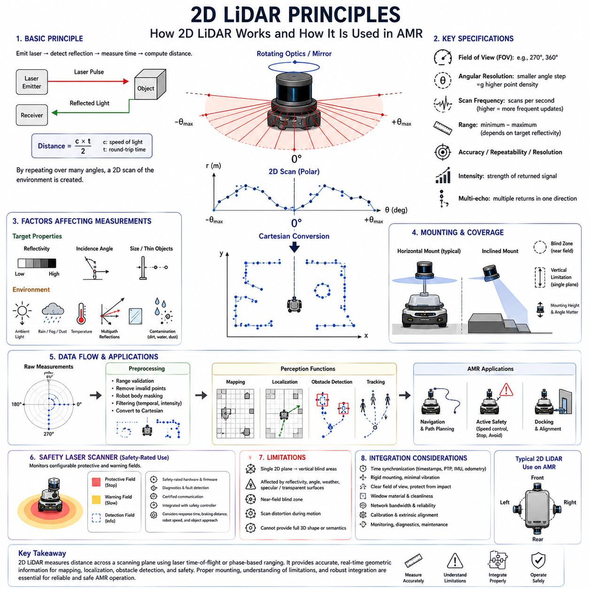
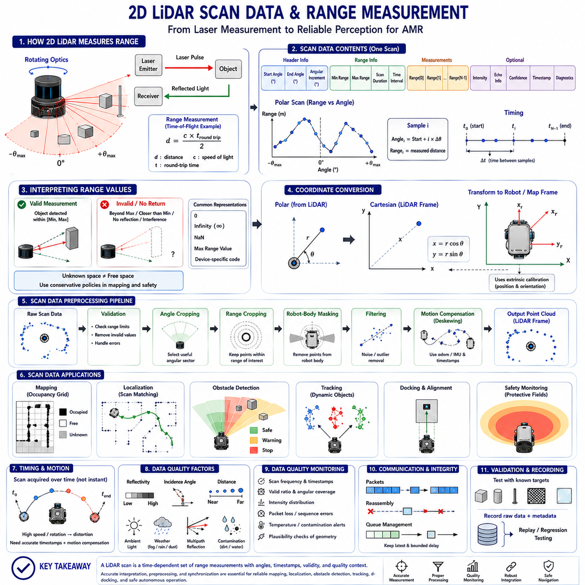
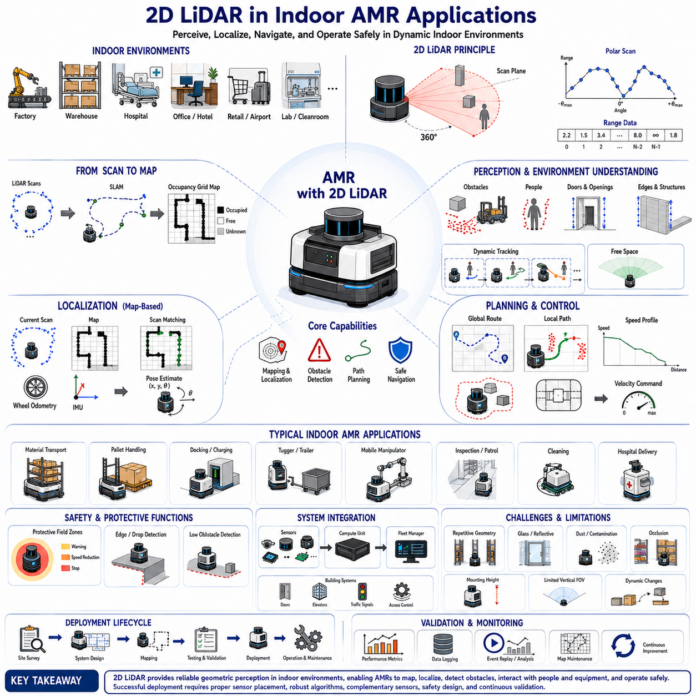
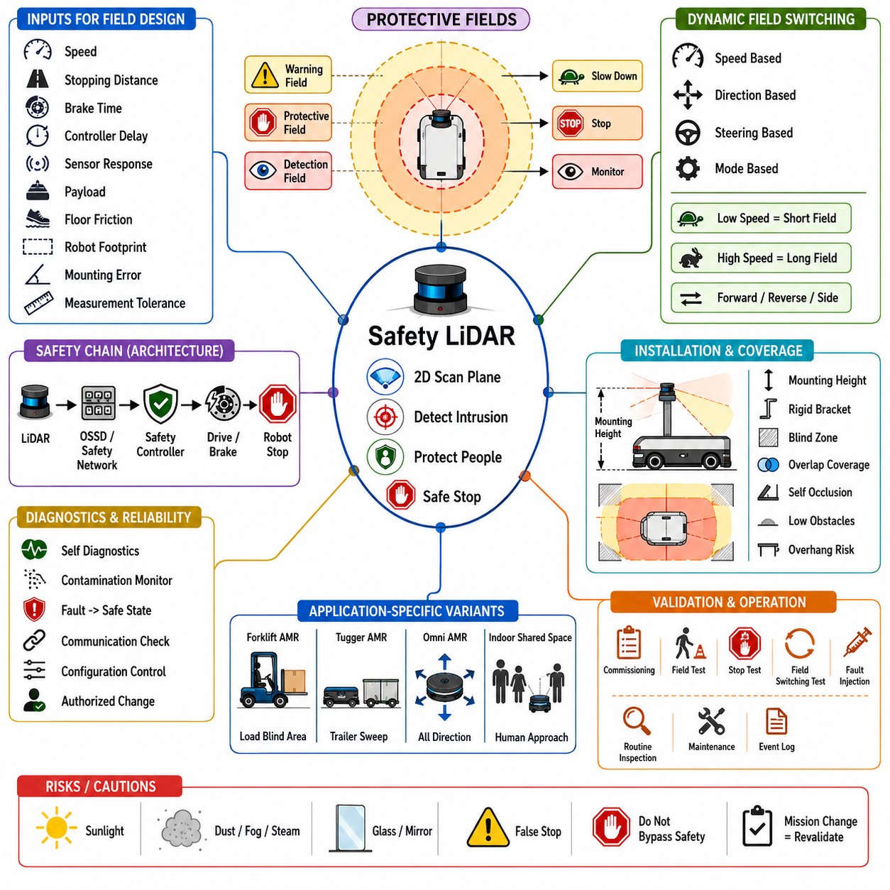
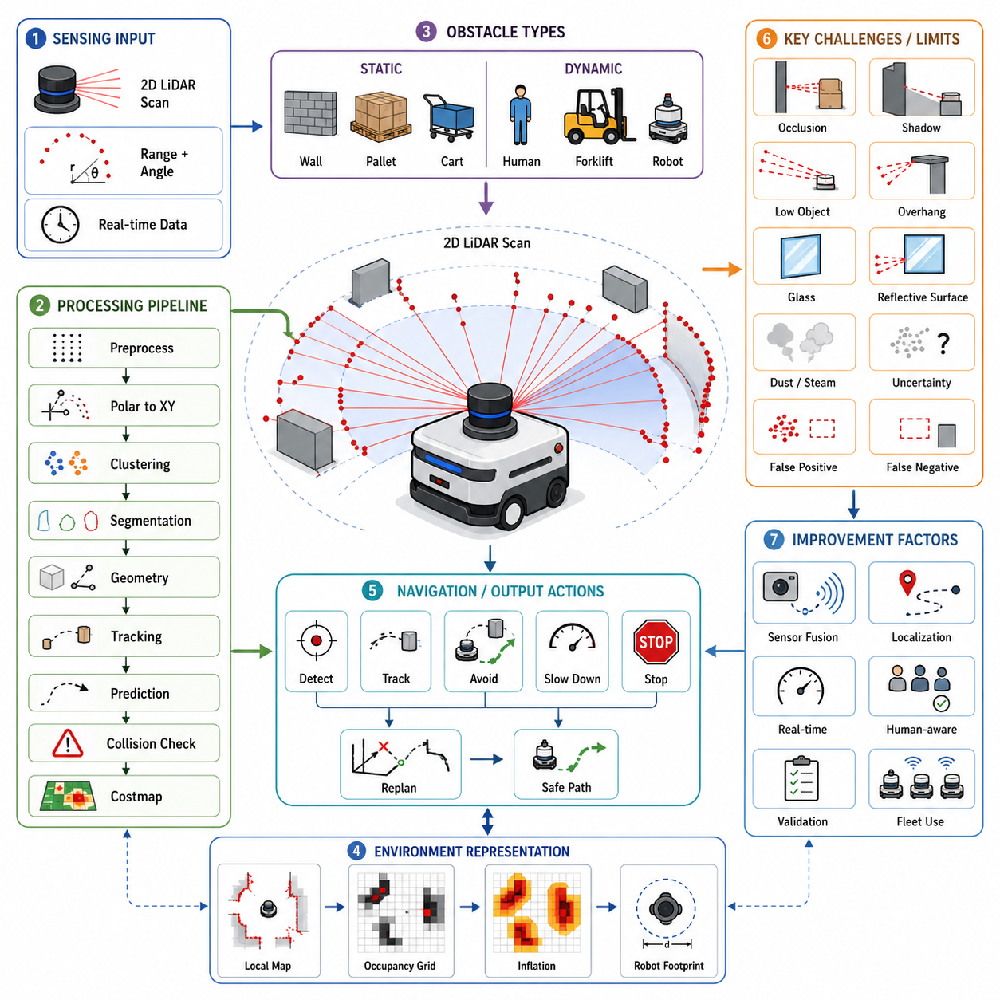
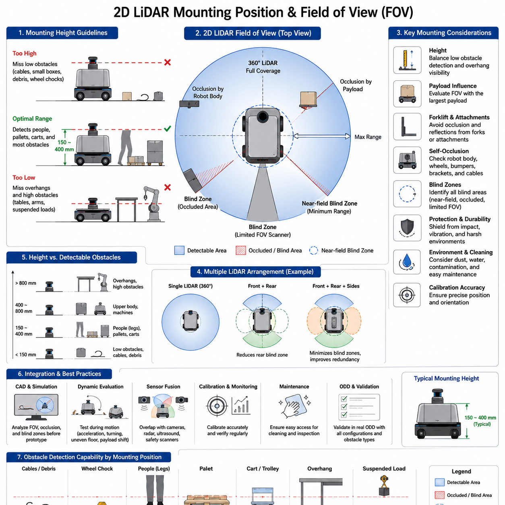
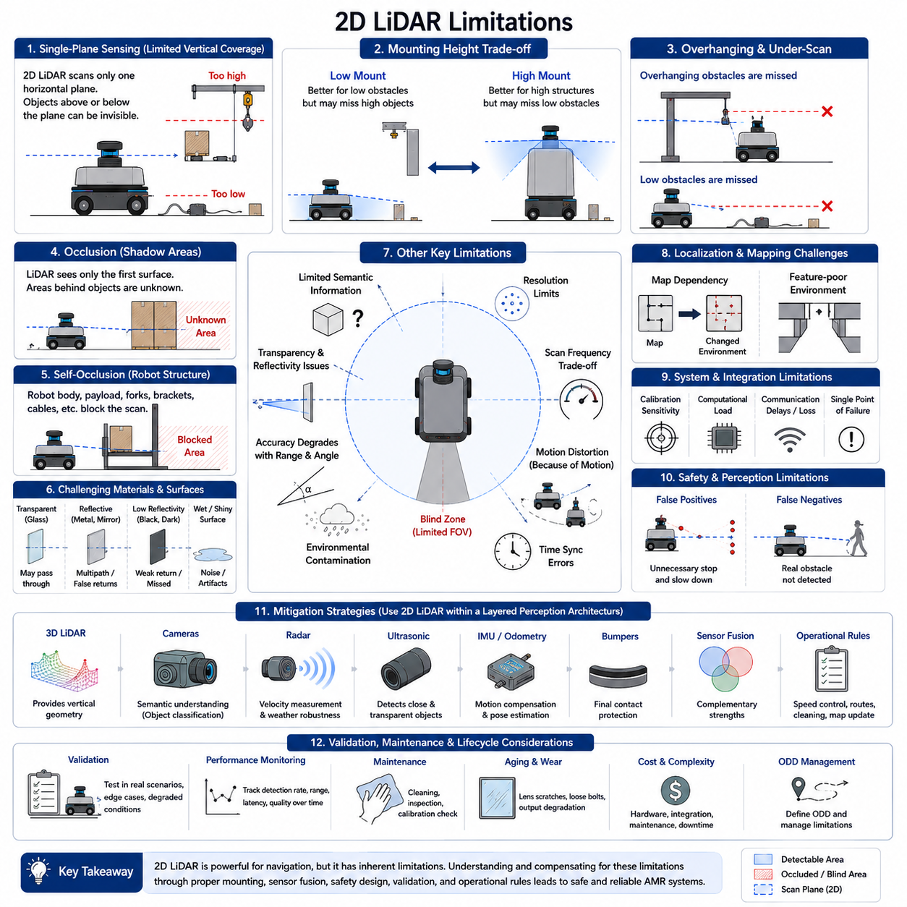
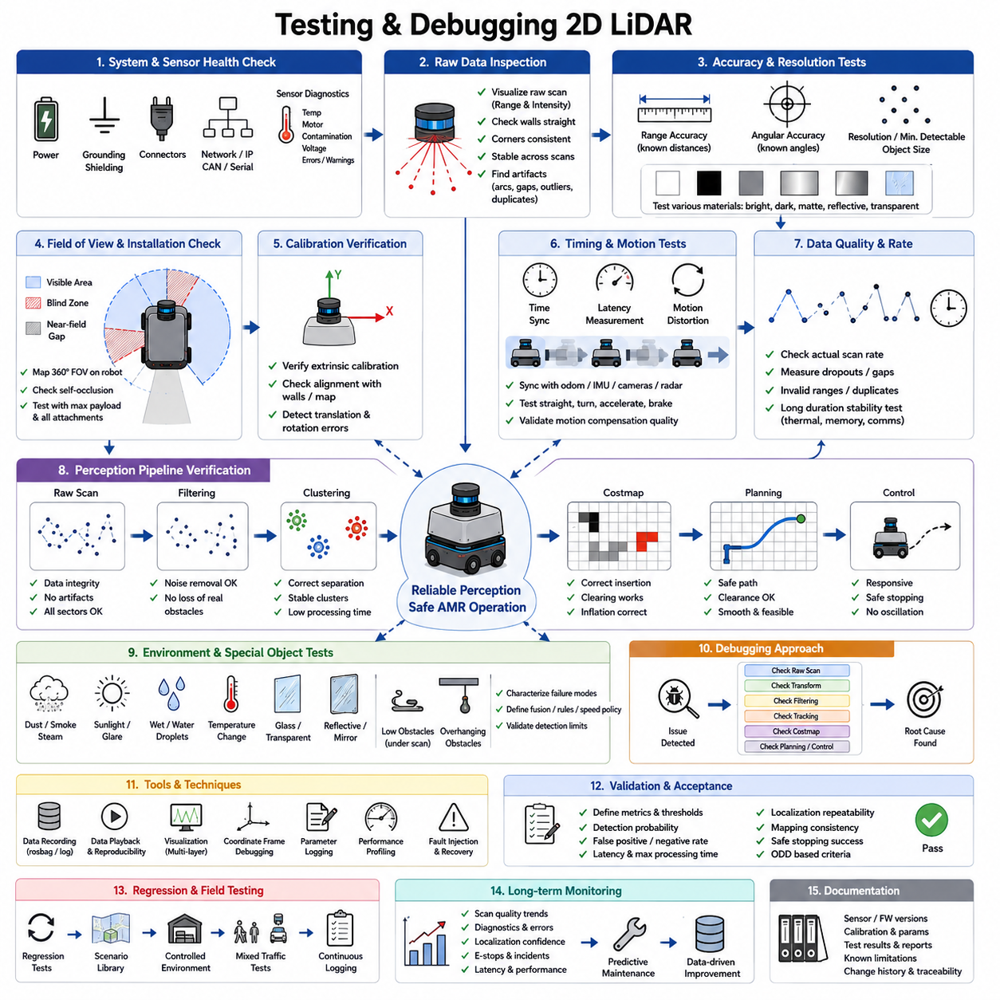

**Volume 03. AMR Sensors and Perception**

# Chapter 02. 2D LiDAR

## 02.1 2D LiDAR Principles

{width="7.268055555555556in" height="7.268055555555556in"}

Two-dimensional Light Detection and Ranging(2D LiDAR) is one of the most widely used sensing technologies in Autonomous Mobile Robot(AMR) navigation because it provides direct geometric measurements of the surrounding environment. Unlike a camera, which records appearance, a 2D LiDAR measures the distance to surfaces along a horizontal or inclined scanning plane. The result is a sequence of range values associated with known angular positions. These measurements form a planar representation of walls, obstacles, people, equipment, and other structures around the robot.

The basic operating principle of 2D LiDAR is based on emitting laser light and measuring how long it takes for the reflected energy to return to the sensor. The sensor generates a laser pulse or modulated optical signal, directs it toward the environment, receives the reflected light, and estimates the distance to the reflecting surface. By repeating this process across many angular positions, the LiDAR constructs a scan of the surrounding space. The measured range and scan angle can then be converted into Cartesian coordinates for mapping, localization, obstacle detection, and navigation.

Most 2D LiDAR units create their scanning plane by rotating an optical assembly, mirror, prism, or internal measurement mechanism. As the scanning element rotates, the outgoing laser beam is directed sequentially across a defined angular field. Some sensors provide a full 360-degree view, while others cover a smaller sector such as 180, 270, or 300 degrees. The choice depends on mechanical design, intended mounting position, and application. A front-mounted LiDAR may not require full coverage, while a central navigation sensor often benefits from complete horizontal observation.

The distance measurement process is commonly implemented through time-of-flight(Time-of-Flight, ToF), phase-shift, or related optical ranging methods. Time-of-flight systems estimate distance from the travel time of emitted light, while phase-based systems compare the phase difference between emitted and received modulated signals. Both approaches require precise timing and signal processing because light travels extremely quickly. The sensor must distinguish valid reflections from noise, ambient light, internal optical effects, and multipath returns while maintaining stable range accuracy.

For a simplified time-of-flight measurement, the distance is calculated by multiplying the measured round-trip travel time by the speed of light and dividing the result by two. Division by two is required because the laser travels from the sensor to the target and then back to the receiver. In practice, the calculation is more complicated because the sensor must compensate for electronic delays, optical paths, signal threshold behavior, temperature variation, and timing uncertainty. Calibration performed during manufacturing converts raw timing information into usable distance measurements.

Each LiDAR scan consists of multiple samples distributed across the angular field of view. Every sample normally contains at least an angle and a measured distance. Some sensors also provide reflected intensity, confidence, echo number, timestamp, or diagnostic information. The number of samples per scan determines the angular resolution. A finer angular resolution creates denser geometric information and improves the ability to observe small or distant objects, but it also increases data rate, processing demand, and potentially scan duration.

Angular resolution should not be confused with measurement accuracy. Angular resolution describes the separation between neighboring laser directions, whereas range accuracy describes how closely the measured distance matches the true distance. A LiDAR may have fine angular spacing but still exhibit range error caused by target reflectivity, incidence angle, environmental noise, or internal limitations. Conversely, a sensor with accurate range measurements may have insufficient angular density to identify narrow objects at long distance. Both characteristics must be considered during system design.

The spatial distance between neighboring scan points increases as the target becomes farther away. Two beams separated by a small fixed angle may strike surfaces only a few millimeters apart at close range but several centimeters or more apart at longer range. This geometric effect limits the detection of thin poles, cables, legs, forks, and narrow obstacles. A sensor may technically have sufficient maximum range while still lacking the angular density required to represent small objects reliably at that range. Detection performance must therefore be evaluated using realistic object dimensions.

The scan frequency indicates how many complete scanning cycles the sensor produces each second. Common 2D LiDAR units operate at frequencies ranging from several scans per second to several tens of scans per second. Higher scan frequency provides more frequent environmental updates and supports faster robot motion, dynamic-object tracking, and responsive obstacle avoidance. However, faster scanning may reduce the number of samples per revolution or place greater demand on communication and processing. The appropriate rate depends on robot speed, braking distance, control frequency, and environmental dynamics.

A 2D LiDAR does not capture the entire scene at exactly one instant because the laser beam moves across the environment during the scan. The first and last points of a single revolution may therefore be measured at different times. When the robot or surrounding objects move rapidly, this temporal difference can distort the apparent geometry. Straight walls may appear curved, moving people may be stretched or displaced, and scan matching may become less accurate. Motion compensation uses odometry, IMU data, timestamps, and interpolation to transform measurements into a consistent reference time.

The raw polar measurements are usually converted into Cartesian coordinates using the scan angle and range. The horizontal coordinate is commonly calculated from the cosine of the angle multiplied by the distance, while the vertical coordinate in the scan plane is calculated from the sine of the angle multiplied by the distance. These points are expressed first in the LiDAR coordinate frame. To use them for navigation, they must be transformed into the robot base, odometry, or map coordinate frame through known sensor mounting geometry.

The coordinate convention must be defined carefully because different manufacturers and software frameworks may use different angular directions, zero-angle references, axis orientations, and rotation conventions. If these conventions are interpreted incorrectly, the scan may appear mirrored, rotated, or shifted. Such errors can corrupt mapping, localization, and obstacle placement while remaining difficult to diagnose. The sensor driver should document the angle origin, increasing direction, frame orientation, units, minimum angle, maximum angle, and sample ordering.

The scanning plane is geometrically thin in theory, but the emitted laser beam has a finite width and divergence. As the distance increases, the beam footprint becomes larger. A large footprint can illuminate multiple surfaces at slightly different ranges, especially near object edges, fences, vegetation, or reflective structures. The returned signal may represent the strongest, first, last, or combined reflection depending on the sensor design. Beam divergence therefore influences edge accuracy, small-object detection, and the interpretation of measurements near geometric boundaries.

Laser wavelength affects optical interaction with surfaces and ambient conditions. Many industrial 2D LiDAR sensors use near-infrared light because suitable emitters and detectors are widely available and the wavelength performs well for general ranging. However, surface reflectivity varies with wavelength, material, color, texture, and moisture. A target that appears bright to the human eye may not reflect the LiDAR wavelength strongly, while another dark-looking material may return sufficient energy. Visual appearance alone cannot therefore predict LiDAR performance reliably.

Target reflectivity strongly influences measurement range and stability. Highly reflective surfaces usually produce strong returns, while low-reflectivity materials may reduce maximum detection distance or increase noise. Dark rubber, black fabrics, certain plastics, wet surfaces, and coated metals may be difficult under some conditions. Retroreflective materials can create extremely strong returns and may cause intensity saturation or special measurement behavior. Sensor specifications often state range values for targets with particular reflectivity levels, so these values should not be assumed to apply equally to all objects.

The angle at which the laser strikes a surface also affects the returned energy. A beam hitting a wall almost perpendicular to the surface generally produces a stronger and more stable reflection than a beam striking at a shallow grazing angle. At shallow angles, much of the optical energy may reflect away from the receiver, causing weak, missing, or unstable measurements. This effect is common along long corridor walls and smooth metal panels. Sensor placement and localization algorithms should account for reduced measurement reliability at unfavorable incidence angles.

Transparent and specular surfaces are challenging for 2D LiDAR. Glass may transmit a significant portion of the laser energy rather than reflecting it back, causing the sensor to detect an object behind the glass or return no valid measurement. Highly polished metal, mirrors, glossy panels, and wet floors may reflect the beam away from the receiver or toward an unintended surface. These effects can create missing points, false ranges, duplicated structures, or apparent openings. Safety-critical detection should not depend on a single optical measurement principle when such surfaces are expected.

Multipath reflection occurs when emitted light reflects from more than one surface before returning to the sensor. For example, a beam may strike a glossy floor, reflect toward a wall, and then return through another path. The measured travel distance may then represent the combined path rather than the direct distance to a real object. Multipath errors are not always frequent, but they can produce isolated or structured false measurements in reflective industrial environments. Filtering methods must be conservative because removing unusual points may also remove real hazards.

Ambient light can interfere with the receiver because sunlight and artificial sources contain optical energy within or near the sensor's detection band. Outdoor sunlight is especially demanding because it can reduce signal-to-noise ratio and effective range. LiDAR systems use optical filters, modulation, narrow detection windows, signal correlation, and internal compensation to reject unrelated light. Even so, performance should be validated under direct sunlight, low sun angles, reflective surroundings, and transitions between indoor and outdoor environments rather than assumed from laboratory specifications.

Rain, fog, snow, dust, steam, and airborne particles can reflect or scatter laser light before it reaches solid objects. This may reduce visibility, create many short-range returns, weaken distant measurements, or produce fluctuating point patterns. A 2D LiDAR can remain useful in mild adverse conditions, but its performance depends on wavelength, optical power, receiver sensitivity, filtering, particle density, and target characteristics. Environmental limitations should be included in the Operational Design Domain(ODD), and degraded performance should trigger reduced speed or alternative sensing strategies.

The minimum measurable range defines how close an object can be before the LiDAR can no longer produce reliable distance data. Near-field limitations can result from optical geometry, receiver recovery time, internal reflections, protective windows, and signal saturation. Objects very close to the sensor may be invisible or produce invalid measurements. This creates a blind region around the device. AMR designs should not assume that one LiDAR can observe every nearby obstacle, particularly around the chassis corners, bumpers, forks, or recessed mounting structures.

Maximum range depends on the strength of the returned signal and the sensor's ability to distinguish it from noise. It is influenced by target reflectivity, target size, incidence angle, ambient light, atmospheric conditions, contamination, and receiver sensitivity. The maximum value shown in a datasheet often represents favorable conditions and should not be treated as a guaranteed detection distance for all objects. Practical design should use validated detection range for the most difficult relevant targets and include adequate margin for aging and contamination.

Range resolution and range accuracy describe different sensor properties. Resolution indicates the smallest change in distance that the measurement system can represent or distinguish, while accuracy indicates the closeness of the reported value to the true distance. Repeatability describes how consistently the sensor reports the same target under unchanged conditions. A device may have fine numerical resolution but larger systematic error. Localization and precision docking often depend strongly on repeatability and geometric consistency, while safety calculations require conservative understanding of total measurement error.

Measurement noise appears as small variation in the reported range even when the target and sensor remain stationary. Noise may depend on distance, reflectivity, incidence angle, temperature, signal strength, and environmental interference. Random noise can often be reduced through filtering or repeated observations, but excessive averaging increases latency and may blur moving objects. Filters should preserve real environmental changes and should not create delayed obstacle detection. The acceptable noise level depends on whether the data supports mapping, localization, tracking, or safety monitoring.

Some LiDAR units support multiple echoes when a laser beam encounters partially transparent, perforated, or layered structures. The first echo may correspond to rain, vegetation, mesh, or a near surface, while a later echo may correspond to a solid object behind it. Multi-echo information can improve environmental interpretation, but it also increases data complexity. The system must define whether it uses the first, strongest, last, or multiple returns. Incorrect echo selection can cause the robot to ignore a near obstacle or treat vegetation as an impenetrable wall.

Return intensity provides a measure related to the strength of the received reflection. Intensity can support landmark recognition, retroreflector detection, material differentiation, sensor diagnostics, and filtering. However, intensity values are often sensor-specific and may depend on distance, angle, receiver gain, temperature, and firmware. They should not be interpreted as universal reflectivity measurements without calibration. Intensity is most reliable when used as supporting information together with geometry rather than as the sole basis for object classification.

A 2D LiDAR can be mounted horizontally for planar navigation or at an angle for specialized terrain and obstacle sensing. Horizontal mounting is common for indoor AMRs because walls, legs, pallets, racks, and vehicles intersect the scan plane. An inclined sensor may detect ramps, drop-offs, curbs, or low obstacles by observing changes in expected ground intersections. The mounting height and angle determine which parts of people and objects are visible. A single plane may pass above low obstacles or below overhanging structures, creating important vertical blind areas.

Because 2D LiDAR observes only one plane, it cannot directly describe full three-dimensional geometry. An object that does not intersect the scan plane may remain undetected even when it occupies the robot's path. Low objects, tabletop surfaces, extended forks, suspended loads, shelves, and protruding structures may require additional sensors at different heights or with three-dimensional coverage. The limitations of planar sensing should be addressed through mechanical design, multiple LiDAR layers, depth cameras, 3D LiDAR, ultrasonic sensors, bumpers, or operational controls.

Sensor placement should provide an unobstructed field of view while protecting the device from impact, contamination, vibration, and weather. Body panels, wheels, cables, payloads, manipulators, and protective covers can block portions of the scan. Even small mounting obstructions may create persistent blind sectors that interfere with mapping and safety monitoring. The mounting structure should remain rigid so that the sensor's position does not change during acceleration or collision. Service access is also important because optical windows require inspection and cleaning.

Protective windows and covers must be selected carefully because any material placed in front of the LiDAR changes the optical path. The window may reduce transmitted energy, create reflections, distort angles, or accumulate condensation and dirt. Curved or tilted covers may behave differently across the scan field. Manufacturers often define approved window materials, thicknesses, positions, and surface treatments. Custom enclosures should be validated across the full angular range and under temperature, moisture, vibration, and contamination conditions.

Contamination monitoring is essential in industrial and outdoor applications. Dust, oil mist, water droplets, insects, fingerprints, mud, and cleaning residue can reduce optical transmission or create false reflections near the sensor. Some LiDAR units provide contamination warnings based on internal signal analysis, but these diagnostics may not detect every failure mode. The robot should combine device diagnostics with plausibility checks, scan-quality monitoring, cleaning schedules, and operator inspection. Severe contamination should trigger reduced operation or a safe response.

The electrical interface supplies power and transfers measurement data to the robot computer or safety controller. Industrial 2D LiDAR units commonly use Ethernet, serial communication, CAN-based interfaces, or dedicated safety communication protocols. The communication architecture must support the required scan rate, data volume, timestamp precision, diagnostic reporting, and fault detection. Cable length, connector quality, electromagnetic compatibility, grounding, shielding, and network congestion can affect reliability even when the optical sensor itself operates correctly.

Timestamps are necessary for relating LiDAR data to robot motion, other sensors, and control decisions. A timestamp may represent the beginning, middle, or end of a scan, or each measurement may have an individual timing relationship. The driver and downstream software must understand this convention. When the AMR moves during scanning, inaccurate timestamps can create geometric distortion and localization error. Integration with wheel odometry, IMU, cameras, and GNSS may require clock synchronization through Precision Time Protocol(PTP), hardware signals, or software correction.

The LiDAR driver converts device-specific communication into standardized scan messages. It configures scan frequency, angular range, resolution, filtering, echo mode, network parameters, and diagnostic behavior. A robust driver should detect missing packets, invalid measurements, device restarts, configuration mismatches, and communication timeouts. It should also publish accurate metadata and health status. Driver behavior must be deterministic enough for real-time operation and should avoid uncontrolled queues that continue delivering old scans after a processing delay.

Preprocessing prepares raw scans for localization, mapping, and obstacle detection. Common operations include range validation, removal of invalid values, masking of robot-body reflections, angle selection, intensity filtering, temporal filtering, and conversion into point coordinates. Preprocessing should be designed according to the intended function. Aggressive filtering may improve map appearance but hide real obstacles, while insufficient filtering may destabilize scan matching. Safety-related data paths should use conservative rules and remain independent from appearance-oriented visualization filters.

Robot-body masking removes scan points created by parts of the AMR itself. Mirrors, covers, cables, payload structures, wheels, and manipulators may enter the LiDAR field of view. These points should not be mistaken for environmental obstacles, but masking must follow the actual robot geometry and configuration. If the payload or mechanism changes shape, a fixed mask may remove real objects or retain self-reflections. Dynamic masks can use joint positions, payload state, or configuration data to represent moving components more accurately.

In mapping, consecutive 2D scans are combined with robot motion estimates to create an occupancy grid or geometric map. Scan matching aligns current measurements with previous scans or an existing map. Stable walls, columns, racks, and fixed machinery provide useful geometric constraints. Mapping becomes difficult in environments with long featureless corridors, repeated structures, moving crowds, glass walls, or frequent layout changes. Wheel odometry and IMU information often support scan matching by providing an initial motion estimate.

For localization, the current scan is compared against a stored map to estimate the robot's position and orientation. The quality of localization depends on map accuracy, sensor calibration, environmental similarity, scan density, and the availability of distinctive geometry. If many mapped objects move or disappear, the scan may not match reliably. Localization systems should report confidence and detect divergence rather than continuing with an incorrect pose. Multiple localization sources can improve robustness when 2D geometry alone is insufficient.

In obstacle detection, scan points are evaluated relative to the robot's current shape, planned path, and protective region. Raw distance thresholds may support simple stopping behavior, while more advanced systems convert points into occupancy grids, clusters, line segments, or tracked objects. The detection logic should consider measurement uncertainty, object size, scan frequency, relative velocity, and robot braking performance. Isolated points may represent noise or a real thin obstacle, so filtering policies must be selected according to risk.

Dynamic-object tracking can use sequences of 2D scans to estimate the motion of people, vehicles, carts, and other moving objects. Points may first be grouped into clusters, associated across scans, and filtered to estimate position and velocity. The single-plane nature of the data limits object classification because different objects can produce similar cross-sections. Camera or radar information may improve semantic recognition and velocity estimation. Tracking results should include uncertainty because temporary occlusion and partial visibility are common.

Safety laser scanners are specialized 2D LiDAR devices designed to monitor configurable protective fields and generate safety-rated outputs. Although their optical principle resembles that of navigation LiDAR, their hardware, diagnostics, software, communication, and certification requirements are significantly different. Protective fields may change according to speed, direction, steering angle, or operating mode. A standard navigation LiDAR should not automatically be treated as a safety device merely because it detects obstacles accurately in normal operation.

A safety scanner continuously checks whether valid measurements exist within warning or protective zones. Entry into a warning field may trigger speed reduction, while entry into a protective field may initiate a safety stop. The complete safety function includes the sensor, field configuration, communication path, safety controller, brakes, vehicle dynamics, and validated stopping distance. The field must account for response time, braking distance, measurement tolerance, installation error, floor condition, payload, and approach speed of relevant objects.

False negatives and false positives have different operational consequences. A false negative occurs when a real object is not detected and can create a collision risk. A false positive occurs when the sensor reports an obstacle that is not present and may cause unnecessary stops or route changes. Reducing one type of error can sometimes increase the other. The design should prioritize safety while maintaining acceptable productivity. Field testing should evaluate both rates across difficult materials, angles, weather, clutter, and dynamic scenes.

Validation of a 2D LiDAR system must include the complete sensing chain rather than only the sensor datasheet. Tests should cover mounting, calibration, communication, timestamps, preprocessing, mapping, localization, obstacle detection, and fault handling. Representative targets should include dark, reflective, transparent, thin, low, moving, and partially occluded objects. Environmental tests should include sunlight, darkness, dust, rain, vibration, temperature variation, and contamination when these conditions belong to the intended ODD.

Long-duration testing is needed because thermal drift, motor wear, optical contamination, network instability, and intermittent faults may not appear during short demonstrations. The sensor should be monitored for scan frequency, range consistency, missing data, timing drift, temperature, contamination warnings, and diagnostic events. Performance should also be checked after repeated power cycles, network interruption, and software restart. A reliable AMR must detect abnormal LiDAR behavior and respond safely rather than silently continuing with degraded perception.

Maintenance requirements should be considered from the beginning of the design. Operators need clear procedures for cleaning optical surfaces, checking damage, inspecting mounting alignment, verifying diagnostic status, and replacing the sensor. Calibration may need confirmation after impact, repair, bracket replacement, or structural modification. Maintenance records should include sensor serial number, firmware, configuration, calibration version, installation position, and service history. Good maintenance preserves the assumptions used during validation.

Ultimately, 2D LiDAR converts precise optical range measurements into a planar geometric understanding of the environment. Its strengths include direct distance measurement, wide angular coverage, stable operation across many lighting conditions, and strong compatibility with mapping and localization methods. Its limitations include single-plane coverage, sensitivity to certain surfaces and weather conditions, near-field blind regions, scan distortion, and dependence on proper mounting and timing. Effective AMR design treats 2D LiDAR not as an independent device, but as one carefully integrated part of a complete perception, navigation, and safety architecture.

## 02.2 Scan Data and Range Measurement

{width="7.268055555555556in" height="7.268055555555556in"}

Scan data is the structured output produced when a two-dimensional Light Detection and Ranging(2D LiDAR) sensor completes one angular sweep of its surrounding environment. Each scan represents a sequence of range measurements associated with known beam directions. Together, these measurements describe where reflecting surfaces intersect the LiDAR's scanning plane. For an Autonomous Mobile Robot(AMR), this scan becomes a geometric snapshot used for obstacle detection, localization, mapping, tracking, docking, and safety-related monitoring.

A typical scan message contains a starting angle, ending angle, angular increment, minimum valid range, maximum valid range, scan duration, time interval between samples, and an ordered array of measured distances. Many devices also provide reflected intensity, echo information, confidence values, diagnostic states, and timestamps. These fields are not merely descriptive metadata. They determine how raw samples are interpreted, transformed, synchronized, filtered, and fused with other perception and motion data.

Each range sample corresponds to a beam direction defined by the scan geometry. If the first beam begins at a known angle and each following sample advances by a fixed angular increment, the angle of any sample can be calculated from its index. This relationship assumes that the driver preserves the manufacturer's scan order and coordinate convention. Incorrect assumptions about indexing, clockwise or counterclockwise rotation, or the position of zero degrees can rotate, mirror, or reverse the resulting environmental representation.

Range measurement begins when the LiDAR emits optical energy toward a target and detects part of the returned signal. Depending on the sensor design, distance may be estimated through time-of-flight(Time-of-Flight, ToF), phase comparison, pulse correlation, or another optical ranging method. The internal electronics identify the valid return, estimate the corresponding travel distance, apply calibration corrections, and convert the result into a numerical range value. This process is repeated across the entire angular field to construct a complete scan.

In an ideal time-of-flight model, distance is calculated from the measured round-trip travel time of light. The emitted beam travels from the sensor to the surface and the reflection returns to the receiver, so the total optical path is twice the target distance. Real sensors must additionally compensate for electronic delays, optical-path offsets, receiver thresholds, temperature effects, internal clock behavior, and manufacturing tolerances. The reported distance is therefore the result of calibrated signal processing rather than a direct uncorrected timing value.

The reported range generally represents the distance from the LiDAR's optical origin to the reflecting surface along the direction of the emitted beam. It does not necessarily represent the shortest distance from the robot body to the object. The sensor may be mounted above, behind, or to one side of the robot's geometric center. Navigation and safety software must transform each measurement into the robot coordinate frame and then consider the full robot footprint, payload, turning envelope, and braking path.

A scan is usually expressed in polar form because each sample consists naturally of an angle and a range. For mapping and obstacle processing, the polar sample is converted into Cartesian coordinates. The x-coordinate is calculated from the range multiplied by the cosine of the beam angle, while the y-coordinate is calculated from the range multiplied by the sine of the angle. These coordinates initially belong to the LiDAR frame and must later be transformed into base, odometry, or map frames.

Not every position in the range array represents a valid physical return. A beam may fail to produce a usable measurement because the target is beyond the maximum range, closer than the minimum range, too weakly reflective, outside the receiver sensitivity, or affected by interference. Drivers may represent invalid data as zero, infinity, not-a-number(Not-a-Number, NaN), a maximum-range value, or a device-specific error code. Downstream software must interpret these values correctly instead of treating them as real obstacles or free space.

The distinction between no return and confirmed free space is important. A missing measurement does not always prove that the beam traveled unobstructed to the sensor's maximum range. The beam may have encountered glass, a dark surface, fog, dust, an unfavorable incidence angle, or an optical fault. Occupancy-grid mapping and safety logic should therefore use conservative interpretation policies. Unknown space should remain distinguishable from observed free space, especially when measurement failure could hide a real object.

Minimum and maximum range settings define the interval within which measurements are considered valid. The minimum limit excludes the near-field region where optical recovery, internal reflection, or geometric overlap prevents stable ranging. The maximum limit represents the farthest useful measurement under specified conditions. Software may apply additional operational limits that are shorter than the sensor capability. These limits can reduce noise, computation, and map clutter while preserving the range required for stopping, planning, localization, and tracking.

Angular resolution determines the separation between neighboring beam directions. A smaller angular increment creates more samples across the same field of view and produces a denser scan. However, point spacing in physical space still increases with distance. A thin pole that produces multiple returns at close range may fall entirely between adjacent beams at long range. Therefore, scan density must be evaluated using target dimensions, required detection distance, mounting geometry, and the probability that an object intersects at least one beam.

Scan frequency and angular resolution are sometimes linked by hardware limitations. Increasing the number of samples per revolution may require more measurement time or reduce the achievable scan rate. Conversely, increasing scan frequency may reduce sample density or measurement quality. The selected operating mode should support the robot's maximum approved speed and the dynamic characteristics of the environment. Faster robots need sufficiently frequent scans to limit the distance traveled between observations and to maintain timely obstacle and motion updates.

A complete scan is not captured instantaneously. The sensor acquires each angular sample at a slightly different time as the internal scanning mechanism rotates. The scan message may contain one timestamp for the start, midpoint, or end of the sweep, while individual sample times are reconstructed from the sample interval. When the robot moves, treating all points as simultaneous can distort the geometry. Motion compensation corrects this effect by using odometry or inertial data to place each sample at a common reference time.

The time increment between individual samples is especially important for high-speed motion or precision localization. If the robot rotates while a scan is being acquired, points measured later in the sweep originate from a different sensor pose than earlier points. Without correction, straight structures can appear curved and corners can shift. Accurate per-sample timing allows software to interpolate the robot pose and transform each measurement appropriately. This process is often called scan deskewing, motion correction, or temporal compensation.

Timestamp quality depends on where and how time is assigned. A timestamp generated inside the sensor near the physical measurement is generally more accurate than one assigned by the host computer after network reception. Communication delay, buffering, packet scheduling, and operating-system load can separate reception time from acquisition time. Multi-sensor systems should use a common clock or known clock relationship through Precision Time Protocol(PTP), hardware triggering, synchronized counters, or calibrated software correction.

Range accuracy describes how closely a reported measurement corresponds to the true distance. It may include systematic offset, scale error, temperature sensitivity, nonlinearity, and target-dependent behavior. Datasheet accuracy values are usually defined under controlled conditions and may not represent every material, angle, distance, or environmental state. AMR developers should verify accuracy using representative targets and mounting conditions. Safety margins and docking tolerances should account for the complete measurement and installation error rather than only the nominal sensor specification.

Range resolution describes the smallest numerical or physical distance change that the sensor can distinguish, while repeatability describes the consistency of repeated measurements under unchanged conditions. These properties should not be confused with absolute accuracy. A sensor may repeatedly report nearly identical values that contain a fixed offset from the true distance. Repeatability is valuable for scan matching and relative alignment, while absolute accuracy becomes important for dimensional measurement, docking, map geometry, and protective-field calculations.

Measurement noise appears as random variation in successive range values. Noise may increase with distance, weak reflectivity, shallow incidence angle, strong ambient light, vibration, temperature change, or optical contamination. Statistical filtering can reduce random variation, but each filter introduces tradeoffs. Averaging several scans can improve stability while delaying the response to moving objects. Median filters can reject isolated outliers but may remove thin obstacles. Filtering should therefore match the downstream function and its safety consequences.

Outliers are measurements that differ significantly from the surrounding spatial or temporal pattern. They may result from multipath reflection, packet corruption, edge effects, moving particles, direct optical interference, or mixed returns from multiple surfaces within the beam footprint. Some outliers are easy to identify because they are isolated, but others form plausible structures. Removal rules should be conservative. A real narrow object may also appear as a single isolated point, so aggressive outlier rejection can create dangerous false negatives.

Edge measurements require particular care because the finite laser beam may illuminate both foreground and background surfaces. The receiver may report the first return, strongest return, average response, or another device-specific estimate. As a result, points near corners and object boundaries may jump between surfaces or appear at intermediate distances. This behavior influences line extraction, wall fitting, object clustering, and map sharpness. Algorithms should avoid assuming that every point near an edge represents a perfectly localized surface intersection.

Multiple-echo LiDAR can report more than one return for a single beam direction. The first echo may originate from rain, dust, mesh, vegetation, or a transparent layer, while a later echo may correspond to a more solid background target. Multiple echoes provide useful information but require a clear selection strategy. Obstacle detection may prioritize the nearest valid return, while mapping or environmental interpretation may retain several echoes. The chosen policy must remain consistent with the physical risks of the application.

Return intensity describes the strength of the received optical signal in a sensor-specific form. It can help detect retroreflectors, distinguish stable landmarks, evaluate contamination, and support object interpretation. However, intensity is influenced by distance, incidence angle, surface material, receiver gain, temperature, and firmware processing. Raw intensity values should not be treated as universal material labels. When used for localization or classification, the system should account for normalization, calibration, and variation between individual sensors.

Scan preprocessing transforms device output into data suitable for perception algorithms. It commonly validates range values, removes corrupted measurements, masks robot-body reflections, limits the angular sector, converts polar values into points, and attaches coordinate and timing information. Preprocessing may also apply filtering, motion compensation, intensity thresholds, and echo selection. Each operation should have a documented purpose and should preserve enough raw information for diagnosis, validation, and alternative processing when unexpected field conditions occur.

Angular cropping selects only the parts of the scan relevant to a function. A forward obstacle detector may process the area near the planned path, while localization may use the full available field of view. Cropping reduces computation and avoids known self-reflections, but it can remove useful geometry or dynamic threats. Fixed cropping should reflect the actual sensor mounting and vehicle design. If payloads or manipulators change the visible area, the valid angular region may need to change dynamically with robot configuration.

Range cropping limits processing to a selected distance interval. Very distant points may add little value to indoor navigation and can increase map noise, while extremely near points may be invalid or represent the robot body. Different modules may require different limits. Localization can benefit from stable distant walls, obstacle avoidance may prioritize the immediate path, and safety monitoring may use validated protective distances. A common raw scan can therefore produce several filtered views, each governed by a clearly defined purpose.

Robot-body masking prevents the LiDAR from interpreting the AMR's own structure as an external obstacle. The mask may remove points falling within a fixed polygon, angular sector, or geometric model. This model should reflect sensor position, chassis shape, protective covers, cables, payloads, forks, and moving mechanisms. Static masking is simple but may fail when the robot configuration changes. Dynamic masking can use steering angles, arm joints, lift height, or payload state to update the expected self-occupied region.

Spatial filtering examines neighboring points within one scan. Points may be grouped according to range continuity, angular distance, or expected object geometry. This supports clustering, line extraction, and noise removal. However, the spacing between neighboring points depends on both angle and range, so fixed distance thresholds can behave differently near and far from the sensor. Adaptive thresholds that account for beam geometry generally preserve object boundaries more consistently across the scan area.

Temporal filtering compares the same or nearby directions across several scans. Persistent structures can be distinguished from momentary interference, and random noise can be reduced. The method becomes more difficult when the robot moves because the same beam index no longer observes the same world location. Proper temporal processing therefore requires motion compensation or operation in a stable coordinate frame. Moving objects must also remain detectable rather than being incorrectly removed as temporary noise.

Scan clustering groups neighboring points that likely belong to the same physical object or surface. Clusters may be formed using range difference, Euclidean distance, angular continuity, or model-based criteria. The resulting groups can support obstacle detection, object tracking, and shape estimation. Cluster quality depends on angular resolution, range, occlusion, beam divergence, and object geometry. A single object may be split into several clusters, while nearby objects may merge into one group, particularly at long distances.

Line and corner extraction convert groups of scan points into geometric features. Walls, rack faces, building edges, and other planar structures often produce approximately linear patterns in a 2D scan. Extracted lines can support mapping, localization, corridor alignment, and docking. Corners and intersections can serve as distinctive landmarks. Feature extraction reduces data volume but also discards detail. The method must tolerate noise, gaps, partial visibility, and changing objects without converting unstable measurements into persistent map features.

Occupancy-grid generation uses scan rays to update the probability that areas of space are free, occupied, or unknown. Each valid beam provides evidence that the path from the sensor toward the return is free and that the endpoint may be occupied. Invalid or missing returns require careful treatment because they may not confirm free space. Repeated observations update the grid over time. The inverse sensor model should incorporate range uncertainty, angular spread, object persistence, and the possibility of dynamic obstacles.

For scan matching, a current scan is aligned with a previous scan or an existing map to estimate relative motion or absolute pose. The algorithm seeks the transformation that best aligns observed geometric structures. Range noise, moving objects, repeated patterns, insufficient features, and motion distortion can reduce alignment quality. An initial estimate from wheel odometry or an Inertial Measurement Unit(IMU) improves convergence. The localization system should report uncertainty and detect poor matches rather than always returning a confident pose.

In obstacle detection, scan points are evaluated against the robot's footprint and projected motion. A point may be harmless when outside the current path but critical during a turn or reverse maneuver. Therefore, raw range alone does not determine risk. The system should transform points into the robot frame, account for velocity and steering, expand obstacles by safety margins, and compare them with stopping and avoidance regions. Measurement age and uncertainty should also influence the protective response.

Dynamic tracking uses scan sequences to estimate the position and velocity of moving objects. Clusters are associated between frames, and filters predict their motion through short occlusions or missed measurements. The timing of every scan is essential because velocity estimation depends directly on the interval between observations. Delayed, irregular, or incorrectly timestamped scans can create false motion. Track confidence should decrease when measurements become sparse, ambiguous, or inconsistent with the predicted state.

Data quality monitoring should evaluate more than whether a scan message arrived. Useful indicators include scan frequency, timestamp continuity, percentage of valid returns, angular coverage, intensity distribution, packet loss, repeated data, temperature, contamination alarms, and unexpected geometric patterns. A sensor may continue communicating while its optical performance is degraded. Health logic should combine device diagnostics with external plausibility checks and compare current scan characteristics with expected operational behavior.

Communication affects scan integrity and freshness. Ethernet or serial interfaces may divide one scan across multiple packets, requiring the driver to reconstruct the correct sample order. Packet loss can create missing sectors or incomplete scans. Network congestion can delay complete data even when individual packets remain valid. The driver should detect sequence errors, stale scans, partial frames, and device restarts. It should publish only data whose completeness and timing status are known or explicitly marked.

Queue behavior becomes important when processing cannot keep pace with incoming scans. An unbounded queue preserves every scan but causes increasing delay, eventually making the data irrelevant to the robot's current position. For immediate obstacle detection, it is often safer to discard old scans and process the newest complete measurement. Mapping may prefer continuity but still requires bounded delay. Queue limits, drop policies, and deadline monitoring should be selected separately for each perception function.

Scan-data recording supports development, validation, incident analysis, and regression testing. Recorded data should preserve raw ranges, intensity, echo information, timestamps, coordinate transforms, calibration, sensor configuration, robot state, and relevant diagnostics. Storing only processed point clouds may remove information needed to investigate driver behavior or measurement anomalies. Data formats and metadata should allow the same recording to be replayed accurately through later software versions and alternative processing pipelines.

Replay testing makes it possible to compare algorithms under identical sensor conditions. Engineers can evaluate new filters, scan-matching methods, obstacle detectors, and diagnostics without repeating every field test. However, replay does not fully reproduce network timing, processor load, thermal behavior, sensor aging, or interaction with control decisions. It is therefore valuable for repeatability but should be combined with hardware-in-the-loop(Hardware-in-the-Loop, HIL) and real-robot testing for final validation.

Validation of range measurement should use known targets at controlled distances, angles, and reflectivity levels. Tests should examine accuracy, repeatability, noise, missing returns, minimum range, maximum useful range, edge behavior, and response to motion. Representative objects should include dark materials, reflective surfaces, glass, thin poles, low obstacles, curved surfaces, and partially visible targets. Environmental testing should cover lighting, temperature, vibration, contamination, dust, rain, or fog when these conditions belong to the intended ODD.

System-level validation must confirm that scan data supports the required robot behavior rather than merely satisfying sensor-level metrics. Localization should remain stable, maps should represent relevant structures, obstacles should be detected early enough, and false stops should remain operationally acceptable. Tests should include maximum speed, payload conditions, turning maneuvers, crowded scenes, communication load, and sensor degradation. The complete chain from optical measurement to control response must satisfy the defined timing and safety requirements.

Ultimately, scan data is not simply an array of distances. It is a time-dependent geometric measurement shaped by optical physics, scan mechanics, coordinate conventions, calibration, communication, motion, filtering, and environmental conditions. Reliable AMR perception requires every range value to be interpreted together with its angle, timestamp, validity, uncertainty, and sensor state. When this complete context is preserved, 2D LiDAR scan data becomes a dependable basis for mapping, localization, obstacle detection, tracking, docking, and safe autonomous operation.

## 02.3 Indoor AMR Applications

{width="7.268055555555556in" height="7.268055555555556in"}

Two-dimensional Light Detection and Ranging(2D LiDAR) is widely used in indoor Autonomous Mobile Robot(AMR) applications because indoor environments contain stable geometric structures that can be measured reliably in a horizontal scanning plane. Walls, columns, racks, machines, pallets, doors, and people often intersect the sensor's scan height and provide useful information for navigation. The direct distance measurements produced by 2D LiDAR allow an AMR to understand free space, detect obstacles, estimate its position, and move safely without depending entirely on floor markers or fixed guide paths.

Indoor AMRs operate in factories, warehouses, hospitals, offices, shopping facilities, laboratories, airports, distribution centers, and public buildings. Each environment imposes different requirements on LiDAR range, angular coverage, scan rate, mounting height, accuracy, and safety performance. A warehouse transport robot may focus on racks, pallets, forklifts, and narrow aisles, while a hospital delivery robot must handle people, beds, carts, glass doors, and frequent changes in corridor traffic. The application context therefore determines how 2D LiDAR data should be collected and interpreted.

One of the most common indoor applications is autonomous navigation between predefined pickup and delivery locations. The AMR uses LiDAR measurements to estimate its current position, identify traversable space, avoid obstacles, and follow a planned route. Unlike Automated Guided Vehicles(AGVs) that depend on magnetic tape, wires, or fixed reflectors, LiDAR-based AMRs can move through mapped environments with greater flexibility. Routes can be modified through software, and the robot can respond to temporary blockages without requiring physical changes to the facility floor.

Mapping is usually the first major use of 2D LiDAR during indoor deployment. The robot moves through the facility while consecutive scans are combined with wheel odometry and, when available, Inertial Measurement Unit(IMU) data. Stable geometric structures are converted into an occupancy grid or feature-based map. Walls and columns typically form strong references, while moving people and vehicles should be filtered as temporary objects. The map becomes the geometric foundation used by localization, path planning, traffic management, docking, and operational monitoring.

A useful indoor map must represent the parts of the environment that are relevant to robot motion rather than every visual detail. The map should capture permanent walls, structural columns, fixed machines, rack boundaries, and other stable objects that intersect the LiDAR plane. Temporary pallets, carts, boxes, and people should normally not become permanent map features. If dynamic objects are incorrectly stored, the robot may later believe that empty areas are blocked or may localize against structures that no longer exist. Map construction therefore requires controlled data collection and review.

Simultaneous Localization and Mapping(SLAM) allows the AMR to build a map while estimating its own motion. In an unknown indoor environment, each new LiDAR scan is aligned with previous scans and motion estimates to update both the robot pose and the environmental model. Indoor walls, corners, rack edges, and machinery often provide strong geometric constraints for scan matching. However, long featureless corridors, repetitive rack aisles, wide open halls, and glass partitions can make different positions appear similar and increase localization ambiguity.

After a map has been created, the AMR performs map-based localization by comparing current LiDAR scans with the stored representation. The localization algorithm estimates the translation and rotation that best align the observed geometry with the map. Wheel odometry predicts short-term movement, while LiDAR measurements correct accumulated drift. Reliable localization enables accurate path following, intersection handling, docking preparation, and fleet coordination. The localization system should also report confidence so that the robot can recognize when the match becomes unreliable.

Indoor localization quality depends strongly on the stability of the environment. Factories and warehouses may undergo frequent changes as pallets, materials, temporary fences, production equipment, and workstations are moved. If too much of the current scan differs from the stored map, localization can become unstable. A robust system should rely primarily on stable structural features and tolerate temporary changes. It may also maintain multiple map layers, exclude highly dynamic areas, or update selected map regions through a controlled maintenance process.

Repetitive indoor geometry creates a special challenge for LiDAR localization. Rows of nearly identical racks, doors, pillars, or storage bays can produce similar scan patterns at several different positions. The robot may obtain a locally good alignment that corresponds to the wrong aisle or bay. Wheel odometry, initial pose constraints, fiducial markers, reflector landmarks, camera information, or topological route context can reduce this ambiguity. Global localization should never rely only on a single locally consistent scan match in a highly repetitive environment.

Obstacle detection is another central indoor AMR application. The LiDAR scan identifies surfaces that intersect the robot's operating plane and allows the navigation system to determine whether the planned path remains clear. Obstacles may include people, carts, pallets, boxes, forklifts, cleaning equipment, open doors, temporary barriers, and other robots. The point measurements are transformed into the robot frame and compared with the current footprint, turning envelope, stopping region, and local path. Detection must occur early enough to support safe braking or avoidance.

The obstacle detector should account for the AMR's complete shape rather than treating the robot as a single point. The chassis, bumpers, payload, shelves, forks, conveyors, and manipulators may extend beyond the sensor location. During a turn, the rear or side of the robot can sweep through an area that was not directly in front of it. Costmaps and collision-checking algorithms therefore enlarge obstacles or evaluate the full projected footprint along candidate trajectories. This geometric reasoning is especially important in narrow factory aisles and crowded logistics areas.

A 2D LiDAR detects only objects that intersect its scan plane. This makes mounting height a critical design decision for indoor applications. A low-mounted sensor may detect pallet feet, human legs, low carts, and floor-level obstacles but may miss tabletops, suspended loads, and overhanging structures. A higher sensor may observe walls and upper body regions but pass above small boxes or forks. Many AMRs combine several sensors at different heights or supplement 2D LiDAR with depth cameras, ultrasonic sensors, bumpers, or 3D LiDAR.

Human detection is an important function in shared indoor environments. A horizontally mounted LiDAR can detect the legs or lower body of a person and estimate their position relative to the robot. Sequential scans can support tracking and velocity estimation. However, the geometric cross-section of a person can change with pose, clothing, occlusion, and surrounding objects. A trolley wheel, chair leg, or narrow machine part may produce a similar pattern. LiDAR can provide reliable geometric presence information, but semantic identification may benefit from camera or radar fusion.

People often move unpredictably around indoor AMRs. They may cross suddenly from behind racks, walk beside the robot, stop in narrow passages, or approach from blind corners. The robot should use scan updates to maintain tracks and predict short-term motion while preserving conservative safety margins. Human-aware navigation may reduce speed near people, yield at intersections, avoid passing too closely, or wait until a route becomes clear. The perception system should not assume that detected people will follow ideal or cooperative trajectories.

Dynamic obstacle avoidance uses current LiDAR measurements to modify the local path while preserving the overall mission route. When a person, cart, or vehicle blocks the planned path, the local planner may slow down, stop, or generate an alternative trajectory around the obstacle. The decision depends on available free space, obstacle motion, robot size, safety margins, and facility rules. In narrow aisles, avoidance may be impossible, so waiting or requesting traffic coordination can be safer than attempting a tight maneuver.

Indoor intersections require special perception and planning behavior because objects may approach from directions that are initially hidden. Rack ends, walls, machines, and doorways create occlusion zones where a person or forklift can appear suddenly. A front-facing 2D LiDAR may not observe the cross traffic until the robot is close to the intersection. Full 360-degree coverage, reduced approach speed, virtual stop lines, map-based risk zones, and additional side-facing sensors can improve safety. The route planner should treat blind intersections as predictable hazards rather than ordinary open space.

Doorway passage is another common application. The LiDAR measures the position and width of door frames and helps the robot align itself before entering. The planner must determine whether the available opening is wider than the robot and its payload with sufficient margin. Swinging doors, sliding doors, partially open doors, glass panels, and people standing nearby complicate this process. Integration with building-control systems may allow the AMR to request automatic door opening while LiDAR confirms that the passage is actually clear.

Glass doors and transparent partitions remain difficult because the laser may pass through the glass, reflect unpredictably, or detect structures behind it. An indoor map may contain a glass wall that produces weak or inconsistent scan returns. The AMR should not interpret missing points as a guaranteed opening. Cameras, ultrasonic sensors, radar, door-state signals, fixed map constraints, or visible frame geometry can provide additional confirmation. Transparent surfaces should be identified during facility survey and included in the application risk analysis.

Narrow-aisle navigation is widely required in warehouses and production areas. The AMR must remain centered between racks, machines, or walls while maintaining enough clearance for localization and obstacle avoidance. LiDAR provides precise lateral distance measurements that support corridor following and local alignment. However, small position errors can become significant when the aisle is only slightly wider than the robot. The system must account for sensor calibration, map accuracy, wheel slip, payload overhang, rack deformation, and temporary objects protruding into the route.

Pallet detection is another important indoor logistics application. A 2D LiDAR may identify pallet legs, edges, openings, or surrounding geometry for pickup and placement. The effectiveness depends on mounting height and the pallet structure intersecting the scan plane. Standard pallets may appear differently depending on orientation, damage, load, wrapping material, and nearby objects. A single 2D scan may not provide enough information for precise fork insertion, so cameras, short-range LiDAR, depth sensors, or mechanical guides are often used for final alignment.

Precision docking requires the AMR to approach a charging station, conveyor, lift, work cell, or transfer interface with controlled position and orientation. 2D LiDAR can support docking by detecting geometric features, reflectors, walls, or dedicated targets near the station. The robot first performs global navigation to the docking area and then switches to a local precision mode. The final pose may be estimated from line features, corners, reflector intensity, or known station geometry. Docking accuracy depends on repeatability, calibration, floor traction, and control performance.

Retroreflective markers are often used to improve indoor docking and localization. These materials return strong optical signals and can appear as high-intensity points in LiDAR data. The system can identify a specific reflector arrangement and calculate the robot's relative pose. Reflectors are useful in repetitive or geometrically weak areas, but they require controlled installation, maintenance, and protection from obstruction. Their positions must be measured accurately, and the software should avoid confusing unrelated reflective surfaces with intentional landmarks.

Automatic charging applications depend on reliable navigation and docking. The AMR must reach the charging location, align with electrical contacts or an inductive charging region, confirm successful connection, and remain safely positioned during charging. 2D LiDAR can guide the approach and monitor nearby obstacles, but final electrical engagement may require additional proximity sensors, contact detection, or station communication. Charging stations should be placed where surrounding traffic does not repeatedly block the robot or create unsafe interaction during docking.

Material transport between workstations is a primary use case in manufacturing. The AMR follows assigned routes while carrying components, tools, or finished products. LiDAR-based localization allows it to navigate without permanent floor guides, while obstacle detection supports shared operation with workers and vehicles. The perception system must remain reliable despite changing production layouts, temporary carts, open cabinet doors, reflective machines, and stacked materials. Mission software should distinguish between temporary blockage, route closure, workstation occupancy, and localization failure.

Warehouse order-fulfillment systems often use fleets of AMRs to move shelves, bins, or totes between storage and picking areas. In these applications, many robots operate close together and share narrow routes. Each robot uses LiDAR for local localization and collision avoidance, while a fleet manager assigns routes and coordinates traffic. Local perception remains necessary even when centralized traffic control exists because people, dropped objects, and unexpected equipment may enter the path. Central planning cannot replace immediate onboard obstacle detection.

Fleet operation introduces interactions between multiple LiDAR-equipped robots. One robot may observe another as a moving obstacle, even when both are following coordinated routes. The local system should maintain collision avoidance independently of fleet commands. At the same time, the fleet manager may use robot positions, route reservations, and intersection priorities to prevent deadlocks. Clear ownership is needed between global traffic coordination and local safety behavior. A robot should never continue moving solely because the central system predicts that another path is clear.

Indoor tugger AMRs use LiDAR while towing carts or trailers whose geometry can change during turning. The trailer may sweep outward, reduce rear visibility, or create additional reflective surfaces. Navigation and collision checking must represent the entire articulated combination rather than only the powered vehicle. Additional LiDAR sensors may be mounted near the rear or sides, and articulation angle can be used to update the dynamic footprint. Localization should remain stable despite scan occlusion caused by the towed equipment.

Forklift-style AMRs have further perception challenges because forks, masts, and loads change the robot's visible geometry. A low LiDAR may be blocked by the load or may see the forks as obstacles. The payload can create large blind areas and change braking performance. Dynamic masking should represent known robot components, while separate sensors monitor areas hidden by the load. The navigation system should adjust speed and clearance according to whether the forks are raised, lowered, loaded, or empty.

Mobile manipulators combine an AMR base with a robotic arm. The arm may enter the LiDAR field, change the footprint, or carry objects that extend beyond the platform. During navigation, the arm is often placed in a defined transport pose so that perception and collision models remain predictable. At a workstation, the arm may move while the base remains stationary. The system should coordinate LiDAR masking, workspace monitoring, navigation state, and manipulation safety so that one subsystem does not misinterpret another subsystem's planned motion.

Hospital delivery AMRs use LiDAR to move medications, linens, meals, waste, or laboratory samples through corridors and elevators. These environments contain people with varied mobility, beds, wheelchairs, medical carts, doors, and polished surfaces. The robot must operate quietly and conservatively while avoiding unnecessary blockage. Localization may be affected by long similar corridors and changing equipment. Integration with elevators, automatic doors, and access-control systems is often necessary, but onboard LiDAR should still verify local clearance before movement.

Elevator use is a complex indoor application. The AMR must approach the elevator, wait without blocking people, detect when the door is open, enter the cabin, localize or maintain odometry in a small reflective space, and exit on the correct floor. LiDAR geometry can confirm doorway and cabin boundaries, but mirrors, stainless steel, glass, and moving doors may produce unstable measurements. Building-system communication can provide floor and door status, while local sensors verify that entry and exit paths are clear.

Service robots in offices, hotels, and commercial buildings use LiDAR for delivery, guidance, cleaning, or patrol tasks. These environments may have decorative glass, mirrors, soft furniture, movable chairs, and crowded public spaces. The robot's behavior must be socially acceptable as well as collision-free. It may need to slow down near groups, maintain personal distance, avoid cutting between people, and wait politely at narrow passages. LiDAR provides geometric awareness, while cameras or other sensors may add semantic context.

Cleaning robots use 2D LiDAR to map floors, plan systematic coverage, avoid furniture, and return to charging stations. Their perception requirements differ from transport AMRs because complete area coverage may be more important than precise station-to-station routing. Furniture and people can move between cleaning cycles, so the map must separate permanent structure from temporary obstacles. Low-profile cleaning machines also need sensors that can observe chair legs, table supports, and low objects while accounting for overhanging tabletops.

Indoor security and patrol AMRs use LiDAR for repetitive route navigation and obstacle detection during scheduled or continuous patrol missions. The robot may operate after normal working hours when layouts are stable, but it must also detect unexpected people, open doors, displaced objects, or blocked passages. LiDAR supports geometric change detection by comparing current scans with the expected map. However, not every change indicates a security event, so cameras, thermal sensors, microphones, and mission rules may provide additional interpretation.

Inspection AMRs navigate through industrial facilities to collect images, thermal data, acoustic signals, gas measurements, or equipment status. 2D LiDAR provides the navigation foundation that brings the robot to inspection locations. Precise stopping is important because inspection sensors often require repeatable viewpoints. Local geometric features or reflectors can improve station alignment. The system should distinguish navigation accuracy from inspection accuracy, because a separate fine-positioning method may be needed after the robot reaches the general inspection station.

Indoor construction and progress-monitoring robots use LiDAR in environments that change continuously. Walls, materials, tools, scaffolding, and temporary barriers may appear or disappear daily. A static map can become outdated quickly, making localization and route planning difficult. The system may use regularly updated maps, local SLAM, visual information, or site-specific markers. Dust, reflective materials, uneven floors, and narrow unfinished passages increase the need for robust perception and conservative operating limits.

Cleanroom and laboratory AMRs operate in controlled environments where contamination, airflow, and restricted zones are important. 2D LiDAR can support noncontact navigation without placing floor markers that are difficult to clean. The robot may require smooth motion, high positional repeatability, and strict separation from sensitive equipment. Reflective stainless steel and glass enclosures can affect measurements. Sensor housings and cleaning procedures must comply with environmental requirements without degrading the optical field or calibration.

Food and pharmaceutical production facilities use AMRs for hygienic material transport. LiDAR supports navigation through production and storage zones, but sensors may be exposed to washdown, condensation, steam, or cleaning chemicals. Protective windows and sealed enclosures must preserve optical performance. Temporary personnel, carts, and doors require dynamic obstacle handling. The ODD should define whether the robot can operate during cleaning cycles, heavy steam, or floor washing, and the robot should enter a safe state when visibility becomes insufficient.

Indoor parking, loading, and mixed logistics zones may contain larger vehicles moving at higher speeds than typical warehouse traffic. A 2D LiDAR can detect vehicles and structures, but range, scan frequency, and coverage must match the increased stopping distance and relative velocity. Radar or 3D sensing may be added for more reliable motion estimation and vertical coverage. The AMR should use reduced speed near blind corners, loading docks, and crossing points where forklifts or trucks may appear suddenly.

Drop-off and edge detection require special treatment because a standard horizontal LiDAR primarily detects surfaces rather than missing ground. An inclined 2D LiDAR can observe the expected intersection with the floor; when that return disappears or shifts, the system may infer a step, pit, ramp, or platform edge. This method depends on floor reflectivity, mounting angle, robot pitch, and surface geometry. Safety-critical edge protection may require dedicated certified sensors or physical barriers rather than relying only on navigation LiDAR.

Floor-level obstacles can be difficult when the primary LiDAR is mounted above them. Small boxes, straps, cables, pallet fragments, or low forks may not intersect the scan plane. Such objects can jam wheels, damage the chassis, or destabilize the load even if they do not threaten the upper body. Additional low-mounted LiDAR, depth cameras, ultrasonic sensors, mechanical bumpers, or floor inspection methods can reduce this risk. Sensor coverage should be validated with realistic small obstacles rather than only large test objects.

Overhanging obstacles create the opposite problem. A horizontal LiDAR mounted near the base may see free space beneath a table, shelf, open cabinet door, machine component, or suspended load that collides with the upper structure or payload. The navigation footprint must represent the robot's full height and load, but a 2D scan cannot observe every vertical level. Depth cameras, upper LiDAR layers, 3D LiDAR, mechanical clearance controls, or restricted-route definitions are often required in environments with variable overhead geometry.

Indoor lighting usually has less effect on LiDAR than on ordinary cameras, which is one reason 2D LiDAR is attractive for facilities with variable illumination. It can operate in darkness and does not depend on visible texture. Nevertheless, direct sunlight entering through doors or windows can reduce optical performance, and highly reflective surfaces can cause abnormal returns. Indoor AMRs that move near loading bays or glass façades should be tested during different times of day when sunlight direction and intensity change.

Dust, smoke, steam, and airborne particles may appear indoors around manufacturing, cleaning, welding, cooking, or material-handling processes. These particles can produce short-range reflections or reduce the strength of distant returns. The system should monitor valid-return ratios, range consistency, contamination warnings, and environmental state. When scan quality degrades, the AMR may reduce speed, use another sensor, avoid the affected area, or stop. Continuing at normal speed with unreliable LiDAR data can create a hidden safety risk.

LiDAR contamination is common in long-term indoor operation. Dust, oil mist, fingerprints, water droplets, and cleaning residue can accumulate on the optical window. The sensor may continue to communicate while detection range and angular consistency deteriorate. Maintenance planning should include inspection intervals, approved cleaning materials, contamination diagnostics, and replacement criteria. The robot should also detect unusual persistent near-field returns or reduced valid data that may indicate a blocked or dirty window.

Navigation and safety LiDAR roles should remain clearly separated. A standard navigation LiDAR may provide excellent mapping and obstacle information but may not have the diagnostics, architecture, and certification required for a safety function. Safety laser scanners monitor validated protective fields and communicate through safety-rated interfaces. An indoor AMR may use one sensor for navigation and another for safety, or use integrated devices with clearly separated functions. Software convenience should never blur the safety responsibility boundary.

Protective fields are commonly configured around indoor AMRs to support warning, speed reduction, and stop behavior. The field shape may change according to travel direction, speed, steering angle, or payload condition. A longer field is needed at higher speed because sensing delay and braking distance increase. Side and rear fields are important during turning and reversing. The complete field design must consider measurement tolerance, sensor mounting error, robot footprint, floor friction, payload mass, controller delay, and brake response.

Indoor fleet performance depends not only on perception accuracy but also on false-stop behavior. Excessive false positives caused by reflections, self-detection, temporary clutter, or overly conservative filtering can reduce productivity and create traffic congestion. Operators may lose trust or attempt unsafe workarounds if robots stop too frequently. The system should reduce false alarms through correct mounting, calibration, masking, filtering, map configuration, and route design while never suppressing uncertain measurements that could represent real hazards.

Localization failure must be treated as an operational state rather than a rare software exception. The AMR may lose confidence because the map is outdated, geometry is repetitive, the sensor is blocked, or wheel slip causes a poor initial estimate. The robot should detect this condition, reduce speed or stop, attempt controlled relocalization, and request assistance when necessary. It should not continue driving with an incorrect pose simply because obstacle detection remains active. Correct local collision avoidance does not guarantee correct mission-level navigation.

Map maintenance is essential for facilities that change over time. Permanent structural changes, new machinery, modified rack layouts, closed corridors, and altered docking stations should be reflected through a controlled update process. Temporary objects should not force unnecessary full remapping. The system may compare field data with the stored map, identify persistent differences, and propose updates for review. Version control should ensure that robots, fleet systems, and simulation environments use compatible map revisions.

Commissioning an indoor LiDAR navigation system requires careful site survey and testing. Engineers should identify glass walls, mirrors, repetitive aisles, narrow passages, steep ramps, drop-offs, moving doors, high-traffic crossings, reflective machines, and areas exposed to sunlight or dust. Sensor mounting, map quality, safety fields, docking targets, speed limits, and traffic rules should be validated in the actual facility. A successful demonstration on an open floor does not prove reliable operation throughout a complex industrial site.

Validation should include representative normal and difficult scenarios. The AMR should be tested with people approaching from multiple directions, carts crossing the path, obstacles appearing suddenly, doors partly open, narrow aisle turns, docking errors, network delays, LiDAR contamination, localization disturbance, and map changes. Performance measures should include route completion, localization confidence, stopping distance, obstacle detection, intervention rate, false-stop rate, recovery behavior, and sustained operation under realistic workload.

Long-duration testing is especially important because indoor AMRs may operate for many hours each day. Short tests may not reveal thermal drift, gradual contamination, network congestion, memory accumulation, scan-timing instability, or map mismatch that develops over repeated missions. The full production software stack, including fleet communication, logging, user interfaces, and mission control, should operate during testing. Reliable indoor deployment requires stable performance over complete shifts and repeated charging cycles.

Operational monitoring should continue after deployment. The system can track scan frequency, valid-return ratio, localization quality, relocalization events, obstacle density, emergency stops, protective-field activation, mission delay, and operator intervention. Event recordings containing LiDAR scans, robot pose, commands, and diagnostics can support incident analysis. Field data should be used to improve maps, routes, speed zones, sensor placement, filters, maintenance schedules, and training procedures through a controlled feedback process.

Ultimately, 2D LiDAR enables indoor AMRs to convert stable facility geometry into practical autonomous behavior. It supports mapping, localization, free-space estimation, obstacle detection, human-aware navigation, docking, traffic interaction, and safety monitoring across many applications. Its value depends on correct sensor placement, reliable timing, accurate calibration, conservative handling of unknown space, appropriate complementary sensors, and continuous validation. When integrated as part of a complete navigation and safety architecture, 2D LiDAR provides a robust foundation for flexible, efficient, and dependable indoor AMR operation.

## 02.4 Safety LiDAR and Protective Fields

{width="7.268055555555556in" height="7.268055555555556in"}

Safety Light Detection and Ranging(Safety LiDAR) is a specialized sensing technology used to protect people, equipment, and mobile robots by continuously monitoring defined areas around an Autonomous Mobile Robot(AMR). Although its optical principle may resemble that of a navigation LiDAR, a safety LiDAR is designed with certified hardware, diagnostics, communication, configuration controls, and failure responses. Its purpose is not simply to detect obstacles, but to perform a verified safety function within a complete protective system.

A Safety LiDAR emits laser light across a two-dimensional scanning plane and measures the distance to reflecting objects over a defined angular field. The sensor compares each valid measurement with one or more configured protective fields. When an object enters a field, the sensor generates a safety-related output that can reduce speed, prevent motion, or initiate a stop. The resulting action depends on the field type, robot state, safety controller logic, and validated stopping performance of the complete machine.

The term protective field generally refers to an area where intrusion must cause a safety response. Warning fields may also be configured outside the protective field to initiate non-safety actions such as speed reduction, audible alerts, or path replanning before a person reaches the stop zone. Some systems additionally use detection fields for status monitoring or automation logic. The meanings of these fields should remain clearly separated because only certified protective functions can be relied upon for risk reduction.

A protective field is not merely a colored shape drawn around the AMR. Its dimensions must be derived from the robot's velocity, braking capability, controller response, LiDAR response time, communication delay, actuator delay, payload, floor condition, measurement tolerance, and installation error. If any of these factors are underestimated, the robot may continue moving too far after a person is detected. The field design must therefore be based on measured and validated system behavior rather than visual preference or available floor space.

Stopping distance is one of the most important inputs to protective-field design. It includes the distance traveled during sensor detection, signal processing, communication, safety-controller execution, brake activation, and mechanical deceleration. A robot does not stop at the instant an object crosses the field boundary. It continues moving throughout the total response time. The calculated field must provide enough separation for the AMR to stop before reaching the person or obstacle under the worst approved operating condition.

The braking component of stopping distance depends on speed, total mass, payload distribution, wheel condition, floor friction, slope, brake characteristics, and vehicle dynamics. A heavily loaded AMR may require a longer stopping distance than the same robot without payload. Wet, dusty, polished, or inclined floors can further increase braking distance. Protective fields should be validated using the maximum approved mass and speed on representative worst-case surfaces rather than using only nominal calculations from an unloaded prototype.

The response time of the Safety LiDAR itself is determined by scan frequency, evaluation method, configured detection behavior, and internal processing. Some devices require an object to be detected in more than one scan to reduce false activation, which increases detection reliability but also adds delay. The selected setting must be included in the total safety-response calculation. A configuration change that modifies detection persistence or scan behavior can therefore require reassessment of the protective-field dimensions.

Measurement tolerance must also be included because the reported object position is not perfectly exact. Range accuracy, angular resolution, beam diameter, target reflectivity, incidence angle, environmental interference, and mounting tolerance all contribute to uncertainty. The protective field must be enlarged by an appropriate supplementary distance so that the certified detection boundary remains conservative. Using the nominal geometric boundary without measurement allowance may create an unprotected region near the edge of the field.

The physical dimensions of the robot must be represented accurately. The protective field normally extends from the outermost relevant part of the AMR rather than from the LiDAR origin or vehicle center. Bumpers, wheels, payload racks, forks, conveyors, manipulators, trailers, and overhanging loads can extend beyond the base chassis. During turning, the side or rear of the robot may sweep through additional space. Field design must therefore consider the full static and dynamic footprint of the complete vehicle configuration.

Different travel directions require different field shapes. A forward-moving robot generally needs a longer field in front because the main stopping distance lies along the direction of motion. During reverse travel, an equivalent rear field may be required. Side fields become important during lateral movement, rotation, and curved trajectories. An omnidirectional AMR may require adaptive fields around the entire perimeter because it can begin moving in several directions without first rotating its body.

Dynamic protective fields change according to the robot's current operating condition. Field selection may depend on speed, travel direction, steering angle, drive mode, payload state, lift position, trailer angle, or mission context. At low speed, a shorter field can improve productivity in narrow spaces. At higher speed, the field must expand to preserve sufficient stopping distance. The safety system must guarantee that the correct field is active before the robot enters the corresponding motion state.

Speed-dependent field switching requires a reliable safety-related speed signal. The safety controller may receive wheel encoder information, motor feedback, or a certified speed estimate. Field sets are then selected according to predefined speed ranges. If the speed signal is invalid, inconsistent, or unavailable, the system should select a conservative field or force a safe state. A non-safety software command should not be allowed to claim a lower speed while the robot physically moves faster than the selected field permits.

Direction-dependent switching must also be verified. A robot moving forward should not rely on a rear protective field, and a direction reversal should not create a temporary period with inadequate coverage. The system may require overlap between fields during transitions or may delay motion until the new field is confirmed active. The selected field status should be available to the safety controller and diagnostic system so that mismatches between commanded motion and active protection can be detected.

Steering-dependent fields are useful for AMRs that follow curved paths. Instead of protecting a large rectangular area in every situation, the field can be shaped around the predicted swept path. This can improve productivity in narrow aisles and around corners while maintaining safety. However, the steering angle or curvature input must be reliable, and the field must include uncertainties in steering response, wheel slip, localization, and control delay. A narrow curved field based on inaccurate trajectory prediction can leave part of the vehicle path unprotected.

Protective fields may be divided into multiple zones with different responses. An outer warning zone can command controlled deceleration, while an inner protective zone initiates a safety stop. This staged behavior reduces abrupt stops and improves passenger, payload, and mechanical stability. It can also reduce downtime because the robot may slow and allow a person to move away without entering the final stop field. The outer zone should not be treated as the only safety layer unless it is implemented through an appropriately certified safety function.

Warning fields often support productivity and human-aware behavior. When a person enters a warning region, the AMR may reduce speed, activate a light, issue an audible notification, or adjust its path. These actions can prevent entry into the protective field and make robot behavior more understandable. However, warning fields are commonly standard outputs rather than safety-rated outputs. Their failure must not prevent the independent protective field from initiating the required safe stop.

A safety stop may be implemented through different stop categories depending on the machine and applicable safety architecture. In some cases, drive torque is removed and mechanical braking brings the robot to rest. In others, a controlled deceleration is first performed before power is safely removed or maintained in a monitored state. The complete stop chain must be analyzed, including the LiDAR, safety controller, drive system, brakes, contactors, communication, and energy isolation behavior.

The Safety LiDAR normally communicates with a safety controller through discrete safety outputs, safety-rated network communication, or another certified interface. Dual-channel outputs are often used to detect wiring faults, cross circuits, and channel discrepancies. Networked safety communication can transmit field status, diagnostics, and additional safety data while maintaining integrity through protocol mechanisms. Regardless of interface type, the communication delay and fault response must be included in the overall safety validation.

Output Signal Switching Device(OSSD) channels are commonly used by safety scanners to indicate whether the protective field is clear. In normal operation, both channels maintain the expected safe-enabled state. If an object enters the field or a fault is detected, the channels switch to the stop state. The receiving safety controller monitors both channels and detects disagreement or abnormal timing. OSSD wiring should follow the manufacturer's requirements for power, grounding, cable routing, test pulses, and fault exclusion.

A Safety LiDAR contains extensive self-diagnostics because loss of detection capability must not remain hidden. Internal monitoring may check laser emission, receiver operation, scan motor speed, timing, memory integrity, processing logic, output circuits, contamination, temperature, voltage, and configuration validity. When a critical fault is found, the device should force its outputs to a safe state. The diagnostic architecture distinguishes a safety scanner from a standard navigation sensor that may continue providing data despite an undetected internal failure.

Contamination monitoring is particularly important because dust, water, oil, fingerprints, mud, condensation, or cleaning residue can reduce optical performance. Some sensors monitor the signal passing through sections of the protective window and issue warning or error states as contamination increases. A warning may allow maintenance to clean the device before operation becomes unsafe, while severe contamination should trigger a protective response. Operational procedures should define how quickly contamination warnings must be inspected and resolved.

The mounting position of a Safety LiDAR determines which body regions and objects intersect the scan plane. A low-mounted scanner is commonly used to detect legs, wheels, pallets, and low obstacles around an AMR. However, it may not detect a person leaning over the field, an object suspended above the plane, or an overhanging structure. Safety design should consider whether one plane provides sufficient protection or whether additional scanners, bumpers, cameras, pressure-sensitive devices, or physical guarding are required.

The scanner should be mounted on a rigid structure that preserves its position and orientation during vibration, acceleration, impact, and maintenance. A small angular shift can move the protective boundary significantly at longer distances. Mounting brackets should resist deformation and include features that support repeatable alignment. The installation should also protect the sensor from collision while avoiding covers or structures that block the field of view. Mechanical modifications should trigger inspection and, when necessary, revalidation.

The scanning plane must be positioned to prevent people from stepping over, crawling under, or approaching through an unmonitored gap where such behavior is reasonably foreseeable. The selected height depends on the application, human body geometry, floor conditions, robot structure, and applicable standards. Uneven floors, ramps, suspension movement, and chassis pitch can change the plane height relative to the ground. The field should remain effective across the entire approved operating environment.

Blind zones can occur near the sensor, behind body structures, between multiple scanners, or outside the angular field of view. The protective design should identify every blind region and determine whether it creates access to hazardous motion. Multiple scanners may be arranged to provide overlapping coverage around the AMR. Overlap helps compensate for mounting obstructions and ensures that a person cannot approach through an unmonitored seam. Each overlap region should be checked in the complete vehicle configuration.

The AMR itself may obstruct part of the Safety LiDAR view. Wheels, bumpers, forks, brackets, payload supports, and body panels can block beams and create shadow regions. A shadow behind a known structure may be acceptable only if the physical structure itself prevents human access to the hazard. If a person can enter the shadowed area, additional sensing or mechanical guarding is required. Self-occlusion must be assessed at all moving configurations, not only when the robot is unloaded and stationary.

Forklift-style AMRs present special safety-field challenges because forks and loads can change the protected geometry. The forks may extend beyond the chassis, pass through the scan plane, or block the sensor. A raised load can create a large forward blind region, while an empty lowered fork may require detection of people near the tips. Field sets and sensor coverage may need to change with lift height and load state. Additional scanners or sensors are often necessary to protect areas hidden by the payload.

Tugger AMRs and articulated robots require fields that account for trailer motion. During turning, the trailer can cut inside or swing outside the tractor path. A front-mounted scanner on the powered unit cannot protect the entire combination. Additional rear or side scanners, articulation-angle monitoring, and dynamic footprint logic may be needed. The safety architecture should define whether operation can continue if trailer sensing or angle information becomes unavailable.

Omnidirectional and mecanum-wheel AMRs can move sideways, diagonally, and rotationally. Their protective fields cannot be designed only for forward and reverse travel. The safety system should select coverage according to the actual velocity vector and rotational motion. A practical design may use several overlapping directional fields or a larger all-around field during complex movement. Rotation requires special attention because vehicle corners may have high tangential speed even when the center of the robot moves slowly.

Protective fields must also consider approaching human motion. A person can move toward the AMR while the robot is moving toward the person, reducing the available separation more quickly than robot speed alone suggests. Safety-distance calculations may therefore include an assumed approach speed for a person or body part. The appropriate value depends on the relevant safety methodology and application. Ignoring human approach can produce a field that is adequate only for a stationary obstacle.

Field shapes should follow the hazard geometry without becoming unnecessarily complex. Excessively large fields reduce productivity and can cause frequent stops, while overly narrow or irregular fields may create unprotected regions. The design should use simple, understandable shapes where possible and maintain adequate margin around the predicted path. Configuration tools may allow many contour points, but technical capability does not justify a field that is difficult to inspect, validate, and maintain.

The facility layout influences protective-field performance. Narrow aisles, walls, columns, racks, fixed guards, and workstations may lie inside a long field and cause continuous activation. In these cases, lower speed zones, route restrictions, field switching, or physical separation may be more appropriate than simply shrinking the field. Safety and productivity should be addressed together through robot speed, traffic design, facility geometry, and operational rules rather than by weakening the protective function.

Fixed obstacles can sometimes be excluded through field contouring, but such exclusions require caution. An exclusion shaped around a known column or machine may allow the robot to move close to it without stopping. If the object moves, the map changes, or a person stands in the excluded region, protection may be lost. Exclusions should only be used when the physical condition is stable, access is impossible or separately protected, and the resulting geometry has been fully assessed.

Reference contour monitoring can be used in some applications to verify that the scanner remains correctly positioned or that a fixed boundary is present. The Safety LiDAR monitors a known wall, guard, or structure and detects changes that may indicate misalignment, tampering, or environmental modification. This feature can strengthen installation monitoring, but it requires stable reference geometry and correct configuration. It does not replace routine inspection of mounting, field coverage, and machine condition.

Muting and temporary suppression of protective functions require strict control. In certain industrial processes, a known object may need to enter a monitored region without stopping the system. However, muting is hazardous if incorrectly triggered or extended beyond the intended condition. For mobile robots, bypassing a protective field should generally be avoided unless the complete safety concept provides an equivalent protective measure. Ordinary mission software should never be able to disable the safety scanner without certified supervision.

Restart behavior after a protective stop must be carefully defined. Automatic restart may be acceptable in some mobile applications when the field becomes clear and no person can remain in a hidden hazardous area. In other applications, manual reset or additional presence checking may be required. The robot should not unexpectedly accelerate immediately after a person steps out of the field. Restart delay, warning signals, commanded motion, route status, and surrounding visibility should all support predictable behavior.

A protective stop should be distinguished from an emergency stop. Protective stopping is an automatic response to a detected intrusion or safety condition during normal operation. Emergency stopping is typically initiated by a person or critical system event to address an immediate hazard. Both may ultimately remove motion, but their initiating conditions, reset behavior, diagnostic meaning, and required architecture can differ. The AMR safety concept should document these functions separately.

Safety LiDAR performance can be affected by environmental conditions. Strong sunlight, reflective surfaces, rain, fog, snow, dust, steam, welding light, and optical interference can reduce detection capability or create nuisance activations. The device's approved environmental limits should be included in the Operational Design Domain(ODD). If the environment exceeds these limits, the robot should not continue normal operation merely because scan data is still being received.

Dark materials, low-reflectivity clothing, black rubber, glossy metal, glass, mirrors, and highly angled surfaces can be challenging targets. Certified safety scanners are tested according to defined detection capabilities, but application-specific validation remains necessary. The system should be tested with representative clothing, footwear, carts, tools, and facility materials. The protective design should not assume that every real-world surface behaves like a large matte test target positioned perpendicular to the beam.

Optical interference may occur when several LiDAR devices operate near one another or when other optical equipment emits similar wavelengths. Safety scanners use coding, timing, filtering, and internal diagnostics to manage interference, but dense AMR fleets can create difficult conditions. Installation testing should include multiple robots operating close together, passing in opposite directions, and waiting in charging or traffic areas. Interference warnings, false stops, and missed data should be monitored during fleet-level validation.

Safety-field configuration is safety-critical data and should be controlled accordingly. Only authorized personnel should be able to modify field geometry, response settings, input logic, and device parameters. Configuration files should be versioned, backed up, reviewed, and linked to the specific robot hardware and safety assessment. Password protection alone is insufficient without organizational control. Every field change should be traceable to a reason, review, test result, and approved deployment record.

Field configuration should be checked against the physical installation after downloading settings to the sensor. A correct file can still be unsafe if loaded into the wrong robot, used with a different mounting position, or combined with changed braking performance. Commissioning should verify field boundaries using suitable test objects at representative positions. The active field set should also be checked under every relevant speed, direction, steering, payload, and operating mode.

A visible field in a configuration tool is only a software representation. Physical validation should confirm where detection actually occurs relative to the robot and floor. Test objects should be moved toward the boundary from different angles and distances. Corners, narrow extensions, overlap regions, near-field areas, and transitions between field sets deserve special attention. The measurement should be repeated after mounting work, firmware change, sensor replacement, or structural modification.

Stopping tests should confirm that the AMR comes to rest before reaching the protected hazard boundary. Testing should include maximum approved speed, maximum payload, worst expected floor friction, relevant slopes, worn but acceptable tires, and realistic brake temperatures. Multiple repetitions are needed because stopping distance varies. The validation value should account for the longest credible stopping result and include the required safety margin rather than relying on an average stop.

Field-switching tests should verify both correct selection and transition timing. The AMR should be operated across speed thresholds, direction changes, curves, reverse maneuvers, and mode changes while the active field is monitored. Tests should confirm that no brief interval exists in which a short or incorrect field is active during higher-risk motion. Faults in speed, steering, direction, and field-selection inputs should cause the expected conservative response.

Fault-injection testing is necessary to confirm that safety failures lead to a safe state. Engineers may disconnect channels, interrupt network communication, alter input signals, block the scanner window, change supply voltage, disturb synchronization, or simulate internal faults according to approved procedures. The safety controller should detect discrepancies and stop motion as designed. Fault injection should be controlled carefully so that it does not bypass manufacturer restrictions or create unassessed hazards during testing.

Diagnostic information should be presented clearly to operators and maintenance personnel. The system should distinguish protective-field intrusion, warning-field activation, contamination warning, device fault, communication fault, configuration mismatch, and emergency stop. A generic "safety error" message is insufficient for efficient recovery. At the same time, diagnostic detail should not encourage untrained personnel to bypass a safety condition. Recovery instructions should be role-based and consistent with the approved maintenance procedure.

False protective stops can reduce productivity, create traffic congestion, and weaken operator trust. Common causes include contamination, self-reflection, field contact with walls, unstable field switching, optical interference, vibration, and objects near the boundary. These problems should be corrected through mounting, cleaning, configuration, traffic design, speed management, and environmental controls. The solution should not be to reduce the field below the validated safety requirement or suppress difficult measurements without assessment.

Safety events should be logged with enough context for later analysis. Useful information includes timestamp, active field set, speed, direction, scanner status, safety-controller state, stop command, robot pose, diagnostic code, and relevant non-safety perception data. Event logs can reveal repeated activations at a particular location, contamination trends, field-selection errors, or unexpected braking variation. Safety logs should be protected from unauthorized alteration and retained according to the organization's operational policy.

Routine inspection helps preserve the assumptions established during commissioning. Operators should check the scanner window, mounting condition, obvious damage, active diagnostics, and surrounding obstructions. Maintenance personnel may perform more detailed checks of alignment, connectors, cables, configuration checksum, field operation, and stop performance. Inspection frequency should reflect the environment, operating hours, contamination risk, impact exposure, and manufacturer guidance.

Sensor replacement requires more than installing an identical part. The new device may have different firmware, serial number, calibration, configuration state, or communication settings. The correct certified configuration must be loaded and verified, mounting alignment must be checked, and field boundaries should be tested. If the replacement changes performance or compatibility, the safety assessment may need revision. Service records should preserve the relationship between the installed scanner and validated robot configuration.

Software updates can also affect safety behavior even when the Safety LiDAR firmware is unchanged. Changes to speed estimation, direction logic, steering input, brake control, safety communication, or field-selection software may alter the complete protective function. Update impact should be assessed through requirements traceability and regression testing. Non-safety navigation changes can also influence how often the robot approaches field boundaries or how it behaves after protective stops.

Safety LiDAR should be integrated with navigation perception without confusing their roles. Navigation software may use scanner data for mapping and obstacle avoidance, while the certified safety path independently evaluates protective fields. Sharing measurement data can be efficient, but safety outputs must not depend on non-certified mapping, object classification, or AI inference unless explicitly covered by the safety design. Navigation may choose to stop earlier, but it must not override or delay a safety stop.

The best AMR behavior uses layered protection. Navigation perception detects obstacles early and plans comfortable avoidance. Warning fields encourage controlled deceleration. Protective fields guarantee the minimum certified stop response. Mechanical bumpers or emergency-stop devices provide additional protection if contact or unexpected failure occurs. Facility rules, speed zones, markings, barriers, and training further reduce exposure. No single sensor should be expected to solve every safety problem independently.

The effectiveness of protective fields should be reviewed when the robot mission changes. A new payload, increased speed, different route, altered floor, added manipulator, trailer, or outdoor transition can change stopping distance and coverage. A field validated for an indoor unloaded transport robot may not remain adequate after conversion to heavy material handling. Change management should trigger risk review, recalculation, configuration update, and physical validation before the modified operation is released.

Ultimately, Safety LiDAR and protective fields provide a disciplined method for converting measured separation into verified protective action. Their success depends on certified sensor behavior, correct field geometry, reliable switching inputs, accurate stopping data, robust communication, environmental suitability, controlled configuration, and continuous maintenance. A protective field is effective only when the complete AMR stops safely under the worst approved condition before a person can reach the hazardous motion. When designed and validated as part of a layered safety architecture, Safety LiDAR enables productive shared operation without compromising essential human protection.

## 02.5 Obstacle Detection with 2D LiDAR

{width="7.268055555555556in" height="7.268055555555556in"}

Two-dimensional Light Detection and Ranging(2D LiDAR) has become one of the most widely used sensors for obstacle detection in Autonomous Mobile Robots(AMRs). Its ability to measure precise distances over a wide horizontal field enables robots to recognize obstacles in real time while navigating through dynamic indoor environments. Unlike cameras that depend heavily on lighting conditions or ultrasonic sensors that provide only sparse distance information, a 2D LiDAR continuously generates dense range measurements across its scanning plane. This geometric information forms the basis for obstacle detection, collision avoidance, safety monitoring, and local navigation. Reliable obstacle detection is therefore one of the most important capabilities provided by a 2D LiDAR-based perception system.

Obstacle detection begins with the acquisition of laser range measurements. During each scan, the LiDAR emits laser pulses across a predefined angular range and measures the distance to the first surface encountered in each direction. The resulting scan consists of numerous distance samples associated with corresponding scan angles. Together, these measurements describe the geometry surrounding the robot within the scanning plane. The quality of obstacle detection depends on measurement accuracy, angular resolution, scanning frequency, environmental conditions, and proper sensor calibration. High-quality range data provides the foundation for every subsequent perception algorithm.

The raw scan itself is not immediately suitable for navigation decisions. Before obstacle extraction begins, the perception system performs several preprocessing steps to remove invalid measurements and improve data consistency. Points beyond the maximum measurable range, missing returns, unstable reflections, and sensor artifacts are filtered. Temporal filtering may suppress isolated noise while preserving genuine obstacles. In some systems, scan interpolation fills small gaps between neighboring measurements when appropriate. These preprocessing operations improve detection reliability without significantly delaying real-time processing.

Each valid LiDAR measurement represents a polar coordinate consisting of range and angle. For obstacle analysis, these polar coordinates are transformed into Cartesian coordinates relative to the robot frame. Every scan point becomes a two-dimensional position expressed as x and y coordinates. This representation allows subsequent algorithms to calculate distances between points, estimate object boundaries, perform clustering, generate occupancy maps, and evaluate collision risks. Coordinate transformation also simplifies integration with localization, mapping, and path planning modules operating in Cartesian space.

One of the simplest forms of obstacle detection is direct distance thresholding. If an object is detected within a predefined safety distance in front of the robot, the system immediately generates an obstacle event. Although this approach is computationally efficient, it is insufficient for practical autonomous navigation because it ignores obstacle shape, size, direction, and movement. A single erroneous measurement may unnecessarily stop the robot, while complex environments require much richer interpretation than simple distance comparisons can provide.

Most practical systems therefore perform point clustering after coordinate conversion. Neighboring LiDAR points that are sufficiently close to each other are grouped into clusters representing potential physical objects. The clustering algorithm determines whether adjacent points belong to the same obstacle based on spatial proximity and geometric continuity. A person, pallet, wall, or machine typically generates a connected cluster of measurements. Isolated measurements that do not belong to any meaningful cluster may be classified as noise and discarded.

Cluster segmentation becomes increasingly important in crowded environments where multiple objects appear close together. Two nearby people should ideally be recognized as separate obstacles rather than one large object. Likewise, a forklift positioned beside a storage rack should be separated into independent clusters whenever possible. Advanced segmentation algorithms evaluate point spacing, curvature, continuity, and local geometry to divide complex scan data into meaningful obstacle candidates. Accurate segmentation directly improves path planning and obstacle tracking.

Once clusters have been identified, geometric properties can be estimated. The perception system calculates the width, length, centroid, orientation, convex hull, and bounding box of each obstacle. These geometric descriptors summarize the physical shape of detected objects while reducing computational complexity. Bounding boxes are particularly useful because they provide compact representations for collision checking and motion planning. Although the original point cloud contains many measurements, the robot often performs navigation using these higher-level geometric abstractions.

Obstacle classification is not always required for collision avoidance, but it can improve navigation quality. A navigation system primarily needs to know where obstacles exist, whereas an intelligent robot may additionally distinguish between walls, humans, forklifts, pallets, machinery, carts, or temporary objects. Pure 2D LiDAR provides limited semantic information because it observes only geometric cross sections. Consequently, classification often relies on shape characteristics, motion behavior, historical observations, or sensor fusion with cameras and other perception devices.

Static obstacle detection focuses on objects that remain stationary relative to the environment. Walls, structural columns, permanently installed machines, storage racks, charging stations, and fixed workbenches belong to this category. Static obstacles usually become part of the navigation map during mapping or simultaneous localization and mapping(SLAM). During normal operation, the robot compares current observations against the existing map. If the observed geometry matches expected structures, these objects contribute to localization rather than dynamic obstacle avoidance.

Dynamic obstacle detection concerns objects that move independently of the environment. People, forklifts, autonomous vehicles, mobile carts, and other robots continuously change position. Unlike static structures, these obstacles cannot simply be stored permanently in a navigation map. Their current positions must be updated continuously using each incoming LiDAR scan. Reliable dynamic obstacle detection requires rapid scan processing, robust association between consecutive observations, and accurate estimation of object movement over time.

Temporal association links obstacle observations across multiple scans. A cluster detected in the current scan is compared with clusters observed previously to determine whether they represent the same physical object. Successful association allows the robot to maintain continuous tracks rather than repeatedly creating new objects. Association algorithms consider position, velocity, size, orientation, and predicted motion. Robust tracking reduces instability caused by temporary occlusions, measurement noise, or partial visibility.

Obstacle tracking extends detection by estimating how detected objects move over time. The robot predicts future object positions using previous observations and updates these predictions whenever new LiDAR measurements become available. Common tracking methods include Kalman Filters, Extended Kalman Filters(EKF), Unscented Kalman Filters(UKF), and particle filters. These algorithms estimate object position, velocity, and acceleration while compensating for measurement uncertainty. Stable tracking enables smoother navigation decisions than relying solely on instantaneous observations.

Velocity estimation plays an important role in dynamic environments. A stationary pallet requires different avoidance behavior than a person walking toward the robot. By comparing obstacle positions over consecutive scans, the perception system estimates motion vectors describing speed and direction. These vectors support collision prediction, human-aware navigation, and local path planning. Velocity estimation becomes increasingly accurate as scan frequency increases and localization accuracy improves.

Prediction extends obstacle tracking into the near future. Instead of reacting only to current positions, the robot estimates where moving obstacles are likely to appear several moments later. Linear motion models provide adequate predictions for many industrial vehicles, while pedestrians often require more sophisticated behavioral models because human motion changes unpredictably. Prediction allows earlier planning decisions, reducing unnecessary emergency braking and producing smoother navigation trajectories.

Collision prediction combines robot motion with predicted obstacle trajectories. The perception system evaluates whether both paths intersect within a future time interval. If the estimated collision probability exceeds predefined thresholds, the navigation system modifies speed or direction before a dangerous situation develops. Modern collision prediction considers relative velocity, robot stopping distance, safety margins, localization uncertainty, and obstacle prediction uncertainty rather than relying solely on instantaneous separation distance.

Occupancy Grid Mapping is closely related to obstacle detection. The surrounding environment is divided into small grid cells representing occupied, free, or unknown space. Each incoming LiDAR scan updates occupancy probabilities for the corresponding cells. Dynamic obstacles temporarily occupy cells before moving elsewhere, while static obstacles remain consistently occupied. Local occupancy grids generated directly from recent LiDAR scans provide rapid environmental awareness for local planning, independent of larger global navigation maps.

Costmaps transform obstacle information into navigation constraints. Each detected obstacle influences not only its own physical location but also neighboring cells according to the robot\'s required safety margin. Inflation algorithms enlarge obstacle regions to account for robot dimensions, localization uncertainty, controller errors, and comfortable clearance. Local planners then search for collision-free trajectories through the resulting costmap. Without inflation, planned paths might pass dangerously close to detected obstacles despite technically avoiding direct collision.

Obstacle inflation depends on robot geometry and operational requirements. A small inspection robot may safely pass through narrow gaps that would be impossible for a heavy pallet transporter. Inflation also changes according to robot speed because higher velocity requires larger safety margins. Some systems dynamically adjust inflation distances based on current operating conditions, allowing efficient navigation in confined spaces while maintaining sufficient safety at higher speeds. Inflation therefore represents both physical dimensions and operational risk.

The robot footprint plays a central role in collision evaluation. Obstacle detection alone identifies environmental hazards, but collision checking determines whether those hazards intersect the actual robot body. The footprint includes the chassis, bumpers, payload, manipulators, trailers, forks, and any other structures extending beyond the sensor location. During turning, the swept path of the footprint may differ significantly from the LiDAR position. Collision evaluation therefore considers the complete moving geometry rather than treating the robot as a single point.

Local obstacle maps are continuously regenerated from recent LiDAR observations. Unlike global maps that represent permanent facility structures, local maps emphasize current environmental conditions surrounding the robot. Dynamic obstacles automatically disappear when they leave the sensing region, while newly appearing obstacles are immediately incorporated. Local obstacle maps provide rapid environmental updates without permanently modifying the global navigation map. This separation improves both localization stability and dynamic navigation performance.

Occlusion presents one of the greatest limitations of 2D LiDAR obstacle detection. Objects hidden behind walls, pallets, machines, or other obstacles cannot be observed until they enter the scanner\'s field of view. Blind corners in warehouses and factories therefore create significant operational challenges. Robots often reduce speed before entering occluded intersections, widen protective margins, or use additional sensors to compensate for limited visibility. Safe navigation requires recognizing not only detected obstacles but also areas where obstacles may exist unseen.

Shadow regions appear whenever one obstacle blocks laser beams from reaching objects behind it. A large pallet may completely hide another pallet or a person standing behind it. Consequently, the LiDAR cannot distinguish whether empty space actually exists beyond the visible obstacle. Conservative navigation strategies treat shadow regions as uncertain rather than automatically assuming they are free. Some systems maintain temporary unknown regions until additional observations become available.

Low-profile obstacles present another important challenge. Because a 2D LiDAR observes only one horizontal plane, objects below the scanning height may remain completely invisible. Small boxes, cables, pallet fragments, wheel chocks, and floor debris can interfere with robot movement despite not intersecting the laser plane. Lower sensor placement improves detection of such obstacles but may reduce visibility of other structures. Additional low-mounted sensors or complementary sensing technologies often become necessary.

Overhanging obstacles create the opposite limitation. Tables, suspended loads, conveyor structures, open cabinet doors, and machine components located above the scanning plane may collide with the upper portion of the robot while remaining invisible to the LiDAR. Navigation systems therefore cannot rely exclusively on one scanning height when operating beneath variable-height structures. Multiple LiDARs, depth cameras, or three-dimensional sensing technologies frequently complement 2D LiDAR in these environments.

Glass surfaces remain difficult targets because laser beams may pass through transparent materials, reflect unpredictably, or produce weak return signals. Glass doors, partitions, and windows may therefore appear incomplete or inconsistent within the scan. The perception system should not automatically interpret missing returns as traversable openings. Maps, cameras, ultrasonic sensors, radar, or dedicated reflective markings can improve reliable obstacle recognition around transparent structures.

Highly reflective surfaces can also introduce measurement anomalies. Stainless steel, polished machinery, mirrors, and glossy protective barriers may generate unexpected reflections or multi-path measurements. These effects occasionally produce false obstacle detections or incorrect distance estimates. Robust perception algorithms apply consistency checks across consecutive scans and neighboring measurements to reject physically implausible observations while preserving genuine obstacle information.

Environmental conditions influence detection reliability even indoors. Dust, smoke, steam, condensation, water droplets, and airborne particles scatter laser beams before they reach solid objects. Heavy contamination can reduce effective detection range or create false returns close to the sensor. Monitoring measurement quality, valid return ratios, and sensor diagnostics enables the perception system to recognize degraded sensing conditions. Appropriate responses include speed reduction, sensor cleaning, or transition into a safe operational state.

Measurement uncertainty exists in every LiDAR observation. Range accuracy, angular resolution, beam divergence, timing precision, sensor calibration, and environmental interference contribute to positional uncertainty. Rather than assuming perfectly accurate obstacle locations, advanced perception systems explicitly represent uncertainty within tracking and planning algorithms. Probabilistic representations improve robustness by preventing overconfident navigation decisions based on imperfect sensor measurements.

False positives occur when the perception system reports obstacles that do not actually exist. Dust particles, reflective artifacts, communication errors, electrical noise, or isolated measurement anomalies may trigger false detections. Excessive false positives reduce productivity because the robot performs unnecessary stops or avoidance maneuvers. Filtering strategies attempt to suppress such detections while minimizing additional processing delay. However, aggressive filtering must never compromise the detection of genuine safety-critical obstacles.

False negatives are generally more dangerous than false positives because actual obstacles remain undetected. Missed detections may result from occlusion, unfavorable surface properties, sensor contamination, limited scanning height, or algorithmic failures. Safety-oriented obstacle detection therefore emphasizes high detection reliability even at the expense of occasional false alarms. Validation procedures carefully evaluate both false-positive and false-negative performance across representative operational scenarios.

Sensor fusion significantly enhances obstacle detection reliability. Cameras contribute semantic information, radar measures object velocity under adverse environmental conditions, ultrasonic sensors detect nearby transparent objects, inertial sensors stabilize robot localization, and three-dimensional LiDAR observes vertical structures. By combining complementary sensing modalities, the robot overcomes limitations inherent to any individual sensor. Sensor fusion becomes particularly valuable in complex industrial environments containing diverse obstacle types.

Localization directly influences obstacle detection accuracy. If the robot pose estimate becomes inaccurate, observed obstacles may be incorrectly positioned within the global map. Dynamic obstacle tracking also suffers because apparent motion caused by localization drift may be mistaken for genuine object movement. Accurate localization therefore supports not only navigation but also reliable obstacle perception. Simultaneous improvements in localization and obstacle detection often reinforce one another.

Real-time performance remains essential because obstacle detection directly affects safety. The complete perception pipeline, including scan acquisition, preprocessing, clustering, tracking, prediction, costmap generation, and collision evaluation, must execute within strict timing constraints. Processing delays reduce available reaction time and increase stopping distance requirements. Efficient algorithms, optimized software architecture, parallel computation, and hardware acceleration help maintain deterministic perception performance under realistic operating conditions.

Scalability becomes important when multiple LiDAR sensors operate simultaneously or when robots navigate highly cluttered environments containing thousands of scan points. Computational complexity should increase gracefully without compromising real-time operation. Efficient data structures, adaptive clustering, hierarchical processing, and selective region-of-interest evaluation reduce unnecessary computation while preserving detection accuracy. System scalability becomes especially important for high-frequency industrial AMRs operating continuously throughout the day.

Obstacle detection should integrate closely with local path planning. Rather than simply reporting obstacle positions, the perception module provides structured information including obstacle geometry, velocity, uncertainty, predicted motion, and collision probability. Local planners use this information to generate safe and efficient trajectories around detected objects. Close integration reduces redundant computation while improving navigation responsiveness in dynamic environments.

Human-aware obstacle detection requires additional behavioral considerations. Pedestrians move unpredictably, change direction rapidly, and frequently interact with other people. The robot should maintain larger safety margins around humans than around stationary machinery. Human trajectories may be predicted conservatively, and navigation algorithms often prioritize comfort as well as collision avoidance. Smooth speed reduction generally produces safer and more socially acceptable robot behavior than repeated emergency stops.

Multi-robot environments introduce additional complexity because every robot simultaneously becomes both an observer and an observed obstacle. Each AMR independently detects neighboring robots while fleet management systems coordinate global traffic. Local obstacle detection remains essential because communication delays, localization uncertainty, or unexpected behaviors may invalidate centralized predictions. Local perception therefore provides the final layer of collision prevention regardless of fleet-level planning.

Safety-certified laser scanners often operate independently from navigation LiDAR systems. Navigation LiDAR focuses on environmental understanding and efficient obstacle avoidance, whereas safety scanners monitor certified protective fields capable of initiating guaranteed stop functions. Although both sensors detect surrounding objects, their design objectives, diagnostics, certification requirements, and safety responsibilities differ substantially. Separating navigation perception from functional safety improves system reliability while simplifying safety validation.

Obstacle detection algorithms require comprehensive validation before deployment. Engineers evaluate detection accuracy using stationary obstacles, moving pedestrians, forklifts, pallets, carts, reflective surfaces, transparent objects, cluttered environments, narrow corridors, intersections, and challenging lighting conditions. Performance metrics typically include detection probability, false-positive rate, false-negative rate, tracking stability, latency, computational load, and successful collision avoidance. Validation should represent realistic operational conditions rather than simplified laboratory scenarios.

Long-term operational monitoring provides valuable feedback after deployment. Logs containing LiDAR scans, obstacle tracks, navigation decisions, localization estimates, and robot responses enable engineers to investigate unexpected behaviors and continuously improve detection algorithms. Statistical analysis identifies recurring failure modes, environmental influences, maintenance requirements, and opportunities for algorithm refinement. Continuous learning from operational data significantly increases long-term perception reliability.

Ultimately, obstacle detection with 2D LiDAR transforms raw laser measurements into meaningful environmental understanding that enables safe autonomous navigation. Through preprocessing, clustering, tracking, prediction, occupancy mapping, collision evaluation, and sensor fusion, the perception system continuously interprets the robot\'s surroundings while accounting for uncertainty and dynamic change. Although 2D LiDAR alone cannot observe every possible obstacle, its combination of geometric accuracy, real-time performance, and robust distance measurement makes it one of the most effective foundations for obstacle perception in modern Autonomous Mobile Robots.

## 02.6 Mounting Position and Field of View

{width="7.268055555555556in" height="7.268055555555556in"}

The mounting position of a two-dimensional Light Detection and Ranging(2D LiDAR) sensor is one of the most influential design decisions in an Autonomous Mobile Robot(AMR) perception system. Although the sensing principle of the LiDAR itself remains unchanged regardless of installation, its effectiveness depends heavily on where it is mounted and how its Field of View(FOV) covers the surrounding environment. An excellent LiDAR installed in an inappropriate location may perform significantly worse than a lower-cost sensor positioned correctly. Consequently, mounting strategy should be considered an integral part of perception system design rather than a purely mechanical installation task.

Field of View(FOV) describes the region of space that the LiDAR can observe during operation. For a typical 2D LiDAR, the field of view is defined by its horizontal scanning angle, maximum measurable distance, minimum detectable range, and the physical structures surrounding the sensor. Even if a scanner supports a nominal 270-degree or 360-degree scan, the effective field of view may be much smaller because parts of the robot itself block the laser beams. The actual sensing coverage should therefore be evaluated after installation rather than relying solely on manufacturer specifications.

The mounting position directly determines which obstacles become visible and which remain undetected. Because a 2D LiDAR observes only a single horizontal plane, everything above or below that plane is effectively invisible. A sensor mounted too high may completely miss low obstacles such as small boxes, pallet fragments, wheel chocks, electrical cables, or floor debris. Conversely, a sensor mounted too low may fail to detect table surfaces, suspended equipment, machine arms, or elevated loads that could collide with the upper portion of the robot. Selecting an appropriate height therefore requires careful analysis of the operational environment.

Most indoor AMRs install their primary navigation LiDAR between approximately 150 mm and 400 mm above the floor. This height allows reliable detection of pallets, human legs, mobile carts, storage racks, and most industrial equipment while maintaining good visibility across the floor surface. The exact value depends on robot dimensions, payload type, expected obstacles, and applicable safety requirements. Rather than selecting a mounting height based on convention, engineers should identify the critical obstacle types that must always be detected and ensure that the scanning plane intersects those objects under realistic operating conditions.

Human detection is strongly influenced by LiDAR height. A scanner positioned near knee height generally detects people\'s legs reliably because legs remain visible even when the upper body is partially hidden by other objects. If the LiDAR is mounted significantly higher, people carrying boxes or pushing carts may become difficult to detect because the laser plane passes above their legs and intersects carried objects instead. Conversely, a very low sensor may be blocked by footwear, pallet edges, or floor-level obstacles. The mounting height should therefore consider normal human posture and movement within the operational environment.

Pallet detection presents a different challenge. Standard industrial pallets contain openings between support blocks that allow forklift forks to enter. If the LiDAR beam passes through these openings, the sensor may incorrectly perceive empty space behind the pallet. Mounting the scanner slightly above or below these openings can significantly improve detection reliability. Engineers should evaluate representative pallet designs used within the facility because dimensions differ between international pallet standards, custom logistics platforms, and specialized industrial containers.

Forklift operations introduce additional mounting considerations. Forks extending from the front of a vehicle may block part of the LiDAR field of view or generate strong reflections. When forks are raised or lowered, the amount of occlusion changes continuously. A navigation LiDAR mounted directly behind the forks may experience varying visibility depending on fork position. Some industrial vehicles therefore employ additional sensors positioned away from the fork assembly or use multiple LiDAR units to maintain uninterrupted environmental awareness regardless of lifting configuration.

Payloads transported by AMRs frequently influence field of view. Large containers, boxes, machines, or production materials mounted on the robot may obstruct forward visibility even though the LiDAR itself remains fully operational. A sensor mounted low on the chassis may lose sight of obstacles immediately behind the payload, while a sensor mounted above the payload may detect distant obstacles but miss nearby low objects. The perception system should therefore be designed around the largest approved payload configuration rather than an unloaded demonstration vehicle.

Self-occlusion is an important consideration in LiDAR installation. The robot body itself can block laser beams before they reach the surrounding environment. Wheels, bumpers, battery enclosures, manipulators, sensor brackets, wiring covers, and decorative panels may create blind sectors within the nominal field of view. These blind regions reduce obstacle detection capability and should be identified during system integration. Three-dimensional CAD models combined with simulated laser rays provide an effective method for evaluating self-occlusion before physical prototypes are constructed.

Blind zones exist whenever portions of the surrounding environment remain outside sensor coverage. Some blind zones occur because objects physically block the laser beams, while others result from sensor geometry or limited scanning angle. Blind areas become particularly hazardous when pedestrians or mobile equipment can approach through these regions without being observed. Engineers should map blind zones for every operational configuration of the robot, including different payloads, steering angles, lifting positions, and attached accessories.

Near-field blind regions deserve special attention. Most LiDAR sensors cannot measure objects located extremely close to the optical window because of transmitter-receiver geometry and minimum ranging limitations. Consequently, a circular region surrounding the sensor may remain undetectable. Depending on robot dimensions, this region may lie inside the chassis or may extend beyond the outer body surface. Additional sensors, mechanical bumpers, or carefully positioned secondary LiDAR units may be required if the near-field blind zone creates collision risk.

Maximum detection distance influences mounting strategy as well. A sensor mounted higher often provides longer unobstructed viewing distance because nearby objects block fewer laser beams. However, longer visibility may not always improve navigation if the robot primarily operates in narrow indoor corridors where distant observations provide limited benefit. Conversely, robots operating in large warehouses, distribution centers, or manufacturing halls benefit from mounting positions that maximize long-range visibility while preserving adequate detection of nearby obstacles.

Angular field of view also influences coverage. A 360-degree LiDAR provides complete surrounding observation when installed without obstructions, whereas a 270-degree scanner requires careful orientation to ensure that the missing sector aligns with non-critical areas. For example, a forward-facing AMR may position the blind sector toward the rear where other sensors provide complementary coverage. Mounting orientation should therefore be selected together with sensor placement rather than treated as an independent mechanical adjustment.

The orientation of the LiDAR relative to the robot coordinate system determines how scan data aligns with navigation algorithms. Ideally, the sensor reference frame should be accurately calibrated relative to the robot base frame. Even small rotational misalignments introduce systematic localization and mapping errors because every obstacle appears shifted by the same angular offset. Calibration procedures should therefore verify not only sensor position but also sensor orientation following installation or maintenance.

Mechanical stability significantly affects perception quality. Vibrations, impacts, chassis flexing, and loose mounting brackets may continuously alter sensor orientation during operation. Small angular deviations produce large positional errors at long distances. For example, a one-degree mounting error creates substantial displacement several meters away from the robot. Mounting structures should therefore provide sufficient rigidity to preserve calibration under normal operational loads, collisions, transportation, and long-term mechanical fatigue.

Thermal expansion can subtly influence sensor alignment. Large metal structures expand and contract as environmental temperature changes. Although these effects are generally small indoors, industrial facilities containing furnaces, cold storage, or outdoor transitions may expose the robot to significant temperature variation. High-precision localization applications should consider thermal stability when selecting mounting materials and structural design. Stable reference structures reduce long-term calibration drift.

Shock resistance is another practical consideration. Industrial AMRs occasionally experience collisions with pallets, floor irregularities, loading docks, or transportation equipment. Repeated impacts may gradually alter LiDAR alignment or damage mounting brackets without immediately causing obvious failures. Protective mechanical designs should absorb impact energy while maintaining sensor orientation. Maintenance procedures should include periodic inspection of sensor alignment, bracket integrity, and mounting fasteners.

Environmental contamination influences mounting position as well. Sensors installed near the floor experience increased exposure to dust, water, mud, metal chips, cleaning chemicals, and debris generated by vehicle traffic. Elevated mounting positions generally reduce contamination but may sacrifice visibility of low obstacles. Designers should evaluate both sensing performance and maintenance requirements. Protective windows, air purging systems, wipers, hydrophobic coatings, or easily replaceable protective covers may improve long-term reliability in contaminated environments.

Cleaning accessibility should not be overlooked during installation design. Even the most advanced LiDAR gradually accumulates dust, fingerprints, oil residue, and airborne contamination on its optical window. Maintenance personnel should be able to inspect and clean the sensor quickly without removing major robot components. A mounting position that requires extensive disassembly for routine cleaning increases maintenance cost and encourages inadequate servicing. Practical accessibility therefore contributes directly to long-term perception performance.

The mounting location should also minimize the risk of accidental damage. Sensors positioned at exposed corners of the robot are vulnerable to collisions with shelving, machinery, pallets, and other vehicles. Recessed installations improve protection but may introduce additional self-occlusion. Designers must balance physical protection against sensing coverage. Protective housings should shield the LiDAR from mechanical impacts while avoiding interference with laser transmission and reception.

Cable routing influences installation quality. Power and communication cables should be protected against vibration, abrasion, bending fatigue, electromagnetic interference, and accidental disconnection. Excessively tight cable routing may transmit mechanical forces to the sensor housing, gradually altering alignment. Proper strain relief, flexible cable supports, and secure connector retention improve long-term installation reliability. Cable routing should also avoid obstructing the field of view or creating reflective surfaces near the optical window.

Water drainage should be considered whenever robots operate in environments exposed to cleaning, humidity, or occasional outdoor use. Horizontal sensor surfaces may accumulate standing water that distorts laser transmission. Mounting angles allowing natural drainage reduce contamination and improve optical performance. Protective enclosures should prevent water accumulation without blocking airflow required for thermal management. Environmental sealing should satisfy the intended operational conditions while preserving sensor functionality.

Field of view should always be evaluated under dynamic operating conditions rather than static inspection alone. During acceleration, braking, cornering, suspension movement, payload shifting, and uneven floor traversal, the robot orientation changes continuously. These motions alter the relationship between the scanning plane and surrounding obstacles. Dynamic evaluation reveals visibility limitations that may remain unnoticed during stationary laboratory measurements. Comprehensive testing should therefore include representative operational maneuvers.

Robot steering geometry influences effective coverage. Differential-drive robots primarily rotate around their center, while Ackermann steering vehicles follow larger turning radii. Omnidirectional robots may translate sideways without rotating their chassis. Each motion changes how the field of view interacts with the environment. Mounting positions suitable for one mobility platform may become suboptimal for another. Perception system design should therefore consider the complete kinematic behavior of the specific robot architecture.

Large articulated robots require particularly careful LiDAR placement. Trailers, articulated steering joints, and multi-body vehicles continuously change shape while moving. A LiDAR mounted on the tractor unit may lose visibility of trailer motion or swinging payloads. Additional sensors positioned on articulated sections often provide more complete environmental awareness. Sensor placement should reflect the dynamic geometry of the entire vehicle rather than only the powered base unit.

Multiple LiDAR installations significantly improve environmental coverage. Instead of relying on a single scanner, many industrial robots combine front, rear, and side-mounted LiDAR units. Overlapping fields of view reduce blind zones while improving redundancy. Sensor fusion algorithms merge observations from multiple scanners into a unified environmental model. Although multiple sensors increase cost and computational complexity, they often provide substantial improvements in perception robustness and operational safety.

Overlap between multiple fields of view should be designed intentionally rather than occurring accidentally. Overlapping regions allow cross-validation between sensors, improve obstacle detection reliability, and maintain perception continuity when one sensor experiences temporary occlusion or contamination. Excessive overlap, however, increases redundant processing without significantly improving coverage. Optimal overlap balances redundancy against computational efficiency and installation cost.

Sensor placement strongly influences localization performance during Simultaneous Localization and Mapping(SLAM). A LiDAR mounted near the geometric center of the robot experiences relatively smooth rotational motion, simplifying scan matching. Sensors positioned farther from the rotation center undergo larger translational movement during turning, complicating scan registration. Although modern algorithms compensate for these effects, mounting near the robot\'s rotational center often improves localization stability and reduces motion-induced distortion.

Motion distortion becomes increasingly significant as robot speed increases. Because a LiDAR scan requires finite time to complete, the robot moves while individual measurements are collected. If the sensor is positioned far from the rotation center, apparent obstacle locations may become distorted during rapid maneuvers. Motion compensation algorithms reduce these errors, but appropriate sensor placement minimizes the magnitude of distortion before software correction becomes necessary.

Installation symmetry simplifies perception system design. Placing the LiDAR along the robot centerline often produces balanced left-right visibility and simplifies calibration. Off-center installations remain feasible but require more complex coordinate transformations and may create asymmetric blind zones. Mechanical constraints sometimes necessitate offset mounting, particularly when batteries, manipulators, or payloads occupy the preferred central location. In such cases, careful calibration compensates for installation asymmetry.

Field of view should include sufficient overlap with complementary sensors. Cameras, depth sensors, ultrasonic sensors, radar, and safety scanners each observe different aspects of the environment. Positioning these sensors so their observation regions partially overlap facilitates sensor fusion and improves object association across sensing modalities. Independent sensors observing completely separate regions cannot easily confirm or complement one another\'s measurements.

Mounting height also influences mapping quality. A LiDAR positioned where it intersects consistent structural features such as walls, machinery, and storage racks generally produces more stable maps than one scanning highly variable objects such as tabletops or hanging materials. Stable environmental geometry improves loop closure detection, scan matching, and long-term localization consistency. Mapping objectives should therefore influence mounting decisions together with obstacle detection requirements.

Industrial facilities often contain reflective floors that introduce measurement artifacts at shallow laser incidence angles. Extremely low mounting positions increase the likelihood of unwanted floor reflections. Slightly elevated sensor placement reduces these reflections while preserving obstacle visibility. Engineers should experimentally evaluate representative floor materials, including polished concrete, epoxy coatings, tiles, painted surfaces, and metallic platforms when determining optimal installation height.

Outdoor-capable AMRs face additional mounting challenges. Uneven terrain, vegetation, curbs, potholes, rain, snow, and direct sunlight create conditions rarely encountered indoors. A mounting position suitable for smooth factory floors may prove inadequate on rough outdoor surfaces where vehicle pitch and roll continuously alter the scanning plane. Outdoor robots frequently combine multiple LiDAR units installed at different heights to improve perception robustness across diverse terrain conditions.

Sensor redundancy improves system availability. If one LiDAR becomes contaminated, damaged, or temporarily occluded, another sensor may continue providing sufficient environmental awareness for controlled operation. Redundant mounting positions should avoid common failure modes such as simultaneous contamination from the same debris source. Physical separation between sensors increases fault tolerance while reducing the probability of correlated failures affecting the entire perception system.

Maintenance activities should preserve mounting accuracy. Sensor replacement, chassis repairs, software upgrades, payload modifications, and mechanical servicing may unintentionally alter LiDAR alignment. Installation procedures should therefore include repeatable reference features, alignment tools, calibration targets, and verification tests following maintenance. Maintaining consistent sensor geometry throughout the robot lifetime is essential for preserving perception accuracy.

Digital twins and simulation environments provide valuable support during mounting design. Engineers can evaluate alternative sensor positions, predict blind zones, estimate field coverage, analyze occlusion, and simulate representative navigation scenarios before constructing physical prototypes. Virtual evaluation significantly reduces development cost while identifying installation problems early in the design process. Physical testing then validates simulation results under realistic environmental conditions.

Operational Design Domain(ODD) considerations should guide every mounting decision. Warehouses, hospitals, airports, semiconductor factories, construction sites, agricultural fields, and outdoor logistics centers each contain different obstacle types, environmental conditions, traffic patterns, and safety requirements. No universal mounting position exists for every application. The optimal installation depends on the specific operational environment rather than generic engineering recommendations.

Verification testing should evaluate the actual field of view after complete robot assembly. Engineers should measure visibility using representative obstacles positioned throughout the operational workspace. Detection performance should be confirmed for humans, pallets, carts, machinery, walls, reflective objects, transparent materials, and low-profile hazards. Both static and dynamic testing are necessary because effective field of view changes during real robot motion. Validation should include the largest approved payload and every operational configuration expected during deployment.

Ultimately, mounting position and field of view determine how effectively a 2D LiDAR transforms laser measurements into useful environmental perception. Appropriate installation balances visibility, protection, maintenance accessibility, localization performance, obstacle coverage, environmental robustness, and system integration. Rather than treating mounting as a secondary mechanical task, successful AMR design considers sensor placement as a fundamental element of perception architecture. When mounting strategy is optimized together with sensing algorithms, calibration procedures, and operational requirements, the LiDAR achieves its full potential as a reliable foundation for autonomous navigation and obstacle perception.

## 02.7 2D LiDAR Limitations

{width="7.268055555555556in" height="7.268055555555556in"}

Two-dimensional Light Detection and Ranging(2D LiDAR) remains one of the most practical sensors for Autonomous Mobile Robot(AMR) navigation, localization, mapping, and obstacle detection, but its strengths should not hide its fundamental limitations. A 2D LiDAR observes only a narrow horizontal slice of the environment and converts that slice into distance measurements. This representation is highly useful for planar navigation, yet it cannot fully describe the three-dimensional world in which industrial robots operate. Understanding these limitations is essential for designing safe, reliable, and scalable perception systems.

The most fundamental limitation is the single-plane sensing structure. A 2D LiDAR measures only objects intersecting its scanning plane, while anything located above or below that plane may remain completely invisible. Low cables, floor debris, shallow ramps, elevated shelves, suspended loads, table edges, protruding machine parts, and open cabinet doors can all escape detection depending on sensor height. This limitation cannot be fully solved through software because missing geometric information was never measured. Appropriate mounting and complementary sensors are therefore necessary.

Mounting height creates an unavoidable tradeoff. A low-mounted LiDAR improves detection of floor-level objects, pallet fragments, wheel chocks, and small obstacles, but it may miss elevated structures that can collide with the upper body of the robot. A high-mounted LiDAR observes walls, racks, and large equipment more consistently, but it may scan above short objects. Because no single height intersects every possible obstacle, mounting decisions must be based on the Operational Design Domain(ODD), expected object classes, robot geometry, payload configuration, and required safety margin.

Overhanging obstacles are especially problematic. Industrial environments commonly contain conveyor frames, worktables, suspended tools, open drawers, raised forklift forks, machine enclosures, and partially extended mechanical structures. If these objects are above the LiDAR plane, the scan may show clear free space even though the robot cannot physically pass underneath. This creates a serious mismatch between perceived clearance and actual vehicle envelope. Depth cameras, multiple LiDAR heights, 3D LiDAR, ultrasonic sensing, or mechanical height constraints are often required to compensate.

Low-profile obstacles produce the opposite failure mode. Thin cables, small packaging materials, damaged pallet boards, floor markers, shallow curbs, bolts, tools, and other objects may lie below the laser plane. Even when such objects are too small to cause a direct collision, they may damage wheels, interfere with steering, or destabilize the robot. Lowering the scanner improves visibility but increases exposure to contamination and floor reflections. For this reason, low-obstacle detection often requires dedicated short-range sensors positioned near the chassis or bumper.

Occlusion is another major limitation. A LiDAR returns the distance to the first surface encountered along each laser beam, meaning that objects behind walls, pallets, people, machines, or other robots are hidden. The region behind an observed obstacle becomes a shadow area whose content is unknown. In narrow aisles and intersections, a person may emerge suddenly from behind a rack without prior detection. Conservative navigation therefore treats occluded zones as uncertain regions and often reduces speed when approaching corners, doorways, and other visibility-limited areas.

Self-occlusion can reduce the effective Field of View(FOV) even when the sensor nominally supports 270-degree or 360-degree scanning. Wheels, bumpers, payloads, lifting mechanisms, protective housings, brackets, cables, and body panels may block parts of the scan. The resulting blind sectors can change dynamically as payloads move, forks rise, manipulators rotate, or attachments are added. Since manufacturer specifications describe the sensor itself rather than the completed robot, actual coverage must be evaluated after full integration and under every approved operational configuration.

Transparent materials remain difficult for many 2D LiDAR systems. Glass doors, windows, acrylic panels, polished safety barriers, and transparent machine covers may transmit the laser beam, reflect it weakly, or return inconsistent measurements. The scanner may detect the surface intermittently, report a distant object behind it, or treat the region as open space. This behavior depends on incidence angle, material thickness, coating, wavelength, and environmental conditions. Maps, ultrasonic sensors, radar, cameras, or reflective markers may be needed where transparent structures are common.

Highly reflective surfaces can also distort measurements. Mirrors, polished stainless steel, glossy machinery, reflective tape, metallic panels, and wet surfaces may produce multipath reflections or unusually strong returns. A beam can reflect from one object to another before reaching the receiver, creating an incorrect range. These artifacts may appear as false obstacles, duplicated structures, or geometrically impossible points. Temporal filtering and geometric consistency checks can reduce the impact, but they cannot guarantee complete removal in every industrial environment.

Dark or low-reflectivity materials may reduce return strength. Black rubber, matte coatings, absorbent fabrics, dark plastic, and certain composite materials reflect less laser energy toward the receiver. At long distances or unfavorable angles, the returned signal may become too weak for reliable measurement. Although modern sensors improve detection through sensitive receivers and signal processing, performance still varies with surface properties. Engineers should validate representative materials from the actual facility instead of assuming uniform detection performance across all objects.

Measurement accuracy degrades with range and incidence angle. When the laser strikes a surface at a shallow angle, a small angular error can create a large positional error along the surface. Long walls may appear noisy or fragmented, especially near the edge of the sensor range. Beam divergence causes the laser spot to grow with distance, reducing the precision of small-object detection. As a result, manufacturer accuracy specifications obtained under controlled conditions may not represent performance against angled, distant, curved, or irregular industrial objects.

Angular resolution limits the ability to detect small or distant objects. A LiDAR emits measurements at discrete angular intervals, so the spacing between neighboring beams increases with range. A narrow object may fall between beams and remain undetected, while a small feature may produce only one or two points that are later removed as noise. Increasing angular resolution improves detail but generates more data, increases processing load, and may reduce scan rate depending on the sensor. Resolution must therefore be matched to vehicle speed, obstacle size, and required detection range.

Scan frequency creates another tradeoff. A low scan rate increases the time between observations, reducing the ability to track fast-moving people, forklifts, or robots. During that interval, both the AMR and the obstacle may move significantly. A higher scan rate improves responsiveness but may reduce angular density or increase computational and communication demands. Real-time performance depends on the entire pipeline, including sensor acquisition, filtering, clustering, tracking, prediction, costmap update, and motion control, not only the nominal LiDAR frequency.

Motion distortion occurs because a complete scan is not captured at one instant. The sensor rotates or electronically sweeps while the robot continues moving, so points collected at the beginning and end of the scan correspond to different robot poses. Rapid turning, acceleration, vibration, and high-speed travel can distort walls and obstacle shapes. Motion compensation using odometry and Inertial Measurement Unit(IMU) data reduces this effect, but compensation quality depends on accurate synchronization, low-latency pose estimates, and precise calibration between sensors.

Time synchronization errors can create serious inconsistencies. If LiDAR timestamps do not align with wheel odometry, IMU, camera, radar, or control data, the system may transform points using an incorrect robot pose. Static walls may appear to move, obstacle tracks may become unstable, and localization accuracy may degrade. Even small timing offsets become significant at higher speed. Reliable perception therefore requires synchronized clocks, accurate timestamping close to the measurement source, and careful validation of communication and processing latency.

Environmental contamination can substantially reduce performance. Dust, smoke, steam, fog, water droplets, metal particles, oil residue, and cleaning chemicals may scatter or block laser beams. The sensor can produce short false returns, reduced range, or complete loss of visibility. A dirty optical window may degrade gradually, making the problem difficult to detect without diagnostics. Protective covers, air cleaning, drainage, regular inspection, contamination monitoring, and degraded-mode behavior are necessary in harsh environments, but they add cost and maintenance burden.

Rain and snow create additional challenges for outdoor-capable AMRs. Individual droplets or snowflakes may generate transient returns, while wet surfaces can alter reflectivity. Heavy precipitation reduces effective range and increases false detections. Snow accumulation can also change the apparent geometry of curbs, paths, and obstacles. Standard indoor 2D LiDAR systems may not provide sufficient robustness for these conditions. Outdoor systems often require weather-rated sensors, radar fusion, heated windows, cleaning mechanisms, environmental monitoring, and conservative speed policies.

Direct sunlight and strong optical interference can affect some sensors, particularly in outdoor or doorway environments. Although many LiDAR devices include optical filters and coded signals, intense sunlight may reduce signal-to-noise ratio or shorten detection range. Multiple nearby LiDAR sensors can also interfere with one another if their emitted signals overlap. Modern scanners use modulation, timing strategies, and interference suppression, but dense multi-robot environments should still be tested for cross-sensor effects under realistic operating conditions.

A 2D LiDAR provides limited semantic information. It measures distance and sometimes reflectivity, but it does not directly identify whether an obstacle is a person, pallet, forklift, wall, or temporary object. Geometric classification is possible, but many objects have similar two-dimensional cross-sections. A person standing beside a pole, a cart beside a rack, or a group of objects may produce ambiguous patterns. Cameras, learning-based perception, tracking history, map context, and sensor fusion are often required for reliable object understanding.

The sensor also struggles to represent complex object shape. A 2D scan captures only the intersection between the object and the laser plane, not the complete three-dimensional geometry. The same object can produce very different scan shapes depending on orientation, height, and partial occlusion. A pallet may appear as several disconnected points, while two nearby objects may merge into one cluster. Clustering and segmentation algorithms can improve interpretation, but errors remain common in dense or cluttered environments.

Static and dynamic objects can be difficult to distinguish when localization is inaccurate. If the robot pose estimate drifts, stationary walls may appear to move between scans. Conversely, a slowly moving object may be absorbed into the static map. Dynamic object tracking requires reliable data association, but similar objects, temporary occlusion, and crossing trajectories may cause identity switches. These failures affect velocity estimation and collision prediction. Robust tracking therefore depends on localization quality, scan rate, environmental structure, and complementary sensing.

Map dependence can introduce operational fragility. Many 2D LiDAR systems achieve accurate localization by matching current scans against a previously created map. If the environment changes significantly because racks are moved, doors are opened, materials are stacked, or large machines are relocated, the scan may no longer match the map reliably. Repetitive corridors and visually similar areas can also create localization ambiguity. Map maintenance, change detection, multi-sensor localization, and fallback strategies are necessary in frequently changing facilities.

Feature-poor environments reduce localization performance. Long empty corridors, large open halls, smooth walls, and repetitive storage aisles may contain insufficient geometric variation for stable scan matching. A robot may estimate position accurately in one direction but poorly in another. Reflective or transparent structures further reduce usable features. Artificial landmarks, fiducial markers, known infrastructure, wheel odometry, IMU, vision, Ultra-Wideband(UWB), or Global Navigation Satellite System(GNSS) may be needed to supplement LiDAR-based localization.

Computational constraints also limit performance. High-resolution scans from multiple sensors require filtering, transformation, segmentation, tracking, fusion, and mapping within strict deadlines. Increasing algorithm complexity may improve accuracy but also increase latency and processor load. When the system becomes overloaded, scans may be delayed or dropped, causing stale obstacle information. Efficient software architecture, bounded processing time, hardware acceleration, priority scheduling, and monitoring are necessary to ensure that perception performance remains predictable.

Communication interfaces can become bottlenecks. Ethernet, serial links, Controller Area Network(CAN), or internal buses must transfer sensor data reliably under vibration, electromagnetic noise, and network congestion. Packet loss or variable latency may create incomplete scans or inconsistent timestamps. A sensor may appear operational while silently delivering degraded data. Health monitoring should therefore evaluate scan frequency, packet continuity, measurement validity, temperature, contamination status, and communication delay rather than relying only on a simple connected-or-disconnected state.

Calibration sensitivity is another important weakness. The position and orientation of the LiDAR relative to the robot coordinate system must remain accurate. Small mechanical shifts caused by impact, bracket deformation, maintenance, thermal expansion, or loose fasteners create systematic perception errors. Every obstacle may be displaced in the same direction, degrading localization and collision checking. Reliable systems require rigid mounting, repeatable mechanical references, calibration procedures, periodic verification, and automatic detection of alignment changes where possible.

A single LiDAR can become a single point of failure. If the sensor is contaminated, damaged, disconnected, blocked by a payload, or affected by internal malfunction, the robot may lose critical perception capability. Redundant sensors reduce this risk but increase cost, integration effort, and computational complexity. Redundancy must also avoid common-cause failures. Two sensors installed close together may both be blocked by the same payload or contaminated by the same spray, providing less resilience than expected.

Safety limitations must be clearly distinguished from navigation performance. A standard navigation LiDAR may provide excellent obstacle detection but may not satisfy certified functional safety requirements. Safety-rated scanners include validated diagnostics, fault response, protective field monitoring, and certified output interfaces. Using a non-safety sensor as the only collision prevention layer can create unacceptable risk. A robust AMR architecture separates intelligent navigation perception from certified safety functions while ensuring coordinated behavior between them.

False positives reduce productivity. Dust, reflections, isolated noisy points, moving machine parts, and temporary measurement artifacts may be interpreted as obstacles. Excessive false detections cause unnecessary slowing, stopping, and replanning. Aggressive filtering can reduce these events, but stronger filtering may also remove small real obstacles. The system must balance availability and safety through context-aware thresholds, temporal confirmation, confidence estimation, and operational monitoring rather than relying on a single universal filter setting.

False negatives are more dangerous because a real obstacle is not detected. They may result from occlusion, poor reflectivity, transparent surfaces, limited resolution, inappropriate mounting height, contamination, or algorithmic filtering. Since no single validation scenario can represent every possible object and environment, residual risk remains. Safety engineering should therefore combine sensing diversity, speed control, mechanical protection, certified safety functions, conservative assumptions, and continuous field-data analysis.

Validation is difficult because performance depends on many interacting variables. Obstacle size, material, distance, angle, motion, lighting, weather, sensor contamination, robot speed, payload, and mounting configuration all influence detection. Testing only standard objects in a clean laboratory creates an unrealistic impression of reliability. Verification should use representative operational scenarios, edge cases, degraded conditions, repeated trials, fault injection, and measurable performance criteria such as detection probability, range error, latency, tracking stability, and stopping success.

Long-term aging may gradually change performance. Optical windows can become scratched, seals may deteriorate, laser output may weaken, connectors may loosen, and mounting structures may deform. These changes may not produce an immediate sensor fault but can reduce range and measurement consistency. Preventive maintenance should therefore include trend monitoring, diagnostic review, optical inspection, calibration checks, and replacement criteria based on performance rather than complete failure alone.

Cost is also a practical limitation. High-quality industrial and safety-rated LiDAR units can be expensive, especially when multiple devices are required to eliminate blind zones. Additional costs include protective housings, mounting structures, cables, computing hardware, calibration tools, integration engineering, validation, spare parts, and maintenance. A low-cost single-sensor design may appear attractive initially but may create hidden expenses through operational stops, reduced safety margin, and later redesign.

The best way to manage these limitations is not to reject 2D LiDAR but to use it within a layered perception architecture. Cameras provide semantic understanding, 3D LiDAR captures vertical geometry, radar improves velocity measurement and weather robustness, ultrasonic sensors detect close transparent objects, IMU supports motion compensation, and mechanical bumpers provide final contact protection. Each sensing modality has weaknesses, but their complementary characteristics can produce a more dependable overall system.

Operational rules can also compensate for sensing limitations. Speed reduction near blind corners, restricted access around transparent walls, controlled payload dimensions, predefined travel corridors, minimum obstacle size requirements, scheduled cleaning, and map update procedures reduce risk without requiring perfect perception. These rules should be explicitly included in the ODD and operating manual. A system is reliable not because the sensor detects everything, but because the complete design controls the situations it cannot reliably perceive.

Ultimately, 2D LiDAR limitations arise from planar sensing, optical measurement physics, environmental uncertainty, mechanical integration, timing, computation, and incomplete semantic understanding. These weaknesses do not eliminate its value; instead, they define the conditions under which it should be used responsibly. When mounting, calibration, sensor fusion, safety architecture, validation, maintenance, and operational constraints are designed together, 2D LiDAR remains a highly effective foundation for AMR navigation while its unavoidable limitations are managed at the system level.

## 02.8 Testing and Debugging 2D LiDAR

{width="7.268055555555556in" height="7.268055555555556in"}

Testing and debugging a two-dimensional Light Detection and Ranging(2D LiDAR) system is essential for ensuring that an Autonomous Mobile Robot(AMR) can navigate, localize, map, and detect obstacles reliably under real operating conditions. A LiDAR may appear to function correctly because scan data is visible on a development computer, yet hidden problems may remain in timing, calibration, mounting, filtering, communication, or environmental robustness. Effective validation therefore requires more than checking whether the sensor powers on. It requires a structured process that verifies the complete sensing chain from laser measurement to navigation decision.

The first stage of testing should confirm the basic electrical and communication interface. Power voltage, current stability, connector retention, grounding, shielding, and network configuration should be verified before evaluating perception performance. Intermittent power drops may reset the sensor, while poor grounding can introduce communication instability or noise. Ethernet-based units should be checked for correct Internet Protocol(IP) settings, subnet configuration, packet continuity, and link speed. Serial or Controller Area Network(CAN) devices require validation of baud rate, message format, termination, and error counters.

Sensor health information should be monitored continuously during testing. Many industrial LiDAR devices report internal temperature, motor speed, contamination status, communication faults, voltage warnings, and diagnostic codes. These values can reveal problems before scan quality visibly degrades. A sensor operating near its thermal limit may work during a short laboratory test but fail after several hours of continuous use. Diagnostic information should therefore be recorded together with scan data so that later analysis can connect perception failures with hardware condition.

The raw scan must be inspected before applying filters or mapping algorithms. Engineers should visualize the original range and intensity data in the sensor coordinate frame and compare it with the physical environment. Walls should appear straight, corners should be consistent, and static objects should remain stable across repeated scans. Unexpected arcs, isolated points, missing sectors, or duplicated structures may indicate optical reflections, packet loss, incorrect angle interpretation, or sensor configuration errors. Raw data inspection prevents software processing from hiding the true source of a problem.

Range accuracy should be measured using known reference distances. Flat targets can be placed at several distances and angles to compare measured values with calibrated ground truth. Testing should include short range, typical operating range, and the maximum distance required by the application. Measurements should be repeated using bright, dark, matte, reflective, and partially transparent materials because surface characteristics strongly influence return quality. The goal is not only to confirm average error but also to evaluate repeatability, outliers, and loss of detection.

Angular accuracy and resolution should also be verified. A narrow target positioned at known angles can reveal systematic orientation error or incorrect beam indexing. If the reported angle does not match the target direction, the issue may originate from sensor configuration, coordinate conversion, or mounting calibration. Small objects should be tested at increasing distances to determine when they fall between adjacent beams. This experiment provides practical information about the smallest obstacle that can be detected within the AMR\'s required stopping distance.

The complete Field of View(FOV) should be mapped after installation on the robot. Manufacturer specifications describe the sensor alone, but the robot body, payload, brackets, cables, wheels, and protective structures may block large portions of the scan. Engineers should move a reference target around the full perimeter and record where detection begins and disappears. This process identifies blind zones, near-field gaps, and self-occlusion. The test should be repeated with maximum payload, raised mechanisms, and every approved attachment because the effective field of view may change with configuration.

Mounting calibration must be validated carefully. The position and orientation of the LiDAR relative to the robot base frame determine where scan points appear in the navigation system. A small translational error shifts nearby obstacles, while a small angular error creates increasingly large displacement with distance. Calibration can be checked by positioning the robot near known walls and comparing the transformed scan with the physical geometry or reference map. If left and right walls appear asymmetrical or rotate as the robot turns, sensor extrinsic calibration may be incorrect.

Time synchronization is another critical area of testing. LiDAR timestamps must align with wheel odometry, Inertial Measurement Unit(IMU), camera, radar, and control data. A timing offset may cause static walls to bend during motion or appear to move between scans. Engineers should compare sensor timestamps against a common clock and measure transport, buffering, and processing delay. Tests should include straight driving, rapid turning, acceleration, and braking because synchronization errors become more visible when vehicle motion is fast.

Motion distortion should be evaluated by comparing scans collected while stationary with scans collected during representative movement. Straight walls that appear curved or duplicated during turning indicate insufficient motion compensation or timing error. High-speed rotation is especially useful for exposing distortion. If correction uses odometry or IMU data, the quality of those inputs must also be verified. Motion compensation should reduce distortion without introducing new oscillation or position noise.

Data completeness and scan frequency should be measured over long periods. The actual received rate may differ from the configured sensor rate because of network congestion, processor overload, packet loss, or driver instability. Monitoring software should count missing scans, timestamp gaps, duplicate messages, invalid ranges, and delayed packets. A system that performs well for several minutes but drops data after hours of operation is not ready for deployment. Long-duration tests are necessary to reveal memory leaks, thermal problems, and intermittent communication failures.

Filtering algorithms should be tested independently from the raw sensor. Noise removal, range clipping, temporal smoothing, interpolation, and outlier rejection can improve scan quality, but aggressive filtering may remove real obstacles. Engineers should replay recorded data through each filter and compare the input and output point sets. Small obstacles, thin poles, human legs, dark objects, and rapidly appearing hazards are particularly important test cases. Every removed point should be explainable by the intended filtering logic.

Clustering and segmentation should be evaluated with controlled obstacle arrangements. Single objects, closely spaced objects, partially overlapping objects, and groups of people should be placed within the scan plane. The algorithm should separate independent obstacles without splitting one physical object into many unstable clusters. Tests should include pallets with openings, carts with thin legs, forklifts with complex geometry, and reflective machinery. Performance should be measured not only by detection count but also by cluster stability, shape consistency, and processing latency.

Obstacle tracking requires sequential testing. Moving targets should cross the robot\'s path at different speeds, distances, and angles. The tracker should maintain a stable identity, estimate velocity accurately, and recover after brief occlusion. Two objects crossing each other are useful for identifying track switching. Sudden stops, reversals, and partial visibility test the limits of prediction models. Logged results should include track creation, update, loss, re-identification, position error, velocity error, and confidence level.

Localization and mapping tests should be separated from basic obstacle detection tests. For mapping, the robot should travel through known loops so that wall alignment, accumulated drift, and loop closure performance can be evaluated. For localization, repeated runs should begin from different initial positions and orientations. Feature-rich, feature-poor, repetitive, and partially changed environments should all be tested. Scan matching failures may originate from sensor noise, calibration, timing, poor map quality, or insufficient environmental geometry, so these factors must be isolated methodically.

Environmental testing should reproduce realistic facility conditions. Dust, smoke, steam, direct sunlight, reflective flooring, glass walls, water droplets, and changing temperature may affect measurement quality. Where safe and practical, controlled contamination tests can determine how optical degradation changes valid return rate and maximum range. The system should detect reduced sensor quality and respond appropriately, such as issuing a warning, reducing speed, requesting cleaning, or entering a safe operational state.

Transparent and reflective objects require dedicated test cases because they often produce inconsistent behavior. Glass panels should be observed at multiple angles and distances, while mirrors and polished metal should be tested for multipath reflections. The purpose is not to prove that the LiDAR can always detect these materials, because that may be impossible, but to characterize predictable failure modes. The resulting findings should guide map configuration, sensor fusion, speed policy, and restrictions within the Operational Design Domain(ODD).

Low and overhanging obstacles should also be validated explicitly. Objects below the scan plane can interfere with wheels, while objects above it can collide with the upper robot structure. Testing should use cables, pallet fragments, small boxes, table edges, raised forks, suspended loads, and open doors. These tests demonstrate which hazards are invisible to the primary 2D LiDAR and confirm whether complementary sensors, mechanical protection, or operational rules provide adequate coverage.

Debugging should follow the perception data flow rather than changing multiple parameters simultaneously. When an obstacle is missed, engineers should first confirm whether the raw scan contains valid points. If the object appears in the raw data, the next steps are coordinate transformation, filtering, clustering, tracking, costmap insertion, path planning, and control response. This staged approach localizes the failure efficiently. Changing filters, calibration, and planner settings at the same time can temporarily hide the symptom while leaving the underlying fault unresolved.

Recorded data playback is one of the most valuable debugging tools. Real operating failures are often difficult to reproduce physically, especially when they involve moving people, temporary reflections, or network timing. Recording raw scans, timestamps, transforms, odometry, diagnostics, costmaps, and control commands allows the same event to be replayed repeatedly. Engineers can compare software versions under identical conditions and determine whether a code change improves one scenario while degrading another.

Visualization tools should present multiple layers simultaneously. Useful displays include raw points, filtered points, clusters, tracked objects, robot footprint, safety margin, local map, global map, costmap, planned path, and control trajectory. Color and symbols should distinguish sensor observations from estimated or predicted information. A clear visualization often reveals coordinate frame errors, stale transforms, excessive obstacle inflation, or incorrect tracking immediately. However, visual inspection should complement measurable tests rather than replace them.

Coordinate frame debugging deserves special attention. Many LiDAR integration failures are caused by an incorrect transform between the sensor, robot base, odometry, and map frames. A scan may appear reasonable in the sensor frame but become shifted or rotated when transformed into the navigation frame. Engineers should verify frame naming, parent-child relationships, timestamp validity, unit conventions, axis directions, and transform publication rate. Static reference objects are useful for confirming that all frames remain geometrically consistent while the robot moves.

Costmap debugging should verify that detected obstacles are represented correctly for planning. A valid obstacle may disappear because its height or range does not satisfy configuration thresholds, or it may remain permanently because the clearing logic fails. Inflation parameters can make narrow routes unusable, while insufficient inflation can create unsafe paths. Engineers should inspect obstacle insertion, ray clearing, decay timing, robot footprint, unknown space handling, and map update frequency under both static and dynamic conditions.

Performance profiling is necessary because a logically correct algorithm may still fail if it runs too slowly. Processing time should be measured for scan decoding, filtering, transformation, clustering, tracking, mapping, and planning. Average latency alone is insufficient; maximum and high-percentile latency are more important for safety-critical response. Tests should include dense environments, multiple sensors, high scan rates, and limited computing resources. CPU load, memory use, network bandwidth, queue depth, and dropped messages should be monitored together.

Fault injection improves robustness by testing abnormal conditions deliberately. The sensor can be disconnected briefly, packets can be delayed, timestamps can be shifted, scans can be partially removed, and diagnostic warnings can be simulated. The system should detect the fault, stop using invalid data, and transition to an appropriate degraded or safe state. Fault recovery should also be tested because automatic reconnection may produce stale buffers, incorrect initialization, or temporary localization errors.

Regression testing is essential after software or hardware changes. A modification to filtering, drivers, middleware, calibration, navigation parameters, or sensor firmware may solve one issue while creating another. A library of recorded scenarios should therefore be replayed automatically after each major update. The regression set should include normal navigation, edge cases, known failures, transparent objects, high-speed motion, occlusion, contamination, and communication faults. Results should be compared against defined acceptance thresholds.

Field testing should progress gradually from controlled spaces to real operations. Initial tests can use barriers and low speed in a closed area, followed by structured warehouse layouts, mixed traffic, and normal production conditions. Each stage should have entry and exit criteria based on measurable performance. Logging should remain active throughout the process. Problems discovered in the field should be converted into repeatable test cases so that they can be analyzed and added to future regression testing.

Acceptance criteria should be defined before testing begins. Typical measures include valid scan rate, range error, angular error, minimum detectable object size, obstacle detection probability, false-positive rate, false-negative rate, localization repeatability, map consistency, tracking stability, end-to-end latency, maximum processing time, and safe stopping success. Criteria should reflect the actual ODD and robot risk level rather than arbitrary laboratory targets. Clear thresholds prevent subjective judgments about whether the system is sufficiently reliable.

Long-term monitoring should continue after deployment. Scan quality, diagnostic values, localization confidence, obstacle frequency, emergency stops, processing latency, and communication errors should be logged and analyzed over time. Gradual changes may reveal optical contamination, calibration drift, aging hardware, environmental changes, or software degradation. Maintenance can then be scheduled according to actual condition rather than fixed intervals alone. Field data also identifies rare scenarios that were not included in initial validation.

Documentation is a central part of effective debugging. Every sensor model, firmware version, network setting, mounting coordinate, calibration result, filter parameter, known limitation, and test outcome should be recorded. Without configuration traceability, two robots that appear identical may behave differently because of small undocumented changes. Structured test reports make it possible to reproduce results, compare units, support certification, and transfer knowledge between development, production, and service teams.

Ultimately, testing and debugging a 2D LiDAR requires a system-level approach that connects hardware, communication, calibration, timing, algorithms, navigation, safety, and maintenance. Reliable performance cannot be demonstrated by a single successful map or obstacle avoidance run. It emerges from repeated measurement, controlled experiments, fault analysis, long-duration operation, regression testing, and realistic field validation. When every stage of the sensing pipeline is observable and measurable, engineers can transform LiDAR data into dependable perception for safe AMR operation.
