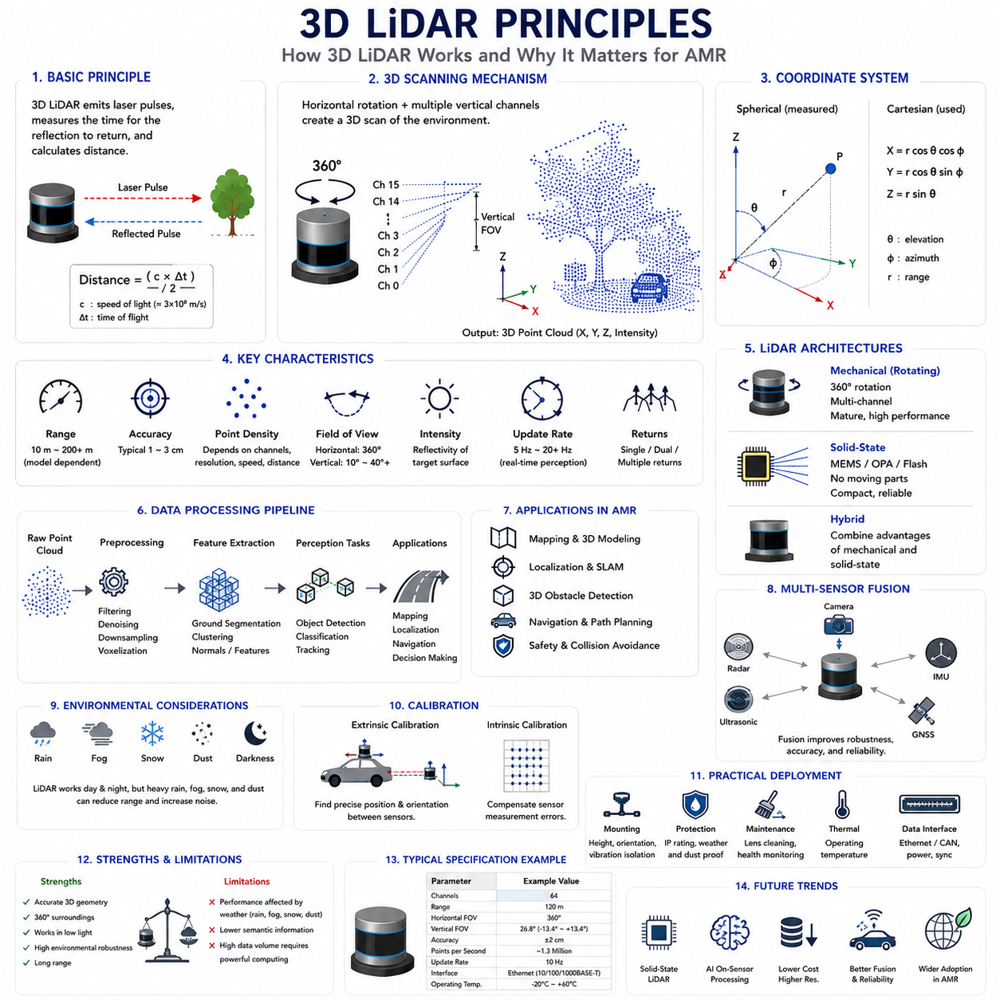
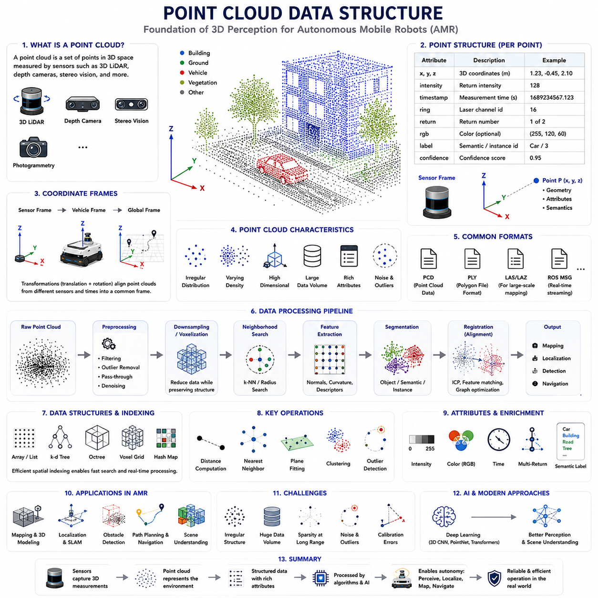
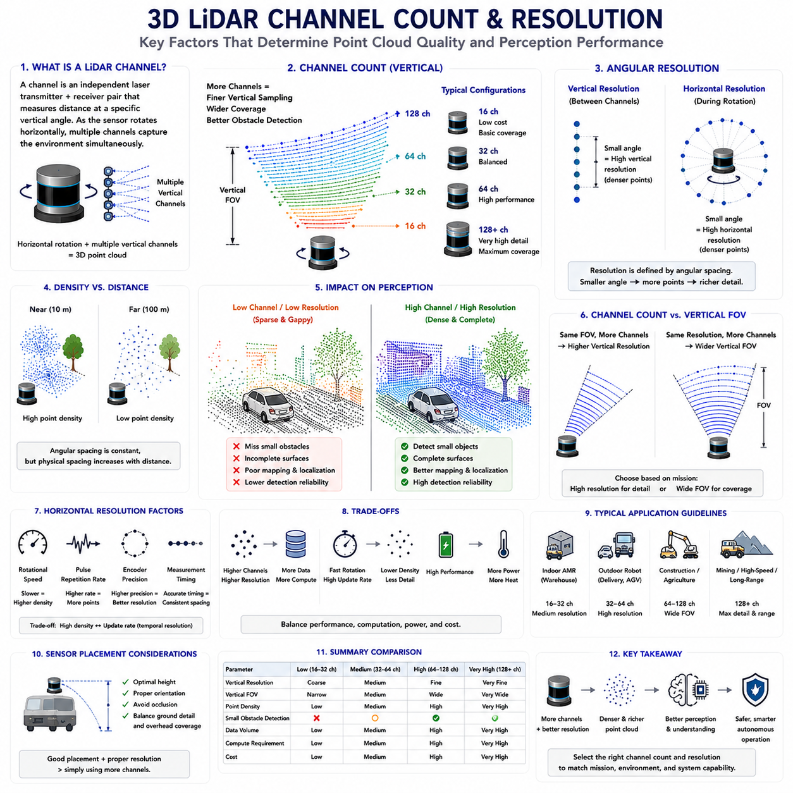
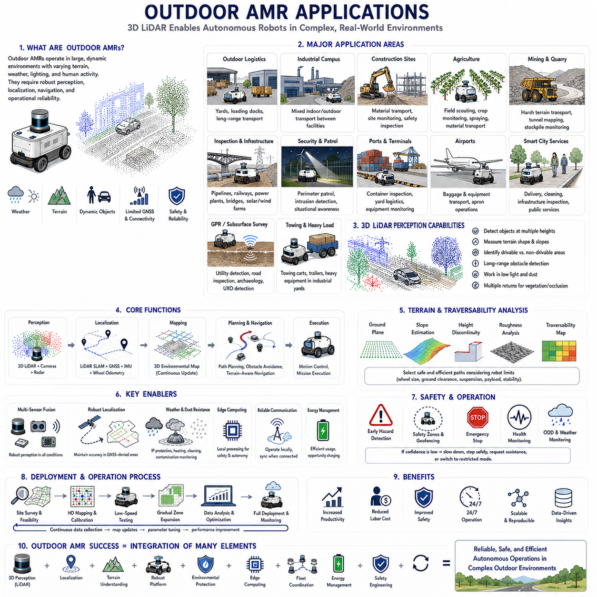
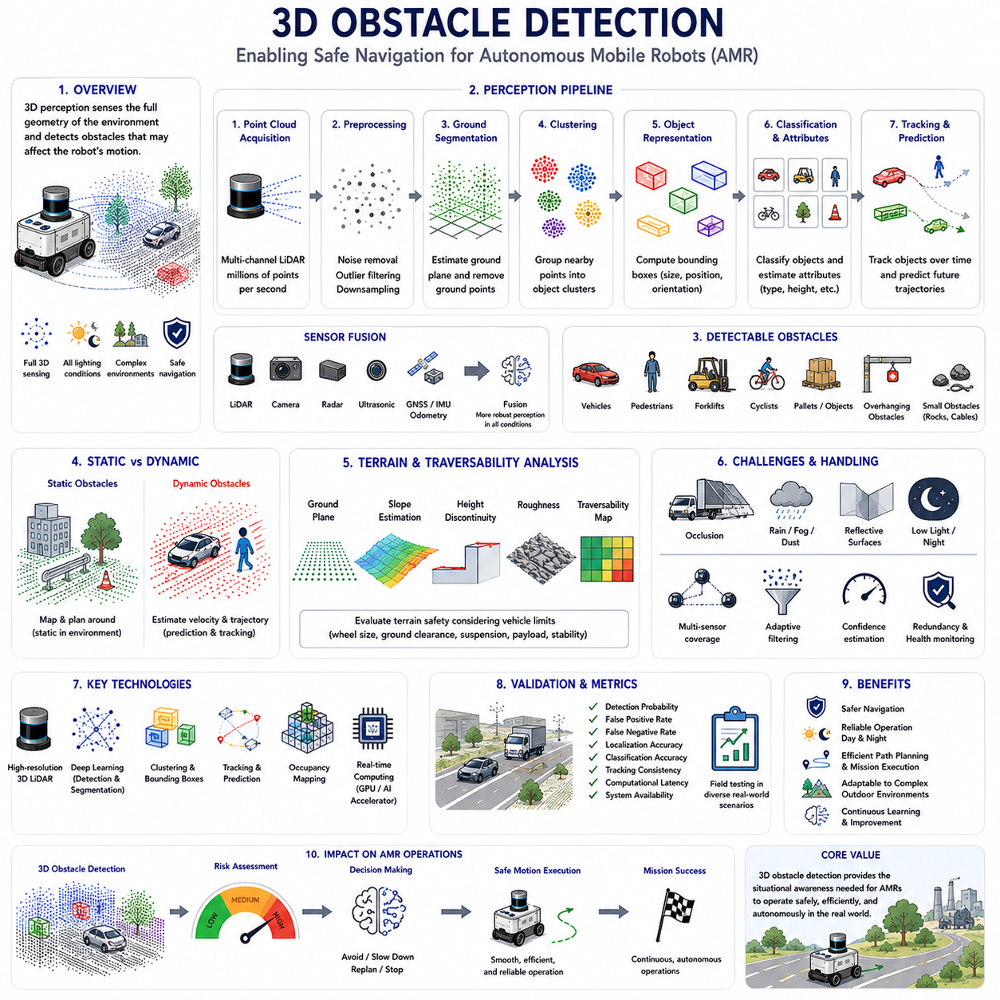
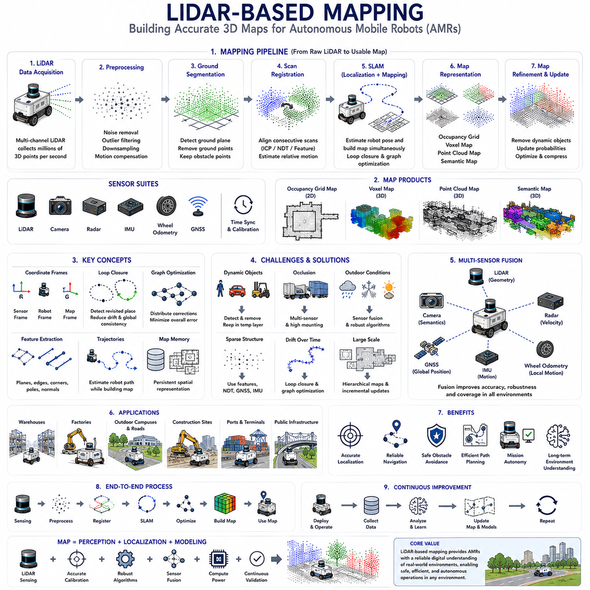
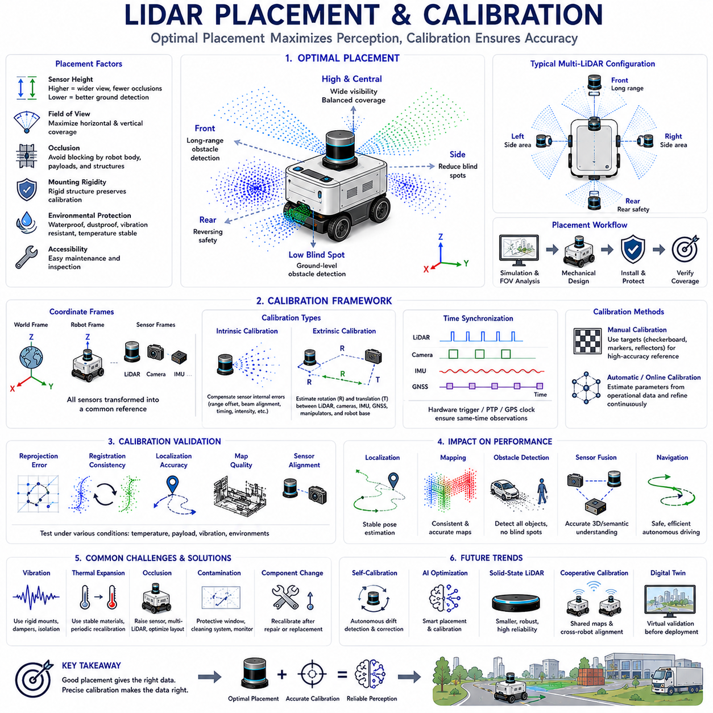
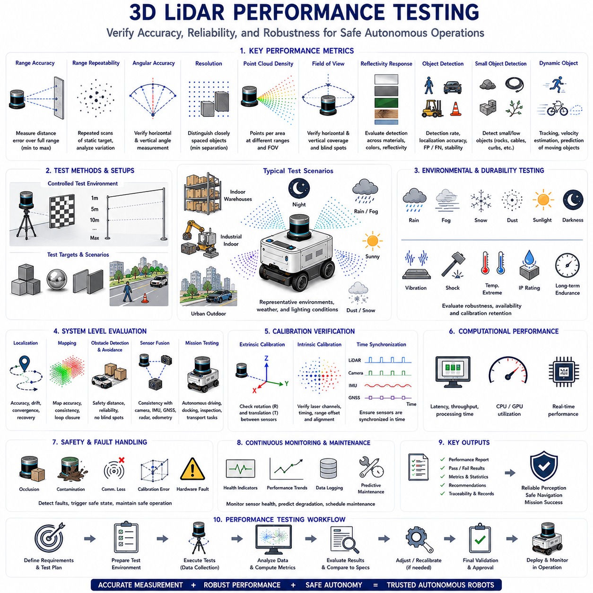

**Volume 03. AMR Sensors and Perception**

# 

# Chapter 03. 3D LiDAR

## 03.1 3D LiDAR Principles

{width="7.268055555555556in" height="7.268055555555556in"}

3D LiDAR (Light Detection and Ranging) has become one of the most important perception sensors for modern Autonomous Mobile Robots (AMRs), particularly in outdoor, semi-structured, and complex industrial environments. Unlike 2D LiDAR, which measures distances within a single scanning plane, 3D LiDAR captures three-dimensional spatial information by emitting thousands to millions of laser pulses every second and measuring the time required for each reflected pulse to return to the sensor. The resulting measurements generate a dense representation of the surrounding environment known as a point cloud, allowing robots to perceive objects, terrain, free space, and environmental structures with significantly greater spatial awareness. As AMRs continue to operate in increasingly dynamic environments, 3D LiDAR has evolved from a specialized research sensor into a core component of industrial robotic perception systems.

The fundamental operating principle of 3D LiDAR is based on optical ranging using laser light. A laser transmitter emits short pulses toward the environment, and a photodetector measures the reflected energy returning from surrounding objects. By accurately measuring the travel time of each laser pulse and multiplying it by the speed of light, the sensor calculates the distance between the LiDAR and the target. Because light travels approximately 300 million meters per second, extremely precise timing electronics operating at nanosecond resolution are required. Every distance measurement is associated with a specific horizontal and vertical emission angle, enabling the sensor to calculate the three-dimensional coordinates of the reflected point in space.

Most industrial 3D LiDAR systems use the Time-of-Flight (ToF) principle for distance measurement. In a Time-of-Flight system, the elapsed time between pulse emission and reception directly determines the measured range. Some modern solid-state LiDAR systems instead employ Frequency Modulated Continuous Wave (FMCW) techniques, where continuously varying laser frequencies provide simultaneous distance and velocity estimation. Although Time-of-Flight remains the dominant technology in industrial robotics because of its maturity, robustness, and cost effectiveness, FMCW technology continues to receive attention due to its ability to measure object velocity while improving resistance to optical interference.

Three-dimensional scanning requires both horizontal and vertical sampling of the environment. Traditional mechanical spinning LiDAR systems rotate a sensor head through 360 degrees while multiple vertically stacked laser channels simultaneously scan different elevation angles. Each rotation generates a complete three-dimensional observation of the surrounding environment. Depending on sensor design, the number of vertical channels may range from sixteen to more than one hundred twenty-eight, producing increasingly dense point clouds. Higher channel counts generally provide improved vertical resolution, better obstacle detection, and more reliable environmental modeling, although they also increase computational requirements and system cost.

The coordinate system generated by 3D LiDAR normally consists of Cartesian coordinates expressed as X, Y, and Z values relative to the sensor origin. Internally, however, measurements originate in spherical coordinates consisting of range, azimuth angle, and elevation angle. Coordinate transformation converts these measurements into Cartesian space where robotic algorithms perform mapping, localization, object detection, and navigation. Accurate calibration between the LiDAR coordinate frame and the robot reference frame is essential because even small mounting errors may produce significant localization and perception inaccuracies during long-distance navigation.

One of the defining characteristics of 3D LiDAR is its ability to produce dense point clouds representing the physical geometry of the environment. Unlike conventional camera images that primarily contain color and texture information, point clouds directly represent measurable three-dimensional structure. Every point corresponds to an actual physical reflection from the environment, enabling precise geometric reasoning without depending on ambient lighting conditions. This structural representation provides significant advantages for autonomous navigation because object dimensions, surface orientation, elevation changes, and obstacle boundaries can be measured directly rather than estimated from image appearance.

Point density plays a major role in perception performance. Density depends on several factors including laser channel count, rotational speed, angular resolution, measurement frequency, target distance, and field of view. Objects located near the sensor generally produce dense point distributions, while distant objects contain relatively fewer measurements because of angular sampling limitations. Engineers therefore balance rotational frequency and angular resolution according to application requirements. Faster scanning improves temporal responsiveness but reduces spatial density, whereas slower scanning increases geometric detail while potentially limiting responsiveness to rapidly changing environments.

Field of View is another critical parameter influencing perception capability. Most rotating 3D LiDAR systems provide complete three hundred sixty degree horizontal coverage, allowing robots to observe obstacles in every direction without blind regions. Vertical Field of View, however, varies considerably among sensor models and determines the ability to detect low obstacles, overhead structures, slopes, vegetation, loading docks, and complex terrain. Selecting an appropriate vertical coverage requires careful consideration of vehicle height, operating environment, obstacle characteristics, and intended application.

Measurement range directly influences operational capability in outdoor autonomous systems. Industrial AMRs operating in warehouses may require sensing distances between twenty and fifty meters, while outdoor logistics vehicles, mining robots, agricultural machines, and autonomous inspection platforms often require perception extending beyond one hundred meters. Effective range depends not only on laser power but also on target reflectivity, atmospheric conditions, beam divergence, receiver sensitivity, and environmental illumination. Manufacturers therefore specify both maximum measurable distance and measurement accuracy under standardized reflectivity conditions.

Measurement accuracy represents the difference between the measured distance and the true physical distance. High-quality industrial LiDAR sensors typically achieve centimeter-level accuracy over their operating range. Precision depends upon timing electronics, laser stability, calibration quality, optical alignment, environmental temperature, and target characteristics. Long-term stability is equally important because industrial robots operate continuously for extended periods under changing environmental conditions. Regular calibration verification ensures that measurement accuracy remains within acceptable operational tolerances throughout the product lifecycle.

Reflectivity is an important attribute accompanying geometric measurements. Besides distance, many LiDAR sensors record the intensity of returned laser energy, providing additional information regarding surface material properties. Bright reflective objects generally produce stronger return signals than dark or highly absorptive materials. Although reflectivity alone cannot uniquely identify object classes, combining geometric structure with intensity information improves segmentation, localization, mapping, and environmental understanding. Engineers often exploit reflectivity maps for infrastructure recognition, road marking detection, and localization against previously constructed reference maps.

Modern 3D LiDAR systems employ different scanning architectures depending on performance requirements and manufacturing constraints. Mechanical rotating LiDAR offers excellent field coverage and mature performance but contains moving components requiring careful reliability engineering. Solid-state LiDAR reduces mechanical complexity by using MEMS mirrors, optical phased arrays, flash illumination, or other electronic beam steering techniques. Hybrid architectures combine characteristics from both approaches to balance field coverage, reliability, resolution, cost, and manufacturing scalability. Sensor selection therefore depends upon operational requirements rather than any universally superior architecture.

Environmental robustness remains one of the major strengths of LiDAR technology. Because measurements depend primarily on active laser illumination rather than ambient visible light, performance remains relatively consistent during daytime, nighttime, tunnels, warehouses, and poorly illuminated industrial facilities. Nevertheless, adverse weather including heavy rain, dense fog, snow, airborne dust, and smoke attenuates laser energy and may introduce measurement noise. Water droplets and suspended particles generate unwanted reflections that reduce effective sensing distance and increase false detections. Robust perception systems therefore combine filtering algorithms with complementary sensing modalities to maintain reliable environmental awareness.

Multiple returns represent another important capability in modern LiDAR systems. When a laser beam encounters semi-transparent vegetation, fences, tree branches, or partially occluded structures, multiple reflections may occur before the beam fully dissipates. Advanced LiDAR sensors capture several return signals from a single emitted pulse, allowing perception algorithms to distinguish foreground vegetation from solid background structures. This capability significantly improves environmental modeling in forests, agricultural fields, construction sites, and other partially occluded environments frequently encountered by outdoor AMRs.

Temporal resolution determines how frequently the environment is updated. Rotational frequency, laser firing rate, and processing throughput collectively define the update rate available for downstream perception algorithms. Dynamic environments containing moving vehicles, pedestrians, forklifts, or rapidly changing obstacles require sufficiently high temporal resolution to maintain safe navigation. However, increasing update frequency generally increases computational load because larger volumes of point cloud data must be processed in real time. Efficient perception pipelines therefore balance sensing frequency with available computational resources.

The large amount of data generated by modern 3D LiDAR sensors presents substantial computational challenges. High-resolution sensors may generate millions of points every second, requiring efficient data preprocessing before higher-level perception algorithms can operate. Ground segmentation, voxelization, outlier removal, downsampling, clustering, feature extraction, and coordinate transformation reduce computational complexity while preserving essential environmental information. Hardware acceleration using Graphics Processing Units (GPUs) and parallel processing frameworks enables real-time execution of these computationally intensive operations within industrial autonomous systems.

Although 3D LiDAR provides exceptional geometric information, it does not independently solve every perception problem. Cameras contribute rich color and texture information, radar offers robust velocity estimation and weather resilience, ultrasonic sensors provide short-range obstacle detection, and GNSS together with inertial measurement units support global localization. Consequently, modern AMRs increasingly employ multi-sensor fusion architectures where LiDAR supplies precise geometric structure while complementary sensors compensate for its limitations. Sensor fusion significantly improves robustness, redundancy, and perception reliability across diverse operational conditions.

Calibration represents an essential requirement for successful LiDAR deployment. Intrinsic calibration verifies sensor-specific measurement characteristics, while extrinsic calibration establishes the precise spatial relationship between the LiDAR and other robot sensors including cameras, inertial measurement units, GNSS receivers, and wheel odometry systems. Calibration errors directly influence localization accuracy, object detection consistency, mapping quality, and sensor fusion performance. Automated calibration verification procedures therefore form an integral part of long-term industrial maintenance strategies.

Practical deployment considerations extend beyond sensing performance alone. Engineers must carefully select mounting height, orientation, vibration isolation, environmental protection, thermal management, cleaning accessibility, cable routing, and maintenance procedures. Improper mounting may introduce blind regions, excessive vibration, or structural occlusions that degrade perception quality. Outdoor deployments additionally require weather-resistant enclosures, contamination protection, lens cleaning mechanisms, and reliable operation across wide temperature ranges. Well-designed mechanical integration is therefore equally important as sensor selection itself.

The continuing evolution of 3D LiDAR technology is transforming robotic perception across industrial, commercial, and autonomous mobility applications. Higher resolution, lower cost, improved reliability, reduced power consumption, solid-state architectures, integrated artificial intelligence preprocessing, and increasingly sophisticated sensor fusion continue expanding the capabilities of autonomous mobile robots. As perception systems progress toward complete three-dimensional environmental understanding, 3D LiDAR will remain one of the foundational sensing technologies enabling reliable navigation, mapping, obstacle detection, and intelligent decision-making in next-generation autonomous robotic platforms.

## 03.2 Point Cloud Data Structure

{width="7.268055555555556in" height="7.268055555555556in"}

A point cloud is the fundamental data representation produced by modern three-dimensional sensing systems such as 3D LiDAR, depth cameras, stereo vision, structured light sensors, and photogrammetry. Instead of representing the environment as pixels organized in a two-dimensional image, a point cloud describes the physical world as a collection of individual points located in three-dimensional space. Each point corresponds to a measured location on the surface of a physical object and typically contains spatial coordinates together with additional sensor attributes. For Autonomous Mobile Robots (AMRs), point clouds provide a direct geometric representation of the surrounding environment, forming the foundation for perception, localization, mapping, obstacle detection, navigation, and scene understanding. Understanding the structure of point cloud data is therefore essential for designing reliable robotic perception systems.

Every point within a point cloud is fundamentally an independent spatial measurement. The minimum information associated with each point consists of three Cartesian coordinates represented as X, Y, and Z values relative to a defined reference frame. These coordinates describe the precise position of the reflected laser beam or depth measurement in three-dimensional space. Depending on the sensing technology, additional attributes such as intensity, reflectivity, timestamp, ring number, return number, color information, semantic labels, confidence scores, or object identifiers may also be stored. Modern robotic perception systems therefore treat each point as a multidimensional data structure rather than merely a geometric coordinate.

Coordinate systems play a central role in organizing point cloud information. Raw sensor measurements are initially represented within the local coordinate frame of the sensing device. During robot operation, coordinate transformations convert these measurements into vehicle coordinates, global map coordinates, or application-specific reference frames. Transformation matrices incorporating translation and rotation allow point clouds from multiple sensors or different time instances to be aligned consistently. Maintaining accurate coordinate relationships is essential because even small calibration errors accumulate into significant mapping and localization inaccuracies over long operational periods.

Unlike conventional images, point clouds generally possess no fixed neighborhood structure. Pixels within an image naturally occupy regular positions on a rectangular grid, allowing neighboring pixels to be accessed directly through array indexing. Point clouds instead consist of irregularly distributed spatial samples whose density depends upon sensor resolution, object distance, viewing angle, surface reflectivity, and environmental conditions. Consequently, many perception algorithms must first establish spatial relationships between neighboring points before performing higher-level analysis such as segmentation, clustering, or surface estimation.

Point density varies significantly throughout the observed environment. Objects located close to the sensor generally produce dense measurements because adjacent laser beams intersect nearby surfaces with relatively small spatial separation. As measurement distance increases, the angular spacing between laser beams translates into much larger physical spacing, reducing point density considerably. Surface orientation further influences sampling density because oblique surfaces receive fewer reflected measurements than surfaces oriented perpendicular to incoming laser beams. Understanding these density variations is important when designing perception algorithms that remain robust across both near-field and far-field observations.

Organized and unorganized point clouds represent two common structural formats used in robotics. Organized point clouds preserve the original image-like arrangement generated by depth cameras or stereo vision systems, where each point corresponds directly to a pixel location. This regular organization simplifies neighborhood operations and image-based processing techniques. Unorganized point clouds, commonly produced by rotating LiDAR systems, consist simply of unordered collections of three-dimensional points without inherent spatial indexing. Although unorganized clouds require additional data structures for efficient processing, they provide greater flexibility for representing large-scale outdoor environments.

Modern point cloud formats often store considerably more than geometric coordinates alone. Intensity values represent the strength of reflected laser energy and provide useful information regarding material characteristics. Timestamp information records precisely when each measurement occurred, supporting motion compensation during robot movement. Ring identifiers specify which laser channel generated each measurement in multi-beam LiDAR systems, facilitating sensor diagnostics and calibration. Multiple return information distinguishes different reflection events generated by a single emitted laser pulse, improving perception in vegetation, fences, and partially transparent environments. These additional attributes substantially enrich downstream perception algorithms.

Several standardized file formats are widely used for storing and exchanging point cloud data. The Point Cloud Data (PCD) format developed within the Point Cloud Library is commonly used throughout robotics research and development because it supports flexible attribute definitions and efficient storage. Polygon File Format (PLY) additionally stores point clouds together with color information and surface meshes. LAS and LAZ formats are widely used within surveying and geographic information systems for large-scale mapping applications. Robot Operating System message formats enable efficient transmission of point cloud streams during real-time autonomous operation. Selecting an appropriate storage format depends upon application requirements, interoperability, and processing efficiency.

Because modern LiDAR sensors generate millions of points every second, efficient memory organization becomes essential. Sequential array storage provides straightforward implementation but may limit search performance during nearest-neighbor queries. Advanced data structures including k-d trees, octrees, voxel grids, hash maps, and spatial indexing techniques significantly accelerate geometric search operations while reducing computational complexity. Efficient memory management directly influences real-time perception performance because object detection, localization, mapping, and obstacle avoidance all depend upon rapid spatial queries executed continuously during robot operation.

Preprocessing represents the first computational stage applied to raw point cloud data. Real sensor measurements frequently contain random noise, isolated outliers, duplicate points, atmospheric reflections, and measurement artifacts. Statistical filtering, radius-based filtering, pass-through filtering, and outlier removal techniques eliminate unreliable measurements while preserving meaningful environmental structure. Downsampling algorithms reduce data volume by replacing neighboring points with representative samples, significantly decreasing computational requirements without substantially degrading geometric accuracy. Effective preprocessing establishes a reliable foundation for all subsequent perception algorithms.

Voxelization is one of the most widely used techniques for organizing point cloud data. Rather than processing millions of individual points independently, voxelization divides three-dimensional space into uniformly sized volumetric cells known as voxels. Points falling within the same voxel are combined using representative statistics such as centroid location, average intensity, or occupancy probability. Voxel representations greatly simplify computational processing while maintaining essential geometric structure. Many modern three-dimensional deep learning architectures operate directly upon voxelized point clouds because regular volumetric organization enables efficient convolutional operations.

Neighborhood search constitutes one of the most frequently executed operations during point cloud processing. Surface normal estimation, segmentation, clustering, feature extraction, registration, and object recognition all require identifying neighboring points surrounding each measurement. Radius-based searches identify points within a specified Euclidean distance, whereas k-nearest neighbor searches retrieve a fixed number of closest points regardless of physical distance. Efficient spatial indexing significantly reduces search complexity, allowing real-time perception algorithms to process large-scale point clouds generated continuously by industrial autonomous robots.

Surface normal estimation transforms discrete point measurements into locally meaningful geometric descriptions. By analyzing neighboring point distributions, algorithms estimate the orientation of local surfaces represented by each point. Surface normals support obstacle classification, ground plane estimation, segmentation, object recognition, mesh generation, and registration between overlapping point clouds. Accurate normal estimation depends strongly upon neighborhood selection because neighborhoods that are too small become sensitive to noise, whereas excessively large neighborhoods smooth important geometric details.

Feature extraction converts raw geometric measurements into descriptive representations suitable for higher-level perception tasks. Local geometric descriptors characterize curvature, planarity, roughness, edge structure, and surface orientation. Global descriptors summarize object-level characteristics supporting classification and recognition. Widely used descriptors include Fast Point Feature Histograms, Signature of Histograms of Orientations, and learned feature embeddings generated through deep neural networks. Effective feature representations enable robots to recognize environmental structures despite viewpoint changes, partial occlusions, and varying measurement density.

Point cloud segmentation divides raw measurements into meaningful regions representing distinct objects, surfaces, or semantic categories. Geometric segmentation identifies planar regions, cylindrical structures, vegetation, or irregular terrain based upon local spatial characteristics. Semantic segmentation assigns every point to predefined object classes such as ground, building, vehicle, pedestrian, vegetation, or obstacle using machine learning techniques. Instance segmentation further distinguishes individual object instances belonging to identical semantic categories. Segmentation therefore transforms unstructured geometric measurements into meaningful environmental understanding suitable for autonomous decision making.

Registration aligns multiple point clouds collected from different viewpoints or different times into a common coordinate system. Iterative Closest Point remains one of the most widely applied registration algorithms, minimizing geometric differences between overlapping observations. More advanced techniques combine feature matching, probabilistic optimization, graph-based estimation, and global consistency constraints. Registration forms the computational foundation for simultaneous localization and mapping, multi-session mapping, map updating, and collaborative multi-robot perception because accurate alignment enables consistent environmental reconstruction.

Compression has become increasingly important as sensor resolution continues increasing. Raw point clouds generated during extended robot operation consume enormous storage capacity while imposing significant communication bandwidth requirements. Lossless compression preserves exact measurements but achieves relatively limited compression ratios. Lossy compression techniques exploit spatial redundancy to reduce storage requirements while maintaining acceptable geometric fidelity for downstream perception tasks. Efficient compression enables long-term data logging, cloud synchronization, fleet analytics, and large-scale dataset construction without overwhelming computational infrastructure.

Artificial intelligence has fundamentally transformed point cloud processing during recent years. Traditional geometric algorithms relied heavily upon handcrafted features and explicit mathematical modeling. Modern deep learning architectures including PointNet, PointNet++, Dynamic Graph CNN, Point Transformer, Sparse Convolution Networks, and voxel-based neural networks learn hierarchical geometric representations directly from raw point cloud data. These models significantly improve object detection, semantic segmentation, scene understanding, and three-dimensional perception across diverse operational environments while reducing dependence upon manually engineered feature extraction pipelines.

Although point clouds provide exceptionally rich geometric information, they also present unique computational challenges. Their irregular structure complicates conventional image processing techniques, large data volumes demand efficient memory management, measurement sparsity increases with distance, and environmental noise influences geometric reliability. Successful robotic perception therefore combines efficient data structures, robust preprocessing, intelligent feature extraction, advanced machine learning, and optimized computational architectures. As sensing technologies continue evolving, point cloud data structures will remain one of the most fundamental representations supporting autonomous perception, environmental understanding, and intelligent decision-making throughout the next generation of Autonomous Mobile Robot systems.

## 03.3 Channel Count and Resolution

{width="7.268055555555556in" height="7.268055555555556in"}

Channel count and resolution are two of the most influential specifications determining the performance of a three-dimensional LiDAR system. Although parameters such as maximum range, measurement accuracy, scan frequency, and field of view are also important, the number of laser channels and the angular resolution directly influence how much geometric information can be collected from the surrounding environment. These characteristics determine the density, completeness, and spatial quality of the generated point cloud, ultimately affecting localization, mapping, obstacle detection, object recognition, and autonomous navigation. For Autonomous Mobile Robots (AMRs), selecting an appropriate LiDAR configuration requires balancing perception performance against computational cost, system complexity, power consumption, and overall project budget.

A LiDAR channel represents an individual laser transmitter and receiver pair capable of measuring distances along a specific vertical direction. Multi-channel LiDAR systems arrange numerous laser beams vertically, allowing the sensor to simultaneously observe multiple elevation angles while the scanning mechanism rotates horizontally. Each channel continuously generates independent range measurements, collectively producing a complete three-dimensional representation of the environment. The channel count therefore determines how many vertical sampling layers are available during each rotational scan. Increasing the number of channels directly improves vertical coverage and environmental detail without requiring multiple independent sensors.

Early industrial LiDAR systems commonly employed sixteen or thirty-two channels because they provided an effective compromise between sensing capability and hardware cost. As robotic applications expanded into autonomous driving, outdoor logistics, construction robotics, mining equipment, and high-speed mobile platforms, sixty-four, one hundred twenty-eight, and even higher channel configurations became increasingly common. Higher channel counts allow the sensor to detect smaller obstacles, capture more detailed environmental geometry, improve surface continuity, and increase measurement redundancy. However, additional channels also increase manufacturing complexity, processing requirements, data bandwidth, and overall system cost.

Vertical resolution describes the angular separation between adjacent laser channels. A smaller angular spacing produces denser vertical sampling, enabling more detailed reconstruction of environmental structures. Fine vertical resolution allows perception algorithms to distinguish curbs, small rocks, branches, cables, loading docks, stairs, uneven terrain, and partially occluded objects that might otherwise remain undetected. Conversely, coarse vertical resolution may leave significant gaps between adjacent scan lines, particularly at long distances where small angular differences correspond to large physical separations. Vertical resolution therefore becomes increasingly important for outdoor robots operating in complex natural environments.

Horizontal resolution refers to the angular interval between successive measurements acquired during sensor rotation. Unlike vertical resolution, which is primarily determined by the physical arrangement of laser channels, horizontal resolution depends upon rotational speed, pulse repetition frequency, encoder precision, and measurement timing. Slower rotational speeds generally increase horizontal point density because more laser pulses are emitted during each complete revolution. Faster scanning improves temporal responsiveness but reduces spatial sampling density. Engineers therefore optimize horizontal resolution according to vehicle speed, environmental dynamics, computational resources, and required perception accuracy.

Channel count and angular resolution together determine overall point cloud density. Two sensors with identical channel counts may produce significantly different point densities if their rotational frequency, pulse repetition rate, or horizontal resolution differ substantially. Similarly, sensors possessing identical angular resolution but different channel counts generate different vertical coverage. Perception quality therefore depends upon the combined interaction of multiple sensing parameters rather than any single specification considered independently. System engineers evaluate these parameters collectively according to application-specific operational requirements instead of maximizing every specification simultaneously.

The relationship between channel count and detection capability becomes particularly important when identifying small obstacles. Low-profile hazards such as stones, pipes, cables, potholes, construction debris, or damaged pavement may occupy only a few centimeters of vertical height. High-channel sensors produce more laser intersections with these objects, increasing detection probability and reducing the likelihood of hazardous blind regions. Low-channel sensors may completely miss such obstacles if no laser beam intersects the object during a particular scan. Consequently, industrial safety requirements frequently dictate minimum sensing density rather than merely specifying maximum measurement range.

Distance significantly influences effective spatial resolution. Although the angular spacing between adjacent laser beams remains constant, physical separation increases proportionally with distance. Objects located ten meters from the sensor may be represented by numerous neighboring points, whereas identical objects located one hundred meters away produce far fewer measurements. Consequently, distant objects become increasingly sparse regardless of channel count. Higher-resolution LiDAR systems partially compensate for this phenomenon by reducing angular spacing and increasing laser density, thereby maintaining useful environmental information over extended sensing distances.

Surface orientation also affects measurement resolution. Objects directly facing the LiDAR sensor generally generate dense and uniformly distributed point clouds because laser beams intersect the surface nearly perpendicular to its orientation. Surfaces observed at shallow incidence angles receive fewer effective measurements because reflected energy decreases while neighboring laser beams become increasingly separated across the surface. Curved objects further complicate sampling because different regions of the surface exhibit continuously changing orientations. Understanding these geometric relationships allows engineers to position LiDAR sensors strategically for maximum environmental coverage.

Field of View and channel count are closely related but represent distinct sensor characteristics. Increasing the number of channels without expanding the vertical Field of View reduces angular spacing and therefore improves vertical resolution. Alternatively, maintaining constant angular spacing while adding channels increases total vertical coverage. Different LiDAR manufacturers prioritize these design objectives according to intended applications. Autonomous highway vehicles frequently emphasize long-distance resolution, whereas mobile robots operating within warehouses or construction environments often prioritize wider vertical coverage capable of detecting both ground-level hazards and elevated obstacles simultaneously.

The rotational frequency of the LiDAR sensor directly influences temporal resolution. Slow rotational speeds produce dense point clouds with excellent geometric detail but provide fewer environmental updates each second. High rotational frequencies increase perception responsiveness in rapidly changing environments but reduce point density because fewer measurements are collected during each revolution. Fast-moving autonomous vehicles generally require higher update frequencies to react promptly to dynamic obstacles, while slower industrial AMRs may prioritize dense environmental reconstruction over extremely rapid refresh rates.

Pulse repetition frequency defines how many laser pulses are emitted every second. Modern industrial LiDAR systems often generate hundreds of thousands or even millions of measurements per second. Higher pulse frequencies increase point cloud density while supporting finer horizontal resolution at higher rotational speeds. However, increasing pulse frequency also raises computational demands, communication bandwidth requirements, electrical power consumption, and thermal management complexity. Sensor designers therefore optimize laser firing rates according to hardware capabilities and intended operational environments.

Measurement overlap provides another important advantage of higher channel counts. Multiple neighboring laser beams frequently observe the same object from slightly different vertical perspectives, improving robustness against isolated measurement failures, temporary occlusions, and reflective artifacts. Redundant observations enhance obstacle classification, surface reconstruction, localization accuracy, and object tracking by providing multiple independent geometric measurements. Redundancy also improves reliability during adverse weather where individual laser returns may be partially attenuated by rain, fog, dust, or airborne particles.

The computational implications of increasing channel count cannot be overlooked. Higher-resolution sensors generate substantially larger point clouds requiring additional memory, processing power, storage capacity, and communication bandwidth. Algorithms for filtering, segmentation, clustering, registration, object detection, semantic understanding, and deep learning inference must process significantly more data within strict real-time constraints. Consequently, perception software increasingly relies upon Graphics Processing Units, parallel computing, sparse data representations, voxelization, and efficient spatial indexing techniques to maintain deterministic performance despite rapidly growing sensor resolution.

Application requirements strongly influence appropriate channel selection. Indoor warehouse robots operating in relatively structured environments frequently achieve excellent performance using sixteen or thirty-two channel sensors because environmental complexity remains limited while travel speeds are relatively low. Outdoor delivery robots, agricultural vehicles, autonomous construction machines, mining equipment, and high-speed inspection robots generally benefit from sixty-four or higher channel systems because uneven terrain, vegetation, weather, dynamic obstacles, and greater operational distances demand richer environmental information. Selecting excessive sensing capability unnecessarily increases system cost without proportionate operational benefit.

Sensor placement interacts closely with channel count and resolution. A high-resolution LiDAR mounted too low may experience significant occlusion from nearby structures or vehicle components. Conversely, mounting the sensor excessively high may reduce ground sampling density immediately surrounding the robot. Engineers optimize mounting height, orientation, inclination angle, and protective enclosure together with sensor specifications to maximize practical environmental coverage. Effective mechanical integration frequently provides greater operational improvement than selecting a more expensive sensor possessing only marginally higher resolution.

Artificial intelligence algorithms increasingly exploit dense point cloud information generated by modern high-channel LiDAR systems. Deep neural networks performing three-dimensional object detection, semantic segmentation, scene understanding, occupancy prediction, and terrain classification generally benefit from richer geometric information. Higher-resolution point clouds enable more accurate feature extraction while reducing ambiguity between object classes. Nevertheless, diminishing returns eventually appear because computational cost increases more rapidly than incremental perception improvement beyond certain sensing densities. Practical system design therefore balances sensor capability with available computational resources and real-time processing constraints.

Evaluation of LiDAR resolution extends beyond manufacturer specifications into practical field testing. Engineers assess obstacle detection distance, smallest detectable object size, localization consistency, mapping quality, segmentation accuracy, environmental robustness, and computational performance under representative operational conditions. Standardized benchmark environments enable objective comparison among different sensor configurations while exposing tradeoffs between sensing performance, processing requirements, and overall system efficiency. Field validation remains essential because laboratory specifications rarely capture the full complexity of industrial operating environments.

Emerging LiDAR technologies continue advancing channel count, angular resolution, measurement range, update frequency, and sensing intelligence simultaneously. Solid-state architectures, adaptive scanning strategies, dynamic resolution control, artificial intelligence assisted perception, integrated preprocessing, and hybrid sensing approaches promise substantial improvements over conventional fixed-resolution systems. Rather than pursuing maximum channel count alone, future LiDAR development increasingly emphasizes intelligent allocation of sensing resources according to environmental complexity, robot motion, and mission requirements. This adaptive approach enables autonomous mobile robots to achieve superior perception performance while maintaining efficient computational utilization, energy consumption, and system cost throughout diverse operational scenarios.

## 03.4 Outdoor AMR Applications

{width="7.268055555555556in" height="7.268055555555556in"}

Outdoor Autonomous Mobile Robot (AMR) applications extend mobile robotics beyond controlled indoor facilities into environments where terrain, weather, lighting, communication, and human activity change continuously. These systems operate across logistics yards, construction sites, farms, mines, industrial campuses, ports, airports, security zones, and public infrastructure. Unlike indoor AMRs that move through relatively stable floors and predefined pathways, outdoor robots must perceive large spaces, handle uneven ground, tolerate environmental contamination, and maintain reliable localization over long distances. Their successful deployment depends upon the close integration of robust mechanical platforms, three-dimensional sensing, global and local localization, intelligent navigation, environmental protection, and continuous operational monitoring.

Three-dimensional LiDAR plays a central role in outdoor AMR applications because it provides direct geometric measurements of surrounding structures regardless of ambient visible light. Outdoor robots encounter slopes, curbs, potholes, vegetation, construction materials, vehicles, workers, fences, ditches, and irregular ground surfaces that cannot be represented sufficiently by a single horizontal scanning plane. A 3D LiDAR captures both horizontal and vertical structure, enabling the robot to estimate object height, terrain geometry, free space, and potential overhanging hazards. This capability supports safer navigation in environments where obstacles may appear above, below, or outside the sensing plane of conventional 2D sensors.

Outdoor logistics is one of the most important application domains for AMRs. Robots transport materials between warehouses, production buildings, loading docks, parking areas, and storage yards where travel distances may be considerably longer than indoor routes. These systems must detect trucks, forklifts, trailers, pallets, workers, and temporary obstacles while operating across roads, ramps, and open yards. Three-dimensional perception helps distinguish drivable surfaces from curbs, barriers, loading platforms, and roadside structures. Long-range sensing allows the navigation system to plan smoother trajectories and respond earlier to approaching vehicles or blocked routes.

Industrial campus transportation requires robots to operate across mixed environments combining indoor corridors, covered passages, outdoor roads, and semi-enclosed production areas. The robot may leave a factory building, travel across an exposed yard, enter another facility, and complete a delivery without human intervention. Such transitions create major perception and localization challenges because lighting, surface texture, GNSS availability, and environmental structure change rapidly. Outdoor AMRs therefore combine LiDAR-based localization, GNSS, inertial sensing, wheel odometry, and map matching to preserve accurate positioning across these different operational zones.

Construction sites represent one of the most demanding environments for outdoor mobile robots. Terrain changes frequently as equipment moves, materials are delivered, excavations are created, and temporary structures are installed. Dust, vibration, debris, uneven surfaces, and partially completed buildings reduce the effectiveness of sensing systems designed for fixed environments. 3D LiDAR enables construction robots to detect terrain variation, estimate surface elevation, identify blocked pathways, and update maps as the site evolves. These capabilities support material transportation, progress monitoring, dimensional inspection, safety patrol, and autonomous data collection.

Agricultural robots operate in fields, orchards, greenhouses, and livestock facilities where vegetation creates highly irregular and partially transparent structures. Crops, branches, leaves, fences, soil ridges, irrigation equipment, and moving animals generate complex point cloud patterns. Multiple-return LiDAR helps distinguish foreground vegetation from objects behind it, while three-dimensional terrain analysis supports navigation over rows, slopes, and soft ground. Agricultural AMRs use these capabilities for crop monitoring, spraying, harvesting assistance, material transport, soil inspection, and autonomous scouting.

Mining and quarry applications require heavy-duty autonomous robots capable of operating across rough terrain, steep slopes, dust, vibration, and limited communication coverage. Vehicles may transport tools, inspect tunnels, monitor stockpiles, or collect environmental data in areas that are hazardous for human workers. Long-range 3D LiDAR supports obstacle detection, tunnel mapping, berm recognition, and terrain modeling, while high-density point clouds assist in identifying rocks, debris, and road edge conditions. Robust mechanical integration and environmental protection are essential because sensor contamination and vibration can directly degrade perception reliability.

Outdoor inspection robots are increasingly used to monitor pipelines, railways, power facilities, bridges, solar farms, wind farms, and industrial infrastructure. These platforms must navigate around large structures while carrying cameras, thermal sensors, acoustic devices, or specialized inspection equipment. 3D LiDAR provides geometric context for route planning and enables accurate positioning of inspection measurements relative to physical assets. By combining point cloud maps with inspection data, operators can compare structural changes over time, identify deformation, and create digital records supporting preventive maintenance.

Security and patrol robots operate around campuses, warehouses, airports, military facilities, data centers, and public infrastructure. Their missions include perimeter monitoring, intrusion detection, environmental observation, and remote situational awareness. Outdoor patrol robots must move reliably during daytime and nighttime while detecting people, vehicles, gates, fences, and unusual objects. LiDAR maintains geometric sensing in low-light conditions, while cameras and thermal sensors contribute semantic and thermal information. Multi-sensor fusion allows the robot to distinguish relevant threats from ordinary environmental movement.

Ports and container terminals create complex outdoor environments containing heavy vehicles, cranes, containers, workers, and continuously changing storage layouts. Autonomous robots may transport tools, inspect container rows, monitor equipment, or support yard logistics. Tall containers and metal surfaces create occlusions, reflections, and narrow corridors that demand precise three-dimensional perception. LiDAR-based mapping and localization help robots maintain stable navigation when GNSS signals are degraded between container stacks, while fleet-level traffic management coordinates movement around trucks and cargo-handling equipment.

Airport ground operations provide another important application area. Outdoor robots may transport baggage, tools, spare parts, catering equipment, or maintenance materials across aprons and service roads. These areas contain aircraft, fuel vehicles, baggage tractors, workers, service equipment, and strict operational safety zones. Long-range sensing enables early detection of moving objects, while high-resolution point clouds support accurate boundary recognition and docking. Reliable communication, geofencing, emergency stopping, and integration with airport operational systems are essential for safe deployment.

Smart city applications include delivery robots, cleaning robots, surveillance platforms, infrastructure inspection vehicles, and public service robots operating on sidewalks, pedestrian zones, parks, and roads. These environments are highly dynamic and contain pedestrians, bicycles, pets, street furniture, vegetation, curbs, ramps, and temporary obstructions. Outdoor AMRs must interpret both geometric structure and human behavior while complying with local operating rules. Three-dimensional sensing supports obstacle detection and free-space estimation, but safe operation also requires semantic perception, trajectory prediction, and socially acceptable navigation behavior.

Ground-penetrating radar robots combine outdoor mobility with subsurface sensing for utility detection, road inspection, archaeological surveys, and unexploded object investigation. The mobile platform must maintain stable motion and precise trajectory control because the quality of ground-penetrating radar measurements depends strongly upon sensor position, speed, and surface contact. 3D LiDAR maps surrounding terrain, identifies obstacles, and supports accurate georeferencing of subsurface measurements. This integration allows inspection results to be associated with precise surface locations and later visualized within digital maps.

Outdoor towing AMRs move carts, trailers, equipment, or heavy materials across industrial yards and large facilities. Towing creates additional navigation challenges because the vehicle combination has a longer footprint, different turning behavior, and increased risk of trailer collision. Three-dimensional LiDAR assists in estimating clearance around both the tractor and the towed load, while navigation algorithms account for articulation, reversing, and wide turning paths. High-resolution environmental models are especially important near loading areas, narrow passages, and shared vehicle routes.

Terrain perception is a fundamental function for nearly every outdoor AMR. The robot must distinguish traversable ground from curbs, holes, ditches, steps, steep slopes, soft surfaces, and unstable terrain. Point cloud algorithms estimate the ground plane, local slope, surface roughness, height discontinuities, and obstacle boundaries. These measurements are transformed into traversability maps used by path planners to select routes compatible with the robot's mechanical limits. The perception system must consider wheel size, ground clearance, suspension travel, payload, and stability rather than classifying every geometric variation as either simply free or occupied.

Outdoor localization often requires multiple sensing technologies because no single method remains reliable under all conditions. GNSS provides global positioning in open areas but degrades near buildings, trees, tunnels, and metal structures. LiDAR localization matches current point clouds against previously created maps, while inertial sensors and wheel odometry estimate motion between measurements. Sensor fusion combines these sources according to their confidence, allowing the robot to maintain stable localization during partial GNSS outages or temporary perception degradation. Robust localization is essential because navigation errors can increase rapidly across large outdoor spaces.

Weather has a direct influence on outdoor AMR performance. Rain, fog, snow, dust, water spray, and strong sunlight can reduce sensor range or introduce false measurements. LiDAR beams may reflect from airborne particles, while water droplets on optical windows may block or distort returns. Successful systems use weather-resistant housings, drainage paths, heaters, lens cleaning devices, and contamination monitoring together with filtering algorithms. Radar and other complementary sensors are often added because they maintain useful detection performance under conditions that significantly reduce optical sensing quality.

Environmental lighting changes also affect the broader perception system. LiDAR itself operates through active illumination, but cameras may experience glare, shadows, darkness, and rapid exposure transitions. Outdoor AMRs therefore combine geometric sensing with adaptive camera exposure, high-dynamic-range imaging, thermal sensing, or radar. Time synchronization and calibration are critical because information from different sensors must describe the same scene at the same moment. Poor synchronization can create apparent object displacement, particularly when the robot or surrounding vehicles are moving.

Communication architecture must support operation across large areas where wireless coverage may be incomplete. Essential functions such as safety, obstacle avoidance, localization, and local mission execution must remain available on the robot even when cloud or fleet communication is interrupted. Edge computing allows the AMR to process LiDAR point clouds, detect hazards, and continue controlled operation locally. Once communication is restored, mission data, health information, and recorded sensor data can be synchronized with fleet and cloud systems.

Energy management becomes more difficult outdoors because mission distances, slopes, payload, temperature, and terrain resistance vary considerably. Cold weather can reduce battery performance, while rough surfaces and steep grades increase motor current. The fleet system must estimate energy consumption dynamically and schedule charging according to actual operating conditions rather than fixed assumptions. Outdoor charging stations require weather protection, reliable docking, drainage, thermal management, and secure electrical interfaces. Opportunity charging may be used during waiting periods to improve fleet availability.

Safety engineering for outdoor AMRs requires consideration of higher speeds, longer stopping distances, mixed traffic, and uncertain environmental conditions. The perception system must detect hazards early enough for controlled deceleration, while the safety architecture monitors emergency stops, protective zones, communication status, localization confidence, and actuator health. Operational design domains should define the environmental and weather conditions within which autonomous operation is permitted. When confidence falls below an acceptable threshold, the robot may reduce speed, stop safely, request assistance, or transition to a restricted operating mode.

Deployment success depends upon detailed site analysis and progressive field validation. Engineers survey terrain, traffic flow, wireless coverage, GNSS quality, drainage, lighting, seasonal conditions, and expected obstacles before autonomous operation begins. Initial testing is conducted at low speed and within restricted areas before the operating zone is expanded. Recorded point clouds, localization logs, obstacle events, intervention records, and energy data are analyzed continuously. This process reveals environmental cases that were absent from simulation and supports the gradual improvement of maps, perception parameters, and navigation policies.

Outdoor AMR applications demonstrate that autonomous mobility is not achieved through a single sensor or algorithm. Reliable operation emerges from the integration of three-dimensional perception, multi-sensor localization, terrain analysis, robust mechanical design, environmental protection, edge computing, fleet coordination, energy management, and disciplined field validation. As LiDAR resolution improves and artificial intelligence becomes more capable of interpreting complex outdoor scenes, AMRs will expand into increasingly demanding logistics, inspection, agriculture, construction, mining, security, and public service missions. Their long-term success will depend upon designing systems that remain safe, maintainable, and adaptable as real environments continue to change.

## 03.5 3D Obstacle Detection

{width="7.268055555555556in" height="7.268055555555556in"}

Three-dimensional obstacle detection is one of the core perception functions enabling Autonomous Mobile Robots (AMRs) to operate safely and autonomously in complex environments. Unlike two-dimensional sensing, which observes obstacles only within a single scanning plane, three-dimensional perception captures the complete spatial geometry of surrounding objects. This allows robots to recognize hazards that vary in height, shape, orientation, and elevation while simultaneously understanding traversable terrain and free space. As AMRs expand from structured indoor facilities into outdoor logistics, construction sites, agricultural fields, industrial campuses, and public infrastructure, reliable three-dimensional obstacle detection has become essential for ensuring operational safety, navigation accuracy, and mission continuity.

The primary objective of obstacle detection is not merely identifying the presence of objects but determining whether those objects influence the robot's planned motion. Every detected object must be evaluated according to its location, dimensions, distance, relative motion, and potential interaction with the robot. A large stationary building may have no immediate effect if it lies outside the planned trajectory, whereas a small object directly in the robot's path may require immediate braking or path replanning. Effective obstacle detection therefore integrates geometric perception with motion planning and risk assessment rather than treating object recognition as an isolated sensing problem.

Three-dimensional LiDAR provides one of the most reliable sensing modalities for obstacle detection because it directly measures physical geometry through laser ranging. Unlike cameras, which primarily capture color and texture, LiDAR generates dense point clouds describing object surfaces independent of ambient lighting conditions. Every laser return represents an actual three-dimensional measurement that can be analyzed to estimate object position, size, orientation, and spatial boundaries. This geometric representation remains effective during daytime, nighttime, tunnels, warehouses, and many other environments where image-based perception alone may experience degraded performance.

Obstacle detection begins with raw point cloud acquisition. Modern multi-channel LiDAR systems continuously generate millions of three-dimensional points describing the surrounding environment. These measurements include reflections from the ground, buildings, vegetation, vehicles, machinery, pedestrians, infrastructure, and numerous other environmental structures. Before meaningful obstacle analysis can begin, the perception system organizes these measurements within a consistent coordinate frame while compensating for robot motion, sensor timing, and calibration. Accurate synchronization between perception sensors ensures that all observations describe the same physical scene despite continuous robot movement.

Preprocessing represents the first computational stage in obstacle detection. Raw point clouds often contain measurement noise, atmospheric reflections, isolated outliers, duplicate returns, and sensor artifacts caused by rain, dust, fog, or reflective surfaces. Statistical filtering, radius filtering, pass-through filtering, and outlier removal algorithms eliminate unreliable measurements while preserving meaningful environmental geometry. Downsampling techniques reduce computational complexity by replacing dense neighboring measurements with representative samples, allowing subsequent perception algorithms to operate efficiently without significantly sacrificing geometric accuracy.

Ground segmentation is one of the most important preprocessing operations because the robot must distinguish traversable terrain from elevated obstacles. Algorithms estimate the local ground surface using plane fitting, height analysis, slope estimation, grid-based elevation models, or learning-based approaches. Once ground points are identified, they are separated from objects extending above the terrain. Effective ground segmentation is particularly challenging outdoors where roads, gravel, grass, slopes, ditches, curbs, and uneven surfaces produce continuously changing terrain geometry. Robust algorithms therefore adapt dynamically to local environmental conditions rather than assuming perfectly flat ground.

After ground removal, remaining points represent candidate obstacles requiring further analysis. Clustering algorithms group neighboring points into coherent object regions based upon spatial proximity and geometric continuity. Euclidean clustering remains one of the most widely used methods because it efficiently groups points belonging to individual physical objects. Density-based approaches, graph-based segmentation, and voxel connectivity methods provide alternative strategies suitable for different environmental conditions. Successful clustering enables subsequent perception modules to reason about complete objects rather than isolated measurements.

Bounding box estimation converts irregular point clusters into compact geometric descriptions suitable for planning and tracking. Axis-aligned bounding boxes provide computational simplicity, while oriented bounding boxes align with object orientation and therefore represent vehicles, containers, machinery, or building structures more accurately. Bounding volumes summarize object dimensions, position, and orientation while significantly reducing computational complexity for collision checking and trajectory planning. Higher-level decision-making modules typically operate on these compact object representations rather than processing every individual point directly.

Obstacle classification extends geometric detection by identifying the semantic category of each detected object. Traditional rule-based approaches classify objects according to size, height, shape, reflectivity, and geometric features. Modern perception systems increasingly employ deep learning models operating directly upon point clouds, voxels, or fused sensor data to distinguish pedestrians, vehicles, bicycles, forklifts, pallets, vegetation, machinery, buildings, and miscellaneous obstacles. Semantic understanding enables robots to apply different behavioral policies according to obstacle type, improving both operational efficiency and safety.

Static and dynamic obstacles require fundamentally different handling strategies. Static objects such as walls, buildings, fences, poles, and permanent infrastructure primarily influence path planning because their locations remain unchanged. Dynamic obstacles including pedestrians, vehicles, forklifts, construction equipment, and other robots require continuous tracking and motion prediction. The perception system therefore estimates object velocity, direction, acceleration, and future trajectory while continuously updating collision risk as new sensor measurements become available.

Object tracking maintains consistent identities for detected obstacles across successive sensor observations. Data association algorithms determine which newly observed objects correspond to previously tracked entities despite measurement noise, temporary occlusions, or partial visibility. Kalman filters, Extended Kalman Filters, particle filters, and multiple hypothesis tracking techniques estimate object motion while compensating for sensor uncertainty. Reliable tracking enables the robot to predict future obstacle positions rather than reacting only to instantaneous measurements, significantly improving navigation safety in dynamic environments.

Occlusion presents one of the greatest challenges in three-dimensional obstacle detection. Large vehicles, buildings, vegetation, containers, or machinery may partially or completely block sensor visibility, hiding obstacles located behind them. Multiple LiDAR sensors, overlapping camera coverage, elevated sensor placement, and sensor fusion reduce blind regions while improving environmental awareness. Probabilistic occupancy models additionally estimate uncertainty within occluded regions, allowing navigation algorithms to behave conservatively when environmental information remains incomplete.

Small obstacle detection receives particular attention within industrial robotics because seemingly insignificant objects may present serious operational hazards. Rocks, cables, tools, pipes, debris, curbs, potholes, and dropped materials may occupy only a few centimeters of height while still causing vehicle damage or mission interruption. High-channel LiDAR sensors, fine angular resolution, dense point clouds, and accurate ground segmentation significantly improve detection probability. Perception systems frequently employ dedicated small-object classifiers because these hazards may otherwise disappear within sparse long-distance point clouds.

Overhanging obstacles represent another important category uniquely addressed through three-dimensional perception. Tree branches, pipes, loading equipment, signs, platforms, cables, and structural beams may extend into the robot's operating space without contacting the ground. Conventional two-dimensional LiDAR scanning near ground level cannot detect such hazards reliably. Three-dimensional sensing enables robots to evaluate clearance above the vehicle while considering sensor height, vehicle dimensions, mounted payloads, robotic manipulators, and anticipated suspension movement during navigation across uneven terrain.

Terrain analysis complements obstacle detection by identifying regions that may not contain discrete obstacles but nevertheless remain unsuitable for traversal. Steep slopes, soft soil, loose gravel, mud, standing water, snow, unstable ground, and rough terrain influence vehicle stability and mobility even when no physical object blocks the path. Point cloud analysis estimates slope, roughness, elevation discontinuities, and traversability scores that guide route planning according to vehicle capabilities. Modern outdoor AMRs increasingly combine obstacle detection with terrain classification to support safe autonomous operation across diverse environments.

Three-dimensional obstacle detection becomes substantially more robust when integrated with complementary sensing modalities. Cameras contribute color, texture, lane markings, traffic signs, and semantic appearance. Radar provides long-range detection and direct velocity measurement while maintaining reliable performance during rain, fog, and dust. Ultrasonic sensors improve short-range obstacle awareness near docking stations and confined spaces. GNSS, inertial sensors, and wheel odometry stabilize localization supporting consistent spatial interpretation of detected obstacles. Sensor fusion combines these complementary strengths while reducing dependence upon any single sensing technology.

Artificial intelligence has significantly advanced obstacle detection performance during recent years. Deep neural networks operating upon point clouds, voxel representations, sparse convolutions, transformers, and multi-modal sensor fusion learn hierarchical geometric features directly from large annotated datasets. Modern architectures perform simultaneous object detection, semantic segmentation, instance segmentation, occupancy estimation, and scene understanding within unified perception pipelines. Continuous learning from operational data enables gradual improvement as robots encounter increasingly diverse environmental conditions throughout deployment.

Real-time performance remains a fundamental engineering requirement because obstacle detection directly influences safe navigation. Every stage including sensor acquisition, preprocessing, ground segmentation, clustering, object classification, tracking, and trajectory prediction must execute within strict timing constraints. High-performance Graphics Processing Units, dedicated AI accelerators, efficient data structures, parallel processing frameworks, and optimized software architectures enable perception pipelines capable of processing millions of LiDAR measurements every second while maintaining deterministic response times required for industrial safety.

Environmental conditions significantly influence detection reliability. Rain, fog, snow, airborne dust, reflective surfaces, direct sunlight, shadows, and temperature variation may reduce sensor quality or introduce false measurements. Robust perception systems continuously evaluate sensor health, measurement confidence, environmental conditions, and detection uncertainty. Adaptive filtering, confidence estimation, redundancy across multiple sensors, and automatic fault monitoring maintain reliable obstacle detection even when individual sensing modalities experience temporary degradation.

Validation of three-dimensional obstacle detection extends far beyond laboratory experiments. Engineers evaluate detection performance using representative operational scenarios involving static infrastructure, moving vehicles, pedestrians, construction equipment, vegetation, uneven terrain, adverse weather, varying illumination, and sensor contamination. Performance metrics include detection probability, false positive rate, false negative rate, localization accuracy, classification accuracy, tracking consistency, computational latency, and system availability. Continuous field testing reveals edge cases absent from simulation while supporting progressive refinement of perception algorithms.

The future of three-dimensional obstacle detection lies in increasingly intelligent perception systems capable of understanding not only where obstacles exist but also how they influence robot behavior. Advances in high-resolution LiDAR, solid-state sensing, artificial intelligence, occupancy networks, predictive scene understanding, cooperative perception, and cloud-assisted mapping will enable AMRs to navigate more safely through highly dynamic outdoor environments. Rather than simply reacting to detected objects, next-generation robots will anticipate environmental changes, predict obstacle evolution, evaluate navigational risk proactively, and continuously adapt their behavior according to both immediate sensor observations and accumulated operational knowledge throughout their lifecycle.

## 03.6 LiDAR-Based Mapping

{width="7.268055555555556in" height="7.268055555555556in"}

LiDAR-based mapping is one of the foundational technologies that enables Autonomous Mobile Robots (AMRs) to understand, navigate, and interact with their operating environments. Unlike traditional navigation methods that rely solely on predefined infrastructure or manually encoded routes, LiDAR mapping allows robots to construct accurate three-dimensional representations of real-world environments directly from sensor observations. These maps become the spatial reference used for localization, path planning, obstacle avoidance, mission execution, and long-term environmental understanding. As AMRs increasingly operate across warehouses, factories, logistics centers, construction sites, outdoor campuses, ports, and public infrastructure, LiDAR-based mapping has become an essential capability supporting reliable autonomous operation in both structured and unstructured environments.

The primary purpose of mapping is to create a consistent spatial model describing the geometry of the surrounding environment. Rather than treating every sensor observation independently, the robot continuously integrates successive LiDAR measurements into a unified coordinate system. This accumulated representation captures walls, buildings, roads, corridors, equipment, vegetation, infrastructure, and terrain features while preserving their relative spatial relationships. The resulting map serves as a persistent environmental memory that enables the robot to recognize previously visited locations, estimate its current position, and plan efficient navigation paths.

Three-dimensional LiDAR is particularly suitable for mapping because it measures the physical structure of the environment directly through laser ranging. Every laser pulse produces an accurate distance measurement corresponding to a point on a real object surface. As the sensor scans continuously while the robot moves, millions of points are collected to form a dense point cloud describing surrounding geometry. Unlike image-based mapping, which depends upon visual appearance and lighting conditions, LiDAR mapping relies primarily on geometric information, allowing consistent map generation during daytime, nighttime, indoor operation, and many outdoor environments.

Successful mapping begins with accurate sensor calibration. Extrinsic calibration determines the precise geometric relationship between the LiDAR, cameras, inertial sensors, wheel encoders, GNSS receivers, and the robot coordinate system. Intrinsic calibration compensates for sensor-specific measurement characteristics including beam alignment, timing offsets, and ranging errors. Time synchronization ensures that observations collected by multiple sensors correspond to the same physical moment despite continuous robot motion. Accurate calibration prevents accumulated geometric distortion and significantly improves mapping quality throughout extended autonomous operation.

Raw LiDAR measurements cannot be used directly for mapping because they contain measurement noise, atmospheric reflections, isolated outliers, duplicated returns, and environmental artifacts. Preprocessing therefore removes unreliable observations while preserving meaningful environmental structure. Statistical filtering eliminates isolated points, voxel downsampling reduces redundant measurements, pass-through filtering restricts processing to useful regions, and motion compensation corrects geometric distortion introduced while the sensor rotates during robot movement. These preprocessing operations improve both computational efficiency and mapping accuracy.

Coordinate transformation forms the mathematical foundation of mapping. Every LiDAR measurement initially exists within the local sensor coordinate frame, but mapping requires transforming all observations into a common reference frame. Transformation matrices describe rotation and translation between the LiDAR, robot body, odometry frame, and global map frame. As the robot moves, each newly acquired point cloud is aligned with previous observations, gradually constructing a coherent representation of the environment. Consistent coordinate management is essential because even small transformation errors accumulate into significant mapping inaccuracies over long operating distances.

Point cloud registration aligns successive LiDAR observations collected from different robot positions. Registration algorithms estimate the relative motion between overlapping point clouds by minimizing geometric differences. Iterative Closest Point (ICP) remains one of the most widely used approaches because it directly matches neighboring points between scans. More advanced methods including Normal Distributions Transform (NDT), Generalized ICP, feature-based registration, and learning-assisted registration improve robustness when environments contain sparse structure, repetitive geometry, or partial overlap. Accurate registration determines how individual scans contribute to the growing global map.

Feature extraction enhances registration reliability by identifying distinctive environmental structures that remain stable across repeated observations. Planar surfaces, building corners, pole-like objects, edges, surface normals, and high-curvature regions provide robust geometric landmarks for scan matching. Instead of comparing every point within a dense cloud, registration algorithms concentrate on these informative features, improving computational efficiency while increasing resistance to measurement noise and dynamic objects. Feature selection becomes particularly important in large-scale outdoor mapping where computational resources remain limited.

Simultaneous Localization and Mapping (SLAM) integrates mapping with continuous position estimation. Rather than assuming the robot location is known, SLAM estimates both the robot trajectory and the environmental map simultaneously. Every new LiDAR scan contributes information about the robot\'s motion while simultaneously extending or refining the map. Localization and mapping therefore improve each other continuously. Better maps support more accurate localization, while improved localization enables more consistent map construction. This mutually reinforcing relationship makes SLAM one of the fundamental technologies underlying autonomous mobile robotics.

Loop closure represents one of the most important mechanisms within SLAM. When the robot revisits a previously mapped location, accumulated positioning errors may have caused the estimated trajectory to drift gradually away from the true path. Loop closure algorithms recognize that the robot has returned to an existing location and introduce constraints that reduce accumulated error throughout the entire trajectory. Graph optimization techniques distribute these corrections consistently across the map, greatly improving global geometric consistency during long-duration autonomous missions.

Occupancy grid mapping converts continuous sensor measurements into discrete environmental representations suitable for navigation planning. The environment is divided into small cells representing occupied, free, or unknown space according to observed LiDAR returns. Probabilistic occupancy grids continuously update cell confidence as new observations become available, allowing uncertainty to decrease gradually over repeated measurements. Occupancy maps remain popular because they provide efficient collision checking, path planning, and obstacle avoidance while requiring significantly less memory than dense point clouds.

Voxel mapping extends occupancy grids into three-dimensional space by representing the environment as cubic volumetric elements. Each voxel stores occupancy probability, surface information, semantic labels, reflectivity, or additional environmental attributes. Three-dimensional voxel maps represent buildings, terrain, vegetation, ceilings, ramps, and overhanging obstacles far more effectively than two-dimensional grids. Hierarchical voxel structures additionally reduce memory requirements by allocating detailed resolution only where environmental complexity requires finer representation.

Point cloud maps preserve the original geometric richness captured by LiDAR sensors. Rather than simplifying observations into occupancy cells, point cloud maps maintain dense three-dimensional measurements representing actual environmental surfaces. These maps support high-precision localization, infrastructure inspection, dimensional measurement, digital twin generation, and long-term environmental monitoring. Although they require greater storage and computational resources, point cloud maps provide significantly richer spatial information than simplified occupancy representations and remain essential for many industrial applications.

Semantic mapping enhances conventional geometric maps by incorporating object meaning into environmental representation. Deep learning algorithms identify buildings, roads, vegetation, pedestrians, vehicles, machinery, signs, storage racks, loading docks, pipelines, and numerous other environmental categories. Instead of storing only geometry, semantic maps describe what each region represents and how the robot should interact with it. This additional contextual understanding improves mission planning, navigation efficiency, task execution, and human-robot collaboration while supporting higher-level autonomous reasoning.

Dynamic environments present significant challenges for mapping because moving vehicles, pedestrians, forklifts, construction equipment, and temporary objects continuously alter sensor observations. Robust mapping systems distinguish permanent environmental structures from transient obstacles by analyzing temporal consistency across repeated observations. Stable structures become incorporated into the long-term map, while dynamic objects remain within temporary perception layers supporting obstacle avoidance without permanently modifying the environmental model. This separation preserves map stability despite continuously changing operational conditions.

Outdoor LiDAR mapping introduces additional complexities beyond indoor environments. Large open spaces contain fewer geometric constraints, while GNSS availability varies due to buildings, vegetation, tunnels, and terrain. Weather conditions including rain, fog, snow, and airborne dust influence LiDAR measurements, and natural environments contain vegetation that changes with seasons and wind. Successful outdoor mapping therefore combines LiDAR with GNSS, inertial measurement units, wheel odometry, cameras, and sometimes radar to maintain consistent localization and map quality despite changing environmental conditions.

Multi-sensor fusion significantly improves mapping robustness by combining complementary sensing technologies. Cameras contribute color, texture, lane markings, and semantic appearance. GNSS provides global position estimates within open environments. Inertial sensors measure high-frequency rotational and translational motion, while wheel odometry estimates local displacement. Radar maintains reliable obstacle detection under adverse weather conditions. Sensor fusion algorithms integrate these complementary observations according to their confidence, reducing dependence upon any individual sensing modality while improving overall mapping reliability.

Map quality depends strongly upon sensor placement and platform design. The LiDAR mounting position influences visibility, occlusion, vibration sensitivity, and field of view. Higher sensor locations generally reduce occlusion while increasing observation range, whereas lower mounting positions improve detection of small ground obstacles. Mechanical vibration isolation minimizes measurement distortion, and rigid sensor mounting preserves calibration stability throughout prolonged operation. Platform design therefore directly affects mapping performance despite identical sensing hardware.

Artificial intelligence increasingly contributes to modern LiDAR mapping systems. Deep neural networks identify geometric features, estimate scene semantics, detect loop closures, remove dynamic objects, predict occupancy, and optimize map representation automatically. Learning-based methods additionally compensate for sensor degradation, estimate missing environmental information, and improve registration performance under challenging conditions where conventional geometric algorithms may struggle. AI therefore complements rather than replaces traditional geometric mapping techniques by enhancing robustness and adaptability.

Real-time processing remains a critical requirement because mapping operates continuously while the robot navigates. High-resolution LiDAR sensors generate millions of measurements every second, requiring efficient algorithms capable of processing large point clouds without delaying navigation decisions. Graphics Processing Units, dedicated AI accelerators, parallel computing architectures, optimized data structures, and incremental mapping algorithms allow continuous environmental reconstruction while simultaneously supporting localization, planning, obstacle detection, and mission execution within strict computational budgets.

Validation of LiDAR-based mapping requires comprehensive evaluation across representative operational environments. Engineers measure localization accuracy, map consistency, registration error, loop closure performance, computational latency, memory usage, robustness against dynamic objects, and long-term map stability. Indoor facilities, outdoor campuses, construction sites, logistics yards, industrial plants, and public infrastructure provide complementary testing scenarios because each presents unique mapping challenges. Continuous operational data collection further supports refinement of algorithms throughout the robot lifecycle.

The future of LiDAR-based mapping extends beyond static geometric reconstruction toward continuously evolving digital representations of the physical world. High-resolution solid-state LiDAR, cooperative multi-robot mapping, cloud-assisted map management, semantic understanding, predictive environmental modeling, and artificial intelligence will transform maps from passive navigation references into active knowledge bases supporting autonomous decision-making. Future AMRs will not simply build maps describing where objects exist; they will maintain intelligent environmental models capable of predicting change, supporting collaboration among multiple robots, integrating with digital twins, and continuously improving through accumulated operational experience across large-scale autonomous deployments.

## 03.7 LiDAR Placement and Calibration

{width="7.268055555555556in" height="7.268055555555556in"}

LiDAR placement and calibration are among the most critical engineering activities in the development of Autonomous Mobile Robots (AMRs). Even the highest-performance LiDAR sensor cannot provide reliable perception if it is installed at an inappropriate location or operates with inaccurate calibration. The quality of localization, mapping, obstacle detection, navigation, and sensor fusion depends directly on the geometric relationship between the LiDAR and the robot platform. Proper placement maximizes environmental visibility while minimizing blind spots and vibration, whereas accurate calibration ensures that every sensor measurement is interpreted within a common spatial reference. Together, placement and calibration establish the foundation upon which all higher-level perception and autonomy functions are built.

The purpose of LiDAR placement extends beyond simply attaching a sensor to the robot. Engineers must determine the optimal position that provides the widest useful field of view while maintaining structural rigidity, environmental protection, maintenance accessibility, and compatibility with other onboard equipment. Every mounting decision influences how much of the environment can be observed, how frequently obstacles become occluded, and how accurately sensor data represents the surrounding world. A poorly positioned LiDAR may create persistent blind regions or introduce measurement instability that no software algorithm can completely eliminate.

Sensor height is one of the most influential placement parameters. A higher mounting position generally increases visibility across larger areas and reduces occlusion caused by nearby objects. Elevated LiDAR installations improve long-range perception by allowing laser beams to observe over low obstacles such as pallets, vegetation, or barriers. However, excessive mounting height may reduce the ability to detect small objects close to the vehicle and may increase structural vibration. Conversely, a low-mounted LiDAR provides excellent ground-level perception but experiences greater occlusion from nearby objects and reduced long-distance visibility. Selecting an appropriate height therefore requires balancing these competing requirements according to the intended operating environment.

Horizontal placement determines how symmetrically the environment is observed around the robot. A centrally mounted LiDAR provides balanced coverage for localization, mapping, and navigation while simplifying coordinate transformation. Off-center installations may become necessary due to mechanical constraints, payload configurations, or additional sensing equipment, but they increase calibration complexity and may introduce asymmetric blind regions. Engineers therefore evaluate field-of-view coverage using three-dimensional simulation before finalizing mechanical integration, ensuring that critical operational areas remain continuously observable throughout robot movement.

The orientation of the LiDAR is equally important. Most rotating LiDAR sensors are designed to operate with a level scanning plane, allowing point clouds to represent environmental geometry consistently. Small deviations in roll, pitch, or yaw can distort map generation and localization if calibration is not performed accurately. In specialized applications such as terrain inspection or forward-looking perception, engineers may intentionally tilt the sensor to emphasize particular regions of interest. Such configurations require careful consideration because altering sensor orientation changes point density distribution, obstacle visibility, and mapping performance.

Mechanical mounting structures must provide sufficient rigidity to preserve calibration throughout the robot\'s operational lifetime. Even slight structural deformation caused by vibration, payload changes, thermal expansion, or repeated mechanical impacts can alter the relative position between the LiDAR and the robot frame. Industrial platforms therefore employ rigid brackets, reinforced mounting plates, precision alignment features, and vibration isolation where appropriate. Mechanical robustness becomes particularly important for outdoor AMRs operating across uneven terrain where continuous shock and vibration may gradually degrade calibration accuracy.

Environmental protection strongly influences long-term sensor reliability. Outdoor LiDAR installations must withstand rain, dust, snow, mud, vibration, ultraviolet radiation, and large temperature variations without degrading optical performance. Protective housings should prevent water accumulation while preserving an unobstructed field of view. Transparent optical windows require high optical quality and anti-reflective properties to minimize laser distortion. Drainage systems, heaters, air circulation, contamination detection, and cleaning mechanisms are often incorporated into industrial robots operating under severe environmental conditions.

Field of view analysis is an essential design activity before physical installation. Engineers evaluate horizontal coverage, vertical coverage, maximum sensing range, minimum detection distance, and potential occlusion generated by the robot itself. Vehicle structures including protective frames, robotic manipulators, antennas, cameras, battery enclosures, and payloads may unintentionally block portions of the LiDAR field of view. Computer-aided design tools and digital twin simulations identify these interference regions before manufacturing, allowing mechanical layouts to be optimized while minimizing perception blind spots.

Multiple LiDAR configurations are increasingly common in advanced AMRs. A single sensor may provide adequate perception for simple indoor navigation, but complex outdoor applications frequently employ multiple LiDAR units positioned to maximize environmental coverage. Front-facing sensors emphasize long-range obstacle detection, rear sensors improve reversing safety, side-mounted sensors reduce blind spots, and elevated sensors observe surrounding infrastructure. Data from multiple sensors is fused into a unified environmental model after accurate calibration establishes their relative spatial relationships.

Calibration establishes the mathematical relationship between sensors and the robot coordinate system. Without calibration, measurements collected by individual sensors cannot be combined consistently because each device operates within its own local reference frame. Calibration therefore determines how LiDAR observations relate to cameras, inertial sensors, wheel odometry, GNSS receivers, robotic manipulators, and the vehicle body itself. Every perception algorithm including localization, mapping, object detection, and sensor fusion depends upon these accurately defined geometric transformations.

Intrinsic calibration compensates for sensor-specific measurement characteristics. Although modern LiDAR sensors are manufactured with high precision, individual devices may exhibit small ranging offsets, beam alignment errors, timing differences, reflectivity variation, or manufacturing tolerances. Intrinsic calibration identifies these characteristics and applies correction parameters that improve measurement consistency across all laser channels. High-quality intrinsic calibration increases point cloud accuracy while reducing systematic errors that would otherwise accumulate during long-duration mapping and localization.

Extrinsic calibration determines the precise rotation and translation between different sensors and the robot coordinate frame. For example, the position of the LiDAR relative to the camera must be known accurately before point clouds can be projected into images or image detections associated with three-dimensional objects. Similarly, localization algorithms require accurate transformation between the LiDAR and inertial measurement unit. Extrinsic calibration therefore enables meaningful sensor fusion by ensuring that observations collected from different devices describe identical physical locations.

Time synchronization is closely related to calibration because geometric consistency depends upon all sensors observing the same environment simultaneously. Autonomous robots move continuously, meaning that even small timing offsets may create apparent disagreement between LiDAR, cameras, GNSS, and inertial measurements. Hardware triggering, Precision Time Protocol (PTP), GPS-disciplined clocks, and synchronized timestamp generation minimize temporal inconsistency. Accurate synchronization becomes particularly important for high-speed outdoor vehicles where centimeter-level positioning errors may result from only a few milliseconds of timing difference.

Manual calibration remains valuable during initial system integration and maintenance. Engineers may use calibration targets, checkerboards, reflective markers, corner reflectors, or precisely measured geometric structures to estimate sensor alignment. Manual procedures provide highly accurate reference values while allowing mechanical verification of installation quality. Although time-consuming, these methods remain essential for validating automated calibration algorithms and confirming that hardware assembly satisfies design specifications.

Automatic calibration has become increasingly important as robotic systems grow more complex. Modern algorithms estimate calibration parameters directly from normal operational sensor data without requiring dedicated calibration targets. Feature matching, optimization techniques, and machine learning methods continuously refine sensor alignment while the robot operates. Online calibration additionally compensates for gradual mechanical changes caused by vibration, thermal expansion, maintenance activities, or component replacement, reducing long-term maintenance requirements.

Calibration validation is equally important because inaccurate calibration may not always produce immediately visible errors. Engineers evaluate reprojection error, registration consistency, localization accuracy, mapping quality, and sensor alignment across representative operating conditions. Repeated validation under different temperatures, payload conditions, and environmental scenarios confirms that calibration remains stable throughout the intended operational envelope. Automated diagnostic software often monitors calibration quality continuously and alerts operators when recalibration becomes necessary.

LiDAR placement directly influences localization performance. Sensors positioned to observe distinctive environmental geometry generally produce more reliable localization than those viewing repetitive or feature-poor regions. Indoor environments containing long corridors may benefit from elevated installations observing ceilings and structural beams, whereas outdoor robots often prioritize visibility of buildings, vegetation, poles, and infrastructure. Placement strategies therefore consider not only obstacle detection but also the availability of stable geometric landmarks supporting robust localization.

Mapping performance likewise depends strongly upon sensor placement and calibration quality. Poor calibration introduces systematic distortion into accumulated point clouds, reducing map consistency and increasing localization drift. Mechanical vibration may produce blurred environmental structures, while partial field-of-view obstruction creates incomplete maps containing persistent shadow regions. High-quality placement minimizes these effects by providing stable, unobstructed measurements suitable for long-term environmental reconstruction.

Obstacle detection performance is influenced by both placement geometry and sensing coverage. A LiDAR mounted too high may overlook small objects immediately in front of the vehicle, whereas an excessively low sensor may fail to detect overhanging hazards. Engineers therefore analyze vehicle dimensions, wheelbase, ground clearance, payload configuration, suspension movement, and operational speed before selecting installation geometry. Safety-critical robots frequently combine multiple sensing layers to guarantee complete obstacle coverage from ground level to maximum vehicle height.

Multi-sensor fusion depends fundamentally upon accurate placement and calibration. Cameras provide semantic understanding, LiDAR contributes geometric structure, radar measures velocity under adverse weather, inertial sensors estimate motion, and GNSS supplies global positioning. These complementary observations become valuable only when their geometric and temporal relationships are known precisely. Calibration errors propagate throughout the perception pipeline, degrading localization, mapping, object recognition, and navigation simultaneously. Consequently, calibration quality often determines the upper performance limit of the entire autonomous system.

Artificial intelligence increasingly assists placement optimization and calibration maintenance. Machine learning models evaluate sensor coverage, predict occlusion probability, estimate calibration drift, detect abnormal sensor alignment, and recommend optimal installation configurations during virtual design stages. AI-based online calibration methods continuously monitor operational data to identify gradual changes that traditional calibration procedures might overlook. These intelligent maintenance capabilities reduce downtime while preserving perception accuracy throughout prolonged deployment.

Future LiDAR placement and calibration technologies will become increasingly autonomous, adaptive, and self-correcting. Solid-state LiDAR, software-defined sensing architectures, digital twins, cooperative multi-sensor calibration, robotic self-inspection, and artificial intelligence will reduce manual engineering effort while improving long-term reliability. Rather than treating placement and calibration as one-time commissioning activities, future AMRs will continuously evaluate sensor geometry, detect mechanical change, refine calibration automatically, and maintain optimal perception performance throughout their operational lifetime. This evolution will support increasingly complex autonomous systems capable of operating safely across diverse industrial and outdoor environments with minimal human intervention.

## 03.8 3D LiDAR Performance Testing

{width="7.268055555555556in" height="7.268055555555556in"}

Three-dimensional LiDAR performance testing is an essential engineering process that verifies whether a LiDAR sensor satisfies the technical requirements necessary for reliable Autonomous Mobile Robot (AMR) operation. While manufacturer specifications provide reference values under controlled laboratory conditions, actual robotic applications involve continuously changing environments, varying weather, dynamic obstacles, vibration, and diverse lighting conditions. Performance testing therefore evaluates how accurately, consistently, and reliably the LiDAR operates under representative real-world conditions. The results influence perception quality, localization accuracy, mapping performance, obstacle detection reliability, functional safety, and ultimately the overall autonomy of the robotic system.

The objective of performance testing extends beyond confirming that a sensor functions correctly. Engineers seek to quantify measurement accuracy, operational stability, environmental robustness, temporal consistency, calibration quality, computational performance, and long-term reliability. Every characteristic affects downstream perception algorithms differently. A small ranging error may reduce mapping precision, unstable timing may degrade sensor fusion, while inconsistent measurements under rain or dust may significantly increase false obstacle detection. Comprehensive testing therefore examines the entire sensing pipeline rather than focusing on isolated specifications.

Performance evaluation normally begins with verification of manufacturer specifications. Parameters including maximum detection range, minimum sensing distance, horizontal field of view, vertical field of view, angular resolution, ranging accuracy, scanning frequency, point generation rate, reflectivity sensitivity, and operating temperature are measured independently under controlled laboratory conditions. These baseline measurements establish reference values against which future operational degradation, maintenance requirements, and environmental influences can be evaluated throughout the sensor lifecycle.

Range accuracy represents one of the most fundamental LiDAR performance metrics. Engineers position calibration targets at precisely measured distances and compare the reported LiDAR measurements against reference values. Testing typically spans the full operating range, beginning at the minimum measurable distance and extending to the maximum specified detection capability. Multiple target materials, surface finishes, colors, and reflectivities are included because different surfaces interact differently with laser energy. Consistent ranging accuracy across varying distances demonstrates stable sensor performance suitable for localization and mapping applications.

Range repeatability evaluates whether identical measurements remain consistent over repeated observations. A sensor may produce accurate average measurements while still exhibiting excessive variation between successive scans. Engineers repeatedly measure stationary targets under identical conditions and analyze statistical variation including mean error, standard deviation, and measurement dispersion. High repeatability is essential because localization, mapping, and object tracking algorithms assume that stationary environmental features remain geometrically consistent across time.

Angular accuracy determines how precisely the LiDAR measures object direction. Even very small angular errors become significant at long distances because positional uncertainty increases proportionally with range. Engineers position precisely surveyed targets throughout the horizontal and vertical field of view while comparing measured angles against reference geometry. Angular calibration directly influences map quality, scan registration, obstacle localization, and sensor fusion with cameras or radar. High angular accuracy is particularly important for long-range outdoor autonomous navigation.

Resolution testing evaluates the sensor\'s ability to distinguish nearby objects as separate entities. Horizontal angular resolution determines point spacing around the scanning plane, while vertical resolution depends upon channel count and beam arrangement. Engineers place multiple objects at progressively decreasing separation distances until individual objects can no longer be distinguished reliably. Higher resolution enables improved detection of pedestrians, cables, poles, small obstacles, vegetation, and narrow structural features while supporting more detailed environmental mapping.

Point cloud density strongly influences perception capability. Modern three-dimensional LiDAR sensors generate millions of measurements every second, but point distribution varies according to distance, scanning frequency, field of view, and channel configuration. Engineers evaluate point density across representative operational scenarios to determine whether sufficient environmental detail exists for mapping, localization, semantic segmentation, and obstacle detection. Sparse point clouds may adequately support navigation while proving insufficient for precise infrastructure inspection or digital twin generation.

Field-of-view verification confirms that the effective sensing coverage matches design expectations. Horizontal and vertical coverage are measured using calibrated reference structures surrounding the sensor. Engineers additionally identify blind regions generated by sensor housing, robot structures, payloads, protective frames, or other onboard equipment. Complete coverage analysis becomes particularly important during system integration because mechanical installation frequently influences effective sensing capability more than sensor specifications alone.

Target reflectivity significantly affects LiDAR performance because laser returns depend upon surface material characteristics. Engineers evaluate sensor response using highly reflective, moderately reflective, and low-reflectivity targets representing common industrial materials including painted metal, concrete, asphalt, vegetation, plastic, wood, rubber, glass, and fabric. Dark surfaces typically return weaker signals than highly reflective materials, reducing maximum detection distance. Understanding reflectivity behavior enables realistic interpretation of operational sensing limitations.

Object detection testing verifies whether perception algorithms reliably identify representative environmental obstacles. Engineers construct scenarios containing pedestrians, vehicles, pallets, forklifts, traffic cones, construction materials, barriers, vegetation, pipes, cables, poles, and miscellaneous industrial equipment positioned throughout the sensing volume. Detection probability, localization accuracy, false positive rate, false negative rate, and object stability are evaluated across varying distances and environmental conditions. These tests determine whether perception performance satisfies operational safety requirements.

Small object detection receives dedicated evaluation because many operational hazards occupy only a limited number of LiDAR returns. Rocks, cables, dropped tools, curbs, potholes, low barriers, and uneven terrain may significantly influence robot safety despite producing sparse point cloud signatures. Testing therefore evaluates detection probability as a function of object size, distance, reflectivity, orientation, and sensor mounting height. Results directly influence operational design decisions regarding vehicle speed and minimum safe obstacle dimensions.

Dynamic object testing examines perception performance while both the robot and surrounding obstacles move simultaneously. Engineers evaluate pedestrians, bicycles, forklifts, vehicles, and other mobile robots approaching from multiple directions at different velocities. Object tracking consistency, velocity estimation, trajectory prediction, and temporal stability are measured while accounting for sensor latency and processing delay. Dynamic testing provides valuable insight into real-world navigation performance because industrial environments rarely remain completely static.

Localization performance depends heavily upon LiDAR measurement quality. Engineers operate the robot within accurately surveyed environments while comparing estimated trajectories against reference positioning systems such as total stations, motion capture systems, high-precision GNSS, or laser trackers. Localization accuracy, repeatability, drift, convergence speed, and recovery following temporary localization failure are evaluated. Reliable localization testing demonstrates whether LiDAR measurements provide sufficient geometric information for long-duration autonomous navigation.

Mapping quality evaluation determines whether accumulated point clouds accurately represent the physical environment. Engineers compare generated maps against high-precision reference surveys while measuring geometric distortion, surface continuity, registration consistency, loop closure performance, and accumulated drift. Dynamic objects are excluded where appropriate to isolate mapping performance from environmental variability. High-quality mapping remains essential for warehouse automation, industrial inspection, infrastructure monitoring, and digital twin construction.

Calibration verification confirms that intrinsic and extrinsic sensor parameters remain accurate throughout operation. Engineers inspect alignment between LiDAR, cameras, inertial sensors, GNSS receivers, wheel odometry, and robot coordinate frames using calibration targets or automated optimization algorithms. Reprojection error, registration quality, transformation consistency, and temporal synchronization are monitored continuously. Calibration degradation caused by vibration, thermal expansion, maintenance activities, or accidental mechanical impact can significantly reduce overall perception performance.

Environmental testing evaluates LiDAR robustness under representative operating conditions. Rain, fog, snow, airborne dust, direct sunlight, darkness, temperature extremes, humidity, and wind each influence laser propagation differently. Engineers reproduce these conditions using environmental chambers or outdoor field trials while monitoring measurement accuracy, detection probability, point cloud stability, and sensor availability. Environmental testing determines operational design limits and supports the development of filtering algorithms compensating for adverse sensing conditions.

Mechanical durability testing verifies sensor integrity throughout prolonged industrial operation. Vibration tables, shock testing equipment, thermal cycling chambers, ingress protection evaluation, and long-duration endurance testing simulate realistic operational stress. Engineers inspect mechanical mounting stability, optical alignment, connector integrity, housing protection, and calibration retention after repeated loading cycles. Long-term durability becomes particularly important for outdoor AMRs operating continuously across uneven terrain and harsh industrial environments.

Computational performance testing evaluates whether perception software processes incoming LiDAR data within required real-time constraints. Engineers measure sensor latency, preprocessing time, registration performance, object detection speed, mapping update frequency, memory utilization, processor load, Graphics Processing Unit utilization, and end-to-end perception latency. Deterministic computational performance ensures that obstacle detection, localization, and navigation decisions remain synchronized with actual robot motion, supporting safe autonomous operation.

System-level validation integrates LiDAR performance with the complete robotic perception architecture. Rather than evaluating the sensor independently, engineers assess overall behavior during representative missions including autonomous navigation, docking, obstacle avoidance, mapping, inspection, logistics transportation, and outdoor exploration. Performance metrics include mission completion rate, intervention frequency, navigation accuracy, operational efficiency, safety events, and perception reliability. System-level testing reveals interactions among sensing, computation, localization, planning, and control that component-level testing cannot fully capture.

Functional safety evaluation examines how LiDAR performance influences hazard detection and risk mitigation. Engineers intentionally introduce degraded sensing conditions including partial sensor obstruction, contamination, communication interruption, calibration errors, reduced visibility, and hardware faults while observing system response. Safe-state transitions, emergency braking behavior, sensor diagnostics, redundancy management, and fault detection capabilities are verified according to applicable safety requirements. These evaluations ensure that sensor failures do not lead directly to hazardous robot behavior.

Continuous performance monitoring extends testing beyond initial deployment. Modern AMRs collect operational statistics throughout their service life, including ranging accuracy trends, sensor health indicators, contamination levels, temperature history, calibration quality, communication reliability, and perception confidence. Predictive maintenance algorithms analyze these measurements to identify gradual degradation before operational performance becomes unacceptable. Continuous monitoring transforms performance testing from a one-time validation activity into an ongoing engineering process supporting long-term system reliability.

The future of three-dimensional LiDAR performance testing will increasingly combine automated validation, artificial intelligence, digital twins, cloud analytics, and autonomous self-diagnosis. Robots will evaluate sensor quality continuously during normal operation, compare observations against expected environmental models, identify performance degradation automatically, and schedule maintenance proactively. Instead of relying solely upon periodic laboratory verification, future perception systems will perform continuous self-assessment, ensuring that mapping, localization, obstacle detection, and navigation remain reliable throughout the entire operational lifecycle of autonomous robotic platforms.
