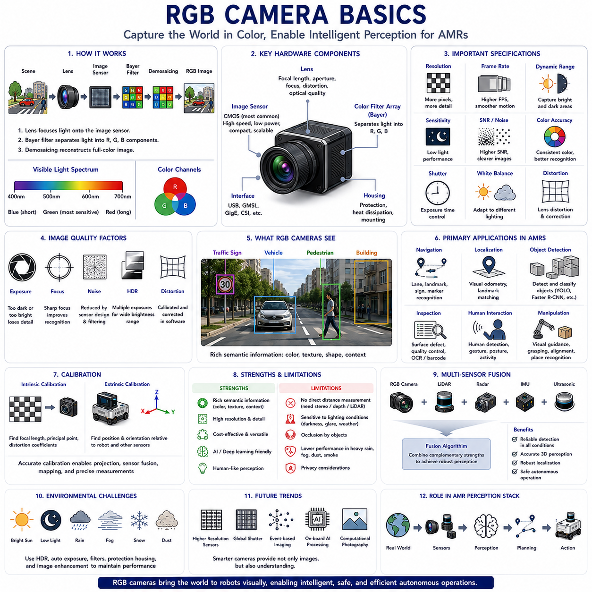
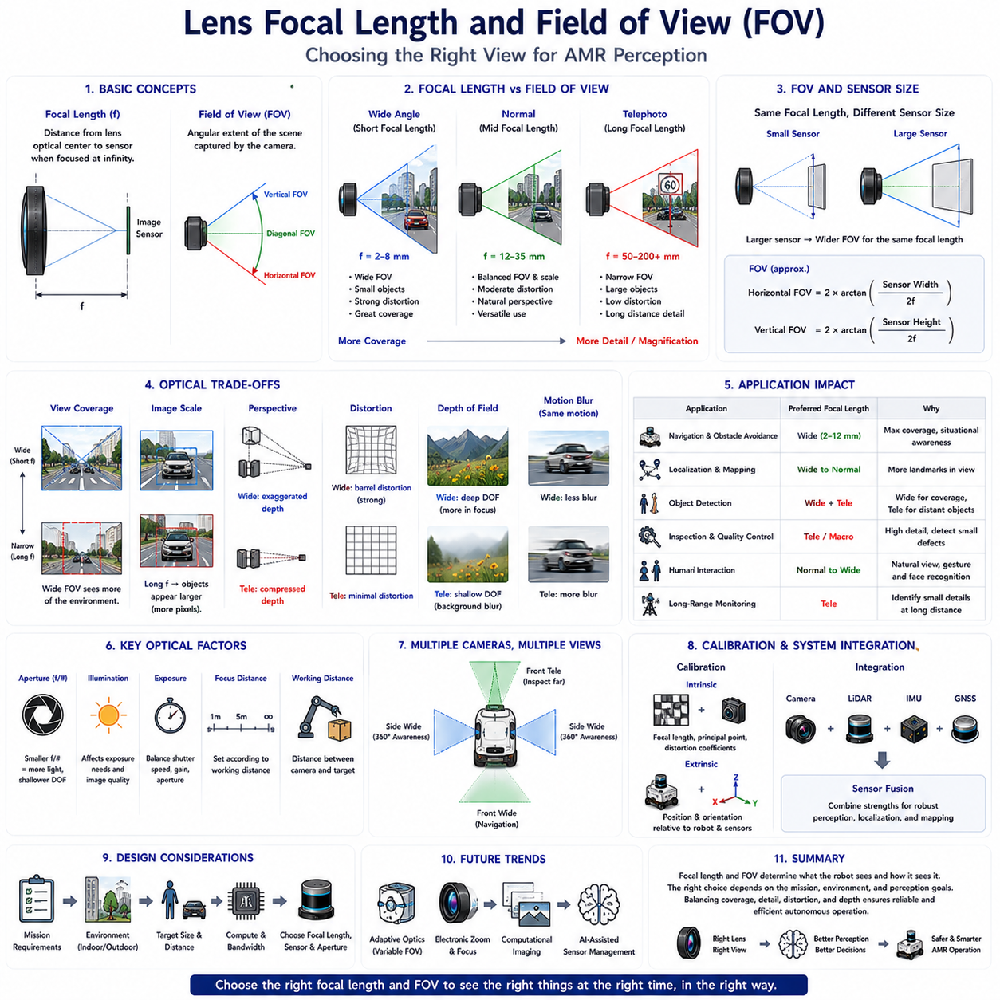
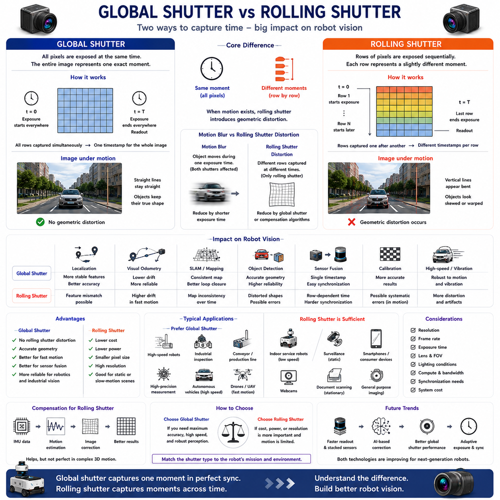
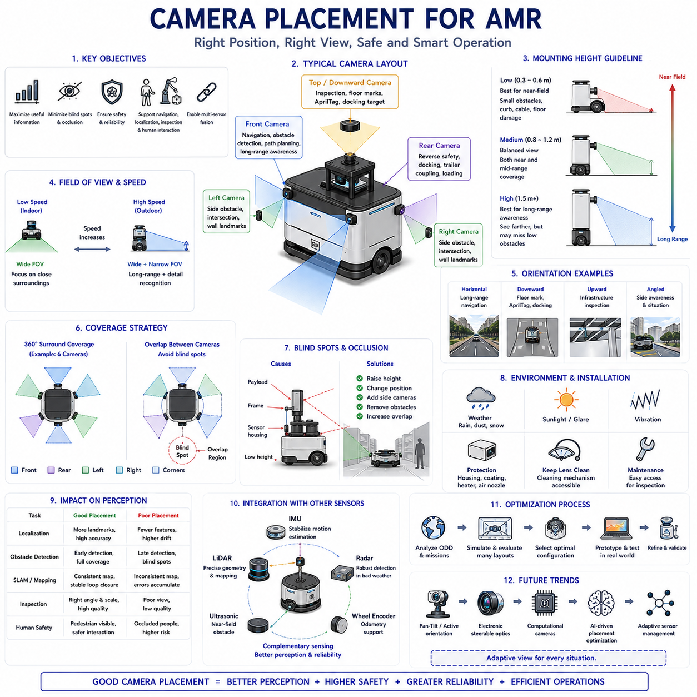
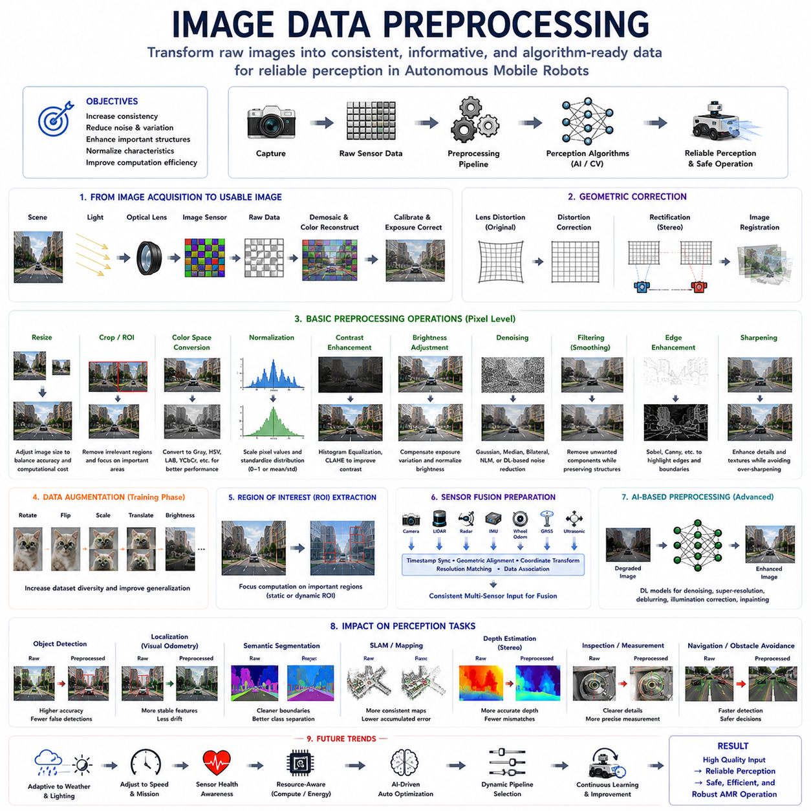
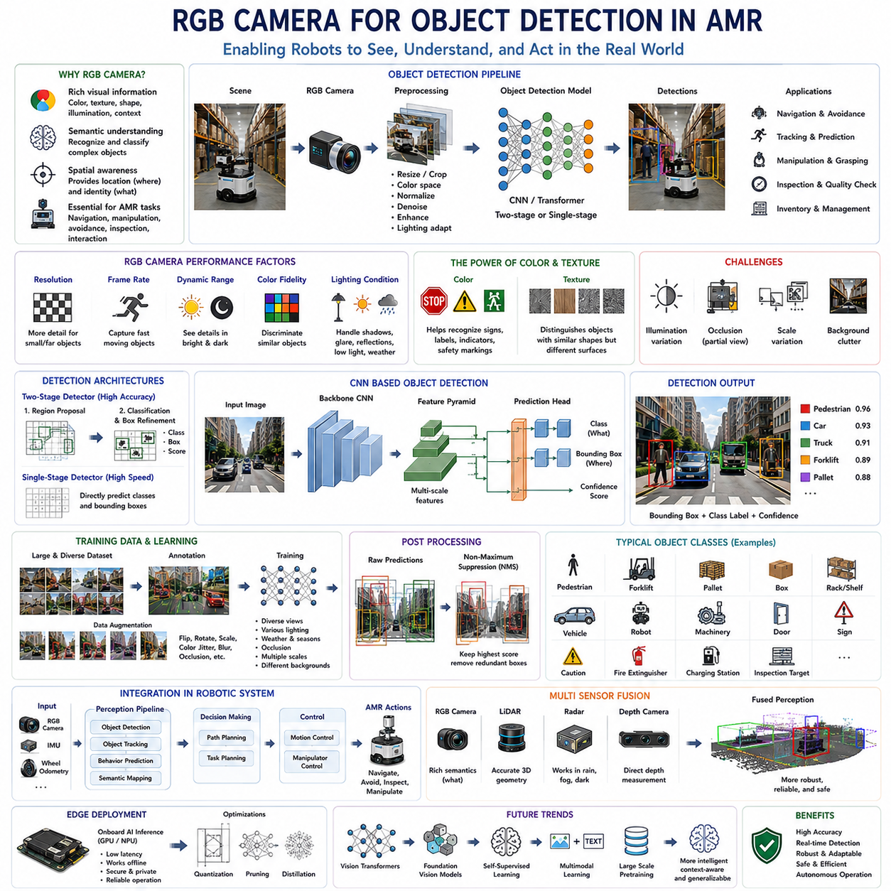
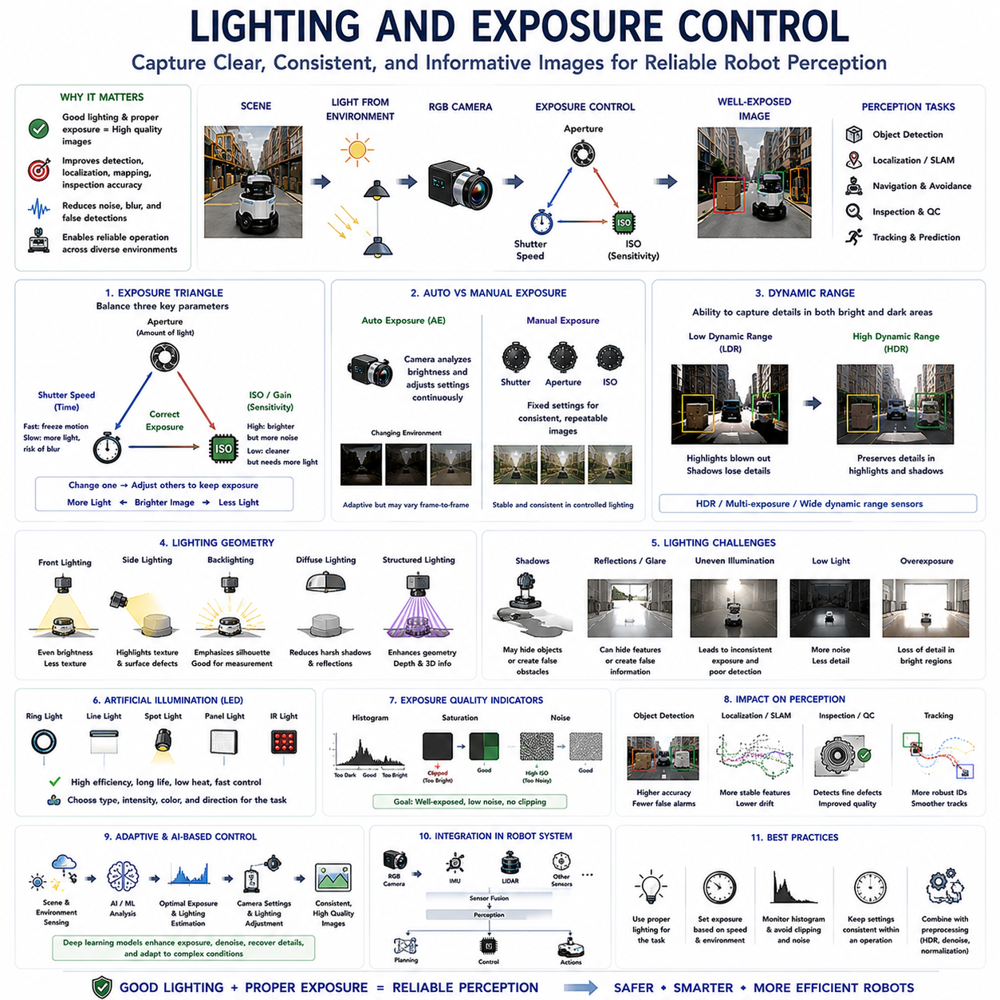
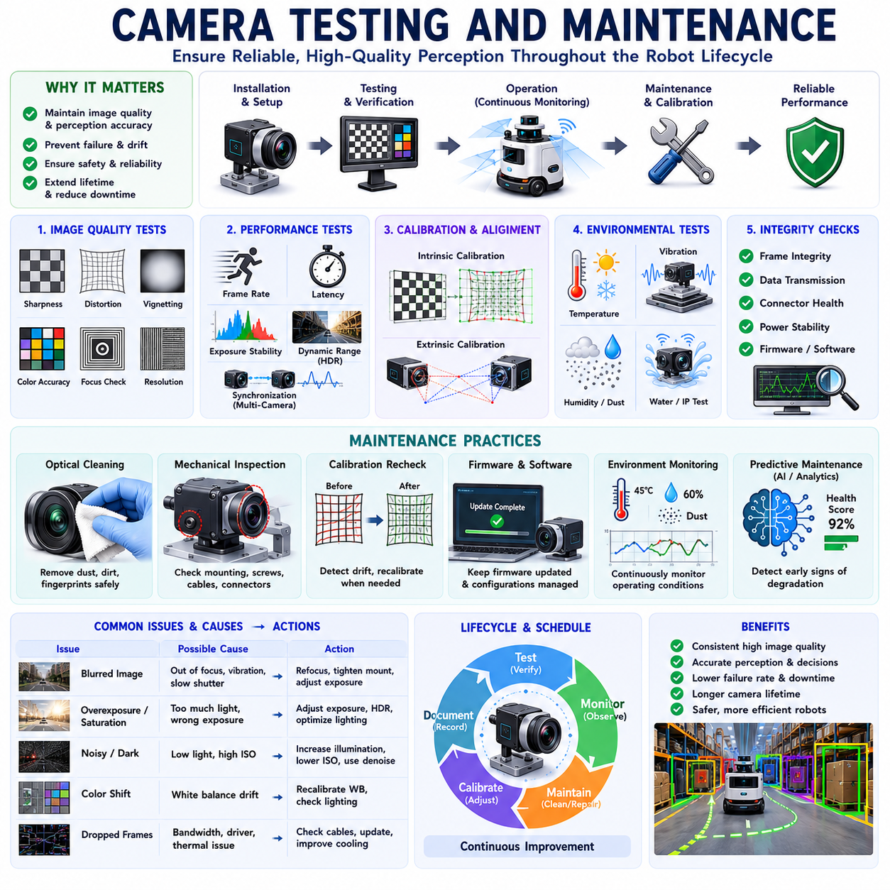
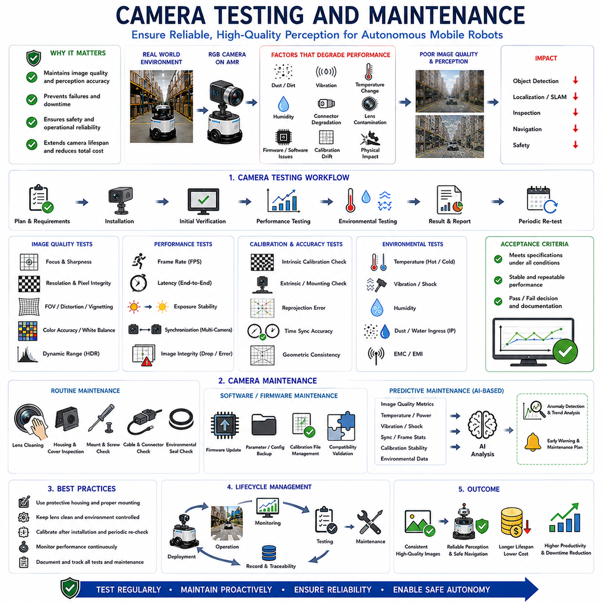

**Volume 03. AMR Sensors and Perception**

# Chapter 04. RGB Cameras

## 04.1 RGB Camera Basics

{width="7.268055555555556in" height="7.268055555555556in"}

RGB(Red, Green, Blue) cameras are among the most widely used perception sensors in Autonomous Mobile Robots (AMRs) because they provide rich visual information that closely resembles human vision. Unlike ranging sensors such as LiDAR or radar, RGB cameras capture the appearance of the surrounding environment by recording color, texture, brightness, edges, and visual patterns. This information enables robots to recognize objects, understand scenes, detect people, interpret traffic signs, identify floor markings, and support artificial intelligence-based decision making. As modern AMRs become increasingly dependent on computer vision, RGB cameras have evolved from simple imaging devices into essential perception components supporting navigation, inspection, manipulation, safety, and autonomous operation across indoor and outdoor environments.

The fundamental principle of an RGB camera is the conversion of incoming visible light into digital image data. Light reflected from objects passes through an optical lens before reaching an image sensor composed of millions of light-sensitive pixels. Each pixel measures the intensity of incoming light corresponding to one location in the image. Because individual pixels cannot naturally distinguish colors, a color filter array, most commonly the Bayer filter, separates incoming light into red, green, and blue components. Image processing algorithms then reconstruct a full-color image by estimating the missing color values at each pixel through a process known as demosaicing.

Visible light occupies only a small portion of the electromagnetic spectrum, approximately between 400 and 700 nanometers. RGB cameras are designed specifically to capture this wavelength range because it corresponds to human visual perception. Blue wavelengths occupy the shorter end of the spectrum, green wavelengths lie near the center where human vision is most sensitive, and red wavelengths occupy the longer visible wavelengths. By combining these three primary color channels, RGB cameras reproduce millions of colors that enable robots to distinguish different objects, materials, and environmental features.

The optical lens determines how light is collected and projected onto the image sensor. Lens characteristics including focal length, aperture, distortion, focus distance, and optical quality directly influence image clarity and perception performance. A short focal length provides a wide field of view suitable for navigation, while a longer focal length magnifies distant objects but reduces environmental coverage. Lens quality influences image sharpness, chromatic aberration, geometric distortion, and light transmission efficiency. Selecting an appropriate lens therefore requires balancing detection distance, viewing angle, and application-specific perception requirements.

The image sensor forms the heart of every RGB camera. Modern robotic cameras typically employ either Complementary Metal-Oxide Semiconductor (CMOS) or Charge-Coupled Device (CCD) imaging technologies. CMOS sensors dominate contemporary robotics because they offer low power consumption, high frame rates, compact integration, and excellent manufacturing scalability. CCD sensors historically provided superior image quality under certain conditions but generally consume more power and operate at lower speeds. Advances in CMOS technology have largely eliminated this performance gap, making CMOS the preferred solution for most AMR applications.

Image resolution specifies the number of pixels contained within an image and directly influences the amount of visual detail available for perception algorithms. Higher resolutions enable improved recognition of distant objects, small features, text, and fine structural details. However, increasing image resolution also increases memory consumption, computational workload, communication bandwidth, and processing latency. Autonomous robots therefore select camera resolution according to application requirements rather than simply maximizing pixel count. Navigation may require only moderate resolution, whereas industrial inspection or quality assurance often benefits from significantly higher image detail.

Frame rate describes how frequently images are captured and processed. High frame rates improve temporal continuity, allowing rapidly moving objects to be tracked more accurately while reducing motion discontinuity during robot movement. Applications involving high-speed navigation, obstacle avoidance, or dynamic human interaction often require higher frame rates than stationary inspection tasks. However, increasing frame rate proportionally increases computational demand and communication bandwidth. Engineers therefore balance spatial resolution and temporal resolution according to mission requirements and available processing resources.

Dynamic range represents the camera\'s ability to capture both bright and dark regions simultaneously within the same image. Industrial environments frequently contain challenging lighting conditions including direct sunlight, shadows, reflections, tunnels, warehouses, and illuminated displays. Cameras with limited dynamic range may lose information within either very bright or very dark image regions. High Dynamic Range (HDR) imaging combines multiple exposure levels or employs advanced sensor architectures to preserve useful information across wide brightness variations, significantly improving perception robustness under difficult lighting conditions.

Color reproduction plays an important role in visual perception because many computer vision algorithms depend upon consistent color information. White balance compensates for different illumination sources including sunlight, fluorescent lighting, LED illumination, and incandescent lamps, ensuring that object colors remain relatively stable across varying environments. Accurate color representation improves object classification, semantic segmentation, material recognition, agricultural monitoring, industrial inspection, and human-machine interaction. Consistent color calibration additionally supports machine learning systems trained using diverse image datasets.

Image quality depends not only on sensor specifications but also on exposure control. Exposure determines how much light reaches the image sensor during image acquisition. Underexposure produces excessively dark images with limited detail, whereas overexposure saturates bright regions and permanently removes visual information. Cameras automatically adjust exposure using shutter time, sensor gain, and aperture where available. Modern robotic perception systems often implement adaptive exposure strategies that optimize image quality continuously according to changing environmental illumination.

Noise inevitably appears within digital images because electronic measurement processes contain uncertainty. Low-light environments generally produce higher image noise because fewer photons reach each sensor pixel. Electronic amplification further increases both signal and noise simultaneously. Random noise reduces image clarity and may confuse feature detection, object recognition, or machine learning algorithms. Cameras therefore incorporate hardware optimization, signal processing, temporal filtering, and denoising algorithms that improve image quality while preserving meaningful visual details required for autonomous perception.

Image distortion results primarily from optical lens characteristics. Wide-angle lenses commonly exhibit barrel distortion, causing straight lines to appear curved outward, whereas telephoto lenses may introduce pincushion distortion. Although distortion affects raw image geometry, calibration algorithms estimate lens parameters and compensate mathematically during image processing. Corrected images preserve accurate spatial relationships that support visual localization, three-dimensional reconstruction, camera-LiDAR fusion, and precise measurement tasks required by robotic applications.

Camera calibration establishes the mathematical relationship between image pixels and physical geometry. Intrinsic calibration determines focal length, principal point, lens distortion coefficients, and other internal optical characteristics. Extrinsic calibration estimates the position and orientation of the camera relative to the robot coordinate system and other onboard sensors. Accurate calibration enables projection of three-dimensional world coordinates into image space while supporting sensor fusion, localization, mapping, and robotic manipulation. Calibration quality therefore directly influences overall perception accuracy.

RGB cameras provide exceptionally rich semantic information compared with many other sensing technologies. Humans, vehicles, road markings, warning labels, QR codes, barcodes, signs, pallets, containers, machinery, and industrial components often possess distinctive visual appearances that computer vision algorithms recognize reliably. Deep learning models exploit texture, shape, color, edges, and contextual information simultaneously, enabling highly sophisticated scene understanding beyond simple geometric measurement. This semantic capability makes RGB cameras indispensable for artificial intelligence-driven perception systems.

Visual perception supports numerous navigation functions within AMRs. Cameras identify floor markings, lane boundaries, visual landmarks, fiducial markers, AprilTags, QR codes, docking stations, loading positions, storage racks, and traffic signs. Visual localization compares current camera observations against previously recorded image databases or visual maps to estimate robot position. When integrated with LiDAR, GNSS, IMU, and wheel odometry, camera-based perception significantly improves localization robustness, particularly in environments containing abundant visual features.

Industrial inspection represents another major application of RGB cameras. High-resolution imaging detects scratches, cracks, dents, corrosion, discoloration, missing components, manufacturing defects, assembly errors, surface contamination, and dimensional irregularities. Machine vision algorithms automatically compare captured images against reference models while identifying deviations exceeding predefined tolerances. Camera-based inspection provides rapid, repeatable, and non-contact quality evaluation supporting manufacturing automation across numerous industries.

Human detection and interaction rely heavily upon RGB cameras because facial features, body posture, gestures, clothing, and behavioral cues remain primarily visual phenomena. Modern perception systems estimate human position, orientation, movement intention, and activity using deep neural networks operating on camera images. Combined with depth sensors or LiDAR, RGB cameras support safe collaborative operation between robots and human workers while enabling gesture recognition, identity verification, and natural human-machine communication.

Outdoor RGB camera operation introduces additional engineering challenges. Sunlight intensity changes continuously throughout the day while weather conditions including rain, fog, snow, dust, and shadows influence image quality significantly. Reflections from wet surfaces, glass, metallic structures, or vehicle bodies may create visual artifacts confusing perception algorithms. Outdoor robotic cameras therefore incorporate HDR imaging, adaptive exposure, polarizing filters where appropriate, environmental protection, lens cleaning mechanisms, and advanced image enhancement algorithms to maintain reliable operation under changing environmental conditions.

RGB cameras exhibit several inherent limitations that must be considered during perception system design. Unlike LiDAR, cameras do not directly measure distance. Three-dimensional geometry must instead be estimated through stereo vision, structure-from-motion, monocular depth estimation, or fusion with ranging sensors. Camera performance additionally depends strongly upon illumination quality. Complete darkness, excessive glare, fog, heavy rain, or dense dust may substantially reduce image usefulness. Consequently, RGB cameras rarely operate as standalone perception sensors within safety-critical autonomous robots.

Multi-sensor fusion significantly enhances perception reliability by combining RGB cameras with complementary sensing technologies. LiDAR contributes precise geometric structure, radar provides long-range detection and velocity measurement under adverse weather, ultrasonic sensors improve near-field obstacle awareness, while inertial sensors stabilize visual motion estimation. Sensor fusion algorithms combine these heterogeneous observations according to their confidence, producing more reliable environmental understanding than any individual sensor could achieve independently.

Artificial intelligence has transformed RGB cameras from passive imaging devices into intelligent perception systems. Convolutional Neural Networks, Vision Transformers, foundation vision models, semantic segmentation networks, object detectors, visual-language models, and multimodal learning architectures automatically interpret complex scenes with remarkable accuracy. These algorithms recognize thousands of object categories, estimate scene semantics, identify anomalies, support autonomous decision making, and continuously improve through large-scale training datasets. RGB cameras therefore serve as primary information sources for modern visual artificial intelligence deployed within autonomous robotic platforms.

The future of RGB camera technology will combine higher-resolution sensors, global shutters, event-based imaging, computational photography, embedded artificial intelligence, and increasingly efficient vision processors. Cameras will provide not only images but also semantic understanding, depth estimation, motion prediction, scene reconstruction, and contextual reasoning directly at the sensor level. As perception architectures continue evolving toward tightly integrated multi-sensor intelligence, RGB cameras will remain indispensable because they uniquely capture the rich visual appearance of the world that enables robots to interpret environments in ways closely resembling human perception while complementing the geometric strengths of LiDAR, radar, and other sensing technologies.

## 04.2 Lens Focal Length and FOV

{width="7.268055555555556in" height="7.268055555555556in"}

Lens focal length and Field of View (FOV) are among the most influential optical parameters affecting the perception capability of RGB cameras used in Autonomous Mobile Robots (AMRs). While the image sensor determines how visual information is captured electronically, the optical lens determines what portion of the environment is observed and how objects appear within the image. The selection of focal length directly influences detection distance, image scale, perspective, geometric distortion, and overall perception performance. Consequently, lens selection is not merely an optical design decision but a fundamental systems engineering task that affects localization, navigation, object detection, mapping, inspection, manipulation, and human-robot interaction throughout the entire operational lifecycle of an autonomous robot.

Focal length is defined as the distance between the optical center of the lens and the image sensor when the lens is focused on distant objects. It is normally expressed in millimeters and serves as one of the primary descriptors of lens characteristics. Short focal lengths capture a wider scene by projecting a larger portion of the environment onto the image sensor, whereas long focal lengths magnify distant objects while reducing the observable area. Focal length therefore determines how much of the surrounding world is visible and how large individual objects appear within each captured image.

Field of View represents the angular extent of the environment that the camera can observe. It is commonly described using horizontal, vertical, and diagonal viewing angles. The Field of View depends upon both focal length and image sensor size. A shorter focal length produces a wider viewing angle, allowing more of the environment to appear within the image. Conversely, increasing focal length narrows the viewing angle while enlarging distant objects. Understanding this relationship is essential because perception algorithms perform differently depending on how much environmental information is available within each image.

Wide-angle lenses are frequently used in autonomous navigation because they maximize environmental coverage. Cameras equipped with wide-angle optics observe intersections, corridors, surrounding obstacles, pedestrians, vehicles, and infrastructure simultaneously, reducing the likelihood of missing important environmental information. This broad visual coverage supports localization, obstacle avoidance, path planning, and situational awareness. However, extremely wide viewing angles also introduce stronger geometric distortion, reduce apparent object size at long distances, and increase perspective variation across the image.

Telephoto lenses provide the opposite optical behavior. Their longer focal lengths enlarge distant objects, allowing robots to recognize small details from greater distances. Applications including infrastructure inspection, surveillance, industrial quality control, precision agriculture, and long-range monitoring often benefit from telephoto optics because subtle visual defects become easier to identify. The tradeoff is a substantially narrower Field of View, reducing environmental awareness and increasing the probability that important objects remain outside the observable image region during robot motion.

Normal focal length lenses attempt to balance environmental coverage with image magnification. Rather than maximizing either viewing angle or detection distance, they provide a perspective that resembles human visual perception while maintaining moderate distortion and useful object scale. Many industrial robots employ lenses within this intermediate range because they support multiple perception functions simultaneously, including navigation, inspection, object recognition, and human interaction. Such balanced optical configurations simplify system integration when a single camera must satisfy diverse operational requirements.

Perspective is strongly influenced by focal length and viewing geometry. Wide-angle lenses exaggerate depth relationships, making nearby objects appear significantly larger than distant ones. Telephoto lenses compress perspective, reducing the apparent distance between objects positioned at different ranges. Although perspective does not alter physical geometry, it changes how scenes appear within images and therefore influences computer vision algorithms responsible for object recognition, scene understanding, and three-dimensional reconstruction. Engineers must understand these visual effects when selecting lenses for artificial intelligence applications.

Image scale determines how many pixels represent a particular object. Larger image scale generally improves recognition because more visual information becomes available for feature extraction and classification. Long focal length lenses increase image scale for distant objects, improving inspection accuracy and long-range detection. Conversely, wide-angle lenses distribute available pixels across a much larger environmental area, reducing the number of pixels assigned to individual objects. Engineers therefore balance image scale against environmental coverage according to mission objectives and computational limitations.

Detection distance is closely related to focal length. A distant pedestrian, traffic sign, storage rack, or inspection target occupies more pixels when viewed through a longer focal length lens, increasing recognition probability. However, successful autonomous navigation depends not only on recognizing distant objects but also on maintaining awareness of nearby obstacles. Many AMRs therefore employ multiple cameras with different focal lengths, combining wide-angle navigation cameras with telephoto inspection cameras to achieve comprehensive perception across multiple distance ranges.

Image sensor size interacts directly with focal length when determining Field of View. Two cameras equipped with identical focal length lenses may observe different viewing angles if their image sensors differ in physical dimensions. Larger sensors capture a wider portion of the projected optical image, effectively increasing the Field of View for a given focal length. Consequently, lens selection cannot be considered independently from sensor selection. Camera system design always evaluates both optical and electronic components together to achieve desired perception characteristics.

Geometric distortion increases as viewing angle becomes wider. Barrel distortion commonly appears in wide-angle lenses, causing straight lines near image boundaries to curve outward. Fisheye lenses intentionally introduce even stronger distortion to achieve extremely large viewing angles approaching or exceeding one hundred eighty degrees. Although calibration algorithms compensate for much of this distortion mathematically, excessive geometric correction may reduce effective image resolution near image edges. Optical design therefore balances coverage against geometric fidelity according to application requirements.

Lens aperture influences image brightness together with focal length. The aperture controls how much light enters the camera and is represented by the f-number. Smaller f-numbers correspond to larger physical apertures that admit more light, improving low-light imaging while reducing depth of field. Larger f-numbers increase depth of field but require longer exposure or higher sensor gain under identical illumination. Camera designers therefore consider focal length, aperture, lighting conditions, and expected object distance simultaneously rather than optimizing these parameters independently.

Depth of field describes the range of object distances that appear acceptably sharp within an image. Wide-angle lenses naturally produce greater depth of field, allowing nearby and distant objects to remain simultaneously in focus. Long focal length lenses generally produce shallower depth of field, causing objects outside the focus distance to appear blurred. Industrial inspection sometimes benefits from shallow depth of field by emphasizing specific targets, whereas autonomous navigation typically requires broad depth of field to maintain environmental awareness across varying distances.

Motion blur becomes increasingly important as focal length increases. Small robot vibrations or rapid vehicle movement produce larger apparent image displacement when using telephoto lenses compared with wide-angle optics. Consequently, long focal length cameras frequently require shorter exposure times, image stabilization, vibration isolation, or higher frame rates to preserve image quality. Mechanical platform design and camera mounting therefore become closely coupled with optical system selection, particularly for outdoor robots operating on uneven terrain.

Stereo vision systems require careful focal length selection because depth estimation accuracy depends upon image resolution, baseline distance, and viewing geometry. Wide-angle stereo cameras provide broad environmental awareness but lower long-range depth precision. Narrower viewing angles improve depth estimation for distant objects while reducing overall coverage. Engineers optimize stereo configurations according to expected operational distances, obstacle density, navigation speed, and computational resources available for real-time perception.

Visual localization performance depends strongly upon Field of View. Wide viewing angles capture more environmental landmarks, increasing the probability of successful feature matching during simultaneous localization and mapping. However, individual landmarks occupy fewer pixels and may become less distinctive. Narrower viewing angles enlarge landmarks but reduce the number of observable reference features. Localization systems therefore seek an appropriate balance between landmark quantity and landmark quality according to environmental characteristics and navigation objectives.

Object detection algorithms exhibit different performance characteristics depending upon image scale and viewing angle. Small distant objects become easier to recognize using longer focal lengths because additional pixels describe their appearance. Conversely, wide-angle images enable simultaneous detection of multiple surrounding objects while supporting comprehensive situational awareness. Modern deep learning systems increasingly accommodate multiple camera configurations by training across diverse optical conditions, yet lens selection continues to influence achievable detection accuracy significantly.

Industrial inspection frequently requires application-specific lens optimization. Surface defects, manufacturing tolerances, assembly verification, barcode reading, optical character recognition, and precision measurement all demand different image scales and viewing geometries. Engineers calculate required pixel resolution according to minimum detectable defect size before selecting appropriate focal length, sensor resolution, and working distance. Such quantitative optical design ensures that inspection systems consistently satisfy manufacturing quality requirements.

Outdoor robotic applications introduce additional considerations because operating distances vary substantially. Construction robots, agricultural vehicles, autonomous delivery platforms, and infrastructure inspection systems may observe nearby obstacles while simultaneously monitoring distant terrain or traffic conditions. Multiple synchronized cameras equipped with complementary focal lengths often provide the most effective solution, combining panoramic environmental awareness with detailed long-range observation. Sensor fusion integrates these heterogeneous visual perspectives into a unified perception model supporting robust autonomous operation.

Camera calibration becomes increasingly important as optical complexity increases. Intrinsic calibration estimates focal length, principal point, distortion coefficients, and other optical parameters necessary for accurate geometric interpretation. Extrinsic calibration establishes the spatial relationship between cameras, LiDAR, inertial sensors, GNSS receivers, and the robot coordinate system. Accurate calibration enables projection of three-dimensional points into image coordinates, visual-LiDAR fusion, precise measurement, and reliable localization. Consequently, lens selection and calibration form inseparable components of camera system engineering.

Artificial intelligence has expanded the practical use of diverse focal lengths by enabling adaptive perception across multiple camera streams. Deep learning models combine information from wide-angle navigation cameras, forward-facing telephoto cameras, panoramic cameras, and specialized inspection cameras simultaneously. Feature fusion, attention mechanisms, and multimodal architectures integrate complementary visual information into unified environmental understanding. Rather than relying upon a single optimal focal length, modern perception systems increasingly exploit heterogeneous optical configurations to maximize overall capability.

The future of focal length and Field of View optimization will involve intelligent adaptive optics, computational photography, electronically controlled zoom systems, software-defined cameras, and artificial intelligence-assisted sensor management. Future AMRs will dynamically adjust viewing geometry according to mission objectives, environmental complexity, navigation speed, and operational risk. Instead of selecting one fixed optical configuration during system design, robotic perception systems will continuously optimize their visual sensing strategy, providing the most appropriate balance between environmental coverage, object detail, computational efficiency, and autonomous decision-making throughout every stage of robot operation.

## 04.3 Global Shutter vs Rolling Shutter

{width="7.268055555555556in" height="7.268055555555556in"}

Global shutter and rolling shutter represent two fundamentally different methods of capturing images in modern RGB cameras. Although both technologies convert incoming light into digital image data using similar image sensors, they differ significantly in how pixel exposure is performed over time. This difference directly affects image quality whenever either the camera or the observed scene is moving. For Autonomous Mobile Robots (AMRs), where cameras frequently operate on moving platforms while observing dynamic environments, shutter technology has a substantial influence on localization, object detection, visual odometry, mapping, inspection, and sensor fusion. Selecting the appropriate shutter architecture therefore becomes an important engineering decision rather than merely a camera specification.

A shutter controls when light reaches each pixel of the image sensor. During image acquisition, every pixel must collect light for a specific exposure period before being converted into digital values. The method used to begin and end this exposure distinguishes global shutter from rolling shutter technology. Global shutter sensors expose every pixel simultaneously, whereas rolling shutter sensors expose different rows of pixels sequentially. Although this timing difference is measured in milliseconds or even microseconds, it can produce significant image distortion whenever relative motion exists between the camera and the scene.

Global shutter technology captures the entire image at exactly the same instant. Every pixel begins exposure simultaneously, collects light during the same exposure interval, and is subsequently read from the sensor without altering the temporal consistency of the image. Since all image rows represent the same physical moment, moving objects preserve their true geometry. Straight edges remain straight, rotating objects maintain their shape, and rapidly moving vehicles appear without geometric deformation. This synchronized acquisition makes global shutter cameras particularly suitable for robotics, industrial automation, machine vision, and scientific measurement.

Rolling shutter technology operates differently by exposing image rows one after another. Instead of capturing the complete image simultaneously, the sensor scans progressively from top to bottom or from one side to the other. Each image row therefore represents a slightly different moment in time. Under static conditions this temporal offset is usually insignificant and produces visually acceptable images. However, when the camera moves rapidly or objects move through the scene, the sequential exposure process causes geometric inconsistencies because different portions of the image correspond to different positions of the moving scene.

Rolling shutter distortion becomes particularly noticeable during rapid robot motion. Vertical poles may appear tilted, rotating wheels become curved, rectangular objects become skewed, and buildings may seem to lean during high-speed movement. These distortions do not reflect actual environmental geometry but instead result from sequential image acquisition. Computer vision algorithms frequently interpret these distortions as genuine scene structure unless compensation techniques are applied. Consequently, rolling shutter artifacts may reduce localization accuracy, degrade feature matching, and increase uncertainty during visual perception.

Global shutter cameras eliminate these temporal distortions because every pixel observes the scene simultaneously. Fast-moving vehicles, robotic manipulators, conveyor systems, rotating machinery, and human motion retain accurate geometric appearance regardless of movement speed. Feature extraction algorithms therefore operate on physically consistent images, improving visual odometry, simultaneous localization and mapping, object detection, and camera-LiDAR calibration. This geometric consistency explains why industrial robotic systems frequently specify global shutter cameras despite their generally higher cost.

Motion blur should not be confused with rolling shutter distortion because the two phenomena arise from different physical mechanisms. Motion blur occurs when an object moves significantly during a single exposure period, causing image details to become blurred. Both global shutter and rolling shutter cameras can experience motion blur if exposure time is too long. Rolling shutter distortion, however, results specifically from different image rows being captured at different times. Reducing exposure time decreases motion blur but cannot completely eliminate rolling shutter artifacts during rapid motion.

Frame rate influences shutter performance because shorter frame intervals reduce temporal separation between successive images. High frame rate cameras generally improve tracking performance and reduce apparent motion between frames. Nevertheless, even cameras operating at very high frame rates may still exhibit rolling shutter distortion if individual image rows remain temporally separated during exposure. Global shutter maintains temporal consistency regardless of frame rate, making it particularly advantageous for high-speed robotic perception where both motion accuracy and temporal precision are essential.

Visual localization depends heavily upon accurate geometric relationships between image features. Feature detectors identify corners, edges, textures, and distinctive visual landmarks before matching them across multiple images. Rolling shutter distortion changes apparent feature geometry, reducing matching reliability during rapid motion or vibration. Global shutter images preserve consistent feature positions, enabling more stable feature tracking and reducing accumulated localization drift. Robots performing long-duration autonomous navigation therefore often benefit from the improved geometric integrity provided by global shutter sensors.

Visual odometry estimates robot motion by analyzing changes between consecutive camera images. Because the estimation process assumes consistent image geometry, rolling shutter distortion introduces additional uncertainty into the calculated camera trajectory. The estimated motion may deviate from the robot\'s actual movement, particularly during acceleration, turning, vibration, or high-speed travel. Global shutter cameras minimize these errors by ensuring that every feature within an image corresponds to the same acquisition time, allowing motion estimation algorithms to operate on temporally coherent observations.

Simultaneous Localization and Mapping (SLAM) also benefits from global shutter imaging. Accurate map generation requires stable feature correspondence across multiple viewpoints collected over time. Rolling shutter distortion may introduce systematic errors into feature observations, producing slight geometric inconsistencies that accumulate during long mapping sessions. Although modern optimization algorithms compensate for some of these effects, globally synchronized images generally improve map consistency, loop closure accuracy, and long-term localization stability, particularly within dynamic or high-speed environments.

Sensor fusion requires consistent temporal relationships among multiple sensing modalities. Cameras, LiDAR, radar, inertial measurement units, GNSS receivers, and wheel encoders each observe the environment differently. Successful fusion assumes that corresponding measurements describe approximately the same physical moment. Global shutter naturally satisfies this assumption because every image pixel shares one common timestamp. Rolling shutter images instead contain slightly different timestamps across image rows, complicating synchronization with external sensors and increasing calibration complexity for high-precision robotic systems.

Camera calibration quality depends upon accurate geometric observations. Intrinsic calibration estimates focal length, principal point, and distortion coefficients, while extrinsic calibration determines camera orientation relative to other sensors. Rolling shutter distortion may influence calibration target geometry when images are acquired during motion, potentially introducing systematic calibration errors. Global shutter cameras provide more reliable calibration because the captured geometry accurately represents the physical calibration pattern at a single instant. Consequently, many calibration procedures recommend stationary targets or global shutter sensors whenever high geometric precision is required.

Industrial machine vision frequently specifies global shutter cameras because inspection accuracy depends upon precise object geometry. Production lines, conveyor belts, robotic manipulators, printed circuit boards, semiconductor manufacturing, pharmaceutical packaging, and automated assembly systems often involve rapidly moving objects. Rolling shutter distortion may alter measured dimensions, defect appearance, or object orientation, reducing inspection reliability. Global shutter sensors preserve dimensional accuracy while supporting high-speed manufacturing processes without sacrificing measurement consistency.

Outdoor autonomous robots encounter additional challenges including uneven terrain, suspension movement, vibration, and varying vehicle speed. Construction robots, agricultural platforms, autonomous delivery vehicles, mining equipment, and infrastructure inspection robots frequently experience continuous mechanical excitation. Rolling shutter distortion becomes more noticeable under these conditions because camera motion changes rapidly during image acquisition. Global shutter cameras remain more robust against such disturbances, producing stable images suitable for reliable perception under demanding field conditions.

Rolling shutter cameras nevertheless offer several important advantages. Their simpler sensor architecture generally reduces manufacturing cost, power consumption, and pixel size while enabling higher image resolution within comparable silicon area. Consumer electronics including smartphones, webcams, surveillance cameras, and many commercial imaging systems therefore predominantly employ rolling shutter technology. For applications involving relatively slow camera motion or stationary observation, rolling shutter performance often proves entirely satisfactory while providing excellent image quality at significantly lower system cost.

Computational algorithms increasingly compensate for rolling shutter artifacts using inertial measurements, motion estimation, image registration, and machine learning techniques. These methods estimate camera motion during image acquisition before mathematically correcting geometric distortion. Although compensation substantially improves image quality under many conditions, perfect correction remains difficult because complex three-dimensional scene motion cannot always be estimated accurately. Consequently, hardware selection continues to play an important role despite ongoing advances in computational photography and artificial intelligence.

Artificial intelligence has improved both shutter technologies through enhanced image processing and perception algorithms. Deep learning models trained using diverse datasets frequently tolerate moderate rolling shutter distortion while maintaining high object detection accuracy. Neural networks additionally estimate optical flow, reconstruct undistorted geometry, compensate for camera vibration, and improve feature matching under challenging imaging conditions. Nevertheless, cleaner input data generally enables better perception performance, making global shutter advantageous whenever computational efficiency and maximum reliability are required simultaneously.

System designers rarely select shutter technology in isolation. Camera resolution, frame rate, dynamic range, sensor sensitivity, lens characteristics, computational capability, communication bandwidth, synchronization requirements, environmental conditions, and overall system cost must all be considered together. Indoor logistics robots operating at moderate speed may achieve excellent performance using rolling shutter cameras, whereas high-speed outdoor AMRs, precision inspection robots, and autonomous industrial vehicles often justify investment in global shutter sensors because of their superior temporal consistency and geometric accuracy.

Future camera technologies will continue reducing the performance gap between global shutter and rolling shutter architectures. Advances in CMOS sensor design, stacked sensor technology, faster readout circuits, embedded memory, computational photography, and artificial intelligence-based image correction will improve both image quality and acquisition speed. Future robotic perception systems may dynamically optimize exposure timing, synchronize multiple cameras automatically, compensate for motion in real time, and integrate shutter-aware perception algorithms. Regardless of these technological advances, understanding the fundamental differences between global shutter and rolling shutter will remain essential for designing reliable vision systems capable of supporting increasingly autonomous robotic platforms across diverse industrial and outdoor environments.

## 04.4 Camera Placement for AMR

{width="7.268055555555556in" height="7.268055555555556in"}

Camera placement is one of the most important design decisions in the perception architecture of an Autonomous Mobile Robot (AMR). While camera specifications such as resolution, frame rate, dynamic range, and lens selection determine image quality, camera placement determines what information can actually be observed during robot operation. Even an advanced camera with excellent hardware specifications may provide poor perception performance if it is mounted at an inappropriate position or orientation. Proper placement directly influences navigation, localization, obstacle detection, object recognition, inspection quality, human interaction, functional safety, and multi-sensor fusion. Consequently, camera placement should be treated as a system engineering problem involving optics, mechanics, perception algorithms, and operational requirements rather than simply attaching cameras wherever physical space is available.

The primary objective of camera placement is to maximize useful environmental information while minimizing blind areas, visual occlusions, and unnecessary image redundancy. Engineers begin by analyzing the robot\'s intended operational design domain, expected mission profiles, vehicle dimensions, payload configuration, and surrounding environment. Indoor logistics robots, warehouse AMRs, outdoor delivery vehicles, agricultural robots, construction robots, and industrial inspection platforms each require different viewing strategies because their environments, obstacle characteristics, operating speeds, and safety requirements differ significantly. Camera placement therefore always begins with operational requirements rather than hardware availability.

The height of a camera above the ground strongly affects perception capability. Cameras mounted close to the ground provide excellent visibility of small obstacles such as cables, curbs, dropped tools, uneven surfaces, and floor damage. However, low mounting positions reduce long-distance visibility because nearby obstacles quickly block the field of view. Cameras mounted at greater height observe larger portions of the surrounding environment and provide better long-range situational awareness, but they may overlook low-profile hazards immediately in front of the vehicle. Selecting the appropriate mounting height therefore requires balancing near-field safety with long-range perception.

Forward-facing cameras represent the most common configuration for autonomous navigation. Positioned near the front of the robot, they observe the direction of travel while supporting obstacle detection, lane following, landmark recognition, docking, visual localization, and path planning. Forward cameras frequently operate together with LiDAR and inertial sensors to estimate vehicle motion and identify navigable space. Their placement should minimize obstruction from protective structures, payloads, robot arms, lighting equipment, or other onboard components while maintaining an unobstructed view throughout the expected operating range.

Rear-facing cameras improve operational safety during reversing maneuvers and autonomous docking. Many industrial environments require robots to move bidirectionally without turning around, particularly in narrow warehouse aisles or constrained production facilities. Rear cameras monitor pedestrians, vehicles, pallets, storage racks, and unexpected obstacles behind the robot while assisting precision positioning during charging, trailer coupling, and loading operations. Integrating rear visual information with other perception sensors reduces blind zones and improves overall situational awareness during low-speed maneuvering.

Side-mounted cameras expand environmental coverage by monitoring areas that forward and rear cameras cannot adequately observe. These cameras become particularly valuable at intersections, narrow passages, loading docks, warehouse shelving, and construction sites where pedestrians or vehicles may approach from lateral directions. Side cameras additionally support localization by observing environmental landmarks positioned along building walls or infrastructure. Their placement should provide sufficient overlap with neighboring cameras to support seamless visual coverage while avoiding excessive redundancy that increases computational workload unnecessarily.

Panoramic camera configurations combine multiple overlapping cameras to achieve nearly complete environmental coverage around the robot. Four, six, or eight synchronized cameras may collectively provide three hundred sixty-degree perception, eliminating many traditional blind areas. Software stitches overlapping images into panoramic representations that support navigation, teleoperation, obstacle detection, and remote monitoring. Panoramic systems become particularly useful for outdoor AMRs, autonomous delivery robots, airport service vehicles, and heavy industrial platforms operating in dynamic environments containing surrounding traffic and human activity.

Camera orientation influences both visible coverage and perception quality. Downward-looking cameras emphasize nearby surfaces, floor markings, docking targets, QR codes, AprilTags, and wheel paths, whereas horizontally oriented cameras maximize forward visibility. Upward orientations occasionally support infrastructure inspection, ceiling navigation, overhead equipment monitoring, or tunnel exploration. Engineers determine optimal orientation according to the expected distribution of visual features within the operational environment while ensuring that important objects remain within the camera field of view during normal vehicle motion.

The viewing angle selected through camera placement should correspond closely with robot speed. Slow-moving indoor robots primarily require detailed observation of nearby surroundings because stopping distances remain short. Faster outdoor robots require significantly longer observation distances to provide sufficient reaction time for obstacle avoidance and trajectory planning. Consequently, higher-speed platforms often position cameras at greater height while combining wide-angle lenses for environmental awareness with narrower focal lengths for long-range object recognition. Placement strategy therefore evolves together with vehicle dynamics and operational safety requirements.

Blind spots represent one of the most significant challenges during camera placement. Blind areas occur whenever portions of the environment remain invisible because of robot geometry, payload configuration, structural supports, protective covers, sensor housings, or insufficient camera overlap. Engineers identify blind regions through computer-aided design analysis, three-dimensional simulation, digital twins, and field testing before adjusting camera positions accordingly. Eliminating critical blind spots substantially improves safety by reducing the probability that obstacles or pedestrians remain undetected during robot operation.

Occlusion occurs when one object blocks the camera\'s view of another. Robot structures themselves frequently generate self-occlusion if cameras are positioned behind protective frames, manipulators, antennas, lighting systems, or cargo. Environmental occlusions arise from shelving, walls, parked vehicles, vegetation, machinery, or construction materials. Effective camera placement minimizes predictable self-occlusion while maintaining useful viewing angles despite changing operational conditions. Engineers additionally evaluate how moving payloads influence visibility because transported materials may temporarily obstruct perception sensors.

Mechanical vibration significantly influences image quality. Cameras mounted directly on vibrating structures may experience motion blur, reduced feature stability, rolling shutter artifacts, and degraded localization accuracy. Camera brackets therefore require sufficient structural rigidity while incorporating vibration isolation where appropriate. Mounting close to the robot\'s center of mass generally reduces rotational motion compared with positions located at structural extremities. Mechanical design consequently becomes closely integrated with perception engineering, particularly for outdoor robots traversing uneven terrain.

Environmental exposure strongly affects camera placement decisions. Outdoor cameras encounter rain, dust, mud, snow, direct sunlight, temperature variation, humidity, and airborne contaminants. Placement should reduce exposure to water accumulation, debris impact, and contamination while preserving unobstructed visibility. Protective housings, hydrophobic coatings, lens heaters, air nozzles, cleaning mechanisms, and sunshades frequently accompany camera installations in demanding environments. Maintenance accessibility should also be considered because routine cleaning directly influences long-term perception reliability.

Lighting conditions vary substantially according to camera position. Cameras facing low-angle sunlight may experience glare, lens flare, or reduced contrast during sunrise and sunset. Reflections from polished floors, metallic equipment, glass surfaces, or wet pavement can introduce additional visual artifacts. Engineers analyze expected illumination throughout the operational environment before selecting mounting locations that minimize problematic lighting while maximizing useful visual information. High Dynamic Range imaging and adaptive exposure further improve robustness but cannot completely compensate for poor camera placement.

Camera placement directly influences visual localization performance because localization algorithms require stable environmental landmarks. Cameras should observe rich visual structure including walls, shelving, infrastructure, signs, doors, machinery, and permanent environmental features rather than predominantly featureless floors or empty sky. Maximizing landmark visibility improves feature matching, reduces localization drift, and enhances map consistency during simultaneous localization and mapping. Engineers therefore often evaluate environmental feature density before determining final camera mounting locations.

Inspection robots require placement strategies optimized for the inspection target rather than navigation alone. Cameras may be positioned toward machinery, pipelines, electrical cabinets, storage racks, production equipment, structural components, or infrastructure requiring periodic observation. Inspection quality depends upon viewing angle, image scale, working distance, illumination, and mechanical stability. Multiple specialized cameras frequently complement navigation cameras, allowing one perception system to support autonomous mobility while another performs detailed visual inspection with significantly higher spatial resolution.

Human safety represents a primary consideration during camera placement. Cameras should reliably observe areas where pedestrians are expected to appear, particularly near robot travel paths, loading zones, intersections, workstations, and collaborative operating spaces. Human detection algorithms benefit from unobstructed views of body posture, movement direction, and behavioral cues. Camera placement should therefore prioritize pedestrian visibility even when this requires additional sensors beyond those needed solely for navigation. Such design supports safer human-robot collaboration within industrial and commercial environments.

Multi-camera systems require careful overlap between adjacent fields of view. Sufficient overlap enables seamless image stitching, stereo vision, feature correspondence, and sensor redundancy. Excessive overlap, however, increases computational cost without providing proportional perception benefits. Engineers optimize overlap according to calibration requirements, synchronization capability, expected obstacle locations, and application objectives. Proper overlap additionally improves fault tolerance because neighboring cameras partially compensate if one camera temporarily becomes obstructed or experiences hardware degradation.

Camera placement should always be coordinated with other perception sensors. LiDAR provides precise geometric structure, radar offers robust detection under adverse weather, ultrasonic sensors improve near-field obstacle awareness, and inertial sensors stabilize visual motion estimation. Cameras should be positioned to maximize complementary sensing rather than duplicating existing sensor coverage unnecessarily. Well-designed multi-sensor layouts improve perception robustness while simplifying calibration, synchronization, and data fusion throughout the robotic perception pipeline.

Artificial intelligence increasingly influences camera placement strategy. Deep learning algorithms automatically identify useful visual regions, estimate perception uncertainty, and determine where additional sensing coverage provides the greatest operational benefit. Digital twins and simulation environments evaluate thousands of candidate camera configurations before physical prototypes are constructed, allowing engineers to optimize placement based upon perception performance rather than intuition alone. Machine learning therefore transforms camera placement into a data-driven optimization process supported by quantitative performance evaluation.

The future of camera placement for autonomous mobile robots will involve adaptive sensor architectures capable of dynamically changing viewing direction according to operational context. Pan-tilt mechanisms, electronically steerable optics, computational cameras, and intelligent sensor management systems will continuously optimize observation geometry based on navigation speed, obstacle density, inspection requirements, and environmental complexity. Instead of relying on permanently fixed camera locations, future AMRs will actively manage their visual sensing resources, ensuring that perception systems always provide the most informative, reliable, and safety-critical observations throughout every stage of autonomous operation.

## 04.5 Image Data Preprocessing

{width="7.268055555555556in" height="7.268055555555556in"}

Image data preprocessing is a fundamental stage in every computer vision pipeline because the quality of the input image directly influences the performance of subsequent perception algorithms. Cameras continuously capture raw images from the surrounding environment, but these images are rarely suitable for immediate use. Variations in illumination, sensor noise, lens distortion, motion blur, weather conditions, compression artifacts, and environmental complexity introduce inconsistencies that reduce the accuracy of object detection, localization, semantic segmentation, visual odometry, and simultaneous localization and mapping. Image preprocessing transforms raw sensor data into a more consistent, informative, and algorithm-friendly representation while preserving the visual information required for reliable perception. Rather than being an isolated image enhancement process, preprocessing serves as the bridge between sensing hardware and artificial intelligence, ensuring that perception algorithms receive stable and meaningful input across diverse operating conditions.

The objectives of image preprocessing extend beyond improving visual appearance. A visually pleasing image is not necessarily the most useful for machine perception. Instead, preprocessing seeks to increase feature consistency, reduce irrelevant variations, enhance important structures, normalize image characteristics, and improve computational efficiency. Autonomous Mobile Robots operate under highly dynamic environmental conditions including changing weather, varying illumination, indoor and outdoor transitions, shadows, reflections, dust, fog, and moving objects. These factors cause substantial variation between consecutive frames even when the physical environment remains unchanged. Effective preprocessing minimizes these variations so that perception algorithms focus primarily on meaningful environmental information rather than sensor-related artifacts.

Image acquisition represents the starting point of preprocessing. Cameras capture light through optical lenses before converting photons into electrical signals within the image sensor. Depending on the sensor architecture, raw images may initially exist in Bayer pattern format, monochrome intensity values, infrared measurements, or high dynamic range representations. These raw sensor outputs often require demosaicing, color reconstruction, exposure correction, and sensor-specific calibration before they become usable images. The preprocessing pipeline therefore begins immediately after image capture, converting physical measurements into standardized digital representations suitable for computer vision algorithms.

Image resizing is one of the most frequently applied preprocessing operations. Deep learning models generally require fixed input dimensions because neural network architectures are designed around predefined tensor sizes. Large images provide more visual detail but significantly increase computational cost, memory usage, and inference latency. Smaller images improve processing speed but may remove fine features required for accurate recognition. Engineers therefore select image resolutions that balance computational efficiency with perception accuracy according to available processing hardware and application requirements. Different perception tasks often employ different input resolutions, allowing the system to optimize computational resources while preserving task-specific performance.

Image cropping further improves computational efficiency by focusing processing on regions containing relevant information. Rather than analyzing the entire image, preprocessing may remove portions that consistently contain little useful information, such as excessive sky, vehicle body structures, sensor housings, or static infrastructure outside the operational area. Dynamic cropping may additionally follow detected objects or regions of interest, reducing unnecessary computation while increasing effective image resolution for important targets. Such approaches become particularly valuable for embedded robotic platforms where computational resources remain limited despite continual improvements in processor performance.

Color space conversion provides another essential preprocessing operation. Most cameras produce images in the RGB color space, but many perception algorithms operate more effectively using alternative representations such as grayscale, HSV, LAB, YCbCr, or normalized color coordinates. Grayscale images reduce computational complexity while preserving structural information for feature extraction and visual odometry. HSV separates color from brightness, improving robustness under changing illumination. LAB better represents perceptual color differences, while YCbCr isolates luminance from chrominance for improved compression and segmentation. Selecting an appropriate color space depends upon both environmental characteristics and the specific perception task being performed.

Image normalization standardizes pixel intensity distributions so that perception algorithms receive consistent numerical inputs regardless of camera settings or environmental conditions. Pixel values may be scaled from integer ranges into normalized floating-point values, centered around zero, or adjusted according to dataset statistics such as mean and standard deviation. Neural networks particularly benefit from normalized inputs because consistent numerical distributions improve optimization stability during training and produce more reliable inference during deployment. Normalization therefore contributes directly to both learning efficiency and operational robustness.

Contrast enhancement improves visibility when images contain poor dynamic range or insufficient separation between objects and backgrounds. Low-contrast conditions frequently occur under fog, shadows, overcast skies, indoor lighting, or camera exposure limitations. Histogram Equalization redistributes pixel intensities across the available brightness range, increasing global contrast. Adaptive Histogram Equalization, particularly Contrast Limited Adaptive Histogram Equalization (CLAHE), performs localized enhancement while avoiding excessive amplification of image noise. Such techniques improve feature visibility and object boundaries without fundamentally altering scene geometry.

Brightness adjustment compensates for exposure variations caused by changing environmental illumination. Images captured during sunrise, sunset, nighttime, tunnels, warehouses, or rapidly changing weather frequently exhibit substantial brightness fluctuations. Automatic exposure control within cameras provides initial compensation, but preprocessing often performs additional brightness normalization to maintain stable perception performance. Care must be taken to avoid excessive correction because artificially brightening extremely dark regions may amplify sensor noise while excessive darkening reduces useful visual information.

Noise reduction represents another critical preprocessing stage. Electronic image sensors inevitably introduce random noise through thermal effects, photon statistics, amplifier circuits, and electronic interference. High ISO settings, low illumination, long exposure times, and elevated operating temperatures further increase sensor noise. Common denoising techniques include Gaussian filtering, Median filtering, Bilateral filtering, Non-Local Means, and deep learning-based denoising networks. The objective is not to remove every variation but to suppress random noise while preserving meaningful image structures, particularly edges and corners used for localization and feature extraction.

Filtering operations remove unwanted image components while enhancing important visual structures. Gaussian filters smooth images by reducing high-frequency noise but may slightly blur edges. Median filters effectively remove impulse noise while preserving edge boundaries. Bilateral filters simultaneously consider spatial proximity and intensity similarity, preserving sharp object boundaries during smoothing. Edge-preserving filters become particularly valuable for robotic perception because localization, mapping, and obstacle detection depend heavily upon accurate geometric boundaries within the environment.

Edge enhancement improves the visibility of structural boundaries that define objects and environmental features. Operators such as Sobel, Prewitt, Scharr, Laplacian, and Canny emphasize intensity discontinuities corresponding to physical object edges. Although modern deep neural networks frequently learn edge representations internally, explicit edge enhancement remains useful for classical computer vision algorithms, industrial inspection systems, feature extraction pipelines, and hybrid perception architectures combining conventional and deep learning methods. Accurate edge representation supports obstacle segmentation, measurement, localization, and scene understanding.

Image sharpening restores apparent detail lost through optical blur, motion, sensor characteristics, or aggressive denoising. Sharpening algorithms emphasize local intensity gradients, increasing the visibility of object boundaries and texture patterns. Excessive sharpening, however, amplifies noise and introduces artificial artifacts that may confuse perception algorithms. Engineers therefore carefully balance image clarity against algorithmic stability, recognizing that the sharpest image is not necessarily the most informative for machine vision applications.

Lens distortion correction compensates for optical imperfections introduced by camera lenses. Wide-angle and fisheye lenses frequently produce radial distortion that bends straight lines near image boundaries, while manufacturing tolerances introduce tangential distortion. Camera calibration estimates intrinsic parameters describing these distortions, enabling preprocessing algorithms to reconstruct geometrically accurate images. Distortion correction significantly improves localization, visual odometry, stereo matching, three-dimensional reconstruction, and metric measurement by ensuring that observed image geometry corresponds closely to the physical environment.

Image rectification extends distortion correction by aligning images into standardized geometric coordinate systems. Stereo camera systems require rectification so that corresponding image points appear along identical horizontal scan lines, simplifying depth estimation through stereo correspondence. Multi-camera systems similarly benefit from geometric alignment that simplifies sensor fusion and panoramic image generation. Accurate rectification reduces computational complexity while improving the precision of three-dimensional perception algorithms.

Image registration aligns multiple images acquired from different viewpoints, sensors, or time instances. Registration becomes essential when combining information from multiple cameras, integrating visible and infrared imagery, constructing panoramic maps, or comparing inspection images collected over extended operational periods. Algorithms estimate geometric transformations based upon feature correspondences, image intensity relationships, or optimization techniques. Reliable registration enables consistent multi-view perception while supporting change detection, mapping, and long-term environmental monitoring.

Image augmentation primarily supports machine learning rather than online inference. During training, preprocessing artificially generates additional image variations including rotations, translations, scaling, brightness changes, contrast modifications, color jitter, blur, occlusions, weather simulation, and perspective transformations. These synthetic variations increase dataset diversity without requiring additional data collection. Well-designed augmentation improves model generalization by exposing learning algorithms to the environmental variability expected during real-world deployment, thereby reducing overfitting and improving operational robustness.

Region of Interest extraction concentrates computational resources on visually important portions of the image. Navigation systems may prioritize roadway regions, obstacle detection may emphasize areas directly ahead of the vehicle, while inspection robots isolate machinery requiring detailed analysis. Dynamic Region of Interest selection increasingly relies upon attention mechanisms and preliminary neural networks that identify informative image regions before more computationally intensive processing occurs. This hierarchical approach significantly reduces processing requirements while maintaining perception accuracy.

Preprocessing also contributes to efficient sensor fusion. Images must often be geometrically and temporally synchronized with LiDAR, radar, inertial measurements, wheel odometry, GNSS, and ultrasonic sensors before integrated perception can occur. Timestamp correction, geometric alignment, coordinate transformation, and resolution matching ensure that information from different sensing modalities corresponds to identical physical observations. Without accurate preprocessing, sensor fusion algorithms may combine inconsistent measurements, reducing localization accuracy and overall perception reliability.

Modern preprocessing pipelines increasingly incorporate artificial intelligence itself. Deep learning-based image enhancement automatically removes noise, restores degraded images, improves resolution, estimates illumination, corrects motion blur, and reconstructs missing visual information. Unlike traditional rule-based algorithms, neural preprocessing models adapt to complex environmental conditions through learned statistical representations. Nevertheless, engineers must carefully evaluate computational requirements, latency, explainability, and robustness because preprocessing should simplify perception rather than introduce unnecessary complexity or unpredictable behavior.

The future of image data preprocessing will move toward adaptive, context-aware, and self-optimizing perception pipelines. Instead of applying identical preprocessing to every image, intelligent robotic systems will dynamically adjust preprocessing parameters according to weather, lighting conditions, vehicle speed, sensor health, computational resources, and mission objectives. Artificial intelligence will continuously determine which preprocessing operations provide the greatest benefit for the current environment while minimizing latency and energy consumption. As perception systems become increasingly integrated with edge computing and autonomous decision making, image preprocessing will evolve from a fixed sequence of image enhancement operations into an intelligent perception optimization framework that continuously maximizes the quality, reliability, and efficiency of visual information available to autonomous mobile robots.

## 04.6 RGB Camera for Object Detection

{width="7.268055555555556in" height="7.268055555555556in"}

RGB cameras have become one of the most important perception sensors for object detection in Autonomous Mobile Robots (AMRs). Unlike range sensors that primarily measure geometric information, RGB cameras capture rich visual information including color, texture, shape, illumination, and contextual relationships. This enables robots to recognize and classify objects that cannot easily be distinguished using distance measurements alone. Modern warehouses, factories, hospitals, airports, shopping centers, and outdoor environments contain thousands of visually distinct objects, making RGB cameras indispensable for intelligent perception. Combined with advances in deep learning, RGB cameras have transformed object detection from handcrafted feature engineering into data-driven semantic understanding, allowing robots to recognize increasingly complex environments with high accuracy and flexibility.

Object detection differs fundamentally from simple image classification. Image classification determines what objects exist within an image but does not identify where they are located. Object detection simultaneously identifies the category of each object and estimates its spatial location, typically through bounding boxes surrounding individual targets. In robotic systems, this additional localization information is essential because navigation, manipulation, obstacle avoidance, tracking, and inspection all require knowledge of object positions rather than merely object identities. Consequently, RGB cameras provide not only semantic understanding but also spatial awareness that directly supports autonomous decision making.

The effectiveness of RGB camera-based object detection depends heavily upon image quality. Resolution determines the amount of visual detail available for recognizing distant or small objects. Higher resolutions improve recognition performance but increase computational requirements and processing latency. Frame rate influences how frequently new observations become available, affecting the robot\'s ability to detect rapidly moving objects. Dynamic range determines the camera\'s ability to capture details simultaneously within bright and dark regions, while color fidelity influences the discrimination of visually similar objects. Selecting appropriate camera specifications therefore requires balancing perception accuracy, computational efficiency, power consumption, and application requirements.

Lighting conditions significantly influence RGB-based object detection performance. Indoor factories often contain uneven artificial illumination, while outdoor robots experience continuously changing sunlight, shadows, reflections, weather, and seasonal variation. Low-light environments increase sensor noise, whereas excessive brightness causes saturation and loss of detail. Direct sunlight may introduce glare and lens flare, while reflective metallic surfaces produce false visual features. Modern perception systems therefore incorporate adaptive exposure control, high dynamic range imaging, and robust image preprocessing to reduce sensitivity to illumination changes. Nevertheless, camera placement and environmental lighting design remain equally important factors for maintaining consistent detection performance.

Color information provides a significant advantage over many other sensing modalities. Certain objects possess distinctive color characteristics that greatly simplify recognition, including traffic signs, safety markings, warning labels, product packaging, cables, indicators, and industrial equipment. Color additionally provides valuable contextual information for scene understanding, allowing perception algorithms to distinguish roads from sidewalks, vegetation from buildings, or different production components within manufacturing environments. However, reliance upon color alone is insufficient because illumination changes frequently alter apparent object colors. Consequently, modern object detection algorithms combine color with shape, texture, geometry, and contextual relationships to achieve greater robustness.

Texture plays an equally important role in RGB camera perception. Surface patterns, repetitive structures, material characteristics, and local intensity variations provide additional discriminative information beyond simple object outlines. Textural information assists in distinguishing visually similar objects that share comparable shapes but differ in surface appearance. For example, cardboard boxes, plastic containers, wooden pallets, concrete walls, and metallic machinery often possess distinctive texture patterns despite similar geometric structures. Deep convolutional neural networks automatically learn these texture representations during training, allowing robust recognition without requiring manually engineered features.

Object detection algorithms have evolved considerably over the past several decades. Early computer vision systems relied primarily upon handcrafted feature descriptors such as Haar-like features, Histogram of Oriented Gradients, Scale-Invariant Feature Transform, and Speeded-Up Robust Features. These methods extracted manually designed image characteristics before applying conventional machine learning classifiers. Although computationally efficient, handcrafted approaches struggled with significant variations in viewpoint, illumination, occlusion, deformation, and environmental complexity. The emergence of deep learning fundamentally transformed object detection by enabling neural networks to automatically learn hierarchical visual representations directly from large image datasets.

Convolutional Neural Networks form the foundation of modern RGB object detection systems. Rather than relying upon manually designed image descriptors, convolutional layers automatically learn increasingly abstract visual representations through multiple processing stages. Early layers identify simple edges and textures, intermediate layers recognize object parts and geometric structures, while deeper layers capture complete semantic object concepts. This hierarchical representation enables remarkable robustness against viewpoint variation, lighting changes, partial occlusion, and environmental complexity. Consequently, convolutional neural networks now dominate industrial object detection applications across numerous robotic domains.

Two-stage object detection architectures separate object proposal generation from object classification. Candidate object regions are first identified before more computationally intensive classification refines each proposal. This sequential approach generally achieves high detection accuracy because computational resources focus only upon promising image regions. However, two-stage methods often require greater computational time compared with alternative approaches, making them more suitable for applications prioritizing accuracy over real-time performance. Industrial inspection systems and offline image analysis frequently benefit from such architectures where processing latency remains less critical.

Single-stage object detectors integrate localization and classification within a unified neural network, enabling significantly faster inference suitable for real-time robotic applications. Rather than explicitly generating candidate regions, these architectures directly predict object classes and bounding boxes across the entire image simultaneously. Their computational efficiency makes them particularly attractive for autonomous mobile robots operating under strict latency constraints where rapid obstacle detection, pedestrian recognition, vehicle tracking, and navigation require continuous perception updates. Continuous improvements in neural network architecture have substantially narrowed the historical accuracy gap between single-stage and two-stage methods.

Bounding box regression estimates the precise spatial extent of detected objects. Instead of merely identifying object presence, neural networks predict rectangular coordinates surrounding each target together with confidence values representing detection certainty. These confidence estimates allow robotic systems to reject uncertain detections while prioritizing highly reliable observations during navigation and decision making. Bounding boxes additionally provide initial object position estimates for subsequent tracking, manipulation, collision avoidance, and three-dimensional localization algorithms operating within the broader robotic perception pipeline.

Object classification assigns semantic labels to detected regions. Depending upon the application, robots may recognize pedestrians, forklifts, pallets, storage racks, boxes, vehicles, robots, machinery, safety equipment, doors, traffic signs, charging stations, inspection targets, or numerous other operationally relevant categories. The number of supported classes depends upon both training datasets and operational requirements. Well-designed object taxonomies balance recognition capability with computational complexity, ensuring that perception systems identify all mission-critical objects without unnecessarily increasing training difficulty or inference latency.

Non-Maximum Suppression represents an important post-processing step in object detection. Neural networks frequently produce multiple overlapping detections corresponding to the same physical object. Non-Maximum Suppression evaluates overlapping bounding boxes according to confidence scores, retaining only the highest-confidence detection while eliminating redundant predictions. This process simplifies downstream perception by ensuring that each physical object corresponds to a single reliable detection rather than multiple conflicting observations. Efficient suppression algorithms therefore contribute significantly to stable robotic perception.

Training data fundamentally determines object detection performance. Large datasets containing diverse viewing angles, illumination conditions, weather, backgrounds, object scales, partial occlusions, and environmental complexity improve model generalization. Data annotation typically involves manually drawing bounding boxes around every object while assigning semantic class labels. Although annotation requires substantial human effort, accurate labeling directly influences detection quality because supervised learning algorithms rely upon these annotations as ground truth during optimization. Dataset diversity generally proves more valuable than merely increasing image quantity.

Data augmentation further improves model robustness by artificially increasing training diversity. Rotations, translations, scaling, color jitter, brightness variation, blur, weather simulation, perspective transformation, random occlusion, image mixing, and synthetic object insertion expose neural networks to realistic environmental variability without requiring additional manual data collection. Carefully designed augmentation prevents overfitting while improving generalization across unseen operational conditions. Industrial robotics particularly benefits from augmentation because collecting exhaustive real-world datasets under every possible environmental condition remains impractical.

Occlusion presents one of the greatest challenges for RGB object detection. Objects frequently become partially hidden behind shelving, machinery, vehicles, pedestrians, cargo, or structural components. Humans naturally recognize partially visible objects using contextual reasoning and prior knowledge, whereas perception algorithms must infer object identity from incomplete visual information. Modern deep learning architectures increasingly incorporate attention mechanisms, multi-scale feature fusion, contextual reasoning, and transformer-based representations that improve robustness against partial occlusion while maintaining accurate object localization.

Scale variation introduces additional complexity because identical objects may occupy vastly different image sizes depending upon viewing distance. Small distant pedestrians contain only limited visual information, whereas nearby vehicles occupy large portions of the image. Feature pyramid architectures address this challenge by processing multiple image resolutions simultaneously, allowing detection of objects across wide scale ranges. Multi-scale perception remains particularly important for autonomous mobile robots that continuously approach and move away from surrounding objects during navigation.

Object detection rarely operates independently within robotic perception systems. Detected objects often become inputs for multi-object tracking, behavior prediction, path planning, manipulation planning, semantic mapping, inventory management, and human-robot interaction. Tracking algorithms associate detections across consecutive frames, estimating object trajectories and velocities. Navigation systems use detected obstacles for collision avoidance, while manipulation systems identify grasp targets. Consequently, object detection serves as a foundational perception capability supporting numerous higher-level autonomous functions.

RGB cameras are frequently combined with complementary sensing modalities to improve robustness under challenging environmental conditions. LiDAR contributes precise geometric measurements independent of ambient lighting, radar provides reliable detection through rain, fog, dust, and darkness, while depth cameras directly estimate three-dimensional structure. Sensor fusion combines these complementary strengths, allowing RGB cameras to contribute rich semantic information while other sensors compensate for visual limitations. Such multimodal perception substantially improves operational reliability across diverse industrial environments.

Edge computing has become increasingly important for RGB object detection because autonomous robots require real-time perception without relying upon remote cloud infrastructure. Modern embedded GPUs, AI accelerators, and specialized neural processing units execute complex object detection networks directly onboard robotic platforms. Running inference locally reduces communication latency, preserves operational autonomy, improves privacy, and maintains perception capability even when network connectivity becomes unreliable. Efficient neural network optimization techniques including quantization, pruning, knowledge distillation, and hardware-aware architecture design further improve embedded deployment performance.

Artificial intelligence continues to drive rapid improvements in RGB camera object detection. Vision Transformers, foundation vision models, self-supervised learning, multimodal learning, and large-scale pretraining increasingly enable perception systems to recognize previously unseen objects while requiring less manually labeled training data. Future robotic perception will likely integrate object detection with language understanding, reasoning, scene understanding, and world modeling, allowing robots not only to recognize individual objects but also to understand relationships, intentions, and complex environmental contexts. RGB cameras will therefore remain central to autonomous mobile robot perception, providing rich semantic information that enables increasingly intelligent, adaptable, and safe autonomous operation across a wide variety of industrial and service environments.

## 04.7 Lighting and Exposure Control

{width="7.268055555555556in" height="7.268055555555556in"}

Lighting and exposure control are fundamental components of every RGB camera perception system because they determine how accurately a camera captures visual information under varying environmental conditions. Regardless of camera resolution, lens quality, or processing capability, poor illumination can significantly reduce image quality and consequently degrade the performance of object detection, semantic segmentation, visual localization, simultaneous localization and mapping, and inspection algorithms. Autonomous Mobile Robots (AMRs) operate across warehouses, factories, hospitals, airports, construction sites, agricultural fields, and outdoor environments where illumination changes continuously throughout the day. Effective lighting and exposure control ensure that perception systems receive consistent, informative images despite these environmental variations, making them indispensable for reliable autonomous operation.

The purpose of lighting control extends beyond simply making images brighter. Human vision naturally adapts to changing illumination through biological mechanisms, allowing people to recognize objects under conditions ranging from bright sunlight to dim indoor environments. Cameras possess much more limited adaptability because image sensors measure light within a restricted dynamic range. Lighting control therefore seeks to provide sufficient illumination, minimize shadows and reflections, preserve object contrast, and maintain consistent image characteristics across changing environmental conditions. Good lighting improves perception accuracy while reducing computational complexity because vision algorithms receive clearer and more stable visual information.

Exposure control determines how much light reaches the image sensor during image acquisition. Three primary parameters govern camera exposure: shutter speed, aperture, and sensor sensitivity. Together these variables regulate the amount of incoming light while simultaneously influencing image sharpness, depth of field, motion blur, and sensor noise. Appropriate exposure represents a balance rather than maximizing any individual parameter. Excessive exposure produces saturated images that lose detail in bright regions, whereas insufficient exposure generates dark images containing excessive noise and limited useful information. Consequently, exposure optimization remains one of the most important aspects of robotic camera configuration.

Shutter speed controls the duration that the image sensor collects incoming light. Long exposure times allow more light to reach the sensor, improving image brightness under low-light conditions. However, extended exposures increase susceptibility to motion blur whenever either the robot or surrounding objects move during image acquisition. Short exposure times freeze motion and preserve geometric detail but reduce brightness because less light reaches the sensor. Autonomous robots operating at high speeds generally prioritize shorter shutter speeds to maintain sharp object boundaries, while slower inspection systems may tolerate longer exposures when higher image quality is required.

Aperture regulates the amount of light entering the camera through the optical lens. Larger apertures admit more light, allowing faster shutter speeds and improved low-light performance. However, large apertures reduce depth of field, causing only objects within limited distance ranges to remain sharply focused. Smaller apertures increase depth of field so that both nearby and distant objects appear simultaneously in focus, although additional illumination or longer exposure becomes necessary because less light reaches the sensor. Camera aperture selection therefore depends upon operational requirements, viewing distances, available illumination, and desired optical characteristics.

Sensor sensitivity, commonly represented by ISO settings, controls the electronic amplification applied to captured image signals. Higher sensitivity improves image brightness without altering shutter speed or aperture, making it useful under low-light conditions where mechanical exposure adjustments become limited. However, electronic amplification simultaneously increases sensor noise, reducing image quality and potentially confusing perception algorithms. Lower sensitivity produces cleaner images with superior detail but requires greater physical illumination. Industrial robotic systems generally prefer low sensor gain whenever sufficient lighting is available because noise reduction directly improves perception reliability.

The exposure triangle describes the interdependent relationship between shutter speed, aperture, and sensor sensitivity. Increasing one parameter often requires compensatory adjustments to others in order to maintain consistent overall exposure. For example, shortening shutter speed to eliminate motion blur may require either increasing aperture or sensor sensitivity to preserve image brightness. Similarly, reducing sensor noise through lower ISO values may necessitate longer exposure or additional illumination. Successful camera configuration therefore considers all three parameters simultaneously rather than optimizing them independently.

Automatic exposure systems continuously adjust camera settings according to measured scene brightness. Modern RGB cameras analyze image intensity distributions and dynamically modify shutter speed, sensor gain, or aperture to achieve predefined exposure targets. Automatic exposure significantly simplifies deployment because robots encounter continually changing illumination while navigating diverse environments. However, purely automatic adjustment may occasionally produce unstable image sequences when brightness changes rapidly or when highly reflective objects dominate the scene. Engineers therefore frequently tune automatic exposure parameters according to application-specific operational requirements.

Manual exposure control provides greater consistency when environmental lighting remains relatively stable. Industrial production lines, laboratory inspection systems, warehouse workstations, and fixed inspection stations often maintain controlled illumination throughout operation. Under these conditions, manually selected exposure parameters eliminate frame-to-frame variation introduced by automatic algorithms, producing highly repeatable image characteristics. Such consistency benefits machine learning models, industrial inspection algorithms, dimensional measurement systems, and quality control applications where identical visual conditions improve measurement precision and reproducibility.

Dynamic range describes the camera\'s ability to simultaneously capture detail within both bright and dark image regions. Real-world environments frequently exceed the dynamic range supported by conventional image sensors. Outdoor robots may simultaneously observe brightly illuminated pavement and deeply shadowed building entrances. Industrial facilities often contain reflective metallic surfaces adjacent to poorly illuminated machinery. Limited dynamic range causes either bright regions to become saturated or dark regions to lose detail. Maximizing useful dynamic range therefore represents a central objective of camera system design.

High Dynamic Range imaging addresses these limitations by combining multiple exposures or utilizing specialized image sensors capable of capturing wider brightness distributions. HDR technology preserves detail within both highlights and shadows, improving recognition accuracy under challenging illumination conditions. Traffic scenes, warehouse loading docks, tunnels, construction sites, and outdoor industrial facilities particularly benefit from HDR because extreme brightness variation frequently occurs within individual images. As HDR technology matures, it has become increasingly common in robotic perception systems requiring reliable operation across diverse lighting environments.

Illumination direction significantly influences object visibility. Front lighting evenly illuminates object surfaces but may reduce visible texture because shadows become minimal. Side lighting emphasizes surface structure through shadow formation, improving inspection of scratches, dents, cracks, and material defects. Backlighting highlights object silhouettes while suppressing internal texture, making it particularly useful for dimensional measurement and shape analysis. Diffuse lighting minimizes harsh reflections, whereas directional lighting enhances surface detail. Selecting appropriate illumination geometry therefore depends upon the specific perception objectives rather than brightness alone.

Shadows represent both useful visual cues and potential perception challenges. Controlled shadows reveal three-dimensional surface geometry, object shape, and relative depth. Uncontrolled shadows, however, may resemble physical obstacles, conceal important features, or confuse object detection algorithms. Outdoor robots experience continually changing shadows generated by sunlight, buildings, vehicles, vegetation, and moving pedestrians. Modern perception systems increasingly incorporate shadow detection and compensation algorithms, although thoughtful lighting design and camera placement remain more effective than purely computational correction.

Reflections introduce another important challenge for RGB camera perception. Metallic equipment, polished floors, glass windows, wet pavement, glossy packaging, and protective covers generate specular reflections that may obscure underlying object features or create false visual structures. These reflections often vary significantly according to viewing angle, illumination direction, and environmental conditions. Polarizing filters, diffuse lighting, modified camera orientation, and adaptive image processing reduce reflection-related perception errors. Understanding material optical properties therefore contributes substantially to successful camera system design.

Artificial illumination frequently supplements natural lighting within robotic environments. Light Emitting Diodes have become the preferred illumination technology because they provide high efficiency, long operating life, low heat generation, rapid switching capability, and excellent brightness control. Ring lights, line lights, spotlights, panel lights, structured illumination, and infrared lighting each support different perception tasks. Industrial inspection systems often integrate dedicated illumination specifically optimized for particular inspection targets rather than relying upon ambient environmental lighting.

Structured lighting projects controlled optical patterns onto observed surfaces, improving depth estimation and three-dimensional reconstruction. Although commonly associated with depth cameras, structured illumination also benefits RGB inspection by emphasizing geometric features, surface deformation, and object boundaries. Pattern projection assists robotic inspection, dimensional measurement, assembly verification, and quality control where accurate geometric characterization proves essential. Controlled illumination therefore extends beyond brightness management toward actively enhancing scene information.

Exposure consistency becomes particularly important for machine learning applications. Neural networks trained under specific illumination conditions may experience performance degradation when deployed under substantially different lighting environments. Consistent exposure reduces input variability, allowing models to focus upon object characteristics rather than environmental illumination differences. During dataset collection, engineers therefore carefully control exposure, illumination geometry, camera settings, and environmental conditions whenever practical. Data augmentation subsequently expands robustness by simulating realistic lighting variation during model training.

Lighting also directly influences feature extraction for localization and mapping. Visual odometry and simultaneous localization algorithms rely upon stable corners, edges, textures, and landmarks extracted from consecutive image frames. Poor illumination reduces feature visibility while excessive exposure saturates image regions, decreasing the number of reliable feature correspondences. Stable lighting therefore improves localization accuracy, reduces accumulated drift, and enhances long-term mapping consistency. In many industrial environments, carefully designed illumination proves equally important as algorithm selection for reliable localization performance.

Outdoor robotic systems encounter particularly challenging lighting variability because sunlight changes continuously according to time of day, weather, season, cloud cover, and surrounding structures. Dawn and dusk produce low-angle illumination with long shadows, midday sunlight creates extreme brightness contrast, while overcast conditions generate diffuse lighting with reduced texture. Rain, fog, snow, and airborne dust further modify illumination characteristics through scattering and attenuation. Robust exposure control therefore requires continuous adaptation supported by automatic camera adjustment, environmental sensing, and intelligent perception algorithms capable of operating reliably despite rapidly changing visual conditions.

Artificial intelligence increasingly contributes to lighting and exposure optimization. Deep learning models estimate optimal exposure, remove noise, reconstruct saturated regions, enhance low-light images, and compensate for adverse illumination conditions in real time. Rather than relying solely upon traditional exposure algorithms, intelligent perception systems learn complex relationships between scene content and optimal imaging parameters. Such approaches improve perception robustness while reducing manual camera configuration effort. Nevertheless, physically appropriate illumination remains preferable because high-quality input images always provide stronger foundations for reliable machine perception.

The future of lighting and exposure control will emphasize adaptive, perception-aware imaging systems capable of optimizing themselves according to mission objectives rather than merely image brightness. Cameras will continuously coordinate with artificial intelligence, environmental sensors, robot motion planning, and multi-sensor fusion systems to determine the most informative exposure strategy for each situation. Intelligent illumination systems will dynamically adjust lighting direction, intensity, wavelength, and synchronization according to inspection targets, navigation requirements, environmental complexity, and energy constraints. Through this integration of optics, sensing, artificial intelligence, and autonomous control, future RGB camera systems will achieve increasingly reliable perception across virtually every operating condition encountered by autonomous mobile robots.

## 04.8 Camera Testing and Maintenance

{width="7.268055555555556in" height="7.268055555555556in"}{width="7.268055555555556in" height="7.268055555555556in"}

Camera testing and maintenance are essential activities throughout the entire lifecycle of an RGB camera used in Autonomous Mobile Robots (AMRs). Even a high-performance camera cannot maintain reliable perception if its optical, electrical, mechanical, or software components gradually deteriorate during long-term operation. Dust accumulation, vibration, thermal cycling, humidity, connector degradation, lens contamination, firmware issues, and calibration drift can all reduce image quality and consequently decrease the performance of object detection, visual localization, simultaneous localization and mapping, inspection, and navigation algorithms. Camera testing verifies that the perception system continues to satisfy operational requirements, while maintenance restores or preserves its original performance. Together they ensure that visual sensing remains accurate, reliable, and safe throughout the robot\'s operational lifetime.

The primary objective of camera testing is not merely confirming that images are produced, but verifying that the camera consistently satisfies quantitative performance requirements under realistic operating conditions. Image quality, optical alignment, exposure stability, synchronization, geometric accuracy, color consistency, latency, frame integrity, and environmental robustness must all be evaluated systematically. Modern robotic perception systems depend upon predictable sensor behavior rather than occasional successful operation. Consequently, camera testing emphasizes repeatability, stability, and long-term consistency instead of isolated measurements collected under ideal laboratory conditions.

Testing begins immediately after camera installation through initial functional verification. Engineers confirm that the camera powers on correctly, communicates with the processing computer, produces stable image streams, and operates using the expected configuration parameters. Resolution, frame rate, pixel format, compression settings, synchronization mode, timestamp generation, exposure configuration, gain settings, and firmware versions should all match system specifications before more advanced testing proceeds. Early verification eliminates configuration problems that might otherwise complicate subsequent performance evaluation.

Optical testing evaluates image quality produced by the complete imaging system. Engineers inspect focus accuracy, sharpness, field of view, geometric distortion, chromatic aberration, vignetting, and lens cleanliness using standardized calibration targets and controlled lighting conditions. High-resolution test charts allow objective measurement of spatial resolution and optical performance across different regions of the image. Uniform image quality throughout the field of view becomes particularly important for autonomous robots because perception algorithms continuously process objects appearing at varying image locations during navigation.

Image resolution verification confirms that the camera produces images containing the specified number of pixels without missing rows, corrupted regions, or scaling artifacts. Although digital interfaces generally report configured resolution automatically, practical verification remains necessary because transmission errors, driver incompatibilities, incorrect configuration, or image processing software may inadvertently alter image dimensions. Engineers therefore compare acquired images against known calibration patterns while verifying pixel integrity across the complete imaging pipeline.

Frame rate testing determines whether images are delivered at the required acquisition frequency under actual operating conditions. Laboratory frame rates may differ substantially from real deployment because onboard computation, image compression, storage operations, network communication, and perception algorithms consume processing resources. Engineers therefore evaluate sustained frame rates while the complete robotic perception stack operates simultaneously. Consistent frame timing proves more important than occasional peak performance because localization and sensor fusion depend upon predictable temporal behavior.

Latency measurement evaluates the delay between physical scene changes and availability of corresponding image data within perception software. Excessive latency reduces navigation accuracy because robots react to outdated environmental information. End-to-end latency includes sensor exposure, image readout, internal camera processing, communication, operating system buffering, driver execution, and perception pipeline processing. High-speed robots require particularly low and predictable latency to ensure timely obstacle avoidance and accurate motion planning.

Image integrity testing identifies missing frames, duplicated images, corrupted pixels, synchronization errors, transmission failures, and compression artifacts. Long-duration stress testing frequently reveals intermittent faults that remain invisible during short laboratory demonstrations. Engineers monitor frame sequence numbers, timestamps, checksums, and image statistics over extended operating periods while intentionally stressing communication bandwidth and computational resources. Reliable robotic perception depends not only upon image quality but also upon continuous, uninterrupted data delivery.

Color accuracy testing becomes important whenever perception algorithms rely upon color information. Cameras should reproduce colors consistently despite changing environmental conditions and manufacturing tolerances. Standardized color calibration charts allow quantitative comparison between captured colors and known reference values. White balance accuracy, color consistency, channel linearity, and color stability over time are evaluated systematically. Industrial inspection systems particularly require accurate color reproduction because product quality assessment frequently depends upon subtle color differences.

Exposure stability testing evaluates camera performance across varying illumination conditions. Engineers gradually modify environmental lighting while observing automatic exposure behavior, brightness consistency, adaptation speed, and image quality. Cameras should neither oscillate excessively between exposure settings nor respond too slowly to changing illumination. Controlled transition testing between bright and dark environments becomes especially important for robots moving between indoor and outdoor areas where illumination changes rapidly during normal operation.

Dynamic range evaluation measures the camera\'s ability to preserve image detail simultaneously within bright highlights and dark shadows. Standardized high-contrast targets containing known brightness differences enable objective measurement of usable dynamic range. Engineers assess whether object details remain distinguishable under realistic environmental illumination encountered during deployment. Dynamic range testing becomes particularly important for outdoor robots operating under direct sunlight, industrial facilities containing reflective machinery, and environments exhibiting strong illumination variation.

Geometric calibration verification confirms that intrinsic camera parameters remain valid after installation and prolonged operation. Mechanical vibration, temperature cycling, accidental impacts, and structural deformation may gradually alter camera orientation or optical alignment. Engineers periodically repeat calibration procedures using precisely measured reference patterns to detect changes in focal length, principal point, distortion coefficients, or extrinsic mounting parameters. Maintaining accurate calibration directly improves localization, three-dimensional reconstruction, stereo vision, and sensor fusion accuracy.

Multi-camera synchronization testing ensures that simultaneously acquired images correspond to identical physical events. Stereo vision, panoramic imaging, surround perception, and multi-camera localization require precisely synchronized image capture. Engineers verify timestamp consistency, hardware trigger performance, temporal alignment, and synchronization drift under prolonged operation. Even small synchronization errors may degrade depth estimation and object tracking when robots or surrounding objects move rapidly.

Environmental testing evaluates camera robustness under realistic operating conditions. Temperature chambers simulate extreme heat and cold, vibration tables reproduce vehicle motion, humidity chambers evaluate moisture resistance, while dust and water ingress testing verify enclosure protection. Outdoor cameras additionally undergo ultraviolet exposure, corrosion, rain simulation, and thermal shock evaluation. Environmental qualification ensures that camera performance remains acceptable despite prolonged exposure to challenging operational conditions encountered throughout the robot\'s service life.

Vibration testing receives particular attention because autonomous mobile robots continuously experience mechanical excitation while traveling across uneven surfaces. Repeated vibration may loosen connectors, shift optical alignment, damage electronic components, or degrade image stability. Engineers evaluate camera mounting systems using standardized vibration profiles representative of expected operational environments. Resonance frequencies receive special attention because structural amplification may substantially increase mechanical stress despite relatively modest external excitation.

Electromagnetic compatibility testing verifies that camera operation remains unaffected by surrounding electrical equipment while simultaneously ensuring that the camera itself does not generate unacceptable electromagnetic interference. Industrial robots frequently operate near electric motors, switching power supplies, wireless communication systems, welding equipment, and high-current machinery. Electromagnetic testing evaluates image integrity, communication reliability, synchronization stability, and electronic robustness under realistic electromagnetic environments representative of industrial deployment.

Routine maintenance primarily focuses upon preserving optical quality. Camera lenses gradually accumulate dust, fingerprints, oil, water droplets, insects, cleaning residue, and airborne contaminants that reduce image contrast and sharpness. Proper cleaning employs approved optical materials and procedures designed to avoid scratching protective coatings or introducing additional contamination. Maintenance intervals depend upon environmental conditions, with outdoor construction and agricultural robots typically requiring substantially more frequent cleaning than indoor warehouse platforms.

Mechanical inspection forms another important maintenance activity. Engineers examine camera housings, mounting brackets, protective covers, fasteners, cable routing, connectors, seals, and vibration isolation components for signs of wear or damage. Loose mechanical components may gradually alter camera orientation, producing calibration drift and degraded perception performance. Preventive mechanical maintenance therefore reduces the probability of unexpected failures while preserving long-term geometric stability.

Firmware and software maintenance ensure compatibility with evolving perception systems. Camera manufacturers periodically release firmware updates correcting functional defects, improving performance, enhancing security, or adding new capabilities. Before deployment, updates undergo validation testing to confirm compatibility with existing robotic software and hardware. Configuration management records firmware versions, parameter settings, calibration files, and maintenance history, enabling engineers to reproduce validated system configurations throughout the robot lifecycle.

Predictive maintenance increasingly utilizes artificial intelligence to identify developing camera faults before operational failure occurs. Machine learning algorithms continuously monitor image quality metrics, sensor temperature, communication statistics, power consumption, focus characteristics, calibration stability, and environmental conditions. Gradual deviations from historical behavior indicate emerging degradation long before human operators notice visible image quality reduction. Predictive maintenance therefore minimizes unexpected downtime while reducing maintenance cost through condition-based servicing rather than fixed maintenance intervals.

The future of camera testing and maintenance will become increasingly autonomous and self-diagnostic. Intelligent camera systems will continuously evaluate their own optical quality, calibration accuracy, synchronization performance, environmental condition, and hardware health during normal operation without interrupting robotic missions. Integrated artificial intelligence will automatically detect contamination, estimate remaining useful life, recommend maintenance actions, and even perform partial self-calibration when environmental conditions permit. Rather than treating testing and maintenance as periodic external activities, future RGB camera systems will become self-monitoring perception devices capable of continuously ensuring their own reliability, thereby supporting safer, more efficient, and more dependable autonomous mobile robot operation.
