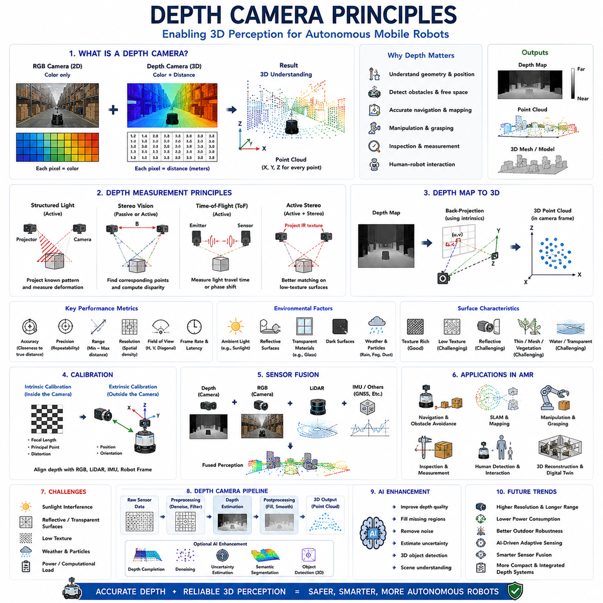
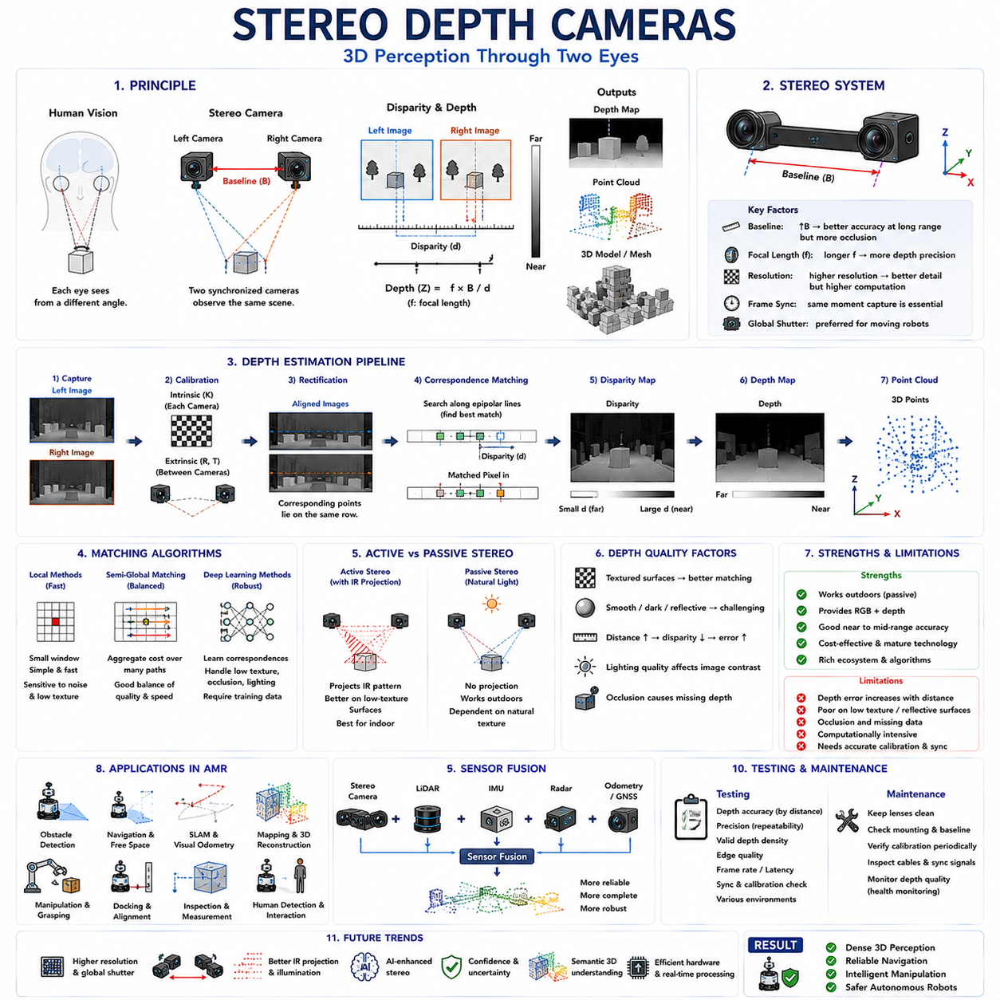
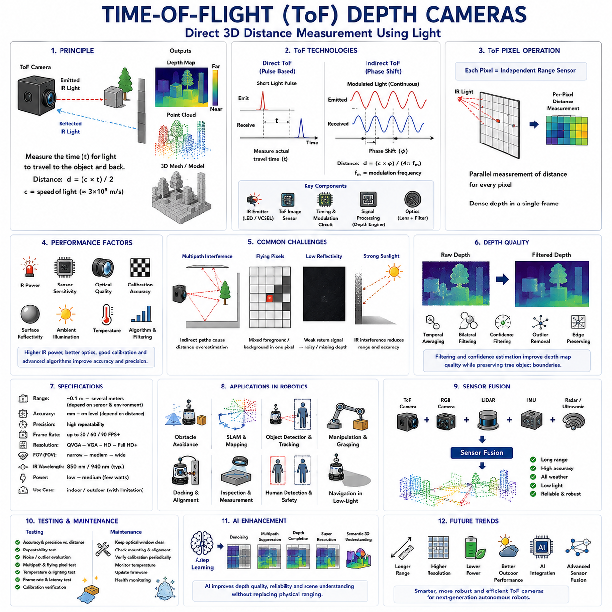
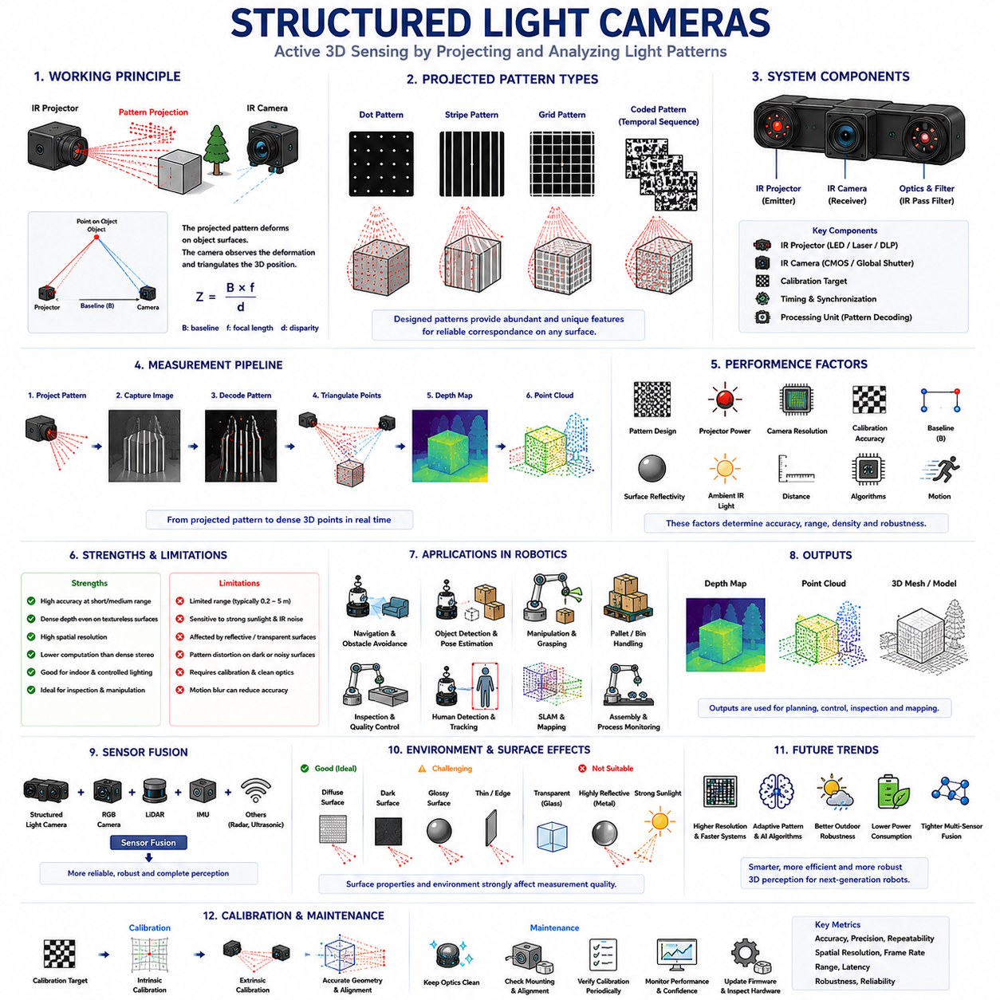
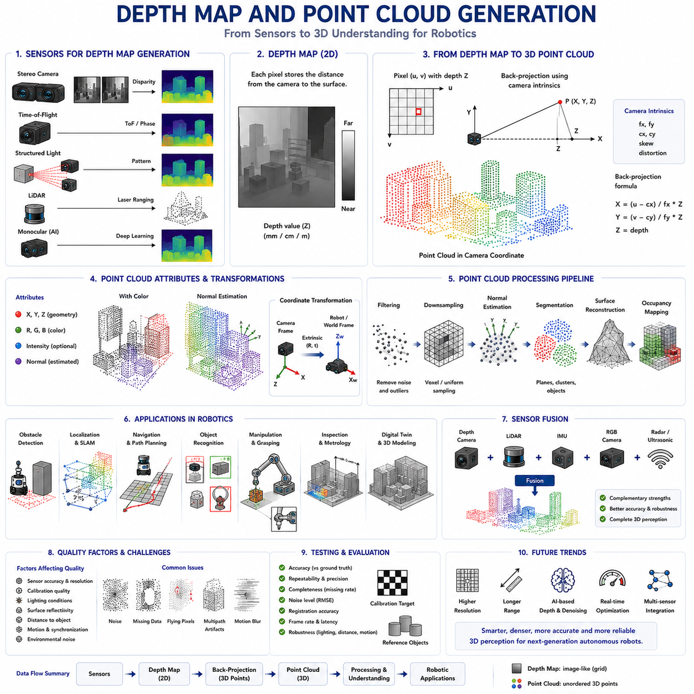
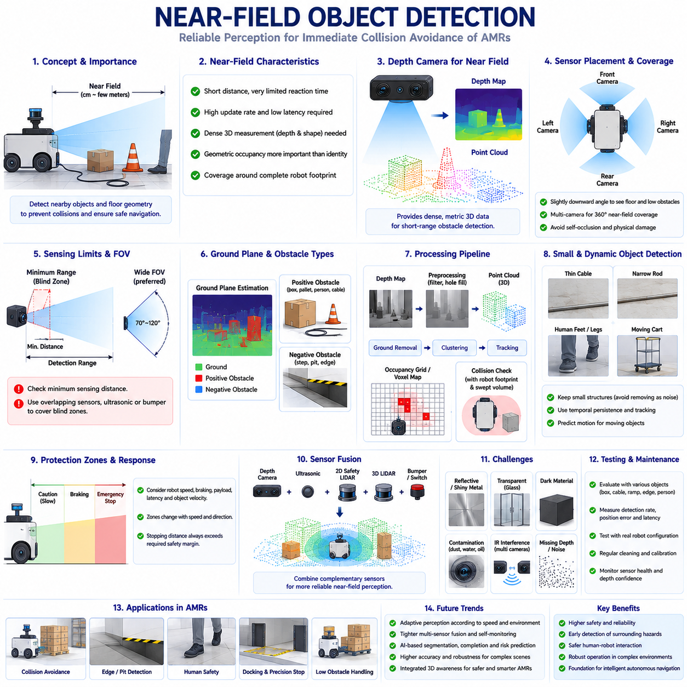
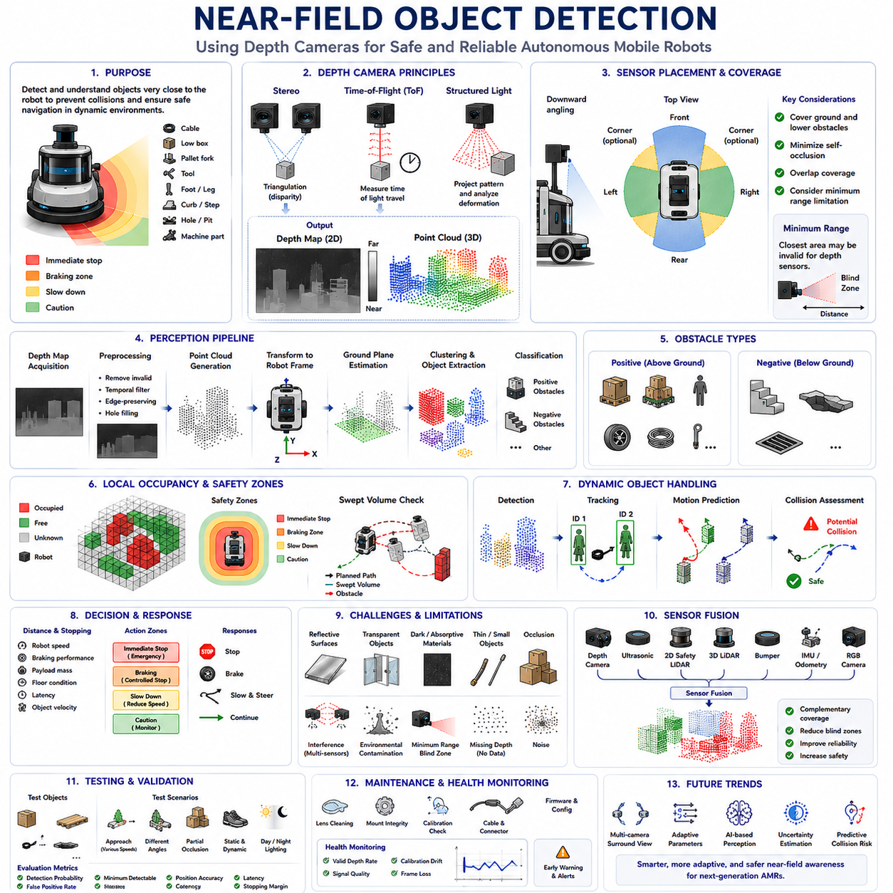
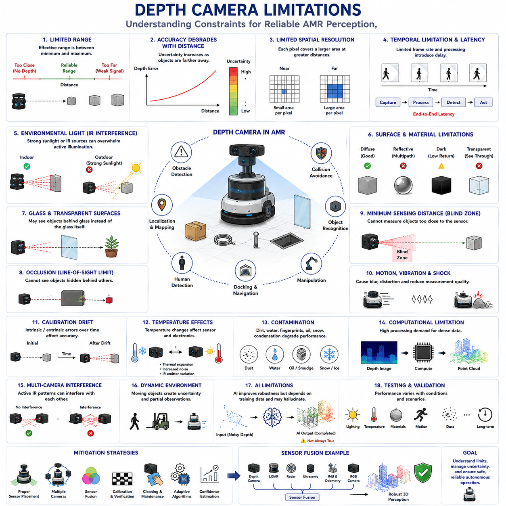
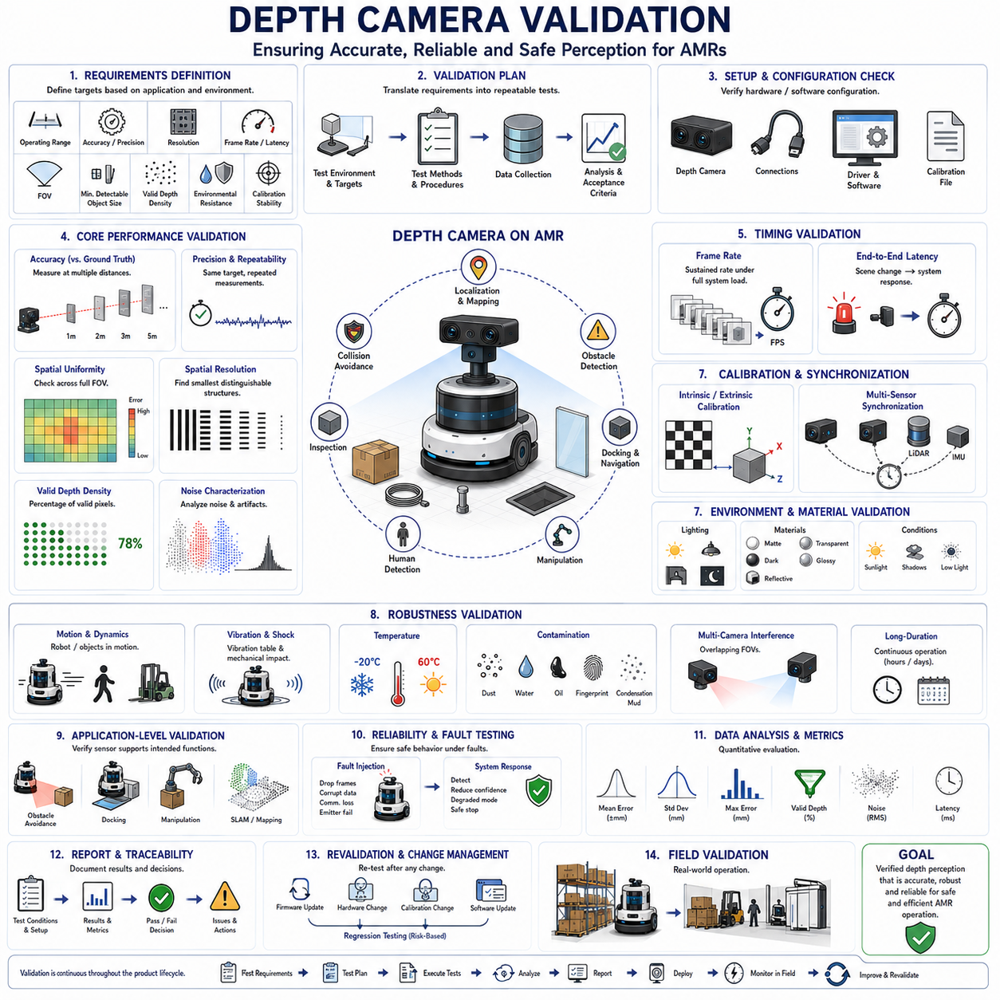

**Volume 03. AMR Sensors and Perception**

# Chapter 05. Depth Cameras

## 05.1 Depth Camera Principles

{width="7.268055555555556in" height="7.268055555555556in"}

깊이 카메라(Depth Camera)는 주변 환경에 대한 3차원 기하학 정보(Three-Dimensional Geometric Information)를 직접 제공할 수 있기 때문에 현대 자율이동로봇(Autonomous Mobile Robot, AMR)에서 가장 중요한 인지 센서(Perception Sensor) 가운데 하나로 자리 잡았다. 일반적인 RGB 카메라(RGB Camera)가 2차원의 색상 영상(Color Image)만을 획득하는 것과 달리, 깊이 카메라는 카메라와 장면(Scene)에 존재하는 모든 가시 점(Visible Point) 사이의 거리를 직접 측정한다. 이렇게 생성된 깊이 정보(Depth Information)는 로봇이 객체의 위치(Object Position), 표면 형상(Surface Geometry), 장애물의 크기(Obstacle Dimension), 주행 가능한 공간(Free Space), 환경 구조(Environmental Structure)를 단순한 영상 기반 인지보다 훨씬 높은 신뢰성으로 이해할 수 있도록 한다. 이러한 능력은 내비게이션(Navigation), 장애물 회피(Obstacle Avoidance), 매니퓰레이션(Manipulation), 검사(Inspection), 지도작성(Mapping), 사람-로봇 상호작용(Human-Robot Interaction)의 성능을 크게 향상시킨다. 자율성이 점점 높아지는 로봇 시스템에서 깊이 카메라는 정확한 공간 인식(Spatial Understanding)을 제공하는 핵심 센서로 지속적으로 발전하고 있다.

깊이 카메라의 가장 기본적인 목적은 관측된 장면 전체에서 카메라와 객체 사이의 거리를 추정하는 것이다. 일반적인 카메라는 각 픽셀(Pixel)에 색상 정보만 저장하지만, 깊이 카메라는 모든 픽셀에 해당 지점까지의 실제 거리 정보를 함께 저장한다. 색상 정보와 기하학 정보(Geometric Information)가 결합되면 로봇은 주변 환경의 3차원 구조를 이해하면서 동시에 객체의 외형까지 인식할 수 있다. 따라서 깊이 카메라는 기존의 영상 센싱(Image Sensing)과 3차원 환경 인지(Three-Dimensional Environmental Perception)를 연결하는 중요한 역할을 수행하며, 로봇이 단순히 무엇이 존재하는지를 넘어 그것이 실제 공간 어디에 위치하는지를 이해하도록 만든다.

깊이 측정(Depth Measurement)은 일반적인 영상 획득(Image Acquisition)과 근본적으로 다르다. 일반 카메라는 렌즈를 통해 들어온 빛의 세기(Intensity)만을 이미지 센서(Image Sensor)에 기록한다. 반면 깊이 카메라는 추가적인 계산이나 물리적인 측정을 수행하여 객체까지의 거리를 계산한다. 사용되는 기술에 따라 기하학적 삼각측량(Geometric Triangulation), 구조광 투사(Structured Light Projection), 비행시간 측정(Time-of-Flight Measurement), 스테레오 대응(Stereo Correspondence) 등 다양한 원리가 적용된다. 구현 방식은 서로 다르지만 궁극적인 목적은 장면에 존재하는 모든 가시 점에 대해 신뢰성 있는 거리 값을 부여하는 것이다.

깊이 정보는 일반적으로 깊이 맵(Depth Map)의 형태로 표현된다. 깊이 맵은 겉보기에는 회색조 영상(Grayscale Image)과 유사하지만, 각 픽셀의 밝기는 실제 밝기가 아니라 카메라와 객체 사이의 물리적인 거리를 의미한다. 가까운 객체는 표현 방식에 따라 밝거나 어둡게 표시되며, 먼 객체는 그 반대의 밝기로 표현된다. 일반 회색조 영상과 달리 이러한 픽셀 값은 실제 거리 정보를 포함하므로 직접 3차원 좌표(Three-Dimensional Coordinate)로 변환할 수 있다. 따라서 깊이 맵은 내비게이션, 장애물 검출, 위치추정, 매니퓰레이션, 환경 복원(Environment Reconstruction)에 적합한 고밀도 기하학 정보를 제공한다.

깊이 영상과 3차원 기하학의 관계는 로봇 공간 인지의 핵심을 이룬다. 깊이 영상의 모든 픽셀은 카메라 내부 파라미터(Intrinsic Calibration Parameter)에 의해 결정되는 고유한 관측 방향(Viewing Direction)을 가진다. 여기에 측정된 깊이 값을 결합하면 카메라 기준 좌표계(Camera Coordinate System)에서의 3차원 좌표를 계산할 수 있다. 이러한 계산을 모든 픽셀에 적용하면 점군(Point Cloud)이 생성된다. 점군은 주변 환경의 기하학 정보를 효율적으로 표현할 수 있기 때문에 로봇 분야에서 가장 널리 사용되는 3차원 데이터 구조 가운데 하나이다.

현대의 깊이 카메라는 여러 가지 측정 원리를 사용한다. 구조광(Structured Light)은 적외선 패턴(Infrared Pattern)을 물체에 투사하고 그 변형 정도를 분석하여 깊이를 계산한다. 스테레오 비전(Stereo Vision)은 일정한 기준 거리(Baseline)를 가진 두 대의 카메라에서 동일한 특징점을 찾아 깊이를 추정한다. 비행시간(Time-of-Flight, ToF)은 적외선을 방출한 후 반사되어 돌아오는 시간을 직접 측정하거나 위상차(Phase Shift)를 계산하여 거리를 구한다. 액티브 스테레오(Active Stereo)는 적외선 패턴을 추가적으로 투사하여 질감(Texture)이 부족한 환경에서도 스테레오 매칭 성능을 향상시킨다. 구현 방식은 다르지만 모두 광학 정보를 이용하여 3차원 기하학을 추정한다는 공통점을 가진다.

깊이 카메라는 크게 능동형(Active)과 수동형(Passive) 센서로 구분할 수 있다. 능동형 깊이 카메라는 자체적으로 적외선(Infrared Light) 등을 방출하여 주변 조명에 크게 의존하지 않고 깊이를 계산한다. 구조광과 ToF 방식이 대표적인 예이다. 반면 수동형 깊이 카메라는 별도의 광원을 사용하지 않고 자연광과 영상 대응(Image Correspondence)만을 이용하여 거리를 계산한다. 스테레오 카메라는 일반적으로 수동형이지만, 최근에는 적외선 패턴을 함께 사용하는 액티브 스테레오 방식도 널리 사용된다. 일반적으로 능동형은 실내 환경에서 우수한 성능을 보이고, 수동형은 강한 태양광이 존재하는 실외 환경에서 더욱 유리한 경우가 많다.

측정 정확도(Measurement Accuracy)는 깊이 카메라를 평가하는 가장 중요한 성능 지표 가운데 하나이다. 정확도는 측정된 거리 값이 실제 거리와 얼마나 일치하는지를 의미한다. 정확도에는 센서 해상도(Sensor Resolution), 렌즈 품질(Lens Quality), 보정 정확도(Calibration Precision), 조명 조건(Illumination Condition), 물체의 반사율(Reflectivity), 관찰 각도(Viewing Angle), 환경 간섭(Environmental Interference), 거리 측정 방식(Ranging Technology) 등이 영향을 준다. 높은 정확도는 위치추정, 정밀 매니퓰레이션, 장애물 회피, 치수 검사(Dimensional Inspection), 3차원 복원의 품질을 직접 향상시킨다.

정밀도(Precision)는 정확도와는 다른 개념으로 동일한 조건에서 반복 측정을 수행했을 때 결과가 얼마나 일정하게 유지되는지를 의미한다. 센서가 항상 거의 같은 값을 측정하지만 실제 거리와 약간 차이가 있다면 높은 정밀도와 낮은 정확도를 가진 것이다. 반대로 평균적으로는 정확하지만 측정값이 크게 흔들린다면 정확도는 높지만 정밀도는 낮다. 로봇 인지에서는 위치추정, 지도작성, 매니퓰레이션 모두 반복 가능하고 안정적인 측정을 요구하므로 정확도와 정밀도가 모두 중요하다. 일반적으로 보정(Calibration)은 정확도를 향상시키고, 하드웨어 품질은 정밀도에 큰 영향을 미친다.

측정 거리 범위(Measurement Range)는 깊이 카메라가 신뢰성 있게 측정할 수 있는 최소 거리와 최대 거리를 의미한다. 너무 가까운 물체는 최소 측정 거리 안쪽에 위치하여 정확한 거리 계산이 어렵고, 너무 먼 물체는 반사 신호가 약하거나 스테레오 시차(Disparity)가 너무 작아져 신뢰성이 감소한다. 응용 분야에 따라 요구되는 거리 범위는 크게 달라진다. 실내 자율이동로봇은 근거리 및 중거리 측정을 중요하게 생각하는 반면, 실외 자율주행 플랫폼은 고속 주행을 위해 훨씬 긴 거리까지 안정적으로 측정할 수 있어야 한다.

공간 해상도(Spatial Resolution)는 깊이 측정이 얼마나 촘촘하게 이루어지는지를 나타낸다. 높은 공간 해상도는 작은 물체와 미세한 표면 구조를 더욱 정확하게 표현할 수 있다. 그러나 높은 해상도는 계산량, 메모리 사용량, 통신 대역폭, 처리 지연(Latency)을 함께 증가시킨다. 따라서 엔지니어는 실제 응용 목적과 사용 가능한 계산 자원을 고려하여 적절한 해상도를 선택한다. 일부 시스템은 RGB 영상은 높은 해상도로 유지하면서 깊이 영상만 낮은 해상도로 획득한 후 센서 융합(Sensor Fusion)을 통해 이를 보완하기도 한다.

시야각(Field of View)은 실제 깊이 카메라 성능에 매우 큰 영향을 준다. 넓은 시야각은 더 많은 환경을 관찰하여 사각지대(Blind Area)를 줄일 수 있지만, 동일한 해상도에서는 공간 해상도가 감소할 수 있다. 반대로 좁은 시야각은 더 높은 공간 해상도와 정밀도를 제공하지만 관찰 가능한 영역이 제한된다. 수평 시야각(Horizontal Field of View), 수직 시야각(Vertical Field of View), 대각선 시야각(Diagonal Field of View)은 모두 로봇의 구조, 장애물 분포, 내비게이션 요구사항을 고려하여 적절하게 선택되어야 한다.

환경 조건(Environmental Condition)은 깊이 카메라 성능에 큰 영향을 준다. 특히 강한 태양광은 적외선 기반 거리 측정 기술에 간섭을 일으킬 수 있다. 반사율이 높은 표면은 다중 반사(Multipath Reflection)나 신호 포화(Signal Saturation)를 발생시키며, 유리와 같은 투명한 물질은 적외선을 통과시키기 때문에 정확한 측정이 어렵다. 검은색 표면은 적외선을 흡수하여 반사 신호를 약하게 만들고, 질감이 풍부한 표면은 스테레오 매칭 성능을 향상시킨다. 또한 비(Rain), 안개(Fog), 먼지(Dust), 연기(Smoke)는 적외선을 산란(Scattering)시켜 거리 측정의 신뢰성을 감소시킨다. 따라서 이러한 환경적 한계를 이해하는 것은 실제 시스템 구축에서 매우 중요하다.

물체의 표면 특성(Surface Characteristic) 역시 깊이 측정 품질에 큰 영향을 준다. 질감이 거의 없는 평평한 표면은 스테레오 매칭을 어렵게 만들며, 금속과 같은 반사율이 높은 재질은 적외선을 왜곡시킨다. 유리와 같은 투명한 물질은 측정되지 않거나 잘못된 거리 값을 생성할 수 있다. 곡면(Curved Surface), 얇은 구조물(Thin Structure), 식생(Vegetation), 철망(Mesh Fence), 물 표면(Water Surface)도 다양한 측정 오류를 유발할 수 있다. 따라서 실제 로봇 시스템에서는 이러한 한계를 보완하기 위해 깊이 카메라와 다른 센서를 함께 사용하는 경우가 많다.

보정(Calibration)은 깊이 카메라 성능을 유지하기 위한 핵심 과정이다. 내부 보정(Intrinsic Calibration)은 렌즈와 이미지 센서의 광학 특성을 추정하며, 외부 보정(Extrinsic Calibration)은 깊이 카메라와 다른 센서 또는 로봇 좌표계 사이의 위치 관계를 계산한다. 정확한 보정을 통해 RGB 영상, 라이다(LiDAR), IMU(Inertial Measurement Unit), 휠 오도메트리(Wheel Odometry), 로봇 기구학(Robot Kinematics)과 깊이 정보를 정확하게 정렬할 수 있다. 보정 오차는 위치추정, 지도작성, 매니퓰레이션, 산업 검사 성능에 직접적인 영향을 미치므로 정기적인 검증이 필요하다.

깊이 카메라는 일반적으로 다른 센서와 함께 사용된다. RGB 카메라는 의미 정보(Semantic Information)를 제공하고, 라이다는 장거리에서 높은 정확도의 기하학 정보를 제공하며, 레이더(Radar)는 악천후에서도 안정적인 성능을 유지하고, 초음파 센서(Ultrasonic Sensor)는 근거리 장애물 검출을 담당한다. 깊이 카메라는 이들 센서와 함께 밀집된(Dense) 3차원 기하학 정보를 제공하여 각 센서의 장점을 결합한 다중 센서 인지(Multi-Sensor Perception)를 구현한다.

점군(Point Cloud)은 깊이 카메라가 생성하는 가장 중요한 데이터 형태 가운데 하나이다. 모든 깊이 픽셀은 카메라 좌표계(Camera Coordinate System)의 하나의 3차원 점으로 변환될 수 있으며, 수백만 개의 점이 모여 주변 환경의 형태를 표현한다. 이러한 점군은 장애물 검출, 점유 공간 지도(Occupancy Map), SLAM, 표면 복원(Surface Reconstruction), 객체 분할(Object Segmentation), 매니퓰레이션 계획, 치수 측정, 디지털 트윈(Digital Twin) 생성 등 다양한 로봇 응용 분야에서 핵심적인 데이터 구조로 사용된다.

계산 효율성(Computational Efficiency)은 깊이 데이터 처리에서 매우 중요한 요소이다. 점군 생성, 필터링(Filtering), 정합(Registration), 분할(Segmentation), 특징 추출(Feature Extraction), 표면 복원, 센서 융합은 일반적인 영상 처리보다 훨씬 많은 계산 자원을 요구한다. 따라서 현대의 로봇은 GPU(Graphics Processing Unit), AI 가속기(AI Accelerator), 병렬 처리(Parallel Processing), 최적화된 인지 라이브러리(Optimized Perception Library)를 이용하여 실시간 깊이 처리를 수행한다. 특히 배터리 기반 자율이동로봇에서는 계산 효율이 에너지 소비와 운용 시간에 직접적인 영향을 미친다.

최근에는 인공지능(AI)이 깊이 인지(Depth Perception)의 성능을 크게 향상시키고 있다. 딥러닝은 깊이 보완(Depth Completion), 단안 깊이 추정(Monocular Depth Estimation), 점군 분할(Point Cloud Segmentation), 3차원 객체 검출(Three-Dimensional Object Detection), 장면 이해(Scene Understanding), RGB와 깊이 정보를 동시에 사용하는 멀티모달 인지(Multimodal Perception)를 수행할 수 있다. AI는 기존의 거리 측정 기술을 대체하는 것이 아니라, 노이즈 제거(Noise Removal), 결측 영역 보완(Missing Depth Filling), 가려진 영역 복원(Occluded Surface Reconstruction), 불확실성 추정(Uncertainty Estimation)을 통해 기존 깊이 센서를 더욱 강인하게 만들어 준다.

미래의 깊이 카메라 기술은 더욱 높은 해상도(Higher Resolution), 더 긴 측정 거리(Longer Sensing Range), 낮은 전력 소비(Lower Power Consumption), 향상된 실외 성능(Improved Outdoor Robustness), 인공지능과의 긴밀한 통합(Tighter AI Integration), 더욱 지능적인 센서 융합(Intelligent Sensor Fusion) 방향으로 발전할 것이다. 차세대 깊이 카메라는 환경 조건에 따라 거리 측정 방식을 스스로 조정하고, 측정 불확실성을 자동으로 추정하며, 다른 센서와 협력하여 특정 임무(Mission)에 최적화된 데이터를 획득하게 될 것이다. 자율이동로봇이 더욱 복잡한 산업, 상업, 공공 환경으로 확대됨에 따라 깊이 카메라는 안전하고 지능적이며 높은 수준의 자율성을 실현하기 위한 핵심 공간 인지 센서로서 앞으로도 매우 중요한 역할을 수행하게 될 것이다.

## 05.2 Stereo Depth Cameras

{width="7.268055555555556in" height="7.268055555555556in"}

스테레오 깊이 카메라(Stereo Depth Camera)는 서로 일정한 간격으로 떨어진 두 개의 시점(Viewpoint)에서 동일한 장면(Scene)을 관찰하여 3차원 구조(Three-Dimensional Structure)를 추정하는 센서이다. 그 동작 원리는 사람의 양안 시각(Binocular Vision)과 매우 유사하다. 사람의 왼쪽 눈과 오른쪽 눈이 서로 약간 다른 영상을 보는 것처럼, 스테레오 카메라는 좌우 카메라가 획득한 두 영상을 비교하여 동일한 특징점(Feature Point)을 찾고, 두 영상에서 발생하는 수평 위치 차이(Horizontal Displacement)를 측정한다. 이러한 위치 차이를 시차(Disparity)라고 하며, 가까운 물체일수록 시차는 크게 나타나고 먼 물체일수록 작아진다. 스테레오 깊이 카메라는 이러한 시차를 이용하여 깊이 맵(Depth Map), 점군(Point Cloud), 3차원 환경 모델을 생성하며, 자율이동로봇(Autonomous Mobile Robot, AMR)의 안정적인 공간 인지를 지원한다.

스테레오 카메라 시스템(Stereo Camera System)은 일반적으로 두 대의 카메라가 정확히 알려진 거리만큼 떨어져 장착된 구조를 가진다. 이 거리를 기준선(Baseline)이라 하며, 이는 깊이 성능에 매우 큰 영향을 미친다. 기준선이 길수록 동일한 거리의 물체에서도 더 큰 시차가 발생하여 중거리와 원거리에서 깊이 정확도가 향상된다. 그러나 기준선이 지나치게 길면 좌우 영상의 가려짐(Occlusion)이 증가하고 특징점 대응(Correspondence Matching)이 어려워진다. 반대로 기준선이 짧으면 카메라를 소형화할 수 있고 근거리 측정에는 유리하지만 먼 거리에서는 시차가 작아져 깊이 정확도가 떨어진다. 따라서 기준선은 로봇 크기, 측정 거리, 요구 정확도, 환경 특성을 모두 고려하여 결정되어야 한다.

스테레오 삼각측량(Stereo Triangulation)은 깊이 계산의 수학적 기반이다. 좌우 영상에서 동일한 특징점을 찾은 후, 카메라의 초점거리(Focal Length), 기준선(Baseline), 측정된 시차를 이용하여 객체까지의 거리를 계산한다. 깊이는 시차에 반비례(Inversely Proportional)하므로 먼 거리에서는 작은 시차 오차도 큰 거리 오차를 발생시킨다. 이러한 특성 때문에 스테레오 카메라는 일반적으로 근거리와 중거리에서 높은 상대 정확도를 제공하지만 매우 먼 거리에서는 오차가 빠르게 증가한다. 따라서 정확한 깊이 추정을 위해서는 정밀한 보정(Calibration), 높은 영상 품질(Image Quality), 정확한 특징점 대응, 충분한 영상 해상도가 모두 필요하다.

깊이 계산을 수행하기 전에 두 카메라는 반드시 기하학적으로 보정되어야 한다. 내부 보정(Intrinsic Calibration)은 초점거리, 주점(Principal Point), 픽셀 구조(Pixel Geometry), 렌즈 왜곡(Lens Distortion) 등을 계산하며, 외부 보정(Extrinsic Calibration)은 좌우 카메라 사이의 상대적인 위치와 자세를 추정한다. 매우 작은 정렬 오차도 대응되는 특징점의 위치를 변화시켜 깊이 정확도를 크게 저하시킬 수 있다. 따라서 스테레오 카메라는 기계적으로 매우 견고하게 장착되어야 하며, 진동(Vibration), 충격(Impact), 온도 변화(Thermal Cycling), 구조 변형(Structural Deformation)이 발생하는 환경에서는 주기적인 보정 검증이 필요하다.

스테레오 정렬(Stereo Rectification)은 좌우 카메라 영상에서 대응되는 점들이 동일한 수평 영상선(Horizontal Image Row)에 위치하도록 변환하는 과정이다. 정렬이 수행되지 않으면 대응점 탐색은 2차원 전체 영역에서 이루어져야 하므로 계산량이 크게 증가한다. 정렬 이후에는 탐색 범위를 수평 방향으로 제한할 수 있어 처리 속도와 정확도가 향상된다. 정렬은 두 카메라의 보정 정보를 이용하여 렌즈 왜곡을 제거하고 가상의 동일한 영상 평면(Virtual Image Plane)을 생성한다. 작은 수직 오차도 잘못된 시차 계산과 불안정한 깊이 지도를 유발할 수 있으므로 정렬의 정확성은 매우 중요하다.

대응점 탐색(Correspondence Matching)은 스테레오 깊이 인지에서 가장 중요한 계산 과정이다. 시스템은 왼쪽 영상의 특정 픽셀이 오른쪽 영상에서 어떤 픽셀과 동일한 실제 물체를 나타내는지를 찾아야 한다. 전통적인 알고리즘은 픽셀 블록(Pixel Block), 에지(Edge), 그래디언트(Gradient), 질감(Texture)을 비교하여 대응점을 찾는다. 보다 발전된 방법은 넓은 영역에서 비용(Cost)을 누적하고 기하학적 일관성을 유지하며 시차의 부드러움(Smoothness)을 최적화한다. 최근에는 딥러닝(Deep Learning)이 대규모 스테레오 데이터셋을 이용하여 직접 대응 관계를 학습함으로써 조명 변화, 반복 패턴, 부분 가림, 낮은 질감 환경에서도 높은 성능을 제공하고 있다.

지역 기반 스테레오 매칭(Local Stereo Matching)은 각 픽셀 주변의 작은 영역을 이용하여 시차를 계산한다. 이러한 방식은 계산량이 적어 임베디드 로봇 시스템에서 실시간 처리에 적합하다. 그러나 노이즈, 반복 패턴, 질감이 부족한 표면, 조명 차이에 민감하다. 큰 윈도우(Window)는 안정성을 높이지만 서로 다른 객체가 혼합되어 깊이 경계가 흐려질 수 있으며, 작은 윈도우는 경계는 잘 유지하지만 정보가 부족하여 대응 오류가 증가할 수 있다. 따라서 지역 기반 알고리즘은 질감이 풍부하고 조명이 일정한 환경에서 가장 효과적이다.

전역 및 준전역 스테레오 알고리즘(Global and Semi-Global Stereo Algorithm)은 더 넓은 영역의 정보를 함께 고려하여 깊이의 일관성을 향상시킨다. 각 픽셀을 독립적으로 계산하지 않고 영상 유사성과 부드러움 제약(Smoothness Constraint)을 동시에 만족하는 최적화 문제를 해결한다. 이러한 접근은 노이즈를 줄이고 질감이 부족한 영역에서도 더 안정적인 깊이를 제공한다. 특히 준전역 매칭(Semi-Global Matching, SGM)은 계산량과 성능 사이의 균형이 우수하여 실제 로봇 시스템에서 가장 널리 사용되는 스테레오 알고리즘 가운데 하나이다.

액티브 스테레오 카메라(Active Stereo Camera)는 적외선 패턴(Infrared Pattern)을 환경에 투사하여 수동형 스테레오의 단점을 보완한다. 투사된 패턴은 벽, 바닥, 상자 등 질감이 거의 없는 표면에도 인위적인 특징점을 생성한다. 적외선 카메라는 이러한 패턴을 이용하여 더욱 안정적인 대응점을 찾을 수 있다. 액티브 스테레오는 창고, 공장, 병원, 연구실과 같은 실내 환경에서 매우 우수한 성능을 제공한다. 그러나 강한 태양광은 적외선 패턴을 약화시키므로 실외에서는 성능이 감소하여 사실상 수동형 스테레오처럼 동작하는 경우가 많다.

수동형 스테레오 카메라(Passive Stereo Camera)는 자연광과 장면 자체의 질감만을 이용하여 깊이를 계산한다. 별도의 적외선을 방출하지 않으므로 강한 태양광 환경에서도 사용할 수 있으며, 적절한 기준선과 고해상도 카메라를 사용하면 긴 거리까지 측정이 가능하다. 그러나 매끄럽고 질감이 없는 표면이나 단색 물체에서는 대응점을 찾기 어려워 깊이 정보가 불완전해질 수 있다. 콘크리트 벽, 깨끗한 바닥, 단색 패널, 질감이 거의 없는 포장재 등이 대표적인 예이다.

깊이 해상도(Depth Resolution)와 정확도는 영상 해상도(Image Resolution)에 크게 의존한다. 고해상도 카메라는 더 많은 픽셀을 제공하므로 작은 시차도 더욱 정밀하게 측정할 수 있으며, 얇은 장애물이나 작은 객체, 원거리 물체를 더욱 정확하게 인식할 수 있다. 그러나 높은 해상도는 메모리 사용량, 계산량, 처리 지연(Latency), 소비 전력을 크게 증가시킨다. 따라서 실제 시스템에서는 로봇 속도, 측정 거리, 프로세서 성능, 요구 정밀도를 고려하여 적절한 해상도를 선택해야 한다.

프레임 동기화(Frame Synchronization)는 좌우 카메라가 반드시 동일한 순간의 장면을 촬영하도록 보장하는 과정이다. 만약 두 카메라가 서로 다른 시점에 영상을 획득하면 이동하는 로봇이나 객체 때문에 실제 시차와 무관한 위치 변화가 발생한다. 이러한 시간 오차는 잘못된 깊이 계산과 움직이는 객체의 왜곡을 유발한다. 따라서 하드웨어 트리거(Hardware Trigger)를 이용한 완전한 동기화가 가장 신뢰성이 높으며, 생성된 깊이 데이터는 라이다(LiDAR), IMU(Inertial Measurement Unit), 휠 오도메트리(Wheel Odometry) 등과도 정확한 타임스탬프(Timestamp)를 통해 동기화되어야 한다.

글로벌 셔터(Global Shutter)는 움직이는 로봇에서 사용하는 스테레오 카메라에 가장 적합한 이미지 센서 구조이다. 글로벌 셔터는 모든 픽셀을 거의 동시에 노출시키므로 빠른 이동이나 진동이 발생해도 기하학적인 일관성이 유지된다. 반면 롤링 셔터(Rolling Shutter)는 영상을 한 줄씩 순차적으로 촬영하기 때문에 좌우 카메라에서 서로 다른 왜곡이 발생하여 대응점 탐색 성능이 저하될 수 있다. 롤링 셔터는 비용과 소비 전력 측면에서 장점이 있지만, 동적인 AMR 환경에서는 일반적으로 글로벌 셔터가 더욱 안정적인 깊이 성능을 제공한다.

스테레오 처리 결과로 생성되는 깊이 맵(Depth Map)은 시차를 실제 거리로 변환한 데이터이다. 각 픽셀은 카메라에서 해당 물체까지의 거리를 나타낸다. 대응점을 찾을 수 없는 영역은 유효하지 않은 깊이 값(Invalid Depth)을 가진다. 이러한 영역은 부분 가림(Occlusion), 반사 표면, 투명 물체, 질감 부족, 영상 가장자리 등에서 주로 발생한다. 후처리(Post-Processing) 과정에서는 신뢰도 필터링(Confidence Filtering), 스페클 제거(Speckle Removal), 홀 채우기(Hole Filling), 에지 보존 평활화(Edge-Preserving Smoothing), 시간 필터링(Temporal Filtering)을 수행하여 깊이 맵의 품질을 향상시킨다. 이러한 과정은 노이즈를 줄이면서 실제 장애물 경계는 유지해야 한다.

부분 가림(Occlusion)은 스테레오 기하학에서 피할 수 없는 현상이다. 좌우 카메라는 서로 다른 위치에서 장면을 보기 때문에 한쪽 카메라에서 보이는 물체가 다른 카메라에서는 가려질 수 있다. 이러한 영역에서는 대응점을 찾을 수 없으므로 깊이 계산이 불가능하다. 부분 가림은 객체의 경계, 전경 장애물 뒤쪽, 가느다란 구조물 주변에서 자주 발생한다. 스테레오 알고리즘은 좌우 일관성 검사(Left-Right Consistency Check)를 이용하여 이러한 영역을 검출하며, 불확실한 깊이를 강제로 생성하는 것보다 유효하지 않은 영역으로 남겨두는 것이 안전하다.

반사 및 투명 재질(Reflective and Transparent Material)은 스테레오 시스템의 주요 어려움 가운데 하나이다. 유리는 유리 자체가 아니라 그 뒤에 있는 물체를 보여줄 수 있으며, 금속과 광택 바닥은 서로 다른 위치의 반사 영상을 생성하여 정상적인 대응 관계를 깨뜨린다. 어두운 재질은 대비가 약하고, 반복되는 산업용 패턴은 여러 개의 후보 대응점을 만들어 깊이 계산을 어렵게 한다. 이러한 환경에서는 스테레오 깊이뿐 아니라 신뢰도 추정(Confidence Estimation)과 다른 센서를 함께 사용하는 것이 안전하다.

스테레오 깊이 카메라는 구조광(Structured Light)이나 비행시간(Time-of-Flight, ToF) 방식에 비해 여러 가지 장점을 가진다. 수동형 스테레오는 별도의 광원을 사용하지 않으므로 실외에서도 안정적으로 사용할 수 있으며, 적절한 광학계와 기준선을 이용하면 긴 측정 거리도 확보할 수 있다. 또한 RGB 영상 자체를 제공하므로 객체 검출(Object Detection), 의미론적 분할(Semantic Segmentation), 비주얼 오도메트리(Visual Odometry), 사람 인식(Human Recognition)까지 동시에 수행할 수 있다. 하나의 하드웨어가 의미 정보와 기하학 정보를 동시에 제공한다는 점은 크기, 무게, 비용, 전력이 제한된 AMR에서 매우 큰 장점이다.

그러나 스테레오 깊이에는 한계도 존재한다. 거리가 멀어질수록 오차가 빠르게 증가하며, 대응점 계산에는 상당한 연산량이 필요하다. 질감이 부족한 환경에서는 깊이 정보가 누락될 수 있으며, 성능은 영상 품질, 보정 상태, 동기화, 조명 조건에 크게 의존한다. 수동형 스테레오는 실제 거리를 직접 측정하는 것이 아니라 대응 관계를 통해 추정하기 때문에 장면의 특성에 따라 신뢰도가 크게 달라질 수 있다. 따라서 시스템 설계자는 실험실 사양만이 아니라 실제 운용 환경에서의 성능을 반드시 검증해야 한다.

스테레오 깊이는 장애물 검출(Obstacle Detection)에 매우 효과적이다. 생성된 깊이 맵은 바닥 위로 돌출된 물체를 찾고, 장애물의 높이와 폭을 계산하며, 주행 가능한 공간(Free Space)을 추정하고, 충분한 기하학 정보가 존재할 경우 음의 장애물(Negative Obstacle)까지 검출할 수 있다. 생성된 점군(Point Cloud)은 점유 지도(Occupancy Grid), 지역 비용 지도(Local Cost Map), 지형 분석(Terrain Analysis), 충돌 회피(Collision Avoidance)에 활용된다. 단순한 RGB 객체 검출과 비교하여 스테레오는 객체의 실제 위치와 크기를 함께 제공한다.

비주얼 오도메트리(Visual Odometry)와 SLAM 역시 스테레오 시스템의 중요한 응용 분야이다. 단안 카메라(Monocular Camera)는 움직임은 추정할 수 있지만 절대적인 크기(Absolute Scale)는 추가 센서 없이는 알 수 없다. 반면 스테레오 카메라는 각 영상에서 실제 깊이를 제공하므로 이동량을 실제 거리 단위로 계산할 수 있다. 특징점은 즉시 삼각측량되어 3차원 위치를 계산할 수 있으며, 이를 이용하여 카메라의 이동과 3차원 환경 지도를 동시에 생성할 수 있다. 따라서 GNSS(Global Navigation Satellite System)를 사용할 수 없는 실내, 도시, 지하 시설 등에서 매우 유용한 위치추정 수단이 된다.

매니퓰레이션(Manipulation)과 도킹(Docking)에서도 스테레오 깊이는 중요한 역할을 한다. 로봇 팔은 3차원 깊이 정보를 이용하여 집을 대상의 위치와 자세를 계산하고 접근 경로를 계획할 수 있다. AMR은 랙(Rack), 컨베이어(Conveyor), 팔레트(Pallet), 충전 스테이션(Charging Station), 검사 대상과의 정렬에도 스테레오 깊이를 활용한다. 이러한 응용은 단순한 장애물 회피보다 훨씬 높은 정확도를 요구하므로 보정 품질, 장착 강성, 작업 거리, 특정 영역에서의 깊이 성능이 매우 중요하다.

스테레오 깊이 카메라는 RGB 객체 검출과 의미론적 분할과도 긴밀하게 결합된다. 신경망은 영상에서 객체의 종류를 인식하고, 스테레오 깊이는 해당 객체의 실제 3차원 위치와 크기를 계산한다. 이러한 결합을 통해 보행자(Pedestrian), 팔레트(Pallet), 지게차(Forklift), 벽(Wall), 바닥(Floor), 기계(Machine), 차량(Vehicle)과 같은 의미 정보가 포함된 의미 기반 점군(Semantic Point Cloud)을 생성할 수 있다. 이는 행동 예측(Behavior Prediction), 경로 계획(Path Planning), 재고 관리(Inventory Management), 검사(Inspection), 사람-로봇 상호작용(Human-Robot Interaction)에 매우 중요한 기반이 된다.

센서 융합(Sensor Fusion)은 스테레오 시스템의 신뢰성을 더욱 향상시킨다. 라이다는 높은 정확도의 장거리 기하학 정보를 제공하고, 레이더(Radar)는 비, 안개, 먼지, 저조도 환경에서도 안정적으로 동작하며, IMU는 카메라 움직임을 보정하는 데 도움을 준다. 스테레오 깊이는 고밀도의 근거리 기하학 정보와 풍부한 시각 정보를 제공한다. 융합 알고리즘은 보정된 좌표계와 동기화된 시간 정보를 이용하여 여러 센서를 통합하며, 잘못된 장애물을 줄이고 누락된 깊이를 보완하며 특정 센서가 일시적으로 성능이 저하되어도 안정적인 내비게이션을 유지할 수 있도록 한다.

스테레오 깊이 카메라의 시험(Testing)은 단순히 깊이 영상이 출력되는지만 확인해서는 충분하지 않다. 엔지니어는 거리별 정확도(Accuracy), 반복 측정 정밀도(Precision), 유효 픽셀 밀도(Valid Pixel Density), 경계 품질(Edge Quality), 프레임 속도(Frame Rate), 지연 시간(Latency), 동기화(Synchronization), 환경 변화에 대한 민감도 등을 평가해야 한다. 보정 타깃(Calibration Target), 평면 기준물(Reference Surface), 3차원 물체, 이동 물체, 다양한 재질을 이용하여 성능을 정량적으로 측정한다. 또한 실내와 실외 조명, 진동, 온도 변화, 질감 부족, 반사 재질, 실제 로봇 주행 환경까지 포함하여 시험해야 실험실 성능이 실제 운용 환경에서도 유지되는지를 확인할 수 있다.

유지보수(Maintenance)는 광학 정렬과 영상 품질을 유지하는 데 중점을 둔다. 두 개의 렌즈는 모두 항상 깨끗해야 하며, 한쪽 렌즈만 오염되어도 대응점 탐색 성능이 크게 저하될 수 있다. 장착 브래킷(Mounting Bracket), 기준선(Baseline), 케이블 연결(Cable Connection), 동기화 신호(Synchronization Signal), 보정 파일(Calibration File)은 정기적으로 점검해야 한다. 작은 기계적 변형도 영상 자체에는 문제가 없어 보이지만 깊이 정확도를 크게 저하시킬 수 있다. 따라서 재투영 오차(Reprojection Error), 유효 깊이 밀도, 프레임 동기화 상태, 노이즈 증가를 지속적으로 모니터링하면 심각한 고장이 발생하기 전에 이상을 발견할 수 있다.

최근에는 인공지능(AI)이 스테레오 깊이 추정을 빠르게 발전시키고 있다. 학습 기반 스테레오 신경망(Learned Stereo Network)은 대규모 데이터셋을 이용하여 대응점을 찾고, 질감이 부족한 영역에서도 깊이를 추정하며, 객체 경계를 유지하고, 깊이의 불확실성(Uncertainty)까지 함께 계산할 수 있다. 일부 시스템은 기하학 기반 스테레오와 단안 깊이 추정(Monocular Depth Prediction)을 결합하여 누락된 영역을 보완하면서도 실제 거리 정보를 유지한다. 또 다른 방법은 시간 정보를 이용한 추적, 의미 정보, 센서 융합을 함께 적용하여 더욱 안정적인 깊이 인지를 구현한다. 이러한 기술은 매우 강력하지만, 실제와 다른 깊이도 그럴듯하게 생성할 수 있으므로 충분한 검증이 반드시 필요하다.

미래의 스테레오 깊이 카메라(Stereo Depth Camera)는 더욱 높은 해상도의 글로벌 셔터(Global Shutter), 적응형 기준선(Adaptive Baseline), 향상된 적외선 투사(Improved Infrared Projection), 내장 AI 가속기(Integrated AI Accelerator), 효율적인 깊이 처리 구조로 발전할 것이다. 차세대 카메라는 깊이뿐 아니라 신뢰도(Confidence), 표면 종류(Surface Type), 움직임(Motion), 의미 정보(Semantic Information)를 하나의 통합 인지 파이프라인(Unified Perception Pipeline)에서 동시에 생성하게 될 것이다. 또한 장면에 따라 노출(Exposure), 시차 탐색 범위(Matching Range), 필터 강도(Filter Strength), 적외선 조명(Active Illumination)을 스스로 조정하는 지능형 기능도 제공하게 된다. 스테레오 기술은 앞으로 더욱 소형화되고 계산 효율성이 향상되면서, 고밀도 3차원 인지, 풍부한 시각 정보, 실외 운용 능력, 자율 내비게이션 및 매니퓰레이션과의 긴밀한 연계를 동시에 요구하는 자율이동로봇에서 핵심 깊이 센서로 계속 활용될 것이다.

## 05.3 ToF Depth Cameras

{width="7.268055555555556in" height="7.268055555555556in"}

비행시간(Time-of-Flight, ToF) 깊이 카메라(Depth Camera)는 빛의 물리적인 전파 특성을 이용하여 카메라와 주변 물체 사이의 거리를 직접 측정하기 때문에 현대 자율이동로봇(Autonomous Mobile Robot, AMR)에서 가장 중요한 3차원 인지 센서(Three-Dimensional Perception Sensor) 가운데 하나로 자리 잡았다. 스테레오 깊이 카메라(Stereo Depth Camera)가 영상 대응(Image Correspondence)을 통해 거리를 추정하고, 구조광(Structured Light) 방식이 투사된 패턴의 변형을 이용하는 것과 달리, ToF 카메라는 적외선(Infrared Light)을 방출한 후 반사되어 돌아오는 시간을 측정하여 깊이를 계산한다. 이러한 직접 거리 측정 방식은 비교적 낮은 계산 복잡도로 고밀도 깊이 맵(Dense Depth Map)을 빠르게 생성할 수 있다는 장점을 가진다. 실시간 인지, 장애물 회피(Obstacle Avoidance), 지도작성(Mapping), 산업 검사(Inspection), 사람-로봇 상호작용(Human-Robot Interaction)이 점점 중요해지는 현대 로봇 시스템에서 Time-of-Flight 기술은 근거리 및 중거리의 3차원 공간 인지를 위한 매우 매력적인 해결책으로 발전하고 있다.

Time-of-Flight 카메라의 기본 동작 원리는 빛의 속도(Constant Speed of Light)에 기반한다. 카메라는 적외선을 능동적으로 주변 환경에 방출하고, 물체에서 반사되어 되돌아오는 신호를 측정한다. 빛은 초당 약 3억 미터의 속도로 이동하기 때문에 방출과 수신 사이의 시간을 계산하면 실제 거리를 구할 수 있다. 이미지의 모든 픽셀(Pixel)은 각각 독립적으로 해당 위치까지의 거리를 계산하며, 단 한 번의 영상 획득만으로 전체 장면(Scene)의 깊이 영상을 생성할 수 있다. 일반 RGB 카메라(RGB Camera)가 색상 정보(Color Information)만을 제공하는 것과 달리, ToF 카메라는 환경의 3차원 구조를 직접 표현하는 고밀도 기하학 정보(Dense Geometric Information)를 생성한다.

기본 원리는 단순해 보이지만 실제로는 매우 짧은 시간 간격을 측정해야 하기 때문에 높은 기술력이 요구된다. 빛은 수 미터를 이동하는 데도 수 나노초(Nanosecond)밖에 걸리지 않기 때문에 일반적인 전자회로만으로는 이러한 시간을 직접 측정하기 어렵다. 따라서 현대 ToF 카메라는 특수한 이미지 센서(Image Sensor), 고속 변조 회로(High-Speed Modulation Circuit), 정밀 타이밍 회로(Timing Circuit), 신호 처리(Signal Processing) 기술을 이용하여 이러한 매우 작은 시간 차이를 계산한다. 많은 상용 시스템은 실제 시간을 직접 측정하기보다 위상차(Phase Shift)나 변조(Modulation) 기반의 간접적인 계산을 이용하여 높은 정확도를 유지하면서도 소형화된 하드웨어를 구현하고 있다.

Time-of-Flight 기술은 크게 직접형 ToF(Direct Time-of-Flight)와 간접형 ToF(Indirect Time-of-Flight)로 구분된다. 직접형 ToF는 광 펄스(Light Pulse)가 물체까지 이동한 후 되돌아오는 실제 시간을 직접 측정하는 방식으로, 레이저 거리 측정기(Laser Range Finder)와 유사한 원리를 가진다. 이 방식은 장거리에서도 높은 정확도를 제공할 수 있지만 매우 정밀한 타이밍 회로가 필요하다. 반면 간접형 ToF는 연속적으로 변조된 적외선을 방출하고 송신 신호와 수신 신호 사이의 위상차를 측정하여 거리를 계산한다. 위상 측정은 반도체 이미지 센서에서 구현하기가 상대적으로 쉽기 때문에 현재 로봇, 산업 자동화, 소비자 전자제품, 서비스 로봇에서 사용되는 대부분의 ToF 카메라는 간접형 방식을 채택하고 있다.

능동형 적외선 조명(Active Infrared Illumination)은 Time-of-Flight 카메라를 수동형 영상 센서와 구분하는 가장 큰 특징이다. 카메라는 주변 조명과 관계없이 스스로 적외선을 방출하므로 일반 카메라가 어려움을 겪는 저조도(Low-Light) 실내 환경에서도 안정적으로 동작할 수 있다. 적외선은 사람의 눈에는 보이지 않지만 거리 계산에는 충분한 반사 에너지를 제공한다. 또한 자체 광원을 사용하기 때문에 자연적인 질감(Texture)이나 시각적인 특징점(Feature Point)이 거의 없는 환경에서도 깊이 정보를 안정적으로 생성할 수 있다. 이러한 특성은 창고, 병원, 연구실, 제조 공장, 서비스 시설과 같이 조명 조건이 지속적으로 변화하는 환경에서 매우 큰 장점을 제공한다.

ToF 이미지 센서의 모든 픽셀은 하나의 독립적인 거리 측정 장치처럼 동작한다. 일반 이미지 센서가 빛의 세기(Intensity)만 기록하는 것과 달리, ToF 센서는 각 픽셀에서 해당 위치까지의 거리를 계산하는 전용 회로를 내장하고 있다. 따라서 거의 모든 유효 픽셀에서 직접 거리 값을 생성할 수 있으며, 별도의 스테레오 대응 계산(Stereo Correspondence)이나 특징점 매칭(Feature Matching)이 필요하지 않다. 이러한 병렬 거리 측정(Parallel Ranging)은 로봇이 내비게이션, 매니퓰레이션(Manipulation), 지도작성, 장애물 회피를 위해 즉시 활용할 수 있는 완전한 3차원 기하학 정보를 제공한다.

ToF 카메라가 생성하는 깊이 정보는 일반적으로 깊이 맵(Depth Map)의 형태로 표현된다. 깊이 맵의 각 픽셀에는 카메라와 해당 물체 사이의 실제 거리가 저장된다. 이러한 거리 값은 카메라 보정(Camera Calibration) 정보를 이용하여 3차원 좌표(Three-Dimensional Coordinate)로 변환할 수 있으며, 최종적으로 점군(Point Cloud)을 생성하게 된다. 깊이는 실제 물리적인 거리 측정에 기반하므로 질감이 거의 없는 표면에서도 비교적 연속적이고 매끄러운 깊이 영상을 제공할 수 있다. 이러한 특징은 대응점을 찾지 못하는 영역에서 깊이 생성이 어려운 스테레오 비전과 구별되는 중요한 장점이다.

측정 거리 범위(Measurement Range)는 ToF 카메라의 가장 중요한 성능 지표 가운데 하나이다. 대부분의 소형 로봇용 ToF 센서는 수십 센티미터에서 수 미터 정도의 근거리와 중거리 환경에서 안정적으로 동작하도록 설계된다. 측정 가능한 최대 거리는 적외선 출력(Illumination Power), 센서 감도(Sensor Sensitivity), 광학 설계(Optical Design), 주변 환경 조건에 따라 달라진다. 일반적으로 거리가 멀어질수록 반사되는 광 에너지가 감소하고 신호 대 잡음비(Signal-to-Noise Ratio)가 낮아져 정확도가 떨어진다. 따라서 실제 로봇 시스템에서는 단순히 최대 거리를 추구하기보다 실제 작업 공간에 적합한 센서를 선택하는 것이 중요하다.

측정 정확도(Measurement Accuracy)는 적외선 출력, 수광기 감도(Receiver Sensitivity), 광학 품질(Optical Quality), 전자 노이즈(Electronic Noise), 보정 정확도(Calibration Precision), 물체의 반사율(Reflectivity), 주변 조명, 신호 처리 알고리즘(Signal Processing Algorithm) 등 다양한 요소의 영향을 받는다. ToF 카메라는 직접 거리를 측정하지만 시스템 오차(Systematic Error)와 랜덤 오차(Random Error)는 여전히 존재한다. 정확한 보정은 시스템 오차를 줄이고, 다양한 필터링 알고리즘은 랜덤 노이즈를 감소시킨다. 산업용 로봇에서 정밀 매니퓰레이션이나 치수 검사(Dimensional Inspection)를 수행하는 경우에는 공장 출하 시 보정뿐 아니라 실제 응용 환경에 맞춘 추가 보정이 요구되는 경우도 많다.

측정 정밀도(Measurement Precision)는 동일한 조건에서 반복 측정했을 때 결과가 얼마나 일정하게 유지되는지를 의미한다. 높은 정밀도는 위치추정(Localization), 지도작성(Mapping), 객체 추적(Object Tracking), 로봇 매니퓰레이션에서 매우 중요하다. 센서 온도(Sensor Temperature), 전자 노이즈, 조명 안정성, 신호 적분 시간(Integration Time)은 모두 정밀도에 영향을 준다. 따라서 로봇 시스템에서는 절대적인 정확도뿐 아니라 반복 가능한 측정 결과도 매우 중요한 성능 요소로 평가된다.

주변 조명(Ambient Illumination)은 ToF 카메라 성능에 상당한 영향을 미친다. 카메라가 자체적으로 적외선을 방출하지만 강한 태양광은 많은 적외선 성분을 포함하고 있으므로 방출된 신호와 간섭하여 측정 신뢰성을 감소시키고 측정 거리를 제한할 수 있다. 반면 실내 환경은 적외선 간섭이 상대적으로 적기 때문에 훨씬 안정적인 성능을 제공한다. 따라서 실외에서 ToF 카메라를 사용할 경우에는 광학 필터(Optical Filter), 적응형 노출 제어(Adaptive Exposure Control), 높은 적외선 출력, 고급 신호 처리 기술이 필요하다.

물체의 반사율(Surface Reflectivity)은 거리 측정 품질에 직접적인 영향을 준다. 밝고 확산 반사(Diffuse Reflection)를 하는 표면은 충분한 적외선을 반사하여 정확한 거리 측정을 가능하게 한다. 반대로 검은색과 같은 흡수율이 높은 재질은 적외선을 거의 반사하지 않아 측정 신뢰도가 감소한다. 금속과 같이 매우 반사율이 높은 재질은 다중 반사(Multiple Reflection)를 발생시켜 거리 계산을 왜곡할 수 있으며, 유리와 같은 투명한 재질은 적외선을 통과시키므로 정확한 측정이 어렵다. 따라서 실제 산업 환경에서는 재질의 광학 특성을 충분히 고려하여 시스템을 설계해야 한다.

다중 경로 간섭(Multipath Interference)은 Time-of-Flight 센서의 가장 중요한 오차 원인 가운데 하나이다. 이상적인 경우에는 적외선이 카메라에서 물체까지 이동한 후 바로 되돌아와야 한다. 그러나 실제 환경에서는 벽, 바닥, 금속 구조물 등에 여러 번 반사된 후 센서에 도달하는 경우가 발생한다. 이러한 간접 반사는 실제보다 더 긴 거리를 이동하게 되므로 측정 거리가 실제보다 크게 계산된다. 코너(Corner), 좁은 통로(Narrow Passage), 반사율이 높은 기계 장비, 광택 바닥 등에서는 이러한 현상이 자주 발생한다. 최신 ToF 카메라는 이러한 다중 경로 오차를 검출하고 제거하는 신호 처리 기술을 지속적으로 발전시키고 있다.

플라잉 픽셀(Flying Pixel)은 ToF 영상에서 자주 나타나는 대표적인 측정 오류이다. 이러한 오류는 하나의 픽셀이 전경과 배경을 동시에 관찰할 때 발생한다. 두 거리의 반사 신호가 혼합되면 실제 존재하지 않는 중간 거리 값이 계산된다. 플라잉 픽셀은 객체의 경계, 얇은 구조물, 식생(Vegetation), 철망(Mesh Fence), 반투명 재질 주변에서 자주 나타난다. 공간 필터링(Spatial Filtering), 신뢰도 추정(Confidence Estimation), 시간 평균화(Temporal Integration), 에지 보존 처리(Edge-Aware Processing)는 이러한 오류를 줄이면서도 실제 물체의 경계는 유지하도록 설계된다.

깊이 노이즈(Depth Noise)는 모든 거리 센서에서 발생하며 ToF 카메라도 예외는 아니다. 전자 노이즈, 광자 통계(Photon Statistics), 온도 변화, 주변 조명, 반사 신호의 세기 변화는 모두 거리 오차를 발생시킨다. 일반적으로 거리가 멀어질수록 반사 신호가 약해지므로 노이즈는 증가한다. 시간 평균화(Temporal Averaging), 양방향 필터(Bilateral Filtering), 신뢰도 기반 평활화(Confidence-Weighted Smoothing), 이상치 제거(Outlier Removal), AI 기반 노이즈 제거(Denoising) 기법은 깊이 품질을 향상시키면서도 실제 장애물의 경계는 유지하도록 설계된다.

공간 해상도(Spatial Resolution)는 깊이 측정이 얼마나 세밀하게 이루어지는지를 나타낸다. 높은 공간 해상도는 작은 장애물, 좁은 통로, 얇은 구조물, 복잡한 표면 형상을 더욱 정확하게 표현할 수 있다. 그러나 해상도가 높아질수록 센서 구조가 복잡해지고 통신 대역폭, 메모리 사용량, 계산량도 함께 증가한다. 따라서 실제 로봇 시스템에서는 임무 요구사항, 처리 능력, 소비 전력, 비용을 모두 고려하여 적절한 공간 해상도를 선택한다.

프레임 속도(Frame Rate)는 ToF 기술이 가지는 중요한 장점 가운데 하나이다. 모든 픽셀이 동시에 독립적으로 거리를 계산하기 때문에 복잡한 스테레오 대응 계산 없이도 높은 속도로 깊이 영상을 생성할 수 있다. 높은 프레임 속도는 움직이는 장애물 추적, 동적 환경 인지, 충돌 회피, 이동하는 물체의 매니퓰레이션에서 매우 중요한 역할을 한다. 또한 빠른 영상 갱신은 지연 시간(Latency)을 감소시켜 자율이동로봇이 환경 변화에 더욱 신속하게 대응할 수 있도록 한다.

직접 거리 측정 방식이라 하더라도 보정(Calibration)은 여전히 필수적이다. 내부 보정(Intrinsic Calibration)은 렌즈 왜곡과 광학 특성을 보정하며, 외부 보정(Extrinsic Calibration)은 ToF 카메라를 RGB 카메라, 라이다(LiDAR), IMU(Inertial Measurement Unit), 로봇 좌표계(Robot Coordinate Frame), 매니퓰레이터(Manipulator)와 정렬한다. 온도 변화, 기계적 진동, 구조 변형, 장기적인 부품 열화는 보정 값을 변화시킬 수 있으므로 정기적인 검증이 필요하다.

Time-of-Flight 카메라는 RGB 카메라와 결합되어 RGB-D(RGB-Depth) 인지 시스템을 구성하는 경우가 많다. RGB 영상은 색상(Color), 질감(Texture), 의미 정보(Semantic Information)를 제공하며, ToF 카메라는 정확한 거리 정보를 제공한다. 두 정보를 결합하면 객체 인식(Object Recognition)과 동시에 정확한 3차원 위치를 계산할 수 있다. RGB-D 데이터는 장애물 검출, 의미론적 분할(Semantic Segmentation), 객체 추적, 매니퓰레이션 계획, 산업 검사, 사람 인식, SLAM 등 다양한 로봇 응용 분야에서 활용된다. 따라서 많은 로봇 소프트웨어 프레임워크는 RGB와 깊이를 별개의 데이터가 아니라 하나의 통합 인지 정보로 처리한다.

센서 융합(Sensor Fusion)은 ToF 시스템의 신뢰성을 더욱 향상시킨다. 라이다는 장거리 기하학 정보를 제공하고, 스테레오 카메라는 실외에서 안정적인 깊이를 제공하며, 레이더(Radar)는 악천후에서도 동작하고, 초음파 센서(Ultrasonic Sensor)는 매우 근거리 장애물 검출에 강점을 가진다. IMU는 로봇의 움직임을 보정한다. 센서 융합 알고리즘은 각 센서의 장점을 결합하고 단점을 보완하여 더욱 안정적이고 신뢰성 높은 자율 내비게이션을 구현한다. 따라서 ToF 카메라는 일반적으로 다중 센서 인지(Multi-Sensor Perception)의 핵심 구성 요소로 활용된다.

객체 검출(Object Detection)과 매니퓰레이션은 ToF 깊이 정보의 가장 중요한 활용 분야 가운데 하나이다. 로봇은 객체의 위치(Position), 자세(Orientation), 크기(Size), 주변 여유 공간(Free Space)을 즉시 계산할 수 있다. 이를 통해 집기(Grasping), 접근 경로 계획(Approach Planning), 도킹(Docking), 팔레트 위치 인식, 컨베이어 정렬, 충전 스테이션 접근, 산업 검사 등을 수행한다. 사람-로봇 협업(Human-Robot Collaboration)에서도 작업자의 위치와 안전 거리(Separation Distance)를 정확하게 측정하여 더욱 안전한 작업 환경을 제공할 수 있다.

SLAM 역시 Time-of-Flight 깊이 정보를 적극적으로 활용한다. 밀집된(Dense) 기하학 정보는 장면의 질감과 관계없이 주변 환경의 구조를 안정적으로 제공하므로 창고, 사무실, 병원, 연구실, 제조 공장과 같은 실내 환경에서 매우 효과적인 위치추정이 가능하다. ToF가 생성한 점군은 점유 지도(Occupancy Grid), 표면 복원(Surface Reconstruction), 루프 클로저(Loop Closure), 디지털 트윈(Digital Twin) 생성에 활용된다. 라이다가 장거리 지도작성에 유리하다면 ToF 카메라는 근거리에서 매우 조밀한 공간 정보를 제공하여 이를 효과적으로 보완한다.

Time-of-Flight 카메라의 시험(Testing)은 거리 정확도(Accuracy), 정밀도(Precision), 반복성(Repeatability), 프레임 속도, 지연 시간, 공간 해상도, 보정 안정성(Calibration Stability), 다중 경로 간섭, 플라잉 픽셀 발생, 온도 특성(Temperature Dependence), 환경 강인성(Environmental Robustness)을 모두 평가해야 한다. 엔지니어는 다양한 거리, 다양한 재질, 조명 환경, 온도 조건, 로봇 주행 조건에서 성능을 검증한다. 보정 타깃과 실제 산업 환경을 함께 사용하여 실험실 결과가 실제 현장에서도 유지되는지를 확인하며, 장시간 시험을 통해 드리프트(Drift), 동기화 문제, 전자 회로 불안정성, 열 특성 변화도 함께 평가한다.

정기 유지보수(Routine Maintenance)는 광학계 청결(Optical Cleanliness), 기계적 안정성(Mechanical Stability), 보정 유지(Calibration Integrity), 펌웨어(Firmware), 열 관리(Thermal Management)를 중심으로 수행된다. 보호 유리(Protective Window)는 먼지, 기름, 물방울, 흠집, 오염물질 없이 항상 깨끗하게 유지되어야 한다. 적외선의 투과율은 측정 품질에 직접적인 영향을 주기 때문이다. 장착 브래킷, 커넥터, 동기화 인터페이스, 냉각 장치, 보정 정보도 주기적으로 점검해야 한다. 최근에는 센서 온도, 신뢰도 통계, 노이즈 수준, 깊이 품질을 자동으로 감시하는 예측 유지보수(Predictive Maintenance)가 점점 널리 사용되고 있다.

최근에는 인공지능(AI)이 Time-of-Flight 인지 성능을 크게 향상시키고 있다. 딥러닝은 노이즈 제거(Denoising), 다중 경로 간섭 보정(Multipath Correction), 신뢰도 추정(Confidence Estimation), 깊이 보완(Depth Completion), 초해상도(Super Resolution), 의미 기반 장면 이해(Semantic Scene Understanding)를 수행할 수 있다. AI는 RGB 영상과 ToF 데이터를 함께 분석하여 더욱 깨끗한 점군(Point Cloud), 정확한 객체 경계(Object Boundary), 우수한 3차원 분할(Three-Dimensional Segmentation)을 생성한다. AI는 물리적인 거리 측정 기술을 대체하는 것이 아니라 더욱 풍부한 환경 이해를 가능하게 하는 보완 기술로 발전하고 있다.

미래의 Time-of-Flight 깊이 카메라는 더 긴 측정 거리(Longer Sensing Range), 더 높은 공간 해상도(Higher Spatial Resolution), 더 낮은 소비 전력(Lower Power Consumption), 향상된 실외 성능(Improved Outdoor Performance), 더 높은 프레임 속도(Higher Frame Rate), 다중 경로 간섭 감소(Reduced Multipath Artifact), 내장 AI(Integrated Artificial Intelligence), 더욱 긴밀한 센서 융합(Tighter Sensor Fusion) 방향으로 발전할 것이다. 차세대 시스템은 주변 환경에 따라 적외선 출력(Illumination Power), 변조 주파수(Modulation Frequency), 노출 시간(Exposure Time), 신호 처리 알고리즘을 스스로 최적화하고 동시에 측정 불확실성(Uncertainty)까지 계산하게 될 것이다. 자율이동로봇이 산업, 의료, 농업, 물류, 공공 서비스 등 더욱 다양한 분야로 확대됨에 따라 Time-of-Flight 카메라는 실시간 고밀도 3차원 환경 인지를 제공하는 핵심 센서로서 앞으로도 매우 중요한 역할을 수행하게 될 것이다.

## 05.4 Structured Light Cameras

{width="7.268055555555556in" height="7.268055555555556in"}

구조광(Structured Light) 카메라는 상용화에 성공한 최초의 능동형(Active) 3차원 센싱(Three-Dimensional Sensing) 기술 가운데 하나이며, 현재도 로봇공학(Robotics), 산업 자동화(Industrial Automation), 의료 영상(Medical Imaging), 소비자 전자제품(Consumer Electronics) 등 다양한 분야에서 널리 활용되고 있다. 일반적인 RGB 카메라(RGB Camera)가 색상 정보(Color Information)만 획득하거나 스테레오 비전(Stereo Vision)이 자연 영상의 대응 관계(Image Correspondence)에 의존하는 것과 달리, 구조광 카메라는 미리 정의된 광학 패턴(Optical Pattern)을 주변 환경에 능동적으로 투사한 후, 물체 표면에서 변형된 패턴을 분석하여 깊이를 계산한다. 이러한 패턴의 변형은 장면의 3차원 기하학 구조를 직접 반영하므로 카메라는 높은 정확도로 거리 정보를 추정할 수 있다. 자율이동로봇(Autonomous Mobile Robot, AMR)에서는 구조광 카메라가 고밀도 깊이 정보(Dense Depth Information)를 제공하여 내비게이션(Navigation), 매니퓰레이션(Manipulation), 장애물 회피(Obstacle Avoidance), 산업 검사(Inspection), 사람 검출(Human Detection), 환경 복원(Environment Reconstruction) 등을 지원하며, 특히 제어된 실내 환경에서 매우 뛰어난 성능을 발휘한다.

구조광의 기본 원리는 기하학적 삼각측량(Geometric Triangulation)에 기반한다. 시스템은 적외선 프로젝터(Infrared Projector)와 하나 이상의 적외선 카메라(Infrared Camera)로 구성되며, 이들은 서로의 위치 관계가 매우 정확하게 알려져 있다. 프로젝터는 단순히 빛을 균일하게 비추는 것이 아니라 점(Dot), 줄무늬(Stripe), 격자(Grid), 또는 다양한 부호화된 질감(Coded Texture)으로 이루어진 광학 패턴을 투사한다. 이 패턴이 3차원 물체에 닿으면 물체의 형상에 따라 패턴이 변형된다. 카메라는 변형된 패턴을 촬영하고 이를 원래의 패턴과 비교한다. 프로젝터와 카메라 사이의 위치 관계는 정확하게 보정(Calibration)되어 있기 때문에 이러한 변형 정보를 이용하여 각 지점의 거리를 계산할 수 있다.

스테레오 비전이 두 대의 카메라 사이에서 자연적인 특징점(Feature Point)을 찾아 대응시키는 것과 달리, 구조광은 인위적인 특징점을 스스로 생성한다. 따라서 벽, 바닥, 상자, 도색된 표면과 같이 자연적인 질감(Texture)이 거의 없는 환경에서도 안정적으로 깊이를 계산할 수 있다. 투사된 패턴은 풍부한 대응 정보를 제공하므로 일반적인 스테레오 방식이 어려움을 겪는 환경에서도 높은 정확도의 깊이 정보를 생성할 수 있다. 이러한 특성은 질감이 부족한 표면이 많은 실내 자율이동로봇 환경에서 매우 큰 장점이 된다.

투사 패턴(Projected Pattern)은 구조광 시스템의 핵심 요소이다. 응용 목적에 따라 다양한 형태의 패턴이 개발되어 왔다. 점 투영(Dot Projection)은 수천 개의 적외선 점을 시야(Field of View)에 분포시켜 다수의 대응점을 생성한다. 줄무늬 투영(Stripe Projection)은 연속적인 선(Line)을 투사하여 물체 표면에서의 변형을 분석한다. 격자 투영(Grid Projection)은 수평과 수직 구조를 동시에 제공하며, 부호화 패턴(Coded Pattern)은 여러 장의 영상을 순차적으로 투사하여 더욱 많은 공간 정보를 생성한다. 각각의 방식은 측정 밀도, 계산 복잡도, 획득 속도, 환경 적응성 사이에서 서로 다른 특성을 가진다.

패턴 설계(Pattern Design)는 측정 성능을 결정하는 중요한 요소이다. 이상적인 패턴은 각각의 특징점이 충분한 고유성(Uniqueness)을 가져야 한다. 만약 여러 특징점이 동일하게 보인다면 카메라는 잘못된 대응 관계를 형성하여 깊이 오차를 발생시킬 수 있다. 따라서 실제 구조광 패턴은 의사난수(Pseudo-Random) 배열, 부호화된 시퀀스(Coded Sequence), 다양한 공간 주파수(Spatial Frequency), 수학적으로 최적화된 구조 등을 사용하여 특징점의 구별성을 극대화한다. 이러한 패턴 설계 기술은 세대를 거듭하면서 측정 정확도와 환경 강인성을 크게 향상시켜 왔다.

깊이 계산은 직접 거리 측정이 아니라 삼각측량(Triangulation)에 의해 이루어진다. 프로젝터와 카메라는 동일한 패턴을 서로 다른 위치에서 관찰한다. 물체까지의 거리에 따라 패턴의 위치가 달라지며, 이러한 위치 차이는 삼각측량을 통해 3차원 좌표로 변환된다. 수학적으로는 스테레오 비전과 유사하지만, 자연 영상 대신 인위적으로 생성된 패턴을 사용하기 때문에 대응점 탐색(Correspondence Matching)이 훨씬 단순하고 안정적이다.

보정(Calibration)은 구조광 시스템에서 가장 중요한 과정 가운데 하나이다. 내부 보정(Intrinsic Calibration)은 카메라와 프로젝터 각각의 초점거리(Focal Length), 주점(Principal Point), 렌즈 왜곡(Lens Distortion), 픽셀 구조(Pixel Geometry)를 계산한다. 일반 카메라와 달리 프로젝터 역시 역방향 카메라(Inverse Imaging Device)처럼 취급되어 자체적인 광학 모델을 가진다. 외부 보정(Extrinsic Calibration)은 프로젝터와 카메라 사이의 정확한 위치와 자세를 계산한다. 아주 작은 보정 오차도 깊이 계산에 직접 영향을 미쳐 전체 3차원 모델에 체계적인 왜곡(Systematic Distortion)을 발생시킬 수 있다.

영상 획득(Image Acquisition)은 적외선 패턴 투사와 동시에 이루어진다. 적외선 카메라는 반사된 적외선과 투사된 패턴을 동시에 촬영한다. 대부분의 시스템은 적외선 필터(Infrared Filter)를 사용하므로 일반적인 가시광선(Visible Light)의 영향은 거의 받지 않는다. 그러나 태양광(Sunlight)과 같은 강한 적외선 광원은 투사된 패턴을 방해하여 측정 성능을 저하시킬 수 있다. 따라서 구조광 시스템은 일반적으로 실외보다 적외선 간섭이 적은 실내 환경에서 더욱 우수한 성능을 제공한다.

패턴 해독(Pattern Decoding)은 촬영된 적외선 영상을 실제 깊이 정보로 변환하는 과정이다. 시스템은 각 특징점을 검출하고, 원래 투사된 패턴에서의 위치와 대응시킨 후, 변형 정도를 계산하여 깊이를 추정한다. 최신 알고리즘은 오류 검출(Error Detection), 신뢰도 추정(Confidence Estimation), 공간적 일관성 검사(Spatial Consistency Verification), 서브픽셀(Sub-Pixel) 위치 추정을 함께 수행하여 더욱 높은 정확도를 제공한다. 대응 관계가 인위적으로 생성된 패턴에 기반하기 때문에 일반적인 스테레오 매칭(Dense Stereo Matching)보다 계산량이 적으면서도 매우 높은 측정 밀도를 제공할 수 있다.

구조광 카메라가 생성하는 깊이 맵(Depth Map)은 대부분의 가시 영역에서 매우 조밀한(Dense) 기하학 정보를 포함한다. 성공적으로 해독된 모든 패턴 특징점은 하나의 거리 정보를 제공하며, 이를 통해 고해상도의 환경 구조를 생성할 수 있다. 생성된 깊이 맵은 점군(Point Cloud), 표면 메쉬(Surface Mesh), 점유 지도(Occupancy Map), 3차원 객체 모델(Three-Dimensional Object Model) 등 다양한 형태로 변환되어 로봇 시스템에서 활용된다. 질감이 있는 영역과 없는 영역 모두에서 비교적 균일한 깊이 정보를 제공한다는 점은 수동형 스테레오 시스템보다 우수한 특징 가운데 하나이다.

측정 정확도(Measurement Accuracy)는 프로젝터 성능(Projector Quality), 카메라 해상도(Camera Resolution), 광학 정렬(Optical Alignment), 보정 정확도(Calibration Precision), 패턴 설계, 주변 조명(Ambient Illumination), 표면 반사율(Surface Reflectivity), 물체 거리(Object Distance), 패턴 해독 알고리즘의 성능에 의해 결정된다. 구조광은 근거리와 중거리에서 매우 높은 정확도를 제공하는데, 이는 패턴의 변형이 충분히 크게 나타나기 때문이다. 그러나 거리가 증가하면 패턴이 희미해지고 변형량도 감소하여 측정 정확도가 점차 저하된다.

측정 거리 범위(Measurement Range)는 구조광 기술의 대표적인 한계 가운데 하나이다. 적외선은 거리가 멀어질수록 넓은 영역으로 퍼지기 때문에 반사되는 신호의 세기가 급격히 감소한다. 동시에 패턴의 크기는 커지고 변형은 작아져 삼각측량의 민감도가 감소한다. 따라서 대부분의 상용 구조광 카메라는 매니퓰레이션, 산업 검사, 사람-로봇 상호작용, 실내 자율주행과 같은 비교적 짧은 거리에서 최적의 성능을 제공하도록 설계된다. 장거리 실외 환경에서는 일반적으로 다른 거리 센서와 함께 사용하는 경우가 많다.

물체의 표면 특성(Surface Property)은 구조광 성능에 큰 영향을 미친다. 확산 반사(Diffuse Reflection)를 하는 표면은 패턴을 균일하게 반사하여 높은 정확도를 제공한다. 반면 금속과 같은 반사율이 높은 재질은 정반사(Specular Reflection)를 발생시켜 패턴을 왜곡하며, 유리와 같은 투명한 물질은 적외선을 통과시키므로 정확한 깊이 계산이 어렵다. 검은색과 같이 빛을 흡수하는 재질은 반사 신호가 약해지고, 곡면(Curved Surface), 얇은 구조물(Thin Structure), 복잡한 형상도 패턴을 크게 변형시켜 대응 알고리즘을 어렵게 만든다. 따라서 실제 산업 환경에서는 재질의 특성을 충분히 고려해야 한다.

주변 환경(Ambient Environment) 역시 측정 품질에 큰 영향을 준다. 강한 태양광은 많은 적외선 성분을 포함하고 있으므로 투사된 패턴을 압도하여 실외에서는 성능이 크게 저하된다. 먼지(Dust), 연기(Smoke), 안개(Fog), 공기 중 입자(Airborne Particle)는 적외선을 산란시켜 패턴의 대비를 감소시킨다. 물방울(Water Droplet)이나 반사성 오염물도 추가적인 간섭을 발생시킨다. 반면 창고, 병원, 연구실, 제조 공장과 같은 실내 환경은 적외선 간섭이 적어 구조광 시스템이 가장 안정적으로 동작할 수 있는 환경이다.

움직임(Motion)은 구조광 시스템에서 고려해야 할 또 하나의 요소이다. 대부분의 구조광 시스템은 패턴을 투사하고 촬영하는 일정한 노출 시간(Exposure Time)이 필요하다. 따라서 로봇이나 물체가 매우 빠르게 움직이면 패턴이 흐려져(Motion Blur) 해독 정확도가 감소한다. 최신 시스템은 더 강한 프로젝터, 빠른 이미지 센서(Image Sensor), 짧은 노출 시간, 시간 보상 알고리즘(Temporal Compensation Algorithm)을 사용하여 이러한 문제를 줄이고 있다. 그러나 매우 빠른 동적 환경에서는 여전히 어려움이 존재한다.

공간 해상도(Spatial Resolution)는 구조광의 중요한 장점 가운데 하나이다. 현대의 프로젝터는 수천 개에서 수백만 개에 이르는 특징점을 동시에 투사할 수 있어 매우 세밀한 기하학 정보를 생성한다. 이러한 높은 공간 해상도는 작은 물체, 얇은 장애물, 표면 결함(Surface Defect), 치수 변화(Dimensional Variation), 미세한 형상 차이를 정밀하게 표현할 수 있도록 한다. 이러한 특성은 산업 검사, 품질 관리(Quality Control), 객체 인식(Object Recognition), 정밀 매니퓰레이션, 디지털 트윈(Digital Twin) 생성 등에 매우 적합하다.

프레임 속도(Frame Rate)는 사용되는 패턴 방식에 따라 달라진다. 하나의 고정된 패턴만 사용하는 시스템은 높은 프레임 속도를 제공하여 실시간 로봇 응용에 적합하다. 반면 여러 개의 부호화 패턴(Coded Pattern)을 순차적으로 사용하는 시스템은 더 높은 정확도를 제공하지만 프레임 속도는 감소한다. 따라서 실제 응용에서는 측정 품질과 처리 속도 사이의 적절한 균형을 선택해야 한다. 이동하는 로봇은 높은 프레임 속도를 우선하며, 산업 측정은 더 낮은 속도 대신 높은 정밀도를 선택하는 경우가 많다.

구조광 카메라는 RGB 카메라와 매우 자연스럽게 결합되어 RGB-D(RGB-Depth) 센서를 구성한다. RGB 영상은 색상(Color), 질감(Texture), 의미 정보(Semantic Information)를 제공하며, 구조광은 고밀도 거리 정보를 생성한다. 두 데이터를 결합하면 객체를 인식하는 동시에 정확한 위치(Position), 자세(Orientation), 크기(Size), 주변 여유 공간(Free Space)을 계산할 수 있다. 이러한 RGB-D 인지는 내비게이션, 매니퓰레이션, 재고 관리(Inventory Management), 품질 검사, 팔레트 처리(Pallet Handling), 사람 검출, 제스처 인식(Gesture Recognition), SLAM 등 다양한 로봇 응용에서 활용된다.

센서 융합(Sensor Fusion)은 구조광의 활용 범위를 더욱 확장한다. 라이다(LiDAR)는 장거리 기하학 정보를 제공하고, 스테레오 비전은 실외에서 안정적인 깊이를 제공하며, Time-of-Flight(ToF)는 또 다른 능동형 거리 측정 기술을 제공하고, 레이더(Radar)는 악천후에서도 안정적으로 동작하며, IMU(Inertial Measurement Unit)는 움직임을 보정한다. 구조광은 이러한 센서들과 함께 매우 높은 밀도의 근거리 기하학 정보를 제공한다. 다중 센서 융합(Multi-Sensor Fusion)은 각 센서의 장점을 결합하고 단점을 보완하여 단일 센서보다 훨씬 신뢰성 높은 인지 시스템을 구현한다.

로봇 매니퓰레이션(Robotic Manipulation)은 구조광의 대표적인 응용 분야이다. 고밀도 3차원 정보는 집을 대상의 위치와 자세를 계산하고, 그립 위치(Grasp Candidate), 충돌 없는 접근 경로(Collision-Free Approach Path), 배치 위치(Placement Location)를 결정하는 데 활용된다. 조립 자동화(Assembly Automation), 빈 피킹(Bin Picking), 머신 텐딩(Machine Tending), 팔레트 처리, 서비스 로봇 등은 모두 구조광의 정밀한 깊이 정보를 적극적으로 활용한다. 사람-로봇 협업(Human-Robot Collaboration)에서도 작업자의 위치를 정확하게 추적하여 안전성과 상호작용 품질을 동시에 향상시킨다.

산업 검사(Inspection)와 계측(Metrology)은 구조광이 특히 뛰어난 성능을 발휘하는 분야이다. 고해상도의 표면 측정은 제조 결함(Manufacturing Defect), 치수 오차(Dimensional Deviation), 조립 불량(Assembly Error), 변형(Deformation), 마모(Wear), 균열(Crack), 긁힘(Scratch), 누락된 부품(Missing Component)을 정밀하게 검출할 수 있다. 측정은 희소한(Sparse) 점이 아니라 매우 조밀한(Dense) 패턴을 기반으로 이루어지기 때문에 미세한 형상 변화도 쉽게 검출할 수 있다. 이러한 이유로 자동화된 품질 검사 시스템에서 구조광 센서는 매우 널리 사용되고 있다.

구조광 카메라의 시험(Testing)은 측정 정확도(Accuracy), 정밀도(Precision), 보정 안정성(Calibration Stability), 프레임 속도, 공간 해상도, 환경 강인성(Environmental Robustness), 패턴 해독 성능(Pattern Decoding Reliability), 동기화(Synchronization), 광학 정렬(Optical Alignment), 다양한 재질(Material)에 대한 성능 등을 종합적으로 평가해야 한다. 엔지니어는 거리, 표면 질감(Texture), 반사율, 조명 조건, 온도, 진동, 로봇 주행 환경 등 다양한 조건에서 성능을 검증한다. 표준 보정 타깃(Calibration Target)과 실제 산업 환경의 물체를 함께 사용하여 실험실 성능이 실제 현장에서도 유지되는지를 확인한다.

정기 유지보수(Routine Maintenance)는 광학계 청결(Optical Cleanliness)과 보정 유지(Calibration Preservation)에 중점을 둔다. 먼지, 기름, 지문(Fingerprint), 흠집(Scratch), 보호 유리 오염은 모두 투사된 패턴의 품질을 저하시켜 해독 성능을 감소시킨다. 프로젝터 광학계(Projector Optics), 카메라 렌즈(Camera Lens), 장착 구조(Mounting Structure), 동기화 회로(Synchronization Electronics), 펌웨어(Firmware), 보정 정보는 정기적으로 점검되어야 한다. 최근에는 투사 패턴 품질, 깊이 신뢰도, 기하학적 일관성, 광학 정렬, 전자 회로 상태를 자동으로 감시하는 예측 유지보수(Predictive Maintenance)가 점점 확대되고 있다.

최근에는 인공지능(AI)이 구조광 인지 성능을 크게 향상시키고 있다. 딥러닝(Deep Learning)은 패턴 해독(Pattern Decoding)을 개선하고, 노이즈를 제거하며, 신뢰도를 추정하고, 누락된 깊이 정보를 복원하며, 광학 왜곡을 보정하고, 의미 정보(Semantic Information)와 기하학 정보를 통합한다. RGB 영상과 구조광 깊이 정보를 함께 분석하여 더욱 깨끗한 점군(Point Cloud), 향상된 객체 분할(Object Segmentation), 더욱 정확한 환경 이해(Environment Understanding)를 제공할 수 있다. AI는 기존 삼각측량 원리를 대체하는 것이 아니라 더욱 강인하고 지능적인 3차원 인지를 구현하는 핵심 기술로 발전하고 있다.

미래의 구조광 카메라(Structured Light Camera)는 더욱 높은 투사 효율(Higher Projection Efficiency), 향상된 실외 성능(Improved Outdoor Robustness), 더 높은 공간 해상도(Higher Spatial Resolution), 더 낮은 소비 전력(Lower Power Consumption), 더욱 빠른 프로젝션 기술(Faster Projection Technology), 내장 인공지능(Integrated Artificial Intelligence), 적응형 패턴 생성(Adaptive Pattern Generation), 더욱 긴밀한 다중 센서 융합(Tighter Multi-Sensor Fusion) 방향으로 발전할 것이다. 차세대 시스템은 주변 환경에 따라 투사 패턴을 스스로 변경하고, 측정 불확실성(Measurement Uncertainty)을 자동으로 추정하며, 실시간으로 해독 알고리즘을 최적화하고, 다른 인지 센서와 지능적으로 협력하게 될 것이다. 자율이동로봇이 제조, 물류, 의료, 유통, 연구실, 서비스 산업 등으로 계속 확대됨에 따라 구조광 카메라는 근거리에서 매우 조밀하고 정확하며 신뢰성 높은 3차원 기하학 정보를 제공하는 핵심 센서로 앞으로도 중요한 역할을 수행할 것이다.

## 05.5 Depth Map and Point Cloud Generation

{width="7.268055555555556in" height="7.268055555555556in"}

깊이 맵(Depth Map)과 점군(Point Cloud)은 현대 로봇공학(Robotics), 자율주행(Autonomous Driving), 컴퓨터 비전(Computer Vision), 디지털 트윈(Digital Twin)에서 가장 기본적으로 사용되는 3차원 데이터 표현 방식(Two-Dimensional Data Representation)이다. 두 데이터는 동일한 실제 환경을 표현하지만, 공간 정보를 서로 다른 형태로 구성하여 각각의 계산 목적에 최적화되어 있다. 깊이 맵은 카메라와 물체 사이의 거리를 영상(Image) 형태로 저장하는 반면, 점군은 공간상에 분포하는 수많은 3차원 좌표(Three-Dimensional Coordinate)의 집합으로 환경을 표현한다. 이 두 표현 방식은 자율이동로봇(Autonomous Mobile Robot, AMR)의 인지 파이프라인(Perception Pipeline)의 핵심을 이루며, 장애물 검출(Obstacle Detection), 위치추정(Localization), 지도작성(Mapping), 객체 인식(Object Recognition), 매니퓰레이션(Manipulation), 내비게이션(Navigation), 환경 복원(Environment Reconstruction)을 가능하게 한다. 깊이 맵이 어떻게 생성되고 점군으로 변환되는지를 이해하는 것은 신뢰성 높은 로봇 인지 시스템을 설계하는 데 필수적인 요소이다.

깊이 맵은 모든 픽셀(Pixel)이 색상(Color)이 아닌 거리 정보를 저장하는 2차원 영상이라고 할 수 있다. 일반적인 RGB 영상의 픽셀은 빨강(Red), 초록(Green), 파랑(Blue)의 색상 성분을 저장하지만, 깊이 맵에서는 각 픽셀이 카메라와 해당 표면 사이의 실제 거리를 나타내는 수치값을 저장한다. 센서 종류에 따라 이 값은 밀리미터(Millimeter), 센티미터(Centimeter), 미터(Meter) 단위로 표현된다. 모든 픽셀은 카메라 광학계(Camera Optics)에 의해 하나의 관측 방향(Viewing Direction)을 가지므로, 거리 정보가 추가되면 해당 픽셀은 실제 3차원 공간의 위치를 결정할 수 있게 된다. 따라서 깊이 맵은 기존 영상 처리와 실제 공간 기하학(Spatial Geometry)을 연결하는 중요한 중간 표현(Intermediate Representation) 역할을 수행한다.

깊이 맵은 다양한 센서 기술을 이용하여 생성될 수 있다. 스테레오 카메라(Stereo Camera)는 두 개의 카메라 영상에서 대응점(Correspondence)을 찾아 삼각측량(Triangulation)을 통해 깊이를 계산한다. 비행시간(Time-of-Flight, ToF) 카메라는 적외선(Infrared Light)의 왕복 시간이나 위상차(Phase Shift)를 이용하여 직접 거리를 측정한다. 구조광(Structured Light) 카메라는 미리 정의된 적외선 패턴을 투사하고 그 변형을 분석하여 깊이를 계산한다. 라이다(LiDAR)는 레이저 거리 측정(Laser Ranging)을 이용하며, 단안 깊이 추정(Monocular Depth Estimation)은 딥러닝(Deep Learning)을 사용하여 하나의 RGB 영상으로부터 깊이를 추정한다. 이러한 센서들은 동작 원리는 서로 다르지만 최종적으로는 유사한 형태의 깊이 맵을 생성하며 이후 동일한 기하학적 처리 과정을 거칠 수 있다.

깊이 맵의 품질은 측정 정확도(Measurement Accuracy), 공간 해상도(Spatial Resolution), 시간적 안정성(Temporal Stability), 노이즈 특성(Noise Characteristic), 환경 조건(Environmental Condition)에 의해 결정된다. 품질이 높은 깊이 맵은 대부분의 가시 영역에서 빈 공간 없이(Dense) 안정적인 거리 정보를 제공한다. 반면 품질이 낮은 깊이 맵은 노이즈, 유효하지 않은 픽셀(Invalid Pixel), 깊이 누락(Missing Depth), 플라잉 픽셀(Flying Pixel), 다중 경로 간섭(Multipath Artifact), 거리 불연속성(Measurement Discontinuity) 등을 포함할 수 있다. 깊이 맵의 품질은 이후 수행되는 모든 인지 알고리즘의 성능에 직접적인 영향을 주므로 센서 선택, 보정(Calibration), 필터링(Filter), 성능 검증이 매우 중요하다.

깊이 맵의 모든 픽셀은 카메라 좌표계(Camera Coordinate System)와 직접적인 관계를 가진다. 카메라 보정(Camera Calibration)은 초점거리(Focal Length), 주점(Principal Point), 픽셀 크기(Pixel Size), 렌즈 왜곡(Lens Distortion)과 같은 내부 파라미터(Intrinsic Parameter)를 제공한다. 이러한 정보와 깊이 값을 이용하면 각 픽셀은 카메라 기준의 정확한 3차원 좌표로 변환될 수 있다. 이 과정은 영상 좌표(Image Coordinate)를 실제 공간 좌표(Physical Coordinate)로 변환하는 핵심적인 기하학적 연결 과정이다. 즉, 모든 유효 픽셀은 단순한 영상 위치가 아니라 실제 공간에 존재하는 하나의 관측 가능한 점으로 변환된다.

점군 생성(Point Cloud Generation)은 깊이 맵의 모든 유효 픽셀을 3차원 좌표로 변환하는 과정에서 시작된다. 각 점(Point)은 카메라 좌표계 기준의 X, Y, Z 좌표를 가진다. X와 Y는 수평 및 수직 방향의 위치를 나타내고, Z는 카메라 전방 방향의 거리를 의미한다. 이러한 변환이 모든 픽셀에 독립적으로 적용되면 카메라가 관찰한 모든 표면을 표현하는 고밀도 점군(Dense Point Cloud)이 생성된다. 영상은 픽셀 격자(Pixel Grid)에 제한되지만 점군은 실제 3차원 공간에 직접 존재하므로 카메라 시점(Viewpoint)에 의존하지 않는 공간 기하학 정보를 제공한다.

점군은 실제 공간 기하학을 그대로 유지하기 때문에 다양한 로봇 응용 분야에서 매우 유연하게 활용된다. 거리(Distance), 각도(Angle), 표면 방향(Surface Orientation), 객체 크기(Object Dimension), 자유 공간(Free Space), 장애물 관계(Obstacle Relationship)를 모두 직접 계산할 수 있다. 또한 점들은 서로 독립적으로 표현되므로 좌표계 변환(Coordinate Transformation), 다중 센서 정합(Multi-Sensor Registration), 환경 복원(Environment Reconstruction), 장기 지도작성(Long-Term Mapping)에 매우 적합하다. 이러한 공간적 유연성 때문에 점군은 로봇 인지에서 가장 널리 사용되는 데이터 구조 가운데 하나가 되었다.

점군에는 색상 정보(Color Information)를 함께 저장할 수도 있다. 깊이 맵과 RGB 영상이 정확하게 동기화(Synchronization)되어 있으면 각 3차원 점은 해당 RGB 영상의 색상 정보를 함께 가진다. 이렇게 생성된 RGB 점군(RGB Point Cloud)은 기하학 정보와 시각 정보를 동시에 포함한다. 이러한 점군은 객체 인식(Object Recognition), 장면 시각화(Scene Visualization), 산업 검사(Inspection), 디지털 트윈(Digital Twin), 사람이 이해하기 쉬운 환경 표현(Human Interpretation)에 매우 유용하다. 기하학과 색상이 하나의 데이터 구조 안에서 정렬되어 있기 때문이다.

좌표 변환(Coordinate Transformation)은 점군 생성 이후 반드시 수행되는 중요한 과정이다. 처음 생성된 점군은 깊이 카메라의 로컬 좌표계(Local Coordinate Frame)에 존재한다. 실제 로봇 시스템에서는 이를 로봇 좌표계(Robot Coordinate System), 매니퓰레이터 좌표계(Manipulator Frame), 라이다 좌표계(LiDAR Frame), IMU 좌표계(Inertial Measurement Frame), 지도 좌표계(Map Frame), 전역 좌표계(Global Navigation Frame) 등으로 변환해야 한다. 이러한 변환은 외부 보정(Extrinsic Calibration)을 통해 얻어진 센서 간 위치와 자세 정보를 이용한다. 정확한 좌표 변환은 여러 센서가 생성한 데이터를 하나의 통합된 공간 모델로 결합하는 핵심 요소이다.

점군의 밀도(Point Cloud Density)는 센서 해상도(Sensor Resolution), 시야각(Field of View), 물체 거리(Object Distance), 센서 기술(Sensing Technology)에 의해 결정된다. 고해상도 깊이 센서는 매우 조밀한 점군을 생성하여 작은 물체와 세밀한 형상을 표현할 수 있다. 저해상도 센서는 계산량은 줄일 수 있지만 기하학적 정밀도는 감소한다. 또한 동일한 센서라도 거리가 멀어질수록 하나의 픽셀이 더 넓은 실제 면적을 표현하게 되므로 점의 밀도는 자연스럽게 감소한다. 따라서 로봇 시스템은 필요한 기하학적 정밀도와 계산 능력, 운용 거리, 작업 목적을 고려하여 적절한 센서를 선택해야 한다.

점군의 품질(Point Cloud Quality)은 다양한 측정 오차의 영향을 받는다. 전자 노이즈(Electronic Noise)는 점 위치를 무작위로 흔들며, 보정 오차(Calibration Error)는 전체 기하학을 왜곡시킨다. 움직임(Motion Blur), 롤링 셔터(Rolling Shutter) 왜곡, 동기화 오차(Synchronization Error), 광학 간섭(Optical Interference), 다중 경로 반사(Multipath Reflection), 환경 조건(Environmental Condition)도 모두 공간 정확도를 저하시킨다. 또한 유효하지 않은 깊이 값은 빈 영역(Missing Region)을 만들고, 플라잉 픽셀은 객체 경계에서 잘못된 기하학 정보를 생성한다. 이러한 오차를 이해하는 것은 신뢰성 높은 로봇 의사결정을 위해 매우 중요하다.

필터링(Filtering)은 점군이 상위 알고리즘으로 전달되기 전에 수행되는 중요한 전처리 과정이다. 통계적 필터(Statistical Filter)는 주변과 일치하지 않는 이상치(Outlier)를 제거하며, 반경 필터(Radius Filter)는 충분한 주변 점이 없는 희박한 데이터를 제거한다. 복셀 그리드 필터(Voxel Grid Filter)는 여러 점을 하나의 대표 점으로 변환하여 전체 형상을 유지하면서 데이터 크기를 줄인다. 양방향 필터(Bilateral Filter)는 노이즈를 제거하면서 객체 경계를 보존한다. 적절한 필터링은 계산 효율성을 향상시키고 기하학적 일관성을 높이며 인지 오류를 감소시킨다.

다운샘플링(Downsampling)은 현대의 고해상도 깊이 센서가 초당 수십만에서 수백만 개의 점을 생성하기 때문에 반드시 필요한 과정이다. 모든 점을 그대로 처리하면 임베디드 로봇 컴퓨터의 계산 능력을 초과할 수 있다. 복셀 기반 다운샘플링(Voxel-Based Downsampling)은 공간을 작은 큐브(Voxel)로 나누고 각 큐브 안의 여러 점을 하나의 대표 점으로 대체한다. 이를 통해 전체 기하학은 유지하면서 메모리 사용량, 계산 시간, 통신 대역폭을 크게 줄일 수 있다. 적절한 다운샘플링은 실시간 로봇 인지를 가능하게 하는 핵심 기술이다.

법선 벡터 추정(Normal Estimation)은 단순한 점 위치를 넘어 표면의 방향 정보를 계산하는 과정이다. 법선 벡터(Normal Vector)는 주변 점들의 분포를 분석하여 해당 표면이 어느 방향을 향하고 있는지를 나타낸다. 이를 이용하면 평면(Plane), 모서리(Edge), 코너(Corner), 곡면(Curved Surface) 등을 구분할 수 있다. 객체 분할(Object Segmentation), 표면 복원(Surface Reconstruction), 그립 계획(Grasp Planning), 지형 분석(Terrain Analysis), 점군 정합(Point Cloud Registration)과 같은 대부분의 고수준 알고리즘은 정확한 법선 벡터를 필요로 한다.

분할(Segmentation)은 점군을 의미 있는 영역으로 나누는 과정이다. 평면 분할(Plane Segmentation)은 바닥(Floor), 벽(Wall), 테이블(Table) 등을 추출하며, 클러스터링(Cluster Extraction)은 동일한 물체에 속하는 점들을 하나의 그룹으로 묶는다. 영역 확장(Region Growing)은 기하학적으로 유사한 점들을 하나의 객체로 확장한다. 최근에는 인공지능(AI)을 이용한 의미론적 분할(Semantic Segmentation)이 발전하여 보행자(Pedestrian), 차량(Vehicle), 팔레트(Pallet), 선반(Shelf), 기계(Machine), 식생(Vegetation), 구조물(Structural Component) 등을 자동으로 분류할 수 있다. 이를 통해 단순한 기하학 데이터가 실제 의미를 가지는 환경 정보로 변환된다.

정합(Registration)은 서로 다른 시점이나 시간에 획득한 여러 점군을 하나의 좌표계로 정렬하는 과정이다. 로봇은 이동하면서 지속적으로 새로운 깊이 정보를 획득한다. 정합 알고리즘은 연속된 점군 사이의 대응되는 구조를 찾아 로봇의 움직임을 추정한다. 반복 최근접점(Iterative Closest Point, ICP), 특징 기반 정합(Feature-Based Registration), 학습 기반 정합(Learning-Based Registration) 등은 중첩되는 점군을 이용하여 대규모 환경 지도를 점진적으로 생성한다. 따라서 정합은 SLAM의 핵심 계산 과정 가운데 하나이다.

표면 복원(Surface Reconstruction)은 점군을 연속적인 표면 모델(Surface Model)로 변환하는 과정이다. 삼각형 메쉬(Triangular Mesh)는 인접한 점들을 연결하여 시각화(Visualization), 시뮬레이션(Simulation), 충돌 검사(Collision Detection), 디지털 트윈, 제조 검사 등에 사용할 수 있는 연속적인 구조를 생성한다. 표면 복원은 작은 빈 공간도 자연스럽게 채우면서 전체 형상을 유지한다. 응용 목적에 따라 기하학 정확도, 계산량, 표면 부드러움(Smoothness), 노이즈 강인성 사이에서 적절한 균형을 선택한다.

점유 지도(Occupancy Mapping)는 점군을 이용하여 자유 공간과 장애물을 표현하는 공간 모델을 생성한다. 점군의 각 점은 실제 물체의 표면을 의미하며, 센서와 점 사이의 빈 공간은 주행 가능한 영역으로 해석된다. 점유 격자(Occupancy Grid)는 공간을 셀(Cell) 단위로 나누어 점유됨(Occupied), 비어 있음(Free), 미확인(Unknown) 상태로 표현한다. 3차원 복셀 맵(Voxel Map)은 이러한 개념을 입체 공간으로 확장한 것이다. 내비게이션 알고리즘은 이러한 점유 정보를 이용하여 충돌 없는 경로를 생성하며, 새로운 깊이 정보가 들어올 때마다 지도를 지속적으로 갱신한다.

객체 검출(Object Detection)은 점군의 기하학 정보를 통해 더욱 향상된다. 3차원 경계 상자(Three-Dimensional Bounding Box)는 객체의 실제 크기와 위치를 정확하게 표현하며, RGB 영상만 사용하는 경우보다 훨씬 안전한 내비게이션을 가능하게 한다. 서로 겹쳐 보이는 객체도 실제 공간상의 거리 차이를 이용하여 구분할 수 있다. 매니퓰레이션 시스템은 점군으로부터 직접 그립 위치를 계산할 수 있으며, 산업 검사는 실제 3차원 좌표를 이용하여 치수 오차를 측정한다. 따라서 점군은 기존 영상 기반 인지를 크게 확장시켜 준다.

센서 융합(Sensor Fusion)은 깊이 인지의 신뢰성을 더욱 향상시킨다. RGB 카메라는 의미 정보(Semantic Appearance)를 제공하고, 라이다는 장거리 기하학(Long-Range Geometry)을 제공하며, 레이더(Radar)는 악천후에서도 안정적으로 동작하고, 초음파 센서(Ultrasonic Sensor)는 근거리 장애물을 검출하며, IMU는 로봇의 움직임을 추정한다. 깊이 카메라에서 생성된 점군은 이러한 센서들의 정보를 보완하는 고밀도 근거리 기하학 정보를 제공한다. 융합 알고리즘은 모든 센서를 동일한 좌표계로 변환하여 서로의 장점을 결합하고 단점을 보완한다. 이러한 다중 센서 점군 융합(Multi-Sensor Point Cloud Fusion)은 최신 로봇 인지 시스템의 핵심 기술로 자리 잡고 있다.

인공지능(AI)은 점군 처리 기술을 크게 발전시키고 있다. 딥러닝은 점군을 직접 입력으로 사용하여 분류(Classification), 분할(Segmentation), 객체 검출(Object Detection), 자세 추정(Pose Estimation), 장면 이해(Scene Understanding), 깊이 보완(Completion), 노이즈 제거(Denoising), 정합(Registration)을 수행할 수 있다. 점군 전용 신경망(Point Cloud Neural Network)은 점들의 순서와 관계없이 공간 기하학을 직접 학습하도록 설계되어 있다. 이러한 학습 기반 방법은 복잡한 환경에서 기존의 수작업 알고리즘보다 더욱 높은 성능과 풍부한 의미 정보를 제공하고 있다.

계산 효율성(Computational Efficiency)은 점군 처리에서 가장 중요한 과제 가운데 하나이다. 고밀도 3차원 데이터는 매우 많은 메모리, 통신 대역폭, 계산 자원을 요구한다. 따라서 실시간 자율이동로봇은 KD-트리(KD-Tree), 옥트리(Octree), 복셀 계층 구조(Voxel Hierarchy), 해시(Hash) 기반 공간 인덱스 구조를 사용하여 이웃 탐색과 기하학 계산을 빠르게 수행한다. GPU(Graphics Processing Unit)와 AI 가속기(AI Accelerator)를 이용한 병렬 처리(Parallel Processing)는 센서 해상도가 계속 증가하는 상황에서도 실시간 인지를 가능하게 한다.

깊이 맵 생성의 시험(Testing)은 측정 정확도(Measurement Accuracy), 반복성(Repeatability), 공간 일관성(Spatial Consistency), 시간 안정성(Temporal Stability), 누락 픽셀 비율(Missing Pixel Ratio), 노이즈 수준(Noise Level), 보정 품질(Calibration Quality), 지연 시간(Latency), 동기화(Synchronization), 다양한 환경에서의 강인성을 평가해야 한다. 점군은 여기에 더하여 정합 정확도(Registration Accuracy), 기하학 왜곡(Geometric Distortion), 표면 복원 품질(Surface Reconstruction Quality), 분할 성능(Segmentation Reliability), 지도작성 일관성(Mapping Consistency)까지 함께 평가한다. 엔지니어는 정밀 기준물(Reference Object), 계측 장비, 실험실 환경, 실제 운용 환경을 모두 이용하여 로봇의 인지 성능을 검증한다.

정기 유지보수(Routine Maintenance)는 센서 보정 유지(Calibration Preservation), 광학계 청결(Optical Cleanliness), 동기화 정확도(Synchronization Accuracy), 펌웨어(Firmware), 기계적 안정성(Mechanical Stability)을 중심으로 수행된다. 렌즈 오염(Lens Contamination), 보호창 손상(Protective Window Damage), 열 드리프트(Thermal Drift), 진동(Vibration), 커넥터 열화(Connector Degradation), 장착 구조 변형(Mounting Displacement)은 시간이 지남에 따라 기하학 정확도를 감소시킨다. 점군 밀도(Point Cloud Density), 깊이 신뢰도(Depth Confidence), 보정 오차(Calibration Error), 정합 품질(Registration Quality), 환경 일관성(Environmental Consistency)을 지속적으로 모니터링하면 센서 이상을 조기에 발견할 수 있으며, 이를 기반으로 예측 유지보수(Predictive Maintenance)를 수행할 수 있다.

미래의 깊이 맵(Depth Map)과 점군(Point Cloud) 생성 기술은 더욱 높은 센서 해상도(Higher Sensor Resolution), 향상된 깊이 정확도(Improved Depth Accuracy), 더 긴 측정 거리(Longer Sensing Range), 낮은 소비 전력(Lower Power Consumption), 지능형 적응 필터링(Intelligent Adaptive Filtering), 더욱 긴밀한 다중 센서 통합(Tighter Multi-Sensor Integration), 강력한 인공지능(AI) 방향으로 발전할 것이다. 미래의 인지 시스템은 측정 불확실성(Measurement Uncertainty)을 스스로 추정하고, 센서 파라미터를 환경에 맞추어 자동으로 최적화하며, 일부 정보가 누락된 환경도 완전한 3차원 구조로 복원하고, 다양한 센서의 정보를 지속적으로 통합하게 될 것이다. 자율이동로봇의 지능화가 더욱 발전함에 따라 깊이 맵과 점군은 안전한 내비게이션, 정확한 매니퓰레이션, 신뢰성 높은 환경 이해, 지능적인 의사결정을 지원하는 가장 핵심적인 3차원 기하학 표현 방식으로 계속 사용될 것이다.

## 05.6 Near Field Object Detection

{width="7.268055555555556in" height="7.268055555555556in"}{width="7.268055555555556in" height="7.268055555555556in"}

근거리 객체 검출(Near-Field Object Detection)은 자율이동로봇(Autonomous Mobile Robot, AMR)의 가장 중요한 인지 기능 가운데 하나이다. 실제 로봇 사고의 상당수는 로봇 주변의 매우 가까운 영역에서 발생하기 때문이다. 케이블(Cable), 팔레트 포크(Pallet Fork), 공구(Tool), 낮은 상자(Low Box), 사람의 발(Foot), 연석(Curb), 바닥의 홈(Floor Opening), 트레일러 부품(Trailer Component), 기계의 돌출 구조물(Projecting Machine Structure) 등은 중거리나 장거리 인지에 최적화된 센서로는 충분히 검출되지 않을 수 있다. 깊이 카메라(Depth Camera)는 단순한 거리 정보가 아니라 조밀한(Dense) 3차원 기하학 정보를 제공하므로 이러한 근거리 환경에서 특히 유용하다. 깊이 카메라는 주변 환경을 3차원으로 복원하여 물체가 주행 경로를 점유하는지 판단하고, 크기와 위치를 계산하며, 충돌 전에 적절한 회피 동작을 수행할 수 있도록 지원한다. 깊이 카메라 장에서는 이러한 기능이 깊이 맵(Depth Map) 생성과 실제 충돌 회피(Collision Avoidance)를 연결하는 핵심 역할을 수행한다.

근거리(Near Field)의 정의는 하나의 절대적인 거리 값으로 정해지는 것이 아니다. 실제 범위는 로봇의 크기(Size), 주행 속도(Speed), 제동 거리(Braking Distance), 센서 장착 위치(Sensor Mounting), 운용 환경(Environment)에 따라 달라진다. 소형 실내 AMR에서는 수십 센티미터에서 수 미터 정도가 근거리일 수 있으며, 대형 또는 고속 플랫폼에서는 안전 정지를 위해 훨씬 더 넓은 영역을 근거리로 간주해야 한다. 중요한 것은 거리 자체가 아니라 객체를 검출한 이후 대응할 수 있는 시간이 매우 짧다는 점이다. 따라서 근거리 인지는 낮은 지연 시간(Low Latency), 높은 프레임 속도(High Update Frequency), 안정적인 감지 범위(Coverage), 신뢰도(Confidence)를 동시에 만족해야 하며, 로봇 제어기가 즉시 반응할 수 있어야 한다.

근거리 객체 검출은 일반적인 장거리 객체 인식(Object Recognition)과는 목적이 다르다. 가까운 장애물이 케이블인지, 신발인지, 공구인지, 포장재인지 정확히 구분하는 것보다 먼저 중요한 것은 해당 위치에 실제 물체가 존재하여 주행 경로를 점유하고 있는지를 판단하는 것이다. 의미 정보(Semantic Information)는 이후 행동 예측이나 적절한 대응 전략을 결정하는 데 도움이 되지만, 즉각적인 충돌 방지는 거리(Distance), 높이(Height), 폭(Width), 위치(Position)와 같은 기하학 정보(Geometric Information)에 크게 의존한다. 깊이 카메라는 이러한 요구 사항을 만족하기 위해 깊이 맵과 점군(Point Cloud)을 생성하여 주변 환경의 실제 형상을 정량적으로 표현한다.

센서 장착 위치(Sensor Placement)는 근거리 검출 성능을 결정하는 가장 중요한 요소 가운데 하나이다. 카메라를 높은 위치에 설치하면 넓은 영역을 볼 수 있지만 로봇 몸체(Self Body)에 의해 바로 아래 영역이 가려질 수 있다. 반대로 너무 낮게 설치하면 바닥 관찰은 우수하지만 오염(Contamination), 충격(Impact), 장애물에 의한 차단 가능성이 증가한다. 일반적으로 깊이 카메라는 아래쪽으로 일정 각도를 주어 설치하여 바닥, 전방 접근 영역, 낮은 장애물을 동시에 관찰하도록 한다. 또한 전방, 후방, 측면, 코너 등에 여러 대의 카메라를 설치하여 로봇 전체 주변을 중복적으로 감시하는 경우가 많다.

깊이 카메라의 최소 측정 거리(Minimum Sensing Distance)도 반드시 고려해야 한다. 스테레오(Stereo), 비행시간(Time-of-Flight, ToF), 구조광(Structured Light) 카메라는 모두 센서 바로 앞의 영역을 항상 측정할 수 있는 것은 아니다. 광학 구조, 송신기와 수신기의 간격(Baseline), 신호 포화(Saturation), 시차 부족(Insufficient Disparity) 등으로 인해 매우 가까운 영역에서는 유효한 깊이 값을 생성하지 못할 수 있다. 만약 이러한 최소 거리 영역이 실제 충돌 가능 영역과 겹친다면 위험한 사각지대(Blind Zone)가 발생한다. 이를 해결하기 위해 센서 위치를 조정하거나, 여러 센서를 중복 배치하고, 초음파 센서(Ultrasonic Sensor), 범퍼(Bumper), 접촉 스위치(Contact Switch) 등을 함께 사용하여 안전성을 확보한다.

시야각(Field of View)은 근거리 감시 범위를 결정한다. 광각(Wide Angle) 깊이 카메라는 넓은 영역을 동시에 감시할 수 있어 필요한 센서 수를 줄일 수 있지만, 동일한 픽셀이 더 넓은 실제 영역을 표현하므로 세부 형상 표현 능력이 감소할 수 있다. 반대로 좁은 시야각은 높은 공간 해상도(Spatial Resolution)를 제공하지만 더 많은 사각지대를 만든다. 근거리 객체 검출에서는 다양한 방향에서 접근하는 장애물을 감지해야 하므로 일반적으로 넓은 수평 및 수직 시야각이 선호된다. 최종 설계에서는 감시 범위, 해상도, 렌즈 왜곡, 계산량, 센서 수를 종합적으로 고려해야 한다.

바닥 평면 추정(Ground-Plane Estimation)은 근거리 객체 검출의 첫 번째 처리 단계 가운데 하나이다. 로봇은 정상적인 바닥과 그 위에 놓인 장애물, 그리고 바닥 아래로 내려가는 공간을 구분해야 한다. 깊이 점(Point)은 평면 추정(Plane Fitting), 기하학 모델(Geometric Model), 또는 AI 기반 분할(Segmentation)을 이용하여 바닥으로 분류된다. 이후 주변 점들의 높이를 바닥과 비교하여 일정 높이 이상 돌출된 물체는 양의 장애물(Positive Obstacle)로 분류하고, 예상되는 바닥이 갑자기 사라지거나 아래로 내려가는 경우는 계단, 구덩이, 배수로, 도크 가장자리(Dock Edge)와 같은 음의 장애물(Negative Obstacle)로 판단한다.

양의 장애물 검출(Positive Obstacle Detection)은 바닥 위로 돌출된 모든 구조물을 대상으로 한다. 팔레트(Pallet), 상자(Box), 사람(Person), 바퀴(Wheel), 공구(Tool), 케이블(Cable), 기계 다리(Machine Leg) 등이 대표적인 예이다. 처리 과정에서는 깊이 데이터를 로봇 좌표계(Robot Coordinate Frame)로 변환하고, 로봇 자체를 제거(Self Masking)한 후, 바닥을 추정하고, 남은 점들을 클러스터(Cluster)로 그룹화한다. 이후 각 객체의 거리, 높이, 폭, 부피, 주행 경로와의 관계를 분석하여 충돌 위험을 평가한다. 작은 장애물이라도 바퀴를 손상시키거나 주행 안정성을 저하시킬 수 있다면 반드시 회피 대상이 된다.

음의 장애물(Negative Obstacle)은 실제 물체가 아니라 바닥이 갑자기 사라지는 형태이므로 검출이 더욱 어렵다. 계단(Step), 구덩이(Pit), 배수로(Drain), 플랫폼 가장자리(Platform Edge), 엘리베이터 문턱(Elevator Threshold) 등이 대표적이다. 아래를 향한 깊이 카메라는 바닥의 높이 변화를 측정하여 이러한 위험 요소를 미리 검출할 수 있다. 그러나 반사 바닥, 측정 각도, 거리 제한, 깊이 누락(Missing Depth)은 음의 장애물과 유사한 결과를 만들 수 있다. 따라서 기하학적 연속성(Geometric Continuity), 시간적 확인(Temporal Confirmation), 신뢰도 분석(Confidence Assessment), 다른 센서와의 융합(Sensor Fusion)이 함께 필요하다.

소형 객체(Small Object) 검출은 깊이 해상도와 센서 설치 방식에 크게 의존한다. 얇은 케이블은 몇 개의 픽셀만 차지할 수 있으며, 가는 철봉이나 팔레트 스트랩도 매우 불안정하게 측정될 수 있다. 이러한 점들을 노이즈로 잘못 제거하면 실제 장애물이 사라질 수 있다. 반대로 모든 희박한 점을 유지하면 오탐(False Positive)이 증가한다. 따라서 근거리 알고리즘은 시간적 지속성(Temporal Persistence), 주변 기하학, 센서 신뢰도, 객체의 움직임 등을 함께 고려하여 실제 작은 장애물과 측정 노이즈를 구분해야 한다.

깊이 맵 전처리(Depth Map Preprocessing)는 근거리 객체 검출의 신뢰성을 높인다. 유효하지 않은 픽셀을 제거하고, 사용 가능한 거리 범위만 남기며, 시간 필터링(Temporal Filtering)을 통해 프레임 간 랜덤 노이즈를 줄인다. 에지 보존 필터(Edge-Preserving Filter)는 객체 경계를 유지하면서 깊이 노이즈를 감소시킨다. 홀 채우기(Hole Filling)는 작은 빈 공간을 복원할 수 있지만, 과도한 보간(Interpolation)은 실제 틈을 가상의 표면으로 메울 위험이 있다. 따라서 근거리 인지에서는 지나치게 매끄러운 결과보다 실제 기하학을 보존하는 것이 더욱 중요하다.

점군(Point Cloud) 생성은 깊이 정보를 실제 공간으로 변환하는 과정이다. 깊이 맵의 각 픽셀은 카메라 내부 파라미터(Intrinsic Parameter)를 이용하여 3차원 좌표로 역투영(Back Projection)된다. 이후 외부 보정(Extrinsic Calibration)을 이용하여 카메라 좌표계를 로봇 기준 좌표계(Base Frame)로 변환한다. 이렇게 변환된 점군은 로봇의 차체, 바퀴, 매니퓰레이터, 적재 공간, 계획된 이동 경로와 직접 비교될 수 있다. 이 과정은 단순한 영상 정보를 실제 충돌 가능성을 판단할 수 있는 공간 정보로 바꾸는 핵심 단계이다.

로봇 자체 제거(Robot-Body Masking)는 매우 중요한 처리 과정이다. 깊이 카메라가 차체, 바퀴, 포크(Fork), 로봇 팔(Robot Arm), 적재물 등을 함께 촬영하는 경우 이를 장애물로 잘못 인식할 수 있다. 고정된 차체는 정적 마스크(Static Mask)로 제거할 수 있으며, 움직이는 리프트(Lift), 조향 장치(Steering Assembly), 매니퓰레이터는 동적 운동학 모델(Kinematic Model)을 사용하여 제거한다. 마스크가 너무 작으면 지속적인 오탐이 발생하고, 너무 크면 실제 주변 장애물까지 함께 제거될 수 있으므로 정확한 설정이 필요하다.

점유 격자(Occupancy Grid)와 복셀 맵(Voxel Map)은 근거리 내비게이션에서 널리 사용된다. 공간을 작은 셀(Cell)이나 복셀(Voxel)로 나누어 자유 공간(Free Space), 점유 공간(Occupied Space), 미확인 공간(Unknown Space)으로 표현한다. 센서에서 측정된 깊이 점은 점유 공간을 나타내며, 센서와 점 사이의 공간은 자유 공간으로 해석된다. 새로운 프레임이 들어오면 지도는 지속적으로 갱신되며, 경로 계획(Path Planning)은 이러한 정보를 이용하여 안전한 주행 경로를 계산한다.

로봇의 현재 차체뿐 아니라 이동 궤적(Swept Volume)도 반드시 고려해야 한다. 직선 주행에서는 현재 차체만 고려하면 되지만, 회전 시에는 로봇의 뒤쪽이나 측면이 더 넓은 공간을 차지할 수 있다. 포크, 견인 장치(Towing Device), 적재물(Payload), 매니퓰레이터, 트레일러(Trailer)는 이동 중 점유 공간을 더욱 확대한다. 따라서 근거리 객체 검출은 계획된 이동 경로 전체를 미래 방향으로 투영하여 해당 영역과 장애물이 충돌하는지를 예측해야 한다. 이러한 예측 방식은 회전 중 측면 충돌이나 적재물 충돌까지 사전에 방지할 수 있다.

동적 객체(Dynamic Object)는 연속적인 깊이 프레임에서 추적(Tracking)되어야 한다. 사람(Person), 카트(Cart), 지게차(Forklift), 다른 AMR은 빠르게 근거리로 접근할 수 있다. 연속된 프레임에서 동일한 객체를 연결하면 속도(Velocity)와 이동 방향(Direction)을 계산할 수 있으며, 향후 로봇의 이동 경로와 충돌할 가능성을 예측할 수 있다. 이러한 움직임 예측(Motion Prediction)은 실제 위험이 없는 객체에 대해서는 불필요한 정지를 줄이고, 위험한 객체에 대해서는 더욱 빠른 대응을 가능하게 한다.

사람 검출(Human Detection)은 특히 중요하다. 사람의 몸 전체가 보이기 전에 발(Foot), 다리(Leg), 손(Hand), 옷 일부만 먼저 시야에 들어오는 경우가 많기 때문이다. 깊이 기반 기하학 정보만으로도 이러한 구조물을 장애물로 인식할 수 있으며, 이는 안전성을 높이는 첫 번째 단계가 된다. 이후 RGB 영상이나 깊이 기반 AI를 이용하여 사람으로 분류하고 행동 예측을 수행할 수 있다. 그러나 일반 깊이 카메라 기반 인지는 기능 안전(Functional Safety) 규격에서 요구하는 인증된 안전 장치를 자동으로 대체하는 것은 아니라는 점을 반드시 이해해야 한다.

정지 판단(Stopping Decision)은 단순히 거리만으로 이루어지지 않는다. 로봇 속도(Speed), 제동 성능(Braking Performance), 통신 지연(Communication Delay), 처리 지연(Processing Latency), 바닥 상태(Floor Condition), 적재 중량(Payload Mass), 조향 상태(Steering State), 장애물 접근 속도(Object Velocity)를 모두 함께 고려해야 한다. 일반적으로 로봇 주변에는 여러 개의 보호 구역(Protection Zone)이 설정된다. 가장 바깥 영역은 감속(Slowing)을 유도하고, 더 가까운 영역에서는 제동(Braking), 최종 위험 영역에서는 비상 정지(Emergency Stop)를 수행한다. 이러한 보호 구역은 속도와 진행 방향에 따라 동적으로 변화하는 경우가 많다.

깊이 신뢰도(Depth Confidence)는 모든 측정과 함께 제공되어야 한다. 거리 값만 존재하고 신뢰도가 없다면 유리(Glass), 검은 재질(Dark Material), 광택 금속(Polished Metal), 태양광(Sunlight), 혼합 픽셀(Mixed Pixel) 환경에서 잘못된 판단이 이루어질 수 있다. 신뢰도는 반사 신호 세기(Reflected Signal Strength), 스테레오 대응 비용(Matching Cost), 프레임 간 일관성(Frame Consistency), 센서 품질 지표(Quality Value), 다른 센서와의 일치 여부를 이용하여 계산할 수 있다. 신뢰도가 낮은 영역을 곧바로 자유 공간으로 판단해서는 안 되며, 안전성이 중요한 경우에는 미확인 공간으로 유지하는 것이 일반적이다.

반사, 투명, 흡수 재질(Reflective, Transparent, Absorptive Material)은 여전히 어려운 문제이다. 유리문은 문 자체보다 그 뒤쪽 공간을 측정할 수 있으며, 광택 금속은 다중 반사(Multipath Reflection)로 인해 잘못된 거리를 생성할 수 있다. 검은 고무나 천은 적외선을 충분히 반사하지 못하며, 얇은 금속 포크나 전선은 시야각에 따라 보였다가 사라질 수 있다. 이러한 특성 때문에 근거리 인지에서는 초음파, 라이다, 레이더, 범퍼 등과의 센서 융합이 매우 중요하다.

환경 오염(Environmental Contamination)도 근거리 인지 성능을 크게 저하시킨다. 깊이 카메라는 바닥 가까이에 설치되는 경우가 많기 때문에 먼지(Dust), 기름(Oil), 물방울(Water Droplet), 진흙(Mud), 포장재 조각(Packaging Fragment), 세척제 잔여물(Cleaning Residue)이 광학창을 쉽게 오염시킨다. 이러한 오염은 지속적인 오탐, 깊이 누락, 측정 거리 감소를 유발한다. 보호 하우징(Protective Housing), 매립형 설치(Recessed Mounting), 에어 퍼지(Air Cleaning), 발수 코팅(Hydrophobic Coating), 렌즈 히터(Lens Heater), 정기 점검은 이러한 문제를 줄이는 데 효과적이다. 온라인 진단(On-Line Diagnostic)은 유효 깊이 밀도, 신호 품질, 영상 대비, 공간 노이즈를 지속적으로 감시하여 오염을 조기에 발견할 수 있다.

여러 대의 깊이 카메라를 사용하는 경우 적외선 간섭(Infrared Interference)도 고려해야 한다. 구조광과 능동형 스테레오(Active Stereo)는 서로의 적외선 패턴이 겹칠 수 있으며, 여러 ToF 카메라는 변조 간섭(Modulation Interference)을 일으킬 수 있다. 이러한 간섭은 로봇이 이동하거나 여러 로봇이 동시에 운용될 때 더욱 심해질 수 있다. 하드웨어 동기화(Hardware Synchronization), 서로 다른 변조 주파수(Modulation Frequency), 시분할(Time Multiplexing), 부호화된 조명(Coded Illumination), 적절한 센서 배치(Sensor Orientation)는 이러한 문제를 줄이는 대표적인 방법이다.

센서 융합(Sensor Fusion)은 근거리 검출의 신뢰성을 크게 향상시킨다. 깊이 카메라는 고밀도 근거리 기하학 정보를 제공하고, 초음파 센서는 매우 가까운 영역을 감지하며, 2차원 안전 라이다(2D Safety LiDAR)는 인증된 보호 평면을 제공하고, 3차원 라이다(3D LiDAR)는 더 넓은 공간을 감시한다. 범퍼는 최종 접촉 감지를 담당하며, RGB 카메라는 의미 정보를 제공하고, 휠 오도메트리(Wheel Odometry)와 IMU는 로봇의 움직임을 보정한다. 이러한 융합 과정에서는 각 센서의 신뢰도와 시간 정보까지 함께 유지되어야 한다.

실시간 처리(Real-Time Performance)는 근거리 객체 검출에서 가장 중요한 요소 가운데 하나이다. 처리 과정은 노출(Exposure), 센서 읽기(Readout), 통신, 깊이 계산, 필터링, 점군 변환, 객체 추출, 추적, 지도 갱신, 경로 계획, 제어까지 모두 포함된다. 엔지니어는 카메라 프레임 속도(Frame Rate)만이 아니라 전체 시스템의 종단 간 지연 시간(End-to-End Latency)을 반드시 측정해야 한다. 프레임 속도가 높더라도 버퍼(Buffer)나 계산 지연이 크면 실제 반응은 늦어질 수 있다. 보호 감속이나 비상 정지와 연결되는 경우에는 최악의 경우 지연 시간(Worst-Case Latency)까지 보장되어야 한다.

근거리 객체 검출의 시험(Testing)은 실제 운용 환경을 충분히 반영해야 한다. 큰 상자(Big Box), 낮은 팔레트(Low Pallet), 얇은 철봉(Thin Rod), 케이블, 검은 재질, 반사 금속, 유리판, 사람의 발, 이동 카트, 계단 가장자리, 경사로(Ramp), 부분적으로 가려진 물체 등을 이용하여 시험한다. 객체는 다양한 거리와 위치, 접근 방향, 이동 속도로 배치되어야 한다. 평가 항목에는 검출 확률(Detection Probability), 오탐률(False Positive Rate), 최소 검출 크기(Minimum Detectable Size), 위치 오차(Position Error), 지연 시간(Latency), 감지 범위(Coverage), 정지 여유 거리(Stopping Margin), 센서 성능 저하 시의 동작까지 포함되어야 한다.

성능 검증(Validation)은 센서 단독이 아니라 실제 로봇 전체를 대상으로 수행되어야 한다. 시험실에서 우수한 성능을 보이던 카메라도 실제 장착 후에는 진동(Vibration), 차체 가림(Self Occlusion), 보호창, 전기적 간섭(Electrical Interference), 온도 변화(Thermal Condition), 실제 움직임 때문에 성능이 달라질 수 있다. 적재물(Payload), 포크(Fork), 매니퓰레이터, 트레일러를 포함한 실제 구성으로 시험해야 하며, 직진, 회전, 후진, 도킹(Docking), 가속, 감속, 울퉁불퉁한 바닥(Uneven Surface)까지 모두 평가해야 한다. 이러한 통합 시험만이 실제 제품 수준의 안전성을 보장할 수 있다.

유지보수(Maintenance)는 장기간 근거리 검출 성능을 유지하는 데 매우 중요하다. 카메라 보호창은 정기적으로 청소해야 하며, 장착 브래킷은 견고하게 유지되어야 하고, 충격 이후에는 보정을 다시 확인해야 한다. 케이블과 커넥터도 주기적으로 점검해야 한다. 소프트웨어 설정(Configuration), 마스크(Mask), 검출 임계값(Threshold), 좌표 변환 파라미터는 체계적인 버전 관리가 필요하다. 지속적인 상태 감시(Health Monitoring)는 깊이 누락 증가, 보정 드리프트(Calibration Drift), 프레임 손실(Frame Loss), 신뢰도 감소, 노이즈 증가를 조기에 발견하여 위험한 인지 성능 저하를 예방할 수 있다.

최근에는 인공지능(AI)이 근거리 객체 검출을 크게 향상시키고 있다. AI는 깊이 보완(Depth Completion), 의미론적 분할(Semantic Segmentation), 소형 객체 인식(Small Object Recognition), 움직임 예측(Motion Prediction), 불확실성 추정(Uncertainty Estimation)을 수행할 수 있다. RGB 영상과 깊이 정보를 함께 분석하여 바닥 표시(Floor Marking), 그림자(Shadow), 반사(Reflection), 실제 장애물을 구분할 수 있으며, 깊이 정보가 일부 누락된 경우에도 객체의 경계를 추정할 수 있다. 그러나 AI가 생성한 기하학 정보는 실제 공간과 다를 수 있으므로 충분한 검증이 반드시 필요하며, 안전 관련 판단에서는 항상 보수적인 신뢰도 처리가 요구된다.

미래의 근거리 인지(Near-Field Perception)는 더욱 지능적이고 적응적인(Self-Adaptive) 시스템으로 발전할 것이다. 로봇은 자신의 속도, 적재물, 바닥 상태, 환경 복잡도, 센서 상태에 따라 노출 시간(Exposure), 필터 강도(Filter Strength), 검출 임계값, 보호 구역(Protection Zone)을 자동으로 조정하게 될 것이다. 여러 대의 깊이 카메라와 다양한 거리 센서는 동기화된 센서 융합을 수행하며, AI는 실시간으로 불확실성을 계산하고 충돌 위험을 예측할 것이다. 따라서 근거리 객체 검출은 단순한 거리 측정을 넘어 기하학(Geometry), 움직임(Motion), 의미 정보(Semantics), 신뢰도(Confidence), 차량 동역학(Vehicle Dynamics)을 함께 이해하는 통합 3차원 인지 시스템으로 발전하여 더욱 안전하고 효율적인 자율이동로봇을 구현하게 될 것이다.

## 05.7 Depth Camera Limitations

{width="7.268055555555556in" height="7.268055555555556in"}

깊이 카메라(Depth Camera)는 일반적인 RGB 카메라(RGB Camera)가 제공할 수 없는 직접적인 3차원 정보를 제공하기 때문에 자율이동로봇(Autonomous Mobile Robot, AMR)의 핵심 인지 센서로 자리 잡았다. 깊이 카메라는 조밀한(Dense) 기하학 정보를 이용하여 장애물 검출(Obstacle Detection), 위치추정(Localization), 지도작성(Mapping), 객체 인식(Object Recognition), 매니퓰레이션(Manipulation), 도킹(Docking), 사람 검출(Human Detection) 등 다양한 기능을 수행할 수 있도록 지원한다. 그러나 어떠한 깊이 센서도 모든 환경에서 항상 완벽하게 동작하는 것은 아니다. 모든 깊이 카메라는 물리적(Physical), 광학적(Optical), 계산적(Computational), 환경적(Environmental) 한계를 가지고 있으며, 이러한 제약은 측정 품질과 시스템의 신뢰성에 직접적인 영향을 미친다. 따라서 실제 로봇 시스템은 센서가 항상 이상적으로 동작한다고 가정하는 것이 아니라, 센서의 한계를 정확히 이해하고 이를 고려하여 설계되어야 한다. 신뢰성 높은 자율주행은 적절한 깊이 카메라를 선택하는 것뿐만 아니라, 언제 측정이 불안정해지는지를 이해하고 센서 융합(Sensor Fusion), 지능형 알고리즘(Intelligent Algorithm), 체계적인 시스템 설계를 통해 이를 보완하는 데 달려 있다.

깊이 카메라의 가장 근본적인 한계 가운데 하나는 제한된 측정 거리(Sensing Range)이다. 모든 깊이 센서는 측정 원리, 광학 구조, 신호 세기, 센서 해상도에 의해 결정되는 일정한 거리 범위에서만 안정적으로 동작한다. 물체가 너무 가까우면 최소 측정 거리(Minimum Sensing Distance) 안에 위치하여 깊이를 계산할 수 없고, 너무 멀어지면 반사 신호가 약해져 신뢰성 있는 측정이 어려워진다. 따라서 실제로 안정적으로 사용할 수 있는 거리는 제조사가 제시하는 최대 측정 거리보다 훨씬 제한적일 수 있다. 엔지니어는 단순히 최대 측정 가능 거리만을 기준으로 센서를 선택하는 것이 아니라, 로봇이 실제 운용되는 환경에서 신뢰성 있게 측정 가능한 범위를 고려하여 적절한 센서를 선정해야 한다.

거리 측정 정확도(Measurement Accuracy)는 일반적으로 측정 거리가 증가할수록 감소한다. 스테레오(Stereo), 비행시간(Time-of-Flight, ToF), 구조광(Structured Light) 등 모든 깊이 측정 방식은 거리가 멀어질수록 작은 오차도 크게 확대된다. 스테레오 시스템에서는 시차(Disparity)가 매우 작아져 대응점(Correspondence) 오차에 민감해지고, ToF 카메라는 적외선 반사 신호가 약해져 신호 대 잡음비(Signal-to-Noise Ratio)가 감소한다. 구조광 역시 투사된 패턴이 넓게 퍼지면서 변형을 정확하게 측정하기 어려워진다. 따라서 원거리에서 얻은 깊이 정보는 근거리보다 불확실성이 크며, 경로 계획(Path Planning)이나 장애물 회피 알고리즘은 이러한 불확실성을 고려하여 더욱 보수적으로 동작해야 한다.

공간 해상도(Spatial Resolution) 역시 중요한 한계이다. 깊이 영상은 유한한 수의 픽셀로 구성되며, 물체가 멀어질수록 하나의 픽셀이 더 넓은 실제 공간을 나타낸다. 얇은 케이블(Cable), 가는 파이프(Pipe), 팔레트 스트랩(Pallet Strap), 볼트(Bolt), 공구(Tool), 얇은 기둥(Thin Pole)과 같은 작은 장애물은 몇 개의 픽셀만 차지하거나 완전히 사라질 수 있다. 센서가 큰 물체는 정확하게 측정하더라도 작은 위험 요소는 충분히 검출하지 못할 수 있다. 해상도를 높이면 더욱 세밀한 기하학 정보를 얻을 수 있지만, 동시에 계산량, 통신 대역폭, 메모리 사용량, 처리 지연이 증가한다. 따라서 실제 시스템에서는 공간 해상도와 실시간 처리 성능 사이의 균형이 매우 중요하다.

시간 해상도(Temporal Resolution)도 실용적인 제약 요소이다. 많은 최신 깊이 카메라는 초당 30프레임(Frame) 또는 60프레임 정도로 동작하지만, 고속 주행 로봇이나 빠르게 움직이는 작업 환경에서는 더욱 높은 업데이트 속도가 필요할 수 있다. 사람, 지게차(Forklift), 컨베이어(Conveyor)와 같은 동적 객체는 연속된 프레임 사이에서도 크게 이동할 수 있으며, 센서 노출 시간(Exposure Time) 동안의 움직임은 측정 왜곡(Motion Distortion)을 유발한다. 또한 실제 시스템의 지연 시간은 카메라 프레임 속도뿐만 아니라 영상 획득, 센서 읽기(Readout), 통신, 깊이 계산, 필터링, 점군 생성(Point Cloud Generation), 객체 검출, 경로 계획, 제어 수행까지 모두 포함한 종단 간 지연 시간(End-to-End Latency)에 의해 결정된다.

능동형(Active) 깊이 카메라는 적외선(Infrared Light)에 크게 의존하기 때문에 환경적인 제약을 가진다. Time-of-Flight와 구조광 카메라는 적외선을 방출한 후 반사 신호를 분석한다. 그러나 태양광(Sunlight)은 매우 강한 적외선 성분을 포함하고 있어 투사된 적외선보다 훨씬 강한 배경 신호를 만들 수 있다. 이로 인해 측정 품질이 저하되거나 깊이 정보가 완전히 사라질 수도 있다. 따라서 능동형 깊이 카메라는 일반적으로 실내 환경에서 더 우수한 성능을 제공하며, 실외에서는 광학 필터(Optical Filter), 적응형 노출 제어(Adaptive Exposure Control), 높은 출력의 적외선 송신기, 향상된 신호 처리(Signal Processing), 센서 융합 등을 함께 사용해야 한다.

물체의 반사 특성(Surface Reflectivity)은 깊이 측정 결과에 큰 영향을 미친다. 확산 반사(Diffuse Reflection)를 하는 표면은 적외선을 균일하게 반사하여 높은 정확도를 제공한다. 반면 광택이 있는 금속(Metal)은 정반사(Specular Reflection)를 일으켜 적외선을 다른 방향으로 반사하거나 다중 반사(Multiple Reflection)를 발생시킨다. 검은색과 같은 흡수성 재질(Absorptive Material)은 적외선을 거의 반사하지 않으며, 유리(Glass)와 같은 투명한 재질은 적외선을 통과시키거나 불규칙하게 산란시킨다. 따라서 동일한 형태의 물체라도 재질에 따라 깊이 카메라의 측정 결과는 크게 달라질 수 있다.

유리(Glass)는 깊이 카메라가 가장 어려워하는 대상 가운데 하나이다. 유리는 적외선을 일정하게 반사하지 않고 통과시키거나 예기치 않은 방향으로 반사하는 경우가 많다. 따라서 깊이 카메라는 유리 자체보다 그 뒤에 있는 환경을 측정하는 경우가 발생할 수 있다. 자동문(Automatic Door), 진열장(Display Cabinet), 연구실 파티션(Laboratory Partition), 엘리베이터 벽(Elevator Wall), 보호창(Protective Barrier), 차량 유리(Vehicle Window) 등은 관찰 각도에 따라 거의 보이지 않을 수도 있다. 이 경우 실제 장애물이 존재함에도 로봇은 이를 자유 공간(Free Space)으로 잘못 판단할 위험이 있다. 따라서 유리 환경에서는 다른 센서를 함께 사용하는 것이 일반적이다.

반사율이 높은 표면은 특히 Time-of-Flight 카메라에서 다중 경로 간섭(Multipath Interference)을 발생시킨다. 적외선이 물체에서 한 번만 반사되어 돌아오는 것이 아니라 여러 번 반사된 후 센서에 도달하면 실제보다 긴 경로를 이동하게 된다. 결과적으로 계산된 거리는 실제보다 크게 나타나며 체계적인 거리 오차(Systematic Error)가 발생한다. 광택 바닥(Polished Floor), 스테인리스 장비(Stainless Steel Equipment), 알루미늄 구조물(Aluminum Structure), 거울(Mirror), 유광 도장면(Glossy Painted Surface) 등은 이러한 현상을 자주 일으킨다. 최신 알고리즘은 다중 경로 간섭을 줄이기 위한 신호 처리 기술을 제공하지만 복잡한 반사 환경에서는 여전히 완전히 제거하기 어렵다.

가림(Occlusion)은 모든 광학 센서가 가지는 근본적인 기하학적 한계이다. 깊이 카메라는 자신의 시야(Field of View)에서 직접 보이는 표면만 측정할 수 있으며, 다른 물체 뒤에 가려진 영역은 아무리 센서가 정밀해도 관측할 수 없다. 선반(Shelf)은 뒤쪽 물체를 가리고, 팔레트(Pallet)는 아래쪽 공간을 숨기며, 기계는 작업자를 가릴 수 있고, 적재물(Payload)은 로봇 주변에 자체적인 사각지대를 만든다. 따라서 하나의 카메라만 사용하는 시스템은 필연적으로 보이지 않는 영역을 가지며, 여러 대의 카메라를 배치하더라도 복잡한 3차원 환경에서는 새로운 가림 현상이 계속 발생한다.

최소 측정 거리(Minimum Sensing Distance)는 또 하나의 중요한 사각지대를 만든다. 깊이 카메라는 센서 바로 앞에 있는 물체를 항상 측정할 수 있는 것은 아니다. 삼각측량 기하학(Triangulation Geometry), 광학 기준선(Baseline), 센서 포화(Sensor Saturation), 송수신기의 배치 구조 등으로 인해 매우 가까운 영역에서는 깊이를 계산하지 못한다. 이러한 영역으로 물체가 들어오면 충돌 직전까지 검출되지 않을 수도 있다. 이를 해결하기 위해 센서 위치를 조정하거나 여러 카메라를 중첩 배치하고, 초음파 센서(Ultrasonic Sensor), 범퍼(Bumper), 보호 구조물(Mechanical Guard)을 함께 사용하는 것이 일반적이다.

로봇의 움직임(Motion), 진동(Vibration), 충격(Shock)도 깊이 측정 품질에 영향을 준다. 센서가 촬영하는 동안 로봇이 움직이면 영상이 흐려지고(Motion Blur), 대응점 탐색(Correspondence Matching), 패턴 해독(Pattern Decoding), 광학 정렬(Optical Alignment)이 어려워질 수 있다. 울퉁불퉁한 바닥에서 운행하는 산업용 로봇은 지속적인 진동을 받으며, 장기간 사용하면 보정 상태도 점차 변할 수 있다. 따라서 센서 장착 구조(Mounting Structure)는 충분한 강성(Rigidity), 진동 감쇠(Damping), 환경 보호 기능을 갖추어야 한다.

보정(Calibration) 자체도 오차의 중요한 원인이다. 내부 보정(Intrinsic Calibration)은 카메라의 광학 특성을 결정하며, 외부 보정(Extrinsic Calibration)은 센서와 로봇 사이의 위치 관계를 정의한다. 아주 작은 보정 오차도 점군 생성(Point Cloud Generation), 위치추정, 장애물 검출, 매니퓰레이션, 지도작성에 직접적인 영향을 미친다. 기계적인 충격, 온도 변화, 유지보수, 부품 교체, 구조물 변형은 시간이 지남에 따라 보정 상태를 변화시킬 수 있으므로 정기적인 확인과 재보정이 반드시 필요하다.

온도 변화(Temperature Variation)는 전자 회로와 광학계 모두에 영향을 준다. 이미지 센서(Image Sensor), 적외선 송신기(IR Emitter), 프로세서(Processor), 렌즈(Lens), 기계 구조물은 모두 온도에 따라 특성이 달라진다. 열팽창(Thermal Expansion)은 광학 정렬을 미세하게 변화시키며, 센서 온도가 높아질수록 전자 노이즈(Electronic Noise)가 증가하는 경우가 많다. 적외선 송신기의 출력도 온도에 따라 달라질 수 있다. 특히 실외 로봇은 하루 동안 큰 온도 변화를 경험하므로 열 보상(Thermal Compensation) 알고리즘과 견고한 하드웨어 설계가 중요하다.

환경 오염(Environmental Contamination)은 광학 성능을 점진적으로 저하시킨다. 먼지(Dust), 흙(Dirt), 물방울(Water Droplet), 진흙(Mud), 지문(Fingerprint), 기름(Oil Film), 세척제 잔여물(Cleaning Residue), 눈(Snow), 결로(Condensation)는 보호창을 오염시켜 적외선의 투과와 반사를 방해한다. 그 결과 깊이 노이즈 증가, 깊이 누락(Missing Depth), 측정 거리 감소, 심한 경우에는 측정 불능 상태가 발생할 수 있다. 보호 하우징(Protective Housing), 발수 코팅(Hydrophobic Coating), 에어 퍼지(Air Cleaning), 보호창 히터(Window Heater), 정기적인 청소는 이러한 문제를 줄여주지만 완전히 제거할 수는 없다.

깊이 카메라는 매우 높은 계산량(Computational Load)을 요구한다. 원시 데이터(Raw Data)는 실제 기하학 정보로 사용되기 전에 스테레오 대응 계산, Time-of-Flight 신호 해석, 패턴 해독, 필터링, 점군 생성, 객체 분할(Segmentation), 추적(Tracking), 지도작성(Mapping), 센서 융합을 수행해야 한다. 고해상도 센서는 초당 수백만 개의 측정값을 생성하므로 실시간 처리를 위해서는 고성능 프로세서와 효율적인 알고리즘이 필요하다. 실제 시스템에서는 센서 성능뿐 아니라 계산 능력도 전체 인지 성능을 결정하는 중요한 요소이다.

통신 대역폭(Bandwidth)과 메모리(Memory) 역시 중요한 제약 요소이다. 고밀도 깊이 영상, RGB 영상, 점군, 신뢰도 맵(Confidence Map), 시간 이력(Temporal History)은 많은 저장 공간과 데이터 전송을 요구한다. 배터리 기반 AMR은 전력과 메모리가 제한되어 있으므로 데이터 압축(Compression), 다운샘플링(Downsampling), 관심 영역 처리(Region-of-Interest Processing), 선택적 계산(Selective Computation) 등을 이용하여 계산량을 줄여야 한다. 효율적인 데이터 관리(Data Management)는 실제 로봇 시스템 설계에서 매우 중요한 요소이다.

여러 대의 능동형 깊이 카메라를 동시에 사용할 경우 센서 간 간섭(Sensor Interference)이 발생할 수 있다. 구조광 프로젝터는 서로의 패턴을 방해할 수 있으며, 여러 ToF 카메라는 동일한 변조 주파수(Modulation Frequency)를 사용할 경우 상호 간섭을 일으킬 수 있다. 다수의 AMR이 동시에 운용되는 창고에서는 서로의 센서가 상대방의 측정 품질을 저하시킬 가능성도 있다. 이러한 문제를 해결하기 위해 하드웨어 동기화(Hardware Synchronization), 부호화 조명(Coded Illumination), 시분할(Time Multiplexing), 주파수 분리(Frequency Separation), 지능형 센서 스케줄링(Intelligent Sensor Scheduling) 등이 사용된다.

동적 환경(Dynamic Environment)은 깊이 카메라에 추가적인 어려움을 제공한다. 사람(Person), 지게차(Forklift), 자동문(Door), 컨베이어, 매달린 화물(Suspended Load), 다른 로봇은 지속적으로 환경을 변화시키며 점군도 계속 달라진다. 일시적인 가림(Temporary Occlusion), 부분 관찰(Partial Observation), 빠르게 변하는 장면은 위치추정(Localization), 지도작성, 객체 추적(Object Tracking)의 불확실성을 증가시킨다. 이를 해결하기 위해 시간 필터링(Temporal Filtering), 확률 기반 지도작성(Probabilistic Mapping), 의미 정보(Semantic Reasoning), 강인한 추적 알고리즘이 사용된다.

인공지능(AI)은 깊이 카메라의 성능을 크게 향상시켰지만 새로운 한계도 함께 가진다. AI 기반 깊이 보완(Depth Completion), 노이즈 제거(Denoising), 객체 분할, 객체 인식은 기존 알고리즘보다 우수한 성능을 제공하는 경우가 많다. 그러나 이러한 신경망(Neural Network)은 학습 데이터(Training Data)에 크게 의존하며, 학습되지 않은 환경이나 재질, 조명 조건, 새로운 물체에서는 성능이 크게 저하될 수 있다. 또한 AI가 생성한 깊이 정보는 실제와 다르더라도 그럴듯하게 보일 수 있다. 따라서 실제 거리 정보가 중요한 응용에서는 AI는 측정 데이터를 보완하는 역할을 수행해야 하며, 실제 물리적 측정을 완전히 대체해서는 안 된다.

센서 융합(Sensor Fusion)은 깊이 카메라의 한계를 극복하는 가장 효과적인 방법이다. 라이다(LiDAR)는 장거리 기하학 정보를 제공하고, 레이더(Radar)는 악천후에서도 안정적으로 동작하며, 초음파 센서(Ultrasonic Sensor)는 매우 근거리 장애물을 감지하고, RGB 카메라는 의미 정보를 제공하며, IMU와 휠 오도메트리(Wheel Odometry)는 로봇의 움직임을 추정한다. 각각의 센서는 서로 다른 장단점을 가지므로, 융합 알고리즘은 각 센서의 불확실성을 고려하여 정보를 통합함으로써 단일 센서보다 훨씬 높은 신뢰성의 환경 인지를 제공할 수 있다.

깊이 카메라의 한계를 평가하기 위한 시험(Testing)은 단순한 실험실 정확도 측정만으로는 충분하지 않다. 조명(Illumination), 온도(Temperature), 습도(Humidity), 진동(Vibration), 먼지(Dust), 반사 재질(Reflective Material), 투명 재질(Transparent Surface), 움직이는 객체(Moving Object), 센서 오염, 장시간 운용 등 다양한 조건에서 성능을 평가해야 한다. 작은 보정 타깃(Calibration Target)만으로는 실제 산업 환경을 충분히 재현할 수 없다. 따라서 실제 창고, 공장, 물류센터와 같이 다양한 장애물과 환경 변화가 존재하는 조건에서 종합적인 성능 검증이 이루어져야 한다.

유지보수(Maintenance)는 하드웨어뿐 아니라 인지 성능 자체를 유지하는 것을 목표로 해야 한다. 광학창 청소, 장착 상태 확인, 동기화 검사, 보정 확인, 펌웨어(Firmware) 업데이트, 센서 상태 모니터링, 측정 신뢰도 분석 등이 정기적으로 수행되어야 한다. 최근에는 점군 밀도(Point Density), 노이즈 수준(Noise Level), 유효 깊이 비율(Valid Depth Ratio), 신호 세기(Signal Strength), 보정 일관성(Calibration Consistency)을 지속적으로 감시하여 센서 이상을 조기에 발견하는 예측 유지보수(Predictive Maintenance)가 널리 활용되고 있다.

미래의 깊이 카메라 기술은 향상된 센서 물리학(Sensor Physics), 더욱 높은 공간 해상도(Higher Spatial Resolution), 강력한 적외선 송신기(More Powerful Infrared Emitter), 향상된 신호 처리(Enhanced Signal Processing), 내장 인공지능(Integrated Artificial Intelligence), 적응형 센싱(Adaptive Sensing), 더욱 긴밀한 다중 센서 협력(Tighter Multi-Sensor Cooperation)을 통해 현재의 많은 한계를 줄여 나갈 것이다. 그러나 어떠한 센서도 광학, 기하학, 재질, 환경 조건에 의해 발생하는 물리적 한계를 완전히 제거할 수는 없다. 따라서 미래의 로봇 인지는 모든 한계를 없애는 것이 아니라, 불확실성(Uncertainty)을 정량화하고, 신뢰도(Confidence)를 계산하며, 다양한 센서의 정보를 지능적으로 융합하고, 개별 센서의 불완전성 속에서도 항상 안전한 자율주행을 유지하는 방향으로 발전하게 될 것이다.

## 05.8 Depth Camera Validation

{width="7.268055555555556in" height="7.268055555555556in"}

번역한 내용을 아래에 제공합니다.

깊이 카메라 검증(Depth Camera Validation)은 깊이 센싱 시스템(Depth Sensing System)이 자율이동로봇(Autonomous Mobile Robot, AMR)에 적용되기 전에 목표로 하는 성능(Performance), 신뢰성(Reliability), 통합성(Integration), 운용 요구사항(Operational Requirement)을 충족하는지 체계적으로 확인하는 과정이다. 단순 기능 시험(Basic Functional Testing)이 센서가 깊이 영상을 출력하는지만 확인하는 것과 달리, 검증은 실제 운용 조건에서 측정값이 충분히 정확하고 안정적이며 신속하고 신뢰할 수 있는지를 평가한다. 이 과정은 광학계(Optics), 조명(Illumination), 전자 장치(Electronics), 펌웨어(Firmware), 보정(Calibration), 통신(Communication), 전처리(Preprocessing), 점군 생성(Point Cloud Generation), 센서 융합(Sensor Fusion), 응용 수준의 동작(Application-Level Behavior)을 포함한 전체 센싱 체인을 대상으로 한다. 따라서 효과적인 검증은 깊이 카메라가 로봇의 예상 수명주기(Lifecycle) 동안 안전한 내비게이션(Navigation), 장애물 검출(Obstacle Detection), 위치추정(Localization), 매니퓰레이션(Manipulation), 도킹(Docking), 검사(Inspection), 사람 인식 기반 운용(Human-Aware Operation)을 안정적으로 지원할 수 있는지를 판단하는 과정이다.

검증은 명확하게 정의된 요구사항(Requirement)에서 시작된다. 측정 결과는 사전에 설정된 합격 기준(Acceptance Criteria)과 비교될 때 의미를 가지기 때문이다. 엔지니어는 로봇의 임무(Mission)에 따라 운용 거리(Operating Range), 정확도(Accuracy), 정밀도(Precision), 공간 해상도(Spatial Resolution), 프레임 속도(Frame Rate), 지연 시간(Latency), 시야각(Field of View), 최소 검출 가능 객체 크기(Minimum Detectable Object Size), 유효 깊이 밀도(Valid-Depth Density), 환경 내성(Environmental Resistance), 보정 안정성(Calibration Stability)을 정의한다. 요구사항은 이상적인 실험실 사양이 아니라 실제 운용 조건을 반영해야 한다. 창고 AMR, 협동 서비스 로봇(Collaborative Service Robot), 산업 검사 플랫폼(Industrial Inspection Platform), 실외 이동 로봇은 속도, 장애물 종류, 표면, 조명, 안전 여유가 서로 다르므로 각각 다른 검증 기준을 필요로 한다.

검증 계획(Validation Plan)은 시스템 요구사항을 반복 가능한 시험 방법(Test Method)으로 변환한다. 계획에는 각 시험에 필요한 장비(Equipment), 시험 환경(Test Environment), 기준 타깃(Reference Target), 물체 재질(Object Material), 거리(Distance), 카메라 설정(Camera Setting), 소프트웨어 버전(Software Version), 측정 절차(Measurement Procedure), 데이터 형식(Data Format), 통계 평가 방법(Statistical Evaluation Method)이 포함되어야 한다. 또한 수집할 샘플 수, 환경 변수의 통제 방법, 합격과 불합격을 판정하는 방법도 명확히 정의해야 한다. 요구사항과 시험 항목 사이의 추적성(Traceability)은 모든 중요한 센싱 기능이 검증되었는지 확인하고, 객관적인 근거가 없는 요구사항이 남지 않도록 하기 위해 필수적이다.

초기 검증(Initial Validation)은 깊이 카메라의 기본 하드웨어와 소프트웨어 구성을 확인하는 단계이다. 엔지니어는 센서 모델(Sensor Model), 일련번호(Serial Number), 펌웨어 버전, 인터페이스 유형(Interface Type), 해상도(Resolution), 프레임 속도, 픽셀 형식(Pixel Format), 깊이 단위(Depth Unit), 노출 모드(Exposure Mode), 적외선 송신기 설정(Emitter Configuration), 동기화 설정(Synchronization Setting), 보정 파일(Calibration File)을 확인한다. 처리 컴퓨터(Processing Computer), 드라이버(Driver), 미들웨어(Middleware), 로봇 소프트웨어 스택(Robotic Software Stack)은 장치를 정상적으로 인식하고 예기치 않은 형식 변환 없이 연속적인 영상 스트림(Image Stream)을 수신해야 한다. 작은 파라미터 변경도 측정 거리, 노이즈, 지연 시간, 유효 깊이 밀도에 큰 영향을 줄 수 있으므로 구성 정보는 반드시 기록하여 관리해야 한다.

깊이 정확도를 객관적으로 평가하려면 기준 측정 장비(Reference Measurement Equipment)가 필요하다. 정밀 자(Precision Ruler), 레이저 거리 측정기(Laser Distance Meter), 좌표 측정 장치(Coordinate Measurement Device), 측량된 타깃(Surveyed Target), 보정된 이동 스테이지(Calibrated Translation Stage), 정확하게 배치된 평면(Planar Surface)은 실제 기준값(Ground Truth)을 제공한다. 기준 장비의 정확도는 평가하려는 깊이 카메라보다 충분히 높아야 한다. 그렇지 않으면 시험 장비 자체의 측정 불확실성(Measurement Uncertainty)이 센서의 실제 성능을 가릴 수 있다. 기준 타깃은 기계적으로 안정적으로 유지되어야 하며, 카메라의 전체 운용 범위에서 다양한 거리와 시야각에 배치되어야 한다.

깊이 정확도 검증(Depth Accuracy Validation)은 측정된 거리값을 알려진 실제 거리와 비교하는 과정이다. 평면 기준 패널(Flat Reference Panel)을 광축(Optical Axis)에 수직으로 설치한 후 미리 정의된 여러 위치에서 깊이값을 수집한다. 각 위치에 대해 평균 오차(Mean Error), 절대 오차(Absolute Error), 백분율 오차(Percentage Error), 거리별 편향(Distance-Dependent Bias)을 계산한다. 시험은 최소 운용 거리, 일반 작업 거리, 최대 요구 거리를 모두 포함해야 한다. 정확도는 측정 범위의 경계에서 저하되는 경우가 많으므로 중간 거리에서만 시험하면 실제 성능을 지나치게 긍정적으로 평가할 수 있다.

정밀도 및 반복성 검증(Precision and Repeatability Validation)은 동일한 조건에서 카메라가 얼마나 일관된 측정값을 반복적으로 제공하는지를 확인한다. 정지된 타깃을 일정 시간 동안 반복 관찰하면서 특정 픽셀이나 기하학적 영역의 깊이 변화를 기록한다. 반복 측정 결과를 이용하여 표준편차(Standard Deviation), 측정 범위(Range), 시간 노이즈(Temporal Noise), 드리프트(Drift)를 계산한다. 높은 반복성은 도킹, 로봇 매니퓰레이션, 치수 검사(Dimensional Inspection), 위치추정에서 특히 중요하다. 평균 거리 정확도가 우수하더라도 깊이값이 프레임마다 불안정하면 제어 명령도 일관되지 않게 생성될 수 있기 때문이다.

공간 균일성 시험(Spatial Uniformity Testing)은 깊이 정확도가 전체 시야에서 일관되게 유지되는지를 평가한다. 광학 왜곡(Optical Distortion), 조명 감소(Illumination Falloff), 렌즈 특성(Lens Characteristic), 보정 품질은 영상 중심보다 모서리나 가장자리에서 더 큰 오차를 발생시킬 수 있다. 전체 시야를 덮는 대형 평면 타깃을 사용하면 깊이 영상 전 영역의 측정 결과를 비교할 수 있다. 잔여 표면 곡률(Residual Surface Curvature), 국부 편향(Local Bias), 유효하지 않은 영역(Invalid Region), 가장자리 왜곡(Edge Distortion)을 정량화한다. 이를 통해 실제 운용 중 광축 중심에서 벗어난 위치에 나타나는 객체도 충분한 신뢰성으로 측정할 수 있는지 확인한다.

공간 해상도 검증(Spatial Resolution Validation)은 카메라가 구분할 수 있는 최소 기하학 구조를 확인하는 과정이다. 폭이 점차 감소하는 막대(Bar), 케이블(Cable), 봉(Rod), 틈(Gap), 단차(Step), 에지(Edge), 구멍(Hole) 등을 시험 물체로 사용할 수 있다. 이러한 타깃을 다양한 거리와 방향에서 관찰하여 형상이 서로 합쳐지거나, 조각나거나, 완전히 사라지는 시점을 확인한다. 이 결과는 단순한 센서 픽셀 수가 아니라 실제 최소 검출 가능 객체 크기를 정의한다. 이러한 정보는 작은 구조물이나 얇은 장애물을 다루는 근거리 객체 검출(Near-Field Object Detection)과 산업 검사 응용에서 특히 중요하다.

유효 깊이 밀도(Valid-Depth Density)도 중요한 검증 지표이다. 깊이 영상이 높은 명목 해상도(Nominal Resolution)를 가지더라도 많은 영역에 유효하지 않은 값이나 누락된 측정이 존재할 수 있다. 엔지니어는 대표적인 표면, 거리, 환경 조건에서 유효 픽셀의 비율을 계산한다. 유효하지 않은 영역의 분포 역시 중요하다. 객체 경계나 바닥 주변에 집중된 깊이 누락은 무작위로 흩어진 누락보다 더 큰 운용 위험을 만들 수 있다. 검증에서는 센서 자체의 한계와 필터링, 신뢰도 임계값(Confidence Threshold), 통신 오류로 인해 발생한 손실을 구분해야 한다.

깊이 노이즈 특성 분석(Depth Noise Characterization)은 출력 데이터에 나타나는 무작위 변화와 구조적인 아티팩트(Artifact)를 평가한다. 노이즈는 픽셀 단위의 흔들림, 스페클 패턴(Speckle Pattern), 표면 거칠기(Surface Roughness), 플라잉 픽셀(Flying Pixel), 에지 불안정성(Edge Instability), 주기적 간섭(Periodic Interference)의 형태로 나타날 수 있다. 엔지니어는 평면, 객체 경계, 코너, 복잡한 구조에서 노이즈를 평가한다. 평균 제곱근 오차(Root Mean Square Error), 국부 분산(Local Variance), 공간 주파수 분포(Spatial Frequency Distribution)와 같은 통계값을 이용하여 노이즈 특성을 정량화한다. 이러한 분석은 실제 작은 물체나 중요한 기하학적 불연속성을 제거하지 않으면서 적절한 필터를 설계하는 데 필요하다.

프레임 속도 검증(Frame Rate Validation)은 전체 시스템이 동작하는 동안 카메라가 요구되는 주기로 깊이 데이터를 제공하는지를 확인한다. 객체 검출, 점군 처리, 지도작성, 센서 융합, 데이터 기록(Logging), 내비게이션 소프트웨어를 동시에 실행한 상태에서 시험해야 한다. 계산 부하가 증가하면 실제 획득 속도가 감소할 수 있기 때문이다. 엔지니어는 장시간 동안 프레임 타임스탬프(Frame Timestamp)를 기록하고 평균 프레임 속도, 최소 프레임 속도, 지터(Jitter), 프레임 손실 빈도(Dropped-Frame Frequency)를 계산한다. 인지 및 제어 알고리즘은 예측 가능한 갱신 주기에 의존하므로 순간적인 최고 속도보다 안정된 시간 특성이 더욱 중요할 수 있다.

종단 간 지연 시간 검증(End-to-End Latency Validation)은 실제 장면에 변화가 발생한 순간부터 해당 변화가 로봇 소프트웨어나 제어기에서 반영될 때까지의 전체 지연을 측정한다. 동기화된 시각 마커(Visual Marker), 이동 타깃(Moving Target), 연계 카메라에서 확인 가능한 점멸 광원(Flashing Light Source), 전자 트리거 신호(Electronic Trigger Signal)를 시험에 사용할 수 있다. 센서 노출, 읽기, 내부 깊이 계산, 데이터 전송, 운영체제 버퍼링(Operating System Buffering), 드라이버 처리, 전처리, 객체 검출, 제어 통신이 모두 전체 지연 시간에 포함된다. 충돌 회피는 신속한 정보에 의존하므로 평균 지연뿐 아니라 최악 조건의 지연(Worst-Case Latency)도 반드시 검증해야 한다.

동기화 검증(Synchronization Validation)은 깊이 카메라가 RGB 카메라, 라이다(LiDAR), IMU(Inertial Measurement Unit), 휠 오도메트리(Wheel Odometry), 레이더(Radar), 여러 대의 깊이 카메라와 함께 동작할 때 필수적이다. 엔지니어는 타임스탬프 정렬(Timestamp Alignment), 트리거 동작(Trigger Behavior), 시계 드리프트(Clock Drift), 프레임 대응(Frame Correspondence), 시간 일관성(Temporal Consistency)을 정지 및 움직임 조건에서 확인한다. 작은 동기화 오차도 부정확한 센서 융합, 왜곡된 점군, 불안정한 객체 추적, 잘못된 움직임 보정(Motion Compensation)을 발생시킬 수 있다. 장치는 처음에는 동기화되어 보이더라도 장시간 운용 중 점차 어긋날 수 있으므로 장기 시험이 필요하다.

내부 보정 검증(Intrinsic Calibration Validation)은 카메라의 초점거리(Focal Length), 주점(Principal Point), 왜곡 계수(Distortion Coefficient), 깊이 스케일(Depth Scale)이 올바른지를 확인한다. 표준 보정 타깃과 알려진 기하학을 이용하여 재투영 오차(Reprojection Error)와 기하학적 일관성(Geometric Consistency)을 계산한다. 외부 보정 검증(Extrinsic Calibration Validation)은 카메라와 로봇 기준 좌표계, 다른 센서 사이의 위치와 자세를 확인한다. 여러 센서가 동일한 시험 물체를 관측할 때 좌표 변환 후 데이터가 정확히 정렬되어야 한다. 기계적 충격, 센서 교체, 브래킷 조정, 큰 온도 변화 이후에는 보정 상태를 다시 검증해야 한다.

점군 검증(Point Cloud Validation)은 원시 깊이 영상 평가를 넘어 전체 3차원 처리 결과를 확인하는 과정이다. 엔지니어는 유효한 깊이 픽셀을 3차원 점으로 변환하고, 복원된 형상을 알려진 기준 물체와 비교한다. 점군에서 평면의 평탄도(Plane Flatness), 객체 치수(Object Dimension), 에지 위치(Edge Location), 표면 방향(Surface Orientation), 좌표 일관성(Coordinate Consistency)을 측정한다. 또한 카메라나 로봇이 움직이는 동안 연속 프레임 사이의 정합(Registration) 성능도 평가한다. 이를 통해 보정, 역투영(Back-Projection), 좌표 변환, 필터링, 동기화가 하나의 완전한 기하학 파이프라인으로 정상 작동하는지 확인할 수 있다.

환경 조명 검증(Environmental Lighting Validation)은 암조건(Dark Condition), 인공조명(Artificial Lighting), 직사광선(Direct Sunlight), 역광(Backlighting), 그림자(Shadow), 반사(Reflection), 급격한 조명 변화에서 성능을 평가한다. 능동형 적외선 카메라는 실내에서는 잘 동작하지만 강한 태양광 아래에서는 거리나 정확도가 감소할 수 있다. 수동형 스테레오(Passive Stereo)는 충분한 자연 질감과 영상 대비가 필요하다. 시험은 출입문, 하역장(Loading Dock), 터널, 창문, 반사가 많은 산업 공간 등 실제 운용 중 예상되는 조명 전환을 재현해야 한다. 갑작스러운 밝기 변화 이후의 노출 적응 시간(Exposure Adaptation Time)과 깊이 복구 시간(Depth Recovery Time)도 측정해야 한다.

재질 기반 검증(Material-Based Validation)은 깊이 카메라가 확산 재질(Diffuse Material), 검은 재질(Dark Material), 반사 재질(Reflective Material), 투명 재질(Transparent Material), 반투명 재질(Translucent Material), 질감이 풍부한 표면(Textured Surface)에 서로 다르게 반응하기 때문에 필요하다. 대표 시험 타깃에는 골판지(Cardboard), 도장 금속(Painted Metal), 스테인리스강(Stainless Steel), 검은 고무(Black Rubber), 천(Fabric), 플라스틱(Plastic), 유리(Glass), 광택 바닥(Polished Floor), 유광 포장재(Glossy Packaging)를 포함할 수 있다. 엔지니어는 각 재질을 여러 거리와 각도에서 측정하여 정확도, 신뢰도, 유효 깊이 밀도, 아티팩트 발생 특성을 기록한다. 이러한 결과는 무광 보정 패널만으로는 발견할 수 없는 실제 운용 사각지대를 보여준다.

다중 경로 간섭과 플라잉 픽셀 검증(Multipath and Flying-Pixel Validation)은 특히 Time-of-Flight 카메라에 중요하다. 코너, 좁은 통로, 반사 패널, 인접한 표면을 배치하여 간접 반사 경로를 의도적으로 만든다. 엔지니어는 측정된 깊이를 알려진 실제 형상과 비교하고 거리가 과대 추정되거나 혼합되는 영역을 확인한다. 얇은 물체와 전경 경계(Foreground Boundary)를 이용하여 플라잉 픽셀의 발생 빈도와 위치 오차를 측정한다. 필터링을 통해 아티팩트를 줄일 수 있지만, 보정 과정이 실제 장애물을 제거하거나 실제 경계를 이동시키지 않는지도 함께 검증해야 한다.

움직임 검증(Motion Validation)은 로봇 또는 관찰 대상이 이동하는 동안 깊이 품질을 평가한다. 직진, 회전, 가속, 제동, 진동, 불규칙한 바닥(Uneven Floor), 움직이는 보행자(Moving Pedestrian), 회전 기계(Rotating Machinery), 통과 차량(Passing Vehicle)을 시험에 포함한다. 엔지니어는 실제 움직임 조건에서 깊이 왜곡(Depth Distortion), 객체 경계 안정성(Object-Boundary Stability), 추적 연속성(Tracking Continuity), 프레임 동기화, 지연 시간을 측정한다. 글로벌 셔터(Global Shutter), 롤링 셔터(Rolling Shutter), 노출 시간, 움직임 보정 설정은 모두 성능에 영향을 줄 수 있다. 정지된 실험실 시험만으로는 움직이는 AMR에 대한 적합성을 증명할 수 없다.

진동 및 기계적 내구성 검증(Vibration and Mechanical Durability Validation)은 장기간 운용 중에도 장착 구조가 광학 정렬과 센서 기능을 유지하는지를 확인한다. 카메라와 브래킷은 실제 로봇 주행 환경을 기반으로 정의된 진동 프로파일(Vibration Profile)을 이용하여 진동 시험기(Vibration Table)에서 평가할 수 있다. 충격 시험(Shock Test)은 충돌, 연석 통과, 도킹 접촉, 취급 중 발생할 수 있는 사건을 재현한다. 시험 전후에 깊이 정확도와 보정 상태를 비교하여 영구적인 변화가 발생했는지 확인한다. 체결부(Fastener), 커넥터(Connector), 케이블(Cable), 보호창(Protective Window), 하우징 실링(Housing Seal)의 손상이나 풀림도 함께 검사해야 한다.

온도 검증(Temperature Validation)은 예상 운용 온도 범위에서 성능을 측정하는 과정이다. 카메라는 온도 챔버(Temperature Chamber)에 넣거나 실제 저온 시동(Cold Start), 워밍업(Warm-Up), 고온 운용(High-Temperature Operation) 조건에서 시험할 수 있다. 온도가 변할 때 깊이 편향(Depth Bias), 노이즈, 유효 거리 감소, 적외선 송신기 출력, 프레임 속도, 보정 안정성을 모니터링한다. 일부 센서는 열적 평형(Thermal Equilibrium)에 도달한 이후에야 안정적인 측정값을 제공하므로 워밍업 특성도 중요하다. 합격 기준은 초기 시동 성능과 안정화 이후 성능을 각각 정의할 수 있다.

오염 검증(Contamination Validation)은 먼지, 물방울, 기름막, 지문, 결로, 진흙, 흠집이 깊이 출력에 어떤 영향을 주는지를 확인한다. 보호창에 통제된 수준의 오염을 적용하면서 측정 거리, 신뢰도, 노이즈, 유효하지 않은 깊이 비율을 모니터링한다. 시험 목적은 심하게 가려진 상태에서도 정상 운용을 허용하는 것이 아니라, 로봇의 온라인 진단 시스템이 인지할 수 있는 성능 저하 징후를 정의하는 것이다. 이후 세척 절차(Cleaning Procedure), 에어 퍼지 시스템(Air Purge System), 발수 코팅(Hydrophobic Coating), 보호창 히터(Window Heater), 유지보수 주기를 객관적인 데이터로 검증할 수 있다.

다중 카메라 간섭 검증(Multi-Camera Interference Validation)은 여러 능동형 깊이 카메라가 하나의 로봇에서 동작하거나 여러 로봇이 동일한 환경을 공유할 때 필요하다. 엔지니어는 중첩된 시야, 다양한 센서 방향, 거리, 트리거 모드, 적외선 송신기 설정을 시험한다. 적외선 패턴 간섭이나 변조 충돌이 노이즈 증가, 깊이 누락, 잘못된 기하학을 발생시키는지 관찰한다. 시분할(Time Multiplexing), 동기화, 변조 주파수 분리(Modulation-Frequency Separation), 송신기 스케줄링(Emitter Scheduling), 선택적 조명(Selective Illumination)과 같은 완화 전략을 실제 플릿(Fleet) 운용 조건에서 평가해야 한다.

응용 수준 검증(Application-Level Validation)은 센서 측정값이 실제 로봇 기능을 성공적으로 지원하는지를 확인한다. 장애물 회피에서는 대표적인 객체를 계획된 경로에 배치하고 정지 동작을 평가한다. 도킹에서는 반복 접근 정확도와 최종 정렬을 측정한다. 매니퓰레이션에서는 객체 자세(Object Pose)와 그립 성공률(Grasp Success)을 확인한다. SLAM에서는 위치추정 드리프트(Localization Drift)와 지도 일관성(Mapping Consistency)을 평가한다. 깊이 카메라가 실험실 정확도 기준을 만족하더라도 지연 시간, 가림, 필터링, 좌표 오차, 소프트웨어 통합 문제로 인해 실제 응용 요구사항을 충족하지 못할 수 있다.

고장 주입 시험(Fault-Injection Testing)은 카메라가 열화되거나 사용할 수 없게 되었을 때 시스템이 어떻게 대응하는지를 검증한다. 프레임 손실(Frame Loss), 정지된 영상(Frozen Image), 손상된 깊이 데이터(Corrupted Depth), 잘못된 타임스탬프, 통신 중단(Communication Interruption), 보정 불일치(Calibration Mismatch), 높은 무효 픽셀 비율, 적외선 송신기 고장 등을 인위적으로 발생시킨다. 인지 시스템은 이러한 고장을 검출하고 신뢰도를 낮추며, 적절한 성능 저하 모드(Degraded Mode)로 전환하거나 필요하면 로봇을 정지해야 한다. 특히 안전 관련 경로 계획에서는 누락되거나 불확실한 깊이를 자유 공간으로 잘못 해석하지 않는지를 반드시 검증해야 한다.

장시간 검증(Long-Duration Validation)은 짧은 시험으로 발견하기 어려운 점진적 고장을 확인한다. 깊이 카메라를 수 시간 또는 수일 동안 연속 운용하면서 프레임 속도, 온도, 동기화, 점 밀도(Point Density), 보정, 노이즈, 통신 안정성을 모니터링한다. 반복적인 전원 켜기와 끄기(Power Cycle), 절전 및 복귀(Sleep and Wake), 네트워크 재연결(Network Reconnection), 소프트웨어 재시작(Software Restart)도 함께 시험해야 한다. 장시간 검증은 메모리 누수(Memory Leak), 열 드리프트(Thermal Drift), 간헐적 커넥터 고장, 타임스탬프 불연속(Timestamp Discontinuity), 적외선 송신기 열화, 드물게 발생하는 펌웨어 문제를 발견할 수 있다.

통계 분석(Statistical Analysis)은 수집된 데이터를 의미 있는 공학적 증거로 변환한다. 평균 오차만으로는 충분하지 않으며, 최대 오차(Maximum Error), 백분위수(Percentile), 신뢰구간(Confidence Interval), 표준편차, 누락 데이터 비율(Missing-Data Rate), 오검출률(False-Detection Rate), 최악 조건 지연 시간 등을 함께 분석해야 한다. 결과는 거리, 재질, 조명, 온도, 움직임, 센서 구성에 따라 구분하여 정리하는 것이 바람직하다. 이렇게 하면 전체 평균에 가려진 문제를 방지하고, 특정 운용 조건에서 발생하는 한계를 명확하게 추적할 수 있다.

검증 보고서(Validation Report)는 추적성을 유지하고 설계 의사결정의 근거를 제공한다. 보고서에는 시험 구성(Test Configuration), 장비, 보정 상태, 절차, 환경 조건, 소프트웨어 버전, 원시 데이터 위치(Raw Data Location), 결과, 편차(Deviation), 고장(Failure), 시정 조치(Corrective Action)를 기록해야 한다. 합격 또는 불합격 결론은 주관적인 영상 판단이 아니라 사전에 정의된 합격 기준을 참조해야 한다. 해결되지 않은 한계는 명확히 문서화하여 내비게이션 규칙, 유지보수 절차, 센서 융합, 운용 제한으로 보완할 수 있도록 해야 한다.

재검증(Revalidation)은 깊이 성능에 영향을 줄 수 있는 변경이 발생할 때 필요하다. 펌웨어 업데이트, 드라이버 변경, 새로운 필터링 알고리즘, 보정 수정, 보호창 교체, 브래킷 재설계, 케이블 배선 변경, 프로세서 교체, 소프트웨어 최적화는 모두 측정 품질이나 시간 특성을 바꿀 수 있다. 검증된 특성에 영향을 주는 변경이라면 단순 기능 확인만으로는 충분하지 않다. 위험 기반 회귀 시험(Risk-Based Regression Testing)을 통해 어떤 시험을 반복해야 하는지 결정하면서, 변경되지 않은 요구사항의 검증 근거도 유지해야 한다.

현장 검증(Field Validation)은 완성된 로봇이 목표 운용 설계 영역(Operational Design Domain)에서 안정적으로 동작하는지를 최종 확인하는 단계이다. AMR은 실제 경로, 장애물 구성, 조명 전환, 표면 재질, 교통 패턴, 도킹 구역, 환경 교란(Environmental Disturbance)을 포함한 조건에서 운용되어야 한다. 엔지니어는 현장 동작과 실험실 예측을 비교하고 차이가 발생한 원인을 분석한다. 성공적인 현장 검증은 깊이 카메라가 완벽하다는 것을 의미하지 않는다. 센서의 성능, 한계, 진단 기능, 센서 융합 전략, 제어 응답이 전체적으로 신뢰성 있는 로봇 운용에 충분하다는 것을 확인하는 과정이다.

미래의 깊이 카메라 검증은 더욱 자동화(Automated), 연속적(Continuous), 모델 기반(Model-Based)으로 발전할 것이다. 디지털 트윈(Digital Twin)은 실제 하드웨어 시험 전에 카메라 위치, 조명, 재질, 움직임, 고장 조건을 시뮬레이션하게 될 것이다. 자동 시험 장치(Automated Test Rig)는 수천 가지 파라미터 조합을 평가하고, 온보드 진단(Onboard Diagnostic)은 운용 중 보정, 신뢰도, 노이즈, 감지 범위를 지속적으로 모니터링하게 될 것이다. 인공지능(AI)은 미세한 성능 저하를 검출하고 잔여 수명(Remaining Useful Life)을 예측하는 데 활용될 수 있다. 그러나 안전한 자율 운용은 센서가 측정한 기하학과 실제 세계가 일치한다는 물리적 증거에 의존하므로, 기준 장비를 이용한 실제 측정과 현실적인 현장 검증은 앞으로도 필수적으로 유지될 것이다.
