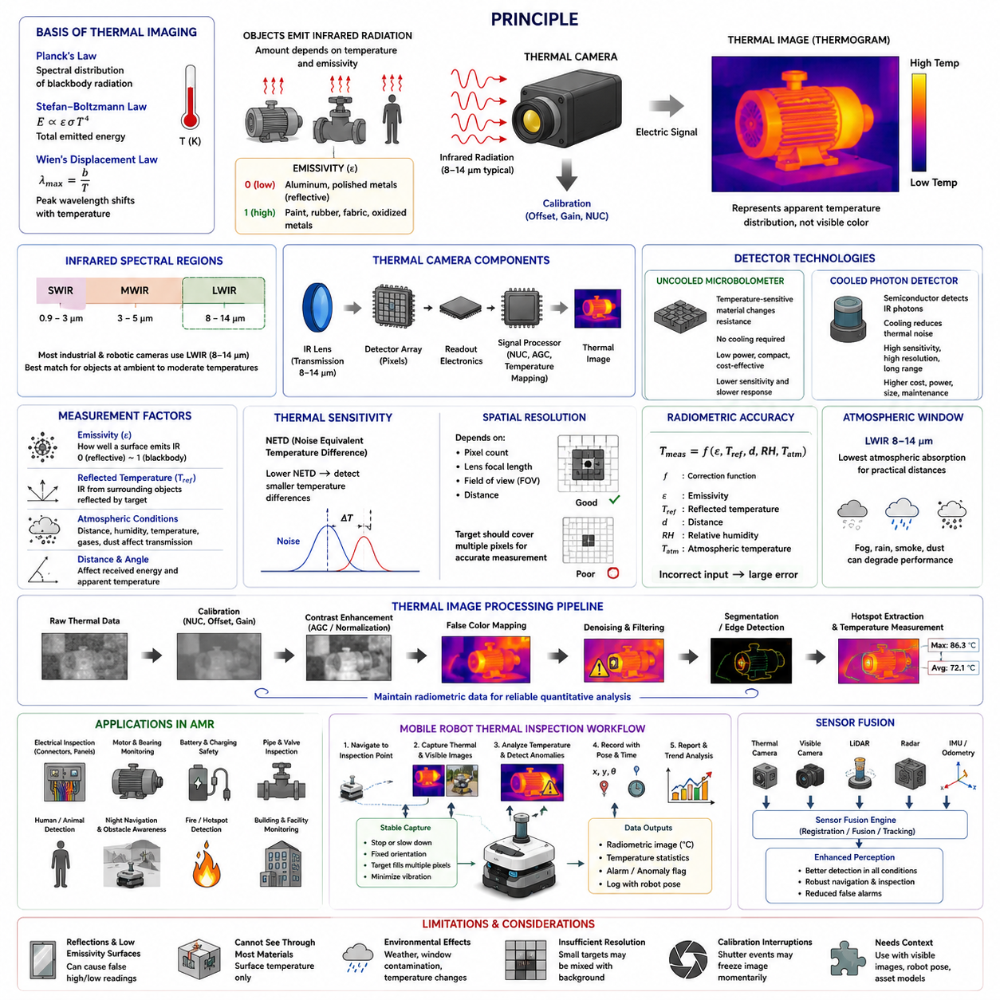
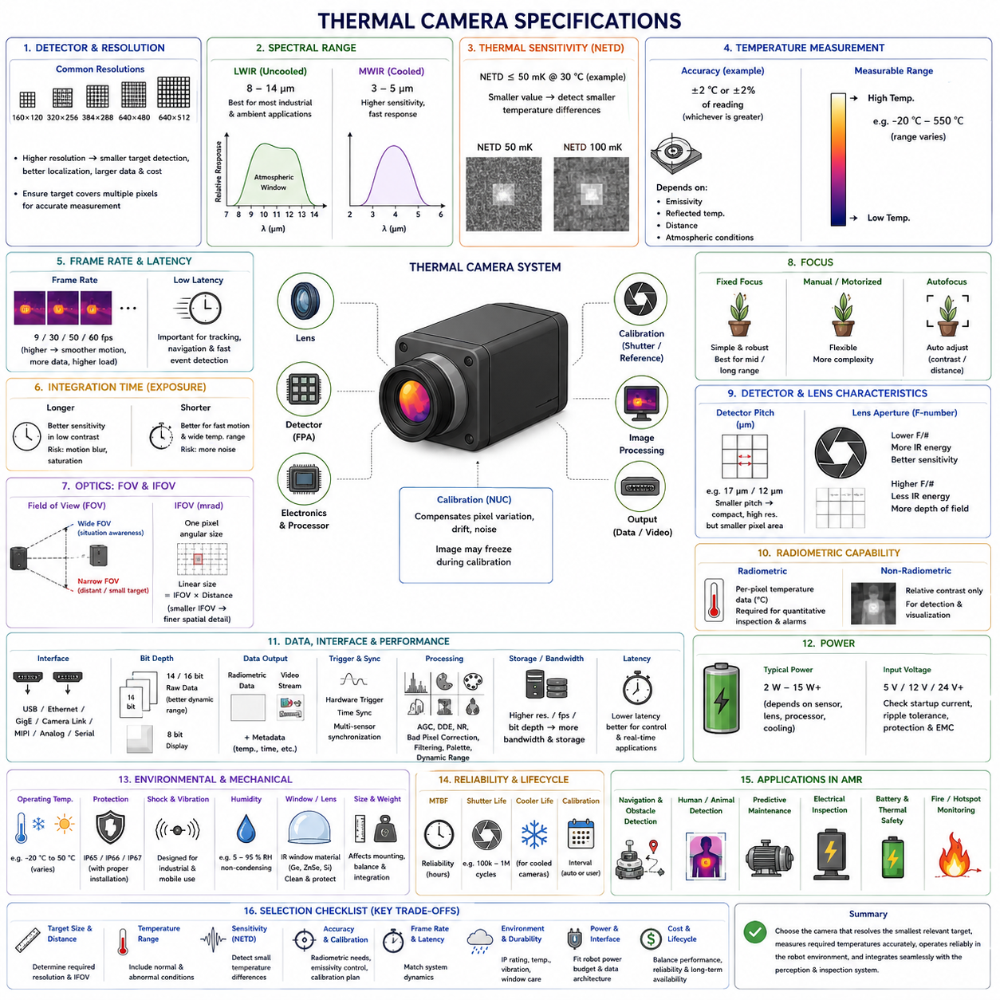
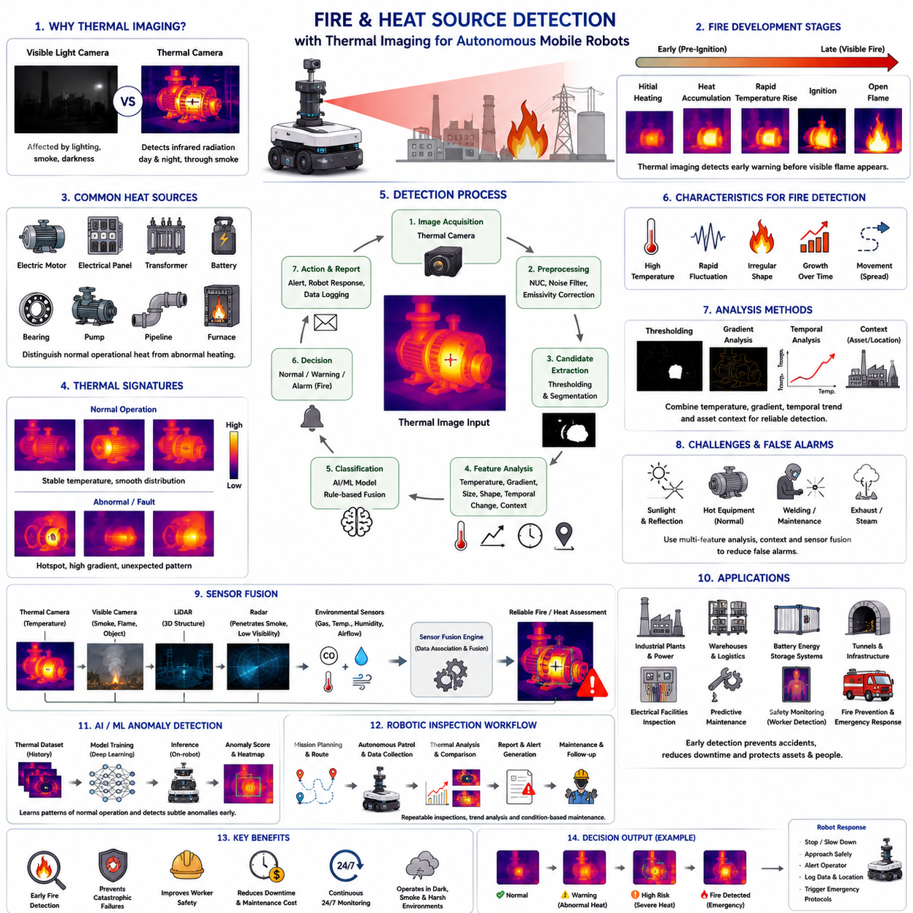
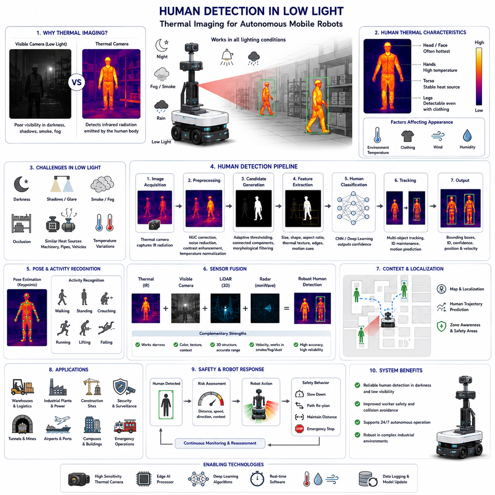
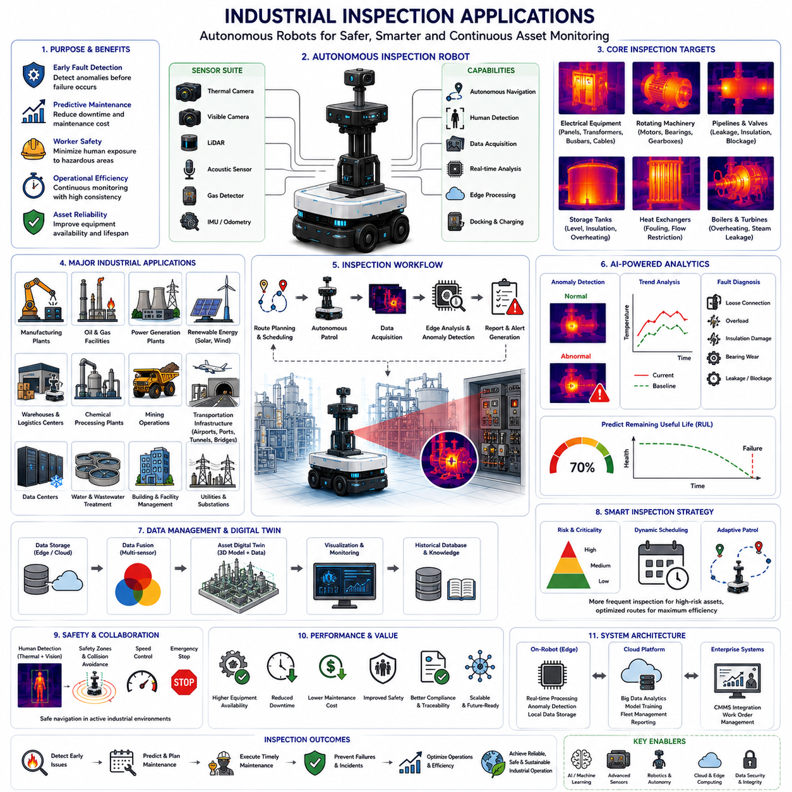
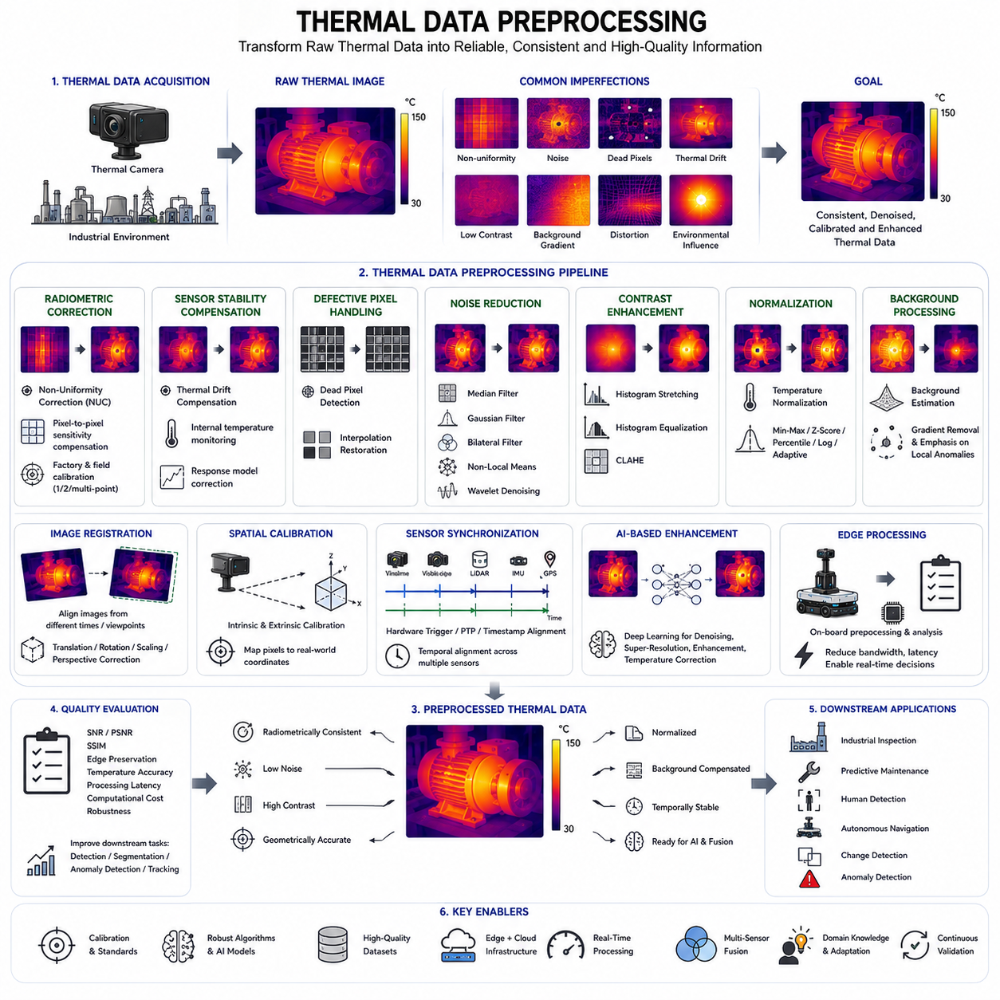
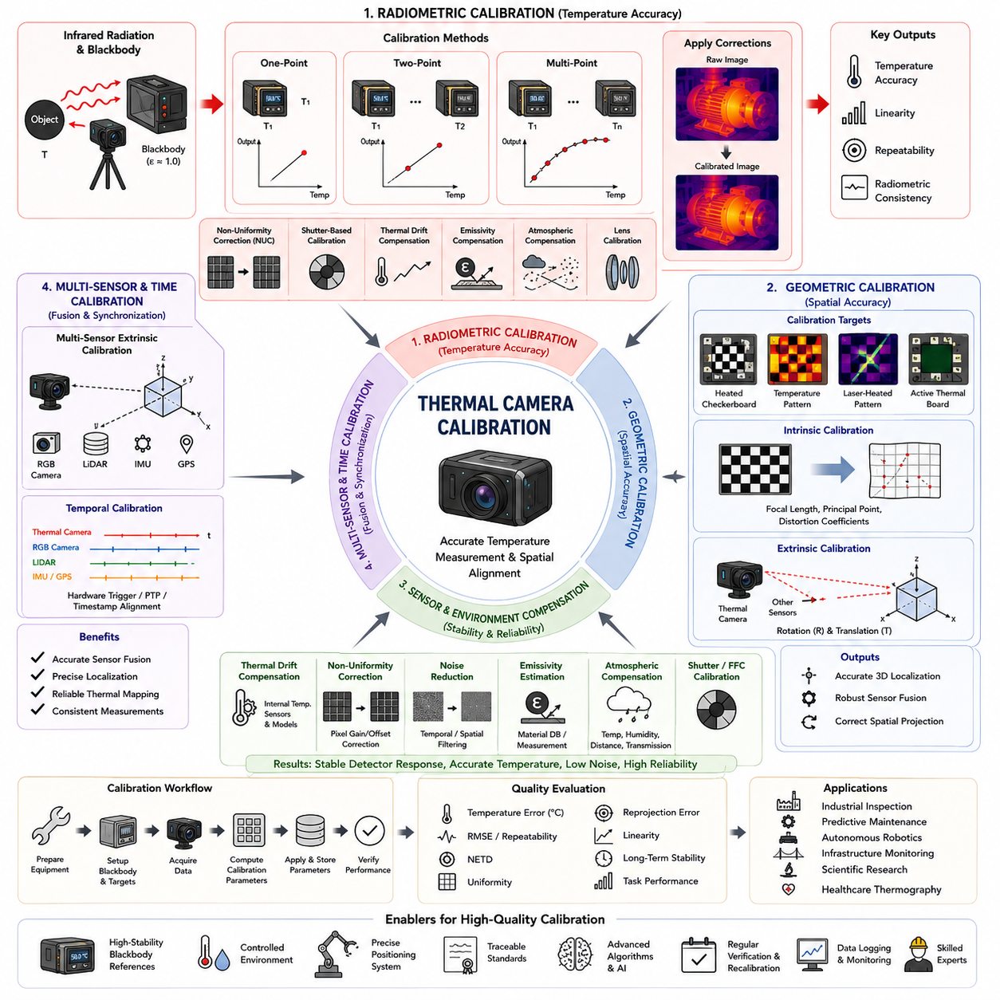
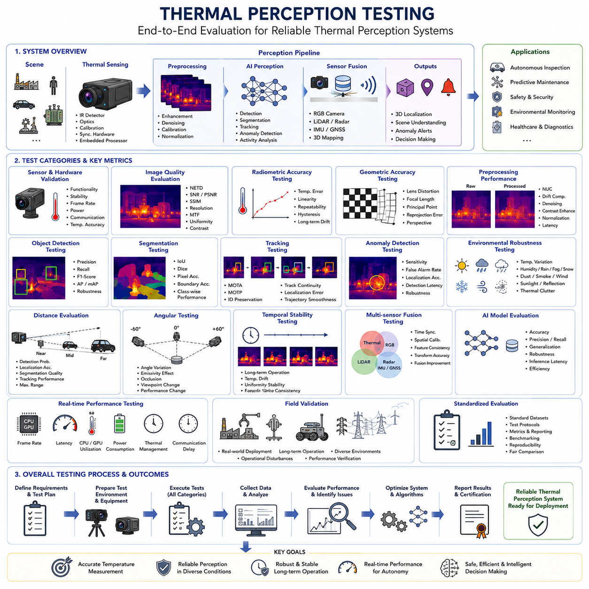

**Volume 03. AMR Sensors and Perception**


# Chapter 06. Thermal Cameras

##  

## 06.1 Thermal Imaging Principles

{width="7.268055555555556in" height="7.268055555555556in"}

Thermal imaging is a passive sensing method that detects infrared radiation emitted or reflected by objects and converts it into a visible temperature-related image. Every object with a temperature above absolute zero emits electromagnetic energy, and the intensity and spectral distribution of this radiation vary with temperature. Thermal cameras capture this energy without requiring visible illumination, which allows them to operate in complete darkness, smoke, haze, and many low-contrast environments where conventional cameras may provide limited information.

The physical basis of thermal imaging is described by thermal radiation laws. Planck's law explains the spectral distribution of radiation emitted by an ideal blackbody, while the Stefan--Boltzmann law relates total emitted energy to the fourth power of absolute temperature. Wien's displacement law indicates that the wavelength of peak emission shifts as temperature changes. Objects near normal industrial and environmental temperatures emit most strongly in the long-wave infrared region, making this band especially useful for robotic inspection and monitoring.

Real materials do not behave as perfect blackbodies. Their ability to emit thermal radiation is described by emissivity, a value between zero and one. High-emissivity materials such as painted surfaces, rubber, fabric, and oxidized metals generally produce reliable thermal readings. Low-emissivity materials such as polished aluminum or stainless steel can reflect radiation from surrounding objects and cause misleading temperature measurements. Accurate thermal interpretation therefore requires knowledge of surface material, finish, viewing angle, and environmental reflections.

Infrared radiation is commonly divided into short-wave, mid-wave, and long-wave spectral regions. Most uncooled thermal cameras used in mobile robots operate in the long-wave infrared band, typically around 8--14 micrometers. This band aligns well with thermal emissions from objects at ambient and moderately elevated temperatures. Mid-wave infrared cameras, generally operating around 3--5 micrometers, can provide higher sensitivity and faster response but often require cooled detectors, increasing cost, size, power consumption, and maintenance complexity.

A thermal camera includes an infrared-transparent lens, detector array, readout electronics, signal processor, and calibration system. The lens focuses incoming infrared energy onto the detector, where each pixel produces an electrical response proportional to the absorbed radiation. The readout integrated circuit collects these signals, and the image processor applies offset correction, gain adjustment, noise filtering, and temperature mapping. The resulting thermogram represents spatial differences in apparent temperature rather than a conventional color or brightness image.

Uncooled microbolometers are widely used in industrial and robotic thermal cameras. Each pixel contains a temperature-sensitive material whose electrical resistance changes when infrared radiation is absorbed. Because the detector operates near ambient temperature, it does not require a cryogenic cooling system. This reduces power consumption and makes compact thermal modules practical for AMRs. However, microbolometers may exhibit slower response, greater drift, and lower sensitivity than cooled photon detectors, requiring frequent internal calibration and compensation.

Cooled thermal detectors use semiconductor materials that directly respond to incoming infrared photons. Cooling reduces thermal noise and improves sensitivity, spatial resolution, frame rate, and detection range. These characteristics make cooled systems suitable for long-range surveillance, gas imaging, scientific measurement, and demanding defense applications. Their disadvantages include higher cost, greater power demand, mechanical complexity, limited cooler life, and longer startup time, which usually make them unsuitable for standard mobile robot inspection unless exceptional performance is required.

Thermal sensitivity is often expressed as Noise Equivalent Temperature Difference, or NETD. A lower NETD value indicates that the camera can distinguish smaller temperature differences. High thermal sensitivity is important when detecting subtle anomalies such as early electrical heating, insulation defects, bearing friction, fluid leakage, or human presence in low-contrast backgrounds. However, sensitivity alone does not determine inspection quality. Spatial resolution, lens selection, calibration, target size, measurement distance, and environmental stability are equally important.

Spatial resolution depends on the detector pixel count, lens focal length, field of view, and distance to the target. A thermal camera may detect a large hot region from far away but may not measure the temperature of a small component accurately if the target covers too few pixels. The instantaneous field of view defines the angular area represented by one pixel. For quantitative inspection, the target should occupy multiple pixels so that edge mixing and background radiation do not dominate the measurement.

The apparent temperature measured by a thermal camera can differ from the true surface temperature because the received radiation includes emitted energy from the target, reflected radiation from nearby sources, and radiation transmitted through the atmosphere. Measurement software may require input values for emissivity, reflected temperature, distance, humidity, and atmospheric temperature. Errors in these parameters can produce significant inaccuracies, particularly for low-emissivity surfaces, long measurement ranges, or environments containing strong heat sources.

Atmospheric conditions affect infrared transmission. Water vapor, carbon dioxide, dust, smoke, and precipitation can absorb or scatter parts of the infrared spectrum. The 8--14 micrometer band is commonly used because it lies within an atmospheric transmission window where absorption is relatively low over practical industrial distances. Even so, heavy rain, dense steam, hot exhaust gases, or contaminated protective windows can reduce image quality and temperature accuracy. Outdoor robotic systems must therefore monitor lens condition and environmental exposure.

Thermal images require calibration and correction before they can be interpreted reliably. Detector pixels do not respond identically, and their output may drift with sensor temperature. Non-uniformity correction compensates for pixel-to-pixel variation, while internal shutters or reference sources periodically provide a uniform temperature target for recalibration. During this process, the image may briefly freeze. Robot perception software must account for these interruptions and avoid treating calibration artifacts as sudden environmental events.

Thermal image processing often includes contrast enhancement, temperature normalization, false-color mapping, denoising, edge detection, segmentation, and hotspot extraction. Automatic gain control adjusts the displayed temperature range to improve visual contrast, but it can also make identical objects appear different between frames. For autonomous inspection, the system should preserve radiometric data and use absolute or consistently normalized temperature values rather than relying only on visual color palettes. This supports repeatable anomaly detection and trend analysis.

Thermal cameras can be radiometric or non-radiometric. Radiometric cameras provide temperature-related data for each pixel, enabling quantitative inspection and threshold-based alarms. Non-radiometric cameras primarily generate thermal contrast images and may be sufficient for navigation, person detection, or general situational awareness. AMR inspection missions typically require radiometric sensors when the objective is to detect overheating motors, electrical panels, batteries, bearings, pipelines, or process equipment with measurable temperature criteria.

Thermal imaging is valuable for human and animal detection because warm bodies often create strong contrast against cooler backgrounds. It can support nighttime navigation, perimeter monitoring, rescue operations, and worker safety. However, thermal appearance changes with clothing, weather, physical activity, and background temperature. On hot days, roads, walls, and machinery may reach temperatures similar to the human body, reducing contrast. Thermal sensing should therefore be combined with tracking, motion analysis, visible cameras, radar, or LiDAR.

In industrial inspection, thermal imaging reveals abnormal heat patterns associated with resistance, friction, overload, insulation failure, fluid blockage, or inefficient energy transfer. Electrical connectors may heat because of loose contacts, motors may show uneven winding temperatures, and bearings may develop localized hotspots before mechanical failure. The thermal pattern is often more informative than a single maximum temperature value. Reliable diagnosis requires comparison with normal operating conditions, load level, ambient temperature, and historical trends.

Thermal inspection from a moving AMR introduces additional challenges. Motion blur, vibration, rapidly changing viewing angles, and varying distance can affect measurement consistency. The robot may need to stop or move slowly at inspection points, maintain a defined camera orientation, and verify that the target occupies a sufficient image area. Stable timestamps and synchronization with robot pose are also required so that detected anomalies can be mapped accurately to physical assets and revisited during later missions.

Lens and protective window materials must be selected specifically for infrared transmission. Ordinary glass blocks most long-wave infrared radiation and cannot be placed in front of a thermal camera. Materials such as germanium, zinc selenide, or specialized polymers are used for lenses and windows. These materials can be sensitive to scratching, contamination, moisture, and impact. Protective housings must therefore balance environmental durability with low infrared attenuation, minimal reflection, and stable performance across temperature changes.

Thermal cameras are often integrated with visible-light cameras to create complementary inspection data. The visible camera provides texture, labels, component identity, and geometric context, while the thermal camera reveals heat distribution. Image registration aligns both modalities so that hotspots can be associated with specific objects. Differences in resolution, lens position, distortion, and field of view must be calibrated carefully. Accurate fusion improves operator interpretation and supports automated defect classification.

Thermal imaging also contributes to battery and charging-system safety in AMRs. Abnormal cell temperature, uneven module heating, connector resistance, cooling failure, or charger overheating may indicate developing faults. A thermal camera can inspect battery enclosures, power electronics, motors, and charging interfaces during operation. It should not replace embedded temperature sensors, because surface temperature may not represent internal cell conditions. Instead, thermal imaging provides additional spatial evidence and can identify localized anomalies not captured by point sensors.

Effective thermal sensing requires understanding both its strengths and limitations. It operates without visible light, detects subtle heat patterns, and supports non-contact inspection, but it cannot see through most solid materials and does not directly measure internal temperature. Reflections, emissivity errors, environmental conditions, and insufficient spatial resolution can produce false conclusions. For autonomous robots, the best results come from combining calibrated thermal data with visible imagery, robot pose, asset models, operating context, and historical measurements.

열화상(Thermal Imaging)은 물체에서 방출되거나 반사되는 적외선(Infrared Radiation)을 감지하여 이를 온도 기반의 가시 영상으로 변환하는 수동형(Passive) 센서 기술이다. 절대영도(Absolute Zero)보다 높은 모든 물체는 전자기 에너지를 방출하며, 이 복사 에너지의 세기와 파장 분포는 물체의 온도에 따라 달라진다. 열화상 카메라(Thermal Camera)는 가시광(Visible Light)이 없어도 이러한 적외선을 감지할 수 있기 때문에 완전한 암흑 환경뿐만 아니라 연기(Smoke), 안개(Haze), 저조도(Low-Light) 환경에서도 일반 카메라보다 더 유용한 정보를 제공할 수 있다.

열화상의 물리적 원리는 열복사(Thermal Radiation)에 관한 여러 법칙으로 설명된다. 플랑크 법칙(Planck\'s Law)은 이상적인 흑체(Blackbody)가 방출하는 복사 에너지의 파장 분포를 설명하며, 스테판-볼츠만 법칙(Stefan-Boltzmann Law)은 총 복사 에너지가 절대온도의 4제곱에 비례함을 나타낸다. 또한 빈의 변위 법칙(Wien\'s Displacement Law)은 온도가 변화함에 따라 최대 복사 에너지가 발생하는 파장이 이동함을 설명한다. 일반적인 산업 환경과 주변 온도의 물체는 대부분 장파 적외선(Long-Wave Infrared, LWIR) 영역에서 가장 강한 복사를 방출하므로, 이 대역은 로봇 검사 및 상태 모니터링에 가장 널리 활용된다.

실제 물체는 이상적인 흑체처럼 동작하지 않는다. 물체가 열복사를 방출하는 능력은 방사율(Emissivity)이라는 값으로 표현되며, 그 범위는 0에서 1 사이이다. 도장된 표면, 고무, 섬유, 산화된 금속과 같이 방사율이 높은 재료는 비교적 정확한 온도 측정을 가능하게 한다. 반면, 광택이 있는 알루미늄이나 스테인리스강과 같이 방사율이 낮은 재료는 주변 환경의 적외선을 반사하여 실제와 다른 온도가 측정될 수 있다. 따라서 정확한 열화상 분석을 위해서는 재질(Material), 표면 상태(Surface Finish), 관측 각도(Viewing Angle), 주변 반사 환경을 함께 고려해야 한다.

적외선은 일반적으로 단파 적외선(Short-Wave Infrared, SWIR), 중파 적외선(Mid-Wave Infrared, MWIR), 장파 적외선(Long-Wave Infrared, LWIR) 영역으로 구분된다. 모바일 로봇에서 가장 많이 사용되는 비냉각식(Uncooled) 열화상 카메라는 일반적으로 약 8\~14 마이크로미터(μm)의 장파 적외선 대역에서 동작한다. 이 영역은 상온 및 중간 수준의 온도를 가진 물체의 열복사 특성과 잘 일치한다. 반면 중파 적외선 카메라는 더 높은 감도와 빠른 응답성을 제공할 수 있지만, 냉각형(Cooled) 검출기를 필요로 하는 경우가 많아 가격, 크기, 소비전력 및 유지보수 비용이 증가한다.

열화상 카메라는 적외선 투과 렌즈(Infrared Lens), 검출기 배열(Detector Array), 판독 회로(Readout Electronics), 신호 처리기(Signal Processor), 보정 시스템(Calibration System)으로 구성된다. 렌즈는 적외선을 검출기에 집중시키며, 각 픽셀(Pixel)은 흡수한 적외선 에너지에 비례하는 전기 신호를 생성한다. 판독 회로(Readout Integrated Circuit)는 이러한 신호를 수집하고, 영상 처리기는 오프셋 보정(Offset Correction), 이득 보정(Gain Adjustment), 노이즈 제거(Noise Filtering), 온도 매핑(Temperature Mapping)을 수행한다. 최종적으로 생성되는 열영상(Thermogram)은 일반적인 컬러 영상이 아니라 공간적인 온도 분포를 표현하는 영상이다.

비냉각식 마이크로볼로미터(Uncooled Microbolometer)는 산업용 및 로봇용 열화상 카메라에서 가장 널리 사용되는 검출기이다. 각 픽셀은 적외선을 흡수하면 전기 저항이 변화하는 온도 민감 재료로 구성된다. 이 방식은 극저온 냉각 장치가 필요하지 않기 때문에 소비전력이 낮고 구조가 단순하며 소형화가 가능하다. 따라서 AMR에 쉽게 적용할 수 있다. 그러나 마이크로볼로미터는 냉각형 검출기에 비해 응답 속도가 느리고 온도 드리프트(Temperature Drift)가 발생하기 쉬우며 감도가 상대적으로 낮기 때문에 주기적인 내부 보정과 환경 변화에 대한 보상이 필요하다.

냉각형(Cooled) 열화상 검출기는 적외선 광자(Photon)에 직접 반응하는 반도체 재료를 사용한다. 극저온 냉각은 열 잡음을 크게 감소시켜 감도(Sensitivity), 공간 해상도(Spatial Resolution), 프레임 속도(Frame Rate), 탐지 거리(Detection Range)를 크게 향상시킨다. 이러한 특성은 장거리 감시(Long-Range Surveillance), 가스 탐지(Gas Imaging), 과학 계측(Scientific Measurement), 국방 감시 시스템 등에 적합하다. 그러나 높은 비용, 큰 소비전력, 복잡한 구조, 냉각기 수명 제한, 긴 시동 시간 때문에 일반적인 모바일 로봇에서는 특별한 성능이 요구되지 않는 한 사용 빈도가 낮다.

열화상 카메라의 감도는 일반적으로 등가 잡음 온도차(Noise Equivalent Temperature Difference, NETD)로 표현된다. NETD 값이 낮을수록 더 작은 온도 차이도 구분할 수 있다. 높은 감도는 초기 전기 이상 발열, 단열 불량, 베어링 마찰, 유체 누설, 사람의 존재와 같은 미세한 온도 변화를 감지하는 데 매우 중요하다. 그러나 감도만으로 전체 검사 성능이 결정되는 것은 아니다. 공간 해상도, 렌즈 선택, 보정 상태, 대상 크기, 측정 거리, 주변 환경의 안정성 역시 동일하게 중요한 요소이다.

공간 해상도는 검출기 픽셀 수, 렌즈 초점거리(Focal Length), 시야각(Field of View), 대상까지의 거리 등에 의해 결정된다. 열화상 카메라는 멀리 있는 큰 발열 영역은 쉽게 감지할 수 있지만, 작은 부품이 영상에서 너무 적은 픽셀만 차지하면 정확한 온도 측정이 어렵다. 순간 시야각(Instantaneous Field of View, IFOV)은 하나의 픽셀이 담당하는 공간 각도를 의미한다. 정량적인 온도 측정을 위해서는 검사 대상이 충분한 수의 픽셀을 차지해야 하며, 그렇지 않으면 배경 온도의 영향으로 측정 오차가 증가한다.

열화상 카메라가 측정하는 겉보기 온도(Apparent Temperature)는 실제 표면 온도와 다를 수 있다. 검출기에 도달하는 적외선에는 대상 자체에서 방출된 복사뿐 아니라 주변 물체에서 반사된 복사와 대기를 통과하는 동안 영향을 받은 복사도 함께 포함되기 때문이다. 따라서 측정 소프트웨어는 방사율, 반사 온도, 거리, 습도, 대기 온도 등의 값을 입력받아 보정한다. 특히 방사율이 낮은 금속, 장거리 측정, 강한 열원이 존재하는 환경에서는 이러한 보정 값이 측정 정확도에 큰 영향을 미친다.

대기 환경은 적외선의 전달 특성에도 영향을 미친다. 수증기(Water Vapor), 이산화탄소(Carbon Dioxide), 먼지(Dust), 연기(Smoke), 강수(Precipitation)는 적외선을 흡수하거나 산란시킬 수 있다. 장파 적외선 대역인 8\~14 마이크로미터는 비교적 대기 흡수가 적은 전송 창(Atmospheric Transmission Window)에 해당하기 때문에 산업용 열화상 시스템에서 널리 사용된다. 그러나 폭우, 고밀도 수증기, 뜨거운 배기가스, 오염된 보호창은 영상 품질과 온도 측정 정확도를 저하시킬 수 있으므로 실외 로봇은 렌즈 상태와 환경 조건을 지속적으로 관리해야 한다.

열화상 영상은 신뢰성 있는 분석을 위해 다양한 보정 과정을 거친다. 검출기 픽셀은 동일한 특성을 가지지 않으며, 센서 온도 변화에 따라 출력도 달라질 수 있다. 비균일성 보정(Non-Uniformity Correction, NUC)은 픽셀 간의 차이를 보상하며, 내부 셔터(Internal Shutter)나 기준 온도원(Reference Source)을 이용하여 주기적으로 전체 검출기를 재보정한다. 이 과정에서 영상이 순간적으로 멈출 수 있으므로, 로봇 인지 시스템은 이러한 현상을 실제 환경 변화와 혼동하지 않도록 설계되어야 한다.

열화상 영상 처리는 명암 대비 향상(Contrast Enhancement), 온도 정규화(Temperature Normalization), 의사 색상(False Color Mapping), 노이즈 제거(Denoising), 에지 검출(Edge Detection), 영역 분할(Segmentation), 고온 영역 추출(Hotspot Extraction) 등을 포함한다. 자동 이득 제어(Automatic Gain Control, AGC)는 영상의 대비를 향상시키지만 동일한 대상도 프레임마다 다른 색상으로 표현될 수 있다. 따라서 자율 검사에서는 단순한 색상보다 절대 온도 또는 일관성 있게 정규화된 온도 데이터를 사용하는 것이 반복 가능한 이상 탐지와 추세 분석에 더욱 적합하다.

열화상 카메라는 복사 측정형(Radiometric)과 비복사 측정형(Non-Radiometric)으로 구분된다. 복사 측정형 카메라는 모든 픽셀에 대해 실제 온도 정보를 제공하므로 정량적인 검사와 임계값 기반의 이상 탐지가 가능하다. 비복사 측정형은 주로 온도 대비 영상만 제공하며, 사람 탐지, 야간 주행, 일반적인 상황 인식에는 충분할 수 있다. 그러나 AMR 기반 산업 검사에서는 모터, 전기 패널, 배터리, 베어링, 배관 등에서 정량적인 온도 기준을 적용해야 하므로 복사 측정형 카메라가 일반적으로 요구된다.

열화상은 사람과 동물 탐지에도 매우 효과적이다. 인체는 주변 환경보다 높은 온도를 가지는 경우가 많아 야간 감시, 경계 보안, 구조 활동, 작업자 안전 관리에서 높은 대비를 제공한다. 그러나 의복, 날씨, 신체 활동, 배경 온도에 따라 열 분포는 크게 달라질 수 있다. 더운 여름철에는 도로, 벽, 장비가 인체와 유사한 온도를 나타낼 수도 있다. 따라서 열화상은 객체 추적(Object Tracking), 움직임 분석(Motion Analysis), 가시광 카메라, 레이더(Radar), 라이다(LiDAR)와 함께 사용하는 것이 바람직하다.

산업 설비 검사에서 열화상은 접촉 저항 증가, 마찰, 과부하, 절연 불량, 유체 막힘, 에너지 전달 효율 저하 등으로 인해 발생하는 비정상적인 발열 패턴을 효과적으로 보여준다. 느슨한 전기 단자는 국부적인 발열을 발생시키고, 모터 권선은 불균일한 온도 분포를 보일 수 있으며, 베어링은 마모가 진행되면 특정 부위에 고온 영역이 형성된다. 이러한 경우 최고 온도 하나만 보는 것보다 열 분포 패턴 전체를 분석하는 것이 더욱 중요한 진단 정보를 제공한다.

이동하는 AMR에서 열화상 검사를 수행할 경우 추가적인 어려움이 존재한다. 이동 중에는 흔들림(Vibration), 운동 블러(Motion Blur), 촬영 거리 변화, 관찰 각도 변화 등이 측정 정확도에 영향을 줄 수 있다. 따라서 로봇은 검사 지점에서 정지하거나 저속으로 이동하며, 일정한 카메라 자세를 유지하고, 검사 대상이 충분한 픽셀을 차지하도록 해야 한다. 또한 열화상 데이터는 로봇의 위치 정보와 정확하게 동기화되어야 이후 동일한 설비를 다시 검사하거나 이상 위치를 정확하게 식별할 수 있다.

열화상 카메라의 렌즈와 보호창은 적외선 투과 특성을 고려하여 설계되어야 한다. 일반적인 유리(Glass)는 장파 적외선을 대부분 차단하므로 사용할 수 없으며, 게르마늄(Germanium), 셀렌화아연(Zinc Selenide), 특수 적외선 투과 폴리머 등이 사용된다. 이러한 재료는 긁힘, 오염, 습기, 충격에 민감할 수 있다. 따라서 보호 하우징은 내환경성과 함께 적외선 감쇠를 최소화하고 반사를 줄이며 온도 변화에도 안정적인 성능을 유지하도록 설계되어야 한다.

열화상 카메라는 가시광 카메라와 함께 사용하는 경우가 많다. 가시광 영상은 색상, 질감, 문자, 부품 식별, 기하학적 구조를 제공하는 반면, 열화상은 열 분포와 이상 발열을 보여준다. 영상 정합(Image Registration)을 통해 두 영상을 정확히 정렬하면 고온 영역을 실제 설비와 정확하게 연결할 수 있다. 그러나 두 카메라는 해상도, 렌즈 위치, 왜곡, 시야각이 다르므로 정밀한 캘리브레이션(Calibration)이 필요하다. 이러한 센서 융합은 자동 결함 분류와 작업자의 해석 정확도를 크게 향상시킨다.

열화상은 AMR의 배터리와 충전 시스템 안전성 확보에도 중요한 역할을 한다. 배터리 셀의 비정상적인 발열, 모듈 간 온도 불균형, 커넥터 접촉 저항 증가, 냉각 시스템 이상, 충전기 과열 등은 잠재적인 고장의 초기 징후가 될 수 있다. 열화상 카메라는 배터리 팩, 전력 변환 장치, 구동 모터, 충전 인터페이스를 비접촉 방식으로 검사할 수 있다. 다만 표면 온도가 내부 셀 온도를 완전히 대표하지는 않으므로, 내장 온도 센서를 대체하기보다는 공간적인 이상 분포를 확인하는 보조 수단으로 활용하는 것이 적절하다.

효과적인 열화상 활용을 위해서는 장점과 한계를 모두 이해해야 한다. 열화상은 가시광 없이 동작하고, 미세한 발열을 감지하며, 비접촉 검사에 매우 적합하지만 대부분의 고체를 투과하지 못하고 내부 온도를 직접 측정하지도 못한다. 또한 반사, 방사율 오차, 환경 변화, 부족한 공간 해상도는 잘못된 해석을 초래할 수 있다. 따라서 자율주행 로봇에서는 정확하게 보정된 열화상 데이터를 가시광 영상, 로봇 위치 정보, 설비 모델, 운전 조건, 과거 검사 이력과 함께 통합하여 활용할 때 가장 높은 검사 신뢰성과 진단 정확도를 얻을 수 있다.

##  

## 06.2 Thermal Camera Specifications

{width="7.268055555555556in" height="7.268055555555556in"}

Thermal camera specifications define how effectively a sensor can detect infrared radiation, distinguish temperature differences, measure surface temperature, and produce stable images under real operating conditions. For autonomous mobile robots, the specification sheet must be interpreted as a complete system description rather than as a list of isolated numbers. Detector resolution, spectral response, thermal sensitivity, lens characteristics, calibration accuracy, frame rate, interface, power demand, housing protection, and environmental limits collectively determine whether the camera is suitable for navigation, safety monitoring, predictive maintenance, or quantitative industrial inspection.

Detector resolution indicates the number of infrared-sensitive pixels available in the focal plane array. Common thermal modules may provide resolutions such as 160 × 120, 320 × 256, 384 × 288, 640 × 480, or 640 × 512 pixels. Higher resolution improves the ability to distinguish small targets, localize hotspots, and inspect components from greater distances. However, it also increases sensor cost, data bandwidth, processing load, storage demand, and calibration complexity. The required resolution should therefore be selected from the smallest target size, expected inspection distance, and required measurement repeatability rather than from image quality alone.

Thermal resolution must be distinguished from ordinary visible-camera resolution because each thermal pixel represents a measured infrared energy sample. A target that occupies only one or two pixels may be detectable but cannot usually be measured accurately. Heat from the target becomes mixed with radiation from the background, creating a diluted apparent temperature. For reliable quantitative inspection, the target should cover several pixels in both horizontal and vertical directions. Engineering decisions should therefore consider pixels on target, not simply total pixel count, when selecting a camera for electrical panels, bearings, pipes, batteries, motors, or human detection.

The spectral range specifies the infrared wavelengths to which the detector responds. Most uncooled industrial thermal cameras operate in the long-wave infrared band between approximately 8 and 14 micrometers. This range is well matched to objects near ambient and moderately elevated temperatures and also lies within a useful atmospheric transmission window. Cooled cameras may operate in the mid-wave infrared band around 3 to 5 micrometers, offering higher sensitivity and faster response for specialized applications. Spectral selection affects lens material, detector technology, environmental performance, calibration method, and the types of targets that can be observed.

Thermal sensitivity is commonly expressed as Noise Equivalent Temperature Difference, or NETD. This value indicates the smallest temperature difference that the camera can distinguish above its internal noise level. A specification such as less than 50 millikelvin means that the sensor can theoretically resolve a temperature difference smaller than 0.05 degrees Celsius under defined laboratory conditions. Lower NETD is generally better, especially for detecting subtle heating patterns. However, real performance depends on scene temperature, lens transmission, frame averaging, calibration state, image processing, and environmental stability, so NETD should not be interpreted as absolute measurement accuracy.

Temperature measurement accuracy describes how closely the reported temperature corresponds to the actual target surface temperature. Typical industrial specifications may be expressed as a fixed value, such as ±2 degrees Celsius, or as a percentage of the reading, such as ±2 percent, whichever is greater. This accuracy normally applies only within specified temperature ranges, calibration conditions, distances, emissivity values, and environmental limits. Low-emissivity materials, strong reflections, atmospheric attenuation, and incorrect parameter settings can introduce errors much larger than the nominal camera accuracy. Radiometric performance must therefore be evaluated together with the complete measurement setup.

The measurable temperature range defines the minimum and maximum apparent temperatures that the camera can quantify without saturation. A general-purpose uncooled camera may include multiple ranges, such as a low-temperature mode for ambient environments and a high-temperature mode for industrial equipment. Switching to a wider range often reduces sensitivity because the signal must cover a larger dynamic span. Systems inspecting batteries, electrical cabinets, motors, furnaces, or firefighting environments may require different range configurations. The selected range should include expected abnormal conditions while retaining sufficient sensitivity for early-stage anomaly detection.

Frame rate determines how frequently the thermal image is updated. Low-cost or export-limited cameras may operate near 9 frames per second, while industrial and robotic models commonly provide 30, 50, or 60 frames per second. Higher frame rates improve imaging of moving targets, reduce temporal lag, and support smoother tracking from a mobile platform. They also increase interface bandwidth, processor load, and storage consumption. For stationary inspection points, a moderate frame rate may be sufficient, whereas navigation, human detection, moving machinery monitoring, and fast robot motion generally benefit from higher update rates and low latency.

Integration time, also known as exposure time, controls how long the detector accumulates infrared energy for each frame. Longer integration can improve signal quality in low-contrast scenes but may cause motion blur or saturation when observing hot targets. Shorter integration supports fast motion and wide temperature ranges but can increase noise. Some cameras automatically adjust integration time according to scene temperature, while advanced models provide manual or programmable control. Mobile robot systems should verify that automatic exposure changes do not create abrupt image shifts that could be misinterpreted by anomaly detection or tracking algorithms.

Field of view defines the angular region observed by the camera and is determined by detector size and lens focal length. A wide-angle lens provides broad situational awareness and is useful for navigation, human detection, and inspection in confined spaces. A narrow-angle lens provides greater pixel density on distant targets and is better suited for small components or long-range monitoring. Field of view must be evaluated in both horizontal and vertical directions. Robot designers should also consider mounting height, camera tilt, blind zones, target distance, and overlap with visible cameras or LiDAR sensors.

Instantaneous Field of View, or IFOV, represents the angular coverage of a single detector pixel. It is usually expressed in milliradians and directly affects the smallest spatial feature that can be resolved at a given distance. Multiplying IFOV by target distance gives an approximate pixel footprint on the observed surface. Measurement Field of View may be larger than one pixel because accurate temperature measurement normally requires several adjacent pixels. These values are essential when deciding whether a selected camera can inspect a small connector, cable terminal, bearing housing, battery cell, or pipe joint from the planned robot path.

Minimum focus distance indicates how close a target can be while remaining sharply imaged. Fixed-focus thermal modules are convenient for compact robots but may be optimized for medium or long distances, causing nearby inspection targets to appear blurred. Manual-focus or motorized-focus lenses provide greater flexibility but add mechanical complexity and control requirements. Autofocus systems may use contrast, distance sensors, or motorized lens mechanisms. For AMRs that approach equipment at varying distances, focus capability should be matched to docking accuracy, inspection pose, target depth variation, and required measurement repeatability.

Detector pitch is the physical spacing between adjacent pixels, commonly expressed in micrometers. Smaller pixel pitch enables compact optical systems and can support higher resolution within a smaller sensor package. However, it also reduces the collecting area of each pixel and can affect sensitivity, noise, diffraction behavior, and manufacturing complexity. Typical modern uncooled microbolometers use pitches such as 17 or 12 micrometers. Pixel pitch should not be evaluated independently because detector technology, lens aperture, calibration quality, and signal processing jointly determine actual image performance.

The lens aperture is usually specified by its f-number, which represents the ratio between focal length and effective aperture diameter. A lower f-number allows more infrared energy to reach the detector, potentially improving sensitivity and reducing noise. However, it may also increase optical complexity, cost, size, and susceptibility to aberrations. Thermal lenses are commonly manufactured from germanium or specialized infrared-transmitting materials rather than ordinary glass. Lens coating, transmission efficiency, temperature stability, focus behavior, and protective-window compatibility are critical for maintaining the expected camera specification after installation.

Radiometric capability determines whether temperature information is available for every image pixel. Fully radiometric cameras provide calibrated temperature-related data and are required for quantitative inspection, threshold alarms, temperature statistics, and historical trend analysis. Non-radiometric cameras provide only relative thermal contrast and are mainly suited to detection or visualization. Some modules output both radiometric data and processed video streams. The system integrator should confirm data format, calibration coefficients, metadata availability, temperature units, emissivity settings, and whether the radiometric values remain accessible after compression or network transmission.

Calibration specifications describe how the camera compensates for detector variation, temperature drift, optical effects, and electronic noise. Non-uniformity correction is commonly performed using an internal shutter that temporarily presents a uniform reference surface to the detector. The camera may automatically trigger this process according to time, sensor temperature, or image quality. During correction, the output frame may freeze or become temporarily unavailable. AMR software should receive calibration status or detect these events so that frozen frames are not interpreted as stationary targets, thermal anomalies, or communication failures.

Startup time and warm-up stability are important but frequently overlooked specifications. An uncooled camera may begin streaming images shortly after power-on, yet accurate radiometric performance can require additional time for the detector, housing, lens, and internal electronics to reach thermal equilibrium. Rapid changes in ambient temperature may also create temporary measurement drift. Robots moving between indoor and outdoor areas, refrigerated zones, hot production spaces, or direct sunlight should account for stabilization behavior. Mission planning may need to delay quantitative inspection until the camera reaches a defined operating condition.

Image processing functions can include automatic gain control, digital detail enhancement, noise reduction, bad-pixel replacement, edge enhancement, temporal filtering, palette generation, and dynamic-range compression. These features improve visual readability but may alter the relationship between displayed brightness and absolute temperature. For automated analysis, raw or radiometric data should be preserved whenever possible. Processing latency must also be considered because aggressive filtering and frame averaging can delay response to rapidly changing events. The selected processing mode should match whether the primary goal is operator visualization, machine perception, or quantitative measurement.

Interface specifications determine how image and temperature data are transferred to the robot computer. Common options include USB, Ethernet, Gigabit Ethernet, Camera Link, MIPI, analog video, or proprietary serial interfaces. Ethernet supports longer cable runs and network integration, while USB simplifies local connection but may be sensitive to cable length and connector reliability. The interface must support the required frame rate, resolution, bit depth, metadata, and radiometric stream without packet loss. Timestamping, trigger support, synchronization, and software development kit compatibility are especially important for multi-sensor fusion and inspection mapping.

Image bit depth defines the number of digital levels available to represent the detector signal. Thermal systems often use 14-bit or 16-bit raw data internally, providing much greater dynamic range than an 8-bit display image. High bit depth supports fine temperature discrimination and robust post-processing, but it increases bandwidth and storage requirements. Display palettes usually compress the raw data into 8-bit values for visualization, which can discard quantitative detail. Robotic inspection systems should store radiometric or high-bit-depth data when later reprocessing, auditability, model training, or detailed trend analysis is required.

Power input and consumption affect AMR runtime, thermal management, and electrical architecture. Compact uncooled modules may consume only a few watts, while stabilized housings, heaters, motorized lenses, onboard processors, or cooled detectors require substantially more power. Input voltage tolerance, startup current, reverse-polarity protection, isolation, grounding, and electromagnetic compatibility should be checked carefully. The camera's own heat generation can influence detector stability if cooling airflow is restricted. Power-quality disturbances from motors, DC-DC converters, charging systems, and computing hardware may also introduce noise or communication faults.

Environmental specifications commonly include operating temperature, storage temperature, humidity tolerance, shock, vibration, ingress protection, and resistance to salt, dust, or chemicals. A camera qualified only for indoor laboratory use may not survive outdoor AMR operation. Industrial housings may provide ratings such as IP65, IP66, or IP67, but the rating applies only when connectors, cable glands, windows, and seals are installed correctly. Condensation prevention, window heating, sun shielding, and thermal isolation may be required when operating across large temperature differences or under changing weather conditions.

Physical dimensions, mass, connector orientation, and mounting features affect sensor placement and robot balance. A lightweight module may be installed on a mast, pan-tilt unit, robotic arm, or inspection head, while heavier cooled systems require stronger mechanical support. Mounting brackets must maintain stable alignment under vibration and impact. The thermal camera should also be positioned to prevent occlusion by robot structures, payloads, cables, or protective guards. Mechanical integration must preserve access for cleaning, focus adjustment, calibration, replacement, and inspection of the infrared window.

Reliability and lifecycle specifications include mean time between failures, shutter life, cooler life, connector durability, calibration interval, software support, and product availability. A cooled detector may provide excellent performance but contain a mechanical cooler with a finite operating life. An internal calibration shutter is also a moving component that can eventually wear. Long-term AMR deployments should consider replacement availability, firmware maintenance, operating-hour logging, and compatibility with future software versions. Industrial product continuity may be more valuable than marginal improvements in image quality.

Selecting a thermal camera for an AMR requires balancing radiometric accuracy, detector resolution, NETD, frame rate, field of view, target distance, environmental durability, interface, power, and cost. No single specification can guarantee successful performance. The appropriate camera is the one that resolves the smallest relevant target, measures the required temperature range, operates reliably within the robot environment, and integrates cleanly with the perception and inspection software. Field validation with representative materials, distances, weather, motion, and abnormal conditions remains essential before final sensor selection.

열화상 카메라 사양(Thermal Camera Specifications)은 센서가 적외선(Infrared Radiation)을 얼마나 효과적으로 감지하고, 온도 차이를 구분하며, 표면 온도를 측정하고, 실제 운용 조건에서 안정적인 영상을 생성할 수 있는지를 정의한다. 자율주행 모바일 로봇(Autonomous Mobile Robot, AMR)에서는 사양서를 개별 수치의 목록이 아니라 하나의 통합 시스템 설명으로 해석해야 한다. 검출기 해상도(Detector Resolution), 분광 응답(Spectral Response), 열 감도(Thermal Sensitivity), 렌즈 특성(Lens Characteristics), 보정 정확도(Calibration Accuracy), 프레임 속도(Frame Rate), 인터페이스(Interface), 전력 요구량(Power Demand), 하우징 보호 성능(Housing Protection), 환경 한계(Environmental Limits)가 함께 카메라의 적합성을 결정한다.

검출기 해상도(Detector Resolution)는 초점면 배열(Focal Plane Array)에 포함된 적외선 감응 픽셀(Infrared-Sensitive Pixel)의 수를 나타낸다. 일반적인 열화상 모듈은 160 × 120, 320 × 256, 384 × 288, 640 × 480 또는 640 × 512와 같은 해상도를 제공할 수 있다. 해상도가 높을수록 작은 대상을 구분하고, 고온 지점(Hotspot)을 정확히 위치시키며, 더 먼 거리에서 부품을 검사하는 능력이 향상된다. 그러나 센서 비용, 데이터 대역폭, 연산 부하, 저장 용량, 보정 복잡도도 함께 증가한다. 따라서 필요한 해상도는 단순한 영상 품질이 아니라 최소 대상 크기, 예상 검사 거리, 요구 측정 반복성을 기준으로 선정해야 한다.

열 해상도(Thermal Resolution)는 일반 가시광 카메라의 해상도와 구분되어야 한다. 각각의 열 픽셀은 측정된 적외선 에너지의 한 샘플을 나타내기 때문이다. 대상이 한두 개의 픽셀만 차지하는 경우 존재 자체는 감지할 수 있지만, 일반적으로 정확한 온도 측정은 어렵다. 대상의 열에너지가 배경의 복사 에너지와 혼합되어 실제보다 희석된 겉보기 온도(Apparent Temperature)를 만들기 때문이다. 신뢰성 있는 정량 검사(Quantitative Inspection)를 위해서는 대상이 수평 및 수직 방향으로 여러 픽셀을 차지해야 한다. 따라서 전기 패널, 베어링, 배관, 배터리, 모터 또는 사람 탐지용 카메라를 선정할 때는 전체 픽셀 수보다 대상당 픽셀 수(Pixels on Target)를 고려해야 한다.

분광 범위(Spectral Range)는 검출기가 반응하는 적외선 파장 범위를 나타낸다. 대부분의 비냉각식 산업용 열화상 카메라는 약 8\~14 마이크로미터(μm)의 장파 적외선(Long-Wave Infrared, LWIR) 대역에서 동작한다. 이 범위는 주변 온도와 중간 수준의 고온을 가진 대상에 적합하며, 유용한 대기 투과 창(Atmospheric Transmission Window)에도 해당한다. 냉각형 카메라는 약 3\~5 마이크로미터의 중파 적외선(Mid-Wave Infrared, MWIR) 대역에서 동작할 수 있으며, 특수 응용에서 더 높은 감도와 빠른 응답을 제공한다. 분광 대역의 선택은 렌즈 재질, 검출기 기술, 환경 성능, 보정 방식, 관측 가능한 대상 유형에 영향을 준다.

열 감도(Thermal Sensitivity)는 일반적으로 등가 잡음 온도차(Noise Equivalent Temperature Difference, NETD)로 표시된다. 이 값은 카메라가 내부 잡음보다 큰 신호로 구분할 수 있는 최소 온도 차이를 의미한다. 예를 들어 50 밀리켈빈(mK) 미만이라는 사양은 정의된 실험실 조건에서 이론적으로 0.05°C보다 작은 온도 차이를 구분할 수 있음을 의미한다. NETD는 낮을수록 일반적으로 우수하며, 미세한 발열 패턴을 탐지할 때 특히 중요하다. 그러나 실제 성능은 장면 온도, 렌즈 투과율, 프레임 평균화, 보정 상태, 영상 처리, 환경 안정성에 따라 달라지므로 NETD를 절대적인 측정 정확도로 해석해서는 안 된다.

온도 측정 정확도(Temperature Measurement Accuracy)는 표시된 온도가 실제 대상의 표면 온도와 얼마나 근접하는지를 나타낸다. 일반적인 산업용 사양은 ±2°C와 같은 고정값 또는 측정값의 ±2%와 같은 비율 중 더 큰 값을 적용하는 방식으로 표현될 수 있다. 이러한 정확도는 일반적으로 지정된 온도 범위, 보정 조건, 거리, 방사율(Emissivity), 환경 조건 내에서만 유효하다. 방사율이 낮은 재료, 강한 반사, 대기 감쇠, 잘못된 설정값은 카메라의 명목 정확도보다 훨씬 큰 오차를 발생시킬 수 있다. 따라서 복사 측정 성능(Radiometric Performance)은 전체 측정 조건과 함께 평가해야 한다.

측정 가능 온도 범위(Measurable Temperature Range)는 카메라가 포화되지 않고 정량적으로 측정할 수 있는 최소 및 최대 겉보기 온도를 정의한다. 범용 비냉각식 카메라는 주변 환경을 위한 저온 모드와 산업 설비를 위한 고온 모드처럼 여러 측정 범위를 제공할 수 있다. 더 넓은 범위로 전환하면 신호가 더 큰 동적 범위(Dynamic Range)를 포함해야 하므로 감도가 낮아질 수 있다. 배터리, 전기 캐비닛, 모터, 용광로, 화재 환경 등을 검사하는 시스템은 서로 다른 범위 설정이 필요할 수 있다. 선택한 범위는 예상되는 이상 상태를 포함하면서도 초기 이상 탐지에 필요한 충분한 감도를 유지해야 한다.

프레임 속도(Frame Rate)는 열영상이 초당 몇 번 갱신되는지를 결정한다. 저가형 또는 수출 제한형 카메라는 약 9 프레임/초로 동작할 수 있으며, 산업 및 로봇용 모델은 일반적으로 30, 50 또는 60 프레임/초를 제공한다. 높은 프레임 속도는 이동 대상을 더 잘 촬영하고, 시간 지연을 줄이며, 이동 플랫폼에서 안정적인 추적을 지원한다. 그러나 인터페이스 대역폭, 프로세서 부하, 저장 용량도 증가한다. 정지된 검사 지점에서는 중간 수준의 프레임 속도로 충분할 수 있지만, 내비게이션(Navigation), 사람 탐지, 이동 기계 감시, 고속 로봇 운용에는 높은 갱신 속도와 낮은 지연시간(Latency)이 유리하다.

적분 시간(Integration Time)은 노출 시간(Exposure Time)이라고도 하며, 검출기가 각 프레임에서 적외선 에너지를 누적하는 시간을 제어한다. 적분 시간이 길면 저대비 장면에서 신호 품질을 향상시킬 수 있지만, 이동 블러(Motion Blur)나 고온 대상의 포화를 발생시킬 수 있다. 짧은 적분 시간은 빠른 움직임과 넓은 온도 범위에 적합하지만 노이즈가 증가할 수 있다. 일부 카메라는 장면 온도에 따라 적분 시간을 자동 조절하며, 고급 모델은 수동 또는 프로그램 방식의 제어 기능을 제공한다. 모바일 로봇 시스템은 자동 노출 변화가 이상 탐지나 객체 추적 알고리즘에 갑작스러운 영상 변화로 오인되지 않도록 검증해야 한다.

시야각(Field of View, FOV)은 카메라가 관측하는 각도 범위를 의미하며 검출기 크기와 렌즈 초점거리(Focal Length)에 의해 결정된다. 광각 렌즈(Wide-Angle Lens)는 넓은 상황 인식을 제공하므로 내비게이션, 사람 탐지, 협소 공간 검사에 적합하다. 협각 렌즈(Narrow-Angle Lens)는 먼 대상에 더 많은 픽셀을 할당할 수 있어 작은 부품이나 장거리 감시에 적합하다. 시야각은 수평 및 수직 방향 모두에서 평가해야 한다. 로봇 설계자는 장착 높이, 카메라 기울기, 사각지대, 대상 거리, 가시광 카메라 또는 라이다(LiDAR)와의 중첩 범위도 함께 고려해야 한다.

순간 시야각(Instantaneous Field of View, IFOV)은 검출기 한 픽셀이 담당하는 각도 범위를 나타낸다. 일반적으로 밀리라디안(mrad) 단위로 표현되며, 특정 거리에서 구분할 수 있는 최소 공간 크기에 직접적인 영향을 준다. IFOV에 대상까지의 거리를 곱하면 관측면에서 한 픽셀이 차지하는 대략적인 크기를 계산할 수 있다. 정확한 온도 측정에는 일반적으로 여러 픽셀이 필요하므로 측정 시야각(Measurement Field of View)은 한 픽셀보다 더 클 수 있다. 이러한 값은 계획된 로봇 경로에서 작은 커넥터, 케이블 단자, 베어링 하우징, 배터리 셀 또는 배관 이음부를 검사할 수 있는지 판단하는 데 매우 중요하다.

최소 초점 거리(Minimum Focus Distance)는 대상을 선명하게 촬영할 수 있는 최소 거리를 의미한다. 고정 초점(Fixed-Focus) 열화상 모듈은 소형 로봇에 편리하지만 중거리 또는 장거리에 최적화되어 있을 수 있어 가까운 검사 대상은 흐리게 보일 수 있다. 수동 초점(Manual Focus) 또는 모터 구동 초점(Motorized Focus) 렌즈는 더 높은 유연성을 제공하지만 기계적 복잡성과 제어 요구사항이 증가한다. 자동 초점(Autofocus)은 영상 대비, 거리 센서 또는 모터 구동 렌즈 메커니즘을 활용할 수 있다. 다양한 거리의 설비에 접근하는 AMR에서는 초점 성능을 도킹 정확도, 검사 자세, 대상 깊이 변화, 측정 반복성과 연계하여 선정해야 한다.

검출기 픽셀 피치(Detector Pitch)는 인접 픽셀 중심 간의 물리적 간격을 의미하며 일반적으로 마이크로미터 단위로 표현된다. 픽셀 피치가 작으면 더 작은 센서 패키지 내에 높은 해상도를 구현할 수 있고 광학 시스템도 소형화할 수 있다. 그러나 각 픽셀의 수광 면적이 줄어들어 감도, 노이즈, 회절 특성, 제조 복잡도에 영향을 줄 수 있다. 최신 비냉각식 마이크로볼로미터(Uncooled Microbolometer)는 일반적으로 17 또는 12 마이크로미터의 픽셀 피치를 사용한다. 실제 영상 성능은 검출기 기술, 렌즈 조리개, 보정 품질, 신호 처리와 함께 결정되므로 픽셀 피치만 단독으로 평가해서는 안 된다.

렌즈 조리개(Lens Aperture)는 일반적으로 F값(F-Number)으로 표시되며, 초점거리와 유효 조리개 직경의 비율을 의미한다. F값이 낮을수록 더 많은 적외선 에너지가 검출기에 도달하여 감도를 향상시키고 노이즈를 줄일 수 있다. 그러나 광학 구조, 비용, 크기, 수차(Aberration) 민감도가 증가할 수 있다. 열화상 렌즈는 일반 유리 대신 게르마늄(Germanium) 또는 특수 적외선 투과 재료로 제작되는 경우가 많다. 렌즈 코팅, 투과 효율, 온도 안정성, 초점 변화, 보호창과의 호환성은 실제 장착 이후에도 사양 성능을 유지하는 데 중요하다.

복사 측정 기능(Radiometric Capability)은 영상의 각 픽셀에서 온도 정보를 얻을 수 있는지를 결정한다. 완전 복사 측정형(Fully Radiometric) 카메라는 보정된 온도 데이터를 제공하므로 정량 검사, 임계값 알람, 온도 통계, 이력 추세 분석에 필수적이다. 비복사 측정형(Non-Radiometric) 카메라는 상대적인 열 대비만 제공하며 주로 탐지나 시각화에 적합하다. 일부 모듈은 복사 데이터와 처리된 비디오 스트림을 모두 출력한다. 시스템 통합자는 데이터 형식, 보정 계수, 메타데이터 제공 여부, 온도 단위, 방사율 설정, 압축 또는 네트워크 전송 후에도 복사 데이터가 유지되는지를 확인해야 한다.

보정 사양(Calibration Specifications)은 카메라가 검출기 편차, 온도 드리프트, 광학 영향, 전자적 노이즈를 어떻게 보상하는지를 설명한다. 비균일성 보정(Non-Uniformity Correction, NUC)은 일반적으로 내부 셔터(Internal Shutter)를 사용하여 검출기에 균일한 기준 표면을 제시하는 방식으로 수행된다. 카메라는 시간, 센서 온도, 영상 품질에 따라 이 과정을 자동으로 실행할 수 있다. 보정 중에는 출력 프레임이 멈추거나 일시적으로 제공되지 않을 수 있다. AMR 소프트웨어는 보정 상태를 수신하거나 이러한 현상을 감지하여 정지 객체, 열 이상 또는 통신 장애로 잘못 해석하지 않도록 해야 한다.

시동 시간(Startup Time)과 예열 안정성(Warm-Up Stability)은 중요하지만 자주 간과되는 사양이다. 비냉각식 카메라는 전원이 켜진 직후 영상을 출력할 수 있지만, 정확한 복사 측정 성능을 확보하려면 검출기, 하우징, 렌즈, 내부 전자회로가 열적 평형(Thermal Equilibrium)에 도달할 때까지 추가 시간이 필요할 수 있다. 주변 온도가 급격히 변하면 일시적인 측정 드리프트도 발생할 수 있다. 실내외, 냉장 구역, 고온 생산 공간, 직사광선 환경 사이를 이동하는 로봇은 안정화 특성을 고려해야 한다. 임무 계획은 카메라가 정의된 운용 조건에 도달한 후 정량 검사를 시작하도록 구성할 수 있다.

영상 처리 기능(Image Processing Functions)에는 자동 이득 제어(Automatic Gain Control, AGC), 디지털 세부 향상(Digital Detail Enhancement), 노이즈 제거, 불량 픽셀 보정(Bad-Pixel Replacement), 에지 향상, 시간 필터링(Temporal Filtering), 색상 팔레트 생성, 동적 범위 압축(Dynamic-Range Compression)이 포함될 수 있다. 이러한 기능은 시각적 가독성을 향상시키지만 표시 밝기와 절대 온도 사이의 관계를 변화시킬 수 있다. 자동 분석에서는 가능한 한 원시 데이터(Raw Data) 또는 복사 데이터를 보존해야 한다. 강한 필터링과 프레임 평균화는 빠른 이벤트에 대한 반응을 지연시킬 수 있으므로 처리 지연도 고려해야 한다.

인터페이스 사양(Interface Specifications)은 영상과 온도 데이터가 로봇 컴퓨터로 전달되는 방식을 결정한다. 일반적인 방식에는 USB, 이더넷(Ethernet), 기가비트 이더넷(Gigabit Ethernet), 카메라 링크(Camera Link), MIPI, 아날로그 비디오, 전용 직렬 인터페이스가 있다. 이더넷은 긴 케이블과 네트워크 통합에 유리하며, USB는 로컬 연결이 간단하지만 케이블 길이와 커넥터 신뢰성에 영향을 받을 수 있다. 인터페이스는 요구 해상도, 프레임 속도, 비트 심도, 메타데이터, 복사 데이터 스트림을 패킷 손실 없이 지원해야 한다. 타임스탬프, 트리거, 동기화, 소프트웨어 개발 키트(Software Development Kit, SDK) 호환성도 다중 센서 융합과 검사 위치 매핑에 중요하다.

영상 비트 심도(Image Bit Depth)는 검출기 신호를 표현하는 디지털 단계의 수를 정의한다. 열화상 시스템은 내부적으로 14비트 또는 16비트 원시 데이터를 사용하는 경우가 많으며, 이는 8비트 표시 영상보다 훨씬 넓은 동적 범위를 제공한다. 높은 비트 심도는 미세한 온도 구분과 강인한 후처리를 지원하지만 대역폭과 저장 용량을 증가시킨다. 표시용 팔레트는 일반적으로 원시 데이터를 8비트 값으로 압축하므로 정량적 세부 정보가 손실될 수 있다. 로봇 검사 시스템은 추후 재처리, 감사 추적, 모델 학습, 상세 추세 분석이 필요할 경우 복사 데이터 또는 고비트 심도 데이터를 저장해야 한다.

전원 입력(Power Input)과 소비전력(Power Consumption)은 AMR 운용 시간, 열 관리, 전기 아키텍처에 영향을 준다. 소형 비냉각식 모듈은 수 와트 수준의 전력을 사용할 수 있지만, 안정화 하우징, 히터, 모터 구동 렌즈, 내장 프로세서, 냉각형 검출기는 훨씬 더 많은 전력을 요구한다. 입력 전압 허용 범위, 기동 전류, 역극성 보호, 절연, 접지, 전자기 적합성(Electromagnetic Compatibility, EMC)을 확인해야 한다. 냉각 공기 흐름이 제한되면 카메라 자체의 발열이 검출기 안정성에 영향을 줄 수 있으며, 모터, DC-DC 컨버터, 충전 시스템, 컴퓨팅 장치의 전원 노이즈도 영상 또는 통신 장애를 일으킬 수 있다.

환경 사양(Environmental Specifications)에는 일반적으로 동작 온도, 보관 온도, 습도 허용 범위, 충격, 진동, 방진·방수, 염분, 먼지, 화학물질에 대한 내성이 포함된다. 실내 실험실용으로만 인증된 카메라는 실외 AMR 운용을 견디지 못할 수 있다. 산업용 하우징은 IP65, IP66, IP67과 같은 보호 등급을 제공할 수 있지만, 이 등급은 커넥터, 케이블 글랜드, 보호창, 씰이 올바르게 설치된 경우에만 유효하다. 큰 온도 차이나 변화하는 날씨에서 운용할 경우 결로 방지, 창 가열, 차광, 열 절연이 필요할 수 있다.

물리적 크기, 질량, 커넥터 방향, 장착 구조는 센서 배치와 로봇 균형에 영향을 준다. 경량 모듈은 마스트(Mast), 팬-틸트 장치(Pan-Tilt Unit), 로봇 암(Robotic Arm), 검사 헤드에 설치할 수 있지만, 무거운 냉각형 시스템은 더 강한 기계적 지지가 필요하다. 장착 브래킷은 진동과 충격 환경에서도 정렬을 유지해야 한다. 열화상 카메라는 로봇 구조물, 적재물, 케이블, 보호 가드에 의해 시야가 가려지지 않도록 배치해야 한다. 또한 청소, 초점 조정, 보정, 교체, 적외선 창 점검이 가능하도록 정비 접근성을 확보해야 한다.

신뢰성 및 수명주기 사양(Reliability and Lifecycle Specifications)에는 평균 고장 간격(Mean Time Between Failures, MTBF), 셔터 수명, 냉각기 수명, 커넥터 내구성, 보정 주기, 소프트웨어 지원, 제품 공급 기간이 포함된다. 냉각형 검출기는 우수한 성능을 제공하지만 유한한 수명을 가진 기계식 냉각기를 포함할 수 있다. 내부 보정 셔터 또한 시간이 지나면 마모될 수 있는 구동 부품이다. 장기 AMR 운용에서는 교체 부품의 공급 가능성, 펌웨어 유지보수, 운용 시간 기록, 향후 소프트웨어 버전과의 호환성을 고려해야 한다. 산업용 제품의 장기 공급 안정성은 미세한 영상 품질 향상보다 더 중요한 가치가 될 수 있다.

AMR용 열화상 카메라를 선정하려면 복사 측정 정확도, 검출기 해상도, NETD, 프레임 속도, 시야각, 대상 거리, 환경 내구성, 인터페이스, 전력, 비용을 균형 있게 평가해야 한다. 어느 하나의 사양만으로 성공적인 성능을 보장할 수는 없다. 적합한 카메라는 가장 작은 중요 대상을 구분하고, 필요한 온도 범위를 측정하며, 로봇 운용 환경에서 안정적으로 동작하고, 인지 및 검사 소프트웨어와 원활하게 통합되는 제품이다. 최종 센서 선정 전에는 실제 재질, 거리, 날씨, 이동 조건, 이상 상태를 반영한 현장 검증(Field Validation)이 반드시 필요하다.

##  

## 06.3 Fire and Heat Source Detection

{width="7.268055555555556in" height="7.268055555555556in"}

Fire and heat source detection is one of the most valuable applications of thermal imaging technology in autonomous mobile robots. Unlike conventional visible-light cameras, thermal cameras detect infrared radiation emitted by objects and therefore can identify abnormal temperature distributions regardless of ambient lighting conditions. This capability enables robots to recognize overheating equipment, smoldering materials, open flames, hot surfaces, and thermal anomalies before they become visible to the human eye. In industrial facilities, warehouses, power plants, battery storage systems, tunnels, and outdoor infrastructure, early thermal detection significantly improves operational safety and reduces the risk of catastrophic failures.

Every object above absolute zero continuously emits thermal radiation. Under normal operating conditions, industrial equipment exhibits predictable thermal patterns corresponding to its design, operating load, cooling efficiency, and surrounding environment. Fire and heat source detection relies on identifying deviations from these expected thermal distributions. Instead of merely detecting high temperatures, advanced inspection systems evaluate temperature gradients, hotspot formation, temporal changes, spatial continuity, and relationships between neighboring components. A rapidly increasing temperature or an unexpected localized hotspot often provides earlier warning than an absolute temperature threshold alone.

A heat source may originate from normal operation or abnormal conditions. Electric motors, transformers, bearings, hydraulic pumps, batteries, furnaces, pipelines, and welding equipment naturally generate heat during operation. The inspection system must therefore distinguish between acceptable operational heating and abnormal temperature increases that indicate developing faults. This distinction requires reference models describing expected temperature ranges under different operating conditions. Historical inspection records, equipment specifications, environmental conditions, and operating loads all contribute to establishing reliable baseline temperature profiles.

Fire development generally progresses through several stages before visible flames appear. Electrical resistance, mechanical friction, chemical reactions, battery degradation, insulation failure, or combustible material heating may initially produce localized temperature increases. As thermal energy accumulates, surrounding materials gradually warm until ignition occurs. Thermal imaging is particularly effective because it can detect these pre-ignition heating stages when visible cameras still observe no apparent abnormalities. Early intervention during this period significantly reduces equipment damage, operational downtime, and personnel risk.

Thermal cameras detect fire indirectly by measuring infrared radiation rather than observing visible flames themselves. Open flames emit substantial infrared energy because of their high temperature, producing strong thermal signatures. However, fire detection algorithms should not rely solely on absolute temperature. Reflections, sunlight, furnaces, exhaust systems, or heated machinery may generate temperatures comparable to flames. Robust systems analyze multiple characteristics including temperature intensity, spatial shape, temporal fluctuation, growth rate, movement patterns, and relationships with surrounding objects before declaring a fire event.

Hotspot detection represents one of the most common industrial inspection tasks. A hotspot is a localized region exhibiting significantly higher temperature than adjacent areas. Such regions may indicate loose electrical connections, overloaded circuits, worn bearings, blocked airflow, cooling failure, excessive mechanical friction, insulation breakdown, or internal component degradation. The inspection algorithm first segments the thermal image, identifies candidate hotspots exceeding predefined criteria, and evaluates their size, intensity, persistence, and evolution. False detections caused by reflections or transient environmental effects should be eliminated before generating maintenance alarms.

Temperature thresholding provides the simplest fire detection strategy. Pixels exceeding predefined temperature limits are classified as potential hazards. Although computationally efficient, fixed thresholds are often insufficient because ambient temperature, equipment loading, seasonal variations, solar heating, and material emissivity influence measured temperatures. Adaptive thresholding methods dynamically adjust detection criteria according to local background temperature, historical observations, equipment type, or environmental conditions. These adaptive approaches substantially reduce false alarms while maintaining high sensitivity to abnormal heating.

Temperature gradient analysis provides additional information beyond absolute temperature. Instead of evaluating only the hottest pixel, gradient analysis measures how rapidly temperature changes across neighboring pixels. Fires and abnormal heat sources frequently produce steep thermal gradients around hotspot boundaries. Uniformly heated surfaces generally exhibit smooth temperature transitions. Gradient information therefore helps distinguish localized failures from normal operating conditions. Combined analysis of absolute temperature and spatial gradients significantly improves detection robustness in complex industrial environments.

Temporal analysis is equally important because fire development is a dynamic process. Individual thermal frames provide only instantaneous information, whereas continuous monitoring reveals heating trends over time. Inspection software tracks temperature changes, hotspot expansion, cooling behavior, and thermal stability across successive observations. A slowly increasing hotspot may indicate progressive bearing wear, while rapid temperature escalation may signal imminent electrical failure or combustion. Trend analysis often provides more reliable maintenance information than single-frame temperature measurements.

Spatial context further improves detection reliability. A high temperature observed on an industrial furnace may represent completely normal operation, whereas the same temperature on an electrical junction box could indicate severe failure. Modern inspection systems therefore incorporate equipment location, equipment category, expected operating temperature, inspection history, and facility layout into decision making. Asset-specific temperature models reduce nuisance alarms while improving sensitivity to genuine abnormal conditions.

Flame detection differs from general heat source detection because flames exhibit distinctive temporal and spatial characteristics. Flames continuously flicker, change shape, and generate turbulent thermal distributions. Thermal image sequences reveal rapid fluctuations in temperature intensity and geometry that differ substantially from stable heated machinery. Advanced algorithms analyze motion frequency, boundary instability, thermal oscillation, and expansion behavior to distinguish open flames from stationary hot equipment. Combining thermal information with visible-light imaging further increases discrimination accuracy.

Smoke presents additional challenges because its temperature may be similar to the surrounding environment during early combustion stages. Thermal cameras cannot always visualize smoke directly, particularly when smoke temperature approaches ambient conditions. However, thermal imaging often detects the heat source generating the smoke before the smoke itself becomes visible. Hot exhaust gases, heated ceilings, localized convection, and elevated structural temperatures may indirectly indicate developing fire conditions even when visible smoke remains limited.

Battery thermal runaway represents an increasingly important application for thermal fire detection. Lithium-ion battery failures often begin with localized internal heating caused by mechanical damage, manufacturing defects, electrical abuse, or overcharging. Before visible smoke or flames appear, one or more battery cells typically exhibit abnormal surface temperature increases. Thermal imaging enables continuous monitoring of battery modules, connectors, busbars, cooling channels, and charging interfaces. Early identification of abnormal heating provides valuable time for protective shutdown and emergency response before thermal runaway propagates throughout the battery pack.

Electrical inspection is another major application. Loose terminals, corroded contacts, overloaded conductors, damaged insulation, unbalanced phases, deteriorated circuit breakers, and failing transformers frequently generate excess heat long before electrical malfunction becomes obvious. Thermal inspection allows autonomous robots to monitor electrical cabinets during normal operation without interrupting production. Comparing measured temperatures against baseline conditions enables predictive maintenance while reducing manual inspection frequency and improving worker safety around energized equipment.

Mechanical systems also exhibit characteristic thermal signatures during degradation. Bearings experiencing lubrication failure, gearboxes with abnormal friction, conveyor rollers under excessive load, brake systems, rotating shafts, and hydraulic pumps gradually develop localized heating before catastrophic failure occurs. Thermal cameras observe these temperature distributions continuously without requiring physical contact. Machine learning models trained on historical thermal patterns can identify early degradation stages that remain difficult to recognize through simple threshold-based methods.

Environmental influences must always be considered during fire detection. Direct sunlight, reflections from polished metal surfaces, recently operated machinery, heated concrete, steam pipes, exhaust vents, weather conditions, and changing ambient temperature can alter thermal images substantially. Wind may cool exposed surfaces, while rain can temporarily reduce apparent temperatures despite continuing internal heating. Reliable systems combine thermal measurements with environmental sensors, weather information, operational status, and historical observations to minimize false alarms caused by changing environmental conditions.

False positives remain one of the greatest challenges in autonomous fire monitoring. Reflected infrared radiation from nearby heat sources may produce apparent hotspots on low-emissivity materials. Human workers, vehicles, welding operations, portable heaters, or maintenance activities can temporarily alter thermal scenes without indicating dangerous conditions. Intelligent inspection software therefore combines object recognition, asset identification, temporal consistency analysis, geometric constraints, and contextual reasoning before generating emergency alarms. Multi-level alarm strategies further separate maintenance warnings from immediate fire emergencies.

Sensor fusion significantly enhances fire and heat source detection performance. Visible-light cameras contribute smoke visualization, flame color, object recognition, and environmental context. LiDAR provides three-dimensional structural information and obstacle localization. Radar maintains reliable perception during smoke, fog, or darkness. Environmental sensors measure gas concentration, humidity, airflow, and ambient temperature. Combining these complementary sensing modalities allows autonomous robots to produce more reliable fire assessments than any individual sensor operating independently.

Artificial intelligence has become increasingly important for thermal anomaly analysis. Deep learning models trained using thousands of thermal images learn complex relationships between temperature distribution, equipment geometry, operating conditions, and fault development. Rather than relying solely on manually selected thresholds, neural networks classify thermal patterns associated with electrical faults, mechanical wear, battery abnormalities, human presence, fire, and environmental influences. Explainable AI techniques further provide confidence estimates and visual attention maps supporting operator interpretation and maintenance decision making.

Autonomous mobile robots equipped with thermal cameras perform scheduled patrols across industrial facilities, collecting repeatable thermal data from predefined inspection points. Localization systems ensure that thermal images are acquired from nearly identical viewpoints during every inspection cycle. This repeatability greatly improves trend analysis because temperature changes can be attributed to equipment condition rather than viewpoint variation. Inspection results are transmitted to maintenance management systems where historical comparisons, predictive analytics, and work-order generation support condition-based maintenance strategies.

Effective fire and heat source detection requires careful integration of thermal sensing, environmental modeling, inspection planning, artificial intelligence, and operational context. Thermal cameras provide unique visibility into temperature distributions that remain invisible to conventional imaging systems, enabling earlier recognition of hazardous conditions. However, successful deployment depends on proper calibration, emissivity compensation, environmental awareness, robust anomaly detection algorithms, and multi-sensor fusion. When these elements operate together, autonomous robots become capable of continuously monitoring complex industrial environments, identifying abnormal heating before failures escalate, and substantially improving both operational safety and equipment reliability.

화재 및 열원 탐지(Fire and Heat Source Detection)는 자율주행 모바일 로봇(Autonomous Mobile Robot, AMR)에서 열화상(Thermal Imaging) 기술이 가장 효과적으로 활용되는 분야 중 하나이다. 일반적인 가시광 카메라(Visible-Light Camera)와 달리 열화상 카메라는 물체에서 방출되는 적외선(Infrared Radiation)을 감지하므로 주변 조명 조건과 관계없이 비정상적인 온도 분포를 식별할 수 있다. 이러한 특성은 로봇이 과열된 장비, 훈소(Smoldering) 상태의 물질, 화염(Open Flame), 고온 표면, 열 이상(Thermal Anomaly)을 사람이 육안으로 확인하기 전에 조기에 발견할 수 있도록 한다. 산업 시설, 물류창고, 발전소, 배터리 저장 시스템, 터널 및 실외 인프라에서는 이러한 조기 열 탐지가 운영 안전성을 크게 향상시키고 치명적인 사고의 위험을 감소시킨다.

절대영도(Absolute Zero) 이상의 모든 물체는 지속적으로 열복사(Thermal Radiation)를 방출한다. 정상 운전 상태에서 산업 설비는 설계 특성, 운전 부하, 냉각 효율, 주변 환경에 따라 일정한 열 분포를 나타낸다. 화재 및 열원 탐지는 단순히 높은 온도를 찾는 것이 아니라 이러한 정상적인 열 분포에서 벗어난 이상 패턴을 탐지하는 과정이다. 고급 검사 시스템은 절대 온도뿐 아니라 온도 기울기(Temperature Gradient), 고온 영역(Hotspot)의 형성, 시간에 따른 변화, 공간적 연속성, 인접 부품과의 온도 관계를 함께 분석한다. 급격한 온도 상승이나 예상치 못한 국부적 발열은 단순한 절대 온도 기준보다 훨씬 빠른 이상 징후를 제공하는 경우가 많다.

열원(Heat Source)은 정상적인 운전 과정에서도 발생할 수 있고, 비정상적인 고장으로 인해 발생할 수도 있다. 전기 모터(Electric Motor), 변압기(Transformer), 베어링(Bearing), 유압 펌프(Hydraulic Pump), 배터리(Battery), 산업용 용광로(Furnace), 배관(Pipeline), 용접 장비(Welding Equipment)는 정상 운전 중에도 열을 발생시킨다. 따라서 검사 시스템은 정상적인 운전 발열과 고장을 의미하는 비정상적인 온도 상승을 구분해야 한다. 이를 위해서는 운전 조건에 따른 정상 온도 범위를 정의한 기준 모델이 필요하며, 과거 검사 이력, 장비 사양, 주변 환경, 운전 부하 등의 정보가 신뢰성 있는 기준 온도 프로파일(Baseline Temperature Profile)을 구축하는 데 활용된다.

화재(Fire)는 일반적으로 가시적인 화염이 발생하기 전에 여러 단계를 거쳐 진행된다. 전기 저항 증가, 기계적 마찰, 화학 반응, 배터리 열화, 절연 파괴, 가연성 물질의 가열 등이 먼저 국부적인 온도 상승을 발생시킨다. 이후 열에너지가 축적되면서 주변 물질의 온도가 지속적으로 상승하고 결국 발화(Ignition)에 이르게 된다. 열화상은 이러한 발화 이전 단계(Pre-Ignition Stage)를 효과적으로 탐지할 수 있기 때문에 가시광 카메라에서는 아무런 이상이 보이지 않는 상황에서도 위험을 조기에 인식할 수 있다. 이 시점에서 적절한 조치를 수행하면 장비 손상, 생산 중단, 작업자 위험을 크게 줄일 수 있다.

열화상 카메라는 가시적인 화염 자체를 보는 것이 아니라 적외선 복사를 측정하여 화재를 간접적으로 탐지한다. 화염은 매우 높은 온도를 가지므로 강한 적외선 신호를 방출하며 뚜렷한 열 패턴을 형성한다. 그러나 화재 탐지 알고리즘은 절대 온도만으로 판단해서는 안 된다. 반사광, 태양 복사, 산업용 용광로, 배기가스, 고온 설비 역시 화염과 유사한 온도를 나타낼 수 있기 때문이다. 신뢰성 있는 시스템은 온도 세기뿐 아니라 공간적 형상, 시간적 변화, 온도 상승 속도, 움직임 특성, 주변 환경과의 관계를 함께 분석하여 실제 화재 여부를 판단한다.

고온 영역 탐지(Hotspot Detection)는 산업 설비 검사에서 가장 많이 수행되는 작업 가운데 하나이다. 고온 영역은 주변보다 현저히 높은 온도를 나타내는 국부적인 영역을 의미한다. 이러한 영역은 느슨한 전기 접속부, 과부하 회로, 마모된 베어링, 냉각 불량, 과도한 기계적 마찰, 절연 열화, 내부 부품 손상 등을 나타낼 수 있다. 검사 알고리즘은 먼저 열영상을 분할(Segmentation)한 후 기준을 초과하는 후보 영역을 추출하고, 크기, 온도 강도, 지속성, 변화 양상을 평가한다. 이후 반사나 일시적인 환경 변화로 인해 발생한 오탐(False Detection)을 제거한 뒤 유지보수 경보를 생성한다.

온도 임계값 기반 탐지(Temperature Thresholding)는 가장 단순한 화재 탐지 방법이다. 설정된 온도 기준을 초과하는 픽셀을 위험 후보로 분류하는 방식이다. 계산량이 적고 구현이 쉽지만, 주변 온도, 설비 부하, 계절 변화, 태양 복사, 재질의 방사율(Emissivity) 등 다양한 요인이 측정 온도에 영향을 미치기 때문에 고정 임계값만으로는 충분하지 않다. 적응형 임계값(Adaptive Thresholding)은 주변 배경 온도, 과거 검사 결과, 설비 종류, 환경 조건 등을 고려하여 탐지 기준을 동적으로 조정한다. 이러한 방식은 오경보(False Alarm)를 줄이면서도 이상 발열에 대한 높은 민감도를 유지할 수 있다.

온도 기울기 분석(Temperature Gradient Analysis)은 절대 온도 이상의 중요한 정보를 제공한다. 단순히 가장 뜨거운 픽셀을 찾는 것이 아니라 인접한 픽셀 간 온도가 얼마나 급격하게 변화하는지를 계산하는 방식이다. 화재나 이상 열원은 일반적으로 고온 영역의 경계에서 급격한 온도 변화가 나타난다. 반면 정상적으로 가열된 표면은 비교적 완만한 온도 분포를 보인다. 따라서 절대 온도와 공간적 온도 기울기를 함께 분석하면 복잡한 산업 환경에서도 국부적인 고장과 정상 운전 상태를 더욱 정확하게 구분할 수 있다.

시간적 분석(Temporal Analysis) 역시 매우 중요하다. 하나의 열영상은 특정 시점의 정보만 제공하지만, 연속적인 관측은 시간에 따른 발열 추세를 보여준다. 검사 소프트웨어는 연속 프레임(Frame)에서 온도 변화, 고온 영역의 확장, 냉각 특성, 열 안정성 등을 지속적으로 추적한다. 서서히 증가하는 고온 영역은 베어링 마모와 같은 점진적인 고장을 의미할 수 있으며, 급격한 온도 상승은 전기적 이상이나 화재 발생 가능성을 나타낼 수 있다. 이러한 추세 분석은 단일 프레임보다 훨씬 신뢰성 높은 유지보수 정보를 제공한다.

공간적 맥락(Spatial Context)은 탐지 신뢰성을 더욱 향상시킨다. 산업용 용광로에서 측정된 높은 온도는 정상 운전일 수 있지만, 동일한 온도가 전기 배전반(Electrical Junction Box)에서 나타난다면 심각한 고장을 의미할 가능성이 높다. 따라서 최신 검사 시스템은 장비 위치, 장비 종류, 정상 운전 온도, 과거 검사 이력, 설비 배치 정보를 함께 고려하여 판단한다. 이러한 설비별 온도 모델은 불필요한 경보를 줄이는 동시에 실제 이상에 대한 탐지 성능을 향상시킨다.

화염 탐지(Flame Detection)는 일반적인 열원 탐지와는 다른 특성을 가진다. 화염은 지속적으로 흔들리고(Flickering), 형상이 변화하며, 난류(Turbulence)에 의해 복잡한 열 분포를 형성한다. 연속적인 열영상에서는 화염의 온도 분포와 형상이 매우 빠르게 변화하는 것이 관찰된다. 고급 알고리즘은 이러한 진동 주파수, 경계의 불안정성, 열 진동(Thermal Oscillation), 확산 특성을 분석하여 정적인 고온 장비와 실제 화염을 구분한다. 여기에 가시광 카메라 영상을 함께 활용하면 탐지 정확도를 더욱 향상시킬 수 있다.

연기(Smoke)는 초기 화재 단계에서 추가적인 어려움을 제공한다. 연기의 온도가 주변과 비슷하면 열화상 카메라는 연기 자체를 직접 관찰하기 어려울 수 있다. 그러나 대부분의 경우 연기를 발생시키는 열원은 연기보다 먼저 탐지할 수 있다. 뜨거운 배기가스, 천장 부근의 열 축적, 국부적인 대류(Convection), 구조물의 온도 상승 등은 연기가 명확하게 보이지 않는 상황에서도 화재 발생 가능성을 간접적으로 나타낼 수 있다.

배터리 열폭주(Battery Thermal Runaway)는 최근 가장 중요한 열화상 응용 분야 가운데 하나이다. 리튬이온 배터리(Lithium-Ion Battery)는 기계적 손상, 제조 결함, 과충전, 전기적 이상 등에 의해 내부에서 국부적인 발열이 먼저 발생한다. 연기나 화염이 발생하기 이전에 일부 셀(Cell)의 표면 온도가 비정상적으로 상승하는 경우가 많다. 열화상 카메라는 배터리 모듈, 커넥터, 버스바(Busbar), 냉각 채널, 충전 인터페이스를 지속적으로 감시할 수 있다. 이러한 조기 탐지는 보호 시스템이 배터리를 차단하고 긴급 대응을 수행할 수 있는 귀중한 시간을 제공하여 열폭주의 확산을 방지한다.

전기 설비 검사(Electrical Inspection)는 또 다른 대표적인 응용 분야이다. 느슨한 단자, 부식된 접점, 과부하 전선, 손상된 절연체, 불평형 전원, 노후된 차단기, 고장 직전의 변압기 등은 실제 전기적 고장이 발생하기 훨씬 이전부터 비정상적인 발열을 나타낸다. 열화상 검사는 설비를 정지시키지 않고도 통전 상태에서 검사를 수행할 수 있으므로 생산성을 유지하면서 예방 정비(Predictive Maintenance)를 수행할 수 있으며, 작업자가 고전압 설비에 직접 접근할 필요도 줄여준다.

기계 시스템(Mechanical System) 역시 고장이 진행되면서 특징적인 열 패턴을 나타낸다. 윤활 불량 베어링, 마찰이 증가한 기어박스(Gearbox), 과부하 컨베이어 롤러, 브레이크 시스템, 회전축(Rotating Shaft), 유압 펌프 등은 심각한 고장 이전에 국부적인 발열이 먼저 발생한다. 열화상 카메라는 이러한 온도 분포를 비접촉 방식으로 지속적으로 관찰할 수 있다. 과거 열영상 데이터를 학습한 머신러닝(Machine Learning) 모델은 단순 임계값 기반 방식보다 훨씬 초기 단계의 열화를 인식할 수 있다.

환경 조건(Environmental Influences)은 화재 탐지에서 반드시 고려해야 한다. 직사광선, 금속 표면의 반사, 최근 운전된 설비, 뜨거운 콘크리트, 증기 배관, 배기구, 기상 조건, 주변 온도 변화는 열영상에 큰 영향을 줄 수 있다. 강한 바람은 표면을 냉각시키며, 비는 내부에서 계속 발열이 발생하고 있더라도 겉보기 온도를 일시적으로 낮출 수 있다. 따라서 신뢰성 있는 시스템은 열화상 데이터뿐 아니라 환경 센서, 기상 정보, 설비 운전 상태, 과거 검사 데이터를 함께 활용하여 환경 변화로 인한 오경보를 최소화한다.

오탐(False Positive)은 자율 화재 감시에서 가장 큰 과제 중 하나이다. 주변 열원의 적외선이 반사되면 방사율이 낮은 금속 표면에서 실제 존재하지 않는 고온 영역이 나타날 수 있다. 작업자, 차량, 용접 작업, 이동식 히터, 유지보수 활동도 일시적으로 열환경을 변화시킬 수 있다. 따라서 지능형 검사 시스템은 객체 인식(Object Recognition), 설비 식별(Asset Identification), 시간적 일관성 분석, 기하학적 제약, 상황 기반 추론(Contextual Reasoning)을 함께 수행한 후 최종 경보를 생성한다. 또한 다단계 경보(Multi-Level Alarm)를 적용하여 유지보수 경고와 실제 화재 비상 상황을 구분한다.

센서 융합(Sensor Fusion)은 화재 및 열원 탐지 성능을 크게 향상시킨다. 가시광 카메라는 연기, 화염 색상, 객체 인식, 환경 정보를 제공하고, 라이다(LiDAR)는 3차원 구조와 장애물 위치를 제공한다. 레이더(Radar)는 연기, 안개, 야간 환경에서도 안정적인 인지 성능을 유지한다. 환경 센서는 가스 농도, 습도, 공기 흐름, 주변 온도를 측정한다. 이러한 다양한 센서 정보를 통합하면 단일 센서보다 훨씬 높은 신뢰성을 가진 화재 판단이 가능해진다.

인공지능(Artificial Intelligence, AI)은 열 이상(Thermal Anomaly) 분석에서 점점 더 중요한 역할을 수행하고 있다. 수천 장의 열영상을 학습한 딥러닝(Deep Learning) 모델은 온도 분포, 장비 형상, 운전 조건, 고장 진행 과정 사이의 복잡한 관계를 학습한다. 단순한 임계값에 의존하지 않고 전기 고장, 기계 마모, 배터리 이상, 사람, 화재, 환경 변화에 따른 열 패턴을 자동으로 분류할 수 있다. 설명 가능한 인공지능(Explainable AI)은 신뢰도와 관심 영역(Attention Map)을 함께 제공하여 작업자의 의사결정을 지원한다.

열화상 카메라를 탑재한 자율주행 모바일 로봇은 산업 현장을 정기적으로 순찰하면서 사전에 정의된 검사 지점에서 반복적으로 열 데이터를 수집한다. 위치 인식(Localization) 시스템은 매 검사마다 거의 동일한 위치와 자세에서 영상을 획득하도록 하여 데이터의 일관성을 확보한다. 이러한 반복성은 시점 변화가 아니라 실제 장비 상태 변화에 의해 발생한 온도 변화를 정확하게 분석할 수 있도록 한다. 검사 결과는 유지보수 관리 시스템으로 전송되어 과거 데이터 비교, 예지 분석(Predictive Analytics), 작업 지시서 생성(Work Order Generation)에 활용되며 상태 기반 유지보수(Condition-Based Maintenance)를 지원한다.

효과적인 화재 및 열원 탐지를 위해서는 열화상 기술, 환경 모델링(Environmental Modeling), 검사 계획(Inspection Planning), 인공지능, 운전 상황(Context)의 긴밀한 통합이 필요하다. 열화상 카메라는 일반 영상 시스템으로는 확인할 수 없는 온도 분포를 관찰할 수 있어 위험 상황을 조기에 발견할 수 있다. 그러나 실제 현장에서 높은 성능을 확보하기 위해서는 정확한 보정(Calibration), 방사율 보정(Emissivity Compensation), 환경 인식(Environmental Awareness), 강인한 이상 탐지 알고리즘(Robust Anomaly Detection Algorithm), 다중 센서 융합(Multi-Sensor Fusion)이 함께 적용되어야 한다. 이러한 요소들이 유기적으로 결합될 때 자율주행 로봇은 복잡한 산업 환경을 지속적으로 감시하고, 설비 고장이 심각한 사고로 발전하기 전에 이상 발열을 발견하며, 산업 안전성과 설비 신뢰성을 크게 향상시킬 수 있다.

##  

## 06.4 Human Detection in Low Light

{width="7.268055555555556in" height="7.268055555555556in"}

Human detection in low-light environments is one of the most important perception capabilities for autonomous mobile robots operating in industrial facilities, warehouses, construction sites, underground infrastructure, campuses, ports, airports, mines, and outdoor security applications. Conventional visible-light cameras depend heavily on ambient illumination and often experience severe performance degradation during nighttime operation or in poorly illuminated areas. Thermal imaging provides an alternative sensing modality by detecting infrared radiation naturally emitted by the human body rather than relying on reflected visible light. This capability enables robots to recognize human presence regardless of darkness while significantly improving operational safety and collision avoidance.

Every human body continuously emits thermal radiation because normal body temperature remains substantially higher than the surrounding environment under most operating conditions. Human skin typically exhibits an emissivity close to that of an ideal blackbody, allowing thermal cameras to capture stable infrared signatures. Unlike visible cameras that require sufficient illumination to observe body shape, clothing texture, or facial features, thermal cameras respond primarily to temperature distribution. Consequently, humans remain detectable even in complete darkness, light fog, smoke, shadows, or environments where conventional cameras produce images with insufficient contrast for reliable object recognition.

Low-light environments include more than complete darkness. Industrial facilities frequently contain partially illuminated corridors, emergency lighting, underground passages, equipment rooms, warehouses, loading docks, tunnels, utility plants, and outdoor work areas where illumination varies significantly throughout the day. Human detection algorithms operating under these conditions must remain robust against changing lighting, shadows, glare, headlights, reflections, and temporary illumination changes. Thermal imaging greatly reduces sensitivity to these lighting variations because infrared radiation is largely independent of visible illumination, providing consistent target visibility across a wide range of operating conditions.

Human thermal appearance depends on multiple physiological and environmental factors. Skin temperature is influenced by metabolism, blood circulation, physical activity, clothing, weather conditions, humidity, wind, and surrounding temperature. Heavy protective clothing may partially block body heat, reducing the apparent thermal signature. Conversely, exposed faces, hands, and neck regions often remain clearly distinguishable even when most of the body is covered. Thermal perception systems therefore analyze complete temperature distributions rather than relying exclusively on the hottest regions within the image.

Human detection begins with thermal image acquisition. The infrared detector continuously measures radiation emitted from the environment and converts it into digital temperature-related images. Before object recognition begins, image preprocessing compensates for detector non-uniformity, corrects sensor drift, reduces noise, adjusts contrast, and normalizes temperature values. Adaptive image enhancement techniques improve the visibility of human targets while preserving important thermal gradients. These preprocessing steps establish a stable input for downstream perception algorithms operating under continuously changing environmental conditions.

Candidate generation identifies image regions that potentially contain humans. Traditional systems often apply adaptive temperature thresholding to separate warmer objects from cooler backgrounds. Connected-component analysis groups neighboring pixels into candidate regions according to size, shape, and thermal continuity. Morphological filtering removes isolated noise and small artifacts while preserving human-sized structures. Although thresholding provides computational efficiency, it may produce false detections when non-human heat sources such as machinery, exhaust pipes, electrical equipment, or recently operated vehicles exhibit temperatures comparable to the human body.

Feature extraction provides richer information than temperature alone. Human bodies exhibit characteristic geometric proportions, thermal distributions, edge structures, and spatial relationships that distinguish them from most industrial equipment. Features may include body height, width, aspect ratio, symmetry, centroid position, contour shape, thermal texture, temperature variance, and limb configuration. Motion information further improves discrimination because walking, standing, bending, running, and climbing generate dynamic thermal patterns that differ substantially from stationary machinery or heated infrastructure.

Machine learning has substantially improved thermal human detection performance. Earlier approaches relied primarily on manually designed features combined with classifiers such as Support Vector Machines or Random Forests. Modern systems increasingly employ convolutional neural networks trained directly on thermal image datasets. Deep learning models automatically learn discriminative thermal representations from large numbers of labeled examples, enabling robust detection across varying body poses, clothing types, environmental conditions, camera viewpoints, and operating distances without extensive manual feature engineering.

Object detection networks simultaneously estimate human location and confidence scores within thermal images. One-stage detectors prioritize real-time performance for mobile robots, while two-stage detectors may provide higher localization accuracy in computationally unconstrained systems. Detection outputs typically consist of bounding boxes surrounding each person together with classification confidence. Confidence thresholds can be adjusted according to operational requirements. Safety-critical robots generally prefer lower detection thresholds to minimize missed detections, even if this increases the number of false positives requiring additional verification.

Object tracking significantly improves detection reliability across consecutive frames. Instead of analyzing each image independently, tracking algorithms associate detected humans over time using position, velocity, appearance, and motion consistency. Kalman filters, particle filters, probabilistic data association, and multiple-object tracking algorithms maintain stable identities despite temporary occlusions, missed detections, or changing viewpoints. Tracking also enables prediction of future human motion, supporting proactive collision avoidance and smoother robot navigation within shared workspaces.

Human pose estimation provides additional semantic understanding beyond simple detection. Although thermal imagery contains less surface texture than visible imagery, deep neural networks can estimate approximate body keypoints including head, shoulders, elbows, hips, knees, and feet under favorable imaging conditions. Pose estimation supports activity recognition such as walking, sitting, crouching, lifting, climbing, falling, or lying on the ground. These capabilities improve worker safety monitoring and enable more intelligent interaction between autonomous robots and nearby personnel.

Human activity recognition extends perception from identifying people to understanding their behavior. Temporal neural networks analyze sequences of thermal images to classify activities including standing, approaching, retreating, running, waving, carrying objects, operating machinery, or entering restricted areas. Activity information enables robots to adjust navigation strategies according to predicted human intentions. For example, a stationary worker inspecting equipment requires different avoidance behavior than a rapidly approaching forklift operator or maintenance technician crossing the robot path.

Occlusion remains a significant challenge for thermal human detection. Industrial environments frequently contain shelves, machinery, pallets, vehicles, containers, pipes, walls, and structural columns that partially block human visibility. Only a small portion of the body may remain observable, reducing detection confidence. Multi-frame tracking, multiple camera viewpoints, probabilistic reasoning, and sensor fusion help recover partially occluded targets. Robots operating in complex facilities should minimize blind zones through careful camera placement and overlapping sensor coverage.

Environmental temperature strongly influences thermal contrast. During cold nights, human bodies typically appear significantly warmer than the surroundings, simplifying detection. Conversely, hot summer afternoons, heated industrial equipment, asphalt surfaces exposed to direct sunlight, or high-temperature manufacturing processes may reduce thermal contrast. Some background surfaces may temporarily approach human skin temperature, increasing false detections. Adaptive background modeling and context-aware detection algorithms continuously update thermal expectations to maintain reliable performance under changing environmental conditions.

Weather conditions introduce additional complexity. Rain cools exposed surfaces and clothing while increasing humidity, which may alter thermal signatures. Wind accelerates convective heat transfer, reducing apparent skin temperature in exposed body regions. Fog and smoke generally affect thermal imaging less than visible cameras but can still reduce infrared transmission over long distances. Snow, ice, and wet clothing also modify apparent thermal distributions. Robust detection systems compensate for these effects through adaptive calibration, environmental sensing, and continuously updated detection models.

Industrial facilities contain numerous artificial heat sources capable of generating false alarms. Electric motors, transformers, furnaces, boilers, welding stations, exhaust systems, heated pipelines, charging stations, and recently operated machinery often exhibit temperatures similar to or exceeding those of humans. Detection algorithms therefore evaluate not only temperature magnitude but also object geometry, motion, temporal stability, contextual location, and expected operational behavior. Combining multiple discriminative features substantially reduces confusion between workers and industrial equipment.

Sensor fusion provides the most reliable solution for low-light human detection. Visible-light cameras contribute color, texture, signs, clothing appearance, and contextual information during daytime operation. LiDAR supplies accurate three-dimensional geometry and obstacle localization. Millimeter-wave radar directly measures range and velocity while maintaining performance in smoke, fog, and dust. Thermal cameras provide robust nighttime human visibility. Combining these complementary sensing modalities enables autonomous robots to achieve substantially higher detection accuracy and fault tolerance than any individual sensor operating alone.

Localization information further strengthens human detection. Robot pose estimation allows thermal observations to be projected into a global facility map, enabling repeated observations from different viewpoints to be associated with the same individual. Static heat sources remain fixed within the environment, whereas humans move continuously. Mapping and localization therefore help distinguish stationary equipment from dynamic personnel. Historical occupancy information also supports prediction of likely pedestrian pathways, improving navigation safety in frequently traversed industrial areas.

Artificial intelligence increasingly integrates thermal perception with scene understanding. Foundation models and multimodal neural networks simultaneously process thermal images, visible imagery, depth information, radar measurements, and language-based contextual knowledge. Rather than performing isolated human detection, these systems interpret complete workplace situations including worker activity, equipment condition, environmental hazards, safety zones, and operational procedures. Context-aware reasoning significantly improves decision quality compared with independent sensor processing pipelines.

Human detection directly supports functional safety within autonomous robot systems. Safety controllers use detection results to regulate robot speed, modify navigation paths, maintain protective separation distances, and initiate emergency stopping when necessary. Dynamic safety zones may expand according to robot speed, payload, stopping distance, or environmental uncertainty. Thermal perception complements traditional safety sensors by maintaining reliable human visibility during nighttime operation, power outages, smoke events, or other degraded visual conditions where conventional cameras become unreliable.

Performance evaluation requires carefully designed datasets representing realistic operating conditions. Benchmark datasets should include indoor and outdoor environments, varying illumination, different weather conditions, multiple body poses, diverse clothing, partial occlusions, crowded scenes, moving machinery, and challenging industrial backgrounds. Evaluation metrics commonly include precision, recall, mean Average Precision, false alarm rate, missed detection rate, tracking accuracy, latency, and computational efficiency. Continuous field validation remains essential because thermal appearance varies substantially across facilities, climates, seasons, and operational scenarios.

Reliable human detection in low-light environments depends on the integration of thermal imaging, robust preprocessing, machine learning, object tracking, sensor fusion, environmental awareness, and safety-oriented decision making. Thermal cameras provide a unique sensing capability that remains largely independent of visible illumination, making them indispensable for autonomous robots operating around human workers during nighttime or degraded visibility conditions. When combined with complementary perception sensors and intelligent scene understanding, thermal human detection significantly improves navigation safety, operational reliability, worker protection, and overall system resilience in modern industrial environments.

저조도 환경(Low-Light Environment)에서의 사람 탐지(Human Detection)는 산업 시설, 물류창고, 건설 현장, 지하 시설, 캠퍼스, 항만, 공항, 광산 및 실외 보안 환경에서 운용되는 자율주행 모바일 로봇(Autonomous Mobile Robot, AMR)의 가장 중요한 인지(Perception) 기능 가운데 하나이다. 일반적인 가시광 카메라(Visible-Light Camera)는 주변 조명에 크게 의존하기 때문에 야간이나 조도가 낮은 환경에서는 성능이 크게 저하된다. 반면 열화상(Thermal Imaging)은 가시광이 아닌 사람의 몸에서 자연스럽게 방출되는 적외선(Infrared Radiation)을 감지하므로 어두운 환경에서도 사람을 안정적으로 인식할 수 있으며, 작업자 안전과 충돌 방지 성능을 크게 향상시킨다.

모든 사람은 정상 체온을 유지하기 때문에 지속적으로 열복사를 방출한다. 인체 피부는 이상적인 흑체(Blackbody)에 가까운 높은 방사율(Emissivity)을 가지므로 열화상 카메라는 비교적 안정적인 적외선 패턴을 획득할 수 있다. 가시광 카메라는 충분한 조명이 있어야 신체 형태, 의복, 얼굴 등을 식별할 수 있지만, 열화상 카메라는 주로 온도 분포를 기반으로 영상을 생성한다. 따라서 완전한 암흑, 옅은 안개(Fog), 연기(Smoke), 그림자 환경 또는 가시광 대비가 매우 낮은 환경에서도 사람을 효과적으로 탐지할 수 있다.

저조도 환경은 단순히 완전한 암흑만을 의미하지 않는다. 산업 시설에는 부분적으로만 조명이 설치된 복도, 비상 조명 구역, 지하 통로, 설비실, 창고, 적재장, 터널, 공공 설비와 같이 조도가 지속적으로 변화하는 장소가 많다. 이러한 환경에서는 조명 변화, 그림자, 눈부심(Glare), 차량 전조등, 반사광 등으로 인해 일반 영상 기반 사람 탐지 알고리즘의 성능이 크게 저하될 수 있다. 그러나 열화상은 적외선 복사를 이용하므로 가시광 조명의 변화에 거의 영향을 받지 않아 다양한 조명 조건에서도 일관된 탐지 성능을 유지할 수 있다.

사람의 열 분포는 다양한 생리적 및 환경적 요인에 따라 변화한다. 피부 온도는 신진대사(Metabolism), 혈액순환(Blood Circulation), 신체 활동, 의복, 기상 조건, 습도, 바람, 주변 온도의 영향을 받는다. 두꺼운 보호복은 체열 방출을 일부 차단하여 열 신호를 약하게 만들 수 있다. 반면 얼굴, 손, 목과 같이 노출된 부위는 대부분 명확한 열 패턴을 유지한다. 따라서 열화상 기반 사람 탐지 시스템은 가장 뜨거운 영역만 보는 것이 아니라 신체 전체의 온도 분포를 종합적으로 분석하여 사람을 인식한다.

사람 탐지는 먼저 열영상 획득(Thermal Image Acquisition)으로 시작된다. 적외선 검출기(Infrared Detector)는 주변 환경에서 방출되는 적외선을 지속적으로 측정하여 디지털 열영상으로 변환한다. 객체 인식을 수행하기 전에 영상 전처리(Image Preprocessing)를 통해 검출기 비균일성 보정(Non-Uniformity Correction), 센서 드리프트 보정(Sensor Drift Compensation), 노이즈 제거(Noise Reduction), 명암 대비 향상(Contrast Enhancement), 온도 정규화(Temperature Normalization)를 수행한다. 이러한 과정은 지속적으로 변화하는 환경에서도 후속 인공지능 알고리즘이 안정적으로 동작할 수 있는 입력 영상을 생성한다.

후보 영역 생성(Candidate Generation)은 사람이 존재할 가능성이 있는 영역을 먼저 추출하는 과정이다. 기존 시스템은 일반적으로 적응형 온도 임계값(Adaptive Temperature Thresholding)을 사용하여 따뜻한 영역과 차가운 배경을 구분한다. 이후 연결 요소 분석(Connected Component Analysis)을 통해 인접한 픽셀을 하나의 후보 객체로 그룹화하며, 형태학적 필터(Morphological Filter)를 이용하여 작은 노이즈와 불필요한 영역을 제거한다. 이러한 방식은 계산량이 적다는 장점이 있지만, 기계 장비, 배기관, 전기 설비, 최근 운전된 차량과 같이 사람과 유사한 온도를 가진 열원이 존재하면 오탐(False Detection)이 발생할 수 있다.

특징 추출(Feature Extraction)은 단순한 온도 정보보다 훨씬 많은 정보를 활용한다. 사람은 신체 비율, 열 분포, 외곽선 형태, 공간적 구조 등에서 산업 설비와 다른 특성을 가진다. 사람 탐지를 위한 특징에는 신장, 폭, 종횡비(Aspect Ratio), 좌우 대칭성, 중심 위치(Centroid), 외곽선 형상, 열 텍스처(Thermal Texture), 온도 분산, 팔과 다리의 형태 등이 포함된다. 또한 걷기, 서 있기, 몸을 굽히기, 달리기, 계단 오르기와 같은 움직임은 고유한 열 패턴을 생성하므로 시간적인 움직임 정보도 중요한 특징으로 활용된다.

머신러닝(Machine Learning)은 열화상 기반 사람 탐지 성능을 크게 향상시켰다. 초기 시스템은 사람이 설계한 특징과 서포트 벡터 머신(Support Vector Machine, SVM), 랜덤 포레스트(Random Forest) 등의 분류기를 사용하였다. 최근에는 합성곱 신경망(Convolutional Neural Network, CNN)을 기반으로 한 딥러닝(Deep Learning) 모델이 널리 사용된다. 이러한 모델은 대규모 열영상 데이터셋으로부터 다양한 자세, 의복, 환경 조건, 촬영 거리, 시점 변화에 대한 특징을 자동으로 학습하므로 수작업 특징 설계 없이도 높은 탐지 성능을 제공한다.

객체 탐지(Object Detection) 신경망은 열영상에서 사람의 위치와 신뢰도(Confidence Score)를 동시에 추정한다. 원스테이지(One-Stage) 탐지기는 모바일 로봇에서 실시간 성능을 우선시하며, 투스테이지(Two-Stage) 탐지기는 계산 자원이 충분한 시스템에서 더 높은 위치 정확도를 제공할 수 있다. 탐지 결과는 일반적으로 사람을 둘러싼 경계 상자(Bounding Box)와 탐지 신뢰도로 구성된다. 안전이 중요한 로봇에서는 사람을 놓치는 것을 최소화하기 위해 낮은 탐지 임계값을 사용하는 경우가 많으며, 그 결과 증가하는 오탐은 후속 검증 단계에서 제거한다.

객체 추적(Object Tracking)은 연속 프레임에서 사람 탐지의 신뢰성을 크게 향상시킨다. 추적 알고리즘은 각각의 영상을 독립적으로 처리하는 것이 아니라 위치, 속도, 외형, 움직임의 연속성을 이용하여 동일한 사람을 지속적으로 추적한다. 칼만 필터(Kalman Filter), 입자 필터(Particle Filter), 확률적 데이터 연관(Probabilistic Data Association), 다중 객체 추적(Multiple Object Tracking) 알고리즘은 일시적인 가림(Occlusion), 탐지 실패, 시점 변화가 발생해도 사람의 식별 정보를 안정적으로 유지한다. 또한 미래의 이동 경로를 예측하여 로봇의 충돌 회피와 경로 계획을 지원한다.

사람 자세 추정(Human Pose Estimation)은 단순히 사람을 탐지하는 것을 넘어 신체 구조를 이해하도록 해준다. 열영상은 가시광 영상보다 표면 질감은 적지만, 딥러닝 기반 자세 추정 모델은 머리, 어깨, 팔꿈치, 엉덩이, 무릎, 발과 같은 주요 관절(Keypoint)을 추정할 수 있다. 이를 이용하면 걷기, 앉기, 쪼그리기, 물건 들기, 계단 오르기, 넘어짐(Fall Detection), 바닥에 누워 있는 상태 등을 인식할 수 있다. 이러한 기능은 작업자 안전 모니터링과 사람 중심의 지능형 로봇 상호작용에 매우 유용하다.

사람 행동 인식(Human Activity Recognition)은 단순한 사람 존재 여부를 넘어 사람의 행동을 이해하는 기술이다. 시간 정보를 활용하는 신경망은 연속된 열영상을 분석하여 서 있기, 접근하기, 멀어지기, 뛰기, 손 흔들기, 물건 운반하기, 장비 조작하기, 출입 제한 구역 진입 등 다양한 행동을 분류한다. 행동 정보는 사람의 의도를 예측하여 로봇의 주행 전략을 더욱 지능적으로 조정할 수 있게 한다. 예를 들어 장비를 점검하는 작업자와 빠르게 이동하는 지게차 운전자는 서로 다른 회피 전략이 필요하다.

가림(Occlusion)은 열화상 기반 사람 탐지에서 매우 중요한 문제이다. 산업 현장에는 선반, 기계, 팔레트, 차량, 컨테이너, 배관, 벽, 기둥 등이 많아 사람의 일부만 보이는 경우가 자주 발생한다. 신체의 일부만 관찰되면 탐지 신뢰도가 낮아질 수 있다. 이를 해결하기 위해 다중 프레임 추적(Multi-Frame Tracking), 다중 카메라 시점, 확률 기반 추론, 센서 융합(Sensor Fusion)을 활용한다. 또한 카메라 배치와 센서 시야를 적절히 설계하여 사각지대를 최소화하는 것이 중요하다.

주변 온도(Environmental Temperature)는 열 대비(Thermal Contrast)에 큰 영향을 미친다. 추운 겨울밤에는 사람의 체온이 배경보다 훨씬 높기 때문에 탐지가 매우 쉬워진다. 반대로 한여름의 뜨거운 아스팔트, 햇빛을 받은 콘크리트, 고온 산업 설비 주변에서는 배경 온도가 사람과 비슷해져 열 대비가 감소할 수 있다. 이러한 경우에는 오탐이 증가할 수 있으므로 적응형 배경 모델링(Adaptive Background Modeling)과 상황 인식 기반 탐지(Context-Aware Detection)가 필요하다.

기상 조건(Weather Conditions)도 사람 탐지에 영향을 준다. 비는 의복과 피부를 냉각시키고 습도를 증가시키며, 바람은 대류 열전달을 촉진하여 피부의 겉보기 온도를 낮춘다. 안개와 연기는 가시광 카메라보다 열화상에 미치는 영향이 적지만 장거리에서는 적외선 전송도 감소할 수 있다. 눈, 얼음, 젖은 의복 역시 열 분포를 변화시킨다. 따라서 강인한 사람 탐지 시스템은 적응형 보정, 환경 센서, 지속적인 모델 업데이트를 통해 이러한 영향을 보상한다.

산업 환경에는 사람과 비슷한 온도를 가진 다양한 인공 열원이 존재한다. 전기 모터(Electric Motor), 변압기(Transformer), 용광로(Furnace), 보일러(Boiler), 용접 장비(Welding Station), 배기관(Exhaust System), 가열 배관(Heated Pipeline), 충전기(Charging Station), 최근 운전된 기계는 모두 사람과 유사하거나 더 높은 온도를 나타낼 수 있다. 따라서 탐지 알고리즘은 온도뿐 아니라 객체 형상, 움직임, 시간적 변화, 설치 위치, 설비 특성 등을 함께 분석하여 사람과 장비를 구분한다.

센서 융합(Sensor Fusion)은 저조도 사람 탐지를 위한 가장 신뢰성 높은 방법이다. 가시광 카메라는 색상, 질감, 표지판, 의복 정보를 제공하며, 라이다(LiDAR)는 정확한 3차원 구조와 장애물 위치를 제공한다. 밀리미터파 레이더(Millimeter-Wave Radar)는 연기, 안개, 먼지 환경에서도 거리와 속도를 안정적으로 측정한다. 열화상 카메라는 야간 사람 탐지에 강점을 가진다. 이러한 센서를 함께 활용하면 단일 센서보다 훨씬 높은 정확도와 시스템 신뢰성을 확보할 수 있다.

위치 추정(Localization) 정보 역시 사람 탐지의 정확도를 높인다. 로봇의 위치를 알고 있으면 열영상에서 탐지된 사람을 시설의 전체 지도(Global Map)에 투영할 수 있다. 고정된 열원은 동일한 위치에 계속 존재하지만 사람은 지속적으로 이동한다. 이러한 공간 정보는 사람과 고정 설비를 효과적으로 구분하는 데 도움이 된다. 또한 과거 이동 경로를 분석하면 작업자의 이동 패턴을 예측하여 더욱 안전한 주행 전략을 수립할 수 있다.

최근에는 인공지능이 열영상 기반 사람 탐지를 넘어 장면 전체를 이해하는 방향으로 발전하고 있다. 파운데이션 모델(Foundation Model)과 멀티모달 신경망(Multimodal Neural Network)은 열영상, 가시광 영상, 깊이 정보, 레이더 데이터, 언어 기반 지식을 동시에 활용한다. 단순히 사람만 탐지하는 것이 아니라 작업자의 행동, 장비 상태, 위험 구역, 작업 절차까지 함께 이해하여 보다 높은 수준의 상황 인식(Context Awareness)을 수행한다. 이러한 접근은 개별 센서를 독립적으로 사용하는 방식보다 훨씬 우수한 판단 성능을 제공한다.

사람 탐지는 자율주행 로봇의 기능 안전(Functional Safety)을 직접적으로 지원한다. 안전 제어기(Safety Controller)는 사람 탐지 결과를 이용하여 로봇 속도를 제한하고, 경로를 수정하며, 보호 거리(Protective Separation Distance)를 유지하고, 필요 시 비상 정지(Emergency Stop)를 수행한다. 또한 로봇 속도, 적재 중량, 제동 거리, 환경 불확실성에 따라 동적 안전 구역(Dynamic Safety Zone)을 설정할 수 있다. 열화상은 야간, 정전, 연기, 저시야 환경에서도 사람을 안정적으로 인식하므로 기존 안전 센서를 효과적으로 보완한다.

성능 평가는 실제 운용 환경을 반영한 데이터셋을 기반으로 수행되어야 한다. 데이터셋에는 실내외 환경, 다양한 조명 조건, 여러 기상 조건, 다양한 자세, 다양한 의복, 부분 가림, 군중 환경, 이동 기계, 복잡한 산업 배경 등이 포함되어야 한다. 일반적인 평가 지표는 정밀도(Precision), 재현율(Recall), 평균 정밀도(mean Average Precision, mAP), 오경보율(False Alarm Rate), 미탐율(Missed Detection Rate), 추적 정확도(Tracking Accuracy), 지연시간(Latency), 계산 효율성(Computational Efficiency) 등이다. 시설과 계절, 기후, 운용 환경에 따라 열 패턴이 달라지므로 지속적인 현장 검증(Field Validation)이 필수적이다.

저조도 환경에서 신뢰성 있는 사람 탐지를 구현하기 위해서는 열화상, 강인한 영상 전처리, 머신러닝, 객체 추적, 센서 융합, 환경 인식, 안전 중심의 의사결정이 유기적으로 결합되어야 한다. 열화상 카메라는 가시광 조명에 거의 의존하지 않는 고유한 센싱 능력을 제공하므로 야간이나 시야가 제한된 환경에서 작업자와 함께 운용되는 자율주행 로봇의 핵심 센서로 자리 잡고 있다. 또한 다른 인지 센서와 지능형 장면 이해 기술이 함께 적용될 경우 사람 탐지 성능은 더욱 향상되며, 결과적으로 주행 안전성, 운용 신뢰성, 작업자 보호, 산업 현장의 전체적인 시스템 안정성을 크게 높일 수 있다.

##  

## 06.5 Industrial Inspection Applications

{width="7.268055555555556in" height="7.268055555555556in"}

Industrial inspection has evolved from periodic manual observation into continuous autonomous monitoring supported by intelligent robotic systems. Modern industrial facilities contain thousands of assets operating simultaneously, including rotating machinery, electrical equipment, pipelines, storage tanks, conveyors, production lines, substations, and utility infrastructure. Maintaining these assets through manual inspection alone is labor-intensive, time-consuming, and often exposes workers to hazardous environments. Autonomous Mobile Robots (AMRs) equipped with thermal cameras, visible cameras, LiDAR, acoustic sensors, gas detectors, and artificial intelligence enable continuous inspection while improving operational efficiency, equipment reliability, and workplace safety.

Industrial inspection is fundamentally concerned with identifying abnormal conditions before they develop into equipment failures or safety incidents. Instead of waiting until a machine fails unexpectedly, predictive inspection continuously evaluates asset health using multiple sensing technologies. Thermal imaging plays a particularly important role because excessive heat is one of the earliest indicators of mechanical wear, electrical degradation, excessive friction, overload, lubrication failure, insulation damage, and component aging. By detecting abnormal thermal behavior during routine robot patrols, maintenance personnel can intervene before production is interrupted.

Manufacturing facilities represent one of the largest application areas for autonomous inspection. Production lines operate continuously with minimal downtime, making early fault detection extremely valuable. Robots patrol predefined routes while monitoring motors, bearings, gearboxes, conveyors, robotic manipulators, hydraulic systems, pneumatic equipment, and electrical control cabinets. Thermal images collected over time establish baseline operating temperatures for each asset. Artificial intelligence compares current observations with historical trends, allowing maintenance teams to detect gradual degradation long before conventional threshold alarms are triggered.

Electrical equipment inspection has become one of the most mature applications of thermal imaging. Electrical resistance naturally generates heat, making temperature an effective indicator of equipment condition. Autonomous inspection robots monitor switchgear, transformers, circuit breakers, busbars, cable connections, electrical panels, battery systems, chargers, and distribution cabinets. Loose electrical connections, overloaded circuits, deteriorated insulation, phase imbalance, and abnormal contact resistance often appear as localized hotspots before catastrophic failure occurs. Continuous robotic inspection enables rapid identification of these developing faults without requiring direct human exposure to energized equipment.

Mechanical equipment inspection focuses on identifying abnormal heat generated by friction and mechanical inefficiency. Bearings with insufficient lubrication, misaligned shafts, damaged gears, worn couplings, deteriorating belts, and overloaded motors gradually exhibit elevated operating temperatures. Thermal imaging detects these changes while vibration analysis, acoustic monitoring, and motor current analysis provide complementary diagnostic information. Sensor fusion significantly improves diagnostic confidence by confirming that multiple independent measurements indicate the same developing fault rather than isolated measurement noise.

Oil and gas facilities contain numerous hazardous environments where minimizing human exposure is a primary operational objective. Inspection robots equipped with thermal cameras routinely monitor pipelines, valves, pumps, compressors, storage tanks, pressure vessels, flare systems, heat exchangers, and processing equipment. Abnormal temperature distributions may indicate insulation damage, internal leakage, restricted flow, excessive pressure loss, or chemical process instability. Robots also reduce inspection frequency requirements for personnel working in explosive atmospheres while providing more frequent and consistent monitoring than manual inspection schedules.

Power generation facilities rely heavily on continuous inspection because equipment failures may interrupt electricity production or damage expensive infrastructure. Thermal inspection robots monitor generators, turbines, transformers, cooling systems, substations, switchyards, transmission equipment, battery energy storage systems, and auxiliary machinery. Steam leakage, overheating electrical components, insulation degradation, cooling inefficiencies, and bearing wear produce recognizable thermal patterns that artificial intelligence can identify automatically. Continuous inspection supports predictive maintenance while improving overall plant availability.

Renewable energy installations increasingly employ autonomous inspection systems to reduce maintenance costs across geographically distributed assets. Solar farms require regular monitoring of photovoltaic modules, inverters, transformers, junction boxes, and electrical connections. Defective solar cells frequently appear as localized hotspots that reduce energy conversion efficiency. Wind turbines benefit from thermal inspection of generators, power converters, bearings, braking systems, yaw mechanisms, and electrical cabinets. Autonomous robots reduce inspection time while providing consistent measurements across large renewable energy facilities.

Warehouses and logistics centers represent another major application for autonomous inspection. Robots simultaneously perform material transportation and infrastructure monitoring while moving throughout the facility. Thermal cameras inspect conveyor motors, automated storage systems, charging stations, electrical panels, refrigeration equipment, HVAC systems, battery charging areas, and warehouse infrastructure. Since inspection occurs during normal transportation tasks, no additional labor or operational downtime is required. This dual-purpose operation significantly improves return on investment while maximizing utilization of mobile robotic platforms.

Chemical processing facilities demand continuous monitoring because process stability directly affects product quality and operational safety. Autonomous inspection robots observe reactors, mixing systems, pipelines, storage vessels, pumps, valves, heat exchangers, and chemical transfer equipment. Unexpected thermal gradients may indicate blocked flow, excessive reaction rates, insulation failure, leakage, or cooling system malfunction. Combining thermal imaging with gas sensors enables simultaneous detection of abnormal heat and hazardous gas releases, improving overall situational awareness during routine plant operation.

Mining operations present particularly challenging environments for human inspectors due to dust, darkness, vibration, uneven terrain, and heavy equipment movement. Autonomous inspection vehicles equipped with thermal imaging safely monitor conveyor systems, crushers, ventilation equipment, electrical substations, underground infrastructure, haul trucks, and excavation machinery. Thermal sensing remains effective under poor lighting conditions while eliminating many risks associated with manual inspection in hazardous mining environments. Continuous monitoring also supports predictive maintenance for critical production equipment operating under severe mechanical stress.

Transportation infrastructure increasingly benefits from robotic inspection technologies. Airports, railway stations, ports, tunnels, bridges, highways, and utility corridors require regular condition assessment across extensive geographical areas. Autonomous inspection robots identify overheating electrical cabinets, damaged lighting systems, mechanical equipment faults, tunnel ventilation problems, emergency power system abnormalities, and structural temperature anomalies. Regular inspection improves infrastructure reliability while reducing inspection costs associated with large distributed facilities.

Data centers have emerged as an important industrial inspection application because thermal management directly influences computing reliability. Inspection robots monitor server racks, cooling systems, power distribution units, backup batteries, electrical panels, network equipment, and air conditioning infrastructure. Localized hotspots often indicate blocked airflow, failing cooling fans, overloaded servers, deteriorating power supplies, or electrical connection problems. Continuous thermal inspection enables rapid corrective action before excessive temperatures reduce equipment lifetime or cause unexpected service interruptions.

Industrial inspection increasingly relies on artificial intelligence rather than fixed alarm thresholds. Traditional systems simply report temperatures exceeding predefined limits. Modern machine learning algorithms analyze temporal trends, spatial temperature distributions, equipment operating conditions, maintenance history, production schedules, environmental influences, and relationships among multiple sensors. Rather than identifying only severe failures, intelligent inspection predicts gradual degradation, estimates remaining useful life, and recommends optimal maintenance timing based on continuously evolving equipment behavior.

Digital twins further enhance industrial inspection by integrating thermal observations into virtual equipment models. Each inspected asset maintains a continuously updated digital representation containing geometry, operating parameters, maintenance records, historical sensor measurements, inspection images, and performance indicators. Thermal abnormalities detected by autonomous robots automatically update the corresponding digital twin, enabling engineers to visualize equipment condition, analyze degradation trends, compare similar assets, and evaluate maintenance priorities across the entire facility from a centralized management platform.

Cloud computing and edge computing cooperate to support modern robotic inspection systems. Edge processors located on autonomous robots perform real-time image acquisition, object detection, thermal analysis, and immediate anomaly identification with minimal communication delay. More computationally intensive tasks including long-term trend analysis, fleet optimization, deep learning model retraining, and enterprise-wide asset analytics are executed within cloud infrastructure. This distributed architecture balances real-time responsiveness with large-scale computational capability while minimizing network bandwidth requirements.

Inspection route planning significantly influences operational efficiency. Rather than following fixed patrol schedules indefinitely, intelligent robots dynamically adjust inspection frequency according to equipment criticality, operational condition, maintenance history, environmental risk, and previous inspection results. High-risk assets receive more frequent monitoring, whereas stable equipment may require fewer inspection visits. Dynamic scheduling maximizes inspection effectiveness while reducing unnecessary robot travel and improving fleet utilization across large industrial facilities.

Safety remains the highest priority throughout autonomous inspection operations. Inspection robots continuously monitor human presence while navigating active industrial environments containing workers, vehicles, forklifts, and production machinery. Thermal imaging complements visible cameras by maintaining reliable human detection during nighttime operation, smoke events, or poorly illuminated facilities. Navigation systems adjust robot speed, modify travel paths, maintain protective separation distances, and execute emergency stopping whenever personnel enter designated safety zones, ensuring safe collaboration between autonomous systems and human workers.

Performance evaluation of industrial inspection systems extends beyond conventional object detection accuracy. Effective inspection platforms are assessed according to anomaly detection rate, false alarm frequency, localization precision, diagnostic accuracy, inspection coverage, route completion efficiency, maintenance cost reduction, equipment availability improvement, mean time between failures, system reliability, computational latency, and return on investment. Comprehensive field validation across diverse industrial environments is essential because inspection requirements vary considerably among manufacturing plants, energy facilities, logistics centers, and critical infrastructure.

The future of industrial inspection lies in fully autonomous, continuously learning robotic ecosystems capable of understanding complete operational environments rather than isolated sensor measurements. Foundation models, multimodal perception, advanced thermal imaging, digital twins, predictive analytics, and intelligent fleet coordination will enable inspection robots to transform raw sensor observations into actionable maintenance knowledge. These integrated systems will support safer workplaces, higher equipment reliability, reduced maintenance costs, increased operational efficiency, and more resilient industrial infrastructure while allowing human experts to focus on high-value engineering decisions instead of repetitive inspection activities.

산업 검사(Industrial Inspection)는 주기적인 육안 점검에서 지속적인 자율 모니터링(Autonomous Monitoring) 기반의 지능형 검사 체계로 빠르게 발전하고 있다. 현대 산업 시설에는 회전 기계(Rotating Machinery), 전기 설비(Electrical Equipment), 배관(Pipeline), 저장 탱크(Storage Tank), 컨베이어(Conveyor), 생산 라인(Production Line), 변전 설비(Substation), 각종 유틸리티 설비(Utility Infrastructure) 등 수많은 자산이 동시에 운용된다. 이러한 설비를 사람이 직접 점검하는 방식은 많은 인력과 시간이 필요하며 위험한 환경에 작업자가 노출될 가능성도 높다. 열화상 카메라(Thermal Camera), 가시광 카메라(Visible Camera), 라이다(LiDAR), 음향 센서(Acoustic Sensor), 가스 센서(Gas Detector), 인공지능(AI)을 탑재한 자율주행 모바일 로봇(Autonomous Mobile Robot, AMR)은 지속적인 자동 검사를 수행하여 운영 효율성과 설비 신뢰성, 작업자 안전을 동시에 향상시킨다.

산업 검사의 가장 중요한 목적은 설비 고장이나 안전사고가 발생하기 전에 이상 상태를 조기에 발견하는 것이다. 설비가 고장 난 이후 대응하는 것이 아니라 다양한 센서를 이용하여 자산의 상태를 지속적으로 평가하는 예지 검사(Predictive Inspection)가 핵심 개념이다. 특히 열화상은 과도한 열이 기계 마모, 전기적 열화, 과도한 마찰, 과부하, 윤활 불량, 절연 손상, 부품 노후화의 가장 초기 징후 가운데 하나이기 때문에 매우 중요한 역할을 수행한다. 로봇이 정기 순찰 과정에서 이상 열 패턴을 조기에 발견하면 생산이 중단되기 전에 유지보수를 수행할 수 있다.

제조 공장(Manufacturing Facility)은 자율 산업 검사의 가장 대표적인 적용 분야이다. 생산 라인은 연속적으로 운영되므로 설비 이상을 조기에 발견하는 것이 매우 중요하다. 검사 로봇은 미리 정의된 순찰 경로를 따라 이동하면서 모터(Motor), 베어링(Bearing), 기어박스(Gearbox), 컨베이어, 산업용 로봇, 유압 시스템(Hydraulic System), 공압 시스템(Pneumatic Equipment), 전기 제어반(Control Cabinet) 등을 지속적으로 점검한다. 시간에 따라 축적된 열영상은 각 설비의 정상 운전 온도를 기준값(Baseline)으로 구축하며, 인공지능은 현재 상태와 과거 데이터를 비교하여 기존 임계값 기반 경보보다 훨씬 빠르게 설비 열화를 발견할 수 있다.

전기 설비(Electrical Equipment) 검사는 열화상이 가장 성공적으로 활용되는 분야 가운데 하나이다. 전기 저항(Electrical Resistance)은 자연스럽게 열을 발생시키므로 온도는 설비 상태를 평가하는 중요한 지표가 된다. 자율 검사 로봇은 스위치기어(Switchgear), 변압기(Transformer), 차단기(Circuit Breaker), 모선(Busbar), 케이블 연결부(Cable Connection), 배전반(Electrical Panel), 배터리 시스템(Battery System), 충전기(Charger), 배전 설비 등을 지속적으로 모니터링한다. 느슨한 접속부, 과부하 회로, 절연 열화, 상 불균형(Phase Imbalance), 접촉 저항(Contact Resistance) 증가는 대부분 국부적인 고온 영역(Hotspot)으로 먼저 나타나므로 사람이 직접 고전압 설비에 접근하지 않고도 이상을 조기에 발견할 수 있다.

기계 설비(Mechanical Equipment) 검사는 마찰(Friction)과 기계적 비효율(Mechanical Inefficiency)로 발생하는 이상 발열을 탐지하는 데 초점을 둔다. 윤활이 부족한 베어링, 축 정렬 불량(Shaft Misalignment), 손상된 기어, 마모된 커플링(Coupling), 열화된 벨트(Belt), 과부하 모터는 정상보다 높은 온도를 나타낸다. 열화상은 이러한 온도 변화를 감지하며, 진동 분석(Vibration Analysis), 음향 모니터링(Acoustic Monitoring), 모터 전류 분석(Motor Current Analysis)과 함께 사용될 경우 더욱 높은 진단 정확도를 제공한다. 여러 센서에서 동일한 이상 현상이 확인되면 실제 고장 가능성을 훨씬 높은 신뢰도로 판단할 수 있다.

석유 및 가스 산업(Oil and Gas Industry)은 작업자의 위험 노출을 최소화해야 하는 대표적인 산업이다. 검사 로봇은 배관, 밸브(Valve), 펌프(Pump), 압축기(Compressor), 저장 탱크, 압력 용기(Pressure Vessel), 플레어 시스템(Flare System), 열교환기(Heat Exchanger), 공정 설비(Process Equipment)를 지속적으로 점검한다. 비정상적인 온도 분포는 단열재 손상, 내부 누설, 유량 제한, 압력 손실, 화학 공정 이상 등을 나타낼 수 있다. 로봇은 폭발 위험 지역에서 사람의 출입을 줄이는 동시에 사람이 수행하는 검사보다 훨씬 높은 빈도로 일관된 검사를 수행할 수 있다.

발전소(Power Generation Facility)에서는 설비 고장이 전력 생산 중단과 대규모 손실로 이어질 수 있으므로 지속적인 검사가 매우 중요하다. 열화상 검사 로봇은 발전기(Generator), 터빈(Turbine), 변압기, 냉각 시스템(Cooling System), 변전소(Substation), 송전 설비(Transmission Equipment), 에너지 저장 시스템(Battery Energy Storage System), 보조 설비(Auxiliary Machinery)를 모니터링한다. 증기 누설, 과열된 전기 부품, 절연 열화, 냉각 성능 저하, 베어링 마모는 모두 특징적인 열 패턴으로 나타나며, 인공지능은 이러한 패턴을 자동으로 분석하여 예지 유지보수(Predictive Maintenance)를 지원하고 설비 가동률을 높인다.

신재생 에너지(Renewable Energy) 분야에서도 자율 검사 시스템의 활용이 빠르게 증가하고 있다. 태양광 발전소(Solar Farm)는 태양광 모듈(Photovoltaic Module), 인버터(Inverter), 변압기, 접속함(Junction Box), 전기 연결부를 지속적으로 점검해야 한다. 불량 태양전지는 국부적인 고온 영역으로 나타나 발전 효율을 저하시킨다. 풍력 발전기(Wind Turbine)는 발전기, 전력 변환기(Power Converter), 베어링, 브레이크 시스템, 요(Yaw) 구동부, 전기 제어반을 열화상으로 검사할 수 있다. 자율 로봇은 넓은 발전 단지를 빠르고 일관성 있게 검사하여 유지보수 비용을 크게 절감한다.

물류창고(Warehouse)와 물류센터(Logistics Center)는 자율 검사 로봇이 가장 효율적으로 활용되는 환경 가운데 하나이다. 로봇은 물류 운송과 시설 검사를 동시에 수행할 수 있다. 이동 중 컨베이어 모터, 자동창고 시스템(Automated Storage System), 충전 스테이션(Charging Station), 전기 제어반, 냉동 설비(Refrigeration Equipment), 공조 시스템(HVAC System), 배터리 충전 구역 등을 지속적으로 점검한다. 운송 작업과 검사 작업이 동시에 수행되므로 추가 인력이나 별도의 설비 정지가 필요하지 않으며, 모바일 로봇의 활용도를 극대화할 수 있다.

화학 공정 시설(Chemical Processing Facility)은 공정 안정성이 제품 품질과 안전에 직접적인 영향을 미친다. 자율 검사 로봇은 반응기(Reactor), 혼합 설비(Mixing System), 배관, 저장 용기(Storage Vessel), 펌프, 밸브, 열교환기를 지속적으로 모니터링한다. 예상하지 못한 온도 변화는 유량 차단, 과도한 화학 반응, 단열 손상, 누설, 냉각 시스템 이상을 의미할 수 있다. 열화상과 가스 센서(Gas Sensor)를 함께 활용하면 이상 발열과 유해 가스 누출을 동시에 감지하여 더욱 높은 수준의 상황 인식(Situational Awareness)을 제공할 수 있다.

광산(Mining Operation)은 먼지, 암흑, 진동, 험한 지형, 중장비 이동 등으로 인해 사람이 직접 검사하기 매우 어려운 환경이다. 자율 검사 차량은 열화상을 이용하여 컨베이어 시스템, 파쇄기(Crusher), 환기 설비(Ventilation Equipment), 변전 설비, 지하 인프라, 덤프트럭(Haul Truck), 굴착 장비를 지속적으로 점검한다. 열화상은 조명이 부족한 환경에서도 안정적인 탐지가 가능하며, 위험 지역에서 작업자의 직접 출입을 줄이는 동시에 혹독한 운전 조건에서 사용되는 핵심 설비의 예지 유지보수를 효과적으로 지원한다.

교통 인프라(Transportation Infrastructure) 역시 자율 검사 기술의 중요한 적용 분야이다. 공항(Airport), 철도역(Railway Station), 항만(Port), 터널(Tunnel), 교량(Bridge), 고속도로, 유틸리티 통로(Utility Corridor)는 넓은 지역을 지속적으로 관리해야 한다. 자율 검사 로봇은 과열된 전기 제어반, 조명 설비 이상, 기계 설비 고장, 터널 환기 시스템 문제, 비상 전원 시스템 이상, 구조물의 비정상적인 열 분포를 자동으로 탐지한다. 정기적인 자율 검사는 광범위한 시설의 유지관리 비용을 줄이면서 인프라의 신뢰성을 향상시킨다.

데이터센터(Data Center)는 열 관리(Thermal Management)가 시스템 신뢰성과 직결되므로 산업 검사 분야에서 매우 중요한 응용 사례가 되고 있다. 검사 로봇은 서버 랙(Server Rack), 냉각 시스템, 전력 분배 장치(Power Distribution Unit), 백업 배터리, 전기 제어반, 네트워크 장비(Network Equipment), 공조 설비를 지속적으로 점검한다. 국부적인 고온은 공기 흐름 차단, 냉각 팬 고장, 서버 과부하, 전원 공급 장치 이상, 전기 연결부 문제를 의미할 수 있다. 지속적인 열화상 검사는 서비스 장애가 발생하기 전에 문제를 조기에 발견할 수 있도록 지원한다.

현대 산업 검사는 단순한 임계값 기반 경보를 넘어 인공지능 중심으로 발전하고 있다. 기존 시스템은 미리 설정된 온도를 초과하면 경보를 발생시켰지만, 머신러닝은 시간에 따른 변화 추세, 공간적인 온도 분포, 설비 운전 조건, 유지보수 이력, 생산 일정, 환경 변화, 여러 센서 간의 상관관계를 동시에 분석한다. 따라서 심각한 고장만 탐지하는 것이 아니라 점진적인 열화 과정을 예측하고 잔여 수명(Remaining Useful Life)을 추정하며 최적의 유지보수 시점을 제안할 수 있다.

디지털 트윈(Digital Twin)은 산업 검사의 활용 가치를 더욱 높여준다. 모든 설비는 형상 정보, 운전 조건, 유지보수 이력, 과거 센서 데이터, 검사 영상, 성능 지표를 포함하는 가상 모델을 가진다. 자율 로봇이 발견한 열 이상은 해당 디지털 트윈에 실시간으로 반영되어 엔지니어는 설비 상태를 시각적으로 확인하고 열화 추세를 분석하며 유사 설비 간 비교와 유지보수 우선순위를 중앙 관리 시스템에서 효율적으로 결정할 수 있다.

클라우드 컴퓨팅(Cloud Computing)과 엣지 컴퓨팅(Edge Computing)은 현대 산업 검사 시스템에서 함께 활용된다. 로봇 내부의 엣지 프로세서(Edge Processor)는 실시간 영상 획득, 객체 탐지, 열 분석, 이상 탐지를 즉시 수행하여 통신 지연을 최소화한다. 장기적인 추세 분석, 로봇 플릿(Fleet) 최적화, 딥러닝 모델 재학습, 기업 전체 자산 분석은 클라우드에서 수행된다. 이러한 분산 구조는 실시간 응답성과 대규모 계산 성능을 동시에 확보하면서 네트워크 사용량도 줄여준다.

검사 경로 계획(Inspection Route Planning)은 전체 시스템 효율에 큰 영향을 미친다. 지능형 로봇은 항상 동일한 순찰 경로를 반복하지 않고 설비의 중요도, 운전 상태, 유지보수 이력, 환경 위험도, 과거 검사 결과를 고려하여 검사 주기를 동적으로 조정한다. 위험도가 높은 설비는 더 자주 검사하고 안정적으로 운전되는 설비는 검사 빈도를 줄일 수 있다. 이러한 동적 스케줄링(Dynamic Scheduling)은 불필요한 이동을 줄이고 로봇 플릿의 운영 효율을 크게 향상시킨다.

산업 검사에서 가장 중요한 요소는 안전(Safety)이다. 검사 로봇은 작업자, 차량, 지게차(Forklift), 생산 설비가 함께 존재하는 산업 환경에서 항상 사람을 인식하면서 이동해야 한다. 열화상은 야간, 연기, 조도가 낮은 환경에서도 안정적인 사람 탐지를 제공하여 가시광 카메라를 효과적으로 보완한다. 자율주행 시스템은 사람의 위치를 기반으로 로봇 속도를 조절하고, 주행 경로를 변경하며, 보호 거리(Protective Separation Distance)를 유지하고, 필요 시 비상 정지(Emergency Stop)를 수행하여 사람과 로봇이 안전하게 협업할 수 있도록 지원한다.

산업 검사 시스템의 성능 평가는 단순한 객체 탐지 정확도만으로 이루어지지 않는다. 이상 탐지율(Anomaly Detection Rate), 오경보율(False Alarm Rate), 위치 정확도(Localization Precision), 진단 정확도(Diagnostic Accuracy), 검사 범위(Inspection Coverage), 순찰 효율(Route Completion Efficiency), 유지보수 비용 절감, 설비 가동률 향상, 평균 고장 간격(Mean Time Between Failures), 시스템 신뢰성(System Reliability), 계산 지연시간(Computational Latency), 투자 대비 효과(Return on Investment) 등을 종합적으로 평가해야 한다. 또한 산업 분야마다 검사 대상과 운전 환경이 다르므로 다양한 실제 현장에서 충분한 검증(Field Validation)이 필수적이다.

산업 검사의 미래는 단순히 센서 데이터를 수집하는 수준을 넘어 전체 산업 환경을 이해하는 완전 자율형 지능 검사 생태계(Intelligent Inspection Ecosystem)로 발전하고 있다. 파운데이션 모델(Foundation Model), 멀티모달 인지(Multimodal Perception), 고성능 열화상, 디지털 트윈, 예측 분석(Predictive Analytics), 지능형 플릿 협업(Intelligent Fleet Coordination)은 개별 센서 데이터를 실제 유지보수 의사결정에 활용 가능한 지식으로 변환한다. 이러한 통합 시스템은 작업장의 안전성을 높이고, 설비 신뢰성을 향상시키며, 유지보수 비용을 절감하고, 산업 운영 효율성과 인프라의 지속가능성을 크게 향상시키는 동시에 반복적인 점검 업무는 로봇이 수행하고 사람은 보다 높은 수준의 엔지니어링 의사결정에 집중할 수 있도록 지원하게 될 것이다.

##  

## 06.6 Thermal Data Preprocessing

{width="7.268055555555556in" height="7.268055555555556in"}

Thermal data preprocessing is a fundamental stage in every thermal vision system because the quality of subsequent analysis depends directly on the quality of the input thermal image. Raw infrared images collected by thermal cameras contain various imperfections introduced by sensor characteristics, environmental conditions, electronic noise, optical limitations, and temperature fluctuations. Without appropriate preprocessing, artificial intelligence algorithms may interpret these imperfections as meaningful thermal patterns, leading to inaccurate object detection, unstable temperature estimation, poor segmentation, and unreliable inspection results. Therefore, preprocessing serves as the essential foundation that transforms raw thermal measurements into stable and reliable data suitable for computer vision and machine learning applications.

Unlike conventional RGB cameras that measure reflected visible light, thermal cameras measure infrared radiation emitted by objects within the scene. Each detector element converts incoming infrared energy into electrical signals that are subsequently digitized into thermal images. During this conversion process, multiple sources of uncertainty are introduced, including detector non-uniformity, electronic noise, thermal drift, sensor aging, optical distortion, atmospheric attenuation, and environmental interference. Consequently, raw thermal images often exhibit inconsistent brightness, uneven temperature distributions, random noise, dead pixels, and temporal instability even when observing stationary objects under constant environmental conditions.

The first objective of thermal preprocessing is to establish radiometric consistency across the entire image. Every detector element within an infrared focal plane array exhibits slightly different sensitivity characteristics due to manufacturing tolerances and material variations. As a result, neighboring pixels observing identical temperatures may produce different digital values. These fixed-pattern artifacts reduce image quality and interfere with temperature-based analysis. Radiometric correction compensates for detector variability, ensuring that identical thermal radiation produces consistent digital responses across the complete sensor array.

Non-Uniformity Correction (NUC) is one of the most important preprocessing procedures in thermal imaging systems. NUC compensates for pixel-to-pixel sensitivity variations by estimating correction coefficients for each detector element. Factory calibration establishes initial correction parameters using precisely controlled blackbody reference sources, while field calibration continuously updates these parameters as environmental conditions change. Modern thermal cameras employ one-point, two-point, or multi-point calibration methods depending on required accuracy, operating temperature range, and computational resources available within the imaging system.

Thermal drift compensation addresses gradual changes in sensor response caused by temperature fluctuations inside the camera itself. Infrared detectors, optical components, electronic circuits, and mechanical structures continuously experience temperature changes during operation. These internal variations influence detector sensitivity and introduce measurement errors even when external scene temperatures remain unchanged. Drift compensation continuously monitors internal sensor conditions using embedded temperature sensors and mathematical correction models. This process stabilizes long-term thermal measurements and improves temperature repeatability during extended inspection operations.

Dead pixel correction identifies detector elements that produce permanently incorrect outputs due to manufacturing defects, aging, or physical damage. Dead pixels may appear completely dark, permanently bright, or exhibit abnormal responses unrelated to incoming infrared radiation. Because isolated defective pixels can significantly affect feature extraction and object detection algorithms, preprocessing replaces their values using interpolation from neighboring valid pixels. Adaptive interpolation methods preserve local image structures while minimizing artificial smoothing that could distort important thermal boundaries.

Noise reduction is another essential preprocessing operation because thermal detectors inherently generate electronic noise. Noise originates from detector electronics, analog signal amplification, analog-to-digital conversion, photon statistics, and environmental interference. Random noise becomes particularly significant when measuring small temperature differences or operating under low thermal contrast conditions. Various filtering techniques including Gaussian filters, median filters, bilateral filters, non-local means filtering, and wavelet-based denoising reduce unwanted noise while preserving meaningful thermal structures required for subsequent analysis.

Median filtering is widely applied in thermal imaging because it effectively removes impulse noise without excessively blurring object boundaries. Instead of averaging neighboring pixels, the median filter replaces each pixel with the median value within a local neighborhood. This operation preserves sharp thermal edges while eliminating isolated abnormal values generated by detector noise or transmission errors. Since many thermal inspection tasks depend upon accurate boundary localization, median filtering frequently provides an excellent balance between noise suppression and feature preservation.

Gaussian filtering smooths high-frequency noise through weighted averaging using a Gaussian distribution. Unlike median filtering, Gaussian smoothing produces gradual transitions between neighboring pixels and reduces overall image variance. Although excessive smoothing may decrease spatial resolution, carefully selected Gaussian kernels effectively suppress random fluctuations while maintaining overall thermal distributions. Gaussian preprocessing is commonly employed before gradient computation, edge detection, segmentation, and convolutional neural network inference because it stabilizes local image statistics.

Bilateral filtering extends conventional smoothing by simultaneously considering spatial proximity and temperature similarity. Pixels located nearby but possessing substantially different temperatures receive lower weighting than similar neighboring pixels. Consequently, bilateral filtering suppresses noise inside homogeneous regions while preserving important thermal edges separating different objects. This property makes bilateral filtering particularly valuable for industrial inspection, human detection, and equipment monitoring where accurate thermal boundaries directly influence object segmentation and defect localization.

Contrast enhancement improves visibility when thermal images exhibit limited temperature variation. Many inspection environments contain relatively narrow temperature ranges that produce low-contrast images despite meaningful thermal differences. Histogram stretching expands the available intensity range, increasing visual separation between warmer and cooler regions. Histogram equalization redistributes intensity values to improve global contrast, while adaptive histogram equalization operates locally, enhancing small thermal details that might otherwise remain difficult to observe under uniform global processing.

Contrast Limited Adaptive Histogram Equalization (CLAHE) has become particularly popular for thermal image enhancement because it avoids excessive amplification of image noise. Instead of equalizing the entire image uniformly, CLAHE processes small local regions independently while limiting maximum contrast enhancement. This approach reveals subtle thermal variations without introducing artificial artifacts caused by over-amplifying homogeneous background regions. CLAHE significantly improves visualization and often enhances deep learning performance when thermal images exhibit low intrinsic contrast.

Temperature normalization ensures that thermal measurements remain comparable across different environmental conditions and acquisition sessions. Absolute temperature values vary according to ambient conditions, camera calibration, viewing distance, atmospheric transmission, and object emissivity. Normalization transforms thermal data into standardized numerical ranges while preserving relative temperature relationships. Common normalization methods include min-max scaling, z-score normalization, percentile normalization, logarithmic transformation, and adaptive normalization based on scene-specific statistical characteristics.

Background normalization compensates for slowly varying environmental temperature distributions across the image. Industrial facilities frequently contain temperature gradients generated by sunlight, HVAC systems, furnaces, machinery, or outdoor weather conditions. These gradual variations may obscure localized anomalies associated with defective equipment or human presence. Background estimation algorithms model large-scale temperature trends and subtract them from the original image, emphasizing local thermal deviations that are more relevant for inspection and anomaly detection.

Image registration aligns multiple thermal images acquired at different times or from different viewpoints. Accurate alignment enables pixel-wise comparison of temperature distributions across inspection sessions, facilitating change detection and long-term equipment monitoring. Registration algorithms identify corresponding image features using geometric landmarks, thermal textures, or optimization techniques before estimating spatial transformations including translation, rotation, scaling, and perspective correction. Stable registration is essential for predictive maintenance systems relying upon temporal comparison of repeated inspections.

Spatial calibration establishes the geometric relationship between thermal pixels and physical coordinates within the observed environment. Lens distortion, perspective projection, camera mounting errors, and optical characteristics influence image geometry. Calibration determines intrinsic camera parameters and extrinsic positioning relative to the robot coordinate system. Accurate spatial calibration enables thermal measurements to be projected into three-dimensional maps, integrated with LiDAR point clouds, and associated with precise equipment locations during autonomous inspection missions.

Sensor synchronization represents another important preprocessing task within multimodal robotic perception systems. Thermal cameras frequently operate alongside RGB cameras, LiDAR, radar, inertial measurement units, and positioning sensors. Accurate temporal synchronization ensures that measurements from different sensors correspond to the same physical event. Hardware triggering, Precision Time Protocol (PTP), timestamp alignment, and interpolation techniques minimize temporal offsets, allowing reliable sensor fusion and consistent environmental representation across heterogeneous sensing modalities.

Thermal preprocessing increasingly incorporates artificial intelligence to optimize image quality automatically. Deep learning models can learn complex noise characteristics, detector nonlinearities, atmospheric distortions, and environmental influences directly from training data. Neural network-based denoising, super-resolution, dead pixel restoration, image enhancement, and temperature correction frequently outperform traditional handcrafted algorithms under challenging operating conditions. These intelligent preprocessing methods continuously improve as larger thermal datasets become available across diverse industrial environments.

Edge computing enables preprocessing to occur directly on autonomous robots before thermal data are transmitted across communication networks. Performing correction, filtering, normalization, segmentation, and anomaly detection locally reduces communication bandwidth, minimizes latency, and enables immediate decision making during safety-critical operations. Only relevant thermal events, extracted features, or compressed inspection summaries require transmission to centralized cloud platforms, significantly improving overall system efficiency while preserving real-time responsiveness.

Performance evaluation of preprocessing algorithms requires objective assessment using both image quality metrics and downstream application performance. Common evaluation criteria include signal-to-noise ratio, peak signal-to-noise ratio, structural similarity index, edge preservation, temperature accuracy, computational complexity, processing latency, energy consumption, and robustness under varying environmental conditions. Equally important is measuring improvements in object detection accuracy, segmentation quality, anomaly detection reliability, and inspection performance after preprocessing has been applied to raw thermal imagery.

Thermal data preprocessing is therefore much more than simple image enhancement. It establishes the reliability, consistency, and interpretability of thermal measurements before higher-level perception algorithms begin their analysis. By combining radiometric correction, non-uniformity correction, drift compensation, dead pixel restoration, noise suppression, contrast enhancement, normalization, geometric calibration, sensor synchronization, and artificial intelligence, modern preprocessing pipelines transform imperfect raw infrared measurements into robust thermal representations. These high-quality thermal datasets provide the essential foundation for accurate industrial inspection, autonomous navigation, predictive maintenance, human detection, and intelligent robotic perception in complex real-world environments.

열 데이터 전처리(Thermal Data Preprocessing)는 모든 열영상 시스템(Thermal Vision System)의 가장 기본적인 단계이며, 이후 수행되는 모든 분석의 정확도는 입력되는 열영상의 품질에 직접적으로 의존한다. 열화상 카메라(Thermal Camera)가 획득한 원시 적외선 영상(Raw Infrared Image)에는 센서 특성, 환경 조건, 전자적 노이즈(Electronic Noise), 광학적 한계, 온도 변화 등에 의해 다양한 결함이 포함된다. 이러한 원시 데이터를 적절히 전처리하지 않으면 인공지능(AI) 알고리즘은 실제 열 패턴이 아닌 센서의 오류를 의미 있는 정보로 잘못 해석하여 객체 탐지(Object Detection), 온도 추정(Temperature Estimation), 영상 분할(Segmentation), 산업 검사 결과의 신뢰성을 크게 저하시킬 수 있다. 따라서 전처리는 원시 열 데이터를 안정적이고 신뢰할 수 있는 컴퓨터 비전(Computer Vision) 및 머신러닝(Machine Learning) 입력으로 변환하는 핵심 과정이다.

일반적인 RGB 카메라가 가시광선(Visible Light)의 반사광을 측정하는 것과 달리 열화상 카메라는 물체에서 방출되는 적외선(Infrared Radiation)을 측정한다. 각각의 적외선 검출기(Infrared Detector)는 입사되는 적외선 에너지를 전기 신호로 변환하고 이를 디지털 영상으로 생성한다. 이 과정에서 검출기 비균일성(Detector Non-Uniformity), 전자 노이즈(Electronic Noise), 열 드리프트(Thermal Drift), 센서 노후화(Sensor Aging), 광학 왜곡(Optical Distortion), 대기 감쇠(Atmospheric Attenuation), 환경 간섭(Environmental Interference)과 같은 다양한 오차가 발생한다. 따라서 동일한 환경을 촬영하더라도 원시 열영상에는 밝기 불균형, 온도 분포 왜곡, 랜덤 노이즈(Random Noise), 불량 화소(Dead Pixel), 시간적인 불안정성이 포함될 수 있다.

열 데이터 전처리의 첫 번째 목적은 영상 전체의 복사 측정 일관성(Radiometric Consistency)을 확보하는 것이다. 적외선 초점면 배열(Focal Plane Array, FPA)의 각 검출기 요소는 제조 공정과 재료 특성의 차이로 인해 서로 다른 감도를 가진다. 따라서 동일한 온도를 측정하더라도 인접한 픽셀이 서로 다른 값을 출력하는 경우가 발생한다. 이러한 고정 패턴 잡음(Fixed Pattern Noise)은 영상 품질을 저하시킬 뿐 아니라 온도 기반 분석에도 영향을 준다. 복사 보정(Radiometric Correction)은 검출기 간 감도 차이를 보상하여 동일한 적외선 입력이 영상 전체에서 동일한 디지털 값으로 표현되도록 만든다.

비균일성 보정(Non-Uniformity Correction, NUC)은 열영상 시스템에서 가장 중요한 전처리 과정 가운데 하나이다. NUC는 각 검출기의 감도 차이를 보상하기 위해 픽셀별 보정 계수(Correction Coefficient)를 계산하여 적용한다. 공장 출하 시에는 정밀한 흑체(Blackbody) 기준 광원을 이용하여 초기 보정을 수행하며, 실제 운용 중에는 환경 변화에 따라 보정값을 지속적으로 갱신한다. 요구되는 정확도와 온도 범위, 계산 자원에 따라 원포인트 보정(One-Point Calibration), 투포인트 보정(Two-Point Calibration), 다중 포인트 보정(Multi-Point Calibration) 방식이 사용된다.

열 드리프트 보상(Thermal Drift Compensation)은 카메라 내부 온도 변화에 따라 발생하는 센서 응답 변화를 보정하는 과정이다. 적외선 검출기, 렌즈, 전자 회로, 기계 구조물은 장시간 운용 중 지속적으로 온도가 변화하며, 이러한 내부 변화는 외부 환경이 일정하더라도 측정 오차를 발생시킨다. 드리프트 보상은 내부 온도 센서와 수학적 보정 모델(Mathematical Correction Model)을 이용하여 센서의 상태를 지속적으로 추적하고 보정한다. 이를 통해 장시간 산업 검사나 지속적인 순찰 환경에서도 안정적인 온도 측정과 높은 반복성을 확보할 수 있다.

불량 화소 보정(Dead Pixel Correction)은 제조 불량이나 노후화, 물리적 손상으로 인해 잘못된 값을 출력하는 픽셀을 수정하는 과정이다. 불량 화소는 항상 검은색, 항상 밝은색 또는 실제 적외선과 무관한 이상 값을 출력할 수 있다. 이러한 픽셀은 특징 추출(Feature Extraction)이나 객체 탐지 알고리즘에 큰 영향을 줄 수 있으므로 주변 정상 픽셀을 이용한 보간(Interpolation)을 통해 값을 복원한다. 적응형 보간(Adaptive Interpolation)은 영상의 구조를 유지하면서도 불필요한 평활화(Smoothing)를 최소화하여 중요한 열 경계를 보존한다.

노이즈 제거(Noise Reduction)는 열 검출기에서 자연스럽게 발생하는 전자적 잡음을 감소시키는 중요한 전처리 과정이다. 노이즈는 검출기 회로, 신호 증폭, 아날로그-디지털 변환(Analog-to-Digital Conversion), 광자 통계(Photon Statistics), 환경 간섭 등 다양한 원인으로 발생한다. 특히 작은 온도 차이를 측정하거나 열 대비(Thermal Contrast)가 낮은 환경에서는 이러한 노이즈의 영향이 더욱 커진다. 가우시안 필터(Gaussian Filter), 중앙값 필터(Median Filter), 양방향 필터(Bilateral Filter), 비국부 평균 필터(Non-Local Means Filter), 웨이블릿 기반 제거(Wavelet Denoising) 등 다양한 기법이 의미 있는 열 구조를 유지하면서 불필요한 잡음을 제거한다.

중앙값 필터(Median Filter)는 열영상 처리에서 매우 널리 사용되는 기법이다. 평균값 대신 주변 픽셀의 중앙값을 선택하기 때문에 충격성 노이즈(Impulse Noise)를 효과적으로 제거하면서도 객체의 경계가 흐려지는 현상을 최소화할 수 있다. 열영상 기반 산업 검사에서는 정확한 열 경계(Thermal Boundary)가 매우 중요하므로 중앙값 필터는 노이즈 제거와 경계 보존 사이에서 우수한 균형을 제공한다.

가우시안 필터(Gaussian Filter)는 가우시안 분포를 이용한 가중 평균을 적용하여 고주파 노이즈(High-Frequency Noise)를 제거한다. 중앙값 필터와 달리 보다 부드러운 영상 전환을 제공하며 전체적인 열 분포를 안정화한다. 지나친 평활화는 공간 해상도(Spatial Resolution)를 감소시킬 수 있지만, 적절한 커널(Kernel)을 사용하면 랜덤 노이즈를 효과적으로 억제하면서도 전체적인 온도 분포를 유지할 수 있다. 이러한 이유로 가우시안 필터는 경계 검출(Edge Detection), 영상 분할, 합성곱 신경망(Convolutional Neural Network, CNN)의 입력 전처리 단계에서 자주 사용된다.

양방향 필터(Bilateral Filter)는 공간적 거리뿐 아니라 온도의 유사성까지 함께 고려하여 평활화를 수행한다. 가까운 위치에 있더라도 온도 차이가 큰 픽셀은 낮은 가중치를 부여하므로 서로 다른 물체 사이의 열 경계를 유지하면서 동일한 영역 내부의 노이즈만 제거할 수 있다. 이러한 특성은 산업 검사, 사람 탐지(Human Detection), 설비 모니터링에서 정확한 열 경계가 중요한 경우 매우 효과적이다.

명암 대비 향상(Contrast Enhancement)은 열영상의 온도 변화가 작아 시각적으로 구분하기 어려운 경우 적용된다. 산업 환경에서는 전체 온도 범위는 좁지만 실제로는 중요한 열 차이가 존재하는 경우가 많다. 히스토그램 스트레칭(Histogram Stretching)은 사용 가능한 명암 범위를 확대하여 따뜻한 영역과 차가운 영역의 구분을 명확하게 한다. 히스토그램 평활화(Histogram Equalization)는 영상 전체의 명암 분포를 재배치하여 대비를 향상시키며, 적응형 히스토그램 평활화(Adaptive Histogram Equalization)는 국부적인 작은 열 패턴까지 효과적으로 강조한다.

대비 제한 적응형 히스토그램 평활화(Contrast Limited Adaptive Histogram Equalization, CLAHE)는 열영상 향상에서 가장 널리 활용되는 방법 가운데 하나이다. CLAHE는 영상 전체를 동일하게 처리하지 않고 작은 영역별로 독립적으로 명암을 향상시키면서도 최대 대비를 제한하여 노이즈가 과도하게 증폭되는 현상을 방지한다. 이를 통해 균일한 배경에서는 인공적인 영상 왜곡 없이 미세한 열 변화를 효과적으로 표현할 수 있으며, 딥러닝 기반 객체 인식 성능도 함께 향상되는 경우가 많다.

온도 정규화(Temperature Normalization)는 서로 다른 환경과 촬영 조건에서도 열 데이터를 비교 가능하도록 만드는 과정이다. 절대 온도는 주변 환경, 카메라 보정 상태, 촬영 거리, 대기 전송 특성, 방사율(Emissivity) 등에 따라 달라질 수 있다. 정규화는 상대적인 온도 관계를 유지하면서 데이터를 일정한 수치 범위로 변환한다. 최소-최대 정규화(Min-Max Scaling), Z-점수 정규화(Z-Score Normalization), 백분위 정규화(Percentile Normalization), 로그 변환(Logarithmic Transformation), 장면 기반 적응형 정규화(Scene-Adaptive Normalization) 등이 대표적으로 사용된다.

배경 정규화(Background Normalization)는 영상 전체에 존재하는 완만한 온도 변화(Temperature Gradient)를 제거하는 과정이다. 산업 현장에서는 햇빛, 공조 시스템(HVAC), 용광로(Furnace), 기계 장비, 외부 기온 변화 등에 의해 배경 온도가 점진적으로 변화하는 경우가 많다. 이러한 변화는 국부적인 이상 발열을 가릴 수 있다. 배경 모델링(Background Modeling)은 전체적인 온도 추세를 추정한 후 이를 제거하여 실제 이상 상태와 관련된 국소적인 열 변화를 더욱 명확하게 강조한다.

영상 정합(Image Registration)은 서로 다른 시점이나 시간에 획득한 열영상을 동일한 위치로 정렬하는 과정이다. 정확한 정합은 장기간 설비 상태를 비교하고 변화 감지(Change Detection)를 수행하는 데 필수적이다. 영상 특징점, 열 텍스처(Thermal Texture), 최적화 알고리즘을 이용하여 이동(Translation), 회전(Rotation), 크기 변화(Scaling), 원근 변환(Perspective Transformation)을 계산한다. 안정적인 영상 정합은 반복적인 산업 검사와 예지 유지보수 시스템에서 매우 중요한 역할을 수행한다.

공간 보정(Spatial Calibration)은 열영상의 픽셀과 실제 물리적 좌표 사이의 관계를 계산하는 과정이다. 렌즈 왜곡(Lens Distortion), 원근 투영(Perspective Projection), 카메라 장착 오차, 광학 특성은 영상 기하 구조에 영향을 준다. 내부 파라미터(Intrinsic Parameter)와 외부 파라미터(Extrinsic Parameter)를 계산하면 열영상을 라이다(LiDAR) 포인트 클라우드(Point Cloud), 3차원 지도(3D Map), 로봇 좌표계(Robot Coordinate System)와 정확하게 연결할 수 있어 자율 산업 검사에서 설비의 정확한 위치를 식별할 수 있다.

센서 동기화(Sensor Synchronization)는 멀티모달 로봇 인지(Multimodal Robotic Perception)에서 매우 중요한 전처리 과정이다. 열화상 카메라는 RGB 카메라, 라이다, 레이더(Radar), 관성측정장치(Inertial Measurement Unit, IMU), 위치 센서(Position Sensor)와 함께 사용되는 경우가 많다. 모든 센서가 동일한 물리적 사건을 측정하도록 하기 위해서는 정확한 시간 동기화가 필요하다. 하드웨어 트리거(Hardware Trigger), 정밀 시간 프로토콜(Precision Time Protocol, PTP), 타임스탬프 정렬(Timestamp Alignment), 보간 기법 등을 이용하여 시간 오차를 최소화하고 안정적인 센서 융합(Sensor Fusion)을 수행한다.

최근에는 인공지능 기반 전처리(Intelligent Preprocessing)가 빠르게 발전하고 있다. 딥러닝 모델은 센서 노이즈, 비선형 특성, 대기 왜곡, 환경 영향 등을 학습하여 기존의 수작업 알고리즘보다 더욱 효과적으로 영상을 보정할 수 있다. 신경망 기반 노이즈 제거(Neural Denoising), 초해상도(Super-Resolution), 불량 화소 복원, 영상 향상(Image Enhancement), 온도 보정은 어려운 환경에서도 기존 방식보다 우수한 성능을 제공하며, 다양한 산업 환경에서 축적되는 대규모 열 데이터와 함께 지속적으로 성능이 향상되고 있다.

엣지 컴퓨팅(Edge Computing)은 열 데이터 전처리를 로봇 내부에서 실시간으로 수행할 수 있도록 한다. 로봇 내부에서 보정, 필터링, 정규화, 영상 분할, 이상 탐지를 수행하면 네트워크 전송량을 줄이고 지연시간(Latency)을 최소화할 수 있으며, 안전이 중요한 환경에서도 즉각적인 의사결정을 지원할 수 있다. 클라우드에는 중요한 열 이벤트, 특징 정보, 압축된 검사 결과만 전송하면 되므로 전체 시스템의 효율성과 실시간성을 동시에 향상시킬 수 있다.

전처리 알고리즘의 성능 평가는 영상 품질뿐 아니라 실제 응용 성능까지 함께 고려해야 한다. 대표적인 평가 지표는 신호 대 잡음비(Signal-to-Noise Ratio, SNR), 최대 신호 대 잡음비(Peak Signal-to-Noise Ratio, PSNR), 구조적 유사도(Structural Similarity Index, SSIM), 경계 보존(Edge Preservation), 온도 정확도(Temperature Accuracy), 계산 복잡도(Computational Complexity), 처리 지연시간, 에너지 소비(Energy Consumption), 다양한 환경에서의 강인성(Robustness) 등이 있다. 또한 전처리 이후 객체 탐지 정확도, 영상 분할 성능, 이상 탐지 신뢰성, 산업 검사 성능이 얼마나 향상되었는지도 함께 평가해야 한다.

열 데이터 전처리는 단순한 영상 향상(Image Enhancement) 과정이 아니라 열영상 전체의 신뢰성과 일관성, 해석 가능성을 확보하는 핵심 기술이다. 복사 보정(Radiometric Correction), 비균일성 보정(NUC), 열 드리프트 보상, 불량 화소 복원, 노이즈 제거, 명암 대비 향상, 정규화, 기하학적 보정(Geometric Calibration), 센서 동기화, 인공지능 기반 영상 향상을 유기적으로 결합함으로써 원시 적외선 데이터를 신뢰성 높은 열 데이터로 변환할 수 있다. 이러한 고품질 열 데이터는 산업 검사, 자율주행, 예지 유지보수, 사람 탐지, 지능형 로봇 인지 등 다양한 실제 산업 환경에서 정확한 의사결정을 가능하게 하는 가장 중요한 기반이 된다.

##  

## 06.7 Thermal Camera Calibration

{width="7.268055555555556in" height="7.268055555555556in"}

Thermal camera calibration is one of the most critical processes in thermal imaging systems because it determines whether measured infrared radiation can be converted into accurate and repeatable temperature information. Every thermal camera contains infrared detectors, optical components, electronic circuits, and signal processing algorithms that introduce measurement uncertainties during image acquisition. Without proper calibration, identical objects observed under identical environmental conditions may produce different temperature readings over time or across different cameras. Consequently, calibration establishes the quantitative relationship between infrared energy received by the sensor and the digital temperature values used for inspection, monitoring, and artificial intelligence applications.

Unlike visible-light cameras that primarily require geometric calibration for accurate imaging, thermal cameras require both radiometric and geometric calibration. Radiometric calibration ensures that measured pixel values correspond accurately to actual object temperatures, while geometric calibration establishes the spatial relationship between image coordinates and physical locations. Both calibration processes are essential for industrial inspection, autonomous robotics, predictive maintenance, and scientific measurements where accurate temperature estimation and spatial localization must be achieved simultaneously. A well-calibrated thermal camera therefore provides not only visually meaningful images but also physically reliable temperature data.

The foundation of thermal camera calibration begins with understanding infrared radiation and blackbody emission principles. Every object above absolute zero continuously emits infrared energy according to its temperature, emissivity, and material properties. The relationship between emitted radiation and temperature follows Planck\'s Law, while the total emitted energy is described by the Stefan-Boltzmann Law. During calibration, highly stable blackbody reference sources generate precisely controlled thermal radiation that closely approximates an ideal emitter with emissivity approaching one. These references allow calibration algorithms to establish accurate mappings between detector responses and absolute temperatures.

Radiometric calibration converts raw detector outputs into physically meaningful temperature measurements. Infrared detectors measure incoming radiation intensity rather than temperature directly. The sensor output depends upon detector sensitivity, amplifier gain, analog-to-digital conversion characteristics, lens transmission, atmospheric absorption, and environmental conditions. Radiometric calibration compensates for these factors using mathematical correction models derived from carefully controlled reference measurements. The resulting calibration coefficients enable the camera to estimate object temperatures with significantly improved accuracy under various operating conditions.

Blackbody calibration sources play a central role in thermal camera calibration because they provide highly stable and well-characterized infrared radiation. A calibration blackbody consists of a temperature-controlled cavity with nearly perfect emissivity and precisely regulated thermal stability. During factory calibration, the camera observes multiple blackbody temperatures covering the intended operating range. Detector responses recorded at these known temperatures are used to estimate calibration parameters through regression or polynomial fitting techniques. High-performance industrial cameras may undergo calibration at numerous temperature points to minimize interpolation errors across wide measurement ranges.

One-point calibration is among the simplest radiometric calibration methods. The detector array observes a uniform blackbody surface maintained at a single known temperature, allowing offset errors to be estimated and corrected. This method is computationally efficient and suitable for applications where detector gain variations remain relatively stable. However, one-point calibration cannot compensate for nonlinear detector responses across broader temperature ranges. Consequently, it is primarily used for field recalibration or systems operating within limited thermal environments rather than precision measurement applications.

Two-point calibration significantly improves measurement accuracy by observing two blackbody temperatures representing different regions of the operating range. These measurements estimate both detector gain and offset for every pixel within the focal plane array. Linear interpolation between the two calibration points provides substantially better temperature estimation than single-point calibration. Because detector sensitivity varies across manufacturing processes, two-point calibration has become the standard procedure for many industrial thermal cameras requiring accurate temperature measurements over moderate temperature intervals.

Multi-point calibration extends the previous approach by measuring detector responses at numerous carefully selected blackbody temperatures. Polynomial regression or nonlinear curve fitting models describe complex detector behavior throughout the complete measurement range. This approach accurately represents nonlinear detector characteristics, optical transmission effects, and temperature-dependent sensor responses. Although multi-point calibration requires longer calibration time and greater computational resources, it provides the highest temperature accuracy for demanding scientific, aerospace, semiconductor, and industrial inspection applications where measurement precision is critical.

Non-Uniformity Correction (NUC) represents one of the most important calibration procedures performed after detector manufacturing. Every infrared detector element exhibits slightly different sensitivity due to microscopic variations in material composition and fabrication tolerances. These differences generate fixed-pattern noise that appears as stripes, patches, or brightness inconsistencies throughout thermal images. NUC estimates pixel-specific correction coefficients using blackbody references and applies these corrections continuously during camera operation. As a result, identical thermal radiation produces uniform image responses across the entire detector array.

Shutter-based calibration provides an efficient mechanism for maintaining detector stability during long-term operation. Many uncooled thermal cameras contain an internal mechanical shutter that periodically moves in front of the detector array, presenting a uniform temperature reference. Because every detector simultaneously observes the same thermal target, new correction coefficients can be estimated without requiring external calibration equipment. This automatic recalibration compensates for thermal drift, electronic fluctuations, and environmental changes while minimizing interruptions during continuous inspection or surveillance operations.

Thermal drift compensation addresses gradual changes in detector response caused by temperature variations inside the camera itself. Electronic components, infrared detectors, lenses, and mechanical structures experience thermal expansion and changing electrical characteristics during operation. These internal changes modify detector sensitivity and measurement accuracy even if the external scene remains constant. Embedded temperature sensors continuously monitor internal camera conditions, allowing compensation algorithms to update calibration parameters dynamically. This process significantly improves long-term temperature stability in industrial environments where cameras operate continuously for extended periods.

Emissivity calibration represents another essential aspect of accurate temperature measurement. Real materials rarely behave as perfect blackbody emitters. Instead, every surface possesses an emissivity value describing how efficiently it emits infrared radiation relative to an ideal emitter. Polished metals typically exhibit low emissivity, while painted surfaces, plastics, rubber, and human skin generally possess higher emissivity values. Incorrect emissivity assumptions produce substantial temperature estimation errors. Therefore, calibration procedures frequently include emissivity compensation using known material properties, reference coatings, or experimentally determined correction factors.

Atmospheric compensation becomes increasingly important when thermal cameras observe distant objects. Infrared radiation interacts with atmospheric gases, humidity, dust, smoke, and suspended particles before reaching the detector. These interactions reduce transmitted radiation and introduce additional emission from the atmosphere itself. Calibration models therefore incorporate ambient temperature, relative humidity, viewing distance, and atmospheric transmission coefficients to estimate radiation losses accurately. Such compensation is particularly important for outdoor inspection, aerial thermography, power line monitoring, and environmental surveillance applications.

Lens calibration addresses optical effects introduced by infrared lenses and protective windows. Every optical system introduces transmission losses, distortion, vignetting, chromatic effects, and spatial resolution variations across the image field. Infrared optics often utilize germanium, zinc selenide, or chalcogenide glass rather than conventional visible-light materials, making accurate optical characterization particularly important. Calibration procedures estimate intrinsic camera parameters, lens distortion coefficients, focal length, and optical center location to ensure accurate geometric measurements and reliable integration with robotic navigation systems.

Geometric calibration establishes the relationship between thermal image coordinates and real-world spatial coordinates. Standard checkerboard calibration techniques used for RGB cameras cannot be directly applied because conventional printed patterns exhibit little thermal contrast. Instead, specialized heated checkerboards, temperature-controlled calibration targets, laser-heated patterns, or actively illuminated thermal calibration boards generate clearly visible thermal features. These targets enable accurate estimation of intrinsic parameters, distortion models, and camera pose, supporting three-dimensional reconstruction and sensor fusion applications.

Extrinsic calibration determines the spatial relationship between thermal cameras and other sensors within autonomous robotic systems. Modern inspection robots frequently combine thermal cameras with RGB cameras, LiDAR, radar, inertial measurement units, and GNSS receivers. Accurate sensor fusion requires precise estimation of rotation and translation between sensor coordinate systems. Calibration algorithms identify corresponding geometric features observed by multiple sensors before computing rigid-body transformations. Reliable extrinsic calibration enables thermal anomalies to be projected accurately into three-dimensional maps and digital twins.

Temporal calibration ensures synchronization between thermal image acquisition and measurements obtained from other sensing devices. Even small timing offsets may generate significant spatial inconsistencies when robots move through dynamic environments. Hardware triggering, Precision Time Protocol (PTP), timestamp alignment, and interpolation algorithms synchronize thermal cameras with navigation sensors, industrial controllers, and robotic actuators. Accurate temporal calibration supports consistent sensor fusion, precise localization, and reliable thermal mapping during autonomous inspection missions.

Factory calibration provides the initial reference parameters for every thermal camera before deployment. Manufacturers perform calibration under carefully controlled laboratory conditions using certified blackbody sources, environmental chambers, precision positioning systems, and traceable temperature standards. Factory calibration establishes baseline detector characteristics, geometric parameters, and optical corrections that remain stored within camera memory. These parameters provide the starting point for all subsequent field calibration procedures performed throughout the operational lifetime of the imaging system.

Field calibration maintains measurement accuracy after deployment under real operating conditions. Environmental temperature variations, mechanical vibration, transportation, aging, contamination, and long-term component degradation gradually alter detector characteristics. Periodic recalibration using portable blackbody references, built-in shutters, or automatic calibration routines restores measurement accuracy without returning the camera to the manufacturer. Industrial maintenance schedules frequently include regular thermal camera verification to ensure inspection reliability throughout years of continuous operation.

Artificial intelligence is increasingly enhancing thermal camera calibration by learning complex detector behavior that traditional analytical models cannot easily describe. Deep neural networks can estimate nonlinear correction functions, compensate for detector aging, restore degraded measurements, estimate emissivity, and suppress calibration artifacts directly from large training datasets. AI-based calibration adapts continuously to changing environmental conditions while reducing dependence upon manual recalibration procedures. These intelligent approaches are becoming increasingly valuable for autonomous robots operating in diverse and dynamic industrial environments.

Calibration quality is evaluated using objective performance metrics that quantify temperature accuracy and measurement consistency. Common metrics include absolute temperature error, root mean square error, repeatability, reproducibility, spatial uniformity, temporal stability, detector noise equivalent temperature difference, geometric reprojection error, calibration residuals, and long-term drift characteristics. Performance evaluation also measures improvements in downstream applications including defect detection, thermal segmentation, predictive maintenance, anomaly detection, and autonomous inspection accuracy after calibration has been completed.

Thermal camera calibration ultimately provides the scientific foundation for every quantitative thermal imaging application. By integrating radiometric calibration, geometric calibration, detector uniformity correction, thermal drift compensation, emissivity estimation, atmospheric correction, optical characterization, sensor synchronization, and artificial intelligence-based adaptation, modern thermal imaging systems achieve highly accurate, stable, and repeatable temperature measurements. These calibrated thermal cameras enable reliable industrial inspection, intelligent robotics, predictive maintenance, infrastructure monitoring, scientific research, healthcare diagnostics, and numerous autonomous perception systems that depend upon trustworthy infrared measurements under complex real-world operating conditions.

열화상 카메라 보정(Thermal Camera Calibration)은 열영상 시스템에서 가장 중요한 과정 중 하나이며, 측정된 적외선 복사 에너지(Infrared Radiation)를 정확하고 반복 가능한 온도 정보로 변환할 수 있는지를 결정한다. 모든 열화상 카메라는 적외선 검출기(Infrared Detector), 광학 부품(Optical Components), 전자 회로(Electronic Circuits), 신호 처리 알고리즘(Signal Processing Algorithms)을 포함하고 있으며, 영상 획득 과정에서 다양한 측정 오차가 발생한다. 적절한 보정이 이루어지지 않으면 동일한 환경에서 동일한 물체를 촬영하더라도 시간이나 카메라에 따라 서로 다른 온도값이 측정될 수 있다. 따라서 보정은 센서가 수신한 적외선 에너지와 산업 검사, 모니터링, 인공지능(AI) 응용에서 사용하는 디지털 온도값 사이의 정량적인 관계를 확립하는 핵심 과정이다.

일반적인 가시광 카메라(Visible-Light Camera)는 정확한 영상 생성을 위해 기하학적 보정(Geometric Calibration)이 주로 필요하지만, 열화상 카메라는 복사 보정(Radiometric Calibration)과 기하학적 보정을 모두 수행해야 한다. 복사 보정은 측정된 픽셀값이 실제 물체의 온도를 정확하게 나타내도록 하며, 기하학적 보정은 영상 좌표(Image Coordinate)와 실제 공간 좌표(Physical Coordinate) 사이의 관계를 정의한다. 이 두 가지 보정은 산업 검사, 자율주행 로봇, 예지 유지보수(Predictive Maintenance), 과학 계측 등에서 정확한 온도 측정과 공간 위치 추정이 동시에 요구되는 응용에 필수적이다. 올바르게 보정된 열화상 카메라는 시각적으로 우수한 영상뿐 아니라 신뢰성 있는 온도 데이터도 함께 제공한다.

열화상 카메라 보정의 기초는 적외선 복사(Infrared Radiation)와 흑체 복사(Blackbody Emission)의 원리를 이해하는 것에서 시작된다. 절대영도(Absolute Zero) 이상의 모든 물체는 온도와 방사율(Emissivity), 재료 특성에 따라 지속적으로 적외선을 방출한다. 방출되는 복사 에너지와 온도의 관계는 플랑크 법칙(Planck\'s Law)으로 설명되며, 총 복사 에너지는 스테판-볼츠만 법칙(Stefan-Boltzmann Law)을 따른다. 보정 과정에서는 방사율이 거의 1에 가까운 정밀한 흑체 기준원(Blackbody Reference Source)을 이용하여 안정적인 적외선 복사를 생성하며, 이를 기준으로 검출기 응답과 실제 온도 사이의 정확한 관계를 설정한다.

복사 보정(Radiometric Calibration)은 원시 검출기 출력값(Raw Detector Output)을 실제 물리적인 온도값으로 변환하는 과정이다. 적외선 검출기는 온도를 직접 측정하는 것이 아니라 입사되는 적외선 복사의 세기를 측정한다. 따라서 센서 출력은 검출기 감도(Detector Sensitivity), 증폭기 이득(Amplifier Gain), 아날로그-디지털 변환(Analog-to-Digital Conversion), 렌즈 투과율(Lens Transmission), 대기 흡수(Atmospheric Absorption), 환경 조건 등에 영향을 받는다. 복사 보정은 기준 측정값으로부터 계산된 수학적 보정 모델(Mathematical Correction Model)을 적용하여 이러한 영향을 보상하며, 다양한 환경에서도 정확한 온도 추정을 가능하게 한다.

흑체 기준원(Blackbody Calibration Source)은 열화상 카메라 보정에서 가장 핵심적인 장비이다. 흑체는 매우 높은 방사율과 정밀한 온도 제어 기능을 갖춘 공동(Cavity) 구조로 구성되며, 안정적이고 예측 가능한 적외선 복사를 생성한다. 공장 보정 과정에서는 카메라가 다양한 온도로 설정된 흑체를 순차적으로 관측하며, 각 온도에서 검출기 응답을 기록한다. 이렇게 수집된 데이터는 회귀 분석(Regression)이나 다항식 근사(Polynomial Fitting)를 이용하여 보정 계수를 계산하는 데 사용된다. 고성능 산업용 열화상 카메라는 넓은 측정 범위에서 높은 정확도를 확보하기 위해 여러 개의 기준 온도에서 보정을 수행한다.

원포인트 보정(One-Point Calibration)은 가장 단순한 복사 보정 방법 가운데 하나이다. 검출기 배열(Detector Array)이 하나의 일정한 온도를 유지하는 균일한 흑체를 관측하여 오프셋(Offset) 오차를 계산하고 이를 보정한다. 계산량이 적고 구현이 간단하여 제한된 온도 범위에서 운용되는 시스템이나 현장 재보정(Field Recalibration)에 적합하다. 그러나 검출기의 비선형 응답(Nonlinear Response)을 충분히 보상하지 못하므로 넓은 온도 범위에서 정밀한 계측이 필요한 응용에는 한계가 있다.

투포인트 보정(Two-Point Calibration)은 서로 다른 두 개의 흑체 온도를 이용하여 검출기의 이득(Gain)과 오프셋을 동시에 계산하는 방법이다. 각 픽셀에 대해 선형 보정 모델을 구성하므로 원포인트 보정보다 훨씬 높은 정확도를 제공한다. 제조 과정에서 발생하는 검출기 감도 차이를 효과적으로 보상할 수 있으며, 현재 대부분의 산업용 열화상 카메라에서 표준적인 복사 보정 방법으로 널리 사용되고 있다.

다중 포인트 보정(Multi-Point Calibration)은 여러 개의 흑체 온도에서 검출기 응답을 측정하여 비선형 특성을 정밀하게 모델링하는 방식이다. 다항식 회귀(Polynomial Regression)나 비선형 곡선 근사(Nonlinear Curve Fitting)를 이용하여 전체 측정 범위에 걸친 센서의 응답 특성을 표현한다. 이 방법은 검출기의 비선형성, 광학 투과 특성, 온도 의존성을 보다 정확하게 반영할 수 있으며, 계산량과 보정 시간이 증가하는 대신 반도체, 항공우주, 과학 계측, 정밀 산업 검사와 같이 최고 수준의 온도 정확도가 요구되는 분야에서 활용된다.

비균일성 보정(Non-Uniformity Correction, NUC)은 검출기 제조 이후 반드시 수행되는 핵심 보정 과정이다. 적외선 검출기의 각 픽셀은 재료와 제조 공정의 미세한 차이로 인해 서로 다른 감도를 가진다. 이러한 차이는 줄무늬(Stripes), 얼룩(Patches), 밝기 불균형과 같은 고정 패턴 잡음(Fixed Pattern Noise)을 발생시킨다. NUC는 흑체 기준원을 이용하여 각 픽셀별 보정 계수를 계산하고 이를 실시간으로 적용함으로써 동일한 적외선 입력이 영상 전체에서 균일한 출력으로 나타나도록 만든다.

셔터 기반 보정(Shutter-Based Calibration)은 장시간 운용 중 센서의 안정성을 유지하기 위한 효과적인 방법이다. 많은 비냉각식(Uncooled) 열화상 카메라는 내부에 기계식 셔터(Mechanical Shutter)를 탑재하고 있으며, 일정 주기마다 셔터가 검출기 앞을 가려 균일한 기준 온도를 제공한다. 모든 픽셀이 동일한 기준을 동시에 관측하므로 외부 보정 장비 없이 새로운 보정 계수를 계산할 수 있다. 이러한 자동 보정은 열 드리프트(Thermal Drift), 전자 회로 변화, 환경 변화 등을 지속적으로 보상하여 장시간 검사에서도 안정적인 성능을 유지한다.

열 드리프트 보상(Thermal Drift Compensation)은 카메라 내부 온도 변화로 인해 발생하는 검출기 응답 변화를 보정하는 과정이다. 전자 회로, 적외선 검출기, 렌즈, 기계 구조물은 운용 중 지속적으로 온도가 변하며, 이로 인해 외부 환경이 동일하더라도 센서 감도와 측정 정확도가 변화할 수 있다. 내부 온도 센서와 보정 알고리즘은 이러한 변화를 실시간으로 감시하고 보정 계수를 동적으로 수정함으로써 산업 현장에서 장시간 운용되는 카메라의 측정 안정성을 크게 향상시킨다.

방사율 보정(Emissivity Calibration)은 정확한 온도 측정을 위해 반드시 고려해야 하는 요소이다. 실제 산업 환경의 대부분의 물체는 이상적인 흑체처럼 동작하지 않으며, 재질마다 서로 다른 방사율을 가진다. 광택이 있는 금속은 낮은 방사율을 가지는 반면, 도장된 표면, 플라스틱, 고무, 사람의 피부는 상대적으로 높은 방사율을 가진다. 방사율을 잘못 설정하면 실제 온도와 큰 차이가 발생할 수 있으므로 재료 특성 데이터베이스(Material Property Database), 기준 코팅(Reference Coating), 실험적으로 측정된 보정 계수를 이용하여 방사율을 보정한다.

대기 보정(Atmospheric Compensation)은 원거리 열영상 계측에서 매우 중요한 역할을 한다. 적외선은 대기를 통과하는 동안 수증기, 먼지, 연기, 다양한 기체에 의해 흡수되거나 산란된다. 또한 대기 자체도 적외선을 방출하므로 측정값에 영향을 준다. 보정 모델은 주변 온도, 상대 습도, 촬영 거리, 대기 투과율(Atmospheric Transmission)을 고려하여 복사 손실을 계산한다. 이러한 보정은 전력 설비 검사, 항공 열영상, 환경 모니터링, 실외 산업 검사에서 특히 중요하다.

렌즈 보정(Lens Calibration)은 적외선 렌즈와 보호 윈도우(Protective Window)에 의해 발생하는 광학적 영향을 보정하는 과정이다. 모든 광학계는 투과 손실, 왜곡(Distortion), 비네팅(Vignetting), 공간 해상도 변화 등을 포함한다. 적외선 렌즈는 일반적인 유리가 아닌 게르마늄(Germanium), 셀레나이드(Zinc Selenide), 칼코게나이드 유리(Chalcogenide Glass) 등을 사용하므로 보다 정밀한 광학 특성 분석이 요구된다. 보정을 통해 내부 파라미터(Intrinsic Parameter), 왜곡 계수(Distortion Coefficient), 초점거리(Focal Length), 광학 중심(Optical Center)을 계산하여 로봇 시스템과의 정확한 연동을 지원한다.

기하학적 보정(Geometric Calibration)은 열영상의 픽셀 좌표와 실제 공간 좌표 사이의 관계를 계산하는 과정이다. RGB 카메라에서 사용하는 일반적인 체커보드(Checkerboard)는 열영상에서는 충분한 열 대비가 발생하지 않으므로 사용할 수 없다. 대신 가열된 체커보드, 온도 제어 패턴, 레이저 가열 타깃, 능동형 열 보정판(Active Thermal Calibration Board) 등을 이용하여 명확한 열 특징점을 생성한다. 이러한 보정은 내부 파라미터, 왜곡 모델, 카메라 자세(Pose)를 계산하며, 3차원 복원과 센서 융합의 기반이 된다.

외부 보정(Extrinsic Calibration)은 열화상 카메라와 다른 센서 사이의 공간적 관계를 계산하는 과정이다. 현대의 자율주행 로봇은 RGB 카메라, 라이다(LiDAR), 레이더(Radar), 관성측정장치(IMU), 위성항법장치(GNSS) 등을 함께 사용한다. 정확한 센서 융합을 위해서는 각 센서 좌표계 사이의 회전(Rotation)과 이동(Translation)을 정밀하게 계산해야 한다. 보정 알고리즘은 여러 센서에서 동시에 관측되는 특징점을 이용하여 강체 변환(Rigid Body Transformation)을 계산하며, 이를 통해 열 이상 정보를 3차원 지도나 디지털 트윈(Digital Twin)에 정확하게 투영할 수 있다.

시간 보정(Temporal Calibration)은 열영상과 다른 센서의 측정 시점을 정확하게 일치시키는 과정이다. 이동하는 로봇에서는 수 밀리초의 시간 차이만으로도 센서 데이터 사이에 큰 공간 오차가 발생할 수 있다. 하드웨어 트리거(Hardware Trigger), 정밀 시간 프로토콜(Precision Time Protocol, PTP), 타임스탬프 정렬(Timestamp Alignment), 보간 알고리즘을 이용하여 열화상 카메라와 위치 센서, 산업 제어기, 로봇 구동계를 동기화한다. 정확한 시간 보정은 센서 융합, 위치 추정(Localization), 열 지도(Thermal Mapping)의 신뢰성을 크게 향상시킨다.

공장 보정(Factory Calibration)은 모든 열화상 카메라가 출하되기 전에 수행되는 초기 기준 보정이다. 제조사는 인증된 흑체 기준원, 환경 챔버(Environmental Chamber), 정밀 위치 제어 시스템, 국가 표준과 연계된 온도 기준을 이용하여 실험실 환경에서 보정을 수행한다. 이 과정에서 검출기 특성, 광학 특성, 기하학적 파라미터를 계산하여 카메라 내부 메모리에 저장하며, 이후의 모든 현장 보정은 이러한 초기 기준값을 기반으로 수행된다.

현장 보정(Field Calibration)은 실제 운용 환경에서 장기간 사용하면서 발생하는 성능 변화를 보상하기 위해 수행된다. 주변 온도 변화, 진동, 운송, 부품 노후화, 오염 등은 검출기 특성을 점차 변화시킨다. 휴대용 흑체 기준원, 내장 셔터, 자동 보정 알고리즘을 이용하여 현장에서 주기적으로 재보정을 수행하면 제조사로 장비를 보내지 않고도 높은 측정 정확도를 유지할 수 있다. 산업 현장에서는 정기 유지보수 과정에 열화상 카메라의 성능 검증이 포함되는 경우가 많다.

최근에는 인공지능 기반 보정(AI-Based Calibration)이 빠르게 발전하고 있다. 딥러닝(Deep Learning)은 기존의 수학적 모델로 표현하기 어려운 복잡한 검출기 특성, 노후화, 비선형 오차, 방사율 변화 등을 대규모 학습 데이터를 통해 직접 학습할 수 있다. 신경망은 자동으로 보정 함수를 생성하고 환경 변화에 적응하며, 수작업 재보정의 필요성을 줄여준다. 이러한 지능형 보정 기술은 다양한 환경에서 장시간 자율적으로 운용되는 산업용 로봇에서 점점 더 중요한 역할을 수행하고 있다.

보정 성능 평가는 온도 정확도와 측정 안정성을 객관적으로 평가하는 다양한 지표를 이용하여 수행된다. 대표적인 평가지표는 절대 온도 오차(Absolute Temperature Error), 평균제곱근오차(Root Mean Square Error, RMSE), 반복성(Repeatability), 재현성(Reproducibility), 공간 균일성(Spatial Uniformity), 시간 안정성(Temporal Stability), 잡음 등가 온도차(Noise Equivalent Temperature Difference, NETD), 재투영 오차(Reprojection Error), 보정 잔차(Calibration Residual), 장기 드리프트(Long-Term Drift) 등이 있다. 또한 보정 이후 결함 검출, 열영상 분할, 예지 유지보수, 이상 탐지, 자율 산업 검사 성능이 얼마나 향상되는지도 함께 평가한다.

열화상 카메라 보정은 모든 정량적 열영상 시스템의 과학적 기반을 제공하는 핵심 기술이다. 복사 보정(Radiometric Calibration), 기하학적 보정(Geometric Calibration), 비균일성 보정(NUC), 열 드리프트 보상(Thermal Drift Compensation), 방사율 추정(Emissivity Estimation), 대기 보정(Atmospheric Compensation), 광학 특성 보정(Optical Characterization), 센서 동기화(Sensor Synchronization), 인공지능 기반 적응 보정(AI-Based Adaptation)을 통합함으로써 현대의 열영상 시스템은 높은 정확도와 안정성, 뛰어난 반복성을 갖춘 온도 측정을 수행할 수 있다. 이러한 정밀하게 보정된 열화상 카메라는 산업 검사, 지능형 로봇, 예지 유지보수, 사회 기반 시설 모니터링, 과학 연구, 의료 진단, 자율 인지 시스템 등 실제 산업 환경의 다양한 분야에서 신뢰성 높은 적외선 계측을 가능하게 하는 핵심 기반 기술이 된다.

##  

## 06.8 Thermal Perception Testing

{width="7.268055555555556in" height="7.268055555555556in"}

Thermal perception testing is the systematic process of evaluating whether thermal sensing systems can reliably detect, recognize, localize, and interpret thermal information under realistic operating conditions. Unlike conventional camera testing that primarily focuses on visual image quality, thermal perception testing evaluates both temperature measurement performance and machine perception capability. The objective is not only to verify that the thermal camera captures accurate infrared images, but also to ensure that the complete perception pipeline---including preprocessing, calibration, sensor fusion, artificial intelligence, object recognition, tracking, and decision-making---operates reliably in complex real-world environments. Comprehensive testing therefore provides quantitative evidence that thermal perception systems satisfy safety, performance, and operational requirements before deployment.

Modern thermal perception systems consist of multiple interacting components rather than a standalone thermal camera. The sensing subsystem includes infrared detectors, optical assemblies, calibration modules, synchronization hardware, and embedded processors. Data processing involves image enhancement, radiometric correction, geometric calibration, and thermal normalization before artificial intelligence algorithms perform object detection, semantic segmentation, anomaly recognition, and activity analysis. Finally, perception outputs support autonomous navigation, industrial inspection, predictive maintenance, and human safety monitoring. Effective testing therefore evaluates both individual subsystem performance and complete end-to-end system behavior across representative operational scenarios.

The first stage of thermal perception testing verifies sensor functionality and hardware integrity. Detector response, image stability, frame rate consistency, power consumption, communication reliability, and temperature measurement accuracy are evaluated under controlled laboratory conditions. Blackbody reference sources provide stable thermal targets that enable verification of detector linearity, repeatability, radiometric consistency, and calibration accuracy. Hardware validation ensures that the thermal camera satisfies its specified operating characteristics before higher-level perception algorithms are evaluated. Any hardware instability introduced during this stage may propagate throughout the perception pipeline and significantly reduce overall system performance.

Image quality evaluation represents another fundamental component of thermal perception testing. Unlike RGB imaging systems, thermal image quality depends strongly on detector sensitivity, noise characteristics, thermal contrast, optical transmission, and environmental conditions. Common evaluation metrics include Noise Equivalent Temperature Difference (NETD), signal-to-noise ratio, peak signal-to-noise ratio, structural similarity index, spatial resolution, modulation transfer function, image uniformity, and thermal contrast preservation. These measurements objectively quantify image quality while identifying limitations that may influence downstream perception algorithms under varying environmental conditions.

Radiometric accuracy testing evaluates whether measured temperatures correspond accurately to actual object temperatures across the specified operating range. Blackbody calibration equipment generates reference temperatures spanning low, medium, and high operating conditions. The thermal camera observes these targets while measurement errors, linearity, repeatability, hysteresis, and long-term drift are recorded. Radiometric evaluation is particularly important for industrial inspection, predictive maintenance, healthcare monitoring, and scientific measurement where small temperature differences often indicate critical operational conditions or emerging equipment failures.

Geometric accuracy testing verifies that thermal images accurately represent physical object geometry and spatial relationships. Calibration targets with precisely known dimensions allow measurement of lens distortion, focal length estimation, principal point location, reprojection error, and perspective correction accuracy. Geometric validation becomes increasingly important when thermal cameras are integrated with robotic manipulators, autonomous mobile robots, LiDAR systems, and three-dimensional reconstruction pipelines. Accurate geometry enables thermal information to be projected correctly into digital twins, inspection maps, and robot navigation systems.

Thermal perception testing also evaluates image preprocessing performance because every perception algorithm depends upon the quality of preprocessed thermal images. Testing measures the effectiveness of non-uniformity correction, thermal drift compensation, dead pixel restoration, noise reduction, contrast enhancement, histogram equalization, background normalization, and image registration algorithms. Objective metrics compare raw and processed images using noise suppression efficiency, edge preservation, temperature consistency, computational latency, and artifact generation. Preprocessing evaluation ensures that image enhancement improves perception performance without introducing artificial thermal patterns or reducing spatial information.

Object detection testing measures the capability of thermal perception systems to identify target objects under diverse operating conditions. Typical targets include humans, vehicles, machinery, electrical equipment, pipelines, industrial infrastructure, animals, and safety hazards. Detection performance is evaluated across varying distances, viewing angles, object sizes, thermal contrasts, environmental temperatures, and background complexity. Standard evaluation metrics such as precision, recall, F1-score, Average Precision, and mean Average Precision quantify detection reliability while supporting direct comparison between alternative perception algorithms and system configurations.

Thermal segmentation testing evaluates the ability to classify every pixel according to its corresponding object or material category. Semantic segmentation separates humans, machinery, buildings, vegetation, roads, equipment, and background regions based solely upon thermal information or multimodal sensor fusion. Evaluation commonly employs Intersection over Union, Dice coefficient, pixel accuracy, boundary accuracy, and class-specific performance metrics. High-quality segmentation is particularly important for autonomous inspection, environmental monitoring, medical imaging, and industrial process control where accurate spatial delineation directly influences decision making.

Object tracking evaluation measures whether thermal perception systems can continuously monitor moving targets across consecutive image frames. Tracking algorithms estimate object trajectories while maintaining identity through occlusions, illumination changes, thermal fluctuations, background clutter, and viewpoint variations. Performance metrics include Multiple Object Tracking Accuracy, Multiple Object Tracking Precision, identity preservation, track continuity, localization error, trajectory smoothness, and recovery after temporary target disappearance. Reliable thermal tracking supports autonomous surveillance, human safety systems, security monitoring, and intelligent transportation applications.

Anomaly detection testing evaluates the capability of thermal perception systems to identify abnormal temperature distributions associated with equipment failures, overheating, electrical faults, mechanical wear, fluid leakage, insulation degradation, or fire hazards. Because many industrial abnormalities develop gradually before catastrophic failure occurs, testing includes subtle temperature anomalies exhibiting only slight deviations from normal operating conditions. Evaluation measures detection sensitivity, false alarm rate, localization accuracy, detection latency, and robustness against normal environmental temperature variations. Accurate anomaly detection forms the foundation of predictive maintenance strategies across numerous industrial sectors.

Environmental robustness testing examines system performance under realistic operating conditions rather than ideal laboratory environments. Thermal perception systems encounter varying ambient temperatures, humidity, rainfall, fog, snow, dust, smoke, wind, direct sunlight, reflections, and thermal clutter throughout practical deployment. Testing systematically introduces these environmental variables while monitoring changes in image quality, temperature accuracy, object detection, segmentation, tracking, and anomaly recognition. Robust systems maintain reliable perception despite substantial environmental variability without requiring extensive manual recalibration.

Distance evaluation investigates perception performance across different observation ranges. Thermal resolution decreases as target distance increases, reducing object size and temperature measurement accuracy. Testing measures detection probability, localization accuracy, segmentation quality, and tracking performance from close-range inspection distances through long-range surveillance scenarios. These evaluations establish operational envelopes defining maximum effective detection ranges for different target categories, camera optics, environmental conditions, and required confidence levels.

Angular testing evaluates system performance under varying viewing directions and object orientations. Many industrial components exhibit directional emissivity characteristics, while complex geometries produce self-occlusion and varying thermal signatures depending upon observation angle. Testing rotates both camera and target across representative viewing geometries while recording changes in temperature measurement accuracy and perception performance. Angular evaluation identifies viewing configurations producing optimal thermal visibility and supports inspection path planning for autonomous robotic systems.

Temporal stability testing measures perception consistency throughout prolonged continuous operation. Industrial inspection robots frequently operate for many hours without interruption, during which detector temperatures, electronic components, calibration parameters, and environmental conditions gradually change. Testing continuously monitors temperature accuracy, image quality, detector uniformity, processing latency, detection performance, and synchronization over extended operating periods. Long-duration evaluation verifies that perception performance remains stable despite thermal drift, component aging, and changing environmental conditions.

Multisensor fusion testing evaluates integration between thermal cameras and complementary sensing technologies including RGB cameras, LiDAR, radar, inertial measurement units, ultrasonic sensors, GNSS receivers, and three-dimensional mapping systems. Testing verifies temporal synchronization, spatial calibration, feature consistency, coordinate transformation accuracy, and perception improvement resulting from sensor fusion. Comparative evaluation demonstrates whether multimodal perception provides superior robustness, localization accuracy, and environmental understanding relative to individual sensing modalities operating independently.

Artificial intelligence evaluation represents one of the most important stages of thermal perception testing because modern perception systems increasingly depend upon deep learning models. Neural networks are evaluated using independent validation datasets containing representative operational scenarios that were not used during model training. Testing measures classification accuracy, detection precision, segmentation quality, robustness against environmental variation, inference latency, computational efficiency, memory consumption, and generalization capability across unseen thermal environments. Reliable AI evaluation ensures that learned models remain dependable outside laboratory conditions.

Real-time performance testing determines whether thermal perception systems satisfy computational constraints imposed by autonomous robotic platforms. Embedded processors must complete image acquisition, preprocessing, calibration, sensor fusion, inference, tracking, mapping, and decision making within strict timing requirements. Evaluation measures frame processing rate, end-to-end latency, processor utilization, memory bandwidth, GPU efficiency, power consumption, thermal management, and communication delays. Real-time validation guarantees that perception outputs remain available quickly enough to support safe autonomous navigation and industrial operations.

Field validation represents the final stage of thermal perception testing because laboratory experiments cannot fully reproduce the diversity of real operational environments. Autonomous inspection robots, mobile platforms, industrial monitoring systems, and surveillance applications undergo extended field trials across representative deployment locations. Testing records perception performance during actual production activities, varying weather conditions, operational disturbances, and long-term continuous use. Field validation frequently reveals practical challenges that remain undetected during controlled laboratory evaluation while providing confidence for large-scale commercial deployment.

Performance assessment relies upon standardized evaluation protocols to ensure objective comparison between thermal perception systems. Test datasets, calibration procedures, environmental conditions, measurement equipment, statistical analysis methods, and reporting formats should remain consistent across repeated evaluations. Standardized benchmarks improve reproducibility while enabling manufacturers, researchers, regulatory organizations, and industrial users to compare competing technologies fairly. Such evaluation frameworks accelerate technological progress by providing measurable performance targets for future thermal perception systems.

Thermal perception testing therefore extends far beyond simply verifying thermal camera operation. It evaluates the complete perception ecosystem from detector performance and calibration through preprocessing, artificial intelligence, multisensor fusion, autonomous decision making, and real-world operational reliability. By systematically validating hardware accuracy, software robustness, environmental adaptability, computational efficiency, and long-term stability, comprehensive testing ensures that thermal perception systems deliver trustworthy information under demanding industrial conditions. These rigorous evaluation procedures establish the technical foundation for reliable autonomous inspection, predictive maintenance, intelligent robotics, infrastructure monitoring, healthcare diagnostics, safety systems, and future Physical AI applications that increasingly depend upon accurate thermal perception.

열 인지 시험(Thermal Perception Testing)은 열 센싱(Thermal Sensing) 시스템이 실제 운용 환경에서 열 정보를 얼마나 신뢰성 있게 탐지(Detection), 인식(Recognition), 위치 추정(Localization), 해석(Interpretation)할 수 있는지를 체계적으로 평가하는 과정이다. 일반적인 카메라 시험이 영상 품질(Image Quality)에 주로 초점을 맞추는 것과 달리, 열 인지 시험은 온도 측정 성능과 머신 인지(Machine Perception) 능력을 동시에 평가한다. 목적은 열화상 카메라가 정확한 적외선 영상을 획득하는지를 확인하는 것뿐만 아니라, 전처리(Preprocessing), 보정(Calibration), 센서 융합(Sensor Fusion), 인공지능(AI), 객체 인식(Object Recognition), 추적(Tracking), 의사결정(Decision Making)을 포함하는 전체 인지 파이프라인(Perception Pipeline)이 복잡한 실제 환경에서도 안정적으로 동작하는지를 검증하는 것이다. 따라서 종합적인 시험은 시스템이 실제 배치 이전에 안전성, 성능, 운용 요구사항을 충족한다는 정량적인 근거를 제공한다.

현대의 열 인지 시스템은 단순한 열화상 카메라가 아니라 여러 구성 요소가 상호작용하는 복합 시스템이다. 센싱 서브시스템(Sensing Subsystem)은 적외선 검출기(Infrared Detector), 광학계(Optical Assembly), 보정 모듈(Calibration Module), 동기화 하드웨어(Synchronization Hardware), 임베디드 프로세서(Embedded Processor)로 구성된다. 데이터 처리는 영상 향상(Image Enhancement), 복사 보정(Radiometric Correction), 기하학적 보정(Geometric Calibration), 열 정규화(Thermal Normalization)를 수행한 후, 인공지능 알고리즘이 객체 탐지(Object Detection), 의미론적 분할(Semantic Segmentation), 이상 탐지(Anomaly Recognition), 활동 분석(Activity Analysis)을 수행한다. 최종적으로 인지 결과는 자율주행, 산업 검사, 예지 유지보수, 사람 안전 모니터링 등에 활용된다. 따라서 시험은 개별 구성 요소뿐 아니라 전체 시스템의 종단 간(End-to-End) 성능을 함께 평가해야 한다.

열 인지 시험의 첫 번째 단계는 센서 기능과 하드웨어의 건전성을 검증하는 것이다. 검출기 응답(Detector Response), 영상 안정성(Image Stability), 프레임 속도(Frame Rate), 소비전력(Power Consumption), 통신 신뢰성(Communication Reliability), 온도 측정 정확도(Temperature Accuracy)를 제어된 실험실 환경에서 평가한다. 흑체 기준원(Blackbody Reference Source)은 안정적인 기준 온도를 제공하여 검출기의 선형성(Linearity), 반복성(Repeatability), 복사 일관성(Radiometric Consistency), 보정 정확도를 확인할 수 있도록 한다. 이 단계에서 하드웨어의 안정성을 확보하지 못하면 이후 인지 파이프라인 전체의 성능이 저하될 수 있다.

영상 품질 평가(Image Quality Evaluation)는 열 인지 시험에서 매우 중요한 요소이다. RGB 영상과 달리 열영상 품질은 검출기 감도(Detector Sensitivity), 노이즈 특성(Noise Characteristics), 열 대비(Thermal Contrast), 광학 투과율(Optical Transmission), 환경 조건(Environmental Conditions)에 크게 영향을 받는다. 대표적인 평가지표는 잡음 등가 온도차(Noise Equivalent Temperature Difference, NETD), 신호 대 잡음비(Signal-to-Noise Ratio, SNR), 최대 신호 대 잡음비(Peak Signal-to-Noise Ratio, PSNR), 구조적 유사도(Structural Similarity Index, SSIM), 공간 해상도(Spatial Resolution), 변조 전달 함수(Modulation Transfer Function, MTF), 영상 균일성(Image Uniformity), 열 대비 유지 성능(Thermal Contrast Preservation) 등이 있다. 이러한 평가는 다양한 환경에서 후속 인지 알고리즘에 영향을 미치는 영상 품질을 객관적으로 정량화한다.

복사 정확도 시험(Radiometric Accuracy Testing)은 측정된 온도가 실제 물체의 온도와 얼마나 일치하는지를 평가한다. 흑체 기준 장비는 낮은 온도부터 높은 온도까지 다양한 기준 온도를 생성하며, 열화상 카메라는 이를 관측하여 측정 오차(Measurement Error), 선형성(Linearity), 반복성(Repeatability), 히스테리시스(Hysteresis), 장기 드리프트(Long-Term Drift)를 분석한다. 이러한 평가는 산업 검사, 예지 유지보수, 의료 모니터링, 과학 계측과 같이 작은 온도 차이가 중요한 의미를 가지는 응용 분야에서 특히 중요하다.

기하학적 정확도 시험(Geometric Accuracy Testing)은 열영상이 실제 물체의 형태와 공간 관계를 얼마나 정확하게 표현하는지를 검증한다. 정밀하게 제작된 보정 타깃(Calibration Target)을 이용하여 렌즈 왜곡(Lens Distortion), 초점거리(Focal Length), 주점(Principal Point), 재투영 오차(Reprojection Error), 원근 보정(Perspective Correction)의 정확도를 측정한다. 이러한 평가는 열화상 카메라가 로봇 매니퓰레이터(Robot Manipulator), 자율주행 모바일 로봇(Autonomous Mobile Robot), 라이다(LiDAR), 3차원 복원 시스템과 함께 사용될 때 특히 중요하며, 디지털 트윈(Digital Twin)과 검사 지도(Inspection Map)에 열 정보를 정확하게 투영하는 기반이 된다.

열 인지 시험에서는 전처리 성능(Preprocessing Performance)도 반드시 평가한다. 모든 인지 알고리즘은 전처리된 영상 품질에 크게 의존하기 때문이다. 시험에서는 비균일성 보정(Non-Uniformity Correction), 열 드리프트 보상(Thermal Drift Compensation), 불량 화소 복원(Dead Pixel Restoration), 노이즈 제거(Noise Reduction), 명암 대비 향상(Contrast Enhancement), 히스토그램 평활화(Histogram Equalization), 배경 정규화(Background Normalization), 영상 정합(Image Registration)의 성능을 분석한다. 노이즈 감소 효과, 경계 보존(Edge Preservation), 온도 일관성, 처리 지연시간(Computational Latency), 인공 영상 왜곡(Artifact Generation) 등을 평가하여 전처리가 실제 인지 성능을 향상시키는지를 확인한다.

객체 탐지 시험(Object Detection Testing)은 열 인지 시스템이 다양한 운용 조건에서 목표 객체를 얼마나 정확하게 인식하는지를 평가한다. 시험 대상은 사람(Human), 차량(Vehicle), 기계 설비(Machinery), 전기 장비(Electrical Equipment), 배관(Pipeline), 산업 시설(Industrial Infrastructure), 동물(Animal), 안전 위험 요소(Safety Hazard) 등을 포함한다. 다양한 거리, 시야각(Viewing Angle), 객체 크기(Object Size), 열 대비, 주변 온도, 복잡한 배경에서 탐지 성능을 평가하며, 정밀도(Precision), 재현율(Recall), F1-점수(F1-Score), 평균 정밀도(Average Precision), 평균 평균 정밀도(mean Average Precision, mAP) 등의 지표를 이용하여 알고리즘과 시스템 구성을 비교한다.

열영상 분할 시험(Thermal Segmentation Testing)은 영상의 모든 픽셀을 해당 객체나 재질에 따라 정확하게 분류할 수 있는지를 평가한다. 의미론적 분할(Semantic Segmentation)은 사람, 기계, 건물, 식생, 도로, 산업 설비, 배경 등을 열영상 또는 멀티모달 센서 융합(Multimodal Sensor Fusion)을 기반으로 구분한다. 대표적인 평가지표는 교집합 대비 합집합(Intersection over Union, IoU), 다이스 계수(Dice Coefficient), 픽셀 정확도(Pixel Accuracy), 경계 정확도(Boundary Accuracy), 클래스별 성능(Class-Specific Performance) 등이다. 정확한 영상 분할은 자율 검사, 환경 모니터링, 의료 영상, 산업 공정 제어에서 매우 중요한 역할을 수행한다.

객체 추적 시험(Object Tracking Evaluation)은 이동하는 목표를 연속적인 영상에서 지속적으로 추적할 수 있는지를 평가한다. 추적 알고리즘은 가림 현상(Occlusion), 열 변화(Thermal Fluctuation), 복잡한 배경(Background Clutter), 시점 변화(Viewpoint Variation)에서도 객체의 동일성(Identity)을 유지해야 한다. 다중 객체 추적 정확도(Multiple Object Tracking Accuracy, MOTA), 다중 객체 추적 정밀도(Multiple Object Tracking Precision, MOTP), 객체 식별 유지(Identity Preservation), 추적 연속성(Track Continuity), 위치 오차(Localization Error), 궤적 안정성(Trajectory Smoothness), 재획득 능력(Recovery Capability) 등을 평가한다. 안정적인 열영상 추적은 자율 감시, 사람 안전 시스템, 보안 모니터링, 지능형 교통 시스템에 매우 중요하다.

이상 탐지 시험(Anomaly Detection Testing)은 장비 고장, 과열(Overheating), 전기적 결함(Electrical Fault), 기계 마모(Mechanical Wear), 유체 누출(Fluid Leakage), 단열 성능 저하(Insulation Degradation), 화재 위험(Fire Hazard)과 같은 비정상적인 열 분포를 얼마나 정확하게 탐지할 수 있는지를 평가한다. 많은 산업 설비의 이상은 매우 작은 온도 변화에서 시작되므로 미세한 온도 편차도 검출할 수 있어야 한다. 시험에서는 탐지 민감도(Detection Sensitivity), 오경보율(False Alarm Rate), 위치 정확도(Localization Accuracy), 탐지 지연시간(Detection Latency), 환경 변화에 대한 강인성(Robustness)을 함께 분석한다. 이러한 성능은 예지 유지보수의 핵심 기반이 된다.

환경 강인성 시험(Environmental Robustness Testing)은 이상적인 실험실이 아니라 실제 환경에서 시스템의 성능을 평가한다. 열 인지 시스템은 주변 온도 변화, 습도(Humidity), 비(Rain), 안개(Fog), 눈(Snow), 먼지(Dust), 연기(Smoke), 바람(Wind), 직사광선(Direct Sunlight), 반사(Reflection), 복잡한 열 배경(Thermal Clutter)과 같은 다양한 환경을 경험한다. 시험에서는 이러한 요소를 단계적으로 변화시키면서 영상 품질, 온도 정확도, 객체 탐지, 영상 분할, 추적, 이상 탐지 성능의 변화를 분석한다. 강인한 시스템은 다양한 환경에서도 별도의 재보정 없이 안정적인 성능을 유지해야 한다.

거리 성능 시험(Distance Evaluation)은 대상과의 거리에 따라 인지 성능이 어떻게 변화하는지를 평가한다. 대상과의 거리가 멀어질수록 공간 해상도가 감소하고 열 측정 정확도도 낮아진다. 시험에서는 근거리 산업 검사부터 장거리 감시까지 다양한 거리에서 탐지 확률, 위치 정확도, 영상 분할 성능, 추적 성능을 측정한다. 이를 통해 카메라 광학계, 환경 조건, 대상 종류별 최대 탐지 가능 거리와 운용 범위를 정의할 수 있다.

시야각 시험(Angular Testing)은 관측 방향과 대상의 자세 변화에 따른 성능 변화를 평가한다. 산업 설비는 방향에 따라 방사율 특성이 달라질 수 있으며, 복잡한 형상은 자체 가림(Self-Occlusion) 현상과 열 분포 변화를 유발한다. 시험에서는 카메라와 대상을 다양한 각도로 회전시키면서 온도 정확도와 인지 성능의 변화를 분석한다. 이러한 결과는 자율 산업 검사 로봇의 최적 검사 경로를 설계하는 데 활용된다.

시간 안정성 시험(Temporal Stability Testing)은 장시간 연속 운용 시 인지 성능이 얼마나 안정적으로 유지되는지를 평가한다. 산업 검사 로봇은 수시간 이상 연속적으로 운용되는 경우가 많으며, 이 과정에서 검출기 온도, 전자 회로, 보정 파라미터, 환경 조건이 점차 변화한다. 시험에서는 장시간 동안 온도 정확도, 영상 품질, 검출기 균일성, 처리 지연시간, 객체 탐지 성능, 센서 동기화를 지속적으로 측정한다. 이를 통해 열 드리프트와 장기 노후화에도 안정적인 성능을 유지하는지를 확인할 수 있다.

멀티센서 융합 시험(Multisensor Fusion Testing)은 열화상 카메라와 RGB 카메라, 라이다, 레이더(Radar), 관성측정장치(IMU), 초음파 센서(Ultrasonic Sensor), 위성항법장치(GNSS), 3차원 지도 시스템(3D Mapping System)의 통합 성능을 평가한다. 시간 동기화(Temporal Synchronization), 공간 보정(Spatial Calibration), 특징 일관성(Feature Consistency), 좌표 변환(Coordinate Transformation)의 정확도를 검증하며, 단일 센서보다 멀티센서 융합이 위치 추정과 환경 인식, 강인성을 얼마나 향상시키는지를 비교 분석한다.

인공지능 평가(Artificial Intelligence Evaluation)는 현대 열 인지 시험에서 가장 중요한 단계 가운데 하나이다. 딥러닝 모델은 학습에 사용되지 않은 독립적인 검증 데이터셋(Validation Dataset)을 이용하여 평가된다. 시험에서는 분류 정확도(Classification Accuracy), 탐지 정밀도(Detection Precision), 영상 분할 성능(Segmentation Quality), 환경 변화에 대한 강인성, 추론 지연시간(Inference Latency), 계산 효율성(Computational Efficiency), 메모리 사용량(Memory Consumption), 일반화 성능(Generalization Capability)을 평가한다. 이를 통해 실제 산업 환경에서도 신뢰성 있는 인공지능 성능을 확보할 수 있다.

실시간 성능 시험(Real-Time Performance Testing)은 자율 로봇 플랫폼에서 요구되는 계산 성능을 만족하는지를 검증한다. 임베디드 프로세서는 영상 획득, 전처리, 보정, 센서 융합, 추론, 추적, 지도 작성(Mapping), 의사결정을 매우 짧은 시간 안에 완료해야 한다. 시험에서는 프레임 처리 속도(Frame Processing Rate), 종단 간 지연시간(End-to-End Latency), 프로세서 사용률(Processor Utilization), 메모리 대역폭(Memory Bandwidth), GPU 효율성(GPU Efficiency), 소비전력, 열 관리(Thermal Management), 통신 지연 등을 측정한다. 이를 통해 자율주행과 산업 현장에서 요구되는 실시간성을 만족하는지를 확인한다.

현장 검증(Field Validation)은 열 인지 시험의 최종 단계이다. 실험실 환경에서는 실제 산업 현장의 다양한 상황을 완전히 재현할 수 없기 때문이다. 자율 산업 검사 로봇, 모바일 플랫폼, 산업 모니터링 시스템, 감시 시스템을 실제 운용 환경에 장기간 배치하여 생산 공정, 기상 변화, 작업 환경, 장시간 연속 운용 중의 인지 성능을 평가한다. 현장 시험은 실험실에서 발견되지 않았던 문제를 확인하고 상용화 이전의 신뢰성을 확보하는 데 중요한 역할을 한다.

성능 평가는 표준화된 시험 절차(Standardized Evaluation Protocol)를 기반으로 수행되어야 한다. 시험 데이터셋(Test Dataset), 보정 절차, 환경 조건, 측정 장비, 통계 분석 방법, 결과 보고 형식을 표준화하면 다양한 열 인지 시스템을 객관적으로 비교할 수 있다. 이러한 표준화된 벤치마크(Benchmark)는 제조사, 연구기관, 인증기관, 산업 사용자 모두에게 공정한 비교 기준을 제공하며, 차세대 열 인지 기술의 지속적인 발전을 촉진한다.

열 인지 시험은 단순히 열화상 카메라의 동작 여부를 확인하는 과정이 아니라 검출기 성능, 보정, 전처리, 인공지능, 멀티센서 융합, 자율 의사결정, 실제 환경에서의 신뢰성까지 포함하는 전체 인지 생태계(Perception Ecosystem)를 종합적으로 평가하는 과정이다. 하드웨어 정확도, 소프트웨어 강인성, 환경 적응성, 계산 효율성, 장기 안정성을 체계적으로 검증함으로써 열 인지 시스템이 산업 현장에서 신뢰성 있는 정보를 지속적으로 제공할 수 있음을 보장한다. 이러한 엄격한 시험과 평가는 자율 산업 검사, 예지 유지보수, 지능형 로봇, 사회 기반 시설 모니터링, 의료 진단, 안전 시스템, 그리고 차세대 피지컬 AI(Physical AI) 응용을 구현하기 위한 핵심 기술 기반이 된다.
