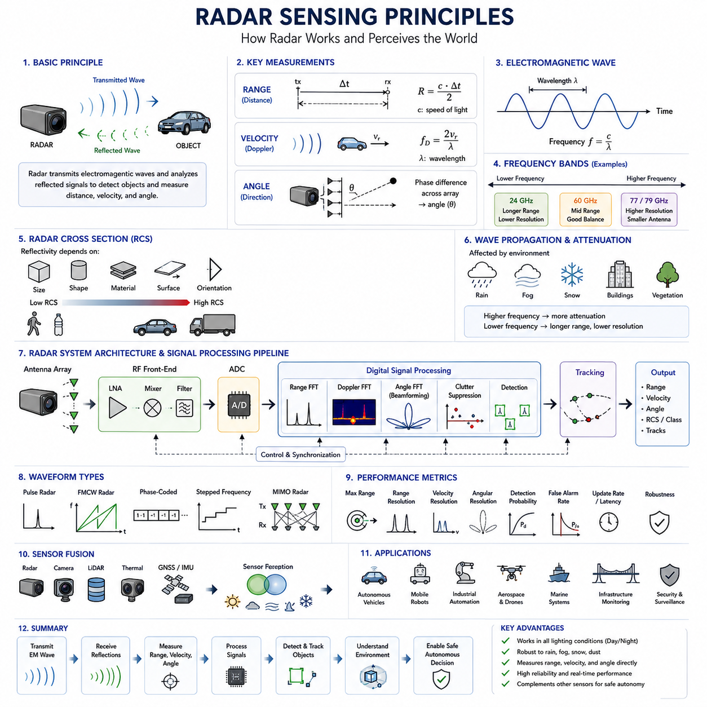
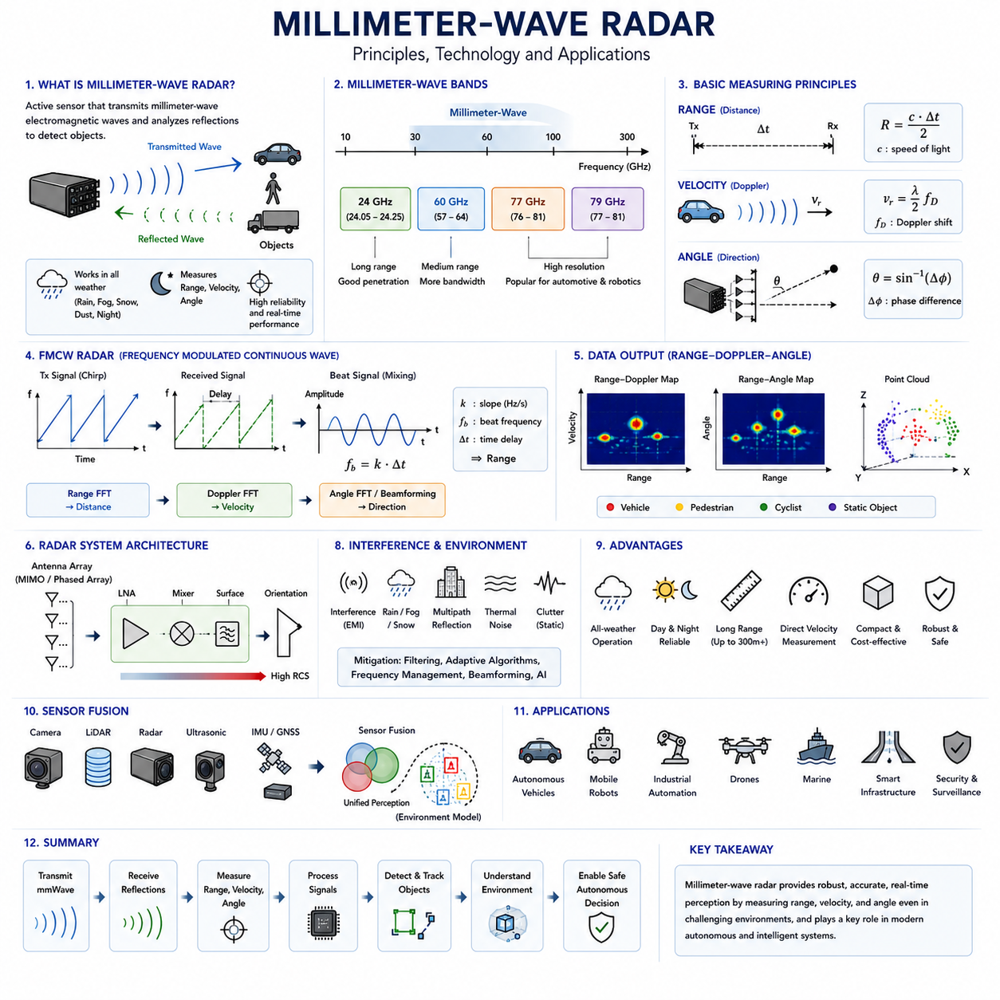
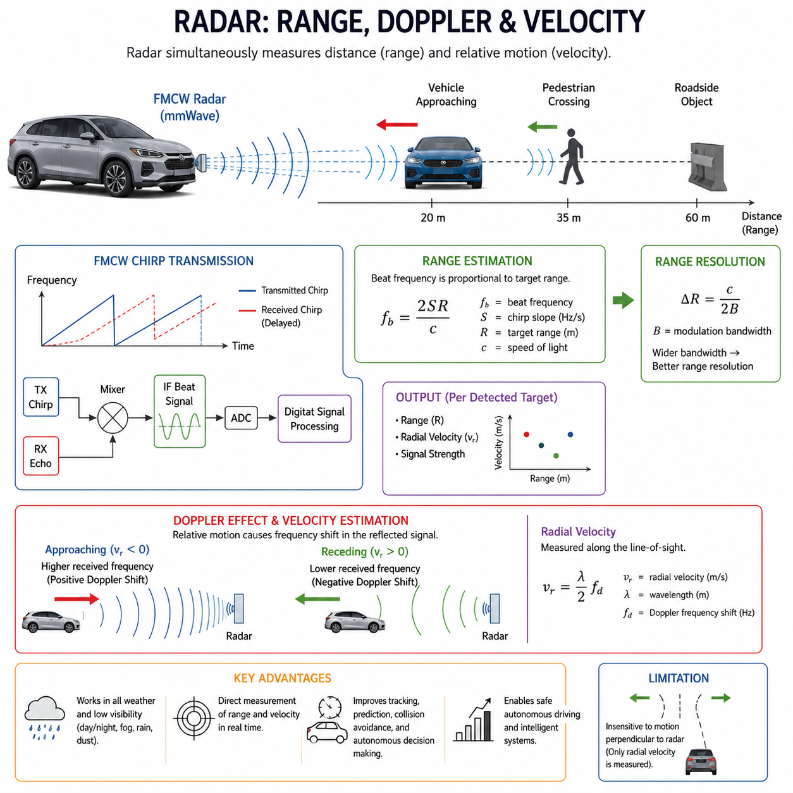
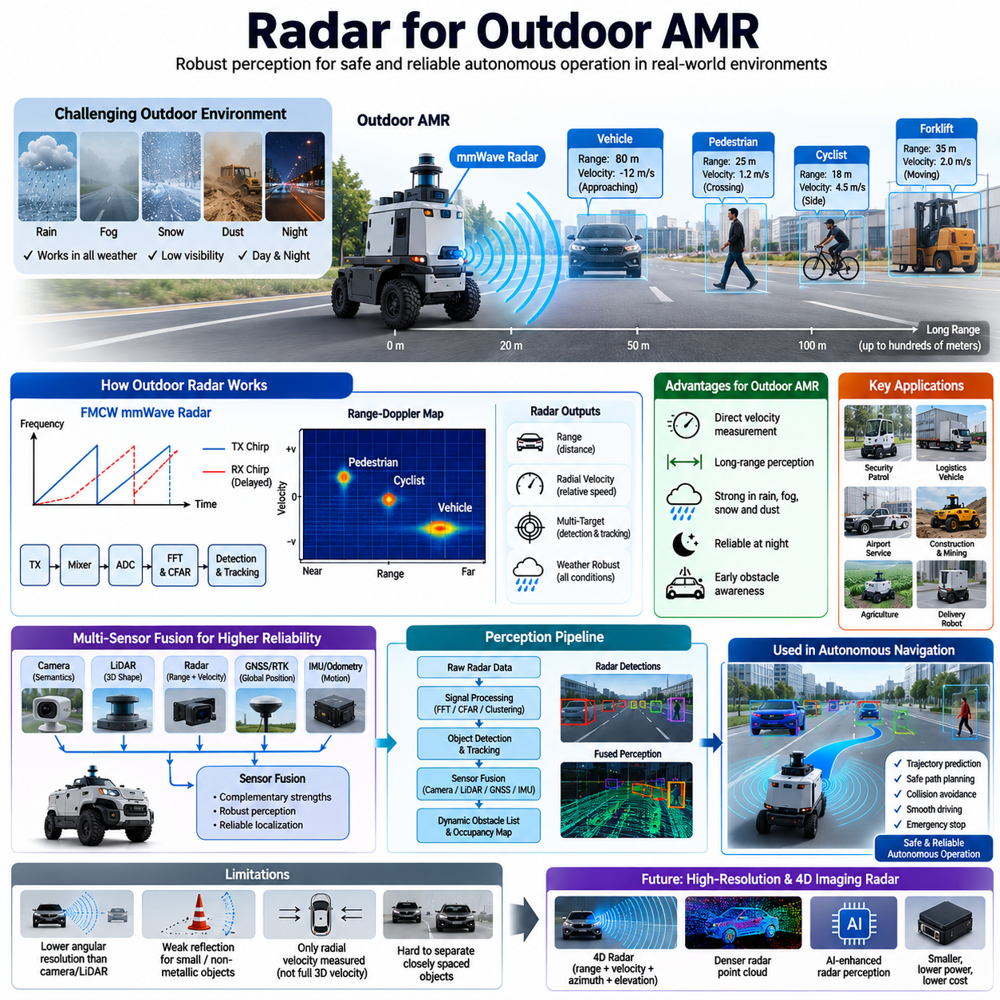
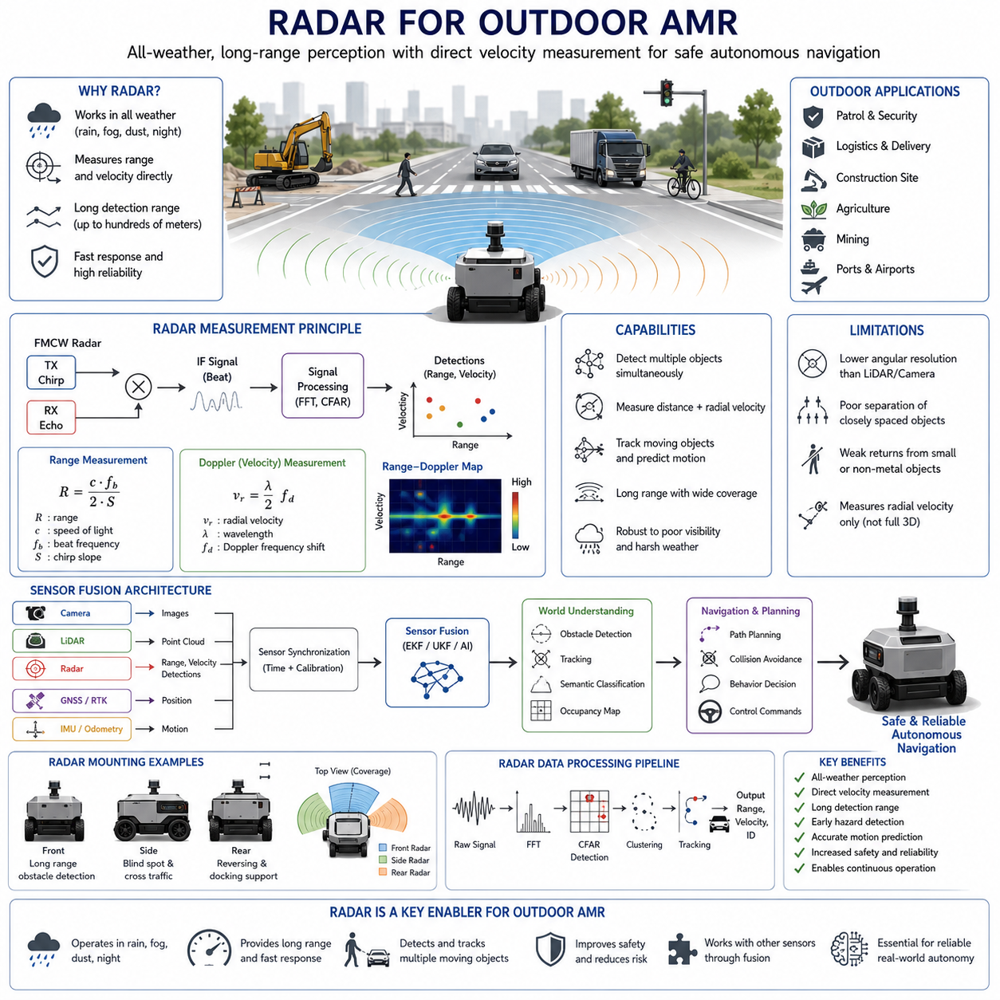
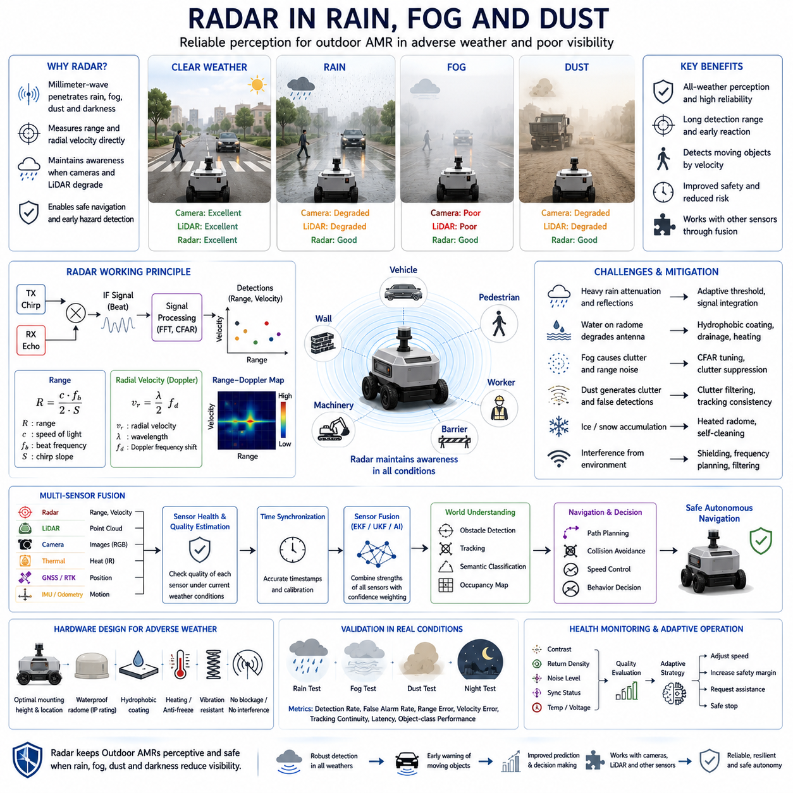
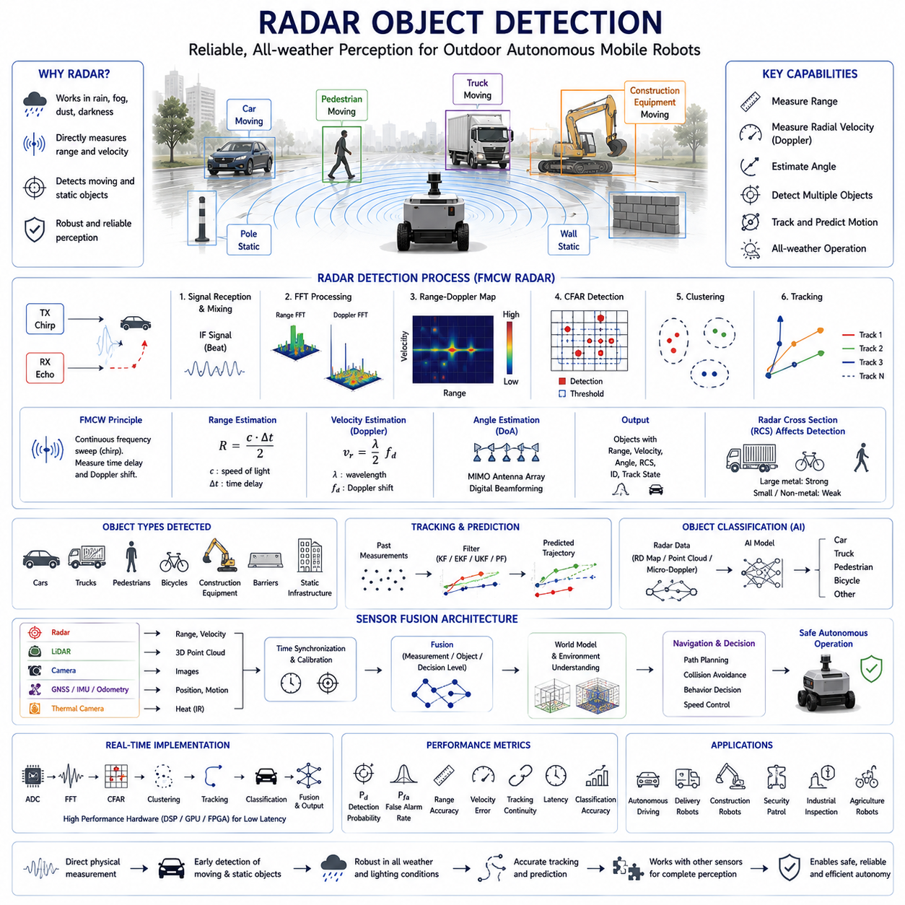
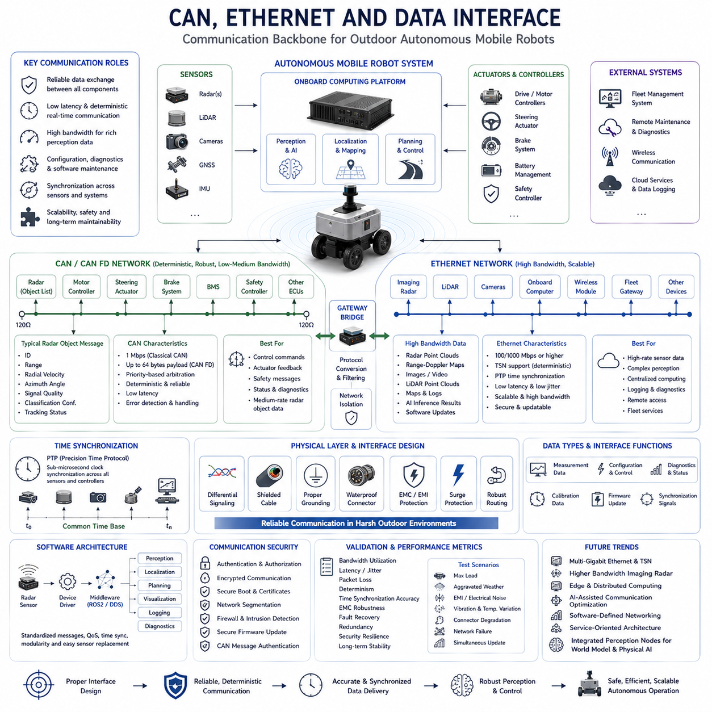
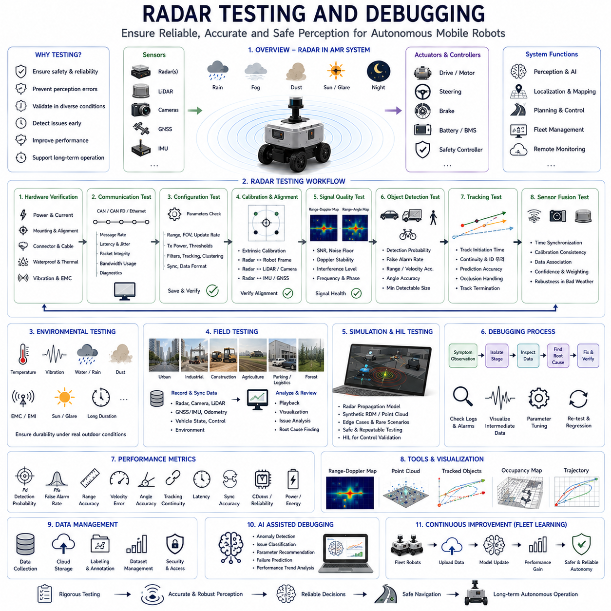

**Volume 03. AMR Sensors and Perception**

# Chapter 07. Radar Systems

## 07.1 Radar Sensing Principles

{width="7.268055555555556in" height="7.268055555555556in"}

레이더 센싱(Radar Sensing)은 광학 센서(Optical Sensor)의 성능이 크게 저하될 수 있는 환경에서도 안정적인 환경 인식(Environmental Awareness)을 제공하기 때문에 자율 시스템(Autonomous System)에서 가장 중요한 인지 기술 가운데 하나이다. 가시광선(Visible Light)에 의존하는 카메라(Camera)나 물체가 방출하는 적외선(Infrared Radiation)을 감지하는 열화상 카메라(Thermal Camera)와 달리, 레이더는 전자기파(Electromagnetic Wave)를 능동적으로 송신하고 반사된 신호를 분석하여 주변 물체의 존재, 거리, 속도, 방향을 측정한다. 이러한 능동 센싱(Active Sensing) 방식은 주간과 야간은 물론, 폭우, 눈, 안개, 먼지, 연기와 같은 악조건에서도 안정적으로 동작할 수 있도록 해주며, 자율주행 자동차, 산업용 로봇, 모바일 로봇, 해양 시스템, 항공우주 플랫폼, 지능형 인프라에서 필수적인 센서로 활용되고 있다. 따라서 레이더 센싱 원리(Radar Sensing Principles)는 다양한 환경에서 강인한 인지 시스템을 구현하기 위한 핵심 기반 기술이다.

레이더의 기본 동작 원리는 송신 안테나(Transmitting Antenna)에서 전자기 에너지를 주변 환경으로 방사하는 것에서 시작된다. 송신된 전자기파는 물체와 충돌하면 물체의 재질(Material Properties), 형상(Geometry), 표면 거칠기(Surface Roughness), 방향(Orientation), 전기 전도도(Electrical Conductivity)에 따라 일부는 반사(Reflection)되고 일부는 산란(Scattering)되거나 흡수(Absorption)된다. 반사된 신호는 수신 안테나(Receiving Antenna)로 되돌아오며, 증폭(Amplification), 디지털화(Digitization), 신호 처리(Signal Processing)를 거쳐 다양한 목표물 정보를 추정한다. 신호의 전달 시간(Propagation Time), 주파수 변화(Frequency Variation), 위상 정보(Phase Information), 신호 세기(Signal Amplitude)를 분석함으로써 거리, 상대 속도, 입사각, 물체 특성을 높은 신뢰도로 계산할 수 있다. 이러한 능동 측정 방식은 레이더를 수동 센싱(Passive Sensing) 기술과 구별하는 가장 큰 특징이다.

전자기파 전파(Electromagnetic Wave Propagation)는 레이더 센싱의 물리적 기반이다. 레이더는 일반적으로 수 기가헤르츠(GHz)에서 수백 기가헤르츠에 이르는 마이크로파(Microwave) 주파수 대역에서 동작한다. 전자기파는 자유 공간(Free Space)을 전파하면서 거리가 증가할수록 에너지가 확산되며, 대기 흡수(Atmospheric Absorption), 강수(Precipitation), 주변 물체와의 상호작용으로 인해 감쇠(Attenuation)가 발생한다. 전파 속도는 거의 빛의 속도(Speed of Light)와 동일하므로 신호의 왕복 시간을 이용하여 거리를 정확하게 계산할 수 있다. 또한 전자기파는 가시광선보다 안개, 연기, 가벼운 비, 일부 비금속 재질을 더 잘 통과하기 때문에 악천후에서도 안정적인 환경 인식이 가능하다.

레이더 주파수 선택(Radar Frequency Selection)은 센싱 성능에 큰 영향을 미친다. 낮은 주파수는 긴 탐지 거리(Long Detection Range)와 우수한 투과 성능(Penetration Capability)을 제공하지만 공간 해상도(Spatial Resolution)는 낮다. 반대로 높은 주파수는 더 높은 각도 해상도(Angular Resolution)와 작은 안테나 크기를 제공하지만 일반적으로 최대 탐지 거리는 감소한다. 현대의 자동차 및 로봇용 레이더는 주로 24GHz, 60GHz, 77GHz, 79GHz의 밀리미터파(Millimeter-Wave) 대역을 사용하며, 이는 탐지 거리, 해상도, 안테나 크기, 사용 가능한 대역폭, 규제 적합성을 균형 있게 만족시키기 때문이다. 따라서 주파수 선택은 적용 분야에 따라 매우 중요한 설계 요소가 된다.

레이더 거리 측정(Range Measurement)의 기본 원리는 신호 전달 지연(Signal Propagation Delay)에 기반한다. 레이더는 전자기 펄스(Electromagnetic Pulse) 또는 연속 변조 신호(Continuously Modulated Waveform)를 송신한 후 반사 신호가 돌아오는 시간을 측정한다. 전자기파는 초당 약 3억 미터의 속도로 이동하므로 매우 작은 시간 차이도 정밀한 거리 차이로 환산될 수 있다. 목표물까지의 거리는 측정된 왕복 시간에 빛의 속도를 곱한 후 왕복 거리를 고려하여 2로 나누어 계산한다. 따라서 정확한 거리 추정을 위해서는 고정밀 시간 동기화(Time Synchronization)와 고속 신호 처리 기술이 필수적이다.

속도 추정(Velocity Estimation)은 도플러 효과(Doppler Effect)를 이용하는 레이더의 대표적인 기능이다. 목표물이 레이더에 대해 상대적으로 움직이면 반사된 전자기파의 주파수가 변화하게 된다. 레이더로 접근하는 물체는 양의 주파수 이동(Positive Frequency Shift)을 발생시키며, 멀어지는 물체는 음의 주파수 이동(Negative Frequency Shift)을 생성한다. 레이더는 이러한 도플러 주파수(Doppler Frequency)를 분석하여 상대 속도를 직접 계산할 수 있으며, 연속 영상이 없어도 움직이는 차량, 보행자, 산업 장비, 드론 등의 이동 속도를 정확하게 추정할 수 있다. 이는 정지된 물체와 이동하는 물체를 효과적으로 구분할 수 있게 해준다.

각도 추정(Angular Estimation)은 반사 신호가 어느 방향에서 도달했는지를 계산하는 과정이다. 여러 개의 수신 안테나를 배열(Antenna Array) 형태로 구성하면 각 안테나에는 미세한 위상 차이(Phase Difference)가 발생한다. 신호 처리 알고리즘은 이러한 위상 정보를 분석하여 목표물의 방위각(Azimuth)과 고도각(Elevation)을 계산한다. 빔포밍(Beamforming), 다중입출력(Multiple Input Multiple Output, MIMO) 레이더와 같은 최신 기술은 각도 해상도를 크게 향상시키며 복수의 목표물을 동시에 정확하게 위치 추정할 수 있도록 지원한다. 이를 통해 레이더는 단순한 거리 센서가 아니라 2차원 또는 3차원 환경을 인식하는 센서로 발전하였다.

레이더 단면적(Radar Cross Section, RCS)은 목표물이 레이더 신호를 얼마나 효과적으로 반사하는지를 나타내는 매우 중요한 특성이다. 레이더 단면적은 물체의 크기뿐 아니라 형상, 재질, 표면 거칠기, 방향, 동작 주파수에 의해 결정된다. 일반적으로 금속 물체는 플라스틱이나 고무보다 훨씬 강한 반사를 생성하며, 넓고 평평한 표면은 특정 각도에서 강한 정반사(Specular Reflection)를 일으킨다. 반면 불규칙한 표면은 신호를 다양한 방향으로 산란시킨다. 이러한 특성을 이해하면 객체 탐지와 분류 과정에서 반사 신호를 보다 정확하게 해석할 수 있다.

신호 감쇠(Signal Attenuation)는 전자기파가 환경을 통과하면서 발생하는 중요한 현상이다. 대기 중의 기체, 비, 눈, 안개, 먼지, 식생(Vegetation), 건물, 다양한 장애물은 송신 신호와 반사 신호의 에너지를 감소시킨다. 일반적으로 높은 주파수일수록 대기 감쇠가 증가하며, 강한 강수 환경에서는 감쇠가 더욱 커진다. 따라서 레이더 시스템은 송신 출력(Transmitter Power), 안테나 이득(Antenna Gain), 수신 감도(Receiver Sensitivity), 신호 처리 성능을 적절히 조합하여 다양한 환경에서도 안정적인 성능을 확보하도록 설계된다.

노이즈와 간섭(Noise and Interference)은 레이더 시스템이 해결해야 하는 중요한 문제이다. 전자 회로에서 발생하는 열잡음(Thermal Noise)은 수신기의 기본 감도 한계를 결정하며, 주변 레이더, 무선 통신 장치, 산업 설비에서 발생하는 전자기 간섭(Electromagnetic Interference)은 탐지 성능을 저하시킬 수 있다. 또한 건물이나 차량 등에 의해 발생하는 다중경로 전파(Multipath Propagation)는 동일한 목표물에 대한 여러 개의 반사 신호를 생성하여 측정 오차를 유발한다. 현대 레이더는 적응형 필터링(Adaptive Filtering), 간섭 제거(Interference Suppression), 주파수 관리(Frequency Management), 디지털 신호 처리(Digital Signal Processing)를 통해 이러한 문제를 최소화한다.

레이더 파형 설계(Radar Waveform Design)는 측정 정확도와 환경 적응성을 결정하는 핵심 요소이다. 초기 레이더는 단순한 펄스 파형(Pulse Waveform)을 사용하였지만, 최근에는 주파수 변조 연속파(Frequency Modulated Continuous Wave, FMCW) 방식이 가장 널리 활용된다. FMCW는 거리와 속도를 동시에 계산할 수 있으며 하드웨어 구조도 비교적 단순하다. 그 외에도 위상 부호화(Phase-Coded Sequence), 처프 신호(Chirp Signal), 계단형 주파수(Stepped Frequency), 직교 파형(Orthogonal Waveform) 등이 다양한 응용 분야에 사용된다. 적절한 파형 선택은 자동차, 산업 검사, 항공우주 등 각 분야의 요구 사항에 맞는 성능을 제공한다.

주파수 변조 연속파(Frequency Modulated Continuous Wave, FMCW) 레이더는 현재 자율주행 차량과 모바일 로봇에서 가장 널리 사용되는 센싱 기술이다. 송신 주파수는 시간에 따라 연속적으로 변화하는 처프(Chirp) 형태를 가지며, 반사 신호는 목표물과의 거리 및 도플러 효과에 따라 서로 다른 주파수 차이를 나타낸다. 신호 처리 알고리즘은 이러한 주파수 차이를 분리하여 거리와 속도를 동시에 계산한다. FMCW는 높은 정확도와 비교적 단순한 시스템 구성을 동시에 제공하기 때문에 실시간 자율주행 인지 시스템에 매우 적합하다.

레이더 신호 처리(Radar Signal Processing)는 원시 전자기 신호를 실제 환경 정보로 변환하는 핵심 과정이다. 아날로그 전치 회로(Analog Front-End)는 매우 약한 반사 신호를 증폭하며, 이후 아날로그-디지털 변환기(Analog-to-Digital Converter)가 이를 디지털 데이터로 변환한다. 고속 푸리에 변환(Fast Fourier Transform, FFT)은 시간 영역(Time Domain)의 신호를 주파수 영역(Frequency Domain)으로 변환하여 거리와 도플러 정보를 추출한다. 이후 클러터 제거(Clutter Suppression), 간섭 제거, 노이즈 필터링, 객체 탐지, 각도 계산, 객체 연관(Object Association), 궤적 추적(Trajectory Tracking)이 수행된다. 최근에는 인공지능이 이러한 전통적인 신호 처리 기법을 보완하여 객체 분류와 환경 이해 능력을 더욱 향상시키고 있다.

목표물 탐지(Target Detection) 알고리즘은 반사 신호가 실제 물체인지 아니면 단순한 잡음인지를 판단한다. 일정한 오경보율(Constant False Alarm Rate, CFAR) 알고리즘은 주변 노이즈 특성에 따라 탐지 임계값(Detection Threshold)을 자동으로 조정하여 다양한 환경에서도 일정한 탐지 성능을 유지한다. 탐지된 후보 객체는 신호 세기, 공간 연속성(Spatial Continuity), 시간 일관성(Temporal Consistency), 도플러 특성, 추적 정보를 이용하여 다시 검증된다. 이러한 과정은 오탐(False Alarm)과 미탐(Missed Detection)을 최소화하면서 신뢰성 높은 환경 인식을 제공한다.

객체 추적(Object Tracking)은 개별 측정값을 연속적인 움직임으로 연결하는 과정이다. 추적 알고리즘은 새롭게 탐지된 반사 신호를 기존 객체와 연결하고, 위치(Position), 속도(Velocity), 가속도(Acceleration), 미래 이동 경로(Future Trajectory)를 지속적으로 추정한다. 칼만 필터(Kalman Filter), 확장 칼만 필터(Extended Kalman Filter), 무향 칼만 필터(Unscented Kalman Filter), 파티클 필터(Particle Filter), 다중 가설 추적(Multiple Hypothesis Tracking) 알고리즘은 불확실한 측정 환경에서도 안정적인 상태 추정을 수행한다. 이를 통해 자율 시스템은 주변 물체의 미래 움직임을 예측하고 안전한 주행 경로를 계획할 수 있다.

레이더 성능(Radar Performance)은 최대 탐지 거리(Maximum Detection Range), 최소 탐지 거리(Minimum Detectable Range), 거리 해상도(Range Resolution), 속도 해상도(Velocity Resolution), 각도 해상도(Angular Resolution), 탐지 확률(Detection Probability), 오경보율(False Alarm Rate), 추적 정확도(Tracking Accuracy), 갱신 주기(Update Frequency), 지연시간(Latency), 환경 강인성(Environmental Robustness) 등의 정량적 지표를 이용하여 평가된다. 해상도는 인접한 목표물을 구분하는 능력을 의미하며, 탐지 확률은 실제 물체를 얼마나 정확하게 탐지하는지를 나타낸다. 이러한 평가지표는 레이더 시스템의 개발, 보정, 현장 검증 과정에서 객관적인 비교 기준으로 활용된다.

현대의 인지 시스템은 대부분 레이더만 단독으로 사용하지 않는다. 카메라는 풍부한 의미 정보(Semantic Information)와 높은 공간 해상도를 제공하지만 조명 조건에 민감하다. 라이다(LiDAR)는 매우 정확한 3차원 형상을 제공하지만 악천후에서는 성능이 저하될 수 있다. 열화상 카메라는 조명과 무관하게 열 정보를 제공하지만 기하학적 정보는 제한적이다. 레이더는 거리와 속도를 안정적으로 측정하고 비, 안개, 눈, 야간 환경에서도 강인한 성능을 제공한다. 따라서 센서 융합(Sensor Fusion)은 이러한 센서들의 장점을 결합하여 단일 센서보다 훨씬 정확하고 신뢰성 높은 환경 인식을 가능하게 한다.

인공지능(Artificial Intelligence)은 최근 레이더 인지(Radar Perception)의 핵심 기술로 발전하고 있다. 딥러닝(Deep Learning)은 레인지-도플러 맵(Range-Doppler Map), 레인지-앵글 맵(Range-Angle Map), 레이더 포인트 클라우드(Radar Point Cloud)로부터 특징을 자동으로 학습하여 객체 분류(Object Classification), 특징 추출(Feature Extraction), 클러터 제거, 점유 공간 추정(Occupancy Estimation), 의미 기반 장면 이해(Semantic Scene Understanding)를 수행한다. 또한 기계학습(Machine Learning)은 간섭 제거와 다중경로 억제 성능을 향상시키며 복잡한 환경에서도 안정적인 객체 인식을 가능하게 한다. 앞으로 레이더 데이터셋이 지속적으로 확대됨에 따라 AI 기반 레이더 인지는 자율 로봇의 핵심 기술로 더욱 발전할 것으로 기대된다.

레이더 센싱은 더 높은 주파수(Higher Frequency), 더 넓은 대역폭(Wider Bandwidth), 대규모 안테나 배열(Larger Antenna Arrays), 고성능 신호 프로세서(More Powerful Signal Processor), 인공지능과 멀티센서 인지 프레임워크(Multisensor Perception Framework)와의 긴밀한 통합 방향으로 지속적으로 발전하고 있다. 이미징 레이더(Imaging Radar), 4차원 레이더(Four-Dimensional Radar), 디지털 빔포밍(Digital Beamforming), 분산 레이더 네트워크(Distributed Radar Network), 인지 레이더(Cognitive Radar), 소프트웨어 정의 레이더(Software-Defined Radar)는 기존의 거리와 속도 측정을 넘어 더욱 정밀한 환경 이해를 가능하게 한다. 이러한 기술 발전은 자율주행, 지능형 교통, 산업 자동화, 사회 기반 시설 모니터링, 보안 감시, 항공우주, 그리고 다양한 환경에서 강인한 인지를 요구하는 차세대 피지컬 AI(Physical AI) 시스템의 핵심 기반 기술로 자리 잡고 있다.

## 07.2 Millimeter Wave Radar

{width="7.268055555555556in" height="7.268055555555556in"}

밀리미터파 레이더(Millimeter-Wave Radar)는 긴 탐지 거리(Long Detection Range), 정확한 속도 추정(Accurate Velocity Estimation), 소형 하드웨어(Compact Hardware), 그리고 다양한 환경에서의 뛰어난 강인성(Environmental Robustness)을 동시에 제공하기 때문에 자율 시스템(Autonomous System)에서 가장 중요한 센싱 기술 가운데 하나로 자리 잡았다. 주변 조명(Ambient Illumination)에 의존하는 카메라(Camera)나 폭우나 짙은 안개에서 성능이 저하될 수 있는 라이다(LiDAR)와 달리, 밀리미터파 레이더는 전자기파(Electromagnetic Wave)를 능동적으로 송신하고 물체에서 반사된 신호를 분석한다. 이러한 능동 센싱(Active Sensing) 방식은 주간과 야간은 물론 비, 눈, 안개, 연기, 먼지 등 시야 확보가 어려운 환경에서도 안정적인 인지를 가능하게 한다. 자율주행 자동차, 모바일 로봇(Mobile Robot), 산업 자동화(Industrial Automation), 드론(Drone), 지능형 교통 시스템(Intelligent Transportation Infrastructure)이 지속적으로 발전함에 따라, 밀리미터파 레이더는 카메라, 라이다, 초음파 센서(Ultrasonic Sensor), 관성항법 시스템(Inertial Navigation System)을 보완하는 핵심 인지 센서로 활용되고 있다. 특히 거리, 상대 속도, 물체 방향을 직접 측정할 수 있는 능력은 현대 자율주행 시스템에서 매우 중요한 장점이다.

밀리미터파(Millimeter-Wave)란 일반적으로 파장(Wavelength)이 약 1mm에서 10mm 사이이며, 주파수(Frequency)는 약 30GHz에서 300GHz 범위에 해당하는 전자기파를 의미한다. 자동차 및 로봇용 레이더는 주로 24GHz, 60GHz, 77GHz, 79GHz 대역을 사용하는데, 이는 안테나 크기(Antenna Size), 탐지 거리, 대역폭(Bandwidth), 해상도(Resolution), 전파 규제(Regulatory Compliance)를 균형 있게 만족시키기 때문이다. 높은 주파수는 물리적으로 작은 안테나를 구현할 수 있도록 하며, 넓은 대역폭을 활용하여 거리 해상도를 크게 향상시킨다. 파장은 주파수에 반비례하기 때문에 밀리미터파 레이더는 다수의 안테나 요소(Antenna Element)를 매우 작은 공간에 집적할 수 있다. 이러한 특성은 레이더 센서를 소형화하고 비용을 절감하여 상용 차량, 산업용 로봇, 서비스 로봇, 지능형 인프라에 널리 적용될 수 있도록 만들었다.

밀리미터파 레이더는 기존 레이더와 동일한 기본 원리로 동작하지만 더 높은 동작 주파수와 넓은 신호 대역폭을 활용한다는 점에서 차별화된다. 레이더 송신기(Radar Transmitter)는 전자기파를 방출하고, 이 신호는 주변 환경을 전파하다가 물체와 충돌하면 반사된다. 반사되는 에너지의 양은 물체의 재질(Material), 형상(Geometry), 방향(Orientation), 전기 전도도(Electrical Conductivity), 표면 거칠기(Surface Roughness)에 따라 달라진다. 수신된 반사 신호는 거리, 속도, 방향, 반사 특성에 대한 다양한 정보를 포함하고 있으며, 신호 처리 알고리즘(Signal Processing Algorithm)은 신호 전달 시간, 주파수 변화, 위상 차이, 신호 세기를 분석하여 주변 환경을 재구성한다. 이러한 과정을 통해 밀리미터파 레이더는 정지된 물체와 이동하는 물체를 모두 높은 신뢰도로 탐지할 수 있다.

밀리미터파 레이더의 가장 큰 장점 가운데 하나는 다양한 환경에서 뛰어난 강인성을 제공한다는 점이다. 광학 센서(Optical Sensor)는 조명 조건이나 기상 환경의 영향을 크게 받지만, 밀리미터파 전자기파는 가시광선보다 비, 안개, 연기, 먼지, 일부 식생(Vegetation)을 훨씬 잘 통과한다. 물론 높은 주파수에서는 대기 감쇠(Atmospheric Attenuation)가 증가하며, 특히 강우 환경에서는 신호 감쇠가 커질 수 있다. 그러나 현대 레이더 시스템은 송신 출력(Transmitter Power), 안테나 이득(Antenna Gain), 수신 감도(Receiver Sensitivity), 고성능 디지털 신호 처리(Digital Signal Processing)를 통해 이러한 영향을 효과적으로 보완한다. 따라서 카메라나 라이다의 성능이 저하되는 환경에서도 안정적인 인지 성능을 유지할 수 있으며, 이는 자율주행 차량과 로봇의 안전성을 크게 향상시킨다.

거리 측정(Range Measurement)은 밀리미터파 레이더의 가장 기본적인 기능 가운데 하나이다. 현대의 레이더는 대부분 주파수 변조 연속파(Frequency Modulated Continuous Wave, FMCW) 방식을 사용한다. 송신 신호는 일정한 주파수 범위를 연속적으로 변화시키며, 반사 신호는 목표물까지의 거리만큼 시간 지연(Time Delay)을 가진다. 송신 신호와 수신 신호 사이의 주파수 차이(Beat Frequency)를 계산하면 목표물까지의 거리를 매우 높은 정확도로 추정할 수 있다. 넓은 대역폭은 거리 해상도를 향상시켜 서로 가까운 물체도 구분할 수 있도록 해준다. 따라서 밀리미터파 레이더는 단거리, 중거리, 장거리 환경 모두에서 여러 개의 목표물을 동시에 탐지하고 정확한 거리 정보를 제공할 수 있다.

속도 추정(Velocity Estimation)은 레이더만이 가지는 가장 중요한 장점 가운데 하나이다. 목표물이 레이더에 대해 움직이면 도플러 효과(Doppler Effect)에 의해 반사 신호의 주파수가 변화한다. 레이더 방향으로 접근하는 물체는 양의 도플러 이동(Positive Doppler Shift)을 발생시키며, 멀어지는 물체는 음의 도플러 이동(Negative Doppler Shift)을 생성한다. 레이더는 이러한 주파수 변화를 직접 분석하여 상대 속도를 계산할 수 있다. 카메라처럼 여러 장의 영상을 비교하거나 특징점을 추적할 필요가 없기 때문에 움직이는 차량, 보행자, 자전거, 산업 장비 등의 속도를 매우 빠르고 정확하게 추정할 수 있다. 이러한 특성은 충돌 회피(Collision Avoidance), 적응형 크루즈 제어(Adaptive Cruise Control), 자율주행, 동적 객체 추적(Dynamic Object Tracking)에 매우 중요한 역할을 한다.

각도 추정(Angular Estimation)은 반사 신호가 어느 방향에서 들어왔는지를 계산하는 과정이다. 현대의 밀리미터파 레이더는 다수의 송신 안테나와 수신 안테나를 배열(Antenna Array) 또는 다중입출력(Multiple Input Multiple Output, MIMO) 구조로 구성한다. 목표물의 위치에 따라 각 안테나에는 서로 다른 위상 정보(Phase Information)가 도달하며, 빔포밍(Beamforming) 알고리즘은 이러한 위상 차이를 분석하여 방위각(Azimuth)과 고도각(Elevation)을 계산한다. 높은 주파수에서는 작은 공간 안에 더 많은 안테나를 배치할 수 있기 때문에 더욱 높은 각도 해상도를 제공할 수 있다. 안테나 기술과 디지털 빔포밍 기술이 발전하면서 밀리미터파 레이더는 점차 3차원 환경 인지 능력을 갖춘 센서로 발전하고 있다.

주파수 변조 연속파(Frequency Modulated Continuous Wave, FMCW)는 현재 자동차 및 로봇 분야에서 가장 널리 사용되는 밀리미터파 레이더 구조이다. 송신기는 연속적인 처프(Chirp) 신호를 발생시키고, 반사 신호는 기준 신호와 혼합되어 비트 주파수(Beat Frequency)를 생성한다. 고속 푸리에 변환(Fast Fourier Transform, FFT)은 이 신호를 주파수 영역으로 변환하여 목표물까지의 거리를 계산한다. 여러 개의 처프를 연속적으로 분석하면 도플러 정보를 이용하여 속도를 계산할 수 있으며, 각도 추정 알고리즘은 목표물의 방향을 산출한다. 최종적으로 거리-도플러-각도(Range-Doppler-Angle) 정보가 생성되며, 이는 상위 인지 알고리즘의 핵심 입력 데이터가 된다.

신호 처리(Signal Processing)는 밀리미터파 레이더 시스템의 핵심 연산 과정이다. 매우 약한 반사 신호는 저잡음 증폭기(Low Noise Amplifier), 필터(Filter), 혼합기(Mixer), 아날로그-디지털 변환기(Analog-to-Digital Converter)를 거쳐 디지털 데이터로 변환된다. 거리 FFT는 거리 정보를 추출하고, 도플러 FFT는 속도를 계산하며, 각도 FFT 또는 빔포밍은 방향 정보를 계산한다. 이후 클러터 제거(Clutter Suppression), 간섭 제거(Interference Suppression), 노이즈 제거(Noise Filtering), 객체 연관(Object Association), 객체 추적(Object Tracking)이 수행된다. 일정한 오경보율(Constant False Alarm Rate, CFAR) 알고리즘은 환경 변화에 따라 탐지 임계값을 자동 조정하여 다양한 환경에서도 안정적인 탐지 성능을 유지한다. 이러한 처리 과정을 통해 원시 반사 신호는 자율 시스템이 활용할 수 있는 의미 있는 환경 정보로 변환된다.

레이더 단면적(Radar Cross Section, RCS)은 목표물의 탐지 성능을 결정하는 중요한 요소이다. 반사 신호의 크기는 단순히 물체의 크기만으로 결정되지 않으며, 형상, 재질, 방향, 동작 주파수의 영향을 함께 받는다. 일반적으로 금속 차량은 사람이나 플라스틱 물체보다 훨씬 강한 반사를 생성하며, 넓고 평평한 표면은 특정 방향에서 강한 정반사(Specular Reflection)를 발생시킨다. 반면 복잡한 형상을 가진 표면은 다양한 방향으로 신호를 산란시켜 반사 강도가 감소할 수 있다. 이러한 특성을 이해하면 객체 분류(Object Classification)와 탐지 신뢰도(Detection Confidence)를 더욱 정확하게 계산할 수 있으며, 최근에는 기계학습(Machine Learning)을 이용하여 레이더 단면적 특성을 객체 인식에 적극 활용하고 있다.

밀리미터파 레이더는 다양한 간섭(Interference) 환경에서도 안정적인 성능을 유지해야 한다. 열잡음(Thermal Noise)은 수신기의 감도 한계를 결정하며, 주변 레이더, 무선 통신 장비, 산업용 전자 장치에서 발생하는 전자기 간섭(Electromagnetic Interference)은 탐지 성능을 저하시킬 수 있다. 또한 건물, 도로, 금속 구조물에서 발생하는 다중경로 전파(Multipath Propagation)는 여러 개의 반사 신호를 생성하여 객체 해석을 어렵게 만든다. 현대의 레이더 시스템은 적응형 필터링(Adaptive Filtering), 간섭 제거, 파형 최적화(Waveform Optimization), 주파수 관리(Frequency Management), 디지털 빔포밍 기술을 적용하여 이러한 문제를 최소화하며, 실제 목표물과 클러터(Clutter)를 효과적으로 구분한다.

레이더 해상도(Radar Resolution)는 서로 가까운 목표물을 얼마나 정확하게 구분할 수 있는지를 나타낸다. 거리 해상도(Range Resolution)는 주로 신호 대역폭에 의해 결정되며, 각도 해상도(Angular Resolution)는 안테나 배열의 크기와 구조에 의해 결정된다. 속도 해상도(Velocity Resolution)는 관측 시간(Observation Time)과 파형 설계(Waveform Design)의 영향을 받는다. 밀리미터파 레이더는 넓은 대역폭을 사용할 수 있기 때문에 기존 저주파 레이더보다 훨씬 우수한 거리 해상도를 제공한다. 또한 더 큰 안테나 배열을 작은 공간에 구현할 수 있어 방향 추정 정확도도 크게 향상된다. 시스템 설계자는 대역폭, 안테나 구조, 계산량, 소비 전력을 종합적으로 고려하여 최적의 센싱 성능을 구현한다.

최근의 밀리미터파 레이더는 인공지능(Artificial Intelligence)을 적극적으로 도입하여 기존 신호 처리의 한계를 극복하고 있다. 딥러닝(Deep Learning)은 레이더 포인트 클라우드(Radar Point Cloud), 레인지-도플러 맵(Range-Doppler Map), 레인지-앵글 맵(Range-Angle Map), 마이크로 도플러(Micro-Doppler) 특징을 분석하여 객체 분류, 점유 공간 추정(Occupancy Estimation), 사람의 동작 인식(Human Activity Recognition), 환경 이해(Environment Understanding)를 수행한다. 또한 AI 기반 알고리즘은 클러터 제거, 간섭 억제, 센서 보정(Sensor Calibration), 객체 연관, 다중 객체 추적(Multi-Target Tracking)의 성능을 향상시킨다. 이러한 기계학습 기반 접근 방식은 기존의 물리 기반 신호 처리와 결합되어 더욱 강인하고 지능적인 레이더 인지 시스템을 구현한다.

센서 융합(Sensor Fusion)은 자율 시스템에서 밀리미터파 레이더가 가장 많이 활용되는 분야이다. 카메라는 풍부한 의미 정보(Semantic Information)를 제공하고, 라이다는 정밀한 3차원 형상을 제공하며, 초음파 센서는 근거리 장애물을 탐지하고, 관성 센서는 차량의 움직임을 추정한다. 밀리미터파 레이더는 여기에 안정적인 거리 측정, 직접적인 속도 계산, 악천후 환경에서의 강인한 인지 능력을 제공한다. 센서 융합 알고리즘은 이러한 다양한 센서의 장점을 통합하여 단일 센서보다 훨씬 높은 정확도와 신뢰성을 가지는 환경 모델(Environment Model)을 생성한다. 이러한 다중 센서 구조는 자율주행 자동차, 모바일 로봇, 산업 자동화 시스템의 표준 아키텍처(Standard Architecture)로 자리 잡고 있다.

밀리미터파 레이더는 앞으로 더 높은 주파수(Higher Frequency), 더 큰 안테나 배열(Larger Antenna Array), 더 넓은 대역폭(Wider Bandwidth), 고집적 반도체(Semiconductor Integration), 그리고 더욱 강력한 인공지능 알고리즘과 함께 지속적으로 발전할 것으로 예상된다. 차세대 4차원 이미징 레이더(Four-Dimensional Imaging Radar)는 거리, 속도, 방위각, 고도각을 동시에 더욱 높은 정밀도로 측정하여 복잡한 환경을 상세하게 재구성할 수 있다. 디지털 빔포밍(Digital Beamforming), 분산 레이더 네트워크(Distributed Radar Network), 소프트웨어 정의 레이더(Software-Defined Radar), 인지 레이더(Cognitive Radar), AI 기반 인지 파이프라인(Perception Pipeline)은 센싱 성능을 더욱 향상시키면서도 하드웨어 복잡성을 줄여 나갈 것이다. 반도체 기술과 연산 성능이 지속적으로 발전함에 따라 밀리미터파 레이더는 미래의 피지컬 AI(Physical AI) 시스템에서 다양한 환경에서도 안정적인 실시간 환경 인지를 제공하는 핵심 센서 기술로 더욱 중요한 역할을 수행하게 될 것이다.

## 07.3 Range Doppler and Velocity

{width="7.268055555555556in" height="7.268055555555556in"}

거리(Range), 도플러(Doppler), 그리고 속도 추정(Velocity Estimation)은 레이더(Radar)를 다른 대부분의 인지 센서(Perception Sensor)와 구별해 주는 핵심 기능이다. 카메라(Camera)는 주로 물체의 시각적 외형을 관찰하고, 라이다(LiDAR)는 정밀한 3차원 형상(Three-Dimensional Geometry)을 복원하는 반면, 레이더는 물체까지의 거리와 물체의 상대적인 움직임을 동시에 직접 측정할 수 있다. 이러한 이중 측정 능력은 자율주행 차량(Autonomous Vehicle), 모바일 로봇(Mobile Robot), 산업 자동화 시스템(Industrial Automation System), 드론(Drone), 지능형 교통 시스템(Intelligent Transportation Infrastructure)이 주변 물체의 위치뿐만 아니라 이동 상태까지 정확하게 이해할 수 있도록 한다. 거리 측정과 도플러 기반 속도 측정의 결합은 장애물 예측, 충돌 회피, 객체 추적, 자율 의사결정의 성능을 크게 향상시킨다. 현대의 인지 시스템이 센서 융합(Sensor Fusion)을 중심으로 발전함에 따라, 레이더는 광학 센서만으로는 복잡한 다중 프레임 분석 없이는 얻기 어려운 움직임 정보를 직접 제공하는 중요한 역할을 수행한다.

거리(Range)는 레이더 센서와 반사체 사이의 물리적인 거리를 의미한다. 정확한 거리 측정은 모든 레이더 인지 시스템의 기반이 되며, 대부분의 상위 기능은 신뢰성 높은 거리 정보에 의존한다. 현대의 밀리미터파 레이더(Millimeter-Wave Radar)는 주로 주파수 변조 연속파(Frequency Modulated Continuous Wave, FMCW) 기술을 사용하여 일정한 대역폭(Bandwidth) 내에서 주파수를 지속적으로 변화시키는 전자기파(Electromagnetic Wave)를 송신한다. 반사 신호는 목표물까지의 왕복 거리만큼 전달 지연(Propagation Delay)을 가지며, 송신 신호와 수신 신호를 비교하면 거리와 비례하는 비트 주파수(Beat Frequency)를 계산할 수 있다. 전자기파는 빛의 속도(Speed of Light)로 전파되기 때문에 매우 짧은 시간 차이만으로도 정밀한 거리 계산이 가능하다. 고성능 디지털 신호 처리(Digital Signal Processing)는 이러한 미세한 전달 지연을 실시간 자율주행에 적합한 정확한 거리 정보로 변환한다.

신호 전달 시간과 목표물 거리 사이의 수학적 관계는 비교적 단순하지만 매우 정밀한 시간 측정을 요구한다. 전자기파는 목표물까지 이동한 후 다시 레이더로 되돌아오기 때문에 측정되는 시간은 왕복 시간(Round-Trip Time)에 해당한다. 따라서 실제 목표물까지의 거리는 전체 이동 거리의 절반이 된다. 실제 전달 지연은 일반적으로 나노초(Nanosecond) 수준이지만, 현대 레이더는 초고속 아날로그-디지털 변환기(Analog-to-Digital Converter)와 디지털 신호 프로세서(Digital Signal Processor)를 이용하여 매우 높은 정확도로 거리를 계산할 수 있다. 또한 넓은 변조 대역폭은 거리 해상도(Range Resolution)를 향상시켜 서로 가까이 위치한 여러 물체를 개별적으로 구분할 수 있도록 한다. 이러한 특성 덕분에 레이더는 복잡한 도심 환경에서도 차량, 보행자, 도로 시설물, 장애물을 동시에 탐지할 수 있다.

주파수 변조 연속파(Frequency Modulated Continuous Wave, FMCW) 레이더는 시간에 따라 선형적으로 증가하거나 감소하는 처프(Chirp) 신호를 연속적으로 송신한다. 반사 신호는 전달 지연 때문에 현재 송신되는 신호와 약간 다른 순간 주파수를 가지게 된다. 송신 신호와 수신 신호를 혼합(Mixing)하면 목표물 거리와 비례하는 중간 주파수(Intermediate Beat Frequency)가 생성된다. 펄스 레이더(Pulsed Radar)가 개별 펄스의 비행 시간(Time-of-Flight)을 직접 측정하는 것과 달리, FMCW 레이더는 주파수 차이를 이용하여 거리를 계산한다. 이러한 방식은 낮은 송신 전력, 연속 동작, 소형 하드웨어 구현, 높은 측정 정밀도를 동시에 제공하기 때문에 자동차 안전 시스템, 자율 로봇, 산업용 센서, 지능형 인프라에서 가장 널리 사용되고 있다.

거리 정보가 물체의 위치를 제공한다면, 속도 추정(Velocity Estimation)은 물체가 레이더를 기준으로 어떻게 움직이는지를 알려준다. 상대 운동(Relative Motion)이 발생하면 도플러 효과(Doppler Effect)에 의해 반사된 전자기파의 주파수가 변화한다. 물체가 레이더 쪽으로 접근하면 파면(Wavefront)이 더욱 촘촘하게 도달하면서 양의 도플러 이동(Positive Doppler Shift)이 발생하고, 반대로 멀어질 경우에는 음의 도플러 이동(Negative Doppler Shift)이 발생한다. 레이더는 이러한 주파수 변화를 정밀하게 측정하여 방사 방향 속도(Radial Velocity)를 계산한다. 카메라가 여러 장의 영상을 비교하여 움직임을 추정해야 하는 것과 달리, 레이더는 전자기파의 물리적 특성만으로 속도를 직접 측정할 수 있다는 장점을 가진다.

도플러 효과(Doppler Effect)는 자율 인지 시스템에서 여러 가지 중요한 장점을 제공한다. 직접적인 속도 측정은 차량, 보행자, 자전거, 산업 장비 등 움직이는 객체를 복잡한 영상 분석 없이 즉시 식별할 수 있도록 한다. 레이더는 한 번의 관측 주기 안에서 거리와 속도를 동시에 계산하므로, 예측 알고리즘은 거의 지연 없이 정확한 운동 정보를 활용할 수 있다. 이러한 특성은 적응형 크루즈 제어(Adaptive Cruise Control), 긴급 제동(Emergency Braking), 자율주행(Autonomous Navigation), 객체 추적(Object Tracking), 충돌 예측(Collision Prediction)의 성능을 크게 향상시킨다. 또한 야간, 안개, 비, 먼지와 같이 시야가 제한되는 환경에서도 도플러 기반 속도 측정은 안정적으로 유지되므로 광학 센서의 한계를 효과적으로 보완한다.

레이더가 측정하는 속도는 물체의 완전한 3차원 속도 벡터(Three-Dimensional Velocity Vector)가 아니라 방사 방향 속도(Radial Velocity)에 해당한다. 즉, 레이더를 향하거나 레이더에서 멀어지는 방향의 속도만 직접 측정할 수 있다. 따라서 레이더와 직각 방향으로 이동하는 물체는 실제로 빠르게 움직이고 있더라도 도플러 주파수 변화가 거의 발생하지 않는다. 이러한 한계를 극복하기 위해 현대 자율 시스템은 여러 개의 레이더를 서로 다른 방향에 배치하거나, 카메라 및 라이다와의 센서 융합, 차량 자체의 운동 추정, 객체 추적 알고리즘, 확률 기반 필터링(Probabilistic Filtering)을 함께 사용한다. 이를 통해 레이더의 장점을 유지하면서도 객체의 실제 이동 궤적(Trajectory)을 복원할 수 있다.

현대 FMCW 레이더에서는 거리와 도플러 정보가 동시에 계산된다. 먼저 수신 신호는 증폭, 필터링, 주파수 혼합, 아날로그-디지털 변환 과정을 거친다. 이후 각 처프 신호에 대해 고속 푸리에 변환(Fast Fourier Transform, FFT)을 수행하여 거리 정보를 추출한다. 다음으로 여러 개의 연속된 처프를 다시 FFT 처리하여 도플러 주파수를 계산하고 목표물의 속도를 추정한다. 이러한 2차원 주파수 분석을 통해 거리-도플러 맵(Range-Doppler Map)이 생성되며, 각각의 목표물은 자신의 거리와 상대 속도에 해당하는 위치에 나타난다. 이 데이터 구조는 현대 레이더 인지 시스템에서 가장 기본적인 표현 방식 가운데 하나이다.

거리-도플러 맵(Range-Doppler Map)은 주변의 동적 환경을 직관적으로 표현하는 중요한 데이터 구조이다. 일반적으로 가로축은 거리(Range), 세로축은 방사 방향 속도(Radial Velocity)를 나타낸다. 정지된 물체는 대부분 도플러 주파수가 0에 가까운 위치에 나타나며, 움직이는 물체는 접근 또는 이탈 여부에 따라 위쪽 또는 아래쪽으로 이동하여 표시된다. 밝은 영역은 차량, 시설물, 산업 장비 등 강한 반사를 생성하는 목표물을 의미한다. 여러 개의 객체는 서로 다른 거리와 속도를 가지므로 맵 안에서 자연스럽게 서로 다른 위치에 나타난다. 신호 처리 알고리즘은 이러한 피크(Peak)를 검출하고, 배경 잡음을 제거하며, 클러터(Clutter)를 억제하여 안정적인 객체 정보를 생성한다.

거리 해상도(Range Resolution)는 서로 가까이 위치한 두 물체를 독립된 객체로 구분할 수 있는 최소 거리를 의미한다. 이는 반송파(Carrier Frequency)보다는 주로 송신 신호의 대역폭에 의해 결정된다. 대역폭이 넓을수록 거리 셀(Range Cell)의 크기가 작아져 인접한 물체를 더욱 정확하게 구분할 수 있다. 현대 자동차 레이더는 수 GHz 수준의 넓은 대역폭을 활용하여 수 센티미터 수준의 거리 해상도를 제공한다. 이러한 성능은 도심 주행, 창고 자동화, 정밀 도킹(Precision Docking), 산업 검사와 같이 여러 개의 객체를 동시에 구분해야 하는 환경에서 매우 중요하다. 시스템 설계자는 파형 설계, 하드웨어 성능, 계산 복잡도를 종합적으로 고려하여 최적의 거리 해상도를 구현한다.

속도 해상도(Velocity Resolution)는 매우 비슷한 속도로 이동하는 여러 객체를 구별할 수 있는 능력을 의미한다. 거리 해상도와 달리 속도 해상도는 주로 관측 시간(Coherent Observation Time)과 연속적으로 처리되는 처프의 개수에 의해 결정된다. 관측 시간이 길어질수록 더욱 작은 도플러 주파수 차이를 측정할 수 있어 속도 구분 능력이 향상된다. 그러나 관측 시간을 지나치게 늘리면 빠르게 변화하는 환경에 대한 반응 속도가 저하될 수 있다. 따라서 레이더 설계자는 적용 분야에 따라 속도 정밀도와 실시간성을 적절하게 균형시켜야 한다. 예를 들어 고속도로에서 운행하는 자율주행 차량은 높은 속도 측정 정확도와 빠른 인지 갱신 속도를 동시에 요구한다.

최대 비모호 거리(Maximum Unambiguous Range)와 최대 측정 가능 속도(Maximum Measurable Velocity)는 레이더 설계에서 매우 중요한 제약 조건이다. 처프가 너무 빠르게 반복되면 먼 거리에서 반사된 신호가 다음 송신 신호와 겹쳐 거리 모호성(Range Ambiguity)이 발생할 수 있다. 반대로 매우 빠르게 이동하는 목표물은 도플러 주파수가 측정 가능한 범위를 초과하여 속도 모호성(Velocity Ambiguity)이 발생할 수 있다. 따라서 처프 지속 시간, 반복 주기, 변조 대역폭, 관측 시간과 같은 파형(Waveform) 파라미터는 실제 운용 환경에 맞도록 신중하게 설계되어야 한다. 실내 로봇, 고속 차량, 드론, 선박, 산업 자동화 시스템은 각각 서로 다른 거리와 속도 범위를 요구하기 때문에 최적의 설계 기준도 달라진다.

클러터(Clutter)는 거리-도플러 분석에서 매우 중요한 요소이다. 건물, 도로, 가드레일, 식생, 벽, 산업 설비 등 주변 환경의 고정 구조물은 지속적으로 강한 반사 신호를 생성하며, 이러한 신호는 실제 움직이는 목표물을 가릴 수 있다. 다행히 대부분의 정지 물체는 도플러 주파수가 거의 0이므로 이동 목표물 표시(Moving Target Indication, MTI), 적응형 필터링(Adaptive Filtering), 클러터 맵(Clutter Map), 배경 제거(Background Subtraction) 등의 알고리즘을 이용하여 효과적으로 제거할 수 있다. 이를 통해 차량, 보행자, 자전거와 같은 이동 객체의 탐지 성능을 향상시키고 오검출(False Detection)을 줄일 수 있다.

잡음(Noise)과 간섭(Interference)은 레이더 신호 해석을 더욱 어렵게 만든다. 열잡음(Thermal Noise)은 수신기의 감도 한계를 결정하며, 주변 레이더, 무선 통신 장비, 산업용 전자기기에서 발생하는 전자기 간섭(Electromagnetic Interference)은 측정 정확도를 저하시킬 수 있다. 또한 다중경로 전파(Multipath Propagation)는 간접 경로를 따라 도달한 반사 신호를 생성하여 가상 목표물(Ghost Target)이나 왜곡된 측정 결과를 유발할 수 있다. 현대 레이더는 일정한 오경보율(Constant False Alarm Rate, CFAR), 간섭 제거 알고리즘, 빔포밍(Beamforming), 파형 최적화, 확률 기반 객체 연관 기법을 이용하여 실제 목표물과 측정 오류를 효과적으로 구분한다. 이러한 기술은 복잡한 도시 및 산업 환경에서도 안정적인 거리와 속도 측정을 가능하게 한다.

객체 추적(Object Tracking) 알고리즘은 개별적인 거리 및 도플러 측정값을 시간적으로 연결하여 연속적인 이동 궤적을 생성한다. 각각의 레이더 관측은 순간적인 위치와 방사 방향 속도만 제공하지만, 자율 시스템은 객체의 식별 정보, 이동 이력, 가속도, 미래 위치를 지속적으로 추정해야 한다. 이를 위해 칼만 필터(Kalman Filter), 확장 칼만 필터(Extended Kalman Filter), 무향 칼만 필터(Unscented Kalman Filter), 파티클 필터(Particle Filter), 결합 확률 데이터 연관(Joint Probabilistic Data Association), 다중 가설 추적(Multiple Hypothesis Tracking) 알고리즘이 널리 사용된다. 이러한 기법은 측정 오차, 일시적인 가림 현상, 누락된 탐지, 잡음 환경에서도 안정적인 객체 궤적을 유지하며 상위 의사결정 시스템에 신뢰성 높은 운동 정보를 제공한다.

최근에는 인공지능(Artificial Intelligence)이 기존의 거리-도플러 처리 기술을 더욱 발전시키고 있다. 딥러닝(Deep Learning)은 거리-도플러 맵(Range-Doppler Map), 거리-각도 맵(Range-Angle Map), 마이크로 도플러(Micro-Doppler) 특성, 레이더 포인트 클라우드(Radar Point Cloud)를 분석하여 객체 분류(Object Classification), 사람의 동작 인식(Human Activity Recognition), 점유 공간 추정(Occupancy Estimation), 이상 상황 탐지(Anomaly Detection), 환경 이해(Environment Understanding)를 수행한다. 이러한 기계학습 기반 접근은 기존의 물리 기반 신호 처리와 결합되어 더욱 높은 인식 성능을 제공한다. 즉, 수학적 모델과 데이터 기반 지능을 동시에 활용함으로써 다양한 환경에서 더욱 강인한 레이더 인지 시스템을 구현할 수 있다.

거리 측정, 도플러 처리, 속도 분석, 객체 추적, 그리고 인공지능의 결합은 현대 레이더를 매우 강력한 환경 인지 센서로 발전시켰다. 반도체 기술(Semiconductor Technology), 디지털 신호 처리, 안테나 설계(Antenna Design), 파형 최적화, 기계학습 기술이 지속적으로 발전하면서 측정 정확도, 각도 해상도, 탐지 신뢰성, 계산 효율성은 계속 향상되고 있다. 향후 4차원 이미징 레이더(Four-Dimensional Imaging Radar)와 인지 레이더(Cognitive Radar)는 더욱 풍부한 환경 정보를 제공하면서도 거리와 속도를 직접 측정하는 레이더만의 고유한 장점을 유지할 것이다. 따라서 거리-도플러 처리와 속도 추정 기술은 차세대 자율주행 차량, 지능형 로봇, 산업 자동화 플랫폼, 그리고 피지컬 AI(Physical AI) 시스템의 핵심 기반 기술로 계속 발전해 나갈 것이다.

## 07.4 Radar for Outdoor AMR

{width="7.268055555555556in" height="7.268055555555556in"}{width="7.268055555555556in" height="7.268055555555556in"}

레이더(Radar)는 광학 센서(Optical Sensor)가 어려움을 겪는 환경에서도 안정적인 환경 인식(Environment Perception)을 제공할 수 있기 때문에 실외 자율이동로봇(Outdoor Autonomous Mobile Robot, Outdoor AMR)에서 가장 중요한 인식 센서 중 하나로 자리 잡았다. 실외 로봇은 이동 차량(Vehicle), 보행자(Pedestrian), 자전거(Cyclist), 건설 장비(Construction Equipment), 식생(Vegetation), 험지(Rough Terrain), 그리고 지속적으로 변화하는 기상 환경과 같은 매우 동적인 환경에서 운용된다. 비교적 구조화된 공간에서 이동하는 실내 로봇과 달리 실외 플랫폼은 고정된 인프라(Static Infrastructure)와 예측하기 어려운 이동 객체(Dynamic Object)를 넓은 영역에서 동시에 인식해야 한다. 밀리미터파 레이더(Millimeter-Wave Radar)는 목표물의 거리(Range)와 상대 속도(Relative Velocity)를 직접 측정할 수 있는 독보적인 능력을 제공하므로, 주변 객체의 위치뿐 아니라 이동 상태까지 동시에 파악할 수 있다. 이러한 특성은 주행 안전성, 장애물 예측, 자율 의사결정 능력을 크게 향상시키며, 현대의 실외 인식 시스템에서는 레이더가 선택적 센서가 아니라 핵심 센서로 자리 잡게 만들었다. 실외 AMR에 레이더를 통합하는 것은 어떠한 환경에서도 지속적으로 동작 가능한 인식 시스템으로 발전하는 중요한 단계라고 할 수 있다.

실외 환경은 창고나 공장과는 전혀 다른 센싱(Sensing) 문제를 제공한다. 도로, 건설 현장, 광산, 농업 지역, 항만, 공항, 스마트시티(Smart City)와 같은 공간에는 크기, 재질, 이동 특성이 모두 다른 다양한 객체들이 존재한다. 강한 직사광선, 깊은 그림자, 비(Rain), 안개(Fog), 눈(Snow), 먼지(Dust), 연기(Smoke), 야간(Darkness)은 카메라(Camera)의 성능을 크게 저하시킬 수 있으며, 공기 중 입자나 물방울은 라이다(LiDAR)의 측정 정확도에도 영향을 줄 수 있다. 반면 레이더는 밀리미터파 전자기파(Electromagnetic Wave)를 사용하므로 이러한 악조건의 영향을 훨씬 적게 받는다. 따라서 실외 AMR은 다른 센서들의 신뢰도가 감소하는 상황에서도 안정적인 환경 인식을 유지할 수 있으며, 이는 악천후 속에서도 안전한 자율주행을 지속할 수 있는 중요한 기반이 된다. 결과적으로 레이더는 운영 가능 시간(Operational Availability)과 임무 신뢰성(Mission Reliability)을 동시에 향상시키는 핵심 기술이다.

실외 AMR에서 레이더가 가지는 가장 큰 장점 중 하나는 도플러 효과(Doppler Effect)를 이용하여 객체의 속도(Velocity)를 직접 측정할 수 있다는 점이다. 카메라는 여러 영상 프레임(Frame)을 비교해야 움직임을 추정할 수 있고, 라이다 역시 시간에 따른 포인트 클라우드(Point Cloud)를 정합(Register)해야 운동을 계산할 수 있다. 그러나 레이더는 반사된 전자기파의 주파수 변화(Frequency Shift)를 이용하여 하나의 측정 주기만으로도 방사 속도(Radial Velocity)를 계산할 수 있다. 이를 통해 접근하는 차량, 횡단하는 보행자, 자전거, 지게차(Forklift), 건설 장비 등 다양한 이동 객체를 매우 빠르게 인식할 수 있다. 이러한 직접적인 속도 측정은 계산 지연을 줄이고 예측 알고리즘(Prediction Algorithm)에 매우 정확한 운동 정보를 제공한다. 따라서 자율주행 시스템은 정적인 시설물과 이동 장애물을 더욱 빠르게 구분할 수 있으며, 보다 신속한 회피 동작과 비상 대응이 가능해진다.

장거리(Long-Range) 인식 능력 역시 레이더가 실외 로봇에서 널리 활용되는 중요한 이유이다. 최신 밀리미터파 레이더는 수백 미터 떨어진 대형 객체까지 탐지할 수 있으며 동시에 근거리 장애물도 지속적으로 감시할 수 있다. 이러한 장거리 탐지는 중속 또는 고속으로 이동하는 자율 로봇에게 충분한 반응 시간을 제공한다. 순찰 로봇(Patrol Robot), 물류 차량(Logistics Vehicle), 농업 로봇(Agricultural Robot), 자율 트럭(Autonomous Truck), 중량급 실외 AMR 등은 교차로, 접근 차량, 공사 구간, 예기치 않은 장애물을 미리 인식하여 보다 안정적인 주행 계획을 수립할 수 있다. 장거리 레이더 정보는 경로 계획기(Path Planner)가 단순히 현재 상황에 반응하는 것이 아니라 미래의 상호작용을 예측하도록 지원하며, 이는 보다 부드러운 주행, 급제동 감소, 승차감 향상, 충돌 위험 감소로 이어진다.

실외 AMR은 일반적으로 여러 개의 이동 객체가 동시에 존재하는 복잡한 환경에서 운용된다. 서로 다른 속도로 이동하는 차량, 예측하기 어려운 보행자, 자전거, 산업용 장비 등이 동시에 존재할 수 있다. 레이더는 거리(Range)와 방사 속도(Radial Velocity)를 동시에 이용하는 거리-도플러 처리(Range-Doppler Processing)를 수행하므로 여러 객체를 자연스럽게 분리할 수 있다. 각각의 반사 신호는 거리-도플러 맵(Range-Doppler Map)에서 서로 다른 위치에 나타나며, 신호처리 알고리즘(Signal Processing Algorithm)은 이를 이용하여 다수의 목표물을 동시에 검출할 수 있다. 이후 객체 추적(Object Tracking) 알고리즘은 연속적인 측정을 연결하여 안정적인 이동 궤적(Trajectory)을 생성한다. 이러한 특성 덕분에 레이더는 카메라 영상에서는 겹쳐 보이는 객체들도 효과적으로 분리하여 복잡한 교통 환경을 지속적으로 감시할 수 있다.

레이더는 충돌 회피(Collision Avoidance) 시스템에서도 매우 중요한 역할을 수행한다. 자율주행에서는 장애물을 발견하는 것뿐 아니라 앞으로 어떻게 움직일 것인지 예측하는 것이 더욱 중요하다. 레이더는 객체의 거리와 속도를 동시에 지속적으로 제공하기 때문에 예측 알고리즘은 목표물을 검출하는 즉시 신뢰성 높은 운동 정보를 사용할 수 있다. 칼만 필터(Kalman Filter), 확장 칼만 필터(Extended Kalman Filter), 언센티드 칼만 필터(Unscented Kalman Filter), 파티클 필터(Particle Filter), 다중 객체 추적(Multiple Object Tracking) 알고리즘 등은 이러한 데이터를 이용하여 객체의 가속도, 진행 방향, 미래 위치를 지속적으로 추정한다. 이를 기반으로 자율주행 시스템은 속도를 조절하거나 새로운 경로를 선택하고, 필요 시 안전하게 정지할 수 있다. 특히 사람과 함께 운용되는 실외 로봇에서는 이러한 예측 능력이 안전성을 결정하는 핵심 요소가 된다.

물론 레이더만으로는 완전한 환경 인식(Environment Understanding)을 수행할 수는 없다. 일반적으로 밀리미터파 레이더는 최신 카메라나 고채널(Channel) 라이다보다 각도 해상도(Angular Resolution)가 낮다. 거리와 속도는 매우 정확하게 측정하지만 비슷한 거리에 위치한 여러 객체를 세밀하게 구분하는 데는 한계가 있다. 또한 비금속 재질의 작은 물체, 얇은 기둥, 전선, 반사율이 낮은 객체는 약한 반사 신호만 생성할 수 있다. 도플러 측정 역시 객체의 전체 3차원 속도가 아니라 레이더 방향으로의 방사 속도만 제공한다. 따라서 레이더는 단독 센서가 아니라 다른 센서와 상호 보완적으로 사용되는 인식 시스템의 일부로 이해되어야 한다.

이러한 이유로 센서 융합(Sensor Fusion)은 실외 AMR 인식 시스템의 핵심 기술이 된다. 카메라는 교통 표지판, 차선, 색상, 객체의 형태와 같은 풍부한 의미 정보(Semantic Information)를 제공한다. 라이다는 매우 정확한 3차원 형상 정보를 생성하며, GNSS(Global Navigation Satellite System)와 RTK(Real-Time Kinematic)는 절대 위치를 제공한다. IMU(Inertial Measurement Unit)와 휠 오도메트리(Wheel Odometry)는 차량의 연속적인 운동을 계산한다. 레이더는 이러한 센서들과 결합되어 악천후 속에서도 안정적인 거리와 속도 정보를 제공한다. 카메라-레이더 융합(Camera-Radar Fusion)은 객체 분류를 향상시키고, 라이다-레이더 융합(LiDAR-Radar Fusion)은 이동 객체 추적을 강화하며, GNSS-IMU-레이더 융합은 가시성이 낮은 환경에서도 위치 추정의 안정성을 높인다. 이처럼 여러 센서를 통합한 인식 시스템은 단일 센서보다 훨씬 높은 신뢰성과 강인성을 제공한다.

실외 로봇에서 레이더를 효과적으로 활용하기 위해서는 하드웨어(Hardware) 통합 설계 역시 매우 중요하다. 센서의 장착 높이는 지면 반사(Ground Reflection), 장애물 가시성, 탐지 거리 등에 직접적인 영향을 준다. 전방 레이더는 장거리 충돌 감시를 담당하고, 측면 레이더는 사각지대(Blind Spot)와 측면 접근 차량을 감시하며, 후방 레이더는 후진과 도킹(Docking), 견인(Towing) 작업을 지원한다. 또한 진동 절연(Vibration Isolation), 방수 구조(Waterproof Enclosure), 열 관리(Thermal Management), 전자파 적합성(Electromagnetic Compatibility, EMC) 역시 안정적인 레이더 성능을 유지하기 위해 반드시 고려되어야 한다. 안테나 시야각(Field of View), 센서 중첩 영역, 장착 각도, 케이블 배선, 전원 안정성, 그리고 다른 센서와의 시간 동기화(Time Synchronization)까지 모두 최적화되어야 다양한 환경에서도 일관된 측정 품질을 유지할 수 있다.

레이더를 활용하는 소프트웨어(Software) 구조 역시 매우 중요하다. 원시 레이더 데이터(Raw Radar Data)는 증폭, 필터링(Filter), 아날로그-디지털 변환(ADC), 고속 푸리에 변환(Fast Fourier Transform, FFT), 일정 오경보율(Constant False Alarm Rate, CFAR) 검출, 클러스터링(Clustering), 객체 추적(Object Tracking) 과정을 거친 후 상위 인식 모듈로 전달된다. 이후 ROS2와 같은 미들웨어(Middleware)를 이용하여 카메라 영상, 라이다 포인트 클라우드, GNSS 위치 정보, IMU 데이터와 시간 동기화를 수행한다. 실시간 인식 파이프라인(Real-Time Perception Pipeline)은 이러한 융합 정보를 기반으로 점유 지도(Occupancy Map), 이동 장애물 목록(Dynamic Obstacle List), 주행 비용 지도(Cost Map)를 지속적으로 갱신한다. 최근에는 인공지능(AI)이 거리-도플러 맵(Range-Doppler Map), 거리-각도 맵(Range-Angle Map), 레이더 포인트 클라우드(Radar Point Cloud)를 직접 분석하여 객체를 분류하고 잘못된 검출(False Detection)을 줄이는 기술도 빠르게 발전하고 있다. 이러한 물리 기반 신호처리와 AI 기반 해석의 결합은 매우 높은 수준의 실외 인식 성능을 제공한다.

실외 레이더의 활용 분야는 다양한 산업으로 빠르게 확대되고 있다. 보안 순찰 로봇(Security Patrol Robot)은 야간에도 침입자를 탐지할 수 있으며, 농업 로봇(Agricultural Robot)은 먼지와 변화하는 조명 환경에서도 안정적으로 작업할 수 있다. 광산(Mining)의 자율 장비는 혹독한 산업 환경에서도 중장비를 탐지할 수 있으며, 건설 로봇(Construction Robot)은 작업자와 건설 장비를 동시에 인식하여 안전성을 확보한다. 항만 물류 차량(Port Logistics Vehicle)은 비와 해무(Sea Fog) 속에서도 안정적으로 운행할 수 있고, 공항 서비스 로봇(Airport Service Robot)은 다양한 지상 장비를 지속적으로 감시할 수 있다. 또한 보도에서 운행하는 배송 로봇(Delivery Robot)은 야간과 악천후에서도 보행자를 안정적으로 추적할 수 있다. 이처럼 레이더는 광학 센서의 한계를 보완하면서 다양한 산업 환경에서 자율 시스템의 안정성과 연속 운용성을 크게 향상시키고 있다.

미래의 실외 AMR은 더욱 높은 해상도의 이미징 레이더(Imaging Radar)와 4차원 레이더(4D Radar)를 적극적으로 활용하게 될 것이다. 이러한 차세대 레이더는 거리(Range), 속도(Velocity), 방위각(Azimuth), 고도각(Elevation)을 동시에 높은 정밀도로 측정할 수 있으며, 대규모 안테나 배열(Antenna Array), 디지털 빔포밍(Digital Beamforming), MIMO(Multiple-Input Multiple-Output) 레이더 구조, AI 기반 신호처리 기술과 결합되어 더욱 풍부한 환경 정보를 제공하게 된다. 레이더 포인트 클라우드는 점차 고밀도화되어 라이다에 가까운 수준의 3차원 환경 표현 능력을 제공하면서도, 레이더 고유의 악천후 강인성과 직접적인 속도 측정 능력은 그대로 유지하게 될 것이다. 앞으로 피지컬 AI(Physical AI)와 월드 모델(World Model) 기반 자율 시스템이 발전할수록 레이더는 다양한 환경에서 안정적인 거리 측정, 속도 추정, 장애물 회피, 움직임 예측, 자율 의사결정을 가능하게 하는 핵심 센서로서 차세대 실외 자율이동로봇의 기반 기술 역할을 계속 수행하게 될 것이다.

## 07.5 Radar in Rain, Fog, and Dust

{width="7.268055555555556in" height="7.268055555555556in"}

레이더(Radar)는 비, 안개, 먼지, 연기 및 기타 가시성을 저하시키는 환경에서 운용되는 자율이동로봇(Autonomous Mobile Robot)에 핵심적인 환경 인식(Environmental Perception) 계층을 제공한다. 실외 AMR은 카메라(Camera)와 라이다(LiDAR)가 항상 안정적인 측정값을 제공한다고 가정할 수 없다. 기상 조건은 객체를 가리고, 빛을 산란시키며, 대비를 낮추고, 센서 표면을 오염시킬 수 있기 때문이다. 밀리미터파 레이더(Millimeter-Wave Radar)는 가시광선이 약하거나 차단된 상황에서도 효과적으로 전달되는 전자기파(Electromagnetic Wave)를 송신함으로써 이러한 한계를 보완한다. 레이더는 객체의 거리와 상대 속도를 직접 측정하므로, 광학 기반 인식의 신뢰도가 낮아진 상황에서도 차량, 보행자, 기계 장비, 구조물 장애물에 대한 환경 인식을 유지할 수 있다.

비(Rain)는 여러 물리적 메커니즘을 통해 인식 센서의 성능에 영향을 준다. 물방울은 영상 대비를 낮추고 카메라 렌즈에 반사를 발생시키며, 라이다가 방출하는 레이저 에너지를 산란시킨다. 젖은 도로는 강한 눈부심과 복잡한 반사를 생성하여 비전 기반 분할(Vision-Based Segmentation) 및 객체 검출(Object Detection) 알고리즘을 혼란스럽게 만들 수 있다. 밀리미터파 레이더는 파장이 가시광선이나 일반적인 라이다 파장보다 훨씬 길기 때문에 대체로 강우에 더 높은 내성을 보인다. 따라서 대부분의 빗방울은 레이더 신호에 비교적 제한적인 영향을 준다. 매우 강한 폭우는 감쇠와 추가 반사를 발생시킬 수 있지만, 카메라나 라이다의 성능이 크게 저하된 상황에서도 레이더는 일반적으로 유효한 거리와 속도 측정값을 계속 제공한다.

비가 레이더에 미치는 실제 영향은 레이더 주파수, 강우 강도, 목표물 거리, 안테나 설계, 신호처리 성능에 따라 달라진다. 자동차 및 로봇용 레이더는 일반적으로 24GHz, 60GHz, 77GHz 또는 79GHz 부근에서 동작하며, 더 높은 주파수는 소형 안테나와 향상된 해상도 구현에 유리하다. 강한 비는 송신 에너지 일부를 흡수하거나 산란시켜 멀리 있거나 반사 강도가 낮은 목표물의 신호대잡음비(Signal-to-Noise Ratio)를 감소시킬 수 있다. 레이더 커버에 물이 축적되면 안테나 특성이 변할 수도 있다. 엔지니어는 적절한 레이더 장착 위치, 발수성 레이돔 코팅(Hydrophobic Radome Coating), 배수 구조, 적응형 검출 임계값(Adaptive Detection Threshold), 신호 누적, 측정 품질 저하를 감지하는 상태 모니터링(Health Monitoring)을 통해 이러한 영향을 보완한다.

안개(Fog)는 공기 중에 떠 있는 물방울이 가시광선을 산란시키고 객체와 배경 사이의 대비를 낮추기 때문에 카메라에 매우 심각한 문제를 일으킨다. 짙은 안개에서는 차량, 작업자, 도로 경계, 산업 구조물이 일반 영상에서 거의 보이지 않을 수 있다. 라이다 역시 레이저 펄스가 안개 입자와 상호작용하여 잘못된 근거리 반사값을 생성하고 유효 탐지 거리를 줄이기 때문에 성능이 저하될 수 있다. 레이더파는 안개를 통과할 때 훨씬 적은 산란을 받으므로 광학 센서가 신뢰성을 잃는 거리에서도 객체를 계속 검출할 수 있다. 이러한 특성은 안개가 갑작스럽게 발생할 수 있는 항만, 공항, 해안 시설, 산악 도로, 물류 야드, 산업 지역에서 운용되는 AMR에 특히 중요하다.

레이더가 안개 속 불확실성을 완전히 제거하는 것은 아니지만, 안전 운용에 필요한 핵심적인 기하 정보와 운동 정보를 유지해 준다. 카메라가 접근하는 트럭을 명확하게 분류하지 못하더라도 레이더는 해당 트럭의 거리와 방사 속도(Radial Velocity)를 계속 측정할 수 있다. 자율 시스템은 이를 바탕으로 속도를 낮추고, 안전 여유를 확대하거나, 불확실한 구역에 진입하기 전에 정지할 수 있다. 가시성이 회복되면 카메라와 라이다 정보가 검출 객체의 분류와 형상을 더욱 정밀하게 보완한다. 이러한 동작은 신뢰도 인식 센서 융합(Confidence-Aware Sensor Fusion)의 중요성을 보여준다. 레이더는 안전에 중요한 검출을 지원하고, 다른 센서는 환경 조건이 허용될 때 세부적인 의미 해석과 기하학적 해석을 제공한다.

먼지(Dust)는 건설, 농업, 광산, 채석장, 폐기물 처리, 비포장 물류 구역에서 사용되는 실외 AMR에 또 다른 중요한 인식 문제를 일으킨다. 먼지 구름은 바람, 차량 타이어, 굴착, 적재 작업, 이동 장비에 의해 발생할 수 있다. 카메라는 대비를 잃고 빛을 받은 입자를 영상 잡음으로 잘못 해석할 수 있으며, 라이다는 공기 중 입자로부터 많은 반사점을 생성할 수 있다. 이러한 현상은 가짜 장애물을 만들고 실제 목표물을 가리거나 위치 추정을 불안정하게 만들 수 있다. 레이더는 미세 먼지가 밀리미터파 주파수에서 약한 반사를 생성하기 때문에 상대적으로 영향을 적게 받는다. 따라서 광학 센서의 성능을 심각하게 제한하는 먼지 속에서도 대형 차량, 작업자, 장벽, 장비를 검출할 수 있다.

먼지 환경에서의 레이더 강인성(Robustness)은 입자 밀도, 구성 물질, 수분 함량, 목표물 반사 특성에 따라 달라진다. 건조한 미세 먼지는 일반적으로 영향이 제한적이지만, 젖은 입자나 금속성 입자는 더 강한 감쇠 또는 클러터(Clutter)를 발생시킬 수 있다. 매우 짙은 물질 구름은 먼 거리 목표물의 반사 신호 강도를 낮출 수도 있다. 따라서 레이더 측정값 역시 신뢰도와 시간적 일관성을 기반으로 평가되어야 한다. 추적 알고리즘(Tracking Algorithm)은 거리, 속도, 신호 강도, 이동 이력을 분석하여 지속적으로 움직이는 실제 목표물과 무작위 입자 반사를 구분할 수 있다. 적응형 클러터 억제(Adaptive Clutter Suppression)와 확률적 데이터 연관(Probabilistic Data Association)은 먼지 조건이 급격히 변하는 환경에서 검출 안정성을 더욱 향상시킨다.

레이더는 측정 과정이 태양광이나 인공조명에 의존하지 않기 때문에 야간에도 효과적으로 동작한다. 카메라는 전조등, 적외선 조명기(Infrared Illuminator), 고감도 영상 센서를 필요로 할 수 있지만, 이러한 장비 역시 눈부심, 그림자, 노출 변화, 반사 표면의 영향을 받을 수 있다. 레이더는 자체 전자기 신호를 지속적으로 송신하고 반사 에너지를 측정하므로 낮과 밤에 기본적으로 유사한 방식으로 동작한다. 이 능력은 여러 교대 시간 동안 지속적으로 운용되는 보안 순찰 로봇, 자율 배송 플랫폼, 공항 서비스 차량, 광산 장비, 산업 검사 로봇에 중요하다. 야간 레이더 검출은 카메라가 안정적으로 인식할 수 있는 거리보다 먼저 움직이는 사람이나 차량을 감지하여 조기 대응을 가능하게 한다.

악천후 환경의 레이더 처리는 의미 있는 목표물 반사와 잡음, 클러터, 간섭을 분리하는 과정에서 시작된다. 고속 푸리에 변환(Fast Fourier Transform, FFT)은 거리와 도플러 주파수를 추정하며, 일정 오경보율(Constant False Alarm Rate, CFAR) 검출은 주변 배경 수준에 따라 검출 임계값을 조정한다. 클러스터링(Clustering)은 관련 레이더 포인트를 목표물 후보로 묶고, 추적 알고리즘은 시간에 따라 이 후보들을 연관시킨다. 비나 먼지 환경에서는 잡음 상태가 거리와 방향에 따라 변할 수 있으므로 적응형 임계값이 특히 중요하다. 고정 임계값을 사용하면 과도한 오검출이 발생하거나 약한 목표물을 놓칠 수 있다. 최신 프로세서는 취약한 도로 이용자와 작은 장애물에 대한 안전 여유를 유지하면서 감도를 동적으로 조절한다.

센서 융합(Sensor Fusion)은 비, 안개, 먼지 환경에서 가장 신뢰성 높은 인식 전략을 제공한다. 레이더는 강인한 거리와 속도 측정값을 제공하고, 라이다는 정밀한 3차원 구조를 제공하며, 카메라는 객체의 외형과 의미 정보를 제공한다. 열화상 카메라(Thermal Camera)는 어둠이나 연기 속에서 사람 검출을 향상시킬 수 있고, GNSS, IMU, 휠 오도메트리(Wheel Odometry)는 환경 특징을 관찰하기 어려운 상황에서 위치 추정을 지원한다. 융합 소프트웨어는 모든 상황에서 모든 센서를 동일하게 신뢰해서는 안 된다. 대신 각 센서의 측정 품질을 추정하고 영향도를 동적으로 조절해야 한다. 맑은 날씨에는 카메라와 라이다가 분류와 지도 생성에서 더 큰 비중을 차지할 수 있으며, 가시성이 낮아지면 레이더의 중요도가 증가한다.

기상 인식형 인식 시스템(Weather-Aware Perception)은 센서 성능 저하를 명시적으로 감지해야 한다. AMR은 카메라 대비, 라이다 반사점 밀도, 레이더 잡음 수준, 목표물 일관성, 렌즈 오염, 통신 상태, 온도, 시간 동기화 품질을 지속적으로 모니터링해야 한다. 특정 센서의 신뢰성이 낮아지면 시스템은 손상된 측정값을 아무런 경고 없이 계속 사용해서는 안 된다. 해당 센서의 신뢰도를 낮추고, 진단 소프트웨어에 상태를 알리며, 주행 전략을 조정해야 한다. 적절한 대응에는 속도 감소, 추종 거리 확대, 복잡한 구역 진입 제한, 원격 지원 요청, 제어된 정지가 포함될 수 있다. 이러한 성능 저하 운용(Degraded Operation) 개념은 매우 중요하다. 레이더의 강인성이 안전성을 향상시키지만 모든 환경 조건에서 완전한 인식을 보장하는 것은 아니기 때문이다.

기계 설계(Mechanical Design)는 악천후 속 레이더 성능에 큰 영향을 준다. 레이더는 물, 진흙, 얼음, 먼지가 안테나를 가릴 가능성이 낮은 위치에 장착해야 한다. 레이돔(Radome)은 밀리미터파를 최소한의 왜곡으로 통과시키면서 적절한 방진·방수 등급(Ingress Protection)을 제공하는 재질로 제작되어야 한다. 눈이나 얼음 축적을 방지하기 위해 히터가 필요할 수 있으며, 지면 가까이에 장착된 센서에서는 진흙 제거를 위한 세척 시스템이 필요할 수 있다. 장착 브래킷은 진동을 견디고 험지 주행 후에도 보정 상태를 유지해야 한다. 또한 인접한 금속 구조물, 차체 패널, 케이블, 탑재 장비가 안테나 패턴을 왜곡하거나 지속적인 반사를 만들어 검출 품질을 낮추지 않도록 설계해야 한다.

검증(Validation)은 실험실 측정에만 의존하지 않고 실제와 유사한 환경 조건을 재현해야 한다. 강우 시험은 다양한 강우량, 물방울 크기, 젖은 노면, 레이돔 표면의 물 축적 조건을 포함해야 한다. 안개 시험은 여러 가시거리 수준에서 검출 거리를 평가해야 하며, 먼지 시험은 실제 작업장에서 발생하는 입자 종류와 밀도를 반영해야 한다. 시험 항목에는 검출 확률(Probability of Detection), 오경보율(False Alarm Rate), 거리 오차, 속도 오차, 추적 연속성, 지연 시간, 객체 종류별 성능이 포함되어야 한다. 고정 장벽, 보행자, 차량, 기계 장비, 소형 장애물은 레이더 반사 특성이 크게 다르므로 각각 별도로 평가해야 한다. 또한 동일 조건에서 카메라와 라이다의 성능 저하를 비교해야 한다.

현장 기록 데이터(Field Data)는 디버깅(Debugging)과 지속적인 성능 개선에 필수적이다. 레이더 검출값, 원시 또는 중간 신호, 카메라 영상, 라이다 포인트 클라우드, 기상 관측값, 로봇 운동 정보, 위치 추정 결과, 제어 명령은 정확한 타임스탬프(Timestamp)를 공유해야 한다. 엔지니어는 동기화된 데이터셋을 재생하여 실패 원인이 약한 레이더 반사, 부적절한 검출 임계값, 잘못된 보정, 추적 오류, 융합 로직, 주행 대응 중 어디에서 발생했는지 분석할 수 있다. 자율주행 안전은 전체 인식 및 의사결정 파이프라인에 의존하므로 개별 센서 지표보다 시나리오 기반 분석이 더 중요하다. 어려운 사례는 회귀 시험 데이터셋(Regression Dataset)에 추가하여 이후 소프트웨어 버전에서도 기존에 발생한 비, 안개, 먼지 관련 실패를 반복 검증해야 한다.

인공지능(Artificial Intelligence, AI)은 고정된 신호처리 규칙만으로 모델링하기 어려운 패턴을 학습하여 악천후 속 레이더 해석을 향상시킬 수 있다. 신경망(Neural Network)은 거리-도플러 맵(Range-Doppler Map), 거리-각도 맵(Range-Angle Map), 시간 연속 레이더 데이터, 융합 센서 특징을 분석하여 차량, 보행자, 식생, 강우 반사, 배경 클러터를 구분할 수 있다. AI는 센서 신뢰도를 추정하고 오염이나 간섭으로 인한 비정상적인 레이더 동작을 감지할 수도 있다. 그러나 학습 모델은 대표성이 충분한 환경 데이터로 훈련되어야 하며, 드물지만 안전에 치명적인 시나리오를 대상으로 검증되어야 한다. 물리 기반 신호처리는 신뢰성 높은 기반으로 유지하고, 머신러닝(Machine Learning)은 분류, 패턴 인식, 적응형 해석 기능을 추가하는 방식으로 활용해야 한다.

레이더는 비, 안개, 먼지, 어둠, 연기가 광학 센서의 성능을 저하시킬 때도 실외 AMR이 유효한 인식 능력을 유지할 수 있도록 지원한다. 거리와 방사 속도를 직접 측정함으로써 조기 장애물 검출, 이동 객체 추적, 충돌 예측, 가시성이 낮은 환경에서의 제어된 주행을 가능하게 한다. 그러나 레이더는 각도 해상도, 객체 분류, 반사율이 낮은 소형 목표물 검출 측면에서 한계를 가진다. 따라서 안전한 운용을 위해서는 다중 센서 융합(Multi-Sensor Fusion), 적응형 신뢰도 관리, 기계적 보호, 상태 모니터링, 포괄적인 기상 환경 검증이 함께 적용되어야 한다. 이러한 요소를 하나의 통합 시스템으로 설계할 때 레이더는 까다로운 실제 환경에서 신뢰성 있고 회복력 있는 자율 운용을 가능하게 하는 핵심 기술이 된다.

## 07.6 Radar Object Detection

{width="7.268055555555556in" height="7.268055555555556in"}

객체 검출(Object Detection)은 실외 환경에서 운용되는 자율이동로봇(Autonomous Mobile Robot, AMR)의 레이더 인식(Radar Perception) 시스템이 수행하는 가장 핵심적인 기능 중 하나이다. 레이더는 원래 군사용 감시와 항공 교통 관제를 위해 개발되었지만, 현대의 밀리미터파 레이더(Millimeter-Wave Radar)는 소형화와 고성능화를 거쳐 다양한 환경에서 주변 객체를 안정적으로 검출할 수 있는 센서로 발전하였다. 레이더 기반 객체 검출은 카메라나 라이다 기반 검출과 근본적으로 다르다. 영상의 형태나 외관을 분석하는 대신 거리(Distance), 상대 속도(Relative Velocity), 신호 세기(Signal Strength), 각도(Angle)와 같은 물리량을 직접 측정하기 때문이다. 이러한 물리 기반 측정 능력 덕분에 비, 안개, 먼지, 연기, 야간과 같이 시야가 제한된 환경에서도 객체를 안정적으로 검출할 수 있다. 따라서 레이더는 날씨와 조명 조건에 관계없이 지속적인 운용이 요구되는 실외 AMR의 핵심 인식 센서로 자리 잡고 있다.

레이더 객체 검출 과정은 주변 환경으로 전자기파(Electromagnetic Wave)를 송신하는 것에서 시작된다. 최신 자동차 및 로봇용 레이더는 일반적으로 주파수 변조 연속파(Frequency Modulated Continuous Wave, FMCW) 방식을 사용하며, 송신 신호는 일정한 처프(Chirp) 패턴에 따라 연속적으로 주파수가 변화한다. 전파가 객체와 충돌하면 일부 에너지가 반사되어 레이더 수신기로 되돌아온다. 수신기는 송신 신호와 반사 신호를 비교하여 시간 지연(Time Delay), 주파수 변화(Frequency Shift), 위상 차이(Phase Difference)를 계산한다. 이를 통해 목표물의 거리, 도플러 효과(Doppler Effect)에 의한 상대 속도, 그리고 다중 수신 안테나를 이용한 각도(Direction)를 추정할 수 있다. 하나의 레이더 측정 주기마다 이러한 물리적 관측값이 생성되며, 이후 객체 검출 알고리즘의 기초 데이터가 된다.

레이더는 영상의 특징을 해석하는 것이 아니라 수신 신호 내에서 의미 있는 반사 신호를 찾아 객체를 검출한다. 아날로그 신호를 디지털화한 후 고속 푸리에 변환(Fast Fourier Transform, FFT)을 수행하면 시간 영역(Time Domain)의 신호가 주파수 영역(Frequency Domain)으로 변환된다. 여러 단계의 FFT 처리를 통해 목표물의 거리와 도플러 속도를 계산하고, 그 결과 거리-도플러 맵(Range-Doppler Map)이 생성된다. 이 맵에서 밝은 피크(Peak)는 특정 거리와 상대 속도를 갖는 목표물을 의미한다. 신호처리 알고리즘은 배경 잡음과 간섭을 억제하면서 이러한 피크를 탐색한다. 영상 인식(Image Recognition)이 외형을 분석하는 것과 달리 레이더는 먼저 물리적으로 존재하는 객체를 검출한 후 의미를 해석하기 때문에 조명 변화나 기상 변화에 관계없이 안정적인 검출 성능을 유지할 수 있다.

레이더 객체 검출에서 가장 중요한 구성 요소 중 하나는 일정 오경보율(Constant False Alarm Rate, CFAR) 검출 알고리즘이다. 레이더 신호에는 열 잡음(Thermal Noise), 다중 경로 반사(Multipath Reflection), 대기 영향, 주변 물체의 간섭 등이 항상 포함되어 있다. 모든 반사 신호를 객체로 해석하면 자율주행 시스템은 수많은 오검출(False Detection)을 생성하게 되어 주행 신뢰성이 크게 저하된다. CFAR 알고리즘은 각 측정 셀 주변의 배경 잡음을 추정하고 환경에 적응하는 검출 임계값을 계산한다. 신호 강도가 이 임계값을 충분히 초과하는 경우에만 목표물로 인정한다. 이러한 적응형 임계값은 도로, 도시, 산업 시설, 숲, 건설 현장 등 반사 특성이 크게 다른 환경에서도 안정적인 객체 검출 성능을 유지하도록 지원한다.

후보 반사 신호가 검출되면 동일한 물리적 객체에서 발생한 여러 반사점을 하나로 묶는 클러스터링(Clustering) 과정이 수행된다. 대형 차량, 건물, 산업 장비, 방호벽과 같은 구조물은 여러 표면에서 다수의 레이더 반사를 생성한다. 각각의 반사점을 독립적인 장애물로 처리하는 대신, 클러스터링 알고리즘은 거리, 속도, 각도, 신호 특성을 이용하여 동일 객체에 속하는 반사들을 하나의 그룹으로 통합한다. 대표적인 방법으로는 DBSCAN(Density-Based Spatial Clustering of Applications with Noise), 계층적 클러스터링(Hierarchical Clustering), 격자 기반 클러스터링(Grid-Based Clustering), 확률 기반 클러스터링(Probabilistic Clustering) 등이 사용된다. 적절한 클러스터링은 데이터 복잡도를 줄이고 이후 객체 추적과 자율주행 의사결정에 적합한 객체 표현(Object Representation)을 생성한다.

클러스터링 이후에는 목표물 추적(Target Tracking) 알고리즘을 이용하여 객체의 상태를 지속적으로 추정한다. 하나의 센싱 주기에서 얻어진 레이더 측정값은 순간적인 관측값일 뿐이며, 자율주행 로봇은 객체의 연속적인 움직임을 지속적으로 파악해야 한다. 추적 알고리즘은 새롭게 검출된 객체를 이전 관측과 연결하고 수학적 예측 모델을 이용하여 이동 궤적(Trajectory)을 계산한다. 칼만 필터(Kalman Filter), 확장 칼만 필터(Extended Kalman Filter), 언센티드 칼만 필터(Unscented Kalman Filter), 파티클 필터(Particle Filter), 공동 확률 데이터 연관(Joint Probabilistic Data Association), 다중 가설 추적(Multiple Hypothesis Tracking) 등이 널리 사용된다. 이러한 기법은 객체의 위치, 속도, 가속도, 진행 방향, 미래 이동을 추정하면서 측정 불확실성을 보정한다. 안정적인 추적은 일시적인 미검출 때문에 객체가 갑자기 사라지는 현상을 방지하며, 경로 계획(Path Planning)에 신뢰성 높은 정보를 제공한다.

레이더 객체 검출은 특히 이동 객체(Moving Object)를 식별하는 데 매우 뛰어난 성능을 보인다. 이는 도플러 측정을 통해 방사 속도(Radial Velocity)를 직접 제공하기 때문이다. 카메라는 여러 프레임을 비교하여 움직임을 계산하고, 라이다는 연속적인 포인트 클라우드(Point Cloud)를 정합(Register)하여 운동을 추정한다. 반면 레이더는 하나의 관측 주기에서 도플러 주파수 변화를 분석하여 상대 속도를 직접 측정한다. 접근하는 차량, 횡단하는 보행자, 자전거, 지게차(Forklift), 건설 장비 등은 즉시 정적인 구조물과 구별될 수 있다. 이러한 특성은 움직임 예측(Motion Prediction)의 정확도를 크게 향상시키고 계산 지연을 줄여 더욱 빠르고 안전한 자율주행을 가능하게 한다.

정적 객체(Static Object) 검출 역시 자율주행에서 매우 중요한 역할을 한다. 건물, 벽, 울타리, 방호벽, 주차 차량, 기둥, 컨테이너(Container), 적재 플랫폼, 대형 산업 장비 등은 주행 가능한 공간을 결정하는 핵심 요소이다. 이러한 정적 객체는 도플러 변화는 거의 없지만 거리 정보에서는 강한 반사 신호를 생성한다. 정적 장애물은 점유 지도(Occupancy Map)와 지역 환경 모델(Local Environment Model)에 통합되어 위치 추정(Localization), 경로 계획, 충돌 회피(Collision Avoidance)에 활용된다. 그러나 레이더는 일반적으로 라이다보다 공간 해상도(Spatial Resolution)가 낮기 때문에 객체의 경계를 매우 정밀하게 표현하는 데는 한계가 있다. 따라서 센서 융합(Sensor Fusion)에서는 레이더가 장애물 존재를 안정적으로 검출하고, 라이다와 카메라가 보다 세밀한 기하학적 정보를 제공하는 구조가 일반적이다.

객체의 레이더 반사 단면적(Radar Cross Section, RCS)은 검출 성능에 매우 큰 영향을 미친다. RCS는 전자기파 관점에서 객체가 얼마나 효과적으로 전파를 반사하는지를 나타내는 물리량이다. 대형 금속 차량은 입사 에너지를 효율적으로 반사하기 때문에 강한 레이더 신호를 생성한다. 반면 보행자, 자전거, 식생, 플라스틱 방호벽, 목재 구조물과 같은 비금속 객체는 형태, 재질, 방향, 주파수에 따라 상대적으로 약한 반사를 생성할 수 있다. RCS는 단순히 물리적인 크기에 비례하지 않으며, 구조 형상, 표면 거칠기, 관측 각도 등에 의해 크게 달라진다. 따라서 레이더 객체 검출 알고리즘은 약하거나 부분적으로 보이는 목표물의 신뢰도를 높이기 위해 시간에 따른 여러 관측값을 통합하여 활용한다.

각도 해상도(Angular Resolution)는 레이더가 인접한 객체를 얼마나 정확하게 구분할 수 있는지를 결정하는 중요한 요소이다. 기존의 제한된 안테나 배열을 사용하는 레이더는 비슷한 거리에 있지만 약간 다른 방향에 위치한 여러 객체를 구분하는 데 어려움을 겪었다. 최신 레이더는 다중 입력 다중 출력(Multiple Input Multiple Output, MIMO) 안테나와 디지털 빔포밍(Digital Beamforming)을 적용하여 각도 해상도를 크게 향상시켰다. 이미징 레이더(Imaging Radar)와 4차원 레이더(4D Radar)는 거리, 방위각(Azimuth), 속도뿐 아니라 고도각(Elevation)까지 동시에 추정할 수 있다. 이러한 기술은 더 조밀한 레이더 포인트 클라우드를 생성하여 라이다와 유사한 형태의 공간 정보를 제공하면서도 레이더의 뛰어난 악천후 강인성과 직접적인 속도 측정 능력을 유지한다. 향상된 각도 해상도는 차량 옆의 보행자를 구분하고, 도로변 구조물을 분리하며, 혼잡한 환경에서 더욱 정확한 자율주행을 가능하게 한다.

객체 분류(Object Classification)는 단순한 객체 검출보다 한 단계 높은 레이더 인식 기능이다. 레이더는 신호처리를 통해 물리적인 목표물을 먼저 검출하지만, 자율주행 시스템은 최종적으로 해당 객체가 보행자인지, 차량인지, 자전거인지, 동물인지, 건설 장비인지, 정적인 구조물인지를 구분해야 한다. 최근에는 거리-도플러 맵(Range-Doppler Map), 거리-각도 맵(Range-Angle Map), 마이크로 도플러(Micro-Doppler) 신호, 레이더 포인트 클라우드 등을 입력으로 사용하는 머신러닝(Machine Learning) 기술이 활발히 적용되고 있다. 합성곱 신경망(Convolutional Neural Network), 그래프 신경망(Graph Neural Network), 트랜스포머(Transformer), 멀티모달 학습(Multimodal Learning)은 다양한 객체의 움직임 특성과 반사 구조를 학습하여 높은 정확도의 분류를 수행한다. AI 기반 분류는 기존 신호처리만으로는 구현하기 어려운 고차원 인식 능력을 레이더에 추가하고 있다.

센서 융합(Sensor Fusion)은 레이더 객체 검출 성능을 크게 향상시킨다. 레이더는 날씨와 관계없이 안정적인 거리와 속도를 제공하고, 카메라는 풍부한 의미 정보(Semantic Information)를 제공하며, 라이다는 정밀한 3차원 기하 구조를 생성한다. GNSS(Global Navigation Satellite System), IMU(Inertial Measurement Unit), 휠 오도메트리(Wheel Odometry)는 위치 추정을 지원하고, 열화상 카메라(Thermal Camera)는 저조도 환경에서 사람 검출을 향상시킨다. 센서 융합은 측정 수준(Measurement Level), 특징 수준(Feature Level), 객체 수준(Object Level), 의사결정 수준(Decision Level)에서 수행될 수 있다. 특히 센서의 신뢰도(Confidence)는 환경에 따라 달라지므로 매우 중요하다. 폭우나 짙은 안개에서는 레이더의 가중치가 증가하고, 맑은 환경에서는 카메라와 라이다가 기하학적 해석에서 더 큰 역할을 수행한다.

실시간 구현(Real-Time Implementation)을 위해서는 매우 최적화된 레이더 처리 파이프라인(Radar Processing Pipeline)이 필요하다. 자율주행 시스템은 차량 속도와 센서 구성에 따라 일반적으로 초당 10회에서 수십 회의 인식 갱신을 수행한다. 따라서 레이더 시스템은 아날로그-디지털 변환(ADC), FFT 계산, CFAR 검출, 클러스터링, 추적, 분류, 센서 융합을 수 밀리초(Millisecond) 내에 완료해야 한다. 이를 위해 디지털 신호처리기(Digital Signal Processor), 그래픽 처리 장치(Graphics Processing Unit), FPGA(Field Programmable Gate Array), 전용 레이더 가속기(Radar Accelerator)가 널리 사용되고 있다. 효율적인 소프트웨어 구조는 레이더 검출 결과를 카메라 영상, 라이다 포인트 클라우드, 위치 추정 정보와 항상 정확하게 시간 동기화하여 통합 인식 시스템을 구성한다.

레이더 객체 검출은 다양한 운용 환경에서 충분한 검증(Validation)이 수행되어야 한다. 검출 성능은 다양한 기상 조건, 목표물 거리, 차량 속도, 객체 종류, 교통 밀도, 환경 클러터 수준에서 평가되어야 한다. 주요 성능 지표에는 검출 확률(Probability of Detection), 오경보율(False Alarm Rate), 위치 정확도(Localization Accuracy), 속도 추정 오차(Velocity Estimation Error), 추적 연속성(Tracking Continuity), 분류 정확도(Classification Accuracy), 처리 지연(Processing Latency), 악천후 강인성(Robustness)이 포함된다. 검증 데이터셋은 보행자, 승용차, 트럭, 오토바이, 자전거, 건설 장비, 도로변 구조물, 식생, 부분 가림 객체 등을 충분히 포함해야 한다. 실제 환경에서는 복잡한 전자기파 상호작용이 발생하므로 실험실 시험뿐 아니라 장기간의 현장 운용(Field Deployment) 검증도 반드시 수행되어야 한다.

미래의 레이더 객체 검출 시스템은 반도체 기술, 안테나 설계, AI 기반 인식, 고해상도 이미징 레이더의 발전과 함께 더욱 지능화될 것이다. 더욱 큰 가상 안테나 배열(Virtual Antenna Array), 디지털 빔포밍, 적응형 파형 설계(Adaptive Waveform Design), 향상된 신호처리는 훨씬 조밀하고 풍부한 레이더 포인트 클라우드를 생성하게 된다. 인공지능은 기존 알고리즘이 모델링하기 어려운 복잡한 레이더 신호 특성을 학습하여 객체 분류, 이동 궤적 예측, 이상 상황 탐지(Anomaly Detection), 신뢰도 추정을 지속적으로 향상시킬 것이다. 라이다, 카메라, GNSS, 관성 센서(Inertial Sensor)와 결합된 차세대 레이더 객체 검출은 피지컬 AI(Physical AI), 월드 모델(World Model), 예측 기반 자율주행(Predictive Navigation)을 지원하는 매우 신뢰성 높은 환경 인식을 제공하며, 다양한 실제 환경에서 안전하게 운용되는 완전 자율 실외 이동로봇의 핵심 기술로 발전하게 될 것이다.

## 07.7 CAN, Ethernet, and Data Interfaces

{width="7.268055555555556in" height="7.268055555555556in"}

CAN(Controller Area Network), 이더넷(Ethernet), 그리고 다양한 산업용 통신 인터페이스(Industrial Communication Interface)는 센서(Sensor), 제어기(Controller), 컴퓨팅 플랫폼(Computing Platform), 액추에이터(Actuator), 외부 인프라(Infrastructure) 간의 신뢰성 높은 데이터 교환을 가능하게 하여 현대 자율이동로봇(Autonomous Mobile Robot, AMR)의 디지털 백본(Digital Backbone)을 구성한다. 레이더(Radar)는 독립적으로 동작하는 센서가 아니라, 모든 측정 데이터가 최소한의 지연과 높은 신뢰성으로 인식 소프트웨어(Perception Software)에 전달되어야 하는 통합 로봇 시스템의 일부이다. 자율주행 성능은 레이더 자체의 센싱 능력뿐 아니라, 레이더 데이터가 통신 구조를 통해 얼마나 효율적으로 전달되는지에 크게 좌우된다. 실외 AMR은 일반적으로 다수의 레이더, 라이다(LiDAR), 카메라(Camera), GNSS(Global Navigation Satellite System), 관성측정장치(IMU, Inertial Measurement Unit), 모터 제어기(Motor Controller), 안전 제어기(Safety Controller), 온보드 컴퓨터(Onboard Computer)를 함께 사용하며, 이들은 표준화된 통신 네트워크를 통해 지속적으로 정보를 교환한다. 따라서 통신 인터페이스의 선택은 시스템 아키텍처(System Architecture) 설계에서 매우 중요한 요소이며, 인식 정확도, 제어 응답성, 확장성, 진단 기능, 장기 유지보수성에 직접적인 영향을 미친다.

레이더의 통신 요구사항은 센서 성능과 적용 분야에 따라 크게 달라진다. 단순한 단거리 레이더 모듈은 거리, 속도, 각도, 목표물 신뢰도만 포함하는 객체 목록(Object List)만 전송할 수도 있다. 반면 고해상도 이미징 레이더(Imaging Radar)는 조밀한 레이더 포인트 클라우드(Radar Point Cloud)나 레이더 영상(Radar Image)을 생성하므로 훨씬 높은 대역폭(Bandwidth)이 필요하다. 일부 레이더는 진단 정보(Diagnostic Information), 보정 상태(Calibration Status), 온도 정보, 시간 동기화(Time Synchronization) 신호, 펌웨어(Firmware) 업데이트, 구성 설정(Configuration Parameter)까지 제공한다. 따라서 통신 인터페이스는 단순한 측정 데이터 전달뿐 아니라 장치 설정(Device Configuration), 소프트웨어 유지보수(Software Maintenance), 고장 감시(Fault Monitoring), 시스템 동기화까지 모두 지원해야 한다. 결국 인터페이스 선정은 대역폭, 지연 시간(Latency), 결정성(Determinism), 신뢰성(Reliability), 확장성(Scalability), 전자파 적합성(Electromagnetic Compatibility, EMC), 케이블 길이, 전력 소비, 시스템 복잡도 등을 종합적으로 고려하여 이루어진다.

CAN(Controller Area Network)은 단순성, 강인성(Robustness), 그리고 결정적인 중재 메커니즘(Deterministic Arbitration Mechanism) 덕분에 자동차와 로봇 시스템에서 가장 널리 사용되는 통신 표준 가운데 하나이다. CAN은 원래 차량의 전자제어장치(Electronic Control Unit, ECU)를 연결하기 위해 개발되었으며, 중앙 제어기 없이도 여러 제어기가 하나의 차동 버스(Differential Bus)를 공유하여 통신할 수 있도록 설계되었다. 네트워크에 연결된 모든 장치는 버스 상태를 지속적으로 감시하며, 메시지 식별자(Message Identifier)에 기반한 중재 규칙에 따라 데이터를 송신한다. 우선순위가 높은 메시지는 자동으로 먼저 전송되고, 낮은 우선순위의 메시지는 충돌 없이 대기한다. 이러한 결정적인 동작 특성은 높은 네트워크 부하에서도 실시간 통신을 안정적으로 보장하므로, 실외 AMR의 모션 제어(Motion Control), 액추에이터 제어, 안전 시스템, 배터리 관리 시스템(Battery Management System, BMS), 레이더 객체 정보 전송에 매우 적합하다.

많은 상용 자동차용 레이더는 검출된 객체 목록을 CAN을 통해 직접 전송한다. 개별 객체 정보에는 일반적으로 목표물 식별자(Target ID), 거리(Range), 방사 속도(Radial Velocity), 방위각(Azimuth Angle), 신호 품질(Signal Quality), 객체 분류 신뢰도(Classification Confidence), 추적 상태(Tracking Status)가 포함된다. 수십 개의 객체를 동시에 검출하더라도 압축된 객체 메시지는 대부분 CAN의 대역폭 한계 내에서 충분히 처리 가능하다. 로봇 제어기는 이러한 정보를 다른 센서 데이터와 통합하여 인식 및 자율주행 소프트웨어로 전달한다. 따라서 CAN은 매우 높은 대역폭보다 결정적인 실시간 통신이 중요한 중간 수준 데이터 전송 환경에서 단순하고 성숙한 솔루션을 제공한다.

기존의 클래식 CAN(Classical CAN)은 최대 1Mbps 정도의 통신 속도를 지원하며, 이는 많은 제어 중심(Control-Oriented) 응용 분야에서는 여전히 충분하다. 그러나 최신 자율주행 로봇은 기존 자동차보다 훨씬 많은 데이터를 생성하는 고해상도 인식 센서를 사용하고 있다. 이러한 한계를 해결하기 위해 CAN FD(CAN Flexible Data Rate)는 데이터 필드의 크기를 8바이트(Byte)에서 64바이트까지 확장하고, 데이터 구간(Data Phase)에서 훨씬 빠른 전송 속도를 제공한다. CAN FD는 레이더 객체 목록, 진단 정보, 보정 데이터, 소프트웨어 설정, 상태 모니터링 등의 통신 효율을 크게 향상시킨다. 따라서 최신 레이더는 기존 시스템과의 호환성을 유지하기 위해 클래식 CAN과 CAN FD를 동시에 지원하는 경우가 많으며, 시스템 설계자는 기존 하드웨어와의 호환성과 향상된 통신 성능 사이에서 적절한 균형을 선택할 수 있다.

CAN은 많은 장점을 가지고 있지만, 고성능 인식 시스템에서는 몇 가지 한계도 존재한다. 가장 큰 문제는 현대의 고속 인터페이스에 비해 상대적으로 낮은 대역폭으로 인해 이미징 레이더가 생성하는 대량의 원시 포인트 클라우드(Raw Radar Point Cloud)를 전송하기 어렵다는 점이다. 또한 공유 버스 구조(Shared Bus Architecture)를 사용하기 때문에 네트워크에 연결되는 장치 수가 증가할수록 사용 가능한 통신 용량이 감소한다. 대용량 소프트웨어 업데이트, 센서 보정 파일, 다중 레이더 동기화 데이터, 고주기 진단 데이터는 기존 CAN 시스템에 과부하를 발생시킬 수 있다. 따라서 최신 실외 AMR은 결정적인 제어와 안전 관련 통신에는 CAN을 유지하면서, 대용량 데이터 처리를 위해 이더넷(Ethernet)을 함께 사용하는 하이브리드(Hybrid) 구조를 채택하는 경우가 증가하고 있다.

이더넷(Ethernet)은 현대 자율주행 로봇 시스템에서 가장 중요한 고대역폭 통신 기술로 자리 잡고 있다. 원래 사무실과 기업 네트워크를 위해 개발되었지만, 산업용 이더넷(Industrial Ethernet)은 결정적인 실시간 통신까지 지원하는 매우 신뢰성 높은 플랫폼으로 발전하였다. 일반적인 기가비트 이더넷(Gigabit Ethernet)은 클래식 CAN보다 약 천 배 이상의 데이터 전송 속도를 제공하며, 레이더 포인트 클라우드, 고해상도 카메라 영상, 라이다 데이터, 지도(Map) 정보, 인공지능 결과, 소프트웨어 업데이트, 원격 진단(Remote Diagnostics)을 하나의 네트워크에서 처리할 수 있다. 이러한 특성 덕분에 여러 개의 고대역폭 센서가 GPU(Graphics Processing Unit)와 AI 가속기(AI Accelerator)를 갖춘 중앙 컴퓨팅 플랫폼으로 직접 데이터를 전송하는 중앙집중형 인식 아키텍처(Centralized Perception Architecture)가 가능해진다.

최신 이미징 레이더는 단순한 객체 목록보다 훨씬 많은 데이터를 생성하므로 점점 더 이더넷을 사용하고 있다. 이더넷 기반 레이더는 단순한 객체 정보뿐 아니라 원시 검출 데이터(Raw Detection), 중간 신호처리 결과, 거리-도플러 맵(Range-Doppler Map), 거리-각도 맵(Range-Angle Map), 마이크로 도플러(Micro-Doppler) 신호, 전체 레이더 포인트 클라우드까지 제공할 수 있다. 이러한 고대역폭 인터페이스는 중앙 컴퓨팅 플랫폼에서 센서 융합(Sensor Fusion), 객체 분류(Object Classification), 동시 위치추정 및 지도작성(Simultaneous Localization and Mapping, SLAM), 이동 예측(Motion Prediction), 월드 모델(World Model) 구축과 같은 고급 알고리즘을 수행할 수 있도록 지원하며, 기존 자동차 인터페이스보다 훨씬 풍부한 레이더 정보를 활용할 수 있게 한다.

산업용 이더넷은 정밀한 시간 동기화와 결정적인 분산 시스템을 지원하기 위한 다양한 확장 기술을 포함하고 있다. 시간 민감형 네트워킹(Time-Sensitive Networking, TSN)은 트래픽 스케줄링(Traffic Scheduling), 대역폭 예약(Bandwidth Reservation), 제한된 지연 시간(Bounded Latency)을 제공하여 자율주행 로봇의 예측 가능한 통신 성능을 보장한다. 또한 정밀 시간 프로토콜(Precision Time Protocol, PTP)은 센서와 컴퓨팅 장치의 시계를 마이크로초(Microsecond) 이하 수준으로 동기화한다. 이를 통해 레이더, 카메라, 라이다, GNSS, IMU가 동일한 전역 타임스탬프(Global Timestamp)를 기준으로 데이터를 생성할 수 있으며, 서로 다른 장치에서 생성된 데이터를 거의 동일한 시점의 정보로 결합할 수 있으므로 센서 융합의 정확도가 크게 향상된다.

실외 AMR은 일반적으로 기능에 따라 CAN과 이더넷을 함께 사용하는 하이브리드 통신 구조를 채택한다. CAN은 모터 제어기, 조향 시스템(Steering System), 제동 시스템(Braking System), 배터리 관리 시스템, 안전 제어기, 비상 정지 회로(Emergency Stop Circuit), 중간 수준의 데이터만 전송하는 레이더 센서를 연결한다. 반면 이더넷은 이미징 레이더, 라이다, 카메라, 고성능 컴퓨팅 플랫폼, 플릿 관리 시스템(Fleet Management System), 무선 통신 모듈(Wireless Communication Module), 원격 유지보수 시스템(Remote Maintenance System)을 연결한다. 게이트웨이 제어기(Gateway Controller)는 두 네트워크 간의 정보를 교환하면서도 안전과 관련된 통신을 대용량 인식 데이터로부터 분리한다. 이러한 계층적 통신 구조(Hierarchical Communication Architecture)는 성능과 신뢰성을 동시에 확보하고 네트워크 관리도 단순화한다.

데이터 인터페이스(Data Interface) 설계는 단순히 통신 프로토콜을 선택하는 것만으로 끝나지 않는다. 전압 수준(Voltage Level), 차동 신호(Differential Signaling), 차폐(Shielding), 접지(Grounding), 커넥터(Connector), 케이블 배선(Cable Routing), 임피던스 정합(Impedance Matching), 전자파 적합성(EMC)은 전기적 잡음이 심한 실외 환경에서 통신 신뢰성을 크게 좌우한다. 레이더가 전기 모터, 인버터(Inverter), 스위칭 전원장치(Switching Power Supply), 대전류 배터리 케이블 근처에 설치되는 경우 적절한 배선 설계가 이루어지지 않으면 심각한 전자파 간섭(Electromagnetic Interference, EMI)이 발생할 수 있다. 따라서 차폐 연선(Shielded Twisted Pair), 적절한 접지 전략, 갈바닉 절연(Galvanic Isolation), 서지 보호(Surge Protection), 방수 커넥터, 견고한 케이블 관리가 장기적인 실외 운용에서 안정적인 통신을 보장하기 위한 필수 설계 요소가 된다.

레이더 통신을 효과적으로 활용하기 위해서는 소프트웨어 아키텍처(Software Architecture)도 매우 중요하다. 장치 드라이버(Device Driver)는 물리적 인터페이스로부터 데이터를 수집한 후 ROS2, DDS(Data Distribution Service), 또는 독자적인 로봇 프레임워크(Robotic Framework)와 같은 미들웨어(Middleware)로 전달한다. 미들웨어는 하드웨어 의존적인 통신 방식을 추상화(Abstract)하고, 표준화된 메시지 구조(Message Structure), 시간 동기화, 서비스 품질(Quality of Service, QoS), 분산 통신 기능을 제공한다. 레이더 드라이버는 타임스탬프가 포함된 데이터를 발행(Publish)하며, 위치추정(Localization), 지도작성(Mapping), 인식(Perception), 경로 계획(Planning), 시각화(Visualization), 데이터 기록(Recording), 진단(Diagnostics) 모듈은 이를 즉시 사용할 수 있다. 이러한 모듈형 구조(Modular Architecture)는 표준 인터페이스를 유지하는 한 상위 알고리즘을 수정하지 않고도 레이더 하드웨어를 교체하거나 업그레이드할 수 있도록 한다.

진단 통신(Diagnostic Communication)은 레이더 인터페이스의 또 다른 중요한 기능이다. 자율주행 로봇은 센서 상태, 통신 품질, 동작 온도, 공급 전압, 시간 동기화 상태, 펌웨어 버전, 보정 상태, 내부 처리 부하, 하드웨어 오류를 지속적으로 감시해야 한다. CAN과 이더넷은 모두 이러한 진단 메시지를 지원하며, 유지보수 소프트웨어는 실제 고장이 발생하기 전에 이상 징후를 조기에 발견할 수 있다. 원격 펌웨어 업데이트(Remote Firmware Update), 파라미터 설정(Parameter Configuration), 성능 기록(Performance Logging), 이벤트 기록(Event Recording), 예측 유지보수(Predictive Maintenance), 사이버보안(Cybersecurity) 감시 역시 이러한 표준화된 통신 서비스를 기반으로 수행된다. 효과적인 진단 기능은 유지보수 비용을 줄이고 대규모 자율주행 로봇 플릿(Fleet)의 가동률을 크게 향상시킨다.

자율주행 로봇이 기업 네트워크, 클라우드 서비스(Cloud Service), 플릿 관리 시스템, 원격 유지보수 플랫폼과 연결되면서 통신 보안(Communication Security)의 중요성도 크게 증가하고 있다. 레이더 설정, 통신 파라미터, 펌웨어, 센서 데이터를 악의적으로 변경할 경우 자율주행 성능이 심각하게 저하될 수 있다. 따라서 최신 이더넷 시스템은 인증(Authentication), 암호화 통신(Encrypted Communication), 보안 부팅(Secure Boot), 디지털 인증서(Digital Certificate), 네트워크 분리(Network Segmentation), 방화벽(Firewall), 침입 탐지(Intrusion Detection), 안전한 펌웨어 업데이트를 지원한다. CAN 역시 메시지 인증(Message Authentication)과 게이트웨이 필터링(Gateway Filtering)을 통해 악의적인 메시지 삽입을 방지하는 보안 기능이 점차 추가되고 있다. 따라서 차세대 실외 로봇에서는 통신 성능뿐 아니라 사이버보안도 시스템 설계의 핵심 요소로 고려되어야 한다.

레이더 통신 인터페이스의 검증(Validation)은 단순히 데이터가 정상적으로 전송되는지만 확인하는 것으로 충분하지 않다. 엔지니어는 대역폭 사용률(Bandwidth Utilization), 통신 지연(Latency), 지터(Jitter), 시간 동기화 정확도, 패킷 손실(Packet Loss), 버스 부하(Bus Loading), 프로세서 사용률(Processor Utilization), 전자파 강인성(Electromagnetic Robustness), 장애 복구(Fault Recovery), 이중화 통신(Redundant Communication), 사이버보안 복원력(Cybersecurity Resilience), 장기 운용 안정성(Long-Term Stability)을 모두 평가해야 한다. 최대 센서 부하, 동시 소프트웨어 업데이트, 악천후, 전기적 간섭, 진동, 온도 변화, 커넥터 열화, 네트워크 장애와 같은 스트레스 시험(Stress Test)을 수행하여 다양한 상황에서도 인식 데이터가 정해진 시간 안에 의사결정 소프트웨어에 안정적으로 전달되는지를 확인해야 한다. 이러한 종합적인 통신 검증은 자율주행 시스템 전체에서 레이더 데이터의 신뢰성을 보장하는 중요한 과정이다.

미래의 레이더 통신 시스템은 더욱 높은 대역폭, 더 강한 결정성, 더욱 정밀한 시간 동기화, 향상된 사이버보안, 그리고 소프트웨어 정의 아키텍처(Software-Defined Architecture) 방향으로 발전할 것이다. 멀티기가비트 이더넷(Multi-Gigabit Ethernet), 결정형 TSN 네트워크, 지능형 엣지 처리(Intelligent Edge Processing), AI 기반 통신 최적화(AI-Assisted Communication Optimization), 분산 컴퓨팅(Distributed Computing), 소프트웨어 정의 네트워킹(Software-Defined Networking), 서비스 지향 차량 아키텍처(Service-Oriented Vehicle Architecture)는 레이더 센서가 훨씬 풍부한 인식 정보를 자율주행 컴퓨팅 플랫폼과 교환할 수 있도록 지원할 것이다. 미래의 레이더는 단순한 하드웨어 센서가 아니라 월드 모델(World Model), 디지털 트윈(Digital Twin), 협력 인식(Cooperative Perception), 플릿 지능(Fleet Intelligence), 피지컬 AI(Physical AI)에 직접 기여하는 지능형 네트워크 인식 노드(Networked Perception Node)로 발전하게 될 것이다. 따라서 신뢰성 높은 통신 인터페이스는 복잡한 실제 환경에서 안전하고 확장 가능하며 지능적인 실외 자율이동로봇을 구현하기 위한 핵심 기반 기술로 계속 중요한 역할을 수행하게 될 것이다.

## 07.8 Radar Testing and Debugging

{width="7.268055555555556in" height="7.268055555555556in"}

레이더 시험(Radar Testing)과 디버깅(Debugging)은 자율이동로봇(Autonomous Mobile Robot, AMR)의 전체 수명주기(Lifecycle) 동안 레이더 인식 시스템(Radar Perception System)이 신뢰성(Reliability), 정확성(Accuracy), 안전성(Safety)을 유지하도록 보장하는 핵심 엔지니어링 활동이다. 실험실 환경에서 사용하는 센서와 달리 실외 AMR에 장착된 레이더는 변화하는 기상 조건, 다양한 지형, 전자파 간섭(Electromagnetic Interference), 진동(Vibration), 온도 변화, 복잡한 교통 환경 속에서도 지속적으로 동작해야 한다. 레이더 설정(Configuration), 시간 동기화(Synchronization), 보정(Calibration), 통신(Communication), 신호처리(Signal Processing)에서 발생하는 작은 오류도 인식 파이프라인(Perception Pipeline)을 거쳐 최종적으로 자율주행 의사결정에 영향을 줄 수 있다. 따라서 레이더 검증은 단순히 전원이 켜지고 객체를 검출하는지만 확인하는 것이 아니라, 하드웨어 성능(Hardware Performance), 통신 무결성(Communication Integrity), 시간 동기화 정확도, 신호처리, 객체 검출(Object Detection), 센서 융합(Sensor Fusion), 이동 궤적 예측(Trajectory Prediction), 전체 자율주행 동작까지 모든 단계를 검증해야 한다. 이러한 종합적인 시험은 정상 운용뿐 아니라 드물게 발생하는 안전 관련 상황에서도 레이더가 신뢰할 수 있는 환경 정보를 제공하도록 보장한다.

레이더 개발 과정은 일반적으로 소프트웨어 통합 이전에 하드웨어 검증(Hardware Verification)부터 시작된다. 엔지니어는 먼저 레이더 센서가 안정적인 전원을 공급받고 있는지, 규정된 전압 범위에서 정상적으로 동작하는지, 다양한 운용 모드에서 전류 소비(Current Consumption)가 허용 범위 내에 있는지를 확인한다. 또한 장착 브래킷(Mounting Bracket), 진동 절연 장치(Vibration Isolator), 커넥터(Connector), 안테나 방향(Antenna Orientation), 레이돔(Radome) 등이 설계 요구사항에 맞게 설치되었는지를 점검한다. 케이블 배선(Cable Routing)은 모터, 전력 변환기(Power Converter), 배터리 케이블, 스위칭 전자장치에서 발생하는 전자파 간섭을 최소화하도록 확인해야 한다. 방수 구조(Waterproof Sealing), 열 관리(Thermal Management), 접지(Grounding), 커넥터 상태 역시 기능 시험 이전에 반드시 검증되어야 한다. 이러한 안정적인 하드웨어 기반을 확보하면 이후의 디버깅 과정이 훨씬 단순해지는데, 실제 인식 문제의 상당수는 신호처리 이전의 전기적 또는 기계적 통합 문제에서 발생하기 때문이다.

통신 시험(Communication Testing)은 레이더 검증의 다음 핵심 단계이다. CAN, CAN FD, 이더넷(Ethernet), 또는 산업용 통신 프로토콜을 사용하는 레이더는 온보드 컴퓨팅 시스템(Onboard Computing System)과 안정적으로 데이터를 교환해야 한다. 엔지니어는 메시지 전송 주기(Message Transmission Frequency), 통신 지연(Latency), 패킷 무결성(Packet Integrity), 대역폭 사용률(Bandwidth Utilization), 시간 동기화 신호, 펌웨어(Firmware) 호환성, 진단 통신(Diagnostic Communication)을 검증한다. 통신 분석기(Communication Analyzer)는 버스 부하(Bus Loading), 메시지 타이밍, 패킷 손실(Dropped Packet), 재전송(Retransmission), 프로토콜 오류를 지속적으로 감시한다. 또한 여러 통신망 사이에서 데이터를 전달하는 게이트웨이(Gateway)의 결정성(Deterministic)도 함께 평가된다. 안정적인 통신은 매우 중요하며, 짧은 통신 중단만으로도 객체 추적(Object Tracking)이 불안정해지고 센서 융합 알고리즘의 성능이 저하될 수 있다.

센서 설정 시험(Sensor Configuration Testing)은 레이더의 운용 파라미터가 실제 적용 목적에 적합한지를 확인하는 과정이다. 최신 레이더는 측정 거리(Measurement Range), 시야각(Field of View), 갱신 주기(Update Frequency), 송신 출력(Transmit Power), 검출 임계값(Detection Threshold), 필터링(Filter) 설정, 추적 옵션, 클러스터링(Clustering) 방식, 시간 동기화 옵션, 통신 형식 등을 다양하게 설정할 수 있다. 이러한 파라미터가 잘못 설정되면 하드웨어가 정상적으로 동작하더라도 객체 검출 성능이 크게 저하될 수 있다. 따라서 모든 설정값은 시스템 요구사항과 비교하여 검증되어야 하며, 펌웨어 업데이트, 전원 재시작, 유지보수 이후에도 설정값이 변경되지 않았는지 확인해야 한다. 특히 다수의 로봇을 동시에 운용하는 플릿(Fleet) 환경에서는 모든 플랫폼에서 동일한 레이더 동작 특성을 유지하기 위한 설정 관리(Configuration Management)가 매우 중요하다.

보정(Calibration)은 레이더 시험에서 가장 중요한 과정 중 하나이다. 레이더 측정 정확도는 센서가 올바르게 설치되고 정렬되어 있는지에 크게 의존하기 때문이다. 기계적인 장착 오차는 방위각(Azimuth) 오차, 높이 오차, 자세 오차(Orientation Error)를 발생시켜 객체 위치 추정의 정확도를 떨어뜨릴 수 있다. 따라서 레이더 좌표계(Coordinate Frame)는 로봇 좌표계, 라이다 좌표계, 카메라 좌표계, IMU 좌표계, 차량 좌표계와 정확하게 정렬되어야 한다. 보정 과정에서는 기준 목표물(Reference Target), 보정 패턴(Calibration Pattern), 최적화 알고리즘(Optimization Algorithm)을 이용하여 센서 간의 위치 이동(Translation)과 회전(Rotation) 오차를 계산한다. 이후 변환된 레이더 데이터가 다른 센서의 측정 결과와 정확히 일치하는지를 검증한다. 작은 보정 오차도 센서 융합의 정확도를 떨어뜨리고, 객체 이동 궤적이나 위치 추정에 누적 오차를 발생시킬 수 있다.

신호 품질 평가(Signal Quality Evaluation)는 상위 인식 알고리즘이 적용되기 이전 단계에서 레이더 신호 자체의 물리적 특성을 분석하는 과정이다. 엔지니어는 수신 신호 강도(Received Signal Strength), 잡음 수준(Noise Floor), 신호대잡음비(Signal-to-Noise Ratio), 도플러 안정성(Doppler Stability), 안테나 성능(Antenna Performance), 간섭 수준(Interference Level), 주파수 정확도(Frequency Accuracy), 위상 일관성(Phase Consistency)을 분석한다. 거리-도플러 맵(Range-Doppler Map), 거리-각도 맵(Range-Angle Map), 중간 신호처리 결과는 다양한 환경에서 레이더 동작 상태를 이해하는 데 매우 중요한 정보를 제공한다. 비정상적인 잡음 패턴, 반사 신호의 누락, 과도한 클러터(Clutter), 불안정한 도플러 측정은 하드웨어 열화, 전자파 간섭, 환경 오염, 부적절한 신호처리 파라미터를 의미할 수 있다. 이러한 문제를 초기에 발견하면 이후 디버깅이 훨씬 효율적으로 이루어진다.

객체 검출 시험(Object Detection Testing)은 레이더가 다양한 환경에서 실제 목표물을 정확하게 검출하는지를 평가하는 과정이다. 대표적인 시험 대상에는 승용차(Passenger Vehicle), 트럭, 오토바이(Motorcycle), 자전거(Bicycle), 보행자(Pedestrian), 건설 장비(Construction Equipment), 방호벽(Barrier), 기둥(Pole), 건물(Building), 식생(Vegetation), 교통 표지판(Traffic Sign), 부분 가림(Partial Occlusion) 객체 등이 포함된다. 엔지니어는 검출 확률(Probability of Detection), 오경보율(False Alarm Rate), 거리 정확도(Range Accuracy), 속도 정확도(Velocity Accuracy), 각도 정확도(Angular Accuracy), 최소 검출 객체 크기를 다양한 거리에서 평가한다. 실험실 환경에서는 목표물 재질, 방향, 속도, 클러터 수준 등을 개별적으로 제어하여 성능을 분석하고, 이후 실제 도로 환경에서는 여러 이동 객체가 동시에 존재하는 상황에서 검출 성능의 강인성을 검증한다.

객체 추적 시험(Tracking Validation)은 초기 객체 검출을 넘어 레이더가 이동 객체를 시간에 따라 얼마나 안정적으로 추적하는지를 평가한다. 자율주행 시스템은 단일 측정값이 아니라 연속적인 객체 이동 궤적을 필요로 한다. 따라서 엔지니어는 추적 시작 시간(Track Initiation Time), 궤적 연속성(Trajectory Continuity), 객체 식별 유지(Identity Preservation), 추적 종료 조건, 예측 정확도(Prediction Accuracy), 가속도 추정(Acceleration Estimation), 진행 방향 안정성(Heading Stability), 일시적인 측정 손실에 대한 복원 능력을 분석한다. 보행자가 교차하거나, 차량이 추월하거나, 여러 객체가 가까이 위치하는 상황은 데이터 연관(Data Association) 알고리즘을 평가하는 데 매우 중요한 시험 시나리오이다. 이러한 시험은 일시적인 가림이나 측정 불확실성이 존재하더라도 인식 시스템이 주변 환경을 안정적으로 이해할 수 있는지를 확인한다.

센서 융합 시험(Sensor Fusion Testing)은 레이더가 카메라, 라이다, GNSS, IMU, 휠 오도메트리(Wheel Odometry) 등과 얼마나 효과적으로 통합되는지를 평가한다. 실제 자율주행은 레이더 하나만으로 이루어지지 않기 때문에 개별 센서보다 융합된 결과를 평가하는 것이 중요하다. 시간 동기화 정확도, 타임스탬프 일관성(Timestamp Consistency), 보정 품질, 신뢰도 추정(Confidence Estimation), 객체 연관(Object Association), 환경 모델(Environment Model) 생성 과정을 모두 분석한다. 시험은 다양한 기상 조건에서 수행되며, 비, 안개, 먼지, 야간, 강한 역광, 센서 일부 고장과 같은 상황을 포함한다. 이러한 환경에서는 각 센서의 성능이 다르게 저하되므로, 센서 융합 알고리즘이 측정 신뢰도에 따라 적절하게 가중치를 조절하는지를 확인하는 것이 핵심이다.

환경 시험(Environmental Testing)은 장기간 운용 시 예상되는 실제 환경 조건에서 레이더를 검증하는 과정이다. 온도 챔버(Temperature Chamber)는 동작 온도 범위에서의 성능을 평가하고, 진동 시험기(Vibration Table)는 험지 주행 시 발생하는 기계적 진동을 재현한다. 방수 시험(Waterproof Test)은 강우와 고압 세척 상황을 평가하며, 먼지 챔버(Dust Chamber)는 광산, 농업, 건설 현장과 같은 환경을 모사한다. 전자파 적합성 시험(Electromagnetic Compatibility Testing)은 모터, 전력 변환기, 통신 장비, 대전류 배터리 시스템 주변에서의 안정성을 확인한다. 또한 장시간 내구 시험(Long-Duration Endurance Test)을 통해 열 사이클(Thermal Cycling), 커넥터 마모, 오염, 전자부품 노화에 따른 성능 저하도 분석한다. 이러한 환경 시험은 즉각적인 기능뿐 아니라 장기적인 운용 신뢰성까지 검증한다.

실제 환경(Field Testing)은 레이더 검증에서 가장 중요한 단계 중 하나이다. 실험실에서는 모든 운용 상황을 재현할 수 없기 때문이다. 실외 AMR은 도시 도로(Urban Road), 산업 시설, 건설 현장, 농업 지역, 물류 야드, 주차장, 산림 지역, 혼합 교통 환경 등에서 시험되어야 한다. 다양한 기상 조건, 조명 조건, 교통 밀도, 계절 변화는 시뮬레이션만으로 예측하기 어려운 인식 특성을 보여준다. 엔지니어는 레이더 데이터, 카메라 영상, 라이다 포인트 클라우드, 위치 추정 정보, 차량 상태, 제어 명령, 환경 정보를 시간 동기화하여 기록한다. 이러한 데이터셋은 예기치 않은 자율주행 동작이 발생했을 때 오프라인 분석(Offline Analysis)을 수행하여 복잡한 인식 문제를 체계적으로 디버깅하는 데 활용된다.

시뮬레이션(Simulation)은 실제 시험을 보완하는 중요한 개발 도구로 발전하고 있다. 최신 로봇 시뮬레이터는 현실적인 레이더 전파 모델(Radar Propagation Model)을 포함하여 거리-도플러 맵, 레이더 포인트 클라우드, 객체 검출 결과, 환경 반사를 생성할 수 있다. 이를 이용하면 실제 환경에서 수행하기 어렵거나 위험한 시험도 반복적으로 실행할 수 있다. 갑작스러운 보행자 출현, 고속 접근 차량, 센서 고장, 통신 장애, 악천후와 같은 극한 상황(Edge Case)을 안전하게 반복 시험할 수 있다. 또한 대규모 라벨링된 레이더 데이터가 필요한 머신러닝 알고리즘 개발에도 활용된다. 물론 시뮬레이션이 실제 환경 시험을 완전히 대체할 수는 없지만, 소프트웨어 결함을 조기에 발견하여 개발 효율을 크게 높여준다.

레이더 인식 시스템의 디버깅(Debugging)은 단순한 시행착오 방식이 아니라 체계적인 원인 분석(Systematic Analysis)을 기반으로 수행되어야 한다. 엔지니어는 일반적으로 하드웨어 상태, 통신 상태, 시간 동기화를 먼저 확인한 후 중간 신호처리 결과를 단계적으로 분석한다. FFT 계산, CFAR(Constant False Alarm Rate) 검출, 클러스터링, 추적, 객체 분류, 센서 융합, 자율주행 의사결정에 이르는 각 처리 단계를 독립적으로 점검하여 최초의 이상 현상이 발생하는 위치를 찾아낸다. 거리-도플러 맵, 레이더 포인트 클라우드, 추적 객체, 융합 결과, 점유 지도(Occupancy Map), 계획 경로(Planned Trajectory)를 시각화하는 도구는 매우 중요한 진단 정보를 제공한다. 또한 모든 중간 처리 결과를 기록하면 동일한 시나리오를 반복 재생하면서 코드 수정 효과를 현장 시험 없이도 검증할 수 있다.

성능 평가(Performance Evaluation)는 레이더 동작을 객관적으로 나타내는 정량적 지표(Quantitative Metric)를 기반으로 수행된다. 검출 확률, 오경보율, 위치 정확도(Localization Accuracy), 속도 추정 오차(Velocity Estimation Error), 각도 해상도(Angular Resolution), 추적 연속성, 지연 시간(Latency), 시간 동기화 정확도, 통신 신뢰성, 계산 부하(Computational Load), 프로세서 사용률(Processor Utilization), 에너지 소비(Energy Consumption)를 지속적으로 측정한다. 회귀 시험(Regression Testing)은 새로운 소프트웨어 버전이 기존 기능의 성능을 저하시키지 않았는지를 확인하는 데 사용된다. 성능 대시보드(Performance Dashboard)는 장기적인 성능 변화를 추적하고 문제를 조기에 발견하며, 객관적인 데이터에 기반한 최적화 우선순위를 결정하는 데 중요한 역할을 한다.

인공지능(Artificial Intelligence, AI)은 레이더 시험과 디버깅에서도 점점 중요한 역할을 수행하고 있다. 머신러닝(Machine Learning)은 대량의 운용 데이터를 분석하여 비정상적인 센서 동작, 통신 이상, 보정 오차, 인식 불일치와 같은 문제를 자동으로 탐지할 수 있다. AI 기반 디버깅 도구는 레이더 신호 이상(Radar Artifact)을 분류하고, 시간 동기화 문제를 탐지하며, 센서 신뢰도를 추정하고, 파라미터 조정을 제안하거나, 실제 고장이 발생하기 전에 하드웨어 이상을 예측할 수도 있다. 그러나 AI는 철저한 공학적 검증을 대체하는 것이 아니라 보완하는 역할을 해야 한다. 물리 기반 시험, 반복 가능한 실험, 제어된 측정, 체계적인 근본 원인 분석(Root Cause Analysis)은 안전이 중요한 자율주행 시스템에서 반드시 유지되어야 한다.

미래의 레이더 시험 기술은 자동화 검증(Automated Validation), 디지털 트윈(Digital Twin), 클라우드 기반 데이터 관리(Cloud-Based Data Management), 지속적 소프트웨어 통합(Continuous Software Integration), 하드웨어 인 더 루프(Hardware-in-the-Loop, HIL) 시뮬레이션, 대규모 플릿 학습(Fleet Learning)을 중심으로 발전할 것이다. 다양한 환경에서 운용되는 자율주행 로봇은 지속적으로 운용 데이터를 수집하여 폐쇄 루프 개발(Closed-Loop Development)을 통해 인식 알고리즘을 지속적으로 개선하게 된다. 지능형 검증 프레임워크(Intelligent Validation Framework)는 새로운 소프트웨어 버전을 방대한 과거 시나리오 데이터베이스와 자동으로 비교하면서 안전 지표, 인식 정확도, 통신 성능, 계산 효율을 동시에 평가할 것이다. 이처럼 레이더 시험은 단순한 개발 단계의 활동을 넘어, 장기간 실제 환경에서 안전하게 운용되는 피지컬 AI(Physical AI) 시스템을 지원하는 지속적인 수명주기 관리(Lifecycle Management) 기술로 발전하게 될 것이다.
