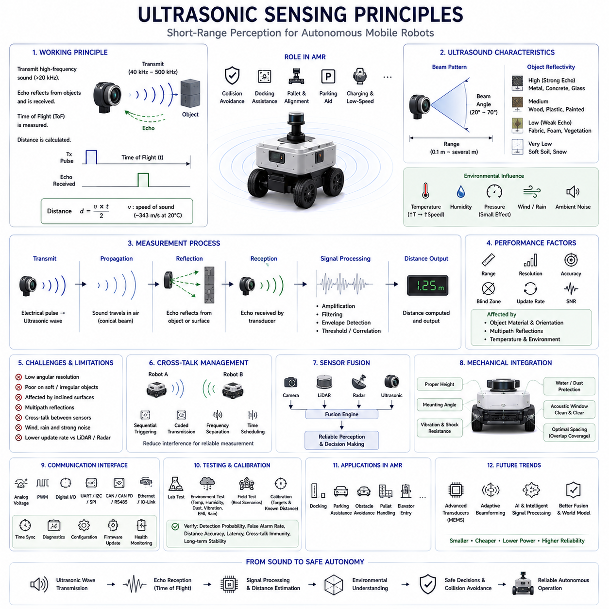
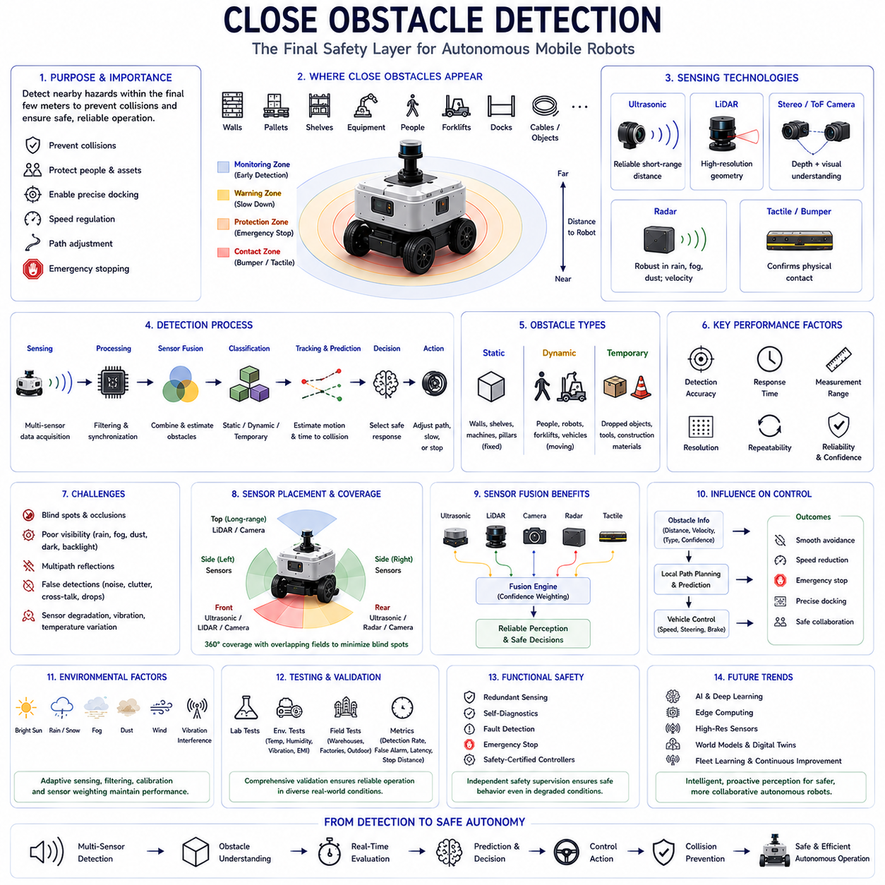
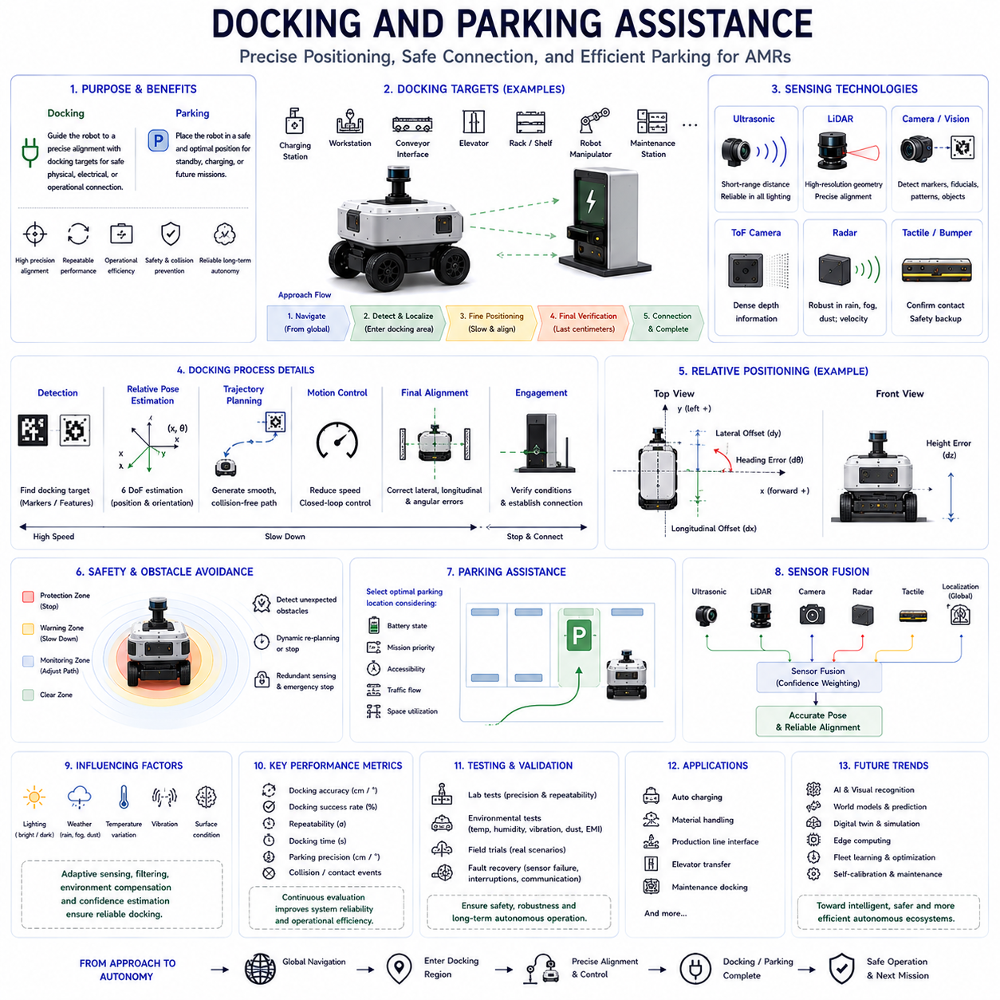
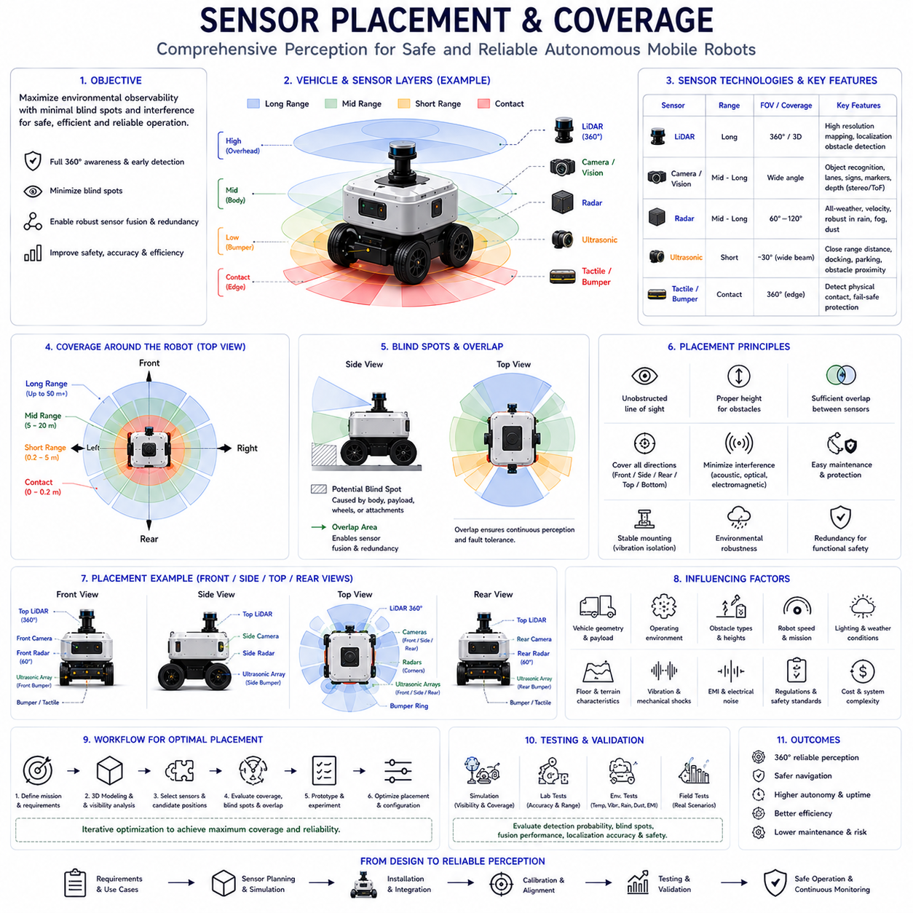
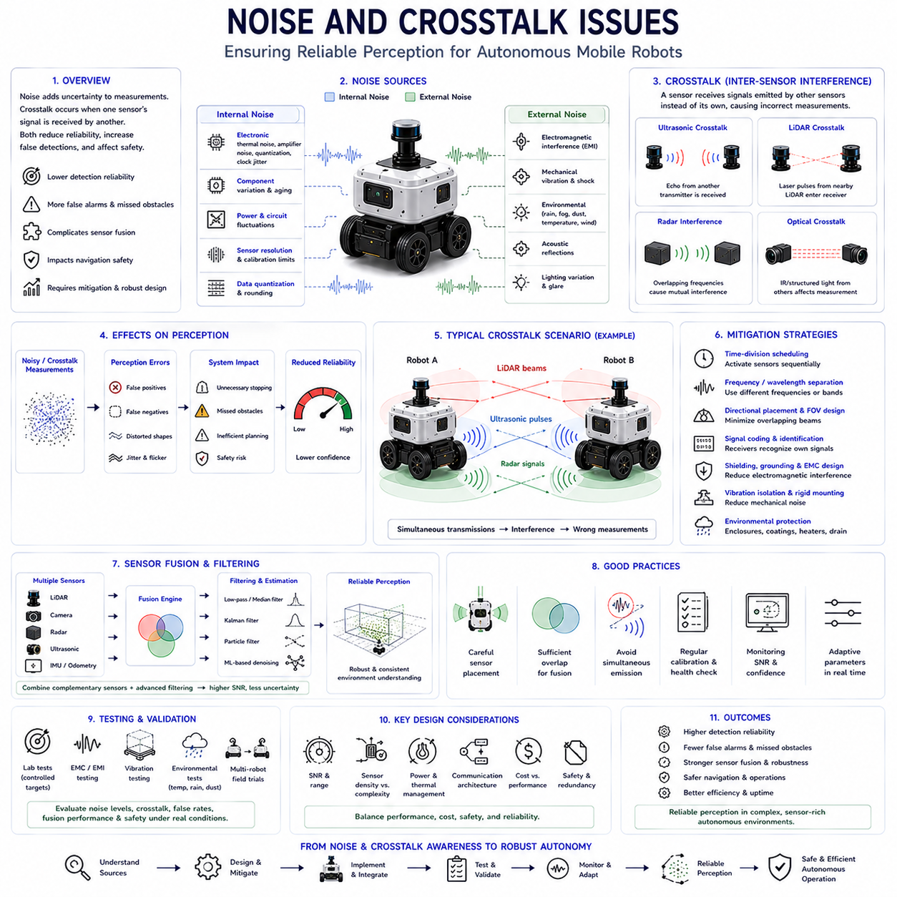
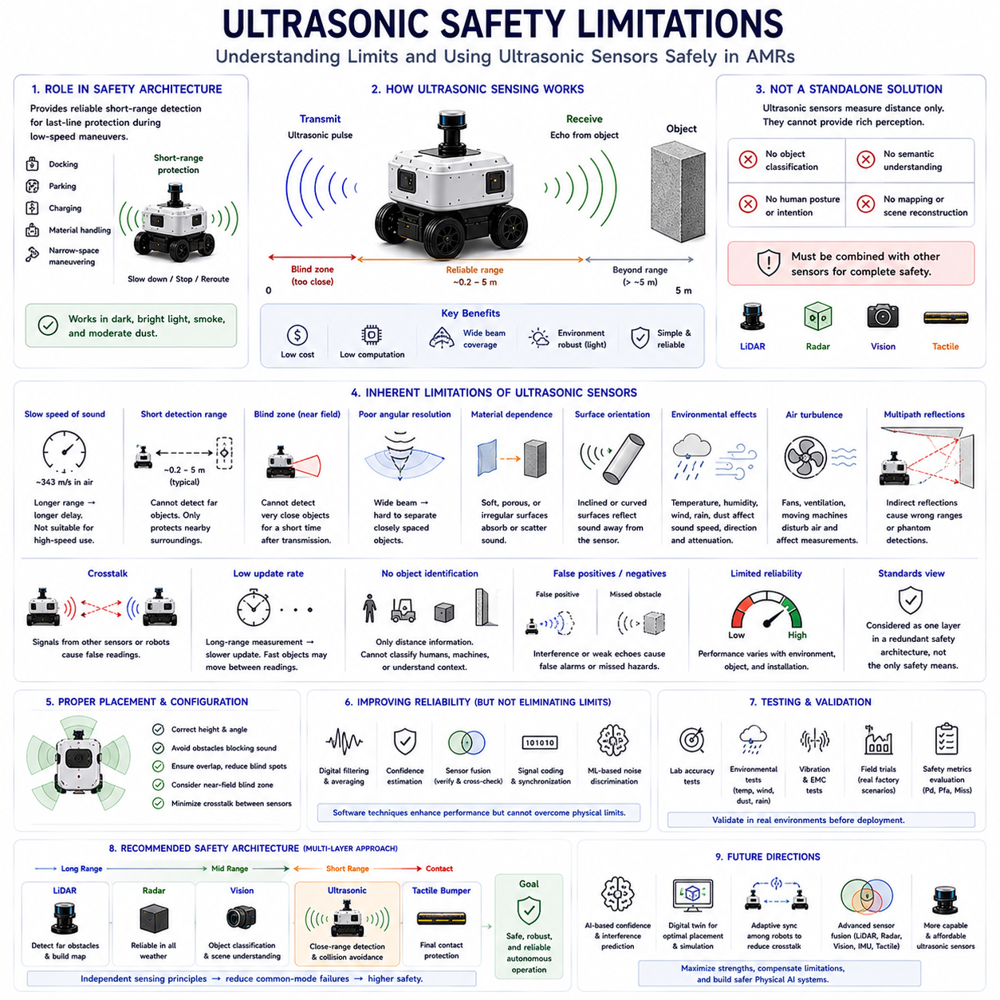
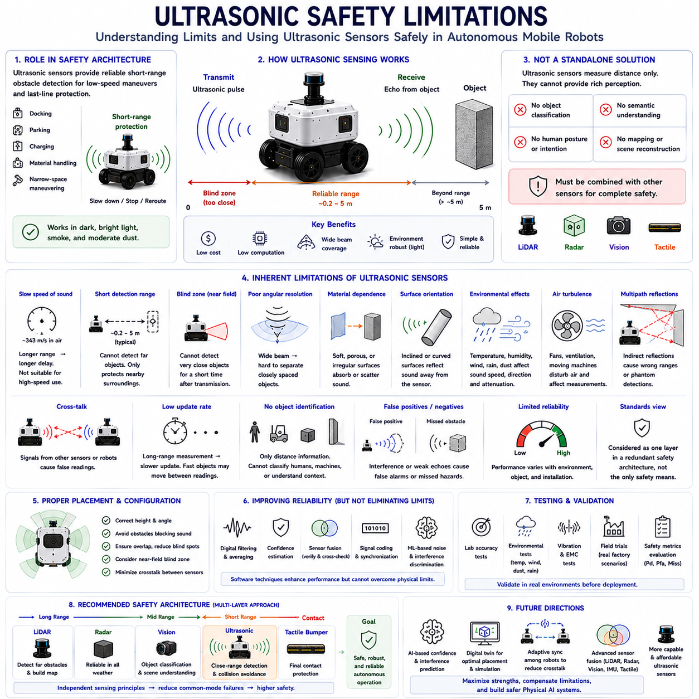
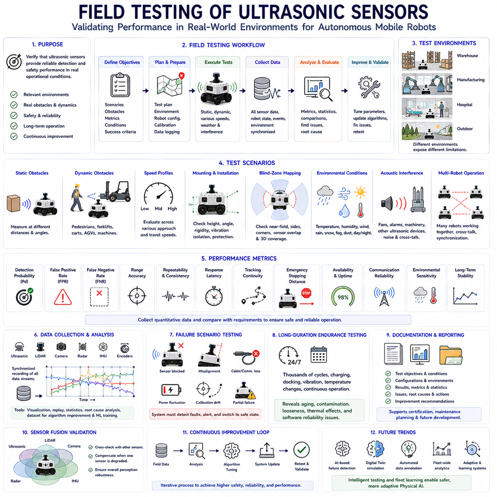

**Volume 03. AMR Sensors and Perception**


# Chapter 08. Ultrasonic Sensors

##  

## 08.1 Ultrasonic Sensing Principles

{width="7.268055555555556in" height="7.268055555555556in"}

Ultrasonic sensing is one of the oldest and most reliable short-range perception technologies used in Autonomous Mobile Robots. Although modern robots increasingly employ LiDAR, radar, stereo cameras, and three-dimensional vision systems, ultrasonic sensors continue to play an essential role because of their simplicity, low cost, low power consumption, and dependable operation at close distances. Outdoor and indoor AMRs frequently rely on ultrasonic sensing as the final protective perception layer for collision avoidance, docking assistance, obstacle confirmation, and low-speed navigation. Unlike optical sensors that depend on reflected light or electromagnetic waves, ultrasonic sensing measures reflected acoustic energy, making it fundamentally different from camera-, LiDAR-, and radar-based perception systems.

Ultrasonic sensing operates by transmitting high-frequency sound waves that are above the range of human hearing. Most robotic ultrasonic sensors operate between approximately 40 kHz and several hundred kilohertz depending on application requirements. A piezoelectric transducer converts electrical pulses into ultrasonic pressure waves that propagate through the surrounding air. When these waves encounter an object, part of the acoustic energy is reflected back toward the sensor. The receiving element detects the returning echo and converts it into an electrical signal for further processing. By measuring the elapsed time between transmission and reception, the sensor estimates the distance to the reflecting object. This relatively simple operating principle enables accurate short-range distance measurement without requiring complex imaging hardware.

The fundamental measurement principle is known as Time of Flight. Since the speed of sound in air is approximately 343 meters per second under standard atmospheric conditions, the sensor calculates distance by multiplying the measured travel time by the speed of sound and dividing the result by two because the sound travels to the object and back. Extremely accurate timing circuits are therefore essential for precise distance estimation. Even microsecond-level timing errors introduce measurable ranging inaccuracies. The Time of Flight method has become the standard ranging technique for ultrasonic sensors because it provides direct geometric distance measurements without requiring environmental maps or visual feature extraction.

The speed of sound is not constant and varies according to environmental conditions. Air temperature produces the largest influence because warmer air increases molecular activity and allows sound waves to travel faster. Humidity also affects propagation speed, although its influence is generally smaller than that of temperature. Atmospheric pressure has relatively limited impact under ordinary operating conditions. Consequently, high-performance ultrasonic sensing systems often compensate for temperature variations by incorporating internal temperature sensors. Without compensation, measurement accuracy gradually decreases as environmental conditions differ from calibration conditions. Outdoor AMRs operating across seasonal weather changes therefore benefit significantly from dynamic sound-speed correction.

Ultrasonic waves propagate in a conical beam rather than a perfectly narrow line. The beam width depends on transducer diameter, operating frequency, acoustic wavelength, and mechanical housing design. Objects located anywhere within this cone may produce reflections detectable by the receiver. Wider beams increase environmental coverage but reduce spatial resolution because multiple objects may simultaneously contribute reflected energy. Narrower beams improve directional accuracy but reduce obstacle coverage. Engineers therefore carefully select beam characteristics according to the intended robotic application. Parking assistance, docking systems, warehouse robots, agricultural platforms, and industrial AMRs each require different tradeoffs between coverage area and measurement precision.

The acoustic properties of surrounding objects strongly influence ultrasonic measurement quality. Hard, smooth surfaces such as metal, concrete, glass, and painted walls generally reflect sound efficiently, producing strong echoes suitable for accurate ranging. Soft materials including fabric, vegetation, foam, snow, or loose soil absorb significant acoustic energy and generate weaker reflections. Irregular surfaces scatter sound in multiple directions rather than returning energy directly toward the receiver. Object orientation also affects measurement because inclined surfaces may reflect sound away from the sensor. These physical characteristics explain why identical objects located at equal distances sometimes produce substantially different echo strengths and detection reliability.

Measurement range represents one of the defining characteristics of ultrasonic sensing. Most robotic ultrasonic sensors operate effectively between approximately ten centimeters and several meters depending on transducer power, operating frequency, beam characteristics, and target reflectivity. Very short distances may fall inside the sensor\'s blind zone because transmitted vibrations require time to decay before the receiver can detect returning echoes. Extremely long distances produce weak echoes that become difficult to distinguish from environmental noise. Consequently, ultrasonic sensors excel within short operational ranges where many optical sensors experience reduced accuracy. This makes them particularly valuable for final-stage obstacle detection, docking alignment, pallet positioning, and low-speed maneuvering.

Resolution and accuracy are related but distinct performance measures. Resolution describes the smallest detectable change in measured distance, whereas accuracy indicates how closely measurements correspond to actual physical distances. High-resolution timing electronics allow ultrasonic sensors to detect millimeter-scale distance changes under favorable laboratory conditions. Practical outdoor operation generally produces lower effective accuracy because environmental noise, temperature variation, object orientation, multipath reflections, and transducer tolerances introduce measurement uncertainty. Calibration procedures compensate for systematic errors, while signal filtering reduces random fluctuations. Reliable engineering therefore emphasizes repeatable measurement performance rather than isolated best-case laboratory specifications.

Signal processing plays a crucial role in ultrasonic sensing because raw echoes often contain significant noise and interference. Amplification increases weak return signals before filtering removes unwanted frequency components generated by electrical systems or environmental acoustic sources. Threshold detection determines whether received energy represents a valid reflection or random noise. Envelope detection estimates echo arrival time, while correlation techniques improve ranging precision under challenging conditions. Digital filtering further stabilizes measurements before distance values become available to higher-level perception software. Modern microcontrollers perform these processing operations in real time, enabling compact ultrasonic modules to provide stable distance estimates despite relatively simple hardware.

Multiple reflections frequently complicate ultrasonic perception. Sound waves may reflect from walls, floors, ceilings, machinery, or nearby objects before eventually reaching the receiver through indirect paths. These multipath reflections produce delayed echoes that do not correspond to direct object distances. Large indoor environments with parallel walls often generate particularly strong secondary reflections. Outdoor environments may also create unexpected acoustic propagation through barriers, vehicles, or infrastructure. Signal processing algorithms attempt to distinguish direct echoes from secondary reflections using arrival time, echo strength, waveform characteristics, and temporal consistency. Correct multipath suppression significantly improves obstacle localization accuracy.

Cross-talk becomes an important consideration whenever multiple ultrasonic sensors operate simultaneously. A robot equipped with several sensors may inadvertently receive echoes transmitted by neighboring sensors rather than its own signals. Multiple robots operating close together can experience similar interference. Cross-talk may produce false distance estimates or unstable measurements if left unmanaged. Engineers reduce interference through sequential sensor triggering, coded transmission patterns, frequency separation, synchronization scheduling, or intelligent communication protocols coordinating sensor activation. Proper cross-talk management is especially important for large autonomous platforms employing numerous ultrasonic sensors distributed around the vehicle perimeter.

Ultrasonic sensing performs particularly well during close-range obstacle detection where camera, LiDAR, or radar systems may possess reduced sensitivity. Transparent materials such as glass sometimes challenge LiDAR, while low-profile obstacles may be difficult for vision systems to recognize under unfavorable illumination. Ultrasonic sensors directly measure nearby physical objects regardless of color, lighting, or visual texture. Their wide beam coverage also helps detect obstacles extending beyond the immediate field of view of narrow-beam sensors. Consequently, ultrasonic sensing frequently serves as the final protective layer responsible for preventing low-speed collisions during docking, parking, charging, elevator entry, pallet handling, or confined-space navigation.

Despite these advantages, ultrasonic sensing also possesses several limitations. Low angular resolution prevents accurate object shape reconstruction because each measurement represents an integrated reflection from the entire acoustic beam. Small objects may remain undetected if they reflect insufficient energy toward the receiver. Soft materials absorb sound, while inclined surfaces redirect echoes away from the sensor. Wind, heavy rain, strong acoustic noise, and temperature gradients may additionally influence propagation characteristics. Measurement update rates are generally lower than those of LiDAR or radar because transmitted sound requires finite travel time before subsequent pulses can be emitted. Understanding these limitations is essential for appropriate sensor selection and system design.

Sensor fusion substantially enhances ultrasonic sensing performance by combining complementary measurement principles. Cameras contribute semantic object recognition, LiDAR provides precise three-dimensional geometry, radar measures long-range distance and velocity, while ultrasonic sensors deliver highly reliable close-range obstacle confirmation. Fusion algorithms integrate confidence estimates from every sensing modality according to operating conditions. During docking procedures, ultrasonic measurements often receive greater weighting because centimeter-level proximity information becomes more valuable than distant environmental mapping. Conversely, long-range navigation primarily depends upon LiDAR, radar, and cameras while ultrasonic sensors remain in standby until nearby obstacles enter their effective measurement range.

Mechanical integration significantly influences ultrasonic sensing reliability. Sensor mounting height determines ground reflection behavior, while mounting angle influences coverage geometry and obstacle visibility. Protective housings must resist water, dust, vibration, temperature cycling, and mechanical impacts without degrading acoustic transmission. Acoustic windows should minimize signal attenuation while preventing contamination from mud, snow, or debris. Engineers also avoid installing sensors near high-noise mechanical components generating continuous ultrasonic vibrations. Proper spacing between adjacent sensors reduces cross-talk while ensuring overlapping coverage around the vehicle. Mechanical integration therefore directly contributes to robust perception performance throughout long-term outdoor operation.

Communication interfaces connect ultrasonic sensors with the remainder of the robotic perception system. Simple sensors may provide analog voltage outputs, pulse-width signals, serial communication, or digital switching outputs. More advanced industrial sensors support CAN, CAN FD, Ethernet, RS-485, IO-Link, or other standardized industrial communication protocols. Time synchronization, diagnostic reporting, configuration management, firmware updates, and health monitoring become increasingly important as robotic systems grow more complex. Standardized communication simplifies sensor replacement, maintenance, fleet management, and software portability while supporting centralized perception architectures integrating information from multiple sensing technologies.

Testing and calibration ensure that ultrasonic sensing performs reliably across practical operating conditions. Laboratory experiments verify measurement accuracy using calibrated targets positioned at known distances. Environmental testing evaluates performance across varying temperatures, humidity levels, dust exposure, rainfall, vibration, and electromagnetic interference. Field validation examines obstacle detection during realistic navigation scenarios involving pedestrians, vehicles, loading docks, charging stations, warehouse shelving, and outdoor infrastructure. Engineers analyze detection probability, false alarm rate, distance accuracy, response latency, cross-talk immunity, and long-term measurement stability. Continuous validation identifies gradual sensor degradation before operational safety becomes compromised.

Future ultrasonic sensing technology will continue evolving alongside broader advances in autonomous robotics. Improved piezoelectric materials, digital signal processing, MEMS ultrasonic transducers, adaptive beamforming, artificial intelligence, and multi-sensor fusion will increase measurement accuracy while reducing size, cost, and power consumption. Intelligent ultrasonic systems may automatically classify echo patterns, estimate measurement confidence, compensate for environmental influences, and cooperate directly with cameras, LiDAR, radar, and world-model algorithms. Rather than functioning as isolated proximity sensors, future ultrasonic devices will become integrated perception nodes contributing valuable short-range environmental information to comprehensive Physical AI systems supporting safe, intelligent, and reliable autonomous mobile robots across increasingly diverse operational environments.

초음파 센싱(Ultrasonic Sensing)은 자율이동로봇(Autonomous Mobile Robot, AMR)에서 사용되는 가장 오래되고 신뢰성이 높은 근거리 인식(Short-Range Perception) 기술 가운데 하나이다. 최근의 로봇은 라이다(LiDAR), 레이더(Radar), 스테레오 카메라(Stereo Camera), 3차원 비전 시스템(Three-Dimensional Vision System)을 적극적으로 활용하고 있지만, 초음파 센서는 구조가 단순하고 가격이 저렴하며 전력 소비가 낮고 근거리에서 안정적으로 동작하기 때문에 여전히 매우 중요한 역할을 수행한다. 실내 및 실외 AMR은 충돌 회피(Collision Avoidance), 도킹 지원(Docking Assistance), 장애물 확인(Obstacle Confirmation), 저속 주행(Low-Speed Navigation)에서 마지막 안전 계층(Final Protective Layer)으로 초음파 센싱을 활용하는 경우가 많다. 광학 센서가 빛이나 전자기파의 반사를 이용하는 것과 달리 초음파 센싱은 음향 에너지(Acoustic Energy)의 반사를 측정하므로 카메라, 라이다, 레이더 기반 인식과는 근본적으로 다른 원리를 사용한다.

초음파 센싱은 사람이 들을 수 없는 고주파 음파(High-Frequency Sound Wave)를 송신하는 방식으로 동작한다. 대부분의 로봇용 초음파 센서는 약 40kHz에서 수백kHz 범위의 주파수를 사용하며, 적용 분야에 따라 주파수가 달라진다. 압전 변환기(Piezoelectric Transducer)는 전기 펄스를 초음파 압력파(Ultrasonic Pressure Wave)로 변환하여 공기 중으로 방출한다. 이 음파가 장애물에 도달하면 일부 에너지가 반사되어 센서로 되돌아온다. 수신기는 반사된 에코(Echo)를 전기 신호로 변환한 후 후속 신호처리를 수행한다. 송신과 수신 사이의 시간을 측정하여 반사체까지의 거리를 계산할 수 있으며, 이러한 단순한 원리만으로도 복잡한 영상 장비 없이 정확한 근거리 거리 측정이 가능하다.

초음파 거리 측정의 기본 원리는 비행 시간(Time of Flight, ToF) 측정이다. 표준 대기 조건에서 공기 중 음속(Speed of Sound)은 약 초속 343m이므로, 센서는 음파의 왕복 시간을 측정한 후 음속을 곱하고 왕복 거리를 고려하여 2로 나누어 실제 거리를 계산한다. 따라서 매우 정밀한 시간 측정 회로(Timing Circuit)가 필수적이며, 마이크로초(Microsecond) 수준의 작은 시간 오차도 거리 오차로 이어질 수 있다. Time of Flight 방식은 환경 지도(Environmental Map)나 영상 특징 추출 없이 직접적인 기하학적 거리 정보를 제공하기 때문에 초음파 센서에서 가장 널리 사용되는 거리 측정 방법으로 자리 잡고 있다.

공기 중 음속은 일정하지 않으며 환경 조건에 따라 지속적으로 변한다. 가장 큰 영향을 주는 요소는 공기 온도(Air Temperature)이며, 온도가 높아질수록 분자의 운동이 활발해져 음속도 증가한다. 습도(Humidity) 역시 음속에 영향을 미치지만 일반적으로 온도보다는 영향이 작다. 대기압(Atmospheric Pressure)은 일반적인 운용 환경에서는 상대적으로 작은 영향을 준다. 따라서 고성능 초음파 센서는 내부 온도 센서를 이용하여 음속을 실시간으로 보정하는 기능을 제공하는 경우가 많다. 이러한 보정이 없으면 환경 조건이 보정 시점과 달라질수록 거리 측정 정확도가 점차 감소한다. 계절 변화가 큰 실외 환경에서 운용되는 AMR에서는 이러한 음속 보정 기능이 특히 중요하다.

초음파는 매우 좁은 직선으로 전파되는 것이 아니라 원뿔 형태의 빔(Cone-Shaped Beam)으로 퍼져나간다. 빔의 폭은 변환기의 크기, 동작 주파수, 음파의 파장(Wavelength), 기계적 구조에 의해 결정된다. 원뿔 내부에 존재하는 모든 물체는 반사 신호를 생성할 수 있다. 빔 폭이 넓으면 더 넓은 영역을 감시할 수 있지만 여러 객체가 동시에 반사 신호를 생성하여 공간 해상도(Spatial Resolution)가 낮아질 수 있다. 반대로 빔 폭이 좁으면 방향 분해능은 향상되지만 감시 범위는 줄어든다. 따라서 주차 보조(Parking Assistance), 도킹 시스템(Docking System), 창고 로봇(Warehouse Robot), 농업 로봇(Agricultural Robot), 산업용 AMR 등은 각각의 운용 목적에 맞추어 적절한 빔 특성을 선택해야 한다.

주변 물체의 음향 특성(Acoustic Property)은 초음파 측정 품질에 큰 영향을 미친다. 금속(Metal), 콘크리트(Concrete), 유리(Glass), 도장된 벽(Painted Wall)과 같은 단단하고 매끄러운 표면은 초음파를 효율적으로 반사하여 강한 에코를 생성한다. 반면 천(Fabric), 식생(Vegetation), 폼(Foam), 눈(Snow), 흙(Soil)과 같은 부드러운 재질은 초음파 에너지를 흡수하여 약한 반사를 생성한다. 표면이 거칠거나 불규칙한 경우에는 음파가 여러 방향으로 산란되어 센서 방향으로 되돌아오는 에너지가 감소한다. 또한 물체의 기울기(Orientation)에 따라서도 반사 방향이 달라진다. 따라서 동일한 거리의 객체라도 재질과 자세에 따라 반사 강도와 검출 신뢰성이 크게 달라질 수 있다.

측정 거리(Measurement Range)는 초음파 센서의 가장 중요한 특성 중 하나이다. 대부분의 로봇용 초음파 센서는 약 10cm에서 수m 정도까지 효과적으로 동작하며, 실제 범위는 변환기 출력, 주파수, 빔 특성, 대상 물체의 반사율에 따라 달라진다. 매우 가까운 거리는 송신 후 변환기의 진동이 완전히 사라지기 전에 반사 신호가 도착하므로 사각 구간(Blind Zone)이 발생할 수 있다. 반대로 너무 먼 거리는 반사 신호가 매우 약해져 환경 잡음과 구분하기 어려워진다. 이러한 이유로 초음파 센서는 단거리에서 뛰어난 성능을 발휘하며, 도킹, 팔레트 위치 확인(Pallet Positioning), 저속 장애물 회피와 같은 근거리 작업에 특히 적합하다.

분해능(Resolution)과 정확도(Accuracy)는 서로 다른 개념이다. 분해능은 측정 가능한 최소 거리 변화를 의미하며, 정확도는 실제 거리와 측정값이 얼마나 일치하는지를 의미한다. 정밀한 시간 측정 회로를 사용하면 실험실 환경에서는 밀리미터(Millimeter) 수준의 거리 변화도 감지할 수 있다. 그러나 실제 실외 환경에서는 환경 잡음, 온도 변화, 물체의 방향, 다중 반사(Multipath Reflection), 변환기 오차 등이 존재하므로 실질적인 정확도는 낮아질 수 있다. 보정(Calibration)은 체계적인 오차를 줄이고, 신호 필터링(Signal Filtering)은 무작위 오차를 감소시킨다. 따라서 실제 엔지니어링에서는 최고 성능보다 반복 가능하고 안정적인 측정 성능을 더욱 중요하게 고려한다.

신호처리(Signal Processing)는 초음파 센싱에서 매우 중요한 역할을 한다. 원시 에코(Raw Echo)에는 다양한 잡음과 간섭이 포함되어 있기 때문이다. 증폭기(Amplifier)는 약한 반사 신호를 증폭하고, 필터(Filter)는 전기적 잡음과 환경 소음을 제거한다. 임계값 검출(Threshold Detection)은 수신 신호가 실제 반사인지 단순 잡음인지를 판단하며, 엔벨로프 검출(Envelope Detection)은 에코 도착 시점을 계산한다. 상관 분석(Correlation Technique)은 어려운 환경에서도 거리 측정 정확도를 향상시킨다. 이후 디지털 필터(Digital Filter)가 측정값을 안정화하면 최종 거리 정보가 상위 인식 소프트웨어로 전달된다. 최신 마이크로컨트롤러(Microcontroller)는 이러한 신호처리를 실시간으로 수행하여 소형 센서에서도 안정적인 거리 측정을 가능하게 한다.

다중 반사(Multipath Reflection)는 초음파 인식에서 자주 발생하는 문제이다. 음파는 벽, 바닥, 천장, 기계 장비, 주변 구조물에서 여러 번 반사된 후 센서에 도달할 수 있다. 이러한 간접 경로의 반사는 실제 장애물 거리와 다른 지연된 에코를 생성한다. 특히 벽이 평행하게 배치된 실내 환경에서는 이러한 2차 반사가 자주 발생하며, 실외에서도 차량이나 구조물에 의해 복잡한 반사 경로가 만들어질 수 있다. 신호처리 알고리즘은 도착 시간, 반사 강도, 파형 특성, 시간적 일관성을 분석하여 직접 반사와 간접 반사를 구분한다. 이러한 다중 반사 억제(Multipath Suppression)는 장애물 위치 추정의 정확도를 크게 향상시킨다.

여러 개의 초음파 센서를 동시에 사용하는 경우에는 크로스톡(Cross-Talk)이 중요한 문제가 된다. 하나의 센서가 송신한 음파를 다른 센서가 자신의 에코로 잘못 인식할 수 있기 때문이다. 또한 여러 대의 로봇이 가까운 거리에서 동시에 운용되는 경우에도 유사한 간섭이 발생할 수 있다. 이러한 크로스톡은 잘못된 거리 측정과 불안정한 결과를 초래한다. 이를 방지하기 위해 센서를 순차적으로 동작시키거나, 부호화된 송신(Coded Transmission), 주파수 분리(Frequency Separation), 시간 동기화(Synchronization Scheduling), 지능형 통신 프로토콜을 사용한다. 특히 차량 주변에 다수의 초음파 센서를 장착하는 AMR에서는 크로스톡 관리가 필수적이다.

초음파 센서는 카메라, 라이다, 레이더가 어려움을 겪는 매우 가까운 거리에서 뛰어난 장애물 검출 성능을 제공한다. 유리와 같은 투명한 재질은 라이다에서 어려움을 줄 수 있으며, 낮은 높이의 장애물은 조명 조건에 따라 카메라가 인식하기 어려울 수 있다. 그러나 초음파 센서는 색상, 조명, 표면 질감과 관계없이 가까운 물체를 직접 감지할 수 있다. 또한 넓은 빔 특성 덕분에 좁은 시야를 가지는 센서가 놓칠 수 있는 근거리 장애물도 검출할 수 있다. 따라서 초음파 센서는 도킹(Docking), 주차(Parking), 자동 충전(Auto Charging), 엘리베이터 진입(Elevator Entry), 팔레트 취급(Pallet Handling), 협소 공간 주행에서 마지막 안전 센서로 널리 사용된다.

이러한 장점에도 불구하고 초음파 센서는 여러 한계를 가지고 있다. 낮은 각도 해상도(Angular Resolution) 때문에 객체의 정확한 형태를 재구성하기 어렵고, 하나의 측정은 빔 전체에서 반사된 신호를 통합한 결과만 제공한다. 작은 물체는 충분한 반사를 생성하지 못하면 검출되지 않을 수 있으며, 부드러운 재질은 음파를 흡수하고 기울어진 표면은 음파를 다른 방향으로 반사한다. 바람(Wind), 강우(Rain), 강한 소음, 온도 구배(Temperature Gradient)도 측정 성능에 영향을 줄 수 있다. 또한 음파가 왕복하는 시간이 필요하기 때문에 측정 갱신 속도(Update Rate)는 일반적으로 라이다나 레이더보다 낮다. 따라서 이러한 특성을 충분히 이해한 후 적절한 용도로 사용하는 것이 중요하다.

센서 융합(Sensor Fusion)은 초음파 센서의 성능을 크게 향상시킨다. 카메라는 의미 정보(Semantic Information)를 제공하고, 라이다는 정밀한 3차원 구조를 생성하며, 레이더는 장거리 거리와 속도를 측정한다. 초음파 센서는 근거리 장애물 확인에 매우 높은 신뢰성을 제공한다. 센서 융합 알고리즘은 운용 환경에 따라 각 센서의 신뢰도를 동적으로 조절한다. 예를 들어 도킹 과정에서는 센티미터(Centimeter) 수준의 근거리 정보가 매우 중요하므로 초음파 센서의 비중이 높아진다. 반대로 장거리 자율주행에서는 라이다, 레이더, 카메라가 중심이 되고, 초음파 센서는 장애물이 가까워질 때까지 대기 상태를 유지한다.

기계적 통합(Mechanical Integration)은 초음파 센서의 성능에 직접적인 영향을 준다. 장착 높이(Mounting Height)는 지면 반사에 영향을 미치며, 장착 각도(Mounting Angle)는 감시 영역과 장애물 검출 범위를 결정한다. 보호 하우징(Protective Housing)은 물, 먼지, 진동, 온도 변화, 충격을 견디면서도 음파 전달을 방해하지 않아야 한다. 음향 윈도우(Acoustic Window)는 진흙, 눈, 먼지의 오염을 막으면서 신호 감쇠를 최소화해야 한다. 또한 지속적으로 초음파 진동을 발생시키는 기계 장치 근처에는 센서를 설치하지 않는 것이 바람직하다. 적절한 센서 간격은 크로스톡을 줄이면서 차량 주변의 중복 감시 영역을 확보하는 데 중요한 역할을 한다.

통신 인터페이스(Communication Interface)는 초음파 센서를 로봇 인식 시스템과 연결한다. 단순한 센서는 아날로그 전압(Analog Voltage), 펄스 폭(Pulse Width), 직렬 통신(Serial Communication), 디지털 출력(Digital Output)을 사용할 수 있다. 고급 산업용 센서는 CAN, CAN FD, 이더넷(Ethernet), RS-485, IO-Link와 같은 표준 산업용 통신 프로토콜을 지원한다. 또한 시간 동기화(Time Synchronization), 진단(Diagnostics), 설정 관리(Configuration Management), 펌웨어 업데이트(Firmware Update), 상태 모니터링(Health Monitoring) 기능도 중요해지고 있다. 표준화된 통신은 센서 교체와 유지보수를 단순화하고, 플릿 관리(Fleet Management)와 다중 센서 통합 인식 구조를 효과적으로 지원한다.

시험(Testing)과 보정(Calibration)은 다양한 환경에서 초음파 센서가 안정적으로 동작하도록 보장하는 핵심 과정이다. 실험실에서는 기준 목표물을 이용하여 거리 정확도를 검증하고, 환경 시험에서는 온도, 습도, 먼지, 강우, 진동, 전자파 간섭 환경에서의 성능을 평가한다. 현장 시험(Field Validation)은 보행자, 차량, 적재 플랫폼(Loading Dock), 충전 스테이션(Charging Station), 창고 선반(Warehouse Shelving), 실외 시설물과 같은 실제 환경에서 장애물 검출 성능을 확인한다. 검출 확률, 오경보율(False Alarm Rate), 거리 정확도, 응답 지연(Response Latency), 크로스톡 내성(Cross-Talk Immunity), 장기 안정성을 지속적으로 분석하여 센서 성능 저하를 조기에 발견하고 안전성을 확보한다.

미래의 초음파 센싱 기술은 자율주행 로봇 기술과 함께 지속적으로 발전할 것이다. 향상된 압전 재료(Piezoelectric Material), 디지털 신호처리(Digital Signal Processing), MEMS(Micro-Electro-Mechanical Systems) 기반 초음파 변환기, 적응형 빔포밍(Adaptive Beamforming), 인공지능(AI), 다중 센서 융합 기술은 측정 정확도를 향상시키면서 크기, 가격, 소비전력을 지속적으로 줄여 나갈 것이다. 지능형 초음파 시스템은 에코 패턴을 자동으로 분류하고, 측정 신뢰도를 추정하며, 환경 변화에 적응하고, 카메라, 라이다, 레이더, 월드 모델(World Model)과 직접 협력하게 될 것이다. 미래의 초음파 센서는 단순한 근접 센서를 넘어, 피지컬 AI(Physical AI) 기반 자율주행 시스템에서 매우 중요한 근거리 환경 인식 노드(Perception Node)로 발전하여 더욱 안전하고 지능적인 자율이동로봇 구현에 기여하게 될 것이다.

##  

## 08.2 Short Range Distance Measurement

{width="7.268055555555556in" height="7.268055555555556in"}

Short-range distance measurement is one of the most fundamental perception capabilities in Autonomous Mobile Robots because numerous navigation and manipulation tasks occur within only a few meters of the robot. While long-range perception technologies such as LiDAR, radar, and vision systems provide environmental awareness for global navigation, short-range sensors are responsible for the final stage of safe interaction with nearby objects. Docking stations, charging systems, warehouse shelves, pallets, elevators, production equipment, walls, pedestrians, and other robots frequently exist within close proximity, requiring precise and reliable distance estimation. Consequently, short-range measurement directly influences navigation safety, operational efficiency, and autonomous decision-making across virtually every AMR application.

The primary objective of short-range distance measurement is to determine the exact separation between the robot and surrounding objects with sufficient accuracy to support safe movement. Unlike global localization, which estimates the robot\'s position within a large environment, short-range sensing focuses on immediate spatial relationships around the vehicle. The perception system continuously monitors nearby obstacles and updates distance information as the robot moves through dynamic environments. This information supports collision avoidance, precision docking, obstacle detection, path correction, speed regulation, manipulation assistance, and emergency stopping. Reliable short-range perception therefore forms the final protective layer before physical contact can occur.

Several sensing technologies can perform short-range distance measurement, each offering unique strengths and limitations. Ultrasonic sensors estimate distance using acoustic Time of Flight, infrared sensors measure reflected infrared light intensity or travel time, LiDAR calculates optical Time of Flight with laser pulses, stereo cameras estimate depth through geometric triangulation, structured-light sensors project known illumination patterns, and Time-of-Flight cameras directly calculate pixel-level distance using modulated light. Contact switches and tactile bumpers provide physical confirmation when objects are actually touched. Engineers often combine multiple sensing technologies because no single sensor performs optimally under every environmental condition.

Ultrasonic sensing remains one of the most widely used short-range measurement methods because it combines low cost, simple hardware, low power consumption, and reliable operation within several meters. The sensor transmits ultrasonic waves that propagate through air before reflecting from nearby objects. The elapsed travel time between transmission and echo reception determines object distance. Since acoustic propagation is relatively slow compared with electromagnetic waves, precise timing measurements become straightforward using inexpensive electronic circuits. Ultrasonic sensors therefore provide accurate proximity information without requiring complex optics, image processing, or computationally intensive algorithms, making them particularly suitable for industrial AMRs and service robots.

Optical ranging technologies provide complementary capabilities for short-range measurement. Laser-based LiDAR offers high accuracy, narrow beam divergence, and dense geometric information suitable for mapping and localization. Infrared sensors provide inexpensive obstacle detection over relatively short distances, although performance depends on surface reflectivity and ambient illumination. Time-of-Flight cameras produce dense depth images by measuring optical propagation delay across every image pixel simultaneously. Stereo vision estimates depth using image correspondence between multiple cameras. These optical technologies generally provide higher spatial resolution than ultrasonic sensing but may experience performance degradation under dust, fog, rain, bright sunlight, or transparent surfaces.

Measurement range represents one of the most important design parameters for short-range sensing systems. Every sensor possesses a minimum detectable distance, an effective operating region, and a maximum reliable measurement range. Extremely close objects may lie inside the sensor\'s blind zone where transmitted energy interferes with received signals. Beyond the maximum operating distance, reflected energy becomes too weak for reliable detection. Engineers therefore carefully select sensing technologies whose measurement characteristics match application requirements. Warehouse docking systems may require centimeter-level measurements below one meter, whereas outdoor delivery robots often monitor obstacles several meters ahead while operating at higher speeds.

Accuracy determines how closely measured distances correspond to actual physical separation between sensor and object. High measurement accuracy enables precise docking, narrow corridor navigation, pallet positioning, robotic manipulation, and automated charging. Multiple factors influence ranging accuracy, including sensor calibration, environmental conditions, object reflectivity, measurement noise, electronic timing precision, mounting geometry, and signal processing quality. Systematic errors can often be corrected through calibration procedures, while random measurement fluctuations require statistical filtering. Practical engineering focuses not only on achieving high accuracy under laboratory conditions but also maintaining consistent performance throughout long-term real-world operation.

Measurement resolution describes the smallest detectable change in distance that a sensing system can reliably identify. High-resolution sensors detect very small object movements, allowing precise positioning during docking, manipulation, or automated assembly operations. Resolution depends upon signal bandwidth, timing precision, analog-to-digital conversion, and processing algorithms. Although extremely high laboratory resolution is technically achievable, practical field performance also depends on vibration, temperature variation, electrical noise, and target characteristics. Consequently, effective operational resolution may differ substantially from theoretical hardware specifications, emphasizing the importance of realistic validation under representative operating conditions.

Response time significantly affects the safety of autonomous mobile robots because rapidly moving platforms require continuously updated environmental information. Every measurement involves sensor acquisition, signal propagation, processing, communication, filtering, and integration into higher-level decision algorithms. Delayed measurements reduce available reaction time and increase stopping distance, particularly during higher-speed operation. Consequently, engineers balance measurement accuracy against update frequency to achieve safe dynamic performance. Applications requiring rapid obstacle avoidance generally prioritize fast sensor refresh rates, whereas precision docking may tolerate slower update frequencies in exchange for improved ranging accuracy.

Measurement repeatability is equally important because autonomous decision-making depends upon stable sensor outputs. Even when average accuracy remains acceptable, excessive measurement variation causes navigation oscillations, unstable control behavior, and reduced confidence within sensor fusion algorithms. Repeatability reflects the sensor\'s ability to produce consistent measurements under identical operating conditions. Engineers evaluate repeatability through repeated measurements of stationary reference targets while analyzing statistical distributions of observed errors. Low measurement variance supports robust filtering, smoother vehicle motion, and more reliable obstacle tracking throughout extended autonomous operation.

Environmental conditions strongly influence short-range distance measurement regardless of sensing technology. Temperature variations modify ultrasonic propagation speed, while rain, fog, snow, dust, and airborne particles influence optical transmission. Bright sunlight affects vision systems, whereas electromagnetic interference may influence electronic circuitry. Wind changes acoustic propagation paths, while vibration alters sensor orientation during measurement. Outdoor robots therefore experience considerably greater environmental variability than indoor platforms. Reliable perception systems compensate for these influences using calibration models, adaptive filtering, environmental monitoring, and sensor fusion to maintain stable ranging performance across diverse operating conditions.

Object characteristics also contribute significantly to measurement reliability. Surface material determines reflection efficiency, while surface geometry influences reflection direction. Highly reflective metal surfaces may generate strong echoes or laser returns, whereas soft fabrics, vegetation, foam, or absorbent materials produce weaker reflections. Transparent glass challenges certain optical sensors, while highly inclined surfaces redirect energy away from receivers. Small obstacles may occupy only part of the sensing beam and therefore generate weaker measurements. Robust perception algorithms consider these physical properties when estimating measurement confidence and selecting appropriate sensor weighting during data fusion.

Sensor placement fundamentally affects measurement quality. Mounting height determines visibility of low obstacles and floor reflections, while installation angle influences effective coverage geometry. Sensors positioned too high may overlook low-profile hazards, whereas sensors mounted too close to the ground may experience excessive ground reflections. Multiple sensors distributed around the vehicle provide comprehensive coverage but require careful overlap planning to eliminate blind regions without introducing excessive redundancy. Mechanical integration must additionally consider vibration isolation, environmental protection, cable routing, thermal management, maintenance accessibility, and electromagnetic compatibility to ensure long-term measurement reliability.

Blind zones represent unavoidable limitations within most short-range sensing technologies. Objects located too close to the sensor cannot always be measured because transmitted signals overlap with receiver recovery periods or optical minimum-focus limitations. Blind regions vary according to sensor type, operating frequency, hardware design, and signal processing architecture. Engineers reduce operational risk by combining complementary sensors whose measurement ranges overlap sufficiently to eliminate coverage gaps. This layered sensing strategy ensures continuous obstacle awareness throughout the robot\'s entire operating envelope, particularly during slow-speed maneuvering near obstacles.

Sensor fusion substantially improves short-range distance measurement by combining independent sensing principles. Ultrasonic sensors verify nearby object presence, LiDAR supplies high-resolution geometry, cameras contribute semantic interpretation, radar estimates velocity, and tactile sensors confirm physical contact when necessary. Fusion algorithms evaluate measurement confidence from each sensor while considering environmental conditions and historical consistency. If one sensing modality becomes unreliable due to adverse weather or unfavorable object characteristics, alternative sensors continue providing dependable information. This redundancy significantly enhances overall perception robustness, operational safety, and fault tolerance.

Signal filtering reduces measurement noise while preserving genuine environmental information. Moving average filters smooth random fluctuations, median filters reject isolated outliers, Kalman filters estimate object motion through probabilistic prediction, and particle filters manage nonlinear measurement uncertainty. Adaptive filters dynamically modify parameters according to environmental conditions or sensor confidence. Appropriate filtering prevents unnecessary control oscillations while maintaining sufficient responsiveness to rapidly changing situations. Engineers carefully tune filter parameters because excessive smoothing introduces undesirable latency whereas insufficient filtering leaves unstable measurements uncorrected.

Calibration ensures that measured distances correspond accurately to physical reality throughout operational life. Factory calibration establishes baseline sensor characteristics, while field calibration compensates for installation geometry, mechanical tolerances, and environmental influences. Reference targets positioned at known distances enable systematic error correction across the sensor\'s operating range. Automated calibration procedures increasingly allow robots to verify sensing performance without extensive human intervention. Periodic recalibration maintains measurement quality despite component aging, mechanical wear, temperature cycling, vibration exposure, or hardware replacement during maintenance activities.

Performance evaluation requires comprehensive testing across laboratory, simulated, and real-world environments. Laboratory validation provides controlled reference measurements using calibrated targets and repeatable experimental conditions. Environmental chambers evaluate operation under temperature, humidity, vibration, dust, rain, and electromagnetic interference. Simulation supports rapid algorithm development across numerous virtual scenarios before field deployment. Finally, operational testing within warehouses, factories, hospitals, logistics centers, agricultural environments, construction sites, and urban areas confirms practical performance under realistic dynamic conditions involving moving people, vehicles, machinery, and complex infrastructure.

Future short-range distance measurement technologies will increasingly integrate advanced sensing hardware with intelligent perception software. MEMS-based sensors, solid-state LiDAR, high-resolution Time-of-Flight cameras, adaptive ultrasonic arrays, artificial intelligence, and edge computing will collectively improve measurement precision, reliability, energy efficiency, and environmental robustness. Future perception systems will automatically estimate measurement confidence, identify sensor degradation, compensate for environmental disturbances, and continuously optimize sensing parameters during operation. Rather than functioning as isolated measurement devices, next-generation short-range sensors will become intelligent perception nodes contributing contextual environmental understanding to comprehensive Physical AI architectures supporting safer, more efficient, and more autonomous mobile robotic systems.

근거리 거리 측정(Short-Range Distance Measurement)은 자율이동로봇(Autonomous Mobile Robot, AMR)의 가장 기본적인 인식(Perception) 기능 가운데 하나이다. 로봇의 다양한 주행과 작업은 대부분 수 미터 이내의 가까운 공간에서 이루어지기 때문이다. 라이다(LiDAR), 레이더(Radar), 비전 시스템(Vision System)과 같은 장거리 인식 기술은 전역 환경(Global Environment)에 대한 정보를 제공하지만, 근거리 센서는 로봇과 주변 물체 사이의 마지막 안전 거리(Final Safety Distance)를 관리하는 역할을 담당한다. 도킹 스테이션(Docking Station), 충전 시스템(Charging System), 창고 선반(Warehouse Shelf), 팔레트(Pallet), 엘리베이터(Elevator), 생산 설비(Production Equipment), 벽(Wall), 보행자(Pedestrian), 다른 로봇 등은 대부분 매우 가까운 거리에서 존재하므로 정밀하고 신뢰성 있는 거리 측정이 요구된다. 따라서 근거리 거리 측정은 자율주행의 안전성, 작업 효율, 자율 의사결정에 직접적인 영향을 미친다.

근거리 거리 측정의 가장 중요한 목적은 로봇과 주변 물체 사이의 실제 거리를 정확하게 계산하여 안전한 이동을 지원하는 것이다. 넓은 환경에서 로봇의 위치를 추정하는 전역 위치추정(Global Localization)과 달리, 근거리 센싱은 차량 주변의 즉각적인 공간 관계를 지속적으로 파악하는 데 집중한다. 인식 시스템은 로봇이 이동하는 동안 주변 장애물과의 거리를 실시간으로 갱신하며, 이러한 정보는 충돌 회피(Collision Avoidance), 정밀 도킹(Precision Docking), 장애물 검출(Obstacle Detection), 경로 수정(Path Correction), 속도 제어(Speed Regulation), 조작 보조(Manipulation Assistance), 비상 정지(Emergency Stop)에 활용된다. 결국 근거리 거리 측정은 실제 충돌이 발생하기 전에 마지막으로 안전을 보장하는 핵심 계층이 된다.

근거리 거리 측정을 수행하는 센싱 기술은 매우 다양하며 각각 고유한 장점과 한계를 가진다. 초음파 센서(Ultrasonic Sensor)는 음향 비행 시간(Time of Flight)을 이용하여 거리를 계산하고, 적외선 센서(Infrared Sensor)는 적외선 반사 강도 또는 전파 시간을 이용한다. 라이다는 레이저 비행 시간(Laser Time of Flight)을 사용하며, 스테레오 카메라(Stereo Camera)는 기하학적 삼각측량(Triangulation)을 통해 깊이를 계산한다. 구조광 센서(Structured-Light Sensor)는 알려진 패턴을 투사하여 거리를 계산하고, ToF 카메라(Time-of-Flight Camera)는 모든 화소에서 직접 거리를 측정한다. 또한 접촉 스위치(Contact Switch)와 범퍼(Bumper)는 실제 접촉이 발생했을 때 이를 감지한다. 실제 AMR에서는 어느 하나의 센서만 사용하는 것이 아니라 여러 센서를 조합하여 서로의 단점을 보완하는 경우가 대부분이다.

초음파 센싱(Ultrasonic Sensing)은 저렴한 가격, 단순한 구조, 낮은 소비전력, 수 미터 범위에서의 안정적인 성능 덕분에 가장 널리 사용되는 근거리 거리 측정 기술 중 하나이다. 센서는 초음파를 송신하고, 공기 중을 이동한 음파가 장애물에 반사되어 돌아오는 시간을 측정한다. 음파는 전자기파보다 훨씬 느리게 이동하므로 비교적 간단한 전자회로만으로도 매우 정밀한 시간 측정이 가능하다. 따라서 복잡한 광학계나 영상처리 없이도 정확한 근거리 거리 정보를 제공할 수 있으며, 산업용 AMR과 서비스 로봇에서 매우 효과적으로 활용되고 있다.

광학 기반 거리 측정(Optical Ranging)은 초음파와 상호 보완적인 특성을 가진다. 라이다는 높은 정확도와 좁은 빔 특성을 바탕으로 정밀한 3차원 환경 정보를 생성할 수 있으며, 적외선 센서는 비교적 저렴한 비용으로 근거리 장애물을 검출할 수 있다. ToF 카메라는 모든 화소에서 동시에 깊이 정보를 생성하며, 스테레오 비전(Stereo Vision)은 두 대 이상의 카메라 영상을 이용하여 깊이를 계산한다. 일반적으로 이러한 광학 센서는 초음파보다 높은 공간 해상도(Spatial Resolution)를 제공하지만, 먼지(Dust), 안개(Fog), 비(Rain), 강한 햇빛(Bright Sunlight), 투명 물체(Transparent Surface)에서는 성능이 저하될 수 있다.

측정 거리(Measurement Range)는 근거리 거리 측정 시스템을 설계할 때 가장 중요한 요소 중 하나이다. 모든 센서는 최소 측정 거리(Minimum Distance), 유효 측정 구간(Effective Range), 최대 측정 거리(Maximum Range)를 가진다. 너무 가까운 물체는 사각 구간(Blind Zone)에 위치하여 측정되지 않을 수 있으며, 너무 먼 물체는 반사 신호가 약해져 신뢰성이 떨어진다. 따라서 엔지니어는 적용 목적에 맞는 거리 특성을 가진 센서를 선택해야 한다. 창고 도킹 시스템은 1m 이하에서 센티미터(Centimeter) 수준의 정밀도를 요구하는 반면, 실외 배송 로봇은 보다 높은 속도로 이동하면서 수 미터 앞의 장애물을 지속적으로 감시해야 한다.

정확도(Accuracy)는 측정된 거리와 실제 물리적 거리의 일치 정도를 의미한다. 높은 정확도는 정밀 도킹, 협소 공간 주행, 팔레트 위치 결정, 로봇 조작, 자동 충전과 같은 작업을 가능하게 한다. 거리 측정 정확도는 센서 보정(Calibration), 환경 조건, 물체의 반사 특성, 측정 잡음(Measurement Noise), 전자회로의 시간 정밀도, 장착 구조, 신호처리 품질 등에 의해 영향을 받는다. 체계적인 오차(Systematic Error)는 보정을 통해 줄일 수 있으며, 무작위 오차(Random Error)는 필터링을 통해 감소시킬 수 있다. 실제 엔지니어링에서는 실험실 환경에서의 최고 성능보다 다양한 환경에서 지속적으로 안정적인 정확도를 유지하는 것이 더욱 중요하다.

분해능(Resolution)은 센서가 구별할 수 있는 최소 거리 변화를 의미한다. 높은 분해능은 도킹, 조립 작업, 정밀 위치 제어에서 매우 작은 거리 변화도 감지할 수 있도록 한다. 분해능은 신호 대역폭(Signal Bandwidth), 시간 측정 정밀도, 아날로그-디지털 변환기(Analog-to-Digital Converter), 신호처리 알고리즘 등에 의해 결정된다. 이론적으로 매우 높은 분해능을 제공하는 센서라도 실제 환경에서는 진동(Vibration), 온도 변화, 전기적 잡음, 대상 물체의 특성에 의해 성능이 저하될 수 있다. 따라서 실제 운용에서의 유효 분해능(Effective Resolution)은 실험실 사양과 차이가 발생할 수 있으므로 충분한 현장 검증이 필요하다.

응답 시간(Response Time)은 자율주행 로봇의 안전성과 직접적으로 연결된다. 하나의 거리 측정은 신호 송신, 전파, 수신, 신호처리, 통신, 상위 제어기로의 전달 과정을 모두 거쳐야 한다. 이러한 지연이 길어질수록 로봇이 장애물에 대응할 수 있는 시간이 줄어들고, 특히 고속 주행에서는 제동 거리(Stopping Distance)가 증가한다. 따라서 엔지니어는 측정 정확도와 측정 주기(Update Rate)를 적절히 균형 있게 설계해야 한다. 빠른 장애물 회피가 필요한 경우에는 높은 갱신 속도가 중요하며, 정밀 도킹에서는 약간 느리더라도 높은 정확도를 우선시할 수 있다.

반복성(Repeatability)은 동일한 조건에서 동일한 측정 결과를 얼마나 안정적으로 제공하는지를 나타낸다. 평균 정확도가 높더라도 측정값의 변동이 크면 주행이 불안정해지고 제어 시스템이 진동하며 센서 융합 알고리즘의 신뢰도가 낮아질 수 있다. 반복성은 동일한 기준 목표물을 여러 번 측정하여 오차의 통계적 분포를 분석함으로써 평가된다. 반복성이 우수할수록 필터링 성능이 향상되고 차량의 움직임이 부드러워지며 장애물 추적도 더욱 안정적으로 이루어진다.

환경 조건(Environmental Condition)은 어떤 거리 측정 기술에서도 성능에 큰 영향을 미친다. 온도 변화는 초음파의 전파 속도를 변화시키고, 비, 안개, 눈, 먼지와 같은 환경은 광학 센서의 성능을 저하시킨다. 강한 햇빛은 비전 시스템에 영향을 주며, 전자파 간섭(Electromagnetic Interference)은 전자회로의 동작을 방해할 수 있다. 바람(Wind)은 초음파의 전파 경로를 변화시키고, 진동은 센서의 방향을 지속적으로 변화시킨다. 특히 실외 AMR은 실내보다 훨씬 다양한 환경에 노출되므로 환경 변화에 적응할 수 있는 보정(Calibration), 적응형 필터(Adaptive Filter), 환경 모니터링(Environment Monitoring), 센서 융합 기술이 필수적이다.

물체의 특성(Object Characteristic) 역시 거리 측정의 신뢰성에 직접적인 영향을 미친다. 표면 재질은 반사 효율을 결정하고, 표면 형상은 반사 방향을 변화시킨다. 금속과 같이 반사가 강한 물체는 강한 신호를 생성하지만, 천(Fabric), 식생(Vegetation), 폼(Foam), 흡음 재료는 약한 반사를 생성한다. 투명한 유리는 일부 광학 센서에서 어려움을 줄 수 있으며, 기울어진 표면은 반사 에너지를 센서가 아닌 다른 방향으로 보낼 수 있다. 또한 매우 작은 물체는 센서 빔의 일부만 차지하여 반사 신호가 약해질 수 있다. 따라서 센서 융합 알고리즘은 이러한 물리적 특성을 고려하여 측정 신뢰도를 계산하고 적절한 가중치를 적용한다.

센서의 장착 위치(Sensor Placement)는 거리 측정 성능을 결정하는 중요한 요소이다. 장착 높이(Mounting Height)는 낮은 장애물과 지면 반사에 영향을 미치며, 장착 각도(Mounting Angle)는 감시 영역과 검출 범위를 결정한다. 센서를 너무 높게 설치하면 낮은 장애물을 놓칠 수 있고, 너무 낮게 설치하면 지면 반사가 증가한다. 여러 개의 센서를 차량 주변에 배치하면 넓은 영역을 감시할 수 있지만, 사각지대(Blind Region)를 최소화하고 불필요한 중복을 줄이도록 적절히 배치해야 한다. 또한 기계적 통합(Mechanical Integration)은 진동 절연, 환경 보호, 케이블 배선, 열 관리, 유지보수성, 전자파 적합성까지 함께 고려해야 장기적인 신뢰성을 확보할 수 있다.

사각 구간(Blind Zone)은 대부분의 근거리 센서가 가지는 본질적인 한계이다. 너무 가까운 물체는 송신 신호와 수신 신호가 겹치거나 광학계의 최소 초점 거리(Minimum Focus Distance) 제한 때문에 측정이 어려울 수 있다. 이러한 사각 구간은 센서 종류와 동작 주파수, 하드웨어 구조, 신호처리 방식에 따라 달라진다. 엔지니어는 서로 다른 특성을 가진 센서를 함께 사용하여 측정 범위가 충분히 겹치도록 설계함으로써 이러한 사각지대를 제거한다. 이러한 다층 센서 구조(Layered Sensing)는 저속 주행이나 장애물 근접 상황에서도 지속적인 안전성을 확보하는 데 매우 효과적이다.

센서 융합(Sensor Fusion)은 근거리 거리 측정의 성능을 크게 향상시킨다. 초음파 센서는 근거리 장애물을 확인하고, 라이다는 정밀한 기하학 정보를 제공하며, 카메라는 의미 정보를 제공하고, 레이더는 거리와 속도를 측정한다. 필요에 따라 접촉 센서는 실제 충돌 여부를 확인한다. 센서 융합 알고리즘은 각 센서의 신뢰도와 환경 조건을 종합적으로 평가하여 최종 거리 정보를 생성한다. 특정 센서가 악천후나 대상 물체의 특성으로 인해 성능이 저하되더라도 다른 센서가 이를 보완할 수 있으므로 전체 인식 시스템의 안정성과 고장 허용성(Fault Tolerance)이 크게 향상된다.

신호 필터링(Signal Filtering)은 거리 측정에서 발생하는 잡음을 줄이면서 실제 환경 정보를 유지하는 역할을 한다. 이동 평균 필터(Moving Average Filter)는 작은 변동을 완화하고, 중앙값 필터(Median Filter)는 이상치(Outlier)를 제거한다. 칼만 필터(Kalman Filter)는 확률 기반으로 객체의 움직임을 추정하며, 파티클 필터(Particle Filter)는 비선형 환경에서 높은 성능을 제공한다. 적응형 필터는 환경 변화에 따라 필터 파라미터를 자동으로 조절한다. 적절한 필터링은 제어 시스템의 불필요한 진동을 줄이면서도 빠른 장애물 변화에 충분히 대응할 수 있도록 한다.

보정(Calibration)은 센서가 실제 거리와 일치하는 측정값을 지속적으로 제공하도록 하는 핵심 과정이다. 공장 출하 시 수행되는 기본 보정은 센서의 초기 특성을 설정하며, 현장 보정(Field Calibration)은 장착 오차와 환경 조건을 보정한다. 기준 목표물을 알려진 거리(Known Distance)에 배치하여 전체 측정 범위에서 체계적인 오차를 수정할 수 있다. 최근에는 로봇이 스스로 센서 성능을 확인하는 자동 보정(Automatic Calibration) 기술도 발전하고 있다. 주기적인 재보정은 부품 노화(Component Aging), 기계적 마모(Mechanical Wear), 온도 변화, 진동, 센서 교체 이후에도 일정한 측정 품질을 유지하도록 도와준다.

성능 평가(Performance Evaluation)는 실험실, 시뮬레이션, 실제 환경을 모두 포함하는 종합적인 시험을 통해 이루어진다. 실험실에서는 기준 목표물을 이용하여 반복 가능한 거리 측정을 수행하고, 환경 시험에서는 온도, 습도, 진동, 먼지, 비, 전자파 간섭 조건에서 성능을 평가한다. 시뮬레이션은 다양한 가상 환경에서 알고리즘을 빠르게 검증할 수 있도록 지원한다. 이후 창고, 공장, 병원, 물류센터, 농업 현장, 건설 현장, 도시 환경과 같은 실제 운용 환경에서 보행자, 차량, 기계 설비, 다양한 구조물이 존재하는 상황에서 최종 성능을 확인한다. 이러한 종합 검증을 통해 실제 운용 환경에서도 안정적인 거리 측정이 가능함을 확인할 수 있다.

미래의 근거리 거리 측정 기술은 더욱 발전된 센서 하드웨어와 지능형 인식 소프트웨어가 긴밀하게 결합되는 방향으로 발전할 것이다. MEMS(Micro-Electro-Mechanical Systems) 기반 센서, 고체형 라이다(Solid-State LiDAR), 고해상도 ToF 카메라, 적응형 초음파 배열(Adaptive Ultrasonic Array), 인공지능(AI), 엣지 컴퓨팅(Edge Computing)은 거리 측정의 정확도와 신뢰성, 에너지 효율을 지속적으로 향상시킬 것이다. 또한 미래의 인식 시스템은 측정 신뢰도를 스스로 평가하고, 센서의 이상을 자동으로 감지하며, 환경 변화에 적응하고, 운용 중에도 최적의 센서 파라미터를 지속적으로 조정하게 될 것이다. 차세대 근거리 센서는 단순한 거리 측정 장치를 넘어 피지컬 AI(Physical AI) 기반 자율주행 시스템의 핵심 인식 노드(Perception Node)로 발전하여 더욱 안전하고 효율적인 자율이동로봇 구현을 지원하게 될 것이다.

##  

## 08.3 Close Obstacle Detection

{width="7.268055555555556in" height="7.268055555555556in"}

Close obstacle detection is one of the most critical perception functions in Autonomous Mobile Robots because most collisions occur within the final few meters before contact. While global navigation systems determine where the robot should travel and long-range sensors detect distant objects, close obstacle detection focuses on identifying hazards that immediately threaten safe vehicle operation. These hazards include walls, pallets, shelving, equipment, cables, pedestrians, forklifts, loading docks, and unexpected objects that suddenly appear near the robot. Accurate close-range perception enables the robot to react quickly, adjust its trajectory, reduce speed, or stop completely before physical contact occurs. Consequently, close obstacle detection serves as the final safety layer protecting both the robot and its surrounding environment.

The primary objective of close obstacle detection is to recognize nearby objects with sufficient speed, accuracy, and reliability to support safe autonomous operation. Unlike long-range perception, which emphasizes environmental understanding and route planning, close obstacle detection prioritizes immediate collision prevention. The perception system continuously monitors a protective zone surrounding the robot and updates obstacle information in real time. As objects enter progressively smaller safety zones, different control actions are triggered, including speed reduction, path modification, emergency braking, or complete motion suspension. This layered protection strategy allows the robot to respond appropriately according to obstacle distance, relative motion, and operational context.

Modern AMRs employ multiple sensing technologies to achieve reliable close obstacle detection because no individual sensor performs optimally under every condition. Ultrasonic sensors provide dependable short-range distance measurements independent of lighting conditions. LiDAR generates high-resolution geometric information capable of detecting complex object shapes. Stereo cameras and Time-of-Flight cameras estimate depth while simultaneously providing visual context. Radar contributes robust detection under rain, fog, and dust, whereas tactile bumpers confirm physical contact when every other sensing layer has failed. Combining these complementary technologies significantly improves overall perception robustness and reduces the likelihood of undetected hazards.

Ultrasonic sensing remains one of the most widely deployed technologies for close obstacle detection because of its simplicity, reliability, and affordability. The sensor periodically emits ultrasonic pulses that propagate through air before reflecting from nearby objects. The returning echoes provide direct distance measurements using the Time-of-Flight principle. Ultrasonic sensors perform particularly well when detecting nearby walls, machinery, shelving, pallets, and other large structures. Their relatively wide acoustic beam also enables detection of obstacles that may extend beyond the narrow field of view of optical sensors. For this reason, ultrasonic sensing frequently provides the final confirmation before the robot performs docking, parking, charging, or precision positioning operations.

LiDAR complements ultrasonic sensing by providing significantly higher angular resolution and detailed geometric information. Laser beams scan the surrounding environment to generate dense point clouds representing nearby obstacles with centimeter-level precision. Unlike ultrasonic sensors that provide only distance information within relatively broad beams, LiDAR distinguishes object boundaries, shapes, and spatial distribution. This capability enables the robot to navigate through narrow passages, avoid irregular obstacles, and estimate free space with high accuracy. Close obstacle detection therefore often relies upon LiDAR for obstacle localization while ultrasonic sensors verify minimum separation distances immediately before contact.

Vision-based sensing further enhances close obstacle detection by supplying semantic understanding that purely geometric sensors cannot provide. Cameras identify pedestrians, forklifts, safety barriers, warning signs, animals, or dropped objects using artificial intelligence algorithms trained for object recognition. Stereo vision estimates depth by comparing images from multiple viewpoints, while Time-of-Flight cameras generate dense depth maps directly. Visual perception enables the robot to distinguish between different obstacle categories and select appropriate behavioral responses. For example, stationary equipment may require path replanning, whereas moving pedestrians demand continuous trajectory prediction and socially acceptable navigation behavior.

Radar contributes unique advantages when close obstacle detection must remain reliable under adverse environmental conditions. Rain, snow, fog, airborne dust, smoke, and poor illumination significantly reduce the effectiveness of many optical sensors, whereas millimeter-wave radar continues providing stable measurements. Although radar generally offers lower spatial resolution than LiDAR, it accurately estimates both object distance and relative velocity. This capability becomes particularly valuable around moving vehicles, industrial machinery, and outdoor logistics operations where environmental robustness is essential. Consequently, radar increasingly complements short-range sensing systems operating in challenging industrial and outdoor environments.

Protective sensing zones form the foundation of close obstacle detection strategies. Engineers typically define multiple concentric safety regions surrounding the robot according to operational risk. The outer monitoring zone detects approaching objects early enough to support smooth trajectory adjustments. The intermediate warning zone reduces vehicle speed while increasing monitoring frequency. The inner protection zone activates emergency stopping before physical contact becomes possible. Some systems additionally define an immediate contact zone monitored by bumpers or tactile sensors. This hierarchical safety architecture enables gradual responses instead of abrupt emergency actions, improving both operational efficiency and passenger or operator comfort.

Obstacle classification significantly improves close-range perception because different obstacle types require different avoidance strategies. Static obstacles such as walls, shelves, pillars, and machinery remain fixed relative to the environment and can often be incorporated into long-term navigation maps. Dynamic obstacles including pedestrians, forklifts, autonomous robots, and vehicles require continuous motion prediction because their future positions change over time. Temporary obstacles such as dropped packages, maintenance equipment, or construction materials may appear unexpectedly and disappear shortly afterward. Intelligent perception algorithms classify detected objects according to geometric features, appearance, motion patterns, and historical observations, enabling more appropriate navigation decisions.

Relative velocity estimation plays an increasingly important role in close obstacle detection. Distance alone cannot determine collision risk because stationary obstacles and rapidly approaching objects require different responses. Radar directly measures Doppler velocity, while LiDAR and vision systems estimate motion by tracking objects across consecutive observations. Fusion algorithms combine distance and velocity information to calculate Time to Collision, allowing the robot to prioritize hazards according to urgency rather than proximity alone. An object several meters away but moving rapidly toward the robot may require earlier intervention than a stationary obstacle located at the same distance.

Real-time processing is essential because close obstacle detection supports immediate vehicle control. Sensor measurements must be acquired, synchronized, filtered, fused, classified, and transmitted to motion-planning software within extremely short time intervals. Processing delays reduce available reaction time and increase stopping distance, particularly when robots operate at higher speeds. Modern perception architectures therefore utilize multicore processors, graphics processing units, hardware accelerators, and real-time operating systems to achieve deterministic computational performance. Efficient software pipelines minimize latency while maintaining high detection accuracy across continuously changing environments.

Measurement confidence provides valuable information for autonomous decision-making because every sensor possesses uncertainty. Environmental conditions, object reflectivity, sensor noise, communication delays, and calibration quality all influence measurement reliability. Modern perception systems therefore estimate confidence values alongside measured distances. Sensor fusion algorithms dynamically adjust weighting according to these confidence estimates, allowing highly reliable sensors to dominate decision-making under favorable conditions while reducing the influence of degraded measurements. Confidence-aware perception substantially improves robustness during weather changes, sensor contamination, temporary communication failures, or hardware degradation.

Blind spots remain an important challenge for close obstacle detection because no sensor provides complete environmental coverage by itself. Physical mounting constraints, limited fields of view, sensor minimum ranges, structural occlusions, and robot geometry create regions where obstacles may remain temporarily undetected. Engineers address these limitations by carefully positioning multiple sensors around the vehicle perimeter with overlapping coverage. Roof-mounted LiDAR observes distant surroundings, bumper-mounted ultrasonic sensors monitor immediate proximity, side sensors protect lateral movement, and rear sensors support reversing maneuvers. Comprehensive sensor placement minimizes blind regions throughout the robot\'s operational envelope.

Environmental influences significantly affect close obstacle detection performance. Bright sunlight, heavy rain, dense fog, snow, airborne dust, reflective puddles, vibration, electromagnetic interference, and temperature variation each influence different sensing technologies in unique ways. Optical sensors struggle under adverse visibility, ultrasonic sensors experience altered acoustic propagation during strong winds or temperature changes, while radar may generate clutter from metallic structures. Robust perception systems continuously monitor environmental conditions and adapt sensing strategies accordingly. Dynamic sensor weighting and environmental compensation ensure consistent obstacle detection despite changing operational circumstances.

False detections represent another important consideration because unnecessary emergency stops reduce operational efficiency and user confidence. Electrical noise, multipath reflections, environmental clutter, moving vegetation, rain droplets, sensor cross-talk, and temporary communication errors may all generate false obstacle reports. Signal processing algorithms reduce these effects through filtering, temporal consistency analysis, object tracking, and sensor confirmation. Multi-sensor verification requires independent sensing technologies to agree before high-confidence hazards trigger emergency actions. Such validation significantly decreases nuisance stops while preserving the high safety standards required for autonomous operation.

Sensor fusion provides the most effective solution for reliable close obstacle detection because independent sensing principles compensate for one another\'s weaknesses. Ultrasonic sensors confirm nearby object presence, LiDAR accurately determines geometry, cameras recognize object categories, radar estimates velocity under poor weather, and tactile sensors verify physical contact. Fusion algorithms integrate these complementary observations into a unified environmental representation while accounting for sensor uncertainty, measurement confidence, and temporal consistency. This integrated perception model enables safer navigation than any individual sensing technology could achieve independently.

Close obstacle detection directly influences motion planning and vehicle control. The local planner continuously evaluates obstacle positions, predicts future trajectories, and generates collision-free paths satisfying vehicle kinematic constraints. If sufficient free space exists, the planner smoothly modifies the robot\'s trajectory around nearby obstacles. When avoidance becomes impossible, speed decreases progressively until emergency stopping is initiated. Controllers simultaneously consider obstacle distance, relative velocity, braking capability, steering limits, payload characteristics, and surface conditions. Consequently, perception and control operate as tightly integrated subsystems rather than independent functional modules.

Testing and validation are essential because close obstacle detection must perform reliably under highly diverse operational conditions. Laboratory experiments verify sensor accuracy using calibrated reference targets positioned throughout the protective sensing region. Environmental testing evaluates operation under varying temperatures, humidity, vibration, rain, dust, and electromagnetic interference. Field testing exposes robots to realistic warehouse, factory, hospital, logistics, construction, agricultural, and urban environments containing pedestrians, vehicles, equipment, and unpredictable obstacles. Engineers evaluate detection probability, false alarm rate, response latency, tracking stability, emergency stopping performance, and long-term operational reliability before deployment.

Functional safety standards strongly influence the design of close obstacle detection systems. Autonomous robots operating near people must demonstrate predictable behavior even when sensors partially fail or environmental conditions deteriorate. Redundant sensing, continuous self-diagnostics, fault detection, degraded operating modes, emergency stopping functions, and safety-certified controllers collectively reduce operational risk. Safety architectures often separate perception functions from safety supervision, ensuring that independent monitoring systems remain capable of stopping the robot whenever hazardous conditions are detected. Such redundancy supports compliance with international robotic safety standards and industrial deployment requirements.

Future close obstacle detection systems will increasingly incorporate artificial intelligence, edge computing, high-resolution sensors, and world-model reasoning into unified perception architectures. Intelligent algorithms will distinguish hazardous obstacles from harmless objects, predict human intentions, estimate uncertainty, compensate for sensor degradation, and continuously improve through fleet learning. Advanced sensor fusion will integrate ultrasonic sensing, LiDAR, radar, vision, tactile feedback, and digital twin technologies into comprehensive environmental models supporting proactive rather than reactive collision avoidance. As Physical AI continues evolving, close obstacle detection will transition from simple distance measurement toward intelligent spatial understanding that enables safer, smoother, and more collaborative autonomous mobile robot operation across increasingly complex real-world environments.

근거리 장애물 검출(Close Obstacle Detection)은 자율이동로봇(Autonomous Mobile Robot, AMR)에서 가장 중요한 인식(Perception) 기능 가운데 하나이다. 대부분의 충돌 사고는 실제 접촉이 발생하기 직전 수 미터 이내에서 발생하기 때문이다. 전역 내비게이션(Global Navigation)은 로봇이 어디로 이동해야 하는지를 결정하고, 장거리 센서는 먼 거리의 환경을 인식하는 역할을 담당하지만, 근거리 장애물 검출은 로봇의 안전을 즉시 위협하는 주변 위험 요소를 탐지하는 데 집중한다. 이러한 위험 요소에는 벽(Wall), 팔레트(Pallet), 선반(Shelving), 산업 장비(Equipment), 케이블(Cable), 보행자(Pedestrian), 지게차(Forklift), 적재 플랫폼(Loading Dock), 그리고 갑자기 나타나는 예기치 않은 장애물 등이 포함된다. 정확한 근거리 인식은 로봇이 빠르게 반응하여 경로를 수정하거나 속도를 줄이고, 필요할 경우 완전히 정지함으로써 실제 충돌을 방지하도록 한다. 따라서 근거리 장애물 검출은 로봇과 주변 환경을 보호하는 최종 안전 계층(Final Safety Layer)의 역할을 수행한다.

근거리 장애물 검출의 가장 중요한 목적은 자율주행을 안전하게 수행할 수 있을 만큼 충분한 속도와 정확도, 신뢰성을 가지고 주변 장애물을 인식하는 것이다. 장거리 인식이 환경 이해(Environment Understanding)와 경로 계획(Route Planning)에 중점을 두는 것과 달리, 근거리 장애물 검출은 즉각적인 충돌 방지(Collision Prevention)를 최우선 목표로 한다. 인식 시스템은 로봇 주변의 보호 영역(Protective Zone)을 지속적으로 감시하며 장애물 정보를 실시간으로 갱신한다. 장애물이 점차 가까운 안전 구역으로 진입하면 속도 감소(Speed Reduction), 경로 수정(Path Modification), 비상 제동(Emergency Braking), 완전 정지(Motion Suspension)와 같은 다양한 제어 동작이 단계적으로 수행된다. 이러한 다단계 보호 구조는 장애물의 거리, 상대 운동, 작업 상황에 따라 적절한 대응을 가능하게 한다.

현대의 AMR은 다양한 환경에서 안정적인 근거리 장애물 검출을 구현하기 위해 여러 센서를 동시에 사용한다. 하나의 센서만으로는 모든 환경 조건에서 최적의 성능을 제공할 수 없기 때문이다. 초음파 센서(Ultrasonic Sensor)는 조명 조건과 관계없이 안정적인 근거리 거리 측정을 제공하며, 라이다(LiDAR)는 높은 해상도의 기하학적 정보를 생성한다. 스테레오 카메라(Stereo Camera)와 ToF 카메라(Time-of-Flight Camera)는 깊이 정보와 시각적 정보를 동시에 제공하고, 레이더(Radar)는 비, 안개, 먼지 환경에서도 안정적으로 장애물을 검출한다. 마지막으로 범퍼(Bumper)와 촉각 센서(Tactile Sensor)는 모든 센서 계층이 실패했을 때 실제 접촉을 확인하는 최후의 안전 장치 역할을 한다. 이러한 상호 보완적인 센서 조합은 전체 인식 시스템의 신뢰성과 안전성을 크게 향상시킨다.

초음파 센싱(Ultrasonic Sensing)은 단순한 구조, 높은 신뢰성, 저렴한 가격 덕분에 근거리 장애물 검출에서 가장 널리 사용되는 기술 가운데 하나이다. 센서는 일정한 주기로 초음파를 송신하고, 공기를 통해 전달된 음파가 장애물에 반사되어 돌아오는 시간을 측정한다. 이렇게 계산된 비행 시간(Time of Flight)을 이용하여 장애물과의 거리를 직접 계산할 수 있다. 초음파 센서는 벽, 기계 장비, 선반, 팔레트와 같은 비교적 큰 구조물을 안정적으로 검출하며, 넓은 음향 빔(Acoustic Beam) 덕분에 좁은 시야를 가진 광학 센서가 놓칠 수 있는 근거리 장애물도 감지할 수 있다. 이러한 이유로 초음파 센서는 도킹(Docking), 주차(Parking), 자동 충전(Auto Charging), 정밀 위치 제어에서 마지막 거리 확인 센서로 널리 활용된다.

라이다(LiDAR)는 초음파 센서를 보완하는 중요한 역할을 한다. 레이저를 이용하여 주변 환경을 스캔하고 고밀도의 포인트 클라우드(Point Cloud)를 생성함으로써 센티미터(Centimeter) 수준의 정밀한 기하학 정보를 제공한다. 넓은 빔으로 거리만 측정하는 초음파와 달리, 라이다는 장애물의 형태, 경계, 공간적 분포를 상세하게 표현할 수 있다. 이러한 특성 덕분에 좁은 통로를 통과하거나 불규칙한 형태의 장애물을 회피하고, 자유 공간(Free Space)을 정확하게 계산하는 데 매우 유리하다. 실제 근거리 장애물 검출에서는 라이다가 장애물의 위치와 형태를 정밀하게 파악하고, 초음파 센서가 마지막 안전 거리를 확인하는 방식으로 함께 사용되는 경우가 많다.

비전 기반 센싱(Vision-Based Sensing)은 단순한 거리 측정을 넘어 의미 정보(Semantic Information)를 제공함으로써 근거리 장애물 검출의 성능을 더욱 향상시킨다. 카메라는 인공지능 기반 객체 인식(Object Recognition) 알고리즘을 이용하여 보행자, 지게차, 안전 펜스, 표지판, 동물, 낙하된 물체 등을 구분할 수 있다. 스테레오 비전(Stereo Vision)은 두 대 이상의 카메라 영상을 이용하여 깊이를 계산하며, ToF 카메라는 모든 화소에서 깊이 정보를 직접 생성한다. 이러한 영상 기반 인식은 장애물의 종류를 구분하고 상황에 맞는 대응 전략을 선택할 수 있도록 지원한다. 예를 들어 고정된 산업 장비는 경로를 변경하여 우회하면 되지만, 이동 중인 보행자는 움직임을 예측하면서 안전하게 회피해야 한다.

레이더(Radar)는 악천후 환경에서도 안정적인 장애물 검출을 제공한다는 점에서 독특한 장점을 가진다. 비(Rain), 눈(Snow), 안개(Fog), 먼지(Dust), 연기(Smoke), 어두운 환경은 대부분의 광학 센서 성능을 크게 저하시킬 수 있지만, 밀리미터파 레이더(Millimeter-Wave Radar)는 비교적 안정적인 측정을 유지한다. 공간 해상도는 라이다보다 낮지만, 거리와 상대 속도(Relative Velocity)를 동시에 측정할 수 있다는 장점이 있다. 따라서 이동 차량, 산업용 장비, 실외 물류 환경과 같이 환경 변화가 심한 곳에서는 레이더가 근거리 인식 시스템을 효과적으로 보완한다.

보호 영역(Protective Sensing Zone)은 근거리 장애물 검출 시스템의 핵심 구조이다. 일반적으로 로봇 주변에는 여러 개의 동심원 형태 안전 영역이 설정된다. 가장 바깥의 감시 영역(Monitoring Zone)은 장애물을 조기에 발견하여 부드러운 경로 변경을 지원한다. 그보다 안쪽의 경고 영역(Warning Zone)은 속도를 줄이고 감시 빈도를 높인다. 가장 안쪽의 보호 영역(Protection Zone)은 실제 충돌이 발생하기 전에 비상 정지를 수행한다. 일부 시스템은 범퍼와 촉각 센서가 담당하는 즉시 접촉 영역(Contact Zone)까지 별도로 정의한다. 이러한 계층적 안전 구조는 불필요한 급정지를 줄이면서도 높은 안전성을 유지하도록 설계되어 있다.

장애물 분류(Obstacle Classification)는 근거리 인식의 성능을 크게 향상시키는 요소이다. 장애물의 종류에 따라 회피 전략이 달라지기 때문이다. 벽, 기둥, 선반, 산업 장비와 같은 정적 장애물(Static Obstacle)은 환경 지도(Environment Map)에 포함될 수 있으며 장기적으로 동일한 위치를 유지한다. 반면 보행자, 지게차, 이동 로봇, 차량과 같은 동적 장애물(Dynamic Obstacle)은 지속적으로 움직이므로 미래 위치를 예측해야 한다. 또한 작업 장비나 적재물처럼 일시적으로 존재하는 임시 장애물(Temporary Obstacle)은 갑자기 나타났다 사라질 수 있다. 인공지능 기반 인식 시스템은 형상, 외관, 이동 패턴, 과거 관측 정보를 종합하여 장애물을 분류하고 이에 적합한 주행 전략을 선택한다.

상대 속도 추정(Relative Velocity Estimation)은 근거리 장애물 검출에서 점점 더 중요한 역할을 담당한다. 단순한 거리 정보만으로는 충돌 위험을 정확하게 판단할 수 없기 때문이다. 레이더는 도플러(Doppler) 효과를 이용하여 상대 속도를 직접 측정하며, 라이다와 카메라는 연속적인 프레임(Frame)에서 객체를 추적하여 속도를 계산한다. 센서 융합 알고리즘은 거리와 속도를 함께 이용하여 충돌까지 남은 시간(Time to Collision)을 계산한다. 따라서 동일한 거리에 있는 장애물이라도 빠르게 접근하는 물체는 정지된 장애물보다 훨씬 높은 위험도로 평가되어 더 빠른 대응이 이루어진다.

실시간 처리(Real-Time Processing)는 근거리 장애물 검출에서 반드시 요구되는 요소이다. 센서 데이터는 매우 짧은 시간 안에 수집되고, 시간 동기화(Time Synchronization), 필터링(Filtering), 센서 융합(Sensor Fusion), 객체 분류(Object Classification)를 거쳐 주행 제어기로 전달되어야 한다. 처리 지연이 증가하면 로봇이 반응할 수 있는 시간이 줄어들어 제동 거리가 증가하고 안전성이 저하된다. 따라서 최신 인식 시스템은 멀티코어 프로세서(Multi-Core Processor), GPU(Graphics Processing Unit), 하드웨어 가속기(Hardware Accelerator), 실시간 운영체제(Real-Time Operating System)를 활용하여 높은 계산 성능과 결정성(Deterministic Performance)을 동시에 확보한다.

측정 신뢰도(Measurement Confidence)는 자율 의사결정에서 매우 중요한 정보이다. 환경 조건, 물체의 반사 특성, 센서 잡음, 통신 지연, 보정 상태는 모두 측정의 신뢰도에 영향을 준다. 최신 인식 시스템은 거리뿐 아니라 해당 측정값의 신뢰도도 함께 계산한다. 센서 융합 알고리즘은 이러한 신뢰도를 이용하여 상황에 따라 각 센서의 가중치를 동적으로 조정한다. 날씨 변화, 센서 오염, 통신 장애, 하드웨어 성능 저하와 같은 상황에서도 이러한 신뢰도 기반 융합은 보다 안정적인 장애물 검출을 가능하게 한다.

사각지대(Blind Spot)는 근거리 장애물 검출에서 해결해야 하는 중요한 문제이다. 물리적인 장착 제약, 제한된 시야(Field of View), 최소 측정 거리, 차량 구조물에 의한 가림(Occlusion) 등으로 인해 일부 영역은 일시적으로 관측되지 않을 수 있다. 이를 해결하기 위해 엔지니어는 차량 주변에 여러 개의 센서를 배치하여 서로 겹치는 감시 영역(Overlapping Coverage)을 구성한다. 지붕에는 장거리 라이다를 설치하고, 범퍼에는 초음파 센서를 배치하며, 측면과 후면에도 별도의 센서를 장착하여 전 방향을 감시한다. 이러한 다중 센서 배치는 차량 주변의 사각지대를 최소화하는 가장 효과적인 방법이다.

환경 조건(Environmental Condition)은 근거리 장애물 검출 성능에 큰 영향을 준다. 강한 햇빛, 폭우, 짙은 안개, 눈, 먼지, 물웅덩이, 진동, 전자파 간섭, 온도 변화는 센서 종류에 따라 서로 다른 영향을 준다. 광학 센서는 가시성이 낮아질수록 성능이 감소하며, 초음파 센서는 바람이나 온도 변화에 의해 음파 전파 특성이 달라질 수 있다. 레이더는 금속 구조물에서 클러터(Clutter)가 발생할 수 있다. 따라서 고성능 인식 시스템은 주변 환경을 지속적으로 분석하고, 센서 가중치를 자동으로 조정하며, 환경 보정(Environment Compensation)을 수행하여 다양한 조건에서도 안정적인 장애물 검출을 유지한다.

오검출(False Detection)은 실제 장애물이 없는데도 장애물이 존재한다고 판단하는 현상으로, 불필요한 비상 정지를 유발하여 작업 효율과 사용자 신뢰도를 저하시킨다. 전기적 잡음, 다중 반사(Multipath Reflection), 환경 클러터, 움직이는 식생, 빗방울, 센서 간 크로스톡(Cross-Talk), 일시적인 통신 오류 등이 주요 원인이다. 이를 줄이기 위해 신호 필터링, 시간적 일관성 분석(Temporal Consistency Analysis), 객체 추적(Object Tracking), 다중 센서 확인(Multi-Sensor Confirmation) 기법이 사용된다. 서로 다른 원리의 센서들이 동일한 장애물을 동시에 검출했을 때만 높은 신뢰도로 판단함으로써 불필요한 정지를 크게 줄일 수 있다.

센서 융합(Sensor Fusion)은 가장 효과적인 근거리 장애물 검출 방법이다. 초음파 센서는 근거리 존재 여부를 확인하고, 라이다는 정밀한 기하학 정보를 제공하며, 카메라는 객체를 인식하고, 레이더는 악천후에서도 거리와 속도를 측정하며, 촉각 센서는 실제 접촉 여부를 확인한다. 센서 융합 알고리즘은 이러한 정보를 시간적으로 통합하고, 센서의 신뢰도와 불확실성을 함께 고려하여 하나의 통합된 환경 모델(Environment Model)을 생성한다. 이러한 통합 인식은 어느 하나의 센서만 사용하는 것보다 훨씬 높은 안전성과 신뢰성을 제공한다.

근거리 장애물 검출은 주행 계획(Motion Planning)과 차량 제어(Vehicle Control)에 직접적인 영향을 준다. 지역 경로 계획기(Local Planner)는 장애물의 위치를 지속적으로 분석하고 미래 이동 경로를 예측하여 충돌이 없는 안전한 경로를 생성한다. 충분한 공간이 존재하면 경로를 부드럽게 수정하여 장애물을 우회하며, 회피가 불가능하면 속도를 줄인 후 최종적으로 비상 정지를 수행한다. 제어기는 장애물 거리, 상대 속도, 제동 성능, 조향 한계, 적재 하중, 노면 상태를 종합적으로 고려하여 최적의 제어 명령을 생성한다. 따라서 인식과 제어는 서로 독립적인 기능이 아니라 긴밀하게 연결된 하나의 통합 시스템으로 동작한다.

시험 및 검증(Testing and Validation)은 근거리 장애물 검출 시스템이 다양한 환경에서 안정적으로 동작하는지를 확인하기 위해 반드시 수행되어야 한다. 실험실에서는 기준 목표물을 이용하여 센서 정확도를 평가하고, 환경 시험에서는 온도, 습도, 진동, 먼지, 비, 전자파 간섭 조건에서 성능을 검증한다. 현장 시험(Field Test)은 창고, 공장, 병원, 물류센터, 건설 현장, 농업 환경, 도시 환경 등에서 보행자, 차량, 산업 장비, 예측하기 어려운 장애물이 존재하는 실제 상황을 대상으로 수행된다. 검출 확률(Detection Probability), 오경보율(False Alarm Rate), 응답 지연(Response Latency), 추적 안정성(Tracking Stability), 비상 정지 성능, 장기 신뢰성을 종합적으로 평가한 후 실제 운용에 적용한다.

기능 안전(Function Safety)은 근거리 장애물 검출 시스템 설계에 매우 큰 영향을 미친다. 사람과 함께 작업하는 자율주행 로봇은 일부 센서가 고장 나거나 환경 조건이 악화되더라도 예측 가능한 안전한 동작을 수행해야 한다. 이를 위해 중복 센싱(Redundant Sensing), 지속적인 자기 진단(Self-Diagnostics), 고장 검출(Fault Detection), 성능 저하 운용 모드(Degraded Operating Mode), 비상 정지 기능(Emergency Stop Function), 안전 인증 제어기(Safety-Certified Controller)가 함께 사용된다. 또한 인식 시스템과 독립된 안전 감시 시스템(Safety Supervision System)을 별도로 구성하여 위험 상황에서는 언제든지 로봇을 정지시킬 수 있도록 한다. 이러한 다중 안전 구조는 국제 안전 표준과 산업 현장의 요구사항을 만족시키는 핵심 요소이다.

미래의 근거리 장애물 검출 시스템은 인공지능(AI), 엣지 컴퓨팅(Edge Computing), 고해상도 센서(High-Resolution Sensor), 월드 모델(World Model)을 통합한 지능형 인식 구조로 발전할 것이다. 미래의 인공지능은 위험한 장애물과 무해한 물체를 구분하고, 사람의 의도를 예측하며, 센서의 불확실성을 계산하고, 성능 저하를 자동으로 보정하며, 플릿 러닝(Fleet Learning)을 통해 지속적으로 학습하게 될 것이다. 또한 초음파, 라이다, 레이더, 카메라, 촉각 센서, 디지털 트윈(Digital Twin)을 하나의 통합 환경 모델로 융합하여 단순히 장애물을 발견하는 수준을 넘어 미래 상황을 예측하는 능동적(Proactive) 충돌 회피 시스템으로 발전하게 될 것이다. 피지컬 AI(Physical AI)가 발전할수록 근거리 장애물 검출은 단순한 거리 측정 기술이 아니라 자율이동로봇이 사람과 안전하게 협업하기 위한 핵심 공간 이해(Spatial Understanding) 기술로 자리 잡게 될 것이다.

##  

## 08.4 Docking and Parking Assistance

{width="7.268055555555556in" height="7.268055555555556in"}

Docking and parking assistance represents one of the most precision-critical functions in Autonomous Mobile Robots because the robot must accurately position itself relative to a designated target while maintaining safety, efficiency, and repeatability. Unlike general navigation, which primarily focuses on reaching a destination, docking requires centimeter-level alignment with charging stations, workstations, conveyor systems, elevators, storage racks, robotic manipulators, or automated production equipment. Parking assistance similarly ensures that the robot reaches its final resting position without collision while optimizing orientation, accessibility, and operational readiness. Reliable docking and parking therefore directly influence mission completion, charging efficiency, production throughput, and long-term autonomous operation.

The primary objective of docking assistance is to guide the robot from a nearby navigation waypoint into a precisely defined final position where mechanical, electrical, or operational interaction can safely occur. Global localization systems typically provide sufficient accuracy for long-distance navigation, but they rarely achieve the precision required for physical docking. Consequently, docking assistance begins once the robot enters a predefined docking region where local perception gradually replaces global navigation. During this final approach, high-resolution sensors continuously estimate relative position, orientation, velocity, and alignment while the control system progressively reduces vehicle speed until accurate positioning is achieved.

Parking assistance follows a similar principle but emphasizes safe and efficient vehicle placement rather than physical interface connection. Industrial robots frequently park inside storage zones, waiting areas, charging queues, production cells, warehouse aisles, inspection stations, or maintenance locations. Proper parking minimizes occupied space, prevents traffic congestion, maintains emergency access routes, and prepares the robot for future missions. Intelligent parking assistance additionally considers battery state, mission priority, fleet scheduling, and operational efficiency when selecting appropriate parking positions. Consequently, parking behavior contributes not only to vehicle safety but also to overall fleet productivity and facility utilization.

Docking operations generally proceed through several consecutive phases. During the initial approach, global navigation guides the robot toward the docking area using localization, mapping, and path-planning algorithms. Once the docking station enters local sensing range, the perception system identifies reference features and estimates relative pose. The robot then transitions into fine positioning mode, gradually reducing speed while continuously correcting lateral, longitudinal, and angular errors. During the final centimeters, dedicated short-range sensors verify alignment before the robot establishes electrical, mechanical, or communication connections. Successful docking concludes only after all interface conditions satisfy predefined operational requirements.

Precise localization forms the foundation of reliable docking assistance. Standard global navigation methods typically achieve position accuracy measured in several centimeters or more depending on environment and sensing technology. Docking, however, often requires significantly higher precision because charging connectors, conveyor interfaces, automated loading mechanisms, or robotic manipulators tolerate only limited alignment error. Local reference measurements therefore supplement global localization during final positioning. Relative measurements between robot and docking station eliminate accumulated global navigation errors, enabling repeatable high-precision docking across thousands of operational cycles without requiring unrealistic global localization accuracy.

Short-range sensors play a central role during docking because they provide the detailed positional information unavailable from long-range perception systems. Ultrasonic sensors accurately estimate nearby distances while remaining insensitive to lighting conditions. LiDAR generates precise geometric measurements of docking structures, walls, and surrounding obstacles. Cameras recognize visual docking markers, fiducial patterns, QR codes, AprilTags, or specialized alignment targets. Time-of-Flight cameras provide dense depth information, whereas radar contributes reliable ranging under adverse weather conditions. Multiple sensing technologies cooperate to generate a comprehensive estimate of relative position and orientation throughout the final docking sequence.

Ultrasonic sensing remains particularly valuable during the last stage of docking because centimeter-level distance measurements are required immediately before physical contact. Charging stations, automated conveyors, pallet transfer systems, and maintenance interfaces frequently depend upon precise separation distances smaller than one meter. Ultrasonic sensors continuously monitor clearance between robot and docking infrastructure while verifying symmetrical spacing across multiple sensing channels. This information enables the controller to correct small positioning errors before contact occurs. Because ultrasonic measurements remain reliable under poor illumination, they continue supporting docking operations during nighttime, indoor warehouses, underground facilities, or visually degraded environments.

Vision-based docking systems provide rich environmental understanding beyond simple distance measurement. Cameras identify docking stations using visual landmarks, fiducial markers, colored patterns, artificial intelligence object recognition, or natural environmental features. Computer vision algorithms estimate relative pose through feature matching, perspective geometry, and image alignment techniques. Some docking systems employ stereo vision or structured-light sensing to reconstruct three-dimensional docking geometry. Visual perception additionally verifies that the docking station remains unobstructed before approach begins. These capabilities enable flexible docking solutions requiring minimal specialized infrastructure while supporting automatic adaptation to diverse industrial environments.

LiDAR-based docking offers exceptional geometric precision because dense point clouds accurately represent surrounding structures. During final alignment, scan matching algorithms compare real-time LiDAR observations with previously stored docking reference maps. Relative pose estimation continuously updates robot position while compensating for accumulated localization errors. LiDAR additionally detects unexpected obstacles occupying the docking region, preventing collisions with misplaced equipment, pallets, or personnel. Because laser measurements provide excellent spatial resolution, LiDAR frequently serves as the primary positioning sensor during precision docking operations requiring highly repeatable alignment over extended operational periods.

Docking markers simplify perception by providing easily recognizable reference features specifically designed for localization. Reflective targets, fiducial markers, QR codes, AprilTags, infrared beacons, laser reflectors, magnetic strips, RFID tags, and visual landmarks each support different docking strategies. Marker-based docking reduces computational complexity because perception algorithms search for known reference patterns rather than arbitrary environmental features. Marker selection depends upon environmental conditions, expected viewing distances, maintenance requirements, installation cost, and required positioning accuracy. Well-designed docking markers substantially improve robustness, particularly within visually repetitive industrial facilities.

Relative pose estimation represents one of the most important computational tasks during docking assistance. Distance measurements alone cannot guarantee successful docking because rotational alignment remains equally critical. The perception system continuously estimates six degrees of freedom describing the robot\'s position and orientation relative to the docking target. Longitudinal offset, lateral offset, heading error, roll, pitch, and height differences may all influence docking quality depending on application requirements. Estimation algorithms combine multiple sensor observations into a unified pose representation updated throughout the docking maneuver. High-frequency pose updates enable smooth trajectory correction without abrupt steering adjustments.

Motion control during docking differs substantially from ordinary navigation because precision becomes more important than travel speed. The controller gradually reduces velocity as docking progresses while increasing feedback sensitivity to small positioning errors. Closed-loop control continuously corrects steering angle, wheel velocities, and vehicle orientation according to measured relative pose. Predictive controllers estimate future vehicle motion while considering actuator dynamics, payload characteristics, and mechanical constraints. Smooth control minimizes oscillations that might otherwise prevent accurate alignment or damage docking infrastructure. Consequently, docking controllers prioritize stability, repeatability, and precision over maximum operational efficiency.

Safety remains the highest priority throughout docking and parking operations because robots frequently interact closely with infrastructure, equipment, and people. Protective sensing zones continuously monitor the surrounding environment for unexpected obstacles entering the docking path. Emergency stopping functions immediately halt motion whenever safety margins become violated. Redundant sensing verifies docking conditions before mechanical engagement occurs. Human workers may temporarily interrupt docking sequences, requiring perception systems to recognize their presence and suspend operations safely. Functional safety architectures therefore supervise every docking stage independently from ordinary navigation software to ensure predictable behavior under abnormal conditions.

Obstacle avoidance continues operating throughout docking because the environment may change unexpectedly after the robot begins its approach. Personnel, forklifts, carts, packages, or maintenance equipment can suddenly occupy the docking area. Dynamic perception continuously updates environmental information while evaluating whether docking remains safe. Minor obstacles may trigger temporary pauses, whereas larger hazards require trajectory replanning or complete mission cancellation. Adaptive docking algorithms therefore integrate obstacle detection with motion planning rather than assuming that docking environments remain static. This capability significantly improves operational safety within busy industrial facilities.

Environmental conditions influence docking performance through their effects on sensing technologies. Bright sunlight may reduce camera performance, fog and dust degrade optical measurements, rain alters surface appearance, temperature variations influence ultrasonic propagation, and vibration affects sensor stability. Outdoor docking stations present additional challenges including snow accumulation, standing water, changing illumination, and wind-driven contamination. Robust docking systems compensate for environmental variation using sensor fusion, adaptive filtering, automatic exposure control, temperature compensation, and confidence estimation. Multi-sensor redundancy ensures that docking performance remains reliable despite temporary degradation affecting individual sensing modalities.

Sensor fusion provides the highest docking reliability because complementary sensing technologies compensate for one another\'s limitations. Global localization guides the robot into the docking region, LiDAR estimates precise geometry, cameras recognize docking targets, ultrasonic sensors verify final distances, radar supplies reliable ranging under adverse weather, and tactile sensors confirm successful mechanical engagement when necessary. Fusion algorithms combine these observations according to measurement confidence while maintaining consistent relative pose estimates throughout docking. This integrated perception strategy substantially improves repeatability compared with reliance upon any individual sensor alone.

Parking assistance extends beyond simply stopping the robot. Intelligent parking algorithms evaluate available parking spaces while considering vehicle dimensions, turning radius, accessibility, charging opportunities, fleet scheduling, emergency evacuation routes, and anticipated future missions. The robot selects appropriate parking orientation to simplify subsequent departure while minimizing interference with surrounding traffic. Some fleet management systems dynamically assign parking locations according to battery state, workload distribution, maintenance schedules, or operational priority. Consequently, autonomous parking contributes directly to facility efficiency, energy management, and coordinated fleet operation.

Testing and validation verify that docking and parking assistance perform reliably under realistic operating conditions. Laboratory testing evaluates positioning accuracy using calibrated docking fixtures and repeatable reference measurements. Environmental testing examines performance under varying temperatures, humidity, vibration, dust, electromagnetic interference, and lighting conditions. Field trials assess docking repeatability, charging success rate, parking precision, obstacle avoidance behavior, mission completion time, and long-term mechanical durability. Engineers additionally evaluate fault recovery following interrupted docking attempts, temporary sensor failures, communication delays, or unexpected environmental changes to ensure robust autonomous operation.

Future docking and parking assistance systems will increasingly combine artificial intelligence, digital twins, world models, edge computing, and fleet learning into comprehensive autonomous infrastructure management platforms. Intelligent perception will recognize docking stations without dedicated markers, predict environmental changes before they influence positioning, estimate component wear, optimize charging schedules, and continuously improve alignment accuracy through operational experience collected across entire robot fleets. Rather than functioning as isolated navigation tasks, future docking and parking systems will become intelligent cooperative processes connecting perception, motion planning, energy management, fleet orchestration, and Physical AI into a unified autonomous ecosystem capable of safe, efficient, and highly reliable long-term operation.

도킹 및 주차 보조(Docking and Parking Assistance)는 자율이동로봇(Autonomous Mobile Robot, AMR)에서 가장 높은 정밀도를 요구하는 기능 가운데 하나이다. 로봇은 지정된 목표 위치에 대해 안전성(Safety), 효율성(Efficiency), 반복성(Repeatability)을 유지하면서 정확하게 위치해야 하기 때문이다. 일반적인 자율주행이 목적지까지 이동하는 데 중점을 둔다면, 도킹은 충전 스테이션(Charging Station), 작업 스테이션(Workstation), 컨베이어 시스템(Conveyor System), 엘리베이터(Elevator), 저장 랙(Storage Rack), 로봇 매니퓰레이터(Robotic Manipulator), 자동화 생산 설비(Automated Production Equipment)와 센티미터(Centimeter) 수준으로 정렬되는 것을 목표로 한다. 주차 보조(Parking Assistance) 역시 충돌 없이 최종 위치에 안전하게 정지하고, 향후 작업을 위한 최적의 방향과 접근성을 확보하도록 지원한다. 따라서 신뢰성 있는 도킹과 주차 기능은 임무 완료율, 충전 효율, 생산성, 장기간 자율 운용에 직접적인 영향을 미친다.

도킹 보조(Docking Assistance)의 가장 중요한 목적은 로봇을 도킹 지점 근처의 내비게이션 경유점(Navigation Waypoint)에서 실제 기계적, 전기적 또는 작업 인터페이스가 가능한 정확한 위치까지 유도하는 것이다. 전역 위치추정(Global Localization)은 장거리 이동에는 충분한 정확도를 제공하지만, 실제 도킹에 필요한 수준의 정밀도를 제공하기에는 한계가 있다. 따라서 로봇이 미리 정의된 도킹 영역(Docking Region)에 진입하면 전역 내비게이션의 역할은 줄어들고, 국부 인식(Local Perception)이 중심이 된다. 최종 접근 단계에서는 고해상도 센서가 상대 위치(Relative Position), 자세(Orientation), 속도(Velocity), 정렬 상태(Alignment)를 지속적으로 계산하며, 제어 시스템은 차량 속도를 점진적으로 줄여 정확한 위치에 도달하도록 한다.

주차 보조(Parking Assistance)는 기본 원리는 도킹과 유사하지만, 기계적인 연결보다는 안전하고 효율적인 차량 배치에 초점을 둔다. 산업용 로봇은 대기 구역(Waiting Area), 충전 대기열(Charging Queue), 생산 셀(Production Cell), 창고 통로(Warehouse Aisle), 검사 스테이션(Inspection Station), 유지보수 구역(Maintenance Location) 등에 주차되는 경우가 많다. 적절한 주차는 공간 활용도를 높이고, 교통 혼잡을 줄이며, 비상 통로를 확보하고, 다음 임무를 위한 준비 상태를 유지한다. 지능형 주차 시스템은 배터리 상태(Battery State), 임무 우선순위(Mission Priority), 플릿 스케줄(Fleet Scheduling), 운영 효율까지 고려하여 최적의 주차 위치를 선택한다. 따라서 주차는 단순한 정지 기능이 아니라 플릿 전체의 생산성과 시설 운영 효율에 중요한 영향을 미친다.

도킹 작업(Docking Operation)은 일반적으로 여러 단계로 구성된다. 초기 접근 단계에서는 전역 내비게이션이 위치추정(Localization), 지도 작성(Mapping), 경로 계획(Path Planning)을 이용하여 로봇을 도킹 영역으로 이동시킨다. 도킹 스테이션이 국부 센서의 인식 범위에 들어오면 인식 시스템은 기준 특징점(Reference Feature)을 검출하고 상대 위치를 계산한다. 이후 로봇은 정밀 위치 제어(Fine Positioning) 모드로 전환되어 속도를 점진적으로 줄이면서 좌우 오차(Lateral Error), 전후 오차(Longitudinal Error), 방향 오차(Heading Error)를 지속적으로 보정한다. 마지막 수 센티미터 구간에서는 전용 근거리 센서가 최종 정렬 상태를 확인한 후 전기적, 기계적 또는 통신 인터페이스 연결을 수행한다. 모든 연결 조건이 만족되어야만 도킹이 성공적으로 완료된 것으로 판단된다.

정밀 위치추정(Precise Localization)은 신뢰성 있는 도킹의 핵심 기반이다. 일반적인 전역 내비게이션은 수 센티미터 이상의 위치 정확도를 제공하지만, 충전 커넥터(Charging Connector), 컨베이어 인터페이스, 자동 적재 장치, 로봇 암(Robot Arm)과 같은 시스템은 훨씬 높은 정밀도를 요구한다. 따라서 최종 도킹 단계에서는 전역 위치정보 대신 로봇과 도킹 스테이션 사이의 상대 위치(Relative Measurement)를 이용하여 누적된 위치 오차를 제거한다. 이러한 국부 기준(Local Reference)은 장기간 반복 운용에서도 높은 정밀도의 도킹을 지속적으로 유지할 수 있도록 한다.

근거리 센서(Short-Range Sensor)는 도킹 과정에서 가장 중요한 역할을 담당한다. 장거리 센서로는 얻기 어려운 정밀한 상대 위치 정보를 제공하기 때문이다. 초음파 센서(Ultrasonic Sensor)는 근거리 거리 정보를 정확하게 측정하며 조명 조건의 영향을 거의 받지 않는다. 라이다(LiDAR)는 도킹 구조물과 벽, 주변 장애물의 기하학적 정보를 제공하고, 카메라(Camera)는 시각적 마커(Marker), 피듀셜(Fiducial), QR 코드(QR Code), AprilTag, 전용 정렬 패턴을 인식한다. ToF 카메라(Time-of-Flight Camera)는 고밀도 깊이 정보를 생성하며, 레이더(Radar)는 악천후 환경에서도 안정적인 거리 정보를 제공한다. 이러한 다양한 센서들은 최종 도킹 과정에서 상대 위치와 자세를 종합적으로 계산하기 위해 함께 사용된다.

초음파 센싱(Ultrasonic Sensing)은 특히 도킹의 마지막 단계에서 매우 중요한 역할을 수행한다. 실제 기계적 접촉 직전에는 센티미터 수준의 거리 측정이 요구되기 때문이다. 충전 스테이션, 자동 컨베이어, 팔레트 이송 시스템, 유지보수 인터페이스는 대부분 1m 이하의 매우 짧은 거리에서 정밀한 위치 제어를 필요로 한다. 초음파 센서는 로봇과 도킹 장치 사이의 거리를 지속적으로 측정하며 여러 센서의 측정값을 비교하여 좌우 간격이 균형을 이루는지도 확인한다. 이러한 정보를 이용하여 제어기는 실제 접촉이 이루어지기 전에 미세한 위치 오차를 수정한다. 또한 초음파는 조명의 영향을 받지 않으므로 야간, 실내 창고, 지하 시설, 시야가 제한된 환경에서도 안정적인 도킹을 지원한다.

비전 기반 도킹(Vision-Based Docking)은 단순한 거리 측정을 넘어 풍부한 환경 정보를 제공한다. 카메라는 시각적 랜드마크(Visual Landmark), 피듀셜 마커(Fiducial Marker), 색상 패턴(Color Pattern), 인공지능 객체 인식(AI Object Recognition), 자연 특징점(Natural Feature)을 이용하여 도킹 스테이션을 식별한다. 컴퓨터 비전(Computer Vision) 알고리즘은 특징점 매칭(Feature Matching), 원근 기하(Perspective Geometry), 영상 정합(Image Alignment)을 이용하여 상대 자세(Relative Pose)를 계산한다. 일부 시스템은 스테레오 비전(Stereo Vision)이나 구조광(Structured Light)을 이용하여 도킹 구조의 3차원 형상을 재구성하기도 한다. 또한 카메라는 도킹 스테이션 앞에 장애물이 존재하는지도 확인하여 안전한 접근 여부를 판단한다. 이러한 기술은 복잡한 전용 인프라 없이도 다양한 산업 환경에서 유연한 도킹을 가능하게 한다.

라이다 기반 도킹(LiDAR-Based Docking)은 매우 높은 기하학적 정밀도를 제공한다. 라이다는 고밀도 포인트 클라우드(Point Cloud)를 생성하여 주변 구조물을 정밀하게 표현하며, 스캔 매칭(Scan Matching) 알고리즘은 현재의 측정 결과를 저장된 도킹 기준 지도와 비교하여 상대 위치를 계산한다. 이를 통해 장거리 주행에서 누적된 위치 오차를 효과적으로 보정할 수 있다. 또한 라이다는 도킹 영역에 예상하지 못한 팔레트, 장비, 작업자가 존재하는 경우 이를 즉시 검출하여 충돌을 방지한다. 높은 공간 해상도 덕분에 라이다는 반복성이 매우 중요한 정밀 도킹 시스템에서 핵심 센서로 널리 활용된다.

도킹 마커(Docking Marker)는 인식 시스템이 쉽게 검출할 수 있도록 설계된 기준 구조물이다. 반사판(Reflective Target), 피듀셜 마커(Fiducial Marker), QR 코드, AprilTag, 적외선 비콘(Infrared Beacon), 레이저 반사기(Laser Reflector), 자기 테이프(Magnetic Strip), RFID 태그(RFID Tag), 시각적 랜드마크 등이 대표적으로 사용된다. 마커 기반 도킹은 일반 환경 특징을 찾는 것보다 계산량이 적고 인식 신뢰성이 높다. 마커의 종류는 운용 환경, 인식 거리, 유지보수 요구사항, 설치 비용, 목표 정밀도 등을 고려하여 선택된다. 적절하게 설계된 마커는 특히 반복적인 산업 환경에서 도킹의 신뢰성과 반복성을 크게 향상시킨다.

상대 자세 추정(Relative Pose Estimation)은 도킹 과정에서 가장 중요한 계산 과정 중 하나이다. 거리 정보만으로는 정확한 도킹을 보장할 수 없으며, 방향 정렬 역시 매우 중요하기 때문이다. 인식 시스템은 로봇과 도킹 대상 사이의 6자유도(Six Degrees of Freedom) 위치와 자세를 지속적으로 계산한다. 전후 위치, 좌우 위치, 방향 오차, 롤(Roll), 피치(Pitch), 높이 차이까지 작업에 따라 모두 고려될 수 있다. 여러 센서의 측정 결과는 하나의 통합된 상대 자세로 융합되며, 높은 갱신 주기로 지속적으로 업데이트된다. 이를 통해 제어기는 급격한 조향 없이 부드럽고 안정적으로 도킹을 수행할 수 있다.

도킹 제어(Motion Control during Docking)는 일반적인 자율주행과는 다른 특성을 가진다. 이동 속도보다 위치 정확도가 더욱 중요하기 때문이다. 제어기는 도킹이 진행될수록 속도를 점진적으로 낮추고 작은 위치 오차에도 민감하게 반응하도록 제어 이득(Control Gain)을 조정한다. 폐루프 제어(Closed-Loop Control)는 상대 자세를 이용하여 조향각(Steering Angle), 바퀴 속도(Wheel Velocity), 차량 방향을 지속적으로 수정한다. 예측 제어(Predictive Control)는 차량 동역학, 적재 하중, 기계적 제약을 고려하여 미래의 움직임을 예측한다. 이러한 부드러운 제어는 불필요한 진동을 줄이고 도킹 장치의 손상을 방지하며 높은 반복성을 확보한다.

안전성(Safety)은 도킹과 주차 과정 전체에서 가장 중요한 요소이다. 보호 감지 영역(Protective Sensing Zone)은 도킹 경로 주변을 지속적으로 감시하며 예기치 않은 장애물이 접근하는지를 확인한다. 위험이 감지되면 비상 정지(Emergency Stop)가 즉시 수행되며, 여러 센서가 동시에 도킹 조건을 확인한 후에만 실제 기계적 연결이 허용된다. 작업자가 도킹 구역에 진입하는 경우 인식 시스템은 이를 감지하고 즉시 작업을 중단한다. 이러한 기능 안전(Function Safety) 구조는 일반 자율주행 소프트웨어와 독립적으로 동작하여 비정상 상황에서도 안전한 동작을 보장한다.

도킹 과정에서도 장애물 회피(Obstacle Avoidance)는 계속 수행된다. 도킹이 시작된 이후에도 작업자, 지게차, 운반 카트, 적재물, 유지보수 장비 등이 도킹 경로를 차단할 수 있기 때문이다. 인식 시스템은 지속적으로 주변 환경을 갱신하면서 도킹을 계속 수행할 수 있는지를 판단한다. 작은 장애물은 일시 정지를 유발할 수 있으며, 큰 장애물은 경로를 다시 계획하거나 임무 자체를 취소할 수도 있다. 이러한 적응형 도킹(Adaptive Docking)은 실제 산업 현장에서 매우 중요한 기능이다.

환경 조건(Environmental Condition)은 도킹 성능에 직접적인 영향을 준다. 강한 햇빛은 카메라 성능을 저하시킬 수 있으며, 안개와 먼지는 광학 센서의 성능을 감소시킨다. 비는 표면 특성을 변화시키고, 온도 변화는 초음파 전파 속도에 영향을 주며, 진동은 센서의 안정성을 저하시킬 수 있다. 실외 도킹 스테이션은 눈, 물웅덩이, 오염, 바람과 같은 추가적인 문제도 발생시킨다. 따라서 고성능 도킹 시스템은 센서 융합, 적응형 필터링(Adaptive Filtering), 자동 노출 제어(Auto Exposure Control), 온도 보정(Temperature Compensation), 신뢰도 추정을 통해 다양한 환경에서도 안정적인 성능을 유지한다.

센서 융합(Sensor Fusion)은 가장 높은 도킹 신뢰성을 제공하는 방법이다. 전역 위치추정은 로봇을 도킹 영역까지 이동시키고, 라이다는 정밀한 기하학 정보를 제공하며, 카메라는 도킹 마커를 인식하고, 초음파 센서는 최종 거리를 확인하며, 레이더는 악천후에서도 안정적인 거리 정보를 제공하고, 필요에 따라 촉각 센서는 실제 기계적 접촉을 확인한다. 센서 융합 알고리즘은 각 센서의 신뢰도를 고려하여 하나의 통합된 상대 자세를 생성한다. 이러한 다중 센서 구조는 어느 하나의 센서에만 의존하는 방식보다 훨씬 높은 반복성과 신뢰성을 제공한다.

주차 보조(Parking Assistance)는 단순히 차량을 정지시키는 기능을 넘어선다. 지능형 주차 알고리즘은 차량 크기, 회전 반경(Turning Radius), 접근성, 충전 가능 여부, 플릿 스케줄, 비상 통로 확보, 향후 임무 등을 종합적으로 고려하여 최적의 주차 공간을 선택한다. 또한 다음 출발이 쉽도록 차량 방향을 결정하고 주변 교통 흐름에 미치는 영향을 최소화한다. 일부 플릿 관리 시스템(Fleet Management System)은 배터리 상태, 작업량, 유지보수 일정, 운영 우선순위에 따라 동적으로 주차 위치를 변경하기도 한다. 따라서 자동 주차는 시설 운영 효율과 에너지 관리에도 중요한 역할을 한다.

시험 및 검증(Testing and Validation)은 도킹과 주차 기능이 실제 환경에서도 안정적으로 동작하는지를 확인하는 과정이다. 실험실에서는 기준 도킹 장치를 이용하여 위치 정확도와 반복성을 측정하고, 환경 시험에서는 온도, 습도, 진동, 먼지, 전자파 간섭, 조명 조건에 따른 성능을 평가한다. 현장 시험(Field Trial)에서는 도킹 반복성, 충전 성공률, 주차 정확도, 장애물 회피 성능, 임무 수행 시간, 장기 내구성을 종합적으로 분석한다. 또한 도킹 실패 후 복구 능력, 센서 고장, 통신 지연, 환경 변화에 대한 대응 능력도 함께 검증하여 장기간 안정적인 자율 운용을 보장한다.

미래의 도킹 및 주차 보조(Docking and Parking Assistance)는 인공지능(AI), 디지털 트윈(Digital Twin), 월드 모델(World Model), 엣지 컴퓨팅(Edge Computing), 플릿 러닝(Fleet Learning)을 통합한 지능형 인프라 관리 시스템으로 발전할 것이다. 미래의 인식 시스템은 별도의 마커 없이도 도킹 스테이션을 인식하고, 환경 변화를 미리 예측하며, 장비의 마모 상태를 추정하고, 충전 일정을 최적화하며, 전체 플릿의 경험을 공유하여 도킹 정확도를 지속적으로 향상시킬 것이다. 결국 도킹과 주차는 단순한 주행 기능이 아니라 인식, 경로 계획(Motion Planning), 에너지 관리(Energy Management), 플릿 관리(Fleet Orchestration), 피지컬 AI(Physical AI)를 하나로 통합하는 핵심 자율 운용 기술로 발전하여 더욱 안전하고 효율적이며 신뢰성 높은 장기 자율운용을 가능하게 할 것이다.

##  

## 08.5 Sensor Placement and Coverage

{width="7.268055555555556in" height="7.268055555555556in"}

Sensor placement and coverage represent fundamental design considerations in Autonomous Mobile Robots because even the most advanced perception sensors cannot provide reliable environmental understanding if they are installed incorrectly. The performance of ultrasonic sensors, LiDAR, radar, cameras, inertial measurement units, and other perception devices depends not only on their intrinsic specifications but also on their physical position, mounting angle, field of view, environmental exposure, and interaction with neighboring sensors. Poor sensor placement creates blind spots, increases measurement uncertainty, reduces sensor fusion performance, and ultimately compromises navigation safety. Consequently, successful autonomous navigation requires careful optimization of both individual sensor placement and overall sensing coverage across the entire vehicle.

The primary objective of sensor placement is to maximize environmental observability while minimizing blind regions, sensing redundancy, interference, and installation complexity. Every sensor possesses a limited field of view and measurement range, meaning that no single sensor can observe the complete surroundings of the robot. Engineers therefore distribute multiple sensing devices across the vehicle to achieve comprehensive environmental perception. Proper placement ensures that obstacles approaching from any direction can be detected early enough for safe decision-making while maintaining sufficient overlap between neighboring sensors to support reliable sensor fusion and fault tolerance.

Coverage describes the portion of the surrounding environment that can be observed by one or more sensors under normal operating conditions. Effective coverage includes not only the geometric field of view but also measurement range, resolution, environmental robustness, update frequency, and sensing confidence. A theoretically visible region may still provide unreliable measurements because of environmental conditions, object characteristics, or sensor limitations. Engineers therefore evaluate both geometric coverage and effective operational coverage when designing perception systems. The objective is to maintain continuous awareness of all regions relevant to robot motion while avoiding unnecessary sensing overlap that increases system cost and computational complexity.

Sensor placement begins by analyzing the robot\'s operational requirements rather than selecting hardware first. Warehouse robots primarily require obstacle detection near shelving, pallets, pedestrians, and forklifts. Outdoor delivery robots must monitor roads, sidewalks, vegetation, vehicles, and changing weather conditions. Agricultural robots observe crops, terrain, and machinery, while inspection robots focus on industrial equipment and structural features. Each application presents different environmental characteristics, obstacle distributions, vehicle speeds, and safety requirements. Consequently, optimal sensor placement depends heavily on mission objectives rather than universal installation rules.

The vehicle geometry significantly influences sensor placement decisions. Robot dimensions, wheel configuration, ground clearance, payload location, suspension characteristics, protective covers, and structural components determine available mounting positions. Large payloads may block sensor visibility, while protruding structures create permanent blind regions. Sensor installation must additionally consider maintenance accessibility, wiring routes, vibration isolation, thermal management, and mechanical protection. Engineers frequently perform three-dimensional digital modeling to evaluate sensor visibility before constructing physical prototypes, reducing costly design iterations later in development.

Mounting height represents one of the most important placement parameters because it directly influences obstacle visibility. Sensors positioned too high may overlook low-profile hazards including curbs, cables, dropped objects, or small packages. Conversely, sensors mounted very close to the ground experience increased reflections from road surfaces, puddles, or uneven terrain while becoming more vulnerable to contamination by mud, snow, water, or debris. Appropriate mounting height depends upon vehicle size, expected obstacle dimensions, terrain characteristics, and sensing technology. Many autonomous robots therefore employ multiple sensing layers at different heights to ensure comprehensive vertical coverage.

Sensor orientation determines the direction in which measurements are collected and therefore strongly influences perception quality. Forward-facing sensors primarily support navigation and obstacle avoidance, side-mounted sensors monitor lateral clearance during turning, while rear sensors protect reversing maneuvers. Downward-looking sensors detect floor edges, staircases, drop-offs, and terrain transitions. Upward-facing sensors may monitor overhead obstacles such as hanging structures, conveyor equipment, or tree branches. Proper orientation ensures that every region surrounding the robot receives sufficient observation while minimizing unnecessary overlap or redundant sensing.

Field of view defines the angular region observable by each sensor. Cameras typically provide wide horizontal coverage but limited depth accuracy. LiDAR sensors may generate complete three-hundred-sixty-degree environmental scans depending on hardware configuration. Radar generally offers moderate angular coverage with excellent range performance, whereas ultrasonic sensors produce relatively wide acoustic beams covering nearby obstacles. Engineers combine sensors possessing different fields of view to achieve complementary perception characteristics. Wide-angle sensors provide general environmental awareness while narrow-angle sensors focus on high-precision measurements in safety-critical directions.

Blind spots inevitably appear wherever sensor fields of view fail to overlap sufficiently or become obstructed by the vehicle itself. Wheels, payloads, manipulators, protective structures, batteries, and external accessories may block sensor visibility. Blind regions become particularly hazardous during low-speed maneuvering near walls, shelving, machinery, pedestrians, or loading docks. Engineers identify blind spots using three-dimensional simulation, field testing, and visibility analysis before adjusting sensor placement. Redundant sensing frequently eliminates critical blind regions by providing alternative observation paths from different viewing angles.

Sensor overlap provides several important advantages beyond simple redundancy. Regions observed simultaneously by multiple sensors enable sensor fusion algorithms to compare independent measurements, estimate uncertainty, reject outliers, and improve overall perception accuracy. Overlapping coverage additionally supports fault tolerance because one sensor can partially compensate when another experiences temporary degradation. However, excessive overlap unnecessarily increases system cost, processing requirements, and installation complexity. Engineers therefore balance redundancy against efficiency by carefully selecting overlap regions according to operational risk and functional safety requirements.

Ultrasonic sensor placement focuses primarily on protecting the immediate surroundings of the robot. Sensors are commonly distributed around the front, sides, and rear bumper to monitor close-range obstacles during docking, parking, loading, reversing, and slow-speed navigation. Multiple ultrasonic sensors typically overlap slightly to eliminate short-range blind zones. Because ultrasonic waves propagate in relatively broad beams, careful spacing prevents excessive interference while maintaining continuous proximity coverage. Mounting height and angle are selected to minimize ground reflections without sacrificing detection of low-profile obstacles.

LiDAR placement emphasizes unobstructed environmental observation. Roof-mounted LiDAR provides panoramic visibility while minimizing occlusions caused by the vehicle body. Elevated installation additionally increases sensing range by reducing interference from nearby obstacles. However, roof mounting may reduce sensitivity to very low objects immediately adjacent to the vehicle. Some robots therefore combine roof-mounted LiDAR with lower-mounted sensors providing complementary short-range perception. Mechanical stability becomes particularly important because even slight mounting movement influences localization accuracy and long-term map consistency.

Camera placement depends upon intended perception tasks. Forward-facing cameras primarily support navigation, semantic understanding, traffic interpretation, and object recognition. Side cameras monitor lateral obstacles, pedestrian interaction, and intersection visibility. Rear cameras assist reversing and parking operations. Downward-looking cameras inspect floor markings, docking references, QR codes, or AprilTags. Multi-camera systems frequently provide overlapping visual coverage supporting surround-view perception, panoramic imaging, or three-dimensional reconstruction. Engineers additionally consider lighting conditions, lens contamination, vibration, exposure control, and maintenance accessibility during camera installation.

Radar placement prioritizes long-range environmental awareness together with reliable operation under adverse weather conditions. Forward radar monitors approaching vehicles and distant obstacles, while corner radars improve lateral perception during turning and intersection navigation. Rear radar protects reversing operations and monitors approaching traffic from behind. Radar installation requires attention to surrounding metallic structures because reflections from vehicle components may degrade measurement quality. Protective covers must remain transparent to millimeter-wave signals while providing adequate environmental sealing and mechanical durability.

Sensor interference becomes increasingly important as more sensing devices operate simultaneously. Ultrasonic sensors may experience acoustic cross-talk, multiple LiDAR units can generate optical interference, radar systems may interact through overlapping frequencies, and cameras may influence one another through synchronized lighting systems. Electromagnetic interference originating from power electronics, motors, wireless communication equipment, or switching converters additionally affects sensor electronics. Careful placement, synchronization scheduling, shielding, grounding, and communication management collectively reduce these interference mechanisms while preserving measurement quality across the entire perception system.

Environmental exposure strongly influences long-term sensor performance. Outdoor robots encounter rain, snow, mud, dust, insects, salt spray, ultraviolet radiation, temperature variation, vibration, and mechanical impacts throughout normal operation. Sensor placement therefore considers protective housing design, drainage, cleaning accessibility, heating elements, hydrophobic coatings, and environmental sealing. Sensors requiring unobstructed optical paths must additionally minimize contamination by locating lenses away from wheel spray or exhaust airflow. Robust mechanical integration significantly improves long-term reliability while reducing maintenance requirements.

Sensor placement directly influences localization performance because localization algorithms depend upon consistent environmental observations. LiDAR-based simultaneous localization and mapping benefits from elevated panoramic visibility, whereas visual localization requires stable camera viewpoints with minimal vibration. Inertial measurement units perform best near the vehicle\'s center of gravity where rotational acceleration effects remain limited. Wheel encoders require precise mechanical alignment to minimize odometry errors. Coordinated placement of these localization sensors significantly improves navigation accuracy throughout diverse operational environments.

Functional safety considerations strongly affect sensor coverage design. Safety-critical regions surrounding the robot require redundant sensing so that individual sensor failures do not immediately compromise obstacle detection capability. Independent sensing principles further improve fault tolerance because different technologies fail under different environmental conditions. Safety standards often require continuous self-diagnostics verifying sensor availability, communication integrity, calibration status, and measurement consistency. Coverage analysis therefore extends beyond ordinary perception performance to include degraded operating conditions, hardware failures, maintenance scenarios, and emergency stopping requirements.

Testing and validation verify that planned sensor placement achieves intended coverage under realistic operating conditions. Three-dimensional simulation predicts visibility before prototype construction, while laboratory experiments evaluate measurement accuracy using calibrated reference targets. Environmental testing examines performance under vibration, temperature variation, rain, dust, snow, electromagnetic interference, and lighting changes. Field testing exposes robots to representative warehouses, factories, hospitals, construction sites, agricultural fields, logistics centers, and urban environments where dynamic obstacles continuously challenge perception. Engineers evaluate detection probability, blind regions, sensor overlap, fusion performance, localization accuracy, and operational safety before finalizing system configuration.

Future sensor placement strategies will increasingly employ artificial intelligence, digital twins, optimization algorithms, and autonomous self-calibration to maximize perception performance. Digital engineering platforms will automatically evaluate thousands of candidate sensor configurations before hardware installation, balancing coverage, cost, computational load, redundancy, and safety requirements simultaneously. Adaptive sensing architectures may dynamically reconfigure active sensors according to mission objectives, environmental conditions, or hardware health. As Physical AI systems continue evolving, sensor placement will transition from static mechanical design toward intelligent perception architecture optimization capable of continuously maintaining optimal environmental awareness throughout the robot\'s entire operational lifetime.

센서 배치 및 감시 범위(Sensor Placement and Coverage)는 자율이동로봇(Autonomous Mobile Robot, AMR) 설계에서 가장 기본적이면서도 중요한 요소 가운데 하나이다. 아무리 성능이 뛰어난 초음파 센서(Ultrasonic Sensor), 라이다(LiDAR), 레이더(Radar), 카메라(Camera), 관성측정장치(Inertial Measurement Unit, IMU)와 같은 인식 센서를 사용하더라도 설치 위치가 적절하지 않으면 주변 환경을 신뢰성 있게 인식할 수 없기 때문이다. 센서의 성능은 고유한 하드웨어 사양뿐만 아니라 장착 위치(Mounting Position), 장착 각도(Mounting Angle), 시야(Field of View), 환경 노출(Environmental Exposure), 그리고 다른 센서와의 상호작용에 의해서도 크게 좌우된다. 부적절한 센서 배치는 사각지대(Blind Spot)를 만들고 측정 불확실성을 증가시키며, 센서 융합(Sensor Fusion)의 성능을 저하시켜 결과적으로 자율주행의 안전성을 떨어뜨린다. 따라서 안정적인 자율주행을 위해서는 개별 센서의 설치뿐만 아니라 차량 전체를 고려한 감시 범위 설계가 매우 중요하다.

센서 배치(Sensor Placement)의 가장 중요한 목적은 사각지대를 최소화하면서도 환경을 최대한 넓게 관측하고, 불필요한 중복 측정, 센서 간 간섭, 설치 복잡도를 줄이는 것이다. 모든 센서는 제한된 시야(Field of View)와 측정 거리(Measurement Range)를 가지므로 하나의 센서만으로 차량 주변 전체를 감시할 수는 없다. 따라서 엔지니어는 여러 개의 센서를 차량 주변에 적절히 분산 배치하여 전 방향 환경 인식을 구현한다. 올바른 배치는 어느 방향에서 접근하는 장애물이라도 충분히 일찍 검출할 수 있도록 하며, 인접 센서 간에는 적절한 중복 감시 영역을 확보하여 센서 융합과 고장 허용성(Fault Tolerance)을 향상시킨다.

감시 범위(Coverage)는 하나 이상의 센서가 정상적인 운용 조건에서 관측할 수 있는 주변 환경의 영역을 의미한다. 효과적인 감시 범위는 단순한 기하학적 시야뿐 아니라 측정 거리, 분해능(Resolution), 환경 적응성(Environmental Robustness), 갱신 주기(Update Frequency), 측정 신뢰도(Measurement Confidence)까지 모두 포함한다. 이론적으로는 관측 가능한 영역이라 하더라도 환경 조건, 물체의 특성, 센서 자체의 한계로 인해 실제로는 신뢰할 수 없는 측정이 이루어질 수 있다. 따라서 엔지니어는 단순한 시야 계산뿐 아니라 실제 운용 환경에서의 유효 감시 범위(Effective Operational Coverage)를 함께 평가한다. 궁극적인 목표는 로봇의 이동에 필요한 모든 영역을 지속적으로 감시하면서도 불필요한 중복을 줄여 시스템 비용과 계산량을 최소화하는 것이다.

센서 배치는 하드웨어를 먼저 선택하는 것이 아니라 로봇의 운용 목적(Operation Requirement)을 먼저 분석하는 것에서 시작된다. 창고용 로봇은 선반, 팔레트, 보행자, 지게차를 주로 감시해야 하며, 실외 배송 로봇은 도로, 보도, 식생, 차량, 다양한 기상 조건을 고려해야 한다. 농업용 로봇은 작물과 지형, 농기계를 관찰하고, 산업 검사 로봇은 설비와 구조물을 집중적으로 인식해야 한다. 이처럼 적용 분야마다 환경 특성, 장애물의 종류, 이동 속도, 안전 요구사항이 모두 다르므로 최적의 센서 배치는 획일적인 기준이 아니라 수행해야 할 임무(Mission Objective)에 따라 결정된다.

차량의 형상(Vehicle Geometry)은 센서 배치에 직접적인 영향을 준다. 로봇의 크기, 바퀴 구성(Wheel Configuration), 지상고(Ground Clearance), 적재물(Payload), 서스펜션(Suspension), 보호 커버(Protective Cover), 구조물은 모두 센서를 설치할 수 있는 위치를 제한한다. 큰 적재물은 센서의 시야를 가릴 수 있으며, 돌출된 구조물은 영구적인 사각지대를 만들 수 있다. 또한 센서 설치 시에는 유지보수 접근성(Maintenance Accessibility), 케이블 배선(Cable Routing), 진동 절연(Vibration Isolation), 열 관리(Thermal Management), 기계적 보호(Mechanical Protection)도 함께 고려해야 한다. 이러한 이유로 많은 개발 과정에서는 실제 제작 이전에 3차원 디지털 모델을 이용하여 센서의 시야와 설치 가능성을 미리 검증한다.

장착 높이(Mounting Height)는 센서 배치에서 가장 중요한 변수 가운데 하나이다. 센서를 너무 높게 설치하면 낮은 연석(Curb), 케이블, 낙하물, 작은 장애물 등을 놓칠 수 있다. 반대로 너무 낮게 설치하면 노면(Road Surface), 물웅덩이(Puddle), 울퉁불퉁한 지형(Uneven Terrain)에서 발생하는 반사가 증가하며, 진흙(Mud), 눈(Snow), 물(Water), 먼지(Debris)에 쉽게 오염될 수 있다. 적절한 장착 높이는 차량 크기, 예상 장애물의 크기, 지형 특성, 센서 종류에 따라 달라진다. 따라서 많은 자율주행 로봇은 서로 다른 높이에 여러 센서를 배치하여 수직 방향의 감시 범위를 확보한다.

센서의 장착 방향(Sensor Orientation)은 측정이 이루어지는 방향을 결정하므로 인식 성능에 큰 영향을 미친다. 전방 센서는 주행과 장애물 회피를 담당하고, 측면 센서는 회전 시 측면 간격을 감시하며, 후방 센서는 후진 주행을 보호한다. 아래를 향한 센서는 바닥 경계(Floor Edge), 계단(Staircase), 낙차(Drop-Off), 노면 변화를 감시하고, 위쪽을 향한 센서는 천장 구조물, 컨베이어 설비, 나뭇가지와 같은 상부 장애물을 감시할 수 있다. 적절한 방향 설정은 모든 영역을 충분히 관측하면서도 불필요한 중복을 최소화하도록 설계되어야 한다.

시야(Field of View)는 각 센서가 관측할 수 있는 각도 범위를 의미한다. 카메라는 일반적으로 넓은 수평 시야를 제공하지만 깊이 정확도에는 한계가 있을 수 있다. 라이다는 하드웨어 구성에 따라 360도 전방위 환경을 스캔할 수 있으며, 레이더는 비교적 넓은 거리와 적당한 각도 범위를 제공한다. 초음파 센서는 넓은 음향 빔(Acoustic Beam)을 이용하여 근거리 장애물을 감시한다. 엔지니어는 이러한 서로 다른 시야 특성을 가진 센서를 조합하여 넓은 영역을 감시하는 센서와 정밀 측정을 수행하는 센서를 상호 보완적으로 구성한다.

사각지대(Blind Spot)는 센서의 시야가 충분히 겹치지 않거나 차량 구조물에 의해 가려질 때 발생한다. 바퀴, 적재물, 로봇 암, 보호 프레임, 배터리, 외부 장비 등은 모두 센서 시야를 차단할 수 있다. 이러한 사각지대는 벽, 선반, 기계 설비, 보행자 근처에서 저속으로 이동할 때 특히 위험하다. 엔지니어는 3차원 시뮬레이션, 현장 시험, 가시성 분석(Visibility Analysis)을 이용하여 사각지대를 찾아내고 센서 위치를 조정한다. 또한 여러 방향에서 동일한 영역을 관측하도록 설계하여 중요한 사각지대를 제거한다.

센서 중복 감시(Sensor Overlap)는 단순한 예비 기능 이상의 중요한 역할을 수행한다. 동일한 영역을 여러 센서가 동시에 관측하면 센서 융합 알고리즘은 서로 다른 측정 결과를 비교하여 불확실성을 계산하고 이상값(Outlier)을 제거하며 전체 측정 정확도를 향상시킬 수 있다. 또한 하나의 센서 성능이 일시적으로 저하되더라도 다른 센서가 이를 보완할 수 있으므로 시스템의 고장 허용성이 향상된다. 그러나 지나친 중복은 비용 증가와 계산량 증가를 초래하므로 운용 위험도와 기능 안전 요구사항을 고려하여 적절한 수준으로 설계해야 한다.

초음파 센서(Ultrasonic Sensor)는 차량의 매우 가까운 영역을 보호하기 위해 배치된다. 일반적으로 전방, 측면, 후방 범퍼(Bumper) 주변에 여러 개의 센서를 설치하여 도킹(Docking), 주차(Parking), 적재(Loading), 후진(Reversing), 저속 주행에서 근거리 장애물을 감시한다. 여러 개의 초음파 센서는 약간씩 감시 영역을 겹치도록 배치하여 근거리 사각지대를 제거한다. 또한 초음파가 넓은 빔으로 전파되므로 센서 간격을 적절히 조정하여 간섭을 줄이면서도 연속적인 감시 범위를 유지하도록 설계한다. 장착 높이와 각도 역시 지면 반사를 최소화하면서 낮은 장애물을 놓치지 않도록 결정된다.

라이다(LiDAR)는 가능한 한 넓고 가리지 않는 시야를 확보할 수 있도록 설치된다. 일반적으로 차량 상단에 장착하면 차체에 의한 가림(Occlusion)이 줄어들고 전 방향을 넓게 관측할 수 있다. 높은 위치는 주변 구조물의 영향을 줄여 측정 거리를 향상시키는 장점도 있다. 그러나 지붕 장착은 차량 바로 근처의 낮은 장애물 검출에는 불리할 수 있다. 따라서 일부 시스템은 상단 라이다와 함께 차량 하부에 근거리 센서를 추가하여 상호 보완적인 인식 구조를 구성한다. 또한 장착 구조가 흔들리면 위치추정(Localization)과 지도(Map)의 정확도가 저하되므로 기계적 안정성도 매우 중요하다.

카메라(Camera)의 배치는 수행해야 하는 인식 기능에 따라 달라진다. 전방 카메라는 자율주행, 의미 인식(Semantic Understanding), 교통 상황 분석, 객체 인식을 담당한다. 측면 카메라는 교차로와 측면 장애물을 감시하고, 후방 카메라는 후진과 주차를 지원한다. 아래를 향한 카메라는 바닥 표시(Floor Marking), 도킹 기준점(Docking Reference), QR 코드, AprilTag를 인식하는 데 활용된다. 여러 대의 카메라를 사용하는 경우에는 서로 겹치는 시야를 확보하여 서라운드 뷰(Surround View), 파노라마(Panorama), 3차원 재구성(Three-Dimensional Reconstruction)을 구현하기도 한다. 설치 시에는 조명, 렌즈 오염, 진동, 노출 제어, 유지보수성까지 함께 고려해야 한다.

레이더(Radar)는 장거리 환경 감시와 악천후 환경에서의 안정성을 확보하기 위해 배치된다. 전방 레이더는 접근하는 차량과 원거리 장애물을 감시하고, 코너 레이더(Corner Radar)는 회전 시 측면 인식을 향상시키며, 후방 레이더는 후진과 뒤쪽에서 접근하는 차량을 감시한다. 레이더는 주변 금속 구조물에 의해 반사가 발생할 수 있으므로 설치 시 이러한 영향을 최소화해야 한다. 또한 보호 커버는 밀리미터파(Millimeter Wave)를 잘 통과시키면서도 외부 환경으로부터 충분한 보호 기능을 제공해야 한다.

센서 간 간섭(Sensor Interference)은 센서 수가 증가할수록 중요한 문제가 된다. 초음파 센서는 음향 크로스톡(Acoustic Cross-Talk)이 발생할 수 있으며, 여러 대의 라이다는 광학 간섭(Optical Interference)을 일으킬 수 있다. 레이더는 동일한 주파수 대역을 사용하는 경우 상호 간섭이 발생할 수 있으며, 카메라는 동기화된 조명 장치에 영향을 받을 수도 있다. 또한 전력 변환기(Power Converter), 모터(Motor), 무선 통신 장치(Wireless Communication), 스위칭 전원(Switching Converter)에서 발생하는 전자파 간섭(Electromagnetic Interference)은 센서 전자회로에 영향을 줄 수 있다. 이러한 문제는 적절한 배치, 시간 동기화, 차폐(Shielding), 접지(Grounding), 통신 관리 등을 통해 최소화한다.

환경 노출(Environmental Exposure)은 센서의 장기적인 성능과 신뢰성에 큰 영향을 준다. 실외 로봇은 비, 눈, 진흙, 먼지, 곤충, 염분(Salt Spray), 자외선(Ultraviolet Radiation), 온도 변화, 진동, 충격 등에 지속적으로 노출된다. 따라서 센서 배치는 보호 하우징(Protective Housing), 배수 구조(Drainage), 청소 용이성(Cleaning Accessibility), 히터(Heating Element), 발수 코팅(Hydrophobic Coating), 환경 밀봉(Environmental Sealing)을 함께 고려해야 한다. 또한 광학 센서는 바퀴에서 튀는 물이나 먼지가 렌즈를 오염시키지 않는 위치에 설치하는 것이 중요하다. 이러한 기계적 통합은 장기적인 신뢰성과 유지보수 비용 절감에 크게 기여한다.

센서 배치는 위치추정(Localization)의 성능에도 직접적인 영향을 미친다. 라이다 기반 SLAM(Simultaneous Localization and Mapping)은 높은 위치에서 넓은 시야를 확보할수록 유리하며, 비전 기반 위치추정은 진동이 적고 안정적인 카메라 위치를 필요로 한다. 관성측정장치(IMU)는 차량의 무게중심(Center of Gravity) 근처에 설치할수록 회전에 의한 영향을 줄일 수 있다. 휠 엔코더(Wheel Encoder)는 기계적으로 정확하게 정렬되어야 오도메트리(Odometry) 오차를 최소화할 수 있다. 이러한 위치추정 센서의 적절한 배치는 다양한 환경에서 높은 자율주행 정확도를 유지하는 데 매우 중요하다.

기능 안전(Function Safety)은 센서 감시 범위 설계에 직접적인 영향을 준다. 사람과 가까이 운용되는 안전 중요 영역(Safety-Critical Region)은 하나의 센서가 고장 나더라도 장애물 검출 기능이 유지될 수 있도록 중복 센싱(Redundant Sensing)을 적용해야 한다. 또한 서로 다른 원리의 센서를 함께 사용하면 환경 변화에 따른 동시 고장 가능성을 줄일 수 있다. 안전 표준은 센서 상태, 통신 상태, 보정 상태, 측정 일관성을 지속적으로 감시하는 자기 진단(Self-Diagnostics) 기능도 요구한다. 따라서 감시 범위 설계는 정상 운용뿐 아니라 센서 고장, 유지보수, 비상 정지 상황까지 모두 고려하여 이루어져야 한다.

시험 및 검증(Testing and Validation)은 계획한 센서 배치가 실제 환경에서도 의도한 감시 범위를 제공하는지를 확인하는 과정이다. 3차원 시뮬레이션은 제작 전에 센서 시야를 예측하며, 실험실에서는 기준 목표물을 이용하여 측정 정확도를 평가한다. 환경 시험에서는 진동, 온도 변화, 비, 눈, 먼지, 전자파 간섭, 조명 변화에 따른 성능을 확인한다. 이후 창고, 공장, 병원, 건설 현장, 농업 환경, 물류센터, 도시 환경과 같은 실제 운용 환경에서 다양한 동적 장애물을 대상으로 감시 범위와 성능을 검증한다. 검출 확률(Detection Probability), 사각지대, 센서 중복도, 센서 융합 성능, 위치추정 정확도, 안전성을 종합적으로 평가한 후 최종 센서 구성을 확정한다.

미래의 센서 배치 전략은 인공지능(AI), 디지털 트윈(Digital Twin), 최적화 알고리즘(Optimization Algorithm), 자동 보정(Self-Calibration)을 이용하여 더욱 지능적으로 발전할 것이다. 디지털 엔지니어링(Digital Engineering) 플랫폼은 실제 하드웨어를 설치하기 전에 수천 가지의 센서 배치 조합을 자동으로 평가하여 감시 범위, 비용, 계산량, 중복도, 안전성을 동시에 최적화할 수 있게 될 것이다. 또한 적응형 센싱 구조(Adaptive Sensing Architecture)는 임무, 환경 조건, 센서 상태에 따라 활성화되는 센서를 동적으로 변경할 수 있을 것이다. 피지컬 AI(Physical AI)가 발전함에 따라 센서 배치는 단순한 기계적 설치 작업을 넘어 로봇이 운용 기간 전체에 걸쳐 최적의 환경 인식 성능을 유지하도록 하는 지능형 인식 아키텍처(Intelligent Perception Architecture) 설계 기술로 발전하게 될 것이다.

##  

## 08.6 Noise and Crosstalk Issues

{width="7.268055555555556in" height="7.268055555555556in"}

Noise and crosstalk are among the most significant factors that degrade the performance of perception systems in Autonomous Mobile Robots. Even when high-quality sensors are carefully selected and properly calibrated, measurement accuracy can deteriorate because unwanted signals interfere with legitimate sensor observations. Noise introduces random uncertainty into sensor measurements, while crosstalk occurs when signals generated by one sensing device are mistakenly received by another. Both phenomena reduce detection reliability, increase false alarms, complicate sensor fusion, and ultimately affect navigation safety. Consequently, understanding, identifying, and mitigating noise and crosstalk are fundamental requirements in designing robust autonomous perception systems.

Noise refers to unwanted disturbances that corrupt sensor measurements without carrying useful environmental information. Every sensing technology experiences some form of intrinsic noise originating from electronic components, thermal effects, signal quantization, optical imperfections, mechanical vibration, or environmental conditions. These disturbances appear as random fluctuations superimposed upon useful measurements, reducing accuracy and measurement confidence. Since completely eliminating noise is practically impossible, engineers focus on minimizing its influence through careful hardware design, signal processing, filtering algorithms, and robust perception strategies. Successful autonomous systems therefore tolerate a certain level of measurement uncertainty while maintaining reliable operation.

Noise can be broadly categorized into internal and external sources. Internal noise originates within the sensor itself and includes electronic amplifier noise, thermal noise, analog-to-digital conversion errors, clock jitter, sensor aging, and manufacturing variation. External noise arises from environmental influences such as electromagnetic interference, acoustic reflections, mechanical vibration, weather conditions, lighting variation, or surrounding electronic equipment. Although internal noise is generally predictable and stable, external noise changes continuously according to operating conditions. Perception systems must therefore adapt dynamically to varying environmental disturbances while preserving measurement quality.

Electronic noise represents one of the most common internal disturbances affecting perception sensors. Semiconductor devices naturally generate thermal noise due to random electron motion, while amplifiers introduce additional signal distortion during measurement processing. Analog circuits accumulate electrical fluctuations that become increasingly significant when detecting weak sensor signals. High-speed digital electronics, switching power supplies, communication buses, and electric motors further contribute unwanted electromagnetic disturbances. Proper circuit design, grounding, shielding, filtering, and power regulation significantly reduce electronic noise before it propagates into higher-level perception algorithms.

Mechanical vibration introduces another important source of measurement uncertainty. Autonomous robots frequently operate on uneven terrain where suspension movement, wheel impacts, drivetrain vibration, and structural resonance continuously disturb sensor alignment. Cameras experience motion blur, LiDAR measurements become spatially distorted, radar antenna orientation changes slightly, and inertial sensors detect unwanted accelerations. These disturbances degrade localization accuracy and environmental perception. Engineers therefore employ vibration-isolated mounting structures, rigid mechanical integration, structural damping, and motion compensation algorithms to minimize the influence of mechanical oscillations on sensor performance.

Environmental noise varies considerably across different sensing technologies. Cameras are affected by changing illumination, glare, shadows, reflections, rain, fog, snow, dust, and lens contamination. LiDAR experiences degradation due to airborne particles, precipitation, atmospheric scattering, and reflective surfaces. Ultrasonic sensors suffer from wind, temperature variation, humidity changes, and acoustic reflections. Radar generally demonstrates superior environmental robustness but may still encounter multipath reflections and electromagnetic interference. Understanding technology-specific environmental sensitivities allows engineers to combine complementary sensors whose weaknesses occur under different operating conditions.

Signal-to-noise ratio represents one of the most important indicators of measurement quality. This ratio compares useful sensor information against unwanted disturbances, providing an estimate of measurement reliability. High signal-to-noise ratios produce accurate and stable observations, whereas low ratios increase uncertainty, false detections, and missed obstacles. Signal strength depends upon target distance, object reflectivity, environmental conditions, sensor characteristics, and operating configuration. Adaptive perception algorithms frequently estimate signal quality continuously, allowing higher-level decision systems to evaluate confidence before acting upon sensor observations.

Crosstalk differs fundamentally from ordinary noise because it originates from intentional sensing signals emitted by neighboring sensors rather than random disturbances. Instead of receiving echoes from its own transmitted signal, a sensor mistakenly detects emissions produced by another device operating nearby. The receiving system therefore interprets incorrect information as legitimate environmental measurements. Crosstalk becomes increasingly common as autonomous robots incorporate larger numbers of active sensing devices including ultrasonic sensors, LiDAR units, radar systems, structured-light cameras, and wireless communication equipment operating simultaneously within confined spaces.

Ultrasonic crosstalk represents one of the most widely encountered interference problems in mobile robotics. Multiple ultrasonic sensors positioned around a vehicle may transmit acoustic pulses simultaneously. Since sound waves propagate relatively slowly through air, echoes from one transmitter may arrive at neighboring receivers before their own transmitted signals return. The receiving sensor incorrectly associates the foreign echo with its own measurement, generating inaccurate distance estimates or false obstacle detections. Large robotic fleets operating close together may further amplify acoustic interference because neighboring vehicles emit similar ultrasonic frequencies.

Several strategies reduce ultrasonic crosstalk effectively. Time-division scheduling activates only selected sensors during each measurement cycle, preventing simultaneous transmission. Frequency separation assigns slightly different operating frequencies to neighboring devices, reducing acoustic interference probability. Directional sensor placement minimizes overlapping acoustic beams, while intelligent signal coding enables receivers to identify their own transmitted pulses. Modern perception controllers frequently coordinate ultrasonic firing sequences centrally, ensuring that adjacent sensors never emit acoustic signals at the same instant during normal robot operation.

LiDAR crosstalk has become increasingly important as multiple laser scanners operate within shared industrial environments. Modern warehouses, factories, logistics centers, and automated production facilities may contain dozens or even hundreds of autonomous robots simultaneously performing laser scanning. When laser pulses emitted by one LiDAR enter another scanner\'s receiver, incorrect distance measurements or phantom points may appear within generated point clouds. Although modern LiDAR technologies employ sophisticated pulse coding, wavelength selection, and timing algorithms, dense multi-robot environments continue presenting challenging interference scenarios requiring careful system-level coordination.

Radar systems may also experience mutual interference when multiple units operate within overlapping frequency bands. Automotive radar technology has evolved sophisticated modulation techniques reducing direct interference, yet dense traffic environments containing numerous radar-equipped vehicles still generate measurement degradation. Industrial robots operating collaboratively within confined workspaces face similar challenges. Adaptive frequency allocation, waveform diversity, synchronized transmission scheduling, and advanced signal processing help distinguish desired reflections from interfering radar emissions while maintaining reliable object detection under complex operational conditions.

Optical crosstalk primarily affects cameras, structured-light systems, and time-of-flight imaging devices. Artificial illumination sources, infrared projectors, laser patterns, and structured-light emitters may interfere with neighboring optical systems. For example, multiple depth cameras projecting identical infrared patterns may confuse one another, reducing depth estimation accuracy. Likewise, flashing industrial lighting synchronized with machine operations may introduce image artifacts affecting computer vision algorithms. Engineers mitigate optical interference using wavelength filtering, exposure synchronization, optical shielding, adaptive illumination control, and careful installation geometry.

Electromagnetic interference influences nearly every electronic sensing system. High-current electric motors, switching inverters, battery management systems, wireless communication modules, high-speed processors, and industrial machinery generate electromagnetic fields capable of coupling into sensor wiring and electronic circuits. Long communication cables behave as unintended antennas, transmitting disturbances throughout the perception system. Proper cable routing, twisted-pair wiring, differential communication protocols, shielding, grounding strategies, and electromagnetic compatibility design collectively reduce susceptibility to external electromagnetic disturbances while preserving signal integrity.

Multipath propagation represents another important measurement challenge closely related to interference. Rather than traveling directly between transmitter and target, sensing signals may reflect multiple times from surrounding surfaces before reaching the receiver. Ultrasonic waves reflect from walls and machinery, LiDAR beams bounce from glass or metallic structures, radar signals propagate through multiple reflection paths, and optical systems experience glare from reflective materials. Multipath produces delayed or distorted measurements that may create phantom obstacles or incorrect distance estimates. Advanced perception algorithms therefore evaluate measurement consistency before accepting potentially corrupted observations.

False positives frequently result from severe noise and crosstalk conditions. A perception system incorrectly identifies obstacles that do not actually exist, causing unnecessary braking, hesitation, inefficient path planning, or mission interruption. Conversely, false negatives occur when legitimate obstacles remain undetected because interference masks useful sensor signals. Both situations reduce operational efficiency and compromise safety. Modern autonomous systems therefore estimate measurement confidence continuously, allowing decision algorithms to distinguish between highly reliable observations and uncertain sensor readings requiring additional verification.

Sensor fusion provides one of the most powerful approaches for mitigating noise and crosstalk. Since different sensing technologies exhibit different failure mechanisms, combining multiple independent observations significantly improves robustness. A false ultrasonic measurement may be rejected if LiDAR and camera observations disagree. Likewise, temporary camera degradation caused by sunlight can be compensated using radar and LiDAR measurements. Probabilistic sensor fusion algorithms evaluate measurement consistency, estimate uncertainty, assign confidence weights, and produce unified environmental representations substantially more reliable than individual sensor outputs alone.

Filtering techniques play a central role in suppressing measurement disturbances before higher-level perception processing begins. Low-pass filters reduce high-frequency electronic noise, while median filters eliminate isolated measurement spikes caused by interference. Kalman filters estimate underlying system states by combining noisy observations with motion prediction models. Particle filters manage highly nonlinear uncertainty distributions commonly encountered during autonomous navigation. More recently, machine learning techniques have learned to distinguish meaningful environmental features from interference patterns, enabling increasingly adaptive and context-aware perception systems under complex operating conditions.

System architecture significantly influences overall susceptibility to noise and crosstalk. Careful sensor placement reduces overlapping active sensing regions, while synchronized timing prevents simultaneous transmission among neighboring devices. Dedicated communication buses separate high-speed sensing traffic from motor control signals, minimizing electromagnetic coupling. Modular electronic design further isolates disturbances within individual subsystems rather than allowing interference to propagate throughout the entire robot. Consequently, robust perception depends not only upon sensor technology but equally upon thoughtful electrical, mechanical, computational, and communication architecture.

Testing and validation remain essential because many interference mechanisms only emerge under realistic operational conditions. Laboratory experiments evaluate individual sensor characteristics using controlled targets and calibrated environments, while electromagnetic compatibility testing measures resistance to electrical disturbances. Acoustic chambers analyze ultrasonic interference, vibration tables examine mechanically induced noise, and optical laboratories investigate lighting sensitivity. Field trials involving multiple autonomous robots operating simultaneously provide valuable insight into real-world crosstalk behavior, enabling engineers to refine synchronization strategies, sensor placement, and filtering algorithms before commercial deployment.

Future perception systems will increasingly employ intelligent interference management rather than relying solely on fixed engineering solutions. Artificial intelligence will continuously estimate environmental noise levels, predict interference sources, and dynamically adjust sensing parameters according to operating conditions. Digital twins will simulate electromagnetic, acoustic, optical, and mechanical interactions before physical deployment, optimizing sensor configuration automatically. Adaptive communication protocols, cooperative multi-robot sensing, cognitive radar, intelligent LiDAR scheduling, and self-learning sensor fusion architectures will collectively minimize noise and crosstalk while maximizing perception reliability. These advances will enable future Physical AI systems to maintain highly dependable environmental awareness even within extremely dense, dynamic, and sensor-rich autonomous ecosystems.

잡음(Noise)과 크로스톡(Crosstalk)은 자율이동로봇(Autonomous Mobile Robot, AMR)의 인식 시스템(Perception System) 성능을 저하시키는 가장 중요한 요인 가운데 하나이다. 아무리 고성능 센서를 신중하게 선택하고 정확하게 보정(Calibration)하더라도 원하지 않는 신호가 정상적인 측정에 간섭하면 측정 정확도는 크게 떨어질 수 있다. 잡음은 센서 측정값에 무작위 불확실성을 추가하며, 크로스톡은 하나의 센서가 발생시킨 신호를 다른 센서가 자신의 신호로 잘못 수신하는 현상을 의미한다. 이러한 현상은 장애물 검출의 신뢰성을 낮추고, 오검출(False Alarm)을 증가시키며, 센서 융합(Sensor Fusion)을 어렵게 만들어 궁극적으로 자율주행의 안전성에 영향을 미친다. 따라서 잡음과 크로스톡을 이해하고 이를 검출하며 효과적으로 줄이는 것은 신뢰성 높은 자율 인식 시스템을 설계하기 위한 필수 요소이다.

잡음(Noise)은 환경에 대한 유용한 정보를 포함하지 않으면서 센서의 측정값을 왜곡시키는 원하지 않는 신호를 의미한다. 모든 센서는 전자회로(Electronic Component), 열 효과(Thermal Effect), 신호 양자화(Signal Quantization), 광학적 한계(Optical Imperfection), 기계적 진동(Mechanical Vibration), 환경 조건(Environmental Condition) 등으로 인해 고유한 잡음을 발생시킨다. 이러한 잡음은 실제 측정 신호 위에 무작위 변동(Random Fluctuation)으로 나타나 측정 정확도와 신뢰도를 감소시킨다. 완전한 잡음 제거는 현실적으로 불가능하므로 엔지니어는 하드웨어 설계(Hardware Design), 신호 처리(Signal Processing), 필터링(Filtering), 강인한 인식 알고리즘(Robust Perception Algorithm)을 이용하여 그 영향을 최소화한다. 결국 자율 시스템은 일정 수준의 측정 불확실성을 허용하면서도 안정적으로 동작하도록 설계된다.

잡음은 크게 내부 잡음(Internal Noise)과 외부 잡음(External Noise)으로 구분할 수 있다. 내부 잡음은 센서 내부에서 발생하며 전자 증폭기 잡음(Electronic Amplifier Noise), 열 잡음(Thermal Noise), 아날로그-디지털 변환 오차(Analog-to-Digital Conversion Error), 클록 지터(Clock Jitter), 센서 노화(Sensor Aging), 제조 편차(Manufacturing Variation) 등이 포함된다. 반면 외부 잡음은 전자기 간섭(Electromagnetic Interference), 음향 반사(Acoustic Reflection), 기계적 진동(Mechanical Vibration), 기상 변화(Weather Condition), 조명 변화(Lighting Variation), 주변 전자장비 등 환경에서 발생한다. 내부 잡음은 비교적 예측 가능하지만 외부 잡음은 운용 환경에 따라 지속적으로 변화하므로 인식 시스템은 변화하는 환경에서도 측정 품질을 유지할 수 있도록 적응해야 한다.

전자 잡음(Electronic Noise)은 인식 센서에서 가장 흔하게 발생하는 내부 잡음이다. 반도체(Semiconductor)는 전자의 무작위 운동으로 인해 자연스럽게 열 잡음을 발생시키며, 증폭기(Amplifier)는 신호를 증폭하는 과정에서 추가적인 왜곡을 발생시킨다. 아날로그 회로(Analog Circuit)는 미세한 전기적 변동을 축적하며, 약한 신호를 측정할수록 이러한 영향은 더욱 커진다. 또한 고속 디지털 회로(High-Speed Digital Circuit), 스위칭 전원(Switching Power Supply), 통신 버스(Communication Bus), 전기 모터(Electric Motor)는 추가적인 전자기 간섭을 발생시킨다. 적절한 회로 설계, 접지(Grounding), 차폐(Shielding), 전원 필터링(Power Filtering), 전압 안정화(Power Regulation)는 이러한 전자 잡음이 상위 인식 알고리즘으로 전달되기 전에 효과적으로 줄여준다.

기계적 진동(Mechanical Vibration) 역시 중요한 잡음의 원인이다. 자율주행 로봇은 울퉁불퉁한 노면에서 주행하는 경우가 많으며, 서스펜션(Suspension)의 움직임, 바퀴 충격(Wheel Impact), 구동계 진동(Drivetrain Vibration), 구조물 공진(Structural Resonance)은 센서의 정렬 상태를 지속적으로 변화시킨다. 카메라는 영상 흔들림(Motion Blur)이 발생하고, 라이다(LiDAR)는 공간 정보가 왜곡되며, 레이더(Radar)는 안테나 방향이 미세하게 변하고, 관성측정장치(IMU)는 원하지 않는 가속도를 측정할 수 있다. 이러한 현상은 위치추정(Localization)과 환경 인식 성능을 저하시킨다. 따라서 진동 절연 마운트(Vibration-Isolated Mount), 강성 구조(Rigid Structure), 감쇠 설계(Structural Damping), 운동 보상(Motion Compensation)을 적용하여 기계적 진동의 영향을 최소화한다.

환경 잡음(Environmental Noise)은 센서 종류에 따라 매우 다르게 나타난다. 카메라는 조명 변화, 눈부심(Glare), 그림자(Shadow), 반사(Reflection), 비(Rain), 안개(Fog), 눈(Snow), 먼지(Dust), 렌즈 오염(Lens Contamination)의 영향을 크게 받는다. 라이다는 공기 중 입자(Airborne Particle), 강수(Precipitation), 대기 산란(Atmospheric Scattering), 반사율이 높은 표면의 영향을 받는다. 초음파 센서(Ultrasonic Sensor)는 바람(Wind), 온도 변화(Temperature Variation), 습도(Humidity), 음향 반사(Acoustic Reflection)의 영향을 받으며, 레이더는 비교적 환경 변화에 강하지만 다중 경로 반사(Multipath Reflection)와 전자기 간섭의 영향을 받을 수 있다. 이러한 특성을 이해하면 서로 다른 환경에서 장단점을 보완하는 센서 조합을 설계할 수 있다.

신호 대 잡음비(Signal-to-Noise Ratio, SNR)는 측정 품질을 평가하는 가장 중요한 지표 가운데 하나이다. 이는 유용한 측정 신호와 원하지 않는 잡음의 비율을 나타내며, 측정의 신뢰도를 판단하는 기준이 된다. 신호 대 잡음비가 높으면 정확하고 안정적인 측정이 가능하지만, 값이 낮아질수록 측정 불확실성이 증가하고 오검출(False Detection)과 미검출(Missed Detection)이 늘어난다. 신호의 강도는 대상과의 거리(Target Distance), 물체의 반사율(Object Reflectivity), 환경 조건, 센서 특성, 운용 방식 등에 따라 달라진다. 따라서 많은 인식 알고리즘은 신호 품질을 지속적으로 평가하여 상위 의사결정 시스템이 측정 신뢰도를 고려할 수 있도록 한다.

크로스톡(Crosstalk)은 일반적인 잡음과 달리 다른 센서가 의도적으로 발생시킨 신호를 자신의 신호로 잘못 인식하는 현상이다. 즉, 센서는 자신이 송신한 신호의 반사(Echo)를 수신해야 하지만, 실제로는 인접 센서에서 발생한 신호를 수신하여 이를 자신의 측정 결과로 오인하게 된다. 이러한 현상은 여러 개의 능동형 센서(Active Sensor)가 동시에 동작하는 환경에서 자주 발생한다. 초음파 센서, 라이다, 레이더, 구조광 카메라(Structured-Light Camera), 무선 통신 장치 등이 동시에 운용되는 현대의 자율주행 로봇에서는 크로스톡이 매우 중요한 설계 고려 사항이 되고 있다.

초음파 크로스톡(Ultrasonic Crosstalk)은 이동형 로봇에서 가장 흔히 발생하는 간섭 문제이다. 차량 주변에 여러 개의 초음파 센서가 설치되어 동시에 음향 펄스(Acoustic Pulse)를 송신하면, 하나의 센서에서 발생한 반사 신호가 인접 센서에 먼저 도달할 수 있다. 수신 센서는 이를 자신의 신호로 잘못 판단하여 잘못된 거리 값을 계산하거나 존재하지 않는 장애물을 검출하게 된다. 여러 대의 자율주행 로봇이 좁은 공간에서 동시에 운용되는 경우에는 동일한 주파수의 초음파가 서로 간섭하여 이러한 문제가 더욱 심각해질 수 있다.

초음파 크로스톡을 줄이기 위해서는 다양한 방법이 사용된다. 시간 분할(Time-Division) 방식은 일부 센서만 순차적으로 동작하도록 하여 동시에 송신하지 않도록 한다. 주파수 분리(Frequency Separation)는 서로 다른 센서에 약간 다른 주파수를 할당하여 간섭 가능성을 줄인다. 또한 방향성 배치(Directional Placement)는 음향 빔(Acoustic Beam)의 중첩을 최소화하며, 신호 부호화(Signal Coding)는 각 센서가 자신의 송신 신호를 구별할 수 있도록 한다. 최근의 인식 제어기(Perception Controller)는 초음파 센서의 발사 순서를 중앙에서 관리하여 인접 센서가 동시에 송신하지 않도록 제어한다.

라이다 크로스톡(LiDAR Crosstalk)은 하나의 공간에서 여러 대의 레이저 스캐너(Laser Scanner)가 동시에 운용될 때 발생한다. 현대의 창고, 공장, 물류센터에서는 수십에서 수백 대의 자율주행 로봇이 동시에 레이저 스캔을 수행하는 경우가 있다. 이때 한 라이다에서 발사한 레이저 펄스(Laser Pulse)가 다른 라이다의 수신기에 들어오면 잘못된 거리 정보나 가상의 포인트(Phantom Point)가 포인트 클라우드(Point Cloud)에 생성될 수 있다. 최신 라이다는 펄스 부호화(Pulse Coding), 파장 선택(Wavelength Selection), 정교한 타이밍 알고리즘을 이용하여 이러한 문제를 줄이고 있지만, 밀집된 다중 로봇 환경에서는 여전히 중요한 설계 과제로 남아 있다.

레이더 간섭(Radar Interference) 역시 여러 대의 레이더가 동일하거나 유사한 주파수 대역에서 동작할 경우 발생할 수 있다. 자동차용 레이더 기술은 다양한 변조 방식(Modulation Technique)을 사용하여 간섭을 줄이고 있지만, 많은 차량이나 로봇이 동시에 운용되는 환경에서는 성능 저하가 발생할 수 있다. 산업용 로봇이 좁은 공간에서 협업하는 경우에도 유사한 문제가 발생한다. 이를 해결하기 위해 적응형 주파수 할당(Adaptive Frequency Allocation), 다양한 파형(Waveform Diversity), 송신 시간 동기화(Synchronized Transmission), 고급 신호 처리(Advanced Signal Processing)가 적용된다.

광학 크로스톡(Optical Crosstalk)은 카메라, 구조광 시스템(Structured-Light System), ToF 카메라(Time-of-Flight Camera)에서 주로 발생한다. 인공 조명(Artificial Illumination), 적외선 프로젝터(Infrared Projector), 레이저 패턴(Laser Pattern), 구조광 패턴이 주변의 다른 광학 시스템에 영향을 줄 수 있다. 예를 들어 여러 대의 깊이 카메라(Depth Camera)가 동일한 적외선 패턴을 투사하면 서로의 패턴을 혼동하여 깊이 추정 정확도가 감소할 수 있다. 또한 산업 현장의 점멸 조명(Flashing Lighting)은 영상 처리 알고리즘에 다양한 영상 왜곡을 발생시킬 수 있다. 이러한 문제는 파장 필터(Wavelength Filter), 노출 동기화(Exposure Synchronization), 광학 차폐(Optical Shielding), 적응형 조명 제어(Adaptive Illumination Control)를 통해 완화할 수 있다.

전자기 간섭(Electromagnetic Interference, EMI)은 거의 모든 전자식 센서에 영향을 줄 수 있다. 대전류 전기 모터(High-Current Electric Motor), 인버터(Inverter), 배터리 관리 시스템(Battery Management System), 무선 통신 모듈(Wireless Communication Module), 고성능 프로세서(High-Speed Processor), 산업 설비는 모두 강한 전자기장을 발생시킨다. 긴 통신 케이블은 의도하지 않은 안테나처럼 동작하여 간섭을 시스템 전체로 전달할 수 있다. 적절한 케이블 배치(Cable Routing), 트위스트 페어(Twisted Pair), 차동 통신(Differential Communication), 차폐, 접지, 전자기 적합성(Electromagnetic Compatibility, EMC) 설계는 이러한 영향을 효과적으로 줄여준다.

다중 경로 전파(Multipath Propagation)는 간섭과 밀접하게 관련된 또 다른 중요한 문제이다. 센서 신호가 송신기에서 대상(Target)까지 직접 이동하는 대신 주변 구조물에서 여러 번 반사되어 수신기에 도달하는 현상이다. 초음파는 벽과 기계에서 반복 반사되고, 라이다는 유리나 금속 표면에서 반사되며, 레이더는 여러 경로를 따라 전파될 수 있고, 카메라는 강한 반사광(Glare)의 영향을 받을 수 있다. 이러한 다중 경로는 가상의 장애물이나 잘못된 거리 정보를 생성할 수 있으므로, 최신 인식 알고리즘은 측정의 일관성을 분석하여 신뢰도가 낮은 데이터를 제거한다.

오검출(False Positive)은 심한 잡음과 크로스톡 환경에서 자주 발생한다. 실제로 존재하지 않는 장애물을 인식하여 불필요한 제동(Braking), 정지(Hesitation), 비효율적인 경로 계획(Path Planning), 임무 중단(Mission Interruption)을 유발한다. 반대로 미검출(False Negative)은 실제 장애물이 존재함에도 간섭으로 인해 검출하지 못하는 현상이다. 두 경우 모두 운영 효율을 떨어뜨리고 안전성을 저하시킨다. 따라서 최신 자율주행 시스템은 측정 신뢰도(Measurement Confidence)를 지속적으로 평가하여 높은 신뢰도의 정보만 의사결정에 활용하도록 설계된다.

센서 융합(Sensor Fusion)은 잡음과 크로스톡을 줄이는 가장 강력한 방법 가운데 하나이다. 서로 다른 센서는 서로 다른 실패 특성을 가지므로 여러 센서를 함께 사용하면 전체 시스템의 강인성이 크게 향상된다. 예를 들어 초음파 센서에서 잘못된 거리 정보가 발생하더라도 라이다와 카메라가 이를 확인하지 못하면 해당 측정은 무시될 수 있다. 반대로 강한 햇빛으로 카메라 성능이 저하될 경우 라이다와 레이더가 이를 보완할 수 있다. 확률 기반 센서 융합(Probabilistic Sensor Fusion)은 각 센서의 일관성과 불확실성을 평가하여 개별 센서보다 훨씬 신뢰성 높은 환경 정보를 생성한다.

필터링(Filtering)은 상위 인식 알고리즘이 동작하기 전에 측정 잡음을 줄이는 핵심 기술이다. 저역 통과 필터(Low-Pass Filter)는 고주파 전자 잡음을 제거하고, 중앙값 필터(Median Filter)는 간섭으로 인해 발생하는 순간적인 이상값을 제거한다. 칼만 필터(Kalman Filter)는 시스템 모델과 측정값을 결합하여 최적의 상태를 추정하며, 파티클 필터(Particle Filter)는 비선형 환경에서 복잡한 불확실성을 효과적으로 처리한다. 최근에는 머신러닝(Machine Learning)을 이용하여 의미 있는 환경 정보와 간섭 패턴을 자동으로 구분하는 기술도 활발히 연구되고 있다.

시스템 아키텍처(System Architecture)는 전체 시스템의 잡음과 크로스톡 민감도에 직접적인 영향을 준다. 적절한 센서 배치는 능동형 센서의 중복 영역을 줄이며, 정확한 시간 동기화(Time Synchronization)는 인접 센서가 동시에 송신하지 않도록 한다. 또한 전용 통신 버스(Dedicated Communication Bus)는 센서 데이터와 모터 제어 신호를 분리하여 전자기 간섭을 줄인다. 모듈형 전자 설계(Modular Electronic Design)는 하나의 장치에서 발생한 간섭이 전체 시스템으로 확산되는 것을 방지한다. 따라서 신뢰성 높은 인식 시스템은 단순한 센서 성능뿐 아니라 전기(Electrical), 기계(Mechanical), 계산(Computational), 통신(Communication) 아키텍처를 모두 함께 고려해야 한다.

시험 및 검증(Testing and Validation)은 많은 간섭 현상이 실제 운용 환경에서만 나타나기 때문에 반드시 수행되어야 한다. 실험실에서는 기준 목표물을 이용하여 개별 센서의 특성을 평가하고, 전자기 적합성 시험(EMC Test)을 통해 전기적 간섭에 대한 내성을 확인한다. 음향 시험실(Acoustic Chamber)은 초음파 간섭을 분석하며, 진동 시험기(Vibration Table)는 기계적 진동 영향을 평가하고, 광학 시험실(Optical Laboratory)은 조명 변화에 대한 성능을 확인한다. 이후 여러 대의 자율주행 로봇이 동시에 운용되는 실제 환경에서 현장 시험(Field Trial)을 수행하여 동기화 전략, 센서 배치, 필터링 알고리즘을 최종적으로 검증한다.

미래의 인식 시스템은 고정된 설계 기법에만 의존하지 않고 지능형 간섭 관리(Intelligent Interference Management)를 수행하게 될 것이다. 인공지능(AI)은 환경의 잡음 수준을 지속적으로 추정하고 간섭 발생 원인을 예측하여 센서의 동작 방식을 실시간으로 조정할 것이다. 디지털 트윈(Digital Twin)은 실제 설치 이전에 전자기, 음향, 광학, 기계적 상호작용을 시뮬레이션하여 최적의 센서 구성을 자동으로 설계할 수 있게 된다. 또한 적응형 통신 프로토콜(Adaptive Communication Protocol), 협력형 다중 로봇 센싱(Cooperative Multi-Robot Sensing), 인지 레이더(Cognitive Radar), 지능형 라이다 스케줄링(Intelligent LiDAR Scheduling), 자기 학습 센서 융합(Self-Learning Sensor Fusion)은 잡음과 크로스톡을 최소화하면서도 인식 신뢰성을 지속적으로 향상시킬 것이다. 이러한 기술은 미래의 피지컬 AI(Physical AI)가 매우 복잡하고 센서가 밀집된 환경에서도 안정적이고 신뢰성 높은 환경 인식을 유지할 수 있도록 만드는 핵심 기반 기술이 될 것이다.

##  

## 08.7 Ultrasonic Safety Limitations

{width="7.268055555555556in" height="7.268055555555556in"}

{width="7.268055555555556in" height="7.268055555555556in"}

Ultrasonic sensing plays an important role in the safety architecture of Autonomous Mobile Robots because it provides reliable short-range obstacle detection with relatively low cost, low computational requirements, and stable operation under many lighting conditions. However, ultrasonic sensors also possess inherent physical limitations that prevent them from serving as a complete safety solution for autonomous navigation. Their performance depends on acoustic wave propagation, object characteristics, environmental conditions, and sensor configuration. Consequently, understanding these limitations is essential for designing safe perception systems that properly combine ultrasonic sensing with complementary technologies such as LiDAR, radar, vision, and tactile sensors.

The primary safety role of ultrasonic sensing is to detect nearby obstacles before physical contact occurs. During low-speed navigation, docking, parking, charging, material handling, and confined-space maneuvering, ultrasonic sensors provide continuous distance measurements that allow the robot to slow down, stop, or modify its trajectory. Since the sensing principle depends on sound waves rather than visible light, ultrasonic systems continue operating in complete darkness, bright sunlight, smoke, or moderate dust conditions where cameras may experience degraded performance. This characteristic makes ultrasonic sensing an important component within multi-layer safety architectures designed for industrial mobile robots.

Despite these advantages, ultrasonic sensing should never be regarded as a standalone functional safety solution. The technology was originally developed as a proximity sensing method rather than a complete environmental perception system. Ultrasonic sensors cannot classify objects, estimate semantic information, identify human posture, interpret dynamic scenes, or construct detailed environmental maps. They simply measure the presence and approximate distance of reflecting surfaces. Therefore, higher-level perception systems must combine ultrasonic measurements with richer sensing modalities capable of understanding complex environments before making navigation or safety decisions.

One of the most fundamental limitations originates from the relatively slow propagation speed of sound. Acoustic waves travel through air at approximately three hundred forty-three meters per second under normal atmospheric conditions, which is significantly slower than electromagnetic waves used by LiDAR, radar, or cameras. As detection range increases, the time required for transmitted pulses to return also increases proportionally. High-speed autonomous vehicles therefore cannot rely exclusively on ultrasonic sensing because the measurement update rate and available reaction time become insufficient for safe obstacle avoidance at higher travel velocities.

The effective sensing range of ultrasonic sensors remains relatively short compared with other perception technologies. Most industrial ultrasonic devices operate reliably between approximately twenty centimeters and five meters depending on sensor design, operating frequency, target characteristics, and environmental conditions. Objects located beyond this range remain undetectable, preventing early hazard recognition. Consequently, ultrasonic sensing primarily protects the immediate surroundings of the robot while long-range sensors provide advance environmental awareness necessary for path planning, collision prediction, and high-speed navigation.

Blind zones near the sensor face introduce another important safety limitation. Immediately after transmitting an acoustic pulse, the transducer continues vibrating for a brief period before it can receive returning echoes. During this interval, objects located extremely close to the sensor cannot be measured accurately. This minimum detection distance varies according to sensor construction but typically ranges from several centimeters to several tens of centimeters. Engineers must therefore carefully position sensors and define protective stopping distances that account for these unavoidable measurement gaps during low-speed maneuvering.

Angular resolution represents another inherent constraint of ultrasonic sensing. Acoustic beams spread naturally as they propagate through air, producing relatively wide sensing cones instead of highly focused measurement rays. While broad coverage simplifies nearby obstacle detection, it reduces the ability to distinguish closely spaced objects or identify precise obstacle geometry. Multiple nearby surfaces may generate overlapping echoes that merge into a single measurement. Consequently, ultrasonic sensors provide only approximate obstacle location and cannot accurately determine object shape, orientation, or detailed structural characteristics required for advanced navigation.

Object material properties significantly influence ultrasonic measurement reliability. Hard, flat surfaces generally reflect acoustic energy efficiently, producing strong and stable echoes. However, soft materials including fabrics, foam, vegetation, and certain packaging materials absorb rather than reflect sound waves, reducing detectable signal strength. Irregular or porous surfaces scatter acoustic energy in multiple directions, weakening return signals further. As a result, some obstacles may appear smaller than they actually are or remain entirely undetected under unfavorable reflection conditions, requiring complementary sensing technologies to ensure adequate operational safety.

Surface orientation also affects measurement accuracy. Ultrasonic sensing assumes that reflected acoustic energy returns toward the transmitting sensor. When encountering highly inclined or curved surfaces, reflected sound may travel away from the receiver instead of returning directly. Slanted walls, cylindrical objects, pipes, rounded containers, or angled vehicle bodies therefore generate weak or inconsistent echoes. The sensor may incorrectly estimate obstacle distance or fail to detect the object altogether. Engineers compensate partially through sensor placement and overlapping coverage but cannot eliminate this physical limitation entirely.

Environmental conditions continuously influence acoustic wave propagation. Temperature changes modify the speed of sound, causing measurable distance estimation errors if appropriate compensation is unavailable. Humidity alters acoustic attenuation characteristics, while strong wind changes wave propagation direction and effective travel time. Rain, snow, airborne dust, and heavy fog may scatter or absorb ultrasonic energy, reducing sensing performance. Although ultrasonic sensors often outperform cameras under poor lighting conditions, they remain susceptible to environmental influences that limit measurement consistency across changing outdoor operating environments.

Air turbulence generated by vehicle motion or nearby industrial equipment may additionally disturb ultrasonic measurements. High-speed fans, ventilation systems, compressed-air machinery, rotating equipment, or rapidly moving vehicles create local airflow variations affecting acoustic propagation. Since sound waves depend upon stable air transmission, fluctuating airflow may distort measured travel times or reduce echo intensity. Indoor factories with extensive ventilation systems therefore require careful validation to ensure ultrasonic performance remains sufficiently reliable under realistic operating conditions.

Multipath reflection creates another important source of safety uncertainty. Instead of reflecting directly from the nearest obstacle, acoustic waves may bounce repeatedly from walls, machinery, shelving, floors, or ceilings before reaching the receiver. These indirect echoes require longer travel distances, causing incorrect range estimates or phantom obstacle detections. Complex industrial environments containing narrow aisles, metallic equipment, and highly reflective surfaces increase multipath probability substantially. Advanced filtering algorithms help reject inconsistent measurements, but multipath propagation cannot be eliminated completely through software alone.

Cross-talk becomes particularly challenging whenever multiple ultrasonic sensors operate simultaneously. Echoes generated by one transmitter may be received accidentally by neighboring sensors, producing incorrect distance measurements or false obstacle detections. This phenomenon becomes even more severe when several autonomous robots operate within close proximity, each emitting similar ultrasonic frequencies. Time-division scheduling, frequency diversity, signal coding, and centralized synchronization reduce cross-talk considerably, yet dense multi-robot environments continue requiring careful system-level coordination to preserve measurement reliability.

Measurement update frequency also limits ultrasonic safety performance. Since each transmitted pulse must dissipate completely before the next measurement cycle begins, sensing frequency decreases as measurement range increases. Long-range operation therefore produces slower update rates compared with optical sensing technologies capable of rapid continuous observation. Fast-moving obstacles may change position significantly between successive ultrasonic measurements, increasing uncertainty during dynamic interactions with pedestrians, forklifts, automated guided vehicles, or collaborative robots sharing the same workspace.

Ultrasonic sensors provide limited capability for object identification. The technology reports distance information but cannot distinguish between humans, machinery, furniture, walls, pallets, animals, or moving vehicles. All sufficiently reflective objects appear similar from an acoustic perspective. Consequently, ultrasonic sensing cannot independently support advanced behavioral prediction, human intention estimation, object tracking, or semantic scene understanding. Safe autonomous operation therefore requires integration with cameras, LiDAR, artificial intelligence perception algorithms, or other technologies capable of recognizing object categories and interpreting environmental context.

Functional safety standards generally classify ultrasonic sensing as one component within a redundant protective architecture rather than the sole safety mechanism. Safety-critical autonomous robots frequently employ layered sensing strategies where long-range LiDAR detects distant obstacles, cameras classify environmental objects, radar provides reliable operation under adverse weather, ultrasonic sensors protect close-range regions, and tactile bumpers provide final physical contact detection. Independent sensing principles reduce common-mode failures because different technologies experience different environmental limitations. This diversity substantially improves overall system robustness.

Sensor placement significantly influences ultrasonic safety effectiveness. Improper installation height, excessive tilt, structural obstructions, or insufficient overlap between neighboring sensors may introduce blind zones that compromise obstacle detection. Protective housings, bumpers, payloads, robot arms, and external accessories may partially block acoustic propagation. Engineers therefore analyze coverage carefully using three-dimensional simulation and field testing before finalizing sensor configuration. Appropriate placement ensures continuous close-range monitoring while minimizing interference between adjacent sensing devices.

Signal processing techniques improve ultrasonic reliability but cannot eliminate physical limitations entirely. Digital filtering suppresses random electronic noise, while confidence estimation identifies uncertain measurements requiring verification. Temporal averaging reduces isolated outliers, and sensor fusion compares ultrasonic observations with independent sensing modalities before accepting potentially ambiguous detections. Machine learning approaches increasingly assist in distinguishing valid echoes from interference patterns. Nevertheless, software enhancement complements rather than replaces proper sensor selection, placement, and system architecture.

Testing and validation remain essential because ultrasonic safety performance depends strongly upon actual operating environments. Laboratory experiments evaluate sensor accuracy using standardized reference targets, while environmental testing examines performance under varying temperature, humidity, wind, dust, rain, vibration, and electromagnetic conditions. Field trials expose robots to representative industrial facilities where shelving, machinery, pedestrians, forklifts, reflective surfaces, and narrow corridors challenge close-range perception. Engineers evaluate detection probability, false alarm rate, missed obstacle frequency, blind-zone coverage, cross-talk susceptibility, and emergency stopping performance before approving deployment.

Future ultrasonic safety systems will increasingly become intelligent rather than functioning as isolated distance sensors. Artificial intelligence will estimate measurement confidence dynamically, identify abnormal echo patterns, predict environmental interference, and cooperate with digital twins that optimize sensor placement before deployment. Adaptive synchronization among multiple robots will reduce cross-talk automatically, while advanced sensor fusion architectures will integrate ultrasonic measurements seamlessly with LiDAR, radar, vision, inertial sensing, and tactile feedback. Rather than replacing ultrasonic technology, these developments will maximize its strengths while compensating for its inherent physical limitations, creating safer and more dependable Physical AI systems capable of operating confidently in increasingly complex industrial environments.

초음파 센싱(Ultrasonic Sensing)은 자율이동로봇(Autonomous Mobile Robot, AMR)의 안전 아키텍처(Safety Architecture)에서 중요한 역할을 수행한다. 비교적 낮은 비용과 적은 계산 자원으로 근거리 장애물을 안정적으로 검출할 수 있으며, 다양한 조명 환경에서도 비교적 일정한 성능을 유지하기 때문이다. 그러나 초음파 센서는 물리적인 한계를 가지고 있어 자율주행의 완전한 안전 솔루션으로 단독 사용할 수는 없다. 성능은 음파 전파(Acoustic Wave Propagation), 물체의 특성(Object Characteristics), 환경 조건(Environmental Conditions), 센서 구성(Sensor Configuration)에 크게 영향을 받는다. 따라서 이러한 한계를 정확히 이해하는 것은 라이다(LiDAR), 레이더(Radar), 비전(Vision), 촉각 센서(Tactile Sensor)와 같은 다른 인식 기술과 적절히 결합하여 안전한 인식 시스템을 설계하는 데 필수적이다.

초음파 센싱의 가장 중요한 안전 기능은 실제 충돌이 발생하기 전에 가까운 장애물을 검출하는 것이다. 저속 주행(Low-Speed Navigation), 도킹(Docking), 주차(Parking), 충전(Charging), 자재 운반(Material Handling), 협소 공간 기동(Confined-Space Maneuvering) 과정에서 초음파 센서는 지속적으로 거리를 측정하여 로봇이 감속하거나 정지하거나 경로를 수정할 수 있도록 지원한다. 초음파는 가시광선이 아닌 음파(Sound Wave)를 이용하므로 완전한 암흑(Darkness), 강한 햇빛(Bright Sunlight), 연기(Smoke), 적당한 먼지 환경에서도 안정적으로 동작할 수 있으며, 이러한 특성은 카메라 성능이 저하되는 환경에서 큰 장점이 된다. 따라서 초음파 센서는 산업용 이동 로봇의 다중 안전 계층(Multi-Layer Safety Architecture)을 구성하는 핵심 요소 가운데 하나이다.

그러나 이러한 장점에도 불구하고 초음파 센서는 단독으로 기능 안전(Function Safety)을 보장하는 기술로 간주되어서는 안 된다. 초음파는 본래 환경 전체를 이해하기 위한 인식 시스템이 아니라 근접 감지(Proximity Sensing)를 목적으로 개발된 기술이기 때문이다. 초음파 센서는 물체를 분류하거나(Classification), 의미 정보를 이해하거나(Semantic Information), 사람의 자세(Posture)를 인식하거나, 복잡한 장면(Scene)을 해석하거나, 상세한 환경 지도(Environmental Map)를 생성할 수 없다. 단지 반사되는 물체의 존재와 대략적인 거리만을 측정한다. 따라서 자율주행 시스템은 초음파 측정값을 보다 풍부한 정보를 제공하는 다른 센서와 결합하여 안전한 주행 결정을 내려야 한다.

초음파의 가장 근본적인 한계 가운데 하나는 음속(Speed of Sound)이 상대적으로 느리다는 점이다. 일반적인 대기 조건에서 음파는 초당 약 343미터 정도로 전파되며, 이는 라이다, 레이더, 카메라가 사용하는 전자기파(Electromagnetic Wave)에 비해 매우 느리다. 측정 거리가 길어질수록 송신된 신호가 되돌아오는 데 필요한 시간도 비례하여 증가한다. 따라서 고속으로 이동하는 자율주행 차량은 초음파만으로 안전한 장애물 회피를 수행할 수 없다. 측정 주기(Update Rate)가 충분히 빠르지 않으며, 고속 주행에서는 확보 가능한 반응 시간(Reaction Time)이 부족하기 때문이다.

초음파 센서의 유효 측정 거리(Effective Sensing Range)는 다른 인식 기술과 비교하면 상당히 짧다. 대부분의 산업용 초음파 센서는 센서 구조, 동작 주파수, 대상의 특성, 환경 조건에 따라 약 20센티미터에서 5미터 정도 범위에서 안정적으로 동작한다. 이 범위를 벗어난 물체는 검출할 수 없으므로 위험 요소를 충분히 일찍 인식할 수 없다. 따라서 초음파 센서는 차량 주변의 매우 가까운 영역을 보호하는 역할을 담당하며, 장거리 환경 인식은 경로 계획(Path Planning), 충돌 예측(Collision Prediction), 고속 주행을 담당하는 다른 센서가 수행해야 한다.

센서 바로 앞에 존재하는 근거리 사각지대(Blind Zone)는 또 다른 중요한 안전 한계이다. 초음파 센서는 신호를 송신한 직후 송수신기(Transducer)가 잠시 진동하기 때문에 즉시 반사 신호를 수신할 수 없다. 이 시간 동안에는 매우 가까운 물체를 정확하게 측정할 수 없으며, 최소 검출 거리(Minimum Detection Distance)는 센서 종류에 따라 수 센티미터에서 수십 센티미터까지 달라질 수 있다. 따라서 엔지니어는 이러한 불가피한 사각 구간을 고려하여 센서를 배치하고, 보호 정지 거리(Protective Stopping Distance)를 충분히 확보해야 한다.

초음파 센서는 각도 분해능(Angular Resolution)에도 본질적인 한계를 가진다. 음파는 공기 중을 전파하면서 자연스럽게 넓게 퍼지므로 매우 좁은 빔 대신 넓은 감지 원뿔(Sensing Cone)을 형성한다. 넓은 감지 범위는 근거리 장애물 검출에는 유리하지만, 서로 가까운 두 개 이상의 물체를 구별하거나 장애물의 정확한 형태를 파악하는 능력은 떨어진다. 여러 물체에서 반사된 신호가 하나의 측정값으로 합쳐질 수도 있다. 따라서 초음파 센서는 장애물의 대략적인 위치만 제공할 뿐, 형상(Shape), 방향(Orientation), 구조적 특징(Structural Characteristics)을 정밀하게 파악하는 데에는 적합하지 않다.

물체의 재질(Material Property)은 초음파 측정의 신뢰성에 큰 영향을 미친다. 단단하고 평평한 표면은 음파를 잘 반사하여 안정적인 측정 결과를 제공하지만, 천(Fabric), 스펀지(Foam), 식생(Vegetation), 일부 포장재(Packaging Material)와 같은 부드러운 재질은 음파를 흡수하여 반사 신호를 크게 약화시킨다. 또한 거칠거나 다공성(Porous) 표면은 음파를 여러 방향으로 산란시켜 수신되는 신호를 더욱 약하게 만든다. 이러한 이유로 일부 장애물은 실제보다 작게 인식되거나, 경우에 따라서는 전혀 검출되지 않을 수도 있으므로 다른 센서와의 상호 보완이 반드시 필요하다.

물체의 표면 방향(Surface Orientation) 역시 측정 정확도에 직접적인 영향을 준다. 초음파 센서는 반사된 음파가 다시 센서 방향으로 돌아온다는 가정을 기반으로 동작한다. 그러나 기울어진 벽(Slanted Wall), 원통형 구조물(Cylindrical Object), 파이프(Pipe), 둥근 용기(Container), 경사진 차량 외판(Angled Vehicle Body)과 같이 경사가 있는 표면에서는 반사된 음파가 센서가 아닌 다른 방향으로 진행할 수 있다. 이 경우 매우 약한 반사 신호만 수신되거나 아예 검출하지 못할 수도 있다. 센서 배치와 중복 감시를 통해 일부 보완은 가능하지만 이러한 물리적 한계를 완전히 제거할 수는 없다.

환경 조건(Environmental Conditions)은 음파의 전파 특성에 지속적으로 영향을 미친다. 온도 변화(Temperature Change)는 음속을 변화시켜 거리 측정 오차를 발생시키며, 습도(Humidity)는 음파의 감쇠 특성을 변화시킨다. 강한 바람(Wind)은 음파의 진행 방향과 전파 시간을 변화시키고, 비(Rain), 눈(Snow), 먼지(Dust), 짙은 안개(Fog)는 음파를 산란시키거나 흡수하여 측정 성능을 저하시킨다. 초음파는 조명 변화에는 강하지만 다양한 기상 조건에서는 여전히 성능이 제한될 수 있으므로 실외 환경에서는 이러한 요소를 반드시 고려해야 한다.

차량의 이동이나 산업 설비에서 발생하는 공기 흐름(Air Turbulence)도 초음파 측정에 영향을 줄 수 있다. 대형 팬(Fan), 환기 시스템(Ventilation System), 압축 공기 장비(Compressed-Air Equipment), 회전 기계(Rotating Machinery), 빠르게 이동하는 차량은 주변 공기의 흐름을 지속적으로 변화시킨다. 음파는 공기를 매질로 전달되므로 공기 흐름이 불안정하면 측정 시간이 변하거나 반사 신호의 세기가 감소할 수 있다. 따라서 대규모 환기 설비가 설치된 산업 현장에서는 실제 운용 환경에서 초음파 성능을 충분히 검증해야 한다.

다중 경로 반사(Multipath Reflection)는 초음파 안전성에 또 다른 불확실성을 만든다. 음파가 가장 가까운 장애물에서 직접 반사되지 않고 벽, 기계, 선반, 바닥, 천장 등을 여러 번 반사한 후 센서에 도달하는 현상이다. 이러한 간접 반사는 실제보다 긴 이동 거리를 가지므로 잘못된 거리 정보나 가상의 장애물(Phantom Obstacle)을 생성할 수 있다. 특히 좁은 통로, 금속 설비, 반사율이 높은 산업 환경에서는 다중 경로 발생 가능성이 크게 증가한다. 최신 필터링 알고리즘은 이러한 이상 측정을 제거하려고 하지만 소프트웨어만으로 완전히 해결할 수는 없다.

크로스톡(Crosstalk)은 여러 개의 초음파 센서가 동시에 동작할 때 매우 중요한 문제가 된다. 하나의 센서가 송신한 음파를 인접 센서가 자신의 신호로 잘못 수신하면 잘못된 거리 정보나 오검출(False Detection)이 발생한다. 여러 대의 자율주행 로봇이 같은 공간에서 동일한 초음파 주파수를 사용할 경우 이러한 현상은 더욱 심각해진다. 시간 분할(Time-Division), 주파수 분리(Frequency Diversity), 신호 부호화(Signal Coding), 중앙 동기화(Centralized Synchronization)는 크로스톡을 크게 줄일 수 있지만, 다수의 로봇이 동시에 운용되는 환경에서는 여전히 세심한 시스템 수준의 관리가 필요하다.

초음파 센서는 측정 갱신 주기(Measurement Update Frequency)에도 한계를 가진다. 송신한 음파가 충분히 사라진 후에야 다음 측정을 수행할 수 있으므로 측정 거리가 길어질수록 갱신 속도는 자연스럽게 감소한다. 따라서 광학 센서와 같은 연속적인 고속 측정은 어렵다. 빠르게 이동하는 장애물은 두 번의 초음파 측정 사이에서도 상당한 위치 변화를 일으킬 수 있으며, 보행자, 지게차(Forklift), 무인이송차(Automated Guided Vehicle, AGV), 협동 로봇(Collaborative Robot)과 상호작용하는 환경에서는 이러한 한계가 더욱 중요해진다.

초음파 센서는 물체를 식별(Object Identification)하는 능력이 매우 제한적이다. 초음파는 단순히 거리 정보를 제공할 뿐 사람, 기계, 가구, 벽, 팔레트, 동물, 차량을 서로 구분하지 못한다. 충분히 음파를 반사하는 물체는 모두 유사한 대상으로 인식된다. 따라서 사람의 행동 예측(Human Behavior Prediction), 이동 의도(Intention Estimation), 객체 추적(Object Tracking), 장면 의미 이해(Semantic Scene Understanding)와 같은 고급 인식 기능은 수행할 수 없다. 안전한 자율주행을 위해서는 카메라, 라이다, 인공지능 기반 객체 인식(AI Object Recognition)과 반드시 결합되어야 한다.

기능 안전(Function Safety) 표준에서는 초음파 센서를 독립적인 안전 장치가 아니라 다중 보호 계층(Redundant Protective Architecture)의 하나로 취급한다. 안전이 중요한 자율주행 로봇은 일반적으로 장거리 라이다가 먼 장애물을 검출하고, 카메라는 물체를 분류하며, 레이더는 악천후 환경을 담당하고, 초음파는 근거리 보호를 수행하며, 범퍼(Bumper)와 촉각 센서는 최종적인 물리적 접촉을 감지하는 계층 구조를 사용한다. 서로 다른 원리의 센서를 조합하면 동일한 환경에서 동시에 실패할 가능성이 크게 줄어들므로 전체 시스템의 안전성이 향상된다.

센서 배치(Sensor Placement)는 초음파 안전 성능에 직접적인 영향을 준다. 부적절한 설치 높이(Mounting Height), 과도한 기울기(Tilt), 차체 구조물, 부족한 센서 중첩(Sensor Overlap)은 모두 사각지대를 발생시킬 수 있다. 보호 커버(Protective Housing), 범퍼, 적재물(Payload), 로봇 암(Robot Arm), 외부 장비도 음파를 차단할 수 있다. 따라서 실제 제작 이전에 3차원 시뮬레이션과 현장 시험(Field Testing)을 통해 감시 범위를 충분히 분석해야 한다. 적절한 센서 배치는 근거리 전체를 지속적으로 감시하면서도 인접 센서 간 간섭을 최소화하도록 설계되어야 한다.

신호 처리(Signal Processing)는 초음파의 신뢰성을 높여주지만 물리적인 한계를 제거할 수는 없다. 디지털 필터(Digital Filter)는 전자 잡음을 줄이고, 신뢰도 추정(Confidence Estimation)은 불확실한 측정을 식별하며, 시간 평균화(Temporal Averaging)는 순간적인 이상값을 제거한다. 센서 융합은 초음파 데이터를 다른 센서와 비교하여 불확실한 측정을 제거하고, 머신러닝(Machine Learning)은 유효한 반사 신호와 간섭 패턴을 구별하는 데 활용된다. 그러나 이러한 소프트웨어 기법은 올바른 센서 선택과 배치, 그리고 적절한 시스템 아키텍처를 보완하는 역할을 할 뿐이다.

시험 및 검증(Testing and Validation)은 초음파 안전 성능이 실제 운용 환경에 크게 의존하기 때문에 반드시 수행되어야 한다. 실험실에서는 기준 목표물을 이용하여 측정 정확도를 평가하고, 환경 시험에서는 온도, 습도, 바람, 먼지, 비, 진동, 전자기 환경에 따른 성능을 확인한다. 이후 실제 산업 현장에서 선반, 기계, 작업자, 지게차, 반사율이 높은 구조물, 협소한 통로 등을 대상으로 현장 시험을 수행한다. 이 과정에서 장애물 검출 확률(Detection Probability), 오검출률(False Alarm Rate), 미검출률(Missed Detection Rate), 사각지대, 크로스톡 민감도, 비상 정지(Emergency Stop) 성능을 종합적으로 평가하여 실제 운용 가능 여부를 판단한다.

미래의 초음파 안전 시스템(Ultrasonic Safety System)은 단순한 거리 센서를 넘어 지능형 안전 시스템으로 발전할 것이다. 인공지능(AI)은 측정 신뢰도를 실시간으로 평가하고 이상 반사 신호를 분석하며 환경 간섭을 예측하여 센서의 동작을 자동으로 조정하게 될 것이다. 디지털 트윈(Digital Twin)은 실제 설치 전에 최적의 센서 배치를 설계하고, 다수의 로봇 간 적응형 동기화(Adaptive Synchronization)는 크로스톡을 자동으로 최소화할 것이다. 또한 고급 센서 융합 아키텍처(Advanced Sensor Fusion Architecture)는 초음파를 라이다, 레이더, 비전, 관성 센서(Inertial Sensor), 촉각 센서와 자연스럽게 통합하여 각각의 장점을 최대한 활용하고 물리적 한계를 보완할 것이다. 이러한 발전은 초음파 기술을 대체하는 것이 아니라 고유한 장점을 극대화하여 더욱 안전하고 신뢰성 높은 피지컬 AI(Physical AI) 시스템을 구현하는 핵심 요소가 될 것이다.

##  

## 08.8 Field Testing Ultrasonic Sensors

{width="7.268055555555556in" height="7.268055555555556in"}

Field testing represents the final and most important stage in validating ultrasonic sensing performance for Autonomous Mobile Robots because laboratory measurements alone cannot fully represent the complexity of real operational environments. Although ultrasonic sensors may demonstrate excellent accuracy under controlled indoor conditions, actual industrial facilities introduce unpredictable obstacles, environmental disturbances, moving personnel, machinery, and weather variations that significantly influence measurement quality. Consequently, comprehensive field testing is essential to verify that ultrasonic sensing systems maintain reliable obstacle detection, consistent safety performance, and stable operation throughout prolonged autonomous missions under realistic working conditions.

The primary objective of field testing is to evaluate whether ultrasonic sensors satisfy operational requirements rather than simply meeting laboratory specifications. Sensor datasheets typically provide measurement range, accuracy, beam angle, and response time under ideal conditions, but actual performance depends upon installation geometry, environmental characteristics, surrounding equipment, and robot dynamics. Field validation therefore measures how effectively ultrasonic sensing supports navigation, docking, parking, collision avoidance, material handling, and emergency stopping during representative daily operations. Engineers focus on operational reliability rather than isolated sensor performance because autonomous systems ultimately succeed only when every subsystem functions together consistently.

Planning a successful field evaluation begins with clearly defining test objectives before any measurements are performed. Engineers identify critical operational scenarios, expected obstacle types, acceptable detection probabilities, required stopping distances, environmental conditions, and performance metrics. Testing plans specify robot speed, payload configuration, sensor calibration status, environmental variables, obstacle placement, and data recording procedures. Well-defined objectives ensure that collected results can be compared consistently across different testing sessions while providing quantitative evidence supporting system validation and future design improvements.

Selecting an appropriate testing environment significantly influences evaluation quality. Indoor warehouses provide structured aisles, shelving systems, pallets, forklifts, and pedestrian interaction representative of logistics applications. Manufacturing facilities introduce machinery, metallic structures, reflective surfaces, electrical interference, and constrained navigation corridors. Hospitals present narrow hallways, moving personnel, wheelchairs, beds, and dynamic public environments. Outdoor testing includes roads, sidewalks, vegetation, weather exposure, uneven terrain, and changing illumination. Each environment exposes different ultrasonic sensing limitations, requiring multiple testing locations before declaring perception systems operationally robust.

Obstacle selection represents another essential aspect of realistic field testing. Industrial robots encounter objects with diverse shapes, dimensions, materials, surface textures, and acoustic reflection characteristics. Test obstacles therefore include walls, pallets, cardboard boxes, wooden crates, metallic equipment, plastic containers, cylindrical columns, pipes, cables, shelving supports, safety barriers, forklifts, carts, machinery, furniture, vegetation, and pedestrians. Soft materials such as foam, fabric, protective clothing, or flexible packaging receive special attention because they absorb ultrasonic energy more readily than rigid reflective surfaces. Comprehensive obstacle diversity ensures accurate characterization of sensing limitations.

Static obstacle testing establishes baseline measurement performance before introducing dynamic scenarios. The robot approaches stationary targets positioned at predetermined distances and orientations while ultrasonic measurements are recorded continuously. Engineers evaluate detection probability, measured distance accuracy, repeatability, response stability, and false detection frequency across the complete sensing range. Objects are positioned directly ahead, laterally, diagonally, and partially within sensor coverage to examine beam characteristics thoroughly. These experiments reveal fundamental sensing capabilities under controlled yet realistic installation conditions before increasing environmental complexity.

Dynamic obstacle testing evaluates ultrasonic performance when both the robot and surrounding objects move simultaneously. Pedestrians walk across robot trajectories, forklifts cross intersections, automated guided vehicles operate nearby, and moving carts enter sensing regions unexpectedly. Relative motion introduces continuously changing obstacle geometry, requiring sensors to update measurements rapidly while maintaining reliable detection. Engineers evaluate response delay, tracking continuity, emergency stopping behavior, obstacle avoidance performance, and collision prevention effectiveness under representative industrial traffic conditions where operational safety depends upon timely perception.

Approach speed significantly influences ultrasonic safety performance during field validation. Low-speed docking and parking operations emphasize measurement precision, whereas moderate navigation speeds require balanced responsiveness and stability. Higher travel velocities reduce available reaction time, increasing dependence upon early obstacle detection and coordinated multi-sensor perception. Engineers therefore perform identical experiments across multiple speed profiles, verifying that protective stopping distances remain adequate throughout the operational velocity range. These tests help define safe speed limits compatible with ultrasonic sensing capabilities and overall vehicle dynamics.

Sensor mounting validation forms an important component of field testing because installation quality directly affects measurement reliability. Engineers verify mounting height, orientation, vibration isolation, mechanical rigidity, environmental protection, and cable routing under actual operating conditions. Minor installation deviations may produce unexpected blind regions, excessive ground reflections, or reduced obstacle visibility. Long-duration operation additionally reveals gradual mechanical loosening or alignment drift caused by vibration, thermal expansion, or repeated impacts. Field testing therefore confirms not only sensor performance but also long-term mechanical integration robustness.

Blind-zone evaluation examines regions immediately surrounding the robot where obstacle detection may become unreliable. Engineers position objects deliberately near sensor boundaries, vehicle corners, wheel locations, payload edges, bumpers, and structural obstructions while monitoring detection continuity. Particular attention focuses on transitions between adjacent ultrasonic sensors where incomplete coverage might permit small obstacles to remain temporarily undetected. Three-dimensional visualization tools frequently illustrate measured coverage maps, allowing engineers to compare actual sensing performance against theoretical installation models and identify regions requiring additional sensor overlap.

Environmental testing evaluates ultrasonic performance under varying weather and atmospheric conditions. Temperature variation influences sound velocity, humidity affects acoustic attenuation, and wind modifies wave propagation. Rain, snow, fog, dust, and airborne particles further alter sensing reliability by scattering or absorbing acoustic energy. Outdoor field trials therefore repeat identical navigation scenarios across different environmental conditions while recording detection performance continuously. Engineers analyze how measurement accuracy, false alarm frequency, and missed obstacle probability vary throughout seasonal environmental changes likely to occur during normal robot operation.

Acoustic interference testing investigates how surrounding industrial equipment influences ultrasonic measurements. Ventilation systems, compressed-air machinery, pneumatic tools, production equipment, warning alarms, and other ultrasonic devices may generate acoustic disturbances affecting sensor performance. Engineers operate robots within active industrial facilities while monitoring measurement stability under realistic noise conditions. Additional experiments intentionally introduce multiple ultrasonic sources simultaneously to evaluate cross-talk susceptibility. These studies verify that synchronization strategies, signal processing algorithms, and sensor placement adequately suppress interference before commercial deployment.

Multi-robot testing has become increasingly important as autonomous fleets expand within logistics centers and manufacturing facilities. Multiple robots equipped with ultrasonic sensors operate simultaneously while sharing navigation space, docking stations, charging areas, and transportation corridors. Engineers evaluate whether ultrasonic emissions from neighboring vehicles introduce false measurements, delayed responses, or obstacle detection failures. Cooperative scheduling, communication coordination, and synchronized sensing architectures undergo validation during these experiments, ensuring reliable perception even under dense fleet operation involving dozens of autonomous platforms.

Data collection represents one of the most valuable outcomes of comprehensive field testing. Every sensor measurement, robot state, environmental condition, localization estimate, actuator command, and system event is recorded continuously for later analysis. Time synchronization across all sensing devices enables accurate reconstruction of operational scenarios during post-processing. High-quality datasets support algorithm refinement, failure investigation, parameter optimization, machine learning development, and future regression testing. Long-term operational datasets frequently become more valuable than isolated experimental results because they reveal subtle performance trends difficult to observe during short evaluations.

Performance metrics provide objective evidence for evaluating ultrasonic sensing quality. Common indicators include detection probability, false positive rate, false negative rate, measurement accuracy, repeatability, response latency, obstacle tracking continuity, emergency stopping distance, sensor availability, communication reliability, and operational uptime. Additional statistical analysis examines measurement variance, confidence estimation accuracy, environmental sensitivity, and long-term stability. Quantitative performance indicators enable direct comparison between different sensor configurations, algorithm versions, or hardware generations while supporting engineering decisions through measurable evidence rather than subjective observation.

Sensor fusion validation verifies that ultrasonic measurements cooperate effectively with complementary perception technologies. Engineers compare independent observations from LiDAR, cameras, radar, inertial sensors, wheel encoders, and ultrasonic sensors during identical operational scenarios. Temporary ultrasonic degradation caused by environmental conditions should be compensated automatically through alternative sensing modalities without compromising overall navigation safety. Likewise, ultrasonic sensors should provide reliable close-range confirmation when optical systems experience lighting challenges. Successful field validation therefore emphasizes complete perception system behavior rather than evaluating ultrasonic sensing in isolation.

Failure scenario testing intentionally introduces abnormal conditions to examine system robustness. Engineers simulate sensor blockage using mud, tape, water droplets, or protective covers while monitoring diagnostic behavior. Cable disconnection, communication interruption, power fluctuation, sensor misalignment, software restart, calibration drift, and partial hardware failure further evaluate fault detection capabilities. Safety architectures must recognize degraded sensing conditions rapidly, notify supervisory systems appropriately, and transition autonomous operation into predefined safe states whenever sensing reliability falls below acceptable thresholds.

Long-duration endurance testing determines whether ultrasonic sensing maintains stable performance throughout extended operational periods. Autonomous robots frequently operate continuously for many hours or even around the clock in industrial environments. Engineers therefore perform prolonged navigation missions covering thousands of obstacle encounters, repeated docking operations, charging cycles, environmental transitions, and mechanical vibration exposure. Performance trends reveal sensor aging, contamination accumulation, thermal effects, mounting degradation, communication instability, and software reliability issues that remain invisible during short experimental sessions.

Testing documentation transforms field observations into engineering knowledge supporting product certification, maintenance planning, and future development. Comprehensive reports describe testing objectives, environmental conditions, equipment configuration, obstacle specifications, performance metrics, identified limitations, corrective actions, and recommended improvements. Photographs, synchronized sensor recordings, trajectory maps, statistical summaries, and failure analyses provide objective evidence supporting design decisions. Well-organized documentation additionally enables reproducible regression testing whenever hardware, software, or perception algorithms evolve during subsequent product development cycles.

Future field testing methodologies will increasingly combine artificial intelligence, digital twins, automated data annotation, and cloud-based fleet analytics to accelerate perception validation. Digital twins will reproduce physical environments before deployment, allowing optimized test planning and sensor placement. Artificial intelligence will identify rare failure patterns automatically, estimate confidence degradation, and recommend additional validation scenarios requiring further investigation. Fleet-wide operational learning will continuously collect anonymous sensing statistics from deployed robots, enabling ultrasonic perception systems to improve throughout their operational lifetime. These intelligent validation strategies will transform field testing from a one-time engineering activity into a continuous lifecycle process supporting increasingly safe, reliable, and adaptive Physical AI systems.

현장 시험(Field Testing)은 자율이동로봇(Autonomous Mobile Robot, AMR)의 초음파 센싱(Ultrasonic Sensing) 성능을 검증하는 마지막이자 가장 중요한 단계이다. 실험실에서는 초음파 센서가 매우 높은 정확도를 보일 수 있지만, 실제 산업 현장에서는 예측하기 어려운 장애물, 다양한 환경 변화, 이동하는 작업자, 기계 설비, 기상 조건 등이 동시에 존재하여 측정 품질에 큰 영향을 미친다. 따라서 실험실 시험만으로는 실제 운용 환경을 충분히 대표할 수 없다. 현장 시험은 초음파 센서가 실제 작업 환경에서 장애물을 안정적으로 검출하고, 안전 기능을 지속적으로 수행하며, 장시간 자율 운용에서도 신뢰성 있게 동작하는지를 확인하기 위해 반드시 수행되어야 한다.

현장 시험의 가장 중요한 목적은 단순히 센서의 사양(Specification)을 만족하는지를 확인하는 것이 아니라 실제 운용 요구사항(Operational Requirement)을 충족하는지를 평가하는 것이다. 센서 데이터시트(Data Sheet)는 이상적인 환경에서의 측정 거리, 정확도, 빔 각도(Beam Angle), 응답 시간(Response Time)을 제시하지만 실제 성능은 설치 위치, 주변 환경, 산업 설비, 차량의 움직임 등에 따라 크게 달라진다. 따라서 현장 검증에서는 초음파 센서가 자율주행(Navigation), 도킹(Docking), 주차(Parking), 충돌 회피(Collision Avoidance), 자재 운반(Material Handling), 비상 정지(Emergency Stop)를 실제 업무 환경에서 얼마나 안정적으로 지원하는지를 평가한다. 결국 중요한 것은 개별 센서 성능이 아니라 전체 자율 시스템이 지속적으로 정상 동작하는가이다.

성공적인 현장 시험은 측정을 시작하기 전에 명확한 시험 목표(Test Objective)를 정의하는 것에서 출발한다. 엔지니어는 주요 운용 시나리오(Operational Scenario), 예상 장애물 종류, 요구되는 장애물 검출 확률(Detection Probability), 허용 가능한 정지 거리(Stopping Distance), 환경 조건, 성능 평가 지표(Performance Metric)를 미리 결정한다. 시험 계획(Test Plan)에는 차량 속도, 적재 상태(Payload Configuration), 센서 보정 상태(Calibration Status), 환경 변수, 장애물 배치, 데이터 기록 절차까지 포함된다. 명확하게 정의된 목표는 서로 다른 시험 결과를 일관성 있게 비교할 수 있도록 하며, 시스템 검증과 향후 설계 개선을 위한 객관적인 근거를 제공한다.

시험 환경(Test Environment)의 선택은 평가 품질에 매우 큰 영향을 미친다. 창고 환경(Warehouse)은 선반, 팔레트, 지게차, 작업자가 존재하는 대표적인 물류 환경을 제공한다. 제조 공장(Manufacturing Facility)은 기계 설비, 금속 구조물, 반사면, 전자기 간섭, 협소한 통로를 포함한다. 병원(Hospital)은 좁은 복도, 의료 장비, 휠체어, 병상, 많은 보행자가 존재하는 복잡한 환경이다. 실외 시험(Outdoor Testing)은 도로, 보도, 식생, 기상 변화, 울퉁불퉁한 지형, 다양한 조명 조건을 포함한다. 각 환경은 초음파 센서의 서로 다른 한계를 드러내므로 실제 운용을 승인하기 위해서는 다양한 장소에서 충분한 시험이 이루어져야 한다.

장애물 선정(Obstacle Selection) 역시 현실적인 현장 시험의 핵심 요소이다. 산업용 로봇은 다양한 형태, 크기, 재질, 표면 특성, 음향 반사 특성을 가진 물체를 만나게 된다. 따라서 시험 대상에는 벽(Wall), 팔레트(Pallet), 종이 상자(Cardboard Box), 목재 상자(Wooden Crate), 금속 설비(Metal Equipment), 플라스틱 용기(Plastic Container), 원기둥(Column), 파이프(Pipe), 케이블(Cable), 선반 구조물(Shelving Support), 안전 펜스(Safety Barrier), 지게차(Forklift), 운반 카트(Cart), 산업 기계(Machinery), 가구(Furniture), 식생(Vegetation), 보행자(Pedestrian) 등이 포함되어야 한다. 특히 스펀지(Foam), 천(Fabric), 보호복(Protective Clothing), 연성 포장재(Flexible Packaging)와 같이 음파를 잘 흡수하는 물체는 초음파의 한계를 확인하기 위해 반드시 시험 대상에 포함되어야 한다.

정적 장애물 시험(Static Obstacle Testing)은 동적인 환경을 평가하기 전에 기본적인 측정 성능을 확인하는 과정이다. 로봇은 미리 정해진 거리와 방향에 설치된 정지 장애물에 접근하며 초음파 측정값을 지속적으로 기록한다. 이 과정에서 장애물 검출 확률, 거리 측정 정확도, 반복성(Repeatability), 응답 안정성(Response Stability), 오검출(False Detection) 빈도를 평가한다. 장애물은 전방, 측면, 대각선 방향, 센서 감시 영역의 가장자리 등 다양한 위치에 배치되어 빔 특성을 종합적으로 분석한다. 이러한 시험은 실제 환경에 가까운 조건에서 센서의 기본 성능을 평가하는 기준이 된다.

동적 장애물 시험(Dynamic Obstacle Testing)은 로봇과 장애물이 동시에 움직이는 상황에서 초음파 성능을 평가한다. 보행자는 로봇의 이동 경로를 가로지르고, 지게차는 교차로를 통과하며, 무인이송차(Automated Guided Vehicle, AGV)는 인접한 통로를 이동하고, 운반 카트는 예기치 않게 센서 감시 영역으로 진입한다. 상대 운동(Relative Motion)은 장애물의 위치를 지속적으로 변화시키므로 센서는 빠르게 측정값을 갱신하면서 안정적인 검출을 유지해야 한다. 이 과정에서는 응답 지연(Response Delay), 장애물 추적(Object Tracking), 비상 정지(Emergency Stop), 장애물 회피 성능을 중점적으로 평가한다.

접근 속도(Approach Speed)는 초음파 안전 성능을 결정하는 중요한 요소이다. 저속 도킹과 주차는 높은 거리 측정 정밀도를 요구하는 반면, 일반 주행에서는 빠른 응답성과 안정성이 함께 요구된다. 속도가 증가할수록 사용 가능한 반응 시간은 감소하므로 조기 장애물 검출과 다중 센서 인식(Multi-Sensor Perception)의 중요성이 더욱 커진다. 따라서 동일한 시험은 여러 가지 주행 속도에서 반복 수행되어야 하며, 모든 속도 조건에서 정지 거리가 충분한지를 확인해야 한다. 이러한 시험은 초음파 센서의 성능과 차량 동역학을 고려한 안전한 최고 속도를 결정하는 중요한 근거가 된다.

센서 장착 검증(Sensor Mounting Validation)은 실제 설치 상태가 측정 성능에 미치는 영향을 확인하는 과정이다. 엔지니어는 장착 높이(Mounting Height), 설치 방향(Orientation), 진동 절연(Vibration Isolation), 기계적 강성(Mechanical Rigidity), 환경 보호(Environmental Protection), 케이블 배선(Cable Routing)을 실제 운용 상태에서 확인한다. 아주 작은 설치 오차도 예기치 않은 사각지대나 지면 반사(Ground Reflection), 장애물 검출 성능 저하를 유발할 수 있다. 또한 장기간 운용 과정에서는 진동, 온도 변화, 반복 충격으로 인해 장착 상태가 변화할 수도 있으므로 현장 시험은 센서뿐 아니라 기계적 통합(Mechanical Integration)의 신뢰성도 함께 검증한다.

사각지대 평가(Blind-Zone Evaluation)는 차량 주변에서 장애물 검출이 어려운 영역을 확인하는 중요한 시험이다. 엔지니어는 센서의 경계 영역, 차량 모서리, 바퀴 주변, 적재물 가장자리, 범퍼, 구조물 근처에 장애물을 배치하여 검출의 연속성을 확인한다. 특히 인접한 초음파 센서 사이의 연결 영역에서는 작은 장애물이 일시적으로 검출되지 않는 현상이 발생할 수 있으므로 집중적으로 분석한다. 최근에는 3차원 시각화 도구를 이용하여 실제 감시 범위를 이론적인 센서 배치 모델과 비교하고 추가 센서 배치가 필요한 영역을 찾아낸다.

환경 시험(Environmental Testing)은 다양한 기상 및 대기 조건에서 초음파 성능을 평가하는 과정이다. 온도 변화는 음속을 변화시키며, 습도는 음파 감쇠 특성에 영향을 미친다. 바람은 음파의 진행 방향을 변화시키고, 비, 눈, 안개, 먼지는 음파를 산란시키거나 흡수하여 측정 신뢰성을 낮춘다. 따라서 실외 현장 시험에서는 동일한 주행 시나리오를 다양한 환경 조건에서 반복 수행하며 장애물 검출 성능을 지속적으로 기록한다. 이후 측정 정확도, 오검출률, 미검출률이 계절과 기상 조건에 따라 어떻게 변화하는지를 분석하여 실제 운용 가능성을 평가한다.

음향 간섭 시험(Acoustic Interference Testing)은 주변 산업 설비가 초음파 측정에 미치는 영향을 평가하는 과정이다. 환기 시스템(Ventilation System), 압축 공기 장비(Compressed-Air Equipment), 공압 공구(Pneumatic Tool), 생산 설비, 경고 알람(Warning Alarm), 다른 초음파 장비는 모두 음향 간섭을 발생시킬 수 있다. 엔지니어는 실제 공장이 가동되는 상태에서 로봇을 운용하며 초음파 측정의 안정성을 확인한다. 또한 여러 개의 초음파 장치를 동시에 동작시켜 크로스톡(Crosstalk)에 대한 민감도도 함께 평가한다. 이러한 시험은 동기화 전략과 신호 처리 알고리즘이 실제 환경에서도 충분히 효과적인지를 확인하는 중요한 과정이다.

다중 로봇 시험(Multi-Robot Testing)은 최근 자율주행 플릿(Fleet)이 확대되면서 더욱 중요해지고 있다. 여러 대의 로봇이 동일한 공간에서 동시에 운용되며 통로, 충전 스테이션, 도킹 구역, 물류 경로를 공유한다. 엔지니어는 인접한 로봇의 초음파 신호가 잘못된 거리 정보나 응답 지연, 장애물 검출 실패를 유발하는지를 평가한다. 또한 로봇 간 통신, 협력 스케줄링(Cooperative Scheduling), 센서 동기화 구조를 함께 검증하여 수십 대 이상의 로봇이 동시에 운용되는 환경에서도 안정적인 인식 성능을 유지할 수 있도록 한다.

데이터 수집(Data Collection)은 현장 시험에서 가장 중요한 결과 가운데 하나이다. 모든 센서 데이터, 차량 상태, 환경 정보, 위치추정 결과, 제어 명령, 시스템 이벤트를 지속적으로 기록하여 이후 분석에 활용한다. 모든 센서는 정확한 시간 동기화(Time Synchronization)를 유지해야 시험 상황을 정확하게 재현할 수 있다. 이러한 데이터셋(Dataset)은 알고리즘 개선, 고장 분석, 파라미터 최적화, 머신러닝 개발, 회귀 시험(Regression Testing)에 매우 중요한 자산이 된다. 장기간 축적된 운용 데이터는 단기간의 시험보다 훨씬 더 높은 가치를 제공하는 경우가 많다.

성능 지표(Performance Metric)는 초음파 센서의 품질을 객관적으로 평가하는 기준이 된다. 대표적인 지표는 장애물 검출 확률, 오검출률(False Positive Rate), 미검출률(False Negative Rate), 거리 정확도, 반복성, 응답 지연(Response Latency), 장애물 추적 연속성, 비상 정지 거리, 센서 가용성(Sensor Availability), 통신 신뢰성, 시스템 가동률(Operational Uptime) 등이 있다. 또한 측정 분산(Measurement Variance), 신뢰도 추정 정확도, 환경 민감도(Environmental Sensitivity), 장기 안정성(Long-Term Stability)도 함께 분석한다. 이러한 정량적인 지표는 서로 다른 센서 구성이나 알고리즘 버전, 하드웨어 세대를 객관적으로 비교할 수 있도록 한다.

센서 융합 검증(Sensor Fusion Validation)은 초음파 센서가 다른 인식 기술과 얼마나 효과적으로 협력하는지를 평가하는 과정이다. 엔지니어는 라이다, 카메라, 레이더, 관성 센서, 휠 엔코더(Wheel Encoder), 초음파 센서의 측정 결과를 동일한 시험 환경에서 비교한다. 환경 변화로 인해 초음파 성능이 일시적으로 저하되더라도 다른 센서가 이를 자동으로 보완하여 전체 자율주행의 안전성을 유지해야 한다. 반대로 카메라가 조명 변화로 성능이 떨어질 경우에는 초음파가 근거리 장애물을 안정적으로 확인해야 한다. 따라서 현장 시험은 개별 센서가 아니라 전체 인식 시스템(Perception System)의 성능을 평가하는 데 중점을 둔다.

고장 시나리오 시험(Failure Scenario Testing)은 의도적으로 비정상적인 상황을 만들어 시스템의 강인성(Robustness)을 평가한다. 진흙(Mud), 테이프(Tape), 물방울(Water Droplet), 보호 커버를 이용하여 센서를 가리거나, 케이블 분리(Cable Disconnection), 통신 장애(Communication Interruption), 전원 변동(Power Fluctuation), 센서 오정렬(Misalignment), 소프트웨어 재시작(Software Restart), 보정 오차(Calibration Drift), 부분적인 하드웨어 고장을 발생시킨다. 안전 시스템은 이러한 이상 상태를 신속하게 감지하고 상위 제어 시스템에 알리며, 센서 신뢰도가 허용 수준 이하로 떨어질 경우 미리 정의된 안전 상태(Safe State)로 자동 전환되어야 한다.

장기 내구 시험(Long-Duration Endurance Testing)은 초음파 센서가 장시간 운용에서도 안정적인 성능을 유지하는지를 평가한다. 산업용 자율주행 로봇은 하루 종일 또는 24시간 연속 운용되는 경우가 많으므로 수천 번의 장애물 검출, 반복적인 도킹, 충전 사이클, 환경 변화, 진동 조건에서 장시간 시험을 수행한다. 이러한 시험을 통해 센서 노화(Sensor Aging), 오염 축적(Contamination Accumulation), 열 영향(Thermal Effect), 장착 구조의 변화, 통신 불안정, 소프트웨어 신뢰성 문제를 확인할 수 있다. 이러한 문제는 짧은 시험에서는 거의 발견되지 않는다.

시험 문서화(Testing Documentation)는 현장 시험 결과를 제품 인증(Product Certification), 유지보수 계획(Maintenance Planning), 차세대 제품 개발에 활용할 수 있는 기술 자산으로 변환하는 과정이다. 시험 목적, 환경 조건, 장비 구성, 장애물 사양, 성능 지표, 발견된 문제점, 개선 사항을 체계적으로 기록한다. 사진, 센서 기록, 주행 궤적(Trajectory Map), 통계 분석, 고장 분석 자료는 설계 의사결정을 뒷받침하는 객관적인 근거가 된다. 또한 체계적인 문서는 향후 하드웨어나 소프트웨어가 변경될 때 동일한 조건으로 회귀 시험을 수행할 수 있도록 지원한다.

미래의 현장 시험(Field Testing)은 인공지능(AI), 디지털 트윈(Digital Twin), 자동 데이터 주석(Automated Data Annotation), 클라우드 기반 플릿 분석(Cloud-Based Fleet Analytics)을 활용하여 더욱 지능적으로 발전할 것이다. 디지털 트윈은 실제 시험 전에 환경을 재현하여 최적의 시험 계획과 센서 배치를 설계할 수 있으며, 인공지능은 드물게 발생하는 고장 패턴을 자동으로 발견하고 추가 검증이 필요한 시나리오를 제안할 것이다. 또한 플릿 전체에서 수집되는 익명의 운용 데이터를 지속적으로 분석하여 초음파 인식 시스템은 운용 기간 전체에 걸쳐 계속 학습하고 성능을 향상시킬 수 있게 된다. 이러한 지능형 검증 기술은 현장 시험을 단순한 일회성 개발 과정이 아니라 제품의 전체 수명 주기(Lifecycle)를 지원하는 지속적인 검증 체계로 발전시켜 더욱 안전하고 신뢰성 높은 피지컬 AI(Physical AI) 시스템 구현의 기반이 될 것이다.
