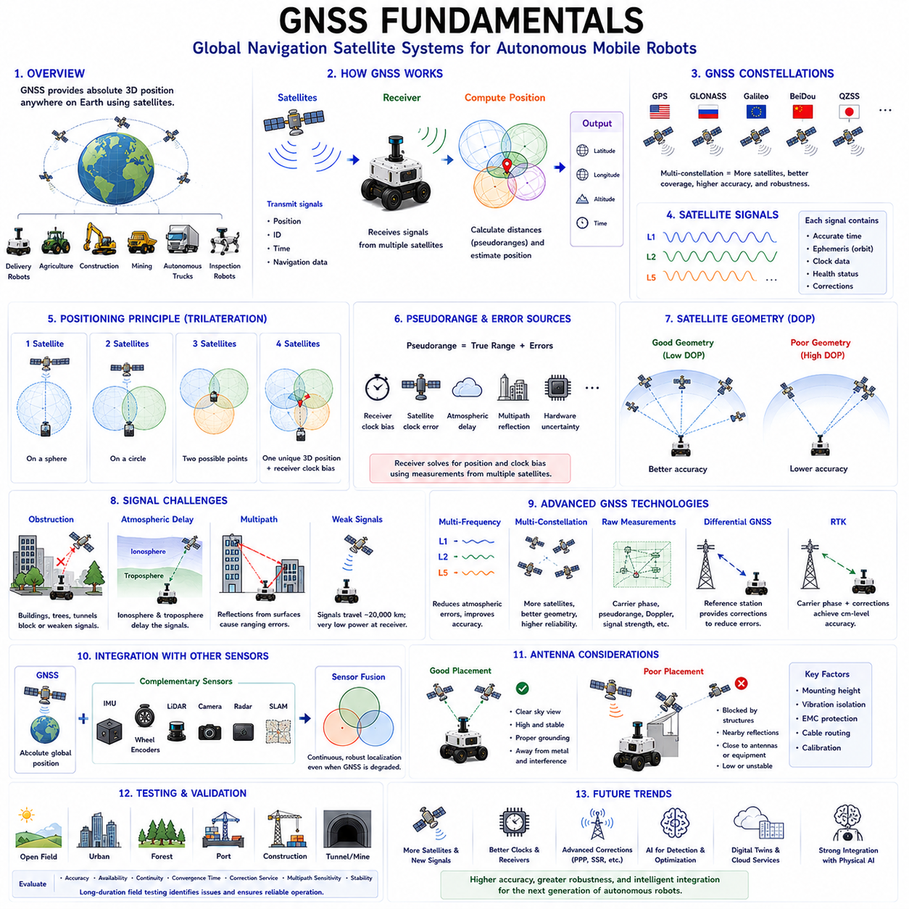
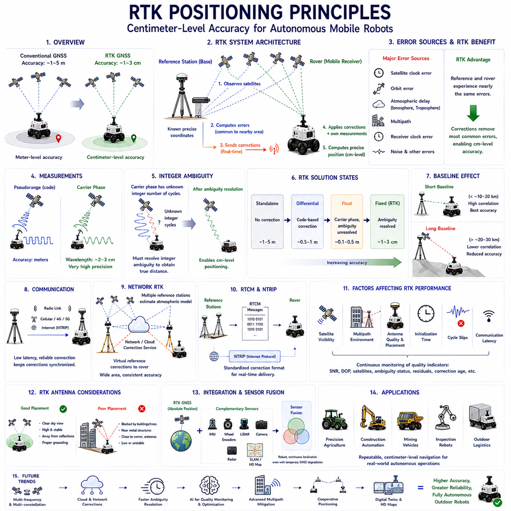
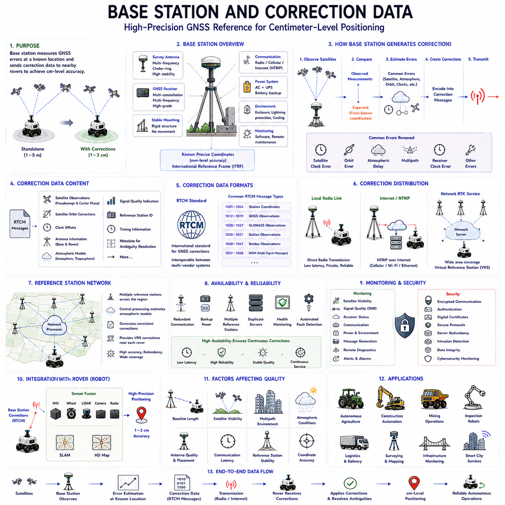
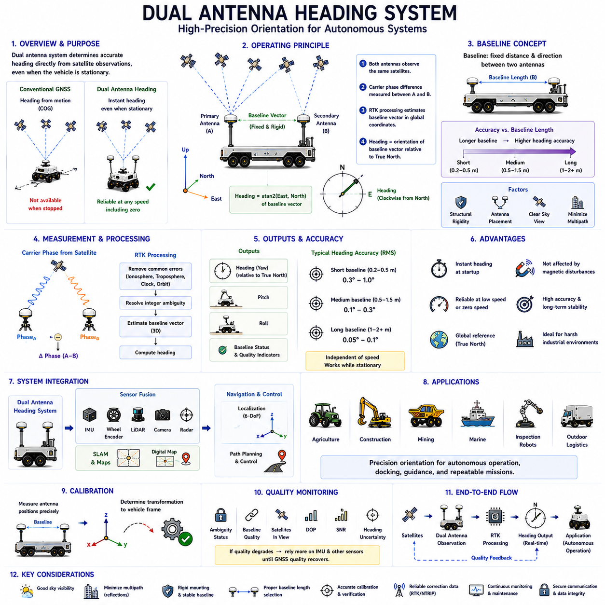
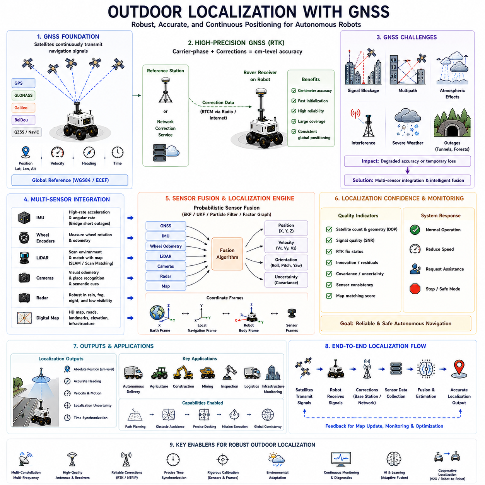
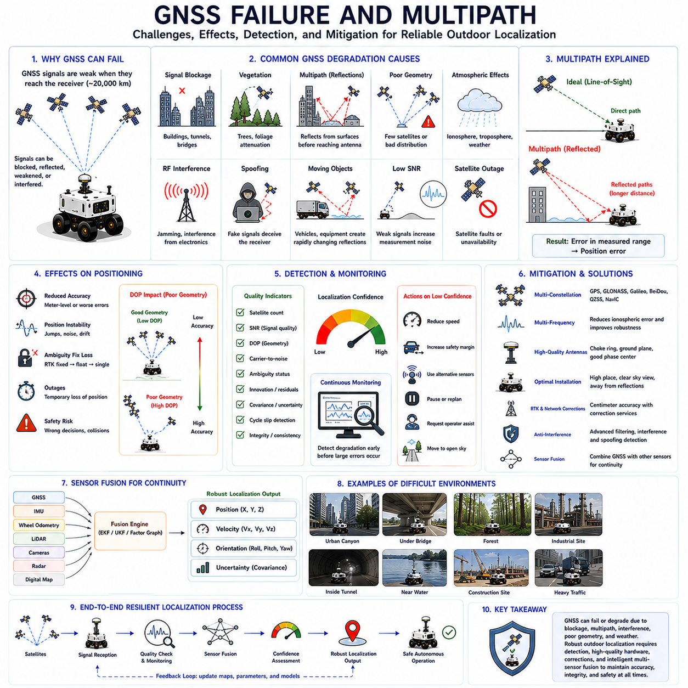
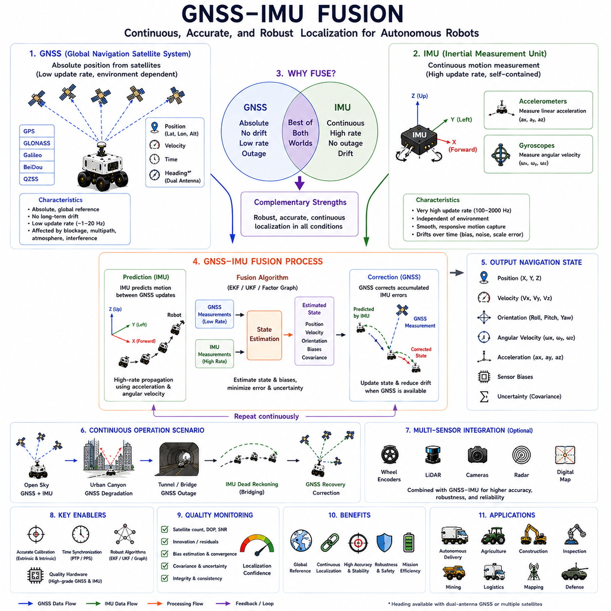
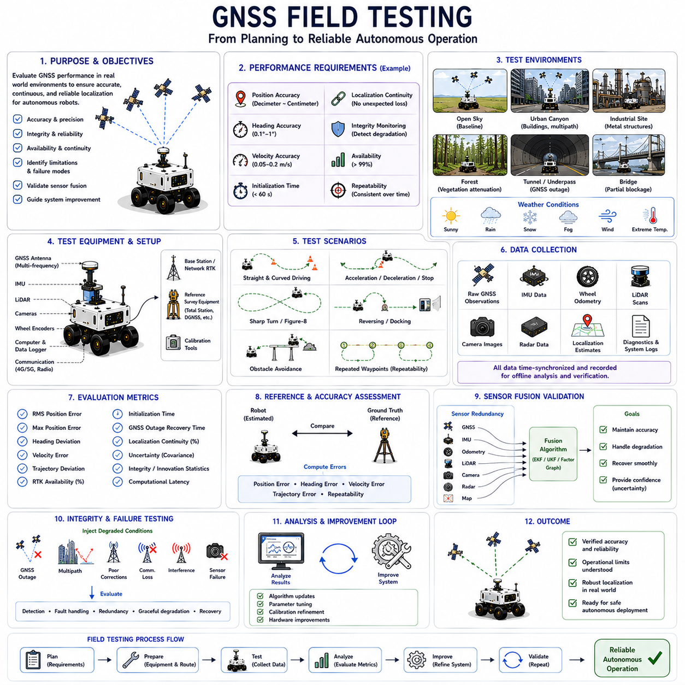

**Volume 03. AMR Sensors and Perception**

# Chapter 09. GNSS and RTK

## 09.1 GNSS Fundamentals

{width="7.268055555555556in" height="7.268055555555556in"}

Global Navigation Satellite Systems form the foundation of absolute positioning for modern Autonomous Mobile Robots operating in outdoor environments. Unlike local perception sensors that estimate the robot\'s position relative to surrounding objects, GNSS provides global geographic coordinates referenced to the Earth. This capability enables robots to determine their location over large operational areas without relying solely on locally generated maps. Outdoor delivery robots, agricultural vehicles, construction machines, mining equipment, autonomous trucks, and inspection robots all depend on GNSS to support reliable navigation across wide and changing environments. Understanding GNSS fundamentals is therefore essential for designing robust outdoor autonomous systems.

A Global Navigation Satellite System consists of a constellation of satellites continuously transmitting navigation signals to receivers located on or near the Earth\'s surface. Each satellite follows a precisely controlled orbit while broadcasting its position, identification, transmission time, and navigation data. A GNSS receiver processes these signals to estimate its own location by calculating the distance to multiple satellites simultaneously. Since satellites orbit thousands of kilometers above Earth, they provide worldwide positioning coverage independent of local infrastructure, making GNSS one of the most scalable localization technologies available for autonomous robotics.

Several independent GNSS constellations operate globally today. The United States developed the Global Positioning System, commonly known as GPS. Russia operates GLONASS, Europe maintains Galileo, and China deploys the BeiDou Navigation Satellite System. Additional regional navigation systems complement these global constellations in selected geographical areas. Modern industrial GNSS receivers simultaneously track satellites from multiple constellations rather than relying on a single navigation system. Multi-constellation operation increases satellite availability, improves positioning accuracy, reduces signal outages, and enhances robustness in challenging environments where satellite visibility may be partially obstructed.

Each navigation satellite continuously broadcasts precisely synchronized timing signals generated by highly accurate onboard atomic clocks. These timing references represent one of the most important components of GNSS because position estimation fundamentally depends on measuring signal travel time. Every transmitted message includes the satellite\'s orbital information, transmission timestamp, health status, and correction parameters describing its expected trajectory. The receiver compares transmitted time with reception time, estimating how long each signal required to travel through space. Multiplying travel time by the speed of light produces an approximate distance between the receiver and each visible satellite.

The measured distance between a receiver and an individual satellite is commonly referred to as a pseudorange because it contains both true geometric distance and several measurement errors. Unlike ideal mathematical distance, pseudorange includes receiver clock offsets, satellite clock errors, atmospheric delays, multipath reflections, and various hardware uncertainties. Since receivers generally employ lower-cost oscillators than satellite atomic clocks, timing differences introduce significant ranging errors. Position estimation algorithms therefore solve simultaneously for both the receiver location and receiver clock bias using observations collected from multiple satellites.

Position estimation relies upon the principle of trilateration rather than angular triangulation. If the distance to one satellite is known, the receiver must lie somewhere on the surface of a sphere centered at that satellite. A second satellite creates another sphere whose intersection forms a circular path. Adding measurements from a third satellite reduces the solution to two possible positions, one of which is physically unrealistic for terrestrial navigation. A fourth satellite provides sufficient information to resolve receiver clock bias and determine a unique three-dimensional position consisting of latitude, longitude, altitude, and precise timing information.

Satellite geometry strongly influences positioning accuracy even when ranging measurements remain unchanged. If visible satellites cluster together within one portion of the sky, small measurement errors become significantly amplified during position estimation. Conversely, satellites distributed broadly across different directions provide stronger geometric constraints and more stable localization. This relationship is quantified using dilution of precision metrics, including geometric dilution of precision, horizontal dilution of precision, and vertical dilution of precision. Lower dilution values indicate more favorable satellite geometry and generally correspond to improved positioning reliability.

GNSS receivers require an unobstructed view of the sky to receive satellite signals effectively. Buildings, tunnels, bridges, dense vegetation, mountains, industrial structures, and underground facilities may block or attenuate satellite transmissions significantly. Urban environments containing tall buildings often produce urban canyon effects where only a limited number of satellites remain visible. Autonomous robots operating within these conditions experience reduced positioning accuracy or complete signal loss. Consequently, GNSS should always be integrated with complementary localization technologies capable of maintaining navigation when satellite visibility deteriorates temporarily.

Atmospheric propagation introduces another important source of positioning error. GNSS signals travel through both the ionosphere and troposphere before reaching the receiver. Variations in atmospheric density, temperature, humidity, and ionized particle concentration slightly delay signal propagation, producing distance estimation errors. The ionosphere contributes particularly significant uncertainty because solar activity continuously changes its physical characteristics. Modern navigation systems employ atmospheric models, dual-frequency observations, and correction services to compensate for these propagation delays, thereby improving positioning accuracy under varying environmental conditions.

Multipath propagation represents one of the most challenging problems affecting GNSS localization in practical environments. Instead of traveling directly from satellite to receiver, navigation signals may reflect from nearby buildings, vehicles, metallic equipment, water surfaces, or other structures before reaching the antenna. Reflected signals travel longer paths, introducing timing errors that distort position estimation. Urban centers, industrial facilities, ports, and construction sites frequently exhibit severe multipath conditions. Specialized antennas, advanced signal processing, antenna placement optimization, and measurement filtering help reduce multipath effects but cannot eliminate them entirely.

Receiver sensitivity determines the ability to detect extremely weak satellite transmissions arriving from space. Since GNSS signals travel approximately twenty thousand kilometers before reaching Earth, received signal power becomes remarkably low compared with local radio transmissions. High-quality industrial receivers employ sophisticated correlators, low-noise amplifiers, interference rejection techniques, and advanced tracking algorithms to recover useful navigation information under difficult reception conditions. Receiver design therefore significantly influences positioning reliability, acquisition time, tracking stability, and resistance to signal degradation encountered during autonomous robot operation.

Multi-frequency GNSS technology has become increasingly important for high-precision navigation. Traditional receivers observed only a single carrier frequency, limiting their ability to compensate for atmospheric propagation errors. Modern industrial receivers simultaneously process multiple frequencies transmitted by each satellite constellation. Since ionospheric delay varies according to signal frequency, comparing observations across different frequencies enables direct estimation and compensation of atmospheric effects. Multi-frequency positioning therefore achieves substantially higher accuracy, faster convergence, and improved robustness compared with earlier single-frequency navigation systems.

Multi-constellation processing further enhances localization performance by increasing the total number of observable satellites. Instead of depending exclusively on GPS, modern receivers simultaneously integrate measurements from GPS, GLONASS, Galileo, BeiDou, and additional regional systems whenever available. Greater satellite diversity improves geometric distribution, reduces vulnerability to localized signal blockage, shortens initialization time, and strengthens positioning continuity during challenging navigation scenarios. Autonomous robots operating in dense urban environments particularly benefit from multi-constellation receivers because partial visibility from several constellations often exceeds complete visibility from only one.

Raw GNSS measurements include substantially more information than ordinary position estimates. Besides latitude, longitude, and altitude, advanced receivers provide carrier-phase observations, Doppler frequency shifts, signal strength, pseudorange measurements, satellite health information, timing estimates, and measurement quality indicators. These raw observations support sophisticated positioning algorithms including Real-Time Kinematic positioning, Precise Point Positioning, simultaneous localization systems, and sensor fusion architectures. Access to raw measurements enables significantly higher positioning accuracy than standalone navigation solutions generated internally by commercial receivers.

Differential correction techniques improve GNSS accuracy by comparing measurements collected simultaneously at reference stations with precisely known positions. Since nearby receivers experience similar satellite clock errors and atmospheric conditions, correction information generated at reference stations can compensate many common error sources affecting mobile receivers. Differential GNSS substantially reduces positioning uncertainty compared with standalone navigation. These correction methods form the basis of advanced positioning services supporting centimeter-level localization required by precision agriculture, autonomous construction machinery, surveying, and industrial robotics applications.

Real-Time Kinematic positioning represents one of the highest-accuracy GNSS technologies currently available for autonomous robotics. RTK utilizes carrier-phase observations together with differential corrections transmitted from nearby base stations or continuously operating reference networks. Rather than relying solely upon pseudorange measurements, RTK resolves the precise number of carrier wavelength cycles separating satellites and receivers. Once carrier ambiguities are correctly resolved, positioning accuracy frequently reaches centimeter-level precision. This capability enables autonomous robots to perform highly accurate navigation, docking, agricultural operations, infrastructure inspection, and construction tasks requiring repeatable positioning.

GNSS alone cannot satisfy all localization requirements encountered during autonomous robot operation. Signal blockage, multipath, atmospheric effects, and temporary satellite outages inevitably produce periods of degraded positioning quality. Consequently, modern autonomous systems integrate GNSS with inertial measurement units, wheel encoders, LiDAR, cameras, radar, simultaneous localization and mapping algorithms, and digital maps. Sensor fusion combines complementary information sources, allowing continuous localization even when one sensing modality experiences temporary degradation. GNSS contributes absolute global positioning while local sensors provide high-frequency relative motion estimation and environmental awareness.

Antenna placement significantly influences GNSS measurement quality. The antenna should maintain an unobstructed view of the sky while minimizing reflections from nearby metallic structures, robot payloads, protective covers, communication antennas, or rotating equipment. Elevated mounting positions generally improve satellite visibility but must also consider mechanical stability, vibration, electromagnetic compatibility, and maintenance accessibility. Proper grounding, antenna calibration, cable routing, and environmental protection further enhance signal quality. Poor antenna installation may degrade positioning accuracy substantially even when high-performance receivers are employed.

Testing and validation remain essential because GNSS performance varies considerably across operational environments. Open fields provide ideal satellite visibility, whereas dense cities, forests, ports, mines, construction sites, and industrial complexes present challenging signal conditions. Engineers evaluate positioning accuracy, availability, continuity, convergence time, correction service reliability, multipath sensitivity, and localization stability throughout representative operational scenarios. Long-duration field testing identifies rare failure modes, environmental limitations, and integration issues before commercial deployment. Comprehensive validation ensures that GNSS contributes dependable localization under realistic autonomous operating conditions.

Future GNSS technology will continue evolving toward higher accuracy, greater robustness, and deeper integration with intelligent autonomous systems. Additional satellite constellations, modernized navigation signals, improved atomic clock technology, enhanced correction services, and advanced receiver architectures will further increase positioning precision and availability. Artificial intelligence will optimize satellite selection, detect abnormal measurements, predict signal degradation, and improve sensor fusion with complementary localization technologies. Digital twins, cooperative infrastructure, and cloud-based correction networks will support increasingly autonomous Physical AI platforms capable of maintaining highly reliable global positioning even within complex and dynamically changing operational environments.

## 09.2 RTK Positioning Principles

{width="7.268055555555556in" height="7.268055555555556in"}

Real-Time Kinematic positioning represents one of the most advanced satellite-based localization technologies available for autonomous mobile robots operating in outdoor environments. While conventional Global Navigation Satellite System receivers generally achieve positioning accuracy within several meters, RTK improves localization to the centimeter level by combining carrier-phase measurements with real-time correction information from reference stations. This dramatic increase in accuracy enables autonomous robots to perform precision navigation, automated docking, infrastructure inspection, agricultural operations, construction automation, and industrial logistics where repeatable positioning is essential. Understanding RTK principles therefore forms an important foundation for developing high-precision outdoor autonomous systems.

The fundamental objective of RTK positioning is to eliminate the majority of positioning errors that remain in conventional GNSS navigation. Standard satellite positioning relies primarily on pseudorange measurements, which contain errors originating from satellite clocks, receiver clocks, atmospheric propagation, multipath reflections, and orbital uncertainties. RTK introduces additional measurements based on the carrier wave itself instead of relying solely on navigation code timing. Because carrier wavelengths are only a few centimeters long, measuring carrier phase enables position estimation with much finer resolution than pseudorange observations alone. This capability provides the basis for centimeter-level localization.

An RTK system typically consists of two major components: a reference station and one or more rover receivers. The reference station is installed at a precisely surveyed location whose coordinates are already known with extremely high accuracy. Since its true position is fixed, the station continuously compares the position calculated from satellite observations with its actual coordinates. The resulting positioning errors are converted into correction information and transmitted to rover receivers operating nearby. The rover combines its own satellite measurements with these real-time corrections to compute a significantly more accurate position than would otherwise be possible.

The reference station continuously observes the same satellite signals received by nearby rover units. Since both receivers are located within a relatively short distance of each other, they experience nearly identical satellite clock errors, orbital uncertainties, and atmospheric delays. These shared error sources are referred to as common-mode errors because they affect both receivers in nearly the same manner. By estimating these common errors at the reference station and transmitting correction data to the rover, RTK effectively removes a large portion of the uncertainties that limit standalone GNSS positioning performance.

Unlike conventional GNSS receivers that primarily process navigation codes, RTK receivers also measure the carrier phase of satellite signals. A carrier wave is a continuous sinusoidal radio frequency used to transport navigation information from satellites to receivers. Because the wavelength of these carrier signals is only a few centimeters, even a very small phase measurement corresponds to an extremely small physical distance. Measuring the carrier phase therefore provides much finer ranging resolution than measuring only code arrival times. This improvement in measurement precision forms the core principle behind RTK positioning.

Carrier-phase observations introduce an important challenge known as integer ambiguity. Although a receiver can accurately determine the fractional phase of an incoming carrier wave, it cannot initially determine how many complete wavelength cycles exist between the satellite and receiver. This unknown whole number of carrier cycles is called the integer ambiguity. Resolving this ambiguity correctly is one of the most critical steps in RTK processing because incorrect ambiguity resolution immediately produces inaccurate positioning results. Sophisticated estimation algorithms continuously evaluate multiple candidate solutions until the correct integer values are identified with high confidence.

The ambiguity resolution process typically requires continuous satellite tracking over a certain initialization period. During this interval, the receiver accumulates multiple carrier-phase observations while simultaneously estimating atmospheric delays, satellite geometry, receiver motion, and measurement quality. Statistical algorithms analyze these observations to determine the most probable integer solution. Once ambiguity values have been successfully fixed, the RTK solution enters the fixed state, where centimeter-level positioning becomes available. Until that point, the receiver operates in the float solution state, which generally provides decimeter-level accuracy but not full RTK precision.

RTK positioning quality is commonly classified into several solution states. A standalone solution relies only on local GNSS measurements without external corrections. A differential solution incorporates correction information but still depends primarily on pseudorange observations. A float solution uses carrier-phase measurements while ambiguity values remain unresolved. Finally, a fixed solution indicates that carrier ambiguities have been successfully determined and centimeter-level positioning accuracy has been achieved. Monitoring the current solution state is essential because navigation accuracy differs significantly between these operational modes.

The baseline refers to the physical distance separating the reference station from the rover receiver. Baseline length directly influences RTK positioning performance because atmospheric conditions become increasingly different as separation distance grows. Short baselines experience highly correlated atmospheric delays, enabling very accurate correction of common errors. Longer baselines reduce this correlation, making corrections progressively less effective. Consequently, conventional RTK systems generally perform best when the rover remains within several tens of kilometers from the reference station, although network-based correction services can significantly extend practical operating ranges.

Communication between the reference station and rover plays a vital role in RTK operation. Correction information must be delivered with minimal latency because satellite positions, atmospheric conditions, and receiver motion continuously change. Communication channels may include dedicated radio links, industrial wireless networks, cellular communication, private communication infrastructure, or Internet-based correction services. Stable communication ensures that correction messages remain synchronized with current satellite observations. Excessive communication delays or packet losses may reduce positioning accuracy or temporarily prevent ambiguity resolution.

Modern RTK systems frequently obtain correction data through Network RTK services rather than individual reference stations. Instead of relying upon a single nearby base station, multiple continuously operating reference stations distributed across a region cooperate to estimate atmospheric models and generate virtual correction information. This network approach improves correction accuracy over wider geographical areas while reducing dependence on individual reference stations. Autonomous robots operating across large industrial sites or extensive infrastructure networks often benefit from Network RTK because correction availability remains consistent throughout the operational region.

The Radio Technical Commission for Maritime Services developed the RTCM correction message standard, which has become the international format for transmitting GNSS correction information. RTCM messages contain observations from reference stations, satellite corrections, carrier-phase measurements, antenna information, and auxiliary positioning data required by rover receivers. Standardized message formats allow correction services from different manufacturers to remain interoperable with industrial RTK receivers. Consequently, autonomous robot developers can integrate equipment from multiple vendors without requiring proprietary communication protocols.

Networked correction services commonly employ the Networked Transport of RTCM via Internet Protocol communication standard. NTRIP enables rover receivers to obtain RTCM correction messages through Internet connections using lightweight communication protocols suitable for real-time applications. Cellular communication networks, industrial Wi-Fi infrastructure, and private wireless systems frequently provide Internet connectivity for autonomous robots requiring RTK positioning. NTRIP significantly simplifies correction distribution by eliminating the need for dedicated radio transmitters while supporting flexible cloud-based correction services covering large operational territories.

RTK positioning accuracy depends heavily on satellite visibility and signal quality. Since ambiguity resolution requires continuous carrier-phase tracking, temporary signal interruptions may force the receiver to restart initialization procedures. Trees, buildings, tunnels, bridges, cranes, industrial equipment, and dense urban environments may block satellite signals or introduce severe multipath reflections. These conditions reduce the probability of maintaining fixed solutions during robot operation. Engineers therefore carefully evaluate satellite visibility throughout operational environments before relying on RTK for mission-critical navigation tasks.

Multipath remains one of the most significant challenges affecting RTK performance. Carrier-phase measurements achieve extremely high precision only when received signals travel directly from satellites to the antenna. Reflections from nearby structures distort carrier-phase observations and complicate ambiguity resolution. Industrial facilities containing metallic buildings, storage containers, heavy machinery, and large vehicles frequently produce severe multipath environments. High-quality choke-ring antennas, optimized antenna placement, advanced multipath mitigation algorithms, and careful site planning substantially improve RTK reliability under these challenging operating conditions.

Receiver antenna quality strongly influences RTK performance because carrier-phase measurements require exceptional signal stability. Precision GNSS antennas minimize phase-center variation, reject low-elevation reflections, suppress electromagnetic interference, and maintain consistent measurement characteristics under changing environmental conditions. Mechanical installation also plays an important role. Antennas should be mounted above surrounding structures whenever practical while avoiding vibration, mechanical deformation, nearby communication antennas, rotating equipment, and reflective metallic surfaces. Proper antenna installation frequently contributes as much to RTK accuracy as receiver hardware itself.

Initialization time represents another important operational characteristic of RTK systems. Before centimeter-level positioning becomes available, the receiver must observe sufficient carrier-phase measurements to resolve integer ambiguities successfully. Initialization duration depends upon satellite geometry, signal quality, baseline length, atmospheric conditions, receiver algorithms, and communication reliability. Modern multi-frequency, multi-constellation receivers typically achieve fixed solutions much faster than earlier single-frequency systems. Nevertheless, initialization delays remain an important consideration for autonomous robots that frequently enter environments with intermittent satellite visibility.

Cycle slips represent temporary interruptions in carrier-phase tracking caused by signal blockage, severe interference, rapid vehicle motion, antenna vibration, or weak satellite reception. When a cycle slip occurs, the receiver loses knowledge of the continuous carrier-phase relationship and must estimate new ambiguity values before returning to fixed positioning. Detecting and repairing cycle slips rapidly is therefore essential for maintaining uninterrupted high-accuracy localization. Advanced RTK receivers continuously monitor measurement consistency and automatically identify cycle slips using redundant satellite observations and statistical quality-control techniques.

Quality monitoring is essential because RTK positioning accuracy changes continuously according to environmental conditions. Industrial receivers provide numerous quality indicators including satellite count, signal-to-noise ratio, dilution of precision, ambiguity status, correction age, residual measurement errors, communication latency, and estimated positioning uncertainty. Autonomous navigation software continuously evaluates these indicators before accepting RTK measurements for motion planning or control. If positioning confidence decreases below predefined thresholds, the robot may reduce speed, switch localization methods, or temporarily suspend autonomous operation until reliable positioning becomes available again.

RTK should never operate as an isolated localization technology within autonomous mobile robots. Instead, modern robotic systems integrate RTK with inertial measurement units, wheel encoders, LiDAR, cameras, radar, simultaneous localization and mapping algorithms, and digital maps through sensor fusion frameworks. RTK provides highly accurate absolute global coordinates, while complementary sensors maintain smooth localization during temporary satellite outages or degraded correction availability. Sensor fusion therefore combines the long-term global stability of RTK with the short-term continuity provided by local perception systems, producing robust localization across diverse operational environments.

RTK positioning has become an enabling technology across numerous robotic industries requiring repeatable centimeter-level navigation. Precision agriculture employs RTK for automated planting, fertilization, and harvesting along identical crop rows. Construction robots use RTK for grading, excavation, and infrastructure positioning. Mining vehicles navigate predefined haul roads with high repeatability, while inspection robots accurately revisit identical measurement locations during periodic maintenance operations. Autonomous logistics vehicles performing outdoor transportation also benefit from precise docking, charging, loading, and unloading enabled by RTK-based localization.

Future RTK technology will continue evolving through tighter integration with multi-frequency GNSS, additional satellite constellations, cloud-based correction networks, artificial intelligence, and cooperative localization systems. Faster ambiguity resolution, improved multipath mitigation, enhanced atmospheric modeling, and more resilient communication infrastructure will further increase positioning reliability. Artificial intelligence will assist in anomaly detection, correction optimization, and adaptive sensor fusion based on environmental conditions. Combined with digital twins, high-definition maps, edge computing, and Physical AI architectures, next-generation RTK systems will provide the highly accurate and continuously available positioning required for fully autonomous outdoor robots operating safely within increasingly complex real-world environments.

## 09.3 Base Station and Correction Data

{width="7.268055555555556in" height="7.268055555555556in"}

A GNSS base station is one of the most important components of high-precision satellite positioning systems because it generates the correction information required to eliminate common positioning errors experienced by nearby rover receivers. Conventional Global Navigation Satellite System positioning calculates location directly from satellite observations and therefore contains errors originating from satellite clocks, atmospheric propagation, orbital uncertainties, and receiver timing. A base station continuously measures these errors at a precisely known location and distributes correction data to mobile receivers operating within the surrounding area. This correction process enables centimeter-level localization for autonomous mobile robots performing precision outdoor navigation.

The primary function of a base station is to provide a stable and highly accurate positioning reference. Unlike mobile robots that continuously change their location, a base station remains permanently installed at a surveyed coordinate whose position is known with millimeter-level accuracy. Because the station already knows its true coordinates, any difference between the calculated GNSS position and the surveyed position represents positioning error rather than actual movement. The station continuously estimates these errors and prepares correction information that nearby rover receivers can apply to improve their own positioning accuracy in real time.

A typical base station consists of several integrated hardware components working together continuously. The most important elements include a high-grade multi-frequency GNSS receiver, a precision survey antenna, stable mounting infrastructure, reliable communication equipment, uninterrupted power supplies, and monitoring software. Industrial installations frequently include lightning protection, environmental enclosures, battery backup systems, network monitoring equipment, and remote maintenance capabilities. Every component contributes to maintaining stable correction generation because interruptions or degradation at the reference station directly influence positioning performance throughout the entire RTK system.

The survey antenna plays a particularly critical role because every correction produced by the base station depends upon the quality of incoming satellite observations. Precision GNSS antennas are specifically designed to minimize multipath reflections, suppress low-elevation interference, stabilize phase-center characteristics, and maintain consistent signal reception under changing environmental conditions. Choke-ring antennas are commonly employed for permanent installations because their physical structure significantly reduces reflected satellite signals arriving from nearby surfaces. High-quality antenna performance directly improves correction reliability and long-term positioning stability.

The installation location of a base station strongly influences correction quality. Ideally, the antenna should be mounted on a rigid structure with an unobstructed view of the sky extending across all directions. Nearby buildings, trees, communication towers, metallic structures, moving cranes, reflective surfaces, or elevated equipment should be minimized because they introduce signal blockage and multipath reflections. Permanent installations often utilize reinforced rooftops, dedicated survey monuments, or specially constructed antenna masts designed to remain mechanically stable over many years of continuous operation.

Mechanical stability is equally important because the reference station assumes that its position never changes after installation. Structural movement caused by thermal expansion, vibration, wind loading, foundation settlement, or accidental impacts introduces apparent positioning errors that become embedded within correction messages. Consequently, industrial base stations are mounted on rigid concrete foundations, steel towers, or permanently surveyed monuments designed to resist environmental disturbances. Continuous structural stability ensures that generated correction data accurately represent satellite positioning errors rather than physical antenna movement.

Accurate coordinate determination is essential before a base station begins generating correction information. Since correction messages assume that the reference station occupies a precisely known position, installation normally includes professional geodetic surveying or long-duration GNSS observation campaigns. Survey procedures estimate the antenna coordinates within internationally recognized terrestrial reference frames. Any coordinate error introduced during installation propagates directly into rover positioning results. Therefore, coordinate verification represents one of the most critical commissioning activities for permanent reference stations.

Once operational, the base station continuously tracks every visible navigation satellite using both pseudorange and carrier-phase measurements. Rather than calculating only its own position, the receiver compares observed satellite measurements against expected values computed from its surveyed coordinates. Differences between expected and observed measurements represent combined positioning errors arising from satellite clocks, orbital models, atmospheric propagation, and additional systematic effects. These estimated errors are encoded into correction messages and transmitted immediately to rover receivers requiring high-accuracy positioning.

Correction information contains considerably more than simple coordinate adjustments. Modern correction messages include carrier-phase observations, pseudorange measurements, satellite orbit corrections, clock offsets, antenna calibration parameters, atmospheric models, signal quality indicators, reference station identification, timing information, and additional metadata supporting ambiguity resolution. These detailed observations allow rover receivers to reconstruct highly accurate positioning solutions rather than merely applying basic coordinate offsets. Consequently, correction data represent a comprehensive mathematical description of current satellite measurement conditions.

The Radio Technical Commission for Maritime Services developed the internationally accepted RTCM message standard for transmitting correction information between reference stations and rover receivers. RTCM defines standardized message formats describing satellite observations, carrier-phase measurements, station coordinates, antenna characteristics, and auxiliary navigation information. Because RTCM has become the global industrial standard, correction services from different manufacturers remain compatible with most professional GNSS receivers. Standardization greatly simplifies system integration for autonomous robot developers deploying equipment from multiple vendors.

Multiple RTCM message types support different positioning requirements. Some messages provide raw satellite observations collected at the reference station, while others contain station coordinates, antenna descriptions, atmospheric corrections, ephemeris updates, or carrier-phase measurements. RTK receivers select the appropriate message types according to their positioning algorithms and supported GNSS constellations. Modern correction services typically transmit combinations of multiple RTCM messages simultaneously, allowing receivers to obtain comprehensive information necessary for centimeter-level localization under varying operational conditions.

Correction data must be transmitted continuously with extremely low latency because satellite geometry, atmospheric conditions, and rover positions change constantly. Communication delays increase the age of correction information, reducing its effectiveness for ambiguity resolution and precise positioning. Industrial systems therefore prioritize reliable low-latency communication using dedicated radio links, private wireless infrastructure, cellular networks, industrial Ethernet, or Internet-based communication services. Communication reliability frequently determines whether rover receivers maintain fixed RTK solutions during continuous autonomous operation.

Dedicated radio communication remains common in many industrial RTK deployments. Reference stations transmit correction messages directly to nearby rover receivers using licensed or unlicensed radio frequencies. Radio communication offers predictable latency, independence from public communication infrastructure, and reliable operation within private industrial facilities. Construction sites, mining operations, agricultural machinery, and large logistics terminals frequently employ local radio correction systems because they provide stable communication without relying upon external network providers or Internet connectivity.

Internet-based correction distribution has become increasingly popular through Networked Transport of RTCM via Internet Protocol communication. Rather than transmitting corrections directly through local radio, the reference station uploads RTCM messages to network servers. Rover receivers retrieve these corrections using standard Internet connections through cellular communication, industrial wireless infrastructure, or private communication networks. Internet distribution significantly expands correction coverage while reducing installation complexity. Cloud-based correction services therefore support autonomous robots operating across geographically distributed industrial environments.

Many regions now employ continuously operating reference station networks rather than isolated base stations. These networks combine observations from numerous permanently installed stations distributed across large geographical areas. Central processing servers analyze measurements collected simultaneously from every station, estimate regional atmospheric conditions, and generate highly consistent correction information. Network processing improves correction quality, increases reliability through redundancy, and supports virtual reference station techniques capable of delivering optimized corrections tailored to individual rover locations throughout extensive operational territories.

Virtual Reference Station technology represents one of the most important developments in modern correction systems. Instead of transmitting observations from a distant physical reference station, network processing software generates a synthetic reference station positioned virtually near the rover receiver. This approach minimizes effective baseline length while improving atmospheric correlation and ambiguity resolution. Virtual reference techniques therefore provide positioning performance comparable to nearby physical base stations without requiring dedicated local infrastructure at every operating site.

Correction availability directly influences autonomous robot reliability because RTK positioning depends upon uninterrupted correction reception. Communication failures, reference station outages, hardware faults, power interruptions, or server maintenance may temporarily interrupt correction delivery. Professional correction services therefore incorporate redundant communication channels, backup power supplies, duplicate processing servers, multiple reference stations, automated fault detection, and continuous health monitoring. High-availability system architecture ensures that correction services remain operational throughout extended autonomous missions requiring continuous centimeter-level localization.

Base station monitoring systems continuously evaluate operational status to detect potential problems before correction quality deteriorates. Monitoring software supervises receiver health, satellite visibility, signal strength, communication performance, power systems, processor utilization, environmental conditions, antenna integrity, and correction message generation. Automated alarms notify operators whenever abnormal conditions arise. Remote diagnostics allow maintenance personnel to investigate system performance without visiting the installation physically, reducing downtime while improving long-term operational reliability.

Environmental conditions influence base station performance throughout long-term deployment. Temperature variation, humidity, precipitation, snow accumulation, lightning, electromagnetic interference, strong winds, dust, and mechanical vibration all affect hardware stability and signal quality. Industrial reference stations therefore employ weatherproof enclosures, climate control systems, surge protection, corrosion-resistant materials, vibration isolation, and regular preventive maintenance schedules. Environmental engineering ensures stable correction generation under continuously changing outdoor operating conditions.

Correction data security has become increasingly important as autonomous systems depend more heavily upon network-based positioning services. Unauthorized modification, spoofing attacks, communication interception, or malicious correction injection may produce dangerous positioning errors affecting autonomous robot navigation. Modern correction infrastructures therefore incorporate encrypted communication, authenticated user access, secure network protocols, digital certificates, server redundancy, intrusion detection, and cybersecurity monitoring. Protecting correction integrity ensures that rover receivers always utilize trustworthy positioning information during safety-critical autonomous operations.

Autonomous mobile robots integrate correction data within broader sensor fusion architectures rather than treating RTK as an isolated positioning source. GNSS corrections improve global localization accuracy, while inertial measurement units, wheel encoders, LiDAR, cameras, radar, simultaneous localization and mapping systems, and digital maps maintain localization continuity whenever correction availability temporarily decreases. Navigation software continuously evaluates correction quality indicators before incorporating RTK measurements into motion planning and vehicle control. This integrated architecture provides both absolute positioning accuracy and robust operational continuity across diverse outdoor environments.

Future base station technology will continue evolving toward cloud-native correction services, global reference station networks, artificial intelligence, edge computing, and cooperative localization frameworks. Increasing numbers of multi-frequency satellites, improved atmospheric modeling, machine learning for anomaly detection, automated quality optimization, and intelligent communication management will further enhance correction reliability. Digital twins, distributed processing architectures, and next-generation network infrastructure will allow correction services to support massive fleets of autonomous robots operating simultaneously across large geographical regions while maintaining the centimeter-level positioning accuracy required for advanced Physical AI applications.

## 09.4 Dual Antenna Heading System

{width="7.268055555555556in" height="7.268055555555556in"}

A Dual Antenna Heading System is a high-precision orientation measurement technology that determines the heading of a vehicle directly from satellite observations rather than estimating it from vehicle motion. Unlike conventional Global Navigation Satellite System receivers that require movement to calculate course over ground, a dual antenna system provides an accurate heading even when the vehicle is completely stationary. This capability makes it particularly valuable for autonomous mobile robots, agricultural machinery, construction equipment, marine vessels, unmanned ground vehicles, and precision inspection robots where reliable orientation information is required before motion begins. Understanding the principles of dual antenna heading is therefore essential for designing robust outdoor autonomous navigation systems.

The primary objective of a dual antenna heading system is to determine the vehicle\'s orientation independently of wheel movement, inertial sensors, or visual landmarks. A conventional GNSS receiver calculates geographic position but cannot directly determine the direction in which the vehicle is facing while stationary. Instead, heading is usually estimated from consecutive position measurements as the vehicle moves. This approach becomes unreliable at low speeds and completely unavailable when the vehicle stops. By installing two precisely separated GNSS antennas on the same platform, heading can be calculated immediately from the spatial relationship between the antennas, regardless of vehicle motion.

The operating principle of a dual antenna heading system is based on measuring the carrier-phase difference between two antennas observing the same satellites simultaneously. Both antennas receive identical satellite signals at slightly different locations on the vehicle. Since each antenna occupies a different physical position, the carrier wave reaches each antenna at a slightly different time. These phase differences contain highly precise geometric information describing the relative orientation of the baseline connecting the two antennas. Advanced RTK algorithms analyze these observations to estimate the baseline vector with centimeter or even millimeter precision, from which vehicle heading is directly derived.

The baseline is the fixed distance and direction between the primary antenna and the secondary antenna. This baseline acts as a precisely known reference vector rigidly attached to the vehicle. Once the baseline vector is determined within the global coordinate system, the heading angle becomes the orientation of that vector relative to geographic north. Since the baseline is physically fixed, any rotation of the vehicle immediately changes the orientation of the baseline, allowing continuous heading estimation without requiring vehicle movement. The baseline therefore represents the fundamental geometric element enabling stationary heading determination.

Carrier-phase observations provide the measurement precision required for accurate heading estimation. Navigation code measurements alone cannot achieve sufficient resolution because their ranging accuracy remains at the meter level. Carrier wavelengths, however, are only a few centimeters long. Measuring carrier-phase differences between the two antennas allows extremely small baseline orientation changes to be detected. Integer ambiguity resolution techniques identical to those used in RTK positioning determine the exact number of carrier cycles separating each antenna from every satellite. Once ambiguities are resolved successfully, heading accuracy improves dramatically compared with code-based approaches.

A dual antenna heading receiver simultaneously processes observations from both antennas using common satellite measurements. Since the antennas are separated by only a short baseline, they experience nearly identical atmospheric delays, satellite clock errors, and orbital uncertainties. Most common-mode errors therefore cancel during differential carrier-phase processing. This differential observation geometry allows the receiver to estimate the baseline orientation with significantly higher accuracy than standalone GNSS positioning. The resulting heading estimate remains stable even when environmental conditions introduce moderate satellite positioning errors affecting absolute coordinates.

Baseline length directly influences heading accuracy. Longer baselines produce larger phase differences for the same angular rotation, making heading estimation more sensitive and less affected by measurement noise. Short baselines remain easier to integrate mechanically but provide lower angular resolution. Many industrial autonomous vehicles employ baseline lengths ranging from several tens of centimeters to approximately two meters depending upon available installation space and required heading accuracy. Designers must balance mechanical constraints, antenna placement, structural rigidity, and desired orientation precision when selecting the appropriate baseline length.

Mechanical rigidity of the antenna mounting structure is critically important because heading calculations assume that the baseline remains constant throughout operation. Structural deformation, vibration, thermal expansion, loose mounting hardware, or mechanical impacts alter the effective baseline geometry, introducing orientation errors independent of GNSS performance. Precision autonomous platforms therefore mount both antennas on rigid frames designed to minimize flexure under dynamic loading. Mechanical calibration verifies that the baseline remains stable throughout expected operational conditions, ensuring consistent heading estimation during long-term deployment.

Antenna placement significantly affects overall system performance. Both antennas should maintain unobstructed visibility toward the sky while minimizing multipath reflections from nearby vehicle structures. Metallic roofs, communication antennas, rotating sensors, payload equipment, and protective covers should not obstruct satellite reception or generate excessive reflected signals. Symmetrical installation along the vehicle centerline simplifies system calibration and interpretation of heading measurements. Proper antenna spacing and careful cable routing further improve carrier-phase measurement quality and reduce electromagnetic interference affecting high-precision observations.

The heading angle generated by a dual antenna system is referenced to true geographic north rather than magnetic north. Unlike magnetic compasses that measure the Earth\'s magnetic field, GNSS heading depends exclusively upon satellite geometry and precise baseline estimation. Consequently, heading measurements remain unaffected by nearby ferrous materials, electrical currents, electromagnetic interference, or local magnetic disturbances commonly encountered within industrial environments. This independence from magnetic effects makes dual antenna heading systems particularly valuable for construction sites, factories, ports, mining operations, and large robotic platforms containing substantial metallic structures.

Heading initialization occurs immediately after successful carrier-phase ambiguity resolution between the two antennas. Unlike motion-based heading estimation requiring vehicle displacement, dual antenna systems establish orientation while the platform remains stationary. Modern multi-frequency GNSS receivers often complete initialization within seconds under favorable satellite visibility conditions. Once the baseline solution reaches fixed ambiguity status, continuous heading updates become available regardless of vehicle speed. This rapid initialization significantly improves autonomous system readiness during startup, docking, inspection, or other stationary operational scenarios.

Heading accuracy depends upon several environmental and operational factors. Satellite visibility strongly influences ambiguity resolution and measurement redundancy. Multipath reflections distort carrier-phase observations, particularly near buildings, metallic infrastructure, or large vehicles. Atmospheric disturbances introduce small residual errors, although differential processing removes most common effects. Receiver measurement quality, antenna calibration, baseline stability, communication integrity, and satellite geometry collectively determine achievable heading precision. Continuous quality monitoring therefore remains essential during autonomous operation to detect degraded measurement conditions before navigation performance deteriorates.

Dual antenna heading systems frequently provide additional orientation information beyond simple yaw estimation. Since the baseline vector is measured within three-dimensional space, advanced processing algorithms may estimate pitch and roll angles when baseline geometry and satellite observations support sufficient accuracy. Although inertial measurement units generally provide superior high-frequency attitude estimation, GNSS-derived orientation offers long-term absolute reference free from drift accumulation. Integrating GNSS orientation with inertial sensors therefore produces robust attitude estimation combining the strengths of both sensing technologies.

Sensor fusion represents one of the most important applications of dual antenna heading technology. Autonomous navigation systems integrate GNSS heading with inertial measurement units, wheel encoders, LiDAR, cameras, radar, simultaneous localization and mapping algorithms, and digital maps. GNSS provides globally referenced absolute heading without accumulated drift, while inertial sensors deliver high-frequency rotational measurements. Visual and LiDAR systems contribute local environmental alignment. Sensor fusion continuously combines these complementary information sources to maintain reliable orientation estimation despite temporary degradation affecting any individual sensing modality.

The integration between dual antenna heading and RTK positioning creates a highly robust localization solution for autonomous robots. RTK provides centimeter-level global position, while the dual antenna system supplies accurate heading independent of vehicle motion. Together they establish a complete six-degree-of-freedom navigation reference supporting trajectory planning, obstacle avoidance, map alignment, autonomous docking, precision agriculture, and infrastructure inspection. This integrated approach significantly reduces dependence upon motion-based heading estimation and improves navigation reliability during low-speed maneuvers requiring accurate orientation control.

Low-speed operation represents one of the greatest advantages of dual antenna heading systems. Conventional GNSS receivers estimate heading from changes in position over time. As vehicle speed decreases, position changes become comparable to measurement uncertainty, causing heading estimates to fluctuate significantly. When the vehicle stops completely, course-over-ground becomes undefined. Dual antenna systems avoid this limitation entirely because heading derives from baseline orientation rather than vehicle displacement. Autonomous robots performing precision docking, inspection, loading, or charging therefore maintain stable orientation information throughout stationary and low-speed operations.

Applications of dual antenna heading technology extend across numerous autonomous industries. Agricultural machinery requires accurate heading to maintain parallel crop rows during planting and harvesting. Construction vehicles depend upon precise orientation during grading and excavation. Autonomous mining trucks maintain correct heading along predefined haul routes. Marine vessels navigate accurately despite slow maneuvering speeds. Infrastructure inspection robots revisit identical inspection points with repeatable orientation, while outdoor logistics robots achieve precise docking and loading through reliable heading estimation independent of wheel movement or magnetic disturbances.

System calibration is necessary before operational deployment to ensure consistency between the measured baseline vector and the vehicle coordinate frame. Installation errors, antenna offsets, cable delays, and structural tolerances introduce small orientation biases that must be compensated. Calibration procedures establish transformation parameters connecting GNSS heading with the robot body frame used by navigation software. Accurate calibration guarantees that planned trajectories, perception systems, and vehicle controllers interpret heading measurements consistently throughout autonomous operation, thereby reducing systematic navigation errors.

Operational health monitoring continuously evaluates heading reliability during mission execution. Modern receivers provide quality indicators including ambiguity status, baseline solution quality, satellite count, dilution of precision, signal-to-noise ratio, estimated heading uncertainty, and carrier-phase residuals. Autonomous navigation software monitors these indicators before accepting heading information for vehicle control. When heading quality degrades because of satellite blockage, multipath, or ambiguity loss, sensor fusion algorithms automatically increase reliance upon inertial measurements and other complementary localization technologies until GNSS heading quality recovers.

Future dual antenna heading systems will continue evolving alongside advances in multi-frequency GNSS, additional satellite constellations, artificial intelligence, cloud-assisted correction services, and integrated navigation architectures. Improved ambiguity resolution algorithms, enhanced multipath mitigation, miniature high-performance antennas, and intelligent quality assessment will further increase heading reliability under challenging environmental conditions. Combined with digital twins, edge computing, cooperative localization, and Physical AI frameworks, next-generation dual antenna heading technology will provide continuously available absolute orientation information supporting highly autonomous outdoor robots operating safely and accurately within increasingly complex real-world environments.

## 09.5 Outdoor Localization with GNSS

{width="7.268055555555556in" height="7.268055555555556in"}

Outdoor localization is one of the most fundamental capabilities required for autonomous mobile robots operating beyond controlled indoor environments. Unlike indoor navigation, where localization primarily depends on LiDAR, cameras, or artificial landmarks, outdoor localization must function across wide geographical areas with continuously changing environmental conditions. Global Navigation Satellite Systems provide an absolute global reference that allows robots to estimate their geographic position relative to the Earth rather than relative to local maps alone. This capability enables autonomous delivery robots, agricultural machines, construction equipment, mining vehicles, inspection robots, and outdoor logistics platforms to perform reliable navigation across large operational regions while maintaining global positional consistency.

The primary objective of outdoor localization is to estimate the robot\'s position, orientation, and motion continuously while maintaining sufficient accuracy for autonomous navigation. Position estimation alone is not sufficient because autonomous systems must also understand heading, velocity, and overall localization confidence. Navigation software continuously combines measurements from multiple sensors to produce a complete localization solution capable of supporting path planning, obstacle avoidance, mission execution, and safety monitoring. GNSS contributes absolute positioning information, while complementary sensors compensate whenever satellite observations become temporarily unreliable or unavailable.

Global Navigation Satellite Systems provide the foundation for outdoor localization because satellite signals establish a common worldwide coordinate reference independent of local infrastructure. Multiple satellite constellations continuously broadcast navigation signals containing orbital parameters, timing information, and satellite status. GNSS receivers calculate the robot\'s latitude, longitude, altitude, velocity, and precise timing by measuring signal propagation delays from multiple satellites simultaneously. Since these measurements reference globally defined coordinate systems, autonomous robots operating over large areas maintain consistent localization regardless of where local maps begin or end.

Modern outdoor robots rarely depend upon a single satellite constellation. Instead, industrial GNSS receivers simultaneously observe GPS, GLONASS, Galileo, BeiDou, and additional regional navigation systems whenever available. Multi-constellation reception significantly increases the number of visible satellites, improves geometric diversity, reduces positioning outages caused by partial sky obstruction, and enhances localization reliability under difficult operating conditions. Greater satellite availability also improves ambiguity resolution, accelerates receiver initialization, and increases the probability of maintaining continuous positioning throughout extended autonomous missions.

Position accuracy strongly depends upon the quality of satellite observations. Satellite geometry, atmospheric propagation, receiver noise, clock synchronization, multipath reflections, and signal obstruction all influence localization performance. Open agricultural fields generally provide excellent satellite visibility, while urban environments, forests, industrial facilities, ports, bridges, and construction sites introduce considerable positioning challenges. Engineers therefore evaluate satellite visibility and environmental characteristics carefully before selecting localization strategies appropriate for specific outdoor operating environments.

Real-Time Kinematic positioning has become one of the most important technologies supporting high-precision outdoor localization. Conventional standalone GNSS receivers typically provide meter-level positioning accuracy, which may be insufficient for autonomous docking, precision agriculture, infrastructure inspection, or automated construction. RTK employs carrier-phase observations together with correction information transmitted from reference stations or correction networks to achieve centimeter-level positioning. This dramatic improvement enables robots to revisit identical locations repeatedly while maintaining highly accurate navigation over large outdoor operational areas.

Network-based correction services further improve localization performance across geographically distributed environments. Instead of relying upon a single nearby reference station, continuously operating reference station networks generate regional correction models supporting extensive operational coverage. Internet-based correction services deliver these corrections to mobile robots through standardized communication protocols. As autonomous robots travel across large industrial facilities, transportation corridors, agricultural fields, or infrastructure networks, network corrections maintain consistent positioning accuracy without requiring dedicated local base stations throughout every operating region.

Although GNSS provides accurate global positioning, it cannot independently satisfy every localization requirement encountered during practical outdoor operation. Satellite signals become unavailable inside tunnels, beneath dense vegetation, near tall buildings, under bridges, or within heavily obstructed industrial environments. Furthermore, multipath reflections, temporary interference, severe weather, or communication interruptions may degrade positioning accuracy unexpectedly. Autonomous robots therefore integrate GNSS with complementary localization technologies capable of maintaining continuous operation whenever satellite-based positioning becomes temporarily degraded.

Inertial Measurement Units represent one of the most important complementary sensors integrated with GNSS. Accelerometers measure linear acceleration while gyroscopes measure rotational velocity, allowing dead reckoning during temporary GNSS outages. Although inertial navigation accumulates drift over time, GNSS periodically corrects accumulated errors whenever reliable satellite positioning becomes available again. This complementary relationship allows robots to maintain smooth localization across environments where satellite reception fluctuates continuously due to environmental obstacles or operational conditions.

Wheel encoders provide another valuable localization source by measuring wheel rotation and estimating vehicle displacement. Dead reckoning derived from wheel odometry offers high-frequency motion estimation with excellent short-term continuity. However, wheel slip, uneven terrain, tire deformation, and changing surface conditions gradually introduce accumulated positioning errors. GNSS periodically corrects these accumulated odometry errors by providing globally referenced position updates. Sensor fusion combines both measurement sources to produce localization estimates more accurate than either sensor individually.

LiDAR-based localization significantly improves outdoor navigation when detailed environmental features remain available. Simultaneous Localization and Mapping algorithms compare real-time laser scans against previously generated maps, estimating robot position through geometric feature alignment. LiDAR localization remains effective even when satellite signals become unavailable, particularly within structured industrial environments. Conversely, GNSS provides global initialization and long-term drift correction for LiDAR-based mapping. Together, these technologies establish robust localization across diverse outdoor operational scenarios.

Camera-based localization provides additional environmental information supporting outdoor navigation. Visual odometry estimates robot motion by tracking image features across consecutive camera frames, while place-recognition algorithms identify previously visited locations within large operational environments. Cameras also support semantic understanding by recognizing roads, buildings, vegetation, infrastructure, and navigation landmarks. Nevertheless, visual performance depends strongly upon illumination, weather, shadows, fog, rain, snow, and seasonal environmental changes. GNSS complements camera localization by providing weather-independent global positioning references.

Radar has become increasingly important for outdoor localization because radio-frequency sensing remains reliable under adverse weather conditions where cameras and LiDAR experience performance degradation. Rain, snow, fog, dust, smoke, and darkness influence radar substantially less than optical sensors. Modern autonomous robots integrate radar observations with GNSS, LiDAR, cameras, inertial sensors, and wheel encoders through probabilistic sensor fusion architectures. This multi-sensor approach improves localization robustness across highly variable outdoor environmental conditions encountered during year-round autonomous operation.

Digital maps provide another important component supporting outdoor localization. High-definition maps contain precise road geometry, lane boundaries, traffic infrastructure, landmarks, elevation models, and environmental features collected during mapping surveys. Autonomous robots compare current sensor observations against stored map information to estimate localization corrections. GNSS supplies the initial global reference enabling efficient map matching, while map alignment refines local positioning accuracy through environmental consistency. Digital maps therefore enhance localization precision beyond satellite positioning alone.

Localization confidence represents an essential consideration for autonomous navigation. Every positioning estimate contains uncertainty arising from sensor noise, environmental conditions, algorithm limitations, and measurement inconsistencies. Modern localization systems continuously estimate covariance, uncertainty bounds, innovation residuals, satellite geometry metrics, sensor consistency, and measurement quality indicators. Navigation software evaluates these confidence measures before accepting localization updates for vehicle control. If localization confidence decreases below predefined thresholds, robots may reduce speed, request operator intervention, or temporarily suspend autonomous operation until reliable positioning recovers.

Probabilistic sensor fusion has become the dominant framework for outdoor localization because no individual sensor remains reliable under every operating condition. Extended Kalman Filters, Unscented Kalman Filters, Particle Filters, Factor Graph Optimization, and Graph-Based SLAM combine heterogeneous sensor observations into unified localization estimates. Each sensor contributes according to its estimated measurement uncertainty. GNSS provides absolute global positioning, inertial sensors provide high-frequency motion estimation, LiDAR and cameras contribute environmental alignment, while wheel encoders maintain short-term displacement estimation. Probabilistic fusion continuously balances these complementary information sources.

Coordinate transformations play a central role in outdoor localization because different sensors naturally operate within different reference frames. GNSS measurements reference global geographic coordinates, inertial sensors operate within body-fixed coordinate systems, LiDAR observations remain relative to sensor frames, and digital maps often employ projected coordinate systems. Localization software continuously transforms information between Earth-centered frames, local navigation frames, robot coordinate systems, and sensor coordinate systems using mathematically consistent transformation chains. Accurate coordinate management ensures that every sensor contributes correctly to the unified localization solution.

Time synchronization represents another essential requirement for reliable outdoor localization. GNSS receivers, cameras, LiDAR units, inertial sensors, wheel encoders, radar systems, and onboard computers generate measurements at different sampling rates and communication delays. Without precise synchronization, measurements collected at different moments cannot accurately describe the same vehicle state. Precision Time Protocol, Pulse Per Second synchronization, hardware triggering, and timestamp correction techniques ensure that sensor fusion algorithms combine temporally consistent observations, thereby improving localization accuracy during dynamic robot motion.

Outdoor localization algorithms must remain robust under highly dynamic environmental conditions. Construction sites evolve daily, agricultural fields change seasonally, vegetation grows continuously, temporary obstacles appear unexpectedly, and traffic conditions vary constantly. Localization systems therefore distinguish between stable structural features useful for long-term positioning and temporary objects unsuitable for localization references. Adaptive mapping techniques update environmental representations while preserving globally consistent localization throughout changing operational environments.

Testing and validation remain indispensable throughout localization system development. Engineers evaluate localization performance across representative operating environments including open fields, urban streets, industrial facilities, forests, ports, construction sites, mining operations, and transportation corridors. Position accuracy, heading stability, initialization time, recovery following GNSS outages, sensor fusion consistency, computational latency, environmental robustness, and long-term repeatability are systematically measured. Comprehensive field validation identifies operational limitations and ensures that localization performance satisfies autonomous safety and mission requirements before commercial deployment.

Future outdoor localization systems will increasingly integrate multi-frequency GNSS, advanced RTK corrections, artificial intelligence, cooperative localization, vehicle-to-everything communication, digital twins, cloud-assisted mapping, and edge computing architectures. Machine learning will optimize sensor weighting, detect abnormal measurements, predict localization degradation, and improve environmental adaptation. Cooperative localization will allow multiple autonomous robots to exchange positioning information, strengthening localization reliability throughout complex operational environments. Combined with continuously improving satellite infrastructure and intelligent sensor fusion, next-generation outdoor localization systems will provide highly accurate, continuously available global positioning capable of supporting fully autonomous Physical AI robots operating safely across large-scale real-world environments.

## 09.6 GNSS Failure and Multipath

{width="7.268055555555556in" height="7.268055555555556in"}

Global Navigation Satellite System technology has become one of the most important positioning methods for autonomous mobile robots operating outdoors. Under ideal conditions, GNSS provides stable global positioning that supports navigation, mapping, mission planning, and autonomous operation over very large geographic areas. However, real-world environments rarely provide ideal satellite reception. Buildings, bridges, trees, industrial facilities, weather conditions, radio interference, and signal reflections continuously influence signal quality. Consequently, understanding GNSS failure mechanisms and multipath effects is essential for designing robust localization systems capable of maintaining reliable autonomous operation even when satellite positioning temporarily degrades.

GNSS failure refers to any condition in which satellite-based positioning no longer satisfies the accuracy, integrity, availability, or continuity required by an autonomous system. Failure does not necessarily imply a complete loss of positioning. In many situations, the receiver continues producing position estimates while the actual positioning accuracy gradually deteriorates beyond acceptable operational limits. Since autonomous robots make navigation decisions directly from localization information, detecting degraded positioning before significant navigation errors occur is as important as computing the position itself.

One of the most common causes of GNSS degradation is satellite signal blockage. GNSS satellites continuously transmit relatively weak radio-frequency signals from medium Earth orbit, and these signals must travel approximately twenty thousand kilometers before reaching the receiver antenna. Because signal power becomes extremely low upon arrival, even moderate physical obstacles can significantly attenuate or completely block reception. High-rise buildings, tunnels, parking structures, dense forests, overhead bridges, large industrial equipment, and shipping containers frequently reduce the number of visible satellites available for positioning.

Satellite visibility directly influences positioning accuracy because GNSS requires simultaneous observations from multiple satellites distributed across the sky. When only a limited portion of the sky remains visible, satellite geometry deteriorates substantially. Poor satellite geometry increases Dilution of Precision values, amplifying measurement uncertainties into larger positioning errors. Even when measurement noise remains relatively unchanged, unfavorable satellite distribution causes localization accuracy to decrease significantly. Consequently, monitoring satellite geometry represents a fundamental component of GNSS health assessment within autonomous navigation systems.

Urban canyons present particularly difficult operating environments for satellite positioning. Tall buildings block direct satellite signals while simultaneously reflecting radio waves from glass, concrete, and metallic surfaces. As autonomous delivery robots navigate between buildings, satellite visibility changes continuously with vehicle motion. The receiver may suddenly lose multiple satellites while new satellites gradually appear as the robot exits obstructed areas. This continuously changing satellite geometry produces localization instability that must be managed through adaptive sensor fusion and intelligent quality monitoring.

Dense vegetation creates another significant challenge for outdoor localization. Tree canopies partially absorb and scatter satellite signals before they reach the receiver antenna. Although complete signal blockage may not always occur, attenuation reduces signal-to-noise ratios and increases measurement uncertainty. Seasonal variations further influence localization quality because foliage density changes throughout the year. Agricultural robots, forestry equipment, environmental monitoring platforms, and park maintenance vehicles therefore experience localization performance that varies according to vegetation density, tree species, moisture content, and seasonal growth cycles.

Multipath represents one of the most significant error sources affecting GNSS positioning accuracy. Multipath occurs when satellite signals reach the receiver through multiple propagation paths rather than following only the direct line-of-sight path. Signals reflect from buildings, vehicles, metal structures, water surfaces, glass facades, bridges, or even the ground before arriving at the antenna. Since reflected signals travel longer distances than direct signals, the receiver measures incorrect propagation delays, introducing ranging errors that directly influence position estimation.

The physical mechanism underlying multipath is relatively straightforward yet difficult to eliminate completely. A satellite transmits one signal, but the receiver simultaneously observes multiple delayed copies generated by environmental reflections. These reflected signals interfere with the direct signal, modifying both signal amplitude and carrier phase. Depending on reflection geometry, interference may strengthen or weaken portions of the received waveform. The receiver must determine which signal represents the true direct path, a task that becomes increasingly difficult when reflected signals possess comparable strength to the direct signal.

Multipath affects code-based positioning and carrier-phase positioning differently. Code pseudorange measurements generally experience meter-level errors because reflected signals distort correlation peaks used for ranging estimation. Carrier-phase observations exhibit much smaller wavelength-related errors, but even millimeter-scale phase disturbances significantly influence high-precision RTK positioning. Consequently, multipath becomes particularly critical for centimeter-level localization systems where extremely small measurement deviations can determine whether RTK ambiguity resolution remains fixed or falls back to less accurate float solutions.

Ground reflections represent one of the most common multipath mechanisms encountered during outdoor operation. Satellite signals arriving at shallow elevation angles often reflect from pavement, concrete, water, rooftops, or nearby flat surfaces before reaching the antenna. Since reflected signals typically travel only slightly longer distances than direct signals, distinguishing between both propagation paths becomes challenging. Engineers frequently install survey-grade antennas with ground planes or choke-ring structures to suppress low-angle reflections and reduce ground-induced multipath errors.

Industrial environments frequently generate severe multipath conditions because large metallic structures efficiently reflect radio-frequency signals. Warehouses, factories, shipping ports, oil refineries, mining facilities, power plants, and steel production sites contain cranes, containers, pipelines, storage tanks, machinery, and structural frameworks capable of producing numerous simultaneous reflections. Autonomous inspection robots operating within these facilities must therefore integrate GNSS with complementary localization technologies capable of compensating whenever satellite measurements become unreliable due to extensive radio-wave reflections.

Moving objects also contribute to dynamic multipath environments. Trucks, buses, trains, construction machinery, agricultural equipment, aircraft, and even neighboring autonomous vehicles continuously modify surrounding reflection geometry. Unlike static buildings, moving reflectors produce rapidly changing multipath patterns that vary from second to second. Consequently, localization errors become time-dependent rather than spatially constant. Sensor fusion algorithms must therefore identify and reject inconsistent measurements instead of assuming stable environmental reflection characteristics.

Atmospheric effects represent another important contributor to GNSS positioning degradation. Satellite signals travel through the ionosphere and troposphere before reaching Earth, experiencing propagation delays dependent upon atmospheric density, temperature, humidity, and electron concentration. Although modern dual-frequency receivers compensate for many ionospheric effects, residual atmospheric errors remain under certain conditions. Severe solar activity, geomagnetic storms, and unusual atmospheric disturbances occasionally increase positioning uncertainty across large geographical regions simultaneously.

Radio-frequency interference constitutes an increasingly important threat to GNSS reliability. Many electronic systems transmit signals within neighboring frequency bands, producing unintended electromagnetic interference. Deliberate jamming devices intentionally overwhelm satellite signals using stronger locally generated transmissions, while spoofing systems generate counterfeit satellite signals attempting to deceive receivers into computing incorrect positions. Because satellite signals are inherently weak, autonomous robots require interference detection mechanisms capable of identifying abnormal signal characteristics before navigation decisions rely upon compromised positioning information.

Receiver hardware quality significantly influences resistance to GNSS failure mechanisms. Industrial-grade receivers employ advanced tracking loops, sophisticated signal processing algorithms, interference mitigation techniques, and multi-frequency observations that substantially outperform consumer-grade navigation devices. Higher-quality antennas further improve localization by providing superior gain patterns, reduced phase-center variation, stronger rejection of low-angle reflections, and improved immunity against electromagnetic interference. Hardware selection therefore represents a critical engineering decision for autonomous systems expected to operate reliably within challenging outdoor environments.

Antenna installation practices strongly affect GNSS performance. Antennas should be mounted where sky visibility remains as unobstructed as possible while minimizing nearby reflective surfaces. Metallic roof structures, communication antennas, rotating LiDAR sensors, cameras, radar units, and protective covers should not interfere with satellite reception. Engineers typically position GNSS antennas near the highest practical location on the vehicle to maximize satellite visibility while preserving mechanical rigidity. Careful cable routing and grounding further reduce electromagnetic interference originating from onboard electronic systems.

Multi-frequency GNSS has substantially improved robustness against several traditional positioning errors. Modern receivers simultaneously observe multiple carrier frequencies transmitted by individual satellites, enabling direct estimation of ionospheric delays and improving ambiguity resolution performance. Multi-frequency observations also increase measurement redundancy, strengthen fault detection capabilities, and accelerate RTK initialization following temporary signal interruptions. Although multi-frequency technology cannot completely eliminate multipath, it significantly enhances overall positioning reliability compared with earlier single-frequency systems.

Sensor fusion provides the primary strategy for maintaining localization during GNSS degradation. Rather than depending exclusively upon satellite positioning, autonomous robots integrate GNSS with inertial measurement units, wheel odometry, LiDAR, cameras, radar, digital maps, and simultaneous localization and mapping algorithms. When GNSS measurements become unreliable, sensor fusion automatically increases reliance upon alternative localization sources while continuously monitoring measurement consistency. Once satellite quality recovers, GNSS gradually resumes its role as the absolute global positioning reference.

Localization software continuously evaluates numerous quality indicators describing GNSS health. Satellite count, carrier-to-noise ratio, Dilution of Precision, ambiguity status, innovation residuals, covariance estimates, measurement consistency, cycle-slip detection, and signal integrity metrics collectively characterize positioning reliability. Rather than trusting every GNSS solution equally, autonomous navigation systems assign confidence levels reflecting estimated positioning quality. Motion planning, vehicle control, and safety functions adapt their behavior according to these confidence assessments during real-time operation.

Failure detection and fault management represent essential capabilities for safety-critical autonomous robots. When localization confidence decreases below predefined operational thresholds, navigation software initiates protective actions appropriate for the current mission. Robots may reduce travel speed, increase obstacle clearance margins, rely more heavily upon LiDAR localization, pause autonomous operation, request remote operator assistance, or navigate toward areas offering improved satellite visibility. Intelligent fault management ensures that temporary GNSS degradation does not automatically produce unsafe vehicle behavior.

Extensive field validation remains indispensable for understanding GNSS failure characteristics before commercial deployment. Engineers deliberately evaluate autonomous robots within urban canyons, forests, tunnels, industrial facilities, bridges, ports, mountainous terrain, construction sites, and adverse weather conditions. Controlled experiments quantify positioning degradation, recovery behavior, multipath sensitivity, interference resistance, and sensor fusion performance under representative operational scenarios. These comprehensive evaluations establish realistic operational boundaries while identifying engineering improvements necessary for reliable long-term autonomous deployment.

Future GNSS resilience will continue improving through advances in multi-constellation navigation, multi-frequency observations, artificial intelligence, cooperative localization, adaptive sensor fusion, cloud-assisted correction services, and intelligent integrity monitoring. Machine learning algorithms will increasingly recognize characteristic signatures associated with multipath, interference, spoofing, and satellite degradation, enabling earlier fault detection and more accurate measurement weighting. Combined with continuously expanding satellite infrastructure and increasingly sophisticated localization architectures, next-generation autonomous robots will maintain reliable positioning even within complex environments where conventional GNSS alone would experience significant degradation or temporary failure.

## 09.7 GNSS-IMU Fusion

{width="7.268055555555556in" height="7.268055555555556in"}

GNSS and Inertial Measurement Unit fusion has become one of the most fundamental technologies enabling reliable localization for autonomous mobile robots operating in complex outdoor environments. Although Global Navigation Satellite Systems provide absolute positioning with worldwide coverage, satellite measurements alone cannot guarantee continuous localization under every operating condition. Conversely, inertial sensors provide uninterrupted motion estimation regardless of environmental visibility but gradually accumulate drift over time. GNSS-IMU fusion combines the complementary strengths of both sensing technologies, producing continuous, robust, and accurate localization capable of supporting autonomous navigation across highly dynamic real-world environments.

The primary objective of GNSS-IMU fusion is to estimate the complete navigation state of a robot while compensating for the weaknesses of individual sensors. Instead of simply calculating position, modern localization systems estimate position, velocity, orientation, angular velocity, acceleration, sensor biases, and overall uncertainty simultaneously. By integrating absolute satellite positioning with high-frequency inertial measurements, autonomous systems obtain localization solutions that remain stable during rapid maneuvers, temporary satellite outages, and continuously changing environmental conditions encountered during practical autonomous operation.

Global Navigation Satellite Systems provide absolute positioning by measuring signal propagation delays from multiple satellites distributed throughout Earth\'s orbit. GNSS receivers estimate latitude, longitude, altitude, velocity, and precise timing relative to globally defined coordinate systems. Since satellite positioning references the Earth directly, localization errors do not accumulate indefinitely over time. However, GNSS measurements generally arrive at relatively low update frequencies, often between one and twenty measurements per second, and their accuracy depends heavily upon satellite visibility, atmospheric conditions, signal blockage, and multipath reflections.

An Inertial Measurement Unit continuously measures the robot\'s motion using accelerometers and gyroscopes. Accelerometers estimate linear acceleration along multiple axes, while gyroscopes measure rotational velocity about each axis. Unlike satellite positioning, inertial measurements are completely self-contained and require no external infrastructure. IMUs typically operate at hundreds or even thousands of measurements per second, providing extremely smooth and responsive motion estimation capable of capturing rapid vehicle dynamics that satellite positioning alone cannot observe.

Although inertial navigation offers excellent short-term motion estimation, it suffers from unavoidable drift caused by sensor imperfections. Every accelerometer and gyroscope contains measurement bias, scale-factor error, thermal variation, random noise, and manufacturing tolerances. Small measurement errors integrate continuously over time, gradually producing increasingly inaccurate estimates of velocity, orientation, and position. Without external correction, inertial navigation errors grow unbounded, making standalone IMU localization unsuitable for long-duration autonomous missions requiring accurate global positioning.

GNSS and IMU naturally complement one another because their strengths correspond directly to each other\'s weaknesses. GNSS provides globally referenced absolute positioning without long-term drift but suffers from low update frequency and temporary environmental degradation. IMUs provide extremely high-frequency motion estimation independent of environmental visibility but gradually accumulate drift. Fusion algorithms continuously use GNSS measurements to correct accumulated inertial errors while allowing IMU predictions to maintain localization whenever satellite measurements become temporarily unavailable or unreliable.

One of the most significant advantages of GNSS-IMU fusion is continuous localization during temporary GNSS outages. Autonomous robots frequently encounter tunnels, bridges, dense forests, urban canyons, warehouses, industrial facilities, and construction sites where satellite visibility decreases significantly. During these periods, inertial navigation predicts vehicle motion using recent acceleration and rotational measurements. Once satellite positioning becomes available again, GNSS measurements gradually correct accumulated inertial drift, allowing localization to recover smoothly without abrupt discontinuities or unstable navigation behavior.

Coordinate systems play a central role in integrated navigation architectures. GNSS measurements naturally reference global geographic coordinate systems such as WGS84 or Earth-Centered Earth-Fixed coordinates. In contrast, inertial sensors measure motion within body-fixed coordinate frames attached directly to the vehicle. Fusion algorithms continuously transform measurements among Earth frames, local navigation frames, robot coordinate systems, and sensor coordinate systems while preserving mathematical consistency. Accurate coordinate transformation ensures that satellite observations and inertial measurements describe the same physical vehicle state.

Time synchronization is equally critical for successful sensor fusion. GNSS receivers, IMUs, LiDAR sensors, cameras, wheel encoders, and onboard computers frequently operate at different sampling frequencies and communication delays. If measurements collected at different moments are incorrectly combined, localization accuracy deteriorates substantially during dynamic vehicle motion. Precision Time Protocol, Pulse Per Second synchronization, hardware timestamping, and deterministic communication architectures enable accurate temporal alignment between high-frequency inertial data and lower-frequency satellite observations.

Prediction and correction form the fundamental operational cycle underlying most GNSS-IMU fusion algorithms. During prediction, inertial measurements estimate the robot\'s motion continuously between successive GNSS updates. The navigation state propagates forward using measured acceleration and angular velocity while accounting for known system dynamics. Whenever new GNSS observations become available, the correction stage compares predicted and measured positions, computing residual errors used to update the navigation state and reduce accumulated inertial drift. This recursive estimation process repeats continuously throughout autonomous operation.

The Extended Kalman Filter has historically become the most widely adopted algorithm for GNSS-IMU integration. Because vehicle motion and orientation involve nonlinear dynamics, conventional linear estimation techniques cannot accurately represent navigation behavior. The Extended Kalman Filter linearizes nonlinear system models around current operating conditions, enabling recursive estimation of navigation states and sensor uncertainties. Industrial autonomous robots widely employ EKF-based navigation because it provides an effective balance between computational efficiency, estimation accuracy, and implementation complexity.

The Unscented Kalman Filter extends traditional estimation techniques by representing nonlinear uncertainty propagation more accurately than local linearization methods. Instead of approximating nonlinear dynamics through Jacobian matrices, the Unscented Kalman Filter propagates carefully selected sigma points through the complete nonlinear system model. This approach frequently improves estimation accuracy during highly dynamic vehicle motion involving rapid rotations, aggressive acceleration, uneven terrain, and complex nonlinear sensor interactions. Consequently, many advanced autonomous platforms employ UKF-based sensor fusion for demanding navigation applications.

Factor graph optimization has recently emerged as another powerful framework for integrated localization. Rather than updating estimates sequentially using only current observations, graph-based optimization represents sensor measurements as interconnected constraints spanning extended time intervals. GNSS observations, inertial measurements, wheel odometry, LiDAR scans, camera features, and map information collectively form a graph whose optimization produces globally consistent navigation solutions. Although computationally more demanding than recursive filtering, factor graph methods often achieve superior long-term localization accuracy.

Bias estimation represents one of the most important capabilities provided by integrated navigation algorithms. Accelerometer and gyroscope biases slowly change because of temperature variation, aging, vibration, manufacturing imperfections, and environmental influences. Fusion algorithms continuously estimate these biases alongside vehicle position and orientation rather than assuming constant sensor characteristics. By adapting bias estimates throughout operation, localization systems maintain accurate inertial predictions despite gradually changing sensor behavior experienced during extended autonomous missions.

Orientation estimation constitutes another essential function supported by GNSS-IMU fusion. While GNSS primarily provides absolute position and sometimes heading through dual-antenna configurations, IMUs continuously measure rotational motion at very high frequencies. Fusion algorithms combine satellite heading information, gyroscope integration, gravitational acceleration, and occasionally magnetic measurements to estimate roll, pitch, and yaw robustly. Accurate orientation estimation supports vehicle stabilization, terrain adaptation, obstacle avoidance, sensor calibration, and precise path-following throughout autonomous navigation.

Vehicle dynamics strongly influence integrated localization performance. Smooth passenger vehicles, heavy construction equipment, agricultural tractors, outdoor logistics robots, autonomous mining trucks, and inspection robots all exhibit substantially different motion characteristics. Navigation algorithms therefore incorporate vehicle-specific dynamic models constraining physically realistic acceleration, steering behavior, suspension response, and rotational motion. Appropriate motion modeling improves localization accuracy by preventing physically impossible navigation estimates during sensor degradation or temporary measurement inconsistencies.

Sensor calibration significantly influences the quality of GNSS-IMU fusion. Engineers must accurately determine sensor positions, orientations, timing offsets, and scale factors before reliable integration becomes possible. Extrinsic calibration estimates the rigid transformation between GNSS antennas and IMU coordinate frames, while intrinsic calibration identifies accelerometer scale factors, gyroscope sensitivities, bias characteristics, and alignment errors. Poor calibration introduces systematic localization errors that cannot be completely eliminated by even the most sophisticated fusion algorithms.

Modern autonomous robots frequently integrate additional sensors beyond GNSS and IMU. Wheel encoders contribute short-term displacement estimation, LiDAR supplies geometric map alignment, cameras provide visual odometry and semantic understanding, radar improves robustness during adverse weather, and digital maps offer environmental consistency. GNSS-IMU fusion therefore often represents only one component within broader multi-sensor localization architectures. Each sensing modality contributes according to its uncertainty while compensating for weaknesses exhibited by other sensors under varying environmental conditions.

Localization confidence remains an essential output of integrated navigation systems. Rather than reporting only estimated position, fusion algorithms continuously estimate covariance matrices representing uncertainty associated with every navigation variable. Navigation software evaluates uncertainty together with satellite geometry, measurement residuals, innovation statistics, inertial consistency, ambiguity status, and sensor health indicators before accepting localization updates. Autonomous behaviors such as vehicle speed, obstacle clearance, mission execution, and safety responses adapt dynamically according to estimated localization confidence.

Testing and validation play indispensable roles throughout GNSS-IMU fusion development. Engineers evaluate integrated navigation across highways, urban canyons, forests, agricultural fields, industrial facilities, mining environments, ports, tunnels, bridges, and construction sites representing realistic operational conditions. Performance metrics include position accuracy, orientation stability, velocity estimation, initialization time, GNSS outage recovery, bias convergence, computational latency, uncertainty consistency, and long-term repeatability. Comprehensive validation ensures localization reliability before autonomous robots enter safety-critical commercial deployment.

Future GNSS-IMU fusion systems will increasingly incorporate artificial intelligence, adaptive estimation, cooperative localization, cloud-assisted correction services, digital twins, edge computing, and continuously improving satellite infrastructure. Machine learning will optimize sensor weighting, recognize abnormal measurements, predict localization degradation, and improve dynamic model selection according to changing environmental conditions. Together with multi-frequency GNSS, multi-constellation observations, advanced inertial sensors, and intelligent optimization algorithms, next-generation GNSS-IMU fusion will provide continuously available, highly accurate, and resilient localization supporting increasingly capable Physical AI robots operating safely throughout complex real-world environments.

## 09.8 GNSS Field Testing

{width="7.268055555555556in" height="7.268055555555556in"}

Field testing represents one of the most critical stages in the development of Global Navigation Satellite System-based localization systems for autonomous mobile robots. Laboratory experiments and simulation environments provide valuable preliminary validation, but they cannot fully reproduce the complexity and unpredictability of real outdoor operation. Environmental variations, changing satellite geometry, weather conditions, multipath reflections, electromagnetic interference, and vehicle dynamics collectively influence positioning performance in ways that are difficult to simulate accurately. Comprehensive field testing therefore serves as the final verification process that determines whether a GNSS localization system is sufficiently reliable for practical autonomous deployment.

The primary objective of GNSS field testing is to evaluate localization performance under representative operational conditions rather than ideal experimental settings. Engineers seek to understand how accurately the navigation system estimates position, velocity, orientation, and timing while the robot performs realistic missions across various environments. Testing also identifies operational limitations, quantifies uncertainty, validates sensor fusion performance, and reveals unexpected failure modes that may only appear during extended real-world operation. These observations ultimately guide system improvements before commercial deployment.

Successful field testing begins with clearly defined performance requirements. Position accuracy, heading accuracy, velocity estimation, initialization time, localization continuity, integrity monitoring, availability, and long-term repeatability must all be specified before testing begins. Acceptance criteria should reflect the actual operational needs of the autonomous robot rather than theoretical sensor capabilities. For example, an autonomous delivery robot may require decimeter-level navigation accuracy, whereas an automated inspection platform performing precision docking may require consistent centimeter-level positioning throughout repeated inspection missions.

Test environments should represent the diversity of conditions expected during operational deployment. Open fields provide ideal satellite visibility and establish baseline GNSS performance under nearly optimal conditions. Urban streets introduce partial satellite blockage and multipath reflections caused by buildings. Industrial facilities create challenging radio-frequency environments containing metallic structures, cranes, storage tanks, pipelines, and moving machinery. Forests introduce vegetation attenuation, while tunnels and underpasses temporarily eliminate satellite reception entirely. Testing across diverse environments ensures that localization performance remains well understood under both favorable and adverse operating conditions.

Open-sky testing normally represents the first stage of GNSS validation. Wide agricultural fields, airports, large parking areas, and open test tracks provide nearly unobstructed satellite visibility with minimal multipath. These environments establish reference performance against which more difficult operating scenarios can later be compared. Engineers evaluate raw GNSS accuracy, RTK convergence time, satellite availability, heading stability, receiver initialization, measurement consistency, and correction service performance under ideal reception conditions before introducing increasingly challenging environmental factors.

Urban testing evaluates localization performance within dense metropolitan environments characterized by tall buildings and continuously changing satellite visibility. Autonomous robots navigating between buildings encounter signal blockage, rapidly changing satellite geometry, severe multipath reflections, and dynamic traffic conditions. Engineers measure localization degradation while recording satellite count, Dilution of Precision, signal-to-noise ratio, ambiguity status, and positioning uncertainty. These experiments demonstrate how effectively sensor fusion compensates whenever satellite positioning becomes temporarily unreliable during practical urban navigation.

Industrial facility testing introduces additional localization challenges beyond those encountered in ordinary urban environments. Manufacturing plants, ports, warehouses, refineries, mining operations, and power stations contain extensive metallic infrastructure capable of generating severe multipath effects. Large cranes, moving vehicles, storage containers, heavy equipment, pipelines, and structural steel continuously modify surrounding reflection geometry. Field testing within these environments evaluates whether integrated localization algorithms maintain reliable navigation despite highly complex radio-frequency propagation conditions.

Vegetation testing plays an important role for agricultural robots, forestry equipment, environmental monitoring systems, and autonomous park maintenance platforms. Dense tree canopies attenuate satellite signals while branches and foliage partially block visibility across different regions of the sky. Seasonal variation further modifies localization performance because foliage density changes significantly throughout the year. Engineers therefore evaluate positioning accuracy under varying vegetation conditions while monitoring satellite availability, signal strength, inertial drift compensation, and overall localization continuity beneath partial canopy coverage.

Tunnel and bridge testing specifically evaluate localization continuity during temporary satellite outages. Since GNSS signals cannot penetrate underground structures effectively, inertial navigation must temporarily maintain localization until satellite visibility returns. Engineers measure prediction accuracy throughout these outages while observing accumulated inertial drift, bias estimation stability, recovery time following GNSS reacquisition, and the smoothness of navigation transitions between inertial prediction and satellite correction. Successful testing demonstrates that autonomous robots continue navigating safely despite temporary loss of external positioning references.

Weather conditions significantly influence outdoor localization and therefore require dedicated field evaluation. Rain, snow, fog, strong winds, temperature extremes, and varying humidity affect satellite propagation, sensor behavior, vehicle dynamics, and environmental visibility simultaneously. Cameras may experience reduced visibility, while radar generally remains less affected. IMU bias characteristics often change with temperature, and antenna performance may vary under heavy precipitation. Multi-season testing ensures localization algorithms remain robust despite naturally changing environmental conditions encountered throughout long-term autonomous operation.

Reference measurements are essential for evaluating localization accuracy objectively. High-precision survey equipment, total stations, calibrated reference markers, laser trackers, differential GNSS systems, or independently verified RTK receivers establish ground truth against which navigation estimates can be compared. Ground truth measurements provide quantitative error statistics rather than subjective observations, enabling engineers to compute absolute positioning accuracy, heading error, velocity error, trajectory deviation, and repeatability across multiple experimental runs performed under identical conditions.

Trajectory testing evaluates localization performance throughout representative robot motions rather than isolated stationary measurements. Engineers design trajectories including straight segments, sharp turns, gradual curves, acceleration, deceleration, reversing maneuvers, docking operations, obstacle avoidance, and repeated waypoint navigation. Dynamic trajectories expose localization weaknesses that remain hidden during stationary evaluation because inertial prediction, wheel slip, vehicle dynamics, and sensor synchronization become increasingly important during continuous robot motion.

Repeatability testing measures whether autonomous robots consistently return to identical physical locations across repeated missions. Absolute positioning accuracy alone does not guarantee operational consistency. Industrial inspection robots, agricultural machines, warehouse transport systems, and autonomous docking platforms frequently require identical trajectories over extended periods. Engineers repeatedly execute the same navigation routes while measuring trajectory overlap, waypoint deviation, docking precision, orientation consistency, and accumulated positioning variation across multiple days or weeks of operation.

Heading evaluation represents another important component of GNSS field testing. Autonomous robots rely upon accurate orientation estimation for steering control, obstacle avoidance, path following, sensor alignment, and docking. Engineers compare GNSS-derived heading against inertial orientation, reference compasses, surveyed alignment targets, or independently measured vehicle orientation. Testing includes stationary heading, low-speed operation, rapid turning, and dual-antenna performance whenever heading derives directly from carrier-phase observations rather than vehicle motion.

RTK-specific testing evaluates correction service performance throughout representative operating conditions. Engineers measure initialization time, ambiguity resolution success, correction latency, communication reliability, fixed-solution availability, baseline stability, and positioning accuracy while varying communication quality and satellite visibility. Network RTK services receive particular attention because communication interruptions, correction delays, and cellular network coverage directly influence achievable positioning accuracy during extended autonomous missions operating across geographically distributed environments.

Sensor fusion evaluation extends beyond standalone GNSS performance by analyzing integrated localization behavior. GNSS, IMU, wheel odometry, LiDAR, cameras, radar, and digital maps contribute simultaneously to navigation estimates. Field testing intentionally introduces conditions where individual sensors degrade temporarily while alternative sensors compensate automatically. Engineers observe covariance evolution, innovation residuals, uncertainty estimates, bias convergence, localization confidence, and recovery behavior to verify that sensor fusion algorithms maintain stable navigation throughout changing environmental conditions.

Localization integrity monitoring represents an increasingly important aspect of autonomous navigation testing. Position estimates alone provide insufficient information for safety-critical applications. Navigation systems must recognize when localization quality deteriorates before unsafe control decisions occur. Engineers evaluate satellite geometry metrics, ambiguity status, innovation statistics, consistency checks, measurement residuals, covariance growth, and confidence estimation while deliberately introducing degraded conditions. Effective integrity monitoring allows autonomous robots to recognize localization uncertainty and adapt operational behavior appropriately.

Failure testing intentionally exposes localization systems to challenging scenarios unlikely to occur frequently but potentially critical for safety. Engineers evaluate recovery from satellite outages, communication failures, correction loss, severe multipath, temporary sensor malfunction, electromagnetic interference, and rapid environmental transitions. Controlled fault injection reveals weaknesses in localization architecture while validating fault detection, sensor redundancy, graceful degradation, and autonomous recovery strategies before commercial deployment into unpredictable real-world environments.

Performance metrics collected during field testing should include both absolute accuracy and operational robustness. Engineers analyze root mean square position error, maximum positioning error, heading deviation, velocity accuracy, trajectory consistency, RTK availability, initialization duration, GNSS outage recovery time, localization continuity, computational latency, processor utilization, communication delay, and uncertainty consistency. Comprehensive quantitative evaluation enables objective comparison between alternative localization algorithms, hardware configurations, sensor combinations, and software implementations.

Data logging forms the foundation of effective GNSS field testing because detailed analysis frequently occurs after experiments conclude. Raw satellite observations, inertial measurements, wheel encoder data, LiDAR scans, camera images, radar detections, localization estimates, covariance matrices, communication logs, environmental observations, and diagnostic information should all be synchronized and recorded continuously. High-quality datasets enable repeatable offline analysis, algorithm improvement, failure investigation, parameter optimization, and objective benchmarking against future software revisions.

System calibration should be verified repeatedly throughout extended testing campaigns. Mechanical vibration, thermal expansion, accidental impacts, hardware replacement, sensor aging, and maintenance activities may gradually alter sensor alignment or timing characteristics. Engineers periodically confirm antenna position, IMU alignment, camera calibration, LiDAR extrinsic parameters, wheel diameter, timing synchronization, and reference coordinate consistency to ensure observed localization errors originate from algorithm performance rather than calibration degradation.

Future GNSS field testing will increasingly incorporate automated validation frameworks, digital twins, cloud-connected data management, artificial intelligence, cooperative localization experiments, and continuous fleet-scale performance monitoring. Machine learning techniques will automatically identify abnormal localization behavior, classify failure modes, optimize testing coverage, and recommend parameter improvements based on extensive operational datasets collected from deployed robots. Combined with increasingly sophisticated GNSS technology, advanced sensor fusion architectures, and standardized validation methodologies, future field testing will provide even greater confidence that autonomous Physical AI robots can navigate safely, accurately, and reliably across diverse outdoor environments throughout long-term commercial operation.
