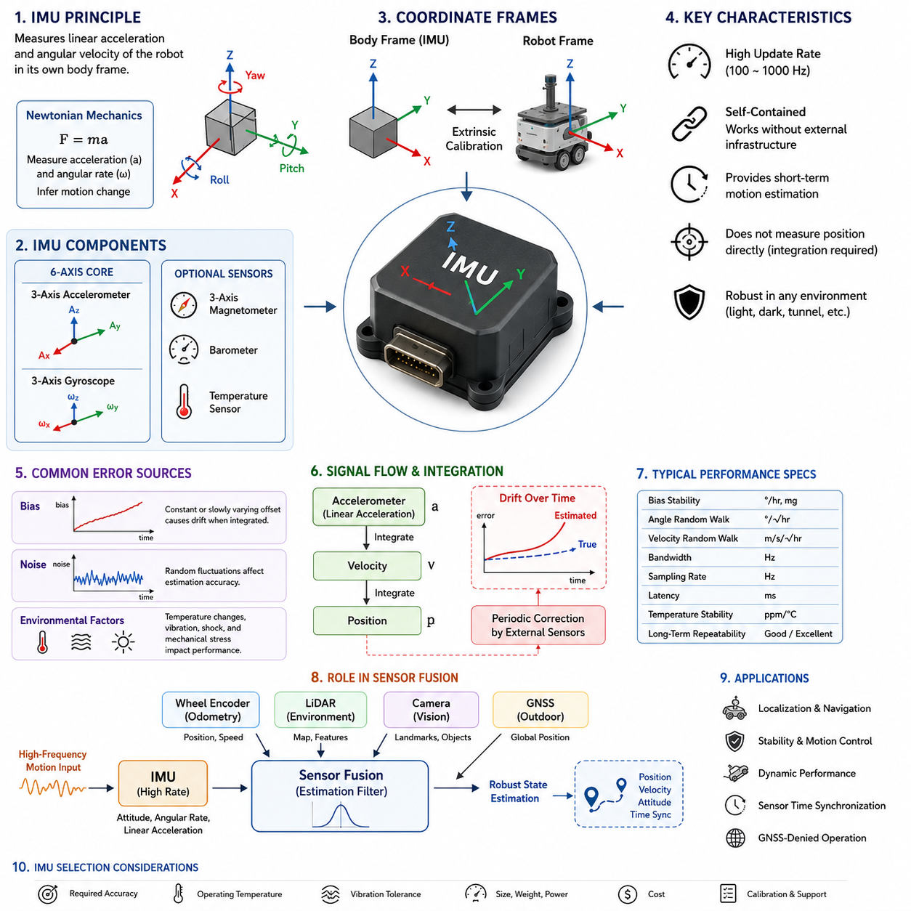
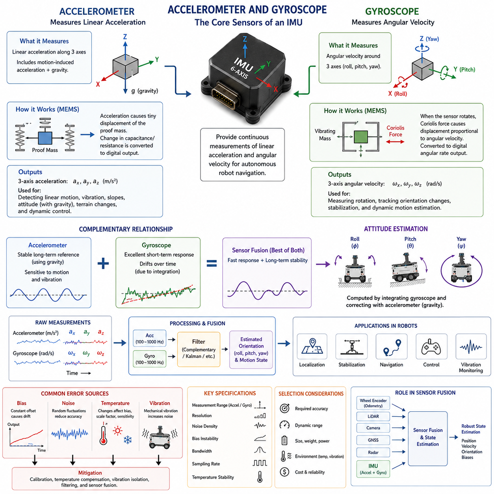
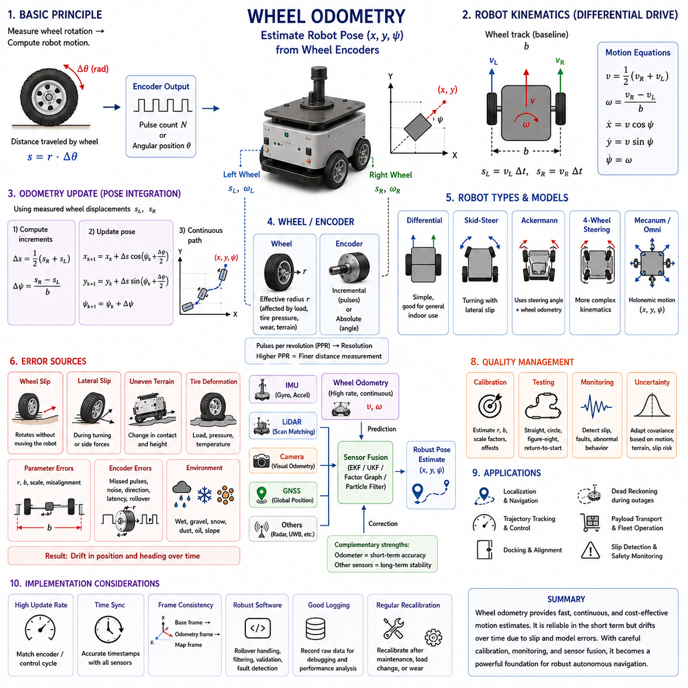
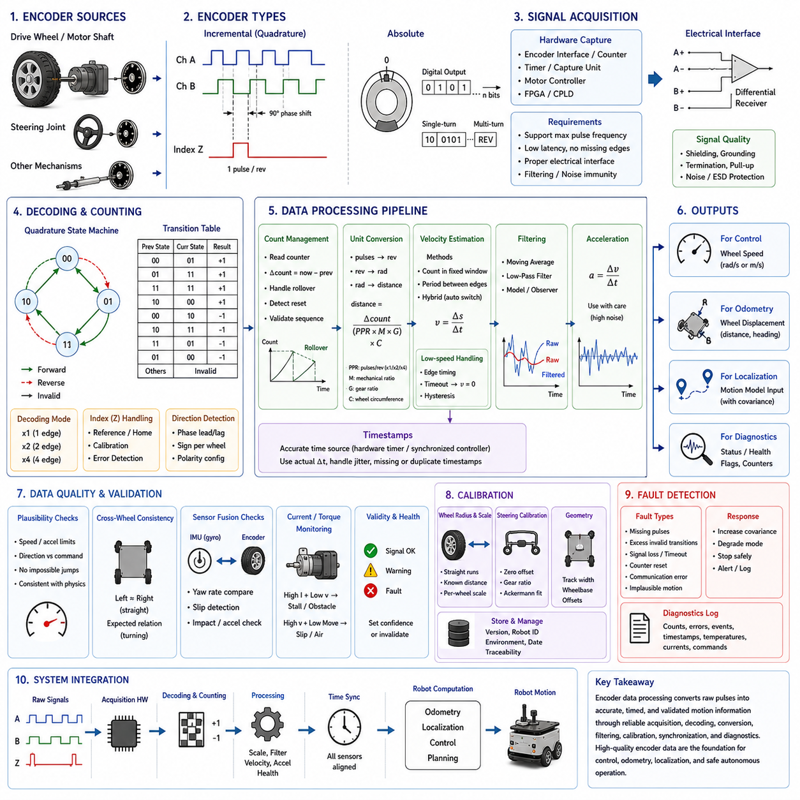
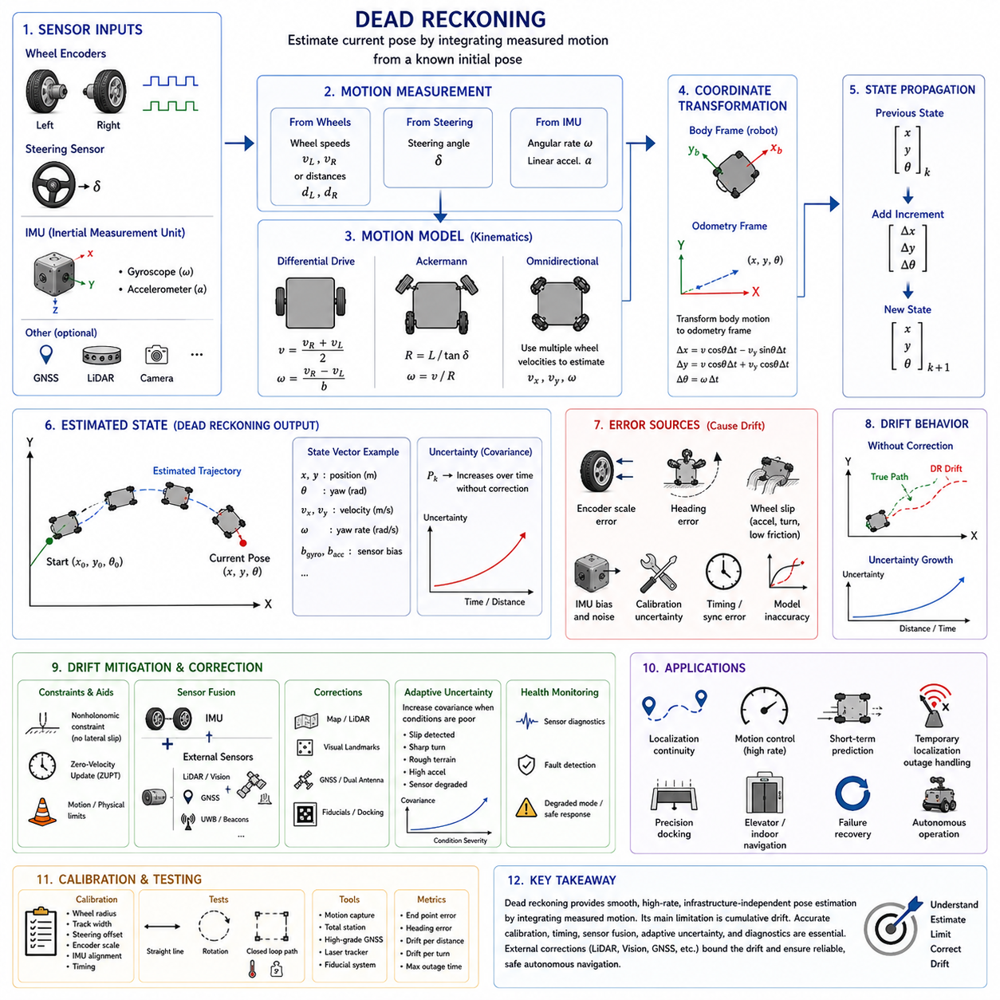
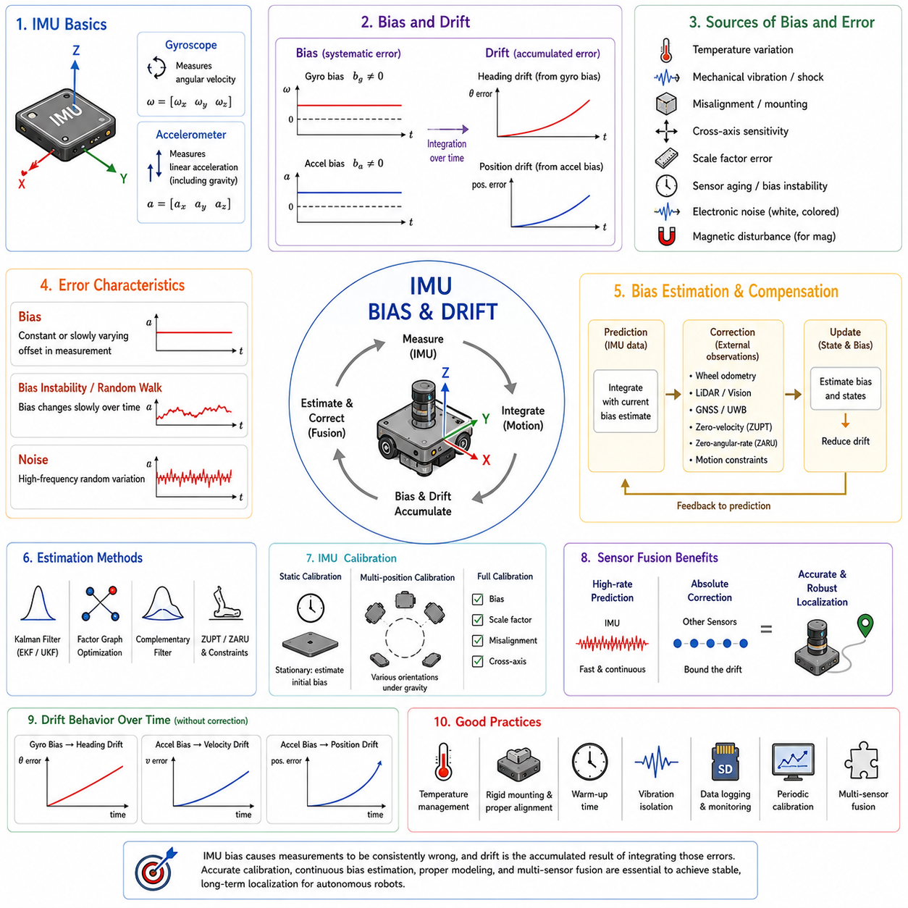
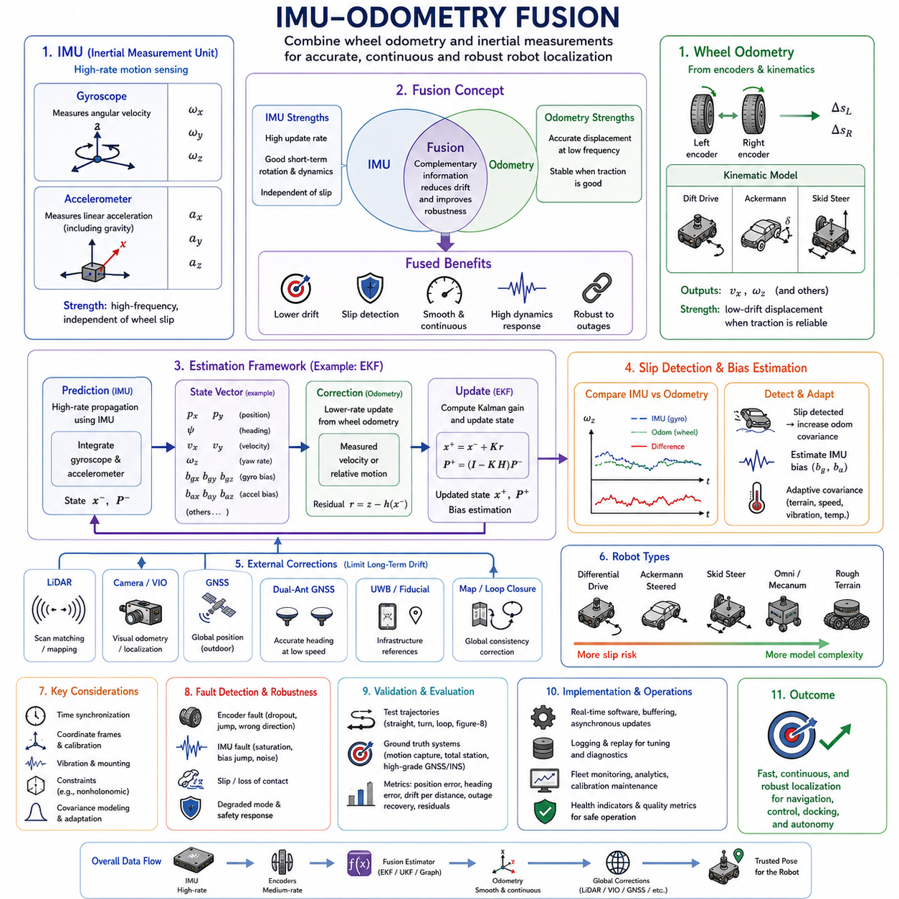
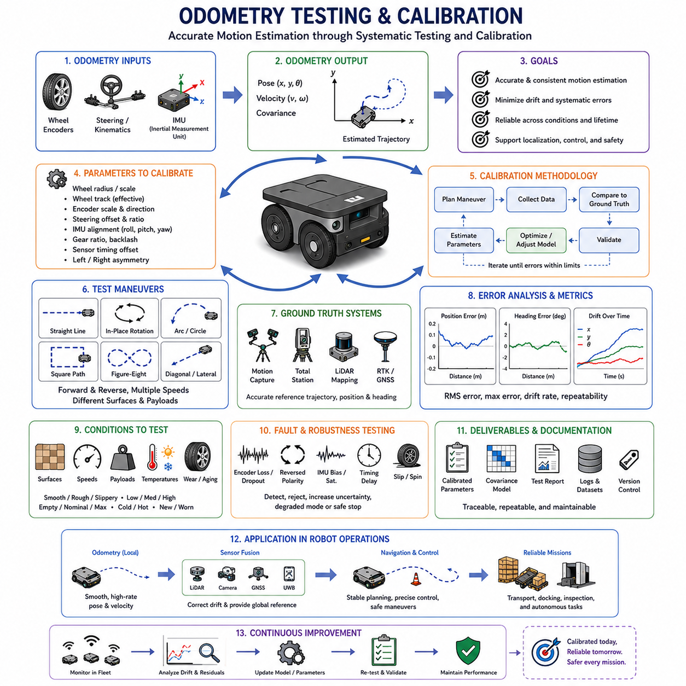

**Volume 03. AMR Sensors and Perception**

# Chapter 10. IMU and Odometry

## 10.1 IMU Principles

{width="7.268055555555556in" height="7.268055555555556in"}

An Inertial Measurement Unit, commonly referred to as an IMU, is one of the most fundamental sensing devices used in autonomous mobile robots because it continuously measures the motion state of the platform regardless of external infrastructure. Unlike sensors that depend on visible landmarks, satellite signals, or environmental features, an IMU observes the robot\'s own physical motion through internal inertial measurements. This capability allows an autonomous robot to estimate changes in orientation, velocity, and acceleration even when operating in environments where external positioning systems are unavailable or temporarily unreliable. As a result, the IMU serves as an indispensable component for localization, navigation, stabilization, and motion control in both indoor and outdoor AMR applications.

The operating principle of an IMU is based on Newtonian mechanics, where changes in motion are inferred from measured linear acceleration and angular velocity. Modern IMUs typically combine multiple microelectromechanical system sensors, commonly known as MEMS sensors, into a compact integrated package. A standard IMU contains three orthogonal accelerometers and three orthogonal gyroscopes that together provide six degrees of inertial measurement. More advanced industrial IMUs may additionally include three-axis magnetometers, barometers, or temperature sensors to improve orientation estimation and environmental awareness. The combination of these sensing elements enables continuous observation of the robot\'s dynamic state.

Accelerometers measure linear acceleration along the X, Y, and Z axes relative to the sensor coordinate frame. These measurements include both motion-induced acceleration and gravitational acceleration, making interpretation dependent on the robot\'s orientation. When a robot remains stationary, the accelerometer primarily detects Earth\'s gravitational force, allowing estimation of roll and pitch angles. During movement, however, acceleration generated by vehicle motion is combined with gravity, requiring additional algorithms to separate these components. Understanding this relationship between gravity and dynamic acceleration is essential for reliable attitude estimation in mobile robotics.

Gyroscopes measure angular velocity around each rotational axis of the sensor. Instead of directly reporting orientation, the gyroscope provides rotational rate, which must be integrated over time to estimate the robot\'s changing attitude. Because integration accumulates even small measurement errors, gyroscope estimates gradually drift away from the true orientation if left uncorrected. Nevertheless, gyroscopes remain highly valuable because they respond immediately to rapid rotational motion without being significantly affected by short-term external disturbances. Their fast dynamic response makes them one of the most important sensing elements for robot stabilization and motion tracking.

The coordinate system of an IMU plays a critical role in interpreting inertial measurements correctly. Sensor manufacturers define a body-fixed coordinate frame aligned with the physical orientation of the device. During robot integration, this body frame must be accurately related to the robot coordinate frame used by localization, mapping, and navigation software. Even a small installation error between these frames can introduce persistent orientation bias and motion estimation errors. Consequently, careful mechanical alignment and accurate extrinsic calibration are necessary whenever an IMU is installed on an autonomous mobile robot.

An IMU continuously produces measurements at relatively high sampling frequencies compared with many other perception sensors. Industrial-grade units often operate between one hundred and one thousand hertz, allowing the robot controller to observe rapid changes in vehicle dynamics. High-frequency measurements are especially important during sudden acceleration, emergency braking, high-speed cornering, or operation over uneven terrain. Because of this rapid update capability, IMU data frequently serve as the primary motion reference between slower updates from LiDAR, cameras, GNSS receivers, or wheel encoders.

One of the defining characteristics of inertial sensing is that the measurements are completely self-contained. Unlike GNSS receivers that require satellite visibility or cameras that require sufficient lighting and recognizable visual features, the IMU continues functioning regardless of environmental conditions. It can provide meaningful motion information inside tunnels, warehouses, underground facilities, dense forests, smoke-filled environments, or complete darkness. This independence from external references greatly improves the robustness of autonomous systems operating in diverse industrial environments where environmental sensing alone cannot guarantee continuous localization.

Despite these advantages, IMUs do not directly measure position. Instead, position estimation requires integrating acceleration into velocity and integrating velocity again into displacement. Every integration step amplifies small measurement errors, causing estimated position to drift progressively over time. Even extremely accurate inertial sensors eventually accumulate significant positional errors if no external corrections are applied. Consequently, IMUs are rarely used as stand-alone localization sensors in autonomous robots. Instead, they provide short-term motion estimation while complementary sensors periodically correct accumulated errors.

Bias represents one of the most important error sources affecting IMU performance. Bias refers to a constant or slowly varying offset added to the sensor output even when no actual motion exists. For example, a gyroscope may report a small angular velocity while remaining perfectly stationary. When such erroneous measurements are integrated over time, orientation estimates continuously deviate from reality. Similarly, accelerometer bias gradually introduces incorrect velocity and position estimates. Since bias changes with temperature, aging, vibration, and manufacturing tolerances, continuous estimation and compensation are essential for maintaining reliable inertial navigation performance.

Noise is another unavoidable characteristic of inertial sensors. Electronic components, mechanical structures, and manufacturing limitations introduce random fluctuations into acceleration and angular velocity measurements. Although individual noise samples appear insignificant, they influence integrated orientation and position estimates over extended operating periods. Engineers often apply digital filtering techniques, statistical estimation algorithms, and probabilistic sensor fusion methods to reduce the influence of measurement noise while preserving the rapid response characteristics that make IMUs valuable for real-time robot control.

Temperature significantly influences inertial sensor accuracy because MEMS structures expand, contract, and change electrical characteristics as operating conditions vary. Outdoor autonomous robots frequently experience wide temperature ranges throughout the day, while industrial environments may expose sensors to localized heat generated by motors, batteries, or electronic equipment. Many industrial IMUs therefore incorporate internal temperature sensors and calibration models that compensate for predictable thermal effects. Additional environmental testing across the intended operating temperature range is commonly performed during product validation to ensure stable performance under practical deployment conditions.

Mechanical vibration presents another challenge for inertial measurement systems. Heavy-duty mobile robots traveling over rough terrain generate continuous shocks and vibrations that propagate through the chassis into mounted sensors. Excessive vibration can degrade inertial measurements, increase apparent noise levels, and reduce orientation estimation accuracy. Engineers therefore pay careful attention to sensor mounting locations, structural rigidity, vibration isolation materials, and mechanical resonance characteristics during robot design. Appropriate mechanical integration complements software filtering to produce more reliable inertial measurements under dynamic operating conditions.

Industrial IMUs are commonly categorized according to performance, stability, and intended application. Consumer-grade MEMS devices provide low-cost solutions suitable for educational robots and consumer electronics but generally exhibit larger drift and reduced long-term stability. Industrial-grade IMUs improve bias stability, temperature compensation, vibration tolerance, and calibration quality for commercial autonomous systems. Tactical-grade and navigation-grade inertial systems offer even higher precision through advanced sensing technologies but involve significantly greater cost, size, and power consumption. Selecting an appropriate IMU therefore requires balancing accuracy requirements with overall system constraints.

The performance of an IMU cannot be evaluated solely by examining its measurement resolution. Engineers also consider bias stability, angle random walk, velocity random walk, scale factor accuracy, bandwidth, sampling frequency, latency, temperature stability, and long-term repeatability. These specifications collectively determine how rapidly errors accumulate during continuous operation. A sensor with slightly lower nominal resolution but superior long-term stability may outperform another device in practical autonomous navigation tasks because accumulated drift remains substantially lower over extended operating periods.

In modern autonomous mobile robots, IMUs rarely operate in isolation. Instead, they form the dynamic backbone of multi-sensor localization systems by providing high-frequency motion estimates between updates from complementary sensors. Wheel encoders estimate vehicle displacement, LiDAR observes surrounding geometry, cameras detect visual landmarks, and GNSS provides global positioning outdoors. Sensor fusion algorithms combine these independent observations to compensate for individual weaknesses while preserving their respective strengths. Within this integrated architecture, the IMU contributes continuous short-term motion estimation that improves overall localization accuracy, robustness, and responsiveness.

As autonomous mobile robots continue expanding into increasingly complex environments, the importance of inertial sensing continues to grow. Faster vehicle speeds, rough outdoor terrain, long-duration autonomous missions, and highly dynamic industrial operations all require stable and continuous estimation of the robot\'s motion state. Advances in MEMS manufacturing, calibration techniques, integrated sensor fusion, and intelligent estimation algorithms continue improving IMU performance while reducing size, power consumption, and cost. Consequently, the IMU remains one of the foundational sensing technologies supporting reliable localization, navigation, perception synchronization, and autonomous decision-making throughout the entire lifecycle of modern intelligent mobile robots.

## 10.2 Accelerometer and Gyroscope

{width="7.268055555555556in" height="7.268055555555556in"}

An accelerometer and a gyroscope are the two fundamental sensing elements that form the core of an Inertial Measurement Unit (IMU). Together, they provide continuous measurements of linear acceleration and angular velocity, allowing an autonomous mobile robot to estimate its motion even in the absence of external positioning infrastructure. Although both sensors observe different physical quantities, they complement one another by describing how the robot translates and rotates through three-dimensional space. Their combined measurements serve as the foundation for localization, attitude estimation, motion control, stabilization, and sensor fusion across nearly every modern autonomous robotic platform.

The accelerometer measures linear acceleration acting along three orthogonal axes that are aligned with the body frame of the sensor. These measurements represent the total acceleration experienced by the sensor, including both dynamic acceleration generated by motion and the constant acceleration caused by Earth\'s gravity. As a result, accelerometer outputs must always be interpreted within the context of the robot\'s orientation and current movement. Without considering gravity, the measured values cannot accurately distinguish whether the robot is accelerating, climbing a slope, or simply changing its attitude while remaining stationary.

Modern accelerometers used in robotic applications are primarily based on Microelectromechanical System technology. MEMS accelerometers contain microscopic proof masses suspended by tiny mechanical structures etched into silicon. When acceleration occurs, inertia causes the proof mass to move slightly relative to its supporting frame. This displacement changes electrical properties such as capacitance, piezoresistance, or resonance frequency, depending on the sensor design. Integrated electronic circuits convert these minute physical changes into digital acceleration measurements that can be processed by the robot controller in real time.

A three-axis accelerometer simultaneously measures acceleration along the X, Y, and Z directions of the sensor coordinate frame. Because motion rarely occurs along only one axis, observing all three components provides a complete description of translational dynamics. During robot operation, these measurements reveal acceleration caused by forward motion, braking, lateral movement, terrain changes, vibrations, and external disturbances. The resulting vector enables estimation of vehicle dynamics that would otherwise be impossible to observe using wheel encoders or visual sensors alone.

Gravity represents one of the most useful reference signals measured by an accelerometer. When a robot remains stationary, the only significant acceleration acting on the sensor is gravitational acceleration directed toward the Earth\'s center. By examining how gravity projects onto the sensor axes, the robot can estimate roll and pitch angles relative to the horizontal plane. This capability provides an absolute reference for attitude estimation that does not accumulate drift over time. Consequently, accelerometers play a central role in maintaining long-term orientation stability within inertial navigation systems.

During dynamic motion, however, separating gravitational acceleration from motion-induced acceleration becomes significantly more challenging. For example, when a robot rapidly accelerates forward, the accelerometer detects both forward acceleration and gravity simultaneously. Similar effects occur during braking, turning, climbing, or descending slopes. Because these acceleration components are combined within the same measurement, estimation algorithms must carefully distinguish between them using additional information from gyroscopes and other sensors. This distinction forms one of the primary motivations for multi-sensor fusion in autonomous robotic systems.

Unlike accelerometers, gyroscopes measure rotational motion instead of linear motion. A gyroscope continuously reports angular velocity around each of the three sensor axes, describing how rapidly the robot rotates rather than how fast it translates. These measurements allow the robot to estimate changes in heading, roll, and pitch during motion. Since rotational movement frequently occurs much faster than translational changes, gyroscopes provide extremely responsive measurements that are essential for maintaining vehicle stability and accurate orientation estimation during aggressive maneuvers.

MEMS gyroscopes also rely on microscopic mechanical structures fabricated using semiconductor manufacturing techniques. Most MEMS gyroscopes operate according to the Coriolis effect, where a vibrating proof mass experiences an additional force when subjected to rotation. This Coriolis force produces a measurable displacement that is proportional to the applied angular velocity. Electronic circuitry detects this displacement and converts it into rotational rate measurements with very high sampling frequencies suitable for real-time robotic control applications.

A three-axis gyroscope independently measures rotational velocity around the X, Y, and Z axes. Roll rotation occurs around the forward axis, pitch rotation occurs around the lateral axis, and yaw rotation occurs around the vertical axis. Together, these measurements describe the complete rotational behavior of the robot throughout its motion. Whether the robot is turning around a corner, traversing uneven terrain, or recovering from an external disturbance, gyroscope outputs provide continuous information about rotational dynamics that cannot be directly inferred from linear acceleration alone.

The output of a gyroscope represents rotational rate rather than orientation itself. To determine the robot\'s attitude, angular velocity measurements must be integrated over time. This mathematical integration accumulates rotational increments into continuously updated orientation estimates. While this approach provides smooth and responsive attitude tracking, even very small measurement errors gradually accumulate throughout the integration process. As a consequence, gyroscope-derived orientation inevitably experiences drift unless corrected periodically using external references or complementary sensors.

The complementary characteristics of accelerometers and gyroscopes make them highly effective when used together. Accelerometers provide stable long-term orientation references through gravity but are sensitive to dynamic motion and vibration. Gyroscopes provide excellent short-term rotational tracking but gradually drift because of integration errors. Combining these sensors allows the strengths of one device to compensate for the weaknesses of the other. This complementary relationship forms the basis of nearly every attitude estimation algorithm used in modern autonomous mobile robots.

Many robotic systems employ complementary filters, Kalman filters, or nonlinear estimation algorithms to combine accelerometer and gyroscope measurements. The gyroscope supplies rapid short-term orientation updates, while the accelerometer continuously corrects accumulated drift using the gravity reference whenever vehicle dynamics permit reliable observation. The resulting orientation estimate remains both responsive and stable across a wide range of operating conditions. This balance between dynamic responsiveness and long-term stability is essential for reliable autonomous navigation.

Sensor sampling frequency significantly influences inertial measurement quality. Accelerometers and gyroscopes commonly operate at frequencies ranging from one hundred to one thousand samples per second, allowing observation of rapid vehicle dynamics that occur between updates from slower sensors such as cameras or GNSS receivers. High sampling rates improve controller responsiveness, reduce estimation latency, and provide smoother state estimation. However, increased sampling frequencies also require greater computational resources and careful synchronization with the remainder of the perception system.

The measurement range selected for an accelerometer or gyroscope should match the intended application. Accelerometers may support ranges from a few multiples of gravitational acceleration to several hundred times gravity for highly dynamic environments. Similarly, gyroscopes offer different angular velocity ranges depending on expected rotational motion. Selecting excessively small ranges may cause signal saturation during aggressive maneuvers, whereas excessively large ranges reduce effective measurement resolution. Proper sensor selection therefore requires balancing dynamic range with measurement precision.

Noise is naturally present in both accelerometers and gyroscopes because of electronic circuitry, mechanical limitations, and manufacturing tolerances. Accelerometer noise appears as random fluctuations in measured acceleration, while gyroscope noise affects angular velocity estimates and accumulates during integration. Although individual noise samples are relatively small, their cumulative influence can significantly degrade navigation accuracy over extended operation. Digital filtering techniques are therefore widely employed to suppress high-frequency noise while preserving meaningful vehicle dynamics.

Bias represents another important source of measurement error. Accelerometer bias produces a constant offset in measured acceleration, while gyroscope bias introduces false rotational rates even when the robot remains perfectly stationary. Because gyroscope measurements undergo continuous integration, even tiny bias values eventually generate substantial orientation errors. Likewise, accelerometer bias influences velocity and position estimation after repeated integration. Continuous bias estimation and compensation therefore remain essential components of every high-performance inertial navigation system.

Temperature changes also influence accelerometer and gyroscope performance. Variations in environmental temperature alter the mechanical and electrical characteristics of MEMS structures, causing bias, scale factor, and sensitivity to vary throughout operation. Industrial IMUs frequently include integrated temperature sensors and compensation models that continuously adjust measurement outputs according to calibrated thermal behavior. Extensive environmental testing across the expected operating temperature range helps ensure reliable performance during outdoor deployment and demanding industrial applications.

Mechanical vibration presents a particularly challenging operating condition for inertial sensors mounted on autonomous robots. Motors, gearboxes, suspension systems, and uneven terrain generate continuous vibrations that propagate into the sensor package. Excessive vibration may increase apparent measurement noise, excite structural resonances, and degrade estimation accuracy. Engineers therefore devote considerable attention to mounting location, structural stiffness, vibration isolation materials, and signal filtering strategies to preserve measurement quality during demanding field operations.

Accelerometers and gyroscopes contribute to many different functions beyond localization alone. Their measurements support vehicle stabilization, traction control, rollover prevention, suspension monitoring, collision detection, payload motion estimation, terrain classification, precision docking, and dynamic path tracking. In aerial robots they provide the primary stabilization reference, while in ground robots they improve navigation reliability during wheel slip, uneven terrain, or temporary loss of environmental observations. Their versatility makes inertial sensing fundamental across nearly every class of autonomous robotic platform.

In practical autonomous mobile robot systems, accelerometers and gyroscopes operate as integral components within larger perception and navigation architectures rather than as isolated sensors. Their high-frequency inertial measurements complement wheel odometry, LiDAR, cameras, radar, GNSS, and other sensing modalities through advanced sensor fusion algorithms. Continuous improvements in MEMS fabrication, calibration methods, embedded processing, and estimation techniques continue increasing measurement accuracy while reducing sensor size, power consumption, and cost. Consequently, accelerometers and gyroscopes remain indispensable technologies for achieving robust, reliable, and high-performance autonomous navigation in modern intelligent mobile robots.

## 10.3 Wheel Odometry

{width="7.268055555555556in" height="7.268055555555556in"}

Wheel odometry is a motion estimation method that calculates the movement of an autonomous mobile robot from the rotation of its wheels. Encoders attached to drive motors or wheel shafts measure angular displacement, rotational speed, or pulse counts, and these values are converted into traveled distance and changes in robot orientation. Because wheel odometry operates continuously and does not depend on external landmarks, lighting, or satellite signals, it provides an important source of short-term motion information for localization, navigation, control, and sensor fusion.

The basic principle of wheel odometry is based on the geometric relationship between wheel rotation and linear travel. When a wheel with a known effective radius rotates through a measured angle, the distance traveled along the wheel circumference can be calculated by multiplying the wheel radius by the angular displacement. If the wheel completes one full revolution, the theoretical travel distance equals the circumference of the wheel. This simple relationship becomes the foundation for estimating robot motion from encoder measurements.

Wheel encoders generate discrete or continuous signals that represent rotational movement. Incremental encoders commonly produce pulses as the wheel rotates, while absolute encoders report a unique angular position within their operating range. The robot controller counts pulses, measures pulse timing, or reads angular values to determine how far and how fast each wheel has moved. Higher encoder resolution provides more measurement increments per revolution, allowing smaller wheel movements to be detected and improving low-speed control and short-distance motion estimation.

In a differential-drive robot, the left and right wheels are controlled independently. When both wheels travel the same distance, the robot moves approximately along a straight path. When one wheel travels farther than the other, the robot follows a curved trajectory. If the wheels rotate in opposite directions at equal speeds, the platform can turn around a point near the center of its drive axle. Wheel odometry uses these distance differences to estimate forward displacement and change in heading over each measurement interval.

The pose of a mobile robot is commonly represented by its position in a plane and its heading angle. Wheel odometry updates this pose by integrating small motion increments over time. During each update cycle, the controller calculates the average distance traveled by the drive wheels and the angular change caused by their difference. The estimated displacement is then projected onto the global or local coordinate frame according to the current heading, creating a continuously updated trajectory of the robot.

For a differential-drive platform, the change in heading is approximately proportional to the difference between right and left wheel travel divided by the distance between the wheels. This distance is often called the wheel track, axle track, or baseline. Accurate knowledge of the effective wheel track is essential because even a small parameter error can generate systematic heading drift. The average of the two wheel distances represents the forward motion of the robot along the centerline of the platform.

Straight-line motion appears simple, but practical wheel odometry must account for small differences in wheel diameter, motor response, tire deformation, and encoder scaling. If the effective radius of one wheel is slightly larger than the other, equal encoder counts may correspond to unequal physical distances. The robot will gradually curve even though the control system commands straight travel. Calibration is therefore required to identify correction factors that reduce systematic distance and heading errors.

Skid-steer robots use multiple fixed wheels on the left and right sides of the chassis and change direction by creating a speed difference between the two sides. Their wheel odometry is more complex than differential-drive odometry because turning requires some wheels to slide laterally across the ground. The relationship between wheel rotation and actual vehicle motion depends strongly on surface friction, vehicle mass, tire characteristics, and turning radius. A purely geometric model may therefore produce significant errors during aggressive steering.

Four-wheel and six-wheel outdoor platforms often experience additional odometry uncertainty because the wheels do not always follow ideal rolling constraints. Suspension movement changes the load on individual tires, rough terrain creates local slip, and soft surfaces allow tires to sink or deform. When the robot climbs over obstacles or travels across uneven ground, encoder rotation may not correspond directly to horizontal displacement. Wheel odometry remains useful, but its uncertainty must be modeled and corrected through complementary sensors.

Ackermann-steered robots estimate motion using wheel rotation together with steering angle. In an ideal model, all wheels follow circular paths around a common instantaneous center of rotation. The steering geometry determines the curvature of the vehicle trajectory, while the wheel encoder determines traveled distance. Errors in steering angle measurement, tire slip, mechanical backlash, and compliance can affect the calculated path, particularly during low-speed maneuvers or when the vehicle carries a heavy payload.

Four-wheel steering systems require a more detailed kinematic model because both front and rear wheel angles influence the direction of motion. Depending on the steering mode, the robot may perform conventional turning, coordinated steering, crab motion, or near-zero-radius rotation. Wheel odometry must know the active steering configuration and the actual wheel angles rather than relying only on commanded values. Accurate steering feedback is therefore as important as wheel rotation measurement in these platforms.

Mecanum-wheel and omnidirectional robots estimate planar motion by combining the rotational velocities of several wheels with angled rollers. These platforms can move forward, sideways, diagonally, and rotationally without changing their body orientation first. The odometry model transforms individual wheel speeds into longitudinal velocity, lateral velocity, and yaw rate. Although the kinematic equations provide full planar movement, roller slip and uneven floor contact can cause substantial odometry errors, especially during lateral motion.

Wheel odometry is normally calculated at a relatively high update rate, often matching the encoder sampling or motor-control cycle. Frequent updates allow the controller to observe rapid changes in velocity and provide smooth feedback to local planning and trajectory tracking modules. High update frequency also makes odometry valuable between slower measurements from cameras, LiDAR localization, or GNSS. However, a high rate does not guarantee accuracy because systematic errors and slip can accumulate quickly even when measurements arrive frequently.

Velocity estimation can be obtained by dividing the measured wheel displacement by the sampling interval. At moderate and high speeds, this method generally produces stable results because many encoder pulses occur during each interval. At very low speeds, however, only a few pulses may be detected, causing quantization and irregular velocity estimates. Measuring the time between encoder edges can improve low-speed resolution, although this approach becomes sensitive to timing noise and requires careful handling when the wheel stops.

Encoder resolution determines the smallest theoretical wheel displacement that can be measured. A high-count encoder attached directly to the motor shaft can provide very fine angular resolution, especially when combined with a gearbox. However, gearbox backlash, shaft elasticity, and drivetrain compliance may prevent motor rotation from exactly representing wheel rotation. Mounting the encoder closer to the wheel can reduce some drivetrain uncertainty, but mechanical packaging, environmental protection, and cost may influence the final sensor location.

The effective wheel radius is not always identical to the nominal tire radius specified in drawings or catalogs. Tire pressure, rubber compression, tread wear, payload, temperature, and surface properties can change the rolling radius during operation. Heavy robots may experience measurable tire deflection as the load changes, causing distance scale errors if a single fixed radius is used. Calibration under representative loading conditions is therefore important for platforms expected to carry variable or heavy payloads.

Wheel slip is the most common limitation of wheel odometry. Slip occurs when the wheel rotates without producing the corresponding ground displacement, or when the robot moves while the wheel rotation does not fully represent that motion. Rapid acceleration, hard braking, steep slopes, wet surfaces, loose gravel, dust, snow, and oil-contaminated floors can all produce slip. Since the encoder measures wheel motion rather than actual body motion, the odometry system may interpret slip as genuine vehicle displacement.

Lateral slip is particularly important during turning. Standard wheel odometry models often assume that each wheel rolls in its forward direction without sideways movement. Real tires violate this assumption when steering forces, skid-steer behavior, surface irregularities, or high lateral acceleration are present. The robot may follow a wider or narrower path than predicted, producing heading and position errors. These errors can become severe when repeated turns occur without external localization updates.

Unequal ground contact can also degrade odometry. A wheel may temporarily lose contact while crossing a bump, pothole, threshold, or debris. The unloaded wheel can spin faster than expected, generating encoder counts that do not represent vehicle movement. Suspension systems reduce this problem by maintaining contact, but they also introduce dynamic changes in wheel loading and geometry. Monitoring motor current, suspension position, inertial motion, or wheel speed consistency can help identify abnormal contact conditions.

Systematic odometry errors arise from repeatable geometric or calibration inaccuracies. Examples include incorrect wheel radius, unequal left and right wheel scaling, inaccurate wheel track, steering angle offset, encoder scale error, and misalignment between the wheel frame and robot frame. Because these errors occur consistently, they can often be measured and corrected through calibration. Straight-line tests, repeated rotations, closed-loop paths, and bidirectional runs are commonly used to estimate model parameters and correction coefficients.

Non-systematic errors arise from unpredictable interactions between the robot and its environment. Wheel slip, small obstacles, floor contamination, loose terrain, tire deformation, collision forces, and varying payload distribution can change from one run to another. These errors are difficult to eliminate using static calibration because they depend on current operating conditions. Instead, the localization system must detect increased uncertainty and rely more strongly on independent measurements from IMU, LiDAR, cameras, radar, or GNSS.

Wheel odometry error accumulates because each new pose is calculated from the previous estimated pose. A small distance or heading error in one update affects all subsequent positions. Heading error is especially damaging because an incorrect orientation changes the direction in which future displacement is projected. Even a small angular error can therefore create a large lateral position error after the robot travels a long distance. Wheel odometry is consequently reliable over short intervals but unsuitable as the only long-term localization source.

Dead reckoning uses wheel odometry to propagate the robot state from a known starting pose. The system estimates current position by continuously integrating measured motion without requiring an external reference at every instant. This capability is valuable when environmental localization temporarily fails, such as in featureless corridors, reflective areas, darkness, dust, or short GNSS outages. The duration for which dead reckoning remains useful depends on the platform, surface, calibration quality, driving behavior, and acceptable error limit.

Wheel odometry frequently serves as the motion prediction input for probabilistic localization algorithms. An Extended Kalman Filter, Unscented Kalman Filter, factor graph, or particle filter can use encoder-derived velocity to predict the robot state before incorporating other sensor observations. The prediction provides continuity and narrows the range of possible poses, while external measurements correct accumulated drift. The uncertainty assigned to wheel odometry should increase when the robot performs motions or enters environments associated with high slip risk.

Fusion with an IMU significantly improves short-term motion estimation. Wheel encoders provide strong information about traveled distance and commanded drivetrain behavior, while the gyroscope measures actual angular velocity of the robot body. If wheel-based yaw rate and measured yaw rate disagree, the system may detect slip, collision, or incorrect wheel contact. Accelerometer measurements can also reveal unexpected longitudinal or lateral dynamics, although vibration and gravity must be considered during interpretation.

For outdoor robots, GNSS provides global position corrections that prevent long-term wheel odometry drift. Wheel odometry continues to supply smooth, high-rate motion information between GNSS updates and during short signal interruptions. In urban canyons, near buildings, under trees, or beside metal structures, GNSS measurements may become noisy or biased. A robust fusion system should therefore evaluate GNSS quality rather than automatically replacing locally consistent odometry with an unreliable absolute position measurement.

LiDAR localization and simultaneous localization and mapping can use wheel odometry as an initial estimate for scan matching. A good motion prediction reduces the search area required to align consecutive scans or match the current scan to a map. This improves computational efficiency and helps avoid incorrect local minima during rapid movement. The LiDAR result then corrects encoder drift by observing actual environmental geometry. The two sensing methods are therefore complementary in both indoor and outdoor navigation.

Visual odometry can also be combined with wheel odometry. Cameras estimate motion by tracking image features or optimizing photometric relationships across frames, while encoders provide a physically grounded motion prior. Wheel information can stabilize visual estimation during motion blur, weak texture, lighting changes, or short feature losses. Conversely, visual motion can reveal wheel slip because it observes movement relative to the environment rather than relying on drivetrain rotation.

Time synchronization is essential when wheel odometry is fused with other sensors. Encoder values, steering angles, motor states, IMU measurements, LiDAR scans, camera frames, and GNSS positions must refer to consistent time points. Even a small timestamp offset can appear as a spatial error when the robot moves quickly or rotates. The problem becomes especially visible during turns, where delayed wheel information causes the estimated heading to lag behind the true vehicle motion.

Communication latency and software scheduling can further affect odometry quality. Encoder data may pass through motor controllers, field buses, device drivers, middleware, and processing nodes before reaching the localization algorithm. If timestamps are assigned only when messages arrive at the host computer, variable transport delay can distort velocity and pose estimates. Hardware-generated timestamps or timestamps created close to the measurement source provide a more accurate basis for synchronization and state estimation.

Coordinate frames must be defined consistently throughout the odometry pipeline. Wheel motion is first interpreted in a vehicle or base frame, while the integrated pose may be expressed in an odometry frame. Mapping and global localization systems may then relate the odometry frame to a map frame. Separating locally continuous odometry from globally corrected localization prevents sudden global pose corrections from directly disturbing low-level control. This frame hierarchy is widely used in robotic software architectures.

The odometry frame is usually designed to remain smooth and continuous even though it may drift gradually. Controllers and local planners benefit from this continuity because they require stable short-term motion estimates without sudden jumps. The map frame provides global consistency and may be corrected when loop closure, GNSS, or map matching identifies accumulated error. A transformation between the map and odometry frames absorbs these corrections while preserving the locally smooth relationship between the odometry frame and robot body.

Covariance expresses the uncertainty associated with the wheel odometry estimate. Position and orientation uncertainty should not be treated as constant because it depends on motion type, travel distance, speed, steering angle, terrain, and detected slip. Straight motion on a clean industrial floor may justify relatively low uncertainty, while sharp skid-steer turns on gravel should produce much higher lateral and heading uncertainty. Realistic covariance helps sensor fusion algorithms assign appropriate confidence to each measurement source.

Odometry quality monitoring can compare predicted and observed behavior in real time. Differences between left and right wheel speeds, unexpected motor current, encoder discontinuities, steering command errors, IMU disagreement, and inconsistent external localization residuals may indicate a developing fault. Monitoring these indicators allows the system to reduce speed, increase uncertainty, reject invalid measurements, or request operator assistance before localization error creates a navigation or safety problem.

Encoder faults can occur because of damaged cables, loose connectors, contamination, magnetic interference, power instability, or mechanical misalignment. A failed encoder may become stuck, produce missing pulses, reverse direction unexpectedly, or generate unrealistic jumps. Plausibility checks should compare encoder rates with motor commands, neighboring wheels, vehicle acceleration, and maximum physical limits. Fault handling is especially important for autonomous robots because corrupted odometry can influence both motion control and obstacle-avoidance behavior.

Counter rollover and numerical precision must also be considered in long-duration operation. Incremental encoder counts may eventually reach the maximum value of a fixed-width integer and wrap to the opposite limit. Software that does not handle this transition correctly can interpret the rollover as a very large reverse movement. Robust implementations calculate count differences using appropriate modular arithmetic and maintain stable internal representations during continuous missions, restarts, and communication interruptions.

Direction detection is another practical concern. Quadrature encoders use two phase-shifted channels to determine both movement amount and rotational direction. Incorrect wiring, channel reversal, or software configuration can invert the reported wheel direction. This problem may cause the estimated pose to move opposite to the actual robot or create incorrect turning behavior. Commissioning tests should verify each wheel independently and confirm that positive encoder direction matches the robot coordinate convention.

Calibration should be performed with the complete mechanical system assembled because drivetrain and tire behavior influence the effective odometry parameters. A robot can be driven over a known straight distance to estimate wheel scale and commanded through repeated rotations to estimate wheel track or steering relationships. Tests should be conducted in both directions and repeated several times to separate systematic bias from random variation. Representative payload and tire conditions should also be included.

Closed-path testing provides a practical measure of accumulated odometry error. The robot follows a rectangular, circular, or mixed trajectory and returns to its starting location. The difference between the estimated final pose and the known start pose reveals translational and rotational drift. Repeating the path clockwise and counterclockwise helps identify asymmetric errors, while varying speed and payload exposes dynamic effects that may not appear during a single low-speed calibration run.

Ground-truth systems improve odometry validation by providing an independent reference trajectory. Indoor testing may use motion capture, laser trackers, total stations, fiducial systems, or accurately surveyed landmarks. Outdoor validation may use high-grade GNSS and inertial reference equipment. The wheel odometry trajectory is aligned with the reference and evaluated using distance error, heading error, drift per traveled meter, endpoint error, and performance under different motion patterns.

Wheel odometry parameters may change throughout the robot lifecycle. Tire wear reduces effective radius, maintenance can alter wheel alignment, payload changes affect deformation, and component replacement may introduce different encoder or gearbox characteristics. Periodic recalibration or automated parameter estimation helps maintain performance over time. Fleet-level analysis can also compare odometry behavior among robots of the same model and identify units that deviate from expected performance.

Heavy-payload robots require special attention because wheel loading changes tire deformation and traction behavior. A platform may produce different distance scale factors when unloaded and fully loaded, while acceleration and braking can shift the load between axles. The localization system may use payload state, suspension measurements, or calibrated operating profiles to adjust odometry parameters and uncertainty. Conservative motion limits can further reduce slip during transport of heavy or high-value materials.

Precision docking depends strongly on reliable short-range odometry. Once the robot approaches a docking station, wheel encoders provide smooth incremental motion needed for low-speed alignment and final approach control. However, odometry alone cannot guarantee absolute docking accuracy because accumulated error and wheel slip remain possible. Fiducial markers, LiDAR geometry, cameras, magnetic references, or mechanical guides are commonly combined with wheel odometry to achieve repeatable final positioning.

Wheel odometry also supports motion control by providing feedback about actual wheel speed and estimated robot velocity. Low-level controllers compare measured wheel rotation with requested values and adjust motor torque to reduce error. Higher-level controllers use body velocity and pose estimates to follow paths and trajectories. Reliable feedback improves acceleration control, stopping behavior, cornering, and synchronization among multiple wheels, particularly when the robot operates with varying payload or floor resistance.

In safety-related operation, wheel odometry can contribute supporting information but should not be treated as an independent safety-rated measurement unless the entire sensing and processing chain satisfies the required safety integrity. Standard encoders and software may fail without immediate detection. Safety functions such as protective stopping normally rely on certified devices and validated architectures. Nevertheless, odometry can support diagnostic monitoring, stopping-distance estimation, and consistency checks within the broader safety concept.

Simulation provides a useful environment for developing wheel odometry algorithms before hardware testing. A simulator can generate ideal encoder values, controlled noise, wheel slip, sensor delay, and parameter errors while providing exact ground truth. Developers can evaluate kinematic models, filters, covariance settings, and fault detection under repeatable conditions. However, simulated tire and surface interactions rarely capture all real-world effects, so field validation remains necessary before deployment.

A robust wheel odometry implementation should preserve raw encoder data in logs together with timestamps, motor commands, steering angles, IMU measurements, and localization outputs. Recorded data enables engineers to reproduce field problems, compare algorithms, estimate parameters, and distinguish sensor faults from environmental slip. High-quality logging is particularly valuable because odometry failures often occur only under specific combinations of speed, payload, terrain, and steering behavior.

Wheel odometry remains one of the most practical motion sensing methods in autonomous mobile robotics because it is inexpensive, compact, fast, and directly connected to the vehicle drivetrain. Its greatest strength is continuous short-term motion estimation, while its primary weakness is unbounded drift caused by slip and accumulated model error. When carefully calibrated, monitored, time-synchronized, and fused with IMU, LiDAR, cameras, radar, or GNSS, wheel odometry provides a reliable foundation for localization, navigation, control, docking, and autonomous operation across diverse AMR platforms.

## 10.4 Encoder Data Processing

{width="7.268055555555556in" height="7.268055555555556in"}

Encoder data processing is the set of methods used to convert raw rotational signals from motors, wheel shafts, steering joints, and auxiliary mechanisms into reliable motion information for an autonomous mobile robot. The encoder itself only reports pulses, electrical states, or angular positions. Software must interpret these signals, assign direction, remove invalid transitions, calculate displacement and velocity, synchronize timestamps, detect faults, and publish consistent data for control, odometry, localization, and diagnostics.

The processing chain begins at the physical sensing element. Incremental encoders generate repeated electrical transitions as a shaft rotates, while absolute encoders provide a unique digital value for each angular position within their measurement range. Magnetic, optical, inductive, and capacitive sensing technologies may be used depending on required accuracy, speed, contamination resistance, temperature range, and cost. Regardless of technology, the raw output must be decoded correctly before it can represent meaningful robot motion.

Incremental encoders are widely used in drive systems because they are compact, inexpensive, and capable of high update rates. Their output normally consists of pulse channels that repeat continuously as the shaft rotates. The controller determines movement by counting these pulses over time. Since the encoder does not directly retain a unique absolute shaft position, the system must preserve the accumulated count or establish a known reference during initialization whenever an absolute position is required.

Quadrature encoders use two pulse channels, commonly called channel A and channel B, with a phase difference of approximately ninety electrical degrees. The order in which the channels change indicates the direction of shaft rotation. When channel A leads channel B, the count may increase, while the opposite phase order causes the count to decrease. Correct decoding therefore provides both rotational displacement and direction using the same pair of digital signals.

A quadrature decoder can count one, two, or four transitions during each pulse period. Single-edge decoding counts only one selected edge, while double-edge decoding counts both rising and falling edges of one channel. Four-edge decoding counts every transition on both channels and provides the highest effective resolution. The selected mode influences distance resolution, interrupt load, noise sensitivity, and maximum measurable speed, so it must match the capability of the processor and encoder interface.

Some encoders include an index channel that generates one pulse per revolution. This signal can serve as a mechanical reference for identifying a repeatable angular location. During startup, a system may rotate the shaft until the index pulse is detected and then establish a known count origin. In mobile robot wheel odometry, the index channel is not always required, but it can support calibration, maintenance, gearbox alignment, steering reference initialization, and detection of accumulated count inconsistencies.

Absolute encoders report angular position directly rather than requiring continuous pulse accumulation. Single-turn devices provide a unique value within one revolution, while multi-turn encoders additionally track the number of completed revolutions. Their outputs may use parallel data, analog voltage, pulse-width modulation, serial buses, or industrial communication protocols. Absolute encoders simplify recovery after power loss, although communication delay, update rate, protocol handling, and value wraparound still require careful processing.

The first software responsibility is to capture encoder signals without losing valid transitions. Dedicated hardware counters, timer peripherals, motor-control units, or programmable logic devices are generally more reliable than ordinary software polling. Hardware capture reduces dependency on operating-system scheduling and allows accurate counting at high rotational speed. If interrupts are used, the processing load must remain below the rate at which transitions arrive under the maximum expected motor speed.

The maximum pulse frequency can be estimated from encoder resolution, gearbox ratio, and maximum shaft speed. A high-resolution encoder mounted on a fast motor shaft may produce hundreds of thousands or millions of edges per second. The entire acquisition path must support this frequency, including electrical receivers, filters, counter peripherals, firmware, communication buses, and host software. Otherwise, missing transitions will create distance and velocity errors that may not be immediately visible.

Electrical signal quality strongly affects data reliability. Encoder lines may be exposed to electromagnetic interference from motors, inverters, relays, power cables, and switching converters. Single-ended signals are more sensitive to noise over long cables, while differential signaling improves common-mode rejection and transmission robustness. Proper grounding, shielding, cable routing, termination, connector selection, and isolation help prevent false edges and corrupted direction information.

Digital input thresholds must match the encoder output type. Push-pull, open-collector, line-driver, differential, and industrial voltage outputs require different interface circuits. Incorrect pull-up resistors, voltage levels, or receiver configurations can produce slow edges, unstable logic states, or permanent signal damage. Before developing decoding software, engineers must verify the electrical specification and confirm that every channel is interpreted with the correct polarity and voltage standard.

Hardware or software filtering may be required when contact bounce, ringing, or electrical noise produces short invalid pulses. A digital glitch filter can reject transitions shorter than a configured duration, while analog filtering may suppress high-frequency interference before the signal reaches the processor. Filtering must be selected carefully because excessive filtering can delay legitimate edges or remove valid pulses at high speed. Validation should therefore cover the full expected rotational range.

Quadrature state decoding provides an additional method for rejecting invalid transitions. The two encoder channels form four valid states, and normal rotation follows a predictable sequence through these states. A direct jump between nonadjacent states may indicate noise, missed edges, or simultaneous sampling error. A transition table can classify each state change as forward, reverse, unchanged, or invalid. Counting invalid transitions provides useful diagnostic information about electrical and acquisition quality.

Raw encoder counts must be converted into physical units before they can support robot control and localization. The conversion depends on pulses per revolution, quadrature multiplication, gearbox ratio, wheel circumference, and any mechanical coupling ratio. If a motor encoder measures the motor shaft, the gearbox ratio must be applied to obtain wheel rotation. Incorrect interpretation of any scaling factor can produce consistent but significant errors in wheel speed, traveled distance, and robot pose.

The sign convention must also be defined consistently. Positive encoder rotation should correspond to the positive wheel direction established by the robot coordinate frame. Mechanical installation may cause identical encoders on opposite sides of a robot to produce opposite electrical directions for forward travel. Software can correct this using per-wheel polarity parameters, but the configuration must be verified during commissioning. Incorrect signs can make the robot appear to rotate or move backward in the odometry estimate.

Count differences are normally calculated between successive sampling instants rather than repeatedly converting the full accumulated count. The difference represents the angular increment during the interval and can be transformed into wheel displacement. This method simplifies velocity calculation and reduces sensitivity to large absolute counter values. However, the subtraction must correctly handle counter rollover, communication discontinuities, resets, and changes in encoder availability.

Fixed-width hardware counters eventually overflow or underflow. For example, an unsigned counter that reaches its maximum value returns to zero, while a signed counter may wrap from the positive limit to the negative limit. A naive subtraction can interpret this rollover as an extremely large movement. Robust processing uses modular arithmetic or explicitly checks boundary transitions so that the true small count difference is recovered even when the underlying counter wraps.

Unexpected counter reset must be distinguished from normal rollover. A motor controller reboot, communication restart, firmware update, or power interruption may return the count to zero or another default value. If the host interprets this reset as physical movement, it can create a large false odometry jump. The interface should include status flags, boot counters, reset timestamps, or sequence identifiers so that downstream software can reinitialize safely when the encoder source restarts.

Timestamp quality is as important as count accuracy. Velocity is calculated from movement divided by elapsed time, so an inaccurate sampling interval directly creates speed error. Timestamps should preferably be generated close to the measurement source rather than when a delayed message reaches the main computer. Hardware timer capture, synchronized motor controllers, or precise fieldbus timestamps provide better timing than host arrival time, especially when communication latency varies.

A constant sampling interval simplifies processing, but real systems often experience jitter due to task scheduling, bus traffic, interrupt priority, and middleware delays. Velocity calculation should therefore use the actual measured interval rather than assuming a perfectly fixed period. If timestamps are missing or duplicated, the measurement should be rejected or handled explicitly. Dividing by an incorrect or nearly zero interval can generate unrealistic speed spikes that propagate into control and localization systems.

Encoder velocity can be calculated by counting pulses within a fixed time window. This count-per-period method works well at moderate and high speeds because many pulses occur during each interval. It provides regular updates and is easy to integrate with control loops. At low speeds, however, only a few or no pulses may be observed during a window, causing quantized, discontinuous velocity estimates that alternate between zero and a small number of discrete values.

An alternative low-speed method measures the time between successive encoder edges. Since the time interval becomes longer as rotational speed decreases, this reciprocal-period method can provide fine resolution when pulse counts per control cycle are small. It becomes less effective at high speed because intervals are extremely short and timing resolution limits accuracy. Many practical systems combine pulse counting at higher speed with edge timing at lower speed.

Hybrid velocity estimation switches or blends between count-based and period-based methods according to speed and signal quality. Near zero speed, the algorithm must also determine when the wheel has truly stopped. If no new edge arrives, the previous period-based speed cannot remain valid indefinitely. A timeout gradually or immediately sets the estimated speed to zero after a physically reasonable interval. Hysteresis helps prevent repeated switching between methods around the transition threshold.

Filtering is commonly applied to encoder-derived velocity because differentiation amplifies quantization and timing noise. A moving average reduces short-term fluctuations but introduces delay proportional to the window length. A low-pass filter provides smoother output with configurable bandwidth, while more advanced observers can combine motor models, torque commands, and inertial measurements. Filter parameters must preserve the dynamics needed by the controller rather than merely producing visually smooth signals.

Excessive filtering can create serious control problems. If measured wheel speed responds too slowly, the controller may continue applying torque after the wheel has already accelerated, leading to overshoot or oscillation. Delayed odometry can also cause local planners and state estimators to lag behind actual motion. The filter cutoff frequency should therefore be selected using expected vehicle dynamics, control-loop bandwidth, measurement noise, and total system latency.

Acceleration can be estimated by differentiating encoder velocity, but the result is typically noisier than the velocity estimate. Quantization, timestamp jitter, gearbox motion, and filtering delay all affect the calculated acceleration. Encoder-derived acceleration may be useful for diagnostics and motion monitoring, but it should not automatically replace an accelerometer measurement. When used, appropriate filtering and confidence limits are necessary to prevent noise from being interpreted as real dynamic behavior.

Direction reversals require special processing because drivetrain backlash and mechanical compliance may allow the motor shaft to rotate before the wheel produces significant ground motion. Encoder data can correctly represent shaft rotation while overestimating immediate vehicle displacement. The effect is especially important during precision docking, low-speed oscillation, and frequent forward-reverse corrections. A drivetrain model or wheel-side encoder can reduce this source of uncertainty.

Gearbox backlash can also produce encoder motion when load direction changes without equivalent wheel movement. The magnitude depends on gearbox design, wear, torque, and mounting stiffness. Software may use a deadband, backlash compensation model, or directional calibration to reduce the effect. However, aggressive compensation can hide genuine movement or create discontinuities, so mechanical characterization and field testing are required before applying correction.

Wheel-side and motor-side encoders provide different information. A motor-side encoder offers high resolution because motor speed is multiplied by the gearbox ratio, but it includes uncertainty from backlash, shaft compliance, and gear deformation. A wheel-side encoder more directly observes wheel rotation but may have lower resolution and greater environmental exposure. Some high-performance systems use both signals to monitor drivetrain behavior and detect mechanical faults.

Multi-wheel robots require processing that preserves the identity of each encoder channel. A four-wheel or six-wheel platform may contain multiple drive encoders, steering encoders, and suspension sensors. Each signal needs a defined frame, scaling factor, polarity, timestamp source, health state, and diagnostic history. Mixing channels or applying the wrong calibration parameter can create motion errors that appear similar to mechanical problems and are difficult to diagnose after integration.

Steering encoder processing is essential for Ackermann and four-wheel-steering platforms. The raw angular value must be converted into the actual road-wheel angle through steering gear ratios, mechanical linkages, and offset calibration. Commanded steering position should not be substituted for measured steering angle because actuator error, backlash, compliance, or obstruction may prevent the wheel from reaching the requested position. Odometry should use measured geometry whenever possible.

Steering angle wraparound must be handled for absolute sensors that represent a circular range. A transition from the maximum value to zero may correspond to a small continuous angular movement rather than a large reverse rotation. Angle unwrapping reconstructs continuous motion when necessary, while normalization expresses the result within a selected interval such as minus pi to plus pi. The correct representation depends on whether the application needs joint position, accumulated rotation, or bounded steering angle.

Calibration converts ideal encoder scaling into parameters that match the assembled robot. Wheel radius, gearbox ratio, steering offset, wheel-track geometry, and encoder counts per revolution may differ slightly from nominal values. Straight-line travel, controlled rotations, known-distance runs, and ground-truth comparison are used to estimate correction factors. Calibration should be performed under representative tire pressure, payload, temperature, and surface conditions.

Per-wheel scale factors are useful when left and right wheel assemblies differ slightly. Even nominally identical tires can have different effective rolling radii because of manufacturing tolerance, wear, pressure, or load distribution. Applying one global conversion factor may produce systematic curvature during straight driving. Separate scale factors allow the processing layer to correct each encoder before the values enter the wheel odometry model.

Calibration parameters should be stored with version information and robot identity. A fleet may contain robots with different wheel sizes, encoder resolutions, gearboxes, or maintenance histories despite sharing the same software package. Configuration management prevents a parameter set from one vehicle being accidentally applied to another. Changes should be traceable so that engineers can relate field behavior to calibration updates, tire replacement, or drivetrain maintenance.

Encoder data should include a measure of validity rather than only a numerical value. A stale count, missing timestamp, excessive jump, invalid transition rate, communication timeout, or hardware diagnostic flag should reduce confidence or mark the measurement unusable. Downstream modules can then avoid treating a corrupted value as normal motion. Explicit quality status is preferable to silently replacing bad data with zero because zero may represent a valid stationary wheel.

Plausibility checks compare the encoder signal with physical and operational limits. The measured speed should remain within the maximum wheel capability, acceleration should be consistent with motor torque and vehicle dynamics, and direction should generally agree with the active command unless external force or rollback is possible. Sudden count jumps, impossible reversals, and repeated invalid quadrature states indicate potential faults that require rejection or degraded operation.

Cross-wheel consistency provides another layer of validation. During straight motion, corresponding left and right wheel speeds should remain similar within expected controller and terrain tolerances. During turning, their relationship should agree with the commanded curvature and kinematic model. Large unexplained differences may indicate wheel slip, encoder failure, mechanical drag, loss of ground contact, or motor-control problems. The acceptable threshold should depend on vehicle type and operating condition.

Comparison with IMU measurements can reveal motion inconsistencies that encoders alone cannot detect. A gyroscope measures actual body rotation, while wheel encoders predict yaw rate from left-right speed differences or steering geometry. Persistent disagreement may indicate lateral slip, incorrect wheel scaling, or steering measurement error. An accelerometer can also help identify sudden impacts, acceleration, or braking that are not reflected correctly in the wheel signals.

Motor current and torque estimates provide useful diagnostic context. High current with low encoder speed may indicate obstruction, mechanical binding, steep slope, or excessive load. High encoder speed with low expected body movement may indicate wheel spin or loss of contact. Combining encoder data with current, torque, and IMU information improves fault classification and helps distinguish electrical sensor failure from genuine mechanical or environmental behavior.

Communication sequence numbers help detect dropped, duplicated, or reordered messages. If encoder values are transmitted through CAN, Ethernet, serial links, or middleware, packets may occasionally be delayed or lost. A missing sequence number allows the receiver to recognize a gap and adjust the sampling interval or invalidate the velocity estimate. Without this information, a dropped message may appear as a larger ordinary displacement during the next update.

Buffering and interpolation are required when encoder data must be aligned with sensors operating at different rates. A localization system may request wheel position at the timestamp of an IMU sample, camera frame, or LiDAR scan. The processing layer can retain a time-ordered history of counts and interpolate angular position between neighboring samples. Extrapolation beyond the newest measurement should be limited because prediction uncertainty increases rapidly during acceleration or direction change.

Time synchronization across distributed motor controllers is especially important for multi-wheel platforms. If each controller uses an independent clock, small clock offsets can make wheel measurements represent different physical instants. During acceleration or turning, this misalignment creates artificial speed differences and incorrect yaw estimates. Precision Time Protocol, hardware synchronization lines, synchronized bus cycles, or periodic clock correction can reduce these errors.

The processed encoder output should use clearly defined units and message semantics. Wheel position may be expressed in radians, revolutions, meters, or cumulative counts, while velocity may use radians per second or meters per second. Mixing angular and linear units creates integration errors that can remain hidden when values appear numerically plausible. Interface documentation should define units, sign, coordinate frame, timestamp meaning, covariance, and reset behavior.

In ROS 2 systems, encoder data may be published through joint-state messages, custom motor feedback messages, or dedicated odometry nodes. The software architecture should separate hardware acquisition from kinematic interpretation. A hardware interface can expose calibrated wheel positions and velocities, while another module converts them into robot body motion. This separation supports reuse across robot models and simplifies testing of individual processing stages.

Real-time requirements depend on how encoder data are used. Low-level motor control may require deterministic updates at hundreds or thousands of hertz, while localization may operate at a lower but still consistent rate. Copying, serialization, scheduling, and network transport add latency and jitter. Critical control paths should therefore minimize unnecessary software layers, while higher-level consumers can receive downsampled or aggregated data with preserved timestamps.

Downsampling must include appropriate filtering to avoid aliasing. If a high-frequency encoder velocity signal is reduced to a lower output rate without filtering, rapid variations may appear as false low-frequency motion. An anti-aliasing filter removes content above the new Nyquist limit before samples are discarded. This is particularly relevant when motor ripple, wheel vibration, or gearbox oscillation appears in the high-rate data.

Encoder signals may contain periodic disturbances related to mechanical rotation. Tire eccentricity, gear tooth variation, shaft misalignment, and magnetic encoder imperfections can produce repeating velocity fluctuations even at constant true speed. Frequency analysis of recorded data can reveal these patterns. Some disturbances can be reduced through calibration or filtering, while others indicate mechanical defects that should be corrected rather than hidden in software.

Temperature can influence encoder electronics, magnetic field strength, mechanical dimensions, tire radius, and drivetrain friction. Although many encoders are relatively stable, high-precision applications may still observe scale or offset changes across the operating range. Temperature data can be recorded alongside encoder measurements to identify correlations. Compensation should be applied only when repeatable behavior has been confirmed through controlled testing.

Environmental protection affects long-term signal quality. Dust, water, oil, metal particles, vibration, and connector corrosion may degrade encoder performance in industrial or outdoor robots. Magnetic encoders may tolerate contamination better than optical devices, while optical encoders may offer very high resolution in protected environments. Data processing should monitor gradual increases in invalid transitions, missing pulses, or noise that may indicate deteriorating hardware before complete failure occurs.

Encoder diagnostics should distinguish transient anomalies from persistent faults. A single invalid transition may result from temporary interference, while repeated errors within a short period indicate a serious problem. Counters, moving rates, warning thresholds, and fault thresholds help the system respond proportionally. Temporary degradation may justify increased covariance, whereas a confirmed failure may require stopping the robot or switching to a reduced-capability mode.

Redundant encoders can improve availability in high-reliability systems. Two sensing channels may observe the same shaft using separate technologies, power supplies, or communication paths. Their outputs can be compared continuously, and disagreement beyond a threshold triggers a diagnostic response. True safety-rated redundancy requires careful independence analysis, but even non-safety redundancy can support fault detection and controlled recovery in autonomous operation.

Processed encoder data influence both control and localization, so failure containment is important. A corrupted count should not be allowed to create an extreme motor command or sudden pose jump. Rate limiters, validation gates, confidence states, and safe defaults can prevent propagation. However, the fallback behavior must be designed carefully because freezing a stale velocity or forcing a false zero value can also produce unsafe or unstable responses.

Logging should preserve raw counts, decoded direction, timestamps, calculated increments, filtered velocity, validity flags, controller commands, and relevant diagnostics. Recording only the final odometry output removes evidence needed to determine whether a field error originated in the encoder, acquisition hardware, calibration, timing, kinematic model, or sensor fusion stage. Structured logs make offline replay and root-cause analysis much more effective.

Replay tools allow the same recorded encoder stream to be processed by different algorithms and parameter sets. Engineers can compare filter bandwidths, rollover handling, fault thresholds, and calibration factors without repeating a physical test. Deterministic replay is especially valuable for rare field events such as intermittent cable faults, high-speed pulse loss, unusual wheel slip, or synchronization errors that are difficult to reproduce on demand.

Unit testing should cover conversion formulas, sign conventions, wraparound logic, invalid state decoding, timestamp handling, and reset recovery. Synthetic input sequences can represent forward motion, reverse motion, constant speed, acceleration, direction reversal, counter overflow, missing messages, duplicated timestamps, and signal noise. These tests ensure that software changes do not introduce subtle errors into a fundamental motion sensing pipeline.

Hardware-in-the-loop testing verifies that the acquisition system can process realistic electrical signals at expected and extreme frequencies. A signal generator or encoder emulator can produce quadrature pulses, index signals, noise bursts, phase errors, and sudden rate changes. The test confirms counter accuracy, filter behavior, interrupt capacity, communication timing, and fault detection without requiring the complete robot drivetrain to operate.

Vehicle-level validation must confirm that processed encoder data correspond to actual movement. The robot should perform straight runs, rotations, curves, low-speed crawling, rapid acceleration, braking, reverse motion, and repeated docking maneuvers. Tests should include different payloads, surfaces, temperatures, and battery states. Ground-truth equipment enables precise comparison between measured wheel motion, calculated body motion, and real vehicle displacement.

Acceptance criteria may include maximum count loss, velocity noise, timestamp jitter, scale error, invalid transition rate, latency, and drift over known paths. The limits should reflect the requirements of the complete system rather than isolated sensor capability. A localization system may tolerate moderate wheel velocity noise if LiDAR corrections are frequent, while precision docking may require highly stable low-speed increments and minimal latency.

Maintenance procedures should include inspection of encoder mounting, cable strain relief, connectors, tire condition, gearbox play, and calibration status. Mechanical changes can affect data even when the encoder electronics remain healthy. After tire replacement, drivetrain repair, motor replacement, or steering adjustment, relevant calibration tests should be repeated. Automated fleet diagnostics can identify robots whose encoder behavior deviates from the population.

Encoder data processing forms the bridge between raw electromechanical sensing and reliable autonomous motion estimation. Accurate counting alone is not sufficient; the complete solution must address electrical integrity, direction decoding, scaling, timing, filtering, low-speed estimation, rollover, calibration, synchronization, uncertainty, fault detection, logging, and validation. When these elements are implemented coherently, encoder measurements become a dependable foundation for wheel odometry, trajectory control, sensor fusion, diagnostics, precision docking, and long-duration autonomous robot operation.

## 10.5 Dead Reckoning

{width="7.268055555555556in" height="7.268055555555556in"}

Dead reckoning is a motion estimation method that determines the current pose of an autonomous mobile robot by starting from a known position and continuously integrating measured movement over time. Instead of directly observing absolute position, the system estimates how far the robot has traveled, how its orientation has changed, and how these changes modify its location. Wheel encoders, steering sensors, gyroscopes, accelerometers, and vehicle motion models commonly provide the incremental information required for this process.

The term dead reckoning describes navigation based on previously known state and subsequent measured motion. If the initial pose is represented by position coordinates and heading, each new displacement and rotation can be added to update the estimate. This approach allows a robot to maintain a continuous local trajectory even when external references such as GNSS, visual landmarks, mapped LiDAR features, or radio beacons are unavailable. Its main value is therefore continuity rather than permanent global accuracy.

For ground robots, wheel odometry is one of the most common dead-reckoning inputs. Encoders measure wheel rotation, and the kinematic model converts these measurements into forward displacement and heading change. Differential-drive platforms use left and right wheel travel, Ackermann vehicles combine wheel distance with steering angle, and omnidirectional robots use several wheel velocities to estimate planar movement. The quality of the result depends on how accurately wheel rotation represents actual body motion.

An inertial measurement unit provides another major source of dead-reckoning information. Gyroscopes measure angular velocity and support rapid heading and attitude updates, while accelerometers observe linear acceleration and gravity. In principle, acceleration can be integrated into velocity and position, but even small bias and noise grow rapidly through repeated integration. For this reason, ground robots usually combine inertial sensing with wheel odometry rather than relying on pure inertial navigation alone.

The basic dead-reckoning cycle consists of motion measurement, coordinate transformation, and state propagation. At each update, the system determines a small translational and rotational increment during the elapsed time interval. This increment is first expressed in the robot body frame and then transformed into the selected odometry or navigation frame using the current orientation. The transformed motion is added to the previous state to create the next estimated pose.

A planar mobile robot is commonly represented by an X position, a Y position, and a yaw angle. If the robot moves forward by a small distance, the displacement must be projected according to the current heading. A heading error therefore changes not only orientation but also the direction of every future position update. This coupling explains why rotational accuracy is especially important in dead reckoning and why small yaw errors can later create large lateral position errors.

Dead reckoning can also estimate velocity, angular rate, acceleration, and sensor bias as part of a larger state vector. A simple system may integrate only wheel displacement, while a more advanced estimator may use an Extended Kalman Filter, Unscented Kalman Filter, complementary filter, or factor graph. These methods represent uncertainty explicitly and combine different motion sensors according to their expected reliability. The underlying principle remains the same: predict the current state from the previous state and measured motion.

The initial pose strongly influences every later estimate because dead reckoning does not independently determine global position. If the starting location or heading is incorrect, the entire propagated trajectory will inherit that error. Initial alignment may therefore use a surveyed docking station, fiducial marker, known map location, GNSS position, manual initialization, or a localization result from another sensor. The system should also define how confidence in the starting pose is represented and transferred into later uncertainty.

Dead reckoning is attractive because it operates without requiring visibility of the external environment. It can continue inside tunnels, warehouses, elevators, underground areas, dark corridors, smoke, fog, dust, or other conditions that reduce the performance of cameras, LiDAR, or GNSS. It also provides measurements at much higher rates than many absolute localization systems. This makes it valuable for control continuity, short-term localization, motion prediction, and temporary failure recovery.

The most important limitation of dead reckoning is cumulative drift. Every motion update includes small errors caused by sensor noise, bias, calibration uncertainty, timing error, slip, and imperfect models. Since each new pose is calculated from the previous estimated pose, these errors are not discarded but continuously accumulated. The resulting position and orientation estimate may remain smooth and locally consistent while gradually diverging from the robot\'s true location.

Distance scale error is a common systematic source of drift. If the wheel radius, encoder scale, or transmission ratio is slightly incorrect, every calculated displacement will be proportionally too large or too small. The resulting error grows with total traveled distance. Straight-line calibration over a known reference distance can reduce this problem, but the effective scale may change with tire pressure, wear, payload, temperature, floor material, or wheel deformation.

Heading error often dominates long-distance dead-reckoning performance. A small difference between left and right wheel scales, an inaccurate wheel track, a steering-angle offset, or gyroscope bias can introduce gradual rotational error. Once heading is wrong, even accurately measured forward travel is projected in the wrong direction. This produces increasing cross-track position error and may cause the estimated trajectory to appear curved while the robot is physically moving straight.

Wheel slip creates non-systematic errors that are harder to correct through static calibration. During acceleration, braking, turning, slope climbing, or travel over wet, dusty, icy, loose, or uneven surfaces, the wheel may rotate without equivalent vehicle displacement. The encoder continues reporting rotation, so the dead-reckoning model interprets slip as real motion. Lateral slip during turns is especially damaging because it violates the assumed relationship between wheel velocity and body curvature.

Skid-steer platforms are particularly challenging because turning inherently requires some degree of tire sliding. Their effective turning geometry changes with surface friction, payload, speed, tire condition, and command profile. A fixed kinematic model may work well on one floor and poorly on another. Adaptive parameters, empirical correction models, IMU comparison, and increased covariance during turns can improve robustness, but the uncertainty cannot be eliminated completely using wheel data alone.

Ackermann and four-wheel-steering platforms introduce different dead-reckoning uncertainties. The estimated path depends on steering angle, wheelbase, steering linkage geometry, and tire behavior. Mechanical backlash, compliance, actuator tracking error, or miscalibrated steering sensors can cause actual curvature to differ from the model. The system should use measured steering angles instead of commanded values whenever possible and should account for different steering modes in complex platforms.

Inertial dead reckoning suffers from bias and noise accumulation. A gyroscope with a small constant bias produces a steadily increasing orientation error when angular rate is integrated. An accelerometer bias first creates velocity error and then position error after a second integration. Temperature changes, vibration, mechanical stress, and sensor aging can alter these biases during operation. Continuous bias estimation is therefore necessary for stable inertial-assisted dead reckoning.

Gravity handling is essential when accelerometer data are used. The sensor measures specific force in its own frame, which contains both vehicle acceleration and the effect of gravity. To estimate linear motion, the system must first know the sensor orientation and remove the gravity component accurately. Even a small attitude error can project part of gravity into a horizontal axis, creating a false acceleration that rapidly produces unrealistic velocity and position drift.

For ground robots, nonholonomic motion constraints can improve dead reckoning. A typical wheeled vehicle cannot move freely sideways under normal rolling conditions, so lateral body velocity may be assumed to remain near zero. This constraint helps suppress inertial drift and stabilize velocity estimation. However, the assumption becomes invalid during skid steering, side slip, collision, uneven terrain, or omnidirectional movement. The estimator should apply the constraint only when the platform and current motion support it.

Zero-velocity updates provide another useful correction opportunity. When the robot is known to be stationary, its true translational and angular velocities should be approximately zero. The estimator can use this condition to correct velocity error and estimate sensor bias. Reliable stationary detection may combine wheel speed, motor command, gyroscope output, accelerometer stability, and brake state. Incorrectly applying a zero-velocity update while the robot is moving can introduce severe estimation errors.

Motion constraints may also use known vehicle behavior. A ground robot generally remains close to the floor plane, and roll or pitch may change only within limits determined by terrain. Steering geometry, maximum acceleration, maximum yaw rate, and motor response provide additional physical bounds. These constraints do not create absolute position information, but they can reject implausible motion and reduce the growth of errors caused by noisy or faulty measurements.

Time synchronization directly affects dead-reckoning accuracy because all motion increments must correspond to the correct time interval. Wheel counts, steering angles, gyroscope samples, accelerometer data, and controller states may originate from separate devices with different clocks and communication delays. If measurements are combined at inconsistent times, the estimated translation and rotation will not describe the same physical motion. Errors become especially visible during rapid turning or acceleration.

Timestamps should preferably be assigned near the measurement source. Host arrival time may include variable delays from buses, drivers, middleware, scheduling, or network transport. Hardware clocks, synchronized motor controllers, precision time protocols, and trigger signals provide better temporal alignment. The dead-reckoning algorithm should use actual elapsed time between samples, detect duplicated or missing timestamps, and handle delayed measurements without creating false speed or acceleration spikes.

Coordinate-frame management is also fundamental. Sensor measurements may be expressed in wheel, steering, IMU, base, odometry, or map frames. Each transformation must reflect the correct mechanical mounting and sign convention. Misalignment between the IMU and robot body frame can cause angular or acceleration components to be interpreted incorrectly. Similarly, incorrect wheel direction or steering polarity can produce apparently valid values that update the pose in the wrong direction.

A common robotic frame architecture separates the odometry frame from the global map frame. Dead reckoning produces a smooth and continuous pose in the odometry frame, although this pose may drift over time. External localization systems estimate the relationship between the map and odometry frames and adjust it when global corrections become available. This separation prevents sudden map corrections from directly causing discontinuities in the local motion estimate used by controllers.

Covariance represents the uncertainty of the dead-reckoning estimate. It should increase as the robot travels farther without correction and should depend on the type of motion being performed. Straight travel on a clean, high-friction floor may produce relatively low short-term uncertainty, while sharp turns, skid steering, rough terrain, high acceleration, or detected wheel slip should increase uncertainty more rapidly. Realistic covariance is essential when dead reckoning is fused with other localization sources.

Using a constant covariance value is usually inadequate because dead-reckoning quality changes with speed, steering, terrain, payload, and sensor health. A motion-dependent model can increase uncertainty according to traveled distance and heading change. More advanced systems use wheel-speed disagreement, IMU residuals, motor current, suspension state, surface classification, or slip detectors to adapt covariance online. This allows the fusion algorithm to reduce trust when current conditions are unfavorable.

Dead reckoning frequently serves as the prediction stage of a localization filter. The estimator propagates the previous state using wheel and inertial measurements, producing a predicted pose and uncertainty. LiDAR localization, visual landmarks, GNSS, UWB, magnetic references, or fiducials then provide correction measurements. The prediction ensures high-rate continuity, while external observations prevent long-term drift. Neither part is sufficient by itself in demanding autonomous operation.

LiDAR-based localization benefits from dead reckoning because a predicted motion estimate narrows the search range for scan matching. If the initial pose guess is close to the true pose, the algorithm can align scans more efficiently and avoid incorrect local solutions. When the environment contains repetitive geometry or few distinctive features, the motion prior becomes particularly valuable. The corrected LiDAR result can then reset accumulated wheel and inertial drift.

Visual odometry and visual localization can also complement dead reckoning. Cameras observe motion relative to environmental features, while wheel and inertial sensors provide a high-rate prior independent of lighting texture. The inertial and wheel prediction can bridge brief visual failures caused by blur, glare, darkness, or occlusion. Conversely, visual motion can identify wheel slip because it reflects actual body movement rather than only drivetrain rotation.

GNSS is a common correction source for outdoor dead reckoning. Wheel and inertial estimates provide smooth local movement between GNSS updates and during short satellite outages. GNSS restores global position and limits long-term drift when signal quality is good. However, multipath, blockage, antenna problems, or poor correction data can produce unreliable positions. The fusion system must evaluate GNSS quality and should not force a noisy measurement into an otherwise consistent local trajectory.

Dual-antenna GNSS can provide heading information even when the robot is stationary or moving slowly. This is valuable because wheel-based heading requires motion and gyroscope heading drifts over time. When satellite visibility is adequate, GNSS heading can correct yaw drift without relying on magnetic measurements. During blockage, the system returns to inertial and wheel-based propagation until the absolute reference becomes reliable again.

Magnetometers may provide an additional heading reference, but industrial environments often contain steel structures, motors, current-carrying cables, and magnetic disturbances. These factors can distort the measured field and create large yaw errors. A magnetometer should therefore be calibrated and quality-monitored rather than treated as an always-correct compass. In many AMR applications, LiDAR, vision, dual-antenna GNSS, or map-based heading corrections are more dependable.

Dead-reckoning failure detection requires comparison among independent signals. Wheel-derived yaw rate can be compared with gyroscope measurements, while encoder speed can be compared with visual or LiDAR motion. Motor current and wheel acceleration can reveal spin, obstruction, or loss of contact. Large residuals may indicate slip, sensor failure, calibration error, or collision. The system should respond by increasing uncertainty, rejecting measurements, reducing speed, or entering a degraded mode.

Encoder faults can create serious dead-reckoning errors if counts freeze, jump, reverse, or disappear. Plausibility checks should compare values with motor commands, neighboring wheels, maximum physical limits, and prior motion. Counter rollover and device reset must be handled separately from real displacement. A single corrupted encoder message should not be allowed to create a large pose jump that destabilizes control or causes an incorrect navigation decision.

IMU faults require similar monitoring. A frozen gyroscope, temperature-related bias shift, excessive vibration, saturated accelerometer, or communication delay can distort the propagated state. Health flags, range checks, noise monitoring, temperature limits, and comparison with wheel motion support fault identification. Since wheel and inertial sensors may share power, timing, or mechanical disturbances, system designers should also consider common-cause failures rather than assuming complete independence.

Terrain awareness can improve dead-reckoning behavior. A robot traveling on polished concrete, gravel, mud, grass, snow, ramps, or metal plates experiences different slip characteristics. Perception systems may classify terrain using cameras, LiDAR, vibration, motor current, or wheel response. The estimator can then adjust process noise, acceleration limits, and slip expectations according to the detected surface. This approach makes uncertainty more representative of current operating conditions.

Payload also affects dead-reckoning accuracy. Heavy or uneven loads change tire deformation, traction, braking distance, suspension position, and steering response. The same encoder counts may correspond to slightly different effective displacement under different loads. Payload state, suspension sensors, or calibrated operating profiles can be used to modify wheel scale and covariance. Conservative acceleration and steering limits can further reduce slip during heavy transport.

Precision docking depends on stable dead reckoning during the final approach. Wheel encoders and gyroscopes provide smooth low-speed increments needed for alignment and motion control. However, dead reckoning alone cannot guarantee repeatable absolute docking because prior drift and local slip remain possible. Fiducial markers, docking LiDAR features, cameras, magnetic references, or mechanical guides are commonly introduced near the target to provide a final absolute correction.

Elevator navigation is another application where dead reckoning is valuable. GNSS is unavailable, and the enclosed cabin may provide limited or changing LiDAR and visual features. Wheel and inertial sensing can maintain local pose during entry, travel, and exit. Vertical acceleration or barometric information may help identify floor movement, although horizontal position still requires careful handling. A known elevator doorway or landing marker can reinitialize the robot after the transition.

Temporary localization outage handling is one of the strongest practical uses of dead reckoning. When a primary localization system reports low confidence or stops producing updates, the robot may continue for a limited distance using propagated motion. The allowed duration should depend on estimated uncertainty, environment, speed, safety margin, and mission context. The robot may reduce speed, avoid complex maneuvers, or stop when uncertainty exceeds a defined threshold.

The usable dead-reckoning horizon is not fixed. A well-calibrated robot moving slowly on a clean indoor floor may maintain useful accuracy over a considerable distance, while a skid-steer platform on loose gravel may drift rapidly within a single turn. The system should therefore base continuation decisions on uncertainty and observed consistency rather than a universal time limit. Operational requirements should specify the maximum acceptable error for each task.

Calibration is essential for reducing systematic drift. Wheel radius, wheel track, steering offsets, encoder scale, IMU alignment, gyroscope bias, and timing relationships should be measured on the assembled vehicle. Known-distance runs, repeated rotations, closed paths, and ground-truth trajectories help estimate these parameters. Calibration should include both forward and reverse travel and should represent the expected payload, tire condition, temperature, and surface.

Closed-loop path testing reveals accumulated drift clearly. The robot follows a rectangle, circle, figure-eight, or mixed route and returns to the start. The difference between the estimated final pose and the true start pose shows translational and heading error. Repeating the path in opposite directions helps separate asymmetric calibration errors from random slip. Varying speed and load exposes dynamic effects that may remain hidden during a single low-speed test.

Ground-truth equipment supports quantitative validation. Indoor systems may use motion capture, total stations, laser trackers, fiducials, or surveyed landmarks. Outdoor testing may use high-grade GNSS and inertial reference systems. Evaluation metrics can include endpoint error, heading error, relative pose error, drift per traveled distance, drift per turn, and maximum outage duration before the estimate exceeds an operational tolerance.

Simulation is useful for developing dead-reckoning algorithms under controlled conditions. It can generate exact wheel motion, inertial measurements, sensor noise, bias, timing delay, slip, and faults while providing perfect ground truth. Developers can compare models, filters, covariance strategies, and failure responses repeatedly. Real-world validation remains necessary because simulated tire behavior, vibration, terrain interaction, and mechanical compliance rarely reproduce every field condition.

Logging should preserve raw encoder counts, steering angles, IMU samples, timestamps, processed increments, estimated state, covariance, sensor health, motor commands, and correction measurements. Without raw data, engineers may be unable to determine whether a field drift event originated from slip, sensor failure, calibration, timing, coordinate transforms, or filter tuning. Time-aligned logs enable replay and detailed residual analysis.

Replay tools allow the same motion sequence to be processed using different algorithms and parameters. Engineers can test bias estimators, noise values, wheel scales, synchronization offsets, and correction thresholds without repeating the physical mission. Deterministic replay is particularly valuable for rare events such as temporary GNSS loss, sudden wheel slip, communication reset, or localization divergence that may be difficult to reproduce safely.

Software testing should cover normal propagation and abnormal conditions. Synthetic inputs can represent straight motion, constant turns, reverse travel, zero velocity, acceleration, counter rollover, timestamp gaps, encoder reset, IMU saturation, and sensor dropout. Tests should verify state continuity, covariance growth, fault handling, coordinate conventions, and reset behavior. A small implementation error in sign, units, or frame transformation can produce large navigation failures.

Maintenance affects dead-reckoning performance throughout the robot lifecycle. Tire replacement, pressure changes, wheel alignment, gearbox wear, steering repair, sensor remounting, firmware updates, or controller replacement can alter motion parameters. Relevant calibration checks should therefore follow maintenance. Fleet monitoring can compare drift patterns across robots of the same model and identify units whose behavior differs from the expected population.

Dead reckoning should be treated as a continuously evaluated estimate rather than an unquestioned position source. Its strength lies in smooth, fast, infrastructure-independent motion propagation, while its weakness is unbounded error growth without external correction. A robust autonomous robot uses dead reckoning to bridge measurements, support control, predict motion, and survive temporary localization loss, while monitoring uncertainty and accepting periodic corrections from independent sensors.

When wheel odometry, IMU processing, calibration, timing, coordinate management, uncertainty modeling, diagnostics, and external localization are designed as one coherent system, dead reckoning becomes a dependable foundation for autonomous navigation. It enables continuous state estimation through short sensing gaps, supports scan matching and control, and provides graceful degradation during failures. Its effectiveness ultimately depends not on eliminating drift completely, but on understanding, estimating, limiting, and correcting that drift before it affects mission performance or safety.

## 10.6 IMU Bias and Drift

{width="7.268055555555556in" height="7.268055555555556in"}

An inertial measurement unit (IMU) is one of the most important motion sensors in autonomous mobile robots because it continuously measures angular velocity and linear acceleration without relying on external infrastructure. Unlike cameras, LiDAR, or GNSS, an IMU function regardless of lighting conditions, environmental visibility, or satellite availability. However, the greatest challenge in inertial navigation is not measuring motion itself but controlling the long-term effects of sensor bias and drift. These errors accumulate continuously during integration and eventually become one of the dominant limitations of inertial-based localization.

Bias is a systematic measurement error that causes a sensor to report a value different from the true physical quantity even when operating under ideal conditions. If a gyroscope is perfectly stationary but continuously reports a small angular velocity, that constant offset is called gyroscope bias. Likewise, if an accelerometer measures a nonzero acceleration while remaining motionless after gravity has been compensated correctly, the remaining offset is accelerometer bias. Although these values are often extremely small, repeated integration transforms them into significant orientation, velocity, and position errors.

Drift refers to the gradual growth of estimation error over time. Drift is usually not a direct sensor measurement but rather the accumulated consequence of integrating biased or noisy measurements. A gyroscope bias creates orientation drift because the estimated heading continuously rotates even when the robot remains stationary. An accelerometer bias first generates velocity drift and then position drift after another integration step. Consequently, the effect of drift becomes progressively larger as operating time increases without external correction.

Bias and drift are related but represent different physical concepts. Bias is an error present in the sensor output itself, while drift describes the accumulated error appearing in the estimated state after repeated integration. A sensor may exhibit constant bias, slowly varying bias, temperature-dependent bias, or random bias. Each type influences drift differently, but all eventually reduce localization accuracy if they are not estimated and compensated. Understanding this distinction is essential when designing inertial navigation systems and sensor fusion algorithms.

The IMU contains multiple sensing elements that contribute differently to overall navigation performance. Gyroscopes measure angular velocity around three orthogonal axes, while accelerometers measure linear acceleration including gravitational acceleration. Some IMUs additionally include magnetometers, temperature sensors, pressure sensors, or vibration monitoring circuits. Although all components contribute useful information, gyroscope bias generally dominates heading accuracy, whereas accelerometer bias becomes increasingly important when estimating velocity and position over extended periods.

Gyroscope bias has a particularly severe influence because orientation errors affect nearly every subsequent coordinate transformation. When the estimated heading gradually rotates away from reality, even perfectly measured forward motion is projected into incorrect global directions. A heading error of only a fraction of a degree can eventually produce lateral position errors measured in meters after long-distance travel. This coupling explains why orientation accuracy is often considered more critical than translational accuracy in inertial navigation.

Accelerometer bias influences navigation differently. After gravity compensation, the remaining acceleration should ideally represent only actual vehicle motion. If a constant acceleration bias remains, velocity changes continuously even while the robot is stationary. Since velocity itself is integrated into position, the resulting position error grows faster than the velocity error. Consequently, accelerometer bias often appears insignificant initially but eventually dominates long-duration inertial position estimation.

Sensor offset is sometimes confused with bias, although the terms are not always identical. Offset usually refers to a calibration constant measured under known conditions, while bias often describes the remaining systematic error after calibration. In practice, the distinction depends on the manufacturer and application. Many estimation algorithms model bias as a slowly changing state rather than a fixed calibration value because real sensors experience environmental changes during operation.

Bias instability describes slow random variation of sensor bias over time. Instead of remaining perfectly constant, the bias drifts gradually because of internal electronic behavior, mechanical stress, aging, and environmental influences. Even after careful factory calibration, bias instability prevents permanent compensation using a single constant value. Navigation systems therefore estimate bias continuously rather than assuming a fixed offset determined during manufacturing.

Temperature is one of the strongest factors affecting IMU bias. MEMS sensors contain microscopic mechanical structures whose properties change with temperature. Expansion of materials, electronic circuit variation, and changes in resonant frequency alter measured output even when the robot remains motionless. High-quality IMUs often include internal temperature sensors and compensation models, but residual temperature effects usually remain. Field calibration over the expected operating temperature range significantly improves long-term performance.

Warm-up behavior should also be considered during IMU operation. Immediately after power is applied, sensor temperature gradually stabilizes as electronic components generate heat. During this period, bias values may change noticeably before reaching equilibrium. High-precision navigation systems frequently perform initialization only after sufficient warm-up time or continuously estimate bias throughout the stabilization process. Ignoring warm-up characteristics may introduce unnecessary localization errors at the beginning of robot operation.

Mechanical vibration introduces another important source of IMU error. Electric motors, gearboxes, uneven terrain, suspension resonance, and impacts generate vibrations that excite MEMS sensing structures. High-frequency vibration may produce apparent acceleration or angular velocity unrelated to actual vehicle motion. Vibration-induced bias shifts are especially common in outdoor mobile robots, heavy industrial platforms, construction machinery, agricultural equipment, and autonomous vehicles operating on rough terrain.

Mechanical mounting significantly affects IMU performance. A rigid, well-designed mounting structure minimizes unwanted deformation, resonance, and vibration amplification. Flexible mounting surfaces may introduce oscillations, while poor alignment creates systematic orientation errors. Some systems use vibration isolation to reduce high-frequency disturbances, but excessive isolation can also delay the transmission of genuine vehicle motion. The mounting solution must therefore balance vibration suppression with dynamic response.

Cross-axis sensitivity is another characteristic influencing measurement quality. Ideally, acceleration along one axis should affect only that axis. In reality, imperfect manufacturing causes small coupling between orthogonal sensing directions. Motion along the X-axis may produce a small output on the Y or Z axis, and rotational motion around one axis may influence the remaining gyroscope outputs. Calibration matrices compensate for much of this coupling, but residual cross-axis errors still contribute to long-term drift.

Scale factor error differs from bias because it changes measurement magnitude rather than introducing a constant offset. If the gyroscope reports angular velocity that is consistently two percent larger than reality, the orientation estimate accumulates increasing error despite having zero bias. Similarly, accelerometer scale error causes incorrect velocity growth proportional to actual acceleration. Accurate calibration therefore estimates both bias and scale factors rather than considering either independently.

Sensor misalignment also contributes to navigation error. The coordinate axes defined inside the IMU rarely match the robot coordinate frame perfectly. Even small installation errors between the IMU and vehicle body cause rotational and translational measurements to be interpreted incorrectly. Proper extrinsic calibration estimates these rotational relationships so that measured acceleration and angular velocity are transformed into the correct vehicle coordinate system.

Noise differs fundamentally from bias because it changes randomly rather than remaining systematic. Electronic noise, thermal motion, quantization, and internal circuit fluctuations produce rapidly changing measurement variations around the true value. Individual noise samples may appear insignificant, but integration converts high-frequency noise into low-frequency drift. Filtering reduces noise but cannot completely eliminate it without introducing latency or reducing dynamic response.

White noise is often assumed in inertial sensor models because consecutive samples are statistically independent. Although this approximation simplifies estimation algorithms, real IMUs frequently exhibit colored noise, correlated errors, and low-frequency fluctuations. More advanced stochastic models represent these behaviors using random walks, first-order Gauss-Markov processes, or autoregressive models. Selecting an appropriate noise model significantly influences the performance of high-accuracy sensor fusion systems.

Random walk is commonly used to describe cumulative uncertainty generated by integrating white noise. Gyroscope angle random walk characterizes orientation uncertainty growth caused by integrating angular-rate noise. Accelerometer velocity random walk similarly describes velocity uncertainty resulting from acceleration noise. These parameters are frequently specified in IMU datasheets and provide valuable guidance when configuring covariance values for localization filters.

Bias random walk describes gradual unpredictable variation of bias itself. Unlike measurement noise, which changes rapidly, bias random walk evolves slowly over minutes or hours. Navigation filters often include bias as an explicit state variable whose dynamics follow a random walk process. This approach allows the filter to adapt continuously as sensor characteristics evolve instead of assuming permanently fixed calibration values.

Allan variance analysis is widely used to characterize IMU noise and bias behavior. Instead of examining sensor output only in the time domain, Allan variance evaluates how measurement stability changes over different averaging intervals. The resulting Allan deviation curve reveals distinct regions corresponding to white noise, bias instability, random walk, rate random walk, and long-term drift. Engineers frequently use this method when selecting IMUs or estimating stochastic parameters for navigation algorithms.

Static calibration begins with the robot remaining completely stationary. During this period, the gyroscope should measure zero angular velocity, while the accelerometer should observe only gravity. Averaging these measurements provides an estimate of initial bias. However, static calibration alone cannot compensate for temperature changes, long-term bias instability, or vibration-induced effects encountered during actual operation. Continuous online estimation therefore remains necessary.

Multi-position calibration improves accelerometer accuracy by placing the sensor in multiple known orientations relative to gravity. Since gravity has constant magnitude, different orientations provide independent equations for estimating scale factors, bias, and axis misalignment. This calibration significantly reduces systematic acceleration error and is commonly performed during manufacturing or maintenance. Similar procedures are used for gyroscope calibration using precision rotation tables.

Factory calibration provides an important baseline but cannot eliminate every field error. Manufacturing calibration typically occurs under controlled environmental conditions using precision equipment. Once installed in a robot, the IMU experiences different temperatures, vibrations, mounting stresses, electromagnetic environments, and aging processes. Consequently, field calibration and online estimation remain essential even for high-quality industrial sensors.

Online bias estimation continuously updates bias values during robot operation. Rather than assuming sensor properties remain fixed, the estimator treats bias as an unknown variable evolving over time. Whenever external localization information becomes available, the navigation filter compares predicted motion with measured motion and attributes persistent discrepancies partially to sensor bias. This adaptive approach significantly reduces long-term drift compared with static compensation alone.

The Extended Kalman Filter is one of the most widely used methods for estimating IMU bias. The filter maintains a state vector containing position, velocity, orientation, and bias terms. During prediction, inertial measurements propagate the state. During correction, observations from wheel odometry, GNSS, LiDAR, cameras, or other sensors adjust both navigation states and estimated bias. Over time, the filter gradually learns sensor characteristics while maintaining continuous localization.

The Unscented Kalman Filter follows similar principles but uses deterministic sampling instead of linearization to represent nonlinear uncertainty propagation. For highly nonlinear systems, the Unscented Kalman Filter often provides improved estimation accuracy without requiring explicit Jacobian calculations. Many autonomous robots choose between Extended and Unscented Kalman Filters depending on computational resources, system complexity, and expected operating conditions.

Factor graph optimization provides another powerful framework for estimating bias. Instead of processing measurements sequentially, factor graphs represent relationships among many states and observations simultaneously. IMU preintegration summarizes large collections of inertial measurements efficiently while preserving bias sensitivity. During optimization, historical observations contribute to improved bias estimates, reducing accumulated drift over long trajectories.

Complementary filters provide simpler alternatives when computational resources are limited. High-frequency motion is obtained primarily from gyroscopes because they respond rapidly, while low-frequency orientation corrections come from accelerometers or magnetometers. Although complementary filters estimate bias less comprehensively than Kalman-based methods, they provide stable orientation estimation for many embedded control applications with relatively low computational cost.

Zero Angular Rate Update, commonly abbreviated ZARU, exploits periods when the robot is known to remain rotationally stationary. During these intervals, the true angular velocity should be zero, allowing the estimator to correct gyroscope bias. Similarly, Zero Velocity Update, or ZUPT, identifies stationary intervals to reduce velocity drift and improve accelerometer bias estimation. These techniques significantly improve pedestrian navigation, mobile robotics, and inertial localization during intermittent stops.

Motion constraints further improve bias estimation. Wheeled robots generally satisfy nonholonomic constraints that prohibit continuous lateral motion under normal rolling conditions. If inertial measurements predict persistent sideways velocity, the estimator interprets part of this discrepancy as sensor bias or accumulated drift. Such physical constraints provide additional correction opportunities even without external localization infrastructure.

Sensor fusion remains the most effective solution for controlling IMU drift. Wheel encoders provide accurate short-term displacement under normal traction, gyroscopes measure rapid rotational dynamics, cameras observe visual landmarks, LiDAR recognizes geometric structures, GNSS supplies global position, and UWB systems provide infrastructure-based ranging. Combining these complementary measurements allows the navigation system to estimate bias continuously while limiting long-term drift.

Wheel odometry complements IMU behavior particularly well. Encoders measure actual wheel rotation without integration drift over short distances, while gyroscopes provide accurate instantaneous heading changes. During wheel slip, however, inertial sensing may better represent actual body rotation. Comparing these independent motion estimates helps identify slip, estimate bias, and adjust confidence dynamically according to operating conditions.

LiDAR localization is highly effective for correcting inertial drift because environmental geometry provides absolute pose constraints. Scan matching compares measured point clouds with previous scans or prebuilt maps. Persistent discrepancies between inertial prediction and LiDAR alignment indicate accumulated drift. The resulting correction simultaneously improves vehicle pose and IMU bias estimates through the sensor fusion algorithm.

Visual-Inertial Odometry combines cameras with IMUs to overcome weaknesses in both sensors. Cameras provide drift-resistant relative motion whenever sufficient environmental texture exists, while IMUs maintain high-frequency motion estimation during rapid movement or temporary visual degradation. Joint optimization estimates camera pose, inertial states, and IMU bias simultaneously, enabling highly accurate localization in many indoor and outdoor environments.

GNSS provides absolute position corrections that prevent unbounded inertial drift during outdoor navigation. Dual-frequency receivers, Real-Time Kinematic systems, and Precise Point Positioning further improve global accuracy. Nevertheless, GNSS outages caused by tunnels, buildings, trees, or multipath require inertial prediction between updates. Continuous bias estimation therefore remains necessary even when GNSS is available.

Magnetometers can assist heading estimation but require careful handling. Local magnetic disturbances generated by steel structures, motors, electrical wiring, and industrial equipment frequently distort magnetic measurements. Calibration removes constant distortions, but dynamic disturbances remain difficult to predict. Consequently, many industrial robots assign relatively low confidence to magnetometer corrections unless environmental magnetic conditions are well characterized.

Covariance modeling is critical for representing IMU uncertainty realistically. During extended dead reckoning without external correction, covariance should increase continuously to reflect growing uncertainty. The rate of covariance growth depends on bias instability, random walk, vibration level, temperature, and estimated sensor health. Adaptive covariance models improve robustness by reducing confidence whenever measurement conditions deteriorate.

Adaptive bias estimation becomes particularly important during aggressive vehicle maneuvers. Rapid acceleration, abrupt braking, sharp turns, uneven terrain, and impacts temporarily increase measurement uncertainty. Navigation algorithms may increase process noise, reduce trust in certain measurements, or adjust bias estimation rates according to detected operating conditions. Such adaptive behavior prevents transient disturbances from permanently corrupting estimated sensor bias.

Health monitoring continuously evaluates IMU reliability throughout robot operation. Temperature limits, self-test status, communication quality, saturation events, vibration levels, measurement consistency, and power stability provide useful diagnostic indicators. Persistent anomalies may indicate sensor degradation or impending failure. Rather than immediately rejecting the IMU, the localization system often increases uncertainty gradually while searching for confirmation from independent sensors.

Fault detection compares IMU measurements with physically expected motion. Angular velocity predicted from wheel odometry or steering geometry should remain reasonably consistent with gyroscope measurements under normal conditions. Similarly, measured acceleration should correspond approximately to observed velocity changes. Large residuals may indicate excessive bias, calibration failure, vibration, wheel slip, sensor damage, or unexpected external disturbances.

Environmental conditions influence IMU performance significantly. High humidity, rapid temperature cycling, strong mechanical shocks, electromagnetic interference, and continuous vibration accelerate sensor degradation and increase bias variability. Industrial and outdoor robots therefore require environmental qualification testing to verify that navigation accuracy remains acceptable throughout expected operating conditions.

Long-term aging gradually changes MEMS mechanical properties and electronic behavior. Although these changes usually occur slowly, months or years of operation can modify bias, scale factors, and noise characteristics. Periodic recalibration, health monitoring, and online bias estimation compensate for aging effects without requiring complete sensor replacement. Fleet management systems may also compare sensor statistics among robots to identify units exhibiting abnormal degradation.

IMU placement within the robot influences measurement quality. Mounting the sensor near the vehicle center of rotation reduces translational acceleration generated by rotational motion. Locating the IMU close to rigid structural members minimizes vibration amplification. Careful cable routing, thermal isolation, and electromagnetic shielding further improve measurement stability. Mechanical integration therefore contributes substantially to navigation performance alongside algorithm development.

Time synchronization is equally important for bias estimation. IMU samples must correspond accurately with wheel encoder data, steering measurements, LiDAR scans, camera frames, and GNSS observations. Even small timestamp offsets create apparent motion inconsistencies that the estimator may incorrectly interpret as sensor bias. Precision Time Protocol, hardware timestamping, synchronized controllers, and deterministic communication networks reduce these temporal errors.

Logging raw IMU measurements is essential for diagnosis and algorithm improvement. Stored data should include accelerometer outputs, gyroscope outputs, timestamps, temperatures, estimated bias, covariance, correction events, and synchronization information. Offline replay enables engineers to evaluate different bias estimation algorithms, compare filter parameters, and investigate rare field failures without repeating expensive experiments.

Simulation supports controlled evaluation of IMU bias compensation methods. Synthetic environments can generate known bias, random walk, vibration, temperature effects, sensor dropout, and timing errors while preserving perfect ground truth. Developers compare multiple estimation strategies under identical conditions before validating them using real hardware. Although simulation cannot reproduce every mechanical effect precisely, it substantially accelerates algorithm development.

Laboratory testing complements simulation by exposing IMUs to controlled rotational motion, vibration tables, temperature chambers, and calibration equipment. Precision turntables characterize gyroscope performance, while vibration systems evaluate dynamic sensitivity. Thermal chambers reveal temperature-dependent bias changes. These experiments provide quantitative sensor models used to configure navigation filters for actual robot deployment.

Field validation remains indispensable because real operating conditions combine multiple error sources simultaneously. Outdoor robots encounter varying terrain, changing weather, payload differences, mechanical wear, and unpredictable vibration. Indoor robots experience smooth floors, ramps, elevators, reflective environments, and electromagnetic disturbances. Successful bias estimation must remain robust under these diverse conditions rather than only in laboratory settings.

Performance evaluation commonly measures orientation drift per hour, position drift per traveled distance, velocity stability during stationary periods, bias estimation convergence time, and localization recovery after external corrections. These metrics provide objective comparisons among different IMUs, calibration procedures, estimation algorithms, and sensor fusion architectures. Consistent evaluation methodology ensures meaningful performance assessment across multiple robotic platforms.

Modern autonomous robots rarely depend on the IMU alone for localization. Instead, the IMU serves as a high-frequency motion prediction sensor whose measurements are continuously corrected using complementary observations. Bias estimation, covariance management, calibration, synchronization, environmental adaptation, and sensor fusion together transform raw inertial measurements into reliable navigation information suitable for long-duration autonomous operation.

Understanding IMU bias and drift is therefore fundamental to autonomous robotics. Bias represents systematic sensor error, while drift represents the accumulated consequence of integrating imperfect measurements over time. Accurate calibration, continuous online estimation, physical motion constraints, adaptive filtering, and multi-sensor fusion work together to minimize these errors. Rather than attempting to eliminate bias completely, successful navigation systems continuously estimate, monitor, compensate, and bound its influence so that reliable localization can be maintained throughout the robot\'s operational lifetime.

## 10.7 IMU-Odometry Fusion

{width="7.268055555555556in" height="7.268055555555556in"}

IMU-odometry fusion combines inertial measurements with wheel-based motion estimates to produce a more accurate, continuous, and robust representation of an autonomous mobile robot's movement. Wheel odometry provides displacement and velocity derived from encoder rotation, while the inertial measurement unit supplies angular velocity and linear acceleration at a high update rate. By integrating these complementary measurements, the robot can maintain stable pose estimation during normal driving, rapid maneuvers, wheel slip, temporary sensor loss, and changing environmental conditions.

Wheel odometry is highly effective for estimating short-term motion when the wheels maintain reliable contact with the ground. Encoders measure wheel rotation, and a kinematic model converts the measured counts into linear displacement, body velocity, and heading change. The method is computationally efficient and directly related to the drivetrain. However, it assumes that measured wheel rotation corresponds closely to actual vehicle motion, which is not always true on wet, loose, uneven, or low-friction surfaces.

An IMU observes robot motion from a different physical perspective. Gyroscopes measure angular velocity around three axes, and accelerometers measure linear acceleration together with gravity. These signals do not depend on wheel-ground interaction, making them valuable when encoders are affected by slip or loss of contact. However, inertial measurements contain bias, noise, scale errors, and temperature effects that accumulate through integration. The IMU is therefore strong in fast short-term motion sensing but weak in long-term standalone position estimation.

The main purpose of fusion is to exploit the strengths of both sensing sources while reducing their individual weaknesses. Wheel odometry provides stable low-frequency displacement information under good traction, whereas the IMU provides high-frequency rotational and dynamic information. When combined properly, wheel data limits inertial drift, and inertial data improves heading response, detects abnormal wheel behavior, and bridges temporary irregularities in encoder-based motion estimation.

A typical fused state includes planar position, heading, linear velocity, angular velocity, and sometimes accelerometer and gyroscope bias. More advanced systems may also estimate three-dimensional orientation, vertical motion, wheel scale factors, steering offsets, and slip states. The exact state vector depends on robot type, operating environment, required accuracy, and computational resources. Regardless of complexity, the estimator continuously predicts motion and corrects that prediction using measured constraints.

The prediction stage normally relies heavily on IMU data because inertial measurements arrive at high frequency. Gyroscope samples propagate orientation, while acceleration measurements update velocity after gravity compensation and coordinate transformation. This process produces smooth and responsive state estimates between slower wheel or external sensor updates. Since IMU integration accumulates uncertainty, the covariance of the predicted state increases until correction measurements become available.

Wheel odometry often acts as a correction or complementary motion source. Encoder-derived body velocity, forward displacement, or yaw rate can be compared with the inertial prediction. When the measurements agree, the estimator gains confidence in the current motion state. When they disagree, the difference may indicate wheel slip, incorrect calibration, encoder failure, excessive vibration, IMU bias, or an inappropriate motion model. Fusion therefore supports both estimation and diagnostics.

For differential-drive robots, wheel odometry estimates forward velocity from the average of left and right wheel speeds and yaw rate from their difference divided by wheel track. The gyroscope independently measures body yaw rate. Comparing these two values is especially useful because heading error strongly influences later position estimates. A fused estimator can smooth short-term encoder irregularities while using wheel motion to reduce long-term gyroscope drift.

In Ackermann-steered platforms, encoder distance and steering angle determine the expected path curvature. The IMU measures the actual rotational response of the vehicle body. If the measured yaw rate differs from the kinematic prediction, the robot may be experiencing tire slip, steering backlash, actuator tracking error, or incorrect steering calibration. Fusion allows the estimator to remain stable even when the ideal steering model does not fully describe real vehicle behavior.

Skid-steer robots benefit greatly from IMU-odometry fusion because their wheels intentionally slide during turning. A purely geometric wheel model often predicts rotation inaccurately when surface friction, payload, speed, and tire condition change. The gyroscope provides direct body rotation information that is less dependent on the assumed contact model. The estimator can therefore rely more strongly on the IMU during turns while still using encoders for forward displacement.

Omnidirectional and mecanum-wheel robots present a different challenge because lateral movement is part of normal operation. Their wheel models estimate longitudinal, lateral, and rotational velocity from several wheel speeds. Roller slip and uneven floor contact can distort lateral motion estimates. An IMU helps observe actual rotational dynamics and acceleration, but it cannot directly eliminate all lateral position drift. Fusion parameters must therefore reflect direction-dependent uncertainty.

Sensor fusion can be implemented using several mathematical frameworks. The Extended Kalman Filter is widely used because it combines nonlinear motion models with Gaussian uncertainty and can estimate sensor bias online. The Unscented Kalman Filter provides an alternative that handles nonlinear transformations without explicit Jacobian derivation. Factor graphs and smoothing methods use many measurements simultaneously and often provide improved accuracy for offline or computationally powerful systems.

An Extended Kalman Filter typically maintains a state estimate and covariance matrix. During prediction, IMU measurements propagate orientation, velocity, and position. During correction, wheel odometry contributes measured velocity or relative motion. The filter computes the residual between predicted and observed values and adjusts both the state and uncertainty. If bias terms are included, persistent residuals can gradually update estimated gyroscope and accelerometer bias.

The Unscented Kalman Filter follows the same prediction-correction concept but represents uncertainty using a set of sigma points. These points pass through the nonlinear motion model, producing a more accurate approximation of transformed uncertainty in some systems. This approach may improve performance when motion dynamics or orientation representation are strongly nonlinear, though it often requires more computation than an Extended Kalman Filter.

Factor graph optimization represents robot states and sensor measurements as a network of variables and constraints. IMU preintegration summarizes many high-rate inertial samples between key states, while wheel odometry factors constrain relative displacement or velocity. The optimizer solves for the trajectory and bias values that best satisfy all measurements. This approach can revise earlier estimates when new information arrives, which is valuable for long trajectories and loop-closure systems.

Complementary filtering offers a simpler solution for systems with limited computational resources. High-frequency heading changes are obtained primarily from the gyroscope, while slower wheel-based orientation changes reduce long-term drift. The filter separates motion into frequency bands and blends the measurements according to their strengths. Although this method does not model full covariance or multiple bias states, it can provide effective orientation fusion for embedded mobile robots.

Time synchronization is fundamental to successful fusion. Encoder counts, steering angles, gyroscope samples, and accelerometer values must represent the same physical time interval. If wheel data are delayed relative to IMU data, the estimator may interpret normal acceleration or turning as sensor disagreement. The resulting residuals can create incorrect bias estimates, false slip detection, or oscillating corrections. Accurate timestamps are therefore as important as measurement precision.

Timestamps should be generated close to the sensor or controller that produces the data. Host arrival time may contain variable communication and scheduling delay from CAN, Ethernet, serial links, drivers, middleware, or operating-system tasks. Hardware timestamping, synchronized motor controllers, Precision Time Protocol, and deterministic bus cycles improve temporal consistency. The fusion layer should also detect duplicated, missing, reordered, or stale measurements.

Sampling rates usually differ between the IMU and wheel encoders. An IMU may operate at several hundred hertz, while wheel odometry may arrive at tens or hundreds of hertz. The estimator commonly propagates the state at the IMU rate and applies wheel updates whenever they arrive. Interpolation or buffering may be required to align wheel measurements with inertial timestamps. Careless resampling can introduce latency, aliasing, or artificial motion discontinuities.

Coordinate-frame consistency is equally important. IMU measurements are expressed in the sensor frame, wheel motion is modeled in the base or vehicle frame, and the estimated pose may be represented in an odometry frame. The IMU-to-base transformation must be calibrated accurately so that angular velocity and acceleration are interpreted along the correct robot axes. Even small mounting errors can create cross-axis coupling and systematic fusion residuals.

Gravity compensation must be performed before accelerometer data can update translational motion. The estimator uses the current orientation to transform measured acceleration into the navigation frame and subtract gravity. If orientation is inaccurate, some gravity is projected into the horizontal plane and appears as false acceleration. Wheel odometry helps constrain ground-plane velocity and reduces the resulting drift, but accurate orientation remains essential.

For many ground robots, nonholonomic constraints provide useful additional information. A conventional wheeled vehicle normally has little lateral velocity in its body frame. The estimator can use this condition to suppress inertial drift and stabilize motion estimates. However, the constraint should be weakened or disabled during skid steering, lateral slip, collision, rough terrain, or omnidirectional motion. Applying an invalid constraint can distort the fused state.

Zero-velocity updates improve fusion whenever the robot is reliably stationary. If wheel speeds, motor commands, brake state, gyroscope output, and acceleration stability indicate no motion, the estimator can constrain body velocity and angular rate to zero. This helps correct inertial velocity drift and estimate sensor bias. Stationary detection must be conservative because applying a zero-velocity condition during slow motion can create significant pose errors.

Measurement covariance determines how strongly the estimator trusts each sensor. Low covariance gives a measurement high influence, while high covariance causes the filter to rely more on other sources. Wheel odometry covariance should reflect wheel slip risk, vehicle geometry, surface condition, payload, speed, and motion type. IMU covariance should reflect noise density, bias instability, vibration, temperature, and sensor health. Unrealistic covariance can make fusion unstable or overconfident.

Fixed covariance values are often inadequate because sensing quality changes during operation. Straight travel on a clean industrial floor may justify strong confidence in wheel odometry. Sharp turns on gravel, wet flooring, or loose soil should increase wheel uncertainty. Similarly, severe vibration or temperature transition should reduce confidence in the IMU. Adaptive covariance allows the estimator to respond to current conditions rather than relying on one static assumption.

Slip detection is one of the most valuable capabilities enabled by IMU-odometry comparison. A differential-drive model predicts yaw rate from left and right wheel speeds, while the gyroscope measures actual body rotation. Large disagreement can indicate lateral slip or wheel spin. Longitudinal slip can be inferred from wheel speed, acceleration, motor current, and external motion observations. Once slip is detected, the estimator can increase wheel covariance or reject the affected update.

Wheel spin often occurs during rapid acceleration, climbing, or low-friction operation. Encoders report high rotation even though the robot body accelerates less than expected. The accelerometer and other external sensors may reveal the inconsistency. During braking, a locked or sliding wheel can produce the opposite effect, with little wheel rotation despite continued body motion. Fusion helps prevent either condition from directly corrupting the estimated trajectory.

Loss of wheel contact can also be detected through sensor disagreement. A wheel crossing a bump or obstacle may rotate freely while unloaded. The encoder reports motion that does not match inertial body movement. Suspension sensors, motor current, and cross-wheel comparison provide additional evidence. The estimator can temporarily reduce the influence of the affected wheel rather than allowing false displacement to enter the pose calculation.

IMU bias estimation is a central function of the fusion process. Gyroscope bias creates continuous heading drift, while accelerometer bias creates velocity and position drift. Wheel odometry supplies independent motion constraints that allow the estimator to observe some of these errors. During straight motion, disagreement in yaw rate can reveal gyroscope bias. During stationary periods, zero-speed information improves both gyroscope and accelerometer bias estimation.

Bias observability depends on vehicle motion. Some biases cannot be estimated accurately if the robot performs only limited or repetitive motion. For example, constant straight driving may provide little information about certain orientation or lateral acceleration errors. Turns, stops, accelerations, and changes in direction improve observability by exciting different system dynamics. Calibration and test routes should therefore include varied motion patterns.

Wheel scale factors may also be estimated within an advanced fusion system. If one wheel consistently reports slightly more distance than supported by IMU rotation and external corrections, the estimator may identify a radius or encoder scaling error. Online estimation can compensate for gradual tire wear or pressure changes, but the parameters must be constrained carefully to prevent temporary slip from being mistaken for permanent calibration change.

The fusion architecture should separate locally continuous odometry from globally corrected localization. IMU-wheel fusion normally produces a smooth pose in the odometry frame. LiDAR, vision, GNSS, UWB, or map matching later correct the relationship between the odometry and map frames. This design keeps local controllers stable even when global localization performs a sudden correction after loop closure or recovery from an outage.

LiDAR can provide powerful external corrections to an IMU-odometry estimator. The fused prediction supplies an initial pose for scan matching, reducing computation and improving convergence. The LiDAR result then corrects accumulated wheel and inertial drift. Persistent residuals can update bias and calibration states. This architecture is widely used because wheel and IMU sensing maintain continuity while LiDAR provides environmental reference.

Camera-based localization and visual odometry offer similar benefits. The fused wheel-IMU prediction helps visual tracking during fast movement, weak texture, or temporary blur. Visual observations provide motion relative to the environment and can detect wheel slip or inertial drift. In visual-inertial-wheel systems, all three sensing sources contribute complementary information, improving robustness across lighting changes, smooth floors, and rapid motion.

GNSS extends the fusion system to global outdoor localization. Wheel and IMU measurements provide smooth motion between satellite updates and during short signal outages. GNSS prevents unbounded global drift when signal quality is good. The system should evaluate fix type, satellite geometry, correction age, multipath risk, and reported covariance before applying the measurement. Poor GNSS should not override a locally consistent fused estimate.

Dual-antenna GNSS can correct heading drift independently of vehicle motion. This is useful at low speed or during stationary operation when wheel-derived heading information becomes weak. A reliable baseline heading can improve gyroscope bias estimation and global orientation. When satellite visibility deteriorates, the estimator continues using wheel and inertial data until the heading reference becomes trustworthy again.

UWB, fiducials, magnetic markers, or docking references can provide additional corrections in structured environments. These measurements may be sparse but highly useful near workstations, elevators, charging stations, or narrow passages. The continuous IMU-odometry estimate bridges the distance between reference points, while each absolute observation bounds accumulated drift. The fusion system must represent the accuracy and failure characteristics of each infrastructure source.

Precision docking requires carefully tuned fusion. During final approach, wheel encoders provide fine incremental displacement and the gyroscope provides smooth heading response. High-frequency fusion supports stable low-speed control. However, small slip, backlash, and prior drift can still prevent absolute accuracy. A local camera, LiDAR feature, fiducial, or mechanical alignment device should therefore provide the final reference near the docking target.

Rough-terrain operation demands greater uncertainty adaptation. Suspension motion, wheel unloading, tire deformation, and body vibration can degrade both encoder and IMU measurements. An estimator may use terrain classification, suspension position, motor current, vibration level, and wheel consistency to modify covariance. In severe conditions, reducing speed and limiting acceleration improves both physical traction and estimation reliability.

Payload changes also influence fusion behavior. Heavy loads modify tire deformation, wheel scale, traction, suspension geometry, and dynamic response. An unbalanced payload can create different left-right wheel behavior or larger body roll during turns. Payload state can be included as a configuration input or inferred from suspension and motor data. Covariance and motion limits should reflect the current load condition.

Fault detection should be integrated into the fusion architecture rather than added only after localization fails. Each sensor should provide health flags, update age, range checks, and diagnostic counters. Residuals between predicted and measured motion should be monitored continuously. A persistent abnormal residual may indicate sensor failure, calibration drift, timing error, slip, or structural damage. The response should depend on confidence and fault severity.

An encoder failure may appear as a frozen count, missing pulses, sudden jump, incorrect direction, or communication timeout. The fusion system should not interpret these anomalies as real motion. It can reject the measurement, increase uncertainty, or operate temporarily using the remaining wheels and IMU. The feasibility of degraded operation depends on robot geometry and safety requirements, and some faults should trigger an immediate controlled stop.

An IMU failure may involve frozen values, saturation, excessive noise, temperature excursions, bias jumps, or timestamp problems. Wheel odometry can maintain limited short-term motion estimation if the IMU becomes unavailable, but heading quality may degrade rapidly during turns. The estimator should switch models deliberately rather than continuing with stale inertial data. Diagnostic status should also be reported to the robot management system.

Innovation in fusion does not eliminate the need for calibration. Wheel radius, wheel track, steering offsets, encoder polarity, IMU alignment, sensor scale factors, bias behavior, and timestamp relationships must be verified on the assembled robot. A theoretically advanced estimator cannot compensate reliably for completely incorrect geometry or inconsistent interface definitions. Accurate baseline calibration remains the foundation of successful fusion.

Calibration tests should include straight paths, repeated rotations, curves, reverse motion, stops, accelerations, and mixed trajectories. Running the same paths in both directions helps identify asymmetric errors. Different speeds, payloads, temperatures, and surfaces reveal conditions that influence covariance and slip. Ground-truth systems allow quantitative comparison between the fused trajectory and actual robot motion.

Closed-loop paths are particularly useful for evaluating accumulated error. The robot follows a rectangle, circle, or figure-eight and returns to the starting point. The endpoint position and heading error indicate overall drift. Comparing wheel-only, IMU-only, and fused results demonstrates whether the fusion system is reducing error as intended. Residual analysis can reveal which sensor or parameter contributes most to remaining inaccuracies.

Ground-truth equipment may include motion capture, total stations, laser trackers, surveyed fiducials, or high-grade GNSS-inertial reference systems. Evaluation metrics can include position error, heading error, velocity error, drift per traveled distance, error during turns, outage duration, and recovery after correction. Testing should measure both average performance and worst-case behavior because rare failures may dominate operational risk.

Simulation allows development under controlled and repeatable conditions. Synthetic wheel slip, encoder noise, IMU bias, vibration, timing delay, sensor dropout, and terrain changes can be introduced while exact ground truth remains available. Developers can compare filters, covariance models, fault thresholds, and degraded modes. Real-world testing is still necessary because physical tire-ground interaction and structural vibration are difficult to model completely.

Logging should preserve raw IMU measurements, raw encoder counts, processed wheel velocities, timestamps, estimated state, covariance, bias values, residuals, sensor health, motor commands, steering angles, and external corrections. Recording only the final fused pose removes information needed for root-cause analysis. High-quality logs support offline replay, filter tuning, failure reproduction, and long-term fleet monitoring.

Replay tools enable the same data sequence to be processed using different estimator versions and parameters. Engineers can evaluate noise values, bias models, time offsets, slip thresholds, and covariance adaptation without repeating field experiments. Deterministic replay is particularly valuable for rare events such as intermittent encoder failure, temporary IMU saturation, sudden wheel spin, or localization divergence.

Real-time software design influences fusion performance. The estimator must process high-rate inertial data with predictable latency while accepting asynchronous wheel and correction measurements. Buffer management, thread scheduling, message ordering, and computational load can all affect timing. Excessive delay or missed samples may degrade accuracy even when sensor hardware is functioning correctly. Performance monitoring should therefore include software timing metrics.

In ROS 2 systems, the architecture commonly separates sensor drivers, encoder processing, IMU preprocessing, state estimation, and transform publication. The estimator may publish odometry, velocity, covariance, and transform relationships for navigation and control. Message frames, units, timestamps, and covariance semantics must remain consistent. Configuration files should be versioned and linked to the correct robot model and calibration state.

The output of IMU-odometry fusion should remain smooth enough for local planning and motion control. Sudden discontinuities can destabilize controllers or cause false obstacle-relative motion. External global corrections are normally absorbed through a separate map-to-odometry transformation. The fused odometry itself should prioritize short-term continuity while accurately representing uncertainty and sensor degradation.

Operational safety requires the robot to understand when fused localization is no longer trustworthy. The estimator should expose quality indicators such as covariance, innovation magnitude, active sensor set, bias convergence, slip status, and time since last absolute correction. Higher-level logic can reduce speed, restrict maneuvers, request relocalization, return to a safe area, or stop when uncertainty exceeds task-specific limits.

The acceptable accuracy depends on the application. General warehouse transport may tolerate moderate short-term drift because map-based LiDAR corrections occur frequently. Precision inspection, narrow aisle travel, heavy payload docking, or high-speed outdoor operation require stricter heading, timing, and low-speed motion performance. Fusion design should therefore begin from system-level requirements rather than from a fixed algorithm choice.

Long-term fleet operation creates additional opportunities for improvement. Logged residuals and bias histories can be compared across robots to identify abnormal sensors, tire wear, calibration drift, or surface-specific slip. Maintenance can be scheduled before localization quality falls below operational limits. Fleet analytics can also refine covariance models and calibration procedures using real deployment data.

IMU-odometry fusion is not a single filter but a complete engineering process involving sensing, calibration, timing, coordinate frames, probabilistic modeling, fault detection, logging, and validation. Strong performance requires all of these elements to remain consistent. A sophisticated estimator cannot overcome poor timestamps, incorrect wheel geometry, unstable mounting, or unrealistic uncertainty values without eventually producing unreliable results.

When properly implemented, IMU-odometry fusion provides a fast, continuous, and robust motion estimate that supports localization, navigation, control, docking, and failure recovery. Wheel sensing contributes practical displacement information, while inertial sensing contributes rapid body dynamics and rotational awareness. Their fusion reduces drift, detects slip, estimates bias, and preserves local continuity, forming a dependable foundation for autonomous mobile robots operating across diverse indoor and outdoor environments.

## 10.8 Odometry Testing and Calibration

{width="7.268055555555556in" height="7.268055555555556in"}

Odometry testing and calibration are essential engineering activities for ensuring that an autonomous mobile robot estimates its motion accurately, consistently, and safely. Odometry converts wheel rotation, steering geometry, and inertial measurements into position, velocity, and heading information. Because each measurement contains mechanical, electrical, timing, and environmental errors, the complete system must be tested and calibrated on the assembled robot rather than trusted solely from nominal component specifications.

The primary objective of odometry calibration is to identify the actual relationship between sensor measurements and physical robot motion. Parameters such as effective wheel radius, wheel track, encoder scale, steering offset, gearbox ratio, IMU alignment, and sensor timing must represent the real vehicle. Even small parameter errors can accumulate over distance and create substantial position or heading drift during long autonomous missions.

Testing and calibration should be treated as related but distinct activities. Calibration estimates or adjusts model parameters so that predicted motion agrees more closely with actual motion. Testing evaluates whether the calibrated system meets defined requirements under representative operating conditions. A robot may pass a simple calibration run but still fail field testing because of wheel slip, payload variation, vibration, surface changes, or sensor synchronization problems.

The calibration process begins with a clear definition of the odometry model used by the platform. Differential-drive, skid-steer, Ackermann, four-wheel-steering, mecanum, and omnidirectional robots require different kinematic relationships. The parameters to be measured depend on this architecture. Applying a calibration method designed for differential drive to a skid-steer platform can produce misleading results because the two systems exhibit fundamentally different turning behavior.

Before motion testing begins, engineers should inspect the mechanical condition of the robot. Tire pressure, wheel wear, fastener torque, bearing play, drivetrain backlash, steering linkage, suspension alignment, and payload mounting can all influence odometry. Calibration performed on a mechanically defective platform may hide a hardware problem by introducing unrealistic software compensation. The mechanical baseline should therefore be stable, documented, and representative of intended operation.

Encoder configuration must also be verified before geometric calibration. Each encoder channel should report the correct direction, count resolution, scaling, and update rate. Forward wheel rotation must correspond to the positive direction defined by the robot coordinate frame. Missing pulses, incorrect quadrature decoding, count rollover, reset behavior, or inconsistent left-right polarity should be corrected before the data are used to estimate wheel parameters.

A basic straight-line test is commonly used to estimate the wheel distance scale. The robot travels over a precisely measured reference distance while encoder counts are recorded. The calculated odometry distance is compared with the known physical distance, and a scale correction is derived. Multiple runs should be performed in both forward and reverse directions to separate repeatable scaling error from random variation, backlash, and stopping-position uncertainty.

The reference distance should be long enough to make small scale errors visible but short enough to remain within the available test area and ground-truth capability. Very short tests may be dominated by start and stop errors, while very long tests may include excessive slip or environmental variation. Repeated runs over several distances provide a stronger basis for identifying whether the error is proportional, constant, or dependent on speed.

Left and right wheel scale factors should be calibrated independently when possible. Even wheels with identical nominal dimensions can have different effective rolling radii because of tire pressure, manufacturing tolerance, tread wear, load distribution, and alignment. If one side consistently travels farther for the same encoder count, the robot may curve during commanded straight motion. Separate scale parameters can reduce this systematic behavior.

Straight-line deviation provides useful information beyond distance scale. The robot should be commanded to travel along a surveyed line, and lateral displacement should be measured at the end of the run. A consistent curve to one side may indicate unequal wheel radii, incorrect motor control balance, wheel alignment error, asymmetrical resistance, or encoder scaling differences. Reversing the travel direction helps determine whether the cause is geometric or direction-dependent.

Rotational testing is used to estimate wheel track, steering geometry, and heading scale. A differential-drive robot can perform repeated in-place rotations while the actual angular change is measured using ground-truth equipment. If the estimated rotation is consistently too large or too small, the effective wheel-track parameter may be incorrect. The effective value may differ from the physical distance measured between wheel centers because tire deformation and slip influence the turning behavior.

Clockwise and counterclockwise rotations should both be tested. A robot that produces different errors in opposite directions may have asymmetrical wheel scale, backlash, tire friction, motor response, or structural loading. Averaging opposite-direction results can estimate a central calibration value, while the remaining asymmetry indicates uncertainty that should be represented in the odometry covariance or addressed mechanically.

Skid-steer platforms require more extensive rotational calibration because turning depends on lateral tire slip. The effective wheel separation used by the motion model may vary with surface friction, speed, turning rate, payload, tire condition, and chassis geometry. A single fixed parameter may not describe all operating conditions. Calibration should therefore include several turning radii and surfaces, followed by uncertainty modeling or empirical correction for different maneuver classes.

Ackermann-steered robots require accurate wheelbase and steering-angle calibration. The measured steering sensor value must correspond to the actual road-wheel angle rather than only the actuator command. A zero-offset error causes the robot to curve during nominal straight motion, while an incorrect steering ratio produces curvature error throughout turning. Test paths with known radii help estimate the relationship between encoder distance, steering angle, and actual vehicle trajectory.

Four-wheel-steering platforms require calibration of both front and rear steering systems. Each wheel or axle may have its own offset, scale, mechanical backlash, and linkage error. Conventional steering, coordinated steering, crab motion, and near-zero-radius modes should be tested separately because each mode uses different geometry. The odometry system must know which mode is active and whether measured steering angles match the intended configuration.

Mecanum and omnidirectional platforms require calibration of longitudinal, lateral, and rotational motion. Forward travel alone is not sufficient because roller geometry and wheel contact influence sideways movement differently. The robot should perform pure forward, pure lateral, diagonal, and rotational trajectories. Direction-dependent scale factors and cross-coupling should be evaluated because a command in one axis may produce unintended movement in another.

Closed-path testing is one of the most useful methods for evaluating accumulated odometry error. The robot follows a square, rectangle, circle, figure-eight, or mixed route and returns to the starting point. The difference between the estimated final pose and the actual start pose reveals cumulative position and heading drift. Closed paths combine straight segments and turns, making them more representative than isolated calibration maneuvers.

Square-path tests are especially effective for differential-drive and skid-steer robots. Four straight segments and four ninety-degree turns expose both distance scale and heading error. The test should be repeated clockwise and counterclockwise. If the endpoint error changes direction with the route, asymmetric turning or wheel calibration may be present. If the error remains similar, a global scale or heading parameter may be responsible.

Circular-path tests evaluate continuous curvature rather than separate straight and turning phases. The robot follows a known-radius circle for one or more revolutions, and the estimated trajectory is compared with ground truth. This test reveals steering scale errors, lateral slip, wheel-track inaccuracies, and model limitations that may not appear during in-place rotation. Several radii and speeds should be included.

Figure-eight testing introduces alternating left and right curvature and reduces the influence of one-direction-only behavior. It is useful for identifying steering asymmetry, IMU heading bias, slip differences, and coordinate-frame errors. The route also excites a wider range of dynamics than a single circle. Repeated figure-eight tests at different speeds provide valuable data for tuning fused odometry and adaptive covariance.

Ground-truth measurement is necessary for quantitative calibration and validation. Indoor systems may use motion capture, laser trackers, total stations, surveyed fiducial markers, optical tracking systems, or precisely measured floor references. Outdoor systems may use high-grade GNSS, RTK, inertial reference systems, or surveyed landmarks. The selected system should be significantly more accurate than the odometry performance being evaluated.

The ground-truth coordinate frame must be aligned correctly with the robot and odometry frames. A frame alignment error can appear as odometry drift even when the robot motion estimate is accurate. Position origin, axis direction, yaw convention, units, and timestamp meaning should be documented. Transformation parameters should be measured independently rather than adjusted until the trajectories merely appear visually similar.

Time synchronization between odometry and ground truth is equally important. A small timing offset can create apparent position and heading errors during acceleration or turning. Encoder data, steering angles, IMU samples, odometry output, and reference measurements should use synchronized clocks or accurately estimated time offsets. Cross-correlation of velocity or angular-rate signals can help identify residual timing differences during analysis.

Testing should use actual measurement timestamps rather than assuming an ideal fixed update period. Scheduling jitter, communication delay, packet buffering, and sensor-driver latency can affect velocity and pose estimates. Hardware timestamping and synchronized controllers provide the best results. When these are unavailable, timing uncertainty should be measured and included in the evaluation rather than ignored.

IMU calibration is closely related to odometry testing when inertial data are fused with wheel measurements. The IMU-to-base-frame rotation must be measured accurately, and gyroscope and accelerometer bias should be estimated during stationary periods. A small yaw-axis alignment error can distort turn-rate comparison, while roll or pitch misalignment can project gravity into horizontal acceleration. The assembled robot should therefore be used for final extrinsic calibration.

Static IMU tests should record sensor output while the robot remains stationary over a sufficient period. Gyroscope mean, accelerometer stability, temperature, noise, and bias variation should be evaluated. The system should also verify that stationary detection and zero-velocity updates operate correctly. If the estimated robot pose moves significantly while the platform is motionless, bias compensation or filter configuration requires improvement.

Dynamic IMU-odometry tests compare wheel-derived yaw rate with measured gyroscope yaw rate during turns. Under good traction, the two should agree within expected uncertainty. Persistent differences may indicate wheel-track error, gyroscope bias, IMU misalignment, slip, or timing offset. Testing at multiple angular velocities helps separate constant bias from scale factor and dynamic effects.

Calibration should not rely on one speed. Low-speed operation reveals encoder quantization, backlash, steering deadband, and velocity timeout behavior. Medium-speed tests represent normal operation, while high-speed tests expose pulse loss, communication latency, tire slip, dynamic deformation, and controller tracking limitations. The final calibration must remain valid across the operational speed range, or speed-dependent models should be introduced.

Acceleration and braking tests are also necessary. Rapid acceleration can create wheel spin, while aggressive braking may produce wheel lock or sliding. Odometry should not interpret these events as ideal rolling motion. Comparing wheel velocity, IMU acceleration, motor current, and ground truth reveals whether slip detection and covariance adaptation respond correctly. The objective is not only accurate nominal performance but controlled degradation during abnormal motion.

Different floor and terrain conditions should be included in validation. Smooth concrete, coated industrial flooring, metal plates, ramps, gravel, asphalt, grass, mud, wet surfaces, and transitions between materials create different traction and vibration characteristics. A calibration derived on one surface may not transfer perfectly to another. The system should either remain within acceptable error limits or increase uncertainty when conditions become unfavorable.

Payload variation is especially important for industrial and heavy-duty robots. Added mass changes tire deformation, suspension geometry, traction, acceleration response, and steering behavior. Calibration should be checked at minimum load, nominal load, and maximum intended payload. If effective wheel radius or turning behavior changes significantly, payload-dependent parameters or uncertainty models may be required.

Uneven payload distribution should also be tested because left-right or front-rear loading can create asymmetric tire compression and traction. A robot that performs well with a centered load may curve or slip differently when the payload is offset. Suspension measurements, motor current, and wheel-scale corrections can help explain these effects. Operational loading rules may be necessary when calibration cannot compensate safely.

Temperature testing should cover the expected environmental and internal operating range. Tire pressure, rubber stiffness, encoder electronics, gearbox friction, and IMU bias may change with temperature. Cold-start behavior and warm-up behavior should be measured separately. Calibration parameters should not be adjusted to one narrow condition if the robot must operate across large seasonal or industrial temperature variations.

Mechanical wear should be considered during lifecycle validation. Tire wear reduces effective rolling radius, gearbox wear increases backlash, and steering components may develop play. A calibration valid for a new robot may become inaccurate after months of operation. Periodic testing can identify gradual changes before they cause navigation failures. Fleet data can be used to establish maintenance thresholds based on drift trends.

Odometry covariance must be calibrated as carefully as geometric parameters. Covariance should represent the actual uncertainty of the estimate rather than an arbitrary small value. Repeated tests under identical conditions provide distributions of position, heading, and velocity error. These statistics can be used to define baseline covariance. Additional uncertainty should be introduced for turns, high speed, slip, rough terrain, payload changes, and sensor degradation.

An odometry system that reports unrealistically low covariance may appear accurate to a sensor fusion filter even when it is wrong. The filter then rejects valid corrections from LiDAR, cameras, GNSS, or UWB and may become overconfident. Conversely, covariance that is too large prevents useful wheel information from contributing. Calibration should therefore evaluate not only mean error but also whether reported uncertainty matches observed error frequency.

Residual analysis is valuable when odometry is fused with other sensors. The difference between predicted and measured velocity, yaw rate, or pose should be statistically consistent with the assumed noise model. Persistent residuals indicate bias, calibration error, synchronization problems, or model mismatch. Sudden residual spikes may indicate slip, impact, encoder failure, or external localization error. Both patterns should be recorded and analyzed.

Acceptance criteria should be derived from system-level requirements. Relevant metrics may include distance scale error, heading error per meter, endpoint error after a closed path, velocity noise, maximum timestamp jitter, low-speed resolution, drift during localization outage, docking repeatability, and recovery after external correction. The required values depend on the robot's mission rather than on generic sensor specifications.

Precision docking tests should evaluate the final approach under realistic conditions. The robot should begin from different initial positions and headings, approach the target at operational speed, and complete alignment repeatedly. Wheel odometry, IMU fusion, local references, and mechanical guidance should be evaluated together. Mean docking error, maximum error, repeatability, approach time, and failure rate provide more useful information than a single successful run.

Localization-outage testing evaluates how long odometry can maintain usable accuracy without external correction. LiDAR localization, GNSS, visual localization, or UWB updates can be intentionally disabled while the robot follows representative paths. The growth of position, heading, and covariance is measured until operational limits are exceeded. This test determines whether the robot should continue, slow down, avoid turning, request relocalization, or stop.

Recovery testing is equally important. When the external localization source returns, the estimator should correct accumulated drift without destabilizing control. The map-to-odometry transformation may change, but local odometry should remain smooth. Tests should verify that large corrections, delayed measurements, and conflicting sensors are handled correctly. A system that recovers inaccurately can be more dangerous than one that simply stops during an outage.

Fault-injection testing verifies diagnostic behavior. Encoder dropouts, reversed polarity, frozen counts, count jumps, missing timestamps, IMU saturation, bias shifts, and communication delays can be introduced intentionally. The system should detect the fault, reject invalid data, increase uncertainty, enter a degraded mode, or stop according to the safety strategy. Testing should confirm that one faulty measurement cannot create an extreme pose jump.

Counter rollover and device-reset handling should be tested during long-duration operation. Encoder counters may wrap after many revolutions, while motor controllers may reboot because of power or communication events. The odometry node must distinguish normal rollover from reset and maintain continuity where appropriate. Automated tests can simulate these events more efficiently than waiting for them during physical driving.

Software unit tests should verify conversion formulas, frame transformations, sign conventions, timestamp calculations, filtering, covariance propagation, and reset logic. Synthetic data can represent ideal straight motion, constant turns, reverse travel, zero velocity, acceleration, and sensor faults. Unit testing prevents small implementation changes from introducing serious errors into a fundamental localization component.

Hardware-in-the-loop testing evaluates the complete acquisition and processing chain using controlled encoder and IMU signals. An encoder emulator can generate quadrature pulses, direction changes, high frequencies, index signals, noise, and missing edges. An IMU simulator or motion table can provide known angular and acceleration profiles. These tests reveal interface limitations, timing problems, and computational overload before full-vehicle testing.

Simulation supports broader evaluation of kinematic models, sensor fusion, slip handling, and covariance adaptation. Exact ground truth is available, and test cases can be repeated identically. Engineers can introduce tire-radius error, wheel-track error, steering offset, encoder noise, IMU bias, timing delay, and terrain-dependent slip. Simulation reduces development time but cannot replace field testing because real tire-ground interaction is difficult to model completely.

Logging is critical throughout calibration and validation. Raw encoder counts, wheel velocities, steering angles, IMU measurements, timestamps, motor commands, odometry output, covariance, residuals, sensor health, payload state, temperature, and ground truth should be recorded. Final pose alone is insufficient for determining whether an error originated in hardware, timing, geometry, filtering, fusion, or environmental slip.

Test metadata should be stored with each dataset. Robot identifier, software version, calibration version, tire condition, tire pressure, payload, surface, temperature, battery state, test operator, and ground-truth configuration all affect interpretation. Without this context, results from different runs may be compared incorrectly. Traceable data management is therefore part of the calibration process.

Replay tools allow recorded tests to be processed using alternative parameters and estimator versions. Wheel radius, track width, steering offset, covariance, filter bandwidth, and synchronization offset can be adjusted without repeating the physical experiment. Deterministic replay helps engineers identify which change improves performance and whether a modification solves one condition while degrading another.

Calibration optimization should avoid overfitting to one test route. Parameters that perfectly reproduce a single square path may perform poorly on curves, reverse motion, or different surfaces. A robust calibration uses diverse datasets and evaluates results on separate validation runs. Model complexity should be increased only when the additional parameters improve performance consistently across conditions.

Automated calibration can reduce manual effort when sufficient ground truth is available. Optimization algorithms can minimize trajectory error by adjusting wheel scale, track width, steering offsets, IMU alignment, and timing parameters. However, parameter limits and physical interpretation must be preserved. An optimizer may otherwise compensate for a timing error by producing an unrealistic wheel radius or steering ratio.

Calibration changes should be version-controlled and linked to the individual robot or hardware configuration. Fleet robots may share the same nominal model but differ because of tires, gearboxes, assembly tolerances, and maintenance history. Applying the wrong calibration file can create immediate drift. Configuration systems should verify robot identity, sensor serial numbers, parameter version, and effective date before deployment.

Periodic recalibration should be based on risk, maintenance events, and observed performance. Tire replacement, drivetrain repair, steering adjustment, encoder replacement, IMU remounting, suspension work, or repeated drift alarms should trigger relevant tests. Full calibration may not always be required; targeted checks can confirm whether specific parameters remain within tolerance.

Fleet monitoring can extend calibration beyond scheduled workshop tests. Operational data can reveal changes in wheel scale, bias, slip frequency, residuals, and docking accuracy. Comparing robots of the same type helps identify abnormal units. Trend analysis supports predictive maintenance and allows calibration intervals to be based on actual condition rather than only elapsed time.

Testing documentation should describe procedures clearly enough for another engineer to reproduce the results. The document should define the test area, reference equipment, path geometry, robot configuration, speed, payload, environmental condition, recorded signals, processing method, and acceptance criteria. Reproducibility is necessary for comparing software releases, hardware revisions, and fleet units.

A calibration result should include both corrected parameters and remaining limitations. No odometry system is accurate under every condition. The report should identify surfaces, speeds, payloads, or maneuvers that increase error. These limitations can then be reflected in covariance models, motion planning restrictions, localization requirements, maintenance procedures, and operator guidance.

Odometry testing should evaluate local continuity as well as global accuracy. Controllers require smooth velocity and pose updates without sudden jumps, while localization systems require realistic drift and covariance. A trajectory that ends near the correct position but contains severe intermediate oscillations may still be unsuitable for control. Time-domain behavior, latency, smoothness, and transient response should therefore be included in evaluation.

Safety-related decisions should not rely solely on ordinary odometry unless the complete hardware and software chain satisfies the required safety integrity. Nevertheless, odometry testing supports safe operation by verifying speed estimates, stopping-distance models, slip detection, fault response, and degraded modes. Test results should clarify which functions are safety-rated and which are diagnostic or performance-supporting only.

The final validation should reproduce real mission scenarios rather than only isolated engineering maneuvers. Warehouse transport, narrow aisle travel, outdoor patrol, ramp driving, heavy payload movement, docking, elevator entry, localization outage, and recovery should be tested as complete sequences. This confirms that calibrated odometry performs correctly within the full navigation and control architecture.

Odometry testing and calibration are continuous lifecycle activities rather than one-time commissioning tasks. Mechanical wear, environmental exposure, software changes, sensor replacement, and evolving mission requirements can alter performance. Regular measurement, traceable calibration, realistic covariance, automated diagnostics, and field-data analysis help maintain accuracy throughout long-term autonomous operation.

A reliable odometry system emerges when geometry, sensors, timing, software, uncertainty, and vehicle mechanics are validated as one integrated system. Straight and rotational tests reduce systematic error, closed paths reveal accumulated drift, ground truth provides objective measurement, and field scenarios expose non-systematic limitations. Through disciplined calibration and testing, odometry becomes a dependable foundation for localization, navigation, control, precision docking, sensor fusion, and safe autonomous mobile robot operation.
