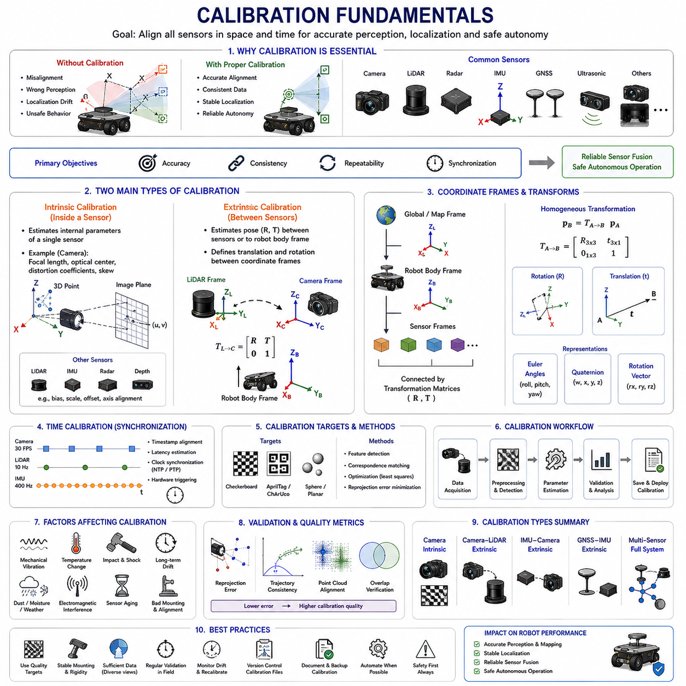
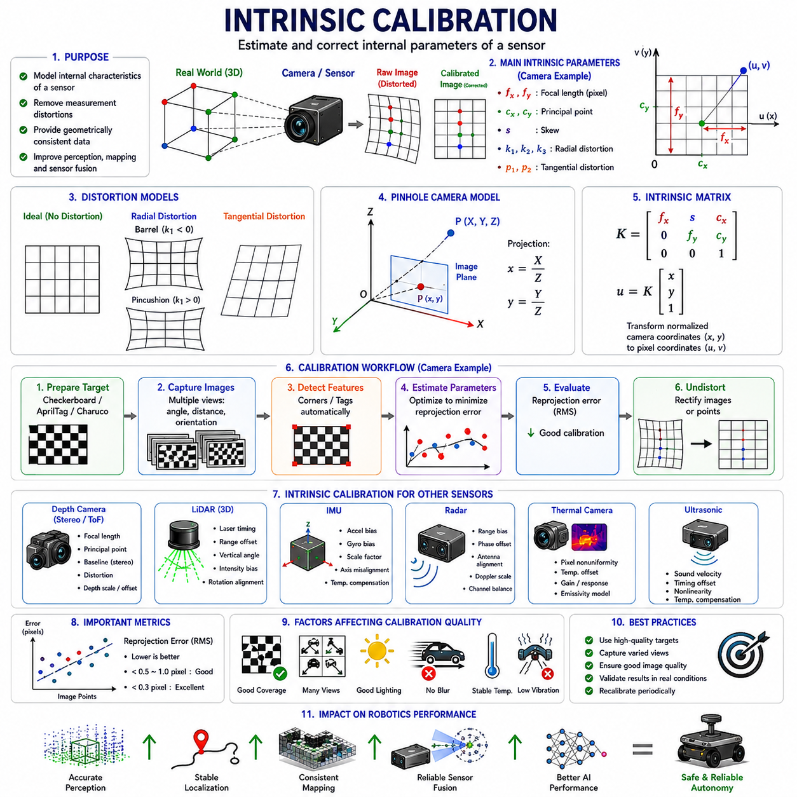
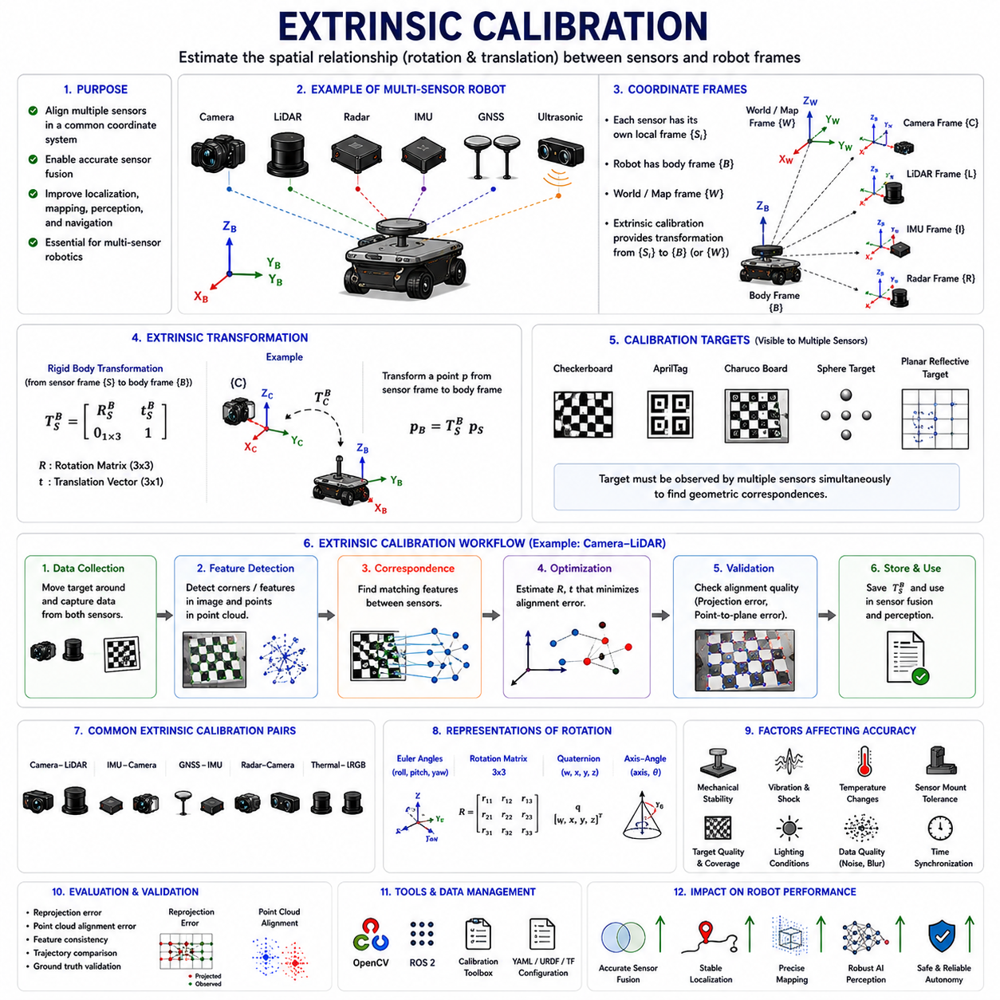
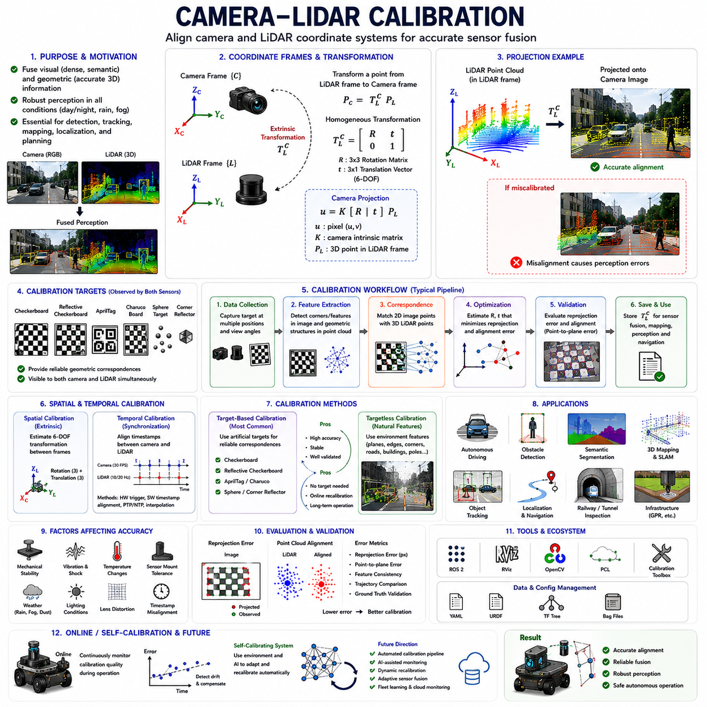
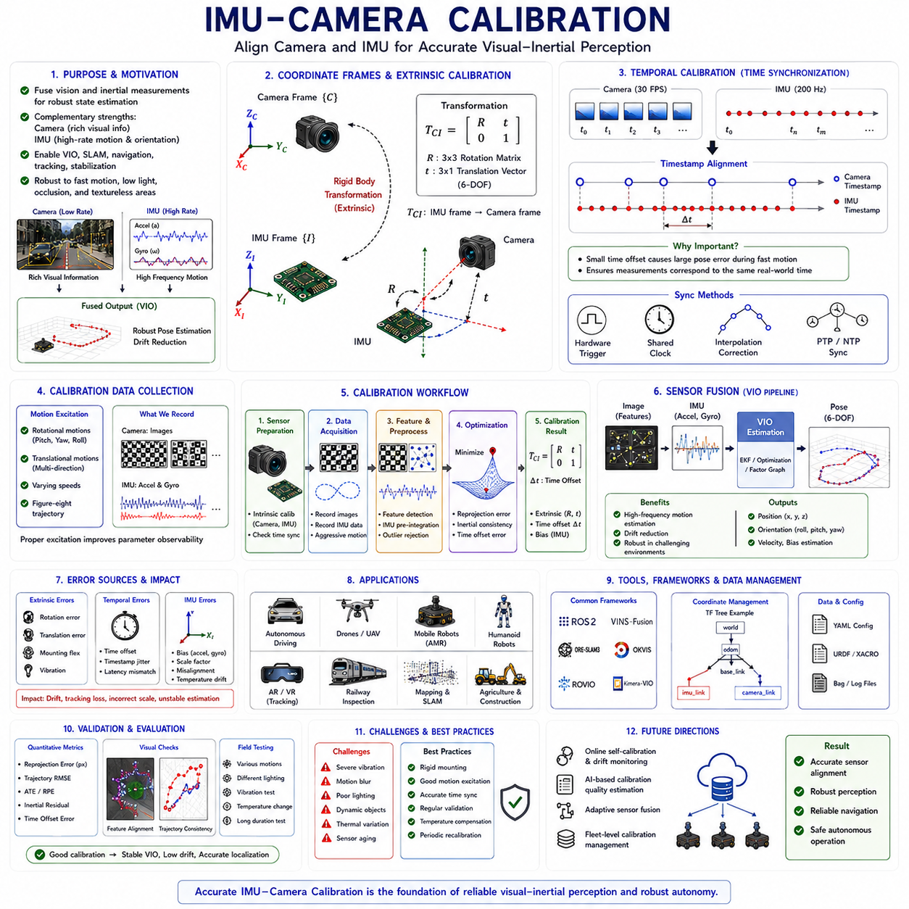
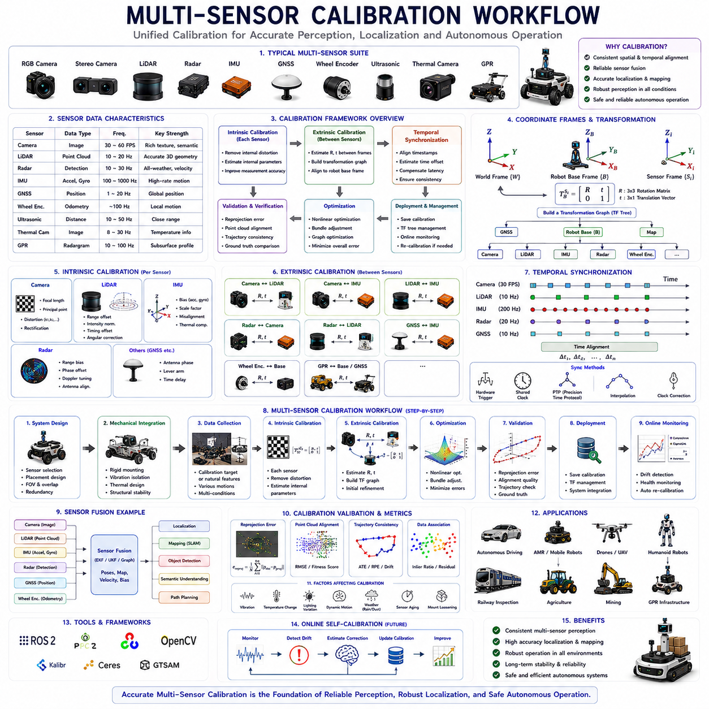
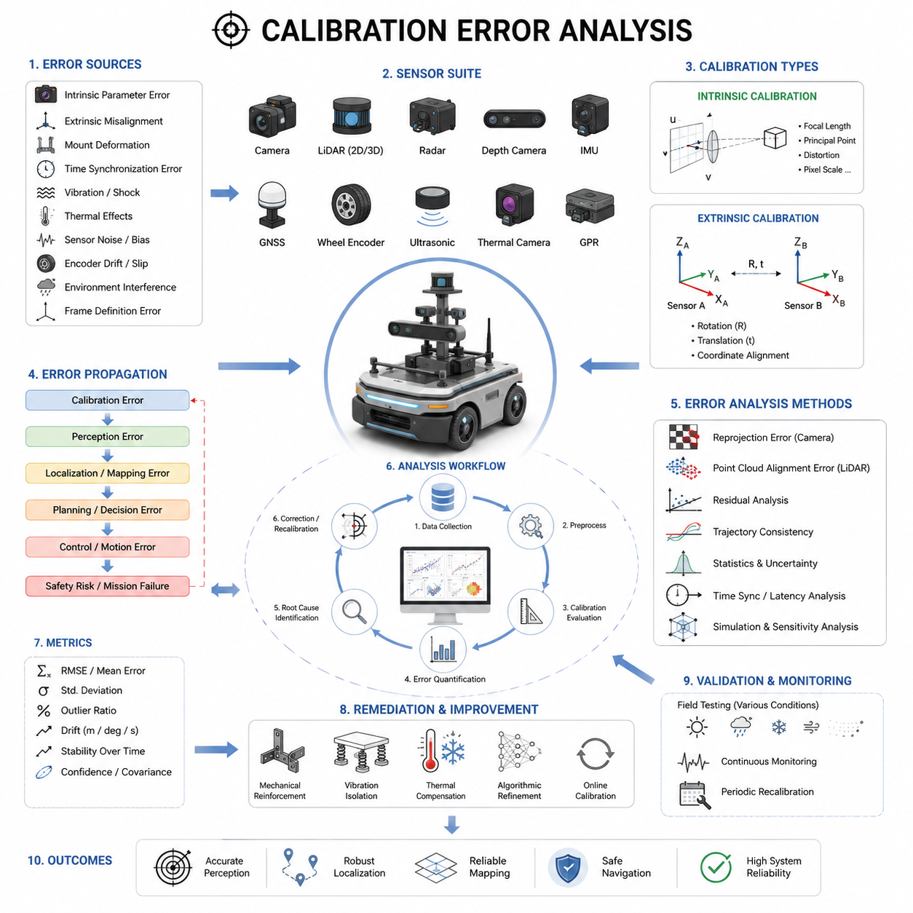
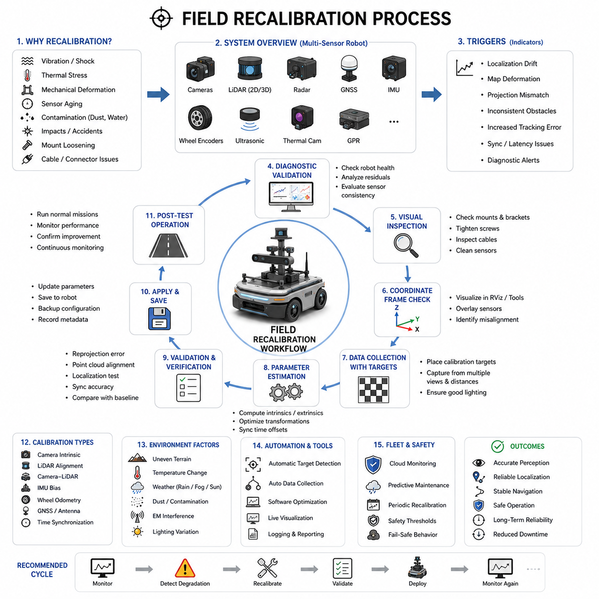

**0. Cover Page**

- Project Name

- Company

- Yantai Collaboration Proposal

- Date

# Chapter 11. Sensor Calibration

## 11.1 Calibration Fundamentals

{width="7.268055555555556in" height="7.268055555555556in"}

Modern Autonomous Mobile Robots (AMRs), autonomous vehicles, industrial robots, agricultural robots, logistics robots, hospital robots, smart city robots, and defense robotic platforms all depend heavily on accurate sensor systems. Sensors provide the robot with the ability to perceive the environment, estimate motion, detect obstacles, localize itself, and make intelligent decisions. However, even the most advanced sensors become unreliable if they are not properly calibrated. Calibration is therefore one of the most fundamental engineering processes in robotics perception systems.

Calibration_Fundamentals refers to the mathematical, geometric, temporal, and physical processes used to align sensor measurements with real-world coordinate systems and ensure that multiple sensors operate consistently together. Calibration is essential because every sensor contains manufacturing tolerances, mechanical installation errors, optical distortions, electronic offsets, timing inaccuracies, and environmental variations that affect measurement accuracy.

In robotics, calibration is not simply a one-time factory adjustment process. Calibration is an ongoing engineering discipline that directly affects perception accuracy, localization stability, sensor fusion reliability, autonomous navigation performance, and overall operational safety. Poor calibration is one of the most common causes of perception instability and field failures in autonomous robotic systems.

Modern robotic systems typically contain multiple sensors including RGB cameras, depth cameras, LiDARs, radars, IMUs, GNSS receivers, ultrasonic sensors, wheel encoders, thermal cameras, and sometimes specialized industrial sensors such as GPR systems or laser profilers. Each sensor observes the environment differently and operates within its own coordinate frame. Calibration ensures that all sensors agree on spatial relationships, timing relationships, and measurement consistency.

The primary objectives of calibration are accuracy, consistency, repeatability, and synchronization. Calibration attempts to minimize systematic errors while maximizing sensor alignment quality across the entire robotic system. A properly calibrated robot can accurately combine sensor data into a unified environmental representation, while a poorly calibrated system produces unstable localization, inaccurate obstacle detection, inconsistent mapping, and degraded AI perception performance.

Calibration is generally divided into two major categories: intrinsic calibration and extrinsic calibration. Intrinsic calibration focuses on the internal characteristics of a sensor itself, while extrinsic calibration focuses on the spatial relationship between multiple sensors or between sensors and the robot body frame.

Intrinsic calibration is most commonly associated with cameras. Camera intrinsic parameters include focal length, optical center, lens distortion coefficients, skew parameters, and image scaling factors. These parameters define how 3D points in the real world are projected onto the 2D image plane. Without accurate intrinsic calibration, computer vision algorithms produce distorted geometric interpretations.

Lens distortion is one of the most important intrinsic calibration issues. Real camera lenses introduce radial distortion and tangential distortion. Straight lines in the real world may appear curved in images. Wide-angle lenses and fisheye lenses especially exhibit severe distortion effects. Calibration algorithms estimate distortion coefficients so that images can be corrected mathematically.

Intrinsic calibration also applies to LiDAR sensors, IMUs, radar systems, and depth cameras. For example, IMU intrinsic calibration may include accelerometer bias estimation, gyroscope bias correction, scale factor calibration, and axis alignment compensation. Radar calibration may involve frequency tuning, phase correction, and Doppler alignment adjustments.

Extrinsic calibration defines the spatial relationship between sensors. This includes translation and rotation offsets between sensor coordinate frames. For example, a camera mounted above a LiDAR sensor must know its exact position and orientation relative to the LiDAR coordinate frame. Even small alignment errors can significantly degrade sensor fusion quality.

Extrinsic calibration is critically important in multi-sensor perception systems. LiDAR-camera fusion, radar-camera fusion, GNSS-IMU fusion, and visual-inertial odometry all depend on highly accurate coordinate transformations between sensors. If extrinsic calibration is inaccurate, projected sensor data becomes misaligned, leading to incorrect perception results.

Coordinate frames are fundamental concepts in calibration systems. Every sensor has its own local coordinate frame. The robot itself also has a body coordinate frame, and the global environment may use map frames, GNSS coordinate systems, or SLAM coordinate systems. Calibration establishes transformation matrices between these coordinate frames.

Transformation matrices typically include rotation matrices and translation vectors. These transformations are commonly represented using homogeneous transformation matrices, Euler angles, rotation vectors, or quaternions. Robotics frameworks such as ROS2 frequently use TF trees to manage these coordinate transformations dynamically.

Time calibration is another major aspect of robotics calibration. Sensors operate at different frequencies and often have different communication delays. Even if spatial calibration is perfect, incorrect timestamp alignment can severely degrade sensor fusion performance. For example, if camera images and LiDAR scans are offset by several milliseconds while the robot is moving, projected objects may appear spatially inconsistent.

Time synchronization calibration includes timestamp alignment, latency estimation, communication delay compensation, hardware trigger synchronization, and clock synchronization methods such as NTP and PTP. High-performance robotic systems often use hardware synchronization to minimize timing uncertainty.

Calibration quality directly affects sensor fusion performance. In LiDAR-camera fusion systems, inaccurate calibration causes point clouds to project incorrectly onto camera images. In GNSS-IMU fusion systems, orientation alignment errors cause localization drift. In radar-camera systems, object detections may appear spatially separated even though they represent the same target.

Modern autonomous robots increasingly depend on AI-based perception systems. AI models are highly sensitive to calibration quality. Deep learning systems trained on calibrated datasets may fail when deployed on poorly calibrated robots. Therefore, calibration is not only a geometric problem but also an AI performance issue.

Calibration procedures vary depending on sensor type. Camera intrinsic calibration commonly uses checkerboard patterns, AprilTags, Charuco boards, or calibration grids. These patterns provide known geometric reference points used to estimate lens parameters.

LiDAR-camera extrinsic calibration often uses calibration targets visible to both sensors simultaneously. Common methods include checkerboards with reflective surfaces, planar targets, sphere targets, corner features, and automatic feature matching algorithms.

IMU calibration frequently involves static measurements, rotational excitation tests, temperature compensation procedures, and long-duration drift analysis. Industrial-grade IMUs may undergo extensive factory calibration under controlled environmental conditions.

GNSS calibration includes antenna offset calibration, heading alignment verification, RTK baseline calibration, and coordinate frame alignment. Dual-antenna GNSS systems require precise baseline geometry calibration to achieve accurate heading estimation.

Wheel odometry calibration is also extremely important for mobile robots. Incorrect wheel diameter, wheelbase, steering geometry, or encoder scaling introduces cumulative localization errors. Odometry calibration often involves controlled trajectory tests, straight-line motion analysis, and rotational motion verification.

Thermal cameras, depth cameras, and radar systems also require specialized calibration procedures. Thermal cameras may require temperature offset correction and emissivity calibration. Depth cameras require depth scaling correction and stereo alignment. Radar systems require range calibration, Doppler tuning, and antenna alignment calibration.

Mechanical stability is one of the most overlooked calibration challenges in robotics. Even if a system is calibrated perfectly in the laboratory, vibration, impacts, temperature changes, and long-term operation can gradually alter sensor alignment. Outdoor robots operating on rough terrain are especially vulnerable to calibration drift.

For example, agricultural robots, mining robots, construction robots, and GPR inspection robots experience severe vibration and shock loads during operation. These mechanical stresses can slowly shift sensor mounts, loosen brackets, or alter structural geometry. Calibration validation must therefore be performed regularly during field operation.

Environmental factors also affect calibration quality. Temperature changes may alter camera lens properties, IMU bias characteristics, and LiDAR timing behavior. Humidity, dust, rain, snow, and electromagnetic interference can further affect sensor measurements.

Calibration accuracy requirements vary significantly depending on application domain. Consumer indoor robots may tolerate centimeter-level calibration errors, while autonomous driving systems, railway inspection robots, and GPR mapping robots may require millimeter-level precision.

For example, GPR-based underground infrastructure robots require highly accurate localization and sensor alignment because even small calibration errors may distort underground mapping results. Similarly, autonomous forklifts operating near humans require highly reliable sensor alignment to ensure safe obstacle detection.

Calibration is also closely related to perception uncertainty. Every calibration process introduces residual errors. These residual uncertainties should ideally be modeled mathematically within sensor fusion systems. Advanced fusion systems incorporate calibration covariance into probabilistic estimation frameworks.

Modern calibration systems increasingly use automation. Manual calibration procedures are time-consuming and error-prone. Automated calibration algorithms can estimate sensor alignment dynamically during operation using natural environmental features or self-supervised learning techniques.

Online calibration is becoming increasingly important in long-duration autonomous systems. Instead of performing calibration only during factory setup, robots may continuously monitor calibration quality during operation. Online calibration algorithms can detect gradual sensor drift and compensate automatically.

AI-based calibration methods are also emerging. Deep learning models may estimate calibration parameters directly from sensor observations. Neural networks can learn feature correspondences between sensors and estimate alignment corrections automatically. However, classical geometric calibration methods remain dominant in safety-critical systems because of their interpretability and reliability.

Calibration validation is equally important as calibration itself. Engineers must verify calibration accuracy using independent validation procedures. Validation commonly includes reprojection error analysis, trajectory consistency evaluation, sensor overlap verification, and ground truth comparison.

Reprojection error is one of the most common camera calibration metrics. It measures how accurately projected 3D points align with observed image features. Lower reprojection errors generally indicate better calibration quality.

Field validation is especially important because laboratory calibration conditions rarely represent real operational environments completely. Outdoor robots should be validated under vibration, temperature variation, dynamic motion, and environmental stress conditions.

ROS2-based robotic systems typically manage calibration data using YAML configuration files, TF trees, URDF models, and sensor driver parameters. Proper calibration data management is extremely important for scalable robotic software architectures.

Digital twins and simulation systems increasingly incorporate calibration models as well. Simulation environments such as NVIDIA Isaac Sim, Gazebo, and CARLA may emulate sensor calibration characteristics to improve sim-to-real transfer performance.

Future robotic systems will likely move toward self-calibrating architectures. Robots may continuously evaluate their own sensor alignment quality, detect failures automatically, and recalibrate dynamically without human intervention. This capability will become increasingly important for long-duration autonomous deployment in smart cities, logistics centers, agriculture, mining, defense, and infrastructure monitoring.

Calibration_Fundamentals therefore represents one of the foundational engineering disciplines underlying all robotic perception systems. Accurate calibration enables reliable sensor fusion, stable localization, precise mapping, robust AI perception, and safe autonomous operation. Without proper calibration, even the most advanced robotic hardware and AI algorithms cannot achieve reliable real-world autonomy.

This section corresponds to "11_01_Calibration_Fundamentals" within the "11_Sensor_Calibration" chapter structure of the AMR Sensors and Perception engineering framework. It is also part of the broader AMR robotics development architecture defined in the uploaded robotics engineering manual structure.

## 11.2 Intrinsic Calibration

{width="7.268055555555556in" height="7.268055555555556in"}

Modern Autonomous Mobile Robots (AMRs), autonomous vehicles, industrial robots, agricultural robots, smart city robots, logistics robots, railway inspection systems, defense robots, and advanced perception platforms all depend heavily on highly accurate sensor systems. Among all sensor-related engineering disciplines, intrinsic calibration is one of the most fundamental and important processes. Intrinsic calibration defines the internal mathematical characteristics of a sensor and allows raw sensor measurements to be interpreted accurately in the physical world.

Intrinsic_Calibration refers to the process of estimating and correcting the internal parameters of a sensor. These parameters describe how the sensor itself measures, transforms, distorts, scales, or interprets incoming physical signals. Intrinsic calibration is most commonly associated with cameras, but it also applies to LiDARs, IMUs, radar systems, depth cameras, thermal cameras, ultrasonic sensors, and many other robotic sensing devices.

In robotics perception systems, intrinsic calibration is essential because raw sensor measurements are never perfect. Every real sensor contains manufacturing tolerances, optical imperfections, electronic offsets, thermal variations, nonlinear responses, and measurement biases. Without intrinsic calibration, sensor outputs may contain systematic errors that significantly degrade perception quality, localization accuracy, mapping consistency, and sensor fusion performance.

The primary objective of intrinsic calibration is to estimate internal sensor parameters accurately and compensate for systematic measurement distortions. Proper intrinsic calibration enables sensors to produce geometrically and physically consistent measurements across different operating conditions.

Camera intrinsic calibration is the most widely studied and commonly implemented form of intrinsic calibration in robotics. Cameras convert three-dimensional real-world light rays into two-dimensional image pixels. However, this projection process is affected by multiple optical and electronic factors. Intrinsic calibration estimates the mathematical parameters governing this image formation process.

The most important camera intrinsic parameters include focal length, principal point, skew coefficient, radial distortion coefficients, tangential distortion coefficients, and image scaling factors. Together, these parameters define the camera projection model.

Focal length determines how strongly the camera lens magnifies the observed scene. In computer vision systems, focal length is typically represented in pixel units along the horizontal and vertical image axes. Longer focal lengths produce narrower fields of view, while shorter focal lengths produce wider fields of view.

The principal point represents the optical center of the image sensor. Ideally, the optical axis intersects exactly at the center of the image plane. In practice, manufacturing tolerances and lens mounting imperfections cause the principal point to shift slightly from the image center.

Skew coefficients describe the non-orthogonality between image axes. Most modern digital cameras have nearly zero skew, but high-precision systems may still estimate this parameter for maximum calibration accuracy.

Lens distortion is one of the most critical aspects of intrinsic calibration. Real camera lenses do not produce perfectly linear projections. Straight lines in the physical world may appear curved in images due to lens distortion effects. Distortion becomes especially severe in wide-angle lenses and fisheye lenses commonly used in robotics.

Radial distortion occurs because light rays bend differently depending on their distance from the optical center. This creates barrel distortion or pincushion distortion effects. Barrel distortion causes straight lines to curve outward, while pincushion distortion curves lines inward.

Tangential distortion occurs when the lens is not perfectly aligned with the image sensor. This causes asymmetric image warping and slight geometric inconsistencies across the image plane.

Intrinsic calibration algorithms estimate distortion coefficients mathematically so that distorted images can be corrected through image rectification processes. Accurate distortion correction is extremely important for computer vision, SLAM, object detection, 3D reconstruction, and sensor fusion applications.

Camera intrinsic calibration generally relies on observing known geometric calibration targets. Checkerboards are the most widely used calibration targets because they provide easily detectable corner features with precisely known geometry.

Other calibration targets include AprilTags, Charuco boards, circle grids, asymmetric dot patterns, and custom fiducial markers. These patterns provide known feature correspondences between the physical world and image observations.

The calibration process typically involves capturing multiple images of the calibration target from different angles, distances, and orientations. The calibration algorithm detects feature points automatically and estimates intrinsic parameters by minimizing reprojection error.

Reprojection error is one of the most important metrics in intrinsic calibration. It measures how accurately the projected 3D calibration target points align with observed image features. Lower reprojection error generally indicates higher calibration quality.

Mathematically, camera intrinsic calibration is based on the pinhole camera model. The pinhole model approximates the camera as an ideal perspective projection system. Although real cameras are more complex, the pinhole model provides a highly effective approximation when combined with distortion correction terms.

The intrinsic camera matrix is commonly represented as:

K =

[ fx s cx ]

[ 0 fy cy ]

[ 0 0 1 ]

where fx and fy represent focal lengths, s represents skew, and cx and cy represent the principal point coordinates.

This intrinsic matrix transforms normalized camera coordinates into pixel coordinates. It is one of the core mathematical representations used throughout computer vision and robotics perception systems.

Intrinsic calibration is not limited to RGB cameras. Depth cameras also require intrinsic calibration. Stereo depth cameras depend on accurate focal lengths, optical centers, baseline geometry, and distortion correction to generate reliable depth estimates.

Time-of-Flight (ToF) depth cameras require additional calibration procedures because depth measurements may contain nonlinear distance errors, temperature-dependent drift, and sensor-specific scaling distortions.

Thermal cameras also require intrinsic calibration. Thermal imaging sensors often exhibit thermal drift, pixel nonuniformity, sensor noise, and temperature-dependent gain variation. Thermal calibration improves temperature estimation accuracy and image consistency.

LiDAR intrinsic calibration involves a different set of parameters. Multi-channel LiDAR systems contain laser emitters and receivers arranged mechanically within rotating assemblies. Small manufacturing variations cause channel misalignment, timing offsets, and range biases.

LiDAR intrinsic calibration may include laser firing timing correction, range offset estimation, intensity normalization, vertical angle correction, and rotational alignment compensation. High-resolution 3D perception systems depend heavily on accurate LiDAR calibration.

IMU intrinsic calibration is especially important for localization and motion estimation systems. IMUs measure acceleration and angular velocity, but raw measurements are affected by sensor bias, scale factor errors, axis misalignment, noise, and temperature drift.

Accelerometer calibration estimates bias offsets and scaling factors for each measurement axis. Gyroscope calibration estimates rotational bias and scale correction parameters. Cross-axis coupling errors may also be compensated.

Temperature compensation is extremely important in IMU calibration because sensor bias changes significantly with temperature. Industrial robotic systems often perform thermal calibration over wide operating temperature ranges.

Radar systems also require intrinsic calibration. Millimeter-wave radar sensors may contain range bias, phase offsets, antenna alignment errors, Doppler estimation errors, and channel imbalance. Radar intrinsic calibration improves target detection accuracy and velocity estimation reliability.

Ultrasonic sensors require intrinsic calibration for sound velocity compensation, timing correction, and measurement linearization. Environmental factors such as temperature and humidity affect sound propagation significantly.

Intrinsic calibration directly affects sensor fusion quality. Even if extrinsic calibration between sensors is perfect, inaccurate intrinsic calibration produces distorted sensor measurements that degrade fusion accuracy.

For example, LiDAR-camera fusion systems require highly accurate camera intrinsic calibration. Distorted camera images cause point cloud projections to misalign with visual features. This reduces object detection accuracy and environmental understanding quality.

Visual SLAM systems are especially sensitive to intrinsic calibration accuracy. Small calibration errors may accumulate over time and produce significant mapping drift. Long-term localization stability depends heavily on accurate intrinsic camera parameters.

Autonomous driving systems require extremely precise intrinsic calibration because perception errors may directly affect vehicle safety. Miscalibrated cameras may estimate incorrect lane geometry, object positions, or obstacle distances.

Robotics systems operating in outdoor environments face additional calibration challenges. Mechanical vibration, impacts, thermal expansion, humidity, and long-duration operation may gradually alter intrinsic sensor behavior over time.

For example, prolonged exposure to sunlight may heat camera lenses and alter optical characteristics slightly. Heavy vibration may affect LiDAR rotational stability. IMU bias may drift due to thermal cycling and aging effects.

Therefore, calibration should not be viewed as a one-time factory process. Periodic recalibration and continuous calibration monitoring are increasingly important in real-world robotic systems.

Online intrinsic calibration is becoming an important research area. Instead of calibrating sensors only offline, robots may continuously estimate intrinsic parameter changes during operation. Online calibration improves long-duration autonomy robustness.

Self-calibrating systems represent an important future direction for robotics. Robots may automatically detect calibration degradation and compensate dynamically without human intervention.

Machine learning and AI are also influencing intrinsic calibration research. Deep learning models may estimate distortion parameters, predict sensor drift, or improve calibration robustness under difficult environmental conditions.

However, classical geometric calibration methods remain dominant in safety-critical robotics because they are mathematically interpretable, physically grounded, and easier to validate formally.

Calibration dataset quality is critically important. Poor feature coverage, insufficient viewing angles, motion blur, lighting inconsistency, or low-resolution imagery may significantly degrade calibration accuracy.

Good calibration practice requires capturing calibration targets across the full image field of view. The target should appear at different scales, orientations, and positions to maximize parameter observability.

Image quality also affects calibration performance significantly. Blurry images, overexposure, underexposure, reflections, and motion artifacts reduce feature detection reliability and increase reprojection error.

Calibration software tools are widely available in robotics ecosystems. OpenCV provides one of the most widely used camera calibration frameworks. ROS2 calibration packages support multi-camera calibration, camera-LiDAR calibration, stereo calibration, and visual-inertial calibration workflows.

Industrial robotic systems frequently implement automated calibration pipelines integrated into manufacturing processes. Calibration data is stored in configuration files and loaded automatically during system startup.

Calibration validation is equally important as calibration estimation itself. Engineers must verify calibration quality using independent evaluation methods. Validation may include reprojection error analysis, feature alignment verification, geometric consistency analysis, and field performance testing.

Ground truth systems are often used for high-precision calibration validation. Motion capture systems, laser trackers, survey-grade GNSS systems, and reference measurement rigs provide independent measurement references.

Simulation systems increasingly include intrinsic calibration modeling as well. Digital twin platforms such as NVIDIA Isaac Sim, Gazebo, and CARLA can emulate sensor distortions and intrinsic parameter variations to improve sim-to-real transfer performance.

Intrinsic calibration also plays an important role in AI dataset generation. Synthetic datasets generated without realistic sensor distortion models may fail to represent real-world sensor behavior accurately.

Future robotic systems will likely integrate dynamic self-calibration, AI-assisted calibration monitoring, online parameter adaptation, and automated calibration validation frameworks. These technologies will become increasingly important for long-duration autonomous deployment in smart cities, industrial automation, logistics, agriculture, mining, defense, and infrastructure inspection.

Intrinsic_Calibration therefore represents one of the foundational engineering disciplines in robotics perception systems. Accurate intrinsic calibration enables reliable computer vision, stable localization, robust sensor fusion, precise mapping, and safe autonomous operation. Without proper intrinsic calibration, even advanced AI perception systems and high-performance robotic hardware cannot achieve reliable real-world autonomy.

This section corresponds to "11_02_Intrinsic_Calibration" within the "11_Sensor_Calibration" chapter structure of the AMR Sensors and Perception engineering framework. It is also part of the broader AMR robotics development architecture defined in the uploaded robotics engineering manual structure.

## 11.3 Extrinsic Calibration

{width="7.268055555555556in" height="7.268055555555556in"}

Modern Autonomous Mobile Robots (AMRs), autonomous vehicles, industrial robots, agricultural robots, railway inspection robots, smart city robots, logistics platforms, defense systems, and intelligent perception systems all rely heavily on multi-sensor architectures. These robotic platforms commonly integrate RGB cameras, depth cameras, LiDARs, radars, IMUs, GNSS receivers, ultrasonic sensors, thermal cameras, wheel encoders, laser profilers, GPR sensors, and many other sensing devices simultaneously. Although each sensor individually observes the environment, autonomous perception becomes truly powerful only when these sensors operate together in a unified coordinate system. Extrinsic calibration is the engineering process that makes this possible.

Extrinsic_Calibration refers to the process of estimating the spatial relationship between sensors or between sensors and the robot body frame. Unlike intrinsic calibration, which focuses on internal sensor characteristics, extrinsic calibration estimates translation and rotation transformations between coordinate systems. Extrinsic calibration enables multiple sensors to observe the world consistently within a shared spatial framework.

In robotics perception systems, every sensor operates within its own local coordinate frame. A camera has a camera coordinate frame. A LiDAR has a LiDAR coordinate frame. An IMU has an inertial frame. GNSS antennas have positioning frames. The robot chassis itself also has a body coordinate frame. Without accurate extrinsic calibration, these sensors cannot correctly interpret spatial relationships relative to one another.

The primary objective of extrinsic calibration is to establish precise geometric transformations between coordinate frames. These transformations allow sensor measurements from different modalities to be aligned spatially and fused consistently. Accurate extrinsic calibration is therefore one of the most critical requirements for sensor fusion, localization, mapping, obstacle detection, autonomous navigation, and AI perception systems.

Extrinsic calibration is generally represented mathematically using rigid body transformations. These transformations include rotation and translation components. Rotation describes the orientation difference between coordinate frames, while translation describes positional offsets.

The most common representation of extrinsic calibration is the homogeneous transformation matrix:

T =

[ R t ]

[ 0 1 ]

where R is the rotation matrix and t is the translation vector.

This transformation matrix maps points from one sensor coordinate frame into another coordinate frame. In robotics systems, these transformations are fundamental building blocks for perception pipelines and navigation architectures.

Rotation can be represented using several mathematical forms including Euler angles, rotation matrices, axis-angle representations, Rodrigues vectors, and quaternions. Modern robotics systems often prefer quaternions because they avoid gimbal lock and provide numerically stable orientation representations.

Extrinsic calibration is especially important in multi-sensor fusion systems. For example, LiDAR-camera fusion requires precise alignment between LiDAR point clouds and camera images. If the extrinsic calibration is inaccurate, projected point clouds appear shifted or rotated relative to image features. This leads to incorrect object detection, semantic understanding, and mapping errors.

Camera-LiDAR calibration is one of the most widely studied extrinsic calibration problems in robotics. Cameras provide dense visual texture information, while LiDAR provides highly accurate geometric distance measurements. Combining these sensors enables robust 3D perception systems.

To achieve accurate camera-LiDAR fusion, the system must estimate the exact six-degree-of-freedom transformation between the camera and LiDAR coordinate frames. This includes three rotational parameters and three translational parameters.

Calibration targets are commonly used during extrinsic calibration procedures. Checkerboards, AprilTags, Charuco boards, sphere targets, planar reflective targets, and custom fiducial markers are widely used. The target must be visible simultaneously to multiple sensors so that geometric correspondences can be established.

In camera-LiDAR calibration, the calibration algorithm identifies corresponding geometric structures visible in both the LiDAR point cloud and camera image. Optimization algorithms then estimate the transformation parameters that minimize alignment error.

Extrinsic calibration is not limited to camera-LiDAR systems. IMU-camera calibration is also critically important. Visual-Inertial Odometry (VIO) systems depend on precise alignment between camera motion and inertial measurements. Even small orientation errors between the IMU and camera can significantly degrade localization stability.

IMU-camera calibration estimates both spatial and temporal relationships between sensors. The IMU measures angular velocity and acceleration at very high frequencies, while the camera captures image frames at lower frequencies. Synchronization accuracy is therefore closely related to extrinsic calibration quality.

GNSS-IMU calibration is another major application area. Outdoor autonomous robots frequently combine GNSS positioning with IMU motion estimation. The relative orientation and position between the GNSS antenna and IMU frame must be known accurately to achieve reliable localization.

Dual-antenna GNSS systems require especially precise calibration because heading estimation depends directly on antenna baseline geometry. Small antenna alignment errors may produce significant orientation estimation inaccuracies.

Radar-camera calibration is increasingly important in autonomous driving and outdoor AMR systems. Radar provides robust object detection under rain, fog, snow, and dust conditions, while cameras provide rich semantic information. Accurate radar-camera alignment enables multimodal object tracking and robust environmental perception.

Thermal camera calibration is also important in low-light and nighttime robotics applications. Thermal cameras may be fused with RGB cameras or LiDAR systems for human detection, fire monitoring, or industrial inspection. Extrinsic calibration ensures that thermal imagery aligns spatially with other perception modalities.

Extrinsic calibration also applies to wheel odometry and robot body geometry. Wheel encoder frames, steering geometry, and chassis coordinate frames must be accurately aligned for reliable motion estimation. Incorrect wheel geometry calibration causes odometry drift and localization instability.

Coordinate systems play a central role in extrinsic calibration. Robotics systems typically use multiple coordinate frames simultaneously including sensor frames, body frames, map frames, odometry frames, and global frames. ROS2-based systems commonly manage these transformations using TF trees.

TF trees provide dynamic coordinate transformations between all robot subsystems. Proper TF management is essential because incorrect frame definitions may produce inconsistent localization and perception behavior.

Extrinsic calibration accuracy requirements vary significantly depending on application domain. Consumer indoor robots may tolerate centimeter-level alignment errors, while autonomous vehicles, railway inspection robots, GPR mapping robots, and industrial automation systems may require millimeter-level precision.

For example, GPR-based underground infrastructure robots require highly accurate sensor alignment because localization and sensing errors directly affect underground mapping consistency. Misalignment between GNSS, IMU, odometry, and GPR sensors may distort subsurface reconstruction results significantly.

Extrinsic calibration can be performed manually, semi-automatically, or fully automatically. Manual calibration often involves measuring sensor positions physically and estimating approximate transformations. However, manual methods are usually insufficient for high-precision robotics applications.

Semi-automatic calibration combines human-guided target placement with algorithmic optimization. This approach remains common in industrial robotics because it balances accuracy and operational simplicity.

Fully automatic calibration methods are becoming increasingly important. Modern calibration algorithms can automatically detect feature correspondences and estimate transformations directly from sensor observations without requiring manual measurements.

Target-based calibration methods remain the most widely used because they provide highly reliable geometric references. However, targetless calibration methods are becoming increasingly popular in long-duration autonomous systems.

Targetless calibration uses natural environmental features rather than artificial calibration targets. For example, visual edges, structural corners, road features, and environmental geometry may be used to estimate sensor alignment automatically.

Online extrinsic calibration is another important research area. Traditional calibration is usually performed offline during factory setup. However, real-world robotic systems experience vibration, thermal expansion, impacts, and mechanical wear that gradually alter sensor alignment over time.

Online calibration algorithms continuously estimate sensor alignment during robot operation. This improves long-term robustness and reduces maintenance requirements. Online calibration is especially important for outdoor robots operating under severe environmental conditions.

Mechanical stability is one of the largest practical challenges in extrinsic calibration. Even perfectly calibrated systems may lose calibration accuracy due to vibration and structural deformation. Heavy outdoor autonomous robots, agricultural platforms, mining robots, and construction robots experience particularly severe vibration loads.

Sensor mounting rigidity therefore becomes extremely important. Weak mounting structures, flexible brackets, loose bolts, and thermal expansion effects may all degrade calibration stability. Industrial robotic systems frequently use rigid aluminum or steel mounting structures to improve long-term calibration reliability.

Thermal effects also influence extrinsic calibration quality. Temperature changes may cause slight expansion or contraction of mechanical structures. This may alter sensor orientation subtly over time. High-precision robotics systems often include thermal compensation models to address these effects.

Extrinsic calibration quality directly affects AI perception systems. Deep learning models trained using calibrated datasets assume consistent sensor alignment. Miscalibrated sensors may reduce AI inference accuracy significantly.

For example, autonomous driving object detection systems frequently fuse LiDAR and camera data. If calibration shifts slightly, projected point clouds may no longer align correctly with image features. This may reduce object classification accuracy and obstacle detection reliability.

Visual SLAM systems are also highly sensitive to calibration accuracy. Poor calibration causes inconsistent feature triangulation and long-term localization drift. Multi-camera SLAM systems especially require extremely precise extrinsic calibration.

Calibration evaluation and validation are essential engineering processes. Engineers must verify calibration quality independently using quantitative metrics. Common evaluation methods include reprojection error analysis, point cloud alignment accuracy, feature consistency analysis, trajectory comparison, and ground truth validation.

Point cloud alignment quality is particularly important in LiDAR fusion systems. Engineers often visualize projected LiDAR points over camera images to inspect calibration accuracy visually. Misaligned edges and shifted object boundaries indicate calibration errors.

Simulation systems increasingly support extrinsic calibration modeling as well. Platforms such as NVIDIA Isaac Sim, Gazebo, CARLA, and AirSim can emulate sensor transformations and calibration variations. Simulation-based calibration testing improves sim-to-real transfer performance.

AI and machine learning are beginning to influence extrinsic calibration research. Neural networks may estimate calibration drift, predict sensor alignment corrections, or optimize calibration robustness dynamically. However, classical geometric optimization methods remain dominant in safety-critical robotics.

Extrinsic calibration pipelines are widely integrated into ROS2 robotics ecosystems. Calibration data is commonly stored in YAML files, URDF models, TF configuration files, and sensor driver parameters. Automated calibration loading ensures consistent system initialization.

Future robotic systems will increasingly adopt self-calibrating architectures. Autonomous robots may continuously monitor sensor alignment quality, detect calibration degradation automatically, and perform dynamic recalibration during operation without human intervention.

Self-calibrating sensor fusion systems will become especially important for smart city robots, autonomous logistics fleets, agricultural robots, mining systems, railway inspection robots, defense platforms, and long-duration autonomous infrastructure monitoring systems.

Extrinsic_Calibration therefore represents one of the foundational engineering disciplines underlying modern robotics perception systems. Accurate extrinsic calibration enables reliable sensor fusion, stable localization, precise environmental mapping, robust AI perception, and safe autonomous operation. Without accurate spatial alignment between sensors, advanced robotics perception systems cannot achieve reliable real-world autonomy.

This section corresponds to "11_03_Extrinsic_Calibration" within the "11_Sensor_Calibration" chapter structure of the AMR Sensors and Perception engineering framework. It is also part of the broader AMR robotics development architecture defined in the uploaded robotics engineering manual structure.

## 11.4 Camera-LiDAR Calibration

{width="7.268055555555556in" height="7.268055555555556in"}

Modern Autonomous Mobile Robots (AMRs), autonomous vehicles, industrial robots, railway inspection robots, agricultural robots, smart city robots, logistics platforms, mining robots, defense systems, and advanced perception platforms increasingly rely on multimodal perception systems that combine cameras and LiDAR sensors. Cameras provide dense semantic information, color, texture, object appearance, and environmental context, while LiDAR sensors provide highly accurate three-dimensional geometric measurements and distance estimation. Camera_LiDAR_Calibration is the engineering process that spatially aligns these two sensing modalities into a unified perception framework.

Camera_LiDAR_Calibration refers to the process of estimating the precise spatial and temporal relationship between camera coordinate systems and LiDAR coordinate systems. This calibration allows LiDAR point clouds to be projected accurately onto camera images and enables the robot to combine visual and geometric perception into a single coherent environmental representation.

In modern robotics perception systems, camera-LiDAR fusion is one of the most important multimodal sensing technologies. Cameras alone struggle under low-light conditions, poor weather, strong shadows, or difficult depth estimation scenarios. LiDAR sensors alone provide accurate geometry but lack semantic richness and visual texture information. By combining both sensors, autonomous systems achieve robust environmental understanding under highly diverse operational conditions.

The primary objective of camera-LiDAR calibration is to estimate the six-degree-of-freedom transformation between the camera frame and LiDAR frame. This transformation includes three rotational parameters and three translational parameters. Once estimated accurately, LiDAR points can be transformed into the camera coordinate frame and projected onto image pixels precisely.

Mathematically, camera-LiDAR extrinsic calibration is represented using rigid body transformations. The transformation matrix is typically expressed as:

T =

[ R t ]

[ 0 1 ]

where R represents the rotation matrix and t represents the translation vector between the LiDAR coordinate frame and the camera coordinate frame.

The camera intrinsic matrix is also required during calibration. Intrinsic camera parameters define how three-dimensional points are projected onto the two-dimensional image plane. Accurate camera intrinsic calibration is therefore a prerequisite for high-quality camera-LiDAR calibration.

The camera projection equation is commonly represented as:

u = K [ R \| t ] P

where P represents the 3D LiDAR point, [R\|t] represents the extrinsic transformation, K represents the camera intrinsic matrix, and u represents the projected image coordinate.

When calibration is accurate, LiDAR point clouds align precisely with visual image features. Object boundaries, road edges, buildings, pedestrians, vehicles, and environmental structures appear spatially consistent between both sensor modalities.

Camera-LiDAR calibration is critically important in autonomous driving systems. Modern autonomous vehicles frequently rely on multimodal sensor fusion for obstacle detection, semantic segmentation, lane detection, free-space estimation, object tracking, and localization. Misalignment between cameras and LiDAR sensors may cause severe perception errors.

For example, if LiDAR points project incorrectly onto an image, a pedestrian may appear spatially shifted relative to the actual visual object. This can reduce object classification accuracy and introduce localization inconsistencies. In safety-critical systems, even small calibration errors may create dangerous operational failures.

Calibration accuracy requirements depend on application domain. Consumer indoor robots may tolerate several centimeters of projection error, while autonomous driving systems, railway inspection robots, industrial automation systems, and GPR-based infrastructure robots may require millimeter-level calibration precision.

Camera-LiDAR calibration generally includes both spatial calibration and temporal calibration. Spatial calibration estimates geometric alignment, while temporal calibration estimates synchronization offsets between sensors.

Temporal synchronization is extremely important because cameras and LiDAR sensors operate at different frequencies and latencies. Cameras may operate at 30 FPS while LiDAR sensors operate at 10 Hz or 20 Hz. If timestamps are misaligned during robot motion, projected point clouds become spatially inconsistent.

Time synchronization methods include hardware triggering, software timestamp alignment, NTP synchronization, PTP synchronization, and interpolation-based synchronization correction. High-performance robotic systems frequently use hardware synchronization to minimize latency uncertainty.

Camera-LiDAR calibration methods are generally categorized into target-based calibration and targetless calibration approaches.

Target-based calibration methods use artificial calibration targets visible to both sensors simultaneously. These targets provide reliable geometric correspondences and are widely used in industrial robotics and autonomous driving development.

Checkerboards are among the most common calibration targets. Camera systems detect checkerboard corners precisely in image space, while LiDAR sensors identify planar geometric surfaces from point clouds. Optimization algorithms estimate the transformation that minimizes reprojection and alignment error.

Reflective checkerboards are especially useful because LiDAR intensity returns make target detection easier. Some systems use retroreflective materials to improve LiDAR visibility significantly.

AprilTags and Charuco boards are also widely used in modern robotics calibration systems. These targets provide uniquely identifiable fiducial markers and robust corner detection under diverse viewing conditions.

Three-dimensional calibration targets such as spheres, cubes, cylinders, and corner reflectors are also commonly used. Sphere targets are particularly useful because their geometry remains invariant under viewpoint changes. LiDAR systems can detect spherical structures accurately even under partial occlusion.

Targetless calibration methods are becoming increasingly important in autonomous robotic systems. Instead of relying on artificial calibration targets, targetless methods use natural environmental features such as edges, corners, planes, road markings, buildings, poles, and structural geometry.

Targetless calibration is especially valuable for long-duration autonomous systems because it enables online recalibration without manual intervention. Outdoor robots operating continuously in real environments benefit significantly from automated targetless calibration frameworks.

Optimization plays a central role in camera-LiDAR calibration. Most calibration algorithms formulate calibration as an optimization problem that minimizes geometric error metrics.

Common optimization objectives include reprojection error minimization, point-to-plane distance minimization, mutual information maximization, edge alignment consistency, and feature correspondence error minimization.

Reprojection error is one of the most widely used evaluation metrics. It measures the distance between projected LiDAR points and corresponding visual image features. Lower reprojection error generally indicates higher calibration quality.

Point cloud alignment quality is another important metric. Engineers frequently visualize LiDAR points projected onto images to inspect alignment manually. Correct calibration produces sharp alignment between object edges and projected point clouds.

Feature extraction is a major challenge in calibration systems. Camera images provide dense visual texture, while LiDAR point clouds are sparse geometric measurements. Establishing reliable correspondences between these different modalities is difficult.

Modern calibration algorithms often use edge detection, feature descriptors, plane extraction, semantic segmentation, or deep learning-based feature matching to improve cross-modal correspondence estimation.

Deep learning is beginning to influence camera-LiDAR calibration research significantly. AI-based calibration systems may automatically estimate calibration drift, predict alignment corrections, or improve robustness under noisy environmental conditions.

Neural networks can learn feature correspondences between image features and point cloud structures directly from data. Some deep learning approaches estimate calibration parameters end-to-end using multimodal perception models.

However, classical geometric calibration methods remain dominant in safety-critical robotics applications because they are mathematically interpretable, physically grounded, and easier to validate formally.

Mechanical stability is one of the largest practical challenges in camera-LiDAR calibration. Even perfectly calibrated systems may lose alignment over time due to vibration, impacts, thermal expansion, structural deformation, or long-duration operation.

Outdoor autonomous robots are especially vulnerable to calibration drift. Agricultural robots, mining robots, railway inspection robots, construction robots, and GPR infrastructure robots experience severe vibration and shock loading during operation.

Sensor mounting rigidity therefore becomes critically important. Weak mounting structures, flexible brackets, thermal deformation, and loose bolts may all degrade calibration quality gradually.

Industrial robotic systems frequently use rigid aluminum or steel mounting structures combined with vibration isolation mechanisms to improve long-term calibration stability.

Thermal effects also influence calibration accuracy significantly. Temperature changes may alter camera lens geometry, LiDAR rotational alignment, and structural dimensions slightly. High-precision systems often include thermal compensation models to maintain calibration stability.

Weather conditions further complicate camera-LiDAR fusion systems. Rain, fog, snow, dust, mud contamination, and sunlight glare affect camera images and LiDAR returns differently. Robust calibration must therefore maintain performance under highly variable environmental conditions.

Camera-LiDAR calibration is essential for many robotics applications including autonomous driving, SLAM, 3D mapping, obstacle detection, semantic segmentation, object tracking, digital twins, infrastructure inspection, and intelligent robotics.

In SLAM systems, calibration errors may cause inconsistent feature triangulation, distorted maps, and long-term localization drift. Multi-sensor SLAM systems depend heavily on highly accurate camera-LiDAR alignment.

Autonomous driving systems use camera-LiDAR fusion for lane detection, free-space estimation, pedestrian recognition, traffic sign detection, obstacle classification, and trajectory prediction. Calibration quality directly affects overall vehicle safety.

Railway inspection robots frequently combine LiDAR and cameras for rail geometry analysis, tunnel inspection, obstacle detection, and infrastructure monitoring. High-precision alignment is necessary because small projection errors may distort inspection measurements.

GPR infrastructure robots may also combine LiDAR and cameras for simultaneous underground and surface mapping. Calibration between surface perception sensors and underground sensing systems is critically important for accurate subsurface reconstruction.

ROS2-based robotic systems commonly manage calibration parameters using YAML files, URDF models, TF trees, and sensor configuration files. Proper calibration data management is essential for scalable robotic software architectures.

Simulation systems increasingly support camera-LiDAR calibration modeling as well. Platforms such as NVIDIA Isaac Sim, Gazebo, CARLA, and AirSim can simulate sensor transformations, projection models, distortion effects, and calibration variation.

Simulation-based calibration validation improves sim-to-real transfer performance and enables rapid testing under controlled conditions.

Online camera-LiDAR calibration is becoming increasingly important in long-duration autonomous systems. Instead of calibrating sensors only during factory setup, robots may continuously monitor calibration quality during operation.

Online calibration algorithms can detect gradual calibration drift automatically and compensate dynamically. This reduces maintenance requirements and improves long-term operational reliability.

Self-calibrating robotic systems represent an important future direction. Future autonomous robots may estimate sensor alignment continuously using environmental observations and AI-based monitoring systems.

Fleet learning systems and cloud robotics may also support distributed calibration monitoring. Data collected from deployed robot fleets may identify calibration degradation patterns and improve future calibration robustness.

Calibration validation remains equally important as calibration estimation itself. Engineers must verify calibration quality independently using reprojection analysis, feature consistency evaluation, trajectory comparison, ground truth measurements, and operational field testing.

Field validation is especially critical because laboratory calibration conditions rarely represent real-world operational environments fully. Outdoor robotic systems must be tested under vibration, temperature variation, dynamic motion, environmental contamination, and adverse weather conditions.

Future robotics systems will increasingly integrate automated calibration pipelines, AI-assisted calibration monitoring, dynamic recalibration frameworks, and adaptive sensor fusion architectures.

Camera_LiDAR_Calibration therefore represents one of the foundational engineering disciplines enabling modern multimodal robotic perception systems. Accurate calibration allows cameras and LiDAR sensors to function as a unified environmental perception system, enabling reliable sensor fusion, robust AI perception, stable localization, precise mapping, and safe autonomous operation.

Without accurate camera-LiDAR calibration, advanced robotics perception systems cannot achieve reliable real-world autonomy in smart cities, industrial automation, logistics, agriculture, mining, railway inspection, defense, and infrastructure monitoring applications.

This section corresponds to "11_04_Camera_LiDAR_Calibration" within the "11_Sensor_Calibration" chapter structure of the AMR Sensors and Perception engineering framework. It is also part of the broader AMR robotics development architecture defined in the uploaded robotics engineering manual structure.

## 11.5 IMU-Camera Calibration

{width="7.268055555555556in" height="7.268055555555556in"}

Modern Autonomous Mobile Robots (AMRs), autonomous vehicles, industrial robots, railway inspection robots, agricultural robots, logistics robots, smart city robots, defense robotic systems, and advanced AI perception platforms increasingly depend on tightly integrated multimodal sensing architectures. Among the most important sensor combinations in modern robotics is the integration of cameras and inertial measurement units (IMUs). Cameras provide rich visual perception and environmental understanding, while IMUs provide high-frequency motion and orientation measurements. IMU_Camera_Calibration is the engineering process that aligns these sensing modalities into a unified visual-inertial perception framework.

IMU_Camera_Calibration refers to the process of estimating the spatial and temporal relationship between a camera coordinate frame and an IMU coordinate frame. This calibration enables consistent integration of visual measurements and inertial measurements for localization, mapping, motion estimation, navigation, and autonomous decision-making.

Visual and inertial sensors complement each other extremely well. Cameras provide dense semantic and geometric information about the environment, but visual perception alone may struggle during rapid motion, motion blur, poor lighting, repetitive textures, or temporary visual occlusion. IMUs provide highly stable short-term motion estimation even during visually degraded conditions. By combining both sensors, robotic systems achieve robust visual-inertial perception.

IMU-camera calibration is one of the foundational technologies enabling Visual-Inertial Odometry (VIO), Visual SLAM, autonomous navigation, drone stabilization, robot motion estimation, augmented reality, mixed reality, and autonomous driving systems.

The primary objective of IMU-camera calibration is to estimate both extrinsic and temporal relationships between the camera and IMU. Extrinsic calibration estimates the rigid-body transformation between the camera frame and IMU frame, while temporal calibration estimates synchronization offsets between visual and inertial data streams.

Spatial calibration between the IMU and camera includes six degrees of freedom: three rotational parameters and three translational parameters. These transformations describe how the IMU is physically mounted relative to the camera coordinate system.

Mathematically, the transformation is commonly represented as:

T =

[ R t ]

[ 0 1 ]

where R represents the rotation matrix and t represents the translation vector between the IMU frame and the camera frame.

Accurate rotational calibration is especially important because inertial sensors directly measure rotational motion. Even very small orientation misalignments between the camera and IMU may produce significant localization drift over time.

Temporal synchronization is equally important. Cameras and IMUs operate at very different sampling frequencies. Cameras may operate at 30 FPS or 60 FPS, while IMUs frequently operate at 100 Hz, 200 Hz, 400 Hz, or even higher frequencies.

If timestamps are not aligned correctly, inertial measurements and visual observations may correspond to different robot poses during motion. This introduces severe estimation errors in visual-inertial systems.

For example, during fast robot rotation, a timing offset of only a few milliseconds may cause large orientation inconsistencies between camera observations and IMU measurements. High-speed drones and autonomous vehicles are especially sensitive to temporal calibration errors.

Modern visual-inertial systems therefore require highly accurate timestamp synchronization. Synchronization methods include hardware triggering, shared clocks, software timestamp correction, interpolation methods, PTP synchronization, and NTP synchronization.

Hardware synchronization is generally preferred in high-performance robotics systems because it minimizes latency uncertainty and timestamp jitter.

IMU-camera calibration is essential in Visual-Inertial Odometry systems. VIO combines visual feature tracking with inertial motion estimation to estimate robot pose continuously. Visual measurements provide long-term drift correction, while inertial measurements provide short-term motion stability.

Pure visual odometry systems often fail during rapid motion, temporary visual occlusion, low-texture environments, or sudden illumination changes. IMUs help stabilize motion estimation during these difficult conditions.

Similarly, pure IMU dead reckoning suffers from cumulative integration drift because accelerometer and gyroscope biases accumulate over time. Camera observations provide global correction constraints that reduce long-term drift.

IMU-camera calibration quality directly affects VIO performance. Poor calibration causes inconsistent sensor fusion, unstable trajectory estimation, inaccurate mapping, and degraded localization robustness.

Many modern robotics systems depend heavily on visual-inertial perception. Autonomous drones use VIO for stable flight in GNSS-denied environments. Humanoid robots use visual-inertial perception for balance and navigation. Autonomous vehicles use visual-inertial systems for localization in urban canyons and tunnels.

Visual-inertial SLAM systems such as ORB-SLAM3, VINS-Fusion, OKVIS, ROVIO, and Kimera-VIO all depend on highly accurate IMU-camera calibration.

Calibration procedures generally require carefully designed motion trajectories. The robot or sensor rig must undergo rotational and translational excitation so that calibration algorithms can estimate sensor relationships accurately.

Static measurements alone are usually insufficient because the calibration algorithm requires dynamic motion information to observe inertial responses relative to visual motion.

Calibration datasets often include aggressive rotational motion, figure-eight trajectories, multidirectional translation, and varying motion speeds. These motions improve parameter observability and reduce calibration ambiguity.

Checkerboards, AprilTags, and Charuco boards are commonly used during camera calibration portions of the workflow. The camera observes calibration targets while the IMU records corresponding motion dynamics simultaneously.

Optimization-based calibration algorithms then estimate the transformation parameters that best explain both visual observations and inertial measurements jointly.

Modern IMU-camera calibration algorithms often formulate calibration as a nonlinear optimization problem. The objective function minimizes reprojection error, inertial consistency error, trajectory inconsistency, and timing misalignment simultaneously.

Bundle adjustment techniques are commonly used in calibration optimization. These methods jointly optimize camera poses, feature positions, IMU biases, extrinsic parameters, and temporal offsets.

IMU intrinsic calibration is also critically important before performing IMU-camera calibration. Raw IMU measurements contain accelerometer bias, gyroscope bias, scale factor errors, axis misalignment, thermal drift, and sensor noise.

Accelerometer calibration estimates bias offsets and scaling coefficients for each axis. Gyroscope calibration estimates rotational bias and scale correction parameters. Temperature compensation is especially important because IMU bias changes significantly with temperature.

Without proper IMU intrinsic calibration, visual-inertial fusion performance degrades substantially. Poor inertial calibration may introduce false motion estimates and unstable trajectory estimation.

Camera intrinsic calibration is also a prerequisite for high-quality IMU-camera calibration. Distorted or poorly calibrated images reduce feature tracking accuracy and introduce visual measurement inconsistency.

Mechanical stability is one of the largest practical challenges in IMU-camera calibration. Even perfectly calibrated systems may lose calibration accuracy over time due to vibration, impacts, thermal expansion, and structural deformation.

Outdoor autonomous robots, drones, mining robots, railway inspection systems, agricultural robots, and heavy-duty industrial platforms experience especially severe vibration environments.

Sensor mounting rigidity therefore becomes extremely important. Flexible brackets, weak mounting structures, loose bolts, and thermal deformation may gradually alter sensor alignment during operation.

Industrial robotic systems frequently use rigid aluminum or steel sensor mounting frames combined with vibration isolation mechanisms to maintain long-term calibration stability.

Thermal effects also influence IMU-camera calibration significantly. IMU bias characteristics are highly temperature dependent. Camera lens geometry may also change slightly due to thermal expansion.

High-precision robotics systems therefore frequently include thermal compensation models and temperature-dependent calibration correction mechanisms.

Motion blur introduces additional challenges in visual-inertial systems. During high-speed robot motion, camera images may become blurred while the IMU continues measuring motion accurately. Robust visual-inertial fusion algorithms must handle such inconsistencies gracefully.

Lighting conditions also affect visual-inertial calibration quality. Poor lighting, strong shadows, low texture environments, repetitive structures, and reflective surfaces may reduce visual feature tracking reliability.

Dynamic environments further complicate calibration and localization. Moving objects, pedestrians, vehicles, machinery, and changing environmental structures may introduce false feature correspondences and degrade VIO stability.

IMU-camera calibration plays a critical role in autonomous drones. Aerial robots rely heavily on high-frequency inertial stabilization combined with visual localization. Even small calibration errors may destabilize flight control systems.

Humanoid robots also require accurate visual-inertial calibration for stable balance control, body motion estimation, and navigation. Human-scale robots frequently experience dynamic body motion requiring tightly synchronized visual and inertial sensing.

Autonomous driving systems use visual-inertial fusion for localization under GNSS-degraded conditions such as tunnels, parking garages, dense urban canyons, and underground facilities.

Railway inspection robots frequently combine cameras and IMUs for tunnel localization, track inspection, structural mapping, and long-distance navigation. Stable calibration is essential because railway vibration environments are highly challenging.

GPR infrastructure robots may also integrate visual-inertial systems for surface localization and underground mapping synchronization. Accurate visual-inertial calibration improves subsurface reconstruction consistency significantly.

ROS2-based robotics systems commonly manage IMU-camera calibration using YAML files, URDF models, TF trees, and sensor configuration parameters. Consistent coordinate frame management is essential for scalable robotics software architectures.

Simulation environments increasingly support visual-inertial sensor modeling as well. Platforms such as NVIDIA Isaac Sim, Gazebo, AirSim, and CARLA can simulate camera images, IMU measurements, motion blur, noise models, and calibration drift.

Simulation-based calibration testing improves sim-to-real transfer performance and enables safe testing under controlled conditions.

Online IMU-camera calibration is becoming increasingly important in long-duration autonomous systems. Instead of calibrating sensors only during factory setup, robots may continuously monitor calibration quality during operation.

Online calibration algorithms can detect gradual sensor drift and compensate dynamically without human intervention. This improves operational reliability and reduces maintenance requirements.

Self-calibrating visual-inertial systems represent an important future direction in robotics. Future autonomous robots may continuously estimate sensor alignment, monitor synchronization quality, and correct calibration errors automatically during operation.

AI and machine learning are also influencing visual-inertial calibration research. Deep learning models may estimate calibration drift, improve feature correspondence robustness, predict synchronization errors, or assist in dynamic recalibration.

However, classical geometric and optimization-based calibration methods remain dominant in safety-critical robotics because they are mathematically interpretable and easier to validate formally.

Calibration validation is equally important as calibration estimation itself. Engineers must evaluate calibration quality using trajectory consistency analysis, reprojection error analysis, inertial residual analysis, localization stability evaluation, and ground truth comparison.

Field validation is especially important because laboratory calibration conditions rarely represent real operational environments fully. Outdoor robots must be tested under vibration, thermal variation, dynamic motion, lighting changes, and environmental contamination.

Future robotics systems will increasingly integrate automated visual-inertial calibration pipelines, AI-assisted calibration monitoring, online synchronization estimation, adaptive sensor fusion architectures, and fleet-level calibration management systems.

IMU_Camera_Calibration therefore represents one of the foundational engineering disciplines enabling modern visual-inertial robotic perception systems. Accurate calibration enables reliable sensor fusion, stable localization, robust SLAM, precise navigation, and safe autonomous operation.

Without accurate IMU-camera calibration, advanced robotics systems cannot achieve reliable real-world autonomy in smart cities, industrial automation, logistics, autonomous driving, drones, mining, agriculture, railway inspection, defense robotics, and infrastructure monitoring applications.

This section corresponds to "11_05_IMU_Camera_Calibration" within the "11_Sensor_Calibration" chapter structure of the AMR Sensors and Perception engineering framework. It is also part of the broader AMR robotics development architecture defined in the uploaded robotics engineering manual structure.

## 11.6 Multi-Sensor Calibration Workflow

{width="7.268055555555556in" height="7.268055555555556in"}

Modern Autonomous Mobile Robots (AMRs), autonomous vehicles, industrial robots, railway inspection robots, logistics robots, agricultural robots, mining robots, smart city robotic systems, defense robots, and advanced AI perception platforms increasingly depend on highly integrated multi-sensor architectures. These robotic systems commonly combine RGB cameras, stereo cameras, depth cameras, LiDARs, radars, IMUs, GNSS receivers, wheel encoders, ultrasonic sensors, thermal cameras, laser profilers, GPR sensors, and many other sensing devices simultaneously. While each sensor provides unique environmental information, reliable autonomous operation becomes possible only when all sensors operate consistently within a unified perception framework. Multi_Sensor_Calibration_Workflow is the engineering methodology that enables this integration.

Multi_Sensor_Calibration_Workflow refers to the complete engineering process used to calibrate, synchronize, validate, manage, and maintain multiple sensors operating together in a robotic system. This workflow includes intrinsic calibration, extrinsic calibration, temporal synchronization, coordinate frame alignment, calibration validation, calibration monitoring, and long-term calibration maintenance.

In modern robotics, multi-sensor calibration is not a single isolated process. Instead, it is a structured system engineering workflow involving mechanical design, electrical synchronization, software architecture, perception algorithms, optimization techniques, AI integration, and operational validation.

The primary objective of multi-sensor calibration is to establish consistent spatial and temporal relationships among all robotic sensing devices. Accurate calibration enables reliable sensor fusion, robust localization, stable mapping, precise obstacle detection, semantic perception, AI-based decision-making, and safe autonomous navigation.

Without accurate multi-sensor calibration, autonomous robotic systems suffer from inconsistent perception, localization drift, unstable SLAM behavior, distorted environmental understanding, degraded AI performance, and increased operational risk.

Modern robotic systems may contain dozens of sensors operating simultaneously. Each sensor observes the environment differently and operates within its own coordinate frame, sampling frequency, timing behavior, and measurement characteristics.

For example, cameras provide dense semantic texture information, LiDAR sensors provide accurate three-dimensional geometry, radar sensors provide robust detection under adverse weather conditions, IMUs provide high-frequency inertial motion estimation, GNSS provides global positioning, and wheel encoders provide local motion estimation.

The challenge of multi-sensor calibration lies in aligning all these sensing modalities consistently despite their differing physical properties, measurement models, and operational constraints.

A complete multi-sensor calibration workflow generally includes several major stages:

1.  Sensor System Design

2.  Mechanical Integration

3.  Intrinsic Calibration

4.  Extrinsic Calibration

5.  Temporal Synchronization

6.  Coordinate Frame Management

7.  Sensor Fusion Validation

8.  Calibration Optimization

9.  Field Verification

10. Online Monitoring and Maintenance

Sensor system design is the first stage of the workflow. Engineers must carefully define sensor placement, sensor overlap regions, mounting rigidity, field-of-view requirements, environmental protection, and sensor redundancy strategies.

Sensor placement directly affects calibration quality. Sensors should ideally share overlapping observation regions to enable reliable cross-modal feature correspondence estimation.

For example, a camera and LiDAR intended for fusion should observe overlapping environmental regions simultaneously. Similarly, IMUs should be mounted close to the robot center of motion to reduce rotational offset effects.

Mechanical integration is critically important in multi-sensor systems. Even perfect calibration algorithms cannot compensate for unstable mechanical mounting structures.

Rigid mounting frames, vibration isolation systems, thermal expansion considerations, shock protection mechanisms, and structural stability analysis are therefore essential parts of the calibration workflow.

Outdoor autonomous robots experience especially severe environmental stress conditions. Agricultural robots, mining robots, construction robots, railway inspection robots, and GPR infrastructure robots are exposed to vibration, impacts, thermal cycling, dust, rain, and long-duration operation.

Mechanical instability gradually alters sensor alignment over time. Therefore, sensor mounting architecture directly influences long-term calibration reliability.

Intrinsic calibration is typically performed before extrinsic calibration. Each sensor must first estimate and compensate for its own internal measurement distortions.

Camera intrinsic calibration includes focal length estimation, principal point estimation, distortion correction, and image rectification. LiDAR intrinsic calibration includes range offset correction, intensity normalization, timing correction, and angular alignment adjustment.

IMU intrinsic calibration includes accelerometer bias estimation, gyroscope bias correction, scale factor estimation, axis alignment correction, and thermal compensation.

Radar calibration may include phase correction, range bias estimation, Doppler tuning, and antenna alignment compensation.

After intrinsic calibration, extrinsic calibration establishes spatial relationships between sensors. Extrinsic calibration estimates translation and rotation transformations between coordinate frames.

Extrinsic calibration is one of the most important components of the multi-sensor calibration workflow because it enables all sensor measurements to be transformed into a unified spatial representation.

Common extrinsic calibration relationships include:

- Camera ↔ LiDAR

- Camera ↔ IMU

- LiDAR ↔ IMU

- GNSS ↔ IMU

- Radar ↔ Camera

- Radar ↔ LiDAR

- Wheel Encoder ↔ Body Frame

- GPR ↔ Localization Frame

Modern robotic systems often contain complex calibration graphs involving multiple interconnected transformations.

Coordinate frame management therefore becomes critically important. Robotics systems commonly use TF trees, URDF models, and transformation graphs to manage coordinate relationships dynamically.

ROS2-based robotic systems frequently manage calibration data using YAML files, URDF descriptions, TF trees, and sensor configuration files.

Temporal synchronization is another major component of the workflow. Sensors operate at different frequencies and communication latencies.

For example:

- Cameras: 30--60 FPS

- LiDARs: 10--20 Hz

- IMUs: 100--1000 Hz

- GNSS: 1--20 Hz

- Radar: 10--30 Hz

If timestamps are not aligned correctly, sensor fusion becomes inconsistent during robot motion.

Temporal synchronization methods include:

- Hardware triggering

- Shared clocks

- Timestamp interpolation

- PTP synchronization

- NTP synchronization

- FPGA-based synchronization

- Sensor fusion clock correction

High-performance autonomous systems frequently use hardware synchronization to minimize latency uncertainty and timestamp jitter.

Calibration targets play an important role in the workflow. Target-based calibration methods provide highly reliable geometric correspondences between sensors.

Common calibration targets include checkerboards, AprilTags, Charuco boards, reflective planes, spheres, cylinders, fiducial markers, and corner reflectors.

Three-dimensional calibration targets are especially useful in multi-sensor systems because they can be observed reliably from multiple viewpoints and sensor modalities simultaneously.

Targetless calibration methods are becoming increasingly important in long-duration autonomous systems. Instead of artificial targets, targetless methods use natural environmental structures such as edges, corners, road markings, buildings, poles, and planes.

Targetless calibration enables online recalibration during robot operation without manual intervention.

Optimization is a core component of multi-sensor calibration workflows. Most calibration problems are formulated as nonlinear optimization problems.

Optimization objectives commonly include:

- Reprojection error minimization

- Point-to-plane distance minimization

- Feature correspondence consistency

- Mutual information maximization

- Trajectory consistency optimization

- Inertial residual minimization

- Temporal offset minimization

Bundle adjustment and graph optimization techniques are widely used in multi-sensor calibration systems.

Calibration validation is equally important as calibration estimation itself. Engineers must verify calibration quality using independent evaluation methods.

Validation metrics may include:

- Reprojection error

- Point cloud alignment quality

- Localization drift analysis

- Trajectory consistency

- Sensor overlap accuracy

- Ground truth comparison

- Mapping consistency

- AI perception accuracy

Field validation is especially critical because laboratory calibration conditions rarely represent real operational environments fully.

Robotic systems must be validated under:

- Vibration

- Temperature variation

- Dynamic motion

- Rain and snow

- Dust contamination

- Lighting changes

- Long-duration operation

Outdoor autonomous systems require especially rigorous field validation because environmental conditions may significantly affect calibration stability.

Online calibration monitoring is becoming increasingly important in modern robotics.

Traditional calibration workflows assumed that calibration was performed once during factory setup. However, real-world robotic systems experience calibration drift over time.

Calibration drift may result from:

- Mechanical vibration

- Thermal expansion

- Structural deformation

- Sensor aging

- Mount loosening

- Impact events

- Environmental stress

Online monitoring systems continuously evaluate calibration quality during robot operation.

Modern autonomous systems may monitor:

- Feature alignment consistency

- Sensor fusion residuals

- Localization stability

- Mapping accuracy

- Reprojection error

- Timing synchronization quality

If calibration degradation is detected, the system may trigger recalibration automatically.

Self-calibrating robotic systems represent an important future direction in robotics engineering.

Future autonomous robots may continuously estimate sensor alignment dynamically using AI-assisted calibration monitoring systems and environmental observations.

Machine learning and AI are increasingly influencing calibration workflows. Deep learning systems may estimate calibration drift, predict alignment corrections, improve feature matching robustness, or support adaptive sensor fusion.

However, classical geometric calibration methods remain dominant in safety-critical robotics because they are mathematically interpretable and easier to validate formally.

Simulation environments are becoming increasingly important in calibration workflows as well.

Platforms such as NVIDIA Isaac Sim, Gazebo, CARLA, AirSim, and Webots can simulate:

- Sensor distortion

- Calibration variation

- Noise models

- Environmental conditions

- Timing offsets

- Motion blur

- Dynamic sensor behavior

Simulation-based calibration testing improves sim-to-real transfer performance and enables safe validation under controlled conditions.

Digital twins also support long-term calibration management. Fleet-level robotic systems may use cloud-based calibration analytics to monitor calibration health across deployed robot fleets.

Autonomous driving systems represent one of the most demanding applications of multi-sensor calibration workflows.

Self-driving vehicles combine cameras, LiDARs, radars, IMUs, GNSS, ultrasonic sensors, wheel encoders, and HD maps simultaneously. Accurate calibration directly affects vehicle safety.

Railway inspection robots also depend heavily on multi-sensor calibration. These robots combine cameras, LiDARs, IMUs, GNSS systems, thermal cameras, and laser profilers for tunnel inspection, rail geometry analysis, obstacle detection, and infrastructure monitoring.

GPR infrastructure robots require especially complex calibration workflows because they combine underground sensing systems with surface localization systems.

GPR sensor calibration must align accurately with GNSS, IMU, odometry, LiDAR, and camera systems to ensure consistent underground mapping and infrastructure reconstruction.

Humanoid robots also require highly sophisticated multi-sensor calibration workflows because of their dynamic body motion and distributed sensor architectures.

Drone systems represent another highly challenging calibration environment because of aggressive motion dynamics, vibration, aerodynamic disturbance, and strict timing requirements.

Fleet robotics and cloud robotics are expected to play increasing roles in future calibration workflows.

Distributed robotic systems may share calibration statistics, environmental observations, and drift analysis data to improve global fleet reliability.

Future robotic systems will increasingly integrate:

- Online self-calibration

- AI-assisted calibration monitoring

- Adaptive sensor fusion

- Fleet-level calibration analytics

- Dynamic recalibration

- Automated validation pipelines

- Cloud-based calibration management

Multi_Sensor_Calibration_Workflow therefore represents one of the foundational engineering disciplines enabling modern autonomous robotic systems.

Accurate multi-sensor calibration enables reliable sensor fusion, robust AI perception, stable localization, precise mapping, intelligent navigation, and safe autonomous operation.

Without a robust calibration workflow, advanced robotics systems cannot achieve reliable long-duration real-world autonomy in smart cities, industrial automation, logistics, mining, agriculture, railway inspection, defense robotics, autonomous driving, and infrastructure monitoring applications.

This section corresponds to "11_06_Multi_Sensor_Calibration_Workflow" within the "11_Sensor_Calibration" chapter structure of the AMR Sensors and Perception engineering framework. It is also part of the broader AMR robotics development architecture defined in the uploaded robotics engineering manual structure.

## 11.7 Calibration Error Analysis

{width="7.268055555555556in" height="7.268055555555556in"}

Calibration error analysis is one of the most critical engineering processes in autonomous mobile robot development because every perception, localization, mapping, and sensor fusion function depends on accurate geometric alignment and timing synchronization between sensors. Even highly advanced AI perception algorithms can fail when calibration quality is poor. In real-world AMR deployments, calibration errors often become hidden root causes of navigation drift, object detection instability, incorrect obstacle localization, degraded mapping quality, and unsafe robot behavior. For this reason, calibration error analysis must be treated not as a one-time setup procedure but as a continuous engineering validation process throughout the entire robot lifecycle.

In robotics systems, calibration errors can originate from multiple sources including intrinsic parameter inaccuracies, extrinsic transformation errors, sensor mounting deformation, timestamp synchronization mismatches, vibration-induced displacement, thermal expansion, encoder drift, GNSS multipath effects, IMU bias instability, and even software coordinate-frame inconsistencies. A modern AMR may contain more than ten major sensing devices including RGB cameras, depth cameras, 2D LiDARs, 3D LiDARs, radar sensors, GNSS receivers, IMUs, wheel encoders, ultrasonic sensors, thermal cameras, and GPR modules. Each sensor introduces its own uncertainty characteristics, and the combined system error may propagate across the entire perception and navigation stack.

Calibration error analysis begins with understanding the mathematical representation of sensor alignment. Intrinsic calibration errors relate to inaccuracies inside the sensor model itself. In cameras, intrinsic parameters include focal length, principal point, distortion coefficients, skew factors, and pixel scaling. In LiDAR systems, intrinsic calibration may include laser beam angle corrections, distance compensation, and channel synchronization. Extrinsic calibration errors describe spatial transformation inaccuracies between sensors. These errors are represented through translation vectors and rotational matrices between coordinate frames.

A small rotational error can create surprisingly large spatial inaccuracies. For example, a one-degree yaw misalignment between a LiDAR and a camera can produce tens of centimeters of projection error at medium distances. In outdoor autonomous robots operating at higher speeds, such errors may lead to incorrect obstacle association, unstable tracking, or false free-space estimation. Similarly, vertical pitch errors may distort terrain estimation and ground plane extraction, which are especially dangerous for outdoor robots operating on uneven terrain.

One of the most important concepts in calibration error analysis is error propagation. A single sensor misalignment does not remain isolated. Instead, it propagates through downstream algorithms including SLAM, object detection, multi-sensor fusion, path planning, and motion control. In tightly integrated autonomy stacks, small calibration inaccuracies may accumulate over time and eventually cause catastrophic navigation failures. Therefore, engineers must analyze not only direct calibration error magnitude but also its effect on the overall robot system.

Camera calibration errors are among the most common issues in AMR perception systems. Lens distortion modeling errors may cause object localization inaccuracies near image edges. Rolling shutter artifacts can distort geometric consistency during robot motion. Incorrect focal length estimation can affect depth triangulation in stereo vision systems. Exposure instability and poor lighting conditions may further degrade feature extraction quality. During error analysis, engineers often evaluate reprojection error metrics. Reprojection error measures the difference between observed image points and projected points predicted by the calibration model. Lower reprojection error generally indicates better calibration quality, although overfitting must also be avoided.

LiDAR calibration error analysis focuses heavily on point cloud consistency. Engineers inspect whether point clouds align correctly with known structures such as walls, poles, floors, and calibration targets. In multi-LiDAR systems, overlapping point clouds should merge smoothly without double edges or ghosting artifacts. Misalignment often appears as duplicated surfaces, tilted structures, or inconsistent obstacle boundaries. Point cloud registration algorithms such as ICP may be used to estimate residual alignment error after calibration.

Camera-LiDAR calibration error analysis is particularly important in AI-based perception systems. Many AMRs rely on LiDAR-camera fusion for semantic understanding and robust obstacle detection. Calibration errors between these sensors may cause projected LiDAR points to appear shifted relative to image objects. Engineers analyze projection consistency by overlaying LiDAR points on camera images and visually inspecting alignment quality. Advanced evaluation methods may compute pixel-level projection deviation across large datasets collected under diverse operating conditions.

IMU calibration errors significantly affect localization and motion estimation accuracy. Bias instability, scale factor errors, axis misalignment, and temperature drift are common IMU error sources. Since IMU measurements are integrated over time, even small bias errors accumulate rapidly into large positional drift. Calibration error analysis for IMUs often involves Allan variance analysis, static stability testing, vibration testing, and thermal chamber evaluation. Engineers also evaluate the effect of IMU errors on sensor fusion frameworks such as Extended Kalman Filters and factor graph optimization systems.

GNSS calibration and alignment errors are especially critical in outdoor autonomous robots. Dual-antenna heading systems require accurate baseline alignment. Antenna placement errors can produce heading instability and localization offset. Multipath interference near buildings or metallic structures may distort GNSS measurements. Error analysis includes RTK fix ratio evaluation, heading stability measurement, baseline verification, and long-term drift analysis. In outdoor robots combining GNSS with LiDAR SLAM and IMU fusion, engineers must carefully analyze coordinate-frame consistency between global and local localization systems.

Wheel odometry calibration errors are another major source of navigation inaccuracy. Incorrect wheel diameter estimation, encoder scaling mismatch, wheel slippage, suspension deformation, and tire wear all affect odometry accuracy. Error analysis typically includes straight-line drift testing, rotational accuracy testing, long-distance repeatability evaluation, and terrain-dependent slip analysis. Outdoor robots operating on mud, gravel, grass, or snow may experience highly variable wheel slip characteristics that invalidate ideal odometry assumptions.

Time synchronization errors are often overlooked during calibration analysis but can severely impact multi-sensor fusion performance. Even if spatial calibration is accurate, asynchronous sensor timestamps may create apparent geometric inconsistencies. For example, during vehicle motion, a 100 ms timestamp mismatch between LiDAR and camera data may produce large projection errors. Synchronization error analysis involves timestamp logging, latency measurement, ROS2 message synchronization evaluation, PTP validation, and hardware trigger verification.

Calibration errors are not always static. In real-world AMRs, calibration quality changes over time due to mechanical stress, vibration, temperature variation, shock loading, and long-term structural fatigue. Outdoor autonomous robots operating on rough terrain experience continuous vibration that may gradually loosen sensor mounts. Thermal expansion may slightly deform sensor brackets and alter relative sensor positions. Therefore, calibration validation must be performed repeatedly during field operation rather than only during factory setup.

Mechanical design strongly influences calibration stability. Weak mounting structures amplify vibration and introduce dynamic sensor movement. Heavy sensors mounted far from the robot center of gravity may generate structural oscillation during acceleration or braking. Engineers performing calibration error analysis must therefore collaborate closely with mechanical design teams. Rigid mounting brackets, vibration isolation systems, reinforced sensor towers, and thermal compensation strategies are essential for maintaining long-term calibration stability.

One effective approach for calibration error analysis is residual analysis. Residuals represent differences between predicted measurements and actual sensor observations. Large residuals may indicate calibration errors, synchronization problems, environmental interference, or sensor degradation. Residual monitoring can be integrated into real-time diagnostic systems that continuously evaluate sensor health during operation. Advanced robots may automatically detect abnormal calibration drift and initiate self-check procedures.

Simulation environments are increasingly used for calibration error analysis. Digital twins allow engineers to inject controlled calibration perturbations into virtual sensor systems and observe downstream effects on perception and navigation algorithms. Simulation-based sensitivity analysis helps identify which calibration parameters are most critical for system stability. This approach is especially useful for complex multi-sensor platforms containing LiDAR, radar, cameras, GNSS, IMU, and ultrasonic sensors.

Machine learning systems are also affected by calibration quality. AI models trained using well-calibrated datasets may fail when deployed on poorly calibrated robots. Dataset consistency becomes particularly important in multi-camera perception systems. Calibration mismatch between training and deployment environments can reduce object detection accuracy and semantic segmentation quality. Engineers must therefore include calibration quality validation within AI data collection pipelines.

Field testing plays a central role in calibration error analysis. Laboratory calibration alone is insufficient because real operating environments introduce vibration, weather effects, lighting variation, electromagnetic interference, and dynamic obstacles. Engineers perform structured field tests across different speeds, terrains, temperatures, and weather conditions. Metrics such as localization drift, perception overlap accuracy, mapping consistency, and object detection precision are measured repeatedly under varying operational conditions.

Outdoor autonomous robots require especially rigorous calibration error analysis because environmental complexity is significantly higher than indoor AMRs. Rain, dust, fog, mud, snow, and direct sunlight all influence sensor behavior differently. GPR robots used for underground infrastructure inspection face additional challenges because ground conditions and electromagnetic interference may affect sensor alignment and measurement stability. Heavy payload robots operating on rough terrain experience greater structural vibration and chassis deformation, increasing calibration instability risks.

Calibration debugging tools are essential for engineering validation. Visualization software allows engineers to inspect coordinate frames, projected point clouds, image overlays, trajectory consistency, and synchronization behavior. ROS2 visualization tools such as RViz are commonly used to analyze sensor alignment quality. Automated calibration validation pipelines may generate quantitative reports including reprojection error, registration error, synchronization latency, and statistical residual distributions.

Modern autonomous systems increasingly incorporate online calibration techniques. Unlike traditional offline calibration methods, online calibration continuously estimates sensor alignment during robot operation. Adaptive calibration algorithms can compensate for slow mechanical drift and environmental changes. However, online calibration introduces additional computational complexity and stability challenges. Engineers must carefully validate convergence reliability and robustness under dynamic operating conditions.

Redundancy is another important strategy for mitigating calibration errors. Multi-sensor fusion systems can cross-check measurements between different sensing modalities. For example, LiDAR-based localization may validate GNSS positioning, while camera-based visual odometry may verify wheel encoder measurements. Redundant sensing improves fault detection capability and enhances overall system robustness. However, redundancy itself requires accurate calibration to function correctly.

Statistical analysis methods are widely used in calibration evaluation. Engineers analyze mean error, standard deviation, covariance distributions, outlier frequency, temporal stability, and environmental dependency. Monte Carlo simulation may be used to estimate uncertainty propagation across sensor fusion pipelines. Covariance modeling is especially important in probabilistic robotics systems because localization and mapping algorithms rely heavily on uncertainty estimation.

Calibration error analysis must also consider safety implications. In industrial and outdoor autonomous robots, perception errors may directly endanger humans, vehicles, or infrastructure. Functional safety standards increasingly require systematic validation of sensor alignment and perception reliability. Safety-certified robots may include periodic calibration verification routines and fail-safe mechanisms triggered by abnormal sensor inconsistency.

Production-scale robot deployment introduces additional calibration challenges. Manufacturing tolerances, assembly variation, and supply chain differences may create robot-to-robot calibration inconsistency. Automated factory calibration systems are often developed to standardize calibration quality across mass-produced robots. Production validation procedures typically include sensor alignment verification, camera intrinsic testing, LiDAR registration testing, and dynamic motion validation.

The future of calibration error analysis is moving toward autonomous self-calibrating robotic systems. AI-driven perception architectures may continuously estimate sensor consistency and adapt calibration parameters in real time. Future robots may use environmental landmarks, semantic understanding, and long-term map consistency to maintain calibration automatically without human intervention. Advanced foundation models and embodied AI systems may further improve robustness against moderate calibration degradation.

Ultimately, calibration error analysis is not merely a technical maintenance task. It is a foundational engineering discipline that directly determines the reliability, safety, and intelligence of autonomous mobile robots. High-performance autonomy requires not only advanced AI models and powerful computing hardware but also precise geometric consistency between sensing systems. As AMRs become more complex and operate in increasingly dynamic outdoor environments, calibration engineering will become even more important for the future of robotics, autonomous transportation, industrial automation, and smart city infrastructure systems.

## 11.8 Field Recalibration Process

{width="7.268055555555556in" height="7.268055555555556in"}

Field recalibration is a critical operational process in autonomous mobile robot systems because calibration quality gradually degrades during real-world deployment. Even when a robot is perfectly calibrated during factory production or laboratory testing, actual operating environments continuously introduce mechanical vibration, thermal stress, structural deformation, sensor aging, environmental contamination, and accidental impacts that alter sensor alignment over time. As AMRs become more dependent on high-precision multi-sensor perception systems, maintaining calibration quality throughout field operation becomes essential for ensuring navigation accuracy, perception reliability, and operational safety.

Field recalibration refers to the process of verifying, correcting, and restoring sensor alignment and synchronization directly in the operational environment where the robot is deployed. Unlike factory calibration, which is usually performed under controlled laboratory conditions, field recalibration must account for real-world conditions such as uneven terrain, changing temperature, dust, rain, lighting variation, electromagnetic interference, and long-term mechanical fatigue. In modern outdoor autonomous robots, field recalibration is not an optional maintenance activity but an essential lifecycle management procedure.

Autonomous robots operating in industrial factories, logistics centers, hospitals, smart cities, farms, construction sites, tunnels, railways, and outdoor infrastructure inspection environments are continuously exposed to dynamic physical stress. Rough terrain vibrations may slowly loosen sensor mounts. Sudden impacts during transportation may shift LiDAR orientation. Thermal expansion may slightly deform aluminum sensor brackets. Moisture and contamination may affect camera lens alignment. Over time, these small mechanical changes accumulate and gradually reduce perception accuracy.

One of the most important goals of field recalibration is restoring coordinate frame consistency between sensors. Multi-sensor systems rely heavily on accurate spatial transformations among LiDARs, cameras, radars, GNSS modules, IMUs, wheel encoders, ultrasonic sensors, and other perception devices. If even one sensor drifts from its original calibration state, the entire sensor fusion pipeline may become unstable. For example, a slightly tilted LiDAR may distort occupancy maps, while a shifted camera mount may reduce object detection accuracy.

Field recalibration typically begins with a diagnostic validation process. Before performing any recalibration, engineers first evaluate whether recalibration is actually necessary. Modern robots often contain built-in monitoring systems that continuously analyze residual errors, localization drift, sensor consistency, and synchronization stability. These diagnostic systems can detect early signs of calibration degradation. Common symptoms include unstable SLAM performance, inconsistent obstacle positioning, map deformation, object projection mismatch, abnormal localization jumps, increased tracking error, or degraded free-space detection.

Visual inspection is one of the first steps in field recalibration. Engineers physically inspect all sensor mounting structures, brackets, cables, connectors, protective housings, and mechanical supports. Loose bolts, bent brackets, damaged vibration isolators, cracked mounts, or cable tension problems may indicate mechanical displacement. In outdoor robots, engineers also inspect contamination caused by mud, dust, water, snow, or insects. Sensor windows and optical surfaces must be cleaned before recalibration because contamination may affect measurement quality.

After visual inspection, engineers perform coordinate frame verification. Using visualization tools such as RViz or custom debugging software, they inspect sensor alignment quality in real time. Point clouds, camera images, radar detections, GNSS trajectories, and localization outputs are compared simultaneously. Misalignment often becomes visible through duplicated edges, projection shifts, inconsistent obstacle boundaries, or unstable object tracking behavior.

One common field recalibration method involves calibration targets. Calibration boards, checkerboards, AprilTags, retroreflective targets, or specially designed 3D structures are positioned around the robot. Cameras and LiDARs observe these targets from multiple angles and distances. Software algorithms then estimate updated intrinsic and extrinsic parameters based on observed geometric relationships. In outdoor environments, portable calibration targets are often designed to be weather resistant and easily deployable.

Camera intrinsic recalibration is frequently required after lens replacement, mechanical shock, or thermal stress. Engineers capture multiple calibration images using checkerboard patterns or fiducial markers. The calibration software estimates focal length, distortion coefficients, principal points, and other optical parameters. Reprojection error metrics are evaluated to validate calibration quality. In field environments, engineers must carefully manage lighting conditions because shadows, reflections, and low contrast may reduce calibration accuracy.

LiDAR recalibration focuses on restoring accurate point cloud alignment. Engineers verify whether environmental structures such as walls, poles, floors, and corners appear geometrically consistent. In multi-LiDAR systems, overlapping regions are inspected to ensure smooth merging without duplication or separation. Some systems use ICP-based registration to estimate alignment corrections automatically. Outdoor recalibration is more difficult because natural environments may lack stable geometric reference structures.

Camera-LiDAR field recalibration is especially important for AI perception systems using sensor fusion. Engineers overlay projected LiDAR points onto camera images and inspect projection consistency. Misaligned calibration causes projected points to shift away from image objects. Advanced calibration systems may automatically optimize transformation matrices using feature correspondence matching between point clouds and image features.

IMU recalibration is often required after long-term operation because bias characteristics change over time. Static bias estimation procedures are commonly used during field maintenance. The robot remains stationary while IMU outputs are analyzed over time to estimate gyro drift and accelerometer bias. Some advanced systems also perform thermal compensation calibration because IMU characteristics vary significantly with temperature.

Wheel odometry recalibration is another essential field process. Tire wear, pressure variation, terrain conditions, and mechanical deformation may change effective wheel diameter and encoder scaling. Engineers perform controlled motion tests including straight driving, rotational movement, and trajectory repeatability validation. Odometry parameters are then adjusted to minimize drift accumulation.

GNSS recalibration becomes necessary when antenna mounts shift or baseline alignment changes. Dual-antenna heading systems are particularly sensitive to mechanical displacement. Engineers verify RTK stability, heading consistency, and antenna coordinate alignment. In outdoor robots, GNSS recalibration often includes multipath evaluation because nearby metallic structures or buildings may distort measurements.

Time synchronization verification is a critical part of field recalibration. Spatial calibration alone is insufficient if timestamps are misaligned. Engineers analyze synchronization latency among cameras, LiDARs, IMUs, radars, and GNSS modules. PTP synchronization, hardware trigger systems, and ROS2 timestamp alignment are validated. Even small synchronization errors may cause significant perception instability during robot motion.

Field recalibration procedures vary depending on robot type and operational environment. Indoor AMRs operating on smooth factory floors typically experience slower calibration degradation than outdoor autonomous robots operating on rough terrain. Outdoor patrol robots, agricultural robots, construction robots, and GPR inspection robots face significantly harsher environmental stress including vibration, temperature variation, moisture, and dust.

Heavy-duty autonomous robots require especially robust recalibration strategies because their large payloads generate substantial chassis deformation during acceleration, braking, and terrain traversal. Long sensor towers mounted on heavy platforms may oscillate during movement, causing dynamic calibration variation. Engineers must analyze both static calibration accuracy and dynamic structural stability.

GPR robots introduce additional recalibration complexity. Ground-penetrating radar systems are sensitive to sensor height, orientation, terrain variation, and electromagnetic interference. Even small antenna angle changes may significantly alter underground signal interpretation. Therefore, GPR field recalibration often includes terrain-adaptive verification procedures and repeated ground reference measurements.

Weather conditions strongly influence field recalibration quality. Rain droplets on camera lenses, fog interference on LiDAR sensors, snow accumulation, or direct sunlight reflections may distort sensor measurements. Engineers often perform recalibration during stable environmental conditions whenever possible. Some advanced systems automatically reject unreliable sensor measurements during recalibration.

Automation is becoming increasingly important in field recalibration workflows. Modern robotics systems increasingly support semi-automatic or fully automatic recalibration procedures. Robots may autonomously navigate around calibration targets while software estimates updated parameters. Automated validation pipelines evaluate residual errors, projection consistency, localization drift, and synchronization quality without requiring extensive manual intervention.

Online recalibration represents the next stage of robotic autonomy. Unlike traditional maintenance-based recalibration, online recalibration continuously estimates calibration drift during normal operation. The robot uses environmental landmarks, map consistency, and sensor redundancy to detect gradual alignment changes. Adaptive algorithms then compensate for calibration drift automatically. This approach significantly reduces maintenance requirements for large robot fleets.

Cloud-connected fleet management systems may also support centralized calibration monitoring. Robots continuously upload calibration quality metrics including reprojection errors, localization residuals, synchronization latency, and sensor consistency scores. Fleet management software can identify robots requiring maintenance before serious operational failures occur. Predictive maintenance strategies based on calibration degradation trends are becoming increasingly important for industrial-scale deployments.

Field recalibration is closely connected to functional safety. Safety-certified AMRs must maintain reliable perception performance under all operating conditions. Calibration degradation may reduce obstacle detection reliability and increase collision risk. Therefore, safety-critical robots often include periodic recalibration schedules, automatic diagnostic monitoring, and fail-safe behavior when calibration quality falls below acceptable thresholds.

Data logging and traceability are also essential components of field recalibration. Engineers record calibration parameters, validation metrics, environmental conditions, software versions, and maintenance history. Historical calibration records help identify recurring failure patterns and long-term mechanical degradation trends. Large industrial robot fleets often maintain centralized calibration databases for lifecycle management.

Human factors also influence recalibration quality. Field technicians must follow standardized procedures carefully. Improper calibration target placement, unstable environmental conditions, insufficient data collection, or incorrect software configuration may introduce new errors during recalibration. Therefore, clear operational workflows, technician training programs, and automated verification systems are important for maintaining calibration consistency across large deployments.

Simulation environments are increasingly used to support recalibration development. Digital twins allow engineers to model calibration drift under various vibration, temperature, and structural stress conditions. Engineers can evaluate recalibration algorithms safely in simulation before deploying them to physical robots. This reduces operational risk and accelerates recalibration software validation.

Artificial intelligence is beginning to play a larger role in recalibration systems. Machine learning algorithms may identify subtle calibration degradation patterns that traditional threshold-based systems cannot detect. AI-driven anomaly detection can monitor sensor consistency continuously and recommend recalibration timing proactively. Future embodied AI systems may autonomously understand when their own perception geometry becomes unreliable.

Future autonomous robots are expected to become increasingly self-maintaining. Fully autonomous recalibration systems may eventually eliminate most manual maintenance procedures. Robots could automatically navigate to recalibration stations, analyze their own sensor consistency, adjust calibration parameters, and verify perception quality without human intervention. This capability will become essential as smart cities, industrial facilities, and logistics networks deploy thousands of autonomous robots simultaneously.

Ultimately, field recalibration is not merely a maintenance operation. It is a foundational reliability engineering process that ensures long-term perception accuracy and operational stability in autonomous robotics systems. As robots become more intelligent, sensor-rich, and operationally autonomous, maintaining precise calibration under dynamic real-world conditions will become one of the most important challenges in robotics engineering. Successful AMR deployment requires not only advanced AI algorithms and powerful hardware platforms but also continuous calibration integrity throughout the robot's operational lifetime.
