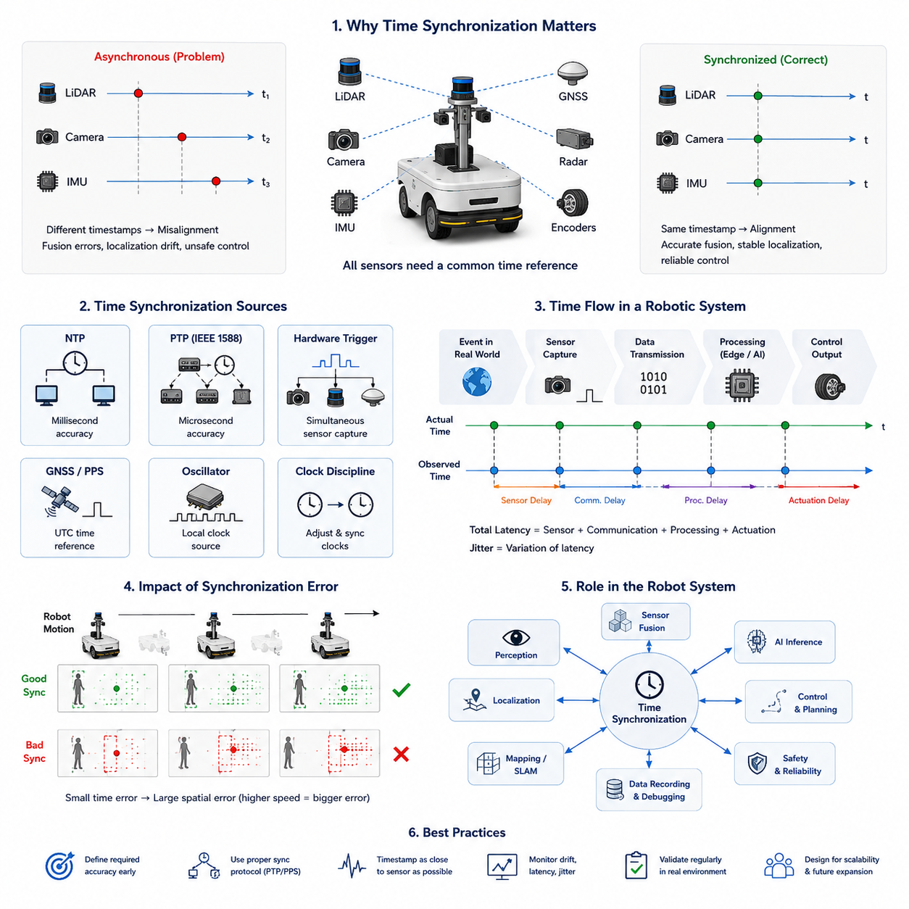
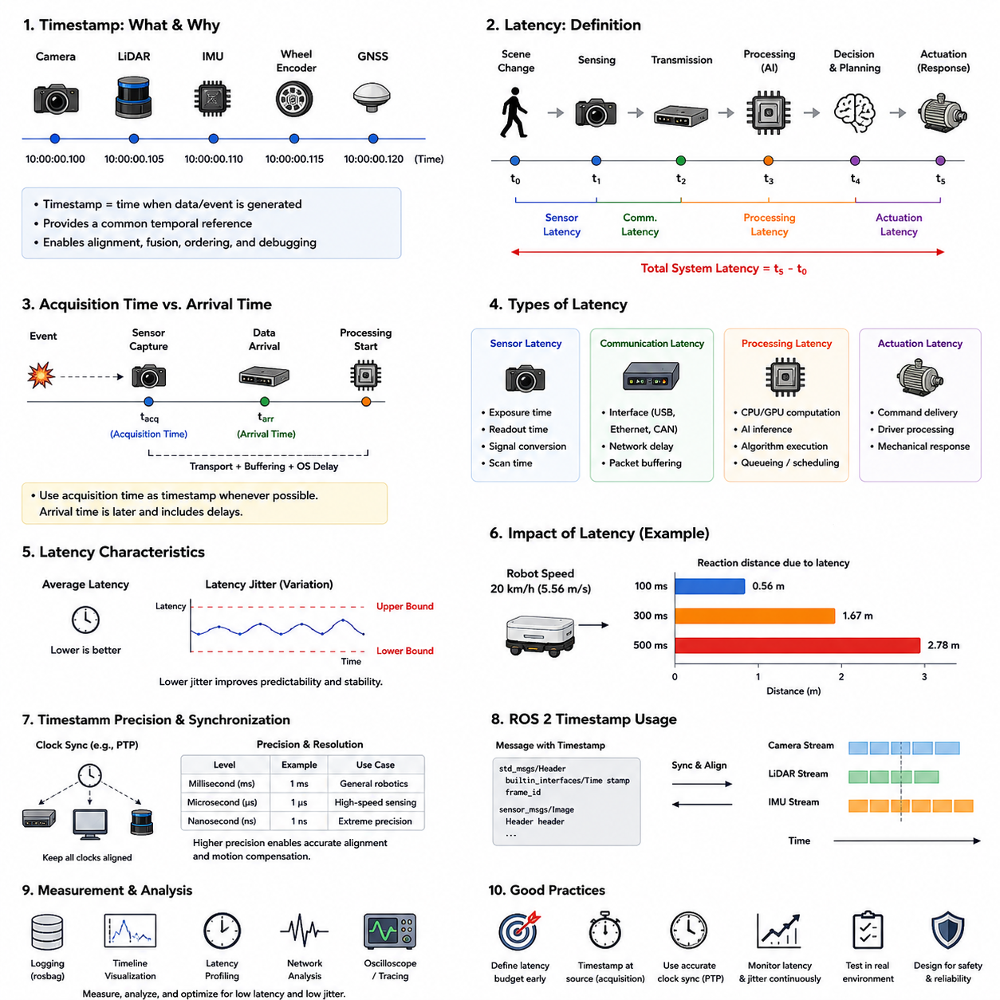
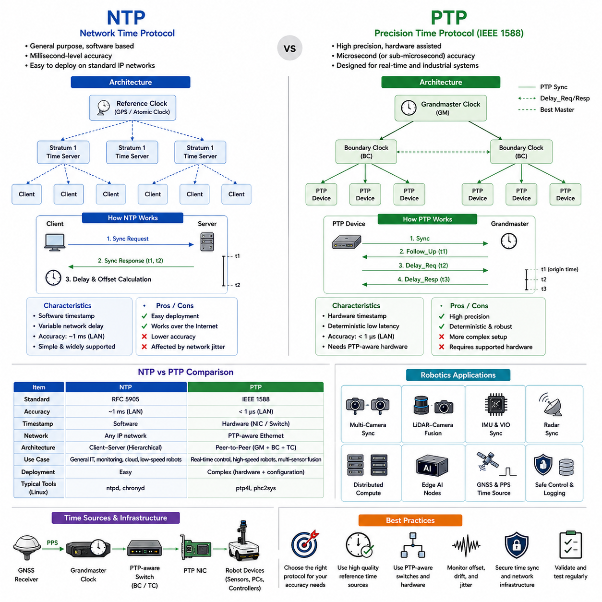
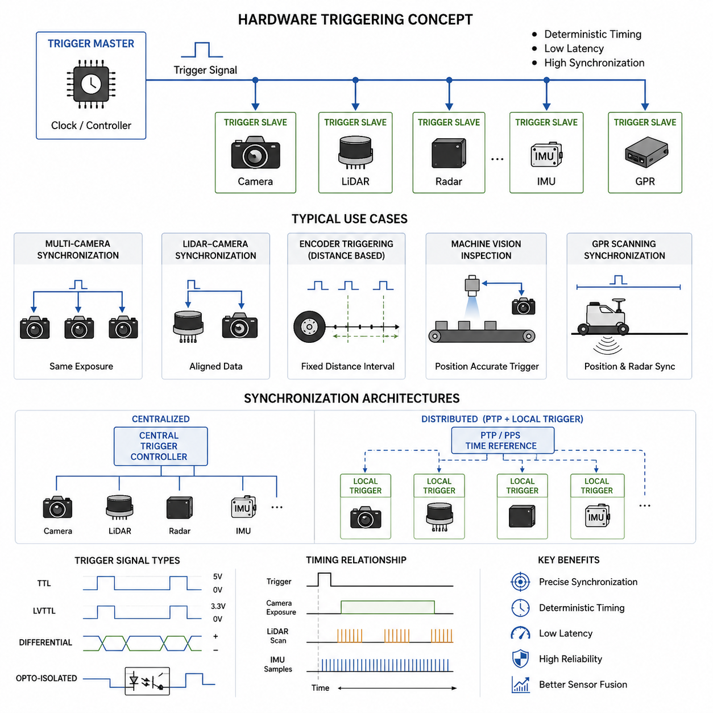
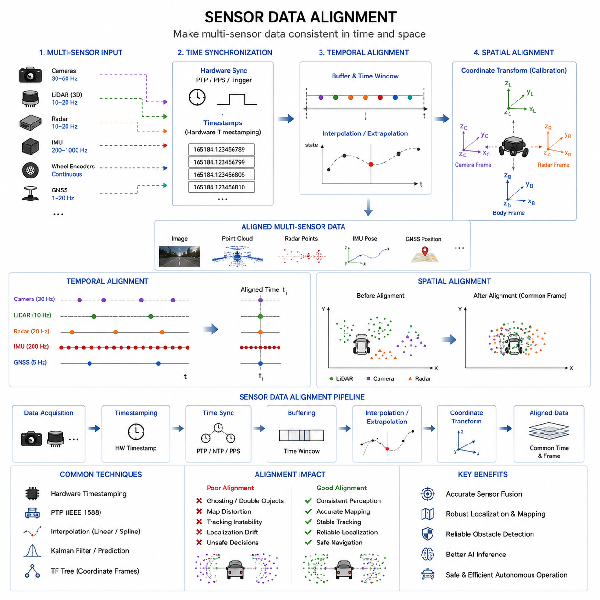
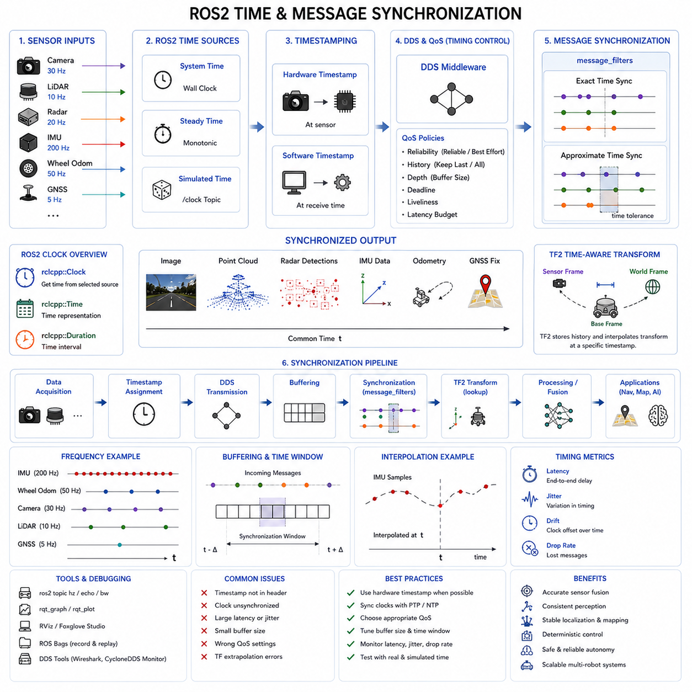
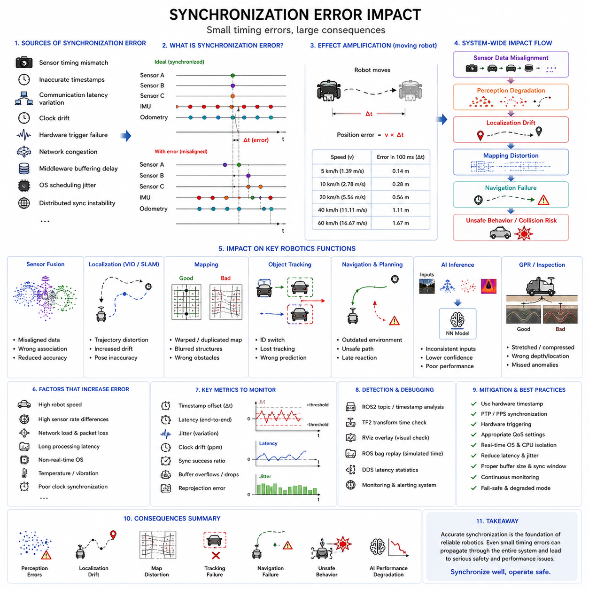
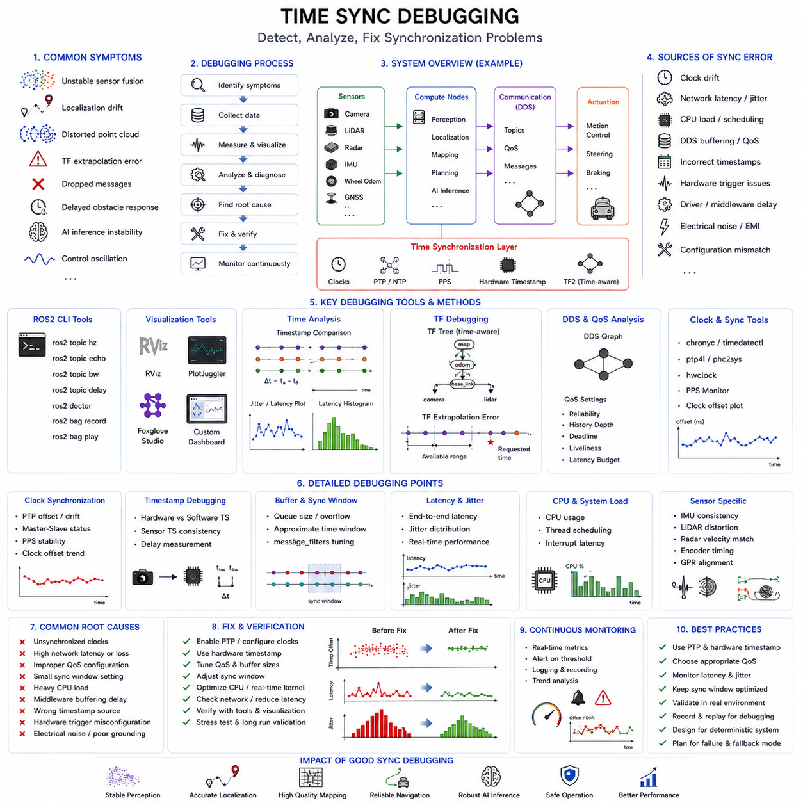

**Volume 03. AMR Sensors and Perception**

# Chapter 12. Time Synchronization

The "12_Time_Synchronization" chapter introduces the fundamental concepts and practical engineering techniques required to achieve accurate timing consistency in modern robotics and autonomous systems. It covers the basics of synchronization, timestamp handling, latency analysis, and clock management using NTP and PTP protocols. The chapter also explains hardware triggering methods, sensor data alignment, and ROS2-based time and message synchronization mechanisms for distributed robotic architectures. In addition, it examines the real-world impact of synchronization errors on localization, mapping, sensor fusion, AI inference, and autonomous navigation. Finally, advanced debugging methodologies for time synchronization problems are discussed, including latency measurement, jitter analysis, TF debugging, DDS timing analysis, and hardware-level diagnostics. This chapter provides the essential theoretical and practical knowledge needed to build reliable, deterministic, and safety-critical autonomous robotic systems.

"12_Time_Synchronization" 챕터는 현대 로보틱스 및 자율주행 시스템에서 정확한 시간 일관성을 구현하기 위한 핵심 개념과 실무 엔지니어링 기술을 소개한다. 이 장에서는 시간 동기화의 기초, 타임스탬프 처리, 지연 시간 분석, 그리고 NTP 및 PTP 기반의 클럭 동기화 기술을 다룬다. 또한 Hardware Triggering, Sensor Data Alignment, ROS2 기반의 시간 및 메시지 동기화 구조를 설명하며, 분산형 로봇 시스템에서의 동기화 방법을 제시한다. 추가적으로 동기화 오류가 Localization, Mapping, Sensor Fusion, AI Inference, 자율주행 안정성에 미치는 영향을 분석한다. 마지막으로 Latency Measurement, Jitter Analysis, TF Debugging, DDS Timing Analysis, Hardware-Level Diagnostic 등 시간 동기화 문제를 분석하고 해결하기 위한 고급 디버깅 기법도 설명한다. 이 장은 신뢰성 있고 결정론적이며 안전 필수(Safety-Critical) 특성을 가지는 차세대 자율 로봇 시스템 구축에 필요한 핵심 이론과 실무 지식을 제공한다.

## 12.1 Time Synchronization Basics

{width="7.268055555555556in" height="7.268055555555556in"}

Time synchronization is one of the most fundamental requirements in modern Autonomous Mobile Robot (AMR) systems. In a robotic platform, multiple sensors, computing devices, actuators, controllers, and distributed software modules continuously exchange data in real time. These components generate information independently and often operate at different frequencies, different processing speeds, and different communication latencies. Without a common understanding of time, the robot cannot accurately determine when events occurred, how sensor measurements relate to one another, or how to reconstruct the surrounding environment consistently. As a result, reliable time synchronization becomes a core infrastructure technology for perception, localization, sensor fusion, navigation, AI inference, safety control, and system debugging in AMR platforms.

In simple systems, timing may appear trivial because only a few devices are connected. However, in industrial AMRs, outdoor autonomous robots, smart city robots, logistics robots, towing AMRs, agricultural robots, or GPR inspection robots, the number of sensors and processing nodes can become extremely large. A modern outdoor autonomous robot may include multiple RGB cameras, 3D LiDARs, radars, GNSS RTK receivers, IMUs, ultrasonic sensors, depth cameras, thermal cameras, edge AI computers, motor controllers, and safety PLC systems. Each device produces data streams independently. If those streams are not synchronized accurately, the robot may incorrectly estimate object positions, misunderstand environmental motion, or produce unstable control outputs.

The concept of time synchronization refers to aligning clocks across different devices so that all measurements and events can be interpreted under the same temporal reference. In robotics, this means ensuring that timestamps attached to sensor data correspond to the actual physical moment when the data was captured. Time synchronization allows the robot to correlate measurements from different sensors and reconstruct a coherent representation of the world.

Consider a robot equipped with a front RGB camera and a 3D LiDAR. If the LiDAR captures a pedestrian at time T while the camera frame is captured 100 milliseconds later, the pedestrian may already have moved. If the robot assumes both measurements were obtained simultaneously, sensor fusion algorithms may generate incorrect object localization results. In slow indoor robots this error might be small, but in outdoor robots operating at higher speeds, even small timing mismatches can produce large spatial errors.

The importance of synchronization increases dramatically in systems involving motion. A stationary sensor platform may tolerate small timing inaccuracies, but a moving robot continuously changes its position and orientation. When the robot moves during sensor acquisition, asynchronous measurements effectively represent different robot poses. This introduces geometric distortion, localization drift, and perception instability.

For example, when a robot travels at 20 km/h, a 100 millisecond synchronization error corresponds to approximately 55 centimeters of positional displacement. In high-precision mapping, obstacle detection, or autonomous driving, such errors are unacceptable. Therefore, synchronization accuracy directly influences robot safety and navigation performance.

Time synchronization is also essential for sensor fusion. Modern AMRs rarely rely on a single sensing modality. Instead, they combine information from LiDAR, cameras, IMUs, GNSS, radar, wheel encoders, and AI models. Sensor fusion algorithms assume that input data represents approximately the same moment in time. If timestamps are inconsistent, the fusion process becomes unreliable.

For example, GNSS and IMU fusion requires accurate temporal alignment between acceleration measurements and position updates. Similarly, LiDAR-camera fusion requires exact matching between point clouds and image frames. Radar-camera fusion depends on synchronized velocity and visual observations. In all these cases, synchronization errors directly reduce perception quality.

Another important aspect is robot localization. Localization algorithms estimate the robot's position by integrating measurements over time. Odometry systems accumulate encoder and IMU data continuously, while SLAM systems compare sensor observations across time intervals. If timestamps drift between devices, pose estimation becomes inconsistent.

Visual SLAM systems are especially sensitive to timing issues. Cameras often operate at high frame rates, and IMUs generate measurements at even higher frequencies. Accurate synchronization between image frames and inertial measurements is necessary for stable visual-inertial odometry. Even a few milliseconds of offset can reduce localization accuracy significantly.

Time synchronization is equally important in autonomous control systems. Motor commands, steering control, braking systems, and safety mechanisms depend on real-time sensor information. If perception data arrives too late or carries inaccurate timestamps, control decisions may be delayed or based on outdated environmental information.

In industrial safety applications, synchronization errors can create dangerous situations. Suppose a safety LiDAR detects a worker entering a hazardous area, but the timestamp delay causes the robot to react late. Even small delays can increase stopping distance and compromise functional safety requirements.

Modern AMRs often use distributed computing architectures. Instead of running all software on a single computer, tasks are divided across multiple edge devices, GPUs, embedded controllers, and cloud-connected systems. Each computing node maintains its own internal clock. Over time, these clocks drift apart because of oscillator inaccuracies, temperature variations, and hardware limitations.

Clock drift refers to the gradual divergence between clocks over time. Even highly accurate oscillators accumulate timing errors if left unsynchronized. In distributed robotics systems, clock drift can eventually produce severe inconsistencies between sensor streams and software modules.

Clock synchronization mechanisms continuously correct these differences. The system periodically exchanges timing information between devices and adjusts clocks to maintain alignment. Various synchronization protocols exist for this purpose, including NTP, PTP, hardware triggering, GPS-based timing, and PPS synchronization.

One of the most widely used synchronization approaches in general computer networks is NTP, or Network Time Protocol. NTP synchronizes clocks over standard Ethernet networks using software-based timestamp exchanges. NTP is sufficient for many non-critical applications and can usually achieve millisecond-level accuracy under stable network conditions.

However, advanced robotic systems often require higher precision. In perception pipelines involving high-frequency LiDARs, cameras, and IMUs, millisecond-level synchronization may not be sufficient. Therefore, many industrial AMRs adopt PTP, or Precision Time Protocol.

PTP provides significantly higher timing accuracy by using hardware-assisted timestamping and deterministic network synchronization techniques. Under optimized conditions, PTP can achieve microsecond-level synchronization between devices. This makes PTP particularly valuable for autonomous driving platforms, industrial robots, and distributed perception systems.

Hardware triggering is another synchronization strategy commonly used in robotics. Instead of relying entirely on software clocks, a hardware trigger signal simultaneously activates multiple sensors. For example, a camera and LiDAR may receive the same trigger pulse, ensuring that data acquisition begins at nearly the same instant.

Hardware triggering reduces software timing uncertainty and improves synchronization reliability. It is especially useful in multi-camera systems, stereo vision systems, high-speed inspection robots, and scientific robotic platforms.

GPS-based timing is frequently used in outdoor autonomous robots. GNSS receivers can provide highly accurate timing references derived from atomic clocks in satellites. Many systems use PPS, or Pulse Per Second, signals generated by GNSS modules to synchronize onboard devices.

PPS signals provide precise timing pulses aligned to UTC time. Embedded systems, LiDARs, cameras, and industrial computers can use these pulses to maintain consistent timing across the robot platform.

In ROS2-based robotics systems, synchronization plays a central role in message communication. ROS2 nodes exchange messages containing timestamps, sensor data, and control information. If timestamps are inconsistent, message filters, synchronization nodes, and sensor fusion algorithms may fail.

ROS2 provides several synchronization mechanisms, including message_filters, approximate time synchronization, exact time synchronization, and simulation time support. Developers must carefully design timestamp handling throughout the software architecture.

Timestamp generation itself is also an important design consideration. Ideally, timestamps should be generated as close as possible to the physical sensor acquisition event. If timestamps are assigned too late in the processing pipeline, additional latency and jitter are introduced.

Latency refers to the delay between a physical event and the availability of corresponding digital data. Jitter refers to variation in timing delay. Both latency and jitter affect synchronization quality and real-time system stability.

In robotic systems, latency originates from many sources, including sensor exposure time, signal conversion, USB transmission, Ethernet communication, operating system scheduling, driver buffering, GPU processing, and AI inference time.

Understanding the full timing pipeline is therefore essential. Engineers must analyze not only synchronization protocols but also end-to-end data flow timing characteristics.

Time synchronization also affects data recording and debugging. Modern AMRs generate enormous amounts of sensor data during operation. Engineers frequently use ROS bag files or other logging systems to replay recorded robot behavior. Accurate timestamps allow developers to reconstruct events correctly during offline analysis.

Without synchronized timestamps, debugging becomes extremely difficult. Sensor data may appear inconsistent, object trajectories may become unstable, and failure reproduction may become impossible.

Industrial deployment environments introduce additional synchronization challenges. Network congestion, wireless communication delays, electromagnetic interference, temperature fluctuations, and hardware aging can all degrade synchronization performance.

Outdoor autonomous robots face particularly harsh conditions. Long-distance Ethernet cables, multiple edge computing units, and distributed sensor installations increase timing complexity. High-speed operation further reduces tolerance for synchronization errors.

GPR inspection robots provide another example of synchronization-critical systems. Ground Penetrating Radar generates large streams of subsurface measurement data while the robot moves continuously. Synchronizing GPR scans with GNSS, IMU, wheel odometry, and robot position is essential for accurate underground mapping and defect localization.

Similarly, autonomous towing AMRs require synchronization between steering control, wheel encoders, IMUs, trailer articulation sensors, and perception systems. During reversing operations, even small timing inconsistencies can reduce trajectory tracking accuracy.

Medical robots and hospital AMRs also depend on reliable synchronization. Multi-sensor navigation systems operating in crowded indoor environments require accurate fusion of LiDAR, depth cameras, and wheel odometry. Safety-critical human interaction further increases reliability requirements.

Synchronization design should therefore be considered from the earliest stages of robot architecture development. Engineers must define synchronization requirements during system architecture design rather than treating synchronization as a later software feature.

Important design considerations include required synchronization accuracy, sensor frequencies, network architecture, computing topology, communication protocols, real-time operating requirements, and safety constraints.

In practical engineering workflows, synchronization validation should be part of system testing procedures. Engineers often analyze timestamp offsets, latency distributions, packet arrival timing, and synchronization drift over extended operation periods.

Visualization tools can help identify synchronization problems. Engineers may compare sensor trajectories, inspect timestamp differences, analyze frame alignment, or replay synchronized sensor streams.

Future robotic systems will demand even higher synchronization precision. Next-generation embodied AI platforms, collaborative robots, autonomous vehicles, and smart city robot infrastructures will integrate increasingly large numbers of sensors and distributed AI nodes.

Emerging technologies such as event cameras, high-speed 4D radar, distributed edge AI clusters, and cloud-connected robotic fleets will further increase synchronization complexity. Real-time world models and multimodal AI systems require temporally coherent data across all sensing modalities.

As robot intelligence advances, synchronization will become even more tightly integrated with AI reasoning and decision-making. Future robots may dynamically estimate timing uncertainty, compensate for network-induced delays, and adapt sensor fusion algorithms based on synchronization confidence levels.

Ultimately, time synchronization is not merely a networking feature or software utility. It is a foundational infrastructure layer that enables reliable robotic perception, localization, navigation, AI inference, safety control, and distributed autonomy. A robot that cannot understand time consistently cannot fully understand its environment.

For this reason, time synchronization should be treated as a first-class engineering discipline within AMR system development. Proper synchronization architecture improves perception accuracy, navigation stability, safety reliability, debugging efficiency, and overall autonomous system robustness. In advanced robotics platforms, accurate timing is as important as sensing itself.

## 12.2 Timestamp and Latency

{width="7.268055555555556in" height="7.268055555555556in"}

Timestamp and latency are two of the most fundamental concepts in modern robotic perception and autonomous systems. In Autonomous Mobile Robots (AMRs), every sensor measurement, software event, control signal, and AI inference result is associated with time. The robot continuously observes the environment, processes incoming information, and reacts to dynamic conditions. In order to understand the sequence of events correctly, the robot must know not only what happened, but also exactly when it happened. Timestamp management and latency analysis therefore become essential engineering disciplines in robotics system design.

A timestamp is a numerical representation of time associated with a specific event or data sample. In robotics, timestamps are attached to sensor measurements, actuator commands, localization estimates, perception outputs, navigation states, and communication packets. The timestamp indicates the exact moment when a particular event occurred or when data was captured.

For example, when a camera captures an image frame, the frame is assigned a timestamp. Similarly, when a LiDAR completes a scan rotation, when an IMU measures acceleration, or when a wheel encoder generates a pulse, timestamps are recorded. These timestamps allow the robot to align and interpret data streams consistently.

In distributed robotic systems, timestamps act as the common temporal reference that connects all subsystems together. Without timestamps, the robot cannot determine whether two measurements correspond to the same environmental state or different moments in time.

Latency refers to the delay between the occurrence of a physical event and the moment when the corresponding information becomes available for processing or action. Every robotic system contains latency because real-world signals require time for sensing, transmission, computation, and actuation.

For example, when a pedestrian enters the robot's path, several processes occur sequentially. First, the sensor captures the scene. Then the sensor electronics convert analog signals into digital data. The data is transmitted to a processing computer. AI models analyze the data. Navigation software decides how to react. Finally, control commands are sent to motors or brakes. Each stage introduces delay.

The total system latency is the sum of all these delays. Even though each individual delay may appear small, their accumulation can significantly influence robot performance and safety.

In AMR systems, latency directly affects perception accuracy, localization consistency, obstacle avoidance reliability, and motion control stability. Low-latency systems react quickly to environmental changes, while high-latency systems may operate using outdated information.

Consider an outdoor autonomous robot traveling at 20 km/h. If the perception and control pipeline introduces a total latency of 300 milliseconds, the robot may travel more than 1.6 meters before reacting to a newly detected obstacle. In crowded industrial or urban environments, this delay may create dangerous situations.

Timestamp accuracy is equally important because inaccurate timestamps distort temporal relationships between data streams. Even if latency is unavoidable, correctly timestamped data allows algorithms to compensate for delays mathematically. However, if timestamps themselves are inaccurate, compensation becomes difficult or impossible.

One important distinction in robotics is the difference between acquisition time and arrival time. Acquisition time refers to the actual physical moment when the sensor captured data. Arrival time refers to when the data reaches the processing system. These two times are often different because of communication and processing delays.

For example, a camera may capture an image at time T0, but due to USB transfer delay and buffering, the image may not arrive at the GPU until T0 + 80 ms. If the software assigns the timestamp only upon arrival, the timestamp no longer reflects the true sensing moment.

Therefore, robust robotic systems attempt to generate timestamps as close as possible to the actual sensing event. This minimizes timestamp uncertainty and improves synchronization quality.

Latency in robotic systems can be divided into several categories. Sensor latency refers to delays inside sensing hardware itself. Communication latency refers to delays introduced by data transmission networks. Processing latency refers to computational delays inside CPUs, GPUs, and AI accelerators. Actuation latency refers to delays between command generation and physical actuator response.

Sensor latency originates from physical sensing processes and electronic signal conversion. Cameras require exposure time and image readout time. LiDAR systems require scanning rotation and point cloud generation. Radar systems perform signal modulation and frequency analysis. IMUs sample inertial measurements at discrete intervals.

Different sensors therefore have different intrinsic latency characteristics. Cameras using rolling shutters may introduce frame distortion and timing skew, while global shutter cameras capture all pixels simultaneously and provide better timing consistency.

LiDAR systems also vary significantly. Mechanical spinning LiDARs continuously rotate, meaning different points within the same point cloud correspond to slightly different acquisition times. Solid-state LiDARs may reduce some of these timing variations.

Communication latency depends on interfaces and network architecture. USB communication often introduces buffering delays and operating system scheduling variability. Ethernet-based systems generally provide more deterministic timing, especially when combined with real-time networking protocols.

CAN bus systems are widely used for motor controllers and industrial devices because of their deterministic timing behavior and reliability. However, CAN bandwidth limitations may become problematic in high-data-rate perception systems.

Processing latency is increasingly important in modern AI-based robotic systems. Deep learning inference, sensor fusion, SLAM optimization, object tracking, and trajectory planning all require computational time.

GPU acceleration improves throughput but may introduce pipeline buffering and batch scheduling delays. AI models with large architectures often increase inference latency even if accuracy improves. Therefore, robotics engineers must carefully balance AI complexity against real-time performance requirements.

Latency variability is another major challenge. A system with constant latency is often easier to manage than a system with unpredictable latency. Variability in timing delay is known as jitter.

Jitter occurs because operating systems, communication networks, and computational pipelines are not perfectly deterministic. CPU scheduling, memory access contention, GPU queue delays, packet retransmissions, and interrupt handling all contribute to jitter.

High jitter reduces system predictability and can destabilize control systems. Real-time robotic applications therefore aim not only to reduce average latency but also to minimize latency variation.

Real-time operating systems (RTOS) are commonly used in robotics to improve timing determinism. RTOS kernels prioritize critical tasks and reduce scheduling uncertainty. Safety-critical systems such as braking controllers and emergency stop systems often rely on RTOS architectures.

Timestamp precision and timestamp resolution are also important concepts. Precision refers to how accurately timestamps represent actual event timing. Resolution refers to the smallest measurable time increment.

Some systems use millisecond-resolution timestamps, while high-performance robotic systems may require microsecond or even nanosecond-level timing precision. High-frequency IMU systems, radar systems, and synchronized multi-camera arrays often require extremely precise timestamp handling.

Clock synchronization quality directly influences timestamp reliability. If distributed devices maintain inconsistent clocks, timestamps lose meaning across the system. Therefore, timestamp management and time synchronization are closely interconnected engineering problems.

ROS2-based robotic architectures heavily depend on timestamps. ROS2 messages include timestamp fields used for synchronization, sensor fusion, interpolation, playback, and debugging. Message filtering frameworks rely on timestamps to align sensor streams correctly.

ROS2 supports both exact-time synchronization and approximate-time synchronization. Exact synchronization requires matching timestamps precisely, while approximate synchronization allows small temporal tolerances. The choice depends on sensor frequency, timing stability, and application requirements.

Interpolation techniques are often used to compensate for timing differences. For example, if IMU data arrives at higher frequency than LiDAR data, localization algorithms may interpolate robot poses between IMU measurements to estimate the robot state at the exact LiDAR acquisition time.

Motion compensation is another important application of timestamp handling. Moving robots introduce spatial distortion into sensor measurements because the platform changes pose during sensing.

LiDAR motion distortion is a classic example. A spinning LiDAR acquires points sequentially over time while the robot moves. Without timestamp-aware motion compensation, the resulting point cloud appears geometrically distorted.

Visual perception systems also depend heavily on timing accuracy. Multi-camera systems require synchronized image capture to enable stereo vision and depth estimation. If one camera captures earlier than another, moving objects produce disparity inconsistencies.

Autonomous driving systems often require end-to-end latency budgets. Engineers allocate maximum allowable latency to each subsystem, including sensing, communication, perception, planning, and control.

For example, a perception pipeline may be allocated 100 ms, localization 30 ms, trajectory planning 50 ms, and control response 20 ms. These budgets ensure the total reaction time remains within safety requirements.

Latency measurement and profiling are therefore essential engineering tasks. Developers use timestamp tracing, profiling tools, ROS bag analysis, network analyzers, and hardware oscilloscopes to inspect timing behavior.

End-to-end latency analysis traces data flow from physical sensing to actuator response. Engineers identify bottlenecks, excessive buffering, or unpredictable timing variations.

In industrial robotics, safety standards often impose timing constraints. Emergency stop systems must react within defined time intervals. Functional safety certification may require deterministic timing guarantees.

Network architecture significantly affects latency performance. Centralized architectures simplify synchronization but may overload a single processing node. Distributed architectures improve scalability but introduce additional communication delays.

Edge AI architectures increasingly process data closer to sensors to reduce transmission latency. Instead of sending raw sensor streams to remote cloud servers, local edge computers perform real-time inference directly onboard the robot.

This is especially important in outdoor autonomous robots, GPR inspection robots, and smart city robotics platforms where communication bandwidth may be limited and immediate response is required.

Wireless communication introduces additional timing uncertainty. Wi-Fi networks experience packet contention, interference, and retransmission delays. Cellular networks introduce variable latency depending on network load and signal quality.

Cloud robotics systems therefore require careful latency-aware system design. Critical real-time functions usually remain onboard, while non-critical analytics or fleet-level coordination may be handled in the cloud.

Timestamp management is also essential for data recording and replay systems. ROS bag files, distributed logging systems, and AI dataset collection pipelines all depend on accurate timestamps.

Machine learning training pipelines often assume temporal consistency between sensor streams. If timestamps are inaccurate, datasets become misaligned and model training quality degrades.

GPR robotics platforms provide an excellent example of timestamp-critical systems. GPR scans must align precisely with GNSS, IMU, and wheel odometry measurements to reconstruct underground infrastructure maps accurately.

Similarly, towing AMRs performing reverse parking maneuvers require synchronized steering feedback, trailer articulation sensing, and wheel motion estimation. Timing errors can destabilize reversing trajectories.

Autonomous agricultural robots operating over rough terrain also rely on low-latency sensor fusion between GNSS, IMU, LiDAR, radar, and terrain perception systems.

Hospital robots require reliable timing as well. Crowded indoor spaces, human interactions, elevators, and dynamic obstacles demand stable real-time perception and control.

Modern robotics increasingly combines AI inference with traditional control theory. However, deep learning models sometimes introduce variable inference latency due to dynamic workloads and GPU resource sharing.

Future AI accelerators will likely include hardware-level timing optimization to improve deterministic inference behavior for robotics applications.

Emerging technologies such as event cameras further emphasize timestamp importance. Event cameras generate asynchronous streams of microsecond-level brightness changes rather than traditional frames. Processing these sensors requires extremely accurate temporal handling.

Future robotic systems may also incorporate timing uncertainty models directly into AI architectures. Instead of assuming perfect timing, AI systems may estimate timestamp confidence and compensate dynamically for latency variations.

Digital twins and large-scale robotic fleets will further increase the importance of timestamp management. Distributed robot coordination requires globally synchronized clocks to reconstruct system-wide events accurately.

In smart city robotics, multiple autonomous robots, infrastructure sensors, traffic systems, and cloud AI services may share data simultaneously. Temporal consistency across this ecosystem becomes essential.

Ultimately, timestamp management and latency engineering are not secondary implementation details. They are fundamental components of robotic intelligence and system reliability.

A robot that misunderstands time cannot correctly understand motion, causality, synchronization, or environmental dynamics.

For this reason, timestamp design, latency analysis, synchronization architecture, and timing validation should be treated as core engineering disciplines in all advanced AMR development programs. Accurate timing infrastructure enables reliable perception, stable localization, robust navigation, safe control, scalable distributed robotics, and trustworthy autonomous operation.

## 12.3 NTP and PTP

{width="7.268055555555556in" height="7.268055555555556in"}

Network Time Protocol (NTP) and Precision Time Protocol (PTP) are two of the most important technologies used for time synchronization in modern robotic systems. In Autonomous Mobile Robots (AMRs), multiple sensors, computers, controllers, and distributed software modules continuously exchange information in real time. These components must share a common understanding of time in order to perform accurate perception, localization, sensor fusion, navigation, and safety control. NTP and PTP provide mechanisms for synchronizing clocks across distributed devices and therefore form a critical foundation for reliable autonomous robotics.

Modern AMRs are highly distributed systems. A robot may contain multiple industrial PCs, embedded controllers, GPUs, AI accelerators, LiDAR sensors, cameras, radars, IMUs, GNSS receivers, motor controllers, safety PLCs, and edge computing devices. Each device maintains its own internal clock using local oscillators. However, these clocks are never perfectly identical. Small differences in oscillator frequency cause clocks to drift apart over time.

Clock drift is unavoidable because every oscillator has slight frequency inaccuracies influenced by manufacturing tolerances, temperature variation, voltage instability, aging, and environmental conditions. Even high-quality oscillators accumulate measurable timing errors if not continuously corrected.

Without synchronization, different devices in a robot gradually develop inconsistent notions of time. Sensor measurements become misaligned, distributed software modules lose temporal consistency, and sensor fusion algorithms begin to fail. Therefore, robotic systems require synchronization protocols that continuously align clocks across all devices.

Time synchronization protocols allow distributed devices to exchange timing information and estimate clock differences. These protocols then compensate for drift by adjusting local clocks. The overall goal is to maintain a shared temporal reference throughout the robot platform.

NTP is one of the oldest and most widely deployed synchronization protocols in computer networking. Originally developed for large-scale Internet time synchronization, NTP provides a general-purpose mechanism for synchronizing clocks across standard IP networks.

NTP operates using a hierarchical time distribution architecture. Highly accurate reference clocks, often synchronized to atomic clocks or GPS time sources, act as primary time servers. Lower-level devices synchronize their clocks by exchanging timestamped packets with upstream servers.

NTP uses a client-server communication model. The client periodically sends synchronization requests to a server. By measuring packet transmission times and comparing timestamps, the client estimates network delay and clock offset relative to the server.

The protocol mathematically compensates for network propagation delays and adjusts the local clock gradually. Rather than abruptly changing system time, NTP usually performs smooth clock corrections to avoid destabilizing software applications.

NTP provides relatively good synchronization accuracy under typical network conditions. In stable local Ethernet environments, NTP can often achieve millisecond-level synchronization accuracy. On wider Internet connections, accuracy may degrade depending on network congestion and routing variability.

For many conventional computing applications, millisecond-level synchronization is sufficient. Logging systems, distributed databases, office networks, and cloud services often rely successfully on NTP.

In robotics, NTP can also be useful in systems where extremely precise timing is not required. Indoor AMRs operating at low speeds may tolerate small synchronization errors. Fleet management systems, monitoring servers, cloud-connected robot dashboards, and non-real-time analytics platforms frequently use NTP successfully.

However, advanced robotic perception systems often demand far higher synchronization precision than NTP can reliably provide. High-speed autonomous robots, multi-sensor fusion systems, visual-inertial SLAM pipelines, and distributed AI systems may require microsecond-level synchronization.

This is where PTP becomes extremely important.

PTP, formally standardized as IEEE 1588 Precision Time Protocol, was designed specifically for high-precision clock synchronization in distributed industrial and real-time systems. Unlike NTP, which primarily targets general-purpose networking environments, PTP focuses on deterministic low-latency synchronization.

The core difference between NTP and PTP lies in synchronization precision and timing methodology. PTP minimizes timing uncertainty by using hardware-assisted timestamping and carefully controlled network timing behavior.

In a PTP system, one device becomes the Grandmaster Clock. This clock acts as the primary timing reference for the network. Other devices synchronize themselves to the Grandmaster using periodic synchronization messages.

PTP devices exchange several types of timing messages, including Sync, Follow_Up, Delay_Request, and Delay_Response messages. By measuring message travel times in both directions, devices estimate propagation delay and clock offset.

One of the most important features of PTP is hardware timestamping. Instead of generating timestamps in software after packets travel through the operating system stack, timestamps are generated directly inside network interface hardware.

This dramatically reduces timing uncertainty caused by operating system scheduling, interrupt latency, software buffering, and driver variability. As a result, PTP can achieve microsecond-level or even sub-microsecond synchronization accuracy under optimized conditions.

PTP performance depends heavily on network infrastructure. Industrial Ethernet switches supporting PTP-aware functionality significantly improve synchronization accuracy. Some switches operate as Boundary Clocks or Transparent Clocks.

A Boundary Clock acts as an intermediate synchronization node that synchronizes itself to the upstream clock and redistributes timing downstream. This reduces accumulated timing error across large networks.

A Transparent Clock measures packet residence time inside the switch and compensates for switching delay dynamically. This minimizes network-induced synchronization error.

Industrial robotics systems frequently use PTP-capable switches and network cards to maintain highly stable timing behavior across distributed devices.

In robotic perception systems, PTP is especially valuable for synchronizing high-frequency sensors. Multi-camera systems, LiDAR arrays, radar systems, and IMU networks require highly accurate temporal alignment.

For example, stereo vision systems require both cameras to capture frames at nearly the exact same instant. Small timing mismatches can introduce depth estimation errors and reduce visual perception quality.

LiDAR-camera fusion systems also benefit greatly from PTP synchronization. Accurate timestamp alignment allows point clouds and image frames to represent the same environmental state.

Visual-inertial odometry systems are another major application. IMUs generate measurements at extremely high frequencies, often hundreds or thousands of samples per second. Cameras operate at lower frame rates. Accurate synchronization between these devices is essential for stable localization performance.

Autonomous driving platforms frequently use PTP throughout the entire perception stack. Cameras, LiDARs, radars, GNSS receivers, and AI computers all synchronize to a common time reference.

Industrial automation systems have used PTP for many years because deterministic timing is critical for motion control, robotics, manufacturing equipment, and synchronized actuation systems.

In advanced AMRs, PTP enables distributed edge computing architectures. Instead of processing all sensor data on a single computer, workloads are distributed across multiple computing nodes. PTP ensures all nodes maintain consistent timing.

Outdoor autonomous robots particularly benefit from PTP because they often contain large numbers of distributed sensors and processing units. Long Ethernet cable runs and multiple edge computers increase synchronization complexity.

GPR inspection robots also require highly accurate synchronization. GPR scan timing must align precisely with GNSS, IMU, and wheel odometry measurements to reconstruct underground infrastructure maps accurately.

Tow AMRs performing reverse parking operations require synchronized steering control, trailer articulation sensing, wheel encoder measurements, and perception timing. Precise timing improves control stability and maneuvering accuracy.

NTP and PTP differ not only in precision but also in computational architecture and deployment complexity. NTP is relatively easy to configure because it operates entirely in software over standard IP networks.

Most operating systems already include NTP support. Linux systems commonly use services such as ntpd or chronyd. These services synchronize the system clock automatically using public or private time servers.

PTP deployment is generally more complex. Hardware timestamping support is often required in network cards, switches, and embedded devices. PTP-aware network infrastructure significantly improves synchronization quality.

Linux-based robotics systems often use ptp4l and phc2sys utilities from the Linux PTP package. These tools manage synchronization between hardware clocks and system clocks.

A PTP deployment may include Grandmaster Clocks synchronized via GNSS receivers or PPS signals. GNSS-based timing provides globally accurate UTC time references derived from satellite atomic clocks.

Some industrial robots combine GNSS PPS signals with PTP distribution across onboard Ethernet networks. This architecture provides extremely accurate timing throughout the entire robotic platform.

Another important concept is synchronization hierarchy. In large systems, not all devices synchronize directly to the same source. Hierarchical synchronization reduces network load and improves scalability.

PTP includes a Best Master Clock Algorithm (BMCA) that automatically selects the most accurate available clock as the Grandmaster. If the current Grandmaster fails, another clock automatically takes over.

This redundancy improves reliability in industrial and autonomous systems.

NTP also supports multiple upstream time servers for redundancy and robustness. Clients can compare multiple servers and reject inaccurate timing sources.

Security is becoming increasingly important in synchronization systems. Timing attacks or malicious clock manipulation can destabilize robotic systems. Incorrect timing may corrupt sensor fusion, localization, navigation, and safety systems.

Secure synchronization architectures therefore include authentication mechanisms, trusted network segmentation, and protected GNSS timing sources.

Wireless synchronization introduces additional challenges. Wi-Fi and cellular networks experience variable packet delay and jitter. NTP over wireless networks may produce inconsistent timing behavior.

PTP performance over wireless links is generally more difficult because precise delay estimation becomes unreliable under variable latency conditions.

Therefore, high-precision robotic systems usually prefer wired Ethernet networks for critical synchronization infrastructure.

Latency and jitter directly affect synchronization accuracy. Even highly precise protocols cannot compensate perfectly for unpredictable network behavior.

Real-time operating systems further improve synchronization stability by reducing software scheduling uncertainty. Industrial robotics platforms often combine RTOS architectures with PTP synchronization for maximum determinism.

ROS2-based robotic systems rely heavily on synchronized timestamps. Distributed ROS2 nodes exchange sensor messages, localization states, and control information continuously.

Without proper synchronization, ROS2 message filtering, sensor fusion, interpolation, and playback systems become unreliable. PTP can significantly improve temporal consistency across distributed ROS2 architectures.

Timestamp alignment is also essential for AI dataset collection. Machine learning pipelines assume sensor streams are temporally consistent. Synchronization errors reduce training data quality and AI model reliability.

Robotics developers often validate synchronization performance using packet analyzers, oscilloscopes, timestamp tracing tools, and ROS bag replay systems.

Synchronization validation includes measuring clock offset, drift rate, jitter, packet delay variation, and synchronization recovery behavior.

Future robotic systems will require even more advanced synchronization infrastructure. Event cameras, high-speed radar systems, distributed AI clusters, and collaborative multi-robot fleets all increase timing precision requirements.

Smart city robotics platforms may eventually synchronize thousands of robots, infrastructure sensors, cloud AI services, and traffic systems simultaneously.

Next-generation embodied AI systems may integrate synchronization uncertainty directly into world models and sensor fusion architectures.

Time-aware AI systems could dynamically estimate timestamp reliability and compensate for timing variability during inference.

Quantum timing technologies and future optical synchronization networks may eventually provide nanosecond-level timing precision across large robotic infrastructures.

Despite future advances, the fundamental engineering principle remains unchanged: distributed robotic systems require a shared understanding of time.

NTP and PTP provide the essential infrastructure enabling this shared temporal reference.

NTP offers flexible, widely compatible, software-based synchronization suitable for general networking and moderate-precision robotic applications.

PTP provides deterministic, hardware-assisted, high-precision synchronization essential for advanced perception, autonomous navigation, distributed AI processing, and industrial real-time robotics.

Together, NTP and PTP form the foundation of modern robotic timing architecture. Proper synchronization design improves sensor fusion accuracy, localization consistency, navigation stability, AI reliability, debugging capability, operational safety, and overall autonomous system robustness. In advanced AMR platforms, accurate synchronization is as important as sensing, computation, and control themselves.

## 12.4 Hardware Triggering

{width="7.268055555555556in" height="7.268055555555556in"}

Hardware triggering is one of the most important synchronization mechanisms used in robotics, machine vision, autonomous vehicles, industrial automation, and scientific sensing systems. In modern autonomous robot platforms, multiple sensors such as cameras, LiDARs, radars, IMUs, GNSS modules, thermal cameras, laser profilers, and ultrasonic devices must operate together while maintaining precise temporal alignment. If sensor timing is not synchronized correctly, sensor fusion quality decreases, localization becomes unstable, object tracking accuracy is reduced, and autonomous navigation reliability deteriorates. Hardware triggering addresses these problems by providing deterministic timing control directly through electrical signaling rather than relying entirely on software scheduling or network synchronization.

In a typical software-triggered system, sensors are activated through operating system processes, software timers, middleware messages, or network packets. Although software triggering is relatively easy to implement, it suffers from timing uncertainties caused by CPU scheduling latency, operating system jitter, interrupt handling delays, communication overhead, and network congestion. In robotic systems that require millisecond-level or microsecond-level synchronization, these variations can become unacceptable. For example, in high-speed outdoor autonomous robots traveling over uneven terrain, even a few milliseconds of timing mismatch between cameras and IMUs can produce significant localization drift. Similarly, in GPR-based underground inspection robots, inaccurate synchronization between motion estimation and radar acquisition can distort subsurface reconstruction results.

Hardware triggering eliminates much of this uncertainty by using dedicated electrical trigger signals. In this architecture, one device operates as the trigger master while other devices behave as trigger slaves. The master generates a pulse signal, and all connected slave devices begin acquisition simultaneously or according to a predefined timing relationship. Because the synchronization occurs at the hardware electrical level, timing accuracy becomes highly deterministic and repeatable.

A trigger signal is typically implemented using digital voltage transitions. Common standards include TTL (Transistor-Transistor Logic), LVTTL (Low Voltage TTL), CMOS logic, differential signaling, opto-isolated triggering, and industrial trigger interfaces. The trigger pulse may be generated periodically or conditionally. In periodic triggering, pulses are generated at fixed intervals such as 10 Hz, 30 Hz, or 100 Hz. In conditional triggering, pulses are generated only when certain events occur, such as wheel encoder movement, proximity detection, external synchronization messages, or production line events.

One of the most common applications of hardware triggering is synchronized multi-camera systems. In autonomous robots and machine vision inspection systems, multiple cameras often need to capture images at exactly the same moment. Stereo vision systems, surround-view perception systems, and multi-view 3D reconstruction systems require tight synchronization to avoid motion inconsistencies between frames. If cameras capture images at slightly different times while the robot is moving, reconstructed geometry may become inaccurate. Hardware triggering ensures simultaneous exposure timing across all cameras.

In stereo vision applications, left and right cameras must maintain synchronized frame acquisition. If the synchronization offset becomes too large, stereo correspondence calculations become unstable, especially during high-speed motion. Hardware triggering allows both cameras to start exposure from the same trigger pulse. Some industrial cameras additionally support exposure overlap control and trigger delay configuration for precise adjustment.

Another important application is LiDAR-camera synchronization. In autonomous navigation systems, LiDAR point clouds are often fused with RGB camera images. Since the robot may move continuously during acquisition, timestamps must align precisely. Hardware triggering enables camera exposure timing to synchronize with LiDAR rotational cycles or scan phases. This improves point cloud coloring accuracy, object detection consistency, and sensor fusion reliability.

In GPR inspection robots, hardware triggering becomes even more critical. Ground Penetrating Radar systems continuously emit electromagnetic pulses while the robot moves across the ground surface. Accurate underground imaging requires precise knowledge of robot position at the exact moment each radar scan is acquired. Hardware triggers can synchronize GPR acquisition with wheel encoder pulses, ensuring equal spatial sampling intervals regardless of robot speed variations. Without this synchronization, underground reconstruction quality may degrade due to irregular scan spacing.

Wheel encoder triggering is widely used in industrial scanning applications. In conveyor inspection systems, printing systems, railway inspection systems, and pipeline inspection robots, acquisition events are often tied to physical movement rather than time intervals. Instead of capturing data every fixed millisecond, the system captures data every fixed travel distance. For example, a laser profiler may acquire one scan every 1 mm of movement. Encoder-triggered acquisition ensures spatial consistency even if velocity changes occur.

Industrial machine vision systems frequently use hardware triggering for deterministic inspection timing. In factory automation, products moving along conveyor belts must be inspected at precise positions. Photoelectric sensors detect object arrival and generate trigger pulses for cameras, laser scanners, or measurement devices. Hardware triggering minimizes latency uncertainty and ensures repeatable inspection accuracy across high-speed production lines.

In robotics, IMU synchronization is another critical use case. IMUs generate high-frequency acceleration and angular velocity measurements, often at hundreds or thousands of samples per second. Synchronizing cameras or LiDAR systems with IMU timestamps improves visual-inertial odometry performance. Some advanced IMUs provide synchronization outputs such as PPS (Pulse Per Second) or dedicated trigger lines that can coordinate timing across multiple sensors.

GNSS systems also contribute to hardware synchronization architectures. High-precision GNSS receivers frequently provide PPS outputs aligned to UTC time. PPS signals deliver highly accurate one-second timing pulses with nanosecond-level stability. Robotics platforms can use PPS signals to synchronize cameras, LiDARs, edge computers, and sensor acquisition modules. In outdoor autonomous systems, PPS synchronization provides a common global timing reference for distributed sensing devices.

Hardware triggering architectures can be divided into centralized and distributed synchronization models. In centralized architectures, a dedicated timing controller generates trigger signals for all sensors. This controller may be implemented using FPGA boards, microcontrollers, industrial timing modules, or specialized synchronization hardware. Centralized systems provide excellent timing consistency and simplified management.

In distributed synchronization architectures, devices synchronize through shared timing references while generating local trigger signals internally. For example, multiple cameras may synchronize using IEEE 1588 PTP combined with hardware timestamping. Some devices internally align their clocks to a common reference while still using hardware-based trigger execution. Distributed systems provide scalability advantages in large robotic fleets or sensor networks.

FPGA-based triggering systems are commonly used in advanced robotics and industrial platforms. FPGAs provide deterministic low-latency signal generation and support highly precise timing control. Multiple trigger outputs can be generated simultaneously with configurable delays, pulse widths, duty cycles, and synchronization sequences. FPGA timing controllers are frequently used in autonomous vehicles, aerospace systems, and scientific instrumentation.

Microcontroller-based triggering solutions are simpler and lower cost. Platforms such as STM32, Arduino, ESP32, or industrial embedded controllers can generate trigger pulses using hardware timers. While microcontroller accuracy may not match FPGA precision, these systems are sufficient for many robotics applications involving moderate synchronization requirements.

Signal integrity becomes an important consideration in hardware-triggered systems. Trigger pulses traveling through long cables may experience noise, voltage drop, reflections, or electromagnetic interference. Differential signaling methods such as RS-422 or LVDS improve robustness over long distances. Shielded cables, proper grounding, and termination resistors are also important for reliable operation.

Electrical isolation is another important design factor. Industrial systems often use opto-isolated trigger interfaces to prevent ground loops and protect devices from electrical noise or voltage spikes. Isolation improves reliability in harsh environments involving motors, power converters, welding equipment, or heavy machinery.

Trigger timing parameters must be carefully configured. Important parameters include trigger delay, pulse width, trigger polarity, retrigger interval, debounce timing, and exposure timing. Cameras may support rising-edge or falling-edge triggering. Some sensors require minimum pulse widths or recovery intervals. Engineers must ensure compatibility between trigger controller outputs and sensor input requirements.

Exposure synchronization is particularly important for machine vision systems. Even if cameras receive trigger pulses simultaneously, actual exposure timing may vary depending on internal sensor architecture. Global shutter cameras are generally preferred for synchronized robotics applications because all pixels capture light simultaneously. Rolling shutter cameras expose image rows sequentially, which can introduce motion distortion during fast movement.

Hardware triggering also plays a major role in high-speed data acquisition systems. Scientific experiments, vibration analysis systems, acoustic sensing systems, and high-speed robotics research often require synchronized sampling across many channels. Trigger controllers coordinate acquisition start times across oscilloscopes, ADC modules, cameras, and sensor arrays.

In autonomous outdoor robots, environmental robustness becomes critical. Trigger systems must operate reliably under vibration, temperature changes, humidity, dust, and electromagnetic noise. Industrial connectors such as M8, M12, LEMO, or aviation connectors are often used to ensure stable trigger connectivity in field environments.

Edge computing platforms increasingly integrate hardware synchronization capabilities. Modern AI edge computers and robotics controllers may include GPIO trigger interfaces, PPS synchronization inputs, FPGA timing modules, or hardware timestamp engines. Platforms based on NVIDIA Jetson, industrial x86 systems, or robotics middleware controllers frequently support integrated synchronization frameworks.

ROS and robotics middleware also interact with hardware triggering systems. Although hardware triggering itself occurs electrically, middleware layers manage configuration, timestamp propagation, and synchronization diagnostics. ROS2 improves deterministic communication through DDS-based middleware and real-time execution support. Hardware timestamps may be propagated through ROS topics to maintain synchronization integrity across distributed processing pipelines.

Hardware timestamping is closely related to hardware triggering. Instead of relying on software-generated timestamps when data arrives at the CPU, hardware timestamping records the exact acquisition moment directly at the sensor interface or network hardware layer. This significantly improves temporal accuracy. Some industrial Ethernet devices support hardware timestamping combined with PTP synchronization.

Debugging synchronized systems can be challenging. Engineers commonly use oscilloscopes, logic analyzers, timing analyzers, and diagnostic LEDs to verify trigger timing behavior. Measuring pulse latency, jitter, propagation delay, and synchronization drift helps validate system performance. High-speed cameras and timestamp logging tools may also assist synchronization analysis.

Timing jitter is a key performance metric in hardware-triggered systems. Jitter refers to timing variability between expected and actual trigger events. Lower jitter indicates more stable synchronization. FPGA-based systems may achieve nanosecond-level jitter performance, while software-triggered systems may exhibit millisecond-level variability.

Latency is another important metric. Trigger latency represents the delay between trigger generation and actual sensor acquisition. Some sensors have fixed predictable latency, while others exhibit variable processing delay. Deterministic low-latency operation is essential for real-time robotics systems.

Scalability considerations become important in large sensor systems. Autonomous vehicles may contain dozens of synchronized devices including cameras, LiDARs, radars, GNSS receivers, IMUs, and ultrasonic sensors. Trigger distribution architectures must support reliable signal routing without excessive cable complexity or timing degradation.

Hybrid synchronization architectures are increasingly common. Systems may combine hardware triggering with PTP synchronization, software timestamp correction, and sensor fusion calibration. For example, a robot may use PPS synchronization for global timing alignment while using hardware trigger pulses for local camera synchronization. Hybrid approaches balance precision, scalability, and implementation complexity.

Power management must also be considered. Some sensors require stable warm-up timing before accepting trigger signals. Trigger controllers must coordinate startup sequencing to ensure all devices initialize properly. In distributed robotics platforms, power fluctuations or reboot events may temporarily disrupt synchronization.

Cybersecurity considerations are emerging in network-synchronized industrial systems. While traditional hardware triggering uses isolated electrical signaling, modern synchronization systems increasingly integrate network timing protocols. Protecting synchronization infrastructure from malicious timing manipulation or network attacks is becoming important for critical autonomous systems.

Future robotics systems will demand even tighter synchronization performance. Autonomous driving, collaborative robotics, smart cities, distributed sensor networks, and AI-powered industrial automation require increasingly precise multi-sensor coordination. Advances in FPGA technology, deterministic Ethernet, hardware timestamping, and edge AI synchronization frameworks will continue improving synchronization capabilities.

AI-based sensor fusion systems especially benefit from accurate hardware triggering. Deep learning models that combine camera, LiDAR, radar, thermal, and GPR data rely heavily on temporal consistency. Poor synchronization can reduce training quality and inference reliability. As multimodal AI systems become more advanced, synchronization infrastructure will become even more important.

In conclusion, hardware triggering is a foundational technology for modern robotics and sensing systems. By providing deterministic low-latency synchronization directly at the electrical hardware level, hardware triggering enables precise coordination between sensors, actuators, computers, and measurement devices. It improves sensor fusion quality, navigation accuracy, machine vision reliability, industrial automation consistency, and scientific measurement precision. As autonomous systems continue evolving toward higher complexity and greater intelligence, robust hardware synchronization architectures will remain essential components of reliable real-world robotic platforms.

## 12.5 Sensor Data Alignment

{width="7.268055555555556in" height="7.268055555555556in"}

Sensor data alignment is a fundamental technology in autonomous robotics, machine vision, intelligent transportation systems, industrial automation, and multi-sensor AI platforms. In modern autonomous mobile robots (AMRs), perception systems rely on the integration of multiple heterogeneous sensors such as RGB cameras, depth cameras, 2D LiDARs, 3D LiDARs, radar systems, IMUs, GNSS receivers, wheel encoders, thermal cameras, ultrasonic sensors, and Ground Penetrating Radar systems. Each sensor operates with different acquisition rates, internal clocks, communication protocols, coordinate systems, latency characteristics, and processing pipelines. Sensor data alignment is the process of synchronizing and organizing all of these sensor outputs into a temporally and spatially consistent representation that can be used reliably by localization, mapping, navigation, obstacle detection, AI inference, and decision-making systems.

Without proper sensor data alignment, autonomous systems can experience severe perception instability. A robot may incorrectly estimate obstacle positions, generate distorted maps, produce inaccurate sensor fusion outputs, or make unsafe navigation decisions. Even small timing misalignments between sensors can significantly affect system performance, especially in high-speed outdoor autonomous robots, towing AMRs, railway inspection robots, GPR-based underground inspection systems, and collaborative industrial robots operating in dynamic environments.

Sensor data alignment can generally be divided into two major categories: temporal alignment and spatial alignment. Temporal alignment refers to synchronizing sensor data in time, while spatial alignment refers to transforming sensor data into a common geometric coordinate system. Both types of alignment are equally important for reliable autonomous operation.

Temporal alignment ensures that sensor measurements correspond to the same physical moment in the real world. For example, if a camera image is captured 50 milliseconds later than the associated LiDAR scan while the robot is moving, the objects observed by the camera may no longer match the positions represented in the LiDAR point cloud. This temporal inconsistency can produce incorrect object detection results and unstable sensor fusion outputs.

Spatial alignment ensures that sensor data can be interpreted within a common coordinate frame. A camera may observe an object in image coordinates, while a LiDAR measures the object in three-dimensional Cartesian coordinates. To combine the information correctly, the relative position and orientation between sensors must be accurately calibrated. Spatial alignment therefore depends heavily on extrinsic calibration quality.

Modern AMR systems often operate with highly heterogeneous sensor update rates. IMUs may generate data at 200 Hz or 1000 Hz, wheel encoders may produce pulses continuously during movement, cameras may operate at 30 FPS or 60 FPS, LiDARs may scan at 10 Hz or 20 Hz, and GNSS systems may provide updates at 1 Hz to 20 Hz. Sensor data alignment must handle these differences while maintaining temporal consistency across all data streams.

One of the simplest forms of sensor data alignment is timestamp synchronization. Every sensor measurement receives a timestamp indicating the acquisition time. Middleware frameworks such as ROS2 use timestamps extensively to coordinate sensor fusion pipelines. If timestamps are inaccurate or inconsistent, downstream algorithms cannot properly align data from multiple sources.

Hardware timestamping significantly improves temporal alignment accuracy. Instead of assigning timestamps when data arrives at the CPU, timestamps are generated directly at the hardware acquisition layer. This minimizes software latency uncertainty and reduces jitter. High-performance robotics systems often combine hardware timestamping with PTP synchronization and hardware triggering architectures.

Interpolation is commonly used in sensor data alignment. Since sensors operate at different frequencies, exact timestamp matches are rare. The system therefore estimates intermediate states using interpolation methods. For example, IMU measurements can be interpolated to estimate robot orientation at the exact moment a camera image was captured. Linear interpolation, spline interpolation, and quaternion interpolation are widely used in robotics systems.

Extrapolation may also be required in low-latency systems. Some autonomous systems cannot wait for delayed sensor data and must predict future states based on current measurements. Motion models and Kalman filters are commonly used for predictive alignment. However, excessive extrapolation can introduce instability if prediction uncertainty becomes large.

Coordinate frame alignment is another major aspect of sensor data alignment. Every sensor has its own local coordinate system. Cameras use image coordinates, LiDARs use Cartesian coordinates, IMUs use body-fixed frames, and GNSS systems operate in global geographic coordinates. Sensor fusion systems require all sensor data to be transformed into a common reference frame.

Robotics systems commonly use hierarchical coordinate frame structures. ROS2 TF trees are widely used for coordinate transformation management. Typical frames include world frame, map frame, odometry frame, robot base frame, sensor frames, and tool frames. Proper management of transformation trees is essential for consistent sensor alignment.

Camera-LiDAR alignment is one of the most important applications of sensor data alignment. LiDAR point clouds can be projected into camera image space using extrinsic calibration matrices and camera intrinsic parameters. This enables point cloud coloring, object association, and multimodal perception. If alignment errors exist, projected LiDAR points may not match image objects correctly.

Radar-camera alignment is another important sensor fusion problem. Radar systems provide robust velocity and range information even in rain, fog, dust, or snow, while cameras provide rich semantic information. Aligning radar detections with image-based object detection enables more reliable autonomous perception systems.

GNSS-IMU alignment plays a critical role in outdoor autonomous navigation. GNSS provides absolute global positioning, while IMUs provide high-frequency motion estimation. Because GNSS updates are relatively slow and may experience temporary outages, IMU data must be aligned accurately to maintain smooth localization estimates. Extended Kalman Filters are widely used for GNSS-IMU alignment and fusion.

Wheel odometry alignment is particularly important in industrial AMRs and towing robots. Encoder measurements must align correctly with IMU data and localization estimates. Timing offsets between encoder and IMU data can cause motion estimation drift and path tracking instability.

GPR-based underground inspection robots require extremely precise alignment between radar acquisition data and robot position estimates. Ground Penetrating Radar data must be spatially aligned with wheel odometry, IMU orientation, and GNSS positioning to generate accurate underground structure maps. If the robot position associated with each radar scan is inaccurate, underground reconstructions become distorted.

Sensor data alignment becomes more challenging in distributed robotic architectures. In large robots or modular autonomous platforms, sensors may connect through Ethernet, CAN, USB, serial communication, or wireless networks. Each communication method introduces different latency and buffering characteristics. Distributed synchronization protocols such as IEEE 1588 PTP help maintain consistent timing across devices.

Buffer management is an important component of sensor alignment systems. Sensor data streams are often temporarily stored in synchronized buffers until corresponding data from other sensors becomes available. Time windows are used to determine which measurements should be associated together.

Approximate synchronization techniques are frequently used when exact timestamp matching is impossible. ROS2 message_filters provides approximate time synchronization policies that associate sensor messages within specified temporal tolerances. This improves robustness in real-world systems where sensor timing variability exists.

Real-time constraints significantly affect sensor data alignment architectures. Autonomous robots must process aligned sensor data quickly enough to support navigation, obstacle avoidance, and AI inference. Excessive buffering may improve alignment quality but increases overall system latency. Designers must balance synchronization accuracy against real-time responsiveness.

Motion compensation is another important aspect of sensor data alignment. During sensor acquisition, robots may continue moving. Rotating LiDAR systems especially require motion correction because each point in the scan may be acquired at slightly different times. IMU and odometry data can be used to compensate for robot motion during scan acquisition.

Rolling shutter cameras introduce additional alignment complexity. Since different image rows are exposed at different times, fast robot motion can distort images. Motion compensation algorithms may be required to align rolling shutter images with LiDAR or IMU measurements correctly.

Dynamic environments create additional challenges for sensor alignment. Moving pedestrians, forklifts, vehicles, and machinery may appear differently across asynchronous sensor streams. High-precision synchronization reduces these inconsistencies and improves object tracking reliability.

AI-based perception systems rely heavily on proper sensor alignment. Deep learning models trained on multimodal sensor data require consistent temporal and spatial relationships between modalities. Misaligned training data can degrade model accuracy and reduce robustness during real-world deployment.

Dataset generation for autonomous robots also depends on accurate sensor alignment. Training datasets containing synchronized camera, LiDAR, radar, and IMU data are essential for modern AI models. Autonomous driving datasets such as KITTI, nuScenes, Waymo Open Dataset, and Argoverse rely heavily on precise sensor synchronization and alignment infrastructure.

Calibration and alignment are closely related but distinct processes. Calibration estimates the geometric relationships between sensors, while alignment applies these relationships continuously during operation. Over time, vibration, thermal expansion, impacts, and mechanical wear may change sensor alignment accuracy. Periodic recalibration may therefore be required.

Environmental conditions can also affect sensor alignment quality. Temperature variations may change sensor timing behavior or mechanical mounting geometry. Outdoor autonomous robots operating in rough terrain may experience vibration-induced calibration drift. Robust mechanical design is therefore important for maintaining alignment stability.

Edge AI systems increasingly integrate sensor alignment directly into perception pipelines. NVIDIA Jetson platforms, FPGA accelerators, and industrial AI computers may implement hardware-assisted synchronization, DMA-based data transfer, GPU-accelerated preprocessing, and real-time fusion frameworks to improve alignment performance.

Time synchronization protocols such as NTP and PTP provide important infrastructure for sensor alignment. NTP is sufficient for many general robotics systems, while PTP provides much higher timing precision suitable for advanced autonomous driving and industrial robotics applications. PPS signals from GNSS receivers are also commonly used for global synchronization.

ROS2 provides several mechanisms for sensor data alignment. TF2 handles coordinate transformations, message_filters supports temporal synchronization, and ROS clocks manage system timing. ROS bag recording systems also preserve synchronized timestamps for offline analysis and debugging.

Sensor alignment debugging is a critical engineering activity. Engineers often visualize synchronized sensor outputs to identify misalignment issues. Common debugging methods include overlaying LiDAR points onto camera images, comparing IMU trajectories against GNSS tracks, analyzing timestamp differences, inspecting TF trees, and replaying recorded ROS bags.

Visualization tools such as RViz, Foxglove Studio, PlotJuggler, MATLAB, and custom debugging dashboards help engineers inspect alignment quality. Synchronization errors may appear as shifted point clouds, unstable object tracking, duplicated obstacles, incorrect map generation, or AI inference instability.

Performance metrics for sensor alignment include synchronization error, timestamp drift, spatial reprojection error, jitter, latency, transformation consistency, and alignment stability over time. Industrial robotics systems often define strict synchronization tolerances depending on safety and navigation requirements.

Safety-critical autonomous systems require highly reliable sensor alignment architectures. Functional safety standards may require redundant synchronization paths, fault monitoring systems, synchronization health diagnostics, and fail-safe fallback mechanisms. If synchronization quality degrades excessively, the robot may need to reduce speed or enter safe stop mode.

Cybersecurity is becoming increasingly important in network-based synchronization systems. Malicious timing manipulation or packet delay attacks could potentially disrupt autonomous system operation. Secure synchronization protocols and network monitoring mechanisms are therefore gaining importance in industrial robotics.

Future autonomous systems will require even more advanced sensor alignment techniques. Emerging sensors such as event cameras, solid-state LiDARs, hyperspectral imaging systems, quantum sensors, distributed radar arrays, and high-density multimodal sensor networks will increase synchronization complexity.

AI-driven alignment algorithms may become more common in future systems. Machine learning models may automatically estimate sensor timing offsets, detect calibration drift, and optimize synchronization parameters dynamically during operation. Self-calibrating robotic perception systems are likely to become increasingly important.

Cloud robotics and multi-robot systems introduce additional alignment challenges. Sensor data may be shared across fleets of robots operating in large smart factories, logistics centers, hospitals, or smart cities. Maintaining consistent timing and spatial alignment across distributed robotic fleets requires scalable synchronization architectures.

Digital twin systems also depend heavily on accurate sensor alignment. Real-world sensor measurements must align correctly with virtual simulation environments to maintain consistency between physical and digital systems. High-fidelity digital twins require precise real-time synchronization.

In conclusion, sensor data alignment is one of the core enabling technologies of modern autonomous robotics and intelligent perception systems. By ensuring temporal and spatial consistency across heterogeneous sensor streams, sensor alignment enables reliable sensor fusion, accurate localization, stable mapping, robust AI inference, and safe autonomous navigation. As AMR systems become more advanced and increasingly dependent on multimodal AI perception, the importance of precise sensor data alignment will continue to grow. Proper synchronization infrastructure, calibration workflows, timestamp management, transformation systems, and real-time processing architectures are therefore essential foundations for next-generation autonomous robotic platforms.

## 12.6 ROS2 Time and Message Sync

{width="7.268055555555556in" height="7.268055555555556in"}

ROS2 Time and Message Synchronization is one of the most important foundational technologies in modern autonomous robotics systems. Autonomous Mobile Robots (AMRs), industrial robots, outdoor autonomous vehicles, collaborative robots, smart factory robots, and AI-driven perception systems all rely heavily on synchronized sensor communication and deterministic data processing. Modern robotic systems continuously exchange massive amounts of information between sensors, perception modules, localization systems, mapping engines, navigation planners, AI inference nodes, and control systems. Without proper synchronization, these distributed software components cannot reliably interpret sensor data, maintain consistent world models, or perform safe autonomous operations.

ROS2 introduces major improvements in timing architecture, middleware synchronization, deterministic communication, and distributed message handling compared to ROS1. These improvements are especially important for high-performance AMR platforms operating with multi-sensor fusion, edge AI acceleration, real-time navigation, and cloud-connected robotic architectures. ROS2 synchronization mechanisms support modern robotics requirements such as deterministic communication, low-latency processing, distributed computing, and scalable multi-robot coordination.

Time synchronization in ROS2 refers to the process of maintaining consistent timing information across the entire robotic system. Every sensor message, localization update, control command, and AI inference result must be associated with accurate timestamps. These timestamps allow the robot to determine when data was acquired, how data streams relate to each other temporally, and how information should be fused or processed.

Message synchronization refers to the process of aligning multiple ROS2 messages from different topics so that related sensor data can be processed together. Since different sensors operate at different frequencies and communication latencies, synchronized message handling becomes essential for sensor fusion and autonomous perception pipelines.

In robotics systems, time consistency is critical because robots operate in dynamic physical environments. A robot may move continuously while sensors acquire data. If sensor data is not synchronized properly, the robot may incorrectly interpret the environment. For example, if LiDAR data is processed together with a camera image captured 100 milliseconds later, moving objects may appear misaligned, resulting in inaccurate obstacle detection or localization errors.

ROS2 addresses synchronization challenges using several major components, including ROS clocks, timestamps, DDS middleware timing, TF2 transformation timing, message_filters synchronization policies, QoS profiles, hardware timestamps, and real-time communication mechanisms.

One of the most important concepts in ROS2 synchronization is the ROS clock system. ROS2 supports multiple time sources, including system time, steady time, and simulated time. System time typically uses the operating system clock and reflects wall-clock time. Steady time provides monotonic timing without sudden adjustments. Simulated time allows robotics simulations to control the progression of time independently of the physical clock.

Simulated time is especially important in robotics simulation environments such as Gazebo, Isaac Sim, Webots, and digital twin systems. During simulation replay or accelerated testing, the simulation engine publishes a virtual clock topic that overrides the normal system clock. All ROS2 nodes configured to use simulated time synchronize their operations based on this virtual clock.

Timestamps are fundamental to ROS2 synchronization. Every ROS2 message typically contains a header with a timestamp field. The timestamp represents the acquisition time or creation time of the data. Accurate timestamps are critical for sensor fusion, localization, mapping, motion estimation, and AI perception.

Hardware timestamping significantly improves synchronization quality in ROS2 systems. Instead of assigning timestamps when messages reach the CPU, timestamps are generated directly at the sensor hardware level. This reduces software-induced latency and timing jitter. High-performance robotics systems frequently combine ROS2 timestamps with hardware-triggered sensor synchronization.

DDS middleware is one of the defining architectural improvements in ROS2. ROS2 uses DDS (Data Distribution Service) as its communication backbone. DDS provides configurable Quality of Service (QoS) policies that influence timing behavior, reliability, message delivery order, buffering, latency tolerance, and synchronization performance.

QoS configuration is extremely important for synchronized robotics systems. ROS2 nodes may exchange sensor data using different QoS policies depending on the application requirements. Reliable communication ensures message delivery but may increase latency. Best-effort communication reduces latency but allows packet loss. Engineers must carefully select QoS profiles depending on the importance and timing sensitivity of the data.

Sensor topics such as LiDAR scans, camera images, radar detections, IMU measurements, GNSS data, and wheel odometry often use different QoS settings. High-frequency sensor streams may prioritize low latency, while critical control messages may prioritize reliability.

ROS2 message synchronization frequently uses the message_filters package. Message_filters allows nodes to synchronize multiple sensor topics based on timestamps. This is especially important for multi-sensor fusion systems.

ROS2 supports two major synchronization strategies: exact synchronization and approximate synchronization. Exact synchronization requires all messages to have matching timestamps. Approximate synchronization allows messages within a specified time tolerance to be associated together.

Exact synchronization works well in tightly synchronized systems using hardware triggers or deterministic timing architectures. However, in real-world robotics systems, slight timing variability is unavoidable. Approximate synchronization is therefore more commonly used because it improves robustness in practical environments.

For example, a robot may synchronize camera images, LiDAR scans, IMU measurements, and wheel odometry data using approximate time policies. The synchronization node buffers incoming messages and searches for timestamp matches within a predefined temporal window.

Buffer management is a critical part of ROS2 message synchronization. Incoming messages are temporarily stored until corresponding messages from other topics become available. The buffer size and synchronization window significantly affect system performance. Larger buffers improve synchronization probability but increase memory usage and system latency.

Temporal alignment becomes more difficult when sensors operate at very different frequencies. IMUs may publish at 1000 Hz, cameras at 30 FPS, LiDARs at 10 Hz, and GNSS at 5 Hz. ROS2 synchronization systems must handle these heterogeneous update rates while maintaining temporal consistency.

Interpolation techniques are often used together with ROS2 synchronization. Instead of requiring perfectly aligned timestamps, the system estimates intermediate states between sensor measurements. IMU interpolation is particularly common for visual-inertial odometry systems.

TF2 is another essential ROS2 synchronization component. TF2 manages coordinate frame transformations over time. Since robots move continuously, coordinate relationships between sensors and the world change dynamically. TF2 maintains timestamped transformation trees that allow the system to query transformations at specific times.

For example, a LiDAR scan acquired at time t must use the robot pose corresponding to the same timestamp. TF2 enables time-aware coordinate transformations by storing transformation histories and interpolating poses when necessary.

Transformation synchronization is especially important in autonomous navigation systems. Localization modules continuously update the robot pose, while perception systems generate sensor observations. Accurate timing between these components is essential for stable mapping and obstacle tracking.

ROS2 synchronization also interacts closely with SLAM systems. Simultaneous Localization and Mapping algorithms depend heavily on synchronized sensor data. Visual SLAM systems require synchronized camera and IMU data, while LiDAR SLAM systems require consistent LiDAR and odometry timing.

Outdoor autonomous robots frequently combine GNSS, IMU, wheel odometry, LiDAR, radar, and camera systems. ROS2 synchronization frameworks enable all of these sensor streams to operate coherently within a unified timing architecture.

Distributed robotic architectures introduce additional synchronization complexity. Modern robots may contain multiple edge computers, AI accelerators, microcontrollers, FPGA timing controllers, and network-connected sensors. Each subsystem may have its own internal clock and communication delays.

PTP (Precision Time Protocol) and NTP (Network Time Protocol) are commonly integrated into ROS2 robotics systems. PTP provides highly accurate synchronization for distributed devices, while NTP is sufficient for less demanding applications. PPS signals from GNSS receivers may also provide global synchronization references.

Real-time systems are a major focus of ROS2 development. ROS2 improves deterministic execution using real-time operating systems, executor models, DDS scheduling control, and low-latency communication pipelines. Deterministic synchronization is essential for safety-critical autonomous systems.

ROS2 executors influence synchronization performance significantly. Executors determine how callbacks are scheduled and processed. Single-threaded executors provide simpler timing behavior, while multi-threaded executors improve throughput but introduce concurrency complexity.

Callback groups help manage synchronization in multi-threaded systems. Engineers can control which callbacks execute concurrently and which remain mutually exclusive. Proper callback management reduces race conditions and improves deterministic processing.

Latency is one of the most important synchronization metrics in ROS2 systems. End-to-end latency includes sensor acquisition time, message transmission delay, middleware overhead, processing time, synchronization buffering, and actuator response delay.

Jitter is another critical metric. Jitter refers to variability in message timing or processing latency. Excessive jitter reduces synchronization quality and can destabilize sensor fusion systems. Real-time Linux kernels, CPU isolation, deterministic DDS implementations, and hardware timestamping help reduce jitter.

Synchronization debugging is an essential robotics engineering activity. Engineers use tools such as ROS2 topic monitors, rqt_graph, rqt_plot, RViz, Foxglove Studio, PlotJuggler, DDS diagnostic tools, and timestamp analysis utilities to inspect synchronization performance.

ROS bag recording and replay systems are extremely valuable for synchronization analysis. Engineers can record synchronized sensor streams during field operation and replay them offline for debugging. ROS bag replay with simulated time allows developers to reproduce timing-related failures consistently.

Clock drift is another important synchronization issue. Different computers or sensors may gradually diverge in timing if their clocks are not synchronized properly. PTP synchronization and periodic clock correction mechanisms help reduce drift.

Synchronization failures can produce serious perception and navigation problems. Misaligned sensor data may generate duplicated obstacles, distorted maps, unstable localization, incorrect object tracking, or unsafe robot behavior. Safety-critical systems therefore require continuous synchronization monitoring.

Health monitoring systems may continuously analyze synchronization quality. Metrics such as timestamp delay, drift, jitter, message drop rate, buffer overflow frequency, and synchronization error are monitored during operation.

AI-based robotics systems increasingly depend on accurate synchronization. Multimodal AI models process camera images, LiDAR point clouds, radar detections, thermal images, and IMU data simultaneously. Temporal inconsistency between these modalities reduces inference reliability and training quality.

Edge AI acceleration introduces additional synchronization requirements. GPU pipelines, TensorRT inference engines, CUDA processing streams, and DMA memory transfers must all maintain timing consistency with sensor acquisition systems.

Cloud robotics and fleet management systems create even larger synchronization challenges. Multiple robots operating within smart factories, hospitals, logistics centers, ports, airports, or smart cities may exchange synchronized perception and localization data over distributed networks.

ROS2 synchronization also plays a major role in digital twin systems. Physical robots and virtual simulation environments must maintain synchronized timing relationships to ensure accurate real-time digital representations.

Cybersecurity considerations are becoming increasingly important in distributed synchronization architectures. Malicious timing manipulation or DDS communication attacks could disrupt autonomous robot operation. Secure DDS implementations and protected synchronization infrastructure are therefore important for industrial robotics systems.

Future ROS2 synchronization systems will likely incorporate more advanced deterministic networking technologies, AI-driven synchronization optimization, hardware-assisted middleware acceleration, and autonomous self-correcting timing architectures.

TSN (Time Sensitive Networking) is expected to become increasingly important in future industrial robotics systems. TSN extends Ethernet with deterministic communication guarantees suitable for synchronized robotics applications.

AI-based synchronization optimization may also emerge in future systems. Machine learning algorithms could automatically adjust QoS policies, synchronization windows, buffer sizes, and timing parameters dynamically based on system behavior.

Next-generation autonomous robots will require even more advanced synchronization architectures due to increasing sensor complexity, higher AI processing demands, and distributed robotic intelligence. Humanoid robots, autonomous industrial vehicles, smart city robots, and collaborative multi-agent systems will all depend heavily on robust ROS2 synchronization frameworks.

In conclusion, ROS2 Time and Message Synchronization forms one of the most critical foundations of modern autonomous robotics systems. By maintaining accurate timing relationships between sensors, software modules, AI systems, localization engines, and control architectures, ROS2 synchronization enables reliable sensor fusion, stable autonomous navigation, accurate perception, deterministic control, and scalable distributed robotics. As autonomous systems continue evolving toward higher intelligence and greater complexity, advanced synchronization mechanisms within ROS2 will become increasingly essential for safe and reliable robotic operation.

## 12.7 Synchronization Error Impact

{width="7.268055555555556in" height="7.268055555555556in"}

Synchronization error impact is one of the most critical subjects in autonomous robotics, intelligent perception systems, industrial automation, and distributed sensor architectures. Modern Autonomous Mobile Robots (AMRs), outdoor autonomous vehicles, collaborative robots, smart factory systems, railway inspection robots, logistics robots, and AI-driven perception platforms all rely heavily on accurate temporal synchronization between sensors, processing modules, communication systems, and control loops. When synchronization quality degrades, even slightly, the effects can propagate throughout the entire robotics pipeline, leading to perception instability, localization drift, mapping distortion, navigation failure, unsafe behavior, and AI inference degradation.

Synchronization errors occur when two or more system components lose consistent timing relationships. These errors may originate from sensor timing mismatch, inaccurate timestamps, communication latency variation, clock drift, hardware triggering failure, network congestion, middleware buffering delay, operating system scheduling jitter, or distributed synchronization instability. In modern robotic systems, synchronization is not simply a software convenience but a foundational requirement for reliable autonomous operation.

One of the most immediate consequences of synchronization errors is degraded sensor fusion quality. Multi-sensor fusion depends on combining information from multiple sensors that observe the environment at nearly the same physical moment. If sensors become temporally misaligned, the robot may incorrectly associate data originating from different real-world states.

For example, consider a robot using both a LiDAR and an RGB camera for obstacle detection. If the LiDAR scan is acquired 100 milliseconds earlier than the camera image while the robot is moving, the objects observed by the two sensors may no longer align spatially. A pedestrian detected in the image may appear shifted relative to the LiDAR point cloud. This inconsistency can confuse object association algorithms and reduce perception reliability.

Sensor fusion errors become even more severe at high vehicle speeds. A robot moving at 20 km/h travels approximately 55 centimeters in 100 milliseconds. If sensor synchronization errors reach this level, object localization accuracy can degrade dramatically. Outdoor autonomous robots, autonomous delivery vehicles, and industrial towing AMRs are especially sensitive to these timing inconsistencies.

Synchronization errors strongly affect localization systems. Modern localization algorithms rely heavily on synchronized sensor inputs from IMUs, wheel odometry, GNSS receivers, LiDARs, and cameras. If these sensor streams become temporally inconsistent, pose estimation accuracy deteriorates.

Visual-Inertial Odometry (VIO) systems are particularly sensitive to synchronization quality. VIO combines camera images with IMU measurements to estimate robot motion. The IMU provides high-frequency rotational and acceleration data, while the camera provides visual features. If the camera and IMU timestamps are misaligned, the estimated motion trajectory becomes unstable. Small synchronization offsets can cause cumulative localization drift over time.

LiDAR SLAM systems also depend heavily on synchronization. Rotating LiDAR sensors acquire points sequentially over time while the robot moves continuously. If motion compensation uses incorrect timestamps, point clouds may become geometrically distorted. This distortion reduces scan matching quality and degrades mapping performance.

Synchronization errors can significantly distort maps generated by autonomous systems. Occupancy grids, point cloud maps, semantic maps, and digital twin environments all rely on consistent temporal alignment between sensor data and robot poses. If pose estimates correspond to incorrect acquisition times, map structures become warped or duplicated.

In warehouse robots or smart factory AMRs, synchronization errors may produce duplicated obstacle representations. Static shelves or walls may appear blurred or shifted in generated maps. This reduces navigation accuracy and increases collision risk.

Outdoor autonomous robots experience even greater synchronization sensitivity because environmental scale and vehicle speed are larger. In large-scale outdoor environments, small timing errors can translate into substantial spatial displacement errors.

Object tracking systems are also highly dependent on synchronization quality. Multi-object tracking algorithms associate detections across time to maintain object identities. If sensor streams are not synchronized correctly, tracking algorithms may lose object continuity, generate duplicated identities, or incorrectly predict trajectories.

Radar-camera fusion systems are especially vulnerable to synchronization problems. Radar provides highly accurate velocity measurements, while cameras provide semantic classification. If synchronization errors exist, moving vehicles may appear in different positions across sensor modalities, causing fusion instability.

Human detection and safety systems require extremely reliable synchronization. Industrial AMRs operating around workers depend on synchronized perception pipelines for safe obstacle avoidance. If synchronization delays occur, the robot may react too late to moving pedestrians or forklifts.

In collaborative robotics environments, synchronization failures can become safety-critical. Collaborative robots working near humans require precise coordination between perception, planning, and control systems. Even moderate synchronization errors can increase accident risk.

Autonomous navigation systems rely heavily on synchronized world models. Local planners, global planners, behavior planners, and obstacle avoidance modules all depend on temporally consistent environmental information. If sensor updates are delayed or misaligned, navigation decisions may no longer correspond to the current environment.

For example, a dynamic obstacle may already have moved by the time the robot processes delayed sensor data. This can result in unsafe path planning decisions or collision risks. High-speed outdoor robots are especially vulnerable because environmental conditions change rapidly.

Synchronization errors also affect AI inference quality. Modern robotics systems increasingly use multimodal deep learning models that combine RGB images, LiDAR point clouds, radar detections, thermal images, and IMU data. Deep learning models assume temporal consistency between input modalities.

If training datasets contain synchronization errors, AI models may learn incorrect correlations between sensor modalities. This reduces generalization capability and inference robustness. Inference-time synchronization errors further degrade model performance because input features become inconsistent.

Perception pipelines based on transformer architectures, multimodal fusion networks, and Vision-Language-Action models are especially sensitive to synchronization quality. As AI systems become more dependent on cross-modal relationships, synchronization becomes increasingly important.

Ground Penetrating Radar (GPR) systems are highly sensitive to synchronization errors. GPR robots rely on precise timing alignment between radar acquisition, robot position estimation, and vehicle motion. If synchronization quality degrades, underground reconstruction quality decreases significantly.

In GPR inspection systems, synchronization errors can produce stretched, compressed, or spatially distorted underground images. Utility pipes, buried cables, underground voids, and structural anomalies may appear at incorrect locations. Since GPR systems often rely on distance-based triggering using wheel encoders, timing errors between encoder pulses and radar acquisition can significantly affect spatial reconstruction quality.

Railway inspection robots also require highly accurate synchronization. Track geometry measurement systems, thermal inspection systems, vibration monitoring systems, and camera-based inspection modules must operate with consistent timing relationships. Synchronization failures may result in inaccurate fault localization along railway tracks.

Industrial inspection systems commonly use hardware-triggered synchronization for conveyor-based inspection. If synchronization errors occur between conveyor movement and image acquisition, defects may be detected at incorrect positions or missed entirely.

Synchronization errors can also propagate into robot control systems. Autonomous control loops rely on accurate state estimation. If delayed or misaligned sensor data enters the control loop, actuator commands may no longer correspond to the actual robot state.

Control instability may appear as oscillation, overcorrection, unstable steering behavior, or delayed braking responses. Autonomous vehicles and outdoor robots operating at higher speeds are especially vulnerable to these effects.

Latency and jitter are major contributors to synchronization errors. Latency refers to overall timing delay, while jitter refers to timing variability. Even if average latency remains acceptable, excessive jitter can destabilize synchronization consistency.

Operating system scheduling variability is a common source of synchronization problems in software-triggered systems. Non-real-time operating systems may delay sensor processing unpredictably under CPU load. Real-time Linux kernels and deterministic middleware reduce these risks.

Network-based synchronization systems introduce additional error sources. Ethernet congestion, DDS queue buildup, packet retransmission, and network switch buffering may all increase synchronization variability. Distributed robotic systems operating across multiple edge computers are especially affected.

Clock drift is another important synchronization error source. Different devices maintain separate internal clocks, and these clocks gradually diverge over time. Without periodic synchronization correction, timestamp consistency deteriorates. PTP and PPS synchronization mechanisms are commonly used to reduce clock drift.

Hardware synchronization failures can also produce serious consequences. Faulty trigger signals, damaged synchronization cables, poor grounding, electromagnetic interference, or unstable PPS signals may disrupt synchronization architectures. Industrial environments containing large motors, welding equipment, or high-power electrical systems may increase synchronization instability.

Synchronization errors become more difficult to diagnose in complex distributed systems. A robotics platform may contain multiple sensors, multiple CPUs, GPUs, FPGA timing modules, DDS middleware nodes, cloud communication links, and distributed edge AI processors. Timing problems may emerge only under specific operating conditions.

ROS2 systems include several synchronization debugging tools. Engineers commonly analyze timestamp consistency, TF transformation timing, DDS latency statistics, ROS bag recordings, and synchronization windows to diagnose problems.

Visualization is extremely important for synchronization debugging. LiDAR point clouds projected onto camera images often reveal synchronization problems visually. Misaligned projections, duplicated objects, unstable tracking, or distorted maps frequently indicate timing inconsistencies.

Performance metrics for synchronization quality include timestamp offset, jitter, latency, drift rate, synchronization success ratio, transformation consistency, and sensor fusion reprojection error. Industrial robotics systems may define strict synchronization tolerances depending on application safety requirements.

Functional safety standards increasingly recognize synchronization reliability as a safety-critical issue. Autonomous systems operating around humans may require synchronization monitoring mechanisms capable of detecting excessive timing errors.

Fail-safe behaviors are commonly implemented in advanced robotics systems. If synchronization quality degrades beyond acceptable thresholds, the robot may reduce speed, switch to degraded operation modes, or enter safe stop conditions.

Cybersecurity considerations are becoming increasingly important in synchronization infrastructure. Malicious manipulation of timestamps or synchronization protocols could potentially destabilize autonomous systems. Secure synchronization architectures and authenticated timing protocols are therefore important for future robotics platforms.

Edge AI acceleration systems also introduce synchronization challenges. GPU pipelines, asynchronous CUDA execution, DMA memory transfers, and multi-threaded inference engines may create hidden timing variability. AI inference timing must remain synchronized with sensor acquisition timing.

Cloud robotics systems introduce even larger synchronization complexity. Multi-robot fleets operating in smart factories, hospitals, logistics centers, or smart cities may exchange synchronized sensor data over network infrastructures. Maintaining consistent timing across distributed robotic fleets is extremely challenging.

Digital twin systems are also highly sensitive to synchronization quality. If physical robots and virtual simulation environments lose synchronization consistency, the digital representation becomes inaccurate. Real-time digital twins require highly precise timing alignment between physical and virtual systems.

Future robotics systems will require even tighter synchronization tolerances. Humanoid robots, autonomous industrial vehicles, collaborative multi-agent systems, and AI-driven embodied intelligence platforms will all depend heavily on accurate timing consistency.

Time Sensitive Networking (TSN), deterministic Ethernet, hardware-assisted DDS acceleration, FPGA-based synchronization controllers, AI-driven synchronization optimization, and adaptive timing architectures are expected to become increasingly important in future robotics systems.

AI-based synchronization monitoring may also become more common. Machine learning models could automatically detect synchronization anomalies, estimate drift patterns, and optimize timing parameters dynamically during operation.

Self-healing synchronization architectures may emerge in future autonomous systems. These systems could continuously monitor synchronization quality and automatically reconfigure timing pipelines to maintain stability.

In conclusion, synchronization error impact is one of the most important considerations in modern autonomous robotics systems. Even relatively small synchronization inconsistencies can propagate throughout perception, localization, mapping, navigation, AI inference, and control pipelines, producing serious reliability and safety problems. Accurate synchronization is therefore not merely a technical optimization but a fundamental requirement for safe and robust autonomous operation. As robotics systems become increasingly distributed, multimodal, AI-driven, and safety-critical, synchronization reliability will continue to grow in importance across all areas of intelligent autonomous systems.

## 12.8 Time Sync Debugging

{width="7.268055555555556in" height="7.268055555555556in"}

Time synchronization debugging is one of the most important engineering activities in modern robotics, autonomous vehicles, industrial automation systems, and distributed sensor architectures. Autonomous Mobile Robots (AMRs), outdoor autonomous robots, collaborative industrial robots, railway inspection systems, logistics robots, smart factory automation systems, and AI-driven perception platforms all depend heavily on accurate synchronization between sensors, computers, communication networks, and control systems. Even relatively small synchronization problems can propagate through the entire robotics pipeline and cause severe degradation in perception, localization, mapping, navigation, AI inference, and autonomous control.

Time synchronization debugging refers to the systematic process of detecting, analyzing, diagnosing, measuring, reproducing, and correcting synchronization-related problems in robotic systems. Since modern robotics platforms often contain dozens of sensors, multiple edge computers, distributed processing pipelines, DDS middleware communication layers, hardware trigger systems, FPGA timing controllers, and AI accelerators, synchronization debugging has become increasingly complex and critically important.

Synchronization problems are often difficult to diagnose because their symptoms may appear indirectly. A robot experiencing synchronization failure may show unstable localization, distorted maps, duplicated obstacles, inconsistent object tracking, AI inference instability, delayed braking behavior, oscillatory navigation, or intermittent control failures. Engineers must therefore understand how synchronization errors propagate through the robotics architecture.

One of the first steps in synchronization debugging is identifying synchronization symptoms. Common symptoms include unstable sensor fusion, localization drift, scan matching failure, distorted point clouds, inconsistent object detection, duplicated map structures, delayed obstacle response, TF extrapolation errors, dropped messages, intermittent perception instability, and inconsistent autonomous behavior.

Sensor fusion instability is one of the most common indicators of synchronization problems. In multimodal robotics systems, camera images, LiDAR scans, radar detections, IMU measurements, wheel odometry, GNSS updates, and thermal images must remain temporally aligned. If synchronization quality degrades, the outputs of sensor fusion systems become unstable.

For example, LiDAR points projected onto camera images may appear spatially shifted if the camera and LiDAR timestamps are misaligned. Engineers often detect synchronization problems visually by overlaying point clouds onto camera images. If projected points drift relative to image objects during robot motion, synchronization problems are likely present.

Localization systems are extremely sensitive to synchronization quality. Visual-Inertial Odometry (VIO), LiDAR SLAM, GNSS-IMU fusion, and wheel odometry fusion all depend on accurate timestamps. Synchronization debugging frequently involves analyzing timestamp consistency between localization sensors.

TF extrapolation errors are another important synchronization debugging indicator in ROS2 systems. TF2 maintains timestamped coordinate transformations between reference frames. If requested transformations do not exist for specific timestamps due to delayed sensor data or clock inconsistencies, TF extrapolation errors occur.

ROS2 logging systems provide valuable synchronization debugging information. Engineers commonly inspect timestamps, message delays, DDS statistics, callback execution timing, and synchronization buffer behavior using ROS2 command-line tools and diagnostic frameworks.

ROS2 topic analysis is one of the most common debugging methods. Commands such as ros2 topic hz, ros2 topic echo, ros2 topic bw, and ros2 topic delay help engineers inspect message frequencies, bandwidth usage, timestamp consistency, and communication latency.

Message frequency analysis is particularly important. If a sensor expected to publish at 30 Hz suddenly produces unstable timing intervals, synchronization quality may degrade. Frequency instability often indicates operating system scheduling problems, network congestion, CPU overload, or hardware timing instability.

Timestamp inspection is another fundamental debugging technique. Engineers compare timestamps from multiple sensors to verify temporal consistency. Timestamp drift between sensors often indicates clock synchronization failure.

Clock synchronization debugging is especially important in distributed robotics architectures. Modern autonomous robots frequently use multiple edge computers, distributed sensor networks, FPGA timing controllers, AI accelerators, and Ethernet-connected devices. Each device may maintain its own internal clock.

PTP (Precision Time Protocol) debugging is therefore a major part of synchronization engineering. Engineers inspect PTP master-slave relationships, synchronization offset values, clock drift statistics, PPS stability, network latency, and hardware timestamping performance.

Linux systems provide various tools for clock synchronization debugging. Utilities such as chronyc, timedatectl, phc2sys, ptp4l, and hwclock help engineers inspect synchronization state, clock offset, and timing stability.

Clock drift analysis is particularly important during long-duration autonomous operation. Even small drift rates can accumulate over time and significantly degrade synchronization consistency. Engineers monitor clock offset trends to detect unstable synchronization behavior.

Hardware timestamp debugging is another major synchronization engineering task. Hardware timestamping reduces software latency uncertainty by generating timestamps directly at the sensor hardware layer. However, hardware timestamping systems themselves may experience configuration problems or timing inconsistencies.

Engineers frequently compare hardware timestamps against software timestamps to measure latency variability. Large differences may indicate middleware buffering problems, driver inefficiencies, network congestion, or CPU scheduling delays.

DDS middleware debugging is also extremely important in ROS2 systems. DDS communication layers introduce their own timing behaviors, buffering mechanisms, retransmission policies, and Quality of Service (QoS) effects. Improper QoS configuration can create synchronization instability.

QoS debugging commonly involves analyzing reliability settings, history depth, deadline policies, liveliness configuration, and latency budget parameters. High-frequency sensor topics may require different QoS settings compared to low-frequency control messages.

Buffering analysis is another critical synchronization debugging activity. Synchronization systems often buffer incoming sensor data temporarily while waiting for corresponding messages from other sensors. Excessive buffering increases latency, while insufficient buffering causes synchronization failures.

Message_filters debugging is particularly important in ROS2 sensor fusion pipelines. Approximate synchronization windows that are too narrow may fail to associate messages correctly, while windows that are too large may associate unrelated data.

Engineers commonly visualize synchronization windows and message arrival timing to optimize synchronization parameters. Histogram analysis of timestamp differences helps identify appropriate synchronization tolerances.

Real-time operating system debugging is also closely related to synchronization engineering. Non-real-time Linux kernels may introduce unpredictable scheduling latency under heavy CPU load. Real-time Linux kernels help improve deterministic timing behavior.

CPU load analysis is important during synchronization debugging. High CPU utilization may delay callback execution, DDS communication, AI inference pipelines, and sensor processing threads. Engineers often monitor CPU usage, thread scheduling, interrupt latency, and executor timing behavior.

Multi-threading issues frequently affect synchronization quality. ROS2 executors manage callback scheduling, and improper callback group configuration may introduce race conditions or unpredictable processing delays.

GPU acceleration systems introduce additional synchronization complexity. CUDA streams, asynchronous inference pipelines, DMA transfers, and GPU scheduling behavior may create hidden timing variability. AI inference outputs must remain synchronized with the corresponding sensor acquisition times.

Synchronization debugging in AI perception systems often involves analyzing end-to-end inference latency. Engineers measure the delay between sensor acquisition and AI output generation. Excessive inference latency may cause outdated perception results.

ROS bag recording and replay are among the most powerful synchronization debugging tools. Engineers record sensor streams during field operation and replay them offline for detailed analysis. Replay systems allow synchronization problems to be reproduced consistently.

Simulated time replay is especially useful for debugging intermittent synchronization failures. Engineers can repeatedly analyze the same sensor sequence while adjusting synchronization parameters, middleware settings, and processing pipelines.

Visualization tools are extremely important for synchronization debugging. RViz, Foxglove Studio, PlotJuggler, MATLAB, and custom monitoring dashboards help engineers inspect timing relationships visually.

PlotJuggler is widely used for synchronization debugging because it allows real-time visualization of timestamps, delays, synchronization windows, clock offsets, and sensor timing behavior. Engineers often plot timestamp differences between sensor streams to identify instability patterns.

RViz visualization is particularly useful for detecting spatial synchronization problems. Point cloud overlays, TF frame visualization, path trajectories, obstacle positions, and localization outputs may reveal synchronization inconsistencies visually.

Sensor-specific debugging techniques are also important. IMU synchronization debugging often involves comparing angular velocity consistency against camera motion or wheel odometry. LiDAR synchronization debugging may involve analyzing point cloud distortion during robot movement.

Radar synchronization debugging frequently focuses on velocity consistency. Radar detections may appear spatially shifted relative to camera detections if synchronization quality is poor.

GPR synchronization debugging is highly specialized. GPR systems rely on precise synchronization between radar acquisition, wheel encoder pulses, robot position estimation, and motion compensation. Engineers often inspect underground image distortion patterns to diagnose synchronization problems.

Railway inspection robots also require advanced synchronization debugging. Thermal cameras, vibration sensors, geometry measurement systems, and high-speed cameras must remain synchronized while the robot moves rapidly along tracks.

Industrial machine vision systems commonly use hardware-trigger debugging techniques. Engineers inspect trigger pulse timing using oscilloscopes, logic analyzers, FPGA timing analyzers, and hardware timestamp logs.

Oscilloscopes are extremely valuable for low-level synchronization debugging. Engineers can directly measure trigger pulses, PPS signals, encoder timing, sensor latency, and electrical noise behavior.

Electrical noise and grounding problems are common synchronization failure sources in industrial environments. Large motors, welding systems, inverters, and high-power electrical equipment may introduce electromagnetic interference into synchronization lines.

Signal integrity analysis therefore becomes important. Engineers inspect trigger pulse quality, differential signal stability, cable shielding effectiveness, grounding architecture, and connector reliability.

Synchronization debugging in outdoor autonomous robots introduces additional challenges. Environmental temperature variation, vibration, humidity, dust, and rough terrain may all affect synchronization stability.

Mechanical vibration can gradually change sensor alignment or connector integrity. Thermal expansion may affect oscillator stability or hardware timing circuits. Outdoor robotics systems therefore require robust synchronization architectures and environmental stress testing.

Latency measurement is one of the most important synchronization debugging activities. Engineers measure end-to-end latency across the entire robotics pipeline, including sensor acquisition, middleware communication, synchronization buffering, AI inference, localization processing, navigation planning, and actuator response.

Jitter analysis is equally important. Even if average latency appears acceptable, excessive timing variability may destabilize sensor fusion systems. Engineers analyze jitter distributions statistically to identify unstable timing behavior.

Performance monitoring systems are increasingly important in modern robotics platforms. Autonomous systems may continuously monitor synchronization metrics during operation. Timestamp offset, latency, jitter, clock drift, message drop rate, DDS queue depth, and synchronization success ratio are commonly tracked.

Alert systems may notify operators when synchronization quality degrades beyond predefined thresholds. Advanced systems may automatically reduce robot speed or switch into degraded operating modes if synchronization reliability decreases.

Functional safety architectures increasingly integrate synchronization monitoring into safety validation frameworks. Autonomous robots operating near humans require highly reliable synchronization behavior to maintain safe perception and navigation.

Cybersecurity considerations are also becoming important in synchronization debugging. Malicious timing manipulation attacks or DDS communication interference could potentially destabilize autonomous systems. Engineers increasingly analyze synchronization security as part of robotics validation.

Distributed multi-robot systems introduce even greater synchronization debugging complexity. Fleets of robots operating in warehouses, hospitals, ports, airports, or smart cities may share synchronized maps, localization information, and perception data across wireless networks.

Cloud robotics systems must maintain timing consistency between edge devices, cloud servers, simulation environments, and distributed AI systems. Network latency variability creates additional synchronization challenges.

Digital twin systems are especially sensitive to synchronization quality. Real-world robotic behavior and virtual simulation environments must remain temporally aligned for accurate digital representation. Synchronization debugging in digital twins often involves comparing real-world timestamps against simulation timelines.

Future synchronization debugging systems will likely incorporate more AI-driven analysis capabilities. Machine learning models may automatically detect synchronization anomalies, estimate clock drift patterns, identify unstable middleware behavior, and recommend corrective actions.

Self-healing synchronization systems may eventually become common in advanced robotics platforms. These systems could continuously monitor synchronization quality and automatically adjust timing parameters dynamically during operation.

Time Sensitive Networking (TSN), deterministic Ethernet, FPGA-assisted synchronization monitoring, hardware DDS acceleration, and AI-driven timing optimization are expected to play increasingly important roles in future synchronization debugging architectures.

In conclusion, time synchronization debugging is one of the most critical engineering disciplines in modern autonomous robotics systems. Synchronization problems can propagate throughout perception, localization, mapping, navigation, AI inference, and control pipelines, producing severe reliability and safety issues. Effective synchronization debugging therefore requires deep understanding of sensor timing, middleware behavior, operating system scheduling, distributed networking, hardware triggering, DDS communication, AI inference latency, and real-time robotics architectures. As robotics systems continue becoming more distributed, multimodal, AI-driven, and safety-critical, advanced synchronization debugging methodologies will become increasingly essential for reliable autonomous operation.
