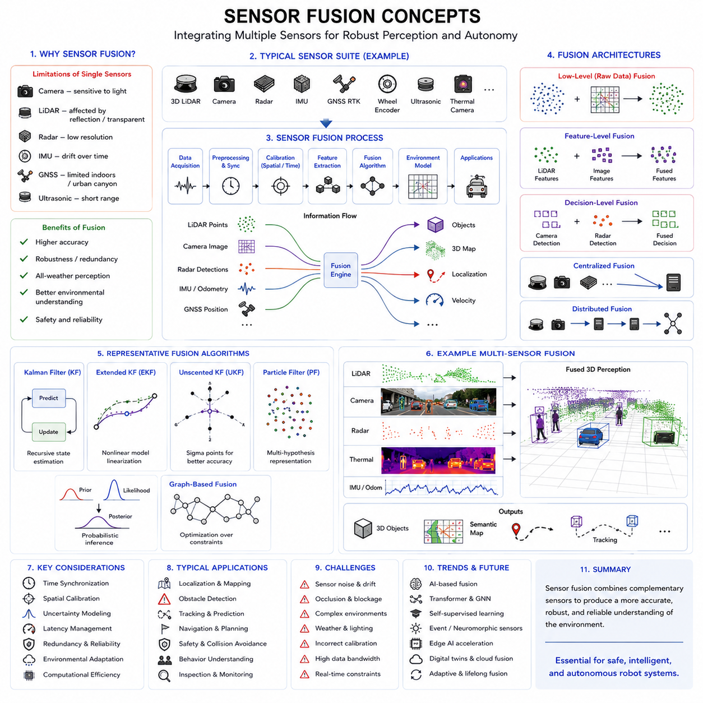
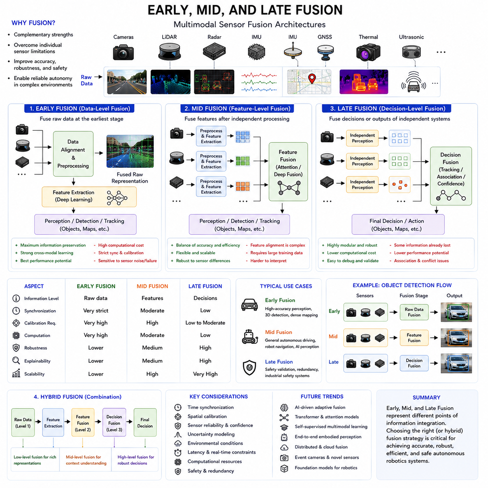
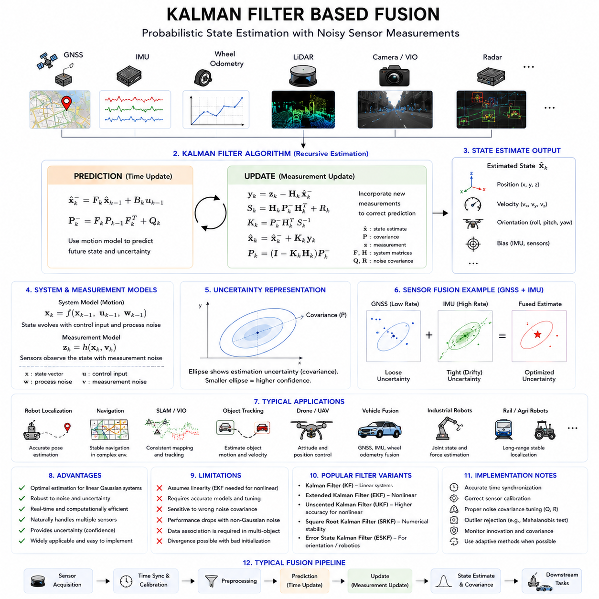
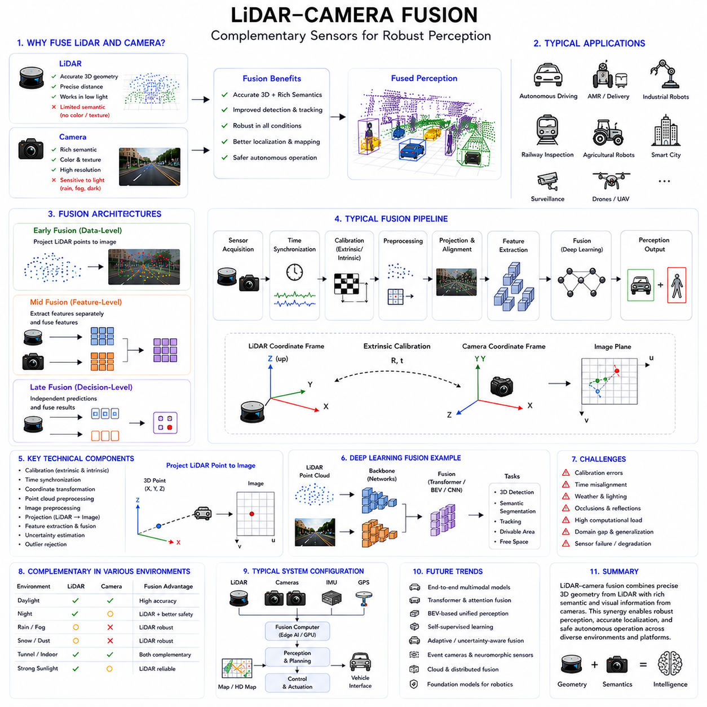
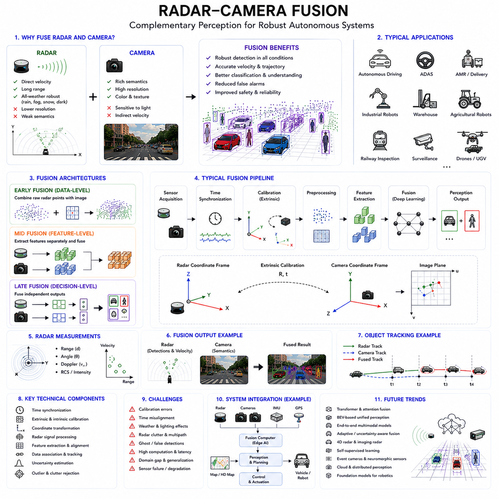
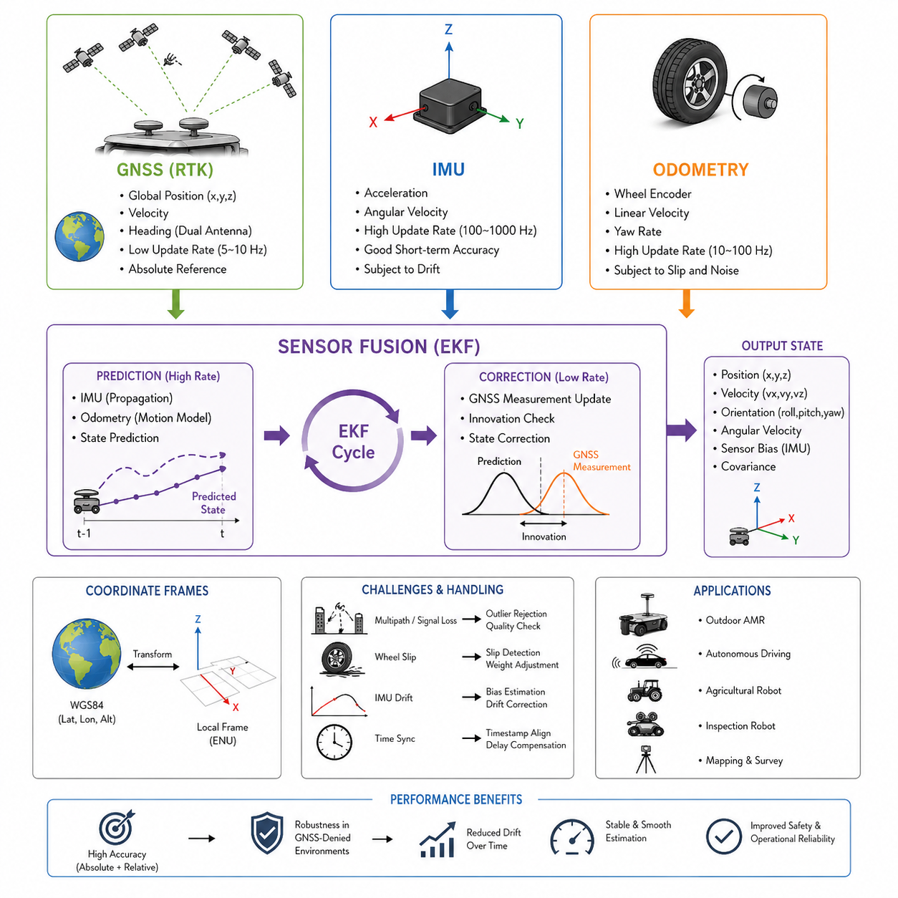
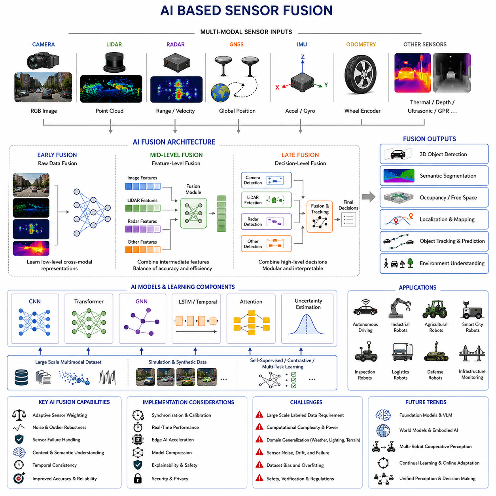
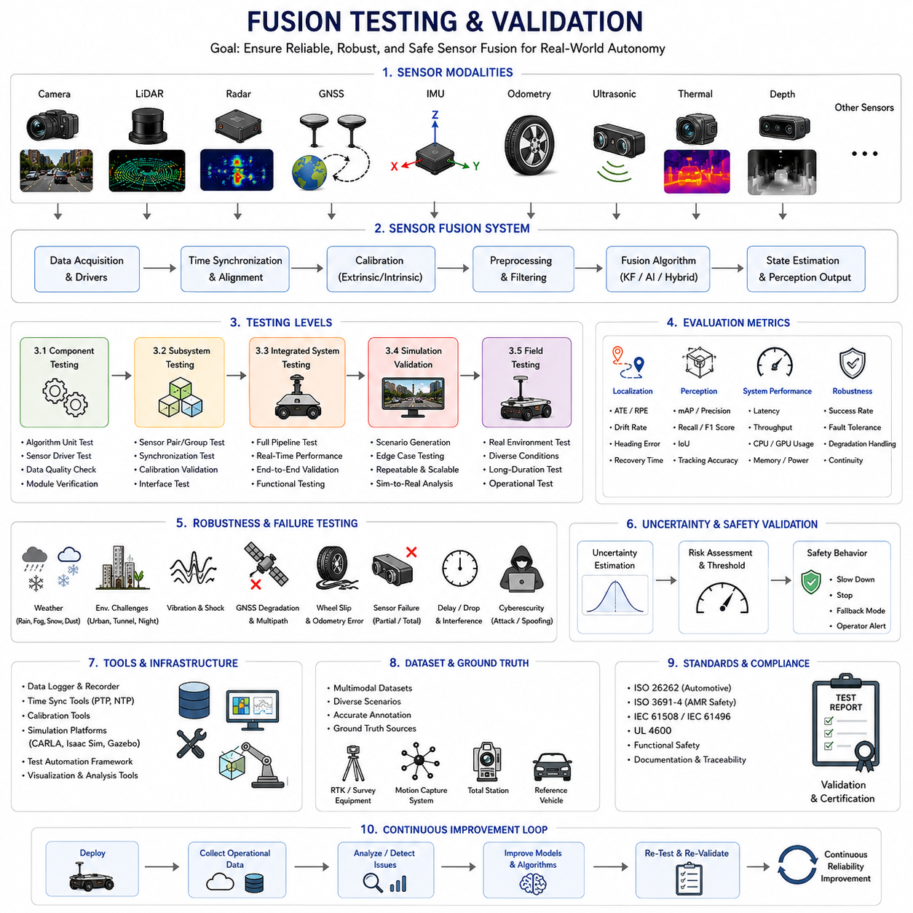

**Volume 03. AMR Sensors and Perception**


# Chapter 13. Sensor Fusion

##  

## 13.1 Sensor Fusion Concepts

{width="7.268055555555556in" height="7.268055555555556in"}

Sensor fusion is one of the most important foundational technologies in modern robotics, autonomous vehicles, industrial automation systems, intelligent perception platforms, and AI-driven autonomous machines. Autonomous Mobile Robots (AMRs), outdoor autonomous robots, collaborative robots, industrial towing robots, smart city robots, railway inspection systems, agricultural robots, and autonomous logistics platforms all rely heavily on sensor fusion to achieve robust environmental perception, accurate localization, reliable navigation, and safe autonomous operation.

In robotics systems, no single sensor can perfectly perceive the environment under all operating conditions. Every sensor has strengths, weaknesses, environmental limitations, measurement uncertainty, noise characteristics, latency issues, field-of-view constraints, and failure modes. Sensor fusion addresses these limitations by combining information from multiple heterogeneous sensors into a unified and more reliable representation of the environment.

Sensor fusion can be defined as the process of integrating information from multiple sensors, perception modules, localization systems, and environmental measurements to improve the accuracy, robustness, reliability, and completeness of robotic perception and decision-making. By combining complementary sensing modalities, robotic systems can overcome individual sensor weaknesses and operate more reliably in complex real-world environments.

For example, cameras provide rich semantic and texture information but are sensitive to lighting conditions. LiDAR provides accurate geometric distance measurements but may struggle with transparent or highly reflective surfaces. Radar operates reliably in rain, fog, and dust but provides lower spatial resolution. IMUs provide high-frequency motion information but suffer from drift over time. GNSS provides global positioning outdoors but may fail in tunnels, urban canyons, or indoor environments. Sensor fusion enables these different sensing modalities to complement each other.

Modern autonomous robots frequently integrate multiple sensors simultaneously. A typical outdoor autonomous robot may include 3D LiDARs, 2D safety LiDARs, RGB cameras, depth cameras, thermal cameras, millimeter-wave radars, GNSS RTK systems, IMUs, wheel encoders, ultrasonic sensors, and environmental monitoring sensors. These sensors continuously generate large amounts of heterogeneous data that must be fused into a coherent world model.

Sensor fusion improves system robustness because redundant sensors can compensate for individual sensor failures. If one sensor becomes temporarily unavailable or unreliable, other sensors may continue supporting autonomous operation. This redundancy is especially important in safety-critical robotics applications.

Sensor fusion also improves environmental understanding. Different sensors observe different physical properties of the environment. Cameras capture color and texture, LiDAR measures geometry, radar measures velocity, thermal cameras detect heat signatures, and GPR systems observe underground structures. Fusion systems combine these observations into richer environmental representations.

The importance of sensor fusion increases significantly in challenging environments. Outdoor autonomous robots operating in rain, fog, snow, dust, smoke, darkness, or highly dynamic industrial environments cannot rely on a single sensing modality. Robust fusion architectures are therefore essential for all-weather autonomous operation.

Sensor fusion architectures are generally divided into several major categories, including low-level fusion, feature-level fusion, decision-level fusion, centralized fusion, distributed fusion, deterministic fusion, probabilistic fusion, and AI-based multimodal fusion.

Low-level fusion, also called raw-data fusion, combines sensor data directly at the measurement level. For example, LiDAR point clouds and RGB camera images may be fused before object detection. This approach preserves maximum information content but requires high computational resources and accurate synchronization.

Feature-level fusion combines extracted features from multiple sensors rather than raw measurements. Examples include combining visual features from cameras with geometric features from LiDAR or motion features from radar. Feature-level fusion reduces computational load while preserving meaningful environmental information.

Decision-level fusion combines independent outputs from multiple perception modules. For example, separate camera and radar object detection systems may independently classify obstacles, and a higher-level fusion module combines their decisions. This architecture improves modularity and fault isolation.

Centralized fusion architectures collect all sensor data into a single processing system. Centralized fusion enables global optimization and unified perception but requires high communication bandwidth and powerful computing resources.

Distributed fusion architectures process sensor data locally before sharing summarized information with other subsystems. Distributed fusion is increasingly important in large-scale robotic systems containing multiple edge computers and distributed AI accelerators.

Deterministic fusion approaches rely on explicit mathematical models and physics-based algorithms. Examples include Kalman Filters, Extended Kalman Filters (EKF), Unscented Kalman Filters (UKF), particle filters, Bayesian estimation, and graph optimization methods.

Probabilistic fusion approaches explicitly model uncertainty and measurement noise. Since all sensors contain uncertainty, probabilistic methods provide mathematically consistent mechanisms for combining uncertain observations.

Kalman filtering is one of the most widely used sensor fusion techniques in robotics. Kalman Filters estimate system states recursively using prediction and measurement updates. These filters are especially effective for fusing IMU, GNSS, wheel odometry, and motion estimation data.

Extended Kalman Filters are commonly used in nonlinear robotics systems. Since robot motion and sensor models are often nonlinear, EKF approximates nonlinear dynamics using linearization techniques.

Unscented Kalman Filters improve nonlinear estimation accuracy by using sigma-point sampling instead of local linearization. UKF methods are often used in advanced autonomous robotics systems.

Particle filters represent probability distributions using multiple weighted hypotheses. Particle filters are particularly useful for localization problems involving ambiguity or multimodal uncertainty.

Bayesian fusion methods form the mathematical foundation of many robotics perception systems. Bayesian estimation continuously updates belief states as new sensor measurements arrive.

Graph-based fusion approaches are increasingly common in SLAM systems. Multi-sensor SLAM systems represent sensor relationships and robot poses as optimization graphs. These graphs are solved using nonlinear optimization algorithms.

Time synchronization is critically important in sensor fusion systems. Sensors operating at different frequencies and latencies must maintain temporal consistency. Incorrect synchronization may cause severe fusion errors.

For example, a robot moving at high speed may travel significant distances between sensor acquisitions. If camera images and LiDAR scans are not synchronized correctly, object positions become inconsistent across modalities.

Spatial calibration is equally important in sensor fusion systems. Extrinsic calibration determines the geometric relationship between sensors. Even small calibration errors may significantly reduce fusion quality.

LiDAR-camera fusion is one of the most widely used multimodal perception approaches. Cameras provide semantic understanding while LiDAR provides accurate geometric measurements. Together they enable robust object detection, obstacle avoidance, semantic mapping, and autonomous navigation.

Radar-camera fusion is especially important for adverse-weather operation. Radar maintains robust detection capability in rain, fog, snow, and dust where camera performance may degrade.

GNSS-IMU fusion is fundamental for outdoor localization. GNSS provides global positioning while IMUs provide high-frequency motion estimation. Fusion enables stable localization even during temporary GNSS degradation.

Wheel odometry fusion improves short-term motion estimation accuracy. Wheel encoders provide relative motion information, although wheel slip and terrain conditions may introduce errors.

Thermal-camera fusion enables robust perception under low-light or nighttime conditions. Thermal sensors detect heat signatures independent of visible illumination.

GPR fusion systems are increasingly important in underground infrastructure inspection robotics. GPR data may be fused with GNSS, IMU, wheel encoders, LiDAR, and vision systems to improve underground mapping accuracy.

Sensor fusion also plays a critical role in obstacle detection systems. Static obstacles, dynamic obstacles, pedestrians, forklifts, industrial machinery, and vehicles may all require different sensing modalities for reliable detection.

Autonomous safety systems rely heavily on sensor fusion redundancy. Safety-certified systems often require multiple independent sensing modalities to reduce false negatives and improve operational safety.

Artificial intelligence is becoming increasingly important in sensor fusion architectures. Deep learning models now perform multimodal fusion using convolutional neural networks, transformers, graph neural networks, and multimodal foundation models.

AI-based fusion systems can automatically learn cross-modal relationships between sensors. For example, neural networks may learn correlations between LiDAR geometry and camera appearance.

Transformer-based multimodal fusion architectures are especially important in modern embodied AI systems. Attention mechanisms allow models to selectively integrate information from multiple modalities dynamically.

Vision-Language-Action models may eventually integrate sensor fusion directly into unified embodied intelligence architectures. These systems combine visual perception, language reasoning, spatial understanding, and robotic control.

Edge AI acceleration is essential for real-time sensor fusion. Modern autonomous robots frequently use GPUs, TPUs, FPGAs, and AI accelerators to process multimodal sensor streams in real time.

Sensor fusion pipelines often require massive computational resources. High-resolution cameras, dense LiDAR point clouds, radar detections, thermal imagery, and high-frequency IMU streams create large data bandwidth requirements.

Real-time constraints are extremely important in robotics sensor fusion systems. Autonomous robots must process sensor data within strict latency limits to ensure safe operation. Excessive processing delay may produce outdated environmental understanding.

ROS2 provides important infrastructure for sensor fusion systems. ROS2 supports synchronized message passing, DDS middleware communication, TF2 coordinate transformations, and distributed processing architectures.

Message synchronization frameworks such as ROS2 message_filters help align sensor data temporally before fusion processing. Accurate timestamps are essential for stable fusion performance.

Perception pipelines usually include multiple stages, including sensor acquisition, preprocessing, synchronization, calibration correction, feature extraction, fusion processing, object detection, tracking, semantic interpretation, and navigation integration.

Sensor fusion debugging is a major robotics engineering challenge. Fusion failures may produce unstable localization, distorted maps, inconsistent object tracking, duplicated obstacles, false detections, or unsafe navigation behavior.

Visualization tools are extremely important for debugging fusion systems. Engineers commonly overlay LiDAR points onto camera images, compare radar detections with vision detections, and visualize fused occupancy grids or semantic maps.

Calibration validation is also critical. Engineers continuously verify intrinsic and extrinsic calibration accuracy to maintain reliable fusion performance.

Fusion systems must also manage uncertainty and confidence estimation. Sensors may become unreliable due to weather, lighting, vibration, electromagnetic interference, contamination, or hardware degradation.

Adaptive fusion architectures dynamically adjust sensor weighting depending on environmental conditions. For example, camera reliability may decrease at night while radar weighting increases.

Adverse weather perception is one of the most challenging applications of sensor fusion. Rain, fog, snow, mud, dust, smoke, and direct sunlight may affect sensors differently. Robust multimodal fusion is therefore essential for outdoor autonomous systems.

Industrial robotics environments also create difficult fusion challenges. Reflective surfaces, metallic structures, electromagnetic noise, dynamic machinery, and crowded environments may reduce perception reliability.

Multi-robot sensor fusion is becoming increasingly important in smart factories and smart cities. Multiple robots may share maps, localization data, obstacle information, and semantic understanding through distributed cloud architectures.

Cloud robotics platforms may aggregate sensor data from entire robot fleets to improve collective perception and operational intelligence.

Digital twin systems also depend heavily on sensor fusion. Real-time digital environments require accurate integration of multimodal sensor data from physical robots.

Cybersecurity is becoming increasingly important in sensor fusion systems. Malicious sensor spoofing or communication attacks may corrupt fusion results and destabilize autonomous systems.

Functional safety standards increasingly require robust fusion validation and redundancy analysis. Safety-critical autonomous robots must demonstrate reliable perception under failure conditions.

Future sensor fusion systems will likely become increasingly AI-driven, adaptive, distributed, and multimodal. Foundation models for robotics may eventually unify perception, reasoning, localization, navigation, and manipulation into integrated embodied intelligence systems.

Event cameras, neuromorphic sensors, quantum sensing technologies, advanced radar systems, hyperspectral cameras, and AI-native sensors may significantly expand future sensor fusion capabilities.

Self-supervised learning may reduce dependence on manually labeled multimodal datasets. Robots may increasingly learn sensor relationships directly from operational experience.

Future autonomous systems will likely integrate perception, world modeling, prediction, planning, and control into unified end-to-end multimodal architectures. Sensor fusion will remain one of the central enabling technologies for these systems.

In conclusion, sensor fusion concepts form one of the most important foundations of modern autonomous robotics systems. By combining complementary sensing modalities, fusion architectures improve perception robustness, localization accuracy, environmental understanding, navigation reliability, and operational safety. As autonomous systems continue evolving toward increasingly intelligent, distributed, and multimodal architectures, advanced sensor fusion technologies will become even more essential across all domains of robotics and embodied AI.

센서 퓨전(Sensor Fusion)은 현대 로보틱스, 자율주행 차량, 산업 자동화 시스템, 지능형 인식 플랫폼, AI 기반 자율 기계에서 가장 중요한 핵심 기술 중 하나이다. 자율주행 모바일 로봇(AMR), 실외 자율주행 로봇, 협동 로봇, 산업용 Towing Robot, 스마트시티 로봇, 철도 점검 시스템, 농업용 로봇, 자율 물류 플랫폼은 모두 강인한 환경 인식, 정확한 Localization, 안정적인 Navigation, 안전한 자율주행을 위해 Sensor Fusion에 크게 의존한다.

로봇 시스템에서는 단일 센서만으로 모든 환경 조건에서 완벽한 인식을 수행할 수 없다. 모든 센서는 각각의 장점과 단점, 환경적 한계, 측정 불확실성, 노이즈 특성, 지연 시간 문제, 시야각 제한, 고장 모드를 가진다. Sensor Fusion은 여러 이종(Heterogeneous) 센서의 정보를 결합하여 보다 신뢰성 높고 완전한 환경 표현을 생성함으로써 이러한 한계를 극복한다.

Sensor Fusion은 여러 센서, 인식 모듈, Localization 시스템, 환경 측정 정보를 통합하여 로봇 인식과 의사결정의 정확성, 강인성, 신뢰성, 완전성을 향상시키는 과정으로 정의할 수 있다. 서로 보완적인 센서들을 결합함으로써 로봇 시스템은 개별 센서의 약점을 극복하고 복잡한 실제 환경에서도 안정적으로 동작할 수 있다.

예를 들어 카메라는 풍부한 Semantic 정보와 Texture 정보를 제공하지만 조명 조건에 매우 민감하다. LiDAR는 정확한 거리 및 기하학 정보를 제공하지만 투명체나 반사체에 약할 수 있다. Radar는 비, 안개, 먼지 환경에서도 안정적으로 동작하지만 공간 해상도가 낮다. IMU는 고주파 움직임 정보를 제공하지만 시간이 지나면 Drift가 누적된다. GNSS는 실외에서 절대 위치를 제공하지만 터널, 도심 협곡(Urban Canyon), 실내 환경에서는 동작이 제한될 수 있다. Sensor Fusion은 이러한 서로 다른 센서의 특성을 상호 보완적으로 활용한다.

현대의 자율주행 로봇은 일반적으로 여러 센서를 동시에 사용한다. 대표적인 실외 자율주행 로봇은 3D LiDAR, 2D Safety LiDAR, RGB Camera, Depth Camera, Thermal Camera, Millimeter-Wave Radar, GNSS RTK, IMU, Wheel Encoder, Ultrasonic Sensor, 환경 센서 등을 포함할 수 있다. 이러한 센서들은 서로 다른 형태의 대규모 데이터를 지속적으로 생성하며, 이를 하나의 일관된 World Model로 통합해야 한다.

Sensor Fusion은 시스템 강인성을 향상시킨다. 일부 센서가 일시적으로 실패하거나 신뢰성이 낮아져도 다른 센서가 이를 보완할 수 있기 때문이다. 이러한 중복성(Redundancy)은 특히 Safety-Critical 로봇 시스템에서 매우 중요하다.

Sensor Fusion은 환경 이해 능력도 향상시킨다. 서로 다른 센서는 환경의 서로 다른 물리적 특성을 관측한다. 카메라는 색상과 질감을 관측하고, LiDAR는 기하 구조를 측정하며, Radar는 속도를 측정하고, Thermal Camera는 열 분포를 감지하며, GPR 시스템은 지하 구조를 탐지한다. Fusion 시스템은 이러한 정보를 결합하여 더욱 풍부한 환경 표현을 생성한다.

Sensor Fusion의 중요성은 열악한 환경에서 더욱 커진다. 비, 안개, 눈, 먼지, 연기, 어둠, 복잡한 산업 환경에서 동작하는 실외 자율주행 로봇은 단일 센서에 의존할 수 없다. 따라서 모든 환경(All-Weather) 자율주행을 위해 강인한 Fusion Architecture가 필요하다.

Sensor Fusion Architecture는 일반적으로 Low-Level Fusion, Feature-Level Fusion, Decision-Level Fusion, Centralized Fusion, Distributed Fusion, Deterministic Fusion, Probabilistic Fusion, AI-Based Multimodal Fusion 등으로 구분된다.

Low-Level Fusion은 Raw Data Fusion이라고도 하며, 센서 데이터를 측정 수준에서 직접 결합한다. 예를 들어 LiDAR Point Cloud와 RGB 이미지를 Object Detection 이전 단계에서 결합할 수 있다. 이 방식은 가장 많은 정보를 유지하지만 매우 높은 계산 자원과 정밀한 Synchronization을 요구한다.

Feature-Level Fusion은 Raw Measurement 대신 각 센서에서 추출된 Feature를 결합한다. 예를 들어 카메라의 Visual Feature와 LiDAR의 Geometric Feature, Radar의 Motion Feature를 함께 사용할 수 있다. 이 방식은 계산량을 줄이면서 중요한 환경 정보를 유지할 수 있다.

Decision-Level Fusion은 서로 독립적인 인식 시스템의 결과를 결합한다. 예를 들어 Camera 기반 Object Detector와 Radar 기반 Detector가 각각 객체를 탐지하고, 상위 Fusion Module이 이 결과를 통합한다. 이 구조는 모듈화와 Fault Isolation에 유리하다.

Centralized Fusion Architecture는 모든 센서 데이터를 하나의 중앙 시스템으로 모아 처리한다. 이는 전역 최적화(Global Optimization)에 유리하지만 높은 통신 대역폭과 강력한 연산 성능이 필요하다.

Distributed Fusion Architecture는 각 센서 또는 로컬 시스템에서 일부 처리를 수행한 후 요약된 정보를 공유한다. 이는 여러 Edge Computer와 분산 AI Accelerator를 사용하는 대규모 로봇 시스템에서 점점 중요해지고 있다.

Deterministic Fusion 방식은 명시적인 수학 모델과 물리 기반 알고리즘을 사용한다. 대표적인 예로 Kalman Filter, Extended Kalman Filter(EKF), Unscented Kalman Filter(UKF), Particle Filter, Bayesian Estimation, Graph Optimization 등이 있다.

Probabilistic Fusion은 센서의 불확실성과 노이즈를 명시적으로 모델링한다. 모든 센서는 일정 수준의 불확실성을 가지므로 확률 기반 접근은 매우 중요한 의미를 가진다.

Kalman Filtering은 로보틱스에서 가장 널리 사용되는 Sensor Fusion 기술 중 하나이다. Kalman Filter는 Prediction 단계와 Measurement Update 단계를 반복하면서 시스템 상태를 재귀적으로 추정한다. IMU, GNSS, Wheel Odometry, Motion Estimation Fusion에 특히 효과적이다.

Extended Kalman Filter는 비선형 로봇 시스템에서 자주 사용된다. 로봇 움직임과 센서 모델은 대부분 비선형이기 때문에 EKF는 선형 근사를 통해 문제를 해결한다.

Unscented Kalman Filter는 Sigma Point Sampling을 사용하여 비선형 추정 정확도를 향상시킨다. UKF는 고급 자율주행 로봇 시스템에서 자주 사용된다.

Particle Filter는 여러 개의 가설(Hypothesis)을 사용하여 확률 분포를 표현한다. Ambiguity나 Multimodal Uncertainty가 존재하는 Localization 문제에 특히 유용하다.

Bayesian Fusion은 많은 로봇 인식 시스템의 수학적 기반을 제공한다. 새로운 센서 측정이 들어올 때마다 Belief State를 지속적으로 업데이트한다.

Graph-Based Fusion은 최근 SLAM 시스템에서 매우 널리 사용된다. Multi-Sensor SLAM은 센서 관계와 로봇 Pose를 Graph 형태로 표현하고 비선형 최적화를 통해 문제를 해결한다.

Time Synchronization은 Sensor Fusion에서 매우 중요하다. 서로 다른 주기와 지연 시간을 가진 센서들은 시간적으로 정렬되어야 한다. 잘못된 Synchronization은 심각한 Fusion Error를 유발할 수 있다.

예를 들어 고속으로 이동하는 로봇은 센서 획득 사이에도 상당한 거리를 이동한다. 만약 Camera와 LiDAR가 정확히 동기화되지 않으면 객체 위치가 서로 다르게 나타난다.

Spatial Calibration 역시 매우 중요하다. Extrinsic Calibration은 센서 간 기하학적 관계를 결정한다. 작은 Calibration Error도 Fusion 품질을 크게 저하시킬 수 있다.

LiDAR-Camera Fusion은 가장 널리 사용되는 멀티모달 인식 방식 중 하나이다. Camera는 Semantic 정보를 제공하고 LiDAR는 정확한 Geometry 정보를 제공한다. 두 센서를 결합하면 강인한 Object Detection, Obstacle Avoidance, Semantic Mapping, Autonomous Navigation이 가능해진다.

Radar-Camera Fusion은 특히 악천후 환경에서 중요하다. Radar는 비, 안개, 눈, 먼지 환경에서도 안정적으로 동작할 수 있다.

GNSS-IMU Fusion은 실외 Localization의 핵심이다. GNSS는 절대 위치를 제공하고 IMU는 고주파 움직임 정보를 제공한다. 이를 통해 GNSS 품질이 일시적으로 저하되더라도 안정적인 Localization이 가능하다.

Wheel Odometry Fusion은 단기 움직임 추정 정확도를 향상시킨다. Wheel Encoder는 상대 움직임 정보를 제공하지만 Wheel Slip과 Terrain Condition에 영향을 받을 수 있다.

Thermal Camera Fusion은 야간 및 저조도 환경에서 강인한 인식을 가능하게 한다. Thermal Sensor는 가시광 조명과 관계없이 열 신호를 감지할 수 있다.

GPR Fusion 시스템은 지하 인프라 검사 로봇에서 점점 중요해지고 있다. GPR 데이터는 GNSS, IMU, Wheel Encoder, LiDAR, Vision System과 결합되어 지하 구조 Mapping 정확도를 향상시킨다.

Sensor Fusion은 Obstacle Detection 시스템에서도 핵심 역할을 한다. 정적 장애물, 동적 장애물, 보행자, 지게차, 산업 장비, 차량은 서로 다른 센서 조합을 통해 더욱 안정적으로 탐지할 수 있다.

자율 안전 시스템은 Sensor Fusion 기반 Redundancy에 크게 의존한다. Safety-Certified 시스템은 False Negative를 줄이고 Operational Safety를 향상시키기 위해 여러 독립 센서를 동시에 사용하는 경우가 많다.

AI는 Sensor Fusion Architecture에서 점점 더 중요한 역할을 하고 있다. 딥러닝 모델은 CNN, Transformer, Graph Neural Network, Multimodal Foundation Model 등을 사용하여 멀티모달 Fusion을 수행한다.

AI 기반 Fusion 시스템은 센서 간 Cross-Modal Relationship를 자동으로 학습할 수 있다. 예를 들어 Neural Network는 LiDAR Geometry와 Camera Appearance 사이의 관계를 학습할 수 있다.

Transformer 기반 Multimodal Fusion Architecture는 Embodied AI 시스템에서 특히 중요하다. Attention Mechanism은 여러 Modalities의 정보를 동적으로 통합할 수 있게 해준다.

Vision-Language-Action 모델은 미래에 Sensor Fusion을 Embodied Intelligence Architecture 내부에 완전히 통합할 가능성이 있다. 이러한 시스템은 Visual Perception, Language Reasoning, Spatial Understanding, Robot Control을 하나의 통합 구조로 처리한다.

Edge AI Acceleration은 실시간 Sensor Fusion에서 필수적이다. 현대 자율주행 로봇은 GPU, TPU, FPGA, AI Accelerator를 사용하여 멀티모달 센서 데이터를 실시간 처리한다.

Sensor Fusion Pipeline은 매우 높은 계산 자원을 요구한다. 고해상도 Camera, Dense LiDAR Point Cloud, Radar Detection, Thermal Image, 고주파 IMU Stream은 막대한 데이터 대역폭을 생성한다.

실시간성(Real-Time Constraint)은 Sensor Fusion 시스템에서 매우 중요하다. 자율주행 로봇은 안전한 동작을 위해 센서 데이터를 제한된 시간 안에 처리해야 한다. 과도한 처리 지연은 오래된 환경 정보를 기반으로 판단하게 만든다.

ROS2는 Sensor Fusion을 위한 중요한 인프라를 제공한다. ROS2는 Synchronization된 Message Passing, DDS Middleware Communication, TF2 Coordinate Transformation, Distributed Processing Architecture를 지원한다.

ROS2 message_filters와 같은 Synchronization Framework는 Sensor Data를 시간적으로 정렬한 후 Fusion을 수행할 수 있게 해준다. 정확한 Timestamp는 안정적인 Fusion 성능에 필수적이다.

Perception Pipeline은 일반적으로 Sensor Acquisition, Preprocessing, Synchronization, Calibration Correction, Feature Extraction, Fusion Processing, Object Detection, Tracking, Semantic Interpretation, Navigation Integration 단계를 포함한다.

Sensor Fusion Debugging은 매우 어려운 엔지니어링 과제이다. Fusion Failure는 불안정한 Localization, 왜곡된 Map, 불안정한 Object Tracking, 중복 장애물, False Detection, 위험한 Navigation 동작을 유발할 수 있다.

Visualization Tool은 Fusion System 디버깅에서 매우 중요하다. 엔지니어들은 LiDAR Point를 Camera Image 위에 Overlay하거나 Radar Detection과 Vision Detection을 비교하고, Fused Occupancy Grid와 Semantic Map을 시각화하여 문제를 분석한다.

Calibration Validation 역시 중요하다. 엔지니어들은 안정적인 Fusion 성능 유지를 위해 Intrinsic 및 Extrinsic Calibration Accuracy를 지속적으로 검증한다.

Fusion 시스템은 Uncertainty와 Confidence Estimation도 관리해야 한다. 센서는 날씨, 조명, 진동, 전자기 간섭, 오염, 하드웨어 노후화 등에 의해 신뢰성이 변할 수 있다.

Adaptive Fusion Architecture는 환경 조건에 따라 Sensor Weight를 동적으로 조정한다. 예를 들어 야간에는 Camera Reliability를 낮추고 Radar Weight를 증가시킬 수 있다.

악천후 인식(Adverse Weather Perception)은 Sensor Fusion의 가장 어려운 응용 분야 중 하나이다. 비, 안개, 눈, 진흙, 먼지, 연기, 직사광선은 각 센서에 서로 다른 영향을 준다. 따라서 실외 자율 시스템에서는 강인한 Multimodal Fusion이 필수적이다.

산업 환경 역시 어려운 Fusion Challenge를 만든다. 반사체, 금속 구조물, 전자기 노이즈, 움직이는 장비, 혼잡한 환경은 인식 신뢰성을 저하시킬 수 있다.

Multi-Robot Sensor Fusion은 스마트 팩토리와 스마트시티에서 점점 중요해지고 있다. 여러 로봇은 Cloud Architecture를 통해 Map, Localization Data, Obstacle Information, Semantic Understanding을 공유할 수 있다.

Cloud Robotics Platform은 전체 Robot Fleet의 Sensor Data를 통합하여 Collective Perception과 Operational Intelligence를 향상시킬 수 있다.

Digital Twin 시스템 역시 Sensor Fusion에 크게 의존한다. Real-Time Digital Environment는 실제 로봇의 멀티모달 Sensor Data를 정확히 통합해야 한다.

사이버보안은 Sensor Fusion 시스템에서 점점 중요해지고 있다. 악의적인 Sensor Spoofing이나 Communication Attack은 Fusion 결과를 왜곡하고 자율 시스템을 불안정하게 만들 수 있다.

Functional Safety 표준은 점점 더 강인한 Fusion Validation과 Redundancy Analysis를 요구하고 있다. Safety-Critical 자율 로봇은 Failure Condition에서도 안정적인 인식 성능을 보장해야 한다.

미래의 Sensor Fusion 시스템은 더욱 AI 기반, Adaptive, Distributed, Multimodal 형태로 발전할 가능성이 높다. Robotics Foundation Model은 미래에 Perception, Reasoning, Localization, Navigation, Manipulation을 하나의 통합 Embodied Intelligence 구조로 결합할 수 있다.

Event Camera, Neuromorphic Sensor, Quantum Sensing Technology, Advanced Radar, Hyperspectral Camera, AI-Native Sensor는 미래 Sensor Fusion 성능을 크게 확장시킬 수 있다.

Self-Supervised Learning은 수작업 라벨링된 Multimodal Dataset 의존도를 줄일 수 있다. 미래 로봇은 실제 운용 경험을 통해 센서 간 관계를 스스로 학습할 가능성이 높다.

미래 자율 시스템은 Perception, World Modeling, Prediction, Planning, Control을 하나의 End-to-End Multimodal Architecture로 통합할 가능성이 높다. Sensor Fusion은 이러한 시스템의 핵심 기반 기술로 계속 중요한 역할을 수행할 것이다.

결론적으로 Sensor Fusion Concept는 현대 자율 로봇 시스템의 가장 중요한 기반 기술 중 하나이다. 서로 보완적인 센서 정보를 결합함으로써 Fusion Architecture는 인식 강인성, Localization Accuracy, 환경 이해 능력, Navigation Reliability, Operational Safety를 크게 향상시킨다. 앞으로 자율 시스템이 더욱 지능화되고 분산화되며 멀티모달 AI 기반으로 발전할수록 고급 Sensor Fusion 기술의 중요성은 더욱 커질 것이다.

##  

## 13.2 Early, Mid, and Late Fusion

{width="7.268055555555556in" height="7.268055555555556in"}

Early Fusion, Mid Fusion, and Late Fusion are three of the most important architectural concepts in modern sensor fusion systems for robotics, autonomous vehicles, industrial AI platforms, intelligent perception systems, and multimodal deep learning applications. Autonomous Mobile Robots (AMRs), outdoor autonomous robots, collaborative industrial robots, autonomous logistics systems, railway inspection platforms, agricultural robots, smart city robots, and AI-driven perception engines all rely heavily on multimodal sensor fusion architectures to achieve reliable environmental understanding and autonomous decision-making.

As robotics systems become increasingly dependent on multiple heterogeneous sensors such as cameras, LiDARs, radars, IMUs, GNSS systems, thermal cameras, ultrasonic sensors, depth sensors, and Ground Penetrating Radar systems, the question of how and when sensor information should be combined becomes critically important. Early Fusion, Mid Fusion, and Late Fusion represent different strategies for integrating multimodal sensor information within perception and AI pipelines.

Each fusion architecture has unique advantages, disadvantages, computational characteristics, synchronization requirements, robustness properties, scalability considerations, and application domains. The choice of fusion architecture significantly affects perception quality, AI inference accuracy, computational load, latency, robustness, explainability, and safety performance.

Early Fusion, also called data-level fusion or raw-data fusion, combines sensor information at the earliest stage of the processing pipeline. In Early Fusion systems, raw measurements or minimally processed sensor data are merged before feature extraction or higher-level interpretation occurs.

For example, a robotics perception system may directly project LiDAR point clouds onto RGB camera images to create combined multimodal representations before object detection is performed. Similarly, radar range measurements may be fused directly with image pixels or depth maps during preprocessing stages.

The primary advantage of Early Fusion is that it preserves maximum information content from each sensor modality. Since fusion occurs before feature extraction, the AI model or perception algorithm has direct access to low-level multimodal relationships. This allows the system to learn complex cross-modal correlations that may otherwise be lost during independent feature extraction.

Early Fusion is especially effective in deep learning architectures where neural networks automatically learn multimodal representations. Convolutional neural networks and transformer-based architectures can extract joint features from fused multimodal inputs.

In autonomous driving systems, Early Fusion may combine LiDAR geometry with RGB semantic information to improve object detection accuracy. The fused representation may contain both spatial structure and visual texture simultaneously.

Early Fusion also improves the possibility of dense multimodal interaction. Features extracted later in the pipeline may inherently incorporate information from multiple sensor modalities rather than isolated sensor streams.

However, Early Fusion introduces several major engineering challenges. One of the most difficult problems is synchronization. Since raw sensor data is fused directly, temporal consistency between sensors becomes critically important. Even small synchronization errors may significantly degrade fusion quality.

Spatial calibration is also extremely important in Early Fusion systems. Raw sensor data must align accurately in a common coordinate frame. Small extrinsic calibration errors may produce severe multimodal inconsistencies.

Computational complexity is another major challenge. Raw sensor streams often contain extremely large data volumes. High-resolution cameras, dense LiDAR point clouds, radar measurements, thermal imagery, and depth maps generate massive computational loads when fused directly.

Bandwidth and memory requirements may therefore become very large in Early Fusion systems. Real-time processing becomes increasingly difficult as sensor resolution increases.

Sensor heterogeneity also creates challenges. Different sensors operate using fundamentally different physical measurement principles. Cameras capture visual appearance, LiDAR measures geometry, radar measures Doppler velocity, thermal cameras detect infrared radiation, and GPR systems measure underground electromagnetic reflections. Directly combining these modalities may require complex preprocessing pipelines.

Early Fusion systems are also more sensitive to sensor failures. Since fusion occurs at low levels, corruption or degradation in one sensor modality may propagate throughout the entire perception pipeline.

Despite these challenges, Early Fusion remains highly important in modern AI-based perception systems. Deep multimodal learning architectures increasingly rely on Early Fusion strategies to maximize cross-modal representation learning.

Mid Fusion, also called feature-level fusion, combines sensor information after independent feature extraction but before final decision-making. Each sensor modality first passes through dedicated preprocessing and feature extraction stages. The extracted features are then merged into a shared multimodal representation.

Mid Fusion represents a balance between preserving multimodal information and reducing computational complexity. Instead of fusing raw data directly, the system fuses more compact and semantically meaningful feature representations.

For example, a camera processing pipeline may extract convolutional feature maps from RGB images, while a LiDAR processing pipeline extracts geometric features from point clouds. These feature representations are then combined inside a shared fusion network.

Mid Fusion is widely used in modern autonomous robotics systems because it provides strong multimodal learning capability while remaining computationally manageable. It also allows sensor-specific preprocessing pipelines to optimize feature extraction independently.

Transformer-based multimodal fusion architectures frequently use Mid Fusion approaches. Each sensor modality may first generate embedding representations, and attention mechanisms then integrate these embeddings dynamically.

Mid Fusion architectures are especially popular in autonomous driving perception systems. Camera features, LiDAR voxel features, radar features, thermal features, and map features may all be fused within shared neural network layers.

One major advantage of Mid Fusion is flexibility. Different sensor modalities can maintain specialized preprocessing pipelines while still benefiting from cross-modal interaction during higher-level reasoning.

Mid Fusion also improves robustness to sensor differences. Since fusion occurs after sensor-specific feature extraction, each modality can compensate for its own measurement characteristics independently before fusion occurs.

Computational efficiency is generally better than Early Fusion because feature representations are usually more compact than raw sensor data. This reduces bandwidth and memory requirements.

Mid Fusion architectures are also more scalable. Additional sensor modalities can often be integrated by adding dedicated feature extraction branches without redesigning the entire perception system.

Another important advantage is modularity. Sensor-specific feature extraction modules can be updated or replaced independently without changing the entire fusion architecture.

However, Mid Fusion also introduces challenges. One important issue is feature compatibility. Features extracted from different modalities may have different dimensions, spatial resolutions, semantic meanings, and temporal properties.

Feature alignment therefore becomes an important engineering problem. Neural networks often use projection layers, attention modules, graph neural networks, or spatial transformation modules to align multimodal features.

Synchronization remains important in Mid Fusion systems, although requirements may be slightly more tolerant compared to Early Fusion. Temporal inconsistencies can still reduce fusion quality significantly.

Feature selection also becomes critical. Poor feature extraction quality in one modality may negatively affect overall fusion performance. Sensor-specific neural networks must therefore be optimized carefully.

Interpretability is another challenge. Deep multimodal fusion networks may become difficult to explain because cross-modal interactions occur inside complex neural architectures.

Training Mid Fusion systems also requires large multimodal datasets with accurate synchronization and calibration. Creating such datasets can be expensive and time-consuming.

Late Fusion, also called decision-level fusion, combines information after independent perception or decision-making has already occurred. Each sensor modality independently generates object detections, classifications, tracking results, localization estimates, or semantic interpretations. A higher-level fusion module then combines these independent outputs.

For example, a camera object detector and a radar object detector may independently identify vehicles. A Late Fusion module then combines their outputs to generate final object decisions.

Late Fusion is one of the most modular and fault-tolerant fusion architectures. Since each modality operates independently, failure in one sensor system does not necessarily corrupt the entire perception pipeline.

One major advantage of Late Fusion is robustness. Independent perception pipelines can continue operating even if one sensor becomes unreliable or unavailable.

Late Fusion also simplifies engineering complexity. Since fusion occurs at higher semantic levels, synchronization and calibration requirements are often less strict compared to Early Fusion systems.

Computational requirements may also be lower because only high-level decisions rather than raw sensor data are exchanged between modules.

Late Fusion architectures are especially common in safety-critical robotics systems because independent redundancy improves fault isolation and validation simplicity.

Industrial autonomous systems frequently use Late Fusion for safety validation. Separate perception pipelines may independently verify obstacle detections before safety actions are triggered.

Late Fusion also improves explainability. Engineers can inspect the independent outputs of each sensor modality separately, making debugging and validation easier.

Scalability is another important advantage. Additional sensors can often be integrated without modifying existing perception pipelines significantly.

However, Late Fusion also has important limitations. Since fusion occurs after high-level interpretation, some low-level multimodal relationships may already be lost.

This may reduce maximum achievable perception accuracy compared to Early or Mid Fusion systems. Independent perception systems cannot learn rich cross-modal feature interactions.

Late Fusion may also produce inconsistent outputs between modalities. Different sensors may independently classify objects differently, requiring conflict resolution mechanisms.

Association problems become important in Late Fusion systems. The fusion engine must determine which detections from different modalities correspond to the same physical object.

Confidence estimation becomes critical. Fusion systems often use probabilistic weighting to combine decisions based on sensor reliability estimates.

Modern robotics systems increasingly use hybrid fusion architectures that combine Early, Mid, and Late Fusion strategies simultaneously. Different sensor modalities and perception tasks may benefit from different fusion levels.

For example, a robot may use Early Fusion between LiDAR and camera systems for dense object perception, Mid Fusion for multimodal AI feature integration, and Late Fusion for safety validation.

Hybrid architectures allow robotics systems to balance accuracy, robustness, computational efficiency, explainability, and fault tolerance.

Artificial intelligence is rapidly transforming fusion architectures. Deep multimodal learning systems increasingly blur the boundaries between Early, Mid, and Late Fusion concepts.

Transformer-based multimodal architectures may dynamically perform fusion at multiple hierarchical levels simultaneously using attention mechanisms.

Foundation models for robotics may eventually integrate perception, language understanding, spatial reasoning, planning, and control into unified multimodal architectures.

ROS2-based robotics systems provide important infrastructure for multimodal fusion architectures. ROS2 supports distributed communication, synchronized message passing, TF2 coordinate transformations, DDS middleware integration, and scalable perception pipelines.

Edge AI acceleration is essential for modern fusion systems. GPUs, TPUs, FPGAs, and AI accelerators process multimodal fusion pipelines in real time.

Autonomous outdoor robots create especially difficult fusion challenges due to weather variability, vibration, lighting changes, environmental complexity, and high-speed motion.

Rain, fog, snow, dust, direct sunlight, and low-light environments affect sensors differently. Fusion architectures must adapt dynamically to changing sensor reliability.

Adaptive fusion systems are becoming increasingly important. AI models may dynamically adjust sensor weighting depending on environmental conditions and confidence estimates.

Self-supervised learning may also improve future fusion systems. Robots may automatically learn cross-modal relationships directly from operational experience without requiring extensive labeled datasets.

Future embodied AI systems will likely use deeply integrated multimodal fusion architectures combining visual perception, geometric understanding, motion estimation, semantic reasoning, environmental prediction, and autonomous control.

Humanoid robots, collaborative industrial robots, autonomous logistics systems, smart city robots, and autonomous infrastructure inspection systems will all depend heavily on advanced multimodal fusion architectures.

Sensor fusion validation and debugging remain major engineering challenges. Visualization tools, synchronization analysis, calibration validation, uncertainty estimation, and performance monitoring are all essential.

Functional safety standards increasingly require robust validation of multimodal fusion systems. Autonomous robots operating around humans must demonstrate reliable behavior under sensor failure conditions.

Cybersecurity is also becoming increasingly important. Sensor spoofing attacks or communication corruption may destabilize fusion architectures if proper validation mechanisms are absent.

Future fusion systems may become increasingly distributed across cloud robotics infrastructures. Multi-robot fleets may share multimodal sensor information collectively to improve perception robustness.

Digital twin systems also depend heavily on multimodal fusion architectures. Real-world sensor streams must align consistently with virtual simulation environments.

In conclusion, Early Fusion, Mid Fusion, and Late Fusion represent three of the most important architectural strategies in modern multimodal sensor fusion systems. Each approach provides different advantages in terms of information preservation, computational complexity, robustness, scalability, interpretability, synchronization requirements, and fault tolerance. Modern robotics systems increasingly combine these strategies into hybrid architectures capable of supporting advanced autonomous perception and AI-driven embodied intelligence. As robotics systems continue evolving toward more distributed, multimodal, AI-native, and safety-critical platforms, advanced fusion architectures will remain one of the most essential technologies enabling reliable autonomous operation.

Early Fusion, Mid Fusion, Late Fusion은 현대 로보틱스, 자율주행 차량, 산업용 AI 플랫폼, 지능형 인식 시스템, 멀티모달 딥러닝 응용 분야에서 가장 중요한 Sensor Fusion 아키텍처 개념 중 하나이다. 자율주행 모바일 로봇(AMR), 실외 자율주행 로봇, 협동 산업용 로봇, 자율 물류 시스템, 철도 점검 플랫폼, 농업용 로봇, 스마트시티 로봇, AI 기반 인식 엔진은 모두 안정적인 환경 이해와 자율 의사결정을 위해 멀티모달 Sensor Fusion Architecture에 크게 의존한다.

로봇 시스템이 Camera, LiDAR, Radar, IMU, GNSS, Thermal Camera, Ultrasonic Sensor, Depth Sensor, GPR 시스템 등 다양한 이종 센서를 사용하는 방향으로 발전함에 따라 "센서 정보를 언제, 어떻게 결합할 것인가"는 매우 중요한 문제가 되었다. Early Fusion, Mid Fusion, Late Fusion은 멀티센서 정보를 처리 파이프라인 내부에서 통합하는 서로 다른 전략을 의미한다.

각 Fusion Architecture는 고유한 장점과 단점, 계산 특성, Synchronization 요구사항, Robustness 특성, Scalability, Application Domain을 가진다. 어떤 Fusion Architecture를 선택하느냐에 따라 Perception Quality, AI Inference Accuracy, Computational Load, Latency, Robustness, Explainability, Safety Performance가 크게 달라진다.

Early Fusion은 Data-Level Fusion 또는 Raw-Data Fusion이라고도 하며, 처리 파이프라인의 가장 초기 단계에서 센서 정보를 결합하는 방식이다. Early Fusion 시스템에서는 Raw Measurement 또는 최소한의 전처리만 수행된 Sensor Data를 Feature Extraction 이전에 직접 결합한다.

예를 들어 로봇 인식 시스템은 LiDAR Point Cloud를 RGB Camera Image에 직접 Projection하여 Object Detection 이전에 하나의 Multimodal Representation을 생성할 수 있다. 또는 Radar의 거리 정보를 Image Pixel이나 Depth Map과 Preprocessing 단계에서 직접 결합할 수도 있다.

Early Fusion의 가장 큰 장점은 각 센서 Modalities의 정보를 최대한 보존할 수 있다는 점이다. Feature Extraction 이전에 Fusion이 이루어지기 때문에 AI 모델이나 인식 알고리즘은 저수준의 Cross-Modal Relationship에 직접 접근할 수 있다. 따라서 독립적인 Feature Extraction 과정에서 손실될 수 있는 복잡한 센서 간 상관관계를 학습할 수 있다.

Early Fusion은 특히 딥러닝 기반 아키텍처에서 매우 효과적이다. CNN이나 Transformer 기반 구조는 Fusion된 Multimodal Input으로부터 Joint Feature를 자동으로 학습할 수 있다.

자율주행 시스템에서는 Early Fusion을 통해 LiDAR의 Geometry 정보와 Camera의 Semantic 정보를 동시에 활용하여 Object Detection Accuracy를 향상시킬 수 있다. Fusion된 Representation은 공간 구조와 Visual Texture를 동시에 포함할 수 있다.

Early Fusion은 Dense Multimodal Interaction도 가능하게 한다. 이후 단계에서 추출되는 Feature는 이미 여러 Modalities의 정보를 포함하고 있기 때문에 더욱 풍부한 표현이 가능하다.

하지만 Early Fusion은 여러 가지 어려운 엔지니어링 문제를 만든다. 가장 큰 문제 중 하나는 Synchronization이다. Raw Sensor Data를 직접 결합하기 때문에 센서 간 Temporal Consistency가 매우 중요하다. 작은 Synchronization Error도 Fusion Quality를 크게 저하시킬 수 있다.

Spatial Calibration 역시 매우 중요하다. Raw Sensor Data는 공통 좌표계 안에서 정확히 정렬되어야 한다. 작은 Extrinsic Calibration Error만으로도 심각한 Multimodal Inconsistency가 발생할 수 있다.

Computational Complexity도 큰 문제이다. Raw Sensor Stream은 매우 큰 데이터 양을 가진다. 고해상도 Camera, Dense LiDAR Point Cloud, Radar Measurement, Thermal Image, Depth Map 등을 직접 Fusion하면 막대한 연산량이 발생한다.

따라서 Bandwidth와 Memory Requirement도 매우 커질 수 있다. 센서 해상도가 증가할수록 Real-Time Processing은 더욱 어려워진다.

Sensor Heterogeneity도 문제를 만든다. 서로 다른 센서는 완전히 다른 물리 원리로 동작한다. Camera는 Visual Appearance를 관측하고, LiDAR는 Geometry를 측정하며, Radar는 Doppler Velocity를 측정하고, Thermal Camera는 Infrared Radiation을 감지하며, GPR은 Underground Electromagnetic Reflection을 측정한다. 이러한 Modalities를 직접 결합하려면 복잡한 Preprocessing Pipeline이 필요할 수 있다.

Early Fusion은 Sensor Failure에도 민감하다. 낮은 수준에서 Fusion이 수행되기 때문에 한 Sensor의 Corruption이나 Degradation이 전체 Perception Pipeline으로 전파될 수 있다.

이러한 어려움에도 불구하고 Early Fusion은 현대 AI 기반 인식 시스템에서 매우 중요하다. Deep Multimodal Learning Architecture는 Cross-Modal Representation Learning을 극대화하기 위해 Early Fusion 전략을 점점 더 많이 사용하고 있다.

Mid Fusion은 Feature-Level Fusion이라고도 하며, 독립적인 Feature Extraction 이후이면서 최종 Decision 이전 단계에서 센서 정보를 결합하는 방식이다. 각 Sensor Modality는 먼저 독립적인 Preprocessing 및 Feature Extraction 단계를 거친다. 이후 추출된 Feature를 Shared Multimodal Representation 안에서 결합한다.

Mid Fusion은 Multimodal Information Preservation과 Computational Complexity Reduction 사이의 균형을 제공한다. Raw Data 대신 보다 Compact하고 Semantic Meaning이 있는 Feature Representation을 Fusion한다.

예를 들어 Camera Pipeline은 RGB Image로부터 Convolutional Feature Map을 추출하고, LiDAR Pipeline은 Point Cloud로부터 Geometric Feature를 추출할 수 있다. 이후 이러한 Feature Representation이 Shared Fusion Network 안에서 결합된다.

Mid Fusion은 강력한 Multimodal Learning Capability를 제공하면서도 계산량을 현실적으로 관리할 수 있기 때문에 현대 자율주행 로봇 시스템에서 매우 널리 사용된다. 또한 Sensor-Specific Preprocessing Pipeline을 독립적으로 최적화할 수 있다.

Transformer 기반 Multimodal Fusion Architecture는 Mid Fusion 방식을 자주 사용한다. 각 Sensor Modality가 Embedding Representation을 생성한 후 Attention Mechanism이 이를 동적으로 통합한다.

Mid Fusion Architecture는 자율주행 차량 인식 시스템에서 특히 널리 사용된다. Camera Feature, LiDAR Voxel Feature, Radar Feature, Thermal Feature, Map Feature 등을 Shared Neural Network Layer 안에서 결합할 수 있다.

Mid Fusion의 주요 장점 중 하나는 Flexibility이다. 각 Sensor Modality는 Specialized Preprocessing Pipeline을 유지하면서도 Higher-Level Reasoning 단계에서는 Cross-Modal Interaction의 이점을 얻을 수 있다.

Mid Fusion은 Sensor Difference에 대한 Robustness도 향상시킨다. Sensor-Specific Feature Extraction 이후에 Fusion이 이루어지므로 각 Modality는 자신의 Measurement Characteristic을 독립적으로 보정할 수 있다.

Computational Efficiency 역시 Early Fusion보다 일반적으로 우수하다. Feature Representation은 Raw Sensor Data보다 훨씬 Compact하기 때문에 Bandwidth와 Memory Requirement가 감소한다.

Mid Fusion Architecture는 Scalability도 우수하다. 새로운 Sensor Modality를 추가할 때 전체 Perception System을 재설계하지 않고도 Dedicated Feature Extraction Branch만 추가하면 되는 경우가 많다.

또 다른 중요한 장점은 Modularity이다. Sensor-Specific Feature Extraction Module은 전체 Fusion Architecture를 변경하지 않고도 독립적으로 업데이트하거나 교체할 수 있다.

하지만 Mid Fusion 역시 여러 문제를 가진다. 대표적인 문제는 Feature Compatibility이다. 서로 다른 Sensor Modalities에서 추출된 Feature는 Dimension, Spatial Resolution, Semantic Meaning, Temporal Property가 서로 다를 수 있다.

따라서 Feature Alignment가 중요한 엔지니어링 문제가 된다. Neural Network는 Projection Layer, Attention Module, Graph Neural Network, Spatial Transformation Module 등을 사용하여 Multimodal Feature를 정렬한다.

Synchronization은 Mid Fusion에서도 여전히 중요하다. 비록 Early Fusion보다 다소 허용 오차가 크더라도 Temporal Inconsistency는 Fusion Quality를 크게 저하시킬 수 있다.

Feature Selection 역시 중요하다. 한 Modality의 Poor Feature Extraction Quality는 전체 Fusion Performance를 저하시킬 수 있다. 따라서 Sensor-Specific Neural Network를 신중하게 최적화해야 한다.

Explainability 역시 어려운 문제이다. Deep Multimodal Fusion Network 내부에서 Cross-Modal Interaction이 발생하기 때문에 동작 원리를 설명하기 어려울 수 있다.

Mid Fusion 시스템 학습에는 대규모 Multimodal Dataset이 필요하다. 이러한 데이터셋은 정확한 Synchronization과 Calibration을 요구하기 때문에 구축 비용이 매우 크다.

Late Fusion은 Decision-Level Fusion이라고도 하며, 독립적인 Perception 또는 Decision-Making 이후 단계에서 정보를 결합하는 방식이다. 각 Sensor Modality는 독립적으로 Object Detection, Classification, Tracking Result, Localization Estimate, Semantic Interpretation을 생성한다. 이후 Higher-Level Fusion Module이 이 결과들을 결합한다.

예를 들어 Camera Object Detector와 Radar Object Detector가 각각 독립적으로 차량을 탐지하고, Late Fusion Module이 이 결과를 통합하여 최종 Object Decision을 생성할 수 있다.

Late Fusion은 가장 Modular하고 Fault-Tolerant한 Fusion Architecture 중 하나이다. 각 Modality가 독립적으로 동작하기 때문에 하나의 Sensor Failure가 전체 Perception Pipeline을 반드시 손상시키지는 않는다.

Late Fusion의 주요 장점 중 하나는 Robustness이다. 일부 Sensor System이 불안정하거나 사용할 수 없게 되더라도 다른 Perception Pipeline은 계속 동작할 수 있다.

Late Fusion은 엔지니어링 복잡도도 감소시킨다. Fusion이 Higher Semantic Level에서 수행되기 때문에 Synchronization과 Calibration Requirement가 Early Fusion보다 덜 엄격하다.

Computational Requirement 역시 낮은 경우가 많다. Raw Sensor Data 대신 Higher-Level Decision만 교환하면 되기 때문이다.

Late Fusion Architecture는 특히 Safety-Critical Robotics System에서 자주 사용된다. Independent Redundancy가 Fault Isolation과 Validation을 단순화하기 때문이다.

산업용 자율 시스템은 Safety Validation을 위해 Late Fusion을 자주 사용한다. 서로 독립적인 Perception Pipeline이 Obstacle Detection을 각각 검증한 후 Safety Action을 수행할 수 있다.

Late Fusion은 Explainability도 향상시킨다. 엔지니어는 각 Sensor Modality의 독립적인 Output을 따로 분석할 수 있기 때문에 Debugging과 Validation이 쉬워진다.

Scalability 역시 중요한 장점이다. 새로운 Sensor를 추가할 때 기존 Perception Pipeline을 크게 수정하지 않고도 통합할 수 있는 경우가 많다.

하지만 Late Fusion 역시 중요한 한계를 가진다. Fusion이 Higher-Level Interpretation 이후에 이루어지기 때문에 일부 Low-Level Multimodal Relationship는 이미 손실될 수 있다.

따라서 최대 Perception Accuracy는 Early Fusion이나 Mid Fusion보다 낮아질 수 있다. Independent Perception System은 Rich Cross-Modal Feature Interaction을 학습할 수 없기 때문이다.

Late Fusion에서는 Modalities 간 Inconsistent Output도 발생할 수 있다. 서로 다른 Sensor가 동일 객체를 다르게 Classification할 수 있기 때문에 Conflict Resolution Mechanism이 필요하다.

Association Problem도 중요하다. Fusion Engine은 서로 다른 Modalities의 Detection이 동일한 Physical Object에 해당하는지를 판단해야 한다.

Confidence Estimation 역시 중요하다. Fusion System은 Sensor Reliability Estimate를 기반으로 Probabilistic Weighting을 사용하여 Decision을 결합하는 경우가 많다.

현대 로봇 시스템은 점점 Hybrid Fusion Architecture를 사용하고 있다. Early Fusion, Mid Fusion, Late Fusion을 동시에 조합하여 사용하는 방식이다. 서로 다른 Sensor Modalities와 Perception Task는 서로 다른 Fusion Level이 더 적합할 수 있기 때문이다.

예를 들어 로봇은 Dense Object Perception을 위해 LiDAR와 Camera 사이에서는 Early Fusion을 사용하고, Multimodal AI Feature Integration에는 Mid Fusion을 사용하며, Safety Validation에는 Late Fusion을 사용할 수 있다.

Hybrid Architecture는 Accuracy, Robustness, Computational Efficiency, Explainability, Fault Tolerance 사이의 균형을 가능하게 한다.

AI는 Fusion Architecture를 빠르게 변화시키고 있다. Deep Multimodal Learning System은 점점 Early, Mid, Late Fusion의 경계를 흐리게 만들고 있다.

Transformer 기반 Multimodal Architecture는 Attention Mechanism을 사용하여 여러 Hierarchical Level에서 동적으로 Fusion을 수행할 수 있다.

Robotics Foundation Model은 미래에 Perception, Language Understanding, Spatial Reasoning, Planning, Control을 하나의 Unified Multimodal Architecture 안에 통합할 가능성이 있다.

ROS2 기반 로봇 시스템은 Multimodal Fusion Architecture를 위한 중요한 인프라를 제공한다. ROS2는 Distributed Communication, Synchronized Message Passing, TF2 Coordinate Transformation, DDS Middleware Integration, Scalable Perception Pipeline을 지원한다.

Edge AI Acceleration은 현대 Fusion System에서 필수적이다. GPU, TPU, FPGA, AI Accelerator는 Multimodal Fusion Pipeline을 실시간 처리한다.

실외 자율주행 로봇은 특히 어려운 Fusion Challenge를 만든다. Weather Variability, Vibration, Lighting Change, Environmental Complexity, High-Speed Motion이 모두 영향을 준다.

비, 안개, 눈, 먼지, 직사광선, 저조도 환경은 센서에 서로 다른 영향을 준다. 따라서 Fusion Architecture는 Sensor Reliability 변화에 동적으로 적응해야 한다.

Adaptive Fusion System은 점점 중요해지고 있다. AI 모델은 환경 조건과 Confidence Estimate에 따라 Sensor Weight를 동적으로 조정할 수 있다.

Self-Supervised Learning 역시 미래 Fusion System을 크게 향상시킬 가능성이 있다. 로봇은 대규모 Label Dataset 없이도 실제 운용 경험을 통해 Cross-Modal Relationship를 스스로 학습할 수 있다.

미래의 Embodied AI System은 Visual Perception, Geometric Understanding, Motion Estimation, Semantic Reasoning, Environmental Prediction, Autonomous Control을 깊게 통합한 Multimodal Fusion Architecture를 사용할 가능성이 높다.

Humanoid Robot, Collaborative Industrial Robot, Autonomous Logistics System, Smart City Robot, Autonomous Infrastructure Inspection System은 모두 고급 Multimodal Fusion Architecture에 크게 의존하게 될 것이다.

Sensor Fusion Validation과 Debugging은 여전히 매우 어려운 엔지니어링 문제이다. Visualization Tool, Synchronization Analysis, Calibration Validation, Uncertainty Estimation, Performance Monitoring이 모두 중요하다.

Functional Safety 표준은 점점 더 강인한 Multimodal Fusion Validation을 요구하고 있다. 사람 주변에서 동작하는 자율 로봇은 Sensor Failure 상황에서도 안정적인 동작을 보장해야 한다.

사이버보안 역시 점점 중요해지고 있다. Sensor Spoofing Attack이나 Communication Corruption은 적절한 Validation Mechanism이 없으면 Fusion Architecture를 불안정하게 만들 수 있다.

미래 Fusion System은 Cloud Robotics Infrastructure 위에서 더욱 분산화될 가능성이 높다. Multi-Robot Fleet는 Multimodal Sensor Information을 공유하여 Collective Perception을 향상시킬 수 있다.

Digital Twin System 역시 Multimodal Fusion Architecture에 크게 의존한다. 실제 Sensor Stream은 Virtual Simulation Environment와 정확히 정렬되어야 한다.

결론적으로 Early Fusion, Mid Fusion, Late Fusion은 현대 Multimodal Sensor Fusion System에서 가장 중요한 세 가지 아키텍처 전략이다. 각 방식은 Information Preservation, Computational Complexity, Robustness, Scalability, Interpretability, Synchronization Requirement, Fault Tolerance 측면에서 서로 다른 장점을 제공한다. 현대 로봇 시스템은 점점 이러한 전략들을 Hybrid Architecture로 결합하여 Advanced Autonomous Perception과 AI 기반 Embodied Intelligence를 구현하고 있다. 앞으로 로봇 시스템이 더욱 Distributed, Multimodal, AI-Native, Safety-Critical 방향으로 발전할수록 고급 Fusion Architecture의 중요성은 계속 증가할 것이다.

##  

## 13.3 Kalman Filter-Based Fusion

{width="7.268055555555556in" height="7.268055555555556in"}

Kalman Filter Based Fusion is one of the most fundamental and widely used technologies in modern robotics, autonomous vehicles, industrial automation systems, aerospace systems, navigation platforms, and intelligent sensor fusion architectures. Autonomous Mobile Robots (AMRs), outdoor autonomous vehicles, railway inspection robots, agricultural robots, collaborative industrial robots, drones, unmanned ground vehicles, and smart infrastructure monitoring systems all rely heavily on Kalman-filter-based estimation methods to achieve accurate localization, stable navigation, robust sensor fusion, and reliable state estimation.

The Kalman Filter is a recursive probabilistic estimation algorithm designed to estimate the internal state of a dynamic system from noisy and uncertain sensor measurements. It provides mathematically optimal state estimation under specific assumptions regarding system dynamics and noise characteristics. Since real-world robotics systems operate in environments filled with uncertainty, noise, disturbances, delays, and incomplete observations, Kalman-filter-based fusion has become one of the most important foundations of autonomous robotics.

In robotics applications, sensor measurements are never perfectly accurate. Cameras may suffer from motion blur or lighting variations. LiDAR systems may experience reflection errors or sparse measurements. GNSS signals may drift or become temporarily unavailable. IMUs accumulate drift over time. Wheel encoders may experience wheel slip. Radar measurements may contain clutter or multipath reflections. Kalman Filter Based Fusion combines these imperfect sensor observations into a more stable and reliable estimate of the robot state.

The primary objective of Kalman Filter Based Fusion is state estimation. State estimation refers to determining the internal condition of the robot or system at a particular time. Typical robotic state variables include position, velocity, acceleration, orientation, angular velocity, sensor bias, and environmental parameters.

For example, an outdoor autonomous robot may use Kalman filtering to estimate its 3D position, heading angle, velocity, and IMU bias by combining data from GNSS, IMU, wheel odometry, LiDAR localization, and visual odometry systems.

The Kalman Filter operates recursively through two major phases: prediction and update. During the prediction stage, the filter estimates the future system state based on a mathematical motion model. During the update stage, the filter corrects this prediction using new sensor measurements.

The prediction phase uses the system dynamics model to estimate how the robot state evolves over time. For example, if a robot is moving forward at a known velocity, the prediction step estimates the future position using kinematic equations.

The update phase incorporates sensor measurements into the prediction. Since sensor measurements contain uncertainty, the Kalman Filter computes an optimal balance between predicted estimates and measured observations.

One of the most important strengths of the Kalman Filter is uncertainty modeling. The filter explicitly represents uncertainty using covariance matrices. These covariance matrices describe the confidence level associated with state estimates and sensor measurements.

Process noise covariance represents uncertainty in the motion model. Real robots do not move perfectly according to mathematical equations because of wheel slip, vibration, terrain irregularities, actuator inaccuracies, and environmental disturbances.

Measurement noise covariance represents uncertainty in sensor observations. Different sensors have different noise characteristics depending on environmental conditions and sensor quality.

Kalman filtering continuously updates uncertainty estimates as new observations arrive. This probabilistic approach allows the system to dynamically adapt to changing sensor reliability.

The standard Kalman Filter assumes linear system dynamics and Gaussian noise distributions. In linear systems, state transitions and sensor measurements can be represented using matrix equations.

The mathematical structure of the Kalman Filter includes several key matrices, including the state vector, state transition matrix, control matrix, observation matrix, process noise covariance matrix, and measurement noise covariance matrix.

The state vector represents the variables being estimated. In mobile robotics, the state vector may include x-position, y-position, velocity, acceleration, heading angle, angular velocity, and sensor biases.

The state transition matrix models how the system evolves over time. This matrix encodes the robot kinematics or dynamics equations.

The observation matrix maps the internal state variables to measurable sensor outputs. Different sensors may observe different subsets of the system state.

The Kalman Gain is one of the most important components of the filter. The Kalman Gain determines how strongly the filter trusts sensor measurements relative to predicted estimates.

If sensor uncertainty is low, the Kalman Gain increases, giving more weight to sensor observations. If sensor uncertainty is high, the filter relies more heavily on predictions.

This adaptive weighting mechanism makes Kalman Filter Based Fusion highly effective in noisy real-world environments.

However, standard Kalman Filters are limited to linear systems. Most robotics systems contain nonlinear motion and sensor models. Robot rotations, camera projections, IMU dynamics, and vehicle steering systems are all nonlinear.

To address nonlinear systems, robotics engineers commonly use the Extended Kalman Filter (EKF). The EKF linearizes nonlinear system equations around the current estimate using Jacobian matrices.

Extended Kalman Filters are among the most widely used fusion algorithms in robotics. EKFs are commonly used in autonomous vehicles, drones, mobile robots, and SLAM systems.

For example, GNSS-IMU fusion systems often use EKF architectures. GNSS provides absolute global positioning while IMUs provide high-frequency acceleration and rotational measurements. EKF fusion combines these modalities to produce stable localization estimates.

Wheel odometry is frequently integrated into EKF systems as well. Wheel encoders provide short-term relative motion estimation, although wheel slip may introduce errors.

LiDAR localization systems may also provide pose updates to EKF frameworks. LiDAR scan matching can improve localization accuracy in GPS-denied environments.

Visual-Inertial Odometry (VIO) systems frequently rely on EKF architectures. Cameras provide visual feature tracking while IMUs provide high-frequency motion dynamics. Fusion improves localization robustness.

Unscented Kalman Filters (UKF) provide another important nonlinear fusion approach. Unlike EKF, UKF avoids local linearization by using sigma-point sampling techniques.

UKF methods generally provide better nonlinear estimation accuracy compared to EKF, especially for highly nonlinear robotics systems. However, UKF may require greater computational resources.

Particle filters represent another major probabilistic fusion method. Instead of Gaussian covariance models, particle filters represent probability distributions using multiple weighted hypotheses.

Particle filters are especially useful in ambiguous localization problems where multiple possible robot positions exist simultaneously. Monte Carlo Localization is a well-known particle-filter-based localization technique.

Kalman-filter-based fusion is heavily used in autonomous navigation systems. Autonomous robots continuously estimate their pose, velocity, acceleration, and environmental relationships during movement.

Localization systems represent one of the most important applications of Kalman filtering. Outdoor autonomous robots often combine GNSS RTK, IMU, wheel odometry, LiDAR localization, and visual odometry within EKF frameworks.

Sensor fusion improves localization robustness because different sensors compensate for each other\'s weaknesses. GNSS provides global reference positioning but may experience outages. IMUs provide smooth short-term estimation but accumulate drift. Wheel odometry provides relative motion information but suffers from wheel slip.

Fusion combines these complementary strengths into stable pose estimation.

Kalman filtering also plays an important role in obstacle tracking systems. Radar tracking systems frequently use Kalman filters to estimate object trajectories and velocities.

Multi-object tracking systems use Kalman filtering to predict future object motion and maintain object identity over time.

Autonomous driving systems commonly use Kalman filters for vehicle tracking, pedestrian tracking, lane estimation, and motion prediction.

Industrial robotics systems also use Kalman-filter-based fusion extensively. Collaborative robots estimate joint states, actuator dynamics, and force interactions using probabilistic estimation methods.

Railway inspection robots use Kalman filtering to stabilize localization and track inspection trajectories over long distances.

Agricultural robots use Kalman-based fusion for row following, terrain estimation, autonomous steering, and precision navigation.

Ground Penetrating Radar (GPR) robotics systems can also benefit from Kalman-based fusion. GPR position estimation may combine wheel encoders, IMU measurements, GNSS positioning, and LiDAR localization to improve underground reconstruction accuracy.

Kalman filters are highly important in aerospace systems. Aircraft navigation, satellite orbit estimation, missile guidance systems, and drone flight controllers all depend heavily on probabilistic state estimation.

Drone flight control systems continuously fuse IMU, GNSS, barometer, magnetometer, visual odometry, and range sensor measurements using EKF architectures.

Time synchronization is critically important in Kalman Filter Based Fusion. Since measurements arrive asynchronously from multiple sensors, accurate timestamps are essential.

Synchronization errors may significantly degrade estimation quality. Delayed sensor measurements can destabilize state estimation or produce inaccurate motion compensation.

ROS2-based robotics systems provide important infrastructure for Kalman-filter-based fusion architectures. ROS2 supports synchronized message passing, TF2 coordinate transformations, DDS communication, and distributed sensor processing.

The robot_localization package in ROS2 is one of the most widely used EKF fusion frameworks in robotics. It supports fusion of IMU, GNSS, odometry, visual localization, and other sensor modalities.

Real-time constraints are extremely important in Kalman-filter-based systems. Autonomous robots must update state estimates continuously with low latency.

Embedded systems and edge AI platforms frequently execute Kalman filtering pipelines at high frequencies. IMU fusion systems may run at hundreds or thousands of Hertz.

Computational efficiency is one of the major advantages of Kalman filters. Compared to deep neural networks or large optimization systems, Kalman filtering is relatively lightweight computationally.

However, Kalman filtering also has limitations. Performance depends heavily on accurate system models and noise covariance tuning.

Incorrect covariance tuning may produce unstable estimation behavior. Overconfident covariance settings may cause filter divergence, while overly conservative settings may reduce responsiveness.

Non-Gaussian noise can also reduce filter performance. Real-world sensor errors may not follow ideal Gaussian distributions.

Strong nonlinear dynamics may also challenge EKF assumptions. Severe nonlinearities may require UKF, particle filters, or graph optimization methods instead.

Data association problems can become difficult in multi-object tracking systems. The filter must determine which sensor observations correspond to which tracked objects.

Sensor failure detection is another important issue. Kalman-filter-based fusion systems must detect corrupted sensor measurements and reject outliers.

Outlier rejection methods are commonly integrated into fusion pipelines. Mahalanobis distance analysis is frequently used to identify abnormal measurements.

Adaptive Kalman filtering is becoming increasingly important. Adaptive filters dynamically adjust covariance parameters depending on environmental conditions and sensor reliability.

For example, GNSS covariance may increase automatically during urban canyon operation, while camera confidence may decrease at night or during heavy rain.

Artificial intelligence is also influencing Kalman-based fusion systems. AI models may estimate sensor reliability, optimize covariance tuning, or predict system uncertainties dynamically.

Hybrid AI-Kalman architectures are becoming increasingly common. Deep learning models provide semantic understanding while Kalman filters provide physically consistent probabilistic state estimation.

Transformer-based perception systems may eventually integrate probabilistic estimation and multimodal fusion into unified embodied AI architectures.

Future autonomous systems will likely combine Kalman filtering, graph optimization, deep learning, probabilistic reasoning, and multimodal foundation models together.

Cloud robotics and distributed robotics systems introduce additional fusion challenges. Multi-robot fleets may share localization estimates, maps, and sensor observations through distributed fusion architectures.

Digital twin systems also rely heavily on Kalman-filter-based estimation for maintaining alignment between physical robots and virtual simulation environments.

Cybersecurity is becoming increasingly important in probabilistic fusion systems. Spoofed GNSS signals, corrupted sensor data, or malicious communication attacks may destabilize estimation pipelines.

Functional safety standards increasingly require robust validation of localization and fusion systems. Safety-critical autonomous systems must demonstrate stable operation under degraded sensor conditions.

Future sensor technologies such as neuromorphic sensors, event cameras, advanced radar systems, quantum sensing technologies, and AI-native sensors may further expand probabilistic fusion capabilities.

Self-supervised learning may also improve future state estimation systems. Robots may increasingly learn uncertainty models and sensor relationships directly from operational experience.

In conclusion, Kalman Filter Based Fusion represents one of the most important probabilistic estimation frameworks in modern robotics and autonomous systems. By combining prediction models with noisy sensor observations, Kalman-based fusion enables robust localization, stable navigation, reliable tracking, accurate motion estimation, and safe autonomous operation. As robotics systems continue evolving toward increasingly distributed, multimodal, AI-driven, and safety-critical architectures, Kalman-filter-based probabilistic fusion will remain one of the foundational technologies enabling intelligent autonomous machines.

Kalman Filter Based Fusion은 현대 로보틱스, 자율주행 차량, 산업 자동화 시스템, 항공우주 시스템, Navigation 플랫폼, 지능형 Sensor Fusion Architecture에서 가장 기본적이며 널리 사용되는 핵심 기술 중 하나이다. 자율주행 모바일 로봇(AMR), 실외 자율주행 차량, 철도 점검 로봇, 농업용 로봇, 협동 산업용 로봇, 드론, 무인 지상 차량(UGV), 스마트 인프라 모니터링 시스템은 모두 정확한 Localization, 안정적인 Navigation, 강인한 Sensor Fusion, 신뢰성 있는 State Estimation을 위해 Kalman Filter 기반 추정 기법에 크게 의존한다.

Kalman Filter는 노이즈와 불확실성이 존재하는 센서 측정값으로부터 동적 시스템의 내부 상태를 추정하기 위한 재귀적(Recursive) 확률 기반 추정 알고리즘이다. 특정 시스템 동역학과 노이즈 모델 가정 하에서 수학적으로 최적의 상태 추정을 제공한다. 실제 로봇 시스템은 불확실성, 노이즈, 외란, 지연, 불완전한 관측이 존재하는 환경에서 동작하기 때문에 Kalman Filter 기반 Fusion은 자율 로봇 시스템의 가장 중요한 기반 기술 중 하나가 되었다.

로봇 시스템에서 센서 측정값은 절대로 완벽하지 않다. 카메라는 Motion Blur나 조명 변화의 영향을 받을 수 있다. LiDAR는 반사 오류나 Sparse Measurement 문제를 겪을 수 있다. GNSS는 Drift가 발생하거나 일시적으로 사용할 수 없게 될 수 있다. IMU는 시간이 지남에 따라 Drift가 누적된다. Wheel Encoder는 Wheel Slip 영향을 받을 수 있다. Radar는 Clutter나 Multipath Reflection 문제를 가질 수 있다. Kalman Filter Based Fusion은 이러한 불완전한 센서 데이터를 결합하여 보다 안정적이고 신뢰성 높은 로봇 상태 추정을 수행한다.

Kalman Filter Based Fusion의 주요 목적은 State Estimation이다. State Estimation은 특정 시점에서 로봇 또는 시스템의 내부 상태를 추정하는 것을 의미한다. 일반적인 로봇 상태 변수에는 Position, Velocity, Acceleration, Orientation, Angular Velocity, Sensor Bias, Environmental Parameter 등이 포함된다.

예를 들어 실외 자율주행 로봇은 GNSS, IMU, Wheel Odometry, LiDAR Localization, Visual Odometry 데이터를 결합하여 3차원 위치, Heading Angle, 속도, IMU Bias를 추정할 수 있다.

Kalman Filter는 두 가지 주요 단계인 Prediction과 Update를 반복 수행한다. Prediction 단계에서는 Motion Model을 기반으로 미래 상태를 예측한다. Update 단계에서는 새로운 센서 측정값을 사용하여 예측값을 수정한다.

Prediction 단계는 System Dynamics Model을 사용하여 로봇 상태가 시간에 따라 어떻게 변화할지를 추정한다. 예를 들어 로봇이 일정한 속도로 전진하고 있다면 Kinematic Equation을 사용하여 미래 위치를 예측할 수 있다.

Update 단계에서는 새로운 센서 데이터를 Prediction 결과와 결합한다. 센서 측정값은 불확실성을 가지므로 Kalman Filter는 Prediction과 Measurement 사이의 최적 균형을 계산한다.

Kalman Filter의 가장 중요한 특징 중 하나는 Uncertainty Modeling이다. Kalman Filter는 Covariance Matrix를 사용하여 불확실성을 명시적으로 표현한다. 이 Covariance Matrix는 상태 추정값과 센서 측정값에 대한 신뢰도를 나타낸다.

Process Noise Covariance는 Motion Model의 불확실성을 나타낸다. 실제 로봇은 Wheel Slip, Vibration, Terrain Irregularity, Actuator Error, Environmental Disturbance 때문에 이상적인 수학 모델대로 움직이지 않는다.

Measurement Noise Covariance는 센서 측정의 불확실성을 나타낸다. 센서 종류와 환경 조건에 따라 Noise Characteristic은 달라진다.

Kalman Filter는 새로운 측정값이 들어올 때마다 Uncertainty Estimate를 지속적으로 업데이트한다. 이러한 확률 기반 접근은 변화하는 센서 신뢰도에 동적으로 적응할 수 있게 한다.

기본 Kalman Filter는 선형 시스템(Linear System)과 Gaussian Noise를 가정한다. 선형 시스템에서는 상태 변화와 센서 측정 관계를 Matrix Equation으로 표현할 수 있다.

Kalman Filter의 수학적 구조는 State Vector, State Transition Matrix, Control Matrix, Observation Matrix, Process Noise Covariance Matrix, Measurement Noise Covariance Matrix 등을 포함한다.

State Vector는 추정 대상 상태 변수들을 나타낸다. 모바일 로봇에서는 x-position, y-position, velocity, acceleration, heading angle, angular velocity, sensor bias 등이 포함될 수 있다.

State Transition Matrix는 시스템 상태가 시간에 따라 어떻게 변화하는지를 나타낸다. 이 Matrix는 로봇 Kinematics 또는 Dynamics Equation을 포함한다.

Observation Matrix는 내부 상태와 실제 센서 측정값 사이의 관계를 정의한다. 서로 다른 센서는 서로 다른 상태 변수만 관측할 수 있다.

Kalman Gain은 Filter의 핵심 요소 중 하나이다. Kalman Gain은 Prediction과 Sensor Measurement 중 어느 쪽을 더 신뢰할지를 결정한다.

센서 불확실성이 낮으면 Kalman Gain이 증가하여 센서 데이터를 더 강하게 반영한다. 반대로 센서 불확실성이 높으면 Prediction 결과를 더 신뢰한다.

이러한 Adaptive Weighting Mechanism은 Kalman Filter Based Fusion을 실제 노이즈 환경에서 매우 효과적으로 만든다.

하지만 기본 Kalman Filter는 선형 시스템에만 적용 가능하다는 한계를 가진다. 대부분의 로봇 시스템은 비선형(Nonlinear) Motion 및 Sensor Model을 가진다. 로봇 회전, 카메라 Projection, IMU Dynamics, Vehicle Steering 모두 비선형 특성을 가진다.

이 문제를 해결하기 위해 로봇 시스템에서는 Extended Kalman Filter(EKF)를 널리 사용한다. EKF는 Jacobian Matrix를 사용하여 현재 추정값 주변에서 비선형 시스템을 선형 근사한다.

EKF는 로보틱스에서 가장 널리 사용되는 Fusion Algorithm 중 하나이다. 자율주행 차량, 드론, 모바일 로봇, SLAM 시스템에서 매우 자주 사용된다.

예를 들어 GNSS-IMU Fusion 시스템은 일반적으로 EKF 구조를 사용한다. GNSS는 절대 위치 정보를 제공하고 IMU는 고주파 가속도 및 회전 정보를 제공한다. EKF는 이 두 정보를 결합하여 안정적인 Localization을 수행한다.

Wheel Odometry도 EKF에 자주 통합된다. Encoder는 단기 Relative Motion Estimation을 제공하지만 Wheel Slip 영향을 받을 수 있다.

LiDAR Localization 시스템 역시 EKF에 Pose Update를 제공할 수 있다. LiDAR Scan Matching은 GPS-Denied 환경에서 Localization Accuracy를 향상시킨다.

Visual-Inertial Odometry(VIO) 시스템 역시 EKF를 자주 사용한다. Camera는 Visual Feature Tracking을 제공하고 IMU는 고주파 Motion Dynamics를 제공한다. Fusion은 Localization Robustness를 향상시킨다.

Unscented Kalman Filter(UKF)는 또 다른 중요한 비선형 Fusion 방식이다. UKF는 EKF처럼 Local Linearization을 사용하지 않고 Sigma Point Sampling을 사용한다.

UKF는 일반적으로 강한 비선형 시스템에서 EKF보다 더 높은 추정 정확도를 제공한다. 하지만 더 높은 계산 자원을 요구할 수 있다.

Particle Filter는 또 다른 중요한 확률 기반 Fusion 기법이다. Gaussian Covariance 대신 여러 개의 Weighted Hypothesis를 사용하여 확률 분포를 표현한다.

Particle Filter는 여러 개의 가능한 위치가 동시에 존재할 수 있는 Ambiguous Localization 문제에서 특히 유용하다. Monte Carlo Localization은 대표적인 Particle Filter 기반 Localization 기법이다.

Kalman Filter Based Fusion은 Autonomous Navigation System에서 매우 중요하다. 자율주행 로봇은 이동 중 지속적으로 자신의 Pose, Velocity, Acceleration, Environmental Relationship를 추정해야 한다.

Localization은 Kalman Filtering의 가장 중요한 응용 분야 중 하나이다. 실외 자율주행 로봇은 GNSS RTK, IMU, Wheel Odometry, LiDAR Localization, Visual Odometry를 EKF 안에서 통합하는 경우가 많다.

Sensor Fusion은 각 센서의 약점을 서로 보완하기 때문에 Localization Robustness를 향상시킨다. GNSS는 Global Reference를 제공하지만 Outage가 발생할 수 있다. IMU는 부드러운 단기 추정을 제공하지만 Drift가 누적된다. Wheel Odometry는 Relative Motion을 제공하지만 Slip 영향을 받는다.

Fusion은 이러한 상호 보완적 특성을 결합하여 안정적인 Pose Estimation을 가능하게 한다.

Kalman Filtering은 Obstacle Tracking System에서도 매우 중요하다. Radar Tracking System은 Kalman Filter를 사용하여 Object Trajectory와 Velocity를 추정하는 경우가 많다.

Multi-Object Tracking 시스템 역시 Kalman Filtering을 사용하여 미래 객체 움직임을 예측하고 Object Identity를 유지한다.

자율주행 차량은 Vehicle Tracking, Pedestrian Tracking, Lane Estimation, Motion Prediction 등에 Kalman Filter를 널리 사용한다.

산업용 로봇 시스템 역시 Kalman Filter Based Fusion을 광범위하게 사용한다. 협동 로봇은 Joint State, Actuator Dynamics, Force Interaction을 확률 기반 추정 기법으로 계산한다.

철도 점검 로봇은 장거리 Inspection Trajectory Tracking과 안정적인 Localization을 위해 Kalman Filtering을 사용한다.

농업용 로봇은 Row Following, Terrain Estimation, Autonomous Steering, Precision Navigation을 위해 Kalman Fusion을 사용한다.

GPR 로봇 시스템 역시 Kalman 기반 Fusion의 이점을 얻을 수 있다. GPR Position Estimation은 Wheel Encoder, IMU, GNSS, LiDAR Localization을 결합하여 Underground Reconstruction Accuracy를 향상시킬 수 있다.

Kalman Filter는 Aerospace System에서도 매우 중요하다. Aircraft Navigation, Satellite Orbit Estimation, Missile Guidance System, Drone Flight Controller 모두 확률 기반 State Estimation에 크게 의존한다.

드론 Flight Control System은 IMU, GNSS, Barometer, Magnetometer, Visual Odometry, Range Sensor 데이터를 EKF로 지속적으로 Fusion한다.

Time Synchronization은 Kalman Filter Based Fusion에서 매우 중요하다. 여러 센서가 비동기적으로 데이터를 출력하기 때문에 정확한 Timestamp가 필요하다.

Synchronization Error는 Estimation Quality를 크게 저하시킬 수 있다. 지연된 Sensor Measurement는 State Estimation을 불안정하게 만들거나 잘못된 Motion Compensation을 유발할 수 있다.

ROS2 기반 로봇 시스템은 Kalman Filter Based Fusion을 위한 중요한 인프라를 제공한다. ROS2는 Synchronized Message Passing, TF2 Coordinate Transformation, DDS Communication, Distributed Sensor Processing을 지원한다.

ROS2의 robot_localization 패키지는 가장 널리 사용되는 EKF 기반 Fusion Framework 중 하나이다. IMU, GNSS, Odometry, Visual Localization 등을 통합할 수 있다.

Real-Time Constraint는 Kalman 기반 시스템에서 매우 중요하다. 자율주행 로봇은 매우 낮은 지연 시간으로 지속적으로 상태를 업데이트해야 한다.

Embedded System과 Edge AI Platform은 일반적으로 고주파로 Kalman Filtering을 실행한다. IMU Fusion System은 수백\~수천 Hz로 동작할 수 있다.

Computational Efficiency는 Kalman Filter의 큰 장점 중 하나이다. Deep Neural Network나 대규모 Optimization System에 비해 상대적으로 가볍다.

하지만 Kalman Filtering에도 한계는 존재한다. 성능은 정확한 System Model과 Noise Covariance Tuning에 크게 의존한다.

잘못된 Covariance Tuning은 불안정한 Estimation Behavior를 유발할 수 있다. 지나치게 높은 신뢰도 설정은 Filter Divergence를 만들 수 있고, 지나치게 보수적인 설정은 Responsiveness를 저하시킬 수 있다.

Non-Gaussian Noise 역시 성능을 저하시킬 수 있다. 실제 센서 오류는 이상적인 Gaussian Distribution을 따르지 않는 경우가 많다.

강한 비선형 Dynamics 역시 EKF 가정을 어렵게 만든다. 심한 비선형 환경에서는 UKF, Particle Filter, Graph Optimization이 더 적합할 수 있다.

Multi-Object Tracking에서는 Data Association Problem도 중요하다. Filter는 어떤 Sensor Observation이 어떤 Tracking Object에 해당하는지를 판단해야 한다.

Sensor Failure Detection 역시 중요하다. Kalman Filter Based Fusion은 Corrupted Sensor Measurement를 감지하고 Outlier를 제거해야 한다.

Outlier Rejection Method는 Fusion Pipeline에 자주 포함된다. Mahalanobis Distance Analysis는 비정상 측정값 탐지에 널리 사용된다.

Adaptive Kalman Filtering은 점점 더 중요해지고 있다. Adaptive Filter는 환경 조건과 Sensor Reliability에 따라 Covariance Parameter를 동적으로 조정한다.

예를 들어 Urban Canyon 환경에서는 GNSS Covariance를 자동으로 증가시키고, 야간이나 폭우 환경에서는 Camera Confidence를 감소시킬 수 있다.

AI 역시 Kalman 기반 Fusion에 영향을 주고 있다. AI 모델은 Sensor Reliability Estimation, Covariance Tuning Optimization, Dynamic Uncertainty Prediction을 수행할 수 있다.

Hybrid AI-Kalman Architecture도 점점 널리 사용되고 있다. 딥러닝 모델은 Semantic Understanding을 제공하고, Kalman Filter는 물리적으로 일관된 확률 기반 State Estimation을 제공한다.

Transformer 기반 Perception System은 미래에 확률 기반 Estimation과 Multimodal Fusion을 Embodied AI Architecture 내부에 통합할 가능성이 있다.

미래 자율 시스템은 Kalman Filtering, Graph Optimization, Deep Learning, Probabilistic Reasoning, Multimodal Foundation Model을 함께 결합할 가능성이 높다.

Cloud Robotics와 Distributed Robotics System은 추가적인 Fusion Challenge를 만든다. Multi-Robot Fleet는 Distributed Fusion Architecture를 통해 Localization Estimate, Map, Sensor Observation을 공유할 수 있다.

Digital Twin 시스템 역시 Kalman 기반 Estimation에 크게 의존한다. 실제 로봇과 Virtual Simulation Environment 간 정렬을 유지하기 위해 확률 기반 추정이 필요하다.

사이버보안도 점점 중요해지고 있다. Spoofed GNSS Signal, Corrupted Sensor Data, Malicious Communication Attack은 Estimation Pipeline을 불안정하게 만들 수 있다.

Functional Safety 표준은 점점 더 강인한 Localization 및 Fusion Validation을 요구하고 있다. Safety-Critical Autonomous System은 Degraded Sensor Condition에서도 안정적인 동작을 보장해야 한다.

Neuromorphic Sensor, Event Camera, Advanced Radar, Quantum Sensing Technology, AI-Native Sensor 같은 미래 센서 기술은 Probabilistic Fusion Capability를 더욱 확장시킬 수 있다.

Self-Supervised Learning 역시 미래 State Estimation System을 크게 향상시킬 수 있다. 로봇은 실제 운용 경험을 통해 Uncertainty Model과 Sensor Relationship를 스스로 학습할 가능성이 높다.

결론적으로 Kalman Filter Based Fusion은 현대 로보틱스와 자율 시스템에서 가장 중요한 확률 기반 추정 프레임워크 중 하나이다. Prediction Model과 노이즈가 존재하는 Sensor Observation을 결합함으로써 Kalman 기반 Fusion은 강인한 Localization, 안정적인 Navigation, 신뢰성 있는 Tracking, 정확한 Motion Estimation, 안전한 자율주행을 가능하게 한다. 앞으로 로봇 시스템이 더욱 Distributed, Multimodal, AI-Driven, Safety-Critical 구조로 발전할수록 Kalman Filter 기반 확률 Fusion은 지능형 자율 시스템의 핵심 기반 기술로 계속 중요한 역할을 수행할 것이다.

##  

## 13.4 LiDAR-Camera Fusion

{width="7.268055555555556in" height="7.268055555555556in"}

LiDAR-Camera Fusion is one of the most important multimodal perception technologies in modern robotics, autonomous vehicles, intelligent transportation systems, industrial automation platforms, smart city infrastructure, and AI-driven autonomous machines. Autonomous Mobile Robots (AMRs), outdoor autonomous robots, self-driving vehicles, railway inspection robots, agricultural robots, autonomous delivery systems, collaborative industrial robots, and intelligent surveillance platforms all rely heavily on LiDAR-camera fusion to achieve robust environmental understanding, accurate obstacle detection, semantic perception, reliable localization, and safe autonomous operation.

LiDAR and cameras are among the most complementary sensing modalities available in robotics systems. LiDAR provides highly accurate geometric distance measurements and three-dimensional spatial structure, while cameras provide rich semantic, texture, and color information. Individually, each sensor has limitations, but together they form one of the most powerful perception combinations used in modern autonomous systems.

LiDAR sensors operate by emitting laser pulses and measuring the return time of reflected light. By scanning the environment repeatedly, LiDAR generates three-dimensional point clouds representing surrounding geometry. LiDAR provides accurate distance estimation, object shape information, spatial boundaries, terrain profiles, and obstacle geometry independent of ambient lighting conditions.

However, LiDAR systems also have limitations. LiDAR point clouds often contain sparse semantic information. A LiDAR may detect the shape of an object but cannot easily determine whether the object is a pedestrian, vehicle, traffic sign, construction cone, animal, or vegetation without additional processing.

Cameras provide complementary capabilities. RGB cameras capture detailed visual appearance, color, texture, lane markings, signs, text, and semantic scene information. Deep learning models can classify and recognize objects using visual features extracted from camera images.

However, camera systems also suffer from important limitations. Camera performance is highly sensitive to lighting conditions, shadows, glare, fog, rain, snow, low-light environments, and motion blur. Cameras also estimate depth indirectly unless stereo or depth cameras are used.

LiDAR-camera fusion combines the strengths of both sensing modalities while compensating for their weaknesses. LiDAR contributes accurate geometric structure and depth measurements, while cameras contribute semantic understanding and visual appearance information.

Modern autonomous systems frequently rely on LiDAR-camera fusion as a central component of their perception architecture. The fused multimodal representation supports obstacle detection, semantic segmentation, object classification, localization, SLAM, free-space estimation, terrain analysis, path planning, and autonomous navigation.

One of the most important applications of LiDAR-camera fusion is object detection. In autonomous driving systems, robots must reliably detect pedestrians, vehicles, bicycles, forklifts, barriers, machinery, and dynamic obstacles.

LiDAR provides accurate 3D position and shape information, while cameras provide semantic classification. Fusion improves detection accuracy significantly compared to single-sensor systems.

For example, a camera may visually identify a pedestrian, while LiDAR confirms the pedestrian's precise three-dimensional position and distance relative to the robot. Fusion reduces false positives and improves localization precision.

LiDAR-camera fusion is especially valuable in complex outdoor environments. Construction sites, industrial plants, warehouses, ports, airports, smart cities, railways, and agricultural fields contain highly diverse environmental conditions that challenge individual sensing modalities.

Fusion architectures are generally divided into Early Fusion, Mid Fusion, and Late Fusion approaches. Early Fusion combines raw sensor data before feature extraction. Mid Fusion combines extracted features from each modality. Late Fusion combines independent perception results at higher semantic levels.

Early Fusion in LiDAR-camera systems often involves projecting LiDAR points directly onto image planes. The fused representation allows neural networks to learn joint geometric and visual features simultaneously.

This projection process requires accurate extrinsic calibration between the LiDAR and camera coordinate systems. Extrinsic calibration determines the relative position and orientation between sensors.

Intrinsic calibration is also important. Camera intrinsic calibration defines focal length, optical center, distortion coefficients, and image geometry parameters required for accurate projection.

Calibration quality directly affects fusion performance. Small calibration errors may produce projection misalignment between LiDAR points and image features, reducing object detection accuracy.

Time synchronization is another critical requirement in LiDAR-camera fusion systems. LiDAR scans and camera images must correspond to the same physical scene state.

Synchronization errors become especially problematic during robot motion. A robot moving at high speed may travel significant distances between sensor acquisitions. Misaligned timestamps may therefore produce inconsistent multimodal representations.

Hardware triggering systems are often used to improve synchronization quality. Precision Time Protocol (PTP), PPS synchronization, hardware timestamps, and ROS2 synchronized message pipelines help maintain temporal consistency.

LiDAR-camera fusion pipelines typically include multiple stages. These stages may include sensor acquisition, synchronization, preprocessing, calibration correction, coordinate transformation, feature extraction, multimodal fusion, object detection, semantic interpretation, tracking, and navigation integration.

Coordinate transformation is one of the most important technical components of LiDAR-camera fusion. LiDAR point clouds exist in three-dimensional spatial coordinates, while camera images exist in two-dimensional image coordinates.

Projection algorithms transform LiDAR points into image space using calibration matrices and geometric transformations. This allows corresponding visual and geometric features to align spatially.

Point cloud preprocessing is often necessary before fusion. Raw LiDAR point clouds may contain noise, reflections, sparse regions, or invalid points. Filtering, voxelization, clustering, and outlier removal improve fusion quality.

Image preprocessing is also important. Cameras may require distortion correction, exposure normalization, contrast enhancement, denoising, or semantic preprocessing before fusion.

Deep learning has transformed LiDAR-camera fusion architectures significantly. Modern fusion systems increasingly rely on multimodal neural networks capable of learning cross-modal relationships automatically.

Convolutional Neural Networks (CNNs) are widely used for image feature extraction, while point-based neural networks, voxel networks, graph neural networks, and transformer architectures process LiDAR point clouds.

Transformer-based multimodal architectures are becoming especially important. Attention mechanisms allow neural networks to dynamically integrate information from LiDAR and camera modalities.

BEV (Bird's Eye View) fusion architectures are particularly common in autonomous driving systems. LiDAR and camera information are projected into unified top-down spatial representations.

BEV representations simplify obstacle detection, lane detection, motion planning, and map generation. Autonomous driving companies frequently use BEV-based fusion pipelines.

Semantic segmentation is another major application of LiDAR-camera fusion. Cameras provide semantic appearance information, while LiDAR provides spatial consistency and geometry.

Fusion improves segmentation robustness under difficult environmental conditions. Roads, sidewalks, curbs, vegetation, buildings, rails, tunnels, and obstacles can be segmented more accurately using multimodal perception.

LiDAR-camera fusion also plays a critical role in SLAM systems. Visual SLAM systems may struggle under poor lighting conditions, while LiDAR SLAM systems may lack semantic understanding.

Fusion improves localization robustness, loop closure detection, map consistency, and environmental understanding.

Visual-LiDAR-Inertial Odometry systems are increasingly common in advanced robotics platforms. Cameras, LiDARs, and IMUs provide complementary motion estimation information.

Outdoor autonomous robots often combine LiDAR-camera fusion with GNSS RTK and IMU systems. GNSS provides global positioning, IMUs provide high-frequency motion estimation, and LiDAR-camera fusion provides local environmental understanding.

Obstacle tracking systems also benefit greatly from LiDAR-camera fusion. Multi-object tracking algorithms use fused geometric and semantic information to maintain stable object identities.

Industrial robotics systems frequently use LiDAR-camera fusion for safety monitoring. Collaborative robots operating near humans require highly reliable obstacle detection systems.

Warehouse AMRs may fuse LiDAR geometry with camera semantics for pallet detection, forklift tracking, aisle navigation, and inventory monitoring.

Agricultural robots use LiDAR-camera fusion for crop row detection, fruit recognition, terrain estimation, weed detection, and autonomous navigation.

Railway inspection robots use fusion architectures for track inspection, obstacle monitoring, tunnel analysis, and structural defect detection.

Smart city robots use LiDAR-camera fusion for pedestrian detection, traffic monitoring, autonomous delivery, infrastructure inspection, and urban navigation.

Adverse weather perception is one of the most challenging problems in LiDAR-camera fusion. Rain, fog, snow, dust, direct sunlight, and nighttime conditions affect sensors differently.

Cameras may degrade significantly in low-light or foggy environments, while LiDAR performance may degrade in heavy rain or dense snow due to laser scattering.

Adaptive fusion systems dynamically adjust sensor weighting depending on environmental conditions and sensor confidence estimates.

Uncertainty estimation is therefore extremely important. Fusion systems must continuously estimate sensor reliability and confidence levels during operation.

Sensor failures must also be detected robustly. A blocked camera lens, dirty LiDAR window, calibration shift, synchronization error, or communication failure may reduce perception quality.

Redundant perception architectures are commonly used in safety-critical systems. Multiple sensing modalities provide fail-safe redundancy.

ROS2 provides important infrastructure for LiDAR-camera fusion systems. ROS2 supports synchronized message passing, TF2 coordinate transformations, DDS middleware communication, distributed sensor processing, and scalable multimodal perception pipelines.

The ROS2 ecosystem includes many tools supporting LiDAR-camera fusion, including point cloud processing libraries, image transport systems, calibration frameworks, SLAM packages, and visualization tools.

RViz visualization is especially important for debugging LiDAR-camera fusion systems. Engineers commonly visualize projected point clouds on top of camera images to inspect calibration and synchronization quality.

Foxglove Studio, PlotJuggler, and custom visualization dashboards are also widely used for fusion debugging and performance analysis.

Computational efficiency is a major challenge in LiDAR-camera fusion systems. High-resolution cameras and dense LiDAR point clouds generate massive data bandwidth requirements.

Edge AI acceleration is therefore essential. GPUs, TPUs, FPGAs, and dedicated AI accelerators process multimodal fusion pipelines in real time.

Latency is critically important in autonomous systems. Perception delays may result in outdated environmental understanding and unsafe robot behavior.

Real-time operating systems, deterministic DDS communication, hardware synchronization, and optimized neural network inference pipelines are often required.

Cybersecurity is becoming increasingly important in multimodal perception systems. Sensor spoofing attacks, adversarial image manipulation, LiDAR interference, or communication corruption may destabilize perception pipelines.

Functional safety standards increasingly require rigorous validation of fusion architectures. Autonomous systems operating near humans must demonstrate reliable behavior even under degraded sensor conditions.

Future LiDAR-camera fusion systems will likely become increasingly AI-driven, adaptive, distributed, and multimodal. Foundation models for robotics may integrate visual perception, geometric reasoning, localization, semantic understanding, prediction, and control into unified architectures.

Event cameras, neuromorphic sensors, hyperspectral cameras, advanced radar systems, thermal imaging systems, and AI-native sensors may further expand future fusion capabilities.

Self-supervised learning may reduce dependence on manually labeled multimodal datasets. Robots may increasingly learn cross-modal relationships directly from operational experience.

Cloud robotics and distributed multi-robot systems may share fused perception information collectively to improve environmental understanding at larger scales.

Digital twin systems also depend heavily on multimodal fusion architectures. Physical sensor streams must remain aligned with virtual simulation environments.

Future embodied AI systems will likely integrate LiDAR-camera fusion deeply within unified perception, reasoning, planning, and action architectures.

Humanoid robots, autonomous industrial vehicles, smart infrastructure inspection robots, collaborative robots, and autonomous logistics systems will all rely heavily on advanced multimodal perception fusion.

In conclusion, LiDAR-camera fusion represents one of the most important multimodal perception technologies in modern robotics and autonomous systems. By combining precise geometric structure from LiDAR with rich semantic understanding from cameras, fusion architectures significantly improve perception robustness, localization accuracy, environmental understanding, obstacle detection, and autonomous navigation reliability. As autonomous systems continue evolving toward increasingly intelligent, distributed, AI-driven, and safety-critical architectures, LiDAR-camera fusion will remain one of the foundational technologies enabling reliable embodied intelligence and autonomous robotic operation.

##  

## 13.5 Radar-Camera Fusion

{width="7.268055555555556in" height="7.268055555555556in"}

Radar-Camera Fusion is one of the most important multimodal perception technologies in modern autonomous robotics, intelligent transportation systems, autonomous vehicles, industrial automation platforms, smart city infrastructure, defense systems, railway inspection platforms, and AI-driven autonomous machines. Autonomous Mobile Robots (AMRs), outdoor autonomous robots, autonomous delivery systems, collaborative industrial robots, self-driving vehicles, agricultural robots, surveillance systems, and intelligent infrastructure monitoring platforms increasingly rely on radar-camera fusion to achieve robust environmental perception, reliable obstacle detection, stable object tracking, and safe autonomous operation under diverse environmental conditions.

Radar and camera systems provide highly complementary sensing capabilities. Cameras provide rich semantic understanding, texture information, color appearance, object classification capability, lane markings, traffic signs, and detailed scene interpretation. Radar systems provide accurate velocity measurements, long-range detection capability, motion estimation, and strong environmental robustness under rain, fog, snow, dust, smoke, and low-light conditions.

The complementary nature of radar and cameras makes their fusion highly valuable for autonomous systems operating in complex real-world environments. Cameras excel at semantic understanding but are vulnerable to poor lighting and weather conditions. Radar performs reliably in adverse environmental conditions but generally provides lower spatial resolution and weaker semantic understanding.

By combining these sensing modalities, radar-camera fusion systems achieve more reliable perception performance than either sensor can provide individually. Modern autonomous systems increasingly depend on such multimodal fusion architectures for safety-critical operation.

Radar systems operate using radio-frequency electromagnetic waves. A radar sensor emits radio waves and measures reflected signals from surrounding objects. By analyzing reflected wave characteristics such as propagation delay, Doppler frequency shift, signal strength, and phase variation, radar systems estimate object distance, velocity, direction, and relative motion.

One of the greatest strengths of radar is direct velocity measurement. Doppler radar can estimate relative object speed accurately without relying solely on frame-to-frame visual tracking. This capability is especially important in high-speed autonomous driving systems and dynamic industrial environments.

Radar systems also provide strong environmental robustness. Unlike cameras, radar performance is minimally affected by darkness, fog, rain, snow, dust, smoke, or glare. This makes radar highly valuable for all-weather autonomous perception systems.

However, radar systems also have important limitations. Radar measurements generally have lower angular resolution compared to cameras and LiDAR systems. Radar point clouds are often sparse and may contain clutter, ghost detections, multipath reflections, and ambiguous object shapes.

Cameras provide complementary capabilities. RGB cameras capture detailed visual appearance, object texture, semantic scene understanding, traffic signs, lane markings, labels, text, and object categories. Deep learning models operating on image data can classify objects with high semantic accuracy.

However, cameras suffer from important limitations. Low-light conditions, direct sunlight, shadows, fog, rain, snow, motion blur, and camera contamination may significantly reduce perception quality. Cameras also estimate motion indirectly using temporal visual tracking rather than direct velocity sensing.

Radar-camera fusion combines the strengths of both sensing modalities while compensating for their weaknesses. Radar contributes robust motion estimation and environmental resilience, while cameras contribute semantic understanding and detailed visual perception.

Modern autonomous systems use radar-camera fusion for many critical tasks, including object detection, obstacle tracking, collision avoidance, pedestrian detection, vehicle tracking, free-space estimation, path planning, autonomous navigation, safety monitoring, and intelligent traffic analysis.

One of the most important applications of radar-camera fusion is dynamic object tracking. Autonomous robots and vehicles must continuously monitor moving objects such as pedestrians, cars, bicycles, forklifts, industrial vehicles, drones, and mobile machinery.

Radar provides direct relative velocity measurements, while cameras provide semantic classification and visual object boundaries. Fusion significantly improves tracking stability and prediction accuracy.

For example, radar may detect an approaching vehicle and estimate its velocity precisely, while the camera classifies the object visually as a truck, car, or motorcycle. Fusion combines motion understanding and semantic interpretation into a unified perception result.

Radar-camera fusion is especially valuable in adverse weather environments. Rain, fog, snow, dust, smoke, and nighttime conditions often reduce camera reliability significantly. Radar remains relatively robust under these conditions.

Autonomous outdoor robots operating in industrial sites, smart cities, construction zones, ports, railways, warehouses, airports, and agricultural environments require such robust multimodal perception systems for safe operation.

Radar-camera fusion architectures are generally categorized into Early Fusion, Mid Fusion, and Late Fusion approaches.

Early Fusion combines raw radar measurements with camera image data before feature extraction occurs. For example, radar detections may be projected directly onto image planes to create multimodal input representations.

Early Fusion preserves low-level cross-modal relationships and enables neural networks to learn direct associations between radar reflections and visual features. However, Early Fusion requires highly accurate synchronization and calibration.

Mid Fusion combines features extracted independently from radar and camera processing pipelines. Radar feature maps and image feature embeddings are fused inside multimodal neural networks.

Mid Fusion balances information preservation with computational efficiency and is widely used in modern deep learning perception systems.

Late Fusion combines high-level outputs such as object detections, tracking results, or semantic classifications generated independently by radar and camera systems.

Late Fusion improves modularity, fault tolerance, and explainability while simplifying synchronization requirements. Many safety-critical industrial systems use Late Fusion for redundant perception validation.

Time synchronization is critically important in radar-camera fusion systems. Radar measurements and camera images must correspond to the same physical scene state.

Synchronization errors may produce inconsistent multimodal representations. A moving vehicle detected by radar may appear spatially shifted relative to camera observations if timestamps are misaligned.

Hardware synchronization mechanisms such as Precision Time Protocol (PTP), PPS synchronization, hardware timestamps, deterministic DDS communication, and ROS2 synchronized message pipelines help maintain temporal consistency.

Extrinsic calibration is another essential component of radar-camera fusion systems. Radar coordinate systems and camera coordinate systems must be aligned accurately.

Calibration determines the relative translation and rotation between radar and camera sensors. Accurate calibration enables radar detections to project correctly into image coordinates.

Intrinsic camera calibration is also important. Camera projection geometry, focal length, distortion coefficients, and optical center parameters affect multimodal alignment quality.

Radar calibration introduces unique challenges because radar measurements often have lower spatial density and more uncertain object boundaries compared to LiDAR systems.

Radar reflections may also vary depending on material properties, object orientation, and environmental conditions. Metallic structures may produce strong reflections, while some materials may generate weaker responses.

Radar clutter is another important challenge. Industrial environments may contain reflections from walls, pipes, vehicles, machinery, fences, and moving infrastructure components.

Signal processing plays a major role in radar-camera fusion systems. Radar systems perform filtering, Doppler processing, angle estimation, range processing, target clustering, and object tracking before fusion occurs.

Radar point clouds are often sparse compared to LiDAR point clouds. Therefore, radar-camera fusion systems must handle sparse geometric measurements carefully.

Deep learning has significantly transformed radar-camera fusion architectures. Modern multimodal perception systems increasingly use neural networks capable of learning cross-modal relationships automatically.

Convolutional neural networks extract visual features from camera images, while radar signal processing networks extract motion and geometric information from radar measurements.

Transformer-based multimodal architectures are becoming increasingly important. Attention mechanisms allow AI systems to integrate radar and camera information dynamically depending on environmental context and sensor confidence.

Bird's Eye View (BEV) fusion architectures are especially common in autonomous driving systems. Radar and camera information are projected into unified top-down spatial representations for perception and planning.

BEV fusion simplifies object tracking, free-space estimation, lane detection, trajectory prediction, and motion planning.

Radar-camera fusion is widely used in autonomous driving systems for Advanced Driver Assistance Systems (ADAS). Adaptive cruise control, automatic emergency braking, blind spot monitoring, collision warning, and lane-change assistance all rely heavily on radar-camera fusion.

Pedestrian detection systems also benefit greatly from radar-camera fusion. Cameras identify pedestrian appearance while radar measures motion dynamics and relative velocity.

Industrial robotics systems increasingly use radar-camera fusion for safety monitoring. Collaborative robots operating near humans require highly reliable dynamic obstacle detection.

Warehouse robots may use radar-camera fusion for forklift detection, worker tracking, aisle navigation, and autonomous transportation.

Agricultural robots use radar-camera fusion for autonomous navigation under dust, fog, or nighttime conditions. Crop rows, tractors, workers, and obstacles can be detected more reliably.

Railway inspection robots use radar-camera fusion for obstacle monitoring, tunnel inspection, rail-crossing safety analysis, and dynamic environment perception.

Smart city robots use radar-camera fusion for traffic monitoring, pedestrian flow analysis, autonomous delivery, infrastructure monitoring, and public safety systems.

Military and defense systems also rely heavily on radar-camera fusion. Autonomous surveillance platforms, unmanned ground vehicles, and security systems require robust all-weather perception.

Uncertainty estimation is critically important in radar-camera fusion. Sensor reliability varies depending on environmental conditions, lighting, weather, vibration, and interference.

Adaptive fusion systems dynamically adjust sensor weighting based on confidence estimation. Camera weighting may decrease during heavy fog, while radar weighting increases.

False detections and ghost objects are major radar challenges. Multipath reflections may create ambiguous detections. Fusion with camera semantics helps suppress false positives.

Sensor failure detection is also essential. Camera contamination, radar interference, synchronization failure, calibration drift, communication errors, or hardware malfunction must be detected robustly.

Redundant perception architectures improve operational safety. Multiple sensing modalities provide fail-safe perception capability in safety-critical systems.

ROS2 provides important infrastructure for radar-camera fusion systems. ROS2 supports synchronized communication, TF2 coordinate transformations, DDS middleware integration, scalable perception pipelines, and distributed robotics architectures.

ROS2 message_filters help synchronize radar and camera data streams temporally before fusion processing.

RViz visualization tools are commonly used to inspect radar-camera alignment. Engineers visualize projected radar detections on camera images to validate calibration and synchronization quality.

Foxglove Studio, PlotJuggler, MATLAB, and custom visualization dashboards are also widely used for fusion debugging and performance monitoring.

Computational efficiency is a major challenge in radar-camera fusion systems. High-resolution image processing, neural network inference, radar signal processing, and object tracking require significant computing resources.

Edge AI acceleration platforms using GPUs, TPUs, FPGAs, and dedicated AI accelerators enable real-time multimodal fusion.

Latency management is critically important in autonomous systems. Delayed perception outputs may produce unsafe autonomous behavior.

Real-time operating systems, deterministic communication middleware, hardware synchronization, optimized AI inference pipelines, and efficient scheduling architectures are therefore essential.

Cybersecurity is becoming increasingly important in multimodal perception systems. Radar spoofing attacks, adversarial visual attacks, communication corruption, or electromagnetic interference may destabilize perception systems.

Functional safety standards increasingly require rigorous validation of multimodal perception architectures. Autonomous robots operating near humans must maintain safe operation even under degraded sensing conditions.

Future radar-camera fusion systems will likely become increasingly AI-driven, adaptive, distributed, and multimodal. Foundation models for robotics may integrate radar, vision, language, localization, prediction, planning, and control into unified embodied AI architectures.

Advanced radar systems with higher angular resolution, imaging radar technology, 4D radar systems, neuromorphic sensors, event cameras, thermal imaging systems, and AI-native sensors may significantly improve future fusion capabilities.

Self-supervised learning may reduce dependence on manually labeled multimodal datasets. Robots may increasingly learn radar-vision relationships directly from operational experience.

Cloud robotics and distributed multi-robot systems may share fused radar-camera perception information collectively to improve environmental understanding across larger operational environments.

Digital twin systems also depend heavily on multimodal perception fusion. Physical sensor streams must remain aligned with virtual simulation environments.

Humanoid robots, autonomous industrial vehicles, smart infrastructure inspection systems, autonomous logistics robots, and future embodied AI systems will all depend heavily on advanced radar-camera fusion architectures.

In conclusion, radar-camera fusion represents one of the most important multimodal perception technologies in modern autonomous robotics and intelligent transportation systems. By combining radar's robust motion estimation and environmental resilience with camera-based semantic understanding and visual perception, fusion architectures significantly improve obstacle detection, object tracking, localization robustness, environmental understanding, and autonomous safety. As robotics systems continue evolving toward increasingly intelligent, distributed, AI-driven, and safety-critical architectures, radar-camera fusion will remain one of the foundational technologies enabling reliable autonomous operation and embodied intelligence.

Radar-Camera Fusion은 현대 자율 로보틱스, 지능형 교통 시스템, 자율주행 차량, 산업 자동화 플랫폼, 스마트시티 인프라, 국방 시스템, 철도 점검 플랫폼, AI 기반 자율 시스템에서 가장 중요한 멀티모달 인식 기술 중 하나이다. 자율주행 모바일 로봇(AMR), 실외 자율주행 로봇, 자율 배송 시스템, 협동 산업용 로봇, 자율주행 차량, 농업용 로봇, 감시 시스템, 지능형 인프라 모니터링 플랫폼은 모두 강인한 환경 인식, 안정적인 장애물 탐지, 신뢰성 있는 Object Tracking, 안전한 자율주행을 위해 Radar-Camera Fusion에 점점 더 의존하고 있다.

Radar와 Camera는 매우 상호 보완적인 센서 특성을 가진다. Camera는 풍부한 Semantic Understanding, Texture Information, Color Appearance, Object Classification Capability, Lane Marking, Traffic Sign, 상세한 Scene Interpretation을 제공한다. Radar는 정확한 Velocity Measurement, Long-Range Detection Capability, Motion Estimation, 그리고 비, 안개, 눈, 먼지, 연기, 저조도 환경에서도 강인한 성능을 제공한다.

이러한 상호 보완성 때문에 Radar-Camera Fusion은 실제 복잡한 환경에서 동작하는 자율 시스템에 매우 중요한 기술이 되었다. Camera는 Semantic Understanding에 뛰어나지만 악천후와 조명 변화에 취약하다. Radar는 악조건에서도 안정적으로 동작하지만 일반적으로 Spatial Resolution이 낮고 Semantic Understanding이 부족하다.

두 센서를 결합함으로써 Radar-Camera Fusion 시스템은 단일 센서보다 훨씬 안정적인 인식 성능을 제공할 수 있다. 현대 자율 시스템은 Safety-Critical Operation을 위해 이러한 Multimodal Fusion Architecture에 크게 의존한다.

Radar 시스템은 Radio-Frequency Electromagnetic Wave를 사용하여 동작한다. Radar Sensor는 전파를 방출하고 주변 객체로부터 반사되는 신호를 측정한다. 반사 신호의 Delay, Doppler Frequency Shift, Signal Strength, Phase Variation 등을 분석하여 객체의 거리, 속도, 방향, 상대 움직임을 추정한다.

Radar의 가장 큰 장점 중 하나는 Direct Velocity Measurement이다. Doppler Radar는 단순한 영상 Tracking이 아니라 실제 상대 속도를 직접 측정할 수 있다. 이는 고속 자율주행 시스템이나 동적인 산업 환경에서 매우 중요한 기능이다.

Radar는 환경 강인성(Environmental Robustness)도 매우 뛰어나다. Camera와 달리 Radar는 어둠, 안개, 비, 눈, 먼지, 연기, 역광의 영향을 상대적으로 적게 받는다. 따라서 Radar는 All-Weather Autonomous Perception System에서 매우 중요한 역할을 한다.

하지만 Radar 역시 중요한 한계를 가진다. Radar Measurement는 일반적으로 Camera나 LiDAR에 비해 Angular Resolution이 낮다. Radar Point Cloud는 Sparse하며 Clutter, Ghost Detection, Multipath Reflection, Ambiguous Object Shape 문제를 포함할 수 있다.

Camera는 이러한 부분을 보완한다. RGB Camera는 상세한 Visual Appearance, Object Texture, Semantic Scene Understanding, Traffic Sign, Lane Marking, Label, Text, Object Category를 제공한다. 딥러닝 모델은 Image Data를 사용하여 높은 수준의 Semantic Classification을 수행할 수 있다.

하지만 Camera 역시 중요한 한계를 가진다. 저조도 환경, 직사광선, 그림자, 안개, 비, 눈, Motion Blur, Camera 오염은 Perception Quality를 크게 저하시킬 수 있다. 또한 Camera는 Motion을 직접 측정하지 못하고 Temporal Visual Tracking을 통해 간접적으로 추정한다.

Radar-Camera Fusion은 두 센서의 장점을 결합하고 약점을 상호 보완한다. Radar는 강인한 Motion Estimation과 Environmental Resilience를 제공하고, Camera는 Semantic Understanding과 상세한 Visual Perception을 제공한다.

현대 자율 시스템은 Radar-Camera Fusion을 Object Detection, Obstacle Tracking, Collision Avoidance, Pedestrian Detection, Vehicle Tracking, Free-Space Estimation, Path Planning, Autonomous Navigation, Safety Monitoring, Intelligent Traffic Analysis 등에 사용한다.

Radar-Camera Fusion의 가장 중요한 응용 분야 중 하나는 Dynamic Object Tracking이다. 자율 로봇과 차량은 Pedestrian, Vehicle, Bicycle, Forklift, Industrial Vehicle, Drone, Mobile Machinery와 같은 움직이는 객체를 지속적으로 추적해야 한다.

Radar는 정확한 Relative Velocity Measurement를 제공하고, Camera는 Semantic Classification과 Visual Boundary를 제공한다. Fusion은 Tracking Stability와 Prediction Accuracy를 크게 향상시킨다.

예를 들어 Radar는 접근 중인 차량을 감지하고 정확한 속도를 추정할 수 있으며, Camera는 해당 객체를 Truck, Car, Motorcycle 중 하나로 분류할 수 있다. Fusion은 Motion Understanding과 Semantic Interpretation을 하나의 인식 결과로 통합한다.

Radar-Camera Fusion은 특히 악천후 환경에서 매우 중요하다. 비, 안개, 눈, 먼지, 연기, 야간 환경은 Camera Reliability를 크게 저하시킬 수 있다. Radar는 이러한 환경에서도 비교적 안정적으로 동작한다.

Industrial Site, Smart City, Construction Zone, Port, Railway, Warehouse, Airport, Agricultural Environment에서 동작하는 실외 자율 로봇은 안전한 운용을 위해 이러한 강인한 Multimodal Perception System이 필요하다.

Radar-Camera Fusion Architecture는 일반적으로 Early Fusion, Mid Fusion, Late Fusion으로 구분된다.

Early Fusion은 Raw Radar Measurement와 Camera Image Data를 Feature Extraction 이전 단계에서 결합한다. 예를 들어 Radar Detection을 Image Plane에 직접 Projection하여 Multimodal Input Representation을 생성할 수 있다.

Early Fusion은 Low-Level Cross-Modal Relationship를 보존하고, Neural Network가 Radar Reflection과 Visual Feature 간 관계를 직접 학습할 수 있게 한다. 하지만 매우 높은 수준의 Synchronization과 Calibration Accuracy를 요구한다.

Mid Fusion은 Radar와 Camera Processing Pipeline에서 독립적으로 추출된 Feature를 결합한다. Radar Feature Map과 Image Feature Embedding을 Multimodal Neural Network 내부에서 통합한다.

Mid Fusion은 Information Preservation과 Computational Efficiency 사이의 균형을 제공하기 때문에 현대 Deep Learning 기반 인식 시스템에서 널리 사용된다.

Late Fusion은 Radar와 Camera가 각각 독립적으로 생성한 Object Detection, Tracking Result, Semantic Classification 등을 Higher Semantic Level에서 결합한다.

Late Fusion은 Modularity, Fault Tolerance, Explainability를 향상시키며 Synchronization Requirement를 단순화한다. 많은 Safety-Critical Industrial System은 Redundant Perception Validation을 위해 Late Fusion을 사용한다.

Time Synchronization은 Radar-Camera Fusion에서 매우 중요하다. Radar Measurement와 Camera Image는 동일한 실제 환경 상태를 표현해야 한다.

Synchronization Error는 Inconsistent Multimodal Representation을 유발할 수 있다. 예를 들어 움직이는 차량이 Radar에서는 다른 위치에 존재하는 것처럼 보이고 Camera에서는 다른 위치에 존재하는 것처럼 나타날 수 있다.

PTP(Precision Time Protocol), PPS Synchronization, Hardware Timestamp, Deterministic DDS Communication, ROS2 Synchronized Message Pipeline 같은 Hardware Synchronization Mechanism은 Temporal Consistency 유지에 사용된다.

Extrinsic Calibration 역시 매우 중요하다. Radar Coordinate System과 Camera Coordinate System은 정확하게 정렬되어야 한다.

Calibration은 Radar와 Camera 사이의 Relative Translation과 Rotation을 정의한다. 정확한 Calibration을 통해 Radar Detection을 Image Coordinate로 정확히 Projection할 수 있다.

Intrinsic Camera Calibration 역시 중요하다. Camera Projection Geometry, Focal Length, Distortion Coefficient, Optical Center Parameter는 Multimodal Alignment Quality에 직접 영향을 준다.

Radar Calibration은 LiDAR보다 어려운 문제를 가진다. Radar Measurement는 일반적으로 Spatial Density가 낮고 Object Boundary가 불확실하기 때문이다.

Radar Reflection은 Material Property, Object Orientation, Environmental Condition에 따라 달라질 수 있다. 금속 구조물은 강한 Reflection을 만들고 일부 재질은 약한 Reflection만 생성할 수 있다.

Radar Clutter 역시 중요한 문제이다. Industrial Environment는 Wall, Pipe, Vehicle, Machinery, Fence, Moving Infrastructure Component 등으로부터 많은 Reflection을 생성할 수 있다.

Signal Processing은 Radar-Camera Fusion에서 매우 중요한 역할을 한다. Radar System은 Filtering, Doppler Processing, Angle Estimation, Range Processing, Target Clustering, Object Tracking을 수행한 후 Fusion을 수행한다.

Radar Point Cloud는 일반적으로 LiDAR보다 Sparse하다. 따라서 Radar-Camera Fusion은 Sparse Geometric Measurement를 신중하게 처리해야 한다.

딥러닝은 Radar-Camera Fusion Architecture를 크게 변화시켰다. 현대 Multimodal Perception System은 Cross-Modal Relationship를 자동 학습할 수 있는 Neural Network를 점점 더 많이 사용한다.

CNN은 Camera Image로부터 Visual Feature를 추출하고, Radar Signal Processing Network는 Motion 및 Geometric Information을 추출한다.

Transformer 기반 Multimodal Architecture는 점점 더 중요해지고 있다. Attention Mechanism은 환경 조건과 Sensor Confidence에 따라 Radar와 Camera 정보를 동적으로 통합할 수 있게 한다.

BEV(Bird's Eye View) Fusion Architecture는 자율주행 시스템에서 특히 널리 사용된다. Radar와 Camera 정보를 Unified Top-Down Spatial Representation으로 변환한다.

BEV Fusion은 Object Tracking, Free-Space Estimation, Lane Detection, Trajectory Prediction, Motion Planning을 단순화한다.

Radar-Camera Fusion은 ADAS(Advanced Driver Assistance System)에서 매우 널리 사용된다. Adaptive Cruise Control, Automatic Emergency Braking, Blind Spot Monitoring, Collision Warning, Lane-Change Assistance 모두 Radar-Camera Fusion에 크게 의존한다.

Pedestrian Detection System 역시 Radar-Camera Fusion의 큰 이점을 얻는다. Camera는 Pedestrian Appearance를 인식하고 Radar는 Motion Dynamics와 Relative Velocity를 측정한다.

산업용 로봇 시스템 역시 Safety Monitoring을 위해 Radar-Camera Fusion을 점점 더 많이 사용하고 있다. 사람 주변에서 동작하는 협동 로봇은 매우 신뢰성 높은 Dynamic Obstacle Detection이 필요하다.

Warehouse Robot은 Radar-Camera Fusion을 사용하여 Forklift Detection, Worker Tracking, Aisle Navigation, Autonomous Transportation을 수행할 수 있다.

농업용 로봇은 먼지, 안개, 야간 환경에서도 Autonomous Navigation을 수행하기 위해 Radar-Camera Fusion을 사용한다. Crop Row, Tractor, Worker, Obstacle를 더욱 안정적으로 탐지할 수 있다.

철도 점검 로봇은 Obstacle Monitoring, Tunnel Inspection, Rail-Crossing Safety Analysis, Dynamic Environment Perception을 위해 Radar-Camera Fusion을 사용한다.

Smart City Robot은 Traffic Monitoring, Pedestrian Flow Analysis, Autonomous Delivery, Infrastructure Monitoring, Public Safety System을 위해 Radar-Camera Fusion을 사용한다.

군사 및 방위 시스템 역시 Radar-Camera Fusion에 크게 의존한다. Autonomous Surveillance Platform, Unmanned Ground Vehicle, Security System은 강인한 All-Weather Perception을 필요로 한다.

Uncertainty Estimation은 Radar-Camera Fusion에서 매우 중요하다. Sensor Reliability는 환경 조건, 조명, 날씨, 진동, 간섭에 따라 변화한다.

Adaptive Fusion System은 Confidence Estimation에 따라 Sensor Weight를 동적으로 조정한다. 예를 들어 Heavy Fog에서는 Camera Weight가 감소하고 Radar Weight가 증가할 수 있다.

False Detection과 Ghost Object는 Radar의 주요 문제이다. Multipath Reflection은 Ambiguous Detection을 생성할 수 있다. Camera Semantic과 Fusion함으로써 False Positive를 줄일 수 있다.

Sensor Failure Detection 역시 필수적이다. Camera 오염, Radar Interference, Synchronization Failure, Calibration Drift, Communication Error, Hardware Malfunction은 모두 안정적으로 탐지되어야 한다.

Redundant Perception Architecture는 Operational Safety를 향상시킨다. 여러 Sensor Modality는 Safety-Critical System에서 Fail-Safe Perception Capability를 제공한다.

ROS2는 Radar-Camera Fusion을 위한 중요한 인프라를 제공한다. ROS2는 Synchronized Communication, TF2 Coordinate Transformation, DDS Middleware Integration, Scalable Perception Pipeline, Distributed Robotics Architecture를 지원한다.

ROS2 message_filters는 Radar와 Camera Data Stream을 Fusion 이전에 Temporal Synchronization하는 데 사용된다.

RViz Visualization Tool은 Radar-Camera Alignment를 분석하는 데 널리 사용된다. 엔지니어들은 Projected Radar Detection을 Camera Image 위에 표시하여 Calibration과 Synchronization 상태를 검증한다.

Foxglove Studio, PlotJuggler, MATLAB, Custom Visualization Dashboard 역시 Fusion Debugging과 Performance Monitoring에 널리 사용된다.

Computational Efficiency는 Radar-Camera Fusion의 주요 과제 중 하나이다. 고해상도 Image Processing, Neural Network Inference, Radar Signal Processing, Object Tracking은 매우 높은 Computing Resource를 요구한다.

GPU, TPU, FPGA, Dedicated AI Accelerator를 사용하는 Edge AI Acceleration Platform은 Real-Time Multimodal Fusion을 가능하게 한다.

Latency Management는 자율 시스템에서 매우 중요하다. Perception Output Delay는 위험한 Autonomous Behavior를 유발할 수 있다.

따라서 Real-Time Operating System, Deterministic Communication Middleware, Hardware Synchronization, Optimized AI Inference Pipeline, Efficient Scheduling Architecture가 필수적이다.

사이버보안 역시 Multimodal Perception System에서 점점 중요해지고 있다. Radar Spoofing Attack, Adversarial Visual Attack, Communication Corruption, Electromagnetic Interference는 Perception System을 불안정하게 만들 수 있다.

Functional Safety 표준은 점점 더 엄격한 Multimodal Perception Validation을 요구하고 있다. 사람 주변에서 동작하는 자율 로봇은 Sensor Condition이 저하된 상황에서도 안전한 동작을 유지해야 한다.

미래의 Radar-Camera Fusion System은 더욱 AI 기반, Adaptive, Distributed, Multimodal 형태로 발전할 가능성이 높다. Robotics Foundation Model은 Radar, Vision, Language, Localization, Prediction, Planning, Control을 Unified Embodied AI Architecture로 통합할 가능성이 있다.

더 높은 Angular Resolution을 가진 Advanced Radar, Imaging Radar, 4D Radar System, Neuromorphic Sensor, Event Camera, Thermal Imaging System, AI-Native Sensor는 미래 Fusion Capability를 크게 향상시킬 수 있다.

Self-Supervised Learning은 수작업으로 라벨링된 Multimodal Dataset 의존도를 줄일 수 있다. 로봇은 실제 운용 경험을 통해 Radar-Vision Relationship를 직접 학습할 가능성이 높다.

Cloud Robotics와 Distributed Multi-Robot System은 Fusion된 Radar-Camera Perception Information을 공유하여 더 넓은 환경에서의 Environmental Understanding을 향상시킬 수 있다.

Digital Twin System 역시 Multimodal Perception Fusion에 크게 의존한다. 실제 Sensor Stream은 Virtual Simulation Environment와 정확히 정렬되어야 한다.

Humanoid Robot, Autonomous Industrial Vehicle, Smart Infrastructure Inspection System, Autonomous Logistics Robot, 미래의 Embodied AI System은 모두 고급 Radar-Camera Fusion Architecture에 크게 의존하게 될 것이다.

결론적으로 Radar-Camera Fusion은 현대 자율 로보틱스와 지능형 교통 시스템에서 가장 중요한 Multimodal Perception Technology 중 하나이다. Radar의 강인한 Motion Estimation과 Environmental Resilience, 그리고 Camera 기반 Semantic Understanding과 Visual Perception을 결합함으로써 Fusion Architecture는 Obstacle Detection, Object Tracking, Localization Robustness, Environmental Understanding, Autonomous Safety를 크게 향상시킨다. 앞으로 로봇 시스템이 더욱 Intelligent, Distributed, AI-Driven, Safety-Critical 방향으로 발전할수록 Radar-Camera Fusion은 신뢰성 있는 Autonomous Operation과 Embodied Intelligence를 가능하게 하는 핵심 기반 기술로 계속 중요한 역할을 수행할 것이다.

##  

## 13.6 GNSS-IMU-Odometry Fusion

{width="7.268055555555556in" height="7.268055555555556in"}

Modern Autonomous Mobile Robots (AMRs), outdoor delivery robots, autonomous inspection systems, agricultural robots, defense robots, and smart city robotic platforms all require highly reliable localization systems. A robot that cannot accurately estimate its own position, heading, velocity, and motion state cannot safely navigate in real-world environments. Although GNSS, IMU, and wheel odometry are individually powerful localization technologies, each sensor has limitations when used independently. GNSS signals can be blocked or degraded in urban canyons, tunnels, forests, factories, or under bridges. IMU sensors suffer from drift accumulation over time. Wheel odometry becomes inaccurate on slippery surfaces, uneven terrain, or during wheel slip conditions. Because of these limitations, modern robotic systems combine GNSS, IMU, and odometry into a unified sensor fusion framework capable of producing stable and robust localization estimates.

GNSS_IMU_Odometry_Fusion is one of the most important technologies in outdoor autonomous robotics because it forms the foundation of localization, navigation, mapping, motion planning, and autonomous driving control. In practical robotic deployments, localization failures are among the most common causes of field operation instability. A robot may suddenly jump several meters due to GNSS multipath reflections, or heading estimation may drift because of IMU bias accumulation. Wheel odometry may also fail when the robot traverses mud, gravel, snow, wet floors, or steep slopes. Sensor fusion techniques are therefore used to compensate for weaknesses in one sensor using strengths from other sensors.

GNSS provides globally referenced positioning information. Typical GNSS systems include GPS, GLONASS, Galileo, and BeiDou satellite constellations. Standard GNSS positioning accuracy is usually within several meters, while RTK-enabled GNSS can achieve centimeter-level positioning accuracy under ideal conditions. GNSS is extremely valuable because it provides absolute global coordinates. However, GNSS update rates are relatively low compared to IMU sensors, and signal quality can degrade significantly in dense urban environments or near reflective surfaces.

IMU sensors provide acceleration and angular velocity measurements at very high frequencies, often between 100 Hz and 1000 Hz. IMUs are critical because they provide continuous motion estimation even when GNSS signals are temporarily unavailable. IMUs measure linear acceleration using accelerometers and rotational velocity using gyroscopes. By integrating acceleration and angular velocity over time, the robot can estimate orientation, velocity, and relative motion. However, even very small sensor biases accumulate over time, causing drift errors. Low-cost MEMS IMUs commonly used in AMRs are especially susceptible to drift.

Wheel odometry estimates robot motion using wheel encoder data. By counting wheel rotations and applying robot kinematic models, the system estimates translational and rotational displacement. Wheel odometry is computationally efficient and highly responsive. It works well on stable indoor surfaces and structured roads. However, wheel slip, uneven terrain, tire deformation, mechanical backlash, and encoder noise can introduce substantial errors. Outdoor robots operating on gravel, sand, grass, mud, or steep terrain frequently experience odometry degradation.

The purpose of GNSS_IMU_Odometry_Fusion is to combine these three complementary sensing modalities into a unified localization estimate. GNSS provides global correction, IMU provides high-frequency motion continuity, and odometry provides local displacement estimation. Together, they create a localization system that is significantly more robust than any single sensor alone.

The most common mathematical framework used in GNSS_IMU_Odometry_Fusion is the Extended Kalman Filter (EKF). The EKF estimates the robot state vector using prediction and correction steps. The prediction step uses IMU and odometry data to estimate the robot motion continuously. The correction step uses GNSS measurements to periodically reduce accumulated drift. This probabilistic framework allows the system to maintain smooth localization while correcting long-term errors.

The robot state vector in a fusion system typically includes position, velocity, orientation, angular velocity, accelerometer bias, gyroscope bias, and sometimes wheel slip parameters. The EKF continuously updates this state estimate using sensor observations. Modern robotics platforms often implement localization fusion using ROS2 packages such as robot_localization, nav2, or custom sensor fusion frameworks.

Coordinate systems are critically important in sensor fusion systems. GNSS measurements are typically represented in global geographic coordinate frames such as WGS84 latitude, longitude, and altitude. However, robotic navigation systems usually operate in local Cartesian coordinate frames such as ENU (East-North-Up), NED (North-East-Down), or map frames. Proper coordinate transformation is therefore required before fusion can occur.

The IMU coordinate frame must also be precisely aligned with the robot body frame. Misalignment between sensor axes introduces orientation estimation errors. Extrinsic calibration is therefore essential. Similarly, wheel odometry measurements must correspond accurately to the robot kinematic model. Incorrect wheel diameter, wheelbase, encoder scaling, or steering geometry can introduce cumulative localization drift.

Time synchronization is another major challenge in GNSS_IMU_Odometry_Fusion systems. GNSS receivers may operate at 5 Hz or 10 Hz, while IMUs operate at hundreds of Hertz. Wheel encoders may update at different rates again. If timestamps are not accurately synchronized, fusion performance degrades significantly. Modern robotic systems therefore use synchronized clocks, hardware triggering, PTP, or ROS2 time synchronization frameworks.

In outdoor autonomous robots, GNSS is often fused with dual-antenna heading systems. Dual GNSS antennas provide direct heading estimation independent of vehicle motion. This is particularly useful for slow-moving robots where heading estimation from wheel odometry becomes unstable. Large outdoor AMRs, autonomous agricultural platforms, and GPR inspection robots frequently use dual-antenna GNSS systems for enhanced orientation estimation.

GNSS multipath is one of the most serious practical challenges in urban robotics. Signals reflected from buildings, vehicles, metal structures, or industrial facilities produce inaccurate position estimates. Multipath errors may cause sudden jumps in localization results. Fusion systems must therefore detect abnormal GNSS measurements and reject unreliable observations. Statistical outlier rejection, covariance adjustment, innovation monitoring, and quality metrics such as HDOP are commonly used.

IMU bias estimation is another essential component of sensor fusion. Accelerometer and gyroscope biases slowly change due to temperature, vibration, aging, and mechanical stress. Advanced fusion systems continuously estimate these biases online. Temperature-compensated IMUs and industrial-grade inertial navigation systems improve performance significantly but increase system cost.

Wheel slip detection is also extremely important for outdoor robots. When the wheel rotates without corresponding vehicle movement, odometry becomes unreliable. Fusion systems may detect wheel slip using inconsistencies between IMU acceleration, GNSS velocity, and wheel encoder estimates. Once slip is detected, the system may reduce odometry weighting temporarily.

Robotic platforms operating in smart cities often encounter GNSS-denied environments such as tunnels, underground parking structures, urban canyons, bridges, warehouses, or industrial plants. During GNSS outages, IMU and odometry become the primary localization sources. However, drift accumulates over time. Therefore, robots often integrate additional sensors such as LiDAR SLAM, Visual SLAM, radar localization, or landmark-based localization to maintain accuracy.

Outdoor GPR robots present unique localization challenges because accurate underground mapping requires highly precise spatial alignment. If localization errors accumulate, underground anomaly maps become distorted. Therefore, GPR robots frequently combine RTK GNSS, high-grade IMU systems, wheel odometry, and LiDAR SLAM simultaneously. In some systems, localization accuracy requirements may be below several centimeters.

Heavy outdoor autonomous platforms operating on rough terrain introduce additional challenges. Large vibrations affect IMU stability, wheel slip increases odometry uncertainty, and GNSS antennas may experience dynamic motion. Suspension systems, vibration isolation, rigid sensor mounting, and sensor filtering are therefore essential mechanical considerations.

Sensor fusion architecture may be implemented using centralized fusion or distributed fusion methods. In centralized fusion, all raw sensor measurements are processed in a single estimator. In distributed fusion, independent estimators process subsets of sensors before combining results at a higher level. Centralized fusion generally provides higher accuracy but requires more computational resources.

Modern AI-based localization systems are increasingly incorporating machine learning into fusion pipelines. Neural networks may estimate wheel slip probability, predict GNSS reliability, classify terrain conditions, or optimize covariance estimation dynamically. However, traditional probabilistic estimation methods such as Kalman filtering remain dominant in safety-critical robotic systems because of their interpretability and reliability.

ROS2-based robotic systems commonly implement GNSS_IMU_Odometry_Fusion using the robot_localization package. This package supports EKF and UKF fusion methods and allows integration of IMU, GNSS, wheel encoders, Visual SLAM, and LiDAR localization simultaneously. The typical ROS2 localization architecture includes sensor drivers, coordinate transforms, localization nodes, map servers, and navigation stacks.

Localization performance evaluation is extremely important during robot development. Metrics commonly used include absolute trajectory error, relative pose error, heading error, drift rate, localization stability, and recovery performance after GNSS outages. Engineers frequently compare fused trajectories against ground truth systems such as motion capture systems, total stations, or survey-grade GNSS equipment.

Field testing should include diverse environmental conditions such as open sky environments, urban canyons, forests, tunnels, industrial facilities, slopes, wet terrain, gravel roads, and high-vibration conditions. Localization systems that perform well only in ideal environments are insufficient for industrial deployment.

Safety considerations are critically important in localization fusion systems. Autonomous robots operating near humans, vehicles, or industrial equipment require highly reliable localization. Sensor failures, synchronization errors, or estimator divergence may lead to unsafe robot behavior. Therefore, redundancy, fault detection, and health monitoring mechanisms are essential.

Many industrial robots implement localization confidence estimation. The system continuously evaluates sensor quality metrics and estimator consistency. If localization uncertainty exceeds safe limits, the robot may reduce speed, stop operation, or transition into a degraded mode.

Future GNSS_IMU_Odometry_Fusion systems will become increasingly integrated with AI-driven world models, semantic localization, and multi-robot cooperative positioning. High-definition maps, edge AI accelerators, and cloud robotics will further enhance localization reliability. Multi-frequency GNSS receivers, MEMS IMU advancements, and improved sensor fusion algorithms will also reduce cost while improving performance.

Autonomous robots deployed in smart cities, logistics centers, hospitals, factories, ports, railways, agriculture, and defense environments will increasingly depend on robust multi-sensor localization frameworks. GNSS_IMU_Odometry_Fusion will therefore remain one of the foundational technologies enabling reliable autonomous navigation in real-world robotic systems.

The structure of this chapter is aligned with the "13_Sensor_Fusion" section within the AMR perception architecture and specifically corresponds to "13_06_GNSS_IMU_Odometry_Fusion" in the uploaded robotics engineering manual. Additionally, this topic belongs to the broader "Volume_03_AMR_Sensors_and_Perception" framework of the AMR robotics development process documentation.

현대의 자율주행 모바일 로봇(AMR), 실외 배송 로봇, 자율 점검 로봇, 농업용 로봇, 국방 로봇, 스마트 시티 로봇 플랫폼은 모두 매우 신뢰성 높은 위치 추정 시스템을 필요로 한다. 로봇이 자신의 위치, 방향, 속도, 운동 상태를 정확히 추정하지 못한다면 실제 환경에서 안전하게 주행할 수 없다. GNSS, IMU, Wheel Odometry는 각각 강력한 위치 추정 기술이지만 단독으로 사용할 경우 여러 한계가 존재한다. GNSS 신호는 도심 협곡, 터널, 숲, 공장 내부, 교량 아래 등에서 차단되거나 품질이 급격히 저하될 수 있다. IMU는 시간이 지날수록 Drift가 누적되는 문제가 있으며, Wheel Odometry는 미끄러운 노면이나 험지, Wheel Slip 상황에서 정확도가 크게 떨어진다. 이러한 이유로 현대의 로봇 시스템은 GNSS, IMU, Odometry를 하나의 Sensor Fusion 프레임워크로 결합하여 안정적이고 강건한 위치 추정 시스템을 구성한다.

GNSS_IMU_Odometry_Fusion은 실외 자율주행 로봇에서 가장 중요한 기술 중 하나이며, Localization, Navigation, Mapping, Motion Planning, Vehicle Control의 기반이 된다. 실제 산업 현장에서는 Localization 실패가 로봇 운용 불안정의 가장 흔한 원인 중 하나이다. 예를 들어 GNSS Multipath 현상으로 인해 위치가 갑자기 수 미터 이상 튀거나, IMU Bias 누적으로 인해 Heading 값이 천천히 Drift할 수 있다. 또한 Gravel, Mud, Snow, Wet Surface, Steep Slope 환경에서는 Wheel Odometry의 정확도가 크게 떨어질 수 있다. Sensor Fusion 기술은 이러한 개별 센서의 약점을 다른 센서의 장점으로 보완하는 역할을 수행한다.

GNSS는 전역(Global) 좌표 기반의 위치 정보를 제공한다. 일반적으로 GPS, GLONASS, Galileo, BeiDou와 같은 위성 시스템이 사용된다. 일반 GNSS는 수 미터 수준의 정확도를 제공하며, RTK 기반 GNSS는 이상적인 환경에서 센티미터 수준의 정밀도를 달성할 수 있다. GNSS의 가장 큰 장점은 절대 좌표를 제공한다는 점이다. 하지만 업데이트 주기가 IMU에 비해 낮고, 건물 밀집 지역이나 반사체가 많은 환경에서는 신호 품질이 급격히 악화될 수 있다.

IMU는 Accelerometer와 Gyroscope를 이용하여 가속도와 각속도를 매우 높은 주기로 측정한다. 일반적으로 100Hz에서 1000Hz 수준으로 동작한다. IMU는 GNSS 신호가 일시적으로 끊기는 상황에서도 연속적인 Motion Estimation을 제공하기 때문에 매우 중요하다. IMU는 가속도와 각속도를 시간에 따라 적분하여 Orientation, Velocity, Relative Motion을 추정한다. 하지만 작은 Sensor Bias도 시간이 지나면서 누적되어 큰 Drift Error를 유발한다. 특히 저가형 MEMS IMU는 Drift 문제가 심각한 편이다.

Wheel Odometry는 Wheel Encoder 데이터를 기반으로 로봇의 이동량을 계산한다. 바퀴 회전 수와 로봇의 Kinematic Model을 이용하여 Translational Motion과 Rotational Motion을 추정한다. 계산량이 적고 응답성이 뛰어나며, 실내 환경이나 평탄한 도로에서는 매우 효과적이다. 하지만 Wheel Slip, Uneven Terrain, Tire Deformation, Mechanical Backlash, Encoder Noise 등으로 인해 오차가 누적될 수 있다. 실외 자율주행 로봇이 Gravel, Sand, Grass, Mud 환경을 주행할 경우 Odometry 성능은 크게 저하된다.

GNSS_IMU_Odometry_Fusion의 목적은 이러한 서로 다른 특성을 가진 센서들을 하나의 통합 Localization System으로 결합하는 것이다. GNSS는 Global Correction을 제공하고, IMU는 High Frequency Motion Continuity를 제공하며, Odometry는 Local Displacement Estimation을 제공한다. 이 세 가지를 결합하면 단일 센서 기반 시스템보다 훨씬 더 안정적이고 강건한 위치 추정 시스템을 구축할 수 있다.

가장 일반적으로 사용되는 수학적 프레임워크는 Extended Kalman Filter(EKF)이다. EKF는 Prediction Step과 Correction Step을 반복 수행하면서 Robot State를 추정한다. Prediction Step에서는 IMU와 Odometry 데이터를 이용하여 연속적으로 Motion Estimation을 수행한다. Correction Step에서는 GNSS 데이터를 이용하여 누적 Drift를 보정한다. 이러한 확률 기반 프레임워크는 Localization 결과를 부드럽게 유지하면서 장기적인 오차를 줄이는 역할을 수행한다.

Fusion System의 State Vector에는 일반적으로 Position, Velocity, Orientation, Angular Velocity, Accelerometer Bias, Gyroscope Bias, 그리고 경우에 따라 Wheel Slip Parameter 등이 포함된다. EKF는 이러한 State를 지속적으로 업데이트하며 최적의 추정값을 계산한다. 현대의 로봇 플랫폼은 ROS2 기반의 robot_localization 패키지나 Custom Fusion Framework를 활용하여 이러한 기능을 구현한다.

Coordinate System은 Sensor Fusion에서 매우 중요한 요소이다. GNSS는 일반적으로 WGS84 기반의 Latitude, Longitude, Altitude 좌표를 사용한다. 하지만 로봇 Navigation System은 보통 ENU(East-North-Up), NED(North-East-Down), Map Frame과 같은 Local Cartesian Coordinate를 사용한다. 따라서 정확한 Coordinate Transformation 과정이 반드시 필요하다.

IMU Coordinate Frame 역시 Robot Body Frame과 정확하게 정렬되어야 한다. Sensor Axis Alignment가 틀어지면 Orientation Estimation Error가 발생한다. 따라서 Extrinsic Calibration이 매우 중요하다. Wheel Odometry 또한 Robot Kinematic Model과 정확히 일치해야 한다. Wheel Diameter, Wheelbase, Encoder Scale, Steering Geometry 값이 부정확하면 Localization Drift가 지속적으로 누적된다.

Time Synchronization 역시 GNSS_IMU_Odometry_Fusion에서 매우 중요한 문제이다. GNSS는 보통 5Hz 또는 10Hz 수준으로 동작하고, IMU는 수백 Hz 수준으로 동작한다. Wheel Encoder 역시 또 다른 주기를 가진다. Timestamp Synchronization이 정확하지 않으면 Sensor Fusion 성능은 크게 저하된다. 따라서 실제 시스템에서는 PTP, Hardware Trigger, ROS2 Time Synchronization 등을 활용한다.

실외 자율주행 로봇에서는 Dual Antenna GNSS Heading System이 자주 사용된다. Dual GNSS Antenna는 Vehicle Motion과 관계없이 직접적인 Heading Estimation을 제공한다. 특히 저속 주행 환경에서는 Wheel Odometry 기반 Heading Estimation이 불안정하기 때문에 Dual Antenna 방식이 매우 유용하다. 대형 Outdoor AMR, Agricultural Robot, GPR Inspection Robot 등은 이러한 시스템을 자주 사용한다.

GNSS Multipath는 실제 환경에서 가장 심각한 문제 중 하나이다. 건물, 차량, 금속 구조물, 공장 설비 등에서 반사된 신호는 큰 위치 오차를 유발한다. 심한 경우 Localization 값이 갑자기 수 미터 이상 튀는 현상이 발생한다. 따라서 Fusion System은 비정상적인 GNSS Measurement를 탐지하고 제거할 수 있어야 한다. 일반적으로 Statistical Outlier Rejection, Covariance Adjustment, Innovation Monitoring, HDOP 기반 Quality Evaluation 등을 활용한다.

IMU Bias Estimation 역시 매우 중요한 기능이다. Accelerometer Bias와 Gyroscope Bias는 온도 변화, 진동, 노화, 기계적 스트레스에 의해 변화한다. 고급 Sensor Fusion System은 이러한 Bias를 Online으로 지속적으로 추정한다. Temperature Compensation 기능이 포함된 Industrial Grade IMU는 성능이 우수하지만 비용이 증가한다.

Wheel Slip Detection 또한 실외 로봇에서 매우 중요하다. 바퀴는 회전하지만 실제 차량이 이동하지 않는 경우 Odometry는 잘못된 Motion Estimation을 생성한다. Fusion System은 IMU Acceleration, GNSS Velocity, Wheel Encoder 간의 불일치를 분석하여 Slip 상황을 탐지할 수 있다. Slip이 감지되면 시스템은 일시적으로 Odometry Weight를 감소시킨다.

스마트 시티 환경에서는 GNSS가 사용 불가능한 환경이 자주 발생한다. 터널, 지하 주차장, 도심 협곡, 대형 창고, 공장 내부 등이 대표적인 예이다. GNSS Outage 상황에서는 IMU와 Odometry가 주요 Localization Source가 된다. 하지만 시간이 지날수록 Drift가 누적된다. 따라서 실제 시스템에서는 LiDAR SLAM, Visual SLAM, Radar Localization, Landmark Localization 등을 추가적으로 결합하는 경우가 많다.

특히 GPR Robot은 매우 높은 Localization Accuracy를 요구한다. 지하 구조물 데이터를 정확하게 Mapping하기 위해서는 위치 오차가 매우 작아야 한다. Localization Error가 누적되면 Underground Anomaly Map 자체가 왜곡될 수 있다. 따라서 GPR Robot은 RTK GNSS, High Grade IMU, Wheel Odometry, LiDAR SLAM 등을 동시에 사용하는 경우가 많다. 일부 시스템은 수 센티미터 이하 수준의 정확도를 요구한다.

Heavy Outdoor Autonomous Platform은 추가적인 문제를 가진다. 강한 진동은 IMU Stability를 악화시키고, 험지에서는 Wheel Slip이 증가하며, GNSS Antenna 역시 Dynamic Motion의 영향을 받는다. 따라서 Shock Absorption, Vibration Isolation, Rigid Sensor Mounting, Sensor Filtering이 매우 중요하다.

Sensor Fusion Architecture는 Centralized Fusion과 Distributed Fusion 방식으로 구현될 수 있다. Centralized Fusion은 모든 Raw Sensor Data를 하나의 Estimator에서 처리하는 방식이며 높은 정확도를 제공한다. Distributed Fusion은 개별 센서 그룹별 Estimator를 구성한 후 상위 단계에서 통합한다. Centralized 방식은 계산량이 많지만 일반적으로 더 우수한 성능을 제공한다.

최근에는 AI 기반 Localization System도 연구되고 있다. Neural Network를 이용하여 Wheel Slip Probability를 추정하거나, GNSS Reliability를 평가하고, Terrain Condition을 분류하며, Covariance 값을 동적으로 조절하는 연구가 진행 중이다. 하지만 Safety-Critical Robotics에서는 여전히 Kalman Filter 기반 방식이 가장 널리 사용된다. 이는 해석 가능성과 안정성이 높기 때문이다.

ROS2 기반 로봇 시스템에서는 robot_localization 패키지를 사용하여 GNSS_IMU_Odometry_Fusion을 구현하는 경우가 많다. 이 패키지는 EKF와 UKF를 지원하며, IMU, GNSS, Wheel Encoder, Visual SLAM, LiDAR Localization 등을 동시에 융합할 수 있다. 일반적인 ROS2 Localization Architecture는 Sensor Driver, Coordinate Transform, Localization Node, Map Server, Navigation Stack으로 구성된다.

Localization Performance Evaluation은 로봇 개발 과정에서 매우 중요하다. 주요 평가 지표에는 Absolute Trajectory Error, Relative Pose Error, Heading Error, Drift Rate, Localization Stability, GNSS Recovery Performance 등이 포함된다. 엔지니어들은 Motion Capture System, Survey Grade GNSS, Total Station 등을 Ground Truth로 사용하여 성능을 비교 평가한다.

Field Testing은 다양한 환경에서 수행되어야 한다. Open Sky Environment, Urban Canyon, Forest, Tunnel, Industrial Facility, Wet Terrain, Gravel Road, High Vibration Condition 등을 모두 포함해야 한다. 이상적인 환경에서만 잘 동작하는 Localization System은 실제 산업 환경에서 충분하지 않다.

Localization Fusion System에서는 Safety가 매우 중요하다. Autonomous Robot이 사람, 차량, 산업 장비 주변에서 동작할 경우 Localization Failure는 심각한 사고로 이어질 수 있다. 따라서 Sensor Failure Detection, Synchronization Error Monitoring, Estimator Divergence Detection과 같은 기능이 반드시 필요하다.

많은 산업용 로봇은 Localization Confidence Estimation 기능을 구현한다. 시스템은 지속적으로 Sensor Quality와 Estimator Consistency를 평가한다. Localization Uncertainty가 허용 범위를 초과하면 로봇은 속도를 줄이거나, 정지하거나, Degraded Mode로 전환한다.

미래의 GNSS_IMU_Odometry_Fusion System은 AI 기반 World Model, Semantic Localization, Multi-Robot Cooperative Positioning과 더욱 긴밀하게 통합될 것이다. HD Map, Edge AI Accelerator, Cloud Robotics 역시 Localization Reliability를 향상시키는 방향으로 발전할 것이다. 또한 Multi-Frequency GNSS, Advanced MEMS IMU, Improved Fusion Algorithm은 비용을 낮추면서 성능을 향상시킬 것이다.

스마트 시티, 물류 센터, 병원, 공장, 항만, 철도, 농업, 국방 분야에 배치되는 미래의 자율주행 로봇은 더욱 강건한 Multi-Sensor Localization System에 의존하게 될 것이다. 따라서 GNSS_IMU_Odometry_Fusion은 앞으로도 실제 자율주행 로봇 시스템의 핵심 기반 기술로 남게 될 것이다.

본 내용은 AMR Sensor Fusion 구조의 "13_Sensor_Fusion" 섹션 중 "13_06_GNSS_IMU_Odometry_Fusion" 항목을 기반으로 구성되었다. 또한 전체 AMR Robotics Development Framework의 "Volume_03_AMR_Sensors_and_Perception" 구조와 연계된다.

##  

## 13.7 AI-Based Sensor Fusion

{width="7.268055555555556in" height="7.268055555555556in"}

Modern Autonomous Mobile Robots (AMRs), autonomous vehicles, industrial robots, agricultural robots, smart city robots, defense systems, and intelligent inspection platforms increasingly depend on advanced sensor fusion systems to achieve reliable autonomy. Traditional sensor fusion methods such as Kalman Filters, Extended Kalman Filters (EKF), Unscented Kalman Filters (UKF), Particle Filters, and Bayesian Estimation frameworks have been widely used for decades. These methods remain extremely important because they provide mathematically interpretable and computationally efficient state estimation. However, modern robotic environments are becoming increasingly complex, dynamic, and unstructured. As a result, conventional fusion techniques alone are often insufficient to fully model real-world uncertainty, nonlinear sensor relationships, and semantic environmental understanding.

AI_Based_Sensor_Fusion represents the next evolution of robotic perception systems. Instead of relying solely on deterministic mathematical models, AI-driven fusion systems use machine learning and deep learning techniques to learn relationships between heterogeneous sensor modalities directly from data. AI-based fusion systems can combine information from cameras, LiDAR, radar, ultrasonic sensors, GNSS, IMU, thermal cameras, wheel odometry, depth cameras, GPR sensors, and many other sensing modalities into unified perception and localization frameworks.

The primary goal of AI_Based_Sensor_Fusion is to improve perception robustness, environmental understanding, localization stability, obstacle detection accuracy, semantic scene interpretation, and autonomous decision-making performance. AI-based fusion systems are especially valuable in environments where sensor uncertainty is highly nonlinear or difficult to model analytically.

Traditional fusion systems generally assume Gaussian noise distributions and relatively predictable sensor behavior. Real-world environments rarely satisfy these assumptions. Rain, fog, dust, snow, glare, reflections, vibration, electromagnetic interference, wheel slip, sensor aging, and dynamic obstacles all introduce complex nonlinear effects. AI-based fusion systems attempt to learn these relationships automatically from large datasets.

One of the most important concepts in AI_Based_Sensor_Fusion is multimodal learning. Different sensors observe the environment in fundamentally different ways. Cameras provide dense texture and color information. LiDAR provides accurate geometric distance measurements. Radar performs well in rain and fog while measuring object velocity directly. Thermal cameras detect heat signatures even in darkness. GNSS provides global positioning. IMU sensors measure inertial motion. Each sensor modality has unique strengths and weaknesses.

AI-based fusion systems attempt to learn complementary representations from these multiple sensor modalities. Deep neural networks can combine spatial, temporal, semantic, and geometric information simultaneously. This allows robots to build richer environmental models than would be possible using individual sensors independently.

Sensor fusion architectures are generally categorized into Early Fusion, Mid-Level Fusion, and Late Fusion frameworks. In Early Fusion systems, raw sensor data is combined before feature extraction. For example, raw LiDAR point clouds and camera images may be projected into a common representation space before entering a neural network. Early fusion allows deep models to learn low-level cross-modal relationships directly.

Mid-Level Fusion combines intermediate feature representations extracted independently from each sensor modality. For example, CNN features from RGB cameras may be fused with voxel features from LiDAR point clouds and Doppler features from radar systems. This approach is widely used because it balances computational efficiency and fusion effectiveness.

Late Fusion combines high-level decisions or object detections from independent perception modules. For example, camera-based pedestrian detection and LiDAR-based obstacle detection may each produce object candidates that are later merged using probabilistic reasoning or neural confidence estimation. Late fusion is relatively modular and easier to debug, but it may lose some cross-modal contextual information.

Deep learning plays a central role in AI_Based_Sensor_Fusion. Convolutional Neural Networks (CNNs), Vision Transformers (ViTs), Graph Neural Networks (GNNs), Recurrent Neural Networks (RNNs), Long Short-Term Memory (LSTM) networks, and attention-based architectures are commonly used in modern robotic perception systems.

CNN-based fusion architectures are widely used for image-LiDAR fusion tasks. In autonomous driving systems, LiDAR point clouds may be projected onto camera images to generate depth-enhanced visual perception. CNNs can learn joint representations that improve object detection, semantic segmentation, drivable area estimation, and free-space detection.

Transformers are increasingly replacing conventional CNN architectures in multimodal perception systems. Transformer-based architectures use attention mechanisms to learn relationships between different sensor modalities dynamically. Multi-head attention mechanisms allow the system to focus selectively on the most relevant sensor information under changing environmental conditions.

For example, during heavy fog conditions, camera reliability decreases significantly while radar reliability remains relatively stable. An AI-based fusion model using attention mechanisms may automatically reduce the weighting of camera features while increasing reliance on radar information. This dynamic sensor weighting capability is one of the major advantages of AI-based fusion systems.

Temporal sensor fusion is another important area of AI-based perception. Robots operate in continuously changing environments, and instantaneous sensor measurements often contain ambiguity or noise. Temporal fusion models use sequential sensor observations to improve perception stability over time.

LSTM networks and temporal transformers are commonly used for sequential sensor fusion. These models can learn motion patterns, object trajectories, environmental dynamics, and sensor reliability trends. Temporal fusion improves object tracking, trajectory prediction, localization stability, and dynamic obstacle understanding.

AI-based fusion is particularly important in autonomous driving and outdoor AMR systems. Outdoor environments are extremely diverse and unpredictable. Lighting conditions change continuously. Roads may be wet, snowy, dusty, or reflective. Pedestrians, vehicles, bicycles, animals, and industrial machines move dynamically. Traditional rule-based fusion systems struggle to model all these complexities explicitly.

Autonomous driving platforms frequently combine camera, LiDAR, radar, GNSS, IMU, HD maps, and wheel odometry simultaneously. AI-based fusion models integrate semantic understanding with geometric reasoning. For example, a vision model may classify an object as a pedestrian while LiDAR provides precise 3D distance measurements and radar estimates velocity. Together, these sensors create a highly reliable obstacle understanding system.

Semantic sensor fusion is becoming increasingly important in robotics. Traditional fusion systems focus mainly on geometric state estimation. AI-based systems additionally perform semantic interpretation of the environment. The robot not only detects objects but also understands their meaning, behavior, and context.

For example, a construction robot may distinguish workers, forklifts, cranes, safety barriers, and excavation zones semantically. A hospital robot may recognize patients, nurses, medical carts, beds, elevators, and emergency areas. A smart city robot may identify pedestrians, bicycles, traffic lights, delivery vehicles, and road infrastructure.

Occupancy grid generation is another important application of AI-based fusion. Traditional occupancy grids classify space as occupied or free. AI-enhanced occupancy systems incorporate semantic and probabilistic reasoning simultaneously. The system may estimate drivable areas, terrain types, pedestrian zones, vegetation, water hazards, and slope conditions dynamically.

AI_Based_Sensor_Fusion is also critical for localization systems. AI models may estimate GNSS reliability, detect wheel slip, classify terrain conditions, estimate IMU drift, or optimize covariance parameters dynamically. Neural networks can improve localization robustness by adapting fusion behavior to changing environmental conditions.

For example, an outdoor agricultural robot operating in muddy terrain may experience severe wheel slip. An AI-based fusion system can detect abnormal motion behavior using camera, IMU, and wheel encoder inconsistencies. The system may then reduce odometry weighting automatically while increasing reliance on GNSS and visual localization.

In industrial robotics, AI-based fusion improves safety significantly. Safety-critical robots must operate reliably around humans, forklifts, vehicles, and industrial equipment. AI-enhanced perception systems improve human detection, trajectory prediction, behavior understanding, and collision avoidance.

Sensor redundancy is a major advantage of multimodal AI systems. If one sensor fails or degrades, the system can continue operating using alternative sensor modalities. For example, if cameras fail in darkness, thermal cameras and radar may continue functioning. If GNSS signals degrade in urban canyons, LiDAR SLAM and visual odometry may maintain localization continuity.

Data synchronization remains one of the most challenging aspects of AI_Based_Sensor_Fusion. Different sensors operate at different frequencies, resolutions, latencies, and coordinate frames. Accurate timestamp synchronization and calibration are essential. Poor synchronization introduces fusion errors that can severely degrade AI model performance.

Calibration is equally critical. Camera-LiDAR extrinsic calibration, radar alignment, IMU orientation calibration, and sensor coordinate transformation accuracy all directly affect fusion quality. AI models trained on calibrated datasets may fail when deployed on poorly calibrated systems.

Dataset collection is one of the largest challenges in AI-based fusion development. Large multimodal datasets are required to train robust models. These datasets must include synchronized sensor streams, accurate annotations, diverse weather conditions, lighting variations, terrain types, and operational scenarios.

Modern autonomous driving datasets such as KITTI, nuScenes, Waymo Open Dataset, Argoverse, and PandaSet are widely used for fusion research. However, industrial robots, agricultural robots, GPR robots, and smart city robots often require highly specialized datasets not available publicly.

Simulation environments are increasingly used for multimodal fusion training. Platforms such as NVIDIA Isaac Sim, CARLA, Gazebo, and AirSim allow synthetic generation of synchronized multimodal sensor data. Synthetic data can accelerate development significantly, although domain adaptation challenges remain.

Edge AI acceleration is essential for real-time AI_Based_Sensor_Fusion. Modern robotic systems often use NVIDIA Jetson Orin, Jetson Thor, RTX GPUs, TensorRT acceleration, FPGA accelerators, or custom AI ASICs. Real-time fusion processing requires high computational throughput with low latency.

Latency is extremely important in safety-critical systems. If sensor fusion pipelines introduce excessive delay, obstacle avoidance performance degrades significantly. Therefore, AI fusion architectures must balance accuracy, robustness, computational complexity, and real-time responsiveness carefully.

Model compression techniques such as quantization, pruning, knowledge distillation, and TensorRT optimization are frequently used to deploy large multimodal fusion models onto edge devices. Outdoor robots often have strict power consumption and thermal management constraints, making optimization essential.

Explainability is another major issue in AI_Based_Sensor_Fusion. Traditional Kalman Filter systems are mathematically interpretable, while deep neural networks are often considered black boxes. Safety-critical robotics applications require explainable and verifiable perception systems. Therefore, hybrid fusion systems combining classical estimation methods with AI-based perception are increasingly common.

For example, an EKF localization framework may still perform core state estimation while AI models dynamically estimate sensor confidence, wheel slip probability, or environmental semantics. This hybrid approach combines the stability of classical estimation with the adaptability of deep learning.

Robustness testing is essential for AI-based fusion systems. Models must be evaluated under rain, snow, fog, dust, glare, low light, vibration, sensor failure, electromagnetic interference, and partial sensor degradation conditions. Field testing is often more important than laboratory benchmark performance.

Cybersecurity is becoming increasingly important as robotic perception systems become more connected. Sensor spoofing attacks, GNSS jamming, adversarial image attacks, and malicious data injection can potentially compromise AI fusion systems. Future fusion architectures will require robust security monitoring and anomaly detection capabilities.

Foundation Models and Vision-Language Models (VLMs) are beginning to influence AI_Based_Sensor_Fusion research. Future robots may fuse not only physical sensor streams but also semantic world knowledge, language understanding, and high-level reasoning capabilities. Embodied AI systems will likely integrate multimodal sensor fusion with world models and cognitive reasoning systems.

Multi-robot sensor fusion is another emerging area. Fleets of robots may share localization maps, semantic observations, obstacle detections, and environmental understanding through cloud or edge networks. Cooperative perception may dramatically improve safety and operational efficiency in large-scale robotic deployments.

Future AI_Based_Sensor_Fusion systems will likely evolve toward fully unified world models capable of simultaneously performing localization, mapping, semantic understanding, trajectory prediction, and autonomous decision-making within a single multimodal AI framework.

Autonomous robots operating in smart cities, factories, ports, logistics centers, railways, hospitals, agriculture, defense, and infrastructure inspection environments will increasingly depend on advanced AI-driven multimodal perception systems. AI_Based_Sensor_Fusion will therefore become one of the foundational technologies enabling next-generation embodied intelligence and real-world robotic autonomy.

This section corresponds to "13_07_AI_Based_Sensor_Fusion" within the "13_Sensor_Fusion" chapter structure of the AMR Sensors and Perception engineering framework. It is also part of the broader AMR robotics development architecture defined within the uploaded development manual structure.

현대의 자율주행 모바일 로봇(AMR), 자율주행 차량, 산업용 로봇, 농업용 로봇, 스마트 시티 로봇, 국방 시스템, 지능형 점검 플랫폼은 점점 더 고도화된 Sensor Fusion 시스템에 의존하고 있다. 전통적인 Sensor Fusion 기법인 Kalman Filter, Extended Kalman Filter(EKF), Unscented Kalman Filter(UKF), Particle Filter, Bayesian Estimation Framework는 수십 년 동안 널리 사용되어 왔다. 이러한 방식들은 수학적으로 해석 가능하며 계산 효율성이 높기 때문에 여전히 매우 중요하다. 그러나 현대의 로봇 환경은 점점 더 복잡하고 동적이며 비정형화되고 있다. 그 결과 기존의 전통적인 Fusion 기법만으로는 실제 환경의 불확실성, 비선형 센서 관계, Semantic 환경 이해를 충분히 모델링하기 어려워지고 있다.

AI_Based_Sensor_Fusion은 차세대 로봇 Perception System의 핵심 기술이다. 기존 방식이 결정론적 수학 모델에 의존했다면, AI 기반 Sensor Fusion은 Machine Learning과 Deep Learning을 사용하여 서로 다른 센서들 간의 관계를 데이터로부터 직접 학습한다. AI 기반 Fusion 시스템은 Camera, LiDAR, Radar, Ultrasonic Sensor, GNSS, IMU, Thermal Camera, Wheel Odometry, Depth Camera, GPR Sensor 등 다양한 센서를 하나의 통합된 Perception 및 Localization Framework로 결합할 수 있다.

AI_Based_Sensor_Fusion의 주요 목적은 Perception Robustness, Environmental Understanding, Localization Stability, Obstacle Detection Accuracy, Semantic Scene Interpretation, Autonomous Decision-Making Performance를 향상시키는 것이다. 특히 센서의 불확실성이 매우 비선형적이거나 수학적으로 모델링하기 어려운 환경에서 AI 기반 Fusion은 매우 강력한 성능을 발휘한다.

기존 Fusion 시스템은 일반적으로 Gaussian Noise Distribution과 비교적 예측 가능한 Sensor Behavior를 가정한다. 하지만 실제 환경은 거의 이러한 가정을 만족하지 않는다. Rain, Fog, Dust, Snow, Glare, Reflection, Vibration, Electromagnetic Interference, Wheel Slip, Sensor Aging, Dynamic Obstacle 등은 매우 복잡한 비선형 현상을 발생시킨다. AI 기반 Fusion 시스템은 이러한 복잡한 관계를 대규모 데이터셋으로부터 자동으로 학습하려고 한다.

AI_Based_Sensor_Fusion에서 가장 중요한 개념 중 하나는 Multimodal Learning이다. 서로 다른 센서는 환경을 서로 다른 방식으로 관측한다. Camera는 Dense Texture와 Color 정보를 제공한다. LiDAR는 매우 정확한 Geometric Distance 정보를 제공한다. Radar는 Rain과 Fog 환경에서 강하며 Velocity를 직접 측정할 수 있다. Thermal Camera는 어두운 환경에서도 Heat Signature를 감지할 수 있다. GNSS는 Global Position을 제공하며, IMU는 Inertial Motion을 측정한다. 각각의 센서는 고유한 장점과 약점을 가진다.

AI 기반 Fusion 시스템은 이러한 서로 다른 Sensor Modalities로부터 상호 보완적인 표현을 학습한다. Deep Neural Network는 Spatial Information, Temporal Information, Semantic Information, Geometric Information을 동시에 결합할 수 있다. 이를 통해 로봇은 단일 센서만으로는 불가능한 수준의 풍부한 환경 모델을 생성할 수 있다.

Sensor Fusion Architecture는 일반적으로 Early Fusion, Mid-Level Fusion, Late Fusion 구조로 구분된다. Early Fusion에서는 Raw Sensor Data를 Feature Extraction 이전에 결합한다. 예를 들어 Raw LiDAR Point Cloud와 Camera Image를 공통 표현 공간으로 Projection한 후 Neural Network에 입력할 수 있다. Early Fusion은 저수준 Cross-Modal Relationship을 직접 학습할 수 있다는 장점이 있다.

Mid-Level Fusion은 각 센서에서 독립적으로 추출된 Intermediate Feature를 결합하는 방식이다. 예를 들어 RGB Camera의 CNN Feature와 LiDAR Voxel Feature, Radar Doppler Feature를 결합할 수 있다. 이 방식은 Computational Efficiency와 Fusion Effectiveness의 균형이 좋아 매우 널리 사용된다.

Late Fusion은 각 Sensor Module에서 생성된 High-Level Decision이나 Object Detection 결과를 결합하는 방식이다. 예를 들어 Camera 기반 Pedestrian Detection과 LiDAR 기반 Obstacle Detection 결과를 나중에 통합할 수 있다. Late Fusion은 Modular Structure를 가지며 Debugging이 쉬운 장점이 있지만 Cross-Modal Context Information이 일부 손실될 수 있다.

Deep Learning은 AI_Based_Sensor_Fusion의 핵심 역할을 수행한다. CNN(Convolutional Neural Network), Vision Transformer(ViT), Graph Neural Network(GNN), Recurrent Neural Network(RNN), Long Short-Term Memory(LSTM), Attention-Based Architecture 등이 현대 로봇 Perception System에서 널리 사용된다.

CNN 기반 Fusion Architecture는 특히 Image-LiDAR Fusion에서 매우 많이 사용된다. 자율주행 시스템에서는 LiDAR Point Cloud를 Camera Image 위에 Projection하여 Depth-Enhanced Visual Perception을 생성할 수 있다. CNN은 이러한 멀티모달 데이터를 이용해 Object Detection, Semantic Segmentation, Drivable Area Estimation, Free Space Detection 성능을 향상시킨다.

최근에는 Transformer 기반 Architecture가 기존 CNN 기반 구조를 빠르게 대체하고 있다. Transformer는 Attention Mechanism을 사용하여 서로 다른 Sensor Modalities 간의 관계를 동적으로 학습한다. Multi-Head Attention은 현재 환경에서 가장 중요한 Sensor Information에 선택적으로 집중할 수 있도록 한다.

예를 들어 Heavy Fog 상황에서는 Camera Reliability가 급격히 감소하지만 Radar Reliability는 비교적 안정적으로 유지된다. Attention 기반 AI Fusion System은 Camera Feature Weight를 자동으로 감소시키고 Radar Information의 Weight를 증가시킬 수 있다. 이러한 Dynamic Sensor Weighting Capability는 AI 기반 Fusion의 가장 큰 장점 중 하나이다.

Temporal Sensor Fusion 역시 매우 중요한 영역이다. 로봇은 지속적으로 변화하는 환경에서 동작하며 순간적인 Sensor Measurement에는 Ambiguity와 Noise가 존재한다. Temporal Fusion Model은 연속적인 Sensor Observation을 활용하여 시간에 따른 Perception Stability를 향상시킨다.

LSTM과 Temporal Transformer는 Sequential Sensor Fusion에 널리 사용된다. 이러한 모델은 Motion Pattern, Object Trajectory, Environmental Dynamics, Sensor Reliability Trend 등을 학습할 수 있다. 이를 통해 Object Tracking, Trajectory Prediction, Localization Stability, Dynamic Obstacle Understanding 성능이 향상된다.

AI 기반 Fusion은 Autonomous Driving과 Outdoor AMR에서 특히 중요하다. 실외 환경은 매우 다양하고 예측하기 어렵다. Lighting Condition은 지속적으로 변화하며, 도로는 Wet, Snowy, Dusty, Reflective 상태가 될 수 있다. Pedestrian, Vehicle, Bicycle, Animal, Industrial Machine 역시 동적으로 움직인다. 기존 Rule-Based Fusion System은 이러한 복잡성을 모두 명시적으로 모델링하기 어렵다.

자율주행 플랫폼은 Camera, LiDAR, Radar, GNSS, IMU, HD Map, Wheel Odometry를 동시에 사용하는 경우가 많다. AI 기반 Fusion Model은 Semantic Understanding과 Geometric Reasoning을 결합한다. 예를 들어 Vision Model은 특정 객체를 Pedestrian으로 분류하고, LiDAR는 정확한 3D Distance를 제공하며, Radar는 Velocity를 측정한다. 이러한 정보가 결합되면 매우 신뢰성 높은 Obstacle Understanding System이 구성된다.

Semantic Sensor Fusion은 최근 매우 중요한 분야로 떠오르고 있다. 기존 Fusion System은 주로 Geometric State Estimation에 집중했지만, AI 기반 시스템은 환경의 Semantic Meaning까지 이해하려고 한다. 로봇은 단순히 객체를 탐지하는 것이 아니라 그 객체의 의미, 행동, Context를 이해한다.

예를 들어 Construction Robot은 Worker, Forklift, Crane, Safety Barrier, Excavation Zone을 Semantic하게 구분할 수 있다. Hospital Robot은 Patient, Nurse, Medical Cart, Bed, Elevator, Emergency Area를 인식할 수 있다. Smart City Robot은 Pedestrian, Bicycle, Traffic Light, Delivery Vehicle, Road Infrastructure를 구분할 수 있다.

Occupancy Grid Generation 역시 중요한 응용 분야이다. 기존 Occupancy Grid는 공간을 Occupied 또는 Free로만 구분했다. AI 기반 Occupancy System은 Semantic 및 Probabilistic Reasoning을 동시에 수행한다. 시스템은 Drivable Area, Terrain Type, Pedestrian Zone, Vegetation, Water Hazard, Slope Condition 등을 동적으로 추정할 수 있다.

AI_Based_Sensor_Fusion은 Localization System에서도 매우 중요하다. AI Model은 GNSS Reliability Estimation, Wheel Slip Detection, Terrain Classification, IMU Drift Estimation, Covariance Optimization 등을 수행할 수 있다. Neural Network는 환경 변화에 따라 Fusion Behavior를 동적으로 조절함으로써 Localization Robustness를 향상시킨다.

예를 들어 Muddy Terrain을 주행하는 Agricultural Robot은 심각한 Wheel Slip을 경험할 수 있다. AI 기반 Fusion System은 Camera, IMU, Wheel Encoder 간의 불일치를 분석하여 비정상적인 Motion Behavior를 탐지할 수 있다. 이후 시스템은 자동으로 Odometry Weight를 줄이고 GNSS 및 Visual Localization의 Weight를 증가시킨다.

산업용 로봇에서 AI 기반 Fusion은 Safety를 크게 향상시킨다. Safety-Critical Robot은 사람, Forklift, Vehicle, Industrial Equipment 주변에서 안정적으로 동작해야 한다. AI 기반 Perception System은 Human Detection, Trajectory Prediction, Behavior Understanding, Collision Avoidance 성능을 향상시킨다.

Sensor Redundancy는 Multimodal AI System의 중요한 장점이다. 하나의 Sensor가 실패하거나 성능이 저하되어도 다른 Sensor를 이용해 시스템이 계속 동작할 수 있다. 예를 들어 Camera가 Darkness 환경에서 실패하더라도 Thermal Camera와 Radar는 계속 동작할 수 있다. GNSS가 Urban Canyon에서 불안정해지더라도 LiDAR SLAM과 Visual Odometry가 Localization을 유지할 수 있다.

Data Synchronization은 AI_Based_Sensor_Fusion에서 가장 어려운 문제 중 하나이다. 각 Sensor는 서로 다른 Frequency, Resolution, Latency, Coordinate Frame을 가진다. 따라서 정확한 Timestamp Synchronization과 Calibration이 필수적이다. Synchronization Error는 AI Model 성능을 심각하게 저하시킬 수 있다.

Calibration 역시 매우 중요하다. Camera-LiDAR Extrinsic Calibration, Radar Alignment, IMU Orientation Calibration, Coordinate Transformation Accuracy는 모두 Fusion Quality에 직접적인 영향을 준다. 잘못 Calibration된 시스템에서는 학습된 AI Model이 제대로 동작하지 않을 수 있다.

Dataset Collection은 AI 기반 Fusion 개발에서 가장 큰 어려움 중 하나이다. 강건한 AI Model을 학습하기 위해서는 대규모 Multimodal Dataset이 필요하다. 이러한 데이터셋은 Synchronized Sensor Stream, Accurate Annotation, Diverse Weather Condition, Lighting Variation, Terrain Type, Operational Scenario를 모두 포함해야 한다.

KITTI, nuScenes, Waymo Open Dataset, Argoverse, PandaSet과 같은 자율주행 데이터셋은 Fusion Research에 널리 사용된다. 하지만 Industrial Robot, Agricultural Robot, GPR Robot, Smart City Robot은 일반 공개 데이터셋으로는 충분하지 않은 경우가 많다. 따라서 Domain-Specific Dataset 구축이 매우 중요하다.

최근에는 Simulation Environment를 활용한 Synthetic Dataset Generation이 활발하게 사용되고 있다. NVIDIA Isaac Sim, CARLA, Gazebo, AirSim 등은 Synchronized Multimodal Sensor Data를 생성할 수 있다. Synthetic Data는 개발 속도를 크게 향상시키지만 Domain Adaptation 문제가 여전히 존재한다.

Real-Time AI_Based_Sensor_Fusion을 위해서는 Edge AI Acceleration이 필수적이다. 현대 로봇 시스템은 NVIDIA Jetson Orin, Jetson Thor, RTX GPU, TensorRT, FPGA, Custom AI ASIC 등을 사용한다. 실시간 Fusion Processing은 높은 연산 성능과 낮은 Latency를 동시에 요구한다.

Latency는 Safety-Critical System에서 매우 중요하다. Fusion Pipeline의 Delay가 증가하면 Obstacle Avoidance 성능이 급격히 저하될 수 있다. 따라서 AI Fusion Architecture는 Accuracy, Robustness, Computational Complexity, Real-Time Responsiveness 간의 균형을 맞춰야 한다.

Model Compression 기법 역시 매우 중요하다. Quantization, Pruning, Knowledge Distillation, TensorRT Optimization 등을 사용하여 대규모 Multimodal Fusion Model을 Edge Device에 최적화한다. Outdoor Robot은 Power Consumption과 Thermal Constraint가 엄격하기 때문에 최적화가 필수적이다.

Explainability는 AI_Based_Sensor_Fusion의 또 다른 중요한 문제이다. 전통적인 Kalman Filter 기반 시스템은 수학적으로 해석 가능하지만 Deep Neural Network는 Black Box로 간주되는 경우가 많다. Safety-Critical Robotics에서는 Explainable and Verifiable Perception System이 매우 중요하다. 따라서 최근에는 Classical Estimation과 AI 기반 Perception을 결합한 Hybrid Fusion System이 많이 사용된다.

예를 들어 EKF Localization Framework는 Core State Estimation을 수행하고, AI Model은 Sensor Confidence, Wheel Slip Probability, Environmental Semantic 등을 동적으로 추정할 수 있다. 이러한 Hybrid Architecture는 Classical Estimation의 안정성과 Deep Learning의 적응성을 동시에 제공한다.

Robustness Testing은 AI 기반 Fusion System에서 필수적이다. Rain, Snow, Fog, Dust, Glare, Low Light, Vibration, Sensor Failure, Electromagnetic Interference, Partial Sensor Degradation 조건에서 모두 테스트되어야 한다. 실제 산업 환경에서는 Laboratory Benchmark보다 Field Testing이 훨씬 중요하다.

Cybersecurity 역시 점점 중요해지고 있다. Sensor Spoofing, GNSS Jamming, Adversarial Image Attack, Malicious Data Injection은 AI Fusion System을 공격할 수 있다. 미래의 Fusion Architecture는 Security Monitoring과 Anomaly Detection 기능을 반드시 포함해야 할 것이다.

최근에는 Foundation Model과 Vision-Language Model(VLM)이 AI_Based_Sensor_Fusion 연구에도 영향을 미치고 있다. 미래의 로봇은 단순한 Physical Sensor Stream뿐 아니라 Semantic World Knowledge, Language Understanding, High-Level Reasoning까지 결합하게 될 가능성이 높다. Embodied AI System은 Multimodal Sensor Fusion과 World Model, Cognitive Reasoning을 통합하는 방향으로 발전하고 있다.

Multi-Robot Sensor Fusion 역시 중요한 미래 연구 분야이다. 다수의 로봇이 Localization Map, Semantic Observation, Obstacle Detection, Environmental Understanding을 Cloud 또는 Edge Network를 통해 공유할 수 있다. Cooperative Perception은 대규모 로봇 시스템의 Safety와 Operational Efficiency를 크게 향상시킬 수 있다.

미래의 AI_Based_Sensor_Fusion System은 Localization, Mapping, Semantic Understanding, Trajectory Prediction, Autonomous Decision-Making을 하나의 통합된 Multimodal AI Framework에서 동시에 수행하는 방향으로 발전할 가능성이 높다.

스마트 시티, 공장, 항만, 물류 센터, 철도, 병원, 농업, 국방, 인프라 점검 분야의 자율주행 로봇은 앞으로 더욱 고도화된 AI 기반 Multimodal Perception System에 의존하게 될 것이다. 따라서 AI_Based_Sensor_Fusion은 차세대 Embodied Intelligence와 실제 환경 기반 Robot Autonomy를 가능하게 하는 핵심 기반 기술 중 하나가 될 것이다.

본 내용은 AMR Sensor Fusion 구조의 "13_Sensor_Fusion" 섹션 중 "13_07_AI_Based_Sensor_Fusion" 항목을 기반으로 구성되었다. 또한 전체 AMR Robotics Development Framework의 "Volume_03_AMR_Sensors_and_Perception" 구조와 연계된다.

##  

## 13.8 Fusion Testing and Validation

{width="7.268055555555556in" height="7.268055555555556in"}

Modern Autonomous Mobile Robots (AMRs), autonomous vehicles, industrial robots, smart city robots, agricultural platforms, railway inspection systems, logistics robots, and defense robots all rely heavily on sensor fusion systems to achieve stable perception, localization, navigation, and autonomous decision-making. Sensor fusion systems integrate multiple sensing modalities such as LiDAR, cameras, radar, GNSS, IMU, ultrasonic sensors, wheel odometry, thermal cameras, depth sensors, and AI-based perception modules into a unified understanding of the environment. However, the performance of a fusion system cannot be assumed simply because the individual sensors operate correctly. Even if every sensor functions properly on its own, incorrect synchronization, calibration errors, environmental interference, algorithm instability, or AI model failures can cause severe degradation of the overall robotic system.

Fusion_Testing_and_Validation refers to the complete engineering process used to verify, evaluate, validate, and certify the reliability, robustness, safety, and operational performance of sensor fusion systems. In safety-critical robotics, fusion validation is not optional. Autonomous robots operating around humans, vehicles, industrial machinery, medical facilities, railway infrastructure, or public roads require highly reliable perception and localization systems. A failure in sensor fusion can lead directly to navigation errors, obstacle collisions, localization drift, unsafe robot behavior, or catastrophic accidents.

The primary objective of fusion testing is to ensure that the robot maintains stable and reliable perception under real-world operating conditions. Sensor fusion systems must function correctly not only in ideal laboratory environments but also under rain, fog, dust, snow, glare, vibration, darkness, electromagnetic interference, sensor degradation, network delay, GNSS multipath, wheel slip, and highly dynamic environments.

Fusion validation typically begins with sensor-level verification. Each sensor must first be tested independently before integration into the full fusion architecture. Cameras are evaluated for image quality, exposure stability, frame synchronization, motion blur, and low-light performance. LiDAR sensors are tested for point cloud accuracy, range stability, angular resolution, and outdoor reliability. Radar systems are evaluated for range accuracy, velocity estimation, interference resistance, and adverse weather performance. GNSS systems are tested for positioning accuracy, heading stability, RTK convergence, and multipath robustness. IMU systems are validated for bias stability, drift characteristics, vibration resistance, and thermal performance.

Once individual sensors are validated, multi-sensor integration testing begins. Integration testing verifies that the sensors operate correctly as a unified system. Synchronization testing is especially important because different sensors operate at different frequencies and latencies. A LiDAR may operate at 10 Hz, a camera at 30 FPS, an IMU at 400 Hz, and radar at another frequency entirely. Timestamp alignment errors can severely degrade fusion performance.

Time synchronization validation often involves hardware timestamp analysis, ROS2 timestamp verification, PTP synchronization testing, latency measurement, and delay compensation analysis. Engineers frequently use synchronized ground truth signals or hardware trigger systems to evaluate synchronization accuracy.

Calibration validation is another critical aspect of fusion testing. Extrinsic calibration between cameras, LiDARs, radars, IMUs, GNSS antennas, and robot body frames must remain highly accurate. Small calibration errors can significantly degrade perception quality. Camera-LiDAR projection alignment, radar coordinate alignment, IMU orientation alignment, and GNSS antenna offsets must all be verified carefully.

Dynamic calibration drift is a major real-world challenge. Mechanical vibration, thermal expansion, impacts, suspension movement, and long-term mechanical wear can slowly alter sensor alignment over time. Therefore, fusion validation must include long-term operational testing under realistic environmental conditions.

Fusion systems are generally tested across several levels including component testing, subsystem testing, integrated system testing, simulation validation, field testing, stress testing, failure testing, and operational acceptance testing.

Component testing focuses on individual algorithms and software modules. For example, Kalman Filters, neural fusion models, object tracking systems, localization estimators, and occupancy mapping modules are validated independently using recorded datasets or simulation data.

Subsystem testing evaluates groups of related modules together. For example, GNSS_IMU_Odometry_Fusion may be tested separately from LiDAR_Camera_Object_Detection_Fusion. This modular testing approach simplifies debugging and fault isolation.

Integrated system testing evaluates the complete perception and autonomy pipeline simultaneously. The robot must process sensor data in real time while maintaining stable navigation, obstacle detection, localization, path planning, and motion control.

Simulation-based testing has become increasingly important in modern robotics development. Simulation platforms such as NVIDIA Isaac Sim, Gazebo, CARLA, AirSim, and Webots allow engineers to generate large-scale multimodal sensor datasets under controlled conditions. Simulation enables rapid testing of rare edge cases that may be difficult or dangerous to reproduce physically.

For example, simulation environments can generate heavy fog, severe rain, snowstorms, GNSS outages, pedestrian crossings, sensor failures, multi-vehicle interactions, or complex urban traffic scenarios repeatedly and safely. Simulation also allows repeatable benchmarking under identical conditions.

However, simulation alone is insufficient. Sim-to-real gaps remain one of the largest challenges in robotics validation. Synthetic sensor noise, lighting models, terrain physics, weather behavior, and material reflectivity may differ significantly from real-world environments. Therefore, simulation testing must always be complemented with extensive real-world field validation.

Field testing is the most critical phase of fusion validation. Real environments introduce unpredictable factors impossible to model perfectly in simulation. Outdoor robots must be tested under diverse weather conditions, lighting conditions, terrain types, traffic situations, and operational scenarios.

Field testing for outdoor autonomous robots often includes open roads, industrial facilities, urban canyons, tunnels, gravel roads, muddy terrain, slopes, bridges, parking lots, construction zones, forests, agricultural environments, ports, railways, and crowded pedestrian areas.

Localization fusion systems require highly specialized validation procedures. GNSS_IMU_Odometry_Fusion systems are commonly evaluated using ground truth systems such as RTK survey equipment, total stations, motion capture systems, or high-precision reference vehicles.

Metrics commonly used in localization validation include Absolute Trajectory Error (ATE), Relative Pose Error (RPE), heading accuracy, drift rate, localization continuity, recovery time after GNSS outages, covariance consistency, and estimator stability.

Perception fusion systems are evaluated using metrics such as precision, recall, mean Average Precision (mAP), Intersection over Union (IoU), tracking accuracy, false positive rate, false negative rate, detection latency, and semantic segmentation quality.

Sensor fusion validation also includes robustness testing. Robustness testing intentionally introduces disturbances and abnormal conditions to evaluate system stability. Engineers may intentionally inject GNSS noise, disconnect sensors, introduce timestamp delays, apply vibration, generate artificial wheel slip, or simulate partial sensor failures.

Failure mode testing is especially important for safety-critical robots. The system must behave safely even when sensors fail unexpectedly. For example, if GNSS becomes unavailable, the robot may switch to LiDAR SLAM and visual odometry. If cameras fail in darkness, thermal cameras and radar may provide redundancy.

Fusion systems must also handle degraded operational modes safely. Autonomous robots should not simply continue operating blindly after major sensor failures. Instead, the system may reduce speed, restrict motion, notify operators, or transition into safe stop conditions.

AI_Based_Sensor_Fusion systems introduce additional validation complexity. Traditional rule-based fusion systems are relatively deterministic, but deep learning models are probabilistic and data-driven. AI models may behave unpredictably in previously unseen environmental conditions.

Dataset quality therefore becomes extremely important. AI fusion validation requires highly diverse datasets including multiple weather conditions, lighting conditions, terrain types, obstacle types, operational domains, and sensor degradation scenarios.

Bias analysis is another major concern in AI-based fusion testing. If training datasets contain insufficient diversity, models may overfit specific environments while failing in unfamiliar conditions. For example, a robot trained only in sunny environments may perform poorly at night or during snowfall.

Adversarial robustness testing is becoming increasingly important. AI-based perception systems may be vulnerable to adversarial attacks, spoofing, sensor interference, reflective materials, or manipulated environmental features. Fusion systems must therefore include anomaly detection and sensor reliability estimation mechanisms.

Fusion testing often includes uncertainty estimation validation. Modern fusion systems should not only produce predictions but also estimate confidence levels. Reliable uncertainty estimation is critical for safe autonomous operation.

For example, if perception uncertainty increases during heavy fog, the robot may automatically reduce speed or increase following distance. If localization covariance increases due to GNSS degradation, the navigation system may enter a degraded operational mode.

Real-time performance testing is another critical area. Fusion systems must process large volumes of multimodal sensor data within strict latency constraints. Even highly accurate fusion models become unusable if inference latency is excessive.

Performance validation typically measures CPU utilization, GPU utilization, memory usage, thermal behavior, power consumption, frame processing time, pipeline throughput, and worst-case latency. Outdoor robots operating on embedded edge AI systems often face severe computational and thermal limitations.

Edge AI acceleration technologies such as TensorRT, CUDA optimization, FPGA acceleration, quantization, and model pruning are frequently tested to achieve real-time performance targets.

Long-duration endurance testing is also extremely important. Many sensor fusion failures appear only after hours or days of continuous operation. Memory leaks, synchronization drift, thermal effects, sensor aging, and accumulated estimator instability may gradually degrade system performance.

Autonomous robots intended for industrial deployment may require hundreds or thousands of operational testing hours before deployment approval. Long-term reliability metrics are especially important for logistics robots, hospital robots, railway inspection robots, mining robots, and defense systems.

Safety certification is another major aspect of fusion validation. Autonomous robotic systems may need to comply with standards such as ISO 3691-4, ISO 26262, IEC 61508, IEC 61496, UL 4600, or other functional safety frameworks depending on application domain.

Safety validation often requires hazard analysis, failure tree analysis, redundancy verification, operational risk analysis, and emergency behavior testing. Sensor fusion systems must demonstrate predictable behavior under both nominal and failure conditions.

Human safety testing is particularly important for collaborative robots and public-environment robots. Human detection fusion systems must reliably identify pedestrians, workers, children, wheelchairs, bicycles, forklifts, and unexpected obstacles under highly diverse conditions.

Weather validation is especially critical for outdoor robotics. Rain droplets on camera lenses, fog scattering in LiDAR, radar reflections, snow accumulation, mud contamination, sunlight glare, and nighttime visibility all significantly affect sensor behavior.

Many outdoor autonomous robot projects now include dedicated environmental chambers and weather simulation facilities. These facilities allow controlled testing of temperature extremes, humidity, vibration, dust, water ingress, and thermal cycling.

Cybersecurity validation is becoming increasingly important as sensor fusion systems become more connected. GNSS spoofing, CAN bus attacks, malicious sensor injection, network latency attacks, and adversarial AI attacks all represent emerging threats.

Future fusion validation systems will likely become increasingly automated. AI-based testing frameworks may automatically generate failure scenarios, edge cases, adversarial conditions, and operational stress situations. Digital twins may continuously monitor real-world robot fleets and validate perception system performance online.

Cloud robotics and fleet learning systems may also enable continuous operational validation. Real-world operational data collected from deployed robots can continuously improve fusion models and detect previously unseen failure conditions.

In the future, fusion testing will evolve beyond simple accuracy benchmarking toward holistic system reliability evaluation. Autonomous robots must not only perceive the environment accurately but also behave safely, predictably, robustly, and ethically under highly uncertain real-world conditions.

Fusion_Testing_and_Validation will therefore remain one of the most important engineering disciplines in next-generation robotics development. Reliable sensor fusion validation is essential for enabling safe, scalable, and trustworthy autonomous robotic systems across smart cities, factories, hospitals, logistics centers, railways, agriculture, defense, and infrastructure monitoring applications.

This section corresponds to "13_08_Fusion_Testing_and_Validation" within the "13_Sensor_Fusion" chapter structure of the AMR Sensors and Perception engineering framework. It also belongs to the broader AMR robotics architecture defined within the uploaded AMR development manual structure.

현대의 자율주행 모바일 로봇(AMR), 자율주행 차량, 산업용 로봇, 스마트 시티 로봇, 농업용 플랫폼, 철도 점검 시스템, 물류 로봇, 국방 로봇은 모두 안정적인 Perception, Localization, Navigation, Autonomous Decision-Making을 위해 Sensor Fusion 시스템에 크게 의존하고 있다. Sensor Fusion 시스템은 LiDAR, Camera, Radar, GNSS, IMU, Ultrasonic Sensor, Wheel Odometry, Thermal Camera, Depth Sensor, 그리고 AI 기반 Perception Module과 같은 다양한 센서를 하나의 통합된 환경 이해 시스템으로 결합한다. 그러나 개별 센서가 정상적으로 동작한다고 해서 전체 Fusion 시스템이 자동으로 안정적으로 동작하는 것은 아니다. 각각의 센서가 정상 동작하더라도 Synchronization Error, Calibration Error, Environmental Interference, Algorithm Instability, AI Model Failure 등으로 인해 전체 로봇 시스템의 성능이 심각하게 저하될 수 있다.

Fusion_Testing_and_Validation은 Sensor Fusion 시스템의 Reliability, Robustness, Safety, Operational Performance를 검증하고 평가하며 인증하기 위한 전체 엔지니어링 프로세스를 의미한다. Safety-Critical Robotics에서 Fusion Validation은 선택 사항이 아니다. 사람, 차량, 산업 장비, 의료 시설, 철도 인프라, 공공 도로 주변에서 동작하는 자율주행 로봇은 매우 높은 수준의 신뢰성을 요구한다. Sensor Fusion Failure는 Navigation Error, Obstacle Collision, Localization Drift, Unsafe Robot Behavior, 심지어 치명적인 사고로 직접 이어질 수 있다.

Fusion Testing의 주요 목적은 실제 운영 환경에서 로봇이 안정적이고 신뢰성 높은 Perception을 유지할 수 있는지를 검증하는 것이다. Sensor Fusion 시스템은 단순히 이상적인 실험실 환경에서만 동작해서는 안 되며, Rain, Fog, Dust, Snow, Glare, Vibration, Darkness, Electromagnetic Interference, Sensor Degradation, Network Delay, GNSS Multipath, Wheel Slip, Highly Dynamic Environment에서도 안정적으로 동작해야 한다.

Fusion Validation은 일반적으로 Sensor-Level Verification부터 시작된다. 각 센서는 Full Fusion Architecture에 통합되기 전에 독립적으로 먼저 검증되어야 한다. Camera는 Image Quality, Exposure Stability, Frame Synchronization, Motion Blur, Low-Light Performance 등을 평가한다. LiDAR는 Point Cloud Accuracy, Range Stability, Angular Resolution, Outdoor Reliability 등을 검증한다. Radar는 Range Accuracy, Velocity Estimation, Interference Resistance, Adverse Weather Performance 등을 평가한다. GNSS는 Positioning Accuracy, Heading Stability, RTK Convergence, Multipath Robustness 등을 테스트한다. IMU는 Bias Stability, Drift Characteristics, Vibration Resistance, Thermal Performance 등을 검증한다.

개별 센서 검증이 완료되면 Multi-Sensor Integration Testing이 시작된다. Integration Testing은 여러 센서가 하나의 통합 시스템으로 올바르게 동작하는지를 검증한다. 특히 Synchronization Testing은 매우 중요하다. 서로 다른 센서는 서로 다른 Frequency와 Latency를 가진다. LiDAR는 10Hz, Camera는 30FPS, IMU는 400Hz, Radar는 또 다른 주기로 동작할 수 있다. Timestamp Alignment Error는 Fusion Performance를 심각하게 저하시킬 수 있다.

Time Synchronization Validation은 일반적으로 Hardware Timestamp Analysis, ROS2 Timestamp Verification, PTP Synchronization Testing, Latency Measurement, Delay Compensation Analysis 등을 포함한다. 엔지니어들은 Synchronization Accuracy를 평가하기 위해 Ground Truth Signal 또는 Hardware Trigger System을 자주 사용한다.

Calibration Validation 역시 매우 중요한 요소이다. Camera, LiDAR, Radar, IMU, GNSS Antenna, Robot Body Frame 간의 Extrinsic Calibration은 매우 높은 정확도를 유지해야 한다. 작은 Calibration Error도 Perception Quality를 크게 저하시킬 수 있다. Camera-LiDAR Projection Alignment, Radar Coordinate Alignment, IMU Orientation Alignment, GNSS Antenna Offset 등을 모두 정밀하게 검증해야 한다.

Dynamic Calibration Drift는 실제 환경에서 매우 중요한 문제이다. Mechanical Vibration, Thermal Expansion, Impact, Suspension Movement, Long-Term Mechanical Wear는 시간이 지나면서 Sensor Alignment를 서서히 변화시킬 수 있다. 따라서 Fusion Validation은 장시간 실제 환경 운용 테스트를 반드시 포함해야 한다.

Fusion System Testing은 일반적으로 Component Testing, Subsystem Testing, Integrated System Testing, Simulation Validation, Field Testing, Stress Testing, Failure Testing, Operational Acceptance Testing 등 여러 단계로 구성된다.

Component Testing은 개별 Algorithm 또는 Software Module에 집중한다. 예를 들어 Kalman Filter, Neural Fusion Model, Object Tracking System, Localization Estimator, Occupancy Mapping Module 등을 Recorded Dataset 또는 Simulation Data를 사용하여 독립적으로 검증한다.

Subsystem Testing은 서로 연관된 Module Group을 함께 평가한다. 예를 들어 GNSS_IMU_Odometry_Fusion을 LiDAR_Camera_Object_Detection_Fusion과 분리하여 독립적으로 테스트할 수 있다. 이러한 Modular Testing Approach는 Debugging과 Fault Isolation을 쉽게 만든다.

Integrated System Testing은 전체 Perception 및 Autonomy Pipeline을 동시에 검증한다. 로봇은 Real-Time으로 Sensor Data를 처리하면서 Stable Navigation, Obstacle Detection, Localization, Path Planning, Motion Control을 동시에 수행해야 한다.

Simulation-Based Testing은 최근 로봇 개발에서 매우 중요해지고 있다. NVIDIA Isaac Sim, Gazebo, CARLA, AirSim, Webots와 같은 플랫폼은 대규모 Multimodal Sensor Dataset을 제어된 환경에서 생성할 수 있다. Simulation은 Rare Edge Case를 빠르고 안전하게 반복 테스트할 수 있다는 장점이 있다.

예를 들어 Simulation Environment에서는 Heavy Fog, Severe Rain, Snowstorm, GNSS Outage, Pedestrian Crossing, Sensor Failure, Multi-Vehicle Interaction, Complex Urban Traffic Scenario 등을 반복적으로 생성할 수 있다. 또한 동일한 조건에서 Repeatable Benchmarking이 가능하다.

하지만 Simulation만으로는 충분하지 않다. Sim-to-Real Gap은 Robotics Validation에서 가장 큰 문제 중 하나이다. Synthetic Sensor Noise, Lighting Model, Terrain Physics, Weather Behavior, Material Reflectivity는 실제 환경과 상당히 다를 수 있다. 따라서 Simulation Testing은 반드시 Extensive Real-World Field Validation과 함께 수행되어야 한다.

Field Testing은 Fusion Validation에서 가장 중요한 단계이다. 실제 환경은 Simulation으로 완벽히 모델링할 수 없는 수많은 예측 불가능한 요소를 포함한다. Outdoor Robot은 다양한 Weather Condition, Lighting Condition, Terrain Type, Traffic Situation, Operational Scenario에서 테스트되어야 한다.

Outdoor Autonomous Robot의 Field Testing은 Open Road, Industrial Facility, Urban Canyon, Tunnel, Gravel Road, Muddy Terrain, Slope, Bridge, Parking Lot, Construction Zone, Forest, Agricultural Environment, Port, Railway, Crowded Pedestrian Area 등을 포함한다.

Localization Fusion System은 매우 특수한 Validation Procedure를 요구한다. GNSS_IMU_Odometry_Fusion은 일반적으로 RTK Survey Equipment, Total Station, Motion Capture System, High-Precision Reference Vehicle 등을 Ground Truth로 사용하여 평가한다.

Localization Validation의 주요 Metric에는 Absolute Trajectory Error(ATE), Relative Pose Error(RPE), Heading Accuracy, Drift Rate, Localization Continuity, Recovery Time after GNSS Outage, Covariance Consistency, Estimator Stability 등이 포함된다.

Perception Fusion System은 Precision, Recall, mean Average Precision(mAP), Intersection over Union(IoU), Tracking Accuracy, False Positive Rate, False Negative Rate, Detection Latency, Semantic Segmentation Quality 등의 Metric으로 평가된다.

Sensor Fusion Validation은 Robustness Testing도 포함한다. Robustness Testing은 의도적으로 Disturbance와 Abnormal Condition을 발생시켜 System Stability를 평가하는 과정이다. 엔지니어들은 GNSS Noise Injection, Sensor Disconnection, Timestamp Delay, Artificial Wheel Slip, Vibration, Partial Sensor Failure 등을 의도적으로 발생시킨다.

Failure Mode Testing은 Safety-Critical Robotics에서 특히 중요하다. Sensor Failure 상황에서도 시스템은 안전하게 동작해야 한다. 예를 들어 GNSS가 끊기면 LiDAR SLAM과 Visual Odometry로 전환할 수 있어야 한다. Camera가 Darkness 환경에서 실패하면 Thermal Camera와 Radar가 Redundancy 역할을 수행해야 한다.

Fusion System은 Degraded Operational Mode도 안전하게 처리해야 한다. Autonomous Robot은 주요 Sensor Failure 이후 Blind Operation을 계속해서는 안 된다. 대신 Speed Reduction, Motion Restriction, Operator Notification, Safe Stop Condition으로 전환되어야 한다.

AI_Based_Sensor_Fusion은 추가적인 Validation Complexity를 가진다. Traditional Rule-Based Fusion System은 비교적 Deterministic하지만, Deep Learning Model은 Probabilistic하며 Data-Driven이다. AI Model은 학습되지 않은 새로운 환경에서 예측 불가능한 동작을 할 수 있다.

따라서 Dataset Quality는 AI Fusion Validation에서 매우 중요하다. AI 기반 Fusion Model은 다양한 Weather Condition, Lighting Condition, Terrain Type, Obstacle Type, Operational Domain, Sensor Degradation Scenario를 포함한 매우 다양한 Dataset으로 검증되어야 한다.

Bias Analysis 역시 중요한 문제이다. Training Dataset Diversity가 부족하면 모델은 특정 환경에 Overfitting될 수 있다. 예를 들어 Sunny Environment만 학습한 로봇은 Nighttime 또는 Snowfall 환경에서 성능이 급격히 저하될 수 있다.

Adversarial Robustness Testing 역시 중요성이 증가하고 있다. AI 기반 Perception System은 Adversarial Attack, Sensor Spoofing, Reflective Material, Manipulated Environmental Feature 등에 취약할 수 있다. 따라서 Fusion System은 Anomaly Detection과 Sensor Reliability Estimation 기능을 포함해야 한다.

Fusion Testing에는 Uncertainty Estimation Validation도 포함된다. 현대의 Fusion System은 단순히 Prediction만 수행하는 것이 아니라 Confidence Level도 함께 추정해야 한다. Reliable Uncertainty Estimation은 Safe Autonomous Operation에 매우 중요하다.

예를 들어 Heavy Fog 상황에서 Perception Uncertainty가 증가하면 로봇은 자동으로 속도를 줄이거나 Following Distance를 증가시킬 수 있다. GNSS Degradation으로 Localization Covariance가 증가하면 Navigation System은 Degraded Operational Mode로 전환될 수 있다.

Real-Time Performance Testing 역시 매우 중요하다. Fusion System은 대규모 Multimodal Sensor Data를 매우 엄격한 Latency Constraint 내에서 처리해야 한다. 아무리 정확한 Fusion Model이라도 Inference Latency가 너무 크면 실제 Autonomous System에서는 사용할 수 없다.

Performance Validation에서는 CPU Utilization, GPU Utilization, Memory Usage, Thermal Behavior, Power Consumption, Frame Processing Time, Pipeline Throughput, Worst-Case Latency 등을 측정한다. Embedded Edge AI 기반 Outdoor Robot은 특히 Severe Computational Constraint와 Thermal Constraint를 가진다.

TensorRT, CUDA Optimization, FPGA Acceleration, Quantization, Model Pruning과 같은 Edge AI Acceleration 기술 역시 Real-Time Performance 달성을 위해 검증된다.

Long-Duration Endurance Testing도 매우 중요하다. 많은 Sensor Fusion Failure는 수 시간 또는 수일 동안의 Continuous Operation 이후에만 나타난다. Memory Leak, Synchronization Drift, Thermal Effect, Sensor Aging, Accumulated Estimator Instability는 시간이 지나면서 점진적으로 성능을 저하시킬 수 있다.

산업용 Autonomous Robot은 실제 Deployment 이전에 수백 시간에서 수천 시간 수준의 Operational Testing을 요구하는 경우가 많다. Long-Term Reliability Metric은 Logistics Robot, Hospital Robot, Railway Inspection Robot, Mining Robot, Defense System에서 특히 중요하다.

Safety Certification 역시 Fusion Validation의 핵심 요소이다. Autonomous Robotic System은 Application Domain에 따라 ISO 3691-4, ISO 26262, IEC 61508, IEC 61496, UL 4600 등의 Functional Safety Standard를 만족해야 할 수 있다.

Safety Validation은 Hazard Analysis, Failure Tree Analysis, Redundancy Verification, Operational Risk Analysis, Emergency Behavior Testing 등을 포함한다. Sensor Fusion System은 정상 상황뿐 아니라 Failure Situation에서도 Predictable Behavior를 보여야 한다.

Human Safety Testing은 Collaborative Robot과 Public Environment Robot에서 특히 중요하다. Human Detection Fusion System은 Pedestrian, Worker, Child, Wheelchair, Bicycle, Forklift, Unexpected Obstacle 등을 다양한 환경에서 안정적으로 탐지해야 한다.

Weather Validation은 Outdoor Robotics에서 매우 중요하다. Rain Drop on Camera Lens, Fog Scattering in LiDAR, Radar Reflection, Snow Accumulation, Mud Contamination, Sunlight Glare, Nighttime Visibility 등은 Sensor Behavior에 큰 영향을 준다.

최근에는 Environmental Chamber와 Weather Simulation Facility를 별도로 구축하는 프로젝트도 많다. 이러한 시설은 Temperature Extreme, Humidity, Vibration, Dust, Water Ingress, Thermal Cycling 등을 제어된 환경에서 테스트할 수 있게 한다.

Cybersecurity Validation 역시 중요성이 증가하고 있다. GNSS Spoofing, CAN Bus Attack, Malicious Sensor Injection, Network Latency Attack, Adversarial AI Attack은 Fusion System에 심각한 영향을 줄 수 있다.

미래의 Fusion Validation System은 점점 더 자동화될 가능성이 높다. AI 기반 Testing Framework는 Failure Scenario, Edge Case, Adversarial Condition, Operational Stress Situation을 자동 생성할 수 있게 될 것이다. 또한 Digital Twin은 실제 Robot Fleet를 지속적으로 모니터링하며 Online Validation을 수행할 수 있다.

Cloud Robotics와 Fleet Learning System은 Continuous Operational Validation을 가능하게 할 것이다. 실제 운용 중 수집된 데이터를 통해 Fusion Model은 지속적으로 개선되고, 새로운 Failure Condition을 빠르게 발견할 수 있게 된다.

미래의 Fusion Testing은 단순 Accuracy Benchmarking을 넘어 Holistic System Reliability Evaluation으로 발전할 것이다. Autonomous Robot은 단순히 정확한 Perception만 수행하는 것이 아니라, Highly Uncertain Real-World Environment에서도 Safe, Predictable, Robust, Ethical Behavior를 유지해야 한다.

Fusion_Testing_and_Validation은 따라서 차세대 Robotics Development에서 가장 중요한 Engineering Discipline 중 하나로 남게 될 것이다. Reliable Sensor Fusion Validation은 Smart City, Factory, Hospital, Logistics Center, Railway, Agriculture, Defense, Infrastructure Monitoring 분야에서 Safe, Scalable, Trustworthy Autonomous Robotic System을 가능하게 하는 핵심 요소이다.

본 내용은 AMR Sensor Fusion 구조의 "13_Sensor_Fusion" 섹션 중 "13_08_Fusion_Testing_and_Validation" 항목을 기반으로 구성되었다. 또한 전체 AMR Robotics Development Framework의 "Volume_03_AMR_Sensors_and_Perception" 구조와 연계된다.
