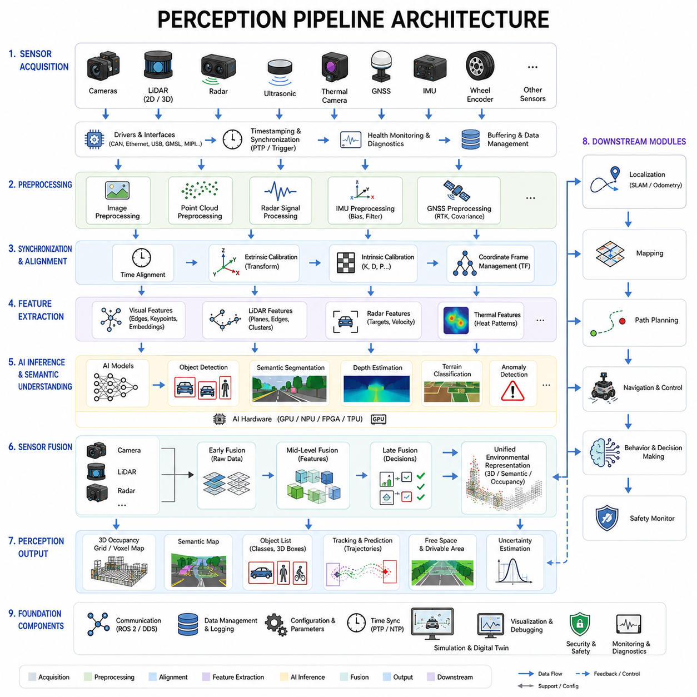
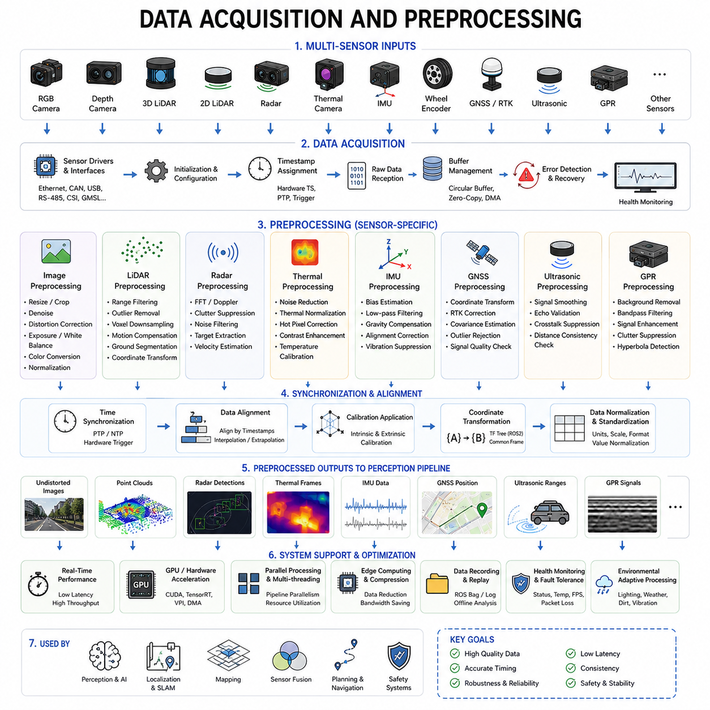
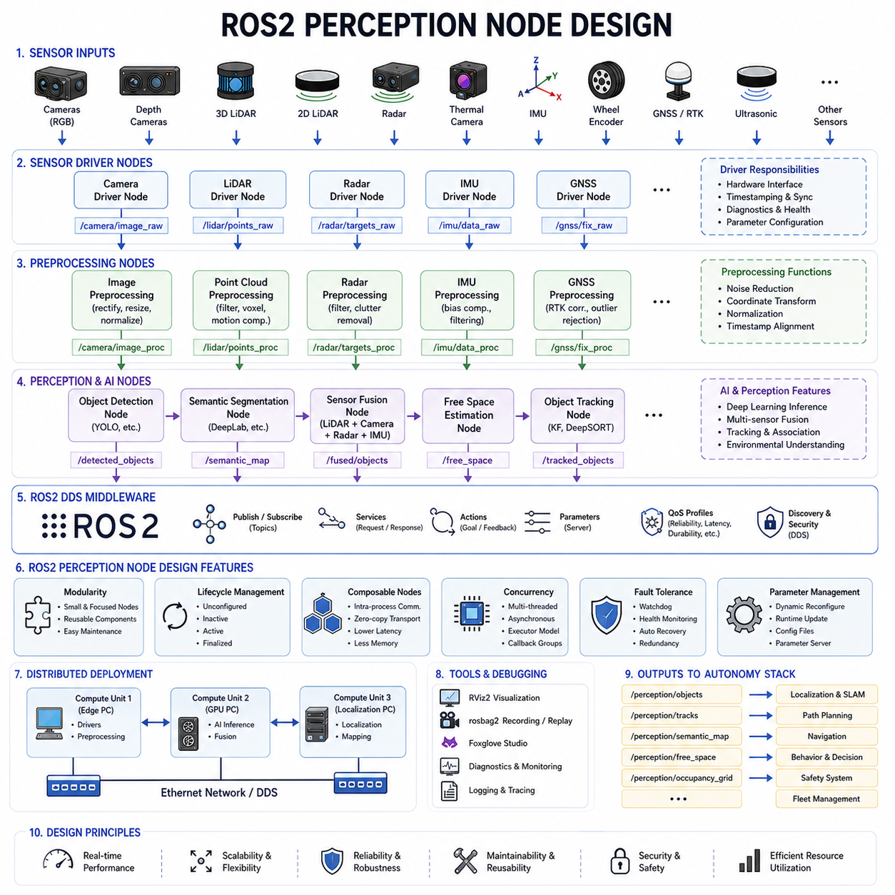
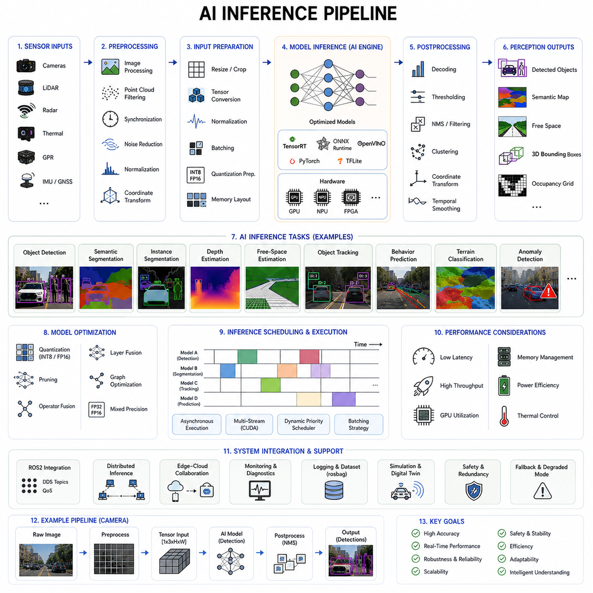
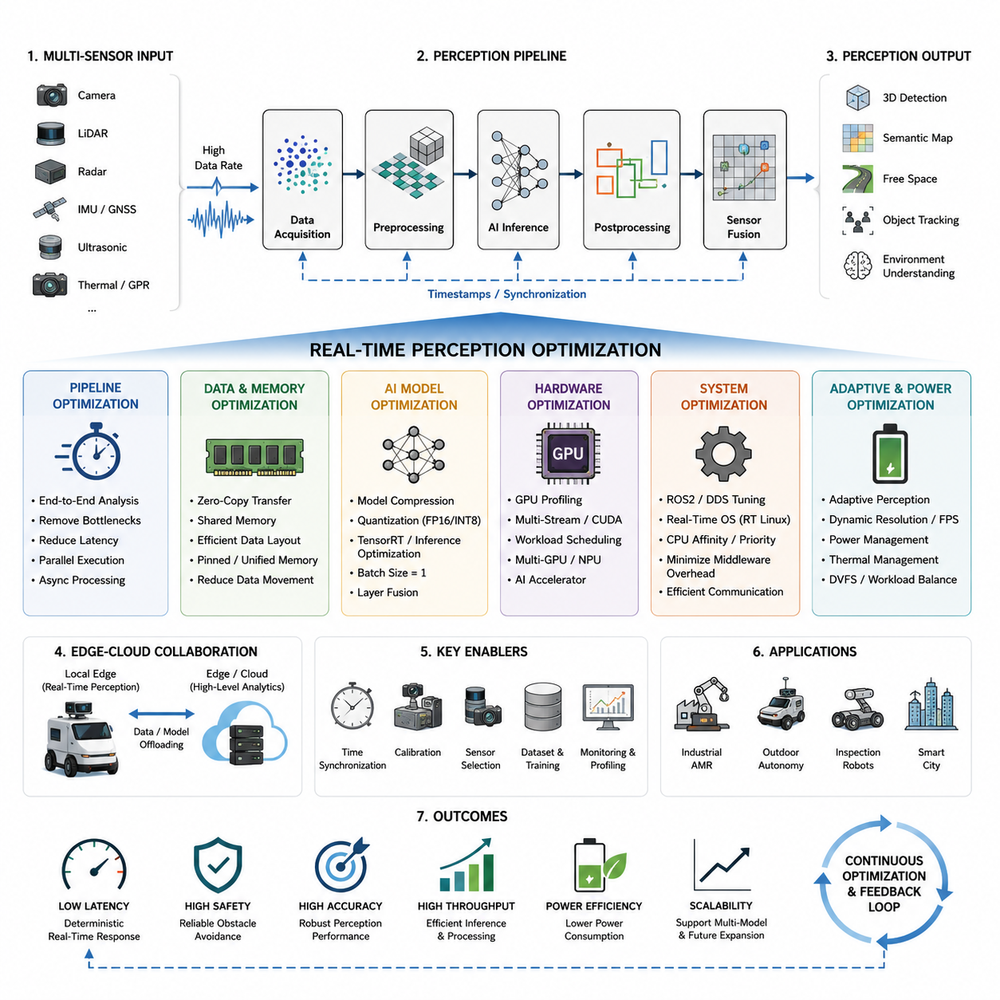
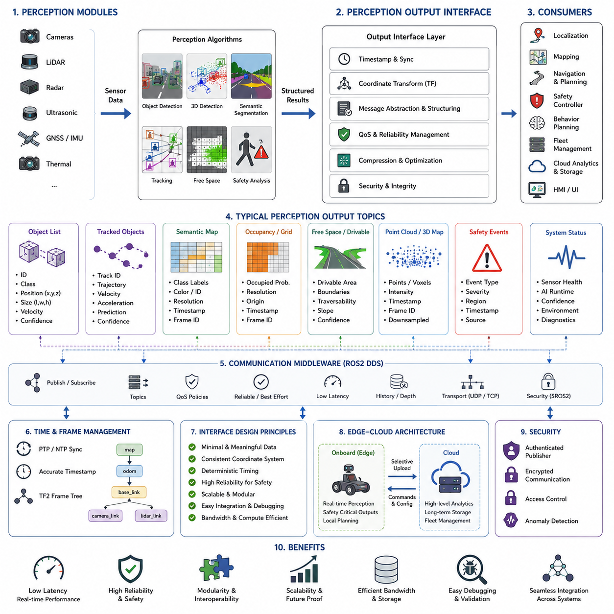
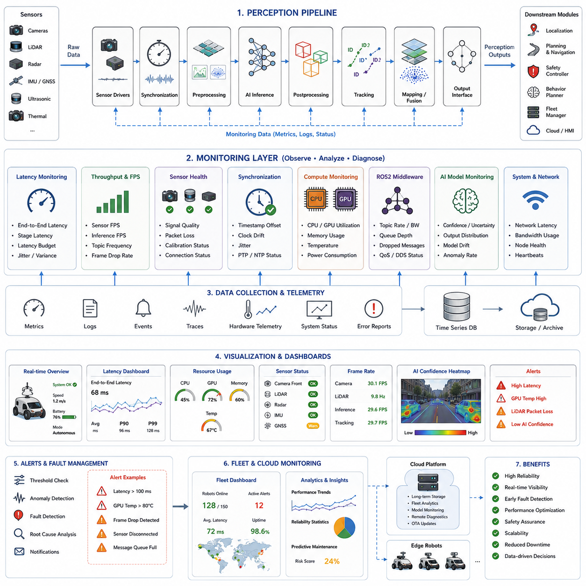
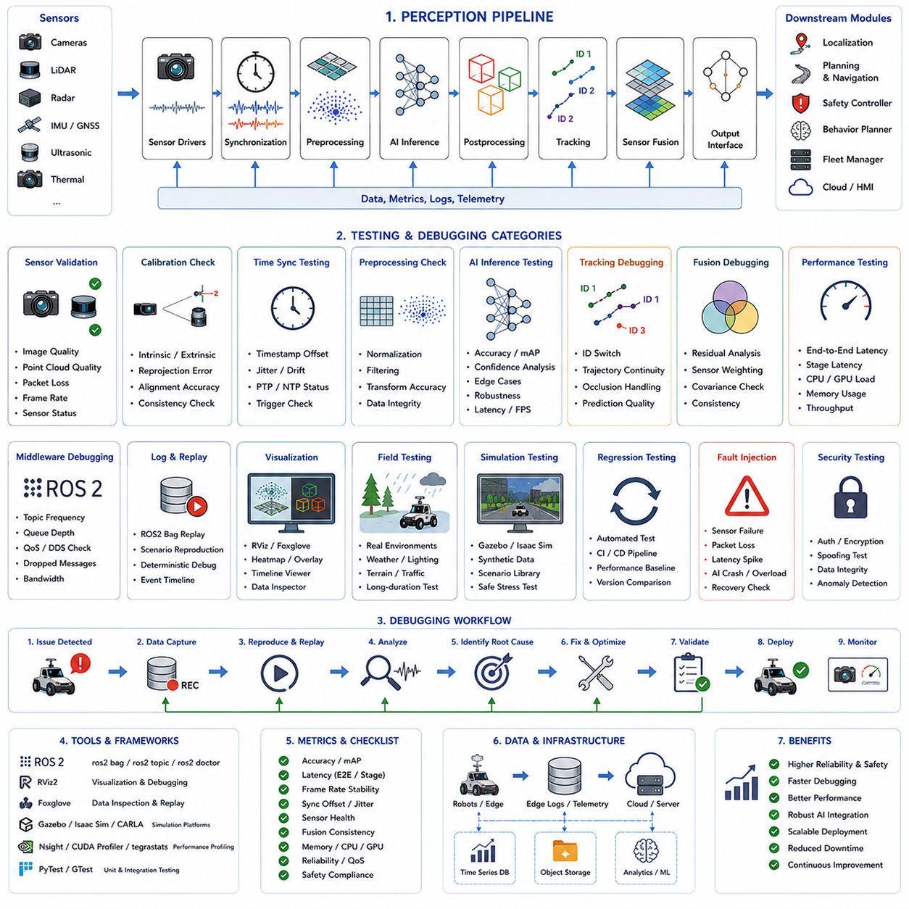

# Chapter 14. Perception Pipelines

## 14.1 Perception Pipeline Architecture

{width="7.268055555555556in" height="7.268055555555556in"}

Perception pipeline architecture is one of the most fundamental components of autonomous mobile robot systems because it defines how raw sensor data is transformed into actionable environmental understanding. In modern AMRs, perception is not a single algorithm or isolated software module. Instead, it is a highly integrated computational pipeline that continuously acquires sensor data, preprocesses information, synchronizes multiple sensing modalities, performs AI inference, extracts semantic meaning, tracks environmental changes, and generates structured outputs for localization, planning, navigation, safety, and decision-making systems.

The primary goal of a perception pipeline is to convert complex real-world sensory information into reliable machine-understandable representations. Autonomous robots must perceive obstacles, free space, terrain, humans, vehicles, structures, motion, environmental conditions, and operational hazards in real time. To achieve this, the perception architecture must combine high-performance hardware, optimized software frameworks, efficient communication systems, robust synchronization methods, and scalable AI processing architectures.

Modern AMR perception systems typically integrate multiple sensors simultaneously. These may include RGB cameras, depth cameras, stereo vision systems, 2D LiDARs, 3D LiDARs, radar systems, ultrasonic sensors, thermal cameras, GNSS modules, IMUs, wheel encoders, and specialized industrial sensors such as GPR systems or laser profilers. Each sensor provides unique environmental information and possesses different strengths and weaknesses. The perception pipeline architecture must therefore support heterogeneous sensor integration while maintaining real-time operational performance.

The perception pipeline usually begins with the sensor acquisition layer. This layer is responsible for interfacing directly with hardware devices and collecting raw sensor measurements. Each sensor produces data with different formats, frequencies, bandwidths, and latency characteristics. Cameras may generate high-resolution image streams at 30 to 120 FPS. LiDAR systems may produce millions of point cloud measurements per second. Radar sensors generate range-Doppler information. IMUs provide high-frequency acceleration and angular velocity data. GNSS modules generate positioning information at relatively lower rates.

Efficient sensor drivers are essential in this acquisition layer. Drivers must support stable communication protocols such as Ethernet, CAN, USB, GMSL, MIPI CSI, RS-485, or serial communication interfaces. Industrial AMRs frequently use deterministic communication architectures to minimize packet loss and latency variation. The acquisition layer must also handle hardware initialization, sensor configuration, timestamp assignment, synchronization control, error detection, and communication recovery.

Time synchronization is one of the most critical aspects of perception pipeline architecture. Multi-sensor fusion becomes unreliable if timestamps are inconsistent. For example, a 100 ms timing mismatch between a camera and LiDAR can create severe projection errors when the robot is moving. Therefore, perception systems often use PTP synchronization, hardware trigger mechanisms, ROS2 time synchronization frameworks, or FPGA-based timestamp distribution architectures to ensure temporal consistency across sensors.

After acquisition, raw sensor data enters the preprocessing layer. The primary objective of preprocessing is to clean, normalize, compress, and structure sensor data before higher-level perception algorithms are executed. Different sensor types require different preprocessing operations. Camera preprocessing may include image resizing, lens distortion correction, exposure normalization, white balance correction, denoising, gamma correction, and color-space conversion. LiDAR preprocessing may include point filtering, outlier removal, voxel downsampling, ground segmentation, and coordinate transformation.

Radar preprocessing often includes clutter filtering, Doppler processing, range FFT computation, and target extraction. IMU preprocessing involves bias correction, noise filtering, gravity compensation, and sensor alignment adjustment. GNSS preprocessing may include coordinate conversion, RTK correction handling, and covariance estimation. Proper preprocessing significantly improves the stability and reliability of downstream perception algorithms.

The next major layer is the sensor synchronization and alignment layer. In this stage, sensor data from multiple modalities is spatially and temporally aligned. Calibration parameters are applied to transform sensor data into common coordinate frames. Extrinsic calibration matrices define positional relationships between sensors. Intrinsic calibration parameters correct internal sensor distortions. Time alignment ensures that measurements correspond to the same physical moment.

Coordinate transformation frameworks such as TF trees in ROS2 are widely used for maintaining frame consistency across the perception stack. Dynamic transformation management becomes particularly important in robots with moving sensor assemblies such as pan-tilt cameras or articulated inspection systems. Accurate synchronization and alignment are foundational requirements for reliable sensor fusion.

Once synchronized and preprocessed, sensor data enters the feature extraction layer. This layer transforms raw measurements into meaningful representations suitable for higher-level interpretation. In vision systems, feature extraction may include edge detection, corner detection, semantic segmentation, optical flow estimation, keypoint extraction, and deep neural network embeddings. LiDAR systems may extract geometric features such as planes, edges, clusters, and occupancy structures.

Radar systems may identify moving targets and velocity vectors. Thermal cameras may extract heat signatures or abnormal thermal regions. GPR systems may identify underground reflection patterns. The feature extraction stage significantly reduces raw data complexity while preserving important environmental information.

AI-based inference is a central component of modern perception pipeline architectures. Deep learning models perform object detection, semantic segmentation, instance segmentation, depth estimation, free-space analysis, anomaly detection, terrain classification, and behavior prediction. These AI models may run on GPUs, edge accelerators, NPUs, FPGAs, or dedicated AI inference hardware such as NVIDIA Jetson platforms.

The architecture of the AI inference pipeline must balance computational performance with latency constraints. High-resolution perception improves accuracy but increases computational cost. Outdoor autonomous robots operating at higher speeds require lower perception latency to ensure safe navigation. Engineers must therefore optimize neural network architectures, model quantization, batch processing, memory management, and GPU scheduling to maintain real-time performance.

Perception pipelines often contain multiple AI models operating simultaneously. For example, one model may detect pedestrians, another may classify terrain, another may segment drivable areas, and another may track moving vehicles. Efficient orchestration of multiple inference engines becomes a major system design challenge. Advanced systems may use asynchronous execution pipelines and parallel computing frameworks to maximize throughput.

Sensor fusion is another key architectural layer. Multi-sensor fusion combines complementary sensing modalities to improve robustness and accuracy. Cameras provide rich semantic information but may struggle in low light. LiDAR provides accurate geometric structure but lacks texture understanding. Radar operates reliably in fog and rain but provides lower spatial resolution. By combining these sensors, the robot achieves more robust environmental perception.

Sensor fusion architectures are commonly categorized into early fusion, mid-level fusion, and late fusion. Early fusion combines raw sensor data before feature extraction. Mid-level fusion combines extracted features from multiple sensors. Late fusion merges independent perception outputs. Each approach has trade-offs regarding computational complexity, flexibility, robustness, and latency.

Localization support is closely integrated into perception pipeline architecture. Perception systems provide environmental observations that support SLAM, visual odometry, LiDAR odometry, GNSS fusion, and map matching algorithms. The perception pipeline may generate landmarks, feature tracks, occupancy grids, semantic maps, and environmental constraints used by localization systems.

Obstacle detection and free-space estimation are among the most important outputs of the perception pipeline. The robot must continuously identify static obstacles, dynamic obstacles, overhanging objects, terrain hazards, walls, humans, vehicles, and drivable surfaces. Occupancy grid generation, voxel mapping, semantic terrain segmentation, and dynamic object tracking are commonly integrated into this stage.

Tracking systems are also major components of perception architectures. Multi-object tracking algorithms maintain temporal consistency across perception frames. Kalman filters, particle filters, motion models, and deep learning-based tracking networks are frequently used to estimate object trajectories and predict future motion. Stable tracking improves navigation planning and collision avoidance reliability.

Perception pipeline architecture must also support uncertainty estimation. Real-world sensing is inherently noisy and imperfect. Modern robotics systems increasingly use probabilistic perception frameworks that estimate confidence levels, covariance distributions, and uncertainty bounds. These uncertainty estimates are critical for downstream planning and safety systems.

Data management and communication infrastructure play major roles in perception systems. Modern AMRs generate enormous amounts of sensor data. A multi-sensor outdoor robot may generate several gigabytes of perception data per hour. Efficient communication middleware is therefore essential. ROS2 DDS middleware is widely used because it supports distributed communication, real-time messaging, QoS control, and modular software integration.

Bandwidth optimization becomes particularly important in edge-cloud robotics architectures. Some perception processing may occur locally on the robot while higher-level analytics are performed in cloud infrastructure. Edge filtering and intelligent data compression reduce communication load while preserving critical information. For example, only abnormal events or compressed semantic representations may be uploaded to cloud servers.

Perception pipeline architectures must also address fault tolerance and reliability. Sensors may fail, become obstructed, or produce corrupted measurements. Cameras may become blinded by sunlight. LiDAR sensors may be affected by rain or dust. GNSS may fail in urban canyons. Therefore, perception systems require sensor health monitoring, anomaly detection, redundancy management, and fail-safe operational strategies.

Safety-critical AMRs often implement layered perception architectures. Safety-certified sensors such as 2D safety LiDARs may operate independently from AI perception systems. Even if the AI pipeline fails, the safety layer can still trigger emergency stop behavior. Functional safety standards increasingly require independent validation paths for safety-critical operations.

Perception pipeline debugging and validation are major engineering activities. Engineers use visualization tools such as RViz, Foxglove Studio, custom dashboards, and simulation environments to inspect perception outputs. ROS bag recording and replay systems allow offline debugging and failure reproduction. Calibration consistency, synchronization latency, AI inference accuracy, and fusion stability must all be validated systematically.

Simulation environments are becoming increasingly important for perception architecture development. Digital twins allow engineers to generate synthetic sensor data under diverse weather, lighting, and terrain conditions. Simulation accelerates AI dataset generation, validation testing, and failure analysis. Modern robotics companies frequently combine synthetic and real-world datasets to improve perception robustness.

Outdoor autonomous robots require particularly advanced perception architectures because environmental complexity is significantly higher than indoor AMRs. Outdoor systems must handle rain, fog, dust, mud, snow, direct sunlight, uneven terrain, dynamic traffic, vegetation, and changing weather conditions. Perception pipelines must therefore support robust multi-modal sensing and adaptive environmental processing.

Heavy industrial robots and GPR inspection robots introduce additional perception challenges. Large payload robots may experience severe vibration affecting sensor stability. GPR robots generate extremely high-bandwidth underground sensing data requiring specialized preprocessing and AI interpretation pipelines. These systems often require custom hardware acceleration and distributed computing architectures.

Future perception pipeline architectures are moving toward foundation-model-based perception systems. Large multimodal AI models may eventually unify object detection, semantic understanding, scene reasoning, language interpretation, and motion prediction within a single integrated architecture. Vision-language models and embodied AI systems are expected to dramatically improve robotic environmental understanding.

Edge AI hardware is also evolving rapidly. Future perception systems may increasingly rely on high-performance embedded AI accelerators such as Jetson Thor, dedicated robotics NPUs, edge GPUs, and distributed inference systems. Real-time 3D world modeling and dynamic scene understanding will become standard capabilities for advanced autonomous robots.

Self-supervised learning and continual learning are likely to become major components of future perception pipelines. Robots may continuously improve their own perception models based on operational experience. Online adaptation mechanisms may allow robots to adjust perception behavior according to changing environments and sensor degradation.

Ultimately, perception pipeline architecture represents the nervous system of an autonomous mobile robot. It connects sensing hardware, AI computation, environmental understanding, localization, navigation, and decision-making into a unified operational framework. The quality of the perception architecture directly determines the intelligence, safety, robustness, and operational reliability of the robot. As AMRs continue evolving toward fully autonomous intelligent systems, perception pipeline engineering will remain one of the most important disciplines in robotics development.

## 14.2 Data Acquisition and Preprocessing

{width="7.268055555555556in" height="7.268055555555556in"}

Data acquisition and preprocessing form the foundation of every autonomous mobile robot perception system. Regardless of how advanced the AI models or navigation algorithms may be, the overall performance of an AMR depends heavily on the quality, consistency, timing accuracy, and reliability of sensor data entering the perception pipeline. Poorly acquired or improperly preprocessed data can significantly degrade object detection accuracy, localization stability, mapping quality, sensor fusion performance, and ultimately the safety and reliability of the robot.

In autonomous robotics, data acquisition refers to the process of collecting raw information from sensors, embedded devices, communication interfaces, and environmental measurement systems. Preprocessing refers to the subsequent transformation of raw data into structured, synchronized, normalized, and optimized formats suitable for downstream perception algorithms, AI inference engines, localization systems, and navigation frameworks.

Modern AMRs operate using highly diverse sensor architectures. A single robot may simultaneously acquire information from RGB cameras, stereo vision systems, depth cameras, 2D LiDARs, 3D LiDARs, radar modules, thermal cameras, ultrasonic sensors, IMUs, wheel encoders, GNSS receivers, GPR systems, environmental sensors, and industrial inspection devices. Each sensor produces unique data structures, frequencies, bandwidth requirements, and latency characteristics. Therefore, the acquisition and preprocessing architecture must support heterogeneous sensor integration while maintaining deterministic real-time performance.

The first stage of data acquisition is sensor interfacing. Sensors communicate through various hardware protocols such as Ethernet, CAN, USB, RS-485, SPI, I2C, UART, GMSL, MIPI CSI, or industrial fieldbus systems. The perception system must support stable low-level communication with all connected devices. Industrial robots frequently operate in noisy electrical environments where electromagnetic interference, voltage fluctuation, or unstable cabling may cause communication failures. Therefore, robust driver implementation and communication error recovery mechanisms are essential.

Sensor drivers serve as the bridge between hardware devices and software pipelines. Drivers initialize sensors, configure operating modes, assign timestamps, receive raw measurements, detect communication faults, and manage buffer memory. In real-time robotics systems, driver stability is extremely important because driver-level instability propagates throughout the entire perception architecture. For example, intermittent LiDAR packet loss may destabilize SLAM performance, while dropped camera frames may degrade AI object tracking consistency.

Different sensors operate at vastly different update frequencies. Cameras may operate at 30, 60, or 120 FPS. IMUs often generate data at 200 to 1000 Hz. LiDAR systems may rotate at 10 to 20 Hz while generating millions of points per second. Radar sensors may update at intermediate frequencies, while GNSS modules often operate at lower rates such as 5 to 20 Hz. The acquisition system must therefore manage asynchronous data streams efficiently while preserving temporal consistency.

Timestamp assignment is one of the most critical aspects of data acquisition. Every sensor measurement must be associated with an accurate timestamp representing the precise moment the measurement was captured. In autonomous robots, even small timing mismatches can produce significant perception errors. For example, if camera data and LiDAR point clouds are separated by 100 milliseconds while the robot is moving, projected sensor alignment may become severely distorted.

To address synchronization requirements, modern AMRs often use hardware timestamping, PTP synchronization, GPS-disciplined clocks, FPGA-based timing distribution, or hardware trigger systems. ROS2-based perception systems frequently use synchronized DDS messaging architectures to maintain temporal alignment across distributed computing nodes.

Buffer management is another critical component of acquisition systems. High-bandwidth sensors continuously generate large volumes of data. Multi-camera outdoor robots with multiple 3D LiDARs may generate several gigabytes of sensor data per hour. Efficient buffering strategies are required to prevent memory overflow, packet loss, and processing bottlenecks. Circular buffers, zero-copy communication mechanisms, DMA transfers, and shared-memory architectures are often used to optimize throughput.

Once raw sensor data is acquired, preprocessing begins. Preprocessing aims to improve data quality, reduce computational load, standardize data representation, and prepare measurements for higher-level perception algorithms. Each sensor modality requires specialized preprocessing techniques depending on its physical sensing characteristics and environmental sensitivities.

Image preprocessing is one of the most widely used preprocessing categories. Raw camera images often contain noise, distortion, lighting variation, motion blur, exposure imbalance, and sensor artifacts. Image preprocessing pipelines commonly include resizing, cropping, normalization, denoising, gamma correction, histogram equalization, white balance correction, sharpening, color-space conversion, and lens distortion correction.

Lens distortion correction is especially important in robotics perception. Wide-angle lenses used in outdoor autonomous robots often introduce barrel distortion or fisheye effects. Calibration parameters are applied to undistort images before further AI processing. Failure to correct lens distortion may significantly degrade object detection accuracy and visual localization stability.

Image resizing is another critical optimization step. High-resolution images provide better visual detail but increase GPU computation load. Engineers must balance image resolution against real-time inference latency. Some perception systems dynamically adjust image resolution depending on robot speed, environmental complexity, or available computational resources.

Lighting normalization is essential because AMRs operate under highly variable illumination conditions. Outdoor robots experience direct sunlight, shadows, night environments, rain reflections, and low-light conditions. Adaptive exposure control, HDR processing, brightness normalization, and color correction algorithms help improve perception robustness under changing lighting environments.

LiDAR preprocessing focuses primarily on point cloud conditioning and filtering. Raw LiDAR data may contain noise, multipath reflections, outlier points, atmospheric interference, and invalid measurements. Point cloud preprocessing commonly includes range filtering, statistical outlier removal, voxel downsampling, motion compensation, coordinate transformation, intensity normalization, and ground segmentation.

Voxel downsampling is particularly important because raw point clouds may contain millions of points per second. Reducing point density lowers computational load while preserving important geometric structure. Ground segmentation algorithms separate terrain surfaces from obstacles and environmental structures, improving obstacle detection efficiency and free-space estimation.

Motion compensation is another important LiDAR preprocessing technique. During LiDAR scanning, the robot may move significantly, especially in outdoor autonomous vehicles operating at higher speeds. Motion distortion correction uses IMU and odometry information to compensate for sensor motion during scan acquisition.

Radar preprocessing differs substantially from camera and LiDAR preprocessing because radar measures electromagnetic reflections rather than visual geometry. Radar preprocessing typically includes FFT computation, Doppler analysis, clutter suppression, target extraction, noise filtering, and velocity estimation. Radar systems are particularly valuable because they remain robust in rain, fog, dust, and snow environments where optical sensors degrade.

Thermal camera preprocessing includes thermal normalization, noise reduction, hot-pixel correction, contrast enhancement, and temperature calibration. Thermal perception is highly useful for low-light operation, human detection, industrial inspection, and fire monitoring applications. However, thermal sensors are highly sensitive to environmental temperature drift and require continuous calibration management.

IMU preprocessing is critical for localization and motion estimation systems. Raw IMU measurements contain bias drift, noise, vibration artifacts, and temperature-dependent errors. IMU preprocessing commonly includes bias estimation, low-pass filtering, gravity compensation, coordinate alignment correction, and vibration suppression. Proper IMU preprocessing significantly improves visual-inertial odometry and SLAM stability.

GNSS preprocessing focuses on coordinate transformation, RTK correction integration, covariance estimation, outlier rejection, and signal-quality validation. Multipath interference and satellite visibility changes often create unstable GNSS measurements in urban environments. Advanced preprocessing algorithms analyze signal confidence and reject unreliable positioning updates.

Ultrasonic sensor preprocessing includes signal smoothing, echo validation, crosstalk suppression, and distance consistency checking. Ultrasonic sensors are widely used for close-range obstacle detection and docking assistance but are highly sensitive to environmental noise and surface material properties.

GPR preprocessing is among the most computationally demanding preprocessing tasks in industrial robotics. Raw ground-penetrating radar signals contain large amounts of electromagnetic reflection noise, soil-dependent variation, and clutter. Preprocessing may include background subtraction, frequency filtering, signal amplification, clutter suppression, hyperbola detection, and subsurface feature enhancement. GPR systems often generate extremely high-bandwidth datasets requiring GPU acceleration and distributed computing architectures.

Data normalization is a common preprocessing step across all sensing modalities. Different sensors produce measurements with different scales, units, coordinate systems, and value distributions. Normalization ensures consistent representation for sensor fusion and AI inference pipelines. Standardized coordinate frames are especially important in multi-sensor robotics architectures.

Coordinate transformation is another major preprocessing operation. Sensor measurements must be transformed into common coordinate systems using calibration matrices. TF trees in ROS2 environments manage coordinate relationships between robot frames, sensors, actuators, localization systems, and mapping components. Incorrect coordinate transformations may cause severe perception instability.

Preprocessing also plays a major role in AI optimization. Neural networks require structured and normalized inputs for stable inference performance. Input preprocessing pipelines may include tensor conversion, channel normalization, quantization preparation, image augmentation, or batch formatting. AI preprocessing must be optimized carefully because preprocessing latency contributes directly to total perception latency.

Real-time constraints are among the most challenging aspects of acquisition and preprocessing architecture. Autonomous robots must process sensor data continuously without interruption. High-speed outdoor robots require extremely low-latency perception pipelines to ensure safe navigation. Therefore, preprocessing algorithms must be computationally efficient and highly parallelized.

GPU acceleration is increasingly used for preprocessing operations. CUDA-based image processing, GPU point cloud filtering, parallel tensor conversion, and hardware-accelerated video decoding significantly improve performance. Edge AI platforms such as Jetson Orin NX, Jetson AGX Orin, and Jetson Thor are commonly used in modern AMRs for integrated acquisition and preprocessing acceleration.

Distributed computing architectures are becoming increasingly important for large-scale perception systems. High-end outdoor autonomous robots may use multiple computing nodes for separate perception tasks. One computer may handle LiDAR preprocessing while another processes AI vision models and another manages radar fusion. Efficient inter-process communication and synchronized distributed data handling are therefore essential.

ROS2 middleware plays a central role in robotics data pipelines. ROS2 supports modular node architectures, DDS communication, QoS management, real-time messaging, distributed execution, and scalable software integration. Preprocessing nodes are often implemented as dedicated ROS2 components capable of asynchronous execution and multi-threaded optimization.

Data recording and replay systems are also essential parts of preprocessing workflows. ROS bag systems allow engineers to record raw sensor data for offline debugging, AI dataset generation, calibration analysis, and simulation replay. Industrial robotics companies often collect enormous operational datasets to improve perception models continuously.

Fault tolerance and reliability monitoring are essential within acquisition and preprocessing architectures. Sensors may disconnect, overheat, produce corrupted data, or experience environmental degradation. Therefore, health monitoring systems continuously inspect sensor status, communication quality, packet loss, temperature, frame rate consistency, and synchronization health.

Safety-critical AMRs often implement redundant acquisition pipelines. Independent safety LiDAR systems may bypass AI preprocessing entirely and directly trigger emergency stop mechanisms. Functional safety standards increasingly require deterministic safety data paths separate from experimental AI pipelines.

Environmental adaptation is another major challenge. Outdoor robots must preprocess data under rain, snow, fog, dust, vibration, mud, glare, and rapidly changing weather conditions. Adaptive preprocessing algorithms may dynamically adjust filtering strength, exposure settings, AI thresholds, or sensor weighting depending on environmental conditions.

Simulation and digital twin systems are increasingly used to validate acquisition and preprocessing architectures. Synthetic sensor datasets allow engineers to evaluate robustness under rare or dangerous conditions. Simulation also accelerates AI dataset generation and pipeline optimization.

Future acquisition and preprocessing architectures are expected to become increasingly AI-driven. Adaptive preprocessing algorithms may automatically optimize filtering parameters, synchronization settings, compression strategies, and sensor weighting in real time. Self-supervised learning may allow robots to continuously improve preprocessing quality based on operational experience.

Edge-cloud integration will also continue evolving. Some preprocessing tasks may remain on the robot while computationally intensive analytics are offloaded to cloud infrastructure. Intelligent edge filtering will become increasingly important as robot fleets scale to thousands of deployed systems.

Ultimately, data acquisition and preprocessing are not merely supporting functions within robotics perception systems. They are foundational engineering disciplines that determine the quality, reliability, latency, and safety of the entire autonomy stack. Even the most advanced AI perception systems cannot compensate for poor data quality or unstable acquisition architectures. As AMRs continue evolving toward large-scale industrial deployment and embodied AI autonomy, robust acquisition and preprocessing engineering will become even more essential for future robotic intelligence systems.

## 14.3 ROS2 Perception Node Design

{width="7.268055555555556in" height="7.268055555555556in"}

ROS2 perception node design is one of the most important software engineering disciplines in autonomous mobile robot development because it defines how perception algorithms, sensor interfaces, AI inference engines, synchronization systems, and downstream autonomy modules interact within the robot software architecture. In modern AMRs, perception systems are no longer monolithic applications. Instead, they are composed of modular, distributed, asynchronous ROS2 nodes that communicate through standardized middleware interfaces. The design quality of these nodes directly affects real-time performance, scalability, maintainability, debugging efficiency, fault tolerance, and operational reliability.

ROS2 was developed to overcome the limitations of ROS1 and to provide a modern distributed robotics middleware capable of supporting industrial-scale autonomous systems. ROS2 introduces DDS-based communication, real-time support, improved security, multi-platform compatibility, QoS management, lifecycle nodes, composable node architectures, and enhanced distributed execution capabilities. These features make ROS2 particularly suitable for complex perception pipelines used in outdoor autonomous robots, industrial AMRs, smart city robots, agricultural robots, towing robots, and AI-driven inspection systems.

The primary goal of ROS2 perception node design is to create modular, reusable, scalable, and deterministic software components that process sensor data and generate reliable perception outputs in real time. Each perception node typically performs a specialized function such as image acquisition, LiDAR preprocessing, radar filtering, object detection, semantic segmentation, sensor fusion, free-space estimation, object tracking, or environmental understanding.

One of the most important design principles in ROS2 perception systems is modular decomposition. Rather than implementing all perception functions inside a single large application, engineers separate the perception pipeline into multiple independent nodes. This approach improves maintainability, debugging capability, scalability, and fault isolation. For example, a camera driver node may publish raw images, while a preprocessing node performs distortion correction, and an AI inference node performs object detection. Downstream tracking nodes then consume detection outputs independently.

This modular architecture provides several major advantages. Individual nodes can be updated independently without affecting the entire system. Different nodes may run on different computing devices. Faults can be isolated more easily. Developers can replace algorithms without redesigning the entire perception pipeline. Parallel execution becomes easier to implement. Distributed robotics architectures become more scalable and flexible.

ROS2 nodes communicate primarily through topics using DDS middleware. Topics provide asynchronous publish-subscribe communication mechanisms. Sensor nodes publish raw data streams while perception nodes subscribe to those topics and publish processed outputs. For example, a 3D LiDAR node may publish PointCloud2 messages while a clustering node subscribes to the point cloud topic and publishes detected obstacle clusters.

Message design is critically important in perception node architecture. Messages must efficiently represent sensor data while minimizing serialization overhead and communication latency. Large sensor payloads such as high-resolution images or dense point clouds may consume substantial bandwidth and CPU resources. Therefore, engineers often use optimized message formats, compressed transport methods, zero-copy communication mechanisms, or shared-memory transport systems.

QoS configuration is one of the most powerful features introduced in ROS2. Perception systems require different communication reliability characteristics depending on sensor type and operational importance. Some data streams prioritize low latency over guaranteed delivery, while others require maximum reliability. ROS2 QoS profiles allow developers to configure reliability, durability, history depth, deadline requirements, liveliness detection, and message lifespan.

For example, high-frequency camera streams may use best-effort communication to minimize latency, while safety-critical obstacle alerts may use reliable communication modes. Localization systems may require transient local durability so that late-joining nodes receive recent map information immediately. Proper QoS tuning is essential for maintaining stable perception performance under varying computational loads and network conditions.

Lifecycle nodes are another important ROS2 feature used extensively in industrial perception systems. Lifecycle nodes support managed state transitions including unconfigured, inactive, active, and finalized states. This architecture improves startup sequencing, fault recovery, resource management, and operational stability. Perception systems containing many sensors often require carefully controlled initialization procedures. Cameras, LiDARs, GNSS receivers, and AI inference engines may need to initialize in specific sequences.

Lifecycle management also improves fault tolerance. If a sensor node fails, the system may restart or reconfigure that node independently without restarting the entire robot software stack. Industrial AMRs frequently implement supervisory health-monitoring nodes that oversee lifecycle state transitions for all perception components.

Composable node architecture is another major optimization strategy in ROS2 perception systems. Traditionally, ROS nodes run as separate operating system processes. While this improves isolation, inter-process communication introduces serialization overhead and additional latency. Composable nodes allow multiple ROS2 components to execute within the same process space while still maintaining modular software architecture.

Composable node containers significantly reduce memory usage, serialization overhead, and communication latency. High-bandwidth perception systems processing multiple camera streams and dense point clouds benefit greatly from intra-process communication optimization. This is especially important for edge AI platforms with limited computational resources.

Sensor driver nodes form the foundation of ROS2 perception pipelines. Driver nodes interface directly with hardware devices and publish raw sensor data into the ROS2 ecosystem. These nodes must support robust hardware communication, timestamp assignment, synchronization handling, error recovery, parameter configuration, and diagnostics reporting. Industrial-grade driver stability is critical because unstable drivers propagate failures throughout the entire autonomy stack.

Camera driver nodes often publish raw image streams, camera calibration information, exposure status, and synchronization metadata. LiDAR driver nodes publish point clouds, intensity values, scan timing information, and diagnostic metrics. Radar nodes publish target detections, velocity estimates, and range-Doppler measurements. IMU nodes publish acceleration and angular velocity measurements at high frequencies.

Preprocessing nodes are typically placed immediately downstream from sensor drivers. These nodes perform operations such as image rectification, point cloud filtering, noise reduction, voxel downsampling, motion compensation, coordinate transformation, signal normalization, and timestamp alignment. Separating preprocessing into dedicated nodes improves pipeline flexibility and allows preprocessing algorithms to evolve independently.

Synchronization nodes are particularly important in multi-sensor perception systems. Multi-camera systems, LiDAR-camera fusion systems, and visual-inertial odometry frameworks require temporally aligned sensor measurements. ROS2 provides message_filters and approximate synchronization utilities, but industrial systems often implement custom synchronization architectures using hardware timestamps and deterministic scheduling.

Calibration transformation management is another critical aspect of ROS2 perception node design. Coordinate frame transformations are managed using TF2 frameworks. TF trees define relationships between robot frames, sensor frames, localization frames, and map frames. Perception nodes continuously consume and publish transformed data using these coordinate relationships.

AI inference nodes are among the most computationally intensive perception components. These nodes execute deep learning models for object detection, semantic segmentation, depth estimation, terrain classification, anomaly detection, or behavior prediction. AI inference nodes frequently integrate TensorRT, CUDA, ONNX Runtime, OpenVINO, or custom GPU acceleration frameworks.

Real-time performance optimization is extremely important for AI perception nodes. Engineers must carefully manage GPU memory allocation, tensor transfer overhead, asynchronous CUDA execution, batching strategies, and inference scheduling. Outdoor autonomous robots operating at higher speeds require extremely low-latency perception pipelines to maintain safe navigation behavior.

Multi-threading and concurrency management are central design challenges in ROS2 perception architectures. High-performance perception systems process many asynchronous sensor streams simultaneously. ROS2 executors manage callback scheduling and thread allocation. Multi-threaded executors improve parallelism but require careful synchronization management to avoid race conditions and deadlocks.

Callback design significantly affects system performance. Long-running callbacks may block message processing and increase perception latency. Therefore, perception nodes often separate heavy AI inference workloads into asynchronous worker threads or GPU task queues. Lock-free queues and efficient memory management strategies are commonly used in high-performance robotics systems.

Memory optimization is another major engineering consideration. Perception systems process large volumes of sensor data continuously. Repeated memory allocation and copying can significantly degrade performance. Zero-copy communication, shared-memory transport, preallocated buffers, and efficient tensor reuse mechanisms are increasingly important in advanced ROS2 architectures.

Distributed computing is becoming increasingly common in large-scale perception systems. High-end outdoor autonomous robots may contain multiple computing devices connected through high-speed Ethernet networks. One computer may process LiDAR data while another executes AI vision models and another handles localization. ROS2 DDS middleware supports distributed communication across these computing nodes.

Network architecture becomes critically important in distributed perception systems. High-bandwidth sensor data streams may saturate communication channels if not managed properly. Engineers must carefully optimize message rates, compression strategies, topic partitioning, DDS discovery settings, and multicast configurations to maintain stable operation.

Logging and debugging support are essential features of ROS2 perception node design. Perception failures are often difficult to reproduce because they depend on complex environmental conditions and sensor interactions. ROS2 logging frameworks, rosbag recording systems, RViz visualization, Foxglove Studio integration, and diagnostic monitoring nodes help engineers analyze system behavior.

Diagnostics nodes continuously monitor sensor health, CPU usage, GPU utilization, memory consumption, message rates, synchronization latency, packet loss, and node responsiveness. Industrial robotics systems frequently implement centralized monitoring dashboards that visualize perception pipeline health in real time.

Fault tolerance and redundancy are increasingly important in safety-critical perception systems. Sensor failures, communication interruptions, GPU crashes, or AI inference instability must not cause unsafe robot behavior. Redundant nodes, watchdog timers, heartbeat monitoring, fallback algorithms, and degraded operational modes improve system robustness.

Security is another important consideration in ROS2 node design. ROS2 introduces DDS security mechanisms supporting authentication, encryption, and access control. As autonomous robots become increasingly connected to cloud infrastructure and fleet management systems, cybersecurity becomes critical for protecting perception data and operational safety.

Parameter management is also a major design aspect. Perception nodes often contain many configurable parameters including filtering thresholds, AI confidence thresholds, synchronization settings, calibration paths, GPU configuration parameters, and operational modes. ROS2 parameter servers allow runtime parameter adjustment without restarting nodes.

Dynamic reconfiguration is especially valuable in outdoor autonomous robots operating under changing environmental conditions. Perception thresholds may require adjustment depending on rain, fog, lighting conditions, or terrain type. Adaptive perception systems increasingly modify parameters automatically during operation.

Simulation integration is another important ROS2 capability. Perception nodes are frequently tested using Gazebo, Isaac Sim, CARLA, or custom digital twin environments. Simulation allows safe testing under dangerous or rare environmental conditions while accelerating AI dataset generation and pipeline validation.

Industrial perception systems often support hybrid edge-cloud architectures. Some perception nodes execute locally on the robot while high-level analytics, map processing, or fleet-level perception aggregation occurs in cloud infrastructure. ROS2 bridges and DDS gateways enable distributed cloud-connected robotics architectures.

Future ROS2 perception architectures are expected to become increasingly AI-native. Foundation-model-based perception nodes may unify object detection, semantic understanding, scene reasoning, and language grounding into integrated multimodal perception frameworks. Edge AI accelerators such as Jetson Thor and future robotics NPUs will further improve onboard perception capabilities.

Self-supervised learning and online adaptation may also become integrated into ROS2 node architectures. Future robots may continuously refine perception models during operation while dynamically optimizing node scheduling and resource allocation based on environmental complexity.

Ultimately, ROS2 perception node design represents the software nervous system of modern autonomous mobile robots. Well-designed ROS2 perception architectures enable scalable, robust, real-time, maintainable, and fault-tolerant robotics systems capable of operating reliably in complex real-world environments. As AMRs evolve toward fully autonomous embodied AI systems, ROS2 perception engineering will continue to play a central role in robotics software development.

## 14.4 AI Inference Pipeline

{width="7.268055555555556in" height="7.268055555555556in"}

The AI inference pipeline is one of the most critical components of modern autonomous mobile robot perception systems because it transforms preprocessed sensor data into intelligent environmental understanding in real time. In autonomous robotics, AI inference refers to the execution of trained machine learning and deep learning models on live operational data generated by cameras, LiDARs, radars, thermal sensors, GPR systems, and other sensing devices. The inference pipeline determines how efficiently and accurately the robot can detect objects, understand scenes, classify terrain, predict motion, identify hazards, and make autonomous decisions.

In modern AMRs, AI inference is no longer limited to simple object classification tasks. Advanced perception systems simultaneously perform multiple AI-driven functions including object detection, semantic segmentation, instance segmentation, free-space estimation, depth prediction, anomaly detection, terrain classification, object tracking, behavior prediction, occupancy estimation, and multimodal sensor fusion. The AI inference pipeline must therefore support large-scale parallel processing while maintaining low latency and deterministic real-time behavior.

The AI inference pipeline typically begins after sensor acquisition and preprocessing stages are completed. Preprocessed sensor data such as normalized images, filtered point clouds, synchronized radar targets, thermal frames, or transformed occupancy grids are forwarded into inference-ready tensor formats. These tensors become the input data for deep neural networks executing on GPUs, edge AI accelerators, NPUs, FPGAs, or dedicated inference hardware platforms.

Input preparation is one of the first important stages in the inference pipeline. AI models require highly structured input formats with consistent tensor dimensions, data types, normalization scales, and memory layouts. Image-based AI models may require RGB normalization, tensor conversion, batch formatting, resizing, channel ordering adjustments, and quantization preparation. Point cloud AI systems require voxelization, point sampling, coordinate normalization, and sparse tensor generation.

The quality of input preparation directly affects inference stability and accuracy. Even small preprocessing inconsistencies between training and deployment environments may significantly degrade model performance. Therefore, engineers carefully maintain preprocessing consistency across dataset generation, model training, validation, simulation, and real-world deployment systems.

The next major stage is model loading and runtime initialization. AI inference systems typically load optimized neural network models into GPU memory or edge accelerator memory before operation begins. Inference frameworks such as TensorRT, ONNX Runtime, OpenVINO, TensorFlow Lite, PyTorch Runtime, or custom inference engines initialize computation graphs, memory buffers, CUDA kernels, and hardware execution contexts.

Efficient model initialization is especially important in industrial AMRs because robots often contain multiple AI models running simultaneously. A modern outdoor autonomous robot may execute separate models for pedestrian detection, terrain segmentation, free-space estimation, traffic analysis, safety monitoring, and behavior prediction. Memory allocation and GPU resource management therefore become major architectural challenges.

Model optimization is a central part of AI inference pipeline engineering. Raw training models are often too computationally expensive for real-time robotics deployment. Therefore, engineers use optimization techniques such as quantization, pruning, operator fusion, tensor optimization, layer fusion, mixed-precision inference, and graph simplification to reduce inference latency while maintaining acceptable accuracy.

Quantization is one of the most widely used optimization techniques. Neural network parameters originally represented in FP32 floating-point format may be converted into FP16 or INT8 representations. Lower numerical precision significantly reduces GPU memory consumption and computational load. Modern edge AI accelerators such as NVIDIA Jetson platforms provide hardware acceleration specifically optimized for quantized inference.

Pruning is another common optimization method. Redundant or low-importance neural network weights are removed to reduce model size and computational complexity. Structured pruning may eliminate entire channels or layers while preserving overall network functionality. However, excessive pruning may reduce detection accuracy or model robustness.

Inference scheduling is one of the most important architectural considerations in robotics AI systems. Different AI tasks have different timing requirements and computational priorities. Safety-critical obstacle detection may require extremely low latency, while semantic mapping may tolerate slower update rates. Engineers therefore design scheduling architectures that allocate GPU resources dynamically based on operational priorities.

Asynchronous inference execution is widely used in advanced AMRs. Instead of executing all AI models sequentially, multiple inference tasks are scheduled concurrently using CUDA streams, GPU task queues, and parallel execution pipelines. This approach maximizes GPU utilization while reducing overall perception latency.

Batch processing is another important optimization strategy. Some inference tasks process multiple sensor frames simultaneously to improve GPU throughput. However, large batch sizes increase inference latency and memory usage. Autonomous robots operating at higher speeds often prefer smaller batch sizes to minimize reaction time.

AI inference pipelines must support multiple sensing modalities simultaneously. Vision-based inference pipelines process RGB images, stereo images, thermal images, and depth maps. LiDAR inference pipelines process point clouds, voxel grids, range images, and occupancy maps. Radar inference pipelines analyze range-Doppler signatures and velocity patterns. GPR inference pipelines analyze underground reflection structures and electromagnetic anomalies.

Multimodal inference architectures are becoming increasingly important because no single sensor modality is sufficiently robust under all environmental conditions. Cameras provide rich semantic information but struggle in darkness or fog. LiDAR provides accurate geometry but lacks texture understanding. Radar remains reliable in adverse weather but provides lower spatial resolution. Multimodal AI pipelines combine these sensing modalities to improve environmental understanding and operational robustness.

Object detection is one of the most common AI inference tasks in AMRs. Object detection networks identify pedestrians, vehicles, forklifts, workers, obstacles, traffic cones, robots, and industrial equipment within sensor data. Modern object detection models include YOLO, SSD, Faster R-CNN, DETR, CenterPoint, PointPillars, and many specialized robotics-oriented architectures.

Semantic segmentation is another major inference task. Segmentation networks classify every pixel or point into semantic categories such as road, floor, wall, grass, human, vehicle, obstacle, or free space. Semantic understanding is especially important for outdoor autonomous robots navigating complex environments.

Free-space estimation networks identify safe navigable areas for motion planning. These models analyze terrain geometry, obstacles, road boundaries, slope conditions, and drivable surfaces. Free-space inference directly influences path planning and collision avoidance behavior.

Object tracking systems often operate as downstream inference stages. Detection outputs are associated across time using motion models, Kalman filters, particle filters, transformer-based tracking networks, or deep re-identification models. Stable tracking improves prediction quality and navigation safety.

Behavior prediction networks estimate future motion trajectories of pedestrians, vehicles, forklifts, bicycles, and other dynamic objects. These systems are especially important in crowded industrial facilities, hospitals, logistics centers, and smart city environments where robots interact closely with humans.

Terrain classification models are increasingly important in outdoor autonomous robots. AI systems classify mud, gravel, asphalt, grass, snow, sand, water, and rough terrain conditions. Terrain-aware navigation improves mobility safety and energy efficiency.

Anomaly detection networks identify unusual environmental conditions or abnormal operational situations. These systems may detect fallen objects, damaged infrastructure, leaking pipes, fire hazards, unauthorized personnel, abandoned equipment, or unexpected terrain changes. Industrial inspection robots and GPR inspection systems rely heavily on anomaly detection inference pipelines.

3D perception inference is one of the most computationally demanding AI workloads in robotics. 3D object detection, voxel occupancy estimation, point cloud segmentation, scene reconstruction, and dynamic environment modeling require substantial GPU resources. Sparse convolution networks and transformer-based architectures are increasingly used for advanced 3D perception tasks.

Real-time performance is one of the greatest engineering challenges in AI inference pipeline design. Autonomous robots must continuously process sensor data while reacting safely to rapidly changing environments. Outdoor autonomous robots operating at higher speeds require extremely low end-to-end perception latency.

Latency in AI inference pipelines originates from many sources including sensor acquisition delay, preprocessing overhead, GPU transfer time, neural network execution, postprocessing operations, and communication latency. Engineers must optimize the entire pipeline holistically rather than focusing only on neural network execution speed.

GPU memory management is critically important in large-scale inference systems. Multiple AI models competing for limited GPU memory may create fragmentation, memory overflow, or unstable inference behavior. Efficient tensor reuse, memory pooling, preallocated buffers, and asynchronous memory transfer strategies are essential.

Edge AI hardware plays a central role in robotics inference systems. Modern AMRs increasingly use embedded AI platforms such as NVIDIA Jetson Orin NX, Jetson AGX Orin, Jetson Thor, Intel edge accelerators, AMD AI processors, robotics NPUs, and FPGA-based AI engines. Hardware selection depends heavily on computational requirements, power consumption constraints, thermal limits, and environmental conditions.

Low-level AMR platforms may use compact edge devices such as Jetson Orin NX for standard navigation and object detection tasks. Mid-level architectures may use more advanced edge AI processors such as Jetson Thor capable of replacing separate edge GPU computers. High-level autonomous platforms may combine multiple GPUs and distributed AI inference servers for large-scale multimodal perception workloads.

Distributed inference architectures are becoming increasingly common in high-end outdoor autonomous robots. Multiple computing nodes may execute separate inference workloads simultaneously. One computer may process LiDAR perception while another executes camera AI models and another handles radar fusion and localization. DDS middleware and high-speed Ethernet communication support distributed inference synchronization.

Cloud-connected AI inference systems are also evolving rapidly. Some non-time-critical inference tasks may execute in cloud infrastructure while safety-critical perception remains on the robot edge computer. Fleet-level analytics, long-term mapping, behavioral learning, and large-scale model updates may be managed centrally.

ROS2 integration is fundamental in robotics AI inference pipelines. ROS2 nodes manage sensor subscriptions, inference execution, synchronization, QoS handling, diagnostics, and output publishing. AI inference nodes often publish object detections, semantic maps, occupancy grids, free-space maps, tracking results, and uncertainty estimates for downstream autonomy modules.

Postprocessing is another essential stage of the inference pipeline. Raw neural network outputs often require decoding, threshold filtering, non-maximum suppression, coordinate transformation, confidence estimation, clustering, or temporal smoothing. Postprocessing converts neural network predictions into structured perception outputs suitable for navigation systems.

Uncertainty estimation is increasingly important in robotics AI systems. Neural network predictions are inherently probabilistic and may become unreliable under unseen environmental conditions. Confidence estimation, Bayesian inference, ensemble methods, and uncertainty-aware neural networks improve operational safety by identifying low-confidence situations.

Fault tolerance and redundancy are essential in safety-critical AI inference pipelines. AI systems may fail due to corrupted inputs, hardware instability, overheating, memory faults, adversarial conditions, or unexpected environments. Therefore, industrial AMRs often implement redundant safety layers independent from AI perception.

Safety-certified LiDAR systems may independently monitor obstacle proximity even if AI inference fails. Watchdog timers, heartbeat monitoring, degraded operational modes, and fallback navigation strategies improve system robustness.

Data logging and replay systems are extremely important for AI inference debugging and validation. Robotics companies frequently record large-scale operational datasets using ROS bag systems for offline analysis, AI retraining, failure investigation, and simulation replay. AI failure cases are carefully analyzed to improve future model robustness.

Simulation environments are heavily used for AI inference pipeline development. Digital twin platforms such as Isaac Sim, CARLA, Gazebo, and custom robotics simulators generate synthetic datasets for training and validation. Synthetic environments allow safe testing under dangerous, rare, or expensive operational conditions.

Future AI inference pipelines are expected to become increasingly multimodal, adaptive, and foundation-model-driven. Large multimodal AI models may eventually unify object detection, semantic reasoning, language understanding, motion prediction, and scene understanding into integrated embodied AI architectures.

Self-supervised learning and online adaptation may allow robots to continuously improve inference performance during operation. AI systems may dynamically adjust inference scheduling, sensor weighting, model precision, and computational resource allocation according to environmental complexity.

Energy-efficient AI inference will also become increasingly important. Large-scale autonomous robot fleets require high-performance AI while minimizing power consumption and thermal generation. Future robotics AI hardware will likely integrate specialized low-power inference accelerators optimized specifically for autonomous systems.

Ultimately, the AI inference pipeline represents the cognitive engine of modern autonomous mobile robots. It transforms raw sensor measurements into intelligent environmental understanding and directly determines the robot's ability to navigate safely, interact intelligently, and operate autonomously in complex real-world environments. As robotics evolves toward embodied AI and fully autonomous intelligent systems, AI inference pipeline engineering will remain one of the most important disciplines in robotics and autonomous system development.

## 14.5 Real-Time Perception Optimization

{width="7.268055555555556in" height="7.268055555555556in"}

Real-time perception optimization is one of the most critical engineering domains in autonomous mobile robot systems because perception latency directly influences safety, navigation stability, obstacle avoidance accuracy, and overall robot intelligence. In modern AMR platforms, perception systems continuously process massive amounts of sensor data from LiDAR, RGB cameras, depth cameras, radar, ultrasonic sensors, GNSS, IMU, and additional industrial inspection sensors such as thermal cameras or GPR modules. The computational burden of handling these heterogeneous sensor streams becomes extremely high when the robot operates in outdoor environments, smart factories, logistics centers, hospitals, railways, or smart city infrastructure. Therefore, the perception pipeline must be carefully optimized to achieve deterministic low-latency operation while maintaining high detection accuracy and system reliability. The topic of real-time perception optimization focuses on minimizing processing delay, maximizing inference throughput, improving sensor fusion efficiency, reducing unnecessary data movement, and guaranteeing stable perception performance under resource-constrained edge AI environments.

In autonomous robotics, perception latency is not merely a software performance issue. It is fundamentally tied to robot safety. If obstacle detection is delayed by even several hundred milliseconds, the robot may fail to stop before collision. Similarly, localization drift, inaccurate free-space detection, delayed pedestrian recognition, or outdated object tracking results can produce unstable navigation behavior. For outdoor autonomous robots moving at higher speeds, perception latency becomes even more critical because braking distance increases rapidly with speed. A robot traveling at 15 km/h may move more than four meters during a one-second perception delay. Consequently, real-time optimization must be treated as a system-level engineering requirement rather than a simple AI acceleration task.

The first principle of real-time perception optimization is end-to-end pipeline analysis. Many developers mistakenly optimize only the AI inference stage while ignoring data acquisition bottlenecks, sensor synchronization delays, ROS2 middleware overhead, memory copying inefficiencies, or GPU scheduling conflicts. In practice, perception latency is the accumulation of delays across the entire pipeline. Sensor drivers introduce acquisition latency. Network interfaces introduce transmission delay. Image decompression consumes CPU cycles. Preprocessing stages consume GPU memory bandwidth. AI inference consumes tensor compute resources. Postprocessing introduces additional delay through clustering, tracking, and fusion algorithms. Visualization and logging also contribute to latency if improperly implemented. Therefore, optimization must analyze the entire sensor-to-decision pipeline.

A typical real-time perception pipeline begins with sensor acquisition. Cameras may stream at 30 FPS, 60 FPS, or even 120 FPS depending on the application. LiDAR systems may generate millions of points per second. Radar modules continuously output object lists or raw range-Doppler maps. The robot operating system must ingest these sensor streams without packet loss or excessive buffering. One of the most common optimization strategies is reducing unnecessary data copies between drivers, middleware, CPU memory, and GPU memory. Zero-copy transport mechanisms significantly reduce latency by eliminating redundant memory transfers. Shared memory architectures in ROS2 DDS middleware are particularly important for high-bandwidth perception systems.

Sensor synchronization is another major factor affecting real-time performance. Multi-sensor fusion algorithms require temporally aligned data streams. If sensors are unsynchronized, the perception pipeline must wait for delayed data, increasing end-to-end latency. High-performance AMR systems therefore use hardware-triggered synchronization, PTP-based time synchronization, or dedicated synchronization controllers. Timestamp alignment algorithms must also minimize buffering time while maintaining synchronization accuracy. Excessive synchronization buffering can destroy real-time performance even if AI inference itself is fast.

Data preprocessing represents another computationally intensive stage. RGB images may require resizing, normalization, undistortion, color space conversion, or rectification. LiDAR point clouds may require filtering, downsampling, voxelization, or coordinate transformation. Radar data may require FFT processing or clutter filtering. These preprocessing operations often consume a significant percentage of the total pipeline execution time. Optimized implementations therefore use GPU acceleration, SIMD vectorization, CUDA kernels, TensorRT preprocessing plugins, and asynchronous execution pipelines. Efficient preprocessing is especially important in embedded edge AI systems where CPU resources are limited.

One of the most widely used optimization techniques in modern AMR systems is AI model acceleration. Deep neural networks used for object detection, semantic segmentation, 3D perception, and free-space detection can easily overwhelm embedded hardware if not optimized properly. Large transformer-based models may require hundreds of gigaflops or teraflops of computation. Therefore, model compression and inference optimization become mandatory. TensorRT optimization is commonly used in NVIDIA-based robotics platforms such as Jetson Orin NX, Jetson AGX Orin, and Jetson Thor. TensorRT performs layer fusion, precision calibration, graph optimization, and kernel selection to maximize inference speed.

Quantization is another important optimization strategy. FP32 inference provides high numerical precision but consumes large amounts of memory bandwidth and computational power. Real-time AMR systems often use FP16 or INT8 inference to significantly increase throughput while maintaining acceptable accuracy. INT8 quantization can reduce inference latency dramatically, especially for edge AI deployment. However, improper quantization may reduce detection accuracy, particularly for small object detection or long-range perception tasks. Therefore, quantization-aware training and calibration datasets are necessary for robust deployment.

Batch size optimization also plays a critical role in real-time systems. Large batch sizes improve GPU utilization but increase latency because frames must wait in queues before processing. Real-time AMR systems generally prefer batch size one because deterministic low latency is more important than maximum throughput. The optimization objective is therefore minimizing inference delay rather than maximizing frames per second alone.

Pipeline parallelism is another essential architecture for real-time perception. Modern AMR systems use multi-threaded and asynchronous execution models to overlap sensor acquisition, preprocessing, AI inference, postprocessing, and communication tasks. Instead of sequential execution, optimized pipelines allow different stages to operate concurrently. While one frame is undergoing inference, another frame can be acquired from the sensor, and a third frame can be postprocessed simultaneously. CUDA streams, asynchronous memory copies, and multi-threaded ROS2 executors are widely used to implement such parallelism.

GPU resource management is especially important in multi-model robotics systems. Outdoor autonomous robots may simultaneously run object detection, semantic segmentation, SLAM, free-space detection, multi-object tracking, localization, and behavior prediction models. Without careful GPU scheduling, resource contention can create unpredictable latency spikes. Engineers therefore use GPU profiling tools such as NVIDIA Nsight Systems, Nsight Compute, TensorRT Profiler, and tegrastats to analyze GPU bottlenecks. AI workloads may be distributed across multiple GPUs or prioritized according to safety criticality.

Memory bandwidth optimization is another frequently overlooked area. Large perception systems continuously move gigabytes of sensor data through the memory subsystem. Inefficient memory layouts, unnecessary tensor copies, and cache-unfriendly data structures can severely degrade performance. Efficient tensor management, pinned memory usage, unified memory optimization, and GPU-direct sensor interfaces help reduce memory bottlenecks. Zero-copy CUDA memory sharing between ROS2 nodes further improves pipeline efficiency.

Real-time perception optimization also requires careful sensor selection and configuration. Higher resolution sensors provide more detailed environmental understanding but dramatically increase computational load. A 4K camera produces far more pixels than a 720p camera, increasing preprocessing and inference requirements. Similarly, a 128-channel LiDAR generates significantly more point cloud data than a 16-channel LiDAR. Engineers must therefore balance perception accuracy and computational feasibility. In many industrial AMR systems, optimized sensor configurations are more effective than brute-force compute scaling.

Adaptive perception strategies are increasingly used in modern robotics systems. Instead of running all perception algorithms continuously at maximum performance, the system dynamically adjusts perception workload based on context. For example, the robot may reduce camera frame rates during low-speed indoor operation while increasing perception fidelity during outdoor high-speed navigation. AI inference resolution may also adapt according to environmental complexity. Such adaptive perception frameworks significantly reduce power consumption and computational overhead.

Power efficiency is critically important in battery-powered autonomous robots. High-performance GPUs consume large amounts of electrical power and generate substantial heat. Excessive thermal load can trigger thermal throttling, reducing inference performance unpredictably. Therefore, thermal management and power optimization are essential components of real-time perception engineering. Dynamic voltage and frequency scaling, workload balancing, optimized cooling systems, and AI accelerator selection all influence sustained real-time performance.

Edge-cloud collaborative architectures are another emerging optimization strategy. Some computationally expensive tasks may be offloaded to edge servers or cloud infrastructure when network connectivity allows. However, safety-critical perception tasks must remain fully operational on the local edge computer because cloud latency and network instability are unacceptable for immediate obstacle avoidance or emergency response. Therefore, modern AMR architectures typically separate low-latency onboard perception from high-level cloud analytics and fleet intelligence.

ROS2 middleware optimization is another important aspect of perception acceleration. Default ROS2 configurations may introduce unnecessary latency through message serialization, dynamic memory allocation, or inefficient DDS settings. High-performance AMR systems optimize QoS parameters, executor configurations, intra-process communication, and middleware transport layers. Cyclone DDS and Fast DDS are commonly tuned for low-latency robotics applications. Real-time Linux kernels may also be used to reduce operating system scheduling jitter.

Real-time operating systems play an increasingly important role in safety-critical autonomous robots. Standard Linux kernels are not always deterministic enough for hard real-time requirements. PREEMPT_RT Linux kernels reduce interrupt latency and improve scheduling determinism. CPU affinity control, thread prioritization, and real-time scheduling policies further stabilize perception timing behavior. Such optimizations are especially important for high-speed outdoor autonomous platforms and industrial safety robots.

Perception output optimization is equally important. The final outputs of the perception pipeline must be efficiently transmitted to localization, planning, safety, and control modules. Excessively large message payloads increase communication latency. Therefore, compact perception representations are often used. Instead of transmitting full-resolution sensor data, the system may send only essential obstacle information, semantic maps, or compressed occupancy grids. Efficient message definitions significantly reduce inter-process communication overhead.

Debugging and profiling are essential components of real-time perception optimization. Engineers must continuously measure latency, frame drops, GPU utilization, CPU usage, memory bandwidth, synchronization delay, and thermal behavior. Visualization tools such as ROS2 tracing frameworks, Nsight Systems, rqt_graph, rviz2, and custom telemetry dashboards help identify bottlenecks. Performance profiling must occur both in laboratory conditions and during real-world field testing because environmental complexity strongly affects perception workloads.

Industrial case studies demonstrate that real-time optimization strategies vary depending on robot applications. Indoor logistics AMRs prioritize stable obstacle detection and human safety in structured environments. Outdoor patrol robots require robust multi-sensor fusion under rain, fog, and lighting variation. GPR inspection robots must process extremely large underground sensing datasets while maintaining stable navigation. Towing AMRs require low-latency perception for reversing and trailer alignment. Smart city robots must support multi-modal AI workloads including pedestrian detection, vehicle recognition, traffic understanding, and infrastructure inspection simultaneously.

Future real-time perception systems will increasingly integrate specialized AI accelerators, event-based sensors, neuromorphic computing, and multimodal foundation models. Dedicated robotics AI chips may replace some GPU workloads. Sparse neural networks and efficient transformer architectures will reduce computational complexity. Event cameras will dramatically reduce redundant visual data processing. AI scheduling systems may autonomously allocate compute resources according to mission priority and environmental conditions.

The future of real-time perception optimization is closely linked to embodied AI and intelligent autonomous systems. As robots become more capable, their perception systems must simultaneously support navigation, manipulation, interaction, inspection, safety monitoring, semantic understanding, and long-term autonomy. This will require highly optimized heterogeneous computing architectures combining CPUs, GPUs, NPUs, FPGAs, and specialized AI accelerators. Efficient software frameworks, real-time middleware, distributed perception architectures, and adaptive AI pipelines will become fundamental technologies for next-generation autonomous robotics platforms.

Ultimately, real-time perception optimization is not simply about increasing processing speed. It is about designing an integrated perception architecture capable of delivering accurate, reliable, deterministic, and scalable environmental understanding under real-world constraints. Successful optimization requires deep integration between sensors, AI models, embedded systems, ROS2 middleware, GPU acceleration, thermal management, networking, and autonomous navigation logic. In advanced AMR platforms, perception optimization becomes the foundation upon which safe and intelligent autonomy is built.

## 14.6 Perception Output Interface

{width="7.268055555555556in" height="7.268055555555556in"}

The perception output interface is one of the most important architectural layers in autonomous mobile robot systems because it serves as the communication bridge between the perception subsystem and the higher-level autonomy stack. In modern AMR platforms, perception modules continuously analyze sensor data and generate environmental understanding information such as object detections, free-space maps, semantic segmentation results, obstacle classifications, tracking data, localization aids, and safety zone information. However, the perception system itself does not directly control the robot. Instead, its outputs must be transferred reliably, efficiently, and deterministically to downstream modules including localization, mapping, navigation, path planning, behavior planning, safety controllers, fleet management systems, cloud analytics platforms, and human-machine interfaces. Therefore, the perception output interface becomes a foundational component of the overall robotics software architecture.

In autonomous robotics, the quality of the perception output interface directly affects system reliability, real-time performance, scalability, and safety. Even highly accurate AI perception models can become ineffective if their outputs are poorly structured, delayed, inconsistent, or difficult to integrate with other software modules. For example, if an obstacle detection module generates large unoptimized messages with excessive bandwidth requirements, the navigation stack may experience latency spikes or communication bottlenecks. Similarly, if perception outputs are inconsistent across different AI models, downstream planners may produce unstable decisions. Therefore, perception output design must be approached as a system-level engineering problem rather than a simple software messaging task.

The perception output interface begins with defining the role of perception within the overall AMR architecture. Perception modules observe the environment and convert raw sensor data into structured environmental representations. These representations may include 2D detections, 3D bounding boxes, semantic maps, occupancy grids, drivable area maps, tracked object trajectories, terrain classifications, road boundaries, pedestrian predictions, or safety events. Each downstream subsystem consumes different subsets of this information. Localization systems may require feature landmarks or point clouds. Local planners may require obstacle lists and free-space maps. Safety systems may require emergency stop triggers and intrusion detection zones. Cloud systems may require compressed semantic summaries for long-term analytics. Therefore, the perception interface must support multiple data consumers simultaneously.

One of the primary goals of the perception output interface is abstraction. Raw sensor data is extremely large and difficult to process directly in real time. Instead of transmitting entire camera images or raw LiDAR point clouds to every downstream module, the perception pipeline extracts meaningful semantic information and publishes compact structured outputs. For example, an object detection module may output object class, confidence score, position, velocity, orientation, and tracking ID rather than full image tensors. This abstraction dramatically reduces bandwidth usage and computational overhead while improving modularity.

Real-time communication requirements strongly influence perception output design. Autonomous robots operate under strict timing constraints. If perception outputs arrive too late, the navigation stack may react to outdated environmental conditions. Therefore, perception messages must be transmitted with deterministic low latency. ROS2 DDS middleware is widely used in modern robotics systems because it supports high-performance publish-subscribe communication with configurable quality-of-service settings. Parameters such as reliability, durability, history depth, and transport priority can be adjusted according to application requirements.

Quality of Service configuration is especially important in perception systems. Some perception outputs are safety critical and cannot tolerate packet loss. For example, emergency obstacle detection or human intrusion detection messages must be delivered reliably. Other data streams such as visualization images may prioritize throughput over reliability. Therefore, different ROS2 topics often use different QoS configurations depending on their purpose. Reliable communication increases robustness but may increase latency under network congestion. Best-effort communication minimizes delay but risks occasional packet loss. System architects must carefully balance these tradeoffs.

Message structure design is another critical aspect of perception interfaces. Well-designed message definitions improve interoperability, scalability, debugging efficiency, and software maintainability. A typical perception message contains timestamp information, coordinate frame identifiers, sensor metadata, confidence values, tracking IDs, and semantic classifications. Consistent coordinate systems are especially important in robotics because perception outputs must align with localization and navigation frameworks. Standardized coordinate frame conventions such as map, odom, base_link, camera_link, and lidar_link are commonly used within ROS2 ecosystems.

Timestamp accuracy is fundamental for multi-module synchronization. Downstream modules must understand precisely when perception data was generated. For example, object tracking algorithms rely on temporal continuity, while sensor fusion systems require synchronized timestamps across multiple modalities. Therefore, all perception outputs must contain accurate timestamps derived from synchronized system clocks. High-performance AMR systems frequently use PTP synchronization or hardware-triggered timestamping to ensure temporal consistency.

Coordinate transformations are deeply integrated into perception output systems. Different sensors operate in different coordinate frames. Cameras observe the world in image coordinates, LiDAR sensors generate point clouds in sensor-centric coordinates, and navigation systems operate in global or local map coordinates. The perception interface therefore relies heavily on transformation frameworks such as ROS2 TF2. Every detection or semantic output must be transformed into a common coordinate system before it can be consumed reliably by downstream planners and controllers.

Object detection outputs are among the most common perception interface types. Modern AMR systems often use AI models such as YOLO, Faster R-CNN, SSD, CenterPoint, or transformer-based detectors. These systems output structured object lists containing position, dimensions, class labels, velocities, confidence scores, and sometimes behavior predictions. In 3D perception systems, bounding boxes also include orientation and volumetric dimensions. Efficient object output structures are essential because robots may process hundreds of objects simultaneously in complex environments.

Object tracking outputs extend detection interfaces by adding temporal continuity. Tracking systems assign persistent IDs to moving objects and estimate future trajectories. This information is critical for collision avoidance, dynamic path planning, and human-aware navigation. A tracking interface typically includes object velocity vectors, acceleration estimates, trajectory history, predicted motion paths, and confidence levels. In advanced systems, behavior prediction modules may estimate pedestrian crossing intentions or vehicle turning behavior.

Semantic segmentation outputs represent another major perception interface category. Semantic segmentation systems classify each pixel or voxel into semantic categories such as road, floor, grass, wall, obstacle, human, vehicle, or building. However, transmitting full-resolution segmentation maps directly can consume excessive bandwidth. Therefore, many robotics systems compress or abstract semantic outputs into occupancy grids, drivable regions, or polygonal representations before transmission.

Free-space detection outputs are especially important for autonomous navigation. Local planners require accurate drivable area information to generate collision-free trajectories. Free-space interfaces often include occupancy grids, traversability maps, terrain classifications, slope estimations, and boundary polygons. Outdoor robots may additionally include terrain roughness metrics, mud detection, snow classification, or water hazard indicators.

3D perception systems generate more complex output structures than 2D systems. LiDAR-based perception may produce point cloud clusters, voxel maps, occupancy grids, or mesh reconstructions. Because raw point cloud data can be extremely large, efficient compression and filtering become essential. Many systems use downsampling, voxelization, or sparse representations to reduce communication overhead. GPU-direct communication and shared memory transport mechanisms are increasingly used to minimize latency.

Safety-related perception outputs require special engineering considerations. Safety perception modules detect hazardous conditions such as human intrusion, collision risk, emergency obstacles, falling objects, or restricted-zone violations. These outputs must be delivered with deterministic timing and high reliability. Functional safety architectures often separate safety-critical communication channels from non-safety perception streams. Redundant communication paths may also be used in industrial robots and autonomous vehicles.

Perception confidence estimation is another essential component of the output interface. AI models are inherently probabilistic and may produce uncertain predictions under poor environmental conditions such as rain, fog, glare, darkness, or sensor contamination. Therefore, perception outputs typically include confidence scores or uncertainty estimates. Downstream modules use these values to make safer decisions. For example, a navigation system may reduce speed when perception confidence decreases significantly.

Environmental context metadata also plays an increasingly important role. Modern perception systems may output weather conditions, visibility quality, sensor health status, localization confidence, or AI runtime diagnostics. Such contextual information enables adaptive robot behavior. For example, the navigation system may increase safety margins under low-visibility conditions or reduce speed during sensor degradation events.

Perception output interfaces must also support scalability. Advanced AMR systems may run dozens of AI models simultaneously across multiple computing devices. Future robots may integrate hundreds of perception topics including semantic world models, multimodal AI reasoning outputs, infrastructure maps, and human interaction signals. Therefore, the communication architecture must remain scalable under increasing data complexity.

Bandwidth optimization is one of the most important engineering challenges in perception output systems. Outdoor autonomous robots equipped with multiple cameras, LiDAR sensors, thermal cameras, radar systems, and GPR modules can generate enormous amounts of data. Transmitting all raw perception outputs to cloud systems is often impossible due to network limitations. Therefore, edge filtering and semantic abstraction become critical. Instead of transmitting full sensor streams, robots may send only compressed object summaries, event notifications, or anomaly reports.

Edge-cloud perception architectures are increasingly common in industrial robotics. Real-time navigation and safety perception remain on the robot edge computer, while high-level semantic analytics may be transmitted to cloud servers. For example, a smart city robot may locally detect infrastructure damage while uploading summarized inspection results to a cloud management platform. Such architectures reduce bandwidth consumption while preserving real-time safety performance.

Perception output interfaces also influence debugging and validation workflows. Structured perception messages allow engineers to record and replay operational scenarios using ROS2 bag files. Developers can inspect object detections, semantic outputs, tracking failures, and synchronization errors offline. Standardized interfaces significantly simplify troubleshooting and dataset generation for AI model improvement.

Simulation systems heavily depend on perception output interfaces as well. Digital twins, Gazebo simulations, and Isaac Sim environments generate synthetic perception outputs compatible with real robot software stacks. Consistent interface design enables seamless transition between simulation and physical deployment. This capability is extremely important for large-scale testing and autonomous system validation.

Cybersecurity considerations are becoming increasingly important in perception communication architectures. Autonomous robots connected to cloud systems or fleet management networks may become vulnerable to spoofed sensor outputs, malicious data injection, or unauthorized message interception. Therefore, secure middleware communication, encrypted transport layers, authenticated publishers, and anomaly detection mechanisms are increasingly integrated into perception interface frameworks.

Industrial case studies demonstrate that perception output requirements vary greatly depending on application domains. Warehouse AMRs focus on pallet detection, worker safety, and free-space navigation. Hospital robots prioritize human interaction and corridor navigation. Outdoor patrol robots require semantic understanding of roads, vehicles, pedestrians, and infrastructure. GPR inspection robots generate underground anomaly maps and subsurface detection metadata. Agricultural robots output crop classifications, terrain conditions, and obstacle maps. Each application domain requires customized perception interface structures optimized for operational requirements.

Future perception interfaces will evolve toward richer semantic world models and embodied AI architectures. Instead of simple object lists, future robots may output complete scene graphs, dynamic environment models, human intention predictions, and multimodal semantic representations. Foundation models and vision-language-action systems may produce high-level reasoning outputs directly consumable by robot planners. Such systems will require entirely new interface standards capable of representing abstract semantic knowledge efficiently.

The future of perception output interfaces is closely connected to the evolution of intelligent robotics ecosystems. As robots become more autonomous and collaborative, perception outputs will increasingly be shared between multiple robots, smart infrastructure systems, traffic management platforms, and cloud AI services. Distributed semantic perception networks may eventually enable city-scale robotic intelligence systems where robots continuously exchange environmental understanding in real time.

Ultimately, the perception output interface is not simply a software communication layer. It is the structured representation of machine understanding itself. A well-designed perception interface enables safe navigation, intelligent planning, scalable robotics architectures, efficient cloud integration, robust debugging, and long-term system maintainability. In advanced AMR systems, perception output engineering becomes one of the core foundations enabling practical and reliable autonomous intelligence.

## 14.7 Pipeline Monitoring

{width="7.268055555555556in" height="7.268055555555556in"}

Pipeline monitoring is one of the most critical operational technologies in modern autonomous mobile robot systems because it enables engineers and autonomous platforms to continuously observe, analyze, diagnose, and optimize the behavior of the entire perception pipeline in real time. In advanced AMR systems, the perception pipeline is composed of many interconnected subsystems including sensor drivers, synchronization modules, preprocessing stages, AI inference engines, sensor fusion algorithms, object tracking modules, semantic mapping systems, communication middleware, and downstream navigation interfaces. Each component introduces its own computational load, latency, memory consumption, synchronization constraints, and failure risks. Without comprehensive monitoring mechanisms, it becomes extremely difficult to guarantee system stability, functional safety, deterministic real-time behavior, and long-term operational reliability. Therefore, pipeline monitoring is not merely a debugging utility but rather a foundational infrastructure layer for safe and scalable autonomous robotics systems.

The primary objective of pipeline monitoring is visibility. Autonomous robot systems process enormous amounts of sensor and AI data continuously, often across distributed compute architectures involving CPUs, GPUs, NPUs, edge computers, cloud servers, and network-connected fleet management systems. In such complex systems, failures may occur silently unless monitoring mechanisms expose internal system behavior. A perception model may gradually slow down due to thermal throttling. Sensor synchronization may drift over time. GPU memory fragmentation may increase latency unpredictably. ROS2 message queues may overflow during peak traffic conditions. Network congestion may delay critical safety messages. Pipeline monitoring provides engineers and automated diagnostic systems with continuous situational awareness of the robot's internal computational state.

One of the most important aspects of pipeline monitoring is latency analysis. Real-time autonomous systems operate under strict timing requirements. Each perception module must process data within deterministic deadlines to ensure safe robot behavior. Therefore, monitoring frameworks continuously measure end-to-end pipeline latency as well as stage-level execution timing. Sensor acquisition latency, image decoding time, preprocessing delay, AI inference duration, postprocessing overhead, message serialization delay, and communication transport latency are all monitored individually. By decomposing total latency into subcomponents, engineers can identify bottlenecks precisely.

Latency monitoring becomes particularly important in outdoor autonomous robots operating at higher speeds. A delay of several hundred milliseconds can significantly increase collision risk. Therefore, many robotics systems define latency budgets for each subsystem. For example, sensor acquisition may be allocated 20 milliseconds, preprocessing 15 milliseconds, AI inference 40 milliseconds, and navigation integration 25 milliseconds. Monitoring systems continuously verify compliance with these timing budgets and generate warnings if thresholds are exceeded.

Frame rate monitoring is another essential function. Camera streams, LiDAR scans, radar outputs, and AI inference modules must maintain stable frame processing rates. Sudden frame drops may indicate CPU overload, GPU saturation, memory bottlenecks, network congestion, or sensor malfunction. Monitoring systems therefore track sensor FPS, AI inference throughput, ROS2 topic frequencies, and synchronization consistency. Historical frame-rate trends are also valuable for detecting gradual performance degradation over time.

Sensor health monitoring is a foundational component of pipeline reliability management. Autonomous robots rely heavily on sensor integrity for environmental understanding. Cameras may suffer from overexposure, underexposure, blur, contamination, or disconnection. LiDAR sensors may experience packet loss, channel degradation, or partial obstruction. Radar systems may suffer from noise interference. GNSS modules may lose satellite visibility or experience multipath effects. IMUs may develop bias drift or calibration instability. Pipeline monitoring systems continuously analyze sensor diagnostics, signal quality metrics, packet integrity, calibration consistency, and operational status.

Synchronization monitoring is particularly important in multi-sensor fusion systems. Modern AMRs integrate data from cameras, LiDAR, radar, IMU, GNSS, ultrasonic sensors, and thermal sensors simultaneously. If timestamps become misaligned, sensor fusion accuracy can degrade severely. Therefore, synchronization monitoring frameworks continuously measure timestamp offsets, synchronization jitter, clock drift, PTP/NTP stability, and sensor alignment quality. Hardware-triggered synchronization systems are also monitored to detect missed triggers or timing anomalies.

GPU monitoring is critically important in AI-driven robotics systems. Modern perception pipelines often rely on deep neural networks accelerated by GPUs or specialized AI accelerators. However, GPU workloads are highly dynamic and can fluctuate depending on environmental complexity, sensor resolution, AI model selection, and concurrent workloads. Pipeline monitoring systems therefore track GPU utilization, memory allocation, memory bandwidth, CUDA kernel execution times, thermal conditions, power consumption, and TensorRT inference statistics. GPU profiling tools such as NVIDIA Nsight Systems, Nsight Compute, tegrastats, and CUDA Profilers are widely used in robotics engineering workflows.

CPU monitoring is equally important because many robotics tasks remain CPU-bound. ROS2 middleware communication, sensor drivers, synchronization frameworks, logging systems, control loops, and network services often depend heavily on CPU resources. Monitoring frameworks therefore track CPU core utilization, thread scheduling latency, interrupt load, process priorities, and real-time kernel performance. Multi-threaded robotics systems may also monitor mutex contention, deadlock risk, and executor scheduling behavior.

Memory monitoring is another critical area. Large-scale perception systems continuously allocate and release large data structures including images, tensors, point clouds, occupancy grids, and AI feature maps. Improper memory management may lead to fragmentation, memory leaks, allocation failures, or swap activity. Monitoring systems therefore track RAM utilization, GPU VRAM usage, memory allocation frequency, cache utilization, and zero-copy transport efficiency. Embedded robotics systems with constrained memory resources require especially aggressive monitoring to prevent runtime instability.

ROS2 middleware monitoring forms a major component of modern robotics observability architectures. ROS2-based AMR systems exchange large numbers of messages between distributed nodes. Monitoring systems therefore observe topic frequencies, message sizes, queue depths, QoS compatibility, dropped packets, DDS transport latency, and subscriber synchronization behavior. Tools such as ros2 topic hz, ros2 topic bw, ros2 tracing, rqt_graph, and DDS monitoring frameworks are commonly integrated into development and operational environments.

Pipeline monitoring also includes AI model monitoring. Deep learning models may exhibit unexpected runtime behavior under real-world operating conditions. Confidence distributions may shift. Detection accuracy may degrade under adverse weather or low-light environments. Model outputs may become unstable due to sensor contamination or dataset mismatch. Therefore, monitoring systems increasingly track AI inference confidence, class distribution statistics, anomaly detection rates, segmentation quality, object tracking consistency, and model drift indicators.

Confidence monitoring is particularly important for safety-critical robotics applications. AI models inherently produce probabilistic outputs. Under uncertain environmental conditions, confidence values may decrease significantly. Monitoring frameworks therefore analyze confidence trends and may trigger adaptive robot behavior. For example, the navigation system may reduce robot speed when perception confidence falls below predefined thresholds.

Pipeline monitoring systems also support fault detection and fault isolation. Autonomous robots operate in highly dynamic environments where failures are inevitable. Sensors may disconnect unexpectedly. AI models may crash. ROS2 nodes may stop publishing messages. Network interfaces may fail intermittently. Pipeline monitoring frameworks continuously analyze heartbeat signals, node liveness, topic activity, and error logs to detect abnormal behavior automatically. Fault isolation mechanisms then identify the specific subsystem responsible for the failure.

Logging infrastructure is another major element of pipeline monitoring. High-performance robotics systems generate massive operational datasets including sensor metadata, AI inference logs, synchronization records, hardware telemetry, navigation states, and error traces. Structured logging architectures enable engineers to replay operational scenarios, analyze failure sequences, and reproduce bugs offline. ROS2 bag recording systems, centralized logging servers, time-series databases, and telemetry pipelines are commonly used for large-scale operational monitoring.

Visualization systems greatly improve monitoring efficiency. Real-time dashboards provide engineers with intuitive visibility into robot behavior and system health. Common visualization elements include latency graphs, GPU usage charts, sensor status indicators, synchronization plots, topic bandwidth statistics, AI confidence heatmaps, and operational event timelines. Visualization frameworks may be integrated into web-based fleet management systems or local engineering tools.

Fleet-level monitoring is increasingly important in large AMR deployments. Smart factories, hospitals, logistics centers, and smart city environments may deploy hundreds or thousands of autonomous robots simultaneously. Centralized monitoring platforms aggregate telemetry from all robots and provide fleet-wide analytics. Operators can monitor robot health, AI performance, battery status, communication quality, localization stability, and operational incidents across the entire fleet. Predictive maintenance systems may also analyze historical telemetry trends to predict future failures.

Edge-cloud monitoring architectures are becoming standard in modern robotics ecosystems. Local edge computers perform low-latency operational monitoring for safety-critical functions, while cloud platforms aggregate long-term telemetry for analytics and optimization. Edge systems may monitor immediate CPU/GPU load, sensor failures, and navigation latency, whereas cloud systems analyze long-term trends such as AI model drift, fleet utilization patterns, operational reliability, and maintenance schedules.

Cybersecurity monitoring is another emerging requirement. Autonomous robots connected to networks and cloud systems are increasingly exposed to cybersecurity threats. Monitoring systems therefore track unauthorized communication attempts, abnormal traffic patterns, DDS spoofing attacks, unusual topic activity, and integrity violations. AI-based anomaly detection systems may also monitor operational behavior to detect compromised software or malicious sensor data injection.

Power and thermal monitoring are critically important in battery-powered autonomous robots. High-performance AI workloads generate substantial heat and consume large amounts of electrical power. Thermal throttling can reduce inference speed and destabilize real-time performance. Monitoring systems therefore continuously analyze CPU temperature, GPU temperature, fan speeds, battery current, voltage stability, and power distribution efficiency. Intelligent thermal management systems may dynamically reduce AI workload intensity under extreme thermal conditions.

Pipeline monitoring also supports autonomous self-diagnostics. Advanced robotics systems increasingly integrate automated health management frameworks capable of detecting and responding to failures without human intervention. If a sensor becomes unreliable, the system may reduce its weighting within the sensor fusion framework. If GPU overload occurs, the robot may lower camera resolution or reduce AI model complexity. Such adaptive behavior requires continuous monitoring feedback loops.

Industrial case studies demonstrate the importance of robust monitoring architectures. Warehouse AMRs require continuous obstacle detection monitoring to ensure worker safety. Outdoor patrol robots must monitor weather-induced sensor degradation. GPR inspection robots require stable monitoring of high-bandwidth underground sensing pipelines. Agricultural robots monitor terrain perception reliability under dust and mud conditions. Smart city robots continuously monitor communication quality across distributed urban infrastructure networks.

Simulation and digital twin systems are also deeply integrated with pipeline monitoring. Simulated robots generate synthetic telemetry identical to physical robots, enabling engineers to validate monitoring architectures before field deployment. Monitoring data from real-world operations may also be replayed within simulation environments for debugging and optimization purposes.

Future pipeline monitoring systems will become increasingly intelligent and autonomous. AI-driven observability platforms may automatically identify bottlenecks, predict failures, optimize compute resource allocation, and recommend software improvements. Foundation models may eventually analyze complex telemetry streams and explain system-level failures using natural language reasoning. Autonomous self-healing robotics systems may emerge where robots dynamically reconfigure their perception pipelines in response to operational anomalies.

The evolution of pipeline monitoring is closely connected to the broader evolution of embodied AI and autonomous systems engineering. As robots become more intelligent and computationally complex, observability infrastructure will become just as important as perception accuracy or navigation capability. Future robots will require comprehensive introspection capabilities allowing them not only to understand the external environment but also to understand their own internal computational state continuously.

Ultimately, pipeline monitoring is not merely about measuring system performance. It is about creating operational transparency for autonomous intelligence systems. Effective monitoring enables safe autonomy, scalable fleet operations, reliable AI deployment, rapid debugging, predictive maintenance, adaptive optimization, and long-term operational sustainability. In advanced AMR platforms, pipeline monitoring becomes one of the fundamental pillars supporting trustworthy real-world autonomous robotics.

## 14.8 Pipeline Testing and Debugging

{width="7.268055555555556in" height="7.268055555555556in"}

Pipeline testing and debugging represent one of the most important engineering disciplines in autonomous mobile robot systems because the perception pipeline directly affects safety, navigation stability, environmental understanding, and real-world operational reliability. In modern AMR platforms, the perception pipeline is an extremely complex distributed system composed of sensors, synchronization frameworks, preprocessing stages, AI inference engines, sensor fusion modules, tracking systems, semantic mapping algorithms, middleware communication layers, and downstream navigation interfaces. Each subsystem introduces its own computational dependencies, timing constraints, data formats, synchronization requirements, and potential failure modes. Even a small error within one stage of the pipeline may propagate throughout the entire autonomy stack and eventually cause navigation instability, localization drift, false obstacle detection, missed safety events, or complete robot failure. Therefore, pipeline testing and debugging are not optional engineering activities but essential requirements for safe and scalable autonomous robotics deployment.

The primary objective of pipeline testing is verification. Engineers must verify that each stage of the perception system behaves correctly under both nominal and abnormal operating conditions. This includes verifying sensor functionality, synchronization accuracy, AI inference stability, communication reliability, output consistency, real-time performance, fault tolerance, and integration behavior. Testing frameworks must evaluate not only individual modules but also interactions between modules because many failures emerge only at the system integration level.

One of the most fundamental concepts in perception pipeline testing is reproducibility. Autonomous robot systems operate in dynamic and unpredictable environments, making intermittent failures difficult to diagnose. Therefore, engineers require reproducible debugging workflows capable of replaying operational scenarios repeatedly. ROS2 bag recording systems are widely used for this purpose. By recording synchronized sensor streams, AI outputs, middleware messages, and system telemetry, developers can reproduce field failures offline within controlled laboratory environments. This dramatically improves debugging efficiency and allows deterministic analysis of otherwise transient operational anomalies.

Pipeline debugging typically begins with raw sensor validation. Before testing higher-level AI algorithms, engineers must confirm that sensor inputs themselves are correct. Cameras must produce stable images with proper exposure, focus, frame rate, and synchronization. LiDAR sensors must generate complete point clouds without packet loss or distortion. Radar systems must provide stable detections under varying environmental conditions. GNSS systems must maintain accurate positioning and heading stability. IMUs must exhibit acceptable bias drift and calibration consistency. If raw sensor data is unreliable, all downstream perception outputs become unreliable as well.

Sensor calibration validation is another essential aspect of testing. Modern AMR systems rely heavily on multi-sensor fusion, which requires precise spatial alignment between sensors. Camera intrinsic calibration, LiDAR-camera extrinsic calibration, IMU-camera alignment, radar positioning, and GNSS frame alignment must all be validated carefully. Even small calibration errors may significantly degrade object localization accuracy and navigation reliability. Testing frameworks therefore include calibration residual analysis, reprojection error measurement, point cloud overlay validation, and multi-sensor consistency checks.

Time synchronization testing is critically important in real-time robotics systems. Autonomous robots integrate data from multiple asynchronous sensors operating at different frame rates and transmission latencies. If timestamps become misaligned, sensor fusion algorithms may combine temporally inconsistent observations. This can produce false obstacle detections, unstable tracking, localization drift, or navigation oscillation. Therefore, debugging workflows continuously analyze timestamp offsets, synchronization jitter, clock drift, and sensor alignment timing. PTP synchronization systems, hardware trigger architectures, and ROS2 message synchronization frameworks are all carefully tested.

Preprocessing validation is another major debugging area. Sensor preprocessing stages perform operations such as image resizing, normalization, distortion correction, voxelization, filtering, coordinate transformation, and point cloud downsampling. Errors during preprocessing may silently degrade AI model performance. For example, incorrect image normalization can reduce object detection accuracy dramatically. Incorrect coordinate transformation may shift obstacle positions. Aggressive point cloud filtering may remove critical environmental features. Therefore, debugging tools often visualize intermediate preprocessing outputs to verify correctness.

AI inference testing represents one of the most computationally intensive and operationally important stages of pipeline validation. Modern AMRs frequently use deep neural networks for object detection, semantic segmentation, free-space detection, tracking, terrain classification, and scene understanding. These AI models must be tested for accuracy, stability, latency, robustness, and failure behavior. Engineers evaluate performance across diverse environmental conditions including low light, rain, fog, dust, shadows, glare, and sensor contamination. Dataset coverage analysis is also important because insufficient training diversity may produce unexpected operational failures.

AI debugging workflows increasingly include explainability and visualization tools. Heatmaps, activation maps, feature visualization, attention visualization, and confidence overlays help engineers understand model behavior. False positives, false negatives, confidence collapse, class confusion, and detection instability are analyzed systematically. Object tracking systems additionally require debugging of ID switching, trajectory fragmentation, prediction instability, and occlusion handling behavior.

Performance testing is another core component of pipeline validation. Autonomous robots must satisfy strict real-time constraints. Therefore, engineers continuously measure end-to-end latency, stage-level execution timing, frame rate stability, synchronization delay, GPU utilization, CPU load, and memory consumption. Bottleneck analysis tools such as NVIDIA Nsight Systems, CUDA Profilers, TensorRT Profilers, tegrastats, ROS2 tracing frameworks, and system telemetry dashboards are commonly used. Performance debugging often focuses on eliminating unnecessary memory copies, optimizing GPU scheduling, reducing middleware overhead, and improving parallel execution efficiency.

ROS2 middleware debugging plays a major role in modern robotics software engineering. Distributed robotics systems exchange large numbers of messages between nodes. Communication problems may include dropped messages, queue overflow, DDS incompatibility, serialization overhead, QoS mismatch, network congestion, or topic synchronization failure. Tools such as rqt_graph, ros2 topic hz, ros2 topic bw, ros2 doctor, and DDS diagnostic utilities are widely used to analyze middleware behavior.

Topic-level debugging is especially important in perception systems. Engineers verify message frequencies, timestamp consistency, queue depth, bandwidth usage, and subscriber synchronization behavior. Topic delays can significantly degrade navigation responsiveness. Therefore, many debugging frameworks visualize message timing across the entire pipeline using timeline analysis tools.

Sensor fusion debugging is among the most difficult challenges in robotics engineering. Fusion algorithms integrate heterogeneous sensor data with different resolutions, noise characteristics, and temporal properties. If one sensor behaves abnormally, the fusion system may produce unstable outputs. Debugging therefore involves comparing raw sensor observations against fused environmental representations. Engineers analyze Kalman filter stability, covariance behavior, confidence weighting, fusion residuals, and sensor disagreement metrics.

Free-space detection debugging is particularly important for navigation safety. Local planners rely on accurate drivable area estimation. Errors in free-space segmentation may cause unnecessary stops or dangerous collisions. Therefore, debugging workflows visualize occupancy grids, terrain maps, drivable polygons, and obstacle masks under varying environmental conditions. Outdoor robots additionally require testing on mud, grass, gravel, slopes, puddles, snow, and rough terrain.

Obstacle detection validation focuses heavily on safety-critical edge cases. Small obstacles, hanging obstacles, transparent surfaces, reflective materials, dynamic pedestrians, bicycles, forklifts, trailers, and unexpected debris all present major challenges. Pipeline testing therefore includes adversarial scenarios designed to stress perception robustness. Safety validation frameworks often define mandatory obstacle detection requirements and operational acceptance criteria.

Human detection and tracking debugging are especially important in industrial environments. AMRs operating near workers must reliably detect pedestrians under crowded and dynamic conditions. Testing therefore evaluates detection accuracy, tracking continuity, safety-zone response timing, occlusion robustness, and trajectory prediction quality. Special attention is given to false negatives because missed human detection events represent severe safety hazards.

Field testing is one of the most essential stages of pipeline validation. Laboratory testing alone is insufficient because real-world environments contain unpredictable lighting conditions, weather variations, sensor contamination, electromagnetic interference, network instability, and operational complexity. Outdoor autonomous robots must therefore undergo extensive testing under rain, fog, snow, dust, vibration, rough terrain, and varying traffic conditions. Field testing often reveals integration failures that never appear during simulation or laboratory evaluation.

Simulation systems nevertheless remain critically important for scalable testing. Gazebo, Isaac Sim, CARLA, and digital twin platforms enable large-scale scenario testing without physical risk. Engineers can reproduce dangerous or rare operational conditions repeatedly within simulation environments. Synthetic sensor streams allow testing of perception pipelines under controlled conditions. Simulation also supports automated regression testing and continuous integration workflows.

Regression testing is a fundamental requirement for large robotics software projects. As perception models, ROS2 nodes, middleware configurations, and hardware drivers evolve over time, previously solved bugs may reappear unexpectedly. Automated regression testing frameworks therefore continuously validate core pipeline functionality after every software modification. Unit testing, integration testing, hardware-in-the-loop testing, simulation testing, and operational replay testing are commonly combined into comprehensive CI/CD pipelines.

Fault injection testing is increasingly important in autonomous robotics validation. Engineers intentionally introduce failures such as sensor disconnection, network packet loss, timestamp corruption, GPU overload, AI inference failure, or calibration mismatch to evaluate system robustness. The objective is verifying that the robot degrades gracefully rather than failing catastrophically. Safety-critical robots must continue operating safely even under partial subsystem failure conditions.

Cybersecurity testing is another emerging area within pipeline debugging. Autonomous robots connected to cloud systems and fleet networks may become vulnerable to malicious data injection, DDS spoofing attacks, unauthorized topic publishing, or sensor tampering. Security testing frameworks therefore analyze communication integrity, authentication mechanisms, encrypted transport layers, and anomaly detection systems.

Pipeline debugging also includes operational telemetry analysis. Modern AMRs generate large volumes of logs, traces, sensor metadata, and AI inference statistics. Time-series databases and centralized telemetry platforms allow engineers to analyze long-term operational trends. AI-driven observability systems may automatically identify abnormal patterns or predict impending failures before operational incidents occur.

Fleet-level debugging becomes increasingly important in large deployments. A smart factory or logistics center may operate hundreds of robots simultaneously. Centralized debugging platforms aggregate operational data from all robots and allow engineers to identify systemic problems affecting the fleet. Cloud-based analytics systems may compare performance statistics across robots, environments, software versions, and operational conditions.

Visualization systems dramatically improve debugging efficiency. Engineers use rviz2, Foxglove Studio, web dashboards, AI confidence overlays, occupancy grid visualizers, and timeline analyzers to inspect pipeline behavior visually. Human operators can rapidly identify synchronization errors, tracking instability, sensor dropout, calibration mismatch, and navigation anomalies using graphical debugging tools.

Automated diagnostic systems are becoming increasingly intelligent. Future robotics platforms may integrate AI-driven debugging agents capable of analyzing telemetry autonomously, identifying bottlenecks, recommending software optimizations, and even generating corrective patches automatically. Foundation models may eventually provide natural-language explanations of complex system-level failures.

The evolution of pipeline testing and debugging is closely connected to the broader evolution of embodied AI and autonomous systems engineering. As robots become more intelligent and computationally complex, testing infrastructure must evolve from simple software debugging toward full-system operational validation frameworks. Future autonomous robots will require continuous self-testing, adaptive fault recovery, and autonomous introspection capabilities.

Ultimately, pipeline testing and debugging are not merely engineering maintenance activities. They are fundamental mechanisms for establishing trust in autonomous systems. Reliable testing frameworks enable safe deployment, scalable operations, robust AI integration, predictable behavior, rapid development cycles, and long-term maintainability. In advanced AMR platforms, perception pipeline testing and debugging become foundational pillars supporting real-world autonomous intelligence and operational safety.
