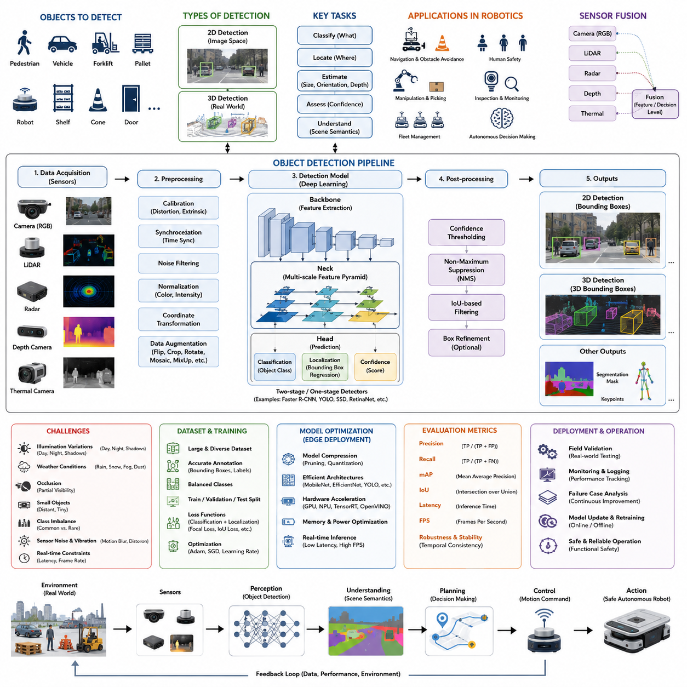
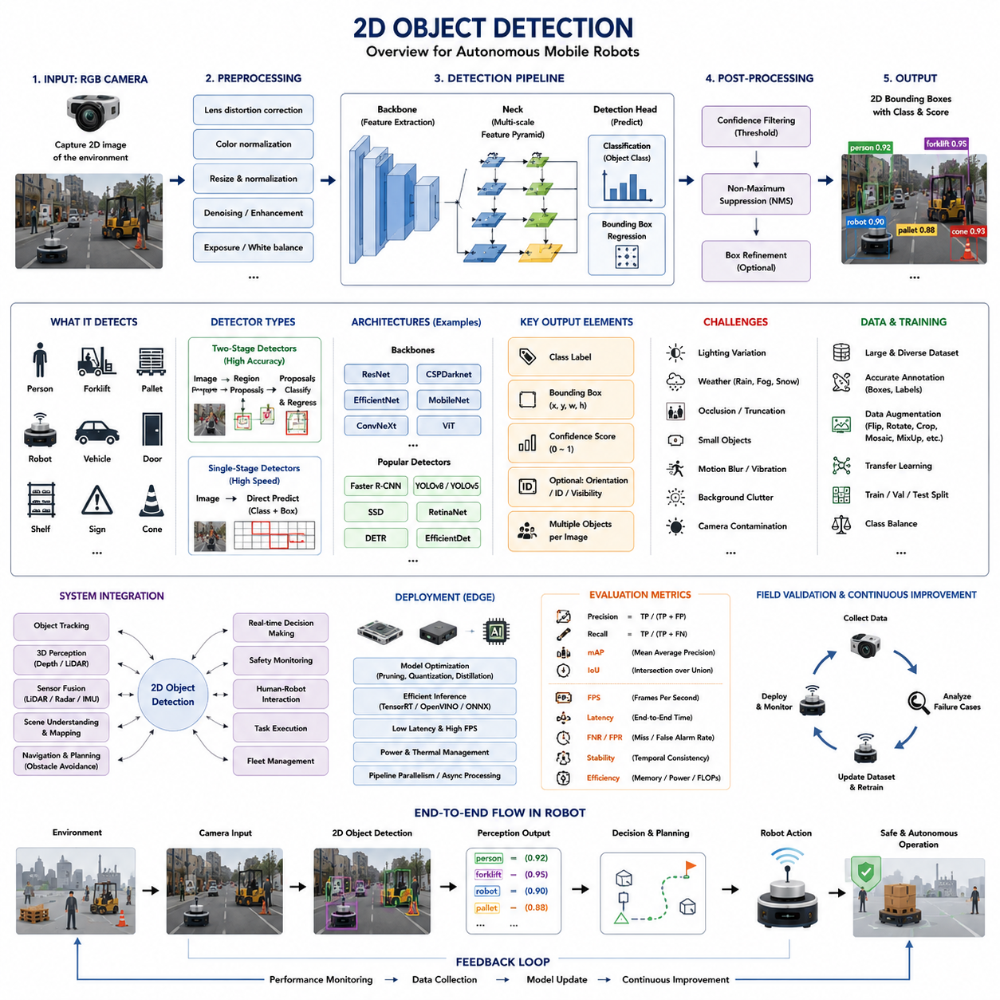
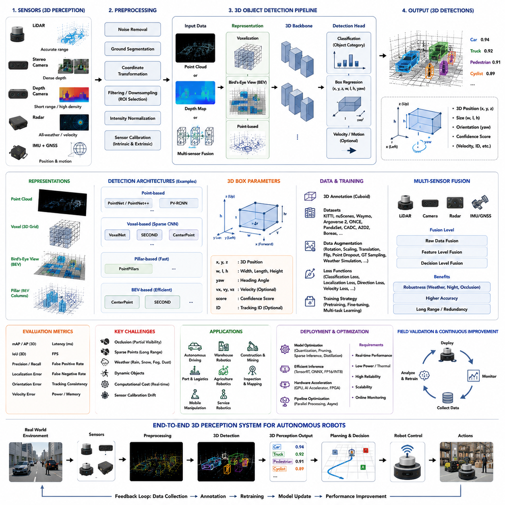
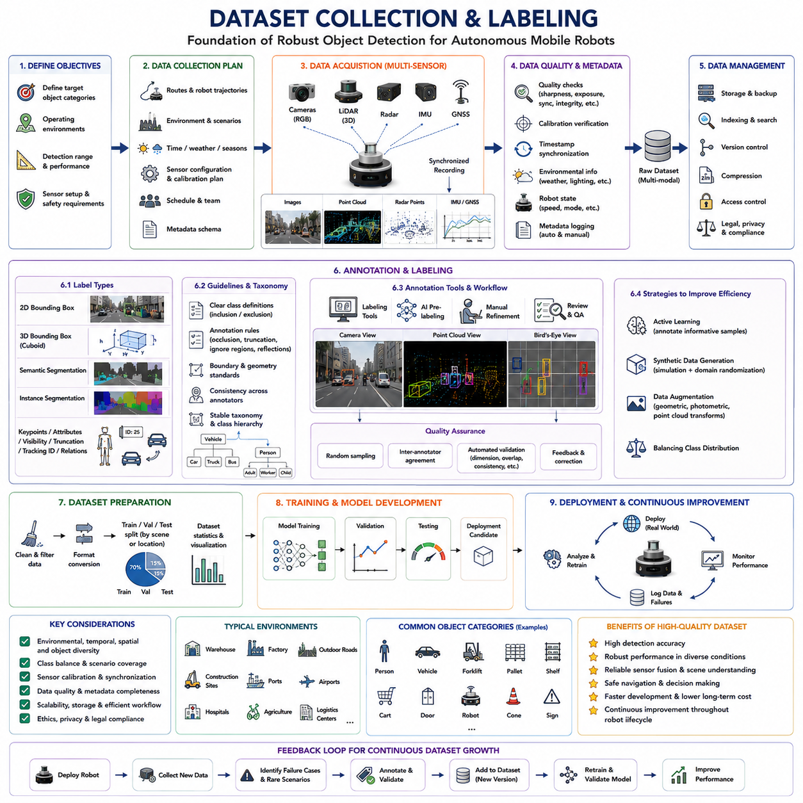
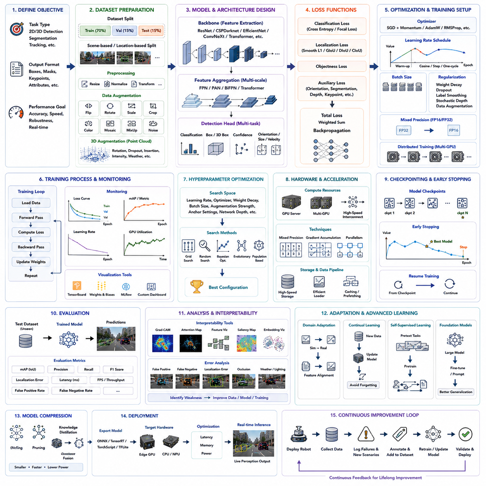
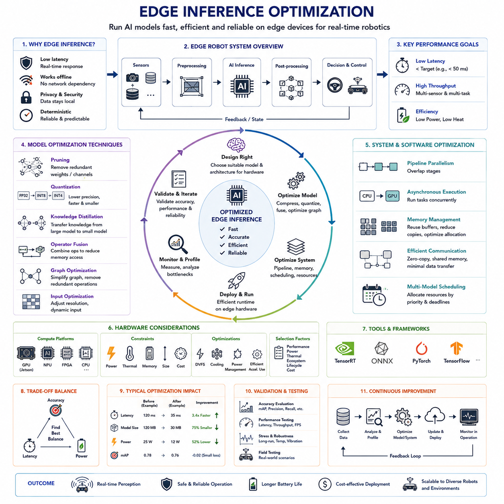
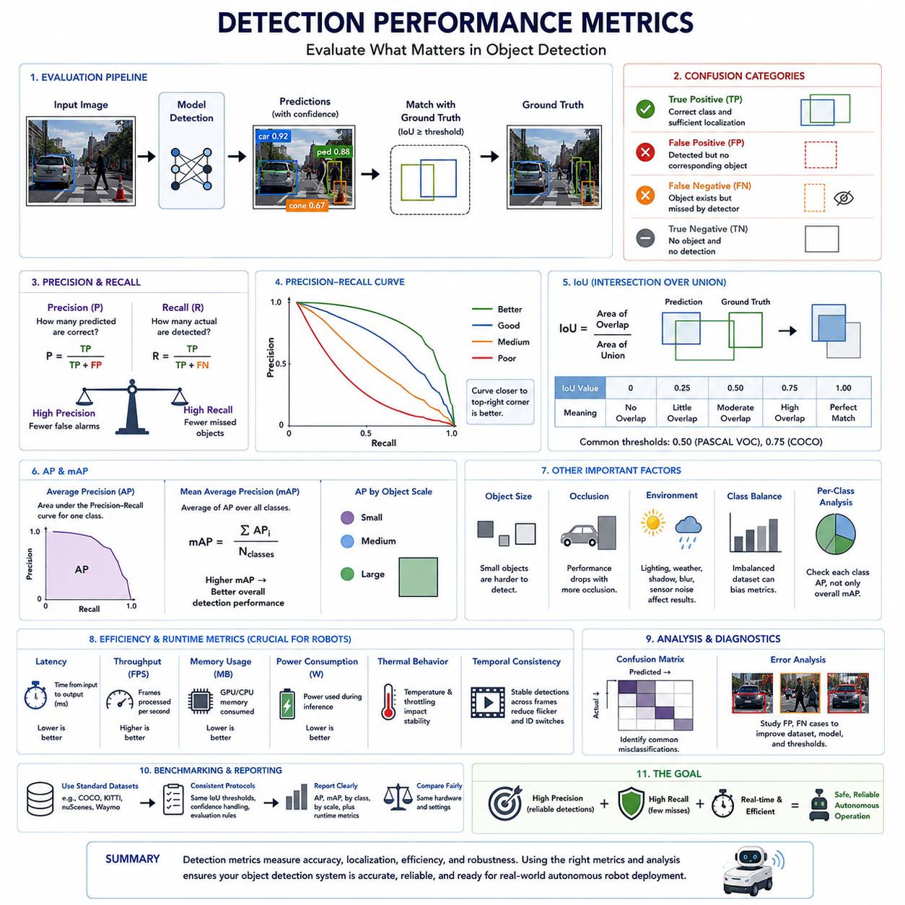
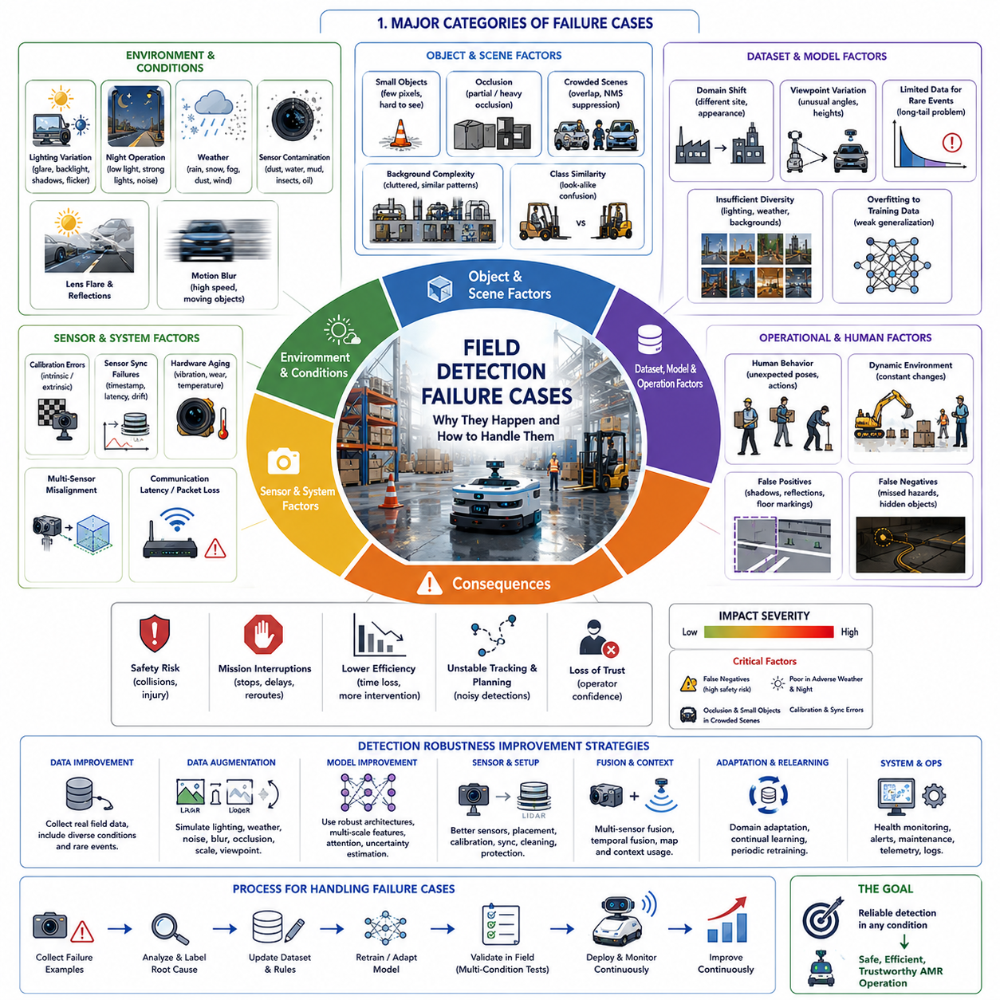

**Volume 03. AMR Sensors and Perception**

# Chapter 15. Object Detection

## 15.1 Object Detection Basics

{width="7.268055555555556in" height="7.268055555555556in"}

객체 검출(Object Detection)은 자율주행 모바일 로봇(Autonomous Mobile Robot, AMR)의 가장 기본적인 핵심 기능 가운데 하나이며, 로봇이 주변 환경에서 의미 있는 개체를 인식할 수 있도록 한다. 카메라(Camera), 라이다(LiDAR), 깊이 카메라(Depth Camera), 레이더(Radar), 열화상 카메라(Thermal Camera)는 지속적으로 방대한 양의 데이터를 생성하지만, 이러한 측정값 자체만으로는 의미를 가지지 않는다. 객체 검출은 픽셀(Pixel), 포인트 클라우드(Point Cloud), 또는 레이더 반사 신호(Radar Reflection)를 보행자(Pedestrian), 지게차(Forklift), 팔레트(Pallet), 차량(Vehicle), 로봇(Robot), 선반(Shelf), 문(Door), 교통 콘(Traffic Cone), 건설 장비(Construction Equipment)와 같은 식별 가능한 객체로 변환한다. 이러한 의미 기반 이해(Semantic Understanding)를 통해 상위 자율주행 모듈은 주변 환경을 해석하고, 잠재적 위험을 평가하며, 미래 상호작용을 예측하고, 안전한 주행 행동을 생성할 수 있다. 신뢰성 있는 객체 검출이 없다면 AMR은 단순히 기하학적 구조만 인식할 뿐, 어떤 객체를 회피하거나 상호작용해야 하는지 판단할 수 없다.

객체 검출(Object Detection)의 개념은 단순히 객체의 존재 여부를 판단하는 것에 그치지 않는다. 완전한 객체 검출 시스템(Object Detection System)은 객체의 종류(Category)를 식별하고, 공간상의 위치(Location)를 추정하며, 신뢰도(Confidence Level)를 계산하고, 이후 계획 알고리즘(Planning Algorithm)에 필요한 충분한 정보를 제공한다. 대부분의 최신 인식 시스템(Perception System)은 검출된 객체를 바운딩 박스(Bounding Box), 분할 마스크(Segmentation Mask), 키포인트(Keypoint), 또는 3차원 큐보이드(3D Cuboid) 형태로 표현한다. 이러한 출력은 인식 모듈과 의사결정 모듈 사이의 핵심 인터페이스 역할을 수행한다. 따라서 위치 추정 정확도(Localizatio Accuracy), 분류 신뢰성(Classification Reliability), 처리 속도(Processing Speed)는 주행 품질, 충돌 회피, 조작 성공률, 그리고 전체 시스템 안전성에 직접적인 영향을 미친다.

초기의 로봇 객체 검출은 대부분 수작업 특징 추출(Handcrafted Feature Extraction)에 의존하였다. 엔지니어들은 에지 검출(Edge Detection), 색상 히스토그램(Color Histogram), 코너 특징(Corner Feature), 하르 캐스케이드(Haar Cascade), 방향성 그래디언트 히스토그램(Histogram of Oriented Gradients, HOG), 스케일 불변 특징 변환(Scale-Invariant Feature Transform, SIFT), 속도 향상 강건 특징(Speeded-Up Robust Features, SURF)과 같은 알고리즘을 직접 설계하였다. 이러한 방법은 제한된 환경에서는 적절한 성능을 보였지만, 조명 변화, 객체 형태 변화, 복잡한 배경 환경에서는 쉽게 성능이 저하되었다. 반사 금속, 그림자, 이동 작업자, 먼지, 복잡한 장애물이 존재하는 산업 환경에서는 이러한 전통적인 알고리즘의 한계가 분명하게 나타났으며, 결국 기계학습(Machine Learning), 나아가 딥러닝(Deep Learning) 기반 방법으로 발전하게 되었다.

합성곱 신경망(Convolutional Neural Network, CNN)의 등장으로 객체 검출 기술은 근본적인 변화를 맞이하였다. 기존처럼 사람이 특징을 설계하는 대신, 신경망은 학습 데이터(Training Data)로부터 계층적인 특징(Hierarchical Feature)을 자동으로 학습한다. 초기 계층은 에지와 질감을 추출하고, 중간 계층은 객체의 부분 구조를 학습하며, 깊은 계층에서는 완전한 의미 정보를 인식한다. 계산 자원이 향상됨에 따라 이러한 신경망은 정확도, 강건성(Robustness), 일반화 성능에서 기존 알고리즘을 크게 뛰어넘었다. 현재 대부분의 최첨단 로봇 인식 시스템은 다양한 실제 환경에 적응할 수 있는 뛰어난 일반화 능력 때문에 딥러닝 기반 객체 검출을 핵심 기술로 채택하고 있다.

현대 객체 검출은 크게 2차원 객체 검출(2D Object Detection)과 3차원 객체 검출(3D Object Detection)로 구분된다. 2차원 객체 검출은 카메라 영상에서 객체를 찾아 이미지 좌표(Image Coordinate) 상의 바운딩 박스를 생성한다. 이를 통해 객체 종류와 영상 내 위치를 알 수 있지만 실제 거리나 자세는 직접 제공하지 않는다. 반면 3차원 객체 검출은 라이다(LiDAR), 스테레오 비전(Stereo Vision), 깊이 카메라(Depth Camera), 또는 센서 융합(Sensor Fusion)을 이용하여 객체의 실제 위치, 크기, 방향까지 추정한다. 자율주행 로봇은 영상 좌표보다 실제 공간 좌표를 기반으로 움직이므로 3차원 객체 검출은 매우 중요한 역할을 수행한다.

객체 검출은 영상 분류(Image Classification)와도 명확히 구분된다. 영상 분류는 전체 영상을 하나의 범주(Category)로 분류할 뿐 객체의 위치를 알려주지 않는다. 예를 들어 여러 명의 보행자, 차량, 교통 표지판이 포함된 영상이라도 단순히 "도로 장면"으로 분류될 수 있다. 반면 객체 검출은 각각의 객체를 독립적으로 식별하고 개별 위치를 함께 예측한다. 이러한 차이는 로봇이 실제 주행 과정에서 어떤 객체를 회피하거나 추적해야 하는지를 결정하는 데 매우 중요하다.

또한 객체 검출은 의미 분할(Semantic Segmentation)과도 차이가 있다. 객체 검출은 객체를 둘러싸는 바운딩 박스를 예측하는 반면, 의미 분할은 영상의 모든 픽셀을 각각의 의미 범주로 분류한다. 의미 분할은 객체 경계를 보다 정밀하게 표현할 수 있지만 계산량이 증가한다. 반대로 객체 검출은 상대적으로 계산 효율이 높으며 대부분의 자율주행 응용에서는 충분한 정보를 제공한다. 실제 산업용 로봇에서는 객체 검출과 의미 분할을 함께 사용하여 효율성과 정밀도를 동시에 확보하는 경우가 많다.

객체 검출을 포함한 인식 파이프라인(Perception Pipeline)은 센서 데이터 획득(Data Acquisition)으로 시작된다. 카메라는 RGB 영상을 취득하고, 라이다는 포인트 클라우드를 생성하며, 레이더는 거리와 속도를 측정하고, 깊이 카메라는 거리 정보를 계산한다. 이러한 원시 데이터(Raw Data)는 렌즈 왜곡 보정(Distortion Correction), 색상 정규화(Color Normalization), 시간 동기화(Time Synchronization), 좌표 변환(Coordinate Transformation), 잡음 제거(Noise Filtering), 노출 보정(Exposure Adjustment) 등의 전처리(Preprocessing)를 수행한 후 신경망에 입력된다. 이후 특징 추출, 후보 영역 생성, 객체 분류, 위치 추정, 신뢰도 계산이 순차적으로 수행된다.

특징 추출(Feature Extraction)은 딥러닝 객체 검출에서 가장 중요한 과정 가운데 하나이다. 합성곱 계층(Convolution Layer)은 입력 영상을 의미 있는 특징 맵(Feature Map)으로 점진적으로 변환한다. 저수준 특징은 에지와 그래디언트, 질감을 표현하며, 중간 수준에서는 객체의 형태와 부분 구조를 학습하고, 고수준에서는 완전한 객체 의미를 표현한다. 다중 해상도 특징 피라미드(Multi-scale Feature Pyramid)는 다양한 크기의 객체를 동시에 검출할 수 있도록 여러 공간 해상도의 정보를 유지한다.

대부분의 최신 객체 검출기는 백본 네트워크(Backbone Network)와 검출 헤드(Detection Head)로 구성된다. 백본은 입력 영상에서 계층적 특징을 추출하며, 검출 헤드는 객체 분류(Classification), 위치 추정(Localization), 신뢰도 예측(Confidence Estimation), 경우에 따라 자세 추정(Pose Estimation)까지 수행한다. 대표적인 백본 구조로는 ResNet, EfficientNet, CSPDarknet, MobileNet, Vision Transformer 등이 있으며, 이러한 구조 분리는 계산 효율성과 정확도를 동시에 최적화할 수 있도록 해준다.

객체 검출기는 일반적으로 2단계 검출기(Two-stage Detector)와 단일 단계 검출기(Single-stage Detector)로 구분된다. 2단계 검출기는 먼저 후보 영역(Region Proposal)을 생성한 뒤 각각을 분류하여 높은 위치 정확도를 달성한다. 반면 단일 단계 검출기는 후보 생성 과정 없이 바로 객체 종류와 위치를 동시에 예측한다. 초기에는 정확도 차이가 있었지만 최근의 단일 단계 검출기는 매우 높은 정확도와 뛰어난 처리 속도를 동시에 제공하여 실시간 로봇 응용에 널리 사용되고 있다.

실시간 처리(Real-Time Operation)는 로봇 객체 검출의 가장 중요한 요구사항 가운데 하나이다. 자율주행 로봇은 끊임없이 움직이는 환경에서 동작하기 때문에 인식 지연(Latency)은 곧 제동 거리와 충돌 위험 증가로 이어질 수 있다. 검출 지연은 센서 노출, 데이터 전송, 전처리, 신경망 추론(Inference), 후처리(Post-processing), 통신, 의사결정 시간을 모두 포함한다. 특히 고속 실외 로봇에서는 수십 밀리초(Millisecond)의 차이도 실제 안전성에 큰 영향을 미치므로 정확도와 처리 속도의 균형이 핵심 설계 요소가 된다.

바운딩 박스 회귀(Bounding Box Regression)는 객체의 위치와 크기를 정밀하게 추정하는 과정이다. 영상 분류와 달리 객체 검출은 분류와 위치 추정을 동시에 해결해야 한다. 학습 과정에서는 예측된 박스와 실제 정답(Ground Truth) 사이의 차이를 최소화하도록 손실 함수(Loss Function)를 최적화한다. Smooth L1 Loss, IoU 기반 손실(Intersection over Union Loss), Generalized IoU, Complete IoU, Distance IoU 등 다양한 손실 함수가 위치 정확도를 향상시키는 데 사용된다.

모든 검출 결과에는 신뢰도 점수(Confidence Score)가 함께 제공된다. 이는 해당 객체가 실제로 존재할 가능성을 의미한다. 후처리 단계에서는 설정된 임계값(Threshold) 이하의 검출 결과를 제거하여 오검출(False Positive)을 줄인다. 그러나 임계값이 너무 높으면 실제 객체를 놓칠 수 있고(False Negative), 너무 낮으면 잘못된 객체가 증가한다. 따라서 산업용 로봇에서는 벤치마크 성능보다 실제 안전 요구사항에 맞추어 적절한 신뢰도 임계값을 설정하는 것이 중요하다.

비최대 억제(Non-Maximum Suppression, NMS)는 객체 검출의 필수적인 후처리 과정이다. 신경망은 동일한 객체에 대해 여러 개의 중복 바운딩 박스를 생성하는 경우가 많다. NMS는 가장 높은 신뢰도를 가진 박스를 유지하고, 일정 수준 이상 겹치는 다른 박스는 제거하여 하나의 객체당 하나의 결과만 남긴다. 최근에는 Soft-NMS, Weighted Box Fusion과 같은 개선 기법이 적용되어 군집 환경에서도 보다 안정적인 결과를 제공한다.

데이터셋(Dataset)의 품질은 객체 검출 성능을 결정하는 가장 중요한 요소 가운데 하나이다. 다양하고 정확하게 라벨링(Labeling)된 대규모 데이터셋은 다양한 환경에서도 우수한 일반화 성능을 제공한다. 객체 검출 데이터셋에는 일반적으로 바운딩 박스, 객체 종류, 가림 정도(Occlusion), 잘림 정보(Truncation), 경우에 따라 3차원 정보까지 포함된다. 또한 특정 객체가 지나치게 많거나 적지 않도록 데이터 균형(Data Balance)을 유지하는 것이 매우 중요하다.

데이터 라벨링은 객체 검출 개발에서 가장 많은 비용과 시간이 소요되는 작업 가운데 하나이다. 작업자는 수십만에서 수백만 개의 객체에 대해 직접 바운딩 박스를 그리고 적절한 의미 라벨(Semantic Label)을 지정한다. 라벨링 일관성이 부족하면 학습 과정에서 잡음이 증가하여 모델 성능이 저하된다. 따라서 객체 경계 정의, 부분적으로 가려진 객체, 겹쳐진 객체, 무시 영역(Ignore Region), 모호한 객체에 대한 명확한 라벨링 규칙을 수립하는 것이 필수적이다.

데이터 증강(Data Augmentation)은 추가적인 데이터 수집 없이 학습 데이터를 다양화하는 대표적인 방법이다. 좌우 반전(Horizontal Flip), 임의 자르기(Random Crop), 크기 조정(Scaling), 회전(Rotation), 밝기 변화(Brightness Adjustment), 색상 변화(Color Jitter), 가우시안 잡음(Gaussian Noise), 블러(Blur), Cutout, MixUp, Mosaic 증강 등이 널리 활용된다. 이러한 증강 기법은 다양한 환경에 대한 일반화 성능을 향상시키지만, 실제 환경과 지나치게 동떨어진 증강은 오히려 모델 성능을 저하시킬 수 있다.

로봇 객체 검출은 일반 컴퓨터 비전보다 훨씬 어려운 문제를 가진다. 이동 중인 카메라는 진동(Vibration), 모션 블러(Motion Blur), 시점 변화(Viewpoint Change), 롤링 셔터 왜곡(Rolling Shutter Distortion), 조명 변화 등의 영향을 지속적으로 받는다. 실외 환경에서는 여기에 비, 눈, 안개, 먼지, 강한 햇빛, 야간 환경, 계절 변화까지 추가되므로 객체 검출의 난이도는 크게 증가한다.

가림(Occlusion)은 산업 환경에서 매우 흔하게 발생하는 문제이다. 작업자, 팔레트, 차량, 기계 설비, 선반 등이 서로를 부분적으로 가리는 경우가 많다. 사람은 일부만 보여도 전체 객체를 쉽게 추론할 수 있지만, 신경망은 충분한 학습 데이터가 없다면 이러한 상황에서 쉽게 실패할 수 있다. 최근에는 문맥 정보(Context), 어텐션 메커니즘(Attention Mechanism), 시간 정보(Temporal Information)를 활용하여 이러한 문제를 개선하고 있다.

소형 객체(Small Object) 검출 역시 매우 어려운 문제이다. 멀리 있는 사람, 교통 표지판, 케이블, 작은 공구 등은 영상에서 매우 적은 픽셀만 차지한다. 합성곱 과정에서 해상도가 감소하면 이러한 객체의 특징도 함께 사라질 수 있다. 이를 해결하기 위해 다중 해상도 특징 피라미드, 초해상도(Super Resolution), 고해상도 센서, 특화된 학습 기법 등이 활용되지만 계산량은 증가하는 경향이 있다.

객체 클래스 불균형(Class Imbalance)은 산업 데이터셋에서 자주 발생한다. 팔레트나 벽처럼 자주 등장하는 객체는 매우 많지만, 희귀한 위험 요소는 매우 적다. 이러한 데이터로 학습하면 모델은 자주 등장하는 객체에 편향되고, 실제로 중요한 안전 관련 객체를 제대로 검출하지 못할 수 있다. 이를 해결하기 위해 가중 손실 함수(Weighted Loss), Focal Loss, 오버샘플링(Oversampling), 합성 데이터(Synthetic Data), 목표 중심 데이터 수집(Targeted Data Collection) 등이 활용된다.

센서 융합(Sensor Fusion)은 객체 검출의 신뢰성을 크게 향상시킨다. RGB 카메라는 풍부한 색상과 질감 정보를 제공하고, 라이다는 정확한 거리와 형상을 제공하며, 레이더는 악천후에서도 안정적인 거리와 속도 정보를 제공하고, 열화상 카메라는 야간이나 저조도 환경에서 사람을 효과적으로 검출할 수 있다. 이러한 센서는 원시 데이터 수준, 특징 수준, 또는 결정 수준에서 융합될 수 있으며, 단일 센서의 한계를 극복하여 보다 강건한 인식 시스템을 구현한다.

엣지 장치(Edge Device)에서 객체 검출을 수행하기 위해서는 추가적인 최적화가 필요하다. 대부분의 로봇은 임베디드 GPU(Embedded GPU), AI 가속기(AI Accelerator), 또는 전용 추론 프로세서에서 제한된 전력과 계산 자원으로 동작한다. 연구용 대형 신경망은 높은 정확도를 제공하지만 실제 로봇에서는 너무 느리거나 전력 소비가 커서 사용할 수 없는 경우가 많다. 따라서 모델 압축(Model Compression), 가지치기(Pruning), 양자화(Quantization), TensorRT 최적화, 연산자 융합(Operator Fusion), 하드웨어 전용 최적화 등이 필수적으로 적용된다.

객체 검출 성능 평가는 단순한 정확도만으로 이루어지지 않는다. 정밀도(Precision)는 검출된 객체 가운데 실제 객체의 비율을 의미하고, 재현율(Recall)은 실제 객체 가운데 얼마나 많이 검출했는지를 나타낸다. 평균 정밀도(Mean Average Precision, mAP)는 다양한 임계값에서의 전체 성능을 종합적으로 평가하며, IoU(Intersection over Union)는 예측 박스와 실제 박스의 겹침 정도를 측정한다. 실제 로봇에서는 이러한 정확도뿐 아니라 지연 시간(Latency), 프레임 속도(Frame Rate), 오검출(False Positive), 미검출(False Negative), 시간적 안정성(Temporal Consistency), 계산 자원 사용량(Resource Utilization)도 동일하게 중요한 평가 요소가 된다.

실제 산업 환경에 객체 검출 시스템을 적용하기 위해서는 지속적인 현장 검증(Field Validation)이 반드시 필요하다. 연구용 데이터셋은 실제 공장의 조명 변화, 계절 변화, 센서 오염, 기계 진동, 다양한 작업 환경을 모두 포함하지 못한다. 따라서 다양한 조명 조건, 기상 조건, 작업 시나리오, 로봇 속도에서 반복적인 현장 시험을 수행해야 하며, 발생한 실패 사례(Failure Case)는 체계적으로 분석하여 이후 데이터셋과 모델 학습 과정에 반영해야 한다.

궁극적으로 객체 검출(Object Detection)은 원시 센서 데이터(Raw Sensor Data)와 지능형 로봇 행동(Intelligent Robot Behavior)을 연결하는 핵심 의미 해석 기술이다. 객체 검출은 단순한 센서 측정값을 의미 있는 환경 정보로 변환하여 자율주행(Navigation), 장애물 회피(Obstacle Avoidance), 작업자 안전(Human Safety), 물체 조작(Manipulation), 검사(Inspection), 플릿 관리(Fleet Management), 자율 의사결정(Autonomous Decision Making)을 가능하게 한다. 앞으로 딥러닝, 다중모달 인식(Multimodal Perception), 파운데이션 모델(Foundation Model), 엣지 AI(Edge AI)가 지속적으로 발전함에 따라 객체 검출은 단순히 개별 객체를 인식하는 기술을 넘어, 장면 전체를 이해하고(Contextual Scene Understanding), 상황을 추론하며(Contextual Reasoning), 미래를 예측하는(Predictive Perception) 지능형 인식 기술로 발전할 것이다. 이러한 발전은 객체 검출을 단순한 컴퓨터 비전 기술이 아니라, 복잡한 실제 환경에서 안전하고 효율적으로 동작하는 차세대 AMR의 핵심 지능 구성 요소로 자리매김하게 만들 것이다.

## 15.2 2D Object Detection

{width="7.268055555555556in" height="7.268055555555556in"}

2차원 객체 검출(2D Object Detection)은 현대 자율주행 모바일 로봇(Autonomous Mobile Robot, AMR)에서 가장 널리 사용되는 인식(Perception) 기술 가운데 하나이다. 이는 카메라 영상(Camera Image) 내에서 객체를 효율적이고 신뢰성 있게 인식하고 위치를 파악할 수 있기 때문이다. 로봇은 실제 세계를 3차원으로 인식하지만 RGB 카메라는 본질적으로 2차원 영상만을 획득한다. 2차원 객체 검출기는 이러한 영상에서 사람(Pedestrian), 지게차(Forklift), 팔레트(Pallet), 로봇(Robot), 차량(Vehicle), 문(Door), 선반(Shelf), 경고 표지판(Warning Sign), 교통 콘(Traffic Cone), 산업 장비(Industrial Equipment)와 같은 의미 있는 객체를 식별한다. 검출기는 객체의 종류와 영상 좌표(Image Coordinate) 상의 위치를 함께 출력하며, 이러한 정보는 상위 인식 모듈과 자율주행 모듈이 주변 환경을 이해하고 적절한 행동을 수행하는 기반이 된다. 비록 실제 거리 정보를 직접 제공하지는 않지만, 높은 계산 효율성과 성숙한 알고리즘, 풍부한 공개 데이터셋 덕분에 2차원 객체 검출은 대부분의 로봇 인식 시스템의 핵심 구성 요소로 자리 잡고 있다.

2차원 객체 검출기의 가장 기본적인 출력(Output)은 검출된 객체를 둘러싸는 사각형 형태의 바운딩 박스(Bounding Box)이다. 각 바운딩 박스에는 객체의 의미 범주(Semantic Class)와 예측의 신뢰도를 나타내는 신뢰도 점수(Confidence Score)가 함께 제공된다. 바운딩 박스는 일반적으로 중심 좌표(Center Coordinate), 너비(Width), 높이(Height) 또는 좌측 상단과 우측 하단의 좌표로 표현된다. 이러한 영상 공간(Image Space)상의 정보는 시각화(Visualization), 객체 추적(Object Tracking), 객체 연관(Object Association), 그리고 이후 인식 단계의 입력으로 활용된다. 일부 시스템은 여기에 객체 방향(Orientation), 가시성(Visibility), 가림 정도(Occlusion), 객체 식별 번호(Instance ID) 등 추가적인 정보를 함께 출력하여 후속 처리의 정확도를 높인다.

2차원 객체 검출은 영상 분류(Image Classification)와는 근본적으로 다른 문제를 해결한다. 영상 분류는 하나의 이미지 전체에 대해 하나의 클래스(Class)를 부여하는 반면, 객체 검출은 이미지 안에 존재하는 여러 객체를 각각 독립적으로 찾아낸다. 예를 들어 창고 이미지에는 작업자, 지게차, 팔레트, 선반, AMR, 경고 표지판 등이 동시에 존재할 수 있다. 영상 분류는 이를 단순히 "창고"로 분류할 수 있지만, 객체 검출은 각각의 객체를 모두 찾아내고 각각의 위치를 바운딩 박스로 표현한다. 이러한 능력 덕분에 로봇은 복잡한 환경 속에서 다양한 객체들의 위치와 상호관계를 이해할 수 있다.

2차원 객체 검출은 거의 모든 로봇 응용 분야에서 활용된다. 실내 물류 로봇은 작업자, 운반 카트, 출입문, 적재 장소, 선반 등을 검출한다. 실외 자율주행 로봇은 차량, 보행자, 자전거, 교통 시설물, 공사 장비, 도로 표지판 등을 인식한다. 농업용 로봇은 작물, 잡초, 과일, 나무 가지, 농기계를 검출하며, 산업 검사 로봇은 밸브, 배관, 계기판, 전기 패널, 구조물 결함, 검사 대상 등을 식별한다. 응용 분야는 매우 다양하지만, 기본적인 객체 검출 원리와 알고리즘은 거의 동일하며 차이는 주로 학습 데이터와 객체 종류에 있다.

2차원 객체 검출 과정은 RGB 카메라를 통한 영상 획득(Image Acquisition)으로 시작된다. 카메라의 품질은 객체 검출 성능에 직접적인 영향을 미친다. 신경망은 영상의 선명도(Image Clarity), 해상도(Resolution), 색 정확도(Color Fidelity), 동적 범위(Dynamic Range), 노출 안정성(Exposure Consistency)에 크게 의존하기 때문이다. 이동하는 로봇에서는 롤링 셔터(Rolling Shutter) 왜곡이 없는 글로벌 셔터(Global Shutter) 카메라가 일반적으로 더 우수한 결과를 제공한다. 렌즈 선택 또한 중요하며, 화각(Field of View)은 환경을 얼마나 넓게 관찰할 수 있는지와 객체가 차지하는 픽셀 수를 동시에 결정한다. 광각 렌즈(Wide-angle Lens)는 넓은 영역을 관찰할 수 있지만 객체 크기가 작아지고, 협각 렌즈(Narrow Lens)는 먼 거리 객체를 크게 볼 수 있지만 시야가 좁아진다.

원시 영상(Raw Image)은 신경망에 입력되기 전에 다양한 전처리(Preprocessing)를 수행한다. 렌즈 왜곡 보정(Lens Distortion Correction)은 광학계에 의해 발생하는 기하학적 왜곡을 제거한다. 색상 정규화(Color Normalization)는 조명 변화에 따른 영향을 줄이며, 영상 크기 조정(Image Resizing)은 신경망이 요구하는 고정 입력 크기에 맞춘다. 픽셀 정규화(Pixel Normalization)는 학습과 추론의 안정성을 향상시킨다. 필요에 따라 히스토그램 평활화(Histogram Equalization), 감마 보정(Gamma Correction), 잡음 제거(Denoising), 화이트 밸런스(White Balance), 대비 향상(Contrast Enhancement) 등이 추가적으로 적용될 수 있다.

현대의 2차원 객체 검출기는 대부분 딥 합성곱 신경망(Deep Convolutional Neural Network)이나 비전 트랜스포머(Vision Transformer) 기반으로 구성된다. 입력 영상은 백본 네트워크(Backbone Network)를 통과하면서 계층적인 특징(Hierarchical Feature)이 추출된다. 초기 계층은 에지(Edge), 질감(Texture), 단순한 기하학 구조를 추출하고, 중간 계층은 윤곽선과 객체의 부분 구조를 학습하며, 깊은 계층은 객체 전체를 의미적으로 표현한다. 이러한 계층적 특징 덕분에 다양한 시점(Viewpoint), 크기(Scale), 조명(Lighting), 복잡한 배경(Background)에서도 안정적인 객체 인식이 가능하다.

특징 피라미드(Feature Pyramid)는 다양한 크기의 객체를 동시에 검출하기 위한 핵심 기술이다. 가까운 지게차는 수천 개의 픽셀을 차지하는 반면, 멀리 있는 작업자는 수십 개의 픽셀만 차지할 수 있다. 다중 해상도 특징(Multi-scale Feature)은 다양한 크기의 객체를 모두 인식하기 위해 서로 다른 공간 해상도의 정보를 동시에 유지한다. 대표적으로 특징 피라미드 네트워크(Feature Pyramid Network, FPN), 경로 집계 네트워크(Path Aggregation Network, PAN), 양방향 특징 피라미드(Bi-directional Feature Pyramid Network, BiFPN)는 여러 계층의 특징을 효과적으로 결합하여 작은 객체와 큰 객체 모두에 대한 검출 성능을 향상시킨다.

2단계 객체 검출기(Two-stage Detector)는 먼저 객체가 존재할 가능성이 높은 후보 영역(Region Proposal)을 생성한 뒤 각각을 독립적으로 분류한다. 이러한 방식은 후보 영역마다 충분한 계산을 수행하기 때문에 매우 높은 위치 정확도(Localization Accuracy)를 얻을 수 있다. 하지만 계산량이 많아 추론 속도가 느려지는 단점이 있으며, 최고 수준의 정확도가 필요한 응용이나 오프라인 분석에서 주로 사용된다.

단일 단계 객체 검출기(Single-stage Detector)는 후보 영역 생성 과정을 생략하고 영상 전체에서 객체 종류와 위치를 동시에 예측한다. 이러한 구조는 계산량을 크게 줄이면서도 높은 정확도를 유지할 수 있기 때문에 실시간 자율주행 로봇에서 가장 널리 사용된다. 빠른 객체 검출은 장애물 회피(Obstacle Avoidance), 동적 경로 계획(Dynamic Path Planning), 이동 객체 대응 등 실시간 자율주행에 필수적인 기능을 가능하게 한다.

백본 네트워크(Backbone Network)는 객체 검출기의 핵심 특징 추출기이다. 대표적인 구조로는 ResNet, CSPDarknet, EfficientNet, MobileNet, ConvNeXt, Vision Transformer, 그리고 합성곱과 트랜스포머를 결합한 하이브리드 구조가 있다. 일반적으로 규모가 큰 백본은 더 높은 정확도를 제공하지만 계산량과 메모리 사용량이 증가한다. 반대로 경량 백본(Lightweight Backbone)은 약간의 정확도를 희생하는 대신 빠른 추론과 낮은 전력 소비를 제공하여 임베디드 로봇 시스템에 적합하다.

특징 추출이 완료되면 검출 헤드(Detection Head)가 객체 분류(Classification)와 위치 추정(Localization)을 수행한다. 분류 모듈은 각 객체가 어떤 범주에 속하는지를 예측하고, 위치 추정 모듈은 바운딩 박스의 좌표를 계산한다. 일부 구조에서는 객체 방향(Orientation), 인스턴스 마스크(Instance Mask), 키포인트(Keypoint), 예측 불확실성(Uncertainty)까지 함께 출력한다. 이러한 구조는 공통 특징을 공유하면서도 각각의 작업을 독립적으로 최적화할 수 있도록 설계되어 있다.

바운딩 박스 회귀(Bounding Box Regression)는 객체 검출에서 가장 어려운 최적화 문제 가운데 하나이다. 신경망은 다양한 시점, 원근 왜곡(Perspective Distortion), 부분 가림(Partial Occlusion) 상황에서도 객체의 위치와 크기를 정확하게 추정해야 한다. 학습 과정에서는 예측된 박스와 사람이 직접 라벨링한 정답(Ground Truth)을 비교하며 위치 오차를 최소화한다. Smooth L1 Loss, IoU Loss, Generalized IoU, Distance IoU, Complete IoU 등 다양한 손실 함수(Loss Function)가 위치 정확도를 향상시키기 위해 사용된다.

객체 분류와 바운딩 박스 회귀는 다중 작업 학습(Multi-task Learning)으로 동시에 최적화된다. 분류 손실(Classification Loss)은 올바른 객체 종류를 예측하도록 학습시키며, 위치 손실(Localization Loss)은 정확한 바운딩 박스를 생성하도록 학습시킨다. 두 손실의 균형이 매우 중요하며, 위치 정확도만 지나치게 강조하면 분류 성능이 떨어질 수 있고, 반대로 분류만 강조하면 위치 추정의 정밀도가 감소할 수 있다.

객체 검출기는 앵커 기반(Anchor-based) 방식과 앵커 프리(Anchor-free) 방식으로도 구분된다. 앵커 기반 검출기는 다양한 크기와 비율을 가진 기준 박스(Anchor Box)를 미리 정의한 후, 신경망이 이를 수정하는 방식으로 객체를 예측한다. 높은 성능을 제공하지만 앵커 설정이 복잡하다. 반면 앵커 프리 방식은 객체 중심과 크기를 직접 예측하므로 구조가 단순하며 데이터셋에 대한 민감도가 낮다. 최근에는 설계의 단순성과 우수한 성능 덕분에 앵커 프리 구조가 점점 더 많이 채택되고 있다.

신뢰도 추정(Confidence Estimation)은 객체 검출 결과의 신뢰성을 정량적으로 표현한다. 각 객체에는 위치와 분류 결과를 종합한 신뢰도 점수가 부여되며, 후처리(Post-processing) 단계에서 설정된 임계값(Threshold) 이하의 결과는 제거된다. 안전이 중요한 로봇에서는 실제 객체를 놓치는(False Negative) 상황을 줄이기 위해 재현율(Recall)을 높이는 방향으로 임계값을 설정하는 경우가 많다. 반대로 산업 검사 시스템에서는 불필요한 오검출(False Positive)을 줄이기 위해 높은 정밀도(Precision)를 우선시하기도 한다.

하나의 객체에 대해 여러 개의 중복 검출이 발생하는 경우가 많기 때문에 비최대 억제(Non-Maximum Suppression, NMS)가 반드시 필요하다. NMS는 가장 높은 신뢰도를 가진 바운딩 박스를 유지하고, 일정 수준 이상 겹치는 나머지 박스는 제거한다. 겹침 정도는 IoU(Intersection over Union)로 계산된다. 최근에는 Soft-NMS처럼 신뢰도를 점진적으로 감소시키는 방식이나, 여러 예측을 평균하여 하나의 박스로 만드는 Weighted Box Fusion 기법도 널리 활용된다.

영상 해상도(Image Resolution)는 객체 검출 성능에 직접적인 영향을 준다. 높은 해상도는 멀리 있는 작은 객체를 보다 자세히 표현할 수 있지만 계산량과 메모리 사용량이 증가하고 추론 속도는 감소한다. 따라서 로봇 시스템은 주행 속도, 환경 복잡도, 사용 가능한 연산 자원 등을 고려하여 적절한 입력 해상도를 선택한다. 일부 시스템은 상황에 따라 해상도를 동적으로 변경하여 성능과 처리 속도의 균형을 유지한다.

조명 조건(Lighting Condition)은 카메라 기반 객체 검출에서 매우 중요한 변수이다. 강한 햇빛은 과다 노출(Saturation), 그림자(Shadow), 렌즈 플레어(Lens Flare)를 유발할 수 있으며, 실내 공장은 반사 금속과 불균일한 조명 때문에 환경 변화가 심하다. 야간 환경에서는 신호 대 잡음비(Signal-to-Noise Ratio)가 감소하며, 터널이나 창고에서는 밝기 변화가 빈번하게 발생한다. 이러한 문제를 해결하기 위해 다양한 조명 조건을 포함한 학습 데이터와 HDR 영상(HDR Imaging), 적응형 노출 제어(Adaptive Exposure Control), 밝기 정규화(Brightness Normalization)가 활용된다.

기상 조건(Weather Condition)은 실외 자율주행 로봇에서 추가적인 문제를 발생시킨다. 비는 영상 대비를 감소시키고 렌즈에 물방울을 형성하며, 안개는 빛을 산란시켜 시야를 감소시킨다. 눈은 장면을 가리고, 먼지는 영상에 잡음을 발생시킨다. 또한 진흙이나 벌레 등으로 카메라 렌즈가 오염될 수도 있다. 이러한 이유로 실제 실외 로봇은 카메라뿐 아니라 라이다(LiDAR)와 레이더(Radar)를 함께 사용하는 센서 융합(Sensor Fusion)을 적용하는 경우가 많다.

가림(Occlusion)은 2차원 객체 검출에서 가장 어려운 문제 가운데 하나이다. 작업자는 기계 뒤에 일부만 보일 수 있고, 팔레트는 서로 겹쳐 있을 수 있으며, 차량도 서로를 가리는 경우가 많다. 사람은 일부만 보여도 전체 객체를 쉽게 추론할 수 있지만, 신경망은 이러한 상황을 학습 데이터에서 충분히 경험해야만 안정적인 성능을 보일 수 있다. 최근에는 어텐션 메커니즘(Attention Mechanism), 문맥 특징(Contextual Feature), 트랜스포머(Transformer), 시간적 융합(Temporal Fusion) 등을 이용하여 이러한 문제를 개선하고 있다.

소형 객체(Small Object) 검출 역시 매우 어려운 문제이다. 멀리 있는 작업자나 작은 표지판은 매우 적은 픽셀만 차지하기 때문에 특징이 쉽게 사라질 수 있다. 이를 해결하기 위해 다중 해상도 특징 피라미드(Multi-scale Feature Pyramid), 초해상도(Super Resolution), 적응형 수용 영역(Adaptive Receptive Field), 특화된 손실 함수 등이 활용된다. 그럼에도 불구하고 작은 객체 검출은 현재도 활발히 연구되고 있는 핵심 분야이다.

모션 블러(Motion Blur)는 이동하는 로봇이나 빠르게 움직이는 객체 때문에 발생하며 객체 검출 정확도를 크게 감소시킨다. 고속 주행, 험로 주행, 기계 진동, 긴 노출 시간 등이 주요 원인이다. 이를 줄이기 위해 글로벌 셔터(Global Shutter), 진동 절연(Vibration Isolation), 짧은 노출 시간(Short Exposure), 높은 프레임 속도(High Frame Rate), 영상 안정화(Image Stabilization), 모션 기반 데이터 증강(Motion-aware Data Augmentation) 등이 활용된다. 또한 카메라 장착 구조 자체도 진동을 최소화하도록 설계해야 한다.

데이터셋(Dataset)의 품질은 객체 검출기의 성능을 결정하는 핵심 요소이다. 효과적인 학습을 위해서는 다양한 날씨, 계절, 시점, 조명, 객체 크기, 가림 정도, 카메라 높이, 배경 환경을 포함하는 대규모 데이터셋이 필요하다. 또한 각 객체 클래스가 균형 있게 포함되어야 특정 객체에 대한 편향(Bias)이 발생하지 않는다.

데이터 라벨링(Annotation)의 일관성도 매우 중요하다. 모든 객체는 명확한 규칙에 따라 동일한 방식으로 라벨링되어야 하며, 부분적으로 보이는 객체, 잘린 객체(Truncation), 무시 영역(Ignore Region), 애매한 사례(Ambiguous Case)에 대한 기준도 명확해야 한다. 라벨링의 품질이 낮으면 아무리 우수한 신경망 구조를 사용하더라도 성능 향상에는 한계가 있다. 따라서 많은 산업 현장에서는 대규모 라벨링 전에 상세한 라벨링 표준과 품질 관리 절차를 수립한다.

데이터 증강(Data Augmentation)은 학습 데이터를 인위적으로 다양하게 만드는 대표적인 방법이다. 좌우 반전(Horizontal Flip), 크기 조정(Scaling), 자르기(Cropping), 이동(Translation), 회전(Rotation), 밝기 변화(Brightness Variation), 색상 변화(Color Jitter), 가우시안 블러(Gaussian Blur), 잡음 추가(Additive Noise), MixUp, Mosaic, Copy-Paste, CutMix 등이 널리 사용된다. 적절한 데이터 증강은 다양한 환경에 대한 일반화 성능을 높이지만, 실제 환경에서 발생할 수 없는 과도한 변형은 오히려 성능을 저하시킬 수 있다.

전이 학습(Transfer Learning)은 현재 로봇 객체 검출에서 가장 일반적으로 사용되는 학습 방법이다. 먼저 대규모 공개 데이터셋으로 사전 학습(Pretraining)을 수행한 후, 로봇 환경에 특화된 데이터셋으로 미세 조정(Fine-tuning)을 수행한다. 이러한 방법은 적은 데이터만으로도 높은 성능을 얻을 수 있으며 학습 시간과 비용을 크게 절감할 수 있다.

엣지 장치(Edge Device)에 객체 검출기를 배치하기 위해서는 다양한 최적화가 필요하다. 산업용 로봇은 대부분 임베디드 GPU(Embedded GPU), AI 가속기(AI Accelerator), 저전력 프로세서에서 동작하므로 전력과 발열 제약이 매우 크다. 모델 압축(Model Compression), 가지치기(Pruning), 양자화(Quantization), 지식 증류(Knowledge Distillation), TensorRT 최적화, 혼합 정밀도 추론(Mixed Precision Inference), 연산자 융합(Operator Fusion)을 통해 계산량을 크게 줄일 수 있다. 모델의 크기와 추론 속도, 정확도의 균형을 찾는 것이 실제 시스템 설계에서 매우 중요한 요소이다.

실시간 스케줄링(Real-time Scheduling) 역시 인식 성능에 큰 영향을 미친다. 객체 검출 지연에는 카메라 획득(Camera Acquisition), 전처리, 신경망 추론(Inference), 후처리, 메시지 전송, 자율주행 소프트웨어와의 연동 시간이 모두 포함된다. 높은 주기의 인식은 빠른 반응을 가능하게 하지만 계산 자원을 많이 사용한다. 따라서 엔지니어는 각 단계의 처리 시간을 측정하여 병목(Bottleneck)을 분석하고, 파이프라인 병렬화(Pipeline Parallelism), 비동기 처리(Asynchronous Execution), GPU 최적화, Zero-copy 통신 등을 적용하여 전체 지연 시간을 최소화한다.

객체 검출의 성능 평가는 단순한 정확도만으로 이루어지지 않는다. 정밀도(Precision)는 검출된 객체 중 실제 객체의 비율을 의미하고, 재현율(Recall)은 실제 객체 가운데 얼마나 많이 검출했는지를 나타낸다. 평균 정밀도(Mean Average Precision, mAP)는 다양한 클래스와 임계값에서의 종합 성능을 나타내며, IoU(Intersection over Union)는 위치 정확도를 평가한다. 또한 실제 로봇에서는 프레임 속도(Frame Rate), 추론 지연(Inference Latency), 시간적 안정성(Temporal Consistency), 오검출(False Positive), 미검출(False Negative), 계산 효율(Computational Efficiency), 메모리 사용량(Memory Consumption), 전력 소비(Energy Consumption)도 매우 중요한 평가 지표가 된다.

현장 검증(Field Validation)은 연구실 성능보다 훨씬 중요하다. 공개 데이터셋은 실제 공장의 조명 변화, 계절 변화, 카메라 오염, 기계 진동, 복잡한 작업 환경을 모두 포함하지 못한다. 따라서 실제 운영 환경에서 다양한 조명, 기상 조건, 카메라 오염, 주행 속도, 교통 밀도 등을 고려한 반복적인 시험이 필요하다. 발생한 실패 사례(Failure Case)는 체계적으로 기록하고 원인을 분석하여 향후 데이터셋과 학습 과정에 지속적으로 반영해야 한다.

궁극적으로 2차원 객체 검출(2D Object Detection)은 자율주행 모바일 로봇이 주변 환경을 효율적이고 신뢰성 있게 이해하도록 만드는 핵심 시각 인식 기술이다. 3차원 인식(3D Perception)이 보다 풍부한 공간 정보를 제공하더라도, 2차원 객체 검출은 뛰어난 계산 효율성, 성숙한 소프트웨어 생태계, 방대한 공개 데이터셋, 엣지 AI(Edge AI) 하드웨어와의 높은 호환성 덕분에 앞으로도 핵심 기술로 유지될 것이다. 향후 비전 트랜스포머(Vision Transformer), 다중모달 파운데이션 모델(Multimodal Foundation Model), 자기지도 학습(Self-supervised Learning), 고성능 임베디드 AI 가속기의 발전과 함께, 2차원 객체 검출은 단순한 객체 인식을 넘어 장면 이해(Scene Understanding), 문맥 추론(Contextual Reasoning), 예측 인식(Predictive Perception), 객체 추적(Object Tracking), 의미 분할(Semantic Segmentation), 센서 융합(Sensor Fusion), 체화 지능(Embodied Intelligence)과 긴밀하게 통합되는 방향으로 발전할 것이다. 현대 AMR 아키텍처에서 2차원 객체 검출은 단순한 컴퓨터 비전 알고리즘이 아니라 안전하고 지능적인 자율주행을 가능하게 하는 가장 중요한 인식 기술 가운데 하나이다.

## 15.3 3D Object Detection

{width="7.268055555555556in" height="7.268055555555556in"}

3차원 객체 검출(3D Object Detection)은 복잡한 실제 환경에서 동작하는 자율주행 모바일 로봇(Autonomous Mobile Robot, AMR)의 가장 중요한 인식(Perception) 기술 가운데 하나이다. 이는 로봇이 단순히 어떤 객체가 존재하는지를 인식하는 것을 넘어, 객체가 실제 공간에서 정확히 어디에 위치하는지를 이해할 수 있도록 하기 때문이다. 2차원 객체 검출(2D Object Detection)이 영상(Image) 좌표에서 객체를 검출하는 것과 달리, 3차원 객체 검출은 객체의 위치(Position), 크기(Dimensions), 방향(Orientation), 그리고 주변 환경과의 공간적 관계(Spatial Relationship)를 함께 추정한다. 이러한 기하학적 이해(Geometric Understanding)는 자율주행 로봇이 정확한 장애물 회피(Obstacle Avoidance), 경로 계획(Trajectory Planning), 물체 조작(Manipulation), 도킹(Docking), 검사(Inspection), 그리고 동적인 환경과의 상호작용을 수행할 수 있도록 지원한다. 산업용 로봇이 창고, 공장, 건설 현장, 광산, 항만, 스마트 시티 등 다양한 환경으로 확장됨에 따라 신뢰성 높은 3차원 객체 검출은 안전하고 지능적인 자율주행의 핵심 기술로 자리 잡고 있다.

3차원 객체 검출기의 주요 목적은 원시 공간 센서 데이터(Raw Spatial Sensor Data)를 의미 있는 객체 정보(Semantic Object Description)로 변환하는 것이다. 완전한 검출 결과에는 일반적으로 객체 종류(Object Category), 3차원 위치(3D Position), 객체 크기(Object Dimensions), 진행 방향(Heading Angle), 신뢰도 점수(Confidence Score), 경우에 따라 객체 속도(Velocity)나 운동 상태(Motion State)가 포함된다. 2차원 영상의 바운딩 박스(Bounding Box)를 생성하는 대신, 3차원 객체 검출기는 실제 객체를 둘러싸는 3차원 큐보이드(3D Cuboid)를 생성한다. 이 큐보이드는 객체의 폭(Width), 높이(Height), 길이(Length), 방향(Orientation), 위치(Location)를 전역 좌표계(Global Coordinate System) 또는 로봇 중심 좌표계(Robot-centered Coordinate System)에서 표현한다. 이러한 정보는 자율주행 시스템이 충돌 검사(Collision Checking), 경로 계획(Path Planning), 작업 계획(Interaction Planning)을 수행하는 데 필요한 핵심 입력이 된다.

3차원 객체 검출은 2차원 객체 검출과 근본적으로 다르다. 문제는 단순히 영상에서 특징을 인식하는 것이 아니라 실제 공간에서 객체의 기하학적 구조를 추정해야 하기 때문이다. 검출기는 다양한 시점(Viewpoint), 센서 오차(Sensor Uncertainty), 부분 관측(Partial Observation), 복잡한 환경에서도 객체의 실제 위치를 추정해야 한다. 따라서 3차원 객체 검출은 의미 기반 인식(Semantic Recognition)과 공간 기하학 추론(Geometric Reasoning)을 동시에 수행하는 기술이다. 이러한 공간 이해 덕분에 로봇은 객체 간의 실제 거리, 안전 통과 거리, 객체 방향, 충돌 가능성 등을 정확하게 판단할 수 있으며, 이는 2차원 영상 정보만으로는 수행할 수 없는 기능이다.

3차원 객체 검출 기술은 깊이 센서(Depth Sensor)의 발전과 함께 급격히 발전하였다. 현대 로봇은 3차원 라이다(3D LiDAR), 스테레오 카메라(Stereo Camera), 구조광 카메라(Structured Light Camera), 비행시간 카메라(Time-of-Flight Camera), 레이더(Radar), 그리고 다중 센서 융합(Multi-sensor Fusion)을 이용하여 공간 정보를 획득한다. 각각의 센서는 장점과 한계를 가진다. 라이다는 매우 정확한 거리 정보를 제공하지만 질감 정보(Texture Information)는 부족하다. 카메라는 풍부한 시각 정보를 제공하지만 깊이 추정이 필요하다. 레이더는 악천후에서도 안정적으로 동작하지만 공간 해상도가 상대적으로 낮다. 이러한 센서들을 적절히 결합하면 전체 인식 시스템의 강건성(Robustness)을 크게 향상시킬 수 있다.

라이다(LiDAR)는 실외 3차원 객체 검출에서 가장 널리 사용되는 센서이다. 라이다는 레이저 펄스(Laser Pulse)를 방출하고 반사 신호를 측정하여 주변 환경의 3차원 포인트 클라우드(Point Cloud)를 생성한다. 각 포인트(Point)는 공간 좌표와 경우에 따라 반사 강도(Reflectivity) 정보를 포함한다. 생성된 포인트 클라우드는 대부분의 최신 3차원 객체 검출기의 주요 입력 데이터가 된다. 라이다는 주변 조명의 영향을 거의 받지 않으므로 야간이나 다양한 조명 환경에서도 안정적인 거리 측정이 가능하며, 실외 자율주행 로봇과 자율주행 차량에서 가장 중요한 공간 인식 센서로 활용되고 있다.

스테레오 비전(Stereo Vision)은 또 다른 중요한 3차원 인식 방법이다. 두 대의 RGB 카메라가 서로 다른 위치에서 동일한 장면을 촬영하고, 두 영상의 대응점(Correspondence)을 찾아 삼각측량(Triangulation)을 수행함으로써 깊이 정보를 계산한다. 스테레오 카메라는 조밀한 깊이 맵(Dense Depth Map)을 생성할 수 있어 풍부한 공간 정보를 제공한다. 하지만 깊이 정확도는 영상의 질감(Texture), 조명(Lighting), 카메라 보정(Calibration), 측정 거리(Distance)에 크게 영향을 받는다. 따라서 실제 시스템에서는 라이다나 레이더와 함께 사용하는 경우가 많다.

깊이 카메라(Depth Camera)는 구조광(Structured Light)이나 비행시간(Time-of-Flight, ToF) 기술을 이용하여 직접 거리 정보를 측정한다. 이러한 센서는 실내 로봇, 창고 자동화, 서비스 로봇, 물체 조작(Manipulation), 도킹(Docking), 검사(Inspection)와 같은 근거리 응용에 매우 적합하다. 측정 거리는 라이다보다 짧지만, 가까운 거리에서는 매우 정밀한 깊이 정보를 제공하여 사람과의 상호작용이나 정밀 작업에서 큰 장점을 가진다.

레이더(Radar) 기반 3차원 인식도 최근 매우 활발히 연구되고 있다. 레이더는 비, 눈, 안개, 먼지, 연기 등 광학 센서가 어려움을 겪는 환경에서도 안정적으로 동작한다. 최신 이미징 레이더(Imaging Radar)는 거리(Range), 속도(Velocity), 경우에 따라 높이(Elevation) 정보까지 동시에 추정할 수 있다. 레이더 포인트 클라우드는 라이다보다 훨씬 희소(Sparse)하지만, 딥러닝의 발전으로 레이더 기반 객체 검출 성능도 크게 향상되고 있다. 최근에는 레이더, 라이다, 카메라를 함께 사용하는 다중모달 인식(Multimodal Perception)이 점점 보편화되고 있다.

3차원 객체 검출기의 입력은 일반적으로 포인트 클라우드(Point Cloud), 복셀(Voxel), 깊이 맵(Depth Map), 또는 다중 센서 융합 데이터이다. 포인트 클라우드는 실제 공간상의 점들의 집합으로 구성되며, 영상처럼 규칙적인 격자를 가지지 않는다. 따라서 점의 밀도(Density)가 일정하지 않고, 관측되지 않는 영역이 존재하며, 공간적으로 불규칙한 분포를 가진다. 이러한 비정형 데이터(Irregular Data)를 처리하는 것은 일반적인 영상 처리와는 전혀 다른 알고리즘적 접근을 요구한다.

신경망 추론(Inference)에 앞서 포인트 클라우드는 다양한 전처리(Preprocessing)를 수행한다. 잡음 제거(Noise Removal)는 센서 오차에 의해 발생한 이상점을 제거하며, 지면 분리(Ground Segmentation)는 이동 가능한 바닥과 장애물을 구분한다. 좌표 변환(Coordinate Transformation)은 여러 센서 데이터를 동일한 좌표계(Common Coordinate System)로 통합한다. 추가적으로 반사 강도 정규화(Intensity Normalization), 포인트 필터링(Point Filtering), 다운샘플링(Downsampling), 관심 영역 선택(Region of Interest Selection) 등을 수행하여 계산 효율을 높인다.

복셀화(Voxelization)는 불규칙한 포인트 클라우드를 효율적으로 처리하기 위한 대표적인 방법이다. 로봇 주변 공간을 일정한 크기의 3차원 셀(Cell)로 분할하고 이를 복셀(Voxel)이라고 한다. 동일한 복셀 안에 포함된 포인트를 하나의 특징으로 집계하여 합성곱 신경망(Convolutional Neural Network)이 처리할 수 있는 구조로 변환한다. 복셀 기반 방법은 계산을 단순화하면서도 대부분의 공간 정보를 유지할 수 있다. 그러나 복셀 크기가 너무 크면 위치 정확도가 감소하고, 너무 작으면 계산량이 급격히 증가하는 문제가 발생한다.

조감도(Bird\'s-Eye View, BEV) 표현은 또 다른 매우 효과적인 처리 방법이다. 3차원 포인트 클라우드를 위에서 내려다본 2차원 공간으로 투영(Project)하여 높이(Height), 밀도(Density), 반사 강도(Reflectivity), 점유 정보(Occupancy)를 여러 채널(Channel)에 저장한다. 자율주행은 대부분 수평면에서 이루어지므로 BEV 표현은 계산량과 공간 정확도 사이에서 매우 우수한 균형을 제공한다. 현재 많은 자율주행 시스템은 BEV 기반 인식을 핵심 구조로 채택하고 있다.

현대의 3차원 객체 검출기는 대부분 딥러닝(Deep Learning) 기반으로 구현된다. 초기에는 복셀 기반 합성곱 신경망이 주류였지만, 이후에는 원시 포인트 클라우드를 직접 처리하는 다양한 신경망 구조가 개발되었다. PointNet, PointNet++, VoxelNet, SECOND, PointPillars, PV-RCNN, CenterPoint, 그리고 트랜스포머(Transformer) 기반 구조들은 정확도와 계산 효율을 크게 향상시켰다. 각 구조는 처리 속도, 메모리 사용량, 위치 정확도, 희소 데이터 처리 능력에서 서로 다른 장단점을 가진다.

포인트 기반(Point-based) 신경망은 포인트 클라우드를 복셀화하지 않고 직접 처리한다. 개별 포인트 간의 공간적 관계를 그대로 유지하면서 특징을 학습하기 때문에 매우 높은 위치 정확도를 얻을 수 있다. 계층적인 이웃 집계(Hierarchical Neighborhood Aggregation)를 통해 점차 복잡한 공간 구조를 이해한다. 하지만 계산량이 많기 때문에 효율적인 포인트 샘플링(Point Sampling)과 이웃 선택(Neighborhood Selection)이 매우 중요하다.

복셀 기반(Voxel-based) 검출기는 불규칙한 포인트 클라우드를 규칙적인 3차원 격자로 변환한 뒤 합성곱 연산을 수행한다. 최근에는 희소 합성곱(Sparse Convolution)이 널리 사용되는데, 실제 포인트가 존재하는 복셀만 계산하기 때문에 메모리와 계산량을 크게 줄일 수 있다. 희소 합성곱은 현대 3차원 객체 검출 기술의 가장 중요한 발전 가운데 하나이며, 대부분의 산업용 라이다 기반 시스템에서 핵심 기술로 사용되고 있다.

필러(Pillar) 기반 표현은 복셀 구조를 더욱 단순화한 방법이다. 수직 방향 정보를 하나의 기둥(Pillar)으로 통합하여 2차원 문제로 변환한다. 자율주행은 대부분 수평면에서 이루어지므로 이러한 단순화는 계산량을 크게 줄이면서도 충분한 공간 정보를 유지할 수 있다. 대표적인 PointPillars 알고리즘은 실시간 처리 성능과 높은 정확도를 동시에 달성하여 임베디드 로봇 시스템에서 널리 사용되고 있다.

3차원 객체 검출기는 일반적인 축 정렬 박스(Axis-aligned Box)가 아니라 방향성을 가진 바운딩 박스(Oriented Bounding Box)를 예측한다. 실제 객체는 로봇에 대해 다양한 방향으로 배치되기 때문이다. 따라서 검출 결과에는 X, Y, Z 좌표뿐 아니라 폭, 길이, 높이, 진행 방향(Heading Angle)이 함께 포함된다. 일부 시스템은 객체의 속도(Velocity), 가속도(Acceleration), 운동 상태(Motion State), 예측 불확실성(Uncertainty)까지 함께 추정한다. 특히 차량과 같은 이동 객체는 진행 방향 정보가 미래 경로 예측에 매우 중요한 역할을 한다.

3차원 객체 검출기의 학습에는 정밀하게 라벨링된 데이터셋이 필요하다. 작업자는 모든 객체에 대해 3차원 큐보이드(3D Cuboid)를 직접 생성하고 객체 종류, 방향, 가시성, 경우에 따라 추적 ID까지 함께 지정한다. 이러한 라벨링은 카메라 영상, 라이다 포인트 클라우드, BEV 화면을 동시에 활용하는 전문 소프트웨어를 이용하여 수행된다. 3차원 라벨링은 여러 센서의 기하학적 일관성을 유지해야 하므로 2차원 라벨링보다 훨씬 많은 시간과 비용이 요구된다.

공개 데이터셋(Public Dataset)은 3차원 객체 검출 연구 발전에 매우 큰 역할을 해왔다. KITTI, nuScenes, Waymo Open Dataset, Argoverse 2, ONCE, PandaSet, CADC, A2D2, Boreas 등은 다양한 환경에서 수집된 다중 센서 데이터와 고품질의 3차원 라벨을 제공한다. 이러한 데이터셋은 도시, 고속도로, 산업 시설, 다양한 기상 조건, 계절 변화를 포함하며, 표준 평가 기준(Standard Evaluation Protocol)을 제공하여 알고리즘을 객관적으로 비교할 수 있도록 지원한다.

데이터 증강(Data Augmentation)은 3차원 객체 검출에서도 매우 중요한 역할을 한다. 영상 기반 증강과 달리 공간적 일관성(Geometric Consistency)을 반드시 유지해야 한다. 대표적인 기법으로는 회전(Rotation), 크기 변경(Scaling), 이동(Translation), 포인트 제거(Point Dropout), 객체 삽입(Object Insertion), Ground Truth Sampling, 국부 변형(Local Perturbation), 반사 강도 변화(Intensity Variation), 기상 시뮬레이션(Weather Simulation), 합성 포인트 클라우드(Synthetic Point Cloud Generation) 등이 있다. 또한 시뮬레이션 환경에서 도메인 랜덤화(Domain Randomization)를 수행하여 실제 환경으로 일반화할 수 있는 데이터를 생성하기도 한다.

센서 보정(Sensor Calibration)은 신뢰성 있는 3차원 객체 검출의 필수 요소이다. 내부 보정(Intrinsic Calibration)은 각 센서 자체의 측정 정확도를 보장하며, 외부 보정(Extrinsic Calibration)은 여러 센서 간의 공간적 관계를 정의한다. 아주 작은 보정 오차도 객체 위치 추정과 센서 융합, 자율주행 성능에 큰 영향을 미칠 수 있다. 따라서 산업용 로봇에서는 지속적인 보정 상태 모니터링과 재보정이 매우 중요하다.

다중 센서 융합(Multi-sensor Fusion)은 3차원 객체 검출의 신뢰성을 크게 향상시킨다. 카메라는 풍부한 의미 정보(Semantic Information)를 제공하고, 라이다는 정확한 기하학 정보를 제공하며, 레이더는 속도 정보를 안정적으로 제공하고, GNSS와 IMU는 전역 위치 정보를 제공한다. 센서 융합은 원시 데이터(Raw Data), 특징(Feature), 또는 최종 결과(Decision) 단계에서 수행될 수 있으며, 악천후나 센서 일부의 일시적인 장애에도 안정적인 인식을 가능하게 한다.

가림(Occlusion)은 3차원 객체 검출에서도 가장 어려운 문제 가운데 하나이다. 차량, 건물, 나무, 선반, 기계 등에 의해 객체의 일부만 관측되는 경우가 많다. 라이다는 보이는 면만 측정하므로 가려진 부분은 관측되지 않는다. 따라서 딥러닝 모델은 부분적인 정보만으로도 전체 객체의 형태를 추론할 수 있어야 한다. 여러 프레임(Frame)을 시간적으로 통합(Temporal Integration)하면 로봇이 이동하면서 이전에 보이지 않던 부분을 점차 관측할 수 있어 성능이 향상된다.

희소 데이터(Sparse Observation)는 또 다른 중요한 문제이다. 먼 거리의 객체는 라이다 포인트 수가 매우 적으며, 작은 보행자나 교통 콘은 몇 개의 포인트만으로 표현되는 경우도 있다. 이를 해결하기 위해 다중 해상도 특징(Multi-scale Feature), 트랜스포머 어텐션(Transformer Attention), 시간 누적(Temporal Accumulation), 고급 특징 집계(Feature Aggregation) 등이 활용된다. 하지만 장거리 객체 검출은 여전히 활발히 연구되는 분야이다.

환경 조건(Environmental Condition)은 3차원 인식 품질에도 큰 영향을 미친다. 비는 라이다 신호를 약화시키고, 눈은 잘못된 반사를 증가시키며, 먼지와 안개는 측정 거리를 감소시킨다. 카메라 기반 깊이 추정 역시 이러한 환경에서 성능이 저하된다. 반면 레이더는 이러한 환경에 상대적으로 강하므로, 최근에는 레이더-라이다-카메라 융합 구조가 더욱 많이 사용되고 있다.

실시간 처리(Real-time Performance)는 3차원 객체 검출에서 매우 중요한 요구사항이다. 자율주행 로봇은 움직이는 환경에서 지속적으로 주변을 인식해야 하므로 지연 시간(Latency)은 곧 안전성과 직결된다. 전체 처리 과정에는 센서 획득, 시간 동기화(Time Synchronization), 전처리, 신경망 추론, 후처리, 센서 융합, 자율주행 모듈과의 통신이 포함된다. 따라서 임베디드 GPU(Embedded GPU)나 AI 가속기(AI Accelerator)에서 실시간으로 동작할 수 있는 효율적인 네트워크 설계가 필수적이다.

배포 단계에서는 다양한 모델 최적화(Model Optimization)가 적용된다. 양자화(Quantization)는 연산 정밀도를 낮추어 속도를 향상시키고, 가지치기(Pruning)는 불필요한 파라미터를 제거한다. 희소 추론(Sparse Inference)은 빈 공간을 계산하지 않아 계산량을 줄인다. TensorRT 최적화, 혼합 정밀도(Mixed Precision), 연산자 융합(Operator Fusion), 하드웨어 전용 가속(Hardware-specific Acceleration)도 널리 사용된다. 실제 산업용 시스템은 이러한 여러 최적화 기법을 함께 적용하여 실시간 성능을 달성한다.

성능 평가는 단순한 정확도만으로는 충분하지 않다. 평균 정밀도(Average Precision), 평균 평균 정밀도(Mean Average Precision, mAP), IoU(Intersection over Union), 위치 오차(Localization Error), 방향 오차(Orientation Error), 정밀도(Precision), 재현율(Recall), 오검출(False Detection Rate)은 기본적인 평가 지표이다. 그러나 실제 로봇에서는 추론 지연(Latency), 시간적 안정성(Temporal Stability), 추적 일관성(Tracking Consistency), 전력 소비(Power Consumption), 악천후 강건성(Robustness), 센서 열화 대응 능력(Sensor Degradation Tolerance), 보정 오차 민감도(Calibration Sensitivity), 장기 운용 안정성(Long-term Reliability)도 매우 중요한 평가 요소가 된다.

현장 검증(Field Validation)은 주간, 야간, 비, 안개, 눈, 공사 구역, 창고, 산업 시설, 도시 도로, 시골 도로, 보행자 환경 등 다양한 실제 조건에서 수행되어야 한다. 발생한 실패 사례는 체계적으로 기록하고 원인을 분석하며, 동일한 상황을 재현하여 데이터셋에 추가하고 지속적인 재학습(Continuous Retraining)에 활용해야 한다. 이러한 데이터 수집(Data Collection), 라벨링(Labeling), 모델 개선(Model Refinement), 재배포(Redeployment), 성능 모니터링(Performance Monitoring)의 반복 과정이 장기적인 인식 성능 향상의 핵심이다.

3차원 객체 검출은 상위 자율주행 기능을 가능하게 하는 공간 인식의 핵심 기술이다. 자율주행 계획기(Navigation Planner)는 객체 위치를 이용하여 충돌 없는 경로를 생성하고, 장애물 회피 알고리즘은 정확한 공간 경계를 이용하여 안전한 이동을 수행한다. 물체 조작 시스템은 자세 추정(Pose Estimation)을 이용하여 정확한 파지(Grasp Planning)를 수행하며, 검사 로봇은 목표 위치에 센서를 정밀하게 정렬한다. 다중 로봇 시스템(Multi-robot System)은 일관된 환경 정보를 공유하여 협업을 수행한다. 따라서 3차원 객체 검출 성능의 향상은 안전성, 작업 정확도, 운영 효율성, 자율성 수준의 향상으로 직접 이어진다.

로봇 기술이 체화 지능(Embodied Intelligence)으로 발전함에 따라 3차원 객체 검출도 단순한 객체 인식을 넘어 공간 장면 이해(Spatial Scene Understanding) 기술로 발전하고 있다. 앞으로는 파운데이션 모델(Foundation Model), 비전-언어 추론(Vision-Language Reasoning), 시간 기반 월드 모델(Temporal World Model), 신경 장면 표현(Neural Scene Representation), 점유 예측(Occupancy Prediction), 의미 지도(Semantic Mapping), 예측 기반 운동 추정(Predictive Motion Estimation)이 하나의 통합된 구조 안에서 동작하게 될 것이다. 미래의 인식 시스템은 개별 객체만 인식하는 것이 아니라 환경 전체를 이해하고, 객체 간의 관계를 추론하며, 미래 상황을 예측하고, 장기간의 관찰을 통해 월드 모델(World Model)을 지속적으로 개선하게 될 것이다. 따라서 3차원 객체 검출은 단순한 인식 알고리즘이 아니라, 다양한 실제 환경에서 안전하고 지능적이며 완전한 자율주행을 실현하기 위한 가장 핵심적인 기반 기술 가운데 하나라고 할 수 있다.

## 15.4 Dataset Collection and Labeling

{width="7.268055555555556in" height="7.268055555555556in"}

데이터셋 수집 및 라벨링(Dataset Collection and Labeling)은 모든 성공적인 객체 검출(Object Detection) 시스템의 가장 중요한 기반이다. 이는 기계학습(Machine Learning) 모델의 성능이 결국 학습에 사용된 데이터의 품질을 넘을 수 없기 때문이다. 아무리 뛰어난 신경망 구조(Neural Network Architecture)를 사용하더라도 학습 데이터에 포함되지 않은 정보는 학습할 수 없다. 자율주행 모바일 로봇(Autonomous Mobile Robot, AMR)은 창고, 공장, 실외 도로, 건설 현장, 농업 환경, 항만, 공항, 병원, 물류센터 등 매우 다양한 환경에서 안전하게 동작해야 한다. 따라서 데이터셋은 이러한 환경뿐 아니라 다양한 객체, 조명 조건, 기상 환경, 시점(Viewpoint), 운영 상황(Operation Scenario)을 충분히 포함해야 한다. 잘 설계된 데이터셋은 단순한 영상이나 센서 기록의 집합이 아니라, 로봇이 실제 세계를 이해하기 위해 학습하는 지식 기반(Knowledge Base)의 역할을 수행한다.

데이터셋 개발은 먼저 로봇의 인식 목표(Perception Objective)를 명확하게 정의하는 것에서 시작된다. 엔지니어는 어떤 객체를 검출해야 하는지, 어떤 환경에서 운용되는지, 필요한 검출 거리, 센서 구성(Sensor Configuration), 안전 요구사항(Safety Requirement)을 먼저 결정해야 한다. 예를 들어 창고 로봇은 팔레트(Pallet), 지게차(Forklift), 작업자(Worker), 선반(Shelf), 적재장(Loading Station), 운반 카트(Transport Cart)를 주요 대상으로 삼는 반면, 실외 자율주행 로봇은 보행자(Pedestrian), 차량(Vehicle), 자전거(Bicycle), 교통 표지판(Traffic Sign), 도로 장벽(Road Barrier), 건설 장비(Construction Equipment) 등을 검출해야 한다. 검사 로봇은 밸브(Valve), 배관(Pipe), 전기 패널(Electrical Cabinet), 계기(Gauge), 구조물 결함(Structural Defect), 검사 대상(Target Component)에 초점을 맞춘다. 이러한 목표를 초기에 명확히 정의하면 불필요한 데이터 수집을 줄이고 실제 운용 목적에 맞는 데이터셋을 구축할 수 있다.

데이터셋의 범위(Scope)는 로봇의 운용 설계 영역(Operational Design Domain, ODD)을 충분히 반영해야 한다. 실험실 환경에서만 수집된 데이터는 실제 산업 환경에서 좋은 성능을 보장하지 못한다. 실제 환경에서는 조명 변화, 이동하는 장애물, 센서 오염, 계절 변화, 예측하기 어려운 사람의 행동 등이 지속적으로 발생하기 때문이다. 따라서 데이터 수집 단계에서는 주간(Daytime), 야간(Nighttime), 실내 시설, 실외 도로, 좁은 복도, 적재 구역, 교차로, 주차장, 야적장, 터널, 공사 현장, 비상 상황(Emergency Situation) 등 가능한 모든 운용 시나리오를 포함하도록 계획해야 한다. 이러한 다양성은 모델의 일반화 성능(Generalization Capability)을 크게 향상시킨다.

센서 선택(Sensor Selection)은 데이터셋의 특성을 결정하는 매우 중요한 요소이다. RGB 카메라는 색상과 질감 정보를 제공하고, 라이다(LiDAR)는 정확한 공간 형상을 측정하며, 레이더(Radar)는 거리와 속도를 안정적으로 제공하고, 열화상 카메라(Thermal Camera)는 열 정보를 제공한다. 스테레오 카메라(Stereo Camera)는 깊이 정보를 계산하며, 관성 측정 장치(Inertial Measurement Unit, IMU)는 로봇의 움직임을 기록한다. 최근의 로봇 데이터셋은 이러한 여러 센서를 동시에 기록하는 다중모달 데이터셋(Multimodal Dataset)이 일반적이며, 이를 통해 다양한 센서 융합(Sensor Fusion) 알고리즘을 개발할 수 있다.

데이터 수집(Data Collection)은 즉흥적으로 수행되어서는 안 되며 체계적인 수집 계획(Acquisition Plan)에 따라 이루어져야 한다. 일반적으로 주행 경로(Route), 로봇 이동 궤적(Trajectory), 속도(Speed), 환경 조건(Environmental Condition), 센서 설정(Sensor Configuration), 보정(Calibration), 수집 일정(Schedule)을 사전에 정의한다. 이러한 계획은 데이터의 중복을 줄이고 다양한 환경을 균형 있게 포함할 수 있도록 한다. 또한 모든 수집 세션(Recording Session)에 환경 정보, 센서 설정, 소프트웨어 버전, 운영 조건 등의 메타데이터(Metadata)를 함께 저장하면 이후 분석과 유지 관리가 훨씬 용이해진다.

환경 다양성(Environmental Diversity)은 데이터셋 구축에서 가장 중요한 요소 가운데 하나이다. 맑은 낮 환경에서만 촬영된 데이터로 학습한 모델은 비(Rain), 눈(Snow), 안개(Fog), 황혼(Dusk), 야간(Nighttime), 역광(Backlighting) 환경에서 성능이 크게 저하될 수 있다. 또한 산업 현장은 인공 조명, 개방된 출입문, 반사 금속, 용접 작업, 이동 장비 등으로 인해 조명 변화가 매우 심하다. 따라서 실제 데이터셋은 다양한 날씨, 계절, 조명, 그림자, 반사, 먼지, 연기, 배경 복잡도 등을 의도적으로 포함해야 하며, 이러한 다양성이 실제 운용 환경에서의 강건성(Robustness)을 크게 향상시킨다.

시간적 다양성(Temporal Diversity)도 매우 중요하다. 동일한 창고라도 시간에 따라 작업자의 활동, 장비 이동, 재고 수준, 조명 상태가 크게 달라진다. 실외 환경 역시 계절 변화에 따라 식생, 눈, 낙엽, 공사 진행 상황 등이 달라진다. 장기간에 걸쳐 반복적으로 데이터를 수집하면 신경망은 일시적인 환경 특징이 아니라 안정적인 객체 특징을 학습하게 된다. 따라서 장기간 데이터 수집(Long-term Data Collection)은 실제 환경에서의 일반화 성능 향상에 매우 큰 기여를 한다.

공간적 다양성(Spatial Diversity) 역시 필수적이다. 하나의 공장이나 하나의 창고에서만 수집한 데이터는 다른 환경에서 좋은 성능을 기대하기 어렵다. 여러 공장, 창고, 도시, 도로를 포함하면 건물 구조, 바닥 재질, 선반 배치, 도로 형태, 식생, 교통량, 산업 장비 등 다양한 공간적 특성을 학습할 수 있다. 또한 지역마다 기후, 조명, 건축 양식, 교통 환경이 다르므로 지리적 다양성(Geographic Diversity)은 실제 운용 능력을 크게 향상시킨다.

객체 다양성(Object Diversity)은 객체 검출 성능에 직접적인 영향을 미친다. 동일한 객체라도 다양한 시점, 거리, 크기, 방향, 배경, 가림(Occlusion) 상태에서 충분히 수집되어야 한다. 작업자는 다양한 작업복, 안전모, 반사 조끼를 착용할 수 있으며, 차량도 제조사, 색상, 적재 상태, 방향 등이 모두 다르다. 산업 장비 역시 제조사와 설치 환경, 노후 정도가 다양하다. 이러한 다양한 사례를 포함하면 모델은 우연한 외형 특징이 아니라 객체 자체의 의미를 학습할 수 있다.

클래스 균형(Class Balance)은 데이터셋 구축 과정에서 지속적으로 관리되어야 한다. 벽(Wall), 바닥(Floor), 선반(Shelf), 차량(Vehicle)처럼 자주 등장하는 객체는 매우 많지만, 실제 안전과 관련된 희귀 객체는 적게 나타나는 경우가 많다. 이러한 불균형이 그대로 유지되면 모델은 자주 등장하는 객체에 편향(Bias)되고 중요한 희귀 객체를 제대로 인식하지 못한다. 따라서 엔지니어는 데이터 수집 과정에서 각 클래스의 분포를 지속적으로 분석하고, 부족한 객체를 의도적으로 추가 수집하여 균형을 유지해야 한다.

데이터 품질(Data Quality)은 수집 단계에서 지속적으로 관리되어야 한다. 초점이 맞지 않은 영상, 과다 노출, 센서 동기화 오류, 손상된 파일, 잘못된 타임스탬프(Timestamp), 누락된 메타데이터, 보정 오류, 하드웨어 이상 등은 데이터셋의 품질을 크게 저하시킨다. 많은 시스템에서는 영상 선명도(Image Sharpness), 노출 상태, 센서 동기화, 프레임 누락 여부, 저장 무결성(Storage Integrity), 보정 상태를 자동으로 검사하는 품질 관리(Quality Assurance) 기능을 적용한다. 이러한 검사를 통해 문제가 발생한 데이터를 즉시 다시 수집할 수 있다.

센서 보정(Sensor Calibration)은 데이터 수집 과정 전체에서 지속적으로 확인되어야 한다. 카메라 내부 보정(Camera Intrinsic Calibration), 라이다 정렬(LiDAR Alignment), 레이더 설치 방향, IMU 보정, GNSS 정확도 등이 정확해야 센서 융합이 가능하다. 아주 작은 보정 오차도 공간 정보의 일관성을 깨뜨려 객체 검출 성능을 크게 저하시킬 수 있다. 또한 모든 수집 세션마다 보정 파일(Calibration File)을 함께 저장하면 이후 재현성(Reproducibility) 확보에 큰 도움이 된다.

다중 센서 동기화(Multi-sensor Synchronization)는 자율주행 로봇에서 매우 중요한 요소이다. 카메라, 라이다, 레이더, IMU, GNSS, 휠 엔코더(Wheel Encoder)는 서로 다른 주기로 데이터를 생성한다. 모든 센서가 동일한 실제 시점을 나타내도록 정확한 시간 동기화(Time Synchronization)가 이루어져야 한다. 이를 위해 PTP(Precision Time Protocol), PPS(Pulse Per Second), 하드웨어 트리거(Hardware Trigger), 공통 클럭(Common Clock) 등을 사용하는 하드웨어 기반 동기화가 소프트웨어 동기화보다 일반적으로 더 높은 정확도를 제공한다.

메타데이터(Metadata)는 데이터셋의 장기적인 활용 가치를 크게 높인다. 원시 센서 데이터뿐 아니라 기상 조건, 온도, 위치, 로봇 속도, 센서 구성, 펌웨어 버전(Firmware Version), 소프트웨어 버전, 보정 정보, 수집 담당자, 날짜, 운영 메모 등을 함께 저장한다. 이러한 메타데이터는 향후 디버깅(Debugging), 분석(Analysis), 데이터셋 확장, 연구 재현성 확보에 매우 중요한 역할을 수행한다.

데이터 수집이 완료되면 라벨링(Labeling)을 통해 지도학습(Supervised Learning)에 사용할 수 있는 데이터셋으로 변환한다. 라벨링은 모든 객체의 의미 범주(Semantic Category)와 위치를 정의하는 과정이다. 작업 목적에 따라 2차원 바운딩 박스(2D Bounding Box), 3차원 큐보이드(3D Cuboid), 의미 분할(Semantic Segmentation), 인스턴스 분할(Instance Segmentation), 키포인트(Keypoint), 객체 추적 ID(Tracking ID), 객체 속성(Attribute), 가시성(Visibility), 잘림(Truncation), 운동 상태(Motion State), 객체 간 관계(Relationship) 등이 함께 포함될 수 있다. 이러한 정확한 라벨은 신경망이 올바른 객체를 학습하기 위한 감독 정보(Supervisory Information)를 제공한다.

대규모 라벨링을 시작하기 전에 반드시 명확한 라벨링 가이드라인(Annotation Guideline)을 수립해야 한다. 객체의 정의, 경계 기준, 가림 처리, 잘림 처리, 애매한 상황, 무시 영역(Ignore Region), 부분적으로 보이는 객체, 반사 이미지, 투명 물체, 겹쳐진 객체 등에 대한 기준을 미리 정의해야 한다. 이러한 기준이 없으면 작업자마다 동일한 객체를 다르게 라벨링하게 되어 학습 데이터에 큰 잡음(Label Noise)이 발생한다.

객체 분류 체계(Object Taxonomy)는 프로젝트 전체에서 일관성을 유지해야 한다. 각 클래스는 포함 기준과 제외 기준을 명확히 정의해야 한다. 예를 들어 서로 다른 종류의 팔레트를 하나의 클래스(Pallet)로 볼 것인지, 여러 하위 클래스로 나눌 것인지, 정지 차량과 이동 차량을 동일하게 분류할 것인지 등을 초기에 결정해야 한다. 잘 설계된 분류 체계는 데이터셋의 유지 관리와 확장을 훨씬 쉽게 만든다.

바운딩 박스 라벨링(Bounding Box Annotation)은 객체 검출에서 가장 널리 사용되는 방법이다. 작업자는 모든 객체를 사각형으로 둘러싸고 적절한 클래스(Class)를 지정한다. 바운딩 박스는 객체의 실제 보이는 영역을 최대한 정확하게 포함하면서 배경은 최소화해야 한다. 수백만 개의 객체에 대해 이러한 일관성을 유지하는 것은 객체 검출기의 위치 추정 성능에 매우 중요한 영향을 미친다.

3차원 라벨링(3D Annotation)은 2차원보다 훨씬 복잡하다. 작업자는 영상과 포인트 클라우드(Point Cloud), BEV(Bird\'s-Eye View)를 동시에 보면서 객체를 둘러싸는 3차원 큐보이드(3D Cuboid)를 생성한다. 큐보이드의 위치, 크기, 방향을 조정하여 실제 객체를 정확히 포함하도록 해야 한다. 공간 기하학과 깊이를 동시에 고려해야 하기 때문에 3차원 라벨링은 2차원보다 훨씬 많은 시간과 전문성이 요구된다.

의미 분할(Semantic Segmentation)은 영상의 모든 픽셀 또는 포인트를 의미 클래스에 따라 분류하는 방식이다. 바운딩 박스보다 훨씬 풍부한 학습 정보를 제공하지만 작업 시간이 크게 증가한다. 따라서 실제 산업에서는 일부 데이터에 대해서만 의미 분할을 수행하고, 대부분의 데이터는 바운딩 박스를 사용하는 혼합 전략(Hybrid Strategy)을 채택하는 경우가 많다.

라벨링 품질 관리(Annotation Quality Assurance)는 프로젝트 전체에서 지속적으로 수행되어야 한다. 독립적인 검수자가 무작위 샘플을 검사하고, 작업자 간 일치도(Inter-annotator Agreement)를 측정하며, 오류를 수정한다. 또한 자동 검증 알고리즘은 비정상적인 객체 크기, 중복 ID, 잘못된 클래스, 누락된 객체, 잘못된 기하 구조 등을 검사한다. 이러한 지속적인 품질 관리는 대규모 데이터셋에서도 높은 일관성을 유지할 수 있도록 한다.

라벨링 도구(Annotation Tool)는 작업 효율을 크게 좌우한다. 최신 도구는 협업(Collaboration), 버전 관리(Version Control), 비디오 자동 보간(Video Interpolation), AI 기반 자동 라벨링(AI-assisted Pre-labeling), 포인트 클라우드 편집(Point Cloud Editing), 단축키(Keyboard Shortcut), 클라우드 기반 검수 기능 등을 제공한다. AI 기반 사전 라벨링을 사람이 수정하는 방식은 작업 속도를 크게 향상시키지만, 여전히 전문가의 최종 검수가 반드시 필요하다.

능동 학습(Active Learning)은 데이터셋 구축 효율을 크게 향상시키는 방법이다. 모든 데이터를 동일하게 라벨링하는 대신, 현재 모델이 가장 어려워하거나 신뢰도가 낮은 데이터를 우선적으로 선택하여 라벨링한다. 이러한 방식은 동일한 라벨링 비용으로 더 큰 성능 향상을 얻을 수 있으며, 최근의 객체 검출 개발에서 매우 널리 활용되고 있다.

합성 데이터(Synthetic Data)는 실제 데이터 수집을 보완하는 매우 중요한 기술이다. 시뮬레이션 환경(Simulation Environment)에서는 객체, 조명, 날씨, 배경, 로봇 이동을 무한히 다양하게 생성할 수 있으며, 완벽한 정답 라벨도 자동으로 생성된다. 도메인 랜덤화(Domain Randomization)는 질감, 재질, 조명, 객체 배치를 지속적으로 변화시켜 실제 환경으로 잘 일반화되는 모델을 학습할 수 있도록 한다. 합성 데이터는 실제 데이터를 완전히 대체할 수는 없지만 데이터 다양성을 크게 향상시킨다.

데이터 증강(Data Augmentation)은 라벨링 이후 학습 데이터를 더욱 다양하게 만드는 방법이다. 영상에서는 밝기 변화(Brightness Variation), 색상 변화(Color Jitter), 블러(Blur), 잡음(Noise), 기하학 변환(Geometric Transformation), MixUp, Mosaic, Copy-Paste, CutMix 등이 널리 사용된다. 3차원 데이터에서는 회전(Rotation), 이동(Translation), 크기 변경(Scaling), 포인트 제거(Point Dropout), 객체 삽입(Object Insertion), Ground Truth Sampling, 기상 시뮬레이션(Weather Simulation), 센서 잡음(Sensor Noise Modeling) 등이 사용된다. 이러한 증강은 모델의 과적합(Overfitting)을 줄이고 다양한 환경에 대한 일반화 성능을 향상시킨다.

데이터셋 분할(Dataset Partitioning)은 매우 신중하게 수행되어야 한다. 단순한 무작위(Random) 분할은 거의 동일한 장면이 학습과 시험 데이터에 동시에 포함될 수 있으므로 실제보다 높은 성능을 나타낼 수 있다. 따라서 일반적으로 지역(Location), 수집 세션(Recording Session), 환경(Environment), 시간(Time)을 기준으로 데이터를 분리하여 실제 일반화 성능을 정확하게 평가한다. 시험 데이터(Test Dataset)는 개발 과정에서 절대 사용하지 않아야 공정한 평가가 가능하다.

데이터셋 버전 관리(Dataset Version Management)는 장기 프로젝트에서 매우 중요하다. 새로운 데이터 수집, 라벨 수정, 클래스 변경, 센서 추가, 품질 개선 등이 반복되면서 데이터셋은 지속적으로 변화한다. 버전 관리는 이전 실험을 재현하고, 모델 성능을 공정하게 비교하며, 성능 변화의 원인을 추적하는 데 필수적이다. 많은 산업용 프로젝트에서는 데이터셋 변경 이력(Change Log)을 상세하게 관리한다.

데이터 수집에는 법적(Legal), 윤리적(Ethical), 개인정보 보호(Privacy) 문제도 반드시 고려해야 한다. 공공장소에서는 사람의 얼굴, 차량 번호판, 산업 설비, 기밀 시설, 제조 공정 등이 함께 촬영될 수 있다. 따라서 적절한 동의 절차(Consent), 익명화(Anonymization), 데이터 보관 정책(Data Retention Policy), 관련 법규 준수(Regulatory Compliance)가 함께 이루어져야 한다. 병원, 공장, 사무실, 주거 지역 등에서는 이러한 개인정보 보호가 더욱 중요하다.

저장 인프라(Storage Infrastructure)는 대용량 다중 센서 데이터를 효율적으로 관리할 수 있어야 한다. 현대의 자율주행 데이터셋은 여러 대의 고해상도 카메라, 라이다, 레이더, IMU 데이터를 동시에 저장하기 때문에 수십에서 수백 테라바이트(Terabyte)에 이르는 경우가 많다. 따라서 압축(Compression), 계층적 저장(Hierarchical Storage), 메타데이터 인덱스(Metadata Index), 분산 파일 시스템(Distributed File System), 클라우드 동기화(Cloud Synchronization), 백업(Backup), 고속 검색(High-speed Retrieval) 등을 고려한 저장 구조가 필요하다.

데이터셋은 로봇의 전체 운용 기간 동안 지속적으로 개선되어야 한다. 실제 운용 과정에서는 초기 데이터셋에 포함되지 않았던 새로운 환경, 객체, 실패 사례(Failure Case), 드문 상황(Rare Scenario)이 지속적으로 발생한다. 로봇은 이러한 상황과 인식 실패, 작업자의 개입 정보를 자동으로 기록한다. 이후 엔지니어는 새로운 데이터를 라벨링하고 다음 버전의 데이터셋에 추가하여 모델을 재학습(Retraining)하고 성능을 검증한 뒤 다시 배포한다. 이러한 피드백 루프(Feedback Loop)를 통해 인식 시스템은 실제 경험을 바탕으로 지속적으로 발전할 수 있다.

궁극적으로 데이터셋 수집 및 라벨링(Dataset Collection and Labeling)은 단순히 신경망 학습 이전의 준비 단계가 아니다. 이는 자율주행 로봇이 실제 세계에 대한 지식을 획득하는 가장 핵심적인 공학 과정이다. 고품질 데이터셋은 정확한 객체 검출(Object Detection), 신뢰성 있는 센서 융합(Sensor Fusion), 강건한 장면 이해(Scene Understanding), 안전한 자율주행(Navigation), 그리고 신뢰할 수 있는 의사결정(Decision Making)의 기반이 된다. 앞으로 로봇 기술이 파운데이션 모델(Foundation Model), 자기지도 학습(Self-supervised Learning), 지속 학습(Continual Learning), 체화 지능(Embodied Intelligence)으로 발전함에 따라 데이터셋 구축 역시 단순한 일회성 오프라인 수집이 아니라, 로봇이 운용 기간 전체에 걸쳐 지속적으로 세계에 대한 지식을 확장하는 연속적인 지식 획득 시스템(Continuous Knowledge Acquisition System)으로 발전하게 될 것이다.

## 15.5 AI Model Training

{width="7.268055555555556in" height="7.268055555555556in"}

인공지능 모델 학습(AI Model Training)은 수집된 데이터를 실제 환경에서 객체를 인식하고 이해할 수 있는 지능형 인식 시스템(Intelligent Perception System)으로 변환하는 핵심 공학 과정이다. 자율주행 모바일 로봇(Autonomous Mobile Robot, AMR)에서 객체 검출(Object Detection) 모델은 객체를 정확하게 인식하는 것뿐만 아니라, 엄격한 실시간(Real-time) 요구사항을 만족하면서도 다양한 운용 환경에서 높은 강건성(Robustness)을 유지해야 한다. 따라서 학습의 목적은 단순히 수학적인 손실 함수(Loss Function)를 최소화하는 것이 아니라, 변화하는 날씨, 동적인 장애물, 센서 잡음, 다양한 조명, 복잡한 산업 환경에서도 안정적으로 동작하는 모델을 개발하는 것이다. 성공적인 AI 학습은 데이터 품질(Data Quality), 신경망 구조(Neural Network Architecture), 최적화 전략(Optimization Strategy), 계산 자원(Computational Resource), 체계적인 검증(Systematic Validation)을 하나의 통합된 공학 프로세스로 결합한다.

학습 과정은 먼저 학습 목표(Learning Objective)를 명확하게 정의하는 것에서 시작된다. 엔지니어는 모델이 수행해야 할 인식 작업을 먼저 결정해야 한다. 여기에는 2차원 객체 검출(2D Object Detection), 3차원 객체 검출(3D Object Detection), 의미 분할(Semantic Segmentation), 인스턴스 분할(Instance Segmentation), 객체 추적(Object Tracking), 다중 작업 인식(Multi-task Perception) 등이 포함된다. 각각의 작업은 서로 다른 출력 형식(Output Representation), 신경망 구조, 손실 함수, 평가 지표(Evaluation Metric), 계산 자원을 요구한다. 최종적으로 필요한 출력 형태를 명확히 정의하면 데이터 준비부터 모델 배포까지 전체 개발 과정이 실제 로봇의 운용 목적과 일관되게 유지된다.

학습 데이터셋(Training Dataset)의 준비는 AI 모델 개발에서 가장 큰 영향을 미치는 단계 가운데 하나이다. 아무리 뛰어난 신경망이라도 품질이 낮은 데이터나 일관성이 없는 라벨(Label)을 보완할 수는 없다. 데이터셋은 일반적으로 학습(Training), 검증(Validation), 시험(Test) 데이터로 분리되며, 서로 거의 동일한 장면(Scene)이 여러 데이터셋에 동시에 포함되지 않도록 관리해야 한다. 일반적으로 무작위(Random) 분할보다는 장면 기반(Scene-based) 또는 위치 기반(Location-based) 분할이 실제 환경에 대한 일반화 성능을 더욱 정확하게 평가할 수 있다. 또한 검증 및 시험 데이터는 개발 과정에서 독립적으로 유지되어야 정보 누출(Information Leakage)을 방지할 수 있다.

데이터 전처리(Data Preprocessing)는 입력 데이터를 신경망이 처리하기 적합한 형태로 표준화하는 과정이다. 영상은 일정한 해상도로 크기를 조정하고, 정규화(Normalization)를 수행하며, GPU 계산에 적합한 텐서(Tensor) 형태로 변환된다. 라이다(LiDAR) 기반 시스템에서는 포인트 클라우드(Point Cloud)에 대해 필터링(Filtering), 복셀화(Voxelization), BEV(Bird\'s-Eye View) 변환, 희소 텐서(Sparse Tensor) 생성 등을 수행한다. 또한 센서 동기화(Sensor Synchronization), 좌표 변환(Coordinate Transformation), 보정(Calibration) 수정, 타임스탬프(Timestamp) 검증도 학습 이전에 완료하여 센서 간 공간적 일관성을 유지해야 한다.

데이터 증강(Data Augmentation)은 추가적인 데이터 수집 없이 학습 데이터의 다양성을 크게 향상시키는 방법이다. 영상에서는 좌우 반전(Horizontal Flip), 회전(Rotation), 이동(Translation), 크기 변경(Scaling), 밝기 조절(Brightness Adjustment), 대비 조절(Contrast Modification), 가우시안 잡음(Gaussian Noise), 블러(Blur), Mosaic, MixUp, CutMix, Copy-Paste 등의 기법이 널리 사용된다. 3차원 데이터에서는 포인트 클라우드 회전, 포인트 제거(Point Dropout), 객체 삽입(Object Insertion), 기상 시뮬레이션(Weather Simulation), 반사 강도 변화(Intensity Perturbation), 도메인 랜덤화(Domain Randomization) 등이 활용된다. 적절한 증강은 과적합(Overfitting)을 줄이고 모델이 특정 데이터가 아니라 일반적인 의미 특징(Semantic Feature)을 학습하도록 도와준다.

전이 학습(Transfer Learning)은 현대 객체 검출 시스템에서 가장 일반적으로 사용되는 학습 시작 방법이다. 모든 신경망 파라미터(Parameter)를 무작위(Random)로 초기화하는 대신, 일반적으로 ImageNet, COCO, Open Images 또는 특정 분야의 대규모 데이터셋에서 미리 학습된 모델을 사용한다. 이러한 사전 학습 모델(Pretrained Model)은 이미 가장 기본적인 시각 특징인 경계선(Edge), 질감(Texture), 형태(Shape), 객체 구조(Object Structure)를 학습하고 있기 때문에, 이를 로봇 데이터셋으로 미세 조정(Fine-tuning)하면 학습 시간이 단축되고 계산 비용이 감소하며, 적은 데이터에서도 안정적으로 높은 성능을 얻을 수 있다.

적절한 신경망 구조(Neural Network Architecture)를 선택하는 것은 검출 정확도(Detection Accuracy), 추론 속도(Inference Speed), 계산 복잡도(Computational Complexity), 배포 대상 하드웨어(Deployment Hardware) 사이의 균형을 결정하는 중요한 과정이다. 2단계 검출기(Two-stage Detector)는 일반적으로 높은 위치 정확도를 제공하지만 계산량이 많다. 반면 1단계 검출기(Single-stage Detector)는 한 번의 추론으로 객체를 직접 검출하므로 훨씬 빠른 속도를 제공한다. 최근 로봇 시스템에서는 임베디드 컴퓨팅(Embedded Computing) 환경에서도 실시간 처리가 가능한 효율적인 구조가 점점 더 많이 사용되고 있다.

백본 네트워크(Backbone Network)는 입력 데이터로부터 계층적인 특징(Hierarchical Feature)을 추출하는 역할을 수행한다. 초기 합성곱 계층(Convolution Layer)은 경계선과 모서리 같은 단순한 특징을 추출하고, 깊은 계층에서는 질감, 객체 구성 요소, 의미 정보를 점진적으로 학습한다. 대표적인 백본 구조로는 ResNet, CSPDarknet, EfficientNet, MobileNet, ConvNeXt, 그리고 트랜스포머(Transformer) 기반 비전 인코더(Vision Encoder)가 있다. 백본은 전체 모델의 계산량과 표현 능력(Representational Capacity)을 결정하는 가장 중요한 구성 요소 가운데 하나이다.

특징 집계(Feature Aggregation)는 서로 다른 공간 해상도(Spatial Resolution)의 정보를 결합하여 검출 성능을 향상시킨다. 작은 객체는 높은 해상도의 특징이 필요하고, 큰 객체는 깊은 의미 정보를 활용하는 것이 유리하다. Feature Pyramid Network(FPN), Path Aggregation Network(PAN), BiFPN 등의 구조는 다양한 해상도의 특징을 통합하여 가까운 보행자부터 먼 거리의 교통 표지판까지 하나의 모델에서 동시에 인식할 수 있도록 지원한다.

검출 헤드(Detection Head)는 추출된 특징을 실제 객체 예측(Object Prediction)으로 변환한다. 각 후보 객체에 대해 클래스 확률(Class Probability), 바운딩 박스(Bounding Box), 신뢰도 점수(Confidence Score)를 예측하며, 3차원 객체 검출에서는 크기(Dimension), 방향(Orientation), 속도(Velocity) 등의 추가 정보도 함께 추정한다. 다중 작업(Multi-task) 구조에서는 위치 추정(Localization)과 분류(Classification)를 동시에 학습하며, 최근에는 두 작업을 분리하여 각각 최적화하는 디커플드 헤드(Decoupled Head)가 안정적인 학습을 위해 널리 사용된다.

학습을 수행하기 위해서는 예측 오차를 수치적으로 계산하는 손실 함수(Loss Function)를 정의해야 한다. 분류 손실(Classification Loss)은 클래스 예측 정확도를 평가하고, 위치 손실(Localization Loss)은 바운딩 박스의 정확성을 측정하며, 객체성 손실(Objectness Loss)은 객체 존재 여부를 학습한다. 추가적으로 방향(Orientation), 분할(Segmentation), 깊이(Depth), 키포인트(Keypoint) 등을 위한 보조 손실(Auxiliary Loss)이 함께 사용될 수도 있다. 대표적인 분류 손실에는 교차 엔트로피 손실(Cross Entropy Loss), Focal Loss가 있으며, 위치 손실에는 Smooth L1 Loss, Generalized IoU, Distance IoU, Complete IoU 등이 널리 사용된다. 이러한 여러 손실 함수의 균형을 적절히 조정하는 것이 안정적인 다중 작업 학습의 핵심이다.

최적화 알고리즘(Optimization Algorithm)은 손실 함수를 최소화하도록 신경망 파라미터를 반복적으로 수정한다. 전통적으로 모멘텀(Momentum)을 사용하는 확률적 경사하강법(Stochastic Gradient Descent, SGD)이 높은 일반화 성능 때문에 널리 사용되었다. 최근에는 Adam, AdamW, RMSProp, Lion과 같은 적응형 최적화기(Adaptive Optimizer)가 더 빠른 수렴 속도와 적은 하이퍼파라미터(Hyperparameter) 민감성 때문에 많이 활용되고 있다. 어떤 최적화기를 사용할지는 데이터셋 규모, 네트워크 구조, 계산 자원, 원하는 수렴 특성에 따라 달라진다.

학습률(Learning Rate)은 AI 학습에서 가장 중요한 하이퍼파라미터 가운데 하나이다. 학습률이 너무 크면 최적화 과정이 불안정해져 발산(Divergence)이 발생할 수 있고, 너무 작으면 수렴 속도가 매우 느려지거나 지역 최적해(Local Minimum)에 머물 수 있다. 이를 해결하기 위해 Cosine Annealing, Step Decay, Exponential Decay, Warm-up, Cyclic Learning Rate, One-cycle Policy와 같은 다양한 학습률 스케줄(Learning Rate Schedule)이 사용된다. 이러한 기법은 수렴 속도를 높이고 최적화의 안정성을 크게 향상시킨다.

배치 크기(Batch Size)는 학습 효율과 최적화 특성에 큰 영향을 미친다. 큰 배치는 GPU 활용률을 높이고 기울기(Gradient)의 분산을 줄여주지만 많은 메모리를 요구한다. 작은 배치는 메모리 사용량이 적고 오히려 일반화 성능을 향상시키는 경우도 있지만 학습 시간이 증가할 수 있다. 대규모 데이터셋에서는 여러 GPU를 이용한 분산 학습(Distributed Training)을 통해 효과적인 대형 배치를 구성하기도 한다.

현대 AI 학습은 대부분 GPU 가속(GPU Acceleration)을 기반으로 수행된다. 신경망 학습은 수십억 번의 행렬 연산(Matrix Operation)을 수행하므로 고성능 GPU가 필수적이다. 산업용 객체 검출 시스템은 여러 개의 GPU를 동시에 사용하며, 혼합 정밀도 학습(Mixed Precision Training)은 FP16과 FP32 연산을 함께 사용하여 메모리 사용량을 줄이고 계산 속도를 향상시킨다. 하드웨어 성능의 발전은 점점 더 복잡한 인식 모델의 학습을 가능하게 하고 있다.

분산 학습(Distributed Training)은 대규모 파운데이션 모델(Foundation Model) 학습에서 필수적인 기술이 되었다. 데이터 병렬화(Data Parallelism)는 서로 다른 GPU에 서로 다른 미니배치(Mini-batch)를 분배하고, 모델 병렬화(Model Parallelism)는 하나의 거대한 모델을 여러 GPU에 분산하여 계산한다. 이후 기울기 동기화(Gradient Synchronization)를 수행하여 모든 GPU가 동일한 파라미터를 유지하도록 한다. 효율적인 통신 전략(Communication Strategy)은 동기화 오버헤드(Overhead)를 최소화하여 높은 확장성(Scalability)을 제공한다.

정규화(Regularization)는 모델이 학습 데이터를 과도하게 암기하지 않도록 하는 중요한 기법이다. Weight Decay는 큰 파라미터를 억제하고, Dropout은 학습 중 일부 뉴런을 무작위로 비활성화하며, Label Smoothing은 분류 목표를 완화한다. 또한 Stochastic Depth는 일부 계층을 무작위로 생략하며, 데이터 증강 역시 강력한 정규화 효과를 제공한다. 이러한 기법들은 과적합을 줄이고 실제 환경에 대한 일반화 성능을 향상시킨다.

학습 과정 모니터링(Training Monitoring)은 계산 자원의 낭비를 방지하기 위해 매우 중요하다. 엔지니어는 학습 손실(Training Loss), 검증 손실(Validation Loss), 학습률, 기울기 크기(Gradient Magnitude), GPU 사용률, 메모리 사용량, 평가 지표 등을 지속적으로 관찰한다. TensorBoard, Weights & Biases, MLflow와 같은 시각화 도구는 이러한 정보를 실시간으로 제공하며, 손실 발산, 기울기 소실(Vanishing Gradient), 검증 성능 저하 등의 문제를 조기에 발견할 수 있도록 지원한다.

검증(Validation)은 학습 중 반복적으로 수행되지만 모델 파라미터는 변경하지 않는다. 검증 데이터셋은 모델의 일반화 성능을 평가하며, 하이퍼파라미터 조정, 구조 비교, 최적 체크포인트(Checkpoint) 선택에 활용된다. Early Stopping은 검증 성능이 더 이상 향상되지 않을 경우 자동으로 학습을 종료하여 계산 자원을 절약하고 과적합을 방지한다. 최종적으로 가장 좋은 검증 성능을 가진 모델이 이후 시험과 배포에 사용된다.

하이퍼파라미터 최적화(Hyperparameter Optimization)는 더 나은 학습 구성을 자동으로 탐색하는 과정이다. 학습률, 최적화기, Weight Decay, 데이터 증강 강도, 앵커 설정(Anchor Configuration), 네트워크 깊이(Network Depth), 활성화 함수(Activation Function), 입력 해상도(Input Resolution), 배치 크기 등 다양한 요소가 최종 성능에 영향을 준다. Grid Search, Random Search, Bayesian Optimization, 진화 알고리즘(Evolutionary Algorithm), Population-based Training 등을 통해 사람이 직접 반복 실험하는 것보다 효율적으로 최적 구성을 찾을 수 있다.

평가 지표(Evaluation Metric)는 학습 완료 후 모델의 성능을 객관적으로 평가한다. 평균 평균 정밀도(Mean Average Precision, mAP)는 객체 검출에서 가장 널리 사용되는 지표로 위치 추정과 분류 성능을 함께 평가한다. 이 외에도 정밀도(Precision), 재현율(Recall), F1 Score, Average Recall, 위치 오차(Localization Error), 추론 지연(Inference Latency), 처리량(Throughput), 오검출(False Positive), 미검출(False Negative) 등이 함께 사용된다. 산업용 로봇에서는 벤치마크(Benchmark) 성능뿐 아니라 실제 운용 환경에서의 작업 성공률(Task Success Rate)도 매우 중요한 평가 기준이 된다.

모델 해석 가능성(Model Interpretability)은 AI가 안전과 관련된 역할을 수행하면서 점점 더 중요해지고 있다. 특징 시각화(Feature Visualization), 활성화 맵(Activation Map), Grad-CAM, 주목 영역 시각화(Attention Visualization), 오류 분석(Error Clustering), 임베딩 분석(Embedding Projection) 등을 이용하면 모델이 특정한 예측을 수행한 이유를 이해할 수 있다. 이러한 해석 기법은 디버깅, 데이터셋 개선, 신뢰성 향상, 산업 인증(Certification)에도 중요한 역할을 수행한다.

실패 분석(Failure Analysis)은 모델 개선 과정에서 매우 중요한 단계이다. 전체 정확도만 확인하는 것이 아니라 오검출, 미검출, 위치 추정 오류, 가림(Occlusion) 문제, 기상 환경에서의 성능 저하, 조명 변화 민감성, 원거리 객체 검출 실패, 클래스 혼동(Class Confusion) 등을 체계적으로 분석해야 한다. 이러한 실패 사례는 데이터셋, 라벨링, 신경망 구조, 최적화 전략의 개선 방향을 제시하며, 단순히 학습 시간을 늘리는 것보다 훨씬 큰 성능 향상을 가져오는 경우가 많다.

도메인 적응(Domain Adaptation)은 한 환경에서 학습한 모델을 다른 환경에서도 효과적으로 사용할 수 있도록 하는 기술이다. 시뮬레이션(Simulation)에서 학습한 모델은 실제 공장이나 도로 환경과 분포가 다르기 때문에 그대로는 높은 성능을 기대하기 어렵다. 이를 해결하기 위해 적은 양의 실제 데이터를 이용한 Fine-tuning, 적대적 적응(Adversarial Adaptation), 스타일 변환(Style Transfer), 특징 정렬(Feature Alignment), 자기 학습(Self-training) 등이 활용된다. 이러한 기법은 추가 라벨링 비용을 최소화하면서 새로운 환경으로의 적용성을 크게 향상시킨다.

지속 학습(Continual Learning)은 기존 지식을 유지하면서 새로운 지식을 계속 학습하는 기술이다. 로봇은 실제 운용 과정에서 새로운 환경과 객체를 지속적으로 경험하게 된다. 최근 데이터만 이용하여 재학습하면 기존 지식을 잊어버리는 파국적 망각(Catastrophic Forgetting)이 발생할 수 있다. 이를 해결하기 위해 메모리 재생(Memory Replay), 파라미터 정규화(Parameter Regularization), 동적 네트워크(Dynamic Architecture), 점진적 최적화(Incremental Optimization) 등이 연구되고 있으며, 이를 통해 기존 성능을 유지하면서 새로운 능력을 지속적으로 습득할 수 있다.

자기지도 학습(Self-supervised Learning)은 수작업 라벨(Label)에 대한 의존성을 크게 줄이는 유망한 기술이다. 사람이 직접 라벨을 제공하는 대신, 누락된 정보를 예측하거나 서로 다른 센서의 데이터를 일치시키고, 입력을 복원하거나 대조 학습(Contrastive Learning)을 수행하여 의미 있는 표현(Representation)을 스스로 학습한다. 이후 소량의 라벨 데이터만 이용하여 미세 조정(Fine-tuning)을 수행하므로 라벨링 비용을 크게 줄이면서도 높은 일반화 성능을 얻을 수 있다.

파운데이션 모델(Foundation Model)은 객체 검출 학습 방식을 빠르게 변화시키고 있다. 기존에는 각 응용 분야마다 별도의 검출기를 처음부터 학습했지만, 최근에는 대규모 비전-언어 모델(Vision-Language Model)을 기반으로 Fine-tuning이나 프롬프트(Prompt) 기반 최적화를 수행하는 경우가 증가하고 있다. 이러한 거대 모델은 새로운 객체를 인식하고 의미 관계를 이해하며, 기존의 전용 모델보다 훨씬 뛰어난 일반화 능력을 보여주고 있다.

모델 압축(Model Compression)은 학습이 완료된 모델을 임베디드 로봇 하드웨어에 배포하기 위한 중요한 과정이다. 양자화(Quantization)는 수치 정밀도를 낮추고, 가지치기(Pruning)는 불필요한 파라미터를 제거하며, 지식 증류(Knowledge Distillation)는 큰 교사 모델(Teacher Model)의 지식을 작은 학생 모델(Student Model)로 전달한다. 또한 연산자 융합(Operator Fusion)은 계산 그래프를 단순화한다. 이러한 최적화는 메모리 사용량, 추론 시간, 전력 소비를 크게 줄이면서 대부분의 정확도를 유지할 수 있도록 한다.

학습은 최적화가 끝났다고 종료되는 것이 아니다. 실제 환경에서는 새로운 상황, 새로운 환경 조건, 센서 열화(Sensor Degradation), 드문 안전 관련 사건이 지속적으로 발생한다. 운영 중인 로봇은 이러한 상황과 인식 실패, 작업자의 개입 정보를 자동으로 기록한다. 엔지니어는 새로운 데이터를 데이터셋에 추가하고 모델을 다시 학습한 후 성능 향상을 검증하고 재배포한다. 이러한 지속적인 개선(Continuous Improvement) 과정은 AI 학습을 일회성 개발 작업이 아니라 로봇의 전체 운용 기간 동안 계속 발전하는 공학 프로세스로 만든다.

궁극적으로 인공지능 모델 학습(AI Model Training)은 단순히 강력한 하드웨어에서 최적화 알고리즘을 실행하는 작업이 아니다. 이는 데이터 과학(Data Science), 기계학습(Machine Learning), 컴퓨터 비전(Computer Vision), 로보틱스(Robotics), 소프트웨어 공학(Software Engineering), 시스템 검증(System Validation)을 하나의 통합된 개발 체계로 결합하는 종합적인 공학 분야이다. 고품질의 학습 과정은 정확성(Accuracy), 효율성(Efficiency), 강건성(Robustness), 신뢰성(Reliability)을 모두 갖춘 인식 모델을 만들어 낸다. 앞으로 로봇 기술이 파운데이션 모델, 체화 지능(Embodied Intelligence), 지속 학습, 월드 모델(World Model) 중심으로 발전함에 따라 AI 학습 역시 단순한 오프라인 최적화를 넘어, 로봇이 실제 세계와 상호작용하면서 스스로 지식을 지속적으로 획득하고 인식 능력을 향상시키는 연속적인 자율 학습(Continuous Autonomous Learning) 체계로 발전하게 될 것이다.

## 15.6 Edge Inference Optimization

{width="7.268055555555556in" height="7.268055555555556in"}

엣지 추론 최적화(Edge Inference Optimization)는 인공지능(AI) 모델이 임베디드 컴퓨팅 플랫폼(Embedded Computing Platform)에서 충분한 정확도를 유지하면서도 효율적으로 실행될 수 있도록 만드는 핵심 공학 분야이다. 클라우드 기반 추론(Cloud-based Inference)은 필요에 따라 계산 자원을 거의 무제한으로 확장할 수 있지만, 자율주행 모바일 로봇(Autonomous Mobile Robot, AMR)은 프로세서 성능, 메모리 용량, 전력 소비, 열 방출, 물리적 크기, 배터리 사용 시간 등의 엄격한 제약 아래에서 동작한다. 추론 지연(Inference Latency)은 내비게이션(Navigation), 장애물 회피(Obstacle Avoidance), 의사결정(Decision Making)에 직접적인 영향을 미친다. 따라서 엣지 최적화의 목적은 단순히 추론 속도를 높이는 것이 아니라 계산 효율(Computational Efficiency), 예측 정확도(Prediction Accuracy), 에너지 소비(Energy Consumption), 신뢰성(Reliability), 장기 운용 안정성(Long-term Operational Stability) 사이에서 최적의 균형을 달성하는 것이다. 잘 최적화된 엣지 AI 시스템은 외부 컴퓨팅 인프라에 의존하지 않고도 로봇이 빠르게 변화하는 환경을 인식하고 이해하며 즉시 반응할 수 있도록 지원한다.

엣지 추론(Edge Inference)이 필요한 근본적인 이유는 자율주행 로봇의 운용 환경에서 찾을 수 있다. 로봇은 네트워크 연결이 없거나 불안정하며, 통신 지연이 허용되지 않는 환경에서 자주 동작한다. 산업 공장, 지하 시설, 건설 현장, 광산, 농업 환경, 재난 대응 지역, 국방 분야에서는 클라우드와 연결되지 않아도 스스로 판단하고 동작해야 한다. AI 모델을 임베디드 하드웨어에서 직접 실행하면 네트워크 지연(Network Latency)을 제거할 수 있으며, 대역폭(Bandwidth) 요구사항을 줄이고, 데이터 프라이버시(Data Privacy)를 향상시키며, 결정론적 응답 시간(Deterministic Response Time)을 보장할 수 있다. 이러한 장점 때문에 엣지 추론은 안전이 중요한 자율주행 로봇에서 필수적인 기술이 되고 있다.

실시간 성능(Real-time Performance)은 엣지 최적화의 가장 중요한 목표이다. 객체 검출(Object Detection), 의미 분할(Semantic Segmentation), 위치 추정(Localization), 경로 계획(Path Planning), 장애물 회피는 모두 지속적으로 최신 인식 결과를 필요로 한다. 추론 시간이 지나치게 길어지면 로봇은 이미 오래된 환경 정보를 기반으로 의사결정을 수행하게 되어 충돌 위험이 증가한다. 허용 가능한 지연 시간은 로봇의 이동 속도, 제동 거리, 센서 갱신 주기, 응용 분야에 따라 달라진다. 고속 실외 자율주행 차량은 저속 실내 서비스 로봇보다 훨씬 짧은 지연 시간이 요구된다. 따라서 최적화 목표는 단순한 벤치마크 성능이 아니라 시스템 전체의 성능 요구사항을 기준으로 설정되어야 한다.

지연 시간(Latency)은 센서 데이터가 획득된 순간부터 최종 예측 결과가 생성될 때까지의 전체 시간을 의미한다. 전체 시스템 지연에는 센서 노출(Sensor Exposure), 영상 전송(Image Transfer), 전처리(Preprocessing), 신경망 실행(Neural Network Execution), 후처리(Post-processing), 소프트웨어 모듈 간 통신, 제어 응답(Control Response)이 모두 포함된다. 실제로 신경망 추론은 전체 지연의 일부만 차지하는 경우가 많다. 따라서 최적화는 모델 실행 속도만 개선하는 것이 아니라 전처리, 메모리 전송, 센서 동기화, 후처리까지 포함한 전체 인식 파이프라인(Perception Pipeline)을 대상으로 수행해야 한다.

처리량(Throughput)은 일정 시간 동안 수행할 수 있는 추론 횟수를 의미한다. 지연 시간이 개별 입력의 응답 속도를 나타낸다면, 처리량은 여러 대의 카메라, 라이다(LiDAR), 레이더(Radar) 또는 여러 인식 작업이 동시에 수행되는 환경에서 매우 중요하다. 현대의 자율주행 로봇은 여러 개의 고해상도 카메라, 깊이 센서, 레이더, 위치 추정, 객체 추적 등을 동시에 실행하는 경우가 많다. 처리량을 효율적으로 최적화하면 이러한 여러 작업이 계산 병목 없이 동시에 안정적으로 수행될 수 있다.

엣지 컴퓨팅 하드웨어(Edge Computing Hardware)는 응용 분야에 따라 매우 다양하다. 저전력 마이크로컨트롤러(Microcontroller)는 간단한 AI 모델을 실행하며, 임베디드 GPU(Embedded GPU)는 복잡한 인식 시스템을 지원한다. 대표적인 플랫폼으로는 NVIDIA Jetson, Intel AI 가속기(Intel AI Accelerator), Qualcomm AI 프로세서, AMD 적응형 컴퓨팅 장치(Adaptive Computing Device), FPGA(Field Programmable Gate Array), 신경망 처리 장치(Neural Processing Unit, NPU) 등이 있다. 적절한 하드웨어를 선택하기 위해서는 계산 성능, 전력 소비, 소프트웨어 생태계, 냉각 요구사항, 제품 공급 기간(Lifecycle), 비용 등을 종합적으로 고려해야 한다.

하드웨어 인지 모델 설계(Hardware-aware Model Design)는 배포 효율을 크게 향상시킨다. 클라우드 GPU를 위해 설계된 신경망은 메모리 대역폭(Memory Bandwidth), 캐시(Cache), 명령어 스케줄링(Instruction Scheduling), 병렬 처리 구조가 다른 임베디드 환경에서는 비효율적으로 동작할 수 있다. MobileNet, EfficientNet, ShuffleNet, GhostNet, YOLO-Nano, YOLOv8-Nano, PP-YOLOE, 경량 트랜스포머(Lightweight Transformer) 등은 계산량을 최소화하면서도 충분한 정확도를 유지하도록 설계된 대표적인 구조이다. 최근에는 하드웨어 인지 신경망 구조 탐색(Hardware-aware Neural Architecture Search)을 이용하여 특정 엣지 플랫폼에 최적화된 구조를 자동으로 설계하기도 한다.

모델 복잡도(Model Complexity)는 추론 속도에 직접적인 영향을 미친다. 일반적으로 네트워크 깊이(Network Depth), 특징 차원(Feature Dimension), 합성곱 크기(Convolution Size), 어텐션 연산(Attention Operation), 입력 해상도(Input Resolution)가 증가할수록 계산량도 증가한다. 큰 모델은 높은 정확도를 제공하는 경우가 많지만 더 많은 메모리와 계산 자원을 요구한다. 따라서 엣지 최적화에서는 계산량을 증가시켜도 성능 향상이 거의 없는 지점을 찾아 적절한 균형을 선택하는 것이 중요하다.

입력 해상도(Input Resolution)는 계산량에 매우 큰 영향을 미친다. 영상의 가로와 세로 크기를 두 배로 늘리면 전체 픽셀 수는 약 네 배 증가하며, 대부분의 합성곱 연산도 비례하여 증가한다. 그러나 해상도를 지나치게 낮추면 작은 객체를 검출하지 못할 수 있다. 따라서 객체 크기, 센서 특성, 검출 거리, 안전 요구사항을 고려하여 적절한 해상도를 선택해야 한다. 최근에는 환경 복잡도나 로봇 운용 모드에 따라 입력 해상도를 동적으로 변경하는 적응형 해상도(Adaptive Resolution) 기법도 활용되고 있다.

모델 가지치기(Model Pruning)는 예측 성능에 거의 기여하지 않는 파라미터를 제거하는 최적화 방법이다. 많은 신경망은 학습 과정에서 상당한 중복성을 가지게 된다. 구조적 가지치기(Structured Pruning)는 필터(Filter), 채널(Channel), 계층(Layer), 어텐션 헤드(Attention Head) 전체를 제거하며, 비구조적 가지치기(Unstructured Pruning)는 개별 가중치(Weight)를 제거한다. 일반적으로 구조적 가지치기가 실제 배포 환경에서 더 큰 성능 향상을 제공하며, 계산량을 크게 줄이면서도 대부분의 정확도를 유지할 수 있다.

양자화(Quantization)는 임베디드 환경에서 가장 효과적인 최적화 기법 가운데 하나이다. 일반적인 신경망은 32비트 부동소수점(FP32)을 사용하지만, 양자화는 이를 FP16, INT8, INT4 등 낮은 정밀도로 변환한다. 정밀도가 낮아지면 메모리 사용량이 감소하고, 연산 속도가 빨라지며, 캐시 활용률(Cache Utilization)이 향상되고, 전력 소비도 감소한다. 최신 AI 가속기는 INT8 연산을 위한 전용 하드웨어를 제공하기 때문에 FP32보다 훨씬 빠른 추론이 가능하다.

사후 양자화(Post-training Quantization)는 학습이 끝난 모델에 대해 수치 정밀도를 변환하는 방법으로 구현이 간단하다. 그러나 양자화 오차(Quantization Error) 때문에 정확도가 일부 감소할 수 있다. 이를 보완하기 위해 양자화 인지 학습(Quantization-aware Training)은 학습 과정에서부터 양자화를 시뮬레이션하여 모델이 이에 적응하도록 한다. 이러한 방법은 실제 배포 후에도 더 높은 정확도를 유지할 수 있기 때문에 산업용 시스템에서 점점 더 많이 활용되고 있다.

지식 증류(Knowledge Distillation)는 대형 교사 모델(Teacher Model)의 지식을 작은 학생 모델(Student Model)로 전달하는 기술이다. 학생 모델은 단순히 정답(Label)만 학습하는 것이 아니라, 교사 모델의 확률 분포(Probability Distribution)와 내부 특징 표현(Feature Representation)도 함께 학습한다. 이를 통해 작은 모델도 독립적으로 학습한 모델보다 훨씬 높은 성능을 얻을 수 있으며, 자원이 제한된 임베디드 시스템에서 매우 널리 활용된다.

연산자 융합(Operator Fusion)은 여러 개의 수학 연산을 하나의 최적화된 실행 커널(Kernel)로 결합하는 기술이다. 합성곱(Convolution), 정규화(Normalization), 활성화 함수(Activation), 스케일링(Scaling), 바이어스(Bias) 등을 하나의 연산으로 통합하면 중간 메모리 접근을 줄일 수 있다. 실제로 임베디드 시스템에서는 계산 성능보다 메모리 대역폭이 병목이 되는 경우가 많으므로, 메모리 접근을 줄이는 것이 매우 큰 성능 향상을 가져온다.

그래프 최적화(Graph Optimization)는 모델을 배포하기 전에 계산 그래프(Computational Graph)를 단순화하는 과정이다. 상수 접기(Constant Folding), 사용되지 않는 노드 제거(Dead Node Elimination), 불필요한 텐서 변환 제거(Tensor Transformation Removal), 메모리 할당 최적화 등이 자동으로 수행된다. 대부분의 배포 프레임워크는 이러한 최적화를 자동으로 적용하여 대상 하드웨어에 적합한 실행 그래프를 생성한다.

효율적인 메모리 관리(Memory Management)는 임베디드 시스템에서 매우 중요하다. 중간 특징 맵(Intermediate Feature Map)은 모델 파라미터보다 더 많은 메모리를 사용하는 경우도 있다. 메모리 재사용(Memory Reuse)은 임시 버퍼를 반복 활용하고, 텐서 스케줄링(Tensor Scheduling)은 동시에 필요한 메모리를 최소화한다. 이러한 최적화는 메모리 단편화(Fragmentation)를 줄이고 캐시 효율(Cache Locality)을 향상시킨다. 여러 센서를 동시에 처리하는 고해상도 인식 시스템에서는 이러한 메모리 최적화가 특히 중요하다.

배치 처리(Batch Processing)는 서버 환경에서는 처리량 향상에 효과적이지만, 실시간 로봇에서는 일반적으로 적합하지 않다. 로봇은 입력이 들어오는 즉시 처리해야 하므로 여러 프레임을 모아 배치로 처리하는 것은 지연 시간을 증가시킨다. 따라서 엣지 최적화에서는 최대 처리량보다 단일 프레임의 지연 시간을 최소화하는 것이 더욱 중요하다. 다만 여러 독립적인 센서 스트림은 비동기적으로 처리하여 하드웨어 활용률을 높일 수 있다.

파이프라인 병렬화(Pipeline Parallelism)는 여러 처리 단계를 동시에 수행하는 기법이다. 하나의 프레임이 전처리를 수행하는 동안 다른 프레임은 신경망 추론을 수행하고, 또 다른 프레임은 후처리를 수행할 수 있다. 이러한 파이프라인 구조는 전체 처리량을 높이면서도 지연 시간을 최소화할 수 있다. 최신 로봇 소프트웨어 프레임워크는 센서 획득, 인식, 위치 추정, 경로 계획, 제어를 순차적으로 수행하는 것이 아니라 병렬적으로 실행하도록 설계된다.

비동기 실행(Asynchronous Execution)은 CPU와 GPU가 서로 기다리지 않고 동시에 작업하도록 하는 기술이다. CPU는 다음 입력을 준비하는 동안 GPU는 현재 프레임을 추론하며, DMA(Direct Memory Access)는 계산을 방해하지 않고 데이터를 전송한다. 또한 후처리는 추론이 끝나는 즉시 시작된다. 이러한 구조는 이기종 컴퓨팅(Heterogeneous Computing) 자원의 활용률을 크게 향상시키며, 현대 로봇 소프트웨어에서 기본적인 설계 원칙으로 자리 잡고 있다.

TensorRT는 NVIDIA 기반 임베디드 로봇 시스템에서 가장 널리 사용되는 최적화 프레임워크 가운데 하나이다. TensorRT는 그래프 최적화(Graph Optimization), 연산자 융합, 정밀도 변환(Precision Calibration), 계층 스케줄링(Layer Scheduling), 메모리 최적화, 커널 선택(Kernel Selection)을 GPU 구조에 맞게 자동으로 수행한다. PyTorch, TensorFlow, ONNX에서 내보낸 모델은 대부분 TensorRT를 적용하면 구조를 변경하지 않고도 상당한 추론 속도 향상을 얻을 수 있다.

ONNX(Open Neural Network Exchange)는 다양한 딥러닝 프레임워크와 배포 환경을 연결하는 표준 중간 표현(Standard Intermediate Representation)이다. PyTorch, TensorFlow, PaddlePaddle 등에서 개발한 모델을 ONNX 형식으로 변환한 후 하드웨어별 최적화 런타임(Runtime)에서 실행할 수 있다. 이러한 표준화는 특정 프레임워크에 대한 의존성을 줄이고 여러 임베디드 플랫폼에 동일한 모델을 쉽게 배포할 수 있도록 지원한다.

열 관리(Thermal Management)는 장시간 운용 시 매우 중요한 요소이다. 임베디드 프로세서는 온도가 일정 수준을 초과하면 자동으로 동작 주파수를 낮추는 열 스로틀링(Thermal Throttling)을 수행한다. 여름철 실외 환경, 밀폐된 산업 장비 내부, 지속적인 고부하 환경에서는 방열판(Heat Sink), 히트파이프(Heat Pipe), 강제 공기 냉각(Forced Air Cooling), 액체 냉각(Liquid Cooling), 지능형 작업 스케줄링(Intelligent Workload Scheduling) 등을 이용하여 안정적인 온도를 유지해야 한다.

전력 소비(Power Consumption)는 배터리를 사용하는 모바일 로봇에서 매우 중요한 설계 요소이다. 대형 신경망을 지속적으로 실행하면 운용 시간이 크게 감소할 수 있다. 효율적인 신경망 구조, 낮은 정밀도 연산, 동적 주파수 조절(Dynamic Frequency Scaling), 작업 스케줄링, 절전 관리(Sleep Management), AI 가속기 활용 등을 통해 전력 소비를 줄이면서도 필요한 인식 성능을 유지해야 한다. 따라서 에너지 효율(Energy Efficiency)은 계산 효율만큼 중요한 최적화 목표이다.

동적 추론(Dynamic Inference)은 환경의 복잡도에 따라 계산량을 자동으로 조절하는 기술이다. 단순한 환경에서는 적은 계산만 수행하고, 복잡한 산업 환경에서는 더욱 정교한 계산을 수행한다. 조기 종료 네트워크(Early-exit Network)는 충분한 신뢰도가 확보되면 계산을 중단하며, 적응형 해상도(Adaptive Resolution)는 입력 크기를 조절하고, 조건부 계산(Conditional Computation)은 필요한 신경망 부분만 활성화한다. 이러한 기술은 평균 계산량을 크게 줄이면서도 어려운 환경에서는 높은 정확도를 유지할 수 있다.

다중 모델 스케줄링(Multi-model Scheduling)은 여러 AI 모델이 동시에 실행되는 로봇에서 필수적인 기술이다. 객체 검출, 의미 분할, 위치 추정, 음성 인식, 이상 탐지(Anomaly Detection), 예지 보전(Predictive Maintenance), 사람과의 상호작용(Human Interaction) 등이 동시에 수행될 수 있다. 자원 할당(Resource Allocation)은 안전성과 실시간성을 기준으로 우선순위를 결정하며, 안전이 중요한 인식 작업은 항상 우선적으로 실행되도록 보장해야 한다.

엣지 최적화는 신경망 실행뿐 아니라 인식 모듈 간 통신도 함께 고려해야 한다. 고해상도 영상이나 특징 맵을 반복적으로 복사하면 메모리 대역폭과 계산 시간이 크게 증가한다. Zero-copy 메모리 공유, GPU 버퍼 직접 접근, 통합 메모리(Unified Memory), 효율적인 프로세스 간 통신(Inter-process Communication)을 사용하면 불필요한 데이터 이동을 최소화할 수 있으며, 이는 전체 시스템 성능 향상에 매우 큰 기여를 한다.

성능 프로파일링(Performance Profiling)은 최적화 대상을 정확하게 찾기 위한 필수 과정이다. 엔지니어는 전처리 시간, GPU 커널 실행, 메모리 전송, CPU 사용률, 캐시 동작, 열 상태, 동기화 오버헤드, 후처리 시간을 상세하게 측정한다. 이러한 프로파일링 도구는 이론만으로는 찾기 어려운 실제 병목(Bottleneck)을 발견할 수 있도록 해주므로, 최적화는 반드시 실제 측정 결과를 기반으로 수행되어야 한다.

최적화 이후의 검증(Validation)은 매우 중요하다. 가지치기, 양자화, 연산자 융합, 그래프 최적화, 모델 압축을 적용한 후에는 반드시 대표적인 데이터셋을 이용하여 성능을 다시 평가해야 한다. 엔지니어는 검출 정확도, 위치 추정 정확도, 오검출 비율(False Positive Rate), 지연 시간, 전력 소비, 열 안정성(Thermal Stability), 메모리 사용량, 장기 안정성(Long-term Reliability)을 모두 비교한 후 실제 현장에 배포할 수 있는지를 결정한다.

현장 시험(Field Testing)은 엣지 추론 성능을 최종적으로 검증하는 단계이다. 실험실 벤치마크는 진동(Vibration), 온도 변화, 조명 변화, 전자기 간섭(Electromagnetic Interference), 센서 오염(Sensor Contamination), 예상하지 못한 장애물, 장시간 연속 운용을 완전히 재현할 수 없다. 따라서 실제 운용 환경에서 장기간 시험을 수행하여 최적화된 인식 시스템이 안정적으로 동작하는지 확인해야 한다. 또한 운용 중 지속적인 모니터링을 통해 드물게 발생하는 실패 사례를 수집하고 향후 최적화에 활용한다.

미래의 엣지 추론 최적화는 하드웨어-소프트웨어 공동 설계(Hardware-Software Co-design)를 중심으로 발전할 것이다. 앞으로는 신경망 구조와 AI 프로세서가 독립적으로 개발되는 것이 아니라 동시에 최적화될 것이다. 새로운 AI 가속기, 메모리 중심 컴퓨팅(Memory-centric Computing), 희소 계산 엔진(Sparse Computation Engine), 적응형 신경망 실행(Adaptive Neural Execution), 뉴로모픽 프로세서(Neuromorphic Processor), 파운데이션 모델 압축(Foundation Model Compression) 기술은 계산 효율을 획기적으로 향상시킬 것으로 기대된다. 또한 자동 최적화 프레임워크는 사람의 개입을 최소화하면서 하드웨어에 최적화된 추론 파이프라인을 자동으로 생성하게 될 것이다.

궁극적으로 엣지 추론 최적화(Edge Inference Optimization)는 연구실 수준의 인공지능을 실제 자율주행 로봇에서 사용할 수 있는 기술로 만드는 핵심 공학 분야이다. 이는 신경망 압축(Neural Network Compression), 하드웨어 가속(Hardware Acceleration), 컴파일러 최적화(Compiler Optimization), 메모리 관리(Memory Management), 작업 스케줄링(Scheduling), 열 관리(Thermal Engineering), 전력 최적화(Power Optimization), 시스템 검증(System Validation)을 하나의 통합된 기술 체계로 결합한다. 앞으로 인식 모델은 더욱 복잡하고 강력해질 것이며, 이에 따라 엣지 최적화의 중요성은 더욱 커질 것이다. 엣지 최적화는 미래의 자율주행 로봇이 제한된 임베디드 하드웨어에서도 빠르고 안정적이며 에너지 효율적으로 고도의 인공지능을 실행하고, 실제 환경에서 지속적이고 안전한 자율 운용을 수행할 수 있도록 하는 가장 핵심적인 기반 기술 가운데 하나가 될 것이다.

## 15.7 Detection Performance Metrics

{width="7.268055555555556in" height="7.268055555555556in"}

탐지 성능 지표(Detection Performance Metrics)는 객체 탐지(Object Detection) 시스템의 품질, 신뢰성, 그리고 실제 활용 가능성을 정량적으로 평가하기 위한 기반을 제공한다. 객체 탐지 모델은 시연(Demo)에서는 매우 뛰어난 성능을 보일 수 있지만, 자율주행 모바일 로봇(Autonomous Mobile Robot, AMR)에 요구되는 엄격한 정확도(Accuracy), 일관성(Consistency), 실시간성(Real-Time Performance)을 만족하지 못할 수도 있다. 성능 지표는 이러한 주관적인 인상을 객관적으로 측정 가능한 공학적 기준으로 변환하여 개발자가 알고리즘을 비교하고, 개선 과정을 추적하며, 약점을 분석하고, 실제 안전성이 요구되는 환경에 배치(Deployment)할 수 있는지를 검증하도록 지원한다. 전체 인지(Perception) 개발 생명주기(Lifecycle)에서 이러한 지표는 설계, 최적화, 검증, 현장 시험(Field Test), 최종 승인 과정의 객관적인 근거로 활용된다.

일반적인 영상 분류(Image Classification)와 달리 객체 탐지(Object Detection)는 여러 문제를 동시에 해결해야 한다. 시스템은 객체의 존재 여부를 판단하고, 객체의 종류(Class)를 식별하며, 경계 상자(Bounding Box) 또는 3차원 표현(3D Representation)을 이용하여 공간적 위치를 추정하고, 이러한 모든 작업을 제한된 계산 시간 내에 수행해야 한다. 따라서 객체 탐지는 하나의 정확도(Accuracy)만으로 평가할 수 없으며 여러 성능 지표를 함께 사용해야 한다. 분류 성능(Classification Performance)이 아무리 뛰어나도 위치 추정(Localizaion)이 부정확하면 실용성이 떨어지며, 반대로 위치는 정확하지만 객체 종류를 잘못 분류하면 역시 올바른 탐지가 아니다. 또한 오프라인 정확도(Offline Accuracy)가 높더라도 추론 지연(Inference Latency)이 로봇 제어 주기(Control Cycle)를 초과하면 실제 운용에서는 가치가 낮다. 결국 탐지 성능은 인식 품질, 위치 정확도, 계산 효율, 운용 안정성을 종합적으로 평가하는 개념이다.

평가는 먼저 신뢰할 수 있는 기준 데이터셋(Ground Truth Dataset)을 구축하는 것에서 시작된다. 전문가가 모든 객체를 수작업으로 표시하고 객체의 종류와 경계 상자(Bounding Box), 분할 마스크(Segmentation Mask), 또는 3차원 큐보이드(Cuboid)를 정확히 기록한다. 이러한 정답 데이터(Ground Truth)는 모든 예측 결과를 비교하는 기준이 된다. 따라서 정답 데이터의 품질이 이후 계산되는 모든 성능 지표의 신뢰성을 결정한다. 잘못된 라벨(Label)은 우수한 모델의 성능을 과소평가하거나 성능이 낮은 모델을 과대평가할 수 있으므로 데이터셋 품질과 성능 평가의 품질은 서로 분리될 수 없는 요소이다.

예측(Prediction)은 반드시 대응되는 정답 객체(Ground Truth Object)와 비교되어야 의미를 가진다. 일반적으로 비교 과정에서는 의미적 정확성(Semantic Correctness)과 기하학적 중첩 정도(Geometric Overlap)를 함께 고려한다. 예측된 객체의 종류가 실제 클래스(Class)와 일치해야 하며, 경계 상자 역시 사전에 정의된 기준 이상으로 충분히 겹쳐야 한다. 이러한 조건을 만족하는 경우에만 해당 예측은 성능 평가에서 긍정적인 결과로 인정된다. 조건을 만족하지 못하면 위치 오류(Localizaion Error) 또는 분류 오류(Classification Error)로 간주되며, 객체 탐지가 여러 요소를 동시에 평가하는 문제임을 보여준다.

객체 탐지 평가에서 가장 기본이 되는 개념은 참 긍정(True Positive), 거짓 긍정(False Positive), 거짓 부정(False Negative), 그리고 경우에 따라 참 부정(True Negative)이다. 참 긍정은 실제 존재하는 객체를 올바른 위치와 올바른 종류로 탐지한 경우이다. 거짓 긍정은 실제 객체가 없거나 잘못된 객체를 탐지한 경우를 의미한다. 거짓 부정은 실제 존재하는 객체를 완전히 놓친 경우이다. 객체 탐지에서는 배경(Background)이 객체보다 훨씬 많기 때문에 참 부정은 일반적으로 중요한 평가 요소로 사용되지 않으며, 대부분의 성능 평가는 앞의 세 가지 개념을 중심으로 수행된다.

거짓 긍정(False Positive)은 로봇의 불필요한 반응을 유발한다. 예를 들어 그림자를 장애물로 잘못 인식하여 자율주행 차량이 불필요하게 정지하거나, 창고 로봇이 존재하지 않는 팔레트(Pallet)를 반복적으로 탐지하여 작업을 중단하는 상황이 발생할 수 있다. 이러한 오경보(False Alarm)는 작업 효율을 감소시키고 사용자 신뢰를 저하시킬 뿐 아니라 실제 위험 상황에서도 경고를 무시하게 만드는 원인이 될 수 있다. 따라서 실제 시스템에서는 거짓 긍정을 줄이는 것이 매우 중요하다.

거짓 부정(False Negative)은 대부분의 안전 중심 응용 분야에서 더욱 심각한 문제이다. 보행자(Pedestrian), 지게차(Forklift), 작업자(Worker), 케이블(Cable), 장애물(Obstacle)을 탐지하지 못하면 직접적인 안전 사고로 이어질 수 있기 때문이다. 따라서 많은 안전 필수(Safety-Critical) 시스템에서는 다소 거짓 긍정이 증가하더라도 거짓 부정을 최소화하는 방향으로 설계를 수행한다. 어느 정도의 균형을 선택할 것인지는 운용 설계 영역(Operational Design Domain, ODD), 위험 분석(Risk Assessment), 기능 안전(Functional Safety) 요구사항에 따라 결정된다.

정밀도(Precision)는 탐지된 객체 중 실제로 올바른 객체의 비율을 의미한다. 참 긍정(True Positive)을 참 긍정과 거짓 긍정의 합으로 나누어 계산한다. 높은 정밀도는 시스템이 객체를 탐지했다고 판단했을 때 그 결과를 신뢰할 가능성이 높다는 것을 의미한다. 즉, 정밀도는 탐지의 완전성보다는 탐지 결과의 신뢰성을 나타낸다. 높은 정밀도를 목표로 하는 시스템은 일반적으로 확신이 높은 객체만 탐지하므로 잘못된 탐지가 적지만 일부 객체를 놓칠 가능성이 커질 수 있다.

재현율(Recall)은 실제 존재하는 객체 중 탐지에 성공한 비율을 의미한다. 참 긍정을 참 긍정과 거짓 부정의 합으로 나누어 계산한다. 높은 재현율은 대부분의 객체를 놓치지 않고 탐지했다는 의미이다. 재현율은 탐지의 완전성을 나타내지만 선택성이 낮아질 수 있다. 재현율만을 높이도록 설계된 시스템은 거의 모든 객체를 탐지하려 하지만 동시에 거짓 긍정도 증가하는 경향이 있다. 따라서 정밀도와 재현율은 서로 상충(Trade-off)하는 특성을 가진다.

정밀도와 재현율 중 어느 하나만으로는 탐지기의 성능을 충분히 설명할 수 없다. 일반적으로 신뢰도 임계값(Confidence Threshold)을 높이면 정밀도는 향상되지만 재현율은 감소한다. 반대로 임계값을 낮추면 더 많은 객체를 탐지할 수 있으므로 재현율은 증가하지만 거짓 긍정도 함께 증가한다. 따라서 실제 시스템에서는 두 지표를 동시에 분석하며, 응용 목적과 안전 요구사항에 맞는 최적의 운용 지점을 선택한다.

정밀도와 재현율의 관계는 일반적으로 정밀도-재현율 곡선(Precision-Recall Curve)으로 표현된다. 신뢰도 임계값을 매우 엄격한 값부터 매우 느슨한 값까지 변화시키면서 여러 개의 정밀도와 재현율 쌍을 계산하여 곡선을 생성한다. 이 곡선은 특정 임계값 하나만이 아니라 모든 가능한 운용 조건에서 탐지기의 성능을 보여준다. 곡선이 그래프의 오른쪽 위에 가까울수록 다양한 임계값에서도 높은 정밀도와 높은 재현율을 동시에 유지하므로 우수한 탐지 성능을 의미한다.

평균 정밀도(Average Precision, AP)는 정밀도-재현율 곡선을 하나의 수치로 요약한 지표이다. 특정 임계값에서의 성능이 아니라 여러 재현율 구간에 걸친 정밀도를 통합하여 계산하므로 탐지기의 전체적인 성능을 더 잘 나타낸다. 대부분의 최신 객체 탐지 벤치마크(Benchmark)는 객체 종류별로 AP를 계산한 후 이를 종합하여 전체 성능을 평가한다. 이를 통해 어떤 객체는 잘 탐지하지만 특정 객체는 여전히 어려운지를 분석할 수 있다.

평균 평균 정밀도(Mean Average Precision, mAP)는 모든 객체 종류에 대한 AP의 평균값이다. 자율주행 로봇은 보행자, 차량, 팔레트, 교통 콘(Traffic Cone), 기계 설비, 표지판 등 다양한 객체를 동시에 인식해야 하므로 mAP는 전체 탐지 성능을 요약하는 대표적인 지표가 된다. 그러나 하나의 mAP 값만으로 시스템을 평가해서는 안 된다. 일반적인 객체에서는 매우 우수한 성능을 보이더라도 드물지만 안전에 중요한 객체에서 성능이 매우 낮을 수 있기 때문이다.

교집합 대비 합집합(Intersection over Union, IoU)은 예측된 경계 상자와 실제 경계 상자의 겹치는 정도를 평가하는 위치 정확도(Localizaion Accuracy) 지표이다. IoU는 두 상자가 겹치는 영역을 두 상자의 전체 합집합 영역으로 나누어 계산한다. IoU가 1이면 완벽하게 일치하는 것이며, 0이면 전혀 겹치지 않는 것을 의미한다. 일반적으로 IoU가 0.5 또는 0.75 이상일 때만 올바른 탐지(True Positive)로 인정된다. IoU 기준이 높아질수록 위치 추정의 정확도가 더욱 엄격하게 평가된다.

벤치마크마다 사용하는 IoU 기준은 응용 분야에 따라 다르다. 일부 데이터셋은 IoU 0.50에서 AP를 계산하여 객체 인식 자체를 강조하는 반면, 다른 벤치마크는 여러 IoU 기준에서 평균을 계산하여 위치 정확도까지 종합적으로 평가한다. 3차원 객체 탐지(3D Object Detection)에서는 2차원 사각형 대신 3차원 큐보이드(Cuboid)의 부피 중첩을 계산하는 3차원 IoU가 사용되며, 이는 자율주행 로봇의 공간 인지 능력을 보다 정확하게 평가한다.

현대 객체 탐지 신경망은 대부분 모든 탐지 결과에 대해 신뢰도 점수(Confidence Score)를 함께 출력한다. 각 객체는 해당 클래스에 속할 확률을 나타내는 값을 가지며, 신뢰도 임계값에 따라 일부 탐지 결과는 제거되고 일부만 유지된다. 이 임계값은 정밀도, 재현율, AP, 전체 시스템의 동작 방식에 큰 영향을 준다. 따라서 실제 제품에서는 기본 설정값을 그대로 사용하는 것이 아니라 목표 환경에 맞추어 최적의 임계값을 결정해야 한다.

분류 정확도(Classification Accuracy)는 객체 탐지 성능을 평가하기에는 충분하지 않다. 객체의 종류를 올바르게 맞추더라도 위치가 부정확하면 IoU 기준을 만족하지 못할 수 있으며, 반대로 위치는 정확하지만 클래스가 틀리면 역시 잘못된 탐지이다. 따라서 객체 탐지는 분류 정확성과 위치 정확성을 동시에 고려하는 복합적인 성능 평가 체계를 사용하며, 이것이 일반적인 영상 분류와 가장 큰 차이점이다.

객체 크기(Object Size)는 탐지 성능에 큰 영향을 미친다. 가까운 대형 차량은 비교적 쉽게 탐지되지만 멀리 있는 보행자, 작은 교통 콘, 케이블, 부분적으로 가려진 장애물은 탐지 난이도가 매우 높다. 따라서 대부분의 벤치마크는 작은 객체(Small), 중간 객체(Medium), 큰 객체(Large)에 대해 각각 별도의 AP를 제공한다. 이러한 평가는 특히 안전에 중요한 작은 객체에 대한 탐지 능력을 분석하는 데 매우 유용하다.

가림(Occlusion) 또한 중요한 평가 요소이다. 객체는 선반, 차량, 기계, 수목, 건축 구조물 등에 의해 부분적으로 또는 대부분 가려질 수 있다. 대부분의 탐지기는 완전히 보이는 객체에서는 높은 성능을 보이지만 가림 정도가 증가할수록 정밀도와 재현율이 감소한다. 따라서 실제 성능 평가는 완전히 보이는 객체와 부분 가림 또는 심한 가림 객체를 구분하여 수행하는 경우가 많으며, 이를 통해 현실 환경에서의 성능 한계를 파악할 수 있다.

환경 다양성(Environment Diversity) 역시 탐지 성능에 큰 영향을 준다. 조명 변화(Lighting Variation), 날씨(Weather), 그림자(Shadow), 반사(Reflection), 먼지(Dust), 안개(Fog), 비(Rain), 눈(Snow), 모션 블러(Motion Blur), 카메라 오염(Camera Contamination), 센서 진동(Sensor Vibration)은 모두 데이터 분포를 변화시키며 탐지기의 성능을 저하시킬 수 있다. 따라서 종합적인 평가는 이상적인 실험실 환경뿐 아니라 다양한 실제 환경에서 수행되어야 하며, 환경별 성능을 별도로 분석하는 것이 중요하다.

자율주행 모바일 로봇에서는 계산 성능(Computational Performance) 역시 매우 중요한 평가 요소이다. 추론 지연(Inference Latency)은 센서 데이터가 입력된 시점부터 탐지 결과가 완성될 때까지 걸리는 시간을 의미한다. 지연 시간이 길어질수록 제어 반응이 늦어지고 특히 고속 이동 로봇에서는 제동 거리도 증가한다. 따라서 평균 지연 시간뿐 아니라 최악의 경우(Worst-Case Latency)와 결정론적 시간 보장(Deterministic Timing)까지 함께 평가하여 제어 시스템과의 동기화를 확인해야 한다.

초당 프레임(Frame Per Second, FPS)은 탐지 시스템이 1초 동안 수행할 수 있는 추론 횟수를 의미한다. 높은 FPS는 더 부드러운 환경 인식과 빠른 반응을 가능하게 한다. 그러나 FPS만으로 성능을 판단해서는 안 된다. 배치 처리(Batch Processing)를 사용하면 처리량은 증가하지만 개별 프레임의 응답 시간은 오히려 증가할 수 있기 때문이다. 따라서 실제 로봇에서는 FPS와 지연 시간을 함께 평가해야 한다.

메모리 사용량(Memory Consumption)은 임베디드 AI 컴퓨터(Embedded AI Computer)의 실제 배치 가능성을 결정하는 중요한 요소이다. GPU 메모리는 객체 탐지뿐 아니라 위치 추정(Localization), 경로 계획(Planning), 지도 작성(Mapping), 통신(Communication), 제어(Control) 등이 함께 공유한다. 객체 탐지 모델이 지나치게 많은 메모리를 사용하면 다른 핵심 기능의 실행이 어려워질 수 있으므로 메모리 사용량과 최대 메모리 점유율 역시 중요한 성능 지표로 활용된다.

전력 소비(Power Consumption)와 열 특성(Thermal Behavior)은 배터리 기반 야외 자율주행 로봇에서 특히 중요하다. 대형 신경망을 지속적으로 실행하면 배터리 사용 시간이 감소하고 프로세서 온도가 상승하여 열 제한(Thermal Throttling)이 발생할 수 있다. 따라서 실제 시스템은 탐지 정확도뿐 아니라 에너지 효율(Energy Efficiency)도 함께 평가하며, 동일한 성능을 더 낮은 전력으로 달성하는 모델을 선호한다. 이러한 지표는 로봇의 운용 시간과 유지보수 비용에도 직접적인 영향을 준다.

강인성(Robustness) 평가는 개별 이미지가 아니라 연속된 프레임에서의 시간적 안정성(Temporal Stability)까지 포함한다. 이상적인 탐지기는 객체가 이동하는 동안 지속적으로 안정적인 탐지 결과를 유지해야 한다. 탐지 결과가 반복적으로 사라졌다 나타나거나 경계 상자가 크게 흔들리면 추적(Tracking)과 경로 계획의 성능도 함께 저하된다. 따라서 시간적 일관성은 최근 자율주행 로봇에서 매우 중요한 성능 평가 항목으로 자리 잡고 있다.

혼동 행렬(Confusion Matrix)은 객체 종류 간의 오분류(Misclassification)를 분석하는 데 매우 유용한 도구이다. 단순히 전체 정확도만 보는 것이 아니라 자전거(Bicycle)를 오토바이(Motorcycle)로 착각하는지, 팔레트(Pallet)를 상자(Box)로 혼동하는지, 보행자(Pedestrian)를 작업자(Worker)로 잘못 분류하는지 등을 시각적으로 확인할 수 있다. 이러한 분석은 데이터셋 확장과 모델 개선 방향을 결정하는 데 중요한 정보를 제공한다.

벤치마킹(Benchmarking)은 서로 다른 객체 탐지 모델을 공정하게 비교하기 위한 표준화된 평가 절차이다. 동일한 데이터셋, 동일한 IoU 기준, 동일한 평가 프로토콜, 동일한 하드웨어 조건을 사용함으로써 연구 기관과 산업체는 서로의 결과를 객관적으로 비교할 수 있다. 공개 벤치마크는 기술 발전을 촉진하며, 산업 현장에서는 실제 운용 환경을 반영한 자체 벤치마크를 구축하여 제품 성능을 지속적으로 평가하는 경우도 많다.

궁극적으로 탐지 성능 지표(Detection Performance Metrics)는 객체 탐지 시스템 개발을 주관적인 경험이 아니라 객관적인 공학 활동으로 전환시킨다. 정밀도(Precision), 재현율(Recall), 평균 정밀도(AP), 평균 평균 정밀도(mAP), 교집합 대비 합집합(IoU), 추론 지연(Latency), 처리량(Throughput), 메모리 사용량(Memory Utilization), 전력 효율(Power Efficiency), 강인성(Robustness), 시간적 일관성(Temporal Consistency), 벤치마크 평가(Benchmark Evaluation)는 탐지기의 성능을 다차원적으로 설명한다. 성공적인 자율주행 로봇은 단 하나의 수치만 최적화하는 것이 아니라 인식 정확도, 위치 추정 정확도, 계산 효율, 운용 안정성, 실제 환경에서의 신뢰성을 균형 있게 만족해야 한다. 체계적인 측정, 지속적인 벤치마킹, 그리고 충분한 현장 검증(Field Validation)을 통해 객체 탐지 시스템은 학술적인 성능뿐 아니라 실제 산업 현장에서 요구되는 안전성, 신뢰성, 그리고 지능형 자율주행 성능까지 충족할 수 있다.

## 15.8 Field Detection Failure Cases

{width="7.268055555555556in" height="7.268055555555556in"}

현장 탐지 실패 사례(Field Detection Failure Cases)는 객체 탐지(Object Detection) 시스템이 실험실 환경에서는 매우 우수한 성능을 보였음에도 실제 운용 환경에서는 기대보다 크게 성능이 저하되는 상황을 의미한다. 최신 딥러닝(Deep Learning) 기반 객체 탐지기는 표준 벤치마크(Benchmark) 데이터셋에서 높은 평균 평균 정밀도(Mean Average Precision, mAP)를 달성하는 경우가 많지만, 실제 배치(Deployment) 환경에서는 학습 데이터에 거의 포함되지 않았던 다양한 상황이 발생한다. 창고, 공장, 건설 현장, 농업 환경, 도심 도로, 항만, 광산, 야외 물류 시설 등에서 운용되는 자율주행 모바일 로봇(Autonomous Mobile Robot, AMR)은 끊임없이 변화하는 조명, 악천후, 예기치 않은 장애물, 손상된 시설, 센서 오염, 예측하기 어려운 사람의 행동 등을 마주한다. 따라서 실제 배치 성공 여부는 평균적인 벤치마크 성능보다도 드물고 복잡하며 안전이 중요한 상황에서 얼마나 안정적으로 동작하는지에 달려 있다.

현장 실패의 가장 근본적인 원인 가운데 하나는 학습 데이터와 실제 운용 환경 사이의 분포 차이(Distribution Gap)이다. 딥러닝 신경망은 학습 데이터셋에 존재하는 통계적 패턴을 학습한다. 따라서 실제 환경이 학습 당시의 데이터 분포와 크게 다르면 예측 정확도는 자연스럽게 감소한다. 맑은 낮 환경 위주로 학습된 탐지기는 야간이나 폭우 환경에서 성능이 급격히 저하될 수 있으며, 정돈된 창고 환경에서 학습된 모델은 먼지가 많은 건설 현장이나 복잡한 산업 환경에서 심각한 성능 저하를 경험할 수 있다. 결국 실험실 데이터와 실제 환경의 차이는 인지(Perception) 실패의 가장 중요한 원인 중 하나이다.

조명 변화(Lighting Variation)는 객체 탐지 성능 저하를 일으키는 가장 흔한 원인 가운데 하나이다. 대부분의 데이터셋은 비교적 균일한 조명 조건에서 수집되지만 실제 환경에서는 직사광선, 긴 그림자, 역광(Backlighting), 반사광(Reflection), 깜박이는 인공조명, 터널 입구, 급격한 밝기 변화 등이 지속적으로 발생한다. 이러한 상황에서는 카메라가 과다 노출(Saturation), 노출 부족(Underexposure), 낮은 대비(Contrast)를 경험하게 된다. 이상적인 환경에서는 쉽게 탐지되던 객체도 불리한 조명에서는 거의 보이지 않을 수 있으므로 다양한 조명 조건에서의 현장 검증(Field Validation)이 반드시 필요하다.

야간 운용(Night Operation)은 단순히 밝기가 감소하는 것 이상의 문제를 발생시킨다. 인공조명은 국부적인 밝기, 강한 반사, 불균형한 노출, 심한 영상 잡음(Image Noise)을 만들어낸다. 차량 전조등, 산업용 조명, 경고등, 반사 안전복은 매우 높은 동적 범위(High Dynamic Range)를 형성하여 일반 카메라의 성능을 초과하는 경우가 많다. 적외선 카메라(Infrared Camera)나 열화상 카메라(Thermal Camera)는 이러한 문제를 일부 해결할 수 있지만 각각 해상도, 객체 표현 방식, 환경 민감도 등의 새로운 제약을 가진다. 따라서 안정적인 야간 인지는 일반 RGB 카메라만으로는 부족하며 다양한 센서 융합(Sensor Fusion)이 요구된다.

기상 조건(Weather Conditions) 역시 탐지 성능에 큰 영향을 준다. 비(Rain)는 렌즈 위에 물방울을 형성하고 영상 대비를 감소시키며 장애물처럼 보이는 시각적 잡음을 생성한다. 눈(Snow)은 지면의 외형을 변화시키고 도로 표시나 기준점을 덮어버릴 수 있다. 안개(Fog)는 빛을 산란시켜 원거리 객체의 탐지를 어렵게 만든다. 건설 현장이나 농업 환경에서 발생하는 먼지(Dust)는 센서를 가려 영상 품질을 크게 저하시킨다. 강풍(Wind)은 카메라를 흔들거나 주변 식생을 움직여 예측하기 어려운 변화를 만든다. 이러한 환경 요소는 센서 종류에 따라 서로 다른 영향을 주므로 다양한 기상 조건에서 충분한 평가가 이루어져야 한다.

센서 오염(Sensor Contamination)은 장기간 운용되는 시스템에서 매우 흔하게 발생하는 실패 원인이다. 카메라는 시간이 지나면서 먼지, 진흙, 물 자국, 벌레, 기름, 흠집, 결로(Condensation) 등이 축적된다. 이러한 오염은 시야 일부를 가리거나 흐릿한 영역을 만들며 탐지 알고리즘을 혼란스럽게 만든다. 대부분의 실험실 평가는 깨끗한 센서를 가정하지만 실제 로봇은 수주 또는 수개월 동안 지속적으로 성능 저하를 경험하게 된다. 따라서 자동 센서 상태 진단(Sensor Health Monitoring)과 유지보수 계획(Maintenance Scheduling)은 장기 운용에서 매우 중요한 요소가 된다.

렌즈 플레어(Lens Flare)와 광학 반사(Optical Reflection) 역시 거짓 탐지(False Detection)의 중요한 원인이다. 강한 햇빛이 렌즈 안으로 직접 들어오면 내부 반사, 고스트(Ghost) 영상, 대비 감소, 국부적인 포화 현상이 발생한다. 또한 금속 장비, 광택이 있는 바닥, 젖은 노면, 유리벽, 거울, 차량 표면은 실제 객체와 유사한 반사 영상을 만들어낸다. 탐지기는 이러한 반사를 보행자나 차량 또는 장애물로 잘못 인식할 수 있으며, 불필요한 정지나 임무 중단을 유발한다. 광학 필터, 카메라 위치 최적화, 데이터셋 확장은 이러한 문제를 줄여주지만 완전히 제거하기는 어렵다.

모션 블러(Motion Blur)는 카메라 노출 시간이 로봇 속도나 객체 이동 속도에 비해 길어질 때 발생한다. 고속 야외 로봇, 빠르게 이동하는 차량, 회전하는 기계, 급격한 가속은 모두 영상의 흐림 현상을 유발한다. 경계선이 흐려지면서 세부 특징이 사라지고 분류 성능도 저하된다. 특히 멀리 있는 작은 객체는 원래 픽셀 수가 적기 때문에 모션 블러의 영향을 더욱 크게 받는다. 이를 줄이기 위해서는 짧은 노출 시간, 고속 카메라, 영상 안정화(Image Stabilization) 기술 등이 필요하지만 추가적인 하드웨어 비용과 계산 자원을 요구한다.

작은 객체(Small Object)의 탐지는 큰 객체보다 훨씬 어렵다. 교통 콘(Traffic Cone), 케이블(Cable), 공구(Tool), 잔해(Debris), 안전 표지, 동물, 원거리 보행자는 매우 적은 수의 픽셀만을 차지한다. 작은 조명 변화나 영상 잡음만으로도 이러한 객체는 완전히 사라질 수 있다. 그러나 이러한 작은 객체들은 실제로는 매우 중요한 위험 요소일 수 있다. 따라서 작은 객체 탐지를 향상시키기 위해서는 고해상도 센서, 특징 피라미드(Feature Pyramid), 전용 데이터셋, 다양한 데이터 증강(Data Augmentation)이 필요하다.

가림(Occlusion)은 가장 지속적으로 발생하는 탐지 문제 가운데 하나이다. 실제 환경에서는 객체가 완전히 보이는 경우보다 일부만 보이는 경우가 훨씬 많다. 작업자는 장비 뒤에 숨어 있을 수 있고 차량은 보행자를 가릴 수 있으며 선반은 물체를 부분적으로 숨길 수 있다. 대부분의 딥러닝 모델은 완전히 보이는 객체에서는 높은 성능을 보이지만 가려지는 영역이 커질수록 탐지 신뢰도가 급격히 감소한다. 또한 일부 특징만 남아 있는 경우에는 객체 종류 자체를 혼동하기도 한다. 따라서 단일 프레임이 아니라 시간적 정보와 다중 시점(Multi-View), 센서 융합을 활용한 인지가 필요하다.

복잡하게 밀집된 환경(Crowded Environment)은 추가적인 어려움을 만든다. 건설 현장, 창고, 적재 구역, 공공 시설에서는 작업자, 차량, 장비, 자재가 서로 매우 가까운 위치에 존재한다. 경계 상자(Bounding Box)가 서로 겹치기 때문에 객체를 분리하기가 어렵다. 비최대 억제(Non-Maximum Suppression, NMS) 알고리즘은 서로 가까운 객체를 하나로 잘못 제거하는 경우도 발생한다. 인스턴스 분할(Instance Segmentation)이나 트랜스포머(Transformer) 기반 탐지기는 이러한 문제를 일부 개선하지만 매우 복잡한 환경에서는 여전히 한계를 가진다.

배경 복잡성(Background Complexity)은 예상보다 탐지 성능에 큰 영향을 준다. 실험실 데이터셋은 비교적 단순한 배경을 갖는 경우가 많지만 실제 산업 환경에는 케이블, 배관, 적재물, 비계(Scaffolding), 컨테이너, 경고 표지판, 기계 설비, 식생 등이 혼재한다. 복잡한 배경은 특징 추출을 어렵게 만들며 거짓 탐지나 탐지 누락을 증가시킨다. 따라서 학습 과정에서는 다양한 실제 배경을 충분히 포함시키는 것이 중요하다.

객체 종류의 유사성(Class Similarity) 역시 자주 발생하는 실패 원인이다. 서로 비슷한 형태를 가진 객체들은 특히 열악한 영상 조건에서 구분하기 어렵다. 팔레트(Pallet)는 상자(Box)와 유사하고, 지게차(Forklift)는 산업 차량과 비슷하며, 자전거(Bicycle)는 특정 시점에서는 오토바이(Motorcycle)와 혼동될 수 있다. 또한 장비를 들고 있는 작업자는 기계 구조물처럼 보일 수도 있다. 이러한 오분류는 혼동 행렬(Confusion Matrix)을 통해 분석할 수 있으며, 분석 결과는 데이터셋 보완과 모델 개선 방향을 결정하는 데 중요한 정보를 제공한다.

도메인 변화(Domain Shift)는 서로 다른 작업 현장으로 모델을 배치할 때 자주 발생한다. 동일한 산업 분야에서도 공장마다 바닥 색상, 조명, 장비 배치, 작업복, 안전 표지, 기계 외형, 제품 구조가 모두 다르다. 한 공장에서 우수한 성능을 보인 모델이 다른 공장에서는 성능이 크게 저하되는 경우가 흔하다. 이를 해결하기 위해서는 지속적 학습(Continual Learning), 도메인 적응(Domain Adaptation), 전이 학습(Transfer Learning), 그리고 현장 데이터를 활용한 주기적인 재학습(Retraining)이 필요하다.

카메라 시점(Camera Viewpoint)의 변화도 탐지 성능에 영향을 준다. 대부분의 데이터셋은 사람의 눈높이에서 촬영된 영상을 사용하지만 실제 로봇은 지면 가까이, 기계 위, 로봇 팔 끝, 높은 검사 장비 등 다양한 위치에 카메라를 설치한다. 이러한 시점에서는 객체의 형태와 원근감이 크게 달라진다. 학습 과정에서 익숙했던 객체도 새로운 시점에서는 전혀 다른 모습으로 보일 수 있으므로 탐지 정확도가 감소할 수 있다.

카메라 보정(Camera Calibration) 오류는 위치 추정(Localization)의 정확도를 저하시킨다. 온도 변화, 기계 진동, 충격, 장기간 사용은 내부 보정(Intrinsic Calibration)과 외부 보정(Extrinsic Calibration)에 영향을 줄 수 있다. 특히 다중 카메라 시스템에서는 공간 정렬이 매우 중요하므로 작은 보정 오차도 3차원 위치 추정의 큰 오류로 이어질 수 있다. 따라서 정기적인 보정 검증(Calibration Verification)은 필수적인 유지보수 절차이다.

센서 동기화(Sensor Synchronization) 실패는 다중 센서 융합 시스템에서 매우 중요한 문제이다. 카메라, 라이다(LiDAR), 레이더(Radar), 위성항법(GNSS), 관성측정장치(IMU)는 서로 다른 주기로 동작하며 정확한 시간 동기화가 필요하다. 네트워크 지연, 시간 오차, 클록 드리프트(Clock Drift)는 서로 다른 시점의 데이터를 잘못 융합하게 만든다. 예를 들어 카메라에서는 보행자가 이동했지만 라이다는 이전 위치를 보고 있는 상황이 발생할 수 있다. 이를 줄이기 위해서는 정밀 시간 프로토콜(Precision Time Protocol, PTP)과 하드웨어 트리거(Hardware Trigger)가 널리 사용된다.

환경의 지속적인 변화(Environmental Dynamics) 역시 오프라인 학습 모델의 한계를 드러낸다. 건설 현장은 자재가 이동하고 임시 구조물이 설치되며 작업 구역이 계속 바뀐다. 농업 환경은 계절과 작물 성장에 따라 지속적으로 변화한다. 창고와 항만 역시 적재 구조가 계속 달라진다. 정적인 데이터셋은 이러한 변화를 모두 포함할 수 없으므로 실제 현장 데이터를 지속적으로 반영하는 데이터셋 업데이트와 적응형 학습이 매우 중요하다.

비정상적인 환경(Adversarial Environmental Conditions)은 예상하지 못한 탐지 실패를 유발한다. 경고 테이프, 낙서, 손상된 표지판, 찢어진 라벨, 불규칙한 무늬, 위장 패턴, 파손된 시설물은 사람에게는 쉽게 구분되지만 탐지기에는 매우 어려운 상황이 될 수 있다. 학계에서는 의도적인 적대적 공격(Adversarial Attack)을 많이 연구하지만 실제 현장에서는 자연스럽게 발생하는 이러한 비정상 상황이 오히려 더 중요한 문제인 경우가 많다.

사람의 행동(Human Behavior)은 또 다른 복잡성을 만든다. 작업자는 갑자기 장비 뒤에 숨거나 큰 물건을 운반하거나 반사 안전복을 착용하거나 사다리를 오르거나 좁은 공간에서 작업할 수 있다. 일반적으로 서 있는 사람 위주로 학습된 탐지기는 이러한 다양한 자세와 행동에서 성능이 감소할 수 있다. 따라서 다양한 사람의 자세와 작업 상황을 데이터셋에 충분히 포함시키는 것이 중요하다.

거짓 긍정(False Positive)이 지속적으로 누적되면 전체 운용 효율이 크게 감소한다. 바닥 표시, 그림자, 반사, 고정된 장비를 반복적으로 장애물로 오인하는 로봇은 계속해서 작업을 중단하게 된다. 개별적인 오류는 작아 보일 수 있지만 장시간 운용에서는 생산성을 크게 떨어뜨리고 작업자의 개입을 증가시킨다. 따라서 실제 평가는 개별 프레임보다 장시간 임무 수행 성능(Mission Performance)을 함께 고려해야 한다.

거짓 부정(False Negative)은 안전 측면에서 더욱 심각하다. 장비 뒤에서 이동하는 작업자를 놓치거나, 매달린 케이블을 인식하지 못하거나, 쓰러진 팔레트나 예상하지 못한 장애물을 탐지하지 못하면 충돌 사고로 이어질 수 있다. 따라서 안전 중심 시스템은 다소 거짓 긍정이 증가하더라도 위험한 거짓 부정을 최소화하는 방향으로 설계되는 경우가 많다. 이러한 균형은 위험 분석(Risk Assessment)을 통해 결정된다.

시간적 불일치(Temporal Inconsistency)는 연속적인 운용에서 자주 나타나는 문제이다. 개별 프레임에서는 탐지가 성공하더라도 신뢰도(Confidence)가 임계값 주변에서 계속 변하면 객체가 나타났다 사라지는 현상이 반복된다. 경계 상자도 크게 흔들릴 수 있으며 이는 추적(Tracking)과 이동 예측(Motion Prediction)의 성능을 저하시킨다. 따라서 실제 시스템은 단일 프레임이 아니라 시간적 필터링(Temporal Filtering), 객체 추적, 신뢰도 평활화(Smoothing)를 함께 수행한다.

장기 운용(Long-Term Deployment)은 실험실에서 거의 고려되지 않는 하드웨어 노화(Hardware Aging)의 영향을 드러낸다. 카메라 센서는 감도가 감소하고 렌즈는 미세한 손상을 입으며 기계 장착부는 진동으로 느슨해지고 전자 부품은 열 특성이 변한다. 이러한 변화는 수개월 또는 수년에 걸쳐 탐지 성능을 조금씩 저하시킨다. 따라서 예방 유지보수(Preventive Maintenance), 자동 상태 진단, 정기 보정, 지속적인 성능 모니터링이 장기 운용에서 매우 중요하다.

데이터셋의 한계(Dataset Limitation)는 반복적으로 발생하는 현장 실패의 중요한 원인이다. 전복된 차량, 손상된 장비, 응급 구조 인력, 특수 건설 장비, 침수 도로, 무너진 선반, 야생동물 출현, 예기치 않은 사람의 행동과 같은 희귀 상황은 대부분의 공개 데이터셋에 거의 포함되어 있지 않다. 따라서 탐지기는 이러한 상황을 충분히 학습하지 못한다. 능동 학습(Active Learning)은 현장에서 발생한 어려운 사례를 자동으로 수집하여 데이터셋을 지속적으로 확장하는 효과적인 방법이다.

실패 원인 분석(Root Cause Analysis)은 인지 시스템 개선의 핵심 과정이다. 엔지니어는 오류가 학습 데이터 부족 때문인지, 라벨 오류 때문인지, 신뢰도 임계값 설정 문제인지, 센서 하드웨어 문제인지, 환경 조건 때문인지, 동기화 오류인지, 위치 추정 문제인지, 또는 후속 의사결정 알고리즘 때문인지를 체계적으로 분석해야 한다. 모든 실패를 동일하게 취급하는 것이 아니라 실제 원인을 정확히 식별해야 효율적인 개선이 가능하다. 이러한 실패 데이터베이스(Failure Database)는 장기적인 인지 성능 향상에 매우 중요한 자산이 된다.

따라서 현장 검증(Field Validation)은 단순한 벤치마크 평가를 훨씬 넘어서는 과정이어야 한다. 성공적인 자율주행 인지는 계절, 기상 조건, 조명 환경, 다양한 작업 현장, 센서 상태, 객체 밀집도, 사람의 행동, 로봇 속도, 환경 변화 등을 모두 포함한 종합적인 시험을 요구한다. 또한 배치 이후에도 지속적인 성능 모니터링이 필요하며, 실제 환경은 시간이 지나면서 계속 변화하기 때문이다. 실제 탐지 실패 사례(Field Detection Failure Cases)를 체계적으로 분석하고, 대표적인 데이터를 지속적으로 확보하며, 모델의 강인성(Robustness)을 향상시키고, 센서 구성을 최적화하며, 지속적 학습(Continual Learning)을 적용함으로써 자율주행 모바일 로봇은 복잡한 산업 및 야외 환경에서도 높은 신뢰성, 안전성, 그리고 안정적인 자율 운용 능력을 점진적으로 확보할 수 있다.
