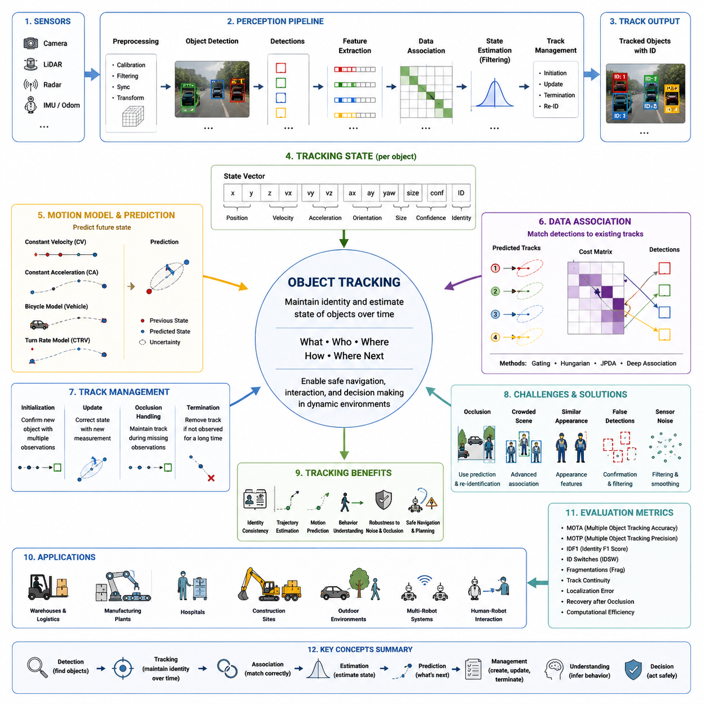
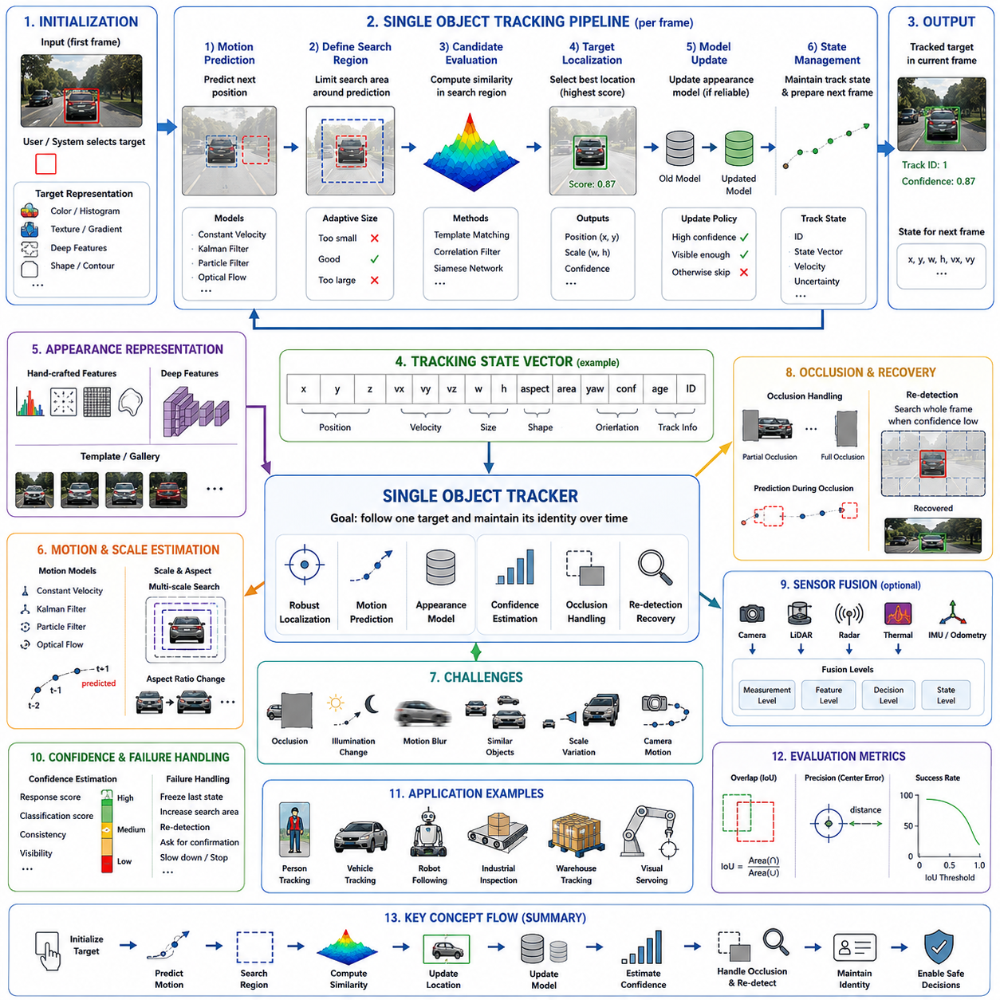
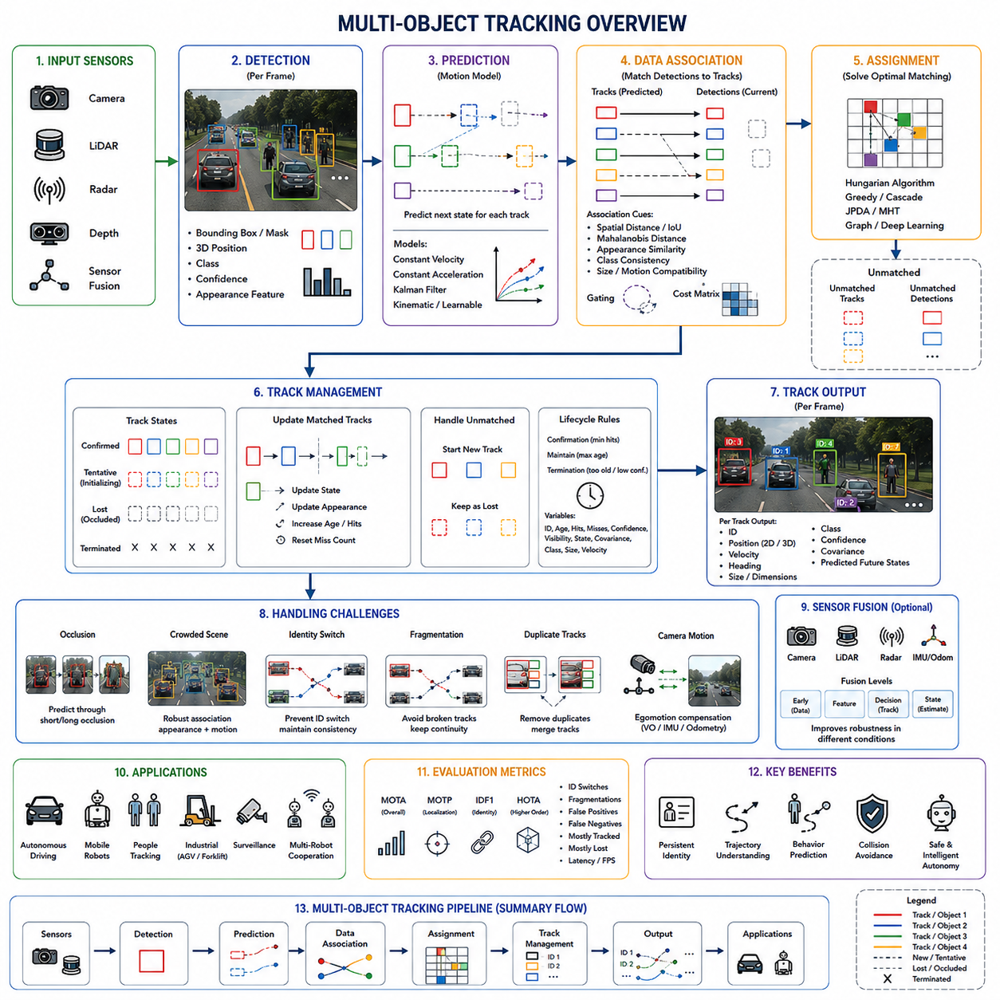
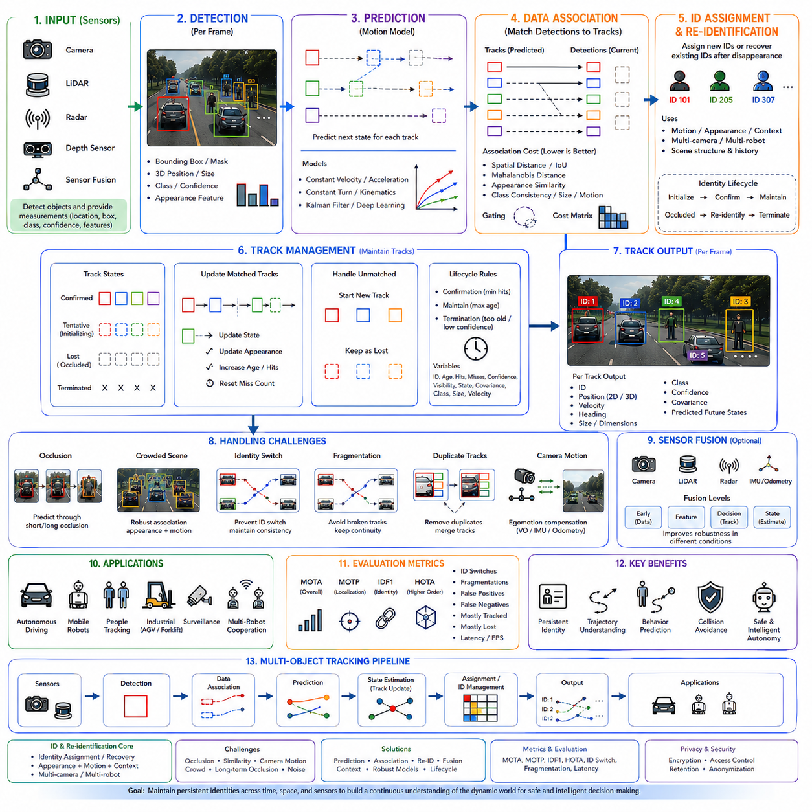
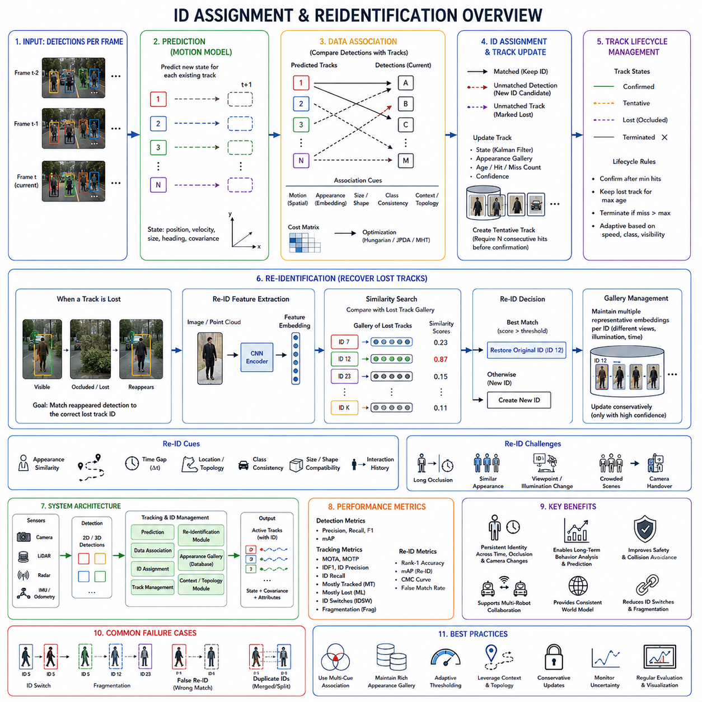
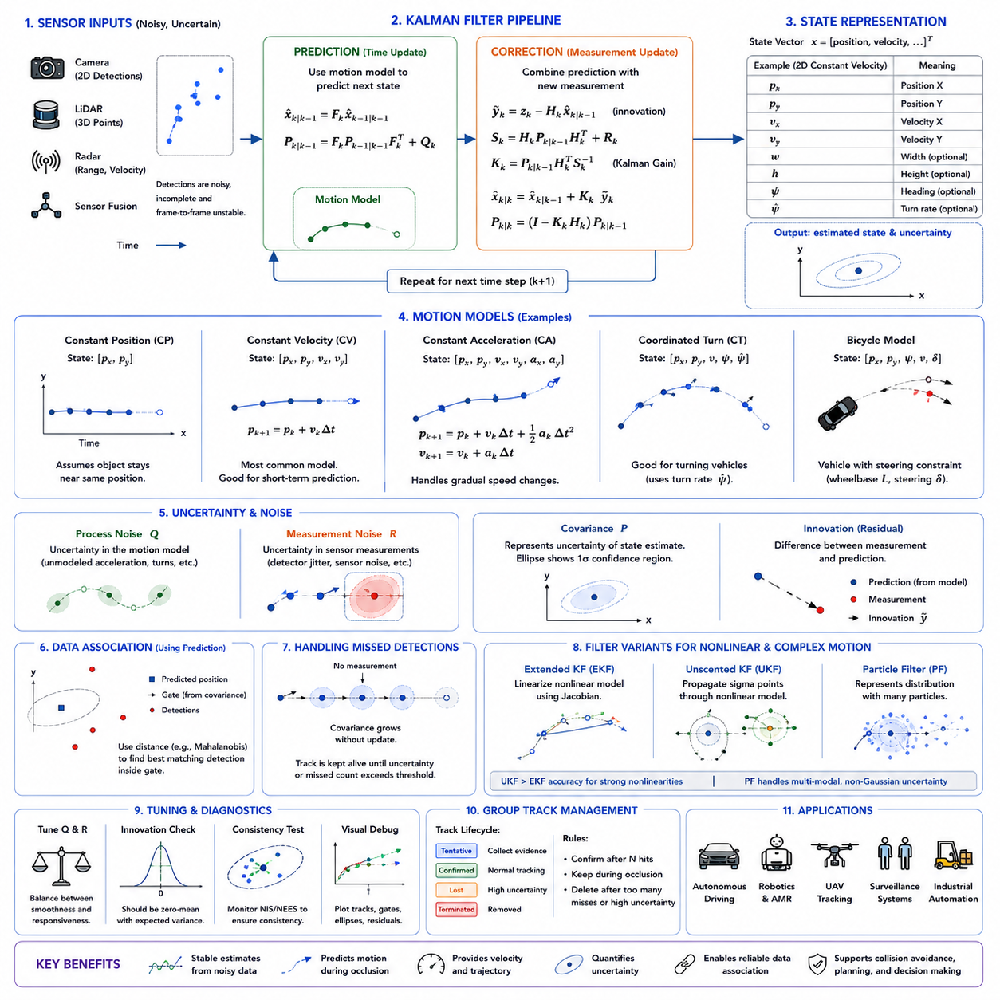
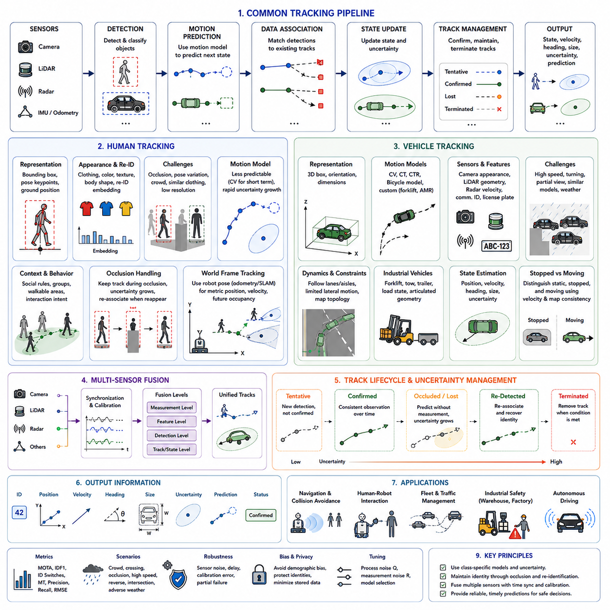
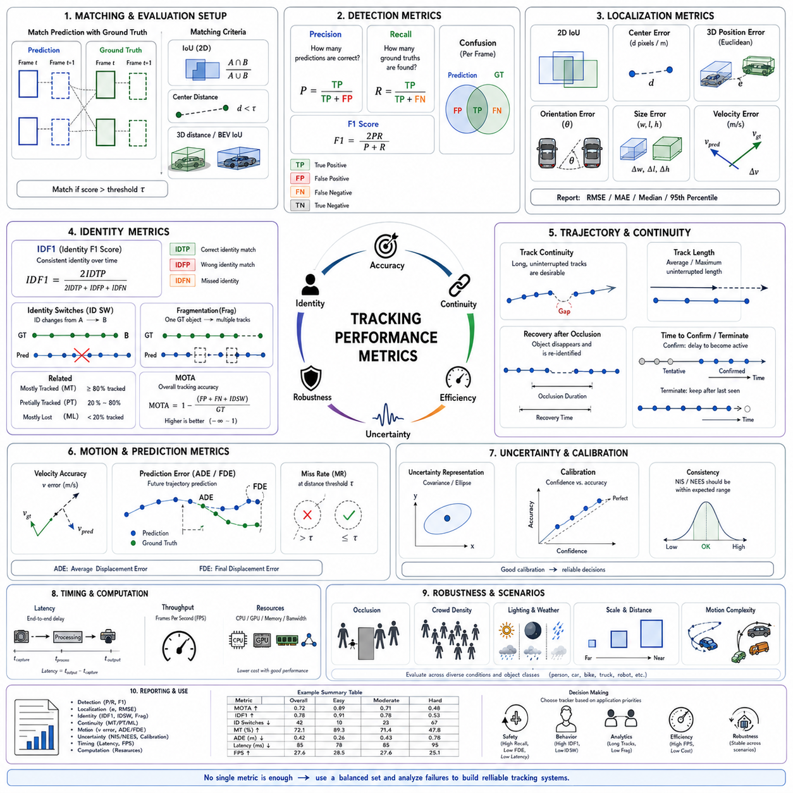
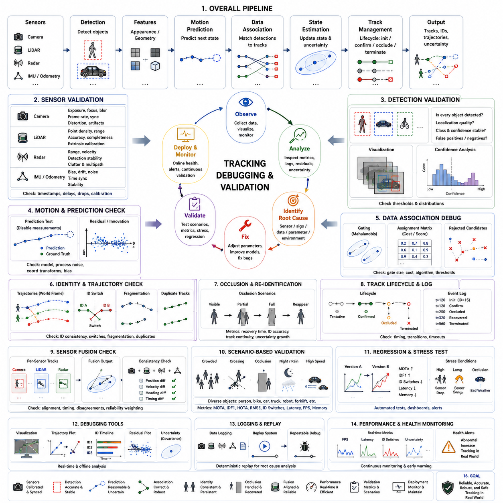

**Volume 03. AMR Sensors and Perception**

# Chapter 16. Object Tracking

## 16.1 Object Tracking Concepts

{width="7.268055555555556in" height="7.268055555555556in"}

객체 추적(Object Tracking)은 현대 로봇 인지(Robot Perception)의 핵심 기능 중 하나이다. 자율 시스템은 환경에 어떤 객체가 존재하는지를 인식하는 것뿐만 아니라, 시간이 지남에 따라 객체가 어떻게 이동하는지를 지속적으로 이해해야 한다. 객체 검출(Object Detection)은 각각의 센서 프레임(Frame)에서 독립적으로 객체를 식별하는 반면, 객체 추적은 연속된 관측(Observation) 간에 동일한 객체에 지속적인 식별자(Identity)를 부여하여 시간적 연속성(Temporal Continuity)을 형성한다. 이러한 시간적 이해는 자율주행 로봇(Autonomous Mobile Robot, AMR)이 객체의 이동 궤적(Trajectory)을 추정하고, 미래의 움직임을 예측하며, 동적 장애물(Dynamic Obstacle)과 정적 구조물(Static Infrastructure)을 구분하고, 단일 시점의 정보가 아닌 지속적으로 변화하는 환경을 기반으로 주행 결정을 내릴 수 있도록 한다.

자율 로봇은 완전히 정적인 환경에서 동작하는 경우가 거의 없다. 작업자는 공장을 이동하고, 지게차(Forklift)는 교차로를 통과하며, 팔레트(Pallet)는 작업장 사이를 이동하고, 차량은 지속적으로 위치를 변경한다. 각각의 센서 프레임은 끊임없이 변화하는 세계의 단 한 번의 관측만을 나타낸다. 객체 추적은 이러한 독립적인 관측들을 일관된 이동 이력(Motion History)으로 변환하여, 몇 초 전에 검출된 작업자가 현재 로봇에게 접근하고 있는 동일한 사람임을 인식하도록 하며, 매 프레임마다 새로운 객체로 잘못 판단하는 문제를 방지한다.

객체 추적의 주요 목적은 관측된 각각의 목표(Target)에 대해 안정적인 식별자(Identity)를 유지하면서 위치(Position), 속도(Velocity), 이동 방향(Direction), 그리고 경우에 따라서는 더 높은 수준의 행동 특성(Behavior Characteristics)까지 지속적으로 추정하는 것이다. 우수한 추적 시스템은 식별자 전환(Identity Switch)을 최소화하고, 일시적인 센서 오류에도 견고성을 유지하며, 부분적인 가림(Occlusion)을 견뎌내고, 객체가 다시 나타났을 때 빠르게 복구할 수 있어야 한다. 따라서 추적 과정은 과거의 관측, 현재의 측정, 미래의 예측을 하나의 통합된 표현으로 연결하는 인지 시스템의 시간적 메모리(Temporal Memory) 역할을 수행한다.

객체 검출 알고리즘이 개별 프레임 내부의 외형(Appearance)에 집중하는 반면, 객체 추적 알고리즘은 공간적 연관성(Spatial Association)과 시간적 연관성(Temporal Association)을 동시에 해결해야 한다. 새로운 관측은 기존에 추적 중인 객체와 연결되어야 하며, 이 과정에서는 측정 불확실성(Uncertainty), 객체의 운동(Motion), 센서 잡음(Sensor Noise), 그리고 오검출(False Detection) 가능성을 함께 고려해야 한다. 여러 개의 유사한 객체가 가까이 이동하거나 서로 겹치거나, 시야(Field of View)에서 잠시 사라졌다가 다시 나타나는 경우에는 이러한 문제의 복잡성이 더욱 증가한다.

객체 검출과 객체 추적의 차이를 이해하는 것은 현대 인지 시스템을 이해하는 데 매우 중요하다. 객체 검출은 현재 시점에 무엇이 존재하는지를 알려주지만, 객체 추적은 각각의 객체가 누구이며, 어디에서 왔고, 어떻게 움직이며, 가까운 미래에 어디에 있을 가능성이 높은지를 설명한다. 객체 검출은 독립적인 측정값을 생성하는 반면, 객체 추적은 연속적인 이동 이력을 구축한다. 따라서 대부분의 로봇 시스템은 먼저 객체 검출을 수행한 후, 생성된 경계 상자(Bounding Box), 포인트 클라우드(Point Cloud) 클러스터, 또는 분할 마스크(Segmentation Mask)를 전용 추적 모듈로 전달한다.

객체 추적은 새로운 센서 측정값이 들어올 때마다 객체의 내부 상태(State)를 반복적으로 갱신하는 재귀적 추정(Recursive Estimation) 문제로 볼 수 있다. 이러한 상태에는 일반적으로 공간 좌표(Spatial Coordinates), 속도 추정값, 진행 방향, 가속도(Acceleration), 객체 크기(Dimensions), 신뢰도(Confidence), 그리고 고유 식별 번호(Unique ID)가 포함된다. 새로운 관측이 계속 추가될수록 상태 추정의 정확성은 향상되며, 이를 통해 로봇은 불확실성을 줄이고 센서 잡음이 존재하는 환경에서도 더욱 정확한 이동 예측(Motion Prediction)을 수행할 수 있다.

추적 성능은 로봇이 사용하는 센서의 특성에 크게 의존한다. RGB 카메라(Camera)는 풍부한 외형 정보를 제공하여 시각적 대응(Visual Matching)에 유리하지만 조명 변화나 기상 조건에 민감하다. 라이다(LiDAR)는 매우 정확한 거리와 기하학적 정보를 제공하지만 객체를 구분할 수 있는 외형 정보는 제한적이다. 레이더(Radar)는 비, 안개, 먼지 환경에서도 안정적인 속도 정보를 제공하지만 공간 해상도는 상대적으로 낮다. 따라서 현대의 로봇 플랫폼은 여러 센서를 함께 사용하는 다중 센서 융합(Multi-Sensor Fusion)을 통해 추적의 강건성(Robustness)을 향상시키는 경우가 많다.

인지 파이프라인(Perception Pipeline)은 일반적으로 동기화된 센서 데이터 획득으로 시작되며, 이후 영상 보정(Image Correction), 포인트 클라우드 필터링(Point Cloud Filtering), 타임스탬프 정렬(Timestamp Alignment), 좌표계 변환(Coordinate Transformation) 등의 전처리(Preprocessing)를 수행한다. 객체 검출 알고리즘은 각 센서 데이터에서 후보 객체를 검출하고, 이 결과는 기존 추적 객체와의 연관성 분석(Data Association)에 사용된다. 이후 운동 추정(Motion Estimation)이 상태를 갱신하며, 추적 관리(Track Management) 모듈은 새로운 추적의 생성, 유지, 병합(Merge), 분리(Split), 종료 여부를 결정한다.

시간적 일관성(Temporal Consistency)은 객체 추적이 제공하는 가장 중요한 특성 가운데 하나이다. 센서 측정에는 항상 잡음, 누락된 검출(Missed Detection), 그리고 간헐적인 오검출(False Positive)이 포함된다. 단 한 번의 잘못된 검출만으로 로봇의 행동이 즉시 변경되어서는 안 되며, 이전 관측 이력이 이를 보완해야 한다. 객체 추적은 여러 프레임에서 얻어진 정보를 통합하여 이러한 측정 변동을 완화하고, 추정값의 분산을 감소시키며, 이후의 경로 계획(Path Planning)과 자율주행(Navigation) 알고리즘의 안정성을 향상시킨다.

객체 식별 관리(Identity Management)는 객체 추적의 또 다른 핵심 요소이다. 추적되는 각각의 객체에는 지속적인 식별자(Persistent Identity)가 부여되며, 관측되는 전체 수명 동안 동일한 식별자가 유지되어야 한다. 동일한 작업복을 입은 작업자, 비슷한 크기의 지게차, 또는 거의 동일한 외형을 가진 여러 대의 자율주행 로봇이 존재하는 산업 환경에서는 이러한 식별 유지가 특히 어렵다. 효과적인 식별 관리 기능은 장시간 운용 중에도 서로 다른 객체가 혼동되는 문제를 방지한다.

운동 모델(Motion Model)은 객체가 시간에 따라 어떻게 이동할 것인지를 수학적으로 표현한다. 가장 단순한 모델은 일정한 속도(Constant Velocity)를 가정하며, 보다 발전된 모델은 가속도, 회전 동작, 차량 운동학(Kinematics)과 같은 제약 조건까지 포함한다. 적절한 운동 모델의 선택은 운용 환경과 추적 대상의 종류에 따라 달라진다. 사람, 물류 차량, 이동형 로봇, 건설 장비는 각각 서로 다른 이동 특성을 가지므로 이에 맞는 운동 모델을 적용해야 보다 정확한 예측이 가능하다.

예측(Prediction)은 새로운 센서 측정이 도착하기 전에도 객체의 미래 위치를 추정하는 기능이다. 객체가 잠시 가려지거나 센서 장애가 발생하거나 일시적으로 관측되지 않는 경우에도 예측은 추적을 유지하도록 도와준다. 예측된 위치가 이후의 실제 측정과 잘 일치하면 동일한 추적이 자연스럽게 이어지고, 그렇지 않을 경우에는 불확실성이 점차 증가하여 최종적으로 객체가 사라졌거나 새로운 객체가 등장한 것으로 판단하게 된다.

가림(Occlusion) 처리는 실제 추적 시스템에서 가장 어려운 문제 중 하나이다. 객체는 기계 설비, 선반, 주차된 차량, 기둥, 또는 다른 이동 객체 뒤로 자주 가려진다. 이러한 경우 시각 정보가 일시적으로 사라지더라도 시스템은 즉시 해당 추적을 삭제해서는 안 된다. 대신 예측 모델을 이용하여 객체의 상태를 일정 시간 유지하고, 이후의 관측이 예측된 이동 경로와 일치하는지를 확인한다. 이러한 가림 처리 능력은 사람이 많은 산업 환경에서 추적의 연속성을 크게 향상시킨다.

동적인 환경(Dynamic Environment)은 서로 독립적으로 움직이는 많은 객체들이 지속적으로 상호작용하기 때문에 추적을 더욱 어렵게 만든다. 두 명의 작업자가 서로 교차하거나, 지게차가 카메라 시점에서 겹쳐 보이거나, 여러 대의 자율주행 로봇이 좁은 통로에서 서로 반대 방향으로 이동하는 상황이 자주 발생한다. 추적 알고리즘은 이러한 복잡한 상황에서도 각각의 객체를 정확하게 구분하면서 동일한 식별자를 유지해야 한다. 이를 위해 다양한 데이터 연관(Data Association) 기법이 연구되고 발전해 왔다.

데이터 연관(Data Association)은 새로운 관측이 기존의 어떤 추적 객체에 해당하는지를 결정하는 과정이다. 이 과정에서는 공간적 거리, 예측된 이동 경로, 객체 크기, 외형 유사성, 속도의 일관성, 그리고 측정 불확실성 등을 함께 고려한다. 잘못된 연관은 식별자 전환, 이동 경로의 단절, 중복 추적과 같은 문제를 발생시키며, 결과적으로 자율주행의 안전성을 저하시킨다. 따라서 데이터 연관은 객체 추적 분야에서 가장 중요한 연구 주제 중 하나이다.

추적 초기화(Track Initialization)는 기존의 어떤 추적과도 연결되지 않는 새로운 객체가 관측될 때 수행된다. 대부분의 시스템은 한 번의 검출만으로 즉시 새로운 추적을 생성하지 않고, 여러 프레임에서 연속적으로 검출되는지를 확인한 후에 정식 추적으로 등록한다. 이러한 확인 과정은 센서 잡음과 일시적인 오검출의 영향을 줄여주며, 최종적으로 객체에는 고유 식별자가 부여되어 활성 추적 데이터베이스(Tracking Database)에 등록된다.

추적 종료(Track Termination)는 그 반대 과정이다. 객체가 일정 시간 동안 관측되지 않으면 시스템은 예측을 유지하면서도 불확실성을 점차 증가시킨다. 일정한 한계를 초과할 때까지 새로운 측정이 들어오지 않으면 해당 추적은 메모리에서 제거되어 계산 자원을 절약하고 오래된 정보가 이후의 의사결정에 영향을 주지 않도록 한다. 적절한 종료 정책은 추적의 지속성과 환경 변화에 대한 신속한 대응 사이에서 균형을 유지해야 한다.

실시간 처리(Real-Time Execution)는 객체 추적이 충돌 회피(Collision Avoidance)와 경로 계획(Path Planning)을 직접 지원하기 때문에 반드시 만족해야 하는 요구사항이다. 자율주행 로봇은 일반적으로 센서 구성과 연산 자원에 따라 초당 10프레임에서 수십 프레임 이상의 인지 갱신을 수행한다. 따라서 추적 모듈은 예측, 데이터 연관, 상태 추정, 추적 관리의 모든 과정을 엄격한 시간 제약 안에서 완료해야 하며, 안전성이 요구되는 로봇 시스템에 적합한 결정론적 지연 시간(Deterministic Latency)을 유지해야 한다.

객체 추적은 행동 이해(Behavior Understanding)에도 중요한 역할을 수행한다. 연속적인 이동 궤적은 보행자가 로봇에게 접근하는지, 교차하는지, 정지해 있는지, 또는 멀어지는지를 판단할 수 있게 해준다. 산업용 차량의 경우에도 회전 의도, 가속 패턴, 교차로 충돌 가능성 등을 예측할 수 있다. 즉, 개별 프레임이 아닌 이동 이력을 분석함으로써 로봇은 더욱 풍부한 상황(Context) 정보를 확보할 수 있으며, 이를 기반으로 인간과 기계가 함께 존재하는 환경에서 보다 자연스럽고 안전한 주행이 가능해진다.

현대의 로봇 객체 추적 시스템은 딥러닝(Deep Learning)과 전통적인 상태 추정(State Estimation) 기법을 함께 사용하는 방향으로 발전하고 있다. 신경망(Neural Network)은 높은 정확도의 객체 검출, 특징 추출(Feature Extraction), 외형 표현(Appearance Representation)을 담당하고, 확률 기반 필터(Probabilistic Filter)는 시간적 일관성과 운동 추정을 유지한다. 이러한 하이브리드(Hybrid) 구조는 데이터 기반 인공지능과 수학적 상태 추정의 장점을 결합하여 다양한 산업 및 실외 환경에서 높은 추적 성능을 제공한다.

객체 추적의 성능 평가는 단순한 검출 정확도만으로는 충분하지 않으며, 시간적 일관성까지 함께 평가해야 한다. 평가 항목에는 이동 궤적의 연속성, 식별자 유지 능력, 위치 추정 정확도, 가림 이후의 복구 성능, 오검출에 대한 강건성, 계산 효율성, 그리고 장기간 운용 시의 안정성이 포함된다. 위치 추정이 아무리 정확하더라도 식별자가 자주 바뀌는 추적기는 자율주행 시스템에서 적합하지 않을 수 있는데, 이는 경로 계획 모듈이 단순한 현재 위치보다 안정적인 객체 이력(Object History)에 더욱 의존하기 때문이다.

궁극적으로 객체 추적은 인지(Perception)와 지능형 의사결정(Intelligent Decision Making)을 연결하는 핵심 기술이다. 객체 검출이 현재 환경에 대한 인식을 제공한다면, 객체 추적은 그 정보를 시간에 따라 지속적으로 변화하는 환경 모델(Dynamic World Representation)로 발전시킨다. 객체의 식별자를 유지하고, 이동을 추정하며, 미래 행동을 예측하고, 센서 관측 전반에 걸쳐 시간적 일관성을 유지함으로써 객체 추적은 자율주행 로봇이 복잡한 환경에서 안전하게 이동하고, 사람과 협력하며, 이동 장애물에 지능적으로 대응하고, 물류센터, 공장, 병원, 건설 현장, 산업 시설 및 실외 환경에서 신뢰성 높은 자율 운용을 수행할 수 있도록 지원한다. 이러한 개념적 기반은 이후에 다루게 될 단일 객체 추적(Single Object Tracking), 다중 객체 추적(Multi-Object Tracking), 식별자 할당(Identity Assignment), 운동 모델(Motion Model), 행동 예측(Behavior Prediction), 그리고 추적 성능 평가(Tracking Performance Evaluation)를 이해하기 위한 기초가 된다.

## 16.2 Single Object Tracking

{width="7.268055555555556in" height="7.268055555555556in"}

단일 객체 추적(Single Object Tracking)은 영상이나 센서 프레임(Frame)의 연속 구간에서 하나의 지정된 목표(Target)를 지속적으로 따라가는 인지 작업이다. 목표 객체는 일반적으로 첫 번째 프레임에서 경계 상자(Bounding Box), 마스크(Mask), 점(Point), 템플릿(Template), 또는 사용자가 선택한 영역을 통해 지정된다. 초기화 이후 추적기(Tracker)는 객체의 움직임, 크기 변화, 외형 변화, 가림(Occlusion), 배경 간섭에 적응하면서 이후의 모든 프레임에서 목표 위치를 추정한다.

각 프레임에서 전체 장면을 탐색하며 모든 객체 범주를 찾는 객체 검출(Object Detection)과 달리, 단일 객체 추적은 이미 지정된 하나의 목표에 연산 자원을 집중한다. 추적기는 현재 장면에 어떤 객체가 존재하는지를 매번 다시 묻지 않는다. 대신 선택된 목표가 어디로 이동했으며, 현재의 시각적 증거가 최초에 지정한 목표와 여전히 일치하는지를 판단한다. 이러한 집중형 처리 방식은 효율적인 시간적 분석을 가능하게 하며, 특정 객체를 지속적으로 관찰해야 하는 응용 분야를 지원한다.

목표는 사람, 차량, 이동 로봇(Mobile Robot), 팔레트(Pallet), 기계 부품, 도구, 포장물, 동물, 또는 시각적으로 식별 가능한 어떤 객체도 될 수 있다. 추적 알고리즘은 객체의 방향, 거리, 조명, 자세, 보이는 표면이 변하더라도 초기 목표 표현과 이후 관측 간의 관계를 유지해야 한다. 따라서 단순히 비슷한 영역을 찾는 것만으로는 충분하지 않으며, 시간의 흐름에 따라 최초 목표의 동일성(Identity)을 유지하는 것이 핵심이다.

일반적인 단일 객체 추적 과정은 목표 초기화(Target Initialization)로 시작한다. 초기 경계 상자는 목표 위치를 정의하고 최초의 외형 표현(Appearance Representation)을 제공한다. 추적기는 색상, 질감(Texture), 경계(Edge), 형상(Shape), 딥러닝 특징(Deep Feature), 또는 이들의 조합과 같은 시각적 특징을 추출한다. 이러한 특징들은 이후 프레임에서 목표를 탐색하기 위한 기준 모델로 사용된다.

초기화 이후 추적기는 이전 목표 위치와 추정된 운동을 바탕으로 가능성이 높은 탐색 영역(Search Region)을 예측한다. 탐색 범위를 국소 영역으로 제한하면 연산량을 크게 줄일 수 있으며, 영상의 다른 위치에 존재하는 무관한 객체와 혼동할 가능성도 감소한다. 그러나 탐색 영역이 지나치게 작으면 빠르게 이동하는 목표를 놓칠 수 있고, 지나치게 크면 모호성과 연산 비용이 증가한다.

새로운 프레임이 입력될 때마다 탐색 영역 안의 후보 영역은 저장된 목표 표현과 비교된다. 유사도 함수(Similarity Function)는 각 후보가 목표와 얼마나 잘 일치하는지를 나타내는 응답 지도(Response Map) 또는 신뢰도 점수(Confidence Score)를 생성한다. 가장 높은 신뢰도를 보이는 위치가 새로운 목표 추정값으로 선택되며, 추적기는 내부 상태를 갱신한 뒤 다음 프레임 처리를 준비한다.

가장 단순한 추적 방식은 템플릿 매칭(Template Matching)이다. 이 방식에서는 초기 목표로부터 얻은 영상 패치를 이후 프레임의 후보 패치들과 직접 비교한다. 이해하기는 쉽지만 고정된 템플릿은 외형 변화, 크기 변화, 변형, 조명 차이에 민감하다. 목표가 회전하거나 보이는 형상이 달라지면 초기 템플릿과 더 이상 유사하지 않을 수 있으며, 이로 인해 추적 정확도가 빠르게 저하될 수 있다.

특징 기반 접근법(Feature-Based Approach)은 목표를 더 안정적인 시각 특성으로 표현하여 강건성을 향상시킨다. 색상 히스토그램(Color Histogram), 경사 방향(Gradient Orientation), 국소 질감, 키포인트(Keypoint), 딥 특징 지도(Deep Feature Map)는 중간 수준의 외형 변화를 견딜 수 있다. 이러한 방식은 픽셀 단위의 정확한 일치를 요구하지 않고, 이동, 부분 변형, 조명 변화에서도 유지되는 상위 수준의 패턴을 비교한다.

상관 필터 추적기(Correlation Filter Tracker)는 효율적인 연산과 높은 위치 추정 정확도를 동시에 제공하기 때문에 널리 사용되었다. 이 추적기는 목표 중심에서는 강한 응답을, 주변 영역에서는 약한 응답을 생성하는 필터를 학습한다. 고속 푸리에 변환(Fast Fourier Transform, FFT)을 사용하면 많은 이동 후보를 효율적으로 평가할 수 있다. 이러한 구조는 제한된 연산 자원을 가진 시스템에서도 실시간 추적에 적합하다.

전통적인 상관 필터는 목표가 심하게 변형되거나 장시간 가려지거나, 주변에 유사한 객체가 존재할 때 어려움을 겪을 수 있다. 또한 잘못된 관측 결과가 목표 모델에 반영되면 갱신 과정에서 모델 드리프트(Model Drift)가 발생할 수 있다. 현대적인 변형 알고리즘은 정규화(Regularization), 다중 크기 추정(Multi-Scale Estimation), 배경 억제, 신뢰도 가중치, 개선된 특징 표현을 통해 이러한 약점을 보완한다.

샴 네트워크 추적(Siamese Network Tracking)은 또 다른 중요한 접근법이다. 샴 추적기는 동일한 매개변수를 공유하는 두 개의 신경망 분기(Network Branch)를 사용한다. 한쪽 분기는 목표 템플릿을 처리하고, 다른 분기는 현재 프레임의 탐색 영역을 처리한다. 신경망은 두 특징 표현을 비교하여 가장 가능성이 높은 목표 위치를 나타내는 유사도 지도(Similarity Map)를 생성한다.

템플릿과 탐색 영상이 동일한 특징 추출기(Feature Extractor)를 통과하기 때문에, 샴 네트워크는 특정 객체 범주를 암기하는 것이 아니라 일반화된 대응 함수(Matching Function)를 학습한다. 따라서 초기 예시 하나만 제공받아도 이전에 본 적 없는 목표를 추적할 수 있다. 이는 범주별 추가 학습 없이 임의의 객체를 추적해야 하는 로봇 시스템에서 특히 유용하다.

많은 샴 추적기는 실제 운용 과정에서 광범위한 온라인 학습(Online Learning)을 수행하지 않는다. 대응 능력은 대규모 비디오 데이터셋(Video Dataset)을 통해 오프라인에서 학습되며, 초기화 후 빠른 추론이 가능하다. 이 설계는 연산 부담을 줄이고 불안정한 모델 갱신을 방지한다. 그러나 목표 표현이 완전히 고정되면 장시간 동안 외형이 크게 변하는 상황에서 오래된 정보가 될 수 있다.

이를 해결하기 위해 고급 추적기는 오프라인에서 학습된 대응 기능과 제한적인 온라인 적응(Online Adaptation)을 결합한다. 시스템은 서로 다른 관측 조건에서 획득한 여러 목표 템플릿을 저장하거나, 신뢰도가 높을 때만 외형 모델을 갱신할 수 있다. 보수적인 갱신 정책은 배경, 가림 객체, 또는 시각적으로 유사한 방해 객체를 목표 모델로 잘못 학습하는 위험을 줄인다.

모델 드리프트는 단일 객체 추적에서 가장 중요한 실패 유형 중 하나이다. 드리프트는 작은 위치 추정 오차가 누적되어 추적기가 실제 목표에서 점차 벗어날 때 발생한다. 추적 상자 안에 배경 영역이 많이 포함되기 시작하면 외형 모델이 잘못된 영역에 적응할 수 있다. 이후 추적기는 높은 신뢰도를 유지한 채 무관한 객체나 정적인 배경 무늬를 계속 따라갈 수 있다.

따라서 신뢰성 높은 모델 갱신(Model Update)이 필수적이다. 추적기는 내부 표현을 수정하기 전에 응답 품질, 분류 신뢰도, 목표 가시성(Visibility), 운동 일관성, 영상 경계 조건을 고려해야 한다. 목표가 심하게 가려지거나, 영상 밖으로 이동하거나, 예측 불가능하게 움직이거나, 모호한 응답을 생성하는 경우에는 갱신을 일시 중지할 수 있다. 이를 통해 신뢰할 수 없는 관측이 목표 모델을 손상시키는 것을 방지한다.

운동 예측(Motion Prediction)은 추적 안정성을 높이는 또 다른 요소이다. 단순한 모델은 일정 속도(Constant Velocity)를 가정하고 최근 이동량을 이용해 다음 목표 위치를 추정할 수 있다. 고급 모델은 칼만 필터(Kalman Filter), 파티클 필터(Particle Filter), 광학 흐름(Optical Flow), 또는 학습 기반 시간 네트워크(Temporal Network)를 사용한다. 예측은 탐색 영역의 중심을 설정하고, 시각적 증거가 일시적으로 약해지는 동안에도 추적을 유지하도록 지원한다.

칼만 필터는 목표 운동을 선형 모델(Linear Model)과 가우시안 불확실성(Gaussian Uncertainty)으로 근사할 수 있을 때 효과적이다. 이전 위치와 속도를 이용하여 목표 상태를 예측한 뒤, 새로운 측정값으로 예측 결과를 보정한다. 운동 모델의 예측과 시각적 관측 사이의 비중은 각각의 추정 불확실성에 따라 결정된다. 이 결합 방식은 잡음이 포함된 위치 결과를 평활화하고 단기적인 연속성을 향상시킨다.

파티클 필터는 목표 상태가 비선형 운동(Nonlinear Dynamics)을 보이거나 여러 개의 가능한 위치가 존재할 때 유용하다. 하나의 가우시안 분포만 유지하는 대신, 다수의 가중 샘플을 통해 불확실성을 표현한다. 각각의 파티클(Particle)은 가능한 목표 상태를 나타내며, 시각적 유사도에 따라 가중치가 결정된다. 파티클 필터는 모호한 운동 상황에서 더 효과적으로 복구할 수 있지만 더 많은 연산량을 요구한다.

광학 흐름은 연속된 프레임 사이에서 픽셀이나 국소 특징의 겉보기 운동을 추정한다. 희소 광학 흐름(Sparse Optical Flow)은 목표 위의 선택된 특징점을 추적하고, 조밀 광학 흐름(Dense Optical Flow)은 영상 전체의 운동을 추정한다. 프레임 간 이동량이 작을 때 광학 흐름은 정밀한 단기 추적에 유용하다. 그러나 큰 변위, 낮은 질감, 움직임 흐림(Motion Blur), 급격한 조명 변화에서는 신뢰도가 저하될 수 있다.

목표가 카메라에 가까워지면 크게 보이고, 멀어지면 작게 보이므로 크기 추정(Scale Estimation)이 필요하다. 고정된 크기의 경계 상자를 사용하는 추적기는 시간이 지나면서 과도한 배경을 포함하거나 목표 일부를 제외할 수 있다. 다중 크기 탐색은 여러 크기의 후보 영역을 평가하며, 전용 회귀 모델(Regression Model)은 경계 상자의 폭과 높이 변화를 직접 추정한다.

종횡비(Aspect Ratio)도 객체가 회전하거나 변형되거나 자세를 바꾸면 달라진다. 걷는 사람, 관절형 로봇 팔, 회전하는 차량은 시간에 따라 매우 다른 형상을 차지할 수 있다. 이동과 균일한 크기 변화만을 추정하는 추적기는 이러한 변화를 정확히 표현하기 어렵다. 따라서 현대 시스템은 고정된 기하학적 가정에만 의존하지 않고 학습 기반 회귀를 통해 경계 상자 좌표를 예측하는 경우가 많다.

회전은 표준 축 정렬 경계 상자(Axis-Aligned Bounding Box)로 객체 방향을 정확하게 나타낼 수 없기 때문에 추가적인 어려움을 발생시킨다. 항공 영상, 회전 기계, 파지된 객체, 위에서 내려다본 이동 로봇과 같은 응용에서는 회전 경계 상자(Oriented Bounding Box)가 더 적합할 수 있다. 이 경우 추적기는 위치와 크기뿐 아니라 회전각까지 추정해야 하므로 상태 복잡성과 학습 요구사항이 증가한다.

가림은 다른 객체, 구조물, 또는 환경 요소가 목표를 부분적으로 또는 완전히 차단할 때 발생한다. 부분 가림 상황에서는 추적기가 보이는 목표 영역에 의존하고 가려진 부분의 영향을 줄여야 한다. 주의집중 메커니즘(Attention Mechanism), 부분 기반 모델(Part-Based Model), 분할 마스크, 신뢰도 지도는 어떤 시각적 특징이 여전히 신뢰할 수 있는지를 판단하는 데 도움을 준다.

완전 가림은 직접적인 시각 측정값을 얻을 수 없기 때문에 더욱 어렵다. 단기 추적기는 여러 프레임 동안 목표 위치를 계속 예측할 수 있지만, 시간이 지날수록 불확실성은 빠르게 증가한다. 목표가 장기간 보이지 않으면 추적기는 실패를 선언하거나 더 넓은 범위의 재검출(Re-Detection) 과정으로 전환해야 한다. 올바른 전략은 응용 분야가 속도, 정밀도, 장기 복구 중 무엇을 더 중요하게 평가하는지에 따라 달라진다.

단기 단일 객체 추적(Short-Term Single Object Tracking)은 일반적으로 목표가 계속 보이며 제한된 탐색 영역 안에 존재한다고 가정한다. 목표가 사라지면 해당 시퀀스는 실패한 것으로 처리될 수 있다. 장기 추적(Long-Term Tracking)은 목표 존재 여부 판별, 실패 인식, 전역 재검출 기능을 포함한다. 이러한 기능을 통해 장시간의 가림, 카메라 이동, 또는 시야 이탈 이후에도 목표를 다시 찾을 수 있다.

목표 존재 신뢰도(Target Presence Confidence)는 단순히 가장 높은 후보 점수를 나타내는 것이 아니라 목표가 실제로 보이는지를 표현해야 한다. 목표가 존재하지 않더라도 응답 지도에는 항상 최댓값이 존재할 수 있다. 따라서 추적기는 응답의 선명도, 분류 점수, 시간적 일관성, 학습된 부재 판단 지표를 기반으로 신뢰도를 보정해야 한다. 신뢰성 있는 존재 판별이 없으면 목표가 사라진 동안에도 잘못된 위치를 계속 출력할 수 있다.

재검출은 안정적인 목표 표현을 이용하여 더 넓은 영상 영역이나 전체 프레임을 탐색한다. 별도의 검출기, 전역 특징 대응(Global Feature Matching), 메모리 뱅크(Memory Bank), 장기 템플릿이 사용될 수 있다. 재검출은 국소 추적보다 연산량이 많기 때문에 일반적으로 신뢰도가 임계값 아래로 떨어졌을 때만 활성화된다. 성공적인 복구를 위해서는 목표가 보이지 않는 동안 등장한 유사한 방해 객체와 원래 목표를 구별해야 한다.

방해 객체(Distractor)는 실제 목표와 경쟁하는 시각적으로 유사한 영역이다. 동일한 작업복을 입은 작업자, 같은 모델의 차량, 반복적으로 배치된 상자, 생산 부품, 비슷한 형상의 여러 로봇이 그 예이다. 국소적인 외형 정보에만 의존하는 추적기는 두 객체가 가까워지거나 서로 겹칠 때 방해 객체로 전환될 수 있다.

판별형 추적(Discriminative Tracking)은 목표가 어떻게 보이는지만 학습하는 것이 아니라 주변 배경과 인접 객체와 어떻게 다른지도 학습하여 이러한 위험을 줄인다. 목표 주변 영역에서 음성 예제(Negative Example)를 수집하고, 분류기는 목표와 비목표 외형 사이의 결정 경계(Decision Boundary)를 학습한다. 이러한 음성 예제의 품질과 다양성은 추적 안정성에 큰 영향을 준다.

어려운 음성 예제 학습(Hard Negative Mining)은 목표 점수가 높게 나타나는 혼동하기 쉬운 배경 영역에 중점을 둔다. 이러한 어려운 사례를 학습하면 추적기는 유사한 객체를 더 효과적으로 배제할 수 있다. 그러나 최근의 음성 예제에 지나치게 적응하면 목표가 크게 변했을 때 이를 다시 인식하는 능력이 감소할 수 있다. 따라서 갱신 과정은 판별력, 적응성, 장기 동일성 유지 사이의 균형을 맞춰야 한다.

배경 혼잡(Background Clutter)은 유사한 객체가 존재하지 않는 경우에도 위치 추정을 방해할 수 있다. 반복적인 질감, 강한 경계, 반사, 그림자, 움직이는 설비는 잘못된 응답을 생성할 수 있다. 강건한 추적기는 문맥 정보(Contextual Information), 공간 정규화, 주의집중, 분할, 다중 수준 특징을 이용하여 무관한 구조를 억제한다. 추적기는 목표 증거에는 민감하게 반응하면서도 불안정한 배경 패턴에는 지나치게 의존하지 않아야 한다.

조명 변화(Illumination Variation)는 색상, 대비, 질감, 가시성에 영향을 준다. 실내 로봇은 밝은 작업 공간과 어두운 보관 구역 사이를 이동할 수 있으며, 실외 시스템은 햇빛, 그림자, 전조등, 기상 변화에 노출된다. 특징 정규화(Feature Normalization), 데이터 증강(Data Augmentation), 노출 제어, 적외선 센서, 다중 모달 융합(Multi-Modal Fusion)은 이러한 조건에서 추적 성능을 향상시킬 수 있다.

움직임 흐림은 목표 또는 카메라가 노출 시간 동안 빠르게 움직일 때 발생한다. 목표의 선명한 경계와 질감이 사라져 특징 유사도가 감소할 수 있다. 더 빠른 셔터 속도, 카메라 안정화, 운동 인식 학습, 넓은 탐색 영역을 통해 영향을 줄일 수 있다. 이전 속도에 기반한 예측도 더 선명한 시각 정보가 다시 확보될 때까지 연속성을 유지하는 데 도움을 준다.

카메라 운동(Camera Motion)은 목표 운동과 구분되어야 한다. 이동 로봇에 장착된 카메라는 이동, 회전, 진동, 높이 변화를 겪으며 영상 전체가 움직일 수 있다. 고정 카메라를 가정하는 추적기는 배경 이동을 목표 변위로 잘못 해석할 수 있다. 시각 주행 거리 측정(Visual Odometry), 관성 측정(Inertial Measurement), 프레임 정합(Frame Registration), 전역 운동 보상(Global Motion Compensation)을 사용하면 카메라에 의한 운동과 독립적인 목표 운동을 분리할 수 있다.

자기 운동 보상(Egomotion Compensation)은 자율주행 모바일 로봇에서 특히 중요하다. 휠 오도메트리(Wheel Odometry), 관성 측정 장치(Inertial Measurement Unit, IMU), 시각 오도메트리, 동시적 위치추정 및 지도작성(Simultaneous Localization and Mapping, SLAM) 결과를 이용해 프레임 간 카메라 이동을 추정할 수 있다. 이후 목표 예측을 안정화된 좌표계에서 표현하면 탐색 영역 배치 정확도가 향상되고 불필요한 범위 확장을 줄일 수 있다.

센서 융합(Sensor Fusion)은 시각 정보만 사용하는 단일 객체 추적보다 더 높은 강건성을 제공할 수 있다. 카메라는 세밀한 외형 정보를 제공하고, 라이다(LiDAR)는 정확한 거리와 3차원 형상을 제공한다. 레이더(Radar)는 상대 속도를 측정하며 악천후에서도 안정적이다. 열화상 카메라(Thermal Camera)는 어두운 환경에서 가시성을 향상시킨다. 여러 센서를 결합하면 하나의 센서 모달리티가 불안정할 때에도 추적을 유지할 수 있다.

융합은 측정값, 특징, 의사결정, 상태 수준에서 수행될 수 있다. 초기 융합(Early Fusion)은 원시 데이터나 저수준 센서 정보를 결합하고, 후기 융합(Late Fusion)은 독립적인 추적 결과를 통합한다. 특징 수준 융합은 공동 표현을 학습하고, 상태 수준 융합은 위치와 속도 추정값을 불확실성과 함께 결합한다. 적절한 구조는 동기화 품질, 센서 보정, 연산 자원, 운용 요구사항에 따라 달라진다.

3차원 단일 객체 추적(3D Single Object Tracking)은 영상 평면이 아니라 실제 세계 좌표계에서 목표의 위치와 크기를 추정한다. 이는 로봇 주행, 조작(Manipulation), 검사, 충돌 회피에서 중요하다. 3차원 추적기는 라이다 포인트 클라우드(Point Cloud), 스테레오 비전(Stereo Vision), 깊이 카메라(Depth Camera), 레이더, 또는 융합 센서를 이용해 시간에 따른 목표 상태를 유지할 수 있다.

포인트 클라우드 추적은 일반적으로 3차원 경계 상자 또는 분할된 포인트 클러스터에서 시작된다. 추적기는 다음 포인트 클라우드에서 기하학적 유사성, 운동 예측, 학습된 특징, 점 단위 대응을 이용해 목표를 탐색한다. 희소한 측정, 거리에 따른 점 밀도 변화, 자기 가림(Self-Occlusion), 배경 포인트는 이 과정을 어렵게 하며, 특히 작거나 먼 목표에서는 문제가 더욱 심해진다.

좌표계 선택은 목표 상태를 어떻게 표현할지에 영향을 준다. 영상 좌표계(Image Coordinate)는 시각화에는 적합하지만, 로봇 중심 좌표계(Robot-Centered Coordinate)나 세계 좌표계(World Coordinate)는 주행 및 경로 계획에 더 유용하다. 로봇 중심 좌표계는 플랫폼 이동에 따라 변하지만, 세계 좌표계는 안정적인 궤적 분석을 제공한다. 관측값을 서로 다른 좌표계로 변환하려면 정확한 센서 보정(Calibration)과 시간 동기화(Time Synchronization)가 필요하다.

단일 객체 추적은 카메라나 로봇이 목표를 지속적으로 관측하기 위해 스스로 움직이는 능동 인지(Active Perception)를 지원할 수 있다. 팬-틸트-줌 카메라(Pan-Tilt-Zoom Camera)는 추정된 목표 위치에 따라 회전하거나 확대할 수 있다. 이동 로봇은 적절한 관측 거리를 유지하도록 경로를 조정할 수 있다. 따라서 추적기는 수동적인 관측 모듈이 아니라 폐루프 제어 시스템(Closed-Loop Control System)의 일부가 된다.

시각 서보잉(Visual Servoing)에서는 목표 추적 결과가 직접 구동 명령에 영향을 준다. 목표 위치와 영상 내 원하는 위치 사이의 차이가 카메라, 로봇, 또는 매니퓰레이터(Manipulator) 제어를 위한 오차 신호가 된다. 추적 오차는 잘못된 움직임을 유발할 수 있으므로 지연 시간, 안정성, 불확실성, 실패 감지를 신중하게 관리해야 한다. 불확실한 추정값으로 인한 급격하거나 위험한 반응을 방지하기 위해 안전 제한이 필요하다.

사람 추적(Human Tracking)은 단일 객체 추적의 대표적인 응용 분야이다. 서비스 로봇은 지정된 작업자, 환자, 고객, 운영자를 따라가면서 적절한 거리와 방향을 유지할 수 있다. 사람의 자세 변화, 신체 변형, 유사한 의복, 군중 속 상호작용, 일시적인 가림은 이 작업을 어렵게 만든다. 재식별(Re-Identification) 특징과 신체 부위 정보를 이용하면 선택된 사람의 동일성을 유지하는 데 도움이 된다.

차량 추적(Vehicle Tracking)은 교통 감시, 자율주행, 보안, 실외 로봇에서 활용된다. 차량은 보행자보다 강한 운동 제약을 따르므로 차선 구조, 진행 방향, 바퀴 운동, 차량 운동학 모델을 이용할 수 있다. 그러나 급가속, 회전, 부분 가림, 유사한 차량 외형은 여전히 어려운 문제이며, 특히 교차로나 혼잡한 교통 환경에서 복잡성이 증가한다.

산업 검사 시스템(Industrial Inspection System)은 특정 제품, 결함 영역, 이동 부품, 또는 도구를 검사 과정 동안 추적할 수 있다. 정확한 추적을 통해 컨베이어(Conveyor), 매니퓰레이터, 이동 플랫폼이 움직이는 동안에도 검사 센서가 목표와 정렬된 상태를 유지할 수 있다. 이러한 응용에서는 광범위한 객체 범주 인식보다 기하학적 정밀도와 동기화가 더 중요할 수 있다.

물류창고 로봇은 지정된 팔레트, 카트, 컨테이너, 지게차, 작업자를 추적할 수 있다. 추적 결과는 따라가기 동작, 인수인계, 적재 확인, 동적 안전 영역 생성에 활용될 수 있다. 반복적인 시각 구조와 거의 동일한 물류 자산은 동일성 유지를 어렵게 하므로, 추적 기능은 마커(Marker), 바코드(Barcode), 무선주파수 식별(Radio-Frequency Identification, RFID), 디지털 작업 정보와 결합될 수 있다.

추적 신뢰도는 모든 추정 결과가 동일하게 신뢰할 수 있는 것처럼 출력하는 대신, 후속 모듈에 명시적으로 전달되어야 한다. 상태 정보에는 위치 불확실성, 가시성 확률, 모델 품질, 복구 상태가 포함될 수 있다. 이를 통해 주행 또는 제어 시스템은 신뢰도가 낮을 때 속도를 줄이거나, 안전거리를 늘리거나, 재검출을 요청하거나, 로봇을 정지시킬 수 있다.

빠르게 움직이는 환경에서는 지연 시간(Latency)이 특히 중요하다. 처리 정확도가 높더라도 시간이 너무 오래 걸리면 목표 추정값은 이미 오래된 정보가 된다. 전체 지연에는 영상 노출, 센서 전송, 전처리, 특징 추출, 위치 추정, 상태 추정, 제어기 통신이 포함된다. 따라서 실시간 성능은 단순한 프레임률(Frame Rate)뿐 아니라 전체 시스템 지연으로 평가해야 한다.

높은 프레임률은 프레임 간 목표 이동량을 줄여 단기 연속성을 향상시킬 수 있다. 그러나 프레임률이 높아지면 데이터 대역폭과 연산량도 증가한다. 시스템은 공간 해상도, 시간 해상도, 모델 복잡도, 하드웨어 성능 사이에서 균형을 맞춰야 한다. 특징 재사용, 축소된 탐색 영역, 모델 압축(Model Compression), 하드웨어 가속을 통해 실시간 처리를 유지할 수 있다.

메모리 관리도 장시간 추적 성능에 영향을 준다. 시스템은 과거 템플릿, 외형 특징, 신뢰도 값, 운동 상태를 저장할 수 있다. 지나치게 적은 이력을 보존하면 큰 외형 변화 이후의 복구가 어렵고, 지나치게 많은 데이터를 저장하면 연산량이 증가하며 오래된 정보가 남을 수 있다. 메모리 선택 전략은 신뢰할 수 있고 다양성이 높은 목표 관측을 우선적으로 보존해야 한다.

단일 객체 추적 학습 데이터셋은 연속 프레임에 걸쳐 목표가 주석 처리된 영상으로 구성된다. 학습 과정에서는 이동, 크기 변화, 변형, 가림, 흐림, 조명 변화, 배경 혼잡과 같은 조건을 경험하게 한다. 추적기는 실제 배치 환경에서 학습 중 보지 못한 객체 범주와 환경에도 일반화해야 하므로 데이터의 다양성이 매우 중요하다.

합성 데이터(Synthetic Data)는 제어된 운동, 가림, 조명, 외형 변화를 생성하여 실제 영상을 보완할 수 있다. 시뮬레이션 환경은 정확한 주석과 드문 실패 시나리오를 제공할 수 있다. 그러나 합성 영상은 실제 센서 특성과 다를 수 있어 도메인 차이(Domain Gap)가 발생한다. 도메인 무작위화(Domain Randomization), 사실적인 렌더링, 현장 데이터 기반 미세 조정(Fine-Tuning)을 통해 이러한 차이를 줄일 수 있다.

온라인 학습은 운용 중에 추적기가 적응하도록 하며, 오프라인 학습은 배치 전에 일반적인 추적 지식을 학습한다. 온라인 적응은 특정 목표 변화에 빠르게 대응할 수 있지만 드리프트 위험이 존재한다. 오프라인 모델은 안정적이지만 특정 목표의 고유한 변화까지 충분히 반영하지 못할 수 있다. 하이브리드 시스템은 강건한 오프라인 백본(Backbone)과 제한적으로 제어되는 온라인 모듈을 함께 사용한다.

평가 절차는 예측된 목표 위치가 정답 영역(Ground Truth)과 얼마나 겹치는지를 측정한다. 교집합 대비 합집합(Intersection over Union, IoU)은 예측 경계 상자와 정답 경계 상자의 중첩 정도를 비교한다. 성공률 그래프(Success Plot)는 여러 중첩 임계값에서 기준을 만족하는 프레임 비율을 요약한다. 정밀도(Precision)는 예측 목표 중심과 실제 중심 사이의 거리를 측정하며, 여러 거리 임계값에 대해 평가할 수 있다.

정규화 정밀도(Normalized Precision)는 객체 크기나 영상 해상도를 고려하여 서로 다른 시퀀스 간 비교를 더 공정하게 만든다. 강건성(Robustness)은 추적 실패 횟수를 측정하고, 정확도(Accuracy)는 성공적으로 추적된 구간의 위치 추정 품질을 평가한다. 장기 추적 평가는 목표 부재 감지, 재검출 지연, 오검출 지속 시간, 사라진 이후의 복구 성공률까지 추가로 고려한다.

벤치마크 결과(Benchmark Result)는 평균 점수만으로 해석해서는 안 된다. 추적기는 짧고 명확한 시퀀스에서는 우수하지만 완전 가림이나 유사 객체 상호작용에서는 실패할 수 있다. 따라서 응용 분야별 평가는 실제 배치에서 예상되는 환경 조건, 목표 유형, 카메라 운동, 지연 요구사항, 안전 영향을 포함해야 한다.

수치적 평가 지표가 존재하더라도 정성적 분석(Qualitative Analysis)은 여전히 중요하다. 예측 경계 상자, 응답 지도, 신뢰도 값, 탐색 영역, 모델 갱신 과정을 시각화하면 드리프트, 크기 오류, 복구 지연, 방해 객체 혼동을 확인할 수 있다. 프레임별 검토를 통해 초기화, 외형 모델링, 운동 추정, 신뢰도 관리 중 어느 부분에서 근본 원인이 발생했는지 이해할 수 있다.

디버깅(Debugging)은 영상 타임스탬프, 프레임 순서, 좌표 규칙, 경계 상자 형식을 확인하는 것부터 시작해야 한다. 실제로는 추적 알고리즘 문제가 아니라 잘못된 영상 크기 조정, 종횡비 변화, 센서 데이터 지연, 좌표 변환 불일치 때문에 추적 실패처럼 보일 수 있다. 알고리즘 자체를 수정하기 전에 신뢰성 있는 데이터 파이프라인(Data Pipeline)을 확보해야 한다.

초기화 품질은 전체 추적 성능에 큰 영향을 준다. 경계 상자에 과도한 배경이 포함되면 추적기가 무관한 특징을 학습할 수 있고, 상자가 지나치게 작으면 목표의 구별 가능한 부분이 제외될 수 있다. 초기 영역은 인접한 방해 객체를 포함하지 않으면서 목표 전체를 정확하게 표현해야 한다. 자동 시스템에서는 추적 시작 전에 초기화 신뢰도를 확인해야 한다.

임계값 설정은 모델 갱신, 목표 부재 감지, 재검출, 종료 조건에 영향을 준다. 고정된 임계값은 환경이나 객체 유형이 달라질 때 잘 작동하지 않을 수 있다. 신뢰도 보정과 적응형 임계값은 응답 통계, 운동 불확실성, 목표 크기, 최근 이력을 고려하여 신뢰성을 향상시킬 수 있다. 그러나 안전 관련 응용에서는 임계값 동작을 이해하고 시험할 수 있어야 한다.

추적기가 항상 성공한다고 가정하는 대신 실패 처리(Failure Handling)를 명확하게 설계해야 한다. 신뢰도가 급격히 감소하거나, 목표가 장면을 벗어나거나, 여러 후보가 나타나거나, 센서 데이터가 중단될 때의 동작을 정의해야 한다. 가능한 대응으로는 마지막 신뢰 상태 유지, 탐색 영역 확대, 재검출 활성화, 운영자 확인 요청, 로봇 감속, 안전 정지가 있다.

실용적인 단일 객체 추적 시스템은 단순한 시각적 대응 알고리즘보다 훨씬 복합적인 구조를 가진다. 목표 표현, 국소 탐색, 운동 예측, 크기 추정, 신뢰도 평가, 모델 적응, 가림 처리, 재검출, 센서 융합, 추적 상태 관리가 함께 구성된다. 각각의 요소는 복잡한 시간 변화 속에서도 하나의 목표 동일성을 유지하는 데 기여한다.

최종 시스템 설계는 적용하려는 운용 환경을 반영해야 한다. 영상 편집을 위한 경량 카메라 추적기는 자율 로봇에 탑재되는 안전 중심 추적기와 요구사항이 다르다. 산업용 시스템은 결정론적 처리 시간(Deterministic Timing), 불확실성 출력, 통제된 실패 동작, 보정 안정성, 주행 및 제어 시스템과의 통합을 우선할 수 있다. 소비자 응용은 부드러운 시각 결과, 광범위한 일반화, 간편한 초기화를 더 중요하게 평가할 수 있다.

단일 객체 추적은 더욱 복잡한 인지 작업을 위한 중요한 기반을 제공한다. 목표 표현, 운동 예측, 신뢰도 관리, 시간적 일관성의 원리는 다중 객체 추적(Multi-Object Tracking), 재식별, 행동 분석(Behavior Analysis), 자율주행에도 동일하게 활용된다. 이러한 메커니즘을 이해하면 로봇, 카메라, 목표, 주변 환경이 지속적으로 변화하는 상황에서도 하나의 선택된 객체에 안정적으로 주의를 유지할 수 있는 신뢰성 높은 추적 시스템을 설계할 수 있다.

## 16.3 Multi Object Tracking

{width="7.268055555555556in" height="7.268055555555556in"}

다중 객체 추적(Multi-Object Tracking)은 여러 개의 객체를 연속적인 센서 관측 데이터에서 검출(Detection)하고, 식별(Identification)하며, 각각의 상태(State)를 지속적으로 추정하는 과정이다. 하나의 미리 지정된 목표만을 추적하는 단일 객체 추적(Single Object Tracking)과 달리, 다중 객체 추적은 여러 목표를 동시에 발견하고, 각각에 고유한 식별자(Identity)를 부여하며, 객체들이 환경에 새롭게 등장하거나 사라지고, 서로 겹치거나 상호작용하는 동안에도 동일성을 지속적으로 유지해야 한다.

다중 객체 추적의 핵심 목적은 단순히 매 프레임마다 객체의 위치를 찾는 것이 아니다. 추적기는 새로운 관측값이 기존에 추적하던 어떤 객체에 해당하는지를 판단해야 한다. 이를 통해 독립적인 객체 검출 결과를 연속적인 이동 궤적(Trajectory)으로 연결하고, 각각의 객체가 어디를 지나왔으며, 현재 어떻게 움직이고 있고, 앞으로 어디로 이동할 가능성이 높은지를 지속적으로 표현한다. 이러한 시간적 조직화는 사람, 차량, 장비, 그리고 다른 로봇과 함께 동작하는 자율 로봇에서 필수적인 기능이다.

일반적인 다중 객체 추적 시스템은 카메라(Camera), 라이다(LiDAR), 레이더(Radar), 깊이 센서(Depth Sensor), 또는 센서 융합(Perception Fusion) 모듈로부터 객체 검출 결과를 입력받는다. 각각의 검출 결과에는 경계 상자(Bounding Box), 분할 마스크(Segmentation Mask), 3차원 위치, 객체 종류(Class), 신뢰도(Confidence), 외형 특징(Appearance Feature) 등이 포함될 수 있다. 추적 시스템은 이러한 새로운 측정값을 기존 추적 객체들과 비교하여 기존 객체인지, 새로운 객체인지, 또는 신뢰할 수 없는 관측인지를 결정한다.

가장 널리 사용되는 구조는 검출 기반 추적(Tracking-by-Detection)이다. 이 방식에서는 객체 검출기가 먼저 각 프레임에서 후보 객체를 독립적으로 검출하고, 이후 추적 모듈이 시간적으로 서로 연결한다. 이러한 구조는 객체 검출기와 추적 알고리즘을 독립적으로 개발할 수 있는 장점이 있지만, 최종 추적 성능은 검출기의 정확도, 일관성, 지연 시간, 부분 가림 처리 능력에 크게 의존한다.

검출 누락(Missed Detection)은 객체 이동 궤적에 공백을 만들고, 오검출(False Detection)은 일시적이거나 중복된 추적을 생성할 수 있다. 또한 부정확한 경계 상자는 객체들이 서로 가까운 경우 데이터 연관(Data Association)과 상태 추정(State Estimation)을 어렵게 만든다. 따라서 다중 객체 추적은 모든 검출 결과가 정확하다고 가정하지 않고, 운동 예측(Motion Prediction), 확인 절차(Confirmation Logic), 불확실성 모델링(Uncertainty Modeling), 외형 비교(Appearance Matching), 추적 관리(Track Management)를 통해 이러한 문제를 보완해야 한다.

각각의 활성 추적(Active Track)은 객체의 추정 상태(State)를 저장한다. 이 상태에는 위치(Position), 속도(Velocity), 가속도(Acceleration), 진행 방향(Heading), 객체 크기(Dimensions), 객체 종류(Class), 신뢰도, 추적 지속 시간(Age), 가시성(Visibility), 그리고 고유한 추적 식별자(Track ID)가 포함될 수 있다. 영상 기반 시스템에서는 경계 상자의 중심과 폭, 높이로 표현되지만, 로봇 시스템에서는 세계 좌표계(World Coordinate)의 위치와 속도가 경로 계획과 충돌 회피에 더 유용하다.

예측 단계(Prediction Stage)는 각각의 추적 객체가 다음 프레임에서 어디에 나타날지를 추정한다. 단순한 시스템은 일정 속도(Constant Velocity)를 가정하지만, 고급 추적기는 일정 가속도(Constant Acceleration), 협조 회전 모델(Coordinated Turn Model), 차량 운동학(Kinematics), 순환 신경망(Recurrent Neural Network), 또는 학습 기반 궤적 예측 모델을 사용할 수 있다. 예측은 객체가 존재할 가능성이 높은 탐색 영역을 제한하고, 일시적으로 관측이 사라졌을 때도 추적을 유지하는 데 도움을 준다.

칼만 필터(Kalman Filter)는 상태 예측과 보정에 가장 널리 사용된다. 칼만 필터는 이전 상태를 운동 모델을 이용하여 미래로 예측하고, 동시에 예측 불확실성을 계산한다. 새로운 검출 결과가 도착하면 예측값과 측정값을 각각의 불확실성에 따라 결합한다. 이러한 반복적인 과정은 잡음이 포함된 검출 결과를 부드럽게 만들고 위치와 속도를 연속적으로 추정할 수 있도록 한다.

그러나 예측만으로는 객체의 동일성을 결정할 수 없다. 여러 객체가 서로 가까운 위치에 존재할 수 있기 때문이다. 따라서 데이터 연관(Data Association)은 다중 객체 추적에서 가장 핵심적인 과정이다. 이 과정에서는 기존 추적과 새로운 검출 사이의 적합성을 평가하고 가능한 대응 관계를 생성한다. 데이터 연관은 가능성이 낮은 대응을 제거하고, 여러 경쟁 후보 가운데 가장 일관된 전체 대응(Global Assignment)을 선택해야 한다.

공간 거리(Spatial Distance)는 가장 기본적인 데이터 연관 기준이다. 예측된 객체 위치 근처에 존재하는 검출 결과는 먼 위치의 검출보다 동일한 객체일 가능성이 높다. 거리는 객체 중심, 3차원 위치, 경계 상자, 또는 상태 벡터(State Vector)를 기준으로 계산될 수 있다. 그러나 여러 개의 유사한 객체가 서로 가까이 이동하거나 교차하는 경우에는 공간 거리만으로는 충분하지 않다.

교집합 대비 합집합(Intersection over Union, IoU)은 예측된 경계 상자와 실제 검출된 경계 상자의 겹침 정도를 비교한다. 높은 IoU 값은 동일한 객체일 가능성이 높음을 의미하며 영상 기반 추적에서 매우 효율적으로 사용된다. 하지만 객체가 빠르게 이동하거나 검출 지연이 존재하거나 카메라가 크게 움직이는 경우에는 신뢰도가 감소할 수 있으므로 운동 보상(Motion Compensation)이나 적응형 게이팅(Adaptive Gating)이 함께 사용된다.

마할라노비스 거리(Mahalanobis Distance)는 예측 상태와 검출 결과 사이의 차이를 상태 불확실성까지 고려하여 계산한다. 불확실성이 큰 추적은 넓은 영역의 관측을 허용하고, 신뢰도가 높은 추적은 좁은 범위만 허용한다. 이러한 확률 기반 거리 계산은 칼만 필터와 자연스럽게 결합되며 상태 공분산(Covariance)을 직접 활용할 수 있다는 장점이 있다.

외형 정보(Appearance Information)는 서로 가까운 객체를 구별하는 데 매우 중요하다. 딥러닝 신경망은 의복, 질감, 형상, 차량 외형 등을 표현하는 특징 벡터(Feature Vector)를 생성할 수 있다. 추적기는 이러한 특징을 코사인 유사도(Cosine Similarity)와 같은 방법으로 비교한다. 운동 예측이 모호하더라도 외형 특징이 일치하면 동일한 객체로 유지할 가능성이 높아진다.

외형 기반 대응은 재식별(Re-Identification, Re-ID) 기술과 밀접하게 관련된다. 재식별 모델은 동일한 객체를 서로 다른 시점에서 촬영하더라도 비슷한 특징 벡터를 생성하도록 학습된다. 이러한 특징은 군중 환경에서 매우 중요하지만, 동일한 작업복, 유사한 차량, 조명 변화, 낮은 해상도, 큰 시점 변화에서는 신뢰도가 감소할 수 있다.

효율적인 추적기는 운동 정보와 외형 정보를 동시에 활용한다. 운동 정보는 짧은 시간 동안 매우 안정적이며, 외형 정보는 객체들이 서로 교차하거나 다시 나타날 때 동일성을 유지하는 데 도움이 된다. 대응 비용(Cost)은 위치 차이, IoU, 외형 유사도, 객체 종류 일치 여부, 크기 변화, 시간 정보를 함께 고려하여 계산된다. 각각의 가중치는 센서 구성과 운용 환경에 맞추어 조정되어야 한다.

게이팅(Gating)은 명백하게 불가능하거나 가능성이 매우 낮은 대응 관계를 최적화 이전에 제거하는 과정이다. 예를 들어 예측 영역 밖에 있는 객체, 다른 객체 종류, 지나치게 큰 크기 차이, 물리적으로 불가능한 이동을 보이는 경우에는 후보에서 제외된다. 게이팅은 계산량을 줄이고 잘못된 대응을 예방하지만, 지나치게 엄격하면 급격한 이동이나 긴 검출 공백 이후의 올바른 대응도 제거할 수 있다.

데이터 연관 비용 행렬(Cost Matrix)이 생성되면 추적기와 검출 결과 사이의 최적 대응을 선택해야 한다. 헝가리안 알고리즘(Hungarian Algorithm)은 최소 비용 일대일 대응(Minimum-Cost One-to-One Assignment)을 구하는 대표적인 방법이다. 하나의 추적은 하나의 검출만 갱신할 수 있으며, 하나의 검출도 하나의 추적만 갱신할 수 있다. 이러한 전역 최적화는 단순히 가장 가까운 객체를 선택하는 방식보다 훨씬 일관된 결과를 제공한다.

탐욕적 대응(Greedy Matching)은 계산량이 적으며 가장 비용이 낮은 대응부터 순차적으로 선택한다. 객체 수가 적은 환경에서는 효과적일 수 있지만, 여러 추적이 하나의 검출을 동시에 경쟁하는 경우에는 최적이 아닌 결과를 만들 수 있다. 단계적 대응(Cascade Matching)은 최근에 관측된 신뢰성 높은 추적부터 먼저 연결하여 안정적인 추적이 측정값을 우선적으로 사용할 수 있도록 한다.

보다 발전된 확률 기반 데이터 연관 기법은 모호성을 직접 모델링한다. 공동 확률 데이터 연관(Joint Probabilistic Data Association, JPDA)은 하나의 대응만 선택하지 않고 여러 가능한 대응에 확률을 부여한다. 다중 가설 추적(Multiple Hypothesis Tracking, MHT)은 여러 개의 가능한 대응 이력을 동시에 유지하다가 이후의 관측을 통해 가장 적합한 가설을 선택한다. 이러한 방법은 복잡한 환경에서 매우 강력하지만 높은 계산량과 메모리를 요구한다.

현대의 딥러닝 기반 추적기는 데이터 연관 자체를 학습하기도 한다. 그래프 신경망(Graph Neural Network)은 검출 결과를 노드(Node)로, 시간적 관계를 엣지(Edge)로 표현하며 두 관측이 동일 객체인지를 학습한다. 또한 트랜스포머(Transformer) 기반 모델은 장기간의 시간적 관계를 학습하여 여러 객체를 동시에 추론할 수 있다.

통합 검출 및 추적(Joint Detection and Tracking) 시스템은 객체 검출, 특징 추출, 데이터 연관, 이동 궤적 추정을 하나의 신경망 안에서 함께 수행한다. 프레임마다 독립적으로 객체를 처리하는 대신, 객체 쿼리(Object Query)나 추적 임베딩(Track Embedding)을 시간적으로 전달한다. 이러한 구조는 중복 계산을 줄이고 시간적 일관성을 향상시킬 수 있지만 학습과 구현은 더욱 복잡해진다.

추적 초기화(Track Initialization)는 기존 추적과 연결되지 않는 새로운 검출 결과가 발생할 때 시작된다. 하지만 즉시 새로운 추적으로 등록하면 검출 잡음에 의해 많은 가짜 추적(False Track)이 생성될 수 있다. 따라서 대부분의 시스템은 잠정 추적(Tentative Track)을 먼저 생성하고, 여러 번의 연속 관측을 확인한 뒤 정식 추적으로 승격한다.

추적 확인(Track Confirmation)은 응답 속도와 신뢰성 사이의 균형을 요구한다. 확인 기간이 짧으면 새로운 객체를 빠르게 인식할 수 있지만 가짜 추적이 증가하고, 기간이 길면 잘못된 추적은 줄어들지만 실제 객체 인식이 늦어진다. 충돌 위험이 있는 로봇 시스템에서는 잠정 추적도 안전 제어에는 활용될 수 있다.

활성 추적이 새로운 검출과 연결되면 상태(State), 불확실성(Uncertainty), 외형 표현(Appearance Representation), 신뢰도, 가시성이 함께 갱신된다. 그러나 갱신 속도는 신중하게 제어되어야 한다. 너무 빠른 외형 적응은 동일성 드리프트(Identity Drift)를 유발할 수 있고, 너무 보수적인 적응은 회전, 크기 변화, 조명 변화에 적응하지 못할 수 있다.

추적이 새로운 검출과 연결되지 않았다고 해서 즉시 삭제되는 것은 아니다. 검출 실패, 가림, 센서 잡음, 또는 일시적인 시야 이탈 때문일 수도 있기 때문이다. 일반적으로 추적기는 일정 기간 동안 운동을 예측하며 객체를 유지하고, 이 기간 동안 불확실성은 증가하며 추적 상태는 분실(Lost), 가림(Occluded), 비활성(Inactive) 등으로 변경된다.

추적 종료(Track Termination)는 일정 시간 이상 검출되지 않거나 신뢰도가 일정 수준 이하로 감소할 때 수행된다. 오래된 추적을 제거하면 계산량이 줄고 잘못된 예측이 이후 계획에 영향을 주는 것을 방지할 수 있다. 그러나 너무 빨리 종료하면 하나의 이동 궤적이 여러 조각으로 분리되고, 너무 오래 유지하면 유령 객체(Ghost Object)가 생성될 수 있다.

추적 나이(Track Age), 성공 갱신 횟수(Hit Count), 누락 횟수(Missed Count), 마지막 관측 이후 시간(Time Since Last Observation)은 대표적인 추적 관리 변수이다. 충분히 오랫동안 안정적으로 유지된 추적은 새롭게 생성된 추적보다 긴 가림도 견딜 수 있다. 적응형 종료 정책은 객체 속도, 화면 경계, 센서 범위까지 고려할 수 있다.

가림(Occlusion)은 다중 객체 추적에서 가장 어려운 문제 중 하나이다. 부분 가림에서는 객체의 일부만 보이고, 완전 가림에서는 객체 전체가 일시적으로 사라진다. 군중 환경에서는 여러 객체가 서로 겹쳐 하나의 검출로 인식될 수도 있다. 추적기는 이러한 상황에서도 각각의 객체에 대한 독립적인 식별자를 유지해야 한다.

운동 예측은 짧은 가림에서는 효과적이지만, 장시간 가림에서는 외형 기억(Appearance Memory), 이동 이력(Trajectory History), 장면 구조(Scene Geometry), 행동 제약(Behavior Constraint)이 함께 필요하다. 또한 다시 나타난 객체를 같은 경로를 이동하던 다른 객체와 혼동하지 않아야 한다.

식별자 전환(Identity Switch)은 추적기가 기존의 식별자를 잘못된 객체에 부여하는 현상이다. 이는 객체들이 교차하거나 서로 겹치거나 매우 유사한 외형을 가질 때 자주 발생한다. 위치 추정은 정확하더라도 동일성이 바뀌면 행동 예측, 안전 분석, 이동 통계가 모두 잘못될 수 있으므로, 식별자 전환을 최소화하는 것이 다중 객체 추적의 가장 중요한 목표 가운데 하나이다.

궤적 단절(Trajectory Fragmentation)은 하나의 실제 객체가 여러 개의 추적 조각으로 표현되는 현상이다. 검출 누락이나 조기 종료로 인해 기존 추적이 끝나고 이후 새로운 추적이 생성되면 하나의 객체가 여러 개의 다른 객체처럼 보이게 된다. 이는 장기 행동 분석과 이동 패턴 분석의 정확도를 크게 저하시킨다.

중복 추적(Duplicate Track)은 하나의 실제 객체를 여러 개의 추적이 동시에 따라가는 현상이다. 반복 검출, 불안정한 초기화, 센서 융합 오류, 데이터 연관 실패 등이 원인이 될 수 있다. 중복 제거(Duplicate Removal)는 공간적 겹침, 속도, 외형, 이동 이력을 비교하여 수행되지만, 지나친 병합은 서로 다른 객체를 하나로 합칠 위험도 존재한다.

혼잡한 환경(Crowded Environment)은 가능한 데이터 연관의 수를 크게 증가시키고 객체 간 거리를 감소시킨다. 작업자들이 함께 이동하거나, 지게차가 교차로나 대기 구간에 모이거나, 여러 대의 AMR이 좁은 통로를 공유하는 경우가 대표적인 사례이다. 이러한 환경에서는 개별 객체만 보는 것이 아니라 장면 전체를 고려하는 추적이 더 효과적이다.

객체 간 상호작용(Object Interaction)은 추적에 중요한 정보를 제공한다. 두 개의 고체 객체는 같은 공간을 동시에 차지할 수 없으며, 차량은 가능한 회전 경로를 따라 움직이고, 사람은 사회적 행동 패턴을 가진다. 이러한 제약 조건은 물리적으로 불가능한 대응을 제거하는 데 도움이 되지만, 예외적인 행동도 허용할 수 있도록 충분한 유연성을 유지해야 한다.

카메라 운동(Camera Motion)은 영상 기반 다중 객체 추적을 더욱 어렵게 만든다. 이동 로봇은 회전, 가속, 진동, 경사면 이동을 수행하므로 배경과 전경이 모두 움직인다. 이러한 영향을 보상하지 않으면 실제로는 정지한 객체도 이동하는 것처럼 보일 수 있다. 시각 오도메트리(Visual Odometry), IMU, 특징 기반 정합, 로봇 자세 정보를 이용하여 자기 운동(Egomotion)을 제거할 수 있다.

세계 좌표계(World Coordinate)에서 객체를 표현하면 이동 로봇에서는 많은 장점이 있다. 카메라나 라이다 관측을 공통 좌표계로 변환하면 플랫폼의 이동과 객체의 이동을 분리할 수 있다. 이러한 이동 궤적은 경로 계획(Path Planning), 속도 추정, 충돌 예측, 지도(Map) 연동, 센서 융합에 직접 활용할 수 있다.

정확한 좌표 변환에는 센서 외부 보정(Extrinsic Calibration)과 정밀한 시간 동기화(Time Synchronization)가 필요하다. 로봇이나 객체가 빠르게 이동하는 경우에는 작은 타임스탬프 차이도 큰 위치 오차를 발생시킬 수 있다. 따라서 카메라, 라이다, 레이더, IMU, 오도메트리, 컴퓨팅 모듈 간의 시간 동기화는 매우 중요하다.

2차원 추적(2D Tracking)은 영상 좌표계에서 객체를 경계 상자로 표현한다. 이는 영상 분석과 감시 시스템에서는 매우 효율적이지만 실제 거리 정보를 직접 제공하지 못하며 원근 효과에 따라 움직임이 달라 보인다. 따라서 로봇 주행에는 한계가 존재한다.

3차원 다중 객체 추적(3D Multi-Object Tracking)은 실제 공간 좌표계에서 위치, 속도, 방향, 크기를 추정한다. 라이다 기반 시스템은 3차원 경계 상자나 포인트 클러스터를 연결하고, 카메라 기반 시스템은 스테레오 비전(Stereo Vision), 단안 깊이 추정(Monocular Depth Estimation), 다중 시점 기하(Multi-View Geometry)를 활용한다. 3차원 추적은 충돌 회피와 경로 계획에 필요한 정보를 제공한다.

라이다 추적(LiDAR Tracking)은 정확한 기하 정보와 거리 측정을 제공하지만 희소한 포인트 클라우드, 부분 스캔, 거리 변화에 따른 점 밀도 차이를 처리해야 한다. 먼 보행자는 몇 개의 점만 포함할 수 있고 가까운 차량은 수천 개의 점을 포함할 수 있다. 또한 시점 변화에 따라 포인트 클라우드의 형상이 달라질 수 있다.

레이더(Radar)는 도플러(Doppler)를 이용해 직접적인 상대 속도를 측정하며 어두운 환경이나 비, 안개, 먼지 속에서도 안정적으로 동작한다. 반면 공간 해상도와 객체 분류 능력은 카메라나 라이다보다 낮다. 따라서 레이더는 속도와 거리 추정에 활용되고, 객체 종류와 외형은 다른 센서가 담당하는 경우가 많다.

카메라, 라이다, 레이더를 함께 사용하는 센서 융합(Sensor Fusion)은 다중 객체 추적 성능을 크게 향상시킨다. 카메라는 외형과 객체 종류를 제공하고, 라이다는 정밀한 3차원 기하 정보를 제공하며, 레이더는 안정적인 속도 정보를 제공한다. 이를 통해 특정 센서의 성능이 저하되더라도 전체 추적의 연속성을 유지할 수 있다.

융합은 검출 이전, 특징 추출 단계, 데이터 연관 단계, 또는 독립적인 추적 결과 생성 이후에 수행될 수 있다. 초기 융합(Early Fusion)은 원시 데이터를 직접 결합하지만 높은 보정 정확도를 요구한다. 후기 융합(Late Fusion)은 모듈성이 뛰어나지만 서로 다른 추적기의 결과를 조정해야 한다. 상태 수준 융합(State-Level Fusion)은 각각의 추정값을 불확실성에 따라 통합한다.

다중 카메라 추적(Multi-Camera Tracking)은 서로 다른 카메라 사이에서도 동일한 객체를 유지하는 기술이다. 객체가 한 카메라를 벗어나 다른 카메라에 등장하더라도 동일한 식별자를 유지해야 한다. 이를 위해 카메라 위치 관계, 이동 시간, 외형 특징, 공간 구조를 함께 활용한다.

카메라 시야가 겹치는 경우에는 기하학적 투영을 이용하여 동일 객체 여부를 판단할 수 있다. 시야가 겹치지 않는 경우에는 재식별 특징과 예상 이동 시간을 활용한다. 일관된 전역 식별자(Global Identifier)는 대규모 공장, 물류센터, 캠퍼스, 보안 시스템에서 장거리 이동 궤적을 재구성할 수 있도록 한다.

다중 로봇 추적(Multi-Robot Tracking)은 여러 대의 자율 로봇이 서로 다른 위치에서 동일한 사람이나 차량, 자산을 동시에 관측하는 상황이다. 이러한 정보를 공유하면 사각지대를 줄일 수 있지만 좌표계 정렬, 시간 동기화, 중복 식별자 제거, 통신 지연을 해결해야 한다.

중앙 집중식 융합 서버(Centralized Fusion Server)는 모든 로봇의 관측을 모아 전역 추적을 유지한다. 이는 일관성을 확보하기 쉽지만 통신 대역폭과 단일 장애점(Single Point of Failure) 문제가 존재한다. 분산 방식(Distributed Approach)은 각각의 로봇이 독립적으로 추적을 유지하면서 필요한 정보만 교환하므로 더욱 높은 견고성을 제공하지만 동일성 통합은 더 어렵다.

사람 추적(Human Tracking)은 사람의 신체 형태가 지속적으로 변하고 서로 가까이 상호작용하기 때문에 특별한 고려가 필요하다. 자세, 시점, 의복 변화, 부분 가림은 외형을 크게 변화시킨다. 따라서 사람 추적기는 경계 상자 운동, 재식별 특징, 자세 정보(Pose), 사회적 이동 패턴(Social Behavior)을 함께 활용한다.

차량 추적(Vehicle Tracking)은 운동 제약이 비교적 명확하지만 고속 이동, 회전, 차선 변경, 부분 가림을 처리해야 한다. 방향과 속도는 충돌 위험 예측에 매우 중요하다. 산업 환경에서는 차량뿐 아니라 지게차(Forklift), AGV, AMR, 건설 장비 등도 함께 추적 대상이 된다.

다른 로봇을 추적하는 것은 협력 주행(Cooperative Navigation)과 플릿(Fleet) 안전에 필수적이다. 로봇은 자신의 계획 경로를 네트워크로 전송할 수 있지만 통신 지연이나 오류를 대비하여 센서 기반 추적도 함께 필요하다. 통신 정보와 센서 관측을 결합하면 위치 오차나 통신 장애도 감지할 수 있다.

정적인 객체도 센서 잡음이나 플랫폼 이동 때문에 일시적으로 움직이는 것처럼 보일 수 있다. 추적기는 실제 이동 객체와 정적인 시설물, 주차된 차량, 고정 장비를 구분해야 한다. 이를 위해 속도 필터링, 지도 비교, 장기 관측, 세계 좌표계 기반 분석이 활용된다.

다중 객체 추적의 출력은 일반적으로 활성 추적 목록(Active Track List)이다. 각각의 항목에는 식별자(ID), 객체 종류(Class), 위치(Position), 속도(Velocity), 크기(Dimensions), 방향(Heading), 신뢰도, 공분산(Covariance), 추적 나이(Age), 가시성, 미래 예측 상태가 포함된다. 이후 모듈은 위치뿐 아니라 불확실성도 함께 전달받아야 적절한 의사결정을 수행할 수 있다.

충돌 회피(Collision Avoidance)는 추적된 위치와 속도를 이용하여 미래의 상대 위치를 예측한다. 충돌 예상 시간(Time to Collision), 최근접 접근 거리(Closest Point of Approach), 점유 영역(Predicted Occupancy), 안전 영역 침범 여부를 계산할 수 있다. 안정적인 추적은 노이즈가 포함된 개별 검출에 반응하지 않고 부드러운 주행을 가능하게 한다.

행동 예측(Behavior Prediction)은 이동 이력을 기반으로 객체의 의도를 추정한다. 보행자는 횡단, 접근, 대기 행동을 보일 수 있으며, 차량은 회전이나 양보를 예측할 수 있다. 이러한 예측은 추적의 연속성에 크게 의존하므로 식별자 전환이나 궤적 단절은 행동 예측 성능을 크게 저하시킨다.

플릿 관리(Fleet Management)는 다중 객체 추적을 이용하여 작업자 이동, 교통 흐름, 병목 구간, 로봇과 사람의 상호작용을 분석할 수 있다. 장기간 축적된 이동 궤적은 자주 사용되는 경로와 위험 구역을 찾아낼 수 있다. 다만 사람 이동 정보의 장기 저장은 개인정보 보호와 데이터 관리 정책을 함께 고려해야 한다.

실시간 성능(Real-Time Performance)은 매우 중요하다. 객체 수가 증가하면 데이터 연관 계산량도 급격히 증가하기 때문이다. 게이팅, 공간 인덱싱(Spatial Indexing), 계층적 대응(Hierarchical Matching), 특징 캐싱(Feature Caching), 병렬 처리, 하드웨어 가속은 이러한 계산량을 줄이는 대표적인 방법이다.

지연 시간(Latency)은 추적 알고리즘만이 아니라 전체 인지 파이프라인에서 측정되어야 한다. 센서 노출, 데이터 전송, 객체 검출, 데이터 연관, 상태 추정, 센서 융합, 통신 과정 모두가 지연을 발생시킨다. 프레임률(Frame Rate)이 높더라도 버퍼링이나 비동기 처리 때문에 오래된 정보가 전달될 수 있다.

추적 예측은 센서 시점이 아니라 실제 결과가 사용되는 시점의 상태를 추정해야 한다. 특히 빠르게 움직이는 차량이나 로봇에서는 시간 보상(Timestamp Extrapolation)이 현재 위치와 보고된 위치 사이의 차이를 줄여준다.

신뢰도 관리(Confidence Management)는 객체 검출 신뢰도, 데이터 연관 품질, 예측 불확실성, 외형 일관성, 가시성, 추적 성숙도(Maturity)를 함께 고려해야 한다. 하나의 신뢰도 값만 사용하는 것보다 각각을 독립적으로 제공하면 이후 모듈이 위치 불확실성과 동일성 불확실성을 구분하여 활용할 수 있다.

안전이 중요한 시스템에서는 실패 처리(Failure Handling)를 명확하게 정의해야 한다. 추적 품질이 저하되면 로봇은 안전 거리를 늘리고, 속도를 줄이며, 보수적인 계획기로 전환하거나, 추가 센서를 활용하거나, 필요하면 정지해야 한다. 불확실성이 매우 큰 상황에서도 정확한 것처럼 보이는 이동 궤적을 출력해서는 안 된다.

다중 객체 추적 학습 데이터는 시간적으로 일관된 식별자를 가진 영상 시퀀스를 필요로 한다. 프레임 단위 객체 검출보다 훨씬 복잡하며, 가림, 재등장, 카메라 변경, 객체 중첩까지 모두 동일한 ID로 주석 처리해야 한다.

합성 환경(Synthetic Environment)은 충돌 위험이나 군중 상황과 같은 드문 시나리오까지 완벽하게 주석이 달린 데이터를 생성할 수 있다. 또한 조명, 기상, 센서 잡음, 객체 행동을 자유롭게 변화시킬 수 있다. 그러나 실제 환경과의 차이를 줄이기 위해서는 도메인 적응(Domain Adaptation)과 현장 데이터 검증이 필요하다.

다중 객체 추적 평가는 위치 정확도뿐 아니라 동일성 유지 능력도 함께 평가해야 한다. 다중 객체 추적 정확도(Multiple Object Tracking Accuracy, MOTA)는 오검출, 누락, 식별자 전환을 하나의 점수로 통합한다. 널리 사용되지만 여러 오류를 하나의 값으로 표현하기 때문에 세부적인 차이를 숨길 수 있다.

다중 객체 추적 정밀도(Multiple Object Tracking Precision, MOTP)는 정확하게 대응된 객체의 위치 오차를 평가한다. IDF1과 같은 동일성 기반 지표는 시간에 따라 얼마나 안정적으로 동일성을 유지하는지를 평가한다. HOTA(Higher Order Tracking Accuracy)는 위치, 검출, 데이터 연관을 균형 있게 평가하여 최근의 추적 연구에서 많이 사용된다.

이외에도 식별자 전환 횟수, 궤적 단절 수, 대부분 성공적으로 추적된 객체 수, 대부분 추적에 실패한 객체 수, 오검출, 누락 검출, 초기화 지연 등이 중요한 평가 항목이다. 임베디드 로봇에서는 실행 시간(Runtime), 메모리 사용량, 지연 시간, 전력 소비도 함께 평가해야 한다.

벤치마크 결과는 실제 운용 시나리오와 함께 해석되어야 한다. 일반적인 데이터셋에서는 우수한 성능을 보여도 여러 작업자가 교차하거나, 지게차가 차량을 가리거나, 로봇이 급회전하는 상황에서는 실패할 수 있다. 따라서 실제 센서 위치, 프레임률, 객체 밀도, 조명, 기상, 진동, 운용 특성을 반영한 평가가 중요하다.

디버깅(Debugging)은 검출 결과, 예측 위치, 데이터 연관 비용, 선택된 대응, 추적 상태, 신뢰도를 시각화하는 것부터 시작해야 한다. 언제 식별자가 바뀌는지, 왜 추적이 단절되는지, 어떤 이유로 추적이 생성되거나 종료되는지를 분석해야 한다. 게이팅 영역과 외형 유사도를 함께 표시하면 실패 원인을 더 쉽게 찾을 수 있다.

데이터 파이프라인(Data Pipeline) 자체의 검증도 매우 중요하다. 잘못된 타임스탬프, 좌표계 오류, 중복 센서 메시지, 프레임 누락, 영상 크기 조정 오류는 모두 알고리즘 문제처럼 보일 수 있다. 따라서 데이터 연관 가중치를 수정하거나 추적 모델을 교체하기 전에 센서 보정과 시간 동기화를 먼저 확인해야 한다.

데이터 연관 임계값은 객체 속도와 혼잡도에 따라 충분히 검증되어야 한다. 개방된 공간에서는 적절한 임계값도 혼잡한 환경에서는 실패할 수 있다. 불확실성, 운동 상태, 객체 종류, 센서 품질에 기반한 적응형 게이팅은 성능을 향상시킬 수 있지만 그 동작은 충분히 이해 가능하고 검증 가능해야 한다.

객체 종류(Class) 일관성도 데이터 연관에 활용할 수 있다. 예를 들어 사람 추적은 일반적으로 차량 검출과 연결되어서는 안 된다. 하지만 작은 객체나 부분 가림에서는 객체 종류 예측도 흔들릴 수 있으므로 지나치게 엄격한 객체 종류 제한은 추적 단절을 증가시킬 수 있다. 따라서 객체 종류 확률의 시간적 이력을 활용하는 것이 더욱 안정적이다.

외형 특징 저장 방식도 신중하게 설계되어야 한다. 가장 최근 특징만 유지하면 적응은 빠르지만 과거 정보를 잃게 되고, 모든 특징을 평균하면 구별력이 감소할 수 있다. 따라서 높은 신뢰도를 가진 여러 시점의 특징을 갤러리(Gallery) 형태로 유지하는 것이 일반적이다.

사람 추적에 외형 특징을 사용할 경우 개인정보 보호도 고려해야 한다. 원본 영상을 저장하지 않더라도 특징 벡터 자체가 개인 식별 정보를 포함할 수 있다. 따라서 데이터 최소화(Data Minimization), 저장 기간 제한, 접근 제어, 익명화 정책을 적절히 적용해야 한다.

다중 객체 추적기의 최종 설계는 응용 목적에 따라 달라진다. 영상 분석 시스템은 장기적인 동일성과 통계 정확도를 중요하게 생각하지만, 자율주행 로봇은 낮은 지연 시간, 실제 거리 기반 위치, 불확실성 표현, 안전한 실패 처리를 더욱 중요하게 고려한다. 플릿 시스템은 분산된 동일성 관리가 필요하며, 산업 검사 시스템은 장비 움직임과의 정밀한 동기화를 우선시할 수 있다.

결국 다중 객체 추적은 객체 검출(Object Detection), 상태 추정(State Estimation), 운동 예측(Motion Prediction), 외형 모델링(Appearance Modeling), 데이터 연관(Data Association), 동일성 관리(Identity Management), 가림 처리(Occlusion Handling), 추적 수명 관리(Track Lifecycle Management), 센서 융합(Sensor Fusion)을 통합하는 기술이다. 시스템은 불완전하고 불확실한 관측 속에서도 여러 개의 독립적으로 움직이는 객체를 일관성 있게 표현해야 한다.

이러한 요소들이 안정적으로 동작하면 다중 객체 추적은 자율 시스템이 필요로 하는 동적인 세계 모델(Dynamic World Model)을 제공한다. 이를 통해 로봇은 주변에서 무엇이 어떻게 움직이고 있는지를 지속적으로 이해하고, 객체의 동일성을 유지하며, 상호작용을 예측하고, 충돌을 회피하며, 다른 기계와 협력하고, 단순한 순간 검출이 아니라 연속적인 이동 궤적을 기반으로 지능적인 의사결정을 수행할 수 있다.

## 16.4 ID Assignment and Reidentification

{width="7.268055555555556in" height="7.268055555555556in"}{width="7.268055555555556in" height="7.268055555555556in"}

단일 객체 추적(Single Object Tracking)은 하나의 미리 지정된 목표를 영상 전체에서 지속적으로 추적하는 데 초점을 맞추는 반면, 다중 객체 추적(Multi-Object Tracking)은 여러 개의 독립적인 객체를 동시에 관리하면서 각각의 객체에 대해 고유한 식별자(Identity)를 유지해야 한다. 따라서 식별자 할당(Identity Assignment), 유지(Maintenance), 복구(Recovery), 검증(Verification)은 현대 인지 시스템(Perception System)의 가장 중요한 구성 요소 가운데 하나이다. 식별자 할당은 객체가 처음 등장했을 때 고유한 식별자를 부여하는 과정이며, 재식별(Re-identification)은 가림(Occlusion), 센서 한계, 카메라 전환, 일시적인 추적 실패 등으로 객체가 사라졌다가 다시 나타났을 때 원래의 식별자를 복원하는 과정이다. 이 두 기능이 함께 동작함으로써 프레임 단위의 독립적인 객체 검출 결과는 자율 시스템의 의사결정을 지원할 수 있는 연속적인 객체 이동 궤적(Trajectory)으로 변환된다.

식별자 할당은 새롭게 검출된 객체가 기존의 어떤 추적(Track)과도 연결되지 않을 때 시작된다. 그러나 시스템은 임의의 식별자를 즉시 부여하지 않는다. 먼저 해당 검출이 실제로 새로운 객체인지, 아니면 잠시 사라졌다가 다시 나타난 기존 객체인지를 판단해야 한다. 이러한 구분은 매우 중요하다. 불필요하게 새로운 식별자를 생성하면 이동 궤적이 단절되고, 반대로 기존 식별자를 잘못 재사용하면 식별자 전환(Identity Switch)이 발생하여 행동 예측, 경로 계획(Path Planning), 충돌 회피(Collision Avoidance)와 같은 후속 모듈까지 오류가 전파될 수 있다.

지속적인 식별자(Persistent Identity)는 시간적 장면 이해(Temporal Scene Understanding)의 기반이 된다. 추적되는 모든 객체는 관측 가능한 전체 수명 동안 유지되는 하나의 식별자로 표현된다. 식별자 자체는 의미를 가지지 않지만 동일한 객체의 모든 과거 관측을 연결하는 기준 역할을 수행한다. 위치 추정(Position Estimate), 속도 프로파일(Velocity Profile), 이동 이력(Trajectory History), 외형 특징(Appearance Descriptor), 행동 통계(Behavior Statistics), 상호작용 기록(Interaction History), 불확실성(Uncertainty) 정보는 모두 동일한 식별자와 연결된다. 이러한 연속성이 없다면 인지 시스템은 동일한 객체를 매 프레임마다 새로운 객체로 인식하게 되어 장기적인 추론(Long-Term Reasoning)이 불가능해진다.

식별자 관리는 객체 분류(Object Classification)와 근본적으로 다르다. 객체 분류는 대상이 사람(Pedestrian), 차량(Vehicle), 팔레트(Pallet), 로봇(Robot), 자전거(Bicycle)인지를 판단하는 과정이다. 반면 식별자 할당은 동일한 객체 범주 안에서도 각각의 개별 객체를 구분하는 역할을 한다. 예를 들어 동일한 작업복을 입은 두 명의 작업자는 모두 같은 객체 종류이지만 서로 다른 위치에서 독립적으로 움직이므로 반드시 서로 다른 식별자를 가져야 한다. 동일한 공장에서 여러 대의 자율주행 모바일 로봇(Autonomous Mobile Robot, AMR)이 운용되는 경우에도 외형이 거의 동일하더라도 각각 독립적인 식별자가 유지되어야 한다.

식별자의 수명 주기(Identity Lifecycle)는 초기화(Initialization)에서 시작된다. 추적 시스템은 기존의 어떤 추적과도 연결되지 않는 새로운 객체를 발견하면 즉시 식별자를 생성하지 않고 잠정 추적(Tentative Track)을 만든다. 이후 여러 프레임에 걸쳐 동일한 객체가 반복적으로 관측되는 경우에만 정식 추적으로 승격시키고 고유 식별자를 부여한다. 이러한 확인 과정은 센서 잡음, 그림자, 반사, 일시적인 오검출(False Positive)이 영구적인 식별자를 갖는 것을 방지한다.

식별자 유지(Identity Maintenance)는 새로운 관측과 기존 추적을 지속적으로 연결하는 과정이다. 센서 데이터가 갱신될 때마다 추적 시스템은 새롭게 검출된 객체와 기존 추적의 예측 상태(Predicted State)를 비교한다. 대응이 충분히 신뢰할 수 있다고 판단되면 기존 식별자를 그대로 유지한다. 하지만 객체 밀도가 증가하거나, 객체들이 서로 교차하거나, 부분 가림이 발생하거나, 센서 품질이 저하되면 이러한 과정은 매우 어려워진다. 따라서 식별자 유지는 단일 기준이 아니라 여러 종류의 정보를 동시에 활용해야 한다.

운동 일관성(Motion Consistency)은 짧은 시간 구간에서 식별자를 유지하는 가장 강력한 단서 가운데 하나이다. 모든 객체는 이전의 이동 이력을 기반으로 예측 가능한 물리적 움직임을 가진다. 객체는 순간적으로 다른 위치로 이동하거나, 이유 없이 즉시 방향을 바꾸거나, 물리적인 운동 제약을 위반하지 않는다. 따라서 예측된 위치, 속도, 진행 방향, 가속도는 새로운 검출이 기존 식별자와 연결되는지를 판단하는 중요한 근거가 된다. 운동 예측은 이후 수행되는 외형 비교의 탐색 범위를 크게 줄여준다.

외형 일관성(Appearance Consistency)은 운동 예측을 보완하는 또 하나의 중요한 정보이다. 현대의 추적 시스템은 의복, 신체 형태, 차량 구조, 색상 분포, 질감, 구조적 특징 등을 요약하는 딥러닝 기반 특징 표현(Deep Feature Representation)을 생성한다. 이러한 임베딩(Embedding)은 원시 픽셀 비교와 달리 시점 변화, 조명 변화, 부분 가림, 크기 변화가 발생해도 비교적 안정적으로 유지된다. 따라서 여러 객체가 서로 가까이 위치하는 상황에서는 외형 특징이 동일성 유지에 핵심적인 역할을 한다.

그러나 식별자 할당은 외형 정보만으로 수행되지 않는다. 실제 산업 환경에는 매우 유사한 외형을 가진 객체가 많이 존재한다. 작업자들은 동일한 안전복을 착용하고, 물류 팔레트는 거의 같은 형태를 가지며, AMR은 동일한 설계를 공유하고, 차량도 동일한 모델인 경우가 많다. 이러한 환경에서는 시간적 연속성(Temporal Continuity), 운동 예측(Motion Prediction), 상호작용 이력, 문맥(Context) 정보가 함께 사용되어야 한다. 강건한 식별자 할당은 언제나 여러 정보원을 통합하여 수행된다.

데이터 연관(Data Association)은 식별자 유지의 계산적 기반이다. 새로운 검출은 운동 정보, 외형 특징, 객체 크기, 방향, 객체 종류, 신뢰도, 시간 정보를 이용하여 기존 추적과 비교된다. 이러한 비교 결과는 연관 비용 행렬(Association Cost Matrix)로 변환되며, 최적화 알고리즘은 전체적으로 가장 일관된 대응 관계를 선택한다. 대응이 결정되면 기존 식별자는 유지되고, 대응되지 않은 검출은 새로운 식별자를 생성할 수 있으며, 대응되지 않은 기존 추적은 일시적으로 비활성 상태로 유지된다.

데이터 연관의 신뢰도(Association Confidence)는 단순히 맞거나 틀리는 이진(Binary) 결과가 아니다. 센서 잡음, 위치 오차, 외형 표현의 불완전성, 운동 예측 오차 때문에 모든 대응에는 불확실성이 존재한다. 고급 추적 시스템은 이러한 불확실성을 명시적으로 추정하고 관리한다. 신뢰도가 낮은 대응은 식별자 갱신을 보류하고, 신뢰도가 높은 대응만 외형 모델을 갱신하도록 한다. 이러한 불확실성 관리는 장기적인 식별 안정성을 유지하는 데 매우 중요하다.

식별자 전환(Identity Switch)은 추적 시스템에서 가장 심각한 오류 중 하나이다. 이는 기존 식별자가 잘못된 객체에 부여되는 현상을 의미한다. 위치 추정은 정확할 수 있지만 동일성이 바뀌면 이동 궤적이 서로 뒤섞여 행동 분석, 미래 이동 예측, 안전 판단이 모두 잘못될 수 있다. 따라서 많은 다중 객체 추적 시스템에서는 위치 정확도보다 식별자 전환을 줄이는 것이 더욱 중요한 목표로 간주된다.

식별자 전환은 다양한 상황에서 발생한다. 객체들이 서로 교차하면 예측 위치가 겹쳐져 대응이 모호해질 수 있다. 완전 가림은 일정 시간 동안 시각 정보를 제거하며, 유사한 외형은 서로 다른 객체를 혼동하게 만든다. 카메라의 급격한 움직임은 상대적인 위치를 크게 변화시키고, 센서 지연은 오래된 예측을 사용하게 만든다. 따라서 강건한 식별자 관리 시스템은 이러한 상황을 미리 고려한 설계를 포함해야 한다.

가림 처리(Occlusion Handling)는 식별자 유지와 밀접하게 연결된다. 부분 가림에서는 일부 특징만 관측 가능하며, 완전 가림에서는 시각 정보가 완전히 사라진다. 시스템은 추적을 즉시 종료하지 않고 운동을 예측하면서 불확실성을 점차 증가시킨다. 이후 객체가 예상 위치 근처에서 다시 나타나고 외형이 일치하면 기존 식별자를 그대로 복원할 수 있다. 반대로 충분한 증거가 없으면 새로운 식별자를 생성해야 한다.

장시간 가림(Long-Term Occlusion)은 단시간 가림보다 훨씬 어려운 문제이다. 시간이 길어질수록 운동 예측의 오차는 커지고, 객체의 이동 경로도 달라질 수 있으며, 시점과 조명 변화에 의해 외형도 크게 변한다. 따라서 장기 복구(Long-Term Recovery)는 더 강력한 외형 모델, 풍부한 과거 기억(Historical Memory), 장면 제약(Scene Constraint), 그리고 전용 재식별 알고리즘을 필요로 한다.

재식별(Re-identification)은 추적이 끊어진 두 개의 관측이 동일한 실제 객체에 속한다는 사실을 인식하는 기술이다. 일반적인 추적은 객체가 계속 보인다고 가정하지만, 재식별은 객체가 사라졌다가 다시 나타나는 상황을 직접 해결한다. 성공적인 재식별은 새로운 식별자를 생성하지 않고 기존 식별자를 복원함으로써 이동 궤적의 연속성을 유지한다.

사람 재식별(Person Re-identification)은 컴퓨터 비전(Computer Vision) 분야에서 가장 활발하게 연구된 주제 가운데 하나이다. 목적은 서로 다른 카메라, 다른 시점, 다른 시간, 다른 환경에서 촬영된 동일한 사람을 인식하는 것이다. 이를 위해 대규모 데이터셋을 이용하여 다양한 자세, 조명, 배경, 카메라 조건에서 동일 인물의 특징을 학습한다. 학습된 특징 공간에서는 동일한 사람은 서로 가까이 위치하고 다른 사람은 멀리 떨어지도록 표현된다.

객체 재식별(Object Re-identification)은 이러한 원리를 사람뿐 아니라 차량, 로봇, 산업용 컨테이너, 포장물, 공구, 장비 등에도 적용한다. 그러나 비인간 객체는 또 다른 어려움을 가진다. 산업 장비는 반복적인 기하 구조를 가지며, AMR은 의도적으로 동일한 외형을 가지며, 포장 상자는 시각적인 특징이 거의 없다. 따라서 외형 정보 외에도 작업 이력, 공간 정보, 운영 문맥이 함께 활용된다.

딥 메트릭 학습(Deep Metric Learning)은 현대 재식별 시스템의 핵심 수학적 기반이다. 신경망은 객체를 직접 분류하는 대신 특징 공간을 학습하여 동일 객체는 서로 가까운 위치에, 다른 객체는 먼 위치에 배치한다. 이를 위해 트리플릿 손실(Triplet Loss), 대조 손실(Contrastive Loss), 서클 손실(Circle Loss), 프록시 기반 손실(Proxy-Based Loss) 등이 사용된다. 실제 운용에서는 최근접 탐색(Nearest Neighbor Search)을 통해 동일 객체를 효율적으로 찾는다.

특징 임베딩(Feature Embedding)은 다양한 환경 변화에도 구별력을 유지해야 한다. 시점 변화, 크기 변화, 조명 변화, 자세 변화, 부분 가림, 움직임 흐림(Motion Blur), 영상 압축, 센서 잡음은 모두 외형을 변화시킨다. 우수한 임베딩은 이러한 변화는 무시하면서 객체 고유의 특징만 유지하도록 설계된다. 이를 위해서는 다양한 환경을 포함하는 대규모 학습 데이터가 필요하다.

임베딩 차원(Embedding Dimensionality)은 인식 성능과 계산 효율성에 직접적인 영향을 준다. 높은 차원의 특징은 풍부한 정보를 포함하지만 메모리 사용량과 계산량이 증가한다. 낮은 차원의 특징은 계산 효율은 높지만 구별력이 감소할 수 있다. 따라서 실제 시스템에서는 임베디드 컴퓨팅 성능, 데이터베이스 규모, 실시간 요구사항을 고려하여 적절한 차원을 선택한다.

유사도 측정(Similarity Measurement)은 특징 임베딩을 수치적인 동일성 점수로 변환한다. 가장 널리 사용되는 방법은 코사인 유사도(Cosine Similarity)이며, 이 외에도 유클리드 거리(Euclidean Distance), 마할라노비스 거리(Mahalanobis Distance), 학습 기반 유사도 함수가 사용된다. 적절한 유사도 임계값은 실제 동일 객체와 서로 다른 객체를 효과적으로 구분해야 한다.

임계값(Threshold)의 선택은 재식별 성능에 큰 영향을 준다. 지나치게 엄격한 임계값은 실제 동일 객체를 다른 객체로 판단하고, 너무 느슨한 임계값은 서로 다른 객체를 하나의 식별자로 합쳐 버릴 수 있다. 따라서 최근의 시스템은 관측 품질, 시간 간격, 시점 변화, 환경 조건을 고려한 적응형 임계값(Adaptive Threshold)을 사용하며, 실제 운용 환경에서 충분한 검증을 수행한다.

메모리 관리(Memory Management)는 재식별에서 매우 중요한 요소이다. 하나의 식별자는 시간이 지남에 따라 다양한 외형 정보를 축적한다. 가장 최근 정보만 유지하면 과거 시점을 잃게 되고, 모든 정보를 평균하면 구별력이 감소한다. 따라서 많은 시스템은 서로 다른 방향, 거리, 조명 조건에서 얻어진 대표적인 특징만 저장하는 외형 갤러리(Appearance Gallery)를 유지한다. 갤러리 관리 정책은 어떤 특징을 유지하고 제거할지를 결정한다.

온라인 외형 갱신(Online Appearance Update)은 적응성과 안정성 사이의 균형을 요구한다. 조명 변화나 시점 변화는 외형 모델에 반영되어야 하지만, 가림 상태나 잘못된 데이터 연관 중에 모델을 갱신하면 식별자 표현 자체가 오염될 수 있다. 따라서 대부분의 시스템은 높은 신뢰도를 가진 경우에만 외형 모델을 갱신하는 보수적인 정책을 사용한다.

문맥 정보(Contextual Information)는 식별자 할당 성능을 크게 향상시킨다. 객체는 무작위로 움직이지 않는다. 작업자는 지정된 통로를 이동하고, 지게차는 물류 경로를 따라가며, AMR은 미리 계획된 임무를 수행하고, 차량은 교통 흐름을 따른다. 이러한 문맥 제약은 물리적으로 불가능한 대응을 미리 제거하여 잘못된 식별자 할당을 줄인다.

장면 구조(Scene Topology)는 또 다른 중요한 단서를 제공한다. 문은 특정 공간을 연결하고, 복도는 이동 경로를 제한하며, 엘리베이터는 층을 연결하고, 생산 라인은 일정한 흐름을 가진다. 객체가 하나의 카메라에서 사라질 경우 이러한 공간 구조를 이용하여 어느 위치에서 다시 나타날 가능성이 높은지를 예측할 수 있다. 다중 카메라 시스템에서는 카메라 간 이동 확률과 예상 이동 시간을 함께 사용한다.

다중 카메라 식별자 관리(Multi-Camera Identity Assignment)는 서로 다른 카메라의 시점, 해상도, 색상 특성, 조명 조건을 모두 고려해야 한다. 서로 다른 카메라에서는 동일한 객체도 전혀 다른 모습으로 보일 수 있다. 따라서 카메라 독립적인 특징 표현과 도메인 적응(Domain Adaptation)을 통해 이러한 차이를 줄인다.

분산 로봇 시스템(Distributed Robotic System)은 식별자 관리를 더욱 복잡하게 만든다. 여러 대의 로봇이 동일한 객체를 서로 다른 위치에서 동시에 관측하면 각각 독립적인 식별자를 생성할 수 있다. 이를 해결하기 위해서는 관측 결과를 공유하고, 좌표계를 정렬하며, 중복 식별자를 통합하고, 통신 지연을 고려하는 협력적 식별자 관리가 필요하다.

전역 식별자 관리(Global Identity Management)는 일반적으로 로컬 추적(Local Track)과 전역 식별자(Global Identity)를 분리한다. 각각의 로봇은 빠른 처리를 위해 로컬 추적을 유지하고, 중앙 또는 분산 융합 시스템은 외형, 위치, 시간 정보를 이용하여 동일한 객체를 하나의 전역 식별자로 통합한다. 이러한 계층적 구조는 확장성과 일관성을 동시에 확보할 수 있다.

식별자 데이터베이스(Identity Database)는 대규모 시설에서 수천 개의 과거 객체 정보를 저장해야 하므로 효율적인 검색을 지원해야 한다. 근사 최근접 탐색(Approximate Nearest Neighbor Search), 계층적 인덱싱(Hierarchical Indexing), 특징 양자화(Feature Quantization), 메모리 압축(Memory Compression)은 검색 속도를 높이면서 저장 공간을 줄이는 데 사용된다.

식별자 보존 기간(Identity Aging Policy)은 비활성 식별자를 얼마나 오래 유지할지를 결정한다. 너무 짧으면 장시간 후 재등장하는 객체를 복구하지 못하고, 너무 길면 계산량이 증가하고 잘못된 재식별 가능성이 높아진다. 따라서 객체 종류, 운영 환경, 재방문 가능성, 저장 용량 등을 고려하여 적응적으로 결정하는 것이 일반적이다.

잘못된 재식별(False Re-identification)은 오래전에 사라진 식별자가 새로운 객체에 잘못 부여되는 현상이다. 이는 서로 무관한 이동 궤적을 하나로 연결하기 때문에 매우 심각한 오류이다. 이러한 오류를 방지하기 위해서는 보수적인 임계값, 운동 일관성 검사, 문맥 정보, 신뢰도 평가를 함께 사용하며, 여러 종류의 독립적인 증거가 확인된 경우에만 기존 식별자를 복원한다.

식별자 단절(Identity Fragmentation)은 그 반대의 문제이다. 하나의 실제 객체에 대해 여러 개의 새로운 식별자가 반복적으로 생성되는 현상이다. 위치 추정은 정확하지만 이동 궤적의 연속성이 사라지므로 행동 분석, 이동 예측, 생산성 분석, 장기 통계가 어려워진다. 우수한 재식별 알고리즘은 이러한 단절을 최소화하면서도 잘못된 병합을 방지해야 한다.

식별자 병합(Identity Merging)은 여러 객체가 하나의 식별자로 합쳐지는 현상이며, 식별자 분리(Identity Splitting)는 하나의 객체가 동시에 여러 식별자를 가지는 현상이다. 두 경우 모두 추적의 일관성을 심각하게 훼손하며 상위 의사결정 모듈에도 잘못된 정보를 전달한다. 이러한 문제는 추적 수명 관리(Track Lifecycle Management), 신뢰도 관리, 중복 제거를 통해 예방한다.

사람 식별자 관리(Human Identity Assignment)는 사람의 자세 변화, 의복 변형, 휴대 물품, 사회적 상호작용 때문에 매우 어렵다. 얼굴은 항상 보이지 않을 수 있으며 개인정보 보호 때문에 얼굴 인식을 사용할 수 없는 경우도 많다. 따라서 대부분의 사람 재식별 시스템은 전신 외형, 보행 특성(Gait), 신체 비율, 의복 질감, 시간적 행동을 함께 활용한다.

차량 재식별(Vehicle Re-identification)은 비교적 강체(Rigid Body)의 구조를 가지므로 사람보다 유리하지만 시점 변화, 조명 변화, 부분 가림, 동일한 차량 모델을 처리해야 한다. 물류 차량이나 산업용 운반차량은 외형이 거의 동일한 경우가 많기 때문에 이동 궤적, 운영 일정, 번호판 정보(가능한 경우), 차량 통신 정보를 함께 사용하는 것이 더욱 효과적이다.

자율 로봇 재식별(Autonomous Robot Re-identification)은 로봇이 자신의 상태를 네트워크로 전송할 수 있다는 장점이 있다. 무선 통신을 통해 식별자, 계획 경로, 위치 추정, 운영 상태를 받을 수 있다. 그러나 통신 장애나 위치 오차가 발생할 수 있으므로 센서 기반 인지와 통신 정보를 서로 교차 검증(Cross Validation)하는 것이 시스템의 신뢰성을 높인다.

3차원 센서(3D Sensor)는 일반 영상에서는 얻기 어려운 기하학적 정보를 제공하여 식별자 할당을 향상시킨다. 객체의 크기, 방향, 부피, 구조적 형태는 조명 변화에도 비교적 안정적으로 유지된다. 라이다 포인트 클라우드(Point Cloud) 특징과 기하학적 임베딩은 색상이나 질감이 부족한 환경에서 매우 유용하다.

센서 융합(Sensor Fusion)은 식별자 관리의 강건성을 더욱 향상시킨다. 카메라는 외형 정보를 제공하고, 라이다는 기하 정보를 제공하며, 레이더는 운동 정보를 제공하고, 열화상 카메라는 저조도 환경에서 강점을 가진다. 이러한 정보를 통합하면 특정 센서에 의존하지 않고 안정적인 식별자 할당이 가능하다.

자기지도 학습(Self-Supervised Learning)은 최근 식별자 표현 학습에서 중요한 연구 방향으로 주목받고 있다. 사람의 수작업 라벨(Label)에만 의존하지 않고 시간적 연속성, 다중 시점 일관성, 예측 기반 학습을 이용하여 특징 표현을 학습한다. 이러한 접근은 데이터 구축 비용을 줄이면서도 새로운 환경에 대한 일반화 성능을 향상시킨다.

파운데이션 모델(Foundation Model)과 비전-언어 모델(Vision-Language Model)은 앞으로 식별자 관리 성능을 더욱 향상시킬 것으로 기대된다. 단순한 영상 특징뿐 아니라 객체 속성(Attribute), 텍스트 설명(Text Description), 운영 문맥, 환경 지식을 함께 활용하여 더욱 의미 기반의 식별자 표현을 생성할 수 있을 것으로 예상된다.

식별자 할당의 평가는 단순한 위치 정확도만으로는 충분하지 않다. 식별 정밀도(Identity Precision)는 예측된 식별자가 실제 객체와 얼마나 일치하는지를 나타내고, 식별 재현율(Identity Recall)은 실제 객체가 얼마나 완전하게 복원되었는지를 나타낸다. 두 지표의 조화 평균(Harmonic Mean)이 IDF1이며, 이는 다중 객체 추적에서 가장 널리 사용되는 식별자 유지 평가 지표이다.

식별자 전환 횟수(Identity Switch), 식별자 단절(Fragmentation), 대부분 성공적으로 추적된 객체(Mostly Tracked), 대부분 추적에 실패한 객체(Mostly Lost), 장기 궤적의 연속성 등도 매우 중요한 평가 요소이다. 이러한 지표는 단순한 객체 검출 정확도만으로는 알 수 없는 식별자 관리 성능을 평가한다.

식별자가 포함된 공개 데이터셋(Benchmark Dataset)은 알고리즘 간의 객관적인 비교를 가능하게 한다. 그러나 공개 벤치마크 성능만으로 실제 시스템의 성능을 판단해서는 안 된다. 실제 산업 환경은 더 심한 가림, 더 많은 유사 객체, 다양한 센서 구성, 복잡한 조명, 엄격한 실시간 요구사항을 가지므로 반드시 실제 운용 환경에서 추가 검증이 필요하다.

시각화(Visualization)는 식별자 관리 알고리즘의 디버깅에 매우 효과적이다. 이동 궤적, 식별자, 유사도 점수, 데이터 연관 행렬, 특징 거리, 외형 갤러리의 변화를 확인하면 언제 식별자가 바뀌고 왜 단절되는지를 쉽게 분석할 수 있다. 이러한 분석은 외형 모델, 운동 예측, 임계값, 추적 관리 정책의 개선에 큰 도움을 준다.

실패 처리(Failure Handling)는 불확실한 상황을 명확하게 다루어야 한다. 충분한 증거가 없는 상태에서 식별자를 강제로 결정하기보다는 여러 가설(Multiple Hypothesis)을 유지하거나, 외형 갱신을 지연하거나, 불확실성을 증가시키거나, 추가 관측을 기다리는 것이 더 안전하다. 지나치게 공격적인 식별자 할당보다 보수적인 전략이 장기적으로 더 높은 신뢰성을 제공하는 경우가 많다.

식별자 관리 기술은 개인정보 보호(Privacy)를 반드시 고려해야 한다. 원본 영상을 저장하지 않더라도 특징 임베딩 자체가 개인 식별 정보를 포함할 수 있다. 따라서 실제 시스템에서는 암호화(Encryption), 저장 기간 제한, 접근 제어(Access Control), 익명화(Anonymization), 개인정보 보호 정책을 함께 적용해야 한다.

식별자 관리 시스템의 설계는 최종 응용 목적에 따라 달라진다. 감시 시스템(Surveillance)은 장기간의 동일성 유지와 광범위한 카메라 네트워크를 중요하게 생각한다. 산업용 로봇은 실시간성, 안전성, 주행 시스템과의 통합을 우선시한다. 물류 자동화는 작업자, 지게차, AMR, 자산 관리를 중요하게 고려하며, 자율주행 차량은 복잡한 교통 환경에서 빠른 반응을 요구한다. 따라서 외형 모델의 복잡성, 계산 효율성, 메모리 사용량, 복구 능력은 응용 분야에 따라 최적화되어야 한다.

결국 식별자 할당과 재식별은 서로 독립적인 객체 관측을 하나의 연속적인 객체 이력(Object History)으로 연결하는 핵심 기술이다. 가림(Occlusion), 외형 변화(Appearance Variation), 카메라 전환(Camera Transition), 일시적인 추적 실패, 환경 불확실성(Environmental Uncertainty) 속에서도 동일한 식별자를 유지함으로써 자율 시스템은 장기적인 행동 분석(Long-Term Behavior Analysis), 미래 상호작용 예측(Future Interaction Prediction), 상황 인식(Situational Awareness), 다중 지능형 시스템과의 협력(Cooperation), 그리고 프레임 단위의 단순한 객체 검출이 아닌 시간적으로 연속된 정보를 기반으로 안전하고 지능적인 의사결정을 수행할 수 있게 된다.

## 16.5 Kalman Filter and Motion Models

{width="7.268055555555556in" height="7.268055555555556in"}

칼만 필터(Kalman Filter)는 객체 추적(Object Tracking)에서 가장 널리 사용되는 상태 추정(State Estimation) 방법 가운데 하나이다. 이는 객체의 움직임을 예측하고, 불확실한 측정값을 결합하며, 시간에 따라 안정적인 객체 상태를 유지할 수 있는 계산 효율적인 방법을 제공한다. 로봇 인지(Robotic Perception)에서 카메라(Camera), 라이다(LiDAR), 레이더(Radar), 또는 융합 센서로부터 얻은 검출 결과는 잡음이 많거나 불완전한 경우가 많다. 칼만 필터는 수학적 운동 모델(Motion Model)과 새로운 관측값을 재귀적 추정(Recursive Estimation) 과정으로 결합하여 이러한 불안정성을 줄인다.

운동 모델은 연속된 시간 단계 사이에서 객체 상태가 어떻게 변화할 것으로 예상되는지를 설명한다. 상태에는 위치(Position), 속도(Velocity), 가속도(Acceleration), 진행 방향(Heading), 객체 크기(Object Size), 또는 추적 시스템에 필요한 다른 변수가 포함될 수 있다. 추적기는 새로운 검출 결과만으로 모든 상태 값을 매번 독립적으로 계산하지 않고, 이전 상태와 운동 모델을 사용하여 다음 상태를 예측한다. 이렇게 예측된 상태는 다음 측정값을 처리하기 위한 시간적 기준이 된다.

칼만 필터는 크게 예측(Prediction)과 보정(Correction)의 두 단계로 동작한다. 예측 단계에서는 선택된 운동 모델을 이용해 이전 상태 추정값을 다음 시점으로 전파한다. 보정 단계에서는 새로운 센서 측정값을 예측값과 비교하고, 그 차이를 이용해 상태를 갱신한다. 필터는 예측과 측정값이 가진 각각의 불확실성을 바탕으로 어느 쪽을 더 신뢰할지 자동으로 결정한다.

이러한 재귀적 구조는 칼만 필터를 실시간 로봇 시스템(Real-Time Robotic System)에 적합하게 만든다. 전체 측정 이력을 저장할 필요 없이 이전 상태 추정값과 불확실성만 유지하면 된다. 새로운 관측이 들어올 때마다 현재 상태가 갱신되고, 이 결과는 다음 예측의 출발점이 된다. 필요한 행렬 연산(Matrix Operation)은 비교적 단순하여 임베디드 프로세서(Embedded Processor)에서도 높은 프레임률로 실행할 수 있다.

상태 벡터(State Vector)는 필터 내부에서 가장 핵심적인 표현이다. 2차원 객체 추적기에서는 수평 위치, 수직 위치, 수평 속도, 수직 속도를 포함할 수 있다. 경계 상자 추적기(Bounding-Box Tracker)는 폭, 높이, 그리고 이들의 변화율을 추가로 포함할 수 있다. 3차원 로봇 추적기에서는 위치, 속도, 방향, 크기, 불확실성을 세계 중심 좌표계(World-Centered Coordinate System)로 표현할 수 있다.

상태 변수의 선택은 후속 응용에서 필요한 정보와 일치해야 한다. 감시 시스템(Surveillance System)은 영상 평면 좌표와 경계 상자 크기만 필요할 수 있지만, 자율주행 모바일 로봇(Autonomous Mobile Robot, AMR)은 충돌 예측을 위해 실제 거리 단위의 위치와 속도가 필요하다. 상태 변수를 많이 추가하면 물리적 표현은 풍부해지지만, 모델 복잡도와 계산 비용이 증가하고 잘못된 가정에 더 민감해질 수 있다.

상태 전이 모델(State Transition Model)은 한 시점에서 다음 시점으로 상태가 어떻게 변화하는지를 정의한다. 선형 칼만 필터(Linear Kalman Filter)에서는 이를 상태 전이 행렬(State Transition Matrix)로 표현한다. 이 행렬에는 시간 간격과 가정된 운동 특성이 반영된다. 예를 들어 일정 속도 모델(Constant-Velocity Model)은 이전 속도를 유지하면서 위치를 속도와 경과 시간의 곱만큼 이동시킨다.

일정 위치 모델(Constant-Position Model)은 가장 단순한 운동 가정이다. 객체가 연속 프레임 사이에서 거의 같은 위치에 머문다고 가정한다. 이는 정지 설비나 매우 높은 프레임률의 추적처럼 프레임 간 이동량이 매우 작은 상황에서는 충분할 수 있다. 그러나 객체가 지속적으로 움직일 경우 예측값이 실제 위치보다 항상 뒤처지기 때문에 성능이 크게 저하된다.

일정 속도 모델은 짧은 시간 동안 속도가 거의 변하지 않는다고 가정한다. 위치는 이전 위치에 속도와 경과 시간을 곱한 값을 더하여 예측한다. 이 모델은 사람, 차량, 이동 로봇, 일반 객체 추적에서 가장 널리 사용되며, 단순성과 예측 능력 사이에서 실용적인 균형을 제공한다.

실제 객체는 가속하고 회전하며 정지하지만, 짧은 시간 구간에서는 일정 속도 가정이 충분히 효과적인 경우가 많다. 센서가 자주 갱신되면 운동 모델의 오차가 크게 누적되기 전에 새로운 측정값으로 보정할 수 있다. 다만 샘플링 간격이 길거나, 목표가 갑작스럽게 움직이거나, 비선형 운동 제약이 강한 경우에는 정확도가 떨어진다.

일정 가속도 모델(Constant-Acceleration Model)은 상태 벡터에 가속도를 추가한다. 위치는 위치, 속도, 가속도, 경과 시간을 이용해 계산하고, 속도는 가속도를 반영하여 갱신한다. 이 모델은 점진적으로 속도를 높이거나 낮추는 차량을 더 잘 표현할 수 있다. 그러나 가속도 추정값은 잡음이 많을 수 있으며, 불필요한 상태 변수를 추가하면 필터 안정성이 떨어질 수 있다.

협조 회전 모델(Coordinated-Turn Model)은 차량이나 로봇이 곡선 경로를 따라 이동할 때 유용하다. 직선 운동만 가정하지 않고 회전율(Turn Rate)과 진행 방향을 상태에 포함한다. 이를 통해 코너링, 차선 변경, 원형 이동 중의 예측 정확도를 향상시킬 수 있다. 삼각함수 관계가 비선형이므로 기본 선형 칼만 필터 대신 확장 칼만 필터(Extended Kalman Filter)나 무향 칼만 필터(Unscented Kalman Filter)를 사용하는 경우가 많다.

자전거 운동 모델(Bicycle Motion Model)은 조향 제약을 가진 바퀴형 차량을 단순화하여 표현한다. 위치, 진행 방향, 속도, 축간거리(Wheelbase), 조향각(Steering Angle)을 이용해 운동을 기술한다. 자동차, 지게차, 자율주행 플랫폼처럼 횡방향 이동이 제한된 객체를 추적할 때 적합하며, 방향과 조향 정보가 제공되는 경우 자유로운 직교 좌표 기반 모델보다 현실적인 예측을 제공한다.

보행자 운동(Pedestrian Motion)은 차량보다 제약이 적다. 사람은 갑자기 정지하거나, 방향을 반대로 바꾸거나, 옆으로 이동하거나, 예상치 못하게 가속할 수 있다. 단순한 일정 속도 모델도 짧은 구간에서는 충분한 성능을 제공하지만, 관측이 사라질 경우 불확실성이 빠르게 증가하도록 설정해야 한다. 고급 보행자 추적기는 사회적 운동 모델(Social Motion Model)이나 학습 기반 궤적 예측기를 함께 사용할 수 있다.

측정 사이의 경과 시간은 운동 예측에 직접적인 영향을 준다. 센서가 고정된 주기로 갱신되는 경우 상태 전이 행렬을 일정하게 유지할 수 있다. 그러나 실제 로봇 시스템에서는 통신 지연, 프레임 누락, 비동기 센서, 계산 부하 등으로 타임스탬프 간격이 달라질 수 있다. 따라서 필터는 고정된 시간 간격을 가정하지 않고 실제 경과 시간을 이용해 전이 항을 계산해야 한다.

잘못된 시간 정보는 체계적인 예측 오차를 만든다. 필터가 실제 지연보다 짧은 시간 간격을 가정하면 객체 이동량을 과소평가하고, 반대로 더 긴 시간 간격을 가정하면 예상 위치를 지나치게 앞서게 된다. 정확한 타임스탬프 관리와 시간 동기화(Time Synchronization)는 빠르게 움직이는 객체나 이동 센서 플랫폼에서 특히 중요하다.

공분산 행렬(Covariance Matrix)은 상태 추정의 불확실성을 표현한다. 대각 성분은 각 상태 변수의 불확실성을 나타내며, 비대각 성분은 변수 사이의 상관관계를 나타낸다. 예를 들어 속도의 불확실성은 미래 위치의 불확실성에 영향을 준다. 공분산은 운동이 완전히 알려져 있지 않기 때문에 예측 단계에서 증가하고, 신뢰할 수 있는 측정값이 들어오면 보정 단계에서 감소한다.

과정 잡음(Process Noise)은 운동 모델 자체의 불확실성을 나타낸다. 일정 속도 모델을 사용하더라도 실제 객체는 가속하거나 회전하거나 환경과 상호작용할 수 있다. 과정 잡음 공분산(Process-Noise Covariance)은 이러한 모델링되지 않은 움직임이 어느 정도 발생할 것으로 예상되는지를 표현한다. 큰 값은 갑작스러운 운동 변화에 빠르게 적응하게 하지만 추정값을 덜 부드럽게 만들고, 작은 값은 부드러운 궤적을 만들지만 반응을 느리게 할 수 있다.

측정 잡음(Measurement Noise)은 센서 관측의 불확실성을 나타낸다. 카메라 검출 경계 상자는 프레임마다 흔들릴 수 있고, 라이다 클러스터는 포인트 밀도 변화에 따라 위치가 바뀔 수 있으며, 레이더 측정에는 거리와 각도 잡음이 포함될 수 있다. 측정 잡음 공분산(Measurement-Noise Covariance)은 이러한 관측을 얼마나 신뢰해야 하는지를 필터에 알려준다. 적절한 값은 예측과 보정 사이의 균형을 향상시킨다.

측정 잡음을 실제보다 작게 설정하면 필터는 잡음이 많은 검출 결과를 지나치게 빠르게 따라가며 평활화 효과를 잃는다. 반대로 너무 크게 설정하면 유용한 관측을 무시하고 운동 모델에 과도하게 의존하게 된다. 그 결과 가속이나 회전 시 반응이 늦어질 수 있다. 따라서 측정 잡음 값은 센서 특성과 실제 운용 데이터에 기반하여 설정하고 검증해야 한다.

관측 모델(Observation Model)은 내부 상태와 센서가 실제로 측정하는 값 사이의 관계를 정의한다. 객체 검출기는 위치만 측정할 수 있지만 상태 벡터에는 속도도 포함될 수 있다. 관측 행렬(Observation Matrix)은 측정 가능한 성분을 선택하고 측정 공간으로 변환한다. 속도는 시간에 따른 위치 변화로부터 간접적으로 추정된다.

일부 센서는 추가적인 상태 변수를 직접 측정할 수 있다. 레이더는 방사 속도(Radial Velocity)를 제공하고, 라이다는 3차원 위치와 크기를 추정하며, 비전 알고리즘은 방향이나 광학 흐름(Optical Flow)을 제공할 수 있다. 이러한 측정값을 사용할 수 있다면 관측 모델에 포함시킬 수 있다. 직접적인 속도 측정은 필터의 수렴 속도와 검출 공백 중의 강건성을 향상시킨다.

혁신(Innovation), 또는 측정 잔차(Measurement Residual)는 실제 측정값과 예측된 측정값의 차이이다. 새로운 관측이 예상 상태와 비교하여 얼마나 다른지를 나타낸다. 작은 혁신은 예측과 관측이 잘 일치한다는 의미이며, 큰 혁신은 갑작스러운 운동, 잘못된 데이터 연관, 센서 잡음, 또는 오검출 가능성을 나타낼 수 있다.

혁신 공분산(Innovation Covariance)은 예측 상태의 불확실성과 측정 불확실성을 함께 반영한다. 이는 측정값이 특정 추적과 통계적으로 얼마나 잘 맞는지를 평가하는 정규화 기준을 제공한다. 이 값은 마할라노비스 거리 기반 게이팅(Mahalanobis-Distance Gating)에 자주 사용되며, 통계적으로 가능성이 낮은 검출은 데이터 연관 이전에 제거할 수 있다.

칼만 이득(Kalman Gain)은 보정 단계에서 상태 추정값을 얼마나 변경할지를 결정한다. 높은 이득은 측정값에 더 큰 영향을 주고, 낮은 이득은 예측값을 더 많이 유지한다. 이득은 예측 불확실성과 측정 불확실성으로부터 자동 계산된다. 예측은 불확실하지만 측정은 신뢰할 수 있다면 강하게 보정하고, 측정이 잡음이 많다면 상태를 조금만 수정한다.

보정 단계에서는 상태 추정값과 공분산이 함께 갱신된다. 새로운 측정 정보가 추가되었기 때문에 일반적으로 불확실성은 감소한다. 보정된 상태는 다음 예측의 기반이 된다. 이러한 예측과 보정의 반복은 프레임별 독립 검출보다 훨씬 안정적인 연속 궤적을 생성한다.

칼만 필터는 정확한 데이터 연관을 대신하지 않는다. 필터는 각 객체가 어디에 나타날지를 예측하지만, 새로운 검출이 어떤 추적에 해당하는지는 추적 시스템이 별도로 결정해야 한다. 잘못된 검출이 연결되면 필터는 잘못된 객체를 부드럽게 추적할 수 있다. 따라서 운동 추정과 식별자 할당은 서로 연결된 구성 요소로 설계되어야 한다.

예측 결과는 각 추적에 대한 예상 위치와 불확실성 영역을 제공하여 데이터 연관을 지원한다. 검출 결과는 유클리드 거리(Euclidean Distance), 교집합 대비 합집합(Intersection over Union, IoU), 또는 마할라노비스 거리를 사용하여 예측과 비교할 수 있다. 불확실성이 작은 추적은 좁은 게이트를 사용하고, 불확실한 추적은 더 넓은 후보 영역을 허용한다. 이러한 적응형 게이팅은 불가능한 대응을 줄이고 계산 효율성을 높인다.

마할라노비스 거리는 예측 불확실성의 형상과 크기를 고려하기 때문에 특히 적합하다. 수평 운동의 불확실성은 크고 수직 운동의 불확실성은 작다면 게이팅 영역은 수평 방향으로 더 넓게 형성된다. 단순한 원형 거리 임계값으로는 이러한 방향별 불확실성을 표현할 수 없다. 따라서 공분산을 반영한 게이팅은 칼만 필터의 확률적 구조와 더 잘 맞는다.

검출이 누락되면 보정 없이 예측 단계만 계속 수행할 수 있다. 객체 상태는 운동 모델에 따라 앞으로 전파되지만, 불확실성을 줄여 줄 새로운 측정값이 없기 때문에 공분산은 증가한다. 이를 통해 짧은 가림이나 일시적인 검출 실패 동안 추적의 연속성을 유지할 수 있다. 그러나 누락된 갱신 횟수가 증가할수록 예측의 신뢰성은 빠르게 떨어진다.

추적 관리(Track Management)는 증가하는 공분산과 누락 프레임 수를 이용하여 추적을 얼마나 오래 유지할지 결정해야 한다. 구조화된 환경에서 천천히 움직이는 객체는 예측 불가능하게 빠르게 움직이는 객체보다 오래 유지할 수 있다. 불확실성이 허용 한계를 초과하면 추적을 분실 상태로 표시하거나, 재검출(Re-Detection)을 활성화하거나, 추적을 종료할 수 있다.

보정 없이 예측만 반복하면 실제 객체가 이미 장면을 떠났는데도 유령 궤적(Ghost Trajectory)이 생성될 수 있다. 운동 모델은 객체가 실제로 존재하는지를 알 수 없다. 따라서 칼만 필터는 가시성 판단(Visibility Reasoning), 장면 경계(Scene Boundary), 신뢰도 관리(Confidence Management), 추적 수명 주기 규칙과 함께 사용되어야 한다. 확률적 상태 추정은 완전한 추적 시스템의 한 구성 요소일 뿐이다.

표준 칼만 필터(Standard Kalman Filter)는 상태 전이와 관측 관계가 선형이라고 가정한다. 또한 과정 잡음과 측정 잡음이 가우시안 분포(Gaussian Distribution)를 따른다고 가정한다. 이러한 가정은 계산을 효율적으로 만들고 수학적 처리를 단순화한다. 실제 운동은 복잡하지만 짧은 시간 구간에서는 이러한 가정이 근사적으로 유효한 경우가 많기 때문에 널리 사용된다.

비선형 운동이나 관측 관계에는 수정된 필터가 필요하다. 확장 칼만 필터(Extended Kalman Filter, EKF)는 야코비안 행렬(Jacobian Matrix)을 사용하여 현재 추정값 주변에서 비선형 함수를 선형화한다. 방향, 협조 회전, 거리-방위각 측정(Range-Bearing Measurement), 차량 운동학 등에서 많이 사용된다. 근사 성능은 현재 상태 부근에서 시스템이 얼마나 비선형적인지에 따라 달라진다.

확장 칼만 필터는 불확실성이 크거나 비선형 함수가 급격하게 변하는 경우 성능이 저하될 수 있다. 선형화 오차는 공분산 불일치나 필터 발산(Filter Divergence)을 유발할 수 있다. 로봇 추적에 적용할 때는 정확한 모델 설계, 각도 정규화(Angle Normalization), 수치 안정성, 초기화가 중요하다.

무향 칼만 필터(Unscented Kalman Filter, UKF)는 비선형 시스템을 처리하기 위해 선택된 시그마 포인트(Sigma Point)를 비선형 함수에 통과시킨다. 이 점들은 상태 분포의 평균과 공분산을 대표하며, 변환 후 다시 결합되어 예측 평균과 불확실성을 계산한다. 명시적인 미분 없이도 비선형 변환을 처리할 수 있으며, 1차 선형화보다 더 정확한 근사를 제공하는 경우가 많다.

무향 칼만 필터는 확장 칼만 필터보다 계산량이 많지만 해석적인 야코비안을 구하기 어려운 경우 구현을 단순화할 수 있다. 강한 비선형 차량 운동, 방향 추적, 다중 센서 시스템에 유용하다. 그러나 여전히 하나의 가우시안 분포로 불확실성을 표현하기 때문에 여러 개의 경쟁 가설이 존재하는 상황에서는 한계가 있다.

파티클 필터(Particle Filter)는 하나의 가우시안 분포 대신 다수의 가중 샘플(Weighted Sample)을 이용하여 상태 분포를 표현한다. 비선형 동역학, 비가우시안 불확실성, 여러 가능한 목표 위치를 모델링할 수 있다. 각 파티클은 운동 모델에 따라 전파되고, 측정 가능도(Measurement Likelihood)에 따라 가중치가 부여된다. 유연성이 높지만 일반적으로 칼만 필터 계열보다 많은 연산을 요구한다.

필터의 선택은 운동 특성, 센서 모델, 사용 가능한 계산 자원, 요구 정확도에 따라 결정해야 한다. 단기 영상 평면 추적에는 선형 칼만 필터로 충분한 경우가 많다. 비선형 3차원 운동에는 확장 또는 무향 칼만 필터가 적합할 수 있다. 여러 위치 가설이나 복잡한 불확실성이 중요한 경우에는 파티클 필터가 유리하다.

운동 모델 전환(Motion-Model Switching)은 객체가 여러 행동 모드를 가질 때 성능을 향상시킬 수 있다. 차량은 직진, 회전, 정지, 가속 상태를 반복한다. 하나의 고정 모델이 모든 상황을 동일하게 잘 표현하기는 어렵다. 상호작용 다중 모델 필터(Interacting Multiple Model Filter, IMM)는 여러 운동 모델을 동시에 유지하고 관측에 따라 각 모델의 확률을 추정한다.

상호작용 다중 모델 구조에서는 일정 속도, 일정 가속도, 협조 회전 모델을 각각 별도의 필터로 유지할 수 있다. 각 상태 추정값은 모델 전이 확률에 따라 혼합된다. 객체가 회전을 시작하면 협조 회전 모델의 가중치가 증가하고, 다시 직선 운동으로 돌아오면 일정 속도 모델이 우세해질 수 있다.

이러한 다중 모델 전략은 하나의 매우 복잡한 모델을 사용하는 것보다 유연한 반응을 제공한다. 그러나 계산량이 증가하고 모델 전이 확률과 같은 추가 매개변수가 필요하다. 선택하는 모델 집합은 실제 객체 행동을 반영해야 하며 불필요한 모델을 과도하게 포함해서는 안 된다.

모델 불일치(Model Mismatch)는 가정된 운동과 실제 운동이 크게 다를 때 발생한다. 일정 속도 필터를 급격히 회전하는 차량에 적용하면 큰 혁신과 늦은 보정이 발생한다. 차량용 모델은 보행자에게 적합하지 않을 수 있다. 혁신 통계를 지속적으로 모니터링하면 체계적인 모델 불일치를 발견하고 구조나 파라미터를 수정할 수 있다.

필터 발산은 추정 오차와 공분산이 서로 일치하지 않거나 통제할 수 없게 증가하는 현상이다. 원인으로는 잘못된 모델, 과소 설정된 과정 잡음, 잘못된 측정값, 수치 불안정성, 부정확한 초기화, 데이터 연관 오류가 있다. 발산한 필터가 높은 신뢰도로 잘못된 상태를 출력할 수도 있으므로 일관성 검사가 필수적이다.

공분산은 실제 추정 오차를 현실적으로 반영해야 한다. 공분산이 지나치게 작으면 필터가 과도하게 자신감을 갖고 올바른 측정도 거부할 수 있다. 반대로 지나치게 크면 연관 게이트가 과도하게 넓어져 잘못된 대응을 허용한다. 통계적 일관성 검사는 혁신 값의 분포를 기대 분포와 비교하여 공분산 조정이 적절한지 평가한다.

초기화(Initialization)는 추적 초기 성능에 큰 영향을 준다. 새로운 객체가 처음 검출되면 위치는 관측할 수 있지만 속도는 알 수 없는 경우가 많다. 초기 속도를 0으로 설정하되 높은 불확실성을 부여하거나, 여러 개의 연속 검출로부터 속도를 계산할 수 있다. 너무 빠른 속도 가정은 잘못된 예측을 만들고, 지나치게 늦은 초기화는 반응성을 떨어뜨릴 수 있다.

잠정 추적(Tentative Track)은 필터를 정식으로 확정하기 전에 여러 관측을 수집할 수 있다. 초기 검출 사이의 변위를 이용하면 초기 속도를 추정하고 실제 객체와 잡음을 구분하는 데 도움이 된다. 직접 측정된 변수에는 작은 초기 공분산을, 알 수 없는 변수에는 큰 공분산을 부여해야 한다. 이를 통해 초기 몇 번의 갱신 동안 빠르게 적응할 수 있다.

경계 상자 추적에서는 중심 좌표, 종횡비(Aspect Ratio), 높이, 그리고 이들의 변화율을 상태로 사용할 수 있다. 크기 변화를 예측하면 객체의 크기가 점진적으로 변할 때 데이터 연관을 안정화할 수 있다. 그러나 갑작스러운 자세 변화나 검출기 흔들림은 크기 모델을 위반할 수 있으므로 위치 변수와 다른 과정 잡음 조정이 필요할 수 있다.

3차원 추적에서는 위치, 속도, 요 각(Yaw Angle), 요 변화율(Yaw Rate), 길이, 폭, 높이를 상태에 포함할 수 있다. 객체 크기는 대체로 일정하게 유지되지만 방향과 속도는 변화한다. 차량별 운동 제약을 추가하면 물리적 현실성을 높일 수 있다. 각도는 특정 경계에서 순환하기 때문에 표현 시 주의가 필요하다.

각도 정규화는 순환 경계 근처의 양수와 음수 차이를 올바르게 해석하도록 한다. 이를 수행하지 않으면 매우 작은 실제 회전도 수치적으로는 큰 혁신처럼 보일 수 있다. 방향 필터는 원형 수학(Circular Mathematics)을 사용하거나 사인(Sine)과 코사인(Cosine) 성분 같은 대체 표현을 사용할 수 있다.

이동 로봇에서 객체 추적은 센서 플랫폼 자체의 움직임을 고려해야 한다. 정지한 객체도 카메라 좌표나 로봇 좌표에서는 플랫폼 이동으로 인해 움직이는 것처럼 보인다. 한 가지 방법은 검출 결과를 필터링 전에 안정적인 세계 좌표계로 변환하는 것이다. 또 다른 방법은 로봇 자기 운동(Egomotion)을 상태 전이 또는 관측 모델에 포함하는 것이다.

세계 좌표계 추적(World-Frame Tracking)은 정적 객체가 정지 상태로 남고 이동 객체의 물리적 궤적이 로봇 운동과 독립적으로 표현된다는 장점이 있다. 그러나 로봇 위치 추정 오차와 센서 보정 오차가 객체 측정값에 포함된다. 따라서 측정 공분산은 객체 검출 잡음뿐 아니라 이러한 추가 불확실성도 반영해야 한다.

로봇 중심 추적(Robot-Centered Tracking)은 전역 지도에 대한 의존을 줄이고 지연이 낮은 지역 추정값을 제공할 수 있다. 하지만 객체가 정지해 있어도 로봇이 움직일 때마다 상태가 변화한다. 프레임 사이에서 정확한 오도메트리(Odometry)와 좌표 변환이 필요하다. 좌표계 선택은 경로 계획, 지도작성, 센서 융합의 요구사항과 일치해야 한다.

다중 센서 추적(Multi-Sensor Tracking)은 측정값이 비동기적으로 도착할 때마다 별도의 칼만 갱신을 수행할 수 있다. 높은 갱신률의 레이더는 속도를 자주 보정하고, 카메라는 더 낮은 주기로 객체 종류와 외형을 제공하며, 라이다는 다른 시점에서 정밀한 기하 정보를 제공할 수 있다. 필터는 각 측정 타임스탬프에 맞추어 상태를 예측한 뒤 보정을 수행한다.

비동기 갱신은 모든 센서를 인위적인 하나의 프레임률에 맞출 필요가 없다는 장점이 있다. 그러나 정확한 타임스탬프와 순서가 뒤바뀐 측정값(Out-of-Sequence Measurement)의 관리가 필요하다. 과거 측정이 새로운 갱신 이후에 도착하면 그대로 적용할 경우 상태가 손상될 수 있다. 버퍼링, 상태 롤백(State Rollback), 지연 융합(Delayed Fusion) 전략이 필요할 수 있다.

센서 융합은 불확실성 기반 상태 추정을 통해 각 센서의 장점을 적절히 반영할 수 있다. 카메라의 깊이 추정은 장거리에서 불확실하고, 라이다는 정확한 거리를 제공하지만 형상이 희소하며, 레이더는 속도 측정에 강하지만 각도 해상도가 낮다. 측정 공분산을 통해 각 정보원의 신뢰도에 따라 가중치를 조정할 수 있다.

적응형 잡음 추정(Adaptive Noise Estimation)은 센서 품질이 변할 때 강건성을 향상시킨다. 움직임 흐림이나 저조도에서는 카메라 측정 불확실성이 증가할 수 있다. 먼 거리나 부분 가림에서는 라이다 불확실성이 커질 수 있다. 레이더는 다중 경로(Multipath) 조건에 따라 잡음이 달라질 수 있다. 신뢰도와 센서 품질 지표를 동적인 공분산 값으로 변환할 수 있다.

그러나 검출 신뢰도(Detector Confidence)가 자동으로 위치 불확실성을 의미하는 것은 아니다. 객체 종류에 대한 신뢰도는 높지만 경계 상자 위치는 부정확할 수 있다. 따라서 신뢰도를 측정 잡음 크기에 직접 적용하기 전에 보정(Calibration)이 필요하다. 검증 데이터에서 실제 위치 오차를 분석하여 신뢰도와 정확도 사이의 관계를 경험적으로 결정하는 것이 더 안정적이다.

운동 모델은 미래 궤적 예측(Future Trajectory Prediction)에도 사용된다. 필터는 현재 상태를 여러 시간 단계 앞으로 전파하여 예상 미래 위치를 계산할 수 있다. 이러한 예측은 충돌 회피, 충돌 예상 시간(Time to Collision), 경로 계획, 상호작용 분석에 활용된다. 예측 시간이 길어질수록 신뢰도가 낮아지므로 불확실성도 함께 확대되어야 한다.

단순한 칼만 운동 모델만으로 장기 궤적을 예측하는 데는 한계가 있다. 사람의 의도, 교통 규칙, 경로 구조, 다른 객체와의 상호작용이 미래 운동을 바꿀 수 있다. 칼만 필터는 강력한 단기 운동학적 기준을 제공하고, 장기 예측에는 상위 수준의 행동 모델이 필요하다. 두 수준을 결합하면 더 완전한 예측 시스템을 구성할 수 있다.

충돌 검사는 평균 예측 궤적뿐 아니라 공분산도 고려해야 한다. 불확실성이 큰 보행자 예측은 신뢰도가 높은 차량 추적보다 더 넓은 안전 영역을 생성해야 한다. 확률적 점유(Probabilistic Occupancy)는 객체가 특정 영역에 들어올 가능성을 표현할 수 있다. 보수적인 경로 계획기는 이러한 불확실성에 적절히 대응할 수 있다.

실시간 구현에서는 행렬 크기, 수치 정밀도, 메모리 할당을 고려해야 한다. 작은 고정 크기 행렬은 강하게 최적화할 수 있고, 반복적인 동적 메모리 할당은 피하는 것이 좋다. 추적 객체 수가 많더라도 각각의 필터 연산은 대체로 독립적이므로 병렬 처리할 수 있다. 일반적으로 필터의 연산 비용은 객체 검출이나 외형 특징 추출보다 낮다.

전형적인 추적 필터의 행렬 크기는 작지만 수치 안정성(Numerical Stability)은 여전히 중요하다. 공분산 행렬은 대칭이며 양의 준정부호(Positive Semidefinite)를 유지해야 한다. 반올림 오차가 누적되면 이러한 성질이 깨질 수 있다. 안정적인 공분산 갱신식, 행렬 분해(Matrix Decomposition), 주기적인 대칭성 보정을 통해 수치 문제를 줄일 수 있다.

조셉 형태(Joseph Form)의 공분산 갱신은 수치 오차가 존재해도 양의 준정부호 성질을 더 잘 유지하는 방법으로 사용된다. 제곱근 칼만 필터(Square-Root Kalman Filter)는 공분산 자체 대신 행렬 인수(Matrix Factor)를 전파하여 안정성을 향상시킨다. 고정밀, 장시간 운용, 안전이 중요한 상태 추정 시스템에서 이러한 변형을 고려할 수 있다.

필터 튜닝(Filter Tuning)은 임의의 시행착오가 아니라 체계적으로 수행해야 한다. 먼저 측정된 센서 오차, 예상 객체 가속도, 프레임률, 일반적인 운동 패턴을 기반으로 초기값을 설정할 수 있다. 이후 기록된 이동 궤적을 재생하면서 추정 오차, 혁신, 공분산, 데이터 연관 결과, 검출 누락에 대한 반응을 비교해야 한다.

시각적 디버깅(Visual Debugging)은 특히 효과적이다. 원시 검출, 예측 상태, 보정 상태, 공분산 타원(Covariance Ellipse), 추적 이력을 함께 표시하면 필터가 뒤처지는지, 지나치게 앞서는지, 진동하는지, 과도하게 자신감을 갖는지를 파악할 수 있다. 공분산 타원은 가림 중 불확실성이 증가하고 신뢰할 수 있는 측정 후 다시 줄어드는 과정을 직관적으로 보여준다.

혁신 그래프(Innovation Plot)도 유용한 진단 도구이다. 지속적인 편향(Bias)은 센서 보정 오류나 모델 불일치를 나타낼 수 있다. 일시적인 큰 혁신은 급격한 운동이나 잘못된 검출을 의미할 수 있다. 혁신이 기대보다 항상 작다면 공분산이 지나치게 크게 설정되었을 수 있고, 큰 값이 지나치게 자주 나타난다면 잡음이 과소평가되었을 수 있다.

평가는 위치 정확도, 속도 오차, 예측 오차, 추적 연속성, 데이터 연관 품질, 측정 누락 후 복구 성능을 포함해야 한다. 부드러운 궤적이 반드시 정확한 것은 아니며, 순간적으로 정확한 추정도 지연 시간이 크다면 사용할 수 없다. 필터는 전체 추적 및 제어 파이프라인 안에서 평가되어야 한다.

시나리오 기반 시험은 일정 속도, 가속, 회전, 정지, 방향 반전, 가림, 센서 중단, 지연 측정, 갑작스러운 카메라 이동을 모두 포함해야 한다. 객체 종류마다 운동 특성이 다르므로 별도로 시험해야 한다. 현장 데이터에는 실제 프레임률, 진동, 조명 조건, 통신 지연이 반영되어야 한다.

안전 관련 응용에서는 명확한 대체 동작(Fallback Behavior)이 필요하다. 공분산이 한계를 초과하거나, 혁신이 비정상적이거나, 측정값이 사라지면 신뢰도 저하 상태를 후속 모듈에 전달해야 한다. 로봇은 속도를 낮추거나, 안전거리를 늘리거나, 다른 센서를 활성화하거나, 재검출을 요청하거나, 추적 신뢰도가 충분하지 않을 때 정지해야 한다.

칼만 필터를 운동 추정을 자동으로 해결하는 독립적인 알고리즘으로 보아서는 안 된다. 성능은 상태 설계, 현실적인 운동 가정, 잡음 튜닝, 센서 보정, 타임스탬프, 데이터 연관, 수명 주기 관리, 실패 처리에 모두 의존한다. 이 가운데 하나라도 부정확하면 높은 신뢰도를 가진 잘못된 추적 결과가 생성될 수 있다.

잘 설계된 칼만 기반 추적기는 단순한 시각적 평활화 이상의 기능을 제공한다. 객체 상태에 대한 확률적 시간 모델(Probabilistic Temporal Model)을 구성하고, 짧은 관측 공백 동안 운동을 예측하며, 통계적으로 의미 있는 데이터 연관을 지원하고, 속도를 추정하며, 불확실성을 전달한다. 이러한 기능은 불안정한 센서 검출을 일관된 동적 표현으로 변환하는 데 필수적이다.

운동 모델은 과거와 미래 관측을 연결할 수 있도록 하는 물리적 가정을 제공한다. 단순한 모델은 계산 효율성과 강건성을 제공하고, 고급 비선형 또는 다중 모델 방식은 복잡한 행동을 표현한다. 가장 좋은 모델은 가장 복잡한 모델이 아니라 응용 분야에서 필요한 운동 패턴을 충분히 표현하는 가장 단순한 모델이다.

칼만 필터와 운동 모델이 적절히 통합되면 객체 추적의 시간적 상태 추정 핵심부(Temporal Estimation Core)를 형성한다. 이를 통해 자율 로봇은 안정적인 위치와 속도를 유지하고, 짧은 가림을 연결하며, 가능성이 낮은 측정값을 제거하고, 가까운 미래의 이동 궤적을 예측하며, 불확실성을 정량화할 수 있다. 이러한 기반은 신뢰성 있는 식별자 관리(Identity Management), 다중 객체 추적(Multi-Object Tracking), 충돌 회피, 행동 예측, 그리고 지속적으로 변화하는 환경에서의 안전한 의사결정을 지원한다.

## 16.6 Tracking for Humans and Vehicles

{width="7.268055555555556in" height="7.268055555555556in"}

사람 및 차량 추적(Tracking for Human and Vehicles)은 이러한 객체 범주가 많은 동적 환경(Dynamic Environment)을 구성하는 핵심 요소이기 때문에 로봇 인지(Robotic Perception)에서 매우 중요한 기능이다. 사람은 유연하고 불규칙한 방식으로 움직이는 반면, 차량은 일반적으로 더 강한 기하학적 제약(Geometric Constraint)과 운동학적 제약(Kinematic Constraint)을 따른다. 신뢰성 높은 추적 시스템은 이러한 차이를 반영하면서도 주행, 상호작용, 안전 판단을 지원할 수 있도록 안정적인 식별자(Identity), 위치(Position), 속도(Velocity), 진행 방향(Heading), 미래 이동 추정값을 제공해야 한다.

사람 추적(Human Tracking)과 차량 추적(Vehicle Tracking)은 공통적인 처리 구조를 가진다. 센서는 관측값을 수집하고, 객체 검출기(Object Detector)는 후보 객체를 식별하며, 운동 모델(Motion Model)은 다음 상태를 예측하고, 데이터 연관(Data Association)은 새로운 검출을 기존 추적과 연결한다. 그러나 이러한 공통 구조에도 불구하고 상태 표현, 모델 가정, 불확실성 설정, 실패 처리 전략은 각각의 객체 종류가 가진 물리적 특성과 행동 특성에 맞게 조정되어야 한다.

사람 추적은 인체가 관절 구조(Articulated Structure)를 가지고 있으며 형태가 지속적으로 변하기 때문에 특히 어렵다. 걷기, 달리기, 웅크리기, 회전하기, 물건 들기, 팔 움직임은 모두 보이는 실루엣(Silhouette)을 변화시킨다. 서 있는 사람을 표현한 경계 상자(Bounding Box)는 몸을 숙이거나 부분 가림(Partial Occlusion)이 발생하면 크게 달라질 수 있다. 추적기는 이러한 빠른 외형 및 기하 변화에도 불구하고 동일한 사람의 식별자를 유지해야 한다.

차량 추적은 비교적 안정적인 강체 기하(Rigid-Body Geometry)를 활용할 수 있다는 장점이 있다. 차량의 길이, 폭, 구조적 외형은 대체로 일정하게 유지되고, 위치, 진행 방향, 보이는 표면만 변화한다. 이러한 안정성은 더 강한 운동 및 형상 제약을 사용할 수 있게 한다. 그러나 고속 이동, 회전, 유사한 차량 모델, 부분 가시성, 시점 변화는 여전히 추적 성능을 크게 저하시킬 수 있다.

센서 구성(Sensing Configuration)은 추적 성능에 직접적인 영향을 준다. 카메라는 사람의 의복, 신체 형태, 차량의 색상, 모델, 구조적 세부 정보를 풍부하게 제공한다. 라이다(LiDAR)는 정확한 거리와 3차원 기하 정보를 제공하며, 레이더(Radar)는 상대 속도를 직접 측정하고 어둠, 비, 안개, 먼지 환경에서도 강건하게 동작한다. 여러 센서를 결합하면 추적의 연속성이 향상되고 특정 센서 하나에 대한 의존성을 줄일 수 있다.

카메라 기반 사람 추적은 일반적으로 보행자 검출(Pedestrian Detection)로 시작한다. 검출기는 경계 상자, 신뢰도 점수, 객체 종류, 그리고 경우에 따라 분할 마스크(Segmentation Mask)나 자세 추정(Pose Estimation) 결과를 생성한다. 이후 추적 모듈은 각 사람의 예상 위치를 예측하고 운동, 중첩도(Overlap), 외형, 문맥 정보를 이용하여 새로운 보행자 검출과 기존 추적을 연결한다.

사람의 외형 특징(Appearance Feature)에는 의복 색상, 질감(Texture), 신체 비율, 휴대 물품, 딥러닝 기반 재식별 임베딩(Re-Identification Embedding)이 포함될 수 있다. 이러한 특징은 특히 사람들이 서로 교차할 때 인접한 사람을 구분하는 데 도움이 된다. 그러나 동일한 작업복, 보호복, 헬멧, 반사 조끼, 낮은 영상 해상도는 서로 다른 작업자를 거의 동일하게 보이도록 만들 수 있다.

자세 정보(Pose Information)는 사람 추적을 위한 추가적인 단서를 제공한다. 머리, 어깨, 팔꿈치, 골반, 무릎, 발목을 나타내는 키포인트(Keypoint)는 직사각형 경계 상자보다 신체 구조를 더 세밀하게 표현한다. 자세 일관성(Pose Consistency)은 부분 가림 상태에서 데이터 연관을 향상시키고 서로 겹쳐 보이는 두 개의 검출이 별도의 사람인지 판단하는 데 도움을 줄 수 있다.

그러나 자세 기반 방법은 누락되거나 부정확한 키포인트를 처리해야 한다. 신체 부위는 장비, 다른 작업자, 영상 경계에 의해 가려질 수 있다. 헐렁한 의복이나 비정상적인 자세도 자세 추정 정확도를 낮출 수 있다. 따라서 강건한 추적기는 자세 정보를 유일한 동일성 판단 기준으로 사용하지 않고 여러 정보 가운데 하나로 활용한다.

사람의 움직임은 차량보다 예측하기 어렵다. 사람은 갑자기 멈추거나 방향을 바꾸고, 옆으로 이동하거나, 뒤로 돌아가거나, 고정된 경로 없이 장애물을 피해 움직일 수 있다. 일정 속도 모델(Constant-Velocity Model)은 단기 예측에는 효과적이지만 관측 누락이나 예상하지 못한 움직임이 발생할 때 불확실성이 빠르게 증가하도록 설정해야 한다.

사회적 문맥(Social Context)은 보행자 추적과 예측을 향상시킬 수 있다. 사람들은 일반적으로 서로 충돌을 피하고, 보행 가능한 경로를 따르며, 집단으로 이동하고, 주변 사람에 따라 속도를 조절한다. 추적기는 이러한 행동 패턴을 활용하여 물리적으로 가능성이 낮은 연관을 제거하고 미래 궤적을 예측할 수 있다. 다만 사람은 예상하지 못한 행동을 할 수 있으므로 사회적 모델은 충분한 유연성을 가져야 한다.

이동 로봇에 탑재된 사람 추적 시스템은 플랫폼 운동(Platform Motion)을 보상해야 한다. 로봇이 회전하거나 가속하면 실제로 정지해 있는 사람도 영상에서는 이동하는 것처럼 보인다. 시각 오도메트리(Visual Odometry), 휠 오도메트리(Wheel Odometry), 관성 측정(Inertial Measurement), 또는 동시적 위치추정 및 지도작성(Simultaneous Localization and Mapping, SLAM) 결과를 이용하여 검출값을 안정적인 좌표계로 변환할 수 있다.

세계 좌표계(World Coordinate) 기반 사람 추적은 자율주행에 특히 유용하다. 실제 거리, 상대 속도, 횡단 방향, 로봇 주변의 예상 점유 영역(Predicted Occupancy)을 제공하기 때문이다. 이러한 정보는 경로 계획기(Path Planner)가 동적 안전 영역(Dynamic Safety Zone)을 생성하고 사람이 로봇의 이동 경로에 진입할 가능성을 판단하도록 한다.

추적되는 사람의 위치 정의는 신중하게 선택해야 한다. 영상에서 경계 상자 중심은 사람이 자세를 바꿀 때 쉽게 이동한다. 주행 응용에서는 발 근처의 지면 접촉점(Ground Contact Point)이 바닥 위 사람의 실제 위치를 더 잘 근사할 수 있다. 3차원 센서나 보정된 카메라 기하(Camera Geometry)를 이용하면 이러한 위치를 추정할 수 있다.

부분 가림은 공장, 물류창고, 병원, 공공시설에서 자주 발생한다. 사람은 선반, 기계, 카트, 다른 작업자, 또는 로봇 자체에 의해 가려질 수 있다. 추적기는 즉시 새로운 식별자를 부여하기보다는 운동 예측, 보이는 신체 부위, 외형 기억(Appearance Memory), 장면 기하(Scene Geometry)를 이용하여 기존 추적을 유지해야 한다.

완전 가림(Complete Occlusion)이 발생하면 직접적인 관측 없이 예측을 계속해야 한다. 시간에 따라 불확실성을 증가시키고 외형 갱신은 중단해야 한다. 사람이 다시 나타나면 새로운 검출을 분실된 추적의 예상 위치, 과거 외형 갤러리(Appearance Gallery), 예상 이동 경로와 비교한 뒤 원래 식별자를 복원해야 한다.

혼잡한 장면(Crowded Scene)은 데이터 연관의 모호성을 크게 증가시킨다. 여러 사람이 서로 겹치거나 함께 이동하거나 좁은 구역에서 교차할 수 있다. 단순한 최근접 대응(Nearest-Neighbor Matching)은 식별자 전환(Identity Switch)을 자주 발생시킨다. 강건한 보행자 추적은 딥 외형 임베딩, 운동 게이팅(Motion Gating), 자세 단서, 추적 성숙도(Track Maturity), 전역 할당(Global Assignment)을 함께 사용한다.

집단 행동(Group Behavior)은 도움이 되면서도 동시에 어려움을 만든다. 함께 걷는 사람들은 유사한 속도와 방향을 유지하므로 집단 수준 예측에는 유리하다. 그러나 유사한 움직임 때문에 개별 식별자를 구분하기는 더 어려워진다. 추적기는 집단 문맥을 활용하되 각 사람에 대해 독립적인 객체 상태를 유지해야 한다.

사람이 센서 시야를 벗어났다가 다시 들어오거나 여러 카메라 사이를 이동할 때는 재식별(Re-Identification)이 중요하다. 시스템은 각 식별자에 대해 대표 외형 특징을 저장하고 이후 검출을 이 갤러리와 비교한다. 오식별을 줄이기 위해 시각적 유사도뿐 아니라 시간 간격, 카메라 구조(Camera Topology), 예상 이동 시간, 공간 문맥도 함께 고려해야 한다.

개인정보 보호(Privacy)는 사람 추적에서 중요한 문제이다. 얼굴 인식을 사용하지 않더라도 외형 임베딩과 장기 궤적은 개인을 식별할 수 있는 정보를 포함할 수 있다. 실제 시스템은 저장 데이터 최소화, 접근 제한, 특징 정보 보호, 보존 기간 정의, 즉각적인 안전 추적과 장기 분석 기능의 분리를 고려해야 한다.

대부분의 로봇 추적 기능에는 얼굴 인식(Face Recognition)이 필요하지 않다. 로봇이 필요로 하는 것은 주변의 동일한 사람이 계속 같은 궤적을 따라 이동하고 있다는 사실이지, 그 사람의 법적 신원은 아니다. 충돌 회피, 따라가기, 지역적 상호작용에는 익명화된 임시 추적 식별자(Anonymous Temporary Track ID)로 충분한 경우가 많다.

사람 의도 추정(Human Intention Estimation)은 안정적인 추적을 기반으로 한다. 사람의 이동 궤적은 횡단, 접근, 대기, 따라가기, 멀어지기 행동을 나타낼 수 있다. 머리 방향, 신체 자세, 보행 방향, 환경 문맥은 이러한 추론을 강화할 수 있다. 추적기는 시간적 기반을 제공하고, 행동 모델(Behavior Model)은 다음 행동 가능성을 추정한다.

로봇은 사람이 예측된 움직임을 그대로 계속할 것이라고 가정해서는 안 된다. 특히 교차로, 출입문, 작업대, 장애물 주변에서 사람 행동의 불확실성은 크다. 따라서 안전 계획은 하나의 예측 경로만 사용하는 대신 확률적 미래 점유 영역(Probabilistic Future Occupancy)과 보수적인 안전 여유를 사용해야 한다.

차량 추적은 승용차, 트럭, 버스, 지게차(Forklift), 카트(Cart), 무인운반차(Automated Guided Vehicle, AGV), 자율주행 모바일 로봇, 건설 장비, 기타 산업용 운송 장비를 포함한다. 이러한 차량은 크기와 동역학에서 큰 차이를 보이지만 일반적으로 보행자보다 강한 운동 제약을 따른다.

차량 검출기는 2차원 경계 상자, 분할 마스크, 회전 경계 상자(Oriented Bounding Box), 또는 3차원 직육면체(3D Cuboid)를 생성할 수 있다. 로봇 응용에서는 실제 위치, 크기, 진행 방향, 점유 공간을 제공하는 3차원 표현이 더 적합하다. 이러한 정보는 경로 계획과 충돌 분석에 직접 활용할 수 있다.

차량 방향(Vehicle Orientation)은 중요한 상태 변수이다. 동일한 위치와 속도를 가진 두 차량이라도 진행 방향에 따라 위험도는 달라질 수 있다. 대부분의 지상 차량은 자유롭게 횡이동하지 않고 차체 종방향을 따라 움직이므로, 방향 추정은 운동 예측의 정확도도 향상시킨다.

일정 속도 모델은 차량의 짧은 직선 이동을 추적할 수 있지만, 회전에는 더 발전된 모델이 필요하다. 협조 회전 모델(Coordinated-Turn Model), 일정 회전율 모델(Constant-Turn-Rate Model), 자전거 모델(Bicycle Model)은 곡선 운동을 더 현실적으로 표현한다. 지게차와 모바일 로봇은 급회전, 제자리 회전, 후진이 가능하므로 별도의 맞춤 모델이 필요할 수 있다.

차량 크기는 대체로 일정하며 식별과 데이터 연관에 유용한 단서가 된다. 길이, 폭, 높이, 축간거리, 형상을 이용하여 승용차, 트럭, 지게차를 구분할 수 있다. 그러나 센서 시점에 따라 보이는 영역이 달라지고 부분 포인트 클라우드(Point Cloud)는 크기 추정값을 흔들리게 할 수 있다. 필터는 영구적인 크기 값을 지나치게 빠르게 갱신하지 않아야 한다.

차량 속도는 연속된 위치 변화로부터 계산하거나 레이더를 통해 직접 측정할 수 있다. 레이더 속도는 고속 객체와 낮은 가시성 조건에서 유용하지만 주로 센서 기준 방사 방향 속도(Radial Velocity)를 제공한다. 라이다 기하와 카메라 의미 정보(Semantic Information)를 융합하면 더 완전한 상태를 추정할 수 있다.

라이다 기반 차량 추적은 연속 스캔 사이의 3차원 경계 상자 또는 포인트 클러스터를 연결한다. 정확한 거리 측정은 충돌 예측에 유리하지만 희소한 포인트와 부분 가시성은 검출을 불안정하게 만들 수 있다. 차량이 회전하면 보이는 면이 달라지므로 물리적으로 같은 차량이라도 포인트 클라우드 형상이 크게 바뀔 수 있다.

카메라 기반 차량 추적은 색상, 형상, 조명, 표식, 모델 고유 세부 정보와 같은 강한 외형 정보를 제공한다. 이러한 특징은 교통 환경이나 플릿(Fleet) 환경에서 동일성을 유지하는 데 도움이 된다. 하지만 조명 변화, 반사, 그림자, 외형이 동일한 플릿 차량은 신뢰도를 감소시킬 수 있다.

차량 재식별(Vehicle Re-Identification)은 시각 임베딩뿐 아니라 번호판, 플릿 표식, 통신 식별자, 크기, 이동 경로 이력을 함께 사용할 수 있다. 산업 환경에서 지게차나 AMR이 동일하게 보일 경우 외형만으로는 충분하지 않다. 이때 네트워크 메시지와 미션 기록(Mission Record)이 추가적인 식별 근거가 될 수 있다.

통신 기반 식별자는 인지 기반 추적을 완전히 대체해서는 안 된다. 차량이 전송하는 상태 정보는 지연되거나 누락되거나 잘못될 수 있으며 위치 추정 드리프트(Localization Drift)의 영향을 받을 수 있다. 독립적인 센서 추적은 중복 안전성을 제공하고 보고된 상태와 실제 관측 상태 사이의 불일치를 감지할 수 있게 한다.

산업 차량은 일반 도로 차량보다 예측하기 어려운 움직임을 보여 특별한 위험을 만든다. 지게차는 자주 후진하고, 급회전하며, 시야를 가리는 하중을 운반하고, 작업자 가까이에서 동작할 수 있다. 추적기는 차량 본체 움직임뿐 아니라 필요하면 운반 하중의 기하학적 형상도 추정해야 한다.

하중 상태(Load State)는 지게차나 운송 로봇의 점유 공간과 위험 프로파일을 변화시킨다. 들어 올린 팔레트, 확장된 포크, 견인 카트는 표준 차량 본체 경계 상자 안에 포함되지 않을 수 있다. 안전한 표현을 위해 복합 객체 모델(Compound Object Model)이나 관절형 기하(Articulated Geometry)가 필요할 수 있다.

견인 차량(Towing Vehicle)과 트레일러 시스템도 복잡한 사례이다. 견인차와 트레일러는 연결되어 있지만 특히 회전할 때 서로 다른 궤적을 따른다. 전체를 하나의 강체로 취급하면 점유 영역을 부정확하게 추정할 수 있다. 관절형 추적 모델은 연결각과 각각의 차체 크기를 별도로 표현할 수 있다.

AMR은 전방향 이동(Omnidirectional Motion)이나 제자리 회전이 가능하여 일반 차량의 운동 가정을 위반할 수 있다. 차동 구동(Differential Drive) AMR, 4륜 조향(Four-Wheel Steering) 플랫폼, 메카넘 휠(Mecanum Wheel) 로봇은 각각 다른 운동 제약을 가진다. 따라서 운동 모델은 실제 플랫폼의 운동학적 특성을 반영해야 한다.

차량 움직임은 환경 구조(Environmental Topology)의 영향을 크게 받는다. 도로 차선, 물류창고 통로, 적재 구역, 교차로, 일방통행 경로는 가능한 이동 궤적을 제한한다. 지도 기반 추적(Map-Based Tracking)은 이러한 구조를 이용하여 예측을 개선하고 물리적으로 불가능한 연관을 제거할 수 있다.

차선 또는 통로 연관(Lane or Aisle Association)은 예상 경로를 추정하는 데 도움이 된다. 제한된 통로를 이동하는 차량은 벽이나 선반을 통과하기보다 통로를 계속 따라갈 가능성이 높다. 그러나 차선 변경, 장애물 회피, 주차, 예외적인 작업 동작도 처리할 수 있어야 한다.

정지 차량과 이동 차량의 구분은 중요하다. 주차된 차량, 사용하지 않는 지게차, 정지한 AMR은 측정 잡음 때문에 지속적인 이동 예측을 생성해서는 안 된다. 세계 좌표계 속도 필터링과 지도 일관성을 이용하여 객체가 정지 상태인지, 일시적으로 멈춘 것인지, 실제로 이동 중인지를 판단할 수 있다.

정지 차량도 다시 움직일 수 있으므로 추적 자체는 유지해야 한다. 즉시 정적 시설물로 분류하면 이동이 재개될 때 대응이 늦어질 수 있다. 추적기는 낮은 속도의 동적 객체 식별자를 유지하고 새로운 관측이 들어오면 운동 상태를 다시 갱신할 수 있다.

카메라와 센서의 설치 위치는 사람과 차량의 가시성에 영향을 준다. 낮게 설치된 센서는 가까운 객체에 의해 쉽게 가려질 수 있고, 높은 위치의 카메라는 장면 범위를 넓히지만 원근을 변화시킨다. 센서 위치는 로봇 주변의 사각지대를 줄이고 중요한 인체 또는 차량 특징을 지속적으로 관측할 수 있도록 설계해야 한다.

시야각(Field of View)도 중요하다. 광각 카메라는 더 넓은 문맥을 제공하지만 객체 해상도가 낮아진다. 좁은 시야는 세밀한 외형 정보를 제공하지만 빠르게 이동하는 객체를 쉽게 놓친다. 다중 카메라 시스템은 상호 보완적인 시야를 제공할 수 있지만 카메라 간 식별자 인계(Identity Handover)에는 보정과 재식별이 필요하다.

열화상 카메라(Thermal Camera)는 어두운 환경이나 연기 속에서 사람과 차량 추적을 향상시킬 수 있다. 사람과 작동 중인 차량은 구별되는 열 패턴을 생성하는 경우가 많다. 그러나 열화상은 의복 색상과 질감 정보가 제한적이므로 가시광 카메라나 기하 센서와 융합하는 것이 일반적으로 더 효과적이다.

실외 추적에서는 기상 조건이 성능에 영향을 준다. 비, 안개, 눈, 먼지, 눈부심, 강한 그림자는 카메라 신뢰도를 낮춘다. 라이다는 반사나 감쇠의 영향을 받을 수 있고, 레이더는 상대적으로 강건하지만 공간 해상도가 낮다. 다중 센서 융합은 환경 품질 변화에 대응할 수 있도록 한다.

센서 융합은 측정값 수준, 특징 수준, 검출 수준, 데이터 연관 수준, 추적 수준에서 수행될 수 있다. 초기 융합(Early Fusion)은 검출 이전에 카메라와 라이다 정보를 결합할 수 있다. 후기 융합(Late Fusion)은 각 센서에서 독립적으로 객체를 추적한 뒤 추적 결과를 통합한다. 상태 수준 융합(State-Level Fusion)은 불확실성에 따라 위치와 속도 추정값을 결합한다.

융합 구조는 센서 모달리티 사이에서 동일한 객체 식별자를 유지해야 한다. 동일한 사람이나 차량을 나타내는 카메라 검출과 라이다 클러스터가 별도의 중복 추적으로 생성되어서는 안 된다. 센서 간 데이터 연관은 투영 위치, 시간, 객체 종류, 크기, 운동 일관성을 이용하여 대응 여부를 판단한다.

시간 동기화(Time Synchronization)는 동적 객체에서 필수적이다. 카메라 영상과 라이다 스캔이 서로 다른 시점에 수집되면 빠르게 움직이는 차량은 서로 다른 위치에 나타난다. 시간 보상이 없으면 융합 시스템은 하나의 객체를 두 개의 별도 객체로 판단하거나 부정확한 형상을 추정할 수 있다.

보정 정확도(Calibration Accuracy)도 융합 성능에 직접적인 영향을 준다. 잘못된 카메라-라이다 변환은 투영 측정값을 이동시키고 데이터 연관을 약화시킨다. 진동, 온도 변화, 기계적 정비, 장기 운용 이후에도 보정을 검증해야 하며, 온라인 모니터링은 점진적인 정렬 오차를 감지할 수 있다.

사람과 차량 추적은 객체 종류별 과정 잡음(Process Noise)을 사용해야 한다. 보행자는 자유롭게 움직일 수 있으므로 횡방향 및 방향 불확실성을 크게 설정해야 한다. 도로 차량은 횡방향 불확실성을 낮게 설정하고 종방향 예측을 더 강하게 사용할 수 있다. 지게차와 전방향 로봇은 별도의 조정값이 필요하다.

객체 종류별 추적 수명 규칙(Lifecycle Rule)도 성능을 향상시킬 수 있다. 빠른 차량은 화면 경계 근처에서 짧은 시간 안에 시야를 벗어날 수 있으므로 보존 시간을 줄일 수 있다. 알려진 장애물 뒤에 가려진 사람은 더 오랫동안 유지할 수 있다. 추적 확인과 종료는 객체 행동과 센서 범위를 고려해야 한다.

잘못된 객체 종류 예측은 추적 단절을 만들 수 있다. 부분적으로 보이는 자전거 운전자는 사람과 자전거 사이에서 분류가 바뀔 수 있고, 팔레트를 운반하는 지게차는 다른 종류의 차량으로 오인될 수 있다. 엄격한 객체 종류 일치 조건은 유효한 추적을 종료할 수 있으므로 한 프레임의 라벨보다 시간에 따른 객체 종류 확률 분포를 유지하는 것이 더 강건하다.

추적기는 동일성 불확실성(Identity Uncertainty)과 위치 불확실성(Position Uncertainty)을 구분해야 한다. 사람의 위치는 정확하지만 근처 사람과 동일성이 혼동될 수 있다. 반대로 차량의 식별자는 명확하지만 깊이 추정이 불확실할 수 있다. 별도의 신뢰도 값을 제공하면 후속 시스템이 서로 다른 오류 유형에 적절히 대응할 수 있다.

충돌 회피에서는 장기 식별자보다 객체 존재 여부와 위치 불확실성이 더 중요한 경우가 많다. 잠정 보행자 추적도 안전 행동에 영향을 주어야 한다. 반면 행동 분석이나 플릿 통계에서는 지속적인 동일성이 중요하다. 따라서 추적 출력은 서로 다른 목적을 가진 여러 후속 모듈을 지원해야 한다.

사람 추종 로봇(Human-Following Robot)은 주변 사람들 사이에서 선택된 목표 식별자를 안정적으로 유지해야 한다. 시스템은 외형, 운영자 확인, 상대 위치, 상호작용 이력을 함께 사용할 수 있다. 신뢰도가 낮아지면 잘못된 사람을 따라가기보다 감속하거나 정지해야 한다.

병원이나 공공시설의 서비스 로봇은 사람을 공격적으로 추적해서는 안 된다. 적절한 거리 유지, 개인 공간 존중, 횡단 행동 예측은 단순한 위치 정확도만큼 중요하다. 경로 계획기는 추적 불확실성을 보수적으로 해석하고 갑작스러운 반응을 피해야 한다.

물류창고 시스템은 지게차, 컨베이어, AMR 주변의 작업자를 보호하기 위해 추적을 사용한다. 동적 위험 영역을 계산하고, 위험한 접근을 감지하며, 사람 가까이에서 로봇 속도를 줄일 수 있다. 영상상의 근접성만으로는 실제 충돌 위험을 판단할 수 없으므로 세계 좌표계 기반 추적이 필수적이다.

실외 이동 로봇은 보행자, 자전거, 승용차, 중장비를 동시에 만날 수 있다. 통합 추적기는 공통의 동적 세계 모델(Dynamic World Model)을 유지할 수 있지만 각각의 객체 종류에는 서로 다른 운동 가정과 크기가 필요하다. 계층적 추적 구조는 공통 데이터 연관 논리를 공유하면서도 객체 종류별 상태 모델을 사용할 수 있다.

자율주행(Autonomous Driving)은 사람 및 차량 추적에 매우 엄격한 요구사항을 가진다. 높은 상대 속도, 장거리 관측, 부분 가시성, 복잡한 상호작용은 낮은 지연 시간과 정확한 불확실성 추정을 필요로 한다. 시스템은 급격한 자기 운동(Egomotion)과 변화하는 날씨 및 조명 환경에서도 안정적으로 동작해야 한다.

건설 및 광산 환경에서는 특이한 운동 패턴을 가진 대형 장비가 등장한다. 굴착기는 상부 구조가 독립적으로 회전하고, 로더는 중심 관절을 기준으로 꺾이며, 덤프트럭은 고르지 않은 지형을 이동한다. 단순한 차량 모델로는 이러한 움직임을 충분히 표현하기 어렵다. 관절형 상태 표현(Articulated State Representation)과 지형 인식 예측(Terrain-Aware Prediction)이 필요할 수 있다.

건설 환경의 작업자는 장비에 자주 가려지고 유사한 보호복을 착용한다. 헬멧, 조끼, 신체 자세, 위치 문맥은 검출 및 재식별을 지원할 수 있다. 먼지나 낮은 가시성에서는 레이더와 열화상 센서가 강건성을 향상시킬 수 있다.

평가는 사람과 차량의 실패 유형이 다르기 때문에 별도로 수행해야 한다. 사람 추적 시험은 혼잡 장면, 자세 변화, 교차, 가림을 중점적으로 포함해야 한다. 차량 시험은 고속 이동, 회전, 후진, 부분 시야, 유사 모델을 포함해야 한다.

일반적인 평가 지표에는 검출 정밀도(Precision)와 재현율(Recall), 위치 오차, 속도 오차, 식별자 전환, 궤적 단절(Fragmentation), 대부분 추적된 객체(Mostly Tracked), 분실 추적 복구 성능이 포함된다. 3차원 시스템에서는 방향, 크기, 세계 좌표 위치 정확도도 평가해야 한다.

안전 평가는 검출 시간(Time-to-Detection), 확인 시간(Time-to-Confirmation), 지연 시간(Latency), 객체 누락 지속 시간을 고려해야 한다. 평균 정확도가 높더라도 빠르게 접근하는 차량을 늦게 인식하면 안전하지 않다. 최악 조건의 동작과 복구 시간은 평균 성능만큼 중요하다.

시나리오 기반 시험은 실제 상호작용을 재현해야 한다. 예를 들어 지게차 뒤에서 사람이 갑자기 나타나는 상황, 여러 작업자가 로봇 앞을 교차하는 상황, 차량이 사각지대에서 후진하는 상황, AMR이 통로 교차로에서 회전하는 상황, 보행자가 갑자기 멈추는 상황을 포함할 수 있다.

시험에는 센서 성능 저하와 장애도 포함해야 한다. 카메라는 과다 노출될 수 있고, 라이다 반환값은 희소해질 수 있으며, 레이더는 다중 경로 반사를 생성할 수 있고, 네트워크 패킷은 지연될 수 있다. 시스템은 잘못된 추적을 계속 출력하기보다 신뢰도 저하를 알리고 안전한 동작을 유지해야 한다.

시각적 디버깅(Visual Debugging)은 검출, 식별자, 예측 궤적, 속도, 불확실성 영역, 센서 출처를 함께 표시해야 한다. 식별자 변경과 데이터 연관 실패를 검토하면 문제 원인이 검출, 운동 예측, 외형 특징, 보정, 수명 주기 규칙 중 어디에 있는지 판단할 수 있다.

세계 좌표계의 궤적 시각화는 특히 유용하다. 사람 궤적은 현실적인 보행 경로를 보여야 하고, 가림 중에는 불확실성이 증가해야 한다. 차량 궤적은 통로나 도로에 정렬되어야 하며 현실적인 진행 방향을 유지해야 한다. 갑작스러운 위치 도약은 데이터 연관, 시간, 좌표 변환 오류를 나타내는 경우가 많다.

혁신(Innovation)과 잔차(Residual) 분석은 모델 불일치를 발견하는 데 유용하다. 보행자에서 지속적으로 큰 횡방향 잔차가 발생하면 과정 잡음이 부족할 수 있다. 차량의 회전 오차가 지속되면 일정 속도 모델이 부적절할 수 있다. 객체 종류별 진단을 통해 더 효과적인 튜닝이 가능하다.

데이터셋 설계는 실제 운용 환경을 반영해야 한다. 공개 보행자 또는 교통 벤치마크는 산업용 작업복, 물류창고 구조, AMR 운동, 카메라 설치 위치, 센서 잡음을 충분히 반영하지 못할 수 있다. 현장 데이터에는 대표적인 사람, 차량, 조명, 밀도, 가림, 비정상 사건이 포함되어야 한다.

합성 시뮬레이션(Synthetic Simulation)은 안전하게 수집하기 어려운 위험 시나리오를 생성할 수 있다. 사람과 차량의 정확한 식별자, 위치, 속도, 가림 상태를 제공할 수 있다. 도메인 무작위화(Domain Randomization)와 센서 잡음 모델링을 통해 시뮬레이션과 실제 환경의 차이를 줄일 수 있다.

배치 이후에는 환경 조건이 변화하기 때문에 지속적인 모니터링이 필요하다. 새로운 작업복, 차량 모델, 레이아웃 변경, 센서 위치 이동, 계절별 조명 변화는 추적 성능을 변화시킬 수 있다. 기록된 불확실성과 실패 이벤트는 재학습이나 재보정이 필요한 시점을 판단하는 데 도움을 준다.

사람 추적 시스템은 인구학적 특성과 의복에 따른 편향(Bias)을 평가해야 한다. 신체 유형, 의복 색상, 이동 보조기구, 기타 시각적 특성에 따라 성능이 과도하게 달라져서는 안 된다. 다양한 검증 데이터와 실패 분석은 공정하고 안전한 운용을 위해 필요하다.

차량 추적은 다양한 크기, 색상, 반사 표면, 부착 장비, 하중 상태를 포함해야 한다. 작은 카트, 어두운 차량, 투명한 유리, 반사성 산업 차량, 특이한 장비는 검출기와 외형 모델을 어렵게 만들 수 있다. 다양한 데이터가 강건성을 높인다.

두 객체 종류 모두에 대해 대체 동작(Fallback Behavior)을 정의해야 한다. 계획 경로 근처에서 사람 추적이 불확실해지면 로봇은 감속하거나 정지할 수 있다. 고속 차량 추적이 끊기면 경로 계획기는 예상 점유 영역을 확대하거나 보수적인 안전 상태로 전환할 수 있다.

추적 시스템은 결과가 실제로 사용될 시점의 예측 상태를 전달해야 한다. 처리 및 통신 지연은 현재 상태 추정값을 오래된 정보로 만들 수 있다. 타임스탬프 기반 외삽(Timestamp-Aware Extrapolation)은 특히 차량에서 중요하지만 달리는 사람이나 가까이 횡단하는 보행자에서도 중요하다.

출력 인터페이스에는 객체 종류, 추적 식별자, 위치, 속도, 진행 방향, 크기, 신뢰도, 공분산(Covariance), 가시성, 수명 주기 상태, 단기 예측 궤적이 포함되어야 한다. 이러한 출력은 경로 계획, 안전, 행동 예측, 시각화, 분석 모듈이 동일한 추적 기반을 공유하도록 한다.

통합 추적 구조가 모든 객체를 동일하게 처리한다는 의미는 아니다. 검출 입력, 데이터 연관, 수명 주기 관리와 같은 공통 구성 요소는 복잡성을 줄일 수 있다. 동시에 사람 전용 모델과 차량 전용 모델은 실제 행동 특성을 유지할 수 있다. 모듈식 설계는 자전거, 동물, 기계, 기타 동적 객체로의 확장을 지원한다.

신뢰성 높은 사람 및 차량 추적은 불확실한 센서 검출을 주변 동적 환경에 대한 일관된 모델로 변환한다. 이를 통해 로봇은 각각의 사람과 차량을 구분하고, 움직임을 추정하며, 가림 중에도 동일성을 유지하고, 가능한 상호작용을 예측할 수 있다.

객체 종류별 운동, 외형, 기하, 불확실성, 안전 요구사항을 반영하여 설계하면 추적은 단순한 시각화 기능을 넘어선다. 이는 자율 시스템이 사람 주변을 안전하게 주행하고, 다른 기계와 협력하며, 충돌을 피하고, 복잡한 실제 환경에서 예측 가능하게 행동할 수 있도록 지원하는 핵심 의사결정 기능이 된다.

## 16.7 Tracking Performance Metrics

{width="7.268055555555556in" height="7.268055555555556in"}

트래킹 성능 지표(tracking performance metrics)는 객체 추적 시스템이 정확한 위치, 안정적인 아이덴티티(identity), 연속적인 궤적, 그리고 시간에 따른 신뢰할 수 있는 동작을 유지하는지 평가하는 체계적인 방법을 제공합니다. 개별 프레임에서의 예측을 평가하는 객체 검출(object detection) 지표와 달리, 트래킹 지표는 시간적 일관성을 고려해야 합니다. 트래커(tracker)가 한 프레임에서는 객체를 정확히 위치시키더라도, 아이덴티티가 바뀌거나 트랙(track)이 조각나거나 가림(occlusion) 상황에서 객체를 놓치면 실패할 수 있습니다.

따라서 완전한 트래킹 평가는 여러 차원을 동시에 측정해야 합니다. 이러한 차원에는 검출 품질, 위치 추정 정밀도, 아이덴티티 일관성, 궤적 연속성, 관측 누락에 대한 강건성, 가림 이후 회복, 계산 효율성, 지연시간(latency), 그리고 불확실성 보정(uncertainty calibration)이 포함됩니다. 단일 지표만으로는 이러한 모든 속성을 나타낼 수 없으며, 중요한 실패 양상을 감출 수 있습니다.

지표를 계산하기 전에 예측된 트랙은 실제 정답(ground-truth) 객체와 매칭되어야 합니다. 이 매칭 과정은 보통 공간적 중첩, 중심점 거리, 또는 3차원 위치 오차에 의존합니다. 예측된 객체는 정의된 임계값(threshold)을 만족할 때만 유효한 매칭으로 간주됩니다. 잘못된 임계값 선택은 결과를 크게 바꿀 수 있으므로, 평가 프로토콜(protocol)은 테스트되는 모든 시스템에 걸쳐 일관된 규칙을 사용해야 합니다.

교집합 대 합집합(Intersection over Union, IoU)은 2차원 경계 상자(bounding box)를 매칭하는 데 널리 사용됩니다. 이는 예측 상자와 정답 상자의 중첩 영역을 합집합 영역으로 나눈 값을 측정합니다. 값이 1이면 완벽한 중첩을 의미하고, 0이면 중첩이 없음을 의미합니다. 더 높은 임계값은 더 정밀한 위치 추정을 요구하지만, 약간 어긋났지만 유용한 트랙을 실패로 분류할 수 있습니다.

중심 거리(center-distance) 매칭은 예측된 객체와 정답 객체의 중심점 사이 거리를 평가합니다. 이는 경계 상자 크기가 다양하거나 대상 좌표만 중요할 때 자주 사용됩니다. 거리는 이미지 픽셀(pixel), 정규화된 이미지 단위, 또는 물리적 미터(meter)로 표현될 수 있습니다. 로봇 응용에서는 이미지 평면 거리보다 미터 단위의 실제 좌표 거리가 대개 더 의미가 있습니다.

3차원 트래킹(three-dimensional tracking)은 물리적 공간에서의 평가를 필요로 합니다. 매칭에는 유클리드 위치 거리, 조감도(bird\'s-eye-view) 중첩, 3차원 상자 중첩, 방향(heading) 차이, 또는 크기 오차가 사용될 수 있습니다. 이미지상으로는 정확해 보이는 트랙도 깊이(depth) 오차가 커서 충돌 회피에는 안전하지 않을 수 있습니다. 따라서 3차원 평가는 위치, 방향, 크기, 속도 정확도를 포함해야 합니다.

검출 정밀도(detection precision)는 예측된 객체 중 실제 객체와 대응하는 비율을 측정합니다. 높은 정밀도는 트래커가 만들어내는 거짓 양성(false positive) 트랙이 적음을 의미합니다. 거짓 양성은 검출기(detector) 노이즈, 반사, 중복 트랙, 오래된 예측, 또는 잘못된 재검출에서 비롯될 수 있습니다. 로봇 시스템에서는 잘못된 트랙이 불필요한 제동, 경로 이탈, 운영 효율 저하를 초래할 수 있습니다.

검출 재현율(detection recall)은 정답 객체 중 성공적으로 추적된 비율을 측정합니다. 높은 재현율은 실제 객체를 놓치는 경우가 적음을 의미합니다. 낮은 재현율은 검출기 실패, 과도한 확정 지연, 공격적인 트랙 종료, 부족한 센서 커버리지, 또는 긴 가림에서 비롯될 수 있습니다. 안전 응용에서는 소수의 일시적인 거짓 트랙을 만드는 것보다 실제 사람이나 차량을 놓치는 것이 일반적으로 더 심각합니다.

F1 점수(F1 score)는 정밀도와 재현율을 조화 평균(harmonic mean)으로 결합합니다. 이는 거짓 양성과 누락 객체 모두 중요할 때 균형 잡힌 요약을 제공합니다. 그러나 이는 아이덴티티가 아니라 객체 존재 여부를 평가합니다. 트래커가 동일한 물리적 객체에 반복적으로 새로운 식별자(identifier)를 부여하면서도 높은 F1 점수를 얻을 수 있으므로, 아이덴티티 중심 지표도 필요합니다.

거짓 양성(false positive)은 어떤 정답 대상과도 매칭되지 않는 예측 객체의 개수를 셉니다. 거짓 음성(false negative)은 대응하는 예측이 없는 정답 객체의 개수를 셉니다. 이러한 원본 개수는 집계된 점수가 실제 문제 규모를 감출 수 있기 때문에 유용합니다. 엔지니어는 정규화된 성능 값에만 의존하기보다는 이러한 오류가 어디서 왜 발생하는지 조사해야 합니다.

다중 객체 추적 정확도(Multiple Object Tracking Accuracy, MOTA)는 가장 널리 알려진 트래킹 지표 중 하나입니다. 이는 거짓 양성, 거짓 음성, 아이덴티티 전환(identity switch)을 정답 관측 수 대비 결합합니다. 값이 높을수록 일반적으로 더 나은 전반적 트래킹을 의미합니다. 그러나 이 지표는 서로 다른 오류 유형을 결합하므로, 유사한 점수를 가진 두 트래커가 실제로는 매우 다르게 동작할 수 있습니다.

누락 객체는 많지만 아이덴티티 전환이 적은 트래커는, 재현율은 강하지만 아이덴티티가 불안정한 다른 트래커와 비슷한 점수를 받을 수 있습니다. 이러한 시스템은 행동 예측, 안전 분석, 장기 궤적 통계에 있어서는 동등하지 않습니다. 따라서 다중 객체 추적 정확도(MOTA)는 별도의 거짓 양성, 거짓 음성, 아이덴티티 전환 개수와 함께 해석되어야 합니다.

다중 객체 추적 정밀도(Multiple Object Tracking Precision, MOTP)는 올바르게 매칭된 객체에 대한 위치 추정 품질을 평가합니다. 벤치마크(benchmark)에 따라 경계 상자 중첩 또는 공간 거리를 사용할 수 있습니다. 이 명칭은 일반적인 분류 의미의 검출 정밀도를 측정하는 것이 아니므로 오해를 일으킬 수 있습니다. 이는 주로 성공적인 연관(association) 이후 트래커가 얼마나 정확하게 객체를 배치하는지를 나타냅니다.

위치 추정 오차(localization error)도 가능한 경우 직접 보고되어야 합니다. 평균 제곱근 오차(RMSE), 평균 절대 오차, 중앙값 오차, 백분위(percentile) 오차는 명확한 물리적 해석을 제공합니다. 평균 오차는 드물지만 심각한 편차가 있어도 양호해 보일 수 있으므로 백분위 값이 유용합니다. 안전 관련 시스템은 최악의 경우와 높은 백분위 오차를 살펴봐야 합니다.

속도 정확도(velocity accuracy)는 동적 계획(dynamic planning)에 필수적입니다. 트래커는 위치는 정확히 추정하더라도 노이즈가 있는 검출, 부적합한 운동 모델(motion model), 타이밍 오류, 과도한 필터링 지연으로 인해 속도를 부정확하게 추정할 수 있습니다. 충돌 예측에 의존하는 응용에서는 속도 오차를 종방향, 횡방향, 절대값 관점에서 별도로 평가해야 합니다.

방향(heading)과 회전율(turn-rate) 오차는 차량 트래킹에서 중요합니다. 위치 오차가 작더라도 방향이 잘못되면 향후 궤적이 부정확해질 수 있습니다. 평가에는 각도 랩어라운드(wraparound)를 고려하여 양의 경계와 음의 경계 근처 방향이 올바르게 비교되도록 해야 합니다. 차량 특화 테스트는 직진, 회전, 후진, 정지를 포함해야 합니다.

아이덴티티 정밀도(Identity Precision)는 예측된 아이덴티티 할당 중 올바른 정답 아이덴티티에 대응하는 비율을 측정합니다. 아이덴티티 재현율(Identity Recall)은 각 실제 아이덴티티의 관측치가 얼마나 완전하게 회복되는지를 측정합니다. 이 둘의 조화 평균은 IDF1로 알려져 있으며, 다중 객체 트래킹에서 아이덴티티 보존을 평가하는 주요 지표 중 하나가 되었습니다.

IDF1은 트래커가 동일한 물리적 객체를 하나의 아이덴티티로 일관되게 따라가는지를 강조합니다. 이는 장기 행동 분석, 사람 재식별(person re-identification), 차량 흐름 모니터링, 다중 카메라 트래킹 응용에서 특히 가치가 있습니다. 높은 IDF1 점수는 예측된 아이덴티티 궤적과 정답 아이덴티티 궤적이 시간에 걸쳐 잘 대응함을 나타냅니다.

아이덴티티 전환(identity switch)은 추적된 아이덴티티가 한 물리적 객체에서 다른 물리적 객체로 바뀌는 횟수를 셉니다. 이 오류는 객체가 교차하거나, 겹치거나, 사라지거나, 외형이 유사할 때 흔히 발생합니다. 잘못된 할당 이후 두 객체의 이력이 뒤섞일 수 있기 때문에, 단 한 번의 아이덴티티 전환만으로도 두 궤적을 동시에 오염시킬 수 있습니다.

아이덴티티 전환의 중요성은 응용에 따라 다릅니다. 국소적인 충돌 회피는 객체 위치가 정확하다면 아이덴티티 변화를 허용할 수 있지만, 행동 예측이나 사람 추종(human-following) 기능은 완전히 실패할 수 있습니다. 따라서 아이덴티티 전환 개수는 독립적인 보편 지표가 아니라 목적하는 용도와 관련지어 해석되어야 합니다.

궤적 조각화(trajectory fragmentation)는 하나의 정답 객체가 여러 개의 단절된 트랙 구간으로 표현되는 횟수를 셉니다. 조각화는 보통 누락된 검출, 조기 종료, 재식별 실패, 또는 지나치게 엄격한 연관 임계값에서 발생합니다. 심하게 조각화된 트래커는 개별 검출이 정확하더라도 동일한 객체를 반복적으로 잃고 다시 만들어냅니다.

조각화는 이력 운동 정보의 유용성을 감소시킵니다. 행동 모델은 짧은 궤적 구간만 받게 되어 장기적 의도를 인식하지 못할 수 있습니다. 차량군 분석(fleet analytics)은 하나의 물리적 자산을 여러 번 셀 수 있습니다. 따라서 장기 분석용 트래킹 시스템은 프레임 단위 정확도뿐 아니라 연속적인 아이덴티티 회복을 우선시해야 합니다.

주로 추적됨(Mostly Tracked)은 정답 궤적 중 가시(visible) 기간의 대부분 동안 성공적으로 추적된 비율을 측정합니다. 주로 손실됨(Mostly Lost)은 가시 기간 중 아주 작은 부분만 관측된 궤적을 측정합니다. 이러한 지표들은 시스템이 완전한 객체를 따라가는지 아니면 단순히 짧은 조각만 포착하는지에 대한 직관적인 이해를 제공합니다.

부분적으로 추적됨(Partially Tracked)은 주로 추적됨과 주로 손실됨 사이에 해당하는 객체입니다. 이러한 범주들에 걸친 분포를 살펴보면 성능이 전반적으로 일관된지 아니면 쉬운 대상에 집중되어 있는지 드러납니다. 시스템은 가까운 큰 객체는 잘 추적하면서도 멀리 있거나 부분적으로 가시적인 객체는 반복적으로 놓칠 수 있습니다.

고차 트래킹 정확도(Higher Order Tracking Accuracy, HOTA)는 검출과 연관에 대해 보다 균형 잡힌 평가를 제공하기 위해 도입되었습니다. 이는 객체가 검출되는지, 그리고 시간적 관계가 올바르게 유지되는지를 평가합니다. 검출 정확도, 연관 정확도, 위치 추정 정확도를 분리함으로써, 모든 오류를 하나의 값으로 결합하는 지표보다 더 명확한 진단 정보를 제공합니다.

HOTA는 현대적인 트래커를 비교할 때 유용한데, 이는 한 성능 차원이 완전히 지배하는 것을 막기 때문입니다. 검출은 훌륭하지만 연관이 부실한 시스템은 높은 점수를 받을 수 없으며, 아이덴티티는 안정적이지만 누락된 객체가 많은 시스템도 페널티(penalty)를 받습니다. 이러한 균형은 트래킹의 통합적 특성을 더 잘 반영합니다.

HOTA 프레임워크 내의 연관 정확도(Association Accuracy)는 매칭된 검출들에 걸친 아이덴티티 관계의 품질을 측정합니다. 이는 같은 궤적에 속해야 하는 관측치들이 올바르게 연결되는지, 그리고 서로 다른 객체의 관측치들이 분리된 채 유지되는지를 묻습니다. 이는 단순한 프레임 단위 정확도가 아니라 시간적 조직화를 직접 평가합니다.

HOTA 내의 검출 정확도(Detection Accuracy)는 각 프레임에서 객체가 발견되고 매칭되는지를 평가합니다. 위치 추정 정확도(Localization Accuracy)는 매칭된 예측의 공간적 정렬을 평가합니다. 이러한 구성 요소를 별도로 보고하면 엔지니어가 개선의 초점을 검출기, 상태 추정기, 데이터 연관, 또는 아이덴티티 관리 중 어디에 두어야 할지 판단하는 데 도움이 됩니다.

트랙 연속성(track continuity)은 평균 중단 없는 트랙 길이, 최대 간격 지속 시간, 성공적 회복률, 재식별까지 걸리는 시간으로도 측정할 수 있습니다. 이러한 지표들은 잦은 가림 상황에서 동작하는 시스템에 특히 유용합니다. 트래커는 대부분의 손실 객체를 결국 회복하더라도 그 지연이 용납할 수 없을 만큼 길 수 있습니다.

가림 이후 회복은 가림의 길이와 심각도에 따라 평가되어야 합니다. 짧은 부분 가림, 긴 완전 가림, 교차하는 객체, 시야를 벗어난 후 재진입은 서로 다른 도전 과제를 나타냅니다. 평균 회복 점수는 가장 안전이 중요한 조건에서의 실패를 감출 수 있으므로 결과는 시나리오(scenario)별로 분류되어야 합니다.

확정까지 걸리는 시간(time to confirmation)은 새로 나타난 객체가 잠정(tentative) 상태에서 벗어나 활성 확정 트랙이 되기까지 걸리는 시간을 측정합니다. 확정 지연이 짧으면 반응성이 향상되지만, 지나치게 빠른 확정은 거짓 트랙을 만들 수 있습니다. 안전 시스템에서는 잠정 객체도 정식 확정 이전에 계획(planning)에 영향을 미쳐야 할 수 있습니다.

종료까지 걸리는 시간(time to termination)은 마지막 유효 관측 이후 손실된 객체가 계속 예측되는 시간을 측정합니다. 오래 유지하면 가림으로부터의 회복이 개선되지만 유령 트랙(ghost track)을 생성할 수 있습니다. 짧게 유지하면 오래된 정보를 빨리 제거하지만 조각화가 증가합니다. 적절한 값은 객체 클래스(class), 속도, 가시성, 환경 구조에 따라 달라집니다.

트랙 존재 정확도(track existence accuracy)는 트래커가 객체의 존재 또는 부재 여부를 올바르게 판단하는지 평가합니다. 이는 위치 추정과는 다른데, 트래커가 객체가 장면을 떠난 이후에도 그럴듯한 위치를 계속 출력할 수 있기 때문입니다. 장기 트래커는 부재 검출과 거짓 존재(false-presence) 지속 시간을 명시적으로 평가해야 합니다.

트랙 수명(age)과 성숙도(maturity)는 안정성을 이해하기 위해 분석될 수 있습니다. 성숙한 트랙은 일반적으로 새로 생성된 트랙보다 낮은 아이덴티티 불확실성을 가져야 합니다. 성숙한 트랙이 자주 전환되거나 종료된다면, 외형 모델(appearance model), 운동 모델, 또는 연관 로직에 신뢰성 문제가 있을 수 있습니다. 트랙 수명별로 그룹화한 성능은 이러한 약점을 드러낼 수 있습니다.

신뢰도 보정(confidence calibration)은 보고된 신뢰도가 실제 정확성과 일치하는지 측정합니다. 신뢰도가 약 80퍼센트로 할당된 트랙들 중에서, 잘 보정된 시스템이라면 대략 80퍼센트가 실제로 유효해야 합니다. 다운스트림(downstream) 모듈이 부정확한 위치나 아이덴티티를 신뢰할 수 있기 때문에, 과신하는(overconfident) 트래커는 위험합니다.

보정은 신뢰도 다이어그램(reliability diagram), 기대 보정 오차(expected calibration error), 음의 로그 가능도(negative log-likelihood), 또는 적정 점수 규칙(proper scoring rule)을 사용하여 평가할 수 있습니다. 하나의 신뢰도 값이 모든 불확실성 유형을 정확히 대표하지 못할 수 있으므로, 객체 존재, 위치 추정, 아이덴티티, 미래 예측에 대해 별도의 보정을 고려해야 합니다.

공분산 일관성(covariance consistency)은 칼만 필터(Kalman filter)나 확률적 추정기가 사용될 때 중요합니다. 예측된 공분산은 시간에 걸쳐 관측된 추정 오차와 일치해야 합니다. 공분산이 너무 작으면 시스템이 과신하게 되어 연관 게이트(gate)가 지나치게 좁아집니다. 너무 크면 트래커가 불필요하게 불확실해져 잘못된 매칭을 받아들일 수 있습니다.

정규화 이노베이션 제곱(Normalized Innovation Squared)은 측정 잔차가 예측된 이노베이션 공분산과 통계적으로 일치하는지 평가합니다. 정규화 추정 오차 제곱(Normalized Estimation Error Squared)은 정답이 있을 때 실제 상태 오차를 추정된 상태 공분산과 비교합니다. 이러한 지표들은 잘못된 프로세스 노이즈와 측정 노이즈 튜닝(tuning)을 진단하는 데 도움을 줍니다.

예측 지표(prediction metrics)는 현재 상태뿐 아니라 미래 궤적 추정치를 평가합니다. 평균 변위 오차(Average Displacement Error)는 예측 위치와 실제 미래 위치 사이의 평균 거리를 측정합니다. 최종 변위 오차(Final Displacement Error)는 예측 지평(horizon) 끝에서의 오차를 측정합니다. 단기와 장기 동작이 다르므로 둘 다 여러 지평에 걸쳐 보고되어야 합니다.

지정된 거리 임계값에서의 미스율(miss rate)은 예측 궤적이 실제 경로에 충분히 가깝게 유지되지 못하는 빈도를 나타냅니다. 확률적 예측기는 가능도 기반 지표, 커버리지 확률, 또는 여러 궤적 가설 중 최소 오차로 평가될 수 있습니다. 모델이 여러 가능한 미래를 출력할 때는 단순한 결정론적 지표만으로는 부족합니다.

충돌 관련 지표는 로봇 시스템에 유용합니다. 충돌까지의 시간(time-to-collision) 오차, 최근접 접근점(closest-point-of-approach) 오차, 예측 점유(occupancy) 정확도, 안전 구역 위반 검출은 트래킹 성능을 운영 리스크와 직접 연결합니다. 트래커는 일반적인 벤치마크에서는 좋은 성능을 보이더라도 속도 편향(velocity bias)으로 인해 충돌 시점을 부정확하게 추정할 수 있습니다.

지연시간(latency)은 중요한 성능 지표입니다. 처리 및 통신 지연이 보정되지 않는 한 트래킹 출력은 과거의 센서 상태를 나타냅니다. 종단 간(end-to-end) 지연시간은 센서 노출, 데이터 전송, 검출, 특징 추출, 연관, 상태 추정, 융합, 계획 또는 제어로의 메시지 전달을 포함합니다.

초당 프레임 수(frames per second)는 처리량(throughput)을 측정하지만 지연시간을 완전히 설명하지는 않습니다. 파이프라인 시스템은 초당 많은 프레임을 처리하면서도 각 출력이 상당히 늦게 도달할 수 있습니다. 따라서 실시간 평가는 처리량과 프레임별 종단 간 지연을 함께 보고해야 하며, 평균, 최대, 백분위 지연시간을 포함해야 합니다.

지연시간 지터(latency jitter) 역시 중요한데, 불규칙한 업데이트 타이밍이 예측과 제어를 불안정하게 만들 수 있기 때문입니다. 일정하지만 다소 큰 지연을 가진 트래커는 매우 가변적인 지연을 가진 트래커보다 보정하기 쉬울 수 있습니다. 타임스탬프(timestamp)를 인식한 외삽(extrapolation)은 실제 위치 오차를 줄일 수 있지만, 타이밍 정보가 정확할 때만 그렇습니다.

계산 효율성(computational efficiency)에는 프로세서 사용량, 그래픽 프로세서 사용량, 메모리 소비, 데이터 대역폭, 에너지 요구량이 포함됩니다. 임베디드 로봇은 열 및 전력 제약 하에서 동작하므로, 벤치마크 정확도가 약간 높은 알고리즘이라도 스로틀링(throttling), 과도한 배터리 소모, 예측 불가능한 실행 시간을 유발한다면 부적합할 수 있습니다.

확장성(scalability)은 객체 밀도가 증가함에 따라 평가되어야 합니다. 데이터 연관, 외형 비교, 특징 저장은 많은 트랙과 검출이 존재할 때 더 비용이 커집니다. 실행 시간은 평균 부하만이 아니라 희소한, 중간, 혼잡한 장면 전반에 걸쳐 측정되어야 합니다.

메모리 소비는 저장된 외형 갤러리(gallery), 궤적 이력, 다중 가설, 다중 카메라 아이덴티티에 따라 증가할 수 있습니다. 장기 운영 시스템은 메모리가 한계 내에 유지되는지 평가해야 합니다. 통제되지 않은 증가는 짧은 벤치마크 시퀀스(sequence)에서 성공적으로 실행되더라도 결국 성능 저하나 시스템 실패를 초래할 수 있습니다.

강건성(robustness) 평가는 환경적 변동을 살펴봐야 합니다. 조명 변화, 그림자, 비, 안개, 먼지, 모션 블러(motion blur), 진동, 센서 노이즈, 배경 잡동사니(clutter), 반사면은 트래킹에 영향을 미칠 수 있습니다. 결과는 조건별로 그룹화하여 더 쉬운 데이터에 의해 약점이 감추어지지 않도록 해야 합니다.

객체 크기와 거리 역시 고려되어야 합니다. 크고 가까운 객체는 작고 먼 객체보다 검출과 연관이 쉽습니다. 성능은 크기 또는 거리 범주별로 보고될 수 있습니다. 3차원 트래킹의 경우, 거리에 따라 점 밀도와 깊이 불확실성이 변하므로 거리 구간별 오차가 특히 중요합니다.

가림 정도(occlusion-level) 분석은 가시 비율 또는 가림 지속 시간에 따라 성능을 나눕니다. 트래커는 완전히 가시적인 상황에서는 잘 동작하지만 심한 가림 상황에서는 크게 저하되는 경우가 많습니다. 가림 정도별로 아이덴티티 전환과 재현율을 보고하면 운동 예측, 외형 기억(appearance memory), 또는 재식별 중 어느 것을 개선해야 하는지 판단하는 데 도움이 됩니다.

클래스별(class-specific) 평가는 보행자, 차량, 자전거, 지게차, 이동 로봇이 서로 다른 움직임과 외형을 보이기 때문에 필요합니다. 전체 평균은 안전이 중요한 소수 클래스의 부실한 성능을 감출 수 있습니다. 각 중요 운영 클래스는 별도의 검출, 위치 추정, 아이덴티티, 연속성 결과를 가져야 합니다.

사람 트래킹 평가는 교차, 군중 밀도, 자세 변화, 아이덴티티 보존을 강조해야 합니다. 차량 트래킹은 속도, 방향, 회전 예측, 후진 동작, 크기 안정성을 강조해야 합니다. 산업용 차량 테스트는 추가로 적재물, 트레일러(trailer), 관절형 움직임, 특이한 운동학(kinematics)을 고려해야 합니다.

다중 카메라 트래킹은 카메라 간 아이덴티티 일관성을 위한 지표를 필요로 합니다. 객체가 시야 사이를 이동할 때 시스템은 동일한 전역 아이덴티티(global identity)를 유지해야 합니다. 평가에는 카메라 간 IDF1, 핸드오버(handover) 성공률, 거짓 핸드오버율, 전환 지연, 비중첩 카메라 간격 이후 회복이 포함될 수 있습니다.

다중 로봇 트래킹은 분산된 일관성 요구 사항을 추가합니다. 동일한 객체를 관측하는 서로 다른 로봇들은 하나의 전역 아이덴티티와 호환되는 상태 추정치로 수렴해야 합니다. 지표에는 중복 전역 트랙, 융합 지연시간, 로봇 간 불일치, 통신 대역폭, 패킷 손실에 대한 강건성이 포함될 수 있습니다.

벤치마크 데이터셋(benchmark dataset)은 표준화된 비교를 제공하지만, 그 결과가 배포 준비 완료의 증거로 취급되어서는 안 됩니다. 공개 데이터셋은 대상 시스템과 다른 카메라, 객체 밀도, 프레임 속도, 환경 조건, 주석(annotation) 정책을 사용할 수 있습니다. 벤치마크에 최적화된 트래커는 산업 현장의 진동이나 특이한 센서 배치 하에서 실패할 수 있습니다.

정답(ground-truth) 품질 또한 평가의 신뢰성을 제한합니다. 완전한 가림 상황에서는 아이덴티티 주석이 모호할 수 있고, 경계 상자는 주석 작성자마다 다를 수 있으며, 동기화 오류는 3차원 레이블(label)에 영향을 줄 수 있습니다. 평가 보고서는 주석 불확실성을 문서화해야 하며, 정답이 불완전할 때 미세한 점수 차이를 의미 있는 것으로 해석하지 않아야 합니다.

지표 임계값은 투명하게 선택되어야 합니다. 중첩 임계값, 거리 게이트, 최소 트랙 지속 시간을 바꾸면 순위가 달라질 수 있습니다. 비교가 목적일 때는 확립된 벤치마크 설정을 사용하고, 운영 안전이나 성능이 평가될 때는 응용에 특화된 임계값을 사용해야 합니다.

통계적 불확실성은 보고된 점수와 함께 제시되어야 합니다. 특히 데이터셋이 작을 때는 서로 다른 시퀀스가 상당히 다른 결과를 만들어낼 수 있습니다. 신뢰 구간(confidence interval), 부트스트랩(bootstrap) 추정, 시퀀스별 분포, 반복 실행은 겉으로 드러난 성능 향상이 일관된 것인지 아니면 제한된 표본 변동에 의한 것인지 판단하는 데 도움이 됩니다.

평균 지표는 치명적인 실패를 감출 수 있습니다. 엔지니어는 최악의 시퀀스, 최대 위치 추정 오차, 가장 긴 객체 누락 지속 시간, 가장 큰 지연시간 급증(spike)을 살펴봐야 합니다. 드문 심각한 오류가 운영 리스크를 지배할 수 있으므로 안전 검증은 꼬리(tail) 동작을 강조해야 합니다.

오차 상관관계(error correlation) 또한 중요합니다. 어려운 조건에서는 여러 작은 오류가 함께 발생할 수 있습니다. 예를 들어, 모션 블러는 검출기 재현율을 낮추고, 외형 특징을 손상시키고, 아이덴티티 전환을 증가시키며, 동시에 회복을 지연시킬 수 있습니다. 시나리오 수준 분석은 개별 지표 평균보다 이러한 상호작용을 더 잘 포착합니다.

따라서 트래킹 평가 보고서는 집계된 결과와 세부적인 분석을 모두 포함해야 합니다. 핵심 값들은 검출, 연관, 위치 추정, 아이덴티티, 지연시간, 계산을 요약할 수 있고, 시나리오 표와 시각적 예시는 실패가 어디서 발생하는지 설명합니다. 이 조합은 정보에 기반한 엔지니어링 의사결정을 뒷받침합니다.

시각적 평가는 포괄적인 수치 지표가 있더라도 여전히 가치가 있습니다. 정답과 예측 트랙을 겹쳐서 보여주면 아이덴티티 뒤바뀜, 지연된 운동 추정, 과도한 불확실성, 중복 트랙, 조기 종료가 드러납니다. 궤적 그림과 연관 타임라인(timeline)은 종종 실패 메커니즘을 즉각적으로 이해할 수 있게 해줍니다.

평가는 반복 가능해야 하며 버전 관리(version control)되어야 합니다. 데이터셋 버전, 보정(calibration) 파일, 모델 가중치, 구성 매개변수, 랜덤 시드(random seed), 지표 구현, 하드웨어, 소프트웨어 종속성이 기록되어야 합니다. 동일한 지표 이름을 사용하더라도 작은 구현 차이가 일관되지 않은 결과를 만들어낼 수 있습니다.

회귀 테스트(regression testing)는 시스템 개발 중 필수적입니다. 모든 알고리즘 또는 매개변수 변경은 고정된 대표 시나리오 집합에 대해 평가되어야 합니다. 자동화된 임계값은 업데이트가 현장 배포에 도달하기 전에 재현율, 아이덴티티 안정성, 지연시간, 자원 사용의 저하를 감지할 수 있습니다.

현장 모니터링(field monitoring)은 실제 운영 조건이 변화하기 때문에 배포 이후에도 계속되어야 합니다. 새로운 차량 유형, 작업자 의복, 센서 노후화, 레이아웃(layout) 변경, 계절적 조명, 소프트웨어 업데이트는 성능을 변화시킬 수 있습니다. 운영 지표와 선별된 실패 로그(log)는 초기 테스트 중에는 보이지 않던 점진적 성능 저하를 드러낼 수 있습니다.

사람 트랙이 관련될 때는 프라이버시 보호 평가(privacy-preserving evaluation)를 고려해야 합니다. 지표는 개인 식별 정보를 저장하지 않고도 익명의 임시 식별자를 사용하여 계산할 수 있는 경우가 많습니다. 트래킹 실패와 안전 성능에 대한 충분한 분석을 허용하면서도 데이터 보존과 접근은 제한되어야 합니다.

가장 적합한 지표는 응용 목표에 따라 달라집니다. 충돌 회피는 재현율, 위치, 속도, 지연시간, 불확실성을 강조합니다. 사람 추종(human-following)은 아이덴티티 일관성과 회복을 강조합니다. 차량군 분석(fleet analytics)은 연속적인 장기 궤적을 요구합니다. 다중 카메라 감시는 재식별과 전역 아이덴티티 보존을 우선시합니다.

어떤 트래커도 단일 헤드라인(headline) 점수만으로 선택되어서는 안 됩니다. 강건한 선택을 위해서는 검출 품질, 아이덴티티 성능, 위치 추정, 연속성, 불확실성, 지연시간, 계산 비용, 시나리오 강건성, 실패 동작을 살펴봐야 합니다. 절충(tradeoff)은 운영상의 우선순위에 따라 명시적으로 이루어져야 합니다.

트래킹 성능 지표는 궁극적으로 인지 시스템이 의도된 환경에 대해 충분히 정확하고, 안정적이고, 시의적절하며, 안전한지 판단하는 데 필요한 증거를 제공합니다. 지표가 신중하게 선택되고, 일관되게 구현되며, 시나리오 분석과 결합될 때, 이는 트래커가 얼마나 자주 성공하는지뿐 아니라 어떻게, 언제, 왜 실패하는지도 드러냅니다.

성숙한 평가 프레임워크는 트래킹 개발을 측정 가능한 엔지니어링 프로세스로 전환시킵니다. 이는 알고리즘 동작을 실제 시스템 요구 사항과 연결하고, 매개변수 튜닝을 안내하며, 공정한 모델 비교를 뒷받침하고, 회귀를 감지하며, 안전 결정에 정보를 제공합니다. 이 프레임워크는 유망한 트래킹 알고리즘을 자율 로봇과 지능형 모빌리티(mobility) 시스템을 위한 신뢰할 수 있는 인지 구성 요소로 전환하는 데 필수적입니다.

## 16.8 Tracking Debugging and Validation

{width="7.268055555555556in" height="7.268055555555556in"}

디버깅(debugging)과 검증(validation)은 객체 추적 시스템 개발에 있어 필수적인 활동인데, 이는 트래킹 성능이 단일 알고리즘이 아니라 여러 구성 요소의 상호작용에 달려 있기 때문입니다. 검출, 특징 추출, 운동 예측, 데이터 연관(data association), 상태 추정, 센서 융합(sensor fusion), 트랙 관리는 모두 최종 결과에 기여합니다. 트래킹 실패는 하나의 명백한 소프트웨어 결함보다는 여러 작은 오류들의 결합된 효과로 인해 발생하는 경우가 많습니다. 따라서 체계적인 디버깅은 개별 모듈이 아니라 전체 처리 파이프라인(pipeline)을 분석하는 것을 요구합니다.

정적인 인지 알고리즘과 달리, 트래킹은 디버깅을 더 어렵게 만드는 시간적 종속성을 도입합니다. 한 프레임의 작은 오류가 미래 예측에 영향을 미치고, 아이덴티티(identity) 할당을 바꾸고, 불확실성을 증가시키며, 결국 완전히 다른 궤적을 만들어낼 수 있습니다. 어떤 실패는 수십 또는 수백 프레임 이후에야 드러나기도 합니다. 따라서 효과적인 검증은 개별 프레임뿐 아니라 시간에 따른 객체 상태의 변화도 살펴봐야 합니다.

체계적인 디버깅 전략은 예상되는 시스템 동작을 정의하는 것에서 시작합니다. 엔지니어는 트랙이 어떻게 초기화, 확정, 갱신, 가려짐(occluded), 재식별, 병합, 분할, 종료되는지 명시해야 합니다. 명확한 기대치가 있으면 비정상적인 동작을 빠르게 인식할 수 있습니다. 사전에 정의된 운영 규칙이 없다면, 개발자는 관측된 궤적이 구현상의 버그(bug)인지, 매개변수 문제인지, 아니면 트래킹 모델의 불가피한 한계인지 판단하기 어려울 수 있습니다.

첫 번째 검증 단계는 보통 센서 검증입니다. 카메라, 라이다(LiDAR), 레이더(radar), 관성 측정 장치, 휠 인코더(wheel encoder), 위치 측정 센서는 트래킹 알고리즘을 평가하기 전에 모두 독립적으로 점검되어야 합니다. 잘못된 타임스탬프(timestamp), 프레임 누락, 동기화 오류, 보정(calibration) 드리프트(drift), 통신 지연, 불안정한 측정값은 트래킹 소프트웨어 자체가 올바르게 구현되었더라도 트래킹 성능을 크게 저하시킬 수 있습니다.

카메라 검증은 이미지 품질 평가로 시작합니다. 노출, 초점, 모션 블러(motion blur), 롤링 셔터(rolling shutter) 왜곡, 프레임 속도, 색상 일관성, 압축 아티팩트(artifact), 렌즈 오염은 모두 이후의 검출과 트래킹에 영향을 미칩니다. 엔지니어는 서로 다른 조명 조건에서도 이미지가 안정적으로 유지되는지, 그리고 장시간 운영 동안 다른 센서와의 동기화가 정확하게 유지되는지 확인해야 합니다.

라이다 검증은 점 밀도, 스캔(scan) 완전성, 거리 정확도, 타이밍 일관성, 외부 보정(extrinsic calibration)을 확인해야 합니다. 기계적 진동, 센서 오염, 비, 안개, 또는 반사 재질은 예상치 못한 측정 동작을 초래할 수 있습니다. 엔지니어는 움직이는 객체를 평가하기 전에 정적인 환경에서 수집된 점군(point cloud)을 비교하여 위치 노이즈가 예상 범위 내에 있는지 확인해야 합니다.

레이더 검증은 거리 정확도, 속도 측정, 객체 검출 안정성, 클러터(clutter) 제거에 초점을 맞춥니다. 다중 경로 반사, 간섭, 환경적 장애물은 거짓 검출이나 불안정한 속도 추정치를 만들 수 있습니다. 레이더는 열악한 날씨 조건에서 속도 추정에 자주 사용되므로, 엔지니어는 실험실 테스트에만 의존하지 말고 다양한 환경 시나리오(scenario)에 걸쳐 그 일관성을 확인해야 합니다.

시간 동기화(time synchronization)는 다중 센서 트래킹에서 가장 중요한 검증 작업 중 하나입니다. 카메라, 라이다, 레이더, 관성 센서 사이의 작은 타이밍 오프셋(offset)조차 빠르게 움직이는 객체에 대해 잘못된 연관을 만들어낼 수 있습니다. 엔지니어는 하드웨어 타임스탬프, 정밀 시간 프로토콜(protocol), 트리거(trigger) 신호, 또는 동기화된 기록 시스템을 사용하여 모든 센서 관측치가 동일한 물리적 순간에 대응하는지 확인해야 합니다.

보정 검증(calibration validation)은 서로 다른 센서의 측정값이 동일한 물리적 세계를 일관되게 기술하는지 보장합니다. 외부 보정 오류는 좌표계 사이에서 객체 위치를 이동시키며, 내부 보정 오류는 이미지 기하학을 왜곡시킵니다. 디버깅에는 카메라 이미지 위에 투영된 라이다 점들의 시각화와 모든 센싱(sensing) 방식에 걸친 재구성된 객체 위치의 비교가 포함되어야 합니다.

센서 검증 이후, 객체 검출은 트래킹과 독립적으로 검증되어야 합니다. 검출 오류는 트래킹 모듈로 직접 전파되어 이후의 디버깅을 불필요하게 복잡하게 만듭니다. 엔지니어는 데이터 연관이나 운동 예측을 분석하기 전에, 가시적인 모든 객체가 일관되게 검출되는지 먼저 평가해야 합니다. 신뢰할 수 있는 트래킹은 근본적으로 신뢰할 수 없는 검출을 보완할 수 없습니다.

검출 시각화(detection visualization)는 효과적인 디버깅 기법입니다. 모든 프레임은 예측된 경계 상자(bounding box), 신뢰도 점수, 클래스(class) 레이블, 분할 마스크(segmentation mask), 또는 3차원 큐보이드(cuboid)를 해당 센서 데이터와 함께 표시해야 합니다. 시각적 오버레이(overlay)는 개발자가 수치 로그(log)만으로는 알 수 없는 누락된 검출, 중복 검출, 불안정한 분류, 위치 추정 오류를 훨씬 빠르게 파악할 수 있게 해줍니다.

검출 신뢰도(detection confidence) 또한 통계적으로 분석되어야 합니다. 신뢰도 값의 히스토그램(histogram)은 임계값이 지나치게 보수적인지 아니면 지나치게 허용적인지 드러낼 수 있습니다. 낮은 신뢰도의 검출이 많으면 거짓 트랙이 늘어날 수 있고, 지나치게 높은 임계값은 유효한 관측치를 제거할 수 있습니다. 검증은 단일 데이터셋(dataset)에만 의존하지 말고 여러 환경에 걸쳐 신뢰도 분포를 비교해야 합니다.

트랙 초기화(track initialization)는 조기 트랙 생성이 종종 불안정한 아이덴티티를 만들어내기 때문에 신중한 디버깅을 필요로 합니다. 엔지니어는 잠정(tentative) 객체가 확정된 트랙이 되기 전에 몇 개의 관측치가 필요한지 검토해야 합니다. 확정이 너무 빨리 일어나면 일시적인 노이즈가 지속적인 거짓 트랙을 만들어낼 수 있습니다. 확정이 지나치게 지연되면 빠르게 움직이는 객체가 활성 트랙이 되기 전에 사라질 수 있습니다.

트랙 확정 타이밍은 객체 궤적과 함께 시각화되어야 합니다. 잠정 상태와 확정 상태를 다른 색상으로 표시하면 엔지니어가 서로 다른 객체 유형, 거리, 속도에 걸쳐 확정이 일관되게 이루어지는지 관찰할 수 있습니다. 이러한 시각화는 수치 지표만으로는 설명할 수 없는 매개변수 튜닝(tuning) 문제를 드러내는 경우가 많습니다.

운동 예측(motion prediction)은 측정 갱신과 독립적으로 검증되어야 합니다. 엔지니어는 몇 프레임 이후 일시적으로 측정을 비활성화하고 예측된 궤적이 물리적으로 합리적인 상태를 유지하는지 관찰할 수 있습니다. 짧은 측정 공백 동안 예측이 급격히 발산한다면, 운동 모델(motion model), 프로세스 노이즈(process noise), 또는 좌표 변환에 조정이 필요할 수 있습니다.

예측 잔차(prediction residual)는 유용한 디버깅 정보를 제공합니다. 잔차는 예측된 객체 상태와 측정된 객체 상태 사이의 차이를 나타냅니다. 큰 체계적 잔차는 부정확한 운동 모델, 잘못된 좌표 변환, 부실한 보정, 또는 센서 편향(bias)을 나타낼 수 있습니다. 잔차 통계는 주요 실패가 발생한 이후에만이 아니라 테스트 전반에 걸쳐 지속적으로 모니터링되어야 합니다.

이노베이션 분석(innovation analysis)은 칼만 필터링(Kalman filtering)이 사용될 때 특히 유용합니다. 프로세스 노이즈와 측정 노이즈가 올바르게 모델링되었다면 이노베이션 값은 예상되는 통계적 동작을 따라야 합니다. 지속적으로 큰 이노베이션은 과소평가된 불확실성이나 잘못된 운동 가정을 시사하며, 비정상적으로 작은 이노베이션은 과도한 필터링이나 지나치게 보수적인 공분산 추정치를 나타낼 수 있습니다.

공분산 시각화(covariance visualization)는 엔지니어가 불확실성 전파를 이해하는 데 도움을 줍니다. 위치 불확실성은 2차원 공간에서는 타원(ellipse)으로, 3차원 공간에서는 타원체(ellipsoid)로 표시될 수 있습니다. 불확실성은 가림(occlusion) 동안 증가하고, 성공적인 측정 이후 감소하며, 관측된 추정 오차와 일관되게 유지되어야 합니다. 비현실적으로 작은 공분산은 종종 잘못된 데이터 연관을 유발합니다.

데이터 연관 디버깅은 트래킹 검증에서 가장 어려운 측면 중 하나입니다. 연관 결정은 새로운 검출이 기존 트랙에 속하는지 아니면 새로운 아이덴티티를 만들어야 하는지를 결정합니다. 개발자는 매칭(matching) 점수, 게이팅(gating) 영역, 할당 행렬(assignment matrix), 거부된 후보를 시각화하여 특정 연관 결정이 왜 이루어졌는지 이해해야 합니다.

연관 게이팅(association gating)은 신중하게 검증되어야 합니다. 지나치게 좁은 게이트는 올바른 관측치를 거부하여 조각화와 아이덴티티 손실을 증가시킵니다. 지나치게 넓은 게이트는 잘못된 매칭을 받아들여 아이덴티티 전환을 만들어냅니다. 검증은 서로 다른 객체 속도, 밀도, 센서 불확실성 하에서 성공적인 연관과 거부된 연관을 살펴봐야 합니다.

할당 알고리즘(assignment algorithm) 또한 통제된 시나리오를 사용하여 검증되어야 합니다. 소수의 이동 객체만 포함하는 합성(synthetic) 데이터셋은 엔지니어가 혼잡한 실제 환경을 테스트하기 전에 연관 알고리즘이 올바르게 동작하는지 확인할 수 있게 해줍니다. 단순한 시나리오는 매우 복잡한 장면보다 예상치 못한 할당 동작을 식별하기 더 쉽게 만듭니다.

아이덴티티 일관성(identity consistency)은 긴 시퀀스(sequence) 전반에 걸쳐 모니터링되어야 합니다. 추적되는 모든 객체는 가능한 한 동일한 식별자를 유지해야 합니다. 엔지니어는 아이덴티티 이력, 할당 타임라인(timeline), 객체 궤적을 동시에 시각화해야 합니다. 아이덴티티 전환은 트랙 색상이 교차하는 객체들 사이에서 예상치 못하게 바뀔 때 즉각적으로 명백해지는 경우가 많습니다.

궤적 시각화(trajectory visualization)는 가장 효과적인 디버깅 도구 중 하나입니다. 완전한 객체 궤적을 세계 좌표계(world coordinate)에 그려보면 개발자가 비현실적인 움직임, 갑작스러운 위치 점프, 조각난 트랙, 중복된 객체, 또는 잘못된 좌표 변환을 감지할 수 있습니다. 장기 궤적 그림은 프레임 단위 시각화에서는 보이지 않는 문제를 드러내는 경우가 많습니다.

좌표 변환 디버깅은 이동 로봇에 있어 특히 중요합니다. 로봇이 가속하거나, 회전하거나, 고도가 바뀌더라도 객체 위치는 세계 좌표계(world frame)에서 안정적으로 유지되어야 합니다. 정지된 객체가 로봇과 함께 움직이는 것처럼 보인다면, 트래킹 알고리즘 자체가 아니라 위치 추정 오류나 변환 불일치가 원인일 수 있습니다.

자기 운동 보정(ego-motion compensation)은 독립적으로 검증되어야 합니다. 엔지니어는 자기 운동 보정 전후의 객체 궤적을 비교하여 정지된 인프라(infrastructure)가 전역 좌표계에서 고정된 상태를 유지하는지 확인할 수 있습니다. 오도메트리(odometry), 관성 측정, 또는 동시적 위치 추정 및 지도 작성(SLAM)의 오류는 검출과 연관이 올바르더라도 객체 트래킹으로 직접 전파될 수 있습니다.

가림(occlusion) 처리는 전용 검증 시나리오를 필요로 합니다. 통제된 실험에는 일시적인 부분 가림, 완전한 사라짐, 교차하는 보행자, 장애물 뒤를 지나가는 차량, 긴 중단 이후의 재출현이 포함되어야 합니다. 각 시나리오는 아이덴티티 보존, 불확실성 증가, 측정치가 다시 가능해진 이후의 성공적인 회복을 평가해야 합니다.

재식별(re-identification)은 일반적인 트래킹과 별도로 테스트되어야 합니다. 객체는 의도적으로 센서 시야를 벗어난 후 다른 방향에서 또는 다른 관측 조건 하에서 다시 나타나야 합니다. 엔지니어는 외형 변화, 조명, 관측 지속 시간을 달리하면서 회복 시간, 아이덴티티 정확도, 거짓 재식별 빈도를 측정해야 합니다.

트랙 생명주기(lifecycle) 관리는 상세한 이벤트 로그를 사용하여 검증되어야 합니다. 잠정, 확정, 가려짐, 손실, 회복, 종료 상태 사이의 모든 전환은 타임스탬프와 유발 조건과 함께 기록되어야 합니다. 생명주기 이력을 검토하면 알고리즘 오류가 아니라 매개변수 튜닝으로 인한 예상치 못한 상태 전환이 드러나는 경우가 많습니다.

트랙 종료 로직(logic)은 특별한 주의를 필요로 합니다. 트랙은 객체가 실제로 환경을 벗어날 때 사라져야 하지만, 일시적인 센서 실패가 유효한 아이덴티티를 즉시 종료시켜서는 안 됩니다. 엔지니어는 느리게 움직이는 보행자, 빠르게 움직이는 차량, 정지된 객체, 매우 혼잡한 환경에 걸쳐 서로 다른 종료 타임아웃(timeout)을 비교해야 합니다.

중복 트랙 검출(duplicate track detection)은 또 다른 중요한 디버깅 작업입니다. 응용에서 명시적으로 요구하지 않는 한, 여러 트랙이 동일한 물리적 객체를 나타내서는 안 됩니다. 중복 트랙은 반복된 초기화, 지연된 연관, 센서 융합 오류, 또는 잘못된 트랙 분할에서 자주 비롯됩니다. 시각화는 여러 아이덴티티가 동일한 객체와 겹칠 때 이를 명확하게 나타내야 합니다.

트랙 병합(merging)과 분할(splitting) 또한 검증되어야 합니다. 서로 가까이 있는 보행자, 관절형 차량, 또는 일시적으로 겹치는 객체는 여러 트랙이 잘못 병합되거나 하나의 트랙이 여러 아이덴티티로 분할되는 원인이 될 수 있습니다. 알려진 객체 상호작용을 포함하는 통제된 시나리오는 이러한 알고리즘의 약점을 식별하는 데 도움이 됩니다.

다중 센서 융합(multi-sensor fusion) 디버깅은 엔지니어가 각 센서의 기여를 개별적으로 분리할 것을 요구합니다. 융합 성능은 결합된 운영을 활성화하기 전에 먼저 개별 센서를 사용하여 독립적으로 평가되어야 합니다. 점진적인 테스트는 어떤 센싱 방식이 융합된 트래킹 결과에 불안정성을 초래하는지 식별하기 쉽게 만듭니다.

융합 시각화(fusion visualization)는 각 트랙 갱신에 어떤 센서가 기여했는지 나타내야 합니다. 카메라 관측치, 라이다 클러스터(cluster), 레이더 검출, 융합된 상태를 함께 표시하면 개발자가 상충하는 측정치가 어떻게 해결되는지 이해할 수 있습니다. 엔지니어는 한 센서의 측정치 누락이 불필요한 트랙 종료를 초래하지 않는지 확인해야 합니다.

센서 불일치(sensor disagreement)는 정량적으로 분석되어야 합니다. 센싱 방식들 사이의 위치 차이, 속도 불일치, 방향 불일치, 타이밍 오프셋은 보정 문제, 동기화 오류, 또는 환경적 영향을 나타낼 수 있습니다. 테스트 전반에 걸쳐 이러한 불일치를 기록하면 시각적 검사로는 놓칠 수 있는 간헐적 문제를 식별하는 데 도움이 됩니다.

거짓 양성(false positive) 분석은 존재하지 않는 객체가 왜 활성 트랙이 되는지 조사해야 합니다. 반사, 그림자, 센서 노이즈, 중복 검출, 반복된 초기화, 환경적 잡동사니(clutter)가 흔한 원인입니다. 엔지니어는 모든 거짓 양성을 동일한 실패로 취급하지 말고 그 기원에 따라 거짓 트랙을 분류해야 합니다.

거짓 음성(false negative) 분석은 누락된 객체에 초점을 맞춥니다. 엔지니어는 실패가 검출, 연관, 확정 지연, 가림 처리, 또는 조기 종료 중 어디에서 비롯되는지 판단해야 합니다. 각 누락된 객체의 원인을 이해하면 시스템 전체에 영향을 미치는 광범위한 매개변수 조정보다는 표적화된 개선이 가능해집니다.

아이덴티티 전환(identity switch) 분석은 각 전환이 발생한 정확한 프레임을 기록해야 합니다. 주변 프레임을 검토하면 그 오류가 교차하는 객체, 외형 유사성, 일시적 가림, 부실한 운동 예측, 또는 과도한 연관 불확실성에서 비롯되었는지 보통 드러납니다. 프레임 단위 조사는 아이덴티티 보존을 위한 가장 신뢰할 수 있는 디버깅 기법 중 하나로 남아 있습니다.

시나리오 기반 검증(scenario-based validation)은 순전히 무작위적인 테스트보다 더 의미 있는 결과를 제공합니다. 엔지니어는 혼잡한 교차로, 창고 통로, 공장 바닥, 건설 현장, 병원 복도, 주차장, 야외 도로를 포함한 대표적인 시나리오를 설계해야 합니다. 각 시나리오는 트래킹 파이프라인의 서로 다른 구성 요소에 부담을 주고 서로 다른 실패 메커니즘을 드러냅니다.

환경 검증(environmental validation)에는 변화하는 조명, 주간 및 야간 운영, 비, 안개, 먼지, 눈, 반사, 움직이는 그림자, 강한 역광이 포함되어야 합니다. 이상적인 실험실 조건에서만 잘 동작하는 트래킹 시스템은 신뢰할 수 있는 현장 성능을 거의 달성하지 못합니다. 따라서 환경적 다양성은 검증 과정에서 필수적입니다.

객체 다양성(object diversity) 또한 고려되어야 합니다. 검증 데이터셋에는 서로 다른 키, 복장, 걸음걸이의 보행자, 자전거, 승용차, 트럭, 지게차, 자율 이동 로봇, 건설 장비, 부분적으로 가시적인 객체가 포함되어야 합니다. 다양한 객체 특성은 트래커가 제한된 벤치마크 데이터셋을 넘어 일반화된다는 확신을 높여줍니다.

정답(ground-truth) 품질은 디버깅의 효과에 직접적인 영향을 미칩니다. 부실한 주석(annotation)은 실제로는 존재하지 않는 트래킹 실패를 잘못 시사할 수 있습니다. 엔지니어는 평가 지표로부터 결론을 내리기 전에 주석 정확도, 동기화 품질, 객체 아이덴티티, 좌표 일관성을 주기적으로 검토해야 합니다. 신뢰할 수 있는 검증은 신뢰할 수 있는 참조 데이터에 달려 있습니다.

시뮬레이션(simulation)은 모든 객체 상태가 정확히 알려져 있기 때문에 효율적인 디버깅 환경을 제공합니다. 엔지니어는 한 번에 하나의 매개변수만 수정하면서 동일한 시나리오를 반복적으로 재현할 수 있습니다. 통제된 시뮬레이션은 비용이 많이 드는 현장 테스트를 시작하기 전에 알고리즘 결함의 분리를 단순화합니다.

합성 스트레스 테스트(synthetic stress testing)는 일반적인 운영 환경을 넘어서는 어려운 조건을 의도적으로 만들어냅니다. 극도로 밀집된 교통, 급격한 가속, 센서 실패, 패킷 손실, 심각한 날씨, 완전한 통신 중단은 시스템 강건성을 판단하는 데 도움이 됩니다. 검증은 트래킹 성능이 용납할 수 없는 수준이 되는 운영 한계를 식별해야 합니다.

회귀 테스트(regression testing)는 소프트웨어 개선이 기존 기능을 의도치 않게 저하시키지 않도록 보장합니다. 모든 소프트웨어 업데이트는 표준화된 트래킹 시나리오 모음을 자동으로 실행해야 합니다. 엔지니어는 배포 전에 아이덴티티 일관성, 위치 추정 정확도, 계산 성능, 지연시간을 이전 소프트웨어 버전과 비교해야 합니다.

성능 회귀 대시보드(dashboard)는 장기적인 개발을 단순화합니다. 아이덴티티 전환, 위치 추정 오차, 트랙 연속성, 지연시간, 자원 사용량을 보여주는 이력 그래프(graph)는 개별 벤치마크 보고서로는 강조하지 못할 수 있는 점진적인 성능 변화를 드러냅니다. 지속적인 모니터링은 안정적인 소프트웨어 발전을 뒷받침합니다.

계산 프로파일링(computational profiling)은 알고리즘 디버깅과 함께 이루어져야 합니다. 개발자는 파이프라인의 모든 단계에 대해 프로세서 사용률, 그래픽 프로세서 작업 부하, 메모리 할당, 통신 대역폭, 실행 시간을 측정해야 합니다. 성능 병목 현상은 종종 높은 객체 밀도나 장시간 운영 상황에서만 나타납니다.

실시간 스케줄링(real-time scheduling)은 계산 성능과 함께 검증되어야 합니다. 트래킹 알고리즘은 정확한 결과를 만들어내더라도 처리 마감 시한을 놓치면 운영상 실패할 수 있습니다. 엔지니어는 동시적인 인지, 위치 추정, 계획, 통신 작업을 포함하여 최대 예상 시스템 부하 하에서 결정론적인 실행을 확인해야 합니다.

메모리 디버깅은 장기 임무(mission)에 특히 중요합니다. 외형 데이터베이스(database), 궤적 이력, 다중 가설, 센서 버퍼(buffer)는 점진적으로 메모리 소비를 증가시킬 수 있습니다. 검증은 몇 시간 또는 며칠간의 지속적인 운영 동안 성능 저하 없이 메모리가 안정적으로 유지되는지 확인해야 합니다.

로깅 인프라(logging infrastructure)는 실패를 재현하기에 충분한 정보를 포착해야 합니다. 원본 센서 데이터, 검출기 출력, 예측된 상태, 연관 점수, 공분산 행렬, 트랙 이벤트, 타이밍 정보, 구성 매개변수가 모두 기록되어야 합니다. 포괄적인 로그는 비용이 많이 드는 현장 실험을 반복하지 않고도 오프라인 분석을 가능하게 합니다.

재생 시스템(replay system)은 결정론적인 디버깅 능력을 제공합니다. 엔지니어는 알고리즘 매개변수나 소프트웨어 구현을 수정하면서 기록된 센서 시퀀스를 재현해야 합니다. 동일한 재생 조건은 환경적 변동이 결과에 영향을 미치지 않는 상태에서 서로 다른 알고리즘 버전 간의 직접적인 비교를 가능하게 합니다.

시각화 대시보드는 디버깅을 크게 가속화합니다. 대화형 디스플레이(display)는 동기화된 센서 스트림(stream), 객체 트랙, 불확실성 영역, 아이덴티티 이력, 타이밍 통계, 성능 지표를 통합된 인터페이스(interface) 내에 제시해야 합니다. 그러면 엔지니어는 별도의 진단 도구를 전환하지 않고도 여러 모듈에 걸친 실패를 연관지을 수 있습니다.

검증 보고서는 정량적 지표와 정성적 관찰을 모두 요약해야 합니다. 수치 점수는 객관적인 비교를 제공하는 반면, 대표적인 시각화 예시는 특정 실패가 왜 발생했는지 설명해 줍니다. 통계 분석과 시각적 증거를 결합하면 시스템 동작에 대한 더 완전한 이해가 만들어집니다.

인수 테스트(acceptance testing)는 배포 전에 측정 가능한 운영 요구 사항을 정의해야 합니다. 최소 검출 재현율, 최대 아이덴티티 전환 빈도, 위치 추정 정확도, 계산 지연시간, 자원 소비는 모두 사전에 정의된 엔지니어링 기준을 만족해야 합니다. 배포 결정은 주관적인 시각적 인상이 아니라 이러한 객관적인 요구 사항에 근거해야 합니다.

현장 검증(field validation)은 통제된 실험을 넘어서 확장되어야 합니다. 실제 배포는 실험실 테스트에서는 거의 나타나지 않는 예상치 못한 환경 조건, 인간 행동, 센서 노후화, 기계적 마모, 통신 변동성을 도입합니다. 공식적인 검증이 완료된 이후에도 지속적인 운영 모니터링은 여전히 필수적입니다.

온라인 상태 모니터링(online health monitoring)은 배포 중 트래킹 저하를 감지할 수 있습니다. 불확실성, 아이덴티티 전환, 검출 누락, 계산 지연, 또는 센서 불일치의 비정상적인 증가는 하드웨어 결함이나 환경적 변화를 나타낼 수 있습니다. 조기 경고는 완전한 시스템 실패가 발생하기 전에 예방적 유지보수를 가능하게 합니다.

설명 가능한 디버깅(explainable debugging) 기법은 트래킹 결정이 왜 이루어졌는지 드러냄으로써 엔지니어링 효율성을 향상시킵니다. 최종 트랙 상태만 보고하는 대신, 시스템은 연관 점수, 특징 유사성, 운동 예측, 불확실성 값, 신뢰도 추정치를 노출해야 합니다. 투명한 추론은 예상치 못한 동작의 진단을 크게 단순화합니다.

매개변수 민감도 분석(parameter sensitivity analysis)은 강건한 운영 영역을 식별하는 데 도움을 줍니다. 프로세스 노이즈, 측정 노이즈, 확정 임계값, 연관 게이트, 종료 지연, 신뢰도 임계값은 성능이 각 매개변수에 얼마나 강하게 의존하는지 판단하기 위해 체계적으로 변화시켜야 합니다. 안정적인 매개변수 영역은 일반적으로 더 신뢰할 수 있는 트래킹 아키텍처(architecture)를 나타냅니다.

여러 데이터셋을 사용한 교차 검증(cross-validation)은 하나의 벤치마크에 과적합(overfitting)될 위험을 줄여줍니다. 단일 데이터셋에만 최적화된 알고리즘은 서로 다른 카메라 구성, 센서 특성, 환경 조건 하에서 부실한 성능을 보일 수 있습니다. 따라서 검증에는 대표적인 현장 기록과 함께 여러 공개 데이터셋이 포함되어야 합니다.

인간 전문가 검토(human expert review)는 고도로 자동화된 평가 프레임워크에서도 여전히 가치가 있습니다. 경험 많은 엔지니어는 수치 지표로는 포착하지 못하는 비현실적인 궤적, 특이한 객체 동작, 시각화 아티팩트를 종종 인식할 수 있습니다. 자동화된 테스트와 전문가 검사를 결합하면 어느 한쪽만으로는 얻을 수 없는 더 신뢰할 수 있는 결론이 만들어집니다.

안전 검증은 평균 성능이 아니라 최악의 경우 동작에 특별한 주의를 기울여야 합니다. 엔지니어는 최대 위치 추정 오차, 가장 긴 객체 사라짐, 가장 큰 불확실성 증가, 가장 큰 계산 지연, 가장 심각한 아이덴티티 실패를 조사해야 합니다. 드문 극단적인 경우가 운영 안전 위험을 지배하는 경우가 많습니다.

디버깅은 궁극적으로 증상을 다루기보다는 근본 원인을 식별하는 데 초점을 맞춰야 합니다. 반복되는 아이덴티티 전환은 부실한 검출, 부정확한 운동 예측, 잘못된 보정, 과도한 지연시간, 또는 약한 외형 특징에서 비롯될 수 있습니다. 근본적인 원인을 다루는 것이 일반적으로 연관 매개변수만 조정하는 것보다 더 폭넓은 개선을 만들어냅니다.

따라서 성공적인 트래킹 검증은 최종 테스트 단계가 아니라 지속적인 엔지니어링 과정입니다. 모든 소프트웨어 수정, 하드웨어 업데이트, 환경 변화, 또는 센서 교체는 새로운 검증을 촉발해야 합니다. 지속적인 디버깅, 체계적인 검증, 객관적인 성능 분석은 트래킹 시스템이 운영 수명 전반에 걸쳐 정확하고, 신뢰할 수 있고, 안전한 상태를 유지하도록 보장합니다.
