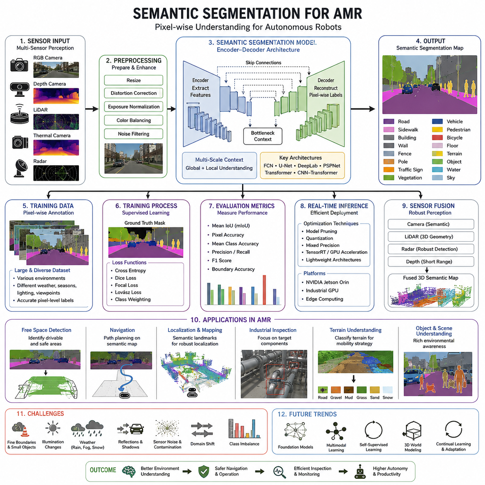
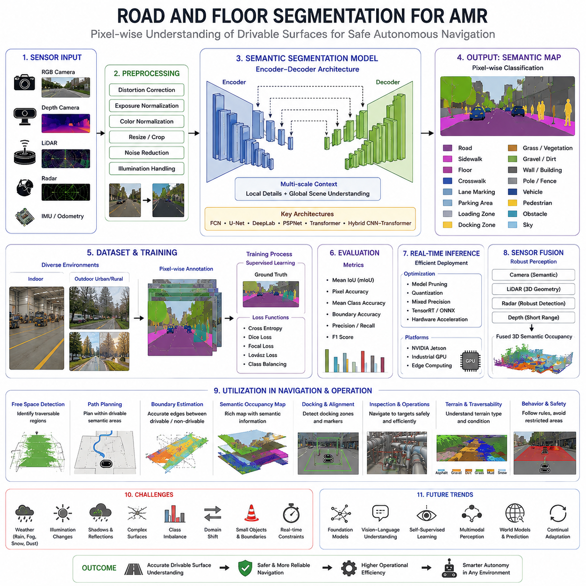
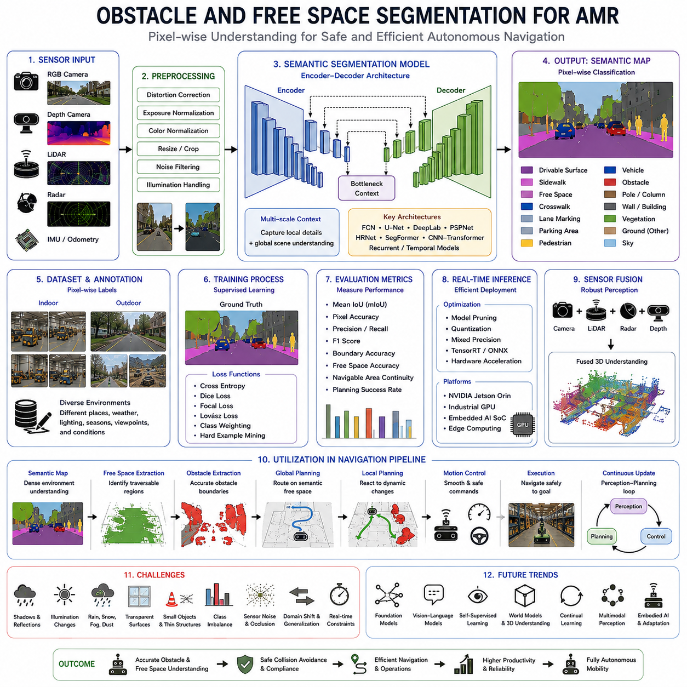
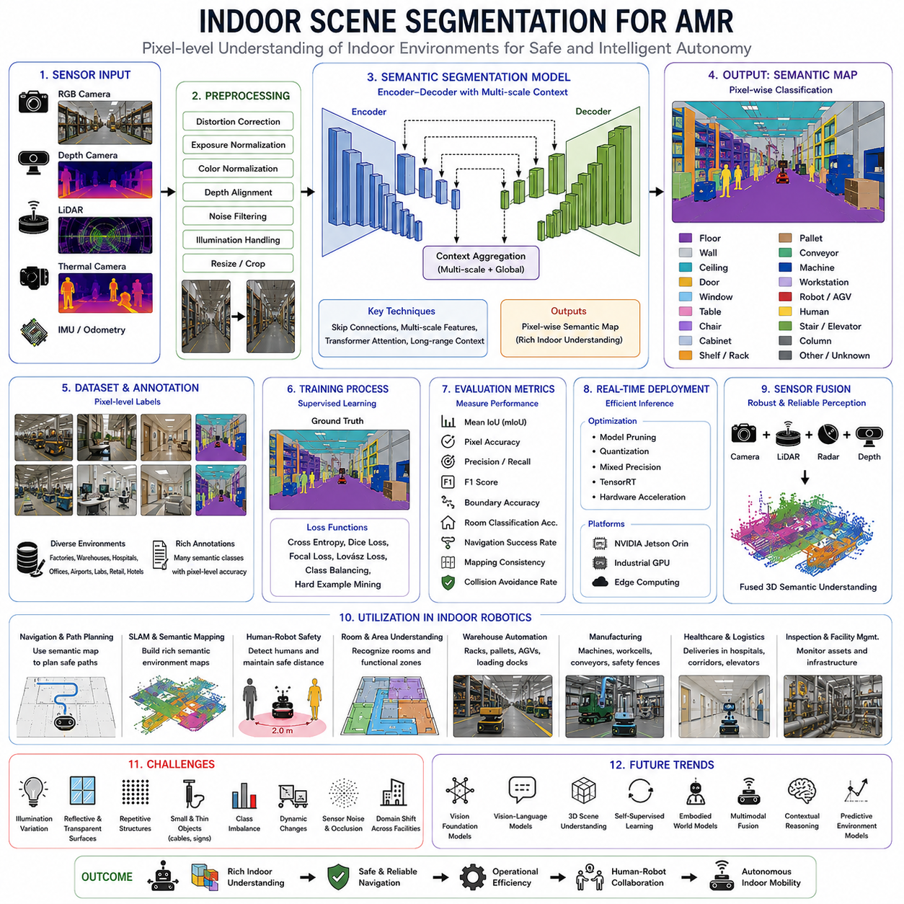
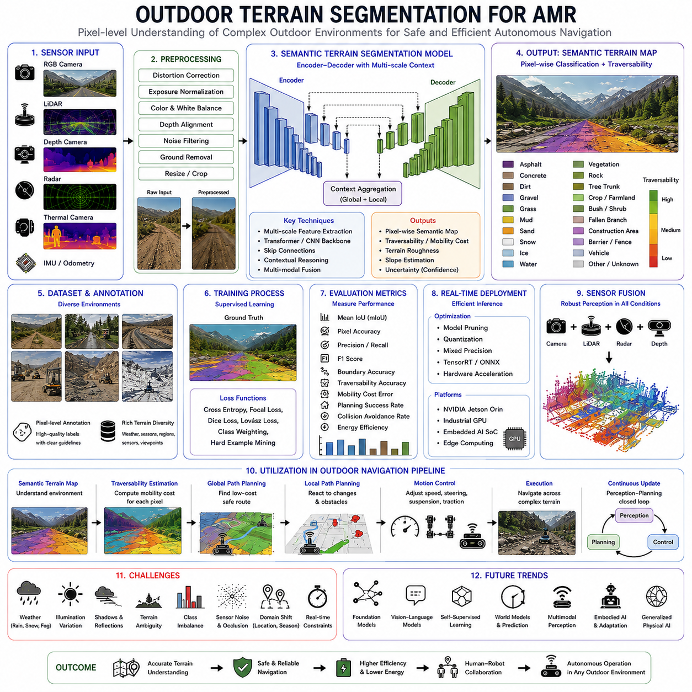
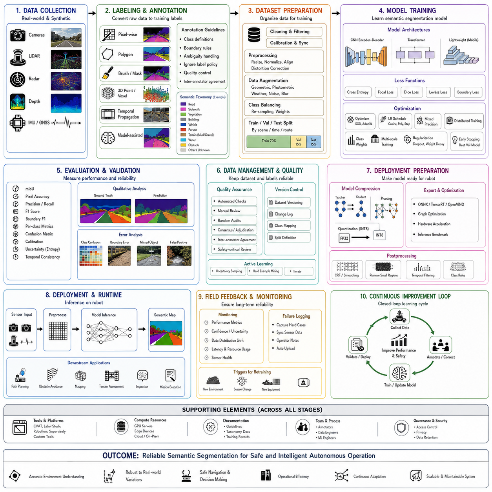
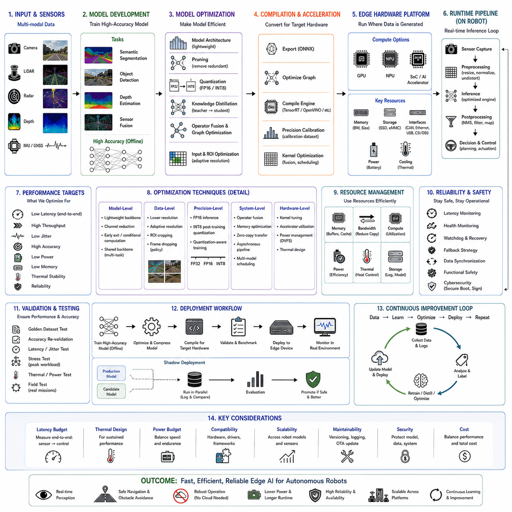
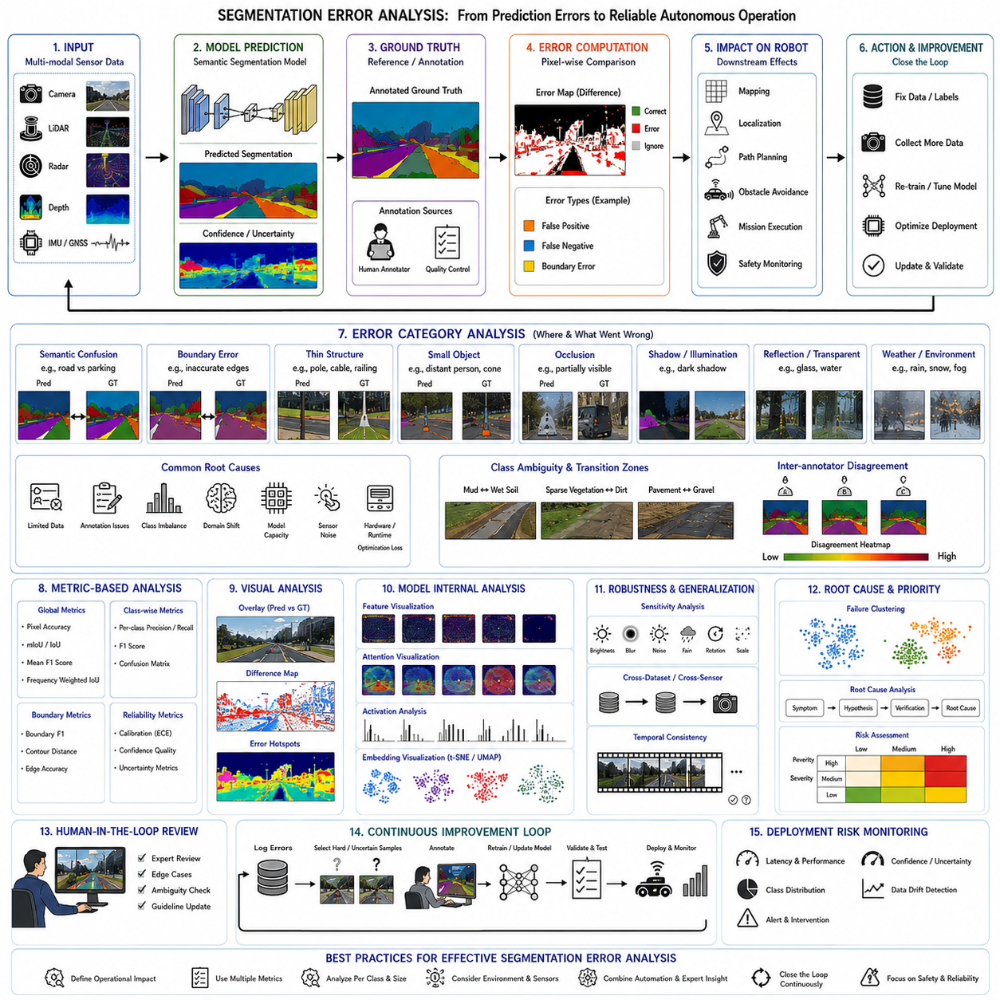

**Volume 03. AMR Sensors and Perception**


# Chapter 17. Semantic Segmentation

##  

## 17.1 Semantic Segmentation Basics

{width="7.268055555555556in" height="7.268055555555556in"}

Semantic segmentation is one of the fundamental perception technologies that enables an autonomous mobile robot to understand an entire scene instead of recognizing only isolated objects. Unlike traditional computer vision approaches that classify a whole image or detect objects with rectangular bounding boxes, semantic segmentation assigns a semantic class label to every individual pixel in an image. Every visible point within the camera frame is therefore interpreted as belonging to a meaningful category such as floor, wall, road, grass, pallet, vehicle, pedestrian, machine, shelf, or building. This dense understanding allows the robot to reason about the environment at a much finer level of detail and provides richer information for localization, navigation, obstacle avoidance, inspection, and autonomous decision making.

The importance of semantic segmentation has increased significantly as modern AMRs have evolved from operating in carefully structured indoor facilities toward dynamic outdoor environments. Warehouses, hospitals, construction sites, logistics centers, ports, mines, agricultural fields, and public roads all contain diverse surfaces, irregular obstacles, changing weather conditions, and moving objects. A robot navigating these environments must determine not only where obstacles exist but also understand the meaning of different regions. Knowing that a surface is a drivable road, a pedestrian walkway, loose gravel, wet concrete, or dense vegetation directly influences navigation decisions. Semantic segmentation transforms raw image data into structured environmental knowledge that higher-level planning modules can utilize.

One of the defining characteristics of semantic segmentation is that it performs dense scene understanding rather than sparse object recognition. Every pixel contributes to the final interpretation of the environment. This pixel-level labeling enables robots to estimate precise object boundaries, distinguish traversable and non-traversable regions, and identify semantic relationships between neighboring objects. For example, instead of simply detecting a forklift with a bounding box, semantic segmentation accurately identifies the exact outline of the forklift, separates it from the surrounding floor, and distinguishes its forks, wheels, and body from nearby shelves or workers. Such detailed representations improve downstream perception tasks considerably.

Semantic segmentation differs fundamentally from image classification and object detection. Image classification assigns one label to an entire image, assuming that a single dominant category represents the scene. Object detection predicts rectangular bounding boxes around individual objects while assigning category labels to those boxes. Semantic segmentation extends beyond these approaches by classifying every pixel independently. This eliminates the ambiguity introduced by coarse bounding boxes and allows robots to estimate free space, object shapes, and environmental boundaries with much higher precision. As robotic perception systems become more sophisticated, semantic segmentation increasingly complements rather than replaces object detection.

Another closely related concept is instance segmentation. Although both semantic segmentation and instance segmentation perform pixel-level labeling, they solve different problems. Semantic segmentation groups all objects of the same category into a single region. For example, every pedestrian pixel receives the pedestrian label regardless of how many people are present. Instance segmentation separates each individual object into distinct instances, assigning unique identities to multiple pedestrians. For autonomous navigation, semantic segmentation often provides sufficient environmental understanding, while instance segmentation becomes valuable when tracking individual dynamic objects or performing manipulation tasks.

The perception pipeline for semantic segmentation begins with image acquisition from one or more cameras. RGB cameras provide high-resolution color information, while depth cameras contribute geometric measurements. Thermal cameras may improve perception under poor lighting conditions, and LiDAR can supply complementary three-dimensional information. Raw sensor data first undergoes preprocessing steps including image resizing, distortion correction, exposure normalization, color balancing, and noise filtering. These operations ensure that the neural network receives consistent input despite variations in lighting, camera characteristics, or environmental conditions encountered during field operation.

Modern semantic segmentation systems rely almost entirely on deep neural networks. Early computer vision algorithms attempted pixel classification using handcrafted features such as color histograms, edge detectors, texture descriptors, and region-growing algorithms. While these methods achieved limited success in highly controlled environments, they struggled with illumination changes, occlusions, complex textures, and diverse object appearances. Deep learning replaced handcrafted feature engineering with hierarchical feature extraction, allowing neural networks to automatically learn increasingly abstract representations directly from large annotated datasets.

Convolutional Neural Networks form the foundation of most semantic segmentation architectures. CNN layers progressively transform raw pixel values into high-dimensional feature maps that capture edges, corners, textures, shapes, and semantic concepts. Early layers respond primarily to local image structures, while deeper layers recognize increasingly complex object characteristics. Successful segmentation models combine local spatial detail with global contextual information, allowing the network to identify both small objects and large scene layouts simultaneously. This multi-scale representation is particularly important for robotics, where nearby obstacles and distant landmarks must both be interpreted correctly.

Encoder-decoder architectures have become one of the dominant design patterns for semantic segmentation. The encoder gradually reduces image resolution while extracting increasingly abstract semantic features. Pooling operations and convolutional layers compress spatial information into compact feature representations. The decoder subsequently reconstructs high-resolution segmentation maps through upsampling operations, skip connections, and feature fusion techniques. Skip connections preserve fine image details that would otherwise disappear during encoding, improving boundary accuracy and enabling more precise delineation of objects such as cables, poles, curbs, or machinery.

Several influential semantic segmentation architectures have shaped the field. Fully Convolutional Networks demonstrated that classification networks could be transformed into dense prediction models. U-Net introduced symmetric encoder-decoder structures with skip connections and became especially popular in medical imaging before expanding into robotics. DeepLab incorporated atrous convolutions to capture larger receptive fields without excessive computational cost. PSPNet emphasized pyramid scene parsing to improve global context understanding. More recently, transformer-based architectures and hybrid CNN-transformer models have further enhanced segmentation accuracy by modeling long-range relationships throughout complex scenes.

The success of semantic segmentation depends heavily on carefully prepared datasets with accurate pixel-level annotations. Unlike object detection datasets that require only bounding boxes, semantic segmentation demands dense labeling for every visible pixel. This annotation process is significantly more labor intensive because human annotators must precisely outline object boundaries throughout thousands of images. Common semantic categories include roads, sidewalks, walls, ceilings, floors, vegetation, buildings, vehicles, pedestrians, bicycles, traffic signs, machinery, pallets, shelving, and various industrial equipment depending on the target application. Consistent annotation guidelines are essential because inconsistencies directly reduce model performance during training.

Data diversity is equally important. A robust semantic segmentation model should experience wide variations in illumination, weather, seasons, viewpoints, sensor noise, camera exposure, object appearance, and environmental complexity. Indoor robots require datasets containing different floor materials, lighting conditions, furniture arrangements, people, and industrial equipment. Outdoor robots require additional coverage of asphalt, gravel, grass, mud, snow, puddles, shadows, fog, rain, construction materials, parked vehicles, and natural terrain. Broad dataset diversity allows models to generalize beyond the limited conditions observed during training.

Training semantic segmentation models involves optimizing neural network parameters using supervised learning. Ground truth segmentation masks provide the expected pixel labels for each training image. The network predicts class probabilities for every pixel, and loss functions measure disagreement between predictions and annotations. Cross-entropy loss remains one of the most common optimization objectives, while Dice loss, focal loss, Lovász loss, and hybrid loss formulations improve performance on imbalanced datasets where small classes occupy only limited image regions. Class weighting further compensates for unequal category frequencies by emphasizing rare but safety-critical objects.

Evaluation metrics differ from those used in object detection because pixel-level accuracy is more informative than bounding-box overlap. Mean Intersection over Union has become the standard benchmark for semantic segmentation. It measures overlap between predicted regions and ground truth masks for every class before averaging the results. Pixel accuracy evaluates the percentage of correctly classified pixels but may overestimate performance when dominant classes occupy large portions of the image. Mean class accuracy, boundary accuracy, precision, recall, and F1 score provide additional perspectives on segmentation quality, especially for safety-critical robotics applications.

Real-time inference represents one of the greatest engineering challenges for autonomous robots. High-resolution semantic segmentation networks often require substantial computational resources. Industrial AMRs must balance segmentation accuracy with latency, power consumption, thermal constraints, and embedded hardware limitations. Edge computing platforms such as NVIDIA Jetson Orin, industrial GPUs, TensorRT optimization, mixed precision inference, model pruning, quantization, and efficient network architectures help achieve practical deployment while maintaining acceptable perception performance. Reducing inference latency directly improves navigation responsiveness and operational safety.

Semantic segmentation rarely operates in isolation within an AMR perception system. Instead, it forms one component of a broader multi-sensor perception pipeline. Camera-based segmentation may be fused with LiDAR point clouds to generate semantically labeled three-dimensional environments. Radar contributes robust obstacle detection during rain or fog, while depth cameras improve short-range geometric understanding. Sensor fusion enables the robot to compensate for weaknesses in individual sensing modalities and increases overall perception robustness across diverse operating conditions.

Free-space detection represents one of the most important applications of semantic segmentation. Instead of relying exclusively on obstacle detection, the robot identifies traversable regions suitable for safe motion. Segmentation models classify floor surfaces, roads, sidewalks, and drivable terrain while excluding walls, machinery, vegetation, pedestrians, vehicles, and hazardous regions. Local path planners consume these semantic free-space maps to generate collision-free trajectories that satisfy vehicle kinematic constraints while avoiding unsafe or inaccessible areas. Accurate free-space estimation significantly improves navigation reliability in cluttered industrial environments.

Semantic segmentation also enhances localization and mapping. Semantic landmarks remain more stable over time than raw visual features because object categories generally persist despite illumination or seasonal changes. Buildings remain buildings, roads remain roads, and structural walls remain walls even when textures, shadows, or weather vary considerably. Semantic information therefore improves long-term localization robustness and contributes to semantic mapping, where occupancy grids are enriched with meaningful environmental labels. Such maps enable robots to reason not only about geometry but also about functional characteristics of the surrounding environment.

Industrial inspection robots particularly benefit from semantic segmentation because inspection targets frequently occupy only specific regions within large facilities. Instead of processing every pixel equally, segmentation identifies pipes, valves, electrical cabinets, conveyor systems, machine housings, structural supports, or storage racks before higher-level inspection algorithms perform anomaly detection. Restricting analysis to semantically relevant regions reduces computational cost, minimizes false positives, and improves inspection efficiency by focusing AI resources on meaningful components rather than irrelevant background structures.

Outdoor autonomous robots require even more advanced semantic understanding because terrain characteristics directly influence mobility. Road surfaces, gravel paths, mud, grass, sand, snow, standing water, and rocky terrain exhibit dramatically different traversability properties despite appearing visually similar under certain conditions. Semantic segmentation enables terrain classification that supports adaptive speed control, suspension management, traction estimation, and route planning. Heavy outdoor AMRs operating in logistics yards, construction sites, agricultural fields, or mining environments rely heavily on accurate terrain semantics to maintain safe and efficient mobility.

Several practical challenges remain despite rapid technological progress. Fine object boundaries remain difficult to estimate accurately because neighboring pixels often contain mixed information. Small objects such as cables, tools, safety cones, and narrow poles occupy only limited image regions yet may have significant operational importance. Dynamic lighting, reflections, transparent surfaces, shadows, rain, dust, fog, and sensor contamination further complicate reliable segmentation. Domain shifts between training datasets and deployment environments frequently degrade model performance, emphasizing the importance of continual validation and dataset expansion.

Future semantic segmentation systems will increasingly integrate foundation models, multimodal perception, self-supervised learning, and three-dimensional world modeling. Rather than treating segmentation as an isolated vision task, next-generation perception architectures will combine language understanding, geometric reasoning, temporal consistency, and contextual scene interpretation. Robots will learn semantic representations from enormous multimodal datasets and adapt continuously during deployment. This evolution will enable autonomous systems to achieve more reliable environmental understanding, improved navigation safety, more efficient inspection workflows, and greater operational autonomy across diverse industrial applications.

의미론적 분할(Semantic Segmentation)은 자율주행 모바일 로봇(Autonomous Mobile Robot, AMR)이 개별 객체만 인식하는 것이 아니라 장면(Scene) 전체를 이해할 수 있도록 하는 핵심 인지(Perception) 기술 가운데 하나이다. 기존의 컴퓨터 비전(Computer Vision) 방식이 이미지 전체를 하나의 범주로 분류하거나 객체를 사각형 경계 상자(Bounding Box)로 검출하는 것과 달리, 의미론적 분할은 이미지의 모든 개별 픽셀(Pixel)에 의미 있는 클래스(Class) 라벨(Label)을 부여한다. 따라서 카메라 화면에 보이는 모든 지점은 바닥(Floor), 벽(Wall), 도로(Road), 잔디(Grass), 팔레트(Pallet), 차량(Vehicle), 보행자(Pedestrian), 기계(Machine), 선반(Shelf), 건물(Building)과 같은 의미 있는 범주로 해석된다. 이러한 고밀도(Dense) 장면 이해는 로봇이 환경을 훨씬 세밀하게 해석할 수 있도록 하며, 위치추정(Localization), 내비게이션(Navigation), 장애물 회피(Obstacle Avoidance), 검사(Inspection), 자율 의사결정(Autonomous Decision Making)에 더욱 풍부한 정보를 제공한다.

현대의 AMR이 정형화된 실내 환경에서 복잡하고 동적인 실외 환경으로 적용 범위를 확대하면서 의미론적 분할의 중요성은 더욱 커지고 있다. 창고(Warehouse), 병원(Hospital), 건설 현장(Construction Site), 물류센터(Logistics Center), 항만(Port), 광산(Mine), 농업 현장(Agricultural Field), 공공도로(Public Road)는 다양한 노면(Surface), 불규칙한 장애물, 변화하는 기상 조건, 그리고 이동하는 객체들로 구성된다. 이러한 환경에서 로봇은 단순히 장애물의 존재를 확인하는 것이 아니라 각 영역이 무엇을 의미하는지까지 이해해야 한다. 특정 표면이 주행 가능한 도로인지, 보행자 통로인지, 자갈인지, 젖은 콘크리트인지, 또는 식생(Vegetation)인지를 아는 것은 내비게이션 전략에 직접적인 영향을 준다. 의미론적 분할은 원시 영상 데이터를 구조화된 환경 지식으로 변환하여 상위 계획 모듈이 활용할 수 있도록 한다.

의미론적 분할의 가장 큰 특징은 희소(Sparse) 객체 인식이 아니라 고밀도 장면 이해(Dense Scene Understanding)를 수행한다는 점이다. 이미지의 모든 픽셀이 최종 환경 해석에 기여한다. 이러한 픽셀 수준(Pixel-Level) 분류는 로봇이 객체의 경계를 더욱 정확하게 추정하고, 주행 가능한 영역과 불가능한 영역을 구분하며, 인접한 객체 간의 의미적 관계를 이해하도록 지원한다. 예를 들어 단순한 객체 검출(Object Detection)은 지게차(Forklift)를 사각형으로 표시하지만, 의미론적 분할은 지게차의 정확한 외곽선을 추출하고 바닥과 분리하며, 차체와 포크(Fork), 바퀴(Wheel)를 주변 선반(Shelf)이나 작업자(Worker)와 명확히 구분할 수 있다. 이러한 정밀한 표현은 이후 단계의 인지 알고리즘 성능을 크게 향상시킨다.

의미론적 분할은 이미지 분류(Image Classification)와 객체 검출(Object Detection)과 근본적으로 다른 접근 방식을 가진다. 이미지 분류는 하나의 이미지를 하나의 범주로만 분류하며, 객체 검출은 객체 주변에 사각형 경계 상자를 예측하여 범주를 부여한다. 반면 의미론적 분할은 모든 픽셀을 독립적으로 분류한다. 따라서 경계 상자 방식에서 발생하는 위치 오차와 형태 왜곡을 제거할 수 있으며, 자유 공간(Free Space), 객체 형상(Object Shape), 환경 경계(Environment Boundary)를 훨씬 높은 정확도로 추정할 수 있다. 최근의 로봇 인지 시스템에서는 의미론적 분할이 객체 검출을 대체하기보다는 상호 보완하는 기술로 활용되고 있다.

이와 밀접하게 관련된 개념으로 인스턴스 분할(Instance Segmentation)이 있다. 두 기술 모두 픽셀 수준의 분류를 수행하지만 해결하려는 문제는 서로 다르다. 의미론적 분할은 동일한 클래스에 속하는 모든 객체를 하나의 영역으로 처리한다. 예를 들어 여러 명의 보행자가 존재하더라도 모든 픽셀은 동일한 보행자(Pedestrian) 클래스로 분류된다. 반면 인스턴스 분할은 각각의 보행자를 독립적인 개체(Instance)로 구분하여 고유한 식별 정보를 부여한다. 자율주행에서는 환경 이해를 위해 의미론적 분할만으로도 충분한 경우가 많지만, 개별 이동 객체를 추적하거나 조작(Manipulation)을 수행하는 작업에서는 인스턴스 분할이 더욱 중요한 역할을 한다.

의미론적 분할의 인지 파이프라인(Perception Pipeline)은 하나 이상의 카메라를 통한 영상 획득(Image Acquisition)에서 시작된다. RGB 카메라는 고해상도 색상 정보를 제공하고, 깊이 카메라(Depth Camera)는 기하학적 거리 정보를 제공한다. 열화상 카메라(Thermal Camera)는 저조도 환경에서 성능을 향상시키며, 라이다(LiDAR)는 3차원 공간 정보를 보완한다. 원시 센서 데이터는 이미지 크기 조정(Image Resizing), 왜곡 보정(Distortion Correction), 노출 정규화(Exposure Normalization), 색상 보정(Color Balancing), 잡음 제거(Noise Filtering) 등의 전처리(Preprocessing)를 거친다. 이러한 과정은 조명 변화나 센서 특성 차이에 관계없이 신경망(Neural Network)에 일관된 입력을 제공하기 위해 필요하다.

현대의 의미론적 분할 시스템은 거의 대부분 딥러닝(Deep Learning) 기반의 신경망을 사용한다. 초기 컴퓨터 비전 기술은 색상 히스토그램(Color Histogram), 에지 검출기(Edge Detector), 텍스처 기술자(Texture Descriptor), 영역 확장(Region Growing)과 같은 수작업 특징(Handcrafted Feature)에 의존하였다. 이러한 방법은 제한된 환경에서는 어느 정도 동작했지만 조명 변화, 가림(Occlusion), 복잡한 질감, 다양한 객체 형태에는 쉽게 실패하였다. 딥러닝은 사람이 직접 특징을 설계하는 대신 대규모 데이터셋(Dataset)으로부터 계층적인 특징(Hierarchical Feature)을 자동으로 학습함으로써 훨씬 높은 일반화 성능을 제공하게 되었다.

합성곱 신경망(Convolutional Neural Network, CNN)은 대부분의 의미론적 분할 구조의 기반을 이룬다. CNN 계층(Layer)은 원시 픽셀 값을 점진적으로 변환하여 에지, 모서리, 질감, 형상, 그리고 고차원 의미 정보를 표현하는 특징 맵(Feature Map)을 생성한다. 초기 계층은 국부적인 구조를 인식하고, 깊은 계층은 복잡한 객체 특성을 학습한다. 성공적인 의미론적 분할 모델은 국부적인 세부 정보(Local Detail)와 전역적인 문맥(Global Context)을 동시에 활용하여 작은 객체와 넓은 장면 구조를 함께 이해할 수 있도록 설계된다. 이러한 다중 스케일(Multi-Scale) 표현은 근거리 장애물과 원거리 랜드마크(Landmark)를 동시에 인식해야 하는 로봇 분야에서 매우 중요하다.

인코더-디코더(Encoder-Decoder) 구조는 의미론적 분할에서 가장 널리 사용되는 설계 방식이다. 인코더는 이미지 해상도를 점차 줄이면서 점점 더 추상적인 의미 정보를 추출한다. 풀링(Pooling)과 합성곱 계층은 공간 정보를 압축하여 고차원 특징 표현으로 변환한다. 이후 디코더는 업샘플링(Upsampling), 스킵 연결(Skip Connection), 특징 융합(Feature Fusion)을 이용하여 다시 고해상도의 분할 결과를 복원한다. 특히 스킵 연결은 인코더 과정에서 손실될 수 있는 세부 정보를 유지하여 케이블(Cable), 기둥(Pole), 연석(Curb), 산업 설비와 같은 작은 구조물의 경계를 더욱 정확하게 복원하도록 돕는다.

의미론적 분할 분야에서는 여러 대표적인 신경망 구조가 발전을 이끌어 왔다. 완전 합성곱 신경망(Fully Convolutional Network, FCN)은 기존 분류 모델을 고밀도 예측(Dense Prediction) 모델로 변환할 수 있음을 보여주었다. 유넷(U-Net)은 대칭형 인코더-디코더 구조와 스킵 연결을 도입하여 의료 영상뿐 아니라 로봇 분야에서도 널리 활용되었다. 딥랩(DeepLab)은 팽창 합성곱(Atrous Convolution)을 이용하여 계산량 증가 없이 넓은 수용 영역(Receptive Field)을 확보하였다. PSPNet은 피라미드 장면 분석(Pyramid Scene Parsing)을 통해 전역 문맥 이해를 향상시켰다. 최근에는 트랜스포머(Transformer) 기반 구조와 CNN-트랜스포머 하이브리드 모델이 장거리 문맥 관계(Long-Range Relationship)를 효과적으로 학습하면서 더욱 높은 정확도를 달성하고 있다.

의미론적 분할의 성능은 정확한 픽셀 수준 주석(Annotation)이 포함된 데이터셋의 품질에 크게 의존한다. 객체 검출은 경계 상자만 필요하지만, 의미론적 분할은 모든 픽셀을 사람이 직접 라벨링해야 한다. 따라서 데이터 구축 비용과 시간이 훨씬 많이 소요된다. 일반적인 의미 클래스에는 도로, 보도(Sidewalk), 벽, 천장(Ceiling), 바닥, 식생, 건물, 차량, 보행자, 자전거(Bicycle), 교통표지판(Traffic Sign), 산업 설비, 팔레트, 선반 등이 포함되며, 적용 분야에 따라 추가적인 산업 전용 클래스가 정의된다. 일관된 라벨링 기준은 매우 중요하며, 주석의 불일치는 모델 성능 저하로 직접 이어질 수 있다.

데이터 다양성(Data Diversity) 역시 매우 중요한 요소이다. 강건한(Robust) 의미론적 분할 모델은 다양한 조명, 기상 조건, 계절 변화, 촬영 각도, 센서 잡음, 카메라 노출, 객체 외형, 그리고 복잡한 환경을 모두 학습해야 한다. 실내 AMR은 서로 다른 바닥 재질, 조명, 가구 배치, 사람, 산업 설비를 포함한 데이터가 필요하며, 실외 AMR은 아스팔트(Asphalt), 자갈, 잔디, 진흙(Mud), 눈(Snow), 물웅덩이(Puddle), 그림자, 안개(Fog), 비(Rain), 건설 자재 등 더욱 다양한 환경을 포함해야 한다. 이러한 다양한 데이터는 실제 현장에서 높은 일반화 성능을 확보하는 핵심 요소이다.

의미론적 분할 모델 학습(Model Training)은 지도학습(Supervised Learning)을 기반으로 수행된다. 정답 마스크(Ground Truth Mask)는 각 픽셀의 실제 클래스를 제공하며, 신경망은 각 픽셀에 대한 클래스 확률(Class Probability)을 예측한다. 손실 함수(Loss Function)는 예측 결과와 정답 간의 차이를 계산하여 모델을 최적화한다. 교차 엔트로피 손실(Cross Entropy Loss)이 가장 널리 사용되며, Dice Loss, Focal Loss, Lovász Loss와 같은 다양한 손실 함수는 클래스 불균형(Class Imbalance)이 심한 환경에서 성능을 향상시킨다. 또한 클래스 가중치(Class Weight)를 적용하여 드물지만 안전에 중요한 객체를 더욱 효과적으로 학습하도록 한다.

성능 평가는 객체 검출과는 다른 기준을 사용한다. 평균 교집합 비율(Mean Intersection over Union, mIoU)은 가장 대표적인 평가 지표이며, 예측된 영역과 정답 영역의 중첩 정도를 클래스별로 계산하여 평균을 구한다. 픽셀 정확도(Pixel Accuracy)는 전체 픽셀 중 올바르게 분류된 비율을 계산하지만, 특정 클래스가 화면 대부분을 차지하는 경우 실제 성능보다 높게 평가될 수 있다. 평균 클래스 정확도(Mean Class Accuracy), 경계 정확도(Boundary Accuracy), 정밀도(Precision), 재현율(Recall), F1 점수(F1 Score) 등도 안전성이 중요한 로봇 시스템에서 함께 활용된다.

실시간 추론(Real-Time Inference)은 자율주행 로봇에서 가장 중요한 기술적 과제 가운데 하나이다. 고해상도 의미론적 분할 모델은 매우 높은 계산량을 요구하는 경우가 많다. 산업용 AMR은 정확도와 함께 지연 시간(Latency), 소비 전력(Power Consumption), 발열(Thermal Constraint), 임베디드 하드웨어(Embedded Hardware)의 성능을 동시에 고려해야 한다. 엔비디아 젯슨 오린(NVIDIA Jetson Orin), 산업용 GPU, 텐서RT(TensorRT), 혼합 정밀도(Mixed Precision), 모델 가지치기(Model Pruning), 양자화(Quantization), 경량 신경망(Lightweight Architecture) 등이 실제 배포 환경에서 널리 활용되고 있다.

의미론적 분할은 일반적으로 단독으로 사용되지 않고 다중 센서(Multi-Sensor) 기반 인지 시스템의 일부로 동작한다. 카메라 기반 의미론적 분할 결과는 라이다 점군(Point Cloud)과 결합되어 의미 정보를 포함하는 3차원 환경 모델을 생성할 수 있다. 레이더(Radar)는 비나 안개 환경에서 안정적인 장애물 검출을 제공하며, 깊이 카메라는 근거리 공간 정보를 보완한다. 이러한 센서 융합(Sensor Fusion)은 개별 센서의 한계를 보완하여 다양한 환경에서 더욱 강건한 인지 성능을 제공한다.

자유 공간 검출(Free Space Detection)은 의미론적 분할의 가장 중요한 응용 분야 가운데 하나이다. 단순히 장애물을 찾는 것이 아니라 로봇이 안전하게 주행할 수 있는 영역을 직접 식별한다. 의미론적 분할은 바닥, 도로, 보도, 주행 가능한 지형을 분류하고 벽, 산업 설비, 식생, 보행자, 차량, 위험 지역을 제외한다. 지역 경로 계획기(Local Path Planner)는 이러한 자유 공간 정보를 활용하여 차량의 운동학적 제약(Kinematic Constraint)을 만족하면서도 충돌을 피하는 안전한 경로를 생성한다. 정확한 자유 공간 추정은 복잡한 산업 환경에서 내비게이션 안정성을 크게 향상시킨다.

의미론적 분할은 위치추정(Localization)과 지도 작성(Mapping)에도 중요한 역할을 한다. 의미 기반 랜드마크(Semantic Landmark)는 단순한 영상 특징보다 시간이 지나도 안정적으로 유지된다. 건물은 여전히 건물이며, 도로는 여전히 도로이고, 구조물은 계절이나 조명 변화에도 동일한 의미를 유지한다. 이러한 의미 정보는 장기 위치추정(Long-Term Localization)의 강건성을 높이며, 의미 지도(Semantic Map)를 생성하는 기반이 된다. 이러한 지도는 단순한 기하학 정보뿐 아니라 환경의 기능적 의미까지 포함하여 로봇의 고차원 의사결정을 지원한다.

산업용 검사 로봇(Industrial Inspection Robot)은 의미론적 분할의 큰 혜택을 받는 대표적인 응용 분야이다. 검사 대상은 시설 전체가 아니라 특정 장비와 설비에 집중되는 경우가 많다. 의미론적 분할은 배관(Pipe), 밸브(Valve), 전기 캐비닛(Electrical Cabinet), 컨베이어(Conveyor), 기계 하우징(Machine Housing), 구조물 등을 먼저 식별한 후, 이상 탐지(Anomaly Detection) 알고리즘이 필요한 영역만 분석하도록 지원한다. 이를 통해 계산량을 줄이고 오검출(False Positive)을 감소시키며 검사 효율을 크게 향상시킬 수 있다.

실외 자율주행 로봇은 다양한 지형(Terrain)을 이해해야 하므로 의미론적 분할의 중요성이 더욱 커진다. 도로, 자갈길, 진흙, 잔디, 모래(Sand), 눈, 물웅덩이, 암석 지형은 서로 다른 주행 특성을 가진다. 의미론적 분할은 이러한 지형을 분류하여 적응형 속도 제어(Adaptive Speed Control), 서스펜션 제어(Suspension Control), 접지력(Traction) 추정, 경로 계획(Route Planning)을 지원한다. 물류 단지, 건설 현장, 농업 환경, 광산 등에서 운용되는 대형 AMR은 이러한 의미 기반 지형 이해에 크게 의존한다.

빠른 기술 발전에도 불구하고 해결해야 할 과제는 여전히 많다. 세밀한 객체 경계는 혼합 픽셀(Mixed Pixel)의 영향으로 정확하게 추정하기 어렵다. 케이블, 공구(Tool), 안전 콘(Safety Cone), 가는 기둥과 같은 작은 객체는 화면에서 차지하는 비율은 작지만 안전성에는 매우 중요한 영향을 준다. 또한 조명 변화, 반사(Reflection), 투명체(Transparent Surface), 그림자, 비, 먼지(Dust), 안개, 센서 오염 등은 의미론적 분할의 정확도를 저하시킨다. 학습 데이터셋과 실제 운영 환경 간의 도메인 변화(Domain Shift) 역시 성능 저하의 주요 원인으로 지속적인 데이터 수집과 모델 검증이 요구된다.

미래의 의미론적 분할은 파운데이션 모델(Foundation Model), 멀티모달 인지(Multimodal Perception), 자기지도학습(Self-Supervised Learning), 그리고 3차원 월드 모델(3D World Model)과 긴밀하게 통합될 것으로 예상된다. 의미론적 분할은 더 이상 독립적인 영상 처리 기술이 아니라 언어 이해(Language Understanding), 기하학적 추론(Geometric Reasoning), 시간적 일관성(Temporal Consistency), 문맥 기반 장면 이해(Contextual Scene Understanding)를 함께 수행하는 통합 인지 시스템으로 발전할 것이다. 로봇은 대규모 멀티모달 데이터로부터 의미 표현을 학습하고 현장에서 지속적으로 적응하며, 더욱 높은 수준의 환경 이해, 안전한 자율주행, 효율적인 산업 검사, 그리고 장기적인 자율성을 실현하게 될 것이다.

##  

## 17.2 Road and Floor Segmentation

{width="7.268055555555556in" height="7.268055555555556in"}

Road and floor segmentation is one of the most fundamental applications of semantic segmentation in autonomous mobile robotics because it enables the robot to distinguish traversable surfaces from the surrounding environment at the pixel level. Instead of merely detecting obstacles, the perception system identifies where the robot can safely drive by assigning every pixel to semantic categories such as road, floor, sidewalk, grass, gravel, wall, machinery, or vegetation. This dense understanding provides the foundation for reliable navigation, obstacle avoidance, path planning, and autonomous decision making in both indoor and outdoor environments.

The concept of road and floor segmentation extends beyond simple surface recognition. A mobile robot must understand whether a visible surface is physically traversable, operationally permitted, and safe under current environmental conditions. Two regions with similar visual appearance may require completely different driving behaviors. For example, polished concrete and wet concrete may appear nearly identical in RGB images, while dry asphalt and loose gravel may share similar colors. Semantic segmentation therefore combines visual appearance with contextual information learned during model training to estimate the functional meaning of each surface.

In autonomous navigation, the driving surface represents the largest continuous semantic region in most environments. Correct identification of this region allows the navigation system to construct a reliable free-space representation without relying solely on obstacle detection. Instead of planning paths only around detected objects, the robot plans trajectories directly inside semantically validated traversable regions. This significantly improves navigation robustness because the robot understands both where obstacles exist and where motion is naturally expected.

Indoor floor segmentation is generally more structured than outdoor road segmentation. Industrial facilities often contain concrete floors, epoxy coatings, tiled surfaces, painted safety zones, storage areas, loading docks, charging stations, and pedestrian walkways. Although these surfaces may appear visually similar, they often possess different operational meanings. A robot operating inside a factory may be allowed to travel only within designated traffic lanes while avoiding pedestrian crossings or restricted maintenance zones. Semantic floor segmentation enables these operational rules to be integrated directly into perception outputs.

Outdoor road segmentation introduces substantially greater complexity because environmental conditions continuously change. Roads may include asphalt, concrete, gravel, dirt, grass, sand, snow, mud, or partially damaged pavement. Lighting varies throughout the day, while shadows from buildings, vehicles, and vegetation continuously alter image appearance. Rain introduces reflections, puddles, and water accumulation that may obscure road boundaries. Seasonal changes further modify vegetation color and surface texture. A practical segmentation model must therefore generalize across a much broader range of environmental variations than indoor systems.

One of the primary objectives of road and floor segmentation is to estimate traversability. Traversability refers to whether the robot can safely drive over a particular surface given its physical capabilities. Traversability depends not only on semantic category but also on robot characteristics including wheel configuration, suspension design, ground clearance, payload, tire properties, and vehicle dimensions. A heavy outdoor AMR capable of traversing gravel or grass may classify those surfaces as drivable, while a small indoor robot may consider identical terrain completely inaccessible.

Semantic segmentation contributes directly to free-space detection by identifying continuous regions suitable for navigation. Classical free-space detection often relied on geometric assumptions such as flat ground estimation or obstacle height thresholds. These methods frequently failed when encountering ramps, slopes, uneven terrain, shadows, or visually ambiguous surfaces. Semantic segmentation improves free-space estimation by incorporating learned semantic understanding into pixel classification. Consequently, free-space maps become more robust under diverse environmental conditions and complex scene layouts.

Road and floor segmentation also improves boundary estimation. Navigation algorithms require accurate knowledge of transitions between traversable and non-traversable regions. These boundaries include curbs, walls, shelves, vegetation edges, construction barriers, drainage channels, and platform edges. Pixel-level segmentation generates much more precise boundary information than rectangular object detection because object contours follow their actual shapes rather than coarse bounding boxes. Precise boundary estimation allows local planners to maximize usable driving space while maintaining safe clearance margins.

Modern road segmentation systems typically process RGB camera images using deep convolutional neural networks or hybrid CNN-transformer architectures. The input image first undergoes preprocessing operations including distortion correction, exposure normalization, image resizing, color normalization, and noise reduction. These preprocessing stages improve input consistency and reduce variations introduced by different camera hardware, illumination conditions, and environmental factors. Standardized inputs improve neural network stability during both training and deployment.

Feature extraction begins within the encoder portion of the segmentation network. Early convolutional layers identify local image features including edges, textures, corners, lane markings, pavement cracks, tile patterns, and color gradients. Deeper layers progressively recognize larger semantic structures such as sidewalks, road surfaces, factory floors, buildings, shelving systems, or vegetation. Multi-scale feature extraction enables simultaneous recognition of small details and large environmental structures, which is essential because road boundaries often extend across large portions of the image while surface defects occupy only small local regions.

The decoder reconstructs dense segmentation maps by combining high-level semantic understanding with preserved spatial details from earlier network layers. Skip connections transfer fine-resolution information directly from encoder stages to decoder stages, allowing accurate reconstruction of road edges, painted lane markings, narrow pathways, and complex floor boundaries. Without these skip connections, fine structural details would be lost during repeated downsampling operations, resulting in blurred segmentation boundaries and reduced navigation accuracy.

Context plays a critical role in road and floor segmentation. Individual pixels rarely contain sufficient information for reliable classification because many surfaces share similar colors or textures. Instead, the segmentation network analyzes surrounding regions to infer semantic meaning. A gray region surrounded by lane markings and vehicles is more likely to represent a road, while a similar gray region enclosed by walls, machinery, and storage racks is likely to represent an indoor factory floor. Learning these contextual relationships significantly improves segmentation reliability.

Semantic segmentation models frequently incorporate multi-scale context aggregation mechanisms such as pyramid pooling, atrous spatial pyramid pooling, or transformer attention modules. These techniques enable simultaneous observation of local image details and global scene structure. Small local image patches provide fine surface textures, while global context reveals environmental layout, object relationships, and navigation corridors. The combination allows segmentation models to distinguish visually similar surfaces appearing in different operational contexts.

Training road and floor segmentation models requires carefully annotated datasets containing dense pixel-level labels. Every visible pixel must be assigned an appropriate semantic category including road, sidewalk, floor, grass, gravel, vegetation, wall, machinery, vehicle, pedestrian, building, or other application-specific classes. Creating these annotations requires considerable manual effort because precise object boundaries must be traced throughout thousands of images. Annotation consistency is particularly important since ambiguous class definitions directly reduce model accuracy during deployment.

Dataset diversity strongly influences generalization performance. Indoor datasets should contain warehouses, hospitals, factories, laboratories, office buildings, logistics centers, and commercial facilities under different lighting conditions. Outdoor datasets should include highways, urban streets, industrial yards, agricultural roads, construction sites, parking lots, ports, and rough terrain. Capturing diverse weather, seasonal variation, sensor viewpoints, camera heights, and environmental conditions enables segmentation models to operate reliably across practical deployment scenarios.

Class imbalance presents a common challenge during segmentation training. Large road or floor regions often dominate image content, while important classes such as curbs, safety markings, drainage channels, cables, or small obstacles occupy relatively few pixels. Without appropriate loss weighting, neural networks may prioritize dominant classes while neglecting safety-critical minority categories. Techniques such as focal loss, Dice loss, Lovász loss, and class-balanced optimization help improve recognition of underrepresented classes.

Road and floor segmentation performance is typically evaluated using mean Intersection over Union, pixel accuracy, mean class accuracy, boundary accuracy, precision, recall, and F1 score. Mean Intersection over Union remains the most widely accepted benchmark because it directly measures overlap between predicted semantic regions and ground-truth annotations. However, practical robotic applications often require additional evaluation focusing specifically on boundary quality and traversable region estimation because navigation performance depends more heavily on these aspects than overall pixel accuracy.

Inference speed represents another critical consideration for autonomous robots. Navigation decisions must be updated continuously as the robot moves through dynamic environments. Industrial AMRs frequently operate between 5 and 20 kilometers per hour, while larger outdoor robotic platforms may travel significantly faster. High perception latency increases stopping distance and reduces navigation responsiveness. Efficient segmentation architectures, TensorRT optimization, mixed precision computation, model pruning, quantization, and hardware acceleration enable practical deployment on embedded computing platforms.

Road and floor segmentation rarely functions independently. Instead, it forms one component within a larger multi-sensor perception architecture. LiDAR contributes accurate geometric measurements describing terrain elevation and obstacle height. Depth cameras improve short-range geometric understanding inside buildings. Radar provides reliable obstacle detection under adverse weather conditions including fog, rain, and dust. Sensor fusion combines semantic image understanding with three-dimensional spatial information, producing significantly more robust perception than any individual sensing modality alone.

One important application is semantic occupancy mapping. Traditional occupancy grids represent only occupied and free cells. Semantic occupancy maps extend this concept by assigning semantic labels to map cells. Instead of representing an area simply as free space, the map distinguishes roads, sidewalks, grass, factory floors, charging stations, loading zones, pedestrian areas, or restricted regions. This enriched environmental representation enables higher-level planning algorithms to incorporate operational rules directly into navigation behavior.

Navigation planners consume segmented road and floor information in multiple ways. Global planners prefer semantically valid transportation corridors while avoiding restricted or hazardous areas. Local planners use high-resolution segmentation maps to generate smooth collision-free trajectories around temporary obstacles. Behavioral planners combine semantic information with traffic rules, pedestrian priorities, docking procedures, and operational constraints. Consequently, semantic segmentation influences nearly every stage of autonomous navigation.

Road segmentation significantly improves autonomous docking operations. During docking, robots must approach charging stations, conveyor systems, elevators, loading bays, or workstations with high positional accuracy. Accurate floor segmentation identifies floor boundaries, painted alignment markers, docking zones, and surrounding structures that assist final positioning. When combined with fiducial markers, LiDAR localization, or visual servoing, semantic segmentation contributes to repeatable centimeter-level docking performance.

Industrial inspection robots similarly benefit from accurate floor understanding. Inspection routes frequently traverse complex facilities containing multiple floor materials, maintenance platforms, equipment foundations, stairways, ramps, and safety barriers. Semantic segmentation enables robots to distinguish operational pathways from restricted equipment areas while simultaneously identifying inspection targets located adjacent to navigable regions. This reduces unnecessary path deviations and improves inspection efficiency.

Outdoor autonomous robots require particularly sophisticated road segmentation because terrain characteristics directly influence vehicle dynamics. Loose gravel produces different traction than asphalt. Wet grass offers different mobility characteristics than compact dirt. Snow may completely obscure road boundaries, while mud introduces slip hazards. Future segmentation systems increasingly estimate not only semantic categories but also terrain traversability, friction coefficients, surface roughness, and expected vehicle stability, allowing navigation systems to adapt driving strategies automatically.

Adverse weather remains one of the greatest challenges for road segmentation. Rain introduces reflections that confuse surface classification. Snow covers road markings and changes surface appearance dramatically. Fog reduces image contrast and obscures distant regions. Dust generated by construction or mining activities decreases visibility and contaminates camera lenses. Robust segmentation models therefore require extensive weather diversity during training as well as complementary sensing modalities capable of compensating for degraded visual conditions.

Illumination variation presents another significant difficulty. Strong sunlight creates harsh shadows that may resemble obstacles. Nighttime operation requires artificial illumination while introducing sensor noise. Indoor lighting changes throughout factories as equipment turns on or off, emergency lighting activates, or large doors open to outdoor sunlight. High dynamic range imaging, adaptive exposure control, image normalization, and robust feature learning all contribute to maintaining segmentation accuracy under changing illumination conditions.

Generalization across different deployment environments remains a persistent research problem. Models trained in one city, factory, or warehouse often experience performance degradation when deployed elsewhere because pavement materials, floor coatings, lighting systems, building layouts, and environmental appearance differ substantially. Domain adaptation, continual learning, synthetic data generation, self-supervised learning, and foundation models increasingly address these challenges by enabling segmentation models to adapt efficiently to previously unseen operational environments.

Foundation vision models are expected to transform future road and floor segmentation systems. Rather than learning only predefined semantic classes, these models acquire broad visual knowledge from enormous multimodal datasets. They demonstrate improved zero-shot generalization, stronger contextual reasoning, and better adaptation to unfamiliar environments. Combined with vision-language models and world models, future segmentation systems will understand not only the appearance of driving surfaces but also their functional roles, operational constraints, and relationships with surrounding infrastructure.

Ultimately, road and floor segmentation represents far more than a pixel classification problem. It serves as the perception layer that connects raw sensor observations with autonomous navigation intelligence. By transforming camera images into dense semantic maps describing traversable surfaces, environmental boundaries, operational zones, and contextual scene understanding, semantic segmentation enables autonomous mobile robots to navigate safely, efficiently, and intelligently across increasingly complex indoor and outdoor environments. As robotic perception continues to evolve toward multimodal foundation models and semantic world understanding, road and floor segmentation will remain one of the indispensable core technologies supporting reliable autonomous mobility.

도로 및 바닥 분할(Road and Floor Segmentation)은 자율주행 모바일 로봇(Autonomous Mobile Robot, AMR)에서 의미론적 분할(Semantic Segmentation)의 가장 기본적이고 중요한 응용 분야 가운데 하나이다. 이 기술은 로봇이 단순히 장애물을 탐지하는 것을 넘어, 주행 가능한 표면(Traversable Surface)과 주변 환경을 픽셀(Pixel) 단위에서 구분할 수 있도록 한다. 인지(Perception) 시스템은 이미지의 모든 픽셀을 도로(Road), 바닥(Floor), 보도(Sidewalk), 잔디(Grass), 자갈(Gravel), 벽(Wall), 산업 설비(Machinery), 식생(Vegetation) 등의 의미 클래스(Semantic Class)로 분류한다. 이러한 고밀도(Dense) 환경 이해는 신뢰성 높은 내비게이션(Navigation), 장애물 회피(Obstacle Avoidance), 경로 계획(Path Planning), 그리고 자율 의사결정(Autonomous Decision Making)의 기반을 제공한다.

도로 및 바닥 분할의 개념은 단순히 표면을 인식하는 것에 그치지 않는다. 모바일 로봇은 특정 표면이 실제로 주행 가능한지, 운영 정책상 이동이 허용되는지, 그리고 현재 환경 조건에서 안전한지를 함께 판단해야 한다. 외형이 매우 비슷한 두 표면이라도 서로 다른 주행 전략이 요구될 수 있다. 예를 들어 광택 콘크리트와 젖은 콘크리트는 RGB 영상에서는 거의 동일하게 보일 수 있으며, 건조한 아스팔트와 느슨한 자갈도 색상이 매우 유사할 수 있다. 따라서 의미론적 분할은 학습 과정에서 습득한 문맥(Context) 정보를 활용하여 각 표면의 기능적 의미를 추정한다.

자율주행 시스템에서 주행 표면(Driving Surface)은 대부분의 환경에서 가장 넓게 연속적으로 존재하는 의미 영역(Semantic Region)이다. 이 영역을 정확하게 식별하면 내비게이션 시스템은 장애물 탐지에만 의존하지 않고 신뢰성 높은 자유 공간(Free Space)을 생성할 수 있다. 단순히 장애물을 피해 경로를 생성하는 것이 아니라, 의미적으로 검증된 주행 가능 영역 내부에서 직접 경로를 계획할 수 있게 된다. 이러한 방식은 장애물의 위치뿐 아니라 차량이 이동해야 하는 자연스러운 공간까지 동시에 이해하게 하므로 내비게이션의 강건성(Robustness)을 크게 향상시킨다.

실내 바닥 분할(Indoor Floor Segmentation)은 일반적으로 실외 도로 분할보다 구조화된 환경에서 수행된다. 산업 시설에는 콘크리트 바닥, 에폭시(Epoxy) 코팅, 타일(Tile), 안전 구역 표시, 저장 공간(Storage Area), 하역장(Loading Dock), 충전 구역(Charging Station), 보행자 통로 등이 존재한다. 이러한 표면은 시각적으로 매우 유사해 보일 수 있지만 각각 다른 운영 의미를 가진다. 예를 들어 공장 AMR은 지정된 주행 차선에서만 이동하고 보행자 횡단 구역이나 유지보수 구역은 회피해야 할 수도 있다. 의미론적 바닥 분할은 이러한 운영 규칙을 인지 결과에 직접 반영할 수 있도록 지원한다.

실외 도로 분할(Outdoor Road Segmentation)은 환경 변화가 훨씬 심하기 때문에 더욱 복잡하다. 도로는 아스팔트, 콘크리트, 자갈, 흙길, 잔디, 모래, 눈, 진흙, 손상된 포장도로 등 매우 다양한 형태를 가진다. 하루 동안에도 조명이 지속적으로 변하며 건물, 차량, 나무의 그림자가 도로의 외형을 변화시킨다. 비가 내리면 반사(Reflection), 물웅덩이(Puddle), 수막(Water Film)이 도로 경계를 가릴 수 있으며, 계절 변화는 식생의 색상과 표면 질감을 크게 바꾸어 놓는다. 따라서 실제 운용 가능한 분할 모델은 실내 환경보다 훨씬 다양한 환경 변화에 대해 높은 일반화 성능을 가져야 한다.

도로 및 바닥 분할의 가장 중요한 목적 가운데 하나는 주행 가능성(Traversability)을 추정하는 것이다. 주행 가능성은 특정 표면을 로봇이 안전하게 통과할 수 있는지를 의미한다. 이러한 판단은 단순히 의미 클래스에 의해서만 결정되지 않고 로봇의 바퀴 구조, 서스펜션(Suspension), 최저 지상고(Ground Clearance), 적재 중량(Payload), 타이어 특성, 차체 크기와 같은 차량 특성에도 영향을 받는다. 예를 들어 대형 실외 AMR은 자갈이나 잔디를 주행 가능한 영역으로 판단할 수 있지만, 소형 실내 AMR은 동일한 지형을 통과 불가능한 영역으로 판단할 수 있다.

의미론적 분할은 자유 공간 검출(Free Space Detection)에 직접적으로 기여한다. 기존의 자유 공간 검출은 평면 추정(Ground Plane Estimation)이나 장애물 높이 임계값에 의존하는 경우가 많았다. 이러한 방법은 경사로(Ramp), 비탈길(Slope), 울퉁불퉁한 지형, 그림자, 시각적으로 모호한 표면을 만나면 쉽게 실패하였다. 의미론적 분할은 학습된 의미 정보를 픽셀 분류에 활용함으로써 훨씬 안정적인 자유 공간 추정을 가능하게 한다. 결과적으로 다양한 환경과 복잡한 장면에서도 더욱 신뢰성 높은 자유 공간 지도를 생성할 수 있다.

도로 및 바닥 분할은 경계(Boundary) 추정 정확도도 크게 향상시킨다. 내비게이션 알고리즘은 주행 가능 영역과 주행 불가능 영역 사이의 정확한 경계를 필요로 한다. 이러한 경계에는 연석(Curb), 벽, 선반, 식생 경계, 공사 차단 시설, 배수로(Drainage Channel), 플랫폼 가장자리 등이 포함된다. 픽셀 수준의 분할은 단순한 사각형 경계 상자(Bounding Box)가 아니라 실제 객체의 외곽선을 그대로 표현하기 때문에 훨씬 정밀한 경계 정보를 제공한다. 이를 통해 지역 경로 계획기(Local Planner)는 안전 거리를 유지하면서도 활용 가능한 주행 공간을 최대한 확보할 수 있다.

현대의 도로 분할 시스템은 일반적으로 RGB 카메라 영상을 입력으로 받아 심층 합성곱 신경망(Deep Convolutional Neural Network)이나 CNN-트랜스포머(CNN-Transformer) 기반의 하이브리드 구조를 사용한다. 입력 영상은 왜곡 보정(Distortion Correction), 노출 정규화(Exposure Normalization), 이미지 크기 조정(Image Resizing), 색상 정규화(Color Normalization), 잡음 제거(Noise Reduction) 등의 전처리(Preprocessing)를 수행한다. 이러한 과정은 서로 다른 카메라와 조명 조건에서도 입력 데이터의 일관성을 유지하여 학습과 추론의 안정성을 높인다.

특징 추출(Feature Extraction)은 분할 신경망의 인코더(Encoder)에서 시작된다. 초기 합성곱 계층은 에지(Edge), 질감(Texture), 모서리(Corner), 차선 표시(Lane Marking), 노면 균열(Pavement Crack), 타일 패턴(Tile Pattern), 색상 변화(Color Gradient) 등을 추출한다. 이후 깊은 계층에서는 보도, 도로, 공장 바닥, 건물, 선반, 식생과 같은 더욱 큰 의미 구조를 인식한다. 이러한 다중 스케일(Multi-Scale) 특징 추출은 작은 노면 결함과 넓은 도로 구조를 동시에 이해하는 데 필수적이다.

디코더(Decoder)는 상위 수준의 의미 정보와 초기 계층에서 보존된 공간 정보를 결합하여 최종 분할 결과를 생성한다. 스킵 연결(Skip Connection)은 인코더의 고해상도 정보를 디코더에 직접 전달하여 도로 가장자리, 차선 표시, 좁은 통로, 복잡한 바닥 경계를 더욱 정확하게 복원한다. 이러한 연결이 없다면 반복적인 다운샘플링(Downsampling) 과정에서 세부 구조가 손실되어 경계가 흐려지고 내비게이션 정확도가 감소하게 된다.

문맥(Context)은 도로 및 바닥 분할에서 매우 중요한 역할을 한다. 개별 픽셀만으로는 정확한 분류가 어려운 경우가 많기 때문이다. 많은 표면이 비슷한 색상과 질감을 가지므로 신경망은 주변 영역을 함께 분석하여 의미를 추론한다. 예를 들어 회색 영역이 차량과 차선 표시로 둘러싸여 있다면 도로일 가능성이 높으며, 동일한 회색 영역이라도 벽과 산업 설비, 저장 랙(Storage Rack)에 둘러싸여 있다면 공장 바닥일 가능성이 높다. 이러한 문맥적 관계(Contextual Relationship)를 학습함으로써 분할 정확도를 크게 향상시킬 수 있다.

의미론적 분할 모델은 피라미드 풀링(Pyramid Pooling), 팽창 공간 피라미드 풀링(Atrous Spatial Pyramid Pooling), 트랜스포머 어텐션(Transformer Attention)과 같은 다중 스케일 문맥 집계(Multi-Scale Context Aggregation) 기법을 자주 사용한다. 이러한 기술은 국부적인 영상 정보와 전역적인 장면 구조를 동시에 분석할 수 있도록 한다. 작은 영역은 세부 질감을 제공하고, 넓은 장면은 환경 배치와 이동 통로를 설명한다. 이러한 두 가지 정보를 결합함으로써 서로 비슷한 표면이라도 환경에 따라 올바르게 구분할 수 있다.

도로 및 바닥 분할 모델을 학습하려면 정확한 픽셀 수준 주석(Pixel-Level Annotation)이 포함된 데이터셋(Dataset)이 필요하다. 모든 픽셀은 도로, 보도, 바닥, 잔디, 자갈, 식생, 벽, 산업 설비, 차량, 보행자 등 적절한 의미 클래스로 라벨링되어야 한다. 이러한 주석 작업은 수천 장의 이미지에서 객체 경계를 세밀하게 표시해야 하므로 매우 많은 인력이 필요하다. 특히 클래스 정의가 일관되지 않으면 실제 운용 환경에서 모델 정확도가 크게 저하될 수 있다.

데이터 다양성(Data Diversity)은 일반화 성능에 매우 큰 영향을 준다. 실내 데이터셋에는 창고, 병원, 공장, 연구소, 사무실, 물류센터 등 다양한 시설과 여러 조명 조건이 포함되어야 한다. 실외 데이터셋에는 고속도로, 도시 도로, 산업 단지, 농업 지역, 건설 현장, 주차장, 항만, 험지 등이 포함되어야 한다. 또한 다양한 계절, 날씨, 카메라 높이, 촬영 각도, 환경 조건을 포함해야 실제 다양한 현장에서 안정적으로 동작할 수 있다.

클래스 불균형(Class Imbalance)은 의미론적 분할 학습에서 매우 흔하게 발생하는 문제이다. 도로나 바닥은 화면 대부분을 차지하는 반면, 연석, 안전 표시, 배수로, 케이블, 작은 장애물과 같은 중요한 객체는 극히 적은 픽셀만 차지한다. 적절한 손실 함수(Loss Function)를 사용하지 않으면 신경망은 큰 영역만 우선적으로 학습하고 안전에 중요한 작은 클래스를 무시할 수 있다. 이를 해결하기 위해 Focal Loss, Dice Loss, Lovász Loss, 클래스 균형(Class-Balanced Optimization) 등의 다양한 기법이 활용된다.

도로 및 바닥 분할의 성능은 평균 교집합 비율(Mean Intersection over Union, mIoU), 픽셀 정확도(Pixel Accuracy), 평균 클래스 정확도(Mean Class Accuracy), 경계 정확도(Boundary Accuracy), 정밀도(Precision), 재현율(Recall), F1 점수(F1 Score) 등을 이용하여 평가한다. 특히 mIoU는 예측 결과와 정답 간의 중첩 정도를 직접 측정하기 때문에 가장 널리 사용되는 지표이다. 그러나 실제 로봇에서는 전체 픽셀 정확도보다 경계 품질과 자유 공간 추정 정확도가 내비게이션 성능에 더욱 큰 영향을 미치므로 이러한 요소도 함께 평가되어야 한다.

추론 속도(Inference Speed)는 자율주행 로봇에서 매우 중요한 요소이다. 로봇이 이동하는 동안 내비게이션 판단은 지속적으로 갱신되어야 한다. 산업용 AMR은 일반적으로 시속 5\~20km로 이동하며, 대형 실외 로봇은 그보다 더 빠르게 이동하기도 한다. 인지 지연(Latency)이 증가하면 제동 거리와 회피 반응 시간이 길어져 안전성이 감소한다. 따라서 경량 네트워크(Lightweight Architecture), 텐서RT(TensorRT), 혼합 정밀도(Mixed Precision), 모델 가지치기(Model Pruning), 양자화(Quantization), 하드웨어 가속(Hardware Acceleration) 등이 실제 시스템에 널리 적용된다.

도로 및 바닥 분할은 독립적으로 동작하지 않고 다중 센서(Multi-Sensor) 기반 인지 시스템의 일부로 활용된다. 라이다(LiDAR)는 지형의 높이와 장애물의 기하학 정보를 제공하고, 깊이 카메라(Depth Camera)는 실내 근거리 공간 정보를 보완한다. 레이더(Radar)는 안개, 비, 먼지와 같은 악천후에서도 안정적인 장애물 검출을 수행한다. 이러한 센서 융합(Sensor Fusion)은 영상 기반 의미 정보를 3차원 공간 정보와 결합하여 훨씬 강건한 인지 결과를 생성한다.

대표적인 응용 분야 가운데 하나는 의미 점유 지도(Semantic Occupancy Mapping)이다. 기존 점유 지도(Occupancy Grid)는 단순히 점유 여부만 저장하지만, 의미 점유 지도는 각 셀(Cell)에 의미 정보를 함께 저장한다. 따라서 단순히 빈 공간이 아니라 도로, 보도, 잔디, 공장 바닥, 충전 구역, 하역 구역, 보행자 구역, 제한 구역 등을 함께 표현할 수 있다. 이러한 풍부한 환경 표현은 상위 계획 알고리즘이 운영 규칙까지 고려하여 경로를 생성하도록 지원한다.

내비게이션 계획기(Navigation Planner)는 도로 및 바닥 분할 정보를 다양한 방식으로 활용한다. 전역 경로 계획기(Global Planner)는 의미적으로 적합한 이동 통로를 우선 선택하고 위험 구역은 회피한다. 지역 경로 계획기(Local Planner)는 고해상도 분할 지도를 활용하여 임시 장애물을 피하는 부드러운 경로를 생성한다. 행동 계획기(Behavior Planner)는 교통 규칙, 보행자 우선순위, 도킹 절차, 운영 규칙 등을 함께 고려한다. 따라서 의미론적 분할은 자율주행 전 과정에 영향을 미치는 핵심 인지 기술이라 할 수 있다.

도로 분할은 자율 도킹(Autonomous Docking)의 정확도도 크게 향상시킨다. 도킹 과정에서는 충전기, 컨베이어, 엘리베이터, 작업 스테이션 등에 매우 높은 위치 정확도로 접근해야 한다. 바닥 분할은 바닥 경계, 정렬 표시, 도킹 구역, 주변 구조물을 정확하게 인식하여 최종 위치 보정을 지원한다. 이러한 정보는 표식(Marker), 라이다 위치추정(LiDAR Localization), 비전 서보잉(Vision Servoing)과 결합되어 센티미터(Centimeter) 수준의 반복 정밀도를 달성할 수 있다.

산업용 검사 로봇(Industrial Inspection Robot) 역시 정확한 바닥 이해의 혜택을 크게 받는다. 검사 경로는 다양한 바닥 재질, 유지보수 플랫폼, 설비 기초, 계단(Stair), 경사로, 안전 차단 시설 등을 통과한다. 의미론적 분할은 로봇이 이동 가능한 경로와 제한 구역을 구분하면서 검사 대상이 위치한 영역까지 동시에 인식하도록 지원한다. 이를 통해 불필요한 우회 경로를 줄이고 검사 효율을 크게 향상시킬 수 있다.

실외 자율주행 로봇은 지형(Terrain)에 따라 차량 거동이 달라지므로 더욱 정교한 도로 분할이 요구된다. 자갈은 아스팔트와 다른 접지력(Traction)을 가지며, 젖은 잔디는 단단한 흙길과 전혀 다른 주행 특성을 가진다. 눈은 도로 경계를 완전히 가릴 수 있고, 진흙은 미끄러짐(Slip)을 유발할 수 있다. 미래의 분할 시스템은 의미 클래스뿐 아니라 주행 가능성, 마찰 계수(Friction Coefficient), 노면 거칠기(Surface Roughness), 차량 안정성까지 함께 추정하여 주행 전략을 자동으로 조정할 것으로 기대된다.

악천후(Adverse Weather)는 도로 분할에서 가장 어려운 문제 가운데 하나이다. 비는 반사를 증가시켜 표면 분류를 어렵게 만들고, 눈은 차선과 도로 경계를 가린다. 안개는 영상 대비를 감소시키며, 건설 현장이나 광산에서 발생하는 먼지는 카메라 렌즈를 오염시키고 시야를 제한한다. 따라서 강건한 의미론적 분할 모델은 다양한 기상 조건을 포함한 데이터셋으로 학습되어야 하며, 시각 센서의 한계를 보완하는 다른 센서와의 융합도 필요하다.

조명 변화(Illumination Variation) 역시 중요한 문제이다. 강한 햇빛은 장애물처럼 보이는 그림자를 만들고, 야간에는 인공 조명이 필요하며 센서 잡음이 증가한다. 공장 내부에서도 설비의 가동, 비상 조명, 출입문의 개방 등에 따라 조명 조건이 지속적으로 변화한다. 이러한 변화에 대응하기 위해 고동적 범위 영상(High Dynamic Range Imaging), 적응형 노출 제어(Adaptive Exposure Control), 영상 정규화(Image Normalization), 그리고 강건한 특징 학습(Robust Feature Learning)이 함께 활용된다.

서로 다른 운영 환경에서의 일반화(Generalization)는 여전히 중요한 연구 과제이다. 특정 도시나 공장에서 학습된 모델은 다른 지역에서 포장 재질, 바닥 코팅, 조명, 건물 구조가 달라지면 성능이 저하될 수 있다. 이러한 문제를 해결하기 위해 도메인 적응(Domain Adaptation), 지속 학습(Continual Learning), 합성 데이터(Synthetic Data), 자기지도학습(Self-Supervised Learning), 파운데이션 모델(Foundation Model) 등이 활발하게 연구되고 있다.

비전 파운데이션 모델(Vision Foundation Model)은 미래의 도로 및 바닥 분할 기술을 크게 변화시킬 것으로 기대된다. 이러한 모델은 사전에 정의된 클래스만 학습하는 것이 아니라 대규모 멀티모달(Multimodal) 데이터셋으로부터 광범위한 시각 지식을 습득한다. 따라서 제로샷 일반화(Zero-Shot Generalization), 문맥 추론(Contextual Reasoning), 새로운 환경 적응 능력이 크게 향상된다. 비전-언어 모델(Vision-Language Model, VLM)과 월드 모델(World Model)이 결합되면 미래의 분할 시스템은 단순히 표면의 모양을 인식하는 것이 아니라 그 기능과 운영 의미, 주변 인프라와의 관계까지 이해하게 될 것이다.

궁극적으로 도로 및 바닥 분할은 단순한 픽셀 분류 기술이 아니라 원시 센서 데이터와 자율주행 지능을 연결하는 핵심 인지 계층(Perception Layer)이다. 카메라 영상을 주행 가능한 표면, 환경 경계, 운영 구역, 장면의 의미 정보가 포함된 고밀도 의미 지도(Dense Semantic Map)로 변환함으로써 자율주행 모바일 로봇은 실내와 실외의 복잡한 환경에서도 안전하고 효율적이며 지능적으로 이동할 수 있게 된다. 앞으로 로봇 인지가 멀티모달 파운데이션 모델과 의미 기반 월드 모델로 발전하더라도, 도로 및 바닥 분할은 신뢰성 높은 자율 이동을 지원하는 가장 핵심적인 기반 기술 가운데 하나로 계속 자리매김할 것이다.

##  

## 17.3 Obstacle and Free Space Segmentation

{width="7.268055555555556in" height="7.268055555555556in"}

Obstacle and free space segmentation represents one of the most critical perception capabilities in autonomous mobile robotics because it directly determines where a robot can move safely and where movement must be avoided. Unlike conventional object detection systems that only recognize individual obstacles, segmentation performs dense pixel-level scene interpretation by simultaneously identifying occupied regions, traversable free space, environmental boundaries, and semantic surface categories. This comprehensive environmental understanding enables autonomous mobile robots to make continuous navigation decisions in dynamic and unstructured environments while maintaining high levels of operational safety and efficiency.

The fundamental objective of obstacle and free space segmentation is to partition every visible pixel into either traversable or non-traversable regions while preserving semantic meaning. Traversable regions include roads, factory floors, sidewalks, designated driving lanes, and other surfaces that satisfy the robot\'s mobility requirements. Non-traversable regions include walls, machinery, shelves, vehicles, pedestrians, vegetation, structural columns, construction barriers, and hazardous terrain. Unlike simple binary occupancy estimation, semantic segmentation distinguishes between multiple obstacle categories, allowing navigation algorithms to make context-aware decisions rather than treating every obstacle identically.

Obstacle segmentation differs significantly from traditional obstacle detection because it provides precise object boundaries instead of coarse rectangular bounding boxes. A bounding box often contains large areas that do not belong to the actual object, reducing available driving space and introducing uncertainty into path planning. Pixel-level segmentation accurately follows object contours, allowing the navigation system to estimate available clearance more precisely. This increased geometric accuracy is particularly important for autonomous mobile robots operating in narrow corridors, warehouse aisles, manufacturing facilities, or crowded outdoor environments where available navigation space is limited.

Free space segmentation complements obstacle segmentation by explicitly identifying regions that can safely support robot motion. Instead of treating free space simply as the absence of obstacles, semantic segmentation actively recognizes drivable surfaces based on learned environmental characteristics. This distinction becomes particularly valuable in complex environments where visual appearance alone cannot reliably determine traversability. For example, a flat water surface may appear visually similar to asphalt, while transparent glass walls may resemble open corridors. Semantic understanding enables the robot to interpret these situations correctly despite their visual ambiguity.

The concept of free space extends beyond geometric emptiness. A physically empty region may still be unsuitable for navigation due to operational restrictions, unstable terrain, safety regulations, or mission-specific constraints. For example, pedestrian-only walkways, restricted maintenance areas, hazardous chemical zones, or fragile flooring may all appear visually traversable while remaining operationally prohibited. Semantic free space segmentation incorporates these functional characteristics into environmental interpretation, allowing robots to comply with operational policies in addition to avoiding physical collisions.

Obstacle segmentation is closely related to occupancy mapping but provides substantially richer information. Classical occupancy grids classify map cells only as occupied, free, or unknown. Semantic segmentation enriches these representations by assigning meaningful labels to every occupied region. Instead of simply indicating that an obstacle exists, the perception system identifies whether the obstacle represents a pedestrian, forklift, storage rack, machine, vehicle, construction barrier, vegetation, or temporary equipment. This additional semantic information enables higher-level planning systems to adapt robot behavior according to obstacle type and operational context.

Modern obstacle and free space segmentation systems primarily rely on deep neural networks that perform dense image prediction. Encoder-decoder architectures remain among the most widely adopted solutions because they efficiently combine global contextual understanding with high-resolution spatial detail. The encoder progressively extracts increasingly abstract semantic representations while reducing image resolution. The decoder subsequently reconstructs pixel-level segmentation maps through multi-scale feature fusion and upsampling operations. Skip connections preserve fine structural information necessary for accurately delineating obstacle boundaries and narrow navigation passages.

Multi-scale feature extraction plays an essential role because obstacles appear at dramatically different sizes depending on viewing distance. Nearby objects occupy large portions of the image, while distant obstacles may consist of only a few pixels. Small safety-critical objects such as cables, safety cones, tools, or floor debris require high-resolution local feature extraction, whereas large environmental structures including walls, buildings, loading docks, or warehouse aisles require broad contextual understanding. Multi-scale neural network architectures simultaneously process these different spatial scales to achieve robust segmentation across diverse operational scenarios.

Contextual reasoning substantially improves obstacle classification accuracy. Individual pixels rarely contain sufficient information for reliable semantic interpretation because different objects often exhibit similar colors, textures, or shapes. Instead, neural networks analyze surrounding environmental context to infer object identity. A gray rectangular structure located between warehouse shelves likely represents a pallet, while a similar structure positioned beside moving traffic may represent a roadside barrier. Context-aware segmentation therefore integrates local visual appearance with broader scene relationships to reduce classification ambiguity.

Temporal consistency represents another important characteristic of practical segmentation systems. Autonomous robots continuously observe the environment while moving, generating image sequences rather than isolated frames. Consecutive observations provide valuable temporal information that improves segmentation stability by reducing frame-to-frame prediction fluctuations. Temporal feature fusion, recurrent neural networks, optical flow estimation, and sequential transformer architectures all exploit motion continuity to improve segmentation robustness, particularly under challenging lighting conditions or partial occlusions.

Obstacle segmentation frequently incorporates geometric information obtained from depth sensors or LiDAR systems. Camera images provide rich semantic information but limited direct depth estimation. LiDAR contributes highly accurate three-dimensional geometric measurements that distinguish elevated obstacles from flat surfaces. Depth cameras provide dense distance information within shorter operating ranges. Multi-modal segmentation architectures combine visual semantics with geometric structure, producing substantially more reliable obstacle boundaries and free space estimates than vision-only systems.

Sensor fusion significantly enhances perception robustness under adverse operating conditions. Cameras perform exceptionally well under favorable illumination but may struggle during heavy rain, fog, snow, darkness, or direct sunlight. Radar maintains reliable obstacle detection despite poor visibility but provides lower semantic resolution. LiDAR accurately measures geometry yet may experience reduced performance during heavy precipitation or airborne dust. Fusing multiple sensing modalities allows the perception system to compensate for weaknesses inherent in individual sensors while preserving accurate environmental understanding.

Training obstacle and free space segmentation models requires carefully constructed datasets containing pixel-level annotations for both traversable surfaces and obstacle categories. Annotation quality directly determines segmentation performance because neural networks learn decision boundaries entirely from labeled examples. Annotators must accurately delineate complex object contours, distinguish overlapping objects, and maintain consistent semantic definitions throughout large datasets. Even minor inconsistencies in annotation guidelines can significantly reduce model generalization during deployment.

Dataset diversity strongly influences model robustness. Industrial indoor datasets should contain warehouses, factories, hospitals, laboratories, office buildings, logistics centers, production lines, loading areas, and maintenance facilities under varying illumination conditions. Outdoor datasets should include urban streets, parking lots, ports, construction sites, agricultural fields, industrial complexes, campuses, and rough terrain. Weather variation including rain, fog, snow, strong sunlight, and nighttime operation further improves generalization by exposing segmentation models to realistic operational environments.

Class imbalance remains one of the greatest challenges during segmentation training. Free space often occupies the majority of image pixels, while important obstacle categories such as pedestrians, cables, safety cones, dropped tools, or warning signs appear relatively infrequently. Without appropriate optimization strategies, neural networks naturally emphasize dominant classes while underperforming on minority categories that may be critical for operational safety. Weighted loss functions, focal loss, Dice loss, Lovász optimization, hard example mining, and balanced sampling strategies help mitigate these imbalances during training.

Evaluation metrics for obstacle and free space segmentation extend beyond conventional semantic segmentation benchmarks. Mean Intersection over Union remains the primary quantitative performance indicator because it measures overlap between predicted and annotated regions across multiple semantic classes. Pixel accuracy, precision, recall, F1 score, and boundary accuracy provide complementary perspectives on segmentation quality. However, robotic navigation additionally requires evaluation of traversability estimation accuracy, free space continuity, obstacle boundary precision, navigation corridor consistency, and overall planning performance under realistic operational conditions.

Real-time inference capability represents a fundamental deployment requirement. Autonomous robots continuously generate perception updates while moving through dynamic environments. Navigation decisions often require perception refresh rates exceeding ten or twenty frames per second depending on vehicle speed and operational complexity. Large segmentation networks may achieve excellent benchmark accuracy while remaining unsuitable for embedded deployment due to excessive computational cost. Efficient neural network architectures, TensorRT optimization, mixed precision inference, model pruning, quantization, and hardware acceleration enable practical real-time performance on industrial edge computing platforms.

Obstacle and free space segmentation directly influences every stage of autonomous navigation. Global planners utilize semantic free space maps to generate efficient long-range routes while avoiding restricted regions. Local planners continuously update trajectories according to dynamic obstacle positions and changing free space boundaries. Motion controllers convert planned trajectories into steering and velocity commands while respecting vehicle kinematic constraints. Consequently, segmentation errors propagate throughout the navigation pipeline, emphasizing the importance of maintaining robust perception performance under diverse operating conditions.

Dynamic environments introduce additional complexity because obstacle configurations continuously evolve. Pedestrians, forklifts, automated guided vehicles, construction equipment, and other robots constantly modify the navigable environment. Static maps alone cannot accurately represent these changes. Real-time obstacle segmentation continuously updates environmental occupancy while simultaneously estimating newly available free space as moving obstacles change position. This dynamic environmental understanding enables smooth collision avoidance without unnecessary stopping or conservative navigation behavior.

Industrial warehouse environments illustrate the practical importance of obstacle and free space segmentation. Warehouses contain densely packed shelving systems, pallets, forklifts, workers, conveyor systems, charging stations, temporary storage areas, and changing inventory configurations. Navigation corridors may narrow significantly as operations progress throughout the day. Accurate segmentation enables autonomous mobile robots to maximize usable driving space while maintaining safe separation from workers and equipment despite continuously evolving environmental layouts.

Manufacturing facilities introduce additional perception challenges because production equipment often contains reflective metallic surfaces, complex machinery, overhead structures, suspended cables, moving robotic arms, and temporary maintenance activities. Floor markings indicate transportation routes, safety zones, restricted areas, and emergency pathways. Semantic segmentation distinguishes these operational regions while identifying both permanent infrastructure and temporary obstacles, allowing robots to navigate safely without disrupting ongoing manufacturing processes.

Outdoor autonomous robots encounter even greater environmental diversity. Roads, sidewalks, gravel paths, grass, dirt roads, construction zones, vegetation, parked vehicles, drainage channels, curbs, and uneven terrain all require different navigation strategies. Weather continuously alters surface appearance through rain, snow, mud, shadows, and seasonal vegetation changes. Robust segmentation models therefore require extensive environmental diversity during training while maintaining consistent free space estimation across changing operational conditions.

Terrain understanding naturally extends obstacle and free space segmentation by estimating not only semantic categories but also mobility characteristics. Two regions classified as traversable may nevertheless exhibit substantially different driving properties. Asphalt supports high-speed travel, whereas loose gravel requires reduced speed. Wet grass increases wheel slip, while compact soil offers greater stability. Advanced segmentation systems increasingly estimate terrain traversability, expected traction, surface roughness, and mobility cost simultaneously, enabling adaptive navigation strategies tailored to environmental conditions.

Boundary accuracy remains especially important for precision navigation. Small localization errors combined with inaccurate segmentation boundaries may cause robots to contact shelving systems, loading docks, machinery, or structural walls. Precise obstacle contours allow planners to generate trajectories that maximize operational efficiency while preserving appropriate safety margins. High-quality boundary estimation also improves docking operations where centimeter-level positioning accuracy is often required for charging stations, conveyor interfaces, automated loading systems, or industrial workstations.

Failure analysis demonstrates several common segmentation challenges encountered during practical deployment. Shadows frequently resemble physical obstacles, causing unnecessary path deviations. Highly reflective floors may confuse semantic classification due to changing illumination. Transparent glass walls remain difficult to detect using RGB imagery alone. Rain, snow, mud, and accumulated dust degrade image quality while partially obscuring obstacle boundaries. Sensor contamination further reduces perception accuracy, emphasizing the importance of robust preprocessing, sensor maintenance, and multi-modal fusion.

Generalization across deployment environments remains an active research challenge. Models trained within one warehouse, factory, or city often experience reduced performance when deployed elsewhere due to differences in architecture, floor materials, equipment layout, lighting conditions, environmental appearance, and operational procedures. Domain adaptation, continual learning, synthetic data generation, self-supervised learning, and foundation vision models increasingly address these limitations by improving adaptation to previously unseen environments without requiring complete retraining.

Foundation models are expected to fundamentally reshape obstacle and free space segmentation over the coming years. Instead of learning only predefined semantic categories, large vision foundation models acquire extensive visual knowledge from massive multimodal datasets covering countless environmental conditions and object types. These models demonstrate stronger contextual reasoning, improved zero-shot recognition, and greater robustness against domain shifts. Combined with vision-language models, three-dimensional world models, and embodied AI systems, future segmentation architectures will interpret environmental functionality in addition to geometric occupancy.

Ultimately, obstacle and free space segmentation serves as the perception bridge connecting raw sensor observations with autonomous navigation intelligence. By simultaneously identifying obstacles, traversable regions, semantic object categories, environmental boundaries, and operational constraints at pixel-level resolution, segmentation enables autonomous mobile robots to navigate safely through complex indoor and outdoor environments. As robotic perception evolves toward multimodal foundation models capable of unified scene understanding, obstacle and free space segmentation will remain one of the indispensable technologies supporting reliable, intelligent, and fully autonomous mobility.

장애물 및 자유 공간 분할(Obstacle and Free Space Segmentation)은 자율주행 모바일 로봇(Autonomous Mobile Robot, AMR)에서 가장 중요한 인지(Perception) 기능 가운데 하나이다. 이 기술은 로봇이 어디로 안전하게 이동할 수 있는지, 그리고 어떤 영역을 반드시 회피해야 하는지를 직접 결정한다. 기존의 객체 검출(Object Detection)이 개별 장애물만 인식하는 것과 달리, 분할(Segmentation)은 픽셀(Pixel) 단위의 고밀도(Dense) 장면 해석을 수행하여 점유 영역(Occupied Region), 주행 가능한 자유 공간(Traversable Free Space), 환경 경계(Environment Boundary), 그리고 의미 기반 표면(Semantic Surface)을 동시에 식별한다. 이러한 종합적인 환경 이해는 자율주행 로봇이 동적이고 비정형적인 환경에서도 높은 안전성과 효율성을 유지하면서 지속적으로 내비게이션 결정을 수행하도록 지원한다.

장애물 및 자유 공간 분할의 기본 목표는 화면에 보이는 모든 픽셀을 주행 가능(Traversable) 또는 주행 불가능(Non-Traversable) 영역으로 구분하면서 동시에 의미 정보를 유지하는 것이다. 주행 가능한 영역에는 도로(Road), 공장 바닥(Factory Floor), 보도(Sidewalk), 지정된 주행 차선(Driving Lane) 등이 포함되며, 주행 불가능한 영역에는 벽(Wall), 산업 설비(Machinery), 선반(Shelf), 차량(Vehicle), 보행자(Pedestrian), 식생(Vegetation), 기둥(Column), 공사 차단 시설(Construction Barrier), 위험 지형(Hazardous Terrain) 등이 포함된다. 단순한 이진(Binary) 점유 판단과 달리 의미론적 분할(Semantic Segmentation)은 다양한 장애물 종류를 구분하여 내비게이션 시스템이 상황(Context)에 따라 적절한 판단을 수행하도록 한다.

장애물 분할(Obstacle Segmentation)은 기존의 장애물 검출과 크게 다르다. 객체 검출은 사각형 경계 상자(Bounding Box)를 제공하는 반면, 의미론적 분할은 객체의 실제 외곽선을 픽셀 단위로 정확하게 추출한다. 경계 상자는 실제 객체보다 훨씬 넓은 영역을 포함하는 경우가 많아 사용 가능한 주행 공간을 불필요하게 감소시키고 경로 계획(Path Planning)의 정확도를 떨어뜨린다. 반면 픽셀 수준 분할은 장애물의 실제 형상을 그대로 표현하므로 내비게이션 시스템은 통과 가능한 공간과 안전 여유 거리(Clearance)를 훨씬 정밀하게 계산할 수 있다. 이러한 정밀성은 좁은 통로, 창고 선반 사이, 생산 라인, 혼잡한 실외 환경에서 매우 중요하다.

자유 공간 분할(Free Space Segmentation)은 장애물 분할을 보완하는 핵심 기술이다. 자유 공간을 단순히 장애물이 없는 영역으로 정의하는 것이 아니라, 실제로 로봇이 안전하게 주행할 수 있는 표면을 능동적으로 인식한다. 이러한 접근은 시각적으로는 비슷하지만 실제 의미가 다른 환경에서 특히 중요하다. 예를 들어 물웅덩이는 아스팔트와 매우 비슷하게 보일 수 있으며, 투명한 유리벽은 열린 통로처럼 보일 수도 있다. 의미 기반 분할은 이러한 시각적 모호성을 해결하고 각 영역의 실제 의미를 이해하도록 지원한다.

자유 공간(Free Space)의 개념은 단순한 기하학적 빈 공간보다 훨씬 넓은 의미를 가진다. 물리적으로 비어 있는 공간이라도 운영 규칙, 불안정한 지형, 안전 규정, 또는 작업 목적에 따라 실제로는 주행이 허용되지 않을 수 있다. 예를 들어 보행자 전용 구역, 유지보수 구역, 화학물질 위험 지역, 약한 바닥 구조물은 시각적으로는 이동 가능한 공간처럼 보일 수 있지만 실제 운행은 제한된다. 의미 기반 자유 공간 분할은 이러한 운영 정보를 함께 반영하여 로봇이 충돌을 피하는 것뿐 아니라 운영 정책까지 준수하도록 한다.

장애물 분할은 점유 지도(Occupancy Mapping)와 밀접한 관련이 있지만 훨씬 풍부한 정보를 제공한다. 기존의 점유 격자 지도(Occupancy Grid)는 셀(Cell)을 점유(Occupied), 비어 있음(Free), 미확인(Unknown)으로만 구분하였다. 의미론적 분할은 여기에 의미 정보를 추가하여 각 장애물이 보행자인지, 지게차(Forklift)인지, 선반인지, 산업 기계인지, 차량인지, 공사 차단 시설인지, 식생인지, 또는 임시 장비인지를 함께 식별한다. 이러한 의미 정보는 상위 계획 시스템이 장애물의 종류에 따라 서로 다른 회피 전략을 적용하도록 한다.

현대의 장애물 및 자유 공간 분할 시스템은 대부분 심층 신경망(Deep Neural Network)을 기반으로 한다. 인코더-디코더(Encoder-Decoder) 구조는 전역적인 문맥(Context) 이해와 고해상도 공간 정보를 동시에 활용할 수 있기 때문에 가장 널리 사용되는 방식이다. 인코더는 점차 추상적인 의미 특징(Semantic Feature)을 추출하면서 영상 해상도를 줄이고, 디코더는 다중 스케일 특징 융합(Multi-Scale Feature Fusion)과 업샘플링(Upsampling)을 이용하여 픽셀 수준의 분할 결과를 복원한다. 스킵 연결(Skip Connection)은 장애물 경계와 좁은 통로를 정확하게 복원하는 데 필요한 세부 구조를 유지한다.

다중 스케일 특징 추출(Multi-Scale Feature Extraction)은 매우 중요한 요소이다. 장애물은 거리와 크기에 따라 화면에서 차지하는 비율이 크게 달라진다. 가까운 장애물은 화면 대부분을 차지하는 반면, 먼 거리의 장애물은 몇 개의 픽셀만으로 표현될 수도 있다. 케이블(Cable), 안전 콘(Safety Cone), 공구(Tool), 작은 잔해물(Debris)과 같은 안전 관련 객체는 매우 높은 해상도의 특징 추출이 필요하며, 벽, 건물, 하역장(Loading Dock), 창고 통로와 같은 큰 구조물은 넓은 문맥 정보가 필요하다. 다중 스케일 구조는 이러한 다양한 크기의 객체를 동시에 안정적으로 인식하도록 지원한다.

문맥 추론(Contextual Reasoning)은 장애물 분류 정확도를 크게 향상시킨다. 개별 픽셀만으로는 정확한 의미를 판단하기 어려운 경우가 많기 때문이다. 서로 다른 객체가 비슷한 색상이나 질감을 가질 수 있으므로 신경망은 주변 환경과의 관계를 함께 분석한다. 예를 들어 창고 선반 사이에 놓인 회색 직사각형은 팔레트(Pallet)일 가능성이 높고, 도로 옆에 놓인 동일한 회색 구조물은 도로 차단 시설(Road Barrier)일 가능성이 높다. 이러한 문맥 기반 추론은 객체 분류의 모호성을 크게 줄여준다.

시간적 일관성(Temporal Consistency)은 실제 시스템에서 매우 중요한 특성이다. 자율주행 로봇은 정지된 이미지를 처리하는 것이 아니라 연속적인 영상 프레임(Frame)을 지속적으로 입력받는다. 따라서 이전 프레임과 현재 프레임 사이의 정보를 활용하면 분할 결과의 흔들림을 줄이고 안정성을 향상시킬 수 있다. 시간적 특징 융합(Temporal Feature Fusion), 순환 신경망(Recurrent Neural Network), 광학 흐름(Optical Flow), 시퀀스 기반 트랜스포머(Sequential Transformer)는 모두 이러한 연속성을 활용하여 조명 변화나 부분 가림(Occlusion) 상황에서도 더욱 안정적인 분할 결과를 제공한다.

장애물 분할은 깊이 센서(Depth Sensor)와 라이다(LiDAR)가 제공하는 기하학적 정보를 함께 활용하는 경우가 많다. 카메라는 풍부한 의미 정보를 제공하지만 직접적인 거리 정보를 제공하기 어렵다. 라이다는 매우 정확한 3차원 거리 측정을 수행하여 평면과 돌출된 장애물을 구분할 수 있다. 깊이 카메라는 근거리에서 밀집된 거리 정보를 제공한다. 멀티모달(Multi-Modal) 분할 구조는 이러한 시각 정보와 기하학 정보를 결합하여 훨씬 정확한 장애물 경계와 자유 공간을 생성한다.

센서 융합(Sensor Fusion)은 악천후에서도 인지 성능을 유지하는 핵심 기술이다. 카메라는 좋은 조명 환경에서는 매우 우수하지만 비, 안개(Fog), 눈(Snow), 야간, 역광에서는 성능이 크게 저하된다. 레이더(Radar)는 가시성이 낮은 환경에서도 안정적으로 장애물을 탐지하지만 의미 정보는 상대적으로 부족하다. 라이다는 정확한 거리 측정을 제공하지만 폭우나 먼지 환경에서는 성능이 감소할 수 있다. 여러 센서를 함께 융합하면 각각의 한계를 보완하여 더욱 안정적인 환경 이해가 가능해진다.

장애물 및 자유 공간 분할 모델을 학습하려면 픽셀 수준 주석(Pixel-Level Annotation)이 포함된 데이터셋(Dataset)이 필요하다. 주석의 품질은 모델 성능에 직접적인 영향을 미친다. 주석 작업에서는 복잡한 객체 경계를 정확하게 표시하고, 서로 겹치는 객체를 구분하며, 전체 데이터셋에서 일관된 의미 정의를 유지해야 한다. 작은 주석 오류도 실제 운용 환경에서는 일반화 성능을 크게 저하시킬 수 있다.

데이터 다양성(Data Diversity)은 모델의 강건성(Robustness)을 결정하는 중요한 요소이다. 실내 데이터셋에는 창고, 공장, 병원, 연구소, 사무실, 물류센터, 생산 라인, 하역장 등이 포함되어야 하며 다양한 조명 조건도 함께 학습되어야 한다. 실외 데이터셋에는 도시 도로, 주차장, 항만, 건설 현장, 농업 지역, 산업 단지, 캠퍼스, 험지 등이 포함되어야 한다. 또한 비, 안개, 눈, 강한 햇빛, 야간 환경을 포함하면 실제 다양한 운용 조건에서도 안정적인 성능을 확보할 수 있다.

클래스 불균형(Class Imbalance)은 의미론적 분할 학습에서 가장 어려운 문제 가운데 하나이다. 자유 공간은 화면 대부분을 차지하는 반면, 보행자, 케이블, 안전 콘, 공구, 경고 표지판은 극히 적은 픽셀만 차지한다. 적절한 학습 기법이 없으면 신경망은 큰 영역만 학습하고 안전에 중요한 작은 객체를 제대로 인식하지 못한다. 이를 해결하기 위해 가중 손실 함수(Weighted Loss Function), Focal Loss, Dice Loss, Lovász Optimization, Hard Example Mining, 균형 샘플링(Balanced Sampling) 등이 널리 사용된다.

장애물 및 자유 공간 분할의 평가는 일반적인 의미론적 분할보다 더욱 다양한 기준이 필요하다. 평균 교집합 비율(Mean Intersection over Union, mIoU)은 가장 대표적인 성능 지표이며, 픽셀 정확도(Pixel Accuracy), 정밀도(Precision), 재현율(Recall), F1 점수(F1 Score), 경계 정확도(Boundary Accuracy)도 함께 활용된다. 그러나 실제 로봇에서는 주행 가능성(Traversability) 추정 정확도, 자유 공간의 연속성, 장애물 경계 정확도, 주행 통로의 안정성, 그리고 실제 경로 계획 성능까지 함께 평가되어야 한다.

실시간 추론(Real-Time Inference)은 실제 배포 환경에서 반드시 충족해야 하는 요구사항이다. 자율주행 로봇은 이동하면서 지속적으로 환경을 인식해야 하므로 일반적으로 초당 10\~20프레임(Frame Per Second) 이상의 인지 속도가 요구된다. 대형 신경망은 매우 높은 정확도를 달성할 수 있지만 계산량이 지나치게 많아 임베디드(Embedded) 시스템에서는 사용하기 어렵다. 따라서 경량 신경망(Lightweight Network), 텐서RT(TensorRT), 혼합 정밀도(Mixed Precision), 모델 가지치기(Model Pruning), 양자화(Quantization), 하드웨어 가속(Hardware Acceleration)이 산업용 엣지 컴퓨팅(Edge Computing) 플랫폼에서 널리 활용된다.

장애물 및 자유 공간 분할은 자율주행의 모든 단계에 직접적인 영향을 미친다. 전역 경로 계획기(Global Planner)는 의미 기반 자유 공간을 이용하여 장거리 경로를 생성하고 제한 구역을 회피한다. 지역 경로 계획기(Local Planner)는 이동 장애물과 자유 공간 변화를 반영하여 지속적으로 경로를 수정한다. 차량 제어기(Motion Controller)는 이러한 경로를 실제 조향(Steering)과 속도 제어 명령으로 변환하면서 차량의 운동학(Kinematics)을 고려한다. 따라서 분할 오류는 내비게이션 전체에 영향을 미치므로 다양한 환경에서 안정적인 인지 성능을 유지하는 것이 매우 중요하다.

동적 환경(Dynamic Environment)은 추가적인 어려움을 만든다. 보행자, 지게차, 무인운반차(Automated Guided Vehicle, AGV), 건설 장비, 다른 로봇은 지속적으로 환경을 변화시킨다. 정적인 지도만으로는 이러한 변화를 표현할 수 없다. 실시간 장애물 분할은 이동 장애물의 위치를 지속적으로 갱신하면서 동시에 새롭게 확보되는 자유 공간도 함께 계산한다. 이를 통해 불필요한 정지 없이 부드러운 충돌 회피와 효율적인 내비게이션이 가능해진다.

산업용 창고(Warehouse)는 장애물 및 자유 공간 분할이 매우 중요한 대표적인 환경이다. 창고에는 선반, 팔레트, 지게차, 작업자, 컨베이어, 충전 스테이션, 임시 적재 공간 등이 밀집되어 있으며 물류 작업에 따라 통로 폭도 계속 변한다. 정확한 의미론적 분할은 사용 가능한 주행 공간을 최대화하면서도 작업자와 장비로부터 충분한 안전 거리를 유지하도록 지원한다.

제조 공장(Manufacturing Facility)은 더욱 복잡한 인지 문제를 가진다. 금속 반사면, 복잡한 기계, 천장 구조물, 매달린 케이블, 이동하는 로봇 암(Robot Arm), 유지보수 작업 등이 지속적으로 존재한다. 바닥 표시(Floor Marking)는 운송 경로, 안전 구역, 제한 구역, 비상 통로를 나타낸다. 의미론적 분할은 이러한 운영 구역을 구분하면서 영구적인 구조물과 임시 장애물을 동시에 인식하여 생산 공정을 방해하지 않고 안전하게 이동하도록 한다.

실외 자율주행 로봇은 훨씬 다양한 환경을 마주한다. 도로, 보도, 자갈길, 잔디, 흙길, 공사 구역, 식생, 주차 차량, 배수로, 연석, 불규칙한 지형은 모두 서로 다른 주행 전략을 요구한다. 또한 비, 눈, 진흙, 그림자, 계절 변화는 표면의 외형을 지속적으로 변화시킨다. 따라서 강건한 분할 모델은 매우 다양한 환경에서 일관된 자유 공간 추정을 수행해야 한다.

지형 이해(Terrain Understanding)는 장애물 및 자유 공간 분할을 더욱 발전시킨 개념이다. 두 영역이 모두 주행 가능으로 분류되더라도 실제 이동 특성은 크게 다를 수 있다. 아스팔트는 고속 주행이 가능하지만 자갈은 속도를 줄여야 하며, 젖은 잔디는 바퀴 미끄러짐을 증가시키고 단단한 흙은 안정적인 주행을 제공한다. 최신 분할 시스템은 의미 클래스뿐 아니라 주행 가능성, 접지력(Traction), 노면 거칠기(Surface Roughness), 이동 비용(Mobility Cost)까지 동시에 추정하여 환경에 적응하는 내비게이션을 구현하고 있다.

경계 정확도(Boundary Accuracy)는 정밀 내비게이션에서 특히 중요하다. 작은 위치 오차와 부정확한 분할 경계가 결합되면 로봇이 선반, 하역장, 산업 설비, 벽과 접촉할 위험이 증가한다. 정확한 장애물 외곽선은 경로 계획기가 안전 거리를 유지하면서도 가장 효율적인 경로를 생성하도록 한다. 또한 이러한 정밀한 경계 정보는 충전 스테이션, 컨베이어 인터페이스, 자동 적재 시스템, 산업용 작업 스테이션과의 도킹(Docking)에서도 센티미터(Centimeter) 수준의 정밀도를 확보하는 데 매우 중요하다.

실제 운용 과정의 실패 사례(Failure Analysis)는 여러 가지 공통적인 문제를 보여준다. 그림자는 실제 장애물처럼 인식되어 불필요한 우회를 만들 수 있으며, 강한 반사 바닥은 의미 분류를 어렵게 한다. 투명한 유리벽은 RGB 카메라만으로는 탐지가 매우 어렵다. 비, 눈, 진흙, 먼지는 영상 품질을 저하시켜 장애물 경계를 흐리게 만든다. 또한 센서 오염(Sensor Contamination)은 인지 정확도를 더욱 감소시키므로 강건한 전처리(Preprocessing), 센서 유지보수(Maintenance), 멀티모달 센서 융합이 필수적이다.

서로 다른 운영 환경에서의 일반화(Generalization)는 현재도 활발히 연구되는 분야이다. 하나의 창고, 공장, 도시에서 학습한 모델은 다른 지역에서는 건물 구조, 바닥 재질, 장비 배치, 조명, 운영 방식이 달라져 성능이 감소하는 경우가 많다. 이를 해결하기 위해 도메인 적응(Domain Adaptation), 지속 학습(Continual Learning), 합성 데이터(Synthetic Data), 자기지도학습(Self-Supervised Learning), 비전 파운데이션 모델(Vision Foundation Model)이 활발하게 연구되고 있으며, 새로운 환경에서도 대규모 재학습 없이 빠르게 적응하는 것을 목표로 하고 있다.

파운데이션 모델(Foundation Model)은 앞으로 장애물 및 자유 공간 분할 기술을 근본적으로 변화시킬 것으로 기대된다. 이러한 모델은 제한된 의미 클래스만 학습하는 것이 아니라 방대한 멀티모달(Multimodal) 데이터셋을 통해 다양한 환경과 객체에 대한 폭넓은 시각 지식을 습득한다. 따라서 문맥 추론(Contextual Reasoning), 제로샷 인식(Zero-Shot Recognition), 도메인 변화(Domain Shift)에 대한 강건성이 크게 향상된다. 향후 비전-언어 모델(Vision-Language Model, VLM), 3차원 월드 모델(3D World Model), 체화 인공지능(Embodied AI)과 결합되면 단순한 공간 점유 정보뿐 아니라 환경의 기능과 목적까지 함께 이해하는 통합 인지 시스템으로 발전할 것이다.

궁극적으로 장애물 및 자유 공간 분할은 원시 센서 데이터(Raw Sensor Observation)와 자율주행 지능(Autonomous Navigation Intelligence)을 연결하는 핵심 인지 계층(Perception Layer)이다. 픽셀 수준에서 장애물, 자유 공간, 의미 객체, 환경 경계, 운영 규칙을 동시에 이해함으로써 자율주행 모바일 로봇은 복잡한 실내 및 실외 환경에서도 안전하고 효율적으로 이동할 수 있다. 앞으로 로봇 인지가 멀티모달 파운데이션 모델과 통합 장면 이해(Unified Scene Understanding) 방향으로 발전하더라도, 장애물 및 자유 공간 분할은 신뢰성 높은 완전 자율주행(Full Autonomous Mobility)을 실현하는 가장 핵심적인 기반 기술 가운데 하나로 계속 자리잡을 것이다.

##  

## 17.4 Indoor Scene Segmentation

{width="7.268055555555556in" height="7.268055555555556in"}

Indoor scene segmentation is a specialized application of semantic segmentation that focuses on understanding complex indoor environments at the pixel level. Instead of identifying only isolated objects, the perception system assigns a semantic label to every visible pixel, enabling an autonomous mobile robot to understand walls, floors, ceilings, doors, furniture, shelves, workstations, machines, corridors, people, and other indoor structures simultaneously. This dense scene interpretation provides the environmental awareness required for reliable indoor navigation, human-robot collaboration, autonomous inspection, warehouse automation, hospital logistics, and intelligent facility management.

Indoor environments differ fundamentally from outdoor environments in both appearance and operational requirements. Outdoor perception primarily deals with roads, vegetation, vehicles, and weather variations, whereas indoor environments contain structured architectural layouts, artificial lighting, narrow corridors, repetitive objects, movable furniture, industrial equipment, transparent surfaces, and highly organized workspaces. Because autonomous mobile robots spend considerable time operating inside factories, warehouses, hospitals, airports, laboratories, and commercial buildings, indoor scene segmentation has become one of the most important perception technologies in industrial robotics.

The primary objective of indoor scene segmentation is to transform raw sensor observations into a structured semantic representation of the environment. Every pixel is classified into meaningful categories such as floor, wall, ceiling, door, window, table, chair, cabinet, shelf, pallet, conveyor, robot, workstation, elevator, staircase, human, or machinery. Rather than simply recognizing objects individually, the segmentation model understands how these elements collectively define the operational environment. This comprehensive understanding allows higher-level navigation, localization, and planning algorithms to reason about both geometric structure and functional meaning.

One of the defining characteristics of indoor scene segmentation is its emphasis on environmental structure. Indoor facilities typically contain permanent architectural elements that remain stable over long periods, including walls, ceilings, columns, support beams, and floor boundaries. These structural features provide reliable semantic landmarks for localization and mapping. By consistently recognizing these stable components, robots maintain accurate environmental awareness despite temporary changes caused by moving equipment, furniture rearrangement, or human activity.

Floor segmentation forms the foundation of indoor scene understanding because the floor represents the primary traversable region for autonomous navigation. However, indoor floors often contain multiple functional zones including transportation lanes, pedestrian walkways, charging stations, loading areas, safety zones, maintenance regions, and restricted workspaces. Although these surfaces may share similar visual appearance, they possess different operational meanings. Semantic segmentation distinguishes these functional areas, enabling robots to follow organizational policies while maintaining efficient navigation behavior.

Wall segmentation is equally important because walls define the navigable boundaries of indoor environments. Accurate wall identification supports localization, map construction, collision avoidance, corridor detection, and room segmentation. Unlike simple obstacle detection, semantic wall segmentation distinguishes permanent architectural structures from temporary obstacles such as movable partitions, stacked inventory, or maintenance equipment. This distinction improves long-term map stability while reducing unnecessary environmental updates caused by temporary changes.

Door segmentation provides valuable information regarding environmental connectivity. Autonomous robots frequently operate across multiple rooms connected through doors, automatic entrances, elevators, and access-controlled gateways. Detecting doors as semantic entities enables navigation systems to reason about room transitions rather than treating every wall opening simply as empty space. Combined with state recognition algorithms that determine whether doors are open or closed, semantic door segmentation contributes significantly to autonomous navigation in large indoor facilities.

Ceiling segmentation may initially appear less important for ground robots, yet it contributes meaningfully to indoor perception. Ceiling structures often contain lighting systems, ventilation ducts, fire suppression equipment, suspended utilities, overhead cranes, and localization markers. Ceiling geometry also provides stable structural references that remain largely unaffected by furniture movement or temporary environmental changes. Three-dimensional indoor mapping systems frequently incorporate ceiling information to improve localization accuracy and structural consistency.

Furniture segmentation plays a critical role in office buildings, hospitals, laboratories, and commercial environments. Chairs, tables, desks, cabinets, hospital beds, examination equipment, waiting areas, and reception counters define the functional organization of indoor spaces. Unlike architectural structures, furniture may occasionally be relocated, requiring perception systems to distinguish movable objects from permanent infrastructure. Accurate furniture segmentation enables robots to adapt dynamically while maintaining stable long-term maps.

Industrial indoor environments introduce additional semantic categories not commonly encountered in public buildings. Manufacturing facilities contain robotic workcells, conveyor systems, machine tools, production lines, safety fences, assembly stations, storage racks, pallets, forklifts, automated guided vehicles, quality inspection stations, and maintenance equipment. Warehouse environments include dense shelving systems, package storage, loading docks, charging stations, sorting equipment, and transportation corridors. Indoor scene segmentation must therefore adapt semantic class definitions according to specific industrial applications.

Human segmentation represents one of the most safety-critical aspects of indoor scene understanding. Industrial standards increasingly require autonomous robots to detect workers reliably under diverse operating conditions. Pixel-level segmentation accurately estimates human body contours rather than coarse bounding boxes, enabling more precise safety zone estimation and improved collision avoidance. Semantic understanding further distinguishes workers from mannequins, posters, machinery, or static human-shaped objects by combining contextual reasoning with temporal observations.

Indoor scene segmentation also supports semantic room classification. Instead of recognizing only individual objects, the perception system infers functional room categories based on overall scene composition. Rooms containing hospital beds, medical equipment, and monitors may be classified as patient rooms. Areas containing shelving and inventory become storage rooms. Conveyor systems and robotic cells indicate production areas, while conference tables and office furniture suggest meeting rooms. This higher-level semantic understanding enables mission planning systems to reason directly about functional spaces rather than only geometric coordinates.

Modern indoor scene segmentation systems primarily employ encoder-decoder neural network architectures that combine high-level semantic reasoning with fine spatial detail. The encoder extracts hierarchical visual features while progressively reducing image resolution. The decoder reconstructs dense semantic predictions through multi-scale feature fusion and skip connections. These architectures preserve small structural details including door frames, narrow corridors, wall edges, floor markings, electrical outlets, and equipment boundaries while simultaneously understanding broader environmental layouts.

Transformer-based segmentation architectures have recently demonstrated significant improvements in indoor scene understanding. Unlike conventional convolutional neural networks that primarily process local neighborhoods, transformers capture long-range spatial relationships throughout the entire image. Indoor environments frequently contain repetitive structures such as ceiling tiles, shelving systems, corridor walls, and production equipment. Long-range attention mechanisms improve semantic consistency by recognizing these repeated structural patterns and integrating global contextual information during prediction.

Multi-scale context aggregation remains particularly important because indoor scenes contain objects spanning dramatically different spatial dimensions. Small safety signs, electrical switches, cables, and tools occupy only a few pixels, whereas floors, walls, ceilings, and large shelving systems extend across most of the image. Effective segmentation models simultaneously analyze local texture details and global structural organization, allowing accurate recognition of both small objects and extensive architectural components.

Indoor perception often relies on multiple sensing modalities beyond conventional RGB cameras. Depth cameras provide dense three-dimensional geometry that significantly improves separation between walls, furniture, machinery, and open floor regions. LiDAR supplies accurate spatial measurements useful for structural mapping. Thermal cameras assist human detection under poor illumination, while event cameras improve robustness during rapid motion. Multi-modal segmentation architectures integrate these complementary sensing modalities to produce more reliable semantic interpretations than any individual sensor alone.

Depth information substantially enhances indoor scene segmentation because geometric structure frequently resolves visual ambiguities. White walls, cabinets, and machinery may share similar colors while exhibiting distinct spatial geometry. Depth measurements distinguish flat walls from protruding furniture and identify object boundaries that remain difficult to observe using RGB imagery alone. Combining semantic appearance with geometric structure produces significantly more robust segmentation, particularly under varying lighting conditions.

Indoor lighting presents unique perception challenges compared with outdoor environments. Artificial illumination varies according to facility design, producing fluorescent lighting, LED panels, skylights, emergency lighting, and localized work lamps. Reflective floors, polished machinery, glass partitions, stainless steel equipment, and glossy surfaces generate strong reflections that confuse visual segmentation models. Shadows cast by shelving systems or moving equipment further complicate scene interpretation. Robust segmentation therefore requires extensive training under diverse indoor illumination conditions.

Transparent and reflective surfaces remain among the most difficult indoor perception problems. Glass walls, automatic sliding doors, display cases, mirrors, polished stainless steel machinery, and reflective floors frequently produce misleading visual cues. Pure RGB segmentation often struggles to distinguish these surfaces from open space. Multi-modal perception combining cameras with LiDAR, radar, or depth sensors significantly improves recognition by incorporating geometric measurements that remain relatively unaffected by optical transparency or reflections.

Training indoor scene segmentation models requires extensive pixel-level annotation across numerous semantic classes. Public datasets such as ScanNet, Matterport3D, SUN RGB-D, Structured3D, NYUv2, and Habitat datasets have substantially accelerated research by providing densely labeled indoor scenes. Industrial applications frequently require additional proprietary datasets containing factory equipment, warehouse infrastructure, medical devices, production machinery, logistics systems, and organization-specific operational environments. Annotation consistency remains essential because inconsistent semantic definitions directly reduce deployment performance.

Data diversity strongly influences generalization capability. Effective indoor segmentation datasets include offices, hospitals, factories, warehouses, airports, laboratories, retail stores, educational facilities, hotels, residential buildings, and public infrastructure. Different architectural styles, furniture arrangements, lighting conditions, camera viewpoints, sensor heights, and operational activities expose segmentation models to realistic environmental variability. This diversity improves robustness when deploying robots into previously unseen facilities.

Class imbalance presents persistent optimization challenges because large structural components dominate indoor imagery. Floors, walls, and ceilings occupy substantial image areas, while critical objects including fire extinguishers, emergency buttons, electrical outlets, warning signs, handheld tools, and cables occupy only limited pixel regions. Weighted loss functions, focal loss, Dice loss, boundary-aware optimization, and hard example mining improve learning for these minority classes without sacrificing segmentation performance on dominant structural elements.

Evaluation metrics extend beyond conventional semantic segmentation benchmarks because practical robotic applications emphasize operational performance. Mean Intersection over Union remains the standard quantitative metric, accompanied by pixel accuracy, precision, recall, F1 score, and boundary accuracy. However, autonomous robots additionally evaluate navigation success rate, localization consistency, free-space estimation quality, collision avoidance reliability, semantic map accuracy, and mission completion efficiency. These system-level metrics more directly reflect the operational value of indoor scene segmentation.

Real-time deployment requires careful optimization because indoor robots continuously process high-resolution sensor streams while executing simultaneous localization, navigation, planning, communication, and mission management. Efficient encoder-decoder architectures, lightweight backbones, TensorRT optimization, mixed precision inference, quantization, structured pruning, knowledge distillation, and hardware acceleration enable semantic segmentation to operate at real-time frame rates on embedded industrial computing platforms such as NVIDIA Jetson Orin or industrial GPU systems.

Indoor scene segmentation directly supports simultaneous localization and mapping by enriching geometric maps with semantic information. Instead of representing only occupied and free cells, semantic maps encode walls, doors, rooms, corridors, workstations, storage areas, elevators, charging stations, and safety zones. Semantic landmarks remain considerably more stable than low-level image features because architectural structures rarely change significantly over time. Consequently, semantic mapping improves long-term localization robustness in dynamic indoor environments.

Navigation planning benefits substantially from semantic scene understanding. Global planners utilize semantic maps to generate efficient routes through corridors, transportation lanes, and designated operational areas. Local planners incorporate dynamic segmentation outputs to avoid moving obstacles while preserving smooth trajectories. Behavioral planners integrate room semantics, operational policies, human activity, and facility regulations into mission execution. Thus, semantic segmentation influences nearly every decision made throughout the autonomous navigation pipeline.

Warehouse automation provides a representative example of practical indoor scene segmentation. Modern warehouses contain dense shelving systems, pallets, inventory containers, forklifts, charging stations, workers, conveyor belts, loading docks, automated storage systems, and autonomous robots operating simultaneously. Semantic segmentation enables robots to distinguish permanent storage infrastructure from temporary inventory while continuously updating navigable free space as warehouse operations evolve throughout the day.

Hospital logistics demonstrates another demanding application. Hospitals contain patient rooms, operating theaters, intensive care units, laboratories, pharmacies, elevators, reception areas, waiting rooms, and sterile environments connected through complex corridor networks. Robots transporting medicine, laboratory samples, meals, or medical equipment must accurately recognize these functional spaces while safely interacting with patients, healthcare workers, visitors, and movable medical equipment. Semantic indoor scene understanding significantly improves navigation reliability in these highly dynamic environments.

Manufacturing facilities require even richer semantic understanding because production lines continuously evolve according to operational schedules. Temporary maintenance activities, equipment replacement, movable workstations, production carts, robotic manipulators, and human operators frequently modify local environments. Indoor segmentation enables robots to distinguish permanent factory infrastructure from temporary operational changes while maintaining accurate navigation and efficient material transportation across production facilities.

Failure analysis reveals several recurring challenges encountered during deployment. Severe illumination variation causes inconsistent semantic predictions. Reflective floors generate false free-space estimates. Glass partitions appear visually transparent despite being physical obstacles. Highly repetitive warehouse shelving occasionally confuses segmentation boundaries. Motion blur during rapid robot movement reduces prediction quality, while sensor contamination from dust or industrial debris gradually degrades perception accuracy. Systematic validation under representative operational conditions therefore remains essential before large-scale deployment.

Future indoor scene segmentation systems will increasingly integrate foundation vision models, vision-language models, three-dimensional scene representations, self-supervised learning, and embodied world models. Rather than predicting only predefined semantic categories, these models will reason about functional relationships between objects, infer intended human activities, understand operational workflows, and anticipate environmental changes. Unified multimodal perception will combine visual appearance, geometry, language, temporal consistency, and contextual reasoning into a comprehensive indoor environmental understanding.

Ultimately, indoor scene segmentation serves as the semantic foundation upon which intelligent indoor autonomy is built. By transforming raw sensor observations into dense semantic representations describing architectural structures, operational regions, movable objects, human activities, and navigable free space, segmentation provides autonomous mobile robots with the environmental awareness necessary for safe, efficient, and reliable operation inside complex buildings. As robotic perception continues evolving toward generalized embodied intelligence, indoor scene segmentation will remain one of the indispensable technologies enabling truly autonomous indoor mobility.

실내 장면 분할(Indoor Scene Segmentation)은 의미론적 분할(Semantic Segmentation)의 특화된 응용 분야로, 복잡한 실내 환경을 픽셀(Pixel) 수준에서 이해하는 것을 목표로 한다. 단순히 개별 객체를 인식하는 것이 아니라, 인지(Perception) 시스템은 화면에 보이는 모든 픽셀에 의미 라벨(Semantic Label)을 부여하여 벽(Wall), 바닥(Floor), 천장(Ceiling), 문(Door), 가구(Furniture), 선반(Shelf), 작업 공간(Workstation), 기계(Machine), 복도(Corridor), 사람(Human) 등 실내 환경을 구성하는 모든 요소를 동시에 이해한다. 이러한 고밀도(Dense) 장면 해석은 자율주행 모바일 로봇(Autonomous Mobile Robot, AMR)이 실내 내비게이션(Navigation), 사람-로봇 협업(Human-Robot Collaboration), 자율 검사(Autonomous Inspection), 창고 자동화(Warehouse Automation), 병원 물류(Hospital Logistics), 그리고 스마트 시설 관리(Intelligent Facility Management)를 안정적으로 수행하기 위한 핵심 환경 인식을 제공한다.

실내 환경은 외형과 운영 방식 모두에서 실외 환경과 근본적으로 다르다. 실외 인지는 주로 도로(Road), 식생(Vegetation), 차량(Vehicle), 그리고 기상 변화(Weather Variation)를 대상으로 하지만, 실내 환경은 구조화된 건축 구조(Architectural Layout), 인공 조명(Artificial Lighting), 좁은 복도, 반복적인 구조물, 이동 가능한 가구, 산업 설비, 투명한 표면, 그리고 체계적으로 구성된 작업 공간으로 이루어진다. 자율주행 로봇은 공장, 창고, 병원, 공항, 연구소, 상업용 건물 등에서 장시간 운용되기 때문에 실내 장면 분할은 산업용 로봇 분야에서 가장 중요한 인지 기술 가운데 하나로 자리 잡고 있다.

실내 장면 분할의 가장 중요한 목적은 원시 센서(Raw Sensor) 데이터를 구조화된 의미 환경 표현(Semantic Representation)으로 변환하는 것이다. 모든 픽셀은 바닥, 벽, 천장, 문, 창문(Window), 책상(Table), 의자(Chair), 캐비닛(Cabinet), 선반, 팔레트(Pallet), 컨베이어(Conveyor), 로봇, 작업 공간, 엘리베이터(Elevator), 계단(Staircase), 사람, 산업 기계(Machinery) 등 의미 있는 범주로 분류된다. 이러한 방식은 단순히 개별 객체를 인식하는 것이 아니라, 이들 요소가 서로 결합하여 하나의 운영 환경을 어떻게 구성하는지를 이해하도록 한다. 이를 통해 상위 수준의 내비게이션, 위치추정(Localization), 경로 계획(Path Planning)이 기하학적 구조뿐 아니라 공간의 기능적 의미까지 함께 활용할 수 있다.

실내 장면 분할의 가장 큰 특징 가운데 하나는 환경 구조(Environmental Structure)에 대한 이해를 강조한다는 점이다. 실내 시설에는 벽, 천장, 기둥(Column), 지지 구조물(Support Beam), 바닥 경계와 같은 영구적인 건축 요소가 오랫동안 유지된다. 이러한 구조물은 위치추정과 지도 작성(Mapping)에 안정적인 의미 기반 랜드마크(Semantic Landmark)를 제공한다. 로봇은 이러한 구조를 지속적으로 인식함으로써 가구의 이동이나 장비의 재배치, 사람의 이동과 같은 일시적인 환경 변화가 발생하더라도 정확한 환경 인식을 유지할 수 있다.

바닥 분할(Floor Segmentation)은 실내 장면 이해의 가장 기본적인 요소이다. 바닥은 자율주행 로봇이 이동하는 주요 주행 공간이기 때문이다. 그러나 실내 바닥은 단순한 평면이 아니라 운송 통로(Transportation Lane), 보행자 통로(Pedestrian Walkway), 충전 구역(Charging Station), 하역 구역(Loading Area), 안전 구역(Safety Zone), 유지보수 구역(Maintenance Area), 제한 구역(Restricted Workspace) 등 다양한 기능적 영역으로 구성된다. 이러한 영역은 시각적으로는 비슷하지만 운영 목적이 다르므로 의미론적 분할은 이를 구분하여 로봇이 조직의 운영 규칙을 준수하면서도 효율적으로 이동하도록 지원한다.

벽 분할(Wall Segmentation) 역시 매우 중요한 역할을 수행한다. 벽은 실내 공간의 이동 가능한 경계를 정의하며 위치추정, 지도 생성, 충돌 회피(Collision Avoidance), 복도 인식(Corridor Detection), 방 구분(Room Segmentation)에 핵심적인 정보를 제공한다. 의미 기반 벽 분할은 영구적인 건축 구조물과 이동 가능한 칸막이, 적재된 물품, 유지보수 장비를 구분한다. 이를 통해 장기적으로 안정적인 지도를 유지하면서도 일시적인 환경 변화 때문에 불필요하게 지도를 수정하는 일을 줄일 수 있다.

문 분할(Door Segmentation)은 실내 공간의 연결성을 이해하는 데 매우 중요한 의미를 가진다. 자율주행 로봇은 여러 개의 방과 복도를 이동하며 자동문, 출입문, 엘리베이터, 출입 통제 게이트를 통과해야 한다. 문을 의미 객체로 인식하면 내비게이션 시스템은 단순한 벽의 빈 공간이 아니라 방과 방을 연결하는 통로로 이해할 수 있다. 또한 문이 열려 있는지 닫혀 있는지를 인식하는 상태 추정(State Recognition)과 결합하면 대규모 실내 시설에서도 더욱 효율적인 자율 이동이 가능해진다.

천장 분할(Ceiling Segmentation)은 지상 이동 로봇에서는 중요성이 낮아 보일 수 있지만 실제로는 의미 있는 정보를 제공한다. 천장에는 조명 시스템(Lighting System), 환기 덕트(Ventilation Duct), 소방 설비(Fire Suppression Equipment), 매달린 유틸리티(Suspended Utility), 천장 크레인(Overhead Crane), 위치추정 마커(Localization Marker) 등이 설치되어 있다. 또한 천장은 가구 이동과 같은 환경 변화의 영향을 거의 받지 않는 안정적인 구조물이므로 3차원 실내 지도 작성에서 중요한 기준 구조물로 활용된다.

가구 분할(Furniture Segmentation)은 사무실, 병원, 연구소, 상업 시설에서 매우 중요한 의미를 가진다. 의자, 책상, 캐비닛, 병상(Hospital Bed), 의료 장비, 대기 공간, 안내 데스크는 실내 공간의 기능을 정의한다. 건축 구조물과 달리 가구는 이동될 수 있으므로 인지 시스템은 이동 가능한 객체와 영구 구조물을 구분해야 한다. 정확한 가구 분할은 환경 변화에 유연하게 대응하면서도 장기적인 의미 지도를 안정적으로 유지하는 데 도움을 준다.

산업 환경에서는 일반 건물에서 보기 어려운 추가적인 의미 클래스(Semantic Class)가 필요하다. 제조 공장에는 로봇 작업 셀(Robotic Workcell), 컨베이어 시스템, 공작기계(Machine Tool), 생산 라인(Production Line), 안전 펜스(Safety Fence), 조립 스테이션(Assembly Station), 저장 랙(Storage Rack), 팔레트, 지게차(Forklift), 무인운반차(Automated Guided Vehicle, AGV), 품질 검사 장비(Quality Inspection Station), 유지보수 장비 등이 존재한다. 창고 환경에서는 고밀도 선반, 화물 저장 공간, 하역장, 충전 스테이션, 분류 설비(Sorting Equipment), 운송 통로 등이 중요한 의미 클래스로 추가된다. 따라서 실내 장면 분할은 산업 분야에 따라 의미 체계를 유연하게 확장해야 한다.

사람 분할(Human Segmentation)은 실내 장면 이해에서 가장 안전과 밀접한 요소이다. 산업 안전 규격은 다양한 환경에서 작업자를 정확하게 인식할 것을 요구한다. 픽셀 수준 분할은 단순한 경계 상자보다 사람의 실제 외곽선을 추출하므로 안전 거리 계산과 충돌 회피 정확도를 크게 향상시킨다. 또한 문맥(Context) 정보와 시간적 정보(Temporal Observation)를 함께 활용하여 마네킹(Mannequin), 포스터(Poster), 사람 모양의 기계 구조물과 실제 작업자를 구분할 수 있다.

실내 장면 분할은 의미 기반 방 분류(Semantic Room Classification)도 지원한다. 단순히 개별 객체를 인식하는 것이 아니라 전체 공간 구성을 분석하여 방의 기능을 추론한다. 병상과 의료 장비가 있는 공간은 병실(Patient Room), 선반과 재고가 있는 공간은 저장실(Storage Room), 컨베이어와 로봇 셀이 있는 공간은 생산 구역(Production Area), 회의용 책상과 의자가 있는 공간은 회의실(Meeting Room)로 분류할 수 있다. 이러한 상위 수준의 의미 이해는 임무 계획(Mission Planning)이 단순한 좌표가 아니라 공간의 기능을 기반으로 수행되도록 지원한다.

현대의 실내 장면 분할은 대부분 인코더-디코더(Encoder-Decoder) 구조의 신경망을 사용한다. 인코더는 계층적인 시각 특징(Hierarchical Visual Feature)을 추출하면서 영상 해상도를 줄이고, 디코더는 다중 스케일 특징 융합(Multi-Scale Feature Fusion)과 스킵 연결(Skip Connection)을 이용하여 고해상도의 의미 지도를 복원한다. 이러한 구조는 문틀(Door Frame), 좁은 복도, 벽의 모서리, 바닥 표시(Floor Marking), 전기 콘센트(Electrical Outlet), 산업 설비 경계와 같은 작은 구조물까지 정확하게 복원할 수 있다.

최근에는 트랜스포머(Transformer) 기반 분할 구조가 실내 장면 이해에서 뛰어난 성능을 보이고 있다. 기존 CNN(Convolutional Neural Network)은 주로 국부적인(Local) 영역을 분석하지만, 트랜스포머는 영상 전체에 걸친 장거리 관계(Long-Range Relationship)를 학습할 수 있다. 실내 환경에는 천장 타일(Ceiling Tile), 선반 구조, 복도, 반복적인 생산 설비와 같이 유사한 구조가 반복적으로 등장하므로 이러한 장거리 문맥 학습은 의미 일관성을 크게 향상시킨다.

다중 스케일 문맥 집계(Multi-Scale Context Aggregation)는 실내 환경에서도 매우 중요하다. 작은 안전 표지판(Safety Sign), 전기 스위치(Electrical Switch), 케이블(Cable), 공구(Tool)는 매우 작은 픽셀 영역만 차지하지만, 바닥, 벽, 천장, 대형 선반은 화면 대부분을 차지한다. 효과적인 분할 모델은 국부적인 질감(Texture)과 전역적인 건축 구조를 동시에 분석하여 작은 객체와 대형 구조물을 모두 정확하게 인식한다.

실내 인지는 RGB 카메라뿐 아니라 다양한 센서를 함께 활용하는 경우가 많다. 깊이 카메라(Depth Camera)는 벽, 가구, 산업 설비, 열린 공간을 구분하는 데 매우 유용한 3차원 기하학 정보를 제공한다. 라이다(LiDAR)는 정확한 거리 정보를 제공하며 구조물 기반 지도 작성에 활용된다. 열화상 카메라(Thermal Camera)는 조명이 부족한 환경에서도 사람 인식을 지원하고, 이벤트 카메라(Event Camera)는 빠른 움직임에서도 안정적인 영상을 제공한다. 멀티모달(Multi-Modal) 분할은 이러한 다양한 센서를 결합하여 단일 센서보다 훨씬 안정적인 의미 해석을 수행한다.

깊이 정보(Depth Information)는 실내 장면 분할의 정확도를 크게 향상시킨다. 흰색 벽, 캐비닛, 산업 설비는 색상이 매우 유사할 수 있지만 공간 구조는 서로 다르다. 깊이 센서는 평면 벽과 돌출된 가구를 구분하고 RGB 영상만으로는 식별하기 어려운 경계를 정확하게 찾아낸다. 의미 정보와 기하학 정보를 함께 활용하면 조명 변화에도 강건한 분할 성능을 얻을 수 있다.

실내 조명(Indoor Lighting)은 실외와는 다른 인지 문제를 만든다. 형광등(Fluorescent Lighting), LED 조명, 천창(Skylight), 비상 조명(Emergency Lighting), 작업 조명(Work Lamp)은 서로 다른 색상과 밝기를 가진다. 반사율이 높은 바닥, 유리 칸막이, 스테인리스 장비, 광택 표면은 강한 반사를 발생시켜 의미론적 분할을 어렵게 만든다. 또한 선반과 장비가 만드는 그림자도 장면 이해를 방해한다. 따라서 다양한 실내 조명 조건을 포함한 데이터셋으로 학습하는 것이 매우 중요하다.

투명하고 반사되는 표면은 실내 인지에서 가장 어려운 문제 가운데 하나이다. 유리벽, 자동문, 전시 유리, 거울(Mirror), 스테인리스 설비, 광택 바닥은 시각적으로 매우 혼란스러운 정보를 생성한다. RGB 영상만으로는 이러한 표면을 빈 공간과 구분하기 어렵다. 따라서 카메라와 라이다, 레이더(Radar), 깊이 센서를 함께 사용하는 멀티모달 인지가 이러한 문제를 효과적으로 해결할 수 있다.

실내 장면 분할 모델을 학습하려면 다양한 의미 클래스에 대한 픽셀 수준 주석(Pixel-Level Annotation)이 필요하다. 대표적인 공개 데이터셋으로는 ScanNet, Matterport3D, SUN RGB-D, Structured3D, NYUv2, Habitat 등이 있으며, 이들은 실내 장면 연구를 크게 발전시켰다. 산업용 응용에서는 여기에 공장 설비, 창고 구조물, 의료 장비, 생산 기계, 물류 시스템 등을 포함하는 자체 데이터셋이 추가로 필요하다. 의미 정의가 일관되지 않으면 실제 운용 성능이 크게 저하되므로 주석 품질은 매우 중요하다.

데이터 다양성(Data Diversity)은 일반화(Generalization) 성능을 결정하는 핵심 요소이다. 효과적인 데이터셋은 사무실, 병원, 공장, 창고, 공항, 연구소, 상점, 학교, 호텔, 주거 공간 등 다양한 건축 환경을 포함해야 한다. 또한 다양한 조명, 가구 배치, 센서 위치, 촬영 높이, 운영 환경을 포함해야 새로운 시설에서도 안정적인 성능을 유지할 수 있다.

클래스 불균형(Class Imbalance)은 실내 장면 분할에서도 지속적으로 발생하는 문제이다. 바닥, 벽, 천장은 매우 넓은 영역을 차지하는 반면, 소화기(Fire Extinguisher), 비상 버튼(Emergency Button), 전기 콘센트, 경고 표지판, 공구, 케이블은 매우 작은 영역만 차지한다. 이를 해결하기 위해 가중 손실 함수(Weighted Loss Function), Focal Loss, Dice Loss, 경계 기반 최적화(Boundary-Aware Optimization), Hard Example Mining 등이 활용된다.

평가(Evaluation)는 일반적인 의미론적 분할보다 더욱 다양한 요소를 고려한다. 평균 교집합 비율(Mean Intersection over Union, mIoU), 픽셀 정확도(Pixel Accuracy), 정밀도(Precision), 재현율(Recall), F1 점수(F1 Score), 경계 정확도(Boundary Accuracy)가 기본적으로 사용된다. 여기에 내비게이션 성공률(Navigation Success Rate), 위치추정 안정성(Localization Consistency), 자유 공간 추정 정확도(Free Space Estimation Quality), 충돌 회피 신뢰성(Collision Avoidance Reliability), 의미 지도 정확도(Semantic Map Accuracy), 임무 수행 효율(Mission Completion Efficiency)과 같은 시스템 수준의 평가가 함께 이루어진다.

실시간 배포(Real-Time Deployment)를 위해서는 지속적인 최적화가 필요하다. 실내 로봇은 위치추정, 내비게이션, 경로 계획, 통신, 임무 관리와 함께 고해상도 센서 데이터를 동시에 처리해야 한다. 따라서 경량 백본(Lightweight Backbone), 텐서RT(TensorRT), 혼합 정밀도(Mixed Precision), 양자화(Quantization), 구조적 가지치기(Structured Pruning), 지식 증류(Knowledge Distillation), 하드웨어 가속(Hardware Acceleration)을 활용하여 NVIDIA Jetson Orin과 산업용 GPU 플랫폼에서도 실시간 분할을 수행할 수 있도록 한다.

실내 장면 분할은 동시 위치추정 및 지도 작성(Simultaneous Localization and Mapping, SLAM)에도 직접적인 도움을 준다. 기존의 기하학 지도는 점유 여부만 표현하지만 의미 지도(Semantic Map)는 벽, 문, 방, 복도, 작업 공간, 저장 공간, 엘리베이터, 충전 스테이션, 안전 구역 등의 의미를 함께 저장한다. 건축 구조물은 저수준 영상 특징보다 훨씬 안정적이므로 의미 기반 지도는 장기간 운용에서도 높은 위치추정 정확도를 유지할 수 있다.

내비게이션 계획(Navigation Planning)은 의미 기반 장면 이해를 적극 활용한다. 전역 경로 계획기(Global Planner)는 의미 지도를 이용하여 복도와 운송 통로를 중심으로 최적 경로를 생성한다. 지역 경로 계획기(Local Planner)는 이동 장애물을 회피하면서 부드러운 경로를 유지한다. 행동 계획기(Behavior Planner)는 방의 의미, 운영 규칙, 사람의 활동, 시설 규정을 함께 고려하여 임무를 수행한다. 따라서 의미론적 분할은 자율주행 파이프라인의 거의 모든 의사결정 과정에 영향을 미친다.

창고 자동화(Warehouse Automation)는 실내 장면 분할의 대표적인 활용 사례이다. 현대의 창고에는 고밀도 선반, 팔레트, 재고 컨테이너(Container), 지게차, 충전 스테이션, 작업자, 컨베이어 벨트, 자동 창고 시스템, 여러 대의 자율주행 로봇이 동시에 운영된다. 의미론적 분할은 영구적인 저장 구조와 임시 적재물을 구분하면서 작업 변화에 따라 자유 공간을 지속적으로 갱신하여 안정적인 물류 이동을 가능하게 한다.

병원 물류(Hospital Logistics)는 또 다른 대표적인 응용 분야이다. 병원에는 병실, 수술실, 중환자실(ICU), 연구실, 약국, 엘리베이터, 접수 공간, 대기실, 무균 구역(Sterile Area)이 복잡하게 연결되어 있다. 의약품, 검사 샘플, 식사, 의료 장비를 운반하는 로봇은 이러한 공간을 정확하게 이해하고 환자, 의료진, 방문객, 이동형 의료 장비와 안전하게 협업해야 한다. 의미 기반 실내 장면 이해는 이러한 환경에서 높은 내비게이션 신뢰성을 제공한다.

제조 공장(Manufacturing Facility)은 더욱 복잡한 의미 이해를 요구한다. 생산 일정에 따라 작업 공간이 지속적으로 변하며, 유지보수 작업, 설비 교체, 이동형 작업대, 생산 카트(Cart), 로봇 매니퓰레이터(Manipulator), 작업자의 이동이 빈번하게 발생한다. 실내 장면 분할은 영구 구조물과 일시적인 환경 변화를 구분하여 생산 활동을 방해하지 않으면서도 안정적인 물류 운송을 수행하도록 지원한다.

실패 분석(Failure Analysis)은 실제 운용 과정에서 반복적으로 발생하는 문제를 보여준다. 심한 조명 변화는 의미 예측의 일관성을 떨어뜨리고, 반사 바닥은 자유 공간을 잘못 추정하게 만든다. 유리 칸막이는 실제 장애물이지만 시각적으로는 빈 공간처럼 보인다. 반복적인 창고 선반 구조는 분할 경계를 혼동시키기도 한다. 또한 빠른 이동 시 발생하는 모션 블러(Motion Blur)와 먼지에 의한 센서 오염(Sensor Contamination)은 인지 성능을 저하시킨다. 따라서 실제 운용 환경과 유사한 조건에서 충분한 검증이 반드시 필요하다.

미래의 실내 장면 분할은 비전 파운데이션 모델(Vision Foundation Model), 비전-언어 모델(Vision-Language Model, VLM), 3차원 장면 표현(3D Scene Representation), 자기지도학습(Self-Supervised Learning), 체화 월드 모델(Embodied World Model)과 긴밀하게 통합될 것으로 예상된다. 미래의 모델은 단순한 의미 분류를 넘어 객체 간의 기능적 관계를 이해하고, 사람의 의도를 추론하며, 운영 절차를 이해하고, 환경 변화를 예측하는 수준까지 발전할 것이다. 이러한 통합 멀티모달 인지(Multimodal Perception)는 시각 정보, 기하학 정보, 언어 정보, 시간 정보, 문맥 정보를 동시에 활용하는 종합적인 실내 환경 이해를 실현하게 될 것이다.

궁극적으로 실내 장면 분할은 지능형 실내 자율주행(Intelligent Indoor Autonomy)의 핵심 기반 기술이다. 원시 센서 데이터를 건축 구조, 운영 구역, 이동 가능한 객체, 사람의 활동, 자유 공간에 대한 고밀도 의미 표현(Dense Semantic Representation)으로 변환함으로써 자율주행 모바일 로봇은 복잡한 실내 환경에서도 안전하고 효율적이며 신뢰성 있게 임무를 수행할 수 있다. 앞으로 로봇 인지가 범용 체화 인공지능(Generalized Embodied Intelligence) 방향으로 발전하더라도, 실내 장면 분할은 완전한 실내 자율주행을 가능하게 하는 가장 핵심적인 기반 기술 가운데 하나로 계속 중요한 역할을 수행할 것이다.

##  

## 17.5 Outdoor Terrain Segmentation

{width="7.268055555555556in" height="7.268055555555556in"}

Outdoor terrain segmentation is a specialized branch of semantic segmentation that focuses on understanding natural and semi-structured environments at the pixel level. Unlike indoor scene segmentation, where architectural structures remain relatively stable and organized, outdoor environments contain highly diverse terrain types, irregular surfaces, changing vegetation, unpredictable weather, and dynamic environmental conditions. The primary objective of outdoor terrain segmentation is to assign a semantic label to every visible pixel so that an autonomous mobile robot can accurately distinguish drivable terrain, hazardous regions, vegetation, water, rocks, roads, mud, gravel, sand, snow, and numerous other environmental categories. This dense semantic understanding provides the perception foundation required for safe autonomous navigation in complex outdoor environments.

Outdoor autonomous robots operate in environments that continuously evolve over time. Construction sites change daily as equipment moves and earthworks progress. Agricultural fields transform throughout growing seasons. Mining environments undergo constant excavation. Forest trails vary according to weather, vegetation growth, and fallen debris. Urban environments experience traffic, temporary construction zones, and changing pedestrian activity. Unlike indoor facilities with relatively predictable layouts, outdoor terrain segmentation must therefore generalize across an enormous variety of terrain appearances while remaining robust under continuously changing environmental conditions.

One of the fundamental goals of outdoor terrain segmentation is traversability estimation. Instead of merely identifying what a surface looks like, the perception system determines whether the robot can safely traverse that surface given its physical capabilities. Traversability depends not only on semantic terrain categories but also on vehicle properties including wheel diameter, tire type, suspension geometry, payload, drive configuration, traction control, ground clearance, vehicle mass, and dynamic stability. A terrain classified as traversable for a heavy six-wheel autonomous platform may be completely inaccessible to a lightweight indoor robot.

Semantic terrain understanding extends beyond simple obstacle detection by explicitly recognizing surface characteristics. A perception system capable only of detecting obstacles cannot distinguish between asphalt, compact dirt, loose gravel, wet grass, mud, snow, or sand when these surfaces appear obstacle-free. However, each terrain type produces different mobility characteristics including traction, rolling resistance, suspension loading, wheel slip, and vehicle stability. Outdoor terrain segmentation provides this semantic information directly to navigation algorithms, enabling adaptive driving behavior rather than uniform motion across all surfaces.

Road segmentation forms an important subset of outdoor terrain segmentation but represents only one semantic category among many. Outdoor autonomous robots frequently leave paved roads entirely, operating across gravel paths, agricultural fields, construction sites, industrial yards, forests, mining areas, and natural terrain. Consequently, terrain segmentation must classify significantly broader environmental categories than conventional road segmentation systems developed primarily for passenger vehicles. The perception system therefore learns relationships among diverse natural and artificial surfaces simultaneously rather than focusing exclusively on paved transportation infrastructure.

Natural terrain introduces considerably greater visual diversity than engineered surfaces. Vegetation alone includes grass, shrubs, bushes, trees, crops, weeds, fallen leaves, moss, and seasonal plant variations. Soil appears as dry dirt, wet mud, compact earth, loose sand, gravel mixtures, rocky ground, or partially vegetated terrain. Water exists as puddles, streams, flooded regions, snowmelt, or ice-covered surfaces. Weather continuously modifies these appearances through rainfall, snowfall, dust accumulation, sunlight, shadows, and seasonal environmental changes. Robust terrain segmentation models must therefore generalize across extremely diverse visual conditions.

Terrain semantics directly influence vehicle dynamics. Asphalt typically provides high traction and predictable mobility characteristics suitable for higher travel speeds. Loose gravel reduces lateral stability while increasing wheel slip during acceleration and braking. Mud introduces significant rolling resistance and decreases tire traction. Sand causes wheel sinkage and reduced propulsion efficiency. Wet grass produces lower friction than dry grass, while snow introduces highly variable mobility depending on depth, compaction, and underlying surface conditions. Outdoor terrain segmentation enables navigation systems to adapt vehicle behavior according to these semantic terrain properties.

Terrain classification frequently incorporates terrain traversability scoring rather than purely categorical labels. Instead of assigning only discrete semantic classes, modern perception systems estimate continuous mobility costs representing expected traversal difficulty. Traversability scores integrate semantic classification with geometric roughness, terrain slope, surface consistency, obstacle density, expected wheel slip, and vehicle capability. Path planning algorithms subsequently optimize routes by balancing travel distance, energy consumption, operational safety, and predicted vehicle stability according to these terrain costs.

Multi-class terrain segmentation commonly includes semantic categories such as asphalt, concrete, gravel, dirt, grass, mud, sand, snow, ice, water, vegetation, rocks, tree roots, fallen branches, construction debris, railway crossings, sidewalks, curbs, barriers, buildings, fences, and vehicles. Application-specific systems may further distinguish crop rows, irrigation channels, mining haul roads, forestry trails, beaches, wetlands, or unstable excavation areas depending upon operational requirements. Carefully defined semantic taxonomies improve navigation intelligence by providing richer environmental understanding.

Deep convolutional neural networks remain the dominant computational framework for outdoor terrain segmentation. Encoder-decoder architectures efficiently combine high-level semantic reasoning with detailed spatial localization. Early convolutional layers identify textures, edges, color gradients, and local terrain patterns. Deeper network layers recognize increasingly abstract environmental concepts including road corridors, vegetation clusters, rocky regions, water bodies, and construction zones. Multi-scale feature fusion subsequently reconstructs dense pixel-level segmentation maps suitable for downstream navigation algorithms.

Transformer-based architectures have recently demonstrated significant improvements in outdoor scene understanding because they model long-range spatial dependencies across entire images. Large outdoor environments often contain extended road networks, continuous vegetation regions, large construction sites, agricultural fields, or extensive rocky terrain that exceed the receptive fields of conventional convolutional networks. Self-attention mechanisms enable transformers to integrate global contextual information, improving semantic consistency throughout large environmental scenes while preserving fine local terrain details.

Multi-scale feature extraction remains particularly important because outdoor environments contain objects spanning enormous spatial scales. Individual rocks, puddles, or exposed roots occupy relatively few pixels, whereas forests, fields, roadways, or mountain slopes extend across large image regions. Simultaneously recognizing these vastly different spatial structures requires hierarchical feature extraction capable of preserving local detail while maintaining global contextual awareness. Pyramid pooling, atrous convolutions, transformer attention, and feature pyramid networks all contribute to effective multi-scale terrain understanding.

Contextual reasoning significantly improves terrain classification reliability. Individual image patches frequently appear visually ambiguous when analyzed independently. Brown regions may represent dirt, mud, dry grass, construction debris, or exposed rock depending upon surrounding environmental context. Similarly, green regions may indicate traversable grass, dense shrubs, agricultural crops, or forest canopy. Neural networks therefore analyze neighboring semantic regions, spatial relationships, and large-scale environmental structure to infer terrain identity more accurately than local appearance alone permits.

Outdoor perception increasingly combines multiple sensing modalities rather than relying exclusively on RGB imagery. LiDAR provides highly accurate three-dimensional geometry describing terrain elevation, obstacle height, and surface roughness. Radar contributes robust obstacle detection under rain, fog, snow, and dust where optical sensors degrade significantly. Thermal cameras distinguish living vegetation, humans, animals, and machinery through temperature differences. Event cameras improve dynamic perception during rapid vehicle motion. Multi-modal segmentation architectures fuse these complementary sensing modalities to achieve substantially more reliable terrain understanding.

Depth information substantially improves terrain segmentation because geometric characteristics frequently distinguish visually similar surfaces. Grass and artificial turf may share nearly identical colors while exhibiting different geometric textures. Flat asphalt differs significantly from rocky terrain despite similar grayscale appearance. LiDAR point clouds reveal elevation changes, slopes, surface discontinuities, and obstacle geometry unavailable within conventional RGB images. Fusing semantic appearance with three-dimensional geometry produces significantly more robust traversability estimation than visual perception alone.

Weather represents one of the greatest challenges for outdoor terrain segmentation. Rain modifies surface reflectance while creating puddles, mud, and reduced tire traction. Snow completely alters terrain appearance by covering roads, vegetation, rocks, and obstacles beneath uniform white surfaces. Fog reduces image contrast and obscures distant terrain. Dust generated by agricultural or construction activities decreases visibility while contaminating camera optics. Seasonal changes transform vegetation color, density, and ground coverage. Effective segmentation systems therefore require extensive weather diversity during training together with sensor fusion strategies that maintain perception robustness under adverse environmental conditions.

Illumination variation introduces additional complexity. Strong sunlight generates harsh shadows beneath trees, vehicles, buildings, and terrain features. Low-angle sunlight during morning and evening dramatically alters apparent surface textures. Cloud cover produces diffuse illumination lacking strong visual cues. Nighttime operation requires artificial lighting while increasing sensor noise. Terrain segmentation models must therefore remain robust against substantial lighting variation while preserving consistent semantic interpretation throughout changing environmental conditions.

Outdoor datasets play a critical role in developing robust terrain segmentation systems. Public datasets including RELLIS-3D, SemanticKITTI, A2D2, BDD100K, Mapillary Vistas, WildScenes, RUGD, CADC, Boreas, and numerous agricultural datasets provide pixel-level terrain annotations across diverse operational environments. These datasets expose neural networks to varying weather, seasons, terrain types, sensor viewpoints, geographic regions, and operational scenarios. Industrial deployments frequently supplement public datasets with proprietary application-specific data collected directly within target operational environments.

Annotation quality remains one of the greatest practical challenges because terrain boundaries frequently exhibit gradual transitions rather than sharp object edges. Grass slowly blends into dirt, gravel merges into asphalt, vegetation overlaps rocky surfaces, and mud gradually transitions into compact soil. Human annotators must therefore establish consistent labeling guidelines despite inherently ambiguous terrain boundaries. High-quality annotation protocols directly influence segmentation performance and long-term model reliability during deployment.

Class imbalance presents significant optimization challenges because certain terrain categories dominate most outdoor images. Roads, vegetation, and sky frequently occupy large image regions, whereas safety-critical terrain such as deep mud, standing water, exposed roots, unstable rocks, drainage ditches, or sinkholes appear relatively infrequently. Without appropriate loss weighting, neural networks naturally prioritize dominant classes while underperforming on rare but operationally important terrain categories. Weighted optimization, focal loss, Dice loss, Lovász loss, and hard example mining substantially improve minority class recognition.

Evaluation extends beyond conventional semantic segmentation metrics because practical autonomous navigation depends upon traversability estimation accuracy rather than purely semantic correctness. Mean Intersection over Union remains the primary benchmark, accompanied by pixel accuracy, precision, recall, F1 score, and boundary accuracy. However, field deployment additionally evaluates path planning success, mobility prediction accuracy, vehicle stability, wheel slip estimation, energy efficiency, mission completion rate, and safety performance across representative operational terrain.

Real-time deployment requires efficient computational architectures because outdoor autonomous robots simultaneously perform localization, mapping, object detection, obstacle avoidance, mission planning, communication, and vehicle control while processing multiple high-resolution sensor streams. Industrial edge computing platforms therefore employ lightweight segmentation backbones, TensorRT optimization, mixed precision inference, structured pruning, quantization, knowledge distillation, and hardware acceleration to maintain practical inference latency without sacrificing segmentation quality.

Terrain segmentation directly supports autonomous path planning by providing semantic traversability maps instead of simple occupancy grids. Global planners generate efficient routes that minimize mobility cost while avoiding hazardous terrain. Local planners continuously update trajectories according to changing environmental conditions and newly observed terrain characteristics. Motion controllers adapt steering angles, acceleration, braking, suspension control, and speed according to predicted terrain properties. Consequently, semantic terrain segmentation influences every stage of the autonomous navigation pipeline.

Agricultural robotics provides one of the most important application domains for outdoor terrain segmentation. Autonomous tractors, crop monitoring vehicles, harvesting robots, and precision agriculture platforms navigate crop rows, irrigation channels, muddy soil, grassy boundaries, gravel service roads, and uneven farmland. Semantic terrain understanding enables robots to distinguish crops from weeds, identify field boundaries, recognize drivable soil, avoid irrigation infrastructure, and optimize agricultural operations while minimizing crop damage.

Construction robotics presents equally demanding perception challenges. Construction sites continuously evolve as excavation progresses, equipment relocates, temporary barriers appear, and building structures emerge. Terrain includes compact soil, loose gravel, reinforced concrete, steel materials, excavation pits, mud, debris, temporary roads, and heavy machinery. Semantic terrain segmentation enables autonomous construction equipment and inspection robots to adapt safely despite rapidly changing environmental layouts.

Mining environments require exceptionally robust terrain segmentation because operating conditions remain extremely harsh. Haul roads, exposed rock, loose ore, excavation benches, drainage channels, dust clouds, heavy equipment, unstable slopes, and blasting zones create highly dynamic operational hazards. Semantic understanding assists autonomous mining vehicles by identifying safe travel corridors while recognizing hazardous terrain requiring reduced speed or complete avoidance.

Forest environments introduce additional complexity through dense vegetation, fallen branches, exposed roots, rocks, streams, leaves, uneven soil, and highly variable lighting beneath tree canopies. GPS reception frequently degrades under dense foliage, increasing dependence upon local semantic perception. Terrain segmentation enables forestry robots, environmental monitoring platforms, and autonomous trail vehicles to navigate safely while preserving environmental awareness despite irregular natural landscapes.

Failure analysis demonstrates recurring practical limitations encountered during outdoor deployment. Mud may resemble asphalt under poor lighting. Snow obscures road boundaries completely. Standing water often appears visually identical to traversable pavement while concealing hazardous depressions beneath. Dense vegetation may hide rocks, logs, or drainage channels. Strong shadows occasionally resemble physical obstacles. Domain shifts between training environments and deployment locations reduce segmentation accuracy significantly. Continuous validation and adaptive learning therefore remain essential components of practical outdoor perception systems.

Future outdoor terrain segmentation will increasingly integrate foundation vision models, vision-language reasoning, self-supervised learning, world models, multimodal perception, and embodied artificial intelligence. Rather than predicting only predefined semantic terrain classes, future systems will understand terrain functionality, anticipate environmental changes, estimate vehicle-terrain interaction, predict mobility risk, and reason about long-term mission success. Unified world models will combine visual appearance, geometric structure, physical interaction, temporal consistency, and contextual understanding into comprehensive environmental representations supporting highly autonomous outdoor robotics.

Ultimately, outdoor terrain segmentation serves as the semantic perception layer that transforms raw environmental observations into actionable mobility intelligence. By assigning meaningful semantic labels, traversability estimates, mobility costs, environmental context, and terrain characteristics to every visible pixel, segmentation enables autonomous mobile robots to navigate safely across highly diverse outdoor environments. As autonomous systems evolve toward generalized Physical AI capable of operating reliably across cities, farms, forests, construction sites, ports, and mining operations, outdoor terrain segmentation will remain one of the indispensable core technologies supporting intelligent outdoor autonomy.

실외 지형 분할(Outdoor Terrain Segmentation)은 의미론적 분할(Semantic Segmentation)의 특화된 분야로, 자연 환경과 반구조화(Semi-Structured)된 환경을 픽셀(Pixel) 수준에서 이해하는 것을 목표로 한다. 실내 장면 분할과 달리 실외 환경은 다양한 지형(Terrain), 불규칙한 표면, 변화하는 식생(Vegetation), 예측하기 어려운 기상 조건, 그리고 지속적으로 변하는 환경으로 구성된다. 실외 지형 분할의 가장 중요한 목적은 화면에 보이는 모든 픽셀에 의미 라벨(Semantic Label)을 부여하여 자율주행 모바일 로봇(Autonomous Mobile Robot, AMR)이 주행 가능한 지형(Drivable Terrain), 위험 지역(Hazardous Region), 식생, 물(Water), 암석(Rock), 도로(Road), 진흙(Mud), 자갈(Gravel), 모래(Sand), 눈(Snow) 등 다양한 환경 요소를 정확하게 구분하도록 하는 것이다. 이러한 고밀도(Dense) 의미 이해는 복잡한 실외 환경에서 안전한 자율주행을 수행하기 위한 핵심 인지(Perception) 기반을 제공한다.

실외 자율주행 로봇은 시간이 지남에 따라 지속적으로 변화하는 환경에서 운용된다. 건설 현장은 장비 이동과 토목 공사로 인해 매일 환경이 달라지고, 농업 현장은 계절과 작물 성장에 따라 변화한다. 광산은 지속적인 굴착 작업이 이루어지며, 산림은 기상 변화, 식생 성장, 쓰러진 나무 등에 의해 끊임없이 변한다. 도시 환경 역시 차량, 임시 공사 구역, 보행자 활동 등에 의해 계속 변화한다. 실내 시설처럼 일정한 구조를 유지하는 환경과 달리, 실외 지형 분할은 매우 다양한 지형의 외형을 학습하면서도 지속적으로 변화하는 환경 조건에 대해 높은 일반화(Generalization) 성능을 유지해야 한다.

실외 지형 분할의 가장 중요한 목표 가운데 하나는 주행 가능성(Traversability)을 추정하는 것이다. 단순히 표면의 모양을 인식하는 것이 아니라 로봇이 자신의 물리적 특성을 고려했을 때 해당 지형을 안전하게 통과할 수 있는지를 판단한다. 주행 가능성은 의미 기반 지형 분류뿐 아니라 바퀴 직경(Wheel Diameter), 타이어 종류(Tire Type), 서스펜션(Suspension), 적재 중량(Payload), 구동 방식(Drive Configuration), 접지력 제어(Traction Control), 최저 지상고(Ground Clearance), 차량 질량(Vehicle Mass), 동적 안정성(Dynamic Stability) 등 다양한 차량 특성에 의해 결정된다. 예를 들어 대형 6륜 자율주행 플랫폼은 통과 가능한 지형이라도 소형 실내 로봇에게는 전혀 이동이 불가능할 수 있다.

의미 기반 지형 이해(Semantic Terrain Understanding)는 단순한 장애물 검출(Obstacle Detection)을 넘어 표면의 특성까지 인식한다. 장애물만 탐지하는 시스템은 장애물이 없는 평평한 공간이라면 아스팔트, 단단한 흙길, 자갈, 젖은 잔디, 진흙, 눈, 모래를 서로 구분하지 못한다. 그러나 이러한 지형은 접지력(Traction), 구름 저항(Rolling Resistance), 서스펜션 하중(Suspension Loading), 바퀴 미끄러짐(Wheel Slip), 차량 안정성(Vehicle Stability)에 큰 차이를 만든다. 실외 지형 분할은 이러한 의미 정보를 직접 내비게이션 알고리즘에 제공하여 모든 표면에서 동일한 방식으로 이동하는 것이 아니라 지형에 맞추어 적응적으로 주행하도록 지원한다.

도로 분할(Road Segmentation)은 실외 지형 분할의 중요한 일부이지만 수많은 의미 클래스 가운데 하나에 불과하다. 실외 자율주행 로봇은 포장도로뿐 아니라 자갈길, 농경지, 건설 현장, 산업 단지, 산림, 광산, 자연 지형 등 다양한 환경에서 운용된다. 따라서 실외 지형 분할은 승용차 중심의 도로 분할보다 훨씬 다양한 의미 클래스를 동시에 학습해야 한다. 인지 시스템은 포장도로뿐 아니라 자연 지형과 인공 구조물을 함께 이해하여 다양한 환경에서 안정적인 자율주행을 수행한다.

자연 지형(Natural Terrain)은 인공적으로 만들어진 표면보다 훨씬 다양한 외형을 가진다. 식생만 하더라도 잔디, 관목(Shrub), 덤불(Bush), 나무(Tree), 농작물(Crop), 잡초(Weed), 낙엽(Fallen Leaf), 이끼(Moss), 계절에 따라 변하는 식물 등이 포함된다. 토양은 마른 흙(Dry Dirt), 젖은 진흙(Wet Mud), 단단한 흙(Compact Earth), 모래, 자갈, 암반(Rocky Ground), 식생이 일부 섞인 지면 등으로 매우 다양하게 나타난다. 물 역시 물웅덩이(Puddle), 하천(Stream), 침수 지역(Flooded Region), 눈이 녹은 물(Snowmelt), 얼음(Ice) 등 여러 형태를 가진다. 비, 눈, 먼지, 햇빛, 그림자, 계절 변화는 이러한 외형을 지속적으로 변화시키므로 강건한(Robust) 지형 분할 모델은 매우 다양한 환경 조건에 대해 높은 일반화 능력을 가져야 한다.

지형의 의미 정보는 차량의 동역학(Vehicle Dynamics)에 직접적인 영향을 준다. 아스팔트는 일반적으로 높은 접지력과 안정적인 주행 특성을 제공하므로 비교적 빠른 속도로 이동할 수 있다. 자갈은 횡방향 안정성을 감소시키고 가속과 제동 시 바퀴 미끄러짐을 증가시킨다. 진흙은 큰 구름 저항을 발생시키며 타이어의 접지력을 낮춘다. 모래는 바퀴가 지면으로 파고드는 현상(Sinkage)을 발생시키고 추진 효율을 감소시킨다. 젖은 잔디는 마른 잔디보다 마찰력이 낮으며, 눈은 깊이와 압축 정도에 따라 매우 다른 이동 특성을 보인다. 실외 지형 분할은 이러한 의미 정보를 내비게이션 시스템에 제공하여 차량의 주행 전략을 환경에 맞게 자동으로 조정하도록 한다.

최신 지형 분할은 단순한 의미 클래스뿐 아니라 주행 가능성 점수(Traversability Score)를 함께 추정하는 방향으로 발전하고 있다. 단순히 의미 범주를 분류하는 것이 아니라 이동 난이도를 연속적인 비용(Mobility Cost)으로 계산한다. 이러한 주행 가능성 점수는 의미 클래스, 지형 거칠기(Terrain Roughness), 경사(Slope), 표면의 연속성, 장애물 밀도(Obstacle Density), 예상 바퀴 미끄러짐, 차량 성능 등을 종합적으로 고려한다. 이후 경로 계획(Path Planning)은 이동 거리뿐 아니라 에너지 소비(Energy Consumption), 안전성(Safety), 차량 안정성까지 함께 고려하여 최적 경로를 생성한다.

다중 클래스 지형 분할(Multi-Class Terrain Segmentation)은 일반적으로 아스팔트, 콘크리트, 자갈, 흙길, 잔디, 진흙, 모래, 눈, 얼음(Ice), 물, 식생, 암석, 나무 뿌리(Tree Root), 쓰러진 나뭇가지(Fallen Branch), 건설 잔해(Construction Debris), 철도 건널목(Railway Crossing), 보도(Sidewalk), 연석(Curb), 차단 시설(Barrier), 건물(Building), 울타리(Fence), 차량 등을 의미 클래스로 포함한다. 응용 분야에 따라 작물 줄(Crop Row), 관개 수로(Irrigation Channel), 광산 운반 도로(Mining Haul Road), 산림 작업로(Forestry Trail), 해변(Beach), 습지(Wetland), 불안정한 굴착 지역(Unstable Excavation Area) 등 더욱 세분화된 클래스가 추가될 수 있다. 이러한 풍부한 의미 체계는 내비게이션 지능을 크게 향상시킨다.

심층 합성곱 신경망(Deep Convolutional Neural Network)은 현재 실외 지형 분할에서 가장 널리 사용되는 계산 구조이다. 인코더-디코더(Encoder-Decoder) 구조는 상위 수준의 의미 추론과 세밀한 공간 정보를 효율적으로 결합한다. 초기 합성곱 계층은 질감(Texture), 에지(Edge), 색상 변화(Color Gradient), 국부적인 지형 패턴을 추출하고, 깊은 계층은 도로, 식생, 암석 지역, 수역(Water Body), 건설 구역과 같은 추상적인 환경 개념을 학습한다. 이후 다중 스케일 특징 융합(Multi-Scale Feature Fusion)을 통해 픽셀 수준의 의미 지도를 생성하여 내비게이션에 활용한다.

최근에는 트랜스포머(Transformer) 기반 구조가 실외 장면 이해에서 뛰어난 성능을 보여주고 있다. 기존 CNN(Convolutional Neural Network)은 제한된 수용 영역(Receptive Field)을 가지지만, 트랜스포머는 영상 전체에 걸친 장거리 공간 관계(Long-Range Spatial Dependency)를 학습할 수 있다. 넓은 도로망, 대규모 농경지, 넓은 산림, 광활한 암석 지대와 같은 환경은 CNN보다 트랜스포머의 전역 문맥(Context) 이해 능력이 더욱 효과적으로 작동한다. 자기 어텐션(Self-Attention)은 넓은 환경에서도 의미 일관성을 유지하면서 세부 지형 구조를 정확하게 표현하도록 한다.

다중 스케일 특징 추출(Multi-Scale Feature Extraction)은 실외 환경에서 특히 중요하다. 작은 암석, 물웅덩이, 나무 뿌리는 매우 적은 픽셀만 차지하지만, 숲, 들판, 도로, 산비탈은 영상 대부분을 차지한다. 따라서 효과적인 지형 분할 모델은 국부적인 세부 구조와 전역적인 환경 구성을 동시에 이해해야 한다. 피라미드 풀링(Pyramid Pooling), 팽창 합성곱(Atrous Convolution), 트랜스포머 어텐션, 특징 피라미드 네트워크(Feature Pyramid Network, FPN) 등은 이러한 다중 스케일 환경 이해를 가능하게 한다.

문맥 추론(Contextual Reasoning)은 지형 분류 정확도를 크게 향상시킨다. 작은 영상 영역만 보면 흙, 진흙, 마른 잔디, 건설 잔해, 암석이 매우 비슷하게 보일 수 있다. 마찬가지로 초록색 영역도 잔디인지, 덤불인지, 농작물인지, 숲의 나무인지 구분하기 어렵다. 따라서 신경망은 주변 환경과의 공간 관계, 넓은 장면의 의미 구조를 함께 분석하여 더욱 정확하게 지형을 분류한다.

실외 인지는 RGB 카메라뿐 아니라 다양한 센서를 함께 활용하는 방향으로 발전하고 있다. 라이다(LiDAR)는 지형의 높이와 거칠기를 매우 정확하게 측정하며, 레이더(Radar)는 비, 안개(Fog), 눈, 먼지 환경에서도 안정적인 장애물 탐지를 제공한다. 열화상 카메라(Thermal Camera)는 사람, 동물, 기계, 식생을 온도 차이로 구분할 수 있으며, 이벤트 카메라(Event Camera)는 빠른 이동에서도 안정적인 영상을 제공한다. 멀티모달(Multi-Modal) 지형 분할은 이러한 다양한 센서를 융합하여 단일 센서보다 훨씬 높은 신뢰성을 제공한다.

깊이 정보(Depth Information)는 실외 지형 분할의 정확도를 크게 향상시킨다. 잔디와 인조잔디는 색상이 거의 동일하지만 공간 구조는 크게 다를 수 있다. 평평한 아스팔트와 암석 지형도 회색 계열로 보일 수 있지만 기하학적 구조는 전혀 다르다. 라이다 포인트 클라우드(Point Cloud)는 높이 변화, 경사, 표면의 불연속성, 장애물 구조를 정확하게 측정한다. 따라서 의미 정보와 3차원 기하학 정보를 함께 활용하면 RGB 영상만 사용하는 것보다 훨씬 정확한 주행 가능성 추정이 가능하다.

기상 조건(Weather)은 실외 지형 분할에서 가장 어려운 문제 가운데 하나이다. 비는 표면 반사를 증가시키고 물웅덩이와 진흙을 만들어 접지력을 변화시킨다. 눈은 도로, 식생, 암석, 장애물을 모두 흰색으로 덮어 지형을 완전히 변화시킨다. 안개는 영상 대비를 감소시키며 먼 거리 지형을 가린다. 농업과 건설 현장에서 발생하는 먼지는 카메라를 오염시키고 시야를 감소시킨다. 계절 변화는 식생의 색상과 밀도를 크게 변화시킨다. 따라서 강건한 지형 분할 시스템은 다양한 기상 조건을 포함한 데이터셋으로 학습되어야 하며 센서 융합도 함께 활용되어야 한다.

조명 변화(Illumination Variation)는 또 다른 중요한 문제이다. 강한 햇빛은 나무와 차량 아래에 짙은 그림자를 만들고, 아침과 저녁의 낮은 태양은 지형의 질감을 크게 변화시킨다. 흐린 날씨는 전체적으로 균일한 조명을 제공하지만 시각적 특징이 감소한다. 야간에는 인공 조명이 필요하며 센서 잡음이 증가한다. 따라서 지형 분할 모델은 다양한 조명 조건에서도 일관된 의미 해석을 유지해야 한다.

공개 데이터셋(Public Dataset)은 강건한 실외 지형 분할 모델 개발에 매우 중요한 역할을 한다. RELLIS-3D, SemanticKITTI, A2D2, BDD100K, Mapillary Vistas, WildScenes, RUGD, CADC, Boreas와 다양한 농업 데이터셋은 다양한 환경에서 픽셀 수준의 지형 주석을 제공한다. 이러한 데이터셋은 기상 조건, 계절, 지형 종류, 센서 시점, 지역 특성, 운영 환경을 다양하게 포함하여 신경망의 일반화 성능을 크게 향상시킨다. 실제 산업 현장에서는 여기에 자체 수집한 데이터셋을 추가하여 목표 환경에 맞게 성능을 더욱 향상시킨다.

주석 품질(Annotation Quality)은 실외 지형 분할에서 가장 어려운 문제 가운데 하나이다. 지형 경계는 객체처럼 명확하지 않고 점진적으로 변화하는 경우가 많다. 잔디는 흙으로 자연스럽게 이어지고, 자갈은 아스팔트와 섞이며, 식생은 암석을 덮고, 진흙은 흙으로 점차 변한다. 따라서 사람의 주석 작업자는 이러한 모호한 경계를 일관성 있게 정의해야 하며, 높은 품질의 주석은 실제 운용 성능에 직접적인 영향을 미친다.

클래스 불균형(Class Imbalance)은 실외 환경에서도 중요한 문제이다. 도로, 식생, 하늘(Sky)은 화면 대부분을 차지하는 반면, 깊은 진흙, 고인 물, 노출된 나무 뿌리, 불안정한 암석, 배수로(Drainage Ditch), 싱크홀(Sinkhole)과 같은 안전 관련 지형은 매우 적은 비율만 차지한다. 적절한 손실 함수(Loss Function)가 적용되지 않으면 신경망은 이러한 중요한 소수 클래스를 제대로 학습하지 못한다. 이를 해결하기 위해 가중 최적화(Weighted Optimization), Focal Loss, Dice Loss, Lovász Loss, Hard Example Mining 등이 널리 사용된다.

실외 지형 분할의 평가는 일반적인 의미론적 분할보다 더욱 다양한 요소를 고려한다. 평균 교집합 비율(Mean Intersection over Union, mIoU), 픽셀 정확도(Pixel Accuracy), 정밀도(Precision), 재현율(Recall), F1 점수(F1 Score), 경계 정확도(Boundary Accuracy)가 기본적으로 사용된다. 그러나 실제 자율주행에서는 주행 가능성 추정 정확도, 이동 예측(Mobility Prediction), 차량 안정성, 바퀴 미끄러짐 예측, 에너지 효율(Energy Efficiency), 임무 성공률(Mission Completion Rate), 안전성까지 함께 평가되어야 한다.

실시간 배포(Real-Time Deployment)를 위해서는 효율적인 계산 구조가 필요하다. 실외 자율주행 로봇은 위치추정, 지도 작성, 객체 검출, 장애물 회피, 임무 계획, 통신, 차량 제어를 동시에 수행하면서 여러 개의 고해상도 센서 데이터를 실시간으로 처리해야 한다. 따라서 경량 백본(Lightweight Backbone), 텐서RT(TensorRT), 혼합 정밀도(Mixed Precision), 구조적 가지치기(Structured Pruning), 양자화(Quantization), 지식 증류(Knowledge Distillation), 하드웨어 가속(Hardware Acceleration) 등이 산업용 엣지 컴퓨팅(Edge Computing) 플랫폼에서 널리 활용된다.

지형 분할은 단순한 점유 지도(Occupancy Grid)가 아니라 의미 기반 주행 가능성 지도(Semantic Traversability Map)를 생성하여 자율 경로 계획(Path Planning)을 지원한다. 전역 경로 계획기(Global Planner)는 이동 비용(Mobility Cost)이 가장 낮은 경로를 생성하며 위험 지형을 회피한다. 지역 경로 계획기(Local Planner)는 실시간으로 변화하는 지형 정보를 반영하여 경로를 수정한다. 차량 제어기(Motion Controller)는 예상되는 지형 특성에 따라 조향(Steering), 가속(Acceleration), 제동(Braking), 서스펜션 제어, 속도를 조정한다. 따라서 의미 기반 지형 분할은 자율주행 파이프라인의 모든 단계에 직접적인 영향을 미친다.

농업 로봇(Agricultural Robotics)은 실외 지형 분할이 가장 활발하게 활용되는 대표적인 분야이다. 자율주행 트랙터(Autonomous Tractor), 작물 모니터링 차량(Crop Monitoring Vehicle), 수확 로봇(Harvesting Robot), 정밀 농업(Precision Agriculture) 플랫폼은 작물 줄, 관개 수로, 진흙, 잔디 경계, 자갈길, 울퉁불퉁한 농지를 이동해야 한다. 의미 기반 지형 이해는 작물과 잡초를 구분하고, 경작지 경계를 인식하며, 주행 가능한 토양을 선택하고, 관개 시설을 회피함으로써 농작물 손상을 최소화하면서 작업 효율을 향상시킨다.

건설 로봇(Construction Robotics)은 더욱 복잡한 인지 환경을 가진다. 건설 현장은 굴착 작업, 장비 이동, 임시 차단 시설, 새로운 구조물의 건설로 인해 환경이 지속적으로 변화한다. 지형은 단단한 흙, 자갈, 철근 콘크리트(Reinforced Concrete), 강재(Steel Material), 굴착 구덩이(Excavation Pit), 진흙, 건설 잔해, 임시 도로, 중장비로 구성된다. 의미 기반 지형 분할은 자율 건설 장비와 검사 로봇이 빠르게 변화하는 환경에서도 안전하게 작업하도록 지원한다.

광산(Mining)은 가장 혹독한 실외 환경 가운데 하나이다. 광산에는 운반 도로(Haul Road), 암반, 광석 더미, 계단식 채굴면(Excavation Bench), 배수로, 먼지 구름, 대형 장비, 불안정한 사면(Slope), 발파 구역(Blasting Zone)이 존재한다. 의미 기반 지형 이해는 자율 광산 차량이 안전한 이동 경로를 선택하고 위험 지역에서는 속도를 줄이거나 우회하도록 지원한다.

산림(Forest) 환경은 더욱 복잡한 자연 환경을 제공한다. 울창한 식생, 쓰러진 나뭇가지, 노출된 나무 뿌리, 암석, 하천, 낙엽, 불규칙한 토양, 나무 아래의 불균일한 조명은 인지를 어렵게 만든다. 또한 나무가 GPS(Global Positioning System) 신호를 차단하기 때문에 지역 기반 의미 인지가 더욱 중요해진다. 지형 분할은 산림 로봇, 환경 모니터링 플랫폼, 자율 산림 차량이 자연환경에서도 안전하게 이동하도록 지원한다.

실패 분석(Failure Analysis)은 실외 운용에서 반복적으로 발생하는 여러 문제를 보여준다. 진흙은 어두운 조명에서 아스팔트처럼 보일 수 있으며, 눈은 도로 경계를 완전히 가려 버린다. 고인 물은 평평한 도로처럼 보이지만 아래에 위험한 웅덩이를 숨기고 있을 수 있다. 식생은 암석, 통나무(Log), 배수로를 가릴 수 있으며, 강한 그림자는 실제 장애물처럼 보일 수 있다. 또한 학습 환경과 실제 운용 환경의 차이(Domain Shift)는 분할 성능을 크게 저하시킬 수 있으므로 지속적인 검증과 적응형 학습(Adaptive Learning)이 필요하다.

미래의 실외 지형 분할은 비전 파운데이션 모델(Vision Foundation Model), 비전-언어 추론(Vision-Language Reasoning), 자기지도학습(Self-Supervised Learning), 월드 모델(World Model), 멀티모달 인지(Multimodal Perception), 체화 인공지능(Embodied Artificial Intelligence)과 긴밀하게 통합될 것으로 예상된다. 미래 시스템은 단순히 의미 클래스를 분류하는 것이 아니라 지형의 기능(Function), 환경 변화 예측, 차량과 지형의 상호작용, 이동 위험도(Mobility Risk), 장기 임무 성공 가능성까지 함께 추론할 것이다. 통합 월드 모델(Unified World Model)은 시각 정보, 기하학 구조, 물리적 상호작용, 시간적 일관성(Temporal Consistency), 문맥 정보를 통합하여 더욱 높은 수준의 환경 이해를 제공할 것으로 기대된다.

궁극적으로 실외 지형 분할은 원시 환경 데이터를 실제 주행 지능(Actionable Mobility Intelligence)으로 변환하는 핵심 의미 기반 인지 계층(Semantic Perception Layer)이다. 화면의 모든 픽셀에 의미 클래스, 주행 가능성, 이동 비용, 환경 문맥, 지형 특성을 부여함으로써 자율주행 모바일 로봇은 매우 다양한 실외 환경에서도 안전하게 이동할 수 있다. 앞으로 자율 시스템이 도시, 농장, 산림, 건설 현장, 항만, 광산 등 다양한 환경에서 동작하는 범용 물리 인공지능(Physical AI)으로 발전하더라도, 실외 지형 분할은 지능형 실외 자율주행(Intelligent Outdoor Autonomy)을 실현하는 가장 핵심적인 기반 기술 가운데 하나로 계속 중요한 역할을 수행할 것이다.

##  

## 17.6 Model Training and Labeling

{width="7.268055555555556in" height="7.268055555555556in"}

Model training and labeling form the operational foundation of semantic segmentation systems used in autonomous mobile robots, industrial inspection platforms, intelligent transportation systems, and Physical AI applications. A segmentation model can only learn reliable environmental understanding when the training data accurately represents the conditions that the robot will encounter. The complete process includes data collection, annotation policy design, dataset organization, model optimization, validation, error analysis, deployment preparation, and continuous improvement after field operation.

The purpose of model training is not simply to minimize a numerical loss function. The real objective is to develop a perception model that can consistently recognize meaningful environmental regions under realistic operational conditions. For semantic segmentation, every pixel must be assigned to an appropriate class such as road, floor, wall, vegetation, person, vehicle, machine, water, mud, gravel, obstacle, or unknown space. Training must therefore combine local boundary accuracy with global scene understanding and operational safety requirements.

Labeling converts raw sensor data into supervised learning targets. In image segmentation, annotators define the semantic identity of individual pixels or regions. In three-dimensional segmentation, points, voxels, meshes, or projected image regions are assigned class labels. The quality of these labels strongly affects the model because incorrect boundaries, inconsistent class definitions, and missing objects are directly learned as if they were correct examples. Annotation is therefore an engineering process rather than a simple image-marking activity.

A successful labeling program begins with a clearly defined semantic taxonomy. The taxonomy describes which classes exist, how each class differs from neighboring categories, and how ambiguous situations should be handled. A road may need to be separated from a sidewalk, shoulder, gravel path, or construction surface. Vegetation may be divided into grass, shrub, tree, crop, and dense obstacle classes. Industrial environments may require labels for machines, safety fences, racks, pallets, workers, robots, conveyors, and restricted zones.

Class definitions must reflect the decisions that the autonomous system needs to make. Excessively broad categories may not provide enough information for navigation, while excessively detailed categories increase annotation cost and reduce model reliability. For example, separating every type of plant may be unnecessary for a logistics robot, but distinguishing low traversable grass from dense non-traversable vegetation may be essential. The semantic taxonomy should therefore be connected directly to path planning, collision avoidance, inspection, mapping, and mission execution requirements.

Annotation guidelines translate the taxonomy into practical decisions for human labelers. These guidelines explain how to trace boundaries, classify partially visible objects, handle shadows, assign labels to transparent surfaces, and represent overlapping structures. They also define whether temporary objects, reflections, motion blur, sensor artifacts, and uncertain pixels should be assigned to specific classes or marked as ignored. Detailed guidelines improve consistency across annotators and reduce hidden variations in the training data.

Pixel-level labeling is the most precise annotation format for semantic segmentation, but it is also one of the most expensive. Annotators must carefully trace complex boundaries around people, vehicles, vegetation, cables, machinery, and irregular terrain. Thin structures such as poles, branches, wires, and safety barriers require significant time to label accurately. Annotation tools therefore provide polygon drawing, brush editing, boundary snapping, interpolation, superpixel selection, and model-assisted labeling to reduce repetitive manual effort.

Polygon annotation is commonly used because it efficiently defines large regions with relatively clear boundaries. Roads, walls, floors, buildings, fields, and large machines can often be labeled with a small number of polygon points. However, polygon-based labeling may oversimplify curved or irregular boundaries. Dense vegetation, water edges, damaged surfaces, debris, and human silhouettes often require brush-based refinement or automatic contour assistance to produce labels suitable for high-accuracy segmentation.

Brush and mask annotation allow labelers to paint semantic regions directly at the pixel level. This method is more flexible than polygon annotation for complex shapes but can be slower and more dependent on operator skill. Adjustable brush sizes help label both large surfaces and narrow boundaries. High-quality tools also support zooming, opacity control, layer locking, class shortcuts, undo history, and edge-aware painting to prevent accidental contamination between neighboring classes.

Three-dimensional labeling introduces additional complexity because point clouds are sparse, irregular, and dependent on sensor viewpoint. LiDAR points may be labeled directly in three-dimensional space or projected into synchronized camera images. Annotators often use multiple views to understand the true structure of objects and terrain. A point that appears ambiguous from one angle may become clear when viewed from above, from the side, or within a temporally accumulated point cloud.

Temporal annotation can improve efficiency for video and sequential robotic data. Consecutive frames often contain similar objects and environmental structures, allowing labels to be propagated using optical flow, tracking, ego-motion compensation, or three-dimensional registration. Human annotators then correct the propagated masks instead of labeling each frame from the beginning. This approach significantly reduces cost but requires careful review because propagation errors can accumulate around moving objects, occlusions, and newly visible regions.

Model-assisted labeling uses a preliminary segmentation model to generate initial masks that human annotators refine. Even a moderately accurate model can reduce annotation time by automatically identifying large roads, floors, buildings, vegetation regions, and vehicles. The resulting human-corrected labels are added back into the training dataset, producing a repeating improvement cycle. This human-in-the-loop approach gradually increases model accuracy while reducing the amount of fully manual labeling required.

Pre-labeling systems must be used carefully because annotators may accept plausible but incorrect predictions without sufficient review. This behavior can create systematic labeling bias that later models reproduce. To prevent this problem, annotation interfaces should clearly distinguish model-generated regions from human-confirmed labels. Quality-control procedures should also include random audits, disagreement analysis, and independent review of safety-critical classes.

Data collection must represent the actual operational domain rather than only ideal or visually attractive scenes. A model trained on clean daytime images may fail during rain, low light, dust, snow, glare, or sensor contamination. Field datasets should include different locations, seasons, weather conditions, surface materials, camera angles, robot speeds, obstacle densities, and operational events. Rare failure conditions are particularly important because they often create the highest safety risks.

Sensor configuration should remain consistent between data collection and deployment whenever possible. Camera resolution, lens distortion, exposure control, mounting height, field of view, LiDAR position, radar orientation, and synchronization affect the visual and geometric characteristics of the data. If training data is captured with a substantially different sensor configuration, the deployed model may experience domain shift even when operating in the same physical environment.

Dataset diversity must be evaluated at both scene and class levels. A large dataset containing many nearly identical frames may provide less learning value than a smaller but more varied dataset. Diversity analysis can examine geographic distribution, environmental type, lighting, weather, object frequency, terrain type, camera motion, and failure conditions. Sampling strategies should reduce redundant frames while preserving unusual and difficult examples that improve generalization.

Dataset splitting must prevent information leakage between training, validation, and test sets. Randomly dividing neighboring video frames can produce misleadingly high performance because nearly identical scenes appear in all subsets. A stronger approach separates data by route, site, day, season, vehicle, or operational mission. The test set should represent truly unseen conditions so that evaluation reflects expected field performance rather than memorization.

The training set is used to optimize model parameters, while the validation set supports model selection, hyperparameter tuning, and early stopping. The test set should remain isolated until the model configuration is finalized. Repeatedly evaluating on the test set and changing the model accordingly effectively turns the test set into another validation set. Maintaining strict separation protects the credibility of performance estimates.

Data preprocessing prepares images and sensor measurements for efficient learning. Common image operations include resizing, cropping, color normalization, lens distortion correction, exposure adjustment, and conversion to consistent tensor formats. Depth maps may require invalid-point handling, spatial alignment, and noise filtering. LiDAR data may be voxelized, projected into range images, or transformed into a shared coordinate frame with camera data.

Resizing requires a balance between computational efficiency and preservation of small objects. Excessive downsampling can remove thin poles, distant pedestrians, narrow drainage channels, small rocks, cables, and boundary details. Higher-resolution training improves spatial accuracy but increases GPU memory use and inference latency. Multi-scale training and tiled processing can help maintain detail without requiring every training sample to use the maximum sensor resolution.

Data augmentation artificially increases training diversity by transforming existing samples. Geometric augmentation may include horizontal flipping, scaling, random cropping, rotation, perspective variation, and translation. Photometric augmentation may modify brightness, contrast, saturation, hue, blur, noise, shadow, glare, fog, rain, or color temperature. The augmentation policy should represent realistic sensor and environmental variation rather than producing visually impossible scenes.

Segmentation labels must be transformed consistently with the corresponding images. If an image is cropped, rotated, or flipped, the mask must undergo the identical geometric operation using nearest-neighbor interpolation. Smooth interpolation should not be used for class masks because it creates invalid intermediate class values. Misalignment between images and labels can significantly damage boundary learning even when the error is difficult to notice during dataset review.

Synthetic data can supplement real field data when rare conditions are difficult or dangerous to collect. Simulation environments can generate labeled scenes involving unusual obstacles, extreme weather, night operation, equipment failure, or hazardous terrain. Since synthetic images provide automatic pixel-perfect labels, they reduce manual annotation cost. However, differences in texture, lighting, sensor noise, and object behavior may create a simulation-to-reality gap.

Domain randomization reduces dependence on the exact visual appearance of synthetic scenes. Textures, colors, illumination, object positions, weather, terrain roughness, and sensor parameters are varied across generated samples. The model is encouraged to learn stable structural cues rather than memorizing one simulation style. Synthetic data is usually most effective when mixed with real labeled data and followed by fine-tuning on target-domain field samples.

Transfer learning allows segmentation models to begin from parameters learned on large image datasets or foundation models. Pretrained encoders already contain useful representations of edges, textures, shapes, objects, and scene structure. Fine-tuning adapts these representations to the target semantic taxonomy. Transfer learning reduces training time and often improves accuracy when the project-specific labeled dataset is limited.

The choice of model architecture depends on accuracy, latency, memory, sensor input, and deployment platform. Encoder-decoder convolutional networks remain widely used because they provide efficient dense prediction. Transformer-based models improve global context reasoning but may require more computation. Lightweight mobile architectures reduce latency on embedded processors, while larger models may be used for offline annotation assistance, cloud processing, or teacher-model training.

Loss functions determine how training errors influence model updates. Cross-entropy loss is the standard choice for multi-class segmentation because it penalizes incorrect class probabilities at each pixel. However, cross-entropy can be dominated by large classes such as road, floor, sky, wall, or vegetation. Weighted cross-entropy assigns larger penalties to rare or safety-critical classes, helping the model learn objects that occupy relatively few pixels.

Focal Loss reduces the influence of easy, correctly classified pixels and concentrates learning on difficult examples. This is useful when most pixels belong to dominant background classes while critical objects are rare. Dice Loss directly optimizes overlap between predicted and ground-truth masks, making it valuable for imbalanced segmentation tasks. Combining cross-entropy with Dice or Focal Loss often produces more stable optimization than using a single loss alone.

Lovász Loss approximates direct optimization of the Intersection over Union metric, which is widely used for semantic segmentation evaluation. Boundary-aware losses emphasize pixels near class transitions, improving the shape and separation of adjacent regions. Auxiliary losses may be added at intermediate network layers to improve gradient flow and multi-scale learning. The final loss design should reflect both general accuracy and operationally important failure modes.

Class weighting requires careful design. Simple inverse-frequency weighting may assign excessively large weights to extremely rare classes, causing unstable training and false-positive predictions. More moderate methods use logarithmic frequency adjustment, median-frequency balancing, effective sample counts, or manually selected safety weights. Class weights should be validated experimentally rather than treated as fixed theoretical values.

Optimization algorithms update model parameters according to calculated gradients. Stochastic Gradient Descent with momentum remains effective for large-scale segmentation training, while Adam and AdamW provide adaptive learning rates and often converge more quickly. The optimizer interacts strongly with batch size, weight decay, normalization layers, and learning-rate schedules. A configuration that works for one architecture may not transfer directly to another.

Learning-rate scheduling is critical because a rate that is too high causes unstable optimization, while a rate that is too low slows convergence or traps the model in poor solutions. Common schedules include polynomial decay, cosine annealing, step reduction, and one-cycle learning. Warm-up periods gradually increase the learning rate during early training, reducing instability when fine-tuning large pretrained models or using distributed training.

Batch size influences memory consumption, optimization noise, and normalization behavior. Large batches produce stable gradient estimates but require substantial GPU memory. Small batches may improve generalization but create unstable Batch Normalization statistics. Group Normalization, Layer Normalization, gradient accumulation, and synchronized normalization across multiple GPUs can address these limitations while preserving practical training throughput.

Mixed-precision training uses lower-precision arithmetic for many operations while retaining sufficient numerical accuracy. It reduces GPU memory consumption and increases training speed on modern accelerators. Automatic loss scaling prevents small gradient values from underflowing. Mixed precision is now commonly used for large segmentation models, high-resolution inputs, and multi-sensor training where memory requirements would otherwise limit experimentation.

Distributed training allows multiple GPUs or computing nodes to process different mini-batches simultaneously. Data-parallel training reduces the time needed for large datasets, while model parallelism supports architectures that cannot fit within one GPU. Reproducibility becomes more difficult because distributed operations, random sampling, and asynchronous data loading can introduce variation. Training systems should therefore record software versions, seeds, hardware configurations, and experiment parameters.

Experiment tracking is essential for comparing model configurations. Each training run should record the dataset version, annotation taxonomy, preprocessing settings, augmentation policy, model architecture, pretrained checkpoint, optimizer, learning rate, loss weights, batch size, random seed, and evaluation results. Without systematic tracking, improvements cannot be reproduced and regressions may be incorrectly attributed to unrelated changes.

Dataset version control should be treated with the same discipline as source-code version control. New annotations, corrected labels, class changes, removed samples, and additional field data alter the training distribution. Each dataset release should include a unique identifier, change log, class mapping, quality statistics, and split definition. Models must remain traceable to the exact dataset version used during training.

Training monitoring includes loss curves, validation metrics, class-level accuracy, prediction visualizations, and resource utilization. A decreasing training loss does not guarantee useful generalization. If training accuracy improves while validation performance declines, the model may be overfitting. Visual inspection of predicted masks often reveals boundary errors, class confusion, texture bias, and systematic failure patterns that are not obvious from aggregate metrics.

Early stopping prevents unnecessary training once validation performance no longer improves. However, segmentation metrics may fluctuate because of class imbalance and small validation sets. Patience intervals and smoothed metrics help avoid stopping too soon. Model checkpoints should be saved periodically so that the best validation result can be recovered even when later epochs reduce performance.

Overfitting occurs when the model memorizes training scenes rather than learning general environmental structure. It may perform well on familiar routes but fail in new locations, seasons, or lighting conditions. Data augmentation, regularization, dropout, weight decay, diverse sampling, transfer learning, and larger datasets reduce overfitting. Site-based validation is particularly important for detecting memorization of specific backgrounds.

Underfitting occurs when the model is too small, insufficiently trained, poorly optimized, or unable to represent the complexity of the semantic task. Both training and validation performance remain low. Increasing model capacity, improving input resolution, adjusting the learning rate, extending training, correcting label errors, or simplifying the taxonomy may improve performance. Underfitting should not be confused with poor labels or severe domain mismatch.

Validation metrics should be calculated for individual classes rather than only as global averages. A strong mean Intersection over Union score can hide dangerous failures in rare categories such as person, water, cliff, cable, forklift, or safety barrier. Confusion matrices reveal which classes are commonly mistaken for one another. Precision and recall provide additional insight into false-positive and false-negative behavior.

Boundary accuracy deserves special attention because path planning and obstacle avoidance depend on precise spatial separation. A model may correctly identify a large obstacle but predict its boundary several pixels inward, creating an unsafe free-space estimate. Boundary F1 score, contour distance, and class-specific edge analysis help evaluate this behavior. High-resolution validation samples are especially useful for examining thin structures and object edges.

Calibration measures whether predicted confidence corresponds to actual correctness. A well-calibrated model should be accurate approximately as often as its confidence suggests. Overconfident mistakes are dangerous because downstream systems may treat incorrect predictions as reliable. Temperature scaling, ensemble methods, uncertainty estimation, and calibration-aware loss functions can improve confidence quality.

Uncertainty estimation provides information about ambiguous or unfamiliar regions. Predictive entropy, Monte Carlo dropout, deep ensembles, evidential learning, and Bayesian approximations can identify pixels where the model is uncertain. Navigation systems can respond conservatively by reducing speed, increasing obstacle margins, requesting additional sensor observations, or assigning unknown terrain costs to these regions.

Hard example mining focuses training on samples or pixels that the model frequently misclassifies. Difficult examples may include night scenes, reflective surfaces, partially occluded people, wet terrain, thin obstacles, damaged labels, or rare classes. Online hard example mining selects difficult pixels during training, while offline mining identifies challenging field samples for additional annotation. Both approaches improve learning efficiency when used carefully.

Active learning reduces labeling cost by selecting the most informative unlabeled samples. Instead of randomly annotating large volumes of data, the system prioritizes frames with high uncertainty, rare classes, domain novelty, or disagreement among multiple models. Human annotators label these selected samples, and the model is retrained. Repeating this cycle concentrates annotation resources where they produce the greatest performance improvement.

Quality assurance for labels should include automated and human inspection. Automated checks can detect invalid class IDs, empty masks, inconsistent image dimensions, disconnected regions, overlapping polygons, and corrupted files. Statistical analysis can identify unusual class distributions or annotator-specific patterns. Human reviewers should examine difficult classes, boundary consistency, and samples where independent annotators disagree.

Inter-annotator agreement measures the consistency of labeling decisions across multiple people. Low agreement may indicate unclear class definitions rather than poor annotator performance. Ambiguous categories should be clarified, merged, or represented with ignore labels. Consensus annotation, adjudication by senior reviewers, and periodic calibration sessions help maintain consistent labeling across large teams.

The ignore label is useful for pixels that cannot be classified reliably. Examples include severe motion blur, sensor corruption, regions outside the usable field of view, ambiguous reflections, unknown objects, and uncertain boundaries. Ignored pixels are excluded from loss and evaluation calculations. However, excessive use of ignore regions can hide important weaknesses, so the policy must be clearly controlled and audited.

Safety-critical labeling requires special treatment because some classes directly affect collision risk or mission safety. Humans, animals, vehicles, holes, cliffs, water, moving machinery, and restricted zones may require additional review stages. These classes can receive higher loss weights, targeted data collection, specialized augmentation, and conservative evaluation thresholds. Operational safety should take priority over maximizing a single average benchmark score.

Multi-sensor training requires precise temporal and spatial calibration. Camera images, LiDAR scans, radar measurements, depth maps, GNSS, and IMU data must correspond to the same observation time and coordinate frame. Synchronization errors create inconsistent supervision, especially around moving objects. Calibration records should be maintained as versioned configuration data because sensor replacement or mechanical movement can change the alignment.

Fusion architectures can combine sensor data at early, intermediate, or late stages. Early fusion merges raw or low-level features, while intermediate fusion combines learned representations from separate sensor encoders. Late fusion combines independent predictions. Intermediate fusion often provides a practical balance because each sensor retains specialized processing while still contributing to joint semantic reasoning.

Self-supervised learning can reduce dependence on large labeled datasets. Models learn representations from unlabeled images or sensor sequences using reconstruction, contrastive learning, masked prediction, temporal consistency, or cross-modal correspondence. The learned encoder is then fine-tuned using a smaller labeled dataset. This approach is particularly useful for robots that continuously collect large volumes of unlabeled operational data.

Semi-supervised learning combines a limited labeled dataset with a larger unlabeled dataset. The model generates pseudo-labels for unlabeled samples, and confident predictions are used as additional training targets. Consistency regularization encourages similar outputs under augmentation or sensor variation. Pseudo-label quality must be controlled because incorrect predictions can reinforce existing model errors.

Continual learning allows deployed robots to adapt to new environments without retraining entirely from the beginning. New labeled data may include seasonal changes, new equipment, modified facilities, unusual terrain, or previously unseen obstacles. The challenge is catastrophic forgetting, where learning new conditions reduces performance on older environments. Replay buffers, regularization, balanced sampling, and modular adaptation can preserve previous knowledge.

Field validation connects laboratory metrics with actual robotic behavior. The segmentation model should be tested during real navigation missions, not only on stored images. Engineers examine whether predicted free space, obstacles, terrain costs, and semantic regions produce safe planning decisions. Failures should be logged with synchronized sensor data, vehicle state, route information, and operator observations for later analysis.

Shadow deployment allows a new model to run alongside the active production model without controlling the robot. Its predictions are recorded and compared against the deployed system during normal missions. This method exposes the candidate model to realistic data while avoiding direct operational risk. After sufficient analysis, the model can progress through controlled testing, limited deployment, and full release stages.

Model compression prepares trained networks for embedded deployment. Knowledge distillation transfers information from a large teacher model into a smaller student model. Pruning removes less important parameters or channels. Quantization reduces numerical precision, commonly from floating point to INT8. These methods reduce latency, power consumption, and memory use, but must be validated carefully because small classes and boundaries may suffer disproportionate accuracy loss.

Deployment conversion may use frameworks such as ONNX, TensorRT, OpenVINO, or hardware-specific compilers. Differences between training and inference frameworks can produce numerical changes or unsupported operations. Output equivalence testing should compare predictions before and after conversion across a representative validation set. Performance testing must also include preprocessing, data transfer, and postprocessing rather than measuring neural-network execution alone.

Postprocessing can improve segmentation stability through connected-component filtering, conditional random fields, temporal smoothing, geometric consistency, and class-specific rules. Small isolated predictions may be removed, while temporally persistent regions receive higher confidence. However, excessive postprocessing can delay response or hide genuine environmental changes. Rules should remain interpretable and be tested against operational failure cases.

Temporal consistency is important for robotic video because rapidly changing class predictions can destabilize planning. A road region should not alternate between road, gravel, and obstacle in consecutive frames without physical justification. Recurrent networks, feature propagation, optical-flow alignment, and temporal filtering can improve stability. Evaluation should measure flicker and sequence consistency in addition to frame-level accuracy.

Monitoring continues after deployment because data distributions change over time. New construction, seasonal vegetation, sensor aging, lens contamination, firmware updates, and operational expansion can reduce model performance. Monitoring systems track confidence, class frequency, unknown-region rate, latency, memory usage, and disagreement with other sensors. Significant distribution changes should trigger data review and possible retraining.

A closed-loop training process connects field operation with dataset improvement. Difficult scenes are automatically logged, selected for review, labeled, added to a new dataset version, and used for retraining. The updated model is then evaluated against both new failure cases and historical regression sets. This cycle allows the perception system to improve continuously while protecting previously achieved capabilities.

Regression testing ensures that solving one problem does not create another. A model improved for snow should not lose accuracy on dry roads, and a model optimized for small pedestrians should not produce excessive false positives on poles or signs. Regression datasets should include representative normal conditions, historical failures, rare events, and safety-critical scenarios. Release decisions should require performance thresholds across all important subsets.

Governance is essential when multiple teams participate in data collection, labeling, training, and deployment. Responsibilities should be defined for taxonomy ownership, annotation approval, dataset release, model training, safety review, and production deployment. Changes to class definitions or preprocessing must be communicated across the full pipeline. Strong governance prevents silent incompatibilities between labels, models, maps, and downstream software.

Privacy and data security must be considered when robotic datasets contain people, vehicles, facility layouts, license plates, medical environments, or confidential industrial processes. Data handling policies may require access control, encryption, anonymization, face blurring, retention limits, and geographic restrictions. Training efficiency should never override legal, contractual, or ethical obligations related to collected data.

Future model training and labeling systems will increasingly use foundation models, vision-language models, automated annotation, synthetic environments, and interactive learning. Natural-language instructions may define new classes or correct segmentation results without requiring complete manual relabeling. Large pretrained models will generate high-quality initial masks, while human experts focus on ambiguous boundaries, rare hazards, and operationally important exceptions.

Embodied learning will further connect segmentation training with physical robot experience. Instead of learning only from static images and fixed labels, future systems will observe how terrain, objects, and environmental regions affect motion, traction, energy consumption, and mission success. These interactions will provide richer supervision than semantic labels alone, allowing models to learn not only what a region is but also what actions are safe and effective within it.

Ultimately, model training and labeling determine whether a semantic segmentation system becomes a laboratory demonstration or a dependable field capability. Accurate taxonomies, consistent annotations, diverse datasets, disciplined optimization, realistic validation, deployment monitoring, and continuous improvement must operate as one integrated engineering process. When these components are carefully designed, segmentation models can provide reliable environmental understanding that supports safe navigation, intelligent planning, industrial inspection, and generalized Physical AI operation.

모델 학습(Model Training)과 라벨링(Labeling)은 자율주행 모바일 로봇(Autonomous Mobile Robot), 산업 검사 플랫폼(Industrial Inspection Platform), 지능형 교통 시스템(Intelligent Transportation System), 물리 인공지능(Physical AI) 응용 분야에서 사용되는 의미론적 분할(Semantic Segmentation) 시스템의 운영 기반을 형성한다. 분할 모델(Segmentation Model)은 학습 데이터가 로봇이 실제로 마주하게 될 조건을 정확하게 반영할 때만 신뢰성 있는 환경 이해를 학습할 수 있다. 전체 과정에는 데이터 수집(Data Collection), 주석 정책 설계(Annotation Policy Design), 데이터셋 구성(Dataset Organization), 모델 최적화(Model Optimization), 검증(Validation), 오류 분석(Error Analysis), 배포 준비(Deployment Preparation), 현장 운용 이후의 지속적 개선(Continuous Improvement)이 포함된다.

모델 학습의 목적은 단순히 수치적인 손실 함수(Loss Function)를 최소화하는 것이 아니다. 실제 목표는 현실적인 운용 조건에서도 의미 있는 환경 영역을 일관되게 인식할 수 있는 인지 모델(Perception Model)을 개발하는 것이다. 의미론적 분할에서는 모든 픽셀(Pixel)이 도로(Road), 바닥(Floor), 벽(Wall), 식생(Vegetation), 사람(Person), 차량(Vehicle), 기계(Machine), 물(Water), 진흙(Mud), 자갈(Gravel), 장애물(Obstacle), 미확인 공간(Unknown Space)과 같은 적절한 클래스(Class)에 할당되어야 한다. 따라서 학습은 국부적인 경계 정확도(Local Boundary Accuracy), 전역 장면 이해(Global Scene Understanding), 운영 안전 요구사항(Operational Safety Requirement)을 함께 반영해야 한다.

라벨링은 원시 센서 데이터(Raw Sensor Data)를 지도학습(Supervised Learning)을 위한 정답 데이터로 변환한다. 영상 분할(Image Segmentation)에서는 주석 작업자(Annotator)가 개별 픽셀이나 영역의 의미적 정체성을 정의한다. 3차원 분할(Three-Dimensional Segmentation)에서는 포인트(Point), 복셀(Voxel), 메시(Mesh), 투영 영상 영역(Projected Image Region)에 클래스 라벨(Class Label)이 부여된다. 잘못된 경계, 일관되지 않은 클래스 정의, 누락된 객체는 정답처럼 그대로 학습되므로 라벨 품질은 모델 성능에 직접적인 영향을 준다. 따라서 주석 작업은 단순한 이미지 표시 작업이 아니라 하나의 공학적 과정(Engineering Process)으로 다루어져야 한다.

성공적인 라벨링 프로그램은 명확하게 정의된 의미 분류 체계(Semantic Taxonomy)에서 시작된다. 분류 체계는 어떤 클래스가 존재하는지, 각 클래스가 인접한 범주와 어떻게 다른지, 모호한 상황을 어떻게 처리해야 하는지를 설명한다. 도로는 보도(Sidewalk), 갓길(Shoulder), 자갈길(Gravel Path), 공사 표면(Construction Surface)과 구분해야 할 수 있다. 식생은 잔디(Grass), 관목(Shrub), 나무(Tree), 작물(Crop), 고밀도 장애물(Dense Obstacle) 클래스로 세분화할 수 있다. 산업 환경에서는 기계, 안전 펜스(Safety Fence), 랙(Rack), 팔레트(Pallet), 작업자(Worker), 로봇, 컨베이어(Conveyor), 제한 구역(Restricted Zone) 등의 라벨이 필요할 수 있다.

클래스 정의는 자율 시스템이 실제로 수행해야 하는 의사결정을 반영해야 한다. 범주가 지나치게 넓으면 내비게이션(Navigation)에 필요한 정보가 부족해질 수 있고, 지나치게 세분화하면 주석 비용이 증가하며 모델의 신뢰성이 낮아질 수 있다. 예를 들어 물류 로봇에게 모든 식물 종류를 구분하는 것은 불필요할 수 있지만, 낮고 주행 가능한 잔디와 통과 불가능한 고밀도 식생을 구분하는 것은 필수적일 수 있다. 따라서 의미 분류 체계는 경로 계획(Path Planning), 충돌 회피(Collision Avoidance), 검사(Inspection), 지도 작성(Mapping), 임무 실행(Mission Execution) 요구사항과 직접 연결되어야 한다.

주석 지침(Annotation Guideline)은 의미 분류 체계를 실제 작업자가 적용할 수 있는 구체적인 판단 기준으로 변환한다. 이러한 지침은 경계를 어떻게 추적할 것인지, 일부만 보이는 객체를 어떻게 분류할 것인지, 그림자(Shadow)를 어떻게 처리할 것인지, 투명 표면(Transparent Surface)에 어떤 라벨을 부여할 것인지, 서로 겹치는 구조물을 어떻게 표현할 것인지를 설명한다. 또한 임시 객체(Temporary Object), 반사(Reflection), 모션 블러(Motion Blur), 센서 이상(Sensor Artifact), 불확실한 픽셀을 특정 클래스에 할당할 것인지 무시 라벨(Ignore Label)로 처리할 것인지도 정의한다. 상세한 지침은 주석 작업자 간 일관성을 높이고 학습 데이터 내부의 숨겨진 편차를 줄인다.

픽셀 수준 라벨링(Pixel-Level Labeling)은 의미론적 분할을 위한 가장 정밀한 주석 형식이지만 비용도 가장 많이 든다. 작업자는 사람, 차량, 식생, 케이블(Cable), 기계, 불규칙한 지형의 복잡한 경계를 세밀하게 추적해야 한다. 기둥(Pole), 가지(Branch), 전선(Wire), 안전 차단 구조물과 같은 가느다란 객체는 정확하게 표시하는 데 상당한 시간이 필요하다. 따라서 주석 도구(Annotation Tool)는 반복 작업을 줄이기 위해 다각형 그리기(Polygon Drawing), 브러시 편집(Brush Editing), 경계 스냅(Boundary Snapping), 프레임 보간(Interpolation), 슈퍼픽셀 선택(Superpixel Selection), 모델 보조 라벨링(Model-Assisted Labeling) 기능을 제공한다.

다각형 주석(Polygon Annotation)은 비교적 명확한 경계를 가진 넓은 영역을 효율적으로 정의할 수 있기 때문에 널리 사용된다. 도로, 벽, 바닥, 건물, 농경지, 대형 기계는 비교적 적은 수의 다각형 점으로 라벨링할 수 있다. 그러나 다각형 방식은 곡선이나 불규칙한 경계를 지나치게 단순화할 수 있다. 고밀도 식생, 물가, 손상된 표면, 잔해(Debris), 사람의 외곽선은 고정밀 분할에 적합한 라벨을 만들기 위해 브러시 기반 보정이나 자동 윤곽선 보조(Automatic Contour Assistance)가 필요한 경우가 많다.

브러시 및 마스크 주석(Brush and Mask Annotation)은 작업자가 의미 영역을 픽셀 수준에서 직접 칠할 수 있도록 한다. 이 방식은 복잡한 형상에 대해 다각형보다 유연하지만 작업 속도가 느리고 작업자의 숙련도에 더 크게 의존할 수 있다. 조절 가능한 브러시 크기를 사용하면 넓은 표면과 좁은 경계를 모두 라벨링할 수 있다. 고품질 주석 도구는 확대(Zoom), 투명도 조정(Opacity Control), 레이어 잠금(Layer Locking), 클래스 단축키(Class Shortcut), 실행 취소 이력(Undo History), 에지 인식 칠하기(Edge-Aware Painting) 등을 지원하여 인접 클래스 사이의 잘못된 침범을 방지한다.

3차원 라벨링(Three-Dimensional Labeling)은 포인트 클라우드(Point Cloud)가 희소하고 불규칙하며 센서 시점에 의존하기 때문에 추가적인 복잡성을 가진다. 라이다(LiDAR) 포인트는 3차원 공간에서 직접 라벨링하거나 동기화된 카메라 영상에 투영하여 표시할 수 있다. 작업자는 객체와 지형의 실제 구조를 이해하기 위해 여러 시점을 사용하는 경우가 많다. 한 방향에서는 모호한 포인트도 위쪽, 측면, 시간적으로 누적된 포인트 클라우드에서 확인하면 명확해질 수 있다.

시간 기반 주석(Temporal Annotation)은 비디오(Video)와 연속적인 로봇 데이터의 주석 효율을 높일 수 있다. 연속 프레임은 유사한 객체와 환경 구조를 포함하므로 광류(Optical Flow), 객체 추적(Tracking), 자차 운동 보상(Ego-Motion Compensation), 3차원 정합(Three-Dimensional Registration)을 사용하여 라벨을 전파할 수 있다. 작업자는 각 프레임을 처음부터 표시하는 대신 전파된 마스크를 수정한다. 이 방식은 비용을 크게 줄이지만 이동 객체, 가림(Occlusion), 새롭게 나타나는 영역 주변에서 전파 오류가 누적될 수 있으므로 주의 깊은 검토가 필요하다.

모델 보조 라벨링(Model-Assisted Labeling)은 초기 분할 모델을 사용하여 작업자가 수정할 기본 마스크를 자동 생성한다. 중간 수준의 정확도를 가진 모델이라도 넓은 도로, 바닥, 건물, 식생, 차량 영역을 자동으로 식별하여 주석 시간을 크게 줄일 수 있다. 사람이 보정한 라벨은 다시 학습 데이터셋에 추가되어 반복적인 개선 주기(Improvement Cycle)를 만든다. 이러한 인간 참여형 접근법(Human-in-the-Loop Approach)은 완전 수작업 라벨링의 양을 줄이면서 모델 정확도를 점진적으로 향상시킨다.

사전 라벨링(Pre-Labeling) 시스템은 작업자가 그럴듯하지만 잘못된 예측을 충분히 검토하지 않고 수용할 수 있으므로 주의해서 사용해야 한다. 이러한 행동은 이후 모델이 반복적으로 학습하는 체계적인 라벨링 편향(Labeling Bias)을 만들 수 있다. 이를 방지하려면 주석 인터페이스가 모델 생성 영역과 사람이 확인한 라벨을 명확하게 구분해야 한다. 품질 관리(Quality Control) 절차에는 무작위 감사(Random Audit), 불일치 분석(Disagreement Analysis), 안전 중요 클래스(Safety-Critical Class)에 대한 독립 검토도 포함되어야 한다.

데이터 수집은 이상적이거나 시각적으로 깨끗한 장면이 아니라 실제 운용 영역(Operational Domain)을 반영해야 한다. 맑은 낮에 촬영된 영상만으로 학습한 모델은 비, 저조도, 먼지, 눈, 눈부심(Glare), 센서 오염 상황에서 실패할 수 있다. 현장 데이터셋은 다양한 위치, 계절, 기상 조건, 표면 재질, 카메라 각도, 로봇 속도, 장애물 밀도, 운영 사건을 포함해야 한다. 드문 실패 조건은 가장 높은 안전 위험을 유발하는 경우가 많으므로 특히 중요하다.

가능하면 데이터 수집과 실제 배포에서 센서 구성(Sensor Configuration)을 일관되게 유지해야 한다. 카메라 해상도, 렌즈 왜곡(Lens Distortion), 노출 제어(Exposure Control), 장착 높이, 시야각(Field of View), 라이다 위치, 레이더(Radar) 방향, 시간 동기화(Synchronization)는 데이터의 시각적·기하학적 특성에 영향을 준다. 학습 데이터가 실제 배포와 크게 다른 센서 구성으로 수집되면 동일한 물리적 환경에서도 도메인 이동(Domain Shift)이 발생할 수 있다.

데이터셋 다양성(Dataset Diversity)은 장면 수준과 클래스 수준에서 모두 평가되어야 한다. 거의 동일한 프레임이 많이 포함된 대규모 데이터셋은 크기는 작더라도 다양한 장면을 포함한 데이터셋보다 학습 가치가 낮을 수 있다. 다양성 분석에는 지역 분포(Geographic Distribution), 환경 종류, 조명, 날씨, 객체 빈도, 지형 종류, 카메라 움직임, 실패 조건 등이 포함될 수 있다. 샘플링 전략은 중복 프레임을 줄이면서 일반화 성능을 향상시키는 특이하고 어려운 예제를 보존해야 한다.

데이터셋 분할(Dataset Splitting)은 학습, 검증, 시험 데이터 사이의 정보 누출(Information Leakage)을 방지해야 한다. 서로 인접한 비디오 프레임을 무작위로 나누면 거의 동일한 장면이 모든 데이터 분할에 포함되어 실제보다 지나치게 높은 성능이 측정될 수 있다. 더 강력한 방식은 경로(Route), 현장(Site), 날짜, 계절, 차량, 운영 임무 단위로 데이터를 분리하는 것이다. 시험 데이터(Test Set)는 실제 현장 성능을 반영할 수 있도록 진정으로 보지 못한 조건으로 구성되어야 한다.

학습 데이터(Training Set)는 모델 파라미터(Model Parameter)를 최적화하는 데 사용되고, 검증 데이터(Validation Set)는 모델 선택, 하이퍼파라미터 조정(Hyperparameter Tuning), 조기 종료(Early Stopping)에 사용된다. 시험 데이터는 모델 구성이 최종 확정될 때까지 격리되어야 한다. 시험 데이터에서 반복적으로 성능을 평가하고 그 결과에 따라 모델을 변경하면 사실상 시험 데이터가 또 하나의 검증 데이터로 사용된다. 엄격한 분리는 성능 추정의 신뢰성을 보호한다.

데이터 전처리(Data Preprocessing)는 영상과 센서 측정값을 효율적인 학습에 적합한 형식으로 준비한다. 일반적인 영상 처리에는 크기 조정(Resizing), 자르기(Cropping), 색상 정규화(Color Normalization), 렌즈 왜곡 보정(Lens Distortion Correction), 노출 조정, 일관된 텐서(Tensor) 형식으로의 변환이 포함된다. 깊이 지도(Depth Map)는 유효하지 않은 포인트 처리, 공간 정렬(Spatial Alignment), 잡음 필터링(Noise Filtering)이 필요할 수 있다. 라이다 데이터는 복셀화(Voxelization), 거리 영상(Range Image) 투영, 카메라와의 공통 좌표계 변환을 수행할 수 있다.

크기 조정은 계산 효율과 작은 객체 보존 사이의 균형이 필요하다. 과도한 다운샘플링(Downsampling)은 가는 기둥, 멀리 있는 보행자, 좁은 배수로, 작은 암석, 케이블, 경계 세부 정보를 제거할 수 있다. 고해상도 학습은 공간 정확도를 향상시키지만 그래픽 처리 장치(Graphics Processing Unit, GPU) 메모리 사용량과 추론 지연(Inference Latency)을 증가시킨다. 다중 스케일 학습(Multi-Scale Training)과 타일 기반 처리(Tiled Processing)는 모든 학습 샘플에 최대 센서 해상도를 적용하지 않고도 세부 정보를 유지하는 데 도움을 준다.

데이터 증강(Data Augmentation)은 기존 샘플을 변형하여 학습 다양성을 인위적으로 증가시킨다. 기하학적 증강(Geometric Augmentation)에는 수평 뒤집기(Horizontal Flipping), 크기 변화(Scaling), 무작위 자르기(Random Cropping), 회전(Rotation), 원근 변화(Perspective Variation), 이동(Translation)이 포함될 수 있다. 광학적 증강(Photometric Augmentation)은 밝기, 대비, 채도, 색조, 흐림(Blur), 잡음, 그림자, 눈부심, 안개, 비, 색온도(Color Temperature)를 변화시킬 수 있다. 증강 정책은 시각적으로 불가능한 장면이 아니라 현실적인 센서 및 환경 변화를 표현해야 한다.

분할 라벨은 해당 영상과 동일하게 변환되어야 한다. 영상이 잘리거나 회전되거나 뒤집히면 마스크도 최근접 이웃 보간법(Nearest-Neighbor Interpolation)을 사용하여 동일한 기하학적 변환을 수행해야 한다. 부드러운 보간법(Smooth Interpolation)은 유효하지 않은 중간 클래스 값을 생성하므로 클래스 마스크에는 사용하면 안 된다. 영상과 라벨의 정렬 오류는 데이터셋 검토 중 발견하기 어렵더라도 경계 학습 성능을 크게 저하시킬 수 있다.

합성 데이터(Synthetic Data)는 드물거나 위험해서 실제로 수집하기 어려운 조건을 보완할 수 있다. 시뮬레이션 환경(Simulation Environment)은 특이한 장애물, 극한 기상, 야간 운용, 장비 고장, 위험 지형을 포함하는 라벨된 장면을 생성할 수 있다. 합성 영상은 자동으로 정확한 픽셀 라벨을 제공하므로 수작업 주석 비용을 줄인다. 그러나 질감, 조명, 센서 잡음, 객체 행동의 차이로 인해 시뮬레이션-현실 차이(Simulation-to-Reality Gap)가 발생할 수 있다.

도메인 무작위화(Domain Randomization)는 합성 장면의 특정 시각적 외형에 대한 의존성을 줄인다. 생성 샘플마다 질감, 색상, 조명, 객체 위치, 기상 조건, 지형 거칠기, 센서 파라미터를 다양하게 변경한다. 이를 통해 모델이 하나의 시뮬레이션 스타일을 암기하지 않고 안정적인 구조적 특징을 학습하도록 유도한다. 합성 데이터는 일반적으로 실제 라벨 데이터와 혼합하고 목표 환경의 현장 샘플로 미세 조정(Fine-Tuning)할 때 가장 효과적이다.

전이 학습(Transfer Learning)은 대규모 영상 데이터셋이나 파운데이션 모델(Foundation Model)에서 미리 학습된 파라미터를 기반으로 분할 모델의 학습을 시작할 수 있게 한다. 사전 학습된 인코더(Pretrained Encoder)는 이미 에지, 질감, 형상, 객체, 장면 구조에 대한 유용한 표현을 포함하고 있다. 미세 조정은 이러한 표현을 목표 의미 분류 체계에 맞추어 적응시킨다. 전이 학습은 프로젝트 전용 라벨 데이터가 제한적일 때 학습 시간을 줄이고 정확도를 향상시키는 경우가 많다.

모델 구조(Model Architecture)의 선택은 정확도, 지연 시간, 메모리, 센서 입력, 배포 플랫폼에 따라 달라진다. 인코더-디코더 합성곱 신경망(Encoder-Decoder Convolutional Neural Network)은 효율적인 고밀도 예측(Dense Prediction)을 제공하므로 여전히 널리 사용된다. 트랜스포머(Transformer) 기반 모델은 전역 문맥 추론(Global Context Reasoning)을 향상시키지만 더 많은 계산을 요구할 수 있다. 경량 모바일 구조(Lightweight Mobile Architecture)는 임베디드 프로세서(Embedded Processor)에서 지연을 줄이며, 대형 모델은 오프라인 주석 보조, 클라우드 처리(Cloud Processing), 교사 모델(Teacher Model) 학습에 사용할 수 있다.

손실 함수는 학습 오류가 모델 업데이트에 어떤 영향을 줄 것인지 결정한다. 교차 엔트로피 손실(Cross-Entropy Loss)은 각 픽셀에서 잘못된 클래스 확률을 벌점 처리하므로 다중 클래스 분할의 표준 방식이다. 그러나 교차 엔트로피는 도로, 바닥, 하늘(Sky), 벽, 식생과 같이 큰 영역을 차지하는 클래스의 영향을 지나치게 받을 수 있다. 가중 교차 엔트로피(Weighted Cross-Entropy)는 희귀 클래스나 안전 중요 클래스에 더 큰 벌점을 부여하여 상대적으로 적은 픽셀을 차지하는 객체를 학습하도록 돕는다.

초점 손실(Focal Loss)은 쉽고 올바르게 분류된 픽셀의 영향을 줄이고 어려운 예제에 학습을 집중시킨다. 이는 대부분의 픽셀이 지배적인 배경 클래스에 속하고 중요한 객체가 드문 경우 유용하다. 다이스 손실(Dice Loss)은 예측 마스크와 정답 마스크의 중첩을 직접 최적화하므로 불균형 분할 작업에 적합하다. 교차 엔트로피와 다이스 손실 또는 초점 손실을 결합하면 하나의 손실만 사용하는 것보다 안정적인 최적화 결과를 얻는 경우가 많다.

로바시 손실(Lovász Loss)은 의미론적 분할 평가에 널리 사용되는 교집합 비율(Intersection over Union, IoU)을 직접 최적화하는 근사 방식을 제공한다. 경계 인식 손실(Boundary-Aware Loss)은 클래스 전환 영역 주변의 픽셀에 더 높은 중요도를 부여하여 인접 영역의 형태와 분리를 개선한다. 중간 네트워크 계층에는 보조 손실(Auxiliary Loss)을 추가하여 그래디언트 흐름(Gradient Flow)과 다중 스케일 학습을 개선할 수 있다. 최종 손실 설계는 평균 정확도뿐 아니라 운영상 중요한 실패 유형도 반영해야 한다.

클래스 가중치(Class Weighting)는 신중하게 설계해야 한다. 단순한 역빈도 가중치(Inverse-Frequency Weighting)는 매우 희귀한 클래스에 지나치게 큰 가중치를 부여하여 학습 불안정성과 오탐(False Positive)을 유발할 수 있다. 더 완화된 방식으로는 로그 빈도 조정(Logarithmic Frequency Adjustment), 중앙값 빈도 균형(Median-Frequency Balancing), 유효 샘플 수(Effective Sample Count), 수동 안전 가중치(Manual Safety Weight)가 있다. 클래스 가중치는 고정된 이론값으로 취급하지 말고 실험적으로 검증해야 한다.

최적화 알고리즘(Optimization Algorithm)은 계산된 그래디언트에 따라 모델 파라미터를 갱신한다. 모멘텀을 사용하는 확률적 경사 하강법(Stochastic Gradient Descent with Momentum)은 대규모 분할 학습에서 여전히 효과적이며, Adam과 AdamW는 적응형 학습률(Adaptive Learning Rate)을 제공하고 더 빠르게 수렴하는 경우가 많다. 최적화기는 배치 크기(Batch Size), 가중치 감쇠(Weight Decay), 정규화 계층(Normalization Layer), 학습률 스케줄과 강하게 상호작용한다. 하나의 구조에서 잘 작동하는 설정이 다른 구조에 그대로 적용되는 것은 아니다.

학습률 스케줄링(Learning-Rate Scheduling)은 매우 중요하다. 학습률이 너무 높으면 최적화가 불안정해지고, 너무 낮으면 수렴이 느려지거나 좋지 않은 해에 머무를 수 있다. 일반적인 방식에는 다항식 감쇠(Polynomial Decay), 코사인 어닐링(Cosine Annealing), 단계 감소(Step Reduction), 원사이클 학습(One-Cycle Learning)이 있다. 워밍업(Warm-Up) 기간에는 초기 학습률을 점진적으로 증가시켜 대형 사전 학습 모델의 미세 조정이나 분산 학습(Distributed Training)에서 발생하는 불안정을 줄인다.

배치 크기는 메모리 소비, 최적화 잡음(Optimization Noise), 정규화 동작에 영향을 준다. 큰 배치는 안정적인 그래디언트 추정을 제공하지만 많은 GPU 메모리를 필요로 한다. 작은 배치는 일반화 성능을 향상시킬 수 있지만 배치 정규화(Batch Normalization) 통계를 불안정하게 만들 수 있다. 그룹 정규화(Group Normalization), 레이어 정규화(Layer Normalization), 그래디언트 누적(Gradient Accumulation), 여러 GPU 간 동기화 정규화(Synchronized Normalization)를 사용하면 실제 학습 처리량을 유지하면서 이러한 한계를 완화할 수 있다.

혼합 정밀도 학습(Mixed-Precision Training)은 충분한 수치 정확도를 유지하면서 많은 연산에 낮은 정밀도 형식을 사용한다. 이를 통해 GPU 메모리 소비를 줄이고 현대 가속기에서 학습 속도를 향상시킬 수 있다. 자동 손실 스케일링(Automatic Loss Scaling)은 작은 그래디언트 값의 언더플로(Underflow)를 방지한다. 혼합 정밀도는 대형 분할 모델, 고해상도 입력, 다중 센서 학습에서 일반적으로 사용된다.

분산 학습(Distributed Training)은 여러 GPU나 컴퓨팅 노드가 서로 다른 미니배치를 동시에 처리하도록 한다. 데이터 병렬 학습(Data-Parallel Training)은 대규모 데이터셋의 학습 시간을 줄이고, 모델 병렬 처리(Model Parallelism)는 하나의 GPU에 들어가지 않는 모델을 지원한다. 그러나 분산 연산, 무작위 샘플링, 비동기 데이터 로딩은 결과 변동성을 증가시켜 재현성(Reproducibility)을 어렵게 만들 수 있다. 따라서 학습 시스템은 소프트웨어 버전, 난수 시드(Random Seed), 하드웨어 구성, 실험 파라미터를 기록해야 한다.

실험 추적(Experiment Tracking)은 모델 설정을 비교하는 데 필수적이다. 각 학습 실행은 데이터셋 버전, 주석 분류 체계, 전처리 설정, 증강 정책, 모델 구조, 사전 학습 체크포인트(Pretrained Checkpoint), 최적화기, 학습률, 손실 가중치, 배치 크기, 난수 시드, 평가 결과를 기록해야 한다. 체계적인 추적이 없으면 성능 향상을 재현할 수 없고 회귀(Regression)의 원인을 관련 없는 변경 사항으로 잘못 판단할 수 있다.

데이터셋 버전 관리(Dataset Version Control)는 소스 코드 버전 관리와 동일한 수준의 규율로 수행되어야 한다. 새로운 주석, 수정된 라벨, 클래스 변경, 제거된 샘플, 추가 현장 데이터는 학습 분포를 변화시킨다. 각 데이터셋 배포본은 고유 식별자(Unique Identifier), 변경 기록(Change Log), 클래스 매핑(Class Mapping), 품질 통계, 데이터 분할 정의를 포함해야 한다. 모델은 반드시 학습에 사용된 정확한 데이터셋 버전과 추적 가능해야 한다.

학습 모니터링(Training Monitoring)은 손실 곡선, 검증 지표, 클래스별 정확도, 예측 시각화, 자원 사용량을 포함한다. 학습 손실이 감소한다고 해서 유용한 일반화가 보장되는 것은 아니다. 학습 정확도는 향상되지만 검증 성능이 저하된다면 모델이 과적합(Overfitting)되고 있을 수 있다. 예측 마스크를 시각적으로 확인하면 집계 지표에서 발견하기 어려운 경계 오류, 클래스 혼동, 질감 편향(Texture Bias), 체계적인 실패 패턴을 확인할 수 있다.

조기 종료(Early Stopping)는 검증 성능이 더 이상 향상되지 않을 때 불필요한 학습을 방지한다. 그러나 클래스 불균형과 작은 검증 데이터셋 때문에 분할 지표가 변동할 수 있다. 인내 구간(Patience Interval)과 평활화 지표(Smoothed Metric)를 사용하면 너무 일찍 학습을 종료하는 것을 방지할 수 있다. 후반 에포크(Epoch)에서 성능이 낮아지더라도 최적 검증 결과를 복구할 수 있도록 모델 체크포인트(Model Checkpoint)를 주기적으로 저장해야 한다.

과적합은 모델이 일반적인 환경 구조를 학습하는 대신 특정 학습 장면을 암기할 때 발생한다. 모델은 익숙한 경로에서는 잘 작동하지만 새로운 위치, 계절, 조명 조건에서는 실패할 수 있다. 데이터 증강, 정규화(Regularization), 드롭아웃(Dropout), 가중치 감쇠, 다양한 샘플링, 전이 학습, 더 큰 데이터셋은 과적합을 줄인다. 특정 배경을 암기하는 문제를 발견하려면 현장 단위 검증(Site-Based Validation)이 특히 중요하다.

과소적합(Underfitting)은 모델이 너무 작거나, 학습이 부족하거나, 최적화가 잘못되었거나, 의미 작업의 복잡성을 표현하지 못할 때 발생한다. 학습 성능과 검증 성능이 모두 낮게 유지된다. 모델 용량 증가, 입력 해상도 향상, 학습률 조정, 학습 기간 연장, 라벨 오류 수정, 분류 체계 단순화가 성능을 개선할 수 있다. 과소적합은 불량 라벨이나 심각한 도메인 불일치와 구분해야 한다.

검증 지표는 전역 평균뿐 아니라 개별 클래스별로 계산해야 한다. 높은 평균 교집합 비율(Mean Intersection over Union, mIoU)은 사람, 물, 절벽(Cliff), 케이블, 지게차(Forklift), 안전 차단물과 같은 희귀 클래스의 위험한 실패를 숨길 수 있다. 혼동 행렬(Confusion Matrix)은 어떤 클래스들이 서로 자주 잘못 분류되는지를 보여준다. 정밀도(Precision)와 재현율(Recall)은 오탐과 미탐(False Negative)의 행동에 대한 추가적인 정보를 제공한다.

경로 계획과 장애물 회피는 정확한 공간 분리를 필요로 하므로 경계 정확도(Boundary Accuracy)는 특별히 평가해야 한다. 모델이 큰 장애물을 올바르게 인식하더라도 경계를 안쪽으로 몇 픽셀 축소하여 예측하면 안전하지 않은 자유 공간(Free Space)을 생성할 수 있다. 경계 F1 점수(Boundary F1 Score), 윤곽선 거리(Contour Distance), 클래스별 에지 분석(Class-Specific Edge Analysis)은 이러한 현상을 평가하는 데 도움을 준다. 고해상도 검증 샘플은 가는 구조물과 객체 경계를 분석하는 데 특히 유용하다.

캘리브레이션(Calibration)은 예측 신뢰도가 실제 정확도와 일치하는지를 측정한다. 잘 보정된 모델은 예측한 신뢰도 수준만큼 실제로도 정확해야 한다. 과도하게 확신하는 오류는 하위 시스템이 잘못된 예측을 신뢰할 수 있기 때문에 위험하다. 온도 스케일링(Temperature Scaling), 앙상블 방법(Ensemble Method), 불확실성 추정(Uncertainty Estimation), 캘리브레이션 인식 손실(Calibration-Aware Loss)은 신뢰도 품질을 개선할 수 있다.

불확실성 추정은 모호하거나 익숙하지 않은 영역에 대한 정보를 제공한다. 예측 엔트로피(Predictive Entropy), 몬테카를로 드롭아웃(Monte Carlo Dropout), 딥 앙상블(Deep Ensemble), 증거 학습(Evidential Learning), 베이지안 근사(Bayesian Approximation)는 모델이 확신하지 못하는 픽셀을 식별할 수 있다. 내비게이션 시스템은 속도를 줄이고, 장애물 여유 거리를 증가시키며, 추가 센서 관측을 요청하거나, 해당 영역에 미확인 지형 비용(Unknown Terrain Cost)을 할당하는 보수적인 방식으로 대응할 수 있다.

어려운 예제 채굴(Hard Example Mining)은 모델이 자주 잘못 분류하는 샘플이나 픽셀에 학습을 집중한다. 어려운 예제로는 야간 장면, 반사 표면, 일부 가려진 사람, 젖은 지형, 가는 장애물, 손상된 라벨, 희귀 클래스가 포함될 수 있다. 온라인 어려운 예제 채굴(Online Hard Example Mining)은 학습 중 어려운 픽셀을 선택하고, 오프라인 채굴(Offline Mining)은 추가 주석이 필요한 어려운 현장 샘플을 식별한다. 두 방식 모두 신중하게 사용하면 학습 효율을 향상시킨다.

능동 학습(Active Learning)은 가장 유용한 미라벨 샘플(Unlabeled Sample)을 선택하여 주석 비용을 줄인다. 대량의 데이터를 무작위로 라벨링하는 대신 높은 불확실성, 희귀 클래스, 도메인 신규성(Domain Novelty), 여러 모델 간 불일치가 있는 프레임을 우선적으로 선택한다. 작업자가 선택된 샘플을 라벨링한 후 모델을 재학습한다. 이 주기를 반복하면 성능 향상 효과가 가장 큰 영역에 주석 자원을 집중할 수 있다.

라벨 품질 보증(Label Quality Assurance)은 자동 검사와 사람의 검토를 함께 포함해야 한다. 자동 검사는 유효하지 않은 클래스 식별자(Class ID), 빈 마스크, 일치하지 않는 영상 크기, 분리된 영역, 겹치는 다각형, 손상된 파일을 탐지할 수 있다. 통계 분석은 비정상적인 클래스 분포나 특정 작업자에게만 나타나는 패턴을 식별할 수 있다. 사람 검토자는 어려운 클래스, 경계 일관성, 독립 작업자 간 불일치가 발생한 샘플을 확인해야 한다.

주석 작업자 간 일치도(Inter-Annotator Agreement)는 여러 사람이 동일한 라벨링 결정을 내리는 정도를 측정한다. 낮은 일치도는 작업자의 성능 부족이 아니라 불명확한 클래스 정의를 의미할 수 있다. 모호한 범주는 더 명확하게 정의하거나, 병합하거나, 무시 라벨로 표현해야 한다. 합의 주석(Consensus Annotation), 선임 검토자의 판정(Adjudication), 정기적인 기준 조정 세션(Calibration Session)은 대규모 팀에서 라벨링 일관성을 유지하는 데 도움을 준다.

무시 라벨은 신뢰성 있게 분류할 수 없는 픽셀에 유용하다. 심한 모션 블러, 센서 손상, 유효 시야 바깥 영역, 모호한 반사, 알 수 없는 객체, 불확실한 경계가 그 예이다. 무시 픽셀은 손실 및 평가 계산에서 제외된다. 그러나 무시 영역을 지나치게 많이 사용하면 중요한 약점을 숨길 수 있으므로 정책을 명확하게 관리하고 감사해야 한다.

안전 중요 라벨링(Safety-Critical Labeling)은 특정 클래스가 충돌 위험이나 임무 안전에 직접적인 영향을 주기 때문에 별도로 관리해야 한다. 사람, 동물, 차량, 구덩이(Hole), 절벽, 물, 이동 기계, 제한 구역은 추가 검토 단계가 필요할 수 있다. 이러한 클래스에는 더 높은 손실 가중치, 목표 중심 데이터 수집(Targeted Data Collection), 특수 증강(Specialized Augmentation), 보수적인 평가 임계값(Conservative Evaluation Threshold)을 적용할 수 있다. 운영 안전은 단일 평균 벤치마크 점수의 최대화보다 우선되어야 한다.

다중 센서 학습(Multi-Sensor Training)은 정확한 시간적·공간적 캘리브레이션(Temporal and Spatial Calibration)을 요구한다. 카메라 영상, 라이다 스캔, 레이더 측정, 깊이 지도, 위성항법시스템(Global Navigation Satellite System, GNSS), 관성측정장치(Inertial Measurement Unit, IMU) 데이터는 동일한 관측 시점과 좌표계를 나타내야 한다. 동기화 오류는 특히 이동 객체 주변에서 일관되지 않은 정답 데이터를 생성한다. 센서 교체나 기계적 이동은 정렬 상태를 변경할 수 있으므로 캘리브레이션 기록은 버전 관리된 설정 데이터로 유지해야 한다.

융합 구조(Fusion Architecture)는 센서 데이터를 초기, 중간, 후기 단계에서 결합할 수 있다. 초기 융합(Early Fusion)은 원시 데이터나 저수준 특징을 결합하고, 중간 융합(Intermediate Fusion)은 별도의 센서 인코더에서 학습된 표현을 결합한다. 후기 융합(Late Fusion)은 독립적인 예측 결과를 통합한다. 중간 융합은 각 센서가 특화된 처리를 유지하면서 공동 의미 추론에 기여할 수 있으므로 실용적인 균형을 제공하는 경우가 많다.

자기지도학습(Self-Supervised Learning)은 대규모 라벨 데이터에 대한 의존도를 줄일 수 있다. 모델은 재구성(Reconstruction), 대조 학습(Contrastive Learning), 마스크 예측(Masked Prediction), 시간적 일관성, 교차 모달 대응(Cross-Modal Correspondence)을 사용하여 라벨이 없는 영상이나 센서 시퀀스로부터 표현을 학습한다. 이후 학습된 인코더를 더 작은 라벨 데이터셋으로 미세 조정한다. 이 방식은 지속적으로 대량의 미라벨 운영 데이터를 수집하는 로봇에 특히 유용하다.

준지도학습(Semi-Supervised Learning)은 제한된 라벨 데이터셋과 더 큰 미라벨 데이터셋을 함께 사용한다. 모델은 미라벨 샘플에 대해 의사 라벨(Pseudo-Label)을 생성하고 높은 신뢰도의 예측을 추가 학습 목표로 사용한다. 일관성 정규화(Consistency Regularization)는 증강이나 센서 변화가 적용되어도 비슷한 출력을 생성하도록 유도한다. 잘못된 의사 라벨은 기존 모델 오류를 강화할 수 있으므로 품질을 통제해야 한다.

지속 학습(Continual Learning)은 배포된 로봇이 처음부터 전체 모델을 다시 학습하지 않고 새로운 환경에 적응하도록 한다. 새로운 라벨 데이터에는 계절 변화, 신규 장비, 변경된 시설, 특이한 지형, 이전에 보지 못한 장애물이 포함될 수 있다. 핵심 과제는 새로운 조건을 학습하면서 기존 환경 성능이 감소하는 치명적 망각(Catastrophic Forgetting)이다. 재생 버퍼(Replay Buffer), 정규화, 균형 샘플링, 모듈형 적응(Modular Adaptation)을 활용하여 이전 지식을 보존할 수 있다.

현장 검증(Field Validation)은 실험실 지표와 실제 로봇 동작을 연결한다. 분할 모델은 저장된 영상뿐 아니라 실제 내비게이션 임무 중에도 시험되어야 한다. 엔지니어는 예측된 자유 공간, 장애물, 지형 비용, 의미 영역이 안전한 계획 결정을 생성하는지 확인한다. 실패 상황은 이후 분석을 위해 동기화된 센서 데이터, 차량 상태, 경로 정보, 운영자 관찰과 함께 기록해야 한다.

섀도 배포(Shadow Deployment)는 새로운 모델을 실제 운용 모델과 함께 실행하되 로봇 제어에는 사용하지 않는 방식이다. 정상 임무 중 후보 모델의 예측을 기록하고 기존 배포 시스템과 비교한다. 이 방식은 직접적인 운영 위험 없이 후보 모델을 현실적인 데이터에 노출할 수 있다. 충분한 분석 이후 모델은 통제 시험, 제한 배포, 전체 배포 단계를 순차적으로 거칠 수 있다.

모델 압축(Model Compression)은 학습된 신경망을 임베디드 배포에 적합하게 준비한다. 지식 증류(Knowledge Distillation)는 대형 교사 모델의 정보를 작은 학생 모델(Student Model)로 전달한다. 가지치기(Pruning)는 중요도가 낮은 파라미터나 채널을 제거한다. 양자화(Quantization)는 수치 정밀도를 부동소수점에서 일반적으로 INT8과 같은 형식으로 낮춘다. 이러한 기법은 지연, 전력 소비, 메모리 사용량을 줄이지만 작은 클래스와 경계 성능이 불균형하게 저하될 수 있으므로 신중한 검증이 필요하다.

배포 변환(Deployment Conversion)은 ONNX, TensorRT, OpenVINO 또는 하드웨어 전용 컴파일러(Hardware-Specific Compiler)를 사용할 수 있다. 학습 프레임워크와 추론 프레임워크 사이의 차이는 수치 변화나 지원되지 않는 연산을 발생시킬 수 있다. 출력 동등성 시험(Output Equivalence Testing)은 대표적인 검증 데이터 전체에서 변환 전후의 예측을 비교해야 한다. 성능 시험은 신경망 실행 시간뿐 아니라 전처리, 데이터 전송, 후처리(Postprocessing)까지 포함해야 한다.

후처리는 연결 요소 필터링(Connected-Component Filtering), 조건부 무작위장(Conditional Random Field), 시간적 평활화(Temporal Smoothing), 기하학적 일관성, 클래스별 규칙을 사용하여 분할 안정성을 개선할 수 있다. 작고 고립된 예측은 제거할 수 있고 시간적으로 지속되는 영역은 더 높은 신뢰도를 받을 수 있다. 그러나 과도한 후처리는 응답을 지연시키거나 실제 환경 변화를 숨길 수 있다. 규칙은 해석 가능해야 하며 운영 실패 사례를 기준으로 시험해야 한다.

시간적 일관성(Temporal Consistency)은 로봇 비디오에서 중요하다. 물리적인 이유 없이 도로 영역이 연속 프레임에서 도로, 자갈, 장애물로 반복 변경되면 경로 계획이 불안정해질 수 있다. 순환 신경망(Recurrent Neural Network), 특징 전파(Feature Propagation), 광류 정렬(Optical-Flow Alignment), 시간 필터링을 사용하면 안정성을 향상시킬 수 있다. 평가는 프레임별 정확도뿐 아니라 출력 깜박임(Flicker)과 시퀀스 일관성도 측정해야 한다.

데이터 분포는 시간에 따라 변하므로 배포 이후에도 모니터링(Monitoring)이 계속되어야 한다. 새로운 공사, 계절 식생, 센서 노화, 렌즈 오염, 펌웨어 업데이트, 운영 지역 확대는 모델 성능을 저하시킬 수 있다. 모니터링 시스템은 신뢰도, 클래스 빈도, 미확인 영역 비율, 지연 시간, 메모리 사용량, 다른 센서와의 불일치를 추적한다. 중요한 분포 변화가 감지되면 데이터 검토와 재학습이 수행되어야 한다.

폐루프 학습 과정(Closed-Loop Training Process)은 현장 운용과 데이터셋 개선을 연결한다. 어려운 장면은 자동으로 기록되고, 검토 대상으로 선택되며, 라벨링되어 새로운 데이터셋 버전에 추가되고, 재학습에 사용된다. 업데이트된 모델은 새로운 실패 사례와 기존 회귀 데이터셋 모두에서 평가된다. 이 주기를 통해 기존 성능을 보호하면서 인지 시스템을 지속적으로 개선할 수 있다.

회귀 시험(Regression Testing)은 하나의 문제를 해결하는 과정에서 다른 문제가 발생하지 않도록 한다. 눈 환경에 맞게 개선된 모델이 마른 도로 성능을 잃어서는 안 되고, 작은 보행자를 탐지하도록 최적화된 모델이 기둥이나 표지판에 지나친 오탐을 생성해서도 안 된다. 회귀 데이터셋은 대표적인 정상 조건, 과거 실패 사례, 희귀 사건, 안전 중요 시나리오를 포함해야 한다. 모델 배포 결정은 모든 중요 하위 집합의 성능 기준을 충족해야 한다.

여러 팀이 데이터 수집, 라벨링, 학습, 배포에 참여하는 경우 거버넌스(Governance)가 필수적이다. 분류 체계 소유권(Taxonomy Ownership), 주석 승인, 데이터셋 배포, 모델 학습, 안전 검토, 운영 배포에 대한 책임을 명확하게 정의해야 한다. 클래스 정의나 전처리 변경 사항은 전체 파이프라인에 전달되어야 한다. 강력한 거버넌스는 라벨, 모델, 지도, 하위 소프트웨어 사이에서 발생하는 조용한 비호환성(Silent Incompatibility)을 방지한다.

로봇 데이터셋에 사람, 차량, 시설 구조, 번호판(License Plate), 의료 환경, 기밀 산업 공정이 포함되는 경우 개인정보 보호(Privacy)와 데이터 보안(Data Security)을 고려해야 한다. 데이터 처리 정책에는 접근 통제(Access Control), 암호화(Encryption), 익명화(Anonymization), 얼굴 흐림 처리(Face Blurring), 보존 기간 제한(Retention Limit), 지역적 저장 제한(Geographic Restriction)이 포함될 수 있다. 학습 효율이 수집 데이터와 관련된 법적, 계약적, 윤리적 의무보다 우선되어서는 안 된다.

미래의 모델 학습 및 라벨링 시스템은 파운데이션 모델, 비전-언어 모델(Vision-Language Model), 자동 주석(Automated Annotation), 합성 환경, 상호작용 학습(Interactive Learning)을 더욱 적극적으로 활용할 것이다. 자연어 명령(Natural-Language Instruction)을 이용하여 전체 데이터를 수작업으로 다시 표시하지 않고도 새로운 클래스를 정의하거나 분할 결과를 수정할 수 있다. 대규모 사전 학습 모델은 고품질 초기 마스크를 생성하고, 인간 전문가는 모호한 경계, 희귀 위험 요소, 운영상 중요한 예외에 집중하게 될 것이다.

체화 학습(Embodied Learning)은 분할 학습과 실제 로봇 경험을 더욱 긴밀하게 연결할 것이다. 미래 시스템은 정적 영상과 고정 라벨만으로 학습하는 것이 아니라 지형, 객체, 환경 영역이 움직임, 접지력, 에너지 소비, 임무 성공에 어떤 영향을 주는지 관찰할 것이다. 이러한 상호작용은 의미 라벨만으로는 얻을 수 없는 더 풍부한 지도 신호(Supervision)를 제공하여 모델이 영역의 정체성뿐 아니라 그 안에서 어떤 행동이 안전하고 효과적인지도 학습하도록 한다.

궁극적으로 모델 학습과 라벨링은 의미론적 분할 시스템이 실험실 시연 수준에 머무를지 신뢰할 수 있는 현장 기능으로 발전할지를 결정한다. 정확한 분류 체계, 일관된 주석, 다양한 데이터셋, 체계적인 최적화, 현실적인 검증, 배포 모니터링, 지속적인 개선은 하나의 통합된 공학 과정으로 작동해야 한다. 이러한 구성 요소가 신중하게 설계되면 분할 모델은 안전한 내비게이션, 지능형 계획, 산업 검사, 범용 물리 인공지능 운용을 지원하는 신뢰성 높은 환경 이해 기능을 제공할 수 있다.

##  

## 17.7 Edge Deployment Optimization

{width="7.268055555555556in" height="7.268055555555556in"}

Edge deployment optimization is the process of transforming a trained perception or decision model into a reliable real-time component that can operate directly on an autonomous robot, vehicle, inspection platform, or embedded Physical AI system. The objective is not only to reduce inference time, but also to balance accuracy, latency, power consumption, memory use, thermal stability, hardware compatibility, and long-term operational reliability.

Autonomous mobile robots cannot depend entirely on cloud computing because communication delays, network interruptions, cybersecurity constraints, and remote-site operation can prevent continuous access to external servers. Edge deployment places artificial intelligence processing close to the sensors and actuators. Camera, LiDAR, radar, depth, and inertial data can therefore be processed locally, enabling immediate perception and control decisions even when no stable network connection is available.

The design of an edge inference system begins with a clear definition of operational requirements. Engineers must determine the maximum acceptable latency, minimum frame rate, required segmentation or detection accuracy, sensor resolution, number of simultaneous input streams, and permitted power consumption. These requirements should be connected to vehicle speed, stopping distance, obstacle response time, mission complexity, and the consequences of delayed or incorrect predictions.

Latency is one of the most important performance indicators because it determines how quickly the robot can react to environmental changes. End-to-end latency includes sensor exposure, data transfer, preprocessing, neural-network inference, postprocessing, middleware communication, planning, and actuator command generation. Measuring only the execution time of the neural network creates an incomplete and often misleading picture of actual system responsiveness.

Throughput describes how many frames or sensor samples can be processed during a given period. High throughput is important when several cameras, LiDAR projections, and auxiliary models operate simultaneously. However, maximizing throughput does not always guarantee low latency. Batch processing may increase total frames per second while delaying individual samples, making it unsuitable for safety-critical control loops that require immediate responses to each observation.

Jitter represents variation in processing time between consecutive inference cycles. Even when average latency is acceptable, occasional large delays can destabilize navigation and control. Real-time optimization must therefore consider worst-case and percentile latency rather than only average performance. Predictable execution is particularly important for obstacle avoidance, high-speed outdoor driving, docking, robotic manipulation, and human-robot collaboration.

Hardware selection strongly influences the optimization strategy. Common edge platforms include embedded GPUs, neural processing units, industrial computers, system-on-chip devices, field-programmable gate arrays, and dedicated AI accelerators. Each platform provides different levels of computational performance, memory bandwidth, power efficiency, software support, and environmental durability. The best platform is not necessarily the one with the highest theoretical operations per second.

Graphics processing units provide flexible acceleration for convolutional networks, transformers, sensor fusion, and general-purpose parallel computation. They support widely used frameworks and allow rapid model development. Embedded GPU platforms are especially common in autonomous robots because they combine CPU, GPU, video encoding, memory, and communication interfaces within a compact system. Their main limitations include power consumption, thermal management, and shared memory bandwidth.

Neural processing units are designed specifically for efficient tensor operations. They often deliver high performance per watt for supported neural-network layers but may provide less flexibility than GPUs. Unsupported operators can fall back to slower processors or require model redesign. Engineers must therefore review operator compatibility, numerical precision, compiler maturity, debugging tools, and deployment stability before selecting an NPU-based architecture.

Industrial edge computers offer stronger expansion capability, storage, networking, and environmental robustness than consumer embedded boards. They can support discrete industrial GPUs, multiple Ethernet cameras, LiDAR, radar, and high-speed storage. However, increased performance also requires larger power supplies, cooling systems, mechanical mounting, electromagnetic compatibility design, and careful integration with the robot's battery and electrical architecture.

Model architecture determines the baseline computational demand before any optimization is applied. Large backbones, high-resolution feature maps, multi-head attention, three-dimensional convolutions, and repeated fusion stages increase processing cost. An architecture designed only for offline benchmark accuracy may be unsuitable for real-time deployment. Edge-oriented development should therefore begin during model selection rather than after training is complete.

Lightweight neural-network architectures reduce computation through depthwise separable convolutions, grouped operations, reduced channel counts, efficient attention, and compact decoder structures. These models may provide slightly lower benchmark accuracy than large networks but offer significantly lower latency and power consumption. The practical objective is to preserve the accuracy required for safe operation while eliminating computational complexity that does not improve field performance.

Input resolution has a major effect on memory consumption and inference time. Higher-resolution images preserve small obstacles, thin boundaries, distant pedestrians, cables, terrain changes, and inspection defects. However, doubling image dimensions can increase the number of processed pixels by approximately four times. Resolution should therefore be selected according to sensing distance, target size, safety margins, and the available compute budget.

Adaptive resolution provides a more flexible alternative to fixed high-resolution inference. The system may process the full image at a moderate resolution while applying high-resolution analysis only to regions of interest. Another approach uses lower resolution during open-space travel and increases detail near obstacles, workstations, or inspection targets. Dynamic resolution control can reduce average computation while maintaining critical perception quality.

Region-of-interest processing limits neural inference to selected parts of the sensor image. Navigation systems may prioritize the predicted travel corridor, while inspection systems focus on the target component. However, aggressive cropping can remove unexpected hazards outside the selected region. Region selection must therefore include safety margins and fallback logic to preserve awareness of objects entering from peripheral areas.

Model pruning removes parameters, channels, filters, attention heads, or network blocks that contribute relatively little to the final output. Unstructured pruning creates sparse weight matrices but may not improve speed unless the hardware and inference engine support sparse operations. Structured pruning removes complete channels or blocks, producing smaller dense models that are more likely to accelerate on standard embedded hardware.

Pruning should be followed by fine-tuning because removing model capacity can reduce accuracy, especially for rare classes and small objects. Sensitivity analysis helps identify layers that tolerate pruning and those that must remain intact. Early feature extraction layers and final task-specific layers may require more conservative treatment. The final pruning ratio should be selected through repeated measurement rather than by applying one uniform value across the network.

Quantization reduces numerical precision to decrease model size, memory bandwidth, latency, and power use. A model trained with 32-bit floating-point values may be converted to 16-bit floating point, 8-bit integer, or another hardware-supported format. Lower precision allows more operations to be executed in parallel and reduces data movement, which is often as important as arithmetic performance on edge devices.

Half-precision inference usually provides a strong balance between speed and accuracy. Many embedded GPUs execute FP16 operations much faster than FP32 while maintaining nearly identical predictions. It is frequently the first optimization applied because conversion is relatively simple and calibration requirements are limited. However, numerical equivalence should still be verified for small probabilities, normalization layers, and unstable custom operations.

Integer quantization can deliver larger efficiency gains but requires more careful validation. Post-training quantization uses a representative calibration dataset to estimate activation ranges and scaling factors. If the calibration data does not reflect real operating conditions, important features may be clipped or represented poorly. Calibration samples should include diverse lighting, terrain, weather, object scales, and difficult environmental cases.

Quantization-aware training simulates low-precision behavior during model optimization. The network learns parameters that remain effective after integer conversion, often preserving higher accuracy than post-training quantization. This method requires additional training effort but is valuable when INT8 deployment causes significant degradation. Safety-critical classes, boundaries, and low-contrast objects should receive particular attention during quantized model evaluation.

Knowledge distillation transfers information from a large teacher model into a smaller student model. The student learns not only from ground-truth labels but also from the teacher's class probabilities, intermediate features, attention patterns, or boundary predictions. This process can improve the accuracy of compact networks without increasing inference cost. Distillation is especially useful when a high-performing offline model already exists.

Teacher and student architectures do not need to be identical. A transformer-based teacher can guide a lightweight convolutional student, or a multi-sensor teacher can supervise a lower-cost single-sensor model. The distillation objective should emphasize the information most relevant to deployment, such as rare classes, spatial boundaries, uncertainty, and terrain traversability, rather than merely copying all outputs equally.

Operator fusion combines multiple computational steps into fewer optimized kernels. Convolution, bias addition, normalization, and activation can often be executed together, reducing memory transfers and kernel-launch overhead. Inference compilers perform many fusion operations automatically, but custom layers and uncommon network patterns may prevent optimization. Reviewing the compiled execution graph helps identify inefficient operator boundaries.

Graph optimization removes redundant calculations, folds constant values, simplifies tensor shapes, and rearranges operations for better hardware execution. Batch normalization can often be merged into preceding convolution weights during inference. Training-only branches, dropout, gradient operations, and unused outputs should be removed. A clean inference graph improves both performance and deployment reliability.

Framework conversion commonly involves exporting a trained model from a development framework into an interchange format and then compiling it for the target device. ONNX is frequently used as an intermediate representation, while TensorRT, OpenVINO, vendor compilers, or runtime-specific engines generate optimized executables. Each conversion stage must be validated because operator interpretation and numerical behavior may differ.

Unsupported operations are a common deployment obstacle. Custom attention modules, dynamic tensor shapes, uncommon interpolation modes, and framework-specific functions may not be accepted by the target compiler. Engineers may replace unsupported operations with equivalent standard layers, implement optimized plugins, or redesign the model. Custom plugins should be maintained carefully because they increase testing and long-term software support requirements.

Static tensor shapes generally allow stronger compiler optimization than highly dynamic shapes. If input resolution and batch size are fixed during operation, the inference engine can allocate memory and select kernels more efficiently. Dynamic shapes provide flexibility but may introduce overhead and unpredictable performance. Many robotic systems benefit from using a small set of predefined input profiles rather than unrestricted dimensions.

Memory optimization is critical because edge devices often share memory among the CPU, GPU, video decoder, sensor buffers, mapping modules, and neural networks. Model parameters represent only one part of the total requirement. Intermediate feature maps, activation buffers, image queues, point clouds, and middleware copies may consume significantly more memory. Profiling must therefore examine peak system memory during realistic missions.

Memory bandwidth frequently limits performance more than raw arithmetic capacity. Large feature maps must repeatedly move between memory and compute units. Network designs with excessive channel expansion, repeated concatenation, or high-resolution intermediate tensors can become bandwidth-bound. Reducing unnecessary data movement may produce greater speed improvements than reducing the theoretical number of operations alone.

Zero-copy data transfer reduces duplication between sensor acquisition, preprocessing, and inference components. Camera frames can sometimes remain in shared or device-accessible memory instead of being copied through multiple CPU buffers. Hardware video decoders, direct memory access, pinned memory, and unified memory mechanisms can further reduce transfer overhead. The specific implementation depends on the operating system and hardware platform.

Preprocessing can become a hidden bottleneck when resizing, color conversion, normalization, undistortion, and tensor rearrangement are performed sequentially on the CPU. Moving these operations to the GPU or using optimized multimedia pipelines can significantly reduce end-to-end latency. Preprocessing must produce exactly the same numerical format used during training to avoid accuracy loss after optimization.

Postprocessing also requires optimization. Semantic segmentation may involve argmax calculation, confidence filtering, resizing, morphology, connected components, temporal smoothing, and transformation into a navigation map. Object detection may require decoding, thresholding, and non-maximum suppression. Performing these steps inefficiently on the CPU can eliminate the gains achieved through accelerated neural inference.

Asynchronous pipelines allow sensor capture, preprocessing, inference, and postprocessing to operate concurrently. While one frame is being processed by the neural network, the next frame can be prepared and the previous output can be consumed by planning. Proper synchronization and bounded queues are required to prevent stale data. Unlimited buffering can increase apparent throughput while causing the robot to act on outdated observations.

Frame dropping may be preferable to processing every sample when computation cannot keep pace with the sensor rate. A robot should generally use the newest available observation rather than completing a long queue of old frames. Queue policies can discard outdated inputs and preserve low latency. The selected approach must remain compatible with temporal models, tracking, and sensor synchronization requirements.

Multi-model scheduling becomes important when segmentation, detection, depth estimation, localization, speech, and inspection models share one accelerator. Running every model continuously at maximum frequency may exceed compute and power limits. Priority-based scheduling, different update rates, conditional execution, and shared backbones can reduce resource contention. Safety-related models should receive predictable execution priority.

Shared feature extraction allows several perception tasks to use one encoder. A multi-task network may produce semantic segmentation, depth, obstacle boundaries, surface normals, or traversability from common features. This approach reduces duplicated computation but can create task interference during training. The shared design should be evaluated for both efficiency and the accuracy of each operational output.

Conditional computation activates only the network components needed for the current situation. A robot traveling through an open corridor may use a lightweight perception path, while complex intersections or inspection zones trigger additional refinement modules. Mixture-of-experts architectures, early-exit networks, and confidence-based processing can reduce average computation. Their control logic must remain deterministic enough for safety validation.

Early-exit networks produce predictions from intermediate layers when confidence is sufficiently high. Easy scenes can be processed quickly, while difficult scenes continue through deeper layers. This strategy reduces average latency but creates variable execution time. Confidence thresholds must be calibrated carefully, and the system should avoid selecting early outputs for rare or safety-critical situations merely because the model is overconfident.

Thermal management directly affects sustained inference performance. Edge devices may achieve high speed for a short benchmark but reduce clock frequency after prolonged operation because of thermal throttling. Real robots often operate for hours in enclosed compartments, direct sunlight, dusty factories, or hot outdoor environments. Performance testing must therefore measure sustained operation under realistic ambient and enclosure temperatures.

Cooling solutions may include heat sinks, fans, heat pipes, thermal pads, conductive chassis mounting, or liquid cooling for high-power systems. Mechanical design should prevent dust, water, vibration, and airflow blockage from degrading cooling performance. Fan-based cooling introduces maintenance concerns, while passive cooling requires larger surfaces and careful heat spreading. Thermal design must be coordinated with enclosure and ingress-protection requirements.

Power optimization is important because AI computing competes with drive motors, sensors, communication, manipulators, lighting, and auxiliary systems for battery energy. Higher inference performance can shorten mission duration or increase charging frequency. Engineers should measure actual system power during representative workloads rather than relying only on processor specifications. Power limits can be configured to balance speed and endurance.

Dynamic voltage and frequency scaling changes processor operating levels according to workload. The system may use a low-power mode during standby or simple navigation and increase performance during difficult perception tasks. Frequent switching can affect latency consistency, so power-state control should be tested with real mission sequences. Some safety applications may prefer a fixed performance mode for predictable timing.

Energy efficiency should be measured as useful perception work per unit of energy rather than only frames per second. A slightly slower model may be preferable if it provides significantly longer operating time without reducing mission safety. Mission-level evaluation can compare battery consumption, completed tasks, charging interruptions, and computational load across different optimization configurations.

Operating-system configuration influences real-time behavior. Background services, logging, storage activity, network traffic, and uncontrolled process scheduling can introduce latency spikes. CPU affinity, process priority, real-time scheduling policies, isolated cores, and controlled memory allocation can improve predictability. These changes require careful validation because incorrect configuration may starve essential system services.

Containerization improves software portability and dependency management but may add complexity to hardware acceleration, device access, and real-time scheduling. Containers should be configured with appropriate GPU runtimes, shared memory, sensor permissions, and resource limits. The deployment image should be reproducible and versioned so that field systems can be restored or updated consistently.

Middleware configuration affects data movement and latency. Robotics frameworks may serialize, copy, and transmit large images or point clouds between processes. Intra-process communication, shared-memory transport, optimized message formats, and appropriate quality-of-service settings can reduce overhead. Reliable communication settings should be selected according to whether the data is safety-critical, high-bandwidth, or disposable when delayed.

Time synchronization is essential when several sensors and models contribute to one decision. Camera frames, LiDAR scans, radar measurements, IMU data, and vehicle state must correspond to compatible timestamps. Edge optimization that changes buffering or scheduling can accidentally increase temporal misalignment. Performance improvements should never sacrifice synchronization accuracy required for sensor fusion.

Real-time profiling should use representative workloads rather than isolated synthetic inputs. Actual scenes contain varying numbers of objects, point densities, image textures, and postprocessing complexity. Some models have data-dependent execution behavior, while memory and thermal conditions change during long missions. Profiling should include startup, steady-state operation, peak workload, and recovery from overload.

Profiling tools can identify kernel execution time, memory transfers, CPU utilization, GPU occupancy, cache behavior, and power consumption. Timeline visualization reveals gaps where the accelerator is idle while waiting for preprocessing or synchronization. Optimization should focus on measured bottlenecks instead of assumptions. Improving a fast component provides little value when another stage dominates total latency.

Benchmark reproducibility requires fixed model versions, input data, software libraries, clock modes, power settings, and thermal conditions. Results should report batch size, precision, input dimensions, preprocessing, and end-to-end timing method. Comparing only vendor-reported neural-network throughput can lead to unrealistic system expectations because complete robotic pipelines include many additional operations.

Accuracy must be revalidated after every major optimization. Pruning, quantization, resizing, compiler conversion, and postprocessing changes can alter predictions. Evaluation should include global metrics, per-class accuracy, boundary quality, confidence calibration, temporal stability, and downstream navigation results. Small average metric changes may hide serious degradation in rare obstacles or safety-critical regions.

Golden datasets provide fixed reference samples for conversion and optimization testing. The outputs of the original model are compared with optimized versions using numerical tolerances and semantic metrics. Golden data should include common conditions, difficult scenes, rare classes, sensor noise, and historical failures. Automated testing helps detect changes caused by library updates or hardware replacement.

Field testing remains necessary because offline metrics cannot fully represent interaction with motion planning and control. Optimized models should be evaluated during actual navigation, docking, inspection, and obstacle avoidance. Engineers must confirm that latency reduction translates into improved robot behavior and that compression does not create unstable or unsafe decisions under real operational conditions.

Shadow deployment enables an optimized candidate model to run beside the production model without controlling the robot. Predictions, latency, memory use, and confidence are logged during normal missions. This provides large-scale evidence of performance under realistic workloads. Differences between the two models can be reviewed before the candidate is allowed to influence navigation or mission execution.

Fallback strategies protect the robot when the optimized model fails, exceeds latency limits, or reports low confidence. The system may reduce speed, stop safely, switch to a simpler model, rely more strongly on geometric obstacle detection, or request remote assistance. A deployment design should assume that perception can degrade and define a controlled response rather than allowing uncontrolled continuation.

Health monitoring tracks inference rate, queue length, memory use, temperature, power, processor utilization, sensor freshness, and model confidence. Thresholds can detect gradual performance degradation caused by thermal problems, resource leaks, sensor faults, or software conflicts. Monitoring data should be associated with mission logs so that failures can be reconstructed and analyzed.

Over-the-air update capability allows optimized models and inference engines to be distributed to deployed robots. Updates must include integrity verification, compatibility checks, staged rollout, rollback support, and version traceability. A new model should not be installed on all systems simultaneously without prior limited deployment. Hardware variations across the fleet must also be considered.

Model versioning should identify the training dataset, architecture, optimization settings, compiler version, target hardware, calibration data, and validation results. Two models with the same neural-network weights may behave differently after compilation for different accelerators or precision modes. Deployment artifacts should therefore be treated as separate controlled releases rather than simple copies of training checkpoints.

Cybersecurity is part of edge deployment optimization because model files, runtime engines, and update systems can become attack surfaces. Secure boot, encrypted storage, signed artifacts, access control, and authenticated communication protect the inference system from unauthorized modification. Debug ports and unnecessary services should be restricted in production hardware without preventing legitimate maintenance.

Reliability engineering must account for storage corruption, memory errors, power interruption, and unexpected process termination. The inference service should restart safely and report its state to the robot supervisor. Persistent data should be written carefully to avoid damaging storage during frequent logging. Watchdog systems can detect unresponsive processes and initiate recovery procedures.

Optimization decisions should be documented with their measured benefits and accuracy impact. A change that reduces latency by a few milliseconds may not justify significant maintenance complexity or safety risk. Engineering teams should record the reason for each transformation, supported hardware, calibration requirements, benchmark results, and known limitations. Clear documentation simplifies future upgrades and audits.

The best deployment configuration may differ across robot models. A lightweight indoor AMR, an outdoor six-wheel platform, and a mobile inspection robot may use different sensors, accelerators, power budgets, and performance targets. Maintaining one universal model may simplify software management but produce inefficient results. Modular deployment profiles can preserve common architecture while adapting precision and scheduling to each platform.

Future edge optimization will increasingly use automated neural architecture search, hardware-aware training, compiler co-design, sparsity-aware accelerators, and adaptive inference. Models will be trained with explicit awareness of latency, energy, memory, and target-device behavior. Instead of optimizing a completed network after training, performance constraints will become part of the learning objective from the beginning.

Foundation models will also require new deployment strategies because their size exceeds the capacity of many embedded systems. Distillation, low-rank adaptation, token reduction, feature caching, model partitioning, and selective expert activation will help bring foundation-level perception to robots. Some tasks may be divided between a compact real-time edge model and a larger local or remote reasoning model.

Edge-cloud cooperation can support noncritical analytics, fleet learning, map updates, and heavy model retraining while retaining immediate safety functions on the robot. The edge system should remain capable of safe operation without continuous cloud connectivity. Data exchange policies must consider bandwidth, privacy, latency, and cybersecurity. Cloud assistance should enhance autonomy rather than become a single point of failure.

Ultimately, edge deployment optimization converts artificial intelligence from a laboratory model into a dependable robotic capability. Successful deployment requires coordinated decisions across model architecture, numerical precision, compiler design, memory management, scheduling, power, thermal engineering, software integration, validation, and lifecycle monitoring. When these elements are optimized as one system, the robot can achieve fast, efficient, and reliable perception while maintaining the safety and operational stability required for real-world Physical AI.

엣지 배포 최적화(edge deployment optimization)는 학습된 인지 또는 의사결정 모델을 자율 로봇, 차량, 검사 플랫폼, 또는 임베디드 피지컬 AI(Physical AI) 시스템에서 직접 동작할 수 있는 신뢰할 수 있는 실시간 구성 요소로 변환하는 과정입니다. 목표는 추론 시간을 줄이는 것뿐 아니라 정확도, 지연시간(latency), 전력 소비, 메모리 사용, 열 안정성, 하드웨어 호환성, 장기적인 운영 신뢰성 사이의 균형을 맞추는 것입니다.

자율 이동 로봇은 통신 지연, 네트워크 중단, 사이버보안(cybersecurity) 제약, 원격지 운영으로 인해 외부 서버에 대한 지속적인 접근이 불가능할 수 있으므로 클라우드(cloud) 컴퓨팅에 전적으로 의존할 수 없습니다. 엣지 배포는 인공지능 처리를 센서와 액추에이터(actuator)에 가깝게 배치합니다. 이를 통해 카메라, 라이다(LiDAR), 레이더(radar), 깊이(depth), 관성 데이터를 안정적인 네트워크 연결이 없는 상황에서도 즉각적인 인지와 제어 결정을 위해 현지에서 처리할 수 있습니다.

엣지 추론 시스템의 설계는 운영 요구 사항을 명확히 정의하는 것에서 시작합니다. 엔지니어는 최대 허용 지연시간, 최소 프레임 속도, 요구되는 분할 또는 검출 정확도, 센서 해상도, 동시 입력 스트림(stream) 수, 허용된 전력 소비를 결정해야 합니다. 이러한 요구 사항은 차량 속도, 제동 거리, 장애물 반응 시간, 임무 복잡도, 지연되거나 잘못된 예측의 결과와 연결되어야 합니다.

지연시간은 로봇이 환경 변화에 얼마나 빠르게 반응할 수 있는지를 결정하기 때문에 가장 중요한 성능 지표 중 하나입니다. 종단 간(end-to-end) 지연시간에는 센서 노출, 데이터 전송, 전처리, 신경망(neural-network) 추론, 후처리, 미들웨어(middleware) 통신, 계획, 액추에이터 명령 생성이 포함됩니다. 신경망의 실행 시간만 측정하는 것은 실제 시스템 반응성에 대해 불완전하고 종종 오해를 불러일으키는 그림을 만들어냅니다.

처리량(throughput)은 주어진 기간 동안 처리할 수 있는 프레임이나 센서 샘플의 수를 나타냅니다. 여러 카메라, 라이다 투영, 보조 모델이 동시에 동작할 때는 높은 처리량이 중요합니다. 그러나 처리량을 극대화하는 것이 항상 낮은 지연시간을 보장하지는 않습니다. 배치(batch) 처리는 초당 총 프레임 수를 늘릴 수 있지만 개별 샘플을 지연시킬 수 있어, 각 관측치에 즉각적인 반응을 요구하는 안전이 중요한 제어 루프(loop)에는 적합하지 않을 수 있습니다.

지터(jitter)는 연속적인 추론 주기 사이의 처리 시간 변동을 나타냅니다. 평균 지연시간이 수용 가능하더라도, 가끔씩 발생하는 큰 지연은 내비게이션(navigation)과 제어를 불안정하게 만들 수 있습니다. 따라서 실시간 최적화는 평균 성능만이 아니라 최악의 경우와 백분위(percentile) 지연시간을 고려해야 합니다. 예측 가능한 실행은 장애물 회피, 고속 야외 주행, 도킹(docking), 로봇 조작, 인간-로봇 협업에 있어 특히 중요합니다.

하드웨어 선택은 최적화 전략에 큰 영향을 미칩니다. 일반적인 엣지 플랫폼(platform)에는 임베디드 GPU, 신경망 처리 장치(NPU), 산업용 컴퓨터, 시스템 온 칩(system-on-chip) 장치, 필드 프로그래머블 게이트 어레이(FPGA), 전용 AI 가속기가 포함됩니다. 각 플랫폼은 서로 다른 수준의 계산 성능, 메모리 대역폭, 전력 효율성, 소프트웨어 지원, 환경 내구성을 제공합니다. 최적의 플랫폼이 반드시 이론적으로 초당 연산 횟수가 가장 높은 것은 아닙니다.

그래픽 처리 장치(GPU)는 합성곱 신경망(convolutional network), 트랜스포머(transformer), 센서 융합, 범용 병렬 계산에 유연한 가속을 제공합니다. 이는 널리 사용되는 프레임워크(framework)를 지원하고 빠른 모델 개발을 가능하게 합니다. 임베디드 GPU 플랫폼은 CPU, GPU, 비디오 인코딩(encoding), 메모리, 통신 인터페이스(interface)를 소형 시스템 내에 결합하기 때문에 자율 로봇에서 특히 흔합니다. 주요 한계는 전력 소비, 열 관리, 공유 메모리 대역폭입니다.

신경망 처리 장치(NPU)는 효율적인 텐서(tensor) 연산을 위해 특별히 설계되었습니다. 이는 종종 지원되는 신경망 계층에 대해 와트(watt)당 높은 성능을 제공하지만 GPU보다 유연성이 낮을 수 있습니다. 지원되지 않는 연산자는 더 느린 프로세서로 대체되거나 모델 재설계를 필요로 할 수 있습니다. 따라서 엔지니어는 NPU 기반 아키텍처(architecture)를 선택하기 전에 연산자 호환성, 수치 정밀도, 컴파일러(compiler) 성숙도, 디버깅(debugging) 도구, 배포 안정성을 검토해야 합니다.

산업용 엣지 컴퓨터는 소비자용 임베디드 보드보다 더 강력한 확장 능력, 저장 공간, 네트워킹(networking), 환경 강건성을 제공합니다. 이는 개별 산업용 GPU, 여러 이더넷(Ethernet) 카메라, 라이다, 레이더, 고속 저장 장치를 지원할 수 있습니다. 그러나 성능이 증가하면 더 큰 전원 공급 장치, 냉각 시스템, 기계적 장착, 전자기 호환성 설계, 로봇의 배터리 및 전기 아키텍처와의 신중한 통합이 필요합니다.

모델 아키텍처는 어떤 최적화가 적용되기 전에 기본적인 계산 요구량을 결정합니다. 큰 백본(backbone), 고해상도 특징 맵(feature map), 다중 헤드 어텐션(multi-head attention), 3차원 합성곱, 반복적인 융합 단계는 처리 비용을 증가시킵니다. 오프라인 벤치마크(benchmark) 정확도만을 위해 설계된 아키텍처는 실시간 배포에 적합하지 않을 수 있습니다. 따라서 엣지 지향 개발은 학습이 완료된 이후가 아니라 모델 선택 단계에서 시작되어야 합니다.

경량 신경망 아키텍처는 깊이별 분리 합성곱(depthwise separable convolution), 그룹화된 연산, 감소된 채널(channel) 수, 효율적인 어텐션(attention), 소형 디코더(decoder) 구조를 통해 계산량을 줄입니다. 이러한 모델은 큰 네트워크보다 벤치마크 정확도가 약간 낮을 수 있지만 지연시간과 전력 소비가 훨씬 낮습니다. 실질적인 목표는 현장 성능을 향상시키지 못하는 계산 복잡성을 제거하면서 안전한 운영에 필요한 정확도를 유지하는 것입니다.

입력 해상도는 메모리 소비와 추론 시간에 큰 영향을 미칩니다. 더 높은 해상도의 이미지는 작은 장애물, 얇은 경계, 멀리 있는 보행자, 케이블(cable), 지형 변화, 검사 결함을 보존합니다. 그러나 이미지 크기를 두 배로 늘리면 처리되는 픽셀(pixel) 수가 대략 네 배로 증가할 수 있습니다. 따라서 해상도는 센싱(sensing) 거리, 대상 크기, 안전 여유, 사용 가능한 컴퓨팅 예산에 따라 선택되어야 합니다.

적응형 해상도(adaptive resolution)는 고정된 고해상도 추론보다 더 유연한 대안을 제공합니다. 시스템은 전체 이미지를 중간 해상도로 처리하면서 관심 영역에만 고해상도 분석을 적용할 수 있습니다. 다른 접근 방식은 개방된 공간을 이동할 때는 낮은 해상도를 사용하고 장애물, 작업 공간, 검사 대상 근처에서는 세밀함을 높이는 것입니다. 동적 해상도 제어는 중요한 인지 품질을 유지하면서 평균 계산량을 줄일 수 있습니다.

관심 영역(region-of-interest) 처리는 신경망 추론을 센서 이미지의 선택된 부분으로 제한합니다. 내비게이션 시스템은 예측된 이동 경로를 우선시할 수 있고, 검사 시스템은 대상 구성 요소에 집중할 수 있습니다. 그러나 공격적인 자르기(cropping)는 선택된 영역 밖의 예상치 못한 위험을 제거할 수 있습니다. 따라서 영역 선택에는 안전 여유와 주변부에서 진입하는 객체에 대한 인식을 유지하는 대체(fallback) 로직이 포함되어야 합니다.

모델 가지치기(model pruning)는 최종 출력에 상대적으로 적은 기여를 하는 매개변수, 채널, 필터(filter), 어텐션 헤드(head), 또는 네트워크 블록(block)을 제거합니다. 비구조적 가지치기(unstructured pruning)는 희소(sparse) 가중치 행렬을 만들지만 하드웨어와 추론 엔진(engine)이 희소 연산을 지원하지 않으면 속도가 향상되지 않을 수 있습니다. 구조적 가지치기(structured pruning)는 전체 채널이나 블록을 제거하여, 표준 임베디드 하드웨어에서 가속될 가능성이 더 높은 더 작은 밀집(dense) 모델을 만들어냅니다.

가지치기 이후에는 미세 조정(fine-tuning)이 이루어져야 하는데, 모델 용량을 제거하면 특히 드문 클래스와 작은 객체에 대해 정확도가 감소할 수 있기 때문입니다. 민감도 분석은 가지치기를 견딜 수 있는 계층과 그대로 유지되어야 하는 계층을 식별하는 데 도움을 줍니다. 초기 특징 추출 계층과 최종 작업 특화 계층은 더 보수적인 처리가 필요할 수 있습니다. 최종 가지치기 비율은 네트워크 전체에 하나의 균일한 값을 적용하는 것이 아니라 반복적인 측정을 통해 선택되어야 합니다.

양자화(quantization)는 모델 크기, 메모리 대역폭, 지연시간, 전력 사용을 줄이기 위해 수치 정밀도를 감소시킵니다. 32비트 부동 소수점(floating-point) 값으로 학습된 모델은 16비트 부동 소수점, 8비트 정수, 또는 다른 하드웨어 지원 형식으로 변환될 수 있습니다. 낮은 정밀도는 더 많은 연산을 병렬로 실행할 수 있게 하고 데이터 이동을 줄이는데, 이는 엣지 장치에서 산술 성능만큼이나 중요한 경우가 많습니다.

반정밀도(half-precision) 추론은 보통 속도와 정확도 사이에서 강한 균형을 제공합니다. 많은 임베디드 GPU는 거의 동일한 예측을 유지하면서 FP16 연산을 FP32보다 훨씬 빠르게 실행합니다. 변환이 비교적 단순하고 보정(calibration) 요구 사항이 제한적이기 때문에 이는 흔히 첫 번째로 적용되는 최적화입니다. 그러나 작은 확률값, 정규화 계층, 불안정한 사용자 정의 연산에 대해서는 수치적 동등성이 여전히 검증되어야 합니다.

정수 양자화(integer quantization)는 더 큰 효율성 향상을 제공할 수 있지만 더 신중한 검증을 요구합니다. 학습 후 양자화(post-training quantization)는 대표적인 보정 데이터셋(dataset)을 사용하여 활성화 범위와 스케일링(scaling) 계수를 추정합니다. 보정 데이터가 실제 운영 조건을 반영하지 않으면 중요한 특징이 잘리거나 부실하게 표현될 수 있습니다. 보정 샘플에는 다양한 조명, 지형, 날씨, 객체 크기, 어려운 환경적 상황이 포함되어야 합니다.

양자화 인식 학습(quantization-aware training)은 모델 최적화 중 저정밀도 동작을 시뮬레이션합니다. 네트워크는 정수 변환 이후에도 효과적으로 유지되는 매개변수를 학습하며, 이는 학습 후 양자화보다 더 높은 정확도를 보존하는 경우가 많습니다. 이 방법은 추가적인 학습 노력을 필요로 하지만 INT8 배포가 상당한 성능 저하를 초래할 때 유용합니다. 안전이 중요한 클래스, 경계, 저대비 객체는 양자화된 모델 평가 동안 특별한 주의를 받아야 합니다.

지식 증류(knowledge distillation)는 큰 교사(teacher) 모델의 정보를 더 작은 학생(student) 모델로 전달합니다. 학생 모델은 정답 레이블뿐 아니라 교사의 클래스 확률, 중간 특징, 어텐션 패턴, 또는 경계 예측으로부터도 학습합니다. 이 과정은 추론 비용을 늘리지 않고도 소형 네트워크의 정확도를 향상시킬 수 있습니다. 증류는 이미 고성능 오프라인 모델이 존재할 때 특히 유용합니다.

교사와 학생 아키텍처가 동일할 필요는 없습니다. 트랜스포머 기반 교사가 경량 합성곱 학생을 지도할 수 있고, 다중 센서 교사가 더 저비용의 단일 센서 모델을 감독할 수 있습니다. 증류 목표는 단순히 모든 출력을 동등하게 복사하는 것이 아니라, 드문 클래스, 공간적 경계, 불확실성, 지형 통과 가능성처럼 배포에 가장 관련 있는 정보를 강조해야 합니다.

연산자 융합(operator fusion)은 여러 계산 단계를 더 적은 최적화된 커널(kernel)로 결합합니다. 합성곱, 편향(bias) 추가, 정규화, 활성화는 종종 함께 실행되어 메모리 전송과 커널 실행 오버헤드(overhead)를 줄일 수 있습니다. 추론 컴파일러는 많은 융합 연산을 자동으로 수행하지만, 사용자 정의 계층과 흔치 않은 네트워크 패턴은 최적화를 방해할 수 있습니다. 컴파일된 실행 그래프(graph)를 검토하면 비효율적인 연산자 경계를 식별하는 데 도움이 됩니다.

그래프 최적화(graph optimization)는 중복된 계산을 제거하고, 상수 값을 접고, 텐서 형태를 단순화하고, 더 나은 하드웨어 실행을 위해 연산을 재배열합니다. 배치 정규화는 추론 중 이전 합성곱 가중치에 병합되는 경우가 많습니다. 학습 전용 분기, 드롭아웃(dropout), 기울기(gradient) 연산, 사용되지 않는 출력은 제거되어야 합니다. 깨끗한 추론 그래프는 성능과 배포 신뢰성 모두를 향상시킵니다.

프레임워크 변환은 일반적으로 학습된 모델을 개발 프레임워크에서 교환 형식으로 내보낸 다음 대상 장치용으로 컴파일하는 과정을 포함합니다. ONNX는 중간 표현으로 자주 사용되며, 텐서RT(TensorRT), 오픈비노(OpenVINO), 공급업체 컴파일러, 또는 런타임(runtime) 특화 엔진이 최적화된 실행 파일을 생성합니다. 연산자 해석과 수치 동작이 다를 수 있으므로 각 변환 단계는 검증되어야 합니다.

지원되지 않는 연산은 흔한 배포 장애물입니다. 사용자 정의 어텐션 모듈, 동적 텐서 형태, 흔치 않은 보간(interpolation) 모드, 프레임워크 특화 함수는 대상 컴파일러에 의해 받아들여지지 않을 수 있습니다. 엔지니어는 지원되지 않는 연산을 동등한 표준 계층으로 대체하거나, 최적화된 플러그인(plugin)을 구현하거나, 모델을 재설계할 수 있습니다. 사용자 정의 플러그인은 테스트와 장기적인 소프트웨어 지원 요구 사항을 증가시키므로 신중하게 유지관리되어야 합니다.

정적 텐서 형태는 일반적으로 매우 동적인 형태보다 더 강력한 컴파일러 최적화를 허용합니다. 운영 중 입력 해상도와 배치 크기가 고정되어 있으면, 추론 엔진은 메모리를 할당하고 커널을 더 효율적으로 선택할 수 있습니다. 동적 형태는 유연성을 제공하지만 오버헤드와 예측 불가능한 성능을 초래할 수 있습니다. 많은 로봇 시스템은 제한 없는 차원보다 미리 정의된 소수의 입력 프로파일(profile)을 사용하는 것이 유리합니다.

엣지 장치는 종종 CPU, GPU, 비디오 디코더(decoder), 센서 버퍼(buffer), 매핑(mapping) 모듈, 신경망 사이에 메모리를 공유하기 때문에 메모리 최적화가 중요합니다. 모델 매개변수는 전체 요구량의 일부에 불과합니다. 중간 특징 맵, 활성화 버퍼, 이미지 대기열, 점군(point cloud), 미들웨어 복사본이 훨씬 더 많은 메모리를 소비할 수 있습니다. 따라서 프로파일링(profiling)은 실제 임무 중 최대 시스템 메모리를 검토해야 합니다.

메모리 대역폭은 원시 산술 능력보다 성능을 더 제한하는 경우가 많습니다. 큰 특징 맵은 메모리와 계산 장치 사이를 반복적으로 이동해야 합니다. 과도한 채널 확장, 반복적인 결합(concatenation), 또는 고해상도 중간 텐서를 가진 네트워크 설계는 대역폭에 의해 제약될 수 있습니다. 불필요한 데이터 이동을 줄이는 것이 이론적인 연산 횟수만 줄이는 것보다 더 큰 속도 향상을 만들어낼 수 있습니다.

제로 카피(zero-copy) 데이터 전송은 센서 획득, 전처리, 추론 구성 요소 사이의 중복을 줄입니다. 카메라 프레임은 여러 CPU 버퍼를 통해 복사되는 대신 공유되거나 장치에서 직접 접근 가능한 메모리에 남아 있을 수 있습니다. 하드웨어 비디오 디코더, 직접 메모리 접근(DMA), 고정된(pinned) 메모리, 통합 메모리 메커니즘은 전송 오버헤드를 더 줄일 수 있습니다. 구체적인 구현은 운영체제와 하드웨어 플랫폼에 따라 달라집니다.

전처리는 크기 조정, 색상 변환, 정규화, 왜곡 보정, 텐서 재배열이 CPU에서 순차적으로 수행될 때 숨겨진 병목 현상이 될 수 있습니다. 이러한 연산을 GPU로 옮기거나 최적화된 멀티미디어 파이프라인을 사용하면 종단 간 지연시간을 크게 줄일 수 있습니다. 전처리는 최적화 이후 정확도 손실을 피하기 위해 학습 중 사용된 것과 정확히 동일한 수치 형식을 만들어내야 합니다.

후처리 또한 최적화가 필요합니다. 시맨틱 분할(semantic segmentation)은 argmax 계산, 신뢰도 필터링, 크기 조정, 형태학적 연산, 연결 요소(connected component), 시간적 평활화, 내비게이션 지도로의 변환을 포함할 수 있습니다. 객체 검출은 디코딩, 임계값 처리, 비최대 억제(non-maximum suppression)를 필요로 할 수 있습니다. 이러한 단계를 CPU에서 비효율적으로 수행하면 가속화된 신경망 추론을 통해 얻은 이득이 사라질 수 있습니다.

비동기(asynchronous) 파이프라인은 센서 캡처(capture), 전처리, 추론, 후처리가 동시에 동작할 수 있게 합니다. 한 프레임이 신경망에 의해 처리되는 동안, 다음 프레임을 준비하고 이전 출력을 계획 단계에서 소비할 수 있습니다. 오래된 데이터를 방지하기 위해서는 적절한 동기화와 제한된 대기열이 필요합니다. 제한 없는 버퍼링(buffering)은 겉보기 처리량을 늘릴 수 있지만 로봇이 오래된 관측치에 대해 행동하도록 만들 수 있습니다.

계산이 센서 속도를 따라가지 못할 때는 모든 샘플을 처리하는 것보다 프레임 드롭(dropping)이 선호될 수 있습니다. 로봇은 일반적으로 오래된 프레임의 긴 대기열을 완료하기보다는 가장 최신 관측치를 사용해야 합니다. 대기열 정책은 오래된 입력을 폐기하고 낮은 지연시간을 유지할 수 있습니다. 선택된 접근 방식은 시간적 모델, 트래킹(tracking), 센서 동기화 요구 사항과 호환되어야 합니다.

다중 모델 스케줄링(multi-model scheduling)은 분할, 검출, 깊이 추정, 위치 추정, 음성, 검사 모델이 하나의 가속기를 공유할 때 중요해집니다. 모든 모델을 최대 빈도로 지속적으로 실행하면 계산과 전력 한계를 초과할 수 있습니다. 우선순위 기반 스케줄링, 서로 다른 갱신 속도, 조건부 실행, 공유 백본은 자원 경합을 줄일 수 있습니다. 안전 관련 모델은 예측 가능한 실행 우선순위를 받아야 합니다.

공유 특징 추출은 여러 인지 작업이 하나의 인코더(encoder)를 사용할 수 있게 합니다. 다중 작업 네트워크는 공통 특징으로부터 시맨틱 분할, 깊이, 장애물 경계, 표면 법선, 또는 통과 가능성을 만들어낼 수 있습니다. 이 접근 방식은 중복된 계산을 줄이지만 학습 중 작업 간 간섭을 만들어낼 수 있습니다. 공유 설계는 효율성과 각 운영 출력의 정확도 모두에 대해 평가되어야 합니다.

조건부 계산(conditional computation)은 현재 상황에 필요한 네트워크 구성 요소만 활성화합니다. 개방된 통로를 이동하는 로봇은 경량 인지 경로를 사용할 수 있는 반면, 복잡한 교차로나 검사 구역은 추가적인 정제(refinement) 모듈을 유발할 수 있습니다. 전문가 혼합(mixture-of-experts) 아키텍처, 조기 종료(early-exit) 네트워크, 신뢰도 기반 처리는 평균 계산량을 줄일 수 있습니다. 이러한 제어 로직은 안전 검증을 위해 충분히 결정론적이어야 합니다.

조기 종료 네트워크는 신뢰도가 충분히 높을 때 중간 계층에서 예측을 만들어냅니다. 쉬운 장면은 빠르게 처리될 수 있는 반면, 어려운 장면은 더 깊은 계층을 계속 통과합니다. 이 전략은 평균 지연시간을 줄이지만 가변적인 실행 시간을 만들어냅니다. 신뢰도 임계값은 신중하게 보정되어야 하며, 시스템은 모델이 단순히 과신하고 있다는 이유만으로 드물거나 안전이 중요한 상황에 대해 조기 출력을 선택하는 것을 피해야 합니다.

열 관리(thermal management)는 지속적인 추론 성능에 직접적인 영향을 미칩니다. 엣지 장치는 짧은 벤치마크에서는 높은 속도를 달성할 수 있지만 장시간 운영 후에는 열 스로틀링(thermal throttling)으로 인해 클록(clock) 주파수를 낮출 수 있습니다. 실제 로봇은 종종 밀폐된 구획, 직사광선, 먼지가 많은 공장, 또는 더운 야외 환경에서 몇 시간씩 운영됩니다. 따라서 성능 테스트는 현실적인 주변 온도와 인클로저(enclosure) 온도 하에서의 지속적인 운영을 측정해야 합니다.

냉각 솔루션(solution)에는 방열판(heat sink), 팬(fan), 히트 파이프(heat pipe), 열 패드, 전도성 섀시(chassis) 장착, 또는 고전력 시스템을 위한 액체 냉각이 포함될 수 있습니다. 기계적 설계는 먼지, 물, 진동, 공기 흐름 차단이 냉각 성능을 저하시키는 것을 방지해야 합니다. 팬 기반 냉각은 유지보수 문제를 야기하는 반면, 수동 냉각은 더 큰 표면과 신중한 열 확산을 요구합니다. 열 설계는 인클로저와 방진방수(ingress-protection) 요구 사항과 조율되어야 합니다.

AI 컴퓨팅이 배터리 에너지를 놓고 구동 모터, 센서, 통신, 조작기, 조명, 보조 시스템과 경쟁하기 때문에 전력 최적화가 중요합니다. 더 높은 추론 성능은 임무 지속 시간을 단축시키거나 충전 빈도를 늘릴 수 있습니다. 엔지니어는 프로세서 사양에만 의존하지 말고 대표적인 작업 부하 하에서 실제 시스템 전력을 측정해야 합니다. 전력 한계는 속도와 지속성 사이의 균형을 맞추도록 구성될 수 있습니다.

동적 전압 및 주파수 스케일링(dynamic voltage and frequency scaling)은 작업 부하에 따라 프로세서 운영 수준을 변경합니다. 시스템은 대기 상태나 단순한 내비게이션 중에는 저전력 모드를 사용하고 어려운 인지 작업 중에는 성능을 높일 수 있습니다. 빈번한 전환은 지연시간 일관성에 영향을 줄 수 있으므로, 전력 상태 제어는 실제 임무 시퀀스로 테스트되어야 합니다. 일부 안전 응용은 예측 가능한 타이밍을 위해 고정된 성능 모드를 선호할 수 있습니다.

에너지 효율성은 초당 프레임 수만이 아니라 에너지 단위당 유용한 인지 작업량으로 측정되어야 합니다. 약간 느린 모델이라도 임무 안전을 저하시키지 않으면서 훨씬 더 긴 운영 시간을 제공한다면 선호될 수 있습니다. 임무 수준 평가는 서로 다른 최적화 구성에 걸쳐 배터리 소비, 완료된 작업, 충전 중단, 계산 부하를 비교할 수 있습니다.

운영체제 구성은 실시간 동작에 영향을 미칩니다. 백그라운드 서비스, 로깅, 저장 활동, 네트워크 트래픽(traffic), 통제되지 않은 프로세스 스케줄링은 지연시간 급증(spike)을 초래할 수 있습니다. CPU 친화도(affinity), 프로세스 우선순위, 실시간 스케줄링 정책, 격리된 코어(core), 통제된 메모리 할당은 예측 가능성을 향상시킬 수 있습니다. 잘못된 구성은 필수적인 시스템 서비스를 굶주리게 할 수 있으므로 이러한 변경은 신중하게 검증되어야 합니다.

컨테이너화(containerization)는 소프트웨어 이식성과 종속성 관리를 향상시키지만 하드웨어 가속, 장치 접근, 실시간 스케줄링에 복잡성을 더할 수 있습니다. 컨테이너(container)는 적절한 GPU 런타임, 공유 메모리, 센서 권한, 자원 제한과 함께 구성되어야 합니다. 배포 이미지(image)는 재현 가능하고 버전 관리되어야 현장 시스템을 일관되게 복원하거나 업데이트할 수 있습니다.

미들웨어 구성은 데이터 이동과 지연시간에 영향을 미칩니다. 로봇공학 프레임워크는 프로세스 사이에서 큰 이미지나 점군을 직렬화(serialize)하고, 복사하고, 전송할 수 있습니다. 프로세스 내 통신, 공유 메모리 전송, 최적화된 메시지 형식, 적절한 서비스 품질(quality-of-service) 설정은 오버헤드를 줄일 수 있습니다. 신뢰할 수 있는 통신 설정은 데이터가 안전이 중요한지, 고대역폭인지, 지연 시 폐기 가능한지에 따라 선택되어야 합니다.

여러 센서와 모델이 하나의 결정에 기여할 때는 시간 동기화가 필수적입니다. 카메라 프레임, 라이다 스캔, 레이더 측정, 관성 측정 장치(IMU) 데이터, 차량 상태는 호환되는 타임스탬프(timestamp)에 대응해야 합니다. 버퍼링이나 스케줄링을 바꾸는 엣지 최적화는 실수로 시간적 정렬 불일치를 증가시킬 수 있습니다. 성능 향상이 센서 융합에 필요한 동기화 정확도를 희생해서는 안 됩니다.

실시간 프로파일링은 고립된 합성 입력이 아니라 대표적인 작업 부하를 사용해야 합니다. 실제 장면에는 다양한 수의 객체, 점 밀도, 이미지 질감, 후처리 복잡성이 포함됩니다. 일부 모델은 데이터에 의존적인 실행 동작을 가지며, 장시간 임무 동안 메모리와 열 조건이 변화합니다. 프로파일링에는 시작, 정상 상태 운영, 최대 작업 부하, 과부하로부터의 회복이 포함되어야 합니다.

프로파일링 도구는 커널 실행 시간, 메모리 전송, CPU 사용률, GPU 점유율, 캐시(cache) 동작, 전력 소비를 식별할 수 있습니다. 타임라인 시각화는 가속기가 전처리나 동기화를 기다리며 유휴 상태로 있는 구간을 드러냅니다. 최적화는 추정이 아니라 측정된 병목 현상에 초점을 맞춰야 합니다. 다른 단계가 전체 지연시간을 지배할 때 빠른 구성 요소를 개선하는 것은 거의 가치가 없습니다.

벤치마크 재현성(reproducibility)은 고정된 모델 버전, 입력 데이터, 소프트웨어 라이브러리, 클록 모드, 전력 설정, 열 조건을 요구합니다. 결과는 배치 크기, 정밀도, 입력 차원, 전처리, 종단 간 타이밍 방법을 보고해야 합니다. 완전한 로봇 파이프라인은 많은 추가적인 연산을 포함하기 때문에 공급업체가 보고한 신경망 처리량만 비교하면 비현실적인 시스템 기대치로 이어질 수 있습니다.

정확도는 모든 주요 최적화 이후 재검증되어야 합니다. 가지치기, 양자화, 크기 조정, 컴파일러 변환, 후처리 변경은 예측을 바꿀 수 있습니다. 평가에는 전역 지표, 클래스별 정확도, 경계 품질, 신뢰도 보정, 시간적 안정성, 다운스트림(downstream) 내비게이션 결과가 포함되어야 합니다. 작은 평균 지표 변화가 드문 장애물이나 안전이 중요한 영역에서의 심각한 성능 저하를 감출 수 있습니다.

골든 데이터셋(golden dataset)은 변환과 최적화 테스트를 위한 고정된 참조 샘플을 제공합니다. 원본 모델의 출력은 수치적 허용 오차와 시맨틱(semantic) 지표를 사용하여 최적화된 버전과 비교됩니다. 골든 데이터에는 일반적인 조건, 어려운 장면, 드문 클래스, 센서 노이즈, 과거 실패 사례가 포함되어야 합니다. 자동화된 테스트는 라이브러리 업데이트나 하드웨어 교체로 인한 변화를 감지하는 데 도움이 됩니다.

오프라인 지표는 모션 계획(motion planning) 및 제어와의 상호작용을 완전히 나타낼 수 없기 때문에 현장 테스트가 여전히 필요합니다. 최적화된 모델은 실제 내비게이션, 도킹, 검사, 장애물 회피 중에 평가되어야 합니다. 엔지니어는 지연시간 감소가 실제로 개선된 로봇 행동으로 이어지는지, 그리고 압축이 실제 운영 조건 하에서 불안정하거나 안전하지 않은 결정을 만들어내지 않는지 확인해야 합니다.

섀도우 배포(shadow deployment)는 최적화된 후보 모델이 로봇을 제어하지 않으면서 운영 중인 모델 옆에서 실행되도록 합니다. 예측, 지연시간, 메모리 사용, 신뢰도가 정상 임무 동안 기록됩니다. 이는 현실적인 작업 부하 하에서의 성능에 대한 대규모 증거를 제공합니다. 후보가 내비게이션이나 임무 실행에 영향을 미치도록 허용되기 전에 두 모델 간의 차이를 검토할 수 있습니다.

대체(fallback) 전략은 최적화된 모델이 실패하거나, 지연시간 한계를 초과하거나, 낮은 신뢰도를 보고할 때 로봇을 보호합니다. 시스템은 속도를 줄이거나, 안전하게 정지하거나, 더 단순한 모델로 전환하거나, 기하학적 장애물 검출에 더 강하게 의존하거나, 원격 지원을 요청할 수 있습니다. 배포 설계는 인지 성능이 저하될 수 있다고 가정하고 통제되지 않은 지속보다는 통제된 대응을 정의해야 합니다.

상태 모니터링(health monitoring)은 추론 속도, 대기열 길이, 메모리 사용, 온도, 전력, 프로세서 사용률, 센서 신선도, 모델 신뢰도를 추적합니다. 임계값은 열 문제, 자원 누수, 센서 결함, 또는 소프트웨어 충돌로 인한 점진적인 성능 저하를 감지할 수 있습니다. 모니터링 데이터는 실패를 재구성하고 분석할 수 있도록 임무 로그와 연관되어야 합니다.

무선 업데이트(over-the-air update) 능력은 최적화된 모델과 추론 엔진을 배포된 로봇에 배포할 수 있게 합니다. 업데이트에는 무결성 검증, 호환성 확인, 단계적 배포, 롤백(rollback) 지원, 버전 추적성이 포함되어야 합니다. 새로운 모델은 사전의 제한된 배포 없이 모든 시스템에 동시에 설치되어서는 안 됩니다. 함대(fleet) 전반의 하드웨어 변동성도 고려되어야 합니다.

모델 버전 관리는 학습 데이터셋, 아키텍처, 최적화 설정, 컴파일러 버전, 대상 하드웨어, 보정 데이터, 검증 결과를 식별해야 합니다. 동일한 신경망 가중치를 가진 두 모델이라도 서로 다른 가속기나 정밀도 모드용으로 컴파일된 이후에는 다르게 동작할 수 있습니다. 따라서 배포 아티팩트(artifact)는 학습 체크포인트(checkpoint)의 단순한 복사본이 아니라 별도의 통제된 릴리스(release)로 취급되어야 합니다.

모델 파일, 런타임 엔진, 업데이트 시스템이 공격 표면이 될 수 있기 때문에 사이버보안은 엣지 배포 최적화의 일부입니다. 보안 부팅(secure boot), 암호화된 저장, 서명된 아티팩트, 접근 제어, 인증된 통신은 무단 수정으로부터 추론 시스템을 보호합니다. 디버그 포트(port)와 불필요한 서비스는 정당한 유지보수를 방해하지 않으면서 운영 하드웨어에서 제한되어야 합니다.

신뢰성 엔지니어링은 저장소 손상, 메모리 오류, 전원 중단, 예상치 못한 프로세스 종료를 고려해야 합니다. 추론 서비스는 안전하게 재시작되고 자신의 상태를 로봇 감독자에게 보고해야 합니다. 지속적인 데이터는 빈번한 로깅 중 저장소 손상을 피하기 위해 신중하게 기록되어야 합니다. 워치독(watchdog) 시스템은 응답하지 않는 프로세스를 감지하고 복구 절차를 시작할 수 있습니다.

최적화 결정은 측정된 이점과 정확도 영향과 함께 문서화되어야 합니다. 지연시간을 몇 밀리초 줄이는 변경이 상당한 유지보수 복잡성이나 안전 위험을 정당화하지 못할 수도 있습니다. 엔지니어링 팀은 각 변환의 이유, 지원되는 하드웨어, 보정 요구 사항, 벤치마크 결과, 알려진 한계를 기록해야 합니다. 명확한 문서화는 향후 업그레이드와 감사를 단순화합니다.

최적의 배포 구성은 로봇 모델에 따라 다를 수 있습니다. 경량 실내 자율 이동 로봇(AMR), 야외용 6륜 플랫폼, 이동식 검사 로봇은 서로 다른 센서, 가속기, 전력 예산, 성능 목표를 사용할 수 있습니다. 하나의 범용 모델을 유지하는 것은 소프트웨어 관리를 단순화할 수 있지만 비효율적인 결과를 만들어낼 수 있습니다. 모듈식 배포 프로파일은 공통 아키텍처를 유지하면서도 정밀도와 스케줄링을 각 플랫폼에 맞게 조정할 수 있습니다.

향후 엣지 최적화는 자동화된 신경 아키텍처 탐색(neural architecture search), 하드웨어 인식 학습, 컴파일러 공동 설계(co-design), 희소성 인식 가속기, 적응형 추론을 점점 더 많이 사용할 것입니다. 모델은 지연시간, 에너지, 메모리, 대상 장치 동작을 명시적으로 인식하며 학습될 것입니다. 학습이 완료된 이후 네트워크를 최적화하는 대신, 성능 제약이 처음부터 학습 목표의 일부가 될 것입니다.

파운데이션 모델(foundation model)은 그 크기가 많은 임베디드 시스템의 용량을 초과하기 때문에 새로운 배포 전략을 필요로 할 것입니다. 증류, 저순위 적응(low-rank adaptation), 토큰(token) 축소, 특징 캐싱(caching), 모델 분할, 선택적 전문가 활성화는 파운데이션 수준의 인지를 로봇에 도입하는 데 도움을 줄 것입니다. 일부 작업은 소형 실시간 엣지 모델과 더 큰 로컬 또는 원격 추론 모델 사이에 나뉠 수 있습니다.

엣지-클라우드(edge-cloud) 협력은 즉각적인 안전 기능을 로봇에 유지하면서 비필수적인 분석, 함대 학습, 지도 업데이트, 무거운 모델 재학습을 지원할 수 있습니다. 엣지 시스템은 지속적인 클라우드 연결 없이도 안전한 운영이 가능한 상태를 유지해야 합니다. 데이터 교환 정책은 대역폭, 프라이버시(privacy), 지연시간, 사이버보안을 고려해야 합니다. 클라우드 지원은 단일 실패 지점이 되기보다는 자율성을 향상시켜야 합니다.

궁극적으로 엣지 배포 최적화는 인공지능을 실험실 모델에서 신뢰할 수 있는 로봇 능력으로 전환시킵니다. 성공적인 배포는 모델 아키텍처, 수치 정밀도, 컴파일러 설계, 메모리 관리, 스케줄링, 전력, 열 엔지니어링, 소프트웨어 통합, 검증, 생명주기 모니터링에 걸친 조율된 결정을 요구합니다. 이러한 요소들이 하나의 시스템으로 최적화될 때, 로봇은 실제 세계의 피지컬 AI에 필요한 안전성과 운영 안정성을 유지하면서도 빠르고 효율적이며 신뢰할 수 있는 인지 능력을 달성할 수 있습니다.

##  

## 17.8 Segmentation Error Analysis

{width="7.268055555555556in" height="7.268055555555556in"}

Segmentation error analysis is a systematic engineering process that investigates why semantic segmentation models produce incorrect predictions and how these failures influence the behavior of autonomous systems. Rather than treating prediction errors as isolated numerical results, error analysis examines the relationship between perception failures, environmental conditions, model architecture, sensor limitations, training data, deployment configuration, and robotic decision making. A comprehensive understanding of segmentation errors enables engineers to improve reliability, safety, robustness, and operational performance throughout the entire perception pipeline.

The primary objective of segmentation error analysis is not simply to increase benchmark accuracy. The more important goal is to understand whether prediction errors create meaningful operational risks. A small numerical error in an unimportant background region may have little influence on robot behavior, while a single missed pedestrian, incorrectly segmented obstacle, or inaccurate free-space boundary may directly cause unsafe navigation. Consequently, segmentation errors should always be interpreted within the context of the final robotic application rather than only through statistical metrics.

Semantic segmentation differs from image classification because every pixel contributes to the final environmental understanding. Errors may occur at object boundaries, within homogeneous regions, around thin structures, inside shadowed areas, or across entire semantic classes. Some prediction mistakes affect only visual appearance, whereas others propagate into localization, mapping, path planning, obstacle avoidance, mission execution, and safety monitoring. Error analysis therefore requires both pixel-level examination and system-level evaluation.

Segmentation errors generally originate from multiple interacting factors rather than a single failure source. Dataset limitations, annotation inconsistencies, model capacity, optimization strategy, sensor quality, environmental variation, domain shift, hardware constraints, and runtime processing can all contribute simultaneously. Correctly identifying the dominant cause is often more valuable than simply retraining the model because different failure mechanisms require different engineering solutions.

One of the most common error categories is semantic confusion. This occurs when visually similar regions belong to different semantic classes but are incorrectly assigned the same label. Roads may be confused with parking lots, sidewalks with concrete surfaces, gravel with dirt, walls with cabinets, or vegetation with grass-covered terrain. Semantic confusion usually reflects similarities in visual appearance combined with insufficient contextual reasoning or inadequate class separation during training.

Class ambiguity introduces additional challenges because some environmental regions naturally belong between multiple semantic categories. Mud may gradually transition into wet soil, sparse vegetation may merge with dirt, and partially damaged pavement may resemble gravel. Even human annotators may disagree about the correct label in these transition zones. Models trained on inconsistent annotations inevitably learn inconsistent decision boundaries, making ambiguity analysis an essential component of segmentation quality assessment.

Boundary errors represent another major source of segmentation failure. A model may correctly identify the existence of a vehicle, pedestrian, machine, or obstacle while inaccurately predicting its precise outline. Small boundary deviations may appear insignificant when measured by average accuracy but can substantially alter estimated free space, obstacle dimensions, collision margins, and navigation safety. Boundary analysis therefore deserves independent evaluation beyond conventional semantic metrics.

Thin structures are particularly vulnerable to segmentation errors because they occupy very few pixels. Utility poles, cables, branches, traffic signs, safety barriers, pipes, railings, ladder edges, antenna structures, and narrow machine components often disappear after repeated downsampling within deep neural networks. Although these objects contribute little to global accuracy scores, they may represent significant physical hazards during autonomous operation.

Small-object segmentation presents similar difficulties. Distant pedestrians, traffic cones, inspection defects, warning signs, cables, electrical outlets, valves, tools, and loose debris occupy only limited image regions. Deep feature extraction emphasizes dominant structures while reducing spatial resolution, making these objects increasingly difficult to recognize. Error analysis should therefore evaluate performance separately across multiple object-size categories rather than relying solely on overall statistics.

Occlusion introduces another common failure mechanism. People, vehicles, machinery, furniture, vegetation, and industrial equipment frequently overlap one another within complex environments. A partially visible object may lose distinctive visual characteristics, leading the model to classify it incorrectly or ignore it completely. Temporal consistency, multi-view sensing, depth information, and contextual reasoning can reduce these errors, but occlusion remains one of the most difficult challenges in semantic perception.

Shadow regions frequently generate segmentation mistakes because illumination changes alter apparent object appearance without changing semantic identity. Dark shadows may resemble water, holes, or obstacles, while bright reflections can appear similar to sky or free space. Strong sunlight also produces high dynamic range conditions that reduce local image detail. Error analysis should therefore distinguish failures caused by geometric structure from those produced primarily by illumination variation.

Reflective and transparent surfaces remain among the most difficult perception problems. Glass walls, mirrors, polished floors, metallic equipment, windows, and water surfaces produce complex optical effects that conventional RGB cameras interpret inconsistently. Reflections may create false objects, while transparent obstacles may disappear entirely. Multi-modal sensor fusion using LiDAR, radar, and depth cameras often improves reliability, but segmentation performance should be evaluated specifically for these challenging material classes.

Weather conditions significantly influence segmentation quality in outdoor environments. Rain modifies surface reflectance while introducing water droplets on camera lenses. Snow covers terrain boundaries and changes visual appearance completely. Fog reduces contrast and visibility. Dust decreases image quality and partially obscures distant objects. Seasonal variation alters vegetation color, density, and texture. Comprehensive error analysis therefore requires evaluation across diverse environmental conditions rather than ideal weather alone.

Indoor environments introduce their own environmental challenges. Artificial lighting produces variable color temperatures, fluorescent flicker, reflections, and uneven illumination. Warehouses, factories, hospitals, and offices often contain repetitive textures, movable furniture, temporary equipment, and narrow corridors. Models trained primarily on one building type may exhibit systematic segmentation errors when deployed in another facility with different architectural characteristics.

Motion blur occurs when camera exposure time becomes comparable to vehicle motion. High-speed outdoor robots, rapidly moving manipulators, and vibration-sensitive platforms may generate blurred imagery that obscures object boundaries and small details. Segmentation models often produce unstable predictions under these conditions because motion blur is underrepresented in training datasets. Error analysis should therefore include realistic vehicle speeds and representative operational motion.

Sensor noise contributes directly to segmentation uncertainty. Camera image noise increases under low illumination, while LiDAR measurements may contain sparse returns, multipath reflections, or weather-induced interference. Radar observations include clutter and limited spatial resolution. Depth cameras may produce invalid measurements around reflective or transparent objects. Engineers should distinguish prediction errors originating from model limitations from those caused primarily by sensor quality degradation.

Annotation errors frequently propagate directly into trained models. Incorrect boundaries, missing objects, inconsistent class definitions, labeling fatigue, and ambiguous annotation guidelines all introduce supervision errors. Since supervised learning assumes labels are correct, systematic annotation mistakes become permanent model behavior. Dataset auditing and annotation quality assessment are therefore essential components of segmentation error analysis rather than independent preprocessing tasks.

Inter-annotator disagreement provides valuable information about difficult semantic regions. If multiple experienced annotators consistently disagree on certain boundaries or classes, the underlying semantic definition may require clarification. High disagreement often indicates that the problem itself is ambiguous rather than that the model is inaccurate. Such regions may require revised taxonomies, ignore labels, or probabilistic supervision rather than forcing a single deterministic label.

Dataset imbalance causes models to emphasize dominant classes while neglecting rare but operationally important objects. Roads, walls, floors, vegetation, and sky frequently occupy most image pixels, whereas pedestrians, safety barriers, drainage channels, inspection defects, cables, and emergency equipment appear relatively infrequently. Error analysis should therefore examine class-specific precision, recall, and confusion instead of relying exclusively on global performance metrics.

Domain shift represents one of the most common deployment failures. A model trained using one camera, one geographic region, one season, or one operational environment may experience substantial accuracy degradation elsewhere. Changes in sensor hardware, image compression, lighting, terrain, architecture, weather, or object appearance alter the statistical distribution observed during deployment. Error analysis should explicitly compare training-domain and deployment-domain performance to identify generalization limitations.

Distribution shift can occur gradually during long-term operation. Construction sites evolve daily, factories reorganize production lines, warehouses modify storage layouts, vegetation changes seasonally, and equipment ages over time. Models that initially perform well may slowly accumulate errors as environmental conditions drift away from the original training distribution. Continuous monitoring is therefore necessary to detect emerging segmentation failures before they become operational risks.

Class confusion matrices provide a quantitative summary of semantic misclassification. Instead of measuring only correct predictions, confusion matrices reveal which classes are consistently mistaken for one another. Roads may be confused with parking areas, grass with vegetation, buildings with walls, or machines with storage racks. These relationships often reveal missing contextual information, insufficient training diversity, or ambiguous taxonomy definitions requiring further investigation.

Pixel accuracy remains one of the simplest evaluation metrics, but it should be interpreted cautiously. Large background classes dominate total pixel counts, allowing apparently excellent accuracy despite poor performance on rare safety-critical objects. Mean Intersection over Union provides a more balanced assessment across classes, while boundary metrics, class-specific F1 scores, and rare-class recall often provide deeper insight into operational segmentation quality.

Per-class evaluation is particularly important because autonomous systems rely on different semantic categories for different functions. A navigation robot depends heavily on accurate road, obstacle, free-space, and pedestrian segmentation, whereas an industrial inspection robot prioritizes machinery, equipment, workstations, safety barriers, and inspection targets. Error analysis should therefore align evaluation priorities with operational mission requirements rather than treating every class equally.

Boundary-specific metrics evaluate contour precision independently from region classification. Metrics such as Boundary F1 Score, contour overlap, boundary distance, and edge accuracy reveal prediction quality near semantic transitions. A segmentation mask with correct object identity but inaccurate boundaries may remain acceptable for scene understanding while proving unsuitable for collision avoidance or precision manipulation. Boundary evaluation therefore complements conventional semantic metrics.

Confidence estimation provides additional information beyond predicted class labels. Modern neural networks often assign probability values to each semantic category, but these probabilities are not always well calibrated. Overconfident incorrect predictions are particularly dangerous because downstream planning algorithms may assume high reliability despite substantial uncertainty. Calibration analysis therefore measures whether predicted confidence accurately reflects actual prediction correctness.

Uncertainty estimation identifies regions where the model lacks sufficient confidence. Bayesian approximations, Monte Carlo dropout, deep ensembles, evidential learning, and predictive entropy estimation all provide measures of uncertainty. Autonomous systems can respond conservatively by reducing speed, increasing safety margins, requesting additional sensor observations, or temporarily classifying uncertain regions as unknown rather than making unreliable semantic decisions.

Temporal consistency analysis evaluates prediction stability across consecutive frames. Semantic classes should remain stable unless the environment itself changes. Rapid alternation between road, obstacle, vegetation, or free space without corresponding physical changes indicates unstable perception. Temporal inconsistency may originate from illumination variation, sensor noise, insufficient temporal modeling, or aggressive optimization during edge deployment.

Sequence-level evaluation often reveals problems hidden by frame-level metrics. A model achieving high average accuracy may still generate significant prediction flicker that destabilizes navigation and tracking. Video visualization, temporal confusion analysis, trajectory consistency, and sequence stability measurements provide valuable insight into these dynamic behaviors. Continuous robotic perception should therefore be evaluated as a temporal process rather than a collection of independent images.

Failure clustering groups similar prediction errors according to their underlying causes. Errors may cluster around nighttime operation, reflective floors, muddy terrain, snow-covered roads, dense vegetation, industrial machinery, glass surfaces, or moving pedestrians. Clustering simplifies root-cause analysis because engineers can investigate representative examples rather than thousands of isolated failures. This approach also guides targeted data collection for future model improvement.

Root-cause analysis seeks to identify the fundamental engineering reasons behind segmentation failures. A missed pedestrian may originate from insufficient training data, motion blur, poor annotation, image compression, sensor saturation, quantization error, or excessive pruning. Solving the wrong problem wastes engineering effort without improving reliability. Structured investigation therefore traces each important failure through the complete perception pipeline.

Visualization remains one of the most effective diagnostic tools. Overlaying segmentation masks on original sensor data immediately reveals missing objects, inaccurate boundaries, class confusion, and prediction artifacts. Difference maps comparing ground truth with model predictions further highlight systematic error regions. Interactive visualization enables engineers to recognize patterns that aggregate numerical metrics cannot easily communicate.

Feature visualization investigates internal neural representations rather than final predictions. Intermediate feature maps reveal which image structures activate different layers and whether semantic information remains distinguishable throughout the network. Attention visualization similarly illustrates where transformer models focus during prediction. These techniques help diagnose insufficient context utilization, redundant features, or attention concentrated on irrelevant image regions.

Activation analysis can identify neurons or feature channels that respond strongly to particular semantic categories. Highly specialized channels may indicate efficient representation, whereas redundant activations suggest opportunities for pruning or architectural simplification. Dead neurons that rarely activate may contribute little useful information. Such analyses connect segmentation quality with network efficiency and optimization opportunities.

Embedding visualization projects high-dimensional feature representations into two-dimensional spaces using techniques such as t-distributed stochastic neighbor embedding or uniform manifold approximation. Well-separated semantic clusters indicate discriminative internal representations, whereas overlapping clusters often correspond to confused classes. Embedding analysis therefore provides valuable insight into the separability of learned semantic concepts.

Sensitivity analysis evaluates how prediction quality changes when input conditions are modified. Brightness, contrast, blur, noise, rotation, scale, weather simulation, compression, and sensor perturbation reveal robustness limitations. Sensitivity curves help determine operational tolerance margins and identify environmental factors requiring additional data augmentation or architectural improvements during future training.

Ablation studies isolate the contribution of individual system components. Engineers may remove attention modules, skip connections, multi-scale fusion, temporal processing, sensor modalities, or data augmentation strategies one at a time. Comparing resulting performance reveals which components genuinely improve segmentation quality and which primarily increase computational complexity without proportional operational benefit.

Cross-dataset evaluation provides a strong measure of generalization capability. Models trained using one public dataset should be evaluated on independent datasets collected under different conditions. Significant performance degradation often indicates overfitting to dataset-specific textures, camera characteristics, annotation styles, or environmental statistics. Cross-dataset benchmarking therefore complements conventional validation within a single dataset.

Cross-sensor evaluation examines model robustness across different camera models, resolutions, LiDAR configurations, or depth sensors. Hardware replacement frequently changes image appearance despite identical environments. Error analysis should therefore verify that perception quality remains acceptable after sensor upgrades, manufacturing variation, or maintenance replacement rather than assuming perfect transfer between hardware platforms.

Edge deployment introduces additional error sources beyond model design. Quantization, pruning, compiler optimization, reduced precision arithmetic, limited memory, thermal throttling, and asynchronous scheduling may all modify segmentation outputs. Models validated during offline development should therefore be re-evaluated after deployment optimization to ensure that computational efficiency does not introduce unacceptable perception degradation.

Runtime monitoring enables continuous observation of segmentation quality during deployment. Inference latency, memory consumption, processor utilization, temperature, prediction confidence, class frequency, and uncertainty trends can indicate emerging failures. Sudden changes may signal sensor malfunction, environmental drift, software faults, or hardware degradation. Continuous monitoring therefore supports predictive maintenance as well as perception reliability.

Shadow deployment provides an effective strategy for evaluating improved segmentation models without influencing robot behavior. Candidate models execute alongside production systems while their predictions, confidence estimates, latency, and disagreement with the operational model are recorded. Large-scale comparison under realistic missions provides stronger evidence than isolated laboratory benchmarks before new models are allowed to control navigation.

Regression testing ensures that solving one segmentation problem does not unintentionally create another. A model improved for snow-covered roads should not lose accuracy on dry pavement, while optimization for industrial machinery should not reduce pedestrian detection. Regression datasets therefore include historical failure cases, representative operational scenarios, rare hazards, and previously validated conditions to preserve accumulated system reliability.

Safety analysis focuses specifically on segmentation errors capable of causing hazardous robot behavior. Missing pedestrians, incorrectly labeled free space, undetected cliffs, false traversable terrain, and inaccurate obstacle boundaries receive higher priority than visually noticeable but operationally harmless prediction mistakes. Safety-critical analysis therefore ranks errors according to potential consequences rather than statistical frequency.

Risk assessment combines segmentation error probability with operational impact. A rare failure involving high-speed pedestrian avoidance may deserve greater engineering attention than frequent mistakes involving distant background vegetation. Probability, severity, detectability, and recoverability together determine overall risk priority. This systems-engineering perspective ensures that perception improvement efforts focus on operational safety rather than purely academic benchmark performance.

Human-in-the-loop analysis remains valuable because experienced engineers often recognize subtle failure patterns overlooked by automated metrics. Expert review can identify annotation inconsistencies, unusual environmental conditions, unrealistic model behavior, or emerging operational trends. Combining automated statistical analysis with expert visual inspection provides a more comprehensive understanding than either approach alone.

Continuous error logging enables long-term perception improvement after deployment. Difficult scenes, uncertain predictions, operator interventions, emergency stops, and mission failures should be recorded together with synchronized sensor data, vehicle state, and environmental context. These logs become valuable training resources that support future dataset expansion, active learning, and model refinement based on real operational experience.

Active learning directly connects segmentation error analysis with future data collection. Instead of randomly labeling additional images, engineers prioritize uncertain predictions, rare semantic classes, deployment failures, and previously unseen environments. Annotating these informative samples produces greater improvement per labeled image than expanding already well-represented regions of the dataset.

Root-cause-driven retraining provides a structured improvement strategy. If failures originate primarily from poor weather representation, additional weather data should be collected. If annotation inconsistency dominates, labeling guidelines require revision. If model capacity limits performance, architectural improvements become appropriate. Each retraining cycle should therefore address the identified engineering cause rather than blindly increasing dataset size or training duration.

Future segmentation error analysis will increasingly integrate explainable artificial intelligence, foundation models, uncertainty-aware learning, causal reasoning, and autonomous dataset refinement. Instead of merely reporting incorrect predictions, future systems will explain why failures occurred, estimate their operational consequences, recommend corrective actions, and automatically identify the most valuable additional training samples. Such intelligent analysis will transform perception improvement from a reactive debugging activity into a proactive engineering process.

Ultimately, segmentation error analysis converts prediction failures into engineering knowledge that continuously improves autonomous perception. By systematically investigating semantic confusion, boundary quality, dataset limitations, environmental robustness, uncertainty, deployment effects, and operational consequences, engineers can develop segmentation systems that remain reliable under diverse real-world conditions. As Physical AI platforms become increasingly autonomous, comprehensive error analysis will remain one of the most important disciplines for achieving safe, trustworthy, and continuously improving robotic perception.

분할 오류 분석(segmentation error analysis)은 시맨틱 분할(semantic segmentation) 모델이 왜 잘못된 예측을 만들어내는지, 그리고 이러한 실패가 자율 시스템의 동작에 어떤 영향을 미치는지 조사하는 체계적인 엔지니어링 과정입니다. 예측 오류를 고립된 수치 결과로 취급하는 대신, 오류 분석은 인지 실패, 환경 조건, 모델 아키텍처(architecture), 센서 한계, 학습 데이터, 배포 구성, 로봇 의사결정 사이의 관계를 조사합니다. 분할 오류에 대한 포괄적인 이해는 엔지니어가 전체 인지 파이프라인(pipeline)에 걸쳐 신뢰성, 안전성, 강건성, 운영 성능을 향상시킬 수 있게 해줍니다.

분할 오류 분석의 주된 목표는 단순히 벤치마크(benchmark) 정확도를 높이는 것이 아닙니다. 더 중요한 목표는 예측 오류가 의미 있는 운영 리스크를 만들어내는지 이해하는 것입니다. 중요하지 않은 배경 영역의 작은 수치 오류는 로봇 행동에 거의 영향을 미치지 않을 수 있는 반면, 단 한 명의 놓친 보행자, 잘못 분할된 장애물, 또는 부정확한 자유 공간(free-space) 경계는 안전하지 않은 내비게이션(navigation)을 직접적으로 초래할 수 있습니다. 따라서 분할 오류는 통계 지표만이 아니라 최종 로봇 응용의 맥락에서 항상 해석되어야 합니다.

시맨틱 분할은 모든 픽셀(pixel)이 최종적인 환경 이해에 기여하기 때문에 이미지 분류(classification)와 다릅니다. 오류는 객체 경계, 균질한 영역 내부, 얇은 구조 주변, 그림자 진 영역 내부, 또는 전체 시맨틱 클래스(class)에 걸쳐 발생할 수 있습니다. 어떤 예측 실수는 시각적 외형에만 영향을 미치는 반면, 다른 실수는 위치 추정, 매핑(mapping), 경로 계획, 장애물 회피, 임무 실행, 안전 모니터링(monitoring)으로 전파됩니다. 따라서 오류 분석은 픽셀 수준의 검토와 시스템 수준의 평가를 모두 필요로 합니다.

분할 오류는 일반적으로 단일 실패 원인이 아니라 여러 상호작용하는 요인에서 비롯됩니다. 데이터셋(dataset) 한계, 주석(annotation) 불일치, 모델 용량, 최적화 전략, 센서 품질, 환경적 변동, 도메인(domain) 이동, 하드웨어 제약, 런타임(runtime) 처리는 모두 동시에 기여할 수 있습니다. 지배적인 원인을 올바르게 식별하는 것이 단순히 모델을 재학습시키는 것보다 더 가치가 있는 경우가 많은데, 서로 다른 실패 메커니즘은 서로 다른 엔지니어링 해법을 필요로 하기 때문입니다.

가장 흔한 오류 범주 중 하나는 시맨틱 혼동(semantic confusion)입니다. 이는 시각적으로 유사한 영역이 서로 다른 시맨틱 클래스에 속하지만 동일한 레이블(label)이 잘못 부여될 때 발생합니다. 도로가 주차장과 혼동되거나, 보도가 콘크리트(concrete) 표면과, 자갈이 흙과, 벽이 캐비닛(cabinet)과, 또는 식생이 풀로 덮인 지형과 혼동될 수 있습니다. 시맨틱 혼동은 보통 시각적 외형의 유사성과 함께 불충분한 맥락적 추론이나 학습 중의 부적절한 클래스 구분을 반영합니다.

클래스 모호성(class ambiguity)은 일부 환경적 영역이 자연스럽게 여러 시맨틱 범주 사이에 속하기 때문에 추가적인 도전 과제를 만들어냅니다. 진흙은 점차 젖은 토양으로 전환될 수 있고, 성긴 식생은 흙과 섞일 수 있으며, 부분적으로 손상된 포장도로는 자갈과 비슷해 보일 수 있습니다. 이러한 전환 구역에서는 사람 주석 작성자조차도 올바른 레이블에 대해 의견이 갈릴 수 있습니다. 일관되지 않은 주석으로 학습된 모델은 필연적으로 일관되지 않은 결정 경계를 학습하므로, 모호성 분석은 분할 품질 평가의 필수적인 구성 요소입니다.

경계 오류(boundary error)는 분할 실패의 또 다른 주요 원인을 나타냅니다. 모델은 차량, 보행자, 기계, 또는 장애물의 존재는 올바르게 식별하면서도 그 정확한 윤곽은 부정확하게 예측할 수 있습니다. 작은 경계 편차는 평균 정확도로 측정하면 사소해 보일 수 있지만, 추정된 자유 공간, 장애물 크기, 충돌 여유, 내비게이션 안전성을 상당히 바꿀 수 있습니다. 따라서 경계 분석은 기존의 시맨틱 지표를 넘어서는 독립적인 평가를 받을 만합니다.

얇은 구조(thin structure)는 매우 적은 픽셀을 차지하기 때문에 분할 오류에 특히 취약합니다. 전신주, 케이블(cable), 나뭇가지, 교통 표지판, 안전 장벽, 파이프(pipe), 난간, 사다리 모서리, 안테나(antenna) 구조, 좁은 기계 구성 요소는 심층 신경망(deep neural network) 내에서 반복적인 다운샘플링(downsampling) 이후 사라지는 경우가 많습니다. 이러한 객체들은 전역 정확도 점수에 거의 기여하지 않지만, 자율 운영 중에는 중요한 물리적 위험을 나타낼 수 있습니다.

작은 객체 분할(small-object segmentation)도 유사한 어려움을 나타냅니다. 멀리 있는 보행자, 교통 콘(cone), 검사 결함, 경고 표지판, 케이블, 전기 콘센트, 밸브(valve), 도구, 흩어진 잔해는 제한된 이미지 영역만 차지합니다. 심층 특징 추출은 지배적인 구조를 강조하면서 공간 해상도를 줄이므로, 이러한 객체들은 점점 더 인식하기 어려워집니다. 따라서 오류 분석은 전체 통계만이 아니라 여러 객체 크기 범주에 걸쳐 별도로 성능을 평가해야 합니다.

가림(occlusion)은 또 다른 흔한 실패 메커니즘을 도입합니다. 사람, 차량, 기계, 가구, 식생, 산업 장비는 복잡한 환경 내에서 서로 자주 겹칩니다. 부분적으로 가시적인 객체는 뚜렷한 시각적 특성을 잃을 수 있으며, 이는 모델이 이를 잘못 분류하거나 완전히 무시하도록 만듭니다. 시간적 일관성, 다중 시점 센싱(sensing), 깊이 정보, 맥락적 추론은 이러한 오류를 줄일 수 있지만, 가림은 여전히 시맨틱 인지에서 가장 어려운 도전 과제 중 하나로 남아 있습니다.

그림자 영역은 조명 변화가 시맨틱 아이덴티티(identity)를 바꾸지 않으면서 겉보기 객체 외형을 바꾸기 때문에 분할 실수를 자주 만들어냅니다. 어두운 그림자는 물, 구멍, 또는 장애물과 비슷해 보일 수 있는 반면, 밝은 반사는 하늘이나 자유 공간과 비슷하게 나타날 수 있습니다. 강한 햇빛 또한 국소적인 이미지 세부 정보를 줄이는 높은 동적 범위(dynamic range) 조건을 만들어냅니다. 따라서 오류 분석은 기하학적 구조에 의한 실패와 주로 조명 변동에 의해 발생하는 실패를 구별해야 합니다.

반사성 및 투명 표면은 가장 어려운 인지 문제 중 하나로 남아 있습니다. 유리벽, 거울, 광택 바닥, 금속 장비, 창문, 물 표면은 일반적인 RGB 카메라가 일관되지 않게 해석하는 복잡한 광학적 효과를 만들어냅니다. 반사는 거짓 객체를 만들어낼 수 있고, 투명한 장애물은 완전히 사라질 수 있습니다. 라이다(LiDAR), 레이더(radar), 깊이 카메라를 사용한 다중 모달(multi-modal) 센서 융합은 종종 신뢰성을 향상시키지만, 분할 성능은 이러한 어려운 재질 클래스에 대해 특별히 평가되어야 합니다.

날씨 조건은 야외 환경에서 분할 품질에 상당한 영향을 미칩니다. 비는 표면 반사율을 바꾸면서 카메라 렌즈(lens)에 물방울을 만들어냅니다. 눈은 지형 경계를 덮고 시각적 외형을 완전히 바꿉니다. 안개는 대비와 가시성을 줄입니다. 먼지는 이미지 품질을 저하시키고 멀리 있는 객체를 부분적으로 가립니다. 계절적 변동은 식생의 색상, 밀도, 질감을 바꿉니다. 따라서 포괄적인 오류 분석은 이상적인 날씨만이 아니라 다양한 환경 조건에 걸친 평가를 필요로 합니다.

실내 환경은 자체적인 환경적 도전 과제를 도입합니다. 인공 조명은 가변적인 색 온도, 형광등 깜빡임, 반사, 불균일한 조명을 만들어냅니다. 창고, 공장, 병원, 사무실은 종종 반복적인 질감, 이동 가능한 가구, 임시 장비, 좁은 복도를 포함합니다. 한 건물 유형에 주로 학습된 모델은 다른 건축적 특성을 가진 다른 시설에 배포될 때 체계적인 분할 오류를 나타낼 수 있습니다.

모션 블러(motion blur)는 카메라 노출 시간이 차량 운동과 비슷해질 때 발생합니다. 고속 야외 로봇, 빠르게 움직이는 조작기, 진동에 민감한 플랫폼은 객체 경계와 작은 세부 사항을 가리는 흐릿한 이미지를 만들어낼 수 있습니다. 모션 블러는 학습 데이터셋에서 충분히 대표되지 않는 경우가 많기 때문에, 분할 모델은 이러한 조건 하에서 불안정한 예측을 만들어내는 경우가 많습니다. 따라서 오류 분석은 현실적인 차량 속도와 대표적인 운영 동작을 포함해야 합니다.

센서 노이즈는 분할 불확실성에 직접적으로 기여합니다. 카메라 이미지 노이즈는 낮은 조명 하에서 증가하며, 라이다 측정은 희소한 반환값, 다중 경로 반사, 또는 날씨로 인한 간섭을 포함할 수 있습니다. 레이더 관측치는 클러터(clutter)와 제한된 공간 해상도를 포함합니다. 깊이 카메라는 반사성 또는 투명한 객체 주변에서 유효하지 않은 측정치를 만들어낼 수 있습니다. 엔지니어는 모델 한계에서 비롯되는 예측 오류와 주로 센서 품질 저하로 인한 예측 오류를 구별해야 합니다.

주석 오류는 학습된 모델로 직접 전파되는 경우가 많습니다. 잘못된 경계, 누락된 객체, 일관되지 않은 클래스 정의, 레이블링(labeling) 피로, 모호한 주석 지침은 모두 감독(supervision) 오류를 도입합니다. 지도 학습(supervised learning)은 레이블이 올바르다고 가정하기 때문에, 체계적인 주석 실수는 영구적인 모델 동작이 됩니다. 따라서 데이터셋 감사와 주석 품질 평가는 독립적인 전처리 작업이 아니라 분할 오류 분석의 필수적인 구성 요소입니다.

주석 작성자 간 불일치(inter-annotator disagreement)는 어려운 시맨틱 영역에 대한 귀중한 정보를 제공합니다. 여러 경험 많은 주석 작성자가 특정 경계나 클래스에 대해 지속적으로 의견이 갈린다면, 근본적인 시맨틱 정의가 명확화를 필요로 할 수 있습니다. 높은 불일치는 종종 모델이 부정확하다는 것보다는 문제 자체가 모호하다는 것을 나타냅니다. 이러한 영역은 단일 결정론적 레이블을 강제하기보다는 수정된 분류체계(taxonomy), 무시(ignore) 레이블, 또는 확률적 감독을 필요로 할 수 있습니다.

데이터셋 불균형은 모델이 드물지만 운영상 중요한 객체를 소홀히 하면서 지배적인 클래스를 강조하도록 만듭니다. 도로, 벽, 바닥, 식생, 하늘은 대부분의 이미지 픽셀을 차지하는 경우가 많은 반면, 보행자, 안전 장벽, 배수로, 검사 결함, 케이블, 비상 장비는 상대적으로 드물게 나타납니다. 따라서 오류 분석은 전역 성능 지표에만 의존하지 말고 클래스별 정밀도, 재현율, 혼동을 검토해야 합니다.

도메인 이동(domain shift)은 가장 흔한 배포 실패 중 하나를 나타냅니다. 하나의 카메라, 하나의 지리적 지역, 하나의 계절, 또는 하나의 운영 환경을 사용하여 학습된 모델은 다른 곳에서는 상당한 정확도 저하를 경험할 수 있습니다. 센서 하드웨어, 이미지 압축, 조명, 지형, 건축, 날씨, 또는 객체 외형의 변화는 배포 중 관측되는 통계적 분포를 바꿉니다. 오류 분석은 일반화 한계를 식별하기 위해 학습 도메인과 배포 도메인의 성능을 명시적으로 비교해야 합니다.

분포 이동(distribution shift)은 장기 운영 중 점진적으로 발생할 수 있습니다. 건설 현장은 매일 변화하고, 공장은 생산 라인을 재조직하며, 창고는 저장 배치를 수정하고, 식생은 계절에 따라 변화하며, 장비는 시간이 지나면서 노후화됩니다. 처음에는 잘 동작하는 모델도 환경 조건이 원래의 학습 분포에서 벗어남에 따라 서서히 오류를 축적할 수 있습니다. 따라서 새롭게 나타나는 분할 실패가 운영 리스크가 되기 전에 이를 감지하기 위해서는 지속적인 모니터링이 필요합니다.

클래스 혼동 행렬(class confusion matrix)은 시맨틱 오분류에 대한 정량적 요약을 제공합니다. 올바른 예측만 측정하는 대신, 혼동 행렬은 어떤 클래스들이 지속적으로 서로 혼동되는지 드러냅니다. 도로가 주차 구역과, 풀이 식생과, 건물이 벽과, 또는 기계가 저장 선반과 혼동될 수 있습니다. 이러한 관계는 종종 누락된 맥락 정보, 불충분한 학습 다양성, 또는 추가 조사가 필요한 모호한 분류체계 정의를 드러냅니다.

픽셀 정확도(pixel accuracy)는 가장 단순한 평가 지표 중 하나로 남아 있지만, 신중하게 해석되어야 합니다. 큰 배경 클래스는 전체 픽셀 수를 지배하기 때문에, 드물지만 안전이 중요한 객체에 대한 성능이 부실하더라도 겉보기에는 뛰어난 정확도를 허용할 수 있습니다. 평균 교집합 대 합집합(mean Intersection over Union)은 클래스에 걸쳐 더 균형 잡힌 평가를 제공하며, 경계 지표, 클래스별 F1 점수, 드문 클래스 재현율은 종종 운영상의 분할 품질에 대한 더 깊은 통찰을 제공합니다.

클래스별 평가는 자율 시스템이 서로 다른 기능을 위해 서로 다른 시맨틱 범주에 의존하기 때문에 특히 중요합니다. 내비게이션 로봇은 정확한 도로, 장애물, 자유 공간, 보행자 분할에 크게 의존하는 반면, 산업 검사 로봇은 기계류, 장비, 작업 공간, 안전 장벽, 검사 대상을 우선시합니다. 따라서 오류 분석은 모든 클래스를 동일하게 취급하기보다는 평가 우선순위를 운영상의 임무 요구 사항과 일치시켜야 합니다.

경계 특화 지표(boundary-specific metric)는 영역 분류와 독립적으로 윤곽 정밀도를 평가합니다. 경계 F1 점수(Boundary F1 Score), 윤곽 중첩, 경계 거리, 가장자리 정확도와 같은 지표들은 시맨틱 전환 근처의 예측 품질을 드러냅니다. 올바른 객체 아이덴티티를 가지지만 부정확한 경계를 가진 분할 마스크(mask)는 장면 이해에는 수용 가능하지만 충돌 회피나 정밀 조작에는 부적합할 수 있습니다. 따라서 경계 평가는 기존의 시맨틱 지표를 보완합니다.

신뢰도 추정(confidence estimation)은 예측된 클래스 레이블을 넘어서는 추가적인 정보를 제공합니다. 현대적인 신경망은 종종 각 시맨틱 범주에 확률값을 부여하지만, 이러한 확률이 항상 잘 보정된 것은 아닙니다. 과신하는(overconfident) 잘못된 예측은 다운스트림(downstream) 계획 알고리즘이 상당한 불확실성에도 불구하고 높은 신뢰성을 가정할 수 있기 때문에 특히 위험합니다. 따라서 보정 분석은 예측된 신뢰도가 실제 예측 정확성을 정확히 반영하는지 측정합니다.

불확실성 추정(uncertainty estimation)은 모델이 충분한 신뢰도를 가지지 못하는 영역을 식별합니다. 베이지안(Bayesian) 근사, 몬테카를로(Monte Carlo) 드롭아웃(dropout), 심층 앙상블(deep ensemble), 근거 기반 학습(evidential learning), 예측 엔트로피(entropy) 추정은 모두 불확실성의 척도를 제공합니다. 자율 시스템은 속도를 줄이거나, 안전 여유를 늘리거나, 추가적인 센서 관측치를 요청하거나, 신뢰할 수 없는 시맨틱 결정을 내리는 대신 불확실한 영역을 일시적으로 미지(unknown)로 분류함으로써 보수적으로 대응할 수 있습니다.

시간적 일관성 분석(temporal consistency analysis)은 연속적인 프레임(frame)에 걸친 예측 안정성을 평가합니다. 환경 자체가 변하지 않는 한 시맨틱 클래스는 안정적으로 유지되어야 합니다. 해당하는 물리적 변화 없이 도로, 장애물, 식생, 또는 자유 공간 사이를 빠르게 오가는 것은 불안정한 인지를 나타냅니다. 시간적 불일치는 조명 변동, 센서 노이즈, 불충분한 시간적 모델링, 또는 엣지(edge) 배포 중의 공격적인 최적화에서 비롯될 수 있습니다.

시퀀스(sequence) 수준 평가는 종종 프레임 단위 지표에 의해 감추어진 문제를 드러냅니다. 높은 평균 정확도를 달성하는 모델도 내비게이션과 트래킹(tracking)을 불안정하게 만드는 상당한 예측 깜빡임(flicker)을 만들어낼 수 있습니다. 비디오 시각화, 시간적 혼동 분석, 궤적 일관성, 시퀀스 안정성 측정은 이러한 동적 동작에 대한 귀중한 통찰을 제공합니다. 따라서 연속적인 로봇 인지는 독립적인 이미지들의 모음이 아니라 시간적 과정으로 평가되어야 합니다.

실패 클러스터링(failure clustering)은 유사한 예측 오류를 그 근본 원인에 따라 그룹화합니다. 오류는 야간 운영, 반사성 바닥, 진흙 지형, 눈 덮인 도로, 밀집한 식생, 산업용 기계, 유리 표면, 또는 움직이는 보행자 주변에 몰릴 수 있습니다. 클러스터링은 엔지니어가 수천 건의 고립된 실패가 아니라 대표적인 예시를 조사할 수 있게 함으로써 근본 원인 분석을 단순화합니다. 이러한 접근 방식은 향후 모델 개선을 위한 표적화된 데이터 수집도 안내합니다.

근본 원인 분석(root-cause analysis)은 분할 실패 이면의 근본적인 엔지니어링 이유를 식별하고자 합니다. 놓친 보행자는 불충분한 학습 데이터, 모션 블러, 부실한 주석, 이미지 압축, 센서 포화, 양자화 오류, 또는 과도한 가지치기(pruning)에서 비롯될 수 있습니다. 잘못된 문제를 해결하는 것은 신뢰성을 향상시키지 못하고 엔지니어링 노력을 낭비합니다. 따라서 체계적인 조사는 각 중요한 실패를 전체 인지 파이프라인에 걸쳐 추적합니다.

시각화는 가장 효과적인 진단 도구 중 하나로 남아 있습니다. 원본 센서 데이터 위에 분할 마스크를 겹쳐 표시하면 누락된 객체, 부정확한 경계, 클래스 혼동, 예측 아티팩트(artifact)를 즉시 드러냅니다. 정답과 모델 예측을 비교하는 차이 맵(difference map)은 체계적인 오류 영역을 더욱 강조합니다. 대화형 시각화는 엔지니어가 집계된 수치 지표로는 쉽게 전달할 수 없는 패턴을 인식할 수 있게 해줍니다.

특징 시각화(feature visualization)는 최종 예측이 아니라 내부 신경망 표현을 조사합니다. 중간 특징 맵(feature map)은 어떤 이미지 구조가 서로 다른 계층을 활성화시키는지, 그리고 시맨틱 정보가 네트워크 전체에 걸쳐 구별 가능하게 유지되는지 드러냅니다. 어텐션(attention) 시각화는 트랜스포머(transformer) 모델이 예측 중 어디에 집중하는지 유사하게 보여줍니다. 이러한 기법들은 불충분한 맥락 활용, 중복된 특징, 또는 관련 없는 이미지 영역에 집중된 어텐션을 진단하는 데 도움을 줍니다.

활성화 분석(activation analysis)은 특정 시맨틱 범주에 강하게 반응하는 뉴런(neuron)이나 특징 채널(channel)을 식별할 수 있습니다. 고도로 특화된 채널은 효율적인 표현을 나타낼 수 있는 반면, 중복된 활성화는 가지치기나 아키텍처 단순화의 기회를 시사합니다. 거의 활성화되지 않는 죽은 뉴런은 유용한 정보에 거의 기여하지 않을 수 있습니다. 이러한 분석은 분할 품질을 네트워크 효율성 및 최적화 기회와 연결시킵니다.

임베딩 시각화(embedding visualization)는 t-분포 확률적 이웃 임베딩(t-distributed stochastic neighbor embedding)이나 균등 매니폴드(manifold) 근사와 같은 기법을 사용하여 고차원 특징 표현을 2차원 공간으로 투영합니다. 잘 분리된 시맨틱 클러스터는 판별력 있는 내부 표현을 나타내는 반면, 겹치는 클러스터는 종종 혼동되는 클래스에 대응합니다. 따라서 임베딩 분석은 학습된 시맨틱 개념의 분리 가능성에 대한 귀중한 통찰을 제공합니다.

민감도 분석(sensitivity analysis)은 입력 조건이 수정될 때 예측 품질이 어떻게 변하는지 평가합니다. 밝기, 대비, 흐림(blur), 노이즈, 회전, 크기, 날씨 시뮬레이션(simulation), 압축, 센서 교란은 강건성의 한계를 드러냅니다. 민감도 곡선은 운영상의 허용 여유를 결정하고 향후 학습 중 추가적인 데이터 증강(augmentation)이나 아키텍처 개선이 필요한 환경적 요인을 식별하는 데 도움을 줍니다.

절제(ablation) 연구는 개별 시스템 구성 요소의 기여를 분리합니다. 엔지니어는 어텐션 모듈, 스킵 연결(skip connection), 다중 스케일(multi-scale) 융합, 시간적 처리, 센서 모달리티(modality), 데이터 증강 전략을 한 번에 하나씩 제거할 수 있습니다. 결과 성능을 비교하면 어떤 구성 요소가 진정으로 분할 품질을 향상시키는지, 그리고 어떤 것이 주로 비례하는 운영상의 이점 없이 계산 복잡성만 늘리는지 드러납니다.

교차 데이터셋 평가(cross-dataset evaluation)는 일반화 능력에 대한 강력한 척도를 제공합니다. 하나의 공개 데이터셋을 사용하여 학습된 모델은 다른 조건에서 수집된 독립적인 데이터셋에서 평가되어야 합니다. 상당한 성능 저하는 종종 데이터셋 특유의 질감, 카메라 특성, 주석 스타일, 또는 환경적 통계에 대한 과적합(overfitting)을 나타냅니다. 따라서 교차 데이터셋 벤치마킹(benchmarking)은 단일 데이터셋 내의 기존 검증을 보완합니다.

교차 센서 평가(cross-sensor evaluation)는 서로 다른 카메라 모델, 해상도, 라이다 구성, 또는 깊이 센서에 걸친 모델 강건성을 검토합니다. 하드웨어 교체는 동일한 환경에도 불구하고 이미지 외형을 자주 바꿉니다. 따라서 오류 분석은 하드웨어 플랫폼 간의 완벽한 전이를 가정하기보다는 센서 업그레이드(upgrade), 제조 변동, 또는 유지보수 교체 이후에도 인지 품질이 수용 가능한 상태로 유지되는지 확인해야 합니다.

엣지 배포는 모델 설계를 넘어서는 추가적인 오류 원인을 도입합니다. 양자화, 가지치기, 컴파일러(compiler) 최적화, 감소된 정밀도 산술, 제한된 메모리, 열 스로틀링(thermal throttling), 비동기 스케줄링은 모두 분할 출력을 수정할 수 있습니다. 따라서 오프라인 개발 중 검증된 모델은 계산 효율성이 용납할 수 없는 인지 성능 저하를 초래하지 않는지 확인하기 위해 배포 최적화 이후 재평가되어야 합니다.

런타임 모니터링은 배포 중 분할 품질의 지속적인 관찰을 가능하게 합니다. 추론 지연시간, 메모리 소비, 프로세서 사용률, 온도, 예측 신뢰도, 클래스 빈도, 불확실성 추세는 새롭게 나타나는 실패를 나타낼 수 있습니다. 갑작스러운 변화는 센서 오작동, 환경적 이동, 소프트웨어 결함, 또는 하드웨어 저하를 신호할 수 있습니다. 따라서 지속적인 모니터링은 예측 유지보수와 인지 신뢰성을 모두 뒷받침합니다.

섀도우 배포(shadow deployment)는 로봇 행동에 영향을 미치지 않으면서 개선된 분할 모델을 평가하기 위한 효과적인 전략을 제공합니다. 후보 모델은 운영 중인 시스템과 함께 실행되며, 그 예측, 신뢰도 추정치, 지연시간, 운영 모델과의 불일치가 기록됩니다. 현실적인 임무 하에서의 대규모 비교는 새로운 모델이 내비게이션을 제어하도록 허용되기 전에 고립된 실험실 벤치마크보다 더 강력한 증거를 제공합니다.

회귀 테스트(regression testing)는 하나의 분할 문제를 해결하는 것이 의도치 않게 다른 문제를 만들어내지 않도록 보장합니다. 눈 덮인 도로에 대해 개선된 모델은 건조한 포장도로에서 정확도를 잃어서는 안 되며, 산업용 기계에 대한 최적화는 보행자 검출을 저하시켜서는 안 됩니다. 따라서 회귀 데이터셋에는 과거 실패 사례, 대표적인 운영 시나리오, 드문 위험 요소, 이전에 검증된 조건이 포함되어 축적된 시스템 신뢰성을 보존합니다.

안전 분석(safety analysis)은 위험한 로봇 행동을 초래할 수 있는 분할 오류에 특별히 초점을 맞춥니다. 놓친 보행자, 잘못 레이블링된 자유 공간, 감지되지 않은 절벽, 거짓 통과 가능 지형, 부정확한 장애물 경계는 시각적으로 눈에 띄지만 운영상 무해한 예측 실수보다 더 높은 우선순위를 받습니다. 따라서 안전이 중요한 분석은 통계적 빈도가 아니라 잠재적 결과에 따라 오류의 순위를 매깁니다.

리스크 평가(risk assessment)는 분할 오류 확률과 운영상의 영향을 결합합니다. 고속 보행자 회피와 관련된 드문 실패는 멀리 있는 배경 식생과 관련된 빈번한 실수보다 더 큰 엔지니어링 주의를 받을 만할 수 있습니다. 확률, 심각도, 감지 가능성, 회복 가능성이 함께 전반적인 리스크 우선순위를 결정합니다. 이러한 시스템 엔지니어링(engineering) 관점은 인지 개선 노력이 순전히 학술적인 벤치마크 성능이 아니라 운영 안전에 초점을 맞추도록 보장합니다.

인간 참여 분석(human-in-the-loop analysis)은 경험 많은 엔지니어가 자동화된 지표가 놓친 미묘한 실패 패턴을 종종 인식하기 때문에 가치가 있습니다. 전문가 검토는 주석 불일치, 특이한 환경 조건, 비현실적인 모델 동작, 또는 새롭게 나타나는 운영 추세를 식별할 수 있습니다. 자동화된 통계 분석과 전문가의 시각적 검사를 결합하면 어느 한쪽만으로는 얻을 수 없는 더 포괄적인 이해가 만들어집니다.

지속적인 오류 로깅(logging)은 배포 이후 장기적인 인지 개선을 가능하게 합니다. 어려운 장면, 불확실한 예측, 운영자 개입, 비상 정지, 임무 실패는 동기화된 센서 데이터, 차량 상태, 환경적 맥락과 함께 기록되어야 합니다. 이러한 로그는 실제 운영 경험에 기반한 향후 데이터셋 확장, 능동 학습(active learning), 모델 정제를 뒷받침하는 귀중한 학습 자원이 됩니다.

능동 학습은 분할 오류 분석을 향후 데이터 수집과 직접 연결시킵니다. 무작위로 추가 이미지에 레이블을 붙이는 대신, 엔지니어는 불확실한 예측, 드문 시맨틱 클래스, 배포 실패, 이전에 본 적 없는 환경을 우선시합니다. 이러한 정보가 풍부한 샘플에 주석을 다는 것은 이미 잘 표현된 데이터셋 영역을 확장하는 것보다 레이블링된 이미지당 더 큰 개선을 만들어냅니다.

근본 원인 기반 재학습(root-cause-driven retraining)은 체계적인 개선 전략을 제공합니다. 실패가 주로 부실한 날씨 표현에서 비롯된다면 추가적인 날씨 데이터를 수집해야 합니다. 주석 불일치가 지배적이라면 레이블링 지침의 수정이 필요합니다. 모델 용량이 성능을 제한한다면 아키텍처 개선이 적절합니다. 따라서 각 재학습 주기는 데이터셋 크기나 학습 기간을 맹목적으로 늘리기보다는 식별된 엔지니어링 원인을 다루어야 합니다.

향후 분할 오류 분석은 설명 가능한 인공지능(explainable artificial intelligence), 파운데이션 모델(foundation model), 불확실성 인식 학습, 인과적 추론, 자율적 데이터셋 정제를 점점 더 통합할 것입니다. 단순히 잘못된 예측을 보고하는 대신, 미래의 시스템은 실패가 왜 발생했는지 설명하고, 운영상의 결과를 추정하며, 시정 조치를 권장하고, 가장 가치 있는 추가 학습 샘플을 자동으로 식별할 것입니다. 이러한 지능적인 분석은 인지 개선을 반응적인 디버깅(debugging) 활동에서 능동적인 엔지니어링 과정으로 전환시킬 것입니다.

궁극적으로 분할 오류 분석은 예측 실패를 자율 인지를 지속적으로 향상시키는 엔지니어링 지식으로 전환시킵니다. 시맨틱 혼동, 경계 품질, 데이터셋 한계, 환경적 강건성, 불확실성, 배포 효과, 운영상의 결과를 체계적으로 조사함으로써, 엔지니어는 다양한 실제 세계 조건 하에서도 신뢰할 수 있는 상태를 유지하는 분할 시스템을 개발할 수 있습니다. 피지컬 AI(Physical AI) 플랫폼이 점점 더 자율화됨에 따라, 포괄적인 오류 분석은 안전하고, 신뢰할 수 있으며, 지속적으로 개선되는 로봇 인지를 달성하기 위한 가장 중요한 학문 분야 중 하나로 남아 있을 것입니다.
