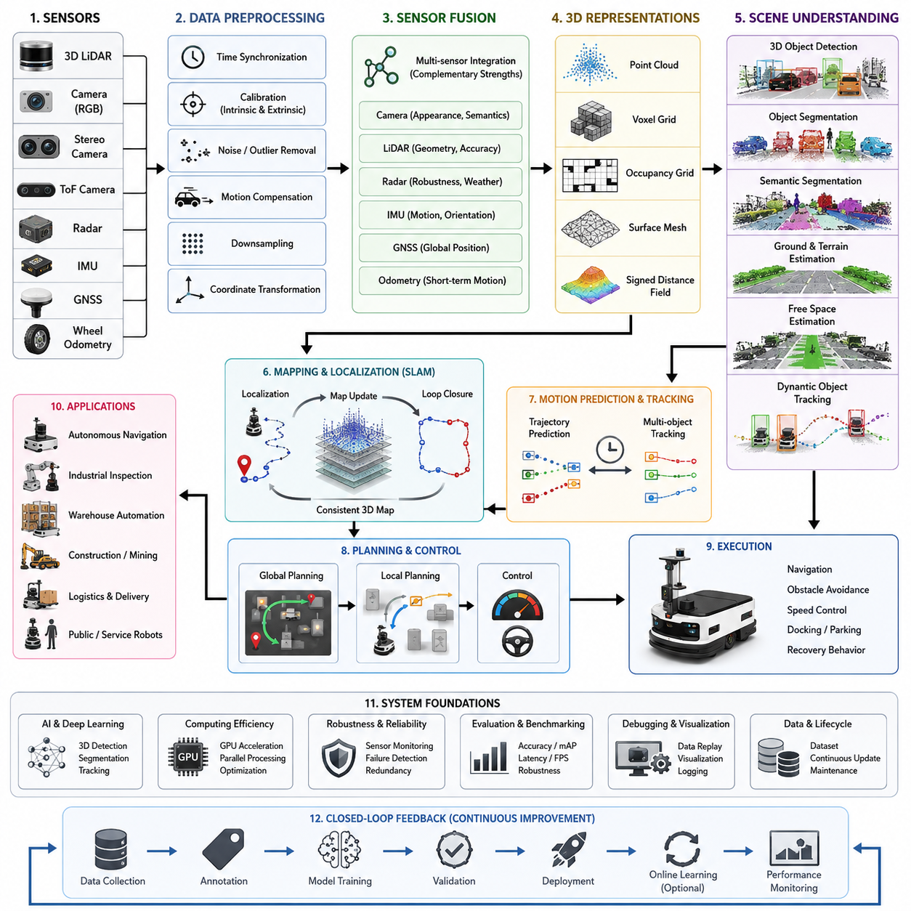
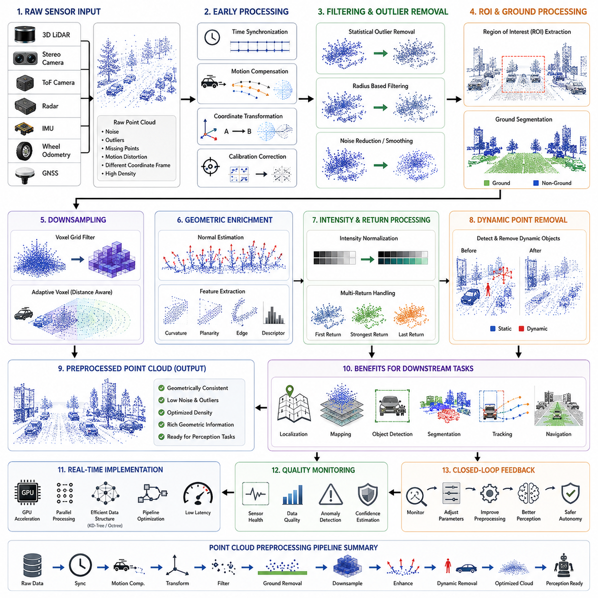
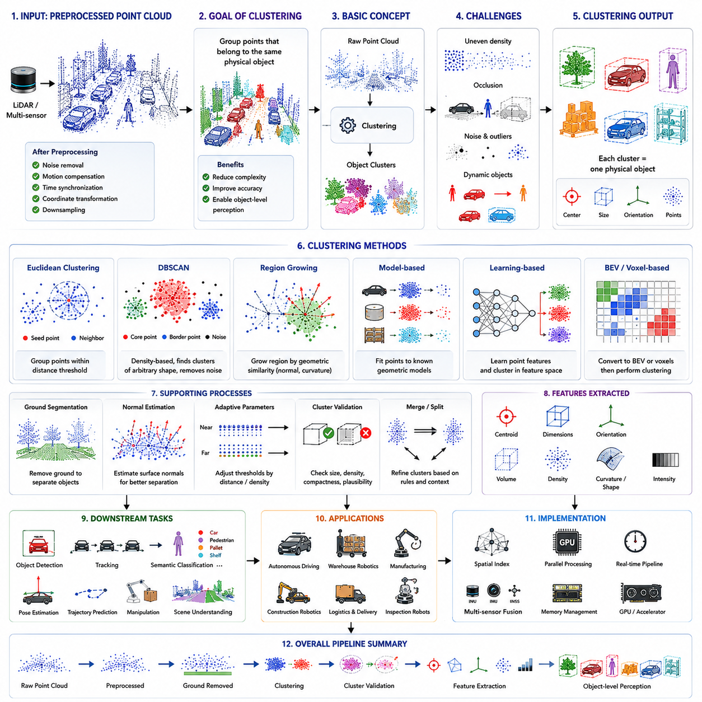
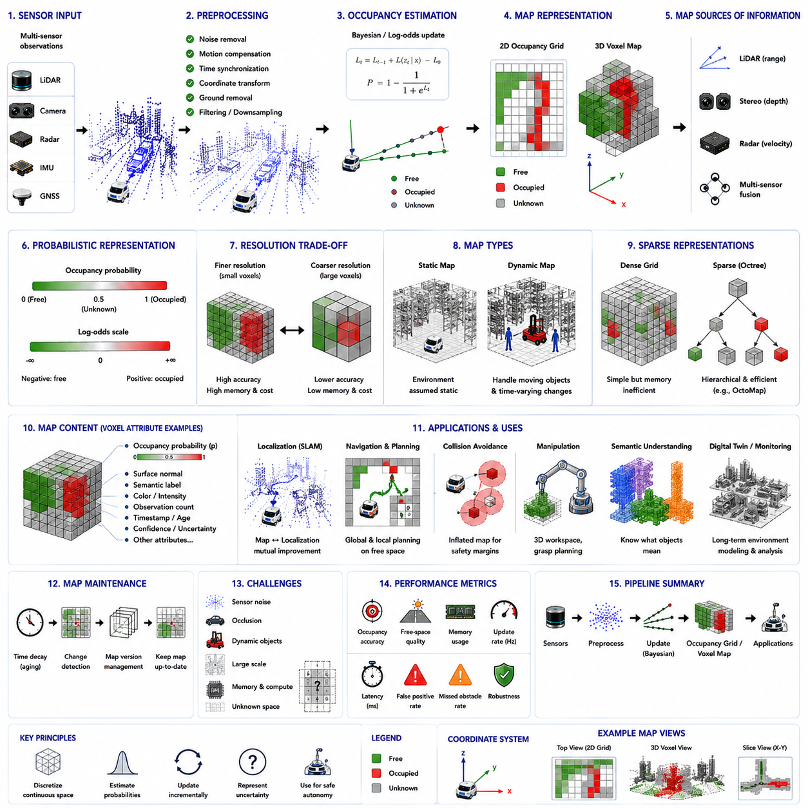
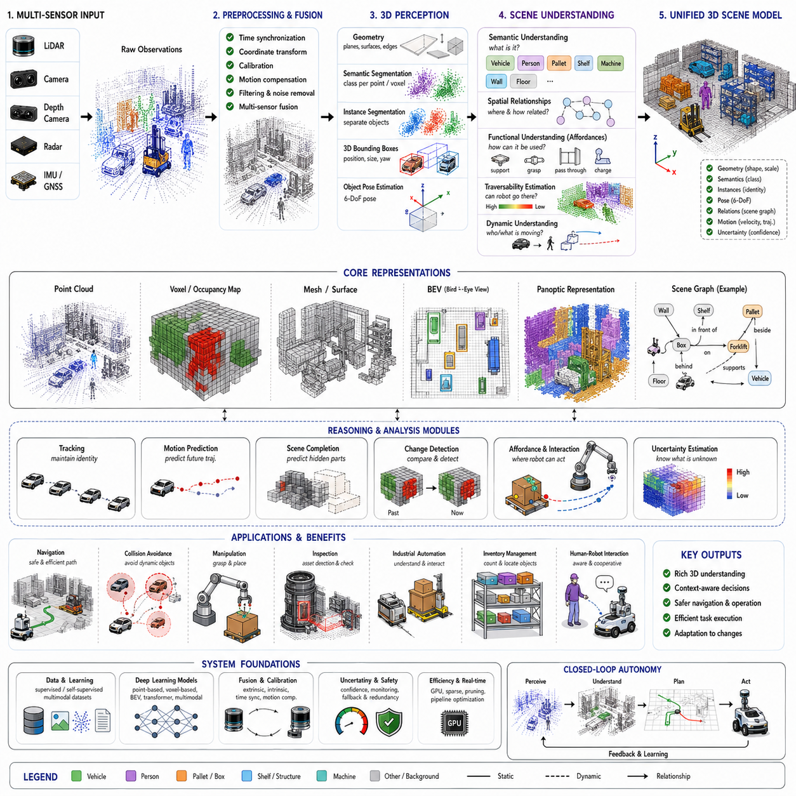
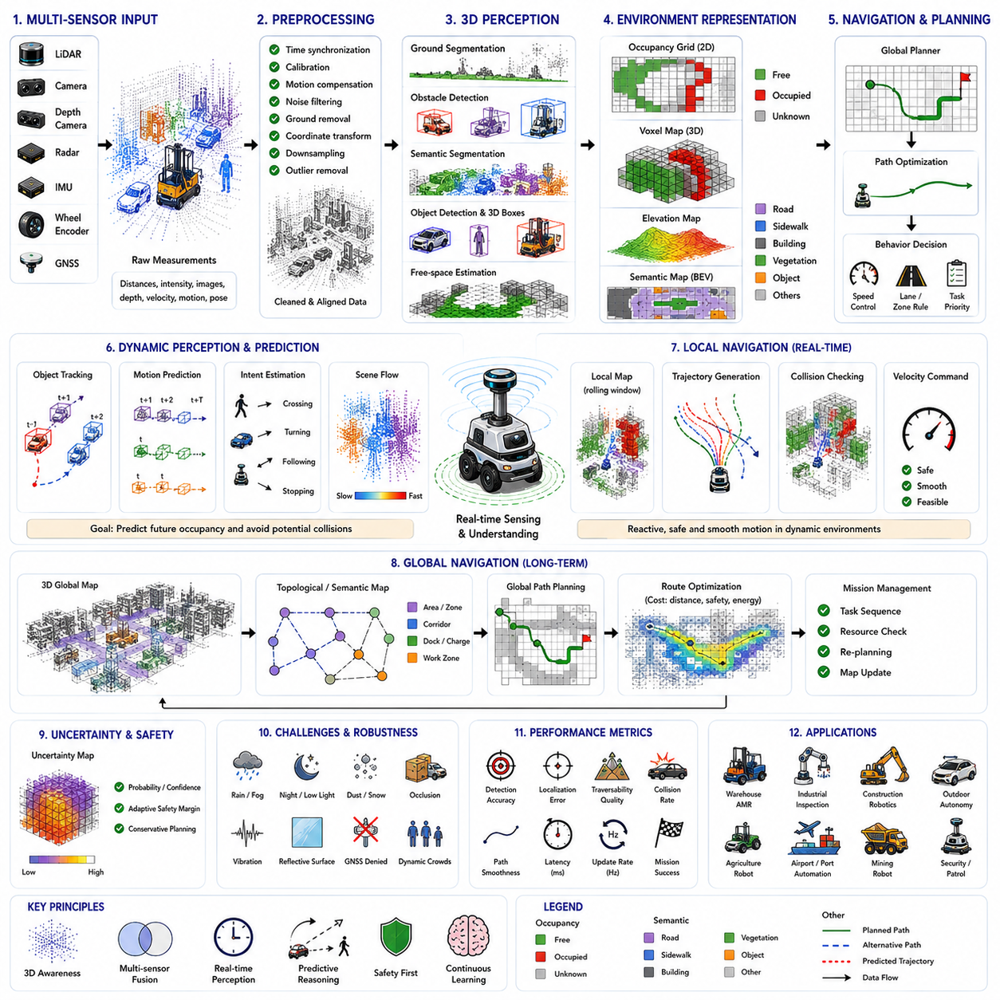
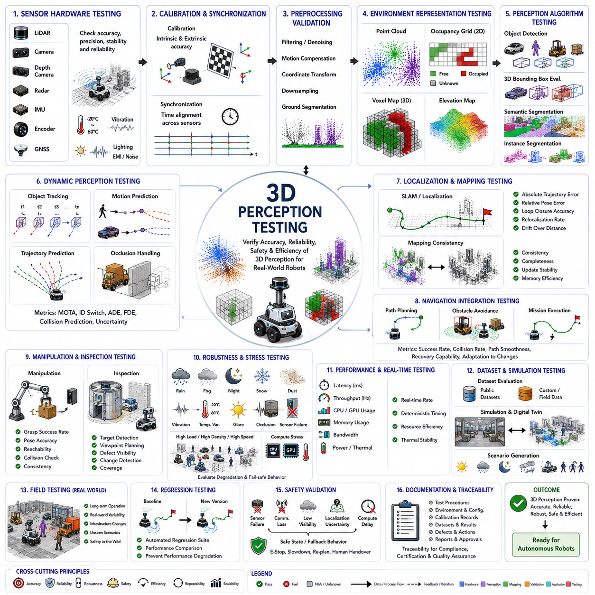

**Volume 03. AMR Sensors and Perception**


# Chapter 18. 3D Perception

##  

## 18.1 3D Perception Overview

{width="7.268055555555556in" height="7.268055555555556in"}

Three-dimensional perception is one of the most important capabilities in autonomous mobile robots because it enables the robot to understand the physical structure of the surrounding world rather than relying only on two-dimensional observations. Unlike conventional image processing that interprets pixels on a flat image plane, 3D perception reconstructs the geometry of the environment by estimating depth, shape, orientation, and spatial relationships between objects. This geometric understanding allows autonomous robots to reason about obstacles, free space, terrain, movable objects, and complex environmental structures in a way that closely resembles how humans interpret real-world scenes.

Modern AMRs operate in warehouses, factories, hospitals, logistics centers, construction sites, mines, ports, campuses, and outdoor environments where the surrounding world continuously changes. Static maps alone cannot represent these dynamic conditions because workers, vehicles, pallets, machines, doors, carts, and temporary obstacles constantly appear and disappear. Three-dimensional perception continuously observes these environmental changes and provides an updated digital representation that supports navigation, localization, planning, manipulation, inspection, and safety monitoring. The perception system therefore becomes one of the primary information sources for nearly every intelligent subsystem inside the robot.

The primary objective of 3D perception is not merely generating point clouds or depth images but transforming raw sensor measurements into meaningful environmental understanding. Raw sensor data contains millions of individual measurements that have little practical value without interpretation. Through successive processing stages, these measurements become organized into surfaces, objects, semantic categories, occupancy maps, traversable regions, motion estimates, and scene descriptions that higher-level software modules can directly utilize for autonomous decision making.

Three-dimensional perception generally begins with one or more depth-producing sensors. Three-dimensional LiDAR directly measures distances by emitting laser pulses and recording their return time, producing highly accurate point clouds suitable for large-scale mapping and outdoor navigation. Stereo cameras estimate depth through image disparity, while Time-of-Flight cameras calculate distance by measuring light travel time. Structured light sensors project known patterns onto nearby objects and reconstruct depth from deformation. Radar can also contribute coarse three-dimensional information under adverse weather conditions where optical sensors become unreliable. Each sensing technology offers unique advantages and limitations, making sensor selection highly dependent on application requirements.

No single sensor can reliably perceive every environment under every operating condition. Cameras provide rich texture and color information but are sensitive to lighting variation. LiDAR delivers accurate geometric measurements but lacks semantic appearance information. Radar operates well in rain, fog, snow, and dust but provides lower spatial resolution. Ultrasonic sensors remain effective for short-range obstacle detection although their angular resolution is limited. Consequently, practical 3D perception systems almost always integrate multiple sensing modalities through sensor fusion, allowing the strengths of one sensor to compensate for the weaknesses of another.

Sensor fusion significantly improves perception robustness because different sensors observe complementary aspects of the environment. Camera images identify object appearance, colors, text, traffic signs, safety labels, and semantic categories. LiDAR precisely measures geometric structure and distance. IMU measurements stabilize motion estimation during rapid vehicle movement. GNSS contributes global positioning in outdoor environments. Wheel odometry estimates short-term motion between sensor updates. When these information sources are combined through probabilistic estimation algorithms and AI-based fusion networks, the robot produces a significantly more reliable environmental model than any individual sensor could achieve independently.

Raw three-dimensional measurements are usually affected by measurement noise, missing points, motion distortion, reflections, multipath effects, environmental interference, and sensor inaccuracies. Consequently, preprocessing represents a critical component of every perception pipeline. Typical preprocessing operations include filtering invalid points, removing statistical outliers, compensating for motion distortion, synchronizing timestamps, correcting calibration errors, downsampling dense point clouds, normal estimation, coordinate transformation, and noise suppression. These preprocessing stages improve both computational efficiency and the accuracy of downstream perception algorithms.

Calibration is fundamental for accurate three-dimensional perception because measurements from different sensors must be expressed within a common coordinate system. Intrinsic calibration determines the internal characteristics of cameras and depth sensors, while extrinsic calibration estimates their precise physical relationship with respect to the robot body or another sensor. Even small calibration errors can create significant inconsistencies when fusing multiple data sources, leading to inaccurate object localization, distorted maps, or unstable navigation performance. Regular calibration verification therefore becomes an essential maintenance activity throughout the robot lifecycle.

Time synchronization is equally important because every sensor observes the world at slightly different moments. If camera images, LiDAR scans, IMU measurements, and wheel encoder data are captured asynchronously, moving objects may appear in conflicting positions, resulting in inaccurate fusion results. Precision Time Protocol, hardware triggers, timestamp alignment, and deterministic communication networks are frequently employed to minimize temporal inconsistencies. High-quality synchronization becomes especially important for robots traveling at higher speeds or operating in highly dynamic environments.

After preprocessing, three-dimensional perception transforms sensor measurements into structured spatial representations. Point clouds represent individual sampled locations in three-dimensional space, while voxel grids divide space into uniformly sized volumetric cells that facilitate efficient processing. Occupancy grids estimate whether spatial regions are occupied, free, or unknown. Surface meshes describe continuous geometric surfaces, whereas signed distance fields encode proximity to surrounding geometry. Different representations offer different tradeoffs between computational complexity, memory consumption, geometric accuracy, and planning efficiency.

Object segmentation divides the three-dimensional scene into individual physical entities. Rather than analyzing millions of independent points, segmentation algorithms group measurements belonging to the same object based on spatial continuity, surface characteristics, motion consistency, semantic classification, or learned feature embeddings. Once segmentation is complete, subsequent algorithms can estimate object dimensions, orientation, pose, velocity, and category. Accurate segmentation substantially simplifies higher-level reasoning because the robot begins operating on meaningful objects instead of disconnected measurements.

Three-dimensional object detection estimates the location and physical dimensions of objects within the surrounding environment. Modern perception systems frequently employ deep neural networks that directly process point clouds, voxel representations, bird\'s-eye-view projections, or multi-modal sensor fusion features. These models predict three-dimensional bounding boxes together with object class labels, orientation, confidence scores, and occasionally motion estimates. Such information supports collision avoidance, path planning, traffic interaction, inventory management, automated inspection, and autonomous manipulation.

Scene understanding extends beyond detecting individual objects by interpreting relationships among them. Instead of recognizing isolated obstacles, the perception system identifies roads, sidewalks, warehouse aisles, shelves, machinery, workstations, charging stations, loading docks, entrances, exits, stairs, ramps, vegetation, construction zones, and human work areas. Understanding these semantic relationships allows robots to behave intelligently within complex environments because navigation decisions become context-aware rather than relying solely on geometric obstacle avoidance.

Free-space estimation represents one of the most critical outputs of three-dimensional perception. Autonomous navigation requires knowledge not only of where obstacles exist but also of where safe traversal remains possible. Ground plane estimation, terrain analysis, obstacle height filtering, and occupancy analysis collectively determine navigable regions. Local planners subsequently utilize these free-space maps to generate collision-free trajectories while continuously adapting to environmental changes.

Ground estimation deserves particular attention because many perceived objects actually belong to the driving surface itself. Roads, factory floors, sidewalks, uneven terrain, gravel, grass, slopes, ramps, and construction surfaces exhibit different geometric characteristics. Robust ground segmentation prevents the robot from incorrectly classifying the floor as an obstacle while simultaneously detecting hazards such as curbs, potholes, steps, rocks, or debris. Outdoor autonomous robots especially rely on accurate terrain classification to maintain vehicle stability and safe mobility.

Dynamic object perception introduces additional complexity because pedestrians, forklifts, bicycles, automobiles, service robots, and industrial machinery continuously change position. Static mapping alone cannot adequately represent these moving elements. Motion estimation algorithms combine temporal observations from consecutive sensor frames to estimate object trajectories, velocities, and future motion. This dynamic understanding enables predictive collision avoidance rather than reactive emergency stopping.

Tracking maintains persistent identities for detected objects across time. Without tracking, the robot repeatedly detects new objects in every frame without understanding their continuity. Multi-object tracking associates detections across consecutive observations using motion models, feature similarity, geometric consistency, and probabilistic filtering. Persistent tracking enables prediction of future movement, interaction analysis, traffic awareness, and human behavior understanding, significantly improving autonomous navigation safety.

Artificial intelligence has fundamentally transformed three-dimensional perception. Earlier systems relied primarily on handcrafted geometric algorithms, clustering methods, and deterministic feature extraction techniques. Contemporary perception increasingly employs deep learning architectures capable of learning complex spatial representations directly from large datasets. Networks such as PointNet, PointNet++, Point Transformer, sparse convolutional networks, BEV-based architectures, and multimodal transformer models substantially improve detection accuracy under challenging environmental conditions while reducing manual engineering effort.

Recent developments increasingly integrate multimodal foundation models into robotic perception. Rather than interpreting geometry alone, future perception systems combine visual appearance, language understanding, temporal reasoning, spatial memory, and contextual knowledge. These models support richer scene understanding by interpreting high-level concepts such as work zones, emergency situations, inspection priorities, restricted areas, and human intentions. Consequently, perception evolves from geometric measurement toward comprehensive environmental reasoning.

Three-dimensional perception also plays a central role in simultaneous localization and mapping. Feature extraction from point clouds supports scan registration, loop closure detection, map updating, and localization refinement. Accurate perception allows the robot to continuously compare incoming observations against previously constructed maps, maintaining reliable localization despite environmental changes. Robust mapping therefore depends heavily upon stable perception performance, while improved maps further enhance future perception quality through mutual reinforcement.

Navigation modules consume numerous outputs generated by three-dimensional perception. Obstacle maps, traversable regions, semantic information, object trajectories, occupancy grids, and terrain classifications collectively influence global route planning, local trajectory generation, velocity control, emergency braking, docking, parking, and recovery behaviors. Rather than functioning independently, perception and navigation operate as tightly coupled subsystems that continuously exchange information throughout autonomous operation.

Industrial inspection robots rely on three-dimensional perception for highly accurate positioning relative to inspected assets. Instead of depending solely on global localization, the robot performs local geometric alignment using dense point clouds or reconstructed surfaces. This process estimates precise six-degree-of-freedom transformations that align CAD models with observed structures. Such alignment enables repeatable inspection trajectories, robotic manipulation, defect localization, and measurement consistency across repeated inspection cycles.

Computational efficiency remains one of the largest engineering challenges because modern perception sensors generate enormous data volumes. High-resolution LiDAR systems may produce millions of points per second, while multiple synchronized cameras simultaneously stream high-definition images. Processing these data in real time requires GPU acceleration, parallel computing, optimized memory management, efficient spatial indexing, sparse computation, and hardware-aware software architectures. Real-time constraints often dictate algorithm selection as strongly as detection accuracy.

System robustness becomes especially important for deployment in real industrial environments. Rain, fog, snow, dust, direct sunlight, reflective surfaces, vibration, temperature variation, electromagnetic interference, and sensor contamination all degrade perception quality. Robust systems therefore continuously monitor sensor health, estimate confidence levels, detect failures, activate redundancy mechanisms, and gracefully degrade functionality when certain sensing modalities become unavailable. Reliability engineering is therefore inseparable from perception algorithm design.

Evaluation of three-dimensional perception requires comprehensive quantitative metrics. Detection precision, recall, localization error, intersection-over-union, mean average precision, depth estimation error, point cloud registration accuracy, latency, throughput, frame rate, tracking consistency, false positive rate, false negative rate, and robustness under environmental variation collectively characterize system performance. Benchmark datasets provide standardized comparisons, but field validation remains indispensable because real deployment environments exhibit significantly greater complexity than laboratory conditions.

Debugging perception systems requires systematic analysis across the complete sensing pipeline. Engineers inspect raw sensor outputs, calibration parameters, synchronization quality, preprocessing results, intermediate representations, AI inference outputs, fusion consistency, navigation interfaces, and recorded operational logs. ROS2 bag replay, visualization tools, synchronized timeline inspection, and automated regression testing greatly accelerate root cause identification. Successful perception engineering therefore combines algorithm development with disciplined system-level debugging methodologies.

As autonomous robots continue expanding into increasingly unstructured environments, three-dimensional perception will evolve from isolated sensing algorithms into comprehensive world modeling systems. Future robots will construct continuously updated digital representations that integrate geometry, semantics, temporal dynamics, physical properties, uncertainty estimation, and predictive reasoning into unified environmental models. These world models will support perception, localization, navigation, manipulation, inspection, interaction, and long-term autonomy through a shared understanding of the surrounding environment. Consequently, three-dimensional perception should be regarded not merely as a sensing technology but as the foundational capability that enables intelligent autonomous robots to interpret, reason about, and safely interact with the three-dimensional physical world.

3차원 인지(3D Perception)는 자율주행 모바일 로봇(Autonomous Mobile Robot, AMR)의 가장 중요한 핵심 기능 가운데 하나이다. 이는 단순히 2차원(2D) 영상을 해석하는 수준을 넘어 주변 환경의 실제 공간 구조를 이해할 수 있도록 해준다. 기존 영상 처리가 평면 이미지의 픽셀(Pixel)을 분석하는 데 집중했다면, 3차원 인지는 깊이(Depth), 형상(Shape), 방향(Orientation), 그리고 객체 간의 공간적 관계(Spatial Relationship)를 추정하여 환경의 기하학적 구조를 재구성한다. 이러한 공간적 이해는 로봇이 장애물(Obstacle), 자유 공간(Free Space), 지형(Terrain), 이동 가능한 객체(Movable Object), 그리고 복잡한 환경 구조를 사람과 유사한 방식으로 이해하고 판단할 수 있도록 만든다.

현대의 AMR은 물류창고(Warehouse), 공장(Factory), 병원(Hospital), 물류센터(Logistics Center), 건설 현장(Construction Site), 광산(Mine), 항만(Port), 캠퍼스(Campus), 그리고 다양한 실외 환경에서 운용된다. 이러한 환경은 작업자, 차량, 팔레트(Pallet), 장비(Machine), 문(Door), 카트(Cart), 임시 장애물(Temporary Obstacle) 등이 지속적으로 생성되고 사라지기 때문에 정적인 지도(Map)만으로는 현실을 충분히 표현할 수 없다. 3차원 인지는 이러한 변화를 지속적으로 관찰하여 항상 최신의 디지털 환경 모델(Digital Representation)을 생성하며, 이를 통해 내비게이션(Navigation), 위치추정(Localization), 경로 계획(Path Planning), 조작(Manipulation), 검사(Inspection), 안전 모니터링(Safety Monitoring) 등 거의 모든 자율 기능을 지원한다.

3차원 인지의 궁극적인 목적은 단순히 점군(Point Cloud)이나 깊이 영상(Depth Image)을 생성하는 것이 아니라, 원시 센서 데이터(Raw Sensor Data)를 의미 있는 환경 정보(Environmental Understanding)로 변환하는 것이다. 센서에서 직접 생성되는 수백만 개의 측정값은 그 자체만으로는 활용 가치가 거의 없다. 그러나 여러 단계의 처리 과정을 거치면서 이러한 데이터는 표면(Surface), 객체(Object), 의미 정보(Semantic Category), 점유 지도(Occupancy Map), 주행 가능 영역(Traversable Region), 움직임(Motion), 장면(Scene) 등의 형태로 구조화되며, 상위 소프트웨어 모듈이 직접 사용할 수 있는 정보로 변환된다.

3차원 인지는 일반적으로 깊이 정보를 생성하는 하나 이상의 센서(Sensor)로부터 시작된다. 3차원 라이다(3D LiDAR)는 레이저(Laser)를 발사하고 반사 시간을 측정하여 매우 정확한 점군 데이터를 생성하며, 대규모 지도 작성(Mapping)과 실외 자율주행에 적합하다. 스테레오 카메라(Stereo Camera)는 양안 영상의 시차(Disparity)를 이용하여 깊이를 계산하며, 비행시간 카메라(Time-of-Flight Camera, ToF)는 빛의 왕복 시간을 이용하여 거리를 측정한다. 구조광 카메라(Structured Light Camera)는 알려진 패턴을 투사하여 깊이를 계산하며, 레이더(Radar)는 악천후에서도 비교적 안정적으로 거친 수준의 3차원 정보를 제공할 수 있다. 각각의 센서는 고유한 장점과 한계를 가지므로 적용 환경에 맞는 적절한 선택이 필요하다.

어떠한 단일 센서도 모든 환경과 모든 조건에서 안정적인 3차원 인지를 제공할 수는 없다. 카메라(Camera)는 풍부한 색상(Color)과 질감(Texture)을 제공하지만 조명 변화(Lighting Variation)에 민감하다. 라이다는 매우 정확한 거리와 형상 정보를 제공하지만 색상이나 의미 정보를 제공하지 못한다. 레이더는 비(Rain), 안개(Fog), 눈(Snow), 먼지(Dust) 환경에서도 동작하지만 공간 해상도(Spatial Resolution)가 낮다. 초음파 센서(Ultrasonic Sensor)는 근거리 장애물 감지에는 유리하지만 방향 분해능이 제한된다. 따라서 실제 AMR에서는 여러 센서를 동시에 사용하는 센서 융합(Sensor Fusion)이 거의 필수적으로 적용된다.

센서 융합은 서로 다른 센서가 관측하는 정보를 상호 보완함으로써 인지 시스템의 신뢰성을 크게 향상시킨다. 카메라는 객체의 외형, 색상, 문자(Text), 표지판(Sign), 안전 표식(Safety Label), 의미 정보를 제공한다. 라이다는 정확한 거리와 공간 구조를 측정한다. IMU(관성측정장치, Inertial Measurement Unit)는 차량의 급격한 움직임에서도 자세를 안정적으로 추정하도록 지원하며, GNSS(Global Navigation Satellite System)는 실외 절대 위치를 제공한다. 휠 오도메트리(Wheel Odometry)는 짧은 시간 동안의 이동량을 계산한다. 이러한 다양한 정보를 확률 기반 추정 알고리즘과 AI 기반 융합 네트워크가 통합함으로써 단일 센서보다 훨씬 높은 신뢰도의 환경 모델을 생성할 수 있다.

원시 3차원 데이터는 다양한 노이즈(Noise), 결측점(Missing Point), 움직임 왜곡(Motion Distortion), 반사(Reflection), 다중 경로(Multipath), 환경 간섭(Environmental Interference), 센서 오차(Sensor Error)의 영향을 받는다. 따라서 전처리(Preprocessing)는 모든 인지 파이프라인(Perception Pipeline)의 핵심 단계이다. 일반적인 전처리 과정에는 이상치 제거(Outlier Removal), 노이즈 제거(Noise Filtering), 움직임 보정(Motion Compensation), 시간 동기화(Time Synchronization), 좌표 변환(Coordinate Transformation), 다운샘플링(Downsampling), 법선 벡터 계산(Normal Estimation), 데이터 정제(Data Cleaning) 등이 포함된다. 이러한 과정은 이후 단계의 정확성과 계산 효율을 동시에 향상시킨다.

정확한 3차원 인지를 위해서는 보정(Calibration)이 필수적이다. 서로 다른 센서에서 생성된 데이터는 동일한 좌표계(Coordinate System)에서 표현되어야만 정확한 융합이 가능하다. 내부 보정(Intrinsic Calibration)은 카메라와 센서 자체의 특성을 보정하며, 외부 보정(Extrinsic Calibration)은 센서 간의 상대적인 위치와 자세를 추정한다. 아주 작은 보정 오차도 센서 융합 과정에서 큰 위치 오차를 발생시켜 잘못된 객체 위치 추정이나 불안정한 지도 생성으로 이어질 수 있다. 따라서 주기적인 보정 검증과 재보정은 실제 시스템 유지보수의 중요한 작업이다.

시간 동기화(Time Synchronization) 역시 매우 중요한 요소이다. 카메라, 라이다, IMU, 휠 인코더(Wheel Encoder)가 서로 다른 시점에서 데이터를 취득하면 움직이는 객체가 서로 다른 위치에 존재하는 것처럼 보일 수 있다. 이는 잘못된 센서 융합 결과를 초래한다. 이러한 문제를 해결하기 위해 정밀 시간 프로토콜(Precision Time Protocol, PTP), 하드웨어 트리거(Hardware Trigger), 타임스탬프 정렬(Timestamp Alignment), 결정론적 통신 네트워크(Deterministic Communication Network) 등이 사용된다. 특히 고속 주행 로봇이나 동적인 환경에서는 시간 동기화의 중요성이 더욱 커진다.

전처리가 완료되면 3차원 인지는 다양한 공간 표현(Spatial Representation)을 생성한다. 점군(Point Cloud)은 개별 공간 좌표를 표현하며, 복셀 그리드(Voxel Grid)는 공간을 일정한 크기의 입방체로 분할하여 계산 효율을 높인다. 점유 지도(Occupancy Grid)는 특정 공간이 점유되었는지, 비어 있는지, 혹은 미확인 상태인지를 표현한다. 표면 메시(Surface Mesh)는 연속적인 표면을 나타내며, 부호 거리 함수(Signed Distance Field)는 주변 표면과의 거리를 표현한다. 각각의 표현 방식은 메모리 사용량, 계산량, 정확도, 경로 계획 효율 측면에서 서로 다른 장단점을 가진다.

객체 분할(Object Segmentation)은 장면을 개별 물리 객체로 구분하는 과정이다. 수백만 개의 독립된 점을 그대로 처리하는 대신, 공간적 연속성(Spatial Continuity), 표면 특성(Surface Characteristic), 움직임 일관성(Motion Consistency), 의미 정보(Semantic Information), 학습된 특징 벡터(Feature Embedding)를 이용하여 동일 객체에 속하는 점들을 하나의 그룹으로 묶는다. 이후에는 객체의 크기(Size), 자세(Pose), 방향(Orientation), 속도(Velocity), 종류(Class)를 개별적으로 추정할 수 있다.

3차원 객체 검출(3D Object Detection)은 주변 환경 속 객체의 위치와 실제 크기를 추정하는 기술이다. 최신 시스템은 점군(Point Cloud), 복셀(Voxel), 조감도(Bird\'s-Eye View, BEV), 또는 다중 센서 융합 특징(Multi-modal Fusion Feature)을 직접 입력으로 사용하는 심층 신경망(Deep Neural Network)을 활용한다. 이러한 모델은 3차원 경계 상자(3D Bounding Box), 객체 종류(Class Label), 방향(Orientation), 신뢰도(Confidence), 그리고 경우에 따라 속도(Velocity)까지 동시에 예측한다. 이러한 결과는 충돌 회피(Collision Avoidance), 경로 계획(Path Planning), 자동 검사(Inspection), 물체 조작(Manipulation) 등 다양한 기능에서 활용된다.

장면 이해(Scene Understanding)는 개별 객체를 검출하는 수준을 넘어 환경 전체의 의미를 이해하는 과정이다. 시스템은 단순히 장애물만 인식하는 것이 아니라 도로(Road), 보도(Sidewalk), 창고 통로(Aisle), 선반(Shelf), 작업장(Workstation), 충전 스테이션(Charging Station), 출입구(Entrance), 경사로(Ramp), 계단(Stair), 공사 구역(Construction Zone), 작업자 영역(Human Working Area) 등을 구분한다. 이러한 의미 기반 인지는 단순한 기하학적 회피를 넘어 상황(Context)에 적합한 지능적인 의사결정을 가능하게 한다.

자유 공간 추정(Free Space Estimation)은 자율주행에서 가장 중요한 출력 가운데 하나이다. 로봇은 장애물이 어디에 존재하는지만이 아니라 어디를 안전하게 주행할 수 있는지도 알아야 한다. 이를 위해 지면 추정(Ground Plane Estimation), 지형 분석(Terrain Analysis), 장애물 높이 분석(Obstacle Height Filtering), 점유 분석(Occupancy Analysis) 등이 수행되며, 생성된 자유 공간 정보는 지역 경로 계획기(Local Planner)가 안전한 이동 경로를 생성하는 데 활용된다.

지면 추정(Ground Estimation)은 매우 중요한 과정이다. 많은 점들은 실제 장애물이 아니라 단순히 바닥(Floor)이나 도로(Road)에 속한다. 공장 바닥, 보도, 자갈길, 잔디, 경사면, 램프 등은 서로 다른 기하학적 특성을 가진다. 정확한 지면 분리는 바닥을 장애물로 오인하지 않도록 하면서 동시에 턱(Curb), 구덩이(Pothole), 계단(Step), 바위(Rock), 잔해(Debris)와 같은 위험 요소를 정확하게 검출하도록 해준다. 특히 실외 AMR에서는 이러한 지형 분석이 차량 안정성에도 직접적인 영향을 미친다.

동적 객체 인지(Dynamic Object Perception)는 추가적인 어려움을 가진다. 사람(Pedestrian), 지게차(Forklift), 자전거(Bicycle), 자동차(Vehicle), 서비스 로봇(Service Robot), 산업 장비(Industrial Machine)는 지속적으로 움직인다. 따라서 정적인 지도만으로는 현실을 표현할 수 없다. 연속된 프레임(Frame)을 비교하여 객체의 이동 경로(Trajectory), 속도(Velocity), 미래 위치(Future Position)를 추정하는 움직임 분석(Motion Estimation)이 필요하며, 이를 통해 충돌을 사전에 예측하는 능동적인 안전 제어가 가능해진다.

객체 추적(Object Tracking)은 동일한 객체의 정체성(Identity)을 시간에 따라 유지하는 과정이다. 추적 기능이 없으면 시스템은 매 프레임마다 새로운 객체를 발견한 것으로 인식하게 된다. 다중 객체 추적(Multi-Object Tracking)은 움직임 모델(Motion Model), 특징 유사성(Feature Similarity), 공간적 일관성(Spatial Consistency), 확률 필터(Probabilistic Filter)를 이용하여 동일 객체를 지속적으로 연결한다. 이를 통해 미래 움직임 예측, 교통 분석, 사람 행동 분석 등이 가능해진다.

인공지능(AI)은 최근 3차원 인지 기술을 크게 변화시키고 있다. 초기 시스템은 기하학 기반 알고리즘과 수작업 특징 추출(Handcrafted Feature Extraction)에 의존했지만, 현재는 대규모 데이터셋(Dataset)을 학습한 심층 신경망이 복잡한 공간 특징을 직접 학습한다. PointNet, PointNet++, Point Transformer, 희소 합성곱 네트워크(Sparse Convolution Network), BEV 기반 네트워크(BEV-based Network), 멀티모달 트랜스포머(Multimodal Transformer)와 같은 최신 구조들은 어려운 환경에서도 높은 정확도를 제공한다.

최근에는 멀티모달 파운데이션 모델(Multimodal Foundation Model)이 3차원 인지에도 적용되고 있다. 이러한 모델은 단순한 기하학 정보를 넘어 영상(Vision), 언어(Language), 시간 정보(Temporal Information), 공간 기억(Spatial Memory), 상황 지식(Contextual Knowledge)을 통합하여 보다 풍부한 환경 이해를 수행한다. 결과적으로 로봇은 단순한 거리 측정을 넘어 작업 구역, 위험 지역, 검사 대상, 사람의 의도(Intent)까지 이해할 수 있는 방향으로 발전하고 있다.

3차원 인지는 동시 위치추정 및 지도작성(Simultaneous Localization and Mapping, SLAM)에서도 핵심 역할을 수행한다. 점군으로부터 추출한 특징은 스캔 정합(Scan Registration), 루프 클로저(Loop Closure), 지도 갱신(Map Update), 위치 보정(Localization Refinement)에 활용된다. 정확한 인지는 지도 품질을 향상시키며, 향상된 지도는 다시 인지 성능을 높이는 선순환 구조를 형성한다.

내비게이션 시스템은 3차원 인지의 다양한 출력 정보를 직접 활용한다. 장애물 지도(Obstacle Map), 자유 공간(Free Space), 의미 정보(Semantic Information), 객체 이동 경로(Trajectory), 점유 지도(Occupancy Grid), 지형 분류(Terrain Classification)는 전역 경로 계획(Global Planning), 지역 경로 계획(Local Planning), 속도 제어(Velocity Control), 비상 정지(Emergency Braking), 도킹(Docking), 주차(Parking), 복구 동작(Recovery Behavior)에 직접 사용된다. 따라서 인지와 내비게이션은 독립적인 기능이 아니라 긴밀하게 연결된 하나의 시스템으로 동작한다.

산업 검사 로봇(Industrial Inspection Robot)은 정밀한 위치 정합을 위해 3차원 인지를 적극 활용한다. 전역 위치에만 의존하지 않고 고밀도 점군(Dense Point Cloud)이나 표면 모델(Surface Model)을 이용하여 CAD 모델(CAD Model)과 실제 환경을 정밀하게 정렬한다. 이를 통해 6자유도 변환(6-DoF Transformation)을 계산하고 검사 경로를 자동으로 보정하여 반복 가능한 검사(Repeatable Inspection), 로봇 조작(Robotic Manipulation), 결함 위치 추정(Defect Localization)을 수행할 수 있다.

계산 효율성(Computational Efficiency)은 현대 3차원 인지 시스템이 직면한 가장 큰 기술적 과제 가운데 하나이다. 고해상도 라이다는 초당 수백만 개 이상의 점을 생성하며, 여러 대의 고해상도 카메라는 동시에 대용량 영상을 생성한다. 이러한 데이터를 실시간으로 처리하기 위해 GPU 가속(GPU Acceleration), 병렬 처리(Parallel Computing), 메모리 최적화(Memory Optimization), 희소 계산(Sparse Computation), 하드웨어 친화적 소프트웨어 구조(Hardware-aware Software Architecture)가 필수적으로 요구된다.

실제 산업 현장에서는 시스템의 강인성(Robustness)이 매우 중요하다. 비, 안개, 눈, 먼지, 강한 햇빛, 반사면, 진동, 온도 변화, 전자기 간섭(Electromagnetic Interference), 센서 오염은 모두 인지 성능을 저하시킨다. 따라서 시스템은 지속적으로 센서 상태를 모니터링하고, 신뢰도(Confidence)를 평가하며, 센서 고장을 감지하고, 대체 센서를 활성화하며, 일부 센서가 실패하더라도 안전하게 동작을 유지하는 열화 운용(Graceful Degradation)을 지원해야 한다.

3차원 인지 시스템의 평가는 다양한 정량적 성능 지표를 이용하여 수행된다. 검출 정확도(Precision), 재현율(Recall), 위치 오차(Localization Error), 교집합 비율(Intersection over Union, IoU), 평균 정밀도(Mean Average Precision, mAP), 깊이 추정 오차(Depth Error), 점군 정합 정확도(Point Cloud Registration Accuracy), 지연 시간(Latency), 처리량(Throughput), 프레임 속도(Frame Rate), 추적 일관성(Tracking Consistency), 오검출(False Positive), 미검출(False Negative), 그리고 다양한 환경 변화에 대한 강인성이 주요 평가 항목이 된다. 공개 벤치마크(Benchmark)는 객관적인 비교를 가능하게 하지만, 실제 현장 검증(Field Validation)은 반드시 병행되어야 한다.

인지 시스템의 디버깅(Debugging)은 전체 센서 파이프라인을 체계적으로 분석하는 과정이다. 엔지니어는 원시 센서 데이터, 보정 파라미터(Calibration Parameter), 시간 동기화 품질, 전처리 결과, 중간 표현(Intermediate Representation), AI 추론 결과(Inference Result), 센서 융합 상태, 내비게이션 인터페이스, 운영 로그(Operation Log)를 순차적으로 점검한다. ROS2 Bag 재생(Replay), 시각화 도구(Visualization Tool), 시간축 분석(Timeline Analysis), 자동 회귀 시험(Regression Test)은 문제의 원인을 신속하게 찾는 데 매우 효과적이다.

자율주행 로봇이 더욱 복잡하고 비정형적인 환경으로 확대될수록 3차원 인지는 단순한 센서 처리 기술을 넘어 통합적인 세계 모델(World Model) 구축 기술로 발전할 것이다. 미래의 로봇은 기하학적 구조, 의미 정보, 시간적 변화, 물리적 특성, 불확실성(Uncertainty), 미래 예측(Predictive Reasoning)을 모두 포함하는 디지털 환경 모델을 지속적으로 생성하게 된다. 이러한 세계 모델은 인지, 위치추정, 내비게이션, 조작, 검사, 인간과의 상호작용(Human-Robot Interaction), 장기 자율성(Long-term Autonomy)을 동시에 지원하는 핵심 기반이 될 것이며, 결과적으로 3차원 인지는 단순한 센서 기술이 아니라 지능형 자율 로봇이 현실 세계를 이해하고 안전하게 상호작용하기 위한 가장 근본적인 기술로 자리매김하게 될 것이다.

##  

## 18.2 Point Cloud Preprocessing

{width="7.268055555555556in" height="7.268055555555556in"}

Point cloud preprocessing represents the essential first computational stage of every three-dimensional perception pipeline because raw sensor measurements cannot be directly consumed by localization, mapping, navigation, object detection, or scene understanding algorithms. Although modern three-dimensional sensors generate increasingly dense and accurate measurements, their outputs inevitably contain noise, missing observations, measurement uncertainty, synchronization inconsistencies, motion distortion, and environmental artifacts. Without systematic preprocessing, these imperfections propagate throughout the perception pipeline and significantly reduce the accuracy and stability of downstream modules. Consequently, point cloud preprocessing should not be considered merely as data cleaning but as the process of transforming raw sensor measurements into geometrically consistent, computationally efficient, and information-rich spatial representations suitable for autonomous decision making.

A point cloud is fundamentally a collection of three-dimensional spatial samples representing the visible surfaces of objects within the sensor\'s field of view. Each point usually contains Cartesian coordinates consisting of X, Y, and Z values expressed relative to the sensor coordinate frame. Depending on sensor technology, additional attributes such as intensity, reflectivity, return number, timestamp, color, semantic label, confidence score, surface normal, or Doppler velocity may also be available. Unlike images that are organized on a regular pixel grid, point clouds are irregular, sparse, unordered, and highly nonuniform. This irregular structure introduces unique computational challenges because traditional image processing techniques cannot be directly applied without additional representation or transformation.

Raw point clouds generated by three-dimensional LiDAR, stereo vision, structured-light cameras, or Time-of-Flight sensors frequently contain measurement imperfections that originate from both hardware limitations and environmental conditions. Laser divergence, detector sensitivity, electronic noise, optical interference, atmospheric scattering, multiple reflections, rain, fog, dust, snow, vibration, temperature variation, and synchronization latency all influence measurement quality. Even under ideal operating conditions, small uncertainties accumulate over millions of measurements, making preprocessing indispensable before any meaningful interpretation can begin.

The primary objective of preprocessing is to maximize the information quality available to downstream perception algorithms while minimizing unnecessary computational burden. Rather than indiscriminately removing data, preprocessing seeks to preserve meaningful geometric structures while eliminating measurements that reduce estimation accuracy. Successful preprocessing improves localization robustness, map consistency, object detection accuracy, segmentation quality, trajectory prediction, free-space estimation, and navigation safety. Therefore, preprocessing directly influences the overall performance of the entire autonomous robotic system rather than functioning as an isolated software component.

Point cloud preprocessing usually begins immediately after sensor acquisition. Modern perception architectures receive continuous streams of raw measurements at frequencies ranging from several Hertz to hundreds of Hertz depending on the sensing modality. Before any spatial reasoning occurs, these incoming measurements are synchronized with other sensor streams, transformed into common coordinate systems, corrected for known systematic errors, filtered for invalid observations, and prepared for higher-level geometric analysis. This sequential processing pipeline ensures that all subsequent perception modules operate on internally consistent spatial information.

Time synchronization represents one of the earliest preprocessing operations because every point within a point cloud corresponds to a specific acquisition time. Mechanical rotating LiDAR sensors require tens of milliseconds to complete a full revolution, meaning that different portions of a single scan are actually measured at different times. During vehicle motion, this temporal discrepancy produces geometric distortion commonly known as motion distortion or rolling acquisition error. Accurate timestamp alignment with IMU, wheel odometry, GNSS, cameras, and other sensors enables subsequent algorithms to compensate for vehicle movement occurring during scan acquisition.

Motion compensation removes geometric distortion introduced while the robot moves during sensor acquisition. Instead of assuming that all points were measured simultaneously, motion compensation estimates the robot trajectory throughout the scan period using inertial measurements, odometry, or continuous-time motion estimation. Individual points are then transformed into a common reference time, producing geometrically consistent point clouds. This correction becomes increasingly important as vehicle speed increases because even moderate motion can significantly deform environmental geometry, degrading scan registration and object detection accuracy.

Coordinate transformation constitutes another fundamental preprocessing operation. Individual sensors measure points within their own local coordinate frames, yet autonomous robots require all observations to be expressed within a common reference frame. Extrinsic calibration parameters define rigid transformations between sensors, allowing point clouds from LiDAR, depth cameras, stereo systems, radar, and additional sensing devices to be accurately merged. Precise coordinate transformation establishes geometric consistency throughout the perception pipeline and enables reliable multi-sensor fusion.

Calibration quality directly determines preprocessing accuracy. Small rotational errors between sensors may produce large positional discrepancies at longer distances, while translational calibration errors distort fused environmental models. Consequently, preprocessing frequently incorporates calibration verification procedures that continuously monitor sensor consistency during operation. Modern autonomous systems increasingly employ online calibration refinement algorithms capable of detecting gradual sensor displacement resulting from vibration, thermal expansion, maintenance operations, or mechanical wear.

Filtering represents one of the most recognizable preprocessing tasks because raw point clouds inevitably contain measurements that do not correspond to meaningful physical surfaces. These outliers may originate from atmospheric particles, sensor reflections, electronic interference, transparent materials, highly reflective metallic surfaces, or random measurement noise. Effective filtering removes these observations while preserving legitimate environmental geometry. Overly aggressive filtering risks removing important structural details, whereas insufficient filtering allows noise to propagate into higher-level perception algorithms.

Statistical outlier removal identifies isolated measurements whose local neighborhoods differ significantly from surrounding points. Since legitimate environmental surfaces generally produce spatially coherent measurements, isolated points exhibiting unusually large nearest-neighbor distances are classified as probable noise. Statistical filtering estimates local distance distributions and removes observations that deviate beyond predefined confidence thresholds. This approach effectively suppresses sparse measurement noise while preserving continuous surfaces and structural boundaries.

Radius-based filtering provides an alternative approach by evaluating local point density within fixed spatial neighborhoods. Measurements lacking sufficient neighboring points inside predefined search radii are considered unreliable and removed. Radius filtering proves particularly effective for eliminating isolated artifacts generated by atmospheric interference or sporadic sensor failures. However, parameter selection requires careful consideration because excessively small radii may preserve noise, whereas overly large neighborhoods risk eliminating legitimate thin structures such as cables, poles, or vegetation.

Ground removal frequently constitutes an important preprocessing stage for outdoor perception systems. Since roads, factory floors, parking lots, warehouse surfaces, and sidewalks often dominate point cloud measurements, many downstream algorithms benefit from temporarily separating ground observations from above-ground structures. Ground segmentation algorithms estimate local terrain geometry using plane fitting, progressive morphological filtering, elevation analysis, or learning-based approaches. Removing dominant ground surfaces significantly reduces computational complexity during object detection while preserving navigable surface information for motion planning.

Downsampling reduces computational cost by decreasing point cloud density without significantly sacrificing geometric fidelity. Modern high-resolution LiDAR systems generate millions of measurements every second, overwhelming real-time perception pipelines if processed directly. Voxel grid filtering represents the most widely adopted downsampling technique. Space is partitioned into uniformly sized volumetric cells, and all points within each voxel are replaced by representative centroids. This approach preserves overall geometric structure while substantially reducing memory consumption and computational requirements.

Selecting appropriate voxel resolution involves balancing geometric accuracy against processing efficiency. Fine voxel resolutions preserve detailed environmental structure but provide limited computational savings. Coarse voxel resolutions dramatically accelerate processing but may remove small obstacles, narrow poles, cables, vegetation, or fine architectural features. Practical autonomous systems often employ adaptive voxel sizes depending on sensing range, environmental complexity, computational resources, and application-specific safety requirements.

Pass-through filtering restricts processing to regions of practical interest by removing measurements outside predefined spatial boundaries. Autonomous vehicles rarely require analysis of extremely distant observations, underground measurements, or points located above operational height limits. Restricting computation to application-relevant regions substantially improves efficiency while simplifying downstream perception tasks. Such spatial cropping also removes portions of the sensor field containing persistent irrelevant structures such as portions of the robot itself.

Region-of-interest extraction further refines computational focus by selecting specific spatial volumes according to operational objectives. Warehouse robots may emphasize shelf regions while ignoring ceiling structures. Autonomous forklifts concentrate on pallet heights. Agricultural robots prioritize crop rows. Construction robots focus on excavation zones. Intelligent region selection reduces unnecessary processing while preserving information critical for specific mission objectives, allowing perception resources to be allocated more efficiently.

Noise reduction extends beyond isolated point removal because many legitimate measurements exhibit small random positional perturbations. Surface smoothing algorithms reduce local geometric variation while preserving essential structural characteristics. Moving least squares, bilateral filtering, Gaussian smoothing, and neighborhood averaging improve surface continuity and normal estimation accuracy. Effective smoothing enhances scan registration, surface reconstruction, and object recognition without excessively blurring geometric edges.

Preserving edges remains particularly important during smoothing because structural boundaries frequently contain valuable semantic information. Building corners, curb edges, machinery outlines, pallet boundaries, and object contours contribute significantly to localization and recognition performance. Edge-preserving filters selectively smooth locally planar regions while maintaining sharp geometric discontinuities. Such approaches improve robustness without sacrificing environmental detail essential for autonomous navigation.

Surface normal estimation provides additional geometric information frequently required by higher-level perception algorithms. Surface normals describe local orientation by estimating tangent planes surrounding each measurement. Registration algorithms utilize normals for correspondence estimation, segmentation algorithms exploit orientation discontinuities, while object recognition networks incorporate surface orientation into learned geometric representations. Reliable normal estimation therefore depends heavily upon prior noise reduction and neighborhood consistency established during preprocessing.

Neighborhood construction underlies numerous preprocessing operations because most geometric analyses require local spatial relationships. Efficient nearest-neighbor search structures including KD-trees, octrees, voxel hashing, and spatial indexing significantly accelerate neighborhood queries. Since neighborhood searches dominate computational complexity in many preprocessing algorithms, optimized spatial data structures substantially influence overall perception performance and real-time capability.

Point cloud registration preparation represents another essential preprocessing objective. Scan registration algorithms estimate relative sensor motion by identifying geometric correspondences between consecutive observations. Successful correspondence estimation requires geometrically stable, low-noise, uniformly sampled point clouds. Consequently, preprocessing often enhances geometric repeatability through filtering, downsampling, normal estimation, and feature extraction before registration begins. Higher-quality preprocessing directly improves localization accuracy and map consistency throughout extended autonomous operation.

Feature extraction transforms raw spatial measurements into more descriptive geometric representations suitable for registration and recognition. Local geometric descriptors characterize curvature, roughness, planarity, linearity, eigenvalue distributions, surface variation, and neighborhood topology. These features support correspondence matching, segmentation, classification, and place recognition. Robust feature extraction depends upon preprocessing stages that ensure neighborhood consistency and measurement reliability.

Intensity normalization may also be incorporated into preprocessing when LiDAR reflectivity measurements are available. Raw intensity values vary according to sensor characteristics, incidence angle, material properties, atmospheric conditions, and measurement distance. Normalization reduces these variations, allowing downstream learning algorithms to exploit reflectivity more consistently for semantic classification, material recognition, and environmental understanding.

Multi-return LiDAR systems frequently record multiple reflections generated by partially transparent vegetation, fences, rain, or complex structures. Preprocessing determines whether first returns, strongest returns, last returns, or combinations thereof should be retained depending on application objectives. Forest mapping, agricultural robotics, and urban navigation may each require different return selection strategies because environmental characteristics differ substantially across operational domains.

Dynamic point removal becomes increasingly important within long-term mapping systems. Moving vehicles, pedestrians, forklifts, robots, animals, and temporary obstacles introduce inconsistencies into static environmental models. Preprocessing may identify potentially dynamic observations using temporal consistency analysis, semantic segmentation, motion estimation, or probabilistic occupancy models. Removing dynamic objects before map construction significantly improves localization repeatability and long-term map stability.

Semantic-aware preprocessing represents an emerging research direction where artificial intelligence assists traditional geometric processing. Rather than treating all measurements equally, learning-based systems identify semantically meaningful structures during preprocessing itself. Road surfaces, vegetation, buildings, humans, vehicles, machinery, and infrastructure may receive specialized processing strategies optimized for their unique geometric characteristics. Such adaptive preprocessing improves overall perception quality while preserving computational efficiency.

Deep learning has increasingly influenced preprocessing methodologies beyond conventional rule-based filtering. Neural networks now estimate denoised point clouds, complete missing observations, infer hidden surfaces, remove motion artifacts, enhance resolution, and predict confidence values directly from raw measurements. Unlike handcrafted algorithms relying upon manually selected thresholds, learning-based preprocessing adapts to diverse environments through data-driven optimization, often achieving greater robustness across challenging operational conditions.

Real-time implementation remains a defining engineering constraint because autonomous robots continuously generate enormous sensing volumes. Preprocessing algorithms must satisfy strict latency budgets while maintaining deterministic execution characteristics. GPU acceleration, parallel processing, SIMD optimization, asynchronous pipelines, sparse computation, memory pooling, and hardware-aware software architectures enable modern preprocessing systems to process millions of points within milliseconds, supporting high-frequency autonomous perception without exceeding computational resource limitations.

Robust preprocessing also requires continuous quality assessment throughout system operation. Confidence estimation, sensor health monitoring, statistical consistency analysis, anomaly detection, and runtime diagnostics identify degraded sensing conditions before downstream perception failures occur. By monitoring preprocessing quality metrics in real time, autonomous robots can adapt sensor weighting, modify operational behavior, activate redundant sensing modalities, or safely reduce operating speed whenever environmental uncertainty increases.

Ultimately, point cloud preprocessing establishes the geometric foundation upon which every subsequent three-dimensional perception capability depends. Object detection, semantic segmentation, scene understanding, localization, mapping, motion prediction, free-space estimation, navigation, manipulation, and autonomous decision making all assume that incoming spatial measurements accurately represent physical reality. Careful preprocessing transforms noisy, irregular, and computationally expensive raw sensor outputs into structured, reliable, and information-rich geometric representations that enable modern autonomous mobile robots to perceive, understand, and safely interact with complex three-dimensional environments.

점군 전처리(Point Cloud Preprocessing)는 모든 3차원 인지(3D Perception) 파이프라인에서 가장 먼저 수행되는 핵심 계산 단계이다. 원시 센서(Raw Sensor)에서 생성된 측정값은 위치추정(Localization), 지도작성(Mapping), 내비게이션(Navigation), 객체 검출(Object Detection), 장면 이해(Scene Understanding)와 같은 상위 기능에서 직접 사용할 수 없다. 최신 3차원 센서는 매우 높은 밀도와 정확도의 데이터를 생성하지만, 실제 측정값에는 항상 노이즈(Noise), 결측 데이터(Missing Observation), 측정 불확실성(Measurement Uncertainty), 시간 동기화 오차(Synchronization Error), 움직임 왜곡(Motion Distortion), 환경적 간섭(Environmental Artifact) 등이 포함된다. 이러한 오류를 적절히 제거하지 않으면 전체 인지 시스템의 정확도와 안정성이 크게 저하된다. 따라서 점군 전처리는 단순한 데이터 정리가 아니라 원시 측정 데이터를 기하학적으로 일관되고 계산 효율이 높으며 정보가 풍부한 공간 데이터로 변환하는 과정이라고 이해해야 한다.

점군(Point Cloud)은 센서가 관측한 환경의 표면(Surface)을 나타내는 수많은 3차원 좌표들의 집합이다. 일반적으로 각 점(Point)은 X, Y, Z의 직교 좌표(Cartesian Coordinate)를 가지며 센서 좌표계(Sensor Coordinate Frame)를 기준으로 표현된다. 사용하는 센서에 따라 반사 강도(Intensity), 반사율(Reflectivity), 반환 순서(Return Number), 시간 정보(Timestamp), 색상(Color), 의미 정보(Semantic Label), 신뢰도(Confidence), 법선 벡터(Surface Normal), 도플러 속도(Doppler Velocity)와 같은 다양한 속성이 함께 저장될 수도 있다. 일반 영상(Image)이 일정한 픽셀(Pixel) 배열을 갖는 것과 달리 점군은 불규칙하고 희소(Sparse)하며 순서가 없는(Unordered) 데이터 구조를 가지므로 전통적인 영상 처리 기법을 그대로 적용하기 어렵다.

3차원 라이다(3D LiDAR), 스테레오 카메라(Stereo Camera), 구조광 카메라(Structured Light Camera), 비행시간 카메라(Time-of-Flight Camera, ToF) 등에서 생성되는 원시 점군에는 하드웨어의 한계와 주변 환경으로부터 발생하는 다양한 오류가 포함된다. 레이저 확산(Laser Divergence), 센서 감도(Sensor Sensitivity), 전자 노이즈(Electronic Noise), 광학 간섭(Optical Interference), 대기 산란(Atmospheric Scattering), 다중 반사(Multiple Reflection), 비(Rain), 안개(Fog), 먼지(Dust), 눈(Snow), 진동(Vibration), 온도 변화(Temperature Variation) 등은 모두 측정 품질에 영향을 미친다. 이상적인 환경에서도 수백만 개의 측정값에는 작은 오차가 지속적으로 누적되기 때문에 전처리는 반드시 필요한 과정이다.

전처리의 가장 중요한 목적은 후속 알고리즘이 사용할 수 있는 정보의 품질을 최대한 높이면서 계산 부담은 최소화하는 것이다. 단순히 데이터를 삭제하는 것이 아니라 의미 있는 기하학적 구조는 유지하면서 오히려 인지 정확도를 저해하는 데이터만 제거하는 것이 핵심이다. 잘 수행된 전처리는 위치추정(Localization)의 안정성을 향상시키고, 지도의 일관성(Map Consistency)을 높이며, 객체 검출(Object Detection), 객체 분할(Segmentation), 이동 경로 예측(Trajectory Prediction), 자유 공간 추정(Free Space Estimation), 내비게이션 안전성까지 전체 시스템 성능을 향상시킨다. 따라서 전처리는 독립적인 기능이 아니라 자율주행 시스템 전체의 성능을 결정하는 기반 기술이다.

점군 전처리는 일반적으로 센서에서 데이터가 획득되는 즉시 시작된다. 현대의 인지 시스템은 센서 종류에 따라 수 Hz에서 수백 Hz에 이르는 속도로 지속적인 데이터를 입력받는다. 이후 모든 데이터는 다른 센서와 시간 동기화(Time Synchronization)를 수행하고, 공통 좌표계(Common Coordinate System)로 변환되며, 알려진 센서 오차(Systematic Error)를 보정하고, 잘못된 측정값을 제거한 후 상위 단계의 기하학적 분석을 수행할 수 있는 형태로 준비된다. 이러한 일련의 과정은 이후 모든 인지 알고리즘이 동일하고 일관된 공간 정보를 사용할 수 있도록 보장한다.

시간 동기화(Time Synchronization)는 전처리 단계에서 가장 먼저 수행되는 중요한 작업 가운데 하나이다. 점군 내부의 모든 점은 서로 다른 시각(Time)에 측정될 수 있기 때문이다. 회전형 라이다(Mechanical Rotating LiDAR)는 한 바퀴를 회전하는 데 수십 밀리초(Millisecond)가 필요하며, 따라서 하나의 점군도 실제로는 서로 다른 시간에 측정된 점들로 구성된다. 차량이 이동하는 동안 이러한 시간 차이는 공간 왜곡(Motion Distortion)을 발생시킨다. IMU(관성측정장치, Inertial Measurement Unit), 휠 오도메트리(Wheel Odometry), GNSS(Global Navigation Satellite System)와 정확한 시간 정보를 결합하면 이러한 왜곡을 효과적으로 보정할 수 있다.

움직임 보정(Motion Compensation)은 센서 측정 중 차량이 이동하여 발생하는 공간 왜곡을 제거하는 과정이다. 모든 점이 동시에 측정되었다고 가정하는 대신, IMU와 오도메트리 정보를 이용하여 스캔(Scan) 동안의 차량 움직임을 추정한다. 이후 각 점을 동일한 기준 시각으로 변환하여 기하학적으로 일관된 점군을 생성한다. 차량 속도가 높을수록 이러한 보정은 더욱 중요해지며, 보정이 제대로 이루어지지 않으면 스캔 정합(Scan Registration)과 객체 검출(Object Detection)의 정확도가 크게 저하된다.

좌표 변환(Coordinate Transformation)은 모든 센서 데이터를 동일한 기준 좌표계에서 표현하기 위한 필수 과정이다. 각각의 센서는 자신만의 로컬 좌표계(Local Coordinate Frame)를 사용하여 데이터를 측정한다. 외부 보정(Extrinsic Calibration) 결과를 이용하면 라이다, 깊이 카메라(Depth Camera), 스테레오 카메라, 레이더(Radar) 등 다양한 센서의 데이터를 동일한 기준 좌표계로 변환할 수 있다. 정확한 좌표 변환은 다중 센서 융합(Multi-Sensor Fusion)의 기초가 되며 전체 인지 시스템의 공간적 일관성을 확보한다.

보정(Calibration)의 정확도는 전처리 결과의 품질을 결정하는 중요한 요소이다. 센서 간의 회전 오차(Rotation Error)는 먼 거리에서 매우 큰 위치 오차로 확대될 수 있으며, 위치 오차(Translation Error)는 융합된 환경 모델 전체를 왜곡시킨다. 따라서 최신 시스템은 단순히 초기 보정만 수행하는 것이 아니라 운용 중에도 지속적으로 센서 간의 일관성을 확인하는 보정 검증(Calibration Verification)을 수행한다. 최근에는 진동, 열 팽창(Thermal Expansion), 유지보수(Maintenance), 기계적 마모(Mechanical Wear) 등으로 발생하는 센서 위치 변화를 자동으로 보정하는 온라인 보정(Online Calibration) 기술도 활발히 연구되고 있다.

필터링(Filtering)은 점군 전처리에서 가장 대표적인 작업이다. 원시 점군에는 실제 물체와 관계없는 잘못된 측정값이 반드시 포함된다. 이러한 이상 데이터는 대기 입자(Atmospheric Particle), 센서 반사(Reflection), 전기적 간섭(Electronic Interference), 투명 물체(Transparent Material), 금속 표면(Metal Surface), 또는 센서 자체의 노이즈 때문에 발생한다. 효과적인 필터링은 이러한 측정값만 제거하고 실제 환경의 기하학적 구조는 그대로 유지하는 것을 목표로 한다. 지나친 필터링은 중요한 구조를 제거할 수 있으며, 반대로 필터링이 부족하면 노이즈가 이후 알고리즘으로 전달되어 성능을 저하시킨다.

통계적 이상치 제거(Statistical Outlier Removal)는 주변 점들과의 거리 분포를 이용하여 이상치를 제거하는 대표적인 기법이다. 실제 환경의 표면은 일반적으로 주변 점들과 일정한 밀도를 유지하지만, 노이즈는 주변 점과의 거리가 매우 크다. 이러한 특성을 이용하여 평균 거리와 표준편차(Standard Deviation)를 계산하고, 일정 임계값을 초과하는 점들을 제거한다. 이 방법은 환경의 연속성을 유지하면서 드물게 발생하는 노이즈를 효과적으로 제거할 수 있다.

반경 기반 필터(Radius-based Filtering)는 일정한 반경(Radius) 안에 존재하는 이웃 점(Neighbor Point)의 개수를 기준으로 점의 신뢰성을 판단한다. 주변에 충분한 점이 존재하지 않는 경우 해당 점을 이상치로 판단하여 제거한다. 이 방법은 대기 중 먼지나 순간적인 센서 오류에 의해 발생한 고립된 점(Isolated Point)을 제거하는 데 효과적이다. 그러나 반경을 너무 크게 설정하면 전선(Cable), 기둥(Pole), 나뭇가지(Vegetation)와 같은 얇은 구조까지 제거될 수 있으므로 적절한 파라미터 설정(Parameter Selection)이 매우 중요하다.

지면 제거(Ground Removal)는 실외 자율주행 시스템에서 자주 수행되는 전처리 과정이다. 도로(Road), 공장 바닥(Factory Floor), 주차장(Parking Lot), 보도(Sidewalk)는 대부분의 점군을 차지하기 때문에 객체 검출에서는 오히려 불필요한 데이터가 될 수 있다. 평면 추정(Plane Fitting), 형태학적 필터(Morphological Filter), 높이 분석(Elevation Analysis), AI 기반 분류(Learning-based Segmentation) 등을 이용하여 지면을 먼저 분리하면 이후 객체 검출 알고리즘의 계산량을 크게 줄일 수 있다. 동시에 내비게이션에서는 이러한 지면 정보 자체가 주행 가능 영역 판단에 매우 중요한 입력으로 활용된다.

다운샘플링(Downsampling)은 점군의 밀도를 줄여 계산 효율을 향상시키는 대표적인 기법이다. 최신 고해상도 라이다는 초당 수백만 개 이상의 점을 생성하기 때문에 이를 그대로 처리하는 것은 실시간 시스템에서 매우 부담스럽다. 가장 널리 사용되는 방법은 복셀 그리드 필터(Voxel Grid Filter)이다. 공간을 일정 크기의 복셀(Voxel)로 분할한 후 각 복셀 내부의 점들을 하나의 대표점(Centroid)으로 대체하여 전체 점의 개수를 크게 줄인다. 이 방법은 전체적인 기하학적 구조를 유지하면서 메모리 사용량과 계산량을 동시에 감소시킨다.

복셀 크기(Voxel Resolution)의 선택은 정확도와 계산 효율 사이의 균형을 결정한다. 작은 복셀은 세부 구조를 잘 보존하지만 계산량이 많이 남아 있으며, 큰 복셀은 계산량을 크게 줄일 수 있지만 작은 장애물이나 얇은 구조물을 잃어버릴 위험이 있다. 실제 시스템에서는 센서 거리, 환경 복잡도, 사용 가능한 연산 자원, 안전 요구사항 등을 고려하여 적절한 복셀 크기를 선택하며, 경우에 따라 거리별 적응형 복셀(Adaptive Voxel Resolution)을 사용하기도 한다.

패스스루 필터(Pass-through Filter)는 관심 영역(Region of Interest) 밖의 데이터를 제거하여 계산량을 줄이는 방법이다. 자율주행 로봇은 지나치게 먼 거리의 데이터나 지하, 천장과 같은 영역을 항상 처리할 필요는 없다. 따라서 미리 정의된 공간 범위 밖의 데이터를 제거하면 계산 효율을 크게 향상시킬 수 있다. 또한 센서가 차량 자신의 차체(Robot Body)를 관측하는 경우 이러한 데이터도 함께 제거하여 이후 알고리즘이 자기 자신을 장애물로 인식하지 않도록 한다.

관심 영역 추출(Region of Interest Extraction)은 작업 목적에 따라 필요한 공간만 선택적으로 처리하는 기술이다. 창고 로봇은 선반(Shelf) 주변만 집중적으로 분석할 수 있으며, 자율 지게차(Forklift)는 팔레트 높이(Pallet Height)에 해당하는 영역을 우선 처리할 수 있다. 농업 로봇은 작물 줄기(Crop Row)를 중심으로 데이터를 처리하고, 건설 로봇은 굴착 구역(Excavation Area)을 중심으로 분석한다. 이러한 선택적 처리는 계산 자원을 더욱 효율적으로 활용할 수 있게 한다.

노이즈 감소(Noise Reduction)는 단순히 이상치를 제거하는 것보다 더 넓은 개념이다. 실제 표면을 구성하는 점들도 미세한 위치 오차를 포함하고 있기 때문에 표면 평활화(Surface Smoothing)가 필요하다. 이동 최소자승(Moving Least Squares), 양방향 필터(Bilateral Filter), 가우시안 평활화(Gaussian Smoothing), 평균화 필터(Averaging Filter)는 표면을 더욱 연속적으로 만들어 이후 단계의 표면 재구성(Surface Reconstruction)과 객체 인식(Object Recognition)의 정확도를 향상시킨다.

그러나 평활화 과정에서도 모서리(Edge)는 반드시 유지되어야 한다. 건물 모서리(Building Corner), 연석(Curb), 기계 장비의 외곽선, 팔레트 경계 등은 매우 중요한 의미 정보를 포함하고 있기 때문이다. 따라서 최근의 평활화 알고리즘은 평탄한 영역은 부드럽게 만들면서도 기하학적 경계(Geometric Boundary)는 유지하는 에지 보존 필터(Edge-preserving Filter)를 적용하여 환경의 중요한 특징을 유지한다.

표면 법선 벡터(Surface Normal) 계산 역시 전처리의 중요한 단계이다. 법선 벡터는 각 점 주변의 접평면(Tangent Plane)을 추정하여 표면의 방향을 나타낸다. 스캔 정합, 객체 분할, 객체 인식, 표면 재구성 등 다양한 알고리즘은 법선 벡터를 적극적으로 활용한다. 정확한 법선 계산을 위해서는 먼저 노이즈 제거와 안정적인 이웃점 구성이 선행되어야 한다.

이웃점 탐색(Neighborhood Construction)은 대부분의 전처리 알고리즘에서 공통적으로 수행되는 핵심 작업이다. KD-트리(KD-Tree), 옥트리(Octree), 복셀 해싱(Voxel Hashing), 공간 인덱싱(Spatial Indexing)과 같은 자료구조(Data Structure)는 최근접 이웃 탐색(Nearest Neighbor Search)을 매우 빠르게 수행할 수 있도록 지원한다. 실제로 많은 전처리 알고리즘의 계산 시간은 이러한 이웃 탐색 과정에 크게 좌우된다.

점군 정합(Point Cloud Registration)을 위한 준비 역시 전처리의 중요한 목적이다. 정합 알고리즘은 연속된 두 점군 사이의 대응점(Correspondence)을 찾고 센서의 이동량을 계산한다. 이를 위해서는 노이즈가 적고 균일하게 샘플링된 점군이 필요하다. 따라서 전처리 단계에서 필터링, 다운샘플링, 법선 계산, 특징 추출을 수행하면 정합의 정확도와 지도의 일관성을 크게 향상시킬 수 있다.

특징 추출(Feature Extraction)은 원시 점군을 보다 풍부한 기하학적 표현으로 변환하는 과정이다. 곡률(Curvature), 평면성(Planarity), 선형성(Linearity), 거칠기(Roughness), 고유값 분포(Eigenvalue Distribution), 표면 변화(Surface Variation), 공간 구조(Neighborhood Topology)와 같은 특징은 정합, 객체 분할, 객체 분류, 장소 인식(Place Recognition)에 활용된다. 이러한 특징의 품질 역시 전처리에서 생성된 안정적인 점군 품질에 크게 의존한다.

라이다의 반사 강도(Intensity)는 경우에 따라 정규화(Normalization)가 필요하다. 원시 반사 강도는 거리, 입사각(Incidence Angle), 재질(Material), 대기 상태, 센서 특성에 따라 크게 달라질 수 있다. 이를 정규화하면 AI 모델이 보다 안정적으로 재질 분류(Material Classification), 의미 분류(Semantic Classification), 환경 이해(Environment Understanding)를 수행할 수 있다.

다중 반환 라이다(Multi-return LiDAR)는 하나의 레이저가 여러 개의 반사 신호를 생성할 수 있다. 나무, 울타리, 비, 안개와 같은 환경에서는 첫 번째 반환(First Return), 가장 강한 반환(Strongest Return), 마지막 반환(Last Return)이 서로 다른 정보를 제공한다. 전처리 단계에서는 적용 분야에 따라 적절한 반환 정보를 선택하여 이후 알고리즘의 정확도를 높인다.

동적 점 제거(Dynamic Point Removal)는 장기 지도(Long-term Mapping) 구축에서 매우 중요하다. 차량, 사람, 지게차, 이동 로봇, 동물 등 움직이는 객체를 그대로 지도에 저장하면 시간이 지남에 따라 지도의 일관성이 크게 저하된다. 따라서 시간적 일관성 분석(Temporal Consistency), 의미 분할(Semantic Segmentation), 움직임 추정(Motion Estimation), 확률적 점유 모델(Probabilistic Occupancy Model) 등을 이용하여 동적 객체를 제거한 후 정적인 환경만 지도에 반영한다.

의미 기반 전처리(Semantic-aware Preprocessing)는 최근 활발히 연구되고 있는 분야이다. 기존 전처리가 모든 점을 동일하게 처리했다면, AI는 도로, 건물, 식생(Vegetation), 차량, 사람, 산업 장비 등 객체의 의미를 먼저 인식한 후 각각에 적합한 전처리 전략을 적용할 수 있다. 이러한 적응형 전처리(Adaptive Preprocessing)는 계산 효율을 높이면서도 인지 품질을 더욱 향상시킨다.

최근에는 심층학습(Deep Learning) 기반 전처리 기술도 빠르게 발전하고 있다. 신경망(Neural Network)은 노이즈 제거(Denoising), 결측 데이터 보완(Point Completion), 숨겨진 표면 추정(Hidden Surface Estimation), 초해상도(Point Cloud Super-resolution), 움직임 왜곡 제거(Motion Artifact Removal), 신뢰도 예측(Confidence Estimation) 등을 직접 수행할 수 있다. 기존의 규칙 기반(Rule-based) 알고리즘보다 다양한 환경에 적응할 수 있으며, 복잡한 실제 환경에서도 높은 강인성을 제공한다.

실시간 구현(Real-time Implementation)은 전처리 시스템이 반드시 만족해야 하는 중요한 요구사항이다. 자율주행 로봇은 지속적으로 대용량 데이터를 생성하기 때문에 전처리 알고리즘은 매우 짧은 시간 안에 계산을 완료해야 한다. GPU 가속(GPU Acceleration), 병렬 처리(Parallel Computing), SIMD 최적화(SIMD Optimization), 비동기 파이프라인(Asynchronous Pipeline), 희소 계산(Sparse Computation), 메모리 풀(Memory Pool), 하드웨어 최적화(Hardware-aware Architecture) 등이 이러한 요구를 만족시키기 위해 사용된다.

강인한 전처리 시스템은 단순히 데이터를 처리하는 데 그치지 않고 지속적으로 데이터 품질을 평가해야 한다. 신뢰도 추정(Confidence Estimation), 센서 상태 모니터링(Sensor Health Monitoring), 통계적 일관성 분석(Statistical Consistency Analysis), 이상 탐지(Anomaly Detection), 런타임 진단(Runtime Diagnostics)을 통해 센서 이상을 조기에 발견할 수 있다. 이러한 정보는 센서 가중치(Sensor Weight)를 조정하거나, 중복 센서를 활성화하거나, 로봇의 속도를 자동으로 낮추는 등 안전한 자율주행을 유지하는 데 활용된다.

궁극적으로 점군 전처리(Point Cloud Preprocessing)는 모든 3차원 인지 기술의 기하학적 기반(Geometric Foundation)을 구축하는 핵심 기술이다. 객체 검출(Object Detection), 의미 분할(Semantic Segmentation), 장면 이해(Scene Understanding), 위치추정(Localization), 지도작성(Mapping), 움직임 예측(Motion Prediction), 자유 공간 추정(Free Space Estimation), 내비게이션(Navigation), 로봇 조작(Manipulation), 그리고 자율 의사결정(Autonomous Decision Making)은 모두 정확하게 전처리된 점군을 전제로 동작한다. 따라서 점군 전처리는 단순한 데이터 정리 과정이 아니라, 노이즈가 많고 불규칙하며 계산량이 큰 원시 센서 데이터를 구조화되고 신뢰할 수 있으며 정보가 풍부한 공간 데이터로 변환하여 자율주행 모바일 로봇이 복잡한 3차원 환경을 정확하게 인식하고 이해하며 안전하게 상호작용할 수 있도록 만드는 가장 중요한 기반 기술 가운데 하나이다.

##  

## 18.3 3D Object Clustering

{width="7.268055555555556in" height="7.268055555555556in"}

Three-dimensional object clustering is one of the most fundamental operations in modern robotic perception because it transforms millions of independent spatial measurements into meaningful physical objects that autonomous systems can understand and reason about. Raw point clouds consist only of individual three-dimensional coordinates without any explicit information regarding which points belong to the same object. Before higher-level perception algorithms can recognize vehicles, pedestrians, machinery, pallets, shelves, walls, or construction equipment, the perception system must first determine which spatial measurements represent individual physical entities. Object clustering therefore serves as the critical bridge between low-level geometric sensing and high-level semantic understanding, allowing autonomous mobile robots to convert unstructured spatial data into organized representations suitable for navigation, planning, manipulation, inspection, and intelligent decision making.

Unlike image segmentation where neighboring pixels naturally form regular two-dimensional grids, point cloud clustering operates on irregular, sparse, and unordered three-dimensional measurements. Neighboring points are not arranged according to fixed image coordinates but instead exist as discrete samples distributed throughout physical space. The density of measurements often varies significantly with distance, viewing angle, surface reflectivity, sensor resolution, and environmental conditions. Consequently, clustering algorithms must analyze true geometric relationships between points rather than relying upon predefined neighborhood structures. This characteristic makes three-dimensional clustering substantially more challenging than conventional image segmentation while simultaneously providing richer geometric information.

The primary objective of object clustering is to partition a point cloud into subsets where each subset corresponds to an individual physical object or meaningful environmental structure. Ideally, every cluster contains all points belonging to one object while excluding measurements associated with surrounding structures. Accurate clustering greatly simplifies downstream perception because object detection, tracking, semantic classification, pose estimation, trajectory prediction, and manipulation algorithms can subsequently process compact object-level representations rather than millions of unrelated points. Effective clustering therefore reduces computational complexity while improving both perception accuracy and system interpretability.

Three-dimensional clustering is usually performed after point cloud preprocessing has already removed obvious noise, corrected motion distortion, synchronized sensor measurements, transformed coordinate systems, and reduced unnecessary point density through downsampling. These preprocessing stages establish geometrically consistent input data that significantly improves clustering reliability. If clustering were performed directly on noisy or distorted point clouds, small measurement errors could incorrectly divide single objects into multiple clusters or merge unrelated objects together. Consequently, preprocessing quality directly influences clustering performance throughout the perception pipeline.

Euclidean clustering remains one of the most widely adopted approaches for robotic perception because of its conceptual simplicity and computational efficiency. This method groups points according to spatial proximity by assuming that measurements located sufficiently close together most likely belong to the same physical object. Beginning from an initial seed point, neighboring points within a predefined distance threshold are recursively added to the cluster until no additional nearby measurements remain. The algorithm then repeats this process for remaining unassigned points until every measurement belongs to either an identified cluster or background noise. Despite its simplicity, Euclidean clustering performs remarkably well for numerous industrial and autonomous driving applications.

Distance threshold selection represents one of the most important parameters influencing Euclidean clustering performance. Small thresholds preserve separation between nearby objects but may incorrectly divide large objects into multiple clusters whenever measurement density decreases. Large thresholds improve cluster continuity yet risk merging adjacent objects that should remain independent. Practical robotic systems frequently adapt clustering thresholds according to sensing distance because point cloud density naturally decreases with increasing range. Such adaptive parameter selection substantially improves clustering robustness across diverse operating conditions.

Neighborhood search constitutes the computational foundation of nearly every clustering algorithm because identifying nearby measurements dominates processing time. Efficient spatial indexing structures including KD-trees, octrees, voxel hashing, and hierarchical spatial grids accelerate nearest-neighbor queries by several orders of magnitude compared with exhaustive distance computation. Since modern LiDAR systems generate millions of measurements every second, optimized neighborhood search becomes essential for maintaining real-time perception performance. Many practical implementations devote significant engineering effort toward efficient spatial indexing because overall clustering speed depends heavily upon neighborhood search efficiency.

Density-based clustering algorithms provide greater flexibility when object shapes exhibit substantial geometric variation. Rather than relying exclusively upon fixed distance thresholds, density-based approaches identify connected regions containing sufficiently dense measurements while automatically treating sparse observations as noise. DBSCAN represents one of the best-known density-based clustering methods and has been widely adopted throughout robotics because it naturally identifies arbitrarily shaped objects without requiring prior knowledge of cluster quantity. Furthermore, isolated measurement noise remains excluded from resulting clusters, improving downstream perception robustness.

DBSCAN determines cluster membership using two principal parameters consisting of neighborhood radius and minimum neighboring point count. Points possessing sufficiently dense local neighborhoods become core points, while neighboring observations connected to these cores expand clusters outward. Measurements lacking adequate local support remain classified as noise rather than being forced into incorrect object assignments. This behavior makes DBSCAN particularly attractive for outdoor perception where atmospheric interference, vegetation, dust, or reflective materials frequently generate isolated measurement artifacts.

Although density-based methods exhibit significant robustness advantages, they also encounter practical limitations under varying point densities. Since LiDAR sampling density naturally decreases with increasing distance, distant objects often appear substantially sparser than nearby structures. Fixed neighborhood parameters may therefore successfully cluster nearby vehicles while incorrectly fragmenting distant pedestrians or traffic signs. Adaptive density estimation, multi-resolution clustering, and hierarchical parameter selection have consequently become important research directions for improving clustering consistency across varying sensing ranges.

Region-growing clustering expands object boundaries according to local geometric similarity rather than simple spatial proximity alone. Beginning with seed points, neighboring measurements are incorporated whenever local surface characteristics including normal orientation, curvature, roughness, or planar consistency satisfy predefined similarity criteria. Such approaches perform particularly well when segmenting continuous surfaces including walls, floors, roofs, building facades, machinery panels, or infrastructure components. Because geometric continuity frequently persists despite moderate spatial separation, region-growing methods often outperform purely distance-based clustering within structured industrial environments.

Surface normal estimation frequently supports advanced clustering because neighboring points belonging to the same object generally exhibit similar local orientation. Significant changes in surface normals often indicate physical boundaries separating distinct objects. By incorporating orientation consistency into clustering decisions, algorithms distinguish adjacent surfaces even when spatial distance alone proves insufficient. Normal-based clustering becomes especially valuable for separating touching objects, extracting planar structures, and identifying manufactured components possessing well-defined geometric characteristics.

Model-based clustering incorporates prior geometric knowledge regarding expected object shapes. Instead of relying exclusively upon generic spatial relationships, algorithms compare observed measurements against predefined models describing vehicles, pallets, cylindrical poles, storage racks, containers, machinery, or robotic manipulators. Such approaches improve clustering accuracy whenever object geometry remains relatively predictable. However, model dependence reduces flexibility because unexpected object shapes may fail to satisfy predefined assumptions, limiting applicability within highly diverse or unstructured environments.

Learning-based clustering has recently emerged as one of the most active research areas in three-dimensional perception. Deep neural networks no longer rely solely upon handcrafted geometric rules but instead learn discriminative spatial feature representations directly from large annotated datasets. Individual points become embedded within high-dimensional feature spaces where measurements belonging to the same physical object naturally cluster together regardless of geometric complexity. This learned representation significantly improves robustness under partial occlusion, varying object shape, complex backgrounds, and dynamic environmental conditions.

Point-based neural architectures including PointNet, PointNet++, Dynamic Graph CNN, Point Transformer, and related networks directly process irregular point cloud measurements without requiring conversion into regular voxel grids. These architectures learn local and global geometric relationships while preserving fine spatial detail. Learned point embeddings subsequently support clustering through feature similarity rather than purely geometric distance, allowing semantically related measurements to remain grouped despite incomplete or noisy observations. Such capability substantially enhances perception robustness within realistic operating environments.

Voxel-based perception systems adopt an alternative strategy by first discretizing continuous space into uniformly sized volumetric cells before performing clustering. Although voxelization introduces minor geometric approximation, regular grid structures enable efficient three-dimensional convolutional neural networks and GPU acceleration. Object clusters emerge from connected occupied voxels possessing similar learned feature representations. Voxel-based approaches therefore balance computational efficiency against geometric fidelity, making them highly attractive for large-scale autonomous driving and industrial robotics applications.

Bird\'s-eye-view representations have likewise become increasingly popular because projecting point clouds onto horizontal planes significantly simplifies clustering complexity. Ground vehicles primarily operate upon approximately planar surfaces, allowing many relevant environmental structures to be effectively represented within top-down occupancy maps. Object separation often becomes substantially easier after removing vertical redundancy, while efficient two-dimensional image processing techniques may subsequently perform clustering. Nevertheless, important vertical geometric information must remain available for complete three-dimensional object understanding.

Ground segmentation usually precedes clustering because separating dominant terrain surfaces dramatically simplifies subsequent object extraction. Roads, factory floors, sidewalks, warehouse aisles, and parking lots frequently account for the majority of observed measurements. Removing these extensive planar structures prevents clustering algorithms from incorrectly connecting independent objects through continuous ground surfaces. Consequently, vehicles, pedestrians, pallets, machinery, and infrastructure components become significantly easier to isolate as individual clusters.

Occlusion introduces one of the greatest challenges for three-dimensional clustering because physical objects frequently become only partially visible from a given sensor viewpoint. Vehicles may obscure pedestrians, machinery may conceal storage containers, and shelving systems may block warehouse inventory. Partial observations reduce cluster completeness and occasionally divide single objects into multiple disconnected components. Robust clustering algorithms therefore incorporate temporal integration, multi-view sensing, semantic reasoning, or predictive modeling to reconstruct complete object representations despite incomplete instantaneous observations.

Dynamic environments further complicate clustering because moving objects continuously alter spatial relationships between consecutive observations. Pedestrians, forklifts, mobile robots, automobiles, and construction equipment may approach, separate, intersect, or temporarily occlude one another. Clustering algorithms must therefore distinguish genuine object interaction from temporary geometric proximity. Temporal consistency analysis and multi-object tracking consequently operate closely alongside clustering, maintaining stable object identities despite continuous environmental change.

Cluster validation evaluates whether generated clusters represent meaningful physical objects rather than accidental groupings of measurements. Simple validation criteria include minimum and maximum point counts, physical dimensions, aspect ratio, volume, compactness, point density, surface continuity, and geometric plausibility. Clusters failing these criteria may be discarded as noise or merged with neighboring structures. More advanced systems additionally incorporate semantic classification confidence, motion consistency, temporal persistence, and probabilistic uncertainty estimates when evaluating cluster validity.

Feature extraction from clusters transforms geometric groupings into descriptive object representations suitable for downstream perception. Cluster centroids estimate approximate object location, while principal component analysis determines dominant orientation and spatial extent. Bounding dimensions, convex hulls, surface area, point density, curvature statistics, reflectivity distributions, and geometric descriptors collectively characterize cluster properties. These features subsequently support object recognition, behavior prediction, manipulation planning, and semantic understanding throughout the autonomous perception pipeline.

Object tracking relies heavily upon stable clustering because tracking algorithms associate object observations across consecutive sensor frames. If clustering frequently divides one object into multiple clusters or inconsistently merges neighboring structures, tracking performance deteriorates significantly. Conversely, consistent clustering enables reliable trajectory estimation, velocity calculation, acceleration prediction, and long-term object identity maintenance. High-quality clustering therefore directly improves navigation safety by providing stable environmental awareness over extended operational periods.

Semantic classification frequently follows clustering because object-level representations greatly simplify recognition compared with processing raw point clouds directly. Rather than classifying millions of independent points, neural networks analyze compact cluster descriptors representing coherent physical entities. Vehicles, pedestrians, bicycles, forklifts, shelving systems, traffic cones, construction barriers, trees, and industrial equipment each exhibit distinctive geometric characteristics that become more readily identifiable after clustering organizes raw measurements into meaningful object candidates.

Industrial autonomous mobile robots employ clustering throughout numerous operational scenarios. Warehouse systems identify pallets, shelving units, storage containers, and forklifts to support inventory transportation. Manufacturing robots isolate workpieces, production equipment, safety barriers, and human workers to maintain safe operation. Outdoor logistics vehicles distinguish automobiles, pedestrians, vegetation, loading docks, and infrastructure while navigating complex facilities. Construction robots identify excavation machinery, building materials, temporary obstacles, and structural components despite highly dynamic environmental conditions. Across these diverse applications, clustering consistently serves as the fundamental mechanism transforming geometric measurements into actionable environmental knowledge.

Computational efficiency remains a critical engineering consideration because clustering must operate continuously within strict real-time constraints. Parallel neighborhood searches, GPU acceleration, efficient memory allocation, spatial partitioning, incremental processing, asynchronous execution, and hierarchical clustering strategies collectively enable processing of millions of measurements per second. Modern perception systems increasingly distribute clustering workloads across heterogeneous computing architectures containing CPUs, GPUs, AI accelerators, and dedicated perception processors to satisfy demanding latency requirements while maintaining high perception accuracy.

Future three-dimensional object clustering will increasingly integrate geometric reasoning, semantic understanding, temporal consistency, multimodal sensor fusion, and foundation-model intelligence into unified perception architectures. Rather than treating clustering as an isolated geometric operation, future autonomous systems will jointly optimize object discovery, recognition, tracking, prediction, and scene understanding through shared learned world representations. These integrated approaches will enable robots to identify complex objects more accurately, maintain robust perception under adverse environmental conditions, and continuously improve environmental understanding throughout long-term autonomous operation, establishing object clustering as a central component of next-generation intelligent robotic perception systems.

3차원 객체 군집화(3D Object Clustering)는 현대 로봇 인지(Robotic Perception)에서 가장 기본적이면서도 중요한 처리 과정 가운데 하나이다. 이 과정은 수백만 개의 독립적인 공간 측정값을 자율 시스템이 이해하고 추론할 수 있는 의미 있는 물리적 객체(Physical Object)로 변환한다. 원시 점군(Raw Point Cloud)은 단순히 개별 3차원 좌표들의 집합일 뿐이며, 어떤 점들이 동일한 물체에 속하는지에 대한 정보는 포함하지 않는다. 따라서 차량(Vehicle), 보행자(Pedestrian), 산업 장비(Machinery), 팔레트(Pallet), 선반(Shelf), 벽(Wall), 건설 장비(Construction Equipment) 등을 인식하기 위해서는 먼저 동일한 물체를 구성하는 점들을 하나의 그룹으로 묶는 과정이 필요하다. 객체 군집화는 저수준의 기하학적 센싱(Geometric Sensing)과 고수준 의미 이해(Semantic Understanding)를 연결하는 핵심 단계이며, 자율주행 모바일 로봇(Autonomous Mobile Robot, AMR)이 비정형 공간 데이터를 구조화된 객체 정보로 변환하여 내비게이션(Navigation), 경로 계획(Path Planning), 조작(Manipulation), 검사(Inspection), 지능형 의사결정(Intelligent Decision Making)을 수행할 수 있도록 한다.

영상(Image) 기반 분할(Segmentation)에서는 인접한 픽셀(Pixel)이 일정한 2차원 격자(Grid)를 형성하지만, 점군(Point Cloud)은 불규칙하고 희소(Sparse)하며 순서가 없는(Unordered) 3차원 공간 데이터이다. 인접한 점들은 고정된 배열을 가지지 않으며 실제 공간에서의 거리 관계만으로 연결된다. 또한 점의 밀도(Point Density)는 거리, 센서 해상도, 관측 각도(Viewing Angle), 물체의 반사율(Reflectivity), 환경 조건(Environmental Condition)에 따라 크게 달라진다. 따라서 객체 군집화 알고리즘은 단순한 인접 관계가 아니라 실제 기하학적 거리와 공간 구조를 분석해야 하므로, 일반적인 영상 분할보다 훨씬 복잡하지만 동시에 더욱 풍부한 공간 정보를 활용할 수 있다.

객체 군집화의 가장 중요한 목적은 전체 점군을 여러 개의 부분 집합(Subsets)으로 분할하여 각각이 하나의 물리적 객체 또는 의미 있는 환경 구조(Environmental Structure)를 나타내도록 만드는 것이다. 이상적인 군집화는 하나의 객체를 구성하는 모든 점은 동일한 군집(Cluster)에 포함시키고, 서로 다른 객체의 점들은 완전히 분리한다. 정확한 군집화가 이루어지면 객체 검출(Object Detection), 객체 추적(Object Tracking), 의미 분류(Semantic Classification), 자세 추정(Pose Estimation), 이동 경로 예측(Trajectory Prediction), 로봇 조작(Manipulation)과 같은 상위 알고리즘은 수백만 개의 개별 점이 아닌 하나의 객체 단위로 처리할 수 있게 된다. 이는 계산량을 줄이는 동시에 전체 인지 시스템의 이해 가능성과 정확도를 크게 향상시킨다.

일반적으로 3차원 객체 군집화는 점군 전처리(Point Cloud Preprocessing)가 완료된 이후 수행된다. 전처리 과정에서는 노이즈 제거(Noise Removal), 움직임 왜곡 보정(Motion Compensation), 시간 동기화(Time Synchronization), 좌표 변환(Coordinate Transformation), 다운샘플링(Downsampling) 등이 수행되어 기하학적으로 일관된 데이터가 생성된다. 이러한 준비 과정이 제대로 이루어져야 군집화 알고리즘이 안정적으로 동작할 수 있다. 반대로 노이즈가 많거나 왜곡된 점군에서 군집화를 수행하면 하나의 객체가 여러 개의 군집으로 나뉘거나, 서로 다른 객체가 하나의 군집으로 합쳐지는 오류가 발생할 수 있다.

유클리드 군집화(Euclidean Clustering)는 가장 널리 사용되는 객체 군집화 방법 가운데 하나이다. 이 방법은 서로 가까운 거리에 위치한 점들은 동일한 물체에 속할 가능성이 높다는 가정을 기반으로 한다. 하나의 시작점(Seed Point)에서 출발하여 미리 정의된 거리 임계값(Distance Threshold) 안에 존재하는 모든 점들을 같은 군집으로 포함시키고, 새롭게 포함된 점에서도 동일한 과정을 반복한다. 더 이상 추가할 점이 없으면 하나의 군집이 완성되며, 이후 남은 점들에 대해 동일한 과정을 반복한다. 구조가 단순하면서 계산 효율이 높기 때문에 산업용 로봇과 자율주행 차량에서 매우 널리 사용된다.

유클리드 군집화에서는 거리 임계값(Distance Threshold)의 설정이 매우 중요하다. 임계값이 너무 작으면 하나의 큰 물체가 여러 개의 군집으로 분리될 수 있으며, 반대로 너무 크면 서로 가까운 독립 객체들이 하나의 군집으로 합쳐질 수 있다. 실제 자율주행 시스템에서는 센서와의 거리가 멀어질수록 점 밀도가 감소하기 때문에 거리별로 서로 다른 임계값을 사용하는 적응형 군집화(Adaptive Clustering)가 자주 적용된다. 이러한 방식은 다양한 거리에서도 안정적인 군집 성능을 유지할 수 있도록 도와준다.

최근접 이웃 탐색(Nearest Neighbor Search)은 거의 모든 군집화 알고리즘의 계산량을 결정하는 핵심 요소이다. 수백만 개의 점 사이에서 가까운 점들을 빠르게 찾기 위해 KD-트리(KD-Tree), 옥트리(Octree), 복셀 해싱(Voxel Hashing), 계층적 공간 분할(Hierarchical Spatial Grid)과 같은 공간 자료구조(Spatial Data Structure)가 사용된다. 최신 라이다는 초당 수백만 개 이상의 점을 생성하기 때문에 이러한 효율적인 탐색 구조가 없으면 실시간 처리가 사실상 불가능하다. 따라서 실제 시스템에서는 군집화 자체만큼이나 공간 인덱싱(Spatial Indexing)의 최적화가 중요하다.

밀도 기반 군집화(Density-based Clustering)는 객체의 형태가 매우 다양할 때 더욱 유연한 성능을 제공한다. 단순한 거리만 이용하지 않고 일정한 밀도를 유지하는 영역을 하나의 군집으로 인식하며, 밀도가 매우 낮은 점들은 자연스럽게 노이즈로 처리한다. 대표적인 알고리즘인 DBSCAN(Density-Based Spatial Clustering of Applications with Noise)은 군집의 개수를 미리 지정할 필요가 없으며 임의의 형태를 가진 객체도 효과적으로 분리할 수 있기 때문에 로봇 분야에서 매우 널리 활용되고 있다.

DBSCAN은 반경(Radius)과 최소 이웃 개수(Minimum Neighbor Count)라는 두 가지 주요 파라미터를 사용한다. 충분한 수의 이웃점을 가진 점을 중심점(Core Point)으로 정의하고, 이 중심점을 기준으로 주변 점들을 확장하여 하나의 군집을 생성한다. 반대로 충분한 이웃을 갖지 못하는 점은 노이즈로 간주되어 군집에 포함되지 않는다. 이러한 특성 덕분에 비, 먼지, 안개와 같은 환경에서 발생하는 고립된 점들을 효과적으로 제거할 수 있다.

그러나 밀도 기반 군집화 역시 한계를 가진다. 라이다(Point Cloud LiDAR)는 거리가 멀어질수록 점의 밀도가 자연스럽게 감소하기 때문에 가까운 차량은 하나의 군집으로 잘 분리되지만 먼 거리의 차량이나 보행자는 여러 개의 군집으로 나뉘는 문제가 발생할 수 있다. 이를 해결하기 위해 최근에는 거리 적응형 밀도 추정(Adaptive Density Estimation), 다중 해상도 군집화(Multi-resolution Clustering), 계층적 파라미터(Hierarchical Parameter Selection) 등이 활발하게 연구되고 있다.

영역 확장 군집화(Region Growing Clustering)는 단순한 거리뿐 아니라 표면의 기하학적 유사성까지 고려한다. 초기 시작점에서 출발하여 주변 점들의 법선 벡터(Surface Normal), 곡률(Curvature), 거칠기(Roughness), 평면성(Planarity) 등이 유사하면 동일한 군집으로 확장한다. 이러한 방법은 벽, 바닥, 건물 외벽, 기계 패널과 같이 연속적인 표면을 매우 효과적으로 분리할 수 있다. 단순 거리 기반 군집화보다 구조화된 산업 환경에서 더욱 우수한 성능을 보이는 경우가 많다.

표면 법선 벡터(Surface Normal)는 고급 군집화에서 매우 중요한 정보이다. 동일한 물체를 구성하는 점들은 일반적으로 비슷한 방향의 표면을 형성하며, 서로 다른 물체의 경계에서는 법선 방향이 급격히 변한다. 따라서 법선 벡터를 함께 고려하면 단순 거리만으로는 구분하기 어려운 인접 객체도 효과적으로 분리할 수 있다. 특히 서로 맞닿아 있는 물체를 구분하거나 평면 구조를 추출하는 데 매우 유용하다.

모델 기반 군집화(Model-based Clustering)는 사전에 알고 있는 객체의 기하학적 형태를 이용한다. 차량, 팔레트, 원기둥 기둥(Cylindrical Pole), 선반, 컨테이너(Container), 산업 장비 등의 형상을 미리 알고 있는 경우 관측된 점군을 이러한 모델과 비교하여 객체를 분리한다. 예상 가능한 구조를 가진 환경에서는 매우 높은 정확도를 제공하지만, 새로운 형태의 물체에는 적용이 어렵다는 한계가 있다.

최근에는 심층학습 기반 군집화(Learning-based Clustering)가 가장 활발하게 연구되는 분야 가운데 하나이다. 기존의 규칙 기반 기법과 달리 대규모 학습 데이터셋(Dataset)을 이용하여 동일한 객체에 속하는 점들은 특징 공간(Feature Space)에서 서로 가까워지도록 학습한다. 따라서 부분 가림(Occlusion), 복잡한 형상(Complex Shape), 배경 간섭(Background Clutter), 동적 환경(Dynamic Environment)에서도 높은 강인성을 제공할 수 있다.

PointNet, PointNet++, Dynamic Graph CNN, Point Transformer와 같은 점 기반 신경망(Point-based Neural Network)은 점군 자체를 직접 입력으로 사용한다. 이러한 네트워크는 복셀(Voxel) 변환 없이 점 사이의 공간 관계를 직접 학습하며, 동일 객체의 점들은 유사한 특징 벡터(Feature Embedding)를 갖도록 만든다. 이후 군집화는 단순한 공간 거리 대신 이러한 특징 공간에서 수행되므로 노이즈와 부분 가림에도 훨씬 강인한 성능을 제공한다.

복셀 기반 인지(Voxel-based Perception)는 연속적인 점군을 일정한 크기의 입체 격자로 변환한 후 군집화를 수행한다. 복셀화(Voxelization)는 약간의 공간 해상도를 희생하지만 GPU 병렬 처리(GPU Parallel Processing)와 3차원 합성곱 신경망(3D Convolutional Neural Network)을 효율적으로 사용할 수 있도록 해준다. 이러한 방식은 대규모 자율주행 시스템에서 계산 효율과 정확도 사이의 균형을 제공한다.

조감도(Bird\'s-Eye View, BEV) 기반 표현도 최근 매우 널리 사용된다. 대부분의 지상 이동 로봇은 평면 위에서 이동하기 때문에 점군을 위에서 내려다본 형태로 투영하면 군집화가 훨씬 단순해진다. 지면을 제거한 후 객체들을 2차원 이미지처럼 처리할 수 있어 영상 처리 기술을 활용할 수 있으며 계산량도 크게 감소한다. 다만 객체의 높이 정보는 별도로 유지해야 완전한 3차원 객체 표현이 가능하다.

지면 분리(Ground Segmentation)는 객체 군집화 이전에 수행되는 경우가 많다. 도로, 바닥, 창고 통로는 대부분의 점군을 차지하며, 이러한 연속적인 평면은 서로 다른 객체를 하나로 연결하는 원인이 될 수 있다. 따라서 먼저 지면을 제거하면 차량, 사람, 팔레트, 산업 장비 등 개별 객체를 훨씬 쉽게 분리할 수 있다.

가림 현상(Occlusion)은 객체 군집화에서 가장 어려운 문제 가운데 하나이다. 차량 뒤의 보행자, 선반 뒤의 물체, 산업 장비 뒤의 컨테이너처럼 실제 객체가 일부만 보이는 경우 하나의 객체가 여러 개의 군집으로 나뉠 수 있다. 이러한 문제를 해결하기 위해 다중 시점(Multi-view Observation), 시간적 통합(Temporal Integration), 의미 정보(Semantic Information), 예측 모델(Predictive Model) 등을 함께 활용하여 완전한 객체를 복원하는 연구가 활발하게 진행되고 있다.

동적 환경(Dynamic Environment) 역시 군집화를 어렵게 만든다. 사람, 지게차(Forklift), 이동 로봇, 자동차는 지속적으로 움직이기 때문에 서로 가까워졌다가 다시 멀어지는 상황이 반복된다. 군집화 알고리즘은 단순한 거리 변화가 아니라 실제 객체의 독립성을 유지해야 한다. 따라서 객체 추적(Object Tracking)과 시간적 일관성 분석(Temporal Consistency)이 군집화와 긴밀하게 결합되어 안정적인 객체 표현을 유지한다.

군집 검증(Cluster Validation)은 생성된 군집이 실제 물체를 나타내는지 평가하는 과정이다. 최소 점 개수(Minimum Point Count), 최대 점 개수(Maximum Point Count), 크기(Size), 부피(Volume), 종횡비(Aspect Ratio), 밀도(Point Density), 표면 연속성(Surface Continuity), 기하학적 타당성(Geometric Plausibility) 등을 이용하여 잘못 생성된 군집을 제거하거나 병합한다. 최신 시스템에서는 의미 분류 신뢰도(Semantic Confidence), 시간적 지속성(Temporal Persistence), 불확실성(Uncertainty)까지 함께 고려한다.

군집으로부터 특징 추출(Feature Extraction)은 이후 객체 인식(Object Recognition)을 위한 중요한 단계이다. 군집 중심(Centroid), 주성분 분석(Principal Component Analysis, PCA)을 이용한 방향(Orientation), 크기(Dimension), 볼록 껍질(Convex Hull), 표면적(Surface Area), 점 밀도(Point Density), 곡률(Curvature), 반사 강도(Intensity Distribution) 등을 계산하여 객체의 특성을 표현한다. 이러한 특징은 객체 인식, 행동 예측(Behavior Prediction), 로봇 조작 계획(Manipulation Planning)에 활용된다.

객체 추적(Object Tracking)은 안정적인 군집화 결과에 크게 의존한다. 하나의 객체가 프레임마다 여러 개의 군집으로 나뉘거나 서로 다른 객체와 계속 합쳐진다면 추적 성능은 급격히 저하된다. 반대로 안정적인 군집화는 객체의 이동 경로(Trajectory), 속도(Velocity), 가속도(Acceleration), 장기적인 객체 식별(Long-term Identity)을 정확하게 유지할 수 있도록 한다. 따라서 군집화 품질은 자율주행 안전성과 직결된다.

의미 분류(Semantic Classification)는 일반적으로 군집화 이후 수행된다. 수백만 개의 개별 점을 직접 분류하는 것보다 하나의 객체 단위로 분석하는 것이 훨씬 효율적이기 때문이다. 차량, 보행자, 자전거(Bicycle), 지게차, 선반, 교통 콘(Traffic Cone), 공사 차단물(Construction Barrier), 나무(Tree), 산업 장비 등은 각각 고유한 기하학적 특징을 가지며 군집화 이후 이러한 특징을 이용하여 정확하게 인식할 수 있다.

산업용 자율주행 모바일 로봇은 다양한 분야에서 객체 군집화를 활용한다. 창고에서는 팔레트, 선반, 물류 컨테이너, 지게차를 분리하여 물류 운반을 수행한다. 제조 공장에서는 작업 대상물(Workpiece), 생산 설비(Production Equipment), 안전 펜스(Safety Barrier), 작업자를 구분하여 안전한 작업을 수행한다. 실외 물류 차량은 자동차, 사람, 식생(Vegetation), 적재 구역(Loading Dock), 기반 시설(Infrastructure)을 구분하며 이동한다. 건설 로봇은 굴착 장비, 건축 자재, 임시 장애물, 구조물을 인식하여 복잡한 환경에서도 안정적으로 작업을 수행한다. 이처럼 객체 군집화는 다양한 산업 환경에서 공간 정보를 실제 작업 가능한 객체 정보로 변환하는 핵심 기술이다.

계산 효율성(Computational Efficiency)은 객체 군집화 시스템에서 매우 중요한 요소이다. 군집화는 실시간으로 수행되어야 하므로 병렬 최근접 탐색(Parallel Neighbor Search), GPU 가속(GPU Acceleration), 효율적인 메모리 관리(Memory Management), 공간 분할(Spatial Partitioning), 증분 처리(Incremental Processing), 비동기 실행(Asynchronous Execution), 계층적 군집화(Hierarchical Clustering) 등이 널리 사용된다. 최신 자율주행 시스템은 CPU, GPU, AI 가속기(AI Accelerator), 전용 인지 프로세서(Dedicated Perception Processor)를 함께 활용하여 높은 정확도와 짧은 지연 시간을 동시에 달성하고 있다.

미래의 3차원 객체 군집화(3D Object Clustering)는 기하학적 추론(Geometric Reasoning), 의미 이해(Semantic Understanding), 시간적 일관성(Temporal Consistency), 다중 센서 융합(Multi-Sensor Fusion), 파운데이션 모델(Foundation Model) 기반의 지능을 하나의 통합 인지 구조(Unified Perception Architecture)로 발전시킬 것이다. 미래 시스템은 군집화를 단순한 기하학적 분리 과정이 아니라 객체 인식(Object Recognition), 추적(Tracking), 행동 예측(Prediction), 장면 이해(Scene Understanding)를 동시에 수행하는 통합 세계 모델(World Model)의 일부로 처리하게 될 것이다. 이러한 발전은 복잡한 환경에서도 더욱 정확한 객체 인식과 안정적인 장기 자율주행을 가능하게 하며, 객체 군집화는 차세대 지능형 로봇 인지 시스템을 구성하는 핵심 기술로 더욱 중요한 역할을 수행하게 될 것이다.

##  

## 18.4 3D Bounding Box Detection

{width="7.268055555555556in" height="7.268055555555556in"}

Three-dimensional bounding box detection is one of the most important perception tasks in autonomous robotics because it converts clustered point clouds into structured object representations that can be directly understood by planning, navigation, tracking, and decision-making systems. While object clustering determines which points belong to the same physical object, it does not explicitly describe the object\'s precise spatial extent, orientation, dimensions, or pose. Three-dimensional bounding box detection addresses this limitation by estimating a compact geometric enclosure around every detected object. The resulting bounding box provides a standardized representation that enables autonomous mobile robots to reason about surrounding objects using a small number of meaningful geometric parameters instead of millions of individual point measurements.

Unlike conventional two-dimensional object detection that estimates rectangular regions within image coordinates, three-dimensional bounding box detection operates directly in physical space. Each detected object is represented by its three-dimensional position, width, length, height, orientation, and confidence score. This representation accurately reflects the object\'s actual occupancy within the environment and allows autonomous systems to calculate distances, predict motion, estimate collision risk, and generate safe trajectories. Since robotic decision making occurs in physical space rather than image coordinates, three-dimensional bounding boxes provide substantially more useful information than traditional image-based detections.

The primary purpose of three-dimensional bounding box detection is to transform complex geometric observations into simplified yet physically meaningful object descriptions. Point clouds often contain thousands of measurements describing a single vehicle, pallet, pedestrian, forklift, or industrial machine. Processing every point individually throughout the entire perception pipeline would be computationally expensive and unnecessary. Instead, the perception system estimates one compact bounding box that summarizes the object\'s location, dimensions, orientation, and spatial occupancy. Downstream algorithms subsequently operate on these efficient representations while preserving sufficient geometric accuracy for autonomous decision making.

Bounding boxes serve as the common language shared among perception, localization, prediction, planning, tracking, mapping, and robot control modules. Once every detected object is represented by a standardized geometric model, different software components can exchange information without directly processing raw sensor measurements. Navigation algorithms evaluate collision risks using bounding boxes, tracking systems maintain object identities through consecutive observations, behavior prediction estimates future box trajectories, and manipulation systems determine grasping strategies according to object dimensions. Standardized geometric representation therefore simplifies system integration while improving computational efficiency.

Three-dimensional bounding boxes generally describe seven primary parameters consisting of three-dimensional center position, object width, object length, object height, and rotational orientation around the vertical axis. Some perception systems additionally estimate object velocity, acceleration, angular velocity, semantic classification confidence, object existence probability, and uncertainty covariance. Together these parameters provide a compact but comprehensive description of each detected object that can be interpreted consistently across multiple autonomous subsystems operating within the robot architecture.

Bounding box estimation normally follows several preceding perception stages including sensor acquisition, point cloud preprocessing, object clustering, and feature extraction. Raw sensor measurements are first synchronized, filtered, transformed into common coordinate systems, and organized into meaningful object candidates. Detection algorithms then analyze each candidate or directly process the complete point cloud to estimate precise object boundaries. Finally, post-processing removes duplicate detections, refines geometric parameters, and integrates detection results with object tracking and semantic classification. Consequently, three-dimensional bounding box detection functions as one component within a larger end-to-end perception pipeline rather than as an isolated algorithm.

Classical geometric approaches estimate bounding boxes directly from clustered point clouds without requiring machine learning. Principal Component Analysis is frequently employed to determine dominant object orientation by analyzing covariance among measured points. Once principal directions have been estimated, axis-aligned or oriented bounding boxes can be constructed around the observed measurements. Such methods remain computationally efficient, require no training data, and perform well for relatively simple objects exhibiting regular geometric structure. However, they often struggle with incomplete observations, irregular object shapes, and severe occlusion encountered within realistic operational environments.

Axis-aligned bounding boxes represent the simplest geometric approximation because box edges remain parallel to the global coordinate system. Although computationally efficient, axis-aligned representations frequently include substantial empty space whenever objects rotate relative to the environment. Vehicles turning through intersections, forklifts maneuvering within warehouses, or construction equipment operating at arbitrary orientations cannot be accurately represented using globally aligned boxes. Consequently, most modern autonomous perception systems instead estimate oriented bounding boxes capable of matching actual object orientation within three-dimensional space.

Oriented bounding boxes significantly improve geometric representation by allowing rotation around one or more coordinate axes. For ground vehicles and mobile robots, rotation around the vertical axis generally dominates because most objects remain approximately upright during normal operation. Estimating accurate orientation enables planners to predict occupied space more precisely, particularly for elongated objects including vehicles, pallets, trailers, shipping containers, shelving systems, and industrial machinery. Improved orientation estimation therefore directly contributes to safer navigation and more efficient motion planning.

Point cloud sparsity introduces one of the primary challenges in bounding box estimation. Objects located near the sensor contain dense measurements, whereas distant objects may be represented by only a few scattered points. Sparse observations make it increasingly difficult to estimate accurate dimensions, orientation, and object boundaries. Weather conditions, partial occlusion, limited sensor resolution, and unfavorable viewing angles further reduce measurement density. Robust detection algorithms must therefore infer complete object geometry despite incomplete or noisy observations while maintaining reliable uncertainty estimates regarding prediction quality.

Occlusion represents another significant challenge because many real-world objects remain only partially visible from a single sensor viewpoint. Vehicles may block pedestrians, shelving systems may conceal warehouse inventory, and industrial equipment may obscure structural components. Bounding box estimation must therefore infer unseen portions of objects based upon limited visible evidence. Deep learning methods excel in such situations because training on extensive datasets enables neural networks to learn typical object geometry and predict plausible complete bounding boxes despite partial observations unavailable to purely geometric algorithms.

Modern perception increasingly relies upon deep neural networks for three-dimensional bounding box detection because learned representations substantially outperform handcrafted geometric methods under complex environmental conditions. Rather than relying exclusively upon explicit mathematical rules, neural networks automatically discover spatial features useful for object localization, classification, orientation estimation, and size prediction. Large annotated datasets containing diverse environmental conditions allow these models to generalize across varying object appearances, sensor viewpoints, weather conditions, and operational scenarios encountered during autonomous robot deployment.

Point-based neural networks directly process irregular point cloud measurements without first converting them into regular grid structures. Architectures such as PointNet, PointNet++, PointRCNN, and transformer-based point processing networks learn hierarchical spatial features directly from unordered point sets. These learned features support simultaneous object classification and bounding box regression while preserving fine geometric detail. Because point-based methods avoid quantization errors introduced by voxelization, they frequently provide excellent geometric accuracy, particularly for small objects requiring precise localization.

Voxel-based detection architectures discretize continuous three-dimensional space into uniformly sized volumetric cells before applying three-dimensional convolutional neural networks. This regular representation enables highly efficient GPU acceleration while preserving most relevant geometric information. Sparse convolution techniques further improve computational efficiency by restricting computation to occupied spatial regions rather than processing empty space. Voxel-based approaches therefore achieve favorable tradeoffs between accuracy and inference speed, making them widely adopted within industrial autonomous driving and robotic perception systems.

Bird\'s-eye-view representations have become particularly influential because projecting point clouds onto horizontal planes simplifies object localization while preserving critical spatial relationships. Since ground vehicles primarily operate upon approximately planar surfaces, top-down representations effectively capture object positions, orientation, and spatial occupancy. Deep neural networks process these projected feature maps similarly to conventional images while still estimating complete three-dimensional bounding boxes. Many state-of-the-art perception systems combine bird\'s-eye-view representations with point-based or voxel-based features to maximize both computational efficiency and detection accuracy.

Anchor-based detection methods estimate bounding boxes by refining predefined reference boxes distributed throughout three-dimensional space. Each anchor approximates expected object dimensions for particular semantic categories including vehicles, pedestrians, bicycles, pallets, or industrial equipment. Neural networks predict offsets correcting anchor position, orientation, and dimensions according to observed sensor data. Although anchor-based methods initially dominated three-dimensional detection research, careful anchor design remains necessary because inappropriate reference boxes reduce detection accuracy across diverse object categories.

Anchor-free detection has recently gained popularity because it eliminates manually designed reference boxes while simplifying network architecture. Instead of refining predefined anchors, anchor-free approaches directly predict object centers together with associated dimensions and orientation parameters. This strategy reduces engineering complexity while often improving generalization across novel object categories. Many contemporary perception systems therefore favor anchor-free formulations due to their conceptual simplicity, computational efficiency, and competitive detection performance.

Bounding box regression estimates continuous geometric parameters describing object location and shape. Unlike classification tasks producing discrete semantic labels, regression predicts precise numerical values including object center coordinates, dimensions, and rotational orientation. Regression accuracy strongly influences navigation safety because small geometric errors may significantly alter estimated collision risk, free-space availability, or manipulation feasibility. Consequently, modern neural networks jointly optimize classification confidence and regression precision using carefully designed multi-task loss functions balancing multiple perception objectives simultaneously.

Orientation estimation deserves particular attention because rotational ambiguity frequently complicates three-dimensional object detection. Symmetric objects often appear similar from multiple viewing directions, while sparse observations provide limited orientation cues. Deep learning models therefore incorporate specialized orientation prediction strategies including discrete angle classification, continuous angle regression, hybrid estimation methods, or periodic orientation representations accounting for rotational symmetry. Accurate orientation estimation becomes especially important for elongated industrial objects whose occupied space varies substantially according to heading direction.

Dimension estimation similarly benefits from learned object priors because partial observations frequently conceal complete object extent. Vehicles observed from frontal viewpoints reveal limited length information, while shelving systems viewed obliquely obscure true depth. Deep neural networks learn typical object proportions from annotated training datasets, allowing dimension estimation despite incomplete geometric evidence. Such learned geometric priors significantly improve detection robustness under realistic operating conditions where complete observations rarely occur.

Multi-sensor fusion substantially enhances bounding box detection by combining complementary sensing modalities. LiDAR contributes precise geometric measurements, RGB cameras provide rich semantic appearance information, radar supplies robust velocity estimation under adverse weather, while depth cameras improve near-field perception. Fusion may occur at raw data level, feature level, or decision level depending upon system architecture. Properly integrated multimodal perception generally achieves higher detection accuracy, greater robustness, and improved environmental understanding than any individual sensing modality operating independently.

Temporal integration further improves bounding box stability by combining observations across consecutive sensor frames. Individual detections often fluctuate because of measurement noise, sparse observations, temporary occlusion, or sensor uncertainty. Multi-frame perception accumulates geometric evidence over time, producing smoother object trajectories and more stable bounding box estimates. Temporal consistency additionally improves detection of distant or partially visible objects that gradually become observable as the robot continues moving through its environment.

Post-processing refines raw detection outputs before they are transmitted to downstream robotic subsystems. Non-Maximum Suppression removes duplicate detections corresponding to the same physical object by retaining only the highest-confidence prediction. Confidence thresholding eliminates uncertain detections likely representing false positives. Geometric consistency checks verify plausible object dimensions, while temporal filtering smooths parameter variations between consecutive observations. These post-processing operations substantially improve overall perception reliability despite introducing relatively little additional computational cost.

Detection confidence provides valuable information regarding prediction reliability rather than merely indicating object existence. High-confidence detections generally correspond to well-observed objects supported by abundant sensor evidence, whereas low-confidence predictions often arise from partial observations, severe occlusion, sensor noise, or environmental uncertainty. Autonomous decision-making systems increasingly incorporate confidence information when evaluating collision risk, selecting navigation strategies, adjusting operating speed, or activating redundant sensing modalities. Confidence-aware perception therefore enhances operational safety under uncertain environmental conditions.

Performance evaluation employs multiple quantitative metrics assessing both localization accuracy and semantic correctness. Three-dimensional Intersection over Union measures overlap between predicted and ground-truth bounding boxes. Mean Average Precision summarizes detection performance across confidence thresholds and semantic categories. Center localization error, orientation error, dimension error, translation accuracy, velocity estimation error, inference latency, and frame processing frequency collectively characterize practical perception quality. Comprehensive evaluation across diverse environmental conditions remains essential because laboratory performance alone rarely predicts real-world operational robustness.

Industrial autonomous mobile robots depend extensively upon accurate three-dimensional bounding box detection throughout daily operation. Warehouse robots detect pallets, shelving units, forklifts, and workers while navigating narrow aisles. Manufacturing robots identify production equipment, transport carts, safety barriers, and workpieces requiring manipulation or inspection. Outdoor logistics vehicles estimate bounding boxes surrounding automobiles, pedestrians, construction machinery, loading docks, and infrastructure. Inspection robots localize industrial assets before executing measurement routines, while agricultural robots detect crops, equipment, and terrain obstacles during autonomous field operation. Across these diverse applications, bounding boxes provide standardized geometric representations supporting intelligent interaction with complex physical environments.

Real-time implementation remains one of the defining engineering challenges because modern autonomous robots continuously process enormous sensing volumes while maintaining strict latency requirements. Efficient GPU utilization, sparse computation, optimized memory management, parallel neural network execution, hardware acceleration, asynchronous perception pipelines, and model compression collectively enable high-frequency three-dimensional bounding box detection within embedded robotic computing platforms. Balancing computational efficiency against detection accuracy remains a central objective throughout perception system engineering.

Future three-dimensional bounding box detection will increasingly evolve beyond isolated geometric estimation toward holistic scene understanding integrated with foundation models, multimodal reasoning, world modeling, and long-term environmental memory. Rather than estimating independent boxes frame by frame, future perception systems will jointly reason about object identity, physical interaction, temporal continuity, semantic relationships, behavioral intention, and environmental context. These unified representations will enable autonomous robots to interpret complex dynamic environments with human-like spatial awareness, establishing three-dimensional bounding box detection as a foundational component of next-generation intelligent robotic perception.

3차원 경계 상자 검출(3D Bounding Box Detection)은 자율주행 로봇 인지(Autonomous Robotic Perception)에서 가장 중요한 기술 가운데 하나이다. 이 기술은 객체 군집화(Object Clustering)를 통해 분리된 점군(Point Cloud)을 내비게이션(Navigation), 객체 추적(Tracking), 경로 계획(Planning), 의사결정(Decision Making) 시스템이 직접 활용할 수 있는 구조화된 객체 표현(Structured Object Representation)으로 변환한다. 객체 군집화는 동일한 물리적 객체에 속하는 점들을 구분하지만, 객체의 정확한 공간 범위(Spatial Extent), 방향(Orientation), 크기(Dimensions), 자세(Pose)는 명확하게 표현하지 않는다. 3차원 경계 상자 검출은 이러한 문제를 해결하기 위해 각 객체를 둘러싸는 최소한의 기하학적 상자(Geometric Bounding Box)를 추정한다. 결과적으로 자율주행 모바일 로봇(Autonomous Mobile Robot, AMR)은 수백만 개의 개별 점 대신 소수의 의미 있는 기하학적 파라미터를 이용하여 주변 객체를 이해하고 판단할 수 있게 된다.

기존의 2차원 객체 검출(2D Object Detection)은 영상(Image) 좌표계 안에서 직사각형(Rectangle)을 검출하는 데 목적이 있지만, 3차원 경계 상자 검출은 실제 물리 공간(Physical Space)에서 객체를 표현한다. 하나의 객체는 중심 위치(Center Position), 폭(Width), 길이(Length), 높이(Height), 방향(Orientation), 그리고 신뢰도(Confidence Score)를 포함하는 3차원 경계 상자로 표현된다. 이러한 표현은 객체가 실제 공간에서 차지하는 영역을 정확하게 나타내므로, 자율 시스템은 객체 간 거리 계산, 이동 경로 예측(Motion Prediction), 충돌 위험(Collision Risk) 분석, 안전한 경로 생성(Path Planning)을 수행할 수 있다. 로봇의 의사결정은 영상 좌표가 아닌 실제 공간에서 이루어지므로, 3차원 경계 상자는 기존 2차원 검출보다 훨씬 높은 활용 가치를 가진다.

3차원 경계 상자 검출의 가장 중요한 목적은 복잡한 점군 데이터를 단순하면서도 물리적으로 의미 있는 객체 표현으로 변환하는 것이다. 하나의 차량, 팔레트(Pallet), 보행자(Pedestrian), 지게차(Forklift), 산업 장비(Industrial Machine)는 수천 개 이상의 점으로 구성될 수 있다. 이러한 모든 점을 이후 단계에서 계속 처리하는 것은 계산량이 매우 크며 비효율적이다. 따라서 인지 시스템은 하나의 경계 상자를 이용하여 객체의 위치(Position), 크기(Size), 방향(Orientation), 점유 공간(Spatial Occupancy)을 요약한다. 이후의 알고리즘은 이러한 압축된 표현만을 사용하여 높은 계산 효율을 유지하면서도 충분한 공간 정확도를 확보할 수 있다.

경계 상자(Bounding Box)는 인지(Perception), 위치추정(Localization), 행동 예측(Prediction), 경로 계획(Planning), 객체 추적(Tracking), 지도작성(Mapping), 로봇 제어(Robot Control) 모듈이 공통적으로 사용하는 표준 표현(Standard Representation)이다. 모든 객체가 동일한 형식의 기하학적 모델로 표현되면 각 소프트웨어 모듈은 원시 센서 데이터를 직접 처리하지 않고도 서로 정보를 교환할 수 있다. 내비게이션 알고리즘은 경계 상자를 이용하여 충돌 위험을 계산하고, 객체 추적은 연속 프레임(Frame) 사이에서 동일 객체를 유지하며, 행동 예측은 미래 위치를 추정하고, 로봇 조작 시스템은 객체의 크기를 이용하여 파지(Grasping) 전략을 결정한다. 따라서 경계 상자는 시스템 통합(System Integration)을 단순화하면서 계산 효율도 크게 향상시킨다.

일반적인 3차원 경계 상자는 중심 좌표(Center Coordinate), 폭(Width), 길이(Length), 높이(Height), 그리고 수직축(Yaw Axis)을 기준으로 한 회전 각도(Rotation Angle)를 포함하는 7개의 주요 파라미터로 구성된다. 일부 시스템은 여기에 속도(Velocity), 가속도(Acceleration), 각속도(Angular Velocity), 객체 분류 신뢰도(Classification Confidence), 객체 존재 확률(Object Existence Probability), 불확실성 공분산(Uncertainty Covariance)까지 함께 추정한다. 이러한 정보들은 객체 하나를 매우 간결하면서도 충분히 상세하게 표현할 수 있도록 해주며, 자율주행 시스템 전체에서 일관성 있게 활용된다.

3차원 경계 상자 검출은 일반적으로 센서 획득(Sensor Acquisition), 점군 전처리(Point Cloud Preprocessing), 객체 군집화(Object Clustering), 특징 추출(Feature Extraction) 이후 수행된다. 원시 센서 데이터는 먼저 시간 동기화(Time Synchronization), 필터링(Filtering), 좌표 변환(Coordinate Transformation), 객체 후보(Object Candidate) 생성 과정을 거친다. 이후 검출 알고리즘은 각각의 객체 후보 또는 전체 점군을 분석하여 객체의 정확한 공간 범위를 추정한다. 마지막으로 후처리(Post-processing)를 통해 중복 검출을 제거하고 기하학적 파라미터를 보정한 후 객체 추적 및 의미 분류와 연계된다. 따라서 경계 상자 검출은 독립적인 알고리즘이 아니라 전체 인지 파이프라인의 핵심 구성 요소이다.

전통적인 기하학 기반 접근법(Classical Geometric Approach)은 기계학습(Machine Learning) 없이 점군으로부터 직접 경계 상자를 계산한다. 대표적으로 주성분 분석(Principal Component Analysis, PCA)을 이용하여 객체의 주요 방향을 추정한 후, 이를 기준으로 축 정렬 경계 상자(Axis-aligned Bounding Box) 또는 회전 경계 상자(Oriented Bounding Box)를 생성한다. 이러한 방법은 계산량이 적고 학습 데이터가 필요하지 않으며 비교적 단순한 구조의 객체에서는 좋은 성능을 보인다. 그러나 부분 가림(Occlusion), 복잡한 형상(Complex Shape), 불완전한 관측(Incomplete Observation)이 존재하는 실제 환경에서는 정확도가 크게 저하될 수 있다.

축 정렬 경계 상자(Axis-aligned Bounding Box)는 가장 단순한 형태의 경계 상자이다. 모든 상자의 면은 전역 좌표계(Global Coordinate System)와 평행하게 유지된다. 계산은 매우 빠르지만, 객체가 회전하면 실제 객체보다 훨씬 큰 빈 공간을 포함하게 된다. 교차로를 회전하는 차량이나 창고에서 방향을 바꾸는 지게차처럼 객체가 다양한 방향을 가지는 환경에서는 이러한 표현이 비효율적이다. 따라서 현대의 자율주행 시스템은 대부분 객체의 실제 방향을 반영하는 회전 경계 상자(Oriented Bounding Box)를 사용한다.

회전 경계 상자(Oriented Bounding Box)는 객체의 실제 회전 방향까지 함께 추정하기 때문에 훨씬 정확한 공간 표현을 제공한다. 지상 이동 로봇에서는 대부분 객체가 수직 방향으로 세워져 있으므로 수직축(Yaw)을 중심으로 한 회전만 추정하는 경우가 많다. 차량, 팔레트, 트레일러(Trailer), 컨테이너(Container), 선반(Shelf), 산업 장비처럼 길이가 긴 객체는 방향 정보가 매우 중요하다. 방향이 정확하게 추정될수록 경로 계획기(Path Planner)는 점유 공간을 보다 정확하게 계산할 수 있으며, 결과적으로 더욱 안전하고 효율적인 주행이 가능해진다.

점군의 희소성(Point Cloud Sparsity)은 경계 상자 검출에서 가장 큰 어려움 가운데 하나이다. 센서 가까이에 있는 객체는 매우 많은 점으로 표현되지만, 멀리 있는 객체는 수십 개 또는 그 이하의 점만 포함하는 경우도 많다. 점이 적을수록 크기, 방향, 위치를 정확하게 추정하기 어려워진다. 또한 악천후(Weather), 부분 가림, 센서 해상도 부족, 불리한 관측 각도(Viewing Angle)는 점의 밀도를 더욱 감소시킨다. 따라서 강인한 검출 알고리즘은 적은 점만으로도 전체 객체의 형태를 추정할 수 있어야 하며, 동시에 추정 결과의 불확실성(Uncertainty)도 함께 표현해야 한다.

가림 현상(Occlusion)은 실제 환경에서 매우 빈번하게 발생하는 문제이다. 차량 뒤에 보행자가 가려지거나, 창고 선반이 물체를 일부 가리거나, 산업 장비가 다른 구조물을 가리는 상황에서는 객체의 일부만 관측된다. 이러한 경우 경계 상자 검출은 보이지 않는 부분까지 추정해야 한다. 심층학습(Deep Learning)은 대규모 학습 데이터를 통해 객체의 일반적인 형태를 학습하므로, 부분적으로만 관측된 경우에도 전체 객체를 합리적으로 추정할 수 있다. 이러한 능력은 전통적인 기하학 기반 알고리즘보다 훨씬 뛰어난 성능을 제공한다.

현대의 3차원 경계 상자 검출은 대부분 심층 신경망(Deep Neural Network)을 이용한다. 기존의 명시적인 수학적 규칙 대신, 신경망은 객체 위치(Localization), 객체 분류(Classification), 방향 추정(Orientation Estimation), 크기 예측(Size Prediction)에 필요한 공간 특징(Spatial Feature)을 자동으로 학습한다. 다양한 환경에서 수집된 대규모 데이터셋(Dataset)을 이용하여 학습된 모델은 조명 변화(Lighting Variation), 다양한 관측 각도, 기상 조건, 실제 산업 환경에서도 높은 일반화 성능을 제공한다.

점 기반 신경망(Point-based Neural Network)은 점군 자체를 직접 입력으로 사용한다. PointNet, PointNet++, PointRCNN, 그리고 Transformer 기반 네트워크는 불규칙한 점 집합(Unordered Point Set)을 직접 처리하면서 계층적인 공간 특징(Hierarchical Spatial Feature)을 학습한다. 이러한 특징은 객체 분류와 경계 상자 회귀(Bounding Box Regression)를 동시에 수행하며, 점군을 복셀(Voxel)로 변환하지 않기 때문에 양자화 오차(Quantization Error)가 발생하지 않는다. 따라서 작은 객체나 정밀한 위치 추정이 필요한 환경에서 매우 우수한 성능을 제공한다.

복셀 기반 검출(Voxel-based Detection)은 연속적인 점군을 일정한 크기의 입체 셀(Volumetric Cell)로 변환한 후 3차원 합성곱 신경망(3D Convolutional Neural Network)을 적용한다. 규칙적인 데이터 구조를 가지므로 GPU 병렬 연산(GPU Parallel Computing)에 매우 적합하다. 또한 희소 합성곱(Sparse Convolution)을 이용하면 실제 점이 존재하는 영역만 계산하여 연산량을 크게 줄일 수 있다. 이러한 방식은 계산 속도와 정확도 사이에서 우수한 균형을 제공하여 산업용 자율주행 시스템에서 매우 널리 사용되고 있다.

조감도(Bird\'s-Eye View, BEV) 기반 표현은 최근 가장 영향력 있는 검출 방법 가운데 하나이다. 점군을 위에서 내려다본 형태로 투영하면 객체의 위치와 방향을 보다 단순하게 표현할 수 있다. 대부분의 지상 이동 로봇은 평면 위를 이동하므로 BEV는 공간 구조를 효과적으로 유지하면서도 영상 처리 기술을 그대로 활용할 수 있다. 최신 시스템은 BEV 특징과 점 기반 또는 복셀 기반 특징을 동시에 결합하여 높은 정확도와 계산 효율을 동시에 달성한다.

앵커 기반 검출(Anchor-based Detection)은 미리 정의된 기준 상자(Reference Box)를 사용한다. 차량, 보행자, 자전거(Bicycle), 팔레트, 산업 장비 등 각 객체 종류에 대해 예상 크기의 앵커(Anchor)를 미리 배치하고, 신경망은 이를 실제 객체에 맞게 위치와 크기, 방향을 보정한다. 초기의 대부분의 3차원 객체 검출 알고리즘은 이 방식을 사용하였으며, 적절한 앵커 설계가 전체 성능에 매우 큰 영향을 미친다.

최근에는 앵커 프리 검출(Anchor-free Detection)이 빠르게 확산되고 있다. 앵커를 미리 정의하지 않고 객체 중심(Object Center)과 크기, 방향을 직접 예측하기 때문에 네트워크 구조가 단순하며 다양한 객체에 대한 일반화 성능도 우수하다. 설계가 간단하고 계산 효율이 높아 최근의 많은 최신 모델들이 앵커 프리 방식을 채택하고 있다.

경계 상자 회귀(Bounding Box Regression)는 객체의 위치와 형태를 나타내는 연속적인 수치 값을 예측하는 과정이다. 분류(Classification)가 객체 종류를 예측하는 것이라면, 회귀는 중심 좌표(Center Coordinate), 크기(Size), 회전 각도(Rotation Angle)와 같은 정확한 수치를 계산한다. 이러한 회귀 정확도는 충돌 위험, 자유 공간(Free Space), 로봇 조작 가능성 등을 직접 결정하기 때문에 매우 중요하다. 따라서 최신 신경망은 객체 분류와 회귀를 동시에 최적화하는 다중 작업 학습(Multi-task Learning)을 사용한다.

방향 추정(Orientation Estimation)은 3차원 객체 검출에서 매우 중요한 문제이다. 대칭적인 객체는 여러 방향에서 비슷하게 보일 수 있으며, 점군이 희소할 경우 방향 정보를 얻기 어렵다. 이를 해결하기 위해 방향을 여러 구간으로 나누어 분류하는 방식(Discrete Classification), 연속값으로 회귀하는 방식(Continuous Regression), 두 방식을 결합한 하이브리드(Hybrid Method), 회전 대칭(Rotational Symmetry)을 고려한 표현 방식 등이 사용된다. 방향이 정확할수록 길이가 긴 객체의 점유 공간을 더욱 정확하게 계산할 수 있다.

크기 추정(Dimension Estimation) 역시 학습된 객체 사전 정보(Object Prior)를 적극 활용한다. 차량을 정면에서 보면 길이를 정확히 알기 어렵고, 선반을 비스듬히 보면 깊이를 추정하기 어렵다. 심층 신경망은 다양한 객체의 일반적인 크기와 비율을 학습하므로 일부만 관측된 경우에도 전체 크기를 합리적으로 추정할 수 있다. 이러한 학습 기반 기하학적 사전 정보는 실제 산업 환경에서 매우 높은 강인성을 제공한다.

다중 센서 융합(Multi-sensor Fusion)은 경계 상자 검출의 성능을 크게 향상시킨다. 라이다는 정확한 거리 정보를 제공하고, RGB 카메라는 풍부한 의미 정보를 제공하며, 레이더(Radar)는 악천후에서도 안정적인 속도 정보를 제공하고, 깊이 카메라(Depth Camera)는 근거리 환경에서 높은 정확도를 제공한다. 이러한 센서들은 원시 데이터 수준(Data Level), 특징 수준(Feature Level), 또는 결정 수준(Decision Level)에서 융합될 수 있으며, 단일 센서보다 훨씬 높은 정확도와 강인성을 달성할 수 있다.

시간적 통합(Temporal Integration)은 연속된 여러 프레임의 정보를 함께 사용하여 경계 상자의 안정성을 향상시킨다. 단일 프레임에서는 노이즈, 희소한 점군, 부분 가림 때문에 검출 결과가 흔들릴 수 있다. 여러 프레임을 누적하면 객체의 기하학적 정보가 더욱 풍부해지며, 먼 거리의 객체나 일부만 보이는 객체도 더욱 안정적으로 검출할 수 있다.

후처리(Post-processing)는 신경망의 원시 출력(Raw Output)을 실제 사용 가능한 형태로 정제하는 과정이다. 비최대 억제(Non-Maximum Suppression, NMS)는 동일 객체에 대한 중복 검출을 제거하며, 신뢰도 임계값(Confidence Threshold)을 이용하여 잘못된 검출(False Positive)을 제거한다. 또한 기하학적 일관성 검사(Geometric Consistency Check)와 시간적 평활화(Temporal Filtering)를 수행하여 보다 안정적인 경계 상자를 생성한다.

검출 신뢰도(Detection Confidence)는 단순히 객체 존재 여부를 의미하는 것이 아니라 예측 결과의 신뢰성을 나타낸다. 높은 신뢰도는 충분한 센서 정보에 의해 검출된 객체를 의미하며, 낮은 신뢰도는 부분 가림, 노이즈, 환경 불확실성 때문에 발생하는 경우가 많다. 자율주행 시스템은 이러한 신뢰도를 이용하여 위험도를 평가하고, 주행 속도를 조절하거나, 추가 센서를 활용하는 등 더욱 안전한 의사결정을 수행한다.

성능 평가는 다양한 정량적 지표를 이용하여 수행된다. 3차원 교집합 비율(3D Intersection over Union, IoU)은 예측된 경계 상자와 실제 경계 상자의 겹침 정도를 평가하며, 평균 정밀도(Mean Average Precision, mAP)는 전체 검출 성능을 종합적으로 평가한다. 또한 중심 위치 오차(Center Localization Error), 방향 오차(Orientation Error), 크기 오차(Dimension Error), 위치 정확도(Translation Accuracy), 속도 추정 오차(Velocity Error), 추론 시간(Inference Latency), 프레임 처리 속도(Frame Rate) 등이 함께 평가된다. 실제 환경에서의 강인성을 확보하기 위해서는 다양한 환경에서의 성능 검증이 반드시 필요하다.

산업용 자율주행 모바일 로봇은 다양한 작업에서 3차원 경계 상자 검출을 활용한다. 창고 로봇은 팔레트, 선반, 지게차, 작업자를 검출하여 안전하게 이동한다. 제조 공장에서는 생산 설비, 운반 카트, 안전 펜스, 작업 대상을 인식한다. 실외 물류 차량은 자동차, 보행자, 건설 장비, 적재 구역, 기반 시설을 검출하여 안전한 자율주행을 수행한다. 검사 로봇은 산업 설비의 위치를 정확히 추정한 후 검사 작업을 수행하며, 농업 로봇은 작물, 농기계, 지형 장애물을 검출하여 작업을 수행한다. 이처럼 3차원 경계 상자는 다양한 산업 분야에서 객체를 표준화된 기하학적 형태로 표현하는 핵심 기술이다.

실시간 구현(Real-time Implementation)은 현대 자율주행 시스템에서 반드시 만족해야 하는 핵심 요구사항이다. 최신 센서는 초당 수백만 개의 데이터를 생성하므로 GPU 최적화(GPU Optimization), 희소 계산(Sparse Computation), 메모리 최적화(Memory Optimization), 병렬 처리(Parallel Processing), 하드웨어 가속(Hardware Acceleration), 비동기 파이프라인(Asynchronous Pipeline), 모델 경량화(Model Compression) 등이 적극적으로 활용된다. 계산 효율과 검출 정확도 사이의 균형을 유지하는 것은 실제 시스템 설계에서 가장 중요한 목표 가운데 하나이다.

미래의 3차원 경계 상자 검출(3D Bounding Box Detection)은 단순한 기하학적 객체 검출을 넘어 파운데이션 모델(Foundation Model), 멀티모달 추론(Multimodal Reasoning), 세계 모델(World Model), 장기 환경 기억(Long-term Environmental Memory)을 포함하는 통합 인지 구조(Unified Perception Architecture)로 발전할 것이다. 미래의 시스템은 프레임마다 독립적인 경계 상자를 생성하는 것이 아니라 객체의 정체성(Identity), 물리적 상호작용(Physical Interaction), 시간적 연속성(Temporal Continuity), 의미적 관계(Semantic Relationship), 행동 의도(Behavior Intention), 환경 맥락(Environmental Context)을 동시에 이해하게 된다. 이러한 통합된 공간 표현은 자율주행 로봇이 사람과 유사한 수준의 공간 이해 능력을 갖도록 하며, 3차원 경계 상자 검출은 차세대 지능형 로봇 인지 시스템을 구성하는 핵심 기술로 더욱 중요한 역할을 수행하게 될 것이다.

##  

## 18.5 Occupancy Grid and Voxel Maps

{width="7.268055555555556in" height="7.268055555555556in"}

Occupancy grid mapping and voxel mapping are among the most fundamental spatial representation techniques in autonomous robotics because they convert raw sensor observations into structured environmental models that can be efficiently interpreted by navigation, planning, localization, obstacle avoidance, and decision-making algorithms. While point clouds preserve highly detailed geometric measurements, they remain irregular, sparse, and computationally expensive to process directly. Occupancy grids and voxel maps instead organize spatial information into regular discrete cells, allowing robots to reason about the surrounding environment using consistent mathematical structures. These representations transform millions of independent sensor measurements into compact spatial models that accurately describe free space, occupied space, and unknown regions while supporting efficient real-time computation.

The primary objective of occupancy mapping is not simply to visualize the environment but to estimate the probability that every location within the robot\'s operational space is occupied by a physical object. Unlike deterministic maps that classify each location as either occupied or empty, occupancy maps explicitly model uncertainty resulting from sensor noise, limited observations, dynamic environments, and incomplete measurements. Every grid cell therefore represents a probabilistic estimate describing whether the corresponding physical region is occupied, free, or currently unknown. This probabilistic representation enables autonomous systems to make safer navigation decisions while continuously refining environmental knowledge as additional sensor observations become available.

Occupancy grids were originally developed for two-dimensional mobile robotics, where the operating environment could be represented as a horizontal plane divided into uniformly sized square cells. Each cell stores an occupancy probability estimated from repeated sensor observations. Although originally designed for laser range finders operating in relatively structured indoor environments, occupancy grid concepts have evolved into comprehensive three-dimensional mapping frameworks supporting autonomous vehicles, warehouse robots, industrial inspection systems, agricultural machinery, construction robots, and outdoor autonomous mobile platforms operating within highly dynamic environments.

Voxel maps extend the occupancy grid concept into three-dimensional space by replacing two-dimensional square cells with volumetric cubes called voxels. Every voxel represents a finite volume rather than an area, allowing the robot to describe the complete spatial structure of buildings, machinery, vegetation, infrastructure, shelves, containers, staircases, ramps, ceilings, and other complex three-dimensional objects. Instead of reasoning only about horizontal navigation surfaces, voxel maps enable full volumetric understanding of the surrounding world, making them indispensable for autonomous inspection, robotic manipulation, aerial robotics, construction automation, and digital twin generation.

The selection of map resolution represents one of the most important design decisions because voxel size directly influences mapping accuracy, computational cost, and memory consumption. Small voxels preserve fine geometric details and allow highly accurate obstacle representation, but dramatically increase memory requirements and computational complexity. Larger voxels reduce computational burden while sacrificing geometric precision and potentially eliminating narrow passages or small obstacles. Practical robotic systems therefore balance spatial resolution against available computational resources, operational speed, sensing range, and application-specific safety requirements.

Occupancy estimation usually begins immediately after sensor acquisition and point cloud preprocessing. LiDAR scans, stereo cameras, depth sensors, radar measurements, or fused multi-sensor observations are transformed into a common coordinate frame before being projected into the map representation. Each sensor observation contributes evidence regarding whether specific spatial cells should be considered occupied or free. Repeated observations gradually increase confidence while contradictory measurements modify existing occupancy probabilities. Consequently, occupancy maps evolve continuously rather than remaining fixed throughout robot operation.

Probabilistic occupancy estimation commonly employs Bayesian inference because sensor observations inherently contain uncertainty. Instead of treating every measurement as absolute truth, Bayesian updating combines prior occupancy beliefs with newly acquired sensor evidence to produce refined probability estimates. Cells repeatedly observed as containing obstacles gradually approach high occupancy probability, whereas repeatedly observed free regions converge toward low occupancy probability. Areas lacking sufficient observations remain classified as unknown until additional sensor information becomes available. This probabilistic framework naturally accommodates noisy measurements while providing mathematically consistent uncertainty management.

Log-odds representations are frequently used instead of directly storing probabilities because repeated Bayesian updates become computationally simpler in logarithmic form. Positive log-odds indicate increasing confidence that space is occupied, while negative values indicate increasing confidence that space is free. Independent sensor observations can then be incorporated through simple additive updates rather than repeated probability multiplication and normalization. This representation improves numerical stability, computational efficiency, and implementation simplicity, making log-odds mapping the standard approach within many modern robotic mapping systems.

Sensor models play a critical role in occupancy estimation because different sensing technologies observe the environment differently. LiDAR accurately measures obstacle distance along narrow laser beams, stereo vision estimates depth through image correspondence, radar detects objects despite adverse weather but with lower spatial resolution, while ultrasonic sensors provide coarse short-range obstacle detection. Inverse sensor models describe how each observation modifies occupancy probability within affected cells. Accurate sensor modeling significantly improves mapping quality because occupancy updates correctly reflect the strengths and limitations of each sensing modality.

Ray tracing represents one of the most important occupancy update mechanisms. Whenever a range sensor detects an obstacle, every cell along the measurement path before the detected object receives evidence supporting free space, while the endpoint receives evidence supporting occupancy. This distinction allows the robot to identify traversable regions rather than merely obstacle locations. Efficient ray traversal algorithms such as Bresenham line tracing or voxel traversal methods update thousands of cells rapidly, enabling real-time map construction even under high-frequency sensing conditions.

Unknown space constitutes an equally important component of occupancy mapping because autonomous systems must distinguish between observed free regions and areas that have never been measured. Assuming unknown regions are free could result in dangerous collisions, while assuming they are occupied unnecessarily restricts robot mobility. Most autonomous navigation systems therefore treat unknown space conservatively according to operational risk requirements. Exploration robots intentionally seek unknown regions, whereas industrial robots operating in safety-critical environments generally avoid them until reliable observations become available.

Static occupancy maps assume that environmental structures remain unchanged over time. Such representations perform well in controlled industrial facilities, warehouses, production lines, and structured indoor environments where permanent obstacles rarely move. However, many real-world environments contain pedestrians, vehicles, forklifts, service robots, movable inventory, construction equipment, and temporary obstacles that continuously alter occupancy. Dynamic occupancy mapping therefore extends conventional approaches by estimating both occupancy probability and temporal persistence, allowing transient obstacles to disappear naturally after sufficient contradictory observations.

Voxel maps provide substantially richer environmental representation because each voxel stores volumetric information rather than merely indicating floor occupancy. Besides occupancy probability, modern voxel structures frequently contain surface normals, semantic labels, color information, reflectivity, observation counts, confidence values, timestamps, material properties, temperature measurements, and learned feature embeddings. Rich voxel representations therefore support perception, localization, semantic understanding, manipulation planning, digital twin generation, and environmental monitoring within a unified spatial framework.

Dense voxel grids provide straightforward implementation but suffer from excessive memory consumption because enormous volumes of empty space must still be represented explicitly. Autonomous robots frequently operate within large warehouses, outdoor facilities, factories, construction sites, or urban environments where most spatial volume remains empty. Efficient sparse representations therefore become essential. Sparse voxel structures allocate memory only for occupied or observed regions, dramatically reducing storage requirements while preserving high spatial resolution where environmental information actually exists.

Octree data structures represent one of the most widely adopted sparse mapping techniques because they hierarchically subdivide space according to environmental complexity. Large empty regions remain represented by coarse nodes, whereas geometrically detailed areas receive progressively finer subdivision. This adaptive representation significantly reduces memory usage while maintaining high-resolution mapping around obstacles and important structures. OctoMap has consequently become one of the most influential open-source three-dimensional occupancy mapping frameworks within robotics research and industrial autonomous systems.

Hierarchical spatial representations also accelerate computational performance because planning, collision checking, visibility analysis, and nearest-neighbor searches operate across adaptive resolution levels. Broad planning algorithms first examine coarse spatial structure before refining computations only where necessary. Such hierarchical reasoning substantially improves scalability within large operational environments while preserving geometric detail in regions requiring precise navigation or manipulation. Adaptive spatial decomposition therefore benefits both memory efficiency and computational speed simultaneously.

Voxel maps integrate naturally with simultaneous localization and mapping because map construction and robot localization continuously reinforce one another. As localization accuracy improves, newly acquired sensor observations become more precisely integrated into the voxel map. Conversely, richer voxel representations provide additional geometric features supporting more accurate scan registration and localization refinement. This mutual dependency creates a positive feedback loop where mapping and localization progressively improve throughout long-term autonomous operation.

Navigation systems rely extensively upon occupancy maps because safe path planning fundamentally depends upon distinguishing traversable space from obstacles. Global planners analyze occupancy maps to compute collision-free routes toward distant goals, while local planners continuously evaluate nearby occupancy changes caused by dynamic obstacles. Cost maps frequently derive directly from occupancy probabilities by assigning increased traversal cost near occupied regions while encouraging motion through confidently free space. Consequently, occupancy estimation directly influences robot safety, efficiency, and navigation robustness.

Collision avoidance similarly depends upon accurate occupancy estimation because robots must continuously evaluate surrounding free space during motion. Inflated occupancy maps enlarge detected obstacles according to robot dimensions and safety margins, ensuring planned trajectories maintain adequate clearance despite localization uncertainty, sensing inaccuracies, or control imperfections. Adaptive inflation strategies further modify safety margins according to vehicle speed, environmental complexity, or operational risk level, allowing intelligent balance between navigation efficiency and collision prevention.

Three-dimensional manipulation also benefits significantly from voxel mapping because robotic arms require volumetric understanding rather than merely two-dimensional obstacle information. Grasp planning, reachability analysis, collision checking, object placement, and workspace optimization all depend upon accurate three-dimensional occupancy representation. Industrial manipulation systems frequently employ local high-resolution voxel maps surrounding target objects while maintaining lower-resolution global maps for efficient environmental awareness.

Semantic occupancy mapping represents an important evolution beyond purely geometric representation. Instead of storing only occupancy probability, semantic voxel maps additionally classify environmental regions according to object category, functional purpose, material type, or operational significance. Individual voxels may therefore represent roads, walls, shelving systems, machinery, vegetation, vehicles, pedestrians, charging stations, inspection targets, or hazardous zones. Semantic occupancy maps enable context-aware navigation and task planning because robots understand not only where obstacles exist but also what those obstacles represent.

Artificial intelligence increasingly enhances occupancy mapping through learned spatial representations capable of predicting missing observations, completing partially visible structures, estimating traversability, identifying dynamic objects, and integrating multimodal sensor information. Deep neural networks learn complex environmental patterns directly from large datasets, improving occupancy estimation under adverse weather, partial occlusion, sparse observations, or sensor degradation. Foundation models further extend these capabilities by incorporating semantic reasoning and contextual understanding into volumetric world representation.

Real-time implementation remains one of the principal engineering challenges because occupancy maps require continuous updating as robots navigate through changing environments. High-frequency LiDAR systems, multiple synchronized cameras, radar sensors, and inertial measurements collectively generate enormous data volumes. Efficient GPU acceleration, parallel voxel updates, sparse memory allocation, asynchronous processing pipelines, and optimized spatial indexing therefore become essential for maintaining low-latency mapping without sacrificing representation accuracy or environmental coverage.

Map maintenance represents another critical consideration during long-term deployment because environments gradually evolve through construction, equipment relocation, seasonal vegetation changes, inventory movement, and infrastructure modification. Long-term occupancy systems therefore incorporate temporal decay mechanisms, confidence aging, change detection, and map version management to distinguish persistent structural modifications from temporary environmental variation. Continuous map adaptation ensures that occupancy representations remain accurate throughout extended autonomous operation rather than becoming progressively outdated.

Performance evaluation considers multiple quantitative measures including occupancy classification accuracy, free-space estimation quality, memory consumption, computational latency, update frequency, localization consistency, map completeness, false occupancy rate, missed obstacle rate, and robustness under varying environmental conditions. Practical evaluation additionally examines long-term stability, dynamic obstacle adaptation, scalability across large operational environments, and compatibility with downstream perception, navigation, and planning modules. Comprehensive evaluation remains essential because mapping quality directly influences every subsequent autonomous behavior.

Occupancy grids and voxel maps should therefore be viewed not simply as environmental visualization techniques but as foundational world representations supporting nearly every aspect of autonomous robotic intelligence. They provide the structured spatial memory required for localization, perception, navigation, collision avoidance, manipulation, semantic understanding, digital twins, and long-term autonomous reasoning. As autonomous systems continue evolving toward foundation-model-driven world models, occupancy grids and voxel maps will likewise evolve into increasingly intelligent volumetric representations that combine geometry, semantics, temporal dynamics, uncertainty estimation, and predictive reasoning within unified three-dimensional environmental models capable of supporting the next generation of intelligent autonomous robots.

점유 격자 지도(Occupancy Grid Mapping)와 복셀 지도(Voxel Mapping)는 자율주행 로봇에서 가장 기본적이고 중요한 공간 표현(Spatial Representation) 기술 가운데 하나이다. 이 기술은 원시 센서(Raw Sensor)에서 획득한 데이터를 내비게이션(Navigation), 경로 계획(Planning), 위치추정(Localization), 장애물 회피(Obstacle Avoidance), 의사결정(Decision Making) 알고리즘이 효율적으로 사용할 수 있는 구조화된 환경 모델(Environmental Model)로 변환한다. 점군(Point Cloud)은 매우 상세한 기하학적 정보를 제공하지만 데이터가 불규칙하고 희소(Sparse)하며 계산 비용이 크다는 단점이 있다. 반면 점유 격자와 복셀 지도는 공간을 일정한 셀(Cell)로 분할하여 규칙적인 구조를 만들기 때문에 로봇이 주변 환경을 일관된 수학적 구조(Mathematical Structure)로 이해할 수 있다. 결과적으로 수백만 개의 센서 측정값은 자유 공간(Free Space), 점유 공간(Occupied Space), 미관측 공간(Unknown Space)을 표현하는 간결한 공간 모델로 변환되며 실시간 처리에 적합한 형태를 제공한다.

점유 지도(Occupancy Map)의 가장 중요한 목적은 단순히 환경을 시각화하는 것이 아니라 로봇 주변의 모든 위치에 대해 해당 공간이 실제 물체에 의해 점유되어 있을 확률(Occupancy Probability)을 추정하는 것이다. 결정론적 지도(Deterministic Map)가 공간을 단순히 장애물 또는 빈 공간으로 구분하는 것과 달리, 점유 지도는 센서 노이즈(Sensor Noise), 제한된 관측(Limited Observation), 동적 환경(Dynamic Environment), 불완전한 측정(Incomplete Measurement)으로 인해 발생하는 불확실성(Uncertainty)을 함께 표현한다. 따라서 모든 격자 셀(Grid Cell)은 해당 공간이 점유되었는지, 비어 있는지, 아직 관측되지 않았는지를 확률적으로 저장한다. 이러한 확률 기반 표현은 새로운 센서 정보가 들어올 때마다 환경 모델을 지속적으로 개선하면서 더욱 안전한 자율주행을 가능하게 한다.

점유 격자 지도(Occupancy Grid)는 원래 2차원 이동 로봇(2D Mobile Robot)을 위해 개발되었다. 초기에는 이동 공간을 동일한 크기의 정사각형 셀(Square Cell)로 분할하고, 각 셀에 점유 확률을 저장하는 방식이 사용되었다. 이 방법은 실내 환경에서 2차원 라이다(2D LiDAR)를 이용한 자율주행에 매우 효과적이었다. 이후 이러한 개념은 지속적으로 발전하여 자율주행 자동차(Autonomous Vehicle), 물류 로봇(Warehouse Robot), 산업 검사 로봇(Industrial Inspection Robot), 농업 기계(Agricultural Machine), 건설 로봇(Construction Robot), 실외 자율주행 모바일 로봇(Outdoor Autonomous Mobile Robot) 등 다양한 분야에서 활용되는 3차원 환경 모델링 기술의 기반이 되었다.

복셀 지도(Voxel Map)는 점유 격자의 개념을 3차원 공간으로 확장한 표현 방식이다. 2차원에서는 정사각형 셀을 사용하지만, 3차원에서는 입체 정육면체(Cell)인 복셀(Voxel)을 사용하여 공간을 표현한다. 각각의 복셀은 하나의 부피(Volume)를 나타내며, 건물(Building), 산업 장비(Machinery), 식생(Vegetation), 기반 시설(Infrastructure), 선반(Shelf), 컨테이너(Container), 계단(Stair), 경사로(Ramp), 천장(Ceiling) 등 복잡한 3차원 구조를 표현할 수 있다. 따라서 복셀 지도는 단순히 바닥의 장애물만 표현하는 것이 아니라 공간 전체를 입체적으로 이해할 수 있도록 하며, 자율 검사(Autonomous Inspection), 로봇 조작(Manipulation), 드론(Aerial Robot), 건설 자동화(Construction Automation), 디지털 트윈(Digital Twin) 구축에 필수적인 기술이다.

지도 해상도(Map Resolution)의 선택은 시스템 설계에서 가장 중요한 요소 가운데 하나이다. 복셀 크기(Voxel Size)가 작을수록 환경을 더욱 세밀하게 표현할 수 있지만 메모리 사용량과 계산량이 급격히 증가한다. 반대로 큰 복셀은 계산 효율이 높지만 작은 장애물이나 좁은 통로를 표현하지 못할 수 있다. 따라서 실제 시스템에서는 사용 가능한 컴퓨팅 자원, 센서 성능, 주행 속도, 안전 요구사항 등을 고려하여 적절한 공간 해상도를 선택한다. 산업용 로봇에서는 작업 목적에 따라 서로 다른 해상도의 복셀을 동시에 사용하는 경우도 많다.

점유 지도 생성은 일반적으로 센서 데이터 획득 직후부터 시작된다. 라이다(LiDAR), 스테레오 카메라(Stereo Camera), 깊이 카메라(Depth Camera), 레이더(Radar), 또는 여러 센서를 융합한 데이터는 먼저 공통 좌표계(Common Coordinate Frame)로 변환된 후 지도에 투영된다. 각각의 센서 관측은 특정 셀이 점유되었는지 또는 비어 있는지에 대한 증거(Evidence)를 제공한다. 동일한 위치를 반복적으로 관측할수록 점유 확률은 더욱 높은 신뢰도를 가지게 되며, 새로운 관측이 이전 결과와 다르면 확률은 다시 조정된다. 따라서 점유 지도는 고정된 지도가 아니라 지속적으로 진화하는 동적 환경 모델이다.

확률 기반 점유 추정(Probabilistic Occupancy Estimation)은 일반적으로 베이지안 추론(Bayesian Inference)을 이용한다. 센서 관측은 항상 오차를 포함하기 때문에 모든 측정값을 절대적인 사실로 간주하지 않는다. 대신 이전의 점유 확률(Prior Probability)과 새롭게 획득한 센서 정보를 결합하여 새로운 확률을 계산한다. 반복적으로 장애물이 관측되는 셀은 점유 확률이 점점 증가하며, 반복적으로 빈 공간으로 관측되는 셀은 자유 공간 확률이 높아진다. 충분한 관측이 이루어지지 않은 영역은 계속해서 미관측 공간으로 유지된다. 이러한 확률적 표현은 노이즈에 강하면서도 수학적으로 일관된 불확실성 관리(Uncertainty Management)를 가능하게 한다.

실제 구현에서는 확률 대신 로그 오즈(Log-Odds) 표현이 널리 사용된다. 로그 오즈 값이 양수이면 장애물이 존재할 가능성이 높고, 음수이면 자유 공간일 가능성이 높다는 의미를 가진다. 새로운 센서 정보는 기존 로그 오즈 값에 단순히 더하는 방식으로 반영할 수 있기 때문에 계산이 매우 효율적이며 수치적 안정성(Numerical Stability)도 우수하다. 이러한 이유로 대부분의 최신 자율주행 시스템은 로그 오즈 기반 점유 지도를 사용한다.

센서 모델(Sensor Model)은 점유 추정의 정확도를 결정하는 핵심 요소이다. 라이다는 매우 정확한 거리 정보를 제공하고, 스테레오 카메라는 영상 대응(Image Correspondence)을 이용하여 깊이를 계산하며, 레이더는 악천후에서도 비교적 안정적인 탐지를 수행하지만 공간 해상도는 낮다. 초음파 센서(Ultrasonic Sensor)는 근거리 장애물 탐지에 적합하다. 각각의 센서는 서로 다른 특성을 가지므로 역센서 모델(Inverse Sensor Model)을 이용하여 센서별로 점유 확률을 업데이트한다. 정확한 센서 모델은 각 센서의 장점과 한계를 적절히 반영하여 더욱 신뢰성 높은 지도를 생성한다.

광선 추적(Ray Tracing)은 점유 지도 생성에서 매우 중요한 과정이다. 거리 센서가 장애물을 검출하면 센서에서 장애물까지의 경로에 있는 셀은 자유 공간으로 업데이트되고, 장애물이 위치한 셀은 점유 공간으로 업데이트된다. 이를 통해 단순히 장애물 위치뿐 아니라 실제 주행 가능한 공간까지 동시에 계산할 수 있다. 브레젠험 선 알고리즘(Bresenham Line Algorithm)이나 복셀 순회(Voxel Traversal)와 같은 효율적인 광선 추적 알고리즘은 수천 개의 셀을 매우 빠르게 업데이트하여 실시간 지도 생성을 가능하게 한다.

미관측 공간(Unknown Space)은 점유 지도에서 매우 중요한 의미를 가진다. 로봇은 단순히 빈 공간과 장애물을 구분하는 것뿐 아니라 아직 관측하지 못한 영역도 구분해야 한다. 미관측 공간을 자유 공간으로 간주하면 충돌 위험이 증가하고, 반대로 모두 장애물로 간주하면 이동 가능한 영역이 크게 줄어든다. 따라서 대부분의 자율주행 시스템은 작업 환경과 안전 요구사항에 따라 미관측 공간을 보수적으로 처리한다. 탐사 로봇(Exploration Robot)은 이러한 공간을 적극적으로 탐색하지만, 산업용 로봇은 충분한 센서 정보가 확보되기 전까지 접근하지 않는 경우가 많다.

정적 점유 지도(Static Occupancy Map)는 환경이 거의 변하지 않는다고 가정한다. 이러한 지도는 공장, 창고, 생산 라인과 같이 구조가 일정한 환경에서는 매우 효과적이다. 그러나 실제 환경에는 사람(Pedestrian), 차량(Vehicle), 지게차(Forklift), 이동 로봇(Mobile Robot), 건설 장비(Construction Equipment)와 같은 동적 객체(Dynamic Object)가 지속적으로 이동한다. 동적 점유 지도(Dynamic Occupancy Map)는 단순한 점유 확률뿐 아니라 시간적 지속성(Temporal Persistence)도 함께 관리하여 일시적인 장애물은 시간이 지나면 자동으로 지도에서 제거할 수 있도록 한다.

복셀 지도(Voxel Map)는 단순히 공간이 점유되었는지만 저장하는 것이 아니라 다양한 정보를 함께 저장할 수 있다. 최근의 복셀 지도는 점유 확률뿐 아니라 표면 법선 벡터(Surface Normal), 의미 정보(Semantic Label), 색상(Color), 반사 강도(Reflectivity), 관측 횟수(Observation Count), 신뢰도(Confidence), 시간 정보(Timestamp), 재질(Material Property), 온도(Temperature), 학습된 특징 벡터(Feature Embedding) 등을 저장할 수 있다. 이러한 풍부한 정보는 인지, 위치추정, 의미 이해, 로봇 조작, 디지털 트윈 생성 등을 하나의 통합된 공간 표현에서 수행할 수 있도록 한다.

밀집 복셀 지도(Dense Voxel Grid)는 구현이 단순하지만 대부분의 공간이 비어 있음에도 모든 복셀을 저장해야 하기 때문에 메모리 사용량이 매우 크다. 창고, 공장, 도시, 건설 현장과 같은 대규모 환경에서는 실제 장애물이 차지하는 공간보다 빈 공간이 훨씬 많다. 따라서 실제 시스템에서는 희소 복셀(Sparse Voxel Representation)을 사용하여 관측된 영역만 메모리에 저장한다. 이러한 방식은 높은 공간 해상도를 유지하면서도 메모리 사용량을 크게 줄일 수 있다.

옥트리(Octree)는 가장 널리 사용되는 희소 공간 표현 자료구조(Data Structure)이다. 넓은 빈 공간은 하나의 큰 노드(Node)로 표현하고, 복잡한 구조가 있는 영역만 작은 노드로 계속 분할한다. 이러한 계층적 공간 분할(Hierarchical Spatial Decomposition)은 메모리 사용량을 크게 줄이면서도 장애물 주변은 높은 해상도로 유지할 수 있다. 대표적인 오픈소스(Open Source) 구현인 OctoMap은 현재 로봇 연구와 산업용 자율주행 시스템에서 가장 널리 사용되는 3차원 점유 지도 프레임워크 가운데 하나이다.

계층적 공간 표현(Hierarchical Spatial Representation)은 계산 효율도 크게 향상시킨다. 경로 계획(Path Planning), 충돌 검사(Collision Checking), 가시성 분석(Visibility Analysis), 최근접 탐색(Nearest Neighbor Search)은 먼저 낮은 해상도에서 넓은 영역을 탐색한 후 필요한 부분만 높은 해상도로 계산한다. 이러한 적응형 공간 표현(Adaptive Spatial Representation)은 대규모 환경에서도 높은 계산 효율과 정밀한 공간 표현을 동시에 제공한다.

복셀 지도는 동시 위치추정 및 지도작성(Simultaneous Localization and Mapping, SLAM)과도 매우 밀접하게 연계된다. 위치추정 정확도가 향상될수록 새로운 센서 데이터는 더욱 정확하게 지도에 반영되며, 반대로 풍부한 복셀 지도는 위치추정을 위한 특징(Feature)을 더욱 많이 제공한다. 이러한 상호 보완 관계는 시간이 지날수록 위치추정과 지도의 품질이 함께 향상되는 선순환 구조를 형성한다.

내비게이션 시스템(Navigation System)은 점유 지도를 핵심 입력으로 사용한다. 전역 경로 계획(Global Planning)은 목적지까지 충돌 없는 경로를 계산하며, 지역 경로 계획(Local Planning)은 주변의 동적 장애물을 지속적으로 반영하여 안전한 이동을 수행한다. 비용 지도(Cost Map)는 점유 확률을 기반으로 생성되며, 장애물 근처에는 높은 비용을 부여하고 자유 공간에는 낮은 비용을 부여하여 안전한 이동 경로를 생성한다. 따라서 점유 지도는 자율주행의 안전성과 효율성을 직접 결정하는 핵심 요소이다.

충돌 회피(Collision Avoidance) 역시 점유 지도에 크게 의존한다. 로봇은 이동 중 주변 공간을 지속적으로 분석하여 충돌 가능성을 계산한다. 일반적으로 팽창 점유 지도(Inflated Occupancy Map)를 사용하여 장애물 크기를 로봇의 실제 크기와 안전 여유(Safety Margin)만큼 확장한다. 이를 통해 위치추정 오차(Localization Error), 센서 오차(Sensor Error), 제어 오차(Control Error)가 존재하더라도 충분한 안전 거리를 유지할 수 있다. 최신 시스템은 속도와 환경 복잡도에 따라 안전 여유를 동적으로 조절하기도 한다.

3차원 로봇 조작(Three-dimensional Manipulation)에서도 복셀 지도는 매우 중요한 역할을 한다. 로봇 팔(Robot Arm)은 단순한 평면 장애물 정보만으로는 작업을 수행할 수 없으며, 작업 공간 전체에 대한 입체적인 공간 이해가 필요하다. 파지 계획(Grasp Planning), 도달 가능성 분석(Reachability Analysis), 충돌 검사(Collision Checking), 물체 배치(Object Placement), 작업 공간 최적화(Workspace Optimization)는 모두 정확한 복셀 지도를 기반으로 수행된다. 실제 산업 환경에서는 작업 대상 주변은 높은 해상도의 복셀 지도를 사용하고, 전체 환경은 상대적으로 낮은 해상도로 관리하는 경우가 많다.

의미 기반 점유 지도(Semantic Occupancy Mapping)는 단순한 기하학적 표현을 넘어 더욱 발전된 공간 표현 방식이다. 각 복셀은 단순히 점유 여부뿐 아니라 도로(Road), 벽(Wall), 선반(Shelf), 산업 장비(Machinery), 식생(Vegetation), 차량(Vehicle), 보행자(Pedestrian), 충전 스테이션(Charging Station), 검사 대상(Inspection Target), 위험 지역(Hazard Zone)과 같은 의미 정보를 함께 저장한다. 이러한 의미 정보는 로봇이 장애물이 어디에 있는지만이 아니라 그것이 무엇인지까지 이해할 수 있도록 하여 상황(Context)에 맞는 지능적인 의사결정을 가능하게 한다.

최근에는 인공지능(AI)이 점유 지도 생성에도 적극 활용되고 있다. 심층 신경망(Deep Neural Network)은 관측되지 않은 공간을 예측하고, 일부만 관측된 구조를 완성하며, 주행 가능성(Traversability)을 추정하고, 동적 객체를 구분하며, 여러 센서 정보를 효과적으로 융합할 수 있다. 또한 파운데이션 모델(Foundation Model)은 기하학 정보뿐 아니라 의미 정보와 환경 맥락(Contextual Understanding)까지 통합하여 더욱 지능적인 공간 표현을 생성하고 있다.

실시간 구현(Real-time Implementation)은 점유 지도 시스템이 반드시 해결해야 하는 중요한 과제이다. 최신 라이다, 다중 카메라, 레이더, IMU 등은 매우 많은 데이터를 지속적으로 생성한다. 따라서 GPU 가속(GPU Acceleration), 병렬 복셀 업데이트(Parallel Voxel Update), 희소 메모리 관리(Sparse Memory Allocation), 비동기 처리(Asynchronous Processing), 최적화된 공간 인덱싱(Optimized Spatial Indexing) 등이 필수적으로 사용된다. 이러한 기술은 높은 정확도를 유지하면서도 매우 낮은 지연 시간(Low Latency)을 달성할 수 있도록 한다.

장기 운용(Long-term Operation)에서는 지도 유지 관리(Map Maintenance)가 매우 중요하다. 공장 설비 변경, 건설 작업, 계절 변화, 식생 성장, 물류 재배치 등으로 환경은 지속적으로 변화한다. 따라서 장기 점유 지도(Long-term Occupancy Map)는 시간 감쇠(Temporal Decay), 신뢰도 감소(Confidence Aging), 변화 탐지(Change Detection), 지도 버전 관리(Map Version Management)를 수행하여 영구적인 구조 변화와 일시적인 환경 변화를 구분한다. 이를 통해 장기간 운용에서도 항상 최신 환경 모델을 유지할 수 있다.

점유 지도의 성능 평가는 점유 정확도(Occupancy Accuracy), 자유 공간 추정(Free Space Estimation), 메모리 사용량(Memory Consumption), 계산 지연 시간(Computational Latency), 업데이트 주기(Update Frequency), 위치추정 일관성(Localization Consistency), 지도 완성도(Map Completeness), 오검출(False Occupancy), 미검출(Missed Obstacle), 다양한 환경 변화에 대한 강인성(Robustness) 등을 이용하여 수행된다. 또한 장기 안정성(Long-term Stability), 동적 장애물 적응 능력(Dynamic Adaptation), 대규모 환경 확장성(Scalability), 그리고 내비게이션 및 인지 시스템과의 연계 성능도 중요한 평가 요소가 된다.

결국 점유 격자 지도(Occupancy Grid Mapping)와 복셀 지도(Voxel Mapping)는 단순한 환경 시각화 기술이 아니라 자율주행 로봇의 모든 공간 이해를 담당하는 핵심 세계 표현(World Representation) 기술이다. 이들은 위치추정(Localization), 인지(Perception), 내비게이션(Navigation), 충돌 회피(Collision Avoidance), 로봇 조작(Manipulation), 의미 이해(Semantic Understanding), 디지털 트윈(Digital Twin), 장기 자율성(Long-term Autonomy)을 지원하는 공간 기억(Spatial Memory)의 역할을 수행한다. 앞으로 자율주행 시스템이 파운데이션 모델 기반 세계 모델(World Model)로 발전함에 따라 점유 격자와 복셀 지도 역시 기하학 정보, 의미 정보, 시간적 변화, 불확실성(Uncertainty), 미래 예측(Predictive Reasoning)을 모두 포함하는 더욱 지능적인 3차원 환경 표현으로 발전하게 될 것이며, 차세대 지능형 자율주행 로봇의 핵심 기반 기술로 자리잡게 될 것이다.

##  

## 18.6 3D Scene Understanding

{width="7.268055555555556in" height="7.268055555555556in"}

Three-dimensional scene understanding is the process through which an autonomous robot interprets the geometric structure, semantic meaning, spatial relationships, functional properties, and temporal behavior of objects within its surrounding environment. Unlike basic obstacle detection, which identifies only whether something blocks the robot's path, 3D scene understanding builds a richer model of what exists, where it is located, how different elements are related, and how the environment may change. This capability enables robots to move beyond reactive sensing toward context-aware reasoning, safer planning, intelligent interaction, and long-term autonomous operation.

The foundation of 3D scene understanding is accurate spatial perception. Sensors such as LiDAR, stereo cameras, depth cameras, radar, structured-light sensors, and inertial systems generate measurements describing surfaces, distances, motion, and appearance. These raw observations are transformed into common coordinate frames and organized as point clouds, depth maps, meshes, occupancy grids, voxel maps, or learned three-dimensional feature representations. The resulting spatial model allows the robot to estimate the shape, scale, position, orientation, and physical extent of surrounding structures.

Scene understanding differs from simple object recognition because it considers the environment as an interconnected system rather than a collection of isolated objects. A robot must understand that a pallet is placed on the floor, a box is stacked on another box, a machine is located behind a safety fence, and a worker is standing near an operating vehicle. These relationships provide essential context for navigation and decision-making. The same object may require different behavior depending on its position, surrounding objects, operational state, and functional role within the scene.

Geometric understanding provides the first layer of interpretation. Planes, edges, surfaces, corners, openings, slopes, steps, and volumetric obstacles are extracted from sensor data to describe environmental structure. Ground planes are separated from walls and elevated objects, while vertical clearances and traversable surfaces are estimated for safe motion. In industrial environments, geometric analysis identifies corridors, work cells, loading zones, racks, docking stations, machinery, and restricted spaces. Accurate geometric reasoning is especially important when semantic recognition is uncertain or unavailable.

Semantic segmentation assigns a meaningful category to each point, pixel, voxel, or surface element within the scene. Instead of representing all measured points identically, the robot distinguishes road, floor, wall, vegetation, vehicle, pedestrian, pallet, shelf, machine, and other relevant classes. This dense semantic representation enables more precise environmental understanding than object-level detection alone. A robot can determine which surfaces are traversable, which structures are permanent, which objects are movable, and which regions require special safety behavior.

Instance segmentation extends semantic segmentation by separating individual objects belonging to the same class. Multiple vehicles, pallets, workers, or containers must be represented as distinct entities even when they share the same semantic label. Each instance receives an identity, spatial extent, and associated geometric features. Instance-level understanding supports tracking, manipulation, inventory management, collision prediction, and interaction planning because the robot reasons about specific physical objects rather than only general categories.

Panoptic scene understanding combines semantic segmentation and instance segmentation into a unified representation. Every visible or measured region receives both a semantic category and, where appropriate, a unique instance identity. Continuous background elements such as floors, walls, and roads are treated as semantic regions, while countable objects such as vehicles, people, boxes, and equipment are represented individually. This unified approach reduces inconsistencies between separate perception modules and provides a more complete description of the environment.

Three-dimensional bounding boxes provide compact object representations within the scene model. Each detected object can be described by its center, width, length, height, orientation, class, velocity, and confidence. Bounding boxes simplify downstream processing because planning and tracking modules do not need to repeatedly process every raw point. However, boxes alone cannot fully represent irregular object shapes or functional surfaces, so advanced systems combine bounding boxes with instance masks, meshes, keypoints, surface models, or voxel-based representations.

Object pose estimation determines how an object is positioned and oriented within the environment. For industrial inspection, assembly, grasping, and docking tasks, a semantic label is insufficient because the robot must know the object's precise six-degree-of-freedom pose. Pose estimation may use geometric registration, keypoint matching, feature correspondences, model fitting, or neural networks. Accurate pose information allows robots to align tools, transform predefined task plans, calculate reachability, and interact safely with complex equipment.

Spatial relationships are essential for higher-level scene reasoning. The robot may infer relations such as above, below, inside, beside, attached to, supported by, approaching, crossing, or blocking. These relationships form a structured scene graph in which objects are represented as nodes and their relationships as edges. Scene graphs provide a compact symbolic representation that connects low-level perception with high-level planning. They allow the robot to answer practical questions such as which aisle is blocked, which object is inside a container, or which worker is closest to a moving vehicle.

Functional understanding goes beyond recognizing an object's category by identifying how it can be used or interacted with. A horizontal surface may support placement, a handle may enable grasping, a doorway may permit passage, and a charging station may provide energy. These possible interactions are often described as affordances. Affordance recognition enables robots to select actions based on object function rather than appearance alone. This capability is especially important in manipulation, service robotics, maintenance, and adaptive industrial automation.

Traversability estimation represents another important component of scene understanding. A surface may be geometrically visible but still unsuitable for robot motion because of slope, roughness, softness, instability, water, vegetation, debris, or limited clearance. Traversability models combine geometry, semantics, vehicle capability, and environmental conditions to estimate whether a region can be crossed safely. Outdoor robots often require continuous traversability scores rather than binary free-space labels because terrain difficulty changes gradually across the environment.

Dynamic scene understanding identifies which elements are moving and predicts how their positions may change. Pedestrians, vehicles, forklifts, robots, machinery, doors, and suspended loads create time-dependent hazards that cannot be represented accurately by static maps. Multi-frame perception estimates velocity, acceleration, trajectory, and motion uncertainty for dynamic objects. The resulting temporal scene model allows the robot to anticipate future occupancy and select actions before a collision risk becomes immediate.

Object tracking maintains consistent identities across time. A detection in one frame must be associated with the same physical object in later frames despite occlusion, viewpoint changes, missed detections, and sensor noise. Tracking algorithms use motion models, appearance features, geometric similarity, and data association to preserve identity. Stable tracking supports behavior prediction, trajectory estimation, interaction analysis, and long-term environmental monitoring. Without tracking, the robot sees disconnected observations rather than persistent entities.

Temporal fusion improves scene understanding by integrating information from multiple observations. A single frame may contain sparse data, occlusion, motion blur, or incomplete surfaces. Accumulating measurements over time creates denser geometry and more stable semantic estimates. However, the robot must compensate for its own motion and separate static structures from moving objects before combining frames. Effective temporal fusion increases detection range, reduces noise, improves map completeness, and supports reliable reasoning under difficult sensing conditions.

Multi-sensor fusion further strengthens scene interpretation by combining complementary sensing modalities. LiDAR provides accurate geometry, cameras provide color and semantic detail, radar provides robust range and velocity under adverse weather, and inertial sensors support motion estimation. Fusion can occur at the raw-data, feature, object, or decision level. The most appropriate strategy depends on sensor synchronization, calibration accuracy, computational resources, and application requirements. Robust fusion reduces dependence on any single sensor and improves overall reliability.

Calibration and coordinate management are fundamental because all scene elements must be expressed consistently. Incorrect extrinsic calibration causes objects observed by different sensors to appear misaligned, while timing errors create distortions when either the robot or surrounding objects move. Scene understanding systems therefore require accurate intrinsic calibration, sensor-to-sensor transformations, robot-frame alignment, timestamp synchronization, and motion compensation. Even highly advanced neural networks cannot fully overcome poor calibration in safety-critical applications.

Uncertainty must be represented explicitly throughout the scene model. Sensor noise, partial visibility, class ambiguity, localization error, and model limitations all affect confidence. A robust system estimates uncertainty for object position, size, orientation, semantic label, velocity, and predicted trajectory. Downstream planners can then apply larger safety margins when uncertainty is high and operate more efficiently when perception is reliable. Confidence-aware reasoning is essential for safe autonomous behavior in unfamiliar or changing environments.

Occlusion is one of the most difficult challenges in 3D scene understanding. Objects may be partially hidden by vehicles, shelves, walls, vegetation, machinery, or other obstacles. The robot must infer whether an object continues behind the visible region and estimate possible hidden space. Temporal observations, learned object priors, multi-view sensing, and occupancy reasoning help recover missing information. Nevertheless, the system should preserve uncertainty rather than treating inferred geometry as confirmed observation.

Scene completion attempts to predict unobserved geometric and semantic structure from partial sensor measurements. A robot may observe only one side of a vehicle or a limited section of a room, yet still require an approximate model of the complete scene for planning. Deep neural networks learn common structural patterns and predict likely hidden surfaces or occupancy. Scene completion improves environmental awareness, but predicted content must be distinguished from directly measured data to avoid unsafe assumptions.

Deep learning has transformed 3D scene understanding by automatically learning features from large datasets. Point-based networks process irregular point clouds directly, voxel-based networks apply sparse three-dimensional convolutions, and bird's-eye-view models create efficient top-down representations. Transformer architectures capture long-range relationships between objects and regions, while multimodal networks combine images, point clouds, text, and map information. These approaches often outperform hand-designed methods in complex scenes but require substantial data, computation, and careful validation.

Self-supervised and weakly supervised learning reduce dependence on expensive manual annotation. Robots can learn geometric consistency from multiple views, temporal continuity from video, correspondence from sensor motion, and semantic relationships from pretrained vision-language models. Large quantities of unlabeled operational data can therefore be used to improve scene representations. This is particularly valuable in industrial environments where specialized equipment and unusual objects may not appear in public datasets.

Three-dimensional scene graphs provide a bridge between perception and reasoning. Objects, surfaces, rooms, zones, and functional areas are represented as entities connected through geometric, semantic, and temporal relationships. A scene graph may describe that a robot is inside a warehouse, a pallet is near a shelf, a worker is approaching an intersection, and a loading zone is currently occupied. This structured knowledge supports task planning, question answering, fault analysis, and explainable autonomous decision-making.

Long-term scene understanding requires the robot to distinguish permanent structures from temporary changes. Walls, columns, and fixed machines may remain stable for years, while pallets, vehicles, tools, and workers change continuously. Long-term maps therefore maintain multiple temporal layers, confidence histories, change records, and object persistence estimates. This allows the robot to update its environmental knowledge without repeatedly forgetting stable information or preserving outdated temporary obstacles.

Change detection identifies differences between current observations and previously stored scene models. It can reveal moved equipment, new obstacles, missing inventory, damaged infrastructure, construction modifications, or unauthorized objects. Industrial inspection and security robots rely heavily on this capability because the objective is often not merely to navigate but to identify meaningful environmental changes. Reliable change detection requires accurate registration and careful separation of true modifications from sensing noise.

Digital twin integration extends scene understanding into operational monitoring and simulation. The robot's live three-dimensional observations can be aligned with CAD models, building information models, factory layouts, or asset databases. Differences between the observed scene and the expected digital model may indicate installation errors, deformation, missing components, or maintenance needs. Conversely, the digital twin provides prior geometric and semantic knowledge that helps the robot interpret difficult scenes and localize specific assets.

Navigation benefits from scene understanding because the planner can consider object meaning and behavior rather than only geometric occupancy. A robot may pass close to a fixed wall but maintain greater distance from a person or moving forklift. It may prefer designated lanes, avoid hazardous areas, yield at intersections, and approach docking stations from specific directions. Semantic and relational information therefore enables behavior that is safer, more efficient, and more compatible with human environments.

Manipulation also depends on detailed 3D scene interpretation. A robotic arm must identify target objects, estimate poses, understand support surfaces, detect obstacles, and predict the consequences of movement. Scene understanding provides the spatial context needed to decide where to grasp, how to approach, whether the object is accessible, and where it can be placed. In mobile manipulation, navigation and arm planning must share a unified scene representation to avoid inconsistencies.

Industrial inspection robots use 3D scene understanding to locate assets, determine accessible viewpoints, transform inspection plans, detect environmental changes, and verify safe operating conditions. The robot must understand not only the target machine but also surrounding structures, temporary obstacles, workers, lighting equipment, and available approach paths. Accurate scene interpretation allows inspection missions to adapt when real conditions differ from predefined CAD or map information.

Performance evaluation requires more than measuring object detection accuracy. Relevant metrics include semantic segmentation quality, instance separation, pose error, scene completion accuracy, depth accuracy, relation prediction, tracking consistency, motion prediction error, map stability, latency, memory usage, and robustness under environmental variation. Evaluation should also examine downstream task success because a perception model with high benchmark accuracy may still perform poorly when integrated with real navigation or manipulation systems.

Real-time deployment requires efficient processing because scene understanding combines multiple computationally demanding functions. Sparse convolutions, GPU acceleration, model pruning, quantization, region-of-interest processing, asynchronous pipelines, and hierarchical representations reduce latency. Systems may use a lightweight model for continuous perception and activate more detailed reasoning only when complex interactions or inspection tasks require it. This adaptive computation strategy helps maintain both responsiveness and high accuracy.

Safety-critical scene understanding should include redundancy and failure monitoring. Geometric obstacle detection can remain active even when semantic classification becomes uncertain, while independent sensors can verify important hazards. The system should detect degraded visibility, calibration drift, sensor blockage, excessive uncertainty, and unsupported environmental conditions. When confidence falls below acceptable limits, the robot should reduce speed, increase safety margins, request assistance, or transition to a safe state.

Future 3D scene understanding will increasingly combine foundation models, world models, semantic maps, language interfaces, and long-term memory. Robots will not merely detect objects but build persistent representations of environments, understand task context, explain relationships, predict future events, and reason about possible actions. Vision-language and multimodal models will allow operators to query scenes using natural language and define tasks through semantic descriptions rather than low-level coordinates.

A mature 3D scene understanding system therefore functions as the central world model of an autonomous robot. It integrates geometry, semantics, instances, motion, uncertainty, affordances, relationships, and temporal history into a unified representation. This model connects sensor data with navigation, manipulation, inspection, prediction, and decision-making. As robotic systems become more autonomous, adaptable, and collaborative, three-dimensional scene understanding will remain one of the most important foundations for safe and intelligent interaction with the physical world.

3차원 장면 이해(3D Scene Understanding)는 자율주행 로봇이 주변 환경의 기하학적 구조(Geometric Structure), 의미 정보(Semantic Meaning), 공간적 관계(Spatial Relationship), 기능적 특성(Functional Property), 시간적 변화(Temporal Behavior)를 종합적으로 해석하는 과정이다. 단순한 장애물 검출(Obstacle Detection)이 이동을 방해하는 물체의 존재만을 판단하는 것과 달리, 3차원 장면 이해는 무엇이 존재하는지, 어디에 위치하는지, 서로 어떤 관계를 가지는지, 그리고 환경이 앞으로 어떻게 변화할 가능성이 있는지를 함께 이해한다. 이러한 능력은 로봇이 단순한 반응형 인지(Reactive Perception)를 넘어 상황을 이해하는(Context-aware) 추론, 안전한 경로 계획, 지능적인 상호작용, 장기 자율 운용(Long-term Autonomous Operation)을 수행할 수 있도록 한다.

3차원 장면 이해의 기반은 정확한 공간 인지(Spatial Perception)이다. 라이다(LiDAR), 스테레오 카메라(Stereo Camera), 깊이 카메라(Depth Camera), 레이더(Radar), 구조광 센서(Structured-light Sensor), 관성 센서(Inertial Sensor) 등은 표면, 거리, 움직임, 외형에 대한 측정 데이터를 생성한다. 이러한 원시 데이터는 공통 좌표계(Common Coordinate Frame)로 변환된 후 점군(Point Cloud), 깊이 지도(Depth Map), 메시(Mesh), 점유 격자(Occupancy Grid), 복셀 지도(Voxel Map), 또는 학습 기반 3차원 특징 표현(Learned 3D Feature Representation)으로 구성된다. 이렇게 생성된 공간 모델은 주변 구조물의 형상(Shape), 크기(Scale), 위치(Position), 방향(Orientation), 공간 범위(Spatial Extent)를 추정할 수 있도록 한다.

장면 이해(Scene Understanding)는 단순한 객체 인식(Object Recognition)과는 다르다. 객체를 각각 독립적으로 인식하는 것이 아니라 환경 전체를 서로 연결된 하나의 시스템으로 이해한다. 예를 들어 팔레트(Pallet)가 바닥(Floor) 위에 놓여 있고, 상자(Box)가 다른 상자 위에 적재되어 있으며, 기계(Machine)는 안전 펜스(Safety Fence) 뒤에 있고, 작업자(Worker)는 운행 중인 차량(Vehicle) 근처에 있다는 관계를 함께 이해해야 한다. 이러한 관계 정보는 내비게이션과 의사결정에서 매우 중요한 의미를 가진다. 동일한 객체라도 위치, 주변 환경, 동작 상태, 작업상의 역할에 따라 로봇의 행동이 달라질 수 있다.

기하학적 이해(Geometric Understanding)는 장면 해석의 첫 번째 단계이다. 평면(Plane), 모서리(Edge), 표면(Surface), 코너(Corner), 개구부(Openings), 경사면(Slope), 계단(Step), 입체 장애물(Volumetric Obstacle) 등을 센서 데이터에서 추출하여 환경 구조를 분석한다. 바닥(Ground Plane)은 벽(Wall)이나 공중 장애물과 구분되며, 주행 가능한 표면(Traversable Surface)과 통과 가능한 높이(Vertical Clearance)가 계산된다. 산업 환경에서는 복도(Corridor), 작업 셀(Work Cell), 적재 구역(Loading Zone), 랙(Rack), 도킹 스테이션(Docking Station), 산업 장비(Machinery), 제한 구역(Restricted Space) 등을 기하학적으로 구분할 수 있다. 의미 정보가 부족한 경우에도 기하학적 분석은 안전한 주행을 위한 기본 정보를 제공한다.

의미 분할(Semantic Segmentation)은 장면의 각 점(Point), 픽셀(Pixel), 복셀(Voxel), 표면(Surface)에 의미 있는 범주(Category)를 부여하는 과정이다. 모든 측정 데이터를 동일하게 취급하는 대신 도로(Road), 바닥(Floor), 벽(Wall), 식생(Vegetation), 차량(Vehicle), 보행자(Pedestrian), 팔레트(Pallet), 선반(Shelf), 기계(Machine) 등으로 구분한다. 이러한 조밀한(Dense) 의미 표현은 단순한 객체 검출보다 훨씬 풍부한 환경 이해를 가능하게 한다. 로봇은 어떤 표면이 주행 가능한지, 어떤 구조물이 고정되어 있는지, 어떤 물체가 이동 가능한지, 어떤 구역에서 특별한 안전 행동이 필요한지를 판단할 수 있다.

인스턴스 분할(Instance Segmentation)은 동일한 종류의 객체를 개별적으로 구분하는 기술이다. 여러 대의 차량, 여러 개의 팔레트, 여러 명의 작업자는 동일한 의미 범주를 가지더라도 각각 독립된 객체로 표현되어야 한다. 각각의 객체는 고유한 식별자(Identity), 공간 범위(Spatial Extent), 기하학적 특징(Geometric Feature)을 가진다. 이러한 인스턴스 수준의 이해는 객체 추적(Tracking), 로봇 조작(Manipulation), 재고 관리(Inventory Management), 충돌 예측(Collision Prediction), 상호작용 계획(Interaction Planning)에 매우 중요하다.

파노프틱 장면 이해(Panoptic Scene Understanding)는 의미 분할과 인스턴스 분할을 하나의 통합 표현으로 결합한 방식이다. 모든 영역은 의미 정보(Semantic Category)를 가지며, 개별 객체인 경우에는 고유한 인스턴스 식별자도 함께 가진다. 바닥, 벽, 도로와 같은 연속적인 배경은 의미 영역으로 표현되고, 차량, 사람, 상자, 장비와 같은 개별 객체는 각각 독립적으로 표현된다. 이러한 통합 방식은 인지 모듈 간의 불일치를 줄이고 환경을 더욱 완전하게 이해할 수 있도록 한다.

3차원 경계 상자(3D Bounding Box)는 장면 속 객체를 간결하게 표현하는 대표적인 방법이다. 각 객체는 중심 위치(Center), 폭(Width), 길이(Length), 높이(Height), 방향(Orientation), 객체 종류(Class), 속도(Velocity), 신뢰도(Confidence) 등으로 표현된다. 이러한 표현은 후속 시스템의 계산량을 크게 줄여주며, 계획(Planning)과 추적(Tracking) 모듈이 원시 점군을 반복적으로 처리하지 않아도 되도록 한다. 그러나 불규칙한 형상이나 복잡한 표면은 단순한 경계 상자로 표현하기 어렵기 때문에 최근에는 인스턴스 마스크(Instance Mask), 메시(Mesh), 키포인트(Keypoint), 표면 모델(Surface Model), 복셀 표현(Voxel Representation) 등을 함께 사용하는 경우가 많다.

객체 자세 추정(Object Pose Estimation)은 객체의 정확한 위치와 방향을 계산하는 과정이다. 산업 검사, 조립, 파지(Grasping), 도킹(Docking)과 같은 작업에서는 단순히 객체 종류를 아는 것만으로는 충분하지 않으며, 6자유도 자세(Six Degree of Freedom Pose)를 정확히 계산해야 한다. 자세 추정은 기하학적 정합(Geometric Registration), 키포인트 대응(Keypoint Matching), 특징 대응(Feature Correspondence), 모델 피팅(Model Fitting), 심층 신경망 등을 이용하여 수행된다. 정확한 자세 정보는 공구 정렬, 작업 계획 변환, 도달 가능성 분석, 안전한 상호작용을 가능하게 한다.

공간 관계(Spatial Relationship)는 고차원 장면 이해에서 매우 중요한 요소이다. 로봇은 위(Above), 아래(Below), 내부(Inside), 옆(Beside), 연결됨(Attached), 지지됨(Supported By), 접근 중(Approaching), 교차함(Crossing), 차단함(Blocking)과 같은 관계를 추론할 수 있다. 이러한 관계는 장면 그래프(Scene Graph)로 표현되며, 객체는 노드(Node), 관계는 엣지(Edge)로 구성된다. 장면 그래프는 저수준 인지와 고수준 계획을 연결하는 상징적(Symbolic) 표현으로 활용되며, 어떤 통로가 막혀 있는지, 어떤 물체가 컨테이너 안에 있는지, 어떤 작업자가 이동 차량과 가장 가까운지 등을 판단할 수 있게 한다.

기능적 이해(Functional Understanding)는 객체가 무엇인지뿐 아니라 어떻게 사용할 수 있는지를 이해하는 과정이다. 수평 표면은 물체를 올려놓을 수 있고, 손잡이는 잡을 수 있으며, 출입문은 통과할 수 있고, 충전 스테이션은 에너지를 공급할 수 있다. 이러한 기능은 어포던스(Affordance)라고 불린다. 어포던스 인식은 객체의 외형이 아니라 기능(Function)에 기반하여 행동을 선택할 수 있도록 해주며, 서비스 로봇(Service Robot), 산업 자동화(Industrial Automation), 유지보수(Maintenance), 로봇 조작 분야에서 매우 중요한 역할을 한다.

주행 가능성 추정(Traversability Estimation)은 장면 이해의 또 다른 핵심 요소이다. 표면이 보인다고 해서 반드시 주행 가능한 것은 아니다. 경사(Slope), 거칠기(Roughness), 연약한 지반(Soft Ground), 불안정성(Instability), 물(Water), 식생(Vegetation), 잔해(Debris), 통과 높이(Clearance) 등에 따라 이동 가능성이 달라진다. 주행 가능성 모델은 기하학, 의미 정보, 차량 성능, 환경 조건을 함께 고려하여 각 영역을 안전하게 통과할 수 있는지를 평가한다. 특히 실외 자율주행에서는 단순한 이진(Binary) 판단보다 연속적인 주행 난이도(Traversability Score)가 더 많이 활용된다.

동적 장면 이해(Dynamic Scene Understanding)는 움직이는 객체를 식별하고 미래 움직임을 예측하는 기능이다. 보행자, 차량, 지게차, 이동 로봇, 산업 장비, 자동문, 매달린 화물 등은 시간에 따라 지속적으로 위치가 변한다. 다중 프레임(Multi-frame) 분석을 이용하여 속도(Velocity), 가속도(Acceleration), 이동 경로(Trajectory), 움직임 불확실성(Motion Uncertainty)을 추정한다. 이러한 시간 기반 장면 모델은 미래 점유 공간(Future Occupancy)을 예측하고 충돌 위험이 발생하기 전에 적절한 행동을 선택할 수 있도록 한다.

객체 추적(Object Tracking)은 시간에 따라 동일한 객체의 정체성(Identity)을 유지하는 기술이다. 센서 노이즈, 부분 가림(Occlusion), 시점 변화(Viewpoint Change), 검출 실패(Missed Detection)가 발생하더라도 동일한 객체를 지속적으로 연결해야 한다. 추적 알고리즘은 운동 모델(Motion Model), 외형 특징(Appearance Feature), 기하학적 유사성(Geometric Similarity), 데이터 연관(Data Association)을 이용하여 객체를 유지한다. 안정적인 추적은 행동 예측, 이동 경로 분석, 상호작용 분석, 장기 환경 모니터링을 가능하게 한다.

시간적 융합(Temporal Fusion)은 여러 시점의 정보를 결합하여 장면 이해를 향상시키는 기술이다. 단일 프레임은 점군이 희소하거나 노이즈, 부분 가림, 모션 블러(Motion Blur)를 포함할 수 있다. 여러 프레임을 누적하면 더욱 조밀한 기하학적 구조와 안정적인 의미 정보를 얻을 수 있다. 그러나 이를 위해서는 로봇 자신의 움직임을 정확히 보정하고 정적 구조와 동적 객체를 구분해야 한다. 효과적인 시간적 융합은 탐지 거리 향상, 노이즈 감소, 지도 완성도 증가, 어려운 환경에서의 안정적인 장면 이해를 가능하게 한다.

다중 센서 융합(Multi-sensor Fusion)은 서로 다른 센서의 장점을 결합하여 장면 해석 성능을 향상시킨다. 라이다는 정확한 기하학 정보를 제공하고, 카메라는 풍부한 색상과 의미 정보를 제공하며, 레이더는 악천후에서도 거리와 속도를 안정적으로 측정하고, IMU는 움직임 추정을 지원한다. 융합은 원시 데이터(Data Level), 특징(Feature Level), 객체(Object Level), 의사결정(Decision Level) 단계에서 수행될 수 있다. 적절한 융합 전략은 센서 동기화, 보정 정확도, 계산 자원, 적용 환경에 따라 결정되며, 단일 센서보다 훨씬 높은 신뢰성을 제공한다.

센서 보정(Calibration)과 좌표 관리(Coordinate Management)는 장면 이해의 기본 조건이다. 외부 파라미터(Extrinsic Calibration)가 부정확하면 서로 다른 센서가 동일한 객체를 다른 위치에 표시하게 되며, 시간 동기화 오류는 움직이는 환경에서 심각한 왜곡을 발생시킨다. 따라서 정확한 내부 보정(Intrinsic Calibration), 센서 간 좌표 변환(Sensor-to-Sensor Transformation), 로봇 좌표계 정렬(Robot-frame Alignment), 타임스탬프 동기화(Timestamp Synchronization), 움직임 보정(Motion Compensation)이 반드시 필요하다. 아무리 우수한 인공지능 모델도 잘못된 보정으로 인한 오류를 완전히 보완할 수는 없다.

불확실성(Uncertainty)은 장면 모델 전체에서 명시적으로 표현되어야 한다. 센서 노이즈, 부분 관측, 객체 분류의 모호성, 위치추정 오차, 모델의 한계는 모두 인식 결과에 영향을 미친다. 따라서 객체 위치, 크기, 방향, 의미 정보, 속도, 미래 이동 경로에 대한 신뢰도를 함께 추정해야 한다. 경로 계획기는 이러한 불확실성을 이용하여 안전 여유(Safety Margin)를 동적으로 조절하며, 신뢰도가 높을 때는 더욱 효율적인 주행을 수행할 수 있다.

부분 가림(Occlusion)은 3차원 장면 이해에서 가장 어려운 문제 가운데 하나이다. 차량, 선반, 벽, 식생, 산업 장비 등에 의해 객체 일부가 가려질 수 있다. 로봇은 보이지 않는 영역 뒤에도 객체가 계속 존재하는지 추론해야 하며, 숨겨진 공간(Hidden Space)을 예측해야 한다. 시간적 관측, 학습된 객체 사전 정보(Object Prior), 다중 시점(Multi-view), 점유 추론(Occupancy Reasoning)은 이러한 문제 해결에 도움을 준다. 그러나 추론된 정보는 실제 측정 데이터와 구분하여 관리해야 하며, 추정 결과를 확정된 사실로 간주해서는 안 된다.

장면 완성(Scene Completion)은 일부만 관측된 환경으로부터 보이지 않는 구조를 예측하는 기술이다. 로봇은 차량의 한쪽 면만 보거나 방의 일부만 관측하더라도 전체 구조를 대략적으로 추정해야 할 수 있다. 심층 신경망은 대규모 학습 데이터를 이용하여 일반적인 환경 구조를 학습하고, 숨겨진 표면이나 점유 공간을 예측한다. 이러한 기술은 장면 이해를 향상시키지만, 예측된 정보와 실제 측정 데이터를 명확히 구분하여 안전성을 확보해야 한다.

심층학습(Deep Learning)은 3차원 장면 이해를 크게 발전시켰다. 점 기반 신경망(Point-based Network)은 점군을 직접 처리하고, 복셀 기반 신경망(Voxel-based Network)은 희소 3차원 합성곱(Sparse 3D Convolution)을 이용하며, 조감도(Bird\'s-Eye View, BEV) 기반 모델은 효율적인 상부 시점 표현을 제공한다. 트랜스포머(Transformer)는 객체 간 장거리 관계를 학습하고, 멀티모달 네트워크(Multimodal Network)는 영상, 점군, 텍스트(Text), 지도(Map)를 함께 처리한다. 이러한 모델은 복잡한 환경에서 매우 우수한 성능을 제공하지만, 대량의 학습 데이터와 높은 계산 성능이 요구된다.

자기지도학습(Self-supervised Learning)과 약지도학습(Weakly Supervised Learning)은 수작업 데이터 라벨링의 부담을 줄여준다. 로봇은 다중 시점 기하학(Multi-view Geometry), 영상의 시간 연속성(Temporal Continuity), 센서 이동(Motion), 비전-언어 모델(Vision-Language Model)을 이용하여 스스로 공간 특징을 학습할 수 있다. 따라서 라벨이 없는 실제 운용 데이터를 적극적으로 활용하여 장면 이해 성능을 향상시킬 수 있으며, 산업 환경에서 특수 장비나 희귀 객체를 학습하는 데 매우 유용하다.

3차원 장면 그래프(3D Scene Graph)는 인지와 추론을 연결하는 중요한 표현 방식이다. 객체, 표면, 방(Room), 작업 구역(Zone), 기능 영역(Function Area)은 노드(Node)로 표현되고, 이들 사이의 기하학적, 의미적, 시간적 관계는 엣지(Edge)로 표현된다. 장면 그래프는 로봇이 창고 안에 있고, 팔레트가 선반 근처에 있으며, 작업자가 교차로에 접근 중이고, 적재 구역이 현재 사용 중이라는 사실을 구조적으로 표현할 수 있다. 이러한 표현은 작업 계획(Task Planning), 질의응답(Question Answering), 고장 분석(Fault Analysis), 설명 가능한 인공지능(Explainable AI)에 활용된다.

장기 장면 이해(Long-term Scene Understanding)는 영구적인 구조와 일시적인 변화를 구분하는 능력을 필요로 한다. 벽, 기둥, 고정 장비는 오랫동안 유지되지만, 팔레트, 차량, 공구, 작업자는 지속적으로 변한다. 장기 지도(Long-term Map)는 여러 시간 계층(Temporal Layer), 신뢰도 이력(Confidence History), 변화 기록(Change Record), 객체 지속성(Object Persistence)을 관리하여 환경 변화를 안정적으로 반영한다. 이를 통해 로봇은 오래된 정보를 반복적으로 잊지 않으면서도 변화된 환경을 지속적으로 학습할 수 있다.

변화 탐지(Change Detection)는 현재 관측 결과와 기존 환경 모델을 비교하여 차이를 찾아내는 기술이다. 이동된 장비, 새로운 장애물, 사라진 재고, 손상된 시설, 건설 작업, 허가되지 않은 물체 등을 검출할 수 있다. 산업 검사와 보안 로봇(Security Robot)은 단순한 주행보다 의미 있는 환경 변화를 찾아내는 것이 주요 임무인 경우가 많다. 정확한 변화 탐지를 위해서는 높은 정합 정확도(Registration Accuracy)와 센서 노이즈 제거가 필수적이다.

디지털 트윈(Digital Twin)과의 연계는 장면 이해를 운영 관리와 시뮬레이션으로 확장한다. 로봇이 실시간으로 관측한 3차원 데이터는 CAD 모델(CAD Model), 건물 정보 모델(Building Information Model, BIM), 공장 레이아웃(Layout), 자산 데이터베이스(Asset Database)와 정렬될 수 있다. 실제 환경과 디지털 모델의 차이는 설치 오류, 변형, 부품 누락, 유지보수 필요성을 나타낼 수 있다. 반대로 디지털 트윈은 로봇에게 사전 기하학 정보와 의미 정보를 제공하여 장면 이해와 위치추정을 더욱 정확하게 수행하도록 지원한다.

내비게이션(Navigation)은 장면 이해를 통해 단순한 장애물 회피를 넘어 의미 기반 행동을 수행할 수 있다. 로봇은 고정된 벽 가까이는 통과할 수 있지만 사람이나 이동 중인 지게차 주변에서는 더 큰 안전 거리를 유지한다. 또한 지정된 통로를 이용하고, 위험 구역을 회피하며, 교차로에서는 양보하고, 도킹 스테이션에는 적절한 방향으로 접근할 수 있다. 이러한 의미 기반 정보는 더욱 안전하고 효율적이며 사람과 조화로운 이동을 가능하게 한다.

로봇 조작(Manipulation) 역시 정밀한 3차원 장면 이해에 크게 의존한다. 로봇 팔은 대상 객체를 인식하고, 자세를 추정하며, 지지면(Support Surface)을 이해하고, 장애물을 검출하며, 움직임의 결과를 예측해야 한다. 장면 이해는 어디를 잡을지, 어떤 방향으로 접근할지, 접근 가능한지, 어디에 놓을지를 판단하기 위한 공간 맥락(Spatial Context)을 제공한다. 이동 조작(Mobile Manipulation)에서는 내비게이션과 로봇 팔 계획이 동일한 장면 모델을 공유해야 한다.

산업 검사 로봇(Industrial Inspection Robot)은 장면 이해를 이용하여 검사 대상 자산을 찾고, 접근 가능한 시점을 결정하며, 검사 계획을 변환하고, 환경 변화를 검출하며, 안전한 검사 조건을 확인한다. 검사 대상뿐 아니라 주변 구조물, 임시 장애물, 작업자, 조명 장비, 접근 경로까지 함께 이해해야 한다. 이러한 장면 이해는 실제 환경이 CAD 모델과 다를 경우에도 검사 작업을 유연하게 수행할 수 있도록 한다.

성능 평가는 단순한 객체 검출 정확도만으로 충분하지 않다. 의미 분할 정확도(Semantic Segmentation Quality), 인스턴스 분리 성능(Instance Separation), 자세 추정 오차(Pose Error), 장면 완성 정확도(Scene Completion Accuracy), 깊이 정확도(Depth Accuracy), 관계 예측(Relation Prediction), 추적 일관성(Tracking Consistency), 움직임 예측 오차(Motion Prediction Error), 지도 안정성(Map Stability), 지연 시간(Latency), 메모리 사용량(Memory Usage), 환경 변화에 대한 강인성(Robustness)을 종합적으로 평가해야 한다. 또한 실제 내비게이션과 로봇 조작에서 얼마나 성공적으로 활용되는지도 중요한 평가 기준이 된다.

실시간 구현(Real-time Deployment)은 장면 이해 시스템이 해결해야 하는 중요한 과제이다. 장면 이해는 여러 계산량이 큰 기능을 동시에 수행해야 하므로 희소 합성곱(Sparse Convolution), GPU 가속(GPU Acceleration), 모델 경량화(Model Pruning), 양자화(Quantization), 관심 영역 처리(Region-of-Interest Processing), 비동기 파이프라인(Asynchronous Pipeline), 계층적 표현(Hierarchical Representation) 등이 활용된다. 또한 평상시에는 경량 모델을 사용하고, 복잡한 작업이나 검사 시에만 고성능 모델을 사용하는 적응형 계산(Adaptive Computation) 전략도 많이 사용된다.

안전이 중요한 환경에서는 장면 이해 시스템에 이중화(Redundancy)와 고장 감시(Failure Monitoring)가 포함되어야 한다. 의미 인식이 불확실해져도 기하학적 장애물 검출은 계속 수행되어야 하며, 서로 다른 센서가 중요한 위험 요소를 상호 검증해야 한다. 시스템은 시야 저하, 보정 오차 증가, 센서 차단, 높은 불확실성, 지원되지 않는 환경 조건 등을 감지해야 하며, 이러한 경우에는 속도를 줄이고 안전 여유를 증가시키거나 사람의 개입을 요청하거나 안전 상태(Safe State)로 전환해야 한다.

미래의 3차원 장면 이해는 파운데이션 모델(Foundation Model), 세계 모델(World Model), 의미 지도(Semantic Map), 자연어 인터페이스(Language Interface), 장기 기억(Long-term Memory)을 통합하는 방향으로 발전할 것이다. 로봇은 단순히 객체를 검출하는 수준을 넘어 환경을 지속적으로 기억하고, 작업 맥락(Task Context)을 이해하며, 객체 간 관계를 설명하고, 미래 상황을 예측하며, 가능한 행동까지 추론하게 될 것이다. 비전-언어 모델(Vision-Language Model)과 멀티모달 모델(Multimodal Model)은 사용자가 자연어로 장면을 질의하거나 작업을 정의할 수 있도록 지원하게 될 것이다.

성숙한 3차원 장면 이해 시스템은 결국 자율주행 로봇의 세계 모델(World Model) 역할을 수행한다. 기하학(Geometry), 의미 정보(Semantics), 객체 인스턴스(Instance), 움직임(Motion), 불확실성(Uncertainty), 어포던스(Affordance), 객체 관계(Relationship), 시간 이력(Temporal History)을 하나의 통합된 표현으로 관리한다. 이러한 세계 모델은 센서 데이터와 내비게이션, 로봇 조작, 검사, 미래 예측, 의사결정을 연결하는 핵심 기반이 된다. 앞으로 로봇이 더욱 자율적이고 적응적이며 사람과 협력하는 방향으로 발전할수록, 3차원 장면 이해는 실제 물리 세계와 안전하고 지능적으로 상호작용하기 위한 가장 중요한 핵심 기술 가운데 하나로 자리매김하게 될 것이다.

##  

## 18.7 3D Perception for Navigation

{width="7.268055555555556in" height="7.268055555555556in"}

Three-dimensional perception for navigation is the capability that enables an autonomous robot to understand the surrounding environment in three dimensions and use that understanding to move safely, efficiently, and intelligently toward a desired destination. Unlike conventional two-dimensional navigation, which primarily considers horizontal obstacles and planar motion, 3D perception incorporates height, volume, terrain geometry, object structure, spatial relationships, and dynamic environmental changes into navigation decisions. This richer environmental awareness allows robots to operate reliably in warehouses, factories, construction sites, outdoor roads, forests, mines, ports, airports, and other complex real-world environments where purely two-dimensional representations are insufficient.

The primary objective of 3D perception for navigation is to convert raw sensor observations into actionable environmental knowledge. Sensors continuously measure distances, surfaces, object locations, motion, and environmental geometry. These measurements are transformed into structured representations that distinguish traversable regions, occupied space, free space, hazards, and unknown areas. Navigation algorithms then utilize these representations to determine where the robot can safely travel, what obstacles should be avoided, how terrain affects mobility, and which path best satisfies operational objectives while maintaining safety margins.

Three-dimensional navigation begins with multi-sensor perception because no single sensing technology provides complete environmental understanding under every condition. LiDAR delivers highly accurate geometric measurements, stereo cameras estimate dense depth through image correspondence, depth cameras provide short-range three-dimensional structure, radar offers reliable obstacle detection during rain, snow, fog, or dust, while inertial sensors estimate robot motion. Global Navigation Satellite Systems provide absolute positioning in open environments, whereas wheel encoders measure local motion. Combining these complementary sensors produces a robust perception system capable of operating under widely varying environmental conditions.

Sensor synchronization represents a critical prerequisite because navigation decisions depend upon consistent spatial information collected at nearly the same instant. If LiDAR, cameras, radar, and inertial sensors are not accurately synchronized, moving objects may appear in inconsistent locations, creating distorted environmental models. Precise timestamp alignment, hardware triggering, network time synchronization, and motion compensation therefore ensure that all sensor measurements represent the same physical scene despite robot movement or dynamic environmental changes.

Calibration provides another essential foundation for accurate navigation. Intrinsic calibration estimates the internal characteristics of each sensor, while extrinsic calibration determines the precise spatial relationship between sensors mounted on the robot platform. Small calibration errors accumulate throughout the perception pipeline and may produce incorrect obstacle locations, inaccurate free-space estimation, or unreliable localization. Consequently, robust navigation systems continuously verify calibration quality and compensate for mechanical vibration, temperature variation, and long-term sensor drift whenever possible.

Raw sensor measurements typically undergo several preprocessing stages before navigation algorithms begin environmental reasoning. Noise filtering removes isolated measurements caused by sensor uncertainty, motion compensation corrects distortions produced by robot movement during sensor acquisition, coordinate transformation converts all observations into a common reference frame, and downsampling reduces computational cost while preserving important geometric information. Ground removal further separates traversable surfaces from elevated obstacles, simplifying later perception stages without sacrificing environmental awareness.

Point clouds provide one of the most common intermediate representations for three-dimensional navigation because they preserve detailed geometric information describing surrounding objects and terrain. Each point contains spatial coordinates and may additionally include intensity, color, timestamp, semantic labels, or confidence estimates. Although point clouds accurately describe complex environments, they remain computationally expensive for real-time navigation. Most navigation systems therefore transform point clouds into more structured representations such as occupancy grids, voxel maps, elevation maps, or bird\'s-eye-view feature maps.

Ground segmentation plays a particularly important role because autonomous mobile robots usually move on supporting surfaces rather than through arbitrary three-dimensional space. Ground extraction algorithms distinguish navigable terrain from obstacles by analyzing local surface geometry, elevation continuity, slope, curvature, and neighboring point distributions. Accurate ground segmentation enables the robot to identify roads, floors, ramps, loading platforms, sidewalks, and traversable natural terrain while rejecting walls, machinery, vehicles, vegetation, and suspended obstacles.

Free-space estimation determines which regions of the environment can safely accommodate robot motion. Instead of identifying only obstacles, free-space algorithms estimate continuous traversable regions based on sensor observations and robot dimensions. Free space changes continuously as new sensor measurements become available or obstacles move throughout the environment. Reliable free-space estimation allows planners to generate smooth trajectories while maintaining adequate clearance from surrounding structures and minimizing unnecessary detours.

Occupancy mapping converts geometric observations into probabilistic environmental representations suitable for navigation planning. Individual cells or voxels store occupancy probabilities representing whether corresponding regions contain physical obstacles, free space, or insufficient observations. Bayesian updates continuously refine occupancy estimates as new sensor measurements arrive, allowing navigation algorithms to reason about uncertainty while avoiding dangerous assumptions regarding partially observed environments. Occupancy maps therefore provide an effective balance between geometric accuracy, computational efficiency, and uncertainty management.

Voxel representations further improve navigation by preserving complete three-dimensional environmental structure. Overhanging obstacles, bridges, suspended equipment, shelving systems, staircases, tunnels, pipes, and multi-level industrial facilities cannot be represented adequately within two-dimensional maps. Three-dimensional voxel models enable robots to evaluate vertical clearance, overhead hazards, structural complexity, and navigable volume. Such representations are particularly valuable for warehouse automation, inspection robots, aerial vehicles, and construction robotics operating within highly structured environments.

Elevation mapping offers a specialized representation for outdoor navigation where terrain shape significantly influences mobility. Instead of storing complete volumetric occupancy, elevation maps estimate surface height for each horizontal location. Additional information such as slope, roughness, traversability, vegetation density, water accumulation, and terrain uncertainty may also be maintained. Off-road autonomous vehicles rely heavily on elevation maps because terrain geometry often determines whether a route is physically traversable despite containing no explicit obstacles.

Semantic perception enriches navigation by identifying environmental meaning rather than merely geometric occupancy. Roads, sidewalks, pedestrian crossings, loading areas, charging stations, work zones, hazardous regions, restricted areas, storage racks, machinery, and emergency exits receive semantic labels describing their operational significance. Navigation planners can then incorporate organizational rules, traffic policies, operational priorities, and human safety requirements rather than relying exclusively upon geometric obstacle avoidance.

Object detection provides compact representations of surrounding dynamic and static entities. Vehicles, pedestrians, forklifts, mobile robots, containers, pallets, construction equipment, machinery, and temporary obstacles are detected, classified, and localized within the scene. Three-dimensional bounding boxes estimate object position, orientation, dimensions, velocity, and confidence. These structured object descriptions allow planning algorithms to predict future interactions without repeatedly processing every raw sensor measurement during each planning cycle.

Dynamic object tracking maintains persistent identities for moving obstacles throughout navigation. Individual pedestrians, vehicles, robots, or forklifts are associated across consecutive sensor frames despite partial occlusion, missed detections, or changing viewpoints. Motion models estimate velocity, acceleration, heading, and future trajectories. By maintaining continuous object histories, the navigation system anticipates future conflicts rather than reacting only to instantaneous observations, improving both efficiency and operational safety.

Motion prediction extends dynamic perception by estimating probable future positions of moving objects. Human walking behavior, vehicle dynamics, forklift turning patterns, and robot trajectories follow characteristic motion constraints that predictive models exploit. Rather than planning solely around current obstacle positions, navigation systems evaluate expected future occupancy throughout the planning horizon. Predictive navigation significantly reduces collision risk in crowded industrial environments containing numerous independently moving agents.

Traversability analysis evaluates whether terrain can safely support robot movement. Flat geometric surfaces may remain unsuitable because of excessive slope, loose gravel, mud, vegetation, snow, water, uneven ground, debris, structural instability, or limited wheel traction. Traversability models integrate geometric measurements, semantic classification, terrain properties, vehicle dynamics, and historical experience to estimate navigation difficulty continuously across the environment. This capability proves especially important for outdoor autonomous vehicles operating beyond structured roads.

Obstacle classification further improves navigation quality because different obstacle categories require different planning behavior. Permanent infrastructure such as walls or buildings usually remains fixed, while pedestrians, forklifts, service robots, and vehicles exhibit unpredictable motion. Soft vegetation may be traversable for heavy outdoor robots but impassable for smaller platforms. Fragile equipment demands greater clearance than stationary storage racks. Understanding obstacle characteristics enables navigation policies tailored to operational context rather than uniform avoidance behavior.

Local navigation relies upon continuous high-frequency perception updates. Nearby obstacles, free space, dynamic objects, and terrain conditions are monitored repeatedly while the robot executes planned motion. Local planners react rapidly to environmental changes, generate collision-free trajectories, and adjust speed according to available free space, obstacle proximity, perception confidence, and environmental uncertainty. Real-time local perception therefore provides immediate operational safety during autonomous movement.

Global navigation benefits from broader three-dimensional environmental understanding accumulated over extended operating periods. Large-scale maps contain building layouts, roads, warehouses, production lines, inspection routes, charging stations, restricted zones, and frequently changing operational areas. Three-dimensional perception continuously updates these maps by detecting structural modifications, temporary obstacles, relocated inventory, or newly accessible routes. Consequently, long-term navigation adapts naturally as operational environments evolve.

Localization and navigation remain tightly coupled because accurate navigation depends upon reliable robot position estimation. Simultaneous Localization and Mapping continuously aligns new sensor observations with previously constructed environmental models. Rich three-dimensional perception provides abundant geometric features supporting accurate registration, while improved localization enables more consistent map updates. This positive feedback relationship significantly enhances navigation robustness throughout extended autonomous missions.

Uncertainty estimation plays an increasingly important role within navigation perception. Sensor noise, adverse weather, partial visibility, localization error, moving obstacles, and imperfect semantic classification all introduce uncertainty into environmental understanding. Instead of ignoring these limitations, modern navigation systems estimate confidence for occupancy, object position, terrain classification, semantic labels, and predicted trajectories. Planning algorithms then expand safety margins automatically whenever perception confidence decreases, maintaining safe operation under uncertain conditions.

Adverse environmental conditions represent major challenges for three-dimensional navigation perception. Rain, fog, dust, snow, strong sunlight, darkness, reflective surfaces, smoke, water accumulation, and airborne particles may degrade individual sensors differently. Multi-sensor fusion provides robustness because complementary sensing modalities compensate for each other\'s weaknesses. Radar remains reliable during poor visibility, LiDAR maintains geometric accuracy under moderate illumination changes, while cameras contribute valuable semantic information whenever visual conditions permit.

Occlusion frequently limits environmental visibility during navigation. Buildings, shelving systems, parked vehicles, machinery, vegetation, containers, and infrastructure may conceal pedestrians or moving equipment. Temporal sensor fusion, multi-view observations, predictive tracking, and occupancy reasoning help estimate hidden space while preserving uncertainty regarding unseen regions. Safe navigation requires conservative planning whenever important environmental information remains unavailable due to persistent occlusion.

Artificial intelligence has substantially expanded navigation perception capabilities through deep neural networks trained on large-scale multimodal datasets. Point-based networks process raw point clouds directly, voxel networks perform efficient sparse three-dimensional convolution, bird\'s-eye-view models simplify navigation reasoning, and transformer architectures capture long-range spatial dependencies throughout complex environments. Learned representations increasingly outperform manually designed features while adapting more effectively to diverse operational conditions.

Foundation models and multimodal perception systems are beginning to influence navigation by integrating geometry, semantics, language, prior knowledge, and environmental context into unified world representations. Instead of independently detecting obstacles and planning paths, future navigation systems will reason about object purpose, expected human behavior, operational intent, and task objectives simultaneously. Natural language instructions, semantic maps, and contextual understanding will increasingly guide autonomous navigation beyond purely geometric path planning.

Real-time implementation remains one of the most demanding engineering challenges because navigation perception processes continuous high-bandwidth sensor streams under strict latency constraints. GPU acceleration, sparse computation, hierarchical spatial structures, adaptive resolution, asynchronous processing pipelines, model compression, and hardware-specific optimization enable perception systems to maintain high update frequencies while preserving sufficient geometric and semantic accuracy for safe autonomous operation.

Performance evaluation extends beyond perception accuracy alone because navigation ultimately measures operational success. Relevant metrics include obstacle detection accuracy, localization precision, traversability estimation quality, free-space completeness, dynamic object prediction error, collision rate, trajectory smoothness, computational latency, update frequency, energy efficiency, and mission completion success. Integrated evaluation ensures that improvements within perception translate into measurable gains in autonomous navigation performance.

Industrial autonomous robots rely heavily upon three-dimensional perception because operational environments continuously change throughout normal production. Pallets move, forklifts travel, workers relocate equipment, inventory accumulates, temporary barriers appear, and machinery changes operational state. Navigation perception therefore functions not merely as a sensing module but as a continuously updated environmental intelligence system supporting logistics automation, industrial inspection, warehouse management, construction robotics, agricultural autonomy, and service robotics.

The future of three-dimensional perception for navigation will increasingly merge geometric sensing, semantic understanding, predictive reasoning, foundation models, digital twins, and long-term world memory into unified autonomous intelligence. Rather than simply avoiding obstacles, robots will understand operational context, anticipate environmental evolution, cooperate naturally with humans, optimize mission efficiency, and continuously refine environmental knowledge through lifelong learning. Three-dimensional perception will therefore remain one of the most fundamental technologies enabling intelligent, reliable, and safe autonomous navigation across every major application domain of modern robotics.

내비게이션을 위한 3차원 인지(3D Perception for Navigation)는 자율주행 로봇이 주변 환경을 3차원으로 이해하고, 이러한 정보를 이용하여 목적지까지 안전하고 효율적이며 지능적으로 이동할 수 있도록 하는 핵심 기술이다. 기존의 2차원 내비게이션(2D Navigation)이 주로 수평면의 장애물과 평면 이동만을 고려하는 것과 달리, 3차원 인지는 높이(Height), 부피(Volume), 지형 형상(Terrain Geometry), 객체 구조(Object Structure), 공간 관계(Spatial Relationship), 그리고 동적인 환경 변화(Dynamic Environmental Change)를 함께 고려하여 주행을 결정한다. 이러한 풍부한 공간 인지는 창고, 공장, 건설 현장, 실외 도로, 산림, 광산, 항만, 공항 등 2차원 지도만으로는 충분하지 않은 복잡한 실제 환경에서 안정적인 자율주행을 가능하게 한다.

내비게이션을 위한 3차원 인지의 가장 중요한 목적은 원시 센서 데이터(Raw Sensor Observation)를 실제로 활용 가능한 환경 지식(Actionable Environmental Knowledge)으로 변환하는 것이다. 센서는 거리, 표면, 객체 위치, 움직임, 환경의 기하학적 구조를 지속적으로 측정한다. 이러한 측정값은 주행 가능한 영역(Traversable Region), 점유 공간(Occupied Space), 자유 공간(Free Space), 위험 요소(Hazard), 미관측 영역(Unknown Area)을 구분하는 구조화된 표현으로 변환된다. 이후 내비게이션 알고리즘은 이러한 정보를 이용하여 어디로 이동할 수 있는지, 어떤 장애물을 피해야 하는지, 지형이 이동성에 어떤 영향을 미치는지, 그리고 안전을 유지하면서 최적의 경로를 어떻게 선택할지를 결정한다.

3차원 내비게이션은 다중 센서 인지(Multi-sensor Perception)에서 시작된다. 하나의 센서만으로는 모든 환경 조건에서 충분한 정보를 제공할 수 없기 때문이다. 라이다(LiDAR)는 매우 정확한 기하학 정보를 제공하고, 스테레오 카메라(Stereo Camera)는 영상 대응(Image Correspondence)을 이용하여 깊이를 계산하며, 깊이 카메라(Depth Camera)는 근거리 3차원 구조를 제공한다. 레이더(Radar)는 비, 눈, 안개, 먼지와 같은 악천후에서도 안정적인 장애물 탐지를 수행하며, 관성 센서(Inertial Sensor)는 로봇의 움직임을 추정한다. 위성항법시스템(Global Navigation Satellite System, GNSS)은 실외에서 절대 위치를 제공하고, 휠 엔코더(Wheel Encoder)는 로컬 이동량을 측정한다. 이러한 센서들을 융합함으로써 다양한 환경에서도 강인한 인지 시스템을 구축할 수 있다.

센서 동기화(Sensor Synchronization)는 매우 중요한 기본 조건이다. 내비게이션은 동일한 시점에서 관측된 일관된 공간 정보를 필요로 한다. 라이다, 카메라, 레이더, 관성 센서가 정확히 동기화되지 않으면 움직이는 객체가 서로 다른 위치에 존재하는 것처럼 보이며 환경 모델이 왜곡된다. 따라서 정밀한 타임스탬프 정렬(Timestamp Alignment), 하드웨어 트리거(Hardware Trigger), 네트워크 시간 동기화(Network Time Synchronization), 움직임 보정(Motion Compensation)을 이용하여 모든 센서가 동일한 물리적 장면을 표현하도록 유지해야 한다.

센서 보정(Calibration)은 정확한 내비게이션의 또 다른 핵심 요소이다. 내부 보정(Intrinsic Calibration)은 각 센서의 광학적·기하학적 특성을 추정하고, 외부 보정(Extrinsic Calibration)은 로봇에 장착된 센서들 사이의 정확한 위치 관계를 계산한다. 작은 보정 오차도 전체 인지 과정에서 누적되어 장애물 위치 오차, 자유 공간 추정 오류, 위치추정(Localization)의 불안정성을 초래할 수 있다. 따라서 최신 자율주행 시스템은 진동, 온도 변화, 장기적인 센서 드리프트(Sensor Drift)까지 고려하여 지속적으로 보정 상태를 확인하고 보상한다.

원시 센서 데이터는 내비게이션 전에 여러 전처리(Preprocessing) 과정을 거친다. 노이즈 제거(Noise Filtering)는 잘못된 측정값을 제거하고, 움직임 보정(Motion Compensation)은 센서 스캔 중 발생한 로봇 이동에 따른 왜곡을 수정하며, 좌표 변환(Coordinate Transformation)은 모든 데이터를 동일한 기준 좌표계(Common Reference Frame)로 통합한다. 다운샘플링(Downsampling)은 중요한 기하학 정보를 유지하면서 계산량을 줄이고, 지면 제거(Ground Removal)는 주행 가능한 바닥과 공중 장애물을 분리하여 이후의 환경 해석을 더욱 단순하고 효율적으로 만든다.

점군(Point Cloud)은 3차원 내비게이션에서 가장 널리 사용되는 중간 표현 가운데 하나이다. 각 점(Point)은 공간 좌표뿐 아니라 반사 강도(Intensity), 색상(Color), 시간 정보(Timestamp), 의미 정보(Semantic Label), 신뢰도(Confidence)를 함께 포함할 수도 있다. 점군은 매우 상세한 환경 정보를 제공하지만 실시간 처리에는 계산량이 크므로 대부분의 시스템은 이를 점유 격자(Occupancy Grid), 복셀 지도(Voxel Map), 고도 지도(Elevation Map), 조감도(Bird\'s-Eye View, BEV) 특징 맵과 같은 보다 구조화된 표현으로 변환하여 사용한다.

지면 분할(Ground Segmentation)은 이동 로봇이 대부분 바닥 위를 주행하기 때문에 매우 중요한 과정이다. 알고리즘은 표면 기하학(Local Surface Geometry), 높이 연속성(Elevation Continuity), 경사(Slope), 곡률(Curvature), 주변 점 분포(Point Distribution)를 분석하여 지면과 장애물을 구분한다. 이를 통해 도로(Road), 바닥(Floor), 경사로(Ramp), 적재 플랫폼(Loading Platform), 자연 지형(Natural Terrain)과 같은 이동 가능한 영역을 찾고, 벽(Wall), 기계(Machinery), 차량(Vehicle), 식생(Vegetation), 공중 장애물(Suspended Obstacle)을 효과적으로 분리할 수 있다.

자유 공간 추정(Free-space Estimation)은 로봇이 실제로 이동할 수 있는 공간을 계산하는 과정이다. 단순히 장애물을 찾는 것이 아니라 로봇 크기를 고려하여 연속적인 이동 가능 영역을 추정한다. 자유 공간은 새로운 센서 데이터가 입력되거나 장애물이 움직일 때마다 지속적으로 변화한다. 신뢰성 높은 자유 공간 추정은 계획기(Planner)가 불필요한 우회를 줄이고 충분한 안전 거리를 유지하면서 부드러운 경로를 생성할 수 있도록 한다.

점유 지도(Occupancy Mapping)는 기하학적 관측을 내비게이션에 적합한 확률 기반 환경 표현으로 변환한다. 각각의 셀(Cell) 또는 복셀(Voxel)은 해당 공간이 장애물인지, 자유 공간인지, 관측되지 않았는지를 확률적으로 저장한다. 베이지안 갱신(Bayesian Update)을 이용하여 새로운 센서 정보가 들어올 때마다 점유 확률을 지속적으로 수정하며, 내비게이션 알고리즘은 이러한 불확실성을 고려하여 더욱 안전한 경로를 생성한다. 점유 지도는 기하학적 정확성, 계산 효율, 불확실성 관리 사이에서 우수한 균형을 제공한다.

복셀 표현(Voxel Representation)은 3차원 환경 구조를 그대로 유지하므로 더욱 정교한 내비게이션을 가능하게 한다. 천장에 매달린 장애물, 교량(Bridge), 선반(Shelf), 계단(Staircase), 터널(Tunnel), 파이프(Pipe), 다층 산업 시설(Multi-level Facility)은 2차원 지도만으로는 표현하기 어렵다. 3차원 복셀 지도는 상부 여유 공간(Vertical Clearance), 머리 위 장애물(Overhead Hazard), 구조적 복잡성(Structural Complexity), 실제 이동 가능한 공간(Navigable Volume)을 함께 분석할 수 있어 창고 자동화, 산업 검사, 드론, 건설 로봇 등에서 매우 중요한 역할을 수행한다.

고도 지도(Elevation Map)는 실외 자율주행에서 특히 중요한 표현 방식이다. 완전한 3차원 점유 공간을 저장하는 대신 각 위치의 지면 높이(Surface Height)를 저장하며, 여기에 경사(Slope), 거칠기(Roughness), 주행 가능성(Traversability), 식생 밀도(Vegetation Density), 물(Water), 지형 불확실성(Terrain Uncertainty) 등을 함께 관리한다. 비포장 도로를 주행하는 자율주행 차량은 장애물이 없어도 지형 자체가 이동 가능 여부를 결정하기 때문에 고도 지도가 매우 중요한 역할을 한다.

의미 기반 인지(Semantic Perception)는 단순한 기하학을 넘어 환경의 의미를 이해하도록 한다. 도로(Road), 보도(Sidewalk), 횡단보도(Crosswalk), 적재 구역(Loading Area), 충전 스테이션(Charging Station), 작업 구역(Work Zone), 위험 지역(Hazard Zone), 제한 구역(Restricted Area), 선반(Rack), 기계(Machinery), 비상 출구(Emergency Exit) 등은 각각 고유한 의미를 가진다. 내비게이션은 이러한 의미 정보를 활용하여 단순히 장애물을 피하는 것이 아니라 작업 규칙, 교통 규칙, 운영 우선순위, 사람 안전까지 고려하는 지능적인 주행을 수행한다.

객체 검출(Object Detection)은 주변의 정적 객체와 동적 객체를 간결하게 표현한다. 차량, 보행자, 지게차(Forklift), 이동 로봇, 컨테이너(Container), 팔레트(Pallet), 건설 장비(Construction Equipment), 산업 기계(Machinery), 임시 장애물 등이 검출되고 분류되며 위치가 계산된다. 3차원 경계 상자(3D Bounding Box)는 객체의 위치, 방향, 크기, 속도, 신뢰도를 제공하여 계획기가 매번 원시 점군을 처리하지 않고도 효율적으로 환경을 이해하도록 한다.

동적 객체 추적(Dynamic Object Tracking)은 움직이는 객체의 정체성을 지속적으로 유지한다. 보행자, 차량, 이동 로봇, 지게차는 부분 가림(Occlusion), 검출 실패(Missed Detection), 시점 변화(Viewpoint Change)가 발생해도 동일한 객체로 연결되어야 한다. 운동 모델(Motion Model)은 속도(Velocity), 가속도(Acceleration), 이동 방향(Heading), 미래 이동 경로(Trajectory)를 추정하며, 이를 통해 내비게이션 시스템은 현재 상황뿐 아니라 앞으로 발생할 위험까지 미리 고려할 수 있다.

움직임 예측(Motion Prediction)은 동적 객체의 미래 위치를 추정하는 기술이다. 사람의 보행 패턴, 차량의 동역학, 지게차의 회전 특성, 이동 로봇의 이동 경로는 일정한 제약 조건을 가지므로 이를 이용하여 미래 이동을 예측할 수 있다. 내비게이션은 현재 장애물 위치만 고려하는 것이 아니라 미래 점유 공간(Future Occupancy)을 함께 분석하여 혼잡한 산업 환경에서도 더욱 안전한 주행을 수행한다.

주행 가능성 분석(Traversability Analysis)은 지형이 실제로 이동 가능한지를 평가한다. 평평하게 보이는 표면이라도 급경사, 자갈, 진흙, 식생, 눈, 물, 잔해, 지반 불안정성, 바퀴 접지력 부족 등으로 인해 이동이 어려울 수 있다. 주행 가능성 모델은 기하학 정보, 의미 정보, 차량 동역학, 지형 특성, 과거 주행 경험을 종합하여 각 위치의 이동 난이도를 연속적으로 평가한다. 이러한 기능은 특히 실외 자율주행에서 매우 중요한 역할을 한다.

장애물 분류(Obstacle Classification)는 장애물 종류에 따라 서로 다른 내비게이션 전략을 적용하도록 한다. 벽이나 건물과 같은 고정 구조물은 움직이지 않지만, 사람이나 차량, 지게차는 예측하기 어려운 움직임을 가진다. 식생은 대형 실외 로봇에게는 통과 가능한 경우도 있지만 소형 로봇에게는 장애물이 될 수 있다. 또한 정밀 장비는 선반보다 더 큰 안전 거리를 요구한다. 따라서 장애물의 특성을 이해하면 모든 장애물을 동일하게 처리하는 것보다 훨씬 효율적인 주행이 가능하다.

지역 내비게이션(Local Navigation)은 매우 높은 주기로 주변 환경을 지속적으로 갱신한다. 가까운 장애물, 자유 공간, 동적 객체, 지형 조건을 반복적으로 분석하면서 현재 경로를 수정한다. 지역 계획기(Local Planner)는 환경 변화에 빠르게 반응하고, 충돌 없는 경로를 생성하며, 자유 공간의 크기, 장애물과의 거리, 인지 신뢰도, 환경 불확실성에 따라 주행 속도를 조절한다. 이러한 실시간 인지는 실제 운행 중 안전성을 확보하는 핵심 요소이다.

전역 내비게이션(Global Navigation)은 장기간 축적된 3차원 환경 정보를 활용한다. 대규모 지도에는 건물 구조(Building Layout), 도로(Road), 창고(Warehouse), 생산 라인(Production Line), 검사 경로(Inspection Route), 충전 스테이션, 제한 구역 등이 포함된다. 3차원 인지는 구조 변경, 임시 장애물, 이동된 재고, 새로운 이동 경로를 지속적으로 반영하여 장기적인 환경 변화에도 적응할 수 있도록 한다.

위치추정(Localization)과 내비게이션은 서로 밀접하게 연결되어 있다. 정확한 내비게이션은 신뢰성 높은 위치추정에 의존하며, 동시 위치추정 및 지도작성(Simultaneous Localization and Mapping, SLAM)은 새로운 센서 데이터를 기존 지도와 지속적으로 정합한다. 풍부한 3차원 특징은 위치추정 정확도를 높이고, 향상된 위치추정은 다시 더욱 정확한 지도 생성을 가능하게 한다. 이러한 선순환 구조는 장기 자율주행의 안정성을 크게 향상시킨다.

불확실성 추정(Uncertainty Estimation)은 현대 내비게이션에서 점점 더 중요한 요소가 되고 있다. 센서 노이즈, 악천후, 부분 관측, 위치추정 오차, 움직이는 장애물, 의미 분류 오류는 모두 환경 이해에 영향을 준다. 따라서 점유 확률, 객체 위치, 지형 분류, 의미 정보, 미래 이동 경로에 대한 신뢰도를 함께 계산한다. 계획기는 신뢰도가 낮아질수록 자동으로 안전 여유를 확대하여 불확실한 환경에서도 안전한 운행을 유지한다.

악천후(Adverse Environmental Condition)는 3차원 인지의 대표적인 도전 과제이다. 비, 안개, 먼지, 눈, 강한 햇빛, 야간, 반사 표면, 연기, 물웅덩이, 공기 중 입자 등은 각 센서에 서로 다른 영향을 미친다. 다중 센서 융합은 이러한 문제를 해결하는 가장 효과적인 방법이다. 레이더는 시야가 나쁜 환경에서도 안정적이며, 라이다는 조명 변화에 강하고, 카메라는 의미 정보를 제공한다. 서로 다른 센서의 장점을 결합함으로써 다양한 환경에서도 안정적인 인지를 유지할 수 있다.

부분 가림(Occlusion)은 내비게이션에서 자주 발생하는 문제이다. 건물, 선반, 주차된 차량, 산업 장비, 식생, 컨테이너 등이 보행자나 이동 장비를 가릴 수 있다. 시간적 센서 융합(Temporal Sensor Fusion), 다중 시점(Multi-view), 예측 추적(Predictive Tracking), 점유 추론(Occupancy Reasoning)은 숨겨진 공간을 추정하는 데 도움을 주지만, 보이지 않는 영역에 대해서는 항상 불확실성을 유지해야 한다. 안전한 자율주행은 이러한 불확실성을 고려한 보수적인 계획을 필요로 한다.

인공지능(AI)은 내비게이션 인지 성능을 크게 향상시키고 있다. 점 기반 신경망(Point-based Network)은 원시 점군을 직접 처리하고, 복셀 기반 신경망(Voxel Network)은 희소 3차원 합성곱(Sparse 3D Convolution)을 수행하며, 조감도(BEV) 기반 모델은 내비게이션을 효율적으로 처리하고, 트랜스포머(Transformer)는 장거리 공간 관계(Long-range Spatial Relationship)를 학습한다. 학습 기반 특징은 수작업 특징보다 다양한 환경에 더욱 잘 적응하며 복잡한 장면에서도 높은 성능을 제공한다.

파운데이션 모델(Foundation Model)과 멀티모달 인지(Multimodal Perception)는 기하학, 의미 정보, 언어(Language), 사전 지식(Prior Knowledge), 환경 맥락(Context)을 하나의 세계 모델(World Model)로 통합하기 시작하였다. 미래의 내비게이션 시스템은 단순히 장애물을 피하는 것이 아니라 객체의 역할, 사람의 행동, 작업 목적, 운영 의도까지 함께 이해하게 될 것이다. 자연어 명령, 의미 지도, 환경 맥락을 기반으로 더욱 지능적인 자율주행이 가능해질 것이다.

실시간 구현(Real-time Implementation)은 내비게이션 인지 시스템에서 가장 어려운 공학적 과제 가운데 하나이다. 다양한 센서가 생성하는 대용량 데이터를 매우 짧은 시간 안에 처리해야 하기 때문이다. GPU 가속(GPU Acceleration), 희소 계산(Sparse Computation), 계층적 공간 구조(Hierarchical Spatial Structure), 적응형 해상도(Adaptive Resolution), 비동기 파이프라인(Asynchronous Pipeline), 모델 경량화(Model Compression), 하드웨어 최적화(Hardware-specific Optimization)는 높은 처리 속도와 충분한 정확도를 동시에 달성하기 위해 필수적으로 사용된다.

성능 평가는 단순히 인지 정확도만으로는 충분하지 않다. 장애물 검출 정확도(Obstacle Detection Accuracy), 위치추정 정확도(Localization Precision), 주행 가능성 추정 품질(Traversability Estimation Quality), 자유 공간 완성도(Free-space Completeness), 동적 객체 예측 오차(Motion Prediction Error), 충돌 발생률(Collision Rate), 경로의 부드러움(Trajectory Smoothness), 계산 지연 시간(Computational Latency), 업데이트 주기(Update Frequency), 에너지 효율(Energy Efficiency), 임무 수행 성공률(Mission Completion Success) 등을 종합적으로 평가해야 한다. 이러한 통합 평가는 인지 성능 향상이 실제 자율주행 성능 향상으로 이어지는지를 확인하는 데 매우 중요하다.

산업용 자율주행 로봇은 3차원 인지에 크게 의존한다. 생산 환경에서는 팔레트가 이동하고, 지게차가 주행하며, 작업자가 장비를 옮기고, 재고가 계속 변경되고, 임시 장애물이 발생하며, 설비의 운용 상태도 지속적으로 변한다. 따라서 내비게이션 인지는 단순한 센서 처리 모듈이 아니라 물류 자동화(Logistics Automation), 산업 검사(Industrial Inspection), 창고 관리(Warehouse Management), 건설 로봇(Construction Robotics), 농업 자율주행(Agricultural Autonomy), 서비스 로봇(Service Robotics)을 지원하는 지속적으로 갱신되는 환경 지능(Environmental Intelligence) 시스템의 역할을 수행한다.

미래의 내비게이션을 위한 3차원 인지(3D Perception for Navigation)는 기하학 인지(Geometric Perception), 의미 이해(Semantic Understanding), 예측 추론(Predictive Reasoning), 파운데이션 모델(Foundation Model), 디지털 트윈(Digital Twin), 장기 세계 기억(Long-term World Memory)을 하나로 통합하는 방향으로 발전할 것이다. 미래의 로봇은 단순히 장애물을 회피하는 것이 아니라 작업 맥락을 이해하고, 환경 변화를 예측하며, 사람과 자연스럽게 협력하고, 임무 수행 효율을 최적화하며, 평생 학습(Lifelong Learning)을 통해 환경 지식을 지속적으로 개선하게 될 것이다. 따라서 3차원 인지는 현대 로보틱스의 거의 모든 응용 분야에서 지능적이고 신뢰성 높으며 안전한 자율주행을 실현하는 가장 핵심적인 기반 기술 가운데 하나로 계속 발전해 나갈 것이다.

##  

## 18.8 3D Perception Testing

{width="7.268055555555556in" height="7.268055555555556in"}

Three-dimensional perception testing is the systematic process of evaluating whether a robotic perception system accurately, reliably, safely, and efficiently understands three-dimensional environments under realistic operating conditions. Unlike algorithm benchmarking performed only on static datasets, perception testing examines the complete sensing pipeline, including sensor hardware, synchronization, calibration, preprocessing, perception algorithms, environmental representation, object understanding, navigation support, computational performance, and system robustness. Comprehensive testing ensures that three-dimensional perception satisfies both technical performance requirements and operational safety requirements before deployment in real autonomous robots.

The primary objective of 3D perception testing is to verify that environmental understanding remains sufficiently accurate for downstream robotic functions. Navigation, localization, obstacle avoidance, manipulation, inspection, mapping, and autonomous decision-making all depend directly upon perception quality. Even relatively small perception errors may accumulate into localization drift, unsafe trajectory generation, missed obstacle detection, inaccurate object manipulation, or inspection failures. Testing therefore evaluates not only perception accuracy itself but also its influence on complete robotic system behavior.

Testing should begin by validating sensor hardware because inaccurate measurements cannot be corrected completely by later software processing. LiDAR range accuracy, camera image quality, depth sensor precision, radar measurement consistency, inertial sensor stability, encoder repeatability, and GNSS positioning performance should each be verified individually. Environmental conditions including temperature variation, vibration, electromagnetic interference, humidity, lighting, and mechanical shock must also be considered because they directly influence long-term sensing reliability during practical robotic operation.

Sensor calibration represents one of the first verification steps because accurate perception depends upon precise geometric relationships between sensing devices. Intrinsic calibration evaluates focal length, lens distortion, principal point, and imaging characteristics, while extrinsic calibration estimates the rigid transformation between multiple sensors and the robot coordinate frame. Testing verifies calibration accuracy through reprojection error, registration consistency, target alignment, and long-term stability. Calibration drift should also be evaluated after prolonged operation, transportation, vibration exposure, or hardware replacement.

Time synchronization testing ensures that all sensors observe approximately the same physical scene despite operating at different sampling frequencies. Cameras, LiDAR, radar, inertial sensors, wheel encoders, and GNSS receivers generate measurements asynchronously unless synchronization mechanisms are implemented correctly. Timestamp consistency, hardware trigger accuracy, network latency, clock drift, and synchronization recovery after communication interruption should therefore be validated. Accurate synchronization becomes especially important whenever the robot or surrounding objects move rapidly.

Raw data quality assessment evaluates measurements before perception algorithms begin interpretation. Point cloud density, image sharpness, motion blur, sensor noise, missing returns, range accuracy, intensity consistency, and measurement completeness are analyzed across different operating conditions. Statistical analysis identifies systematic sensor bias, random noise characteristics, dropout frequency, corrupted measurements, and environmental influences. Understanding raw data quality helps distinguish hardware limitations from algorithmic deficiencies during later testing stages.

Preprocessing validation confirms that filtering, motion compensation, coordinate transformation, downsampling, outlier removal, and ground segmentation operate correctly without introducing undesirable artifacts. Testing compares processed data against original measurements while measuring computational cost and information preservation. Excessive filtering may remove small obstacles, whereas insufficient filtering leaves noisy measurements that degrade perception quality. Proper preprocessing therefore balances computational efficiency with preservation of meaningful environmental information.

Point cloud evaluation examines geometric representation quality before higher-level perception begins. Metrics include point density, spatial distribution, registration accuracy, surface continuity, reconstruction completeness, and measurement consistency across repeated observations. Static scenes should produce nearly identical point clouds under repeated scanning, while dynamic scenes require consistent separation between stationary structures and moving objects. Accurate point cloud generation forms the geometric foundation for nearly every subsequent perception module.

Ground segmentation testing verifies that traversable surfaces are reliably distinguished from obstacles under varying terrain conditions. Indoor floors, outdoor roads, ramps, uneven ground, gravel, grass, mud, construction debris, stairs, and complex industrial environments should all be included. Testing evaluates classification accuracy, boundary precision, robustness under sensor noise, and computational latency. Incorrect ground segmentation directly influences obstacle detection, localization, free-space estimation, and navigation safety.

Occupancy mapping should be evaluated by comparing generated maps against accurately surveyed reference environments. Testing examines occupancy probability accuracy, free-space estimation, unknown-space representation, map consistency, memory efficiency, update frequency, and long-term stability. Dynamic environments further require evaluation of temporal updating, obstacle persistence, and removal of transient objects. Occupancy maps should remain geometrically consistent despite repeated observations from different robot positions.

Voxel mapping validation extends occupancy testing into complete three-dimensional environmental representation. Test scenarios should include multilevel buildings, shelving systems, bridges, overhanging obstacles, tunnels, pipelines, staircases, machinery, and irregular industrial structures. Evaluation measures voxel accuracy, spatial resolution, memory consumption, volumetric completeness, geometric consistency, and update efficiency. Sparse voxel structures should also be compared with dense representations to evaluate scalability across large operational environments.

Object detection testing measures whether perception algorithms correctly identify relevant objects within the environment. Standard metrics include precision, recall, F1 score, Average Precision, Mean Average Precision, localization accuracy, classification accuracy, confidence calibration, and detection latency. Test datasets should include varying object sizes, viewing angles, distances, lighting conditions, occlusion levels, and environmental complexity. Evaluation must include both frequently occurring and relatively rare object categories to ensure reliable generalization.

Three-dimensional bounding box evaluation examines estimated object position, dimensions, orientation, and spatial extent. Metrics commonly include three-dimensional Intersection over Union, center localization error, dimension error, orientation error, translation accuracy, rotation accuracy, and confidence estimation quality. Performance should be evaluated separately across different object categories because vehicles, pedestrians, machinery, pallets, shelving, and containers present distinct geometric challenges.

Semantic segmentation testing evaluates whether every point, pixel, or voxel receives the correct semantic category. Metrics include pixel accuracy, point accuracy, class accuracy, mean Intersection over Union, boundary accuracy, confusion matrices, and per-class precision and recall. Industrial applications should emphasize classes relevant to operational safety and task execution rather than only benchmark categories. Testing should also examine semantic stability across changing illumination, weather, seasonal variation, and sensor degradation.

Instance segmentation validation measures the ability to separate multiple objects belonging to the same semantic category. Crowded warehouses, manufacturing facilities, parking areas, construction sites, and logistics environments provide particularly challenging evaluation scenarios. Metrics include Average Precision, mask accuracy, boundary quality, instance consistency, and segmentation completeness. Accurate instance separation supports reliable tracking, manipulation, inventory management, and collision prediction.

Object tracking evaluation determines whether identities remain consistent across time despite occlusion, missed detections, viewpoint variation, and sensor noise. Metrics such as Multiple Object Tracking Accuracy, Multiple Object Tracking Precision, identity switches, track fragmentation, trajectory continuity, and association accuracy quantify tracking performance. Long-duration evaluation remains especially important because cumulative identity errors significantly affect behavior prediction and navigation reliability.

Motion prediction testing evaluates the accuracy of future trajectory estimation for dynamic objects. Pedestrians, vehicles, forklifts, mobile robots, and industrial equipment exhibit different motion characteristics that should be represented within evaluation datasets. Metrics include Average Displacement Error, Final Displacement Error, prediction uncertainty, collision prediction accuracy, and long-term trajectory consistency. Reliable prediction enables autonomous systems to avoid hazardous situations before they develop.

Localization support testing verifies whether perception provides sufficient geometric information for reliable pose estimation. Simultaneous Localization and Mapping systems should be evaluated using absolute trajectory error, relative pose error, loop closure accuracy, map consistency, relocalization success rate, and drift accumulation. Long-distance operation, repeated traversals, and changing environments reveal localization weaknesses that may remain hidden during short laboratory experiments.

Navigation-oriented perception testing evaluates perception quality through complete autonomous missions rather than isolated perception metrics. Success criteria include collision-free navigation, path smoothness, mission completion rate, obstacle avoidance performance, recovery from unexpected obstacles, and adaptation to environmental changes. Integrated system testing often reveals interactions between perception, planning, localization, and control that individual module evaluation cannot detect.

Robotic manipulation testing evaluates whether perception accurately supports grasp planning, pose estimation, object localization, reachability analysis, collision checking, and placement planning. Evaluation includes grasp success rate, pose estimation error, manipulation accuracy, object recognition robustness, and execution consistency under varying viewpoints and partial occlusion. Mobile manipulation additionally requires coordination between navigation perception and arm perception within shared environmental representations.

Industrial inspection testing focuses upon asset localization, inspection target identification, viewpoint planning, defect visibility, environmental registration, and change detection. Robots should demonstrate reliable operation despite varying lighting, reflective materials, vibration, clutter, temporary obstacles, and operational machinery. Evaluation measures inspection coverage, localization repeatability, viewpoint accuracy, inspection success rate, and consistency between repeated inspection missions.

Environmental robustness testing examines perception performance under diverse operating conditions including rain, snow, fog, dust, darkness, glare, reflective surfaces, smoke, vibration, temperature variation, humidity, electromagnetic interference, and partial sensor failure. Multi-sensor fusion should demonstrate graceful degradation when individual sensors become unreliable. Safety-critical robotic systems require extensive validation under worst-case operating conditions rather than only ideal laboratory environments.

Occlusion testing evaluates system behavior when objects become partially or temporarily hidden behind structures, vehicles, shelving, vegetation, machinery, or other obstacles. Perception should maintain appropriate uncertainty while exploiting temporal observations, multi-view sensing, and predictive reasoning to preserve situational awareness. Hidden objects should not simply disappear from environmental models without sufficient supporting evidence.

Stress testing deliberately exposes perception systems to computational overload and extreme operating conditions. High object density, rapid robot motion, large point clouds, multiple simultaneous sensor streams, communication delays, processor utilization, limited memory, and reduced computational resources evaluate system stability beyond nominal operating conditions. Graceful degradation remains preferable to sudden perception failure during resource exhaustion.

Real-time performance evaluation measures computational latency, throughput, frame rate, processor utilization, GPU utilization, memory consumption, bandwidth requirements, power consumption, thermal stability, and scheduling consistency. Autonomous robots frequently require perception updates at tens of Hertz while maintaining deterministic timing. Performance optimization therefore becomes equally important as perception accuracy for practical deployment on embedded robotic platforms.

Dataset evaluation remains an important component of perception testing because benchmark datasets frequently differ substantially from real operational environments. Public datasets support algorithm comparison, while organization-specific datasets better represent actual deployment conditions. Testing should therefore combine standardized benchmark evaluation with operational field data collected across representative environments, seasonal changes, and realistic mission scenarios.

Simulation-based testing provides safe, repeatable evaluation before field deployment. Physics-based simulators generate diverse weather conditions, lighting variations, dynamic traffic, sensor noise, and rare hazardous scenarios that may be difficult or unsafe to reproduce experimentally. Digital twins additionally enable comparison between simulated perception and real-world observations, improving both algorithm development and system verification while reducing development cost and operational risk.

Field testing ultimately provides the most important validation because real environments contain unpredictable interactions absent from simulation or curated datasets. Long-duration operation, changing weather, human activity, unexpected obstacles, infrastructure modifications, sensor aging, and operational variability expose practical limitations that controlled laboratory experiments often overlook. Field validation therefore remains indispensable before commercial or industrial deployment.

Regression testing ensures that software updates, parameter modifications, neural network retraining, hardware replacement, or calibration changes do not unintentionally degrade previously validated perception capabilities. Automated regression frameworks repeatedly execute standardized perception tests and compare new results against established performance baselines. Continuous regression testing supports safe software evolution throughout the robotic system lifecycle.

Safety validation integrates perception testing with hazard analysis and functional safety requirements. Testing verifies safe behavior during sensor failure, communication interruption, degraded visibility, localization uncertainty, conflicting sensor observations, excessive computational delay, and unexpected environmental conditions. Emergency stop triggering, fallback navigation, confidence monitoring, and safe-state transitions should all operate correctly whenever perception quality falls below acceptable operational thresholds.

Documentation and traceability represent essential aspects of professional perception testing. Test procedures, environmental conditions, sensor configurations, software versions, calibration records, datasets, performance metrics, observed failures, corrective actions, and verification results should all be systematically documented. Complete traceability supports certification, regulatory compliance, maintenance, reproducibility, and long-term quality assurance throughout the entire development lifecycle.

Future three-dimensional perception testing will increasingly incorporate foundation models, world models, synthetic data generation, automated scenario creation, digital twins, continuous fleet learning, and cloud-assisted validation. Rather than evaluating isolated algorithms, future testing frameworks will verify complete autonomous intelligence systems operating continuously across diverse environments and evolving throughout their operational lifetime. Comprehensive three-dimensional perception testing will therefore remain one of the most critical engineering disciplines for achieving safe, trustworthy, and commercially deployable autonomous robotic systems.

3차원 인지 시험(3D Perception Testing)은 로봇의 인지 시스템이 실제 운용 환경에서 주변의 3차원 환경을 정확하고, 신뢰성 있게, 안전하며, 효율적으로 이해하는지를 체계적으로 평가하는 과정이다. 정적인 데이터셋(Dataset)에서 알고리즘의 성능만을 비교하는 벤치마크(Benchmark)와 달리, 3차원 인지 시험은 센서 하드웨어(Sensor Hardware), 시간 동기화(Synchronization), 센서 보정(Calibration), 전처리(Preprocessing), 인지 알고리즘(Perception Algorithm), 환경 표현(Environment Representation), 객체 이해(Object Understanding), 내비게이션 지원(Navigation Support), 계산 성능(Computational Performance), 시스템 강인성(Robustness)까지 전체 인지 파이프라인(Perception Pipeline)을 종합적으로 평가한다. 이러한 시험은 실제 자율주행 로봇에 적용하기 전에 기술적 성능과 운용 안전성을 모두 만족하는지를 검증하기 위해 필수적이다.

3차원 인지 시험의 가장 중요한 목적은 환경 이해(Environmental Understanding)가 이후의 로봇 기능을 충분히 지원할 수 있을 정도로 정확한지를 확인하는 것이다. 내비게이션(Navigation), 위치추정(Localization), 장애물 회피(Obstacle Avoidance), 로봇 조작(Manipulation), 검사(Inspection), 지도작성(Mapping), 자율 의사결정(Autonomous Decision Making)은 모두 인지 결과에 직접 의존한다. 비교적 작은 인지 오차도 위치추정 드리프트(Localization Drift), 위험한 경로 생성(Trajectory Generation), 장애물 미검출(Missed Obstacle Detection), 부정확한 물체 조작, 검사 실패 등으로 이어질 수 있다. 따라서 시험은 인지 정확도뿐 아니라 전체 로봇 시스템의 동작에 미치는 영향까지 함께 평가해야 한다.

시험은 먼저 센서 하드웨어(Sensor Hardware)의 성능 검증부터 시작해야 한다. 잘못된 측정값은 이후의 소프트웨어 처리만으로 완전히 보정할 수 없기 때문이다. 라이다(LiDAR)의 거리 정확도(Range Accuracy), 카메라(Camera)의 영상 품질(Image Quality), 깊이 센서(Depth Sensor)의 정밀도, 레이더(Radar)의 측정 일관성, 관성 센서(Inertial Sensor)의 안정성, 엔코더(Encoder)의 반복성, 위성항법시스템(Global Navigation Satellite System, GNSS)의 위치 정확도를 각각 개별적으로 검증해야 한다. 또한 온도 변화, 진동(Vibration), 전자기 간섭(Electromagnetic Interference), 습도(Humidity), 조명(Lighting), 기계적 충격(Mechanical Shock)과 같은 환경 조건이 장기간의 센서 신뢰성에 미치는 영향도 함께 평가해야 한다.

센서 보정(Calibration)은 인지 시스템에서 가장 먼저 검증해야 하는 항목 가운데 하나이다. 내부 보정(Intrinsic Calibration)은 초점 거리(Focal Length), 렌즈 왜곡(Lens Distortion), 주점(Principal Point)과 같은 센서 내부 특성을 평가하며, 외부 보정(Extrinsic Calibration)은 여러 센서와 로봇 좌표계(Robot Coordinate Frame) 사이의 강체 변환(Rigid Transformation)을 계산한다. 시험에서는 재투영 오차(Reprojection Error), 센서 정합 정확도(Registration Consistency), 기준 타깃(Target) 정렬, 장기적인 안정성(Long-term Stability)을 이용하여 보정 정확도를 검증한다. 또한 장기간 운용, 운송, 진동, 하드웨어 교체 이후 발생할 수 있는 보정 드리프트(Calibration Drift)도 반드시 평가해야 한다.

시간 동기화(Time Synchronization) 시험은 서로 다른 샘플링 주기(Sampling Frequency)를 가진 센서들이 동일한 물리적 장면을 동시에 관측하는지를 확인하는 과정이다. 카메라, 라이다, 레이더, 관성 센서, 휠 엔코더, GNSS는 적절한 동기화가 이루어지지 않으면 서로 다른 시점의 데이터를 생성하게 된다. 따라서 타임스탬프(Timestamp) 일관성, 하드웨어 트리거(Hardware Trigger), 네트워크 지연(Network Latency), 클록 드리프트(Clock Drift), 통신 장애 이후의 동기화 복구 능력까지 함께 검증해야 한다. 특히 로봇이나 주변 객체가 빠르게 움직이는 환경에서는 시간 동기화의 정확성이 매우 중요하다.

원시 데이터 품질 평가(Raw Data Quality Assessment)는 인지 알고리즘이 데이터를 해석하기 전에 센서 자체의 품질을 분석하는 과정이다. 점군 밀도(Point Cloud Density), 영상 선명도(Image Sharpness), 모션 블러(Motion Blur), 센서 노이즈(Sensor Noise), 누락된 측정(Missing Returns), 거리 정확도, 반사 강도(Intensity) 일관성, 데이터 완전성(Measurement Completeness)을 다양한 환경 조건에서 분석한다. 통계 분석을 이용하여 센서의 시스템 오차(Systematic Bias), 랜덤 노이즈(Random Noise), 데이터 손실 빈도(Dropout Frequency), 손상된 측정(Corrupted Measurement), 환경 조건의 영향을 파악한다. 이러한 분석은 하드웨어 문제와 알고리즘 문제를 구분하는 데 매우 중요하다.

전처리 검증(Preprocessing Validation)은 필터링(Filtering), 움직임 보정(Motion Compensation), 좌표 변환(Coordinate Transformation), 다운샘플링(Downsampling), 이상치 제거(Outlier Removal), 지면 분할(Ground Segmentation)이 올바르게 수행되는지를 확인한다. 시험에서는 원시 데이터와 전처리된 데이터를 비교하여 정보 보존 정도와 계산 비용을 함께 평가한다. 과도한 필터링은 작은 장애물을 제거할 수 있고, 반대로 부족한 필터링은 노이즈를 그대로 남겨 인지 품질을 저하시킬 수 있다. 따라서 전처리는 계산 효율과 의미 있는 공간 정보의 보존 사이에서 적절한 균형을 유지해야 한다.

점군 평가(Point Cloud Evaluation)는 고수준 인지 이전에 생성되는 기하학적 표현의 품질을 평가한다. 점 밀도, 공간 분포(Spatial Distribution), 정합 정확도(Registration Accuracy), 표면 연속성(Surface Continuity), 재구성 완성도(Reconstruction Completeness), 반복 관측 간의 일관성(Measurement Consistency) 등을 주요 평가 항목으로 사용한다. 정적인 환경에서는 반복 스캔 결과가 거의 동일해야 하며, 동적인 환경에서는 정적 구조와 움직이는 객체가 안정적으로 분리되어야 한다. 정확한 점군은 이후 모든 인지 과정의 기초가 된다.

지면 분할 시험(Ground Segmentation Testing)은 다양한 지형에서 주행 가능한 표면과 장애물을 정확하게 구분하는지를 평가한다. 실내 바닥, 실외 도로, 경사로, 울퉁불퉁한 지형, 자갈, 잔디, 진흙, 건설 잔해, 계단, 복잡한 산업 환경 등을 포함하여 시험해야 한다. 주요 평가지표는 분류 정확도(Classification Accuracy), 경계 정확도(Boundary Precision), 노이즈에 대한 강인성(Robustness), 계산 지연 시간(Computational Latency)이다. 잘못된 지면 분할은 장애물 검출, 위치추정, 자유 공간 추정, 내비게이션 안전성에 직접적인 영향을 미친다.

점유 지도 시험(Occupancy Mapping Testing)은 생성된 지도를 정확하게 측량된 기준 환경(Reference Environment)과 비교하여 수행한다. 점유 확률(Occupancy Probability), 자유 공간 추정(Free-space Estimation), 미관측 공간(Unknown Space) 표현, 지도 일관성(Map Consistency), 메모리 효율(Memory Efficiency), 업데이트 주기(Update Frequency), 장기 안정성(Long-term Stability)을 평가한다. 동적 환경에서는 시간에 따른 지도 갱신, 일시적인 장애물 처리, 이동 객체 제거 성능도 함께 검증해야 한다. 점유 지도는 서로 다른 위치에서 반복적으로 관측하더라도 기하학적 일관성을 유지해야 한다.

복셀 지도 시험(Voxel Mapping Validation)은 점유 지도 시험을 3차원 공간 전체로 확장한 것이다. 다층 건물(Multilevel Building), 선반 시스템(Shelving System), 교량(Bridge), 천장 장애물(Overhanging Obstacle), 터널(Tunnel), 배관(Pipeline), 계단(Staircase), 산업 장비(Machinery), 복잡한 구조물 등을 포함한 환경에서 평가를 수행해야 한다. 복셀 정확도(Voxel Accuracy), 공간 해상도(Spatial Resolution), 메모리 사용량(Memory Consumption), 공간 완성도(Volumetric Completeness), 기하학적 일관성(Geometric Consistency), 업데이트 효율(Update Efficiency)을 측정한다. 또한 희소 복셀(Sparse Voxel)과 밀집 복셀(Dense Voxel)의 확장성(Scalability)도 함께 비교해야 한다.

객체 검출 시험(Object Detection Testing)은 환경 속의 객체를 정확하게 인식하는지를 평가한다. 주요 평가지표는 정밀도(Precision), 재현율(Recall), F1 점수(F1 Score), 평균 정밀도(Average Precision), 평균 평균 정밀도(Mean Average Precision, mAP), 위치 정확도(Localization Accuracy), 분류 정확도(Classification Accuracy), 신뢰도 보정(Confidence Calibration), 검출 지연 시간(Detection Latency)이다. 시험 데이터는 다양한 객체 크기, 관측 각도, 거리, 조명, 부분 가림(Occlusion), 환경 복잡성을 포함해야 하며, 자주 등장하는 객체뿐 아니라 드물게 나타나는 객체에 대해서도 일반화 성능을 평가해야 한다.

3차원 경계 상자 평가(3D Bounding Box Evaluation)는 객체의 위치(Position), 크기(Dimensions), 방향(Orientation), 공간 범위(Spatial Extent)를 얼마나 정확하게 추정하는지를 측정한다. 일반적으로 3차원 교집합 비율(3D Intersection over Union, IoU), 중심 위치 오차(Center Localization Error), 크기 오차(Dimension Error), 방향 오차(Orientation Error), 이동 오차(Translation Accuracy), 회전 오차(Rotation Accuracy), 신뢰도 추정 품질(Confidence Estimation)을 사용한다. 차량, 보행자, 산업 장비, 팔레트, 선반, 컨테이너 등 객체 종류별로 성능을 구분하여 평가해야 한다.

의미 분할 시험(Semantic Segmentation Testing)은 모든 점(Point), 픽셀(Pixel), 복셀(Voxel)이 올바른 의미 범주(Semantic Category)로 분류되는지를 평가한다. 픽셀 정확도(Pixel Accuracy), 점 정확도(Point Accuracy), 클래스 정확도(Class Accuracy), 평균 교집합 비율(Mean Intersection over Union), 경계 정확도(Boundary Accuracy), 혼동 행렬(Confusion Matrix), 클래스별 정밀도와 재현율을 주요 지표로 사용한다. 산업 환경에서는 공개 데이터셋의 일반적인 범주보다 실제 작업과 안전에 중요한 의미 범주를 중심으로 평가해야 하며, 조명 변화, 기상 변화, 계절 변화, 센서 성능 저하에서도 의미 정보가 안정적으로 유지되는지를 확인해야 한다.

인스턴스 분할 시험(Instance Segmentation Validation)은 동일한 의미 범주에 속하는 여러 객체를 정확하게 분리하는 능력을 평가한다. 복잡한 창고, 제조 공장, 주차장, 건설 현장, 물류 센터와 같은 환경에서 특히 중요하다. 평균 정밀도(Average Precision), 마스크 정확도(Mask Accuracy), 경계 품질(Boundary Quality), 객체 일관성(Instance Consistency), 분할 완성도(Segmentation Completeness)를 평가한다. 정확한 인스턴스 분리는 객체 추적, 로봇 조작, 재고 관리, 충돌 예측의 핵심 기반이 된다.

객체 추적 시험(Object Tracking Evaluation)은 부분 가림, 검출 실패, 시점 변화, 센서 노이즈가 발생하더라도 객체의 정체성(Identity)이 시간에 따라 유지되는지를 평가한다. 다중 객체 추적 정확도(Multiple Object Tracking Accuracy, MOTA), 다중 객체 추적 정밀도(Multiple Object Tracking Precision, MOTP), 정체성 전환(Identity Switch), 추적 단절(Track Fragmentation), 이동 경로 연속성(Trajectory Continuity), 데이터 연관 정확도(Data Association Accuracy)를 주요 지표로 사용한다. 장시간 시험은 누적된 추적 오류가 행동 예측과 내비게이션 안정성에 미치는 영향을 평가하는 데 특히 중요하다.

움직임 예측 시험(Motion Prediction Testing)은 동적 객체의 미래 이동 경로를 얼마나 정확하게 예측하는지를 평가한다. 보행자, 차량, 지게차, 이동 로봇, 산업 장비는 서로 다른 움직임 특성을 가지므로 다양한 데이터셋을 사용해야 한다. 평균 변위 오차(Average Displacement Error), 최종 변위 오차(Final Displacement Error), 예측 불확실성(Prediction Uncertainty), 충돌 예측 정확도(Collision Prediction Accuracy), 장기 이동 경로 일관성(Long-term Trajectory Consistency)을 평가한다. 정확한 움직임 예측은 위험 상황이 발생하기 전에 회피 행동을 수행할 수 있도록 한다.

위치추정 지원 시험(Localization Support Testing)은 인지 시스템이 안정적인 위치추정을 위한 충분한 기하학적 정보를 제공하는지를 검증한다. 동시 위치추정 및 지도작성(Simultaneous Localization and Mapping, SLAM)은 절대 경로 오차(Absolute Trajectory Error), 상대 자세 오차(Relative Pose Error), 루프 클로저 정확도(Loop Closure Accuracy), 지도 일관성(Map Consistency), 재위치추정 성공률(Relocalization Success Rate), 드리프트 누적(Drift Accumulation)을 이용하여 평가한다. 장거리 이동, 반복 주행, 환경 변화는 실험실 시험에서 드러나지 않는 위치추정 문제를 발견하는 데 매우 효과적이다.

내비게이션 중심 인지 시험(Navigation-oriented Perception Testing)은 개별 인지 성능이 아니라 실제 자율주행 임무를 통해 인지 품질을 평가한다. 충돌 없는 주행(Collision-free Navigation), 경로의 부드러움(Path Smoothness), 임무 성공률(Mission Completion Rate), 장애물 회피 성능(Obstacle Avoidance Performance), 예기치 않은 장애물에 대한 복구 능력(Recovery Capability), 환경 변화 적응 능력(Adaptation to Environmental Change)을 평가한다. 이러한 통합 시험은 인지, 계획, 위치추정, 제어 사이의 상호작용을 효과적으로 검증할 수 있다.

로봇 조작 시험(Robotic Manipulation Testing)은 인지 시스템이 파지 계획(Grasp Planning), 자세 추정(Pose Estimation), 객체 위치 추정(Object Localization), 도달 가능성 분석(Reachability Analysis), 충돌 검사(Collision Checking), 배치 계획(Placement Planning)을 얼마나 정확하게 지원하는지를 평가한다. 파지 성공률(Grasp Success Rate), 자세 오차(Pose Estimation Error), 조작 정확도(Manipulation Accuracy), 객체 인식 강인성(Robustness), 다양한 시점과 부분 가림 환경에서의 일관성을 측정한다. 이동 조작(Mobile Manipulation)은 내비게이션 인지와 로봇 팔 인지가 동일한 환경 모델을 공유하는지도 함께 평가해야 한다.

산업 검사 시험(Industrial Inspection Testing)은 검사 대상 자산(Asset)의 위치추정, 검사 대상 인식(Target Identification), 시점 계획(Viewpoint Planning), 결함 가시성(Defect Visibility), 환경 정합(Environment Registration), 변화 탐지(Change Detection)를 평가한다. 조명 변화, 반사 재질, 진동, 복잡한 환경, 임시 장애물, 운용 중인 설비에서도 안정적으로 동작해야 한다. 주요 평가지표는 검사 범위(Inspection Coverage), 위치 반복성(Localization Repeatability), 시점 정확도(Viewpoint Accuracy), 검사 성공률, 반복 검사 간의 일관성이다.

환경 강인성 시험(Environmental Robustness Testing)은 비, 눈, 안개, 먼지, 어둠, 강한 햇빛, 반사 표면, 연기, 진동, 온도 변화, 습도, 전자기 간섭, 부분적인 센서 고장 등 다양한 환경 조건에서 인지 성능을 평가한다. 다중 센서 융합(Multi-sensor Fusion)은 일부 센서가 성능을 잃더라도 전체 시스템이 안정적으로 동작하는지를 확인해야 한다. 안전이 중요한 시스템은 이상적인 실험실 환경이 아니라 최악의 운용 조건에서도 충분히 검증되어야 한다.

부분 가림 시험(Occlusion Testing)은 객체가 차량, 선반, 식생, 기계, 구조물 등에 의해 일부 또는 일시적으로 가려졌을 때 시스템의 동작을 평가한다. 인지 시스템은 시간적 관측, 다중 시점, 예측 추론을 활용하여 상황 인식을 유지하면서도 보이지 않는 영역에 대한 불확실성을 함께 관리해야 한다. 충분한 근거 없이 숨겨진 객체를 환경 모델에서 제거해서는 안 된다.

스트레스 시험(Stress Testing)은 시스템을 계산 한계와 극한 환경에 의도적으로 노출시키는 시험이다. 매우 높은 객체 밀도, 빠른 로봇 이동, 대규모 점군, 다수의 센서 데이터, 통신 지연, 높은 프로세서 사용률, 제한된 메모리, 계산 자원 부족 등의 조건에서 시스템의 안정성을 평가한다. 계산 자원이 부족한 상황에서도 갑작스럽게 인지가 중단되기보다는 점진적인 성능 저하(Graceful Degradation)를 유지하는 것이 바람직하다.

실시간 성능 평가(Real-time Performance Evaluation)는 계산 지연 시간(Computational Latency), 처리량(Throughput), 프레임 속도(Frame Rate), CPU 및 GPU 사용률(Utilization), 메모리 사용량(Memory Consumption), 통신 대역폭(Bandwidth), 전력 소비(Power Consumption), 열 안정성(Thermal Stability), 스케줄링 일관성(Scheduling Consistency)을 측정한다. 대부분의 자율주행 로봇은 초당 수십 회 이상의 인지 갱신을 요구하므로, 임베디드 시스템에서는 정확도와 함께 실시간성이 매우 중요한 평가 요소가 된다.

데이터셋 평가(Dataset Evaluation)는 공개 데이터셋과 실제 운용 환경 사이의 차이를 고려하여 수행해야 한다. 공개 데이터셋은 알고리즘 비교에는 적합하지만 실제 산업 환경을 완전히 대표하지 못하는 경우가 많다. 따라서 표준 벤치마크뿐 아니라 실제 운용 환경에서 수집한 현장 데이터(Field Data)를 함께 사용하여 계절 변화, 환경 변화, 실제 임무 조건까지 포함한 평가를 수행해야 한다.

시뮬레이션 기반 시험(Simulation-based Testing)은 실제 현장 시험 전에 안전하고 반복 가능한 평가를 제공한다. 물리 기반 시뮬레이터(Physics-based Simulator)는 다양한 날씨, 조명 변화, 동적 교통, 센서 노이즈, 드물지만 위험한 상황을 안전하게 재현할 수 있다. 또한 디지털 트윈(Digital Twin)은 시뮬레이션 결과와 실제 환경을 비교하여 알고리즘 개발과 시스템 검증의 정확도를 높이는 동시에 개발 비용과 위험을 줄여준다.

현장 시험(Field Testing)은 최종적으로 가장 중요한 검증 단계이다. 실제 환경에는 예측하기 어려운 사람의 행동, 기상 변화, 임시 장애물, 구조물 변경, 센서 노후화, 운용상의 다양한 변수들이 존재한다. 이러한 요소는 시뮬레이션이나 실험실 환경에서는 완전히 재현하기 어렵다. 따라서 상용화와 산업 적용 이전에는 반드시 장기간의 실제 현장 시험을 수행해야 한다.

회귀 시험(Regression Testing)은 소프트웨어 업데이트, 파라미터 변경, 신경망 재학습, 하드웨어 교체, 센서 재보정 이후 기존 성능이 저하되지 않았는지를 확인하는 과정이다. 자동화된 회귀 시험 프레임워크는 동일한 시험 시나리오를 반복 수행하고 새로운 결과를 기존 기준 성능(Baseline)과 비교한다. 지속적인 회귀 시험은 로봇 시스템의 전체 수명 주기 동안 안전한 소프트웨어 발전을 지원한다.

안전성 검증(Safety Validation)은 인지 시험과 위험 분석(Hazard Analysis), 기능 안전(Functional Safety) 요구사항을 통합하여 수행한다. 센서 고장, 통신 중단, 시야 저하, 위치추정 불확실성, 센서 간 충돌되는 정보, 계산 지연, 예기치 않은 환경 변화가 발생했을 때 시스템이 안전하게 동작하는지를 확인해야 한다. 비상 정지(Emergency Stop), 대체 주행(Fallback Navigation), 신뢰도 모니터링(Confidence Monitoring), 안전 상태(Safe-state Transition)는 인지 품질이 허용 수준 이하로 떨어질 경우 반드시 정상적으로 동작해야 한다.

문서화(Document)와 추적성(Traceability)은 전문적인 인지 시험에서 매우 중요한 요소이다. 시험 절차(Test Procedure), 환경 조건(Environmental Condition), 센서 설정(Sensor Configuration), 소프트웨어 버전(Software Version), 보정 기록(Calibration Record), 데이터셋, 성능 지표(Metric), 발견된 문제(Failure), 수정 조치(Corrective Action), 검증 결과(Verification Result)는 모두 체계적으로 기록되어야 한다. 이러한 추적성은 인증(Certification), 규제 준수(Regulatory Compliance), 유지보수(Maintenance), 재현성(Reproducibility), 장기 품질 관리(Quality Assurance)를 지원한다.

미래의 3차원 인지 시험(3D Perception Testing)은 파운데이션 모델(Foundation Model), 세계 모델(World Model), 합성 데이터(Synthetic Data), 자동 시나리오 생성(Automated Scenario Generation), 디지털 트윈(Digital Twin), 지속적 플릿 학습(Continuous Fleet Learning), 클라우드 기반 검증(Cloud-assisted Validation)을 적극적으로 활용하게 될 것이다. 미래의 시험은 개별 알고리즘이 아니라 다양한 환경에서 지속적으로 학습하고 진화하는 완전한 자율 지능 시스템(Autonomous Intelligence System)을 평가하는 방향으로 발전할 것이다. 따라서 3차원 인지 시험은 안전하고 신뢰할 수 있으며 상용화 가능한 자율주행 로봇을 구현하기 위한 가장 핵심적인 공학 분야 가운데 하나로 계속해서 중요성이 커질 것이다.
