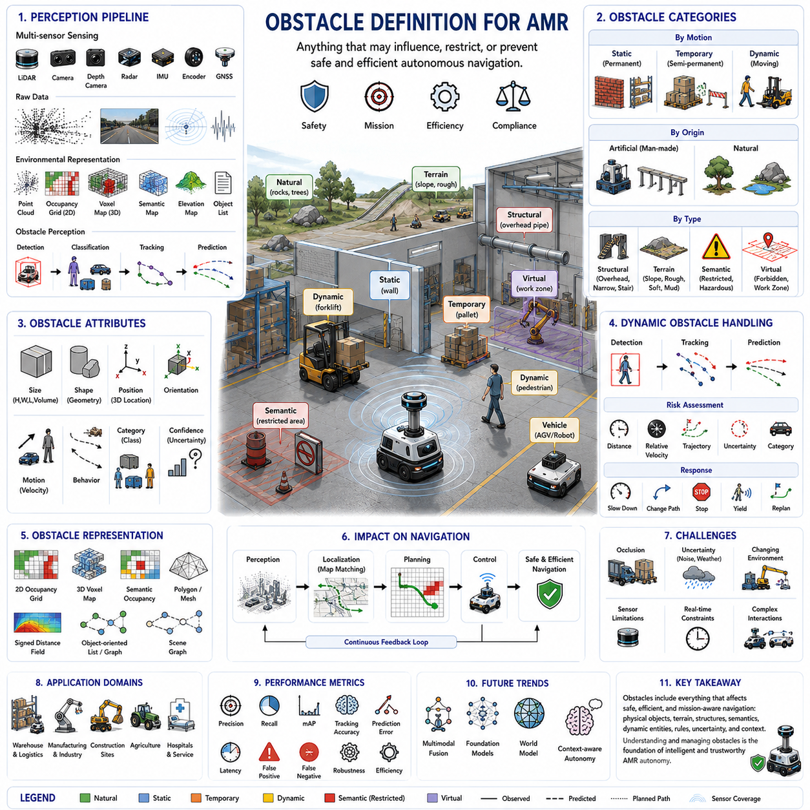
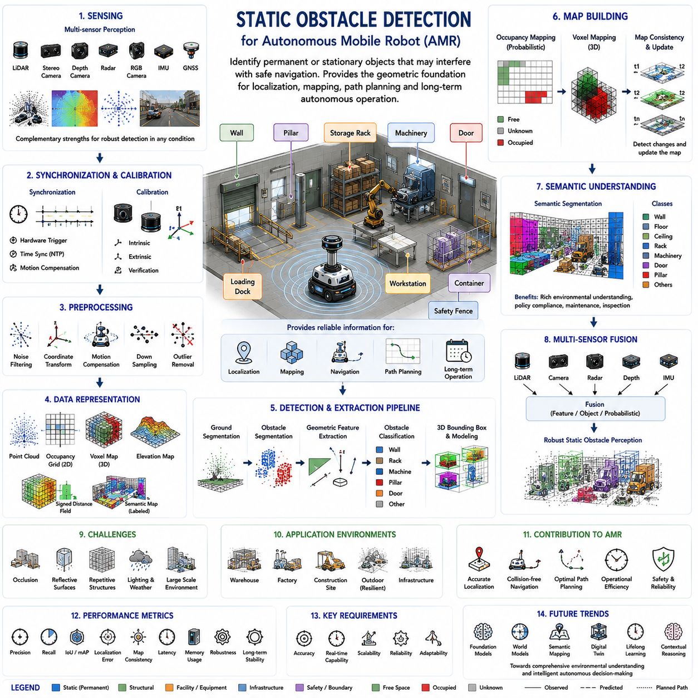
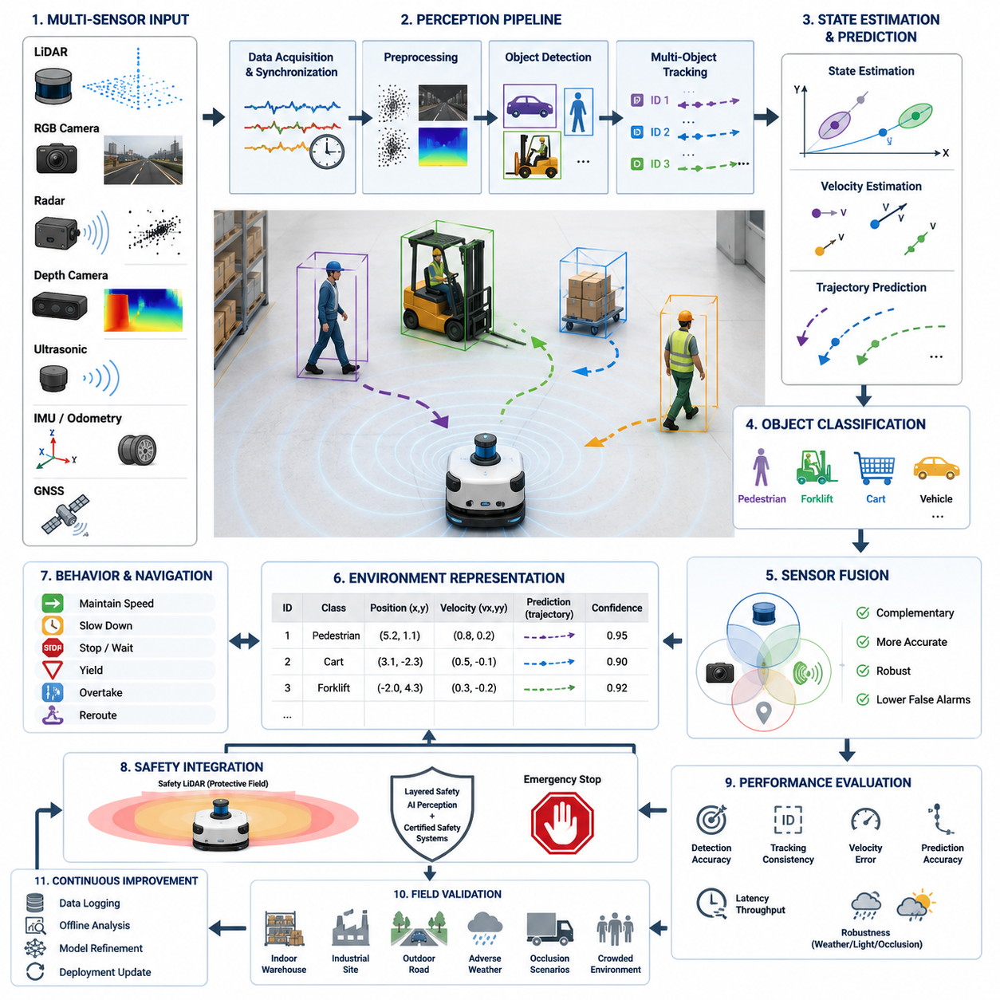
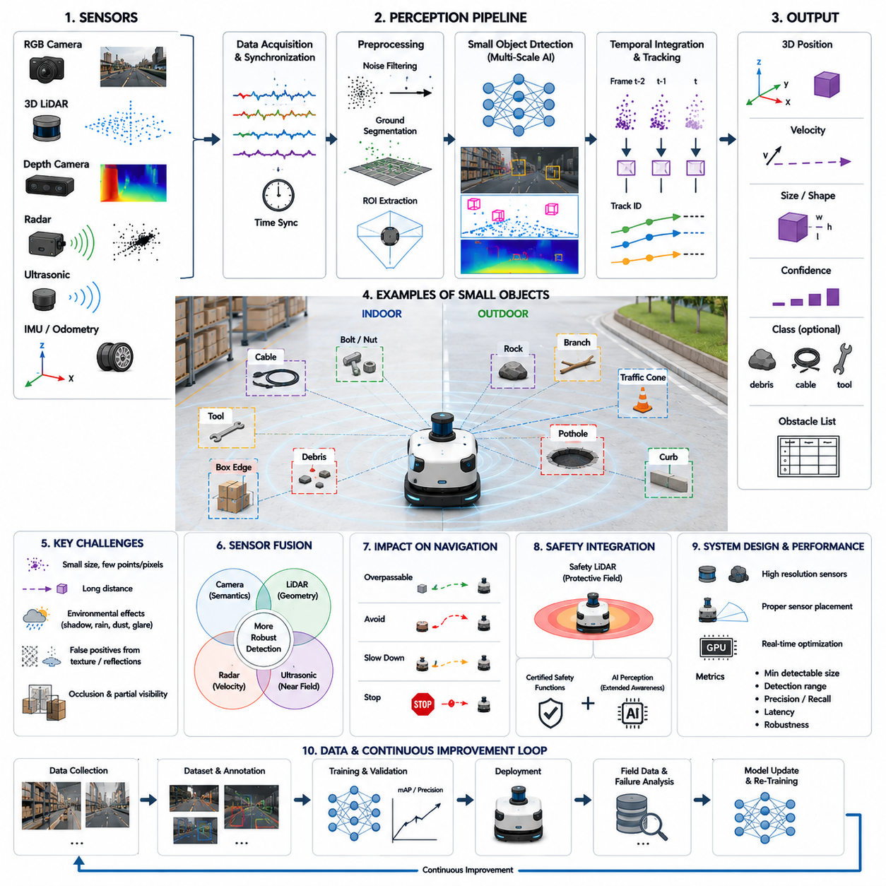
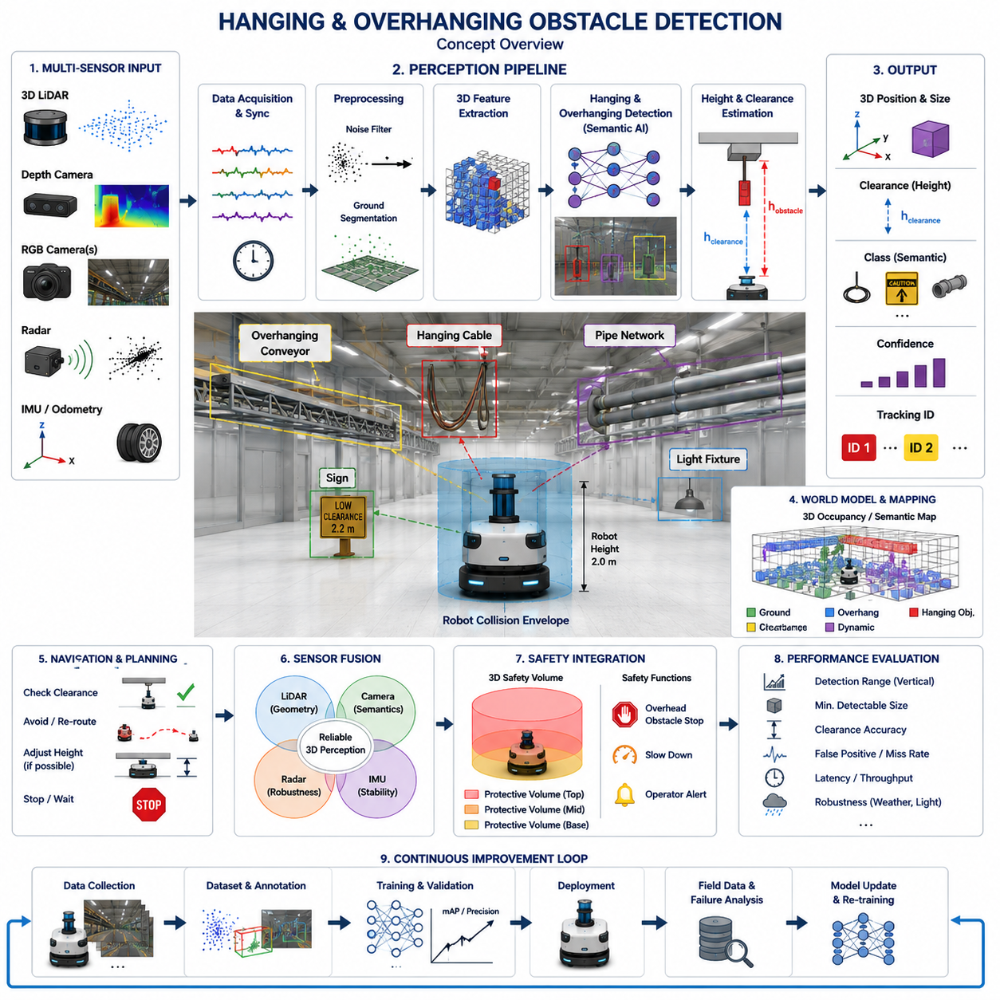
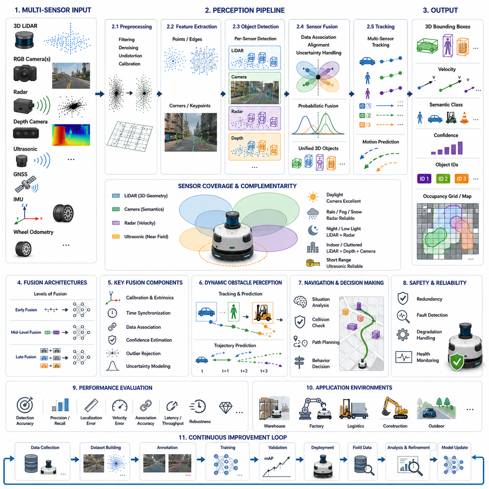
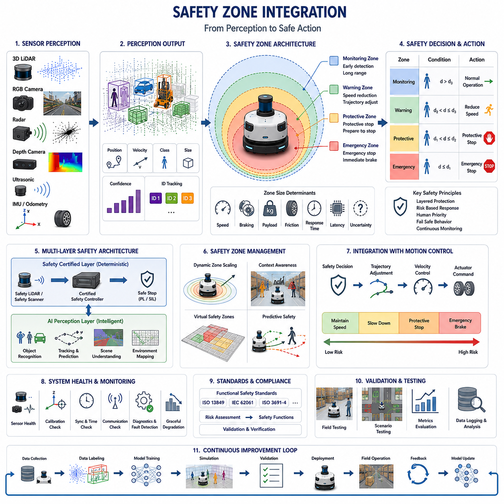
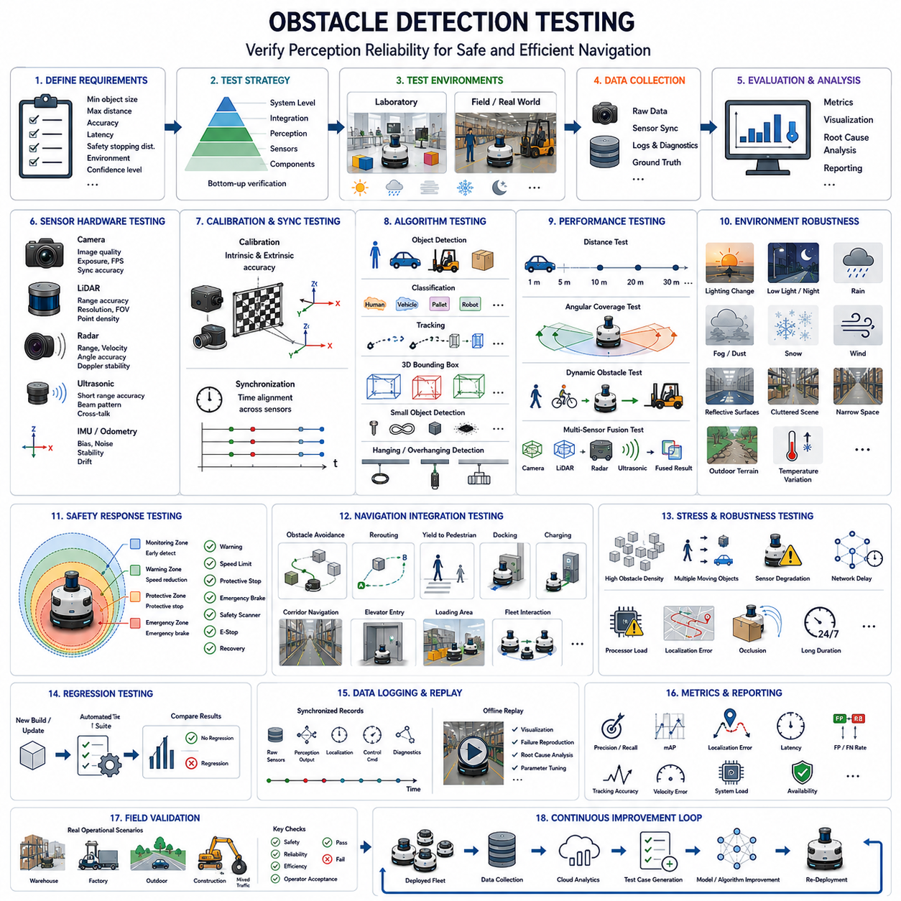

**Volume 03. AMR Sensors and Perception**

# Chapter 19. Obstacle Detection

## 19.1 Obstacle Definition for AMR

{width="7.268055555555556in" height="7.268055555555556in"}

An obstacle in an Autonomous Mobile Robot (AMR) system is any physical object, environmental feature, terrain condition, or dynamic entity that may influence, restrict, or prevent the safe execution of autonomous navigation. Unlike the traditional definition used in simple mobile robotics, where obstacles are considered only as objects that block motion, modern AMRs treat obstacles as elements that affect perception, localization, planning, control, safety, operational efficiency, and mission execution. Consequently, obstacle understanding extends beyond collision avoidance and becomes an essential component of intelligent environmental interpretation and autonomous decision-making.

The definition of an obstacle depends on both the robot\'s physical capability and the current operational objective. An object that completely blocks a small indoor delivery robot may present no difficulty for a heavy outdoor autonomous platform capable of traversing rough terrain. Likewise, an inclined surface may be considered traversable during normal transportation but treated as hazardous when carrying fragile payloads or performing precision inspection tasks. Therefore, obstacle definitions are always relative to vehicle dimensions, mobility characteristics, payload conditions, safety requirements, sensor capability, and mission context.

Obstacle perception begins with environmental sensing. LiDAR, stereo cameras, depth cameras, radar, ultrasonic sensors, RGB cameras, thermal cameras, inertial measurement units, wheel encoders, and Global Navigation Satellite Systems continuously collect information describing surrounding geometry and motion. These raw sensor observations are transformed into structured environmental representations including point clouds, occupancy grids, voxel maps, semantic maps, elevation maps, and object lists. Obstacle detection therefore represents only one stage within a much larger perception pipeline that ultimately supports autonomous navigation.

Static obstacles are objects whose positions remain essentially unchanged during normal robot operation. Examples include walls, structural columns, machinery, shelving systems, fences, permanent barriers, loading docks, utility cabinets, storage racks, buildings, and infrastructure. Static obstacles are generally incorporated into long-term maps and provide reliable reference features for localization. However, they must still be monitored because industrial facilities, construction sites, and warehouses occasionally undergo structural modifications that change previously valid environmental models.

Dynamic obstacles continuously change their position over time and require real-time perception updates. Pedestrians, forklifts, autonomous robots, manually driven vehicles, construction equipment, drones, mobile machinery, and moving inventory belong to this category. Dynamic obstacle handling requires repeated detection, object tracking, motion estimation, trajectory prediction, uncertainty management, and continuous path replanning. Unlike static obstacles, dynamic obstacles cannot simply be stored within permanent maps because their future positions continuously evolve.

Temporary obstacles occupy an intermediate category between static and dynamic objects. Shipping containers, maintenance equipment, parked vehicles, pallets, construction materials, temporary fencing, safety barriers, inspection tools, and mobile workstations may remain stationary for minutes, hours, or days before being relocated. Although they appear static during short missions, long-term navigation systems must distinguish these temporary objects from permanent infrastructure to prevent unnecessary degradation of global environmental maps.

Natural obstacles represent environmental features that arise without human construction. Rocks, trees, bushes, vegetation, fallen branches, puddles, mud, snow, sand, uneven terrain, steep slopes, loose gravel, and water accumulation all influence autonomous mobility. Unlike engineered industrial environments, outdoor navigation frequently depends more upon terrain interpretation than simple obstacle detection. Natural obstacles therefore require perception systems capable of estimating traversability rather than merely identifying occupied space.

Structural obstacles describe three-dimensional environmental geometry that constrains robot movement without necessarily appearing as isolated objects. Low ceilings, overhead pipes, narrow doorways, bridges, tunnels, staircases, ramps, overhanging machinery, suspended cables, scaffolding, and multilevel platforms all influence navigation. These structures demonstrate why three-dimensional perception has become increasingly important, since two-dimensional obstacle maps cannot adequately represent vertical clearance or complex volumetric constraints.

Terrain-related obstacles originate from surface characteristics rather than discrete physical objects. Excessive slope, roughness, instability, slippery surfaces, deformable soil, damaged pavement, potholes, drainage channels, loose stones, and soft ground may prevent safe traversal despite the absence of visible obstacles. Modern AMRs therefore evaluate terrain traversability using elevation analysis, surface geometry, semantic understanding, and vehicle dynamics rather than relying exclusively on geometric occupancy.

Semantic obstacles are defined not only by physical geometry but also by operational meaning. Restricted zones, hazardous chemical storage areas, high-voltage equipment, emergency exits, pedestrian crossings, clean rooms, sterile environments, security boundaries, loading areas, and safety exclusion zones may prohibit robot entry even when physically accessible. Semantic understanding enables robots to follow organizational policies, industrial regulations, and operational procedures beyond simple collision avoidance.

Virtual obstacles represent software-defined regions that robots intentionally avoid despite the absence of physical barriers. Fleet management systems frequently establish virtual walls, temporary restricted regions, dynamic work zones, maintenance areas, traffic control zones, speed reduction regions, and emergency evacuation corridors. Virtual obstacles provide operational flexibility because navigation behavior can be modified without changing physical infrastructure. They are especially valuable in warehouses, factories, hospitals, and logistics facilities undergoing frequent operational changes.

Moving humans represent one of the highest-priority obstacle categories because human safety dominates every autonomous navigation decision. Human behavior remains inherently unpredictable due to sudden stopping, acceleration, direction changes, group movement, distraction, and social interaction. Human-aware navigation therefore combines pedestrian detection, body pose estimation, intention prediction, trajectory forecasting, social navigation models, and adaptive safety margins to ensure safe and comfortable interaction between robots and people.

Vehicles introduce additional complexity because their motion differs significantly from pedestrian movement. Forklifts, trucks, automated guided vehicles, service vehicles, construction machines, agricultural equipment, and autonomous robots exhibit characteristic dynamic constraints including minimum turning radius, acceleration limits, braking distance, and directional motion. Predictive obstacle avoidance therefore requires motion models specific to each vehicle category rather than assuming identical movement behavior for every dynamic object.

Obstacle dimensions influence navigation beyond simple occupancy. Height, width, length, volume, orientation, and shape determine whether the robot can safely pass, drive underneath, navigate around, or manipulate surrounding objects. Thin poles, suspended cables, transparent barriers, low obstacles, overhead structures, and irregular industrial equipment often present greater perception challenges than large, easily visible objects. Accurate three-dimensional geometric modeling therefore significantly improves navigation safety.

Obstacle classification separates environmental entities into meaningful operational categories. Instead of identifying every detected structure simply as an obstacle, perception systems classify objects as pedestrians, vehicles, machinery, pallets, shelving, containers, vegetation, infrastructure, temporary equipment, or terrain features. Classification enables navigation policies tailored to each object type. For example, robots maintain greater clearance around pedestrians than around fixed walls while applying different prediction models to forklifts than to walking humans.

Obstacle detection confidence represents an important component of autonomous decision-making. Sensor noise, adverse weather, occlusion, poor illumination, reflective surfaces, partial observations, and environmental clutter all introduce uncertainty into perception. Rather than assuming every detection is completely reliable, modern perception systems estimate confidence values describing detection probability and measurement quality. Navigation planners then expand safety margins automatically whenever perception uncertainty increases.

Obstacle tracking maintains consistent identities for moving objects throughout time. Consecutive observations are associated using geometric similarity, motion prediction, appearance features, and probabilistic data association. Continuous tracking enables velocity estimation, trajectory prediction, behavioral analysis, and collision forecasting. Without reliable tracking, perception repeatedly redetects objects independently in every frame, limiting predictive navigation capabilities.

Occlusion significantly complicates obstacle perception because important objects may become partially or temporarily hidden behind vehicles, shelving systems, buildings, vegetation, machinery, or infrastructure. Robots must reason about hidden space while preserving appropriate uncertainty regarding unseen regions. Multi-view sensing, temporal fusion, predictive tracking, occupancy reasoning, and learned scene completion improve obstacle awareness under partial visibility without introducing unsafe assumptions about completely unobserved space.

Distance alone does not determine obstacle importance. A distant high-speed vehicle approaching the robot may represent greater risk than a nearby stationary wall. Risk assessment therefore combines obstacle position, relative velocity, predicted trajectory, collision probability, object category, environmental context, mission urgency, and uncertainty into comprehensive hazard evaluation. Intelligent navigation prioritizes obstacles according to potential operational consequences rather than merely geometric proximity.

Obstacle representation varies according to application requirements. Simple systems may represent obstacles using two-dimensional occupancy grids or binary maps, while advanced autonomous robots employ three-dimensional point clouds, voxel maps, semantic occupancy grids, polygonal boundaries, meshes, signed distance fields, object-oriented scene graphs, or learned environmental embeddings. The chosen representation influences computational efficiency, memory usage, planning capability, and overall navigation performance.

Localization depends heavily upon reliable obstacle interpretation. Stable environmental structures provide geometric landmarks supporting scan matching, feature extraction, and map registration. However, dynamic obstacles should generally be excluded from localization because moving objects introduce inconsistency into environmental matching. Robust perception therefore distinguishes permanent reference structures from temporary or dynamic obstacles before updating localization maps.

Path planning utilizes obstacle information to generate collision-free trajectories while optimizing travel distance, energy consumption, mission duration, safety, and operational efficiency. Global planners primarily consider permanent environmental structures, whereas local planners continuously incorporate dynamic obstacles, temporary changes, and sensor updates. Modern planning algorithms therefore integrate obstacle perception with prediction, uncertainty estimation, semantic understanding, and robot dynamics rather than relying solely on geometric collision checking.

Obstacle avoidance extends beyond emergency collision prevention. Smooth trajectory adjustment, adaptive speed regulation, cooperative interaction, socially acceptable motion, predictive braking, dynamic rerouting, and proactive risk reduction all contribute to intelligent obstacle avoidance. Rather than reacting only when collisions become imminent, advanced navigation systems anticipate future environmental evolution and modify robot behavior well before dangerous situations develop.

Industrial environments introduce specialized obstacle categories including robotic manipulators, automated production equipment, conveyor systems, suspended loads, overhead cranes, rotating machinery, automated doors, inspection platforms, and temporary maintenance activities. Many industrial obstacles exhibit predictable operational cycles that perception systems can exploit for improved planning. Integration with factory information systems further enhances obstacle awareness by providing operational context unavailable from onboard sensors alone.

Construction environments present especially challenging obstacle scenarios because terrain, equipment, infrastructure, and work activities change continuously. Excavations, temporary barriers, construction materials, scaffolding, heavy machinery, workers, incomplete structures, uneven terrain, dust, and weather conditions create highly dynamic operational environments. Construction robots therefore require adaptive obstacle models capable of updating continuously throughout long-term autonomous missions.

Agricultural robots encounter obstacle types rarely observed within industrial facilities. Crops, trees, irrigation equipment, fences, animals, mud, rocks, changing vegetation density, uneven terrain, seasonal growth, and varying illumination all influence perception. Since agricultural environments evolve naturally over time, obstacle definitions depend strongly upon plant growth stage, harvesting operations, weather conditions, and field management practices.

Obstacle datasets play an important role in developing robust perception algorithms. Public autonomous driving datasets, industrial inspection datasets, warehouse datasets, agricultural datasets, and custom organizational datasets provide annotated examples of diverse obstacle categories. However, dataset diversity remains essential because perception systems trained only under limited environmental conditions frequently generalize poorly to unseen operational scenarios.

Performance evaluation measures obstacle perception using metrics including detection precision, recall, mean Average Precision, localization error, classification accuracy, tracking accuracy, prediction error, latency, false positive rate, false negative rate, robustness, and computational efficiency. Evaluation should emphasize complete system performance rather than isolated algorithm accuracy because perception ultimately exists to support safe and effective autonomous operation.

Artificial intelligence has transformed obstacle understanding from simple geometric detection into semantic environmental reasoning. Deep neural networks learn rich geometric and semantic representations directly from multimodal sensor data, while transformer architectures model long-range spatial relationships among multiple objects. Multimodal perception combines vision, depth, LiDAR, radar, language, and prior environmental knowledge to improve obstacle interpretation under increasingly complex operational conditions.

Foundation models are expected to further redefine obstacle understanding by integrating perception, language, reasoning, prediction, and world knowledge into unified environmental intelligence. Future AMRs will distinguish not only what an obstacle is but why it exists, how it may behave, how humans are likely to interact with it, and how mission objectives should adapt accordingly. Obstacles will therefore evolve from simple collision hazards into context-rich environmental entities supporting higher levels of autonomous reasoning.

A comprehensive obstacle definition for modern Autonomous Mobile Robots therefore extends far beyond physical collision avoidance. Obstacles encompass geometric structures, semantic constraints, terrain characteristics, operational rules, dynamic entities, environmental uncertainty, and contextual relationships that collectively influence autonomous behavior. As robotic intelligence continues advancing toward foundation models and persistent world representations, obstacle understanding will become an increasingly sophisticated component of environmental reasoning, enabling safer, more adaptive, and more intelligent autonomous navigation across every major application domain of modern robotics.

## 19.2 Static Obstacle Detection

{width="7.268055555555556in" height="7.268055555555556in"}

Static obstacle detection is the process of identifying permanent or stationary objects that may interfere with the safe navigation of an Autonomous Mobile Robot (AMR). Unlike dynamic obstacle detection, which continuously monitors moving objects such as pedestrians and vehicles, static obstacle detection focuses on environmental structures whose positions remain unchanged during normal operation. Walls, pillars, storage racks, machinery, fences, loading docks, workstations, doors, containers, permanent equipment, and building infrastructure all belong to this category. Reliable detection of these stationary objects provides the geometric foundation for localization, mapping, navigation, path planning, and long-term autonomous operation.

The primary objective of static obstacle detection is not simply to identify objects but to construct an accurate spatial understanding of the environment. The perception system must determine where obstacles exist, estimate their geometry, calculate their dimensions, evaluate their relationship to surrounding structures, and continuously update environmental models whenever modifications occur. Accurate static obstacle information allows robots to generate collision-free paths, establish reliable localization references, optimize operational efficiency, and maintain safe navigation throughout extended autonomous missions.

Static obstacle perception begins with environmental sensing. LiDAR remains one of the most widely used sensors because it provides highly accurate distance measurements independent of ambient illumination. Stereo cameras estimate depth through image correspondence, depth cameras directly measure nearby three-dimensional geometry, radar contributes reliable obstacle detection under adverse weather conditions, while RGB cameras provide rich semantic information describing object appearance. Multiple sensing technologies are frequently combined to improve robustness because each sensor exhibits different strengths and limitations under changing environmental conditions.

Sensor synchronization forms an essential prerequisite for accurate static obstacle detection. Measurements acquired from multiple sensors must correspond to approximately the same physical scene despite differing sampling frequencies and communication delays. Hardware triggering, timestamp synchronization, network time protocols, and motion compensation ensure that LiDAR scans, camera images, radar measurements, and inertial observations remain geometrically consistent. Without precise synchronization, environmental structures may appear distorted or incorrectly positioned within the integrated perception model.

Sensor calibration is equally important because accurate obstacle localization depends upon precise geometric relationships among sensing devices. Intrinsic calibration estimates sensor-specific optical or measurement parameters, while extrinsic calibration determines rigid transformations between individual sensors and the robot coordinate frame. Even small calibration errors accumulate throughout perception processing, producing inaccurate obstacle positions, inconsistent environmental maps, unreliable localization, and degraded navigation performance. Consequently, calibration verification remains a critical component of every autonomous perception system.

Raw sensor observations generally require preprocessing before obstacle extraction begins. Noise filtering removes isolated measurements produced by sensor uncertainty, coordinate transformation converts observations into a common spatial reference frame, motion compensation corrects distortions introduced by robot movement, downsampling reduces computational complexity, and outlier rejection eliminates inconsistent measurements. Proper preprocessing significantly improves both computational efficiency and obstacle detection accuracy while preserving essential geometric information required for reliable environmental understanding.

Point clouds represent one of the most common geometric representations for static obstacle detection. Each point describes a measured location within three-dimensional space and may additionally contain intensity, color, timestamp, semantic information, or confidence values. Point clouds preserve highly detailed environmental geometry but often contain millions of measurements requiring efficient processing algorithms. Consequently, many perception systems transform raw point clouds into occupancy grids, voxel structures, elevation maps, or learned feature representations better suited for real-time obstacle analysis.

Ground segmentation usually precedes static obstacle detection because navigation systems must distinguish traversable surfaces from elevated environmental structures. Algorithms analyze local surface geometry, height continuity, curvature, neighborhood relationships, and slope characteristics to identify ground regions. Once supporting surfaces are removed, remaining measurements correspond primarily to vertical objects including walls, shelving, equipment, pillars, machinery, and other stationary structures that influence navigation. Reliable ground segmentation therefore simplifies subsequent obstacle extraction considerably.

Occupancy mapping provides a probabilistic representation describing whether individual regions of space contain physical obstacles, free space, or insufficient observations. Bayesian updating continuously integrates new sensor measurements while preserving uncertainty associated with partially observed environments. Occupancy grids provide computationally efficient environmental models suitable for collision checking and path planning. Their probabilistic nature further enables robust operation despite sensor noise, incomplete observations, and occasional measurement inconsistencies.

Voxel representations extend occupancy mapping into full three-dimensional volumetric space. Unlike two-dimensional occupancy grids, voxel maps preserve vertical environmental structure including overhead obstacles, suspended equipment, bridges, tunnels, multilevel shelving, staircases, pipelines, and complex industrial facilities. Three-dimensional volumetric representations become especially valuable whenever robot height, payload dimensions, sensor placement, or overhead clearance significantly influence navigation safety.

Geometric feature extraction identifies characteristic environmental structures useful for obstacle description. Planes represent walls, floors, and ceilings, while line features describe edges, beams, pipes, and structural boundaries. Corners indicate building intersections, equipment edges, and architectural transitions. Surface normals, curvature estimates, and local geometric descriptors further characterize obstacle shape and orientation. These geometric primitives support localization, mapping, object recognition, and structural analysis throughout autonomous navigation.

Obstacle segmentation separates individual environmental structures from surrounding measurements. Region growing algorithms group neighboring points sharing similar geometric properties, Euclidean clustering separates spatially disconnected structures, connected-component analysis identifies continuous occupied regions, and graph-based segmentation exploits neighborhood relationships. Successful segmentation enables independent analysis of walls, pillars, shelving, machinery, containers, and other structural obstacles rather than treating the environment as an undifferentiated collection of sensor measurements.

Obstacle classification enriches geometric detection by assigning semantic meaning to stationary structures. Instead of representing every detected object simply as occupied space, perception systems identify walls, storage racks, machinery, workstations, electrical cabinets, loading docks, safety barriers, staircases, doors, support columns, and building infrastructure. Semantic understanding enables navigation algorithms to incorporate operational knowledge, industrial rules, maintenance requirements, and contextual information beyond purely geometric collision avoidance.

Three-dimensional bounding boxes provide compact representations of detected obstacles by estimating object position, dimensions, orientation, and confidence. Although complex industrial structures often require richer geometric models, bounding boxes significantly reduce computational cost for planning and collision checking. Additional representations including meshes, polygons, convex hulls, signed distance fields, and surface models may complement bounding boxes whenever higher geometric fidelity becomes necessary for manipulation, inspection, or precision navigation.

Structural obstacles frequently exhibit regular geometric characteristics that simplify perception. Industrial walls typically form large planar surfaces, shelving systems contain repeated vertical and horizontal elements, machinery often includes rigid rectangular structures, and support columns display approximately cylindrical geometry. Exploiting these predictable structural patterns improves obstacle detection accuracy while reducing computational complexity through model-based interpretation rather than purely data-driven segmentation.

Map consistency represents an important consideration because static obstacles should remain stable across repeated observations. Environmental maps accumulate sensor measurements collected during multiple robot traversals, gradually improving geometric completeness while reducing random measurement noise. However, perception systems must also identify genuine environmental modifications such as relocated machinery, newly installed equipment, removed shelving, or building renovations. Long-term mapping therefore requires balancing structural stability with continuous environmental adaptation.

Localization depends heavily upon correctly detected static obstacles because permanent environmental structures provide reliable geometric reference features. Scan matching algorithms align current sensor observations with previously constructed maps using walls, corners, pillars, and other stable landmarks. Dynamic objects generally contribute little to reliable localization because their positions continuously change. Consequently, accurate separation between permanent structures and temporary objects significantly improves localization precision during long-term autonomous operation.

Path planning relies upon static obstacle information to generate globally efficient navigation routes. Since stationary structures define the permanent navigable space, global planners primarily consider static environmental geometry while computing optimal paths. Local planners subsequently integrate dynamic obstacle information without altering fundamental environmental topology. Accurate static obstacle detection therefore establishes the stable geometric framework supporting both long-range mission planning and short-term reactive navigation.

Industrial facilities present specialized challenges for static obstacle detection because environments often contain densely packed equipment, narrow passages, reflective surfaces, repetitive structural patterns, and changing infrastructure. Storage racks, conveyor systems, robotic manipulators, machine tools, inspection stations, production lines, electrical cabinets, safety barriers, and utility equipment frequently produce complex geometric scenes requiring robust perception algorithms capable of distinguishing closely spaced structural elements.

Warehouse environments emphasize accurate detection of shelving systems, storage racks, pallets, loading areas, docking stations, charging locations, support columns, safety fencing, and building boundaries. High shelving frequently creates partial occlusion while repetitive structural patterns complicate localization. Three-dimensional perception enables robots to distinguish permanent storage infrastructure from temporary inventory, ensuring reliable navigation despite continuous logistics operations and changing warehouse contents.

Construction environments introduce additional complexity because apparently static structures may gradually change over time. Temporary walls, scaffolding, construction materials, partially completed buildings, excavation boundaries, heavy equipment staging areas, and evolving infrastructure require frequent environmental updates. Perception systems operating in construction environments must therefore distinguish truly permanent structures from semi-permanent installations undergoing progressive modification throughout project execution.

Outdoor environments require detection of natural static obstacles including rocks, trees, vegetation, retaining walls, drainage systems, utility poles, fences, roadside barriers, embankments, bridges, and terrain features. Environmental conditions including rain, fog, snow, dust, changing illumination, and seasonal vegetation significantly influence sensor performance. Robust outdoor perception therefore frequently combines LiDAR, radar, cameras, GNSS, and inertial sensing to maintain reliable obstacle detection across diverse environmental conditions.

Artificial intelligence has significantly advanced static obstacle detection through deep neural networks trained upon large multimodal datasets. Point-based networks process raw point clouds directly, voxel-based networks exploit sparse three-dimensional convolution, bird\'s-eye-view representations improve computational efficiency, while transformer architectures capture long-range spatial relationships throughout complex environments. Learned feature representations increasingly outperform manually engineered geometric descriptors under diverse operational conditions.

Semantic segmentation further improves static obstacle understanding by assigning meaningful labels to every point, pixel, or voxel within the environment. Instead of merely detecting occupied space, semantic perception distinguishes walls, floors, ceilings, machinery, shelving, doors, windows, pipelines, electrical equipment, safety infrastructure, and structural supports. This dense semantic understanding provides richer environmental information supporting navigation, maintenance, inspection, facility management, and autonomous decision-making.

Multi-sensor fusion enhances detection robustness by combining complementary sensing modalities. LiDAR contributes precise geometry, cameras provide appearance and semantic information, radar remains reliable under adverse weather, depth cameras improve short-range perception, while inertial sensors stabilize environmental registration. Feature-level fusion, object-level fusion, and probabilistic fusion strategies reduce individual sensor weaknesses while improving overall environmental understanding across diverse operating conditions.

Occlusion remains one of the most difficult challenges for static obstacle detection because walls, machinery, shelving, containers, and infrastructure frequently hide portions of surrounding structures. Multi-view observations, temporal integration, map accumulation, and learned scene completion techniques improve structural reconstruction despite partial visibility. Nevertheless, perception systems should preserve uncertainty regarding unobserved regions rather than assuming complete environmental knowledge where direct measurements remain unavailable.

Real-time implementation requires balancing perception accuracy with computational efficiency. Large point clouds, dense voxel maps, semantic segmentation, object classification, localization support, and map updating must all operate within strict timing constraints on embedded robotic hardware. GPU acceleration, sparse computation, adaptive resolution, hierarchical processing, asynchronous pipelines, and model optimization enable reliable real-time obstacle detection while satisfying practical computational limitations.

Performance evaluation measures static obstacle detection using geometric accuracy, detection precision, recall, localization error, segmentation quality, map consistency, computational latency, memory consumption, robustness, and long-term stability. Evaluation should include repeated observations under varying environmental conditions, sensor configurations, robot speeds, illumination changes, and structural complexity. Comprehensive testing verifies that perception maintains reliable environmental understanding throughout extended autonomous operation rather than only under ideal laboratory conditions.

Future static obstacle detection will increasingly integrate foundation models, world models, semantic mapping, digital twins, lifelong learning, and contextual reasoning into unified environmental intelligence systems. Rather than merely identifying stationary objects, future AMRs will understand structural function, operational significance, maintenance history, expected environmental evolution, and relationships among infrastructure components. Static obstacle detection will therefore evolve from geometric sensing into comprehensive environmental understanding that supports higher levels of autonomous reasoning, adaptive navigation, and intelligent robotic decision-making.

## 19.3 Dynamic Obstacle Detection

{width="7.268055555555556in" height="7.268055555555556in"}

Dynamic obstacle detection is one of the most critical perception capabilities in autonomous mobile robots because the environment continuously changes as people, vehicles, robots, and machinery move through the operating area. Unlike static obstacle detection, which identifies fixed objects whose positions remain constant over time, dynamic obstacle detection must recognize motion, estimate velocity, predict future trajectories, and continuously update environmental understanding in real time. The perception system must therefore combine accurate sensing, robust tracking, and low-latency processing to maintain safe navigation while minimizing unnecessary stops.

A dynamic obstacle is defined as any object whose position changes during robot operation. Examples include pedestrians walking through warehouse aisles, forklifts crossing intersections, other autonomous mobile robots sharing navigation paths, manually pushed carts, bicycles, delivery vehicles, construction equipment, and animals entering outdoor operating zones. Some obstacles move predictably while others exhibit highly irregular motion, making the perception problem significantly more challenging than detecting stationary objects.

The first stage of dynamic obstacle detection begins with continuous sensor observation. LiDAR sensors repeatedly scan surrounding environments and compare consecutive point clouds to identify changes over time. RGB cameras analyze sequential images to estimate optical flow and detect moving regions. Radar sensors directly measure relative velocity using Doppler information, making them particularly valuable for high-speed outdoor operation. Depth cameras contribute dense three-dimensional information for nearby moving objects, especially during indoor navigation.

Temporal consistency is the foundation of motion detection. A single sensor frame only provides a snapshot of the environment, while multiple synchronized frames reveal movement patterns. The perception system compares measurements collected over time to determine whether an object is stationary or moving. Accurate timestamp synchronization among sensors is essential because even small timing errors may produce false motion estimates or incorrect velocity calculations.

Object detection algorithms first identify potential obstacles independently in each sensor frame. Deep learning models detect humans, vehicles, forklifts, bicycles, pallets, and other objects using appearance features, while LiDAR-based clustering algorithms identify geometric structures from point clouds. Once detected, each object receives a temporary identity that allows subsequent tracking algorithms to associate observations across multiple frames.

Object tracking transforms independent detections into continuous motion histories. Tracking algorithms estimate object position, velocity, acceleration, and movement direction while maintaining object identity over time. Kalman Filters, Extended Kalman Filters, Unscented Kalman Filters, Particle Filters, and multiple hypothesis tracking algorithms are commonly used to estimate object states under measurement uncertainty. These techniques improve robustness when sensor observations become noisy or temporarily unavailable.

Multi-object tracking becomes increasingly important in crowded industrial environments where numerous workers, robots, and vehicles operate simultaneously. The perception system must assign unique identifiers to each detected object and preserve those identifiers despite temporary occlusions, crossing trajectories, or partial visibility. Reliable identity maintenance prevents navigation errors caused by confusing one moving object with another during path planning.

Velocity estimation represents one of the most important outputs of dynamic obstacle detection. Rather than simply determining object location, the system calculates speed and heading relative to the robot. Velocity estimates may be obtained from consecutive LiDAR scans, camera-based optical flow, radar Doppler measurements, or sensor fusion algorithms. Accurate velocity estimation enables predictive collision avoidance rather than reactive emergency braking.

Trajectory prediction extends velocity estimation by forecasting future object motion. Simple prediction models assume constant velocity, while more advanced approaches consider acceleration, turning behavior, road geometry, semantic scene understanding, and learned behavioral patterns. Human motion prediction often requires probabilistic models because pedestrians frequently change direction unexpectedly. Industrial vehicle prediction benefits from lane information and predefined traffic rules inside factories.

Dynamic obstacle classification helps the navigation system choose appropriate avoidance behaviors. Humans require conservative safety margins because their movements are unpredictable and safety regulations demand greater protection. Forklifts generally follow operational pathways but may stop abruptly while handling loads. Other autonomous robots usually communicate predictable navigation intentions, enabling more cooperative path planning strategies through fleet management systems.

Sensor fusion significantly improves dynamic obstacle detection reliability because each sensing modality offers complementary strengths. LiDAR provides accurate geometry and distance, cameras recognize semantic object categories, radar measures velocity directly under adverse weather conditions, and ultrasonic sensors protect short-range blind spots. Combining these observations creates more complete environmental awareness while reducing false detections and improving robustness across diverse operating conditions.

Outdoor environments introduce considerably greater complexity than controlled indoor facilities. Dynamic obstacles may include cars, motorcycles, bicycles, pedestrians, construction equipment, wildlife, and rapidly changing traffic situations. Environmental factors such as rain, fog, snow, dust, sunlight glare, and uneven terrain further complicate motion estimation. Consequently, outdoor robots often rely on multi-sensor perception architectures incorporating LiDAR, radar, cameras, GNSS, and IMU measurements simultaneously.

Occlusion handling is a major challenge in dynamic obstacle detection. Moving objects frequently disappear temporarily behind shelves, parked vehicles, walls, machinery, or other pedestrians. Robust tracking algorithms maintain estimated object trajectories during these temporary visibility losses using motion prediction models. Once the object reappears, data association algorithms reconnect new observations with the existing tracked identity instead of creating duplicate objects.

False positive suppression is equally important because unnecessary obstacle detections reduce robot productivity. Sensor reflections, moving shadows, rain droplets, blowing vegetation, sensor vibration, or transient measurement noise may incorrectly appear as moving obstacles. Confidence estimation, temporal filtering, sensor cross-validation, and AI-based classification reduce these erroneous detections while maintaining high safety performance.

Real-time processing requirements place significant computational demands on perception systems. Dynamic obstacle detection must continuously process high-frequency sensor streams while maintaining low end-to-end latency. Industrial robots commonly require perception update rates between 10 Hz and 30 Hz for general navigation, while high-speed outdoor platforms may require substantially higher update frequencies to maintain sufficient stopping distance during emergency situations.

The detected obstacle information is converted into standardized environment representations suitable for navigation modules. These representations typically include object position, velocity vector, predicted trajectory, confidence score, object classification, tracking identifier, bounding box dimensions, and associated uncertainty estimates. Local path planners consume this information to compute collision-free trajectories while respecting robot kinematic constraints and safety regulations.

Dynamic obstacle information also influences robot behavioral planning rather than only geometric path planning. The navigation system determines whether to continue moving, slow down, stop temporarily, yield to crossing traffic, wait for pedestrians to pass, overtake slower objects, or reroute entirely around congested areas. High-level behavioral decisions therefore depend heavily on accurate perception of surrounding dynamic agents.

Safety integration requires that perception outputs interact closely with functional safety systems. Independently certified safety LiDAR devices often provide guaranteed protective zones capable of triggering emergency stops regardless of AI perception performance. Meanwhile, AI-based dynamic obstacle detection supplies richer semantic information that improves operational efficiency without replacing certified safety mechanisms. This layered architecture combines regulatory compliance with intelligent navigation.

Performance evaluation for dynamic obstacle detection includes multiple complementary metrics. Detection accuracy measures successful identification of moving objects, while tracking metrics evaluate identity consistency across time. Velocity estimation error, trajectory prediction accuracy, false positive rate, missed detection rate, latency, processing throughput, and robustness under environmental disturbances collectively determine practical system performance. Benchmarking should include both laboratory testing and extended real-world operation under representative traffic conditions.

Field validation must expose robots to realistic industrial scenarios involving multiple moving agents, complex intersections, varying illumination, adverse weather, and unexpected human behaviors. Testing should evaluate emergency braking performance, avoidance success rate, minimum separation distance, recovery after temporary occlusions, and long-duration tracking stability. Continuous data recording enables engineers to reproduce failures offline and improve perception algorithms through iterative refinement.

Future dynamic obstacle detection systems will increasingly leverage foundation models, multimodal perception architectures, self-supervised learning, and world models capable of understanding long-term environmental dynamics. Instead of reacting only to observed motion, future robots will anticipate human intentions, cooperate naturally with other autonomous systems, and continuously adapt perception models through operational experience. These advances will enable safer, smoother, and more efficient autonomous navigation across highly dynamic industrial, commercial, and outdoor environments.

## 19.4 Small Object Detection

{width="7.268055555555556in" height="7.268055555555556in"}

Small object detection is a specialized perception capability that focuses on identifying obstacles whose physical dimensions occupy only a limited portion of sensor measurements but may still present significant safety risks to an autonomous mobile robot. Unlike large vehicles, walls, or pedestrians that generate abundant sensor features, small objects often produce sparse point clouds, few image pixels, or weak radar reflections. Nevertheless, these objects can cause collisions, damage robot components, interrupt missions, or create hazardous situations in industrial environments. Reliable small object detection therefore represents an essential component of safe autonomous navigation rather than merely an enhancement to conventional obstacle detection.

Small obstacles appear in many different forms depending on the operating environment. Indoor facilities commonly contain bolts, nuts, tools, cables, hoses, pallets with protruding edges, dropped packages, plastic containers, electrical connectors, debris, and small maintenance equipment. Outdoor robots may encounter rocks, branches, construction materials, traffic cones, curbstones, potholes, loose gravel, pipes, and damaged road surfaces. Although these objects are physically small, they may interfere with wheels, suspension systems, sensors, towing mechanisms, or payload stability if they remain undetected.

Detecting small objects is fundamentally more difficult than detecting larger obstacles because their sensor signatures are extremely limited. A small object may occupy only a few pixels within a high-resolution camera image or generate only several LiDAR returns depending on scanning density and measurement distance. As observation distance increases, the number of available features decreases further, making reliable recognition increasingly challenging. Consequently, perception systems must maximize both spatial resolution and detection sensitivity while minimizing false alarms.

Sensor resolution plays a decisive role in small object perception. High-resolution cameras capture fine visual details that enable deep learning models to recognize small objects using texture, color, and shape information. High-channel-count three-dimensional LiDAR systems generate denser point clouds that improve geometric representation. Short-range depth cameras provide accurate local geometry for nearby obstacles, while millimeter-wave radar contributes complementary information for metallic objects under adverse weather conditions. Selecting sensors with appropriate resolution and coverage is therefore one of the most important design decisions.

Sensor placement significantly influences small object visibility. Cameras and LiDAR units mounted too high above the ground may fail to observe low-profile obstacles because of shallow viewing angles or self-occlusion caused by the robot chassis. Conversely, sensors mounted excessively low become more vulnerable to dust, water, vibration, and physical damage. Practical robot designs often combine elevated long-range sensors with additional low-mounted perception sensors to ensure adequate coverage of both distant and near-ground hazards.

Ground segmentation forms the foundation of many small object detection pipelines. The perception system first estimates the ground surface using geometric models, plane fitting algorithms, elevation maps, or voxel-based representations. Once the ground has been identified, points or pixels protruding above the estimated surface become candidate obstacles. Accurate ground estimation is particularly important because uneven terrain, ramps, slopes, or rough outdoor surfaces may otherwise be incorrectly classified as hazardous objects.

Image-based small object detection relies heavily on modern deep learning architectures capable of recognizing fine visual features across multiple spatial scales. Feature Pyramid Networks, multi-scale convolutional structures, attention mechanisms, and transformer-based detection models preserve high-resolution feature maps while simultaneously incorporating semantic context from larger image regions. Multi-scale learning enables detection models to identify objects ranging from tiny debris to large industrial vehicles using a unified perception framework.

LiDAR-based detection approaches focus on identifying small geometric structures within sparse point clouds. Clustering algorithms separate neighboring points into candidate objects, while voxel representations normalize point density for three-dimensional neural networks. Since small objects generate very few measurements, preprocessing techniques including noise removal, outlier filtering, point cloud densification, and temporal accumulation improve detection robustness without introducing excessive computational overhead.

Temporal integration substantially enhances small object detection performance. Rather than relying exclusively on a single sensor frame, the perception system combines observations collected over multiple consecutive frames. As the robot moves, additional viewpoints gradually reveal more measurements of previously uncertain objects. Temporal accumulation increases confidence while reducing the probability that isolated sensor noise will be incorrectly interpreted as a physical obstacle.

Sensor fusion provides complementary advantages because no individual sensing modality performs optimally under all operating conditions. Cameras contribute detailed semantic information, LiDAR delivers accurate three-dimensional geometry, depth cameras improve near-field perception, radar provides reliable measurements in rain or fog, and ultrasonic sensors protect extremely short-range blind zones. Fusing these heterogeneous observations produces a more complete representation of small obstacles while reducing uncertainty caused by sensor limitations.

Artificial intelligence models trained specifically for small object detection require carefully prepared datasets containing sufficient examples of low-visibility targets. Data collection should include diverse object sizes, materials, colors, illumination conditions, backgrounds, weather scenarios, and sensor viewpoints. Balanced datasets prevent the learning process from becoming biased toward large objects, while augmentation techniques such as scaling, cropping, rotation, brightness adjustment, synthetic data generation, and domain randomization improve generalization performance.

Distance-dependent detection performance must be carefully considered during system design. Small objects located close to the robot can usually be detected reliably because they occupy more pixels or produce denser point clouds. Detection accuracy decreases progressively with increasing distance as object signatures become weaker. Consequently, operational safety often depends on ensuring that perception range exceeds the robot\'s stopping distance by a comfortable margin under maximum operating speed.

Environmental conditions further complicate small object detection. Shadows, reflective floors, wet pavement, snow, mud, fallen leaves, dust, vegetation, and changing illumination may partially obscure small obstacles or create false visual patterns. Outdoor environments introduce additional uncertainty through rain, fog, direct sunlight, and wind-driven debris. Robust perception systems therefore combine adaptive preprocessing, sensor fusion, and confidence estimation to maintain stable performance despite environmental disturbances.

False positive suppression is especially important because numerous harmless environmental features resemble small obstacles. Surface texture variations, painted floor markings, puddles, drainage grates, sensor artifacts, or temporary lighting effects may all produce misleading observations. Excessive false detections reduce operational efficiency by causing unnecessary braking or repeated route replanning. Confidence scoring, temporal consistency analysis, semantic classification, and cross-sensor verification help distinguish genuine hazards from environmental noise.

Small object detection directly influences local path planning and motion control. Once an obstacle has been confirmed, the navigation system determines whether it can safely drive over the object, avoid it through lateral maneuvering, reduce vehicle speed, or perform a complete stop. These decisions depend on robot ground clearance, wheel diameter, suspension characteristics, payload stability, traction conditions, and operational safety policies. Intelligent navigation therefore requires not only detecting obstacles but also understanding their practical impact on vehicle dynamics.

Functional safety considerations require reliable detection of safety-critical small obstacles that could threaten robot stability or nearby personnel. Certain industrial environments demand certified safety sensors capable of guaranteeing obstacle detection within predefined protective zones. AI-based perception complements these certified systems by recognizing a broader range of object categories and providing richer semantic information for operational decision making. The combination of deterministic safety mechanisms and intelligent perception creates a layered protection architecture suitable for industrial autonomous robots.

Real-time implementation requires careful optimization because high-resolution sensing and advanced neural networks consume considerable computational resources. Edge AI accelerators, GPU-based inference engines, TensorRT optimization, quantized neural networks, asynchronous perception pipelines, and region-of-interest processing reduce latency while maintaining detection accuracy. Efficient software architecture ensures that perception outputs remain available at frequencies sufficient to support safe navigation under continuously changing operating conditions.

Performance evaluation for small object detection extends beyond conventional object detection metrics. Engineers evaluate minimum detectable object size, detection range, localization accuracy, false positive rate, missed detection rate, inference latency, environmental robustness, and long-term operational reliability. Testing should include objects made of different materials, irregular shapes, varying surface reflectivity, and multiple heights above the ground. Comprehensive benchmarking provides a realistic understanding of perception capability under representative deployment conditions.

Field validation represents the final stage of development before deployment. Real industrial environments should include scattered tools, cables, packaging materials, construction debris, uneven pavement, damaged flooring, and naturally occurring obstacles that challenge perception systems under realistic operating conditions. Continuous logging of sensor data enables offline failure analysis, algorithm refinement, and retraining using difficult examples collected during actual robot operation. This iterative improvement process gradually increases robustness while reducing the likelihood of unexpected failures after commercial deployment.

Future small object detection systems will increasingly integrate foundation models, multimodal perception, self-supervised representation learning, high-resolution three-dimensional world models, and adaptive sensor fusion capable of understanding object significance rather than merely detecting physical presence. Instead of simply identifying small obstacles, future autonomous robots will estimate traversability, predict interaction risk, infer object properties, and continuously improve perception through operational experience. These capabilities will enable safer, more efficient, and more intelligent autonomous navigation across complex industrial, logistics, construction, and outdoor environments.

## 19.5 Hanging and Overhanging Obstacle Detection

{width="7.268055555555556in" height="7.268055555555556in"}

Hanging and overhanging obstacle detection is a specialized perception capability that identifies obstacles located above the ground but within the potential collision envelope of an autonomous mobile robot. Unlike conventional obstacle detection, which primarily focuses on objects resting on the driving surface, this perception task considers three-dimensional structures that may interfere with robot sensors, payloads, robot arms, masts, antennas, or elevated equipment. Accurate detection of these obstacles is essential for preventing collisions in warehouses, factories, hospitals, construction sites, and outdoor logistics environments where overhead structures are frequently encountered.

Hanging obstacles are objects suspended from ceilings, building structures, machinery, or temporary supports. Examples include electrical cables, air hoses, chains, warning signs, hanging tools, suspended lighting fixtures, protective curtains, temporary safety barriers, and low-hanging branches in outdoor environments. Overhanging obstacles, in contrast, are fixed structures that extend horizontally into the robot\'s travel path, such as conveyor systems, shelves, loading docks, balconies, roof edges, pipe networks, bridges, tree branches, and building overhangs. Although these objects do not occupy the driving surface, they may still intersect the robot\'s three-dimensional operating space.

Conventional two-dimensional obstacle detection systems often fail to recognize hanging obstacles because their sensing plane is located close to the ground. A two-dimensional LiDAR mounted at bumper height may safely detect floor-level obstacles while completely missing objects positioned above the scanning plane. As robots become taller through the addition of sensor towers, robotic manipulators, cameras, communication antennas, or elevated payloads, the risk associated with overhead collisions increases significantly. Three-dimensional perception therefore becomes an essential requirement rather than an optional enhancement.

The robot\'s physical dimensions strongly influence hanging obstacle detection requirements. The perception system must understand not only the vehicle footprint but also the complete three-dimensional collision envelope, including robot height, payload dimensions, mast extension, robotic arm workspace, sensor placement, and dynamic motion during acceleration or suspension movement. Safe navigation depends on continuously comparing the surrounding environment against this evolving geometric representation of the robot.

Three-dimensional LiDAR provides one of the most effective sensing technologies for detecting hanging and overhanging obstacles. Multiple vertical scanning channels generate dense point clouds that capture structures at different elevations above the ground. Modern perception algorithms segment these point clouds into ground surfaces, vertical structures, suspended objects, and overhanging geometry. Height information enables the robot to determine whether sufficient clearance exists before entering narrow passages or moving beneath elevated structures.

Depth cameras complement LiDAR by providing dense three-dimensional measurements within short and medium operating ranges. Stereo vision, structured-light cameras, and time-of-flight sensors estimate depth for overhead objects that may produce sparse LiDAR returns. Cameras also contribute semantic information by recognizing cables, signs, branches, and industrial equipment using deep learning models. Combining geometric depth with semantic understanding improves both detection accuracy and obstacle classification.

Multi-camera systems further improve overhead perception by expanding the vertical field of view. Upward-facing cameras observe suspended infrastructure, while forward-facing cameras detect approaching overhangs before the robot reaches them. Wide-angle lenses increase coverage but introduce optical distortion that must be corrected through calibration. Careful camera placement ensures continuous observation of both ground-level and elevated obstacles without creating significant blind zones.

Point cloud processing plays a central role in identifying hanging structures. Ground segmentation first removes floor points from consideration, allowing algorithms to analyze elevated point clusters independently. Height thresholding, connected-component clustering, voxel analysis, and semantic segmentation separate suspended objects from walls, ceilings, and permanent infrastructure. The resulting obstacle representations include three-dimensional position, dimensions, clearance height, confidence estimates, and semantic classifications suitable for navigation planning.

Height estimation represents one of the most important outputs of hanging obstacle detection. Rather than merely identifying the presence of an object, the perception system calculates the vertical clearance between the obstacle and the ground. This clearance is continuously compared against the robot\'s current height and predicted motion envelope. Even relatively small measurement errors may result in collisions with expensive sensors or payloads, making accurate vertical localization essential for safe operation.

Semantic classification enhances decision making by distinguishing different categories of elevated obstacles. Temporary hanging cables may require route avoidance because their motion is unpredictable, whereas permanent building structures can be safely incorporated into navigation maps. Flexible objects such as plastic curtains or lightweight vegetation may permit limited contact under controlled conditions, while rigid steel beams or concrete overhangs require complete avoidance. Semantic understanding therefore improves both operational efficiency and safety.

Sensor fusion significantly increases detection robustness because individual sensing modalities exhibit different strengths and limitations. Three-dimensional LiDAR accurately measures geometry, cameras recognize object categories, radar detects large metallic structures under adverse weather conditions, and inertial sensors stabilize perception during robot motion. Combining multiple sensing modalities reduces uncertainty caused by partial occlusions, difficult lighting conditions, reflective surfaces, or sparse point cloud measurements.

Dynamic hanging obstacles present additional challenges because their positions change over time. Suspended cables may oscillate in response to wind, cranes may move loads across robot pathways, flexible hoses may swing during industrial operations, and tree branches may move under changing weather conditions. Dynamic perception therefore combines obstacle detection with object tracking, velocity estimation, and motion prediction to evaluate future collision risk rather than relying solely on instantaneous measurements.

Environmental conditions strongly influence perception performance. Poor illumination reduces camera effectiveness, while rain, fog, snow, and airborne dust degrade both optical and laser-based sensing. Highly reflective metallic pipes may generate irregular LiDAR returns, whereas transparent materials such as glass panels or plastic curtains remain difficult for certain sensors to detect reliably. Robust perception systems compensate for these limitations through adaptive sensor fusion and confidence estimation.

Digital maps containing structural clearance information further improve navigation reliability. Warehouses, factories, and industrial facilities often contain permanent overhead infrastructure whose locations remain relatively stable. High-definition three-dimensional maps record bridge heights, conveyor clearances, doorway dimensions, pipe networks, and ceiling structures. During operation, real-time sensor observations validate mapped information while simultaneously detecting temporary hanging obstacles not represented in the static environment model.

Navigation systems use hanging obstacle information to determine whether the planned trajectory remains safe. Before entering tunnels, passing beneath conveyor systems, driving through doorways, or approaching loading platforms, the robot evaluates available vertical clearance. If insufficient space exists, the planner selects an alternative route, requests operator intervention, lowers adjustable mechanisms when possible, or stops before entering the hazardous area. Clearance-aware planning significantly reduces collision risk during autonomous operation.

Functional safety considerations require reliable protection against overhead collisions because impacts frequently damage expensive sensors, communication equipment, robotic manipulators, and payloads mounted above the vehicle chassis. Safety-certified perception may define three-dimensional protective volumes extending above the robot rather than relying exclusively on ground-level safety fields. AI perception supplements these deterministic safety mechanisms by recognizing complex obstacle categories and providing richer environmental understanding.

Real-time implementation requires efficient processing of large three-dimensional datasets generated by modern perception sensors. GPU acceleration, voxel compression, region-of-interest processing, asynchronous perception pipelines, and optimized deep learning inference reduce computational latency while maintaining accurate obstacle recognition. Practical systems balance processing complexity against update frequency to ensure timely collision avoidance during continuous robot motion.

Performance evaluation for hanging and overhanging obstacle detection includes vertical detection range, minimum detectable obstacle size, clearance estimation accuracy, semantic classification performance, false positive rate, missed detection rate, processing latency, and robustness under changing environmental conditions. Benchmarking should include obstacles composed of different materials, shapes, suspension methods, and heights while evaluating performance across varying illumination, weather, and motion scenarios.

Field validation requires representative industrial environments containing overhead pipes, suspended cables, conveyor systems, hanging tools, temporary construction equipment, warehouse shelving, loading docks, tree branches, bridges, and various elevated structures encountered during real robot deployment. Continuous recording of perception data enables engineers to reproduce failures, refine algorithms, improve sensor calibration, and expand training datasets using operational experience collected from diverse deployment sites.

Future hanging and overhanging obstacle detection systems will increasingly combine foundation models, multimodal three-dimensional scene understanding, self-supervised learning, semantic world models, and predictive environmental reasoning. Instead of merely identifying overhead obstacles, future autonomous robots will understand structural intent, estimate traversability, predict obstacle movement, evaluate long-term collision risk, and continuously improve perception through accumulated operational knowledge. These capabilities will support safer, more intelligent, and more reliable autonomous navigation across increasingly complex industrial, commercial, logistics, and outdoor environments.

## 19.6 Multi-Sensor Obstacle Detection

{width="7.268055555555556in" height="7.268055555555556in"}

Multi-sensor obstacle detection is an advanced perception methodology that combines observations from multiple sensing modalities to achieve more reliable, accurate, and robust obstacle recognition than can be obtained from any individual sensor. Every sensing technology possesses inherent strengths and weaknesses, making it impossible for a single sensor to operate optimally under all environmental conditions. By integrating complementary information from LiDAR, cameras, radar, ultrasonic sensors, depth cameras, GNSS, IMU, and wheel odometry, autonomous mobile robots develop a more comprehensive understanding of their surroundings and significantly improve navigation safety across diverse operational environments.

Single-sensor perception systems often experience performance degradation when operating outside their ideal conditions. Cameras provide rich semantic information but suffer under poor illumination, glare, fog, or heavy rain. LiDAR accurately measures three-dimensional geometry but may produce sparse point clouds at long distances or encounter difficulties with transparent and highly reflective surfaces. Radar performs reliably during adverse weather while providing direct velocity measurements but generally offers lower spatial resolution. Ultrasonic sensors excel in short-range detection but cannot support long-distance perception. Multi-sensor architectures compensate for these individual limitations through complementary sensing capabilities.

The primary objective of multi-sensor obstacle detection is not merely to combine sensor outputs but to produce a unified environmental representation with higher confidence and lower uncertainty. Instead of treating each sensor independently, the perception system continuously evaluates agreement and disagreement among sensor observations while estimating the reliability of each measurement. This probabilistic reasoning enables obstacle detection even when one or more sensors experience temporary degradation or partial failure.

Sensor diversity represents one of the greatest advantages of multi-sensor perception. Geometric sensors such as LiDAR and depth cameras describe object shape and position. Vision sensors identify semantic categories including pedestrians, forklifts, vehicles, pallets, and traffic signs. Radar contributes relative velocity information together with robust long-range detection under difficult weather conditions. Inertial sensors stabilize perception by compensating for vehicle motion, while GNSS and odometry provide accurate localization necessary for maintaining environmental consistency over time.

Successful sensor fusion begins with accurate calibration. Intrinsic calibration determines the internal parameters of each individual sensor, while extrinsic calibration estimates the precise spatial relationship between sensors mounted on the robot platform. Even small calibration errors may produce incorrect object alignment, degraded fusion accuracy, duplicate obstacle generation, or inconsistent environmental models. Maintaining calibration quality throughout long-term robot operation therefore remains an essential engineering requirement.

Time synchronization is equally important because obstacle fusion relies on comparing measurements captured at nearly identical moments. Modern robots often employ hardware triggers, Precision Time Protocol, Network Time Protocol, or synchronized timestamps to align sensor observations with sub-millisecond accuracy. Poor synchronization introduces spatial inconsistencies because moving obstacles occupy different positions when observed at different times, resulting in inaccurate velocity estimation and unreliable tracking.

Sensor fusion architectures are commonly categorized into early fusion, mid-level fusion, and late fusion strategies. Early fusion combines raw sensor measurements before feature extraction, enabling deep interaction among sensing modalities but requiring substantial computational resources. Mid-level fusion integrates intermediate features generated independently by each perception pipeline. Late fusion combines fully processed object detections and tracking results using probabilistic reasoning, allowing independent sensor modules while simplifying system integration and maintenance.

LiDAR-camera fusion represents one of the most widely adopted approaches for obstacle detection. LiDAR provides precise three-dimensional coordinates, while cameras contribute semantic understanding through deep neural networks trained for object recognition. Projecting point clouds into image coordinates enables each detected object to receive both geometric measurements and semantic labels. The resulting obstacle representation includes object category, position, orientation, dimensions, confidence score, and associated visual characteristics.

Radar-camera fusion addresses challenges encountered during adverse weather and high-speed outdoor navigation. Radar accurately estimates object velocity using Doppler measurements while cameras classify object types and recognize visual context. Radar detections guide camera attention toward potential obstacles, whereas camera observations refine radar measurements by providing detailed spatial boundaries and semantic information. This complementary relationship substantially improves perception reliability under rain, fog, snow, and nighttime conditions.

LiDAR-radar fusion combines accurate geometric mapping with robust long-range motion detection. Radar identifies moving vehicles and large metallic structures at considerable distances even when LiDAR measurements become sparse because of precipitation or atmospheric conditions. LiDAR subsequently refines object geometry using dense point clouds. The combined perception system achieves superior performance compared with either sensing modality operating independently.

Depth cameras significantly improve near-field obstacle perception, particularly for indoor robots operating around shelving systems, workstations, docking stations, and human operators. Dense depth maps supplement LiDAR measurements by capturing fine structural details of nearby obstacles. Combining depth information with RGB imagery enables accurate segmentation of complex scenes containing objects with intricate geometry or irregular surface characteristics.

Ultrasonic sensors provide additional protection within extremely short operating distances where optical sensors may experience blind zones. During docking, parking, pallet handling, or navigation through narrow passages, ultrasonic measurements detect obstacles located only a few centimeters from the robot. These measurements complement longer-range sensors by ensuring continuous obstacle awareness across the complete operating distance spectrum.

Obstacle association forms a critical stage of multi-sensor perception because observations originating from different sensors must be matched to the same physical object. Data association algorithms compare spatial position, object dimensions, motion characteristics, semantic labels, and temporal consistency to determine whether multiple observations represent identical obstacles. Successful association prevents duplicate object creation while improving confidence through measurement redundancy.

Confidence estimation enables adaptive sensor weighting during obstacle fusion. Rather than assigning equal importance to every sensor, the perception system evaluates measurement quality according to environmental conditions, sensor health, observation angle, distance, and historical performance. Camera confidence decreases during darkness, LiDAR confidence may decline during heavy rain, and radar confidence varies according to object material and geometry. Dynamic confidence estimation allows the system to prioritize the most reliable sensing modality under current operating conditions.

Artificial intelligence has significantly advanced multi-sensor obstacle detection by learning complex relationships among heterogeneous sensor observations. Deep neural networks process synchronized point clouds, images, radar reflections, and depth maps simultaneously to generate unified obstacle representations. Transformer architectures, graph neural networks, and multimodal foundation models increasingly replace manually engineered fusion rules with learned feature representations capable of adapting to diverse environments.

Dynamic obstacle detection particularly benefits from multi-sensor fusion because moving objects exhibit continuously changing positions, velocities, and appearances. Tracking algorithms integrate LiDAR geometry, radar velocity, camera classification, and inertial motion compensation to estimate stable object trajectories. The resulting predictions support local path planning, collision avoidance, and behavior planning with substantially greater reliability than single-sensor tracking approaches.

Functional safety considerations require obstacle detection systems to maintain reliable operation despite sensor degradation or partial hardware failures. Multi-sensor architectures provide inherent redundancy by allowing remaining sensors to compensate when individual devices become temporarily unavailable. Health monitoring continuously evaluates sensor status, communication quality, calibration consistency, and measurement validity, enabling graceful degradation rather than complete perception failure.

Real-time implementation presents considerable computational challenges because multiple high-bandwidth sensor streams must be processed simultaneously. Efficient perception architectures distribute computation across CPUs, GPUs, AI accelerators, and dedicated hardware pipelines. Parallel processing, asynchronous execution, TensorRT optimization, region-of-interest selection, and intelligent scheduling minimize latency while preserving detection accuracy under demanding operational conditions.

Performance evaluation for multi-sensor obstacle detection extends beyond traditional detection accuracy metrics. Engineers evaluate fusion precision, object association accuracy, localization error, velocity estimation quality, semantic classification performance, processing latency, robustness against sensor failures, computational efficiency, synchronization accuracy, and long-term operational stability. Comprehensive benchmarking across diverse environmental conditions provides a realistic assessment of perception capability before field deployment.

Field validation should expose the perception system to representative industrial and outdoor scenarios containing stationary obstacles, moving pedestrians, forklifts, autonomous robots, vehicles, reflective materials, transparent objects, adverse weather, changing illumination, and temporary sensor occlusions. Continuous recording of synchronized multi-sensor data supports offline analysis, calibration refinement, algorithm improvement, and retraining using challenging operational examples collected throughout the robot lifecycle.

Future multi-sensor obstacle detection systems will increasingly integrate foundation models, multimodal world models, self-supervised learning, adaptive sensor confidence estimation, edge AI acceleration, and cloud-assisted perception. Rather than simply merging sensor measurements, future perception architectures will understand the complete three-dimensional environment, reason about object behavior, predict future interactions, and continuously optimize sensor cooperation through accumulated operational experience. These capabilities will provide highly reliable perception for autonomous robots operating safely and efficiently across increasingly complex industrial, commercial, logistics, agricultural, construction, and outdoor environments.

## 19.7 Safety Zone Integration

{width="7.268055555555556in" height="7.268055555555556in"}

Safety zone integration is the process of combining obstacle perception with functional safety mechanisms to ensure that an autonomous mobile robot operates safely around people, equipment, and infrastructure. While obstacle detection identifies objects within the environment, safety zone integration determines how those detections influence robot behavior by defining protective regions around the vehicle and associating each region with appropriate safety responses. This integration transforms perception data into deterministic safety actions that comply with industrial safety requirements while maintaining efficient robot operation.

A safety zone is a predefined three-dimensional or two-dimensional region surrounding the robot in which the presence of an obstacle triggers a specific response. Different zones correspond to different risk levels and operational behaviors. Objects detected at long distances may simply cause speed reduction, while obstacles entering inner protective zones require controlled stopping or immediate emergency braking. Properly designed safety zones balance operational productivity with personnel protection by preventing unnecessary interruptions while maintaining adequate safety margins.

Modern autonomous mobile robots typically employ multiple concentric safety zones rather than a single fixed protective boundary. The outer monitoring zone provides early awareness of approaching obstacles and supports predictive planning. Intermediate warning zones initiate gradual speed reduction and trajectory adjustment. Inner protective zones activate protective stopping functions, while the innermost emergency zone immediately commands a safe stop when collision risk becomes unacceptable. Layered protection enables smoother navigation compared with abrupt emergency responses.

The dimensions of each safety zone depend on robot dynamics and operational conditions. Maximum vehicle speed, braking capability, payload mass, floor friction, steering characteristics, controller response time, perception latency, and environmental uncertainty all influence required stopping distance. Higher speeds generally require larger protective zones because additional distance is needed to detect obstacles, process sensor data, execute control commands, and physically stop the vehicle before contact occurs.

Dynamic safety zones continuously adapt their size according to the robot\'s current operating state. During low-speed precision docking, protective zones may become relatively small to improve maneuverability. During high-speed transportation or outdoor navigation, the same robot automatically enlarges its monitoring and stopping regions to compensate for increased stopping distance. Adaptive zone management therefore improves both safety and operational efficiency by matching protection to current risk conditions.

Obstacle detection provides the environmental information necessary for safety zone evaluation. Multi-sensor perception systems identify object position, velocity, direction, size, classification, and confidence level. Safety zone logic then determines whether the detected object intersects any protective region surrounding the robot. The resulting decision initiates appropriate control actions ranging from continued operation to speed limitation, controlled braking, protective stopping, or emergency shutdown depending on calculated risk.

Human detection receives particularly conservative treatment within safety zone integration because human behavior is inherently unpredictable. Pedestrians may suddenly change direction, stop unexpectedly, or enter robot pathways without warning. Consequently, robots often apply larger safety margins, lower allowable speeds, and earlier braking responses whenever humans are detected compared with static infrastructure or other autonomous vehicles operating under predictable motion constraints.

Obstacle classification further enhances safety decision making by assigning different protection strategies to different object categories. Permanent walls, temporary pallets, forklifts, mobile robots, suspended obstacles, and human workers each present unique operational risks. Classification enables the navigation system to distinguish between situations requiring immediate stopping and those permitting cautious avoidance or controlled interaction while maintaining compliance with safety regulations.

Safety-certified sensors play an essential role in industrial safety architectures. Safety LiDAR devices continuously monitor certified protective fields and independently trigger protective stopping functions whenever obstacles enter hazardous regions. These certified systems provide deterministic safety performance validated according to international functional safety standards. Artificial intelligence perception complements rather than replaces certified safety sensing by supplying richer environmental understanding and improved operational efficiency.

Multi-layer safety architectures combine certified safety hardware with advanced perception algorithms. Certified safety sensors guarantee minimum protective functionality regardless of AI performance, while perception systems contribute semantic object recognition, trajectory prediction, environment mapping, and intelligent navigation decisions. This layered approach reduces common-mode failures because independent sensing principles supervise one another while providing complementary capabilities unavailable from individual subsystems alone.

Sensor fusion substantially improves safety zone reliability by reducing uncertainty associated with individual sensing modalities. LiDAR accurately measures geometric distance, cameras recognize semantic object categories, radar reliably detects moving objects during adverse weather, ultrasonic sensors protect short-range blind zones, and IMU measurements compensate for vehicle motion. Combining these observations generates more accurate obstacle localization and reduces false alarms that might otherwise disrupt robot productivity.

Time synchronization and sensor calibration remain fundamental requirements because safety decisions depend on accurate environmental representation. All sensor measurements must correspond to the same physical instant while maintaining consistent spatial alignment. Timing errors, calibration drift, or coordinate transformation inaccuracies may incorrectly position obstacles relative to safety zones, potentially producing unnecessary protective stops or, more critically, delayed hazard detection.

Virtual safety zones extend physical protection by defining software-controlled operational boundaries. Restricted areas, pedestrian crossings, hazardous machinery, charging stations, loading docks, and maintenance zones may all be represented as virtual regions stored within digital facility maps. When the robot approaches these predefined locations, navigation policies automatically modify speed limits, permitted behaviors, sensor priorities, or mission execution rules before entering elevated-risk environments.

Context-aware safety zone management further improves operational intelligence by incorporating environmental knowledge into safety decisions. Narrow corridors, busy intersections, warehouse crossings, production lines, outdoor roadways, and shared human workspaces each require different protective strategies. Instead of applying identical safety parameters everywhere, context-aware systems dynamically adjust safety margins according to local operational characteristics while maintaining regulatory compliance.

Predictive safety represents an important advancement beyond purely reactive protection. Rather than responding only after obstacles enter protective regions, predictive algorithms estimate future trajectories for both the robot and surrounding dynamic objects. Time-to-collision estimation, trajectory prediction, and behavioral forecasting allow navigation systems to reduce speed or modify planned paths before dangerous situations develop, improving both safety and traffic flow.

Robot motion control is tightly integrated with safety zone evaluation. Depending on obstacle location and estimated collision risk, the controller may maintain current speed, gradually decelerate, limit maximum velocity, modify steering commands, perform protective stopping, or activate emergency braking. Smooth transitions between these responses improve passenger comfort, payload stability, mechanical reliability, and overall mission efficiency while preserving safety.

Functional safety standards strongly influence safety zone implementation within industrial autonomous robots. International standards define requirements for risk assessment, protective stopping behavior, emergency stop functions, performance levels, diagnostic coverage, redundancy, and fault tolerance. Safety zone integration therefore combines perception algorithms with certified control systems to satisfy both operational performance objectives and regulatory safety obligations throughout the robot lifecycle.

System health monitoring continuously evaluates the integrity of sensors, communication networks, computing hardware, synchronization mechanisms, and safety controllers. When degraded performance or hardware faults are detected, the safety system automatically increases protective margins, reduces allowable speed, restricts operational capabilities, or transitions the robot into a predefined safe state. Graceful degradation ensures continued protection even when full perception capability is temporarily unavailable.

Performance evaluation for safety zone integration considers much more than obstacle detection accuracy alone. Engineers evaluate protective stopping distance, response latency, false protective stop frequency, missed hazard probability, zone transition consistency, controller reaction time, sensor synchronization quality, and system availability. Comprehensive testing verifies that safety responses remain predictable, repeatable, and reliable under representative operating conditions before deployment.

Field validation requires realistic industrial environments containing pedestrians, forklifts, autonomous vehicles, dynamic obstacles, narrow passages, docking stations, loading areas, changing illumination, adverse weather, and temporary operational changes. Engineers verify that adaptive safety zones respond appropriately across diverse scenarios while collecting synchronized sensor logs for offline analysis, algorithm refinement, and continuous improvement throughout long-term operation.

Future safety zone integration will increasingly combine foundation models, multimodal perception, semantic world models, predictive behavioral reasoning, adaptive risk assessment, and cloud-assisted fleet learning. Rather than relying solely on predefined geometric boundaries, future autonomous robots will continuously estimate environmental risk, understand human intent, predict future interactions, optimize protective strategies, and adapt safety behavior through accumulated operational experience. These capabilities will enable safer, more efficient, and more intelligent autonomous operation across industrial, logistics, healthcare, construction, agricultural, and outdoor environments.

## 19.8 Obstacle Detection Testing

{width="7.268055555555556in" height="7.268055555555556in"}

Obstacle detection testing is the systematic process of verifying that an autonomous mobile robot can reliably detect, classify, track, and respond to obstacles under all intended operating conditions. Since obstacle detection directly influences navigation safety, collision avoidance, mission execution, and functional safety, its validation extends far beyond measuring object detection accuracy. A comprehensive testing methodology evaluates sensing hardware, perception software, sensor fusion, decision making, system latency, environmental robustness, and long-term operational reliability. The objective is to ensure that the robot consistently recognizes hazards early enough to make safe and efficient navigation decisions throughout its operational lifecycle.

Testing should begin by defining clear system requirements and acceptance criteria before any experiments are conducted. Engineers must specify minimum detectable obstacle size, maximum detection distance, allowable localization error, classification accuracy, response latency, tracking continuity, safety stopping distance, environmental operating conditions, and required confidence levels. These measurable requirements establish objective pass or fail criteria that guide both laboratory validation and field testing. Traceability between requirements, test procedures, and verification results is essential for engineering quality management and regulatory compliance.

A structured verification strategy generally progresses from component testing toward complete system validation. Individual sensors are first evaluated independently before testing perception algorithms, sensor fusion modules, navigation integration, and complete autonomous operation. This incremental approach allows engineers to isolate failures more efficiently while ensuring that lower-level hardware and software functions satisfy their performance requirements before complex system interactions are introduced. Early identification of subsystem weaknesses significantly reduces overall development time and debugging effort.

Sensor hardware testing verifies that each sensing device operates according to its specifications before perception algorithms are evaluated. Cameras are tested for image quality, exposure stability, dynamic range, color consistency, frame rate, and synchronization accuracy. LiDAR systems are evaluated for ranging accuracy, angular resolution, point cloud density, scan frequency, field of view, and measurement repeatability. Radar sensors undergo verification for range accuracy, velocity estimation, angular precision, Doppler stability, and detection reliability under different weather conditions. Ultrasonic sensors are validated for short-range distance accuracy, beam characteristics, and cross-talk immunity.

Sensor calibration testing confirms that intrinsic and extrinsic calibration parameters remain accurate throughout operation. Intrinsic calibration evaluates optical distortion, focal length estimation, and internal sensor characteristics. Extrinsic calibration verifies geometric alignment among multiple sensors and the robot coordinate system. Calibration stability should be assessed after vibration exposure, thermal cycling, long-duration operation, maintenance activities, and transportation because small alignment errors may significantly degrade multi-sensor perception accuracy.

Time synchronization testing ensures that all sensors observe the environment using a consistent temporal reference. Cameras, LiDAR, radar, IMU, GNSS, wheel encoders, and safety sensors should produce synchronized measurements within the required timing tolerance. Engineers evaluate synchronization accuracy during static operation as well as under high-speed motion where timestamp errors become increasingly significant. Accurate synchronization is particularly important for dynamic obstacle detection, velocity estimation, trajectory prediction, and multi-sensor data fusion.

Obstacle detection algorithms should first be validated using controlled laboratory environments where experimental conditions remain highly repeatable. Artificial obstacles with known dimensions, shapes, materials, and positions allow quantitative evaluation of detection accuracy under precisely controlled circumstances. Laboratory testing isolates algorithmic behavior from environmental uncertainty, making it easier to compare software revisions and identify performance regressions during continuous development.

Object detection performance evaluation measures the ability of perception algorithms to identify obstacles correctly across diverse categories. Testing should include humans, forklifts, autonomous robots, vehicles, pallets, boxes, cables, construction materials, hanging obstacles, small debris, transparent objects, reflective surfaces, and irregularly shaped industrial equipment. Performance metrics commonly include precision, recall, mean Average Precision, false positive rate, false negative rate, localization accuracy, and confidence calibration across different object classes.

Distance-dependent testing evaluates perception capability over the complete operational sensing range. Engineers position representative obstacles at multiple distances extending from minimum sensor range to maximum detection range. Detection probability, localization accuracy, classification performance, and tracking stability are measured as distance increases. The resulting performance curves verify that obstacle detection remains sufficiently reliable to satisfy stopping distance requirements under maximum vehicle speed.

Angular coverage testing examines perception performance throughout the robot\'s entire sensing field. Obstacles should be positioned at multiple azimuth and elevation angles while evaluating detection consistency across overlapping sensor coverage regions. Particular attention should be given to sensor blind spots, overlap boundaries, mounting occlusions, and regions affected by robot structural components. Comprehensive angular testing ensures continuous obstacle awareness during turning maneuvers and complex navigation scenarios.

Dynamic obstacle testing verifies perception performance when both the robot and surrounding objects are moving simultaneously. Test scenarios include walking pedestrians, bicycles, forklifts, autonomous robots, manually pushed carts, passenger vehicles, and construction equipment traveling at different speeds and directions. Engineers evaluate tracking continuity, velocity estimation accuracy, trajectory prediction performance, identity preservation, and collision prediction reliability under realistic traffic conditions representative of operational environments.

Multi-sensor fusion testing validates the integration of heterogeneous sensor observations into unified obstacle representations. Engineers intentionally expose individual sensors to conditions where performance degrades, such as low illumination for cameras, heavy rain for LiDAR, reflective surfaces for optical sensors, or electromagnetic interference affecting communication quality. Fusion algorithms should maintain stable perception despite partial sensor degradation by appropriately weighting available measurements according to estimated confidence.

Small obstacle testing receives particular attention because limited sensor signatures significantly increase detection difficulty. Validation scenarios should include bolts, cables, hoses, dropped tools, small packages, rocks, branches, curbstones, shallow potholes, and scattered construction materials. Testing verifies minimum detectable object size, distance-dependent recognition capability, and false alarm performance while ensuring that navigation decisions appropriately consider the robot\'s ground clearance and traversability characteristics.

Hanging and overhanging obstacle testing evaluates three-dimensional perception above ground level. Representative obstacles include suspended cables, overhead conveyors, low bridges, pipe networks, lighting fixtures, warning signs, tree branches, and loading dock structures. Engineers measure vertical clearance estimation accuracy, obstacle classification performance, collision envelope protection, and navigation behavior during passage beneath elevated structures. Accurate overhead detection is especially important for robots carrying tall payloads or sensor masts.

Environmental robustness testing exposes the perception system to realistic operating conditions that challenge sensor performance. Indoor evaluations include changing illumination, reflective floors, smoke, dust, cluttered warehouses, and narrow corridors. Outdoor testing includes direct sunlight, shadows, rain, fog, snow, wind, puddles, mud, vegetation, temperature variation, and uneven terrain. The objective is to verify consistent obstacle detection despite environmental variability likely to be encountered during real deployments.

Functional safety testing verifies that perception outputs correctly activate protective responses according to defined safety requirements. Engineers validate warning zones, protective stopping zones, emergency braking thresholds, speed reduction behavior, safety scanner interaction, emergency stop functionality, and recovery procedures. Obstacle approach scenarios with varying speeds and trajectories confirm that safety actions occur within required response times while avoiding unnecessary protective stops that reduce operational efficiency.

Navigation integration testing evaluates how obstacle detection influences complete autonomous behavior rather than isolated perception performance. Representative missions include obstacle avoidance, rerouting, yielding to pedestrians, overtaking slower objects, corridor navigation, docking, charging station approach, elevator entry, loading area operation, and fleet interaction. Successful testing demonstrates that perception information is correctly interpreted by planning and control modules to achieve safe and efficient navigation.

Stress testing intentionally challenges perception systems under extreme operating conditions to identify performance limits. Scenarios include high obstacle density, rapid appearance of multiple moving objects, partial sensor failures, network delays, processor overload, degraded localization, repeated occlusions, simultaneous environmental disturbances, and prolonged continuous operation. These experiments evaluate system resilience and graceful degradation when ideal operating assumptions no longer hold.

Regression testing ensures that software modifications do not unintentionally reduce previously verified performance. Every perception software update should automatically repeat standardized validation scenarios covering object detection, tracking, sensor fusion, safety responses, navigation integration, and performance metrics. Automated regression testing provides rapid feedback during continuous integration and supports long-term software quality throughout product development.

Data logging plays a central role during all testing activities. Synchronized recordings should include raw sensor measurements, intermediate perception outputs, detected objects, tracking states, localization results, navigation commands, controller responses, system diagnostics, timestamps, and environmental conditions. Comprehensive logging enables offline replay, visualization, failure reproduction, parameter tuning, root cause analysis, and future algorithm improvement using exactly the same operational scenarios.

Performance evaluation should combine quantitative metrics with qualitative engineering assessment. Important quantitative measurements include detection probability, precision, recall, localization error, velocity estimation error, tracking accuracy, response latency, computational load, memory consumption, power consumption, synchronization accuracy, and operational availability. Qualitative observations evaluate navigation smoothness, operator confidence, system predictability, maintainability, diagnostic capability, and overall robustness during extended autonomous operation.

Field validation represents the final verification stage before commercial deployment. Testing should occur within representative customer environments containing realistic infrastructure, human activity, industrial traffic, changing weather, varying lighting, temporary obstacles, maintenance operations, and long-duration missions. Multiple robots operating simultaneously further evaluate fleet interaction and cooperative obstacle avoidance. Successful field validation demonstrates that laboratory performance translates into reliable real-world operation under practical deployment conditions.

Future obstacle detection testing will increasingly leverage digital twins, high-fidelity simulation, hardware-in-the-loop platforms, foundation models, synthetic data generation, autonomous test scenario generation, cloud-based fleet analytics, and continuous learning systems. Instead of relying exclusively on manually designed test cases, future validation frameworks will automatically discover challenging edge cases, generate representative scenarios, evaluate operational risk, and continuously improve testing coverage using data collected from deployed robot fleets. These intelligent testing methodologies will significantly increase confidence in perception reliability while reducing development time for next-generation autonomous mobile robots.
