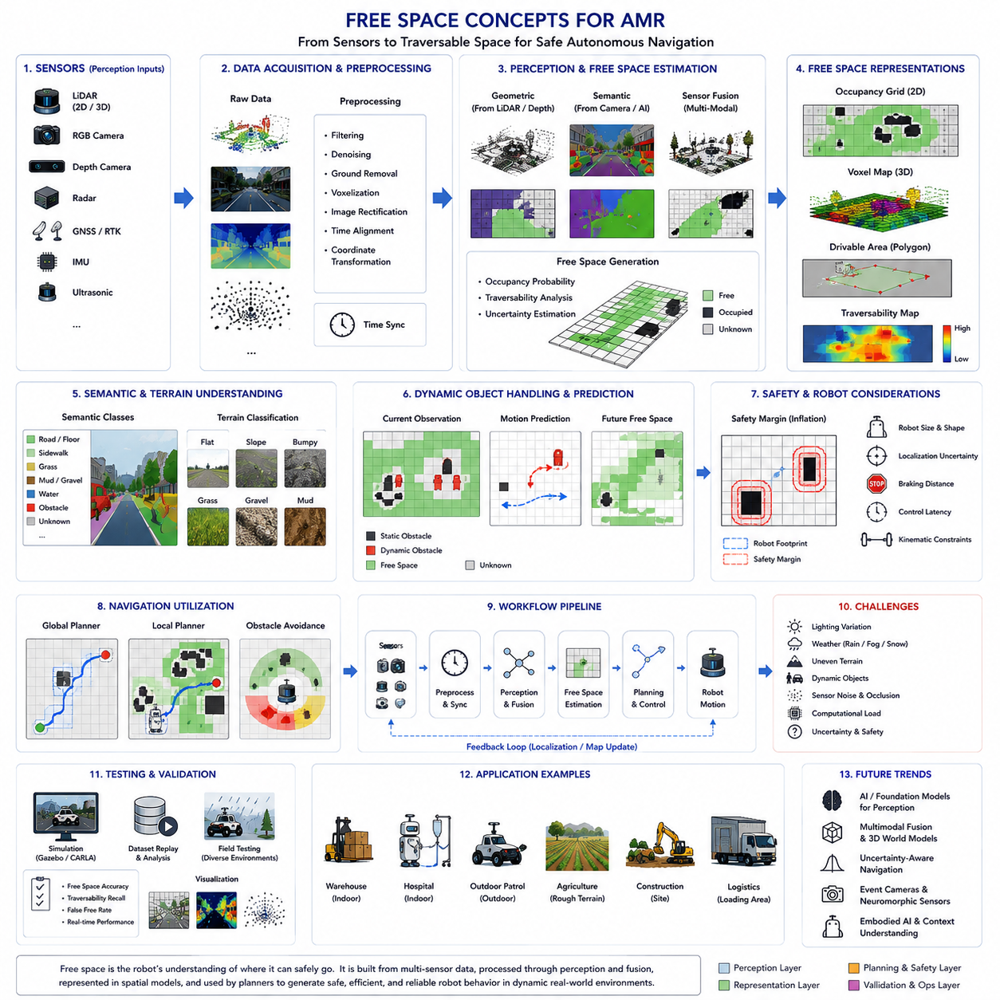
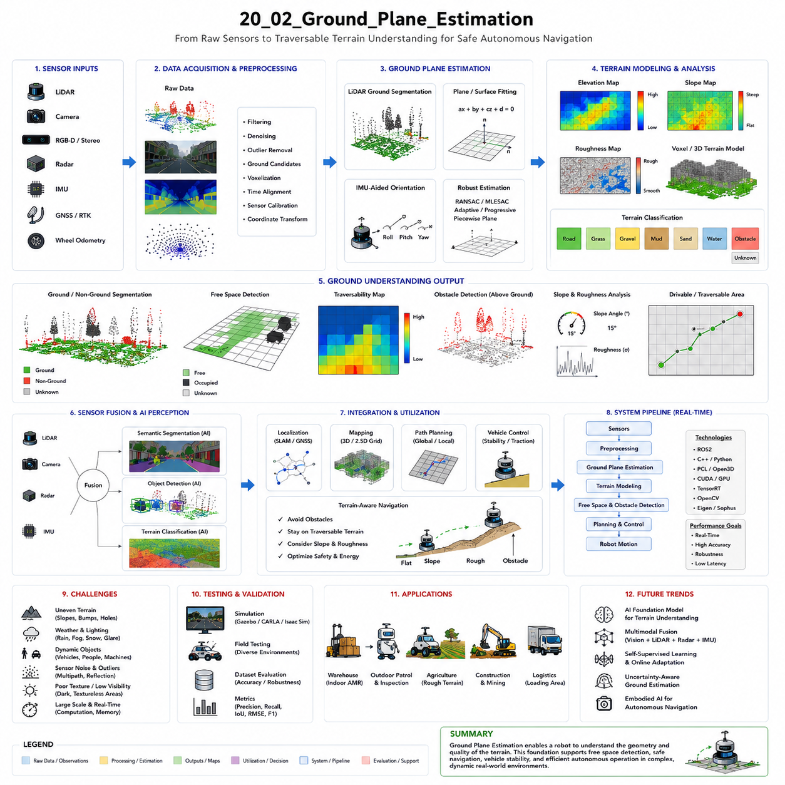
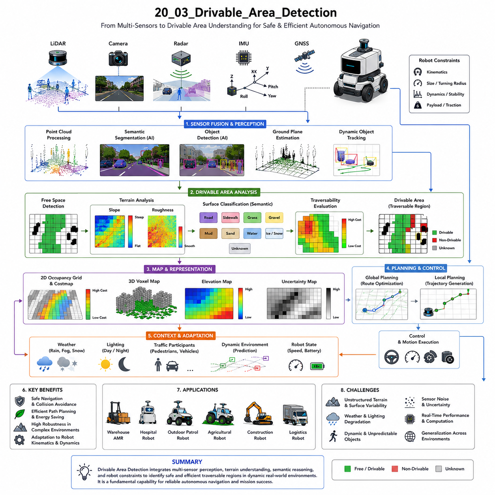
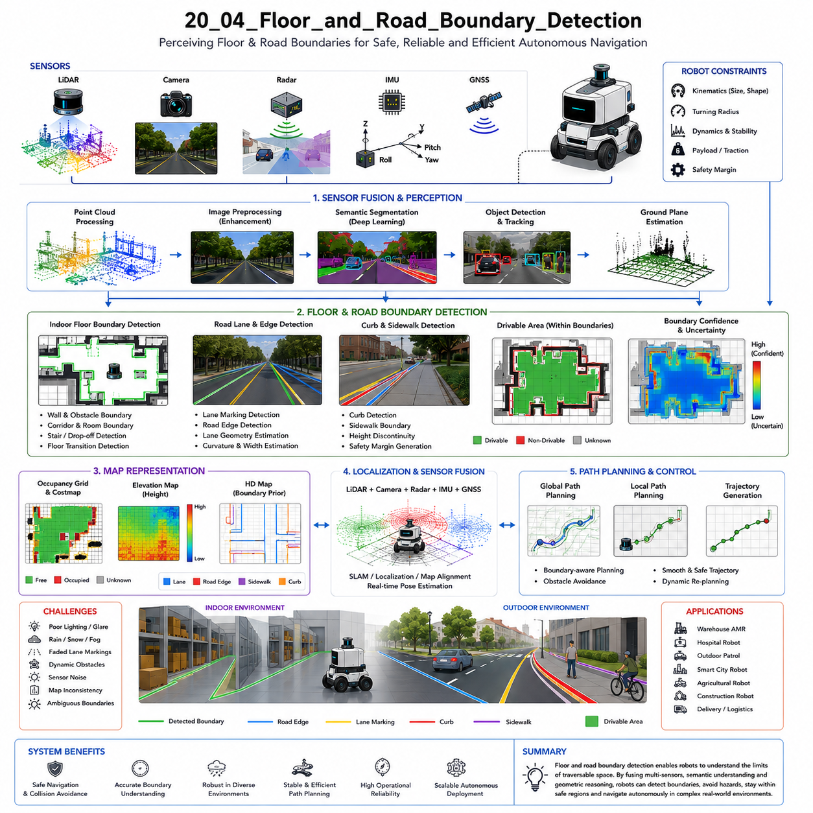
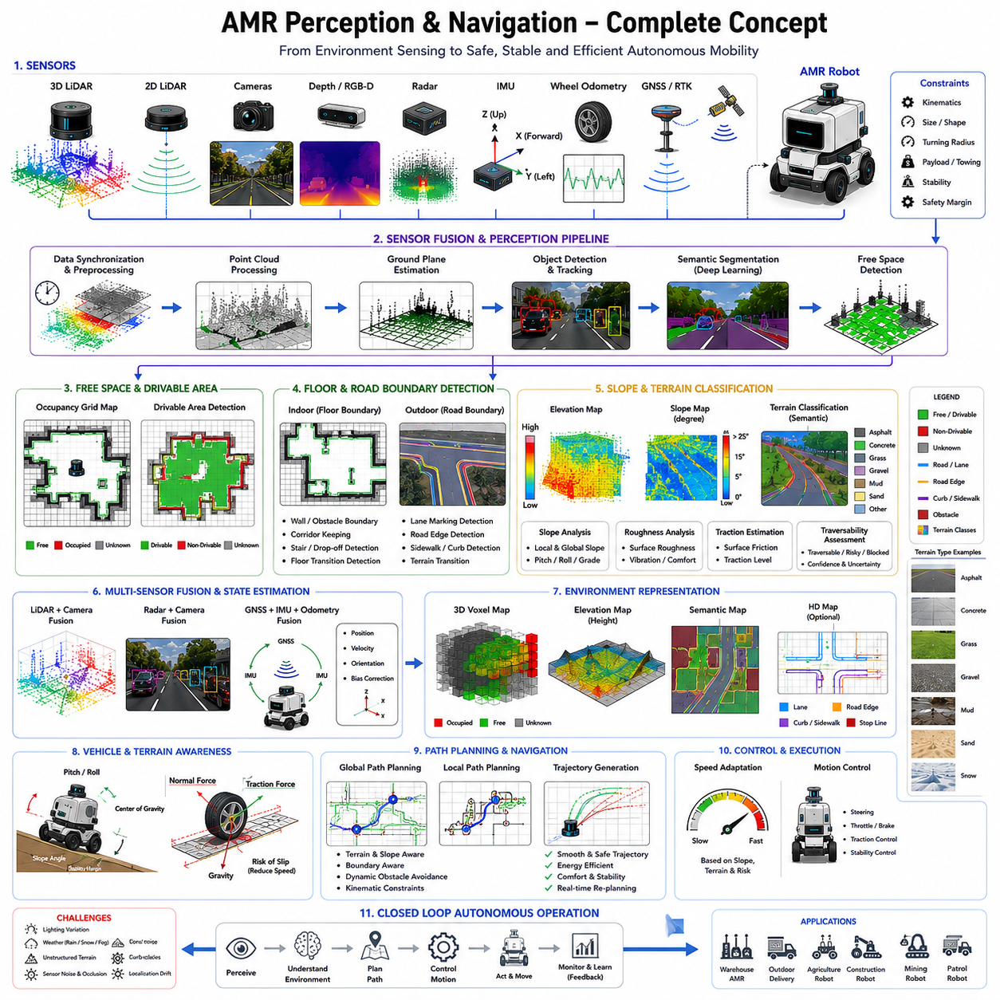
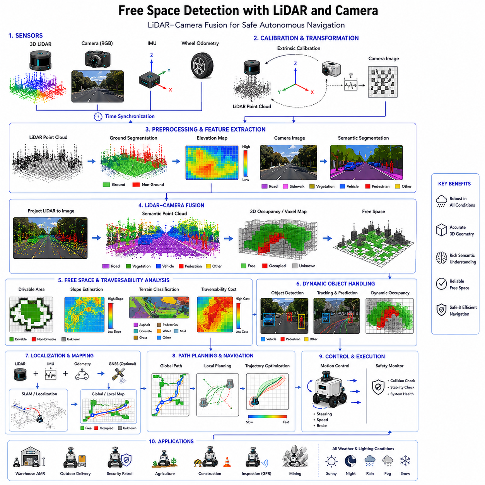
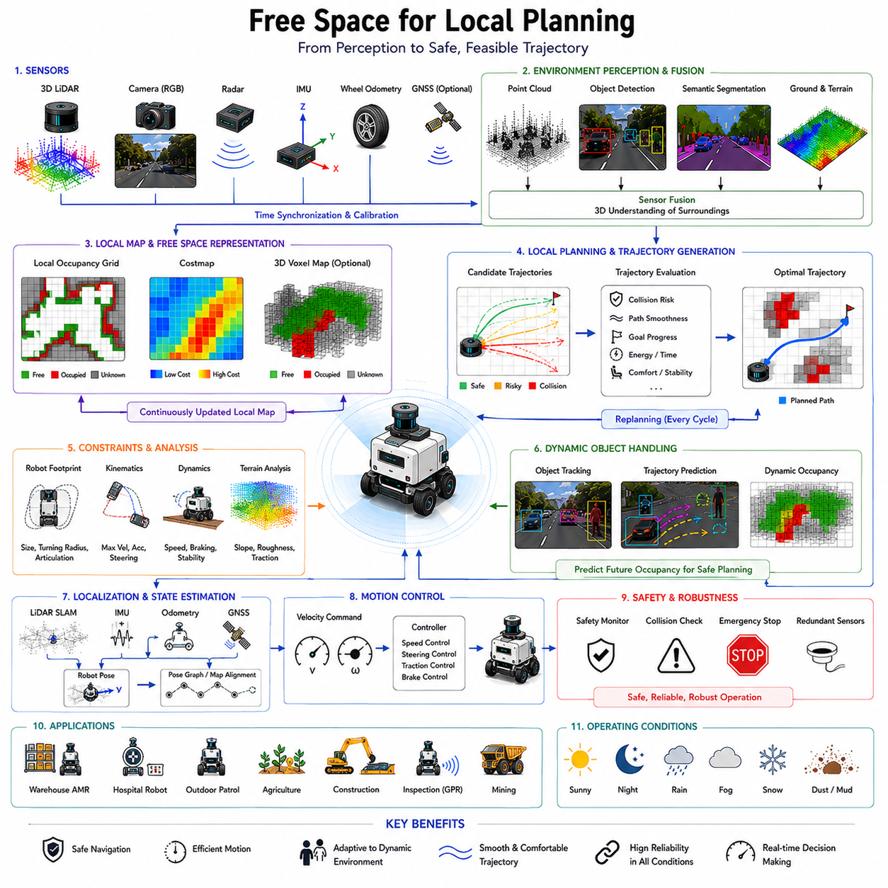
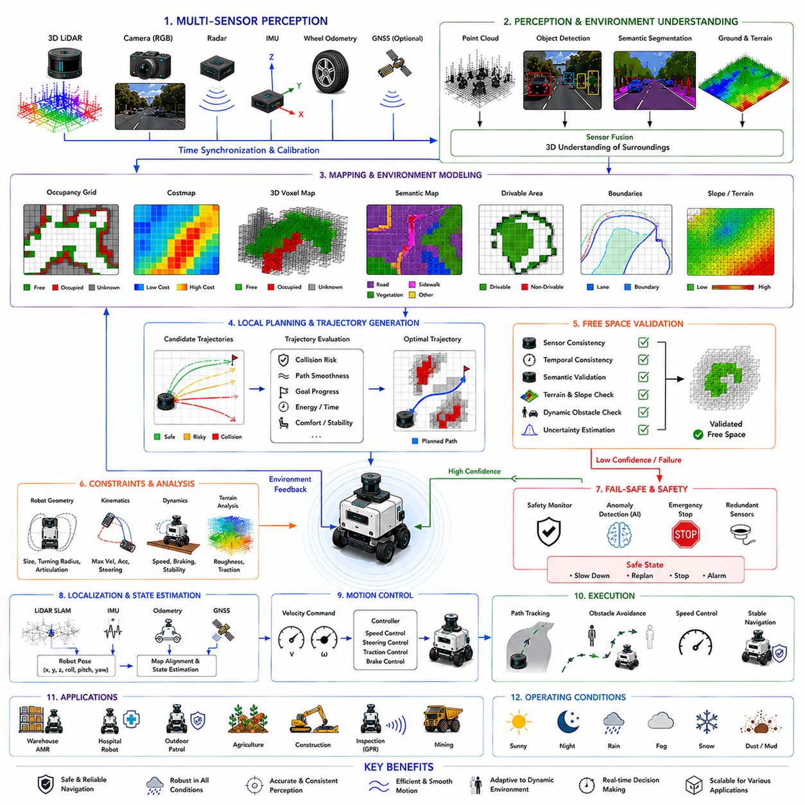

**Volume 03. AMR Sensors and Perception**


# Chapter 20. Free Space Detection

## 20.1 Free Space Concepts

{width="7.268055555555556in" height="7.268055555555556in"}

Free space concepts represent one of the most fundamental ideas in autonomous mobile robot navigation because autonomous robots must continuously determine where they can safely move within dynamic and often unpredictable environments. In both indoor and outdoor AMR systems, the robot's ability to identify traversable space directly affects navigation safety, motion planning quality, collision avoidance performance, operational efficiency, and overall autonomy capability. Unlike static industrial automation systems that operate in fixed and highly controlled environments, autonomous robots must constantly interpret changing surroundings that include obstacles, humans, vehicles, terrain irregularities, weather conditions, and environmental uncertainties. Therefore, free space detection becomes a core perception function that transforms raw sensor observations into actionable spatial understanding for navigation and control systems.

The concept of free space can be broadly defined as the region of the environment that is considered traversable and safe for robot movement. This definition may appear simple at first glance, but in practice, determining free space is an extremely complex perception and reasoning problem. A robot must distinguish between traversable ground and obstacles, estimate terrain stability, understand environmental boundaries, account for dynamic objects, and predict safe future motion regions in real time. The challenge becomes even more difficult in outdoor autonomous systems where environmental conditions constantly change due to lighting variation, rain, snow, fog, mud, gravel, vegetation, shadows, reflections, and uneven terrain.

Free space perception forms the foundation of autonomous navigation. Local planners, global planners, obstacle avoidance systems, behavior planners, and safety controllers all depend heavily on accurate free-space information. If the perception system incorrectly identifies an obstacle as free space, the robot may collide with objects, humans, or infrastructure. Conversely, if traversable regions are incorrectly classified as obstacles, the robot may become overly conservative, inefficient, or completely unable to navigate through the environment. Therefore, free-space estimation accuracy directly influences both safety and operational productivity.

In robotics systems, free space is often represented using spatial models such as occupancy grids, traversability maps, semantic segmentation masks, point cloud representations, polygonal drivable regions, or voxel maps. Each representation provides different tradeoffs between computational complexity, memory efficiency, geometric accuracy, and suitability for navigation algorithms. Occupancy grids are among the most widely used free-space representations in AMR systems because they provide a simple probabilistic framework for classifying space as occupied, free, or unknown. Each cell within the grid stores occupancy probability values derived from sensor observations.

The distinction between free space and obstacle space is not always binary. Real-world environments contain uncertain regions, partially observable areas, sensor noise, and ambiguous terrain conditions. Therefore, many modern systems represent free space probabilistically rather than using hard classifications. Confidence estimation becomes especially important in outdoor autonomous robots where sensor reliability may fluctuate due to adverse environmental conditions. A muddy surface, reflective floor, or water puddle may appear traversable under some sensing modalities but hazardous under others.

Ground plane estimation is one of the most important techniques used in free-space analysis. Many autonomous robots assume that traversable space is closely related to the ground surface. By estimating the geometry of the ground plane using LiDAR, stereo vision, depth cameras, or IMU data, the robot can identify regions that are physically reachable. However, real-world terrain rarely forms a perfectly flat plane. Slopes, curbs, ramps, potholes, stairs, gravel, grass, and uneven terrain complicate free-space estimation significantly. Therefore, advanced systems use adaptive terrain modeling rather than assuming ideal planar surfaces.

Indoor free-space detection and outdoor free-space detection differ substantially. Indoor environments typically contain flat floors, structured geometry, stable lighting, and predictable navigation corridors. As a result, indoor AMRs often rely heavily on 2D LiDAR-based occupancy grids and relatively simple obstacle segmentation methods. Outdoor environments are far more challenging because the terrain is unstructured and highly variable. Outdoor robots require multi-sensor perception systems combining LiDAR, RGB cameras, radar, GNSS, IMU, thermal cameras, and sometimes ultrasonic sensors to achieve robust free-space understanding.

Free-space perception is deeply connected to semantic understanding. A physically open region may not necessarily be traversable. For example, grass, mud, snow, water, railroad tracks, steep slopes, construction zones, or fragile surfaces may appear geometrically open but operationally unsafe. Therefore, modern free-space systems increasingly integrate semantic segmentation and terrain classification into navigation perception pipelines. Semantic understanding allows robots to reason not only about geometry but also about terrain type and operational safety.

Camera-based free-space detection has become increasingly important due to advances in deep learning and semantic segmentation. Convolutional neural networks and transformer-based vision models can classify image regions into road, floor, sidewalk, grass, obstacle, vehicle, pedestrian, and other semantic categories. These segmentation outputs are then converted into drivable area maps for navigation systems. Camera-based methods are especially useful for long-range perception because cameras provide rich semantic information at relatively low hardware cost.

However, camera-only free-space detection has several limitations. Visual perception is highly sensitive to lighting conditions, shadows, glare, rain, fog, snow, and low-light environments. Depth estimation from monocular cameras may also be uncertain. Therefore, many advanced AMR systems combine cameras with LiDAR sensors. LiDAR provides accurate geometric distance measurements independent of lighting conditions, while cameras contribute semantic understanding. Multi-sensor fusion significantly improves robustness and environmental understanding.

LiDAR-based free-space detection focuses primarily on geometric reasoning. LiDAR sensors generate point clouds representing the surrounding environment in three dimensions. Free-space algorithms analyze the distribution of points to identify ground surfaces, obstacle boundaries, height discontinuities, and traversable corridors. Ground removal algorithms are commonly used to separate obstacle points from terrain points. However, LiDAR systems also face challenges including sparse data at long range, weather sensitivity, reflective surfaces, and limited semantic understanding.

Radar-based free-space estimation is becoming increasingly important for outdoor autonomous robots. Millimeter-wave radar performs robustly under rain, fog, dust, and snow conditions where optical sensors degrade significantly. Radar systems can detect large obstacles and estimate relative motion reliably even in adverse weather. However, radar provides lower spatial resolution than cameras or LiDAR. Therefore, radar is often used as a complementary sensing modality rather than a standalone free-space perception system.

Dynamic obstacle handling represents another major challenge in free-space perception. Humans, vehicles, bicycles, forklifts, animals, and moving machinery continuously alter traversable space. Therefore, free-space systems must operate temporally rather than relying only on instantaneous observations. Dynamic occupancy grids and spatiotemporal prediction models are increasingly used to estimate future free-space availability. Autonomous robots must anticipate how the environment will evolve over time rather than reacting only to current conditions.

Safety margins play an important role in free-space generation. Navigation systems rarely use raw free-space boundaries directly. Instead, safety buffers are added around obstacles to account for localization uncertainty, sensor noise, braking distance, robot dimensions, motion prediction error, and control latency. Safety zone expansion becomes especially important in high-speed outdoor robots or heavy industrial platforms carrying large payloads.

Robot geometry and kinematics strongly influence free-space interpretation. A small indoor AMR can navigate through narrow corridors and tight corners, whereas a large outdoor robot with a wide turning radius requires significantly larger traversable regions. Towing AMRs with trailers introduce even more complexity because the trailer path differs from the tractor path during turning maneuvers. Therefore, free-space planning must consider the complete robot footprint and motion constraints.

Free-space estimation also depends heavily on localization quality. If the robot's estimated position is inaccurate, free-space representations may become misaligned with the real environment. This can produce navigation oscillations, obstacle collisions, or path planning instability. Therefore, free-space systems are tightly integrated with SLAM, localization, and map alignment frameworks.

Real-time performance is a major engineering requirement for free-space perception systems. Autonomous robots continuously move through dynamic environments and require rapid environmental updates. High-latency free-space estimation may cause the robot to react too slowly to changing obstacles or terrain conditions. Therefore, modern systems use GPU acceleration, parallel processing pipelines, TensorRT optimization, ROS2 multi-threading, and efficient sensor fusion architectures to achieve deterministic low-latency operation.

Occupancy grid mapping remains one of the most widely used free-space modeling methods in robotics. In occupancy grids, the environment is divided into discrete cells, each representing occupancy probability. Bayesian filtering methods are often used to update cell states over time using repeated sensor observations. Occupancy grids provide simple and computationally efficient free-space representations compatible with many path planning algorithms such as A\*, Dijkstra, DWA, and costmap-based planners.

Voxel-based free-space representations extend occupancy grids into three dimensions. These models are especially useful for outdoor robots navigating uneven terrain or detecting overhanging obstacles. Voxel maps represent volumetric occupancy and allow robots to reason about height, slope, and three-dimensional traversability. However, voxel systems require substantially greater computational and memory resources.

Free-space uncertainty estimation is becoming increasingly important in modern AI-driven robotics systems. Deep learning models may produce incorrect segmentation under unfamiliar environmental conditions. Therefore, confidence estimation and uncertainty-aware navigation frameworks are increasingly integrated into autonomous systems. The robot may reduce speed, increase safety margins, or request operator intervention when perception uncertainty becomes excessive.

Weather and environmental robustness represent major operational requirements for outdoor autonomous robots. Rain can distort camera images and introduce LiDAR reflections. Fog reduces visibility dramatically. Snow may obscure terrain boundaries. Mud and dust can contaminate sensors. Strong sunlight may produce camera glare and thermal distortion. Therefore, robust free-space perception often requires multimodal sensing architectures capable of compensating for the weaknesses of individual sensor modalities.

Industrial applications demonstrate the diversity of free-space requirements. Warehouse AMRs require accurate aisle navigation and pallet avoidance. Hospital robots require smooth human-aware corridor navigation. Outdoor patrol robots require robust road and terrain understanding under changing weather conditions. Agricultural robots require crop-row detection and terrain traversability estimation. GPR inspection robots must navigate while carrying large sensing payloads across uneven surfaces. Smart city robots require dynamic pedestrian and vehicle interaction awareness.

Testing and validation are essential components of free-space engineering. Engineers must evaluate free-space accuracy across diverse operational scenarios including narrow corridors, crowded environments, reflective floors, steep slopes, rough terrain, low-light conditions, rain, fog, and dynamic obstacle interactions. Field testing is especially important because real-world environments contain complexities not fully represented in laboratory or simulation environments.

Simulation platforms such as Gazebo, Isaac Sim, and CARLA are widely used for free-space algorithm development and testing. Synthetic environments enable large-scale testing of edge cases and dangerous scenarios without operational risk. Digital twin systems also allow engineers to replay operational data and evaluate algorithm improvements systematically.

Future free-space systems will increasingly incorporate foundation models, semantic world understanding, multimodal reasoning, and embodied AI architectures. Rather than simply identifying geometric traversability, future robots may understand operational context, social navigation rules, human intentions, infrastructure semantics, and environmental affordances. Event cameras, neuromorphic perception systems, and real-time 3D world models may further improve perception robustness and latency performance.

The evolution of free-space concepts reflects the broader evolution of autonomous robotics itself. Early robotics systems relied primarily on geometric obstacle avoidance, whereas modern systems increasingly integrate semantics, uncertainty estimation, prediction, and multimodal reasoning into navigation perception frameworks. Future autonomous robots will likely reason about free space not only as empty geometry but as a rich operational understanding of where, when, and how movement can occur safely and efficiently.

Ultimately, free-space perception is not merely a technical perception task. It is the process by which autonomous robots understand navigable reality. Effective free-space systems enable safe navigation, robust obstacle avoidance, efficient motion planning, adaptive terrain handling, scalable autonomous deployment, and trustworthy real-world robotic intelligence. In advanced AMR platforms, free-space concepts form one of the foundational pillars supporting practical autonomous mobility.

Free Space 개념은 자율이동로봇(AMR) Navigation에서 가장 핵심적인 개념 중 하나이다. 왜냐하면 Autonomous Robot은 동적이고 예측 불가능한 환경 속에서 어디를 안전하게 이동할 수 있는지를 지속적으로 판단해야 하기 때문이다. 실내 및 실외 AMR 시스템 모두에서 로봇이 Traversable Space를 정확하게 식별할 수 있는 능력은 Navigation Safety, Motion Planning Quality, Collision Avoidance Performance, Operational Efficiency, 그리고 전체 Autonomous Capability에 직접적인 영향을 준다. 고정되고 통제된 환경에서 동작하는 전통적인 산업 자동화 시스템과 달리, Autonomous Robot은 사람, 차량, 장애물, 지형 변화, 날씨, 환경 불확실성이 존재하는 복잡한 환경을 지속적으로 해석해야 한다. 따라서 Free Space Detection은 Raw Sensor Observation을 Navigation 및 Control에 활용 가능한 Spatial Understanding으로 변환하는 핵심 Perception Function이라고 할 수 있다.

Free Space는 일반적으로 로봇이 안전하게 이동할 수 있다고 판단되는 환경 영역으로 정의할 수 있다. 이 정의는 단순해 보이지만 실제로 Free Space를 결정하는 문제는 매우 복잡한 Perception 및 Reasoning 문제이다. 로봇은 Traversable Ground와 Obstacle을 구분하고, Terrain Stability를 추정하며, Environmental Boundary를 이해하고, Dynamic Object를 고려하며, 미래의 안전한 Motion Region까지 실시간으로 예측해야 한다. 특히 실외 Autonomous System에서는 Lighting Variation, Rain, Snow, Fog, Mud, Gravel, Vegetation, Shadow, Reflection, Uneven Terrain 등으로 인해 문제가 더욱 복잡해진다.

Free Space Perception은 Autonomous Navigation의 핵심 기반이다. Local Planner, Global Planner, Obstacle Avoidance System, Behavior Planner, Safety Controller는 모두 정확한 Free-Space Information에 의존한다. 만약 Perception System이 Obstacle을 Free Space로 잘못 판단하면 Robot은 사람이나 구조물과 충돌할 수 있다. 반대로 실제로 이동 가능한 영역을 Obstacle로 잘못 분류하면 Robot은 지나치게 보수적으로 행동하거나 아예 이동하지 못할 수도 있다. 따라서 Free-Space Estimation Accuracy는 Safety와 Operational Productivity 모두에 직접적인 영향을 준다.

Robotics System에서는 Free Space를 Occupancy Grid, Traversability Map, Semantic Segmentation Mask, Point Cloud Representation, Polygonal Drivable Region, Voxel Map 등의 형태로 표현한다. 각각의 표현 방식은 Computational Complexity, Memory Efficiency, Geometric Accuracy, Navigation Algorithm Compatibility 측면에서 서로 다른 Trade-Off를 가진다. Occupancy Grid는 가장 널리 사용되는 Free-Space Representation 중 하나이며, 공간을 Occupied, Free, Unknown 상태로 확률적으로 표현한다. Grid의 각 Cell은 Sensor Observation 기반의 Occupancy Probability를 저장한다.

Free Space와 Obstacle Space의 구분은 항상 Binary하지 않다. 실제 환경은 Uncertain Region, Partially Observable Area, Sensor Noise, Ambiguous Terrain Condition 등을 포함한다. 따라서 최신 시스템은 Hard Classification 대신 Probabilistic Free-Space Representation을 사용하는 경우가 많다. Confidence Estimation은 특히 Outdoor Autonomous Robot에서 중요하다. 예를 들어 Muddy Surface, Reflective Floor, Water Puddle은 일부 Sensor에서는 Traversable하게 보일 수 있지만 다른 Sensor에서는 위험하게 판단될 수 있다.

Ground Plane Estimation은 Free-Space Analysis에서 가장 중요한 기술 중 하나이다. 많은 Autonomous Robot은 Traversable Space가 Ground Surface와 밀접하게 연관되어 있다고 가정한다. LiDAR, Stereo Vision, Depth Camera, IMU 데이터를 사용하여 Ground Plane Geometry를 추정함으로써 Robot은 물리적으로 이동 가능한 영역을 식별할 수 있다. 그러나 실제 환경은 완전히 평평하지 않다. Slope, Curb, Ramp, Pothole, Stair, Gravel, Grass, Uneven Terrain 등이 존재하기 때문에 단순한 Flat Plane Assumption만으로는 충분하지 않다. 따라서 최신 시스템은 Adaptive Terrain Modeling을 사용한다.

Indoor Free-Space Detection과 Outdoor Free-Space Detection은 매우 다르다. 실내 환경은 일반적으로 Flat Floor, Structured Geometry, Stable Lighting, Predictable Corridor를 가진다. 따라서 Indoor AMR은 2D LiDAR 기반 Occupancy Grid와 비교적 단순한 Obstacle Segmentation Algorithm을 사용하는 경우가 많다. 반면 Outdoor Environment는 Unstructured하고 Highly Variable하다. 따라서 Outdoor Robot은 LiDAR, RGB Camera, Radar, GNSS, IMU, Thermal Camera, Ultrasonic Sensor 등을 결합한 Multi-Sensor Perception System을 필요로 한다.

Free-Space Perception은 Semantic Understanding과도 깊게 연결된다. 물리적으로 열린 공간이라 하더라도 반드시 Traversable한 것은 아니다. 예를 들어 Grass, Mud, Snow, Water, Railroad Track, Steep Slope, Construction Zone, Fragile Surface 등은 Geometrically Open할 수 있지만 Operationally Unsafe할 수 있다. 따라서 최신 Free-Space System은 Semantic Segmentation과 Terrain Classification을 Navigation Perception Pipeline에 통합하고 있다. 이를 통해 Robot은 단순한 Geometry뿐 아니라 Terrain Type과 Operational Safety까지 판단할 수 있게 된다.

Camera-Based Free-Space Detection은 Deep Learning과 Semantic Segmentation 기술 발전과 함께 매우 중요해지고 있다. CNN 및 Transformer 기반 Vision Model은 Image Region을 Road, Floor, Sidewalk, Grass, Obstacle, Vehicle, Pedestrian 등으로 분류할 수 있다. 이러한 Segmentation Result는 Navigation System을 위한 Drivable Area Map으로 변환된다. Camera-Based Method는 Long-Range Perception에 유리하며 상대적으로 Hardware Cost도 낮다.

하지만 Camera-Only Free-Space Detection에는 한계가 있다. Visual Perception은 Lighting Condition, Shadow, Glare, Rain, Fog, Snow, Low-Light Environment에 매우 민감하다. 또한 Monocular Camera 기반 Depth Estimation은 불확실성이 존재한다. 따라서 많은 고급 AMR 시스템은 Camera와 LiDAR를 결합한다. LiDAR는 Lighting Condition과 무관하게 정확한 Geometric Distance Measurement를 제공하고, Camera는 풍부한 Semantic Understanding을 제공한다. Multi-Sensor Fusion은 Robustness와 Environmental Understanding을 크게 향상시킨다.

LiDAR-Based Free-Space Detection은 주로 Geometric Reasoning에 기반한다. LiDAR는 주변 환경의 3D Point Cloud를 생성한다. Free-Space Algorithm은 Point Distribution을 분석하여 Ground Surface, Obstacle Boundary, Height Discontinuity, Traversable Corridor를 식별한다. Ground Removal Algorithm은 Obstacle Point와 Terrain Point를 분리하는 데 자주 사용된다. 하지만 LiDAR 역시 Long-Range Sparse Data, Weather Sensitivity, Reflective Surface, Limited Semantic Understanding 등의 문제를 가진다.

Radar-Based Free-Space Estimation도 점점 중요해지고 있다. Millimeter-Wave Radar는 Rain, Fog, Dust, Snow 환경에서 매우 강인하게 동작한다. Radar는 악천후 환경에서도 Large Obstacle Detection과 Relative Motion Estimation을 안정적으로 수행할 수 있다. 하지만 Radar는 Camera나 LiDAR보다 Spatial Resolution이 낮다. 따라서 대부분의 경우 Radar는 Complementary Sensor로 사용된다.

Dynamic Obstacle Handling 역시 매우 중요한 문제이다. Human, Vehicle, Bicycle, Forklift, Animal, Moving Machinery는 지속적으로 Traversable Space를 변화시킨다. 따라서 Free-Space System은 단순한 Instantaneous Observation이 아니라 Temporal Understanding을 필요로 한다. Dynamic Occupancy Grid와 Spatiotemporal Prediction Model은 미래의 Free-Space Availability를 추정하는 데 사용된다. Autonomous Robot은 현재 상황뿐 아니라 미래 환경 변화까지 예측해야 한다.

Safety Margin은 Free-Space Generation에서 중요한 요소이다. Navigation System은 Raw Free-Space Boundary를 직접 사용하지 않는다. 대신 Localization Uncertainty, Sensor Noise, Braking Distance, Robot Dimension, Motion Prediction Error, Control Latency 등을 고려하여 Safety Buffer를 추가한다. 특히 High-Speed Outdoor Robot이나 Heavy Industrial Platform에서는 Safety Zone Expansion이 매우 중요하다.

Robot Geometry와 Kinematics 역시 Free-Space Interpretation에 큰 영향을 준다. 작은 Indoor AMR은 Narrow Corridor와 Tight Corner를 통과할 수 있지만, 큰 Outdoor Robot은 넓은 Traversable Region을 필요로 한다. Trailer를 가진 Towing AMR은 Tractor와 Trailer의 Path가 다르기 때문에 더욱 복잡하다. 따라서 Free-Space Planning은 전체 Robot Footprint와 Motion Constraint를 고려해야 한다.

Free-Space Estimation은 Localization Quality에도 크게 의존한다. 만약 Robot Position Estimation이 부정확하면 Free-Space Representation이 실제 환경과 Misaligned될 수 있다. 이는 Navigation Oscillation, Obstacle Collision, Path Planning Instability를 유발할 수 있다. 따라서 Free-Space System은 SLAM, Localization, Map Alignment Framework와 긴밀하게 통합된다.

Real-Time Performance는 Free-Space Perception System의 핵심 Engineering Requirement이다. Autonomous Robot은 Dynamic Environment 속에서 지속적으로 움직이며 빠른 Environmental Update를 필요로 한다. High-Latency Free-Space Estimation은 Robot이 장애물이나 Terrain 변화에 늦게 반응하게 만들 수 있다. 따라서 최신 시스템은 GPU Acceleration, Parallel Processing Pipeline, TensorRT Optimization, ROS2 Multi-Threading, Efficient Sensor Fusion Architecture 등을 사용하여 Deterministic Low-Latency Operation을 구현한다.

Occupancy Grid Mapping은 여전히 가장 널리 사용되는 Free-Space Modeling Method이다. 환경은 Discrete Cell로 나뉘며 각 Cell은 Occupancy Probability를 가진다. Bayesian Filtering을 사용하여 반복적인 Sensor Observation 기반으로 Cell State를 업데이트한다. Occupancy Grid는 A\*, Dijkstra, DWA, Costmap-Based Planner 등 다양한 Navigation Algorithm과 잘 결합된다.

Voxel-Based Free-Space Representation은 Occupancy Grid를 3D로 확장한 것이다. 이는 Uneven Terrain Navigation이나 Overhanging Obstacle Detection에서 특히 중요하다. Voxel Map은 Height, Slope, 3D Traversability를 표현할 수 있다. 하지만 높은 Computational Resource와 Memory Resource를 요구한다.

Free-Space Uncertainty Estimation 역시 중요성이 증가하고 있다. Deep Learning Model은 익숙하지 않은 환경에서 잘못된 Segmentation을 생성할 수 있다. 따라서 Confidence Estimation과 Uncertainty-Aware Navigation Framework가 점점 더 많이 사용된다. Perception Uncertainty가 증가하면 Robot은 Speed를 줄이거나 Safety Margin을 증가시키거나 Operator Intervention을 요청할 수 있다.

Weather 및 Environmental Robustness는 Outdoor Autonomous Robot의 핵심 요구사항이다. Rain은 Camera Image와 LiDAR Reflection을 왜곡시킬 수 있으며, Fog는 Visibility를 급격히 감소시킨다. Snow는 Terrain Boundary를 가릴 수 있고, Mud 및 Dust는 Sensor를 오염시킬 수 있다. 강한 Sunlight는 Camera Glare와 Thermal Distortion을 유발할 수 있다. 따라서 Robust Free-Space Perception은 일반적으로 Multimodal Sensing Architecture를 필요로 한다.

산업별 사례를 보면 Free-Space Requirement는 매우 다양하다. Warehouse AMR은 Aisle Navigation과 Pallet Avoidance가 중요하다. Hospital Robot은 Human-Aware Corridor Navigation을 요구한다. Outdoor Patrol Robot은 Weather 변화 속에서도 Robust한 Road 및 Terrain Understanding이 필요하다. Agricultural Robot은 Crop-Row Detection과 Terrain Traversability Estimation을 수행해야 한다. GPR Inspection Robot은 대형 Sensing Payload를 탑재한 상태에서 Uneven Surface를 주행해야 한다. Smart City Robot은 Dynamic Pedestrian 및 Vehicle Interaction Awareness가 필요하다.

Testing 및 Validation 역시 매우 중요하다. 엔지니어는 Narrow Corridor, Crowded Environment, Reflective Floor, Steep Slope, Rough Terrain, Low-Light Condition, Rain, Fog, Dynamic Obstacle Interaction 등 다양한 환경에서 Free-Space Accuracy를 평가해야 한다. 특히 실제 환경은 Simulation이나 Laboratory보다 훨씬 복잡하기 때문에 Field Testing이 필수적이다.

Gazebo, Isaac Sim, CARLA 등의 Simulation Platform은 Free-Space Algorithm 개발 및 테스트에 널리 사용된다. Synthetic Environment는 Dangerous Scenario와 Rare Edge Case를 안전하게 반복 테스트할 수 있게 해준다. Digital Twin System은 실제 Operational Data를 Replay하며 Algorithm Improvement를 평가하는 데 사용된다.

미래의 Free-Space System은 Foundation Model, Semantic World Understanding, Multimodal Reasoning, Embodied AI Architecture를 더욱 적극적으로 활용하게 될 것이다. 미래의 Robot은 단순히 Geometric Traversability를 식별하는 것을 넘어 Operational Context, Social Navigation Rule, Human Intention, Infrastructure Semantic, Environmental Affordance까지 이해하게 될 것이다. Event Camera, Neuromorphic Perception System, Real-Time 3D World Model 역시 Perception Robustness와 Latency Performance를 크게 향상시킬 가능성이 있다.

Free-Space Concept의 발전은 Autonomous Robotics 전체의 진화 방향을 반영한다. 초기 Robotics System은 단순한 Geometric Obstacle Avoidance에 의존했지만, 현대 시스템은 Semantic, Uncertainty Estimation, Prediction, Multimodal Reasoning까지 통합하고 있다. 미래의 Autonomous Robot은 Free Space를 단순한 빈 공간이 아니라 "언제, 어디서, 어떻게 안전하고 효율적으로 이동할 수 있는가"에 대한 풍부한 Operational Understanding으로 해석하게 될 것이다.

궁극적으로 Free-Space Perception은 단순한 기술적 Perception Task가 아니다. 이는 Autonomous Robot이 Navigation 가능한 현실 세계를 이해하는 과정 자체이다. 효과적인 Free-Space System은 Safe Navigation, Robust Obstacle Avoidance, Efficient Motion Planning, Adaptive Terrain Handling, Scalable Autonomous Deployment, Trustworthy Real-World Robotic Intelligence를 가능하게 한다. 고급 AMR 플랫폼에서 Free-Space Concept은 Practical Autonomous Mobility를 가능하게 하는 가장 핵심적인 기반 기술 중 하나라고 할 수 있다.

##  

## 20.2 Ground Plane Estimation

{width="7.268055555555556in" height="7.268055555555556in"}

Ground plane estimation is one of the most fundamental technologies in autonomous mobile robot navigation because it enables robots to distinguish between traversable terrain and non-traversable obstacles. In both indoor and outdoor autonomous systems, robots continuously observe the surrounding environment using LiDAR, cameras, radar, depth sensors, IMU systems, and other sensing modalities. However, raw sensor data alone does not directly indicate where the robot can safely move. The robot must first understand the structure of the ground surface itself. Ground plane estimation provides this foundational environmental understanding by identifying the geometry, orientation, elevation, slope, and continuity of the terrain beneath the robot. This information becomes essential for free-space detection, obstacle segmentation, localization, mapping, path planning, vehicle stability control, and overall autonomous navigation safety.

At its core, ground plane estimation refers to the process of modeling the navigable surface upon which the robot operates. In simple environments, the ground may appear flat and uniform, such as the floor inside a warehouse or hospital corridor. However, real-world environments are rarely ideal. Outdoor autonomous robots must navigate uneven terrain, slopes, potholes, curbs, gravel, grass, mud, ramps, railway crossings, construction areas, and damaged infrastructure. Even indoor robots may encounter floor transitions, ramps, cables, debris, reflective surfaces, or partially obstructed corridors. Therefore, accurate ground modeling is far more complex than simply detecting a horizontal plane.

Ground plane estimation is fundamentally important because most navigation systems assume that obstacles are objects protruding above the ground surface. If the robot can accurately estimate the geometry of the ground, then objects deviating from that surface can be classified as obstacles. Conversely, regions consistent with the ground model can be considered potentially traversable. Thus, ground estimation becomes one of the foundational preprocessing steps for free-space analysis and obstacle detection.

In robotics systems, ground plane estimation is closely linked to coordinate systems and robot pose estimation. The robot continuously moves through the environment, causing its sensors to change position and orientation over time. Therefore, the estimated ground model must remain consistent across changing viewpoints and robot motion states. IMU sensors play a particularly important role because they provide roll, pitch, and yaw measurements that help stabilize terrain estimation under dynamic vehicle movement.

One of the simplest approaches to ground plane estimation is planar modeling. In flat indoor environments, the ground can often be approximated using a single mathematical plane. LiDAR point clouds or depth sensor measurements are analyzed to fit a plane equation representing the floor surface. Algorithms such as RANSAC are commonly used to identify dominant planar structures while rejecting outlier points belonging to obstacles. RANSAC-based methods are computationally efficient and widely used in structured environments.

However, planar assumptions quickly break down in outdoor environments. Real terrain contains elevation changes, surface irregularities, slopes, and discontinuities that cannot be modeled accurately using a single plane. Therefore, advanced systems use piecewise planar models, spline-based terrain fitting, adaptive elevation maps, or probabilistic surface representations. These methods allow robots to estimate locally varying terrain geometry while maintaining robustness against sensor noise and environmental complexity.

LiDAR-based ground plane estimation is among the most widely used approaches in outdoor autonomous robotics. LiDAR sensors provide dense three-dimensional point cloud data describing the surrounding environment. Ground estimation algorithms analyze height distributions, local surface normals, point continuity, and elevation gradients to classify ground points. One common approach involves dividing the environment into radial sectors or grid cells and estimating the lowest consistent surface within each region.

Ground segmentation algorithms frequently exploit geometric continuity assumptions. The ground surface tends to vary smoothly over short distances, whereas obstacles often produce abrupt height discontinuities. Therefore, slope analysis and elevation difference thresholds are commonly used to separate terrain points from obstacle points. However, these assumptions may fail in highly irregular terrain, rocky environments, staircases, or construction zones.

Camera-based ground plane estimation has also become increasingly important due to advances in computer vision and deep learning. Monocular cameras, stereo vision systems, and RGB-D cameras can estimate drivable surfaces using visual appearance and geometric cues. Semantic segmentation networks classify image regions into categories such as road, floor, grass, obstacle, sidewalk, mud, or water. These semantic predictions are then converted into traversability maps.

Stereo vision systems estimate depth by comparing disparities between left and right camera images. From this depth information, the robot can reconstruct three-dimensional surface geometry and estimate ground structure. Stereo-based methods are especially useful in environments where LiDAR cost or power consumption must be minimized. However, stereo vision performance degrades under poor lighting, fog, rain, glare, shadows, or textureless surfaces.

RGB-D cameras combine color imaging with direct depth sensing. These systems are widely used in indoor AMRs because they provide accurate short-range depth measurements. Ground plane estimation using RGB-D sensors often involves extracting dominant planar surfaces while filtering dynamic obstacles and noise. However, RGB-D cameras typically have limited range and may struggle in outdoor sunlight conditions.

Radar-based terrain estimation is becoming increasingly important in harsh outdoor environments. Millimeter-wave radar can operate robustly under rain, fog, snow, and dust conditions where optical sensors degrade significantly. Radar can detect large terrain structures and estimate relative geometry even under poor visibility. However, radar data has lower spatial resolution and greater uncertainty than LiDAR or cameras. Therefore, radar is usually integrated as part of a multimodal sensing framework rather than used independently for precise ground modeling.

Ground plane estimation becomes particularly challenging in dynamic environments. Moving vehicles, pedestrians, forklifts, construction machinery, and temporary obstacles continuously alter sensor observations. Therefore, ground estimation systems must distinguish between static terrain structure and dynamic object interference. Temporal filtering and sensor fusion methods are often used to stabilize ground estimation across time.

Terrain classification is closely connected to ground plane estimation. A geometrically flat surface may still be operationally hazardous. For example, mud, ice, loose gravel, wet grass, sand, or damaged pavement may appear traversable but provide insufficient traction or stability. Therefore, modern robotics systems increasingly integrate semantic terrain understanding into ground estimation pipelines. The robot may classify terrain according to traversability risk, traction quality, vibration characteristics, or load-bearing capability.

Slope estimation represents another major component of ground analysis. Autonomous robots must continuously evaluate terrain inclination because excessive slope angles may reduce stability, traction, or braking capability. Heavy payload robots, towing platforms, and outdoor industrial AMRs are especially sensitive to slope conditions. Therefore, ground plane estimation systems often generate slope maps and terrain inclination profiles used by navigation and vehicle control systems.

Ground roughness estimation is also important for outdoor robotics. Uneven terrain may induce vibration, wheel slip, suspension instability, or payload disturbance. LiDAR and depth sensors can estimate surface roughness by analyzing local elevation variance and terrain continuity. Navigation systems may then select smoother paths to improve stability and reduce mechanical stress.

One of the most important engineering challenges in ground plane estimation is handling sensor noise and uncertainty. Real sensor measurements contain noise due to environmental conditions, hardware limitations, vibration, motion blur, multipath effects, and calibration errors. Therefore, robust filtering techniques are essential. Kalman filters, particle filters, Bayesian estimation frameworks, and probabilistic occupancy models are commonly used to improve terrain estimation reliability.

Real-time performance is critically important in ground plane estimation systems. Autonomous robots continuously move through changing environments and require rapid terrain updates. Delayed ground estimation may cause the robot to react too slowly to curbs, holes, obstacles, or terrain transitions. Therefore, high-performance systems use GPU acceleration, parallel processing pipelines, ROS2 multi-threading, CUDA optimization, and efficient point cloud processing frameworks.

Voxel-based terrain modeling is widely used for three-dimensional ground representation. Instead of representing the environment as a single plane, voxel maps divide space into volumetric cells storing occupancy and elevation information. Voxel-based systems provide robust three-dimensional understanding of terrain geometry and support obstacle overhang detection, slope analysis, and complex traversability reasoning. However, voxel systems require substantial computational resources and memory bandwidth.

Elevation mapping represents another common approach. Elevation maps store terrain height values within grid structures. These maps are especially useful for outdoor robots navigating uneven terrain. Elevation mapping systems may also integrate uncertainty estimates representing terrain confidence and sensor reliability. Dynamic updating mechanisms continuously refine the terrain model as new sensor observations arrive.

Ground plane estimation is tightly integrated with localization and SLAM systems. Terrain features often provide valuable localization cues, especially in outdoor environments where GNSS signals may degrade. Conversely, localization errors can distort terrain estimation if sensor data becomes spatially misaligned. Therefore, modern autonomous systems tightly couple ground estimation, localization, and mapping frameworks into unified perception architectures.

Autonomous vehicle stability depends heavily on accurate ground modeling. Heavy outdoor robots carrying large payloads or towing trailers must continuously monitor terrain geometry to avoid rollover risk, wheel slip, or loss of traction. Ground estimation systems therefore interact closely with vehicle dynamics controllers, suspension systems, traction control modules, and braking systems.

Ground plane estimation also affects energy efficiency. Rough terrain, steep slopes, and unstable surfaces increase energy consumption significantly. Navigation systems may therefore incorporate terrain-aware path planning strategies that optimize not only distance but also terrain smoothness and energy efficiency.

Testing and validation are essential components of ground plane engineering. Engineers evaluate terrain estimation accuracy across diverse environmental conditions including gravel roads, muddy terrain, grass fields, snow-covered surfaces, railway tracks, construction sites, reflective floors, ramps, and uneven industrial environments. Outdoor testing is especially important because environmental variability often reveals failure modes not visible in simulation or laboratory testing.

Simulation platforms such as Gazebo, CARLA, Isaac Sim, and digital twin environments are widely used for terrain algorithm development. Synthetic environments allow engineers to evaluate extreme terrain conditions safely and repeatedly. Simulation also supports automated regression testing and performance benchmarking across large scenario libraries.

Machine learning and deep learning are increasingly transforming ground plane estimation. Neural networks can learn complex terrain patterns directly from sensor data without relying entirely on handcrafted geometric rules. Self-supervised learning methods are also emerging, allowing robots to learn traversability properties from operational experience. Future systems may integrate foundation models capable of holistic scene understanding including terrain semantics, environmental context, and robot dynamics simultaneously.

Future autonomous systems will likely move beyond simple geometric ground estimation toward rich traversability reasoning frameworks. Robots may evaluate terrain not only according to shape but also according to operational suitability, stability risk, energy efficiency, traction quality, environmental uncertainty, and mission-specific constraints. Multimodal embodied AI systems may integrate vision, sound, vibration, force sensing, and environmental semantics into unified terrain understanding models.

The evolution of ground plane estimation reflects the broader evolution of autonomous robotics itself. Early robotics systems assumed ideal flat floors and highly structured environments. Modern autonomous robots must operate safely within highly dynamic, uncertain, and unstructured real-world environments. As robots become more capable and intelligent, ground estimation systems must evolve from simple planar modeling toward comprehensive environmental understanding architectures.

Ultimately, ground plane estimation is not merely a geometric perception task. It is the process through which autonomous robots understand the physical structure of the world beneath them. Accurate ground modeling enables safe navigation, robust obstacle detection, terrain-aware planning, vehicle stability control, efficient mobility, and reliable autonomous operation. In advanced AMR systems, ground plane estimation becomes one of the foundational technologies enabling practical real-world autonomy.

Ground Plane Estimation은 자율이동로봇(AMR) Navigation에서 가장 핵심적인 기술 중 하나이다. 왜냐하면 이를 통해 로봇은 Traversable Terrain과 Non-Traversable Obstacle을 구분할 수 있기 때문이다. 실내 및 실외 Autonomous System 모두에서 Robot은 LiDAR, Camera, Radar, Depth Sensor, IMU 및 다양한 Sensor Modality를 사용하여 주변 환경을 지속적으로 관찰한다. 그러나 Raw Sensor Data만으로는 Robot이 어디를 안전하게 이동할 수 있는지를 직접적으로 알 수 없다. 로봇은 먼저 자신이 주행하는 Ground Surface의 구조를 이해해야 한다. Ground Plane Estimation은 Terrain의 Geometry, Orientation, Elevation, Slope, Continuity를 추정함으로써 이러한 기본 환경 이해를 제공한다. 이 정보는 Free-Space Detection, Obstacle Segmentation, Localization, Mapping, Path Planning, Vehicle Stability Control, 그리고 전체 Autonomous Navigation Safety에 필수적인 요소가 된다.

Ground Plane Estimation의 핵심은 Robot이 이동 가능한 Surface를 모델링하는 것이다. 단순한 환경에서는 Ground가 Warehouse나 Hospital Corridor의 바닥처럼 Flat하고 Uniform하게 보일 수 있다. 그러나 실제 환경은 거의 항상 복잡하다. Outdoor Autonomous Robot은 Uneven Terrain, Slope, Pothole, Curb, Gravel, Grass, Mud, Ramp, Railway Crossing, Construction Area, Damaged Infrastructure 등을 주행해야 한다. 심지어 Indoor Robot도 Floor Transition, Ramp, Cable, Debris, Reflective Surface, Partially Obstructed Corridor 등을 마주할 수 있다. 따라서 Ground Modeling은 단순히 수평 Plane을 찾는 것보다 훨씬 복잡한 문제이다.

Ground Plane Estimation이 중요한 이유는 대부분의 Navigation System이 Ground Surface 위로 돌출된 물체를 Obstacle로 가정하기 때문이다. 만약 Robot이 Ground Geometry를 정확하게 추정할 수 있다면, Ground Model에서 벗어나는 물체들을 Obstacle로 분류할 수 있다. 반대로 Ground Model과 일치하는 영역은 Traversable Space로 판단할 수 있다. 따라서 Ground Estimation은 Free-Space Analysis 및 Obstacle Detection의 가장 핵심적인 Preprocessing Step 중 하나이다.

Robotics System에서 Ground Plane Estimation은 Coordinate System 및 Robot Pose Estimation과도 밀접하게 연결된다. Robot은 지속적으로 이동하기 때문에 Sensor의 Position과 Orientation도 계속 변한다. 따라서 Estimated Ground Model은 Robot Motion과 Sensor Viewpoint 변화에도 일관성을 유지해야 한다. 특히 IMU는 Roll, Pitch, Yaw 정보를 제공하여 Dynamic Vehicle Movement 상황에서도 Terrain Estimation을 안정화하는 데 매우 중요한 역할을 한다.

가장 단순한 Ground Plane Estimation 방식 중 하나는 Planar Modeling이다. Flat Indoor Environment에서는 Ground를 하나의 수학적 Plane으로 근사할 수 있다. LiDAR Point Cloud나 Depth Sensor Data를 분석하여 Floor Surface를 나타내는 Plane Equation을 추정한다. RANSAC과 같은 Algorithm은 Obstacle Point를 제거하면서 Dominant Plane Structure를 추정하는 데 널리 사용된다. RANSAC 기반 방식은 Computationally Efficient하며 Structured Environment에서 매우 효과적이다.

하지만 Outdoor Environment에서는 단일 Plane Assumption이 빠르게 무너진다. 실제 Terrain은 Elevation Change, Surface Irregularity, Slope, Discontinuity 등을 포함하기 때문에 하나의 Plane으로 표현할 수 없다. 따라서 최신 시스템은 Piecewise Planar Model, Spline-Based Terrain Fitting, Adaptive Elevation Map, Probabilistic Surface Representation 등을 사용한다. 이러한 방식은 Local Terrain Geometry를 유연하게 모델링하면서도 Sensor Noise 및 Environmental Complexity에 대한 Robustness를 유지할 수 있다.

LiDAR-Based Ground Plane Estimation은 Outdoor Autonomous Robotics에서 가장 널리 사용되는 접근 방식 중 하나이다. LiDAR는 주변 환경의 Dense 3D Point Cloud를 생성한다. Ground Estimation Algorithm은 Height Distribution, Local Surface Normal, Point Continuity, Elevation Gradient 등을 분석하여 Ground Point를 분류한다. 일반적으로 Environment를 Radial Sector나 Grid Cell로 나눈 후 각 영역에서 Lowest Consistent Surface를 추정하는 방식이 자주 사용된다.

Ground Segmentation Algorithm은 Geometric Continuity Assumption을 활용하는 경우가 많다. 일반적으로 Ground Surface는 짧은 거리에서는 Smooth하게 변화하지만 Obstacle은 갑작스러운 Height Discontinuity를 생성한다. 따라서 Slope Analysis와 Elevation Difference Threshold를 사용하여 Terrain Point와 Obstacle Point를 분리한다. 그러나 Rocky Terrain, Staircase, Construction Zone과 같은 Highly Irregular Terrain에서는 이러한 Assumption이 실패할 수 있다.

Camera-Based Ground Plane Estimation 역시 Computer Vision 및 Deep Learning 기술 발전과 함께 매우 중요해지고 있다. Monocular Camera, Stereo Vision System, RGB-D Camera는 Visual Appearance 및 Geometric Cue를 사용하여 Drivable Surface를 추정할 수 있다. Semantic Segmentation Network는 Image Region을 Road, Floor, Grass, Obstacle, Sidewalk, Mud, Water 등으로 분류한다. 이러한 Semantic Prediction은 Traversability Map으로 변환되어 Navigation System에 사용된다.

Stereo Vision System은 Left-Right Camera Image 사이의 Disparity를 분석하여 Depth를 추정한다. 이를 통해 Robot은 3D Surface Geometry를 복원하고 Ground Structure를 추정할 수 있다. Stereo-Based Method는 LiDAR Cost나 Power Consumption을 줄여야 하는 환경에서 특히 유용하다. 하지만 Stereo Vision은 Poor Lighting, Fog, Rain, Glare, Shadow, Textureless Surface 환경에서 성능이 크게 저하된다.

RGB-D Camera는 Color Imaging과 Direct Depth Sensing을 결합한 시스템이다. 이러한 시스템은 Accurate Short-Range Depth Measurement를 제공하기 때문에 Indoor AMR에서 널리 사용된다. RGB-D 기반 Ground Plane Estimation은 Dominant Planar Surface를 추출하면서 Dynamic Obstacle 및 Noise를 제거하는 방식으로 동작한다. 그러나 RGB-D Camera는 일반적으로 Detection Range가 짧고 Outdoor Sunlight 환경에서 성능이 저하되는 문제가 있다.

Radar-Based Terrain Estimation도 점점 중요해지고 있다. Millimeter-Wave Radar는 Rain, Fog, Snow, Dust 환경에서도 안정적으로 동작할 수 있다. Radar는 Poor Visibility 상황에서도 Large Terrain Structure 및 Relative Geometry를 추정할 수 있다. 그러나 Radar는 LiDAR나 Camera보다 Spatial Resolution이 낮고 Uncertainty가 크다. 따라서 일반적으로 Radar는 Standalone Ground Modeling System보다는 Multimodal Sensing Framework의 일부로 사용된다.

Ground Plane Estimation은 Dynamic Environment에서 더욱 어려워진다. Moving Vehicle, Pedestrian, Forklift, Construction Machinery, Temporary Obstacle 등이 Sensor Observation을 지속적으로 변화시키기 때문이다. 따라서 Ground Estimation System은 Static Terrain Structure와 Dynamic Object Interference를 구분할 수 있어야 한다. 이를 위해 Temporal Filtering 및 Sensor Fusion Method가 자주 사용된다.

Terrain Classification은 Ground Plane Estimation과 매우 밀접하게 연결된다. Geometrically Flat한 Surface라도 Operationally Hazardous할 수 있기 때문이다. 예를 들어 Mud, Ice, Loose Gravel, Wet Grass, Sand, Damaged Pavement는 평평하게 보일 수 있지만 충분한 Traction이나 Stability를 제공하지 못할 수 있다. 따라서 최신 Robotics System은 Semantic Terrain Understanding을 Ground Estimation Pipeline에 통합하고 있다. Robot은 Terrain을 Traversability Risk, Traction Quality, Vibration Characteristic, Load-Bearing Capability 등에 따라 분류할 수 있다.

Slope Estimation 역시 Ground Analysis의 중요한 요소이다. Autonomous Robot은 Terrain Inclination을 지속적으로 평가해야 한다. 왜냐하면 Excessive Slope는 Stability, Traction, Braking Capability를 저하시킬 수 있기 때문이다. 특히 Heavy Payload Robot, Towing Platform, Outdoor Industrial AMR은 Slope Condition에 매우 민감하다. 따라서 Ground Plane Estimation System은 Navigation 및 Vehicle Control에 사용되는 Slope Map과 Terrain Inclination Profile을 생성한다.

Ground Roughness Estimation 역시 Outdoor Robotics에서 중요하다. Uneven Terrain은 Vibration, Wheel Slip, Suspension Instability, Payload Disturbance를 유발할 수 있다. LiDAR 및 Depth Sensor는 Local Elevation Variance와 Terrain Continuity를 분석하여 Surface Roughness를 추정할 수 있다. Navigation System은 이를 기반으로 보다 Smooth한 Path를 선택하여 Stability와 Mechanical Durability를 향상시킬 수 있다.

Ground Plane Estimation에서 가장 중요한 Engineering Challenge 중 하나는 Sensor Noise 및 Uncertainty Handling이다. 실제 Sensor Measurement는 Environmental Condition, Hardware Limitation, Vibration, Motion Blur, Multipath Effect, Calibration Error 등으로 인해 Noise를 포함한다. 따라서 Robust Filtering Technique가 필수적이다. Kalman Filter, Particle Filter, Bayesian Estimation Framework, Probabilistic Occupancy Model 등이 Terrain Estimation Reliability를 향상시키는 데 사용된다.

Real-Time Performance는 Ground Plane Estimation System에서 매우 중요하다. Autonomous Robot은 Dynamic Environment를 지속적으로 이동하며 Rapid Terrain Update를 필요로 한다. Delayed Ground Estimation은 Robot이 Curb, Hole, Obstacle, Terrain Transition에 늦게 반응하게 만들 수 있다. 따라서 최신 시스템은 GPU Acceleration, Parallel Processing Pipeline, ROS2 Multi-Threading, CUDA Optimization, Efficient Point Cloud Processing Framework 등을 사용하여 Deterministic Low-Latency Operation을 구현한다.

Voxel-Based Terrain Modeling은 3D Ground Representation에 널리 사용된다. 단일 Plane 대신 Volumetric Cell 기반으로 Environment를 표현하여 Occupancy 및 Elevation Information을 저장한다. 이러한 방식은 Overhanging Obstacle Detection, Slope Analysis, Complex Traversability Reasoning에 매우 유용하다. 하지만 높은 Computational Resource와 Memory Bandwidth를 요구한다.

Elevation Mapping 역시 대표적인 접근 방식이다. Elevation Map은 Grid Structure 내에 Terrain Height Value를 저장한다. 이는 Uneven Terrain을 주행하는 Outdoor Robot에서 특히 유용하다. Elevation Mapping System은 Terrain Confidence 및 Sensor Reliability를 나타내는 Uncertainty Estimate도 함께 저장할 수 있다. 새로운 Sensor Observation이 들어올 때마다 Dynamic Update를 수행하여 Terrain Model을 지속적으로 개선한다.

Ground Plane Estimation은 Localization 및 SLAM System과도 긴밀하게 연결된다. Terrain Feature는 Outdoor Environment에서 중요한 Localization Cue를 제공할 수 있다. 반대로 Localization Error는 Sensor Data를 Spatially Misaligned하게 만들어 Terrain Estimation을 왜곡할 수 있다. 따라서 최신 Autonomous System은 Ground Estimation, Localization, Mapping을 Unified Perception Architecture로 통합하는 경우가 많다.

Autonomous Vehicle Stability는 Accurate Ground Modeling에 크게 의존한다. Heavy Outdoor Robot이나 Trailer를 견인하는 Robot은 Terrain Geometry를 지속적으로 분석하여 Rollover Risk, Wheel Slip, Loss of Traction을 방지해야 한다. 따라서 Ground Estimation System은 Vehicle Dynamics Controller, Suspension System, Traction Control Module, Braking System과 밀접하게 연동된다.

Ground Plane Estimation은 Energy Efficiency에도 영향을 준다. Rough Terrain, Steep Slope, Unstable Surface는 Energy Consumption을 크게 증가시킨다. 따라서 Navigation System은 단순한 Distance 최적화뿐 아니라 Terrain Smoothness와 Energy Efficiency까지 고려한 Terrain-Aware Path Planning Strategy를 사용할 수 있다.

Testing 및 Validation 역시 매우 중요하다. 엔지니어는 Gravel Road, Muddy Terrain, Grass Field, Snow-Covered Surface, Railway Track, Construction Site, Reflective Floor, Ramp, Uneven Industrial Environment 등 다양한 환경에서 Terrain Estimation Accuracy를 평가해야 한다. Outdoor Testing은 특히 중요하다. 왜냐하면 실제 환경의 Variability는 Simulation이나 Laboratory에서는 드러나지 않는 Failure Mode를 발견하게 해주기 때문이다.

Gazebo, CARLA, Isaac Sim, Digital Twin Environment 등은 Terrain Algorithm Development에 널리 사용된다. Synthetic Environment는 Extreme Terrain Condition을 반복적으로 안전하게 테스트할 수 있게 해준다. 또한 Simulation은 Automated Regression Testing 및 Performance Benchmarking에도 활용된다.

Machine Learning 및 Deep Learning은 Ground Plane Estimation을 빠르게 변화시키고 있다. Neural Network는 Handcrafted Geometric Rule에 의존하지 않고 Sensor Data로부터 직접 Complex Terrain Pattern을 학습할 수 있다. Self-Supervised Learning Method 역시 등장하고 있으며, Robot은 Operational Experience를 통해 Traversability Property를 학습할 수 있게 되고 있다. 미래 시스템은 Terrain Semantic, Environmental Context, Robot Dynamics를 통합적으로 이해하는 Foundation Model을 사용할 가능성이 높다.

미래의 Autonomous System은 단순한 Geometric Ground Estimation을 넘어 Rich Traversability Reasoning Framework로 발전할 것이다. Robot은 Terrain을 단순한 Shape가 아니라 Operational Suitability, Stability Risk, Energy Efficiency, Traction Quality, Environmental Uncertainty, Mission-Specific Constraint까지 고려하여 이해하게 될 것이다. Multimodal Embodied AI System은 Vision, Sound, Vibration, Force Sensing, Environmental Semantic을 통합한 Unified Terrain Understanding Model을 형성할 가능성이 있다.

Ground Plane Estimation의 발전은 Autonomous Robotics 전체의 진화 방향을 반영한다. 초기 Robotics System은 Ideal Flat Floor와 Highly Structured Environment를 가정했지만, 현대 Autonomous Robot은 Highly Dynamic하고 Uncertain하며 Unstructured한 실제 환경에서 안전하게 동작해야 한다. 따라서 Ground Estimation System 역시 단순한 Planar Modeling을 넘어 Comprehensive Environmental Understanding Architecture로 발전해야 한다.

궁극적으로 Ground Plane Estimation은 단순한 Geometric Perception Task가 아니다. 이는 Autonomous Robot이 자신이 이동하는 세계의 물리적 구조를 이해하는 과정이다. Accurate Ground Modeling은 Safe Navigation, Robust Obstacle Detection, Terrain-Aware Planning, Vehicle Stability Control, Efficient Mobility, Reliable Autonomous Operation을 가능하게 한다. 고급 AMR 시스템에서 Ground Plane Estimation은 Practical Real-World Autonomy를 가능하게 하는 핵심 기반 기술 중 하나이다.

##  

## 20.3 Drivable Area Detection

{width="7.268055555555556in" height="7.268055555555556in"}

Drivable area detection is one of the most critical perception functions in autonomous mobile robot systems because it determines where the robot can safely and efficiently move within the surrounding environment. While obstacle detection identifies objects that must be avoided, drivable area detection focuses on identifying continuous traversable regions suitable for navigation. In practical autonomous systems, understanding drivable space is fundamentally important for motion planning, collision avoidance, vehicle stability, energy efficiency, route optimization, and operational safety. Modern AMRs operating in warehouses, hospitals, factories, smart cities, agricultural fields, logistics hubs, industrial plants, and outdoor construction environments all require robust drivable area perception capabilities to function autonomously under real-world conditions.

At a conceptual level, drivable area detection refers to the process of classifying portions of the environment as navigable or non-navigable for a specific robot platform. However, this problem is significantly more complex than simple free-space estimation. A region that appears physically empty may not actually be safe or suitable for robot traversal. Surface material, terrain roughness, slope angle, traction conditions, weather effects, obstacle proximity, dynamic object behavior, and robot kinematic limitations all influence whether an area should be considered drivable. Therefore, drivable area perception combines geometric reasoning, semantic understanding, terrain analysis, and operational safety evaluation into a unified environmental interpretation framework.

Drivable area detection is closely related to free-space estimation but differs in several important ways. Free-space perception primarily identifies regions that are unoccupied by obstacles, whereas drivable area perception evaluates whether those regions are operationally suitable for movement. For example, water puddles, mud, ice, soft sand, steep slopes, railroad tracks, damaged pavement, loose gravel, or unstable terrain may be geometrically free but operationally unsafe. Therefore, drivable area systems must reason about traversability quality rather than simply obstacle absence.

In autonomous navigation systems, drivable area perception serves as a foundational input to path planning algorithms. Local planners rely on accurate drivable region maps to generate safe trajectories, avoid obstacles, and maintain smooth motion behavior. Global planners also use traversability information to optimize route selection over longer distances. If drivable area estimation is inaccurate, the robot may collide with obstacles, become stuck, lose stability, or fail to complete missions efficiently. Consequently, drivable area reliability directly affects both safety and operational productivity.

One of the simplest forms of drivable area detection involves geometric free-space analysis. In structured indoor environments such as warehouses or hospitals, flat floors and predictable layouts allow robots to classify traversable areas using relatively simple geometric rules. Two-dimensional LiDAR sensors are commonly used to generate occupancy grids representing free and occupied regions. Local planners then interpret unoccupied floor regions as drivable space. This approach is computationally efficient and works well in highly structured environments.

However, outdoor autonomous systems require significantly more sophisticated drivable area perception. Outdoor environments are unstructured, dynamic, and highly variable. Terrain surfaces may contain slopes, potholes, curbs, vegetation, mud, gravel, snow, standing water, shadows, debris, and irregular boundaries. Lighting conditions change continuously due to weather and time of day. Therefore, modern outdoor robots rely heavily on multi-sensor fusion and AI-based semantic perception to achieve robust drivable area understanding.

Ground plane estimation forms one of the most important foundations of drivable area detection. By estimating the geometry of the terrain beneath the robot, the system can identify surfaces likely to support safe movement. Ground estimation algorithms analyze LiDAR point clouds, stereo vision depth maps, IMU orientation data, and elevation maps to determine terrain continuity and slope characteristics. Regions that satisfy predefined slope and roughness constraints may then be classified as potentially drivable.

Slope analysis is especially important in outdoor robotics systems. Excessive terrain inclination may reduce vehicle stability, braking performance, traction, or steering controllability. Heavy-duty outdoor robots, towing platforms, and high-center-of-gravity vehicles are particularly sensitive to slope conditions. Therefore, drivable area systems continuously estimate terrain inclination and apply robot-specific traversability constraints. Navigation systems may avoid steep terrain or dynamically reduce speed depending on slope severity.

Surface roughness estimation is another key component of drivable area perception. Rough terrain can induce vibration, wheel slip, suspension instability, payload disturbance, or mechanical stress. LiDAR and depth-based perception systems analyze local elevation variance and surface continuity to estimate terrain roughness metrics. Path planning systems may then prefer smoother surfaces to improve stability, comfort, and energy efficiency.

Semantic segmentation has become one of the most powerful approaches for drivable area detection due to advances in deep learning and computer vision. Modern semantic segmentation networks classify image regions into categories such as road, sidewalk, grass, mud, water, obstacle, pedestrian area, construction zone, or vehicle lane. These semantic labels provide rich contextual understanding beyond pure geometry. For example, the robot may distinguish between paved roads and soft grass even when both surfaces appear geometrically flat.

Camera-based drivable area detection is widely used because RGB cameras provide rich semantic information at relatively low cost. Deep neural networks trained on large datasets can identify road boundaries, lane markings, sidewalks, curbs, and drivable surfaces under diverse environmental conditions. Transformer-based vision models have further improved segmentation accuracy and scene understanding capabilities. However, camera-only systems remain vulnerable to adverse weather, poor lighting, glare, fog, snow, shadows, and sensor contamination.

LiDAR-based drivable area estimation focuses more heavily on geometric analysis. LiDAR sensors provide accurate three-dimensional measurements independent of lighting conditions. Algorithms analyze height continuity, local surface normals, obstacle boundaries, and terrain structure to estimate traversable regions. LiDAR-based methods are particularly robust in low-light environments and provide accurate short-range obstacle detection. However, LiDAR alone often lacks sufficient semantic understanding to distinguish between visually similar but operationally different surfaces.

Radar is becoming increasingly important in drivable area perception for outdoor robots. Millimeter-wave radar performs reliably under rain, fog, snow, and dust conditions where optical sensors degrade significantly. Radar can detect large obstacles and estimate relative motion robustly. However, radar provides relatively low spatial resolution and limited semantic detail. Therefore, radar is usually integrated into multimodal perception systems rather than used independently.

Multi-sensor fusion significantly improves drivable area robustness and reliability. By combining LiDAR geometry, camera semantics, radar robustness, IMU stabilization, and GNSS localization, autonomous systems can compensate for the weaknesses of individual sensors. For example, LiDAR may provide accurate obstacle geometry while cameras identify road boundaries and semantic terrain types. Radar may maintain environmental awareness under heavy rain conditions when camera visibility deteriorates.

Dynamic obstacle handling introduces additional complexity into drivable area detection. Pedestrians, vehicles, forklifts, bicycles, animals, and moving machinery continuously alter navigable space. Therefore, drivable area systems must continuously update traversability estimates in real time. Dynamic occupancy grids, spatiotemporal prediction models, and object trajectory forecasting are commonly integrated into perception pipelines. Autonomous robots must reason not only about current drivable space but also about how that space may evolve in the near future.

Robot kinematics strongly influence drivable area interpretation. A small indoor AMR may navigate through narrow corridors and tight corners that are inaccessible to larger outdoor vehicles. Ackermann-steering vehicles require wider turning radii than differential-drive robots. Towing AMRs must account for trailer swing behavior and off-tracking effects. Therefore, drivable area systems must incorporate robot-specific geometry, wheelbase, turning radius, articulation constraints, payload distribution, and stability characteristics.

Vehicle dynamics also affect traversability assessment. Terrain that is theoretically traversable at low speed may become unsafe at higher velocities. Braking distance, wheel slip probability, rollover risk, suspension dynamics, and traction limits all depend on vehicle speed and terrain conditions. Therefore, advanced drivable area systems increasingly integrate vehicle dynamics models into perception and planning frameworks.

Occupancy grids remain one of the most widely used drivable area representations in robotics. Grid-based maps classify spatial regions as free, occupied, or unknown while also storing traversability costs. Costmap-based navigation systems assign higher traversal costs to rough terrain, narrow corridors, dynamic obstacle regions, or uncertain areas. Path planners then optimize routes according to both safety and efficiency objectives.

Voxel-based drivable area representations extend occupancy modeling into three dimensions. Voxel maps allow robots to reason about terrain height, overhanging obstacles, uneven surfaces, and volumetric occupancy simultaneously. Three-dimensional traversability analysis becomes especially important for outdoor robots navigating rugged terrain, construction zones, forests, mines, or agricultural environments.

Probabilistic traversability estimation is increasingly important in AI-driven robotics systems. Environmental uncertainty, sensor noise, incomplete observations, and unpredictable terrain conditions make deterministic classification unreliable in many real-world situations. Therefore, modern systems often estimate drivable area confidence values rather than binary classifications. Navigation systems may reduce speed, increase safety margins, or request operator assistance when traversability uncertainty becomes excessive.

Weather robustness remains one of the largest challenges in outdoor drivable area perception. Rain may distort camera images and create LiDAR reflections. Snow may obscure road boundaries and terrain structure. Fog reduces visibility significantly. Mud and dust contaminate sensor surfaces. Strong sunlight introduces glare and thermal distortion. Therefore, autonomous outdoor robots require highly robust multimodal sensing architectures and adaptive perception strategies.

Real-time performance is critically important in drivable area systems. Autonomous robots continuously move through changing environments and require rapid perception updates. High-latency drivable area estimation may cause delayed reactions to terrain changes or moving obstacles. Therefore, modern perception pipelines rely heavily on GPU acceleration, CUDA optimization, TensorRT inference acceleration, ROS2 multi-threading, and parallel sensor processing architectures.

Localization quality strongly influences drivable area accuracy. If the robot's estimated position drifts relative to the environment, traversability maps may become spatially inconsistent with reality. Therefore, drivable area systems are tightly integrated with SLAM, localization, map alignment, and pose estimation frameworks.

Testing and validation are essential for reliable drivable area deployment. Engineers evaluate traversability performance across diverse environmental conditions including wet roads, gravel surfaces, mud, snow, grass, ramps, curbs, reflective floors, crowded environments, construction zones, and low-light conditions. Edge-case testing is particularly important because unusual terrain conditions often reveal failure modes not visible during standard evaluation.

Simulation platforms such as Gazebo, Isaac Sim, CARLA, and digital twin environments are widely used for drivable area algorithm development. Simulation enables large-scale testing of dangerous or rare operational scenarios without physical risk. Synthetic sensor data generation also supports AI dataset augmentation and regression testing workflows.

Industrial applications demonstrate the diversity of drivable area requirements. Warehouse AMRs prioritize aisle navigation and pallet avoidance. Hospital robots require smooth human-aware navigation through narrow corridors. Outdoor patrol robots must navigate roads, sidewalks, and mixed urban terrain under varying weather conditions. Agricultural robots require crop-row traversability analysis and soft-soil handling. GPR inspection robots must carry heavy payloads across uneven infrastructure surfaces. Smart city robots must interact safely with pedestrians, vehicles, bicycles, and urban infrastructure simultaneously.

Machine learning and embodied AI are increasingly transforming drivable area perception. Future systems may integrate semantic world understanding, terrain reasoning, social navigation behavior, infrastructure semantics, and mission-specific operational constraints into unified traversability models. Foundation models and multimodal reasoning architectures may eventually allow robots to interpret drivable space similarly to human drivers.

The future of drivable area detection will likely move beyond simple obstacle-free navigation toward context-aware operational intelligence. Autonomous robots may reason about legal driving zones, pedestrian behavior, weather adaptation, road regulations, traffic flow, infrastructure conditions, energy efficiency, and cooperative multi-robot movement simultaneously. Such systems will require deeply integrated perception, planning, reasoning, and control architectures.

Ultimately, drivable area detection is not merely a perception problem. It is the process through which autonomous robots determine where movement is operationally safe, physically feasible, and mission-efficient. Effective drivable area perception enables robust navigation, adaptive terrain handling, safe obstacle avoidance, efficient route planning, scalable autonomous deployment, and trustworthy real-world robotic mobility. In advanced AMR systems, drivable area detection becomes one of the foundational technologies enabling practical autonomous operation in complex real-world environments.

Drivable Area Detection은 자율이동로봇(AMR) 시스템에서 가장 중요한 Perception Function 중 하나이다. 왜냐하면 이는 로봇이 주변 환경에서 어디를 안전하고 효율적으로 이동할 수 있는지를 결정하기 때문이다. Obstacle Detection이 회피해야 하는 물체를 식별하는 역할을 한다면, Drivable Area Detection은 실제로 주행 가능한 연속적인 Traversable Region을 식별하는 역할을 수행한다. 실제 Autonomous System에서 Drivable Space에 대한 이해는 Motion Planning, Collision Avoidance, Vehicle Stability, Energy Efficiency, Route Optimization, Operational Safety에 직접적인 영향을 준다. Warehouse, Hospital, Factory, Smart City, Agricultural Field, Logistics Hub, Industrial Plant, Outdoor Construction Environment 등에서 동작하는 현대 AMR은 실제 환경에서 Autonomous Operation을 수행하기 위해 Robust한 Drivable Area Perception Capability를 필요로 한다.

개념적으로 Drivable Area Detection은 환경의 특정 영역이 특정 로봇 플랫폼에 대해 Navigable한지 여부를 분류하는 과정이다. 그러나 이는 단순한 Free-Space Estimation보다 훨씬 복잡한 문제이다. 물리적으로 비어 있는 공간이라 하더라도 실제로는 안전하거나 주행 가능한 영역이 아닐 수 있다. Surface Material, Terrain Roughness, Slope Angle, Traction Condition, Weather Effect, Obstacle Proximity, Dynamic Object Behavior, Robot Kinematic Limitation 등 다양한 요소가 해당 영역이 Drivable한지 여부에 영향을 준다. 따라서 Drivable Area Perception은 Geometric Reasoning, Semantic Understanding, Terrain Analysis, Operational Safety Evaluation을 통합한 Unified Environmental Interpretation Framework라고 볼 수 있다.

Drivable Area Detection은 Free-Space Estimation과 밀접하게 연관되어 있지만 중요한 차이점이 있다. Free-Space Perception은 기본적으로 Obstacle이 존재하지 않는 영역을 식별하는 반면, Drivable Area Perception은 해당 영역이 실제 운용 측면에서 이동 가능한지 여부를 평가한다. 예를 들어 Water Puddle, Mud, Ice, Soft Sand, Steep Slope, Railroad Track, Damaged Pavement, Loose Gravel, Unstable Terrain 등은 Geometrically Free할 수 있지만 Operationally Unsafe할 수 있다. 따라서 Drivable Area System은 단순한 Obstacle Absence가 아니라 Traversability Quality를 판단해야 한다.

Autonomous Navigation System에서 Drivable Area Perception은 Path Planning Algorithm의 핵심 입력 데이터이다. Local Planner는 정확한 Drivable Region Map을 사용하여 Safe Trajectory를 생성하고 Obstacle을 회피하며 Smooth Motion Behavior를 유지한다. Global Planner 역시 장거리 Route Selection 최적화를 위해 Traversability Information을 사용한다. 만약 Drivable Area Estimation이 부정확하면 Robot은 Obstacle과 충돌하거나 Terrain에 갇히거나 Stability를 잃거나 Mission을 비효율적으로 수행하게 될 수 있다. 따라서 Drivable Area Reliability는 Safety와 Operational Productivity 모두에 직접적인 영향을 준다.

가장 단순한 Drivable Area Detection 방식 중 하나는 Geometric Free-Space Analysis이다. Warehouse나 Hospital과 같은 Structured Indoor Environment에서는 Flat Floor와 Predictable Layout 덕분에 비교적 단순한 Geometric Rule만으로 Traversable Area를 분류할 수 있다. 일반적으로 2D LiDAR 기반 Occupancy Grid가 사용되며, Local Planner는 Obstacle이 없는 Floor Region을 Drivable Space로 해석한다. 이 방식은 Computationally Efficient하며 Highly Structured Environment에서 매우 효과적이다.

하지만 Outdoor Autonomous System은 훨씬 더 복잡한 Drivable Area Perception을 필요로 한다. Outdoor Environment는 Unstructured하고 Dynamic하며 Highly Variable하다. Terrain에는 Slope, Pothole, Curb, Vegetation, Mud, Gravel, Snow, Standing Water, Shadow, Debris, Irregular Boundary 등이 존재할 수 있다. 또한 Lighting Condition 역시 Weather와 Time of Day에 따라 지속적으로 변한다. 따라서 현대 Outdoor Robot은 Robust한 Drivable Area Understanding을 위해 Multi-Sensor Fusion 및 AI 기반 Semantic Perception에 크게 의존한다.

Ground Plane Estimation은 Drivable Area Detection의 가장 중요한 기반 중 하나이다. Robot 아래의 Terrain Geometry를 추정함으로써 시스템은 Safe Movement를 지원할 가능성이 있는 Surface를 식별할 수 있다. Ground Estimation Algorithm은 LiDAR Point Cloud, Stereo Vision Depth Map, IMU Orientation Data, Elevation Map 등을 분석하여 Terrain Continuity와 Slope Characteristic을 추정한다. 미리 정의된 Slope 및 Roughness Constraint를 만족하는 영역은 Potentially Drivable Region으로 분류된다.

Slope Analysis는 특히 Outdoor Robotics System에서 중요하다. Excessive Terrain Inclination은 Vehicle Stability, Braking Performance, Traction, Steering Controllability를 저하시킬 수 있다. Heavy-Duty Outdoor Robot, Towing Platform, High-Center-of-Gravity Vehicle은 특히 Slope Condition에 민감하다. 따라서 Drivable Area System은 Terrain Inclination을 지속적으로 추정하고 Robot-Specific Traversability Constraint를 적용한다. Navigation System은 Steep Terrain을 회피하거나 Slope Severity에 따라 Dynamic Speed Reduction을 수행할 수 있다.

Surface Roughness Estimation 역시 중요한 요소이다. Rough Terrain은 Vibration, Wheel Slip, Suspension Instability, Payload Disturbance, Mechanical Stress를 유발할 수 있다. LiDAR 및 Depth-Based Perception System은 Local Elevation Variance 및 Surface Continuity를 분석하여 Terrain Roughness Metric을 계산한다. Path Planning System은 Stability, Comfort, Energy Efficiency 향상을 위해 보다 Smooth한 Surface를 선호할 수 있다.

Semantic Segmentation은 Deep Learning 및 Computer Vision 기술 발전과 함께 Drivable Area Detection에서 매우 강력한 접근 방식이 되었다. 최신 Semantic Segmentation Network는 Image Region을 Road, Sidewalk, Grass, Mud, Water, Obstacle, Pedestrian Area, Construction Zone, Vehicle Lane 등으로 분류한다. 이러한 Semantic Label은 단순한 Geometry 이상의 풍부한 Contextual Understanding을 제공한다. 예를 들어 Robot은 두 Surface 모두 Flat하게 보이더라도 Paved Road와 Soft Grass를 구분할 수 있다.

Camera-Based Drivable Area Detection은 RGB Camera가 Rich Semantic Information을 상대적으로 낮은 Cost로 제공하기 때문에 널리 사용된다. 대규모 Dataset으로 학습된 Deep Neural Network는 다양한 환경에서 Road Boundary, Lane Marking, Sidewalk, Curb, Drivable Surface를 인식할 수 있다. Transformer 기반 Vision Model은 Segmentation Accuracy 및 Scene Understanding Capability를 더욱 향상시켰다. 그러나 Camera-Only System은 여전히 Adverse Weather, Poor Lighting, Glare, Fog, Snow, Shadow, Sensor Contamination에 취약하다.

LiDAR-Based Drivable Area Estimation은 Geometric Analysis에 더욱 중점을 둔다. LiDAR는 Lighting Condition과 무관하게 Accurate 3D Measurement를 제공한다. Algorithm은 Height Continuity, Local Surface Normal, Obstacle Boundary, Terrain Structure를 분석하여 Traversable Region을 추정한다. LiDAR-Based Method는 특히 Low-Light Environment에서 Robust하며 Accurate Short-Range Obstacle Detection을 제공한다. 그러나 LiDAR 단독으로는 Visually Similar하지만 Operationally Different한 Surface를 충분히 구분하기 어렵다.

Radar 역시 Outdoor Robot의 Drivable Area Perception에서 점점 중요해지고 있다. Millimeter-Wave Radar는 Rain, Fog, Snow, Dust 환경에서도 안정적으로 동작한다. Radar는 Large Obstacle Detection 및 Relative Motion Estimation을 Robust하게 수행할 수 있다. 하지만 Radar는 Spatial Resolution과 Semantic Detail이 제한적이다. 따라서 일반적으로 Radar는 Standalone System이 아니라 Multimodal Perception System의 일부로 사용된다.

Multi-Sensor Fusion은 Drivable Area Robustness와 Reliability를 크게 향상시킨다. LiDAR Geometry, Camera Semantic, Radar Robustness, IMU Stabilization, GNSS Localization을 결합함으로써 Autonomous System은 개별 Sensor의 약점을 보완할 수 있다. 예를 들어 LiDAR는 Accurate Obstacle Geometry를 제공하고 Camera는 Road Boundary와 Semantic Terrain Type을 식별할 수 있다. Radar는 Heavy Rain Condition에서도 Environmental Awareness를 유지할 수 있다.

Dynamic Obstacle Handling은 Drivable Area Detection에 추가적인 Complexity를 가져온다. Pedestrian, Vehicle, Forklift, Bicycle, Animal, Moving Machinery는 Navigable Space를 지속적으로 변화시킨다. 따라서 Drivable Area System은 Traversability Estimate를 Real-Time으로 지속적으로 업데이트해야 한다. Dynamic Occupancy Grid, Spatiotemporal Prediction Model, Object Trajectory Forecasting 등이 일반적으로 사용된다. Autonomous Robot은 현재 Drivable Space뿐 아니라 가까운 미래에 해당 공간이 어떻게 변할지도 예측해야 한다.

Robot Kinematics는 Drivable Area Interpretation에 큰 영향을 준다. 작은 Indoor AMR은 Narrow Corridor와 Tight Corner를 통과할 수 있지만 큰 Outdoor Vehicle은 그렇지 못하다. Ackermann-Steering Vehicle은 Differential-Drive Robot보다 Wider Turning Radius를 필요로 한다. Towing AMR은 Trailer Swing Behavior와 Off-Tracking Effect까지 고려해야 한다. 따라서 Drivable Area System은 Robot-Specific Geometry, Wheelbase, Turning Radius, Articulation Constraint, Payload Distribution, Stability Characteristic 등을 포함해야 한다.

Vehicle Dynamics 역시 Traversability Assessment에 영향을 준다. 이론적으로 Traversable한 Terrain이라 하더라도 High Speed에서는 Unsafe할 수 있다. Braking Distance, Wheel Slip Probability, Rollover Risk, Suspension Dynamics, Traction Limit은 Vehicle Speed와 Terrain Condition에 따라 달라진다. 따라서 최신 Drivable Area System은 Vehicle Dynamics Model을 Perception 및 Planning Framework에 통합하고 있다.

Occupancy Grid는 여전히 가장 널리 사용되는 Drivable Area Representation 중 하나이다. Grid-Based Map은 공간을 Free, Occupied, Unknown으로 분류하면서 Traversability Cost까지 저장한다. Costmap-Based Navigation System은 Rough Terrain, Narrow Corridor, Dynamic Obstacle Region, Uncertain Area 등에 더 높은 Traversal Cost를 부여한다. 이후 Path Planner는 Safety와 Efficiency를 동시에 고려하여 Route를 최적화한다.

Voxel-Based Drivable Area Representation은 Occupancy Modeling을 3D로 확장한 것이다. Voxel Map은 Terrain Height, Overhanging Obstacle, Uneven Surface, Volumetric Occupancy를 동시에 표현할 수 있다. 이는 Rugged Terrain, Construction Zone, Forest, Mine, Agricultural Environment를 주행하는 Outdoor Robot에서 특히 중요하다.

Probabilistic Traversability Estimation 역시 점점 중요해지고 있다. Environmental Uncertainty, Sensor Noise, Incomplete Observation, Unpredictable Terrain Condition 때문에 Deterministic Classification은 실제 환경에서 종종 신뢰할 수 없다. 따라서 최신 시스템은 Binary Classification 대신 Drivable Area Confidence Value를 추정한다. Traversability Uncertainty가 높아지면 Navigation System은 Speed를 줄이거나 Safety Margin을 증가시키거나 Operator Assistance를 요청할 수 있다.

Weather Robustness는 Outdoor Drivable Area Perception의 가장 큰 Challenge 중 하나이다. Rain은 Camera Image를 왜곡하고 LiDAR Reflection을 생성할 수 있다. Snow는 Road Boundary와 Terrain Structure를 가릴 수 있다. Fog는 Visibility를 크게 감소시킨다. Mud 및 Dust는 Sensor Surface를 오염시킨다. 강한 Sunlight는 Glare 및 Thermal Distortion을 유발한다. 따라서 Outdoor Autonomous Robot은 Highly Robust한 Multimodal Sensing Architecture와 Adaptive Perception Strategy를 필요로 한다.

Real-Time Performance는 Drivable Area System에서 매우 중요하다. Autonomous Robot은 Dynamic Environment를 지속적으로 이동하며 Rapid Perception Update를 필요로 한다. High-Latency Drivable Area Estimation은 Terrain Change나 Moving Obstacle에 대한 반응을 지연시킬 수 있다. 따라서 최신 Perception Pipeline은 GPU Acceleration, CUDA Optimization, TensorRT Inference Acceleration, ROS2 Multi-Threading, Parallel Sensor Processing Architecture 등을 적극 활용한다.

Localization Quality 역시 Drivable Area Accuracy에 큰 영향을 준다. Robot의 Estimated Position이 Drift되면 Traversability Map이 실제 환경과 Spatially Inconsistent해질 수 있다. 따라서 Drivable Area System은 SLAM, Localization, Map Alignment, Pose Estimation Framework와 긴밀하게 통합된다.

Testing 및 Validation은 Reliable Drivable Area Deployment에 필수적이다. 엔지니어는 Wet Road, Gravel Surface, Mud, Snow, Grass, Ramp, Curb, Reflective Floor, Crowded Environment, Construction Zone, Low-Light Condition 등 다양한 환경에서 Traversability Performance를 평가해야 한다. 특히 Unusual Terrain Condition은 일반적인 Evaluation에서는 드러나지 않는 Failure Mode를 자주 발생시키기 때문에 Edge-Case Testing이 매우 중요하다.

Gazebo, Isaac Sim, CARLA, Digital Twin Environment는 Drivable Area Algorithm Development에 널리 사용된다. Simulation은 Dangerous하거나 Rare한 Operational Scenario를 Physical Risk 없이 대규모로 테스트할 수 있게 해준다. Synthetic Sensor Data Generation은 AI Dataset Augmentation 및 Regression Testing Workflow에도 활용된다.

산업별 사례를 보면 Drivable Area Requirement는 매우 다양하다. Warehouse AMR은 Aisle Navigation 및 Pallet Avoidance를 우선시한다. Hospital Robot은 Narrow Corridor에서 Smooth Human-Aware Navigation을 수행해야 한다. Outdoor Patrol Robot은 다양한 Weather Condition 아래에서 Road, Sidewalk, Mixed Urban Terrain을 안정적으로 주행해야 한다. Agricultural Robot은 Crop-Row Traversability Analysis 및 Soft-Soil Handling이 중요하다. GPR Inspection Robot은 Heavy Payload를 탑재한 상태에서 Uneven Infrastructure Surface를 주행해야 한다. Smart City Robot은 Pedestrian, Vehicle, Bicycle, Urban Infrastructure와 동시에 안전하게 상호작용해야 한다.

Machine Learning 및 Embodied AI는 Drivable Area Perception을 빠르게 변화시키고 있다. 미래의 시스템은 Semantic World Understanding, Terrain Reasoning, Social Navigation Behavior, Infrastructure Semantic, Mission-Specific Operational Constraint를 Unified Traversability Model 안에 통합할 가능성이 높다. Foundation Model 및 Multimodal Reasoning Architecture는 장기적으로 Robot이 인간 운전자와 유사한 수준으로 Drivable Space를 이해하게 만들 수 있다.

미래의 Drivable Area Detection은 단순한 Obstacle-Free Navigation을 넘어 Context-Aware Operational Intelligence 방향으로 발전할 것이다. Autonomous Robot은 Legal Driving Zone, Pedestrian Behavior, Weather Adaptation, Road Regulation, Traffic Flow, Infrastructure Condition, Energy Efficiency, Cooperative Multi-Robot Movement까지 동시에 고려하게 될 것이다. 이를 위해서는 deeply integrated된 Perception, Planning, Reasoning, Control Architecture가 필요하다.

궁극적으로 Drivable Area Detection은 단순한 Perception Problem이 아니다. 이는 Autonomous Robot이 "어디를 이동하는 것이 Operationally Safe하고 Physically Feasible하며 Mission-Efficient한가"를 판단하는 과정이다. 효과적인 Drivable Area Perception은 Robust Navigation, Adaptive Terrain Handling, Safe Obstacle Avoidance, Efficient Route Planning, Scalable Autonomous Deployment, Trustworthy Real-World Robotic Mobility를 가능하게 한다. 고급 AMR 시스템에서 Drivable Area Detection은 Complex Real-World Environment에서 Practical Autonomous Operation을 가능하게 하는 핵심 기반 기술 중 하나이다.

##  

## 20.4 Floor and Road Boundary Detection

{width="7.268055555555556in" height="7.268055555555556in"}

Floor and road boundary detection is one of the most important perception technologies in autonomous mobile robot systems because it enables robots to understand the navigable limits of their operational environment. Autonomous robots must continuously determine not only where traversable space exists but also where that traversable space ends. In indoor AMRs, floor boundary detection allows robots to remain within corridors, avoid walls, prevent collisions with shelves or furniture, and safely navigate structured environments. In outdoor autonomous robots, road boundary detection becomes even more critical because robots must distinguish between roads, sidewalks, curbs, grass, ditches, construction areas, traffic lanes, pedestrian zones, and unsafe terrain. Therefore, boundary detection serves as a foundational capability for safe navigation, path planning, localization, free-space estimation, and autonomous decision-making.

At a conceptual level, floor and road boundaries represent the transition regions between traversable and non-traversable areas. These boundaries define the operational envelope within which the robot can move safely. In practice, however, boundary detection is far more complicated than identifying simple lines or edges. Real-world environments contain irregular geometry, incomplete markings, damaged surfaces, changing lighting conditions, moving obstacles, shadows, weather effects, sensor noise, and temporary obstructions. Furthermore, boundaries may not always be physically visible. Some roads have no painted lane markings, some indoor spaces have smooth transitions without walls, and some outdoor environments contain ambiguous terrain transitions. Therefore, boundary detection requires a combination of geometric analysis, semantic understanding, sensor fusion, and contextual reasoning.

Floor and road boundary detection are closely connected to free-space estimation and drivable area detection. While free-space perception determines which regions are physically open, boundary detection determines the safe operational limits of those regions. For example, a sidewalk edge may still appear geometrically free, but stepping beyond the curb may be dangerous for the robot. Similarly, an indoor floor may transition into a staircase, loading dock edge, or hazardous industrial area. Therefore, accurate boundary understanding is essential for operational safety.

Indoor boundary detection often relies heavily on geometric structure because indoor environments are typically more structured and predictable than outdoor environments. Warehouses, hospitals, factories, airports, and office buildings usually contain walls, corridors, doors, shelves, and floor transitions that define navigable space. Two-dimensional LiDAR sensors are widely used in indoor AMRs because they can accurately detect walls and structural boundaries at low computational cost. Occupancy grid maps generated from LiDAR scans provide reliable environmental structure information for navigation systems.

However, even indoor environments present significant challenges. Reflective floors, glass walls, transparent doors, moving crowds, carts, furniture rearrangement, and temporary obstacles can confuse boundary detection systems. Floor surfaces may contain low-contrast transitions that are difficult to detect geometrically. Furthermore, large open spaces such as warehouses or hospital lobbies may lack strong geometric constraints. Therefore, modern indoor robots increasingly integrate semantic perception and visual understanding into boundary detection pipelines.

Outdoor road boundary detection is substantially more difficult than indoor floor boundary estimation. Roads and navigable terrain may contain faded lane markings, damaged pavement, shadows, puddles, mud, snow, gravel, grass intrusion, construction zones, or irregular edges. Weather conditions and lighting variation continuously alter environmental appearance. Autonomous outdoor robots must therefore maintain robust boundary understanding under highly dynamic and uncertain conditions.

One of the most common approaches to road boundary detection involves lane and edge extraction using cameras. Vision-based systems analyze RGB images to identify lane markings, curbs, road edges, sidewalks, and terrain transitions. Traditional computer vision methods use edge detection, Hough transforms, color segmentation, and perspective transformation to estimate road geometry. However, deep learning and semantic segmentation have increasingly replaced purely handcrafted approaches due to superior robustness and environmental understanding.

Semantic segmentation networks classify image pixels into categories such as road, sidewalk, grass, curb, building, obstacle, vehicle, or pedestrian region. These outputs allow robots to identify not only the geometric shape of boundaries but also their semantic meaning. For example, the system may distinguish between a road edge and a painted parking line. Transformer-based vision architectures have further improved boundary detection performance under complex environmental conditions.

Camera-based boundary detection provides rich semantic information and long-range perception capability, but it also suffers from several limitations. Performance degrades significantly under low-light conditions, glare, fog, rain, snow, shadows, sensor contamination, and strong sunlight. Monocular cameras also lack direct depth measurement. Therefore, many advanced AMR systems combine cameras with LiDAR sensors for improved robustness.

LiDAR-based boundary detection focuses primarily on geometric reasoning. LiDAR sensors generate three-dimensional point clouds representing environmental structure. Boundary estimation algorithms analyze height discontinuities, curb geometry, wall structures, elevation changes, and obstacle contours to determine navigable limits. LiDAR performs robustly under low-light conditions and provides accurate distance measurements. However, LiDAR alone often lacks sufficient semantic understanding to interpret visually ambiguous boundaries.

Curb detection is one of the most important tasks in outdoor boundary estimation. Curbs define safe transitions between roads, sidewalks, and pedestrian areas. LiDAR-based curb detection algorithms analyze local height changes and edge continuity to estimate curb geometry. However, curbs may be partially damaged, covered by debris, snow, vegetation, or shadows. Therefore, robust curb detection often requires multimodal sensor fusion.

Radar-based boundary estimation is becoming increasingly important in harsh environmental conditions. Millimeter-wave radar can operate reliably under rain, fog, dust, and snow where optical sensors degrade significantly. Radar can detect large road edges and obstacle structures under poor visibility conditions. However, radar spatial resolution remains relatively low compared to LiDAR and cameras. Therefore, radar is generally used as a complementary sensing modality rather than a standalone boundary perception solution.

Ground plane estimation strongly supports boundary detection. By understanding the geometry of the traversable surface, robots can identify abrupt terrain transitions corresponding to curbs, ditches, walls, stairs, or unsafe terrain edges. Elevation maps and slope analysis are commonly integrated into boundary estimation systems.

Dynamic environments introduce additional complexity into floor and road boundary detection. Moving vehicles, pedestrians, bicycles, forklifts, construction equipment, and temporary obstacles may temporarily obscure or alter visible boundaries. Therefore, autonomous systems must continuously update boundary estimates in real time while maintaining temporal consistency. Spatiotemporal filtering and object tracking frameworks help stabilize boundary understanding under dynamic conditions.

Localization quality significantly affects boundary detection reliability. If the robot's pose estimate drifts relative to the environment, detected boundaries may become spatially inconsistent with the real world. Therefore, boundary perception is tightly integrated with SLAM, localization, HD maps, and coordinate transformation systems.

Map-based boundary assistance is widely used in advanced autonomous systems. High-definition maps may contain pre-recorded lane geometry, sidewalk boundaries, road edges, construction zones, and semantic infrastructure information. Real-time perception systems compare live sensor observations against map priors to improve robustness and detect environmental changes. However, maps alone are insufficient because real-world environments change continuously.

Boundary uncertainty estimation is increasingly important in modern robotics systems. Environmental noise, weather conditions, sensor degradation, incomplete observations, and ambiguous terrain transitions make deterministic boundary estimation unreliable in many situations. Therefore, many modern systems estimate confidence values and uncertainty metrics associated with detected boundaries. Navigation systems may reduce speed or increase safety margins when boundary confidence becomes low.

Robot geometry and kinematics strongly influence operational boundary interpretation. A small differential-drive indoor robot may safely navigate near walls and narrow corridors, whereas a large outdoor Ackermann-steering vehicle requires significantly wider operational margins. Towing robots require additional clearance for trailer swing behavior. Therefore, boundary perception systems must incorporate robot-specific motion constraints and footprint dimensions.

Safety zones and operational margins are essential components of practical boundary handling. Autonomous robots rarely navigate directly on detected boundaries. Instead, planners expand boundaries inward to create safety buffers accounting for localization error, control uncertainty, braking distance, sensor latency, and obstacle prediction uncertainty. Heavy industrial robots and high-speed outdoor vehicles typically require larger safety margins.

Real-time performance is critically important in boundary detection systems. Autonomous robots continuously move through dynamic environments and require rapid environmental updates. Delayed boundary estimation may cause unsafe navigation behavior, especially at higher speeds. Therefore, modern perception systems rely heavily on GPU acceleration, ROS2 multi-threading, TensorRT optimization, CUDA processing pipelines, and efficient sensor fusion frameworks.

Machine learning has significantly transformed boundary perception. Deep neural networks can learn complex environmental patterns directly from data rather than relying solely on handcrafted geometric rules. Self-supervised learning and reinforcement learning methods are also emerging for adaptive traversability understanding. Future systems may learn environment-specific boundary behavior automatically from operational experience.

Industrial applications demonstrate the diversity of boundary detection requirements. Warehouse AMRs require aisle boundary estimation and shelf avoidance. Hospital robots require smooth corridor following and pedestrian-aware navigation. Outdoor patrol robots require robust sidewalk and road-edge detection under changing weather conditions. Agricultural robots require crop-row boundary understanding and field edge detection. Construction robots must operate safely near excavation edges and hazardous zones. Smart city robots must interpret roads, sidewalks, pedestrian crossings, bike lanes, and urban infrastructure simultaneously.

Testing and validation are essential for reliable deployment. Engineers evaluate boundary detection systems under diverse conditions including low light, rain, fog, snow, glare, reflective surfaces, crowded environments, damaged roads, faded lane markings, temporary obstacles, and uneven terrain. Edge-case testing is particularly important because unusual environmental conditions often reveal critical failure modes.

Simulation platforms such as Gazebo, CARLA, Isaac Sim, and digital twin environments support large-scale boundary perception testing. Synthetic environments allow engineers to evaluate dangerous or rare scenarios safely and repeatedly. Simulation also enables automated regression testing and AI dataset generation workflows.

Future floor and road boundary systems will likely evolve toward semantic world understanding rather than simple geometric edge detection. Robots may eventually interpret social navigation zones, legal movement regions, pedestrian intent, traffic regulations, environmental risk, infrastructure semantics, and cooperative robot interactions simultaneously. Foundation models and multimodal embodied AI architectures may provide higher-level contextual understanding comparable to human navigation reasoning.

The future of boundary perception is closely tied to the evolution of autonomous mobility itself. Early robotics systems relied primarily on geometric wall following and line detection. Modern systems increasingly integrate semantics, prediction, uncertainty estimation, multimodal sensor fusion, and AI reasoning into perception pipelines. Future robots may understand boundaries not merely as physical edges but as dynamic operational constraints shaped by environment, mission objectives, human behavior, and safety policies.

Ultimately, floor and road boundary detection are not merely perception tasks. They are the mechanisms through which autonomous robots understand the operational limits of safe mobility. Effective boundary perception enables safe navigation, robust obstacle avoidance, stable path planning, adaptive environmental interaction, scalable autonomous deployment, and trustworthy real-world robotic intelligence. In advanced AMR systems, floor and road boundary detection become foundational technologies supporting practical autonomous operation in complex indoor and outdoor environments.

Floor 및 Road Boundary Detection은 자율이동로봇(AMR) 시스템에서 가장 중요한 Perception Technology 중 하나이다. 왜냐하면 이를 통해 Robot은 자신이 동작할 수 있는 환경의 Navigable Limit를 이해할 수 있기 때문이다. Autonomous Robot은 단순히 Traversable Space가 어디에 존재하는지만 아는 것이 아니라, 그 Traversable Space가 어디에서 끝나는지도 지속적으로 판단해야 한다. Indoor AMR에서는 Floor Boundary Detection을 통해 Corridor를 유지하고, Wall이나 Shelf, Furniture와 충돌하지 않으며, Structured Environment를 안전하게 주행할 수 있다. Outdoor Autonomous Robot에서는 Road Boundary Detection이 더욱 중요해진다. 왜냐하면 Robot은 Road, Sidewalk, Curb, Grass, Ditch, Construction Area, Traffic Lane, Pedestrian Zone, Unsafe Terrain 등을 구분해야 하기 때문이다. 따라서 Boundary Detection은 Safe Navigation, Path Planning, Localization, Free-Space Estimation, Autonomous Decision-Making의 핵심 기반 기술이다.

개념적으로 Floor 및 Road Boundary는 Traversable Area와 Non-Traversable Area 사이의 Transition Region을 의미한다. 이러한 Boundary는 Robot이 안전하게 이동할 수 있는 Operational Envelope를 정의한다. 하지만 실제 환경에서 Boundary Detection은 단순히 선이나 Edge를 찾는 것보다 훨씬 복잡하다. 실제 환경은 Irregular Geometry, Incomplete Marking, Damaged Surface, Lighting Variation, Moving Obstacle, Shadow, Weather Effect, Sensor Noise, Temporary Obstruction 등을 포함한다. 또한 Boundary는 항상 물리적으로 명확하게 보이지 않는다. 일부 Road에는 Painted Lane Marking이 없고, 일부 Indoor Space는 Wall 없이 부드럽게 연결되며, 일부 Outdoor Environment는 Ambiguous Terrain Transition을 가진다. 따라서 Boundary Detection은 Geometric Analysis, Semantic Understanding, Sensor Fusion, Contextual Reasoning을 동시에 필요로 한다.

Floor 및 Road Boundary Detection은 Free-Space Estimation 및 Drivable Area Detection과 밀접하게 연결되어 있다. Free-Space Perception이 물리적으로 비어 있는 공간을 식별한다면, Boundary Detection은 그 공간의 안전한 Operational Limit를 정의한다. 예를 들어 Sidewalk Edge는 Geometrically Free하게 보일 수 있지만, Curb 바깥으로 이동하는 것은 Robot에게 위험할 수 있다. 마찬가지로 Indoor Floor가 Staircase, Loading Dock Edge, Hazardous Industrial Area로 연결될 수도 있다. 따라서 Accurate Boundary Understanding은 Operational Safety에 매우 중요하다.

Indoor Boundary Detection은 일반적으로 Geometric Structure에 크게 의존한다. 왜냐하면 Indoor Environment는 Outdoor Environment보다 훨씬 Structured하고 Predictable하기 때문이다. Warehouse, Hospital, Factory, Airport, Office Building은 일반적으로 Wall, Corridor, Door, Shelf, Floor Transition 등을 포함한다. Indoor AMR에서는 2D LiDAR가 널리 사용되는데, 이는 Low Computational Cost로 Accurate Wall 및 Structural Boundary Detection을 수행할 수 있기 때문이다. LiDAR Scan 기반 Occupancy Grid Map은 Navigation System에 Reliable Environmental Structure Information을 제공한다.

하지만 Indoor Environment 역시 상당한 Challenge를 가진다. Reflective Floor, Glass Wall, Transparent Door, Moving Crowd, Cart, Furniture Rearrangement, Temporary Obstacle 등은 Boundary Detection System을 혼란스럽게 만들 수 있다. 또한 일부 Floor Surface는 Geometrically Detection하기 어려운 Low-Contrast Transition을 가진다. Large Open Space인 Warehouse나 Hospital Lobby는 Strong Geometric Constraint가 부족할 수도 있다. 따라서 최신 Indoor Robot은 Semantic Perception 및 Visual Understanding을 Boundary Detection Pipeline에 통합하고 있다.

Outdoor Road Boundary Detection은 Indoor Floor Boundary Estimation보다 훨씬 더 어렵다. Road 및 Navigable Terrain은 Faded Lane Marking, Damaged Pavement, Shadow, Puddle, Mud, Snow, Gravel, Grass Intrusion, Construction Zone, Irregular Edge 등을 포함할 수 있다. Weather Condition 및 Lighting Variation은 지속적으로 Environmental Appearance를 변화시킨다. 따라서 Outdoor Autonomous Robot은 Highly Dynamic하고 Uncertain한 환경 속에서도 Robust한 Boundary Understanding을 유지해야 한다.

가장 일반적인 Road Boundary Detection 방식 중 하나는 Camera 기반 Lane 및 Edge Extraction이다. Vision-Based System은 RGB Image를 분석하여 Lane Marking, Curb, Road Edge, Sidewalk, Terrain Transition 등을 식별한다. 전통적인 Computer Vision Method는 Edge Detection, Hough Transform, Color Segmentation, Perspective Transformation 등을 사용하여 Road Geometry를 추정하였다. 그러나 최근에는 Deep Learning 및 Semantic Segmentation이 Handcrafted Method를 대체하고 있다. 왜냐하면 AI 기반 방식이 훨씬 높은 Robustness와 Environmental Understanding을 제공하기 때문이다.

Semantic Segmentation Network는 Image Pixel을 Road, Sidewalk, Grass, Curb, Building, Obstacle, Vehicle, Pedestrian Region 등으로 분류한다. 이러한 Output은 Robot이 Boundary의 Geometric Shape뿐 아니라 Semantic Meaning까지 이해할 수 있게 한다. 예를 들어 System은 Road Edge와 Painted Parking Line을 구분할 수 있다. Transformer-Based Vision Architecture는 Complex Environmental Condition에서도 Boundary Detection Performance를 크게 향상시키고 있다.

Camera-Based Boundary Detection은 Rich Semantic Information과 Long-Range Perception Capability를 제공하지만 몇 가지 한계도 존재한다. Low-Light Condition, Glare, Fog, Rain, Snow, Shadow, Sensor Contamination, Strong Sunlight 환경에서는 성능이 크게 저하된다. 또한 Monocular Camera는 Direct Depth Measurement를 제공하지 못한다. 따라서 많은 고급 AMR 시스템은 Robustness 향상을 위해 Camera와 LiDAR를 결합한다.

LiDAR-Based Boundary Detection은 Geometric Reasoning에 더욱 집중한다. LiDAR는 환경 구조를 표현하는 3D Point Cloud를 생성한다. Boundary Estimation Algorithm은 Height Discontinuity, Curb Geometry, Wall Structure, Elevation Change, Obstacle Contour 등을 분석하여 Navigable Limit를 추정한다. LiDAR는 Low-Light Environment에서도 Robust하게 동작하며 Accurate Distance Measurement를 제공한다. 하지만 LiDAR 단독으로는 Visually Ambiguous Boundary의 Semantic Meaning을 충분히 이해하기 어렵다.

Curb Detection은 Outdoor Boundary Estimation에서 가장 중요한 Task 중 하나이다. Curb는 Road, Sidewalk, Pedestrian Area 사이의 Safe Transition을 정의한다. LiDAR-Based Curb Detection Algorithm은 Local Height Change와 Edge Continuity를 분석하여 Curb Geometry를 추정한다. 그러나 실제 환경에서는 Curb가 Damage되거나 Debris, Snow, Vegetation, Shadow에 의해 가려질 수 있다. 따라서 Robust한 Curb Detection은 일반적으로 Multimodal Sensor Fusion을 필요로 한다.

Radar-Based Boundary Estimation도 Harsh Environmental Condition에서 점점 중요해지고 있다. Millimeter-Wave Radar는 Rain, Fog, Dust, Snow 환경에서도 안정적으로 동작할 수 있다. Radar는 Poor Visibility Condition에서도 Large Road Edge 및 Obstacle Structure를 감지할 수 있다. 하지만 Radar는 LiDAR나 Camera보다 Spatial Resolution이 낮다. 따라서 일반적으로 Radar는 Standalone Boundary Perception Solution보다는 Complementary Sensor로 사용된다.

Ground Plane Estimation 역시 Boundary Detection에 중요한 역할을 한다. Traversable Surface의 Geometry를 이해함으로써 Robot은 Curb, Ditch, Wall, Stair, Unsafe Terrain Edge와 같은 Abrupt Terrain Transition을 식별할 수 있다. Elevation Map 및 Slope Analysis는 Boundary Estimation System과 자주 통합된다.

Dynamic Environment는 Floor 및 Road Boundary Detection을 더욱 어렵게 만든다. Moving Vehicle, Pedestrian, Bicycle, Forklift, Construction Equipment, Temporary Obstacle은 Boundary를 가리거나 변경할 수 있다. 따라서 Autonomous System은 Temporal Consistency를 유지하면서 Boundary Estimate를 Real-Time으로 지속적으로 업데이트해야 한다. Spatiotemporal Filtering 및 Object Tracking Framework는 Dynamic Condition에서 Boundary Understanding을 안정화하는 데 사용된다.

Localization Quality는 Boundary Detection Reliability에 큰 영향을 준다. 만약 Robot Pose Estimation이 Drift되면 Detected Boundary가 실제 환경과 Spatially Inconsistent해질 수 있다. 따라서 Boundary Perception은 SLAM, Localization, HD Map, Coordinate Transformation System과 긴밀하게 통합된다.

Map-Based Boundary Assistance는 고급 Autonomous System에서 널리 사용된다. HD Map에는 Lane Geometry, Sidewalk Boundary, Road Edge, Construction Zone, Semantic Infrastructure Information이 사전 저장될 수 있다. Real-Time Perception System은 Live Sensor Observation을 Map Prior와 비교하여 Robustness를 향상시키고 Environmental Change를 감지한다. 하지만 실제 환경은 지속적으로 변화하기 때문에 Map만으로는 충분하지 않다.

Boundary Uncertainty Estimation 역시 점점 중요해지고 있다. Environmental Noise, Weather Condition, Sensor Degradation, Incomplete Observation, Ambiguous Terrain Transition 때문에 Deterministic Boundary Estimation은 현실적으로 어려운 경우가 많다. 따라서 최신 시스템은 Detected Boundary에 대한 Confidence Value 및 Uncertainty Metric을 함께 추정한다. Boundary Confidence가 낮아지면 Navigation System은 Speed를 줄이거나 Safety Margin을 증가시킬 수 있다.

Robot Geometry 및 Kinematics 역시 Operational Boundary Interpretation에 큰 영향을 준다. Small Differential-Drive Indoor Robot은 Narrow Corridor와 Wall 근처를 안전하게 주행할 수 있지만, Large Outdoor Ackermann-Steering Vehicle은 훨씬 더 넓은 Operational Margin을 필요로 한다. Towing Robot은 Trailer Swing Behavior 때문에 추가적인 Clearance가 필요하다. 따라서 Boundary Perception System은 Robot-Specific Motion Constraint와 Footprint Dimension을 고려해야 한다.

Safety Zone 및 Operational Margin은 실제 Boundary Handling에서 필수적이다. Autonomous Robot은 일반적으로 Detected Boundary 바로 위를 주행하지 않는다. 대신 Localization Error, Control Uncertainty, Braking Distance, Sensor Latency, Obstacle Prediction Uncertainty 등을 고려하여 Safety Buffer를 추가한다. Heavy Industrial Robot 및 High-Speed Outdoor Vehicle은 특히 더 큰 Safety Margin을 필요로 한다.

Real-Time Performance는 Boundary Detection System에서 매우 중요하다. Autonomous Robot은 Dynamic Environment를 지속적으로 이동하며 Rapid Environmental Update를 필요로 한다. Delayed Boundary Estimation은 특히 High-Speed Operation에서 Unsafe Navigation Behavior를 유발할 수 있다. 따라서 최신 Perception System은 GPU Acceleration, ROS2 Multi-Threading, TensorRT Optimization, CUDA Processing Pipeline, Efficient Sensor Fusion Framework 등을 적극 활용한다.

Machine Learning은 Boundary Perception을 크게 변화시키고 있다. Deep Neural Network는 Handcrafted Geometric Rule에만 의존하지 않고 Data로부터 Complex Environmental Pattern을 직접 학습할 수 있다. 또한 Self-Supervised Learning 및 Reinforcement Learning 기반 Adaptive Traversability Understanding도 등장하고 있다. 미래 시스템은 Operational Experience를 통해 Environment-Specific Boundary Behavior를 자동으로 학습할 가능성이 높다.

산업별 사례를 보면 Boundary Detection Requirement는 매우 다양하다. Warehouse AMR은 Aisle Boundary Estimation과 Shelf Avoidance를 필요로 한다. Hospital Robot은 Smooth Corridor Following과 Human-Aware Navigation이 중요하다. Outdoor Patrol Robot은 다양한 Weather Condition에서 Robust한 Sidewalk 및 Road-Edge Detection을 수행해야 한다. Agricultural Robot은 Crop-Row Boundary 및 Field Edge Detection이 중요하다. Construction Robot은 Excavation Edge 및 Hazardous Zone 근처에서 안전하게 동작해야 한다. Smart City Robot은 Road, Sidewalk, Pedestrian Crossing, Bike Lane, Urban Infrastructure를 동시에 이해해야 한다.

Testing 및 Validation은 Reliable Deployment를 위해 필수적이다. 엔지니어는 Low Light, Rain, Fog, Snow, Glare, Reflective Surface, Crowded Environment, Damaged Road, Faded Lane Marking, Temporary Obstacle, Uneven Terrain 등 다양한 조건에서 Boundary Detection System을 평가해야 한다. 특히 Edge-Case Testing은 매우 중요하다. 왜냐하면 Unusual Environmental Condition이 Critical Failure Mode를 드러내는 경우가 많기 때문이다.

Gazebo, CARLA, Isaac Sim, Digital Twin Environment는 Large-Scale Boundary Perception Testing에 널리 사용된다. Synthetic Environment는 Dangerous하거나 Rare한 Scenario를 반복적으로 안전하게 테스트할 수 있게 해준다. 또한 Simulation은 Automated Regression Testing 및 AI Dataset Generation Workflow에도 활용된다.

미래의 Floor 및 Road Boundary System은 단순한 Geometric Edge Detection을 넘어 Semantic World Understanding 방향으로 발전할 것이다. Robot은 Social Navigation Zone, Legal Movement Region, Pedestrian Intent, Traffic Regulation, Environmental Risk, Infrastructure Semantic, Cooperative Robot Interaction까지 동시에 이해하게 될 것이다. Foundation Model 및 Multimodal Embodied AI Architecture는 인간 수준에 가까운 Higher-Level Contextual Understanding을 제공할 가능성이 있다.

Boundary Perception의 미래는 Autonomous Mobility 전체의 진화와 밀접하게 연결되어 있다. 초기 Robotics System은 단순한 Geometric Wall Following 및 Line Detection에 의존했다. 현대 시스템은 Semantic, Prediction, Uncertainty Estimation, Multimodal Sensor Fusion, AI Reasoning을 적극적으로 통합하고 있다. 미래의 Robot은 Boundary를 단순한 Physical Edge가 아니라 Environment, Mission Objective, Human Behavior, Safety Policy에 의해 정의되는 Dynamic Operational Constraint로 이해하게 될 것이다.

궁극적으로 Floor 및 Road Boundary Detection은 단순한 Perception Task가 아니다. 이는 Autonomous Robot이 Safe Mobility의 Operational Limit를 이해하는 메커니즘이다. 효과적인 Boundary Perception은 Safe Navigation, Robust Obstacle Avoidance, Stable Path Planning, Adaptive Environmental Interaction, Scalable Autonomous Deployment, Trustworthy Real-World Robotic Intelligence를 가능하게 한다. 고급 AMR 시스템에서 Floor 및 Road Boundary Detection은 Complex Indoor 및 Outdoor Environment에서 Practical Autonomous Operation을 가능하게 하는 핵심 기반 기술 중 하나이다.

##  

## 20.5 Slope and Terrain Classification

{width="7.268055555555556in" height="7.268055555555556in"}

Slope and terrain classification represent some of the most critical perception and navigation capabilities in autonomous mobile robot systems because real-world environments are rarely flat, uniform, or predictable. Autonomous robots operating indoors and outdoors must continuously evaluate the shape, inclination, stability, texture, and traversability of the terrain beneath and around them. While basic free-space detection identifies obstacle-free regions, slope and terrain classification determine whether those regions are actually safe and operationally feasible for robot movement. Therefore, terrain understanding becomes essential for navigation safety, vehicle stability, traction control, motion planning, energy efficiency, suspension management, payload safety, and long-term autonomous reliability. In advanced AMR platforms, slope and terrain analysis form one of the core layers connecting perception with autonomous driving intelligence.

At a conceptual level, slope classification refers to the process of estimating terrain inclination relative to the robot's reference frame, while terrain classification refers to identifying the physical characteristics and semantic properties of the surface itself. These two tasks are deeply interconnected because the operational safety of a terrain depends not only on its material composition but also on its geometric shape and inclination. A smooth asphalt road with a moderate slope may be easily traversable, whereas loose gravel on the same slope may become hazardous due to reduced traction and increased wheel slip probability.

In practical robotics systems, terrain classification extends far beyond simply identifying ground surfaces. Modern autonomous robots must distinguish between asphalt, concrete, tile floors, grass, gravel, mud, snow, sand, railway ballast, wet surfaces, ramps, curbs, damaged pavement, metal grating, wooden flooring, industrial coatings, loose soil, and many other terrain types. Each terrain category has different implications for robot mobility, traction, vibration, wheel wear, braking performance, suspension loading, and operational risk.

Slope estimation is particularly important for outdoor autonomous robots and heavy industrial AMRs. High payload platforms, towing robots, agricultural robots, outdoor patrol robots, mining robots, railway inspection systems, and construction robots frequently encounter uneven terrain and significant elevation changes. Excessive slope angles may reduce vehicle stability, increase rollover risk, overload motors, reduce braking capability, or cause wheel slip. Therefore, robots must continuously monitor terrain inclination and dynamically adapt navigation behavior according to operational constraints.

One of the most important aspects of slope estimation is distinguishing between local slope and global slope. Global slope refers to the overall terrain inclination over larger areas, such as a long uphill road or inclined factory floor. Local slope refers to smaller terrain variations such as potholes, curbs, rocks, ramps, or uneven surfaces. Both types of slope significantly influence robot behavior. A robot may safely climb a moderate global slope while still becoming unstable due to a sudden local terrain discontinuity.

Ground plane estimation provides the geometric foundation for slope analysis. By estimating the orientation and elevation structure of the terrain surface, robots can compute pitch, roll, height gradients, and local surface normals. LiDAR, stereo cameras, RGB-D sensors, IMUs, radar, and wheel odometry systems all contribute to terrain geometry estimation. Sensor fusion architectures combine these heterogeneous observations to improve robustness and stability.

LiDAR-based slope estimation is widely used in outdoor robotics because LiDAR sensors provide accurate three-dimensional point cloud measurements independent of lighting conditions. Terrain analysis algorithms process point cloud elevation data to estimate local surface orientation and height continuity. Surface normal estimation methods calculate the orientation of terrain patches by analyzing neighboring points. Elevation gradients are then used to estimate traversability and slope severity.

However, LiDAR-based terrain analysis also faces important challenges. Sparse long-range data, vegetation interference, rain reflections, dust contamination, and uneven point density may reduce estimation reliability. Rough terrain and dynamic obstacles can also complicate ground segmentation. Therefore, filtering and probabilistic modeling techniques are commonly integrated into terrain analysis pipelines.

Camera-based terrain classification has become increasingly important due to advances in deep learning and semantic segmentation. RGB cameras provide rich visual information about surface appearance, texture, color, and semantic structure. Deep neural networks can classify terrain categories directly from image data. For example, AI models may distinguish between asphalt, grass, mud, gravel, snow, or wet surfaces based on visual texture and contextual cues.

Semantic segmentation networks are widely used for terrain classification because they classify image pixels into terrain categories with dense spatial resolution. Transformer-based vision models have further improved segmentation robustness under complex environmental conditions. These systems provide important contextual understanding that purely geometric methods cannot easily capture.

However, camera-based methods remain sensitive to environmental conditions. Rain, fog, shadows, glare, snow, low-light environments, and sensor contamination can significantly degrade perception quality. Furthermore, monocular cameras lack direct depth measurements. Therefore, camera-based terrain classification is often combined with LiDAR and IMU-based geometric analysis.

RGB-D cameras provide both visual and depth information simultaneously. Indoor AMRs frequently use RGB-D sensors for terrain and floor analysis because they offer accurate short-range depth estimation combined with semantic appearance information. RGB-D systems can detect floor transitions, ramps, staircases, and obstacles effectively within structured environments. However, RGB-D cameras typically struggle under strong outdoor sunlight and long-range perception conditions.

Radar-based terrain perception is becoming increasingly important in harsh outdoor environments. Millimeter-wave radar performs robustly under rain, fog, snow, dust, and smoke conditions where optical sensors degrade significantly. Radar can estimate large terrain structures and detect obstacles under poor visibility conditions. However, radar provides relatively low spatial resolution and limited semantic detail. Therefore, radar is typically used as part of a multimodal terrain perception architecture.

Terrain roughness estimation is another essential component of terrain classification. Rough terrain affects vehicle vibration, suspension loading, payload stability, sensor calibration, wheel wear, and passenger comfort in human-carrying robots. LiDAR and depth sensors analyze local height variance, surface continuity, and frequency-domain terrain characteristics to estimate roughness metrics. Navigation systems may then prefer smoother paths to improve operational stability and reduce mechanical stress.

Traction estimation is critically important in autonomous robotics systems. Different terrain types provide different levels of wheel grip and stability. Wet surfaces, mud, snow, loose gravel, ice, and sand may significantly reduce traction. Reduced traction increases braking distance, wheel slip probability, and steering instability. Therefore, advanced AMR systems increasingly integrate traction-aware navigation strategies into planning and control frameworks.

Wheel slip detection is closely connected to terrain classification. Wheel odometry measurements may diverge from actual vehicle motion under low-traction conditions. By comparing wheel encoder data against IMU acceleration, GNSS velocity, visual odometry, or LiDAR-based motion estimation, robots can detect slippage conditions and adjust control behavior accordingly.

Terrain classification also strongly influences energy efficiency. Rough terrain, steep slopes, loose surfaces, and unstable ground significantly increase power consumption. Heavy outdoor robots may consume substantially more energy while traversing mud or gravel compared to smooth asphalt. Therefore, energy-aware path planning increasingly incorporates terrain classification into route optimization algorithms.

Vehicle dynamics play a central role in slope and terrain analysis. Terrain that is operationally safe at low speed may become hazardous at higher velocity due to increased rollover forces, suspension instability, or braking limitations. Therefore, modern autonomous systems tightly integrate terrain perception with vehicle dynamics modeling, traction control, suspension management, and stability control frameworks.

Heavy payload robots are particularly sensitive to terrain conditions because their center of gravity strongly influences rollover stability. Towing robots additionally face trailer articulation challenges on slopes and uneven terrain. Agricultural and mining robots must often operate under highly variable terrain conditions where wheel sinkage and traction loss become major operational risks.

Semantic terrain understanding extends beyond geometric analysis. Terrain may have contextual operational meaning depending on mission objectives and environmental rules. For example, grass may be traversable for agricultural robots but prohibited for urban delivery robots. Sidewalks may be legal for some autonomous service robots but not for industrial platforms. Therefore, modern terrain classification increasingly incorporates semantic world understanding and policy-aware navigation reasoning.

Probabilistic terrain estimation is becoming increasingly important because real-world terrain perception is inherently uncertain. Sensor noise, weather effects, incomplete observations, vegetation occlusion, and environmental ambiguity make deterministic classification unreliable in many situations. Therefore, many modern robotics systems estimate terrain confidence values and uncertainty metrics. Navigation systems may reduce speed, increase safety margins, or request operator assistance when terrain uncertainty becomes excessive.

Machine learning is transforming terrain perception dramatically. Deep neural networks can learn complex terrain patterns directly from operational datasets without relying solely on handcrafted geometric rules. Self-supervised learning methods allow robots to learn terrain traversability from driving experience. Reinforcement learning approaches can optimize terrain-aware navigation policies dynamically.

Foundation models and multimodal embodied AI architectures may eventually revolutionize terrain understanding. Future robots may reason about terrain similarly to humans by integrating visual appearance, geometry, vibration feedback, wheel slip behavior, environmental context, and operational goals into unified world models. Such systems may adapt automatically to previously unseen terrain types without requiring explicit retraining.

Real-time performance is critically important in slope and terrain classification systems. Autonomous robots continuously move through dynamic environments and require rapid terrain updates. High-latency terrain estimation may cause delayed reactions to dangerous slopes, unstable terrain, or sudden surface transitions. Therefore, modern systems rely heavily on GPU acceleration, CUDA optimization, ROS2 multi-threading, TensorRT inference acceleration, and efficient point cloud processing architectures.

Localization quality strongly affects terrain perception accuracy. If robot pose estimation drifts relative to the environment, terrain maps may become spatially inconsistent. Therefore, terrain classification systems are tightly integrated with SLAM, localization, HD mapping, coordinate transformation, and map alignment frameworks.

Voxel maps and elevation maps are widely used for terrain representation. Elevation maps store terrain height information across spatial grids, while voxel maps represent three-dimensional volumetric occupancy. These representations support slope estimation, roughness analysis, traversability reasoning, and obstacle detection simultaneously.

Industrial applications demonstrate the diversity of terrain classification requirements. Warehouse AMRs primarily analyze flat industrial floors and loading ramps. Hospital robots require smooth floor transition handling and human-safe navigation. Agricultural robots must classify soil conditions, crop rows, mud, and uneven farmland terrain. Outdoor patrol robots must navigate sidewalks, grass, roads, gravel, and weather-damaged surfaces. Mining robots operate in highly rugged environments with loose rocks and unstable slopes. GPR inspection robots frequently traverse damaged infrastructure, railway ballast, and uneven underground inspection paths.

Testing and validation are essential components of terrain perception engineering. Engineers evaluate terrain classification systems across diverse conditions including wet roads, snow-covered surfaces, mud, gravel, grass, ramps, reflective floors, railway crossings, industrial facilities, low-light environments, and adverse weather. Edge-case testing is particularly important because unusual terrain conditions often reveal operational failure modes not visible during standard evaluation.

Simulation environments such as Gazebo, CARLA, Isaac Sim, and digital twin platforms support large-scale terrain algorithm testing. Synthetic terrain generation enables repeated evaluation of dangerous or rare operational scenarios without physical risk. Simulation also supports regression testing, AI dataset generation, and reinforcement learning workflows.

Future terrain classification systems will likely evolve toward comprehensive embodied environmental understanding rather than simple geometric traversability estimation. Autonomous robots may eventually reason about terrain according to operational safety, energy efficiency, mission objectives, human interaction, environmental regulations, infrastructure semantics, weather adaptation, and long-term vehicle reliability simultaneously.

The evolution of slope and terrain classification reflects the broader evolution of autonomous robotics itself. Early robots assumed flat, structured, predictable environments. Modern autonomous systems must operate safely within highly dynamic, uncertain, and unstructured real-world environments. Therefore, terrain perception systems must evolve from simple slope estimation toward holistic environmental intelligence architectures.

Ultimately, slope and terrain classification are not merely perception tasks. They are the mechanisms through which autonomous robots understand the physical reality of the surfaces upon which they operate. Effective terrain perception enables safe navigation, stable vehicle control, adaptive mobility, efficient energy management, robust obstacle handling, scalable autonomous deployment, and trustworthy real-world robotic intelligence. In advanced AMR systems, slope and terrain classification become foundational technologies supporting practical autonomous operation across complex indoor and outdoor environments.

Slope 및 Terrain Classification은 자율이동로봇(AMR) 시스템에서 가장 중요한 Perception 및 Navigation Capability 중 하나이다. 왜냐하면 실제 환경은 Flat하거나 Uniform하거나 Predictable하지 않기 때문이다. 실내 및 실외에서 동작하는 Autonomous Robot은 자신 주변의 Terrain Shape, Inclination, Stability, Texture, Traversability를 지속적으로 평가해야 한다. 기본적인 Free-Space Detection이 Obstacle-Free Region을 식별한다면, Slope 및 Terrain Classification은 해당 영역이 실제로 Robot이 안전하게 이동할 수 있는지 여부를 판단한다. 따라서 Terrain Understanding은 Navigation Safety, Vehicle Stability, Traction Control, Motion Planning, Energy Efficiency, Suspension Management, Payload Safety, Long-Term Autonomous Reliability에 필수적이다. 고급 AMR Platform에서는 Slope 및 Terrain Analysis가 Perception과 Autonomous Driving Intelligence를 연결하는 핵심 계층 중 하나가 된다.

개념적으로 Slope Classification은 Robot Reference Frame 기준으로 Terrain Inclination을 추정하는 과정이며, Terrain Classification은 Surface의 Physical Characteristic과 Semantic Property를 식별하는 과정이다. 이 두 가지는 매우 밀접하게 연결되어 있다. 왜냐하면 Terrain의 Operational Safety는 단순한 Material Composition뿐 아니라 Geometric Shape 및 Inclination에도 크게 의존하기 때문이다. 예를 들어 Smooth Asphalt Road는 Moderate Slope에서도 쉽게 Traversable할 수 있지만, 동일한 Slope에서도 Loose Gravel Terrain은 Reduced Traction과 Increased Wheel Slip Probability로 인해 위험할 수 있다.

실제 Robotics System에서 Terrain Classification은 단순히 Ground Surface를 식별하는 수준을 훨씬 넘어선다. 현대 Autonomous Robot은 Asphalt, Concrete, Tile Floor, Grass, Gravel, Mud, Snow, Sand, Railway Ballast, Wet Surface, Ramp, Curb, Damaged Pavement, Metal Grating, Wooden Flooring, Industrial Coating, Loose Soil 등 다양한 Terrain Type을 구분해야 한다. 각 Terrain Category는 Robot Mobility, Traction, Vibration, Wheel Wear, Braking Performance, Suspension Loading, Operational Risk에 서로 다른 영향을 미친다.

Slope Estimation은 Outdoor Autonomous Robot 및 Heavy Industrial AMR에서 특히 중요하다. High Payload Platform, Towing Robot, Agricultural Robot, Outdoor Patrol Robot, Mining Robot, Railway Inspection System, Construction Robot은 Uneven Terrain 및 Significant Elevation Change를 자주 만나게 된다. Excessive Slope Angle은 Vehicle Stability를 감소시키고, Rollover Risk를 증가시키며, Motor Overload, Reduced Braking Capability, Wheel Slip을 유발할 수 있다. 따라서 Robot은 Terrain Inclination을 지속적으로 모니터링하고 Operational Constraint에 따라 Navigation Behavior를 동적으로 조정해야 한다.

Slope Estimation에서 중요한 요소 중 하나는 Local Slope와 Global Slope를 구분하는 것이다. Global Slope는 긴 Uphill Road나 Inclined Factory Floor처럼 넓은 영역에서의 전체적인 Terrain Inclination을 의미한다. 반면 Local Slope는 Pothole, Curb, Rock, Ramp, Uneven Surface와 같은 작은 Terrain Variation을 의미한다. 두 가지 모두 Robot Behavior에 큰 영향을 준다. Robot은 Moderate Global Slope는 안전하게 주행할 수 있지만, Sudden Local Terrain Discontinuity 때문에 Instability를 겪을 수 있다.

Ground Plane Estimation은 Slope Analysis의 Geometric Foundation을 제공한다. Terrain Surface의 Orientation 및 Elevation Structure를 추정함으로써 Robot은 Pitch, Roll, Height Gradient, Local Surface Normal을 계산할 수 있다. LiDAR, Stereo Camera, RGB-D Sensor, IMU, Radar, Wheel Odometry는 모두 Terrain Geometry Estimation에 기여한다. Sensor Fusion Architecture는 이러한 Heterogeneous Observation을 결합하여 Robustness와 Stability를 향상시킨다.

LiDAR-Based Slope Estimation은 Outdoor Robotics에서 널리 사용된다. 왜냐하면 LiDAR는 Lighting Condition과 무관하게 Accurate 3D Point Cloud Measurement를 제공하기 때문이다. Terrain Analysis Algorithm은 Point Cloud Elevation Data를 처리하여 Local Surface Orientation 및 Height Continuity를 추정한다. Surface Normal Estimation Method는 Neighboring Point를 분석하여 Terrain Patch의 Orientation을 계산한다. 이후 Elevation Gradient를 사용하여 Traversability 및 Slope Severity를 추정한다.

하지만 LiDAR-Based Terrain Analysis 역시 여러 Challenge를 가진다. Sparse Long-Range Data, Vegetation Interference, Rain Reflection, Dust Contamination, Uneven Point Density는 Estimation Reliability를 감소시킬 수 있다. Rough Terrain 및 Dynamic Obstacle 역시 Ground Segmentation을 어렵게 만든다. 따라서 Filtering 및 Probabilistic Modeling Technique가 Terrain Analysis Pipeline에 자주 통합된다.

Camera-Based Terrain Classification은 Deep Learning 및 Semantic Segmentation 발전과 함께 점점 중요해지고 있다. RGB Camera는 Surface Appearance, Texture, Color, Semantic Structure에 대한 Rich Visual Information을 제공한다. Deep Neural Network는 Image Data로부터 Terrain Category를 직접 분류할 수 있다. 예를 들어 AI Model은 Visual Texture 및 Contextual Cue를 사용하여 Asphalt, Grass, Mud, Gravel, Snow, Wet Surface 등을 구분할 수 있다.

Semantic Segmentation Network는 Dense Spatial Resolution을 가진 Terrain Classification을 제공하기 때문에 널리 사용된다. Transformer-Based Vision Model은 Complex Environmental Condition에서도 Segmentation Robustness를 크게 향상시키고 있다. 이러한 시스템은 Purely Geometric Method로는 얻기 어려운 Contextual Understanding을 제공한다.

하지만 Camera-Based Method는 Environmental Condition에 민감하다. Rain, Fog, Shadow, Glare, Snow, Low-Light Environment, Sensor Contamination은 Perception Quality를 크게 저하시킬 수 있다. 또한 Monocular Camera는 Direct Depth Measurement를 제공하지 못한다. 따라서 Camera-Based Terrain Classification은 일반적으로 LiDAR 및 IMU 기반 Geometric Analysis와 결합된다.

RGB-D Camera는 Visual Information과 Depth Information을 동시에 제공한다. Indoor AMR은 Accurate Short-Range Depth Estimation과 Semantic Appearance Information을 함께 얻을 수 있기 때문에 RGB-D Sensor를 자주 사용한다. RGB-D System은 Structured Environment에서 Floor Transition, Ramp, Staircase, Obstacle 등을 효과적으로 감지할 수 있다. 하지만 RGB-D Camera는 Strong Outdoor Sunlight 및 Long-Range Perception 환경에서 성능이 저하되는 문제가 있다.

Radar-Based Terrain Perception도 Harsh Outdoor Environment에서 점점 중요해지고 있다. Millimeter-Wave Radar는 Rain, Fog, Snow, Dust, Smoke 환경에서도 Robust하게 동작할 수 있다. Radar는 Poor Visibility Condition에서도 Large Terrain Structure 및 Obstacle를 감지할 수 있다. 하지만 Radar는 Spatial Resolution과 Semantic Detail이 제한적이다. 따라서 일반적으로 Radar는 Multimodal Terrain Perception Architecture의 일부로 사용된다.

Terrain Roughness Estimation 역시 중요한 요소이다. Rough Terrain은 Vehicle Vibration, Suspension Loading, Payload Stability, Sensor Calibration, Wheel Wear, Passenger Comfort에 영향을 준다. LiDAR 및 Depth Sensor는 Local Height Variance, Surface Continuity, Frequency-Domain Terrain Characteristic을 분석하여 Roughness Metric을 계산한다. Navigation System은 Stability 향상 및 Mechanical Stress 감소를 위해 보다 Smooth한 Path를 선택할 수 있다.

Traction Estimation은 Autonomous Robotics System에서 매우 중요하다. 서로 다른 Terrain Type은 서로 다른 Wheel Grip 및 Stability를 제공한다. Wet Surface, Mud, Snow, Loose Gravel, Ice, Sand는 Traction을 크게 감소시킬 수 있다. Reduced Traction은 Braking Distance, Wheel Slip Probability, Steering Instability를 증가시킨다. 따라서 최신 AMR System은 Planning 및 Control Framework에 Traction-Aware Navigation Strategy를 점점 더 많이 통합하고 있다.

Wheel Slip Detection은 Terrain Classification과 밀접하게 연결된다. Low-Traction Condition에서는 Wheel Odometry Measurement가 실제 Vehicle Motion과 Diverge될 수 있다. Wheel Encoder Data를 IMU Acceleration, GNSS Velocity, Visual Odometry, LiDAR-Based Motion Estimation과 비교함으로써 Robot은 Slip Condition을 감지하고 Control Behavior를 조정할 수 있다.

Terrain Classification은 Energy Efficiency에도 큰 영향을 준다. Rough Terrain, Steep Slope, Loose Surface, Unstable Ground는 Energy Consumption을 크게 증가시킨다. Heavy Outdoor Robot은 Smooth Asphalt보다 Mud나 Gravel Terrain에서 훨씬 더 많은 에너지를 소비할 수 있다. 따라서 Energy-Aware Path Planning은 Terrain Classification을 Route Optimization Algorithm에 통합하고 있다.

Vehicle Dynamics 역시 Slope 및 Terrain Analysis에서 핵심적인 역할을 한다. Low Speed에서는 Operationally Safe한 Terrain이라도 High Velocity에서는 Increased Rollover Force, Suspension Instability, Braking Limitation 때문에 Hazardous할 수 있다. 따라서 최신 Autonomous System은 Terrain Perception을 Vehicle Dynamics Modeling, Traction Control, Suspension Management, Stability Control Framework와 긴밀하게 통합한다.

Heavy Payload Robot은 Terrain Condition에 특히 민감하다. 왜냐하면 Center of Gravity가 Rollover Stability에 큰 영향을 주기 때문이다. Towing Robot은 Slope 및 Uneven Terrain에서 Trailer Articulation Challenge를 추가적으로 가진다. Agricultural 및 Mining Robot은 Wheel Sinkage 및 Traction Loss가 주요 Operational Risk가 되는 Highly Variable Terrain Environment에서 동작해야 한다.

Semantic Terrain Understanding은 단순한 Geometric Analysis를 넘어선다. Terrain은 Mission Objective 및 Environmental Rule에 따라 서로 다른 Operational Meaning을 가질 수 있다. 예를 들어 Grass는 Agricultural Robot에게는 Traversable할 수 있지만 Urban Delivery Robot에게는 Prohibited Area일 수 있다. Sidewalk는 일부 Autonomous Service Robot에게는 Legal하지만 Industrial Platform에게는 그렇지 않을 수 있다. 따라서 최신 Terrain Classification은 Semantic World Understanding 및 Policy-Aware Navigation Reasoning까지 포함하기 시작하고 있다.

Probabilistic Terrain Estimation도 점점 중요해지고 있다. 실제 Terrain Perception은 본질적으로 Uncertain하기 때문이다. Sensor Noise, Weather Effect, Incomplete Observation, Vegetation Occlusion, Environmental Ambiguity 때문에 Deterministic Classification은 종종 신뢰하기 어렵다. 따라서 최신 Robotics System은 Terrain Confidence Value 및 Uncertainty Metric을 함께 추정한다. Terrain Uncertainty가 높아지면 Navigation System은 Speed를 줄이거나 Safety Margin을 증가시키거나 Operator Assistance를 요청할 수 있다.

Machine Learning은 Terrain Perception을 급격하게 변화시키고 있다. Deep Neural Network는 Handcrafted Geometric Rule에만 의존하지 않고 Operational Dataset으로부터 Complex Terrain Pattern을 직접 학습할 수 있다. Self-Supervised Learning Method는 Robot이 Driving Experience를 통해 Terrain Traversability를 학습하게 한다. Reinforcement Learning은 Terrain-Aware Navigation Policy를 Dynamic하게 최적화할 수 있다.

Foundation Model 및 Multimodal Embodied AI Architecture는 미래의 Terrain Understanding을 혁신할 가능성이 있다. 미래의 Robot은 Human과 유사하게 Visual Appearance, Geometry, Vibration Feedback, Wheel Slip Behavior, Environmental Context, Operational Goal을 통합한 Unified World Model을 통해 Terrain을 이해하게 될 것이다. 이러한 시스템은 Explicit Retraining 없이도 Previously Unseen Terrain Type에 자동으로 적응할 수 있을 것이다.

Real-Time Performance는 Slope 및 Terrain Classification System에서 매우 중요하다. Autonomous Robot은 Dynamic Environment를 지속적으로 이동하며 Rapid Terrain Update를 필요로 한다. High-Latency Terrain Estimation은 Dangerous Slope, Unstable Terrain, Sudden Surface Transition에 대한 반응을 지연시킬 수 있다. 따라서 최신 시스템은 GPU Acceleration, CUDA Optimization, ROS2 Multi-Threading, TensorRT Inference Acceleration, Efficient Point Cloud Processing Architecture 등을 적극 활용한다.

Localization Quality 역시 Terrain Perception Accuracy에 큰 영향을 준다. Robot Pose Estimation이 Drift되면 Terrain Map이 Spatially Inconsistent해질 수 있다. 따라서 Terrain Classification System은 SLAM, Localization, HD Mapping, Coordinate Transformation, Map Alignment Framework와 긴밀하게 통합된다.

Voxel Map 및 Elevation Map은 Terrain Representation에 널리 사용된다. Elevation Map은 Spatial Grid에 Terrain Height Information을 저장하며, Voxel Map은 3D Volumetric Occupancy를 표현한다. 이러한 Representation은 Slope Estimation, Roughness Analysis, Traversability Reasoning, Obstacle Detection을 동시에 지원할 수 있다.

산업별 사례를 보면 Terrain Classification Requirement는 매우 다양하다. Warehouse AMR은 Flat Industrial Floor 및 Loading Ramp를 주로 분석한다. Hospital Robot은 Smooth Floor Transition 및 Human-Safe Navigation이 중요하다. Agricultural Robot은 Soil Condition, Crop Row, Mud, Uneven Farmland Terrain을 분류해야 한다. Outdoor Patrol Robot은 Sidewalk, Grass, Road, Gravel, Weather-Damaged Surface를 주행해야 한다. Mining Robot은 Loose Rock 및 Unstable Slope가 존재하는 Rugged Environment에서 동작한다. GPR Inspection Robot은 Damaged Infrastructure, Railway Ballast, Uneven Underground Inspection Path를 자주 주행한다.

Testing 및 Validation은 Terrain Perception Engineering에서 매우 중요하다. 엔지니어는 Wet Road, Snow-Covered Surface, Mud, Gravel, Grass, Ramp, Reflective Floor, Railway Crossing, Industrial Facility, Low-Light Environment, Adverse Weather 등 다양한 조건에서 Terrain Classification System을 평가해야 한다. 특히 Edge-Case Testing은 중요하다. 왜냐하면 Unusual Terrain Condition이 Standard Evaluation에서는 보이지 않는 Operational Failure Mode를 드러내기 때문이다.

Gazebo, CARLA, Isaac Sim, Digital Twin Platform은 Large-Scale Terrain Algorithm Testing을 지원한다. Synthetic Terrain Generation은 Dangerous하거나 Rare한 Operational Scenario를 Physical Risk 없이 반복적으로 평가할 수 있게 해준다. 또한 Simulation은 Regression Testing, AI Dataset Generation, Reinforcement Learning Workflow를 지원한다.

미래의 Terrain Classification System은 단순한 Geometric Traversability Estimation을 넘어 Comprehensive Embodied Environmental Understanding 방향으로 발전할 것이다. Autonomous Robot은 Operational Safety, Energy Efficiency, Mission Objective, Human Interaction, Environmental Regulation, Infrastructure Semantic, Weather Adaptation, Long-Term Vehicle Reliability까지 동시에 고려하여 Terrain을 이해하게 될 것이다.

Slope 및 Terrain Classification의 발전은 Autonomous Robotics 전체의 진화 방향을 반영한다. 초기 Robot은 Flat하고 Structured하며 Predictable한 Environment를 가정하였다. 하지만 현대 Autonomous System은 Highly Dynamic하고 Uncertain하며 Unstructured한 실제 환경에서 안전하게 동작해야 한다. 따라서 Terrain Perception System 역시 단순한 Slope Estimation을 넘어 Holistic Environmental Intelligence Architecture로 발전해야 한다.

궁극적으로 Slope 및 Terrain Classification은 단순한 Perception Task가 아니다. 이는 Autonomous Robot이 자신이 주행하는 Surface의 Physical Reality를 이해하는 메커니즘이다. 효과적인 Terrain Perception은 Safe Navigation, Stable Vehicle Control, Adaptive Mobility, Efficient Energy Management, Robust Obstacle Handling, Scalable Autonomous Deployment, Trustworthy Real-World Robotic Intelligence를 가능하게 한다. 고급 AMR 시스템에서 Slope 및 Terrain Classification은 Complex Indoor 및 Outdoor Environment에서 Practical Autonomous Operation을 지원하는 핵심 기반 기술 중 하나이다.

##  

## 20.6 Free Space with LiDAR and Camera

{width="7.268055555555556in" height="7.268055555555556in"}

Free space detection using LiDAR and cameras represents one of the most important perception architectures in modern autonomous mobile robot systems because it combines precise geometric sensing with rich semantic understanding. Autonomous robots operating in real-world indoor and outdoor environments must continuously determine where safe and traversable space exists while simultaneously understanding obstacles, terrain boundaries, road structures, environmental semantics, and dynamic object behavior. LiDAR and camera sensor fusion has become one of the most widely adopted approaches for achieving robust free-space perception because the strengths of one sensing modality compensate for the weaknesses of the other. In advanced AMR platforms, LiDAR-camera fusion forms the core foundation for autonomous navigation, drivable area estimation, obstacle avoidance, semantic scene understanding, and real-time motion planning.

At a conceptual level, free-space detection refers to the process of identifying regions within the environment that are safe and operationally suitable for robot movement. However, determining free space in real-world environments is far more complicated than simply detecting obstacle-free regions. Autonomous robots must interpret complex terrain geometry, dynamic objects, road boundaries, floor transitions, weather effects, shadows, vegetation, reflective surfaces, and uncertain environmental conditions. Therefore, modern free-space systems require both geometric accuracy and semantic reasoning capabilities simultaneously.

LiDAR sensors provide highly accurate three-dimensional geometric measurements of the surrounding environment. Cameras provide dense visual and semantic information about object appearance, terrain texture, environmental context, and scene structure. By combining these sensing modalities, robots can generate robust environmental understanding that neither modality could achieve independently. LiDAR contributes reliable distance and shape estimation, while cameras provide semantic interpretation and contextual awareness.

One of the primary reasons LiDAR-camera fusion is so important is that individual sensors have inherent limitations. LiDAR performs robustly under low-light conditions and provides precise depth measurements, but it lacks rich semantic understanding and often struggles with visually ambiguous surfaces. Cameras provide excellent semantic perception and high-resolution visual information, but they are highly sensitive to lighting conditions, glare, fog, shadows, rain, snow, and motion blur. Therefore, fusion architectures create complementary robustness by integrating both modalities into unified perception pipelines.

Free-space perception using LiDAR and cameras typically begins with synchronized sensor acquisition. Time synchronization is critically important because autonomous robots operate within dynamic environments where both the robot and surrounding objects continuously move. Even small temporal misalignment between LiDAR scans and camera frames can introduce significant fusion errors. Therefore, modern systems often use hardware triggering, Precision Time Protocol (PTP), Network Time Protocol (NTP), ROS2 message synchronization, or dedicated sensor timestamp alignment frameworks.

Calibration is another foundational requirement for LiDAR-camera free-space perception. Extrinsic calibration determines the precise spatial relationship between the LiDAR coordinate frame and the camera coordinate frame. Intrinsic camera calibration corrects lens distortion and image geometry. Accurate calibration allows the robot to project LiDAR points into camera images and align semantic information with three-dimensional geometry. Small calibration errors may produce major perception inconsistencies, especially at long distances.

LiDAR-based free-space estimation primarily relies on geometric analysis. LiDAR sensors generate point clouds representing the spatial structure of the environment. Ground plane estimation algorithms classify terrain points and obstacle points based on height continuity, elevation gradients, local surface normals, and geometric consistency. Regions that satisfy traversability constraints are classified as potential free space.

Ground segmentation is one of the most important preprocessing stages in LiDAR free-space detection. Since most obstacles protrude above the ground surface, separating ground points from non-ground points enables robots to identify traversable terrain. Common techniques include RANSAC plane fitting, elevation map analysis, voxel-based filtering, slope thresholding, and local surface normal estimation.

However, geometric analysis alone is insufficient in many real-world environments. A geometrically flat region may still be operationally unsafe due to mud, water, grass, ice, snow, loose gravel, construction areas, or unstable terrain. Therefore, semantic understanding provided by cameras becomes critically important.

Camera-based free-space perception relies heavily on semantic segmentation and scene understanding. Deep learning models classify image pixels into categories such as road, floor, sidewalk, grass, obstacle, vehicle, pedestrian, curb, mud, water, or construction zone. These semantic outputs provide contextual understanding beyond pure geometry. For example, the system may distinguish between a paved road and a puddle even when both surfaces appear geometrically flat.

Modern semantic segmentation networks often use convolutional neural networks, transformer architectures, encoder-decoder models, or multimodal fusion networks. These systems generate dense semantic masks representing drivable and non-drivable regions. Transformer-based architectures have significantly improved segmentation robustness under complex environmental conditions.

One of the major advantages of cameras is long-range semantic perception. Cameras can identify road structures, lane boundaries, terrain transitions, and object categories at distances where LiDAR point clouds become sparse. This long-range contextual understanding significantly improves navigation planning and anticipatory motion behavior.

However, camera-only perception systems face major operational challenges. Lighting variation, glare, shadows, rain, fog, snow, dust, and nighttime conditions may degrade image quality significantly. Monocular cameras also lack direct depth measurements. Therefore, camera perception is substantially strengthened when fused with LiDAR geometry.

LiDAR-camera fusion architectures generally fall into three categories: early fusion, mid-level fusion, and late fusion. Early fusion combines raw sensor data before feature extraction. For example, LiDAR points may be projected into image space and combined directly with RGB pixel values. Mid-level fusion combines extracted features from both modalities within neural network architectures. Late fusion merges independently processed perception outputs such as object detections or segmentation masks.

Early fusion offers strong cross-modal interaction but requires highly accurate synchronization and calibration. Mid-level fusion provides flexible feature learning and is widely used in modern AI systems. Late fusion is computationally simpler and more modular but may lose some cross-modal contextual relationships.

Point cloud projection is one of the most common LiDAR-camera fusion techniques. LiDAR points are projected into image coordinates using calibration matrices. Semantic labels predicted from camera images are then associated with corresponding three-dimensional LiDAR points. This process creates semantically enriched point clouds that combine geometry and contextual understanding simultaneously.

Semantic point clouds are particularly valuable for autonomous navigation because they enable robots to reason about both terrain structure and terrain meaning. For example, the robot may identify a region not only as flat geometry but also as wet asphalt, grass, gravel, sidewalk, or pedestrian zone. This richer understanding significantly improves traversability reasoning.

Occupancy grids remain one of the most widely used free-space representations in robotics systems. LiDAR-camera fusion pipelines often generate occupancy maps where cells represent free, occupied, or unknown space. Semantic information may also be integrated into occupancy maps to represent terrain classes, road boundaries, uncertainty levels, or traversability costs.

Voxel maps extend occupancy grids into three-dimensional representations. Voxel-based free-space modeling supports obstacle overhang detection, uneven terrain handling, volumetric occupancy reasoning, and three-dimensional navigation planning. Outdoor autonomous robots operating in rugged environments frequently rely on voxel-based perception systems.

Dynamic obstacle handling is critically important in free-space perception. Pedestrians, vehicles, forklifts, bicycles, animals, and moving machinery continuously alter navigable space. Therefore, free-space systems must continuously update environmental understanding in real time. Object tracking, trajectory prediction, spatiotemporal filtering, and dynamic occupancy grids are commonly integrated into fusion pipelines.

Localization quality strongly influences free-space accuracy. If the robot's estimated pose drifts relative to the environment, fused semantic and geometric maps may become spatially inconsistent. Therefore, free-space systems are tightly integrated with SLAM, localization, GNSS, IMU fusion, odometry correction, and map alignment frameworks.

Terrain classification is closely connected to LiDAR-camera free-space perception. Slope estimation, roughness analysis, traction estimation, wheel slip prediction, and terrain semantics all influence traversability assessment. Heavy outdoor robots, towing AMRs, agricultural robots, railway inspection robots, and mining robots are especially sensitive to terrain conditions.

Weather robustness represents one of the largest challenges in outdoor free-space perception. Rain may create LiDAR reflections and distort camera images. Fog reduces visibility significantly. Snow obscures terrain boundaries. Dust and mud contaminate sensors. Strong sunlight produces glare and thermal distortion. Therefore, multimodal sensor fusion becomes essential for maintaining operational reliability under adverse environmental conditions.

Radar integration is increasingly used alongside LiDAR and cameras for additional robustness. Millimeter-wave radar performs reliably under rain, fog, snow, and dust conditions where optical sensors degrade. Although radar provides lower spatial resolution, it contributes robust obstacle awareness and motion estimation under poor visibility conditions.

Real-time performance is critically important in free-space perception systems. Autonomous robots continuously move through dynamic environments and require rapid environmental updates. High-latency perception may produce delayed reactions to obstacles, terrain transitions, or moving objects. Therefore, modern systems heavily utilize GPU acceleration, CUDA optimization, TensorRT inference acceleration, ROS2 multi-threading, parallel sensor pipelines, and efficient point cloud processing frameworks.

Robot geometry and kinematics also influence free-space interpretation. A small differential-drive robot may navigate through narrow corridors, whereas large outdoor Ackermann-steering vehicles require wider turning margins. Towing robots require additional free-space consideration for trailer articulation and off-tracking behavior. Therefore, free-space planners incorporate robot-specific footprint and kinematic constraints.

Vehicle dynamics further affect traversability reasoning. Terrain that is theoretically traversable at low speed may become unsafe at higher velocities due to rollover risk, braking limitations, suspension instability, or wheel slip. Therefore, advanced systems increasingly integrate vehicle dynamics models into perception and planning architectures.

Machine learning and AI have dramatically transformed LiDAR-camera free-space detection. Deep neural networks can learn complex multimodal environmental patterns directly from large datasets. Self-supervised learning methods allow robots to improve traversability estimation through operational experience. Reinforcement learning approaches can optimize terrain-aware navigation policies dynamically.

Foundation models and multimodal embodied AI architectures may eventually revolutionize free-space understanding. Future autonomous robots may interpret environmental structure, semantics, physical interaction, operational risk, social behavior, and mission objectives simultaneously within unified world models. Such systems may approach human-level environmental reasoning capability.

Industrial applications demonstrate the diversity of LiDAR-camera free-space requirements. Warehouse AMRs require aisle navigation and pallet avoidance. Hospital robots require smooth human-aware corridor navigation. Outdoor patrol robots must navigate sidewalks, roads, grass, and mixed terrain under changing weather conditions. Agricultural robots must analyze crop rows and soil conditions. GPR inspection robots must carry heavy sensing payloads across uneven infrastructure terrain. Smart city robots must interact safely with pedestrians, bicycles, vehicles, and urban infrastructure simultaneously.

Testing and validation are essential components of free-space engineering. Engineers evaluate perception systems across diverse conditions including rain, fog, snow, mud, gravel, reflective surfaces, low-light environments, crowded spaces, damaged roads, and construction zones. Edge-case testing is particularly important because unusual environmental conditions often reveal failure modes not visible during standard evaluation.

Simulation platforms such as Gazebo, CARLA, Isaac Sim, and digital twin environments support large-scale free-space algorithm testing. Synthetic environments enable repeated evaluation of dangerous or rare scenarios without physical risk. Simulation also supports regression testing, AI dataset generation, and reinforcement learning workflows.

The future of LiDAR-camera free-space perception will likely evolve toward comprehensive semantic environmental intelligence rather than simple obstacle-free navigation. Autonomous robots may eventually reason about legal movement regions, pedestrian behavior, road regulations, environmental risk, infrastructure semantics, energy efficiency, weather adaptation, and cooperative multi-robot coordination simultaneously.

Ultimately, free-space perception using LiDAR and cameras is not merely a sensor fusion problem. It is the process through which autonomous robots construct operational understanding of navigable reality. Effective LiDAR-camera fusion enables robust navigation, safe obstacle avoidance, adaptive terrain handling, efficient motion planning, scalable autonomous deployment, and trustworthy real-world robotic intelligence. In advanced AMR systems, LiDAR-camera free-space perception becomes one of the foundational technologies enabling practical autonomous mobility across complex indoor and outdoor environments.

LiDAR와 Camera를 활용한 Free Space Detection은 현대 자율이동로봇(AMR) 시스템에서 가장 중요한 Perception Architecture 중 하나이다. 왜냐하면 이는 Precise Geometric Sensing과 Rich Semantic Understanding을 동시에 결합하기 때문이다. 실제 Indoor 및 Outdoor Environment에서 동작하는 Autonomous Robot은 안전하게 이동 가능한 공간을 지속적으로 판단해야 하며, 동시에 Obstacle, Terrain Boundary, Road Structure, Environmental Semantic, Dynamic Object Behavior까지 이해해야 한다. LiDAR와 Camera Sensor Fusion은 이러한 Robust Free-Space Perception을 구현하기 위한 가장 널리 사용되는 접근 방식 중 하나이다. 왜냐하면 한 Sensor Modality의 강점이 다른 Sensor의 약점을 보완하기 때문이다. 고급 AMR Platform에서 LiDAR-Camera Fusion은 Autonomous Navigation, Drivable Area Estimation, Obstacle Avoidance, Semantic Scene Understanding, Real-Time Motion Planning의 핵심 기반 기술이 된다.

개념적으로 Free-Space Detection은 Robot이 안전하고 Operationally Suitable하게 이동할 수 있는 환경 영역을 식별하는 과정이다. 하지만 실제 환경에서 Free Space를 판단하는 문제는 단순히 Obstacle-Free Region을 찾는 것보다 훨씬 복잡하다. Autonomous Robot은 Complex Terrain Geometry, Dynamic Object, Road Boundary, Floor Transition, Weather Effect, Shadow, Vegetation, Reflective Surface, Uncertain Environmental Condition 등을 해석해야 한다. 따라서 현대 Free-Space System은 Geometric Accuracy와 Semantic Reasoning Capability를 동시에 필요로 한다.

LiDAR Sensor는 주변 환경의 Highly Accurate 3D Geometric Measurement를 제공한다. 반면 Camera는 Dense Visual Information 및 Semantic Understanding을 제공한다. 이 두 Sensor를 결합함으로써 Robot은 단독 Sensor로는 구현할 수 없는 Robust Environmental Understanding을 형성할 수 있다. LiDAR는 Reliable Distance 및 Shape Estimation을 제공하고, Camera는 Semantic Interpretation 및 Contextual Awareness를 제공한다.

LiDAR-Camera Fusion이 중요한 가장 큰 이유 중 하나는 각각의 Sensor가 본질적인 한계를 가지고 있기 때문이다. LiDAR는 Low-Light Condition에서도 Robust하게 동작하며 Precise Depth Measurement를 제공하지만, Rich Semantic Understanding이 부족하고 Visually Ambiguous Surface를 해석하는 데 어려움이 있다. 반면 Camera는 Excellent Semantic Perception 및 High-Resolution Visual Information을 제공하지만 Lighting Condition, Glare, Fog, Shadow, Rain, Snow, Motion Blur에 매우 민감하다. 따라서 Fusion Architecture는 두 Sensor를 Unified Perception Pipeline 안에서 결합함으로써 Complementary Robustness를 제공한다.

LiDAR와 Camera를 활용한 Free-Space Perception은 일반적으로 Synchronized Sensor Acquisition부터 시작된다. Time Synchronization은 매우 중요하다. 왜냐하면 Autonomous Robot은 Dynamic Environment 속에서 이동하며 주변 Object도 지속적으로 움직이기 때문이다. LiDAR Scan과 Camera Frame 사이에 작은 Temporal Misalignment만 존재해도 Significant Fusion Error가 발생할 수 있다. 따라서 최신 시스템은 Hardware Triggering, Precision Time Protocol(PTP), Network Time Protocol(NTP), ROS2 Message Synchronization, Dedicated Sensor Timestamp Alignment Framework 등을 사용한다.

Calibration 역시 LiDAR-Camera Free-Space Perception의 핵심 요소이다. Extrinsic Calibration은 LiDAR Coordinate Frame과 Camera Coordinate Frame 사이의 정확한 Spatial Relationship를 정의한다. Intrinsic Camera Calibration은 Lens Distortion 및 Image Geometry를 보정한다. Accurate Calibration을 통해 Robot은 LiDAR Point를 Camera Image에 Projection하고 Semantic Information을 3D Geometry와 정렬할 수 있다. 작은 Calibration Error도 특히 Long Distance에서는 매우 큰 Perception Inconsistency를 유발할 수 있다.

LiDAR-Based Free-Space Estimation은 주로 Geometric Analysis에 기반한다. LiDAR는 환경의 Spatial Structure를 나타내는 Point Cloud를 생성한다. Ground Plane Estimation Algorithm은 Height Continuity, Elevation Gradient, Local Surface Normal, Geometric Consistency를 기반으로 Terrain Point와 Obstacle Point를 분류한다. Traversability Constraint를 만족하는 영역은 Potential Free Space로 분류된다.

Ground Segmentation은 LiDAR Free-Space Detection에서 가장 중요한 Preprocessing Stage 중 하나이다. 대부분의 Obstacle은 Ground Surface 위로 돌출되어 있기 때문에 Ground Point와 Non-Ground Point를 분리함으로써 Robot은 Traversable Terrain을 식별할 수 있다. 일반적으로 RANSAC Plane Fitting, Elevation Map Analysis, Voxel-Based Filtering, Slope Thresholding, Local Surface Normal Estimation 등이 사용된다.

하지만 Pure Geometric Analysis만으로는 실제 환경을 충분히 이해할 수 없다. Geometrically Flat한 Region이라 하더라도 Mud, Water, Grass, Ice, Snow, Loose Gravel, Construction Area, Unstable Terrain 때문에 Operationally Unsafe할 수 있다. 따라서 Camera가 제공하는 Semantic Understanding이 매우 중요해진다.

Camera-Based Free-Space Perception은 Semantic Segmentation 및 Scene Understanding에 크게 의존한다. Deep Learning Model은 Image Pixel을 Road, Floor, Sidewalk, Grass, Obstacle, Vehicle, Pedestrian, Curb, Mud, Water, Construction Zone 등으로 분류한다. 이러한 Semantic Output은 Pure Geometry를 넘어선 Contextual Understanding을 제공한다. 예를 들어 시스템은 두 Surface가 Geometrically Flat하더라도 Paved Road와 Puddle을 구분할 수 있다.

현대 Semantic Segmentation Network는 CNN, Transformer Architecture, Encoder-Decoder Model, Multimodal Fusion Network 등을 사용한다. 이러한 시스템은 Dense Semantic Mask를 생성하여 Drivable 및 Non-Drivable Region을 표현한다. Transformer-Based Architecture는 Complex Environmental Condition에서도 Segmentation Robustness를 크게 향상시켰다.

Camera의 가장 큰 장점 중 하나는 Long-Range Semantic Perception이다. Camera는 LiDAR Point Cloud가 Sparse해지는 거리에서도 Road Structure, Lane Boundary, Terrain Transition, Object Category를 식별할 수 있다. 이러한 Long-Range Contextual Understanding은 Navigation Planning 및 Anticipatory Motion Behavior를 크게 향상시킨다.

하지만 Camera-Only Perception System은 여러 Operational Challenge를 가진다. Lighting Variation, Glare, Shadow, Rain, Fog, Snow, Dust, Nighttime Condition은 Image Quality를 크게 저하시킬 수 있다. 또한 Monocular Camera는 Direct Depth Measurement를 제공하지 못한다. 따라서 Camera Perception은 LiDAR Geometry와 Fusion될 때 훨씬 더 강력해진다.

LiDAR-Camera Fusion Architecture는 일반적으로 Early Fusion, Mid-Level Fusion, Late Fusion 세 가지로 구분된다. Early Fusion은 Raw Sensor Data를 Feature Extraction 이전에 결합한다. 예를 들어 LiDAR Point를 Image Space에 Projection하여 RGB Pixel과 직접 결합할 수 있다. Mid-Level Fusion은 Neural Network 내부에서 Extracted Feature를 결합한다. Late Fusion은 Object Detection이나 Segmentation Mask와 같은 Independently Processed Perception Output을 결합한다.

Early Fusion은 Strong Cross-Modal Interaction을 제공하지만 Highly Accurate Synchronization 및 Calibration이 필요하다. Mid-Level Fusion은 Flexible Feature Learning을 제공하며 최신 AI System에서 널리 사용된다. Late Fusion은 Computationally Simpler하고 Modular하지만 일부 Cross-Modal Contextual Relationship를 잃을 수 있다.

Point Cloud Projection은 가장 일반적인 LiDAR-Camera Fusion Technique 중 하나이다. LiDAR Point는 Calibration Matrix를 사용하여 Image Coordinate로 Projection된다. 이후 Camera Image에서 예측된 Semantic Label이 Corresponding 3D LiDAR Point와 연결된다. 이를 통해 Geometry와 Contextual Understanding이 결합된 Semantically Enriched Point Cloud가 생성된다.

Semantic Point Cloud는 Autonomous Navigation에서 특히 중요하다. 왜냐하면 Robot이 Terrain Structure뿐 아니라 Terrain Meaning까지 이해할 수 있기 때문이다. 예를 들어 Robot은 특정 영역을 단순한 Flat Geometry가 아니라 Wet Asphalt, Grass, Gravel, Sidewalk, Pedestrian Zone으로 인식할 수 있다. 이러한 Rich Understanding은 Traversability Reasoning을 크게 향상시킨다.

Occupancy Grid는 Robotics System에서 가장 널리 사용되는 Free-Space Representation 중 하나이다. LiDAR-Camera Fusion Pipeline은 일반적으로 Cell이 Free, Occupied, Unknown 상태를 가지는 Occupancy Map을 생성한다. Semantic Information은 Terrain Class, Road Boundary, Uncertainty Level, Traversability Cost 등을 표현하기 위해 Occupancy Map에 통합될 수 있다.

Voxel Map은 Occupancy Grid를 3D로 확장한 것이다. Voxel-Based Free-Space Modeling은 Obstacle Overhang Detection, Uneven Terrain Handling, Volumetric Occupancy Reasoning, 3D Navigation Planning을 지원한다. Rugged Environment에서 동작하는 Outdoor Autonomous Robot은 Voxel-Based Perception System에 크게 의존한다.

Dynamic Obstacle Handling은 Free-Space Perception에서 매우 중요하다. Pedestrian, Vehicle, Forklift, Bicycle, Animal, Moving Machinery는 Navigable Space를 지속적으로 변화시킨다. 따라서 Free-Space System은 Environmental Understanding을 Real-Time으로 지속적으로 업데이트해야 한다. Object Tracking, Trajectory Prediction, Spatiotemporal Filtering, Dynamic Occupancy Grid 등이 Fusion Pipeline에 통합된다.

Localization Quality 역시 Free-Space Accuracy에 큰 영향을 준다. Robot Pose Estimation이 Drift되면 Fused Semantic 및 Geometric Map이 Spatially Inconsistent해질 수 있다. 따라서 Free-Space System은 SLAM, Localization, GNSS, IMU Fusion, Odometry Correction, Map Alignment Framework와 긴밀하게 통합된다.

Terrain Classification 역시 LiDAR-Camera Free-Space Perception과 밀접하게 연결된다. Slope Estimation, Roughness Analysis, Traction Estimation, Wheel Slip Prediction, Terrain Semantic은 모두 Traversability Assessment에 영향을 준다. Heavy Outdoor Robot, Towing AMR, Agricultural Robot, Railway Inspection Robot, Mining Robot은 Terrain Condition에 특히 민감하다.

Weather Robustness는 Outdoor Free-Space Perception에서 가장 큰 Challenge 중 하나이다. Rain은 LiDAR Reflection을 생성하고 Camera Image를 왜곡시킬 수 있다. Fog는 Visibility를 크게 감소시킨다. Snow는 Terrain Boundary를 가린다. Dust 및 Mud는 Sensor를 오염시킨다. Strong Sunlight는 Glare 및 Thermal Distortion을 유발한다. 따라서 Adverse Environmental Condition에서 Operational Reliability를 유지하기 위해서는 Multimodal Sensor Fusion이 필수적이다.

Radar 역시 LiDAR 및 Camera와 함께 점점 더 많이 사용되고 있다. Millimeter-Wave Radar는 Rain, Fog, Snow, Dust 환경에서도 Robust하게 동작할 수 있다. Radar는 Lower Spatial Resolution을 가지지만 Poor Visibility Condition에서도 Robust Obstacle Awareness 및 Motion Estimation을 제공한다.

Real-Time Performance는 Free-Space Perception System에서 매우 중요하다. Autonomous Robot은 Dynamic Environment를 지속적으로 이동하며 Rapid Environmental Update를 필요로 한다. High-Latency Perception은 Obstacle, Terrain Transition, Moving Object에 대한 반응을 지연시킬 수 있다. 따라서 최신 시스템은 GPU Acceleration, CUDA Optimization, TensorRT Inference Acceleration, ROS2 Multi-Threading, Parallel Sensor Pipeline, Efficient Point Cloud Processing Framework 등을 적극 활용한다.

Robot Geometry 및 Kinematics 역시 Free-Space Interpretation에 영향을 준다. Small Differential-Drive Robot은 Narrow Corridor를 통과할 수 있지만, Large Outdoor Ackermann-Steering Vehicle은 Wider Turning Margin을 필요로 한다. Towing Robot은 Trailer Articulation 및 Off-Tracking Behavior를 고려해야 한다. 따라서 Free-Space Planner는 Robot-Specific Footprint 및 Kinematic Constraint를 통합한다.

Vehicle Dynamics 역시 Traversability Reasoning에 영향을 준다. Low Speed에서는 Traversable한 Terrain이라도 High Velocity에서는 Rollover Risk, Braking Limitation, Suspension Instability, Wheel Slip 때문에 Unsafe할 수 있다. 따라서 최신 시스템은 Vehicle Dynamics Model을 Perception 및 Planning Architecture에 통합하고 있다.

Machine Learning 및 AI는 LiDAR-Camera Free-Space Detection을 급격하게 변화시키고 있다. Deep Neural Network는 Large Dataset으로부터 Complex Multimodal Environmental Pattern을 직접 학습할 수 있다. Self-Supervised Learning은 Robot이 Operational Experience를 통해 Traversability Estimation을 개선하게 한다. Reinforcement Learning은 Terrain-Aware Navigation Policy를 Dynamic하게 최적화할 수 있다.

Foundation Model 및 Multimodal Embodied AI Architecture는 미래의 Free-Space Understanding을 혁신할 가능성이 있다. 미래의 Autonomous Robot은 Environmental Structure, Semantic, Physical Interaction, Operational Risk, Social Behavior, Mission Objective를 Unified World Model 안에서 동시에 이해하게 될 것이다. 이러한 시스템은 Human-Level Environmental Reasoning Capability에 가까워질 가능성이 있다.

산업별 사례를 보면 LiDAR-Camera Free-Space Requirement는 매우 다양하다. Warehouse AMR은 Aisle Navigation 및 Pallet Avoidance를 필요로 한다. Hospital Robot은 Smooth Human-Aware Corridor Navigation을 수행해야 한다. Outdoor Patrol Robot은 다양한 Weather Condition 아래에서 Sidewalk, Road, Grass, Mixed Terrain을 주행해야 한다. Agricultural Robot은 Crop Row 및 Soil Condition을 분석해야 한다. GPR Inspection Robot은 Heavy Sensing Payload를 탑재한 상태에서 Uneven Infrastructure Terrain을 주행해야 한다. Smart City Robot은 Pedestrian, Bicycle, Vehicle, Urban Infrastructure와 동시에 안전하게 상호작용해야 한다.

Testing 및 Validation은 Free-Space Engineering에서 매우 중요하다. 엔지니어는 Rain, Fog, Snow, Mud, Gravel, Reflective Surface, Low-Light Environment, Crowded Space, Damaged Road, Construction Zone 등 다양한 환경에서 Perception System을 평가해야 한다. 특히 Edge-Case Testing은 중요하다. 왜냐하면 Unusual Environmental Condition이 Standard Evaluation에서는 보이지 않는 Failure Mode를 드러내기 때문이다.

Gazebo, CARLA, Isaac Sim, Digital Twin Environment는 Large-Scale Free-Space Algorithm Testing을 지원한다. Synthetic Environment는 Dangerous하거나 Rare한 Scenario를 Physical Risk 없이 반복적으로 평가할 수 있게 해준다. 또한 Simulation은 Regression Testing, AI Dataset Generation, Reinforcement Learning Workflow를 지원한다.

미래의 LiDAR-Camera Free-Space Perception은 단순한 Obstacle-Free Navigation을 넘어 Comprehensive Semantic Environmental Intelligence 방향으로 발전할 것이다. Autonomous Robot은 Legal Movement Region, Pedestrian Behavior, Road Regulation, Environmental Risk, Infrastructure Semantic, Energy Efficiency, Weather Adaptation, Cooperative Multi-Robot Coordination까지 동시에 이해하게 될 것이다.

궁극적으로 LiDAR와 Camera를 활용한 Free-Space Perception은 단순한 Sensor Fusion Problem이 아니다. 이는 Autonomous Robot이 Navigable Reality에 대한 Operational Understanding을 형성하는 과정이다. 효과적인 LiDAR-Camera Fusion은 Robust Navigation, Safe Obstacle Avoidance, Adaptive Terrain Handling, Efficient Motion Planning, Scalable Autonomous Deployment, Trustworthy Real-World Robotic Intelligence를 가능하게 한다. 고급 AMR 시스템에서 LiDAR-Camera Free-Space Perception은 Complex Indoor 및 Outdoor Environment에서 Practical Autonomous Mobility를 가능하게 하는 핵심 기반 기술 중 하나이다.

##  

## 20.7 Free Space for Local Planning

{width="7.268055555555556in" height="7.268055555555556in"}

Free space for local planning is one of the most essential components of autonomous mobile robot navigation because it directly determines how a robot moves safely and efficiently through dynamic real-world environments. While global planning determines long-range mission objectives and overall route selection, local planning focuses on immediate motion decisions based on real-time environmental perception. The local planner continuously analyzes nearby free space, obstacles, terrain conditions, robot dynamics, and operational constraints in order to generate safe and feasible trajectories. Therefore, accurate free-space estimation becomes the foundation of local autonomous decision-making, obstacle avoidance, motion smoothness, safety assurance, and adaptive mobility behavior. In modern AMR systems, free-space understanding for local planning forms the critical bridge between perception and real-time motion control.

At a conceptual level, free space for local planning refers to the representation of navigable regions surrounding the robot that can be safely traversed within a short prediction horizon. Unlike global maps, which may represent large-scale environments over long distances, local free-space maps focus on the immediate operational area around the robot. These maps must be updated continuously because the local environment changes dynamically due to robot motion, moving obstacles, environmental uncertainty, and sensor updates.

Local planning operates under strict real-time constraints. Autonomous robots moving through warehouses, hospitals, factories, urban environments, agricultural fields, or industrial plants cannot wait several seconds for motion decisions. Instead, local planners must react within milliseconds to changing conditions. Therefore, free-space estimation for local planning requires highly efficient perception pipelines, low-latency sensor processing, and deterministic computational performance.

Free-space estimation for local planning begins with environmental perception. LiDAR sensors, cameras, radar, RGB-D sensors, IMUs, wheel odometry, GNSS systems, and ultrasonic sensors all contribute to understanding nearby navigable space. Sensor fusion architectures combine these heterogeneous inputs to generate unified local environmental models. These models represent free space, occupied space, unknown regions, terrain conditions, dynamic obstacles, and traversability constraints.

Occupancy grids are among the most widely used free-space representations for local planning. In occupancy grid mapping, the surrounding environment is divided into discrete cells representing free, occupied, or unknown states. Local planners analyze these grids to determine feasible motion corridors and obstacle-free trajectories. Occupancy grids provide computational simplicity, fast update rates, and compatibility with many path-planning algorithms.

Costmaps extend occupancy grids by assigning traversal costs to spatial regions. Instead of treating free space as uniformly traversable, costmaps represent varying levels of operational difficulty or risk. Regions near obstacles may receive higher costs due to collision risk. Rough terrain, narrow corridors, steep slopes, dynamic obstacle zones, or uncertain regions may also receive elevated traversal costs. Local planners then optimize trajectories according to both safety and efficiency objectives.

Dynamic occupancy grids are particularly important for real-world local planning because surrounding environments continuously change. Pedestrians, forklifts, vehicles, bicycles, robots, animals, and moving machinery all alter navigable space over time. Dynamic occupancy grids incorporate temporal prediction and object tracking to estimate how free space may evolve in the near future. This predictive capability enables smoother and safer motion behavior.

One of the most important functions of local planning is obstacle avoidance. The local planner continuously evaluates nearby free space to avoid collisions while maintaining progress toward navigation goals. Obstacle avoidance requires not only identifying current obstacle positions but also predicting future obstacle movement. Therefore, free-space estimation often integrates object detection, tracking, trajectory prediction, and behavioral forecasting frameworks.

Static obstacles and dynamic obstacles introduce fundamentally different planning challenges. Static obstacles such as walls, shelves, curbs, barriers, or infrastructure elements remain fixed in space and can be represented consistently within local maps. Dynamic obstacles such as pedestrians or vehicles require continuous prediction and adaptive replanning. Therefore, local free-space systems must support both stable environmental representation and rapid dynamic updates simultaneously.

Robot geometry strongly influences local free-space interpretation. Small indoor differential-drive robots may navigate narrow corridors and tight turns, whereas large outdoor Ackermann-steering vehicles require significantly wider maneuvering space. Towing robots require additional clearance for trailer articulation and off-tracking behavior. Therefore, local planners incorporate robot-specific footprint models, wheelbase constraints, turning radius limitations, articulation behavior, and safety margins into free-space analysis.

Kinematic constraints play a major role in local planning. Differential-drive robots, omnidirectional robots, tracked vehicles, and Ackermann-steering platforms all have fundamentally different motion capabilities. A path that is geometrically collision-free may still be physically infeasible due to steering limitations or turning radius constraints. Therefore, local planners must evaluate free space according to robot-specific motion feasibility.

Vehicle dynamics further complicate local planning. Terrain conditions, speed, payload distribution, traction limits, braking distance, suspension behavior, and rollover risk all influence whether a trajectory is operationally safe. High-speed outdoor robots require longer stopping distances and larger safety margins than slow indoor robots. Heavy payload platforms may become unstable during aggressive maneuvers or while traversing steep slopes. Therefore, modern local planners increasingly integrate vehicle dynamics models into trajectory generation frameworks.

Trajectory generation is one of the core outputs of local planning systems. The planner continuously generates candidate trajectories through free space while considering obstacles, robot constraints, navigation goals, and safety requirements. These candidate trajectories are evaluated according to criteria such as collision risk, path smoothness, energy efficiency, trajectory stability, comfort, and mission efficiency.

Sampling-based local planning methods are widely used in robotics systems. Dynamic Window Approach (DWA), Timed Elastic Band (TEB), Model Predictive Control (MPC), lattice planners, and trajectory rollout methods generate multiple candidate trajectories and select the optimal solution according to evaluation metrics. These methods rely heavily on accurate free-space representations.

Dynamic Window Approach evaluates feasible velocity commands within the robot's acceleration and kinematic constraints. Candidate trajectories are simulated forward over short horizons, and trajectories leading to collisions are rejected. Remaining trajectories are scored according to obstacle clearance, path alignment, speed, and goal progress.

Timed Elastic Band planning models trajectories as deformable paths optimized according to obstacle constraints and motion smoothness. TEB planners continuously adjust trajectories in response to changing free space and dynamic obstacles. This produces highly adaptive and smooth navigation behavior.

Model Predictive Control represents one of the most advanced local planning approaches. MPC predicts future robot states over finite time horizons and optimizes control actions according to system dynamics and environmental constraints. Free-space estimation becomes critically important because prediction quality directly affects planning safety and stability.

Voxel maps and three-dimensional local maps are increasingly important in advanced robotics systems. While two-dimensional occupancy grids work well for many indoor applications, outdoor robots often require three-dimensional environmental understanding. Overhanging obstacles, uneven terrain, slopes, vegetation, construction zones, and rough terrain require volumetric free-space reasoning.

Terrain analysis is closely integrated with local planning free-space perception. Traversability depends not only on obstacle presence but also on terrain characteristics such as slope, roughness, traction, stability, and surface type. Agricultural robots, mining robots, GPR inspection robots, railway inspection systems, and outdoor patrol robots are particularly sensitive to terrain conditions.

Localization quality strongly influences local planning accuracy. If the robot's estimated position drifts relative to the environment, local free-space maps may become spatially inconsistent. Therefore, local planners are tightly integrated with SLAM, localization, GNSS fusion, IMU stabilization, odometry correction, and map alignment frameworks.

Semantic understanding increasingly enhances local planning quality. Semantic segmentation systems classify environmental regions into categories such as road, sidewalk, grass, obstacle, pedestrian zone, construction area, vehicle lane, or restricted area. These semantic labels provide contextual understanding that geometric free-space analysis alone cannot provide.

Human-aware navigation represents another important aspect of local planning. Robots operating around humans must maintain socially acceptable motion behavior. Local planners therefore incorporate human trajectory prediction, personal space modeling, crowd behavior analysis, and social navigation policies into free-space reasoning frameworks.

Weather robustness is critically important for outdoor local planning systems. Rain, fog, snow, dust, mud, shadows, glare, and low-light conditions significantly affect sensor performance and environmental perception. LiDAR-camera-radar sensor fusion architectures improve robustness under adverse environmental conditions.

Real-time performance is absolutely essential in local planning systems. Autonomous robots continuously move through dynamic environments and require rapid trajectory updates. Delayed planning responses may produce unsafe navigation behavior or collisions. Therefore, modern local planners rely heavily on GPU acceleration, CUDA optimization, ROS2 multi-threading, TensorRT inference acceleration, parallel perception pipelines, and efficient data structures.

Uncertainty estimation is increasingly important in local planning. Real-world environments contain incomplete observations, sensor noise, localization drift, dynamic uncertainty, and ambiguous environmental structures. Therefore, modern planners often represent free-space confidence values and probabilistic obstacle boundaries rather than deterministic maps.

Safety validation is one of the most critical aspects of local planning design. Autonomous robots must maintain collision-free operation even under unexpected environmental conditions, sensor degradation, or temporary perception failures. Therefore, emergency braking systems, fail-safe stopping behavior, safety monitors, and redundant perception architectures are often integrated into local planning frameworks.

Machine learning and AI are rapidly transforming local planning systems. Deep neural networks can learn navigation policies directly from large operational datasets. Reinforcement learning enables robots to optimize navigation behavior through experience. Self-supervised learning allows robots to improve traversability estimation and obstacle prediction over time.

Foundation models and embodied AI architectures may eventually revolutionize local planning. Future robots may reason about free space similarly to humans by integrating environmental semantics, social behavior, terrain understanding, motion prediction, infrastructure awareness, and mission objectives into unified world models.

Industrial applications demonstrate the diversity of local planning requirements. Warehouse AMRs prioritize aisle navigation and pallet avoidance. Hospital robots require smooth human-aware corridor navigation. Outdoor patrol robots navigate roads, sidewalks, grass, and urban infrastructure under changing weather conditions. Agricultural robots analyze crop rows and uneven terrain. Construction robots operate near hazardous excavation zones. GPR inspection robots carry heavy sensing payloads across damaged infrastructure surfaces.

Testing and validation are essential components of local planning development. Engineers evaluate planning performance under crowded environments, dynamic obstacle interactions, adverse weather, low-light conditions, rough terrain, reflective surfaces, narrow corridors, construction zones, and emergency situations. Edge-case testing is particularly important because unusual environmental conditions often reveal critical failure modes.

Simulation platforms such as Gazebo, CARLA, Isaac Sim, and digital twin environments support large-scale local planning evaluation. Simulation enables safe testing of dangerous scenarios and supports regression testing, AI training, reinforcement learning, and autonomous behavior optimization.

Future local planning systems will likely evolve toward holistic autonomous behavioral intelligence rather than simple collision-free trajectory generation. Autonomous robots may eventually reason about social interaction, legal movement zones, energy optimization, environmental risk, infrastructure semantics, cooperative multi-robot coordination, and mission-level objectives simultaneously.

The evolution of free space for local planning reflects the broader evolution of autonomous robotics itself. Early robotics systems relied on simple reactive obstacle avoidance and geometric navigation. Modern autonomous systems increasingly integrate semantic understanding, predictive modeling, multimodal sensor fusion, uncertainty reasoning, AI-based decision-making, and adaptive behavioral intelligence.

Ultimately, free space for local planning is not merely a mapping problem. It is the process through which autonomous robots determine how to move safely, efficiently, smoothly, and intelligently through the immediate surrounding world. Effective local free-space planning enables robust navigation, adaptive obstacle avoidance, stable motion control, safe human interaction, scalable autonomous deployment, and trustworthy real-world robotic intelligence. In advanced AMR systems, free-space perception for local planning becomes one of the foundational technologies enabling practical real-time autonomous mobility.

Local Planning을 위한 Free Space는 자율이동로봇(AMR) Navigation에서 가장 핵심적인 요소 중 하나이다. 왜냐하면 이는 Robot이 Dynamic Real-World Environment 속에서 어떻게 안전하고 효율적으로 이동할지를 직접 결정하기 때문이다. Global Planning이 Long-Range Mission Objective 및 Overall Route Selection을 담당한다면, Local Planning은 Real-Time Environmental Perception을 기반으로 Immediate Motion Decision을 수행한다. Local Planner는 Nearby Free Space, Obstacle, Terrain Condition, Robot Dynamics, Operational Constraint를 지속적으로 분석하여 Safe하고 Feasible한 Trajectory를 생성한다. 따라서 Accurate Free-Space Estimation은 Local Autonomous Decision-Making, Obstacle Avoidance, Motion Smoothness, Safety Assurance, Adaptive Mobility Behavior의 핵심 기반 기술이 된다. 현대 AMR 시스템에서 Local Planning을 위한 Free-Space Understanding은 Perception과 Real-Time Motion Control을 연결하는 가장 중요한 Bridge 역할을 한다.

개념적으로 Local Planning을 위한 Free Space는 Robot 주변의 Short Prediction Horizon 내에서 안전하게 Traversable한 Navigable Region을 의미한다. Global Map이 Large-Scale Environment를 Long Distance 관점에서 표현한다면, Local Free-Space Map은 Robot 주변 Immediate Operational Area에 집중한다. 이러한 Map은 Robot Motion, Moving Obstacle, Environmental Uncertainty, Sensor Update로 인해 환경이 지속적으로 변화하기 때문에 Continuous Update가 필요하다.

Local Planning은 Strict Real-Time Constraint 아래에서 동작한다. Warehouse, Hospital, Factory, Urban Environment, Agricultural Field, Industrial Plant 등을 주행하는 Autonomous Robot은 수 초 동안 Motion Decision을 기다릴 수 없다. 대신 Robot은 수 밀리초 단위로 변화하는 환경에 반응해야 한다. 따라서 Local Planning을 위한 Free-Space Estimation은 Highly Efficient Perception Pipeline, Low-Latency Sensor Processing, Deterministic Computational Performance를 필요로 한다.

Local Planning을 위한 Free-Space Estimation은 Environmental Perception으로부터 시작된다. LiDAR, Camera, Radar, RGB-D Sensor, IMU, Wheel Odometry, GNSS, Ultrasonic Sensor 등이 Nearby Navigable Space를 이해하는 데 기여한다. Sensor Fusion Architecture는 이러한 Heterogeneous Input을 결합하여 Unified Local Environmental Model을 생성한다. 이러한 Model은 Free Space, Occupied Space, Unknown Region, Terrain Condition, Dynamic Obstacle, Traversability Constraint를 표현한다.

Occupancy Grid는 Local Planning에서 가장 널리 사용되는 Free-Space Representation 중 하나이다. Occupancy Grid Mapping에서는 주변 환경을 Discrete Cell로 분할하고 각 Cell을 Free, Occupied, Unknown 상태로 표현한다. Local Planner는 이러한 Grid를 분석하여 Feasible Motion Corridor 및 Obstacle-Free Trajectory를 생성한다. Occupancy Grid는 Computational Simplicity, Fast Update Rate, 다양한 Path-Planning Algorithm과의 높은 Compatibility를 제공한다.

Costmap은 Occupancy Grid를 확장한 형태이다. 단순히 Free Space를 Uniform하게 취급하는 대신, 각 Spatial Region에 Traversal Cost를 부여한다. Obstacle 근처 Region은 Collision Risk 때문에 Higher Cost를 가진다. Rough Terrain, Narrow Corridor, Steep Slope, Dynamic Obstacle Zone, Uncertain Region 역시 Elevated Traversal Cost를 가질 수 있다. 이후 Local Planner는 Safety와 Efficiency를 동시에 고려하여 Optimal Trajectory를 생성한다.

Dynamic Occupancy Grid는 Real-World Local Planning에서 특히 중요하다. 왜냐하면 주변 환경은 지속적으로 변화하기 때문이다. Pedestrian, Forklift, Vehicle, Bicycle, Robot, Animal, Moving Machinery는 Navigable Space를 계속 변화시킨다. Dynamic Occupancy Grid는 Temporal Prediction 및 Object Tracking을 통합하여 Near Future에서 Free Space가 어떻게 변할지를 추정한다. 이러한 Predictive Capability는 보다 Smooth하고 Safe한 Motion Behavior를 가능하게 한다.

Local Planning의 가장 중요한 기능 중 하나는 Obstacle Avoidance이다. Local Planner는 Nearby Free Space를 지속적으로 평가하여 Collision을 회피하면서도 Navigation Goal을 향해 이동한다. Obstacle Avoidance는 단순히 Current Obstacle Position을 아는 것만으로 충분하지 않다. Dynamic Object의 Future Motion Prediction까지 필요하다. 따라서 Free-Space Estimation은 Object Detection, Tracking, Trajectory Prediction, Behavioral Forecasting Framework와 긴밀하게 통합된다.

Static Obstacle과 Dynamic Obstacle은 서로 다른 Planning Challenge를 가진다. Wall, Shelf, Curb, Barrier, Infrastructure와 같은 Static Obstacle은 Spatially Stable하게 표현될 수 있다. 반면 Pedestrian이나 Vehicle과 같은 Dynamic Obstacle은 Continuous Prediction 및 Adaptive Replanning이 필요하다. 따라서 Local Free-Space System은 Stable Environmental Representation과 Rapid Dynamic Update를 동시에 지원해야 한다.

Robot Geometry는 Local Free-Space Interpretation에 큰 영향을 준다. Small Indoor Differential-Drive Robot은 Narrow Corridor 및 Tight Turn을 통과할 수 있지만, Large Outdoor Ackermann-Steering Vehicle은 훨씬 더 넓은 Maneuvering Space를 필요로 한다. Towing Robot은 Trailer Articulation 및 Off-Tracking Behavior를 고려한 추가 Clearance가 필요하다. 따라서 Local Planner는 Robot-Specific Footprint Model, Wheelbase Constraint, Turning Radius Limitation, Articulation Behavior, Safety Margin을 Free-Space Analysis에 포함한다.

Kinematic Constraint 역시 Local Planning에서 매우 중요하다. Differential-Drive Robot, Omnidirectional Robot, Tracked Vehicle, Ackermann-Steering Platform은 모두 서로 다른 Motion Capability를 가진다. Geometrically Collision-Free한 Path라 하더라도 Steering Limitation이나 Turning Radius Constraint 때문에 Physically Infeasible할 수 있다. 따라서 Local Planner는 Robot-Specific Motion Feasibility를 고려하여 Free Space를 평가해야 한다.

Vehicle Dynamics는 Local Planning을 더욱 복잡하게 만든다. Terrain Condition, Speed, Payload Distribution, Traction Limit, Braking Distance, Suspension Behavior, Rollover Risk는 모두 Trajectory의 Operational Safety에 영향을 준다. High-Speed Outdoor Robot은 Slow Indoor Robot보다 Longer Stopping Distance 및 Larger Safety Margin이 필요하다. Heavy Payload Platform은 Aggressive Maneuver나 Steep Slope에서 Instability를 경험할 수 있다. 따라서 최신 Local Planner는 Vehicle Dynamics Model을 Trajectory Generation Framework에 적극 통합하고 있다.

Trajectory Generation은 Local Planning System의 핵심 Output이다. Planner는 Continuous하게 Candidate Trajectory를 생성하며, Obstacle, Robot Constraint, Navigation Goal, Safety Requirement를 고려한다. Candidate Trajectory는 Collision Risk, Path Smoothness, Energy Efficiency, Trajectory Stability, Comfort, Mission Efficiency 등에 따라 평가된다.

Sampling-Based Local Planning Method는 Robotics System에서 널리 사용된다. Dynamic Window Approach(DWA), Timed Elastic Band(TEB), Model Predictive Control(MPC), Lattice Planner, Trajectory Rollout Method 등이 대표적이다. 이러한 방식은 Multiple Candidate Trajectory를 생성하고 Evaluation Metric에 따라 Optimal Solution을 선택한다. 이러한 Method는 Accurate Free-Space Representation에 크게 의존한다.

Dynamic Window Approach는 Robot Acceleration 및 Kinematic Constraint 내에서 Feasible Velocity Command를 평가한다. Candidate Trajectory는 Short Horizon에 대해 Forward Simulation되며, Collision을 유발하는 Trajectory는 제거된다. Remaining Trajectory는 Obstacle Clearance, Path Alignment, Speed, Goal Progress 등에 따라 Scoring된다.

Timed Elastic Band Planning은 Trajectory를 Deformable Path로 모델링하고 Obstacle Constraint 및 Motion Smoothness에 따라 최적화한다. TEB Planner는 Changing Free Space 및 Dynamic Obstacle에 대응하여 Continuous하게 Trajectory를 조정한다. 이로 인해 Highly Adaptive하고 Smooth한 Navigation Behavior가 가능해진다.

Model Predictive Control(MPC)은 가장 Advanced한 Local Planning Approach 중 하나이다. MPC는 Finite Time Horizon에 대해 Future Robot State를 예측하고 System Dynamics 및 Environmental Constraint를 기반으로 Control Action을 최적화한다. 이때 Free-Space Estimation은 매우 중요하다. 왜냐하면 Prediction Quality가 Planning Safety 및 Stability에 직접 영향을 주기 때문이다.

Voxel Map 및 3D Local Map은 Advanced Robotics System에서 점점 중요해지고 있다. 2D Occupancy Grid는 많은 Indoor Application에서 충분하지만, Outdoor Robot은 3D Environmental Understanding이 필요하다. Overhanging Obstacle, Uneven Terrain, Slope, Vegetation, Construction Zone, Rough Terrain은 Volumetric Free-Space Reasoning을 필요로 한다.

Terrain Analysis 역시 Local Planning Free-Space Perception과 밀접하게 연결된다. Traversability는 단순한 Obstacle Presence뿐 아니라 Terrain Characteristic에도 의존한다. Slope, Roughness, Traction, Stability, Surface Type은 모두 Motion Feasibility에 영향을 준다. Agricultural Robot, Mining Robot, GPR Inspection Robot, Railway Inspection System, Outdoor Patrol Robot은 Terrain Condition에 특히 민감하다.

Localization Quality 역시 Local Planning Accuracy에 큰 영향을 준다. Robot Pose Estimation이 Drift되면 Local Free-Space Map이 Spatially Inconsistent해질 수 있다. 따라서 Local Planner는 SLAM, Localization, GNSS Fusion, IMU Stabilization, Odometry Correction, Map Alignment Framework와 긴밀하게 통합된다.

Semantic Understanding은 Local Planning Quality를 점점 더 향상시키고 있다. Semantic Segmentation System은 환경을 Road, Sidewalk, Grass, Obstacle, Pedestrian Zone, Construction Area, Vehicle Lane, Restricted Area 등으로 분류한다. 이러한 Semantic Label은 Pure Geometric Free-Space Analysis만으로는 얻을 수 없는 Contextual Understanding을 제공한다.

Human-Aware Navigation 역시 중요한 요소이다. Human 주변에서 동작하는 Robot은 Socially Acceptable Motion Behavior를 유지해야 한다. 따라서 Local Planner는 Human Trajectory Prediction, Personal Space Modeling, Crowd Behavior Analysis, Social Navigation Policy를 Free-Space Reasoning Framework에 통합한다.

Weather Robustness는 Outdoor Local Planning System에서 매우 중요하다. Rain, Fog, Snow, Dust, Mud, Shadow, Glare, Low-Light Condition은 Sensor Performance 및 Environmental Perception에 큰 영향을 준다. LiDAR-Camera-Radar Sensor Fusion Architecture는 Adverse Environmental Condition에서 Robustness를 향상시킨다.

Real-Time Performance는 Local Planning System에서 절대적으로 중요하다. Autonomous Robot은 Dynamic Environment를 지속적으로 이동하며 Rapid Trajectory Update를 필요로 한다. Delayed Planning Response는 Unsafe Navigation Behavior 및 Collision을 유발할 수 있다. 따라서 최신 Local Planner는 GPU Acceleration, CUDA Optimization, ROS2 Multi-Threading, TensorRT Inference Acceleration, Parallel Perception Pipeline, Efficient Data Structure 등을 적극 활용한다.

Uncertainty Estimation 역시 점점 중요해지고 있다. 실제 환경은 Incomplete Observation, Sensor Noise, Localization Drift, Dynamic Uncertainty, Ambiguous Environmental Structure를 포함한다. 따라서 최신 Planner는 Deterministic Map 대신 Free-Space Confidence Value 및 Probabilistic Obstacle Boundary를 사용하기 시작하고 있다.

Safety Validation은 Local Planning Design에서 가장 중요한 요소 중 하나이다. Autonomous Robot은 Unexpected Environmental Condition, Sensor Degradation, Temporary Perception Failure 상황에서도 Collision-Free Operation을 유지해야 한다. 따라서 Emergency Braking System, Fail-Safe Stopping Behavior, Safety Monitor, Redundant Perception Architecture가 Local Planning Framework에 통합된다.

Machine Learning 및 AI는 Local Planning System을 빠르게 변화시키고 있다. Deep Neural Network는 Large Operational Dataset으로부터 Navigation Policy를 직접 학습할 수 있다. Reinforcement Learning은 Robot이 Experience를 통해 Navigation Behavior를 최적화하게 한다. Self-Supervised Learning은 Traversability Estimation 및 Obstacle Prediction을 지속적으로 개선할 수 있게 한다.

Foundation Model 및 Embodied AI Architecture는 미래의 Local Planning을 혁신할 가능성이 있다. 미래의 Robot은 Environmental Semantic, Social Behavior, Terrain Understanding, Motion Prediction, Infrastructure Awareness, Mission Objective를 Unified World Model 안에서 통합적으로 이해하게 될 것이다.

산업별 사례를 보면 Local Planning Requirement는 매우 다양하다. Warehouse AMR은 Aisle Navigation 및 Pallet Avoidance를 우선시한다. Hospital Robot은 Smooth Human-Aware Corridor Navigation이 중요하다. Outdoor Patrol Robot은 다양한 Weather Condition 아래에서 Road, Sidewalk, Grass, Urban Infrastructure를 주행해야 한다. Agricultural Robot은 Crop Row 및 Uneven Terrain을 분석해야 한다. Construction Robot은 Hazardous Excavation Zone 근처에서 동작한다. GPR Inspection Robot은 Heavy Sensing Payload를 탑재한 상태에서 Damaged Infrastructure Surface를 주행해야 한다.

Testing 및 Validation은 Local Planning Development에서 매우 중요하다. 엔지니어는 Crowded Environment, Dynamic Obstacle Interaction, Adverse Weather, Low-Light Condition, Rough Terrain, Reflective Surface, Narrow Corridor, Construction Zone, Emergency Situation 등 다양한 환경에서 Planning Performance를 평가해야 한다. 특히 Edge-Case Testing은 매우 중요하다. 왜냐하면 Unusual Environmental Condition이 Critical Failure Mode를 드러내기 때문이다.

Gazebo, CARLA, Isaac Sim, Digital Twin Environment는 Large-Scale Local Planning Evaluation을 지원한다. Simulation은 Dangerous Scenario를 안전하게 테스트할 수 있게 하며, Regression Testing, AI Training, Reinforcement Learning, Autonomous Behavior Optimization을 지원한다.

미래의 Local Planning System은 단순한 Collision-Free Trajectory Generation을 넘어 Holistic Autonomous Behavioral Intelligence 방향으로 발전할 것이다. Autonomous Robot은 Social Interaction, Legal Movement Zone, Energy Optimization, Environmental Risk, Infrastructure Semantic, Cooperative Multi-Robot Coordination, Mission-Level Objective까지 동시에 고려하게 될 것이다.

Local Planning을 위한 Free Space의 발전은 Autonomous Robotics 전체의 진화 방향을 반영한다. 초기 Robotics System은 단순한 Reactive Obstacle Avoidance 및 Geometric Navigation에 의존하였다. 현대 Autonomous System은 Semantic Understanding, Predictive Modeling, Multimodal Sensor Fusion, Uncertainty Reasoning, AI-Based Decision-Making, Adaptive Behavioral Intelligence를 적극 통합하고 있다.

궁극적으로 Local Planning을 위한 Free Space는 단순한 Mapping Problem이 아니다. 이는 Autonomous Robot이 Immediate Surrounding World 속에서 어떻게 Safe하고 Efficient하며 Smooth하고 Intelligent하게 움직일지를 결정하는 과정이다. 효과적인 Local Free-Space Planning은 Robust Navigation, Adaptive Obstacle Avoidance, Stable Motion Control, Safe Human Interaction, Scalable Autonomous Deployment, Trustworthy Real-World Robotic Intelligence를 가능하게 한다. 고급 AMR 시스템에서 Local Planning을 위한 Free-Space Perception은 Practical Real-Time Autonomous Mobility를 가능하게 하는 핵심 기반 기술 중 하나이다.

##  

## 20.8 Free Space Validation

{width="7.268055555555556in" height="7.268055555555556in"}

Free space validation is one of the most critical safety and reliability processes in autonomous mobile robot systems because it determines whether the robot's perceived navigable space is truly safe, operationally feasible, and trustworthy for autonomous movement. While free-space detection identifies regions that appear traversable based on sensor perception and environmental interpretation, free-space validation evaluates the correctness, consistency, confidence, and operational safety of those estimations before the robot commits to motion execution. In advanced AMR systems, free-space validation acts as the final verification layer between perception and autonomous control, ensuring that navigation decisions are robust against sensor noise, environmental uncertainty, dynamic obstacles, perception failures, and unexpected real-world conditions.

At a conceptual level, free-space validation refers to the process of confirming that detected navigable regions satisfy all necessary operational, geometric, semantic, dynamic, and safety constraints required for safe robot movement. Autonomous robots operating in warehouses, hospitals, factories, outdoor roads, construction zones, agricultural fields, railway systems, smart cities, mines, and industrial plants continuously perceive free space using LiDAR, cameras, radar, depth sensors, IMUs, GNSS systems, and other sensing modalities. However, sensor perception alone cannot guarantee correctness. Environmental ambiguity, weather conditions, sensor degradation, dynamic changes, localization errors, and AI prediction uncertainty can all produce inaccurate free-space estimates. Therefore, free-space validation becomes essential for preventing unsafe autonomous behavior.

One of the primary goals of free-space validation is collision prevention. Even small perception errors may lead to severe operational consequences, especially in heavy industrial robots, towing AMRs, high-speed outdoor platforms, or human-interactive service robots. Incorrectly classifying an obstacle as traversable free space may result in collisions, rollover events, payload instability, equipment damage, or human injury. Therefore, validation systems continuously verify free-space integrity before motion commands are executed.

Free-space validation is closely connected to traversability analysis. A region may appear geometrically free but still be operationally unsafe due to terrain instability, excessive slope, low traction, standing water, mud, snow, gravel, loose soil, or structural damage. Therefore, validation systems evaluate not only obstacle absence but also terrain quality, surface stability, and operational suitability.

Sensor consistency checking is one of the most important components of free-space validation. Modern autonomous robots rely on multiple sensing modalities simultaneously, including LiDAR, cameras, radar, RGB-D sensors, ultrasonic sensors, IMUs, and wheel odometry systems. Each sensor has different strengths and weaknesses. Validation systems compare outputs across sensors to identify inconsistencies or anomalies. For example, if a camera identifies a region as drivable road while LiDAR detects a vertical obstacle, the system may flag the area as uncertain and reduce navigation confidence.

LiDAR-camera cross-validation is widely used in advanced perception systems. LiDAR provides accurate geometric measurements, while cameras provide semantic understanding. Validation systems compare geometric free-space estimation against semantic segmentation outputs. If semantic labels indicate water, vegetation, construction zones, or obstacles within geometrically traversable regions, the planner may reject those areas or apply higher traversal costs.

Temporal consistency validation is another essential component. Real-world environments typically change continuously but not instantaneously. Therefore, free-space estimates should exhibit reasonable temporal continuity across consecutive sensor frames. Sudden large changes in perceived free space may indicate sensor noise, localization drift, calibration failure, environmental occlusion, or perception instability. Temporal filtering and historical consistency analysis help stabilize free-space understanding.

Localization consistency also plays a major role in validation. If robot pose estimation drifts relative to the environment, free-space maps may become spatially inconsistent. For example, obstacles may appear shifted relative to previously observed positions. Therefore, free-space validation systems are tightly integrated with SLAM, localization correction, GNSS fusion, IMU stabilization, odometry verification, and map alignment frameworks.

Occupancy grid validation is widely used in local navigation systems. Occupancy grids classify environmental cells as free, occupied, or unknown. Validation layers evaluate occupancy stability, spatial consistency, update confidence, and sensor agreement. Cells with conflicting observations may be assigned uncertain or probabilistic states rather than deterministic classifications.

Probabilistic free-space modeling is becoming increasingly important because real-world perception is inherently uncertain. Sensor noise, weather effects, incomplete observations, reflective surfaces, dynamic obstacles, shadows, dust, fog, and occlusions introduce ambiguity into environmental interpretation. Therefore, modern free-space validation systems often represent confidence values, probability distributions, uncertainty metrics, and risk estimates rather than binary free-space labels.

Unknown space handling is one of the most difficult challenges in free-space validation. Autonomous robots frequently encounter partially observed or completely unobserved regions. A region that appears free due to missing sensor coverage may actually contain hidden obstacles or hazardous terrain. Therefore, conservative safety policies are often applied to unknown space. Some systems classify unknown regions as non-traversable by default, while others apply uncertainty-dependent traversal penalties.

Dynamic obstacle validation is critically important in real-world autonomous operation. Pedestrians, forklifts, vehicles, bicycles, animals, and moving machinery continuously alter navigable space. Validation systems therefore integrate object tracking, trajectory prediction, spatiotemporal occupancy estimation, and behavioral forecasting. Predicted future obstacle motion is incorporated into free-space safety analysis to avoid unsafe trajectory generation.

Prediction uncertainty becomes especially important when robots operate near humans. Human motion is inherently unpredictable, and sudden behavioral changes may invalidate previously safe trajectories. Therefore, human-aware validation systems often maintain larger safety margins around pedestrians and reduce navigation speed in crowded environments.

Robot geometry and kinematic constraints strongly influence free-space validation. A region that is geometrically traversable for a small indoor robot may be infeasible for a large outdoor vehicle or towing platform. Validation systems therefore evaluate robot footprint dimensions, wheelbase, articulation behavior, turning radius, steering limitations, and dynamic maneuverability before approving free-space regions for trajectory generation.

Vehicle dynamics validation is particularly important for outdoor robots and heavy payload systems. Terrain slope, traction limits, braking distance, suspension behavior, wheel slip probability, and rollover risk all influence operational safety. Validation systems may reject free-space regions that exceed dynamic stability thresholds even if those areas are geometrically obstacle-free.

Terrain-aware validation is increasingly important in advanced robotics systems. Surface roughness, terrain material, vibration characteristics, load-bearing capability, and traction quality all influence traversability. Agricultural robots, mining robots, GPR inspection robots, railway inspection systems, and construction robots are especially sensitive to terrain conditions. Validation frameworks therefore integrate terrain classification, roughness analysis, traction estimation, and slope evaluation into free-space safety assessment.

Semantic validation extends beyond geometric reasoning. Semantic understanding allows robots to recognize contextually unsafe regions such as restricted areas, pedestrian-only zones, emergency exits, railway tracks, hazardous industrial zones, or legally prohibited navigation regions. Therefore, free-space validation increasingly incorporates semantic world understanding and policy-aware navigation constraints.

Map consistency validation is commonly used in industrial autonomous systems. High-definition maps may contain road boundaries, lane geometry, infrastructure zones, construction areas, semantic regions, and operational constraints. Real-time free-space observations are compared against map priors to detect anomalies or environmental changes. However, maps alone cannot guarantee correctness because real-world environments continuously evolve.

Sensor degradation monitoring is an important aspect of validation engineering. LiDAR contamination, camera blur, radar interference, calibration drift, sensor overheating, water droplets, mud accumulation, dust contamination, and hardware failures may degrade perception quality significantly. Validation systems continuously monitor sensor health and reliability to adjust free-space confidence dynamically.

Weather robustness remains one of the greatest challenges in free-space validation. Rain may create LiDAR reflections and distort camera images. Snow obscures terrain boundaries. Fog reduces visibility. Strong sunlight creates glare and thermal artifacts. Dust and mud contaminate sensor surfaces. Therefore, multimodal sensor fusion and adaptive validation strategies are essential for maintaining reliable autonomous operation under adverse environmental conditions.

Redundancy is a core principle of free-space validation. Safety-critical robotics systems rarely rely on a single sensor or perception algorithm. Instead, multiple independent sensing and validation pathways operate simultaneously. Redundant LiDARs, stereo cameras, radar systems, ultrasonic sensors, and independent perception networks improve fault tolerance and operational safety.

Fail-safe behavior is tightly integrated with free-space validation systems. When validation confidence falls below acceptable thresholds, robots may reduce speed, increase safety margins, request operator intervention, or execute emergency stopping procedures. Safety monitors continuously supervise free-space reliability to prevent unsafe autonomous actions.

Real-time performance is critically important in validation systems. Autonomous robots continuously move through dynamic environments and require rapid safety verification before executing motion commands. Delayed validation responses may produce unsafe navigation behavior. Therefore, validation pipelines rely heavily on GPU acceleration, CUDA optimization, ROS2 multi-threading, TensorRT inference acceleration, and parallel processing architectures.

Machine learning and AI are increasingly transforming free-space validation. Deep neural networks can learn complex environmental consistency patterns directly from operational datasets. Self-supervised learning enables robots to improve validation reliability through experience. AI models can detect subtle perception anomalies that may not be captured by handcrafted rules.

Anomaly detection systems are becoming increasingly important in free-space validation. AI-based anomaly detection can identify unusual sensor behavior, environmental inconsistencies, or unexpected perception outputs. Such systems improve robustness against rare edge-case scenarios that traditional deterministic validation methods may miss.

Simulation and digital twin environments play a major role in validation development. Platforms such as Gazebo, CARLA, Isaac Sim, and custom digital twins allow engineers to test free-space validation under dangerous or rare scenarios safely and repeatedly. Simulation supports regression testing, failure analysis, sensor degradation testing, weather robustness evaluation, and AI training workflows.

Industrial applications demonstrate the diversity of free-space validation requirements. Warehouse AMRs require reliable aisle navigation and pallet avoidance. Hospital robots require human-safe navigation in crowded corridors. Outdoor patrol robots must operate under changing weather conditions and mixed terrain environments. Agricultural robots validate crop-row traversability and soft-soil conditions. Construction robots operate near hazardous excavation zones. Mining robots navigate unstable rocky terrain. GPR inspection robots validate traversability across damaged infrastructure surfaces and uneven underground terrain.

Safety certification and regulatory compliance are increasingly important for free-space validation systems. Industrial robots, autonomous vehicles, medical robots, and collaborative robots must satisfy strict functional safety requirements. Validation architectures often align with standards such as ISO 3691-4, ISO 26262, IEC 61508, IEC 61496, and other robotics safety frameworks.

Future free-space validation systems will likely evolve toward holistic autonomous safety intelligence rather than simple perception verification. Autonomous robots may eventually reason about environmental risk, social interaction, infrastructure semantics, legal navigation constraints, mission objectives, weather adaptation, and cooperative multi-robot behavior simultaneously.

Foundation models and embodied AI architectures may revolutionize validation reasoning. Future robots may understand environmental safety similarly to humans by integrating geometry, semantics, physics, uncertainty, operational context, and behavioral prediction into unified world models. Such systems may achieve far more adaptive and resilient navigation behavior than current deterministic validation pipelines.

The evolution of free-space validation reflects the broader evolution of autonomous robotics itself. Early robotics systems relied primarily on geometric obstacle avoidance with limited environmental understanding. Modern autonomous systems increasingly integrate multimodal sensor fusion, semantic reasoning, uncertainty modeling, predictive intelligence, AI-based anomaly detection, and functional safety architectures.

Ultimately, free-space validation is not merely a perception verification process. It is the mechanism through which autonomous robots determine whether their understanding of the world is sufficiently trustworthy for safe motion execution. Effective free-space validation enables robust navigation, safe obstacle avoidance, adaptive terrain handling, stable motion planning, scalable autonomous deployment, functional safety compliance, and trustworthy real-world robotic intelligence. In advanced AMR systems, free-space validation becomes one of the foundational technologies enabling practical, safe, and reliable autonomous mobility in complex real-world environments.

Free Space Validation은 자율이동로봇(AMR) 시스템에서 가장 중요한 Safety 및 Reliability Process 중 하나이다. 왜냐하면 이는 Robot이 인식한 Navigable Space가 실제로 안전하고, Operationally Feasible하며, Autonomous Movement를 수행하기에 충분히 Trustworthy한지를 판단하기 때문이다. Free-Space Detection이 Sensor Perception 및 Environmental Interpretation을 기반으로 Traversable Region을 식별한다면, Free-Space Validation은 Robot이 실제 Motion Execution을 수행하기 전에 해당 Perception 결과의 Correctness, Consistency, Confidence, Operational Safety를 검증한다. 고급 AMR 시스템에서 Free-Space Validation은 Perception과 Autonomous Control 사이의 최종 Verification Layer 역할을 수행하며, Sensor Noise, Environmental Uncertainty, Dynamic Obstacle, Perception Failure, Unexpected Real-World Condition에 대해서도 Robust한 Navigation Decision을 보장한다.

개념적으로 Free Space Validation은 Detected Navigable Region이 Safe Robot Movement를 위해 필요한 Operational, Geometric, Semantic, Dynamic, Safety Constraint를 만족하는지를 검증하는 과정이다. Warehouse, Hospital, Factory, Outdoor Road, Construction Zone, Agricultural Field, Railway System, Smart City, Mine, Industrial Plant 등에서 동작하는 Autonomous Robot은 LiDAR, Camera, Radar, Depth Sensor, IMU, GNSS 등 다양한 Sensor를 사용하여 Continuous하게 Free Space를 인식한다. 하지만 단순한 Sensor Perception만으로는 Correctness를 보장할 수 없다. Environmental Ambiguity, Weather Condition, Sensor Degradation, Dynamic Change, Localization Error, AI Prediction Uncertainty 등은 모두 Inaccurate Free-Space Estimation을 유발할 수 있다. 따라서 Free-Space Validation은 Unsafe Autonomous Behavior를 방지하기 위해 필수적이다.

Free-Space Validation의 가장 중요한 목적 중 하나는 Collision Prevention이다. 작은 Perception Error조차도 Severe Operational Consequence를 초래할 수 있다. 특히 Heavy Industrial Robot, Towing AMR, High-Speed Outdoor Platform, Human-Interactive Service Robot에서는 더욱 위험하다. Obstacle을 Traversable Free Space로 잘못 분류하면 Collision, Rollover, Payload Instability, Equipment Damage, Human Injury가 발생할 수 있다. 따라서 Validation System은 Motion Command가 실행되기 전에 Free-Space Integrity를 지속적으로 검증한다.

Free-Space Validation은 Traversability Analysis와도 밀접하게 연결된다. 어떤 Region이 Geometrically Free하게 보이더라도 Terrain Instability, Excessive Slope, Low Traction, Standing Water, Mud, Snow, Gravel, Loose Soil, Structural Damage 때문에 Operationally Unsafe할 수 있다. 따라서 Validation System은 단순히 Obstacle Absence뿐 아니라 Terrain Quality, Surface Stability, Operational Suitability까지 평가해야 한다.

Sensor Consistency Checking은 Free-Space Validation의 가장 중요한 구성 요소 중 하나이다. 현대 Autonomous Robot은 LiDAR, Camera, Radar, RGB-D Sensor, Ultrasonic Sensor, IMU, Wheel Odometry 등 다양한 Sensor를 동시에 사용한다. 각 Sensor는 서로 다른 장점과 약점을 가진다. Validation System은 Sensor 간 Output을 비교하여 Inconsistency나 Anomaly를 식별한다. 예를 들어 Camera는 특정 영역을 Drivable Road로 인식하지만 LiDAR는 Vertical Obstacle을 감지할 경우, 시스템은 해당 영역을 Uncertain Area로 분류하고 Navigation Confidence를 감소시킬 수 있다.

LiDAR-Camera Cross-Validation은 고급 Perception System에서 널리 사용된다. LiDAR는 Accurate Geometric Measurement를 제공하고, Camera는 Semantic Understanding을 제공한다. Validation System은 Geometric Free-Space Estimation과 Semantic Segmentation Output을 비교한다. 만약 Semantic Label이 Water, Vegetation, Construction Zone, Obstacle 등을 나타낸다면, Geometrically Traversable하더라도 Planner는 해당 영역을 Reject하거나 Higher Traversal Cost를 적용할 수 있다.

Temporal Consistency Validation 역시 매우 중요하다. 실제 환경은 Continuous하게 변화하지만 Instantaneously 변하지는 않는다. 따라서 Free-Space Estimate는 Consecutive Sensor Frame 사이에서 Reasonable Temporal Continuity를 유지해야 한다. Sudden Large Change는 Sensor Noise, Localization Drift, Calibration Failure, Environmental Occlusion, Perception Instability를 의미할 수 있다. Temporal Filtering 및 Historical Consistency Analysis는 Free-Space Understanding을 안정화하는 데 사용된다.

Localization Consistency 역시 Validation에서 중요한 역할을 한다. Robot Pose Estimation이 Drift되면 Free-Space Map이 Spatially Inconsistent해질 수 있다. 예를 들어 Obstacle이 Previously Observed Position과 다른 위치에 나타날 수 있다. 따라서 Free-Space Validation System은 SLAM, Localization Correction, GNSS Fusion, IMU Stabilization, Odometry Verification, Map Alignment Framework와 긴밀하게 통합된다.

Occupancy Grid Validation은 Local Navigation System에서 널리 사용된다. Occupancy Grid는 환경의 Cell을 Free, Occupied, Unknown 상태로 분류한다. Validation Layer는 Occupancy Stability, Spatial Consistency, Update Confidence, Sensor Agreement를 평가한다. Conflicting Observation을 가지는 Cell은 Deterministic Classification 대신 Uncertain 또는 Probabilistic State로 표현될 수 있다.

Probabilistic Free-Space Modeling은 점점 더 중요해지고 있다. 왜냐하면 실제 환경의 Perception은 본질적으로 Uncertain하기 때문이다. Sensor Noise, Weather Effect, Incomplete Observation, Reflective Surface, Dynamic Obstacle, Shadow, Dust, Fog, Occlusion은 모두 Environmental Interpretation에 Ambiguity를 유발한다. 따라서 최신 Free-Space Validation System은 Binary Free-Space Label 대신 Confidence Value, Probability Distribution, Uncertainty Metric, Risk Estimate를 사용한다.

Unknown Space Handling은 Free-Space Validation에서 가장 어려운 Challenge 중 하나이다. Autonomous Robot은 종종 Partially Observed 또는 Completely Unobserved Region을 마주한다. Sensor Coverage 부족 때문에 Free하게 보이는 Region에도 Hidden Obstacle이나 Hazardous Terrain이 존재할 수 있다. 따라서 Conservative Safety Policy가 Unknown Space에 적용되는 경우가 많다. 일부 시스템은 Unknown Region을 기본적으로 Non-Traversable로 분류하며, 다른 시스템은 Uncertainty-Dependent Traversal Penalty를 적용한다.

Dynamic Obstacle Validation은 실제 Autonomous Operation에서 매우 중요하다. Pedestrian, Forklift, Vehicle, Bicycle, Animal, Moving Machinery는 Navigable Space를 지속적으로 변화시킨다. 따라서 Validation System은 Object Tracking, Trajectory Prediction, Spatiotemporal Occupancy Estimation, Behavioral Forecasting을 통합한다. Predicted Future Obstacle Motion은 Free-Space Safety Analysis에 반영되어 Unsafe Trajectory Generation을 방지한다.

Prediction Uncertainty는 특히 Human 근처에서 Robot이 동작할 때 중요하다. Human Motion은 본질적으로 Predictable하지 않으며 Sudden Behavioral Change가 발생할 수 있다. 따라서 Human-Aware Validation System은 일반적으로 Pedestrian 주변에 Larger Safety Margin을 유지하며 Crowded Environment에서는 Navigation Speed를 감소시킨다.

Robot Geometry 및 Kinematic Constraint 역시 Free-Space Validation에 큰 영향을 준다. Small Indoor Robot에게는 Traversable한 Region이라도 Large Outdoor Vehicle이나 Towing Platform에게는 Infeasible할 수 있다. 따라서 Validation System은 Free-Space Region을 승인하기 전에 Robot Footprint Dimension, Wheelbase, Articulation Behavior, Turning Radius, Steering Limitation, Dynamic Maneuverability를 평가한다.

Vehicle Dynamics Validation은 Outdoor Robot 및 Heavy Payload System에서 특히 중요하다. Terrain Slope, Traction Limit, Braking Distance, Suspension Behavior, Wheel Slip Probability, Rollover Risk는 모두 Operational Safety에 영향을 준다. Validation System은 Geometrically Obstacle-Free한 Region이라 하더라도 Dynamic Stability Threshold를 초과하면 해당 영역을 Reject할 수 있다.

Terrain-Aware Validation 역시 점점 중요해지고 있다. Surface Roughness, Terrain Material, Vibration Characteristic, Load-Bearing Capability, Traction Quality는 모두 Traversability에 영향을 준다. Agricultural Robot, Mining Robot, GPR Inspection Robot, Railway Inspection System, Construction Robot은 Terrain Condition에 특히 민감하다. 따라서 Validation Framework는 Terrain Classification, Roughness Analysis, Traction Estimation, Slope Evaluation을 Free-Space Safety Assessment에 통합한다.

Semantic Validation은 Geometric Reasoning을 넘어선다. Semantic Understanding은 Robot이 Restricted Area, Pedestrian-Only Zone, Emergency Exit, Railway Track, Hazardous Industrial Zone, Legally Prohibited Navigation Region 등을 이해하게 해준다. 따라서 Free-Space Validation은 점점 더 Semantic World Understanding 및 Policy-Aware Navigation Constraint를 포함하게 되고 있다.

Map Consistency Validation은 Industrial Autonomous System에서 널리 사용된다. HD Map은 Road Boundary, Lane Geometry, Infrastructure Zone, Construction Area, Semantic Region, Operational Constraint 등을 포함할 수 있다. Real-Time Free-Space Observation은 Map Prior와 비교되어 Anomaly 및 Environmental Change를 감지한다. 하지만 실제 환경은 지속적으로 변화하기 때문에 Map만으로는 충분하지 않다.

Sensor Degradation Monitoring 역시 Validation Engineering의 중요한 요소이다. LiDAR Contamination, Camera Blur, Radar Interference, Calibration Drift, Sensor Overheating, Water Droplet, Mud Accumulation, Dust Contamination, Hardware Failure는 Perception Quality를 크게 저하시킬 수 있다. Validation System은 Sensor Health 및 Reliability를 지속적으로 모니터링하여 Free-Space Confidence를 동적으로 조정한다.

Weather Robustness는 Free-Space Validation에서 가장 큰 Challenge 중 하나이다. Rain은 LiDAR Reflection을 생성하고 Camera Image를 왜곡한다. Snow는 Terrain Boundary를 가린다. Fog는 Visibility를 감소시킨다. Strong Sunlight는 Glare 및 Thermal Artifact를 생성한다. Dust와 Mud는 Sensor Surface를 오염시킨다. 따라서 Adverse Environmental Condition에서도 Reliable Autonomous Operation을 유지하기 위해 Multimodal Sensor Fusion 및 Adaptive Validation Strategy가 필수적이다.

Redundancy는 Free-Space Validation의 핵심 원칙이다. Safety-Critical Robotics System은 단일 Sensor나 단일 Perception Algorithm에 의존하지 않는다. 대신 Multiple Independent Sensing 및 Validation Pathway가 동시에 동작한다. Redundant LiDAR, Stereo Camera, Radar, Ultrasonic Sensor, Independent Perception Network는 Fault Tolerance 및 Operational Safety를 향상시킨다.

Fail-Safe Behavior 역시 Free-Space Validation과 긴밀하게 연결된다. Validation Confidence가 Acceptable Threshold 아래로 떨어지면 Robot은 Speed를 감소시키거나 Safety Margin을 증가시키거나 Operator Intervention을 요청하거나 Emergency Stopping Procedure를 수행할 수 있다. Safety Monitor는 Unsafe Autonomous Action을 방지하기 위해 Free-Space Reliability를 지속적으로 감시한다.

Real-Time Performance는 Validation System에서 매우 중요하다. Autonomous Robot은 Dynamic Environment를 지속적으로 이동하며 Motion Command를 실행하기 전에 Rapid Safety Verification을 필요로 한다. Delayed Validation Response는 Unsafe Navigation Behavior를 초래할 수 있다. 따라서 Validation Pipeline은 GPU Acceleration, CUDA Optimization, ROS2 Multi-Threading, TensorRT Inference Acceleration, Parallel Processing Architecture 등을 적극 활용한다.

Machine Learning 및 AI는 Free-Space Validation을 빠르게 변화시키고 있다. Deep Neural Network는 Operational Dataset으로부터 Complex Environmental Consistency Pattern을 직접 학습할 수 있다. Self-Supervised Learning은 Robot이 Experience를 통해 Validation Reliability를 향상시키게 한다. AI Model은 Handcrafted Rule로는 감지하기 어려운 Subtle Perception Anomaly를 탐지할 수 있다.

Anomaly Detection System 역시 점점 중요해지고 있다. AI-Based Anomaly Detection은 Unusual Sensor Behavior, Environmental Inconsistency, Unexpected Perception Output을 감지할 수 있다. 이러한 시스템은 Traditional Deterministic Validation Method가 놓칠 수 있는 Rare Edge-Case Scenario에 대한 Robustness를 향상시킨다.

Simulation 및 Digital Twin Environment는 Validation Development에서 중요한 역할을 한다. Gazebo, CARLA, Isaac Sim, Custom Digital Twin은 Dangerous하거나 Rare한 Scenario를 반복적으로 안전하게 테스트할 수 있게 해준다. Simulation은 Regression Testing, Failure Analysis, Sensor Degradation Testing, Weather Robustness Evaluation, AI Training Workflow를 지원한다.

산업별 사례를 보면 Free-Space Validation Requirement는 매우 다양하다. Warehouse AMR은 Reliable Aisle Navigation 및 Pallet Avoidance가 중요하다. Hospital Robot은 Crowded Corridor에서 Human-Safe Navigation을 수행해야 한다. Outdoor Patrol Robot은 다양한 Weather Condition 및 Mixed Terrain Environment에서 동작해야 한다. Agricultural Robot은 Crop-Row Traversability 및 Soft-Soil Condition을 검증해야 한다. Construction Robot은 Hazardous Excavation Zone 근처에서 동작한다. Mining Robot은 Unstable Rocky Terrain을 주행한다. GPR Inspection Robot은 Damaged Infrastructure Surface 및 Uneven Underground Terrain에서 Traversability를 검증해야 한다.

Safety Certification 및 Regulatory Compliance 역시 점점 중요해지고 있다. Industrial Robot, Autonomous Vehicle, Medical Robot, Collaborative Robot은 Strict Functional Safety Requirement를 만족해야 한다. Validation Architecture는 ISO 3691-4, ISO 26262, IEC 61508, IEC 61496 등 Robotics Safety Framework와 정렬되는 경우가 많다.

미래의 Free-Space Validation System은 단순한 Perception Verification을 넘어 Holistic Autonomous Safety Intelligence 방향으로 발전할 것이다. Autonomous Robot은 Environmental Risk, Social Interaction, Infrastructure Semantic, Legal Navigation Constraint, Mission Objective, Weather Adaptation, Cooperative Multi-Robot Behavior까지 동시에 고려하게 될 것이다.

Foundation Model 및 Embodied AI Architecture는 Validation Reasoning을 혁신할 가능성이 있다. 미래의 Robot은 Geometry, Semantic, Physics, Uncertainty, Operational Context, Behavioral Prediction을 Unified World Model 안에서 통합함으로써 Human과 유사한 수준의 Environmental Safety Understanding을 가지게 될 것이다. 이러한 시스템은 현재의 Deterministic Validation Pipeline보다 훨씬 더 Adaptive하고 Resilient한 Navigation Behavior를 제공할 수 있다.

Free-Space Validation의 발전은 Autonomous Robotics 전체의 진화 방향을 반영한다. 초기 Robotics System은 단순한 Geometric Obstacle Avoidance에 의존하였다. 현대 Autonomous System은 Multimodal Sensor Fusion, Semantic Reasoning, Uncertainty Modeling, Predictive Intelligence, AI-Based Anomaly Detection, Functional Safety Architecture를 적극 통합하고 있다.

궁극적으로 Free-Space Validation은 단순한 Perception Verification Process가 아니다. 이는 Autonomous Robot이 자신의 World Understanding이 Safe Motion Execution을 수행하기에 충분히 Trustworthy한지를 판단하는 메커니즘이다. 효과적인 Free-Space Validation은 Robust Navigation, Safe Obstacle Avoidance, Adaptive Terrain Handling, Stable Motion Planning, Scalable Autonomous Deployment, Functional Safety Compliance, Trustworthy Real-World Robotic Intelligence를 가능하게 한다. 고급 AMR 시스템에서 Free-Space Validation은 Complex Real-World Environment에서 Practical하고 Safe하며 Reliable한 Autonomous Mobility를 가능하게 하는 핵심 기반 기술 중 하나이다.
