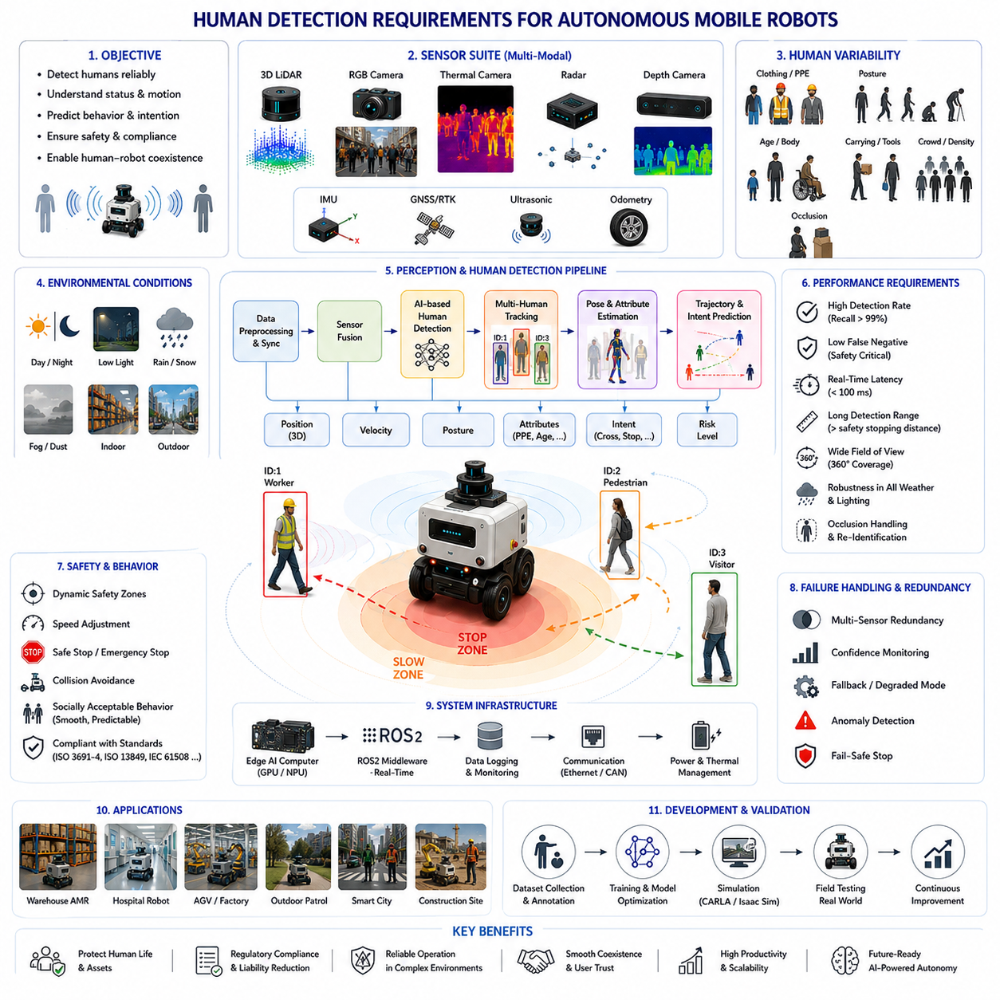
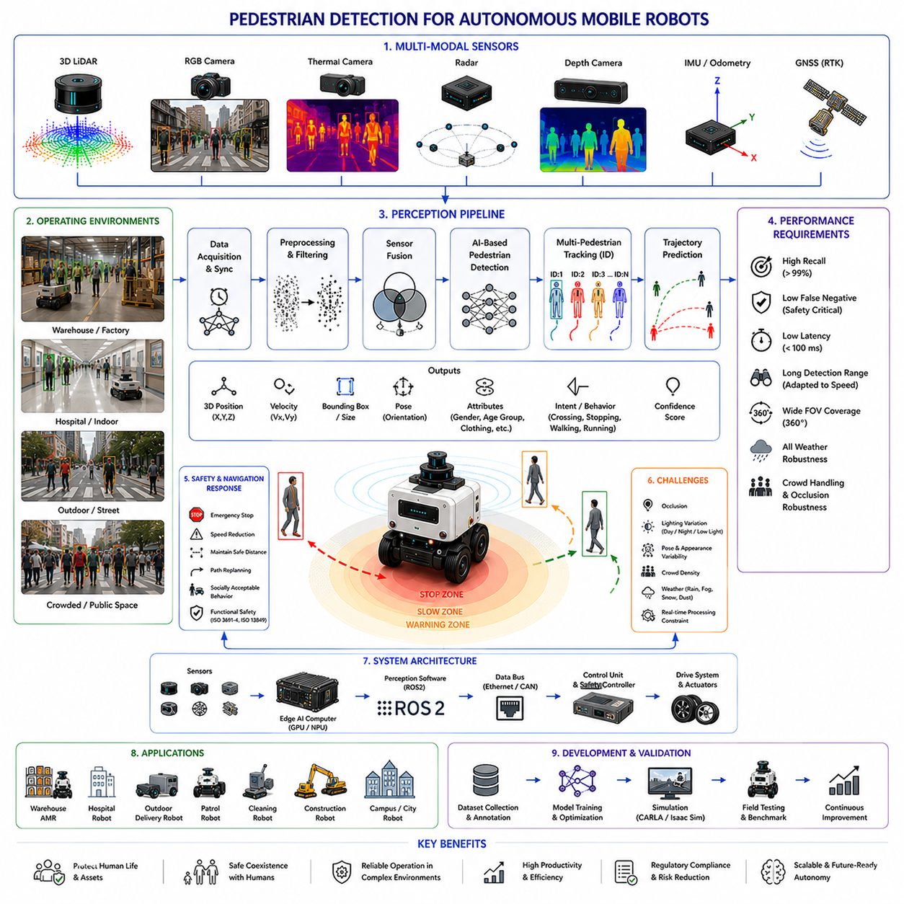
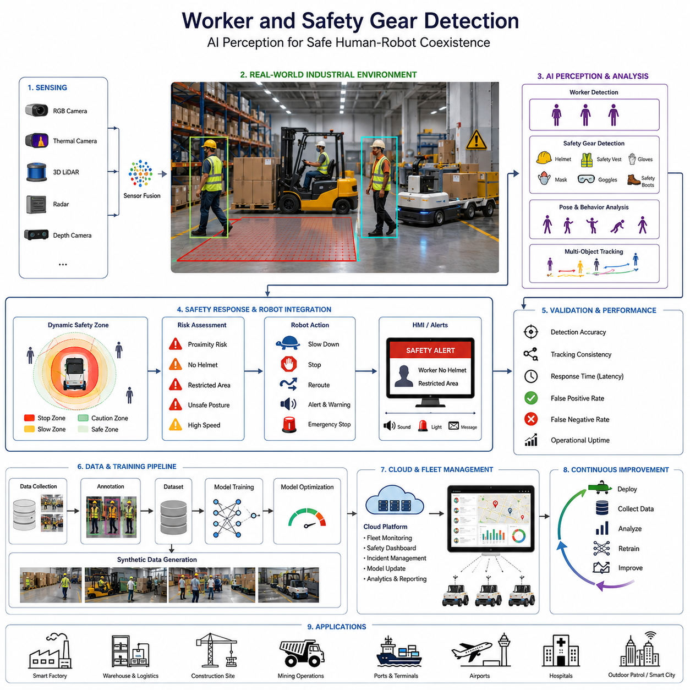
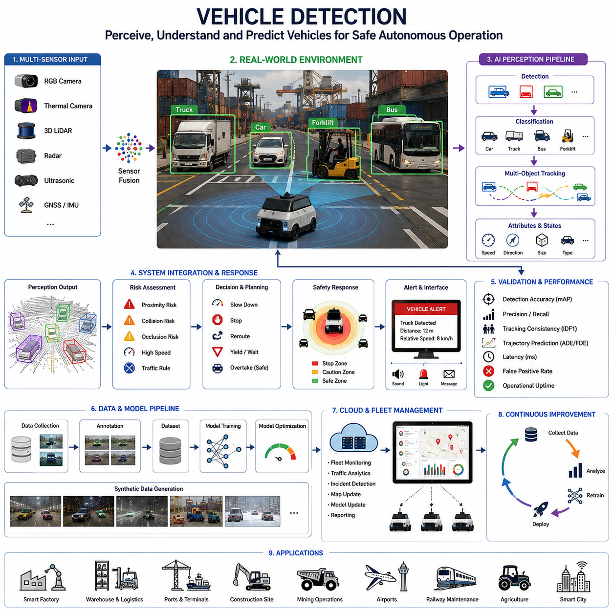
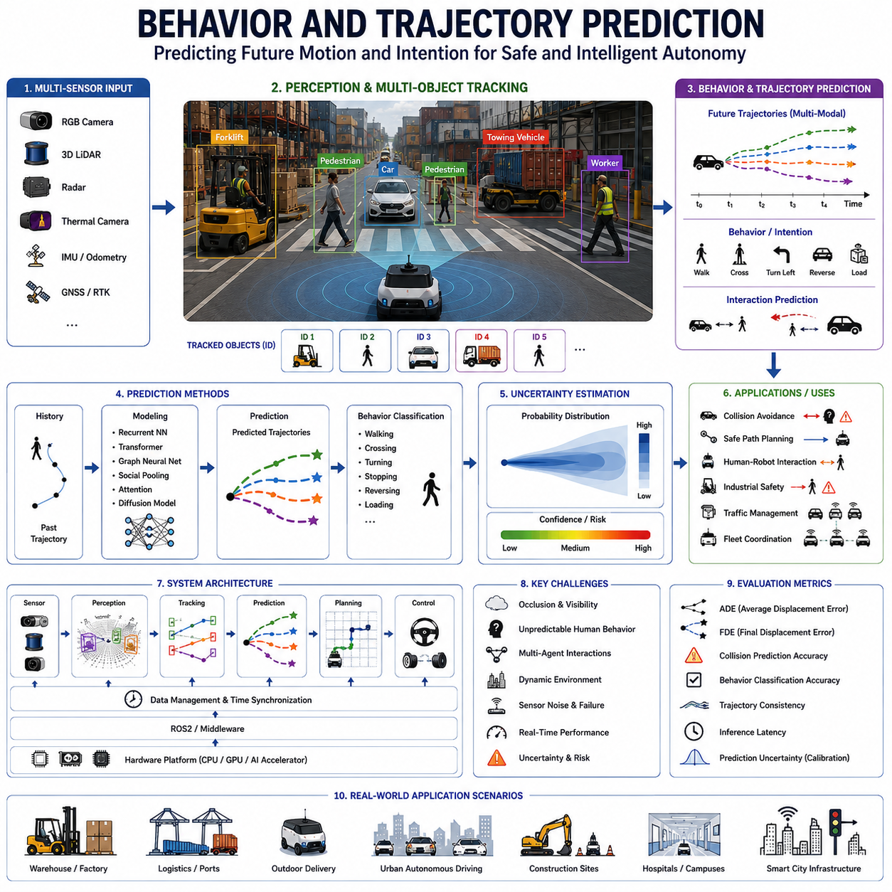
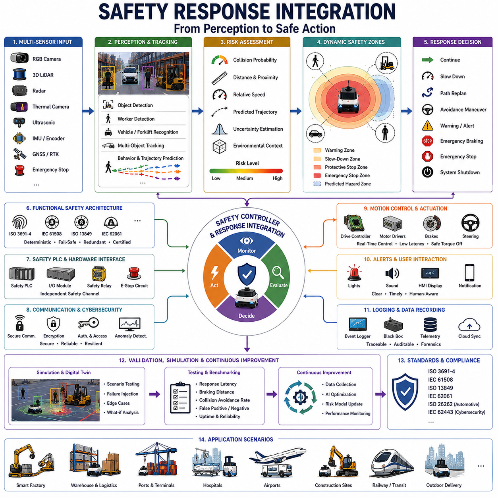
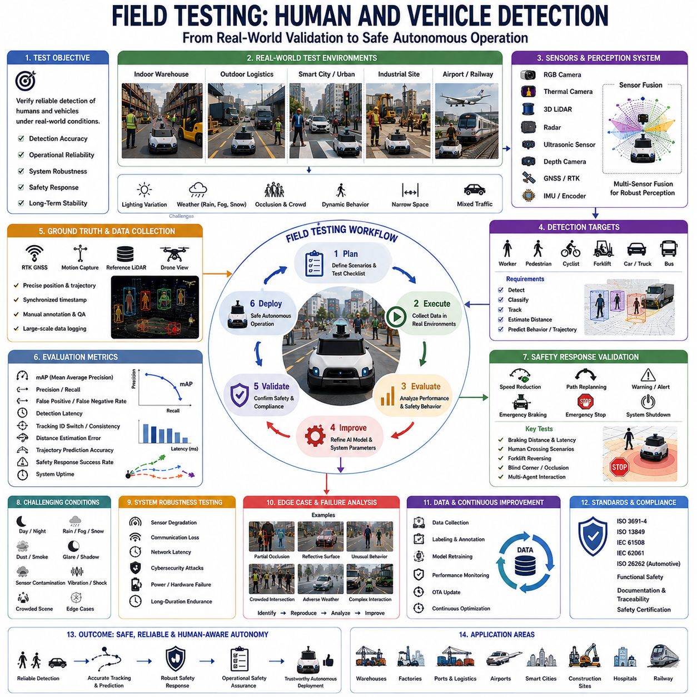

**Volume 03. AMR Sensors and Perception**

# Chapter 21. Human and Vehicle Detection

## 21.1 Human Detection Requirements

{width="7.268055555555556in" height="7.268055555555556in"}

Human Detection은 자율이동로봇(AMR) 시스템에서 가장 중요한 Perception Capability 중 하나이다. 왜냐하면 Human은 실제 환경에서 가장 우선순위가 높은 Dynamic Entity이기 때문이다. Static Obstacle이나 Predictable Infrastructure Element와 달리 Human은 Highly Dynamic하며, Non-Deterministic하고, Context-Dependent한 Behavior를 가진다. Warehouse, Hospital, Factory, Smart City, Airport, Logistics Center, Construction Site, Railway Facility, Agricultural Environment, Outdoor Public Area 등에서 동작하는 Autonomous Robot은 Human을 Real-Time으로 지속적으로 Detect, Track, Classify, Predict해야 한다. 그래야만 Operational Safety, Regulatory Compliance, Socially Acceptable Behavior를 보장할 수 있다. 따라서 Human Detection은 Safe Autonomous Mobility와 Human-Robot Coexistence를 가능하게 하는 핵심 기반 기술이다.

개념적으로 Human Detection은 Autonomous Robot이 주변 환경에서 Human의 Presence, Location, Posture, Movement, Operational Relevance를 식별하는 과정이다. 그러나 Robotics에서의 Human Detection은 단순한 Object Detection Problem을 훨씬 넘어선다. Human-Aware Perception System은 다양한 Lighting Condition, Weather Environment, Occlusion, Crowd Density, Motion Complexity, Sensor Uncertainty 환경에서도 Reliable하게 동작해야 한다. 또한 Robot은 단순히 Human을 Detect하는 것뿐 아니라 Safety Risk를 이해하고, Future Movement를 Predict하며, Behavioral Intention을 추정하고, Navigation Behavior를 Dynamic하게 조정해야 한다.

Human Detection Requirement는 기본적으로 Safety에 의해 결정된다. Industrial 및 Public Environment에서 Robot과 Human 사이의 Collision은 Injury, Legal Liability, Operational Shutdown, Regulatory Violation, Public Trust Loss를 초래할 수 있다. 따라서 Safety-Oriented Perception Architecture는 Autonomous Robot Design의 핵심 요소가 된다. Human Detection System은 High Detection Accuracy, Low False-Negative Rate, Fast Reaction Time, Robust Environmental Operation을 달성해야 한다.

Human Detection에서 가장 중요한 Requirement 중 하나는 Dynamic Real-World Condition에서의 Reliability이다. Human Appearance는 Clothing, Posture, Body Shape, Accessory, Motion Pattern, Environmental Context에 따라 크게 달라진다. Worker는 Reflective Vest, Helmet, Backpack, Protective Equipment를 착용할 수 있다. Hospital Patient는 Wheelchair나 Walker를 사용할 수 있다. Pedestrian은 Bag, Umbrella, Bicycle, Tool을 들고 이동할 수 있다. Child, Elderly Person, Worker는 서로 다른 Motion Characteristic을 가진다. 따라서 Detection System은 이러한 Wide Human Variability를 일반화할 수 있어야 한다.

Lighting Variation은 Human Detection에서 가장 큰 Challenge 중 하나이다. Indoor Robot은 Fluorescent Lighting, Shadow, Reflection, Low-Light Corridor를 만나게 된다. Outdoor Robot은 Direct Sunlight, Nighttime, Rain, Fog, Snow, Glare, Rapid Illumination Change 환경에서 동작해야 한다. 특히 Camera-Based System은 Lighting Condition에 매우 민감하다. 따라서 최신 Human Detection Architecture는 RGB Camera뿐 아니라 Thermal Camera, LiDAR, Radar, Depth Sensor, Multimodal Fusion Framework를 함께 사용한다.

Camera-Based Human Detection은 Visual Imagery가 제공하는 Rich Semantic Information 덕분에 가장 널리 사용되는 방식 중 하나이다. YOLO, Faster R-CNN, SSD, RetinaNet, DETR, Transformer-Based Architecture와 같은 Deep Learning Model은 RGB Image에서 Human Body, Limb, Face, Posture Feature를 직접 Detect할 수 있다. 이러한 시스템은 High Semantic Understanding과 Strong Classification Capability를 제공한다.

하지만 Camera-Only System은 중요한 한계를 가진다. Occlusion, Motion Blur, Poor Lighting, Adverse Weather, Glare, Shadow, Low Contrast는 Detection Reliability를 크게 저하시킬 수 있다. 따라서 Safety-Critical Robotics Application에서는 Multimodal Sensor Fusion이 필수적이다.

LiDAR-Based Human Detection은 Ambient Lighting과 무관한 Geometric Robustness를 제공한다. 3D Point Cloud는 Robot이 Human-Shaped Spatial Structure를 Detect하고 Accurate Distance Estimation을 수행할 수 있게 한다. LiDAR는 Low-Light Condition에서도 Accurate Range Estimation을 제공하기 때문에 Collision Avoidance에 특히 유용하다. 하지만 Long Distance에서는 Point Cloud가 Sparse해질 수 있으며 Rich Semantic Understanding이 부족하다.

Thermal Camera는 Nighttime 및 Low-Visibility Condition에서 Human Detection을 크게 향상시킨다. Human Body는 Infrared Radiation을 방출하기 때문에 Darkness, Smoke, Visually Cluttered Environment에서도 Detect될 수 있다. Thermal Sensing은 Outdoor Patrol Robot, Security System, Industrial Inspection Robot, Defense Application, Nighttime Autonomous Platform에서 널리 사용된다. 하지만 Extremely Hot Environment 또는 Low Thermal Contrast Environment에서는 성능이 저하될 수 있다.

Radar System 역시 점점 더 많이 Human Detection Pipeline에 통합되고 있다. Radar는 Rain, Fog, Dust, Smoke, Snow 환경에서도 Robust하게 동작할 수 있다. Millimeter-Wave Radar는 Doppler Measurement를 통해 Velocity Estimation을 제공하며 Dynamic Obstacle Awareness를 강화한다. Radar의 Resolution은 Camera나 LiDAR보다 낮지만 Adverse Weather Condition에서 Robustness를 크게 향상시킨다.

Depth Camera 및 Stereo Vision System은 Near-Field Human Detection에 널리 사용된다. RGB-D Sensor는 Visual Imagery와 Depth Estimation을 동시에 제공하기 때문에 Nearby Human을 Detect하고 Spatial Relationship를 Accurate하게 추정할 수 있다. Indoor AMR, Collaborative Robot, Hospital Robot은 Short-Range Human-Aware Navigation을 위해 Depth Camera를 자주 사용한다.

Sensor Fusion은 현대 Human Detection System에서 가장 중요한 Architectural Requirement 중 하나이다. 각 Sensor Modality는 서로 다른 Strength와 Weakness를 가진다. Fusion Architecture는 Complementary Sensing Capability를 결합하여 Detection Robustness, Environmental Coverage, Operational Safety를 향상시킨다. LiDAR-Camera Fusion, Radar-Camera Fusion, Thermal-Camera Fusion, Multimodal AI Fusion은 고급 Robotics System에서 널리 사용된다.

Human Detection System은 반드시 Real-Time으로 동작해야 한다. Autonomous Robot은 Dynamic Environment를 Continuous하게 이동하며 Collision Avoidance를 위해 Rapid Perception Update를 필요로 한다. Detection Latency는 Stopping Distance 및 Reaction Capability에 직접적인 영향을 준다. High-Speed Outdoor Robot은 Delayed Detection이 Unsafe Operation을 초래할 수 있기 때문에 Extremely Low-Latency Perception Pipeline을 필요로 한다.

Reaction Time Requirement는 Vehicle Dynamics와도 강하게 연결된다. Heavy Payload Robot, Towing AMR, Outdoor Autonomous Vehicle, High-Speed Mobile Platform은 Small Indoor Robot보다 Longer Braking Distance를 가진다. 따라서 Human Detection System은 Robot Speed, Mass, Traction, Braking Capability, Dynamic Stopping Constraint를 고려해야 한다.

Detection Range 역시 중요한 Requirement이다. Required Human Detection Distance는 Robot Speed, Operational Environment, Safety Policy에 따라 달라진다. Low-Speed Indoor Warehouse AMR은 Short-Range Detection만 필요할 수 있다. 반면 Higher-Speed Outdoor Autonomous Robot은 충분한 Reaction Time을 확보하기 위해 Long-Range Human Detection이 필요하다.

Field of View Coverage 역시 매우 중요하다. Human은 Front, Rear, Side, Diagonal Direction 등 다양한 방향에서 접근할 수 있다. Blind Spot은 Severe Safety Risk를 초래한다. 따라서 Autonomous Robot은 Multiple Camera, Multiple LiDAR, Wide-Angle Sensor, Radar Coverage Zone, Overlapping Sensor Placement Strategy를 사용한다.

Occlusion Handling은 Human Detection에서 가장 어려운 Challenge 중 하나이다. Human은 Shelf, Vehicle, Machinery, Wall, Pallet, Vegetation, Infrastructure, Crowd 뒤에 Partial하게 숨겨질 수 있다. Temporary Occlusion은 Unstable Detection 및 Tracking Failure를 유발할 수 있다. 따라서 최신 시스템은 Temporal Tracking, Trajectory Prediction, Multi-View Perception, Probabilistic Reasoning을 통합하여 Partial Visibility 환경에서도 Robust Awareness를 유지한다.

Human Pose Variability 역시 Perception Complexity를 크게 증가시킨다. Human은 Walking, Running, Crouching, Sitting, Bending, Carrying Object, Operating Machinery, Lying on the Ground 등 다양한 자세를 취할 수 있다. Industrial Worker는 Maintenance나 Operational Task 수행 중 Unusual Posture를 취할 수 있다. 따라서 Human Detection System은 다양한 Body Configuration 및 Motion Pattern을 인식할 수 있어야 한다.

Crowded Environment는 Human Detection을 더욱 어렵게 만든다. Airport, Hospital, Logistics Center, Public Sidewalk, Smart-City Environment에는 Large Number of Pedestrian이 동시에 이동할 수 있다. Multi-Human Detection 및 Tracking은 Robust ID Assignment, Trajectory Separation, Crowd Analysis, Behavior Prediction Capability를 필요로 한다.

Human Trajectory Prediction은 Advanced Autonomous System에서 점점 중요해지고 있다. 단순히 Human을 Detect하는 것만으로는 Safe Navigation에 충분하지 않다. Robot은 Future Pedestrian Movement를 예측하고 Navigation Behavior를 Proactively 조정해야 한다. Trajectory Prediction Model은 Current Motion, Environmental Context, Social Interaction, Behavioral Pattern을 기반으로 Likely Future Motion Path를 추정한다.

Behavior Prediction은 단순한 Trajectory Estimation을 넘어선다. 최신 AI System은 Human Intention, Crossing Behavior, Stopping Probability, Group Interaction, Attention Direction, Operational Risk까지 예측하려고 한다. 이러한 Capability는 Navigation Smoothness 및 Social Compatibility를 크게 향상시킨다.

Human-Aware Navigation은 Detection System과 긴밀하게 연결된다. Human 주변에서 동작하는 Robot은 Socially Acceptable Behavior를 유지해야 한다. Abrupt Stopping, Aggressive Turning, Close Passing, Unpredictable Motion은 Human에게 불편함과 Safety Concern을 유발할 수 있다. 따라서 Human Detection은 Navigation Policy, Speed Control, Safety Margin, Path Planning에 직접 영향을 준다.

Safety Zone Management는 Human Detection의 가장 중요한 Operational Use Case 중 하나이다. Industrial AMR은 일반적으로 Robot 주변에 Dynamic Safety Zone을 정의한다. Human이 Warning Zone에 진입하면 Robot은 Speed를 감소시킨다. Human이 Critical Zone에 진입하면 Robot은 즉시 Stop한다. Safety Zone Behavior는 일반적으로 Safety LiDAR 및 Functional Safety Controller와 통합된다.

Functional Safety Requirement 역시 Human Detection Architecture에 큰 영향을 준다. Industrial Autonomous System은 ISO 3691-4, ISO 13849, IEC 61508, IEC 61496, ISO 13482 등 다양한 Safety Standard를 준수해야 한다. Human-Interactive Environment에서는 Safety-Certified Sensing Hardware 및 Redundant Perception Pathway가 자주 요구된다.

Redundancy는 Safety-Critical Human Detection System의 핵심 원칙이다. Autonomous Robot은 Human Safety를 위해 단일 Sensor나 단일 AI Model에 의존하지 않는다. 대신 Multiple Sensing Modality 및 Independent Detection Pipeline이 동시에 동작한다. Redundant LiDAR, Stereo Camera, Radar, Thermal Sensor, Safety Controller는 Fault Tolerance를 향상시킨다.

False Negative는 Human Detection에서 가장 위험한 Failure Mode 중 하나이다. Human을 Completely Miss하면 Severe Collision 및 Injury가 발생할 수 있다. 따라서 Human Detection System은 일반적으로 Increased False Positive를 감수하더라도 False Negative를 최소화하도록 설계된다. Conservative Safety Behavior가 Aggressive Navigation Efficiency보다 우선된다.

False Positive 역시 Operational Challenge를 유발한다. Object를 Human으로 잘못 분류하면 Unnecessary Stopping, Reduced Productivity, Inefficient Navigation, Operational Instability가 발생할 수 있다. 따라서 Sensitivity와 Precision 사이의 Balance는 중요한 Engineering Challenge가 된다.

Environmental Robustness는 Real-World Deployment에서 매우 중요하다. Dust, Rain, Fog, Smoke, Snow, Mud, Vibration, Electromagnetic Interference, Sensor Contamination, Lighting Variation은 모두 Detection Performance에 영향을 준다. 특히 Outdoor Autonomous Robot은 Adverse Environmental Condition에서도 Reliable하게 동작할 수 있는 Human Detection System이 필요하다.

Thermal Management 및 Computational Efficiency 역시 중요한 Design Consideration이다. 최신 AI-Based Human Detection System은 GPU Acceleration, CUDA Optimization, TensorRT Inference Acceleration, ROS2 Multi-Threading, Jetson Platform과 같은 Edge AI Hardware에 크게 의존한다. Real-Time Detection은 Strict Power 및 Thermal Constraint 내에서 유지되어야 한다.

Dataset Diversity는 AI Detection Performance에 매우 큰 영향을 준다. Human Detection Model은 다양한 Ethnicity, Clothing Style, Body Shape, Safety Equipment, Environmental Condition, Weather Scenario, Lighting Condition, Pose, Crowd Density, Operational Context를 포함하는 Large-Scale Dataset을 필요로 한다. Insufficient Dataset Diversity는 Dangerous Perception Bias 및 Failure Mode를 초래할 수 있다.

Data Labeling Quality 역시 매우 중요하다. Bounding Box, Segmentation Mask, Skeletal Keypoint, Occlusion Label, Safety Gear Annotation, Trajectory Label은 모두 AI Model Accuracy에 기여한다. Industrial Human Detection Dataset은 Specialized Labeling Workflow를 필요로 하는 경우가 많다.

Human Detection Evaluation Metric은 일반적으로 Precision, Recall, Mean Average Precision(mAP), Detection Latency, False-Positive Rate, False-Negative Rate, Tracking Accuracy, Trajectory Prediction Error, Safety Response Time 등을 포함한다. Safety-Critical Robotics System은 Raw Detection Precision보다 Recall 및 Low False-Negative Rate를 우선시하는 경우가 많다.

Simulation Environment는 Human Detection Development에서 중요한 역할을 한다. Gazebo, CARLA, Isaac Sim, Digital Twin은 다양한 Human-Interaction Scenario를 반복적으로 안전하게 테스트할 수 있게 해준다. Simulation은 Rare-Event Testing, Crowd Simulation, Trajectory Prediction Validation, Weather Robustness Analysis, AI Training Workflow를 지원한다.

하지만 Real-World Human Behavior는 완벽하게 Simulation하기 어렵기 때문에 Field Testing은 여전히 필수적이다. Human Unpredictability, Environmental Complexity, Sensor Noise, Operational Variability는 Laboratory Evaluation에서는 보이지 않는 Edge Case를 자주 드러낸다. 따라서 Deployment 이전에 Extensive Real-World Testing이 반드시 필요하다.

산업별 사례를 보면 Human Detection Requirement는 매우 다양하다. Warehouse AMR은 Narrow Aisle에서 Worker 및 Forklift를 Detect한다. Hospital Robot은 Patient, Doctor, Nurse, Visitor 주변을 Navigation한다. Outdoor Patrol Robot은 다양한 Weather 및 Lighting Condition에서 Pedestrian을 Detect해야 한다. Agricultural Robot은 Crop Field에서 Worker를 식별해야 한다. Construction Robot은 Heavy Machinery 및 Dynamic Human Activity 주변에서 동작한다. Smart-City Robot은 Pedestrian, Bicycle, Urban Traffic Environment와 동시에 상호작용한다.

미래의 Human Detection System은 단순한 Object Detection을 넘어 Holistic Human Understanding 방향으로 발전할 것이다. Autonomous Robot은 Eventually Body Language, Emotional State, Gaze Direction, Gesture Command, Social Interaction, Operational Intention, Environmental Context를 동시에 이해하게 될 것이다.

Foundation Model 및 Embodied AI Architecture는 Human-Aware Robotics를 크게 발전시킬 가능성이 있다. 미래의 시스템은 Multimodal World Understanding, Natural Language Interaction, Behavioral Prediction, Social Reasoning, Adaptive Safety Intelligence를 Unified Perception Framework 안에 통합하게 될 것이다.

Human Detection의 발전은 Autonomous Robotics 전체의 진화 방향을 반영한다. 초기 Robotics System은 Limited Human Awareness와 단순한 Geometric Obstacle Avoidance에 의존하였다. 현대 Autonomous System은 Multimodal Sensor Fusion, AI Perception, Semantic Understanding, Predictive Intelligence, Social Navigation, Functional Safety Engineering을 적극 통합하고 있다.

궁극적으로 Human Detection은 단순한 Object Recognition Problem이 아니다. 이는 Autonomous Robot이 Shared Environment에서 Human을 Perceive하고, Understand하고, Predict하며, Safe하게 Interaction하는 과정이다. 효과적인 Human Detection은 Safe Autonomous Navigation, Collision Avoidance, Social Compatibility, Functional Safety Compliance, Scalable Deployment, Trustworthy Human-Robot Coexistence를 가능하게 한다. 고급 AMR 시스템에서 Human Detection은 Practical하고 Socially Acceptable한 Real-World Autonomous Mobility를 가능하게 하는 가장 핵심적인 기술 중 하나이다.

## 21.2 Pedestrian Detection

{width="7.268055555555556in" height="7.268055555555556in"}

Pedestrian Detection은 자율이동로봇(AMR) 시스템에서 가장 중요한 Perception Function 중 하나이다. 왜냐하면 Pedestrian은 실제 환경에서 Highly Dynamic하며, Predict하기 어렵고, Safety-Critical한 Entity이기 때문이다. Static Obstacle이나 Predictable Machinery와 달리 Pedestrian은 지속적으로 Speed, Direction, Posture, Intention, Interaction Pattern을 변화시킨다. Warehouse, Hospital, Factory, Logistics Center, Airport, Smart City, Campus, Sidewalk, Industrial Complex, Railway Station, Shopping Mall, Outdoor Public Environment 등에서 동작하는 Autonomous Robot은 Safe Navigation, Collision Avoidance, Social Compatibility, Regulatory Compliance를 위해 Pedestrian을 Real-Time으로 Accurate하고 Reliable하게 Detect해야 한다. 따라서 Pedestrian Detection은 Practical Human-Centered Autonomous Mobility를 가능하게 하는 핵심 기술 중 하나이다.

개념적으로 Pedestrian Detection은 Autonomous Robot이 주변 환경에서 이동 중인 Human Individual을 식별하고, 이를 다른 Dynamic 또는 Static Object와 구분하는 과정이다. 하지만 현대 Robotics에서의 Pedestrian Detection은 단순한 Visual Object Recognition을 훨씬 넘어선다. 최신 Robotics System은 Environmental Uncertainty, Sensor Limitation, Dynamic Operational Constraint를 고려하면서 Pedestrian의 Position, Distance, Velocity, Trajectory, Body Orientation, Intent, Future Movement Behavior까지 추정해야 한다.

Pedestrian Detection은 기본적으로 Safety Requirement에 의해 결정된다. Human Safety는 거의 모든 Autonomous Robotics System에서 가장 높은 Operational Priority를 가진다. Robot과 Pedestrian 사이의 Collision은 Injury, Legal Liability, Equipment Damage, Operational Shutdown, Regulatory Penalty, Public Trust Loss를 초래할 수 있다. 따라서 Pedestrian Detection System은 Extremely Conservative Safety Objective를 기반으로 설계되며, High Recall, Low False-Negative Rate, Fast Response Time, Robust Environmental Operation을 중요하게 여긴다.

Pedestrian Detection에서 가장 큰 Challenge 중 하나는 Human Unpredictability이다. Pedestrian은 갑자기 Direction을 바꾸거나, Unexpected하게 멈추거나, Irregular하게 가속하거나, Social Interaction을 하거나, 물건을 들고 이동하거나, Environmental Context에 따라 서로 다른 행동을 보인다. Human Motion Pattern은 본질적으로 Non-Deterministic하며 수많은 Contextual Variable의 영향을 받는다. 따라서 Pedestrian Detection System은 Rapidly Changing Environmental Condition에 지속적으로 적응해야 한다.

Pedestrian Appearance Variability 역시 Perception Complexity를 크게 증가시킨다. Pedestrian은 Clothing Style, Body Shape, Height, Posture, Age, Ethnicity, Accessory, Carried Object에 따라 매우 다양한 형태를 가진다. Worker는 Reflective Vest, Helmet, Backpack, Industrial Equipment를 착용할 수 있다. Hospital Patient는 Wheelchair나 Walking Aid를 사용할 수 있다. Urban Pedestrian은 Umbrella, Luggage, Bicycle, Shopping Bag 등을 들고 다닐 수 있다. Child와 Elderly Person은 서로 다른 Motion Characteristic을 가진다. 따라서 Detection System은 이러한 Wide Appearance Variability를 일반화하면서도 Reliable Detection Performance를 유지해야 한다.

Lighting Condition은 Pedestrian Detection에서 가장 큰 Operational Challenge 중 하나이다. Indoor Robot은 Fluorescent Lighting, Shadow, Reflective Surface, Low-Light Corridor를 만나게 된다. Outdoor Robot은 Direct Sunlight, Nighttime, Rain, Fog, Snow, Glare, Rapidly Changing Illumination 환경에서 동작해야 한다. 특히 Camera-Based System은 Lighting Variation에 매우 민감하다. 따라서 최신 Pedestrian Detection Architecture는 RGB Camera뿐 아니라 LiDAR, Thermal Camera, Radar, Depth Sensor, Multimodal Sensor Fusion Framework를 함께 사용한다.

RGB Camera-Based Pedestrian Detection은 Rich Semantic Information 덕분에 가장 널리 사용되는 방식 중 하나이다. YOLO, Faster R-CNN, SSD, RetinaNet, EfficientDet, DETR, Transformer-Based Detector, Segmentation Network와 같은 Deep Learning Model은 Image Data로부터 Pedestrian Shape, Body Structure, Contextual Feature를 직접 식별할 수 있다. 이러한 Model은 Strong Classification Performance와 High Semantic Understanding을 제공한다.

하지만 Camera-Only System은 Major Operational Limitation을 가진다. Motion Blur, Poor Illumination, Occlusion, Weather Effect, Glare, Shadow, Low Contrast, Camera Contamination은 Detection Reliability를 크게 감소시킬 수 있다. 특히 Nighttime Environment는 Visible-Spectrum Camera에게 매우 어려운 환경이다. 따라서 Safety-Critical Autonomous System은 RGB Camera만 단독으로 사용하는 경우가 거의 없다.

LiDAR-Based Pedestrian Detection은 Ambient Lighting Condition과 무관한 Robust Geometric Perception을 제공한다. 3D Point Cloud는 Robot이 Human-Shaped Spatial Structure를 Detect하고 Accurate Distance Information을 추정할 수 있게 한다. LiDAR는 Accurate Range Estimation을 제공하기 때문에 Collision Avoidance에서 특히 중요하다. 하지만 Long Distance에서는 Point Cloud가 Sparse해질 수 있으며 Detailed Semantic Information이 부족한 경우가 많다.

Thermal Camera는 Nighttime 및 Low-Visibility Condition에서 Pedestrian Detection을 크게 향상시킨다. Human Body는 Infrared Radiation을 방출하기 때문에 Darkness, Smoke, Visually Cluttered Environment에서도 Detect가 가능하다. Thermal Sensing은 Outdoor Patrol Robot, Security System, Industrial Inspection Robot, Defense Robotics, Railway Inspection System, Nighttime Autonomous Vehicle에서 특히 유용하다. 하지만 Extremely Hot Environment나 Weak Thermal Contrast Environment에서는 성능이 저하될 수 있다.

Radar System 역시 점점 더 Pedestrian Detection Pipeline에 통합되고 있다. Radar는 Rain, Fog, Snow, Smoke, Dust 환경에서도 Robust하게 동작할 수 있다. Millimeter-Wave Radar는 Doppler Measurement를 사용하여 Velocity Estimation을 제공하며 Dynamic Obstacle Awareness를 강화한다. Radar는 Camera나 LiDAR보다 Spatial Resolution은 낮지만 Adverse Environmental Condition에서 Robustness를 크게 향상시킨다.

Depth Camera 및 Stereo Vision System은 Short-Range Pedestrian Detection에 널리 사용된다. RGB-D Sensor는 Visual Imagery와 Depth Estimation을 동시에 제공하기 때문에 Nearby Pedestrian을 Detect하고 Spatial Relationship를 Accurate하게 추정할 수 있다. Indoor AMR, Collaborative Robot, Hospital Service Robot, Logistics Robot은 Near-Field Human-Aware Navigation을 위해 Depth Camera를 자주 사용한다.

Sensor Fusion은 Pedestrian Detection System에서 가장 중요한 Architectural Requirement 중 하나이다. 각 Sensor Modality는 Unique Strength와 Weakness를 가진다. Fusion Architecture는 Complementary Sensing Capability를 결합하여 Robustness, Environmental Coverage, Operational Safety를 향상시킨다. LiDAR-Camera Fusion, Radar-Camera Fusion, Thermal-Camera Fusion, AI-Based Multimodal Fusion은 최신 Robotics System에서 널리 사용된다.

Real-Time Performance는 Pedestrian Detection System에서 매우 중요하다. Autonomous Robot은 Dynamic Environment를 지속적으로 이동하며 Collision Avoidance를 위해 Rapid Perception Update를 필요로 한다. Detection Latency는 Reaction Capability 및 Stopping Distance에 직접적인 영향을 준다. High-Speed Outdoor Autonomous Platform은 Delayed Pedestrian Detection이 Unsafe Operation을 초래할 수 있기 때문에 Extremely Low-Latency Perception Pipeline을 필요로 한다.

Detection Range Requirement는 Robot Speed 및 Operational Environment와 밀접하게 연결된다. Low-Speed Indoor Warehouse AMR은 Short-Range Pedestrian Detection만 필요할 수 있다. 반면 Higher-Speed Outdoor Autonomous Robot은 충분한 Stopping Distance와 Reaction Time 확보를 위해 Long-Range Pedestrian Awareness가 필요하다. 따라서 Pedestrian Detection System은 Vehicle Dynamics 및 Operational Safety Margin에 따라 설계되어야 한다.

Field-of-View Coverage 역시 매우 중요하다. Pedestrian은 Front, Rear, Side, Diagonal Direction 등 다양한 방향에서 접근할 수 있다. Blind Spot은 Severe Safety Risk를 유발한다. 따라서 Autonomous Robot은 Multiple Camera, Overlapping LiDAR Coverage, Radar Sensing Zone, Wide-Angle Lens, Redundant Sensor Placement Strategy를 사용하여 Environmental Visibility를 최대화한다.

Occlusion Handling은 Pedestrian Detection에서 가장 어려운 Challenge 중 하나이다. Pedestrian은 Shelf, Pallet, Vehicle, Wall, Machinery, Vegetation, Infrastructure, Crowd 뒤에 Partial하게 가려질 수 있다. Temporary Occlusion은 Unstable Detection 및 Tracking Failure를 유발할 수 있다. 따라서 최신 시스템은 Temporal Tracking, Trajectory Prediction, Multi-View Perception, Probabilistic Reasoning을 통합하여 Partial Visibility Environment에서도 Robust Pedestrian Awareness를 유지한다.

Crowded Environment는 Perception Complexity를 더욱 증가시킨다. Airport, Shopping Mall, Hospital, Public Sidewalk, Logistics Center, Smart-City Environment에는 Large Number of Pedestrian이 동시에 이동한다. Multi-Pedestrian Detection 및 Tracking은 Robust Identity Assignment, Trajectory Separation, Crowd Analysis, Motion Prediction Capability를 필요로 한다.

Pedestrian Tracking은 Detection System과 긴밀하게 연결된다. Detection은 Pedestrian Presence를 식별하고, Tracking은 Time에 따라 Consistent Identity 및 Trajectory Estimation을 유지한다. Multi-Object Tracking System은 Consecutive Sensor Frame 간 Detection을 연결하여 Pedestrian Velocity, Movement Direction, Acceleration, Future Behavior를 추정한다.

Trajectory Prediction은 Advanced Pedestrian-Aware Robotics System에서 점점 중요해지고 있다. 단순히 Pedestrian을 Detect하는 것만으로는 Safe Navigation에 충분하지 않다. Robot은 Future Human Movement를 예측하고 Navigation Behavior를 Proactively 조정해야 한다. Trajectory Prediction Model은 Current Movement, Environmental Structure, Crowd Interaction, Behavioral Pattern을 기반으로 Likely Future Motion Path를 추정한다.

Behavior Prediction은 단순한 Trajectory Estimation을 넘어선다. 최신 AI System은 Pedestrian Intention, Crossing Behavior, Stopping Probability, Group Interaction, Attention Direction, Risk Level까지 예측하려고 한다. 이러한 Capability는 Navigation Smoothness, Safety Margin, Socially Acceptable Robot Behavior를 크게 향상시킨다.

Social Navigation은 Pedestrian Detection과 매우 밀접하게 연결된다. Human 주변에서 동작하는 Robot은 Comfortable하고 Predictable한 Motion Behavior를 유지해야 한다. Abrupt Stopping, Aggressive Turning, Narrow Passing Distance, Unpredictable Movement는 Human에게 Discomfort와 Safety Concern을 유발할 수 있다. 따라서 Pedestrian Detection은 Path Planning, Speed Control, Trajectory Generation, Navigation Policy에 직접 영향을 준다.

Safety Zone Management는 Pedestrian Detection의 가장 중요한 Operational Application 중 하나이다. Industrial AMR은 일반적으로 Robot 주변에 Dynamic Safety Zone을 정의한다. Pedestrian이 Warning Zone에 진입하면 Robot은 Speed를 감소시킨다. Pedestrian이 Critical Zone에 진입하면 Robot은 즉시 Stop한다. Safety-Zone Behavior는 일반적으로 Safety LiDAR System, Certified Controller, Functional Safety Framework와 통합된다.

Functional Safety Requirement는 Pedestrian Detection Architecture에 큰 영향을 준다. Industrial Autonomous System은 ISO 3691-4, ISO 13849, IEC 61508, IEC 61496, ISO 13482 등 다양한 Robotics Safety Standard를 준수해야 한다. Pedestrian-Interactive Environment에서는 Safety-Certified Sensing Hardware, Redundant Perception System, Deterministic Fail-Safe Behavior가 자주 요구된다.

Redundancy는 Safety-Critical Pedestrian Detection System의 핵심 Design Principle이다. Autonomous Robot은 Pedestrian Safety를 위해 단일 Sensor나 단일 AI Model에 의존하지 않는다. 대신 Multiple Independent Sensing Modality 및 Detection Pipeline이 동시에 동작한다. Redundant LiDAR, Stereo Camera, Radar, Thermal Sensor, Safety Controller는 Fault Tolerance 및 Operational Reliability를 향상시킨다.

False Negative는 Pedestrian Detection에서 가장 위험한 Failure Mode 중 하나이다. Pedestrian을 Completely Miss하면 Severe Collision이나 Injury가 발생할 수 있다. 따라서 Pedestrian Detection System은 일반적으로 Increased False Positive를 감수하더라도 False Negative를 최소화하도록 설계된다. Conservative Safety Behavior가 Aggressive Navigation Efficiency보다 우선된다.

False Positive 역시 Operational Challenge를 유발한다. Object를 Pedestrian으로 잘못 분류하면 Unnecessary Stopping, Reduced Productivity, Inefficient Navigation, Unstable Robot Behavior가 발생할 수 있다. 따라서 Sensitivity와 Precision 사이의 Balance는 중요한 Engineering Challenge가 된다.

Environmental Robustness는 Real-World Deployment에서 매우 중요하다. Rain, Fog, Snow, Smoke, Dust, Mud, Vibration, Electromagnetic Interference, Lighting Variation, Sensor Contamination은 모두 Pedestrian Detection Performance에 영향을 준다. 특히 Outdoor Autonomous Robot은 Adverse Environmental Condition에서도 Reliable하게 동작할 수 있는 Robust Perception System이 필요하다.

Thermal Management 및 Computational Efficiency 역시 중요한 System-Level Consideration이다. 최신 AI-Based Pedestrian Detection System은 GPU Acceleration, CUDA Optimization, TensorRT Inference Acceleration, ROS2 Multi-Threading, Jetson Platform과 같은 Edge AI Hardware에 크게 의존한다. Real-Time Perception은 Strict Power, Thermal, Computational Constraint 내에서 유지되어야 한다.

Dataset Diversity는 AI Detection Performance에 매우 큰 영향을 준다. Pedestrian Detection Model은 Different Ethnicity, Clothing Style, Body Type, Weather Condition, Lighting Scenario, Crowd Density, Body Pose, Safety Equipment, Environmental Structure, Operational Context를 포함하는 Large-Scale Dataset을 필요로 한다. Insufficient Dataset Diversity는 Dangerous Bias 및 Perception Failure Mode를 초래할 수 있다.

Data Labeling Quality 역시 매우 중요하다. Bounding Box, Segmentation Mask, Skeletal Keypoint, Occlusion Label, Trajectory Annotation, Behavioral Label은 모두 Model Accuracy에 기여한다. Industrial Pedestrian Detection Dataset은 Highly Specialized Labeling Workflow를 필요로 하는 경우가 많다.

Pedestrian Detection Evaluation Metric은 일반적으로 Precision, Recall, Mean Average Precision(mAP), False-Positive Rate, False-Negative Rate, Detection Latency, Tracking Accuracy, Trajectory Prediction Error, Identity Consistency, Safety Response Time 등을 포함한다. Safety-Critical Robotics System은 일반적으로 Raw Detection Precision보다 Recall 및 Low False-Negative Rate를 우선시한다.

Simulation Environment는 Pedestrian Detection Development에서 중요한 역할을 한다. Gazebo, CARLA, Isaac Sim, Digital Twin은 다양한 Human-Interaction Scenario를 반복적으로 안전하게 테스트할 수 있게 해준다. Simulation은 Rare-Event Testing, Crowd Simulation, Weather Robustness Analysis, Trajectory Prediction Validation, AI Training Workflow를 지원한다.

하지만 실제 Pedestrian Behavior는 완벽하게 Simulation하기 어렵기 때문에 Field Testing은 여전히 필수적이다. Human Unpredictability, Environmental Complexity, Operational Variability, Sensor Noise는 Laboratory Evaluation에서는 보이지 않는 Edge Case를 자주 드러낸다. 따라서 Deployment 이전에 Extensive Real-World Validation이 반드시 필요하다.

산업별 사례를 보면 Pedestrian Detection Requirement는 매우 다양하다. Warehouse AMR은 Shelf와 Forklift 사이를 이동하는 Worker를 Detect한다. Hospital Robot은 Patient, Doctor, Nurse, Visitor 주변을 Navigation한다. Outdoor Patrol Robot은 다양한 Weather 및 Lighting Condition에서 Pedestrian을 Detect해야 한다. Agricultural Robot은 Crop Field 내부의 Worker를 식별해야 한다. Construction Robot은 Heavy Machinery 및 Dynamic Worker Activity 주변에서 동작한다. Smart-City Robot은 Pedestrian, Bicycle, Scooter, Urban Traffic Environment와 동시에 상호작용한다.

미래의 Pedestrian Detection System은 단순한 Object Recognition을 넘어 Holistic Human Understanding 방향으로 발전할 것이다. Autonomous Robot은 Eventually Body Language, Emotional State, Gaze Direction, Gesture Command, Group Interaction, Environmental Context, Operational Intent를 동시에 이해하게 될 것이다.

Foundation Model 및 Embodied AI Architecture는 Pedestrian-Aware Robotics를 크게 발전시킬 가능성이 있다. 미래의 시스템은 Multimodal World Understanding, Natural Language Interaction, Behavioral Prediction, Social Reasoning, Adaptive Safety Intelligence를 Unified Perception Framework 안에 통합하게 될 것이다.

Pedestrian Detection의 발전은 Autonomous Robotics 전체의 진화 방향을 반영한다. 초기 Robotics System은 Limited Human Awareness와 단순한 Geometric Obstacle Avoidance에 의존하였다. 현대 Autonomous System은 Multimodal Sensor Fusion, AI Perception, Semantic Understanding, Predictive Intelligence, Social Navigation, Functional Safety Engineering을 적극 통합하고 있다.

궁극적으로 Pedestrian Detection은 단순한 Visual Recognition Problem이 아니다. 이는 Autonomous Robot이 Shared Environment 속에서 Moving Human을 Perceive하고, Understand하고, Predict하며, Safe하게 Interaction하는 과정이다. 효과적인 Pedestrian Detection은 Safe Autonomous Navigation, Collision Avoidance, Socially Acceptable Behavior, Regulatory Compliance, Scalable Deployment, Trustworthy Human-Robot Coexistence를 가능하게 한다. 고급 AMR 시스템에서 Pedestrian Detection은 Complex Real-World Environment에서 Practical하고 Human-Centered Autonomous Mobility를 가능하게 하는 가장 핵심적인 기술 중 하나이다.

## 21.3 Worker and Safety Gear Detection

{width="7.268055555555556in" height="7.268055555555556in"}

작업자 및 안전 장비 감지는 현대의 Autonomous Mobile Robot(AMR), 산업용 로봇, 스마트 팩토리, 건설 자동화 시스템, 광산 로봇, 물류 로봇, 실외 자율주행 플랫폼에서 가장 중요한 인지 기능 중 하나가 되었다. 로봇 시스템이 점점 더 복잡한 산업 환경에서 인간 작업자와 함께 동작하게 되면서, 인간 안전 보장은 핵심적인 엔지니어링 요구사항이 되었다. 기존 산업 안전 시스템은 주로 물리적 차단막, 경고 표지판, 안전 구역, 비상 정지 스위치, 수동 감독에 의존하였다. 그러나 현대의 지능형 로봇 시스템은 작업자를 감지하고, 안전 장비 착용 여부를 인식하며, 작업자 행동을 이해하고, 위험 상황을 예측하며, 실시간으로 자율 대응할 수 있는 능동적 인지 기반 안전 시스템을 필요로 한다. 따라서 작업자 및 안전 장비 감지는 AI 기반 산업 안전 아키텍처와 인간 중심 로봇 자율성의 핵심 구성 요소가 된다.

작업자 및 안전 장비 감지의 주요 목적은 단순한 객체 인식이 아니라 운영 위험 감소에 있다. 산업 환경에는 이동 중인 지게차, Towing AMR, 로봇 매니퓰레이터, 중장비, 고전압 시스템, 매달린 하중, 위험 물질, 건설 구역, 협소 공간 등 다양한 위험 요소가 존재한다. 이러한 환경에서 AI 인지 시스템은 작업자가 존재하는지, 안전한 위치에 있는지, 필수 안전 장비를 올바르게 착용하고 있는지를 지속적으로 모니터링해야 한다. 이는 인지 시스템을 단순한 모니터링 도구가 아닌, 로봇 내비게이션, Fleet Management, 산업 안전 워크플로우와 직접 통합된 능동형 운영 안전 시스템으로 변화시킨다.

작업자 감지는 인간 인지의 기본 요소에서 시작된다. 도시 자율주행용 일반 보행자 감지 시스템과 달리, 산업 작업자 감지는 매우 까다로운 환경 조건에서 동작해야 한다. 작업자는 반사 조끼, 안전모, 장갑, 마스크, 고글, 보호복, 특수 산업용 유니폼 등을 착용할 수 있다. 또한 공장, 창고, 건설 현장, 항만, 광산, 병원, 공항, 실외 산업 환경에 따라 작업자의 외형은 크게 달라질 수 있다. 게다가 작업자는 기계, 선반, 팔레트, 컨테이너, 차량, 산업 구조물 등에 의해 부분적으로 가려질 수도 있다. 따라서 작업자 감지 시스템은 복잡한 산업 장면을 처리할 수 있는 매우 강건한 인지 아키텍처를 필요로 한다.

현대의 작업자 감지 시스템은 일반적으로 RGB 카메라, Thermal Camera, 3D LiDAR, Depth Camera, Radar System, AI 기반 Sensor Fusion Architecture를 함께 사용한다. RGB 카메라는 객체 분류와 안전 장비 인식에 적합한 고해상도 시각 정보를 제공한다. Thermal Camera는 저조도나 야간 환경에서 인간 감지 신뢰성을 향상시킨다. LiDAR는 정밀한 3차원 공간 위치와 장애물 형상을 제공한다. Radar는 비, 안개, 연기, 먼지 환경에서 강건성을 향상시킨다. Sensor Fusion은 개별 센서가 성능 저하를 겪더라도 안정적인 인간 감지 성능을 유지할 수 있도록 한다.

안전 장비 감지는 인간 감지를 산업 안전 의미 분석으로 확장한 개념이다. 인지 시스템은 작업자가 안전모, 안전 조끼, 장갑, 마스크, 고글, 안전화, 청력 보호 장비, 반사 의류, 추락 방지 장비 등을 올바르게 착용하고 있는지를 인식해야 한다. 이를 위해서는 정밀 객체 인식과 고해상도 영상 분석이 필요하다. 많은 안전 장비는 영상 내 작은 영역만 차지하며, 형태, 색상, 방향, 외형이 매우 다양하기 때문이다.

안전모 감지는 가장 널리 배포된 산업 안전 AI 응용 분야 중 하나이다. 건설 현장, 물류 센터, 제조 공장, 중공업 시설에서는 안전모 착용이 필수이다. AI 기반 안전모 감지 시스템은 작업자의 머리 영역을 분석하여 승인된 안전모가 존재하는지를 판단한다. 고급 시스템은 안전모 색상 분류, 손상된 안전모 감지, 잘못 착용된 안전모 인식, 비정상 안전 상태 분석까지 수행한다. 이러한 시스템은 출입 통제 시스템, 감시 인프라, 자율 로봇, Fleet Management System과 자주 통합된다.

안전 조끼 감지 역시 중요하다. 반사 조끼는 자율 차량 및 산업 장비 주변에서 작업자의 가시성을 향상시키기 때문이다. AI 인지 시스템은 다양한 조명 환경에서 안전 조끼의 존재 여부와 반사 품질까지 분석해야 한다. 실외 환경에서는 햇빛 반사, 비, 먼지 오염, 야간 운용 등의 추가적인 문제가 발생한다. 이러한 환경에서는 Thermal Camera와 Radar Fusion이 신뢰성을 향상시키는 데 큰 역할을 한다.

작업자 자세 분석은 고급 산업 안전 시스템에서 점점 더 중요해지고 있다. 단순히 작업자의 존재 여부만 감지하는 것이 아니라, AI 시스템은 자세, 움직임 패턴, 행동을 분석하여 위험 상황을 식별한다. 예를 들어 작업자가 바닥에 쓰러진 상태, 제한 구역 침입, 위험 구조물 등반, 위험 장비 접근, 낙상, 비정상적인 급속 이동, 이동 차량 주변 위험 행동 등을 감지할 수 있다. Pose Estimation Model, Skeletal Tracking System, Temporal Behavior Analysis 알고리즘이 이러한 기능을 지원하기 위해 통합된다.

실시간 성능은 작업자 및 안전 장비 감지 시스템의 핵심 요구사항이다. 산업 로봇과 자율 차량은 수백 밀리초 수준의 지연만으로도 심각한 안전 문제가 발생할 수 있는 환경에서 동작한다. 따라서 AI Inference Pipeline은 높은 정확도를 유지하면서도 저지연 처리를 수행해야 한다. NVIDIA Jetson Platform, TensorRT Optimization, GPU Acceleration, 경량화된 Neural Network Architecture가 실시간 산업 안전 요구사항을 만족시키기 위해 널리 사용된다.

Dataset Engineering은 작업자 및 안전 장비 감지 개발에서 가장 중요한 과제 중 하나이다. 공개 데이터셋은 산업 환경의 다양성을 충분히 반영하지 못하는 경우가 많다. 작업자 외형, 산업 레이아웃, 기상 조건, 조명 환경, 안전 장비 종류가 산업 및 국가마다 크게 다르기 때문이다. 따라서 많은 조직은 공장, 창고, 항만, 건설 현장, 광산, 공항, 병원, 실외 산업 현장에서 직접 수집한 Custom Dataset을 구축한다. 이러한 데이터셋은 작업자 Bounding Box, 안전모 Label, 안전 조끼 Label, 자세 정보, 행동 분류, 안전 구역 상호작용 정보 등을 포함한 대규모 Annotation 작업이 필요하다.

Synthetic Data Generation은 위험하거나 드문 산업 상황을 실제 환경에서 수집하기 어렵기 때문에 점점 더 중요해지고 있다. Isaac Sim, Gazebo, CARLA, Unity, Digital Twin Environment는 작업자, 지게차, 로봇, 팔레트, 건설 장비, 다양한 안전 장비 구성을 포함한 가상 산업 장면을 생성할 수 있다. 이러한 Synthetic Dataset은 AI 학습 속도를 크게 향상시키며, Edge Case Coverage를 개선한다.

가림(Occlusion) 처리는 산업 작업자 감지에서 가장 어려운 기술적 문제 중 하나이다. 작업자는 종종 팔레트, 선반, 기계, 컨테이너, 차량, 구조물 뒤에 부분적으로 가려진다. 따라서 고급 AI 시스템은 Temporal Tracking, Multi-Camera Fusion, 3D Perception, Trajectory Prediction을 활용하여 일시적 시야 차단 상황에서도 안정적인 작업자 식별을 유지한다.

다수 작업자 환경은 인지 복잡성을 더욱 증가시킨다. 창고, 항만, 스마트 팩토리, 물류 센터에는 수십\~수백 명의 작업자가 자율 차량과 함께 이동할 수 있다. 따라서 Multi-Object Tracking System은 작업자의 지속적인 ID 유지, 이동 궤적 추정, 미래 위치 예측, 작업자 간 추적 혼동 방지를 수행해야 한다.

Safety-Zone Integration은 산업 로봇 안전 시스템의 핵심 요소이다. 작업자 감지 결과는 로봇 내비게이션 및 안전 컨트롤러와 직접 연결된다. 동적 안전 구역은 작업자 거리, 로봇 속도, Payload Weight, 운영 상황에 따라 확장 또는 축소될 수 있다. 작업자가 위험 영역에 접근하면 로봇은 속도를 줄이거나 정지하고, 경로를 재설정하거나, 경고 신호를 활성화하거나, 비상 정지 절차를 수행할 수 있다.

작업자 Trajectory Prediction은 예측 기반 안전 시스템에서 점점 더 중요해지고 있다. 단순히 작업자가 위험 구역에 진입한 이후 반응하는 것이 아니라, 고급 AI 시스템은 작업자의 이동 패턴을 예측하여 충돌이나 위험 상호작용을 사전에 방지하려 한다. 이러한 모델은 이동 이력, 환경 정보, 로봇 상태, 다중 에이전트 상호작용 분석을 통합하여 미래 움직임을 예측한다.

Privacy 및 Ethical Consideration 역시 중요하다. 지속적인 AI 감시는 작업자 프라이버시, 노동권, 생체 정보 모니터링, 운영 투명성과 관련된 문제를 야기할 수 있다. 따라서 산업 안전 AI 시스템은 규제 요구사항을 준수하면서도 안전 목표와 윤리적 배포 원칙 사이의 균형을 유지해야 한다. Privacy-Preserving AI Architecture, Anonymized Tracking System, 제한된 데이터 보관 정책이 점점 중요해지고 있다.

실외 작업자 감지 시스템에서는 Weather Robustness가 필수적이다. 건설 로봇, 농업 로봇, 광산 로봇, 순찰 로봇, 철도 점검 시스템, 스마트 시티 로봇은 비, 안개, 눈, 먼지, 연기, 저조도, 야간 환경에서도 안정적으로 작업자를 감지해야 한다. Thermal Camera, Radar, LiDAR, RGB Camera를 결합한 Multi-Sensor Fusion Architecture는 이러한 환경에서 강건성을 크게 향상시킨다.

작업자 및 안전 장비 감지는 협업 로봇 환경에서도 핵심적인 역할을 한다. Human-Robot Collaboration 환경에서는 로봇이 작업자의 의도를 이해하고, 안전 거리를 유지하며, 동작을 동적으로 조정하고, 주변 인원과 안전하게 협업해야 한다. 따라서 협업 로봇은 작업자 인지 정보를 Motion Planning 및 Behavior Control System에 직접 통합한다.

산업 배포 검증은 안전 인지 시스템 개발의 핵심 엔지니어링 프로세스이다. 감지 시스템은 다양한 조명 조건, 작업복 변화, 환경 복잡도, 기상 변화, 센서 장애, 네트워크 지연, 운영 Edge Case에 대해 광범위한 테스트를 수행해야 한다. 검증 지표에는 Detection Precision, Recall, False Positive Rate, False Negative Rate, Latency, Tracking Consistency, Safety Response Time, Operational Uptime 등이 포함된다.

Functional Safety Integration 역시 매우 중요하다. 작업자 감지 시스템은 ISO 3691-4 산업 AMR 안전 아키텍처, 비상 정지 시스템, Safety PLC, Operational Risk Management Framework와 점점 더 깊게 통합되고 있다. Safety-Critical Application에서는 AI 인지 결과가 인증된 안전 결정에 직접 영향을 줄 수 있기 때문에 Deterministic Response Behavior와 Fail-Safe System Design이 필요하다.

Cloud Robotics 및 Fleet Management System은 작업자 안전 모니터링 기능을 더욱 확장한다. 중앙 집중형 모니터링 플랫폼은 여러 로봇과 시설에서 수집된 Safety Telemetry를 통합하여 대규모 운영 분석, 사고 추적, 예측 안전 분석, 지속적인 AI 모델 개선을 가능하게 한다. 운영 중 수집된 데이터는 이후 Retraining, Failure Analysis, Safety Optimization Workflow에 활용될 수 있다.

미래의 작업자 및 안전 장비 감지 시스템은 단순히 작업자 외형만 인식하는 수준을 넘어, 산업 행동 맥락과 운영 의도까지 이해할 수 있는 Multimodal Embodied AI Architecture로 발전할 것으로 예상된다. Foundation Model, Vision-Language-Action System, Real-Time World Model, Multimodal Reasoning System, Embodied Industrial AI Agent는 미래에 로봇이 복잡한 작업 환경 의미를 이해하고 위험 상황을 사전에 예측할 수 있도록 만들 가능성이 있다.

결국 작업자 및 안전 장비 감지는 단순한 AI 인지 기능이 아니라 차세대 산업 자율성의 핵심 구성 요소이다. 신뢰 가능한 인간 감지, 안전 규정 준수 인식, 행동 분석, 궤적 예측, 안전 대응 통합은 자율 로봇이 인간과 안전하고 효율적으로 공존할 수 있도록 만든다. AMR이 공장, 물류 센터, 항만, 건설 현장, 광산, 병원, 철도, 공항, 스마트 시티로 확장됨에 따라, 고급 작업자 안전 인지 시스템은 Trustworthy Human-Robot Coexistence를 가능하게 하는 핵심 기술 중 하나가 될 것이다.

## 21.4 Vehicle Detection

{width="7.268055555555556in" height="7.268055555555556in"}

차량 감지는 현대 자율 시스템, 지능형 교통 플랫폼, 산업용 로봇, 스마트 시티 인프라, 물류 자동화 시스템, 실외 Autonomous Mobile Robot(AMR)에서 가장 핵심적인 인지 기능 중 하나이다. 로봇 시스템이 자동차, 트럭, 지게차, 버스, 견인 차량, 배송 플랫폼, 건설 장비, 농업 기계, 공항 지상 차량, 철도 유지보수 장비, 산업용 이동 장비와 같은 다양한 이동체와 함께 운영되면서, 신뢰 가능한 차량 인지는 운영 안전, 자율 주행, 충돌 회피, Fleet Coordination, 지능형 인프라 관리의 핵심 요소가 되었다. 따라서 차량 감지는 단순한 객체 인식 기술이 아니라 대규모 자율 이동성과 지능형 환경 이해를 가능하게 하는 핵심 인지 기술이다.

차량 감지의 주요 목적은 매우 동적인 운영 환경 속에서 주변 차량을 실시간으로 식별하고, 위치를 추정하며, 분류하고, 추적하고, 미래 행동을 예측하는 것이다. 정적인 산업 검사 시스템과 달리 자율 로봇 플랫폼은 지속적으로 변화하는 환경에서 동작한다. 차량은 예측 불가능하게 이동하고, 보행자와 상호작용하며, 사각지대로 진입하고, 갑작스럽게 속도를 변경하거나 악천후 속에서 운행할 수 있다. 따라서 차량 감지 시스템은 높은 인지 정확도뿐 아니라 저지연 처리, 환경 적응성, 안정적인 다중 객체 추적 기능까지 동시에 갖추어야 한다.

현대 차량 감지 시스템은 일반적으로 RGB 카메라, Thermal Camera, Stereo Vision System, 3D LiDAR, Radar System, Ultrasonic Sensor, GNSS, IMU, AI 기반 Sensor Fusion Architecture를 통합하여 사용한다. RGB 카메라는 풍부한 의미적 정보를 제공하며 세밀한 객체 분류를 가능하게 한다. Thermal Camera는 저조도 및 야간 환경에서 감지 신뢰성을 향상시킨다. LiDAR는 매우 정확한 3차원 공간 형상 및 거리 정보를 제공한다. Radar는 비, 안개, 눈, 먼지, 연기 환경에서도 안정적인 감지 성능을 유지한다. Ultrasonic Sensor는 도킹 및 저속 주행 환경에서 근거리 장애물 감지 기능을 지원한다. Sensor Fusion은 개별 센서가 환경적 성능 저하를 겪더라도 안정적인 차량 인지 성능을 유지할 수 있도록 만든다.

차량 분류는 인지 기반 이동성 시스템에서 가장 중요한 기능 중 하나이다. AI 시스템은 승용차, 지게차, 트럭, 버스, 견인 차량, 오토바이, 자전거, 농업 기계, 건설 장비, 공항 서비스 차량, 철도 유지보수 차량, 자율 로봇 플랫폼 등을 구분해야 한다. 각 차량 유형은 서로 다른 이동 특성, 위험 수준, 가속 패턴, 제동 특성, 가시성 제한, 상호작용 규칙을 가진다. 따라서 차량 분류 결과는 Motion Planning, Risk Analysis, Trajectory Prediction, Autonomous Decision-Making에 직접적인 영향을 미친다.

산업 환경은 차량 감지 시스템에 추가적인 어려움을 제공한다. 창고, 항만, 공장, 광산, 공항, 물류 센터, 건설 현장에는 좁은 통로, 반사 표면, 복잡한 구조물, 동적인 조명 환경, 중장비, 고밀도 차량 운행이 존재한다. 지게차는 대형 하중을 운반하면서 시야를 가릴 수 있고, 견인 차량은 긴 트레일러를 연결할 수 있으며, 건설 장비는 자율 로봇 주변에서 불규칙하게 움직일 수 있다. 이러한 환경에서 차량 감지 시스템은 부분 가림(Occlusion), 복잡한 환경 구조, 예측 불가능한 운영 행동 속에서도 안정적인 성능을 유지해야 한다.

실외 차량 감지 시스템은 비, 눈, 안개, 먼지, 태양광 반사, 그림자, 야간 환경, 젖은 도로, 진동, 불규칙 지형과 같은 환경 변화를 처리해야 한다. 자율 배송 로봇, 실외 물류 AMR, 스마트 시티 로봇, 농업 로봇, 철도 점검 로봇, 광산 차량, 순찰 시스템은 Vision-Only System이 불안정해질 수 있는 가혹한 환경에서 자주 운용된다. Radar, Thermal Imaging, LiDAR, RGB Camera를 결합한 Multi-Sensor Fusion Architecture는 이러한 환경에서 강건성을 크게 향상시킨다.

실시간 추론 성능은 차량 감지 시스템의 가장 중요한 요구사항 중 하나이다. 자율 플랫폼은 매우 빠른 속도로 이동할 수 있기 때문에 작은 인지 지연도 위험한 상황이나 충돌로 이어질 수 있다. 따라서 AI Inference Pipeline은 높은 처리량과 낮은 지연 시간을 유지하면서도 안정적인 감지 정확도를 제공해야 한다. NVIDIA Jetson Platform, GPU Acceleration, TensorRT Optimization, FPGA Acceleration, 경량화된 딥러닝 아키텍처가 실시간 자율 인지 시스템에 널리 사용된다.

딥러닝 기술은 차량 감지 분야를 근본적으로 변화시켰다. 현대 AI 시스템은 CNN 기반 모델, Transformer 기반 Architecture, Multi-Scale Feature Extraction Network, Anchor-Free Detector, Vision Transformer, Temporal Tracking Framework 등을 활용한다. YOLO, Faster R-CNN, SSD, DETR, CenterNet, Transformer 기반 인지 모델은 로보틱스와 자율주행 분야에서 널리 사용된다. 이러한 모델은 Motion Blur, 저조도, 교통 혼잡, 부분 가림 환경에서도 높은 차량 감지 성능을 제공한다.

Dataset Engineering은 차량 감지 개발의 핵심 기반이다. 고품질 데이터셋은 다양한 차량 종류, 여러 시점, 다양한 기상 조건, 서로 다른 도로 환경, 산업 환경, 야간 장면, 드문 운영 Edge Case를 포함해야 한다. KITTI, nuScenes, Waymo Open Dataset, BDD100K, Argoverse와 같은 공개 데이터셋이 널리 사용되지만, 산업 환경은 일반 도심 자율주행 데이터셋과 매우 다르기 때문에 창고, 항만, 광산, 농업 환경, 산업 시설에 특화된 Domain-Specific Dataset이 필요하다.

Synthetic Data Generation은 위험하거나 드문 운영 조건에서 대규모 Annotation Dataset을 수집하기 어렵기 때문에 점점 더 중요해지고 있다. CARLA, Isaac Sim, Gazebo, Unreal Engine, Unity 기반 시뮬레이터, Digital Twin Platform은 기상 조건, 조명 환경, 교통 밀도, 센서 노이즈, 운영 시나리오를 제어할 수 있는 사실적인 가상 차량 환경을 생성할 수 있다. Synthetic Dataset은 Edge Case Coverage를 향상시키고 AI 모델 개발 속도를 크게 향상시킨다.

Vehicle Tracking은 자율 인지 시스템의 또 다른 핵심 요소이다. 단일 프레임에서 차량을 감지하는 것만으로는 충분하지 않다. 로봇은 시간에 따른 차량 이동 연속성을 이해해야 하기 때문이다. Multi-Object Tracking System은 차량 ID를 지속적으로 유지하고, 이동 궤적을 추정하며, 미래 움직임을 예측하고, 교통 행동을 분석한다. 이러한 추적 안정성은 다수 차량이 동시에 움직이는 물류 센터, 도심 교차로, 산업 단지, 창고 운영 환경에서 매우 중요하다.

Trajectory Prediction System은 차량 감지를 예측 기반 환경 지능으로 확장한다. 자율 로봇은 충돌을 회피하고 안전한 경로를 계획하기 위해 주변 차량이 미래에 어디로 이동할 가능성이 높은지를 예측해야 한다. Trajectory Prediction Model은 이동 이력, 차선 구조, 환경 형상, 교통 규칙, 차량 상호작용, 행동 패턴을 분석하여 미래 이동 경로를 추정한다. 고급 AI 시스템은 의도 예측(Intention Prediction)과 Multi-Agent Interaction Reasoning까지 포함하기도 한다.

차량 감지는 자율 내비게이션 및 Path Planning에서도 핵심적인 역할을 한다. 인지 결과는 Obstacle Avoidance System, Dynamic Replanning Algorithm, Safe-Speed Estimation, Free-Space Analysis, Traffic Interaction Strategy에 직접적으로 영향을 준다. 만약 차량 감지 성능이 저하되면 자율 주행 안전성은 급격히 붕괴될 수 있다. 따라서 Perception Redundancy, Sensor Diversity, Fail-Safe Detection Architecture는 Safety-Critical Autonomous System에서 필수적인 요소이다.

Safety-Zone Integration은 산업 로봇 환경에서 특히 중요하다. 지게차, 견인 차량, 크레인, 중장비 주변에서 동작하는 자율 로봇은 차량 거리와 운영 위험에 따라 내비게이션 행동을 동적으로 조정해야 한다. Dynamic Safety Zone은 위험한 상호작용이 감지되면 속도 감소, 경로 재설정, 비상 제동, 경고 신호 활성화, 운영 중단 등을 수행할 수 있다.

차량 감지 시스템은 스마트 시티 인프라 및 Intelligent Transportation System과도 긴밀하게 통합된다. 현대 스마트 시티는 교통 모니터링, 혼잡 분석, 주차 관리, 사고 감지, 인프라 모니터링, 공공 안전, Fleet Optimization을 위해 AI 기반 인지 플랫폼을 적극 활용한다. Edge AI Camera, Roadside Perception Unit, Cloud Analytics System, Distributed Telemetry Platform은 대규모 차량 모니터링 및 운영 분석을 가능하게 한다.

철도 및 산업 점검 로봇은 특수한 차량 감지 아키텍처를 필요로 한다. 철도 차량, 유지보수 장비, 산업용 카트, 견인 시스템, 제한 운영 구역과 상호작용하기 때문이다. 철도 점검 로봇은 진동이 심한 실외 환경에서도 접근 중인 열차와 유지보수 차량을 안정적으로 감지해야 한다. 항만이나 공장에서 동작하는 산업 점검 로봇은 지게차, AGV, 컨테이너 차량, 견인 플랫폼을 정확히 인식해야 한다.

협업 로봇 환경은 추가적인 인지 문제를 발생시킨다. 자율 로봇은 차량과 인간 작업자 모두와 동시에 안전하게 공존해야 하기 때문이다. 따라서 차량 감지 시스템은 보행자 감지, 작업자 안전 모니터링, 인간 궤적 예측, Multi-Agent Safety Coordination System과 함께 통합되는 경우가 많다. 이를 통해 로봇, 차량, 인간 작업자 간의 지능형 협업이 가능해진다.

Validation 및 Benchmarking은 차량 감지 시스템 개발에서 핵심적인 엔지니어링 프로세스이다. AI 모델은 다양한 기상 조건, 조명 변화, 센서 성능 저하, 통신 지연, 고밀도 교통, 부분 가림, 산업 구조 복잡성, 운영 Edge Case에 대해 광범위한 검증을 수행해야 한다. 주요 평가 지표에는 Precision, Recall, mAP, Tracking Consistency, Trajectory Prediction Accuracy, Inference Latency, False Positive Rate, False Negative Rate, Operational Uptime, Collision Avoidance Reliability 등이 포함된다.

Functional Safety Integration은 점점 더 중요해지고 있다. 차량 감지 시스템은 자율 운영 결정에 직접적인 영향을 미치기 때문이다. Safety-Critical Robot System은 인지 결과를 ISO 3691-4 기반 산업 AMR 안전 아키텍처, 비상 정지 시스템, Safety PLC, Collision Avoidance Controller, Operational Risk Management Framework에 통합한다. 따라서 Deterministic Response Behavior, Redundancy-Aware Architecture, Fail-Safe Operation이 필수 엔지니어링 요구사항이 된다.

Cloud Robotics 및 Fleet Management System은 차량 감지 기능을 더욱 확장한다. 중앙 집중형 Analytics Platform은 다수의 자율 로봇 및 지능형 인프라에서 수집된 인지 Telemetry를 통합하여 대규모 교통 모니터링, 운영 최적화, Predictive Maintenance Analysis, Incident Investigation, Fleet Coordination, Continuous AI Model Improvement를 가능하게 한다. 운영 중 수집된 Telemetry는 Retraining Pipeline, Anomaly Detection System, Safety Optimization Workflow에 활용될 수 있다.

미래의 차량 감지 시스템은 차량 외형뿐 아니라 교통 행동, 운영 의미, 환경 추론, 예측 기반 상호작용 모델링까지 이해할 수 있는 Multimodal Embodied AI Architecture로 발전할 것으로 예상된다. Foundation Model, Vision-Language-Action System, Real-Time World Model, Autonomous Reasoning Agent, Multimodal AI System은 미래에 로봇이 인간 수준의 상황 인지 능력으로 복잡한 이동성 생태계를 이해할 수 있도록 만들 가능성이 있다.

결국 차량 감지는 단순한 Computer Vision 문제가 아니라 신뢰 가능한 자율 이동성을 가능하게 하는 핵심 인지 기술 중 하나이다. 안정적인 차량 인지는 안전한 주행, 지능형 교통 상호작용, 운영 효율성, 산업 안전, Fleet Coordination, Human-Robot Coexistence를 지원한다. AMR이 물류, 항만, 스마트 팩토리, 건설 현장, 광산, 병원, 공항, 철도, 농업, 스마트 시티 환경으로 확장됨에 따라, 고급 차량 감지 시스템은 안전하고 확장 가능한 자율 로봇 생태계를 가능하게 하는 필수 기술 중 하나가 될 것이다.

## 21.5 Forklift and Industrial Machine Detection

지게차 및 산업 장비 감지는 현대 산업용 로보틱스, Autonomous Mobile Robot(AMR), 스마트 팩토리, 창고 자동화 시스템, 항만 물류 플랫폼, 광산 운영 시스템, 공항 물류 시스템, 실외 자율 산업 로봇에서 가장 중요한 인지 기능 중 하나가 되었다. 산업 환경이 점점 더 자동화되고 상호 연결됨에 따라, 자율 시스템은 지게차, 크레인, 견인 차량, 굴삭기, 리치 스태커, 로더, 팔레트 운반 장비, 산업용 트럭, 로봇 매니퓰레이터, 중장비와 안전하게 공존해야 한다. 이러한 환경에서 신뢰 가능한 산업 장비 인지는 운영 안전, 자율 주행, 충돌 회피, Fleet Coordination, 지능형 물류 제어, 대규모 산업 자동화를 가능하게 하는 핵심 요소가 된다. 따라서 지게차 및 산업 장비 감지는 단순한 Computer Vision 문제가 아니라 안전한 산업 자율성과 지능형 장비 협업을 가능하게 하는 핵심 인지 기술이다.

지게차 및 산업 장비 감지의 주요 목적은 복잡한 환경에서 동작하는 산업 장비를 식별하고, 위치를 추정하며, 분류하고, 추적하고, 미래 행동을 예측하는 것이다. 일반적인 도심 자율주행 차량 감지와 달리 산업 환경은 매우 다양한 크기, 형상, 움직임 특성, Payload 상태, 가시성 제한, 운영 패턴을 가진 특수 장비들을 포함한다. 지게차는 팔레트를 수직으로 들어 올릴 수 있고, 견인 차량은 관절형 트레일러를 끌 수 있으며, 크레인은 무거운 하중을 공중에서 회전시킬 수 있고, 건설 장비는 자율 로봇 근처에서 불규칙하게 움직일 수 있다. 따라서 산업 장비 인지 시스템은 높은 감지 정확도, 저지연 처리, 환경 강건성, 예측 기반 안전 지능, 안정적인 다중 객체 추적 기능을 동시에 갖추어야 한다.

지게차 감지는 산업 안전에서 가장 중요한 기능 중 하나이다. 지게차는 산업 현장에서 가장 흔한 충돌 및 작업자 사고 원인 중 하나이기 때문이다. 창고, 공장, 물류 센터, 항만, 산업 야드에는 인간 작업자와 자율 로봇이 수동 운전 지게차와 함께 운영되는 경우가 많다. 지게차는 예기치 않게 후진할 수 있고, 큰 하중을 운반하면서 시야를 가릴 수 있으며, 좁은 통로에서 빠르게 이동할 수 있다. 따라서 AI 인지 시스템은 지게차의 위치, 방향, 속도, 리프트 상태, Payload 상태, 이동 경로를 지속적으로 모니터링하여 작업자 및 자율 시스템과의 위험한 상호작용을 방지해야 한다.

산업 장비 감지 시스템은 일반적으로 RGB 카메라, Thermal Camera, 3D LiDAR, Radar System, Stereo Camera, Ultrasonic Sensor, Depth Camera, GNSS, IMU, AI 기반 Sensor Fusion Architecture를 통합한다. RGB 카메라는 장비 분류 및 Payload 인식에 적합한 고해상도 의미 정보를 제공한다. Thermal Camera는 저조도 및 야간 환경에서 장비 가시성을 향상시킨다. LiDAR는 매우 정확한 3차원 형상 및 거리 측정을 제공한다. Radar는 먼지, 비, 연기, 안개, 산업 오염 환경에서도 강건성을 유지한다. Multi-Sensor Fusion은 일부 센서가 성능 저하를 겪더라도 안정적인 운영 인지를 유지할 수 있도록 만든다.

장비 분류는 산업 인지 지능의 핵심 요소이다. AI 시스템은 지게차, 견인 차량, 팔레트 운반 장비, AGV, AMR, 크레인, 굴삭기, 로더, 터미널 트랙터, 컨테이너 핸들러, 산업용 트럭, 광산 차량, 공항 서비스 장비, 철도 유지보수 장비, 로봇 매니퓰레이터 등을 구분해야 한다. 각 장비는 고유한 움직임 특성, 위험 수준, 가속 패턴, 조향 한계, 제동 거리, 상호작용 규칙을 가진다. 따라서 장비 분류는 Navigation Planning, Dynamic Safety-Zone Generation, Risk Prediction, Fleet Coordination, Autonomous Decision-Making에 직접적인 영향을 준다.

Payload-Aware Perception은 지게차 및 산업 장비 감지에서 특히 중요하다. 일반 차량과 달리 산업 장비는 대형 하중을 자주 운반하며, 이는 가시성, 균형, 제동 특성, 조향성, 운영 위험에 큰 영향을 미친다. 높은 팔레트를 운반하는 지게차는 센서 시야를 부분적으로 가릴 수 있으며 위험한 Blind Zone을 형성할 수 있다. 크레인은 매달린 하중을 운반하면서 동적인 불안정성을 유발할 수 있다. 따라서 산업 인지 시스템은 Payload Detection, Load-State Estimation, Center-of-Gravity Awareness, Dynamic Risk Analysis 기능을 갖추어야 한다.

산업 환경은 매우 어려운 인지 조건을 제공한다. 창고, 항만, 공장, 광산, 공항, 건설 현장, 물류 센터는 좁은 통로, 적재된 자재, 금속 반사면, 강한 진동, 급격한 조명 변화, 고밀도 교통, 심각한 Occlusion 환경을 포함한다. 산업 장비는 선반, 컨테이너, 팔레트, 구조물 뒤에 부분적으로 가려지는 경우가 많다. 먼지, 연기, 안개, 비, 저조도 환경은 인지 신뢰성을 더욱 저하시킨다. 따라서 산업 장비 감지 시스템은 극단적인 환경 복잡성과 운영 변화 속에서도 안정적인 성능을 유지해야 한다.

실시간 추론 성능은 산업 인지 시스템의 가장 중요한 요구사항 중 하나이다. 자율 로봇과 산업 차량은 작은 인지 지연만으로도 심각한 충돌이나 안전 사고가 발생할 수 있는 환경에서 운영된다. 따라서 AI Inference Pipeline은 높은 정확도와 추적 안정성을 유지하면서도 매우 낮은 지연 시간을 달성해야 한다. NVIDIA Jetson Platform, GPU Acceleration, TensorRT Optimization, FPGA Acceleration, 경량화된 Neural Network Architecture가 산업 로보틱스 분야에서 널리 사용된다.

딥러닝 기술은 산업 장비 인지를 크게 변화시켰다. 현대 AI 시스템은 CNN 기반 모델, Transformer 기반 Perception Model, Multi-Scale Feature Extraction Architecture, Anchor-Free Detector, Temporal Tracking System, Multimodal Sensor Fusion Network 등을 사용한다. YOLO, Faster R-CNN, SSD, DETR, CenterNet, Vision Transformer, 산업용 AI 인지 프레임워크는 지게차 및 중장비 감지에 널리 사용된다. 이러한 시스템은 저조도, Motion Blur, 부분 가림, 고밀도 산업 교통 환경에서도 안정적인 감지 성능을 제공한다.

Dataset Engineering은 산업 장비 감지 개발에서 가장 어려운 과제 중 하나이다. 일반적인 자율주행 공개 데이터셋은 산업 장비 다양성을 충분히 포함하지 못한다. 도심 교통 데이터셋은 창고, 항만, 공장, 광산, 산업 물류 환경을 제대로 표현하지 못하기 때문이다. 따라서 많은 조직은 실제 운영 시설에서 직접 수집한 Custom Industrial Dataset을 구축한다. 이러한 데이터셋은 장비 종류, 지게차 포크, Payload 상태, 관절형 트레일러, 리프트 높이, 이동 방향, 안전 구역 상호작용, 작업자-장비 거리 관계 등을 포함한 대규모 Annotation이 필요하다.

Synthetic Data Generation은 위험한 산업 상황을 실제 환경에서 수집하기 어렵고 위험할 수 있기 때문에 점점 더 중요해지고 있다. Isaac Sim, Gazebo, CARLA, Unreal Engine, Unity 기반 산업 시뮬레이터, Digital Twin Platform은 지게차, 크레인, AMR, AGV, 견인 시스템, 작업자, 팔레트, 컨테이너, 산업 인프라를 포함한 현실적인 산업 장면을 생성할 수 있다. Synthetic Dataset은 AI 학습 확장성과 Edge-Case Coverage를 크게 향상시킨다.

Forklift Trajectory Prediction은 예측 기반 산업 안전 시스템에서 매우 중요하다. 자율 로봇은 충돌을 회피하고 안전한 주행을 유지하기 위해 미래 지게차 이동 경로를 예측해야 한다. Trajectory Prediction System은 이동 이력, 통로 구조, Payload 상태, 운영 상황, 교통 흐름, Multi-Agent Interaction을 분석하여 미래 이동 패턴을 추정한다. 고급 AI 시스템은 작업자의 의도 및 비정상 장비 행동까지 예측할 수 있다.

Safety-Zone Integration은 산업 로봇 안전 아키텍처의 핵심 요소이다. 지게차 및 산업 장비 인지 결과는 자율 내비게이션 시스템, 비상 제동 시스템, Safety PLC, 운영 위험 관리 시스템, Fleet Coordination System과 직접 통합된다. Dynamic Safety Zone은 지게차 속도, Payload Weight, 작업자 거리, 회전 반경, 환경 복잡도에 따라 확장될 수 있다. 위험한 상호작용이 감지되면 로봇은 속도를 줄이거나, 경로를 변경하거나, 경고 시스템을 활성화하거나, 완전히 정지할 수 있다.

Worker-Machine Interaction Analysis 역시 산업 안전 AI의 핵심 영역이다. 산업 환경에서는 지게차, 로봇, 인간 작업자가 복잡하게 상호작용한다. 따라서 AI 시스템은 Worker Detection, Forklift Detection, Trajectory Prediction, Pose Estimation, Multi-Agent Interaction Analysis를 통합하여 작업자가 이동 중인 지게차에 접근하는 상황, 지게차가 보행자 근처에서 후진하는 상황, 위험한 적재 작업, 위험한 교차 상황 등을 식별한다.

산업 장비 감지는 Autonomous Fleet Management 및 Intelligent Logistics Orchestration도 지원한다. 스마트 창고와 자동화 항만은 수백 대의 지게차, AGV, AMR, 견인 차량, 산업 장비를 동시에 제어한다. 분산된 자율 시스템에서 수집된 Perception Telemetry는 Traffic Optimization, Congestion Analysis, Predictive Maintenance, Operational Analytics, Energy Efficiency Optimization, Intelligent Task Scheduling에 활용된다.

건설 및 광산 환경은 거친 지형, 극한 기상, 강한 진동, 먼지 오염, 불규칙한 장비 움직임 때문에 추가적인 인지 문제를 제공한다. 굴삭기, 덤프트럭, 로더, 크레인, 광산 장비는 자율 시스템 주변에서 예측 불가능하게 움직일 수 있다. 따라서 Radar, Thermal Imaging, LiDAR, RGB Perception을 결합한 Ruggedized Multi-Sensor Fusion System이 자주 필요하다.

철도 및 항만 물류 환경 역시 특수한 산업 인지 시스템을 요구한다. 항만 자동화 시스템은 컨테이너 트럭, 터미널 트랙터, 리치 스태커, 크레인, 견인 차량을 고밀도 물류 환경에서 감지해야 한다. 철도 유지보수 로봇은 유지보수 차량, 궤도 장비, 산업 운송 시스템을 안정적으로 인식해야 한다. 이러한 환경은 강한 기상 변화, 금속 반사 환경, 통신 제한 문제를 동반한다.

Functional Safety Integration은 산업 장비 감지가 자율 운영 안전 결정에 직접적인 영향을 미치기 때문에 점점 더 중요해지고 있다. 인지 시스템은 ISO 3691-4 기반 산업 AMR 안전 아키텍처, 비상 정지 시스템, Safety-Certified Control System, Collision Avoidance Controller, Industrial Risk Management Framework와 통합된다. Deterministic Behavior, Fail-Safe Operation, Sensor Redundancy, Operational Reliability가 핵심 엔지니어링 요구사항이 된다.

Validation 및 Benchmarking은 산업 인지 시스템 개발의 핵심 프로세스이다. AI 모델은 다양한 조명 조건, 장비 종류, Payload 구성, 기상 환경, 센서 성능 저하, 통신 지연, Occlusion 조건, 운영 Edge Case에 대해 광범위한 검증을 수행해야 한다. 주요 평가 지표에는 Detection Precision, Recall, mAP, Tracking Consistency, Inference Latency, Trajectory Prediction Accuracy, False Positive Rate, False Negative Rate, Operational Uptime, Safety Response Reliability 등이 포함된다.

Cloud Robotics 및 Digital Twin System은 산업 장비 인지 기능을 더욱 확장한다. 중앙 집중형 Analytics Platform은 다수의 로봇, 지게차, 산업 차량, 인프라 시스템에서 수집된 Telemetry를 통합하여 대규모 운영 모니터링, Predictive Maintenance Analysis, Incident Investigation, Safety Optimization, Continuous AI Model Improvement를 지원한다. Digital Twin Environment는 운영 사고를 안전하게 재현하고 실제 배포 전에 소프트웨어 업데이트를 검증할 수 있도록 한다.

미래의 지게차 및 산업 장비 감지 시스템은 장비 외형뿐 아니라 운영 의미, 산업 Workflow, 작업자 의도, 환경 맥락, 예측 기반 위험 행동까지 이해할 수 있는 Multimodal Embodied AI Architecture로 발전할 것으로 예상된다. Foundation Model, Vision-Language-Action System, Real-Time Industrial World Model, Multimodal Reasoning Architecture, Autonomous Industrial AI Agent는 미래에 로봇이 인간 수준의 상황 인지 능력으로 복잡한 산업 생태계를 이해할 수 있도록 만들 가능성이 있다.

결국 지게차 및 산업 장비 감지는 단순한 AI 인지 기능이 아니라 안전한 산업 자율성과 지능형 장비 협업을 가능하게 하는 핵심 기술이다. 신뢰 가능한 산업 인지는 Collision Avoidance, Operational Efficiency, Human Safety, Logistics Optimization, Autonomous Navigation, Fleet Coordination, Human-Robot-Machine Coexistence를 지원한다. AMR이 스마트 팩토리, 창고, 항만, 광산, 공항, 철도, 건설 현장, 산업 스마트 시티 인프라로 확장됨에 따라, 고급 산업 장비 감지 시스템은 안전하고 확장 가능한 산업 로보틱스 생태계를 가능하게 하는 핵심 기술 중 하나가 될 것이다.

## 21.6 Behavior and Trajectory Prediction

{width="7.268055555555556in" height="7.268055555555556in"}

행동 및 궤적 예측(Behavior and Trajectory Prediction)은 현대 Autonomous Mobile Robot(AMR), 자율주행 시스템, 산업용 로보틱스, 스마트 팩토리 자동화, 실외 배송 로봇, 물류 플랫폼, 스마트 시티 인프라, Embodied AI 시스템에서 가장 중요한 지능 기능 중 하나가 되었다. 기존 로봇 인지 시스템은 주로 객체를 감지하고 위치를 추정하는 데 집중했지만, 현대 자율 시스템은 단순한 정적 인지를 넘어 미래 행동까지 이해해야 한다. 실제 환경에서 동작하는 로봇은 인간, 차량, 지게차, 산업 장비, 자전거, 로봇, 기타 이동체가 앞으로 어떻게 움직일지를 지속적으로 예측해야 한다. 따라서 행동 및 궤적 예측은 단순한 Perception 기능이 아니라 Situational Awareness, Navigation Intelligence, Safety Engineering, Autonomous Decision-Making을 연결하는 핵심 지능 기술이다.

행동 및 궤적 예측의 주요 목적은 자율 시스템 주변의 동적 객체들이 미래에 어떻게 움직이고, 어떤 의도를 가지며, 어떠한 상호작용 패턴을 형성할지를 추정하는 것이다. 단순한 정적 장애물 감지와 달리, Trajectory Prediction은 보행자가 어느 방향으로 이동할지, 지게차가 후진할 가능성이 있는지, 차량이 회전하려는지, 작업자가 로봇 경로를 가로지를 가능성이 있는지, 여러 이동체가 충돌 위험을 만들 가능성이 있는지를 예측한다. 이러한 예측 기능은 자율 시스템이 위험 상황을 회피하고 안전하고 효율적인 주행을 수행하기 위한 충분한 반응 시간을 확보하는 데 필수적이다.

Trajectory Prediction은 Motion Understanding의 기본 원리에서 시작된다. 실제 환경에서 움직이는 모든 객체는 물리적, 행동적, 환경적 제약 조건을 따른다. 인간은 일반적으로 보행 가능한 경로를 따라 이동하며 충돌을 피하려고 한다. 차량은 차선 구조와 조향 제한 및 교통 규칙을 따른다. 지게차는 무거운 하중을 운반할 때 다른 움직임 특성을 가진다. 산업 작업자는 작업 내용과 주변 장비에 따라 서로 다른 행동을 보인다. 따라서 로봇은 단순한 기하학적 움직임뿐 아니라 환경 맥락과 행동 의미까지 함께 분석해야 미래 궤적을 정확하게 예측할 수 있다.

현대 Trajectory Prediction 시스템은 RGB Camera, Thermal Camera, 3D LiDAR, Radar System, Stereo Camera, Depth Sensor, GNSS, IMU, AI 기반 Sensor Fusion Architecture를 통합하여 사용한다. RGB Camera는 객체 외형과 환경 맥락에 대한 의미 정보를 제공한다. LiDAR는 정밀한 3차원 위치 및 이동 추정을 제공한다. Radar는 악천후 환경에서도 안정적인 속도 측정을 제공한다. Thermal Camera는 저조도 환경에서 인간 추적 성능을 향상시킨다. Multi-Sensor Fusion은 일부 센서가 성능 저하를 겪더라도 안정적인 Trajectory Estimation을 가능하게 만든다.

Human Behavior Prediction은 자율 로보틱스 인지 분야에서 가장 어렵고 중요한 영역 중 하나이다. 인간의 움직임은 매우 동적이며 상황 의존적이고 때로는 예측 불가능하다. 보행자는 갑자기 방향을 바꾸거나, 멈추거나, 가속하거나, 다른 사람과 사회적 상호작용을 하거나, 일반적인 이동 패턴을 벗어날 수 있다. 산업 현장의 작업자는 주의가 분산되거나, 물체를 들고 이동하거나, 제한 구역에 진입하거나, 장비 근처에서 불규칙하게 움직일 수 있다. 따라서 AI 시스템은 Trajectory Estimation과 함께 Contextual Scene Understanding, Social Interaction Modeling, Behavioral Intention Analysis를 결합해야 한다.

Vehicle Trajectory Prediction은 차량이 물리적 제약과 교통 규칙을 동시에 따르기 때문에 추가적인 복잡성을 가진다. 자동차, 버스, 지게차, 견인 차량, 자율 로봇, 농업 기계, 건설 장비는 각각 다른 가속 특성, 제동 거리, 회전 반경, 조향 한계, 운영 행동을 가진다. 따라서 Trajectory Prediction 시스템은 Motion Dynamics, Road Geometry, Free-Space Estimation, Traffic Structure, Obstacle Interaction, Environmental Context를 함께 고려해야 한다.

산업 환경은 특히 어려운 예측 조건을 제공한다. 창고, 항만, 스마트 팩토리, 공항, 광산, 건설 현장, 물류 센터에는 지게차, AMR, AGV, 견인 시스템, 작업자, 로봇 매니퓰레이터, 크레인, 산업 차량이 동시에 움직이는 Dense Multi-Agent Traffic이 존재한다. 이러한 환경에서 자율 시스템은 심각한 Occlusion, 좁은 통로, 제한된 가시성, 동적 운영 제약 속에서도 여러 이동체 간의 미래 상호작용을 지속적으로 예측해야 한다.

Multi-Agent Interaction Modeling은 현대 Robotics AI의 가장 중요한 연구 분야 중 하나가 되었다. 기존 Trajectory Prediction 시스템은 각 객체의 움직임을 독립적으로 예측했다. 그러나 실제 환경에서는 객체 간 상호작용이 매우 강하다. 보행자는 서로를 피하며 이동하고, 차량은 교차로에서 양보하거나 경쟁하며, 지게차는 작업자 근처에서 속도를 줄이고, 로봇은 Fleet 내에서 협력적으로 움직인다. 따라서 최신 AI 시스템은 Social Behavior, Collision Avoidance Pattern, Traffic Negotiation, Cooperative Motion, Interaction-Aware Prediction을 함께 모델링한다.

딥러닝은 Trajectory Prediction 기술을 크게 변화시켰다. 현대 AI 시스템은 Recurrent Neural Network, Temporal Convolution Architecture, Graph Neural Network, Transformer, Attention-Based Model, Diffusion Model, Multimodal Trajectory Prediction Architecture 등을 활용한다. 이러한 모델은 대규모 운영 데이터셋으로부터 복잡한 행동 패턴을 직접 학습한다. 특히 Transformer 기반 모델과 Graph-Based Interaction Network는 장기 의존성과 Multi-Agent Interaction을 모델링하는 데 매우 효과적이다.

Temporal Tracking은 Trajectory Prediction의 기반이 된다. 자율 시스템은 Multi-Object Tracking System을 사용하여 객체의 ID를 시간에 따라 안정적으로 유지해야 한다. Tracking Pipeline은 속도, 가속도, Heading Angle, Motion Continuity, Interaction History를 추정한다. 정확한 Tracking은 과거 Motion Data의 품질이 Trajectory Prediction 정확도에 직접적인 영향을 미치기 때문에 매우 중요하다.

Context-Aware Prediction은 현대 자율 시스템에서 점점 더 중요해지고 있다. Trajectory Estimation은 단순한 이동 이력만으로는 충분하지 않다. 환경 의미 정보(Environmental Semantics)가 미래 행동에 큰 영향을 미치기 때문이다. 보도 구조, 도로 차선, 교차로, 횡단보도, 적재 구역, 창고 통로, 산업 안전 구역, 출입문, 엘리베이터 구역, 도킹 스테이션, 운영 Workflow는 모두 가능한 미래 궤적을 제한한다. 따라서 AI 시스템은 Scene Understanding과 Semantic Mapping을 Trajectory Prediction Pipeline에 통합한다.

Behavior Classification은 단순한 기하학적 움직임 예측을 넘어 행동 의미 분석까지 확장한다. AI 시스템은 객체가 걷는 중인지, 뛰는 중인지, 정지 중인지, 후진 중인지, 양보하는지, 적재 작업 중인지, 회전하는지, 도킹 중인지, 추월 중인지, 교차 중인지, 대기 중인지 등을 분류할 수 있다. 산업 로봇은 팔레트 적재, 지게차 작업, 크레인 운용, 작업자-장비 상호작용, 위험 행동 패턴까지 분석할 수 있다. 이러한 Behavior Classification은 Predictive Decision-Making과 Risk Assessment를 크게 향상시킨다.

Prediction Uncertainty Estimation 역시 매우 중요한 요소이다. 미래 행동은 본질적으로 불확실하며, 특히 혼잡하거나 매우 동적인 환경에서는 더욱 그렇다. 따라서 AI 시스템은 단일 미래 궤적뿐 아니라 여러 가능한 미래 경로에 대한 확률 분포를 함께 추정해야 한다. Multimodal Prediction Architecture는 여러 가능한 Trajectory와 Confidence Level을 동시에 생성하여 불확실한 상황에서도 안전한 계획을 가능하게 한다.

실시간 추론 성능은 운영 안전에 필수적이다. 자율 로봇과 차량은 동적인 환경에서 지속적으로 움직이기 때문에 예측 지연은 위험한 Navigation Decision으로 이어질 수 있다. 따라서 Trajectory Prediction Pipeline은 많은 객체를 동시에 처리하면서도 낮은 지연 시간을 유지해야 한다. NVIDIA Jetson Platform, GPU Acceleration, TensorRT Optimization, Distributed Inference Architecture, Lightweight Neural Network가 로보틱스 환경에서 널리 사용된다.

Trajectory Prediction은 Autonomous Navigation 및 Motion Planning에 직접적인 영향을 미친다. Navigation System은 예측된 궤적을 기반으로 미래 충돌 위험을 추정하고, Local Path Planning을 최적화하며, 안전 거리를 유지하고, Traffic Interaction을 조정하며, 부드러운 주행 동작을 수행한다. Prediction-Aware Navigation System은 단순 Reactive System보다 훨씬 더 안전하고 효율적이다.

Safety-Zone Integration은 산업 로보틱스 환경에서 특히 중요하다. 작업자, 지게차, 차량, 로봇의 예측 궤적은 Safety Management System에 직접 통합된다. 미래 충돌 가능성이 감지되면 Dynamic Safety Zone은 사전에 확장될 수 있다. 로봇은 현재 장애물 위치뿐 아니라 미래 위험 예측을 기반으로 속도를 줄이거나, 경로를 변경하거나, 정지하거나, 경고를 활성화할 수 있다.

Autonomous Fleet Management System은 Predictive Intelligence에 크게 의존한다. 스마트 창고, 물류 센터, 공항, 항만, 병원, 산업 시설은 수백 대의 로봇과 산업 차량을 동시에 제어한다. Fleet-Level Trajectory Prediction은 Traffic Optimization, Congestion Prevention, Intelligent Scheduling, Cooperative Navigation, Operational Efficiency Improvement를 가능하게 한다.

Behavior Prediction은 Human-Robot Interaction에서도 핵심적인 기능이다. 인간 작업자 근처에서 동작하는 협업 로봇은 인간의 의도를 이해하고, 이동을 예측하며, 편안한 상호작용 거리를 유지하고, 자연스럽게 로봇 행동을 조정해야 한다. Predictive Human-Aware Navigation은 운영 안전성과 인간의 신뢰를 모두 향상시킨다.

악천후 환경은 추가적인 Trajectory Prediction 문제를 유발한다. 비, 안개, 먼지, 연기, 눈, 야간 환경, 센서 오염은 인지 성능을 크게 저하시킬 수 있다. Radar, Thermal Imaging, LiDAR, RGB Perception을 결합한 Multi-Sensor Fusion Architecture는 이러한 환경에서도 안정적인 Tracking과 Predictive Reliability를 제공한다.

Simulation 및 Digital Twin Environment는 Trajectory Prediction 개발에서 중요한 역할을 한다. 대규모 시뮬레이션 시스템은 보행자, 지게차, 로봇, 차량, 산업 장비, 동적 Workflow가 포함된 Synthetic Interaction Scenario를 생성한다. Digital Twin은 운영 실패를 안전하게 재현하고 실제 환경 배포 이전에 예측 모델을 검증할 수 있도록 한다.

Dataset Engineering은 Trajectory Prediction 연구의 가장 중요한 요소 중 하나이다. 고품질 데이터셋은 긴 시간 시퀀스, Multi-Agent Interaction, 다양한 환경 조건, 운영 Edge Case, 산업 Workflow, 정확한 Trajectory Annotation을 포함해야 한다. nuScenes, Waymo Open Dataset, Argoverse, ETH/UCY Pedestrian Dataset, 산업 로보틱스 데이터셋 등이 널리 사용된다.

Validation 및 Benchmarking은 Behavior Prediction 시스템 개발의 핵심 프로세스이다. AI 모델은 다양한 환경 조건, 객체 밀도, 기상 환경, Occlusion Scenario, 산업 교통 상황, 운영 Edge Case에 대해 광범위한 검증을 수행해야 한다. 주요 평가 지표에는 Average Displacement Error(ADE), Final Displacement Error(FDE), Collision Prediction Accuracy, Behavior Classification Accuracy, Trajectory Consistency, Prediction Uncertainty Calibration, Inference Latency, Operational Reliability 등이 포함된다.

Functional Safety Integration은 점점 더 중요해지고 있다. Trajectory Prediction은 자율 운영 결정에 직접적인 영향을 미치기 때문이다. Safety-Critical Robot System은 Predictive AI Output을 ISO 3691-4 기반 산업 AMR 안전 아키텍처, Emergency Stop System, Collision Avoidance Controller, Operational Risk Management Framework, Fleet Coordination System에 통합한다. 따라서 Deterministic Fail-Safe Behavior와 Prediction-Aware Safety Engineering이 핵심 요소가 된다.

Cloud Robotics 및 Distributed AI System은 Predictive Intelligence 기능을 더욱 확장한다. 중앙 집중형 Cloud Analytics Platform은 대규모 로봇 Fleet, 산업 인프라, 교통 시스템, 운영 환경에서 수집된 Telemetry를 통합한다. 이러한 데이터는 대규모 행동 학습, Continuous Model Improvement, Predictive Analytics, Incident Investigation, Adaptive Fleet Optimization에 활용된다.

미래의 Behavior and Trajectory Prediction 시스템은 인간 의도, 사회적 상호작용, 운영 의미, 환경 추론, 장기 예측 계획을 동시에 이해할 수 있는 Multimodal Embodied AI Architecture로 발전할 것으로 예상된다. Foundation Model, Vision-Language-Action System, World Model, Multimodal Reasoning Architecture, Embodied AI Agent는 미래에 로봇이 인간 수준의 상황 인지 능력으로 복잡한 실제 환경 동작을 이해하고 예측할 수 있도록 만들 가능성이 있다.

결국 Behavior and Trajectory Prediction은 단순한 AI 인지 기능이 아니라 신뢰 가능한 자율 시스템을 가능하게 하는 핵심 지능 기술이다. 안정적인 Predictive Perception은 안전한 Navigation, Collision Avoidance, 산업 안전, Human-Robot Interaction, Traffic Coordination, Operational Efficiency, Fleet Optimization, Intelligent Autonomous Behavior를 지원한다. AMR이 스마트 팩토리, 창고, 병원, 항만, 철도, 공항, 건설 현장, 광산, 농업, 국방, 스마트 시티 인프라로 확장됨에 따라, 고급 행동 및 궤적 예측 시스템은 확장 가능하고 안전하며 지능적인 로봇 자율성을 가능하게 하는 가장 중요한 기술 중 하나가 될 것이다.

## 21.7 Safety Response Integration

{width="7.268055555555556in" height="7.268055555555556in"}

안전 대응 통합(Safety Response Integration)은 현대 Autonomous Mobile Robot(AMR), 산업용 로보틱스, 자율주행 차량, 스마트 팩토리, 물류 자동화 시스템, 협업 로봇 플랫폼, 지능형 산업 인프라에서 가장 중요한 시스템 레벨 엔지니어링 분야 중 하나이다. 인지 시스템, 행동 예측 알고리즘, 자율 내비게이션 기술은 상황 인지와 의사결정 지능을 제공하지만, 자율 시스템은 궁극적으로 이러한 안전 정보를 실제 운영 동작으로 즉시 변환할 수 있는 신뢰 가능한 메커니즘이 필요하다. 따라서 Safety Response Integration은 AI Perception, Operational Risk Analysis, Motion Control, Emergency Intervention, Functional Safety Architecture, 실제 자율 동작을 직접 연결하는 핵심 기술이다. 아무리 고도화된 인지 시스템이라도 신뢰 가능한 Safety Response Integration이 없다면 실제 운영 안전을 보장할 수 없다.

Safety Response Integration의 주요 목적은 위험 상황이 감지되었을 때 자율 시스템이 안전하고 예측 가능하며 신뢰성 있게 반응할 수 있도록 만드는 것이다. 현대 자율 로봇은 작업자, 지게차, 차량, 산업 장비, 보행자, 장애물, 건설 장비, 철도 시스템, 공항 교통, 예측 불가능한 환경 조건이 존재하는 매우 동적인 환경에서 운영된다. 이러한 환경에서 안전 대응 시스템은 운영 위험을 지속적으로 평가하고 속도 감소, 경로 재계획(Path Replanning), 비상 제동(Emergency Braking), 전체 시스템 정지와 같은 적절한 반응을 결정해야 한다.

Safety Response Integration은 위험 인지(Risk Perception)와 Hazard Identification에서 시작된다. 자율 시스템은 Object Detection, Worker Detection, Vehicle Tracking, Forklift Recognition, Behavior Prediction, Trajectory Estimation, Environmental Mapping, Sensor Fusion System으로부터 지속적으로 정보를 수집한다. 그러나 이러한 인지 결과는 실시간 Risk Analysis Framework와 통합되지 않으면 실제 안전 운영에 활용될 수 없다. 시스템은 충돌 확률, 운영 위험 수준, 불확실성 추정, 대응 긴급도를 지속적으로 평가해야 한다.

현대 안전 대응 시스템은 RGB Camera, Thermal Camera, 3D LiDAR, Radar System, Ultrasonic Sensor, Depth Camera, GNSS, IMU, Encoder System, Emergency Stop Interface, Safety PLC, AI 기반 Sensor Fusion Architecture를 통합한다. Multi-Sensor Integration은 Safety-Critical System이 단일 센서에 의존할 수 없기 때문에 필수적이다. 하나의 센서가 고장, 환경 성능 저하, Occlusion, 오염, 통신 중단을 겪더라도 중복 센서 시스템이 안전 운영을 계속 유지해야 한다.

Dynamic Risk Assessment는 Safety Response Integration의 가장 중요한 구성 요소 중 하나이다. 기존의 정적인 산업 안전 시스템과 달리, 자율 로봇은 빠르게 변화하는 운영 조건을 지속적으로 평가해야 한다. 작업자의 움직임, 차량 가속, 지게차 후진, 예기치 않은 보행자 행동, 센서 불확실성, 지형 불안정성, Payload 이동, 통신 지연 등으로 인해 위험 수준은 수 밀리초 내에 급격히 변할 수 있다. 따라서 Safety System은 실시간으로 Operational Safety State를 업데이트할 수 있는 Risk Scoring Architecture를 필요로 한다.

Safety-Zone Management는 많은 산업 자율 시스템의 운영 핵심이다. 현대 AMR은 일반적으로 Warning Zone, Slow-Down Zone, Protective Stop Zone, Collision Avoidance Region, Emergency Stop Boundary, Predictive Hazard Region으로 구성된 다층 안전 구역 아키텍처를 사용한다. 이러한 구역은 로봇 속도, Payload Weight, Braking Distance, Environmental Complexity, Worker Proximity, Machine Type, Predicted Future Trajectory에 따라 동적으로 확장 또는 축소된다. Safety Response Integration은 인지 지능과 이러한 Adaptive Safety Region을 지속적으로 연결한다.

Emergency Braking Integration은 자율 로보틱스에서 가장 중요한 Functional Safety 메커니즘 중 하나이다. 고위험 상황이 감지되면 로봇은 인증된 응답 시간 내에 Controlled Deceleration 또는 Immediate Emergency Stop을 수행해야 한다. Emergency Braking System은 로봇 속도, Payload Inertia, 바닥 마찰, 지형 경사, Wheel Slip Condition, Actuator Latency를 모두 고려해야 한다. Heavy Outdoor Robot, Towing AMR, Industrial Forklift, High-Speed Autonomous Platform은 큰 제동 거리와 Dynamic Stability Constraint 때문에 특히 정교한 Braking Response Integration이 필요하다.

Path Replanning 및 Evasive Maneuver Integration은 Safety Response를 단순한 정지 동작을 넘어 확장한다. 많은 운영 상황에서 즉시 정지하는 것은 오히려 2차 위험이나 운영 비효율을 유발할 수 있다. 따라서 고급 자율 시스템은 장애물을 회피하고, 작업자를 우회하며, 교통 상호작용을 조정하고, 안전한 운영 흐름을 유지하기 위해 내비게이션 궤적을 동적으로 수정한다. Trajectory Prediction 및 Behavior Analysis System은 이러한 지능형 Safety-Aware Navigation을 가능하게 하는 핵심 역할을 수행한다.

Worker Safety Integration은 산업 로보틱스 안전 엔지니어링에서 가장 중요한 영역 중 하나이다. 인간 작업자 근처에서 운영되는 자율 시스템은 산업 안전 규정과 인간 중심 운영 원칙을 엄격히 준수해야 한다. Safety System은 작업자의 위치, 자세, 이동 방향, Safety Gear Usage, 위험 장비와의 거리, 미래 이동 가능성을 지속적으로 모니터링한다. 작업자가 위험 구역에 접근하면 로봇은 선제적으로 속도를 줄이거나, 경고 신호를 활성화하거나, 운영 행동을 수정하거나, 완전히 정지할 수 있다.

Forklift 및 Industrial Machine Interaction Safety 역시 매우 중요하다. 산업 시설에는 로봇, 지게차, 견인 시스템, 크레인, AGV, 트럭, 인간 작업자가 혼합된 교통 환경이 자주 존재한다. Safety Response System은 Machine Momentum, Payload Instability, Blind Zone, Reversing Operation, Industrial Workflow Constraint를 고려하면서 Multi-Agent Interaction Risk를 지속적으로 평가해야 한다.

Behavior Prediction Integration은 Safety System Intelligence를 크게 향상시킨다. 단순히 위험이 발생한 이후 반응하는 것이 아니라, Predictive Safety System은 위험 상황이 완전히 형성되기 전에 미래 충돌 위험을 예측한다. Trajectory Prediction Model은 보행자가 로봇 경로를 가로지를 가능성, 지게차의 갑작스러운 후진 가능성, 여러 이동체가 Traffic Conflict를 유발할 가능성을 추정한다. 이러한 Predictive Capability는 Reactive Intervention이 아닌 Proactive Safety Response를 가능하게 한다.

Functional Safety Architecture는 Safety Response Integration의 핵심 엔지니어링 요구사항이다. 현대 산업용 AMR은 ISO 3691-4, IEC 61508, ISO 13849, IEC 62061과 같은 Functional Safety Standard를 점점 더 준수하고 있다. 따라서 Safety Response System은 Deterministic Behavior, Certified Hardware Component, Fail-Safe Communication Mechanism, Redundant Sensing Architecture, Validated Emergency Response Pathway를 필요로 한다.

Safety PLC Integration은 산업 자율 시스템에서 널리 사용된다. Safety PLC는 상위 AI Software Stack과 독립적으로 Deterministic Safety Control을 제공한다. 인지 시스템은 환경 지능을 제공할 수 있지만, 실제 Emergency Stop Decision, Motor Shutdown Command, Brake Activation Signal, Protective Operational Response는 인증된 Safety Controller가 수행한다. AI Intelligence와 Certified Safety Control의 분리는 산업 수준의 Operational Reliability를 달성하는 데 필수적이다.

Communication Latency Management는 분산 자율 시스템에서 매우 중요하다. Cloud Robotics Platform, Fleet Management System, 분산 산업 인프라는 Network Latency, Packet Loss, Synchronization Drift, Communication Interruption을 유발할 수 있다. 따라서 Safety Response Integration은 Cloud Infrastructure와 독립적으로 동작 가능한 Local Edge-Level Safety Control을 우선시한다.

Cybersecurity Integration은 Safety-Critical Robotics System에서 점점 더 중요해지고 있다. 산업 네트워크에 연결된 자율 플랫폼은 Cyberattack, Unauthorized Control Signal, Spoofed Sensor Data, Communication Manipulation, Malicious Operational Interference에 노출될 수 있다. 따라서 Safety Response System은 Encrypted Communication, Authentication Protocol, Anomaly Detection, Secure Safety Channel, Operational Isolation Mechanism을 포함한 Cybersecurity-Aware Architecture를 통합한다.

Environmental Robustness 역시 중요한 엔지니어링 요구사항이다. 실외 또는 가혹한 산업 환경에서 운영되는 자율 시스템은 비, 안개, 눈, 먼지, 진동, 연기, 어둠, 전자기 간섭, 극한 온도, Sensor Contamination 환경에서도 안정적인 Safety Response Performance를 유지해야 한다. Multi-Sensor Redundancy 및 Ruggedized Hardware Architecture는 Operational Safety Robustness를 크게 향상시킨다.

Collaborative Robotics Environment는 고급 Human-Aware Safety Integration을 요구한다. 작업자 근처에서 동작하는 협업 로봇은 편안한 상호작용 거리를 유지하고, 자연스럽게 움직임을 조정하며, 갑작스러운 동작을 피하고, 운영 의도를 명확히 전달해야 한다. 인간이 자율 시스템을 신뢰하는 정도는 Predictable하고 Transparent한 Safety Response Behavior에 크게 의존한다.

Simulation 및 Digital Twin System은 Safety Response Validation에서 중요한 역할을 한다. Safety-Critical Operational Scenario는 실제 환경에서 재현하기 위험하거나 비현실적일 수 있다. 따라서 시뮬레이션 환경은 Collision Scenario, Emergency Braking Behavior, Worker-Machine Interaction, Sensor Failure, Communication Loss, Industrial Traffic Conflict, Edge-Case Operational Failure를 안전하게 테스트할 수 있도록 한다. Digital Twin은 배포된 로봇 시스템의 동기화된 가상 모델을 통해 실시간 운영 모니터링과 사고 분석을 지원한다.

Validation 및 Benchmarking은 Safety Response Integration의 핵심 엔지니어링 프로세스이다. Safety System은 다양한 환경 조건, 장비 종류, 작업자 밀도, 기상 조건, Payload 상태, Sensor Degradation Scenario, Communication Delay, Operational Edge Case에 대해 광범위한 테스트를 수행해야 한다. 주요 평가 지표에는 Response Latency, Braking Distance, Collision Avoidance Success Rate, False Positive Rate, False Negative Rate, Operational Uptime, Deterministic Response Consistency, Safety Certification Compliance가 포함된다.

Cloud Robotics 및 Fleet Safety Orchestration은 Safety Response Integration을 대규모 자율 인프라 관리로 확장한다. 스마트 창고, 항만, 공장, 공항, 병원, 물류 센터는 수백 대의 로봇을 동시에 운영한다. 중앙 집중형 Fleet Safety System은 분산 자율 시스템에서 수집된 Telemetry를 통합하여 Operational Analytics, Traffic Optimization, Predictive Maintenance, Incident Investigation, Risk Forecasting, Adaptive Operational Control을 지원한다.

AI-Driven Safety Optimization은 차세대 로보틱스 시스템에서 점점 더 중요해지고 있다. 머신러닝 모델은 Operational Telemetry를 지속적으로 분석하여 Risk Assessment Accuracy를 향상시키고, Braking Behavior를 최적화하며, False Alarm을 줄이고, Worker Safety Prediction을 향상시키며, Traffic Coordination Efficiency를 개선할 수 있다. 그러나 이러한 AI 기반 최적화는 항상 Deterministic Functional Safety Architecture의 제약 아래 동작해야 Certification Compliance와 Operational Trustworthiness를 유지할 수 있다.

미래의 Safety Response Integration System은 Operational Semantics, Environmental Context, Human Intention, Social Interaction Pattern, Industrial Workflow, Predictive Hazard Dynamics를 동시에 이해할 수 있는 Multimodal Embodied AI Architecture로 발전할 것으로 예상된다. Foundation Model, World Model, Vision-Language-Action System, Multimodal Reasoning Architecture, Embodied Industrial AI Agent는 미래에 자율 시스템이 복잡한 운영 환경에서 인간 수준의 Safety Reasoning을 수행할 수 있도록 만들 가능성이 있다.

결국 Safety Response Integration은 단순한 서브시스템이 아니라 신뢰 가능한 자율 운영을 가능하게 하는 핵심 엔지니어링 기반이다. 신뢰 가능한 Safety Integration은 AI Perception, Behavior Prediction, Navigation Planning, Functional Safety Architecture, Emergency Control System, Operational Risk Management를 하나의 통합된 Autonomous Safety Ecosystem으로 연결한다. AMR이 스마트 팩토리, 창고, 항만, 병원, 철도, 건설 현장, 광산, 공항, 국방, 농업, 스마트 시티 인프라로 확장됨에 따라, 고급 Safety Response Integration 기술은 확장 가능하고 신뢰 가능하며 인간 친화적인 자율 로봇 생태계를 가능하게 하는 핵심 기술이 될 것이다.

## 21.8 Field Testing Human and Vehicle Detection

{width="7.268055555555556in" height="7.268055555555556in"}

인간 및 차량 감지를 위한 현장 테스트(Field Testing)는 현대 Autonomous Mobile Robot(AMR), 자율주행 차량, 산업용 로보틱스 시스템, 스마트 팩토리 자동화 플랫폼, 실외 배송 로봇, 지능형 교통 시스템, Safety-Critical AI Perception Architecture에서 가장 중요한 검증 프로세스 중 하나이다. 실험실 테스트와 시뮬레이션 환경은 초기 단계 검증에는 매우 유용하지만, 실제 복잡한 운영 환경에서 AI 인지 시스템이 안정적으로 동작하는지를 확인하기 위해서는 반드시 실제 현장 테스트가 필요하다. 실제 환경에는 동적인 인간 행동, 이동 차량, 환경 불확실성, 악천후, 산업 환경 간섭, 예측 불가능한 Edge Case가 존재하기 때문이다. 따라서 Field Testing은 이론적인 AI 성능과 실제 신뢰 가능한 자율 시스템 배포 사이를 연결하는 핵심 단계이다.

Field Testing의 주요 목적은 인간 및 차량 감지 시스템이 실제 환경에서도 안정적인 운영 안전성을 유지할 수 있는지를 평가하는 것이다. 창고, 항만, 공장, 병원, 건설 현장, 공항, 철도, 스마트 시티, 물류 센터, 실외 산업 시설에서 운영되는 자율 로봇은 작업자, 보행자, 지게차, 트럭, 버스, 견인 차량, 자전거, 산업 장비 및 다양한 이동 객체를 지속적으로 감지해야 한다. 이러한 환경에서 감지 실패는 직접적으로 충돌, 운영 사고, 위험한 로봇 동작으로 이어질 수 있다. 따라서 현장 테스트는 단순한 Detection Accuracy뿐 아니라 Operational Reliability, System Robustness, Safety Response Behavior, Long-Term Deployment Stability까지 함께 검증한다.

Human Detection Field Testing은 특히 중요하다. 인간은 매우 예측 불가능하며 자율 시스템과 동적으로 상호작용하기 때문이다. 시뮬레이션 기반의 정형화된 시나리오와 달리 실제 작업자와 보행자는 불규칙하게 움직이고, 갑자기 멈추거나 방향을 바꾸며, 물체를 들고 이동하거나, 그룹으로 이동하고, 부분적으로 가려지며, 다양한 복장을 착용하고, 예상된 이동 규칙을 벗어날 수 있다. 산업 작업자는 지게차, 산업 장비, 팔레트, 안전 장벽과 상호작용하면서 작업을 수행하기도 한다. 따라서 현장 테스트는 AI 시스템이 이러한 매우 동적인 인간 행동 환경에서도 안정적인 Human Perception을 유지할 수 있는지를 검증해야 한다.

Vehicle Detection Field Testing 역시 매우 중요하다. 자율 로봇은 혼합 교통 환경에서 다양한 이동 차량과 공존하기 때문이다. 창고에는 지게차와 AGV가 존재하고, 스마트 팩토리에는 견인 시스템과 산업용 트럭이 존재하며, 실외 배송 로봇은 승용차, 버스, 오토바이, 자전거, 보행자와 동시에 상호작용해야 한다. 항만과 물류 센터에는 크레인, 터미널 트랙터, 컨테이너 트럭, 자율 운송 플랫폼이 존재한다. 이러한 환경에서 인지 시스템은 운영 스트레스 상황 속에서도 차량을 지속적으로 식별하고, 분류하고, 추적하고, 미래 행동을 예측해야 한다.

Field Testing Environment는 배포 대상에 따라 크게 달라진다. 실내 창고 테스트는 좁은 통로, 선반 구조, 반사 표면, 팔레트 적재, 작업자 상호작용, 지게차 교통을 중심으로 수행된다. 실외 물류 테스트는 기상 변화, 태양광 반사, 비, 안개, 먼지, 불규칙 지형, 장거리 인지 안정성을 강조한다. 스마트 시티 테스트는 횡단보도, 도심 교통 상호작용, 자전거, 주차 차량, 건설 구역, 동적인 공공 환경을 포함한다. 철도 및 공항 테스트는 고속 차량, 제한 구역, 진동, 통신 간섭, Safety-Critical Infrastructure를 포함하는 추가적인 운영 복잡성을 가진다.

Environmental Variability는 현장 테스트에서 가장 어려운 문제 중 하나이다. AI 인지 시스템은 주간, 야간, 일출, 일몰, 그림자 변화, 인공 조명, 터널 환경, 깜빡이는 산업 조명 등 다양한 조명 환경에서도 안정적으로 동작해야 한다. 또한 비, 눈, 안개, 먼지, 연기, 강풍, Sensor Contamination은 인지 성능을 크게 저하시킬 수 있다. 따라서 현장 테스트는 의도적으로 다양한 환경 조건에서 시스템을 평가하여 Operational Robustness를 측정해야 한다.

Sensor Validation은 현장 테스트의 핵심 요소이다. 현대 인간 및 차량 감지 시스템은 RGB Camera, Thermal Camera, 3D LiDAR, Radar System, Ultrasonic Sensor, Depth Camera, GNSS, IMU, AI 기반 Sensor Fusion Architecture를 통합한다. 현장 테스트는 이러한 센서들이 장시간 운영 중에도 안정적인 Synchronization, Calibration Consistency, Spatial Alignment, Temporal Accuracy, Environmental Robustness를 유지할 수 있는지를 검증한다. 진동, Thermal Expansion, 먼지 오염, 수분 침투, 전자기 간섭, 물리적 충격은 시간이 지나면서 센서 성능을 저하시킬 수 있다.

Sensor Fusion Validation은 특히 중요하다. 실제 환경에서는 특정 센서가 일시적으로 성능 저하를 겪는 경우가 많기 때문이다. 카메라는 어둠이나 태양광 반사에 약할 수 있고, LiDAR는 강한 비나 안개 환경에서 성능이 저하될 수 있으며, Radar는 금속 구조물 주변에서 False Reflection을 발생시킬 수 있다. GNSS는 건물이나 산업 인프라 근처에서 불안정해질 수 있다. 따라서 현장 테스트는 Multi-Sensor Fusion Architecture가 개별 센서 성능 저하 상황에서도 안정적인 인지 성능을 유지할 수 있는지를 평가한다.

Ground Truth Generation은 현장 테스트에서 가장 기술적으로 어려운 작업 중 하나이다. 정확한 평가를 위해서는 실제 인간 및 차량 위치, 이동 궤적, 감지 이벤트, 운영 결과를 정밀하게 알아야 한다. Ground Truth System은 일반적으로 RTK GNSS, Motion Capture System, External Tracking Infrastructure, Synchronized Reference Sensor, Drone Monitoring System, 수동 Annotation Dataset 등을 사용한다. 인지 시스템과 Ground Truth Reference 간의 정확한 Temporal Synchronization은 신뢰 가능한 Benchmarking에 필수적이다.

Detection Accuracy Evaluation은 AI 시스템이 인간, 차량, 지게차, 자전거, 산업 장비 및 기타 이동 객체를 올바르게 감지하는지를 측정한다. 주요 평가 지표에는 Precision, Recall, mean Average Precision(mAP), False Positive Rate, False Negative Rate, Detection Latency, Tracking Consistency, Object Classification Accuracy, Distance Estimation Accuracy가 포함된다. 그러나 Field Testing은 단순한 정적 지표를 넘어 실제 운영 안전성과 Failure Handling까지 함께 평가한다.

Tracking Validation 역시 핵심 테스트 요소이다. 자율 시스템은 시간에 따라 객체 ID를 안정적으로 유지하면서 속도, 가속도, 이동 방향, 미래 궤적을 추정해야 한다. 따라서 현장 테스트는 Occlusion, Crowd Density Change, High-Speed Motion, Crossing Traffic, Multi-Agent Interaction 환경에서 Multi-Object Tracking Consistency를 평가한다. Tracking Failure는 위험한 Trajectory Prediction Error와 불안정한 Navigation Behavior를 유발할 수 있다.

Behavior Prediction Validation은 고급 자율 시스템에서 점점 더 중요해지고 있다. 인지 시스템은 단순히 인간과 차량을 감지하는 것뿐 아니라 미래 움직임과 운영 의도까지 추정해야 한다. 현장 테스트는 Trajectory Prediction System이 보행자의 횡단 행동, 지게차 후진 움직임, 차량 회전 의도, 작업자 이동 패턴, Multi-Agent Interaction Risk를 올바르게 예측하는지를 검증한다. 이러한 Prediction Validation은 장시간 시나리오 수집 및 통계적 성능 분석을 요구한다.

Safety Response Validation은 현장 테스트에서 가장 중요한 요소 중 하나이다. 감지 시스템은 Autonomous Navigation, Braking System, Safety PLC, Collision Avoidance Controller, Operational Risk Management Framework와 긴밀히 통합되어 있다. 따라서 현장 테스트는 위험이 감지되었을 때 로봇이 적절한 대응을 수행하는지를 검증한다. Safety Response는 Speed Reduction, Path Replanning, Warning Activation, Emergency Braking, Emergency Stop, System Shutdown 등을 포함할 수 있다.

Emergency Braking Validation은 산업용 및 실외 자율 시스템에서 특히 중요하다. Heavy AMR, Towing Robot, Autonomous Forklift, Outdoor Delivery Platform은 속도, Payload Weight, Terrain Slope, Wheel Friction, Environmental Condition에 따라 매우 긴 제동 거리를 가질 수 있다. 현장 테스트는 다양한 운영 조건에서 Braking Latency, Stopping Distance, Dynamic Stability, Wheel Slip Behavior, Emergency Stop Consistency를 측정한다.

Human Safety Validation은 모든 자율 시스템 현장 테스트의 핵심 목표이다. 작업자 및 보행자 근처에서 운영되는 로봇은 Predictable하고 Transparent하며 Fail-Safe한 동작을 보여야 한다. 테스트 시나리오는 작업자가 로봇 경로를 가로지르거나, Safety Zone에 진입하거나, Blind Corner에 접근하거나, 물체를 들고 이동하거나, 산업 장비 근처에서 상호작용하는 상황을 의도적으로 포함하기도 한다. 목표는 자율 시스템이 모든 운영 상황에서 인간 안전을 일관되게 우선시하는지를 검증하는 것이다.

Industrial Machine Interaction Testing은 추가적인 복잡성을 가진다. 창고와 공장에는 지게차, 크레인, 견인 시스템, AGV, AMR, 산업용 트럭, 로봇 매니퓰레이터, 인간 작업자가 혼합된 교통 환경이 존재한다. 현장 테스트는 인지 시스템이 Multi-Agent Industrial Interaction, Narrow Pathway, Heavy Occlusion, Dynamic Loading Operation, Dense Operational Traffic을 어떻게 처리하는지를 평가한다.

Communication Robustness Testing은 분산 로보틱스 시스템에서 점점 더 중요해지고 있다. 자율 Fleet는 Wi-Fi, 5G, Industrial Ethernet, V2X System, Cloud Robotics Platform, Fleet Management System과 같은 무선 통신 인프라에 의존하는 경우가 많다. 현장 테스트는 Network Latency, Packet Loss, Communication Interruption, Synchronization Drift, Cloud Service Failure 상황에서도 인지 및 안전 시스템이 안정적으로 동작하는지를 검증한다.

Cybersecurity Testing 역시 현대 자율 플랫폼에서 중요해지고 있다. 현장 테스트는 Spoofed Sensor Signal, Unauthorized Communication Attempt, Malicious Data Injection, 비정상 운영 명령에 대한 시스템의 복원력을 평가할 수 있다. Safety-Critical Perception System은 점점 더 Cybersecurity-Aware Validation을 요구한다.

Long-Duration Endurance Testing은 실제 배포 가능성을 검증하는 데 매우 중요하다. 자율 시스템은 수 시간, 수일, 수주 동안 지속적으로 운영될 수 있기 때문이다. 따라서 현장 테스트는 Thermal Stability, Sensor Degradation, Calibration Drift, Hardware Reliability, Software Robustness, Memory Stability, Logging Consistency, Operational Uptime을 장기간 평가한다.

Edge-Case Testing은 현장 검증의 가장 가치 있는 요소 중 하나이다. 드문 운영 실패는 실제 대규모 배포 환경에서만 발견되는 경우가 많다. 예를 들어 비정상적인 작업자 행동, 반사 표면, Sensor Blockage, 혼잡한 교차로, 복합 악천후, 특수 차량 구조, 예기치 않은 Traffic Interaction, 다중 시스템 동시 실패 등이 존재할 수 있다. 이러한 Edge Case를 발견하고 재현하는 것은 AI System Robustness를 크게 향상시킨다.

Simulation 및 Digital Twin Integration은 실제 현장 테스트를 점점 더 보완하고 있다. Digital Twin은 운영 사고를 재생하고, Failure Condition을 재현하며, Software Update를 안전하게 테스트하고, 대체 Safety Strategy를 평가할 수 있도록 한다. 시뮬레이션과 실제 Telemetry를 결합하면 인지 시스템 개선 속도를 크게 향상시킬 수 있다.

현장 테스트 중 수집되는 Dataset은 Continuous AI Model Improvement를 위한 매우 중요한 자산이 된다. Operational Telemetry, Sensor Recording, Detection Failure, Near-Miss Event, Environmental Edge Case, Human-Machine Interaction은 이후 Retraining Pipeline, Anomaly Detection System, Trajectory Prediction Refinement, Safety Optimization Workflow에 활용될 수 있다. 따라서 Data Engineering은 Field Validation Process와 매우 긴밀하게 연결된다.

Functional Safety Compliance Testing은 상용 자율 시스템 배포에서 점점 더 요구되고 있다. 산업용 로봇 및 AMR은 ISO 3691-4, ISO 13849, IEC 61508, IEC 62061과 같은 산업 안전 표준을 준수해야 하는 경우가 많다. 따라서 현장 테스트는 Documentation, Traceability Analysis, Deterministic Behavior Validation, Fail-Safe Verification, Redundancy Testing, Safety Certification Workflow까지 포함한다.

Operational Analytics 및 Fleet-Level Monitoring은 Field Testing 기능을 더욱 확장한다. 대규모 배포는 인지 성능, 운영 사고, Safety Event, Traffic Interaction, Environmental Condition, System Health를 설명하는 대량의 Telemetry Dataset을 생성한다. 중앙 집중형 Analytics Platform은 Predictive Maintenance, Operational Optimization, Incident Investigation, Continuous AI Model Refinement를 지원한다.

미래의 Field Testing System은 실제 환경 테스트, 시뮬레이션, Digital Twin, Cloud Robotics, Fleet Telemetry Analytics, AI-Driven Safety Optimization을 동시에 통합하는 대규모 Autonomous Validation Ecosystem으로 발전할 것으로 예상된다. Foundation Model, World Model, Multimodal Reasoning System, Embodied AI Architecture는 미래에 자율 시스템이 스스로 운영 위험을 평가하고 배포 중에도 안전 성능을 지속적으로 개선할 수 있도록 만들 가능성이 있다.

결국 인간 및 차량 감지를 위한 Field Testing은 단순한 Verification Procedure가 아니라 신뢰 가능한 자율 로보틱스를 가능하게 하는 핵심 엔지니어링 프로세스이다. 신뢰 가능한 현장 검증은 AI 인지 시스템이 실제 환경의 복잡성, 환경 불확실성, 동적인 인간 행동, 산업 교통 상호작용, 예측 불가능한 운영 조건 속에서도 안전하게 동작할 수 있음을 보장한다. AMR이 공장, 창고, 항만, 공항, 병원, 건설 현장, 광산, 철도, 농업, 국방 시스템, 스마트 시티 인프라로 확장됨에 따라, 고급 현장 테스트 방법론은 확장 가능하고 신뢰 가능하며 인간 친화적인 자율 로봇 생태계를 가능하게 하는 핵심 기술이 될 것이다.
