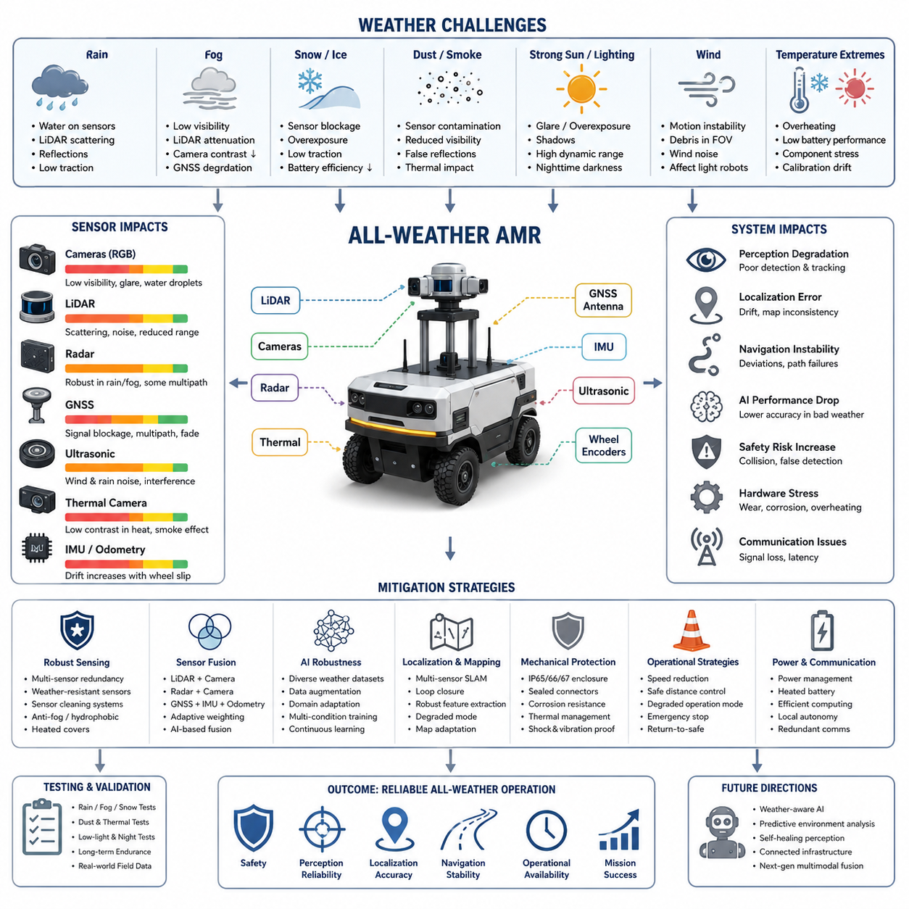
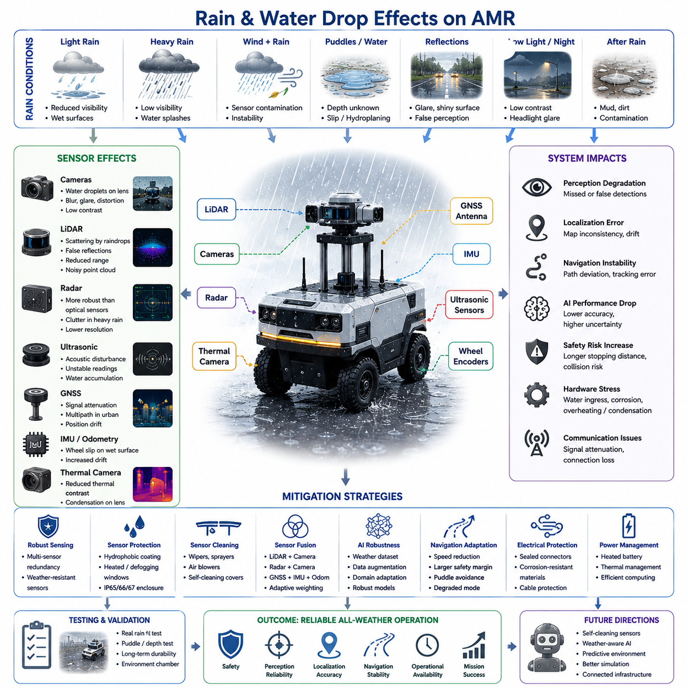
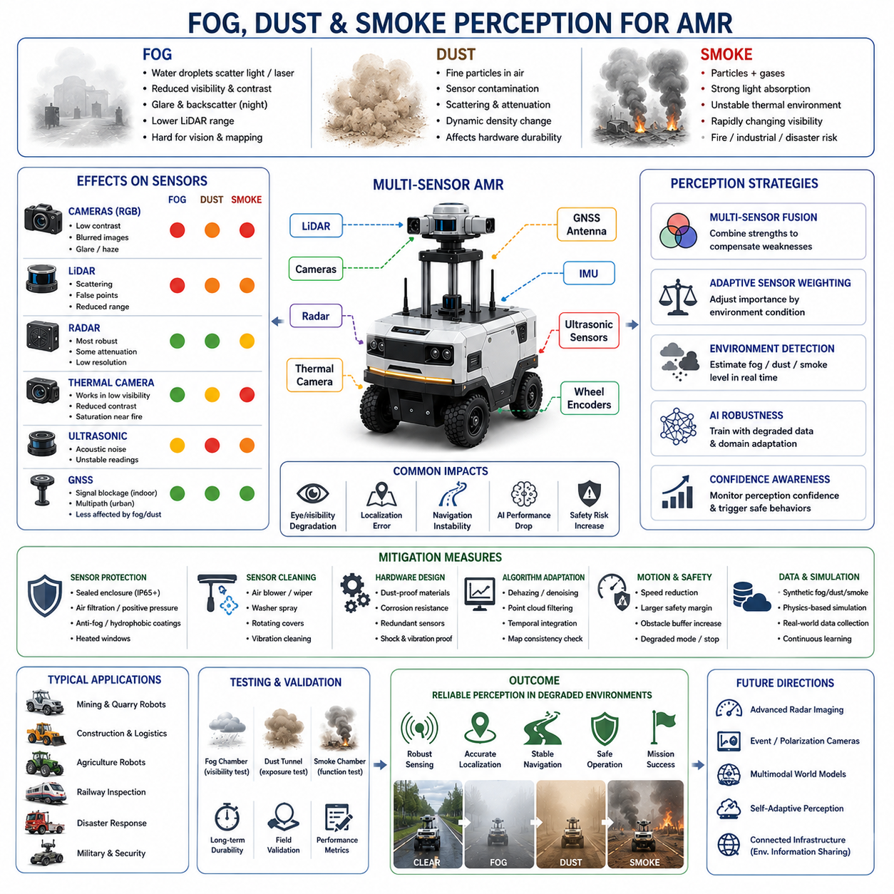
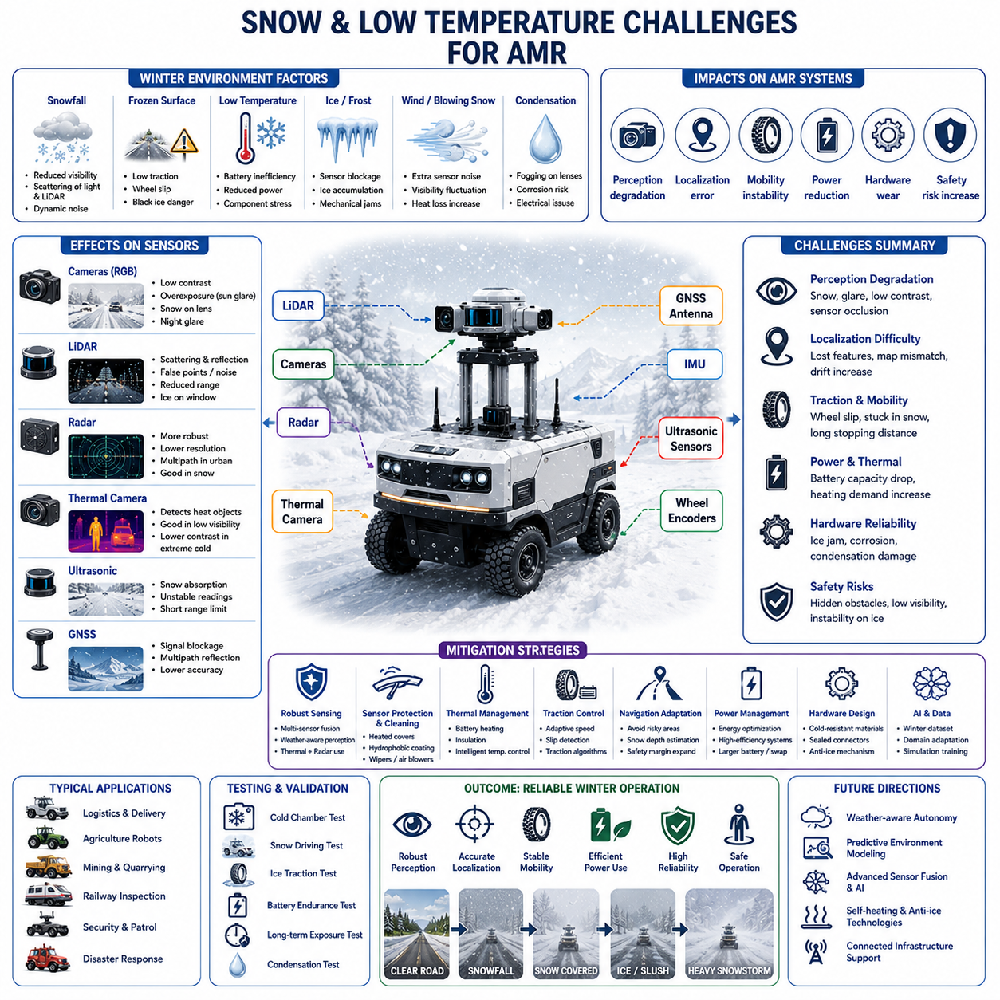
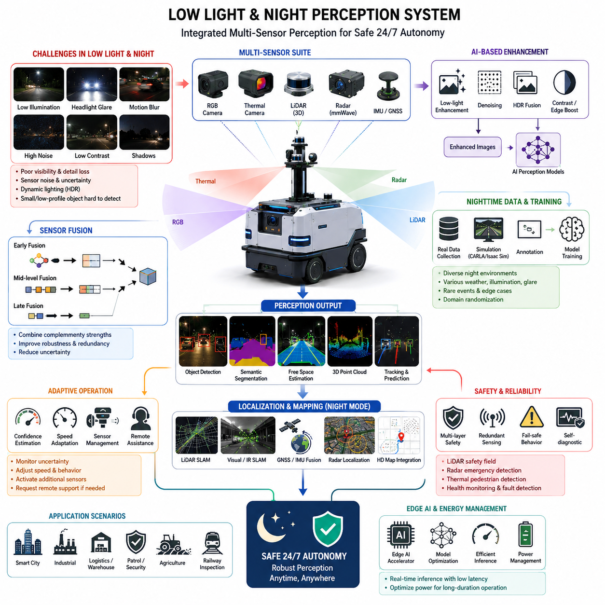
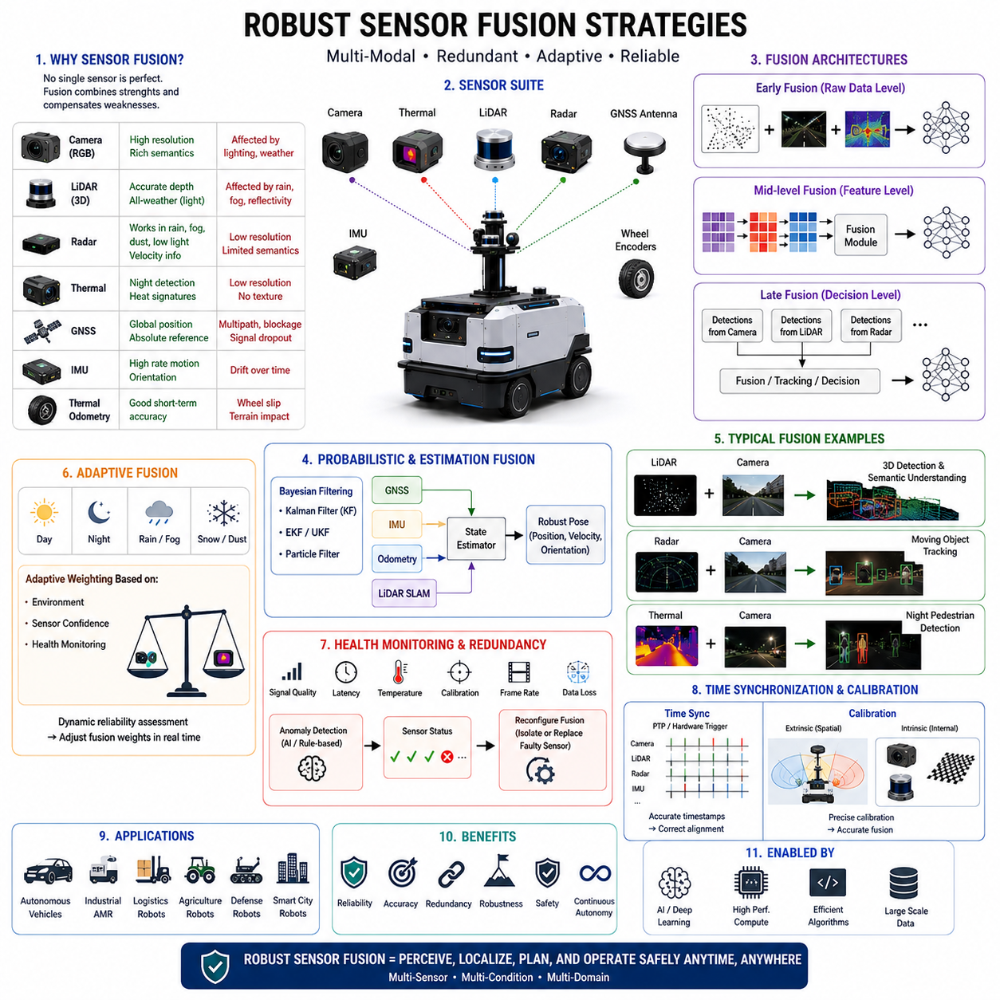
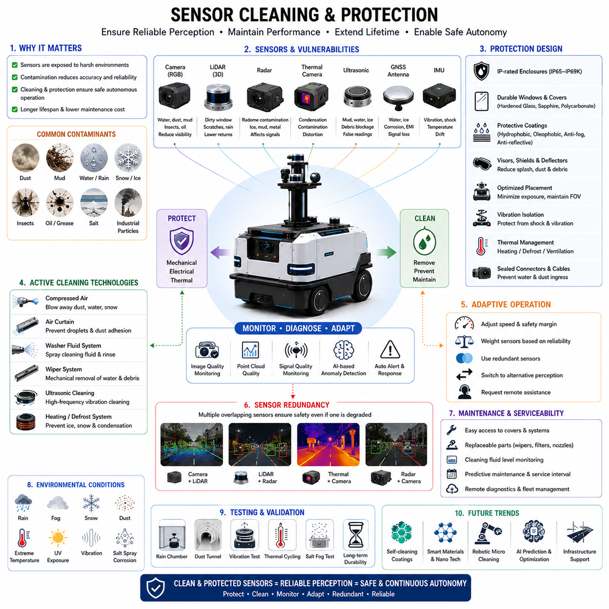
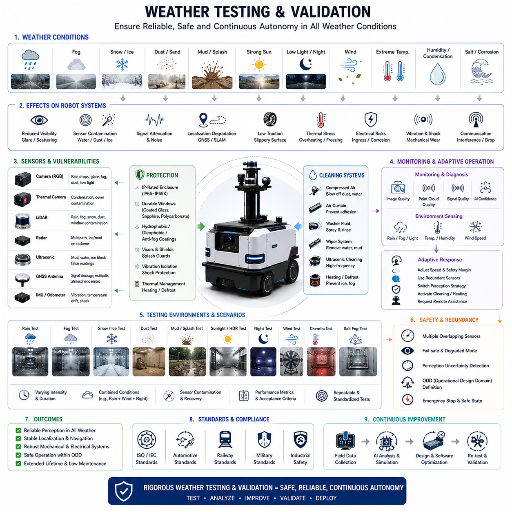

**Volume 03. AMR Sensors and Perception**

# Chapter 22. Adverse Weather Perception

## 22.1 Weather Challenges for AMR

{width="7.268055555555556in" height="7.268055555555556in"}

Autonomous Mobile Robots (AMRs) operating in outdoor environments must continuously perceive, analyze, and respond to changing environmental conditions in real time. Among the many factors that affect autonomous robot performance, weather is one of the most difficult and unpredictable challenges. Unlike controlled indoor facilities where lighting, temperature, and terrain are relatively stable, outdoor environments expose robots to rain, fog, snow, dust, wind, strong sunlight, mud, and rapidly changing temperatures. These environmental factors directly influence sensor performance, localization accuracy, navigation stability, safety reliability, communication quality, and even the mechanical durability of the robot itself.

Weather challenges become even more critical for outdoor AMRs used in smart cities, industrial inspection, agriculture, mining, logistics, construction, defense, railway inspection, and GPR-based underground infrastructure inspection. In these applications, robots are expected to operate continuously under all-weather conditions while maintaining safe autonomous operation. Therefore, weather robustness is not an optional feature but a fundamental engineering requirement for real-world AMR deployment.

The first challenge caused by weather is sensor degradation. Most AMR perception systems rely on multiple sensors such as RGB cameras, depth cameras, LiDAR, radar, ultrasonic sensors, GNSS, IMU, and thermal cameras. Each sensor modality behaves differently under adverse environmental conditions. RGB cameras may suffer from glare, low visibility, water droplets, overexposure, shadows, and nighttime darkness. LiDAR sensors may experience scattering and reflection issues in rain, snow, or fog. GNSS signals can become unstable near buildings, tunnels, dense trees, or during severe atmospheric disturbances. Ultrasonic sensors may become unreliable in strong wind or heavy rain due to acoustic interference. Thermal cameras may lose contrast during hot weather or when environmental temperatures become similar to target temperatures. As a result, weather directly impacts the perception reliability of autonomous systems.

Rain is one of the most common weather challenges for outdoor robots. Water droplets on camera lenses distort images and reduce detection accuracy. Rain also introduces dynamic noise into LiDAR point clouds because laser beams reflect from falling droplets. Heavy rain may create false obstacle detections or partially block the field of view. Wet ground surfaces generate reflections that interfere with camera-based segmentation algorithms. Furthermore, rainwater accumulation on roads changes terrain friction, which affects robot traction and braking performance. For heavy outdoor AMRs or towing robots, slippery surfaces can reduce steering accuracy and increase stopping distance.

Fog creates another major perception challenge. In foggy environments, visibility distance decreases dramatically. RGB cameras lose contrast, and distant objects become difficult to detect. LiDAR signals scatter in dense fog, reducing effective sensing range and introducing noisy measurements. This problem is especially severe for long-range outdoor navigation systems. Autonomous robots operating in ports, industrial plants, agricultural fields, or smart city roads must maintain safe operation despite partial visibility loss. Radar sensors become extremely important under these conditions because radar can penetrate fog better than optical sensors. Therefore, many industrial AMRs integrate radar systems specifically for adverse weather robustness.

Snow and ice create additional operational difficulties. Snow accumulation may physically block sensors or cover important landmarks used for localization. Camera images become overexposed due to highly reflective snow surfaces. LiDAR beams may scatter from snow particles similarly to rain. Frozen surfaces significantly reduce tire traction and may cause wheel slip, unstable odometry, and navigation drift. Battery efficiency also decreases in low-temperature environments because lithium battery chemistry becomes less efficient under cold conditions. In severe winter environments, outdoor AMRs require battery heating systems, thermal insulation, and environmental protection mechanisms to maintain operational stability.

Dust and smoke are common in industrial facilities, mining sites, agricultural environments, construction zones, and disaster response applications. Dust particles can contaminate camera lenses and reduce image clarity. Fine particles may accumulate inside cooling systems, causing thermal management problems for GPUs and embedded computers. LiDAR performance may degrade because airborne particles generate false reflections. Smoke further reduces visibility and affects thermal perception systems. In environments such as underground mines or industrial plants, sensor contamination becomes a long-term reliability issue requiring continuous maintenance and cleaning strategies.

Lighting conditions are another major weather-related challenge. Outdoor lighting continuously changes throughout the day due to sunlight angle, cloud coverage, shadows, and nighttime darkness. Strong sunlight may create lens flare, overexposure, and high dynamic range problems for cameras. Shadows generated by buildings, trees, or vehicles can confuse AI-based object detection systems. During nighttime operation, RGB cameras may become nearly unusable without additional lighting systems. AMRs operating at night often rely on thermal cameras, radar, active infrared illumination, or low-light imaging technologies. The transition between daytime and nighttime environments must also be handled smoothly by perception pipelines.

Wind introduces both mechanical and sensing challenges. Strong wind affects lightweight delivery robots and outdoor mobile platforms by reducing motion stability. Wind can also move dust, leaves, grass, or debris into sensor fields of view, causing false detections. For robots using directional microphones or ultrasonic sensors, wind noise may reduce sensing reliability. High wind conditions may also influence drone-assisted robotics systems or sensor masts mounted on tall platforms.

Temperature variation influences both hardware reliability and sensor calibration. Electronic systems generate heat during operation, and high ambient temperatures may exceed thermal limits of embedded computers, GPUs, motor controllers, and batteries. Overheating can reduce processing performance or trigger emergency shutdowns. On the other hand, extremely low temperatures may affect LCD displays, cable flexibility, connector reliability, battery output, and sensor startup behavior. AMR systems intended for global deployment must therefore be designed for wide operating temperature ranges.

Weather conditions also significantly impact localization and SLAM systems. Many autonomous robots rely on LiDAR SLAM, visual SLAM, GNSS, and odometry fusion. Rain, fog, snow, or low visibility can reduce feature extraction quality and degrade map consistency. Snow-covered environments may alter the appearance of roads or landmarks, making previously generated maps partially unusable. Mud or slippery terrain may introduce wheel slip, causing odometry errors that accumulate over time. GNSS signals may also fluctuate under severe atmospheric conditions or near reflective surfaces. Therefore, robust localization requires multi-sensor redundancy and adaptive sensor fusion algorithms.

Adverse weather directly affects AI model performance as well. Deep learning models trained only on clear-weather datasets often fail under rain, snow, fog, or nighttime conditions. Object detection accuracy decreases because environmental appearance changes dramatically. Pedestrians, vehicles, road boundaries, and obstacles become partially occluded or visually distorted. To address this problem, perception AI systems require extensive dataset diversity, including adverse weather scenarios. Synthetic data generation, domain adaptation, weather augmentation, and multi-condition training pipelines become essential for improving AI robustness.

Weather challenges are particularly important for safety-critical AMR applications. Outdoor autonomous robots operating near humans, vehicles, or industrial equipment must maintain reliable obstacle detection regardless of environmental conditions. A perception failure during heavy rain or fog may lead to collisions or dangerous operational behavior. Therefore, safety-certified AMR systems often implement sensor redundancy, fail-safe mechanisms, degraded operation modes, and emergency stop strategies. For example, if camera visibility becomes unreliable, the robot may reduce speed and rely more heavily on radar and LiDAR sensors. In severe weather, the robot may transition into a safe-stop mode until environmental conditions improve.

Mechanical protection is another important aspect of weather-resistant AMR engineering. Outdoor robots require IP-rated enclosures to protect electronics from water and dust ingress. Common industrial standards include IP65, IP66, and IP67 protection levels. Connectors, cables, cooling systems, and sensor housings must all be designed for environmental durability. Sensor windows require anti-fog coatings, hydrophobic materials, or heating elements to prevent condensation. Mechanical structures must also resist corrosion caused by rain, humidity, saltwater environments, or industrial chemicals.

Sensor cleaning systems are increasingly important for long-duration outdoor operation. Water droplets, mud, dust, snow, and insects may contaminate sensors during field deployment. Many autonomous vehicles and robots integrate automatic cleaning mechanisms such as air blowers, wipers, fluid sprayers, or heated sensor covers. These systems help maintain sensor clarity without requiring frequent human intervention. For industrial AMRs operating continuously in harsh environments, automated cleaning becomes essential for maintaining perception reliability.

Communication systems are also affected by weather. Wireless communication quality may decrease during storms or in environments with strong electromagnetic interference. Outdoor robots often rely on Wi-Fi, LTE, 5G, private industrial networks, or satellite communication systems. Signal degradation may impact cloud connectivity, fleet management, remote monitoring, and teleoperation. Therefore, AMR systems must support local autonomy even when network quality becomes unstable.

Power consumption tends to increase under harsh weather conditions. Cooling systems, heating systems, sensor cleaning systems, and high-power computing workloads all consume additional energy. Low temperatures reduce battery efficiency, while muddy or snowy terrain increases motor load. As a result, real-world AMR endurance may become significantly lower during adverse weather operation compared to laboratory conditions. Power management strategies must therefore account for seasonal and environmental variations.

Testing and validation under real weather conditions are critical for outdoor robot deployment. Laboratory testing alone cannot fully reproduce real-world environmental complexity. Field validation must include rain testing, fog testing, snow testing, low-light testing, thermal stress testing, dust exposure testing, and long-term endurance evaluation. Engineers often use environmental chambers, water spray systems, and outdoor proving grounds to evaluate system reliability. However, real-world operational data collection remains one of the most important methods for improving weather robustness.

Modern outdoor AMR systems increasingly adopt multi-sensor fusion to overcome weather-related perception failures. Cameras provide rich semantic understanding under normal conditions, while radar offers strong robustness in rain and fog. LiDAR provides accurate geometric mapping, and thermal cameras support low-light detection. By combining multiple sensing modalities, autonomous robots can maintain operational reliability even when individual sensors degrade. AI-based sensor fusion systems can dynamically adjust sensor weighting depending on environmental conditions.

Future research in adverse weather perception focuses on self-healing perception systems, adaptive AI models, weather-aware navigation, and predictive environmental analysis. Next-generation robots may automatically detect changing weather conditions and dynamically reconfigure perception pipelines, navigation parameters, and safety policies. Foundation models and multimodal AI architectures are expected to improve environmental understanding under highly uncertain conditions. In addition, future smart city infrastructure may provide environmental sensing data directly to autonomous robots through connected infrastructure networks.

Ultimately, weather challenges represent one of the most important barriers between laboratory robotics and fully autonomous real-world deployment. Building reliable outdoor AMRs requires deep integration between mechanical engineering, sensor engineering, AI perception, localization, navigation, power systems, and safety architecture. Robust weather handling is not simply a perception problem but a complete system-level engineering challenge. The success of future outdoor autonomous robots will depend heavily on their ability to safely and reliably operate across diverse environmental conditions while maintaining perception accuracy, navigation stability, and operational safety.

## 22.2 Rain and Water Drop Effects

{width="7.268055555555556in" height="7.268055555555556in"}

Rain is one of the most significant environmental challenges for outdoor Autonomous Mobile Robots (AMRs). Unlike indoor robotic systems that operate in relatively controlled environments, outdoor AMRs must continuously function under unpredictable weather conditions where water exposure directly impacts perception systems, localization accuracy, navigation stability, electrical reliability, mechanical durability, and operational safety. Rain not only affects the robot externally but also creates cascading effects throughout the entire autonomy stack, from raw sensor acquisition to AI-based decision-making and motion control.

For outdoor robots deployed in smart cities, industrial facilities, agriculture, logistics, security patrol, railway inspection, construction sites, ports, airports, mining areas, and GPR-based underground inspection systems, rain robustness is a critical requirement for real-world deployment. A robot that performs well only under clear weather conditions cannot be considered a fully autonomous outdoor system. Therefore, understanding rain-related perception degradation and developing mitigation strategies are essential parts of modern AMR engineering.

One of the primary issues caused by rain is visibility degradation. Rainfall reduces environmental clarity and introduces dynamic visual disturbances into camera systems. RGB cameras experience reduced contrast, blurred edges, reflection artifacts, and water droplet distortion. Small droplets attached to camera lenses may create severe image deformation, partially blocking the field of view or generating false visual patterns. Heavy rain further decreases visibility range, especially during low-light conditions or nighttime operation.

Water droplets attached to camera lenses create particularly serious problems for AI perception systems. Deep learning-based object detection and segmentation models rely heavily on image clarity and feature consistency. Water droplets alter pixel distributions, distort edges, and generate refractive artifacts that may confuse neural networks. Pedestrians, vehicles, road boundaries, traffic signs, safety barriers, and obstacles may become partially invisible or incorrectly classified. In industrial environments, rain-induced image distortion may prevent reliable detection of machinery, workers, or hazardous zones.

Rain also significantly affects LiDAR systems. LiDAR sensors operate by emitting laser pulses and measuring reflected signals from surrounding objects. During rainfall, laser beams collide with falling raindrops, producing scattering and false reflections. As rain intensity increases, the number of false returns inside the point cloud also increases. This introduces perception noise that may appear as floating objects or environmental clutter.

In heavy rain conditions, LiDAR performance degradation becomes more severe. The effective sensing range decreases because laser energy is attenuated by water particles. Long-range object detection becomes unstable, and point cloud density decreases. Water accumulation on LiDAR protective windows may further distort laser propagation and reduce sensor reliability. In extreme cases, rainwater contamination may temporarily blind portions of the LiDAR field of view.

Different LiDAR wavelengths behave differently under rainy conditions. Some wavelengths experience stronger scattering effects than others. High-resolution multi-channel LiDAR systems may partially compensate for rain-induced degradation using statistical filtering and temporal consistency algorithms. However, severe rainfall still remains a major challenge even for advanced automotive-grade LiDAR systems.

Radar sensors are generally more robust against rain compared to optical sensors. Millimeter-wave radar can penetrate rain, fog, and dust more effectively because radio waves are less sensitive to water droplets. For this reason, radar becomes increasingly important in outdoor AMR systems designed for all-weather operation. Radar can continue detecting large vehicles, walls, buildings, and moving obstacles even when camera visibility and LiDAR performance deteriorate significantly.

However, radar is not completely immune to rain effects. Heavy rainfall may still introduce signal attenuation and clutter noise. Water accumulation on radar covers can slightly reduce signal quality. In addition, radar has lower spatial resolution compared to cameras and LiDAR, making it difficult to identify small obstacles or detailed semantic information. Therefore, radar is most effective when integrated into multi-sensor fusion systems rather than used as a standalone perception solution.

Ultrasonic sensors are also influenced by rain. These sensors rely on acoustic wave propagation, and rain can introduce acoustic disturbances that reduce measurement reliability. Water accumulation near ultrasonic transducers may alter signal transmission characteristics. In addition, rainwater splashes and environmental noise may generate unstable distance measurements. Since ultrasonic sensors are typically used for short-range safety, docking, and parking assistance, maintaining reliable operation during rain is important for collision prevention.

Rain introduces major challenges for localization and mapping systems as well. Visual SLAM systems suffer when camera images become blurred or distorted by water droplets. Feature extraction algorithms may fail because environmental textures become unclear. Reflections from wet roads, puddles, and shiny surfaces may generate false visual features that degrade localization accuracy.

LiDAR SLAM systems also experience difficulties due to rain-induced point cloud noise. Dynamic raindrop reflections reduce map consistency and may introduce instability into scan matching algorithms. Ground surfaces change appearance significantly when wet, affecting feature-based localization approaches. In severe rainfall environments, localization systems often require stronger reliance on IMU, wheel odometry, radar localization, or GNSS integration.

GNSS performance can also degrade during heavy storms. Atmospheric disturbances associated with severe rain systems may slightly reduce positioning stability. More importantly, rain often occurs together with urban environments where multipath reflections and signal blockage already create localization challenges. Therefore, robust outdoor localization typically requires multi-layer sensor fusion rather than dependence on a single positioning method.

Rainwater also changes terrain characteristics and driving dynamics. Wet surfaces reduce tire friction coefficients, increasing the probability of wheel slip during acceleration, braking, or cornering. Muddy terrain may cause vehicles to sink or lose traction entirely. Outdoor AMRs operating on asphalt, concrete, soil, grass, gravel, or industrial surfaces must dynamically adapt their motion control strategies according to environmental conditions.

Heavy payload robots and towing AMRs are especially vulnerable to reduced traction. Increased vehicle mass combined with slippery surfaces may extend braking distances significantly. Steering response may become unstable, particularly for robots carrying high-center-of-gravity payloads. Autonomous navigation systems therefore require rain-aware motion planning algorithms capable of adjusting maximum speed, acceleration limits, steering response, and safety margins.

Rain also introduces hydroplaning risks for larger autonomous platforms operating at relatively higher speeds. Water accumulation on roads may reduce tire-road contact, resulting in temporary loss of steering control. Although most AMRs operate at lower speeds compared to autonomous vehicles, hydroplaning risks still exist for larger outdoor robotic systems operating in industrial environments.

Another important issue is puddle detection and water depth estimation. Outdoor robots may encounter puddles of varying depth during rainfall. Cameras often struggle to distinguish between shallow puddles and deep water because reflections distort visual appearance. Some puddles may hide dangerous holes, drains, or uneven terrain underneath. Entering deep water may damage motors, batteries, connectors, or embedded electronics.

Advanced outdoor robots therefore use multi-modal perception systems for water hazard detection. Stereo cameras, depth sensors, radar, thermal cameras, and LiDAR intensity analysis may be combined to estimate water presence and surface conditions. AI models trained on wet-road datasets can further improve environmental understanding under rainy conditions.

Electrical reliability becomes one of the most critical engineering concerns during rain operation. Water intrusion into connectors, cables, sensors, motor drivers, batteries, or embedded computers can cause short circuits, corrosion, or catastrophic system failures. Outdoor AMRs therefore require strict environmental sealing standards such as IP65, IP66, or IP67 protection ratings.

Connector engineering is especially important in rainy environments. Waterproof connectors, sealed cable glands, corrosion-resistant materials, and environmental insulation are necessary for long-term reliability. Poor connector design often becomes one of the most common field failure sources in outdoor robotics systems.

Thermal management systems are also affected by rain. Cooling airflow patterns may change under wet conditions. Rapid environmental temperature changes combined with humidity can generate condensation inside sensor housings or electronic enclosures. Condensation on camera lenses, LiDAR windows, or thermal camera covers may severely degrade perception quality even without direct rainfall.

To address this issue, many outdoor AMRs integrate anti-fog coatings, hydrophobic materials, heating elements, or active airflow systems. Heated sensor windows are commonly used in automotive autonomous driving systems to prevent water accumulation and fog formation.

Sensor cleaning systems are becoming increasingly important for long-duration outdoor operation. Rainwater often mixes with dust, mud, oil, or industrial contamination, forming dirty residue on sensor surfaces. Simple rainfall itself may not clean sensors effectively. Instead, contamination layers may gradually reduce visibility over time.

Modern autonomous systems therefore integrate sensor cleaning mechanisms such as windshield wipers, compressed air blowers, washer fluid sprayers, rotating sensor covers, and automatic drainage systems. These technologies help maintain stable perception performance without requiring constant human maintenance.

Rain creates additional difficulties for AI training and dataset development. Most publicly available robotics datasets contain limited adverse weather diversity. AI models trained primarily on sunny environments often generalize poorly to rainy scenes. Reflections, motion blur, water distortion, low visibility, and dynamic environmental changes create large domain shifts between training and deployment conditions.

To improve robustness, robotics developers increasingly use weather augmentation techniques. Synthetic rain generation, image degradation simulation, domain randomization, and physics-based environmental rendering are commonly applied during training. Simulation platforms such as Isaac Sim, CARLA, and Gazebo may generate realistic rainy environments for perception validation.

Field data collection under real rainfall conditions remains extremely important. Synthetic augmentation alone cannot perfectly reproduce the complexity of real-world water behavior. Therefore, many industrial robotics companies perform large-scale rainy-weather data collection campaigns to improve perception robustness.

Rain also affects human behavior around robots. Pedestrians, workers, cyclists, and vehicles often move differently during rainfall. Humans may carry umbrellas, wear raincoats, run unexpectedly, or avoid puddles. Vehicle braking distances increase, and traffic patterns may change. Autonomous robots operating in mixed environments must account for these behavioral variations during navigation planning.

Outdoor delivery robots face additional operational challenges during rain. Packages must remain protected from water exposure. Delivery compartments require waterproof sealing, drainage systems, and humidity management. Customer interaction interfaces such as touchscreens, QR scanners, or access panels must also remain functional under wet conditions.

For GPR-based underground infrastructure inspection robots, rain creates particularly complex problems. Wet ground conditions alter electromagnetic propagation properties inside soil. Water saturation changes dielectric characteristics, affecting GPR signal penetration and reflection patterns. Surface puddles may introduce signal noise or reduce detection consistency. Therefore, underground inspection systems often require adaptive calibration strategies based on soil moisture conditions.

Railway inspection robots also face rain-related difficulties. Wet rails create strong reflections and slippery conditions. Camera systems may experience reflection glare from metallic surfaces. Water accumulation around tracks can obscure defects or structural anomalies. Robust outdoor railway robotics therefore requires specialized perception filtering and environmental adaptation techniques.

Safety architecture becomes critically important during rain operation. Perception uncertainty increases significantly under adverse weather conditions. Therefore, autonomous systems must continuously estimate environmental confidence levels and dynamically adjust operational behavior. When perception reliability decreases, robots may reduce speed, increase stopping distance, expand safety zones, or transition into degraded operation modes.

Some advanced autonomous systems implement weather-aware autonomy frameworks. These systems classify environmental conditions in real time and dynamically modify sensor fusion weighting, navigation parameters, AI inference thresholds, and safety policies. For example, during heavy rain, the system may prioritize radar data over camera data while reducing vehicle speed.

Testing and validation under rainy conditions are essential for outdoor AMR certification and deployment. Laboratory water spray tests help evaluate waterproofing and environmental sealing. Environmental chambers simulate humidity and condensation conditions. However, real-world rainfall testing remains indispensable because natural rain contains highly variable intensity, wind direction, droplet size, lighting conditions, and environmental contamination.

Long-duration field testing is especially important because many rain-related failures emerge gradually over time. Connector corrosion, seal degradation, sensor contamination, cable fatigue, and mechanical wear often appear only after extended outdoor exposure. Therefore, weather durability testing must include both short-term performance evaluation and long-term reliability analysis.

Future research in rain-robust robotics focuses on self-cleaning sensors, adaptive AI perception, physics-aware sensor fusion, environmental prediction systems, and weather-aware autonomous planning. Emerging multimodal AI systems may better understand degraded environments by combining radar, thermal imaging, LiDAR, cameras, and temporal scene understanding into unified world models.

Future smart cities may also support autonomous robots through connected infrastructure. Environmental sensors installed throughout cities could provide localized weather information directly to robots, allowing predictive navigation adjustments before entering dangerous conditions.

Ultimately, rain and water exposure represent one of the most important challenges in real-world outdoor robotics. Rain affects perception, localization, navigation, traction, electrical reliability, AI performance, and overall operational safety simultaneously. Developing weather-robust AMRs therefore requires complete system-level engineering integration across sensors, mechanics, electronics, AI, software, safety systems, and operational validation. Truly autonomous outdoor robots must not only survive rain but continue operating safely, intelligently, and reliably despite continuously changing environmental conditions.

## 22.3 Fog, Dust, and Smoke Perception

{width="7.268055555555556in" height="7.268055555555556in"}

Fog, dust, and smoke are among the most difficult environmental conditions for Autonomous Mobile Robot (AMR) perception systems. Unlike clear outdoor environments where sensors can operate near their nominal performance limits, these atmospheric disturbances reduce visibility, distort sensor measurements, increase perception uncertainty, and introduce severe challenges for localization, navigation, object detection, and operational safety. For outdoor AMRs operating in industrial facilities, mines, smart cities, agriculture, logistics yards, construction sites, railways, tunnels, disaster zones, and military environments, robust perception under degraded atmospheric conditions is a critical requirement for reliable autonomous operation.

Fog, dust, and smoke share several common characteristics. All three environments contain suspended particles in the air that interact with light, laser beams, thermal radiation, and radio waves. These particles scatter, absorb, reflect, and attenuate sensor signals, causing different forms of degradation depending on sensor modality. However, each environment also has unique physical properties that create distinct engineering challenges for autonomous systems.

Fog primarily consists of microscopic water droplets suspended in the air. It reduces visibility by scattering visible light and laser energy. Dust consists of fine solid particles generated by soil, construction activity, industrial processes, mining operations, agricultural work, or vehicle movement on unpaved roads. Smoke contains airborne particles and gases generated by combustion processes such as fires, industrial exhaust, explosions, or chemical incidents. Each condition affects AMR perception differently and requires specialized mitigation strategies.

One of the most severely affected sensor types in foggy environments is the RGB camera. Cameras rely on visible light reflected from environmental objects. Fog scatters incoming and outgoing light rays, reducing image contrast and visibility range. Distant objects appear faded or completely disappear. Road boundaries, pedestrians, vehicles, signs, and obstacles become difficult to distinguish from the background.

The reduction in image contrast creates major challenges for computer vision algorithms. Edge detection, feature extraction, semantic segmentation, and object recognition all depend heavily on image clarity. AI models trained primarily under clear-weather conditions often fail in fog because environmental appearance changes dramatically. Colors become desaturated, edges blur, and texture information disappears.

Fog also introduces strong backscatter effects for headlights and active illumination systems. During nighttime operation, robot headlights may reflect off fog particles directly back into cameras, creating bright glare regions that partially blind the perception system. This phenomenon significantly reduces usable visibility distance at night.

LiDAR systems also experience severe degradation in foggy conditions. LiDAR sensors emit laser pulses and measure reflected signals from surrounding objects. Fog particles scatter laser energy before it reaches target objects, reducing sensing range and generating noisy reflections. Dense fog creates a wall-like scattering effect where large portions of laser energy are reflected prematurely.

This causes several problems simultaneously. First, effective sensing distance decreases significantly. Second, false points appear inside the point cloud due to fog particle reflections. Third, object boundaries become incomplete or fragmented. Fourth, localization and mapping algorithms may lose environmental consistency because scan quality deteriorates.

High-density fog is particularly problematic for long-range LiDAR systems. While short-range obstacle detection may still function partially, long-distance environmental perception becomes unreliable. Multi-return LiDAR systems may improve robustness by filtering weak reflections, but severe fog still remains one of the most difficult conditions for optical sensing technologies.

Radar sensors are generally more robust against fog compared to cameras and LiDAR. Millimeter-wave radar uses radio frequencies that penetrate fog particles more effectively than visible light or laser beams. For this reason, radar becomes a critical component of all-weather autonomous systems.

Radar can continue detecting large obstacles, vehicles, walls, and moving objects even when cameras and LiDAR experience severe degradation. However, radar also has limitations. Radar spatial resolution is lower than camera or LiDAR systems, making detailed object classification difficult. Small objects or thin obstacles may remain difficult to detect. Furthermore, radar reflections from metallic industrial environments may generate multipath artifacts and ghost objects.

Thermal cameras provide another important sensing modality in foggy and smoky environments. Thermal imaging detects heat radiation rather than visible light, allowing partial visibility through degraded atmospheric conditions. Humans, vehicles, engines, and machinery often remain detectable even under low-visibility environments.

However, thermal imaging performance also depends on environmental conditions. Dense fog and heavy smoke may partially attenuate infrared radiation. Temperature equalization between objects and surroundings can reduce thermal contrast. Hot industrial environments or fire scenes may saturate thermal sensors and complicate object discrimination.

Dust environments create a different set of perception challenges. Construction sites, mines, agricultural fields, quarries, and unpaved industrial roads often generate airborne dust clouds during robot operation. Moving vehicles themselves may generate large dust plumes that temporarily blind onboard sensors.

Dust particles contaminate camera lenses and sensor windows over time. Unlike transient fog, dust accumulation creates long-term degradation that gradually worsens sensor quality. Dust-covered camera lenses reduce image sharpness and contrast. LiDAR protective covers become dirty, reducing laser transmission efficiency. Thermal camera windows may become partially opaque.

Airborne dust also creates scattering effects similar to fog for optical sensors. LiDAR beams reflect from suspended particles, generating noisy point clouds and false obstacle detections. RGB cameras experience reduced visibility and increased haze. Dust density may vary rapidly depending on wind conditions, vehicle speed, and terrain type, creating highly dynamic environmental conditions.

Dust presents additional challenges because particle size varies widely. Fine dust particles may remain airborne for long durations and penetrate small mechanical gaps. Coarse particles may physically impact sensor surfaces, causing abrasion or scratches. Long-term dust exposure therefore affects both perception quality and hardware durability.

Mining robots represent one of the most difficult use cases for dust-robust perception. Underground mines often contain extremely high airborne particle concentrations combined with low lighting conditions and narrow operational spaces. Autonomous mining vehicles must maintain reliable obstacle detection despite severe environmental degradation.

Agricultural robots also encounter heavy dust during harvesting, plowing, or dry-weather operations. Soil particles generated by machinery can rapidly reduce sensor visibility. Outdoor delivery robots operating on unpaved roads may similarly experience temporary dust clouds generated by passing vehicles.

Smoke perception introduces another layer of complexity. Smoke environments often occur during fires, industrial accidents, chemical leaks, military operations, or disaster response scenarios. Smoke not only reduces visibility but also creates rapidly changing thermal and chemical environments.

RGB cameras become highly unreliable in dense smoke because visible light is strongly scattered and absorbed. Image contrast collapses, and objects disappear behind smoke layers. In fire environments, flames themselves create extreme brightness variations and dynamic illumination changes.

LiDAR performance in smoke depends heavily on particle density and particle composition. Some smoke conditions may partially allow laser penetration, while dense smoke can severely attenuate laser energy. Combustion particles generate false reflections and reduce mapping consistency.

Thermal cameras become especially important in smoke-filled environments because heat signatures often remain partially visible through smoke. Firefighters and rescue robots frequently rely on thermal imaging for victim detection and navigation inside burning structures. Thermal sensors can identify human bodies, hot machinery, structural hazards, and fire sources even when visible cameras fail completely.

However, thermal perception in fires is also challenging. Intense heat sources may saturate portions of the image. Reflective surfaces can distort temperature readings. Smoke density gradients create nonuniform thermal visibility. Dynamic flames continuously change environmental heat distributions.

Localization systems face severe difficulties under fog, dust, and smoke conditions. Visual SLAM systems struggle because environmental features disappear or become distorted. LiDAR SLAM systems experience unstable scan matching due to noisy or incomplete point clouds. Dynamic airborne particles introduce transient structures that interfere with environmental consistency.

Wheel odometry and IMU systems become increasingly important during degraded perception conditions. However, wheel slip may still occur on loose dusty terrain or wet surfaces associated with fog. GNSS signals may remain available outdoors, but tunnels, industrial plants, forests, or urban environments can reduce satellite visibility.

Therefore, robust localization in degraded environments requires strong multi-sensor fusion. Radar localization, IMU integration, wheel odometry, GNSS fusion, and environmental priors must work together to maintain navigation stability when optical sensing deteriorates.

Fog, dust, and smoke also affect AI model reliability. Deep learning models trained under clear conditions often fail when environmental visibility decreases. Dataset diversity becomes critically important for perception robustness. Models must learn to recognize partially obscured objects, degraded textures, low-contrast scenes, and noisy sensor outputs.

Data collection under degraded atmospheric conditions is extremely difficult and expensive. Natural fog and smoke are hard to reproduce consistently. Therefore, simulation and synthetic augmentation techniques are widely used. Physics-based rendering engines can simulate fog density, dust scattering, smoke behavior, and degraded visibility conditions.

Modern robotics datasets increasingly include adverse weather scenarios. However, real-world deployment environments remain far more complex than laboratory simulations. Continuous field data collection and model adaptation remain essential for reliable performance.

Sensor fusion becomes one of the most important engineering strategies for degraded-environment perception. Different sensors fail differently under adverse conditions. Cameras provide rich semantic information but degrade severely in low visibility. LiDAR provides accurate geometry but suffers from scattering. Radar remains robust but lacks high-resolution detail. Thermal cameras detect heat but provide limited texture information.

By combining multiple sensing modalities, autonomous systems can compensate for weaknesses in individual sensors. AI-based fusion systems may dynamically adjust sensor weighting depending on environmental conditions. For example, radar importance may increase during dense fog, while thermal imaging becomes dominant during smoke-filled fire environments.

Mechanical protection and sensor maintenance are also critical. Dust and smoke contamination gradually reduce sensor quality over time. Autonomous systems therefore require sealed enclosures, air filtration systems, positive-pressure sensor housings, and automatic cleaning mechanisms.

Sensor cleaning systems may include compressed air blowers, rotating protective covers, wipers, vibration cleaning, or electrostatic dust removal technologies. Industrial robots operating in mines or construction sites often require regular maintenance schedules specifically focused on sensor cleaning.

Cooling systems face additional challenges under dusty environments. Fine particles may clog cooling fans, heatsinks, or ventilation paths, causing thermal management problems. High-performance GPUs used for AI inference generate significant heat and require stable cooling airflow. Dust contamination therefore affects not only perception but also computing reliability.

Navigation safety becomes critically important in degraded atmospheric environments. Visibility uncertainty increases collision risk significantly. Autonomous robots must continuously estimate environmental confidence and dynamically adjust behavior accordingly.

Safe operation strategies often include speed reduction, expanded safety zones, increased obstacle margins, degraded autonomy modes, and emergency stop protocols. Some robots may transition into teleoperation mode when perception confidence becomes too low.

Industrial safety regulations increasingly require environmental robustness validation for outdoor autonomous systems. Testing procedures may include artificial fog chambers, dust tunnels, smoke simulation facilities, and long-duration environmental endurance testing.

Fog testing often uses water-vapor chambers with controlled visibility distance. Dust testing may involve fine-particle exposure under controlled airflow conditions. Smoke testing evaluates sensor functionality and thermal performance during combustion-like environments.

Disaster-response robots represent one of the most demanding applications for degraded-environment perception. These robots must navigate through collapsed structures, fires, smoke-filled tunnels, chemical leaks, and dusty rubble while maintaining reliable perception and communication.

Military autonomous systems also require operation under battlefield smoke, explosions, dust storms, and low-visibility conditions. Environmental robustness directly influences mission survivability and operational effectiveness.

Future research directions focus heavily on weather-robust and degradation-aware perception systems. Emerging AI models aim to estimate environmental visibility conditions directly from sensor data and adapt perception pipelines dynamically.

Physics-aware sensor fusion, self-supervised adaptation, multimodal world models, event cameras, polarization cameras, and next-generation radar imaging systems are all active research areas. Future robots may continuously learn from environmental degradation and improve robustness autonomously over time.

Connected infrastructure may also assist perception systems in future smart cities and industrial facilities. Environmental monitoring stations could provide real-time fog density, dust concentration, smoke detection, and visibility information directly to autonomous fleets.

Ultimately, fog, dust, and smoke represent some of the most challenging real-world conditions for AMR perception systems. These environments simultaneously affect cameras, LiDAR, localization, AI inference, navigation safety, and hardware reliability. Building robust autonomous robots therefore requires deep integration between sensor engineering, AI perception, environmental modeling, mechanical protection, safety systems, and operational validation.

True all-weather autonomy is not simply the ability to survive degraded environments but the ability to continue making safe, intelligent, and reliable decisions despite severe perception uncertainty and continuously changing atmospheric conditions.

## 22.4 Snow and Low Temperature Challenges

{width="7.268055555555556in" height="7.268055555555556in"}

Snow and low-temperature environments represent some of the most difficult operational conditions for outdoor Autonomous Mobile Robots (AMRs). Unlike moderate weather environments where sensor systems, mechanical structures, batteries, and electronic components operate within relatively stable conditions, winter environments introduce simultaneous challenges across perception, localization, traction control, power systems, thermal management, communications, and overall operational reliability. Outdoor AMRs deployed in smart cities, logistics centers, agriculture, mining, railway inspection, security patrol, military operations, disaster response, and GPR-based infrastructure inspection must therefore be designed with extensive environmental robustness to survive and operate safely in freezing conditions.

Winter environments are particularly difficult because multiple environmental factors occur simultaneously. Snowfall reduces visibility, frozen surfaces reduce traction, low temperatures decrease battery efficiency, condensation affects sensors, and ice accumulation physically blocks perception systems. Furthermore, winter conditions continuously change throughout operation. A robot may encounter dry snow, wet snow, slush, black ice, frozen mud, strong wind, freezing rain, or rapidly changing temperatures within a single mission. As a result, autonomous systems designed for winter operation require highly adaptive perception and control architectures.

One of the most immediate challenges in snowy environments is visibility degradation. Snowflakes suspended in the air scatter visible light and laser beams, reducing the effective sensing range of cameras and LiDAR systems. Heavy snowfall creates dynamic environmental noise that significantly affects perception quality. Unlike rain, snowflakes are often larger and move irregularly due to wind, making filtering more difficult.

RGB cameras experience reduced contrast and visibility during snowfall. Snow-covered environments often appear visually uniform because roads, sidewalks, terrain boundaries, and obstacles become covered by snow. This makes feature extraction and object segmentation extremely difficult. White snow surfaces also create overexposure problems, particularly under strong sunlight conditions where reflected light intensity becomes very high.

Snow accumulation on camera lenses further reduces image quality. Ice crystals, condensation, and snow buildup may partially or completely block the field of view. During freezing conditions, water droplets may freeze directly on optical surfaces, creating severe distortion effects that cannot be removed by simple image processing techniques.

Nighttime winter operation creates additional difficulties. Snow strongly reflects artificial lighting, generating glare and overexposure. Vehicle headlights and robot illumination systems may reflect from snow particles back into cameras, reducing usable visibility distance similarly to fog environments. Low-light conditions combined with snowfall therefore represent one of the most difficult scenarios for outdoor robot perception systems.

LiDAR systems also suffer major degradation during snowfall. Snowflakes reflect and scatter laser pulses, generating false points and environmental clutter inside point clouds. Dense snowfall may create large amounts of transient noise that appear as floating obstacles. Effective sensing range decreases because laser energy is attenuated by airborne snow particles.

Snow accumulation on LiDAR windows introduces additional problems. Ice layers or frozen water droplets distort laser propagation and reduce optical transmission efficiency. Mechanical vibration alone is often insufficient to remove frozen contamination. Therefore, many outdoor autonomous systems integrate heated sensor covers, hydrophobic coatings, or active cleaning systems to maintain LiDAR functionality in winter conditions.

Ground surfaces covered with snow introduce severe localization difficulties. Road markings, lane boundaries, curbs, sidewalks, and terrain features may disappear completely under snow accumulation. Visual SLAM systems struggle because environmental appearance changes dramatically compared to previously generated maps. LiDAR SLAM systems may also experience instability because environmental geometry becomes partially hidden or dynamically altered by snow.

Fresh snow creates additional localization uncertainty because environmental textures become smoother and less distinctive. Feature-based localization algorithms may fail when previously visible landmarks disappear under snow coverage. Long-term outdoor localization systems therefore require seasonal adaptation strategies and robust sensor fusion architectures.

GNSS systems remain useful in winter environments but also experience limitations. Snowstorms often occur in cloudy or mountainous regions where satellite visibility may already be reduced. Multipath reflections from snow-covered surfaces and nearby structures may further degrade positioning accuracy. Therefore, winter localization typically relies on integrated GNSS, IMU, wheel odometry, radar, and LiDAR fusion systems.

Traction and mobility become major engineering concerns during winter operation. Snow and ice dramatically reduce tire friction coefficients, increasing wheel slip during acceleration, braking, and steering. Black ice is particularly dangerous because it may appear visually similar to normal road surfaces while providing extremely low traction.

Wheel odometry becomes unreliable when wheels spin without corresponding vehicle movement. Excessive wheel slip introduces large localization drift errors that propagate through navigation systems. Autonomous robots must therefore continuously estimate terrain conditions and dynamically adapt motion control strategies.

Heavy payload robots and towing AMRs face even greater challenges because increased mass significantly affects stopping distance and stability on slippery surfaces. Sudden braking or aggressive steering may cause skidding or loss of control. Outdoor robots operating in winter conditions therefore require conservative speed limits, adaptive traction control systems, and stability-aware navigation planning.

Tracked robotic platforms may provide advantages over wheeled systems in deep snow environments because larger surface contact areas improve traction. However, tracked systems also experience increased energy consumption and mechanical wear under frozen conditions. Selecting appropriate mobility architectures therefore depends heavily on operational terrain and environmental severity.

Snow depth estimation becomes another important challenge for autonomous systems. Deep snow may hide obstacles, curbs, holes, rocks, or uneven terrain. Robots may become physically stuck if snow depth exceeds ground clearance or traction capability. Perception systems must therefore estimate not only visible obstacles but also terrain traversability beneath snow-covered surfaces.

Thermal cameras provide useful capabilities in snowy environments because heat signatures remain partially visible even when optical visibility decreases. Humans, animals, vehicles, engines, and industrial machinery often stand out clearly against cold snowy backgrounds. Search-and-rescue robots operating in avalanche zones or disaster environments frequently rely on thermal perception for victim detection.

However, thermal imaging also faces challenges during winter operation. Extreme cold may reduce thermal contrast between objects and surroundings. Snow-covered surfaces can reflect thermal radiation in complex ways. Furthermore, ice accumulation on thermal sensor windows may reduce infrared transmission quality.

Low temperatures significantly affect battery performance. Lithium-ion batteries experience reduced chemical efficiency as temperature decreases. Internal resistance increases, reducing available power output and overall energy capacity. In severe cold environments, battery performance degradation may become dramatic.

Reduced battery efficiency directly impacts mission duration, motor performance, sensor operation, and computing capability. High-power AI systems using GPUs require substantial energy, and battery limitations become even more severe during cold-weather operation. Therefore, winter-capable AMRs often require larger battery capacity or active thermal management systems.

Battery heating systems are commonly integrated into outdoor autonomous platforms designed for cold climates. These systems maintain battery cells within safe operational temperature ranges using electrical heaters, thermal insulation, liquid heating loops, or waste heat recovery systems. Intelligent thermal control strategies help balance energy consumption between propulsion and heating requirements.

Electronic components also experience reliability challenges under low temperatures. LCD displays may respond slowly or fail entirely. Cable insulation becomes stiff and brittle. Connector materials contract thermally, potentially affecting electrical contact quality. Mechanical seals may lose flexibility and allow moisture ingress.

Condensation creates another critical issue for winter robotics systems. When robots transition between cold outdoor environments and warmer indoor areas, moisture may condense inside sensor housings, electronic compartments, or optical systems. Condensation can cause short circuits, corrosion, fogging, or sensor malfunction.

To prevent condensation problems, outdoor robots often use sealed environmental enclosures, desiccant systems, positive-pressure housings, thermal isolation layers, and controlled internal heating systems. Environmental sealing standards such as IP65, IP66, or IP67 become essential for long-term reliability.

Snow and ice accumulation on moving mechanical components introduce further challenges. Frozen ice may block wheels, steering actuators, robotic joints, docking mechanisms, or sensor cleaning systems. Ice buildup can increase motor load, reduce mechanical efficiency, and accelerate wear.

Outdoor docking stations and charging systems are especially vulnerable during winter operation. Snow accumulation may obstruct charging connectors or docking alignment mechanisms. Ice formation may prevent reliable electrical contact. Autonomous charging systems therefore require environmental protection, heating systems, and self-cleaning functionality.

Communication systems may also experience winter-related degradation. Snowstorms, freezing rain, and atmospheric disturbances can reduce wireless signal quality. Ice accumulation on antennas may affect communication performance. Outdoor robots operating in remote cold environments therefore require robust local autonomy even during communication interruptions.

Winter weather also changes human and vehicle behavior around robots. Pedestrians move differently on slippery surfaces, vehicles require longer stopping distances, and traffic flow patterns change during snowstorms. Autonomous robots operating in public environments must account for these behavioral changes when planning motion trajectories and safety margins.

AI perception models trained primarily on clear-weather datasets often perform poorly in snowy environments. Snow-covered roads, altered terrain appearance, reduced visibility, and dynamic snowfall create major domain shifts between training data and deployment conditions. Object detection accuracy decreases because environmental textures and object boundaries become obscured.

To improve robustness, robotics developers increasingly use winter-specific datasets and weather augmentation techniques. Synthetic snowfall simulation, snow accumulation rendering, low-temperature environmental modeling, and domain adaptation methods are commonly applied during AI training. However, real-world winter data collection remains essential because actual snow behavior is highly variable and difficult to simulate accurately.

Sensor fusion becomes critically important during winter operation. Cameras provide semantic understanding but degrade in snowfall. LiDAR offers geometric sensing but suffers from snow scattering. Radar remains relatively robust under snowy conditions and can help maintain obstacle detection reliability. Thermal cameras improve visibility of warm objects against cold backgrounds.

By combining multiple sensing modalities, autonomous systems can maintain partial operational capability even when individual sensors degrade. Advanced sensor fusion systems may dynamically adjust sensor weighting depending on weather conditions, visibility level, and environmental confidence estimation.

Navigation systems operating in winter environments must also become weather-aware. Route planning may avoid steep slopes, icy surfaces, or poorly maintained roads. Speed control systems may dynamically reduce maximum velocity based on traction estimation. Safety zones and stopping distances may expand automatically under slippery conditions.

Industrial applications face additional winter-specific challenges. Railway inspection robots must operate on snow-covered tracks where rail geometry becomes partially hidden. Agricultural robots encounter frozen soil and snow-covered crops. Mining robots operate under freezing wind and heavy snow accumulation. Smart city robots must maintain operation despite road salt, slush, and continuous environmental exposure.

Road salt and deicing chemicals create long-term corrosion problems for outdoor robotic systems. Metal structures, connectors, bearings, and exposed electronics may gradually degrade due to chemical exposure. Corrosion-resistant materials, protective coatings, and sealed mechanical structures therefore become essential for winter durability.

Testing and validation in winter environments are extremely important for real-world deployment. Laboratory environmental chambers simulate freezing temperatures, snow exposure, and thermal cycling conditions. However, real-world winter testing remains essential because actual environmental conditions are highly dynamic and difficult to reproduce completely indoors.

Field testing often includes snow driving evaluation, cold-start testing, ice traction measurement, battery endurance analysis, condensation evaluation, and long-duration environmental exposure testing. Outdoor proving grounds in cold regions provide valuable operational validation data.

Search-and-rescue robots operating in avalanche zones represent one of the most demanding winter applications. These robots must navigate unstable snow surfaces, low visibility environments, freezing temperatures, and hazardous terrain while maintaining reliable perception and communication systems.

Military autonomous systems also require operation under extreme winter conditions. Arctic robotics platforms may face temperatures far below standard industrial operating ranges. In such environments, thermal management becomes one of the dominant system engineering challenges.

Future research directions focus heavily on winter-robust autonomy. Adaptive AI models, weather-aware navigation systems, self-heating sensors, ice-resistant coatings, advanced traction control algorithms, and predictive environmental modeling are all active research areas.

Future smart cities may provide environmental infrastructure support for autonomous systems. Road condition monitoring systems, weather stations, and connected infrastructure networks could transmit real-time snow depth, ice conditions, and temperature data directly to autonomous robots.

Emerging embodied AI systems may eventually reason about environmental physics directly, predicting slip risk, snow accumulation, visibility degradation, and terrain stability in real time. These systems could dynamically modify navigation strategies before dangerous conditions occur.

Ultimately, snow and low-temperature environments represent one of the most comprehensive engineering challenges for outdoor AMRs. Winter conditions simultaneously affect perception, localization, mobility, power systems, mechanical reliability, communication, and operational safety. Building reliable winter-capable autonomous robots therefore requires complete system-level integration across sensors, AI, mechanics, electronics, thermal engineering, safety architecture, and environmental validation.

True all-weather autonomy means more than surviving cold weather. It means maintaining safe, intelligent, and reliable operation despite rapidly changing environmental uncertainty, degraded perception, reduced traction, limited energy efficiency, and severe mechanical stress. The future success of outdoor autonomous robotics will depend heavily on the ability to operate continuously and safely under harsh winter conditions.

## 22.5 Low Light and Night Perception

{width="7.268055555555556in" height="7.268055555555556in"}

Low-light and night perception is one of the most difficult challenges in outdoor autonomous mobile robots (AMRs), autonomous vehicles, smart city robots, patrol robots, agricultural robots, railway inspection robots, and industrial autonomous systems. During daytime operation, RGB cameras and vision-based AI models can extract rich texture, color, edge, and semantic information from the environment. However, when illumination conditions become poor, perception quality rapidly degrades, and the reliability of object detection, semantic segmentation, localization, free-space estimation, and obstacle avoidance can significantly decrease. Because AMRs must operate continuously in real-world environments, robust perception under low-light and nighttime conditions becomes a mandatory requirement for safety, reliability, and commercial deployment. The topic of low-light and night perception is therefore a core component of adverse weather perception systems within modern AMR architectures.

Night perception problems originate from several physical and environmental limitations. The first issue is insufficient visible light reaching RGB image sensors. In dark environments, image sensors increase gain and exposure time to capture more photons, but this introduces image noise, motion blur, overexposure from headlights, and loss of detail. Autonomous robots operating outdoors frequently encounter streetlights, vehicle headlights, reflective surfaces, tunnels, underground facilities, parking lots, industrial plants, warehouses, and poorly illuminated construction zones. In these environments, the perception system must continue operating reliably despite severe illumination imbalance and dynamic lighting conditions.

Another challenge is the reduction of color information during nighttime operation. Many AI perception models are trained primarily on daytime datasets containing strong visual contrast and rich color textures. At night, color distributions become compressed, shadows become dominant, and many objects lose distinguishable appearance characteristics. Pedestrians wearing dark clothing, small obstacles, road debris, potholes, cables, or low-profile objects may become nearly invisible to conventional RGB camera systems. This creates substantial risks for autonomous robots operating in public spaces or industrial environments.

Motion blur is also a major problem during nighttime perception. Cameras often increase exposure time in low-light environments to compensate for reduced brightness. However, longer exposure times produce blurred images when the robot or surrounding objects are moving. Fast-moving forklifts, bicycles, cars, or pedestrians may appear distorted or partially invisible. Outdoor AMRs traveling at moderate or high speeds require low-latency perception pipelines, but low-light imaging conditions fundamentally reduce sensor reliability and increase uncertainty in AI inference.

Noise amplification is another critical issue. Modern image sensors use analog and digital gain to amplify weak signals, but this amplification also increases sensor noise. Salt-and-pepper noise, chromatic artifacts, thermal noise, and random pixel fluctuations can interfere with AI-based detection algorithms. Small objects may disappear entirely within noisy image regions. In safety-critical environments such as hospitals, factories, smart cities, airports, railways, and logistics centers, even small perception failures can lead to dangerous situations.

Nighttime environments also contain highly dynamic illumination sources. Vehicle headlights, emergency lights, reflective metallic surfaces, wet roads, LED displays, construction lighting, and street lamps create complex high dynamic range (HDR) scenes. Some image regions may become saturated while other regions remain completely dark. AI models trained on standard datasets may fail to generalize under these extreme illumination conditions. Therefore, low-light perception systems must incorporate adaptive exposure control, HDR imaging, image enhancement algorithms, and multimodal sensor fusion strategies.

To address these challenges, modern AMR platforms increasingly rely on multimodal perception systems rather than depending solely on RGB cameras. Thermal cameras are among the most important sensors for night perception. Thermal imaging detects infrared radiation emitted by objects rather than relying on visible light. Humans, vehicles, animals, machinery, and electrical equipment generate heat signatures that remain detectable even in total darkness. Thermal cameras therefore provide reliable nighttime detection capability for pedestrians, workers, intruders, wildlife, and overheating industrial components.

Thermal cameras are particularly valuable in outdoor patrol robots, defense robots, railway inspection robots, agricultural robots, and smart city surveillance systems. Human detection accuracy often improves significantly at night when thermal data is fused with RGB images. Thermal imaging can also identify living objects hidden behind vegetation, smoke, or partial occlusion. However, thermal cameras also have limitations. They generally provide lower spatial resolution compared to RGB cameras, and they may struggle to distinguish object textures or printed signs. Therefore, thermal sensing is usually combined with RGB, LiDAR, radar, and depth sensors in integrated perception architectures.

LiDAR sensors also play a major role in nighttime operation because LiDAR actively emits laser pulses and measures reflected signals independently of ambient illumination. Unlike RGB cameras, LiDAR performance is not directly dependent on visible light intensity. Three-dimensional point clouds generated by LiDAR allow AMRs to detect obstacles, estimate free space, perform localization, and build maps even in dark environments. Outdoor autonomous robots commonly use 3D LiDAR as a primary perception backbone for nighttime navigation.

However, LiDAR is not completely immune to nighttime challenges. Reflective surfaces, black materials, water puddles, fog, rain, and dust can reduce point cloud quality. Some dark objects exhibit poor reflectivity and may generate sparse returns. In addition, LiDAR alone lacks semantic richness compared to cameras. Therefore, LiDAR-camera fusion remains essential for high-level scene understanding and semantic AI reasoning.

Radar sensors provide another important sensing modality for nighttime operation. Millimeter-wave radar is highly robust against darkness, fog, rain, snow, and dust. Radar can reliably estimate object range, relative velocity, and motion trajectory under challenging environmental conditions. Automotive-grade radar systems are increasingly integrated into outdoor AMRs and autonomous robots to provide redundancy and safety. Radar is especially effective for detecting moving vehicles and large metallic objects in dark environments.

Radar also has limitations. Angular resolution is generally lower than camera or LiDAR systems, and object classification capability is relatively limited. Radar reflections can produce ghost objects and multipath artifacts in urban environments. Nevertheless, radar contributes critical robustness in adverse conditions and is widely used as part of multi-sensor fusion systems.

Depth cameras and stereo vision systems are more difficult to use in low-light conditions because their depth estimation quality depends on texture visibility and illumination. Structured-light systems may fail outdoors at night due to environmental interference. Time-of-flight (ToF) cameras can perform better under controlled conditions, but range limitations and noise remain important concerns. Consequently, depth cameras are more commonly used for near-field nighttime perception rather than long-range outdoor autonomy.

Modern nighttime perception systems frequently include AI-based image enhancement algorithms. Low-light image enhancement techniques use deep learning models to improve brightness, contrast, denoising, and edge visibility before AI inference occurs. These algorithms attempt to reconstruct daytime-like image representations from dark scenes. Techniques such as histogram equalization, gamma correction, Retinex-based enhancement, HDR fusion, and deep neural low-light enhancement models are widely used.

Deep learning approaches for nighttime enhancement include convolutional neural networks (CNNs), generative adversarial networks (GANs), transformer-based enhancement architectures, and self-supervised image restoration methods. These models can improve pedestrian visibility, enhance lane boundaries, reveal obstacles, and stabilize perception outputs. However, enhancement algorithms also introduce computational cost and latency. Edge AI hardware optimization therefore becomes essential for real-time AMR deployment.

Modern AMR systems often implement dedicated nighttime AI models trained specifically on low-light datasets. Daytime-trained models frequently experience major accuracy degradation at night because image distributions differ substantially. Therefore, dataset collection under nighttime conditions becomes critical. Autonomous robot developers must gather data across diverse nighttime environments including urban roads, industrial sites, warehouses, tunnels, underground facilities, parking structures, rural areas, and highways.

Nighttime dataset collection should include various weather conditions, illumination levels, vehicle headlights, reflective objects, rain, fog, wet roads, and motion blur scenarios. AI labeling pipelines must accurately annotate pedestrians, vehicles, obstacles, free-space regions, road boundaries, safety zones, and abnormal events. Synthetic data generation and simulation environments are also heavily used to expand nighttime datasets efficiently.

Simulation tools such as NVIDIA Isaac Sim, CARLA, Gazebo, and Unreal Engine allow developers to create diverse nighttime scenarios with controllable lighting conditions. Synthetic nighttime datasets enable AI models to experience rare but critical events such as sudden glare, black ice reflections, tunnel exits, emergency vehicle lighting, or complete power outages. Domain randomization techniques improve AI generalization and reduce overfitting to limited real-world nighttime datasets.

Sensor fusion becomes especially important during nighttime operation. RGB cameras may fail under darkness, thermal cameras may lack semantic detail, LiDAR may struggle with reflective surfaces, and radar may provide sparse object classification. By combining multiple sensing modalities, the overall system can achieve higher robustness and redundancy. Sensor fusion architectures typically integrate RGB images, thermal images, LiDAR point clouds, radar detections, IMU data, GNSS localization, and depth information.

Fusion strategies can be categorized into early fusion, mid-level fusion, and late fusion architectures. Early fusion combines raw sensor data before feature extraction. Mid-level fusion merges intermediate features extracted by separate neural networks. Late fusion combines final detection outputs from different sensors. Modern transformer-based multimodal AI models increasingly support advanced cross-modal fusion for nighttime perception.

Low-light perception also strongly influences localization and mapping systems. Visual SLAM systems frequently experience tracking failure in dark environments due to insufficient visual features. Feature-based localization algorithms may lose robustness when edges, textures, and landmarks become difficult to detect. To solve this problem, nighttime localization systems often rely more heavily on LiDAR SLAM, radar localization, GNSS fusion, or infrared-assisted vision systems.

Industrial robots operating indoors at night may use artificial illumination systems integrated into the robot itself. LED lighting modules, infrared illuminators, structured illumination systems, and adaptive headlights can improve near-field visibility. However, active illumination introduces additional power consumption and may create glare or reflections. Intelligent illumination control systems are therefore important for balancing perception quality and energy efficiency.

Energy management becomes another important factor during nighttime operation. Thermal cameras, high-performance GPUs, image enhancement networks, HDR processing, and active illumination systems all increase power consumption. Outdoor AMRs operating for long durations must optimize computational efficiency to preserve battery life. Edge AI accelerators such as NVIDIA Jetson platforms, TensorRT optimization, quantized neural networks, and lightweight perception architectures are commonly used to reduce power usage while maintaining real-time performance.

Nighttime safety validation is a critical engineering requirement for commercial AMR deployment. Developers must perform extensive field testing under real nighttime conditions. Testing scenarios include urban roads, industrial complexes, warehouses, tunnels, parking areas, construction zones, agricultural fields, railway corridors, and smart city environments. Test engineers evaluate pedestrian detection accuracy, braking response time, obstacle avoidance reliability, false positive rates, and localization stability.

Special attention must be given to vulnerable road users such as pedestrians, cyclists, workers, children, and animals. Nighttime accident risk increases significantly when perception reliability decreases. Therefore, safety redundancy mechanisms are essential. Autonomous robots often implement layered safety architectures combining LiDAR protective fields, radar emergency detection, thermal pedestrian detection, and AI confidence estimation systems.

Confidence-aware AI systems are increasingly important in nighttime autonomy. Instead of producing binary outputs, modern perception systems estimate uncertainty and confidence levels for each detection. When uncertainty becomes high, the navigation system may reduce vehicle speed, expand safety margins, activate additional sensors, or request remote operator intervention. This adaptive behavior significantly improves operational safety.

Cybersecurity and operational reliability also become relevant during nighttime operation. Security patrol robots, infrastructure inspection robots, and industrial AMRs may operate unattended for extended periods. Perception failures caused by sensor degradation, camera obstruction, environmental contamination, or malicious interference must be detected automatically. Self-diagnostic systems monitor sensor health, image quality, synchronization status, and AI inference consistency.

Future nighttime perception systems will increasingly incorporate foundation models, multimodal transformers, self-supervised learning, and real-time world models. Advanced AI systems will learn robust nighttime representations from massive multimodal datasets. Event cameras, infrared sensors, neuromorphic vision systems, and next-generation radar technologies may further improve nighttime perception performance.

Event cameras are especially promising because they capture brightness changes asynchronously with extremely low latency and high dynamic range. These sensors perform well under challenging lighting conditions and can detect motion with minimal blur. Neuromorphic perception systems inspired by biological vision may eventually provide highly energy-efficient nighttime sensing capabilities for autonomous robots.

Future smart cities will likely include intelligent infrastructure supporting nighttime autonomy. Connected streetlights, infrastructure-based sensors, V2X communication systems, smart intersections, and cooperative perception networks may help autonomous robots perceive environments more reliably at night. Cloud-connected perception systems could provide shared situational awareness across fleets of robots and vehicles.

Ultimately, low-light and night perception is not merely a camera problem but a complete systems engineering challenge involving sensors, AI models, edge computing, sensor fusion, power optimization, localization, safety architecture, testing methodologies, and operational deployment strategies. Robust nighttime autonomy requires integrated design across hardware, software, AI, and validation workflows. As autonomous robots become increasingly common in smart factories, hospitals, logistics centers, industrial plants, agriculture, defense, railways, and smart cities, reliable nighttime perception will remain one of the defining technologies enabling safe and continuous 24-hour autonomous operation.

## 22.6 Robust Sensor Fusion Strategies

{width="7.268055555555556in" height="7.268055555555556in"}

Robust sensor fusion strategies are among the most critical technologies in modern Autonomous Mobile Robots (AMRs), autonomous vehicles, outdoor robotics platforms, smart city robots, defense robots, agricultural robots, logistics robots, and industrial automation systems. In real-world environments, no single sensor can provide perfect perception under all operating conditions. Cameras are affected by lighting and weather, LiDAR suffers from rain and reflective surfaces, radar has limited semantic understanding, GNSS experiences multipath errors and signal blockage, and IMUs accumulate drift over time. Because every sensor possesses both strengths and weaknesses, modern autonomous robots must combine multiple sensing modalities into a unified perception framework capable of achieving high reliability, redundancy, robustness, and operational safety. Robust sensor fusion is therefore a foundational technology enabling continuous autonomy in dynamic and uncertain environments.

The primary goal of sensor fusion is to combine complementary information from multiple sensors in order to improve environmental understanding beyond what any individual sensor can achieve alone. A properly designed sensor fusion system increases detection accuracy, reduces uncertainty, enhances fault tolerance, improves localization stability, strengthens safety redundancy, and maintains perception capability under adverse operating conditions. In industrial and outdoor AMR applications, robust sensor fusion is essential for safe operation during rain, fog, snow, dust, darkness, vibration, electromagnetic interference, dynamic obstacles, and partially degraded sensor conditions.

Sensor fusion strategies are generally divided into three major categories: early fusion, mid-level fusion, and late fusion. Each architecture provides different tradeoffs in terms of computational complexity, latency, flexibility, and robustness. Early fusion combines raw sensor data before feature extraction occurs. Mid-level fusion combines intermediate features generated independently by multiple perception pipelines. Late fusion merges final outputs such as object detections, classifications, or localization results after independent processing. Modern AMR systems often employ hybrid approaches that combine multiple fusion levels simultaneously.

Early fusion architectures attempt to integrate raw sensor measurements directly. For example, LiDAR point clouds may be projected into RGB image coordinates, or thermal images may be aligned with camera frames before neural network processing begins. Early fusion allows AI models to learn highly correlated multimodal features directly from synchronized sensor data. This can improve fine-grained perception accuracy and enable deep cross-modal learning. However, early fusion also requires highly accurate calibration, time synchronization, and sensor alignment. Even small calibration errors may significantly degrade fusion quality.

In outdoor autonomous robots, early fusion frequently combines RGB cameras, thermal cameras, LiDAR, radar, depth cameras, GNSS, and IMU data streams. Neural networks trained using multimodal sensor inputs can learn relationships between geometry, texture, heat signatures, motion patterns, and environmental structure. For example, thermal signatures may reinforce pedestrian detection during nighttime operation, while LiDAR geometry may improve obstacle detection under poor lighting conditions.

Mid-level fusion is one of the most widely used approaches in industrial AMR systems. In this strategy, each sensor first undergoes independent preprocessing and feature extraction. Separate neural networks or feature encoders generate intermediate feature maps, which are then fused using neural fusion layers, transformers, attention mechanisms, or probabilistic algorithms. Mid-level fusion provides greater flexibility because each sensing modality can maintain its own optimized processing pipeline while still benefiting from cross-modal information exchange.

Transformer-based fusion architectures have become increasingly important in recent years. Vision transformers, multimodal transformers, and cross-attention networks allow AI systems to selectively attend to the most relevant information from different sensor modalities. For example, when camera visibility decreases during fog or nighttime conditions, the system may rely more heavily on radar or LiDAR features. Adaptive weighting mechanisms therefore improve robustness under dynamically changing environmental conditions.

Late fusion architectures combine independent perception outputs after processing is completed. Separate object detectors, tracking systems, localization modules, or segmentation systems generate final outputs independently, and fusion logic merges these results into a unified representation. Late fusion offers strong modularity and fault isolation because individual sensor pipelines can operate independently. If one sensor fails, the remaining perception modules may continue functioning without complete system collapse.

For example, a robot may independently perform pedestrian detection using RGB cameras, thermal cameras, and radar systems. A fusion engine then combines confidence scores, bounding boxes, object trajectories, and classification outputs to determine the final perception result. Late fusion is particularly useful for safety-critical redundancy systems because it enables independent verification between sensing modalities.

Probabilistic fusion methods are fundamental to robust sensor fusion systems. Real-world sensor measurements always contain uncertainty, noise, latency, drift, and environmental disturbances. Therefore, fusion systems must mathematically model uncertainty rather than assuming perfect measurements. Bayesian filtering approaches such as Kalman Filters, Extended Kalman Filters (EKF), Unscented Kalman Filters (UKF), Particle Filters, and probabilistic occupancy grids are widely used in AMR perception and localization systems.

Kalman filtering is especially important for localization fusion. GNSS provides absolute global positioning but suffers from multipath errors, signal dropout, and urban canyon interference. IMUs provide high-frequency motion estimation but accumulate drift over time. Wheel odometry offers short-term motion accuracy but experiences slip and terrain-induced errors. By combining GNSS, IMU, wheel odometry, and LiDAR SLAM measurements using probabilistic fusion, AMRs can maintain stable localization under challenging environments.

LiDAR-camera fusion is one of the most common robust fusion strategies in autonomous robotics. LiDAR provides accurate 3D geometric information independent of illumination, while RGB cameras provide rich semantic and texture information. Combining these modalities enables highly reliable object detection, free-space estimation, semantic segmentation, and scene understanding. In outdoor AMRs, LiDAR-camera fusion is commonly used for detecting pedestrians, vehicles, road boundaries, traffic signs, construction zones, and unexpected obstacles.

Several LiDAR-camera fusion techniques exist. Point cloud projection maps LiDAR points into camera image coordinates. Feature-level fusion combines visual and geometric features within deep neural networks. Bird's-eye-view fusion converts multimodal sensor data into unified spatial representations. Voxel-based fusion architectures combine 3D spatial occupancy with semantic image information. Modern deep learning systems increasingly use transformer-based cross-modal fusion for improved robustness.

Radar-camera fusion provides another highly important strategy for adverse weather operation. Radar performs well under rain, fog, snow, dust, and low-light conditions, while cameras provide semantic understanding and high-resolution classification capability. Radar can accurately estimate object range and velocity even when cameras experience visibility degradation. Fusion systems combine radar detections with camera classifications to improve moving object tracking and collision avoidance.

In outdoor autonomous robots operating in smart cities or industrial sites, radar-camera fusion is especially valuable for detecting fast-moving vehicles, forklifts, bicycles, pedestrians, and industrial machinery. Radar-based motion estimation can stabilize object tracking when visual features become unreliable due to glare, darkness, or weather interference.

Thermal-camera fusion has become increasingly important for nighttime autonomy and safety-critical robotics. Thermal imaging enables reliable human and animal detection even in complete darkness. By combining thermal data with RGB images and LiDAR geometry, robots can achieve more robust nighttime perception. Thermal fusion is particularly important for patrol robots, defense systems, railway inspection robots, agricultural robots, and smart city security platforms.

Depth cameras also contribute to robust fusion strategies for near-field perception. Stereo cameras, structured-light sensors, and time-of-flight cameras provide short-range geometric information useful for docking, parking, manipulation, and close obstacle detection. Although depth cameras may struggle in outdoor sunlight or adverse weather, they remain valuable for indoor AMRs and near-field navigation systems.

Modern sensor fusion systems increasingly incorporate AI-based fusion rather than relying solely on classical probabilistic algorithms. Deep learning models can learn complex nonlinear relationships between sensing modalities directly from large datasets. Convolutional neural networks, graph neural networks, transformers, recurrent neural networks, and self-supervised multimodal architectures enable advanced fusion performance beyond traditional rule-based methods.

Self-supervised learning has emerged as a highly promising direction for robust sensor fusion. Instead of relying entirely on manually labeled datasets, robots can learn cross-modal consistency relationships directly from large-scale operational data. For example, LiDAR depth structures may supervise camera depth estimation, while radar motion patterns may supervise object tracking networks. Self-supervised fusion learning improves scalability and enables adaptation to new environments.

Adaptive sensor fusion is another critical concept for robust autonomy. Environmental conditions continuously change during real-world robot operation. Rain, fog, snow, dust, glare, darkness, electromagnetic interference, vibration, and sensor contamination all affect sensor reliability differently. Adaptive fusion systems dynamically adjust sensor weighting according to real-time environmental conditions and sensor health monitoring results.

For example, during nighttime operation, camera reliability may decrease while thermal and LiDAR reliability remain high. During heavy fog, LiDAR returns may become noisy while radar remains stable. During GNSS signal blockage, localization systems may increase dependence on LiDAR SLAM and IMU fusion. Adaptive sensor fusion therefore improves resilience under degraded operating conditions.

Sensor redundancy is a key safety principle in autonomous robotics. Safety-critical AMRs must continue operating safely even if one or more sensors partially fail. Robust sensor fusion systems therefore include redundant sensing modalities capable of overlapping functionality. For example, obstacle detection may simultaneously use LiDAR, radar, stereo vision, and ultrasonic sensors. If one sensor becomes unavailable, the remaining sensors maintain operational safety.

Health monitoring systems are tightly integrated into robust sensor fusion architectures. Modern AMRs continuously monitor sensor temperature, communication latency, synchronization quality, calibration consistency, frame rates, power stability, packet loss, and signal integrity. AI-based anomaly detection systems can identify abnormal sensor behavior and automatically isolate degraded sensors from the fusion pipeline.

Time synchronization is another critical requirement for robust fusion systems. Sensors operate at different frame rates, communication latencies, and timing resolutions. If sensor timestamps are misaligned, fusion outputs may become unstable or incorrect. High-precision synchronization technologies such as PTP (Precision Time Protocol), hardware triggering, PPS synchronization, FPGA timing systems, and ROS2 time synchronization mechanisms are commonly used to ensure accurate multimodal alignment.

Calibration quality is equally important. Extrinsic calibration determines spatial relationships between sensors, while intrinsic calibration corrects internal sensor distortions. Calibration errors directly reduce fusion accuracy. Outdoor AMRs exposed to vibration, shock, temperature changes, and long-term operation may experience gradual calibration drift. Therefore, field recalibration procedures and online calibration monitoring become essential for maintaining robust fusion performance.

Computational efficiency is another major challenge in robust sensor fusion systems. Multimodal AI pipelines generate massive data volumes requiring real-time processing. High-resolution cameras, 3D LiDARs, radar arrays, thermal cameras, and depth sensors collectively produce enormous computational workloads. Edge AI systems must therefore optimize bandwidth, latency, memory usage, GPU utilization, and power consumption.

Modern AMR platforms frequently use NVIDIA Jetson systems, TensorRT acceleration, CUDA optimization, quantized neural networks, edge accelerators, and distributed computing architectures to support real-time fusion workloads. Some high-performance robots separate perception AI and navigation AI onto dedicated GPU systems for workload isolation and safety redundancy.

Robust sensor fusion also plays a central role in mapping and localization systems. Multi-sensor SLAM architectures combine LiDAR, camera, IMU, GNSS, odometry, and radar measurements to generate stable long-term localization. Multi-sensor localization is particularly important for outdoor autonomous robots operating in urban environments, tunnels, forests, construction zones, underground facilities, or industrial complexes.

Industrial deployment introduces additional fusion challenges. Outdoor robots encounter mud, dust, water droplets, vibrations, temperature extremes, electromagnetic interference, and sensor contamination. Railway robots experience repetitive vibration and harsh lighting changes. Agricultural robots face vegetation occlusion and uneven terrain. Mining robots encounter darkness, dust, and GNSS denial. Therefore, robust fusion strategies must be customized according to operational domains.

Testing and validation are essential components of robust sensor fusion engineering. Developers must perform simulation testing, hardware-in-the-loop testing, closed-course testing, and real-world field validation under diverse environmental conditions. Test scenarios include adverse weather, sensor failure injection, low-light operation, high-speed motion, reflective surfaces, GNSS loss, and communication latency conditions.

Simulation environments such as NVIDIA Isaac Sim, CARLA, Gazebo, and Unreal Engine allow developers to generate rare failure cases difficult to reproduce consistently in the real world. Synthetic sensor simulation enables scalable training and validation of multimodal fusion systems under controlled conditions.

Future robust sensor fusion systems will increasingly rely on foundation models, world models, multimodal transformers, self-supervised learning, and embodied AI architectures. Next-generation AI systems may learn generalized environmental understanding directly from massive multimodal robot datasets. Event cameras, neuromorphic sensors, quantum sensors, cooperative perception networks, and V2X infrastructure integration may further improve robustness and environmental awareness.

Smart city infrastructure may also contribute to distributed sensor fusion in the future. Connected traffic lights, intelligent road infrastructure, cloud-based perception servers, and fleet-level cooperative AI may allow robots to share perception information collectively. Cooperative perception could dramatically improve safety and situational awareness beyond individual robot sensing capabilities.

Ultimately, robust sensor fusion strategies represent the core intelligence layer enabling safe and reliable autonomy in uncertain real-world environments. Sensor fusion is not merely a mathematical algorithm but an integrated systems engineering discipline involving sensors, AI models, synchronization, calibration, edge computing, localization, safety architecture, validation workflows, and operational reliability. As autonomous robots become increasingly integrated into smart factories, logistics systems, hospitals, railways, agriculture, defense, and smart cities, robust sensor fusion will remain one of the most essential technologies defining the future of autonomous robotics.

## 22.7 Sensor Cleaning and Protection

{width="7.268055555555556in" height="7.268055555555556in"}{width="7.268055555555556in" height="7.268055555555556in"}

Sensor cleaning and protection systems are critical components in modern Autonomous Mobile Robots (AMRs), autonomous vehicles, industrial robots, agricultural robots, railway inspection robots, defense robots, outdoor patrol robots, logistics robots, and smart city robotic platforms. Autonomous robots rely heavily on accurate and reliable sensor data for perception, localization, navigation, obstacle detection, safety monitoring, and AI decision-making. However, in real-world operational environments, sensors are continuously exposed to contamination, environmental hazards, weather conditions, vibration, thermal stress, and mechanical impacts. Dirt, dust, mud, rainwater, snow, ice, insects, oil, smoke, salt, fog, and industrial particles can significantly degrade sensor performance. Therefore, robust sensor cleaning and protection systems are essential to maintain reliable autonomous operation and long-term field durability.

Modern autonomous robots typically deploy multiple sensors simultaneously, including RGB cameras, thermal cameras, LiDAR sensors, radar systems, ultrasonic sensors, GNSS antennas, IMUs, depth cameras, and laser profilers. Each sensor type has unique environmental vulnerabilities. Cameras may lose visibility due to water droplets or dust accumulation. LiDAR performance can degrade when protective windows become dirty or scratched. Radar radomes may suffer from contamination or ice buildup. Thermal cameras may experience optical distortion caused by condensation or protective cover contamination. Therefore, sensor cleaning and protection must be considered as a complete systems engineering problem rather than a simple maintenance function.

Outdoor autonomous robots face especially severe contamination conditions. Agricultural robots operate in mud, dust, water spray, vegetation, and chemical environments. Mining robots encounter heavy dust and vibration. Railway inspection robots experience ballast dust, rainwater, metallic debris, and tunnel contamination. Smart city robots encounter pollution, road splash, snow, and urban debris. Industrial AMRs may operate in oily factories, warehouses, ports, steel plants, and chemical facilities. Because autonomous robots increasingly operate continuously for long durations without human supervision, automated sensor cleaning systems become essential for maintaining operational reliability.

One of the most common sensor contamination problems involves camera systems. RGB cameras are highly sensitive to optical obstruction. Small water droplets, fingerprints, dust layers, insect impacts, mud splashes, or oil contamination can significantly reduce image quality. Even partial lens contamination may distort AI-based object detection and semantic segmentation systems. Image blur, contrast reduction, glare amplification, and feature loss can dramatically decrease perception reliability.

Water droplets are particularly problematic because they alter light refraction and generate localized image distortion. During rain, droplets may adhere directly to camera lenses or protective covers, causing severe visual artifacts. Vehicle headlights and streetlights reflected through water droplets can produce strong glare and overexposure effects. Nighttime operation under wet conditions is especially challenging because illumination scattering becomes highly nonlinear.

Dust contamination is another major challenge. Dust particles gradually accumulate on optical surfaces during operation. Industrial dust, sand, pollen, smoke particles, cement powder, metallic debris, and agricultural particles can form persistent contamination layers. Over time, these layers reduce image clarity and contrast. Fine dust particles may also penetrate sensor housings if sealing systems are inadequate.

LiDAR sensors are similarly vulnerable to contamination. Modern 3D LiDAR systems depend on precise laser transmission and reflection measurement. Dirt, scratches, water droplets, mud, or snow accumulation on LiDAR windows reduce laser transmission efficiency and distort point cloud quality. Reflective contamination may generate false returns or ghost points, while severe contamination can create blind zones in the perception field.

Rotating LiDAR systems face additional mechanical reliability concerns because moving components are exposed to harsh environments. Bearings, rotating optics, and protective domes may degrade over time due to dust ingress, vibration, moisture, and thermal cycling. Solid-state LiDAR systems reduce some mechanical risks but still require robust optical protection strategies.

Radar systems are generally more resistant to environmental contamination compared to optical sensors. However, radar radomes still require proper protection and cleaning systems. Ice accumulation, mud layers, metallic contamination, or structural damage to radar covers may alter radar propagation characteristics. In some environments, radar surfaces may become coated with conductive particles or chemical residues that degrade performance.

Thermal cameras also require careful protection strategies. Thermal imaging depends on infrared transmission through specialized optical materials such as germanium or chalcogenide glass. These materials may be more fragile and expensive than conventional optical windows. Surface contamination, scratches, condensation, or water films can significantly reduce thermal image quality. Protective coatings and thermal-compatible cleaning systems are therefore essential.

Ultrasonic sensors face different challenges. Mud, water, ice, or debris accumulation on ultrasonic transducers can reduce acoustic signal quality and create false distance measurements. Docking and parking assistance systems relying on ultrasonic sensors may become unreliable when sensors are contaminated or blocked.

GNSS antennas and communication systems also require environmental protection. Water ingress, ice buildup, electromagnetic interference, corrosion, and physical obstruction may degrade positioning accuracy and communication reliability. Outdoor robots operating near coastal areas face additional corrosion risks due to salt exposure.

Sensor protection begins with mechanical enclosure design. Modern autonomous robots use carefully engineered sensor housings designed to resist environmental hazards. IP-rated enclosures provide protection against dust and water ingress. Outdoor autonomous robots commonly require IP65, IP66, IP67, or even IP69K protection levels depending on operating conditions. These ratings define resistance to water spray, immersion, dust penetration, and high-pressure cleaning.

Mechanical sensor covers must balance protection with sensing performance. Optical transparency, infrared transmission, radar permeability, thermal stability, and scratch resistance are critical design parameters. Camera and LiDAR covers frequently use hardened glass, sapphire, polycarbonate, or coated acrylic materials. Radar covers use RF-transparent polymers optimized for millimeter-wave transmission.

Anti-reflective coatings are widely used to improve optical performance. These coatings reduce glare, improve light transmission, and minimize reflection artifacts. Hydrophobic coatings repel water droplets and help maintain visibility during rain. Oleophobic coatings resist oil and grease contamination. Anti-fog coatings prevent condensation buildup under humidity and temperature changes.

Hydrophobic nanocoatings are increasingly important for outdoor robots. These coatings reduce water adhesion and encourage self-cleaning behavior during motion or airflow exposure. Rainwater can carry away dirt particles more effectively when surfaces are hydrophobic. Similar technologies are widely used in automotive ADAS sensor systems and autonomous vehicle platforms.

Sensor placement is another essential consideration in contamination control. Sensors positioned near wheels or low to the ground are more vulnerable to mud splash, dust, and debris impact. Sensors exposed directly to airflow may accumulate insects or rainwater more rapidly. Therefore, robot designers carefully optimize sensor locations to minimize contamination exposure while maintaining required fields of view.

Many outdoor robots incorporate dedicated sensor visors, aerodynamic covers, splash guards, and debris deflectors. These structures reduce direct contamination exposure while preserving sensor visibility. In agricultural robots, protective shields may prevent vegetation contact. Railway robots may use impact-resistant covers against ballast debris and tunnel particles.

Active sensor cleaning systems are increasingly common in advanced autonomous robots. One widely used approach is compressed air cleaning. High-pressure air nozzles periodically remove dust, water droplets, snow, or loose debris from sensor surfaces. Air-cleaning systems are relatively lightweight and consume minimal water resources, making them suitable for long-duration outdoor robots.

Air curtains are another important technology. Continuous airflow generated across optical surfaces prevents water droplets and dust particles from settling on sensors. Air curtains are especially effective for cameras and LiDAR windows operating in rainy or dusty conditions. However, air systems require compressors, pumps, or fans that increase power consumption and maintenance complexity.

Washer-fluid systems similar to automotive windshield cleaning systems are also widely used. Cleaning fluid is sprayed onto sensor windows and removed using airflow, wipers, or drainage systems. Washer systems can remove sticky contamination such as mud, insect residue, salt, and oil films more effectively than air-only systems.

Wiper systems are particularly effective for camera and LiDAR cleaning. Small robotic wipers mechanically remove water and debris from sensor surfaces. However, wipers introduce mechanical wear, vibration, and reliability concerns. Wiper blades themselves may degrade over time or create scratches if abrasive particles are present. Therefore, material selection and maintenance intervals are critical engineering considerations.

Some advanced robots incorporate ultrasonic cleaning technologies. High-frequency vibrations can dislodge water droplets and fine particles from optical surfaces. Ultrasonic cleaning systems offer non-contact cleaning advantages but may require specialized integration and power management.

Heating systems are essential for cold-weather operation. Snow, frost, ice, and condensation can completely block sensor visibility. Heated sensor windows prevent ice accumulation and maintain optical clarity under freezing conditions. Defrost systems commonly use resistive heating elements integrated into sensor covers or protective housings.

Thermal management becomes especially important because heating systems consume substantial electrical power. Autonomous robots operating in winter environments must balance heating requirements with battery endurance. Intelligent heating control systems dynamically activate only when environmental conditions require protection.

Condensation control is another critical engineering challenge. Rapid temperature changes can produce internal or external condensation on sensor windows. Condensation reduces optical clarity and thermal imaging performance. Sealed enclosures, desiccants, pressure equalization membranes, anti-fog coatings, and active thermal regulation are commonly used to prevent moisture accumulation.

Mechanical durability is also essential for sensor protection. Outdoor robots encounter vibration, shock, impacts, and long-term structural fatigue. Sensor mounts must isolate sensitive optics and electronics from excessive vibration while maintaining calibration stability. Anti-vibration mounts, elastomer dampers, floating brackets, and reinforced structures are widely used in industrial robotics platforms.

Sensor cleaning systems must also integrate with perception software and health monitoring systems. Modern robots continuously evaluate sensor quality metrics such as image sharpness, LiDAR return intensity, radar signal quality, thermal contrast, frame rates, synchronization consistency, and AI confidence levels. AI-based diagnostics can detect contamination or degradation automatically.

For example, computer vision algorithms may detect water droplets, blur, dust patterns, or lens obstruction directly from camera images. LiDAR systems may identify abnormal reflection intensity or missing point cloud regions. Radar systems can monitor signal attenuation. Once contamination is detected, the robot may automatically activate cleaning systems or modify operational behavior.

Autonomous robots increasingly implement adaptive operational strategies under sensor degradation conditions. If sensor contamination reduces perception reliability, robots may lower speed, increase safety margins, activate redundant sensors, or request remote operator assistance. Safety-critical robots must never assume perfect sensor performance.

Sensor redundancy therefore plays a central role in robust cleaning and protection strategies. Multiple overlapping sensors ensure that temporary contamination of one sensor does not immediately result in catastrophic perception failure. For example, thermal cameras and radar may continue operating when RGB cameras become obstructed by mud or darkness.

Maintenance and serviceability are equally important. Industrial robots deployed at large scale require efficient maintenance workflows. Sensor covers, wiper blades, air filters, washer reservoirs, and protective coatings must be accessible for inspection and replacement. Predictive maintenance systems increasingly monitor cleaning-system health and estimate service intervals automatically.

Environmental testing is essential during robot development. Sensor cleaning and protection systems must be validated under rain, mud, dust, snow, salt spray, UV exposure, vibration, temperature cycling, chemical contamination, and long-term durability testing. Automotive-grade environmental testing standards are increasingly applied to industrial AMR systems.

Testing procedures often include artificial rain chambers, dust tunnels, thermal chambers, vibration platforms, salt fog testing, and contamination simulation environments. Engineers evaluate perception performance before, during, and after contamination exposure to ensure operational safety.

Simulation environments are also becoming important for sensor contamination research. Physics-based rendering engines can model rain droplets, mud splashes, fog, snow accumulation, and optical distortion. Synthetic datasets generated under contaminated conditions help train AI systems to remain robust despite partial sensor degradation.

Future sensor cleaning systems may incorporate self-healing coatings, intelligent contamination prediction, robotic micro-cleaning mechanisms, smart materials, and AI-driven maintenance optimization. Nanotechnology-based surfaces may dynamically repel contaminants. Electrostatic cleaning systems may remove dust without mechanical contact. Autonomous maintenance robots may eventually clean sensors cooperatively within robotic fleets.

Future smart cities may also provide infrastructure support for autonomous robot cleaning and maintenance. Charging stations, docking hubs, automated washing systems, and sensor calibration facilities could become integrated into urban robotic ecosystems. Fleet management systems may coordinate cleaning schedules and predictive maintenance automatically.

Ultimately, sensor cleaning and protection systems are not secondary features but fundamental safety-critical subsystems in autonomous robotics. Reliable perception depends not only on AI algorithms and sensor hardware but also on maintaining clean, stable, and protected sensing surfaces under harsh real-world conditions. As autonomous robots become increasingly deployed across smart factories, logistics centers, agriculture, railways, defense, healthcare, and smart cities, robust sensor cleaning and protection technologies will remain essential for enabling safe, continuous, and scalable autonomous operation.

## 22.8 Weather Testing and Validation

{width="7.268055555555556in" height="7.268055555555556in"}

Weather testing and validation are essential engineering processes in modern Autonomous Mobile Robots (AMRs), autonomous vehicles, outdoor robotic platforms, industrial robots, agricultural robots, railway inspection robots, defense robots, logistics robots, and smart city robotic systems. Real-world autonomous robots must operate continuously in highly dynamic outdoor environments where weather conditions can significantly affect sensing performance, localization accuracy, navigation stability, AI inference reliability, communication quality, electrical systems, mechanical durability, and overall operational safety. Because autonomous robots increasingly perform safety-critical functions without direct human supervision, systematic weather testing and validation become mandatory for commercial deployment, industrial certification, and long-term operational reliability.

Unlike laboratory environments, real-world operating conditions are highly unpredictable and continuously changing. Autonomous robots may encounter rain, fog, snow, ice, dust storms, mud, standing water, strong sunlight, low-light conditions, thermal extremes, wind, salt corrosion, humidity, vibration, electromagnetic interference, and rapidly changing illumination environments. Each environmental condition affects robotic systems differently, and many conditions occur simultaneously. For example, nighttime rain may combine low-light perception challenges, water contamination, reflective glare, slippery surfaces, and localization degradation at the same time. Therefore, weather validation must evaluate not only isolated environmental effects but also complex multi-condition interactions.

One of the primary goals of weather testing is to ensure perception reliability under adverse environmental conditions. Modern autonomous robots depend on multimodal perception systems including RGB cameras, thermal cameras, LiDAR, radar, ultrasonic sensors, GNSS, IMUs, depth cameras, and AI-based sensor fusion architectures. Each sensing modality exhibits unique vulnerabilities under different weather conditions. Cameras suffer from rain droplets, glare, darkness, fog scattering, snow accumulation, and dust contamination. LiDAR experiences signal attenuation in rain, fog, snow, and dust. Radar performs relatively well under poor visibility but may generate multipath reflections and false detections. GNSS systems experience degraded accuracy due to atmospheric conditions, urban canyon effects, and electromagnetic disturbances. Weather testing must therefore comprehensively evaluate sensor performance degradation and fusion robustness.

Rain testing is one of the most fundamental weather validation procedures. Rain directly impacts perception systems, mechanical systems, electrical systems, traction control, braking stability, and sensor visibility. Water droplets on camera lenses or LiDAR windows can significantly distort perception outputs. Heavy rain introduces optical scattering effects that reduce image contrast and LiDAR return quality. Water accumulation on roads changes tire friction and increases hydroplaning risks for outdoor robots. Rainwater may also penetrate poorly sealed enclosures, causing electrical failures or corrosion.

Rain validation typically includes light rain, moderate rain, heavy rain, directional rain, wind-driven rain, splash exposure, standing water traversal, and continuous long-duration exposure. Test engineers evaluate object detection accuracy, localization stability, braking response, sensor contamination behavior, waterproof sealing integrity, communication reliability, and emergency stop performance during rain exposure. Automotive-grade rain chambers are frequently used to reproduce repeatable rainfall conditions.

Fog testing is another critical requirement for outdoor autonomy. Fog consists of suspended water particles that scatter visible and infrared light. RGB cameras often experience severe visibility reduction under fog conditions. LiDAR signals may scatter before reaching distant objects, causing attenuation and noisy point clouds. Thermal cameras may partially penetrate fog depending on wavelength and density. Radar generally performs better than optical systems in fog and therefore becomes increasingly important for robust perception.

Fog validation evaluates detection range reduction, false positive generation, object tracking stability, free-space estimation reliability, and AI confidence behavior under varying fog densities. Engineers often classify fog conditions using visibility distance measurements such as 50 meters, 100 meters, or 200 meters. Advanced testing facilities use artificial fog chambers capable of reproducing controlled particle densities and airflow conditions.

Snow testing introduces even more complex challenges. Snow affects nearly every subsystem in autonomous robots. Snowflakes create visual noise for cameras and LiDAR systems. Snow accumulation may block sensors entirely. Ice formation can disable moving mechanical components, reduce tire traction, alter braking performance, and interfere with sensor cleaning systems. Snow-covered terrain may also obscure road boundaries, lane markings, obstacles, and navigation landmarks.

Winter testing often includes fresh snow, compacted snow, slush, freezing rain, black ice, frost accumulation, low-temperature startup testing, and long-duration cold operation. Autonomous robots must demonstrate reliable perception, stable localization, traction control, obstacle detection, and thermal management under freezing conditions. Heated sensor windows, anti-fog coatings, defrost systems, and adaptive navigation algorithms are frequently evaluated during winter testing campaigns.

Dust and sand testing are particularly important for industrial robots, agricultural robots, mining robots, military robots, and desert-operating autonomous systems. Airborne particles can significantly degrade optical sensor performance and may infiltrate mechanical or electrical systems. Fine dust accumulation reduces camera clarity and LiDAR transmission efficiency. Sand particles can scratch optical surfaces and accelerate mechanical wear.

Dust validation procedures often use standardized dust tunnel facilities capable of generating controlled airborne particle concentrations. Engineers evaluate sensor contamination rates, filter performance, enclosure sealing integrity, cooling system durability, and long-term reliability under dusty conditions. Mining robots and agricultural robots often require extreme dust resistance because they operate continuously in highly contaminated environments.

Mud and splash testing are essential for outdoor mobile robots operating on rough terrain or construction sites. Mud contamination can block cameras, LiDAR windows, ultrasonic sensors, and wheel encoders. Wet mud may adhere strongly to sensor covers and significantly reduce perception quality. Splash testing evaluates protective covers, sensor placement strategies, cleaning systems, drainage design, and contamination recovery behavior.

Strong sunlight and high dynamic range (HDR) testing are equally important. Bright sunlight can saturate camera sensors, create severe glare, and generate strong shadows that confuse AI models. Reflective surfaces such as wet roads, metallic structures, windows, or snowfields can further amplify visual challenges. Thermal loading caused by direct sunlight may also overheat electronic systems.

HDR validation procedures test perception reliability under sunrise, sunset, backlighting, tunnel exits, reflective glare, and rapidly changing illumination conditions. Engineers analyze image saturation, exposure adaptation speed, semantic segmentation robustness, object detection accuracy, and localization stability under high-contrast environments.

Low-light and nighttime testing are also major components of weather validation. Night operation significantly reduces camera performance while increasing dependency on thermal imaging, LiDAR, radar, and sensor fusion systems. Rainy nighttime conditions are particularly difficult because headlights, streetlights, and reflective surfaces generate complex optical artifacts. Weather testing must therefore include nighttime scenarios combined with rain, fog, snow, dust, and urban lighting conditions.

Wind testing is another important but often underestimated validation area. Strong wind affects robot stability, aerodynamic behavior, sensor vibration, airborne debris exposure, and localization performance. Lightweight delivery robots, patrol robots, agricultural robots, and high-speed outdoor platforms may experience steering instability or localization drift under strong crosswinds.

Wind testing evaluates chassis stability, suspension response, steering control, vibration isolation, sensor mounting durability, and navigation performance under varying wind speeds. Combined rain-and-wind testing is especially important because wind-driven rain behaves differently from vertical rainfall.

Temperature testing is essential for both high-temperature and low-temperature operation. Autonomous robots may operate in deserts, industrial plants, frozen environments, underground facilities, or tropical climates. Electronic systems, batteries, sensors, cables, connectors, lubricants, and mechanical components all behave differently under temperature extremes.

High-temperature testing evaluates thermal throttling, battery degradation, GPU stability, cooling system performance, enclosure ventilation, and sensor reliability. Low-temperature testing examines battery discharge efficiency, mechanical brittleness, startup reliability, ice formation, and thermal regulation performance. Thermal chambers capable of operating from -40°C to +85°C are commonly used for industrial validation.

Humidity and condensation testing are also critical. Rapid temperature changes may generate condensation on camera lenses, LiDAR windows, thermal optics, or internal electronics. High humidity environments accelerate corrosion and may reduce insulation reliability. Condensation can severely degrade optical performance and create electrical short-circuit risks.

Humidity validation procedures include tropical environment simulation, rapid thermal cycling, fog condensation testing, and long-duration exposure. Engineers evaluate anti-fog coatings, sealed enclosures, desiccant systems, pressure equalization membranes, and moisture monitoring systems.

Salt fog testing is especially important for coastal robots, harbor automation systems, maritime robots, and outdoor infrastructure robots. Salt accelerates corrosion on connectors, sensor housings, structural components, wiring systems, and electronic assemblies. Long-term salt exposure may significantly reduce operational lifespan.

Salt fog chambers are widely used to simulate accelerated corrosion conditions. Engineers evaluate coating durability, connector sealing, corrosion resistance, grounding systems, and maintenance intervals under aggressive environmental exposure.

Weather testing also strongly influences localization and navigation systems. GNSS signals may degrade during storms or urban weather disturbances. Visual localization systems may fail under snow-covered environments or fog. LiDAR SLAM performance may deteriorate during heavy rain or dust storms. Therefore, weather validation must include localization stability, mapping robustness, path planning reliability, and autonomous navigation safety under degraded perception conditions.

Sensor fusion robustness becomes especially important during adverse weather validation. Autonomous robots increasingly rely on multimodal sensor fusion to compensate for individual sensor weaknesses. Radar may compensate for camera failures during fog. Thermal imaging may improve nighttime pedestrian detection. LiDAR geometry may reinforce navigation under poor lighting conditions. Weather testing therefore evaluates adaptive fusion behavior and sensor redundancy strategies.

AI model robustness is another major focus area. Many AI perception models are trained primarily on clear-weather daytime datasets and may fail under adverse weather conditions. Weather validation evaluates object detection, semantic segmentation, tracking, free-space estimation, and anomaly detection performance under rain, snow, fog, low light, glare, and sensor contamination conditions.

Modern AI robustness testing often uses both real-world datasets and synthetic simulation environments. Simulation tools such as NVIDIA Isaac Sim, CARLA, Gazebo, and Unreal Engine allow developers to generate repeatable weather conditions difficult to reproduce consistently in the real world. Synthetic weather generation enables scalable AI validation under extreme environmental conditions.

Hardware-in-the-loop (HIL) testing is increasingly used during weather validation. HIL systems allow real robotic hardware to interact with simulated environmental conditions and sensor inputs. This enables large-scale validation before expensive real-world deployment.

Long-duration endurance testing is another essential component. Autonomous robots deployed commercially must survive months or years of outdoor exposure. Continuous weather cycling may gradually degrade sensors, coatings, seals, connectors, cables, bearings, and mechanical structures. Endurance testing evaluates long-term reliability under repeated environmental stress.

Safety validation remains the highest priority throughout all weather testing activities. Autonomous robots must maintain safe operation even under degraded environmental conditions. Safety systems must detect perception uncertainty, reduce speed, increase stopping distance, activate redundant sensors, or transition to safe operational modes when environmental conditions exceed operational limits.

Operational Design Domain (ODD) definition is therefore closely linked to weather validation. Every autonomous robot has defined environmental operating limits including rainfall intensity, visibility range, temperature range, wind speed, snow depth, and terrain conditions. Weather validation determines the safe operational boundaries within which autonomous behavior remains reliable.

Cybersecurity and communication robustness are also affected by environmental conditions. Water ingress, temperature extremes, electromagnetic disturbances, and infrastructure failures may disrupt wireless communication or cloud connectivity. Weather testing therefore evaluates network stability, remote operation reliability, fail-safe behavior, and OTA system resilience.

Regulatory certification increasingly requires formal weather validation procedures. Industrial safety standards, automotive safety standards, railway certification requirements, and defense qualification programs all demand environmental robustness testing. Compliance with ISO, IEC, automotive, railway, and military environmental standards is becoming increasingly important for commercial autonomous robot deployment.

Future weather testing systems will become increasingly AI-driven and simulation-intensive. Digital twins, synthetic weather generation, large-scale environmental simulation, predictive maintenance analytics, and self-supervised AI validation systems may significantly accelerate robustness testing workflows. Foundation models and multimodal AI systems may eventually learn generalized environmental resilience from massive operational datasets.

Future smart cities may also provide infrastructure-assisted weather adaptation. Connected weather stations, smart traffic infrastructure, cloud-based environmental monitoring systems, and cooperative robotic fleets may share real-time weather information to improve operational safety. Robots may dynamically reroute, modify speed, or adjust sensing strategies based on shared environmental intelligence.

Ultimately, weather testing and validation are not optional engineering tasks but fundamental requirements for safe and reliable autonomous operation. Autonomous robots must prove that they can perceive, localize, navigate, communicate, and operate safely under real-world environmental uncertainty. As autonomous systems become increasingly integrated into smart factories, logistics centers, agriculture, railways, healthcare, defense, ports, mining, and smart cities, comprehensive weather testing and validation will remain one of the most critical disciplines defining the future of autonomous robotics. Weather testing and validation are essential engineering processes in modern Autonomous Mobile Robots (AMRs), autonomous vehicles, outdoor robotic platforms, industrial robots, agricultural robots, railway inspection robots, defense robots, logistics robots, and smart city robotic systems. Real-world autonomous robots must operate continuously in highly dynamic outdoor environments where weather conditions can significantly affect sensing performance, localization accuracy, navigation stability, AI inference reliability, communication quality, electrical systems, mechanical durability, and overall operational safety. Because autonomous robots increasingly perform safety-critical functions without direct human supervision, systematic weather testing and validation become mandatory for commercial deployment, industrial certification, and long-term operational reliability.

Unlike laboratory environments, real-world operating conditions are highly unpredictable and continuously changing. Autonomous robots may encounter rain, fog, snow, ice, dust storms, mud, standing water, strong sunlight, low-light conditions, thermal extremes, wind, salt corrosion, humidity, vibration, electromagnetic interference, and rapidly changing illumination environments. Each environmental condition affects robotic systems differently, and many conditions occur simultaneously. For example, nighttime rain may combine low-light perception challenges, water contamination, reflective glare, slippery surfaces, and localization degradation at the same time. Therefore, weather validation must evaluate not only isolated environmental effects but also complex multi-condition interactions.

One of the primary goals of weather testing is to ensure perception reliability under adverse environmental conditions. Modern autonomous robots depend on multimodal perception systems including RGB cameras, thermal cameras, LiDAR, radar, ultrasonic sensors, GNSS, IMUs, depth cameras, and AI-based sensor fusion architectures. Each sensing modality exhibits unique vulnerabilities under different weather conditions. Cameras suffer from rain droplets, glare, darkness, fog scattering, snow accumulation, and dust contamination. LiDAR experiences signal attenuation in rain, fog, snow, and dust. Radar performs relatively well under poor visibility but may generate multipath reflections and false detections. GNSS systems experience degraded accuracy due to atmospheric conditions, urban canyon effects, and electromagnetic disturbances. Weather testing must therefore comprehensively evaluate sensor performance degradation and fusion robustness.

Rain testing is one of the most fundamental weather validation procedures. Rain directly impacts perception systems, mechanical systems, electrical systems, traction control, braking stability, and sensor visibility. Water droplets on camera lenses or LiDAR windows can significantly distort perception outputs. Heavy rain introduces optical scattering effects that reduce image contrast and LiDAR return quality. Water accumulation on roads changes tire friction and increases hydroplaning risks for outdoor robots. Rainwater may also penetrate poorly sealed enclosures, causing electrical failures or corrosion.

Rain validation typically includes light rain, moderate rain, heavy rain, directional rain, wind-driven rain, splash exposure, standing water traversal, and continuous long-duration exposure. Test engineers evaluate object detection accuracy, localization stability, braking response, sensor contamination behavior, waterproof sealing integrity, communication reliability, and emergency stop performance during rain exposure. Automotive-grade rain chambers are frequently used to reproduce repeatable rainfall conditions.

Fog testing is another critical requirement for outdoor autonomy. Fog consists of suspended water particles that scatter visible and infrared light. RGB cameras often experience severe visibility reduction under fog conditions. LiDAR signals may scatter before reaching distant objects, causing attenuation and noisy point clouds. Thermal cameras may partially penetrate fog depending on wavelength and density. Radar generally performs better than optical systems in fog and therefore becomes increasingly important for robust perception.

Fog validation evaluates detection range reduction, false positive generation, object tracking stability, free-space estimation reliability, and AI confidence behavior under varying fog densities. Engineers often classify fog conditions using visibility distance measurements such as 50 meters, 100 meters, or 200 meters. Advanced testing facilities use artificial fog chambers capable of reproducing controlled particle densities and airflow conditions.

Snow testing introduces even more complex challenges. Snow affects nearly every subsystem in autonomous robots. Snowflakes create visual noise for cameras and LiDAR systems. Snow accumulation may block sensors entirely. Ice formation can disable moving mechanical components, reduce tire traction, alter braking performance, and interfere with sensor cleaning systems. Snow-covered terrain may also obscure road boundaries, lane markings, obstacles, and navigation landmarks.

Winter testing often includes fresh snow, compacted snow, slush, freezing rain, black ice, frost accumulation, low-temperature startup testing, and long-duration cold operation. Autonomous robots must demonstrate reliable perception, stable localization, traction control, obstacle detection, and thermal management under freezing conditions. Heated sensor windows, anti-fog coatings, defrost systems, and adaptive navigation algorithms are frequently evaluated during winter testing campaigns.

Dust and sand testing are particularly important for industrial robots, agricultural robots, mining robots, military robots, and desert-operating autonomous systems. Airborne particles can significantly degrade optical sensor performance and may infiltrate mechanical or electrical systems. Fine dust accumulation reduces camera clarity and LiDAR transmission efficiency. Sand particles can scratch optical surfaces and accelerate mechanical wear.

Dust validation procedures often use standardized dust tunnel facilities capable of generating controlled airborne particle concentrations. Engineers evaluate sensor contamination rates, filter performance, enclosure sealing integrity, cooling system durability, and long-term reliability under dusty conditions. Mining robots and agricultural robots often require extreme dust resistance because they operate continuously in highly contaminated environments.

Mud and splash testing are essential for outdoor mobile robots operating on rough terrain or construction sites. Mud contamination can block cameras, LiDAR windows, ultrasonic sensors, and wheel encoders. Wet mud may adhere strongly to sensor covers and significantly reduce perception quality. Splash testing evaluates protective covers, sensor placement strategies, cleaning systems, drainage design, and contamination recovery behavior.

Strong sunlight and high dynamic range (HDR) testing are equally important. Bright sunlight can saturate camera sensors, create severe glare, and generate strong shadows that confuse AI models. Reflective surfaces such as wet roads, metallic structures, windows, or snowfields can further amplify visual challenges. Thermal loading caused by direct sunlight may also overheat electronic systems.

HDR validation procedures test perception reliability under sunrise, sunset, backlighting, tunnel exits, reflective glare, and rapidly changing illumination conditions. Engineers analyze image saturation, exposure adaptation speed, semantic segmentation robustness, object detection accuracy, and localization stability under high-contrast environments.

Low-light and nighttime testing are also major components of weather validation. Night operation significantly reduces camera performance while increasing dependency on thermal imaging, LiDAR, radar, and sensor fusion systems. Rainy nighttime conditions are particularly difficult because headlights, streetlights, and reflective surfaces generate complex optical artifacts. Weather testing must therefore include nighttime scenarios combined with rain, fog, snow, dust, and urban lighting conditions.

Wind testing is another important but often underestimated validation area. Strong wind affects robot stability, aerodynamic behavior, sensor vibration, airborne debris exposure, and localization performance. Lightweight delivery robots, patrol robots, agricultural robots, and high-speed outdoor platforms may experience steering instability or localization drift under strong crosswinds.

Wind testing evaluates chassis stability, suspension response, steering control, vibration isolation, sensor mounting durability, and navigation performance under varying wind speeds. Combined rain-and-wind testing is especially important because wind-driven rain behaves differently from vertical rainfall.

Temperature testing is essential for both high-temperature and low-temperature operation. Autonomous robots may operate in deserts, industrial plants, frozen environments, underground facilities, or tropical climates. Electronic systems, batteries, sensors, cables, connectors, lubricants, and mechanical components all behave differently under temperature extremes.

High-temperature testing evaluates thermal throttling, battery degradation, GPU stability, cooling system performance, enclosure ventilation, and sensor reliability. Low-temperature testing examines battery discharge efficiency, mechanical brittleness, startup reliability, ice formation, and thermal regulation performance. Thermal chambers capable of operating from -40°C to +85°C are commonly used for industrial validation.

Humidity and condensation testing are also critical. Rapid temperature changes may generate condensation on camera lenses, LiDAR windows, thermal optics, or internal electronics. High humidity environments accelerate corrosion and may reduce insulation reliability. Condensation can severely degrade optical performance and create electrical short-circuit risks.

Humidity validation procedures include tropical environment simulation, rapid thermal cycling, fog condensation testing, and long-duration exposure. Engineers evaluate anti-fog coatings, sealed enclosures, desiccant systems, pressure equalization membranes, and moisture monitoring systems.

Salt fog testing is especially important for coastal robots, harbor automation systems, maritime robots, and outdoor infrastructure robots. Salt accelerates corrosion on connectors, sensor housings, structural components, wiring systems, and electronic assemblies. Long-term salt exposure may significantly reduce operational lifespan.

Salt fog chambers are widely used to simulate accelerated corrosion conditions. Engineers evaluate coating durability, connector sealing, corrosion resistance, grounding systems, and maintenance intervals under aggressive environmental exposure.

Weather testing also strongly influences localization and navigation systems. GNSS signals may degrade during storms or urban weather disturbances. Visual localization systems may fail under snow-covered environments or fog. LiDAR SLAM performance may deteriorate during heavy rain or dust storms. Therefore, weather validation must include localization stability, mapping robustness, path planning reliability, and autonomous navigation safety under degraded perception conditions.

Sensor fusion robustness becomes especially important during adverse weather validation. Autonomous robots increasingly rely on multimodal sensor fusion to compensate for individual sensor weaknesses. Radar may compensate for camera failures during fog. Thermal imaging may improve nighttime pedestrian detection. LiDAR geometry may reinforce navigation under poor lighting conditions. Weather testing therefore evaluates adaptive fusion behavior and sensor redundancy strategies.

AI model robustness is another major focus area. Many AI perception models are trained primarily on clear-weather daytime datasets and may fail under adverse weather conditions. Weather validation evaluates object detection, semantic segmentation, tracking, free-space estimation, and anomaly detection performance under rain, snow, fog, low light, glare, and sensor contamination conditions.

Modern AI robustness testing often uses both real-world datasets and synthetic simulation environments. Simulation tools such as NVIDIA Isaac Sim, CARLA, Gazebo, and Unreal Engine allow developers to generate repeatable weather conditions difficult to reproduce consistently in the real world. Synthetic weather generation enables scalable AI validation under extreme environmental conditions.

Hardware-in-the-loop (HIL) testing is increasingly used during weather validation. HIL systems allow real robotic hardware to interact with simulated environmental conditions and sensor inputs. This enables large-scale validation before expensive real-world deployment.

Long-duration endurance testing is another essential component. Autonomous robots deployed commercially must survive months or years of outdoor exposure. Continuous weather cycling may gradually degrade sensors, coatings, seals, connectors, cables, bearings, and mechanical structures. Endurance testing evaluates long-term reliability under repeated environmental stress.

Safety validation remains the highest priority throughout all weather testing activities. Autonomous robots must maintain safe operation even under degraded environmental conditions. Safety systems must detect perception uncertainty, reduce speed, increase stopping distance, activate redundant sensors, or transition to safe operational modes when environmental conditions exceed operational limits.

Operational Design Domain (ODD) definition is therefore closely linked to weather validation. Every autonomous robot has defined environmental operating limits including rainfall intensity, visibility range, temperature range, wind speed, snow depth, and terrain conditions. Weather validation determines the safe operational boundaries within which autonomous behavior remains reliable.

Cybersecurity and communication robustness are also affected by environmental conditions. Water ingress, temperature extremes, electromagnetic disturbances, and infrastructure failures may disrupt wireless communication or cloud connectivity. Weather testing therefore evaluates network stability, remote operation reliability, fail-safe behavior, and OTA system resilience.

Regulatory certification increasingly requires formal weather validation procedures. Industrial safety standards, automotive safety standards, railway certification requirements, and defense qualification programs all demand environmental robustness testing. Compliance with ISO, IEC, automotive, railway, and military environmental standards is becoming increasingly important for commercial autonomous robot deployment.

Future weather testing systems will become increasingly AI-driven and simulation-intensive. Digital twins, synthetic weather generation, large-scale environmental simulation, predictive maintenance analytics, and self-supervised AI validation systems may significantly accelerate robustness testing workflows. Foundation models and multimodal AI systems may eventually learn generalized environmental resilience from massive operational datasets.

Future smart cities may also provide infrastructure-assisted weather adaptation. Connected weather stations, smart traffic infrastructure, cloud-based environmental monitoring systems, and cooperative robotic fleets may share real-time weather information to improve operational safety. Robots may dynamically reroute, modify speed, or adjust sensing strategies based on shared environmental intelligence.

Ultimately, weather testing and validation are not optional engineering tasks but fundamental requirements for safe and reliable autonomous operation. Autonomous robots must prove that they can perceive, localize, navigate, communicate, and operate safely under real-world environmental uncertainty. As autonomous systems become increasingly integrated into smart factories, logistics centers, agriculture, railways, healthcare, defense, ports, mining, and smart cities, comprehensive weather testing and validation will remain one of the most critical disciplines defining the future of autonomous robotics.

Weather testing and validation are essential engineering processes in modern Autonomous Mobile Robots (AMRs), autonomous vehicles, outdoor robotic platforms, industrial robots, agricultural robots, railway inspection robots, defense robots, logistics robots, and smart city robotic systems. Real-world autonomous robots must operate continuously in highly dynamic outdoor environments where weather conditions can significantly affect sensing performance, localization accuracy, navigation stability, AI inference reliability, communication quality, electrical systems, mechanical durability, and overall operational safety. Because autonomous robots increasingly perform safety-critical functions without direct human supervision, systematic weather testing and validation become mandatory for commercial deployment, industrial certification, and long-term operational reliability.

Unlike laboratory environments, real-world operating conditions are highly unpredictable and continuously changing. Autonomous robots may encounter rain, fog, snow, ice, dust storms, mud, standing water, strong sunlight, low-light conditions, thermal extremes, wind, salt corrosion, humidity, vibration, electromagnetic interference, and rapidly changing illumination environments. Each environmental condition affects robotic systems differently, and many conditions occur simultaneously. For example, nighttime rain may combine low-light perception challenges, water contamination, reflective glare, slippery surfaces, and localization degradation at the same time. Therefore, weather validation must evaluate not only isolated environmental effects but also complex multi-condition interactions.

One of the primary goals of weather testing is to ensure perception reliability under adverse environmental conditions. Modern autonomous robots depend on multimodal perception systems including RGB cameras, thermal cameras, LiDAR, radar, ultrasonic sensors, GNSS, IMUs, depth cameras, and AI-based sensor fusion architectures. Each sensing modality exhibits unique vulnerabilities under different weather conditions. Cameras suffer from rain droplets, glare, darkness, fog scattering, snow accumulation, and dust contamination. LiDAR experiences signal attenuation in rain, fog, snow, and dust. Radar performs relatively well under poor visibility but may generate multipath reflections and false detections. GNSS systems experience degraded accuracy due to atmospheric conditions, urban canyon effects, and electromagnetic disturbances. Weather testing must therefore comprehensively evaluate sensor performance degradation and fusion robustness.

Rain testing is one of the most fundamental weather validation procedures. Rain directly impacts perception systems, mechanical systems, electrical systems, traction control, braking stability, and sensor visibility. Water droplets on camera lenses or LiDAR windows can significantly distort perception outputs. Heavy rain introduces optical scattering effects that reduce image contrast and LiDAR return quality. Water accumulation on roads changes tire friction and increases hydroplaning risks for outdoor robots. Rainwater may also penetrate poorly sealed enclosures, causing electrical failures or corrosion.

Rain validation typically includes light rain, moderate rain, heavy rain, directional rain, wind-driven rain, splash exposure, standing water traversal, and continuous long-duration exposure. Test engineers evaluate object detection accuracy, localization stability, braking response, sensor contamination behavior, waterproof sealing integrity, communication reliability, and emergency stop performance during rain exposure. Automotive-grade rain chambers are frequently used to reproduce repeatable rainfall conditions.

Fog testing is another critical requirement for outdoor autonomy. Fog consists of suspended water particles that scatter visible and infrared light. RGB cameras often experience severe visibility reduction under fog conditions. LiDAR signals may scatter before reaching distant objects, causing attenuation and noisy point clouds. Thermal cameras may partially penetrate fog depending on wavelength and density. Radar generally performs better than optical systems in fog and therefore becomes increasingly important for robust perception.

Fog validation evaluates detection range reduction, false positive generation, object tracking stability, free-space estimation reliability, and AI confidence behavior under varying fog densities. Engineers often classify fog conditions using visibility distance measurements such as 50 meters, 100 meters, or 200 meters. Advanced testing facilities use artificial fog chambers capable of reproducing controlled particle densities and airflow conditions.

Snow testing introduces even more complex challenges. Snow affects nearly every subsystem in autonomous robots. Snowflakes create visual noise for cameras and LiDAR systems. Snow accumulation may block sensors entirely. Ice formation can disable moving mechanical components, reduce tire traction, alter braking performance, and interfere with sensor cleaning systems. Snow-covered terrain may also obscure road boundaries, lane markings, obstacles, and navigation landmarks.

Winter testing often includes fresh snow, compacted snow, slush, freezing rain, black ice, frost accumulation, low-temperature startup testing, and long-duration cold operation. Autonomous robots must demonstrate reliable perception, stable localization, traction control, obstacle detection, and thermal management under freezing conditions. Heated sensor windows, anti-fog coatings, defrost systems, and adaptive navigation algorithms are frequently evaluated during winter testing campaigns.

Dust and sand testing are particularly important for industrial robots, agricultural robots, mining robots, military robots, and desert-operating autonomous systems. Airborne particles can significantly degrade optical sensor performance and may infiltrate mechanical or electrical systems. Fine dust accumulation reduces camera clarity and LiDAR transmission efficiency. Sand particles can scratch optical surfaces and accelerate mechanical wear.

Dust validation procedures often use standardized dust tunnel facilities capable of generating controlled airborne particle concentrations. Engineers evaluate sensor contamination rates, filter performance, enclosure sealing integrity, cooling system durability, and long-term reliability under dusty conditions. Mining robots and agricultural robots often require extreme dust resistance because they operate continuously in highly contaminated environments.

Mud and splash testing are essential for outdoor mobile robots operating on rough terrain or construction sites. Mud contamination can block cameras, LiDAR windows, ultrasonic sensors, and wheel encoders. Wet mud may adhere strongly to sensor covers and significantly reduce perception quality. Splash testing evaluates protective covers, sensor placement strategies, cleaning systems, drainage design, and contamination recovery behavior.

Strong sunlight and high dynamic range (HDR) testing are equally important. Bright sunlight can saturate camera sensors, create severe glare, and generate strong shadows that confuse AI models. Reflective surfaces such as wet roads, metallic structures, windows, or snowfields can further amplify visual challenges. Thermal loading caused by direct sunlight may also overheat electronic systems.

HDR validation procedures test perception reliability under sunrise, sunset, backlighting, tunnel exits, reflective glare, and rapidly changing illumination conditions. Engineers analyze image saturation, exposure adaptation speed, semantic segmentation robustness, object detection accuracy, and localization stability under high-contrast environments.

Low-light and nighttime testing are also major components of weather validation. Night operation significantly reduces camera performance while increasing dependency on thermal imaging, LiDAR, radar, and sensor fusion systems. Rainy nighttime conditions are particularly difficult because headlights, streetlights, and reflective surfaces generate complex optical artifacts. Weather testing must therefore include nighttime scenarios combined with rain, fog, snow, dust, and urban lighting conditions.

Wind testing is another important but often underestimated validation area. Strong wind affects robot stability, aerodynamic behavior, sensor vibration, airborne debris exposure, and localization performance. Lightweight delivery robots, patrol robots, agricultural robots, and high-speed outdoor platforms may experience steering instability or localization drift under strong crosswinds.

Wind testing evaluates chassis stability, suspension response, steering control, vibration isolation, sensor mounting durability, and navigation performance under varying wind speeds. Combined rain-and-wind testing is especially important because wind-driven rain behaves differently from vertical rainfall.

Temperature testing is essential for both high-temperature and low-temperature operation. Autonomous robots may operate in deserts, industrial plants, frozen environments, underground facilities, or tropical climates. Electronic systems, batteries, sensors, cables, connectors, lubricants, and mechanical components all behave differently under temperature extremes.

High-temperature testing evaluates thermal throttling, battery degradation, GPU stability, cooling system performance, enclosure ventilation, and sensor reliability. Low-temperature testing examines battery discharge efficiency, mechanical brittleness, startup reliability, ice formation, and thermal regulation performance. Thermal chambers capable of operating from -40°C to +85°C are commonly used for industrial validation.

Humidity and condensation testing are also critical. Rapid temperature changes may generate condensation on camera lenses, LiDAR windows, thermal optics, or internal electronics. High humidity environments accelerate corrosion and may reduce insulation reliability. Condensation can severely degrade optical performance and create electrical short-circuit risks.

Humidity validation procedures include tropical environment simulation, rapid thermal cycling, fog condensation testing, and long-duration exposure. Engineers evaluate anti-fog coatings, sealed enclosures, desiccant systems, pressure equalization membranes, and moisture monitoring systems.

Salt fog testing is especially important for coastal robots, harbor automation systems, maritime robots, and outdoor infrastructure robots. Salt accelerates corrosion on connectors, sensor housings, structural components, wiring systems, and electronic assemblies. Long-term salt exposure may significantly reduce operational lifespan.

Salt fog chambers are widely used to simulate accelerated corrosion conditions. Engineers evaluate coating durability, connector sealing, corrosion resistance, grounding systems, and maintenance intervals under aggressive environmental exposure.

Weather testing also strongly influences localization and navigation systems. GNSS signals may degrade during storms or urban weather disturbances. Visual localization systems may fail under snow-covered environments or fog. LiDAR SLAM performance may deteriorate during heavy rain or dust storms. Therefore, weather validation must include localization stability, mapping robustness, path planning reliability, and autonomous navigation safety under degraded perception conditions.

Sensor fusion robustness becomes especially important during adverse weather validation. Autonomous robots increasingly rely on multimodal sensor fusion to compensate for individual sensor weaknesses. Radar may compensate for camera failures during fog. Thermal imaging may improve nighttime pedestrian detection. LiDAR geometry may reinforce navigation under poor lighting conditions. Weather testing therefore evaluates adaptive fusion behavior and sensor redundancy strategies.

AI model robustness is another major focus area. Many AI perception models are trained primarily on clear-weather daytime datasets and may fail under adverse weather conditions. Weather validation evaluates object detection, semantic segmentation, tracking, free-space estimation, and anomaly detection performance under rain, snow, fog, low light, glare, and sensor contamination conditions.

Modern AI robustness testing often uses both real-world datasets and synthetic simulation environments. Simulation tools such as NVIDIA Isaac Sim, CARLA, Gazebo, and Unreal Engine allow developers to generate repeatable weather conditions difficult to reproduce consistently in the real world. Synthetic weather generation enables scalable AI validation under extreme environmental conditions.

Hardware-in-the-loop (HIL) testing is increasingly used during weather validation. HIL systems allow real robotic hardware to interact with simulated environmental conditions and sensor inputs. This enables large-scale validation before expensive real-world deployment.

Long-duration endurance testing is another essential component. Autonomous robots deployed commercially must survive months or years of outdoor exposure. Continuous weather cycling may gradually degrade sensors, coatings, seals, connectors, cables, bearings, and mechanical structures. Endurance testing evaluates long-term reliability under repeated environmental stress.

Safety validation remains the highest priority throughout all weather testing activities. Autonomous robots must maintain safe operation even under degraded environmental conditions. Safety systems must detect perception uncertainty, reduce speed, increase stopping distance, activate redundant sensors, or transition to safe operational modes when environmental conditions exceed operational limits.

Operational Design Domain (ODD) definition is therefore closely linked to weather validation. Every autonomous robot has defined environmental operating limits including rainfall intensity, visibility range, temperature range, wind speed, snow depth, and terrain conditions. Weather validation determines the safe operational boundaries within which autonomous behavior remains reliable.

Cybersecurity and communication robustness are also affected by environmental conditions. Water ingress, temperature extremes, electromagnetic disturbances, and infrastructure failures may disrupt wireless communication or cloud connectivity. Weather testing therefore evaluates network stability, remote operation reliability, fail-safe behavior, and OTA system resilience.

Regulatory certification increasingly requires formal weather validation procedures. Industrial safety standards, automotive safety standards, railway certification requirements, and defense qualification programs all demand environmental robustness testing. Compliance with ISO, IEC, automotive, railway, and military environmental standards is becoming increasingly important for commercial autonomous robot deployment.

Future weather testing systems will become increasingly AI-driven and simulation-intensive. Digital twins, synthetic weather generation, large-scale environmental simulation, predictive maintenance analytics, and self-supervised AI validation systems may significantly accelerate robustness testing workflows. Foundation models and multimodal AI systems may eventually learn generalized environmental resilience from massive operational datasets.

Future smart cities may also provide infrastructure-assisted weather adaptation. Connected weather stations, smart traffic infrastructure, cloud-based environmental monitoring systems, and cooperative robotic fleets may share real-time weather information to improve operational safety. Robots may dynamically reroute, modify speed, or adjust sensing strategies based on shared environmental intelligence.

Ultimately, weather testing and validation are not optional engineering tasks but fundamental requirements for safe and reliable autonomous operation. Autonomous robots must prove that they can perceive, localize, navigate, communicate, and operate safely under real-world environmental uncertainty. As autonomous systems become increasingly integrated into smart factories, logistics centers, agriculture, railways, healthcare, defense, ports, mining, and smart cities, comprehensive weather testing and validation will remain one of the most critical disciplines defining the future of autonomous robotics.

Weather testing and validation are essential engineering processes in modern Autonomous Mobile Robots (AMRs), autonomous vehicles, outdoor robotic platforms, industrial robots, agricultural robots, railway inspection robots, defense robots, logistics robots, and smart city robotic systems. Real-world autonomous robots must operate continuously in highly dynamic outdoor environments where weather conditions can significantly affect sensing performance, localization accuracy, navigation stability, AI inference reliability, communication quality, electrical systems, mechanical durability, and overall operational safety. Because autonomous robots increasingly perform safety-critical functions without direct human supervision, systematic weather testing and validation become mandatory for commercial deployment, industrial certification, and long-term operational reliability.

Unlike laboratory environments, real-world operating conditions are highly unpredictable and continuously changing. Autonomous robots may encounter rain, fog, snow, ice, dust storms, mud, standing water, strong sunlight, low-light conditions, thermal extremes, wind, salt corrosion, humidity, vibration, electromagnetic interference, and rapidly changing illumination environments. Each environmental condition affects robotic systems differently, and many conditions occur simultaneously. For example, nighttime rain may combine low-light perception challenges, water contamination, reflective glare, slippery surfaces, and localization degradation at the same time. Therefore, weather validation must evaluate not only isolated environmental effects but also complex multi-condition interactions.

One of the primary goals of weather testing is to ensure perception reliability under adverse environmental conditions. Modern autonomous robots depend on multimodal perception systems including RGB cameras, thermal cameras, LiDAR, radar, ultrasonic sensors, GNSS, IMUs, depth cameras, and AI-based sensor fusion architectures. Each sensing modality exhibits unique vulnerabilities under different weather conditions. Cameras suffer from rain droplets, glare, darkness, fog scattering, snow accumulation, and dust contamination. LiDAR experiences signal attenuation in rain, fog, snow, and dust. Radar performs relatively well under poor visibility but may generate multipath reflections and false detections. GNSS systems experience degraded accuracy due to atmospheric conditions, urban canyon effects, and electromagnetic disturbances. Weather testing must therefore comprehensively evaluate sensor performance degradation and fusion robustness.

Rain testing is one of the most fundamental weather validation procedures. Rain directly impacts perception systems, mechanical systems, electrical systems, traction control, braking stability, and sensor visibility. Water droplets on camera lenses or LiDAR windows can significantly distort perception outputs. Heavy rain introduces optical scattering effects that reduce image contrast and LiDAR return quality. Water accumulation on roads changes tire friction and increases hydroplaning risks for outdoor robots. Rainwater may also penetrate poorly sealed enclosures, causing electrical failures or corrosion.

Rain validation typically includes light rain, moderate rain, heavy rain, directional rain, wind-driven rain, splash exposure, standing water traversal, and continuous long-duration exposure. Test engineers evaluate object detection accuracy, localization stability, braking response, sensor contamination behavior, waterproof sealing integrity, communication reliability, and emergency stop performance during rain exposure. Automotive-grade rain chambers are frequently used to reproduce repeatable rainfall conditions.

Fog testing is another critical requirement for outdoor autonomy. Fog consists of suspended water particles that scatter visible and infrared light. RGB cameras often experience severe visibility reduction under fog conditions. LiDAR signals may scatter before reaching distant objects, causing attenuation and noisy point clouds. Thermal cameras may partially penetrate fog depending on wavelength and density. Radar generally performs better than optical systems in fog and therefore becomes increasingly important for robust perception.

Fog validation evaluates detection range reduction, false positive generation, object tracking stability, free-space estimation reliability, and AI confidence behavior under varying fog densities. Engineers often classify fog conditions using visibility distance measurements such as 50 meters, 100 meters, or 200 meters. Advanced testing facilities use artificial fog chambers capable of reproducing controlled particle densities and airflow conditions.

Snow testing introduces even more complex challenges. Snow affects nearly every subsystem in autonomous robots. Snowflakes create visual noise for cameras and LiDAR systems. Snow accumulation may block sensors entirely. Ice formation can disable moving mechanical components, reduce tire traction, alter braking performance, and interfere with sensor cleaning systems. Snow-covered terrain may also obscure road boundaries, lane markings, obstacles, and navigation landmarks.

Winter testing often includes fresh snow, compacted snow, slush, freezing rain, black ice, frost accumulation, low-temperature startup testing, and long-duration cold operation. Autonomous robots must demonstrate reliable perception, stable localization, traction control, obstacle detection, and thermal management under freezing conditions. Heated sensor windows, anti-fog coatings, defrost systems, and adaptive navigation algorithms are frequently evaluated during winter testing campaigns.

Dust and sand testing are particularly important for industrial robots, agricultural robots, mining robots, military robots, and desert-operating autonomous systems. Airborne particles can significantly degrade optical sensor performance and may infiltrate mechanical or electrical systems. Fine dust accumulation reduces camera clarity and LiDAR transmission efficiency. Sand particles can scratch optical surfaces and accelerate mechanical wear.

Dust validation procedures often use standardized dust tunnel facilities capable of generating controlled airborne particle concentrations. Engineers evaluate sensor contamination rates, filter performance, enclosure sealing integrity, cooling system durability, and long-term reliability under dusty conditions. Mining robots and agricultural robots often require extreme dust resistance because they operate continuously in highly contaminated environments.

Mud and splash testing are essential for outdoor mobile robots operating on rough terrain or construction sites. Mud contamination can block cameras, LiDAR windows, ultrasonic sensors, and wheel encoders. Wet mud may adhere strongly to sensor covers and significantly reduce perception quality. Splash testing evaluates protective covers, sensor placement strategies, cleaning systems, drainage design, and contamination recovery behavior.

Strong sunlight and high dynamic range (HDR) testing are equally important. Bright sunlight can saturate camera sensors, create severe glare, and generate strong shadows that confuse AI models. Reflective surfaces such as wet roads, metallic structures, windows, or snowfields can further amplify visual challenges. Thermal loading caused by direct sunlight may also overheat electronic systems.

HDR validation procedures test perception reliability under sunrise, sunset, backlighting, tunnel exits, reflective glare, and rapidly changing illumination conditions. Engineers analyze image saturation, exposure adaptation speed, semantic segmentation robustness, object detection accuracy, and localization stability under high-contrast environments.

Low-light and nighttime testing are also major components of weather validation. Night operation significantly reduces camera performance while increasing dependency on thermal imaging, LiDAR, radar, and sensor fusion systems. Rainy nighttime conditions are particularly difficult because headlights, streetlights, and reflective surfaces generate complex optical artifacts. Weather testing must therefore include nighttime scenarios combined with rain, fog, snow, dust, and urban lighting conditions.

Wind testing is another important but often underestimated validation area. Strong wind affects robot stability, aerodynamic behavior, sensor vibration, airborne debris exposure, and localization performance. Lightweight delivery robots, patrol robots, agricultural robots, and high-speed outdoor platforms may experience steering instability or localization drift under strong crosswinds.

Wind testing evaluates chassis stability, suspension response, steering control, vibration isolation, sensor mounting durability, and navigation performance under varying wind speeds. Combined rain-and-wind testing is especially important because wind-driven rain behaves differently from vertical rainfall.

Temperature testing is essential for both high-temperature and low-temperature operation. Autonomous robots may operate in deserts, industrial plants, frozen environments, underground facilities, or tropical climates. Electronic systems, batteries, sensors, cables, connectors, lubricants, and mechanical components all behave differently under temperature extremes.

High-temperature testing evaluates thermal throttling, battery degradation, GPU stability, cooling system performance, enclosure ventilation, and sensor reliability. Low-temperature testing examines battery discharge efficiency, mechanical brittleness, startup reliability, ice formation, and thermal regulation performance. Thermal chambers capable of operating from -40°C to +85°C are commonly used for industrial validation.

Humidity and condensation testing are also critical. Rapid temperature changes may generate condensation on camera lenses, LiDAR windows, thermal optics, or internal electronics. High humidity environments accelerate corrosion and may reduce insulation reliability. Condensation can severely degrade optical performance and create electrical short-circuit risks.

Humidity validation procedures include tropical environment simulation, rapid thermal cycling, fog condensation testing, and long-duration exposure. Engineers evaluate anti-fog coatings, sealed enclosures, desiccant systems, pressure equalization membranes, and moisture monitoring systems.

Salt fog testing is especially important for coastal robots, harbor automation systems, maritime robots, and outdoor infrastructure robots. Salt accelerates corrosion on connectors, sensor housings, structural components, wiring systems, and electronic assemblies. Long-term salt exposure may significantly reduce operational lifespan.

Salt fog chambers are widely used to simulate accelerated corrosion conditions. Engineers evaluate coating durability, connector sealing, corrosion resistance, grounding systems, and maintenance intervals under aggressive environmental exposure.

Weather testing also strongly influences localization and navigation systems. GNSS signals may degrade during storms or urban weather disturbances. Visual localization systems may fail under snow-covered environments or fog. LiDAR SLAM performance may deteriorate during heavy rain or dust storms. Therefore, weather validation must include localization stability, mapping robustness, path planning reliability, and autonomous navigation safety under degraded perception conditions.

Sensor fusion robustness becomes especially important during adverse weather validation. Autonomous robots increasingly rely on multimodal sensor fusion to compensate for individual sensor weaknesses. Radar may compensate for camera failures during fog. Thermal imaging may improve nighttime pedestrian detection. LiDAR geometry may reinforce navigation under poor lighting conditions. Weather testing therefore evaluates adaptive fusion behavior and sensor redundancy strategies.

AI model robustness is another major focus area. Many AI perception models are trained primarily on clear-weather daytime datasets and may fail under adverse weather conditions. Weather validation evaluates object detection, semantic segmentation, tracking, free-space estimation, and anomaly detection performance under rain, snow, fog, low light, glare, and sensor contamination conditions.

Modern AI robustness testing often uses both real-world datasets and synthetic simulation environments. Simulation tools such as NVIDIA Isaac Sim, CARLA, Gazebo, and Unreal Engine allow developers to generate repeatable weather conditions difficult to reproduce consistently in the real world. Synthetic weather generation enables scalable AI validation under extreme environmental conditions.

Hardware-in-the-loop (HIL) testing is increasingly used during weather validation. HIL systems allow real robotic hardware to interact with simulated environmental conditions and sensor inputs. This enables large-scale validation before expensive real-world deployment.

Long-duration endurance testing is another essential component. Autonomous robots deployed commercially must survive months or years of outdoor exposure. Continuous weather cycling may gradually degrade sensors, coatings, seals, connectors, cables, bearings, and mechanical structures. Endurance testing evaluates long-term reliability under repeated environmental stress.

Safety validation remains the highest priority throughout all weather testing activities. Autonomous robots must maintain safe operation even under degraded environmental conditions. Safety systems must detect perception uncertainty, reduce speed, increase stopping distance, activate redundant sensors, or transition to safe operational modes when environmental conditions exceed operational limits.

Operational Design Domain (ODD) definition is therefore closely linked to weather validation. Every autonomous robot has defined environmental operating limits including rainfall intensity, visibility range, temperature range, wind speed, snow depth, and terrain conditions. Weather validation determines the safe operational boundaries within which autonomous behavior remains reliable.

Cybersecurity and communication robustness are also affected by environmental conditions. Water ingress, temperature extremes, electromagnetic disturbances, and infrastructure failures may disrupt wireless communication or cloud connectivity. Weather testing therefore evaluates network stability, remote operation reliability, fail-safe behavior, and OTA system resilience.

Regulatory certification increasingly requires formal weather validation procedures. Industrial safety standards, automotive safety standards, railway certification requirements, and defense qualification programs all demand environmental robustness testing. Compliance with ISO, IEC, automotive, railway, and military environmental standards is becoming increasingly important for commercial autonomous robot deployment.

Future weather testing systems will become increasingly AI-driven and simulation-intensive. Digital twins, synthetic weather generation, large-scale environmental simulation, predictive maintenance analytics, and self-supervised AI validation systems may significantly accelerate robustness testing workflows. Foundation models and multimodal AI systems may eventually learn generalized environmental resilience from massive operational datasets.

Future smart cities may also provide infrastructure-assisted weather adaptation. Connected weather stations, smart traffic infrastructure, cloud-based environmental monitoring systems, and cooperative robotic fleets may share real-time weather information to improve operational safety. Robots may dynamically reroute, modify speed, or adjust sensing strategies based on shared environmental intelligence.

Ultimately, weather testing and validation are not optional engineering tasks but fundamental requirements for safe and reliable autonomous operation. Autonomous robots must prove that they can perceive, localize, navigate, communicate, and operate safely under real-world environmental uncertainty. As autonomous systems become increasingly integrated into smart factories, logistics centers, agriculture, railways, healthcare, defense, ports, mining, and smart cities, comprehensive weather testing and validation will remain one of the most critical disciplines defining the future of autonomous robotics.
