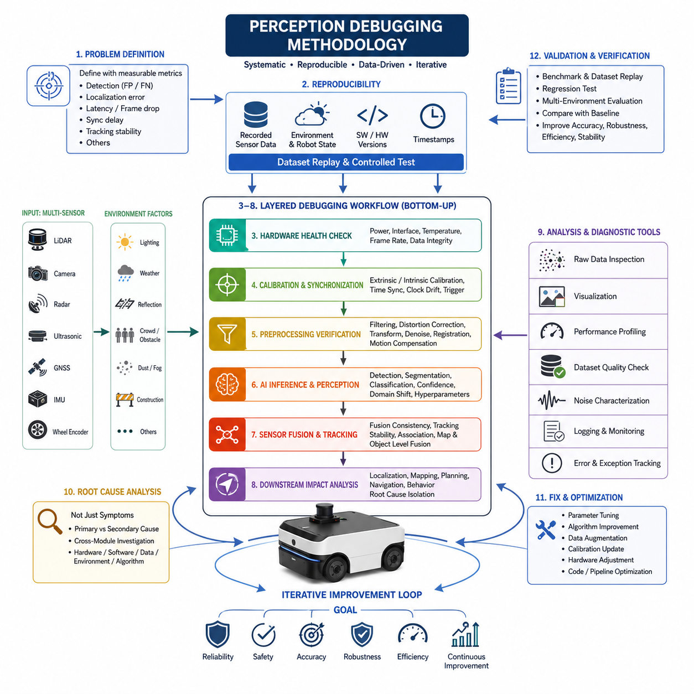
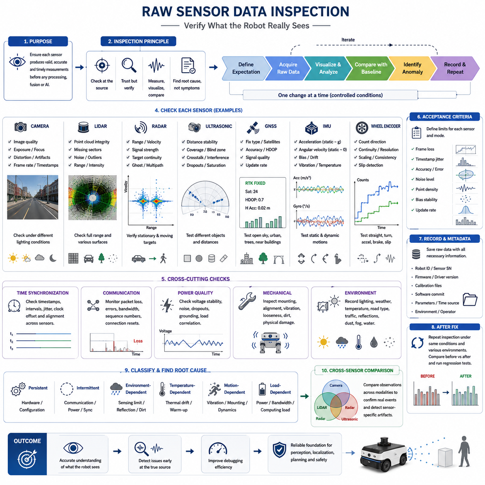
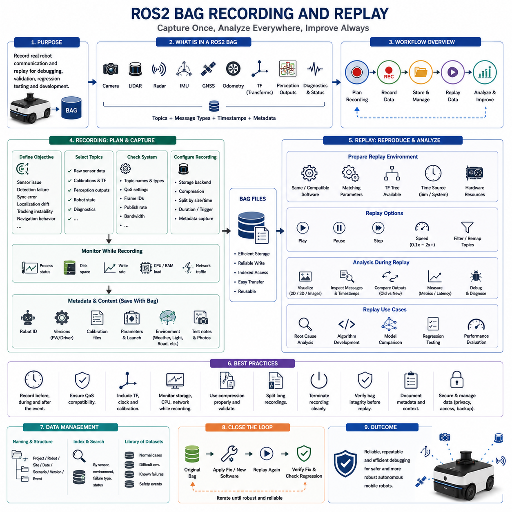
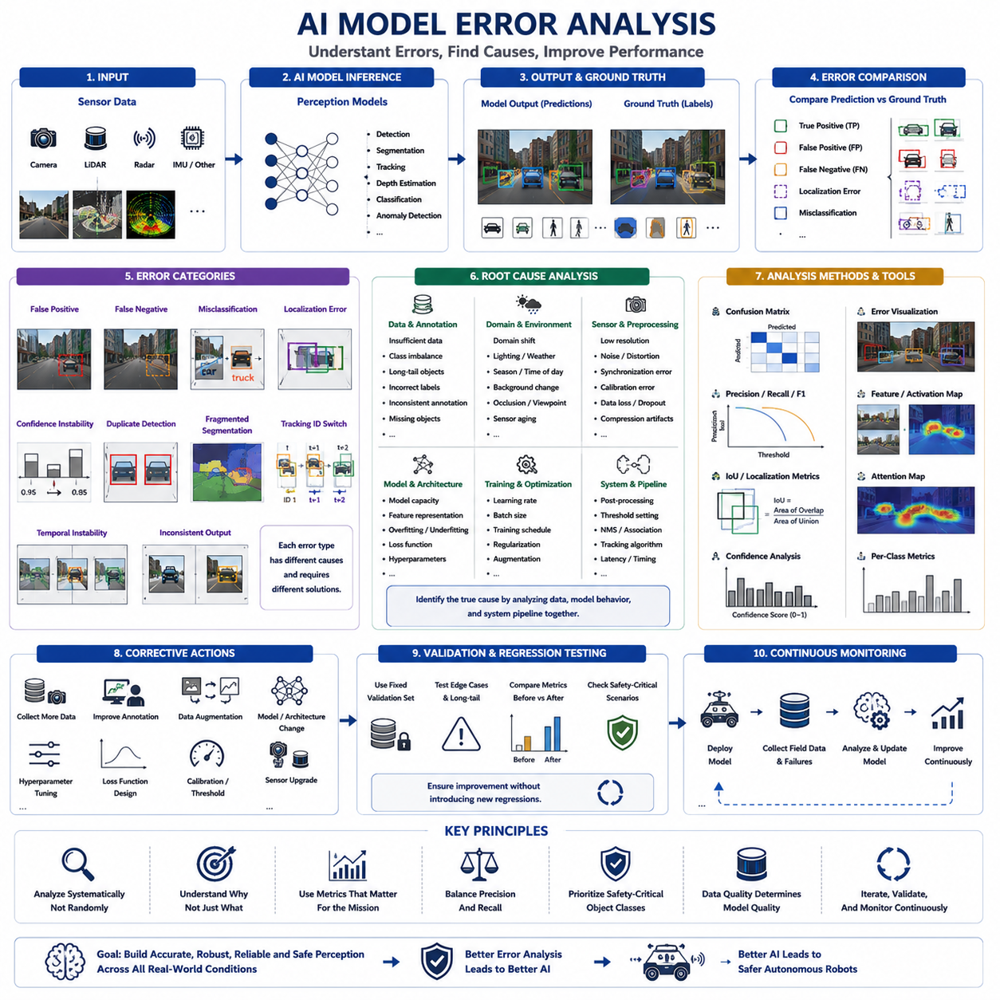
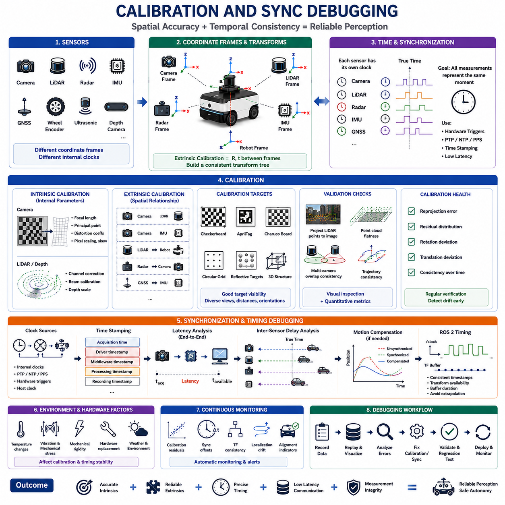
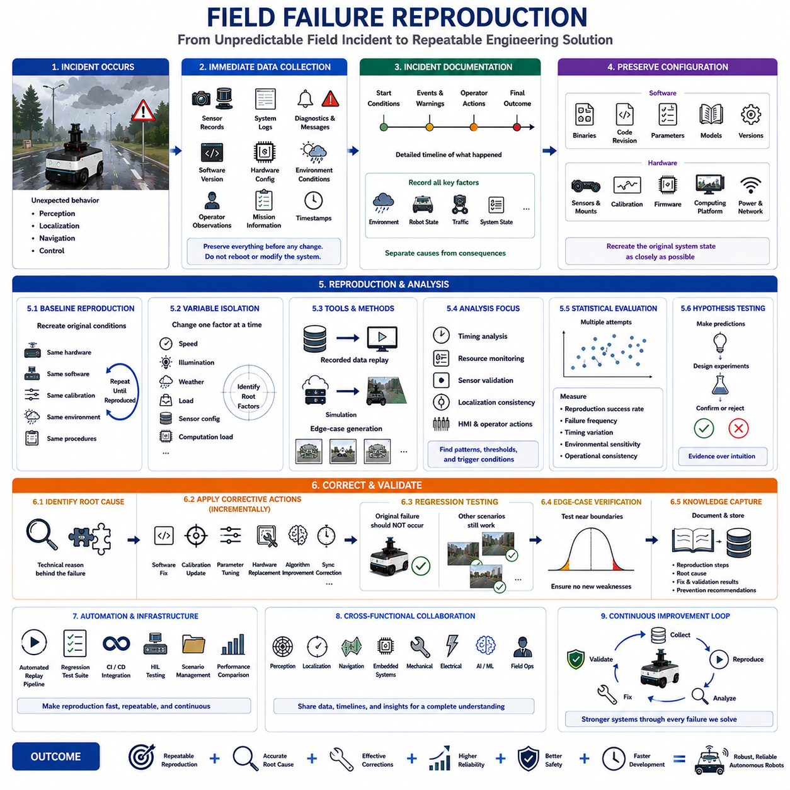
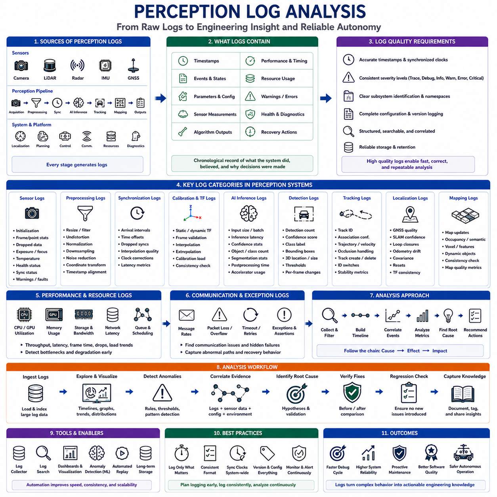
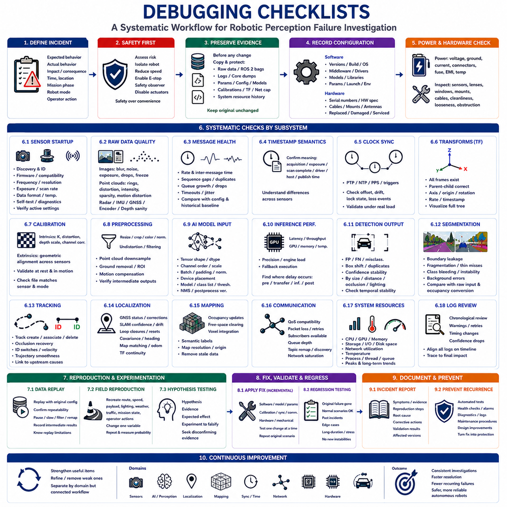

**Volume 03. AMR Sensors and Perception**

# Chapter 23. Perception Debugging

## 23.1 Perception Debugging Methodology

{width="7.268055555555556in" height="7.268055555555556in"}

The perception subsystem is one of the most critical components in an Autonomous Mobile Robot (AMR) because every downstream decision depends on the quality of environmental understanding. Navigation, obstacle avoidance, localization, path planning, semantic understanding, and safety monitoring all rely on perception outputs generated from multiple sensors and AI models. When perception behaves unexpectedly, the symptoms often appear in other modules, making the true cause difficult to identify. Perception debugging therefore requires a systematic engineering methodology rather than isolated troubleshooting. Instead of focusing only on visible failures, engineers must analyze the complete sensing pipeline from raw sensor acquisition through preprocessing, synchronization, fusion, inference, tracking, and final perception outputs. This structured methodology reduces debugging time while improving system reliability and operational safety.

A successful debugging process always begins with precise problem definition. Engineers should avoid vague descriptions such as "object detection is unstable" or "navigation occasionally fails." Instead, every issue should be translated into measurable technical observations including false positive rate, false negative rate, localization deviation, processing latency, frame drop frequency, synchronization delay, or object tracking instability. Clear problem statements allow engineers to reproduce failures consistently and establish objective success criteria for corrective actions. Without quantitative definitions, debugging efforts often become inefficient because different engineers may interpret the same failure differently.

Reproducibility is the foundation of perception debugging. Random or unreproducible failures rarely lead to reliable solutions because developers cannot verify whether modifications actually resolve the original issue. Every observed failure should therefore be associated with recorded sensor data, environmental conditions, robot state, software versions, hardware configurations, and timestamp information. By replaying identical datasets under controlled conditions, engineers can repeatedly evaluate algorithm behavior while changing only one parameter at a time. This scientific approach eliminates uncertainty and greatly accelerates root-cause identification.

The perception debugging workflow typically follows a layered strategy. The first layer validates hardware health by confirming sensor power, communication interfaces, timestamps, temperature, frame rates, and data integrity. The second layer verifies calibration and synchronization between multiple sensors. The third layer evaluates preprocessing algorithms including filtering, distortion correction, coordinate transformations, and noise removal. The fourth layer investigates AI inference, object detection, segmentation, tracking, and sensor fusion. Finally, downstream navigation behavior is analyzed to determine whether observed failures originate from perception or from later decision-making modules. Working sequentially from lower layers toward higher layers prevents engineers from overlooking fundamental hardware problems.

Raw sensor inspection represents the first practical debugging activity. Engineers should always examine unprocessed LiDAR point clouds, camera images, radar detections, ultrasonic measurements, GNSS observations, IMU outputs, and wheel encoder signals before analyzing AI models. Many apparent AI failures are actually caused by corrupted input data resulting from dirty lenses, reflective surfaces, sensor vibration, loose connectors, incorrect exposure settings, electromagnetic interference, or communication packet loss. Detecting these issues at the raw data level prevents unnecessary retraining or software modification.

Environmental understanding is essential because perception algorithms operate under continuously changing real-world conditions. Lighting intensity, shadows, rain, snow, fog, dust, reflective floors, glass walls, moving vegetation, construction zones, and crowded industrial environments all influence sensor behavior differently. Effective debugging therefore records not only sensor outputs but also environmental metadata. Engineers should compare system performance across multiple operating conditions to determine whether failures are environment-specific or algorithmic. Such comparisons often reveal hidden limitations that remain invisible during laboratory testing.

Time synchronization is another major source of perception errors in multi-sensor robotic systems. Camera images, LiDAR scans, radar detections, IMU measurements, GNSS updates, and wheel odometry must represent the same physical moment for sensor fusion to operate correctly. Even small timestamp mismatches may produce shifted object locations, inaccurate velocity estimates, unstable tracking, or localization drift. During debugging, engineers should verify synchronization protocols, timestamp consistency, clock drift, communication latency, and hardware trigger mechanisms before modifying perception algorithms.

Calibration verification is closely related to synchronization. Extrinsic calibration defines the spatial relationship among sensors, while intrinsic calibration determines the internal parameters of cameras and imaging devices. Small calibration errors can propagate through the perception pipeline and create significant downstream inaccuracies. Misaligned LiDAR point clouds, shifted camera projections, distorted depth estimation, and inconsistent object positions frequently originate from incorrect calibration rather than defective AI models. Debugging methodologies therefore include periodic calibration validation before investigating higher-level perception failures.

Noise characterization provides valuable insight into perception performance. Every sensing technology exhibits unique noise patterns including measurement uncertainty, random fluctuations, thermal effects, multipath reflections, vibration-induced distortions, and environmental interference. Instead of attempting to eliminate all noise, engineers should understand its statistical properties and determine acceptable operating limits. By distinguishing expected sensor noise from abnormal behavior, debugging becomes more objective and avoids unnecessary system modifications.

Perception debugging also requires detailed inspection of preprocessing algorithms. Filtering operations, voxelization, downsampling, image normalization, contrast enhancement, coordinate transformations, motion compensation, and point cloud registration all modify raw sensor information before AI inference begins. Errors introduced during preprocessing may significantly reduce detection accuracy while remaining difficult to identify because the original data are no longer visible. Comparing outputs before and after each preprocessing stage allows engineers to isolate processing errors with greater precision.

Artificial intelligence introduces additional debugging challenges because neural networks often behave as complex nonlinear systems. Incorrect object classifications, unstable confidence scores, inconsistent segmentation boundaries, missed detections, and hallucinated objects may result from insufficient training data, domain shifts, overfitting, underfitting, annotation inconsistencies, or inappropriate hyperparameter selection. Effective AI debugging therefore combines quantitative evaluation metrics with qualitative visualization of predictions. Engineers should analyze confidence distributions, confusion matrices, activation patterns, and representative failure cases instead of relying solely on overall accuracy values.

Dataset quality plays a decisive role in perception debugging. Poorly labeled objects, inconsistent class definitions, incomplete annotations, insufficient environmental diversity, and class imbalance frequently appear as algorithmic failures even when the model architecture is appropriate. Debugging should therefore include systematic inspection of training, validation, and testing datasets. Engineers should verify annotation consistency, examine edge cases, identify missing object categories, and evaluate whether operational environments are adequately represented within the training data.

Performance profiling complements functional debugging by evaluating computational efficiency. A perception pipeline may produce correct outputs while still failing operational requirements because of excessive latency, memory consumption, CPU utilization, GPU bottlenecks, communication overhead, or scheduling delays. Engineers should monitor processing time for every pipeline stage including sensor acquisition, preprocessing, inference, fusion, and publishing. Bottleneck identification allows optimization efforts to focus on components that most significantly influence overall system responsiveness.

Visualization tools greatly improve debugging efficiency because many perception errors become immediately obvious when displayed graphically. Overlaying LiDAR point clouds onto camera images, displaying bounding boxes together with confidence scores, rendering semantic segmentation masks, visualizing occupancy grids, and comparing predicted trajectories with ground truth help engineers identify inconsistencies that numerical logs alone cannot reveal. Effective visualization transforms abstract algorithmic outputs into intuitive engineering observations.

System logging provides the historical evidence required for comprehensive failure analysis. Debug logs should record software versions, configuration parameters, sensor status, processing durations, warning messages, exception reports, AI inference results, synchronization information, and environmental context. High-quality logs enable engineers to reconstruct failure sequences after field deployment and support long-term reliability improvement through trend analysis. Logging should remain structured, timestamped, and synchronized across distributed robotic subsystems to facilitate cross-module investigation.

Field debugging differs significantly from laboratory debugging because operational environments introduce uncontrolled variables that cannot be fully reproduced indoors. Traffic, pedestrians, weather, lighting changes, network interruptions, mechanical vibration, accumulated sensor contamination, and hardware aging all influence perception quality. Engineers should therefore combine laboratory replay experiments with systematic field validation to confirm that implemented corrections remain effective under realistic operating conditions. Field observations frequently reveal interaction effects absent during simulation.

Root-cause analysis should avoid premature conclusions based solely on visible symptoms. Navigation failures may originate from perception errors, localization inaccuracies, planning logic, communication delays, or actuator limitations. Similarly, perception anomalies may result from calibration drift, synchronization errors, hardware degradation, environmental conditions, or AI model limitations. A structured debugging methodology continuously asks whether each observed failure is the primary cause or merely a secondary consequence. This disciplined reasoning prevents unnecessary modifications to correctly functioning subsystems.

Successful perception debugging concludes with validation rather than simple bug correction. After implementing modifications, engineers should repeat benchmark experiments, replay recorded datasets, execute regression tests, evaluate performance metrics across diverse environments, and compare results against baseline measurements. Improvements should demonstrate consistent gains in accuracy, robustness, computational efficiency, and operational stability without introducing new regressions. Continuous verification ensures that debugging efforts enhance the entire perception pipeline instead of solving isolated symptoms while degrading other system functions.

Perception debugging is ultimately an iterative engineering discipline that combines scientific experimentation, systematic observation, quantitative evaluation, and multidisciplinary collaboration. Hardware engineers, perception developers, AI researchers, system architects, software engineers, and field operators all contribute different perspectives during the debugging process. By following a structured methodology that begins with reproducible data collection and progresses through layered analysis toward validated corrective actions, AMR development teams can transform complex perception failures into measurable engineering improvements. This methodology not only accelerates development but also establishes the reliability, safety, and robustness required for autonomous robots operating continuously in complex industrial and outdoor environments.

## 23.2 Raw Sensor Data Inspection

{width="7.268055555555556in" height="7.268055555555556in"}

Raw sensor data inspection is the first technical step in diagnosing perception failures in an Autonomous Mobile Robot. Before evaluating artificial intelligence models, fusion algorithms, tracking logic, or navigation behavior, engineers must confirm that each sensor is producing valid and interpretable measurements. Many failures that appear to be algorithmic are actually caused by corrupted inputs, unstable hardware, incorrect configuration, or environmental interference. Direct inspection of raw data prevents unnecessary software changes and provides a trustworthy foundation for later analysis.

The inspection process should begin by defining the expected operating characteristics of every sensor. Engineers must know the nominal frame rate, measurement range, resolution, field of view, timestamp behavior, communication interface, data format, and expected noise level. These reference values make it possible to distinguish normal variation from abnormal behavior. Without a documented baseline, a degraded sensor may continue operating without generating an obvious fault, while silently reducing perception accuracy and system reliability.

Raw sensor inspection should be performed before filtering, coordinate transformation, compression, object detection, or sensor fusion. Processed data may hide missing measurements, timing irregularities, saturation, clipping, distortion, or packet corruption. Engineers should therefore preserve access to the original camera frames, LiDAR scans, radar targets, ultrasonic distances, GNSS messages, IMU measurements, and encoder counts. Comparing raw and processed outputs helps determine whether an error originates in the sensor, the driver, the preprocessing stage, or a later algorithm.

Camera inspection begins with direct examination of image quality. Engineers should check brightness, contrast, sharpness, color balance, dynamic range, motion blur, lens distortion, dead pixels, rolling-shutter artifacts, and frame continuity. Images should also be reviewed under bright sunlight, low light, backlighting, shadows, reflections, and rapidly changing illumination. A camera may deliver valid messages while producing unusable visual information because of incorrect exposure, focus drift, dirty optics, vibration, condensation, or automatic gain behavior.

Camera frame rate and timestamp consistency must be verified together with visual quality. Irregular intervals between frames can produce unstable object tracking and inaccurate sensor fusion even when individual images appear normal. Engineers should compare the configured frame rate with the observed publication rate and identify duplicated, delayed, or dropped frames. Buffering behavior, network congestion, image encoding, driver settings, and computing load should be examined when timing variations exceed acceptable limits.

LiDAR inspection focuses on the spatial structure and consistency of point cloud data. Engineers should visualize complete scans and look for missing sectors, repeated patterns, isolated noise, unexpected rings, intensity anomalies, range discontinuities, and distorted geometry. Flat walls, floors, poles, vehicles, and known reference objects are useful for confirming measurement accuracy. Changes in point density or shape can indicate contamination, mechanical misalignment, vibration, internal faults, reflective interference, or incorrect packet decoding.

The LiDAR coordinate frame must also be checked carefully. A point cloud may appear numerically valid while being inverted, rotated, translated, mirrored, or assigned to the wrong reference frame. Engineers should confirm axis conventions, units, frame identifiers, mounting orientation, and transformation definitions. Observed structures should align with the physical environment and with the robot geometry. Incorrect coordinate interpretation can propagate into mapping, obstacle detection, localization, and safety-zone calculations.

LiDAR data should be evaluated across the complete sensing range rather than only near the robot. Close objects may expose minimum-range limitations, while distant objects reveal signal attenuation and resolution loss. Dark surfaces, glass, metal, water, dust, rain, and direct sunlight may create different failure patterns. Engineers should record how point density, range accuracy, intensity, and false returns change under these conditions to establish realistic operational limits.

Radar raw data inspection requires attention to range, radial velocity, signal strength, angular estimation, and target continuity. Engineers should examine whether stationary structures remain stable and whether moving objects produce physically reasonable velocity values. Ghost targets, multipath reflections, duplicated detections, and sudden target disappearance are common issues in industrial and outdoor environments. Metal walls, fences, large vehicles, wet surfaces, and narrow corridors can significantly influence radar behavior.

Radar measurements should be inspected before clustering or tracking because higher-level processing may conceal unstable detections. Engineers should compare individual radar points or target lists over time and verify that range and Doppler values correspond to actual motion. Communication frames, CAN or Ethernet decoding, sensor mode settings, update rates, and mounting angles should also be checked. An incorrect radar configuration can generate plausible but misleading outputs that are difficult to identify after fusion.

Ultrasonic sensor inspection concentrates on short-range distance stability and coverage. Each sensor should be tested with flat, angled, soft, narrow, and irregular objects at different distances. Engineers should identify blind zones, intermittent readings, maximum-range saturation, and sudden transitions to invalid values. Ultrasonic measurements are strongly affected by surface orientation, material absorption, temperature, airflow, vibration, and interference from adjacent sensors.

Crosstalk is a major concern when multiple ultrasonic sensors operate simultaneously. Reflected pulses from one transmitter may be received by another sensor and interpreted as a false obstacle. Engineers should inspect timing sequences, firing intervals, channel grouping, and synchronization settings. Testing sensors individually and then together helps isolate crosstalk. Raw values should be logged at high temporal resolution because short false measurements may trigger emergency stops even when they are not visible in averaged data.

GNSS inspection should include position, satellite count, correction status, fix type, estimated accuracy, signal quality, and update rate. Engineers must not evaluate GNSS quality using coordinates alone because a plausible position may still have poor confidence. RTK fixed, RTK float, differential, and standalone modes should be clearly distinguished. Sudden transitions between modes can cause position jumps that affect localization, mapping, and autonomous navigation.

GNSS raw observations should be compared under open sky, near buildings, beside large vehicles, under trees, and close to metallic structures. Multipath and signal blockage frequently create environment-dependent errors. Engineers should inspect horizontal and vertical accuracy separately because altitude is often less stable. Antenna placement, cable condition, ground plane design, correction-data latency, and base-station communication should be checked whenever accuracy degrades unexpectedly.

Dual-antenna GNSS systems require additional heading inspection. The reported heading should remain stable when the robot is stationary and should correspond to the physical orientation of the platform. Antenna baseline length, antenna order, mounting geometry, and coordinate conventions must be confirmed. Heading errors may appear as localization or steering problems even when position accuracy is acceptable. Raw baseline status and heading confidence should therefore be included in inspection logs.

IMU inspection begins with accelerometer and gyroscope outputs while the robot is stationary. Acceleration should reflect gravity according to the sensor orientation, while angular velocity should remain near zero within the expected noise range. Persistent offsets may indicate bias, incorrect axis mapping, mounting tilt, temperature effects, or calibration problems. Engineers should record stationary data for sufficient time to evaluate mean values, variance, drift, and warm-up behavior.

Dynamic IMU testing should include controlled acceleration, braking, turning, vibration, slope changes, and uneven terrain. Sensor outputs must follow the direction and magnitude of actual robot motion. Axis polarity and coordinate orientation should be verified through simple movements performed one direction at a time. Mechanical vibration may introduce high-frequency noise that affects attitude estimation and odometry fusion, especially when the IMU is mounted close to motors, suspension elements, or structural resonances.

Temperature dependency is particularly important for IMU inspection. Bias and noise characteristics can change during sensor warm-up or under outdoor temperature variations. Engineers should log internal temperature together with inertial measurements and compare behavior over time. A perception or localization failure that occurs only after extended operation may be caused by thermal drift rather than algorithm instability. Temperature-compensation settings and calibration tables should therefore be reviewed.

Wheel encoder inspection requires verification of count direction, count continuity, resolution, scaling, and correspondence with physical wheel rotation. Engineers should rotate each wheel independently and confirm that the sign and magnitude of encoder changes are correct. Missing counts, duplicated values, sudden jumps, or frozen readings may result from wiring faults, driver issues, communication errors, or mechanical coupling problems. These errors directly affect odometry and motion estimation.

Encoder data should also be examined during straight driving, turning, acceleration, braking, and wheel slip. Left and right wheel measurements should correspond to expected kinematic behavior. Differences may indicate tire pressure variation, unequal wheel diameter, mechanical drag, encoder scaling errors, or slip on low-friction surfaces. Comparing encoder-based travel with a measured physical distance provides a simple and effective method for validating odometry inputs.

Communication integrity must be inspected across all sensor types. Sensors may use Ethernet, CAN, serial, USB, or proprietary links, each with different failure modes. Engineers should monitor packet loss, checksum errors, retransmissions, bandwidth usage, connection resets, and message sequence numbers. A sensor can appear operational while losing enough data to destabilize perception. Network switches, cables, connectors, power supplies, grounding, and electromagnetic compatibility should be included in the investigation.

Timestamp inspection is essential because raw sensor values are useful only when their acquisition time is known accurately. Engineers should distinguish sensor-generated timestamps from host-reception timestamps and understand how each driver assigns time. Clock offsets, drift, queueing delays, and inconsistent time sources can create false spatial disagreement between sensors. Plotting timestamp intervals and comparing sensor clocks against a common reference helps reveal hidden synchronization problems.

Power quality can directly influence sensor data integrity. Voltage drops, electrical noise, unstable converters, ground loops, and startup transients may produce intermittent failures that are difficult to reproduce. Engineers should correlate raw sensor anomalies with power measurements, motor activity, charging events, and high-current loads. Problems that occur only during acceleration, steering, or actuator operation may indicate electrical interference rather than defects in the perception software.

Mechanical inspection should accompany data analysis because mounting conditions strongly affect measurements. Loose brackets, flexible structures, vibration, impact damage, shifted sensors, and thermal expansion can alter sensor orientation or produce unstable data. Engineers should verify fasteners, mounting surfaces, cable strain relief, protective covers, and cleanliness. Comparing current sensor alignment with installation references can identify physical changes that software logs cannot reveal.

Environmental context should always be recorded with raw data. Lighting, weather, temperature, surface material, traffic density, dust, fog, water, reflective structures, and nearby machinery can explain sensor behavior that appears abnormal in isolation. Photographs, video, site maps, and operator notes are useful supplements to numerical recordings. Raw data without environmental context may be difficult to interpret, especially when the failure cannot be reproduced in the laboratory.

Visualization is one of the most effective techniques for raw data inspection. Camera images should be viewed at full resolution, LiDAR scans should be rendered in three dimensions, radar targets should be plotted by range and velocity, and time-series graphs should be used for IMU, GNSS, ultrasonic, and encoder signals. Engineers should avoid relying only on summary statistics because transient errors and spatial patterns may be hidden inside averages.

Statistical analysis complements visualization by measuring sensor stability and uncertainty. Mean, variance, standard deviation, minimum, maximum, dropout rate, update interval, and outlier frequency should be calculated for representative operating conditions. These values can be compared with sensor specifications and internal acceptance limits. Statistical baselines also support automated health monitoring by defining thresholds for abnormal behavior during long-term operation.

Inspection should follow a controlled sequence in which only one condition is changed at a time. Engineers may begin with a stationary indoor test, continue with controlled movement, and then introduce lighting changes, obstacles, vibration, weather, or network load. This approach helps separate correlated variables and prevents incorrect conclusions. Random field testing without controlled comparisons may produce large amounts of data while providing little information about the true source of failure.

Recorded raw data should include metadata sufficient for complete reproduction. Important information includes robot identifier, sensor serial number, firmware version, driver version, calibration files, software commit, configuration parameters, time source, environmental conditions, and test operator. Data filenames and storage structures should follow consistent rules. Without this information, identical-looking datasets may represent different system configurations and lead to misleading comparisons.

The inspection process should identify whether each anomaly is persistent, intermittent, environment-dependent, temperature-dependent, motion-dependent, or load-dependent. This classification narrows the range of possible causes. Persistent errors often indicate configuration or hardware problems, while intermittent errors may suggest communication, power, or synchronization issues. Environment-dependent failures usually point toward sensing limitations, contamination, reflections, or insufficient protection.

Cross-sensor comparison provides additional evidence during raw data inspection. A physical obstacle detected by LiDAR should often be visible in camera, radar, depth, or ultrasonic data depending on its position and material. Disagreement does not automatically indicate a fault because each sensor has different limitations, but consistent mismatches should be investigated. Cross-modal comparison is particularly useful for separating true environmental events from sensor-specific artifacts.

Raw data inspection must remain separate from premature algorithm tuning. Adjusting detection thresholds, filters, confidence scores, or fusion weights before validating the inputs may temporarily hide symptoms without correcting the underlying cause. Such changes can create new failures in other environments. Engineers should first establish that the sensor data are complete, correctly timed, properly scaled, and physically meaningful before modifying higher-level perception parameters.

Acceptance criteria should be defined for each sensor and operating mode. These criteria may include maximum frame loss, allowable timestamp jitter, position accuracy, range error, noise level, image quality, point density, bias stability, and communication reliability. A sensor should not be considered healthy simply because it publishes data. It must satisfy measurable quality requirements that support the intended perception and safety functions of the robot.

After a defect is corrected, the same raw-data inspection must be repeated under identical conditions. Engineers should compare before-and-after recordings and confirm that the correction improves the targeted measurement without degrading other characteristics. Regression testing across additional environments is necessary because a configuration that solves one problem may reduce performance elsewhere. Verification should therefore cover both the original failure case and normal operating scenarios.

Raw sensor data inspection is ultimately a disciplined process of confirming that the robot observes the physical world accurately before interpreting it through algorithms. By examining data integrity, timing, calibration, communication, power, mechanics, environment, and statistical behavior, engineers can identify problems at their true source. This approach reduces unnecessary model changes, improves debugging efficiency, and creates reliable evidence for later analysis of preprocessing, fusion, artificial intelligence, localization, planning, and safety behavior.

## 23.3 ROS2 Bag Recording and Replay

{width="7.268055555555556in" height="7.268055555555556in"}

ROS 2 bag recording and replay provides a controlled method for capturing robot communication data and reproducing perception behavior without repeatedly operating the physical platform. In an Autonomous Mobile Robot, sensors, localization nodes, perception models, planners, and controllers exchange large volumes of time-sensitive messages. Recording these messages creates a reusable representation of real operating conditions that supports debugging, validation, regression testing, and algorithm development.

A ROS 2 bag stores messages published through the ROS 2 middleware together with topic names, message types, timestamps, and storage metadata. Depending on the configuration, a recording may contain camera images, LiDAR point clouds, radar detections, IMU measurements, GNSS data, wheel odometry, transforms, diagnostics, perception outputs, and robot status messages. This synchronized collection allows engineers to examine the system state surrounding a failure and reproduce the same event later.

The first step in bag-based debugging is defining the purpose of the recording. Engineers should decide whether the objective is to investigate sensor corruption, frame loss, synchronization errors, detection failures, localization drift, tracking instability, or navigation behavior. The selected objective determines which topics must be recorded, how long the recording should continue, and what supporting metadata must be preserved. Recording everything without a clear purpose can produce unnecessarily large datasets that are difficult to analyze.

Topic selection must cover both the visible symptom and the possible upstream causes. When investigating an object detection failure, recording only the final detection topic is insufficient. The bag should also contain raw camera or LiDAR data, calibration information, transforms, timestamps, model outputs, system diagnostics, and relevant robot motion data. Including connected pipeline stages makes it possible to determine whether the failure originated in sensing, preprocessing, inference, fusion, or downstream interpretation.

Topic discovery should be performed before recording begins. Engineers need to confirm active topic names, message types, publication rates, Quality of Service settings, frame identifiers, and expected bandwidth. Topics that appear in documentation may be renamed, remapped, or inactive in the deployed system. Checking the live communication graph prevents critical information from being omitted and helps identify duplicate or obsolete data streams before the test starts.

Recording all active topics can be useful during initial failure investigation, especially when the source of the problem is unknown. However, this approach may consume substantial storage and network bandwidth when high-resolution images or dense point clouds are present. A more focused topic set is preferable once the likely subsystem has been identified. Engineers should balance diagnostic completeness against storage capacity, write speed, CPU load, and the risk of disturbing real-time robot operation.

Storage format and backend selection influence recording performance and later analysis. ROS 2 bag implementations may use database-based or file-oriented storage systems depending on the distribution and installed plugins. Engineers should evaluate sustained write performance, compression support, indexing behavior, file recovery, and compatibility with analysis tools. The chosen format must reliably handle the expected data rate without causing message loss or excessive computing overhead.

High-bandwidth sensors require careful capacity planning. Multiple cameras, 3D LiDARs, depth sensors, and radar streams can generate large amounts of data within a short period. Engineers should estimate topic bandwidth before field testing and verify that the storage device can sustain the required write rate. Available disk capacity should include a safety margin because unexpected test duration, additional topics, or metadata may increase the final bag size beyond the original estimate.

Compression can reduce storage use but introduces additional computational cost. File-level compression reduces the size of larger bag segments, while message-level compression processes individual messages. The correct choice depends on CPU availability, data type, replay requirements, and storage limitations. Compressing already encoded camera streams may provide limited benefit, while raw images and point clouds may achieve greater reduction. Compression settings must be validated under realistic system load before field deployment.

Bag splitting is useful for long-duration testing and operational data collection. Instead of creating a single extremely large file, recording can be divided according to file size or elapsed time. Smaller segments are easier to transfer, archive, inspect, and recover if recording is interrupted. Segmentation also helps engineers isolate the interval surrounding an incident. The naming convention should preserve sequence order and associate every segment with the same robot, test, configuration, and environmental context.

The recording system must be monitored while the robot is operating. Engineers should confirm that the process remains active, files continue to grow, storage space is sufficient, and the system is not reporting write failures. CPU load, memory use, disk utilization, and network traffic should be observed because recording itself can affect perception performance. A debugging tool that alters the timing of the system may create new symptoms or hide the original failure.

Quality of Service compatibility is a critical ROS 2 consideration. Publishers and bag subscribers may use reliability, durability, history, and queue-depth settings that prevent certain topics from being captured correctly. A topic may appear active while no messages are stored because the recording subscription is incompatible with the publisher. Engineers should inspect Quality of Service profiles and apply appropriate overrides when sensor drivers use specialized communication settings.

Timestamp behavior must be understood before replay analysis. A message may contain a timestamp generated by the sensor, assigned by the driver, or derived from the host computer. The bag additionally records reception or storage timing according to the recording implementation. These time references are not always identical. Debugging synchronization problems requires engineers to compare header timestamps, bag timestamps, system clocks, and external time sources rather than assuming that every recorded time represents physical acquisition.

Transform data are essential for perception replay. The transform tree defines spatial relationships among the robot base, sensor frames, odometry frame, map frame, and other coordinate systems. Both static and dynamic transforms may be required to reproduce point cloud projection, camera fusion, localization, and visualization. If transform topics are missing, sensor messages may replay successfully while downstream nodes fail because the necessary coordinate relationships are unavailable.

Calibration files and parameters are not always fully contained in a ROS 2 bag. Camera intrinsic values may appear in dedicated information topics, but many extrinsic transformations, model settings, preprocessing thresholds, and device configurations remain in external files or parameter servers. Therefore, every bag should be associated with the exact calibration files, launch configuration, parameter sets, firmware versions, driver versions, and software commit used during recording.

Environmental and operational metadata should accompany the bag. Weather, lighting, temperature, road or floor condition, traffic density, obstacle type, robot speed, payload, battery state, and operator actions may explain behavior that cannot be inferred from sensor messages alone. Photographs, test notes, site maps, and incident descriptions are valuable additions. Without this context, engineers may replay the data successfully but still misunderstand why the original failure occurred.

Recording should begin before the expected event and continue after it. Starting the recorder only when a failure becomes visible often misses the conditions that caused the event. A useful bag includes the approach, the failure itself, the robot response, and the recovery period. Pre-event data may reveal gradually increasing latency, deteriorating GNSS quality, sensor frame loss, calibration instability, or changing environmental conditions before the visible symptom appears.

For intermittent failures, continuous or trigger-based recording strategies may be required. A rolling recorder can retain recent data and preserve a selected interval when an incident trigger occurs. Triggers may originate from operator input, emergency stops, diagnostic alarms, confidence drops, localization jumps, or perception exceptions. This approach reduces storage requirements while preserving the period most relevant to root-cause analysis.

A recording should be terminated cleanly whenever possible so that metadata, indexes, and file structures are finalized correctly. Abrupt power loss or process termination may leave incomplete storage files that require recovery. Engineers should test shutdown procedures and understand the repair capabilities of the selected storage backend. For safety-critical tests, independent confirmation that the bag was finalized successfully should be included in the test procedure.

Before replaying a bag, engineers should inspect its information summary. The topic list, message counts, message types, duration, start time, storage identifier, and file size should be compared with the expected recording plan. Unexpectedly low counts may indicate missed messages or a Quality of Service problem. Missing transform, clock, or sensor information should be identified before the replay environment is launched.

Replay provides a deterministic input source for repeated experiments, but the resulting system behavior is not automatically deterministic. Thread scheduling, GPU execution, message queues, random model operations, and asynchronous callbacks may still vary between runs. Engineers should control software versions, parameters, hardware resources, random seeds, and node startup order when repeatable results are required. Determinism should be measured rather than assumed.

Replay rate is an important debugging parameter. Playing data at the original speed approximates field timing, while reduced speed makes it easier to observe rapid events and inspect intermediate outputs. Faster replay can accelerate offline testing but may overload subscribers or change queue behavior. Engineers should distinguish between functional analysis, which may tolerate slower playback, and real-time performance testing, which requires timing conditions close to actual operation.

Paused and stepwise replay is particularly useful for perception debugging. Engineers can stop the data stream near a failure, examine images or point clouds, inspect transforms, review confidence values, and then advance through the event gradually. This controlled observation helps reveal the exact message or transition associated with a false detection, tracking loss, coordinate discontinuity, or localization jump. Stepwise analysis is often more informative than repeatedly watching the complete event at normal speed.

Simulation time must be configured correctly when nodes depend on a replayed clock. Some systems use the host wall clock, while others subscribe to a simulated time topic. If time settings are inconsistent, timers, transforms, filters, and message synchronizers may behave incorrectly. Engineers should confirm whether replay publishes clock information and whether every relevant node is configured to use the intended time source.

Node startup order affects replay success. Downstream perception nodes should normally be initialized and ready before sensor messages begin. If replay starts too early, subscribers may miss initial calibration messages, static transforms, model initialization events, or the first sensor frames. A paused start allows engineers to launch all required nodes, confirm readiness, and then begin playback. This practice improves repeatability and reduces misleading startup-related failures.

Replaying only selected topics can isolate specific pipeline components. Engineers may replay raw sensor data into a new preprocessing algorithm while excluding previously recorded processed outputs. They may also replay perception results directly into navigation to test downstream behavior without rerunning AI inference. Topic filtering and remapping provide flexible ways to separate modules, compare alternative implementations, and prevent conflicts between recorded and newly generated messages.

Topic remapping is useful when the replay environment uses different namespaces or when recorded outputs must not overwrite live topics. For example, a recorded camera stream can be redirected to a test namespace while a modified perception node publishes results separately. Clear naming prevents accidental feedback loops and makes side-by-side comparison possible. Remapping plans should be documented so that analysis results remain reproducible.

A common debugging technique is to compare recorded outputs with outputs generated during replay. The original bag may contain both raw sensor messages and the perception results produced in the field. During replay, the same raw messages can be processed by the original or modified software, and the new outputs can be recorded into another bag. Differences in detections, confidence scores, tracks, occupancy grids, or localization estimates reveal the impact of software changes.

Regression testing can be built around a curated library of ROS 2 bags. Each bag should represent a normal case, difficult environment, known failure, safety-relevant event, or previously corrected defect. Automated pipelines can replay these datasets through updated software and calculate predefined metrics. This converts field experience into repeatable tests and prevents future code or model updates from reintroducing earlier failures.

A representative bag library should cover sensor and environmental diversity. Indoor corridors, warehouses, outdoor roads, slopes, reflective structures, crowded areas, low light, rain, fog, dust, direct sunlight, moving vehicles, pedestrians, small obstacles, and overhanging objects may all require separate datasets. Dataset selection should reflect the robot's operational design domain rather than only convenient laboratory conditions.

Bag replay is also valuable for artificial intelligence model comparison. The same sensor sequence can be processed by multiple model versions under identical conditions. Engineers can compare precision, recall, confidence stability, inference latency, segmentation quality, and tracking continuity without repeating field tests. However, the recorded data must represent the target environment adequately; replay cannot compensate for missing operational scenarios.

Performance analysis during replay requires caution because offline execution may differ from field operation. Faster storage, reduced network traffic, disabled hardware drivers, or different GPU availability may change latency and resource consumption. Functional correctness can be evaluated accurately from recorded messages, but real-time performance conclusions should be verified on representative hardware under realistic load. Bag replay complements field testing rather than replacing it.

Recorded data integrity should be validated through message counts, timestamp continuity, checksum mechanisms when available, and direct sample inspection. A bag that opens successfully may still contain dropped intervals, duplicated messages, or corrupted payloads. Engineers should plot publication intervals and verify expected sensor patterns before using the data as a reference. Invalid recordings can lead to incorrect conclusions and wasted debugging effort.

Sensitive or proprietary information may be present in recorded data. Camera images can capture people, signs, production equipment, documents, or customer facilities. GNSS messages may reveal location, while diagnostic topics may expose system architecture and network details. Bag management should therefore follow access control, encryption, retention, anonymization, and secure transfer policies appropriate to the deployment environment.

Data organization becomes increasingly important as the bag library grows. Directory structures and filenames should identify project, robot, site, date, scenario, software version, and incident category. A metadata index should support searching by sensor, environment, failure type, and validation status. Unstructured collections quickly become difficult to reuse, while disciplined data management turns recordings into long-term engineering assets.

Each bag used for debugging should have a documented expected behavior. Engineers need to know what happened during the original run, which interval contains the important event, and what correct system behavior should look like. An unlabeled bag may preserve data but provide little diagnostic value. Event markers, annotations, and reference timestamps significantly reduce analysis time and improve collaboration among teams.

After corrective changes are implemented, the original bag should be replayed under the updated system. Engineers should verify that the targeted failure no longer occurs and that other outputs remain stable. Additional bags representing normal and adverse conditions should then be replayed to detect regressions. A correction is complete only when it resolves the original problem without reducing performance in other scenarios.

ROS 2 bag recording and replay should be integrated into the complete perception development workflow rather than treated as an emergency debugging technique. Recording plans, metadata rules, storage policies, replay scripts, metric calculations, and regression datasets should be prepared before field deployment. This readiness ensures that unexpected events produce useful engineering evidence instead of incomplete or unusable recordings.

A mature replay workflow enables collaboration across hardware, perception, artificial intelligence, localization, navigation, safety, and field-operation teams. One recorded event can be examined independently by different specialists while preserving the same underlying evidence. Shared datasets reduce disagreement about what occurred and allow every team to test hypotheses against identical inputs, accelerating root-cause analysis and system improvement.

Ultimately, ROS 2 bag recording and replay transforms temporary robot behavior into persistent, reproducible engineering data. When topics, timing, transforms, parameters, metadata, storage performance, and replay conditions are controlled carefully, engineers can reconstruct complex perception failures with high confidence. This capability improves debugging efficiency, supports objective validation, strengthens regression testing, and provides a reliable foundation for developing safer and more robust Autonomous Mobile Robots.

## 23.4 AI Model Error Analysis

{width="7.268055555555556in" height="7.268055555555556in"}

Artificial intelligence models are the core decision-making components of modern perception systems because they transform raw sensor data into meaningful environmental understanding. Object detection, semantic segmentation, instance segmentation, depth estimation, lane detection, object tracking, scene classification, and anomaly detection all rely on trained neural networks. When an AI model produces incorrect predictions, the consequences propagate through localization, planning, navigation, and safety functions. AI model error analysis therefore aims to identify not only what errors occur but also why they occur, under which conditions they appear, and how they can be systematically reduced through engineering improvements rather than isolated parameter tuning.

AI model errors should first be categorized according to their observable behavior. Common categories include false positives, false negatives, misclassification, localization errors, confidence instability, duplicate detections, fragmented segmentation, tracking identity switches, unstable temporal predictions, and inconsistent outputs across similar scenes. Each category originates from different technical causes and therefore requires different corrective strategies. Treating all incorrect predictions as identical failures often leads to ineffective optimization because the underlying mechanisms are fundamentally different.

False positive errors occur when the model detects objects that do not actually exist. Shadows, reflections, repetitive textures, construction materials, vegetation, rain droplets, sensor noise, and unusual lighting frequently trigger such predictions. Although false positives may appear harmless, they can cause unnecessary obstacle avoidance, emergency braking, reduced operational efficiency, and unpredictable navigation behavior. Error analysis should therefore determine whether false detections originate from insufficient training diversity, annotation inconsistency, sensor artifacts, preprocessing errors, or excessive model sensitivity.

False negative errors occur when existing objects are not detected. These failures are generally more dangerous than false positives because the robot may ignore real obstacles or critical environmental features. Small objects, distant targets, partially occluded pedestrians, low-contrast obstacles, transparent surfaces, unusual viewpoints, and rare object categories commonly contribute to missed detections. Engineers should investigate whether these failures result from inadequate training data, insufficient image resolution, limited sensor range, class imbalance, or architectural limitations within the neural network.

Misclassification errors occur when the model recognizes an object but assigns it to the wrong category. A pedestrian may be classified as a cyclist, a traffic cone may be identified as a person, or industrial equipment may be confused with background structures. These errors often originate from visually similar categories, ambiguous annotations, insufficient feature discrimination, or dataset bias. Error analysis should examine class confusion matrices to identify systematic relationships between commonly confused categories rather than focusing only on overall classification accuracy.

Localization errors refer to incorrect estimation of object position, size, orientation, or boundaries despite successful detection. Bounding boxes may be shifted, oversized, undersized, rotated incorrectly, or poorly aligned with object geometry. In segmentation models, object masks may exclude important regions or extend into surrounding areas. Such errors influence collision avoidance, object tracking, and distance estimation even when object classification remains correct. Localization analysis therefore evaluates spatial precision independently from detection accuracy.

Confidence score analysis provides valuable insight into model behavior beyond simple correctness. High-confidence incorrect predictions indicate excessive model certainty, while consistently low confidence may reveal insufficient feature representation or uncertain decision boundaries. Engineers should analyze confidence distributions for both correct and incorrect predictions. Well-calibrated models produce confidence values that correspond closely to actual prediction reliability, whereas poorly calibrated models may appear highly confident while frequently making mistakes.

Temporal consistency represents another important aspect of AI model performance. A stationary object should not repeatedly disappear and reappear across consecutive frames, while moving objects should maintain stable identity and classification over time. Flickering detections, unstable segmentation masks, rapidly changing confidence scores, and inconsistent object tracking reduce downstream system reliability. Error analysis should therefore evaluate prediction stability across complete sequences instead of considering only individual images.

Dataset quality is one of the primary factors influencing AI model errors. Incorrect annotations, inconsistent labeling policies, missing objects, inaccurate bounding boxes, incomplete segmentation masks, duplicated images, corrupted files, and inconsistent class definitions directly affect model learning. Engineers should periodically inspect datasets rather than assuming that annotation quality is perfect. Many apparent AI failures disappear after correcting dataset problems without modifying the network architecture.

Annotation consistency is particularly important for supervised learning. Different annotators may interpret object boundaries, occlusion levels, truncation, visibility, or class definitions differently. Such inconsistencies create contradictory supervision signals that confuse the learning process. Error analysis should compare annotation practices across datasets and quantify disagreement rates. Establishing detailed annotation guidelines significantly improves model stability during training.

Class imbalance frequently introduces systematic prediction bias. Common object categories such as vehicles or walls may dominate the training dataset, while pedestrians, bicycles, warning signs, pallets, or industrial equipment appear relatively infrequently. Neural networks naturally optimize performance toward frequently observed classes unless corrective measures are introduced. Error analysis should evaluate per-class precision, recall, and false-negative rates rather than relying exclusively on overall accuracy metrics.

Long-tail object analysis addresses categories that appear rarely but remain operationally important. Industrial robots, construction machinery, damaged equipment, temporary barriers, emergency responders, and unusual obstacles may represent only a small fraction of the training data. However, these rare objects often correspond to safety-critical situations. Engineers should deliberately collect and evaluate long-tail scenarios because average benchmark performance may conceal severe weaknesses in these uncommon but important cases.

Domain shift occurs when operational environments differ significantly from training environments. Models trained using sunny daytime urban images may perform poorly during nighttime operation, heavy rain, snow, industrial facilities, warehouses, forests, or agricultural environments. Domain shift represents one of the most common causes of unexpected field failures. Error analysis should compare training and deployment data distributions to determine whether operational environments are adequately represented within the learning process.

Environmental sensitivity should be analyzed systematically. Lighting intensity, weather conditions, shadows, glare, reflections, dust, fog, motion blur, camera contamination, seasonal vegetation changes, and sensor aging all influence model behavior differently. Engineers should organize evaluation datasets according to environmental conditions and calculate separate performance metrics for each scenario. Such analysis reveals hidden weaknesses that remain invisible in aggregated benchmark results.

Sensor dependency analysis examines how model performance changes when input quality varies. Lower image resolution, reduced LiDAR density, missing radar measurements, compressed video streams, increased noise, or synchronization errors may all degrade AI predictions. Engineers should intentionally vary sensor quality and evaluate the resulting performance changes. Understanding graceful degradation characteristics helps establish minimum sensor requirements for safe autonomous operation.

Model architecture also influences error characteristics. Lightweight neural networks optimized for embedded deployment often sacrifice accuracy for computational efficiency, while larger transformer-based models typically achieve higher accuracy but require significantly greater computational resources. Error analysis should consider architectural tradeoffs rather than assuming that every failure originates from insufficient training. Comparing multiple architectures under identical datasets provides valuable insight into structural limitations.

Feature representation analysis investigates whether internal neural network features sufficiently distinguish different object categories. Visualization techniques including activation maps, feature embeddings, attention distributions, gradient-based saliency maps, and dimensionality reduction methods help engineers understand which image regions influence predictions. Although these methods do not completely explain neural decision-making, they often reveal whether the model focuses on meaningful object characteristics or irrelevant background patterns.

Attention analysis has become increasingly important in transformer-based perception models. Attention maps indicate which image regions or sensor measurements contribute most strongly to final predictions. Engineers should verify that attention concentrates on physically meaningful object regions rather than unrelated textures, shadows, or environmental artifacts. Unexpected attention patterns frequently indicate dataset bias or inadequate model generalization.

Confusion matrix analysis provides a structured summary of classification behavior. Instead of examining isolated failure examples, engineers can identify systematic confusion between specific object classes. For example, forklifts may frequently be confused with trucks, pedestrians with cyclists, or construction cones with poles. Such recurring confusion often suggests additional data collection, refined annotations, architectural modifications, or specialized class-specific augmentation strategies.

Precision and recall should always be interpreted together. Increasing detection sensitivity often improves recall while simultaneously increasing false positives, whereas stricter thresholds improve precision but may reduce recall. Error analysis should evaluate operational requirements rather than maximizing a single metric. Safety-critical robots may prioritize high recall for obstacle detection, while industrial inventory systems may emphasize higher precision to reduce false alarms.

Intersection over Union serves as a standard localization metric for detection and segmentation tasks. However, engineers should avoid relying exclusively on average IoU values because different object sizes produce different sensitivities. Small localization errors on tiny objects may drastically reduce IoU despite acceptable operational performance, while large objects may tolerate greater boundary deviations. Object-size-specific analysis therefore provides more informative evaluation than global averages alone.

Per-class metrics reveal weaknesses hidden by aggregate evaluation. Overall mean Average Precision may remain stable even when one critical object category experiences severe degradation. Industrial robots should therefore monitor precision, recall, F1-score, Average Precision, localization accuracy, and confidence calibration individually for every operationally relevant class. Safety-critical categories deserve particularly detailed analysis regardless of their contribution to global benchmark scores.

Calibration error analysis evaluates whether predicted probabilities correspond to actual prediction reliability. Reliability diagrams, expected calibration error, confidence histograms, and probability calibration techniques help engineers assess confidence quality. Poorly calibrated models may mislead downstream decision-making systems that depend on confidence values for sensor fusion, planning, or risk estimation. Confidence calibration therefore contributes directly to autonomous system safety.

Out-of-distribution analysis identifies situations that differ substantially from training data. New object categories, unfamiliar environments, damaged sensors, unusual weather, or unexpected industrial configurations may produce unreliable predictions despite apparently normal confidence values. Engineers should investigate uncertainty estimation methods capable of recognizing unfamiliar conditions rather than forcing confident predictions under every circumstance. Detecting uncertainty is often safer than producing incorrect certainty.

Adversarial robustness should also be considered during error analysis. Small perturbations, sensor noise, compression artifacts, unusual textures, or intentional adversarial modifications may significantly influence neural network predictions. Although deliberate adversarial attacks may be uncommon in many industrial applications, naturally occurring perturbations frequently produce similar effects. Evaluating robustness under realistic disturbances improves confidence in field deployment.

Model comparison experiments should follow identical evaluation protocols. Differences in datasets, preprocessing pipelines, hardware platforms, random initialization, training schedules, or evaluation thresholds may invalidate direct comparisons. Engineers should isolate individual variables so that observed improvements can be attributed to specific architectural or algorithmic modifications rather than unrelated experimental differences.

Root-cause analysis should distinguish between model limitations and system-level problems. Incorrect predictions may originate from poor sensor quality, inaccurate calibration, synchronization errors, preprocessing defects, annotation inconsistencies, unsuitable loss functions, optimization failures, insufficient computational precision, or genuine architectural limitations. AI models should therefore be analyzed within the complete perception pipeline rather than as isolated software components.

Error clustering provides a practical method for prioritizing engineering effort. Similar failure cases should be grouped according to common visual characteristics, environmental conditions, object categories, sensor configurations, or operational scenarios. Engineers often discover that a small number of recurring patterns account for most operational failures. Addressing these dominant clusters generally produces larger performance improvements than randomly correcting isolated examples.

Corrective actions should always correspond directly to observed error mechanisms. Additional data collection addresses insufficient environmental diversity, annotation refinement resolves inconsistent supervision, architectural modification improves feature representation, hyperparameter adjustment influences optimization behavior, data augmentation increases robustness, calibration improves confidence quality, and sensor upgrades enhance input fidelity. Selecting corrective actions without understanding the underlying error source frequently results in minimal improvement despite significant engineering effort.

Regression analysis is essential after every model update. A newly trained model may improve overall benchmark performance while degrading specific safety-critical scenarios. Engineers should therefore evaluate updated models using fixed validation datasets, representative field recordings, curated edge cases, and previously identified failure examples. Regression testing ensures that improvements remain consistent across the complete operational design domain rather than only within selected benchmark datasets.

Continuous monitoring extends error analysis beyond the development laboratory into real operational environments. Deployed robots should collect representative failure cases, uncertain predictions, operator interventions, and environmental changes for future investigation. Periodically incorporating these field observations into training datasets enables continuous improvement while reducing the gap between laboratory evaluation and real-world deployment.

AI model error analysis is ultimately an iterative engineering discipline rather than a single evaluation activity. Careful examination of prediction behavior, dataset quality, environmental influences, model architecture, uncertainty, confidence calibration, and operational performance allows engineers to transform isolated failures into systematic knowledge. By continuously analyzing, categorizing, correcting, validating, and monitoring AI model behavior, autonomous robotic systems achieve progressively higher levels of perception accuracy, robustness, reliability, and safety across increasingly diverse real-world environments.

## 23.5 Calibration and Sync Debugging

{width="7.268055555555556in" height="7.268055555555556in"}

Calibration and synchronization form the foundation of every reliable robotic perception system because all downstream algorithms assume that sensor measurements describe the same physical world at the correct position and the correct moment in time. Cameras, LiDARs, radars, inertial measurement units, GNSS receivers, wheel encoders, ultrasonic sensors, and depth cameras each produce measurements within their own coordinate systems and internal clocks. Even highly accurate perception models cannot compensate for incorrect sensor alignment or poor temporal synchronization. Calibration and synchronization debugging therefore focuses on verifying spatial consistency, temporal consistency, and system-wide measurement integrity before investigating higher-level perception algorithms.

Calibration defines the mathematical relationship between sensor measurements and physical reality. Spatial calibration determines the position and orientation of sensors relative to the robot coordinate frame, while intrinsic calibration describes the internal characteristics of each sensor. Temporal calibration establishes the timing relationship between different sensing devices. These calibration parameters collectively determine how sensor observations are transformed, fused, and interpreted throughout the perception pipeline. Small calibration errors frequently produce large downstream perception failures that may initially appear unrelated to the original source.

Intrinsic calibration refers to the internal parameters that characterize an individual sensor. For cameras, intrinsic parameters include focal length, principal point, pixel scaling, skew, and lens distortion coefficients. Depth cameras additionally require accurate depth scaling parameters, while LiDAR systems may require channel-specific correction values and beam calibration information. Intrinsic calibration directly influences geometric accuracy, image rectification, feature extraction, and distance estimation. Engineers should verify that calibration parameters remain consistent after firmware updates, hardware replacement, or environmental changes.

Extrinsic calibration defines the rigid-body transformation between different sensors and the robot coordinate system. Every sensor must have accurately measured translation and rotation parameters relative to a common reference frame. Camera-to-LiDAR, camera-to-IMU, LiDAR-to-robot, radar-to-camera, and GNSS-to-IMU transformations all belong to extrinsic calibration. These transformations allow measurements from different sensors to represent identical physical objects within a unified coordinate system. Even millimeter-level translation errors or small angular deviations may significantly reduce sensor fusion accuracy.

Coordinate frame consistency should be verified before evaluating perception algorithms. Every coordinate frame must follow a clearly defined convention regarding axis direction, handedness, origin location, and rotation order. Inconsistent frame definitions frequently produce mirrored objects, inverted motion estimates, incorrect heading calculations, and unstable localization behavior. Engineers should visualize coordinate frames directly and confirm that every transformation produces physically meaningful spatial relationships throughout the complete transformation tree.

Camera calibration debugging begins with image quality evaluation before numerical optimization. Motion blur, incorrect exposure, poor focus, sensor noise, rolling shutter distortion, and insufficient calibration target visibility reduce calibration accuracy regardless of the optimization algorithm. Calibration images should contain diverse viewpoints, multiple orientations, varying distances, and complete target coverage across the image. Poor image acquisition cannot be compensated through improved optimization methods alone.

Calibration target selection significantly influences achievable accuracy. Checkerboards, AprilTags, Charuco boards, circular grids, reflective targets, and three-dimensional calibration structures each provide different advantages depending on sensor type. The selected target should remain clearly visible across all participating sensors while maintaining high geometric precision. Large robots or long-range sensors may require oversized calibration targets to ensure sufficient measurement accuracy throughout the operational sensing range.

Camera distortion correction should always be validated visually. Straight structural edges, building corners, floor markings, and calibration targets should appear geometrically consistent after undistortion. Residual distortion frequently indicates incorrect lens parameters, incomplete optimization, damaged optics, or inappropriate distortion models. Visual inspection often reveals calibration defects more quickly than numerical error values because systematic distortion patterns become immediately apparent.

LiDAR calibration debugging primarily focuses on geometric consistency across laser channels. Point clouds should accurately represent flat surfaces, vertical walls, building edges, and known geometric structures without noticeable discontinuities or channel misalignment. Engineers should examine overlapping scan regions, verify point density consistency, and inspect elevation accuracy. Mechanical vibration, thermal expansion, hardware aging, and manufacturing tolerances may gradually influence LiDAR calibration over extended operational periods.

Multi-camera calibration requires particularly careful validation because errors accumulate across overlapping fields of view. Adjacent cameras should produce consistent feature alignment, color continuity, object boundaries, and stereo geometry. Calibration quality can be evaluated by projecting three-dimensional landmarks into multiple camera images and measuring projection consistency. Poor overlap calibration often produces duplicate detections, inconsistent segmentation boundaries, and unreliable three-dimensional reconstruction.

Camera-to-LiDAR calibration represents one of the most critical calibration procedures within autonomous robotics. Correct calibration allows LiDAR point clouds to project accurately onto image pixels while preserving geometric consistency. Engineers should overlay projected point clouds onto camera images and inspect object boundaries, structural edges, road markings, poles, vehicles, and buildings. Misalignment patterns frequently indicate rotational errors because angular inaccuracies become increasingly visible at greater distances.

Camera-to-IMU calibration directly influences visual-inertial odometry and simultaneous localization and mapping systems. Rotational motion estimated from camera images should remain consistent with inertial measurements throughout dynamic robot movement. Small rotational offsets between camera and IMU coordinate systems often produce gradually increasing localization drift rather than immediately obvious failures. Engineers should analyze dynamic trajectories rather than relying solely on static calibration evaluation.

GNSS-to-IMU calibration establishes the spatial relationship between positioning measurements and inertial motion estimates. Incorrect lever-arm compensation introduces systematic localization errors during vehicle acceleration, turning, or rapid orientation changes. Static tests may appear satisfactory because lever-arm effects become most visible during dynamic motion. Therefore, calibration validation should include representative operational maneuvers rather than only stationary measurements.

Radar calibration introduces unique challenges because radar measurements contain range, velocity, and angle information with lower spatial resolution than cameras or LiDAR. Engineers should verify target consistency across multiple sensing modalities while accounting for radar-specific measurement characteristics. Metallic structures, moving vehicles, and known calibration targets provide useful references for evaluating radar alignment and measurement stability.

Calibration should never be considered a permanent process completed only during manufacturing. Mechanical impacts, transportation, vibration, maintenance activities, hardware replacement, thermal cycling, and structural deformation gradually influence sensor alignment. Robots operating in industrial, agricultural, mining, or outdoor environments experience continual mechanical stress capable of degrading calibration over time. Periodic verification therefore forms an essential component of preventive maintenance.

Temperature influences calibration more than many engineers initially expect. Cameras, LiDAR units, mechanical mounting structures, and optical components expand differently as temperature changes. Industrial robots operating between winter mornings and hot summer afternoons may experience measurable geometric variation. Calibration debugging should therefore evaluate system performance across representative operating temperatures rather than under laboratory conditions alone.

Mechanical rigidity directly affects long-term calibration stability. Flexible mounting brackets, loose fasteners, lightweight sensor supports, cable tension, and chassis deformation may produce calibration variation even when initial calibration appears accurate. Engineers should inspect mechanical structures carefully whenever calibration repeatedly changes after successful optimization. Stable calibration requires mechanically stable hardware rather than increasingly frequent recalibration procedures.

Calibration residual analysis provides quantitative insight into optimization quality. Reprojection error, point-to-plane distance, point-to-point distance, rotational deviation, translational deviation, and residual distributions should all be evaluated instead of relying on a single average error metric. Uniformly distributed residuals generally indicate successful optimization, whereas structured residual patterns often reveal systematic modeling errors, poor measurements, or inappropriate optimization assumptions.

Sensor synchronization ensures that measurements from different devices correspond to the same physical moment. Without accurate synchronization, moving objects appear at different positions across sensors despite perfect spatial calibration. Synchronization errors reduce object association accuracy, degrade sensor fusion, increase localization uncertainty, and produce inconsistent environmental representations. Temporal consistency therefore deserves equal attention alongside geometric calibration.

Clock synchronization begins by identifying every timing source within the robotic system. Individual sensors may use internal oscillators, embedded controllers, GNSS time, Precision Time Protocol, Network Time Protocol, hardware trigger signals, or host computer clocks. Engineers should document every clock source and verify how timestamps propagate through drivers, middleware, processing nodes, and recording systems. Hidden timestamp conversions frequently introduce unexpected synchronization offsets.

Hardware synchronization generally provides the highest temporal accuracy. Shared trigger pulses, synchronized exposure signals, hardware timestamps, pulse-per-second references, and dedicated timing distribution modules minimize temporal uncertainty. Hardware synchronization eliminates many sources of operating system scheduling variability that cannot be removed through software techniques alone. High-speed perception systems therefore frequently depend upon hardware timing architectures.

Software synchronization provides greater flexibility but generally introduces larger uncertainty. Operating system scheduling delays, communication latency, driver buffering, middleware queues, and processor workload all influence timestamp accuracy. Engineers should quantify these uncertainties rather than assuming software timestamps represent exact acquisition times. Performance profiling under representative computational loads reveals synchronization quality more accurately than idle laboratory testing.

Timestamp validation should compare acquisition time, driver timestamp, middleware timestamp, recording timestamp, and processing timestamp whenever possible. These timestamps often differ because each represents a different stage of the sensing pipeline. Understanding these relationships allows engineers to identify where temporal delays originate. Many apparent synchronization failures actually result from timestamp interpretation rather than physical timing errors.

Latency analysis measures the delay between physical sensor acquisition and data availability within perception algorithms. Cameras may introduce exposure delay, image transfer delay, decompression delay, and driver buffering, while LiDAR sensors may require complete scan accumulation before publication. Engineers should characterize complete end-to-end latency rather than focusing exclusively on individual hardware components. Overall perception delay directly influences navigation safety during dynamic operation.

Inter-sensor delay analysis evaluates relative timing differences between sensing devices. Engineers should compare object motion observed simultaneously by cameras, LiDAR, radar, and IMU measurements. Moving vehicles, pedestrians, rotating objects, or controlled calibration targets provide useful references for estimating temporal offsets. Relative synchronization errors frequently become more visible during high-speed motion than during stationary observations.

Motion compensation becomes increasingly important when synchronization cannot be perfectly achieved. Vehicle motion occurring between asynchronous measurements causes geometric distortion during sensor fusion. Accurate motion models using IMU measurements, wheel odometry, or vehicle dynamics can partially compensate for remaining temporal offsets. However, motion compensation supplements synchronization rather than replacing accurate timing.

ROS 2 systems require careful examination of timestamp propagation throughout the middleware. Sensor drivers, message headers, transform broadcasters, playback systems, and visualization tools must all interpret time consistently. Engineers should verify whether timestamps represent acquisition time or publication time because different software components may use different conventions. Inconsistent timestamp semantics often create difficult-to-diagnose synchronization failures.

Transform timing should be validated together with sensor synchronization. Coordinate transformations must correspond to the correct temporal instant associated with each sensor measurement. Transform extrapolation beyond available timestamps, delayed transform publication, or outdated transformation buffers may generate apparently random localization failures. Engineers should inspect transform availability, interpolation behavior, and temporal buffer duration during dynamic operation.

Visualization provides one of the most effective methods for calibration and synchronization debugging. Overlaying projected LiDAR points onto camera images, comparing synchronized sensor streams, examining transform trees, visualizing motion trajectories, and replaying recorded datasets frequently reveal subtle inconsistencies that remain hidden within numerical logs. Engineers should combine quantitative metrics with direct visual inspection throughout every debugging session.

Recorded datasets enable repeatable calibration verification without requiring repeated field experiments. Engineers should replay identical sensor recordings after modifying calibration parameters or synchronization algorithms and compare resulting perception outputs. Controlled replay allows direct comparison between previous and updated system behavior while eliminating environmental variability. Regression testing should include representative dynamic scenarios as well as static calibration sequences.

Field validation remains essential even after successful laboratory calibration. Controlled indoor environments rarely represent the vibration, lighting variation, temperature change, weather conditions, mechanical loading, and operational dynamics encountered during real deployment. Calibration and synchronization should therefore be evaluated under realistic mission conditions to confirm long-term stability throughout the operational design domain.

Continuous calibration monitoring provides early warning before significant perception degradation occurs. Engineers should monitor calibration residuals, synchronization offsets, transform consistency, timestamp statistics, localization drift, and sensor alignment indicators throughout normal robot operation. Gradual degradation often becomes detectable long before operators observe obvious perception failures. Automated monitoring therefore reduces maintenance cost while improving operational reliability.

Calibration and synchronization debugging ultimately establish the measurement integrity required by every autonomous perception system. Accurate intrinsic parameters, reliable extrinsic transformations, stable coordinate frames, precise timestamps, consistent clock synchronization, low-latency communication, and continuous validation collectively ensure that sensor fusion algorithms operate on physically correct information. By systematically verifying spatial alignment and temporal consistency before optimizing perception algorithms, engineers create a robust foundation that enables accurate localization, reliable environmental understanding, dependable autonomous navigation, and long-term operational safety.

## 23.6 Field Failure Reproduction

{width="7.268055555555556in" height="7.268055555555556in"}

Field failure reproduction is one of the most important engineering activities in autonomous robotic system development because a failure that cannot be reproduced cannot be analyzed systematically or corrected with confidence. Many perception, localization, navigation, and control problems appear only under specific environmental, operational, or hardware conditions that are difficult to duplicate inside a laboratory. Successful failure reproduction transforms an unpredictable field incident into a repeatable engineering experiment where hypotheses can be verified, corrective actions evaluated, and regression testing performed. The primary objective is not merely to observe the failure again but to reproduce it consistently enough that every modification can be measured objectively.

The first step in field failure reproduction is collecting comprehensive information immediately after the incident occurs. Engineers should preserve sensor recordings, system logs, diagnostic messages, software versions, hardware configurations, environmental conditions, operator observations, mission objectives, and timestamps before any system modifications are made. Temporary evidence may disappear after rebooting the system or replacing hardware components. Accurate reproduction therefore depends on preserving the original operational state as completely as possible rather than relying on human memory or partial documentation.

Incident documentation should clearly describe what was expected, what actually occurred, and how the system responded. The exact sequence of events is often more valuable than the final failure itself. Engineers should identify mission start conditions, intermediate system states, warning messages, operator interventions, automatic recovery attempts, and the final system behavior. A detailed chronological timeline allows investigators to determine which events represent causes and which merely represent consequences of the original failure.

Environmental conditions should be recorded with sufficient detail because perception failures frequently depend upon factors that initially appear insignificant. Weather, lighting direction, cloud coverage, shadows, temperature, humidity, rain intensity, fog density, dust concentration, road surface condition, vegetation movement, surrounding traffic, and nearby reflective structures may all influence sensor behavior. Recording only the primary operational environment without these secondary factors often prevents successful failure reproduction because multiple environmental variables interact simultaneously.

Robot operating conditions should also be documented precisely. Vehicle speed, steering angle, acceleration, payload, battery state, motor temperature, suspension loading, tire pressure, operating mode, mission state, localization status, and computational workload all influence system behavior. A perception failure observed during high-speed autonomous navigation may not appear during slow manual operation even within the identical physical environment. Operational conditions therefore represent essential reproduction parameters rather than secondary information.

Software configuration management plays a critical role in failure reproduction. Engineers should preserve executable binaries, source code revisions, parameter files, calibration data, neural network weights, middleware versions, operating system versions, compiler settings, and third-party library revisions. Even small software changes introduced after the incident may unintentionally eliminate or alter the original failure. Reproduction experiments should therefore begin using the exact software configuration present during the field event.

Hardware configuration must remain equally consistent. Sensor mounting positions, calibration parameters, firmware versions, processor models, memory configurations, storage devices, communication interfaces, synchronization hardware, power supply characteristics, and mechanical structures should match the original system whenever possible. Replacing apparently identical hardware components may unintentionally remove the original failure if manufacturing tolerances or firmware behavior differ slightly from the original equipment.

Data preservation is essential before attempting corrective actions. Raw sensor recordings should remain unchanged while engineers perform analysis using duplicated datasets. Original evidence should never be overwritten by experimental modifications or additional processing steps. Maintaining an immutable reference dataset allows future investigations to verify conclusions independently and supports regression testing after corrective measures have been implemented.

Failure classification helps prioritize reproduction activities. Repeatable failures generally require different investigation strategies than intermittent failures, while deterministic software defects differ fundamentally from hardware degradation or environmental disturbances. Engineers should classify failures according to reproducibility, operational impact, safety consequence, frequency of occurrence, environmental dependence, and subsystem involvement. Structured classification prevents resources from being allocated inefficiently across unrelated failure mechanisms.

Deterministic failures occur whenever identical conditions consistently produce identical outcomes. These failures are generally easier to reproduce because they originate from fixed logical conditions, algorithmic defects, incorrect parameters, or systematic configuration errors. Once the triggering conditions are identified, deterministic failures usually provide highly efficient debugging opportunities because every software modification can be evaluated under identical experimental conditions.

Intermittent failures present significantly greater engineering challenges because identical experimental conditions do not always produce identical outcomes. Timing variation, hardware instability, communication latency, thermal effects, electrical interference, race conditions, or environmental randomness frequently contribute to intermittent behavior. Engineers should collect multiple independent observations before drawing conclusions because isolated reproduction attempts may produce misleading interpretations.

Rare failures deserve particular attention despite their low occurrence frequency. A failure occurring once every several hundred operating hours may still represent an unacceptable safety risk if the operational consequence is severe. Long-duration autonomous testing, accelerated stress testing, environmental variation, and statistical analysis help reproduce these uncommon events. Failure frequency alone should never determine engineering priority when safety-critical functions are involved.

Reproduction experiments should initially modify as few variables as possible. Engineers should begin by recreating the original mission using identical hardware, software, calibration, environment, and operational procedures. Additional variables should only be introduced after baseline reproduction has been established. Simultaneous modification of multiple experimental conditions makes root-cause identification extremely difficult because observed behavior cannot be attributed confidently to any individual factor.

Controlled variable isolation represents the foundation of systematic debugging. Individual parameters including vehicle speed, sensor configuration, illumination level, environmental complexity, processor workload, communication latency, or algorithm settings should be varied independently while all remaining conditions remain unchanged. This approach allows engineers to determine which variables directly influence failure occurrence and which variables merely correlate with observed behavior.

Recorded datasets provide valuable reproduction capability without repeated field deployment. Sensor recordings captured during the original incident can be replayed repeatedly while software modifications are evaluated under identical input conditions. Replay-based reproduction removes environmental variability, reduces testing cost, and allows engineers to pause, inspect, and repeat critical failure sequences indefinitely. However, replay experiments cannot reproduce hardware interactions or dynamic environmental feedback absent from the recorded data.

Simulation environments offer additional opportunities for controlled reproduction when accurate environmental models are available. Digital twins, synthetic sensor simulation, physics-based vehicle dynamics, and virtual traffic environments enable systematic variation of individual conditions that would be impractical or unsafe during physical experiments. Simulation should complement rather than replace real-world reproduction because simulation fidelity inevitably remains limited by model accuracy.

Edge-case scenario generation expands reproduction beyond observed failures toward neighboring operating conditions. Engineers should intentionally vary object size, object position, lighting angle, weather intensity, sensor noise, communication delay, localization uncertainty, and environmental complexity to determine operational boundaries. Understanding where failures begin to occur often provides greater engineering insight than reproducing only the original incident itself.

Timing analysis frequently reveals hidden failure mechanisms. Engineers should examine message latency, scheduling delays, synchronization offsets, processor utilization, memory allocation timing, communication buffering, and asynchronous event ordering throughout the complete software pipeline. Small temporal variations sometimes produce dramatically different system behavior despite apparently identical functional inputs. Accurate timestamp analysis therefore represents an essential component of failure reproduction.

System resource monitoring should accompany every reproduction experiment. CPU utilization, GPU workload, memory consumption, storage bandwidth, network traffic, thermal conditions, power supply stability, and hardware utilization may all influence autonomous system performance. Resource exhaustion often appears only under realistic operational loads rather than isolated laboratory benchmarks. Continuous monitoring helps distinguish computational limitations from algorithmic deficiencies.

Sensor validation should confirm that every sensing device behaves consistently throughout reproduction experiments. Engineers should verify image quality, point cloud integrity, radar measurements, IMU stability, GNSS reception, wheel encoder consistency, ultrasonic measurements, and synchronization accuracy before interpreting higher-level perception behavior. Faulty sensor measurements may imitate software defects even though the underlying algorithms operate correctly.

Localization consistency should be evaluated throughout the complete reproduction process. Mapping accuracy, loop closure behavior, odometry drift, GNSS quality, transform consistency, localization confidence, and coordinate frame stability all influence downstream navigation and perception decisions. A perception failure initially attributed to object detection may ultimately originate from inaccurate localization or inconsistent coordinate transformations.

Human-machine interaction should also be documented because operator actions occasionally influence failure occurrence. Manual overrides, emergency stops, parameter adjustments, mission restarts, joystick commands, user interface interactions, and maintenance procedures may unintentionally alter system timing or operational state. Reproduction experiments should therefore replicate operator behavior whenever human interaction formed part of the original incident sequence.

Multiple reproduction attempts should be compared statistically rather than interpreted individually. Engineers should measure reproduction success rate, failure frequency, timing variation, environmental sensitivity, and operational consistency across repeated trials. Statistical analysis distinguishes systematic engineering defects from random operational variability and increases confidence that corrective actions genuinely address the underlying problem.

Root-cause hypotheses should be evaluated experimentally rather than accepted intuitively. Every proposed explanation should produce measurable predictions that can be confirmed or rejected through controlled reproduction experiments. Engineers should avoid confirmation bias by considering alternative explanations and designing experiments capable of disproving preferred hypotheses. Scientific investigation requires evidence rather than subjective plausibility.

Corrective actions should be introduced incrementally after successful failure reproduction has been established. Software modifications, calibration updates, parameter adjustments, hardware replacement, filtering improvements, synchronization corrections, or algorithm redesign should each be evaluated independently against the original reproduction scenario. Introducing multiple simultaneous corrections prevents engineers from determining which modification actually eliminated the failure.

Regression testing should immediately follow successful correction. The original failure scenario should no longer produce the observed defect, while previously successful operational scenarios should continue functioning correctly. Engineers should additionally evaluate neighboring edge cases to ensure that improvements have not introduced new weaknesses. Regression validation transforms a temporary correction into a reliable engineering solution suitable for operational deployment.

Knowledge capture is an essential outcome of every reproduction effort. Engineers should document reproduction procedures, triggering conditions, diagnostic observations, root causes, corrective actions, validation results, and preventive recommendations in a structured engineering database. Future projects benefit significantly from accumulated organizational knowledge because many field failures recur across different robot platforms and software generations.

Automation can greatly improve long-term failure reproduction efficiency. Automated replay pipelines, regression test suites, continuous integration systems, hardware-in-the-loop testing, scenario management tools, and performance comparison frameworks enable rapid validation whenever software changes occur. Automation transforms manually reproduced failures into permanent engineering assets that continuously protect future software releases from previously solved problems.

Cross-functional collaboration enhances reproduction accuracy because failures frequently involve interactions between perception, localization, navigation, embedded systems, mechanical engineering, electrical engineering, networking, artificial intelligence, and field operations. Sharing identical datasets, synchronized timelines, diagnostic reports, and reproduction procedures enables multiple engineering disciplines to investigate the same incident from complementary technical perspectives without introducing conflicting interpretations.

Field failure reproduction ultimately converts unpredictable operational incidents into repeatable scientific experiments. Through systematic evidence preservation, controlled variable isolation, accurate environmental replication, comprehensive monitoring, disciplined hypothesis testing, and rigorous regression validation, engineers establish a reliable foundation for continuous autonomous system improvement. Successful reproduction not only resolves individual failures but also strengthens development methodology, increases product reliability, improves operational safety, and accelerates the long-term evolution of robust autonomous robotic systems.

## 23.7 Perception Log Analysis

{width="7.268055555555556in" height="7.268055555555556in"}

Perception log analysis is a systematic engineering process for understanding how autonomous robotic perception systems behave during both normal operation and failure conditions. Every perception module continuously generates logs describing sensor acquisition, preprocessing, synchronization, inference, object tracking, map updates, confidence estimation, system health, and execution timing. These records provide objective evidence of internal system behavior that cannot always be observed through visualization alone. Effective log analysis enables engineers to identify hidden failure mechanisms, quantify performance degradation, validate corrective actions, and establish long-term reliability improvements across the complete perception pipeline.

A perception log represents far more than a collection of debugging messages. It records the chronological evolution of internal software states together with sensor measurements, algorithm outputs, execution timing, warning conditions, resource utilization, and system events. Well-designed logs allow engineers to reconstruct what the perception system believed at every stage of processing and why specific decisions were made. Without sufficiently detailed logging, complex perception failures often remain impossible to diagnose because only the final incorrect output is visible while intermediate processing stages remain hidden.

The primary objective of perception log analysis is to establish causal relationships rather than merely identifying abnormal messages. Engineers should determine how one event influences subsequent processing stages throughout the perception pipeline. A delayed camera frame may influence synchronization, which affects sensor fusion, which reduces object confidence, which ultimately changes navigation decisions. Viewing individual log entries in isolation frequently hides these important dependencies. Effective analysis therefore follows complete event chains from initial cause to final operational consequence.

Logging strategies should be designed during system development rather than after failures occur. Every perception subsystem should generate meaningful information describing initialization, operational status, configuration parameters, processing progress, performance statistics, detected anomalies, recovery actions, and shutdown procedures. Consistent logging standards across multiple software modules significantly simplify later investigation because engineers can correlate events using common terminology, timestamp formats, severity levels, and subsystem identifiers.

Timestamp accuracy represents one of the most important requirements for useful perception logs. Every recorded event should contain precise timestamps generated from a well-defined clock source. Sensor acquisition, message publication, algorithm execution, synchronization, object detection, localization updates, and control commands should all share consistent temporal references. Without accurate timestamps, engineers cannot determine execution order, latency relationships, synchronization quality, or causal dependencies between distributed software components.

Clock synchronization across distributed robotic systems deserves particular attention during log analysis. Embedded controllers, cameras, LiDAR units, radar modules, GNSS receivers, onboard computers, and network devices frequently maintain independent clocks. Small synchronization errors may create misleading event sequences within collected logs. Engineers should verify clock consistency before drawing conclusions regarding event ordering or software timing behavior.

Log severity classification improves diagnostic efficiency by separating informational events from abnormal conditions. Typical severity levels include trace, debug, information, warning, error, and critical events. Trace messages provide detailed execution information useful during software development, while warning messages indicate unexpected but recoverable behavior. Error and critical messages generally correspond to conditions requiring immediate investigation. Consistent severity definitions reduce unnecessary analysis effort and improve automated monitoring capabilities.

Subsystem identification allows engineers to isolate failures within large perception architectures. Every log message should clearly identify the originating software component, hardware device, processing thread, communication channel, or computational module. Sensor drivers, preprocessing pipelines, calibration modules, synchronization services, perception networks, object trackers, localization algorithms, mapping systems, and visualization tools should each maintain identifiable logging namespaces. Structured subsystem labeling simplifies cross-module event correlation.

Configuration logging should accompany every operational session. Software versions, neural network models, calibration parameters, sensor configurations, algorithm thresholds, environmental assumptions, operating modes, and hardware revisions should all be recorded before perception processing begins. Many difficult debugging sessions ultimately reveal that unexpected configuration changes rather than algorithm defects caused observed failures. Comprehensive configuration records therefore eliminate uncertainty regarding experimental conditions.

Sensor initialization logs provide early indicators of hardware readiness and communication health. Successful device discovery, firmware verification, calibration loading, communication establishment, synchronization status, exposure settings, scanning frequency, temperature stabilization, and self-diagnostic results should all be recorded during startup. Failures occurring later during robot operation frequently originate from incomplete initialization processes that initially appeared successful but contained subtle warning conditions.

Sensor health monitoring should continue throughout normal operation. Cameras may report dropped frames, exposure adjustments, focus changes, overheating, or communication interruptions. LiDAR systems may indicate channel failures, rotational instability, contamination, reduced return intensity, or synchronization loss. Radar modules may report degraded signal quality or interference. Continuous sensor health logging enables engineers to distinguish hardware degradation from software processing errors.

Preprocessing logs describe transformations applied before artificial intelligence inference begins. Image resizing, color conversion, distortion correction, filtering, normalization, point cloud downsampling, noise reduction, coordinate transformation, and timestamp alignment should all be traceable through logged events. Incorrect preprocessing frequently produces perception failures that appear unrelated to the actual source because downstream neural networks receive already degraded input data.

Synchronization logs document temporal alignment between multiple sensing modalities. Engineers should monitor message arrival intervals, synchronization offsets, dropped synchronization events, interpolation quality, timestamp consistency, and clock correction behavior. Poor synchronization frequently degrades perception quality without generating obvious error messages because every individual sensor continues operating correctly while temporal relationships gradually deteriorate.

Calibration logs record spatial relationships between sensors and verify transformation consistency throughout operation. Static transform loading, dynamic transform updates, coordinate frame validation, transformation interpolation, extrapolation attempts, and calibration verification should all appear within perception logs. Unexpected calibration changes or unavailable transformations frequently explain object localization inconsistencies observed during field deployment.

Artificial intelligence inference logs provide valuable information regarding model execution behavior. Input tensor dimensions, preprocessing duration, inference latency, accelerator utilization, memory allocation, confidence distributions, detected object counts, segmentation statistics, and postprocessing duration should all be monitored continuously. Significant deviation from normal inference characteristics often indicates computational bottlenecks, hardware instability, or degraded input quality before obvious perception failures become visible.

Object detection logs should include detection counts, confidence scores, object classes, spatial coordinates, bounding box dimensions, tracking identifiers, and confidence thresholds. Engineers should compare these values across consecutive frames to identify unstable detections, confidence oscillations, duplicate objects, or sudden perception degradation. Temporal consistency frequently provides stronger diagnostic evidence than isolated detection accuracy measurements.

Object tracking logs reveal how detected objects evolve over time. Tracking identifiers, association confidence, trajectory estimation, velocity prediction, occlusion handling, track creation, track deletion, and identity switching should all be monitored carefully. Frequent identity changes or unstable trajectory estimates may indicate synchronization problems, insufficient detection quality, or inappropriate tracking parameters rather than deficiencies within the tracking algorithm itself.

Localization logs describe how the robot estimates its own position throughout operation. GNSS quality indicators, SLAM confidence, loop closure events, map matching quality, odometry drift, covariance estimation, localization resets, and transformation consistency provide valuable diagnostic information. Perception failures initially attributed to object recognition sometimes originate from inaccurate localization that shifts the apparent position of detected objects relative to the environment.

Mapping logs describe updates to environmental representations used by autonomous navigation. Occupancy grid modifications, semantic map updates, dynamic obstacle integration, voxel reconstruction, feature registration, and map consistency checks should all be available for analysis. Mapping instability frequently propagates into navigation behavior despite apparently correct perception outputs because downstream planning algorithms rely upon inaccurate environmental models.

Performance logging measures computational efficiency throughout perception execution. Processing frequency, execution latency, queue utilization, frame processing time, CPU utilization, GPU utilization, memory consumption, storage bandwidth, communication latency, and scheduling delay should all be recorded continuously. Gradual performance degradation often precedes visible perception failures and therefore provides early warning of computational resource limitations.

Memory monitoring is particularly important for long-duration autonomous operation. Memory allocation growth, fragmentation, cache utilization, object lifetime, temporary buffer usage, and garbage collection activity may influence perception performance over extended missions. Memory leaks frequently remain invisible during short laboratory experiments but gradually reduce processing frequency or eventually cause unexpected software termination during prolonged field deployment.

Communication logs describe message exchange between distributed robotic software components. Message publication frequency, subscriber availability, queue overflow, packet loss, network latency, retransmission events, middleware warnings, and communication errors should all be monitored carefully. Communication failures often appear as perception instability even though perception algorithms themselves continue functioning correctly.

Resource contention should be investigated whenever multiple perception modules share computational hardware. Simultaneous execution of neural networks, mapping algorithms, visualization software, logging services, and communication tasks may produce unpredictable scheduling delays. Log analysis should therefore examine processor scheduling, accelerator utilization, storage access patterns, and thread synchronization together rather than evaluating individual software modules independently.

Exception handling logs provide valuable evidence regarding abnormal execution paths. Recoverable exceptions, unexpected input values, numerical instability, unavailable resources, invalid transformations, timeout events, failed assertions, and fallback mechanisms should all generate meaningful log entries. Silent exception handling often conceals important diagnostic information and significantly increases debugging difficulty.

Warning messages should never be ignored merely because the robot continues operating successfully. Repeated synchronization warnings, intermittent communication failures, temporary sensor instability, increasing processing latency, or gradually declining confidence values frequently precede major operational failures. Trend analysis across warning messages often identifies deteriorating system conditions before critical failures occur.

Pattern recognition across multiple operational sessions improves long-term reliability assessment. Engineers should compare logs collected under different environmental conditions, software versions, hardware configurations, and operational scenarios. Recurring message sequences preceding failures frequently reveal predictive indicators that enable proactive maintenance or automated failure detection before operational performance degrades significantly.

Automated log analysis tools significantly improve engineering efficiency when perception systems generate millions of log entries during continuous operation. Filtering, indexing, event correlation, anomaly detection, timeline visualization, statistical aggregation, and pattern mining reduce manual analysis effort while increasing diagnostic consistency. Automation enables engineers to concentrate on interpreting engineering meaning rather than searching through raw textual information.

Visualization complements textual log analysis by presenting temporal relationships graphically. Event timelines, latency distributions, confidence trends, processor utilization curves, sensor synchronization graphs, localization trajectories, and object tracking histories reveal relationships that remain difficult to identify within textual records alone. Combining quantitative visualization with structured log analysis provides substantially greater diagnostic capability than either method independently.

Root-cause investigation should correlate perception logs with recorded sensor data, calibration information, system diagnostics, operator observations, environmental conditions, and autonomous mission history. Log messages alone rarely provide complete explanations because perception behavior depends upon interactions among hardware, software, environmental conditions, and operational context. Comprehensive analysis therefore integrates multiple evidence sources into a unified chronological interpretation.

Regression analysis should compare logs collected before and after software modifications. Successful corrective actions should eliminate original abnormal message patterns while preserving normal operational behavior. Engineers should verify that improvements do not introduce new warning sequences, performance degradation, or resource utilization changes. Consistent log comparison provides objective evidence that engineering modifications have genuinely improved system behavior.

Perception log analysis ultimately transforms continuously generated operational data into actionable engineering knowledge. Through disciplined logging strategies, accurate timestamps, structured event classification, comprehensive subsystem monitoring, performance measurement, temporal correlation, automated analysis, and systematic validation, engineers establish a deep understanding of perception system behavior across diverse operational environments. Effective log analysis not only accelerates debugging but also strengthens predictive maintenance, improves software quality, enhances autonomous reliability, supports long-term product evolution, and provides the objective evidence required to develop safe and dependable autonomous robotic perception systems.

## 23.8 Debugging Checklists

{width="7.268055555555556in" height="7.268055555555556in"}

A debugging checklist provides a disciplined method for investigating complex robotic perception failures without overlooking basic conditions or repeatedly testing the same assumptions. Autonomous systems combine sensors, calibration, synchronization, middleware, artificial intelligence, localization, mapping, navigation, computing hardware, and mechanical structures. A defect in any layer may appear as a higher-level perception failure. A structured checklist therefore helps engineers move from evidence collection to root-cause confirmation in a consistent, traceable, and repeatable manner.

The checklist should begin with incident definition because debugging becomes inefficient when the observed problem is described only as "the robot failed" or "perception was unstable." Engineers should document the expected behavior, actual behavior, operational consequence, exact time, location, mission phase, robot mode, and whether operator intervention occurred. A precise failure statement narrows the investigation and prevents different team members from analyzing different interpretations of the same event.

Safety must be evaluated before reproduction or inspection begins. Engineers should determine whether the failure could cause collision, uncontrolled motion, missed obstacle detection, incorrect emergency stopping, unsafe restart, or loss of localization. The robot may require physical isolation, reduced speed, manual control, remote emergency stop capability, safety observers, or disabled actuators during testing. Diagnostic convenience must never take priority over personnel, equipment, or environmental safety.

Evidence preservation should occur before rebooting, updating, recalibrating, or replacing any component. Raw sensor data, ROS 2 bags, logs, core dumps, screenshots, diagnostic states, parameter files, model weights, calibration files, transform trees, network captures, and system resource histories should be copied and protected. Original evidence should remain unchanged while analysis is performed on duplicates. Uncontrolled changes can remove the fault and make later conclusions impossible to verify.

The software configuration checklist should record source-code revision, executable build, operating system, middleware distribution, compiler options, container image, driver version, firmware version, artificial intelligence model, inference engine, and third-party libraries. Runtime parameters, launch files, environment variables, topic remappings, namespaces, and feature flags should also be captured. Many apparent algorithm failures are ultimately caused by mismatched versions or unintended configuration differences.

Hardware configuration should be inspected with the same discipline. The checklist should include sensor serial numbers, compute platform, GPU, memory, storage, network switch, power converter, cables, connectors, synchronization devices, mounting brackets, antennas, tires, suspension, and payload condition. Engineers should verify whether any component was replaced, transported, struck, loosened, overheated, contaminated, or serviced before the failure appeared.

Power integrity should be confirmed early because unstable power can create misleading and intermittent symptoms. Battery voltage, converter output, grounding, current peaks, connector resistance, fuse condition, power sequencing, electromagnetic interference, and thermal protection events should be checked. Cameras, LiDARs, GPUs, and network equipment may reset or degrade without producing an obvious total power failure. Power-related problems often resemble software or communication defects.

Physical sensor inspection should include lens cleanliness, protective-window condition, moisture, dust, mud, scratches, vibration, mounting rigidity, field-of-view obstruction, cable strain, and connector security. LiDAR windows may be contaminated, camera focus may shift, radar covers may deform, and GNSS antennas may lose sky visibility. A simple mechanical defect should be eliminated before complex algorithms are modified.

Sensor startup checks should verify device discovery, serial identification, firmware compatibility, operating frequency, image resolution, exposure mode, scan rate, data format, temperature, self-test results, and diagnostic status. Engineers should compare the active settings with the approved configuration rather than assuming successful startup means correct operation. A sensor may publish data continuously while operating with the wrong resolution, frequency, timestamp mode, or calibration profile.

Raw sensor quality should be examined before any processed perception output. Camera images should be checked for blur, noise, saturation, underexposure, rolling-shutter artifacts, compression damage, frozen frames, and dropped images. Point clouds should be inspected for missing rings, distorted geometry, reduced intensity, duplicated packets, sparse regions, and motion distortion. Radar, IMU, GNSS, encoder, ultrasonic, and depth measurements should also be compared against physically plausible behavior.

Publication rate and message continuity should be measured for every essential topic. Average frequency alone is insufficient because short bursts of dropped frames or long latency spikes may trigger failures. Engineers should inspect inter-message intervals, sequence gaps, duplicate messages, queue growth, timeout events, and jitter. The measured rate should be compared with sensor configuration, algorithm requirements, and historical baseline values under equivalent load.

Timestamp semantics must be confirmed before synchronization is judged. The checklist should identify whether each message timestamp represents physical acquisition time, exposure start, scan completion, driver receipt, host processing, or publication time. Different sensors may use different conventions even when timestamps appear numerically synchronized. Incorrect interpretation can create false conclusions about delay, ordering, or motion compensation.

Clock synchronization should be verified across sensors, embedded controllers, onboard computers, network switches, GNSS receivers, and recording devices. Precision Time Protocol, network time synchronization, hardware trigger, pulse-per-second, and internal clocks should be checked for offset, drift, lock state, and loss events. Synchronization should be evaluated during realistic processor and network load because timing behavior may degrade when the system is busy.

Transform-tree inspection should confirm that every required frame exists and that parent-child relationships are correct. Axis direction, handedness, origin, translation, rotation, frame names, update frequency, and transform timestamps should be reviewed. Missing, duplicated, delayed, or incorrectly named transforms can produce severe localization and perception errors while individual sensor messages remain valid. Visualization should be used to confirm that the complete tree matches the physical robot.

Intrinsic calibration checks should verify camera matrices, distortion coefficients, depth scale, LiDAR channel corrections, radar angle calibration, and other sensor-specific internal parameters. Engineers should confirm that the calibration file belongs to the exact sensor serial number and operating mode. Resolution changes, digital cropping, firmware updates, replacement optics, or sensor replacement can invalidate previously correct intrinsic parameters.

Extrinsic calibration should be validated through direct geometric comparison. LiDAR points projected onto camera images should align with vehicle edges, poles, walls, road markings, and object boundaries at multiple distances. Overlapping cameras should show consistent features and geometry. GNSS, IMU, radar, and robot-base transforms should be evaluated during motion as well as at rest. Distance-dependent misalignment often indicates rotational error, while nearly constant displacement suggests translation error.

Preprocessing should be checked stage by stage. Image resizing, cropping, color conversion, normalization, undistortion, filtering, point-cloud downsampling, ground removal, coordinate transformation, region-of-interest selection, and motion compensation should produce expected intermediate outputs. A correct model cannot recover information removed or corrupted by preprocessing. Engineers should compare intermediate results with known-good examples instead of examining only the final perception output.

Artificial intelligence model inputs should be verified for tensor shape, channel order, data type, scaling range, batch size, padding, normalization constants, and device placement. RGB and BGR confusion, incorrect floating-point scaling, wrong image dimensions, or mismatched preprocessing can cause severe accuracy loss without software crashes. The active model file, class list, confidence threshold, non-maximum suppression settings, and postprocessing version must match the validated configuration.

Inference performance should be checked for latency, throughput, GPU utilization, memory usage, thermal throttling, precision mode, engine loading, and fallback execution. A model may be accurate offline but fail operationally because frames are processed too slowly or irregularly. Engineers should identify whether delays occur during preprocessing, data transfer, inference, postprocessing, or publication. Worst-case timing is usually more important than average timing for safety-related functions.

Detection outputs should be examined for false positives, false negatives, misclassification, bounding-box shifts, duplicate detections, confidence oscillation, and class-specific degradation. Performance should be compared by object size, distance, occlusion, lighting, environment, and motion. Aggregate metrics may hide a critical weakness affecting a rare safety-related class. Consecutive frames should be reviewed to identify temporal instability that single-image evaluation cannot reveal.

Segmentation outputs should be inspected for boundary leakage, fragmented regions, missing thin structures, class bleeding, unstable labels, and incorrect background classification. Small obstacles, reflective floors, shadows, vegetation, transparent materials, and low-contrast regions deserve focused examination. Engineers should compare masks against raw inputs and downstream occupancy conversion because a visually minor segmentation error may create a significant navigation hazard.

Tracking checks should include track creation, association, deletion, occlusion recovery, identity switches, velocity estimation, trajectory smoothness, and prediction stability. Unstable tracking may originate from detection quality, timestamp errors, coordinate transformations, frame-rate variation, or inappropriate association thresholds. The checklist should therefore connect tracking symptoms to possible upstream causes rather than treating the tracker as an isolated module.

Localization should be validated independently from object perception. GNSS status, correction age, satellite geometry, SLAM confidence, odometry drift, map matching, loop closures, covariance, heading, resets, and transform continuity should be reviewed. Incorrect robot pose can shift correctly detected objects into wrong map positions and make perception appear inaccurate. Comparing sensor-frame and map-frame results helps separate perception defects from localization defects.

Mapping checks should review occupancy updates, free-space clearing, voxel integration, semantic labels, dynamic-object handling, persistence settings, map resolution, origin, coordinate alignment, and stale-data removal. Ghost obstacles may result from failed clearing, synchronization errors, or localization drift rather than current object detection. Engineers should inspect how individual sensor observations are accumulated over time into the map used by planning.

Communication and middleware should be checked for quality-of-service compatibility, packet loss, subscriber availability, queue depth, retransmission, topic remapping, discovery failures, network saturation, and message serialization errors. A topic may appear active while messages are not received reliably by the intended node. Network behavior should be measured under full operational load because visualization, logging, remote access, and high-bandwidth sensors may compete for capacity.

System resources should be monitored throughout the failure interval. CPU, GPU, memory, swap, storage bandwidth, disk space, network utilization, temperature, process priority, thread scheduling, and queue occupancy can reveal hidden bottlenecks. Gradual memory growth, thermal throttling, or storage saturation may explain failures that appear only after long operation. The checklist should include both instantaneous peaks and long-term trends.

Logs should be reviewed chronologically rather than searched only for the word "error." Warnings, retries, dropped messages, timing changes, fallback states, confidence reduction, and recovery attempts often begin long before the visible failure. Engineers should align logs from all subsystems on a common timeline and trace the progression from the earliest abnormal condition to the final operational consequence.

Recorded data should be replayed with the original software configuration before modifications are introduced. Baseline replay confirms whether the failure is data-driven and repeatable. Engineers can then pause, slow, filter, remap, and reprocess the critical interval while recording intermediate outputs. Replay limitations must be recognized because hardware faults, network interactions, actuator feedback, and changing environmental responses may not be reproduced from sensor data alone.

Field reproduction should recreate the original route, speed, payload, lighting, weather, traffic, mission state, and operator actions whenever replay cannot reproduce the issue. Variables should be changed one at a time after a baseline has been established. Multiple repetitions are necessary to measure reproduction probability and distinguish deterministic faults from intermittent behavior.

A hypothesis checklist should state the suspected cause, supporting evidence, expected observable effect, and experiment capable of rejecting the hypothesis. Engineers should actively seek disconfirming evidence to avoid confirmation bias. Explanations that cannot produce measurable predictions should not be accepted as root causes. Alternative hypotheses should remain open until controlled experiments establish a clear causal relationship.

Corrective actions should be applied incrementally. Software patches, model updates, threshold changes, calibration corrections, synchronization improvements, hardware repairs, and mechanical modifications should each be tested independently when practical. The original failure scenario should be repeated after every change. This approach identifies which action produced the improvement and prevents unrelated changes from hiding the true cause.

Regression testing should verify that the original failure no longer occurs and that normal scenarios remain functional. Previously solved incidents, representative field recordings, safety-critical edge cases, long-duration operation, degraded sensor conditions, and resource-stress cases should be included. A correction is incomplete if it solves one scenario while introducing instability, latency, false alarms, or missed detections elsewhere.

The final checklist stage should capture knowledge and preventive controls. The incident report should include symptoms, evidence, reproduction procedure, root cause, corrective action, validation results, affected versions, and recommended monitoring indicators. New automated tests, health checks, alarms, diagnostic messages, maintenance procedures, or design changes should be created wherever possible. A solved failure should become a permanent protection against recurrence.

Debugging checklists should evolve continuously as new field experience is accumulated. Items that repeatedly identify important problems should be strengthened, while vague or redundant items should be refined. Separate checklists may be maintained for sensors, artificial intelligence, localization, synchronization, networking, hardware, and field testing, but they should remain connected through a common system-level workflow. The checklist must guide reasoning rather than become a mechanical form completed without technical judgment.

An effective debugging checklist ultimately creates consistency across engineers, robot platforms, software releases, and operational environments. It ensures that basic evidence is preserved, assumptions are verified, variables are controlled, hypotheses are tested, and corrections are validated before deployment. By turning debugging knowledge into a repeatable engineering process, organizations reduce investigation time, prevent recurring failures, improve cross-functional collaboration, strengthen product reliability, and support safer autonomous robotic operation.
