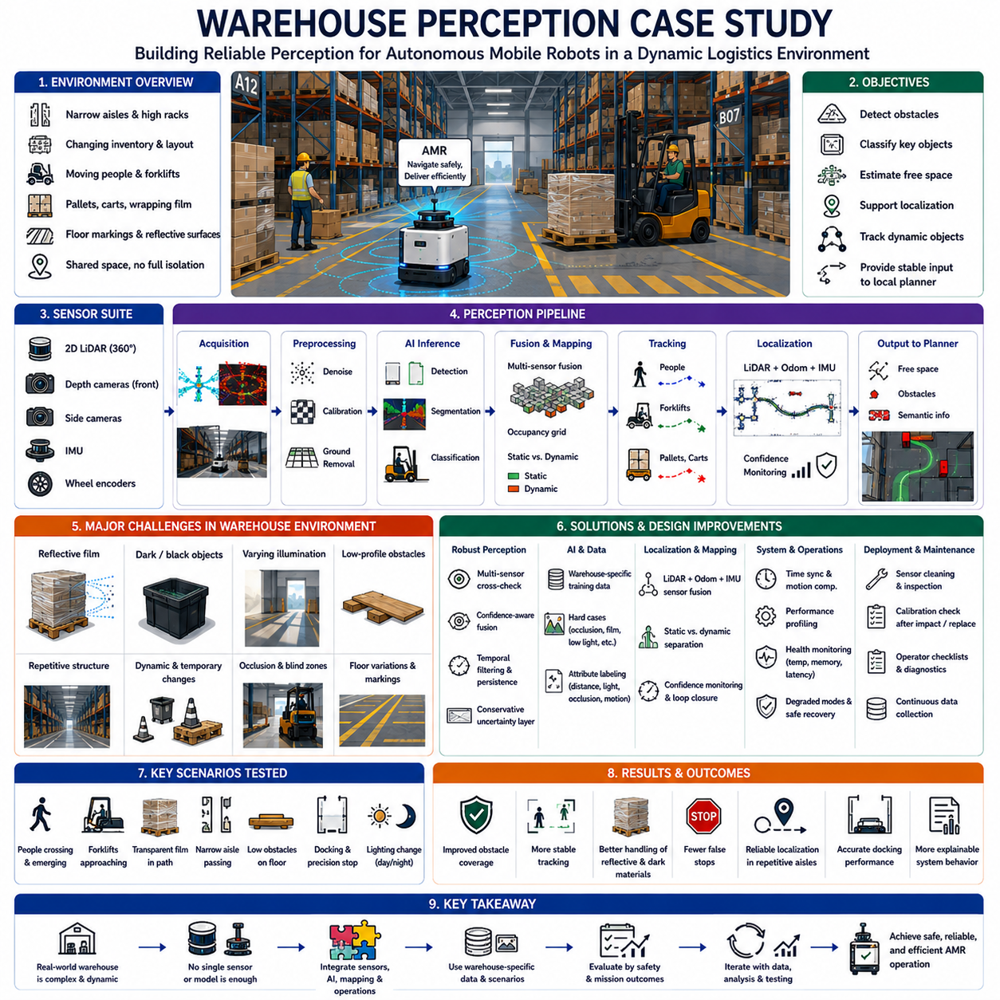
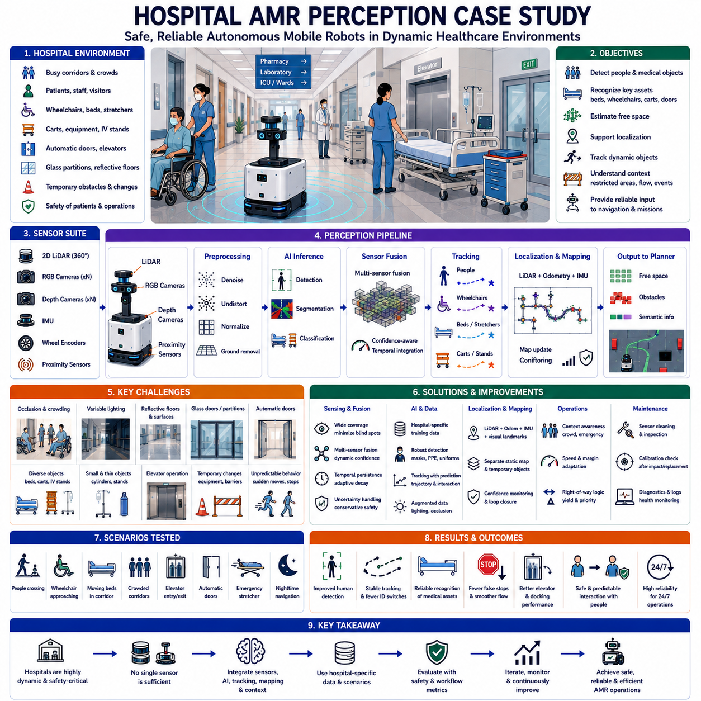
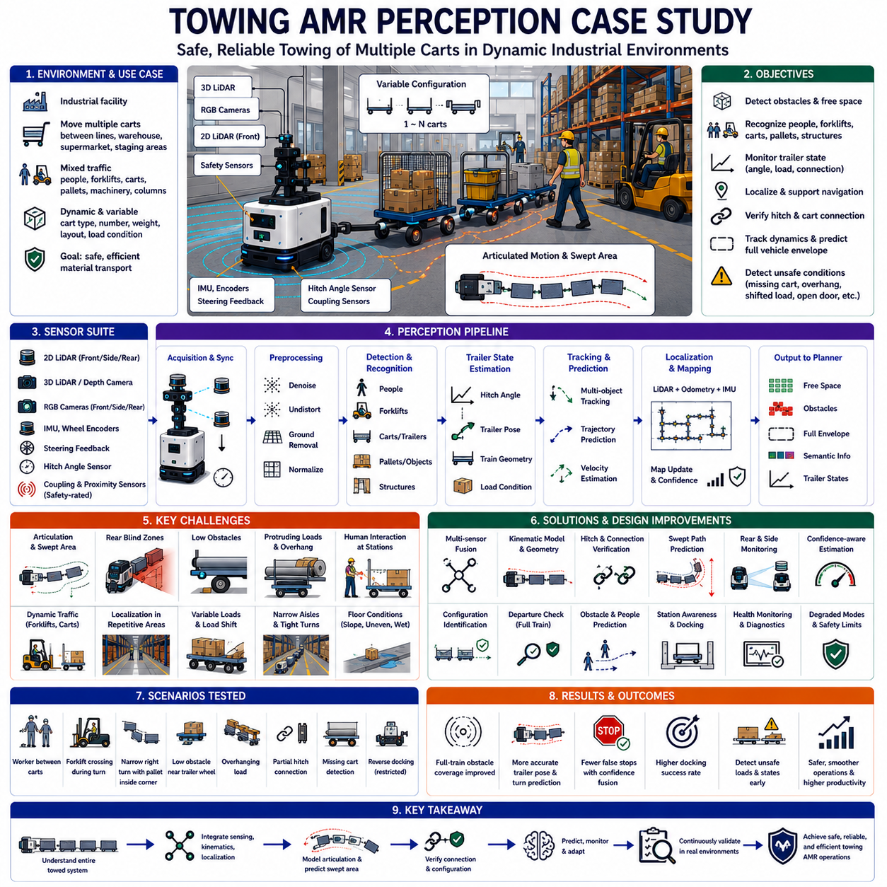
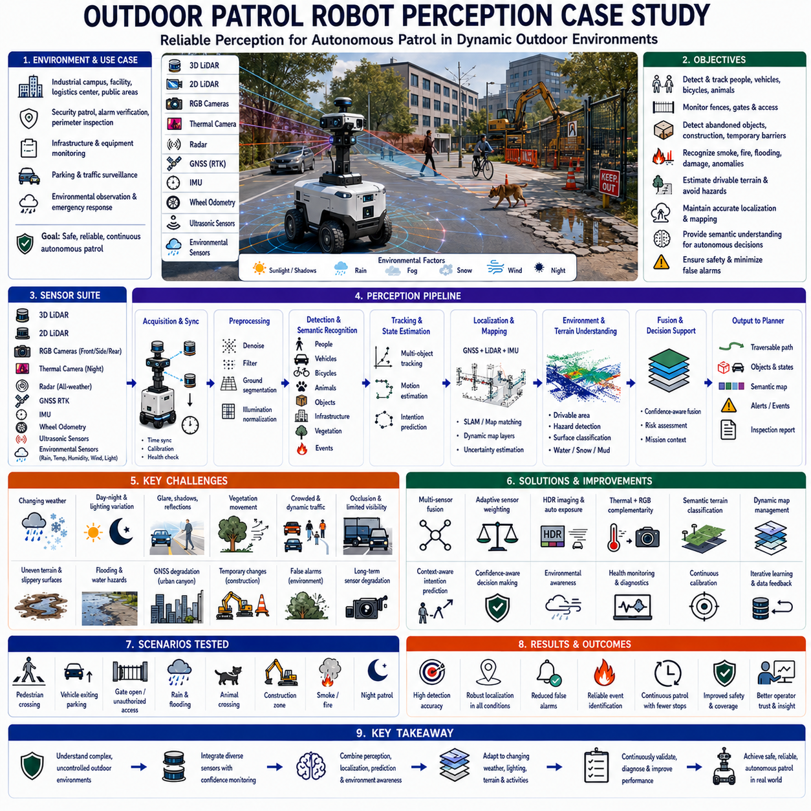
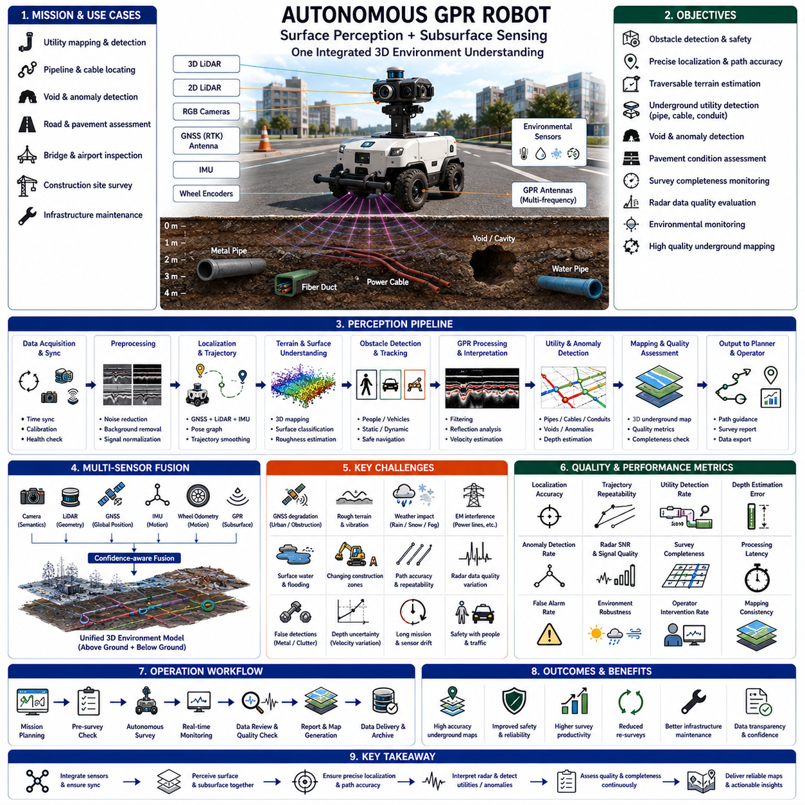
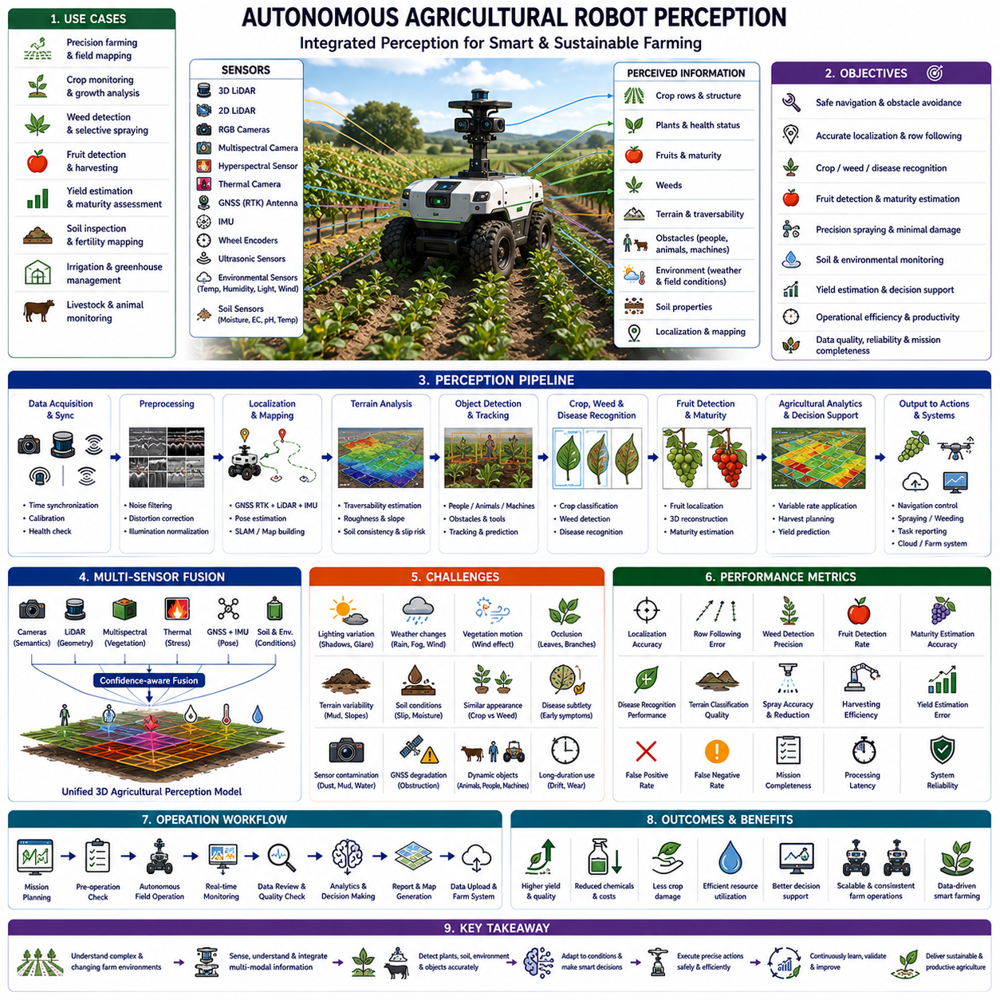
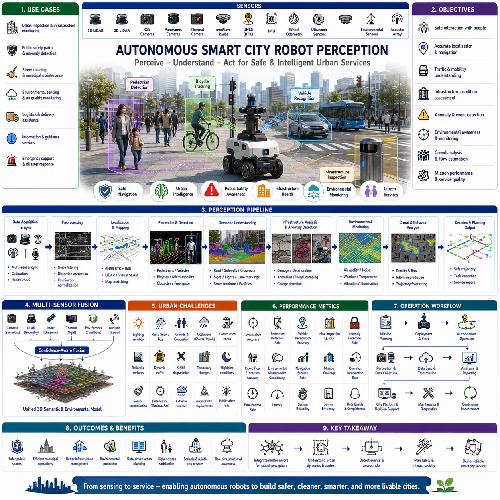
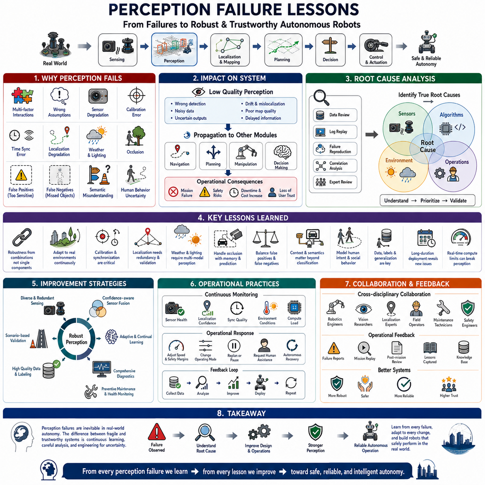

**Volume 03. AMR Sensors and Perception**

# Chapter 24. Industrial Perception Case Studies

## 24.1 Warehouse Perception Case Study

{width="7.268055555555556in" height="7.268055555555556in"}

창고 인지 사례 연구(Warehouse Perception Case Study)는 좁은 통로, 반사 표면, 이동 작업자, 지게차(Forklift), 팔레트(Pallet), 랙(Rack), 포장 필름(Wrapping Film), 바닥 표시(Floor Marking), 그리고 지속적으로 변화하는 재고를 포함하는 고밀도 물류 시설에서 자율주행 모바일 로봇(Autonomous Mobile Robot, AMR)을 안정적으로 운용하기 위해 인지 시스템을 어떻게 최적화했는지를 분석한다. 창고는 실내이면서 공간이 제한되어 있지만, 많은 물체가 유사한 형태를 가지며 가시성이 지속적으로 변화하고, 정적 환경과 동적 환경을 동시에 빠르게 이해해야 하므로 인지는 매우 어려운 문제였다.

대상 물류센터에서는 자율주행 모바일 로봇이 입고(Receiving), 보관(Storage), 피킹(Picking), 검사(Inspection), 출하(Shipping) 구역 사이에서 팔레트와 컨테이너(Container)를 운반하였다. 로봇은 완전히 분리된 전용 통로가 아니라 사람과 공유하는 공간을 이동하였다. 작업자는 이동 경로를 횡단하고, 지게차는 통로를 자유롭게 드나들며, 팔레트는 임시 위치에 놓였고, 생산 상황에 따라 문이 열리거나 닫혔다. 따라서 인지 시스템은 예측하기 어려운 환경 변화 속에서도 안정적인 주행과 안전한 대응을 동시에 지원해야 했다.

초기 로봇 플랫폼은 기본적인 장애물 검출과 위치추정을 위해 2차원 라이다(2D LiDAR)를 사용하였고, 오도메트리(Odometry)를 위한 휠 엔코더(Wheel Encoder), 자세 추정을 위한 관성측정장치(Inertial Measurement Unit, IMU), 전방 3차원 인지를 위한 깊이 카메라(Depth Camera)를 탑재하였다. 랙(Rack) 모서리와 도킹(Docking) 구역의 가시성을 높이기 위해 측면 카메라도 추가되었다. 이러한 센서 구성은 시야 범위, 비용, 계산 부하, 설치 복잡성, 창고 조명과 표면 조건에 대한 강인성을 종합적으로 고려하여 결정되었다.

주요 인지 목표는 장애물 검출, 운용상 중요한 객체 분류, 자유 공간(Free Space) 추정, 위치추정 지원, 동적 객체 추적, 그리고 지역 경로계획기(Local Planner)에 안정적인 정보를 제공하는 것이었다. 모든 창고 물체를 완벽하게 의미적으로 이해할 필요는 없었다. 대신 사람, 지게차, 팔레트, 랙, 카트(Cart), 문, 벽, 바닥 장애물, 임시 적치물을 신뢰성 있게 인식하여 안전한 주행과 임무 수행을 지원하는 것이 핵심 목표였다.

초기 현장 시험에서는 장애물 검출 성능이 물체의 형상에 크게 의존한다는 사실이 확인되었다. 벽, 랙 기둥, 적재된 팔레트와 같은 큰 수직 구조물은 안정적으로 검출되었다. 반면 목재 판자, 팔레트 파손 조각, 얇은 금속 막대와 같은 낮은 장애물은 깊이 픽셀이나 라이다 반사점이 매우 적어 검출이 어려웠다. 이러한 물체는 특히 최소 제동 거리 부근에서 로봇 경로를 막을 경우 큰 위험 요소가 되었다.

반사 포장 필름(Reflective Wrapping Film)은 또 다른 중요한 문제였다. 투명하거나 광택이 있는 플라스틱 필름은 깊이 카메라에서 불안정한 거리 측정, 누락 영역, 잘못된 반사를 발생시켰다. 카메라 각도와 조명 조건에 따라 동일한 팔레트가 완전한 장애물, 부분적으로 비어 있는 공간, 또는 불규칙한 구조처럼 보였다. 따라서 인지 파이프라인은 단일 깊이 영상에 의존하지 않고 시간적 통합(Temporal Integration), 신뢰도 필터링(Confidence Filtering), 보수적인 점유 공간 갱신을 적용해야 했다.

검은색 재질도 인지 성능을 저하시켰다. 검은 플라스틱 용기, 고무 부품, 검은색 도장 장비는 적외선을 흡수하여 깊이 카메라의 측정값을 희박하거나 무효하게 만들었다. 초기 시스템은 일부 검은 물체를 먼 배경이나 자유 공간으로 잘못 해석하였다. 이를 해결하기 위해 깊이 카메라와 라이다를 상호 검증하고, 불확실한 깊이 영역을 즉시 자유 공간으로 제거하지 않는 규칙이 추가되었다.

창고 조명은 예상보다 훨씬 다양하였다. 일부 통로는 매우 밝았지만 상부 랙이나 하역 구역은 그림자가 많았다. 출입구를 통해 들어오는 햇빛은 높은 명암 대비를 만들고 카메라 영상을 순간적으로 포화시켰다. 로봇이 어두운 구역과 밝은 구역 사이를 이동할 때 자동 노출(Auto Exposure)이 즉시 적응하지 못하여 검출 신뢰도가 일시적으로 감소하였다. 노출 제한, 영역 기반 측광(Region-based Metering), 실제 조명 변화가 포함된 학습 데이터가 이러한 문제를 개선하는 데 활용되었다.

랙 구조는 반복적인 기하학 패턴을 형성하여 위치추정(Localization)에도 영향을 주었다. 긴 통로에는 거의 동일한 기둥, 보(Beam), 팔레트, 라벨이 반복되어 지역 특징(Local Feature)의 구별성이 감소하였다. 2차원 라이다 기반 위치추정은 전반적으로 안정적이었지만, 여러 통로가 유사한 형태를 가지거나 임시 팔레트가 지도상의 랙 구조를 가릴 경우 신뢰도가 감소하였다. 따라서 기하학적 정합(Geometric Matching)은 오도메트리와 관성 정보를 함께 활용하고 신뢰도를 지속적으로 감시하도록 설계되었다.

임시 환경 변화는 지도 관련 문제도 유발하였다. 기준 지도를 생성할 당시 비어 있던 위치에 팔레트가 임시로 적재되었으며, 안전 펜스, 카트, 충전 장비, 포장 자재도 작업 교대마다 위치가 달라졌다. 위치추정 및 지도 작성 시스템이 이러한 물체를 모두 영구 구조물로 처리하면 지도는 불필요하게 복잡해졌고, 반대로 너무 적극적으로 제거하면 실제 구조물이 사라질 수 있었다. 따라서 고정 인프라와 임시 점유 정보를 분리하여 관리하는 방식이 적용되었다.

사람 검출(Human Detection)은 가장 중요한 의미 기반 기능으로 간주되었다. 작업자는 서로 다른 작업복, 안전조끼, 안전모를 착용하였고, 계절에 따라 복장이 달라졌으며, 서 있거나, 몸을 숙이거나, 무릎을 꿇거나, 상자를 들거나, 팔레트 뒤에 부분적으로 가려질 수도 있었다. 직립 보행자만 주로 학습한 검출기는 이러한 자세에서 신뢰도가 크게 감소하였다. 따라서 창고 환경에 특화된 추가 학습 데이터와 보수적인 주행 정책이 적용되어 안전성을 확보하였다.

지게차 인지(Forklift Perception)는 단순한 분류뿐 아니라 움직임 예측도 요구하였다. 지게차는 빠르게 방향을 전환하고, 후진하여 통로에 진입하며, 적재물에 따라 외형이 달라졌고, 랙 뒤에 부분적으로 가려지는 경우도 많았다. 포크(Fork)는 본체보다 앞으로 돌출되어 낮은 위치의 위험 요소를 형성하였다. 따라서 시스템은 차량 본체만이 아니라 전체 점유 영역을 추적하고, 속도와 이동 방향 및 불확실성을 고려하여 안전 영역을 확장하였다.

팔레트 검출(Pallet Detection)은 주행뿐 아니라 도킹에도 중요한 역할을 수행하였다. 빈 팔레트는 내부가 비어 있는 구조 때문에 센서 반사가 불연속적으로 나타났고, 손상된 팔레트는 불규칙한 형상을 생성하였다. 적재된 팔레트 역시 크기와 포장 형태가 매우 다양하였다. 단순한 외형 기반 검출만으로는 충분하지 않았으며, 폭, 높이, 바닥 접촉, 반복되는 목재 구조, 예상 위치를 함께 활용하여 기하학과 의미 정보를 결합한 검출 방식이 적용되었다.

초기 장애물 융합(Obstacle Fusion)은 모든 센서에 동일한 고정 신뢰도 임계값을 적용하였다. 그러나 환경이 변화하면 센서 신뢰도도 함께 변하기 때문에 이러한 접근은 적절하지 않았다. 깊이 카메라는 반사 및 검은색 물체에 취약하였고, 라이다는 얇은 구조물이나 수직 정보를 충분히 제공하지 못하였다. 개선된 융합 시스템은 센서별 신뢰도, 공간적 일관성, 관측 이력, 센서 상태를 함께 고려하여 지역 점유 공간을 갱신하였다.

시간적 지속성(Temporal Persistence)도 세밀하게 조정되었다. 측정 노이즈 때문에 한 프레임에서 장애물이 사라졌다고 해서 즉시 제거해서는 안 되지만, 지나치게 오래 유지하면 사람이나 지게차가 이동한 뒤에도 유령 장애물(Ghost Obstacle)이 남게 된다. 최종 시스템은 객체 종류, 센서 신뢰도, 운동 상태, 관측 이력에 따라 서로 다른 감쇠율(Decay Rate)을 적용하였다. 움직임이 확인된 동적 객체는 빠르게 제거하고, 불확실한 정적 장애물은 안전을 위해 더 오래 유지하였다.

지면 분할(Ground Segmentation) 역시 중요한 문제였다. 창고 바닥은 대부분 평탄하지만 경사로, 배수 덮개, 신축 이음부, 도크 플레이트(Dock Plate), 손상된 콘크리트, 도색된 선, 반사 에폭시(Epoxy) 바닥 등이 존재하였다. 초기 알고리즘은 경사로나 돌출부를 장애물로 잘못 분류하거나, 낮은 장애물을 지면으로 흡수하는 경우가 있었다. 따라서 지역 경사, 로봇의 피치(Pitch), 예상 바닥 변화, 최소 장애물 높이를 고려하는 지면 제거 알고리즘으로 개선되었다.

바닥 표시(Floor Marking)는 유용한 운용 정보를 제공하면서도 잘못된 시각 경계를 생성하기도 하였다. 노란 안전선, 줄무늬 구역, 화살표, 반사 테이프는 객체 경계처럼 보이는 경우가 있었다. 의미 분할(Semantic Segmentation)은 주행 가능 영역, 제한 구역, 바닥 표시, 실제 장애물을 구분하도록 학습되었다. 이후 지역 경로계획기는 바닥 표시를 물리적 장애물이 아닌 운용 정보로 활용하였다.

센서 배치(Sensor Placement)는 사각지대(Blind Zone)에 큰 영향을 미쳤다. 전방 깊이 카메라는 전방 시야는 우수했지만 회전 시 측면 가까이의 물체를 관찰하지 못하였다. 랙 모서리나 팔레트 가장자리는 이러한 사각지대에 들어갈 수 있었다. 측면 카메라와 근거리 보호 센서를 추가하였으며, 조향 방향에 따라 로봇 외곽 모델(Footprint Model)을 확장하였다. 기계 구조물, 범퍼, 적재물 돌출부도 인지와 경로계획에서 함께 고려되었다.

로봇이 빠르게 회전하거나 울퉁불퉁한 바닥을 통과할 때 운동 왜곡(Motion Distortion)이 포인트 클라우드(Point Cloud)에 영향을 주었다. 스캔 과정에서 서로 다른 시각에 획득된 측정값이 동일한 시점으로 처리되면서 벽과 랙 기둥이 휘어 보였다. 이는 위치추정과 장애물 정렬 성능을 저하시켰다. 오도메트리와 관성 정보를 이용한 시간 기반 운동 보상이 추가되었으며, 모든 장치의 타임스탬프 정확성도 함께 검증되었다.

네트워크와 계산 자원의 제약도 실제 성능에 영향을 주었다. 고해상도 카메라 영상, 포인트 클라우드, 인공지능 추론, 시각화, 로그 기록, 원격 모니터링이 CPU, GPU, 메모리, 네트워크를 동시에 사용하였다. 초기 시험에서는 평균 프레임 속도는 충분했지만 간헐적인 지연이 장애물 갱신을 늦추는 현상이 발생하였다. 상세한 성능 분석 결과 평균 처리량보다 최악 조건의 실행 시간과 큐 증가가 훨씬 중요하다는 사실이 확인되었다.

인지 소프트웨어는 데이터 획득(Acquisition), 전처리, 추론, 융합, 추적, 위치추정, 지도 작성, 상태 모니터링(Health Monitoring) 단계로 명확히 분리되었다. 각 단계는 처리 주기, 지연 시간, 메시지 손실, 큐 크기, 신뢰도, 오류 상태를 진단 정보로 발행하였다. 이를 통해 개발자는 문제가 원시 데이터, 처리 지연, 모델 출력, 좌표 변환, 후속 융합 중 어느 단계에서 발생했는지를 빠르게 확인할 수 있었다.

현장 데이터 수집 프로그램(Field Data Collection Program)은 실제 창고 환경의 다양성을 반영하도록 설계되었다. 서로 다른 작업 시간, 조명, 교통량, 적재 상태, 통로 구성, 도킹 작업, 유지보수 활동 중 데이터를 기록하였다. 낙하한 상자, 돌출된 포크, 반쯤 열린 문, 랙 근처에 무릎을 꿇은 작업자, 반사 팔레트, 센서 사각지대에 놓인 물체와 같은 드문 사례도 적극적으로 수집하여 학습과 검증에 활용하였다.

데이터 라벨링(Annotation)은 과도한 세부 정보보다 실제 운용 중요성에 초점을 맞추었다. 사람, 지게차, 팔레트, 카트, 랙, 문, 벽, 장애물, 자유 공간, 제한 구역, 불확실 영역을 라벨링하였다. 가려짐, 잘림, 거리, 조명, 운동 상태도 함께 기록하여 전체 정확도뿐 아니라 위험 상황에서의 성능도 평가할 수 있도록 하였다.

오프라인 평가는 검출 정확도, 재현율(Recall), 분할 품질, 추적 안정성, 위치 오차, 장애물 지속성, 처리 지연을 사용하였다. 그러나 우수한 오프라인 지표가 항상 안전한 로봇 운용을 의미하지는 않았다. 영상에서는 작은 경계 오차라도 팔레트 모서리 근처에서는 실제 충돌 위험이 될 수 있었다. 따라서 인지 성능은 비상 정지, 경로 차단, 도킹 성공률, 불필요한 감속, 안전 통과 거리와 같은 실제 운용 결과와 함께 평가되었다.

시나리오 기반 시험(Scenario-based Testing)은 가장 중요한 검증 방법이 되었다. 로봇은 정지된 팔레트, 이동 작업자, 교차하는 지게차, 낮은 장애물, 반사 물체, 검은색 용기, 좁은 통로, 막힌 통로, 변화하는 조명 조건에서 반복적으로 시험되었다. 각 시나리오는 다양한 접근 각도와 속도에서 반복되었으며, 기대되는 인지 출력과 로봇 반응을 사전에 정의하여 소프트웨어 버전 간 객관적인 비교가 가능하도록 하였다.

대표적인 시나리오는 작업자가 랙 뒤에서 갑자기 나타나는 상황이었다. 초기에는 작업자의 일부만 보였기 때문에 첫 번째 소프트웨어는 신뢰도가 임계값에 도달하지 못하여 검출이 늦었다. 개선된 시스템은 부분 사람 검출, 운동 정보, 사각지대 인식, 교차로 접근 시 속도 감소를 결합하여 더 빠르고 안전하게 대응하였다.

또 다른 시나리오는 팔레트에서 늘어진 투명 필름이 이동 경로를 가로막는 상황이었다. 깊이 카메라는 불안정한 거리 정보를 생성하였고, 2차원 라이다는 필름 아래를 통과하였다. 어느 하나의 센서만으로는 물체를 안정적으로 표현할 수 없었다. 따라서 반복적으로 불일치가 발생하는 영역을 잠재적인 점유 공간으로 처리하는 보수적인 불확실성 계층(Uncertainty Layer)이 추가되었다.

도킹 시험(Docking Test)은 일반 주행과 정밀 도킹이 서로 다른 인지 구성을 요구한다는 사실을 보여주었다. 일반 주행에서는 넓은 장애물 검출과 동적 추적을 우선하였지만, 목표 지점에 접근하면 고해상도 지역 형상, 도킹 스테이션 특징 검출, 저속 운행, 정밀 자세 검증으로 전환하였다. 또한 예상된 스테이션이 실제로 존재하는지와 최종 접근 구간에 예상치 못한 장애물이 있는지도 함께 확인하였다.

불필요한 정지(False Stop)는 창고 생산성을 저하시켰기 때문에 별도로 분석되었다. 반사, 이동 그림자, 먼지, 센서 노이즈, 일시적인 지도 불일치가 순간적인 장애물을 생성하였다. 전체 안전 임계값을 낮추는 대신 원인을 분류하여 해당 센서 신뢰도, 시간 필터링, 상황 인식 로직만 개선하였다. 이를 통해 안전성을 유지하면서 불필요한 정지를 크게 줄일 수 있었다.

장시간 시험(Long-duration Testing)은 짧은 시연에서는 보이지 않던 문제를 발견하였다. 카메라 온도 상승, 메모리 증가, 로그 파일 저장 공간 부족, 네트워크 트래픽 변화 등이 수 시간 이후에 나타났다. 일부 인지 지연은 장시간 운용에서만 발생하였다. 따라서 온도, 메모리, 디스크 공간, 토픽 주기, 처리 지연을 지속적으로 감시하는 기능이 양산 승인 기준에 포함되었다.

다중 로봇(Multi-robot) 운용에서는 추가적인 문제가 발생하였다. 여러 대의 로봇이 동일한 이동 객체를 서로 다른 위치에서 관측하였으며, 플릿 관리(Fleet Management)는 교통 상황에 따라 경로를 계속 변경하였다. 지역 인지는 즉각적인 안전을 담당하였고, 플릿 시스템은 경로와 예약 정보를 제공하였다. 공유된 관측 정보는 타임스탬프, 위치 오차, 통신 지연 때문에 직접 충돌 회피에 사용하는 대신 보조 정보로 신중하게 활용되었다.

운용 단계에서는 성능 저하 모드(Degraded Mode)도 설계되었다. 깊이 카메라 하나가 고장 나더라도 나머지 센서가 충분하면 속도를 줄여 계속 운행할 수 있었다. 위치추정 신뢰도가 낮아지면 안전 구역으로 이동하거나 정지하였다. 네트워크가 끊겨도 온보드(Onboard) 인지와 안전 기능은 계속 동작하였다. 각 성능 저하 모드에는 진입 조건, 속도 제한, 허용 임무, 복구 절차가 명확히 정의되었다.

유지보수 절차(Maintenance Procedure)도 인지 시스템 분석 결과를 반영하여 개선되었다. 작업자는 렌즈 청소, 센서 보호창 점검, 장착 상태 확인, 케이블 상태, 시간 동기화, 저장 공간, 진단 경고를 정기적으로 확인하였다. 센서를 교체하거나 기계적 충격을 받거나 구조를 변경한 경우에는 반드시 보정을 다시 검증하였다. 이러한 절차는 점진적인 하드웨어 열화를 소프트웨어나 인공지능 문제로 오인하는 것을 방지하였다.

최종 시스템은 장애물 검출 범위가 향상되었고, 동적 객체 추적이 더욱 안정되었으며, 반사 물체와 검은색 물체 처리 능력이 개선되었고, 불필요한 정지가 감소하였다. 위치추정은 센서 융합과 신뢰도 모니터링을 통해 반복적인 통로에서도 안정성을 유지하였다. 스테이션 전용 인지와 최종 접근 검증을 추가하여 정밀 도킹 성능도 향상되었다. 무엇보다 센서 신뢰도, 시간 정보, 융합 결정, 상태 정보가 모두 기록되면서 시스템 동작을 명확히 설명할 수 있게 되었다.

이 사례 연구는 창고 인지가 하나의 뛰어난 센서나 하나의 고성능 인공지능 모델만으로 해결되지 않는다는 사실을 보여준다. 안정적인 운용은 센서 배치, 보정, 동기화, 원시 데이터 품질, 신뢰도 기반 융합, 시간적 추론, 위치추정, 지도 작성, 계산 자원, 상태 모니터링, 운용 절차가 모두 함께 최적화되어야 가능하다. 각 구성 요소는 실제 창고 환경과 안전 요구사항을 고려하여 평가되어야 한다.

또한 창고 전용 데이터와 시나리오가 반드시 필요하다는 점도 확인되었다. 공개 데이터셋에는 사람, 차량, 실내 환경이 포함되어 있지만 반사 포장재, 손상된 팔레트, 반복적인 랙 구조, 돌출된 포크, 좁은 도킹 구역, 창고 특유의 조명 변화는 충분히 포함되어 있지 않다. 따라서 실제 현장에서 발생한 장애 사례와 어려운 환경을 지속적으로 수집하는 것이 장기적인 인지 성능 향상을 위한 중요한 자산이 된다.

궁극적으로 창고 인지 개발은 개별 알고리즘 시험에서 시스템 수준 검증(System-level Validation)으로 전환되면서 성공하였다. 개발자는 원시 센서 동작과 인지 결과를 로봇의 의사결정, 임무 수행 성능, 안전 결과까지 연결하여 분석하였다. 체계적인 데이터 수집, 시나리오 기반 시험, 장애 분석, 반복적인 개선, 지속적인 모니터링을 통해 인지 시스템은 복잡하고 지속적으로 변화하는 물류 환경에서도 신뢰성 있는 자율주행 운용이 가능한 수준으로 발전하였다.

## 24.2 Hospital AMR Perception Case Study

{width="7.268055555555556in" height="7.268055555555556in"}

병원은 안전성(Safety), 신뢰성(Reliability), 그리고 사람과의 상호작용(Human Interaction)이 모두 동일하게 중요한 가장 까다로운 실내 자율주행 환경 중 하나이다. 구조화된 산업 현장과 달리 병원은 지속적으로 변화하는 보행자 흐름, 이동식 의료 장비, 응급 상황, 투명 파티션(Transparent Partition), 좁은 복도, 엘리베이터(Elevator), 병상(Hospital Bed), 휠체어(Wheelchair), 그리고 임시 장애물이 공존한다. 따라서 인지 시스템은 매우 동적인 환경을 이해하면서도 취약한 사람들 주변에서 안전한 주행을 유지하고 의료 업무를 방해하지 않아야 한다.

대상 시스템은 약품(Medication), 검사 시료(Laboratory Sample), 멸균 기구(Sterile Instrument), 식사, 린넨(Linen), 의료 소모품, 폐기물을 약국, 검사실, 수술실, 병동, 중환자실(Intensive Care Unit), 물류센터(Logistics Center) 사이에서 운반하는 자율주행 모바일 로봇(Autonomous Mobile Robot, AMR)이었다. 로봇은 주야간 내내 의사, 간호사, 환자, 방문객, 청소 인력, 응급 대응팀과 동일한 복도를 공유하며 운행하였다. 따라서 인지 시스템은 지속적으로 변화하는 환경과 예측하기 어려운 사람의 행동 속에서도 일관된 성능을 유지해야 했다.

로봇 플랫폼은 위치추정(Localization)과 장애물 검출을 위한 2차원 라이다(2D LiDAR), 의미 기반 인지(Semantic Perception)를 위한 다중 RGB 카메라, 3차원 장애물 추정을 위한 깊이 카메라(Depth Camera), 오도메트리(Odometry)를 위한 휠 엔코더(Wheel Encoder), 자세 추정을 위한 관성측정장치(Inertial Measurement Unit, IMU)를 사용하였다. 또한 도킹(Docking)과 근거리 상호작용을 위해 근접 센서(Proximity Sensor)를 추가하였다. 센서 배치는 좁은 복도에서도 사각지대를 최소화하면서 넓은 시야를 확보하도록 설계되었다.

인지 시스템의 목표는 단순한 충돌 회피(Collision Avoidance)를 넘어서는 것이었다. 사람, 휠체어, 병상, 들것(Stretcher), 의료 카트(Medical Cart), 수액 거치대(Infusion Stand), 청소 장비, 서비스 로봇(Service Robot), 자동문(Automatic Door), 엘리베이터, 비상구(Emergency Exit), 임시 차단 시설을 검출해야 했다. 또한 자유 공간(Free Space)을 추정하고 제한 구역을 인식하며 보행자 흐름을 분석하고 위치추정을 지원하여 내비게이션(Navigation)과 임무 계획(Mission Planning)에 신뢰성 있는 정보를 제공해야 했다.

병원 복도는 창고와 매우 다른 특성을 보였다. 사람들은 대화를 위해 갑자기 멈추거나, 병실에서 예고 없이 나왔으며, 의료 장비를 운반하면서 신체 형태가 계속 변하였다. 의료진은 응급 상황에서 매우 빠르게 움직였고, 고령 환자는 느리고 불규칙하게 이동하였다. 따라서 인지 시스템은 순간적인 객체 검출보다 지속적인 사람 추적(Human Tracking)에 더욱 의존해야 했다.

휠체어(Wheelchair)는 가장 중요한 객체 중 하나였다. 수동 휠체어와 전동 휠체어는 크기와 형태가 크게 달랐으며, 보호자가 밀거나 환자가 직접 운전하는 경우도 있었다. 담요, 의료 가방, 산소통(Oxygen Cylinder), 개인 소지품이 휠체어의 외형을 지속적으로 변화시켰다. 따라서 인지 모델은 의미 기반 분류와 기하학적 일관성, 시간 기반 추적을 결합하여 안정적인 인식을 유지하였다.

병상(Hospital Bed)은 좁은 복도에서 큰 공간을 차지하면서도 방향을 계속 바꾸기 때문에 추가적인 어려움을 만들었다. 병상은 정지 상태일 수도 있고, 의료진이 밀거나 응급 상황에서 빠르게 이동할 수도 있었다. 모니터(Monitor), 수액 펌프(Infusion Pump), 산소통과 같은 장비가 병상 외곽으로 돌출되어 실제 점유 공간을 변화시켰다. 따라서 내비게이션 시스템은 단순히 병상 본체가 아니라 전체 동적 점유 영역(Dynamic Footprint)을 추정하였다.

의료 카트(Medical Cart)는 용도에 따라 다양한 형태를 가지고 있었다. 약품 카트, 식사 카트, 청소 카트, 공급 카트, 진단 장비는 모두 서로 다른 크기와 표면 특성을 가졌다. 광택이 있는 스테인리스 표면은 깊이 센서 성능을 저하시켰고, 투명 보호 커버는 3차원 형상 복원을 어렵게 만들었다. 따라서 일반 실내 데이터셋 대신 실제 병원 장비를 포함한 학습 데이터가 구축되었다.

유리문(Glass Door)과 투명 파티션은 센서 인식에 큰 어려움을 주었다. 능동형 깊이 카메라는 불완전한 거리 정보를 생성하였으며, 2차원 라이다는 입사각에 따라 유리를 통과하거나 매우 약한 반사를 생성하였다. 따라서 순수한 기하학 기반 장애물 검출은 유리 구조물 근처에서 신뢰성이 떨어졌다. 건물 구조에 대한 사전 정보와 의미 기반 인식이 이러한 센서 한계를 보완하였다.

자동문(Automatic Door)은 또 다른 복잡성을 추가하였다. 자동문은 사람의 접근 여부와 출입 권한에 따라 계속 열리고 닫혔다. 인지 시스템은 잠시 닫혀 있지만 곧 열릴 문과 실제로 통과할 수 없는 문을 구분해야 했다. 이를 위해 시각 인식, 건물 지도(Building Map), 운용 상황 정보를 함께 사용하여 불필요한 대기나 반복적인 주행 실패를 방지하였다.

엘리베이터(Elevator) 이용은 특수한 인지 기능을 요구하였다. 엘리베이터 탑승과 하차 과정에서는 사람, 문, 좁은 공간, 층 변화가 동시에 발생하였다. 로봇은 엘리베이터 문을 인식하고, 내부 점유 상태를 추정하며, 진입 가능 여부를 확인하고, 사람의 움직임을 관찰한 후 진입을 결정하였다. 층 이동 과정에서 작은 위치 오차도 누적될 수 있으므로 정확한 인지와 시간 동기화(Time Synchronization)가 필수적이었다.

병원의 조명은 시간대에 따라 크게 달라졌다. 밝은 로비와 접수 구역은 병실, 야간 복도, 영상의학과, 응급실의 어두운 환경과 큰 차이를 보였다. 반사 바닥은 강한 반사광을 만들었으며 의료 장비의 디스플레이도 국부적인 조명 변화를 유발하였다. 카메라 자동 노출은 밝기 변화 후 안정화까지 여러 프레임이 필요하였다. 적응형 노출 제어, 영상 정규화(Image Normalization), 다양한 조명 조건을 포함한 학습 데이터가 인지 강인성을 향상시켰다.

사람의 외형도 예상보다 훨씬 다양하였다. 의사, 간호사, 환자, 방문객, 유지보수 인력은 서로 다른 복장과 보호복, 수술복, 마스크, 장갑, 안면 보호구를 착용하였다. 감염병 상황에서는 대부분의 사람이 마스크와 개인 보호 장비(Personal Protective Equipment)를 착용하여 얼굴 특징이 거의 보이지 않았다. 따라서 사람 검출은 얼굴보다 신체 형상, 움직임, 전신 특징에 더욱 의존하였다.

가려짐(Occlusion)은 매우 자주 발생하였다. 간호사는 의료 카트 뒤로 사라졌다가 몇 초 후 다시 나타났고, 환자는 병상이나 휠체어, 병실 입구에 의해 부분적으로 가려졌다. 따라서 안정적인 다중 객체 추적(Multi-object Tracking)은 프레임 단위 검출보다 시간 기반 연관(Temporal Association), 궤적 예측(Trajectory Prediction), 불확실성 추정(Uncertainty Estimation)에 의존하였다. 장기 추적(Long-term Tracking)은 객체 식별 전환(Identity Switching)을 크게 줄였다.

소형 의료 장비는 독특한 위험 요소였다. 산소통, 수액 거치대, 이동형 모니터, 폐기물 통, 접이식 휠체어는 바닥 면적은 작지만 로봇의 경로를 막을 수 있었다. 얇은 구조 때문에 라이다 반사가 적고 깊이 영상도 불완전한 경우가 많았다. 센서 융합(Sensor Fusion)은 다양한 시점에서 얻은 기하학 정보와 시간적 누적을 결합하여 검출 신뢰성을 향상시키고 미검출(False Negative)을 줄였다.

바닥 상태도 인지 품질에 영향을 주었다. 병원은 광택이 있는 바닥을 사용하기 때문에 영상 반사와 적외선 반응이 크게 달라졌다. 청소 중에는 젖은 바닥이 광학 특성을 변화시켰다. 비상 통로, 제한 구역, 수술실 접근 구역을 나타내는 바닥 표시도 시각적 복잡성을 증가시켰다. 의미 분할(Semantic Segmentation)은 주행 가능 영역, 제한 표시, 반사 현상, 실제 장애물을 구분한 후 경로계획에 활용되었다.

위치추정(Localization)은 반복적인 병원 구조에서도 높은 정확도를 유지해야 했다. 긴 복도, 동일한 병실 문, 반복되는 천장 구조와 벽 패턴은 시각 특징의 고유성을 감소시켰다. 라이다 기반 위치추정은 전반적으로 안정적이었지만 거의 동일한 복도에서는 모호성이 발생하였다. 따라서 오도메트리, 관성 정보, 시각 특징, 신뢰도 추정을 함께 융합하여 누적 오차를 줄였다.

임시 환경 변화도 매우 빈번하였다. 이동형 진단 장비, 임시 칸막이, 공사 구역, 응급 물품 보관대, 유지보수 작업은 복도 구조를 지속적으로 변화시켰다. 지도 작성(Mapping) 시스템은 모든 관측 결과를 영구 지도에 반영하지 않고 고정 구조와 임시 점유 공간을 분리하여 관리하였다. 이를 통해 장기적인 지도 안정성과 단기적인 장애물 회피를 동시에 만족시켰다.

응급 상황(Emergency Situation)에서는 적응형 인지 동작이 필요하였다. 응급 환자 이송이나 의료 대응 과정에서는 의료진이 빠르게 이동하며 우선 통행권을 요구하였다. 로봇은 높은 보행자 밀도, 빠른 이동 속도, 응급 들것, 의료 대응팀을 인식하여 자동으로 속도를 줄이고 안전 거리를 확대하거나 일시 정지하였다. 즉, 인지는 단순한 장애물 회피가 아니라 상황 인식(Context Awareness)을 지원하였다.

초기 시스템은 모든 환경에서 동일한 신뢰도 임계값을 사용하였다. 그러나 실제 시험 결과 센서의 신뢰도는 조명, 군중 밀도, 반사 재질, 관측 각도에 따라 크게 달라졌다. 신뢰도 기반 센서 융합(Confidence-aware Sensor Fusion)은 센서 상태, 환경 조건, 시간적 일관성, 과거 신뢰도를 이용하여 동적으로 가중치를 조정하였다. 이 방법은 고정 임계값 방식보다 훨씬 안정적인 장애물 표현을 제공하였다.

시간적 지속성(Temporal Persistence)도 세심한 조정이 필요하였다. 의료진은 로봇 앞을 지나 곧바로 병실 안으로 들어가는 경우가 많았다. 객체를 너무 빨리 제거하면 위험 예측이 어려워졌고, 너무 오래 유지하면 유령 장애물(Ghost Obstacle)이 생성되었다. 따라서 객체 지속성은 객체 종류, 움직임, 관측 신뢰도, 환경 상황에 따라 다르게 적용되었다. 사람과 의료 장비는 서로 다른 감쇠 정책(Decay Policy)을 사용하였다.

인지 소프트웨어는 데이터 획득(Acquisition), 전처리(Preprocessing), 동기화(Synchronization), 추론(Inference), 융합(Fusion), 추적(Tracking), 위치추정(Localization), 지도 작성(Mapping), 상태 모니터링(Health Monitoring) 모듈로 구성되었다. 각 모듈은 처리 지연(Latency), 처리 주기, 프레임 손실, 신뢰도, 자원 사용량, 동기화 상태를 지속적으로 기록하였다. 이를 통해 센서, 계산, 통신, 알고리즘 중 어느 부분에서 문제가 발생했는지를 빠르게 확인할 수 있었다.

병원 전역에서 대규모 데이터 수집(Data Collection)이 수행되었다. 주간, 야간, 응급 상황, 교대 시간, 청소 시간, 환자 이송, 물품 배송, 방문객 시간, 유지보수 작업을 포함하여 다양한 환경을 기록하였다. 특히 여러 대의 들것 이동, 휠체어 혼잡, 응급 대피, 반쯤 열린 방화문, 복도에 임시로 놓인 장비와 같은 드문 상황은 집중적으로 라벨링과 검증에 활용되었다.

데이터 라벨링(Annotation)은 지나친 의미 분류보다 실제 운용 중요성을 우선하였다. 사람, 휠체어, 병상, 의료 카트, 수액 거치대, 산소통, 서비스 로봇, 의료 장비, 자동문, 엘리베이터, 바닥 표시, 제한 구역을 정밀하게 라벨링하였다. 또한 가려짐 정도, 움직임 상태, 군중 밀도, 조명 조건, 불확실성도 함께 기록하여 실제 병원 환경에서의 성능을 정밀하게 평가할 수 있도록 하였다.

오프라인 평가는 객체 검출 정확도, 분할 품질, 추적 안정성, 위치 오차, 자유 공간 추정, 계산 지연, 시스템 강인성을 측정하였다. 그러나 개발자는 이러한 수치만으로는 실제 안전성을 보장할 수 없음을 확인하였다. 따라서 임무 성공률, 불필요한 정지 횟수, 대기 시간, 사람과의 상호작용 품질, 도킹 성공률, 주행 부드러움을 함께 평가하여 인지 성능과 실제 병원 업무 효율을 연결하였다.

시나리오 기반 검증(Scenario-based Validation)은 가장 중요한 시험 방법이었다. 환자 횡단, 혼잡한 복도, 이동 병상, 접근하는 휠체어, 양방향 보행, 응급 환자 이송, 엘리베이터 탑승, 자동문 통과, 반사 바닥, 임시 장애물, 야간 주행과 같은 대표적인 상황을 반복 시험하였다. 각 시나리오는 다양한 속도, 조명, 보행자 밀도에서 반복되어 실제 운용 이전에 시스템 동작을 충분히 검증하였다.

대표적인 어려운 상황은 간호사가 수액 거치대를 밀며 병실에서 갑자기 나오는 경우였다. 처음에는 수액 거치대만 보이고 이후 사람이 나타났다. 초기 소프트웨어는 부분적인 형상만 인식하여 검출이 늦었다. 개선된 시스템은 부분 객체 인식, 움직임 예측, 출입문 영역 인식, 병실 근처 감속을 결합하여 훨씬 빠른 대응을 가능하게 하였다.

또 다른 중요한 상황은 여러 병상이 교차로를 동시에 통과하는 동안 방문객이 여러 방향으로 이동하는 경우였다. 단순한 최근접 장애물 회피 방식은 불필요한 정지를 자주 발생시켰다. 개선된 시스템은 각각의 이동 경로를 예측하고 상호작용 영역을 분석하여 지역 경로계획기에 구조화된 동적 정보를 제공하였다. 그 결과 안전 거리를 유지하면서도 더욱 자연스럽고 효율적인 주행이 가능해졌다.

장시간 시험(Long-duration Testing)은 짧은 시연에서는 발견되지 않는 문제를 보여주었다. 카메라 온도 상승, 저장 장치 사용량 증가, 병원 교통량에 따른 프로세서 부하 변화, 무선 통신 품질 변화가 장시간 운용 후 나타났다. 지속적인 상태 모니터링은 실제 인지 성능 저하가 발생하기 전에 이러한 문제를 조기에 발견하였다. 이에 따라 예지 정비(Predictive Maintenance)를 위한 지표도 운영 과정에 포함되었다.

다중 로봇(Multi-robot) 운용에서는 새로운 협조 문제가 발생하였다. 배송 로봇들은 좁은 복도나 엘리베이터 앞에서 서로 마주치는 경우가 있었다. 각 로봇은 자체 인지를 유지하면서도 플릿 관리(Fleet Management)는 경로 예약과 우선순위를 공유하였다. 지역 인지는 즉각적인 안전을 담당하고 플릿은 전체 교통 흐름을 최적화함으로써 개별 로봇의 자율성을 유지하였다.

병원 환경에서는 성능 저하 운용 모드(Degraded Operating Mode)도 매우 중요하였다. 일부 센서가 고장 나더라도 나머지 센서가 충분한 안전성을 보장하면 제한된 속도로 계속 운행하였다. 안전 거리는 자동으로 확대되고 일부 임무는 제한되었다. 위치추정 신뢰도가 허용 수준 이하로 떨어지면 로봇은 안전하게 정지하거나 복구 위치로 이동하여 안정적인 인지가 회복될 때까지 대기하였다.

유지보수 절차(Maintenance Procedure)는 일반적인 하드웨어 점검보다 더욱 확대되었다. 매일 렌즈 청소, 센서 정렬 확인, 시간 동기화 상태, 진단 로그, 저장 공간, 보호 커버 상태를 점검하였다. 기계적 충격이나 센서 교체, 센서 장착부 유지보수 이후에는 반드시 보정을 다시 검증하였다. 이러한 절차는 점진적인 인지 성능 저하를 조기에 발견하는 데 중요한 역할을 하였다.

최종 인지 시스템은 사람 검출 성능이 향상되었고, 추적이 더욱 안정되었으며, 병원 전용 장비 인식이 개선되었고, 불필요한 정지가 감소하였다. 혼잡한 복도에서도 더욱 부드러운 주행이 가능해졌으며, 엘리베이터와 도킹 성능도 향상되었다. 신뢰도 기반 융합과 지속적인 상태 모니터링은 다양한 환경 변화에서도 높은 강인성을 제공하였다. 또한 모든 판단 과정이 진단 정보와 함께 기록되어 시스템 동작을 명확하게 설명할 수 있게 되었다.

이 병원 사례 연구는 안전한 의료 서비스 로봇(Medical Service Robot)이 단순한 객체 검출만으로는 구현될 수 없음을 보여준다. 신뢰성 있는 운용을 위해서는 센서 배치, 보정, 동기화, 의미 이해(Semantic Understanding), 시간적 추론, 위치추정, 신뢰도 추정, 상태 모니터링, 운영 절차, 지속적인 검증이 모두 필요하다. 각각의 요소는 환자 안전, 의료 업무 효율, 장기적인 운영 신뢰성에 직접적으로 기여한다.

또한 병원 전용 데이터셋(Hospital-specific Dataset)의 중요성도 확인되었다. 일반적인 실내 데이터셋에는 휠체어, 병상, 수액 장비, 반사 의료 장비, 혼잡한 복도, 응급 상황, 보호복 착용자, 병원 특유의 조명 조건이 충분히 포함되어 있지 않다. 따라서 실제 병원 환경에서 발생하는 다양한 사례를 지속적으로 수집하는 것이 의료 서비스용 인지 모델의 성능 향상에 필수적이다.

궁극적으로 병원 인지 프로그램은 개별 알고리즘 성능보다 시스템 전체(System-level) 관점에서 평가가 이루어졌기 때문에 성공할 수 있었다. 원시 센서 품질, 인지 결과, 내비게이션 결정, 임무 성공률, 의료진과의 상호작용, 환자 안전, 운영 효율을 하나의 시스템으로 통합하여 분석하였다. 체계적인 현장 시험, 반복적인 개선, 시나리오 기반 검증, 지속적인 모니터링을 통해 인지 시스템은 가장 복잡하고 안전성이 중요한 실내 환경 중 하나인 병원에서도 신뢰성 있는 자율주행 운용이 가능한 수준에 도달하였다.

## 24.3 Towing AMR Perception Case Study

{width="7.268055555555556in" height="7.268055555555556in"}

견인형 자율주행 모바일 로봇(Towing Autonomous Mobile Robot) 인지 시스템은 구동 로봇 본체뿐만 아니라 뒤에 연결된 트레일러(Trailer), 카트(Cart), 랙(Rack), 물류 열차(Material Train)까지 함께 이해해야 한다. 이는 소형 모바일 로봇과 근본적으로 다른 인지 문제를 만든다. 임무마다 전체 차량 길이가 달라지고, 후방 차량은 견인차의 경로를 정확히 따라가지 않으며, 연결부의 굴절(Articulation)은 회전 시 넓은 주행 점유 영역(Swept Area)을 형성한다. 따라서 안정적인 운용을 위해서는 인지, 위치추정, 형상 모델링, 운동 예측이 하나의 통합 시스템으로 동작해야 한다.

이 사례 연구는 생산라인, 자재 슈퍼마켓, 창고, 물류 대기 구역 사이에서 여러 대의 카트를 운반하는 산업용 견인형 자율주행 모바일 로봇을 대상으로 하였다. 로봇은 작업자, 지게차(Forklift), 수동 카트, 팔레트(Pallet), 설비, 기둥, 안전 펜스, 임시 적치물이 혼재한 공간을 이동하였다. 연결된 카트의 수량, 종류, 중량, 배열이 임무마다 달랐기 때문에 차량 형상과 동적 거동도 거의 모든 운송 작업에서 달라졌다.

인지 플랫폼은 전방 및 측면 2차원 라이다(2D LiDAR), 3차원 라이다 또는 깊이 카메라(Depth Camera), RGB 카메라, 휠 엔코더(Wheel Encoder), 관성측정장치(Inertial Measurement Unit, IMU), 조향 피드백(Steering Feedback), 히치 각도 센서(Hitch-angle Sensor), 안전 인증 근접 센서(Safety-rated Proximity Sensor)를 결합하였다. 전방 센서만으로는 회전 중 전체 트레일러 열차를 관찰할 수 없기 때문에 후방 센서도 추가되었다. 센서 배치는 견인차, 연결부, 트레일러 측면, 후방 여유 공간, 굴절에 의해 형성되는 주행 점유 영역을 감시하도록 설계되었다.

주요 인지 목표는 장애물 검출, 자유 공간(Free Space) 추정, 사람과 차량 인식, 트레일러 상태 모니터링, 위치추정 지원, 히치 연결 검증, 동적 객체 추적, 전체 차량 점유 영역 예측이었다. 또한 로봇은 주행을 시작하기 전에 카트 누락, 잘못된 연결, 과도한 굴절, 적재물 이동, 열린 카트 문, 돌출된 자재, 연결 유닛 사이에 갇힌 장애물을 검출해야 했다.

차량 구성 식별(Vehicle Configuration Identification)은 각 임무를 시작할 때 수행되었다. 로봇은 예상 카트 수량, 히치 연결 순서, 개별 카트 크기, 적재물 종류, 전체 열차 길이를 확인하였다. 구성 정보는 센서 관측값과 임무 정보와 비교되었다. 실제 견인 구성이 할당된 구성과 일치하지 않으면 로봇은 자율 출발을 차단하고 작업자 점검을 요청하였다.

연결부(Coupling Area)는 안전 핵심 인지 구역으로 처리되었다. 히치 핀이 완전히 삽입되지 않았거나, 견인봉(Drawbar)이 정렬되지 않았거나, 커넥터가 손상되었거나, 로봇과 첫 번째 카트 사이에 장애물이 있으면 분리나 충돌이 발생할 수 있었다. 카메라와 근접 센서가 연결 상태를 관찰하고, 기계적 및 전기적 피드백이 잠금 상태를 확인하였다. 시각적, 기하학적, 하드웨어 신호가 모두 안전한 연결 상태에 동의할 때만 주행이 허용되었다.

트레일러 굴절(Trailer Articulation)은 가장 중요한 기하학적 과제를 만들었다. 직선 주행에서는 카트가 대체로 견인차 경로를 따라가지만, 회전 시에는 각 연결부가 서로 다른 각도를 형성한다. 후방 유닛은 견인차 궤적의 안쪽을 통과하며 기둥, 랙, 사람, 주차된 장비와 충돌할 수 있다. 따라서 인지 및 경로계획 시스템은 견인차 자세, 조향 상태, 히치 각도, 카트 형상, 예상 움직임을 이용하여 시간에 따라 변하는 주행 점유 영역을 계산하였다.

시스템은 승인된 각 카트 종류에 대해 디지털 기하 모델(Digital Geometric Model)을 유지하였다. 모델에는 길이, 폭, 차축 위치, 휠베이스(Wheelbase), 히치 위치, 모서리 반경, 지상고, 센서 가시성, 허용 적재물 돌출량이 포함되었다. 활성 열차 구성에 따라 개별 모델이 연결되었다. 이를 통해 경로계획기는 전체 시스템을 하나의 과도하게 큰 직사각형으로 표현하지 않고 각 카트의 위치를 개별적으로 예측할 수 있었다.

히치 각도 센서는 트레일러 자세 추정을 개선했지만 유일한 정보원으로 신뢰할 수는 없었다. 기계적 백래시(Backlash), 센서 오프셋, 배선 손상, 보정 드리프트(Calibration Drift)는 잘못된 측정값을 만들 수 있었다. 따라서 라이다와 카메라로 관찰한 카트 가장자리 정보가 운동학적 예측(Kinematic Prediction) 및 히치 측정값과 융합되었다. 불일치 감시기는 서로 모순되는 트레일러 추정값을 검출하고 불확실성이 허용 한계를 초과하면 속도를 낮추거나 차량을 정지시켰다.

후방 사각지대(Rear Blind Zone)는 주요 위험 요소였다. 로봇이 정지한 동안 최종 카트 뒤쪽으로 장애물이 들어올 수 있었고, 적재 작업 중 작업자가 측면에서 열차에 접근할 수 있었다. 후방 카메라와 라이다가 이 구역을 감시하고, 단거리 센서가 범퍼와 바퀴 주변의 근접 영역을 보호하였다. 출발 전 로봇은 전체 열차 주변 경로가 비어 있는지 확인하는 완전한 출발 점검(Departure Check)을 수행하였다.

낮은 장애물은 카트 바퀴 주변과 견인봉 아래에서 검출하기 어려웠다. 목재 블록, 느슨한 스트랩(Strap), 포장재, 공구, 파손된 팔레트 조각은 견인차와 직접 충돌하지 않더라도 견인 주행을 방해할 수 있었다. 3차원 센서와 낮은 위치에 설치된 안전 센서가 이러한 위험 요소를 관찰하였다. 보수적인 지면 분할(Ground Segmentation)은 낮은 물체를 바닥으로 잘못 분류하지 않도록 설계되었다.

돌출 적재물(Protruding Load)은 또 다른 중요한 위험을 만들었다. 파이프, 패널, 박스, 비정형 부품은 카트의 공칭 경계를 넘어 돌출되는 경우가 있었다. 표준 카트 형상에는 안전한 경로라도 적재 후에는 위험할 수 있었다. 측면 카메라와 3차원 센서가 실제 점유 영역을 추정하고 허용 범위와 비교하였다. 과도한 돌출이나 불안정한 적재 형상이 감지되면 적재 상태가 수정될 때까지 임무가 거부되었다.

주행 중 적재물 이동(Load Shift)도 인식된 차량 형상을 변화시킬 수 있었다. 급제동, 불규칙한 바닥, 잘못된 고정으로 인해 자재가 카트 내부 또는 외부로 이동할 수 있었다. 시스템은 측면 윤곽, 카트 기울기, 출발 시점과 주행 중 관측값 사이의 비정상적인 시각적 변화를 감시하였다. 큰 차이가 발견되면 로봇은 감속하고 안전한 위치에 정지한 후 불확실한 형상으로 계속 주행하지 않고 점검을 요청하였다.

사람 검출(Human Detection)은 생산라인 인접 배송 및 회수 지점에서 특히 중요하였다. 작업자는 카트에 자재를 적재하거나 내리고, 연결하거나 분리하고, 상태를 점검하기 위해 자주 접근하였다. 작업자의 신체는 카트 뒤에 부분적으로 가려질 수 있었으며 다리, 팔, 상체 일부만 보이는 경우도 있었다. 인지 모델은 부분 사람 검출, 시간 기반 추적, 스테이션 상황 정보를 활용하여 사람이 위험 구역에 남아 있을 때 로봇이 출발하지 않도록 하였다.

지게차는 고속 상호작용 위험을 만들었다. 지게차는 견인차 앞을 가로지르거나, 트레일러 사이에 진입하거나, 열차 후방으로 접근할 수 있었다. 지게차가 운반하는 적재물은 실제 점유 형상을 변화시키고 운전자의 시야를 가리기도 했다. 자율주행 모바일 로봇은 지게차 전체 점유 영역, 속도, 예상 궤적을 추적하였다. 시야가 제한되거나 진행 방향이 불확실한 경우에는 안전 거리가 확대되었다.

좁은 통로 주행에서는 모든 카트에 대한 정확한 측면 여유 공간 추정이 필요했다. 견인차의 작은 위치추정 오차도 여러 연결부를 거치면 후방 위치 오차로 더 크게 확대될 수 있었다. 시스템은 지도 기반 위치추정과 벽, 랙, 바닥 특징에 대한 지역 측정을 결합하였다. 관찰된 통로 형상을 이용하여 트레일러 위치를 지속적으로 수정함으로써 후방 유닛이 중앙을 유지하고 선반이나 구조 기둥 쪽으로 치우치지 않도록 하였다.

반복적인 산업 구조는 위치추정 모호성(Localization Ambiguity)을 만들었다. 유사한 랙 열, 동일한 기둥, 반복되는 바닥 표시는 지역 특징의 고유성을 낮췄다. 라이다 위치추정은 오도메트리, 관성 측정, 알려진 스테이션 랜드마크(Station Landmark), 신뢰도 모니터링과 융합되었다. 위치 불확실성이 증가하면 로봇은 속도를 줄이고 뚜렷한 기준 구역에서 안정적인 자세 추정이 복구될 때까지 정밀 회전을 피하였다.

바닥 상태는 소형 자율주행 모바일 로봇보다 견인 시스템의 거동에 더 큰 영향을 미쳤다. 경사, 신축 이음부, 배수로, 금속판, 손상된 콘크리트, 젖은 표면은 바퀴 움직임과 굴절에 영향을 주었다. 트레일러 바퀴는 불규칙한 구간을 통과한 뒤 측면으로 벗어나거나 진동할 수 있었다. 인지 및 운동 추정 시스템은 지형 변화를 감시하고 전체 열차가 어려운 구간에 진입하기 전에 속도를 줄일 수 있도록 하였다.

회전 구역은 지도 정보와 실시간 인지를 함께 사용하여 검증되었다. 이론적으로 충분한 코너라도 임시 팔레트, 주차된 카트, 작업자로 인해 막힐 수 있었다. 회전 진입 전에 시스템은 견인차 경로뿐 아니라 전체 예상 주행 점유 영역을 확인하였다. 후방 여유 공간을 검증할 수 없으면 로봇은 대기하거나, 대체 경로를 선택하거나, 장애물 제거를 요청하였다.

후진 주행(Reverse Motion)은 트레일러를 뒤로 밀 때 거동이 불안정하고 예측하기 어렵기 때문에 엄격하게 제한되었다. 배치된 시스템은 짧고 통제된 도킹 또는 복구 작업에서만 제한적인 후진을 허용하였다. 후방 및 측면 센서가 모든 연결 유닛을 감시하고, 속도는 크게 낮아졌으며, 트레일러 각도가 불안정 한계에 가까워지면 자동 정지가 수행되었다. 복잡한 후진은 숙련된 작업자에게 맡기거나 정상 임무에서 제거되도록 시스템을 재설계하였다.

도킹(Docking)은 견인차, 카트, 스테이션 인프라 사이의 정밀한 정렬을 요구하였다. 픽업 스테이션에는 가이드 레일, 히치 목표물, 정지 구조, 마커(Marker), 정의된 접근 통로가 포함되었다. 로봇은 고해상도 지역 인지를 사용하여 히치 위치를 식별하고 카트가 올바르게 배치되었는지 확인하였다. 연결 후에는 당김 시험(Pull Test)을 수행하고 카트 움직임을 관찰하여 카트가 예상대로 견인차를 따라오는지 검증하였다.

하차 작업(Drop-off Operation)도 동일하게 세심한 인지를 요구하였다. 로봇은 카트를 분리하기 전에 목적지 식별, 가용 공간, 바닥 상태, 사람 부재를 확인하였다. 또한 연결 해제 후 카트가 안정적으로 유지되고 주행 경로로 굴러 들어가지 않는지 검증하였다. 스테이션 점유 상태와 카트 배치 결과는 플릿 시스템(Fleet System)에 보고되어 이후 임무가 정확한 물류 정보를 사용하도록 하였다.

견인 구성에 따라 센서 가시성(Sensor Visibility)이 달라졌다. 첫 번째 카트의 높은 적재물은 후방 카메라를 가릴 수 있었으며, 여러 카트는 견인차에 설치된 센서에서 최종 유닛을 보이지 않게 만들 수 있었다. 시스템은 각 임무 구성에 대해 센서 커버리지를 평가하였다. 지원되지 않는 조합은 금지되었으며, 긴 열차나 추가 가시성이 필요한 특수 적재물에는 카트 또는 인프라에 설치된 선택형 센서를 사용하였다.

시간 동기화(Time Synchronization)는 견인차 자세, 조향각, 히치 각도, 라이다 스캔, 카메라 영상, 바퀴 움직임이 동일한 실제 시점을 나타내야 했기 때문에 매우 중요하였다. 작은 시간 오차도 회전 중 트레일러 위치를 잘못 계산하게 만들었다. 가능한 경우 하드웨어 동기화와 정밀 타임스탬프가 사용되었으며, 소프트웨어 감시가 시간 오프셋과 드리프트를 검출하였다. 트레일러 형상을 갱신하기 전에 운동 보상을 통해 센서 관측값을 정렬하였다.

인지 소프트웨어는 데이터 획득(Acquisition), 보정(Calibration), 동기화, 장애물 검출, 의미 인식(Semantic Recognition), 트레일러 추정, 위치추정, 주행 점유 영역 예측, 융합, 상태 모니터링(Health Monitoring)으로 구성되었다. 각 모듈은 처리 주기, 지연 시간, 불확실성, 데이터 손실, 진단 상태를 보고하였다. 이러한 모듈형 구조는 위험한 점유 영역이 센서 장애, 처리 지연, 부정확한 히치 데이터, 위치 오차, 운동학 모델 오류 중 어디에서 발생했는지를 식별하도록 하였다.

현장 데이터 수집(Field Data Collection)은 빈 카트와 적재 카트, 다양한 열차 길이, 전진 및 후진, 좁은 통로, 교차로, 경사, 도킹 스테이션, 혼잡한 생산라인 구역, 변화하는 조명 조건을 포함하였다. 느슨한 히치, 누락된 카트, 이동한 적재물, 트레일러 사이의 작업자, 돌출 자재, 막힌 회전 구역, 예상치 못한 트레일러 진동과 같은 드문 사건에 특별히 주의를 기울였다. 이러한 시나리오는 모델 학습과 검증의 핵심 자료가 되었다.

데이터 라벨링(Annotation)에는 사람, 지게차, 카트, 트레일러, 팔레트, 랙, 기둥, 자유 공간, 낮은 장애물, 돌출 적재물, 연결 구역, 제한 구역이 포함되었다. 트레일러 식별자, 굴절 각도, 적재 상태, 가시성, 가려짐도 함께 기록되었다. 이를 통해 객체 인식 성능뿐 아니라 실제 산업 환경에서 전체 열차 형상과 안전 구역 정확도도 평가할 수 있었다.

오프라인 시험에서는 검출 재현율(Detection Recall), 트레일러 자세 오차, 위치추정 정확도, 주행 점유 영역 예측, 히치 검증, 추적 안정성, 지연 시간, 불필요한 정지 빈도를 측정하였다. 그러나 운용 지표도 동일하게 중요했다. 개발자는 도킹 성공률, 임무 완료율, 회전 여유 공간, 작업자 개입률, 이동 시간, 적재물 손상, 위험하거나 불필요한 정지 빈도를 측정하여 인지 품질과 생산 성능을 연결하였다.

시나리오 기반 검증(Scenario-based Validation)에는 카트 사이로 진입하는 작업자, 회전 중 교차하는 지게차, 트레일러 바퀴 주변의 낮은 장애물, 돌출 적재물, 부분적으로 연결된 히치, 후방 주행 점유 영역을 막는 팔레트가 포함되었다. 각 시나리오는 서로 다른 속도, 열차 길이, 진행 방향, 센서 조건에서 반복되었다. 예상 로봇 동작을 시험 전에 정의하여 소프트웨어 버전을 일관되게 비교할 수 있도록 하였다.

중요한 시험 중 하나는 견인차의 전방 경로가 비어 있는 동안 작업자가 두 번째 카트 옆에 서 있는 상황이었다. 견인차 중심 장애물 검출기는 주행을 허용할 수 있었다. 그러나 전체 시스템 안전 모델은 작업자가 굴절 주행 점유 영역 안에 있음을 인식하고 출발을 차단하였다. 이 시험은 견인형 자율주행 모바일 로봇이 구동 본체뿐 아니라 전체 연결 차량을 인지해야 하는 이유를 보여주었다.

또 다른 시험은 좁은 우회전 구간의 안쪽 모서리에 임시 팔레트가 놓인 상황이었다. 견인차는 접촉 없이 통과할 수 있었지만 최종 카트는 안쪽으로 파고들어 충돌할 가능성이 있었다. 주행 점유 영역 예측은 회전을 시작하기 전에 미래 충돌을 식별하였다. 로봇은 복구가 어려운 위치로 진입하지 않고 안전한 장소에서 정지하여 장애물 제거를 요청하였다.

불필요한 정지(False Stop)는 지나치게 보수적인 트레일러 점유 영역이 생산성을 저하시켰기 때문에 분석 대상이 되었다. 위치추정 노이즈, 일시적인 라이다 반사, 불확실한 카트 가장자리 관측으로 인해 예상 점유 영역이 과도하게 확대되는 경우가 있었다. 개발자는 단순히 안전 여유를 줄이지 않았다. 대신 보정, 시간 필터링, 신뢰도 추정, 기하학 일관성 검사를 개선하여 실제 위험에 대한 보호 수준을 낮추지 않으면서 불확실성을 줄였다.

장시간 시험(Long-duration Testing)은 히치 센서 드리프트, 카메라 오염, 느슨한 장착부, 메모리 증가, 열 스로틀링(Thermal Throttling), 처리 지연 증가와 같은 점진적인 문제를 발견하였다. 전체 시스템 장애가 발생하기 전에 트레일러 추정이 불안정해졌다. 지속적인 상태 모니터링은 보정 일관성, 센서 불일치, 자원 사용량, 시간 특성 변화를 추적하였다. 불확실성이 안전 운용에 영향을 미치기 전에 유지보수 경고가 생성되었다.

성능 저하 운용 모드(Degraded Operating Mode)는 명확하게 정의되었다. 측면 센서가 고장 나면 충분한 여유 공간이 있는 경로에서 저속으로만 주행할 수 있었다. 트레일러 각도 추정이 불안정하면 회전과 후진이 금지되었다. 최종 카트를 관찰할 수 없으면 임무는 안전 구역에서 중단되었다. 성능 저하 운용은 단순히 계속 서비스를 유지하려는 시도가 아니라 검증된 잔여 성능(Residual Capability)을 기반으로 결정되었다.

다중 로봇 및 플릿 협조는 상황 정보를 제공했지만 지역 인지를 대체하지는 않았다. 플릿 관리자(Fleet Manager)는 경로, 교차로, 스테이션 예약을 할당하였고, 각 견인 로봇은 전체 열차 주변의 즉각적인 안전을 독립적으로 책임졌다. 경로계획은 차량 길이와 회전 요구사항을 고려하여 긴 열차가 부적절한 통로나 혼잡 지역으로 배정되지 않도록 하였다.

유지보수 절차(Maintenance Procedure)는 히치 점검, 센서 청소, 트레일러 바퀴 상태, 카트 형상 검증, 케이블 점검, 장착부 조임 상태, 동기화 상태, 보정 검증까지 확대되었다. 기계 수리로 정렬 상태가 달라질 수 있기 때문에 승인된 카트 치수와 실제 장비를 정기적으로 비교하였다. 충돌, 카트 개조, 센서 교체 이후에는 자율 운용을 재개하기 전에 통제된 검증 절차를 수행하였다.

최종 시스템은 전체 열차 장애물 감시 범위, 트레일러 자세 추정, 회전 예측, 도킹 신뢰성, 불안전한 적재 상태 검출을 개선하였다. 신뢰도 기반 융합(Confidence-aware Fusion)과 향상된 기하 검사 도입 이후 불필요한 정지가 감소하였다. 또한 로봇은 불확실한 히치 상태, 차단된 주행 점유 영역, 사람 존재, 지원되지 않는 트레일러 구성 등 주행이 차단된 이유를 명확하게 보고하여 작업자의 신뢰를 높였다.

이 사례 연구는 견인형 자율주행 모바일 로봇 인지가 센싱, 운동학(Kinematics), 위치추정, 안전이 결합된 문제임을 보여준다. 정확한 전방 장애물 검출만으로는 충분하지 않다. 가장 큰 위험은 견인차의 측면이나 후방에서 발생하는 경우가 많기 때문이다. 시스템은 연결된 모든 유닛을 지속적으로 추정하고 미래 점유 영역을 예측하며 사람, 구조물, 자재가 해당 영역 밖에 있는지 검증해야 한다.

또한 견인 구성은 임무 의존형 시스템 상태(Mission-dependent System State)로 다뤄져야 한다. 카트 종류, 열차 길이, 적재물 형상, 굴절 상태, 센서 커버리지, 경로 형상, 바닥 조건은 모두 인지 요구사항에 영향을 준다. 고정된 차량 외곽 모델로는 이러한 변화를 신뢰성 있게 표현할 수 없다. 따라서 동적 구성 관리(Dynamic Configuration Management)와 형상 기반 검증(Geometry-aware Validation)이 안전한 산업 운용에 필수적이다.

궁극적으로 견인형 자율주행 모바일 로봇 인지 프로그램은 원시 센서 정보와 전체 차량 거동 및 생산 결과를 연결함으로써 성공하였다. 센서 데이터, 히치 상태, 트레일러 형상, 위치추정, 주행 점유 영역 예측, 도킹, 플릿 상황, 유지보수, 작업자 절차를 하나의 시스템으로 평가하였다. 시나리오 시험, 현장 데이터 수집, 장애 분석, 지속적인 모니터링을 통해 복잡한 산업 환경에서도 더욱 안전하고 신뢰성 있는 자재 운송이 가능해졌다.

## 24.4 Outdoor Patrol Robot Case Study

{width="7.268055555555556in" height="7.268055555555556in"}

실외 순찰 로봇(Outdoor Patrol Robot)은 하루 동안 조명, 날씨, 지형, 주변 활동이 지속적으로 변화하는 개방된 환경에서 연속적으로 동작해야 하기 때문에 가장 까다로운 인지 환경 중 하나에서 운용된다. 구조화된 실내 시설과 달리 실외 환경은 통제할 수 없으며, 로봇은 보행자, 차량, 자전거, 동물, 식생(Vegetation), 공사 현장, 예기치 않은 장애물과 안전하게 상호작용해야 한다. 따라서 신뢰성 있는 인지 시스템은 자율 보안(Security), 안전 점검(Safety Inspection), 인프라 모니터링(Infrastructure Monitoring), 긴급 대응(Emergency Response) 임무의 핵심 기반이 된다.

이 사례 연구는 산업 단지, 연구 시설, 물류 센터, 일반인이 출입하는 공공 구역에서 운용되는 자율 실외 순찰 로봇을 대상으로 하였다. 로봇은 정기 순찰, 경보 확인, 외곽 경계 점검, 설비 모니터링, 주차장 감시, 환경 관측을 수행하였다. 순찰 경로에는 도로, 보도, 주차장, 하역장, 녹지, 교량, 터널, 건물 출입구가 포함되었다. 임무 성공은 지속적으로 변화하는 환경 조건에서도 신뢰성 있는 인지를 유지하는 데 달려 있었다.

인지 플랫폼은 3차원 라이다(3D LiDAR), 2차원 라이다(2D LiDAR), 다수의 RGB 카메라, 열화상 카메라(Thermal Camera), 실시간 이동측위(Global Navigation Satellite System with Real-Time Kinematic, GNSS RTK), 관성측정장치(Inertial Measurement Unit, IMU), 휠 오도메트리(Wheel Odometry), 초음파 센서(Ultrasonic Sensor), 레이더(Radar), 그리고 강우, 온도, 습도, 조도, 풍속을 측정하는 환경 센서를 통합하였다. 각각의 센서는 다른 센서의 한계를 보완하였으며, 시스템은 센서 품질을 지속적으로 평가하고 환경 조건과 운용 상태에 따라 인지 신뢰도를 동적으로 조정하였다.

인지 목표는 단순한 장애물 회피를 넘어섰다. 로봇은 사람, 차량, 자전거, 오토바이, 동물, 울타리, 출입문, 주차된 물체, 방치된 물품, 공사 장비, 임시 차단 시설, 연기, 화재, 침수, 손상된 시설물, 무단 침입, 비정상적인 환경 상태를 검출해야 했다. 동시에 주행 가능한 지형을 추정하고, 정확한 위치추정을 유지하며, 순찰 체크포인트를 인식하고, 자율 임무 수행을 위한 신뢰성 있는 의미 정보를 제공해야 했다.

기상 조건은 가장 큰 인지 과제 중 하나였다. 강한 햇빛, 짙은 그림자, 비, 눈, 안개, 먼지, 강풍은 센서 성능을 지속적으로 변화시켰다. 카메라는 눈부심(Glare), 낮은 대비, 물방울의 영향을 받았으며, 라이다는 강수 시 노이즈가 증가하였다. 열화상 카메라는 주변 온도와 표면 재질에 따라 다른 특성을 보였다. 시스템은 일정한 센서 품질을 가정하지 않고 환경 신뢰도를 추정하여 실시간으로 센서 가중치를 조정하였다.

조명 조건도 하루 동안 크게 변화하였다. 아침에는 긴 그림자가 생겼고, 한낮에는 높은 명암 대비가 형성되었으며, 저녁에는 낮은 입사각의 반사가 발생하였다. 야간에는 적외선 조명과 열화상 센싱이 필요하였다. 가로등이 설치된 주차장은 불균일한 조명 패턴을 만들었으며, 차량 전조등은 일시적인 과노출을 유발하였다. 적응형 노출 제어(Adaptive Exposure Control), 고동적 범위 영상(High Dynamic Range Imaging), 시간 필터링(Temporal Filtering), 다중 카메라 융합은 모든 시간대에서 영상 강인성을 크게 향상시켰다.

실외 지형은 실내 바닥보다 훨씬 다양하였다. 아스팔트, 콘크리트, 자갈, 잔디, 흙, 진흙, 경사로, 배수로, 과속방지턱, 연석, 불균일한 노면은 모두 차량 거동과 인지 품질에 영향을 미쳤다. 비가 온 후나 계절 변화에 따라 노면의 외형도 달라져 시각적 분류가 어려워졌다. 인지 시스템은 기하학적 측정과 의미 기반 지형 분류를 결합하여 안전한 주행 가능 영역과 위험한 지면 상태를 구분하였다.

식생(Vegetation)은 독특한 인지 문제를 만들었다. 나무, 관목, 긴 풀, 낙엽, 흔들리는 가지는 바람, 계절, 성장 상태에 따라 외형이 지속적으로 변하였다. 잎은 라이다에 독특한 반사 특성을 만들었으며, 움직이는 식생은 동적 장애물처럼 보이는 경우도 있었다. 인지 파이프라인은 식생을 구조물과 별도의 범주로 분류하고, 움직임이 실제 객체 이동이 아니라 바람에 의한 것인지를 판단하였다.

보행자 검출은 매우 다양한 사람의 행동을 이해해야 했다. 사람은 혼자 또는 여러 명이 함께 이동하였고, 건물 주변에 머물거나, 도로를 갑자기 횡단하거나, 큰 물체를 운반하거나, 카트를 밀거나, 자전거를 타거나, 주차된 차량과 상호작용하였다. 복장은 날씨와 직업에 따라 매우 다양하였다. 인지 모델은 단순히 사람을 검출하는 것이 아니라 의미 인식, 시간 기반 추적, 움직임 예측, 상황 이해를 이용하여 사람의 의도를 추정하였다.

차량 인식은 이동 차량을 구분하는 것만을 의미하지 않았다. 로봇은 주차된 차량, 배송 트럭, 유지보수 장비, 지게차(Forklift), 긴급 차량, 오토바이, 자전거, 건설 장비를 구분하였다. 차량 상태 추정에는 이동 방향, 속도, 주차 상태, 비상등 점등 여부, 탑승 여부가 포함되었다. 미래 움직임을 예측함으로써 불필요한 정지를 줄이면서도 충분한 안전 거리를 유지할 수 있었다.

동물은 예측하기 어려운 장애물 범주였다. 새, 고양이, 개, 때로는 더 큰 야생동물이 순찰 경로를 갑자기 횡단하였다. 동물의 외형과 움직임은 사람이나 차량과 크게 달랐다. 일부 동물은 로봇을 무시했지만, 일부는 로봇에 반응하였다. 인지 시스템은 동물을 별도의 범주로 분류하고 크기, 속도, 이동 경로, 주변 상황에 따라 회피 전략을 조정하였으며 사람과 동일한 정책을 적용하지 않았다.

울타리(Fence)와 외곽 경계(Perimeter) 점검은 로봇의 주요 보안 임무 중 하나였다. 카메라와 라이다는 울타리 정렬 상태, 출입문 위치, 손상된 패널, 쓰러진 물체, 비인가 개방부, 쌓인 이물질을 지속적으로 검사하였다. 영상 분석은 파손 구조를 식별하였으며, 기하학적 측정은 육안으로 확인하기 어려운 변형을 검출하였다. 검출된 이상은 과거 점검 기록과 비교된 후 유지보수 또는 보안 경보를 생성하였다.

출입문(Gate) 모니터링은 지속적인 의미 이해를 요구하였다. 출입문은 하루 동안 운영 상황에 따라 열리거나 닫혔다. 유지보수 작업이나 물류 작업 때문에 일시적으로 부분 개방되는 경우도 있었다. 인지 시스템은 객체 검출, 기하학적 추론, 출입 일정 정보를 결합하여 정상적인 운영 변화와 즉각적인 보안 경보가 필요한 실제 침입 상황을 구분하였다.

공사 활동은 운용 환경을 지속적으로 변화시켰다. 임시 펜스, 콘, 차단 시설, 비계, 주차된 장비, 자재 적치, 굴착 작업은 기존 경로를 변경하였다. 지도 시스템은 영구 구조물과 임시 환경 변화를 구분하였다. 동적 지도 계층(Dynamic Map Layer)은 임시 장애물이 영구 지도를 변경하지 않도록 하면서도 새로운 작업 구역을 즉시 회피할 수 있도록 지원하였다.

위치추정(Localization)은 환경 변화 속에서도 높은 정확도를 유지해야 했다. GNSS는 개방된 공간에서는 센티미터 수준의 위치 정확도를 제공했지만 건물, 나무, 터널, 고가 구조물 주변에서는 성능이 저하되었다. 라이다 위치추정은 관측된 형상을 기존 지도와 비교하여 위성 위치를 보완하였다. 휠 오도메트리와 관성 센서는 일시적인 위치추정 저하를 보완하였다. 신뢰도 추정은 위치 품질을 지속적으로 평가하여 가장 신뢰성 있는 위치추정 방식을 선택하였다.

도심 협곡(Urban Canyon)과 밀집된 구조물은 다중경로(Multipath) 효과를 유발하여 위성 위치 정확도를 떨어뜨렸다. 금속 구조물은 GNSS 신호를 반사하였고, 높은 건물은 하늘 일부를 가렸다. 시스템은 위성 위치에만 의존하지 않고 라이다 정합(LiDAR Registration), 시각 랜드마크(Visual Landmark), 관성 추정, 지도 제약(Map Constraint)을 함께 사용하였다. 이러한 센서 중복성은 특정 위치추정 방식이 일시적으로 저하되더라도 전체 위치추정 실패를 방지하였다.

도로 교차로는 매우 복잡한 인지 환경이었다. 여러 차량, 보행자, 자전거, 주차 차량, 교통 표지판, 임시 장애물이 동시에 존재하였다. 로봇은 다수의 이동 객체의 미래 궤적을 예측하면서 잠재적인 충돌 영역도 함께 계산하였다. 내비게이션은 현재 위치뿐 아니라 예상 이동 경로까지 고려하여 불필요하게 지나치게 보수적인 동작 없이 안전하게 교차로를 통과하였다.

횡단보도(Crosswalk) 감시는 특히 신중한 사람 행동 예측을 요구하였다. 보행자는 횡단보도 앞에서 멈출 수도 있고, 계속 걸을 수도 있으며, 갑자기 방향을 바꾸거나 차량과 눈을 맞춘 후 횡단을 시작할 수도 있었다. 로봇은 보행자의 신체 방향, 보행 속도, 시선 방향, 상대 위치를 분석하였다. 의도 예측은 급제동을 줄이면서도 불확실성이 남아 있는 경우에는 항상 보수적인 안전 정책을 유지하도록 하였다.

실외 순찰 임무에는 주차장(Parking Area)이 자주 포함되었다. 많은 주차 차량은 반복적인 시각 패턴을 만들어 위치추정을 어렵게 하였다. 차량은 하루 동안 계속 들어오고 나가며 환경을 변화시켰다. 인지 시스템은 주차 차량을 영구적인 랜드마크가 아닌 임시 객체로 취급하였다. 건물, 전신주, 울타리, 영구 도로 표시와 같은 구조물은 보다 신뢰성 있는 위치 기준으로 사용되었다.

기상 조건은 열화상 인지에도 다른 영향을 미쳤다. 낮에는 태양열 때문에 표면 온도가 불균일하게 상승하여 사람과 주변 구조물 사이의 열 대비가 감소하였다. 야간에는 사람의 체온이 훨씬 뚜렷하게 나타났다. 비가 오면 구조물은 냉각되었지만 기계 장비는 여전히 높은 온도를 유지하는 경우가 많았다. 따라서 열화상 센서는 RGB 영상과 상호 보완적으로 사용되었지만 환경 해석을 함께 수행해야 신뢰성 있는 객체 분류가 가능하였다.

비는 여러 가지 인지 문제를 동시에 발생시켰다. 카메라는 물방울과 반사 때문에 대비가 낮아졌고, 라이다는 강수에 의해 노이즈가 증가하였다. 웅덩이는 노면의 외형을 변화시켰으며, 주변 차량의 물보라는 일시적으로 시야를 방해하였다. 레이더는 이러한 환경에서도 비교적 안정적인 성능을 유지하였기 때문에 광학 센서의 신뢰도가 낮아질 경우 센서 융합에서 더 높은 비중을 부여받았다.

안개(Fog)는 장거리 시야를 크게 감소시켰고 카메라 성능도 크게 저하시켰다. 시각적 랜드마크는 사라졌고 먼 거리의 장애물은 분류하기 어려워졌다. 3차원 라이다는 보다 안정적인 기하 정보를 제공했지만 유효 탐지 거리 역시 감소하였다. 센서 융합은 관측 신뢰도를 현재 시정(Visibility)에 따라 계산하였다. 내비게이션 속도는 확보 가능한 인지 거리와 연동되어 자동으로 감소함으로써 충분한 제동 거리를 확보하였다.

눈(Snow)은 도로 표시, 연석, 잔디, 보도, 작은 장애물을 부분적으로 덮어 추가적인 어려움을 만들었다. 기존에 주행 가능했던 구역도 얼음이나 적설 때문에 위험해질 수 있었다. 로봇은 현재 관측과 과거 지도를 비교하고 단순히 시각적 외형만으로 주행 가능 여부를 판단하지 않고 지형 불확실성을 함께 추정하였다.

강우 후 고인 물은 별도의 위험 요소였다. 침수된 노면, 넘친 배수로, 웅덩이는 깊이와 가시성이 매우 달랐다. 카메라는 반사 때문에 물 깊이를 과소평가하는 경우가 많았다. 3차원 센싱, 지형 모델링, 과거 배수 정보는 위험 추정을 향상시켰다. 충분한 신뢰도로 주행 가능성이 확인될 때까지 로봇은 불확실한 침수 구역을 회피하였다.

실외 순찰 로봇은 인프라 상태도 지속적으로 점검하였다. 카메라는 조명 기둥, 소화전, 전기 캐비닛, 비상 전화기, 보안 카메라, 울타리, 표지판, 공공 설비를 검사하였다. 과거 기준 영상과 비교하여 점진적인 부식, 부품 누락, 낙서, 우발적인 손상을 식별하였다. 이를 통해 순찰 로봇은 단순한 보안 차량이 아니라 지속적인 이동형 인프라 점검 플랫폼이 되었다.

이상 상황 검출(Abnormal Event Detection)은 일반 객체 인식을 넘어섰다. 연기, 화재, 침수, 쓰러진 나무, 도로 차단, 방치된 물품, 비정상적인 차량 주차, 군중 형성, 무단 침입은 단순한 분류가 아니라 의미 기반 해석이 필요하였다. 이벤트 판단은 다수의 센서 정보와 순찰 이력, 위치 상황, 운영 일정을 함께 분석한 후 경보를 생성하여 오경보(False Alarm)를 줄였다.

다중 센서 융합(Multi-sensor Fusion)은 인지 구조의 핵심이었다. 카메라는 의미 정보를 제공하고, 라이다는 정확한 기하 정보를 생성하며, 레이더는 악천후에서도 이동 객체를 안정적으로 검출하고, 열화상 카메라는 야간 사람 검출을 향상시켰으며, GNSS는 전역 위치를 제공하고, 관성 센서는 움직임의 연속성을 유지하였다. 신뢰도 기반 센서 융합은 환경 조건과 센서 상태에 따라 각 센서의 기여도를 지속적으로 조정하였다.

인지 소프트웨어는 데이터 획득(Acquisition), 동기화(Synchronization), 보정(Calibration), 의미 인식(Semantic Recognition), 기하 재구성(Geometric Reconstruction), 객체 추적(Object Tracking), 위치추정(Localization), 지도 작성(Mapping), 이벤트 분석(Event Analysis), 임무 지원(Mission Support), 상태 모니터링(Health Monitoring) 모듈로 구성되었다. 각 모듈은 처리 지연, 처리 주기, 신뢰도, 동기화 품질, 계산 부하, 진단 정보를 지속적으로 보고하였다. 종합적인 로그는 센싱, 위치추정, 환경 변화, 소프트웨어 성능 중 어느 부분이 문제를 발생시켰는지 분석할 수 있도록 하였다.

현장 데이터 수집(Field Data Collection)은 주간, 야간, 일출, 일몰, 비, 안개, 눈, 강풍, 군중 행사, 유지보수 작업, 비상 훈련, 계절별 식생 변화, 공사 현장, 일반 보안 순찰을 포함하였다. 무단 침입, 방치 물품, 손상된 울타리, 침수 도로, 동물 횡단, 긴급 차량과의 상호작용과 같은 드문 사건은 운용상 매우 중요하지만 자주 발생하지 않기 때문에 특별히 중점적으로 수집되었다.

데이터 라벨링(Annotation)은 사람, 차량, 자전거, 동물, 건물, 울타리, 출입문, 식생, 임시 장애물, 인프라 설비, 기상 효과, 지형 범주, 물, 눈, 공사 장비, 이상 이벤트를 포함하였다. 시간적 일관성, 객체 움직임, 가시성, 환경 조건, 센서 신뢰도도 함께 기록되었다. 이를 통해 장기간의 실제 운용 환경에서 인지 품질을 평가할 수 있었다.

오프라인 평가는 검출 정확도, 위치추정 오차, 객체 추적 안정성, 의미 분할(Semantic Segmentation) 품질, 이벤트 인식, 오경보 빈도, 계산 지연, 환경 강인성을 측정하였다. 운용 평가는 인지 지표뿐 아니라 순찰 완료율, 대응 시간, 작업자 개입 빈도, 인프라 점검 품질, 보안 감시 범위, 지속적으로 변화하는 환경에서의 임무 신뢰성까지 함께 평가하였다.

시나리오 기반 검증(Scenario-based Validation)은 도로를 횡단하는 보행자, 주차장을 빠져나오는 차량, 갑자기 열리는 출입문, 비 후 침수, 순찰 구역에 들어오는 동물, 밤새 설치된 공사 차단 시설, 연기 발생 훈련, 울타리 손상, 긴급 차량과의 상호작용, 야간 순찰을 포함하였다. 각 시나리오는 다양한 날씨, 조명, 교통량, 환경 조건에서 반복되어 실제 배치 전에 인지 일관성을 검증하였다.

대표적인 시나리오 중 하나는 시설 출입구에서 유지보수 작업자가 주차된 트럭에서 장비를 내리는 상황이었다. 처음에는 트럭이 작업자를 부분적으로 가려 작업자의 일부만 간헐적으로 보였다. 시간 기반 추적, 상황 추론, 움직임 예측은 불완전한 관측에서도 지속적인 인식을 유지하였다. 로봇은 속도를 줄이고 작업자가 안전 구역을 벗어날 때까지 경로를 조정하였다.

또 다른 중요한 시나리오는 집중호우 후 침수된 노면이 하늘을 반사하는 상황이었다. 일반적인 영상 알고리즘은 이를 정상 노면으로 잘못 분류하였다. 3차원 지형 추정과 과거 고도 정보를 결합한 시스템은 비정상적인 물 고임을 식별하였다. 로봇은 안전 한계를 초과할 가능성이 있는 불확실한 노면을 통과하지 않고 대체 경로를 선택하였다.

오경보(False Alarm)는 작업자의 불필요한 개입을 증가시켜 자율 순찰에 대한 신뢰를 떨어뜨리기 때문에 중요한 분석 대상이었다. 흔들리는 나뭇가지, 반사광, 이동하는 안개, 작은 동물, 변화하는 그림자는 잘못된 검출을 유발하였다. 개발자는 검출 민감도를 낮추지 않고 시간 기반 검증, 환경 상황 분석, 신뢰도 추정, 다중 센서 일관성 검사를 개선하였다. 이를 통해 실제 위험 검출 성능을 유지하면서도 오경보를 크게 감소시켰다.

장기간 운용(Long-duration Deployment)은 카메라 오염, 라이다 보호창 먼지, GNSS 안테나 가림, 열화상 센서 드리프트, 메모리 단편화, 통신 지연, 프로세서 온도 상승과 같은 점진적인 성능 저하를 발견하였다. 상태 모니터링은 센서 품질, 보정 일관성, 동기화 정확도, 계산 성능을 지속적으로 평가하였다. 순찰 안전성과 임무 성능에 영향을 주기 전에 유지보수 권고가 생성되었다.

성능 저하 운용 모드(Degraded Operating Mode)는 사용 가능한 센서 성능에 따라 신중하게 정의되었다. 일부 센서가 고장 나면 로봇은 최고 속도를 낮추고 장애물 안전 거리를 확대하며 검증된 경로만 운행하고 복잡한 기동을 제한하였다. 위치추정 신뢰도가 허용 기준 이하로 떨어지면 공공 환경에서 불확실한 자율 주행을 계속하지 않고 순찰을 중단한 후 작업자 지원을 요청하였다.

플릿 관리(Fleet Management)는 순찰 효율을 높였지만 지역 인지를 대체하지는 않았다. 여러 대의 로봇이 순찰 구역을 분담하고 환경 정보를 공유하며 감지된 이벤트에 공동 대응하였다. 그러나 각 로봇은 즉각적인 장애물 검출, 사람과의 상호작용, 지역 안전을 독립적으로 책임졌다. 분산 인지와 중앙 집중형 임무 관리는 확장 가능하고 강인한 보안 순찰 구조를 구성하였다.

정기 유지보수 절차에는 광학 표면 청소, 센서 정렬 점검, GNSS 안테나 설치 상태 확인, 보정 검증, 통신 시스템 시험, 지도 갱신, 환경 센서 점검, 진단 로그 검토가 포함되었다. 충돌, 악천후 노출, 하드웨어 교체 이후에는 자율 운용을 재개하기 전에 종합적인 인지 성능 검증을 수행하여 시스템이 사전에 정의된 안전 기준을 만족하는지 확인하였다.

최종 인지 시스템은 환경 강인성, 위치추정 신뢰성, 사람 검출, 인프라 점검 정확도, 이상 이벤트 인식, 순찰 연속성을 크게 향상시켰다. 신뢰도 기반 센서 융합은 불확실한 환경에서도 보수적인 안전성을 유지하면서 불필요한 임무 중단을 줄였다. 또한 모든 인지 판단에는 진단 정보가 함께 기록되어 경고와 주행 결정의 근거를 작업자가 명확하게 이해할 수 있었다.

이 사례 연구는 실외 순찰 로봇 인지가 단순한 장애물 회피를 훨씬 넘어선다는 사실을 보여준다. 신뢰성 있는 자율 보안을 위해서는 동적인 환경, 변화하는 기상 조건, 인프라 상태, 사람의 활동, 차량 거동, 환경 위험을 지속적으로 이해해야 한다. 인지는 의미 이해(Semantic Understanding), 기하 정보, 위치추정, 예측, 환경 인식, 시스템 진단을 하나의 통합 운용 체계로 결합해야 한다.

또한 장기간 자율 운용을 위해서는 환경 적응(Environmental Adaptation)이 필수적임을 보여준다. 센서 성능은 조명, 날씨, 온도, 오염, 계절 변화에 따라 지속적으로 변한다. 고정된 인지 모델은 이러한 조건에서 일관된 신뢰성을 유지할 수 없다. 따라서 지속적인 신뢰도 추정, 적응형 센서 융합, 장기 환경 학습(Long-term Environmental Learning)이 안정적인 실외 자율주행의 핵심 요소가 된다.

궁극적으로 실외 순찰 로봇 인지 프로그램은 센싱, 위치추정, 환경 해석, 임무 수행, 인프라 점검, 운용 안전을 하나의 통합 시스템으로 평가하였기 때문에 성공할 수 있었다. 지속적인 현장 검증, 다양한 환경 데이터셋, 시나리오 기반 시험, 상태 모니터링, 적응형 인지, 반복적인 개선을 통해 복잡한 실외 환경에서도 장기간 신뢰성 있는 자율 순찰을 수행할 수 있는 수준에 도달하였다.

## 24.5 GPR Robot Perception Case Study

{width="7.268055555555556in" height="7.268055555555556in"}

지표투과레이더 로봇(Ground Penetrating Radar Robot, GPR Robot)은 지상에서 보이는 환경과 지하에 숨겨진 구조물을 동시에 이해해야 하는 매우 독특한 인지 환경에서 운용된다. 주변의 가시적인 객체만 인식하는 일반적인 자율주행 로봇과 달리, GPR 로봇은 내비게이션 인지와 지하 탐사를 결합하여 지하 매설관, 전력 케이블, 통신선, 공동(Void), 매설 구조물, 지질 이상을 탐지한다. 따라서 안정적인 운용은 위치추정(Localization), 지형 이해(Terrain Understanding), 레이더 해석(Radar Interpretation), 환경 인식(Environmental Awareness)의 지속적인 융합에 달려 있다.

이 사례 연구는 지하시설물 매핑(Utility Mapping), 지하 인프라 점검, 도로 유지관리 조사, 공항 포장 상태 평가, 건설 현장 조사에 활용되는 자율 GPR 로봇을 대상으로 수행되었다. 로봇은 도로, 보도, 주차장, 교량, 산업 시설, 개방형 공사 구역을 따라 이동하면서 지표투과레이더 데이터를 연속적으로 수집하였다. 지하 지도의 품질은 매우 정밀한 위치 정보에 의존하기 때문에, 작은 위치 오차도 최종 재구성 결과를 크게 저하시킬 수 있었다.

인지 플랫폼은 다중 주파수 지표투과레이더 안테나(Multi-frequency Ground Penetrating Radar Antenna), 3차원 라이다(3D LiDAR), 2차원 라이다(2D LiDAR), RGB 카메라, 실시간 이동측위(Global Navigation Satellite System with Real-Time Kinematic, GNSS RTK), 관성측정장치(Inertial Measurement Unit, IMU), 휠 엔코더(Wheel Encoder), 환경 센서(Environmental Sensor), 지형 측정 센서(Terrain Measurement Sensor)를 통합하였다. 지상 인지는 장애물, 노면 상태, 교통 상황, 환경 위험을 지속적으로 감시하였으며, GPR은 지하 구조물에서 반사되는 전자기파를 수집하였다. 두 인지 영역은 하나의 공간 기준 좌표계(Common Spatial Reference Frame)에서 동기화되어 정확한 지하 지도를 생성하였다.

주요 인지 목표는 장애물 검출, 주행 가능 지형 추정, 위치추정, 지하 이상 탐지(Underground Anomaly Detection), 매설 시설물 인식, 포장 상태 평가, 조사 경로 검증, 레이더 품질 평가, 환경 모니터링, 임무 진행 상태 추정이었다. 일반적인 모바일 로봇과 달리 GPR 로봇은 모든 레이더 측정이 정확한 차량 위치와 일치하도록 보장해야 했으며, 공간 정합(Spatial Registration)의 정확성이 곧 지도의 품질을 결정하였다.

위치추정은 전체 시스템에서 가장 중요한 요소 중 하나였다. 위치를 정확히 복원할 수 없다면 GPR 측정 데이터는 거의 가치가 없다. GNSS RTK는 개방된 공간에서 센티미터 수준의 위치 정확도를 제공하였고, 위성 신호가 불안정한 구간에서는 라이다 위치추정, 휠 오도메트리(Wheel Odometry), 관성 추정(Inertial Estimation)이 이를 보완하였다. 지속적인 위치 신뢰도 추정은 조사 품질이 저하되기 전에 위치 오차를 감지할 수 있도록 하였다.

조사 경로(Survey Path)의 정확성은 이동 효율성보다 훨씬 중요하였다. 일반적인 자율주행은 수 센티미터의 경로 오차를 허용하면서도 안전하게 이동할 수 있지만, GPR 조사는 지하 데이터의 빈틈을 방지하기 위해 매우 일정한 간격의 평행 주행을 반복해야 했다. 따라서 내비게이션은 이동 시간을 최소화하기보다 경로 반복성(Path Repeatability), 횡방향 정확도(Lateral Accuracy), 방향 안정성(Heading Stability), 부드러운 주행(Motion Smoothness)에 중점을 두었다.

지형 인지는 레이더 측정 품질에 직접적인 영향을 주었다. 큰 요철, 포트홀(Pothole), 불균일한 포장, 자갈, 배수로, 과속방지턱, 급경사는 안테나와 지면 사이의 높이를 변화시켰다. 전자기 결합(Electromagnetic Coupling)은 안테나와 지면 사이의 거리에 크게 의존하기 때문에 지표 형상은 레이더 신호 품질에 직접적인 영향을 미쳤다. 인지 시스템은 지형 거칠기(Terrain Roughness)를 추정하고 안정적인 센싱을 유지하기 위해 주행 속도를 자동으로 조정하였다.

노면 분류(Road Surface Classification)는 필수적인 인지 기능이었다. 아스팔트, 콘크리트, 벽돌 포장, 다져진 흙, 자갈, 잔디, 철근 보강 구조물은 모두 서로 다른 레이더 전파 특성을 나타냈다. 노면 재질은 바퀴 미끄러짐, 진동, 위치추정 성능에도 영향을 미쳤다. 따라서 의미 기반 지형 분류(Semantic Terrain Classification)는 자율주행뿐 아니라 레이더 신호의 적응형 해석에도 활용되었다.

기상 조건은 지상 인지와 지하 센싱 모두에 영향을 미쳤다. 비는 토양의 수분 함량을 증가시켜 지하 전자기파 전파 특성을 변화시키는 동시에 카메라의 시야도 저하시켰다. 눈은 도로 표시를 덮고 지형의 외형을 바꾸었다. 강한 햇빛은 카메라 눈부심을 만들었고, 안개는 원거리 시야를 감소시켰다. 환경 센서는 이러한 운용 조건을 지속적으로 측정하여 레이더 해석 알고리즘이 변화하는 지하 전파 특성을 고려하도록 하였다.

노면 위의 물은 추가적인 복잡성을 만들었다. 웅덩이, 침수된 포장, 넘친 배수로, 젖은 토양은 지하의 전자기 특성을 변화시키는 동시에 광학 센서에는 강한 반사를 발생시켰다. 일반 카메라는 반사 때문에 물 깊이를 정확하게 추정하기 어려웠다. 3차원 지형 센싱과 환경 측정을 결합하여 로봇은 얕은 물과 위험한 침수 구역을 구분하였으며, 동시에 레이더 성능에 영향을 미치는 환경 조건도 함께 기록하였다.

식생(Vegetation) 역시 중요한 운용 요소였다. 잔디, 낙엽, 관목, 도로 가장자리 식생은 조사 경로를 일부 덮거나 포장 경계를 가릴 수 있었다. 식생은 일반적으로 지하 레이더 측정에는 큰 영향을 주지 않았지만 위치추정, 장애물 검출, 경로계획에는 영향을 미쳤다. 인지 시스템은 일시적인 식생과 영구 구조물을 구분하면서 조사 경로가 계획된 측정 구간을 정확히 따라가도록 유지하였다.

공사 구역은 매우 동적인 환경을 형성하였다. 임시 차단 시설, 콘, 주차된 장비, 적치 자재, 개방된 굴착부, 미완성 포장은 주변 환경을 지속적으로 변화시켰다. 인지 시스템은 영구 구조물과 임시 변화를 구분하여 지역 지도를 갱신하였다. 이러한 동적 환경 해석을 통해 전역 인프라 데이터베이스를 변경하지 않으면서도 안전하게 조사를 계속할 수 있었다.

보행자 검출(Human Detection)은 특수한 조사 임무에서도 매우 중요하였다. 조사 작업은 공공도로, 보도, 공항, 캠퍼스, 산업 시설 주변에서 수행되는 경우가 많았기 때문에 작업자와 보행자가 계획된 경로를 자주 횡단하였다. 사람 검출은 RGB 영상, 라이다 형상, 시간 기반 추적, 움직임 예측을 결합하였다. 조사 효율보다 사람의 안전을 우선하여 충분한 안전거리를 확보할 수 없는 경우에는 데이터 수집을 일시 중단하였다.

차량과의 상호작용도 신중한 예측이 필요하였다. 승용차, 트럭, 유지보수 차량, 자전거, 지게차(Forklift), 긴급 차량은 여러 방향에서 접근할 수 있었다. 인지 시스템은 객체의 예상 이동 경로, 접근 속도, 상호작용 영역을 추정한 후 적절한 주행 전략을 선택하였다. 조사 연속성보다 공유 교통 환경에서의 안전 운용이 항상 우선시되었다.

지하 매설 시설물(Underground Utility) 검출은 시스템의 핵심 임무였다. 금속 배관, 플라스틱 관로, 전력 케이블, 광섬유 관, 철근 콘크리트, 매설 탱크, 지질 경계는 각각 특징적인 레이더 반사 패턴을 생성하였다. 자동 해석 알고리즘은 반사 강도, 연속성, 깊이, 형상, 시간적 일관성을 분석하였다. 기계학습 모델(Machine Learning Model)은 자동 분류를 지원하였고, 불확실한 결과는 후처리 과정에서 전문가가 검증하였다.

공동(Void) 검출은 다른 해석 전략을 요구하였다. 지하 공동, 싱크홀(Sinkhole), 다짐이 불충분한 토양, 침식 구역, 폐기된 구조물은 일반적인 매설관과 다른 미세한 레이더 반응을 나타냈다. 시스템은 개별 레이더 프로파일(Profile)에 의존하지 않고 여러 인접 스캔 라인 간의 기하학적 일관성을 분석하였다. 다중 패스(Multi-pass) 분석은 유지보수 작업 전에 위험한 지하 구조를 보다 높은 신뢰도로 식별하였다.

깊이 추정(Depth Estimation)은 정확한 전자기파 속도 모델(Electromagnetic Velocity Model)에 의존하였다. 토양 조성, 수분 함량, 밀도, 재질은 모두 레이더 전파 속도에 영향을 미쳤다. 환경 관측, 과거 조사 데이터, 보정 측정, 적응형 신호처리가 속도 추정을 지원하였다. 따라서 정확한 깊이 계산은 일정한 전파 속도를 가정하는 것이 아니라 레이더 물리와 환경 정보를 함께 고려해야 했다.

장시간 조사에서는 레이더 데이터 품질이 지속적으로 변하였다. 안테나 진동, 온도 변화, 바퀴 미끄러짐, 불균일한 지형, 전자기 간섭(Electromagnetic Interference), 위치추정 드리프트(Localization Drift)는 측정 신뢰성을 점진적으로 저하시켰다. 인지 시스템은 신호 대 잡음비(Signal-to-noise Ratio), 안테나 안정성, 동기화 정확도, 위치 신뢰도, 차량 운동 품질을 지속적으로 감시하였다. 품질이 기준 이하인 데이터는 자동으로 표시되어 재측정 대상으로 관리되었다.

전자기 간섭은 레이더 성능을 저하시키는 경우가 있었다. 고압 전력선, 통신 송신기, 산업 장비, 주변 차량, 전기 설비는 원하지 않는 신호를 발생시켰다. 환경 인지는 카메라 영상, 인프라 데이터베이스, 위치 정보를 이용하여 간섭 가능성을 식별하였다. 이후 레이더 처리 알고리즘은 의미 있는 지하 반사를 유지하면서 간섭을 줄이도록 필터링을 조정하였다.

시간 동기화(Time Synchronization)는 매우 중요한 요구사항이었다. 모든 레이더 펄스, 차량 자세, 라이다 스캔, 카메라 프레임, 위치 정보는 동일한 실제 시점과 일치해야 했다. 작은 시간 오차도 장거리 조사에서는 큰 공간 오차로 누적될 수 있었다. 하드웨어 동기화, 정밀 타임스탬프, 지속적인 동기화 진단은 모든 센서 데이터가 공간적으로 일관성을 유지하도록 하였다.

지상 지도 작성과 지하 지도 작성은 하나의 통합 인지 구조에서 함께 수행되었다. 3차원 라이다는 환경 형상을 생성하고, 카메라는 의미 정보를 제공하며, GNSS는 전역 위치를 제공하고, 관성 센서는 움직임의 연속성을 유지하며, GPR은 지하 구조물을 측정하였다. 지도 시스템은 가시적인 인프라와 지하 매설 시설물을 연결하여 엔지니어가 전체 환경을 함께 해석할 수 있도록 하였다.

인프라 점검은 단순한 지하시설물 탐지를 넘어섰다. 로봇은 포장 균열, 노면 변형, 차선 표시, 배수 시설, 신축 이음부, 연석, 교량 상판, 가시적인 구조 결함도 동시에 검사하였다. 표면 영상은 과거 조사 결과와 비교되어 열화(Deterioration), 균열 확대, 손상을 분석하였다. 지상과 지하 점검을 하나의 임무에서 동시에 수행함으로써 유지관리 효율을 크게 향상시켰다.

조사 완전성(Survey Completeness) 모니터링은 중요한 인지 기능이었다. 시스템은 계획된 모든 구간이 충분한 중첩도, 위치 정확도, 레이더 품질을 확보하면서 조사되었는지 지속적으로 평가하였다. 예상치 못한 장애물, 위치 오차, 조사 중단으로 인해 누락된 구간은 자동으로 식별되었다. 작업자는 현장을 떠나기 전에 조사 범위를 즉시 확인할 수 있었으며, 불완전한 조사 때문에 다시 방문하는 비용을 줄일 수 있었다.

다중 센서 융합(Multi-sensor Fusion)은 모든 관측 정보를 하나의 일관된 환경 모델로 통합하였다. 카메라는 의미 정보를 제공하고, 라이다는 정확한 기하 정보를 생성하며, GNSS는 전역 좌표를 제공하고, 관성 센서는 운동을 추정하며, 휠 엔코더는 데드레코닝(Dead Reckoning)을 지원하고, 환경 센서는 운용 조건을 제공하며, GPR은 지하 구조를 탐지하였다. 신뢰도 기반 융합은 측정 품질과 환경 조건에 따라 정보를 동적으로 조정하였다.

인지 소프트웨어는 데이터 획득(Acquisition), 동기화, 보정(Calibration), 위치추정, 지형 이해, 장애물 검출, 레이더 전처리(Radar Preprocessing), 이상 검출(Anomaly Detection), 매설 시설물 분류, 지도 작성, 품질 평가, 임무 모니터링, 상태 진단으로 구성되었다. 각 모듈은 처리 지연, 동기화 품질, 계산 부하, 신뢰도, 위치추정 불확실성, 레이더 신호 품질을 지속적으로 보고하였다. 종합적인 진단은 내비게이션 문제와 레이더 해석 문제를 명확히 구분할 수 있도록 하였다.

현장 데이터 수집(Field Data Collection)은 고속도로, 도시 도로, 공항 포장, 산업 시설, 주차장, 보도, 교량, 터널, 공사 현장, 잔디 구역, 매설관 조사 구간에서 수행되었다. 다양한 날씨, 온도, 토양 수분, 조명, 교통 조건에서 데이터를 수집하였다. 침수 도로, 손상된 포장, 지하 공동, 여러 매설관이 겹치는 구역, 심각한 위치추정 저하와 같은 드문 상황은 실제 운용에서 매우 중요하기 때문에 집중적으로 수집되었다.

데이터 라벨링(Annotation)은 포장 재질, 지형 범주, 가시 구조물, 장애물, 조사 경계, 지하 시설물, 지하 이상, 레이더 신뢰도, 환경 조건, 위치추정 품질, 동기화 상태를 포함하였다. 가능한 경우 실제 공학 조사 기록을 활용하여 지하 시설물을 라벨링하였다. 레이더 해석과 검증된 인프라 문서를 결합함으로써 자동 지하 구조 인식의 지도학습 성능을 크게 향상시켰다.

오프라인 평가는 위치추정 정확도, 경로 반복성, 레이더 신호 품질, 매설 시설물 검출 성능, 깊이 추정 오차, 이상 분류 정확도, 장애물 검출, 계산 지연, 동기화 일관성을 측정하였다. 운용 평가는 조사 완전성, 작업 생산성, 작업자 개입 빈도, 인프라 지도 정확도, 반복 조사 간 장기 데이터 일관성까지 함께 평가하였다.

시나리오 기반 검증(Scenario-based Validation)은 지하 배관 조사, 매설 케이블 탐지, 교량 상판 점검, 공항 활주로 조사, 공사 현장 매설관 조사, 침수 포장 점검, 도로 유지관리 평가, 보행자 상호작용, 임시 도로 통제, GNSS 성능 저하를 포함하였다. 모든 시나리오는 다양한 환경 조건에서 반복되어 변화하는 환경에서도 인지 품질이 유지되는지를 검증하였다.

대표적인 시나리오는 주차 차량이 조사 경로 일부를 일시적으로 막고 있는 혼잡한 도로 조사였다. 시스템은 임무를 중단하지 않고 누락된 조사 구간을 기록한 후 장애물을 안전하게 우회하고 나중에 해당 구간을 자동으로 재조사하도록 계획하였다. 이를 통해 주변 차량과 안전하게 상호작용하면서도 전체 지도 품질을 유지할 수 있었다.

또 다른 중요한 시나리오는 집중호우 이후 토양 수분 증가로 인해 레이더 전파 특성이 크게 변화한 상황이었다. 일정한 전파 속도를 가정한 기존 처리 방식은 깊이 추정을 부정확하게 만들었다. 인지 시스템은 환경 측정과 적응형 전파 속도 추정을 이용하여 깊이 계산을 개선하고, 남아 있는 불확실성도 함께 표시하여 엔지니어가 해석에 활용할 수 있도록 하였다.

가짜 지하시설물(False Underground Detection)은 중요한 운용 문제였다. 금속 파편, 철근 보강 포장, 복합 반사, 전자기 간섭은 실제 매설관과 유사한 신호를 생성하는 경우가 있었다. 시스템은 단일 레이더 스캔에 의존하지 않고 반복 관측, 인접 스캔 일관성, 위치추정 정확도, 과거 인프라 기록, 신뢰도 추정을 결합하였다. 이를 통해 실제 시설물 검출 민감도를 유지하면서 오검출(False Detection)을 크게 줄일 수 있었다.

장기간 운용(Long-duration Deployment)은 안테나 마모, 바퀴 보정 드리프트, 센서 오염, GNSS 안테나 가림, 동기화 드리프트, 온도 변화, 메모리 증가, 프로세서 온도 상승과 같은 점진적인 성능 저하를 발견하였다. 지속적인 상태 모니터링은 조사 품질이 허용 수준 이하로 떨어지기 전에 이러한 문제를 조기에 검출하였다. 진단 결과를 기반으로 예방 유지보수(Predictive Maintenance)가 자동으로 권장되었다.

성능 저하 운용 모드(Degraded Operating Mode)는 일부 시스템 장애 상황에서도 안전하고 신뢰성 있는 조사를 보장하였다. GNSS 품질이 저하되면 라이다 위치추정과 관성 추정이 더 큰 역할을 수행하였다. 레이더 품질이 허용 기준 이하로 떨어지면 로봇은 계속 주행하되 지하 데이터 수집은 일시 중단하였다. 모든 임무 결정은 단순히 이동을 완료하는 것이 아니라 공학 조사 품질을 우선하도록 설계되었다.

플릿 운용(Fleet Operation)은 여러 대의 GPR 로봇이 대규모 인프라 조사 프로젝트를 협력하여 수행할 수 있도록 하였다. 조사 구역은 자동으로 분할되었고, 환경 정보와 조사 완료 상태는 중앙 임무 관리 시스템을 통해 공유되었다. 그러나 각 로봇은 장애물 회피, 위치 무결성, 레이더 품질 모니터링, 안전 기능을 독립적으로 유지하였다. 분산 인지와 협력 계획은 지역 안전성을 유지하면서도 전체 조사 효율을 향상시켰다.

정기 유지보수 절차에는 안테나 점검, 보정 검증, 동기화 시험, 센서 청소, 바퀴 치수 검증, 위치 기준 확인, 환경 센서 보정, 진단 로그 검토가 포함되었다. 하드웨어 교체, 충돌, 심한 환경 노출 이후에는 위치 정확도, 레이더 품질, 동기화 성능이 공학 조사 기준을 만족하는지 종합적으로 검증한 후 자율 운용을 재개하였다.

최종 인지 시스템은 위치추정 신뢰성, 레이더 정합(Radar Registration), 지하시설물 검출, 조사 완전성, 인프라 점검 품질, 환경 적응성, 장기 운용 일관성을 크게 향상시켰다. 신뢰도 기반 센서 융합은 공학 품질 기준을 유지하면서도 불필요한 재조사를 감소시켰다. 또한 데이터 품질, 불확실성 원인, 조사 한계를 진단 정보와 함께 제공하여 작업자의 신뢰를 높였다.

이 사례 연구는 GPR 로봇 인지가 일반적인 자율주행을 훨씬 넘어서는 개념임을 보여준다. 신뢰성 있는 지하 매핑을 위해서는 정밀한 위치추정, 적응형 환경 이해, 레이더 해석, 인프라 인식, 지형 분석, 종합적인 품질 관리가 필요하다. 지상 인지와 지하 센싱은 서로 독립적인 기능이 아니라 하나의 통합 측정 시스템으로 동작해야 한다.

또한 공학 조사 로봇은 이동 효율이 아니라 측정 품질을 중심으로 설계된 인지 시스템을 필요로 한다는 점도 보여준다. 모든 위치추정 결과, 레이더 측정, 동기화 이벤트, 환경 정보는 최종 지하 인프라 지도의 신뢰성에 직접적인 영향을 준다. 따라서 지속적인 신뢰도 추정, 적응형 센서 융합, 엄격한 조사 검증이 신뢰성 있는 자율 지구물리 조사(Autonomous Geophysical Inspection)의 핵심 요소가 된다.

궁극적으로 GPR 로봇 인지 프로그램은 센싱, 위치추정, 지형 이해, 지하 구조 해석, 환경 적응, 품질 보증, 운용 절차를 하나의 완전한 공학 시스템으로 통합하여 평가하였기 때문에 성공할 수 있었다. 지속적인 현장 검증, 다양한 조사 데이터셋, 시나리오 기반 시험, 적응형 인지, 종합적인 진단, 반복적인 개선을 통해 복잡한 실제 환경에서도 신뢰성 있는 자율 지하 인프라 매핑을 수행할 수 있는 수준에 도달하였다.

## 24.6 Agricultural Robot Perception Case Study

{width="7.268055555555556in" height="7.268055555555556in"}

농업 로봇(Agricultural Robot)은 날씨, 계절, 작물의 성장, 토양 상태, 생물학적 활동이 지속적으로 변화하는 자연 환경에서 운용되기 때문에 가장 역동적인 인지 환경 중 하나에서 동작한다. 환경이 의도적으로 통제되는 산업 시설과 달리 농경지는 불규칙한 지형, 움직이는 식생(Vegetation), 변화하는 조명, 동물, 사람, 농기계, 그리고 지속적으로 변화하는 작물 구조를 포함한다. 따라서 신뢰성 있는 인지는 장시간의 현장 작업 동안 안전한 주행, 정밀한 작물 이해, 효율적인 농작업을 유지하면서 환경 변화에 지속적으로 적응해야 한다.

이 사례 연구는 정밀 농업(Precision Farming), 작물 모니터링, 잡초 제거, 선택적 농약 살포(Selective Spraying), 수확 지원, 수확량 예측, 토양 조사, 농경지 매핑(Field Mapping)에 활용되는 자율 농업 로봇을 대상으로 수행되었다. 로봇은 과수원, 포도밭, 채소 농장, 곡물 재배지, 온실, 개방형 농경지에서 운용되었다. 임무의 성공은 작물에 대한 손상을 최소화하면서 생산성을 극대화하기 위해 지형, 작물, 장애물, 환경 조건, 농업 목표를 동시에 이해하는 능력에 달려 있었다.

인지 플랫폼은 3차원 라이다(3D LiDAR), 2차원 라이다(2D LiDAR), RGB 카메라, 다중분광 카메라(Multispectral Camera), 초분광 센서(Hyperspectral Sensor), 열화상 카메라(Thermal Camera), 실시간 이동측위(Global Navigation Satellite System with Real-Time Kinematic, GNSS RTK), 관성측정장치(Inertial Measurement Unit, IMU), 휠 엔코더(Wheel Encoder), 초음파 센서(Ultrasonic Sensor), 환경 모니터링 센서, 토양 측정 센서를 통합하였다. 각각의 센서는 식물 구조, 농경지 형상, 작물 상태, 위치 정보, 환경 조건에 대한 서로 다른 정보를 제공하였다. 다중 모달 인지(Multi-modal Perception)는 물리적인 농경지와 생물학적인 작물 상태를 동시에 이해할 수 있도록 하였다.

주요 인지 목표는 작물 열(Row) 검출, 주행 가능 지형 추정, 장애물 검출, 작물 분류, 잡초 식별, 과실 검출, 성숙도 추정, 병해 인식, 위치추정(Localization), 환경 모니터링, 임무 진행 상태 평가였다. 일반적인 자율주행 차량과 달리 농업 로봇은 단순히 장애물을 인식하는 것이 아니라 개별 식물의 생물학적 상태까지 이해해야 했으며, 이러한 인지 결과가 직접적인 생산성과 수확 효율에 영향을 미쳤다.

위치추정은 비교적 개방된 환경에서도 기본적인 요구사항이었다. GNSS RTK는 일반적으로 센티미터 수준의 위치 정확도를 제공하였지만 나무, 온실, 언덕, 관개 시설, 밀집된 식생은 위성 신호를 약화시키는 경우가 있었다. 이러한 상황에서는 라이다 위치추정, 시각 랜드마크(Visual Landmark), 휠 오도메트리(Wheel Odometry), 관성 추정(Inertial Estimation)이 이를 보완하였다. 지속적인 위치 신뢰도 평가는 농약 살포, 수확, 점검 작업이 항상 정확한 위치에서 수행되도록 보장하였다.

작물 열(Row) 검출은 가장 중요한 인지 기능 중 하나였다. 대부분의 농경지는 일정한 식재 구조를 가지므로 안정적인 주행을 위해서는 작물 높이, 밀도, 색상, 계절 변화에도 불구하고 열(Row)의 중심을 정확히 인식해야 했다. 인지 시스템은 3차원 형상과 의미 기반 영상 분할(Semantic Image Segmentation)을 결합하여 열 중심을 추정하고, 열 간격을 계산하며, 결손 식물을 검출하고, 장거리 주행 동안 안정적인 정렬을 유지하였다.

지형 인지는 일반적인 도로 주행과 크게 달랐다. 농업 로봇은 부드러운 흙, 진흙, 잔디, 관개 수로, 암석, 작물 잔재물, 불균일한 지면, 급경사, 최근 경운된 토양을 통과하였다. 토양은 지속적으로 변형되므로 바퀴의 접지력과 차량 안정성도 계속 변화하였다. 인지 시스템은 지형의 거칠기, 토양 상태, 주행 가능성, 미끄러짐 가능성을 추정하고 이에 따라 주행 속도와 경로를 조정하여 안전성과 작물 보호를 동시에 달성하였다.

작물 분류(Crop Classification)는 다양한 식물 종을 변화하는 자연 환경에서 인식해야 하는 어려운 문제였다. 잎 모양, 줄기 구조, 수관(Canopy) 형태, 색상, 성장 단계는 모두 중요한 특징이었다. 계절 변화는 작물의 외형을 크게 변화시키므로 고정된 영상 모델만으로는 충분하지 않았다. 인지 시스템은 구조적 특징, 다중분광 정보, 시간에 따른 변화, 농업 지식을 함께 활용하여 전체 생육 기간 동안 안정적인 분류 성능을 유지하였다.

잡초 검출(Weed Detection)은 정밀 농업의 핵심 기능이었다. 기존 농업은 전체 농경지에 농약을 살포하지만, 자율 농업 로봇은 개별 잡초를 검출하여 필요한 위치에만 선택적으로 제초제를 살포하였다. 이를 통해 농약 사용량과 환경 부담을 줄이고 운영 비용을 절감할 수 있었다. 인지 시스템은 고해상도 영상, 의미 분할, 식물 형태, 다중분광 정보, 식재 열(Row)과의 공간 관계를 이용하여 잡초와 작물을 구분하였다.

과실 검출(Fruit Detection)은 매우 복잡한 자연 환경에서 수행되었다. 과실은 잎, 가지, 줄기, 그림자, 다른 과실에 의해 부분적으로 가려지는 경우가 많았다. 하루 동안 조명은 크게 변화하였고 과실 색상도 성숙 과정에서 점진적으로 달라졌다. 다중 시점(Multi-view) 인지, 시간 기반 추적, 3차원 재구성, 적응형 조명 보정은 이러한 환경에서도 높은 검출 성능을 유지하도록 하였다.

과실 성숙도 추정(Fruit Maturity Estimation)은 또 하나의 중요한 인지 목표였다. 수확 시기는 품질, 저장성, 운송 효율, 시장 가치를 결정한다. 성숙도 평가는 색상 분석, 질감(Texture) 분석, 기하학적 특성, 다중분광 반사율, 열 특성, 과거 생육 이력을 함께 이용하였다. 시스템은 하나의 특징에 의존하지 않고 여러 생물학적 특징을 종합하여 성숙도 신뢰도를 계산하였다.

작물 병해 검출(Plant Disease Detection)은 사람이 쉽게 인식하기 어려운 초기 생물학적 변화를 탐지해야 했다. 잎 변색, 비정상적인 열 분포, 성장 패턴 변화, 엽록소 활동 감소, 국부적인 구조 변화는 병해의 초기 징후가 될 수 있었다. 다중분광 영상, 초분광 센싱, 열화상 분석, 기계학습(Machine Learning)은 병을 조기에 발견하여 큰 수확 손실이 발생하기 전에 대응할 수 있도록 하였다.

환경 인지는 날씨를 지속적으로 모니터링하였다. 농업 생산성은 온도, 습도, 강수량, 풍속, 일사량, 토양 수분에 크게 영향을 받는다. 강풍은 농약 살포 정확도를 저하시켰고, 고온은 작물에 스트레스를 주었으며, 비는 토양 상태를 변화시켰고, 안개는 카메라의 시야를 감소시켰다. 환경 센서는 내비게이션 전략, 인지 신뢰도, 농업 의사결정을 지속적으로 보정하였다.

조명 변화도 중요한 인지 문제였다. 강한 햇빛은 작물 아래에 깊은 그림자를 만들었고, 흐린 날씨는 영상 대비를 감소시켰다. 아침과 저녁은 낮은 입사각의 빛을 만들었으며, 온실은 복잡한 인공조명을 사용하였다. 고동적 범위 영상(High Dynamic Range Imaging), 적응형 노출 제어, 다중분광 센싱, 시간 필터링은 변화하는 조명 환경에서도 안정적인 영상 품질을 유지하도록 하였다.

식생의 움직임은 영상 인지를 더욱 어렵게 만들었다. 잎, 줄기, 가지, 꽃, 과실은 바람에 의해 지속적으로 움직였으며 이는 로봇 이동과는 무관한 자연적인 변화였다. 움직임 추정(Motion Estimation)은 환경 변화와 실제 객체 이동을 구분하였다. 시간 기반 필터링과 기하학적 일관성 검사는 오검출(False Detection)을 줄이면서도 사람, 동물, 농기계와 같은 실제 위험 요소에는 높은 민감도를 유지하였다.

사람 검출(Human Detection)은 비교적 낮은 속도의 농업 로봇에서도 매우 중요하였다. 농부, 작업자, 점검 인원, 방문객은 예고 없이 작업 구역으로 들어올 수 있었다. 수확, 전정, 관수, 유지보수 작업은 여러 명이 동시에 수행되는 경우도 많았다. 인지 시스템은 의미 인식, 움직임 예측, 자세 추정, 궤적 분석을 결합하여 안전한 협업을 유지하면서도 불필요한 작업 중단을 최소화하였다.

동물 검출(Animal Detection)은 농업 환경에서 중요한 요구사항이었다. 새, 가축, 반려동물, 야생동물은 농경지에 자주 출현하였다. 일부 동물은 로봇을 무시했지만 일부는 예측하기 어려운 반응을 보였다. 작물 보호를 위해 시스템은 동물의 종류를 분류하고 이동 행동을 예측한 후 경로를 조정하여 주변 생태계를 불필요하게 방해하지 않도록 하였다.

농기계는 추가적인 운용 복잡성을 만들었다. 트랙터, 수확기(Harvester), 관개 장비, 트레일러, 수동 작업 차량은 동일한 작업 공간을 공유하였다. 이들의 크기, 이동 특성, 작업 일정은 매우 다양하였다. 인지 시스템은 주변 장비를 지속적으로 추적하고 예상 상호작용 영역을 계산하였다. 협력형 내비게이션은 기존 농기계와 함께 작업하면서도 높은 작업 효율을 유지하도록 지원하였다.

장애물 검출은 일반적인 자율주행보다 더 다양한 대상을 포함하였다. 관개용 파이프, 쓰러진 나뭇가지, 돌, 농기구, 임시 울타리, 작물 지지대, 전선, 컨테이너, 수확된 농산물은 작업 경로를 막을 수 있었다. 일부 장애물은 하루 동안 자주 위치가 바뀌었다. 다중 센서 인지는 영구 구조물과 임시 농업 물체를 구분하여 불필요한 작업 중단 없이 안전한 주행을 지원하였다.

온실(Greenhouse)은 별도의 인지 전략이 필요하였다. 온실 내부에는 반복적인 구조물, 인공조명, 천장 관수 시스템, 매달린 작물, 반사되는 유리, 좁은 통로가 존재하였다. GNSS를 사용할 수 없으므로 라이다 위치추정, 시각 랜드마크, 동시적 위치추정 및 지도작성(Simultaneous Localization and Mapping, SLAM)을 이용하였다. 환경 센서는 온도, 습도, 이산화탄소 농도, 조명을 측정하여 자율주행뿐 아니라 온실 관리도 함께 지원하였다.

토양 인지(Soil Perception)는 정밀 농업에서 점점 더 중요해지고 있다. 토양의 색상, 질감, 수분, 다짐 상태, 온도, 유기물 함량, 표면 거칠기는 작물 생육과 기계 성능에 영향을 준다. 광학 영상과 토양 센서를 결합하면 지역별 토양 상태를 평가할 수 있었다. 이러한 정보는 관수 계획, 비료 살포 전략, 적응형 주행뿐 아니라 장기적인 농업 의사결정에도 활용되었다.

다중 센서 융합(Multi-sensor Fusion)은 기하 정보, 생물학적 정보, 환경 정보, 위치 정보를 하나의 통합 인지 모델로 결합하였다. 카메라는 의미 정보를 제공하고, 라이다는 구조 형상을 측정하며, 다중분광 센서는 식생 건강도를 평가하고, 열화상 카메라는 생리적 스트레스를 검출하며, GNSS는 전역 위치를 제공하고, 관성 센서는 차량 움직임을 추정하며, 환경 센서는 운용 조건을 제공하였다. 신뢰도 기반 융합은 날씨, 조명, 식생 밀도, 센서 상태에 따라 각 센서의 기여도를 지속적으로 조정하였다.

인지 소프트웨어는 데이터 획득(Acquisition), 동기화(Synchronization), 보정(Calibration), 위치추정(Localization), 작물 분할(Crop Segmentation), 지형 분석(Terrain Analysis), 장애물 검출, 잡초 분류, 과실 검출, 병해 분석(Disease Analysis), 환경 모니터링, 임무 관리(Mission Management), 상태 진단(Health Diagnostics), 농업 분석(Agricultural Analytics)으로 구성되었다. 모든 모듈은 처리 지연, 신뢰도, 동기화 품질, 계산 부하, 위치추정 불확실성, 환경 정보를 지속적으로 보고하였다. 종합적인 진단은 센서 문제와 실제 농업 현상을 명확하게 구분할 수 있도록 하였다.

현장 데이터 수집(Field Data Collection)은 다양한 작물 종류, 재배 방식, 생육 단계, 계절, 기상 조건, 토양 종류, 관수 방법, 시비 일정, 수확 시기, 지역에서 수행되었다. 정상적인 농업 환경뿐 아니라 가뭄, 침수, 병해 발생, 심한 잡초 발생, 농기계 통행, 강풍, 저조도와 같은 어려운 조건도 함께 수집하였다. 이러한 다양한 데이터는 실제 환경에서 높은 인지 강인성을 확보하는 데 크게 기여하였다.

데이터 라벨링(Annotation)은 일반적인 객체 라벨뿐 아니라 작물 종류, 생육 단계, 병해 정도, 잡초 종류, 과실 성숙도, 관수 상태, 토양 특성, 환경 조건, 수확 상태, 위치추정 신뢰도, 농업 작업 정보까지 포함하였다. 농업 전문가가 생물학적 라벨을 검증하여 과학적 일관성을 유지하였다. 공학적 인지와 농업 전문 지식을 결합함으로써 지도학습(Supervised Learning)의 성능을 크게 향상시킬 수 있었다.

오프라인 평가는 위치추정 정확도, 작물 분류 성능, 잡초 검출 정확도, 과실 검출률, 성숙도 추정 정확도, 병해 인식 성능, 지형 분류 품질, 계산 지연, 센서 동기화 일관성을 측정하였다. 운용 평가는 수확 생산성, 농약 절감 효과, 작물 손상, 작업자 개입 빈도, 농작업 범위, 장기적인 인지 안정성까지 함께 평가하였다.

시나리오 기반 검증(Scenario-based Validation)은 자율 열(Row) 추종, 선택적 잡초 제거, 과수원 수확, 온실 주행, 가축 회피, 관개 시설 점검, 진흙 지형 주행, 야간 운용, 병해 모니터링, 트랙터와의 협업, GNSS 성능 저하를 포함하였다. 모든 시나리오는 다양한 환경 조건에서 반복 수행되어 자연 환경의 변화에도 안정적인 인지 성능을 검증하였다.

대표적인 시나리오는 울창한 과수원에서 잎에 가려진 성숙한 과실을 인식하는 작업이었다. 다중 시점 인지, 3차원 재구성, 시간 기반 관찰을 결합하여 심한 가림(Occlusion) 환경에서도 과실을 안정적으로 검출하였다. 로봇은 나뭇가지와 안전거리를 유지하면서도 주변 식생을 손상시키지 않고 반복 점검을 수행하였다.

또 다른 중요한 시나리오는 집중호우 이후 토양이 매우 부드러워져 바퀴 미끄러짐이 증가하고, 수분 변화로 인해 작물의 다중분광 특성이 달라진 상황이었다. 인지 시스템은 토양 센서, 위치 신뢰도, 지형 분석, 환경 정보를 결합하여 주행 속도를 조정하고 생물학적 해석도 함께 수정하였다. 급격한 환경 변화 속에서도 조사 품질은 안정적으로 유지되었다.

잘못된 생물학적 검출(False Biological Detection)은 중요한 문제였다. 햇빛 반사, 잎의 겹침, 그림자, 손상된 잎, 곤충, 물방울, 계절에 따른 색상 변화는 병해, 잡초, 성숙 과실과 유사하게 보일 수 있었다. 시스템은 단일 영상에 의존하지 않고 시간적 일관성, 다중 센서 일치성, 환경 정보, 신뢰도 추정을 함께 활용하였다. 이를 통해 실제 생물학적 변화를 놓치지 않으면서도 오판단(False Decision)을 크게 줄일 수 있었다.

장기간 운용(Long-duration Deployment)은 먼지, 꽃가루, 진흙, 물, 농약 등에 의해 센서가 점진적으로 오염되는 현상을 발견하였다. 카메라 렌즈에는 먼지가 쌓였고, 라이다 보호창도 오염되었으며, 환경 센서는 시간이 지남에 따라 드리프트(Drift)가 발생하였다. 지속적인 상태 모니터링은 센서 품질, 보정 상태, 동기화 정확도, 환경 노출 정도를 평가하였으며, 성능 저하가 생산성에 영향을 미치기 전에 예방 유지보수를 권장하였다.

성능 저하 운용 모드(Degraded Operating Mode)는 일부 센서가 고장 나더라도 안전하고 효율적인 작업을 유지하도록 설계되었다. GNSS가 저하되면 라이다 위치추정과 영상 기반 내비게이션이 이를 보완하였다. 다중분광 센서가 동작하지 않는 경우에는 RGB 영상만을 이용하여 생물학적 분석을 계속 수행하되 신뢰도는 낮게 평가하였다. 주행 속도, 농약 살포, 수확 작업은 현재의 인지 능력에 따라 자동으로 조정되었으며 항상 안전이 최우선이었다.

플릿 운용(Fleet Operation)은 여러 대의 농업 로봇이 넓은 농경지에서 협력 작업을 수행하도록 지원하였다. 각 로봇은 작물 상태, 병해 지도, 잡초 분포, 수확 진행률, 위치 기준, 환경 정보를 중앙 농장 관리 시스템과 공유하였다. 그러나 각 로봇은 장애물 회피, 생물학적 인지, 안전 운용, 진단 기능을 독립적으로 수행하였다. 분산형 농업 지능은 전체 작업 효율을 높이면서도 각 로봇의 자율성을 유지하였다.

정기 유지보수에는 센서 청소, 카메라 보정, 라이다 검증, 다중분광 센서 보정, GNSS 안테나 점검, 환경 센서 검증, 바퀴 치수 확인, 동기화 시험, 진단 로그 분석이 포함되었다. 충돌, 하드웨어 교체, 악천후 노출, 장시간 운용 이후에는 내비게이션, 생물학적 센싱, 환경 모니터링, 농업 분석 기능이 기준 성능을 만족하는지 종합적으로 검증한 후 다시 자율 운용을 수행하였다.

최종 인지 시스템은 위치추정 신뢰성, 작물 이해, 잡초 검출, 병해 인식, 수확 효율, 환경 적응성, 장기적인 농업 생산성을 크게 향상시켰다. 신뢰도 기반 센서 융합은 불필요한 농약 살포를 줄이고 작물 손상을 최소화하였으며 수확 정확도를 향상시켰다. 또한 진단 정보는 인지 품질과 의사결정의 불확실성을 작업자에게 명확하게 설명하여 시스템 신뢰도를 높였다.

이 사례 연구는 농업 로봇의 인지가 단순한 자율주행을 훨씬 넘어선다는 사실을 보여준다. 신뢰성 있는 농업 자동화를 위해서는 식물, 토양, 지형, 날씨, 생물학적 과정, 환경 조건, 농기계, 사람, 농업 목표를 하나의 통합 시스템으로 이해해야 한다. 성공적인 인지는 기하 정보, 의미 정보, 생물학적 분석, 환경 모니터링, 적응형 의사결정을 하나의 농업 지능 시스템으로 결합하는 것이다.

또한 농업 인지는 작물과 토양, 환경이 생육 기간 동안 지속적으로 변화하기 때문에 끊임없이 적응해야 함을 보여준다. 고정된 인지 모델만으로는 변화하는 생물학적 환경에서 안정적인 성능을 유지할 수 없다. 지속적인 신뢰도 추정, 적응형 센서 융합, 계절 학습(Seasonal Learning), 장기 환경 적응(Long-term Environmental Adaptation)은 신뢰성 있는 자율 정밀 농업(Autonomous Precision Agriculture)의 핵심 요소가 된다.

궁극적으로 농업 로봇 인지 시스템은 센싱, 위치추정, 작물 이해, 생물학적 분석, 환경 적응, 지형 분석, 품질 관리, 작업 절차를 하나의 통합 농업 공학 시스템으로 평가하였기 때문에 성공할 수 있었다. 지속적인 현장 검증, 다양한 농업 데이터셋, 시나리오 기반 시험, 적응형 인지, 종합적인 진단, 반복적인 개선을 통해 복잡한 실제 농업 환경에서도 신뢰성 있는 자율 농업 작업을 수행할 수 있는 수준에 도달하였다.

## 24.7 Smart City Robot Perception Case Study

{width="7.268055555555556in" height="7.268055555555556in"}

스마트 시티 로봇(Smart City Robot)은 사람, 차량, 자전거, 도시 인프라, 공사 현장, 그리고 지속적으로 변화하는 도시 환경과 안전하게 공존해야 하기 때문에 가장 복잡한 인지 환경 중 하나에서 운용된다. 통제된 산업 시설 내부에서 작업하는 산업용 로봇과 달리 스마트 시티 로봇은 환경의 불확실성, 사람의 행동, 기상 조건, 교통 밀도, 인프라 상태가 하루 종일 변화하는 개방된 공공 공간에서 동작한다. 따라서 신뢰성 있는 인지는 안전하고 지능적인 도시 서비스를 제공하기 위해 지속적인 환경 이해, 의미 기반 추론, 적응형 의사결정을 요구한다.

이 사례 연구는 도시 점검(Urban Inspection), 공공 안전 순찰(Public Safety Patrol), 인프라 모니터링, 환경 센싱(Environmental Sensing), 도로 청소, 공공시설 유지관리, 물류 지원, 정보 서비스, 긴급 지원에 활용되는 자율 스마트 시티 로봇을 대상으로 수행되었다. 로봇은 보도, 보행자 전용 도로, 공원, 캠퍼스, 교통 허브, 광장, 상업 지구, 주거 지역, 혼합 교통 환경에서 운용되었다. 임무의 성공은 시민과 안전하게 상호작용하면서도 고품질의 도시 인지 데이터를 지속적으로 수집하는 능력에 달려 있었다.

인지 플랫폼은 3차원 라이다(3D LiDAR), 2차원 라이다(2D LiDAR), RGB 카메라, 파노라마 카메라(Panoramic Camera), 열화상 카메라(Thermal Camera), 밀리미터파 레이더(Millimeter-wave Radar), 실시간 이동측위(Global Navigation Satellite System with Real-Time Kinematic, GNSS RTK), 관성측정장치(Inertial Measurement Unit, IMU), 휠 오도메트리(Wheel Odometry), 초음파 센서(Ultrasonic Sensor), 환경 모니터링 센서, 음향 센서 배열(Acoustic Sensor Array)을 통합하였다. 각각의 센서는 도시 구조, 동적 객체, 환경 조건, 인프라 상태에 대한 상호보완적인 정보를 제공하였다. 신뢰도 기반 다중 센서 융합(Confidence-aware Multi-sensor Fusion)은 밀집된 공공 환경에서 자율 운용이 가능한 통합 인지 모델을 지속적으로 생성하였다.

주요 인지 목표는 보행자 검출, 차량 인식, 자전거 추적, 주행 가능 경로 추정, 교통 이해, 인프라 점검, 위치추정(Localization), 이상 상황 검출(Anomaly Detection), 환경 모니터링, 군중 분석(Crowd Analysis), 공공 안전 평가, 임무 진행 상태 평가였다. 일반적인 자율 배송 로봇과 달리 스마트 시티 로봇은 물리적 인프라뿐 아니라 복잡한 사람의 활동도 동시에 이해해야 했으며, 모든 의사결정은 공공 안전, 서비스 품질, 시민의 수용성에 직접적인 영향을 주었다.

위치추정은 GNSS가 널리 사용 가능한 도시 환경에서도 핵심 요소였다. 고층 건물, 지하 통로, 나무, 교통 시설, 반사 유리, 도심 협곡(Urban Canyon)은 위성 위치 정확도를 자주 저하시켰다. 라이다 위치추정(LiDAR Localization), 시각 랜드마크(Visual Landmark), 관성 추정(Inertial Estimation), 휠 오도메트리, 지도 정합(Map Matching)이 GNSS를 보완하였다. 지속적인 위치 품질 평가는 위치 오차가 빠르게 변화하는 도시 환경에서도 안정적인 내비게이션을 보장하였다.

도시 의미 지도(Urban Semantic Mapping)는 단순한 내비게이션 지도를 넘어섰다. 도로, 보도, 자전거 도로, 횡단보도, 버스 정류장, 신호등, 벤치, 쓰레기통, 가로등, 공공시설, 나무, 맨홀, 비상 설비는 모두 의미적으로 구분되어야 했다. 인지 시스템은 기하학적 지도와 의미 정보를 지속적으로 갱신하여 도시 점검, 유지관리, 자율 서비스에 활용할 수 있는 정확한 공간 정보를 제공하였다.

보행자 인지(Pedestrian Perception)는 가장 중요한 운용 기능이었다. 공공 공간에는 개인 보행자, 가족, 어린이, 노인, 관광객, 작업자, 배달원, 단체 이동객 등 다양한 사람이 존재하며, 행동은 매우 예측하기 어려웠다. 인지 시스템은 의미 인식, 자세 추정(Body Pose Estimation), 시간 기반 추적, 의도 예측(Intention Prediction), 이동 경로 예측(Trajectory Forecasting)을 결합하였다. 단순히 사람을 검출하는 것이 아니라 앞으로의 이동을 지속적으로 예측하여 사회적으로 자연스럽고 안전한 주행을 수행하였다.

군중 인지(Crowd Perception)는 추가적인 복잡성을 제공하였다. 대규모 군중은 개별 보행자와는 다른 집단 이동 특성을 보였다. 출퇴근 시간, 축제, 행사, 긴급 상황, 대중교통 운행 시간에 따라 군중 밀도는 지속적으로 변화하였다. 인지 시스템은 군중 흐름, 밀도, 이동 방향, 혼잡 가능성, 안전한 이동 통로를 추정하였다. 적응형 경로계획은 보행자의 흐름을 방해하지 않으면서 효율적인 이동을 가능하게 하였다.

차량 인지(Vehicle Perception)는 다양한 도시 교통수단을 동시에 이해해야 했다. 승용차, 버스, 트럭, 오토바이, 자전거, 전동 킥보드, 긴급 차량, 유지보수 차량, 자율 배송 로봇이 동일한 공간을 공유하였다. 인지 시스템은 차량 종류, 속도, 진행 방향, 가속도, 회전 의도, 상호작용 가능성을 추정하였다. 예측 기반 이동 모델은 혼합 교통 환경에서도 효율성과 안전성을 동시에 확보하도록 지원하였다.

자전거 및 개인 이동수단(Micro-mobility) 인지는 점점 더 중요해지고 있다. 현대 도시에는 전기자전거, 전동 킥보드, 스케이트보드, 휠체어 등 다양한 개인 이동수단이 존재하며, 이들은 보행자와 자동차의 중간 속도로 이동한다. 방향을 갑자기 바꾸는 경우도 많기 때문에 별도의 인지 모델이 필요하였다. 전용 인지 모델은 일반 보행자 및 차량 모델과 구분하여 개인 이동수단을 인식함으로써 상호작용 안전성을 크게 향상시켰다.

교통 신호 이해(Traffic Signal Understanding)는 복잡한 교차로를 안전하게 통과하기 위한 핵심 기능이었다. 카메라는 신호등, 보행 신호, 경고 표지판, 차선 표시, 속도 제한, 방향 표시, 공사 안내, 임시 교통 통제 시설을 검출하였다. 시스템은 개별 표지판만 인식하는 것이 아니라 주변 차량과 보행자의 행동까지 함께 고려하여 전체 교통 상황을 해석한 후 이동 여부를 결정하였다.

인프라 인지(Infrastructure Perception)는 도시 시설의 상태를 지속적으로 점검하였다. 도로, 보도, 교량, 터널, 가로등, 전신주, 교통 표지판, 배수 시설, 쓰레기통, 벤치, 버스 정류장, 나무, 울타리, 공공시설을 정기적으로 검사하였다. 고해상도 영상, 3차원 형상, 열화상, 과거 데이터 비교를 이용하여 구조 열화(Deterioration), 부품 누락, 낙서, 불법 투기, 식생 과성장, 시설 손상을 자동으로 검출하였다.

환경 인지(Environmental Perception)는 도시 환경을 지속적으로 모니터링하였다. 온도, 습도, 미세먼지, 대기질, 소음, 풍속, 강우량, 조도, 진동, 기압을 시각 정보와 함께 수집하였다. 환경 센싱과 위치 정보를 결합하여 고해상도 환경 지도를 생성함으로써 오염 관리, 도시 계획, 재난 대응, 공중보건 정책을 지원하였다.

기상 적응(Weather Adaptation)은 필수적인 인지 기능이었다. 비는 카메라 시야를 저하시켰고 젖은 노면에 반사를 만들었다. 눈은 차선과 보도를 덮었으며 장애물을 가렸다. 안개는 원거리 인지를 어렵게 만들었고 강한 햇빛은 그림자와 눈부심을 증가시켰다. 신뢰도 기반 센서 융합은 카메라, 라이다, 레이더, 열화상 센서의 기여도를 환경 조건에 맞게 실시간으로 조정하여 안정적인 자율주행을 유지하였다.

야간 인지(Nighttime Perception)는 별도의 전략을 요구하였다. 조도가 낮아지면 카메라 성능은 감소하고 인공조명은 강한 밝기 차이를 만들었다. 열화상 카메라는 사람 검출 성능을 향상시켰고, 레이더는 이동 객체를 안정적으로 추적하였으며, 라이다는 조명과 관계없이 정확한 기하 정보를 유지하였다. 다중 센서 융합은 카메라만 사용하는 시스템보다 훨씬 높은 야간 성능을 제공하였다.

공사 구역(Construction Zone)은 도시 환경을 지속적으로 변화시켰다. 임시 울타리, 경고 표지판, 중장비, 굴착부, 우회로, 비계, 공사 차량, 변경된 보행 경로는 도시 환경을 크게 변화시켰다. 인지 시스템은 이러한 임시 구조물을 영구 인프라와 구분하여 장기 지도의 일관성을 유지하였다. 동적인 환경 갱신은 오래된 지도 정보로 인해 발생하는 내비게이션 오류를 방지하였다.

공공 안전 인지(Public Safety Perception)는 단순한 내비게이션을 넘어섰다. 로봇은 방치된 물체, 막힌 비상구, 손상된 시설물, 연기, 화재, 침수, 의심스러운 행동, 쓰러진 나무, 도로 장애물, 불법 주차, 위험한 환경 상태를 탐지하였다. 이벤트 인식(Event Recognition)은 시각 정보, 열화상, 환경 센서, 시간적 일관성, 상황 정보를 결합하여 오경보(False Alarm)를 줄이면서 실제 위험을 효과적으로 검출하였다.

사람의 의도 예측(Human Intention Prediction)은 사회적 내비게이션(Social Navigation)을 크게 향상시켰다. 횡단보도에 접근하는 사람, 교차로에서 대기하는 사람, 대중교통에서 내리는 사람, 건물에 들어가는 사람은 서로 다른 행동 특성을 보였다. 인지 시스템은 몸의 방향, 보행 속도, 시선 방향, 과거 이동 경로, 주변 상황을 함께 분석하여 미래 행동을 예측하였다. 이를 통해 불필요한 정지를 줄이면서도 불확실성이 높을 경우에는 충분한 안전거리를 유지하였다.

접근성 인식(Accessibility Awareness)은 포용적인 스마트 시티를 위해 중요하였다. 로봇은 휠체어, 보행 보조기, 유모차, 안내견, 시각장애인, 이동 보조기기를 인식하였다. 이러한 상황에서는 자동으로 안전거리를 확대하고 이동 속도를 낮추며 적절한 우회 경로를 선택하였다. 인지는 기술적인 안전뿐 아니라 사회적으로 배려하는 상호작용도 함께 지원하였다.

음향 인지(Acoustic Perception)는 시각 센서를 보완하였다. 긴급 차량의 사이렌, 차량 경적, 공사 소음, 군중 소리, 경보음, 안내 방송, 비정상적인 환경음을 감지하였다. 마이크 배열은 소리의 방향을 추정하고 음향 이벤트를 분류하였다. 특히 긴급 차량이 카메라 시야 밖이나 건물 뒤에서 접근하는 경우에는 음향 정보가 시각 정보보다 더 빠른 경고를 제공하였다.

도시 이상 상황 검출(Urban Anomaly Detection)은 중요한 도시 서비스였다. 불법 쓰레기 투기, 시설물 훼손, 파손된 교통 표지판, 넘치는 쓰레기통, 누수, 도로 손상, 맨홀 뚜껑 분실, 낙서는 순찰 중 자동으로 탐지되었다. 과거 데이터와 비교하여 새롭게 발생한 이상만을 구분함으로써 유지관리 일정과 자원 배분의 효율성을 높일 수 있었다.

다중 센서 융합(Multi-sensor Fusion)은 기하 정보, 의미 정보, 환경 정보, 인프라 상태, 동적 객체 추적을 하나의 통합 도시 인지 모델로 결합하였다. 카메라는 의미 정보를 제공하고, 라이다는 구조 형상을 생성하며, 레이더는 악천후에서도 이동 객체를 안정적으로 검출하고, 열화상은 야간 인지를 향상시키며, 환경 센서는 대기 상태를 측정하고, 음향 센서는 상황 인식을 확장하였다. 신뢰도 추정은 운용 환경과 센서 상태에 따라 센서 가중치를 지속적으로 최적화하였다.

인지 소프트웨어는 데이터 획득(Acquisition), 동기화(Synchronization), 보정(Calibration), 위치추정(Localization), 의미 분할(Semantic Segmentation), 객체 검출(Object Detection), 인프라 분석, 환경 모니터링, 이상 검출, 군중 분석, 임무 관리(Mission Management), 상태 진단(Health Diagnostics), 도시 분석(Municipal Analytics)으로 구성되었다. 모든 모듈은 처리 지연, 동기화 품질, 계산 부하, 위치추정 불확실성, 인지 신뢰도, 환경 정보, 진단 상태를 지속적으로 보고하였다. 종합적인 로그는 유지보수, 디버깅, 장기적인 시스템 개선을 지원하였다.

현장 데이터 수집(Field Data Collection)은 상업 지구, 주거 지역, 교통 허브, 쇼핑 거리, 대학 캠퍼스, 산업 단지, 역사 지구, 공원, 수변 공간, 터널, 지하 통로, 광장에서 수행되었다. 데이터는 사계절, 다양한 날씨, 주야간, 출퇴근 시간, 축제, 스포츠 행사, 재난 훈련, 일상적인 도시 운영 환경에서 수집되었다. 이러한 다양한 데이터는 실제 스마트 시티 환경에서 높은 인지 강인성을 확보하는 데 크게 기여하였다.

데이터 라벨링(Annotation)은 보행자, 차량, 자전거, 인프라 구성 요소, 환경 조건, 접근성 장치, 이상 상황, 군중 밀도, 교통 상황, 차선 표시, 공사 시설물, 긴급 상황, 위치추정 신뢰도, 환경 측정값을 포함하였다. 가능한 경우 도시 시설 관리 데이터와 유지관리 기록을 활용하여 라벨을 검증하였다. 공학적 인지와 도시 인프라 데이터를 결합함으로써 복잡한 도시 환경에 대한 지도학습(Supervised Learning)의 성능을 크게 향상시켰다.

오프라인 평가는 위치추정 정확도, 보행자 검출 성능, 차량 인식, 인프라 점검 품질, 이상 검출률, 환경 측정 일관성, 의미 분할 정확도, 계산 지연, 동기화 품질, 다중 센서 융합 성능을 평가하였다. 운용 평가는 시민과의 상호작용 품질, 주행의 부드러움, 도시 점검 범위, 유지관리 효율, 공공 안전 기여도, 작업자 개입 빈도, 장기 운용 안정성까지 함께 평가하였다.

시나리오 기반 검증(Scenario-based Validation)은 혼잡한 교차로, 축제 행사, 공사 우회로, 긴급 차량과의 상호작용, 야간 순찰, 집중호우, 눈 덮인 보도, 인프라 점검, 대중교통 환승센터, 자전거 혼잡 구역, 접근성 지원, GNSS 성능 저하 환경을 포함하였다. 모든 시나리오는 다양한 환경 조건에서 반복 수행되어 매우 역동적인 스마트 시티 환경에서도 안정적인 인지 성능을 검증하였다.

대표적인 시나리오는 출근 시간의 혼잡한 교통 환승센터였다. 수백 명의 보행자가 동시에 이동하고 버스, 자전거, 유지보수 차량이 주변 공간을 공유하였다. 군중 흐름 추정, 의도 예측, 적응형 경로계획을 이용하여 로봇은 보행자의 이동을 방해하지 않으면서도 매우 복잡한 환경에서 안전하게 이동하였다.

또 다른 중요한 시나리오는 집중호우 이후 젖은 노면, 물웅덩이, 낮은 가시성, 임시 도로 통제가 동시에 발생한 상황이었다. 다중 센서 융합은 라이다 형상, 레이더 정보, 환경 센서, 카메라 영상을 결합하여 안전한 주행 가능 구역과 침수 위험 지역을 구분하였다. 급격하게 변화한 환경에서도 안정적인 내비게이션 성능을 유지하였다.

잘못된 도시 이벤트(False Urban Event Detection)는 중요한 운영 문제였다. 그림자, 계절 장식, 임시 광고물, 반사광, 기상 변화, 움직이는 나무, 유지보수 장비, 군중 행사는 이상 상황처럼 보일 수 있었다. 인지 시스템은 단일 관측에 의존하지 않고 시간적 일관성, 과거 인프라 정보, 환경 상황, 다중 센서 일치성, 신뢰도 추정을 함께 활용하였다. 이를 통해 실제 도시 문제는 놓치지 않으면서도 불필요한 유지관리 요청을 크게 줄일 수 있었다.

장기간 운용(Long-duration Deployment)은 센서 오염, 카메라 렌즈 먼지, 라이다 보호창 오염, GNSS 안테나 가림, 환경 센서 드리프트, 동기화 불안정, 프로세서 온도 상승, 통신 지연과 같은 점진적인 성능 저하를 발견하였다. 지속적인 상태 모니터링은 이러한 문제를 조기에 발견하여 운영 성능이 저하되기 전에 예방 유지보수를 수행할 수 있도록 하였다.

성능 저하 운용 모드(Degraded Operating Mode)는 일부 인지 기능이 저하되더라도 공공 안전을 유지하도록 설계되었다. GNSS 신뢰도가 감소하면 라이다 위치추정과 지도 정합이 더 큰 역할을 수행하였다. 악천후로 인해 카메라 성능이 저하되면 레이더와 열화상 센서의 비중을 높였다. 주행 속도, 임무 복잡도, 운용 범위는 현재 인지 능력에 따라 자동으로 조정되었으며 항상 시민 안전을 최우선으로 유지하였다.

플릿 운용(Fleet Operation)은 여러 대의 스마트 시티 로봇이 도시 전역에서 협력 작업을 수행하도록 지원하였다. 각 로봇은 인프라 상태, 이상 상황, 환경 정보, 위치 기준, 교통 상황, 임무 진행 정보를 중앙 도시 관리 시스템과 공유하였다. 그러나 각 로봇은 장애물 검출, 사회적 내비게이션, 환경 인지, 상태 진단을 독립적으로 수행하였다. 분산 도시 지능은 지역 자율성을 유지하면서도 도시 서비스의 확장성을 크게 향상시켰다.

정기 유지보수에는 센서 청소, 카메라 보정, 라이다 검증, GNSS 안테나 점검, 환경 센서 보정, 음향 시스템 시험, 동기화 검증, 위치추정 검증, 진단 로그 분석이 포함되었다. 충돌, 하드웨어 교체, 악천후 노출, 장기간 운용 이후에는 내비게이션, 인프라 점검, 환경 모니터링, 공공 안전 기능이 기준 성능을 만족하는지 종합적으로 검증하였다.

최종 인지 시스템은 위치추정 신뢰성, 보행자 이해, 인프라 점검 품질, 이상 상황 검출, 환경 모니터링, 사회적 내비게이션, 도시 서비스 효율성, 장기 운용 안정성을 크게 향상시켰다. 신뢰도 기반 센서 융합은 불필요한 작업을 줄이면서도 인지 신뢰도와 불확실성을 명확하게 제공하여 도시 운영자의 신뢰를 높였다.

이 사례 연구는 스마트 시티 로봇의 인지가 단순한 자율주행을 훨씬 넘어선다는 사실을 보여준다. 신뢰성 있는 도시 서비스를 위해서는 인프라, 사람, 교통, 환경, 접근성, 공공 안전, 도시 운영을 하나의 통합 시스템으로 이해해야 한다. 성공적인 인지는 기하 정보, 의미 정보, 환경 분석, 사회적 지능(Social Intelligence), 적응형 의사결정을 하나의 통합 스마트 시티 인지 구조로 결합하는 것이다.

또한 도시 인지는 하루 종일 끊임없이 변화하는 도시 환경에 지속적으로 적응해야 함을 보여준다. 교통량, 사람의 행동, 날씨, 인프라 상태, 공사, 행사 등은 운영 환경을 계속 변화시킨다. 지속적인 신뢰도 추정, 적응형 센서 융합, 장기 도시 학습(Long-term Urban Learning), 환경 적응(Environmental Adaptation)은 신뢰성 있는 자율 스마트 시티 서비스의 핵심 요소가 된다.

궁극적으로 스마트 시티 로봇 인지 시스템은 센싱, 위치추정, 인프라 이해, 환경 모니터링, 사회적 상호작용, 공공 안전 평가, 도시 분석, 운영 절차를 하나의 통합 도시 지능 시스템으로 평가하였기 때문에 성공할 수 있었다. 지속적인 현장 검증, 다양한 도시 데이터셋, 시나리오 기반 시험, 적응형 인지, 종합적인 진단, 반복적인 개선을 통해 복잡한 실제 스마트 시티 환경에서도 신뢰성 있는 자율 공공 서비스를 수행할 수 있는 수준에 도달하였다.

## 24.8 Perception Failure Lessons

{width="7.268055555555556in" height="7.268055555555556in"}

인지 실패(Perception Failure)는 이후에 수행되는 모든 계획(Planning), 내비게이션(Navigation), 조작(Manipulation), 의사결정(Decision-making)이 환경 인식의 정확성에 의존하기 때문에 자율 로봇의 성능 저하를 일으키는 가장 중요한 원인 중 하나이다. 강력한 센서와 최신 인공지능(Artificial Intelligence)을 갖춘 고성능 로봇이라도 실제의 복잡한 환경에서는 예상하지 못한 실패를 경험할 수 있다. 일반적인 소프트웨어 결함이 비교적 결정론적(Deterministic)인 특성을 갖는 것과 달리, 인지 실패는 센서, 알고리즘, 환경 조건, 하드웨어 한계, 보정(Calibration) 품질, 운용 가정이 서로 복잡하게 상호작용하면서 발생하는 경우가 대부분이다. 따라서 이러한 실패를 이해하는 것은 강인하고 신뢰할 수 있는 자율 시스템을 설계하기 위한 핵심 요소가 된다.

이 사례 연구는 산업 시설, 실외 환경, 농업 현장, 스마트 시티(Smart City), 물류 센터, 창고, 검사 현장, 건설 현장, 공공 공간에서 장기간 운용된 자율 로봇으로부터 얻어진 실제 경험을 정리하였다. 목적은 단순히 실패 사례를 나열하는 것이 아니라 실패의 근본 원인, 전파 메커니즘, 운용 영향, 복구 전략, 그리고 이후의 공학적 개선 사항을 이해하는 것이었다. 모든 인지 실패는 궁극적으로 시스템의 강인성과 실제 배치 신뢰성을 향상시키는 중요한 학습 자료가 되었다.

가장 먼저 얻은 교훈은 인지 실패는 대부분 하나의 구성 요소 때문에 발생하지 않는다는 점이었다. 실제 실패는 여러 개의 작은 취약점이 동시에 발생하면서 만들어지는 경우가 대부분이었다. 센서 성능의 미세한 저하, 위치추정 신뢰도 감소, 열악한 조명, 계산 지연 증가, 일시적인 통신 지연, 예상하지 못한 환경 변화는 각각은 작은 문제처럼 보일 수 있다. 그러나 이러한 요소들이 동시에 발생하면 인지 신뢰도는 매우 빠르게 붕괴될 수 있었다. 따라서 시스템의 강인성은 개별 문제를 제거하는 것보다 여러 실패가 동시에 발생하는 상황을 방지하는 것이 훨씬 중요하다는 사실을 확인하였다.

환경에 대한 가정(Environmental Assumption)은 또 다른 주요 실패 원인이었다. 초기 개발에서는 깨끗한 환경, 안정적인 조명, 일정한 날씨, 변하지 않는 인프라를 전제로 하는 경우가 많았다. 그러나 실제 운용에서는 이러한 가정이 거의 항상 무너졌다. 먼지는 센서를 오염시켰고, 비는 노면의 외형을 바꾸었으며, 눈은 랜드마크를 가렸고, 강한 햇빛은 반사를 만들었으며, 식생은 계절에 따라 변화했고, 공사는 인프라를 바꾸었으며, 사람들의 활동은 환경을 지속적으로 변화시켰다. 결국 신뢰성 있는 인지는 고정된 환경 모델이 아니라 지속적인 환경 적응에 기반해야 한다는 사실을 확인하였다.

센서 보정(Calibration)은 예상보다 훨씬 중요한 요소였다. 카메라, 라이다(LiDAR), 레이더(Radar), 관성 센서, 위치추정 시스템 사이에 존재하는 아주 작은 보정 오차도 시간이 지나면서 객체 위치를 잘못 계산하게 만들고 센서 융합 결과를 불일치하게 만들었다. 이러한 오차는 실험실에서는 거의 보이지 않았지만 장시간 자율 운용 중에는 계속 누적되어 결국 내비게이션 정확도를 크게 떨어뜨렸다. 따라서 정기적인 보정 검증은 선택적인 유지보수가 아니라 반드시 수행해야 하는 필수 절차가 되었다.

시간 동기화(Time Synchronization) 실패 역시 매우 많은 인지 오류를 만들어냈다. 각각의 센서는 정상적으로 동작하고 있었지만 타임스탬프(Timestamp)의 작은 불일치 때문에 데이터 연관(Data Association)이 잘못 수행되었다. 움직이는 객체는 왜곡되어 보였고, 위치추정 드리프트(Drift)는 증가했으며, 객체 추적은 불안정해졌고, 센서 융합은 서로 모순되는 결과를 생성하였다. 결국 정확한 인지는 공간적인 정확성만큼 시간적인 일관성에도 크게 의존하므로 동기화 품질 역시 센서 상태와 동일한 수준으로 지속적으로 모니터링되어야 한다는 사실을 확인하였다.

위치추정(Localization) 실패 역시 대부분 위치추정 알고리즘 자체의 문제가 아니었다. 실제로는 환경 특징 부족, 부정확한 지도(Map), GNSS 성능 저하, 바퀴 미끄러짐, 특징점 부족, 동적인 인프라, 보정 오차 등이 함께 작용하여 위치추정 성능이 저하되었다. 따라서 단순히 위치추정 알고리즘만 개선하는 것이 아니라 중복 센싱(Redundant Sensing), 신뢰도 추정, 적응형 지도작성, 위치 품질 검증을 포함한 전체적인 환경 관측 가능성(Observability)을 향상시키는 방향으로 복구 전략이 발전하였다.

기상 조건(Weather)은 좋은 환경에서 학습된 인지 모델을 매우 쉽게 무력화시켰다. 비는 반사와 물방울을 만들었고, 안개는 시야를 감소시켰으며, 눈은 지형의 외형을 바꾸었고, 먼지는 광학 센서를 오염시켰으며, 강한 햇빛은 심한 밝기 변화를 만들었다. 각각의 센서는 서로 다른 방식으로 기상 변화에 반응하였다. 따라서 하나의 센서에 의존하는 것보다 신뢰도 기반 다중 센서 융합이 훨씬 높은 안정성을 제공하였다. 결국 기상 적응은 별도의 기능이 아니라 인지 시스템 자체의 핵심 기능이 되었다.

조명 변화(Lighting Variation)는 날씨가 안정적인 경우에도 반복적으로 인지 실패를 발생시켰다. 아침 햇빛, 저녁 그림자, 야간 조명, 인공조명, 반사면, 계절에 따른 태양 각도, 급격한 밝기 변화는 모두 카메라 기반 인지에 큰 영향을 주었다. 초기 시스템은 영상 외형에 지나치게 의존하였지만 이후에는 기하 정보, 열화상(Thermal Imaging), 적응형 노출 제어(Adaptive Exposure Control)를 적극적으로 결합하였다. 결국 영상 기반 인지만으로는 실제 환경에서 충분한 강인성을 확보하기 어렵다는 사실을 확인하였다.

가림(Occlusion)은 가장 지속적으로 발생하는 인지 문제 중 하나였다. 사람, 차량, 장비, 식생, 인프라, 임시 장애물은 센서의 시야를 계속 차단하였다. 단 몇 초 동안 가려졌던 객체가 예상하지 못한 위치에서 다시 나타나면서 객체 추적 알고리즘은 쉽게 혼란에 빠졌다. 다중 시점 관측(Multi-view Observation), 시간 기반 메모리, 확률적 예측, 협력적인 센서 배치는 이러한 문제를 크게 줄여주었다. 결국 완전한 가시성을 가정하기보다 부분적인 관측으로 인해 발생하는 불확실성을 명시적으로 모델링하는 것이 훨씬 효과적이었다.

거짓 양성(False Positive) 검출은 놓침(False Negative)보다 상대적으로 관심을 덜 받지만 실제 운용에서는 매우 큰 비용을 발생시켰다. 존재하지 않는 장애물, 인프라 손상, 안전 위험, 이상 상황을 잘못 검출하면 임무가 불필요하게 중단되고 사용자의 신뢰도도 크게 감소하였다. 지나치게 높은 민감도는 너무 낮은 민감도만큼이나 문제가 될 수 있다는 사실을 확인하였다. 따라서 운영 목적에 따라 거짓 양성과 거짓 음성을 균형 있게 최소화하는 신뢰도 추정이 매우 중요하였다.

거짓 음성(False Negative) 검출은 실제 안전 측면에서 가장 심각한 위험을 만들었다. 보행자, 차량, 건설 장비, 손상된 시설물, 예상하지 못한 장애물이 어려운 환경에서는 검출되지 않는 경우가 있었다. 반복적인 실패 분석 결과 대부분의 놓침은 신뢰도가 극단적으로 낮은 경우보다 오히려 의사결정 경계(Decision Boundary) 부근에서 발생하였다. 따라서 신뢰도 시각화(Confidence Visualization)는 안전한 의사결정을 지원하는 매우 중요한 진단 도구가 되었다.

의미적 오해(Semantic Misunderstanding) 역시 중요한 교훈이었다. 로봇은 객체 자체는 올바르게 인식하면서도 그 객체가 갖는 실제 의미를 잘못 해석하는 경우가 있었다. 예를 들어 임시 경고 표지판, 유지보수 장비, 비상 차단 시설, 접근 가능 경로, 이동 가능한 시설물은 단순한 객체 분류가 아니라 상황(Context)을 함께 이해해야 했다. 따라서 인지는 객체 인식(Object Recognition)에서 장면 이해(Scene Understanding), 관계 추론(Relational Reasoning), 상황 기반 해석(Contextual Interpretation)으로 발전하게 되었다.

사람의 행동(Human Behavior)은 단순한 기하 기반 인지보다 훨씬 복잡하였다. 보행자는 갑자기 방향을 바꾸었고, 작업자는 지정된 통로를 무시하였으며, 어린이는 예측하기 어려운 행동을 하였고, 자전거는 교통 규칙을 위반하기도 하였으며, 군중은 지속적으로 형태를 바꾸었다. 단순한 이동 예측만 사용하는 시스템은 반복적으로 계획 실패를 경험하였다. 의도 예측(Intention Prediction), 사회적 행동 모델링(Social Behavior Modeling), 과거 이동 경로 분석, 불확실성 추정은 사람과의 상호작용 안전성을 크게 향상시켰다.

데이터셋(Dataset)의 한계는 실제 운용 과정에서 더욱 명확하게 드러났다. 실험실 데이터셋에는 희귀한 기상 조건, 특이한 시점, 손상된 인프라, 군중 환경, 계절 변화, 센서 열화, 장기 운용 환경이 충분히 포함되지 않았다. 따라서 벤치마크에서는 매우 높은 성능을 보인 모델도 실제 환경에서는 예상하지 못한 실패를 반복하였다. 지속적인 현장 데이터 수집과 반복적인 데이터셋 확장이 기존 벤치마크 최적화보다 훨씬 큰 효과를 제공하였다.

라벨링(Annotation) 품질 역시 인지 성능에 직접적인 영향을 주었다. 일관되지 않은 라벨, 불완전한 객체 경계, 모호한 의미 정의, 라벨 편향, 사람 간의 불일치는 시스템적인 학습 오류를 발생시켰다. 이후에는 다단계 검토(Multi-stage Review), 전문가 검증, 일관성 분석, 자동 이상 검출을 포함하는 품질 관리 절차가 도입되었다. 결국 데이터의 양을 늘리는 것보다 라벨의 품질을 향상시키는 것이 더 큰 성능 개선을 가져오는 경우가 많았다.

일반화(Generalization)는 통제된 평가 환경에서 높은 성능을 달성하는 것보다 훨씬 어려웠다. 하나의 도시, 공장, 창고, 농경지에서 잘 동작한 모델은 다른 지역으로 이동하면 성능이 크게 감소하였다. 인프라, 기후, 운용 절차, 센서 구성, 환경 외형의 차이가 인지 품질에 직접적인 영향을 주었다. 따라서 도메인 적응(Domain Adaptation), 자기지도학습(Self-supervised Learning), 지속학습(Continual Learning), 다양한 지역 데이터가 실제 자율 시스템에서 매우 중요해졌다.

장기간 운용(Long-duration Deployment)은 짧은 실험에서는 절대로 확인할 수 없는 실패 메커니즘을 발견하게 해주었다. 센서는 점차 오염되었고, 하드웨어는 마모되었으며, 환경은 계절에 따라 변화하였고, 보정은 천천히 드리프트 되었으며, 저장 공간은 예상보다 빨리 가득 찼고, 동기화 안정성은 감소하였으며, 계산 성능은 온도에 따라 변화하였다. 따라서 상태 모니터링은 단순한 고장 검출을 넘어 장기적인 성능 추세를 분석하여 미래의 성능 저하를 예측하는 방향으로 발전하였다.

계산 자원의 한계(Computational Limitation)는 알고리즘 자체가 정확하더라도 인지 실패를 발생시켰다. 프로세서 과부하, 메모리 부족, 통신 혼잡, 저장장치 지연, 열 스로틀링(Thermal Throttling), 스케줄링 충돌은 오래된 인지 결과를 생성하게 만들었다. 이미 오래된 정보는 실제 환경과 일치하지 않기 때문에 사실상 잘못된 인지와 동일한 결과를 만들었다. 결국 실시간성(Real-time Performance)은 인지 정확도의 필수 요소임을 확인하였다.

진단의 투명성(Diagnostic Transparency)은 인지 실패를 이해하는 데 매우 중요하였다. 초기 시스템은 성공과 실패만을 보고했지만 왜 실패했는지는 설명하지 못하였다. 이후에는 위치추정 신뢰도, 센서 상태, 동기화 품질, 환경 조건, 계산 부하, 보정 상태, 알고리즘 신뢰도를 지속적으로 계산하였다. 이러한 풍부한 진단 정보는 디버깅 시간을 크게 줄였으며 작업자가 더 나은 의사결정을 내릴 수 있도록 지원하였다.

중복성(Redundancy)은 시스템의 강인성을 크게 향상시켰지만 단순히 동일한 센서를 추가하는 것만으로는 충분하지 않았다. 여러 대의 카메라, 라이다, 레이더, 위치추정 장치, 컴퓨터를 장착하더라도 서로 다른 결과를 효과적으로 통합하지 못하면 거의 도움이 되지 않았다. 실제 경험은 동일한 센서를 늘리는 것보다 서로 다른 센서 종류를 적절히 조합하는 것이 훨씬 높은 강인성을 제공한다는 사실을 보여주었다.

복구 메커니즘(Recovery Mechanism)은 실패 예방만큼 중요하였다. 실제 환경에서는 모든 인지 실패를 완전히 제거하는 것이 사실상 불가능하였다. 따라서 최신 시스템은 점진적인 성능 저하(Graceful Degradation), 적응형 운용 모드, 저속 운행, 안전거리 확대, 작업자 개입 요청, 임무 재계획, 자율 복구 절차를 중심으로 설계되었다. 완벽한 인지를 추구하기보다 성능이 저하되더라도 안전하게 운용하는 것이 더욱 현실적인 접근이었다.

시뮬레이션(Simulation)은 개발 과정에서 매우 유용했지만 실제 환경을 완전히 대체할 수는 없었다. 가상 환경은 기하 구조, 객체 이동, 일부 환경 조건은 잘 재현할 수 있었지만 실제 기상, 센서 오염, 사람의 행동, 인프라 노후화, 생물학적 변화, 예상하지 못한 사건은 충분히 표현하지 못하였다. 결국 시뮬레이션은 개발을 위한 효율적인 보조 도구일 뿐 광범위한 현장 검증을 대체할 수는 없었다.

시나리오 기반 검증(Scenario-based Validation)은 일반적인 성능 평가보다 훨씬 많은 실패를 발견하였다. 평균적인 검출 정확도만 평가하는 대신 위치추정 저하, 악천후, 교통 혼잡, 군중 환경, 센서 고장, 공사 구역, 긴급 상황, 통신 장애와 같은 실제 시나리오를 반복적으로 수행하였다. 이러한 종합적인 시험은 개별 벤치마크에서는 절대로 발견할 수 없는 복합적인 문제를 찾아낼 수 있었다.

학제 간 협업(Cross-disciplinary Collaboration)은 인지 성능 향상을 크게 가속화하였다. 로봇 공학자, 컴퓨터 비전 연구자, 위치추정 전문가, 소프트웨어 아키텍트, 인프라 전문가, 현장 작업자, 유지보수 기술자, 안전 전문가들은 동일한 실패를 서로 다른 관점에서 해석하였다. 다양한 시각을 결합함으로써 개별 분야에서는 발견하지 못했던 근본 원인을 찾아낼 수 있었다. 결국 인지 시스템 개발은 단순한 인공지능 문제가 아니라 종합적인 시스템 공학(Systems Engineering)이 되었다.

현장 운용 피드백(Operational Feedback)은 인지 시스템을 개선하는 가장 중요한 정보원이 되었다. 작업자는 실험실에서는 관찰할 수 없는 미세한 행동 패턴, 희귀한 환경 조건, 반복적으로 발생하는 인프라 문제, 예상하지 못한 사용자 행동을 발견하였다. 체계적인 실패 보고, 임무 재생(Mission Replay), 지속적인 로그 분석, 사후 검토(Post-deployment Review)는 실제 경험을 정량적인 공학 지식으로 변화시켜 지속적인 인지 성능 개선을 가능하게 하였다.

신뢰도 추정(Confidence Estimation)은 장기간 운용에서 얻어진 가장 중요한 교훈 가운데 하나였다. 성공적인 시스템은 모든 상황에서 최대의 신뢰도를 출력하려 하지 않고 현재 자신의 불확실성을 지속적으로 계산하였다. 내비게이션, 계획, 임무 수행, 작업자 인터페이스는 인지 신뢰도에 따라 자동으로 조정되었다. 결국 자율 시스템은 자신이 무엇을 알고 있는지뿐 아니라 무엇을 모르는지도 인식할 수 있을 때 훨씬 안전하게 동작하였다.

또 하나의 중요한 교훈은 인지 품질은 전체 시스템의 동작과 함께 평가되어야 한다는 점이었다. 작은 인지 오차는 실제 운용에는 거의 영향을 주지 않는 경우도 있었지만, 매우 작은 위치추정 드리프트가 내비게이션 실패, 조작 오류, 검사 오차, 임무 중단으로 이어지는 경우도 있었다. 따라서 개별 알고리즘의 벤치마크보다 시스템 수준(System-level)의 평가가 실제 자율 시스템의 성능을 평가하는 가장 적절한 방법이 되었다.

사람 중심 평가(Human-centered Evaluation) 역시 점점 더 중요해졌다. 사용자는 검출 정확도보다 실제 로봇의 행동을 통해 인지 품질을 평가하였다. 부드러운 주행, 이해하기 쉬운 의사결정, 예측 가능한 행동, 투명한 진단, 일관된 안전 행동은 단순한 검출 성능 향상보다 훨씬 높은 신뢰를 제공하였다. 따라서 평가 기준도 사용자의 신뢰, 운용 수용성, 전체 서비스 신뢰성까지 포함하도록 확대되었다.

이러한 장기간의 운용 경험은 인지 실패를 단순한 소프트웨어 결함으로 보아서는 안 된다는 사실을 보여준다. 모든 실패는 센싱(Sensing), 위치추정, 학습(Learning), 시스템 통합(System Integration), 운용 절차, 유지보수 전략, 환경 적응(Environmental Adaptation)을 개선할 수 있는 새로운 지식을 제공한다. 인지 실패를 체계적으로 분석하는 조직은 단순히 벤치마크 성능만을 개선하는 조직보다 훨씬 빠르게 발전할 수 있었다.

궁극적으로 가장 중요한 교훈은 신뢰성 있는 인지는 하나의 기술 혁신으로 완성되는 것이 아니라 지속적인 공학적 개선을 통해 만들어진다는 점이다. 강인한 센싱, 적응형 센서 융합, 정확한 위치추정, 종합적인 진단, 신뢰도 추정, 다양한 데이터셋, 체계적인 검증, 현장 학습, 예방 유지보수, 학제 간 협업이 함께 결합되어야만 신뢰할 수 있는 자율 인지가 완성된다. 따라서 장기적인 성공은 모든 실패를 제거하는 것이 아니라 실제 환경에서 발생하는 모든 실패로부터 지속적으로 배우는 능력에 달려 있다.
