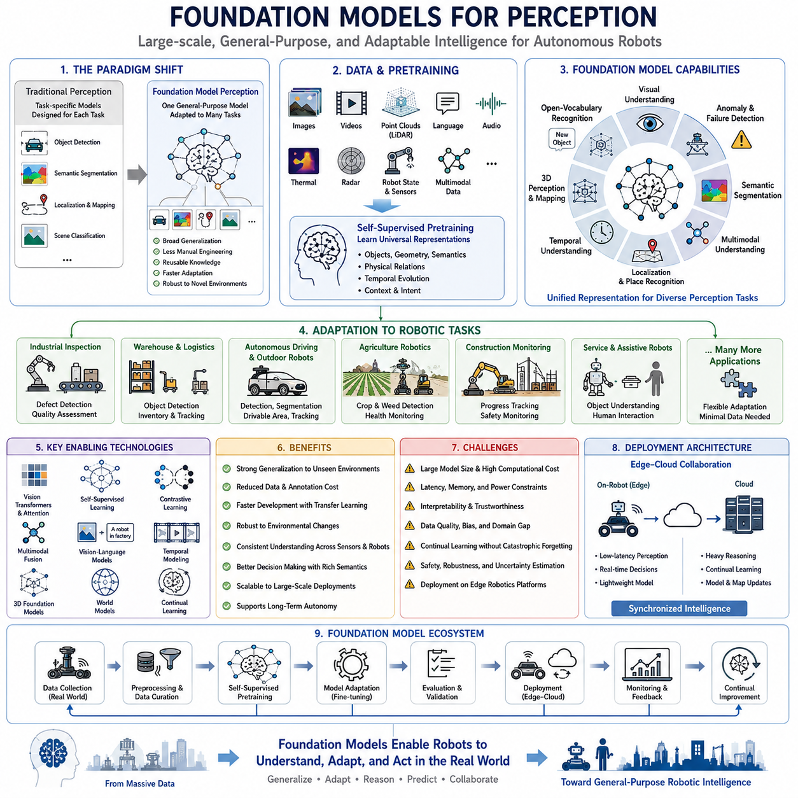
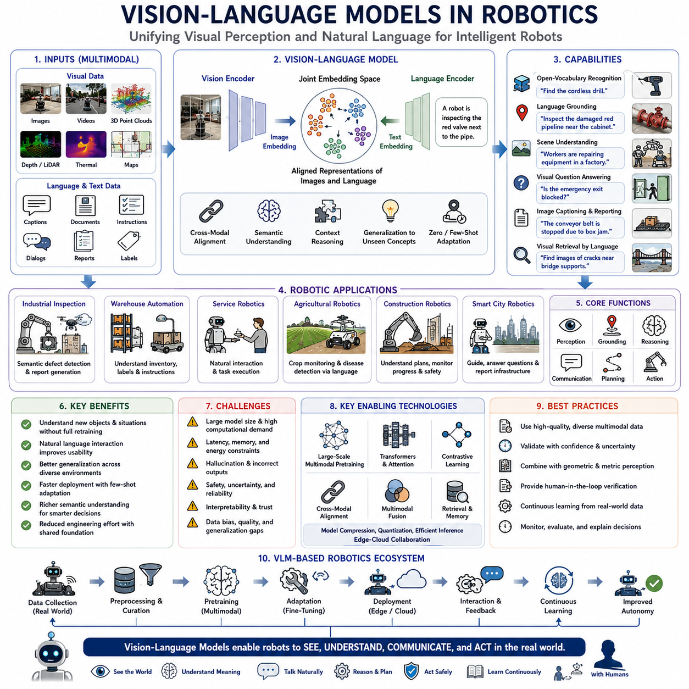
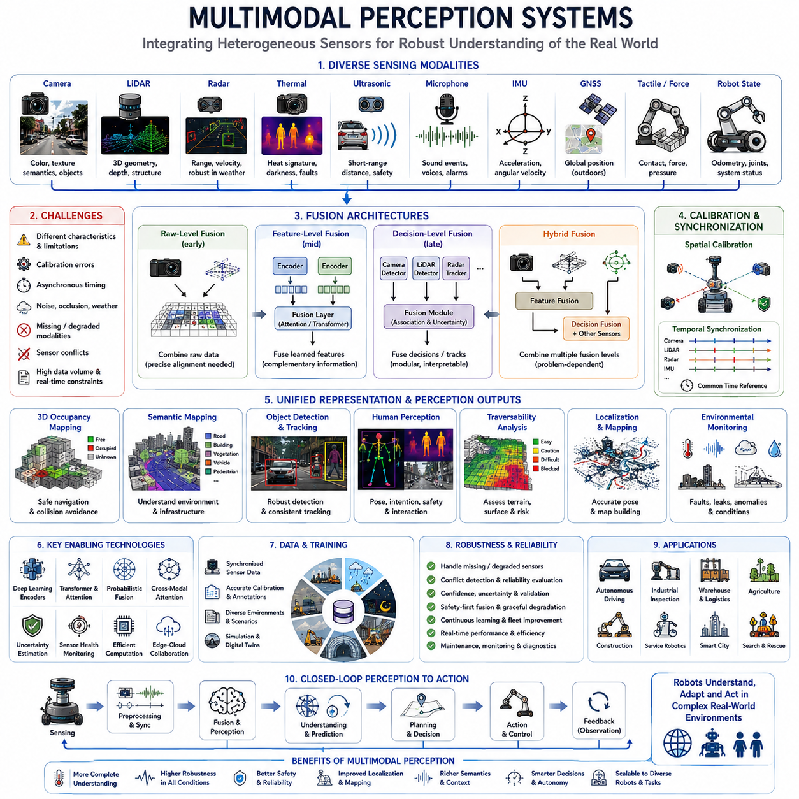
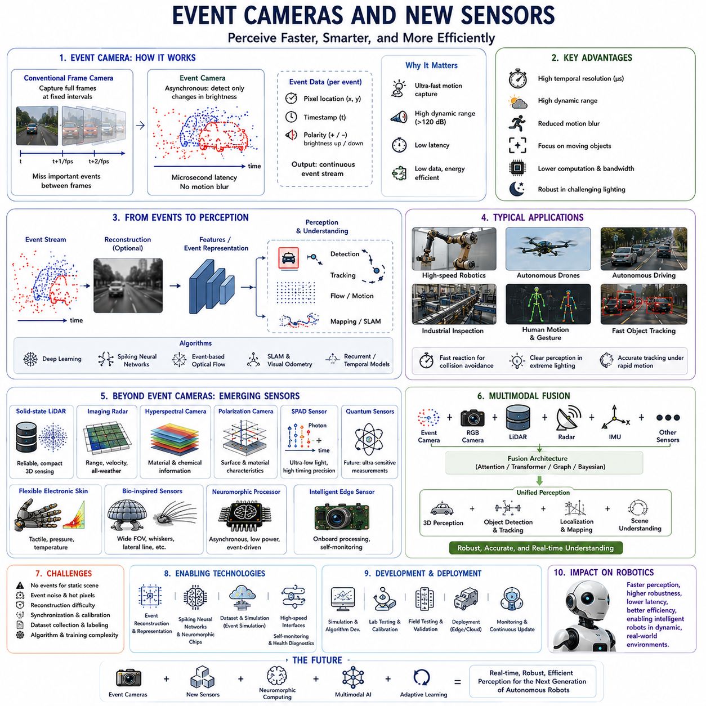
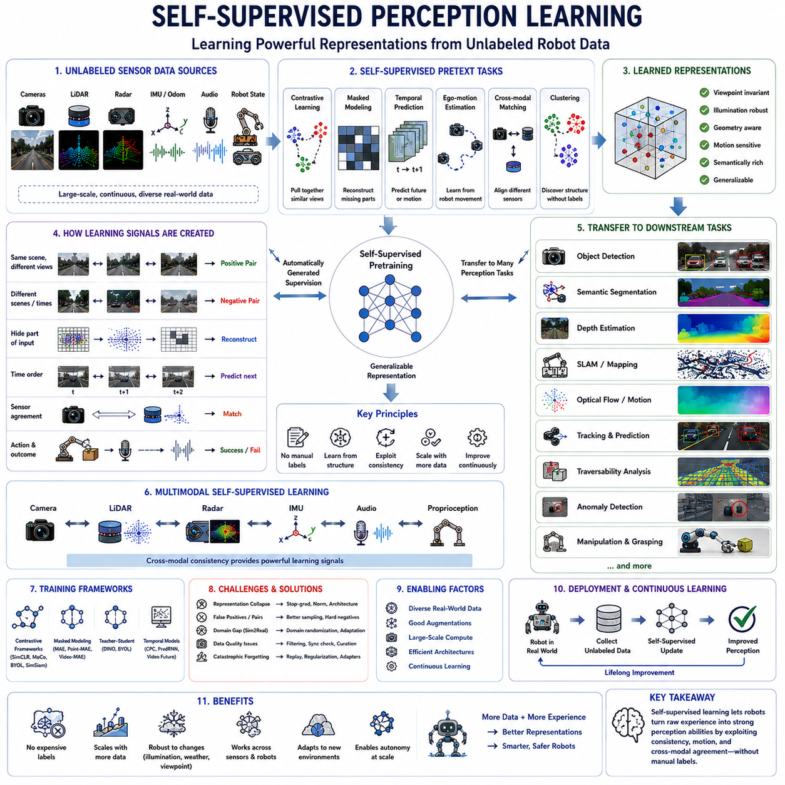
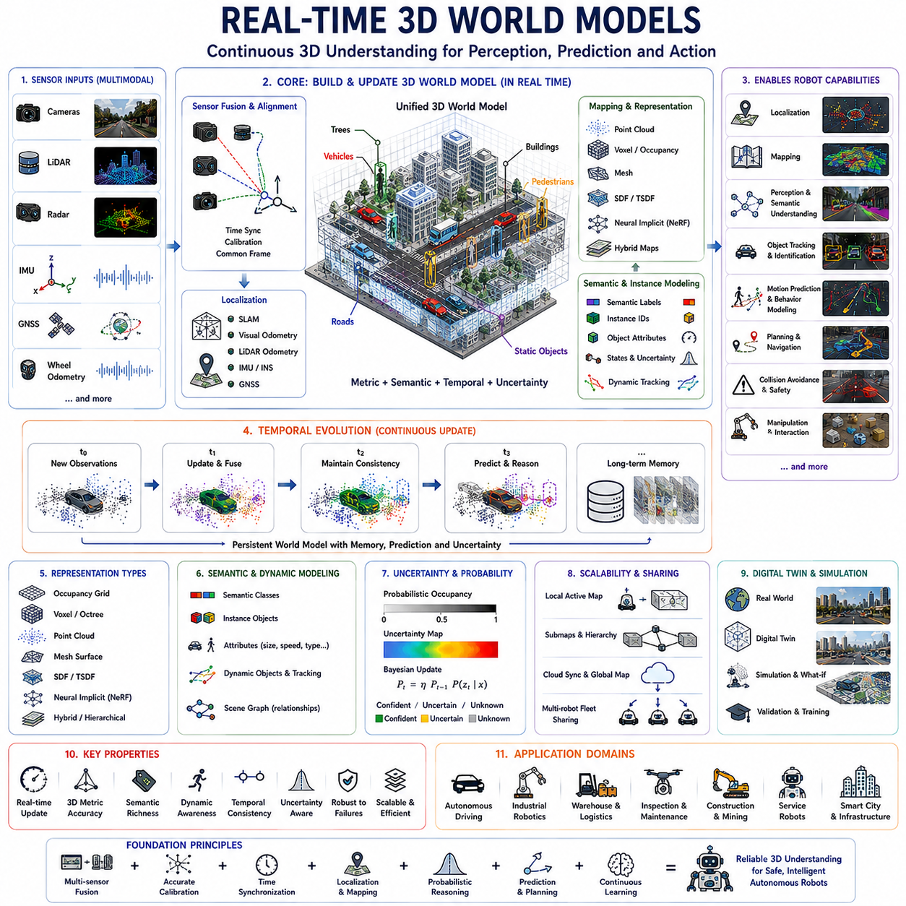
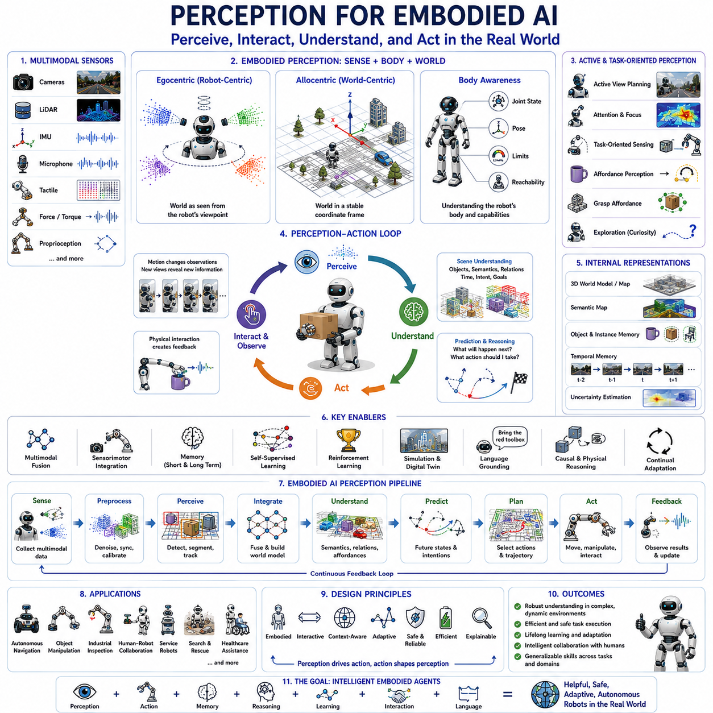
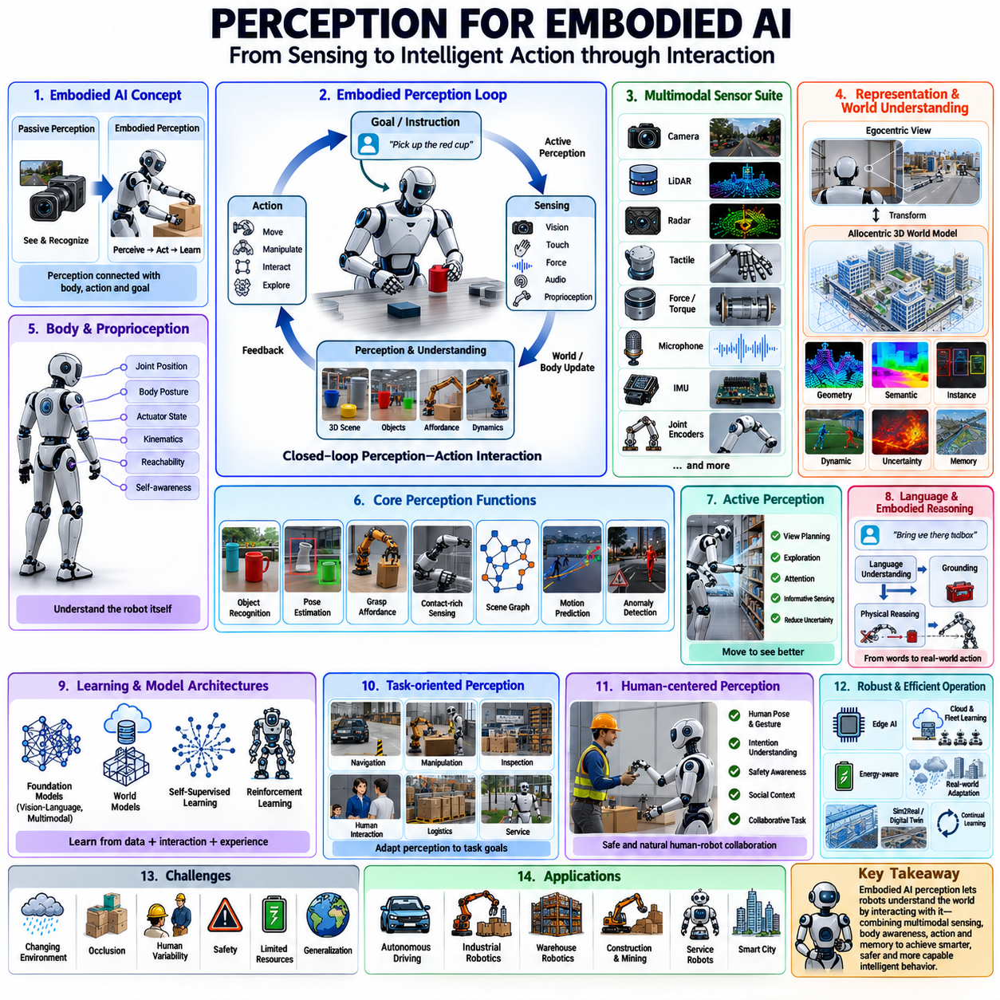
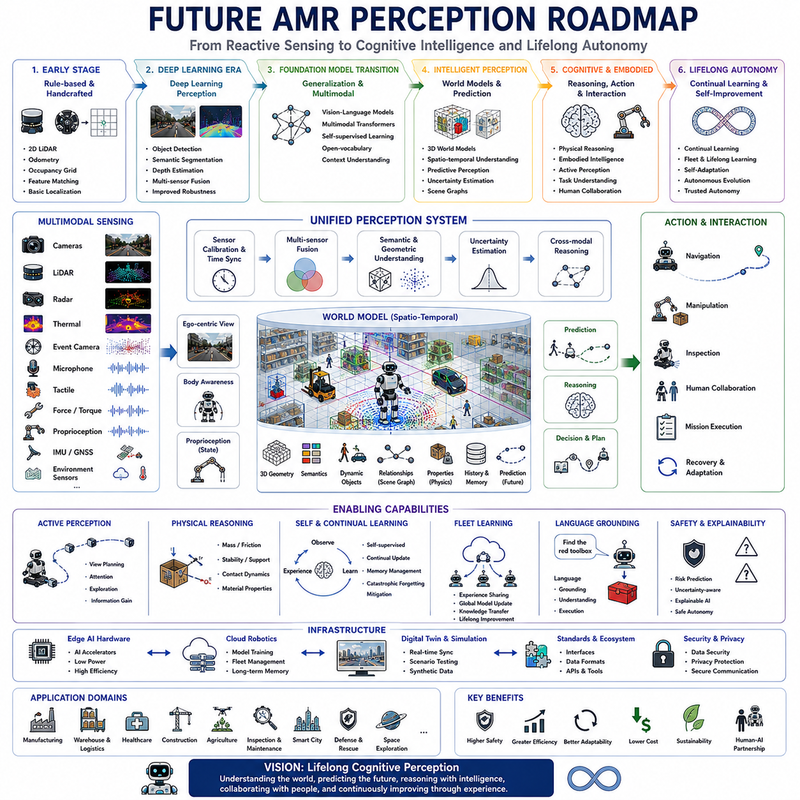

**Volume 03. AMR Sensors and Perception**

# Chapter 25. Future Robot Perception

## 25.1 Foundation Models for Perception

{width="7.268055555555556in" height="7.268055555555556in"}

Foundation models have fundamentally transformed robot perception by shifting the focus from task-specific recognition systems toward large-scale general-purpose intelligence capable of understanding diverse environments. Traditional perception algorithms were usually designed to solve individual problems such as object detection, semantic segmentation, localization, or scene classification. In contrast, foundation models learn broad visual, spatial, semantic, and multimodal representations from massive datasets before being adapted to downstream robotic tasks. This paradigm enables perception systems to generalize across previously unseen environments while significantly reducing the need for manually engineered features and narrowly specialized models.

Modern autonomous robots increasingly operate in dynamic environments where complete prior knowledge is impossible. Industrial factories evolve through equipment upgrades, outdoor environments change with weather and seasons, warehouses modify storage layouts, construction sites continuously transform, and smart cities experience constant human activity. Foundation models provide a unified representation capable of interpreting these changing environments without requiring every possible operating condition to be explicitly programmed. Consequently, perception becomes increasingly knowledge-driven rather than rule-driven.

Unlike conventional supervised learning, foundation models are trained using extremely large collections of images, videos, point clouds, language descriptions, sensor recordings, and multimodal information collected from diverse sources. During pretraining, the objective is not to solve one specific robotics problem but to learn transferable representations describing objects, geometry, physical relationships, semantics, temporal evolution, and contextual understanding. These learned representations become reusable perception knowledge that can later support numerous robotic applications with relatively small task-specific adaptation.

Vision Foundation Models have become the backbone of modern perception systems. Large-scale visual encoders learn universal image representations capable of supporting object detection, semantic segmentation, anomaly detection, depth estimation, visual localization, scene understanding, and image retrieval simultaneously. Instead of independently training separate neural networks for every perception module, robotic systems increasingly share common visual embeddings that provide consistent semantic understanding across multiple perception tasks.

Vision Transformers introduced an important architectural shift by replacing purely convolution-based feature extraction with attention mechanisms capable of modeling long-range relationships throughout entire images. Attention allows the perception system to understand global scene context instead of relying only upon local visual patterns. This capability significantly improves recognition under occlusion, cluttered environments, large-scale infrastructure, and complex object interactions commonly encountered during autonomous robot operation.

Self-supervised learning has become one of the most influential technologies supporting foundation models. Rather than requiring billions of manually labeled samples, self-supervised learning automatically generates learning objectives directly from raw sensor data. Images, videos, LiDAR scans, and temporal observations become supervision signals themselves. This approach enables robots to exploit enormous quantities of unlabeled operational data while continuously improving perception without requiring prohibitively expensive annotation efforts.

Contrastive learning further improves representation quality by encouraging similar observations to produce nearby feature embeddings while separating unrelated observations. Images showing identical objects from different viewpoints, lighting conditions, weather, or sensor configurations become semantically associated despite significant appearance variation. Consequently, robotic perception becomes substantially more robust against environmental changes that previously required extensive dataset augmentation or handcrafted feature engineering.

Multimodal foundation models extend perception beyond visual information by jointly learning relationships among images, language, point clouds, audio, thermal sensing, radar observations, and robot state information. Instead of processing every sensor independently, multimodal representations enable comprehensive understanding of objects, environments, human instructions, and operational context. This unified representation significantly improves perception consistency while reducing conflicts among individual sensing modalities.

Vision-language models represent one of the most important developments for intelligent robotic perception. These models learn associations between visual observations and natural language descriptions, enabling robots to understand semantic concepts without requiring exhaustive class-specific training. Rather than recognizing only predefined object categories, robots can identify previously unseen objects through descriptive language, improving adaptability within continuously changing real-world environments.

Open-vocabulary perception extends conventional object recognition by eliminating dependence upon fixed category lists. Traditional perception systems could recognize only objects appearing during supervised training. Foundation models instead utilize semantic relationships learned from massive language and image datasets to recognize novel categories through textual descriptions. This capability becomes especially valuable in industrial inspection, logistics, public environments, and scientific exploration where previously unseen objects regularly appear.

Segmentation foundation models have substantially improved scene understanding by supporting automatic object extraction across highly diverse environments. Instead of manually training specialized segmentation networks for each application, generalized segmentation models identify object boundaries with minimal task-specific adaptation. Such capability accelerates deployment across manufacturing, agriculture, infrastructure inspection, autonomous driving, and service robotics while improving annotation efficiency during dataset development.

Three-dimensional perception also benefits significantly from foundation model representations. Large-scale point cloud encoders learn transferable geometric features supporting object detection, terrain understanding, place recognition, semantic mapping, structural inspection, and navigation. Rather than relying exclusively upon handcrafted geometric descriptors, robots increasingly employ learned spatial representations capable of adapting across different LiDAR configurations and environmental conditions.

Temporal foundation models extend perception from isolated observations toward continuous environmental understanding. Instead of processing every image independently, temporal models integrate long sequences of visual observations, enabling robots to understand object motion, environmental evolution, human activities, seasonal changes, and long-duration operational patterns. Persistent temporal memory substantially improves robustness whenever individual observations become temporarily unreliable due to occlusion or sensor degradation.

Foundation models have also transformed localization and mapping. Learned feature representations provide significantly more stable landmarks than traditional handcrafted visual descriptors. Place recognition remains reliable despite illumination changes, weather variation, seasonal differences, partial occlusion, or infrastructure modification. Consequently, localization systems maintain higher consistency throughout extended autonomous deployments while requiring less manual environmental tuning.

Robotic perception increasingly integrates geometric reasoning with semantic reasoning. Classical perception emphasized accurate measurement of distances, shapes, and positions, whereas foundation models simultaneously infer object function, contextual relationships, operational significance, and likely future interactions. Combining geometric precision with semantic understanding enables substantially more intelligent decision making throughout navigation, manipulation, inspection, and human-robot interaction.

Generalization represents one of the greatest advantages of foundation models. Traditional supervised models often demonstrated impressive benchmark accuracy yet degraded rapidly when deployed in unfamiliar environments. Foundation models reduce this limitation by learning broad representations across enormous environmental diversity before downstream adaptation. Although perfect generalization remains impossible, deployment robustness improves significantly because the pretrained representation already captures numerous real-world variations encountered during autonomous operation.

Transfer learning dramatically reduces the cost of robotics development. Instead of training complete perception systems from scratch for every robot platform, engineers fine-tune pretrained foundation models using relatively small domain-specific datasets. Industrial inspection, warehouse automation, agricultural robotics, construction monitoring, and healthcare robotics therefore share common pretrained representations while requiring only modest adaptation to individual operational environments.

Foundation models also accelerate annotation workflows. General-purpose segmentation, object proposal generation, image captioning, scene description, and feature clustering automatically generate initial annotations requiring only human verification. Human annotators consequently spend more time validating high-quality predictions than manually labeling every image from the beginning. This significantly reduces annotation cost while simultaneously improving consistency throughout large robotics datasets.

Failure detection becomes more reliable because foundation models capture higher-level semantic consistency rather than depending exclusively upon low-level appearance similarity. Anomalies, damaged infrastructure, unexpected obstacles, defective products, and unusual environmental conditions often produce inconsistent semantic representations detectable without requiring exhaustive defect-specific training data. Such capability substantially improves inspection reliability across previously unseen failure modes.

Human-robot interaction benefits from foundation model perception because robots increasingly understand semantic instructions instead of rigid command sequences. Natural language descriptions referencing objects, locations, activities, or environmental context become directly associated with visual observations. Robots therefore interpret complex instructions more naturally while requiring less manually engineered interface logic between language understanding and visual perception modules.

Foundation models further support collaborative robotic systems by providing consistent semantic representations across multiple robots. Shared embeddings enable distributed mapping, collaborative inspection, fleet learning, knowledge sharing, and cooperative localization. Individual robots contribute operational experience toward continuously improving collective perception capability while maintaining compatible representations throughout heterogeneous robotic platforms deployed across different environments.

Despite their advantages, foundation models introduce important engineering challenges. Large model size increases computational requirements, memory consumption, inference latency, power demand, and deployment complexity. Edge robotics platforms frequently possess limited computational resources compared with cloud-scale training infrastructure. Consequently, model compression, knowledge distillation, pruning, quantization, efficient attention mechanisms, and hardware acceleration become essential for practical real-time deployment.

Interpretability remains another important research challenge. Foundation models often achieve remarkable perception accuracy while providing limited explanation regarding internal reasoning processes. Safety-critical robotic systems require engineers to understand confidence estimates, uncertainty sources, failure mechanisms, and operational limitations before autonomous decisions can be trusted. Research increasingly focuses upon explainable perception capable of combining high predictive performance with transparent diagnostic information.

Dataset quality continues to influence foundation model performance despite large-scale pretraining. Representation quality depends not only upon dataset size but also upon diversity, geographic coverage, environmental variation, annotation consistency, temporal diversity, sensor quality, and domain balance. Continuous operational data collection therefore remains essential even when foundation models provide strong initial representations through large-scale pretraining.

Continual learning becomes increasingly important because real environments evolve continuously after deployment. Foundation models must adapt to newly introduced infrastructure, changing operational procedures, evolving products, seasonal variation, sensor aging, and emerging object categories without catastrophically forgetting previously acquired knowledge. Efficient incremental adaptation therefore becomes a fundamental capability supporting long-term autonomous perception.

Physical reasoning represents another emerging direction. Future foundation models will increasingly integrate geometric perception with understanding of material properties, physical interactions, object dynamics, stability, force relationships, and causal reasoning. Such capabilities will enable robots not merely to recognize objects but to predict how those objects will behave during manipulation, transportation, collision avoidance, or environmental interaction.

World models further extend foundation model perception by learning predictive internal representations describing future environmental evolution. Rather than simply recognizing current observations, world models estimate probable future states resulting from robot actions, environmental dynamics, and human activities. Predictive perception substantially improves planning, navigation, manipulation, and autonomous decision making because robots anticipate environmental changes before they actually occur.

Foundation models increasingly support digital twin environments by maintaining consistent semantic representations between physical systems and virtual simulations. Real sensor observations continuously update virtual environments, while simulated experiences supplement real operational data for additional learning. This bidirectional knowledge exchange accelerates perception improvement while reducing the cost and risk associated with purely physical experimentation.

Edge-cloud collaboration has become an effective deployment strategy. Compact foundation model variants execute low-latency perception directly onboard robots, whereas larger cloud models perform computationally intensive reasoning, knowledge refinement, large-scale map generation, and continual learning. Synchronization between edge intelligence and centralized foundation models enables practical deployment while balancing computational efficiency with representation quality.

Evaluation methodologies have also evolved alongside foundation models. Traditional benchmark accuracy alone no longer sufficiently characterizes perception quality. Engineers increasingly evaluate robustness, uncertainty estimation, cross-domain generalization, long-duration deployment stability, adaptation speed, computational efficiency, energy consumption, semantic consistency, and operational safety. Comprehensive evaluation better reflects real-world autonomous performance than isolated benchmark metrics.

Current research demonstrates that foundation models represent not merely larger neural networks but a fundamental shift toward reusable perception intelligence. Instead of repeatedly constructing isolated perception algorithms for individual applications, robotics increasingly develops universal perceptual knowledge transferable across multiple domains. This transition substantially accelerates system development while improving robustness, scalability, maintainability, and long-term operational adaptability.

Ultimately, foundation models establish the technological foundation for next-generation robotic perception by integrating large-scale representation learning, multimodal understanding, transferable knowledge, continual adaptation, semantic reasoning, geometric interpretation, and predictive world modeling into one unified perception framework. As these models continue to mature, autonomous robots will progressively transition from specialized perception systems toward generalized intelligent agents capable of understanding and interacting with complex real-world environments with unprecedented flexibility and reliability.

## 25.2 Vision-Language Models in Robotics

{width="7.268055555555556in" height="7.268055555555556in"}

Vision-Language Models have become one of the most influential technologies in modern robotics because they enable robots to understand visual observations and natural language within a unified representation space. Traditional robotic perception relied on independently designed computer vision modules followed by manually engineered decision logic. In contrast, Vision-Language Models learn semantic relationships between images and language through large-scale multimodal pretraining, allowing robots to recognize objects, understand environments, interpret human intentions, and execute complex tasks using natural communication. This unified perception paradigm significantly improves flexibility, scalability, and adaptability across diverse robotic applications.

Modern robots increasingly operate in environments where predefined object categories and manually programmed behaviors are insufficient. Warehouses continuously introduce new products, factories modify production layouts, construction sites evolve daily, homes contain countless unique objects, and public environments exhibit enormous visual diversity. Vision-Language Models allow robots to interpret these environments using semantic understanding rather than relying exclusively on fixed object classifiers. Consequently, robots become capable of reasoning about previously unseen objects and situations through descriptive language instead of requiring complete retraining.

The fundamental principle of Vision-Language Models is joint representation learning. During pretraining, massive collections of paired images and textual descriptions are processed simultaneously. Instead of independently learning visual recognition and language understanding, the model constructs a common embedding space where semantically related images and sentences become closely aligned. As a result, robots can associate visual observations with human language, enabling flexible perception that extends far beyond conventional supervised object recognition.

Large-scale multimodal pretraining provides broad semantic knowledge that transfers efficiently into robotics. Training datasets often include billions of images, captions, documents, videos, and textual descriptions collected from diverse environments. Rather than learning only robotic scenarios, Vision-Language Models acquire general knowledge regarding objects, materials, activities, spatial relationships, environments, and human interactions. This extensive prior knowledge significantly reduces the amount of robotics-specific data required for downstream adaptation.

Cross-modal representation enables information acquired from one modality to improve understanding within another. Language provides semantic concepts that strengthen visual recognition, while visual observations provide contextual grounding for linguistic interpretation. Instead of treating vision and language as separate processing pipelines, the robotic perception system continuously exchanges information between both modalities. This interaction produces richer environmental understanding than either modality could achieve independently.

Open-vocabulary recognition represents one of the most transformative capabilities of Vision-Language Models. Conventional object detectors recognize only predefined categories included during supervised training. Vision-Language Models instead interpret textual descriptions directly, allowing robots to identify objects that never appeared during robotics-specific training. For example, a service robot can recognize unfamiliar tools, furniture, consumer products, or industrial components simply by matching visual observations with descriptive language provided by human operators.

Natural language grounding enables robots to associate words with specific physical objects, locations, attributes, and relationships observed within the environment. Commands such as "inspect the damaged red pipeline near the electrical cabinet" or "deliver the package beside the blue storage rack" require simultaneous understanding of object identity, spatial relationships, semantic attributes, and contextual constraints. Vision-Language Models provide this integrated grounding capability by jointly reasoning across visual perception and linguistic semantics.

Scene understanding expands beyond recognizing individual objects toward interpreting complete environmental context. Instead of identifying isolated entities independently, Vision-Language Models infer relationships among people, objects, infrastructure, activities, and operational situations. Robots therefore understand whether equipment is being repaired, whether pathways remain accessible, whether workers are performing maintenance, or whether environmental conditions indicate abnormal situations requiring additional attention.

Semantic navigation becomes substantially more intuitive through language-guided perception. Rather than specifying navigation using explicit coordinates or predefined map labels, operators may issue commands such as "go to the conference room beside the cafeteria" or "inspect the loading dock behind the warehouse." Vision-Language Models associate language descriptions with semantic maps, environmental observations, and spatial reasoning, enabling robots to navigate naturally within complex environments while reducing dependence upon manually annotated maps.

Instruction following benefits significantly from multimodal reasoning. Human instructions frequently contain incomplete, ambiguous, or context-dependent information that traditional robotics systems struggle to interpret. Vision-Language Models combine current visual observations with linguistic context, environmental understanding, and prior semantic knowledge to infer intended actions. Consequently, robots become considerably more tolerant of natural communication while reducing misunderstandings caused by rigid command structures.

Visual question answering provides another valuable capability supporting autonomous operation. Operators may ask questions such as "Is the emergency exit blocked?", "How many inspection robots are currently charging?", or "Which storage shelves appear empty?" Instead of requiring manually programmed diagnostic routines for every possible question, Vision-Language Models analyze current visual observations together with language queries to generate contextually appropriate responses supported by semantic reasoning.

Image captioning enables robots to summarize complex visual scenes using natural language. Inspection robots automatically generate maintenance reports describing observed defects, inventory robots summarize warehouse conditions, agricultural robots report crop health, and construction monitoring robots describe project progress. Such automatically generated descriptions significantly reduce operator workload while improving documentation consistency across long-term robotic deployments.

Visual retrieval supports efficient knowledge management by connecting semantic language queries with previously observed visual information. Engineers may search historical robot observations using descriptions such as "find images showing cracked concrete near bridge supports" or "retrieve inspections containing rust around pipeline valves." Vision-Language Models organize perception databases according to semantic similarity rather than rigid metadata, substantially improving accessibility of accumulated operational knowledge.

Human-robot collaboration improves because robots increasingly understand conversational interaction instead of isolated commands. During collaborative manipulation, inspection, maintenance, or logistics tasks, operators naturally describe objects, locations, priorities, and procedural adjustments using ordinary language. Vision-Language Models continuously relate conversational information to current visual observations, allowing robots to adapt behavior without requiring complex programming interfaces.

Industrial inspection benefits significantly from semantic understanding. Instead of merely detecting defects, Vision-Language Models interpret maintenance documentation, engineering terminology, inspection standards, and visual evidence simultaneously. Robots therefore recognize whether observed conditions satisfy inspection requirements, identify probable failure mechanisms, and generate inspection reports using technical language familiar to maintenance engineers and quality assurance personnel.

Warehouse automation increasingly employs Vision-Language Models to interpret inventory descriptions, shipping labels, package markings, storage instructions, and operational documentation. Instead of relying exclusively upon barcodes or predefined inventory identifiers, robots understand semantic product descriptions, improving flexibility whenever packaging changes, labeling varies, or previously unseen products enter warehouse operations.

Agricultural robotics similarly benefits from multimodal semantic reasoning. Farmers describe crop conditions, irrigation problems, disease symptoms, and operational priorities using natural language rather than predefined database entries. Vision-Language Models associate these descriptions with visual crop observations, environmental measurements, and historical field knowledge, enabling more intelligent agricultural monitoring and decision support throughout changing seasonal conditions.

Construction robotics presents particularly challenging semantic environments because infrastructure evolves continuously throughout project execution. Architectural plans, engineering documents, work schedules, safety procedures, and visual site observations all contribute important contextual information. Vision-Language Models integrate these heterogeneous information sources, enabling robots to understand construction progress, identify discrepancies between plans and reality, and support project management through continuous semantic interpretation.

Smart city robotics relies heavily upon Vision-Language Models for public interaction. Service robots interpret citizen requests, recognize landmarks described verbally, explain navigation routes, answer informational questions, and report municipal infrastructure conditions using understandable language. Such capability substantially improves accessibility while allowing autonomous systems to operate naturally within human-centered public environments.

Multimodal reasoning enables robots to combine visual observations with textual documentation, engineering drawings, maintenance records, sensor measurements, and operational procedures. Instead of treating documentation separately from perception, Vision-Language Models continuously integrate all available information into unified semantic representations. This capability significantly improves decision quality because robots simultaneously consider current observations together with accumulated engineering knowledge.

Reasoning over spatial relationships becomes substantially more sophisticated through language-guided representations. Robots interpret expressions such as "behind," "between," "adjacent to," "underneath," or "next to" by combining geometric perception with semantic understanding. Consequently, object localization extends beyond numerical coordinates toward human-compatible spatial reasoning suitable for collaborative work environments.

Temporal reasoning further extends Vision-Language Models by interpreting changes observed across sequential images and associated textual reports. Maintenance robots recognize progressive infrastructure deterioration, agricultural robots monitor crop development, warehouse robots detect inventory movement, and inspection robots identify recurring anomalies. Combining temporal visual observations with language descriptions provides significantly richer understanding than isolated frame analysis.

Few-shot adaptation greatly reduces deployment effort for new robotic applications. Because Vision-Language Models already contain extensive semantic knowledge acquired during large-scale pretraining, only limited robotics-specific examples are required to support new operational tasks. Engineers therefore adapt robotic perception more rapidly than traditional supervised pipelines requiring extensive task-specific annotation.

Foundation model architectures further strengthen Vision-Language capabilities by providing transferable representations shared across numerous downstream robotics applications. Object recognition, scene understanding, semantic mapping, anomaly detection, localization, manipulation, navigation, and human interaction increasingly utilize common multimodal embeddings rather than isolated task-specific neural networks. This shared representation improves consistency while reducing engineering complexity throughout complete robotic software systems.

Despite remarkable progress, Vision-Language Models introduce several engineering challenges. Large model size increases computational requirements, memory consumption, inference latency, communication bandwidth, and energy usage. Many autonomous robots operate using embedded computing platforms with strict real-time constraints. Consequently, lightweight architectures, model compression, quantization, efficient transformers, hardware acceleration, and edge-cloud cooperation become essential deployment strategies.

Hallucination remains another important concern. Vision-Language Models occasionally generate plausible yet incorrect semantic interpretations unsupported by actual observations. Safety-critical robotic systems therefore require explicit confidence estimation, uncertainty modeling, visual verification, and cross-validation with geometric perception before autonomous decisions are executed. Engineering practice increasingly emphasizes trustworthy multimodal reasoning rather than maximizing linguistic fluency alone.

Interpretability also requires continued research because operators must understand why a robot reached particular conclusions. Transparent attention visualization, confidence reporting, multimodal explanation, reasoning trace generation, and diagnostic monitoring become increasingly important for industrial acceptance. Explainable Vision-Language Models enable engineers to verify semantic reasoning while simplifying debugging during complex field deployments.

Dataset diversity strongly influences practical performance. Training data should include geographically diverse environments, industrial facilities, agricultural fields, construction sites, warehouses, healthcare settings, domestic environments, transportation systems, weather variation, seasonal changes, multilingual documentation, and culturally diverse operational procedures. Broad multimodal diversity significantly improves generalization while reducing deployment bias across different robotic applications.

Continual learning enables Vision-Language Models to incorporate newly encountered objects, terminology, operational procedures, engineering documents, and environmental changes without catastrophic forgetting. As autonomous robots accumulate operational experience, semantic representations continuously improve through incremental adaptation. Long-term deployment therefore transforms robotic perception into an evolving knowledge system rather than a static recognition model fixed at development time.

Future Vision-Language Models will increasingly integrate physical reasoning, causal understanding, manipulation knowledge, world models, and robot embodiment. Instead of merely describing observed scenes, robots will predict object behavior, anticipate environmental evolution, understand physical affordances, and reason about task consequences before executing actions. Such capabilities will bridge perception, cognition, and action within one unified multimodal intelligence framework.

Ultimately, Vision-Language Models fundamentally redefine robotic perception by connecting visual understanding with semantic reasoning through natural language. Rather than functioning as isolated recognition algorithms, future robotic perception systems become knowledge-driven cognitive architectures capable of understanding environments, interpreting human intentions, communicating naturally, learning continuously, and supporting intelligent autonomous behavior across diverse real-world applications. This transition represents one of the most significant technological foundations for next-generation intelligent robotics.

## 25.3 Multimodal Perception Systems

{width="7.268055555555556in" height="7.268055555555556in"}

Multimodal perception systems enable robots to understand the physical world by combining information from cameras, LiDAR, radar, ultrasonic sensors, thermal cameras, microphones, inertial sensors, GNSS receivers, tactile devices, and internal robot states. Each sensing modality observes different environmental properties, so their integration produces a more complete and reliable representation than any single sensor can provide.

A camera captures color, texture, shape, symbols, lane markings, human gestures, and semantic details, but its performance may decline under darkness, glare, fog, or strong shadows. LiDAR provides accurate geometric structure and distance measurements, although sparse reflections, rain, dust, and reflective materials can reduce data quality. Multimodal perception compensates for such limitations by combining complementary evidence.

Radar is particularly valuable for detecting distance and relative velocity under rain, fog, dust, and low-light conditions. Although radar usually provides less detailed shape information than cameras or LiDAR, it remains highly robust in adverse weather. When radar velocity estimates are fused with visual and geometric data, robots can track moving vehicles, people, and machinery more consistently.

Thermal cameras measure emitted infrared energy rather than visible light. They can identify people, animals, overheating equipment, electrical faults, and warm mechanical components in darkness or visually confusing environments. However, thermal imagery often has limited texture and resolution. Combining thermal and visible cameras improves both semantic interpretation and environmental robustness.

Ultrasonic sensors provide short-range distance measurements around the robot body. They are useful for docking, parking, edge protection, low-speed collision avoidance, and detection of nearby objects that may fall outside the main LiDAR or camera field of view. Their simple measurements become more effective when integrated with higher-resolution sensors and robot motion estimates.

Microphones and acoustic arrays extend perception beyond visible and geometric information. Robots can detect alarms, impact sounds, bearing failures, air leakage, human voices, approaching vehicles, and abnormal machine noise. Directional acoustic processing helps estimate the location of sound sources, while integration with vision allows the robot to associate sounds with specific people, machines, or events.

Inertial measurement units provide angular velocity and linear acceleration at high frequency. These measurements support motion estimation when visual or LiDAR observations become unreliable because of rapid movement, vibration, featureless surfaces, or temporary occlusion. GNSS provides global positioning outdoors, while wheel encoders and steering sensors describe the robot's own motion. Together, these signals form a stable localization foundation.

Tactile and force sensors are essential when perception includes physical interaction. Mobile manipulators use force-torque sensors, joint current, gripper pressure, and tactile arrays to determine whether an object has been contacted, grasped, moved, or released. Multimodal systems connect external perception with physical feedback, allowing robots to adjust actions when real-world contact differs from visual expectations.

The primary objective of multimodal fusion is not simply to collect more sensor data. The system must determine which measurements are relevant, reliable, synchronized, and geometrically consistent. Fusion architecture therefore requires careful consideration of sensor characteristics, spatial calibration, temporal alignment, uncertainty, data representation, computing resources, and operational safety requirements.

Sensor calibration defines the geometric relationships among all sensing devices. Extrinsic calibration estimates the position and orientation of each sensor relative to the robot coordinate frame, while intrinsic calibration describes internal properties such as camera focal length or LiDAR beam configuration. Small calibration errors can create large inconsistencies when objects are projected across modalities.

Temporal synchronization is equally important because robots and surrounding objects may move while sensors acquire data at different rates. A camera frame, LiDAR scan, radar return, and IMU sample may represent slightly different moments. Hardware triggering, Precision Time Protocol, timestamp correction, interpolation, and motion compensation are used to align these observations within a common temporal reference.

Raw-level fusion combines measurements before individual perception results are produced. Examples include projecting LiDAR points into camera images, combining radar returns with image features, or integrating multiple camera streams into a unified spatial representation. This approach preserves detailed information but often requires precise synchronization, accurate calibration, high bandwidth, and substantial computational resources.

Feature-level fusion processes each modality through a dedicated encoder and then combines the learned features. Camera networks may extract texture and semantic features, while LiDAR networks encode three-dimensional geometry and radar networks represent velocity and range. Attention mechanisms, transformers, and cross-modal networks determine which features should influence the final perception result.

Decision-level fusion combines outputs from independently operating perception modules. A camera detector, LiDAR detector, radar tracker, and thermal classifier may each produce separate object hypotheses. The fusion layer then compares confidence, position, class, velocity, and uncertainty. This architecture is modular and easier to diagnose, although some low-level information may be lost before fusion occurs.

Hybrid fusion combines raw, feature, and decision-level methods within one system. For example, camera and LiDAR features may be fused for object detection, while radar tracks are added at the decision level and ultrasonic measurements are used by an independent safety controller. Hybrid architectures are common in real robots because different sensing problems require different levels of integration.

A unified spatial representation is necessary for meaningful fusion. Sensor measurements may be transformed into occupancy grids, voxel maps, bird's-eye-view features, point clouds, semantic maps, object lists, or scene graphs. Bird's-eye-view representations are especially useful because they align multiple sensors within a common top-down coordinate system suitable for navigation and motion planning.

Occupancy mapping estimates whether regions of space are free, occupied, or unknown. Camera semantics can describe the type of object occupying a region, while LiDAR provides geometric boundaries and radar contributes motion information. The resulting map supports collision avoidance, route planning, docking, and traversability analysis while preserving uncertainty about unobserved areas.

Semantic mapping adds object classes, surface types, operational zones, infrastructure elements, and human-related information to geometric maps. A robot may distinguish walls, doors, shelves, roads, vegetation, machinery, restricted areas, and charging stations. Multimodal fusion improves semantic consistency because different sensors contribute complementary evidence about the same physical structure.

Object detection becomes more reliable when visual appearance, three-dimensional shape, motion, temperature, and acoustic information are considered together. A dark object may be difficult to identify with a camera but clearly visible in LiDAR geometry. A distant moving object may be weak in LiDAR but detectable through radar velocity. Fusion reduces both missed detections and false alarms.

Object tracking requires consistent identity estimation over time. Multimodal trackers combine position, velocity, appearance, shape, temperature, and motion history to maintain object identities through occlusion and sensor degradation. When one modality temporarily loses an object, another may preserve the track until full observation becomes available again.

Human perception requires particular care because people exhibit complex appearance, motion, intention, and social behavior. Cameras support pose and gesture recognition, LiDAR provides accurate position, radar estimates motion through partial occlusion, thermal cameras detect people in darkness, and microphones support speech and alarm recognition. Fusion enables safer human-aware navigation and collaboration.

Traversability analysis determines whether terrain can be crossed safely. LiDAR and stereo cameras estimate slope, step height, surface roughness, holes, and obstacles. Visual data identifies mud, grass, gravel, ice, water, or loose soil, while IMU measurements reveal actual vehicle response. Multimodal learning connects appearance, geometry, and physical experience to improve terrain assessment.

Localization and mapping benefit from combining cameras, LiDAR, IMU, GNSS, wheel odometry, and radar. Visual features provide rich environmental detail, LiDAR offers stable geometry, IMU supports high-rate motion estimation, and GNSS provides global reference. Fusion allows the robot to maintain position when one or more sensors degrade because of tunnels, darkness, dust, or weak satellite signals.

Multimodal perception also supports loop closure and place recognition. A robot returning to a previously visited location may encounter different lighting, weather, seasonal appearance, object placement, or human activity. Combining geometry, visual semantics, radar structure, and temporal context improves recognition of the same place despite substantial environmental change.

Environmental monitoring extends the system beyond navigation. Thermal sensors identify overheating equipment, microphones detect mechanical anomalies, gas sensors measure hazardous substances, cameras observe leaks or corrosion, and LiDAR measures structural deformation. A multimodal inspection robot can therefore assess not only where objects are located but also whether they are functioning normally.

Multimodal anomaly detection compares observations across sensors and over time. A visible stain may suggest leakage, while thermal change confirms abnormal temperature and acoustic noise indicates pressure loss. Individually, each signal may be ambiguous, but their combination provides stronger evidence. This reasoning is valuable in industrial inspection, infrastructure monitoring, and preventive maintenance.

Modern deep learning systems use modality-specific encoders followed by learned fusion layers. Convolutional networks, point-based networks, sparse voxel networks, transformers, recurrent models, and graph neural networks are selected according to sensor characteristics. Shared latent spaces allow heterogeneous measurements to be represented in a form suitable for joint reasoning and prediction.

Cross-modal attention enables one modality to guide the interpretation of another. Camera features may indicate where LiDAR processing should focus, radar detections may direct visual search toward moving targets, and language instructions may prioritize relevant objects. Attention reduces unnecessary computation and helps the system dynamically select information according to the current task.

Multimodal foundation models extend fusion beyond conventional sensors by connecting perception with language and general knowledge. A robot may combine camera images, point clouds, maintenance documents, maps, and operator instructions within a shared semantic representation. This enables open-vocabulary recognition, natural-language reporting, visual question answering, and context-aware decision support.

Training multimodal systems requires datasets containing synchronized sensor streams, reliable calibration, accurate annotations, and diverse operating conditions. Collecting such datasets is more difficult than collecting single-modality data because every sensor must function correctly at the same time. Missing frames, timestamp errors, calibration drift, and inconsistent labels can significantly reduce training quality.

Annotation must represent both individual modalities and shared scene meaning. Three-dimensional boxes, image masks, object tracks, semantic classes, free-space regions, terrain labels, sound events, temperatures, and robot states may all be required. Automatic labeling, simulation, foundation models, and cross-modal consistency checks can reduce manual workload while improving annotation quality.

Data imbalance is a major challenge because normal conditions greatly outnumber rare hazards, failures, and unusual environmental events. Multimodal systems may therefore appear accurate while remaining weak in critical scenarios. Targeted data collection, synthetic data, scenario simulation, hard-example mining, and controlled fault injection are necessary to improve performance in rare but important cases.

Sensor uncertainty should be represented explicitly rather than hidden behind a single confidence value. Measurement noise, calibration error, occlusion, environmental interference, and model uncertainty affect each modality differently. Probabilistic fusion, covariance estimation, Bayesian filtering, ensemble methods, and confidence calibration help the system avoid overconfident decisions.

A robust fusion system must handle missing or degraded modalities. Cameras may be blinded by sunlight, LiDAR may be contaminated by rain, GNSS may disappear near buildings, and microphones may be overwhelmed by machinery. Modality dropout during training, health monitoring, fallback models, redundancy, and graceful degradation allow continued operation without assuming that every sensor is always available.

Sensor conflict is another important issue. Different modalities may report inconsistent object positions, classes, or motion states because of timing error, reflection, occlusion, or model failure. The fusion layer must identify disagreement, evaluate reliability, and avoid forcing inconsistent evidence into an incorrect conclusion. In safety-critical cases, unresolved conflict should trigger reduced speed or controlled stopping.

Real-time deployment creates strict limits on latency, memory, bandwidth, and power. High-resolution cameras and dense point clouds generate large data volumes, while multimodal neural networks require substantial computation. Efficient encoders, sparse processing, region-of-interest selection, quantization, model pruning, hardware acceleration, and asynchronous pipelines are therefore essential.

Edge-cloud collaboration can divide perception tasks according to urgency and complexity. Safety-critical detection, localization, and obstacle avoidance remain on the robot for low-latency execution. The cloud may perform large-scale map updates, model training, fleet analytics, long-term anomaly analysis, and computationally expensive semantic reasoning. Communication loss must never disable essential local perception.

Validation must evaluate complete scenarios rather than isolated sensor accuracy. Tests should include weather variation, lighting changes, sensor blockage, calibration error, moving obstacles, crowded environments, reflective materials, vibration, communication failure, and long-duration operation. Performance metrics should include detection, localization, latency, uncertainty, recovery, energy consumption, and safety impact.

Simulation and digital twins help generate multimodal scenarios that are difficult or dangerous to reproduce physically. Virtual cameras, LiDAR, radar, thermal sensors, and robot dynamics can be configured under controlled conditions. However, simulation models must represent sensor noise and environmental effects realistically, otherwise strong simulated results may not transfer to real deployment.

Field maintenance is part of multimodal perception engineering. Sensor lenses become dirty, brackets loosen, cables age, timestamps drift, and environmental exposure changes sensor behavior. Automated calibration checks, health diagnostics, cleaning procedures, temperature monitoring, and maintenance records are necessary to preserve fusion quality throughout the robot's operational life.

Fleet learning allows multiple robots to improve a shared perception system. Each platform contributes observations from different locations, weather conditions, tasks, and sensor configurations. Central analysis identifies recurring failures and distributes updated models or maps. Privacy, bandwidth, version control, and hardware differences must be managed carefully during fleet-wide learning.

Ultimately, multimodal perception systems transform heterogeneous sensor measurements into a coherent understanding of objects, geometry, motion, semantics, environmental conditions, and operational context. Their value comes not from the number of sensors alone, but from accurate calibration, synchronization, uncertainty management, robust fusion, real-time implementation, and continuous validation.

As robotic systems become more autonomous, multimodal perception will increasingly connect sensing with language, prediction, physical reasoning, world models, and adaptive behavior. Future robots will not merely detect what is present. They will understand how observations relate across sensors, why conditions are changing, which information can be trusted, and how perception should guide safe action in complex real-world environments.

## 25.4 Event Cameras and New Sensors

{width="7.268055555555556in" height="7.268055555555556in"}

Event cameras represent one of the most significant innovations in robotic perception because they measure changes in brightness asynchronously rather than capturing complete image frames at fixed intervals. Unlike conventional cameras that continuously record every pixel regardless of scene dynamics, event cameras generate data only when individual pixels detect meaningful intensity changes. This fundamentally different sensing principle enables robots to perceive extremely fast motion, operate under challenging lighting conditions, and significantly reduce redundant visual information.

Traditional frame-based cameras capture images at predefined frame rates such as 30, 60, or 120 frames per second. Although this approach is suitable for many applications, important visual events occurring between consecutive frames may be missed, especially during high-speed robot motion or rapidly changing environments. Event cameras overcome this limitation by reporting brightness changes immediately, achieving temporal resolutions measured in microseconds rather than milliseconds.

Each event generated by an event camera contains the pixel location, timestamp, and polarity indicating whether brightness increased or decreased. Instead of producing complete images, the sensor outputs a continuous stream of asynchronous events representing only dynamic portions of the scene. This event-based representation dramatically reduces unnecessary data while preserving precise temporal information essential for high-speed robotic perception.

The asynchronous sensing principle significantly reduces latency. Conventional cameras must wait until an entire frame has been exposed, transferred, and processed before perception algorithms begin operating. Event cameras continuously transmit visual information as soon as brightness changes occur. Consequently, robots receive environmental updates almost instantaneously, enabling faster reactions during obstacle avoidance, high-speed manipulation, drone navigation, and dynamic object tracking.

High Dynamic Range is another remarkable advantage of event cameras. Conventional image sensors often struggle when simultaneously observing extremely bright and dark regions because of limited sensor dynamic range. Event cameras typically achieve dynamic ranges exceeding 120 dB, allowing robots to perceive objects under direct sunlight, deep shadows, nighttime illumination, tunnels, industrial welding environments, and rapidly changing lighting conditions with considerably greater robustness.

Motion blur, a common limitation of conventional cameras, is substantially reduced in event-based sensing. Since event cameras detect local intensity changes independently rather than integrating light across an exposure period, rapidly moving objects remain sharply represented. High-speed autonomous vehicles, aerial drones, robotic manipulators, and industrial inspection systems therefore maintain clearer perception even during aggressive motion.

Event cameras naturally emphasize moving objects while suppressing static background information. This property significantly reduces computational burden because perception algorithms process only meaningful environmental changes instead of redundant image content. Robots operating in relatively static environments can therefore allocate computational resources toward analyzing dynamic events rather than continuously processing unchanged scenes.

Despite these advantages, event cameras also introduce unique challenges. Because they respond only to brightness changes, stationary objects generate few or no events after initial observation. Static scene reconstruction therefore requires either robot motion, illumination variation, or integration with conventional frame-based cameras. Consequently, event cameras are often deployed as complementary sensors rather than complete replacements for traditional imaging systems.

Image reconstruction from event streams has become an active research area. Deep learning methods convert asynchronous events into intensity images that resemble conventional camera outputs while preserving high temporal resolution. These reconstructed images enable existing computer vision algorithms to operate on event data with relatively minor modifications, facilitating integration into established robotic perception pipelines.

Event-based optical flow estimation benefits directly from precise temporal measurements. Rather than estimating motion between successive frames, algorithms analyze continuous event trajectories generated by moving edges. This approach provides highly accurate motion estimation even under rapid movement where conventional optical flow methods often fail because of motion blur or insufficient frame rates.

Simultaneous Localization and Mapping using event cameras has attracted increasing attention in autonomous robotics. Event-based SLAM combines asynchronous visual observations with inertial measurements to estimate robot pose and construct environmental maps. The high temporal resolution supports robust localization during aggressive maneuvers, while reduced motion blur improves feature tracking under challenging operating conditions.

Visual odometry similarly benefits from event-based sensing. Continuous event streams provide accurate information regarding camera motion, particularly when conventional feature tracking becomes unreliable because of rapid acceleration, vibration, or low-light environments. Event-based visual odometry is therefore increasingly investigated for autonomous drones, mobile robots, and space exploration vehicles.

Object detection using event cameras differs substantially from conventional image analysis. Instead of recognizing static appearance, algorithms focus on spatiotemporal patterns formed by moving edges and brightness transitions. Deep neural networks designed specifically for event representations learn motion-aware features capable of detecting vehicles, pedestrians, flying objects, industrial machinery, and robotic manipulators in real time.

Object tracking is particularly well suited to event-based perception because continuously generated events naturally describe object motion. Event-based trackers maintain object trajectories with extremely low latency while remaining robust during rapid acceleration, sudden direction changes, and temporary lighting fluctuations. Such capability is highly valuable for interception tasks, sports robotics, autonomous drones, and collaborative industrial automation.

High-speed robotic manipulation represents another important application. Robotic arms performing assembly, sorting, packaging, or precision manufacturing frequently operate faster than conventional vision systems can reliably observe. Event cameras detect contact, slipping, object movement, and manipulation dynamics almost immediately, allowing control systems to react within microseconds instead of waiting for the next camera frame.

Autonomous aerial vehicles particularly benefit from event-based sensing because drones often experience rapid rotational motion and continuously changing illumination. Conventional cameras frequently produce blurred images during aggressive flight. Event cameras maintain clear perception while minimizing computational load and reducing latency, enabling more stable navigation through forests, urban environments, and confined indoor spaces.

Autonomous driving research increasingly investigates event cameras for challenging weather and lighting conditions. Entering tunnels, exiting parking structures, driving toward the sun, nighttime operation, flashing emergency lights, and rapidly changing illumination frequently challenge conventional cameras. Event sensors complement existing camera systems by providing stable temporal information whenever frame-based vision degrades.

Industrial inspection also benefits from event-based perception. High-speed conveyor belts, rotating machinery, rapidly moving manufactured parts, and precision assembly processes often exceed conventional camera capabilities. Event cameras capture subtle motion irregularities, vibration patterns, and mechanical anomalies with exceptional temporal precision, improving quality control without requiring extremely high-speed frame cameras.

Human motion analysis becomes more responsive through asynchronous sensing. Event streams preserve detailed temporal information regarding gestures, posture transitions, walking patterns, hand movements, and collaborative interactions. Robots therefore recognize human intentions earlier and respond more naturally during shared workspaces, assistive robotics, and service applications requiring close human interaction.

Gesture recognition benefits because event cameras emphasize moving hands while suppressing static backgrounds. Instead of processing complete images containing irrelevant environmental information, algorithms analyze compact event patterns representing dynamic gestures. This approach reduces computational requirements while maintaining rapid interaction suitable for wearable devices, collaborative robots, and augmented reality interfaces.

Energy efficiency represents another significant advantage. Since event cameras transmit only meaningful brightness changes, communication bandwidth, memory usage, and processing requirements decrease substantially during relatively static scenes. Battery-powered mobile robots, autonomous drones, and edge computing platforms therefore achieve longer operating time without sacrificing perception responsiveness.

Neuromorphic computing shares strong conceptual similarities with event-based sensing. Instead of periodically processing complete datasets, neuromorphic processors respond asynchronously to incoming events, mimicking biological neural systems. Combining event cameras with neuromorphic hardware significantly reduces latency, energy consumption, and unnecessary computation while supporting continuous real-time perception.

Spiking Neural Networks have become important learning architectures for event-based perception. Unlike conventional artificial neural networks operating on fixed numerical activations, spiking networks process asynchronous temporal spikes directly. Such architectures naturally exploit the temporal precision of event streams while providing energy-efficient inference suitable for embedded robotic systems.

Training event-based deep learning models requires specialized datasets because conventional image datasets do not capture asynchronous sensor behavior. Event datasets typically include synchronized event streams, conventional images, inertial measurements, ground truth trajectories, object annotations, and environmental metadata. Collecting sufficiently diverse event datasets remains a significant challenge for the research community.

Sensor fusion substantially enhances practical deployment. Event cameras are frequently combined with RGB cameras, LiDAR, radar, thermal cameras, IMUs, GNSS receivers, and wheel odometry. Conventional cameras contribute semantic appearance information, while event sensors provide precise temporal dynamics. Together they deliver more complete perception than either sensing modality alone.

Multimodal fusion architectures increasingly incorporate event streams within transformer-based perception systems. Dedicated event encoders learn temporal representations while visual encoders process conventional images. Cross-modal attention mechanisms determine how asynchronous motion information complements spatial appearance, enabling unified perception suitable for complex robotic environments.

Beyond event cameras, numerous emerging sensing technologies continue expanding robotic perception. Solid-state LiDAR reduces mechanical complexity while improving reliability and miniaturization. Imaging radar produces richer environmental representations than traditional radar systems. Hyperspectral cameras identify material composition beyond visible wavelengths, while polarization cameras reveal surface characteristics invisible to ordinary imaging.

Single-photon avalanche diode sensors represent another rapidly developing technology. These sensors detect extremely weak light with remarkable temporal precision, enabling perception under extremely dark conditions. Their combination with event-based sensing offers promising opportunities for nighttime robotics, scientific exploration, space missions, and autonomous systems operating in visually challenging environments.

Quantum sensing technologies remain primarily experimental but demonstrate potential for future robotic perception. Extremely sensitive measurements of magnetic fields, gravity, timing, and inertial motion may eventually improve localization, underground exploration, infrastructure inspection, and navigation where conventional satellite positioning becomes unavailable.

Flexible electronic skin extends perception beyond remote sensing toward physical interaction. High-density tactile arrays measure pressure, vibration, temperature, shear forces, and material properties across large robot surfaces. Such sensing enables safer human collaboration, dexterous manipulation, adaptive grasping, and compliant contact control within complex environments.

Bio-inspired sensing continues influencing robotic sensor development. Compound-eye cameras provide wide fields of view, whisker-inspired tactile sensors detect subtle environmental contact, artificial lateral-line sensors measure fluid flow underwater, and insect-inspired navigation systems demonstrate remarkable efficiency using lightweight sensing strategies. Biological perception principles frequently inspire engineering solutions for autonomous robotics.

Self-monitoring intelligent sensors increasingly incorporate onboard processing capabilities. Instead of transmitting raw measurements continuously, sensors perform preliminary filtering, feature extraction, health monitoring, anomaly detection, and confidence estimation locally. Distributed edge intelligence reduces communication bandwidth while improving overall perception reliability and system scalability.

Sensor health monitoring has become increasingly important as robotic deployments grow longer and more autonomous. Intelligent sensors continuously evaluate calibration stability, contamination, temperature drift, mechanical vibration, communication quality, and internal diagnostics. Early detection of sensor degradation prevents perception failures before operational safety becomes compromised.

Standardized sensor interfaces greatly simplify integration of emerging sensing technologies. High-speed communication protocols, precise timestamp synchronization, common calibration frameworks, standardized data formats, and modular software architectures enable robotic developers to incorporate new sensors without redesigning complete perception systems from scratch.

Simulation environments increasingly model event cameras and advanced sensors with realistic physical behavior. High-fidelity digital twins reproduce sensor noise, latency, optical properties, weather effects, motion characteristics, and environmental interactions. Such simulation accelerates algorithm development while reducing experimental cost and improving transfer from virtual environments to real robotic platforms.

Real-world deployment still requires careful validation because new sensing technologies introduce unfamiliar failure modes. Event noise, hot pixels, lighting flicker, synchronization errors, calibration drift, environmental interference, and hardware limitations must all be evaluated systematically. Robust engineering practice combines laboratory experiments, simulation, controlled field testing, and long-duration operational validation.

Future robotic perception will increasingly integrate event cameras, neuromorphic processors, multimodal foundation models, intelligent edge sensors, advanced material sensors, and adaptive learning systems within unified perception architectures. Rather than replacing conventional cameras, these emerging sensing technologies will complement existing modalities, allowing autonomous robots to perceive dynamic, uncertain, and complex environments with unprecedented speed, robustness, efficiency, and intelligence.

## 25.5 Self-Supervised Perception Learning

{width="7.268055555555556in" height="7.268055555555556in"}

Self-supervised perception learning enables robots to acquire useful visual, geometric, temporal, and multimodal representations from large quantities of unlabeled sensor data. Instead of depending entirely on manually annotated objects, classes, and scenes, the learning system creates supervision directly from relationships already present within images, videos, point clouds, robot motion, and synchronized sensor streams. This approach substantially reduces labeling cost while allowing robots to learn from continuous real-world operation.

Conventional supervised perception requires large datasets containing carefully prepared labels such as bounding boxes, segmentation masks, object identities, terrain classes, depth values, or motion trajectories. Producing these annotations is expensive, slow, and difficult to scale across changing environments. Self-supervised learning replaces much of this manual effort with automatically generated learning targets derived from the structure of raw observations.

The central principle is to define a pretext task that forces the model to discover representations useful for later perception tasks. A model may predict hidden image regions, reconstruct missing point-cloud segments, estimate temporal order, match observations from different sensors, or determine whether two views show the same place. Although the pretext task is not the final robotic objective, solving it encourages the model to learn meaningful environmental structure.

Representation learning is more important than memorizing the pretext task itself. The encoder should capture transferable information about objects, surfaces, geometry, motion, semantics, and context. After pretraining, the learned representation can support object detection, semantic segmentation, localization, mapping, traversability analysis, anomaly detection, tracking, manipulation, and human-robot interaction with significantly fewer labeled examples.

Contrastive learning is one of the most widely used self-supervised strategies. Different views of the same scene or object are treated as positive pairs, while unrelated observations are treated as negative pairs. The network learns to place semantically related samples close together in the embedding space and separate unrelated samples, producing features that remain stable under changes in viewpoint, scale, illumination, and partial occlusion.

Positive pairs may be generated through image augmentation, multi-camera observations, consecutive video frames, repeated visits to the same location, or synchronized measurements from different sensors. The quality of these pair definitions strongly affects the learned representation. If positive samples are too similar, the task becomes trivial, while incorrect pairings may teach the model to combine unrelated environmental concepts.

Masked modeling provides another powerful learning method. Portions of an image, point cloud, video sequence, or sensor representation are intentionally removed, and the model must reconstruct the missing content. To complete this task, the network learns spatial structure, object continuity, scene context, and long-range relationships rather than relying only on local texture.

Masked image modeling divides images into patches and hides a substantial portion during training. The model predicts visual features or pixel content for the missing areas using the visible context. This strategy encourages global scene understanding and has become especially important in transformer-based vision models, where attention mechanisms naturally connect information across distant image regions.

Masked point-cloud modeling applies similar principles to three-dimensional perception. Groups of points, voxels, or geometric tokens are hidden, and the network reconstructs their position, features, or semantic structure. The learned encoder develops knowledge of surface continuity, object shape, spatial arrangement, and environmental geometry that transfers effectively to 3D detection, mapping, and terrain understanding.

Temporal prediction uses sequential observations to learn how the world changes over time. A model may predict future video features, robot motion, object trajectories, optical flow, or the next sensor observation. Such tasks teach the system to distinguish static structure from dynamic behavior and support tracking, motion forecasting, collision avoidance, and predictive control.

Video provides natural supervision because adjacent frames usually contain related content while reflecting changes caused by camera motion, object movement, and environmental activity. The model can learn temporal consistency by matching persistent objects across frames or detecting changes that violate expected motion. This enables perception systems to exploit large volumes of unlabeled operational video.

Ego-motion creates another valuable source of supervision. When a robot moves, geometric transformations among camera images, LiDAR scans, and map observations can be estimated from odometry or inertial measurements. The model learns viewpoint-invariant features by recognizing that different observations correspond to the same physical environment despite significant visual changes.

Self-supervised depth estimation often relies on multi-view geometry. A model predicts depth from one image and uses estimated camera motion to reconstruct another view. The difference between reconstructed and observed images becomes the training signal. This method reduces dependence on expensive depth sensors or manually generated ground truth while learning useful three-dimensional scene structure.

Optical flow can also be learned from unlabeled sequences by combining image reconstruction, smoothness assumptions, occlusion handling, and temporal consistency. The resulting motion representation supports dynamic object analysis, visual odometry, tracking, and navigation. However, illumination changes and independently moving objects require careful modeling to avoid misleading supervision.

Cross-modal learning uses one sensing modality to supervise another. LiDAR geometry may provide depth information for camera features, camera semantics may guide point-cloud learning, radar velocity may supervise motion estimation, and thermal imagery may support human detection in darkness. Because synchronized sensors observe the same environment, their agreement provides a powerful automatic learning signal.

Camera-LiDAR self-supervision is particularly valuable in mobile robotics. Three-dimensional points projected into images connect geometric distance with appearance, while image features provide semantic context for sparse point clouds. The model learns correspondences between pixels and physical surfaces, improving object detection, semantic mapping, depth estimation, and sensor fusion.

Audio-visual learning provides supervision through events that are both visible and audible. A robot may associate machine vibration with specific equipment, connect speech with the speaking person, or identify the source of an alarm. Matching synchronized sound and visual information helps the model discover event semantics without requiring detailed manual labels.

Robot action and proprioception also provide self-supervised signals. Joint positions, motor currents, force measurements, wheel odometry, steering angles, and manipulation outcomes describe how the robot interacts with the environment. By connecting perception with action results, the system learns affordances, contact states, terrain difficulty, grasp success, and physical properties.

For mobile robots, actual vehicle response can supervise terrain perception. Camera and LiDAR observations may predict whether a surface is smooth, slippery, deformable, or difficult to cross, while IMU vibration, wheel slip, and motor load provide the resulting physical evidence. This enables robots to learn traversability from experience rather than relying only on manually labeled terrain classes.

Manipulation systems can learn from unsuccessful and successful interactions. A robot observes an object, attempts a grasp, and records tactile pressure, force, slippage, and final outcome. These signals automatically indicate whether the predicted grasp was effective. Repeated interaction gradually produces representations that connect visual appearance with physical affordance.

Clustering-based self-supervision discovers recurring visual or geometric patterns without predefined class names. The model groups similar observations and uses the resulting cluster assignments as temporary labels. As representations improve, clusters become more meaningful, often corresponding to objects, materials, scene regions, or operational conditions that can later support downstream learning.

Teacher-student learning is another common framework. A teacher network generates stable target representations from one view, while a student network predicts those targets from another transformed view. The teacher is often updated gradually from the student rather than trained with external labels. This approach avoids the need for explicit negative samples and supports large-scale representation learning.

Preventing representation collapse is a central technical challenge. If the network produces identical features for every observation, it may satisfy some consistency objectives without learning meaningful information. Architectural asymmetry, stop-gradient operations, feature normalization, variance constraints, teacher networks, and carefully designed augmentations are used to preserve diverse and informative representations.

Data augmentation determines which properties the model should consider invariant. Cropping, color changes, blur, geometric transformation, point removal, temporal sampling, and sensor noise may be applied during training. The model learns that these changes should not alter scene identity. However, excessive augmentation can remove important information and create incorrect assumptions about the real environment.

Robotics requires domain-aware augmentation because sensor data has physical meaning. Randomly transforming a point cloud may violate gravity direction, changing thermal values may destroy temperature information, and aggressive image cropping may remove essential navigation context. Augmentation must therefore reflect realistic sensor variations while preserving task-relevant physical relationships.

Self-supervised learning is especially useful for long-tail scenarios. Rare environmental conditions, unusual objects, and uncommon failures may not have enough labeled examples for supervised training. Unlabeled operational data still contains these cases, allowing the encoder to learn their general structure even before detailed annotations are available.

Foundation models frequently rely on self-supervised pretraining to learn reusable perception knowledge. Large visual, video, language, and three-dimensional encoders are trained on diverse unlabeled or weakly labeled data before adaptation to specific robotic tasks. This shared foundation reduces the need to build separate models independently for every platform and environment.

Few-shot and low-data adaptation become possible because pretrained features already represent useful environmental structure. A small labeled dataset can train a lightweight task head or fine-tune selected model layers. This is valuable for industrial inspection, agriculture, construction, logistics, and service robotics, where collecting task-specific annotations may be expensive or operationally disruptive.

Linear probing is commonly used to evaluate representation quality. The pretrained encoder remains fixed while a simple linear classifier or regressor is trained for a downstream task. Strong performance indicates that useful information is already organized within the representation. Fine-tuning evaluation additionally measures how effectively the complete model adapts to new tasks.

Self-supervised pretraining may improve robustness against lighting changes, weather, sensor noise, and viewpoint differences because the model learns from broader variation than a narrowly labeled dataset usually provides. However, robustness is not automatic. If operational data lacks important conditions, the learned representation may still fail when deployed in unfamiliar environments.

Dataset diversity remains essential. Robots should collect data across different sites, seasons, times of day, sensor configurations, traffic conditions, terrain types, human activities, and equipment states. Repeated exposure to varied environments helps the model distinguish stable physical structure from temporary appearance and operational noise.

Data curation is required even when labels are unnecessary. Large recordings may include corrupted files, incorrect timestamps, sensor failures, duplicated sequences, privacy-sensitive content, or long periods with little useful activity. Filtering, synchronization checks, quality scoring, and balanced sampling ensure that self-supervised training uses informative and reliable observations.

Active data selection can reduce training cost by prioritizing novel, uncertain, or diverse samples. Instead of processing every recorded frame equally, the system identifies observations that differ from existing data or produce unstable model outputs. This focuses computation on situations most likely to improve representation quality.

Online self-supervised learning allows a robot to adapt during operation. The system continuously updates representations using newly observed data without requiring immediate manual annotation. This can compensate for changes in lighting, sensor characteristics, environment layout, or seasonal appearance, but uncontrolled updates may also introduce drift or degrade previously learned knowledge.

Continual learning methods attempt to preserve previous capabilities while incorporating new experiences. Replay buffers, regularization, teacher models, modular adapters, and selective parameter updates reduce catastrophic forgetting. Long-term autonomy requires the robot to improve from new data without losing competence in environments learned earlier.

Fleet learning extends self-supervised perception across multiple robots. Each robot contributes unlabeled observations from different locations and operating conditions. Shared pretraining creates a common representation that benefits the entire fleet, while platform-specific adapters handle sensor and hardware differences. Careful version control and data governance are essential for stable deployment.

Privacy and security must be considered because large-scale self-supervised learning may collect sensitive images, voices, locations, and operational records. Data minimization, anonymization, encryption, access control, retention policies, and on-device processing help protect users while still enabling useful representation learning.

Compute efficiency is another major challenge. Large self-supervised models may require extensive GPU resources, memory, storage, and training time. Efficient encoders, mixed-precision training, distributed learning, sample selection, model compression, and staged pretraining help reduce development cost while preserving representation quality.

Edge deployment usually requires a smaller model than the original pretrained network. Knowledge distillation transfers useful features from a large teacher into a compact student model. Quantization, pruning, low-rank adaptation, and hardware-aware optimization further reduce latency and power consumption for embedded robotic computers.

Evaluation should extend beyond standard benchmark accuracy. A robotic representation must support domain transfer, low-data learning, uncertainty estimation, long-duration stability, real-time execution, sensor degradation, and safety-critical scenarios. Performance should therefore be tested across multiple downstream tasks and environmental conditions rather than a single dataset.

Failure analysis remains necessary because self-supervised objectives may learn shortcuts unrelated to the intended task. A model might depend on background texture, sensor artifacts, timestamp patterns, or location-specific cues instead of physical object properties. Controlled tests and representation visualization help identify these hidden dependencies before deployment.

Multimodal consistency can provide internal validation. When camera, LiDAR, radar, and robot motion disagree significantly, the system may detect corrupted measurements or unreliable predictions. Cross-modal reconstruction and agreement scores can therefore support sensor health monitoring and uncertainty estimation in addition to representation learning.

Simulation and digital twins provide scalable sources of self-supervised experience. Robots can generate unlimited trajectories, viewpoints, interactions, and sensor observations without manual annotation. Because simulator state is known, additional supervision can be created automatically. Realistic sensor models and domain adaptation are required to prevent large simulation-to-reality gaps.

Self-supervised learning can also support anomaly detection by modeling normal environmental patterns. The system learns expected appearance, geometry, motion, sound, and sensor relationships from ordinary operation. Observations that violate these learned patterns may indicate defects, obstacles, equipment failure, or unfamiliar events requiring human attention.

World-model learning extends self-supervised perception toward prediction and planning. The model learns how environmental states evolve in response to robot actions and external events. Predicting future observations forces the representation to capture dynamics, causality, object permanence, and physical interaction, providing a stronger foundation for autonomous decision-making.

Language can provide weak semantic supervision without detailed manual labeling. Image captions, maintenance reports, operator notes, route descriptions, and task instructions connect raw sensor data with higher-level concepts. Vision-language pretraining therefore combines self-supervised perception with broad semantic knowledge and supports open-vocabulary robotic understanding.

The future of self-supervised perception will increasingly connect large-scale pretraining, multimodal sensor fusion, embodied interaction, world models, continual learning, and edge intelligence. Robots will learn not only from static datasets but also from movement, physical contact, collaboration, failure, recovery, and long-term operation in the real world.

Ultimately, self-supervised perception learning transforms raw robotic experience into reusable intelligence. By exploiting spatial consistency, temporal continuity, cross-modal agreement, robot motion, and physical interaction, autonomous systems can continuously improve without requiring exhaustive human annotation. This capability is essential for scalable, adaptable, and long-lived robots operating in complex environments that cannot be fully anticipated during initial development.

## 25.6 Real-Time 3D World Models

{width="7.268055555555556in" height="7.268055555555556in"}

Real-time 3D world models provide robots with a continuously updated digital understanding of their surrounding environment rather than a collection of isolated sensor measurements. Instead of processing each camera image, LiDAR scan, radar return, or IMU observation independently, the system integrates information into a unified three-dimensional representation that evolves as the robot moves. This persistent world representation enables perception, localization, prediction, planning, and decision-making to operate on the same spatial understanding of reality.

Traditional robotic perception often processes sensor data frame by frame, making decisions from individual observations before moving to the next measurement. Although effective for many applications, this approach may lose valuable temporal consistency and spatial relationships. Real-time world models preserve historical observations while incorporating newly acquired information, allowing robots to reason about objects that temporarily disappear, predict future changes, and maintain stable environmental awareness during continuous operation.

A world model represents far more than geometric shape alone. It combines spatial structure, object identity, semantic information, dynamic behavior, physical properties, uncertainty estimates, and temporal evolution into a single internal representation. Static infrastructure, moving vehicles, pedestrians, robots, vegetation, road surfaces, buildings, machinery, and environmental conditions can all coexist within the same continuously updated digital world.

Three-dimensional geometry forms the foundation of every world model. Cameras provide visual appearance, LiDAR measures precise distances, radar contributes robust motion sensing under adverse weather, IMUs estimate vehicle dynamics, GNSS supplies global positioning, and wheel odometry provides local motion estimation. Sensor fusion combines these complementary measurements into a coherent spatial representation that is significantly more reliable than any individual sensing modality.

Coordinate systems are fundamental for maintaining consistency across multiple sensors. Every observation must be transformed into a common reference frame using accurate calibration and time synchronization. Sensor extrinsic parameters define relative positions and orientations, while intrinsic parameters describe sensor characteristics. Precise calibration ensures that measurements collected from different viewpoints correspond correctly to the same physical objects.

Time synchronization is equally important because every sensor operates at a different frequency and latency. Cameras may produce images at thirty frames per second, LiDAR may rotate at ten or twenty Hertz, radar updates independently, while IMU measurements arrive hundreds of times per second. Accurate timestamps allow the world model to align asynchronous observations into a coherent representation despite varying sampling rates.

Localization continuously estimates the robot\'s position within the world model. Simultaneous Localization and Mapping (SLAM), GNSS, visual odometry, LiDAR odometry, inertial navigation, and sensor fusion collectively determine where the robot is relative to both local surroundings and global coordinates. Accurate localization allows historical observations to remain spatially consistent as the robot explores larger environments.

Mapping constructs the geometric representation of the surrounding environment. Point clouds, occupancy grids, voxel structures, signed distance fields, mesh surfaces, neural representations, and hybrid mapping techniques each provide different tradeoffs between memory efficiency, reconstruction quality, computational complexity, and update speed. The choice depends on application requirements such as autonomous driving, warehouse logistics, industrial inspection, or service robotics.

Occupancy grids represent space as discrete cells classified as occupied, free, or unknown. Their simplicity makes them computationally efficient for navigation and collision avoidance. However, high-resolution occupancy maps require substantial memory and may struggle to represent fine geometric details. Hierarchical structures and adaptive resolutions improve scalability while preserving sufficient environmental accuracy.

Voxel-based world models divide three-dimensional space into volumetric cells. Each voxel stores occupancy probability, semantic labels, color, surface properties, uncertainty, or learned features. Sparse voxel structures allocate memory only where observations exist, allowing large environments to be represented efficiently while supporting incremental updates and real-time querying during robot operation.

Point-cloud world models directly accumulate measured three-dimensional points. This representation preserves precise sensor geometry without introducing interpolation errors. Dynamic filtering, downsampling, feature extraction, registration, and semantic labeling convert raw point clouds into organized environmental representations suitable for localization, mapping, obstacle detection, and scene understanding.

Mesh-based world models reconstruct continuous surfaces by connecting neighboring observations into triangles. Unlike point clouds, meshes explicitly describe object boundaries and surface continuity. This representation benefits simulation, visualization, manipulation planning, inspection, and digital twin applications because physical interactions can be computed directly on reconstructed surfaces.

Signed Distance Fields (SDF) and Truncated Signed Distance Fields (TSDF) provide implicit representations of surfaces. Rather than storing explicit geometry, each spatial location records its distance to the nearest surface. Incremental fusion of depth observations gradually produces smooth, noise-resistant reconstructions while naturally supporting surface extraction and collision checking.

Neural implicit representations extend world modeling beyond traditional geometric structures. Neural networks learn compact functions that describe occupancy, density, color, radiance, or signed distance throughout continuous space. These representations require far less explicit storage than dense voxel grids while providing highly detailed reconstructions suitable for next-generation robotic perception.

Neural Radiance Fields (NeRF) demonstrate how neural representations can reconstruct photorealistic three-dimensional scenes from multiple images. Although originally computationally intensive, accelerated variants now support increasingly practical robotic applications. Robots may eventually maintain continuously updated neural world models that simultaneously encode geometry, appearance, semantics, and uncertainty.

Semantic mapping enriches geometry by assigning meaningful labels to environmental elements. Roads, walls, doors, shelves, workstations, machines, pedestrians, vehicles, vegetation, traffic signs, and hazardous areas become identifiable entities rather than anonymous geometric structures. Semantic understanding enables task planning, human interaction, inspection, inventory management, and autonomous decision-making.

Instance-level world models distinguish individual objects even when they belong to the same semantic category. Instead of recognizing only that several vehicles exist, the system maintains separate identities, trajectories, dimensions, motion histories, and predicted future behavior for each vehicle. Persistent object identities support long-term tracking, prediction, and interaction planning.

Dynamic world models explicitly represent moving objects in addition to static infrastructure. Traffic participants, forklifts, robots, humans, construction equipment, and machinery continuously change position. Motion estimation, object tracking, trajectory prediction, and behavior modeling allow the robot to anticipate future environmental states rather than reacting only to current observations.

Motion prediction estimates where dynamic objects are likely to move in the near future. Physics-based models, recurrent neural networks, transformers, graph neural networks, and diffusion models can all predict future trajectories using historical observations and environmental context. Predictive world models improve collision avoidance, path planning, and cooperative navigation.

Scene graphs organize environmental knowledge using relationships rather than isolated objects. Nodes represent entities such as rooms, machines, robots, tools, or people, while edges describe spatial, functional, temporal, or semantic relationships. Graph representations enable reasoning beyond geometry, supporting task execution, object search, manipulation planning, and language-guided robotics.

Topological maps complement metric geometry by describing connectivity between meaningful places. Instead of storing every coordinate precisely, the robot understands relationships among rooms, corridors, intersections, charging stations, inspection points, storage areas, and exits. Hybrid metric-topological world models combine precise navigation with efficient long-distance planning.

World models naturally support long-term memory. A robot remembers previously visited locations, recurring obstacles, seasonal environmental changes, operational schedules, maintenance history, and frequently observed human activities. This accumulated knowledge allows future perception to become more accurate because previous experiences provide contextual expectations.

Temporal consistency significantly improves perception quality. Objects temporarily hidden behind vehicles or walls do not immediately disappear from the world model. Instead, their estimated states persist with increasing uncertainty until new observations confirm or contradict previous predictions. This continuity reduces unstable perception caused by temporary sensor occlusions.

Uncertainty estimation is an essential component of reliable world modeling. Every measurement contains noise arising from sensors, environmental conditions, calibration errors, localization drift, or incomplete observations. Probabilistic representations estimate confidence for geometry, semantics, object identity, and predicted motion, enabling safer planning under uncertain conditions.

Probabilistic occupancy mapping represents each location using occupancy probabilities rather than deterministic values. Bayesian filtering continuously updates these probabilities as additional observations become available. Conflicting measurements gradually converge toward consistent environmental estimates while preserving uncertainty where information remains insufficient.

Sensor failures inevitably occur during long-term operation. Cameras may become blinded by sunlight, LiDAR performance may degrade in heavy rain, radar may experience interference, and GNSS signals may disappear near buildings. Robust world models detect inconsistent observations and rely more heavily on remaining reliable sensors until normal operation resumes.

Large outdoor environments require scalable world representations. Storing every observation indefinitely quickly exceeds available memory. Local active maps, hierarchical storage, map compression, submaps, cloud synchronization, and selective forgetting enable virtually unlimited exploration while maintaining computational efficiency on embedded robotic platforms.

Cloud-connected world models allow multiple robots to share environmental knowledge. Individual robots upload local observations, while centralized servers integrate information into a global digital representation. Updated maps, semantic knowledge, object locations, and environmental changes are redistributed to the fleet, allowing every robot to benefit from collective experience.

Edge computing remains essential because perception, localization, obstacle avoidance, and emergency decision-making require extremely low latency. Only computationally expensive optimization, large-scale map maintenance, long-term analytics, or fleet coordination should be delegated to cloud infrastructure. Hybrid edge-cloud architectures therefore balance responsiveness with computational scalability.

Digital twins extend world models beyond perception by maintaining synchronized virtual representations of physical environments. Industrial facilities, warehouses, construction sites, transportation systems, and smart cities can continuously mirror real-world conditions. Simulation, predictive maintenance, operational optimization, and remote monitoring all benefit from accurate digital twins.

Simulation environments increasingly use world models directly rather than manually constructed maps. Real sensor recordings automatically generate virtual environments for algorithm validation, reinforcement learning, and autonomous system testing. Bidirectional synchronization allows improvements discovered in simulation to transfer back into operational robotic systems.

Foundation models introduce richer semantic understanding into world models. Vision-language models identify previously unseen objects using textual descriptions, multimodal transformers integrate diverse sensor streams, and world foundation models learn universal environmental representations from massive datasets. These pretrained capabilities reduce dependence on manually engineered perception pipelines.

Self-supervised learning enables world models to improve continuously from unlabeled operational data. Rather than requiring exhaustive annotations, robots exploit temporal consistency, cross-modal agreement, geometric reconstruction, motion prediction, and repeated environmental observations to refine internal representations throughout their operational lifetime.

World models increasingly incorporate physical reasoning instead of purely geometric representations. Object mass, friction, deformability, articulation, support relationships, stability, fluid interaction, and contact dynamics become part of the learned representation. Such physical understanding allows robots to predict the consequences of manipulation and interaction before executing actions.

Human-centered world models represent people as intentional agents rather than moving obstacles. Human pose, attention, activity, social interaction, predicted intention, work zones, safety distances, and collaborative tasks are integrated into environmental understanding. This enables safer and more natural human-robot collaboration across industrial and service applications.

Explainable world models improve operator trust by providing interpretable reasoning for perception and planning decisions. Rather than presenting only final outputs, the system can identify supporting observations, uncertainty sources, conflicting evidence, and prediction confidence. Transparent reasoning simplifies debugging, certification, and safety validation.

Real-time computational performance remains one of the greatest engineering challenges. Large world models must process millions of sensor measurements every second while simultaneously updating geometry, semantics, localization, prediction, and planning. Efficient algorithms, GPU acceleration, sparse data structures, parallel processing, and hardware optimization are essential for maintaining real-time performance.

Evaluation extends beyond reconstruction accuracy alone. A practical robotic world model should demonstrate reliable localization, semantic consistency, dynamic object tracking, long-term stability, prediction quality, computational efficiency, robustness against sensor failures, adaptability to changing environments, and support for downstream robotic tasks.

Future world models will evolve from passive environmental representations into predictive cognitive systems capable of understanding physical laws, anticipating future events, explaining observed behavior, and supporting autonomous reasoning. By combining real-time perception, multimodal sensor fusion, foundation models, continual learning, digital twins, and physical AI, robots will maintain comprehensive three-dimensional world representations that continuously learn, adapt, and improve throughout long-term deployment in complex real-world environments.

## 25.7 Perception for Embodied AI

{width="7.268055555555556in" height="7.268055555555556in"}{width="7.268055555555556in" height="7.268055555555556in"}

Embodied AI perception extends conventional robotic perception beyond passive observation by connecting sensory understanding directly with physical action, interaction, and decision-making. Rather than interpreting images or point clouds as isolated recognition tasks, an embodied system continuously perceives the environment while simultaneously considering its own body, motion capabilities, objectives, and possible future actions. Perception therefore becomes an active process that enables intelligent behavior instead of merely describing the surrounding world.

Traditional perception pipelines often separate sensing, recognition, planning, and control into independent modules. While this modular architecture has achieved considerable success, it may struggle in complex environments where perception and action continuously influence one another. Embodied AI treats perception as an integral component of an interactive feedback loop in which every movement changes future observations, and every observation influences future movement.

An embodied agent understands the environment through continuous interaction. Instead of learning solely from static datasets, the robot acquires knowledge by exploring, manipulating, observing consequences, and adapting its internal representations. This interactive learning process resembles biological intelligence, where perception develops together with physical experience rather than from visual observation alone.

The concept of embodiment emphasizes that intelligence emerges from the combination of sensing, action, memory, reasoning, and environmental interaction. A robot\'s physical structure, sensor placement, actuator capabilities, mobility constraints, and manipulation skills directly influence how perception should interpret incoming information. Consequently, perception cannot be completely separated from the robot\'s own body.

Egocentric perception represents the world from the robot\'s own viewpoint. Cameras, LiDARs, tactile sensors, microphones, force sensors, IMUs, and proprioceptive measurements all describe the environment relative to the robot itself. Understanding this body-centered perspective enables accurate navigation, manipulation, collision avoidance, and human interaction under continuously changing viewpoints.

Allocentric perception complements egocentric understanding by representing the environment within a stable world coordinate system. Maps, semantic landmarks, object locations, room layouts, workstations, inspection points, and navigation goals remain consistent regardless of robot motion. Effective embodied intelligence continuously transforms information between egocentric and allocentric representations.

Body awareness is a fundamental requirement for embodied perception. The robot continuously estimates joint positions, body posture, wheel orientation, manipulator configuration, actuator limits, sensor visibility, and physical reachability. Accurate self-awareness allows perception to distinguish environmental changes from motion generated by the robot itself.

Proprioception provides continuous information about the robot\'s internal state. Joint encoders, motor currents, force sensors, torque measurements, wheel odometry, steering angles, and inertial measurements describe body movement without relying on external sensing. Integrating proprioceptive feedback with external perception produces more stable estimation of both robot state and environmental interaction.

Sensorimotor integration connects perception directly with movement. Visual observations guide manipulation, while manipulator motion creates new visual viewpoints. Navigation changes camera perspective, and tactile feedback influences grasp adjustment. Perception and control therefore operate as tightly coupled processes rather than independent computational stages.

Active perception deliberately controls robot motion to improve sensing quality. Instead of accepting whatever observations happen to be available, the robot selects viewpoints, adjusts sensor orientation, changes illumination, modifies distance, or physically repositions itself to reduce uncertainty. Intelligent sensing actions often produce far better perception than passive observation alone.

View planning is an important example of active perception. During inspection, manipulation, or navigation, the robot predicts which future viewpoints are likely to reveal hidden objects, improve localization, reduce occlusion, or increase measurement accuracy. Planning informative viewpoints minimizes sensing uncertainty while reducing unnecessary motion.

Attention mechanisms enable embodied systems to allocate computational resources selectively. Rather than processing every pixel or every point equally, attention identifies regions that are most relevant for current objectives. Navigation emphasizes traversable space, manipulation focuses on graspable objects, inspection concentrates on target components, and human interaction prioritizes people and gestures.

Task-oriented perception adapts sensing according to operational goals. The same environment may require different representations depending on whether the robot is delivering packages, inspecting equipment, assembling products, cleaning floors, or assisting humans. Perception therefore learns task-relevant information instead of constructing unnecessarily detailed universal representations.

Affordance perception estimates how objects can be used rather than merely identifying their category. A chair may provide sitting support, a handle enables pulling, a button can be pressed, a container may hold objects, and a tool can manipulate materials. Affordances directly connect visual perception with potential robot actions.

Grasp affordance estimation predicts where and how a manipulator should securely grasp an object. Shape, orientation, material properties, friction, weight distribution, and surrounding obstacles all influence grasp success. Embodied perception combines geometric understanding with physical reasoning to identify reliable manipulation strategies before execution.

Contact-rich manipulation requires perception beyond vision alone. During insertion, assembly, polishing, tool usage, or compliant interaction, tactile sensing, force feedback, torque measurements, vibration signals, and joint compliance become essential. These physical interactions continuously refine environmental understanding even when visual observations are incomplete.

Tactile perception provides direct information about physical contact. Electronic skin, pressure arrays, force sensors, vibration sensors, and slip detection reveal material texture, stiffness, temperature, friction, contact location, and grasp stability. Touch complements vision by providing information unavailable through remote sensing.

Multimodal perception integrates vision, sound, touch, force, proprioception, language, and environmental measurements into unified representations. Different sensing modalities compensate for one another\'s limitations while increasing robustness under challenging conditions. Embodied intelligence emerges from coordinated interpretation of diverse sensory experiences rather than dependence upon a single dominant sensor.

Temporal perception enables robots to understand continuous activities instead of isolated observations. Human actions, machine operation, object motion, collaborative workflows, and environmental events evolve over time. Sequential models capture long-term dependencies that allow robots to interpret ongoing behavior rather than individual sensor snapshots.

Memory is essential because embodied perception depends on accumulated experience. Short-term memory maintains recent observations during navigation and manipulation, while long-term memory stores environmental layouts, object properties, successful actions, previous failures, and operational knowledge. Memory transforms perception from instantaneous recognition into persistent environmental understanding.

Spatial memory allows robots to remember previously visited locations even when they are temporarily outside sensor range. Objects hidden behind walls, previously opened doors, charging stations, workbenches, storage shelves, and human work areas remain represented within the internal world model. Persistent memory supports efficient navigation and task execution.

Semantic memory stores conceptual knowledge acquired through repeated experience. Object categories, functional relationships, operational procedures, safety rules, maintenance history, language descriptions, and task instructions become reusable knowledge that guides future perception. This accumulated semantic understanding continually improves robotic performance.

Embodied AI increasingly combines perception with large foundation models. Vision-language models provide open-vocabulary recognition, multimodal transformers integrate diverse sensory information, and world models predict future environmental evolution. These pretrained systems contribute broad prior knowledge while robot interaction continuously refines environment-specific understanding.

Language plays an important role in embodied perception because human instructions frequently describe goals rather than low-level actions. Expressions such as "bring the red toolbox," "inspect the leaking valve," or "avoid fragile equipment" require perception to associate language with physical objects, spatial relationships, and actionable environmental concepts.

Grounding connects language symbols with physical observations. The robot learns that spoken words correspond to visible objects, locations, actions, materials, or environmental conditions. Effective grounding enables natural human-robot collaboration because verbal instructions become directly linked to perception and physical execution.

Embodied reasoning extends beyond recognition toward understanding cause and effect. The robot predicts how pushing an object changes its position, how opening a door changes navigable space, how lifting a container affects visibility, or how moving equipment alters future accessibility. Physical interaction therefore becomes part of perception itself.

Causal reasoning enables robots to distinguish correlation from genuine physical relationships. Instead of memorizing visual patterns alone, embodied systems learn how actions influence environmental outcomes. Understanding causality improves planning, manipulation, failure recovery, and adaptation when operating under unfamiliar conditions.

Exploration serves both navigation and learning objectives. Autonomous robots intentionally visit uncertain regions, inspect unfamiliar objects, and collect diverse sensory observations to improve internal representations. Intelligent exploration balances operational efficiency against the long-term value of acquiring additional knowledge.

Curiosity-driven perception provides intrinsic motivation for exploration even without explicit external rewards. Novel objects, unexpected events, uncertain predictions, and unfamiliar environments generate learning opportunities. Robots gradually expand their knowledge by seeking observations that maximize information gain while respecting operational constraints.

Embodied perception benefits significantly from self-supervised learning because every physical interaction generates valuable training signals. Robot motion, successful grasps, failed manipulations, collision events, tactile responses, force measurements, and repeated observations all provide automatic supervision without requiring extensive human annotation.

Reinforcement learning complements embodied perception by optimizing sensing strategies according to long-term task performance. Rather than maximizing recognition accuracy alone, the robot learns which observations ultimately improve navigation success, manipulation reliability, inspection quality, or collaborative efficiency throughout complete task execution.

Simulation provides scalable environments for embodied perception learning. Physics engines, realistic sensor models, digital twins, synthetic environments, and procedural world generation expose robots to enormous diversity before deployment. Domain randomization and adaptation techniques reduce discrepancies between simulation and reality.

Real-world deployment introduces unpredictable conditions absent from simulation. Lighting changes, weather, sensor degradation, human behavior, unexpected obstacles, equipment wear, and environmental modifications continuously challenge perception systems. Robust embodied intelligence therefore requires continual adaptation throughout operational life rather than fixed offline training.

Human-centered embodied perception emphasizes safe and intuitive collaboration. Robots interpret human posture, gaze direction, gestures, facial expressions, emotional cues, work intentions, and social context while simultaneously considering safety margins, shared workspaces, and cooperative task objectives. Perception therefore becomes a key component of trustworthy human-robot interaction.

Safety-aware perception continuously evaluates operational risk. Dynamic obstacles, unstable objects, restricted zones, hazardous materials, human proximity, equipment failures, and uncertain observations influence robot behavior before accidents occur. Uncertainty estimation and conservative decision-making become integral parts of embodied intelligence.

Energy-aware perception optimizes sensing and computation according to available resources. Mobile robots dynamically adjust sensor frequency, processing complexity, communication bandwidth, and model execution depending on battery status, computational workload, and mission priority. Adaptive resource management extends operational duration without sacrificing essential perception quality.

Edge AI enables embodied perception to execute directly on robotic platforms with minimal latency. Embedded GPUs, AI accelerators, optimized neural networks, quantization, pruning, and hardware-aware compilation allow sophisticated perception models to operate under strict power and computational constraints while maintaining real-time responsiveness.

Cloud robotics complements edge intelligence by providing large-scale knowledge sharing, model updates, long-term memory storage, and fleet learning. Individual robots contribute operational experience to centralized systems, while globally improved perception models are redistributed across the robotic fleet. Hybrid edge-cloud architectures balance responsiveness with scalable intelligence.

Evaluation of embodied perception extends beyond conventional computer vision benchmarks. Performance must be measured through complete robotic tasks including navigation accuracy, manipulation success, human collaboration quality, learning efficiency, safety, robustness, adaptability, resource consumption, and long-term autonomous operation under realistic environmental conditions.

Future embodied AI perception will increasingly integrate multimodal foundation models, world models, physical reasoning, continual learning, active exploration, language understanding, tactile intelligence, and autonomous adaptation into unified cognitive architectures. Robots will perceive not merely by observing the world but by continuously interacting with it, learning from every action, refining internal knowledge, and developing increasingly intelligent behavior through lifelong embodied experience.

## 25.8 Future AMR Perception Roadmap

{width="7.268055555555556in" height="7.268055555555556in"}

Future AMR perception will evolve from reactive environmental sensing into comprehensive cognitive intelligence capable of understanding, predicting, reasoning, and continuously adapting to complex physical environments. Instead of treating perception as an isolated recognition component, future systems will tightly integrate multimodal sensing, world models, embodied intelligence, foundation models, physical reasoning, continual learning, and autonomous decision-making into unified architectures. Autonomous Mobile Robots (AMRs) will increasingly behave as intelligent partners that learn from long-term operational experience rather than relying solely on predefined algorithms.

The earliest generation of AMR perception relied primarily on deterministic algorithms and manually engineered features. Two-dimensional LiDAR, wheel odometry, occupancy grids, feature matching, and classical localization algorithms provided reliable navigation inside structured industrial facilities. These systems performed well under carefully controlled conditions but struggled with dynamic obstacles, semantic understanding, environmental uncertainty, and operation in previously unseen environments.

The introduction of deep learning marked the second major stage of perception development. Convolutional neural networks significantly improved object detection, semantic segmentation, depth estimation, and scene understanding by learning visual representations directly from large datasets. Perception systems gradually expanded from simple obstacle detection toward contextual environmental understanding, enabling robots to recognize objects, people, workstations, machinery, and operational situations with substantially higher accuracy.

The current generation represents the transition toward foundation-model-driven perception. Large vision models, vision-language models, multimodal transformers, and self-supervised learning enable robots to generalize across previously unseen environments while reducing dependence on extensive task-specific annotations. Rather than recognizing only predefined object categories, AMRs increasingly understand semantic relationships, textual descriptions, and contextual information that support flexible deployment across multiple industries.

Future perception architectures will become fundamentally multimodal. Cameras, LiDAR, radar, thermal sensors, event cameras, ultrasonic sensors, microphones, tactile sensors, force sensors, GNSS, IMUs, proprioception, and environmental sensors will contribute complementary information to a unified perception system. Cross-modal reasoning will allow robots to compensate automatically when individual sensors become unreliable due to weather, lighting, dust, vibration, or mechanical degradation.

Sensor fusion will move beyond simple geometric integration toward semantic and cognitive fusion. Future perception systems will jointly optimize object recognition, localization, scene understanding, uncertainty estimation, and predictive reasoning using information gathered across all sensing modalities. The robot will no longer process independent sensor outputs but instead maintain a coherent internal representation of the surrounding world.

Three-dimensional world models will become the central knowledge representation for future AMRs. Every sensor observation will continuously update a persistent digital representation containing geometry, semantics, dynamic objects, physical properties, uncertainty, historical observations, and predicted future states. Instead of reacting only to immediate sensor inputs, robots will reason using comprehensive environmental memory accumulated throughout long-term operation.

World models will increasingly incorporate temporal understanding rather than representing only static geometry. Dynamic objects, human activities, machinery operation, environmental changes, weather evolution, production schedules, and maintenance events will all become part of continuously evolving digital environments. This temporal awareness will allow robots to anticipate future situations before they become operational challenges.

Predictive perception will become a defining capability of next-generation AMRs. Rather than identifying only current obstacles, robots will estimate where objects, people, vehicles, and equipment are likely to move in the coming seconds or minutes. Trajectory prediction, behavioral modeling, and probabilistic forecasting will substantially improve navigation safety, operational efficiency, and collaborative decision-making.

Physical reasoning will extend perception beyond visual recognition. Future robots will estimate object mass, friction, stiffness, deformability, articulation, stability, support relationships, fluid interaction, and contact dynamics directly from multimodal observations. Such understanding will enable manipulation planning, safe transportation, adaptive grasping, and intelligent interaction with unfamiliar objects without requiring explicit manual programming.

Embodied perception will tightly couple sensing with physical action. Every movement performed by the robot will simultaneously serve operational objectives while generating additional sensory information that improves environmental understanding. Active perception, view planning, exploratory behavior, and information-seeking actions will become standard capabilities rather than specialized research topics.

Self-supervised learning will dramatically reduce dependence on manually labeled datasets. Robots will continuously improve perception by exploiting temporal consistency, cross-modal agreement, repeated observations, manipulation outcomes, navigation experience, and physical interaction. Every successful mission, failed grasp, obstacle encounter, and environmental change will become valuable training data that automatically refines internal representations.

Continual learning will allow perception models to evolve throughout the robot\'s operational lifetime. Instead of periodic offline retraining, AMRs will incrementally incorporate new knowledge while preserving previously acquired capabilities. Advanced memory management, replay mechanisms, parameter adaptation, and modular learning architectures will minimize catastrophic forgetting while enabling continuous improvement.

Fleet learning will transform individual robots into collaborative knowledge-sharing systems. Every deployed AMR will contribute operational experience collected from factories, warehouses, hospitals, construction sites, ports, airports, mines, farms, and smart cities. Shared perception models will continuously improve as collective experience accumulates, allowing newly deployed robots to inherit knowledge acquired across thousands of previous operational environments.

Foundation models specifically designed for robotics will emerge as universal perception backbones. Rather than maintaining separate perception models for navigation, manipulation, inspection, and human interaction, unified robotic foundation models will support multiple downstream tasks using shared environmental representations. Lightweight task-specific adaptation will replace extensive retraining for every new application.

Vision-language-action models will increasingly connect perception directly with autonomous behavior. Human instructions expressed in natural language will be grounded into physical observations, semantic maps, manipulation plans, navigation objectives, and execution policies. Robots will understand not only what objects are present but also why they matter for achieving current operational goals.

Language grounding will significantly improve operational flexibility. Instructions such as locating damaged equipment, inspecting abnormal machine behavior, transporting hazardous materials, or assisting maintenance personnel will be interpreted through integrated perception, reasoning, and world models rather than predefined symbolic rules. Open-vocabulary perception will allow robots to recognize previously unseen objects using descriptive language alone.

Scene understanding will evolve toward relational reasoning. Future perception systems will understand not only individual objects but also spatial relationships, functional dependencies, operational workflows, safety constraints, ownership, accessibility, and task relevance. Scene graphs and relational world representations will enable robots to perform increasingly sophisticated planning and autonomous decision-making.

Human-centered perception will receive growing emphasis as collaborative robotics expands across industries. Robots will estimate human pose, gaze direction, intention, attention, emotional state, fatigue, workload, collaborative readiness, and social interaction patterns while continuously maintaining appropriate safety margins. Such understanding will enable natural cooperation rather than simple obstacle avoidance.

Safety-aware perception will become deeply integrated into every stage of autonomous operation. Instead of detecting hazards only after they appear, future systems will estimate operational risk continuously using uncertainty-aware perception, predictive modeling, environmental context, equipment condition, and human activity. Risk prediction will support proactive rather than reactive safety management.

Explainable perception will become increasingly important for industrial deployment and regulatory certification. Future perception systems will provide interpretable reasoning describing why particular objects were detected, how confidence was estimated, which sensors contributed most strongly, what uncertainties remain unresolved, and why alternative interpretations were rejected. Transparent perception will improve operator trust and simplify validation.

Edge AI hardware will continue advancing rapidly. Dedicated AI accelerators, neuromorphic processors, heterogeneous computing platforms, high-bandwidth memory, and energy-efficient architectures will enable increasingly sophisticated perception directly on mobile robots. Complex multimodal foundation models that currently require cloud infrastructure will gradually become executable on embedded robotic computers.

Cloud robotics will complement edge intelligence rather than replacing it. Latency-critical perception, obstacle avoidance, manipulation, and safety functions will remain local, while large-scale knowledge management, fleet optimization, long-term memory, simulation, and model retraining will be distributed across cloud infrastructure. Hybrid edge-cloud architectures will balance computational efficiency with operational responsiveness.

Digital twins will become continuously synchronized with operational perception systems. Real-world sensor observations will update virtual environments in real time, while simulated scenarios will evaluate future operational strategies before physical execution. Bidirectional interaction between physical robots and digital twins will accelerate validation, predictive maintenance, optimization, and autonomous mission planning.

Simulation will become increasingly photorealistic and physically accurate. Neural rendering, procedural world generation, realistic sensor models, physics simulation, synthetic data generation, and domain randomization will expose robots to billions of diverse operational experiences before deployment. Sim-to-real transfer will become progressively more reliable through improved world modeling and adaptive learning.

Future perception will increasingly incorporate uncertainty as a first-class representation rather than treating it as secondary metadata. Every environmental estimate will include confidence, alternative hypotheses, sensor reliability, prediction variance, and expected information gain. Decision-making systems will optimize actions not only for immediate task success but also for reducing future uncertainty.

Energy-aware perception will become essential for long-duration mobile operation. Robots will dynamically allocate sensing resources according to mission priority, battery condition, environmental complexity, and computational availability. Adaptive sensor scheduling, selective perception, event-driven processing, and efficient multimodal fusion will significantly extend operational endurance without sacrificing situational awareness.

Event-based sensing and neuromorphic perception will gradually complement traditional frame-based processing. Event cameras, spiking neural networks, asynchronous computation, and biologically inspired perception architectures will provide extremely low-latency environmental understanding while dramatically reducing computational cost and energy consumption for high-speed robotic applications.

Quantum sensing, hyperspectral imaging, imaging radar, polarization cameras, advanced tactile arrays, and bio-inspired sensors will further expand perceptual capabilities beyond human sensory limitations. These emerging sensing technologies will enable robots to recognize material composition, structural integrity, electromagnetic properties, microscopic defects, and environmental conditions that are difficult or impossible for conventional sensors to observe.

Standardized perception architectures will encourage interoperability across manufacturers and industries. Common sensor interfaces, calibration protocols, synchronization standards, semantic representations, map formats, and API frameworks will simplify integration while accelerating software reuse. Open ecosystems will reduce development cost and promote rapid innovation throughout the robotics industry.

Autonomous adaptation will become one of the defining characteristics of future AMRs. Perception systems will automatically recalibrate sensors, detect hardware degradation, compensate for environmental changes, update internal models, optimize computational resources, and recover from failures without requiring continuous human intervention. Robots will become increasingly self-managing throughout extended operational lifetimes.

Large-scale autonomous inspection systems will rely heavily on future perception capabilities. Mobile inspection robots will combine multimodal sensing, predictive maintenance models, physical reasoning, and digital twins to detect anomalies before equipment failures occur. Continuous monitoring across factories, power plants, transportation infrastructure, energy facilities, and smart cities will become economically practical through highly autonomous perception systems.

Construction, agriculture, mining, logistics, healthcare, retail, defense, disaster response, and space exploration will each require domain-specific perception adaptation while sharing common foundational intelligence. Universal perception models combined with lightweight specialization mechanisms will allow robots to transition efficiently between industries without rebuilding complete perception pipelines for every application.

Future perception development will increasingly emphasize sustainability alongside intelligence. Efficient hardware, adaptive computation, recyclable sensors, low-power processing, extended operational life, predictive maintenance, and optimized fleet coordination will reduce energy consumption while improving productivity. Intelligent perception will therefore contribute not only to autonomous capability but also to environmentally responsible robotic deployment.

The long-term roadmap ultimately converges toward lifelong cognitive perception in which every deployed AMR continuously learns from experience, shares knowledge across fleets, reasons about physical environments, collaborates naturally with humans, predicts future events, explains its decisions, and autonomously adapts to changing operational conditions. By combining multimodal sensing, world models, embodied AI, foundation models, continual learning, digital twins, edge intelligence, and physical reasoning into unified cognitive architectures, future AMRs will evolve from intelligent machines that perceive their surroundings into autonomous partners capable of understanding, anticipating, and continuously improving throughout decades of real-world operation.
